# 统计学习导论
基于Python应用

Gareth James · Daniela Witten · Trevor Hastie · Robert Tibshirani · Jonathan Taylor

## Springer统计学丛书

**丛书编辑**
G. Allen，统计系，莱斯大学，休斯顿，德克萨斯州，美国
R. De Veaux，数学与统计系，威廉姆斯学院，威廉斯敦，马萨诸塞州，美国
R. Nugent，统计系，卡内基梅隆大学，匹兹堡，宾夕法尼亚州，美国

*Springer统计学丛书*（STS）收录了从本科三、四年级到研究生一、二年级的高级教材。丛书中应包含习题集。本丛书现任编辑为Genevera I. Allen、Richard D. De Veaux和Rebecca Nugent。Stephen Fienberg、George Casella和Ingram Olkin曾长期担任本丛书编辑。

Gareth James
Goizueta商学院
埃默里大学
亚特兰大，佐治亚州，美国

Daniela Witten
统计系与生物统计系
华盛顿大学
西雅图，华盛顿州，美国

Trevor Hastie
统计系与生物医学数据科学系
斯坦福大学
斯坦福，加利福尼亚州，美国

Robert Tibshirani
生物医学数据科学系与统计系
斯坦福大学
斯坦福，加利福尼亚州，美国

Jonathan Taylor
统计系
斯坦福大学
斯坦福，加利福尼亚州，美国

ISSN 1431-875X
Springer统计学丛书
ISBN 978-3-031-38746-3
https://doi.org/10.1007/978-3-031-38747-0

ISSN 2197-4136（电子版）
ISBN 978-3-031-38747-0（电子书）

© Springer Nature Switzerland AG 2023
本作品受版权保护。无论涉及材料的全部还是部分，所有权利均由出版者保留，特别是翻译权、转载权、插图重用权、朗诵权、广播权、以缩微胶片或任何其他物理方式复制的权利，以及信息存储和检索、电子改编、计算机软件，或通过目前已知或未来开发的类似或不同方法进行传输的权利。
在本出版物中使用通用描述性名称、注册名称、商标、服务标志等，即使没有具体声明，也并不意味着这些名称不受相关保护性法律法规的约束，因此可以自由使用。
出版者、作者和编辑有理由相信，本书中的建议和信息在出版之日是真实和准确的。无论是出版者还是作者或编辑，均不对本文所含材料或可能存在的任何错误或遗漏提供任何明示或暗示的担保。出版者对已出版地图中的管辖权主张和机构隶属关系保持中立。

本Springer印记由注册公司Springer Nature Switzerland AG出版
注册公司地址为：Gewerbestrasse 11, 6330 Cham, Switzerland

献给我们的父母：

Alison and Michael James

Chiara Nappi and Edward Witten

Valerie and Patrick Hastie

Vera and Sami Tibshirani

John and Brenda Taylor

以及我们的家人：

Michael, Daniel, and Catherine

Tessa, Theo, Otto, and Ari

Samantha, Timothy, and Lynda

Charlie, Ryan, Julie, and Cheryl

Lee-Ann and Isobel

## 前言

统计学习是指一套用于*理解复杂数据集*的工具。近年来，我们看到几乎所有科学和工业领域的数据收集规模和范围都出现了惊人的增长。因此，统计学习已成为任何希望理解数据的人的关键工具包——而且随着当今越来越多的工作涉及数据，这意味着统计学习正迅速成为*每个人*的关键工具包。

关于统计学习的首批书籍之一——*《统计学习的要素》*（ESL，由Hastie、Tibshirani和Friedman合著）于2001年出版，2009年出版了第二版。ESL不仅在统计学领域，也在相关领域成为一本广受欢迎的教材。ESL受欢迎的原因之一是其相对易于理解的风格。但ESL最适合在数学科学方面接受过高级培训的个人。

*《统计学习导论：基于R应用》*（ISLR）——于2013年首次出版，2021年出版了第二版——源于对统计学习关键主题进行更广泛、技术性更低的阐述的明确需求。除了回顾线性回归外，ISLR涵盖了当今许多最重要的统计和机器学习方法，包括重采样、用于分类和回归的稀疏方法、广义可加模型、基于树的方法、支持向量机、深度学习、生存分析、聚类和多重检验。

自2013年出版以来，ISLR已成为全球本科和研究生课堂的主要教材，也是数据科学家的重要参考书。其成功的关键之一在于，从第2章开始，每章都包含一个R实验室，演示如何实现该章介绍的统计学习方法，为读者提供宝贵的实践经验。

然而，近年来Python已成为数据科学领域日益流行的语言，对基于Python的ISLR替代方案的需求也日益增长。因此，本书*《统计学习导论：基于Python应用》*（ISLP）涵盖了与ISLR相同的内容，但其实验室是用Python实现的——这一成就是通过增加一位新合著者Jonathan Taylor实现的。其中几个实验室使用了ISLP Python包，我们编写该包是为了方便在Python中实现每章涵盖的统计学习方法。这些实验室对Python新手和经验丰富的用户都将非常有用。

ISLP（以及ISLR）的意图是更侧重于方法的应用，而非数学细节，因此它适合统计学或相关定量领域的高年级本科生或硕士生，或希望使用统计学习工具分析数据的其他学科的个人。它可以用作跨越两个学期的课程的教材。

我们感谢这些读者对ISLR第一版提供的宝贵意见：Pallavi Basu, Alexandra Chouldechova, Patrick Danaher, Will Fithian, Luella Fu, Sam Gross, Max Grazier G’Sell, Courtney Paulson, Xinghao Qiao, Elisa Sheng, Noah Simon, Kean Ming Tan, Xin Lu Tan。我们感谢这些读者对ISLR第二版提供的有益输入：Alan Agresti, Iain Carmichael, Yiqun Chen, Erin Craig, Daisy Ding, Lucy Gao, Ismael Lemhadri, Bryan Martin, Anna Neufeld, Geoff Tims, Carsten Voelkmann, Steve Yadlowsky, and James Zou。我们非常感谢Balasubramanian “Naras” Narasimhan在ISLR和ISLP方面提供的帮助。

我们深感荣幸和自豪地看到ISLR对统计学习实践方式产生了巨大影响，无论是在学术环境内外。我们希望这个新的Python版本将继续为今天和明天的应用统计学家和数据科学家提供在数据驱动世界中取得成功所需的工具。

> *预测是困难的，尤其是关于未来的预测。*

-Yogi Berra

## 目录

- 前言
- 1 引言
- 2 统计学习
- 3 线性回归
- 4 分类
- 5 重采样方法
- 6 线性模型选择与正则化
- 7 超越线性
- 8 基于树的方法
- 9 支持向量机
- 10 深度学习
- 11 生存分析与删失数据
- 12 无监督学习
- 13 多重检验
- 14 统计学习与大数据
- 15 习题
- 16 索引

## 目录

- 3.2.2 一些重要问题

## 5 重采样方法

### 5.1 交叉验证

## 7.5 平滑样条

xii 目录

## 9.3.3 在心脏病数据上的应用
9.4 多类支持向量机
### 9.4.1 一对一分类
### 9.4.2 一对多分类
9.5 与逻辑回归的关系
9.6 实验室：支持向量机
### 9.6.1 支持向量分类器
## 9.6.2 支持向量机
## 9.6.3 ROC曲线
## 9.6.4 多类支持向量机
### 9.6.5 在基因表达数据上的应用
9.7 练习

## 10 深度学习
10.1 单层神经网络
10.2 多层神经网络
10.3 卷积神经网络
### 10.3.1 卷积层
## 10.3.2 池化层
## 10.3.3 卷积神经网络的架构
## 10.3.4 数据增强
## 10.3.5 使用预训练分类器的结果
10.4 文档分类
10.5 循环神经网络
### 10.5.1 用于文档分类的序列模型
## 10.5.2 时间序列预测
### 10.5.3 循环神经网络总结
10.6 何时使用深度学习
10.7 拟合神经网络
### 10.7.1 反向传播
### 10.7.2 正则化与随机梯度下降
### 10.7.3 Dropout学习
## 10.7.4 网络调优
10.8 插值与双重下降
10.9 实验室：深度学习
### 10.9.1 在Hitters数据上的单层网络
### 10.9.2 在MNIST数字数据上的多层网络
### 10.9.3 卷积神经网络
### 10.9.4 使用预训练CNN模型
## 10.9.5 IMDB文档分类
## 10.9.6 循环神经网络
10.10 练习

## 11 生存分析与删失数据
11.1 生存时间与删失时间
11.2 深入探讨删失
11.3 Kaplan–Meier生存曲线
11.4 对数秩检验
11.5 具有生存响应的回归模型
### 11.5.1 风险函数

目录 xv

## 13.5 一种基于重采样的 $p$ 值与错误发现率方法

## 1 引言


### 统计学习概述

*统计学习*是指用于*理解*数据的一整套工具。这些工具可分为*有监督*和*无监督*两类。广义上讲，有监督统计学习涉及构建一个统计模型，以基于一个或多个*输入*来预测或估计一个*输出*。这类问题出现在商业、医学、天体物理学和公共政策等众多领域。在无监督统计学习中，有输入但没有监督输出；尽管如此，我们仍然可以从这类数据中学习其关系和结构。为了说明统计学习的一些应用，我们简要讨论本书中考虑的三个真实世界数据集。

### 工资数据

在这个应用中（我们在本书中称之为工资数据集），我们研究了与美国大西洋地区一组男性工资相关的若干因素。特别是，我们希望理解员工的年龄、教育水平以及日历年份与其工资之间的关联。例如，考虑图1.1的左侧面板，它显示了数据集中每个人的工资与年龄的关系。有证据表明，工资随年龄增长而增加，但在大约60岁后又开始下降。蓝色线条提供了给定年龄下平均工资的估计值，使这一趋势更加清晰。给定员工的年龄，我们可以使用这条曲线来*预测*他的工资。然而，从图1.1也可以清楚地看到，与这个平均值相关的变异性很大，因此仅凭年龄不太可能准确预测特定男性的工资。

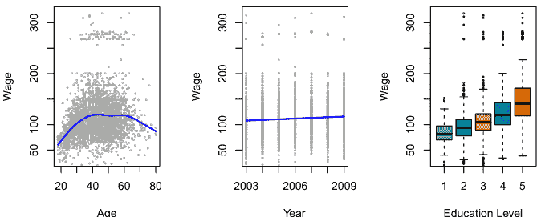

**图 1.1.** *工资*数据，包含来自美国中大西洋地区男性的收入调查信息。左图：*工资*作为*年龄*的函数。平均而言，*工资*随*年龄*增长而增加，直到大约60岁，之后开始下降。中图：*工资*作为*年份*的函数。在2003年至2009年间，平均*工资*缓慢但稳定地增长了约10,000美元。右图：箱线图显示*工资*作为*教育水平*的函数，其中1表示最低水平（无高中文凭），5表示最高水平（高级研究生学位）。平均而言，*工资*随教育水平的提高而增加。

我们还拥有每位员工的教育水平以及*工资*获得*年份*的信息。图1.1的中间和右侧面板显示了*工资*作为*年份*和*教育水平*的函数，表明这两个因素都与*工资*相关。在2003年至2009年间，工资以大致线性（或直线）的方式增长了约10,000美元，尽管相对于数据的变异性，这一增长非常轻微。通常，教育水平较高的人工资也较高：教育水平最低（1）的男性往往比教育水平最高（5）的男性工资低得多。显然，要最准确地预测特定男性的*工资*，需要结合他的*年龄*、*教育水平*和*年份*。在第3章，我们将讨论线性回归，它可以用于从该数据集中预测*工资*。理想情况下，我们应该以考虑*工资*与*年龄*之间非线性关系的方式来预测*工资*。在第7章，我们将讨论解决此问题的一类方法。

### 股票市场数据

*工资*数据涉及预测一个*连续*或*定量*的输出值。这通常被称为*回归*问题。然而，在某些情况下，我们可能希望预测一个非数值，即一个*分类*或*定性*输出。例如，在第4章，我们研究了一个股票市场数据集，该数据集包含2001年至2005年5年间标准普尔500（S&P）股票指数的每日变动。我们称之为*Smarket*数据。目标是使用过去5天的指数百分比变化来预测指数在给定日期是*上涨*还是*下跌*。这里的统计学习问题不涉及预测数值。相反，它涉及预测给定日期的股市表现是落入`上涨`桶还是`下跌`桶。这被称为*分类*问题。一个能够准确预测市场走向的模型将非常有用！

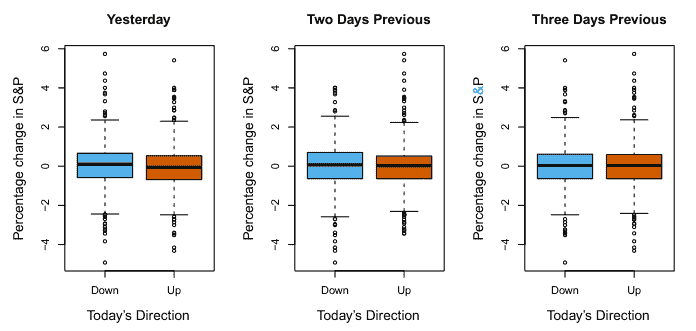

**图 1.2.** 左图：*S&P指数前一日百分比变化的箱线图，分别对应市场上涨和下跌的日期，数据来自Smarket数据集。中图和右图：与左图相同，但显示的是前2天和前3天的百分比变化。*

图1.2的左侧面板显示了股票指数前一日百分比变化的两个箱线图：一个是市场在次日上涨的648天，另一个是市场在次日下跌的602天。这两个图看起来几乎相同，这表明没有简单的策略可以利用S&P的昨日变动来预测今日的回报。其余面板显示了今日前2天和3天的百分比变化的箱线图，同样表明过去和现在的回报之间几乎没有关联。当然，这种缺乏模式的情况是意料之中的：如果连续几天的回报之间存在强相关性，人们就可以采用简单的交易策略从市场获利。尽管如此，在第4章，我们使用几种不同的统计学习方法来探索这些数据。有趣的是，数据中有一些微弱趋势的迹象，表明至少在这5年期间，有可能在大约60%的时间里正确预测市场的走向（图1.3）。

### 基因表达数据

前两个应用说明了同时具有输入和输出变量的数据集。然而，另一类重要的问题涉及我们只观察到输入变量而没有相应输出的情况。例如，在市场营销环境中，我们可能拥有一些当前或潜在客户的人口统计信息。我们可能希望通过根据观察到的特征对个体进行分组，来理解哪些类型的客户彼此相似。这被称为聚类问题。与前面的例子不同，这里我们不是试图预测输出变量。

我们专门用第12章来讨论在没有自然输出变量可用的问题中使用的统计学习方法。我们考虑NCI60数据集，该数据集包含64种癌细胞系中每种细胞系的6,830个基因表达测量值。我们不是预测特定的输出变量，而是感兴趣于根据基因表达测量值确定细胞系中是否存在组或簇。这是一个难以解决的问题，部分原因是每个细胞系有数千个基因表达测量值，使得数据难以可视化。

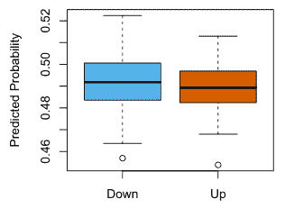

**图 1.3.** 我们对Smarket数据集中对应于2001-2004年时间段的子集拟合了一个二次判别分析模型，并使用2005年的数据预测了股市下跌的概率。平均而言，在市场确实下跌的日子里，预测的下跌概率更高。基于这些结果，我们能够在60%的时间里正确预测市场的走向。

图1.4的左侧面板通过仅使用两个数字Z1和Z2来表示64种细胞系中的每一种，从而解决了这个问题。这是数据的前两个主成分，它们将每个细胞系的6,830个表达测量值总结为两个数字或维度。虽然这种降维可能导致一些信息丢失，但现在可以直观地检查数据以寻找聚类的证据。确定聚类的数量通常是一个难题。但图1.4的左侧面板至少显示了四组细胞系，我们用不同的颜色表示它们。

在这个特定的数据集中，结果发现细胞系对应于14种不同类型的癌症。（然而，此信息未用于创建图1.4的左侧面板。）图1.4的右侧面板与左侧面板相同，只是用不同的彩色符号显示了14种癌症类型。有明确的证据表明，在这种二维表示中，相同癌症类型的细胞系往往位于彼此附近。此外，尽管癌症信息未用于生成左侧面板，但获得的聚类确实与右侧面板中观察到的一些实际癌症类型有些相似。这为我们的聚类分析的准确性提供了一些独立验证。

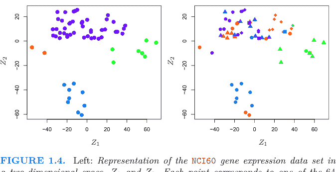

**图 1.4.** *左图：* NCI60 基因表达数据集在二维空间 $Z_1$ 和 $Z_2$ 中的表示。每个点对应 64 个细胞系中的一个。图中似乎有四个细胞系组，我们用不同的颜色进行了表示。*右图：* 与左图相同，但我们用不同颜色的符号表示了 14 种不同的癌症类型。对应相同癌症类型的细胞系在二维空间中往往彼此邻近。

## 统计学习简史

尽管 *统计学习* 这个术语相当新，但该领域的许多基础概念早已发展起来。十九世纪初，*最小二乘法* 被开发出来，实现了现在称为 *线性回归* 的最早形式。该方法最初成功应用于天文学问题。线性回归用于预测定量值，例如个人的工资。为了预测定性值，例如患者是存活还是死亡，或者股市是上涨还是下跌，1936 年提出了 *线性判别分析*。在 1940 年代，多位作者提出了另一种方法，*逻辑回归*。在 1970 年代初，*广义线性模型* 这个术语被开发出来，用于描述一整类统计学习方法，其中包括线性回归和逻辑回归作为特例。

到 1970 年代末，已有更多从数据中学习的技术可用。然而，它们几乎都是 *线性* 方法，因为在当时拟合 *非线性* 关系在计算上很困难。到了 1980 年代，计算技术终于有了足够的改进，使得非线性方法在计算上不再难以实现。在 1980 年代中期，*分类与回归树* 被开发出来，随后不久出现了 *广义可加模型*。*神经网络* 在 1980 年代流行起来，而 *支持向量机* 则在 1990 年代兴起。

自那时起，统计学习已成为统计学的一个新分支领域，专注于监督和无监督建模与预测。近年来，统计学习的进展以功能强大且相对用户友好的软件日益普及为标志，例如流行且免费的 Python 系统。这有可能继续推动该领域从一组由统计学家和计算机科学家使用和开发的技术，转变为更广泛群体不可或缺的工具包。

## 本书

Hastie、Tibshirani 和 Friedman 所著的 *《统计学习基础》*（ESL）于 2001 年首次出版。自那时起，它已成为统计机器学习基础的重要参考书。它的成功源于其对统计学习中许多重要主题全面而详细的阐述，以及（相对于许多高级统计教科书）它易于广大读者理解。然而，ESL 成功的最大因素在于其主题性。在其出版时，对统计学习领域的兴趣开始激增。ESL 提供了最早易于理解且全面的该主题导论之一。

自 ESL 首次出版以来，统计学习领域持续蓬勃发展。该领域的扩展采取了两种形式。最明显的增长涉及开发新的和改进的统计学习方法，旨在回答跨多个领域的一系列科学问题。然而，统计学习领域也扩大了其受众。在 1990 年代，计算能力的提升引发了非统计学家对该领域的浓厚兴趣，他们渴望使用尖端的统计工具来分析自己的数据。不幸的是，这些方法的高度技术性意味着用户群体仍然主要局限于统计学、计算机科学和相关领域的专家，他们需要具备（以及时间）来理解和实施这些方法。

近年来，新的和改进的软件包显著减轻了许多统计学习方法的实施负担。与此同时，从商业到医疗保健、从遗传学到社会科学等多个领域，人们越来越认识到统计学习是一个具有重要实际应用的强大工具。因此，该领域已从主要具有学术兴趣的领域转变为一个主流学科，拥有巨大的潜在受众。随着海量数据及其分析软件的日益普及，这一趋势必将持续下去。

*《统计学习导论》*（ISL）的目的是促进统计学习从学术领域向主流领域的过渡。ISL 并非旨在取代 ESL，后者在涵盖的方法数量和探讨深度上都是一部更为全面的著作。我们认为 ESL 是专业人士（拥有统计学、机器学习或相关领域的研究生学位）的重要伴侣，他们需要理解统计学习方法背后的技术细节。然而，统计学习技术的用户群体已扩展到包括具有更广泛兴趣和背景的个人。因此，ESL 的一个技术性较低、更易于理解的版本有其存在空间。

多年来教授这些主题，我们发现它们对不同领域的硕士和博士生（如工商管理、生物学和计算机科学）以及面向定量分析的高年级本科生都很感兴趣。对于这个多元化的群体来说，能够理解各种方法的模型、直觉以及优缺点非常重要。但对于这个受众来说，统计学习方法背后的许多技术细节，例如优化算法和理论性质，并非主要兴趣所在。我们相信，这些学生不需要深入理解这些方面，就能成为各种方法的知情使用者，并通过使用统计学习工具为他们选择的领域做出贡献。

ISL 基于以下四个前提。

1.  *许多统计学习方法在广泛的学术和非学术学科中具有相关性和实用性，而不仅仅局限于统计科学。* 我们相信，许多当代统计学习程序应该，并且将会，像目前线性回归等经典方法一样被广泛使用和普及。因此，我们没有试图考虑每一种可能的方法（这是一项不可能的任务），而是集中精力介绍我们认为最广泛适用的方法。

2.  *统计学习不应被视为一系列黑匣子。* 没有任何一种方法能在所有可能的应用中都表现良好。如果不理解盒子内部的所有齿轮，或者这些齿轮之间的相互作用，就不可能选择最佳的盒子。因此，我们试图仔细描述我们所考虑的每种方法背后的模型、直觉、假设和权衡。

3.  *虽然了解每个齿轮的功能很重要，但没有必要具备构建盒子内部机器的技能！* 因此，我们尽量减少了与拟合过程和理论性质相关的技术细节的讨论。我们假设读者熟悉基本的数学概念，但不要求具备数学科学的研究生学位。例如，我们几乎完全避免了使用矩阵代数，并且即使没有矩阵和向量的详细知识，也可以理解整本书。

4.  *我们假设读者有兴趣将统计学习方法应用于现实世界的问题。* 为了促进这一点，同时也为了激发所讨论技术的兴趣，我们在每章中都安排了一个计算机实验室部分。在每个实验室中，我们引导读者完成该章所考虑方法的实际应用。当我们在课程中教授这些材料时，我们大约分配了三分之一的课堂时间来完成这些实验室，我们发现它们非常有用。许多最初对实验室感到畏惧的、计算能力较弱的学生，在一个季度或学期的过程中逐渐掌握了要领。本书最初出版于 2013 年，第二版于 2021 年出版。

最初是用R语言编写的计算机实验。此后，对统计学习中重要技术的Python实现需求日益增长。因此，本版本包含了Python实验。目前可用的Python包数量正在迅速增长，通过查看每个实验开头的导入语句，读者会发现我们精心挑选并使用了最合适的包。我们还在自己的ISLP包中提供了一些额外的代码和功能。不过，ISL中的实验是自成一体的，如果读者希望使用不同的软件包，或者不希望将讨论的方法应用于实际问题，可以跳过这些实验。

## 谁应该阅读本书？

本书旨在为任何有兴趣使用现代统计方法对数据进行建模和预测的人提供指导。这个群体包括科学家、工程师、数据分析师、数据科学家和量化分析师，也包括拥有社会科学或商学等非定量领域学位、技术背景较弱的个体。我们期望读者至少学过一门基础统计学课程。线性回归的背景知识也很有用，尽管不是必需的，因为我们在第3章回顾了线性回归背后的关键概念。本书的数学水平适中，不需要详细了解矩阵运算。本书提供了Python入门知识。之前接触过编程语言（如MATLAB或R）会有所帮助，但不是必需的。

本教材的第一版已被用于教授商业、经济学、计算机科学、生物学、地球科学、心理学以及物理和社会科学许多其他领域的硕士和博士生。它也已被用于教授已经修过线性回归课程的高年级本科生。在以ESL作为主要教材、数学要求更严格的课程中，ISL可以作为补充教材，用于教授各种方法的计算方面。

## 符号与简单矩阵代数

为教材选择符号总是一项艰巨的任务。在大多数情况下，我们采用了与ESL相同的符号约定。

我们将使用 $n$ 表示样本中不同数据点或观测值的数量。我们将用 $p$ 表示可用于进行预测的变量数量。例如，Wage数据集包含3,000人的11个变量，因此我们有 $n = 3,000$ 个观测值和 $p = 11$ 个变量（如年份、年龄、种族等）。请注意，在本书中，我们使用彩色字体表示变量名称：变量名称。

在某些示例中，$p$ 可能相当大，例如达到数千甚至数百万的量级；这种情况经常出现，例如在现代生物数据或网络广告数据分析中。

通常，我们将用 $x_{ij}$ 表示第 $i$ 个观测值的第 $j$ 个变量的值，其中 $i = 1, 2, \ldots, n$，$j = 1, 2, \ldots, p$。在本书中，$i$ 将用于索引样本或观测值（从1到 $n$），$j$ 将用于索引变量（从1到 $p$）。我们用 $\mathbf{X}$ 表示一个 $n \times p$ 矩阵，其第 $(i, j)$ 个元素是 $x_{ij}$。即，

$$\mathbf{X} = \begin{pmatrix} x_{11} & x_{12} & \cdots & x_{1p} \\ x_{21} & x_{22} & \cdots & x_{2p} \\ \vdots & \vdots & \ddots & \vdots \\ x_{n1} & x_{n2} & \cdots & x_{np} \end{pmatrix}.$$

对于不熟悉矩阵的读者，将 $\mathbf{X}$ 想象成一个有 $n$ 行和 $p$ 列的数字电子表格会很有帮助。

有时我们会对 $\mathbf{X}$ 的行感兴趣，我们将其写为 $x_1, x_2, \ldots, x_n$。这里 $x_i$ 是一个长度为 $p$ 的向量，包含第 $i$ 个观测值的 $p$ 个变量测量值。即，

$$x_i = \begin{pmatrix} x_{i1} \\ x_{i2} \\ \vdots \\ x_{ip} \end{pmatrix}.$$

（向量默认表示为列向量。）例如，对于Wage数据，$x_i$ 是一个长度为11的向量，由第 $i$ 个人的年份、年龄、种族和其他值组成。在其他时候，我们则会对 $\mathbf{X}$ 的列感兴趣，我们将其写为 $\mathbf{x}_1, \mathbf{x}_2, \ldots, \mathbf{x}_p$。每个都是一个长度为 $n$ 的向量。即，

$$\mathbf{x}_j = \begin{pmatrix} x_{1j} \\ x_{2j} \\ \vdots \\ x_{nj} \end{pmatrix}.$$

例如，对于Wage数据，$\mathbf{x}_1$ 包含年份的 $n = 3,000$ 个值。

使用这种符号，矩阵 $\mathbf{X}$ 可以写成

$$\mathbf{X} = (\mathbf{x}_1 \quad \mathbf{x}_2 \quad \cdots \quad \mathbf{x}_p),$$

或

$$\mathbf{X} = \begin{pmatrix} x_1^T \\ x_2^T \\ \vdots \\ x_n^T \end{pmatrix}.$$

符号 $T$ 表示矩阵或向量的转置。因此，例如，

$$\mathbf{X}^T = \begin{pmatrix} x_{11} & x_{21} & \cdots & x_{n1} \\ x_{12} & x_{22} & \cdots & x_{n2} \\ \vdots & \vdots & \ddots & \vdots \\ x_{1p} & x_{2p} & \cdots & x_{np} \end{pmatrix},$$

而
$$x_i^T = (x_{i1} \quad x_{i2} \quad \cdots \quad x_{ip}).$$

我们用 $y_i$ 表示我们希望进行预测的变量的第 $i$ 个观测值，例如工资。因此，我们将所有 $n$ 个观测值的集合写成向量形式：
$$\mathbf{y} = \begin{pmatrix} y_1 \\ y_2 \\ \vdots \\ y_n \end{pmatrix}.$$
那么我们的观测数据由 $\{(x_1, y_1), (x_2, y_2), \ldots, (x_n, y_n)\}$ 组成，其中每个 $x_i$ 是一个长度为 $p$ 的向量。（如果 $p = 1$，那么 $x_i$ 就是一个标量。）

在本文中，长度为 $n$ 的向量将始终用*小写粗体*表示；例如
$$\mathbf{a} = \begin{pmatrix} a_1 \\ a_2 \\ \vdots \\ a_n \end{pmatrix}.$$
然而，长度不是 $n$ 的向量（例如长度为 $p$ 的特征向量，如 (1.1) 中所示）将用*小写普通字体*表示，例如 $a$。标量也将用*小写普通字体*表示，例如 $a$。在极少数情况下，小写普通字体的这两种用法会导致歧义，我们将澄清预期的用法。矩阵将用*粗体大写字母*表示，例如 $\mathbf{A}$。随机变量将用*大写普通字体*表示，例如 $A$，无论其维度如何。

偶尔我们会想指明特定对象的维度。要指明一个对象是标量，我们将使用符号 $a \in \mathbb{R}$。要指明它是一个长度为 $k$ 的向量，我们将使用 $a \in \mathbb{R}^k$（如果是长度为 $n$ 的向量，则用 $\mathbf{a} \in \mathbb{R}^n$）。我们将用 $\mathbf{A} \in \mathbb{R}^{r \times s}$ 指明一个对象是 $r \times s$ 矩阵。

我们尽可能避免使用矩阵代数。然而，在少数情况下，完全避免它会变得过于繁琐。在这些罕见的情况下，理解两个矩阵相乘的概念很重要。假设 $\mathbf{A} \in \mathbb{R}^{r \times d}$ 且 $\mathbf{B} \in \mathbb{R}^{d \times s}$。那么 $\mathbf{A}$ 和 $\mathbf{B}$ 的乘积记为 $\mathbf{AB}$。$\mathbf{AB}$ 的第 $(i, j)$ 个元素是通过将 $\mathbf{A}$ 的第 $i$ 行的每个元素与 $\mathbf{B}$ 的第 $j$ 列的相应元素相乘得到的。即，$(\mathbf{AB})_{ij} = \sum_{k=1}^d a_{ik} b_{kj}$。例如，考虑
$$\mathbf{A} = \begin{pmatrix} 1 & 2 \\ 3 & 4 \end{pmatrix} \quad \text{和} \quad \mathbf{B} = \begin{pmatrix} 5 & 6 \\ 7 & 8 \end{pmatrix}.$$
那么
$$\mathbf{AB} = \begin{pmatrix} 1 & 2 \\ 3 & 4 \end{pmatrix} \begin{pmatrix} 5 & 6 \\ 7 & 8 \end{pmatrix} = \begin{pmatrix} 1 \times 5 + 2 \times 7 & 1 \times 6 + 2 \times 8 \\ 3 \times 5 + 4 \times 7 & 3 \times 6 + 4 \times 8 \end{pmatrix} = \begin{pmatrix} 19 & 22 \\ 43 & 50 \end{pmatrix}.$$
请注意，此操作产生一个 $r \times s$ 矩阵。只有当 $\mathbf{A}$ 的列数与 $\mathbf{B}$ 的行数相同时，才能计算 $\mathbf{AB}$。

## 本书结构

第2章介绍了统计学习背后的基本术语和概念。本章还介绍了*K近邻*分类器，这是一种非常简单的方法，在许多问题上效果出奇地好。第3章和第4章涵盖了用于回归和分类的经典线性方法。特别是，第3章回顾了*线性回归*，这是所有回归方法的基本起点。在第4章中，我们讨论了两种最重要的经典分类方法：*逻辑回归*和*线性判别分析*。

所有统计学习情境中的一个核心问题涉及为给定应用选择最佳方法。因此，在第5章中，我们介绍了*交叉验证*和*自助法*，它们可用于估计多种不同方法的准确性，以便选择最佳方法。

统计学习的许多近期研究都集中在非线性方法上。然而，线性方法在可解释性方面通常优于其非线性竞争者，有时在准确性方面也是如此。因此，在第6章中，我们考虑了一系列线性方法，包括经典的和更现代的，它们提供了对标准线性回归的潜在改进。这些方法包括*逐步选择*、*岭回归*、*主成分回归*和*Lasso*。

其余章节进入非线性统计学习的世界。我们首先在第7章介绍了一些对单个输入变量问题效果良好的非线性方法。然后我们展示如何使用这些方法来拟合具有多个输入的非线性*可加*模型。在第8章中，我们研究了*基于树*的方法，包括*袋装法*、*提升法*和*随机森林*。第9章讨论了*支持向量机*，这是一组用于执行线性和非线性分类的方法。我们在第10章介绍了*深度学习*，这是一种近年来备受关注的非线性回归和分类方法。第11章探讨了*生存分析*，这是一种专门用于输出变量被*删失*（即未完全观测）情境的回归方法。

在第12章中，我们考虑了*无监督*情境，即我们有输入变量但没有输出变量。特别是，我们介绍了*主成分分析*、*K均值聚类*和*层次聚类*。最后，在第13章中，我们涵盖了非常重要的多重假设检验主题。

在每章末尾，我们提供一个或多个Python实验部分，我们系统地演练该章讨论的各种方法的应用。这些实验展示了各种方法的优缺点，并为实现各种方法所需的语法提供了有用的参考。读者可以选择按自己的节奏完成实验，或者实验可以作为课堂环境中小组讨论的重点。在每个Python实验中，我们展示了在撰写本书时执行实验所获得的结果。然而，Python的新版本不断发布，随着时间的推移，实验中调用的包将会更新。因此，在未来，实验中显示的结果可能会有所不同。

## 1. 引言

| 名称 | 描述 |
| :--- | :--- |
| Auto | 汽车的油耗、马力及其他信息。 |
| Bikeshare | 华盛顿特区共享单车项目的每小时使用数据。 |
| Boston | 波士顿人口普查区的房屋价值及其他信息。 |
| BrainCancer | 被诊断为脑癌患者的生存时间。 |
| Caravan | 关于获得房车保险的个人的信息。 |
| Carseats | 400家商店的汽车座椅销售信息。 |
| College | 美国大学的人口统计特征、学费等信息。 |
| Credit | 400位客户的信用卡债务信息。 |
| Default | 一家信用卡公司的客户违约记录。 |
| Fund | 2000名对冲基金经理在50个月内的回报率。 |
| Hitters | 棒球运动员的记录和薪水。 |
| Khan | 四种癌症类型的基因表达测量数据。 |
| NCI60 | 64种癌细胞系的基因表达测量数据。 |
| NYSE | 纽约证券交易所的回报率、波动性和交易量。 |
| OJ | Citrus Hill和Minute Maid橙汁的销售信息。 |
| Portfolio | 金融资产的历史价值，用于投资组合配置。 |
| Publication | 244项临床试验的发表时间。 |
| Smarket | 标普500指数在5年期间的每日百分比回报率。 |
| USArrests | 美国50个州每10万居民的犯罪统计数据。 |
| Wage | 美国中大西洋地区男性的收入调查数据。 |
| Weekly | 21年间的1089个每周股市回报率数据。 |

表1.1. 执行本教材实验和练习所需的数据集列表。所有数据集均包含在ISLP包中，但USArrests除外，它是R基础发行版的一部分，但可以从Python中访问。

实验部分可能不再与执行实验的读者所获得的结果完全对应。如有必要，我们将在本书网站上发布实验的更新。

我们使用⚠符号来表示包含更具挑战性概念的章节或练习。对于不希望深入研究材料或缺乏数学背景的读者，可以轻松跳过这些内容。

## 实验和练习中使用的数据集

在本教材中，我们使用来自市场营销、金融、生物学和其他领域的应用来说明统计学习方法。ISLP包包含执行与本书相关的实验和练习所需的多个数据集。另一个数据集是R基础发行版的一部分（USArrests数据），我们将在第12.5.1节中展示如何从Python访问它。表1.1包含了执行实验和练习所需的数据集摘要。其中几个数据集也以文本文件的形式在本书网站上提供，用于第2章。

## 本书网站

本书的网站位于

www.statlearning.com

它包含许多资源，包括与本书相关的Python包，以及一些额外的数据集。

## 致谢

本书中的一些图表取自ESL：图6.7、8.3和12.14。所有其他图表都是为ISL的R版本制作的，但图13.10因支持该图的Python软件而有所不同。

# 2 统计学习

## 2.1 什么是统计学习？

为了激发我们对统计学习的研究，我们从一个简单的例子开始。假设我们是受雇于客户的统计顾问，调查广告与特定产品销售之间的关联。*Advertising*数据集包含该产品在200个不同市场的*销售*数据，以及每个市场中三种不同媒体（*TV*、*radio*和*newspaper*）的广告预算。数据如图2.1所示。我们的客户无法直接增加产品的销售。另一方面，他们可以控制三种媒体的广告支出。因此，如果我们确定广告与销售之间存在关联，那么我们可以指导客户调整广告预算，从而间接增加销售。换句话说，我们的目标是开发一个准确的模型，该模型可以基于三种媒体预算来预测销售。

在这种情况下，广告预算被视为*输入变量*，而*销售*是*输出变量*。输入变量通常用符号$X$表示，并带有下标以区分它们。因此，$X_1$可能是*TV*预算，$X_2$是*radio*预算，$X_3$是*newspaper*预算。输入变量有不同的名称，例如*预测变量*、*自变量*、*特征*，或者有时简称为*变量*。输出变量——在本例中是*销售*——通常被称为*响应*或*因变量*，通常用符号$Y$表示。在本书中，我们将交替使用所有这些术语。

更一般地，假设我们观察到一个定量响应$Y$和$p$个不同的预测变量$X_1, X_2, \dots, X_p$。我们假设$Y$和$X = (X_1, X_2, \dots, X_p)$之间存在某种关系，这种关系可以写成非常一般的形式

$$Y = f(X) + \epsilon. \tag{2.1}$$

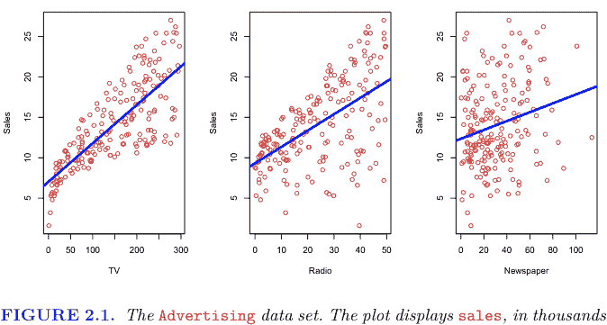

图2.1. Advertising数据集。该图显示了销售量（以千单位为单位）作为TV、radio和newspaper预算（以千美元为单位）的函数，涉及200个不同的市场。在每个图中，我们展示了销售对该变量的简单最小二乘拟合，如第3章所述。换句话说，每条蓝线代表一个简单的模型，可以分别用于使用TV、radio和newspaper预测销售。

这里$f$是$X_1, \dots, X_p$的某个固定但未知的函数，$\epsilon$是一个随机误差项，它独立于$X$且均值为零。在这个公式中，$f$代表$X$提供的关于$Y$的系统信息。

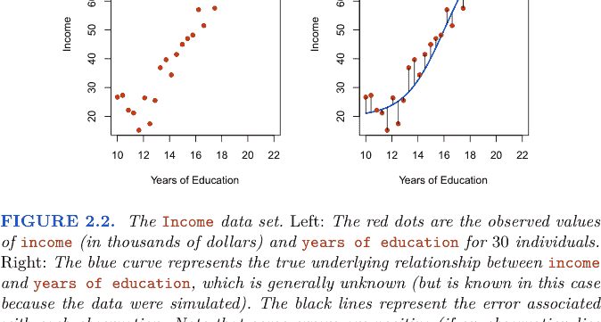

图2.2. Income数据集。左图：红点是30个人的收入（以千美元为单位）和受教育年限的观测值。右图：蓝线代表收入和受教育年限之间的真实潜在关系，这通常是未知的（但在此例中是已知的，因为数据是模拟的）。黑线代表与每个观测值相关的误差。注意，一些误差是正的（如果观测值位于蓝线上方），一些是负的（如果观测值位于蓝线下方）。总体而言，这些误差的均值近似为零。

作为另一个例子，考虑图2.2的左侧面板，这是Income数据集中30个人的收入与受教育年限的关系图。该图表明，人们可能能够使用受教育年限来预测收入。然而，连接输入变量和输出变量的函数$f$通常是未知的。在这种情况下，必须基于观测点来估计$f$。由于Income是一个模拟数据集，$f$是已知的，并在图2.2的右侧面板中由蓝线表示。垂直线代表误差项$\epsilon$。我们注意到，30个观测值中有一些位于蓝线上方，一些位于蓝线下方；总体而言，误差的均值近似为零。

通常，函数$f$可能涉及多个输入变量。在图2.3中，我们绘制了收入作为受教育年限和资历的函数。这里$f$是一个二维曲面，必须基于观测数据进行估计。

本质上，统计学习是指一组估计$f$的方法。在本章中，我们概述了估计$f$时出现的一些关键理论概念，以及用于评估所得估计的工具。

### 2.1.1 为什么要估计$f$？

我们可能希望估计$f$有两个主要原因：*预测*和*推断*。我们将依次讨论每个原因。

#### 预测

在许多情况下，一组输入$X$很容易获得，但输出$Y$不容易获得。在这种情况下，由于误差项的平均值为零，我们可以使用以下公式预测$Y$

$$\hat{Y} = \hat{f}(X),$$

其中$\hat{f}$代表我们对$f$的估计，$\hat{Y}$代表对$Y$的预测结果。在这种情况下，$\hat{f}$通常被视为一个*黑盒*，即人们通常不关心$\hat{f}$的确切形式，只要它能为$Y$提供准确的预测即可。

例如，假设$X_1, \dots, X_p$是患者血液样本的特征，可以在实验室中轻松测量，而$Y$是一个编码患者对特定药物发生严重不良反应风险的变量。自然地，我们寻求使用$X$来预测$Y$，因为这样我们就可以避免给高风险患者（即$Y$估计值高的患者）使用该药物。

$\hat{Y}$作为$Y$预测的准确性取决于两个量，我们称之为*可约误差*和*不可约误差*。通常，$\hat{f}$不会是$f$的完美估计，这种不准确性会引入一些误差。这种误差是*可约的*，因为我们可以通过使用最合适的统计学习技术来估计$f$，从而潜在地提高$\hat{f}$的准确性。然而，即使有可能形成$f$的完美估计，使得我们的估计响应采取$\hat{Y} = f(X)$的形式，我们的预测仍然会有一些误差！这是因为$Y$也是$\epsilon$的函数，根据定义，$\epsilon$无法使用$X$进行预测。因此，与$\epsilon$相关的变异性也会影响我们预测的准确性。这被称为*不可约误差*，因为无论我们如何很好地估计$f$，我们都无法减少$\epsilon$引入的误差。

为什么不可约误差大于零？量$\epsilon$可能包含未测量的变量，这些变量对于预测$Y$是有用的：因为我们没有

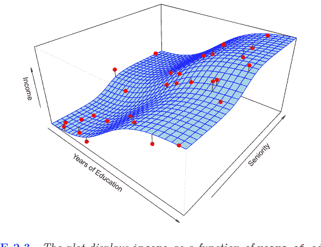

**图 2.3.** 该图展示了*收入*数据集中*收入*作为*受教育年限*和*资历*的函数关系。蓝色曲面表示*收入*与*受教育年限*和*资历*之间的真实潜在关系，由于数据是模拟的，这一关系是已知的。红点表示30个个体这些变量的观测值。

由于无法测量它们，$f$ 无法在预测中使用。量 $\epsilon$ 也可能包含不可测量的变异。例如，对于给定患者在给定日期，不良反应的风险可能会有所不同，这取决于药物本身的制造变异或患者当天的整体健康状况。

考虑一个给定的估计 $\hat{f}$ 和一组预测变量 $X$，它们产生预测值 $\hat{Y} = \hat{f}(X)$。假设 $\hat{f}$ 和 $X$ 都是固定的，那么唯一的变异性来自 $\epsilon$。那么，很容易证明

$$\begin{aligned} \mathrm{E}(Y - \hat{Y})^2 &= \mathrm{E}[f(X) + \epsilon - \hat{f}(X)]^2 \\ &= \underbrace{[f(X) - \hat{f}(X)]^2}_{\text{可减少}} + \underbrace{\mathrm{Var}(\epsilon)}_{\text{不可减少}}, \end{aligned}$$

其中 $\mathrm{E}(Y - \hat{Y})^2$ 表示预测值与实际值 $Y$ 之差的平方的平均值，或*期望值*，而 $\mathrm{Var}(\epsilon)$ 表示与误差项 $\epsilon$ 相关的*方差*。

本书的重点在于估计 $f$ 的技术，旨在最小化可减少误差。重要的是要记住，不可减少误差将始终为我们的 $Y$ 预测精度提供一个上限。在实践中，这个界限几乎总是未知的。

#### 推断

我们通常对理解 $Y$ 与 $X_1, \ldots, X_p$ 之间的关联感兴趣。在这种情况下，我们希望估计 $f$，但我们的目标不一定是预测 $Y$。现在 $\hat{f}$ 不能被视为一个黑盒，因为我们需要知道它的具体形式。在这种情况下，人们可能对回答以下问题感兴趣：

- *哪些预测变量与响应相关？* 通常，只有一小部分可用预测变量与 $Y$ 有显著关联。在大量可能变量中识别出少数*重要的*预测变量可能非常有用，具体取决于应用。
- *响应与每个预测变量之间的关系是什么？* 一些预测变量可能与 $Y$ 有正相关关系，即预测变量的值越大，与 $Y$ 的值越大相关联。其他预测变量可能有相反的关系。根据 $f$ 的复杂性，响应与给定预测变量之间的关系也可能取决于其他预测变量的值。
- *$Y$ 与每个预测变量之间的关系能否用线性方程充分概括，还是关系更复杂？* 从历史上看，大多数估计 $f$ 的方法都采用线性形式。在某些情况下，这样的假设是合理的，甚至是可取的。但通常真实关系更复杂，此时线性模型可能无法准确表示输入和输出变量之间的关系。

在本书中，我们将看到许多属于预测设置、推断设置或两者结合的例子。

例如，考虑一家公司希望进行直接营销活动。目标是根据对每个人口统计变量的观测，识别出可能对邮件做出积极回应的个体。在这种情况下，人口统计变量作为预测变量，对营销活动的响应（积极或消极）作为结果。公司并不希望深入了解每个个体预测变量与响应之间的关系；相反，公司只是希望使用预测变量准确预测响应。这是建模用于预测的一个例子。

相比之下，考虑图 2.1 所示的广告数据。人们可能对回答以下问题感兴趣：

- *哪些媒体与销售额相关？*
- *哪些媒体对销售额的提升最大？* 或者
- *电视广告的特定增长与销售额的增长有多大关联？*

这种情况属于推断范式。另一个例子涉及根据价格、商店位置、折扣水平、竞争价格等变量，对客户可能购买的产品品牌进行建模。在这种情况下，人们可能真正最感兴趣的是每个变量与购买概率之间的关联。例如，*产品价格在多大程度上与销售额相关？* 这是建模用于推断的一个例子。

最后，一些建模可以同时用于预测和推断。例如，在房地产环境中，人们可能试图将房屋价值与犯罪率、分区、与河流的距离、空气质量、学校、社区收入水平、房屋大小等输入联系起来。在这种情况下，人们可能对每个输入变量与房价之间的关联感兴趣——例如，*如果房子有河景，它会值多少钱？* 这是一个推断问题。或者，人们可能只是对根据房屋特征预测其价值感兴趣：*这所房子是被低估还是高估了？* 这是一个预测问题。

根据我们的最终目标是预测、推断还是两者的结合，估计 $f$ 的不同方法可能是合适的。例如，*线性模型*允许相对简单且可解释的推断，但可能不如其他一些方法产生准确的预测。相比之下，我们在本书后面章节讨论的一些高度非线性方法可能为 $Y$ 提供相当准确的预测，但这是以牺牲模型可解释性为代价的，使得推断更具挑战性。

## 2.1.2 我们如何估计 $f$？

在本书中，我们探讨了许多估计 $f$ 的线性和非线性方法。然而，这些方法通常具有某些共同特征。我们在本节概述这些共同特征。我们将始终假设我们已经观察到一组 $n$ 个不同的数据点。例如，在图 2.2 中，我们观察到 $n = 30$ 个数据点。这些观测值被称为*训练数据*，因为我们将使用这些观测值来训练或教导我们的方法如何估计 $f$。令 $x_{ij}$ 表示第 $i$ 个观测值的第 $j$ 个预测变量或输入的值，其中 $i = 1, 2, \dots, n$，$j = 1, 2, \dots, p$。相应地，令 $y_i$ 表示第 $i$ 个观测值的响应变量。那么我们的训练数据由 $\{(x_1, y_1), (x_2, y_2), \dots, (x_n, y_n)\}$ 组成，其中 $x_i = (x_{i1}, x_{i2}, \dots, x_{ip})^T$。

我们的目标是将统计学习方法应用于训练数据，以估计未知函数 $f$。换句话说，我们希望找到一个函数 $\hat{f}$，使得对于任何观测值 $(X, Y)$，$Y \approx \hat{f}(X)$。广义上讲，大多数用于此任务的统计学习方法可以表征为*参数*或*非参数*方法。我们现在简要讨论这两种类型的方法。

### 参数方法

参数方法涉及基于模型的两步方法。

1. 首先，我们对 $f$ 的函数形式或形状做出假设。例如，一个非常简单的假设是 $f$ 是 $X$ 的线性函数：
$$f(X) = \beta_0 + \beta_1 X_1 + \beta_2 X_2 + \dots + \beta_p X_p. \tag{2.4}$$
这是一个*线性模型*，将在第 3 章中广泛讨论。一旦我们假设 $f$ 是线性的，估计 $f$ 的问题就大大简化了。我们不必估计一个完全任意的 $p$ 维函数 $f(X)$，而只需要估计 $p + 1$ 个系数 $\beta_0, \beta_1, \dots, \beta_p$。

## 2.1.3 预测准确性与模型可解释性之间的权衡

**图 2.4.** 使用最小二乘法对图 2.3 中的收入数据拟合的线性模型。观测值以红色显示，黄色平面表示对数据的最小二乘拟合。

2.  模型选定后，我们需要一个使用训练数据来*拟合*或*训练*模型的过程。对于线性模型 (2.4)，我们需要估计参数 $\beta_0, \beta_1, \dots, \beta_p$。也就是说，我们希望找到这些参数的值，使得

$$Y \approx \beta_0 + \beta_1 X_1 + \beta_2 X_2 + \cdots + \beta_p X_p.$$

拟合模型 (2.4) 最常用的方法被称为*（普通）最小二乘法*，我们将在第 3 章讨论。然而，最小二乘法只是拟合线性模型的众多可能方法之一。在第 6 章，我们将讨论估计 (2.4) 中参数的其他方法。

刚才描述的基于模型的方法被称为*参数化*方法；它将估计 $f$ 的问题简化为估计一组参数的问题。假设 $f$ 具有参数形式简化了估计 $f$ 的问题，因为通常估计一组参数（例如线性模型 (2.4) 中的 $\beta_0, \beta_1, \dots, \beta_p$）比拟合一个完全任意的函数 $f$ 要容易得多。参数化方法的潜在缺点是，我们选择的模型通常不会与 $f$ 的真实未知形式相匹配。如果所选模型与真实的 $f$ 相差甚远，那么我们的估计就会很差。我们可以通过选择*灵活*的模型来尝试解决这个问题，这些模型可以拟合 $f$ 的许多不同可能函数形式。但一般来说，拟合更灵活的模型需要估计更多的参数。这些更复杂的模型可能导致一种称为*过拟合*数据的现象，这本质上意味着它们过于紧密地跟随了误差或*噪声*。这些问题将在本书中进行讨论。

图 2.4 展示了将参数化方法应用于图 2.3 中收入数据的一个例子。我们拟合了一个形式如下的线性模型

$$\text{income} \approx \beta_0 + \beta_1 \times \text{education} + \beta_2 \times \text{seniority}.$$

**图 2.5.** *对图 2.3 中收入数据的平滑薄板样条拟合以黄色显示；观测值以红色显示。样条将在第 7 章讨论。*

由于我们假设响应变量与两个预测变量之间存在线性关系，整个拟合问题就简化为估计 $\beta_0$、$\beta_1$ 和 $\beta_2$，我们使用最小二乘线性回归来完成。比较图 2.3 和图 2.4，我们可以看到图 2.4 中给出的线性拟合并不完全正确：真实的 $f$ 具有一些在线性拟合中未捕捉到的曲率。然而，线性拟合在捕捉教育年限与收入之间的正相关关系，以及资历与收入之间稍弱的正相关关系方面，似乎仍然做得相当不错。也许在观测值如此少的情况下，这已经是我们能做到的最好程度了。

## 非参数方法

非参数方法不对 $f$ 的函数形式做出明确假设。相反，它们寻求 $f$ 的一个估计，使其尽可能接近数据点，同时又不会过于粗糙或波动。与参数化方法相比，这种方法可能具有一个主要优势：通过避免对 $f$ 的特定函数形式做出假设，它们有可能更准确地拟合更广泛范围的 $f$ 可能形状。任何参数化方法都存在这样的可能性：用于估计 $f$ 的函数形式与真实的 $f$ 非常不同，在这种情况下，所得模型将无法很好地拟合数据。相比之下，非参数方法完全避免了这种危险，因为本质上没有对 $f$ 的形式做出任何假设。但非参数方法确实存在一个主要缺点：由于它们没有将估计 $f$ 的问题简化为少数几个参数，因此需要非常大量的观测值（远多于参数化方法通常所需的数量）才能获得 $f$ 的准确估计。

图 2.5 展示了一个使用非参数方法拟合收入数据的例子。使用*薄板样条*来估计 $f$。这种方法不对 $f$ 施加任何预设模型。相反，它试图产生一个尽可能接近观测数据的 $f$ 估计，同时要求拟合——即图 2.5 中的黄色曲面——是*平滑*的。在这种情况下，非参数拟合产生了对图 2.3 所示真实 $f$ 的非常准确的估计。为了拟合薄板样条，数据分析者必须选择一个平滑度水平。图 2.6 显示了使用较低平滑度水平的相同薄板样条拟合，允许更粗糙的拟合。所得估计完美地拟合了观测数据！然而，图 2.6 所示的样条拟合比图 2.3 中的真实函数 $f$ 变异性大得多。这就是我们之前讨论过的过拟合数据的一个例子。这是一种不可取的情况，因为获得的拟合不会对原始训练数据集之外的新观测值产生准确的响应估计。我们将在第 5 章讨论选择*正确*平滑度的方法。样条将在第 7 章讨论。

正如我们所看到的，参数化和非参数化统计学习方法各有优缺点。我们将在本书中探讨这两种类型的方法。

**图 2.6.** *对图 2.3 中收入数据的粗糙薄板样条拟合。此拟合在训练数据上零误差。*

24 2. 统计学习

**图 2.7.** 使用不同的统计学习方法，展示了灵活性与可解释性之间的权衡。通常，随着方法灵活性的增加，其可解释性会降低。

人们可能会合理地提出以下问题：*为什么我们有时会选择使用限制性更强的方法，而不是非常灵活的方法*？有几个原因可能使我们更倾向于使用限制性更强的模型。如果我们主要关注推断，那么限制性模型的可解释性要强得多。例如，当推断是目标时，线性模型可能是一个不错的选择，因为理解 $Y$ 与 $X_1, X_2, \dots, X_p$ 之间的关系会相当容易。相比之下，非常灵活的方法，例如第 7 章讨论并在图 2.5 和图 2.6 中展示的样条，以及第 8 章讨论的提升方法，可能导致对 $f$ 的估计非常复杂，以至于难以理解任何单个预测变量与响应变量之间的关联。

图 2.7 展示了本书涵盖的一些方法在灵活性与可解释性之间的权衡。第 3 章讨论的最小二乘线性回归相对不灵活，但可解释性很强。第 6 章讨论的*Lasso*方法依赖于线性模型 (2.4)，但使用了一种替代的拟合程序来估计系数 $\beta_0, \beta_1, \dots, \beta_p$。这个新程序在估计系数时限制性更强，并将其中一些系数精确地设置为零。因此，在这个意义上，Lasso 是一种比线性回归灵活性更低的方法。它也比线性回归更具可解释性，因为在最终模型中，响应变量只与预测变量子集相关——即那些系数估计非零的变量。第 7 章讨论的*广义加性模型*（GAMs）则扩展了线性模型 (2.4)，以允许某些非线性关系。因此，GAMs 比线性回归更灵活。它们的可解释性也比线性回归稍差，因为每个预测变量与响应变量之间的关系现在是用曲线来建模的。最后，完全非线性的方法，如*装袋*、*提升*、具有非线性核的*支持向量机*以及*神经网络*（深度学习），分别在第 8、9 和 10 章讨论，是高度灵活但更难解释的方法。

我们已经确定，当目标是推断时，使用简单且相对不灵活的统计学习方法具有明显的优势。然而，在某些情况下，我们只关心预测，而预测模型的可解释性则完全无关紧要。例如，如果我们寻求开发一个预测股票价格的算法，我们对算法的唯一要求是它能准确预测——可解释性不是关注点。在这种情况下，我们可能期望使用最灵活的可用模型是最好的。令人惊讶的是，情况并非总是如此！我们通常使用不太灵活的方法能获得更准确的预测。这种乍看之下可能违反直觉的现象，与高度灵活方法中潜在的过拟合有关。我们在图2.6中看到了一个过拟合的例子。我们将在第2.2节以及本书中进一步讨论这个非常重要的概念。

## 2.1.4 监督学习与无监督学习

大多数统计学习问题属于两类之一：*监督*学习或*无监督*学习。到目前为止，我们在本章中讨论的所有示例都属于监督学习领域。对于每个预测变量测量值 $x_i$，$i = 1, \dots, n$，都有一个相关的响应测量值 $y_i$。我们希望拟合一个将响应与预测变量联系起来的模型，目的是准确预测未来观测值的响应（预测）或更好地理解响应与预测变量之间的关系（推断）。许多经典的统计学习方法，如线性回归和*逻辑回归*（第4章），以及更现代的方法，如GAM、提升法和支持向量机，都在监督学习领域中运作。本书的大部分内容都致力于这种设定。

相比之下，无监督学习描述了一种更具挑战性的情况，即对于每个观测值 $i = 1, \dots, n$，我们观测到一个测量向量 $x_i$，但没有相关的响应 $y_i$。由于没有响应变量可供预测，因此无法拟合线性回归模型。在这种情况下，我们在某种意义上是在盲目工作；这种情况被称为*无监督*，因为我们缺乏可以监督我们分析的响应变量。那么，什么样的统计分析是可能的呢？我们可以试图理解变量之间或观测值之间的关系。我们在此设定中可能使用的一种统计学习工具是*聚类分析*，或称聚类。聚类分析的目标是根据 $x_1, \dots, x_n$，确定观测值是否属于相对不同的组。例如，在市场细分研究中，我们可能会观察潜在客户的多个特征（变量），如邮政编码、家庭收入和购物习惯。我们可能认为客户属于不同的组，例如高消费者与低消费者。如果有关每个客户消费模式的信息是可用的，那么监督分析将是可能的。然而，这种信息不可用——也就是说，我们不知道每个潜在客户是否是高消费者。在这种情况下，我们可以尝试根据测量的变量对客户进行聚类，以识别不同的潜在客户群体。识别这样的群体可能很有趣，因为这些群体可能在某些感兴趣的属性上有所不同，例如消费习惯。

图2.8提供了聚类问题的一个简单说明。我们绘制了150个观测值，这些观测值在两个变量 $X_1$ 和 $X_2$ 上有测量值。每个观测值对应三个不同组中的一个。为了说明目的，我们使用不同的颜色和符号绘制了每个组的成员。然而，在实践中，组成员身份是未知的，目标是确定每个观测值所属的组。在图2.8的左侧面板中，这是一个相对容易的任务，因为组之间分离得很好。相比之下，右侧面板说明了一个更具挑战性的情况，其中组之间存在一些重叠。聚类方法不能期望将所有重叠点分配到其正确的组（蓝色、绿色或橙色）。

在图2.8所示的示例中，只有两个变量，因此可以简单地通过目视检查观测值的散点图来识别聚类。然而，在实践中，我们经常遇到包含远多于两个变量的数据集。在这种情况下，我们无法轻松地绘制观测值。例如，如果我们的数据集中有 $p$ 个变量，那么可以制作 $p(p - 1)/2$ 个不同的散点图，而目视检查根本不是识别聚类的可行方法。因此，自动聚类方法很重要。我们将在第12章讨论聚类和其他无监督学习方法。

许多问题自然地属于监督或无监督学习范式。然而，有时一个分析应被视为监督还是无监督的问题并不那么明确。例如，假设我们有一组 $n$ 个观测值。对于其中的 $m$ 个观测值（$m < n$），我们既有预测变量测量值，也有响应测量值。对于剩下的 $n - m$ 个观测值，我们有预测变量测量值但没有响应测量值。如果预测变量可以相对便宜地测量，但相应的响应收集成本要高得多，就会出现这种情况。我们将这种设定称为*半监督学习*问题。在这种情况下，我们希望使用一种统计学习方法，该方法既能纳入有响应测量值的 $m$ 个观测值，也能纳入没有响应测量值的 $n - m$ 个观测值。虽然这是一个有趣的话题，但它超出了本书的范围。

## 2.1.5 回归与分类问题

变量可以被描述为*定量*的或*定性*的（也称为*分类*的）。定量变量取数值。例子包括一个人的年龄、身高或收入，房屋的价值，以及股票的价格。相比之下，定性变量取 $K$ 个不同*类别*或类别中的值。定性变量的例子包括一个人的婚姻状况（已婚或未婚）、购买产品的品牌（品牌A、B或C）、一个人是否违约（是或否）或癌症诊断（急性髓系白血病、急性淋巴细胞白血病或无白血病）。我们倾向于将具有定量响应的问题称为*回归*问题，而涉及定性响应的问题通常称为*分类*问题。然而，这种区别并不总是那么清晰。最小二乘线性回归（第3章）用于定量响应，而逻辑回归（第4章）通常用于定性（两类或*二元*）响应。因此，尽管名为逻辑回归，它实际上是一种分类方法。但由于它估计类别概率，因此也可以被视为一种回归方法。一些统计方法，如 $K$-近邻（第2章和第4章）和提升法（第8章），可用于定量或定性响应的情况。

我们倾向于根据响应是定量还是定性来选择统计学习方法；即，当响应是定量时使用线性回归，当响应是定性时使用逻辑回归。然而，*预测变量*是定性还是定量通常被认为不那么重要。本书讨论的大多数统计学习方法都可以应用于任何类型的预测变量，前提是任何定性预测变量在分析执行前都已正确*编码*。这将在第3章中讨论。

## 2.2 评估模型准确性

本书的关键目标之一是向读者介绍广泛的统计学习方法，这些方法远远超出了标准线性回归方法。为什么有必要介绍这么多不同的统计学习方法，而不是仅仅一种*最佳*方法？*统计中没有免费午餐*：没有一种方法能在所有可能的数据集上都优于其他方法。在特定的数据集上，一种特定的方法可能

## 2.2.1 拟合优度的度量

为了评估统计学习方法在给定数据集上的性能，我们需要某种方式来衡量其预测结果与观测数据的匹配程度。也就是说，我们需要量化对于给定观测值，其预测响应值与真实响应值的接近程度。在回归问题中，最常用的度量是*均方误差*（MSE），其计算公式为

$$\text{MSE} = \frac{1}{n} \sum_{i=1}^{n} (y_i - \hat{f}(x_i))^2, \quad (2.5)$$

其中 $\hat{f}(x_i)$ 是 $\hat{f}$ 对第 $i$ 个观测值的预测。如果预测响应值非常接近真实响应值，MSE 就会很小；如果对于某些观测值，预测值与真实值差异很大，MSE 就会很大。

公式 (2.5) 中的 MSE 是使用用于拟合模型的训练数据计算的，因此更准确地应称为*训练 MSE*。但通常，我们并不真正关心该方法在训练数据上的表现如何。相反，*我们感兴趣的是将该方法应用于先前未见过的测试数据时，所获得预测的准确性*。为什么这是我们关心的？假设我们有兴趣开发一个基于历史股票回报预测股票价格的算法。我们可以使用过去 6 个月的股票回报来训练该方法。但我们并不真正关心该方法对上周股票价格的预测效果如何。我们更关心的是它对明天或下个月价格的预测效果。类似地，假设我们有一些患者的临床测量数据（例如体重、血压、身高、年龄、疾病家族史），以及每位患者是否患有糖尿病的信息。我们可以使用这些患者来训练一个统计学习方法，以根据临床测量数据预测糖尿病风险。在实践中，我们希望该方法能够根据*未来患者*的临床测量数据准确预测其糖尿病风险。我们并不太关心该方法是否能准确预测用于训练模型的患者的风险，因为我们已经知道这些患者中哪些人患有糖尿病。

更数学化地表述，假设我们在训练观测值 $\{(x_1, y_1), (x_2, y_2), \dots, (x_n, y_n)\}$ 上拟合了我们的统计学习方法，并得到了估计 $\hat{f}$。然后我们可以计算 $\hat{f}(x_1), \hat{f}(x_2), \dots, \hat{f}(x_n)$。

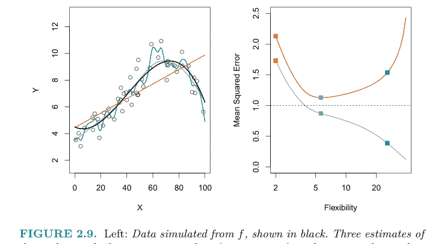

**图 2.9。** *左图：* 从 $f$ 模拟的数据，以黑色显示。显示了 $f$ 的三个估计：线性回归线（橙色曲线）和两个平滑样条拟合（蓝色和绿色曲线）。*右图：* 训练 MSE（灰色曲线）、测试 MSE（红色曲线）以及所有方法中可能达到的最小测试 MSE（虚线）。方块代表左图中所示三个拟合的训练和测试 MSE。

如果这些值近似等于 $y_1, y_2, \dots, y_n$，那么由公式 (2.5) 给出的训练 MSE 就很小。然而，我们真正感兴趣的并不是 $\hat{f}(x_i) \approx y_i$；相反，我们想知道 $\hat{f}(x_0)$ 是否近似等于 $y_0$，其中 $(x_0, y_0)$ 是一个*未用于训练统计学习方法的先前未见过的测试观测值*。我们希望选择能给出最低*测试 MSE* 的方法，而不是最低的训练 MSE。换句话说，如果我们有大量的测试观测值，我们可以计算

$$\text{Ave}(y_0 - \hat{f}(x_0))^2, \tag{2.6}$$

即这些测试观测值 $(x_0, y_0)$ 的平均平方预测误差。我们希望选择能使该量尽可能小的模型。

我们如何尝试选择一个能使测试 MSE 最小化的方法？在某些情况下，我们可能有一个可用的测试数据集——也就是说，我们可能可以访问一组未用于训练统计学习方法的观测值。然后我们可以简单地在测试观测值上评估公式 (2.6)，并选择测试 MSE 最小的学习方法。但如果没有可用的测试观测值呢？在这种情况下，人们可能会想直接选择一个使训练 MSE (2.5) 最小化的统计学习方法。这似乎是一个合理的方法，因为训练 MSE 和测试 MSE 看起来密切相关。不幸的是，这种策略存在一个根本问题：无法保证训练 MSE 最低的方法也会有最低的测试 MSE。粗略地说，问题在于许多统计方法专门估计系数以最小化训练集 MSE。对于这些方法，训练集 MSE 可能相当小，但测试 MSE 通常大得多。

图 2.9 通过一个简单的例子说明了这种现象。在图 2.9 的左图中，我们从公式 (2.1) 生成了观测值，其中真实的 $f$ 由黑色曲线给出。橙色、蓝色和绿色曲线说明了使用灵活性递增的方法获得的 $f$ 的三个可能估计。橙色线是线性回归拟合，相对不灵活。蓝色和绿色曲线是使用*平滑样条*（在第 7 章讨论）生成的，具有不同的平滑度。很明显，随着灵活性水平的增加，曲线更紧密地拟合观测数据。绿色曲线最灵活，与数据匹配得非常好；然而，我们观察到它拟合真实的 $f$（黑色显示）效果较差，因为它过于波动。通过调整平滑样条拟合的灵活性水平，我们可以产生许多不同的拟合。

现在我们转向图 2.9 的右图。灰色曲线显示了平均训练 MSE 作为灵活性（或更正式地称为*自由度*）的函数，针对多个平滑样条。自由度是总结曲线灵活性的量；在第 7 章将更充分地讨论。橙色、蓝色和绿色方块表示与左图中相应曲线相关的 MSE。更受限因此更平滑的曲线比波动的曲线具有更少的自由度——注意在图 2.9 中，线性回归处于最受限的一端，具有两个自由度。训练 MSE 随着灵活性的增加而单调下降。在这个例子中，真实的 $f$ 是非线性的，因此橙色的线性拟合不够灵活，无法很好地估计 $f$。绿色曲线在所有三种方法中具有最低的训练 MSE，因为它对应于左图中拟合的三条曲线中最灵活的一条。

在这个例子中，我们知道真实的函数 $f$，因此我们也可以在一个非常大的测试集上计算测试 MSE 作为灵活性的函数。（当然，通常 $f$ 是未知的，所以这是不可能的。）测试 MSE 在图 2.9 的右图中用红色曲线显示。与训练 MSE 一样，测试 MSE 最初随着灵活性水平的增加而下降。然而，在某个点，测试 MSE 趋于平稳，然后再次开始增加。因此，橙色和绿色曲线都具有较高的测试 MSE。蓝色曲线使测试 MSE 最小化，考虑到它在图 2.9 的左图中视觉上似乎最好地估计了 $f$，这并不奇怪。水平虚线表示 Var($\epsilon$)，即公式 (2.3) 中的不可约误差，对应于所有可能方法中可达到的最低测试 MSE。因此，由蓝色曲线表示的平滑样条接近最优。

在图 2.9 的右图中，随着统计学习方法灵活性的增加，我们观察到训练 MSE 的单调下降和测试 MSE 的 *U 形*。这是统计学习的一个基本性质，无论具体的数据集和所使用的统计方法如何都成立。随着模型灵活性的增加，训练 MSE 会下降，但测试 MSE 可能不会。当一个给定的方法产生较小的训练 MSE 但较大的测试 MSE 时，我们称其为对数据*过拟合*。这是因为我们的统计学习过程过于努力地在训练数据中寻找模式，可能捕捉到一些仅由随机机会而非未知函数 $f$ 的真实属性引起的模式。当我们对训练数据过拟合时，测试 MSE 会非常大，因为所谓的

## 2.2.2 偏差-方差权衡

测试均方误差曲线（图2.9–2.11）中观察到的U形，实际上是统计学习方法两个相互竞争的性质的结果。

尽管数学证明超出了本书的范围，但可以证明，对于给定的值 $x_0$，预期的测试均方误差总可以分解为三个基本量的和：$\hat{f}(x_0)$ 的*方差*、$\hat{f}(x_0)$ 的平方*偏差*以及误差项 $\epsilon$ 的方差。即，

$$E\left(y_0 - \hat{f}(x_0)\right)^2 = \text{Var}(\hat{f}(x_0)) + [\text{Bias}(\hat{f}(x_0))]^2 + \text{Var}(\epsilon). \quad (2.7)$$

这里的符号 $E\left(y_0 - \hat{f}(x_0)\right)^2$ 定义了在 $x_0$ 处的*预期测试均方误差*，指的是如果我们使用大量训练集重复估计 $f$，并在每个 $x_0$ 处进行测试，所获得的平均测试均方误差。总体的预期测试均方误差可以通过对测试集中所有可能的 $x_0$ 值取 $E\left(y_0 - \hat{f}(x_0)\right)^2$ 的平均值来计算。

公式2.7告诉我们，为了最小化预期测试误差，我们需要选择一个能同时实现*低方差*和*低偏差*的统计学习方法。请注意，方差本质上是一个非负量，平方偏差也是非负的。因此，我们看到预期测试均方误差永远不会低于 Var($\epsilon$)，即公式(2.3)中的不可约误差。

我们所说的统计学习方法的*方差*和*偏差*是什么意思？*方差*指的是如果我们使用不同的训练数据集来估计 $\hat{f}$，$\hat{f}$ 会发生变化的程度。由于训练数据用于拟合统计学习方法，不同的训练数据集将导致不同的 $\hat{f}$。但理想情况下，$f$ 的估计值在不同训练集之间不应有太大变化。然而，如果一个方法具有高方差，那么训练数据的微小变化可能导致 $\hat{f}$ 的巨大变化。一般来说，更灵活的统计方法具有更高的方差。考虑图2.9中的绿色和橙色曲线。灵活的绿色曲线非常紧密地跟随观测值。它具有高方差，因为改变其中任何一个数据点都可能导致估计值 $\hat{f}$ 发生显著变化。

相比之下，橙色的最小二乘线相对不灵活，具有低方差，因为移动任何一个观测值可能只会导致直线位置发生微小偏移。

另一方面，*偏差*指的是通过一个可能非常简单的模型来近似一个可能极其复杂的现实问题所引入的误差。例如，线性回归假设 $Y$ 和 $X_1, X_2, \dots, X_p$ 之间存在线性关系。任何现实问题都不太可能真正具有如此简单的线性关系，因此进行线性回归无疑会导致对 $f$ 的估计产生一些偏差。在图2.11中，真实的 $f$ 显著非线性，因此无论我们有多少训练观测值，都不可能使用线性回归产生准确的估计。换句话说，在这个例子中，线性回归导致了高偏差。然而，在图2.10中，真实的 $f$ 非常接近线性，因此给定足够的数据，线性回归应该能够产生准确的估计。一般来说，更灵活的方法导致更小的偏差。

作为一个一般规则，当我们使用更灵活的方法时，方差会增加，偏差会减少。这两个量的相对变化率决定了测试均方误差是增加还是减少。当我们增加一类方法的灵活性时，偏差往往最初比方差增加得更快。因此，预期测试均方误差下降。然而，在某个点上，增加灵活性对偏差的影响很小，但开始显著增加方差。当这种情况发生时，测试均方误差增加。请注意，我们在图2.9–2.11的右侧面板中观察到了这种测试均方误差先下降后上升的模式。

图2.12中的三个图说明了公式2.7在图2.9–2.11示例中的应用。在每种情况下，蓝色实线代表不同灵活性水平下的平方偏差，而橙色曲线对应于方差。水平虚线代表 Var(ε)，即不可约误差。最后，红色曲线对应于测试集均方误差，是这三个量的总和。在这三种情况下，随着方法灵活性的增加，方差增加，偏差减少。然而，对应于最佳测试均方误差的灵活性水平在三个数据集之间差异很大，因为平方偏差和方差在每个数据集中以不同的速率变化。在图2.12的左侧面板中，偏差最初迅速下降，导致预期测试均方误差最初急剧下降。另一方面，在图2.12的中间面板中，真实的 $f$ 接近线性，因此随着灵活性的增加，偏差只有小幅下降，测试均方误差在方差增加之前仅略有下降，然后迅速上升。最后，在图2.12的右侧面板中，随着灵活性的增加，由于真实的 $f$ 非常非线性，偏差急剧下降。随着灵活性的增加，方差的增加也非常小。因此，测试均方误差在模型灵活性增加导致小幅增加之前大幅下降。

公式2.7给出的偏差、方差和测试集均方误差之间的关系，以及图2.12中显示的关系，被称为*偏差-方差权衡*。统计学习方法的良好测试集性能需要低方差和低平方偏差。这被称为权衡，因为很容易获得一个具有极低偏差但高方差的方法（例如，通过绘制一条通过每个训练观测值的曲线），或者一个具有非常低方差但高偏差的方法（通过将一条水平线拟合到数据）。挑战在于找到一个方差和平方偏差都低的方法。这种权衡是本书中最重要的反复出现的主题之一。

在现实情况中，$f$ 是未观测到的，通常无法显式计算统计学习方法的测试均方误差、偏差或方差。然而，应该始终牢记偏差-方差权衡。在本书中，我们探讨了极其灵活的方法，因此可以基本上消除偏差。然而，这并不能保证它们会优于更简单的方法，如线性回归。举一个极端的例子，假设真实的 $f$ 是线性的。在这种情况下，线性回归将没有偏差，这使得更灵活的方法很难与之竞争。相反，如果真实的 $f$ 高度非线性，并且我们有充足的训练观测值，那么使用高度灵活的方法可能会做得更好，如图2.11所示。在第5章中，我们讨论了交叉验证，这是一种使用训练数据估计测试均方误差的方法。

## 2.2.3 分类问题

到目前为止，我们对模型准确性的讨论一直集中在回归问题上。但我们遇到的许多概念，如偏差-方差权衡，只需稍作修改（因为 $y_i$ 不再是定量的），就可以转移到分类问题中。假设我们试图基于训练观测值 $\{(x_1, y_1), \dots, (x_n, y_n)\}$ 来估计 $f$，其中现在 $y_1, \dots, y_n$ 是定性的。量化我们的估计 $\hat{f}$ 准确性最常用的方法是训练*错误率*，即如果我们应用我们的估计 $\hat{f}$ 与训练观测值：

$$\frac{1}{n} \sum_{i=1}^{n} I(y_i \neq \hat{y}_i). \tag{2.8}$$

这里 $\hat{y}_i$ 是使用 $\hat{f}$ 对第 $i$ 个观测值预测的类别标签。而 $I(y_i \neq \hat{y}_i)$ 是一个*指示变量*，当 $y_i \neq \hat{y}_i$ 时等于 1，当 $y_i = \hat{y}_i$ 时等于 0。如果 $I(y_i \neq \hat{y}_i) = 0$，则第 $i$ 个观测值被我们的分类方法正确分类；否则就是被错误分类。因此，公式 2.8 计算的是错误分类的比例。

公式 2.8 被称为*训练误差率*，因为它是基于用于训练我们分类器的数据计算的。与回归问题一样，我们最感兴趣的是将分类器应用于未用于训练的测试观测值时产生的误差率。对于一组形式为 $(x_0, y_0)$ 的测试观测值，相关的*测试误差率*由下式给出：

$$\text{Ave}(I(y_0 \neq \hat{y}_0)), \tag{2.9}$$

其中 $\hat{y}_0$ 是将分类器应用于预测变量为 $x_0$ 的测试观测值所得到的预测类别标签。一个*好的*分类器是使测试误差 (2.9) 最小的分类器。

## 贝叶斯分类器

可以证明（尽管证明超出了本书的范围），公式 (2.9) 中给出的测试误差率，平均而言，可以通过一个非常简单的分类器来最小化，该分类器*根据每个观测值的预测变量值，将其分配给最可能的类别*。换句话说，我们应该简单地将预测向量为 $x_0$ 的测试观测值分配给类别 $j$，使得

$$\text{Pr}(Y = j | X = x_0) \tag{2.10}$$

最大。注意 (2.10) 是一个*条件概率*：它是在给定观测到的预测向量 $x_0$ 的条件下，$Y = j$ 的概率。这个非常简单的分类器被称为*贝叶斯分类器*。在一个只有两个可能响应值（比如*类别 1* 或*类别 2*）的两类问题中，贝叶斯分类器对应于：如果 $\text{Pr}(Y = 1 | X = x_0) > 0.5$，则预测为类别一，否则预测为类别二。

图 2.13 提供了一个使用模拟数据集的示例，该数据集位于由预测变量 $X_1$ 和 $X_2$ 组成的二维空间中。橙色和蓝色圆圈分别对应于属于两个不同类别的训练观测值。对于 $X_1$ 和 $X_2$ 的每个值，响应为橙色或蓝色的概率都不同。由于这是模拟数据，我们知道数据是如何生成的，并且可以计算每个 $X_1$ 和 $X_2$ 值的条件概率。橙色阴影区域反映了 $\text{Pr}(Y = \text{orange} | X)$ 大于 50% 的点集，而蓝色阴影区域表示概率低于 50% 的点集。紫色虚线代表概率恰好为 50% 的点。这被称为*贝叶斯决策边界*。贝叶斯分类器的预测由贝叶斯决策边界决定；落在边界橙色一侧的观测值将被分配给橙色类别，同样，落在边界蓝色一侧的观测值将被分配给蓝色类别。

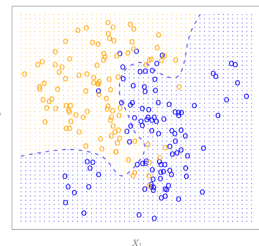

**图 2.13.** 一个模拟数据集，包含两组各 100 个观测值，分别用蓝色和橙色表示。紫色虚线代表贝叶斯决策边界。橙色背景网格表示测试观测值将被分配给橙色类别的区域，蓝色背景网格表示测试观测值将被分配给蓝色类别的区域。

贝叶斯分类器产生可能的最低测试误差率，称为*贝叶斯误差率*。由于贝叶斯分类器总是选择使 (2.10) 最大的类别，因此在 $X = x_0$ 处的误差率将是 $1 - \max_j \Pr(Y = j | X = x_0)$。一般来说，总体的贝叶斯误差率由下式给出：

$$1 - E\left(\max_j \Pr(Y = j | X)\right), \quad (2.11)$$

其中期望是对 $X$ 的所有可能值取平均。对于我们的模拟数据，贝叶斯误差率为 0.133。它大于零，因为在真实总体中类别存在重叠，这意味着对于某些 $x_0$ 值，$\max_j \Pr(Y = j | X = x_0) < 1$。贝叶斯误差率类似于之前讨论的不可约误差。

## K-近邻

理论上，我们总是希望使用贝叶斯分类器来预测定性响应。但对于真实数据，我们不知道给定 $X$ 时 $Y$ 的条件分布，因此无法计算贝叶斯分类器。因此，贝叶斯分类器作为一个无法达到的黄金标准，用于与其他方法进行比较。许多方法试图估计给定 $X$ 时 $Y$ 的条件分布，然后将给定观测值分类到具有最高*估计*概率的类别。其中一种方法是*K-近邻* (KNN) 分类器。给定一个正整数 $K$ 和一个测试观测值 $x_0$，KNN 分类器首先在训练数据中识别出与 $x_0$ 最近的 $K$ 个点，记为 $\mathcal{N}_0$。然后，它将类别 $j$ 的条件概率估计为 $\mathcal{N}_0$ 中响应值等于 $j$ 的点的比例：

$$\Pr(Y = j | X = x_0) = \frac{1}{K} \sum_{i \in \mathcal{N}_0} I(y_i = j). \qquad (2.12)$$

最后，KNN 将测试观测值 $x_0$ 分类到 (2.12) 中概率最大的类别。

图 2.14 提供了一个 KNN 方法的示例。在左侧面板中，我们绘制了一个包含六个蓝色和六个橙色观测值的小型训练数据集。我们的目标是为标记为黑色十字的点进行预测。假设我们选择 $K = 3$。那么 KNN 将首先识别出与十字最近的三个观测值。这个邻域显示为一个圆圈。它包含两个蓝色点和一个橙色点，导致蓝色类别的估计概率为 2/3，橙色类别的估计概率为 1/3。因此，KNN 将预测黑色十字属于蓝色类别。在图 2.14 的右侧面板中，我们对 $X_1$ 和 $X_2$ 的所有可能值应用了 $K = 3$ 的 KNN 方法，并绘制了相应的 KNN 决策边界。

尽管这是一个非常简单的方法，KNN 通常可以产生与最优贝叶斯分类器非常接近的分类器。图 2.15 显示了将 $K = 10$ 的 KNN 决策边界应用于图 2.13 中更大的模拟数据集的结果。请注意，即使 KNN 分类器不知道真实分布，KNN 决策边界也非常接近贝叶斯分类器的边界。使用 KNN 的测试误差率为 0.1363，接近贝叶斯误差率 0.1304。

$K$ 的选择对获得的 KNN 分类器有显著影响。图 2.16 显示了对图 2.13 中模拟数据的两种 KNN 拟合，分别使用 $K = 1$ 和 $K = 100$。当 $K = 1$ 时，决策边界过于灵活，并在数据中找到了与贝叶斯决策边界不对应的模式。这对应于一个低偏差但方差非常高的分类器。随着 $K$ 的增长，该方法变得不那么灵活，产生的决策边界接近线性。这对应于一个低方差但高偏差的分类器。在这个模拟数据集上，$K = 1$ 和 $K = 100$ 都没有给出好的预测：它们的测试误差率分别为 0.1695 和 0.1925。

正如在回归问题中一样，训练误差率和测试误差率之间没有很强的关系。当 $K = 1$ 时，KNN 训练误差率为 0，但测试误差率可能相当高。一般来说，当我们使用更灵活的分类方法时，训练误差率会下降，但测试误差率可能不会。在图 2.17 中，我们将 KNN 测试误差和训练误差绘制为 $1/K$ 的函数。随着 $1/K$ 的增加，该方法变得更加灵活。与回归问题一样，训练误差率随着灵活性的增加而持续下降。然而，测试误差呈现出特征性的 U 形，最初下降（在 $K \approx 10$ 处达到最小值），然后在方法变得过于灵活并过拟合时再次增加。

## 2. 统计学习

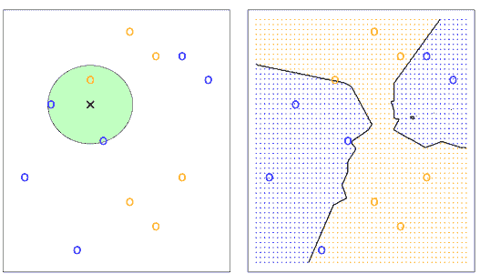

**图 2.14.** KNN方法（K=3）在一个简单情境下的示例，包含六个蓝色观测值和六个橙色观测值。左图：一个待预测类别标签的测试观测值显示为黑色十字。识别出距离测试观测值最近的三个点，并预测该测试观测值属于出现频率最高的类别，本例中为蓝色。右图：该示例的KNN决策边界显示为黑色。蓝色网格表示测试观测值将被分配到蓝色类别的区域，橙色网格表示将被分配到橙色类别的区域。

KNN: K=10

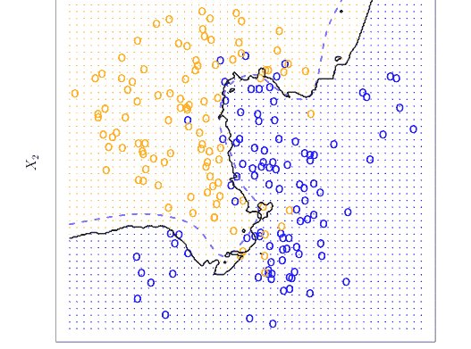

**图 2.15.** 黑色曲线表示在图2.13数据上使用K=10得到的KNN决策边界。贝叶斯决策边界显示为紫色虚线。KNN和贝叶斯决策边界非常相似。

在回归和分类问题中，选择正确的灵活性水平对于任何统计学习方法的成功都至关重要。偏差-方差权衡以及由此产生的测试误差的U形曲线，可能使这项任务变得困难。在第5章中，我们将回到这个主题并讨论各种估计测试误差率的方法，从而为给定的统计学习方法选择最优的灵活性水平。

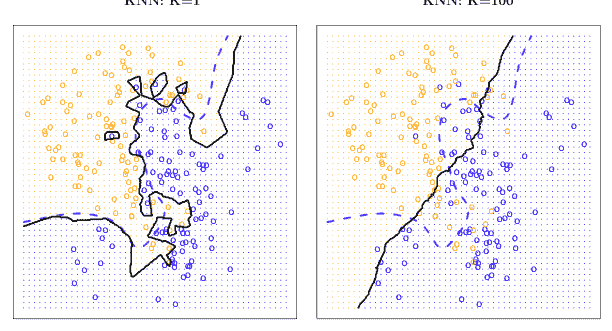

**图 2.16.** 在图2.13数据上，使用K=1和K=100得到的KNN决策边界（黑色实线曲线）的比较。当K=1时，决策边界过于灵活，而当K=100时则不够灵活。贝叶斯决策边界显示为紫色虚线。

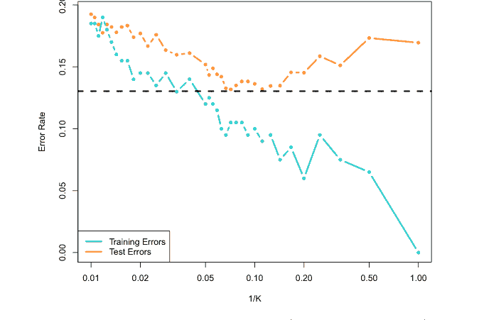

**图 2.17.** 在图2.13数据上，随着灵活性水平（使用1/K在对数尺度上评估）增加，或等价地随着邻居数K减少，KNN训练误差率（蓝色，200个观测值）和测试误差率（橙色，5000个观测值）的变化。黑色虚线表示贝叶斯误差率。曲线的跳跃性是由于训练数据集规模较小造成的。

## 2.3 实验：Python入门

### 2.3.1 开始

要运行本书中的实验，你需要两样东西：

1.  安装Python3，这是实验中使用的特定Python版本。
2.  访问Jupyter，这是一个非常流行的Python界面，通过名为notebook的文件运行代码。

你可以通过访问 anaconda.com 上的说明来下载和安装Python3。

有多种方式可以访问Jupyter。以下仅列举几种：

1.  使用Google的Colaboratory服务：colab.research.google.com/。
2.  使用JupyterHub，可在 jupyter.org/hub 获取。
3.  使用你自己的Jupyter安装。安装说明可在 jupyter.org/install 获取。

请参阅本书网站 statlearning.com 上的Python资源页面，获取关于在你的计算机上设置Python和Jupyter的最新信息。

你需要安装ISLP包，它提供了对本书提供的数据集和自定义函数的访问。在macOS或Linux终端中输入 `pip install ISLP`；这也会安装实验所需的大多数其他包。Python资源页面有一个指向ISLP文档网站的链接。

要运行本实验，请从Python资源页面下载文件 `Ch2-statlearn-lab.ipynb`。现在在命令行运行以下代码：`jupyter lab Ch2-statlearn-lab.ipynb`。

如果你使用Windows，可以使用开始菜单访问anaconda，并按照链接操作。例如，要安装ISLP并运行本实验，你可以在anaconda shell中运行相同的代码。

### 2.3.2 基本命令

在本实验中，我们将介绍一些简单的Python命令。关于Python的更多资源，读者可能希望查阅 docs.python.org/3/tutorial/ 上的教程。

像大多数编程语言一样，Python使用函数来执行操作。要运行一个名为 `fun` 的函数，我们输入 `fun(input1, input2)`，其中输入（或参数）`input1` 和 `input2` 告诉Python如何运行该函数。一个函数可以有任意数量的输入。例如，`print()` 函数将其所有参数的文本表示输出到控制台。

```
In [1]: print('fit a model with', 11, 'variables')
```

```
fit a model with 11 variables
```

以下命令将提供关于 `print()` 函数的信息。

```
In [2]: print?
```

在Python中，两个整数相加非常直观。

```
In [3]: 3 + 5
```

```
Out[3]: 8
```

在Python中，文本数据使用 *字符串* 处理。例如，`"hello"` 和 `'hello'` 是字符串。我们可以使用加号 `+` 将它们连接起来。

```
In [4]: "hello" + " " + "world"
```

```
Out[4]: 'hello world'
```

字符串实际上是一种 *序列* 类型：这是一个有序列表的通用术语。三种最重要的序列类型是列表、元组和字符串。我们现在介绍列表。

以下命令指示Python将数字3、4和5连接在一起，并将它们保存为一个名为 `x` 的 *列表*。当我们输入 `x` 时，它会返回该列表。

```
In [5]: x = [3, 4, 5]
x
```

```
Out[5]: [3, 4, 5]
```

注意我们使用了方括号 `[]` 来构造这个列表。

我们经常需要将两组数字相加。尝试以下代码是合理的，但它不会产生预期的结果。

```
In [6]: y = [4, 9, 7]
x + y
```

```
Out[6]: [3, 4, 5, 4, 9, 7]
```

结果可能看起来有点反直觉：为什么Python没有逐个元素地相加列表的条目？在Python中，列表保存 *任意* 对象，并使用 *连接* 进行相加。事实上，连接就是我们之前输入 `"hello" + " " + "world"` 时看到的行为。

这个例子反映了Python是一种通用编程语言的事实。Python的大部分特定数据功能来自其他包，特别是numpy和pandas。在下一节中，我们将介绍numpy包。有关numpy的更多信息，请参阅 docs.scipy.org/doc/numpy/user/quickstart.html。

### 2.3.3 数值Python入门

如前所述，本书使用了包含在numpy库或包中的功能。包是一组模块的集合，这些模块不一定包含在基础Python发行版中。numpy这个名字是numerical Python的缩写。

要访问numpy，我们必须首先导入它。

```
import numpy as np
```

在上一行中，我们将numpy模块命名为 `np`；这是一个便于引用的缩写。

在numpy中，数组是多维数字集合的通用术语。我们使用 `np.array()` 函数来定义 `x` 和 `y`，它们是一维数组，即向量。

```
x = np.array([3, 4, 5])
y = np.array([4, 9, 7])
```

注意，如果你之前忘记运行 `import numpy as np` 命令，那么在上一行调用 `np.array()` 函数时会遇到错误。语法 `np.array()` 表示正在调用的函数是numpy包的一部分，我们将其缩写为 `np`。

由于 `x` 和 `y` 是使用 `np.array()` 定义的，当我们把它们相加时会得到一个合理的结果。将此与我们在上一节中尝试在不使用numpy的情况下将两个列表相加的结果进行比较。

```
x + y
```

在numpy中，矩阵通常表示为二维数组，向量表示为一维数组。我们可以如下创建一个二维数组。

```
x = np.array([[1, 2], [3, 4]])
x
```

对象 `x` 有几个属性或关联对象。要访问 `x` 的一个属性，我们输入 `x.attribute`，其中我们将 `attribute` 替换为属性的名称。例如，我们可以如下访问 `x` 的 `ndim` 属性。

```
x.ndim
```

输出表明 `x` 是一个二维数组。类似地，`x.dtype` 是对象 `x` 的数据类型属性。这表明 `x` 由64位整数组成：

> 虽然也可以使用 `np.matrix()` 创建矩阵，但本书的实验中我们将始终使用 `np.array()`。

在 [12]: x.dtype

Out [12]: dtype('int64')

为什么 x 由整数组成？这是因为我们创建 x 时，向 `np.array()` 函数传入的全是整数。如果我们传入了任何小数，那么我们将得到一个浮点数（即实数值）数组。

```
In [13]: np.array([[1, 2], [3.0, 4]]).dtype
```

Out [13]: dtype('float64')

输入 `fun?` 会导致 Python 显示与函数 `fun` 相关的文档（如果存在的话）。我们可以对 `np.array()` 尝试一下。

```
In [14]: np.array?
```

该文档表明，我们可以通过向 `np.array()` 传入 `dtype` 参数来创建一个浮点数组。

```
In [15]: np.array([[1, 2], [3, 4]], float).dtype
```

Out [15]: dtype('float64')

数组 x 是二维的。我们可以通过查看其 `shape` 属性来找出其行数和列数。

```
In [16]: x.shape
```

Out [16]: (2, 2)

方法是与对象相关联的函数。例如，给定一个数组 x，表达式 `x.sum()` 使用数组的 `sum()` 方法对其所有元素求和。调用 `x.sum()` 会自动将 `x` 作为其 `sum()` 方法的第一个参数。

```
In [17]: x = np.array([1, 2, 3, 4])
x.sum()
```

Out [17]: 10

我们也可以通过将 `x` 作为参数传递给 `np.sum()` 函数来对 x 的元素求和。

```
In [18]: x = np.array([1, 2, 3, 4])
np.sum(x)
```

Out [18]: 10

在我们的 `reshape()` 调用中，本例中是 `(2, 3)`。这个元组指定了我们希望创建一个具有 2 行 3 列的二维数组。²
接下来，`\n` 字符会创建一个*新行*。

```
In [19]: x = np.array([1, 2, 3, 4, 5, 6])
        print('beginning x:\n', x)
        x_reshape = x.reshape((2, 3))
        print('reshaped x:\n', x_reshape)
```

```
beginning x:
[1 2 3 4 5 6]
reshaped x:
[[1 2 3]
 [4 5 6]]
```

前面的输出揭示了 `numpy` 数组被指定为一系列*行*。这被称为*行优先顺序*，与*列优先顺序*相对。
Python（因此 `numpy`）使用基于 0 的索引。这意味着要访问 `x_reshape` 的左上角元素，我们输入 `x_reshape[0,0]`。

```
In [20]: x_reshape[0, 0]
```

```
Out[20]: 1
```

类似地，`x_reshape[1,2]` 返回 `x_reshape` 中第二行第三列的元素。

```
In [21]: x_reshape[1, 2]
```

```
Out[21]: 6
```

类似地，`x[2]` 返回 `x` 的第三个条目。
现在，让我们修改 `x_reshape` 的左上角元素。令我们惊讶的是，我们发现 `x` 的第一个元素也被修改了！

```
In [22]: print('x before we modify x_reshape:\n', x)
        print('x_reshape before we modify x_reshape:\n', x_reshape)
        x_reshape[0, 0] = 5
        print('x_reshape after we modify its top left element:\n',
              x_reshape)
        print('x after we modify top left element of x_reshape:\n', x)
```

```
Out[22]: x before we modify x_reshape:
         [1 2 3 4 5 6]
         x_reshape before we modify x_reshape:
         [[1 2 3]
          [4 5 6]]
         x_reshape after we modify its top left element:
         [[5 2 3]
          [4 5 6]]
         x after we modify top left element of x_reshape:
         [5 2 3 4 5 6]
```

> ²与列表类似，元组表示对象的序列。为什么我们需要不止一种方式来创建序列？元组和列表之间有一些区别，但也许最重要的是元组的元素不能被修改，而列表的元素可以。

修改 `x_reshape` 也修改了 `x`，因为这两个对象在内存中占据相同的空间。

我们刚刚看到我们可以修改数组的一个元素。我们也可以修改元组吗？事实证明我们不能——尝试这样做会引入一个*异常*，或错误。

```
In [23]: my_tuple = (3, 4, 5)
        my_tuple[0] = 2
```

TypeError: 'tuple' object does not support item assignment

我们现在简要提及一些数组的属性，这些属性将派上用场。数组的 `shape` 属性包含其维度；这总是一个元组。`ndim` 属性给出维度数，而 `T` 提供其转置。

```
In [24]: x_reshape.shape, x_reshape.ndim, x_reshape.T
```

```
Out[24]: ((2, 3),
         2,
         array([[5, 4],
                [2, 5],
                [3, 6]]))
```

请注意，三个单独的输出 `(2,3)`、`2` 和 `array([[5, 4],[2, 5], [3,6]])` 本身也是作为一个元组输出的。

我们经常希望将函数应用于数组。例如，我们可以使用 `np.sqrt()` 函数计算条目的平方根：

```
In [25]: np.sqrt(x)
```

```
Out[25]: array([2.24, 1.41, 1.73, 2., 2.24, 2.45])
```

我们也可以对元素进行平方：

```
In [26]: x**2
```

```
Out[26]: array([25, 4, 9, 16, 25, 36])
```

我们可以使用相同的符号计算平方根，将指数从 2 改为 1/2。

```
In [27]: x**0.5
```

```
Out[27]: array([2.24, 1.41, 1.73, 2., 2.24, 2.45])
```

在本书中，我们经常需要生成随机数据。`np.random.normal()` 函数生成一个随机正态变量向量。我们可以通过查看帮助页面（通过调用 `np.random.normal?`）来了解更多关于此函数的信息。帮助页面的第一行是 `normal(loc=0.0, scale=1.0, size=None)`。这个*签名*行告诉我们函数的参数是 `loc`、`scale` 和 `size`。这些是*关键字*参数，这意味着当它们被传递给函数时，可以通过名称（以任何顺序）来引用它们。<sup>3</sup> 默认情况下，此函数将生成均值 (`loc`) 为 0、标准差 (`scale`) 为 1 的随机正态变量；此外，除非更改 `size` 的参数，否则将生成单个随机变量。

我们现在从 $N(0, 1)$ 分布中生成 50 个独立的随机变量。

```
In [28]: x = np.random.normal(size=50)
        x
```

```
Out[28]: array([-1.19,  0.41,  0.9 , -0.44, -0.9 , -0.38,  0.13,  1.87,
        -0.35,  1.16,  0.79, -0.97, -1.21,  0.06, -1.62, -0.6 ,
        -0.77, -2.12,  0.38, -1.22, -0.06, -1.97, -1.74, -0.56,
         1.7 , -0.95,  0.56,  0.35,  0.87,  0.88, -1.66, -0.32,
        -0.3 , -1.36,  0.92, -0.31,  1.28, -1.94,  1.07,  0.07,
         0.79, -0.46,  2.19, -0.27, -0.64,  0.85,  0.13,  0.46,
        -0.09,  0.7 ])
```

我们通过向 `x` 的每个元素添加一个独立的 $N(50, 1)$ 随机变量来创建数组 `y`。

```
In [29]: y = x + np.random.normal(loc=50, scale=1, size=50)
```

`np.corrcoef()` 函数计算 `x` 和 `y` 之间的相关矩阵。非对角线元素给出了 `x` 和 `y` 之间的相关性。

```
In [30]: np.corrcoef(x, y)
```

```
Out[30]: array([[1.  , 0.69],
        [0.69, 1.  ]])
```

如果你在自己的 Jupyter notebook 中跟着操作，那么你可能注意到运行过去几个命令时得到了不同的结果集。特别是，每次我们调用 `np.random.normal()` 时，我们都会得到不同的答案，如下例所示。

```
In [31]: print(np.random.normal(scale=5, size=2))
        print(np.random.normal(scale=5, size=2))
```

```
Out[31]: [4.28 2.59]
        [4.62 -2.54]
```

为了确保我们的代码每次运行时都提供完全相同的结果，我们可以使用 `np.random.default_rng()` 函数设置一个*随机种子*。此函数接受一个任意的、用户指定的整数参数。如果在生成随机数据之前设置了随机种子，那么重新运行我们的代码将产生相同的结果。对象 `rng` 本质上包含了 `np.random` 中所有的随机数生成方法。因此，要生成正态数据，我们使用 `rng.normal()`。

```
rng = np.random.default_rng(1303)
print(rng.normal(scale=5, size=2))
rng2 = np.random.default_rng(1303)
print(rng2.normal(scale=5, size=2))
```

```
[4.09  -1.07 ]
[4.09  -1.07 ]
```

在本书的所有实验中，每当我们在 `numpy` 中执行涉及随机量的计算时，我们都使用 `np.random.default_rng()`。原则上，这应该使读者能够完全重现所述结果。然而，随着 `numpy` 新版本的发布，实验中的输出与 `numpy` 的输出之间可能会出现一些小的差异。
`np.mean()`、`np.var()` 和 `np.std()` 函数可用于计算数组的均值、方差和标准差。这些函数也可作为数组上的方法使用。

```
rng = np.random.default_rng(3)
y = rng.standard_normal(10)
np.mean(y), y.mean()
```

```
(-0.11, -0.11)
```

```
np.var(y), y.var(), np.mean((y - y.mean())**2)
```

```
(2.72, 2.72, 2.72)
```

请注意，默认情况下 `np.var()` 除以样本大小 $n$ 而不是 $n - 1$；参见 `np.var?` 中的 `ddof` 参数。

```
np.sqrt(np.var(y)), np.std(y)
```

```
(1.65, 1.65)
```

`np.mean()`、`np.var()` 和 `np.std()` 函数也可以应用于矩阵的行和列。为了说明这一点，我们构造一个 $10 \times 3$ 的 $N(0, 1)$ 随机变量矩阵，并考虑计算其行和。

```
X = rng.standard_normal((10, 3))
X
```

```
array([[ 0.23, -0.35, -0.28],
       [-0.67, -1.06, -0.39],
       [ 0.48, -0.24,  0.96],
       [-0.2 ,  0.02,  1.55],
       [ 0.55, -0.51, -0.18],
       [ 0.54,  1.94, -0.27],
       [-0.24,  1.  , -0.89],
       [-0.29,  0.88,  0.58],
       [ 0.09,  0.67, -2.83],
       [ 1.02, -0.96, -1.67]])
```

<sup>3</sup>Python 也使用*位置*参数。位置参数不需要使用关键字。要查看示例，请输入 `np.sum?`。我们看到 `a` 是一个位置参数，即此函数假设它接收到的第一个未命名参数是要求和的数组。相比之下，`axis` 和 `dtype` 是关键字参数：这些参数输入到 `np.sum()` 中的位置无关紧要。

由于数组是按行优先顺序存储的，第一个轴，即 `axis=0`，指的是其行。我们将此参数传递给对象 `X` 的 `mean()` 方法。

```
X.mean(axis=0)
```

Out[37]: array([0.15, 0.14, -0.34])

以下代码产生相同的结果。

```
X.mean(0)
```

Out[38]: array([0.15, 0.14, -0.34])

## 2.3.4 图形

在 Python 中，通常使用 `matplotlib` 库进行绘图。然而，由于 Python 并非为数据分析而设计，绘图的概念并非语言固有。我们将使用 `matplotlib.pyplot` 中的 `subplots()` 函数来创建图形和用于绘制数据的坐标轴。有关如何在 Python 中制作更多图表的示例，读者可访问 `matplotlib.org/stable/gallery/`。

在 `matplotlib` 中，一个绘图由一个 *图形* 和一个或多个 *坐标轴* 组成。你可以将图形视为一个空白画布，一个或多个绘图将显示在其上：它是整个绘图窗口。*坐标轴* 包含每个绘图的重要信息，例如其 *x* 轴和 *y* 轴标签、标题等。（注意，在 `matplotlib` 中，*axes* 这个词并非 *axis* 的复数形式：一个绘图的 *axes* 包含的信息远不止 *x* 轴和 *y* 轴。）

我们首先从 `matplotlib` 导入 `subplots()` 函数。在创建图形时，我们将始终使用此函数。该函数返回一个长度为二的元组：一个图形对象和一个相关的坐标轴对象。我们通常会传递 `figsize` 作为关键字参数。创建坐标轴后，我们尝试使用其 `plot()` 方法进行第一次绘图。要了解更多，请输入 `ax.plot?`。

```
from matplotlib.pyplot import subplots
fig, ax = subplots(figsize=(8, 8))
x = rng.standard_normal(100)
y = rng.standard_normal(100)
ax.plot(x, y);
```

我们在此暂停，注意我们已经将 `subplots()` 返回的长度为二的元组 *解包* 到两个不同的变量 `fig` 和 `ax` 中。解包通常优于以下等效但稍显冗长的代码：

```
output = subplots(figsize=(8, 8))
fig = output[0]
ax = output[1]
```

我们看到之前的单元格生成了一个折线图，这是默认设置。要创建散点图，我们向 `ax.plot()` 提供一个额外的参数，指示应显示圆圈。

```
fig, ax = subplots(figsize=(8, 8))
ax.plot(x, y, 'o');
```

此额外参数的不同值可用于生成不同颜色的线条以及不同的线型。
或者，我们可以使用 `ax.scatter()` 函数来创建散点图。

```
fig, ax = subplots(figsize=(8, 8))
ax.scatter(x, y, marker='o');
```

请注意，在上面的代码块中，我们在最后一行以分号结尾。这可以防止 `ax.plot(x, y)` 将文本输出到笔记本中。但是，它不会阻止绘图的生成。如果我们省略末尾的分号，那么我们将得到以下输出：

```
fig, ax = subplots(figsize=(8, 8))
ax.scatter(x, y, marker='o')
```

在接下来的内容中，每当输出的文本与当前讨论无关时，我们将使用末尾分号。
为了给绘图添加标签，我们使用 `ax` 的 `set_xlabel()`、`set_ylabel()` 和 `set_title()` 方法。

```
fig, ax = subplots(figsize=(8, 8))
ax.scatter(x, y, marker='o')
ax.set_xlabel("this is the x-axis")
ax.set_ylabel("this is the y-axis")
ax.set_title("Plot of X vs Y");
```

能够访问图形对象 `fig` 本身意味着我们可以进入并更改某些方面，然后重新显示它。在这里，我们将大小从 (8, 8) 更改为 (12, 3)。

```
fig.set_size_inches(12,3)
fig
```

有时我们希望在图形中创建多个绘图。这可以通过向 `subplots()` 传递额外的参数来实现。下面，我们在一个由 `figsize` 参数确定大小的图形中创建一个 2 x 3 的绘图网格。在这种情况下，绘图中的坐标轴之间通常存在关系。例如，所有绘图可能具有共同的 x 轴。当传递关键字参数 `sharex=True` 时，`subplots()` 函数可以自动处理这种情况。下面的 `axes` 对象是一个指向图形中不同绘图的数组。

```
fig, axes = subplots(nrows=2,
                    ncols=3,
                    figsize=(15, 5))
```

我们现在在第一行第二列创建一个带 'o' 的散点图，在第二行第三列创建一个带 '+' 的散点图。

```
axes[0,1].plot(x, y, 'o')
axes[1,2].scatter(x, y, marker='+')
fig
```

输入 `subplots?` 以了解更多关于 `subplots()` 的信息。
要保存 `fig` 的输出，我们调用其 `savefig()` 方法。参数 `dpi` 是每英寸点数，用于确定图形在像素中的大小。

```
fig.savefig("Figure.png", dpi=400)
fig.savefig("Figure.pdf", dpi=200);
```

我们可以继续使用逐步更新来修改 `fig`；例如，我们可以修改 $x$ 轴的范围，重新保存图形，甚至重新显示它。

```
axes[0,1].set_xlim([-1,1])
fig.savefig("Figure_updated.jpg")
fig
```

我们现在创建一些更复杂的绘图。`ax.contour()` 方法生成一个 *等高线图*，以表示三维数据，类似于地形图。它接受三个参数：

- 一个 $x$ 值的向量（第一维），
- 一个 $y$ 值的向量（第二维），以及
- 一个矩阵，其元素对应于每对 $(x,y)$ 坐标的 $z$ 值（第三维）。

为了创建 $x$ 和 $y$，我们将使用命令 `np.linspace(a, b, n)`，它返回一个包含 $n$ 个数字的向量，从 $a$ 开始，到 $b$ 结束。

```
fig, ax = subplots(figsize=(8, 8))
x = np.linspace(-np.pi, np.pi, 50)
y = x
f = np.multiply.outer(np.cos(y), 1 / (1 + x**2))
ax.contour(x, y, f);
```

我们可以通过向图像添加更多层级来提高分辨率。

```
fig, ax = subplots(figsize=(8, 8))
ax.contour(x, y, f, levels=45);
```

要微调 `ax.contour()` 函数的输出，请通过输入 `?plt.contour` 查看帮助文件。
`ax.imshow()` 方法类似于 `ax.contour()`，不同之处在于它生成一个颜色编码的绘图，其颜色取决于 $z$ 值。这被称为 *热图*，有时用于绘制天气预报中的温度。

```
fig, ax = subplots(figsize=(8, 8))
ax.imshow(f);
```

## 2.3.5 序列和切片表示法

如上所述，函数 `np.linspace()` 可用于创建数字序列。

```
In [52]: seq1 = np.linspace(0, 10, 11)
seq1
```

```
Out[52]: array([ 0., 1., 2., 3., 4., 5., 6., 7., 8., 9., 10.])
```

函数 `np.arange()` 返回一个由 `step` 间隔的数字序列。如果未指定 `step`，则使用默认值 1。让我们创建一个从 0 开始到 10 结束的序列。

```
In [53]: seq2 = np.arange(0, 10)
seq2
```

```
Out[53]: array([0, 1, 2, 3, 4, 5, 6, 7, 8, 9])
```

为什么上面没有输出 10？这与 Python 中的 *切片表示法* 有关。切片表示法用于索引序列，如列表、元组和数组。假设我们想检索字符串中从第四个到第六个（包含）的条目。我们使用索引表示法 `[3:6]` 获取字符串的切片。

```
In [54]: "hello world"[3:6]
```

```
Out[54]: 'lo '
```

在上面的代码块中，表示法 `3:6` 是在 `[]` 内使用时 `slice(3,6)` 的简写。

```
In [55]: "hello world"[slice(3,6)]
```

```
Out[55]: 'lo '
```

你可能期望 `slice(3,6)` 输出文本字符串中的第四个到第七个字符（回想一下 Python 的索引从零开始），但它输出的是第四个到第六个。这也解释了为什么之前的 `np.arange(0, 10)` 命令只输出从 0 到 9 的整数。有关创建切片的有用选项，请参阅文档 `slice?`。

## 2.3.6 数据索引

首先，我们创建一个二维 `numpy` 数组。

```
In [56]: A = np.array(np.arange(16)).reshape((4, 4))
A
```

```
Out[56]: array([[ 0, 1, 2, 3],
[ 4, 5, 6, 7],
[ 8, 9, 10, 11],
[12, 13, 14, 15]])
```

输入 `A[1,2]` 可检索第二行第三列对应的元素。（与往常一样，Python 的索引从 0 开始。）

## 2. 统计学习

```python
In [57]: A[1,2]
```

```
Out[57]: 6
```

方括号符号 `[` 后的第一个数字指的是行，第二个数字指的是列。

## 索引行、列和子矩阵

要一次选择多行，我们可以传入一个指定选择的列表。例如，`[1,3]` 将检索第二行和第四行：

```python
In [58]: A[[1,3]]
```

```
Out[58]: array([[ 4, 5, 6, 7],
       [12, 13, 14, 15]])
```

要选择第一列和第三列，我们在方括号中传入 `[0,2]` 作为第二个参数。在这种情况下，我们需要提供第一个参数 `:` 来选择所有行。

```python
In [59]: A[:,[0,2]]
```

```
Out[59]: array([[ 0,  2],
       [ 4,  6],
       [ 8, 10],
       [12, 14]])
```

现在，假设我们想选择由第二行和第四行以及第一列和第三列组成的子矩阵。这就是索引变得有点棘手的地方。很自然地会尝试使用列表来检索行和列：

```python
In [60]: A[[1,3],[0,2]]
```

```
Out[60]: array([ 4, 14])
```

哎呀——发生了什么？我们得到了一个长度为2的一维数组，它等同于

```python
In [61]: np.array([A[1,0],A[3,2]])
```

```
Out[61]: array([ 4, 14])
```

类似地，以下代码未能提取由第二行和第四行以及第一、第三和第四列组成的子矩阵：

```python
In [62]: A[[1,3],[0,2,3]]
```

```
IndexError: shape mismatch: indexing arrays could not be broadcast together with shapes (2,) (3,)
```

我们可以看出这里出了什么问题。当提供两个索引列表时，numpy的解释是这些列表为一系列条目提供了成对的 `i, j` 索引。这就是为什么这两个列表必须具有相同的长度。然而，这并非我们的本意，因为我们寻找的是一个子矩阵。

一个简单的方法如下。我们首先通过对 `A` 的行进行子集选择来创建一个子矩阵，然后动态地通过对其列进行子集选择来进一步创建一个子矩阵。

```python
In [63]: A[[1,3]][:,[0,2]]
```

```
Out[63]: array([[ 4,  6],
       [12, 14]])
```

有更有效的方法来实现相同的结果。

便捷函数 `np.ix_()` 允许我们使用列表提取子矩阵，通过创建一个中间网格对象。

```python
In [64]: idx = np.ix_([1,3],[0,2,3])
         A[idx]
```

```
Out[64]: array([[ 4,  6,  7],
       [12, 14, 15]])
```

或者，我们可以使用切片来高效地对矩阵进行子集选择。切片 `1:4:2` 捕获序列中的第二项和第四项，而切片 `0:3:2` 捕获第一项和第三项（切片序列中的第三个元素是步长）。

```python
In [65]: A[1:4:2,0:3:2]
```

```
Out[65]: array([[ 4,  6],
       [12, 14]])
```

为什么我们能够使用切片直接检索子矩阵，而不能使用列表？因为它们是不同的Python类型，并且被numpy区别对待。切片可用于从任意序列（如字符串、列表和元组）中提取对象，而使用列表进行索引则更为有限。

## 布尔索引

在numpy中，布尔类型等于 `True` 或 `False`（也分别表示为1和0）。下一行创建了一个长度等于 `A` 第一维的0向量，表示为布尔值。

```python
In [66]: keep_rows = np.zeros(A.shape[0], bool)
         keep_rows
```

```
Out[66]: array([False, False, False, False])
```

我们现在将其中两个元素设置为 `True`。

```python
In [67]: keep_rows[[1,3]] = True
         keep_rows
```

```
Out[67]: array([False,  True, False,  True])
```

请注意，当 `keep_rows` 的元素被视为整数时，它们与 `np.array([0,1,0,1])` 的值相同。下面我们使用 `==` 来验证它们的相等性。当应用于两个数组时，`==` 操作是逐元素应用的。

```python
In [68]: np.all(keep_rows == np.array([0,1,0,1]))
```

```
Out[68]: True
```

（这里，函数 `np.all()` 检查数组的所有条目是否都是 `True`。类似的函数 `np.any()` 可用于检查数组的任何条目是否为 `True`。）

然而，即使 `np.array([0,1,0,1])` 和 `keep_rows` 根据 `==` 是相等的，它们索引的是不同的行集！前者检索 `A` 的第一行、第二行、第一行和第二行。

```python
In [69]: A[np.array([0,1,0,1])]
```

```
Out[69]: array([[0, 1, 2, 3],
       [4, 5, 6, 7],
       [0, 1, 2, 3],
       [4, 5, 6, 7]])
```

相比之下，`keep_rows` 仅检索 `A` 的第二行和第四行——即布尔值为 `True` 的行。

```python
In [70]: A[keep_rows]
```

```
Out[70]: array([[ 4, 5, 6, 7],
       [12, 13, 14, 15]])
```

这个例子表明，numpy对布尔值和整数的处理方式不同。

我们再次使用 `np.ix_()` 函数来创建一个包含第二行和第四行以及第一、第三和第四列的网格。这次，我们将函数应用于布尔值，而不是列表。

```python
In [71]: keep_cols = np.zeros(A.shape[1], bool)
         keep_cols[[0, 2, 3]] = True
         idx_bool = np.ix_(keep_rows, keep_cols)
         A[idx_bool]
```

```
Out[71]: array([[ 4, 6, 7],
       [12, 14, 15]])
```

我们也可以在 `np.ix_()` 的参数中混合使用列表和布尔数组：

```python
In [72]: idx_mixed = np.ix_([1,3], keep_cols)
         A[idx_mixed]
```

```
Out[72]: array([[ 4, 6, 7],
       [12, 14, 15]])
```

有关numpy索引的更多细节，请读者参考前面提到的numpy教程。

## 2.3.7 加载数据

数据集通常包含不同类型的数据，并且可能有与行或列相关联的名称。因此，它们通常最好使用*数据框*来容纳。我们可以将数据框视为一系列长度相同的数组；这些就是列。不同数组中的条目可以组合形成一行。`pandas`库可用于创建和操作数据框对象。

## 读取数据集

大多数分析的第一步涉及将数据集导入`Python`。在尝试加载数据集之前，我们必须确保`Python`知道在哪里可以找到包含它的文件。如果文件与这个notebook文件在同一位置，那么我们就准备好了。否则，可以使用命令`os.chdir()`来*更改目录*。（在调用`os.chdir()`之前，你需要调用`import os`。）

我们将首先读取`Auto.csv`，该文件可在书籍网站上找到。这是一个逗号分隔的文件，可以使用`pd.read_csv()`读取：

```python
import pandas as pd
Auto = pd.read_csv('Auto.csv')
Auto
```

书籍网站上还有该数据的空格分隔版本，名为`Auto.data`。可以按如下方式读取：

```python
Auto = pd.read_csv('Auto.data', delim_whitespace=True)
```

`Auto.csv`和`Auto.data`都只是文本文件。在将数据加载到`Python`之前，最好使用文本编辑器或其他软件（如Microsoft Excel）查看它。

我们现在查看`Auto`中对应于变量`horsepower`的列：

```python
Auto['horsepower']
```

```
0       130.0
1       165.0
2       150.0
3       150.0
4       140.0
        ...
392      86.00
393      52.00
394      84.00
395      79.00
396      82.00
Name: horsepower, Length: 397, dtype: object
```

我们看到该列的`dtype`是`object`。结果发现，在读取数据时，`horsepower`列的所有值都被解释为字符串。我们可以通过查看唯一值来找出原因。

```python
np.unique(Auto['horsepower'])
```

为了节省空间，我们省略了前一个代码块的输出。我们看到罪魁祸首是值`?`，它被用来编码缺失值。要解决这个问题，我们必须向`pd.read_csv()`提供一个名为`na_values`的参数。现在，文件中的每个`?`实例都被替换为值`np.nan`，这意味着*非数字*：

```python
Auto = pd.read_csv('Auto.data',
                    na_values=['?'],
                    delim_whitespace=True)
Auto['horsepower'].sum()
```

```
Out[77]: 40952.0
```

`Auto.shape`属性告诉我们数据有397个观测值（或行）和九个变量（或列）。

```python
Auto.shape
```

```
Out[78]: (397, 9)
```

有多种方法可以处理缺失数据。在这种情况下，由于只有五行包含缺失观测值，我们选择使用`Auto.dropna()`方法简单地删除这些行。

```python
Auto_new = Auto.dropna()
Auto_new.shape
```

```
Out[79]: (392, 9)
```

## 选择行和列的基础

我们可以使用`Auto.columns`来检查变量名。

```python
Auto = Auto_new # 覆盖先前的值
Auto.columns
```

```
Out[80]: Index(['mpg', 'cylinders', 'displacement', 'horsepower',
       'weight', 'acceleration', 'year', 'origin', 'name'],
      dtype='object')
```

访问数据框的行和列与访问数组的行和列相似，但不完全相同。回想一下，`[]`方法的第一个参数总是应用于数组的行。类似地，向`[]`方法传入一个切片会创建一个数据框，其*行*由切片决定：

```python
Auto[:3]
```

```
Out[81]:
    mpg  cylinders  displacement  horsepower  weight  ...
0  18.0          8         307.0       130.0  3504.0  ...
1  15.0          8         350.0       165.0  3693.0  ...
2  18.0          8         318.0       150.0  3436.0  ...
```

类似地，布尔数组可用于对行进行子集选择：

## 2.3.7 选择行和列

```python
In [82]: idx_80 = Auto['year'] > 80
        Auto[idx_80]
```

然而，如果我们向 `[]` 方法传入一个字符串列表，那么我们将获得一个包含相应*列*集合的数据框。

```python
In [83]: Auto[['mpg', 'horsepower']]
```

Out[83]:
        mpg  horsepower
0     18.0       130.0
1     15.0       165.0
2     18.0       150.0
3     16.0       150.0
4     17.0       140.0
...    ...         ...
392   27.0        86.0
393   44.0        52.0
394   32.0        84.0
395   28.0        79.0
396   31.0        82.0
392 rows x 2 columns

由于我们在加载数据框时没有指定*索引*列，因此行使用整数 0 到 396 进行标记。

```python
In [84]: Auto.index
```

```python
Out[84]: Int64Index([  0,   1,   2,   3,   4,   5,   6,   7,   8,   9,
               ...
             387, 388, 389, 390, 391, 392, 393, 394, 395, 396],
            dtype='int64', length=392)
```

我们可以使用 `set_index()` 方法，利用 `Auto['name']` 的内容来重新命名行。

```python
In [85]: Auto_re = Auto.set_index('name')
        Auto_re
```

Out[85]:
                                mpg  cylinders  displacement  ...
name
chevrolet chevelle malibu     18.0          8         307.0  ...
buick skylark 32              15.0          8         350.0  ...
Plymouth satellite            18.0          8         318.0  ...
amc rebel sst                 16.0          8         304.0  ...

```python
In [86]: Auto_re.columns
```

```python
Out[86]: Index(['mpg', 'cylinders', 'displacement', 'horsepower',
       'weight', 'acceleration', 'year', 'origin'],
      dtype='object')
```

我们看到 'name' 列不再存在。现在索引已设置为 `name`，我们可以使用 `Auto` 的 `loc[]` 方法通过 `name` 访问数据框的行：

```python
In [87]: rows = ['amc rebel sst', 'ford torino']
Auto_re.loc[rows]
```

```python
Out[87]:
            mpg  cylinders  displacement  horsepower  ...
name
amc rebel sst  16.0          8         304.0       150.0  ...
  ford torino  17.0          8         302.0       140.0  ...
```

作为使用索引名称的替代方法，我们可以使用 iloc[] 方法检索 Auto 的第 4 和第 5 行：

```python
In [88]: Auto_re.iloc[[3,4]]
```

我们也可以使用它来检索 Auto_re 的第 1、第 3 和第 4 列：

```python
In [89]: Auto_re.iloc[:,[0,2,3]]
```

我们可以使用单次 iloc[] 调用来提取第 4 和第 5 行，以及第 1、第 3 和第 4 列：

```python
In [90]: Auto_re.iloc[[3,4],[0,2,3]]
```

```python
Out[90]:
            mpg  displacement  horsepower
name
amc rebel sst  16.0         304.0       150.0
  ford torino  17.0         302.0       140.0
```

索引条目不必是唯一的：数据框中有几辆名为 ford galaxie 500 的汽车。

```python
In [91]: Auto_re.loc['ford galaxie 500', ['mpg', 'origin']]
```

```python
Out[91]:
                mpg  origin
name
ford galaxie 500  15.0       1
ford galaxie 500  14.0       1
ford galaxie 500  14.0       1
```

## 关于选择行和列的更多内容

假设现在我们想创建一个数据框，包含年份大于 80 的汽车子集的重量和原产地——即 1980 年之后制造的汽车。为此，我们首先创建一个索引行的布尔数组。loc[] 方法允许布尔条目和字符串：

```python
In [92]: idx_80 = Auto_re['year'] > 80
Auto_re.loc[idx_80, ['weight', 'origin']]
```

为了更简洁地完成此操作，我们可以使用一个称为 lambda 的匿名函数：

```python
In [93]: Auto_re.loc[lambda df: df['year'] > 80, ['weight', 'origin']]
```

lambda 调用创建一个函数，该函数接受一个参数（此处为 df）并返回 df['year']>80。由于它是在数据框 `Auto_re` 的 `loc[]` 方法内部创建的，因此该数据框将作为提供的参数。作为使用 `lambda` 的另一个示例，假设我们想要所有 1980 年之后制造且每加仑英里数大于 30 的汽车：

```python
Auto_re.loc[lambda df: (df['year'] > 80) & (df['mpg'] > 30),
           ['weight', 'origin']
          ]
```

符号 `&` 计算逐元素的 *与* 操作。作为另一个示例，假设我们想要检索所有 `displacement` 小于 300 的 `Ford` 和 `Datsun` 汽车。我们使用数据框 `index` 属性的 `str.contains()` 方法检查每个 `name` 条目是否包含字符串 `ford` 或 `datsun`：

```python
Auto_re.loc[lambda df: (df['displacement'] < 300)
                     & (df.index.str.contains('ford')
                     | df.index.str.contains('datsun')),
           ['weight', 'origin']
          ]
```

这里，符号 `|` 计算逐元素的 *或* 操作。总之，有一组强大的操作可用于索引数据框的行和列。对于基于整数的查询，使用 `iloc[]` 方法。对于字符串和布尔选择，使用 `loc[]` 方法。对于过滤行的函数式查询，在行参数中使用带有函数（通常是 `lambda`）的 `loc[]` 方法。

## 2.3.8 For 循环

`for` 循环是许多语言中的标准工具，它在代码内部改变不同值的同时重复评估某段代码。例如，假设我们遍历列表的元素并计算它们的总和。

```python
total = 0
for value in [3,2,19]:
    total += value
print('Total is: {0}'.format(total))
```

Total is: 24

`for` 语句下方缩进的代码将为 `for` 语句中指定的序列中的每个值运行。循环在单元格结束或代码缩进到与原始 `for` 语句相同级别时结束。我们看到上面打印总数的最后一行仅在 for 循环终止后执行一次。循环可以通过额外的缩进进行嵌套。

```python
total = 0
for value in [2,3,19]:
    for weight in [3, 2, 1]:
        total += value * weight
print('Total is: {0}'.format(total))
```

Total is: 144

上面，我们对 `value` 和 `weight` 的每种组合进行了求和。我们还利用了 Python 中的*增量*表示法：表达式 `a += b` 等同于 `a = a + b`。除了是一种方便的表示法外，这还可以在计算密集型任务中节省时间，因为无需显式创建 `a+b` 的中间值。

也许更常见的任务是对 `(value, weight)` 对进行求和。例如，要计算一个随机变量的平均值，该变量以概率 0.2、0.3、0.5 分别取可能值 2、3 或 19，我们将计算加权和。此类任务通常可以使用 `zip()` 函数来完成，该函数遍历元组序列。

```python
total = 0
for value, weight in zip([2,3,19],
                        [0.2,0.3,0.5]):
    total += weight * value
print('Weighted average is: {0}'.format(total))
```

Weighted average is: 10.8

## 字符串格式化

在上面的代码块中，我们还打印了一个显示总数的字符串。然而，对象 `total` 是一个整数，而不是字符串。将某个值插入字符串是一项常见任务，使用 Python 中一些强大的字符串格式化工具可以轻松完成。许多数据清理任务涉及操作和程序化生成字符串。

例如，我们可能想要遍历数据框的列并打印每列缺失值的百分比。让我们创建一个数据框 `D`，其中 20% 的条目缺失，即设置为 `np.nan`。我们将使用 `rng.standard_normal()` 从均值为 0、方差为 1 的正态分布中创建 `D` 中的值，然后使用 `rng.choice()` 覆盖一些随机条目。

```python
rng = np.random.default_rng(1)
A = rng.standard_normal((127, 5))
M = rng.choice([0, np.nan], p=[0.8,0.2], size=A.shape)
A += M
D = pd.DataFrame(A, columns=['food',
                              'bar',
                              'pickle',
                              'snack',
                              'popcorn'])
D[:3]
```

```python
Out[99]:
        food       bar    pickle      snack    popcorn
0  0.345584  0.821618  0.330437  -1.303157        NaN
1       NaN -0.536953  0.581118   0.364572   0.294132
2       NaN  0.546713       NaN  -0.162910  -0.482119
```

```python
for col in D.columns:
    template = 'Column "{0}" has {1:.2%} missing values'
    print(template.format(col,
                          np.isnan(D[col]).mean()))
```

列 "food" 有 16.54% 的缺失值
列 "bar" 有 25.98% 的缺失值
列 "pickle" 有 29.13% 的缺失值
列 "snack" 有 21.26% 的缺失值
列 "popcorn" 有 22.83% 的缺失值

我们看到 `template.format()` 方法需要两个参数 `{0}` 和 `{1:.2%}`，后者包含一些格式化信息。具体来说，它指定了第二个参数应表示为带两位小数的百分比。

参考文档 [docs.python.org/3/library/string.html](https://docs.python.org/3/library/string.html) 包含许多有用且更复杂的示例。

## 2.3.9 其他图形和数值摘要

我们可以使用 `ax.plot()` 或 `ax.scatter()` 函数来显示定量变量。然而，简单地输入变量名会产生错误消息，因为 Python 不知道要到 `Auto` 数据集中查找这些变量。

```
In [101]: fig, ax = subplots(figsize=(8, 8))
        ax.plot(horsepower, mpg, 'o');
```

```
NameError: name 'horsepower' is not defined
```

我们可以通过直接访问列来解决这个问题：

```
In [102]: fig, ax = subplots(figsize=(8, 8))
        ax.plot(Auto['horsepower'], Auto['mpg'], 'o');
```

或者，我们可以使用 `plot()` 方法，调用 `Auto.plot()`。使用此方法，可以通过名称访问变量。数据框的绘图方法返回一个熟悉的对象：一个坐标轴。我们可以像之前一样用它来更新绘图：

```
In [103]: ax = Auto.plot.scatter('horsepower', 'mpg');
        ax.set_title('Horsepower vs. MPG')
```

如果我们想保存包含给定坐标轴的图形，我们可以通过访问 `figure` 属性来找到相关的图形：

```
In [104]: fig = ax.figure
        fig.savefig('horsepower_mpg.png');
```

我们可以进一步指示数据框绘制到特定的坐标轴对象。在这种情况下，相应的 `plot()` 方法将返回我们作为参数传入的修改后的坐标轴。请注意，当我们请求一维网格的绘图时，对象 `axes` 同样是一维的。我们将散点图放置在图形中一行三个绘图的中间绘图中。

```
In [105]: fig, axes = subplots(ncols=3, figsize=(15, 5))
        Auto.plot.scatter('horsepower', 'mpg', ax=axes[1]);
```

另请注意，数据框的列可以作为属性访问：尝试输入 `Auto.horsepower`。

我们现在考虑 `cylinders` 变量。输入 `Auto.cylinders.dtype` 显示它被视为定量变量。然而，由于该变量的可能值数量很少，我们可能希望将其视为定性变量。下面，我们将 `cylinders` 列替换为 `Auto.cylinders` 的分类版本。函数 `pd.Series()` 的名称源于 `pandas` 经常用于时间序列应用这一事实。

```
Auto.cylinders = pd.Series(Auto.cylinders, dtype='category')
Auto.cylinders.dtype
```

现在 `cylinders` 是定性的，我们可以使用 `boxplot()` 方法来显示它。

```
fig, ax = subplots(figsize=(8, 8))
Auto.boxplot('mpg', by='cylinders', ax=ax);
```

`hist()` 方法可用于绘制*直方图*。

```
fig, ax = subplots(figsize=(8, 8))
Auto.hist('mpg', ax=ax);
```

条形的颜色和分箱的数量可以更改：

```
fig, ax = subplots(figsize=(8, 8))
Auto.hist('mpg', color='red', bins=12, ax=ax);
```

有关更多绘图选项，请参阅 `Auto.hist?`。
我们可以使用 `pd.plotting.scatter_matrix()` 函数创建*散点图矩阵*，以可视化数据框中列之间的所有成对关系。

```
pd.plotting.scatter_matrix(Auto);
```

我们也可以为变量的子集生成散点图。

```
pd.plotting.scatter_matrix(Auto[['mpg',
                                'displacement',
                                'weight']]);
```

`describe()` 方法生成数据框中每列的数值摘要。

```
Auto[['mpg', 'weight']].describe()
```

我们也可以只生成单列的摘要。

```
Auto['cylinders'].describe()
Auto['mpg'].describe()
```

要退出 Jupyter，请选择“文件”/“关闭并停止”。

## 2.4 练习

### 概念题

1. 对于 (a) 到 (d) 的每个部分，指出我们通常期望灵活的统计学习方法的性能是优于还是劣于不灵活的方法。证明你的答案。

- (a) 样本量 $n$ 极大，而预测变量数量 $p$ 很小。
- (b) 预测变量数量 $p$ 极大，而观测值数量 $n$ 很小。
- (c) 预测变量与响应之间的关系高度非线性。
- (d) 误差项的方差，即 $\sigma^2 = \text{Var}(\epsilon)$，极高。

2. 解释每个场景是分类问题还是回归问题，并指出我们最感兴趣的是推断还是预测。最后，提供 $n$ 和 $p$。

- (a) 我们收集了美国前 500 家公司的一组数据。对于每家公司，我们记录了利润、员工数量、行业和 CEO 薪水。我们感兴趣的是了解哪些因素影响 CEO 薪水。
- (b) 我们正在考虑推出一款新产品，并希望知道它会是*成功*还是*失败*。我们收集了之前推出的 20 个类似产品的数据。对于每个产品，我们记录了它是成功还是失败、产品定价、营销预算、竞争对手价格以及其他十个变量。
- (c) 我们感兴趣的是预测美元/欧元汇率相对于全球股市每周变化的百分比变化。因此，我们收集了 2012 年全年的每周数据。对于每一周，我们记录了美元/欧元的百分比变化、美国市场的百分比变化、英国市场的百分比变化和德国市场的百分比变化。

3. 我们现在重新审视偏差-方差分解。

- (a) 在单个图上绘制典型的（平方）偏差、方差、训练误差、测试误差和贝叶斯（或不可约）误差曲线，当我们从较不灵活的统计学习方法转向更灵活的方法时。$x$ 轴应代表方法的灵活性程度，$y$ 轴应代表每条曲线的值。应该有五条曲线。确保标记每一条。
- (b) 解释为什么这五条曲线都具有 (a) 部分显示的形状。

4. 你现在将思考一些统计学习的实际应用。

- (a) 描述三个*分类*可能有用的实际应用。描述响应变量以及预测变量。每个应用的目标是推断还是预测？解释你的答案。
- (b) 描述三个*回归*可能有用的实际应用。描述响应变量以及预测变量。每个应用的目标是推断还是预测？解释你的答案。
- (c) 描述三个*聚类分析*可能有用的实际应用。

5. 对于回归或分类，非常灵活（与较不灵活相比）的方法有什么优缺点？在什么情况下可能更倾向于使用更灵活的方法而不是较不灵活的方法？什么时候可能更倾向于使用较不灵活的方法？

6. 描述参数化和非参数化统计学习方法之间的区别。参数化回归或分类方法（与非参数化方法相比）有什么优点？有什么缺点？

7. 下表提供了一个训练数据集，包含六个观测值、三个预测变量和一个定性响应变量。

| 观测值 | $X_1$ | $X_2$ | $X_3$ | $Y$ |
|---|---|---|---|---|
| 1 | 0 | 3 | 0 | 红色 |
| 2 | 2 | 0 | 0 | 红色 |
| 3 | 0 | 1 | 3 | 红色 |
| 4 | 0 | 1 | 2 | 绿色 |
| 5 | -1 | 0 | 1 | 绿色 |
| 6 | 1 | 1 | 1 | 红色 |

假设我们希望使用此数据集，通过 $K$-近邻法在 $X_1 = X_2 = X_3 = 0$ 时对 $Y$ 进行预测。

- (a) 计算每个观测值与测试点 $X_1 = X_2 = X_3 = 0$ 之间的欧几里得距离。
- (b) 当 $K = 1$ 时，我们的预测是什么？为什么？
- (c) 当 $K = 3$ 时，我们的预测是什么？为什么？
- (d) 如果此问题中的贝叶斯决策边界高度非线性，那么我们期望 $K$ 的*最佳*值是大还是小？为什么？

## 应用

8.  本练习涉及College数据集，该数据集可在本书网站的College.csv文件中找到。它包含了美国777所不同大学和学院的多个变量。变量如下：

-   Private：公立/私立指标
-   Apps：收到的申请数量
-   Accept：被录取的申请者数量
-   Enroll：新入学学生数量
-   Top10perc：来自高中班级前10%的新学生
-   Top25perc：来自高中班级前25%的新学生
-   F.Undergrad：全日制本科生数量
-   P.Undergrad：非全日制本科生数量
-   Outstate：州外学费
-   Room.Board：食宿费用
-   Books：预估书本费用
-   Personal：预估个人开支
-   PhD：拥有博士学位的教师比例
-   Terminal：拥有终极学位的教师比例
-   S.F.Ratio：师生比
-   perc.alumni：捐赠的校友比例
-   Expend：每位学生的教学支出
-   Grad.Rate：毕业率

在将数据读入Python之前，可以在Excel或文本编辑器中查看。

(a) 使用`pd.read_csv()`函数将数据读入Python。将加载的数据命名为college。确保你已将目录设置为数据的正确位置。

(b) 通过创建并运行一个仅包含代码`college`的新单元格，查看笔记本中使用的数据。你应该注意到第一列只是每所大学的名称，列名类似于`Unnamed: 0`。我们并不希望pandas将其视为数据。然而，这些名称在后续操作中可能很方便。尝试以下命令，并同样查看生成的数据框：

```python
college2 = pd.read_csv('College.csv', index_col=0)
college3 = college.rename({'Unnamed: 0': 'College'},
                        axis=1)
college3 = college3.set_index('College')
```

这使用了文件中的第一列作为数据框的索引。这意味着pandas为每一行分配了一个对应大学的名称。现在你应该看到第一个数据列是`Private`。注意大学名称出现在表格的左侧。我们上面还引入了一个新的python对象：一个字典，它由（键，值）对指定。使用以下命令保留你修改后的数据版本：

```python
college = college3
```

(c) 使用`describe()`方法生成数据集中变量的数值摘要。

(d) 使用`pd.plotting.scatter_matrix()`函数生成前几列`[Top10perc, Apps, Enroll]`的散点图矩阵。回想一下，你可以使用`A[C]`来引用数据框`A`的列列表`C`。

(e) 使用college的`boxplot()`方法生成`Outstate`与`Private`的并列箱线图。

(f) 创建一个新的定性变量，名为Elite，通过将`Top10perc`变量分组为两组，依据是来自高中班级前10%的学生比例是否超过50%。

```python
college['Elite'] = pd.cut(college['Top10perc'],
                        [0, 0.5, 1],
                        labels=['No', 'Yes'])
```

使用`college['Elite']`的`value_counts()`方法查看有多少精英大学。最后，再次使用`boxplot()`方法生成`Outstate`与`Elite`的并列箱线图。

(g) 使用college的`plot.hist()`方法，为一些定量变量生成具有不同分箱数量的直方图。命令`plt.subplots(2, 2)`可能有用：它会将绘图窗口分成四个区域，以便同时绘制四个图。通过更改参数，你可以以其他组合方式划分屏幕。

(h) 继续探索数据，并简要总结你的发现。

9.  本练习涉及实验室中研究过的Auto数据集。确保数据中的缺失值已被移除。

(a) 哪些预测变量是定量的，哪些是定性的？

(b) 每个定量预测变量的范围是多少？你可以使用numpy中的`min()`和`max()`方法来回答。

(c) 每个定量预测变量的均值和标准差是多少？

(d) 现在移除第10到第85个观测值。在剩余的数据子集中，每个预测变量的范围、均值和标准差是多少？

(e) 使用完整数据集，使用散点图或你选择的其他工具图形化地研究预测变量。创建一些突出显示预测变量之间关系的图。评论你的发现。

(f) 假设我们希望基于其他变量预测每加仑英里数（mpg）。你的图是否表明其他任何变量可能对预测mpg有用？请证明你的答案。

10. 本练习涉及Boston住房数据集。

(a) 首先，加载Boston数据集，它是ISLP库的一部分。

(b) 这个数据集中有多少行？有多少列？行和列代表什么？

(c) 制作这个数据集中预测变量（列）的一些成对散点图。描述你的发现。

(d) 是否有任何预测变量与人均犯罪率相关？如果有，请解释这种关系。

(e) 波士顿的任何郊区是否显示出特别高的犯罪率？税率？师生比？评论每个预测变量的范围。

(f) 这个数据集中有多少郊区毗邻查尔斯河？

(g) 这个数据集中城镇的师生比中位数是多少？

(h) 波士顿的哪个郊区自有住房的中位数价值最低？该郊区的其他预测变量值是多少，这些值与这些预测变量的整体范围相比如何？评论你的发现。

(i) 在这个数据集中，有多少郊区平均每户超过七个房间？超过八个房间？评论平均每户超过八个房间的郊区。

## 3 线性回归

本章关于*线性回归*，一种用于监督学习的非常简单的方法。特别是，线性回归是预测定量响应的有用工具。它已经存在很长时间，并且是无数教科书的主题。尽管与本书后面章节描述的一些更现代的统计学习方法相比，它可能显得有些枯燥，但线性回归仍然是一种有用且广泛使用的统计学习方法。此外，它为更新的方法提供了一个良好的起点：正如我们将在后面章节看到的，许多复杂的统计学习方法可以被视为线性回归的推广或扩展。因此，在研究更复杂的学习方法之前，对线性回归有良好的理解的重要性怎么强调都不为过。在本章中，我们回顾线性回归模型的一些关键思想，以及最常用于拟合该模型的最小二乘方法。

回想第2章的Advertising数据。图2.1显示了特定产品的销售量（以千单位计）作为电视、广播和报纸媒体广告预算（以千美元计）的函数。假设我们作为统计顾问的角色被要求根据这些数据建议明年的营销计划，以实现高产品销售。为了提供这样的建议，哪些信息会有用？以下是我们可能寻求解决的一些重要问题：

1.  *广告预算和销售之间是否存在关系？*
    我们的首要目标应该是确定数据是否提供了广告支出与销售之间存在关联的证据。如果证据薄弱，那么有人可能会认为不应该在广告上花钱！

2.  *广告预算和销售之间的关系有多强？*
    假设广告和销售之间存在关系，我们想知道这种关系的强度。了解广告预算是否能提供大量关于产品销售的信息？

3.  *哪些媒体与销售相关？*
    所有三种媒体——电视、广播和报纸——都与销售相关，还是只有一两种媒体相关？要回答这个问题，当我们在这三种媒体上都花了钱时，我们必须找到一种方法来分离出每种媒体对销售的个体贡献。

4.  *每种媒体与销售之间的关联有多大？*
    在特定媒体上每花费一美元广告费，销售会增加多少？我们能多准确地预测这个增长量？

5.  *我们能多准确地预测未来的销售？*
    对于任何给定的电视、广播或报纸广告水平，我们对销售的预测是什么，这个预测的准确性如何？

6.  *这种关系是线性的吗？*
    如果各种媒体的广告支出与销售之间近似存在直线关系，那么线性回归是一个合适的工具。如果不是，那么仍然可能通过转换预测变量或响应变量来使用线性回归。

7.  *广告媒体之间是否存在协同效应？*
    也许在电视广告上花费50,000美元，在广播广告上花费50,000美元，与将100,000美元单独分配给电视或广播相比，与更高的销售相关。在营销中，这被称为*协同*效应，而在统计学中，它被称为*交互*效应。

事实证明，线性回归可以用来回答这些问题中的每一个。我们首先将在一般背景下讨论所有这些问题，然后在第3.4节中回到这个特定背景下。

### 3.1 简单线性回归

*简单线性回归*名副其实：它是一种非常直接的方法，用于基于单个预测变量$X$预测定量响应$Y$。它假设$X$和$Y$之间近似存在线性关系。数学上，我们可以将这种线性关系写为
$$Y \approx \beta_0 + \beta_1 X. \tag{3.1}$$
你可以将“$\approx$”读作“*近似建模为*”。我们有时会通过说我们*将$Y$对$X$进行回归*（或*$Y$对$X$*）来描述(3.1)。

例如，$X$ 可能代表电视广告，$Y$ 可能代表销售额。那么我们可以通过拟合模型，将销售额对电视广告进行回归

$$sales \approx \beta_0 + \beta_1 \times TV.$$

在公式 3.1 中，$\beta_0$ 和 $\beta_1$ 是两个未知的常数，分别代表线性模型中的*截距*和*斜率*项。$\beta_0$ 和 $\beta_1$ 合称为模型的*系数*或*参数*。一旦我们使用训练数据得出了模型系数的估计值 $\hat{\beta}_0$ 和 $\hat{\beta}_1$，我们就可以通过计算

$$\hat{y} = \hat{\beta}_0 + \hat{\beta}_1 x, \quad (3.2)$$

来预测特定电视广告值下的未来销售额，其中 $\hat{y}$ 表示基于 $X = x$ 对 $Y$ 的预测。这里我们使用*帽子*符号 $\hat{}$ 来表示未知参数或系数的估计值，或表示响应变量的预测值。

## 3.1.1 估计系数

实际上，$\beta_0$ 和 $\beta_1$ 是未知的。因此，在我们能够使用公式 (3.1) 进行预测之前，必须使用数据来估计系数。令

$$(x_1, y_1), (x_2, y_2), \dots, (x_n, y_n)$$

表示 $n$ 个观测对，每个观测对包含 $X$ 的一个测量值和 $Y$ 的一个测量值。在广告示例中，该数据集包含 $n = 200$ 个不同市场的电视广告预算和产品销售额。（回想一下，数据展示在图 2.1 中。）我们的目标是获得系数估计值 $\hat{\beta}_0$ 和 $\hat{\beta}_1$，使得线性模型 (3.1) 能很好地拟合现有数据——即对于 $i = 1, \dots, n$，使得 $y_i \approx \hat{\beta}_0 + \hat{\beta}_1 x_i$。换句话说，我们希望找到一个截距 $\hat{\beta}_0$ 和一个斜率 $\hat{\beta}_1$，使得所得直线尽可能接近 $n = 200$ 个数据点。衡量*接近程度*的方法有很多。然而，迄今为止最常见的方法是使*最小二乘*准则最小化，本章我们将采用这种方法。其他方法将在第 6 章中讨论。

令 $\hat{y}_i = \hat{\beta}_0 + \hat{\beta}_1 x_i$ 为基于 $X$ 的第 $i$ 个值对 $Y$ 的预测。那么 $e_i = y_i - \hat{y}_i$ 表示第 $i$ 个*残差*——这是第 $i$ 个观测响应值与我们的线性模型预测的第 $i$ 个响应值之间的差值。我们将*残差平方和* (RSS) 定义为

$$RSS = e_1^2 + e_2^2 + \dots + e_n^2,$$

或等价地表示为

$$RSS = (y_1 - \hat{\beta}_0 - \hat{\beta}_1 x_1)^2 + (y_2 - \hat{\beta}_0 - \hat{\beta}_1 x_2)^2 + \dots + (y_n - \hat{\beta}_0 - \hat{\beta}_1 x_n)^2. \quad (3.3)$$

最小二乘法选择 $\hat{\beta}_0$ 和 $\hat{\beta}_1$ 以使 RSS 最小化。通过一些微积分知识可以证明，最小化器为

$$\hat{\beta}_1 = \frac{\sum_{i=1}^n (x_i - \bar{x})(y_i - \bar{y})}{\sum_{i=1}^n (x_i - \bar{x})^2}, \quad (3.4)$$

$$\hat{\beta}_0 = \bar{y} - \hat{\beta}_1 \bar{x},$$

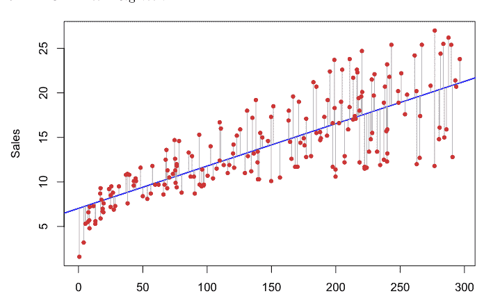

**图 3.1.** *展示了广告数据中销售额对电视广告回归的最小二乘拟合。该拟合通过最小化残差平方和得到。每条灰色线段代表一个残差。在这种情况下，线性拟合捕捉了关系的本质，尽管它高估了图中左侧的趋势。*

其中 $\bar{y} \equiv \frac{1}{n} \sum_{i=1}^{n} y_i$ 和 $\bar{x} \equiv \frac{1}{n} \sum_{i=1}^{n} x_i$ 是样本均值。换句话说，(3.4) 定义了简单线性回归的*最小二乘系数估计*。

图 3.1 展示了对广告数据的简单线性回归拟合，其中 $\hat{\beta}_0 = 7.03$，$\hat{\beta}_1 = 0.0475$。换句话说，根据这个近似，每增加 1,000 美元的电视广告支出，大约会多销售 47.5 个单位的产品。在图 3.2 中，我们使用广告数据（销售额作为响应变量，电视广告作为预测变量）计算了多个 $\beta_0$ 和 $\beta_1$ 值下的 RSS。在每个图中，红点代表由 (3.4) 给出的最小二乘估计对 ($\hat{\beta}_0, \hat{\beta}_1$)。这些值显然使 RSS 最小化。

## 3.1.2 评估系数估计的准确性

回想公式 (2.1)，我们假设 $X$ 和 $Y$ 之间的*真实*关系具有 $Y = f(X) + \epsilon$ 的形式，其中 $f$ 是某个未知函数，$\epsilon$ 是均值为零的随机误差项。如果 $f$ 可以用线性函数近似，那么我们可以将这种关系写为

$$Y = \beta_0 + \beta_1 X + \epsilon. \tag{3.5}$$

这里 $\beta_0$ 是截距项——即当 $X = 0$ 时 $Y$ 的期望值，$\beta_1$ 是斜率——与 $X$ 每增加一个单位相关联的 $Y$ 的平均增加量。误差项涵盖了这个简单模型所遗漏的一切：真实关系可能不是线性的，可能存在其他导致 $Y$ 变化的变量，也可能存在测量误差。我们通常假设误差项与 $X$ 独立。

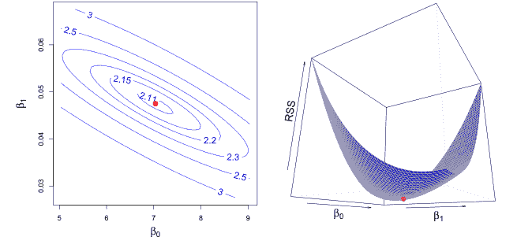

**图 3.2.** *广告数据的 RSS 等高线图和三维图，使用销售额作为响应变量，电视广告作为预测变量。红点对应于由 (3.4) 给出的最小二乘估计 $\hat{\beta}_0$ 和 $\hat{\beta}_1$。*

公式 (3.5) 给出的模型定义了*总体回归线*，它是 $X$ 和 $Y$ 之间真实关系的最佳线性近似。^1 最小二乘回归系数估计 (3.4) 描述了*最小二乘线* (3.2)。图 3.3 的左侧面板在一个简单的模拟示例中展示了这两条线。我们创建了 100 个随机的 $X$，并从模型

$$Y = 2 + 3X + \epsilon, \quad (3.6)$$

生成了 100 个对应的 $Y$，其中 $\epsilon$ 来自均值为零的正态分布。图 3.3 左侧面板中的红线展示了*真实*关系 $f(X) = 2 + 3X$，而蓝线是基于观测数据的最小二乘估计。对于真实数据，真实关系通常是未知的，但最小二乘线总是可以使用 (3.4) 中给出的系数估计来计算。换句话说，在实际应用中，我们可以获得一组观测值，从中可以计算最小二乘线；然而，总体回归线是未被观测到的。在图 3.3 的右侧面板中，我们从公式 (3.6) 给出的模型生成了十个不同的数据集，并绘制了对应的十条最小二乘线。请注意，从同一真实模型生成的不同数据集会导致略有不同的最小二乘线，但未被观测到的总体回归线不会改变。

乍一看，总体回归线和最小二乘线之间的差异可能显得微妙且令人困惑。我们只有一个数据集，那么用两条不同的线来描述预测变量和响应变量之间的关系意味着什么呢？从根本上说，这两条线的概念是使用样本信息来估计大总体特征的标准统计方法的自然延伸。例如，假设我们有兴趣了解

^1 线性假设通常是一个有用的实用模型。然而，尽管许多教科书可能告诉我们，我们很少相信真实关系是线性的。

# 3. 线性回归

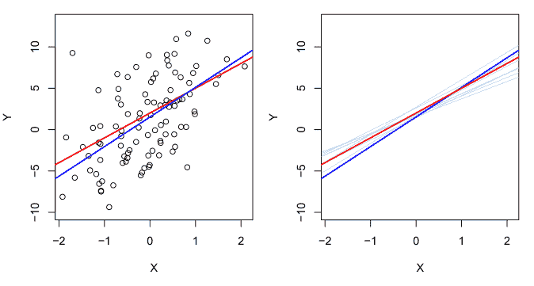

**图 3.3.** 一个模拟数据集。左图：红线代表真实关系 $f(X) = 2 + 3X$，称为总体回归线。蓝线是最小二乘线；它是基于观测数据（以黑色显示）对 $f(X)$ 的最小二乘估计。右图：总体回归线再次以红色显示，最小二乘线以深蓝色显示。浅蓝色显示了十条最小二乘线，每条线基于一个单独的随机观测集计算。每条最小二乘线都不同，但平均而言，最小二乘线非常接近总体回归线。

某个随机变量 $Y$ 的总体均值 $\mu$。不幸的是，$\mu$ 是未知的，但我们确实可以访问来自 $Y$ 的 $n$ 个观测值 $y_1, \dots, y_n$，我们可以用它们来估计 $\mu$。一个合理的估计是 $\hat{\mu} = \bar{y}$，其中 $\bar{y} = \frac{1}{n} \sum_{i=1}^n y_i$ 是样本均值。样本均值和总体均值是不同的，但通常样本均值会提供对总体均值的良好估计。同样，线性回归中的未知系数 $\beta_0$ 和 $\beta_1$ 定义了总体回归线。我们试图使用 (3.4) 中给出的 $\hat{\beta}_0$ 和 $\hat{\beta}_1$ 来估计这些未知系数。这些系数估计定义了最小二乘线。

线性回归与随机变量均值估计之间的类比基于*偏差*的概念是恰当的。如果我们使用样本均值 $\hat{\mu}$ 来估计 $\mu$，这个估计是*无偏的*，意思是平均而言，我们期望 $\hat{\mu}$ 等于 $\mu$。这到底是什么意思？它的意思是，基于一组特定的观测值 $y_1, \dots, y_n$，$\hat{\mu}$ 可能会高估 $\mu$，而基于另一组观测值，$\hat{\mu}$ 可能会低估 $\mu$。但如果我们能够对从大量观测集中获得的大量 $\mu$ 估计值取平均，那么这个平均值将*恰好*等于 $\mu$。因此，无偏估计量不会*系统性地*高估或低估真实参数。无偏性这一性质对于 (3.4) 给出的最小二乘系数估计也成立：如果我们基于特定数据集估计 $\beta_0$ 和 $\beta_1$，那么我们的估计不会完全等于 $\beta_0$ 和 $\beta_1$。但如果我们能够对从大量数据集获得的估计值取平均，那么这些估计值的平均值将是完全正确的！事实上，我们可以从图 3.3 的右侧面板看到，许多最小二乘线的平均值，每条从独立数据集估计得到的回归线，与真实的总体回归线非常接近。

我们继续类比随机变量 $Y$ 的总体均值 $\mu$ 的估计。一个自然的问题是：样本均值 $\hat{\mu}$ 作为 $\mu$ 的估计有多准确？我们已经确定，许多数据集上 $\hat{\mu}$ 的平均值会非常接近 $\mu$，但单个估计 $\hat{\mu}$ 可能会显著低估或高估 $\mu$。这个单个估计 $\hat{\mu}$ 会偏离多远？通常，我们通过计算 $\hat{\mu}$ 的*标准误差*来回答这个问题，记为 $\text{SE}(\hat{\mu})$。我们有著名的公式

$$\text{Var}(\hat{\mu}) = \text{SE}(\hat{\mu})^2 = \frac{\sigma^2}{n}, \quad (3.7)$$

其中 $\sigma$ 是 $Y$ 的每个实现值 $y_i$ 的标准差。^2 粗略地说，标准误差告诉我们这个估计 $\hat{\mu}$ 与 $\mu$ 的实际值平均相差多少。公式 3.7 也告诉我们这种偏差如何随 $n$ 缩小——我们拥有的观测值越多，$\hat{\mu}$ 的标准误差就越小。类似地，我们可以想知道 $\hat{\beta}_0$ 和 $\hat{\beta}_1$ 与真实值 $\beta_0$ 和 $\beta_1$ 有多接近。为了计算与 $\hat{\beta}_0$ 和 $\hat{\beta}_1$ 相关的标准误差，我们使用以下公式：

$$\text{SE}(\hat{\beta}_0)^2 = \sigma^2 \left[ \frac{1}{n} + \frac{\bar{x}^2}{\sum_{i=1}^n (x_i - \bar{x})^2} \right], \quad \text{SE}(\hat{\beta}_1)^2 = \frac{\sigma^2}{\sum_{i=1}^n (x_i - \bar{x})^2}, \quad (3.8)$$

其中 $\sigma^2 = \text{Var}(\epsilon)$。为了使这些公式严格有效，我们需要假设每个观测值的误差 $\epsilon_i$ 具有共同的方差 $\sigma^2$ 且不相关。这在图 3.1 中显然不成立，但该公式仍然是一个很好的近似。注意在公式中，当 $x_i$ 更分散时，$\text{SE}(\hat{\beta}_1)$ 更小；直观地说，当这种情况发生时，我们估计斜率有更大的*杠杆作用*。我们还看到，如果 $\bar{x}$ 为零（此时 $\hat{\beta}_0$ 将等于 $\bar{y}$），$\text{SE}(\hat{\beta}_0)$ 将与 $\text{SE}(\hat{\mu})$ 相同。通常，$\sigma^2$ 是未知的，但可以从数据中估计。$\sigma$ 的这个估计被称为*残差标准误差*，由公式 $\text{RSE} = \sqrt{\text{RSS}/(n-2)}$ 给出。严格来说，当 $\sigma^2$ 从数据中估计时，我们应该写 $\widehat{\text{SE}}(\hat{\beta}_1)$ 以表示已经进行了估计，但为了符号简洁，我们将省略这个额外的“帽子”。

标准误差可用于计算*置信区间*。95%置信区间定义为一个值范围，该范围有95%的概率包含参数的真实未知值。该范围是根据从数据样本计算出的下限和上限定义的。95%置信区间具有以下性质：如果我们进行重复抽样并为每个样本构建置信区间，95%的区间将包含参数的真实未知值。对于线性回归，$\beta_1$ 的95%置信区间近似采取以下形式

$$\hat{\beta}_1 \pm 2 \cdot \text{SE}(\hat{\beta}_1). \quad (3.9)$$

^2 此公式在 $n$ 个观测值不相关的条件下成立。

也就是说，区间

$$\left[\hat{\beta}_1 - 2 \cdot \text{SE}(\hat{\beta}_1), \hat{\beta}_1 + 2 \cdot \text{SE}(\hat{\beta}_1)\right]$$

包含 $\beta_1$ 真实值的概率大约为95%。^3 类似地，$\beta_0$ 的置信区间近似采取以下形式

$$\hat{\beta}_0 \pm 2 \cdot \text{SE}(\hat{\beta}_0).$$

对于广告数据，$\beta_0$ 的95%置信区间为 [6.130, 7.935]，$\beta_1$ 的95%置信区间为 [0.042, 0.053]。因此，我们可以得出结论，在没有任何广告的情况下，平均销售额将在6,130到7,935个单位之间。此外，电视广告每增加1,000美元，平均销售额将增加42到53个单位。

标准误差也可用于对系数进行*假设检验*。最常见的假设检验涉及检验*原假设*

$$H_0 : X \text{ 与 } Y \text{ 之间没有关系}$$

与*备择假设*

$$H_a : X \text{ 与 } Y \text{ 之间存在某种关系}.$$

数学上，这对应于检验

$$H_0 : \beta_1 = 0$$

与

$$H_a : \beta_1 \neq 0,$$

因为如果 $\beta_1 = 0$，则模型 (3.5) 简化为 $Y = \beta_0 + \epsilon$，且 $X$ 与 $Y$ 无关。为了检验原假设，我们需要确定 $\hat{\beta}_1$（我们对 $\beta_1$ 的估计）是否足够远离零，以至于我们可以确信 $\beta_1$ 非零。多远才算足够远？这当然取决于 $\hat{\beta}_1$ 的准确性——即取决于 $\text{SE}(\hat{\beta}_1)$。如果 $\text{SE}(\hat{\beta}_1)$ 很小，那么即使 $\hat{\beta}_1$ 的值相对较小，也可能提供强有力的证据表明 $\beta_1 \neq 0$，从而表明 $X$ 和 $Y$ 之间存在关系。相反，如果 $\text{SE}(\hat{\beta}_1)$ 很大，那么 $\hat{\beta}_1$ 的绝对值必须很大，我们才能拒绝原假设。在实践中，我们计算一个*t统计量*，由下式给出

$$t = \frac{\hat{\beta}_1 - 0}{\text{SE}(\hat{\beta}_1)},$$

^3 *近似*有几个原因。公式 3.10 依赖于误差为高斯分布的假设。此外，$\text{SE}(\hat{\beta}_1)$ 项前面的系数2会根据线性回归中观测值的数量 $n$ 而略有变化。准确地说，(3.10) 应包含自由度为 $n-2$ 的 *t* 分布的97.5%分位数，而不是数字2。如何在 **R** 中精确计算95%置信区间的详细信息将在本章后面提供。

| | 系数 | 标准误差 | t统计量 | p值 |
|---|---|---|---|---|
| 截距 | 7.0325 | 0.4578 | 15.36 | < 0.0001 |
| 电视 | 0.0475 | 0.0027 | 17.67 | < 0.0001 |

表 3.1. 对于广告数据，销售单位数量对电视广告预算回归的最小二乘模型系数。电视广告预算增加1,000美元与销售额增加约50个单位相关。（回想一下，销售变量以千个单位为单位，电视变量以千美元为单位。）

它衡量了 $\hat{\beta}_1$ 偏离0的标准差数量。如果 $X$ 和 $Y$ 之间确实没有关系，那么我们期望 (3.14) 将服从自由度为 $n-2$ 的 $t$ 分布。$t$ 分布具有钟形形状，对于 $n$ 大于约30的值，它与标准正态分布非常相似。因此，假设 $\beta_1 = 0$，计算观察到任何绝对值等于或大于 $|t|$ 的数的概率是简单的。我们称这个概率为 $p$ 值。粗略地说，我们这样解释 $p$ 值：小的 $p$ 值表明，在预测变量和响应变量之间没有真实关联的情况下，由于偶然性观察到预测变量和响应变量之间如此大的关联是不太可能的。因此，如果我们看到一个小的 $p$ 值，那么我们可以推断预测变量和响应变量之间存在关联。如果 $p$ 值足够小，我们就拒绝原假设——即我们宣布 $X$ 和 $Y$ 之间存在关系。拒绝原假设的典型 $p$ 值截断点是5%或1%，尽管这个主题将在第13章中更详细地探讨。当 $n = 30$ 时，这些分别对应于大约2和2.75的 $t$ 统计量 (3.14)。

表 3.1 提供了广告数据中销售单位数量对电视广告预算回归的最小二乘模型的详细信息。注意 $\hat{\beta}_0$ 和 $\hat{\beta}_1$ 的系数相对于它们的标准误差非常大，因此 $t$ 统计量也很大；如果 $H_0$ 为真，观察到这些值的概率实际上为零。因此，我们可以得出结论 $\beta_0 \neq 0$ 且 $\beta_1 \neq 0$。

## 3.1.3 评估模型的准确性

一旦我们拒绝了原假设 (3.12) 而支持备择假设 (3.13)，自然想要量化模型拟合数据的程度。线性回归拟合的质量通常使用两个相关量来评估：残差标准误差 (RSE) 和 $R^2$ 统计量。

^4 在表 3.1 中，截距的小 $p$ 值表明我们可以拒绝 $\beta_0 = 0$ 的原假设，电视的小 $p$ 值表明我们可以拒绝 $\beta_1 = 0$ 的原假设。拒绝后一个原假设使我们能够得出电视和销售之间存在关系的结论。拒绝前一个原假设使我们能够得出在没有电视支出的情况下，销售额非零的结论。

# 3. 线性回归

| 量 | 值 |
| :--- | :--- |
| 残差标准误差 | 3.26 |
| $R^2$ | 0.612 |
| $F$-统计量 | 312.1 |

表 3.2。对于广告数据，关于销售单位数量对电视广告预算回归的最小二乘模型的更多信息。

表 3.2 显示了销售单位数量对电视广告预算线性回归的残差标准误差、$R^2$ 统计量和 $F$-统计量（将在第 3.2.2 节中描述）。

### 残差标准误差

回顾模型 (3.5)，每个观测值都关联一个误差项 $\epsilon$。由于这些误差项的存在，即使我们知道真实的回归线（即即使 $\beta_0$ 和 $\beta_1$ 已知），我们也无法从 $X$ 完美预测 $Y$。RSE 是 $\epsilon$ 标准差的估计。粗略地说，它是响应值偏离真实回归线的平均量。它使用以下公式计算：

$$\text{RSE} = \sqrt{\frac{1}{n-2}\text{RSS}} = \sqrt{\frac{1}{n-2}\sum_{i=1}^{n}(y_i - \hat{y}_i)^2}. \quad (3.15)$$

注意，RSS 在第 3.1.1 节中定义，由以下公式给出：

$$\text{RSS} = \sum_{i=1}^{n}(y_i - \hat{y}_i)^2. \quad (3.16)$$

对于广告数据，我们从表 3.2 的线性回归输出中看到 RSE 为 3.26。换句话说，每个市场的实际销售额平均偏离真实回归线约 3,260 个单位。另一种思考方式是，即使模型是正确的，并且未知系数 $\beta_0$ 和 $\beta_1$ 的真实值已精确知道，基于电视广告的任何销售预测平均仍会偏差约 3,260 个单位。当然，3,260 个单位是否是可接受的预测误差取决于问题背景。在广告数据集中，所有市场的平均销售额约为 14,000 个单位，因此百分比误差为 3,260/14,000 = 23%。

RSE 被视为模型 (3.5) 对数据拟合不足的一种度量。如果使用模型获得的预测与真实结果值非常接近——即对于 $i = 1, \dots, n$，$\hat{y}_i \approx y_i$——那么 (3.15) 将会很小，我们可以得出结论模型很好地拟合了数据。另一方面，如果对于一个或多个观测值，$\hat{y}_i$ 与 $y_i$ 相差甚远，那么 RSE 可能会相当大，表明模型对数据拟合不佳。

### $R^2$ 统计量

RSE 提供了模型 (3.5) 对数据拟合不足的绝对度量。但由于它以 $Y$ 的单位测量，因此并不总是清楚什么构成一个好的 RSE。$R^2$ 统计量提供了另一种拟合度量。它采用*比例*的形式——解释的方差比例——因此其值始终在 0 到 1 之间，并且独立于 $Y$ 的尺度。

要计算 $R^2$，我们使用公式：

$$R^2 = \frac{\text{TSS} - \text{RSS}}{\text{TSS}} = 1 - \frac{\text{RSS}}{\text{TSS}} \qquad (3.17)$$

其中 $\text{TSS} = \sum(y_i - \bar{y})^2$ 是*总平方和*，RSS 在 (3.16) 中定义。TSS 衡量响应 $Y$ 中的总方差，可以理解为在执行回归之前响应中固有的变异性量。相比之下，RSS 衡量执行回归后剩余未解释的变异性量。因此，$\text{TSS} - \text{RSS}$ 衡量通过执行回归所解释（或移除）的响应中的变异性量，而 $R^2$ 衡量*使用 $X$ 可以解释的 $Y$ 中的变异性比例*。接近 1 的 $R^2$ 统计量表明响应中的大部分变异性由回归解释。接近 0 的值表明回归没有解释响应中的太多变异性；这可能是因为线性模型错误，或者误差方差 $\sigma^2$ 很高，或者两者兼有。在表 3.2 中，$R^2$ 为 0.61，因此销售中略低于三分之二的变异性由电视的线性回归解释。

$R^2$ 统计量 (3.17) 相对于 RSE (3.15) 具有解释上的优势，因为与 RSE 不同，它始终介于 0 和 1 之间。然而，确定什么是*好的* $R^2$ 值仍然可能具有挑战性，通常这将取决于应用。例如，在物理学的某些问题中，我们可能知道数据确实来自具有小残差误差的线性模型。在这种情况下，我们期望看到 $R^2$ 值极其接近 1，而显著较小的 $R^2$ 值可能表明生成数据的实验存在严重问题。另一方面，在生物学、心理学、营销和其他领域的典型应用中，线性模型 (3.5) 至多是对数据的极其粗略的近似，并且由于其他未测量因素导致的残差误差通常非常大。在这种情况下，我们只期望响应中很小比例的方差被预测变量解释，$R^2$ 值远低于 0.1 可能更现实！

$R^2$ 统计量是 $X$ 和 $Y$ 之间线性关系的度量。回顾*相关性*，定义为：

$$\text{Cor}(X, Y) = \frac{\sum_{i=1}^n (x_i - \bar{x})(y_i - \bar{y})}{\sqrt{\sum_{i=1}^n (x_i - \bar{x})^2} \sqrt{\sum_{i=1}^n (y_i - \bar{y})^2}}, \qquad (3.18)$$

也是 $X$ 和 $Y$ 之间线性关系的度量。$^5$ 这表明我们或许可以使用 $r = \text{Cor}(X, Y)$ 而不是 $R^2$ 来评估线性模型的拟合度。事实上，可以证明在简单线性回归设置中，$R^2 = r^2$。换句话说，相关系数的平方和 $R^2$ 统计量是相同的。然而，在下一节中，我们将讨论多元线性回归问题，其中我们同时使用多个预测变量来预测响应。预测变量与响应之间的相关性概念不能自动扩展到这种设置，因为相关性量化的是单对变量之间的关联，而不是更大数量变量之间的关联。我们将看到 $R^2$ 填补了这一角色。

$^5$ 我们注意到，实际上 (3.18) 的右边是样本相关性；因此，更正确的写法是 $\text{Cor}(\widehat{X}, Y)$；然而，为了符号简便，我们省略了“帽子”。

## 3.2 多元线性回归

简单线性回归是基于单个预测变量预测响应的有用方法。然而，在实践中，我们通常有多个预测变量。例如，在广告数据中，我们已经研究了销售与电视广告之间的关系。我们还有关于在广播和报纸上花费的广告金额的数据，我们可能想知道这两种媒体中是否有任何一种与销售相关。我们如何扩展对广告数据的分析以容纳这两个额外的预测变量？

一种选择是运行三个独立的简单线性回归，每个回归使用不同的广告媒体作为预测变量。例如，我们可以拟合一个简单线性回归，基于广播广告支出预测销售。结果如表 3.3（上表）所示。我们发现广播广告支出增加 $1,000 与销售增加约 203 个单位相关。表 3.3（下表）包含销售对报纸广告预算简单线性回归的最小二乘系数。报纸广告预算增加 $1,000 与销售增加约 55 个单位相关。

表 3.3。广告数据的更多简单线性回归模型。销售单位数量对上：广播广告预算和下：报纸广告预算的简单线性回归模型的系数。广播广告支出增加 $1,000 与销售平均增加约 203 个单位相关，而报纸广告支出增加相同金额与销售平均增加约 55 个单位相关。（注意，销售变量以千个单位为单位，广播和报纸变量以千美元为单位。）

销售对广播的简单回归
| | 系数 | 标准误差 | t-统计量 | p-值 |
|---|---|---|---|---|
| 截距 | 9.312 | 0.563 | 16.54 | < 0.0001 |
| 广播 | 0.203 | 0.020 | 9.92 | < 0.0001 |

销售对报纸的简单回归
| | 系数 | 标准误差 | t-统计量 | p-值 |
|---|---|---|---|---|
| 截距 | 12.351 | 0.621 | 19.88 | < 0.0001 |
| 报纸 | 0.055 | 0.017 | 3.30 | 0.00115 |

然而，为每个预测变量分别拟合一个简单线性回归模型的方法并不完全令人满意。首先，由于每个广告预算都对应一个独立的回归方程，因此不清楚如何根据三个广告媒体预算对销售额进行单一预测。其次，三个回归方程中的每一个在估计回归系数时都忽略了另外两个媒体。我们很快会看到，如果在我们的数据集的200个市场中，媒体预算彼此相关，那么这可能导致对每个媒体预算与销售额之间关联的估计产生严重误导。

与其为每个预测变量拟合一个单独的简单线性回归模型，一个更好的方法是扩展简单线性回归模型（3.5），使其能够直接处理多个预测变量。我们可以通过在一个模型中为每个预测变量赋予一个单独的斜率系数来实现这一点。通常，假设我们有 $p$ 个不同的预测变量。那么多元线性回归模型的形式为

$$Y = \beta_0 + \beta_1 X_1 + \beta_2 X_2 + \cdots + \beta_p X_p + \epsilon, \quad (3.19)$$

其中 $X_j$ 代表第 $j$ 个预测变量，$\beta_j$ 量化了该变量与响应变量之间的关联。我们将 $\beta_j$ 解释为在*保持所有其他预测变量固定*的情况下，$X_j$ 每增加一个单位对 $Y$ 的*平均*影响。在广告示例中，（3.19）变为

$$\text{sales} = \beta_0 + \beta_1 \times \text{TV} + \beta_2 \times \text{radio} + \beta_3 \times \text{newspaper} + \epsilon. \quad (3.20)$$

## 3.2.1 估计回归系数

与简单线性回归的情况一样，（3.19）中的回归系数 $\beta_0, \beta_1, \ldots, \beta_p$ 是未知的，必须进行估计。给定估计值 $\hat{\beta}_0, \hat{\beta}_1, \ldots, \hat{\beta}_p$，我们可以使用以下公式进行预测

$$\hat{y} = \hat{\beta}_0 + \hat{\beta}_1 x_1 + \hat{\beta}_2 x_2 + \cdots + \hat{\beta}_p x_p. \quad (3.21)$$

参数使用我们在简单线性回归中看到的相同最小二乘法进行估计。我们选择 $\beta_0, \beta_1, \ldots, \beta_p$ 以最小化残差平方和

$$\begin{aligned} \text{RSS} &= \sum_{i=1}^n (y_i - \hat{y}_i)^2 \\ &= \sum_{i=1}^n (y_i - \hat{\beta}_0 - \hat{\beta}_1 x_{i1} - \hat{\beta}_2 x_{i2} - \cdots - \hat{\beta}_p x_{ip})^2. \quad (3.22) \end{aligned}$$

使（3.22）最小化的值 $\hat{\beta}_0, \hat{\beta}_1, \ldots, \hat{\beta}_p$ 就是多元最小二乘回归系数估计值。与（3.4）中给出的简单线性回归估计值不同，多元回归系数估计值的形式有些复杂，使用矩阵代数最容易表示。因此，我们不在这里提供它们。任何统计软件包都可以用来计算这些系数估计值，本章稍后我们将展示如何在R中完成此操作。图3.4展示了一个使用 $p = 2$ 个预测变量的玩具数据集的最小二乘拟合示例。

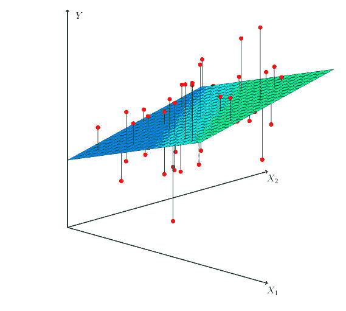

**图3.4.** 在三维环境中，有两个预测变量和一个响应变量，最小二乘回归线变成了一个平面。选择该平面是为了最小化每个观测值（以红色显示）与平面之间的垂直距离的平方和。

表3.4显示了当使用电视、广播和报纸广告预算来预测产品销售额时，使用广告数据的多元回归系数估计值。我们对这些结果的解释如下：在给定的电视和报纸广告支出下，在广播广告上额外支出1,000美元与大约189个单位的额外销售额相关联。将这些系数估计值与表3.1和表3.3中显示的系数估计值进行比较，我们注意到电视和广播的多元回归系数估计值与简单线性回归系数估计值非常相似。然而，虽然表3.3中的报纸回归系数估计值显著不为零，但在多元回归模型中，报纸的系数估计值接近于零，相应的 $p$-值不再显著，其值约为0.86。这说明简单回归系数和多元回归系数可能差异很大。这种差异源于这样一个事实：在简单回归的情况下，斜率项代表了在忽略电视和广播等其他预测变量的情况下，报纸广告每增加1,000美元所关联的产品销售额的平均增长。相比之下，在多元回归设置中，报纸的系数代表了在保持电视和广播支出不变的情况下，报纸支出增加1,000美元所关联的产品销售额的平均增长。

多元回归表明销售额与报纸之间没有关系，而简单线性回归则暗示相反，这合理吗？事实上，这是合理的。考虑表3.5中显示的三个预测变量和响应变量的相关矩阵。注意，广播和报纸之间的相关性为0.35。这表明报纸广告支出高的市场往往广播广告支出也高。现在假设多元回归是正确的，报纸广告与销售额无关，但广播广告与销售额有关。那么，在我们广播支出更多的市场，我们的销售额往往会更高，正如我们的相关矩阵所示，我们在这些相同的市场中也倾向于在报纸广告上支出更多。因此，在一个只考察销售额与报纸关系的简单线性回归中，我们会观察到较高的报纸支出往往与较高的销售额相关联，即使报纸广告与销售额没有直接关联。所以报纸广告是广播广告的替代品；报纸“获得”了广播对销售额影响的“功劳”。

这个稍微违反直觉的结果在许多现实生活中非常常见。考虑一个荒谬的例子来说明这一点。对某个海滩社区在一段时间内收集的数据进行鲨鱼袭击与冰淇淋销售的回归分析，会显示出正相关关系，类似于销售额与报纸之间的关系。当然，目前还没有人（建议）禁止在海滩上销售冰淇淋以减少鲨鱼袭击。实际上，更高的温度导致更多的人去海滩，这反过来又导致更多的冰淇淋销售和更多的鲨鱼袭击。对鲨鱼袭击与冰淇淋销售和温度进行多元回归分析表明，正如直觉所暗示的那样，在调整温度后，冰淇淋销售不再是一个显著的预测变量。

## 3.2.2 一些重要问题

当我们进行多元线性回归时，我们通常感兴趣的是回答几个重要问题。

1.  预测变量 $X_1, X_2, \dots, X_p$ 中至少有一个对预测响应变量有用吗？
2.  所有预测变量都有助于解释 $Y$，还是只有预测变量子集有用？
3.  模型对数据的拟合程度如何？
4.  给定一组预测变量值，我们应该预测什么响应值，我们的预测有多准确？

我们现在依次解决这些问题。

### 一：响应变量与预测变量之间是否存在关系？

回想一下，在简单线性回归设置中，为了确定响应变量和预测变量之间是否存在关系，我们只需检查 $\beta_1 = 0$ 即可。在具有 $p$ 个预测变量的多元回归设置中，我们需要询问是否所有回归系数都为零，即 $\beta_1 = \beta_2 = \dots = \beta_p = 0$。与简单线性回归设置一样，我们使用假设检验来回答这个问题。我们检验原假设，

$$H_0 : \beta_1 = \beta_2 = \dots = \beta_p = 0$$

备择假设为

$$H_a : \text{至少有一个 } \beta_j \text{ 不为零。}$$

这个假设检验通过计算 $F$-统计量来进行，

$$F = \frac{(\text{TSS} - \text{RSS})/p}{\text{RSS}/(n - p - 1)}, \quad (3.23)$$

其中，与简单线性回归一样，$\text{TSS} = \sum(y_i - \bar{y})^2$ 且 $\text{RSS} = \sum(y_i - \hat{y}_i)^2$。如果线性模型假设正确，可以证明

$$E\{\text{RSS}/(n - p - 1)\} = \sigma^2$$

并且，如果 $H_0$ 为真，

$$E\{(\text{TSS} - \text{RSS})/p\} = \sigma^2.$$

因此，当响应变量和预测变量之间没有关系时，我们期望 $F$-统计量的值接近1。另一方面，如果 $H_a$ 为真，那么 $E\{(\text{TSS} - \text{RSS})/p\} > \sigma^2$，所以我们期望 $F$ 大于1。

通过将销售额对广播、电视和报纸进行回归得到的多元线性回归模型的 $F$-统计量如表3.6所示。在这个例子中，$F$-统计量为570。由于这远大于1，它提供了反对原假设 $H_0$ 的有力证据。换句话说，大的 $F$-统计量表明至少有一种广告媒体与销售额有关。然而，如果 $F$-统计量更接近1呢？$F$-统计量需要多大我们才能拒绝 $H_0$ 并

| | 系数 | 标准误差 | t-统计量 | p-值 |
|---|---|---|---|---|
| 截距 | 2.939 | 0.3119 | 9.42 | < 0.0001 |
| 电视 | 0.046 | 0.0014 | 32.81 | < 0.0001 |
| 广播 | 0.189 | 0.0086 | 21.89 | < 0.0001 |
| 报纸 | −0.001 | 0.0059 | −0.18 | 0.8599 |

表3.4. 对于广告数据，销售额对电视、广播和报纸广告预算的多元线性回归的最小二乘系数估计值。

| | 电视 | 广播 | 报纸 | 销售额 |
|---|---|---|---|---|
| 电视 | 1.0000 | 0.0548 | 0.0567 | 0.7822 |
| 广播 | | 1.0000 | 0.3541 | 0.5762 |
| 报纸 | | | 1.0000 | 0.2283 |
| 销售额 | | | | 1.0000 |

表3.5. 广告数据中电视、广播、报纸和销售额的相关矩阵。

## 3.2 多元线性回归

| 量 | 值 |
| :--- | :--- |
| 残差标准误差 | 1.69 |
| $R^2$ | 0.897 |
| $F$-统计量 | 570 |

表 3.6. 关于广告数据中，以电视、报纸和广播广告预算为自变量，销售单位数量为因变量的回归最小二乘模型的更多信息。该模型的其他信息显示在表 3.4 中。

我们能否得出存在关系的结论？事实证明，答案取决于 $n$ 和 $p$ 的值。当 $n$ 很大时，一个略大于 1 的 $F$-统计量可能仍然提供了反对 $H_0$ 的证据。相反，如果 $n$ 较小，则需要更大的 $F$-统计量才能拒绝 $H_0$。当 $H_0$ 为真且误差 $\epsilon_i$ 服从正态分布时，$F$-统计量服从 $F$-分布。$^6$ 对于任何给定的 $n$ 和 $p$ 值，任何统计软件包都可以使用此分布来计算与 $F$-统计量相关的 $p$-值。基于这个 $p$-值，我们可以确定是否拒绝 $H_0$。对于广告数据，表 3.6 中与 $F$-统计量相关的 $p$-值实际上为零，因此我们有极强的证据表明至少有一种媒体与销售额增长相关。

在 (3.23) 中，我们检验的是所有系数均为零的 $H_0$。有时我们想检验特定的 $q$ 个系数子集是否为零。这对应于如下原假设：

$$H_0: \quad \beta_{p-q+1} = \beta_{p-q+2} = \cdots = \beta_p = 0,$$

为方便起见，我们将选择剔除的变量放在列表末尾。在这种情况下，我们拟合第二个模型，该模型使用了*除*最后 $q$ 个变量之外的所有变量。假设该模型的残差平方和为 RSS$_0$。那么，相应的 $F$-统计量为：

$$F = \frac{(\text{RSS}_0 - \text{RSS})/q}{\text{RSS}/(n - p - 1)}. \tag{3.24}$$

请注意，在表 3.4 中，报告了每个单独预测变量的 $t$-统计量和 $p$-值。这些提供了关于在调整其他预测变量后，每个单独预测变量是否与响应变量相关的信息。事实证明，其中每一个都完全等价$^7$于从模型中剔除该单个变量（保留所有其他变量）的 $F$-检验——即 (3.24) 中的 $q=1$。因此，它报告了将该变量添加到模型中的*部分效应*。例如，正如我们之前讨论的，这些 $p$-值表明，在电视和广播保持不变的情况下，电视和广播与销售额相关，但没有证据表明报纸与销售额相关。

既然有了每个变量的这些单独 $p$-值，为什么我们还需要查看整体的 $F$-统计量？毕竟，如果任何一个单独变量的 $p$-值非常小，那么*至少有一个预测变量与响应变量相关*，这似乎是可能的。然而，这种逻辑是有缺陷的，尤其是在预测变量数量 $p$ 很大的情况下。

$^6$即使误差不服从正态分布，只要样本量 $n$ 足够大，$F$-统计量也近似服从 $F$-分布。
$^7$每个 $t$-统计量的平方就是相应的 $F$-统计量。

例如，考虑一个 $p = 100$ 且 $H_0 : \beta_1 = \beta_2 = \dots = \beta_p = 0$ 为真的例子，因此没有变量真正与响应变量相关。在这种情况下，大约 5% 的与每个变量相关的 $p$-值（如表 3.4 所示的类型）会因偶然性而低于 0.05。换句话说，即使预测变量和响应变量之间没有任何真实关联，我们也期望看到大约五个*小的* $p$-值。$^8$ 事实上，我们很可能因偶然性而观察到至少一个低于 0.05 的 $p$-值！因此，如果我们使用单独的 $t$-统计量和相关的 $p$-值来决定变量和响应变量之间是否存在任何关联，我们极有可能错误地得出存在关系的结论。然而，$F$-统计量不存在这个问题，因为它对预测变量的数量进行了调整。因此，如果 $H_0$ 为真，无论预测变量的数量或观测值的数量如何，$F$-统计量导致 $p$-值低于 0.05 的概率只有 5%。

使用 $F$-统计量来检验预测变量和响应变量之间是否存在任何关联的方法，在 $p$ 相对较小（当然比 $n$ 小得多）时有效。然而，有时我们有非常多的变量。如果 $p > n$，那么待估计的系数 $\beta_j$ 比用于估计它们的观测值还要多。在这种情况下，我们甚至无法使用最小二乘法拟合多元线性回归模型，因此 $F$-统计量无法使用，本章迄今为止我们看到的大多数其他概念也无法使用。当 $p$ 很大时，可以使用下一节讨论的一些方法，例如*向前逐步选择*。这种*高维*设置将在第 6 章中更详细地讨论。

## 3.3 选择重要变量

如上一节所述，多元回归分析的第一步是计算 $F$-统计量并检查相关的 $p$-值。如果我们根据该 $p$-值得出至少有一个预测变量与响应变量相关的结论，那么很自然地会想知道*哪些*是“罪魁祸首”！我们可以查看表 3.4 中的单独 $p$-值，但正如讨论的（并在第 13 章进一步探讨），如果 $p$ 很大，我们很可能会做出一些错误的发现。

有可能所有预测变量都与响应变量相关，但更常见的情况是响应变量仅与预测变量的一个子集相关。确定哪些预测变量与响应变量相关，以便拟合一个仅包含这些预测变量的单一模型的任务，被称为*变量选择*。变量选择问题在第 6 章中有广泛研究，因此这里我们只简要概述一些经典方法。

理想情况下，我们希望通过尝试许多不同的模型（每个模型包含不同的预测变量子集）来进行变量选择。例如，如果 $p = 2$，那么我们可以考虑四个模型：(1) 不包含任何变量的模型，(2) 仅包含 $X_1$ 的模型，(3) 仅包含 $X_2$ 的模型，以及 (4) 同时包含 $X_1$ 和 $X_2$ 的模型。然后我们可以从所有考虑过的模型中选择*最佳*模型。我们如何确定哪个模型最好？可以使用各种统计量来判断模型的质量。这些包括 *Mallow's $C_p$*、*赤池信息准则* (AIC)、*贝叶斯信息准则* (BIC) 和 *调整 $R^2$*。这些将在第 6 章中更详细地讨论。我们也可以通过绘制各种模型输出（如残差）来确定哪个模型最好，以寻找模式。

不幸的是，包含 $p$ 个变量子集的模型总共有 $2^p$ 个。这意味着即使对于中等大小的 $p$，尝试每一个可能的预测变量子集也是不可行的。例如，我们看到如果 $p = 2$，那么有 $2^2 = 4$ 个模型需要考虑。但如果 $p = 30$，那么我们必须考虑 $2^{30} = 1,073,741,824$ 个模型！这是不切实际的。因此，除非 $p$ 非常小，否则我们不能考虑所有 $2^p$ 个模型，而是需要一种自动化且高效的方法来选择一个较小的模型集合进行考虑。有三种经典方法可以完成此任务：

- *向前逐步选择。* 我们从*零模型*开始——一个包含截距但没有预测变量的模型。然后我们拟合 $p$ 个简单线性回归，并将导致 RSS 最低的变量添加到零模型中。然后我们将导致新的两变量模型 RSS 最低的变量添加到该模型中。继续此过程，直到满足某个停止规则。

- *向后逐步选择。* 我们从包含所有变量的模型开始，并移除 $p$-值最大的变量——即统计上最不显著的变量。拟合新的 $(p - 1)$ 变量模型，并移除 $p$-值最大的变量。此过程持续进行，直到达到停止规则。例如，当所有剩余变量的 $p$-值都低于某个阈值时，我们可能会停止。

- *混合选择。* 这是向前和向后选择的结合。我们从模型中没有变量开始，与向前选择一样，我们添加提供最佳拟合的变量。我们继续逐个添加变量。当然，正如我们在广告示例中指出的，随着新预测变量添加到模型中，变量的 $p$-值可能会变大。因此，如果在任何时候模型中某个变量的 $p$-值上升到某个阈值以上，我们就将该变量从模型中移除。我们继续执行这些向前和向后步骤，直到模型中的所有变量都具有足够低的 $p$-值，并且模型外的所有变量如果添加到模型中都会具有较大的 $p$-值。

如果 $p > n$，则不能使用向后选择，而向前选择总是可以使用的。向前选择是一种贪婪方法，可能会在早期包含后来变得冗余的变量。混合选择可以弥补这一点。

$^8$这与*多重检验*的重要概念有关，这是第 13 章的重点。

## 三：模型拟合

模型拟合最常用的两个数值度量是残差标准误（RSE）和$R^2$（即解释方差的比例）。这些量的计算和解释方式与简单线性回归相同。

回顾一下，在简单回归中，$R^2$是响应变量与预测变量之间相关性的平方。在多元线性回归中，它等于$\text{Cor}(Y, \hat{Y})^2$，即响应变量与拟合线性模型之间相关性的平方；事实上，拟合线性模型的一个性质是它在所有可能的线性模型中最大化了这个相关性。

$R^2$值接近1表明模型解释了响应变量中很大一部分的方差。例如，我们在表3.6中看到，对于广告数据，使用所有三种广告媒体预测销售额的模型$R^2$为0.8972。另一方面，仅使用电视和广播预测销售额的模型$R^2$值为0.89719。换句话说，如果在已经包含电视和广播广告的模型中加入报纸广告，$R^2$只有微小的增加，尽管我们之前在表3.4中看到报纸广告的$p$值并不显著。事实证明，当向模型中添加更多变量时，$R^2$总会增加，即使这些变量与响应变量的关联很弱。这是由于添加另一个变量总会导致训练数据上的残差平方和减少（尽管测试数据不一定如此）。因此，在训练数据上计算的$R^2$统计量必然增加。在仅包含电视和广播广告的模型中加入报纸广告只会导致$R^2$微小增加这一事实，提供了额外的证据表明报纸可以从模型中剔除。本质上，报纸并没有真正改善模型对训练样本的拟合，并且由于过拟合，将其包含在模型中可能会导致在独立测试样本上表现不佳。

相比之下，仅以电视作为预测变量的模型$R^2$为0.61（表3.2）。在模型中加入广播会导致$R^2$的显著提高。这意味着使用电视和广播支出预测销售额的模型比仅使用电视广告的模型要好得多。我们可以通过查看仅包含电视和广播作为预测变量的模型中广播系数的$p$值来进一步量化这种改进。

仅包含电视和广播作为预测变量的模型RSE为1.681，而同时包含报纸作为预测变量的模型RSE为1.686（表3.6）。相比之下，仅包含电视的模型RSE为3.26（表3.2）。这证实了我们之前的结论，即使用电视和广播支出预测销售额的模型比仅使用电视支出的模型准确得多（在训练数据上）。此外，鉴于电视和广播支出已被用作预测变量，在模型中再使用报纸支出作为预测变量就没有意义了。细心的读者可能会疑惑，既然RSS必然减少，为什么加入报纸后RSE反而可能增加。一般来说，RSE定义为

$$\text{RSE} = \sqrt{\frac{1}{n-p-1}\text{RSS}}, \quad (3.25)$$

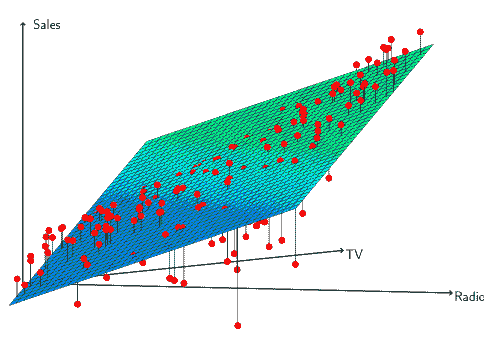

**图 3.5.** 对于广告数据，以电视和广播为预测变量对销售额进行线性回归拟合。从残差的模式中，我们可以看到数据中存在明显的非线性关系。正残差（表面上可见的那些）倾向于沿着45度线分布，即电视和广播预算平均分配的地方。负残差（大多数不可见）倾向于远离这条线，即预算分配更不平衡的地方。

对于简单线性回归，上式简化为(3.15)。因此，如果RSS的减少相对于$p$的增加较小，拥有更多变量的模型可能具有更高的RSE。

除了查看刚刚讨论的RSE和$R^2$统计量外，绘制数据图也很有用。图形摘要可以揭示数值统计无法显示的模型问题。例如，图3.5显示了电视和广播与销售额的三维图。我们看到一些观测点位于最小二乘回归平面之上，一些位于之下。特别是，线性模型似乎高估了那些广告费用主要花在电视或广播单一媒体上的实例的销售额。它低估了预算在两种媒体之间分配的实例的销售额。这种明显的非线性模式表明广告媒体之间存在协同或交互效应，即组合使用媒体比使用任何单一媒体对销售额的提升更大。在第3.3.2节中，我们将讨论通过使用交互项来扩展线性模型以适应这种协同效应。

## 四：预测

一旦我们拟合了多元回归模型，就可以直接应用(3.21)来基于预测变量$X_1, X_2, \dots, X_p$的一组值预测响应$Y$。然而，这种预测涉及三种不确定性。

1.  系数估计值$\hat{\beta}_0, \hat{\beta}_1, \dots, \hat{\beta}_p$是$\beta_0, \beta_1, \dots, \beta_p$的估计。也就是说，最小二乘平面
    $$\hat{Y} = \hat{\beta}_0 + \hat{\beta}_1 X_1 + \dots + \hat{\beta}_p X_p$$
    只是*真实总体回归平面*的估计
    $$f(X) = \beta_0 + \beta_1 X_1 + \cdots + \beta_p X_p.$$
    系数估计的不准确性与第2章中的*可约误差*有关。我们可以计算一个*置信区间*来确定$\hat{Y}$与$f(X)$的接近程度。

2.  当然，在实践中，假设$f(X)$是线性模型几乎总是对现实的近似，因此存在一个额外的潜在可约误差来源，我们称之为*模型偏差*。所以当我们使用线性模型时，我们实际上是在估计对真实曲面的最佳线性近似。然而，这里我们将忽略这种差异，并假设线性模型是正确的。

3.  即使我们知道$f(X)$——也就是说，即使我们知道$\beta_0, \beta_1, \dots, \beta_p$的真实值——由于模型(3.20)中的随机误差$\epsilon$，响应值也无法被完美预测。在第2章中，我们将其称为*不可约误差*。$Y$会与$\hat{Y}$相差多少？我们使用*预测区间*来回答这个问题。预测区间总是比置信区间宽，因为它们同时包含了$f(X)$估计的误差（可约误差）和单个点与总体回归平面差异的不确定性（不可约误差）。

我们使用*置信区间*来量化大量城市中*平均销售额*的不确定性。例如，假设每个城市在*电视*广告上花费$100,000，在*广播*广告上花费$20,000，95%置信区间为[10,985, 11,528]。我们将其解释为，95%的这种形式的区间将包含$f(X)$的真实值。<sup>9</sup>另一方面，*预测区间*可用于量化*特定*城市*销售额*的不确定性。假设该城市在*电视*广告上花费$100,000，在*广播*广告上花费$20,000，95%预测区间为[7,930, 14,580]。我们将其解释为，95%的这种形式的区间将包含该城市$Y$的真实值。注意，两个区间都以11,256为中心，但预测区间明显宽于置信区间，这反映了与多个地点的平均*销售额*相比，给定城市*销售额*的不确定性更大。

<sup>9</sup>换句话说，如果我们收集大量类似*广告*数据集的数据集，并基于每个数据集（假设*电视*花费$100,000，*广播*花费$20,000）构建平均*销售额*的置信区间，那么这些置信区间中有95%将包含平均*销售额*的真实值。

## 3.3 回归模型中的其他考量

### 3.3.1 定性预测变量

在我们目前的讨论中，我们假设线性回归模型中的所有变量都是*定量*的。但在实践中，情况并非总是如此；通常一些预测变量是*定性*的。

例如，图3.6中显示的`Credit`数据集记录了许多信用卡持有人的变量。响应变量是`balance`（每个人的平均信用卡债务），并且有几个定量预测变量：`age`、`cards`（信用卡数量）、`education`（受教育年限）、`income`（以千美元计）、`limit`（信用额度）和`rating`（信用评级）。图3.6的每个面板都是一对变量的散点图，其身份由相应的行和列标签给出。例如，紧挨着“Balance”一词右侧的散点图描绘了`balance`与`age`的关系，而紧挨着“Age”右侧的图则对应于`age`与`cards`的关系。除了这些定量变量外，我们还有四个定性变量：`own`（房屋所有权）、`student`（学生身份）、`status`（婚姻状况）和`region`（东部、西部或南部）。

### 仅有两个水平的预测变量

假设我们希望调查拥有房屋者和不拥有房屋者之间信用卡余额的差异，暂时忽略其他变量。如果一个定性预测变量（也称为*因子*）只有两个*水平*，或可能的值，那么将其纳入回归模型非常简单。我们只需创建一个指示变量或*虚拟变量*，该变量取两个可能的数值。¹⁰ 例如，基于`own`变量，我们可以创建一个新变量，其形式为

$$x_i = \begin{cases} 1 & \text{如果第 } i \text{ 个人拥有房屋} \\ 0 & \text{如果第 } i \text{ 个人不拥有房屋}, \end{cases} \quad (3.26)$$

并在回归方程中使用此变量作为预测变量。这导致模型

$$y_i = \beta_0 + \beta_1 x_i + \epsilon_i = \begin{cases} \beta_0 + \beta_1 + \epsilon_i & \text{如果第 } i \text{ 个人拥有房屋} \\ \beta_0 + \epsilon_i & \text{如果第 } i \text{ 个人不拥有房屋。} \end{cases} \quad (3.27)$$

现在，$\beta_0$可以被解释为不拥有房屋者的平均信用卡余额，$\beta_0 + \beta_1$可以被解释为拥有房屋者的平均信用卡余额，而$\beta_1$可以被解释为拥有者和非拥有者之间信用卡余额的平均差异。

表3.7显示了与模型(3.27)相关的系数估计值和其他信息。非拥有者的平均信用卡债务估计为509.80美元，而拥有者估计额外承担19.73美元的债务，总计$509.80 + $19.73 = $529.53。然而，我们注意到虚拟变量的*p*值非常高。这表明没有统计证据表明基于房屋所有权的平均信用卡余额存在差异。

在(3.27)中将拥有者编码为1、非拥有者编码为0的决定是任意的，对回归拟合没有影响，但会改变系数的解释。如果我们把非拥有者编码为1、拥有者编码为0，那么$\beta_0$和$\beta_1$的估计值将分别为529.53和$-19.73$，这再次导致非拥有者的信用卡债务预测为$529.53 - 19.73 = 509.80$，拥有者的预测为$529.53$。或者，我们可以创建一个虚拟变量

$$x_i = \begin{cases} 1 & \text{如果第 } i \text{ 个人拥有房屋} \\ -1 & \text{如果第 } i \text{ 个人不拥有房屋} \end{cases}$$

并在回归方程中使用此变量。这导致模型

$$y_i = \beta_0 + \beta_1 x_i + \epsilon_i = \begin{cases} \beta_0 + \beta_1 + \epsilon_i & \text{如果第 } i \text{ 个人拥有房屋} \\ \beta_0 - \beta_1 + \epsilon_i & \text{如果第 } i \text{ 个人不拥有房屋。} \end{cases}$$

| | 系数 | 标准误 | t统计量 | p值 |
|---|---|---|---|---|
| 截距 | 509.80 | 33.13 | 15.389 | < 0.0001 |
| own[Yes] | 19.73 | 46.05 | 0.429 | 0.6690 |

表3.7. 在Credit数据集中，将balance对own进行回归所关联的最小二乘系数估计值。线性模型由(3.27)给出。也就是说，所有权被编码为一个虚拟变量，如(3.26)所示。

现在，$\beta_0$可以被解释为总体平均信用卡余额（忽略房屋所有权效应），而$\beta_1$是房屋拥有者和非拥有者的信用卡余额分别高于和低于平均值的金额。$^{11}$ 在这个例子中，$\beta_0$的估计值是$519.665，介于非拥有者和拥有者的平均值$509.80和$529.53之间。$\beta_1$的估计值是$9.865，这是拥有者和非拥有者之间平均差异$19.73的一半。需要注意的是，无论使用何种编码方案，对拥有者和非拥有者信用卡余额的最终预测都是相同的。唯一的区别在于系数的解释方式。

### 具有两个以上水平的定性预测变量

当一个定性预测变量具有两个以上的水平时，单个虚拟变量无法表示所有可能的值。在这种情况下，我们可以创建额外的虚拟变量。例如，对于region变量，我们创建两个虚拟变量。第一个可以是

$$x_{i1} = \begin{cases} 1 & \text{如果第 } i \text{ 个人来自南部} \\ 0 & \text{如果第 } i \text{ 个人不来自南部,} \end{cases} \quad (3.28)$$

第二个可以是

$$x_{i2} = \begin{cases} 1 & \text{如果第 } i \text{ 个人来自西部} \\ 0 & \text{如果第 } i \text{ 个人不来自西部。} \end{cases} \quad (3.29)$$

然后这两个变量都可以在回归方程中使用，以获得模型

$$y_i = \beta_0 + \beta_1 x_{i1} + \beta_2 x_{i2} + \epsilon_i = \begin{cases} \beta_0 + \beta_1 + \epsilon_i & \text{如果第 } i \text{ 个人来自南部} \\ \beta_0 + \beta_2 + \epsilon_i & \text{如果第 } i \text{ 个人来自西部} \\ \beta_0 + \epsilon_i & \text{如果第 } i \text{ 个人来自东部。} \end{cases} \quad (3.30)$$

现在，$\beta_0$可以被解释为来自东部的个体的平均信用卡余额，$\beta_1$可以被解释为来自南部的人与来自东部的人之间的平均余额差异，$\beta_2$可以被解释为来自西部的人与来自东部的人之间的平均余额差异。虚拟变量的数量总是比水平数少一个。没有虚拟变量的水平——在这个例子中是东部——被称为基准水平。

$^{11}$从技术上讲，$\beta_0$是房屋拥有者的平均债务和非房屋拥有者的平均债务之和的一半。因此，只有当两个组的成员数量相等时，$\beta_0$才完全等于总体平均值。

| | 系数 | 标准误 | t统计量 | p值 |
|---|---|---|---|---|
| 截距 | 531.00 | 46.32 | 11.464 | < 0.0001 |
| region[South] | -12.50 | 56.68 | -0.221 | 0.8260 |
| region[West] | -18.69 | 65.02 | -0.287 | 0.7740 |

表3.8. 在Credit数据集中，将balance对region进行回归所关联的最小二乘系数估计值。线性模型由(3.30)给出。也就是说，region通过两个虚拟变量(3.28)和(3.29)进行编码。

从表3.8中，我们看到基准水平东部的估计余额为$531.00。据估计，南部的人将比东部的人少$18.69的债务，西部的人将比东部的人少$12.50的债务。然而，与两个虚拟变量的系数估计值相关的p值非常大，表明没有统计证据表明南部和东部之间或西部和东部之间的平均信用卡余额存在真实差异。同样，选择哪个水平作为基准类别是任意的，无论做出何种选择，每个组的最终预测都是相同的。然而，系数及其p值确实取决于虚拟变量编码的选择。我们可以使用F检验来检验$H_0 : \beta_1 = \beta_2 = 0$，而不是依赖于单个系数；这不依赖于编码。这个F检验的p值为0.96，表明我们不能拒绝balance和region之间没有关系的原假设。

使用这种虚拟变量方法在同时纳入定量和定性预测变量时不会带来任何困难。例如，要将balance对一个定量变量（如income）和一个定性变量（如student）进行回归，我们只需为student创建一个虚拟变量，然后使用income和该虚拟变量作为预测变量来拟合一个多元回归模型。

除了这里采用的虚拟变量方法外，还有许多不同的方法来编码定性变量。所有这些方法都会导致等效的模型拟合，但系数不同且具有不同的解释，并且旨在衡量特定的对比。这个主题超出了本书的范围。

### 3.3.2 线性模型的扩展

标准线性回归模型(3.19)提供了可解释的结果，并且在许多现实世界问题上表现良好。然而，它做出了几个非常严格的假设，这些假设在实践中经常被违反。两个最重要的假设是预测变量和响应变量之间的关系是可加的和线性的。可加性假设意味着预测变量$X_j$与响应变量$Y$之间的关联不依赖于其他预测变量的值。线性假设指出，与$X_j$的一个单位变化相关的响应变量$Y$的变化是恒定的，无论$X_j$的值如何。在本书后面的章节中，我们将研究许多放宽这两个假设的复杂方法。

¹⁰在机器学习领域，创建虚拟变量来处理定性预测变量被称为“独热编码”。

¹²从理论上讲，南部和西部之间仍然可能存在差异，尽管这里的数据显示没有任何差异。

## 移除可加性假设

在我们之前对**广告**数据的分析中，我们得出结论：**电视**和**广播**似乎都与**销售额**相关。作为该结论基础的线性模型假设，增加一种广告媒介对**销售额**的影响，与在其他媒介上的花费是相互独立的。例如，线性模型 (3.20) 指出，**电视**每增加一个单位所带来的**销售额**平均增长量始终为 $\beta_1$，无论在**广播**上花费多少。

然而，这个简单的模型可能是不正确的。假设在广播广告上花钱实际上会提高电视广告的效果，那么**电视**的斜率项应该随着**广播**的增加而增加。在这种情况下，给定 100,000 美元的固定预算，将一半花在**广播**上，一半花在**电视**上，可能比将全部金额分配给**电视**或**广播**中的任何一种更能增加**销售额**。在市场营销中，这被称为*协同*效应，在统计学中则被称为*交互*效应。图 3.5 表明，广告数据中可能存在这种效应。请注意，当**电视**或**广播**的水平较低时，实际**销售额**低于线性模型的预测值。但当广告在两种媒介之间分配时，模型往往会低估**销售额**。

考虑包含两个变量的标准线性回归模型，

$$Y = \beta_0 + \beta_1 X_1 + \beta_2 X_2 + \epsilon.$$

根据该模型，$X_1$ 每增加一个单位，$Y$ 平均增加 $\beta_1$ 个单位。请注意，$X_2$ 的存在并不改变这一陈述——也就是说，无论 $X_2$ 的值是多少，$X_1$ 每增加一个单位，$Y$ 都会增加 $\beta_1$ 个单位。扩展此模型的一种方法是包含第三个预测变量，称为*交互项*，它通过计算 $X_1$ 和 $X_2$ 的乘积来构建。这导致了模型

$$Y = \beta_0 + \beta_1 X_1 + \beta_2 X_2 + \beta_3 X_1 X_2 + \epsilon. \quad (3.31)$$

包含这个交互项如何放宽了可加性假设？请注意，(3.31) 可以改写为

$$\begin{aligned} Y &= \beta_0 + (\beta_1 + \beta_3 X_2)X_1 + \beta_2 X_2 + \epsilon \quad (3.32) \\ &= \beta_0 + \tilde{\beta}_1 X_1 + \beta_2 X_2 + \epsilon \end{aligned}$$

其中 $\tilde{\beta}_1 = \beta_1 + \beta_3 X_2$。由于 $\tilde{\beta}_1$ 现在是 $X_2$ 的函数，$X_1$ 和 $Y$ 之间的关联不再是常数：$X_2$ 值的变化将改变 $X_1$ 和 $Y$ 之间的关联。类似的论证表明，$X_1$ 值的变化会改变 $X_2$ 和 $Y$ 之间的关联。

例如，假设我们有兴趣研究一家工厂的生产力。我们希望根据生产**线**的数量和**工人**总数来预测生产的**单位**数量。增加生产线数量的效果很可能取决于工人数量，因为如果没有工人操作生产线，那么增加生产线数量并不会提高产量。这表明，在预测单位的线性模型中，包含生产线和工人之间的交互项是合适的。假设当我们拟合模型时，我们得到

```
units ≈ 1.2 + 3.4 × lines + 0.22 × workers + 1.4 × (lines × workers)
= 1.2 + (3.4 + 1.4 × workers) × lines + 0.22 × workers.
```

换句话说，增加一条生产线将使生产的单位数量增加 3.4 + 1.4 × workers。因此，我们拥有的工人越多，生产线的效果就越强。

我们现在回到广告示例。一个使用广播、电视以及两者之间的交互作用来预测销售额的线性模型形式如下

```
sales = β₀ + β₁ × TV + β₂ × radio + β₃ × (radio × TV) + ε
= β₀ + (β₁ + β₃ × radio) × TV + β₂ × radio + ε. (3.33)
```

我们可以将 β₃ 解释为广播广告每增加一个单位所关联的电视广告效果的增加量（反之亦然）。拟合模型 (3.33) 得到的系数如表 3.9 所示。

| | 系数 | 标准误差 | t 统计量 | p 值 |
|---|---|---|---|---|
| 截距 | 6.7502 | 0.248 | 27.23 | < 0.0001 |
| 电视 | 0.0191 | 0.002 | 12.70 | < 0.0001 |
| 广播 | 0.0289 | 0.009 | 3.24 | 0.0014 |
| 电视×广播 | 0.0011 | 0.000 | 20.73 | < 0.0001 |

表 3.9. 对于广告数据，将销售额对电视和广播进行回归（包含交互项，如 (3.33) 所示）的最小二乘系数估计。

表 3.9 中的结果强烈表明，包含交互项的模型优于仅包含主效应的模型。交互项 TV×radio 的 p 值非常低，表明有强有力的证据支持 Hₐ : β₃ ≠ 0。换句话说，很明显真实的关系不是可加的。模型 (3.33) 的 R² 为 96.8%，而仅使用电视和广播（不含交互项）预测销售额的模型 R² 仅为 89.7%。这意味着在拟合可加模型后剩余的销售额变异中，有 (96.8 − 89.7)/(100 − 89.7) = 69% 的变异被交互项解释了。表 3.9 中的系数估计表明，电视广告增加 1,000 美元，销售额将增加 (β̂₁ + β̂₃ × radio) × 1,000 = 19 + 1.1 × radio 个单位。而广播广告增加 1,000 美元，销售额将增加 (β̂₂ + β̂₃ × TV) × 1,000 = 29 + 1.1 × TV 个单位。

在这个例子中，与电视、广播和交互项相关的 p 值在统计上都是显著的（表 3.9），因此显然这三个变量都应该包含在模型中。然而，有时交互项的 p 值非常小，但相关的主效应（在这种情况下是电视和广播）却不显著。层次原则指出，如果我们在模型中包含交互项，我们也应该包含主效应，即使与它们系数相关的 p 值不显著。换句话说，如果 $X_1$ 和 $X_2$ 之间的交互作用似乎很重要，那么即使它们的系数估计具有较大的 p 值，我们也应该在模型中包含 $X_1$ 和 $X_2$。这一原则的理由是，如果 $X_1 \times X_2$ 与响应变量相关，那么 $X_1$ 或 $X_2$ 的系数是否恰好为零就意义不大了。此外，$X_1 \times X_2$ 通常与 $X_1$ 和 $X_2$ 相关，因此省略它们往往会改变交互项的含义。

在前面的例子中，我们考虑了电视和广播之间的交互作用，两者都是定量变量。然而，交互作用的概念同样适用于定性变量，或定量和定性变量的组合。事实上，定性变量和定量变量之间的交互作用具有特别好的解释。考虑第 3.3.1 节中的信用数据集，假设我们希望使用收入（定量）和学生身份（定性）变量来预测余额。在没有交互项的情况下，模型形式为

$$\begin{aligned} \text{balance}_i &\approx \beta_0 + \beta_1 \times \text{income}_i + \begin{cases} \beta_2 & \text{如果第 } i \text{ 个人是学生} \\ 0 & \text{如果第 } i \text{ 个人不是学生} \end{cases} \\ &= \beta_1 \times \text{income}_i + \begin{cases} \beta_0 + \beta_2 & \text{如果第 } i \text{ 个人是学生} \\ \beta_0 & \text{如果第 } i \text{ 个人不是学生。} \end{cases} \end{aligned}$$

请注意，这相当于为数据拟合两条平行线，一条用于学生，一条用于非学生。学生和非学生的直线具有不同的截距，$\beta_0 + \beta_2$ 与 $\beta_0$，但具有相同的斜率，$\beta_1$。这在图 3.7 的左侧面板中进行了说明。直线平行的事实意味着，收入每增加一个单位对余额的平均影响并不取决于个人是否是学生。这代表了模型的一个潜在严重局限性，因为实际上，收入的变化对学生和非学生的信用卡余额可能产生非常不同的影响。

这个局限性可以通过添加一个交互变量来解决，该变量由收入乘以学生的虚拟变量创建。我们的模型现在变为

$$\begin{aligned} \text{balance}_i &\approx \beta_0 + \beta_1 \times \text{income}_i + \begin{cases} \beta_2 + \beta_3 \times \text{income}_i & \text{如果是学生} \\ 0 & \text{如果不是学生} \end{cases} \\ &= \begin{cases} (\beta_0 + \beta_2) + (\beta_1 + \beta_3) \times \text{income}_i & \text{如果是学生} \\ \beta_0 + \beta_1 \times \text{income}_i & \text{如果不是学生。} \end{cases} \end{aligned}$$

我们再次为学生和非学生提供了两条不同的回归线。但现在这些回归线具有不同的截距，$\beta_0+\beta_2$ 与 $\beta_0$，以及不同的斜率，$\beta_1+\beta_3$ 与 $\beta_1$。这允许收入的变化可能对学生的信用卡余额和非学生的信用卡余额产生不同的影响。图 3.7 的右侧面板

# 3. 线性回归

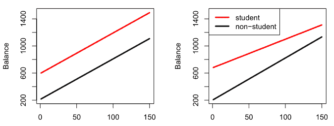

图 3.7. 对于信用数据，展示了根据收入预测学生和非学生群体信用卡余额的最小二乘线。左图：拟合了模型 (3.34)。收入与学生身份之间没有交互作用。右图：拟合了模型 (3.35)。收入与学生身份之间存在交互项。

图 3.7 展示了模型 (3.35) 中估计的学生和非学生群体收入与余额之间的关系。我们注意到，学生的斜率低于非学生的斜率。这表明，与非学生相比，学生群体的收入增长与信用卡余额较小的增长相关联。

## 非线性关系

如前所述，线性回归模型 (3.19) 假设响应变量与预测变量之间存在线性关系。但在某些情况下，响应变量与预测变量之间的真实关系可能是非线性的。这里我们介绍一种非常简单的方法，使用多项式回归，将线性模型直接扩展以适应非线性关系。在后面的章节中，我们将介绍在更一般情况下进行非线性拟合的更复杂方法。

考虑图 3.8，其中展示了 Auto 数据集中许多汽车的 mpg（每加仑英里数，即油耗）与马力的关系。橙色线代表线性回归拟合。mpg 和马力之间存在明显的关系，但很明显这种关系实际上是**非线性**的：数据表明存在曲线关系。在线性模型中纳入非线性关联的一种简单方法是包含预测变量的变换版本。例如，图 3.8 中的点似乎呈现二次形状，表明以下形式的模型

$$mpg = \beta_0 + \beta_1 \times horsepower + \beta_2 \times horsepower^2 + \epsilon \quad (3.36)$$

可能提供更好的拟合。方程 3.36 涉及使用马力的非线性函数来预测 mpg。但它仍然是一个线性模型！也就是说，(3.36) 只是一个多元线性回归模型，其中 $X_1 = horsepower$，$X_2 = horsepower^2$。因此，我们可以使用标准的线性回归软件来估计 $\beta_0$、$\beta_1$ 和 $\beta_2$，以产生非线性拟合。图 3.8 中的蓝色曲线显示了对数据的二次拟合结果。二次


图 3.8. Auto 数据集。展示了多辆汽车的 mpg 和马力。橙色线显示了线性回归拟合。蓝色曲线显示了包含马力²的模型的线性回归拟合。绿色线显示了包含马力所有最高至五次多项式的模型的线性回归拟合。

| | 系数 | 标准误差 | t 统计量 | p 值 |
|---|---|---|---|---|
| 截距 | 56.9001 | 1.8004 | 31.6 | < 0.0001 |
| horsepower | -0.4662 | 0.0311 | -15.0 | < 0.0001 |
| horsepower² | 0.0012 | 0.0001 | 10.1 | < 0.0001 |

表 3.10. 对于 Auto 数据集，将 mpg 对 horsepower 和 horsepower² 进行回归的最小二乘系数估计。

拟合似乎明显优于仅包含线性项时的拟合。二次拟合的 R² 为 0.688，而线性拟合为 0.606，并且表 3.10 中二次项的 p 值高度显著。

如果包含 horsepower² 能带来如此大的模型改进，为什么不包含 horsepower³、horsepower⁴，甚至 horsepower⁵ 呢？图 3.8 中的绿色曲线显示了在模型 (3.36) 中包含所有最高至五次多项式的结果。得到的拟合似乎不必要地波动——也就是说，不清楚包含额外项是否真的带来了对数据更好的拟合。

我们刚才描述的将线性模型扩展以适应非线性关系的方法被称为**多项式回归**，因为我们在回归模型中包含了预测变量的多项式函数。我们将在第 7 章进一步探讨这种方法以及线性模型的其他非线性扩展。

## 3.3.3 潜在问题

当我们将线性回归模型拟合到特定数据集时，可能会出现许多问题。其中最常见的是以下几种：

- 1. 响应-预测变量关系的非线性。
- 2. 误差项的相关性。
- 3. 误差项的非常数方差。
- 4. 异常值。
- 5. 高杠杆点。
- 6. 多重共线性。

在实践中，识别和克服这些问题既是一门科学，也是一门艺术。无数书籍中已有大量篇幅讨论这个主题。由于线性回归模型不是我们这里的主要关注点，我们将只简要总结一些关键点。

### 1. 数据的非线性

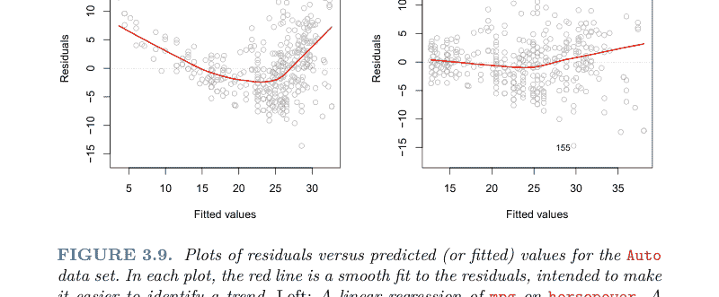

图 3.9. Auto 数据集的残差与预测（或拟合）值图。在每个图中，红线是对残差的平滑拟合，旨在更容易识别趋势。左图：mpg 对 horsepower 的线性回归。残差中的强模式表明数据中存在非线性。右图：mpg 对 horsepower 和 horsepower^2 的线性回归。残差中几乎没有模式。

线性回归模型假设预测变量和响应变量之间存在直线关系。如果真实关系远非线性，那么我们从拟合中得出的几乎所有结论都值得怀疑。此外，模型的预测精度可能会显著降低。

残差图是识别非线性的有用图形工具。给定一个简单线性回归模型，我们可以绘制残差 $e_i = y_i - \hat{y}_i$ 与预测变量 $x_i$ 的关系图。对于多元回归模型，由于有多个预测变量，我们改为绘制残差与预测（或*拟合*）值 $\hat{y}_i$ 的关系图。理想情况下，残差图应显示不出可辨别的模式。模式的存在可能表明线性模型的某些方面存在问题。

图 3.9 左侧面板显示了图 3.8 中所示的 `Auto` 数据集上 `mpg` 对 `horsepower` 进行线性回归的残差图。红线是对残差的平滑拟合，显示它是为了更容易识别任何趋势。残差呈现明显的 U 形，这强烈表明数据中存在非线性。相比之下，图 3.9 右侧面板显示了包含二次项的模型 (3.36) 产生的残差图。残差中似乎几乎没有模式，表明二次项改善了对数据的拟合。

如果残差图表明数据中存在非线性关联，那么一个简单的方法是在回归模型中使用预测变量的非线性变换，例如 $\log X$、$\sqrt{X}$ 和 $X^2$。在本书后面的章节中，我们将讨论其他更高级的非线性方法来解决这个问题。

### 2. 误差项的相关性

线性回归模型的一个重要假设是误差项 $\epsilon_1, \epsilon_2, \ldots, \epsilon_n$ 是不相关的。这意味着什么？例如，如果误差不相关，那么 $\epsilon_i$ 为正的事实几乎不提供关于 $\epsilon_{i+1}$ 符号的信息。为估计的回归系数或拟合值计算的标准误差是基于误差项不相关的假设。如果误差项之间确实存在相关性，那么估计的标准误差往往会低估真实的标准误差。因此，置信区间和预测区间会比应有的更窄。例如，一个 95% 的置信区间实际上包含参数真实值的概率可能远低于 0.95。此外，与模型相关的 $p$ 值会低于应有的值；这可能导致我们错误地得出结论认为某个参数在统计上是显著的。简而言之，如果误差项相关，我们可能会对模型产生一种不合理的自信感。

作为一个极端的例子，假设我们不小心将数据加倍，导致观测值和误差项成对相同。如果我们忽略这一点，我们的标准误差计算将如同我们有一个大小为 $2n$ 的样本，而实际上我们只有 $n$ 个样本。我们估计的参数对于 $2n$ 个样本将与 $n$ 个样本相同，但置信区间将窄 $\sqrt{2}$ 倍！

为什么误差项之间会出现相关性？这种相关性经常出现在*时间序列*数据中，时间序列数据由在离散时间点获得的测量值组成。在许多情况下，在相邻时间点获得的观测值将具有正相关的误差。为了确定给定数据集是否属于这种情况，我们可以将模型的残差作为时间的函数进行绘制。如果误差不相关，那么应该没有可辨别的模式。

# 3. 线性回归

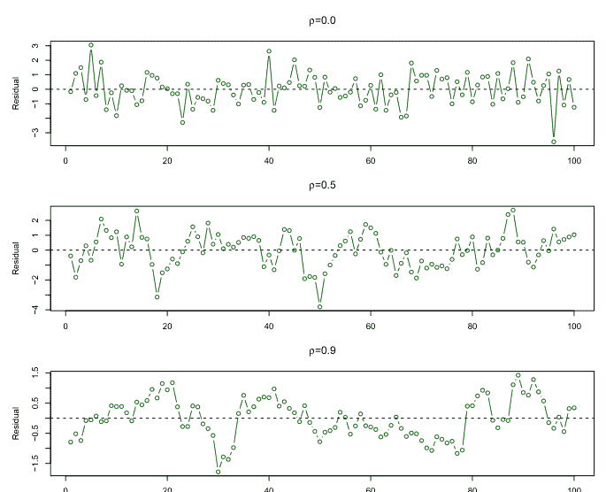

**图 3.10.** *基于不同相邻时间点误差项相关性水平 ρ 生成的模拟时间序列数据集的残差图。*

另一方面，如果误差项呈正相关，我们可能会在残差中看到*追踪*现象——即相邻残差可能具有相似的值。图 3.10 提供了一个例证。在顶部面板中，我们看到的是对具有不相关误差的数据进行线性回归拟合后的残差。残差中没有显示出与时间相关的趋势。相比之下，底部面板的残差来自一个相邻误差相关性为 0.9 的数据集。现在残差中存在明显的模式——相邻残差倾向于取相似的值。最后，中间面板展示了一个更温和的情况，其中残差的相关性为 0.5。仍然有追踪的证据，但模式不太清晰。

已经开发了许多方法来妥善处理时间序列数据中误差项的相关性。误差项之间的相关性也可能出现在时间序列数据之外。例如，考虑一项研究，其中根据个体的体重预测其身高。如果研究中的一些个体属于同一家庭、食用相同饮食或暴露于相同的环境因素，则不相关误差的假设可能会被违反。总的来说，不相关误差的假设对于线性回归以及其他统计方法都极其重要，良好的实验设计对于降低此类相关性的风险至关重要。

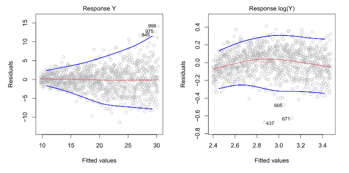

**图 3.11.** *残差图。在每个图中，红线是对残差的平滑拟合，旨在更容易识别趋势。蓝线追踪残差的外部四分位数，并强调模式。左图：漏斗形状表示异方差性。右图：响应变量经过对数变换，现在没有异方差性的证据。*

## 3. 误差项的非常数方差

线性回归模型的另一个重要假设是误差项具有常数方差，Var($\epsilon_i$) = $\sigma^2$。与线性模型相关的标准误、置信区间和假设检验都依赖于这个假设。

不幸的是，误差项的方差通常是非常数的。例如，误差项的方差可能随着响应值的增加而增加。可以从残差图中出现的*漏斗形状*来识别误差中的非常数方差，或*异方差性*。图 **3.11** 的左侧面板显示了一个例子，其中残差的大小倾向于随着拟合值的增加而增加。当面临这个问题时，一个可能的解决方案是使用凹函数（如 $\log Y$ 或 $\sqrt{Y}$）对响应变量 $Y$ 进行变换。这种变换会导致较大的响应值收缩更多，从而减少异方差性。图 **3.11** 的右侧面板显示了使用 $\log Y$ 变换响应变量后的残差图。残差现在似乎具有常数方差，尽管有一些证据表明数据中存在轻微的非线性关系。

有时我们对每个响应的方差有很好的了解。例如，第 $i$ 个响应可能是 $n_i$ 个原始观测值的平均值。如果这些原始观测值中的每一个都不相关且方差为 $\sigma^2$，那么它们的平均值的方差为 $\sigma_i^2 = \sigma^2/n_i$。在这种情况下，一个简单的补救措施是使用*加权最小二乘法*拟合我们的模型，权重与方差的倒数成正比——即在这种情况下 $w_i = n_i$。大多数线性回归软件都允许设置观测权重。

## 4. 异常值

*异常值*是指 $y_i$ 远离模型预测值的点。异常值可能由多种原因引起，例如数据收集过程中观测值的错误记录。

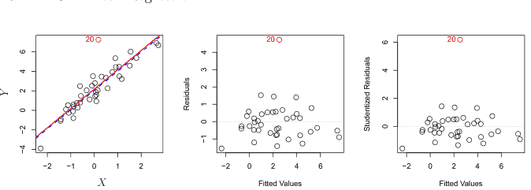

**图 3.12.** *左图：最小二乘回归线显示为红色，移除异常值后的回归线显示为蓝色。中图：残差图清晰地识别出异常值。右图：异常值的学生化残差为 6；通常我们期望值在 −3 和 3 之间。*

图 3.12 左侧面板中的红点（观测值 20）说明了一个典型的异常值。红色实线是最小二乘回归拟合，而蓝色虚线是移除异常值后的最小二乘拟合。在这种情况下，移除异常值对最小二乘线几乎没有影响：它导致斜率几乎没有变化，截距也只发生了微小的减小。对于一个预测值不异常的异常值，通常对最小二乘拟合的影响很小。然而，即使异常值对最小二乘拟合影响不大，它也可能导致其他问题。例如，在这个例子中，当异常值包含在回归中时，RSE 为 1.09，但当异常值被移除时，RSE 仅为 0.77。由于 RSE 用于计算所有置信区间和 p 值，单个数据点引起的如此显著的增加可能对拟合的解释产生影响。同样，包含异常值导致 R² 从 0.892 下降到 0.805。

残差图可用于识别异常值。在这个例子中，异常值在图 3.12 中间面板所示的残差图中清晰可见。但在实践中，可能很难决定残差需要多大才能将该点视为异常值。为了解决这个问题，我们可以绘制*学生化残差*，而不是绘制残差，学生化残差是通过将每个残差 eᵢ 除以其估计标准误计算得出的。学生化残差绝对值大于 3 的观测值可能是异常值。在图 3.12 的右侧面板中，异常值的学生化残差超过 6，而所有其他观测值的学生化残差在 −2 和 2 之间。

如果我们认为异常值是由于数据收集或记录错误造成的，那么一个解决方案是简单地移除该观测值。但是，应该小心，因为异常值可能反而表明模型存在缺陷，例如缺少预测变量。

## 5. 高杠杆点

我们刚刚看到，异常值是给定预测变量 xᵢ 时响应 yᵢ 不寻常的观测值。相比之下，具有*高杠杆*的观测值在 xᵢ 上具有不寻常的值。例如，图 3.13 左侧面板中的观测值 41 具有高杠杆，因为该观测值的预测值相对于其他观测值来说很大。（注意，图 3.13 中显示的数据与图 3.12 中显示的数据相同，但增加了一个高杠杆观测值。）红色实线是对所有数据的最小二乘拟合，而蓝色虚线是移除观测值 41 后产生的拟合。比较图 3.12 和图 3.13 的左侧面板，我们观察到移除高杠杆观测值对最小二乘线的影响比移除异常值要大得多。事实上，高杠杆观测值往往对估计的回归线有相当大的影响。如果最小二乘线仅受少数几个观测值的严重影响，那就令人担忧，因为这些点的任何问题都可能使整个拟合无效。因此，识别高杠杆观测值非常重要。

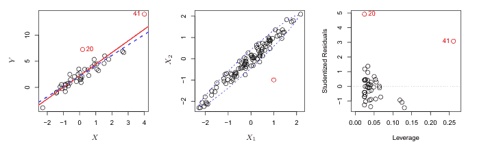

**图 3.13.** *左图：观测值 41 是一个高杠杆点，而 20 不是。红线是对所有数据的拟合，蓝线是移除观测值 41 后的拟合。中图：红色观测值在其 $X_1$ 值或 $X_2$ 值方面并不异常，但仍然落在大部分数据之外，因此具有高杠杆。右图：观测值 41 具有高杠杆和高残差。*

在简单线性回归中，高杠杆观测值相当容易识别，因为我们可以简单地寻找预测值超出观测值正常范围的观测值。但在具有多个预测变量的多元线性回归中，一个观测值可能在每个单独预测变量的值范围内都很好，但在整个预测变量集合方面却不寻常。图 3.13 的中间面板显示了一个具有两个预测变量 $X_1$ 和 $X_2$ 的数据集的例子。大多数观测值的预测值落在蓝色虚线椭圆内，但红色观测值远远超出这个范围。但它的 $X_1$ 值和 $X_2$ 值都不异常。因此，如果我们只检查 $X_1$ 或只检查 $X_2$，我们将无法注意到这个高杠杆点。这个问题在具有两个以上预测变量的多元回归设置中更为明显，因为那时没有简单的方法可以同时绘制数据的所有维度。

为了量化观测值的杠杆，我们计算*杠杆统计量*。该统计量的较大值表示具有高杠杆的观测值。对于简单线性回归，

$$h_i = \frac{1}{n} + \frac{(x_i - \bar{x})^2}{\sum_{i'=1}^{n}(x_{i'} - \bar{x})^2}.$$
(3.37)

# 3. 线性回归

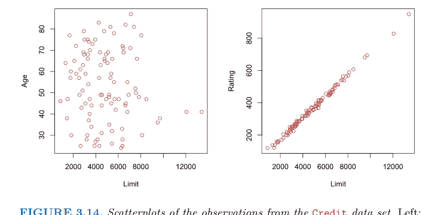

**图 3.14.** *Credit* 数据集中观测值的散点图。左图：*age*（年龄）与 *limit*（额度）的关系图。这两个变量不存在共线性。右图：*rating*（评级）与 *limit*（额度）的关系图。两者存在高度共线性。

从这个方程可以清楚地看出，$h_i$ 随着 $x_i$ 与 $\bar{x}$ 的距离增加而增大。$h_i$ 可以简单地扩展到多个预测变量的情况，尽管我们在此不提供公式。杠杆统计量 $h_i$ 始终介于 $1/n$ 和 1 之间，且所有观测值的平均杠杆值始终等于 $(p+1)/n$。因此，如果某个观测值的杠杆统计量远大于 $(p+1)/n$，我们可能会怀疑该对应点具有高杠杆性。

图 3.13 的右侧面板展示了图 3.13 左侧面板数据的学生化残差与 $h_i$ 的关系图。观测值 41 因其极高的杠杆统计量和较高的学生化残差而显得突出。换句话说，它既是一个异常值，也是一个高杠杆观测值。这是一个特别危险的组合！该图还揭示了观测值 20 在图 3.12 的最小二乘拟合中影响相对较小的原因：它的杠杆值较低。

## 6. 共线性

*共线性* 指的是两个或多个预测变量彼此密切相关的情况。图 3.14 使用 *Credit* 数据集说明了共线性的概念。在图 3.14 的左侧面板中，两个预测变量 *limit* 和 *age* 似乎没有明显的关系。相反，在图 3.14 的右侧面板中，预测变量 *limit* 和 *rating* 彼此高度相关，我们称它们为 *共线*。共线性的存在可能在回归分析中带来问题，因为很难分离出共线变量对响应变量的单独影响。换句话说，由于 *limit* 和 *rating* 倾向于同时增加或减少，因此很难确定每个变量如何单独与响应变量 *balance*（余额）相关联。

图 3.15 展示了共线性可能导致的一些困难。图 3.15 的左侧面板是 *balance* 对 *limit* 和 *age* 回归中，与不同可能系数估计值相关的残差平方和（RSS）（3.22）的等高线图。每个椭圆代表一组对应相同 RSS 的系数，最靠近中心的椭圆具有最低的 RSS 值。黑点和相关的虚线代表产生最小可能 RSS 的系数估计值——换句话说，这些是最小二乘估计值。*limit* 和 *age* 的坐标轴已经过缩放，以便该图包含可能的系数估计值，这些值位于最小二乘估计值两侧最多四个标准误差的范围内。因此，该图包含了所有合理的系数值。例如，我们看到真实的 *limit* 系数几乎肯定在 0.15 到 0.20 之间。

相比之下，图 3.15 的右侧面板显示了 *balance* 对 *limit* 和 *rating* 回归中，与可能系数估计值相关的 RSS 等高线图，我们知道它们高度共线。现在等高线沿着一个狭窄的山谷延伸；存在一个广泛的系数估计值范围，它们产生相同的 RSS 值。因此，数据的微小变化可能导致产生最小 RSS 的系数对——即最小二乘估计值——沿着这个山谷移动到任何位置。这导致系数估计值存在很大的不确定性。注意，*limit* 系数的刻度现在大约从 $-0.2$ 到 $0.2$；这比与 *age* 回归中 *limit* 系数的合理范围增加了八倍。有趣的是，尽管 *limit* 和 *rating* 系数现在具有更大的个体不确定性，但它们几乎肯定会位于这个等高线山谷中的某个位置。例如，我们不会期望 *limit* 和 *rating* 系数的真实值分别为 $-0.1$ 和 $1$，即使这样的值对于每个系数单独来说都是合理的。

由于共线性降低了回归系数估计的准确性，它导致 $\hat{\beta}_j$ 的标准误差增大。回想一下，每个预测变量的 $t$ 统计量是通过将 $\hat{\beta}__j$ 除以其标准误差来计算的。因此，共线性导致 $t$ 统计量下降。结果，在存在共线性的情况下，我们可能无法拒绝 $H_0 : \beta_j = 0$。这意味着假设检验的功效——正确检测非零系数的概率——因共线性而降低。

## 3.3 回归模型中的其他考虑因素

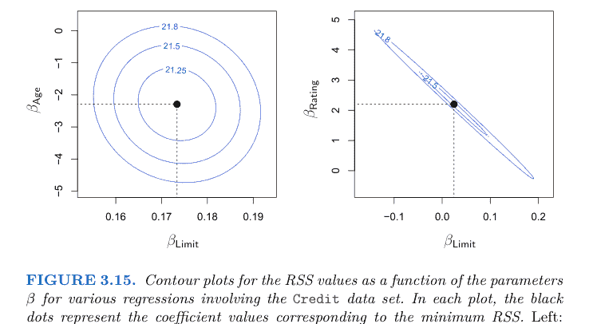

**图 3.15.** 涉及 Credit 数据集的各种回归中，RSS 值作为参数 $\beta$ 函数的等高线图。在每个图中，黑点代表对应于最小 RSS 的系数值。左图：*balance* 对 *age* 和 *limit* 回归的 RSS 等高线图。最小值定义明确。右图：*balance* 对 *rating* 和 *limit* 回归的 RSS 等高线图。由于共线性，存在许多对（$\beta_{\text{Limit}}$, $\beta_{\text{Rating}}$）具有相似的 RSS 值。

表 3.11 比较了从两个独立的多元回归模型中获得的系数估计值。第一个是 *balance* 对 *age* 和 *limit* 的回归，第二个是 *balance* 对 *rating* 和 *limit* 的回归。在第一个回归中，*age* 和 *limit* 都高度显著，p 值非常小。在第二个回归中，*limit* 和 *rating* 之间的共线性导致 *limit* 系数估计值的标准误差增加了 12 倍，p 值增加到 0.701。换句话说，由于共线性的存在，*limit* 变量的重要性被掩盖了。为了避免这种情况，在拟合模型时识别和处理潜在的共线性问题是可取的。

检测共线性的一个简单方法是查看预测变量的相关矩阵。该矩阵中绝对值较大的元素表示一对高度相关的变量，因此数据中存在共线性问题。不幸的是，并非所有的共线性问题都可以通过检查相关矩阵来发现：即使没有一对变量具有特别高的相关性，三个或更多变量之间也可能存在共线性。我们将这种情况称为多重共线性。评估多重共线性的更好方法是计算方差膨胀因子（VIF），而不是检查相关矩阵。VIF 是拟合完整模型时 $\hat{\beta}_j$ 的方差与仅拟合其自身时 $\hat{\beta}_j$ 的方差之比。VIF 的最小可能值为 1，表示完全不存在共线性。通常在实践中，预测变量之间存在少量的共线性。根据经验法则，超过 5 或 10 的 VIF 值表示存在有问题的共线性。每个变量的 VIF 可以使用以下公式计算：

$$ \text{VIF}(\hat{\beta}_j) = \frac{1}{1 - R^2_{X_j | X_{-j}}} $$

其中 $R^2_{X_j | X_{-j}}$ 是将 $X_j$ 对所有其他预测变量进行回归得到的 $R^2$。如果 $R^2_{X_j | X_{-j}}$ 接近 1，则存在共线性，因此 VIF 会很大。

| | 系数 | 标准误差 | t 统计量 | p 值 |
|---|---|---|---|---|
| 模型 1 | 截距 | -173.411 | 43.828 | -3.957 | < 0.0001 |
| | age | -2.292 | 0.672 | -3.407 | 0.0007 |
| | limit | 0.173 | 0.005 | 34.496 | < 0.0001 |
| 模型 2 | 截距 | -377.537 | 45.254 | -8.343 | < 0.0001 |
| | rating | 2.202 | 0.952 | 2.312 | 0.0213 |
| | limit | 0.025 | 0.064 | 0.384 | 0.7012 |

**表 3.11.** 显示了涉及 Credit 数据集的两个多元回归模型的结果。模型 1 是 *balance* 对 *age* 和 *limit* 的回归，模型 2 是 *balance* 对 *rating* 和 *limit* 的回归。由于共线性，第二个回归中 $\beta_{\text{limit}}$ 的标准误差增加了 12 倍。

在信用数据中，对余额关于年龄、评级和额度进行回归分析表明，这些预测变量的方差膨胀因子（VIF）值分别为1.01、160.67和160.59。正如我们所怀疑的，数据中存在相当大的多重共线性！

当面临多重共线性问题时，有两种简单的解决方案。第一种是从回归中删除其中一个有问题的变量。这通常可以在不太多损害回归拟合的情况下完成，因为多重共线性的存在意味着该变量在其他变量存在的情况下，其提供的关于响应变量的信息是冗余的。例如，如果我们仅将余额对年龄和额度进行回归，而不包含评级预测变量，那么得到的VIF值将接近最小值1，且$R^2$从0.754降至0.75。因此，从预测变量集中删除评级有效地解决了多重共线性问题，而没有损害拟合效果。第二种解决方案是将共线性变量合并成一个单一的预测变量。例如，我们可以取标准化后的额度和评级的平均值，以创建一个衡量信用价值的新变量。

## 3.4 营销计划

我们现在简要回顾一下本章开头提出的关于广告数据的七个问题。

1.  销售额与广告预算之间是否存在关系？
    这个问题可以通过拟合销售额对电视、广播和报纸的多元回归模型（如公式3.20所示）并检验假设$H_0 : \beta_{\text{TV}} = \beta_{\text{radio}} = \beta_{\text{newspaper}} = 0$来回答。在3.2.2节中，我们展示了$F$统计量可用于确定我们是否应该拒绝这个原假设。在本例中，表3.6中$F$统计量对应的$p$值非常低，表明广告与销售额之间存在明显的关系。

2.  这种关系有多强？
    我们在3.1.3节讨论了两种衡量模型准确性的指标。首先，残差标准误（RSE）估计了响应变量偏离总体回归线的标准差。对于广告数据，RSE为1.69个单位，而响应变量的平均值为14.022，表明百分比误差约为12%。其次，$R^2$统计量记录了预测变量所解释的响应变量变异性的百分比。预测变量解释了销售额近90%的方差。RSE和$R^2$统计量显示在表3.6中。

3.  哪些媒体与销售额相关？
    为了回答这个问题，我们可以检查与每个预测变量的$t$统计量相关的$p$值（3.1.2节）。在表3.4所示的多元线性回归中，电视和广播的$p$值很低，但报纸的$p$值则不然。这表明只有电视和广播与销售额相关。我们将在第6章更详细地探讨这个问题。

4.  每种媒体与销售额的关联有多大？
    我们在3.1.2节看到，$\hat{\beta}_j$的标准误可用于构建$\beta_j$的置信区间。对于广告数据，我们可以使用表3.4中的结果来计算使用所有三种媒体预算作为预测变量的多元回归模型中系数的95%置信区间。置信区间如下：电视为(0.043, 0.049)，广播为(0.172, 0.206)，报纸为(-0.013, 0.011)。电视和广播的置信区间很窄且远离零，提供了这些媒体与销售额相关的证据。但报纸的置信区间包含零，表明在给定电视和广播值的情况下，该变量在统计上不显著。

    我们在3.3.3节看到，多重共线性可能导致非常宽的标准误。多重共线性是否是报纸相关置信区间如此之宽的原因？电视、广播和报纸的VIF得分分别为1.005、1.145和1.145，表明没有多重共线性的证据。

    为了评估每种媒体对销售额的单独影响，我们可以执行三个独立的简单线性回归。结果显示在表3.1和表3.3中。有证据表明电视与销售额之间以及广播与销售额之间存在极强的关联。当忽略电视和广播的值时，有证据表明报纸与销售额之间存在轻微的关联。

5.  我们能多准确地预测未来的销售额？
    可以使用公式3.21来预测响应变量。与此估计相关的准确性取决于我们是希望预测单个响应$Y = f(X) + \epsilon$，还是平均响应$f(X)$（3.2.2节）。如果是前者，我们使用预测区间；如果是后者，我们使用置信区间。预测区间总是比置信区间更宽，因为它们考虑了与不可约误差$\epsilon$相关的不确定性。

6.  这种关系是线性的吗？
    在3.3.3节，我们看到残差图可用于识别非线性。如果关系是线性的，那么残差图应不显示任何模式。对于广告数据，我们在图3.5中观察到非线性效应，尽管这种效应也可以在残差图中观察到。在3.3.2节，我们讨论了在线性回归模型中包含预测变量的变换以适应非线性关系。

7.  广告媒体之间是否存在协同效应？
    标准线性回归模型假设预测变量和响应变量之间存在可加性关系。可加性模型易于解释，因为每个预测变量与响应变量的关联与其他预测变量的值无关。然而，对于某些数据集，可加性假设可能不切实际。在3.3.2节，我们展示了如何在回归模型中包含交互项以适应非可加性关系。与交互项相关的小$p$值表明存在这种关系。图3.5表明广告数据可能不是可加性的。在模型中包含交互项导致$R^2$大幅增加，从约90%增加到近97%。

## 3.5 线性回归与$K$近邻法的比较

如第2章所述，线性回归是*参数*方法的一个例子，因为它假设$f(X)$具有线性函数形式。参数方法有几个优点。它们通常易于拟合，因为只需要估计少量的系数。在线性回归的情况下，系数具有简单的解释，并且可以轻松进行统计显著性检验。但参数方法确实有一个缺点：从构造上讲，它们对$f(X)$的形式做出了强烈的假设。如果指定的函数形式与真实情况相去甚远，而预测准确性是我们的目标，那么参数方法的表现将会很差。例如，如果我们假设$X$和$Y$之间存在线性关系，但真实关系远非线性，那么由此产生的模型将无法很好地拟合数据，并且从中得出的任何结论都值得怀疑。

相比之下，*非参数*方法不明确假设$f(X)$的参数形式，从而提供了一种替代且更灵活的回归方法。我们在本书中讨论了各种非参数方法。这里我们考虑最简单和最著名的非参数方法之一，*$K$近邻回归*（KNN回归）。KNN回归方法与第2章讨论的KNN分类器密切相关。给定$K$值和一个预测点$x_0$，KNN回归首先识别最接近$x_0$的$K$个训练观测值，记为$\mathcal{N}_0$。然后，它使用$\mathcal{N}_0$中所有训练响应的平均值来估计$f(x_0)$。换句话说，

$$\hat{f}(x_0) = \frac{1}{K} \sum_{x_i \in \mathcal{N}_0} y_i.$$

图3.16展示了在具有$p=2$个预测变量的数据集上的两个KNN拟合。$K=1$的拟合显示在左侧面板中，而右侧面板对应于$K=9$。我们看到，当$K=1$时，KNN拟合完美地插值了训练观测值，因此呈现阶梯函数的形式。当$K=9$时，KNN拟合仍然是阶梯函数，但对九个观测值取平均导致恒定预测的区域小得多，因此拟合更平滑。通常，$K$的最佳值将取决于我们在第2章介绍的*偏差-方差权衡*。较小的$K$值提供最灵活的拟合，其偏差低但方差高。这种方差是由于给定区域中的预测完全依赖于单个观测值这一事实造成的。

# 3. 线性回归

相比之下，较大的 $K$ 值能提供更平滑、变异性更小的拟合；区域内的预测是多个点的平均值，因此改变一个观测值的影响较小。然而，平滑处理可能会掩盖 $f(X)$ 中的一些结构，从而导致偏差。在第5章中，我们将介绍几种估计测试误差率的方法。这些方法可用于确定KNN回归中 $K$ 的最优值。

在什么情况下，像最小二乘线性回归这样的参数方法会优于像KNN回归这样的非参数方法？答案很简单：*如果所选的参数形式接近 $f$ 的真实形式，那么参数方法将优于非参数方法*。图3.17提供了一个从一维线性回归模型生成的数据示例。黑色实线代表 $f(X)$，而蓝色曲线对应于使用 $K = 1$ 和 $K = 9$ 的KNN拟合。在这种情况下，$K = 1$ 的预测变异性太大，而更平滑的 $K = 9$ 拟合则更接近 $f(X)$。然而，由于真实关系是线性的，非参数方法很难与线性回归竞争：非参数方法会带来方差的代价，而这种代价无法通过偏差的减少来抵消。图3.18左侧面板中的蓝色虚线代表对相同数据的线性回归拟合。它几乎是完美的。图3.18的右侧面板显示，对于这些数据，线性回归优于KNN。绿色实线（作为 $1/K$ 的函数绘制）代表KNN的测试集均方误差（MSE）。KNN的误差远高于黑色虚线，即线性回归的测试MSE。当 $K$ 值较大时，KNN在MSE方面的表现仅略逊于最小二乘回归。当 $K$ 较小时，其表现则差得多。

在实践中，$X$ 和 $Y$ 之间的关系很少是完全线性的。图3.19考察了在 $X$ 和 $Y$ 之间关系的非线性程度增加时，最小二乘回归和KNN的相对性能。在顶行中，真实关系几乎是线性的。在这种情况下，我们看到对于较低的 $K$ 值，线性回归的测试MSE仍然优于KNN。然而，对于 $K \ge 4$，KNN优于线性回归。第二行说明了与线性关系的更大偏差。在这种情况下，对于所有 $K$ 值，KNN都显著优于线性回归。请注意，随着非线性程度的增加，非参数KNN方法的测试集MSE变化很小，但线性回归的测试集MSE却大幅增加。

图3.18和图3.19显示了这样的情形：当关系是线性时，KNN的表现略逊于线性回归；但在非线性情况下，其表现则远优于线性回归。在真实关系未知的实际情况下，人们可能会倾向于选择KNN而非线性回归，因为如果真实关系是线性的，它最坏的情况也只是略逊于线性回归；而如果真实关系是非线性的，它可能会给出显著更好的结果。但事实上，即使真实关系高度非线性，KNN的结果仍可能不如线性回归。特别是，图3.18和图3.19都说明了 $p = 1$ 个预测变量的情况。但在更高维度中，KNN的表现通常比线性回归差。

图3.20考虑了与图3.19第二行相同的强非线性情形，只是我们添加了与响应变量无关的额外*噪声*预测变量。当 $p = 1$ 或 $p = 2$ 时，KNN优于线性回归。但对于 $p = 3$，结果好坏参半；而对于 $p \ge 4$，线性回归优于KNN。事实上，维度的增加只导致线性回归测试集MSE小幅恶化，但却导致KNN的MSE增加了十倍以上。这种性能随维度增加而下降是KNN的一个常见问题，其原因在于在高维空间中，样本量实际上减少了。在这个数据集中有50个训练观测值；当 $p = 1$ 时，这提供了足够的信息来准确估计 $f(X)$。然而，将50个观测值分散到 $p = 20$ 个维度上，会导致一个给定的观测值没有*近邻*的现象——这就是所谓的*维度灾难*。也就是说，当 $p$ 很大时，与给定测试观测值 $x_0$ 最近的 $K$ 个观测值在 $p$ 维空间中可能离 $x_0$ 非常远，从而导致对 $f(x_0)$ 的预测非常差，因此KNN拟合效果不佳。作为一个普遍规则，当每个预测变量的观测值数量较少时，参数方法往往优于非参数方法。

即使维度很小，从可解释性的角度来看，我们可能更倾向于线性回归而非KNN。如果KNN的测试MSE仅略低于线性回归，我们可能愿意为了一个可以用几个系数描述、并且可以计算 $p$ 值的简单模型，而放弃一点预测精度。

## 3.5 线性回归与 $K$-近邻的比较

**图3.20.** 随着变量数 $p$ 的增加，线性回归（黑色虚线）和KNN（绿色曲线）的测试MSE。真实函数在第一个变量上是非线性的，如图3.19的下方面板所示，并且不依赖于额外的变量。在这些额外噪声变量存在的情况下，线性回归的性能缓慢下降，而KNN的性能则随着 $p$ 的增加而更快地退化。

## 3.6 实验室：线性回归

### 3.6.1 导入包

我们在顶层导入标准库。

```python
import numpy as np
import pandas as pd
from matplotlib.pyplot import subplots
```

### 新导入

在整个实验室中，我们将引入新的函数和库。但是，我们将在这里导入它们，以强调这些是本实验室的新代码对象。将导入语句放在笔记本的顶部附近可以使代码更具可读性，因为扫描前几行就能知道使用了哪些库。

```python
import statsmodels.api as sm
```

我们将在需要时提供相关函数的详细信息。
除了导入整个模块，也可以只从给定模块导入少数几个项目。这有助于保持*命名空间*的整洁。我们将使用 `statsmodels` 包中的一些特定对象，这里进行导入。

```python
from statsmodels.stats.outliers_influence \
    import variance_inflation_factor as VIF
from statsmodels.stats.anova import anova_lm
```

由于上面的一条导入语句很长，我们插入了换行符 \ 以提高可读性。
我们还将使用本书实验室中为ISLP包编写的一些函数。

```python
from ISLP import load_data
from ISLP.models import (ModelSpec as MS,
                        summarize,
                        poly)
```

### 检查对象和命名空间

函数 `dir()` 提供命名空间中的对象列表。

```python
dir()
```

```
Out[5]: ['In',
         'MS',
         '_',
         '__',
         '___',
         '__builtin__',
         '__builtins__',
         ...
```

## 3.6.2 简单线性回归

在本节中，我们将使用 `ISLP.models` 中的 `ModelSpec()` 转换来构建模型矩阵（也称为设计矩阵）。

我们将使用波士顿房价数据集，该数据集包含在 `ISLP` 包中。波士顿数据集记录了波士顿周边506个社区的 `medv`（房屋价值中位数）。我们将构建一个回归模型，使用13个预测变量来预测 `medv`，例如 `rm`（每栋房屋的平均房间数）、`age`（1940年之前建造的业主自住单元的比例）和 `lstat`（社会经济地位较低的家庭百分比）。我们将使用 `statsmodels` 来完成这项任务，这是一个实现了多种常用回归方法的Python包。

我们在 `ISLP` 包中包含了一个简单的加载函数 `load_data()`：

```
In [8]: Boston = load_data("Boston")
Boston.columns
```

```
Out[8]: Index(['crim', 'zn', 'indus', 'chas', 'nox', 'rm', 'age', 'dis',
       'rad', 'tax', 'ptratio', 'black', 'lstat', 'medv'],
      dtype='object')
```

# 3. 线性回归

输入 `Boston?` 以了解有关这些数据的更多信息。
我们首先使用 `sm.OLS()` 函数来拟合一个简单的线性回归模型。我们的响应变量将是 `medv`，而 `lstat` 将是唯一的预测变量。对于这个模型，我们可以手动创建模型矩阵。

```
In [9]: X = pd.DataFrame({'intercept': np.ones(Boston.shape[0]),
                     'lstat': Boston['lstat']})
X[:4]
```

```
Out[9]:    intercept  lstat
0        1.0    4.98
1        1.0    9.14
2        1.0    4.03
3        1.0    2.94
```

我们提取响应变量，并拟合模型。

```
In [10]: y = Boston['medv']
model = sm.OLS(y, X)
results = model.fit()
```

请注意，`sm.OLS()` 并不拟合模型；它只是指定模型，然后 `model.fit()` 执行实际的拟合。
我们的 `ISLP` 函数 `summarize()` 生成一个简单的表格，显示参数估计值、它们的标准误差、t统计量和p值。该函数接受一个参数，例如此处由 `fit` 方法返回的 `results` 对象，并返回这样的摘要。

```
In [11]: summarize(results)
```

```
Out[11]:              coef  std err       t  P>|t|
intercept  34.5538    0.563  61.415   0.0
lstat      -0.9500    0.039 -24.528   0.0
```

在我们描述处理拟合模型的其他方法之前，我们概述一个更有用且更通用的框架来构建模型矩阵 `X`。

### 使用转换：拟合与转换

我们上面的模型只有一个预测变量，构建 `X` 很直接。在实践中，我们经常拟合具有多个预测变量的模型，这些变量通常从数组或数据框中选择。我们可能希望在拟合模型之前对变量进行转换，指定变量之间的交互作用，并将某些特定变量扩展为变量集（例如多项式）。`sklearn` 包对于这类任务有一个特定的概念：*转换*。转换是一个对象，它使用一些参数作为参数创建。该对象有两个主要方法：`fit()` 和 `transform()`。
我们通过 `ISLP` 库中的转换 `ModelSpec()` 提供了一种通用的方法来指定模型和构建模型矩阵。`ModelSpec()`（在序言中重命名为 `MS()`）创建一个转换对象，然后使用一对方法 `transform()` 和 `fit()` 来构建相应的模型矩阵。

我们首先使用 `Boston` 数据框中的单个预测变量 `lstat` 来描述这个简单回归模型的过程，但将在本书本实验和其他实验的更复杂任务中反复使用它。在我们的例子中，转换由表达式 `design = MS(['lstat'])` 创建。

`fit()` 方法接受原始数组，并可能根据转换对象中的指定对其进行一些初始计算。例如，它可能计算均值和标准差以进行中心化和缩放。`transform()` 方法将拟合的转换应用于数据数组，并生成模型矩阵。

```
design = MS(['lstat'])
design = design.fit(Boston)
X = design.transform(Boston)
X[:4]
```

```
Out[12]:     intercept  lstat
0         1.0     4.98
1         1.0     9.14
2         1.0     4.03
3         1.0     2.94
```

在这个简单的情况下，`fit()` 方法做的很少；它只是检查 `design` 中指定的变量 'lstat' 是否存在于 `Boston` 中。然后 `transform()` 构建一个包含两列的模型矩阵：一个 `intercept` 和变量 `lstat`。

这两个操作可以使用 `fit_transform()` 方法组合起来。

```
design = MS(['lstat'])
X = design.fit_transform(Boston)
X[:4]
```

```
Out[13]:     intercept  lstat
0         1.0     4.98
1         1.0     9.14
2         1.0     4.03
3         1.0     2.94
```

请注意，就像之前代码块中两个步骤分开执行时一样，`design` 对象会因为 `fit()` 操作而改变。当我们拟合涉及交互作用和转换的更复杂模型时，这个管道的强大功能将变得更加清晰。

让我们回到我们拟合的回归模型。`results` 对象有几个可用于推断的方法。我们已经介绍了一个函数 `summarize()` 来显示拟合的要点。为了获得拟合的完整且有些详尽的摘要，我们可以使用 `summary()` 方法（输出未显示）。

```
results.summary()
```

拟合的系数也可以作为 `results` 的 `params` 属性检索。

```
results.params
```

```
Out[15]: intercept    34.553841
         lstat        -0.950049
         dtype: float64
```

`get_prediction()` 方法可用于获取预测，并为给定 `lstat` 值的 `medv` 预测生成置信区间和预测区间。

我们首先创建一个新的数据框，在本例中仅包含变量 `lstat`，其中包含我们希望进行预测的该变量的值。然后我们使用 `design` 的 `transform()` 方法创建相应的模型矩阵。

```
In [16]: new_df = pd.DataFrame({'lstat':[5, 10, 15]})
        newX = design.transform(new_df)
        newX
```

```
Out[16]:    intercept  lstat
        0        1.0      5
        1        1.0     10
        2        1.0     15
```

接下来，我们计算 `newX` 处的预测值，并通过提取 `predicted_mean` 属性来查看它们。

```
In [17]: new_predictions = results.get_prediction(newX);
        new_predictions.predicted_mean
```

```
Out[17]: array([29.80359411, 25.05334734, 20.30310057])
```

我们可以为预测值生成置信区间。

```
In [18]: new_predictions.conf_int(alpha=0.05)
```

```
Out[18]: array([[29.00741194, 30.59977628],
               [24.47413202, 25.63256267],
               [19.73158815, 20.87461299]])
```

预测区间通过设置 `obs=True` 来计算：

```
In [19]: new_predictions.conf_int(obs=True, alpha=0.05)
```

```
Out[19]: array([[17.56567478, 42.04151344],
               [12.82762635, 37.27906833],
               [ 8.0777421 , 32.52845905]])
```

例如，与 `lstat` 值为10相关的95%置信区间是 (24.47, 25.63)，而95%预测区间是 (12.82, 37.28)。正如预期的那样，置信区间和预测区间都以同一点为中心（当 `lstat` 等于10时，`medv` 的预测值为25.05），但后者要宽得多。

接下来，我们将使用 `DataFrame.plot.scatter()` 绘制 `medv` 和 `lstat`，并希望将回归线添加到生成的图中。

## 定义函数

虽然 `ISLP` 包中有一个函数可以向现有绘图添加线条，但我们借此机会定义自己的第一个函数来实现此功能。

```python
def abline(ax, b, m):
    "Add a line with slope m and intercept b to ax"
    xlim = ax.get_xlim()
    ylim = [m * xlim[0] + b, m * xlim[1] + b]
    ax.plot(xlim, ylim)
```

上文说明了几点。首先我们看到定义函数的语法：`def funcname(...)`。该函数有参数 `ax`、`b`、`m`，其中 `ax` 是现有绘图的坐标轴对象，`b` 是截距，`m` 是所需直线的斜率。可以通过包含额外的可选参数将其他绘图选项传递给 `ax.plot`，如下所示：

```python
def abline(ax, b, m, *args, **kwargs):
    "Add a line with slope m and intercept b to ax"
    xlim = ax.get_xlim()
    ylim = [m * xlim[0] + b, m * xlim[1] + b]
    ax.plot(xlim, ylim, *args, **kwargs)
```

添加 `*args` 允许向 `abline` 传递任意数量的非命名参数，而 `**kwargs` 允许传递任意数量的命名参数（例如 `linewidth=3`）。在我们的函数中，我们将这些参数原样传递给上面的 `ax.plot`。有兴趣了解更多函数知识的读者，请参阅 [docs.python.org/tutorial](https://docs.python.org/tutorial) 中关于定义函数的部分。

让我们使用新函数将这条回归线添加到 `medv` 对 `lstat` 的散点图中。

```python
ax = Boston.plot.scatter('lstat', 'medv')
abline(ax,
       results.params[0],
       results.params[1],
       'r--',
       linewidth=3)
```

因此，最终对 `ax.plot()` 的调用是 `ax.plot(xlim, ylim, 'r--', linewidth=3)`。我们使用参数 `'r--'` 生成红色虚线，并添加参数使其宽度为 3。有证据表明 `lstat` 和 `medv` 之间的关系存在非线性。我们将在本实验的后续部分探讨这个问题。

如上所述，有一个现有函数可以向绘图添加线条——`ax.axline()`——但知道如何编写此类函数使我们能够创建更具表现力的图表。

接下来我们检查一些诊断图，其中几个在 3.3.3 节中讨论过。我们可以将拟合值和残差作为 `results` 对象的属性获取。描述回归模型的各种影响度量通过 `get_influence()` 方法计算。由于我们不会使用 `subplots()` 返回的第一个值 `fig`，因此我们只在下面捕获第二个返回值 `ax`。

```python
ax = subplots(figsize=(8,8))[1]
ax.scatter(results.fittedvalues, results.resid)
ax.set_xlabel('Fitted value')
ax.set_ylabel('Residual')
ax.axhline(0, c='k', ls='--');
```

我们使用 `ax.axhline()` 方法在 0 处添加一条水平参考线，指定其为黑色（`c='k'`）并具有虚线样式（`ls='--'`）。

基于残差图（未显示），有一些非线性的证据。可以使用 `get_influence()` 方法返回值的 `hat_matrix_diag` 属性计算任意数量预测变量的杠杆统计量。

```python
infl = results.get_influence()
ax = subplots(figsize=(8,8))[1]
ax.scatter(np.arange(X.shape[0]), infl.hat_matrix_diag)
ax.set_xlabel('Index')
ax.set_ylabel('Leverage')
np.argmax(infl.hat_matrix_diag)
```

Out[24]: 374

`np.argmax()` 函数识别数组中最大元素的索引，可选择在数组的某个轴上计算。在这种情况下，我们在整个数组上最大化以确定哪个观测值具有最大的杠杆统计量。

## 3.6.3 多元线性回归

为了使用最小二乘法拟合多元线性回归模型，我们再次使用 `ModelSpec()` 转换来构建所需的模型矩阵和响应。`ModelSpec()` 的参数可以非常通用，但在本例中，列名列表就足够了。我们考虑使用两个变量 `lstat` 和 `age` 进行拟合。

```python
X = MS(['lstat', 'age']).fit_transform(Boston)
model1 = sm.OLS(y, X)
results1 = model1.fit()
summarize(results1)
```

Out[25]:

| | coef | std err | t | P>\|t\| |
|---|---|---|---|---|
| intercept | 33.2228 | 0.731 | 45.458 | 0.000 |
| lstat | -1.0321 | 0.048 | -21.416 | 0.000 |
| age | 0.0345 | 0.012 | 2.826 | 0.005 |

注意我们如何将第一行压缩成一个简洁的表达式来描述 `X` 的构建。

`Boston` 数据集包含 12 个变量，因此必须输入所有这些变量才能使用所有预测变量进行回归，这会很麻烦。相反，我们可以使用以下简写：

```python
terms = Boston.columns.drop('medv')
terms
```

Out[26]: Index(['crim', 'zn', 'indus', 'chas', 'nox', 'rm', 'age', 'dis',
       'rad', 'tax', 'ptratio', 'lstat'],
      dtype='object')

我们现在可以使用相同的模型矩阵构建器拟合包含 `terms` 中所有变量的模型。

```python
X = MS(terms).fit_transform(Boston)
model = sm.OLS(y, X)
results = model.fit()
summarize(results)
```

Out[27]:

| | coef | std err | t | P>\|t\| |
|---|---|---|---|---|
| intercept | 41.6173 | 4.936 | 8.431 | 0.000 |
| crim | -0.1214 | 0.033 | -3.678 | 0.000 |
| zn | 0.0470 | 0.014 | 3.384 | 0.001 |
| indus | 0.0135 | 0.062 | 0.217 | 0.829 |
| chas | 2.8400 | 0.870 | 3.264 | 0.001 |
| nox | -18.7580 | 3.851 | -4.870 | 0.000 |
| rm | 3.6581 | 0.420 | 8.705 | 0.000 |
| age | 0.0036 | 0.013 | 0.271 | 0.787 |
| dis | -1.4908 | 0.202 | -7.394 | 0.000 |
| rad | 0.2894 | 0.067 | 4.325 | 0.000 |
| tax | -0.0127 | 0.004 | -3.337 | 0.001 |
| ptratio | -0.9375 | 0.132 | -7.091 | 0.000 |
| lstat | -0.5520 | 0.051 | -10.897 | 0.000 |

如果我们想使用除一个之外的所有变量进行回归呢？例如，在上面的回归输出中，`age` 具有较高的 *p* 值。因此我们可能希望运行一个排除此预测变量的回归。以下语法将生成一个使用除 `age` 之外所有预测变量的回归（输出未显示）。

```python
minus_age = Boston.columns.drop(['medv', 'age'])
Xma = MS(minus_age).fit_transform(Boston)
model1 = sm.OLS(y, Xma)
summarize(model1.fit())
```

## 3.6.4 多元拟合优度

我们可以通过名称访问 `results` 的各个组件（`dir(results)` 显示可用内容）。因此 `results.rsquared` 给出 $R^2$，`np.sqrt(results.scale)` 给出 RSE。

方差膨胀因子（第 3.3.3 节）有时可用于评估回归模型模型矩阵中多重共线性的影响。我们将在多元回归拟合中计算 VIF，并借此机会介绍 *列表推导* 的概念。

### 列表推导

我们经常遇到一系列对象，希望为其他任务进行转换。下面，我们计算 `X` 矩阵中每个特征的 VIF，并生成一个索引与 `X` 列对齐的数据框。列表推导的概念通常可以使此类任务更容易。

列表推导是形成 Python 对象列表的简单而强大的方式。该语言还支持字典推导和生成器推导，尽管这些超出了我们的范围。让我们看一个例子。我们使用 variance_inflation_factor() 函数计算模型矩阵 X 中每个变量的 VIF。

```python
vals = [VIF(X, i)
        for i in range(1, X.shape[1])]
vif = pd.DataFrame({'vif':vals},
                   index=X.columns[1:])
vif
```

Out[29]:

| | vif |
|---|---|
| crim | 1.767 |
| zn | 2.298 |
| indus | 3.987 |
| chas | 1.071 |
| nox | 4.369 |
| rm | 1.913 |
| age | 3.088 |
| dis | 3.954 |
| rad | 7.445 |
| tax | 9.002 |
| ptratio | 1.797 |
| lstat | 2.871 |

函数 VIF() 接受两个参数：一个数据框或数组，以及一个变量列索引。在上面的代码中，我们对 X 中的所有列即时调用 VIF()。我们排除了第 0 列（截距），因为它不是我们关注的。在这种情况下，VIF 值并不那么令人兴奋。

上面的对象 vals 也可以用以下 for 循环构建：

```python
vals = []
for i in range(1, X.values.shape[1]):
    vals.append(VIF(X.values, i))
```

列表推导使我们能够以更直接的方式执行此类重复操作。

## 3.6.5 交互项

使用 ModelSpec() 可以轻松地在线性模型中包含交互项。包含一个元组 ("lstat","age") 告诉模型矩阵构建器包含 lstat 和 age 之间的交互项。

```python
X = MS(['lstat',
        'age',
        ('lstat', 'age')]).fit_transform(Boston)
model2 = sm.OLS(y, X)
summarize(model2.fit())
```

Out[31]:

| | coef | std err | t | P>\|t\| |
|---|---|---|---|---|
| intercept | 36.0885 | 1.470 | 24.553 | 0.000 |
| lstat | -1.3921 | 0.167 | -8.313 | 0.000 |

## 3.6.6 预测变量的非线性变换

模型矩阵构建器可以包含超出列名和交互项之外的项。例如，`ISLP` 中提供的 `poly()` 函数指定将表示其第一个参数的多项式函数的列添加到模型矩阵中。

```python
X = MS([poly('lstat', degree=2), 'age']).fit_transform(Boston)
model3 = sm.OLS(y, X)
results3 = model3.fit()
summarize(results3)
```

```
coef std err t P>|t|
intercept 17.7151 0.781 22.681 0.000
poly(lstat, degree=2)[0] -179.2279 6.733 -26.620 0.000
poly(lstat, degree=2)[1] 72.9908 5.482 13.315 0.000
age 0.0703 0.011 6.471 0.000
```

与二次项（即上面的第三行）相关的 p 值实际上为零，这表明它能带来一个改进的模型。默认情况下，`poly()` 会创建一个用于包含在模型矩阵中的基矩阵，其列是*正交多项式*，这是为稳定的最小二乘计算而设计的。或者，如果我们在上面调用 `poly()` 时包含参数 `raw=True`，那么基矩阵将仅由 `lstat` 和 `lstat**2` 组成。由于这两种基都表示二次多项式，在这种情况下拟合值不会改变，只是多项式系数会改变。同样默认情况下，`poly()` 创建的列不包括截距列，因为 `MS()` 会自动添加它。

我们使用 `anova_lm()` 函数来进一步量化二次拟合优于线性拟合的程度。

```python
anova_lm(results1, results3)
```

```
df_resid ssr df_diff ss_diff F Pr(>F)
0 503.0 19168.13 0.0 NaN NaN NaN
1 502.0 14165.61 1.0 5002.52 177.28 7.47e-35
```

这里 `results1` 代表包含预测变量 `lstat` 和 `age` 的线性子模型，而 `results3` 对应于上面包含 `lstat` 二次项的更大模型。`anova_lm()` 函数执行假设检验来比较这两个模型。原假设是更大模型中的二次项是不需要的，备择假设是更大模型更优。这里的 F 统计量是 177.28，相关的 p 值为零。在这种情况下，F 统计量是 `results3` 线性模型摘要中二次项的 t 统计量的平方——这是这些嵌套模型相差一个自由度的结果。这提供了非常清晰的证据，表明 `lstat` 的二次多项式改进了线性模型。这并不奇怪，因为早些时候我们已经看到了 `medv` 和 `lstat` 之间关系存在非线性的证据。

函数 `anova_lm()` 可以接受两个以上的嵌套模型作为输入，在这种情况下，它会比较每一对连续的模型。这也解释了为什么上面第一行有 `NaN`，因为没有之前的模型可以与第一个模型进行比较。

```python
ax = subplots(figsize=(8,8))[1]
ax.scatter(results3.fittedvalues, results3.resid)
ax.set_xlabel('Fitted value')
ax.set_ylabel('Residual')
ax.axhline(0, c='k', ls='--')
```

我们看到，当模型中包含二次项时，残差中几乎没有可辨别的模式。为了创建三次或更高次多项式拟合，我们只需更改 `poly()` 的 `degree` 参数即可。

## 3.6.7 定性预测变量

这里我们使用 `Carseats` 数据，它包含在 `ISLP` 包中。我们将尝试基于多个预测变量来预测 400 个地点的 `Sales`（儿童汽车座椅销售额）。

```python
Carseats = load_data('Carseats')
Carseats.columns
```

```
Index(['Sales', 'CompPrice', 'Income', 'Advertising',
       'Population', 'Price', 'ShelveLoc', 'Age', 'Education',
       'Urban', 'US'],
      dtype='object')
```

`Carseats` 数据包括定性预测变量，例如 `ShelveLoc`，它表示货架位置的质量——即汽车座椅在商店内展示的空间。预测变量 `ShelveLoc` 有三个可能的值：`Bad`、`Medium` 和 `Good`。给定一个像 `ShelveLoc` 这样的定性变量，`ModelSpec()` 会自动生成虚拟变量。这些变量通常被称为分类特征的*独热编码*。它们的列之和为一，因此为了避免与截距产生共线性，第一列会被删除。下面我们看到列 `ShelveLoc[Bad]` 已被删除，因为 `Bad` 是 `ShelveLoc` 的第一个水平。下面我们拟合一个包含一些交互项的多元回归模型。

```python
allvars = list(Carseats.columns.drop('Sales'))
y = Carseats['Sales']
final = allvars + [('Income', 'Advertising'),
                   ('Price', 'Age')]
X = MS(final).fit_transform(Carseats)
model = sm.OLS(y, X)
summarize(model.fit())
```

```
              coef  std err      t  P>|t|
intercept    6.5756    1.009  6.519  0.000
CompPrice    0.0929    0.004  22.567  0.000
Income       0.0109    0.003  4.183  0.000
Advertising  0.0702    0.023  3.107  0.002
Population   0.0002    0.000  0.433  0.665
Price       -0.1008    0.007  -13.549  0.000
ShelveLoc[Good]    4.8487    0.153  31.724  0.000
ShelveLoc[Medium]  1.9533    0.126  15.531  0.000
Age         -0.0579    0.016  -3.633  0.000
Education   -0.0209    0.020  -1.063  0.288
Urban[Yes]   0.1402    0.112  1.247  0.213
US[Yes]     -0.1576    0.149  -1.058  0.291
Income:Advertising  0.0008    0.000  2.698  0.007
Price:Age   0.0001    0.000  0.801  0.424
```

在上面的第一行中，我们将 `allvars` 设为一个列表，这样我们就可以在下面两行中添加交互项。我们的模型矩阵构建器创建了一个 `ShelveLoc[Good]` 虚拟变量，如果货架位置好，其值为 1，否则为 0。它还创建了一个 `ShelveLoc[Medium]` 虚拟变量，如果货架位置中等，其值为 1，否则为 0。一个差的货架位置对应于两个虚拟变量都为零。回归输出中 `ShelveLoc[Good]` 的系数为正，这表明好的货架位置与高销售额相关（相对于差的位置）。而 `ShelveLoc[Medium]` 的正系数较小，表明中等货架位置比差的货架位置带来更高的销售额，但比好的货架位置销售额低。

## 3.7 练习题

### 概念题

1.  描述表 3.4 中给出的 $p$ 值所对应的原假设。解释基于这些 $p$ 值可以得出什么结论。你的解释应该用 `sales`、`TV`、`radio` 和 `newspaper` 来表述，而不是用线性模型的系数。

2.  仔细解释 KNN 分类器和 KNN 回归方法之间的区别。

3.  假设我们有一个包含五个预测变量的数据集：$X_1 = \text{GPA}$，$X_2 = \text{IQ}$，$X_3 = \text{Level}$（1 代表大学，0 代表高中），$X_4 = \text{GPA 和 IQ 的交互项}$，以及 $X_5 = \text{GPA 和 Level 的交互项}$。响应变量是毕业后的起薪（以千美元计）。假设我们使用最小二乘法拟合模型，并得到 $\hat{\beta}_0 = 50, \hat{\beta}_1 = 20, \hat{\beta}_2 = 0.07, \hat{\beta}_3 = 35, \hat{\beta}_4 = 0.01, \hat{\beta}_5 = -10$。

    (a) 哪个答案是正确的，为什么？
        i. 对于固定的 IQ 和 GPA，高中毕业生平均比大学毕业生赚得多。
        ii. 对于固定的 IQ 和 GPA，大学毕业生平均比高中毕业生赚得多。
        iii. 对于固定的 IQ 和 GPA，如果 GPA 足够高，高中毕业生平均比大学毕业生赚得多。
        iv. 对于固定的 IQ 和 GPA，如果 GPA 足够高，大学毕业生平均比高中毕业生赚得多。

    (b) 预测一个 IQ 为 110、GPA 为 4.0 的大学毕业生的薪水。

    (c) 对或错：由于 GPA/IQ 交互项的系数非常小，几乎没有证据表明存在交互效应。证明你的答案。

4.  我收集了一组数据（$n = 100$ 个观测值），包含一个预测变量和一个定量响应变量。然后我对数据拟合了一个线性回归模型，以及一个单独的立方回归，即 $Y = \beta_0 + \beta_1 X + \beta_2 X^2 + \beta_3 X^3 + \epsilon$。

    (a) 假设 X 和 Y 之间的真实关系是线性的，即 $Y = \beta_0 + \beta_1 X + \epsilon$。考虑线性回归的训练残差平方和（RSS），以及立方回归的训练 RSS。我们是否期望其中一个低于另一个，或者期望它们相同，或者没有足够的信息来判断？证明你的答案。

    (b) 使用测试 RSS 而不是训练 RSS 来回答 (a)。

    (c) 假设 X 和 Y 之间的真实关系不是线性的，但我们不知道它离线性有多远。考虑线性回归的训练 RSS，以及立方回归的训练 RSS。我们是否期望其中一个低于另一个，或者期望它们相同，或者没有足够的信息来判断？证明你的答案。

    (d) 使用测试 RSS 而不是训练 RSS 来回答 (c)。

5.  考虑执行不带截距的线性回归所得到的拟合值。在这种情况下，第 $i$ 个拟合值的形式为
    $$\hat{y}_i = x_i \hat{\beta},$$
    其中
    $$\hat{\beta} = \left( \sum_{i=1}^n x_i y_i \right) / \left( \sum_{i'=1}^n x_{i'}^2 \right). \quad (3.38)$$
    证明我们可以写成
    $$\hat{y}_i = \sum_{i'=1}^n a_{i'} y_{i'}.$$
    $a_{i'}$ 是什么？

> 注意：我们通过说线性回归的拟合值是响应值的线性组合来解释这个结果。

# 3. 线性回归

6.  利用公式 (3.4)，论证在简单线性回归的情况下，最小二乘直线总是通过点 $(\bar{x}, \bar{y})$。

7.  文中声称，在 $Y$ 对 $X$ 的简单线性回归中，$R^2$ 统计量 (3.17) 等于 $X$ 与 $Y$ 之间相关系数的平方 (3.18)。请证明这一点。为简化起见，你可以假设 $\bar{x} = \bar{y} = 0$。

## 应用

8.  本题涉及在 Auto 数据集上使用简单线性回归。

- (a) 使用 `sm.OLS()` 函数，以 `mpg` 为响应变量，`horsepower` 为预测变量，进行简单线性回归。使用 `summarize()` 函数打印结果。对输出结果进行评论。例如：
    i. 预测变量和响应变量之间是否存在关系？
    ii. 预测变量和响应变量之间的关系有多强？
    iii. 预测变量和响应变量之间的关系是正向还是负向？
    iv. 当 `horsepower` 为 98 时，预测的 `mpg` 是多少？相关的 95% 置信区间和预测区间是多少？

- (b) 在一个新的坐标轴 `ax` 中绘制响应变量和预测变量的散点图。使用 `ax.axline()` 方法或实验中定义的 `abline()` 函数来显示最小二乘回归线。

- (c) 如实验中所述，生成一些最小二乘回归拟合的诊断图。对你看到的拟合问题进行评论。

9.  本题涉及在 Auto 数据集上使用多元线性回归。

- (a) 生成一个包含数据集中所有变量的散点图矩阵。

- (b) 使用 `DataFrame.corr()` 方法计算变量之间的相关系数矩阵。

- (c) 使用 `sm.OLS()` 函数，以 `mpg` 为响应变量，除 `name` 外的所有其他变量为预测变量，进行多元线性回归。使用 `summarize()` 函数打印结果。对输出结果进行评论。例如：
    i. 预测变量和响应变量之间是否存在关系？使用 `statsmodels` 中的 `anova_lm()` 函数来回答这个问题。
    ii. 哪些预测变量似乎与响应变量存在统计上显著的关系？
    iii. 年份变量的系数说明了什么？

- (d) 如实验中所述，生成一些线性回归拟合的诊断图。对你看到的拟合问题进行评论。残差图是否表明存在异常大的离群点？杠杆图是否识别出任何具有异常高杠杆值的观测点？

- (e) 如实验中所述，拟合一些包含交互项的模型。是否有任何交互项在统计上显著？

- (f) 尝试对变量进行一些不同的变换，例如 log(X)、√X、X²。评论你的发现。

10. 本题应使用 Carseats 数据集来回答。

- (a) 拟合一个多元回归模型，使用 Price、Urban 和 US 来预测 Sales。
- (b) 解释模型中每个系数的含义。注意——模型中的一些变量是定性变量！
- (c) 写出模型的方程形式，注意正确处理定性变量。
- (d) 对于哪些预测变量，你可以拒绝原假设 H₀: βⱼ = 0？
- (e) 根据你对上一个问题的回答，拟合一个更小的模型，该模型仅使用那些有证据表明与结果存在关联的预测变量。
- (f) 模型 (a) 和 (e) 对数据的拟合效果如何？
- (g) 使用模型 (e)，获取系数的 95% 置信区间。
- (h) 模型 (e) 中是否存在离群点或高杠杆观测值的证据？

11. 在本题中，我们将研究简单线性回归（无截距）中原假设 H₀: β = 0 的 t 统计量。首先，我们按如下方式生成一个预测变量 x 和一个响应变量 y。

```
rng = np.random.default_rng(1)
x = rng.normal(size=100)
y = 2 * x + rng.normal(size=100)
```

- (a) 对 y 关于 x 进行简单线性回归，不包含截距。报告系数估计值 β̂、该系数估计值的标准误，以及与原假设 H₀: β = 0 相关的 t 统计量和 p 值。评论这些结果。（你可以使用关键字参数 `intercept=False` 传递给 `ModelSpec()` 来执行无截距回归。）

- (b) 现在对 $\mathbf{x}$ 关于 $\mathbf{y}$ 进行简单线性回归，不包含截距，并报告系数估计值、其标准误，以及与原假设 $H_0 : \beta = 0$ 相关的 $t$ 统计量和 $p$ 值。评论这些结果。

- (c) (a) 和 (b) 中获得的结果之间有什么关系？

- (d) 对于无截距的 $Y$ 对 $X$ 回归，$H_0 : \beta = 0$ 的 $t$ 统计量形式为 $\hat{\beta}/\mathrm{SE}(\hat{\beta})$，其中 $\hat{\beta}$ 由 (3.38) 给出，且

    $$\mathrm{SE}(\hat{\beta}) = \sqrt{\frac{\sum_{i=1}^n (y_i - x_i \hat{\beta})^2}{(n-1) \sum_{i'=1}^n x_{i'}^2}}.$$

    （这些公式与第 3.1.1 节和第 3.1.2 节中给出的公式略有不同，因为这里我们执行的是无截距回归。）通过代数推导，并在 R 中进行数值验证，证明 $t$ 统计量可以写成

    $$\frac{(\sqrt{n-1}) \sum_{i=1}^n x_i y_i}{\sqrt{(\sum_{i=1}^n x_i^2)(\sum_{i'=1}^n y_{i'}^2) - (\sum_{i'=1}^n x_{i'} y_{i'})^2}}.$$

- (e) 利用 (d) 的结果，论证 $\mathbf{y}$ 对 $\mathbf{x}$ 回归的 $t$ 统计量与 $\mathbf{x}$ 对 $\mathbf{y}$ 回归的 $t$ 统计量相同。

- (f) 在 R 中，证明当执行*包含*截距的回归时，$\mathbf{y}$ 对 $\mathbf{x}$ 回归的 $H_0 : \beta_1 = 0$ 的 $t$ 统计量与 $\mathbf{x}$ 对 $\mathbf{y}$ 回归的相同。

12. 本题涉及无截距的简单线性回归。

- (a) 回忆一下，无截距的 $Y$ 对 $X$ 线性回归的系数估计 $\hat{\beta}$ 由 (3.38) 给出。在什么情况下，$X$ 对 $Y$ 回归的系数估计与 $Y$ 对 $X$ 回归的系数估计相同？

- (b) 在 Python 中生成一个例子，包含 $n = 100$ 个观测值，其中 $X$ 对 $Y$ 回归的系数估计*不同于* $Y$ 对 $X$ 回归的系数估计。

- (c) 在 Python 中生成一个例子，包含 $n = 100$ 个观测值，其中 $X$ 对 $Y$ 回归的系数估计*与* $Y$ 对 $X$ 回归的系数估计*相同*。

13. 在本练习中，你将创建一些模拟数据，并对其拟合简单线性回归模型。确保在开始部分 (a) 之前，使用默认随机数生成器并将种子设置为 1，以确保结果一致。

- (a) 使用随机数生成器的 `normal()` 方法，创建一个向量 `x`，包含从 $N(0, 1)$ 分布中抽取的 100 个观测值。这代表一个特征 $X$。

- (b) 使用 `normal()` 方法，创建一个向量 `eps`，包含从 $N(0, 0.25)$ 分布（均值为零、方差为 0.25 的正态分布）中抽取的 100 个观测值。

- (c) 使用 `x` 和 `eps`，根据模型生成一个向量 `y`
    $$Y = -1 + 0.5X + \epsilon. \quad (3.39)$$
    向量 `y` 的长度是多少？这个线性模型中的 $\beta_0$ 和 $\beta_1$ 的值是多少？

- (d) 创建一个散点图，显示 `x` 和 `y` 之间的关系。评论你的观察结果。

- (e) 拟合一个最小二乘线性模型，使用 `x` 来预测 `y`。评论得到的模型。$\hat{\beta}_0$ 和 $\hat{\beta}_1$ 与 $\beta_0$ 和 $\beta_1$ 相比如何？

- (f) 在 (d) 中得到的散点图上显示最小二乘直线。在图上用不同颜色绘制总体回归线。使用坐标轴的 `legend()` 方法创建合适的图例。

- (g) 现在拟合一个多项式回归模型，使用 `x` 和 `x`$^2$ 来预测 `y`。是否有证据表明二次项改善了模型拟合？解释你的答案。

- (h) 修改数据生成过程，使数据中的噪声*更少*，然后重复 (a)–(f)。模型 (3.39) 应保持不变。你可以通过减小 (b) 中用于生成误差项 $\epsilon$ 的正态分布的方差来实现。描述你的结果。

- (i) 修改数据生成过程，使数据中的噪声*更多*，然后重复 (a)–(f)。模型 (3.39) 应保持不变。你可以通过增大 (b) 中用于生成误差项 $\epsilon$ 的正态分布的方差来实现。描述你的结果。

- (j) 基于原始数据集、噪声更大的数据集和噪声更小的数据集，$\beta_0$ 和 $\beta_1$ 的置信区间分别是多少？评论你的结果。

14. 本题关注*多重共线性*问题。

- (a) 在 `Python` 中执行以下命令：

    ```python
    rng = np.random.default_rng(10)
    x1 = rng.uniform(0, 1, size=100)
    x2 = 0.5 * x1 + rng.normal(size=100) / 10
    y = 2 + 2 * x1 + 0.3 * x2 + rng.normal(size=100)
    ```

    最后一行对应于创建一个线性模型，其中 `y` 是 `x1` 和 `x2` 的函数。写出该线性模型的形式。回归系数是多少？

(b) x1 和 x2 之间的相关性如何？创建一个散点图来展示这两个变量之间的关系。

(c) 使用这些数据，拟合一个最小二乘回归模型，用 x1 和 x2 来预测 y。描述所得结果。$\hat{\beta}_0$、$\hat{\beta}_1$ 和 $\hat{\beta}_2$ 分别是多少？它们与真实的 $\beta_0$、$\beta_1$ 和 $\beta_2$ 有何关系？你能拒绝原假设 $H_0 : \beta_1 = 0$ 吗？对于原假设 $H_0 : \beta_2 = 0$ 呢？

(d) 现在，仅使用 x1 拟合一个最小二乘回归模型来预测 y。评论你的结果。你能拒绝原假设 $H_0 : \beta_1 = 0$ 吗？

(e) 现在，仅使用 x2 拟合一个最小二乘回归模型来预测 y。评论你的结果。你能拒绝原假设 $H_0 : \beta_1 = 0$ 吗？

(f) (c) 到 (e) 中得到的结果是否相互矛盾？解释你的答案。

(g) 假设我们获得了一个额外的观测值，但不幸的是它被错误测量了。我们使用 `np.concatenate()` 函数将这个额外的观测值分别添加到 x1、x2 和 y 中。

```
x1 = np.concatenate([x1, [0.1]])
x2 = np.concatenate([x2, [0.8]])
y = np.concatenate([y, [6]])
```

使用这个新数据重新拟合从 (c) 到 (e) 的线性模型。这个新观测值对每个模型有什么影响？在每个模型中，这个观测值是异常值吗？是高杠杆点吗？还是两者都是？解释你的答案。

15. 这个问题涉及波士顿数据集，我们在本章的实验中见过它。我们现在将尝试使用该数据集中的其他变量来预测人均犯罪率。换句话说，人均犯罪率是响应变量，其他变量是预测变量。

(a) 对于每个预测变量，拟合一个简单线性回归模型来预测响应变量。描述你的结果。在哪些模型中，预测变量和响应变量之间存在统计上显著的关联？创建一些图表来支持你的论断。

(b) 拟合一个多元回归模型，使用所有预测变量来预测响应变量。描述你的结果。对于哪些预测变量，我们可以拒绝原假设 $H_0 : \beta_j = 0$？

(c) 你从 (a) 得到的结果与从 (b) 得到的结果相比如何？创建一个图表，将 (a) 中的单变量回归系数显示在 x 轴上，将 (b) 中的多元回归系数显示在 y 轴上。也就是说，每个预测变量在图中显示为一个点。它在简单线性回归模型中的系数显示在 x 轴上，它在多元线性回归模型中的系数估计值显示在 y 轴上。

# 3. 线性回归

(d) 是否有证据表明任何预测变量与响应变量之间存在非线性关联？为了回答这个问题，对于每个预测变量 $X$，拟合如下形式的模型：

$$Y = \beta_0 + \beta_1 X + \beta_2 X^2 + \beta_3 X^3 + \epsilon.$$

## 4. 分类

第 3 章讨论的线性回归模型假设响应变量 $Y$ 是定量的。但在许多情况下，响应变量是*定性*的。例如，眼睛颜色就是定性的。定性变量通常被称为*分类*变量；我们将交替使用这些术语。在本章中，我们研究预测定性响应的方法，这个过程被称为*分类*。预测一个观测值的定性响应可以称为对该观测值进行*分类*，因为它涉及将该观测值分配到一个类别或类中。另一方面，通常用于分类的方法首先预测观测值属于定性变量每个类别的概率，以此作为分类的基础。从这个意义上说，它们的行为也类似于回归方法。

有许多可能的分类技术或*分类器*可用于预测定性响应。我们在第 2.1.5 节和第 2.2.3 节中提到了其中一些。在本章中，我们讨论一些广泛使用的分类器：*逻辑回归*、*线性判别分析*、*二次判别分析*、*朴素贝叶斯*和 *K 近邻*。对逻辑回归的讨论作为讨论*广义线性模型*，特别是*泊松回归*的起点。我们将在后面的章节中讨论更多计算密集型的分类方法：这些包括广义可加模型（第 7 章）；树、随机森林和提升法（第 8 章）；以及支持向量机（第 9 章）。

## 4.1 分类概述

分类问题经常出现，甚至可能比回归问题更常见。一些例子包括：

1.  一个人带着一组可能归因于三种医疗状况之一的症状来到急诊室。这个人患有这三种状况中的哪一种？

2.  在线银行服务必须能够根据用户的 IP 地址、过去的交易历史等，判断网站上正在进行的交易是否是欺诈性的。

3.  根据一些患有和未患有特定疾病的患者的 DNA 序列数据，生物学家想要弄清楚哪些 DNA 突变是有害的（致病的），哪些不是。

就像在回归设置中一样，在分类设置中，我们有一组训练观测值 $(x_1, y_1), \dots, (x_n, y_n)$，我们可以用它们来构建分类器。我们希望我们的分类器不仅在训练数据上表现良好，而且在未用于训练分类器的测试观测值上也表现良好。

在本章中，我们将使用模拟的 `Default` 数据集来说明分类的概念。我们感兴趣的是根据年收入和每月信用卡余额，预测一个人是否会拖欠其信用卡付款。该数据集显示在图 4.1 中。在图 4.1 的左侧面板中，我们绘制了 10,000 个人的子集的年 `income` 和月信用卡 `balance`。在给定月份拖欠的个人显示为橙色，未拖欠的显示为蓝色。（总体违约率约为 3%，因此我们只绘制了一部分未拖欠的个人。）似乎拖欠的个人往往比未拖欠的个人有更高的信用卡余额。在图 4.1 的中间和右侧面板中，显示了两对箱线图。第一个显示了按二元 `default` 变量划分的 `balance` 分布；第二个是 `income` 的类似图表。在本章中，我们将学习如何构建一个模型，根据任何给定的 `balance` ($X_1$) 和 `income` ($X_2$) 值来预测 `default` ($Y$)。由于 $Y$ 不是定量的，第 3 章的简单线性回归模型不是一个好的选择：我们将在第 4.2 节中进一步阐述这一点。

值得注意的是，图 4.1 显示了预测变量 `balance` 和响应变量 `default` 之间非常显著的关系。在大多数实际应用中，预测变量和响应变量之间的关系不会如此强烈。然而，为了说明本章讨论的分类程序，我们使用了一个预测变量和响应变量之间的关系有些夸大的例子。

## 4.2 为什么不用线性回归？

我们已经指出，线性回归不适用于定性响应的情况。为什么？

假设我们试图根据患者的症状来预测急诊室中患者的医疗状况。在这个简化的例子中，有三种可能的诊断：`stroke`、`drug overdose` 和 `epileptic seizure`。我们可以考虑将这些值编码为一个定量响应变量 $Y$，如下所示：

$$Y = \begin{cases} 1 & \text{如果中风;} \\ 2 & \text{如果药物过量;} \\ 3 & \text{如果癫痫发作.} \end{cases}$$

使用这种编码，可以使用最小二乘法拟合一个线性回归模型，根据一组预测变量 $X_1, \dots, X_p$ 来预测 $Y$。不幸的是，这种编码暗示了结果之间存在顺序，将 `drug overdose` 放在 `stroke` 和 `epileptic seizure` 之间，并坚持认为 `stroke` 和 `drug overdose` 之间的差异与 `drug overdose` 和 `epileptic seizure` 之间的差异相同。实际上，没有特别的理由认为必须如此。例如，可以选择同样合理的编码，

$$Y = \begin{cases} 1 & \text{如果癫痫发作;} \\ 2 & \text{如果中风;} \\ 3 & \text{如果药物过量,} \end{cases}$$

这将暗示三种状况之间完全不同的关系。每种编码都会产生根本不同的线性模型，最终导致在测试观测值上产生不同的预测集。

如果响应变量的值确实具有自然的顺序，例如*轻度*、*中度*和*重度*，并且我们觉得轻度和中度之间的差距与中度和重度之间的差距相似，那么 1、2、3 的编码将是合理的。不幸的是，通常没有自然的方法来将具有两个以上水平的定性响应变量转换为可用于线性回归的定量响应。

对于*二元*（两个水平）定性响应，情况会好一些。例如，患者的医疗状况可能只有两种可能性：**中风**和**药物过量**。那么，我们或许可以使用第3.3.1节中的*虚拟变量*方法，将响应编码如下：

$$Y = \begin{cases} 0 & \text{if } \textit{stroke}; \\ 1 & \text{if } \textit{drug overdose}. \end{cases}$$

然后，我们可以对这个二元响应拟合一个线性回归模型，如果 $\hat{Y} > 0.5$ 则预测为**药物过量**，否则预测为**中风**。在二元情况下，不难证明，即使我们反转上述编码，线性回归也会产生相同的最终预测。

对于像上面这样采用0/1编码的二元响应，使用最小二乘法进行回归并非完全不合理：可以证明，在这种特殊情况下，使用线性回归得到的 $X\hat{\beta}$ 实际上是 $\text{Pr}(\text{药物过量}|X)$ 的一个估计。然而，如果我们使用线性回归，我们的一些估计值可能会超出 $[0, 1]$ 区间（见图4.2），这使得它们难以被解释为概率！尽管如此，这些预测提供了一种排序，并且可以被解释为粗略的概率估计。奇怪的是，事实证明，如果我们使用线性回归来预测二元响应，所得的分类结果将与我们在第4.4节讨论的线性判别分析（LDA）程序相同。

总结一下，不使用回归方法进行分类至少有两个原因：(a) 回归方法无法处理具有两个以上类别的定性响应；(b) 即使只有两个类别，回归方法也无法提供有意义的 $\text{Pr}(Y|X)$ 估计。因此，最好使用真正适合定性响应值的分类方法。在下一节中，我们将介绍逻辑回归，它非常适合二元定性响应的情况；在后面的章节中，我们将讨论适用于定性响应有两个或更多类别的分类方法。

## 4.3 逻辑回归

再次考虑**违约**数据集，其中响应变量**违约**分为**是**或**否**两类。逻辑回归不是直接对响应 $Y$ 建模，而是对 $Y$ 属于特定类别的*概率*进行建模。

对于**违约**数据，逻辑回归对违约概率进行建模。例如，给定**余额**的违约概率可以写为

$$\text{Pr}(\text{default} = \text{Yes}|\text{balance}).$$

$\text{Pr}(\text{default} = \text{Yes}|\text{balance})$ 的值，我们简写为 $p(\text{balance})$，其取值范围在0到1之间。那么，对于任何给定的**余额**值，都可以对**违约**做出预测。例如，对于任何满足 $p(\text{balance}) > 0.5$ 的个体，可以预测**违约 = 是**。

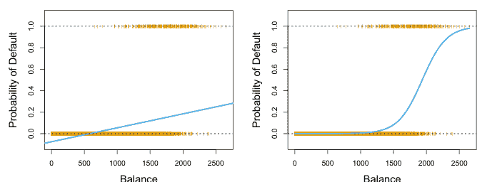

**图 4.2.** *使用违约数据进行分类。左图：使用线性回归估计的违约概率。一些估计概率为负数！橙色刻度线表示为违约（否或是）编码的0/1值。右图：使用逻辑回归预测的违约概率。所有概率都介于0和1之间。*

或者，如果一家公司希望在预测有违约风险的个体时采取保守策略，那么他们可能会选择使用一个较低的阈值，例如 $p(\text{balance}) > 0.1$。

### 4.3.1 逻辑模型

我们应该如何对 $p(X) = \text{Pr}(Y = 1|X)$ 和 $X$ 之间的关系进行建模？（为方便起见，我们对响应使用通用的0/1编码。）在第4.2节中，我们考虑使用线性回归模型来表示这些概率：

$$p(X) = \beta_0 + \beta_1 X. \tag{4.1}$$

如果我们使用这种方法，用余额来预测违约=是，那么我们会得到图4.2左侧面板所示的模型。这里我们看到了这种方法的问题：对于接近零的余额，我们预测的违约概率为负数；如果我们对非常大的余额进行预测，我们会得到大于1的值。这些预测是不合理的，因为无论信用卡余额如何，真实的违约概率当然必须介于0和1之间。这个问题并非信用违约数据独有。任何时候，当一条直线被拟合到编码为0或1的二元响应时，原则上我们总是可以预测出某些 $X$ 值对应的 $p(X) < 0$，而另一些 $X$ 值对应的 $p(X) > 1$（除非 $X$ 的范围有限）。

为了避免这个问题，我们必须使用一个函数来对 $p(X)$ 建模，该函数对于所有 $X$ 值都能给出介于0和1之间的输出。许多函数都满足这个描述。在逻辑回归中，我们使用*逻辑函数*，

$$p(X) = \frac{e^{\beta_0 + \beta_1 X}}{1 + e^{\beta_0 + \beta_1 X}}. \tag{4.2}$$

为了拟合模型(4.2)，我们使用一种称为*最大似然*的方法，我们将在下一节讨论。图4.2的右侧面板展示了逻辑回归模型对违约数据的拟合效果。请注意，对于低余额，我们现在预测的违约概率接近于零，但永远不会低于零。同样，对于高余额，我们预测的违约概率接近于一，但永远不会高于一。逻辑函数总是会产生这种形式的*S形*曲线，因此无论 $X$ 的值如何，我们都会得到合理的预测。我们还看到，与左图中的线性回归模型相比，逻辑模型能够更好地捕捉概率的范围。两种情况下的平均拟合概率都是0.0333（在训练数据上平均），这与数据集中违约者的总体比例相同。

对(4.2)稍加变形，我们发现

$$\frac{p(X)}{1 - p(X)} = e^{\beta_0 + \beta_1 X}. \tag{4.3}$$

量 $p(X)/[1 - p(X)]$ 称为*几率*，其取值范围在0到 $\infty$ 之间。几率接近0和 $\infty$ 的值分别表示非常低和非常高的违约概率。例如，平均而言，几率为1/4的人中每5人就有1人会违约，因为 $p(X) = 0.2$ 意味着几率为 $\frac{0.2}{1-0.2} = 1/4$。同样，平均而言，几率为9的人中每10人就有9人会违约，因为 $p(X) = 0.9$ 意味着几率为 $\frac{0.9}{1-0.9} = 9$。在赛马中，几率传统上被用来代替概率，因为它们与正确的投注策略有更自然的联系。

对(4.3)两边取对数，我们得到

$$\log \left( \frac{p(X)}{1 - p(X)} \right) = \beta_0 + \beta_1 X. \tag{4.4}$$

左边称为*对数几率*或*logit*。我们看到逻辑回归模型(4.2)的logit是 $X$ 的线性函数。

回顾第3章，在线性回归模型中，$\beta_1$ 表示 $X$ 每增加一个单位，$Y$ 的平均变化量。相比之下，在逻辑回归模型中，$X$ 增加一个单位会使对数几率变化 $\beta_1$ (4.4)。等价地，它将几率乘以 $e^{\beta_1}$ (4.3)。然而，由于(4.2)中 $p(X)$ 和 $X$ 之间的关系不是一条直线，$\beta_1$ 并*不*对应于 $X$ 每增加一个单位所引起的 $p(X)$ 的变化量。$p(X)$ 因 $X$ 变化一个单位而改变的量取决于 $X$ 的当前值。但无论 $X$ 的值如何，如果 $\beta_1$ 为正，那么增加 $X$ 将与 $p(X)$ 的增加相关联；如果 $\beta_1$ 为负，那么增加 $X$ 将与 $p(X)$ 的减少相关联。$p(X)$ 和 $X$ 之间不存在直线关系，以及 $p(X)$ 每单位 $X$ 变化的速率取决于 $X$ 的当前值，这些事实也可以通过检查图4.2的右侧面板看出。

### 4.3.2 估计回归系数

(4.2)中的系数 $\beta_0$ 和 $\beta_1$ 是未知的，必须基于可用的训练数据进行估计。在第3章中，我们使用最小二乘法来估计未知的线性回归系数。虽然我们可以使用（非线性）最小二乘法来拟合模型(4.4)，但更通用的*最大似然*方法更受青睐，因为它具有更好的统计性质。使用最大似然背后的基本直觉拟合逻辑回归模型的过程如下：我们寻求 $\beta_0$ 和 $\beta_1$ 的估计值，使得使用公式 (4.2) 计算出的每个个体违约的预测概率 $\hat{p}(x_i)$ 尽可能接近该个体的观测违约状态。换句话说，我们试图找到 $\hat{\beta}_0$ 和 $\hat{\beta}_1$，使得将这些估计值代入公式 (4.2) 给出的 $p(X)$ 模型后，对于所有违约的个体，得到的值接近于 1；对于所有未违约的个体，得到的值接近于 0。这种直觉可以通过一个称为*似然函数*的数学方程来形式化：

$$\ell(\beta_0, \beta_1) = \prod_{i:y_i=1} p(x_i) \prod_{i':y_{i'}=0} (1 - p(x_{i'})). \tag{4.5}$$

估计值 $\hat{\beta}_0$ 和 $\hat{\beta}_1$ 的选择是为了*最大化*这个似然函数。

最大似然法是一种非常通用的方法，用于拟合本书中探讨的许多非线性模型。在线性回归的背景下，最小二乘法实际上是最大似然法的一个特例。最大似然法的数学细节超出了本书的范围。然而，通常可以使用 R 等统计软件轻松拟合逻辑回归和其他模型，因此我们无需关注最大似然拟合过程的细节。

表 4.1 显示了在 Default 数据集上拟合逻辑回归模型以使用 balance 预测违约概率（default=Yes）所得到的系数估计及相关信息。我们看到 $\hat{\beta}_1 = 0.0055$；这表明 balance 的增加与违约概率的增加相关。具体来说，balance 每增加一个单位，与违约的对数几率增加 0.0055 个单位相关。

表 4.1 所示的逻辑回归输出的许多方面与第 3 章的线性回归输出相似。例如，我们可以通过计算系数估计的标准误差来衡量其准确性。表 4.1 中的 z 统计量与线性回归输出（例如第 77 页的表 3.1）中的 t 统计量扮演相同的角色。例如，与 $\beta_1$ 相关的 z 统计量等于 $\hat{\beta}_1 / \text{SE}(\hat{\beta}_1)$，因此 z 统计量的（绝对）值较大表明有证据反对原假设 $H_0 : \beta_1 = 0$。这个原假设意味着 $p(X) = \frac{e^{\beta_0}}{1+e^{\beta_0}}$：换句话说，违约概率不依赖于 balance。由于表 4.1 中与 balance 相关的 p 值非常小，我们可以拒绝 $H_0$。换句话说，我们得出结论，balance 和违约概率之间确实存在关联。表 4.1 中的估计截距通常不值得关注；其主要目的是调整平均拟合概率以匹配数据中 1 的比例（在本例中，是总体违约率）。

## 4.3.3 进行预测

一旦估计出系数，我们就可以计算任何给定信用卡余额的违约概率。例如，使用表 4.1 中给出的系数估计，我们预测一个余额为 $1,000 的个体的违约概率为

$\hat{p}(X) = \frac{e^{\hat{\beta}_0+\hat{\beta}_1 X}}{1 + e^{\hat{\beta}_0+\hat{\beta}_1 X}} = \frac{e^{-10.6513+0.0055 \times 1,000}}{1 + e^{-10.6513+0.0055 \times 1,000}} = 0.00576,$

低于 1%。相比之下，一个余额为 $2,000 的个体的预测违约概率要高得多，等于 0.586 或 58.6%。

可以使用第 3.3.1 节中的虚拟变量方法，将定性预测变量与逻辑回归模型一起使用。例如，Default 数据集包含定性变量 student。要拟合一个使用学生身份作为预测变量的模型，我们只需创建一个虚拟变量，对于学生取值为 1，对于非学生取值为 0。由学生身份预测违约概率得到的逻辑回归模型见表 4.2。与虚拟变量相关的系数为正，且相关的 p 值在统计上显著。这表明学生往往比非学生有更高的违约概率：

$\widehat{\text{Pr}}(\text{default=Yes}|\text{student=Yes}) = \frac{e^{-3.5041+0.4049 \times 1}}{1 + e^{-3.5041+0.4049 \times 1}} = 0.0431,$

$\widehat{\text{Pr}}(\text{default=Yes}|\text{student=No}) = \frac{e^{-3.5041+0.4049 \times 0}}{1 + e^{-3.5041+0.4049 \times 0}} = 0.0292.$

## 4.3.4 多元逻辑回归

我们现在考虑使用多个预测变量预测二元响应的问题。类比第 3 章从简单线性回归到多元线性回归的扩展，我们可以将 (4.4) 推广如下：

$\log \left( \frac{p(X)}{1 - p(X)} \right) = \beta_0 + \beta_1 X_1 + \cdots + \beta_p X_p, \quad (4.6)$

其中 $X = (X_1, \dots, X_p)$ 是 $p$ 个预测变量。方程 4.6 可以改写为

$p(X) = \frac{e^{\beta_0 + \beta_1 X_1 + \cdots + \beta_p X_p}}{1 + e^{\beta_0 + \beta_1 X_1 + \cdots + \beta_p X_p}}. \quad (4.7)$

正如在第 4.3.2 节中一样，我们使用最大似然法来估计 $\beta_0, \beta_1, \dots, \beta_p$。

表 4.3 显示了使用 balance、income（以千美元计）和 student status 来预测违约概率的逻辑回归模型的系数估计。这里有一个令人惊讶的结果。与 balance 和 student status 的虚拟变量相关的 p 值非常小，表明每个变量都与违约概率相关。然而，虚拟变量的系数为负，表明学生比非学生更不可能违约。相比之下，表 4.2 中虚拟变量的系数为正。学生身份如何在表 4.2 中与违约概率增加相关，而在表 4.3 中与违约概率降低相关？图 4.3 的左侧面板提供了这个明显悖论的图形说明。橙色和蓝色实线分别显示了学生和非学生的平均违约率，作为信用卡余额的函数。多元逻辑回归中学生的负系数表明，在 balance 和 income 固定的情况下，学生比非学生更不可能违约。事实上，我们从图 4.3 的左侧面板观察到，对于每个 balance 值，学生的违约率都等于或低于非学生的违约率。但图表底部附近的水平虚线（显示学生和非学生在所有 balance 和 income 值上的平均违约率）表明了相反的效果：学生的总体违约率高于非学生。因此，在表 4.2 所示的单变量逻辑回归输出中，学生的系数为正。

图 4.3 的右侧面板解释了这种差异。变量 student 和 balance 是相关的。学生往往持有更高水平的债务，而这又与更高的违约概率相关。换句话说，学生更可能拥有较高的信用卡余额，而我们知道，从图 4.3 的左侧面板来看，较高的余额往往与高违约率相关。因此，即使一个具有特定信用卡余额的个体学生比具有相同信用卡余额的非学生更不可能违约，但学生总体上倾向于拥有更高的信用卡余额这一事实意味着，总体而言，学生的违约率往往高于非学生。对于试图确定应向谁提供信贷的信用卡公司来说，这是一个重要的区别。如果没有任何关于学生信用卡余额的信息，那么学生比非学生风险更大。

142 4. 分类

| | 系数 | 标准误差 | z 统计量 | p 值 |
|---|---|---|---|---|
| 截距 | -10.6513 | 0.3612 | -29.5 | <0.0001 |
| balance | 0.0055 | 0.0002 | 24.9 | <0.0001 |

表 4.1. 对于 Default 数据，使用 balance 预测违约概率的逻辑回归模型的估计系数。balance 每增加一个单位，与违约的对数几率增加 0.0055 个单位相关。

| | 系数 | 标准误差 | z 统计量 | p 值 |
|---|---|---|---|---|
| 截距 | -3.5041 | 0.0707 | -49.55 | <0.0001 |
| student[Yes] | 0.4049 | 0.1150 | 3.52 | 0.0004 |

表 4.2. 对于 Default 数据，使用 student status 预测违约概率的逻辑回归模型的估计系数。学生身份被编码为一个虚拟变量，学生取值为 1，非学生取值为 0，并在表中由变量 student[Yes] 表示。

| | 系数 | 标准误差 | z 统计量 | p 值 |
|---|---|---|---|---|
| 截距 | -10.8690 | 0.4923 | -22.08 | <0.0001 |
| balance | 0.0057 | 0.0002 | 24.74 | <0.0001 |
| income | 0.0030 | 0.0082 | 0.37 | 0.7115 |
| student[Yes] | -0.6468 | 0.2362 | -2.74 | 0.0062 |

表 4.3. 对于 Default 数据，使用 balance、income 和 student status 预测违约概率的逻辑回归模型的估计系数。学生身份被编码为虚拟变量 student[Yes]，学生取值为 1，非学生取值为 0。在拟合此模型时，income 以千美元为单位。

## 4.3 分类

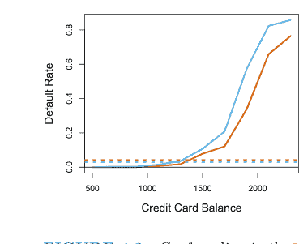

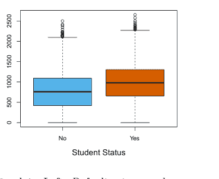

**图 4.3.** *Default 数据中的混杂因素。左图：显示了学生（橙色）和非学生（蓝色）的违约率。实线表示违约率作为余额的函数，而水平虚线表示总体违约率。右图：显示了学生（橙色）和非学生（蓝色）的余额箱线图。*

balance is available. However, that student is less risky than a non-student with the same credit card balance!

这个简单的例子说明了在其他预测变量也可能相关时，仅使用单个预测变量进行回归分析的危险和微妙之处。与线性回归的情况类似，使用一个预测变量得到的结果可能与使用多个预测变量得到的结果大相径庭，尤其是在预测变量之间存在相关性的情况下。一般来说，图 4.3 中看到的现象被称为混杂。

通过将表 4.3 中的回归系数估计值代入 (4.7)，我们可以进行预测。例如，一个信用卡余额为 $1,500、收入为 $40,000 的学生，其估计的违约概率为

$$\hat{p}(X) = \frac{e^{-10.869+0.00574\times 1,500+0.003\times 40-0.6468\times 1}}{1+e^{-10.869+0.00574\times 1,500+0.003\times 40-0.6468\times 1}} = 0.058. \quad (4.8)$$

一个具有相同余额和收入的非学生，其估计的违约概率为

$$\hat{p}(X) = \frac{e^{-10.869+0.00574\times 1,500+0.003\times 40-0.6468\times 0}}{1+e^{-10.869+0.00574\times 1,500+0.003\times 40-0.6468\times 0}} = 0.105. \quad (4.9)$$

（这里我们将表 4.3 中的收入系数估计值乘以 40，而不是 40,000，因为在该表中，模型拟合时收入是以 $1,000 为单位计量的。）

## 4.3.5 多项逻辑回归

我们有时希望对具有两个以上类别的响应变量进行分类。例如，在第 4.2 节中，急诊室的医疗状况有三个类别：中风、药物过量和癫痫发作。然而，我们在本节中看到的逻辑回归方法只允许响应变量有 $K=2$ 个类别。

事实证明，可以将两类逻辑回归方法扩展到 $K > 2$ 个类别的设置。这种扩展有时被称为*多项逻辑回归*。为此，我们首先选择一个类别作为*基准*；不失一般性，我们选择第 $K$ 个类别来担任此角色。然后，我们将模型 (4.7) 替换为模型

$$\Pr(Y = k|X = x) = \frac{e^{\beta_{k0} + \beta_{k1}x_1 + \cdots + \beta_{kp}x_p}}{1 + \sum_{l=1}^{K-1} e^{\beta_{l0} + \beta_{l1}x_1 + \cdots + \beta_{lp}x_p}} \quad (4.10)$$

其中 $k = 1, \dots, K-1$，以及

$$\Pr(Y = K|X = x) = \frac{1}{1 + \sum_{l=1}^{K-1} e^{\beta_{l0} + \beta_{l1}x_1 + \cdots + \beta_{lp}x_p}}. \quad (4.11)$$

不难证明，对于 $k = 1, \dots, K-1$，

$$\log \left( \frac{\Pr(Y = k|X = x)}{\Pr(Y = K|X = x)} \right) = \beta_{k0} + \beta_{k1}x_1 + \cdots + \beta_{kp}x_p. \quad (4.12)$$

注意，(4.12) 与 (4.6) 非常相似。方程 4.12 再次表明，任何一对类别之间的对数几率是特征的线性函数。

事实证明，在 (4.10)–(4.12) 中，将第 $K$ 个类别作为基准的选择并不重要。例如，当将急诊室就诊分类为**中风**、**药物过量**和**癫痫发作**时，假设我们拟合两个多项逻辑回归模型：一个将**中风**作为基准，另一个将**药物过量**作为基准。由于基准选择的不同，两个拟合模型的系数估计值会有所不同，但拟合值（预测值）、任何一对类别之间的对数几率以及其他关键模型输出将保持不变。

尽管如此，对多项逻辑回归模型中系数的解释必须谨慎，因为它与基准的选择有关。例如，如果我们设置**癫痫发作**为基准，那么我们可以将 $\beta_{\text{stroke}0}$ 解释为在 $x_1 = \cdots = x_p = 0$ 的条件下，**中风**相对于**癫痫发作**的对数几率。此外，$X_j$ 每增加一个单位，与**中风**相对于**癫痫发作**的对数几率增加 $\beta_{\text{stroke}j}$ 相关联。换句话说，如果 $X_j$ 增加一个单位，那么

$$\frac{\Pr(Y = \text{stroke}|X = x)}{\Pr(Y = \text{epileptic seizure}|X = x)}$$

增加 $e^{\beta_{\text{stroke}j}}$。

我们现在简要介绍多项逻辑回归的另一种编码方式，称为 *softmax* 编码。softmax 编码与刚才描述的编码等价，因为无论采用哪种编码，拟合值、任何一对类别之间的对数几率以及其他关键模型输出都将保持不变。但 softmax 编码在机器学习文献的某些领域被广泛使用（并且将在第 10 章再次出现），因此值得了解它。在 softmax 编码中，我们不是选择一个基准类别，而是对称地处理所有 $K$ 个类别，并假设对于 $k = 1, \dots, K$，

$$\Pr(Y = k|X = x) = \frac{e^{\beta_{k0} + \beta_{k1}x_1 + \cdots + \beta_{kp}x_p}}{\sum_{l=1}^{K} e^{\beta_{l0} + \beta_{l1}x_1 + \cdots + \beta_{lp}x_p}}. \quad (4.13)$$

因此，我们实际上估计的是所有 $K$ 个类别的系数，而不是 $K - 1$ 个类别的系数。不难看出，由 (4.13) 可得，第 $k$ 个和第 $k'$ 个类别之间的对数几率比等于

$$\log \left( \frac{\Pr(Y = k | X = x)}{\Pr(Y = k' | X = x)} \right) = (\beta_{k0} - \beta_{k'0}) + (\beta_{k1} - \beta_{k'1})x_1 + \cdots + (\beta_{kp} - \beta_{k'p})x_p. \quad (4.14)$$

## 4.4 用于分类的生成模型

逻辑回归涉及使用逻辑函数直接建模 $\Pr(Y = k | X = x)$，对于两个响应类别的情况，该函数由 (4.7) 给出。用统计术语来说，我们建模的是给定预测变量 $X$ 时响应变量 $Y$ 的条件分布。我们现在考虑一种替代的、不那么直接的方法来估计这些概率。在这种新方法中，我们在每个响应类别（即每个 $Y$ 值）中分别建模预测变量 $X$ 的分布。然后我们使用贝叶斯定理将这些分布转换为 $\Pr(Y = k | X = x)$ 的估计值。当假设每个类别中 $X$ 的分布为正态分布时，该模型的形式与逻辑回归非常相似。

既然我们已经有了逻辑回归，为什么还需要另一种方法？有几个原因：

- 当两个类别之间存在显著分离时，逻辑回归模型的参数估计会出人意料地不稳定。我们在本节中考虑的方法不存在这个问题。
- 如果预测变量 $X$ 在每个类别中的分布近似正态，并且样本量较小，那么本节中的方法可能比逻辑回归更准确。
- 本节中的方法可以自然地扩展到两个以上响应类别的案例。（对于两个以上响应类别的案例，我们也可以使用第 4.3.5 节中的多项逻辑回归。）

假设我们希望将一个观测值分类到 $K$ 个类别中的一个，其中 $K \geq 2$。换句话说，定性响应变量 $Y$ 可以取 $K$ 个可能的不同且无序的值。令 $\pi_k$ 表示随机选择的观测值来自第 $k$ 个类别的总体或*先验*概率。令 $f_k(X) \equiv \Pr(X | Y = k)^1$ 表示来自第 $k$ 个类别的观测值的 $X$ 的*密度函数*。换句话说，如果第 $k$ 个类别中的观测值具有 $X \approx x$ 的概率很高，则 $f_k(x)$ 相对较大；如果第 $k$ 个类别中的观测值具有 $X \approx x$ 的可能性非常小，则 $f_k(x)$ 较小。那么*贝叶斯定理*指出

$^1$从技术上讲，这个定义仅在 $X$ 是定性随机变量时才正确。如果 $X$ 是定量的，那么 $f_k(x)dx$ 对应于 $X$ 落在 $x$ 周围的小区域 $dx$ 内的概率。

## 4.4 用于分类的生成模型

$$\Pr(Y = k|X = x) = \frac{\pi_k f_k(x)}{\sum_{l=1}^K \pi_l f_l(x)}.$$ (4.15)

根据我们之前的符号约定，我们将使用缩写 $p_k(x) = \Pr(Y = k|X = x)$；这是观测值 $X = x$ 属于第 $k$ 类的*后验*概率。也就是说，这是在*给定*该观测值的预测变量值的情况下，该观测值属于第 $k$ 类的概率。

公式 4.15 表明，我们不必像第 4.3.1 节那样直接计算后验概率 $p_k(x)$，而只需将 $\pi_k$ 和 $f_k(x)$ 的估计值代入 (4.15) 即可。通常，如果我们有来自总体的随机样本，估计 $\pi_k$ 很容易：我们只需计算属于第 $k$ 类的训练观测值所占的比例。然而，估计密度函数 $f_k(x)$ 则要困难得多。正如我们将看到的，为了估计 $f_k(x)$，我们通常需要做出一些简化假设。

我们从第 2 章知道，贝叶斯分类器将观测值 $x$ 分类到 $p_k(x)$ 最大的类别，其错误率在所有分类器中是最低的。（当然，这仅在 (4.15) 中的所有项都正确指定的情况下才成立。）因此，如果我们能找到一种方法来估计 $f_k(x)$，那么我们就可以将其代入 (4.15) 以近似贝叶斯分类器。

在接下来的几节中，我们将讨论三种分类器，它们在 (4.15) 中使用 $f_k(x)$ 的不同估计来近似贝叶斯分类器：*线性判别分析*、*二次判别分析*和*朴素贝叶斯*。

### 4.4.1 $p = 1$ 时的线性判别分析

目前，假设 $p = 1$——即我们只有一个预测变量。我们希望获得 $f_k(x)$ 的一个估计，以便将其代入 (4.15) 来估计 $p_k(x)$。然后，我们将把观测值分类到 $p_k(x)$ 最大的类别。为了估计 $f_k(x)$，我们将首先对其形式做出一些假设。

具体来说，我们假设 $f_k(x)$ 是*正态*或*高斯*分布的。在一维情况下，正态密度的形式为

$$f_k(x) = \frac{1}{\sqrt{2\pi}\sigma_k} \exp\left(-\frac{1}{2\sigma_k^2}(x - \mu_k)^2\right),$$ (4.16)

其中 $\mu_k$ 和 $\sigma_k^2$ 是第 $k$ 类的均值和方差参数。目前，让我们进一步假设 $\sigma_1^2 = \cdots = \sigma_K^2$：即所有 $K$ 类共享一个方差项，为简单起见，我们将其记为 $\sigma^2$。将 (4.16) 代入 (4.15)，我们得到

$$p_k(x) = \frac{\pi_k \frac{1}{\sqrt{2\pi}\sigma} \exp\left(-\frac{1}{2\sigma^2}(x - \mu_k)^2\right)}{\sum_{l=1}^K \pi_l \frac{1}{\sqrt{2\pi}\sigma} \exp\left(-\frac{1}{2\sigma^2}(x - \mu_l)^2\right)}.$$ (4.17)

（注意在 (4.17) 中，$\pi_k$ 表示观测值属于第 $k$ 类的先验概率，不要与数学常数 $\pi \approx 3.14159$ 混淆。）贝叶斯分类器$^2$涉及将观测值

> $^2$回顾一下，*贝叶斯分类器*将观测值分配到 $p_k(x)$ 最大的类别。这与 (4.15) 中的*贝叶斯定理*不同，后者允许我们操作条件分布。

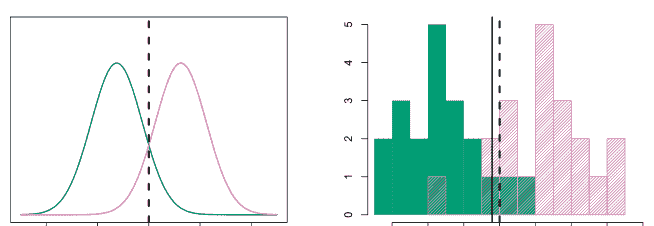

**图 4.4.** *左图：显示了两个一维正态密度函数。虚线垂直线代表贝叶斯决策边界。右图：从两个类别中各抽取了 20 个观测值，并以直方图形式显示。贝叶斯决策边界再次显示为虚线垂直线。实线垂直线代表从训练数据估计的 LDA 决策边界。*

$X = x$ 分配到使 (4.17) 最大的类别。对 (4.17) 取对数并重新排列各项，不难证明$^3$这等价于将观测值分配到使

$$\delta_k(x) = x \cdot \frac{\mu_k}{\sigma^2} - \frac{\mu_k^2}{2\sigma^2} + \log(\pi_k) \quad (4.18)$$

最大的类别。例如，如果 $K = 2$ 且 $\pi_1 = \pi_2$，那么贝叶斯分类器在 $2x(\mu_1 - \mu_2) > \mu_1^2 - \mu_2^2$ 时将观测值分配到类别 1，否则分配到类别 2。贝叶斯决策边界是 $\delta_1(x) = \delta_2(x)$ 的点；可以证明这相当于

$$x = \frac{\mu_1^2 - \mu_2^2}{2(\mu_1 - \mu_2)} = \frac{\mu_1 + \mu_2}{2}. \quad (4.19)$$

图 4.4 的左侧面板显示了一个例子。显示的两个正态密度函数 $f_1(x)$ 和 $f_2(x)$ 代表两个不同的类别。两个密度函数的均值和方差参数为 $\mu_1 = -1.25$，$\mu_2 = 1.25$，以及 $\sigma_1^2 = \sigma_2^2 = 1$。两个密度有重叠，因此给定 $X = x$，观测值属于哪个类别存在一些不确定性。如果我们假设观测值来自任一类别的可能性相等——即 $\pi_1 = \pi_2 = 0.5$——那么通过检查 (4.19)，我们看到贝叶斯分类器在 $x < 0$ 时将观测值分配到类别 1，否则分配到类别 2。注意，在这种情况下，我们可以计算贝叶斯分类器，因为我们知道 $X$ 在每个类别内来自高斯分布，并且我们知道所有涉及的参数。在现实生活中，我们无法计算贝叶斯分类器。

实际上，即使我们非常确信 $X$ 在每个类别内来自高斯分布的假设，要应用贝叶斯分类器，我们仍然需要估计参数 $\mu_1, \dots, \mu_K$，$\pi_1, \dots, \pi_K$，以及 $\sigma^2$。*线性判别分析* (LDA) 方法通过将 $\pi_k$、$\mu_k$ 和 $\sigma^2$ 的估计值代入 (4.18) 来近似贝叶斯分类器。具体来说，使用以下估计：

$$\hat{\mu}_k = \frac{1}{n_k} \sum_{i:y_i=k} x_i$$

$$\hat{\sigma}^2 = \frac{1}{n-K} \sum_{k=1}^K \sum_{i:y_i=k} (x_i - \hat{\mu}_k)^2 \quad (4.20)$$

其中 $n$ 是训练观测值的总数，$n_k$ 是第 $k$ 类中的训练观测值数量。$\mu_k$ 的估计值就是第 $k$ 类所有训练观测值的平均值，而 $\hat{\sigma}^2$ 可以看作是每个 $K$ 类样本方差的加权平均值。有时我们了解类别成员概率 $\pi_1, \dots, \pi_K$，可以直接使用。在没有任何额外信息的情况下，LDA 使用属于第 $k$ 类的训练观测值的比例来估计 $\pi_k$。换句话说，

$$\hat{\pi}_k = n_k/n. \quad (4.21)$$

LDA 分类器将 (4.20) 和 (4.21) 中给出的估计值代入 (4.18)，并将观测值 $X = x$ 分配到使

$$\hat{\delta}_k(x) = x \cdot \frac{\hat{\mu}_k}{\hat{\sigma}^2} - \frac{\hat{\mu}_k^2}{2\hat{\sigma}^2} + \log(\hat{\pi}_k) \quad (4.22)$$

最大的类别。分类器名称中的*线性*一词源于 (4.22) 中的*判别函数* $\hat{\delta}_k(x)$ 是 $x$ 的线性函数（而不是 $x$ 的更复杂函数）这一事实。

图 4.4 的右侧面板显示了从每个类别中随机抽取的 20 个观测值的直方图。为了实现 LDA，我们首先使用 (4.20) 和 (4.21) 估计了 $\pi_k$、$\mu_k$ 和 $\sigma^2$。然后我们计算了决策边界（显示为黑色实线），该边界是通过将观测值分配到使 (4.22) 最大的类别而得到的。该线左侧的所有点将被分配到绿色类别，而该线右侧的点将被分配到紫色类别。在这种情况下，由于 $n_1 = n_2 = 20$，我们有 $\hat{\pi}_1 = \hat{\pi}_2$。因此，决策边界对应于两个类别样本均值的中点，即 $(\hat{\mu}_1 + \hat{\mu}_2)/2$。该图表明 LDA 决策边界略位于最优贝叶斯决策边界的左侧，而后者等于 $(\mu_1 + \mu_2)/2 = 0$。LDA 分类器在此数据上的表现如何？由于这是模拟数据，我们可以生成大量测试观测值来计算贝叶斯错误率和 LDA 测试错误率。它们分别是 10.6% 和 11.1%。换句话说，LDA 分类器的错误率仅比最小可能错误率高 0.5%！这表明 LDA 在此数据集上表现相当好。

重申一下，LDA 分类器源于假设每个类别内的观测值来自具有类别特定均值和共同方差 $\sigma^2$ 的正态分布，并将这些参数的估计值代入贝叶斯分类器。在第 4.4.3 节中，我们将考虑一组不那么严格的假设，允许第 $k$ 类的观测值具有类别特定的方差 $\sigma_k^2$。

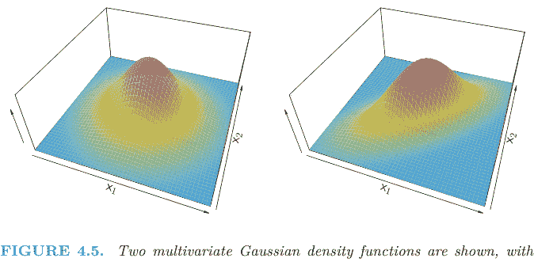

**图 4.5.** *展示了两个多元高斯密度函数，其中 $p = 2$。左图：两个预测变量不相关。右图：两个变量的相关系数为 0.7。*

## 4.4.2 $p > 1$ 时的线性判别分析

我们现在将 LDA 分类器扩展到多个预测变量的情况。为此，我们将假设 $X = (X_1, X_2, \dots, X_p)$ 来自一个*多元高斯*（或多元正态）分布，该分布具有类别特定的均值向量和一个共同的协方差矩阵。我们首先简要回顾一下这个分布。

多元高斯分布假设每个单独的预测变量都遵循一维正态分布，如公式 (4.16) 所示，并且每对预测变量之间存在一定的相关性。图 4.5 展示了两个 $p = 2$ 的多元高斯分布示例。曲面在任何特定点的高度代表 $X_1$ 和 $X_2$ 同时落在该点附近一个小区域内的概率。在任一图中，如果沿着 $X_1$ 轴或 $X_2$ 轴切割曲面，得到的横截面将具有一维正态分布的形状。图 4.5 的左图说明了一个 $\text{Var}(X_1) = \text{Var}(X_2)$ 且 $\text{Cor}(X_1, X_2) = 0$ 的例子；这个曲面具有特征性的*钟形*。然而，如果预测变量相关或具有不相等的方差，钟形将会扭曲，如图 4.5 的右图所示。在这种情况下，钟形的底部将呈椭圆形，而不是圆形。为了表示一个 $p$ 维随机变量 $X$ 具有多元高斯分布，我们写作 $X \sim N(\mu, \Sigma)$。这里 $\text{E}(X) = \mu$ 是 $X$ 的均值（一个具有 $p$ 个分量的向量），$\text{Cov}(X) = \Sigma$ 是 $X$ 的 $p \times p$ 协方差矩阵。形式上，多元高斯密度定义为

$$f(x) = \frac{1}{(2\pi)^{p/2} |\Sigma|^{1/2}} \exp\left( -\frac{1}{2} (x - \mu)^T \Sigma^{-1} (x - \mu) \right). \tag{4.23}$$

在 $p > 1$ 个预测变量的情况下，LDA 分类器假设第 $k$ 类中的观测值来自多元高斯分布 $N(\mu_k, \Sigma)$，其中 $\mu_k$ 是类别特定的均值向量，$\Sigma$ 是所有 $K$ 个类共有的协方差矩阵。将第 $k$ 类的密度函数 $f_k(X = x)$ 代入公式 (4.15) 并进行一些代数运算，可以发现贝叶斯分类器将观测值 $X = x$ 分配给使以下判别函数最大的类别

$$\delta_k(x) = x^T \Sigma^{-1} \mu_k - \frac{1}{2} \mu_k^T \Sigma^{-1} \mu_k + \log \pi_k \tag{4.24}$$

这是公式 (4.18) 的向量/矩阵版本。

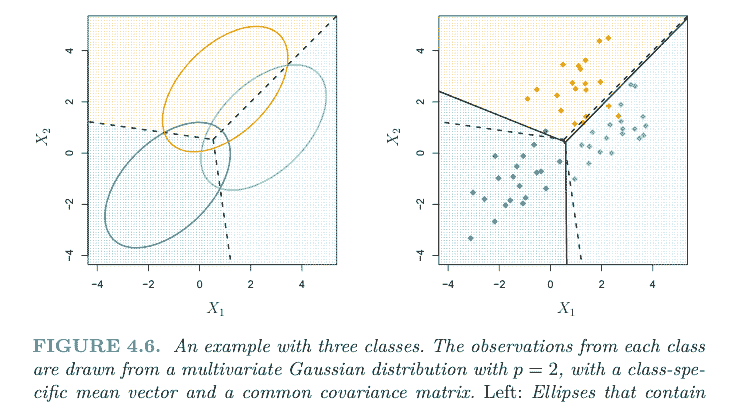

**图 4.6.** 一个包含三个类别的例子。每个类别的观测值来自 $p = 2$ 的多元高斯分布，具有类别特定的均值向量和共同的协方差矩阵。左图：显示了包含每个类别 95% 概率的椭圆。虚线是贝叶斯决策边界。右图：从每个类别生成了 20 个观测值，相应的 LDA 决策边界用实线黑线表示。贝叶斯决策边界再次用虚线显示。

图 4.6 的左图展示了一个例子。显示了三个大小相等的高斯类别，具有类别特定的均值向量和共同的协方差矩阵。三个椭圆代表包含每个类别 95% 概率的区域。虚线是贝叶斯决策边界。换句话说，它们代表了使 $\delta_k(x) = \delta_l(x)$ 的 $x$ 值的集合；即

$$x^T \Sigma^{-1} \mu_k - \frac{1}{2} \mu_k^T \Sigma^{-1} \mu_k = x^T \Sigma^{-1} \mu_l - \frac{1}{2} \mu_l^T \Sigma^{-1} \mu_l \tag{4.25}$$

对于 $k \neq l$。（公式 (4.24) 中的 $\log \pi_k$ 项消失了，因为三个类别中的每一个都有相同数量的训练观测值；即每个类别的 $\pi_k$ 相同。）请注意，有三条线代表贝叶斯决策边界，因为三个类别之间有三对类别。也就是说，一条贝叶斯决策边界将类别 1 与类别 2 分开，一条将类别 1 与类别 3 分开，一条将类别 2 与类别 3 分开。这三条贝叶斯决策边界将预测变量空间划分为三个区域。贝叶斯分类器将根据观测值所在的区域对其进行分类。

同样，我们需要估计未知参数 $\mu_1, \dots, \mu_K$、$\pi_1, \dots, \pi_K$ 和 $\Sigma$；公式类似于一维情况中给出的公式 (4.20)。为了对新的观测值 $X = x$ 进行分类，LDA 将这些估计值代入公式 (4.24) 以获得 $\hat{\delta}_k(x)$ 的值，并将其分类到使 $\hat{\delta}_k(x)$ 最大的类别。请注意，在公式 (4.24) 中，$\hat{\delta}_k(x)$ 是 $x$ 的线性函数；也就是说，LDA 决策规则仅通过其元素的线性组合依赖于 $x$。如前所述，这就是 LDA 中“线性”一词的由来。

在图 4.6 的右图中，显示了从三个类别中各抽取的 20 个观测值，相应的 LDA 决策边界显示为实线黑线。总体而言，LDA 决策边界与贝叶斯决策边界（再次显示为虚线）非常接近。贝叶斯和 LDA 分类器的测试错误率分别为 0.0746 和 0.0770。这表明 LDA 在此数据上表现良好。

我们可以对 Default 数据执行 LDA，以根据信用卡余额和学生身份预测个人是否会违约。⁴ 拟合到 10,000 个训练样本的 LDA 模型产生的*训练*错误率为 2.75%。这听起来是一个很低的错误率，但必须注意两个警告。

- 首先，训练错误率通常会低于测试错误率，而测试错误率才是我们真正关心的量。换句话说，如果我们使用这个分类器来预测一组新个人是否会违约，我们可能会预期它的表现会更差。原因是我们专门调整模型参数以在训练数据上表现良好。参数 *p* 与样本数量 *n* 的比率越高，我们越预期这种*过拟合*会起作用。对于这些数据，我们不期望这是一个问题，因为 *p* = 2 且 *n* = 10,000。
- 其次，由于训练样本中只有 3.33% 的个人违约，一个简单但无用的分类器（无论其信用卡余额和学生身份如何，总是预测个人不会违约）将导致 3.33% 的错误率。换句话说，这个平凡的*零*分类器将达到仅比 LDA 训练集错误率略高的错误率。

在实践中，像这样的二元分类器可能犯两种类型的错误：它可能错误地将违约的个人归类为*未违约*类别，或者它可能错误地将未违约的个人归类为

⁴细心的读者会注意到学生身份是定性的——因此，LDA 所做的正态性假设在此例中显然被违反了！然而，正如本例所示，LDA 通常对模型违反具有显著的稳健性。第 4.4.4 节讨论的朴素贝叶斯提供了 LDA 的替代方案，它不假设预测变量服从正态分布。

152 4. 分类

| | 真实违约状态 | | |
|---|---|---|---|
| | 否 | 是 | 总计 |
| 预测违约状态 | 否 | 9644 | 252 | 9896 |
| | 是 | 23 | 81 | 104 |
| 总计 | 9667 | 333 | 10000 |

表 4.4. 混淆矩阵将 LDA 预测与 Default 数据集中 10,000 个训练观测值的真实违约状态进行了比较。矩阵对角线上的元素代表违约状态被正确预测的个人，而非对角线元素代表被错误分类的个人。LDA 对 23 个未违约的个人和 252 个违约的个人做出了错误的预测。

*默认*类别。通常，确定这两种错误中哪一种正在发生是很有意义的。*混淆矩阵*（如表4.4所示的*Default*数据）是展示此信息的便捷方式。该表显示，LDA预测总共有104人会违约。这些人中，81人确实违约，23人没有。因此，在9,667名未违约的个体中，只有23人被错误标记。这看起来是一个相当低的错误率！然而，在333名违约的个体中，有252人（或75.7%）被LDA遗漏了。因此，尽管总体错误率很低，但违约个体的错误率却非常高。从试图识别高风险个体的信用卡公司的角度来看，违约个体中252/333 = 75.7%的错误率可能是无法接受的。

特定类别的性能在医学和生物学中也很重要，其中*灵敏度*和*特异度*这两个术语用于表征分类器或筛查测试的性能。在这种情况下，灵敏度是被识别出的真实违约者的百分比；它等于24.3%。特异度是被正确识别的非违约者的百分比；它等于(1 − 23/9667) = 99.8%。

为什么LDA在对违约客户进行分类时表现如此之差？换句话说，为什么它的灵敏度如此之低？正如我们所看到的，LDA试图近似贝叶斯分类器，该分类器在所有分类器中具有最低的*总*错误率。也就是说，贝叶斯分类器将产生尽可能小的总误分类观测值，无论错误来自哪个类别。一些误分类是由于将未违约的客户错误地分配到违约类别造成的，另一些则是由于将违约的客户错误地分配到非违约类别造成的。相比之下，信用卡公司可能特别希望避免错误地分类一个将会违约的个体，而错误地分类一个不会违约的个体虽然仍应避免，但问题较小。我们现在将看到，可以修改LDA以开发一个更能满足信用卡公司需求的分类器。

贝叶斯分类器的工作原理是将观测值分配给后验概率 $p_k(X)$ 最大的类别。在两类情况下，这相当于在以下条件下将观测值分配给*默认*类别：

$$\Pr(\text{default} = \text{Yes} | X = x) > 0.5. \tag{4.26}$$

因此，贝叶斯分类器，以及扩展的LDA，使用50%的违约后验概率阈值来将观测值分配给*默认*类别。然而，如果我们担心错误预测违约个体的违约状态，那么我们可以考虑降低这个阈值。例如，我们可以将任何违约后验概率高于20%的客户标记为*默认*类别。换句话说，不是在(4.26)成立时将观测值分配给*默认*类别，而是可以在以下条件下将观测值分配给该类别：

$$\Pr(\text{default} = \text{Yes} | X = x) > 0.2. \tag{4.27}$$

采用这种方法产生的错误率如表4.5所示。现在LDA预测430人会违约。在333名违约的个体中，LDA正确预测了除138人外的所有人，即41.4%。与使用50%阈值产生的75.7%错误率相比，这是一个巨大的改进。然而，这种改进是有代价的：现在有235名未违约的个体被错误分类。因此，总体错误率略微上升至3.73%。但信用卡公司可能会认为，为了更准确地识别确实违约的个体，总体错误率的轻微增加是一个很小的代价。

| | 真实违约状态 | | |
|---|---|---|---|
| | 否 | 是 | 总计 |
| 预测违约状态 | 否 | 9432 | 138 | 9570 |
| | 是 | 235 | 195 | 430 |
| 总计 | 9667 | 333 | 10000 |

表4.5. 混淆矩阵将LDA预测与Default数据集中10,000个训练观测值的真实违约状态进行比较，使用修改后的阈值，对任何后验违约概率超过20%的个体预测违约。

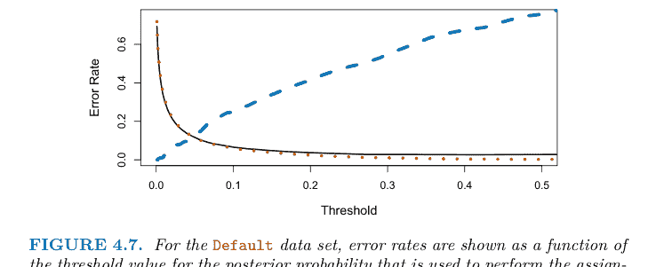

图4.7. 对于Default数据集，错误率显示为用于执行分配的后验概率阈值的函数。黑色实线显示总体错误率。蓝色虚线代表被错误分类的违约客户比例，橙色点线表示非违约客户中的错误比例。

图4.7说明了修改违约后验概率阈值所产生的权衡。各种错误率显示为阈值的函数。使用0.5的阈值，如(4.26)所示，可使总体错误率最小化，如黑色实线所示。这是意料之中的，因为贝叶斯分类器使用0.5的阈值，并且已知具有最低的总体错误率。但当使用0.5的阈值时，违约个体的错误率相当高（蓝色虚线）。随着阈值的降低，违约个体的错误率稳步下降，但未违约个体的错误率却增加了。我们如何决定哪个阈值最好？这样的决定必须基于领域知识，例如关于违约相关成本的详细信息。

ROC曲线是一种流行的图形，用于同时显示所有可能阈值下的两种错误类型。“ROC”这个名称是历史性的，来自通信理论。它是接收者操作特征的缩写。图4.8显示了训练数据上LDA分类器的ROC曲线。分类器的整体性能，对所有可能阈值进行汇总，由*（ROC）曲线下面积*（AUC）给出。理想的ROC曲线会紧贴左上角，因此AUC越大，分类器越好。对于这些数据，AUC为0.95，接近最大值1.0，因此被认为非常好。我们预期一个表现不优于随机的分类器在独立测试集（未用于模型训练）上评估时AUC为0.5。ROC曲线对于比较不同的分类器很有用，因为它们考虑了所有可能的阈值。事实证明，第4.3.4节中针对这些数据拟合的逻辑回归模型的ROC曲线与LDA模型的ROC曲线几乎无法区分，因此我们在此不显示它。

## ROC曲线

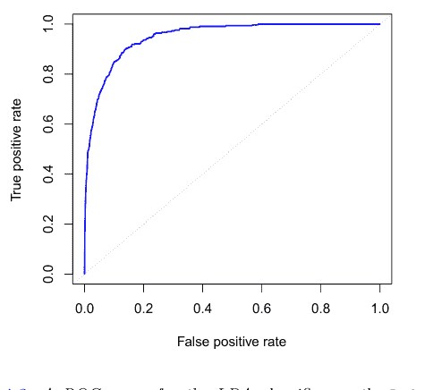

**图4.8.** *Default数据上LDA分类器的ROC曲线。它描绘了当我们改变违约后验概率阈值时两种错误的变化。实际阈值未显示。真阳性率是灵敏度：使用给定阈值正确识别的违约者比例。假阳性率是1-特异度：使用相同阈值我们将非违约者错误分类为违约者的比例。理想的ROC曲线紧贴左上角，表示高真阳性率和低假阳性率。虚线代表“无信息”分类器；如果学生身份和信用卡余额与违约概率无关，这就是我们预期的结果。*

正如我们在上面看到的，改变分类器阈值会改变其真阳性和假阳性率。这些也称为我们分类器的*灵敏度*和1减去*特异度*。由于在此上下文中使用的术语几乎令人困惑，我们现在给出一个总结。表4.6显示了将分类器（或诊断测试）应用于人群时可能的结果。为了与流行病学文献建立联系，我们将“+”视为我们试图检测的“疾病”，将“−”视为“非疾病”状态。为了与经典假设检验文献建立联系，我们将“−”视为原假设，将“+”视为

## 4.4.3 二次判别分析

正如我们之前讨论的，线性判别分析（LDA）假设每个类别内的观测值来自一个多元高斯分布，该分布具有类别特定的均值向量和一个对所有 $K$ 个类别都通用的协方差矩阵。*二次判别分析*（QDA）提供了一种替代方法。与LDA类似，QDA分类器也基于假设每个类别的观测值来自高斯分布，并将参数估计值代入贝叶斯定理以进行预测。然而，与LDA不同的是，QDA假设每个类别都有其自己的协方差矩阵。也就是说，它假设来自第 $k$ 个类别的观测值具有 $X \sim N(\mu_k, \Sigma_k)$ 的形式，其中 $\Sigma_k$ 是第 $k$ 个类别的协方差矩阵。在此假设下，贝叶斯分类器将观测值 $X = x$ 分配给使以下判别函数最大的类别：

$$\delta_k(x) = -\frac{1}{2}(x - \mu_k)^T \Sigma_k^{-1} (x - \mu_k) - \frac{1}{2} \log |\Sigma_k| + \log \pi_k$$
$$= -\frac{1}{2} x^T \Sigma_k^{-1} x + x^T \Sigma_k^{-1} \mu_k - \frac{1}{2} \mu_k^T \Sigma_k^{-1} \mu_k - \frac{1}{2} \log |\Sigma_k| + \log \pi_k$$
(4.28)

因此，QDA分类器涉及将 $\Sigma_k$、$\mu_k$ 和 $\pi_k$ 的估计值代入公式 (4.28)，然后将观测值 $X = x$ 分配给使该量最大的类别。与公式 (4.24) 不同，变量 $x$ 在公式 (4.28) 中以*二次*函数的形式出现。这就是QDA名称的由来。

为什么假设 $K$ 个类别是否共享一个共同的协方差矩阵很重要？换句话说，为什么有人会更倾向于LDA而非QDA，反之亦然？答案在于偏差-方差权衡。当有 $p$ 个预测变量时，估计一个协方差矩阵需要估计 $p(p+1)/2$ 个参数。QDA为每个类别估计一个单独的协方差矩阵，总共需要估计 $Kp(p+1)/2$ 个参数。以50个预测变量为例，这将是1,275的某个倍数，这是一个很大的参数量。而通过假设 $K$ 个类别共享一个共同的协方差矩阵，LDA模型在 $x$ 上变为线性，这意味着需要估计 $Kp$ 个线性系数。因此，LDA是一个比QDA灵活度低得多的分类器，因此其方差也显著降低。这可能会带来预测性能的提升。但这里存在一个权衡：如果LDA关于 $K$ 个类别共享共同协方差矩阵的假设严重偏离事实，那么LDA可能会遭受高偏差。粗略地说，如果训练观测值相对较少，因此降低方差至关重要，那么LDA往往比QDA是更好的选择。相反，如果训练集非常大，以至于分类器的方差不是主要问题，或者 $K$ 个类别共享共同协方差矩阵的假设明显站不住脚，则推荐使用QDA。

图4.9展示了LDA和QDA在两种情景下的表现。在左侧面板中，两个高斯类别在 $X_1$ 和 $X_2$ 之间具有0.7的共同相关性。因此，贝叶斯决策边界是线性的，并且被LDA决策边界准确地近似。QDA决策边界较差，因为它遭受了更高的方差，而偏差并未相应降低。相比之下，右侧面板显示了一种情况，其中橙色类别的变量间相关性为0.7，蓝色类别的相关性为 $-0.7$。现在贝叶斯决策边界是二次的，因此QDA比LDA更准确地近似了这个边界。

**图4.9。** *左图：针对一个两类问题（$\Sigma_1 = \Sigma_2$）的贝叶斯（紫色虚线）、LDA（黑色点线）和QDA（绿色实线）决策边界。阴影区域表示QDA决策规则。由于贝叶斯决策边界是线性的，因此LDA比QDA更准确地近似了它。右图：细节与左图相同，但 $\Sigma_1 \neq \Sigma_2$。由于贝叶斯决策边界是非线性的，因此QDA比LDA更准确地近似了它。*

## 4.4.4 朴素贝叶斯

在前面的章节中，我们使用了贝叶斯定理 (4.15) 来构建LDA和QDA分类器。在这里，我们使用贝叶斯定理来引出流行的*朴素贝叶斯*分类器。

回顾一下，贝叶斯定理 (4.15) 提供了后验概率 $p_k(x) = \Pr(Y = k | X = x)$ 的表达式，该表达式基于 $\pi_1, \dots, \pi_K$ 和 $f_1(x), \dots, f_K(x)$。要在实践中使用公式 (4.15)，我们需要 $\pi_1, \dots, \pi_K$ 和 $f_1(x), \dots, f_K(x)$ 的估计值。正如我们在前面章节中看到的，估计先验概率 $\pi_1, \dots, \pi_K$ 通常很直接：例如，我们可以将 $\hat{\pi}_k$ 估计为属于第 $k$ 个类别的训练观测值的比例，其中 $k = 1, \dots, K$。

然而，估计 $f_1(x), \dots, f_K(x)$ 则更为微妙。回顾一下，$f_k(x)$ 是第 $k$ 个类别中观测值的 $p$ 维密度函数，其中 $k = 1, \dots, K$。通常，估计一个 $p$ 维密度函数是具有挑战性的。在LDA中，我们做出了一个非常强的假设，极大地简化了任务：我们假设 $f_k$ 是一个多元正态随机变量的密度函数，该随机变量具有类别特定的均值 $\mu_k$ 和共享的协方差矩阵 $\Sigma$。相比之下，在QDA中，我们假设 $f_k$ 是一个多元正态随机变量的密度函数，该随机变量具有类别特定的均值 $\mu_k$ 和类别特定的协方差矩阵 $\Sigma_k$。通过做出这些非常强的假设，我们能够将估计 $K$ 个 $p$ 维密度函数这一极具挑战性的问题，替换为估计 $K$ 个 $p$ 维均值向量和一个（在LDA情况下）或 $K$ 个（在QDA情况下）$(p \times p)$ 维协方差矩阵这一简单得多的问题。

朴素贝叶斯分类器在估计 $f_1(x), \dots, f_K(x)$ 时采取了不同的策略。我们不是假设这些函数属于某个特定的分布族（例如多元正态分布），而是做出一个单一的假设：

> 在第 $k$ 个类别内，$p$ 个预测变量是相互独立的。

用数学语言表述，这个假设意味着对于 $k = 1, \dots, K$，

$$f_k(x) = f_{k1}(x_1) \times f_{k2}(x_2) \times \cdots \times f_{kp}(x_p), \quad (4.29)$$

其中 $f_{kj}$ 是第 $k$ 个类别内观测值中第 $j$ 个预测变量的密度函数。

为什么这个假设如此强大？本质上，估计一个 $p$ 维密度函数之所以具有挑战性，是因为我们不仅要考虑每个预测变量的*边缘分布*——即每个预测变量自身的分布——还要考虑预测变量的*联合分布*——即不同预测变量之间的关联。在多元正态分布的情况下，不同预测变量之间的关联由协方差矩阵的非对角线元素概括。然而，通常这种关联可能非常难以描述，并且估计起来极具挑战性。但是，通过假设在每个类别内 $p$ 个协变量是独立的，我们完全消除了担心 $p$ 个预测变量之间关联的必要，因为我们直接假设预测变量之间*没有*关联！

我们真的相信朴素贝叶斯的假设，即在每个类别内 $p$ 个协变量是独立的吗？在大多数情况下，我们并不相信。但即使这个建模假设是为了方便而做出的，它通常会导致

156 4. 分类

| | | 真实类别 | | |
|---|---|---|---|---|
| | | – 或 零类 | + 或 非零类 | 总计 |
| 预测类别 | – 或 零类 | 真负例 (TN) | 假负例 (FN) | N* |
| | + 或 非零类 | 假正例 (FP) | 真正例 (TP) | P* |
| | 总计 | N | P | |

表4.6. 将分类器或诊断测试应用于一个群体时可能出现的结果。

| 名称 | 定义 | 同义词 |
|---|---|---|
| 假正例率 | FP/N | I类错误，1–特异性 |
| 真正例率 | TP/P | 1–II类错误，功效，敏感性，召回率 |
| 正预测值 | TP/P* | 精确率，1–错误发现比例 |
| 负预测值 | TN/N* | |

表4.7. 分类和诊断测试的重要度量指标，源自表4.6中的量。

备择（非零）假设。在违约数据的背景下，“+”表示违约的个体，“–”表示未违约的个体。表4.7列出了在此背景下使用的许多流行的性能度量指标。假正例率和真正例率的分母是每个类别的实际群体计数。相比之下，正预测值和负预测值的分母是每个类别的预测总计数。

相当不错的结果，尤其是在 $n$ 相对于 $p$ 不够大，以至于我们无法有效估计每个类别内预测变量联合分布的情况下。事实上，由于估计联合分布需要海量数据，朴素贝叶斯在许多场景下都是一个不错的选择。本质上，朴素贝叶斯假设引入了一些偏差，但减少了方差，最终由于偏差-方差权衡，得到了一个在实践中表现相当好的分类器。

一旦我们做出了朴素贝叶斯假设，就可以将 (4.29) 代入 (4.15) 得到后验概率的表达式，

$$\Pr(Y = k|X = x) = \frac{\pi_k \times f_{k1}(x_1) \times f_{k2}(x_2) \times \cdots \times f_{kp}(x_p)}{\sum_{l=1}^K \pi_l \times f_{l1}(x_1) \times f_{l2}(x_2) \times \cdots \times f_{lp}(x_p)} \quad (4.30)$$

其中 $k = 1, \ldots, K$。

要使用训练数据 $x_{1j}, \ldots, x_{nj}$ 估计一维密度函数 $f_{kj}$，我们有几种选择。

- 如果 $X_j$ 是定量的，那么我们可以假设 $X_j|Y = k \sim N(\mu_{jk}, \sigma_{jk}^2)$。换句话说，我们假设在每个类别内，第 $j$ 个预测变量来自一个（单变量）正态分布。虽然这听起来有点像 QDA，但有一个关键区别，即这里我们假设预测变量是独立的；这相当于在 QDA 的基础上增加了一个假设，即类别特定的协方差矩阵是对角矩阵。

- 如果 $X_j$ 是定量的，那么另一个选择是使用非参数估计来估计 $f_{kj}$。一个非常简单的方法是为每个类别内第 $j$ 个预测变量的观测值制作一个直方图。然后我们可以将 $f_{kj}(x_j)$ 估计为第 $k$ 类训练观测值中与 $x_j$ 属于同一直方图区间的比例。或者，我们可以使用*核密度估计器*，它本质上是直方图的平滑版本。

- 如果 $X_j$ 是定性的，那么我们可以简单地计算第 $j$ 个预测变量对应每个类别的训练观测值的比例。例如，假设 $X_j \in \{1, 2, 3\}$，并且我们在第 $k$ 类中有 100 个观测值。假设第 $j$ 个预测变量在这些观测值中分别取值为 1、2 和 3 的数量为 32、55 和 13。那么我们可以将 $f_{kj}$ 估计为

$$\hat{f}_{kj}(x_j) = \begin{cases} 0.32 & \text{if } x_j = 1 \\ 0.55 & \text{if } x_j = 2 \\ 0.13 & \text{if } x_j = 3. \end{cases}$$

我们现在考虑一个具有 $p = 3$ 个预测变量和 $K = 2$ 个类别的简单示例中的朴素贝叶斯分类器。前两个预测变量是定量的，第三个预测变量是定性的，有三个水平。进一步假设 $\hat{\pi}_1 = \hat{\pi}_2 = 0.5$。对于 $k = 1, 2$ 和 $j = 1, 2, 3$ 的估计密度函数 $\hat{f}_{kj}$ 显示在图 4.10 中。现在假设我们希望对一个新观测值 $x^* = (0.4, 1.5, 1)^T$ 进行分类。在这个例子中，结果是 $\hat{f}_{11}(0.4) = 0.368$，$\hat{f}_{12}(1.5) = 0.484$，$\hat{f}_{13}(1) = 0.226$，以及 $\hat{f}_{21}(0.4) = 0.030$，$\hat{f}_{22}(1.5) = 0.130$，$\hat{f}_{23}(1) = 0.616$。将这些估计值代入 (4.30) 得到后验概率估计值 $\Pr(Y = 1|X = x^*) = 0.944$ 和 $\Pr(Y = 2|X = x^*) = 0.056$。

## 类别 k=1 的密度估计

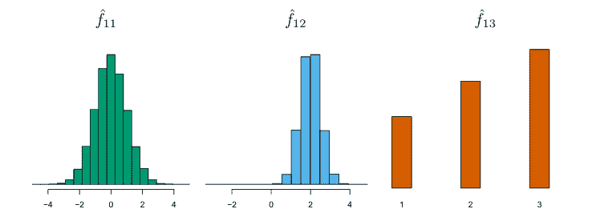

## 类别 k=2 的密度估计

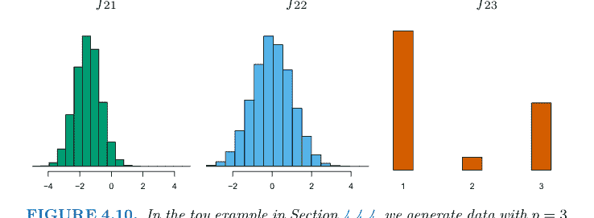

图 4.10. 在第 4.4.4 节的简单示例中，我们生成了具有 $p = 3$ 个预测变量和 $K = 2$ 个类别的数据。前两个预测变量是定量的，第三个预测变量是定性的，有三个水平。在每个类别中，显示了三个预测变量中每一个的估计密度。如果两个类别的先验概率相等，那么观测值 $x^* = (0.4, 1.5, 1)^T$ 属于第一类的后验概率为 94.4%。

| | 真实违约状态 | | |
|---|---|---|---|
| | 否 | 是 | 总计 |
| 预测违约状态 | 否 | 9621 | 244 | 9865 |
| | 是 | 46 | 89 | 135 |
| 总计 | 9667 | 333 | 10000 |

表 4.8. 当我们将任何满足 $P(Y = \text{default}|X = x) > 0.5$ 的观测值预测为违约时，朴素贝叶斯预测与 Default 数据集中 10,000 个训练观测值的真实违约状态的比较。

表 4.8 提供了将朴素贝叶斯分类器应用于 Default 数据集时产生的混淆矩阵，其中如果违约的后验概率——即 $P(Y = \text{default}|X = x)$——超过 0.5，我们就预测违约。将其与表 4.4 中 LDA 的结果进行比较，我们的发现是混合的。虽然 LDA 的总体错误率略低，但朴素贝叶斯正确预测了更高比例的真实违约者。在这个朴素贝叶斯的实现中，我们假设每个定量预测变量都来自高斯分布（当然，还假设在每个类别内，每个预测变量都是独立的）。

与 LDA 一样，我们可以轻松调整预测违约的概率阈值。例如，表 4.9 提供了当 $P(Y = \text{default}|X = x) > 0.2$ 时预测违约所产生的混淆矩阵。同样，与具有相同阈值的 LDA（表 4.5）相比，结果是混合的。朴素贝叶斯的错误率更高，但正确预测了近三分之二的真实违约。

| | 真实违约状态 | | |
|---|---|---|---|
| | 否 | 是 | 总计 |
| 预测违约状态 | 否 | 9339 | 130 | 9469 |
| | 是 | 328 | 203 | 531 |
| 总计 | 9667 | 333 | 10000 |

表 4.9. 当我们将任何满足 $P(Y = \text{default}|X = x) > 0.2$ 的观测值预测为违约时，朴素贝叶斯预测与 Default 数据集中 10,000 个训练观测值的真实违约状态的比较。

在这个例子中，朴素贝叶斯没有令人信服地超越 LDA，这不应该太令人惊讶：这个数据集有 $n = 10,000$ 和 $p = 2$，因此朴素贝叶斯假设带来的方差减少不一定值得。我们预计在 $p$ 更大或 $n$ 更小的情况下，使用朴素贝叶斯相对于 LDA 或 QDA 会有更大的收益，因为此时减少方差非常重要。

## 4.5 分类方法的比较

### 4.5.1 解析比较

我们现在对 LDA、QDA、朴素贝叶斯和逻辑回归进行解析（或数学）比较。我们考虑在具有 $K$ 个类别的场景下的这些方法，因此我们将观测值分配给使 $\Pr(Y = k|X = x)$ 最大化的类别。等效地，我们可以将 $K$ 设为基线类别，并将观测值分配给使以下表达式最大化的类别

$$\log \left( \frac{\Pr(Y = k|X = x)}{\Pr(Y = K|X = x)} \right) \qquad (4.31)$$

其中 $k = 1, \dots, K$。检查每种方法的 (4.31) 的具体形式可以清楚地理解它们的异同。

首先，对于 LDA，我们可以利用贝叶斯定理 (4.15) 以及每个类别内的预测变量来自具有类别特定均值和共享协方差矩阵的多元正态密度 (4.23) 的假设，来证明

$$\log \left( \frac{\Pr(Y = k | X = x)}{\Pr(Y = K | X = x)} \right) = \log \left( \frac{\pi_k f_k(x)}{\pi_K f_K(x)} \right)$$
$$= \log \left( \frac{\pi_k \exp \left( -\frac{1}{2} (x - \mu_k)^T \Sigma^{-1} (x - \mu_k) \right)}{\pi_K \exp \left( -\frac{1}{2} (x - \mu_K)^T \Sigma^{-1} (x - \mu_K) \right)} \right)$$
$$= \log \left( \frac{\pi_k}{\pi_K} \right) - \frac{1}{2} (x - \mu_k)^T \Sigma^{-1} (x - \mu_k)$$
$$+ \frac{1}{2} (x - \mu_K)^T \Sigma^{-1} (x - \mu_K)$$
$$= \log \left( \frac{\pi_k}{\pi_K} \right) - \frac{1}{2} (\mu_k + \mu_K)^T \Sigma^{-1} (\mu_k - \mu_K)$$
$$+ x^T \Sigma^{-1} (\mu_k - \mu_K)$$
$$= a_k + \sum_{j=1}^p b_{kj} x_j, \quad (4.32)$$

其中 $a_k = \log \left( \frac{\pi_k}{\pi_K} \right) - \frac{1}{2} (\mu_k + \mu_K)^T \Sigma^{-1} (\mu_k - \mu_K)$，$b_{kj}$ 是 $\Sigma^{-1} (\mu_k - \mu_K)$ 的第 $j$ 个分量。因此，与逻辑回归一样，LDA 假设后验概率的对数几率是 $x$ 的线性函数。

使用类似的计算，在 QDA 场景下 (4.31) 变为

$$\log \left( \frac{\Pr(Y = k | X = x)}{\Pr(Y = K | X = x)} \right) = a_k + \sum_{j=1}^p b_{kj} x_j + \sum_{j=1}^p \sum_{l=1}^p c_{kjl} x_j x_l, \quad (4.33)$$

其中 $a_k, b_{kj}$ 和 $c_{kjl}$ 是 $\pi_k, \pi_K, \mu_k, \mu_K, \Sigma_k$ 和 $\Sigma_K$ 的函数。同样，顾名思义，QDA 假设后验概率的对数几率是 $x$ 的二次函数。

最后，我们考察朴素贝叶斯场景下的 (4.31)。回想一下，在这个场景中，$f_k(x)$ 被建模为 $p$ 个一维函数 $f_{kj}(x_j)$（$j = 1, \dots, p$）的乘积。因此，

$$\log \left( \frac{\Pr(Y = k | X = x)}{\Pr(Y = K | X = x)} \right) = \log \left( \frac{\pi_k f_k(x)}{\pi_K f_K(x)} \right)$$
$$= \log \left( \frac{\pi_k \prod_{j=1}^p f_{kj}(x_j)}{\pi_K \prod_{j=1}^p f_{Kj}(x_j)} \right)$$
$$= \log \left( \frac{\pi_k}{\pi_K} \right) + \sum_{j=1}^p \log \left( \frac{f_{kj}(x_j)}{f_{Kj}(x_j)} \right)$$
$$= a_k + \sum_{j=1}^p g_{kj}(x_j), \quad (4.34)$$

其中 $a_k = \log \left( \frac{\pi_k}{\pi_K} \right)$ 且 $g_{kj}(x_j) = \log \left( \frac{f_{kj}(x_j)}{f_{Kj}(x_j)} \right)$。因此，(4.34) 的右侧采取了*广义加性模型*的形式，这个主题将在第 7 章进一步讨论。

## 4.5 分类方法的比较

通过考察公式 (4.32)、(4.33) 和 (4.34)，我们可以对 LDA、QDA 和朴素贝叶斯得出以下观察：

-   LDA 是 QDA 的一个特例，其中对于所有 $j = 1, \dots, p$，$l = 1, \dots, p$，以及 $k = 1, \dots, K$，有 $c_{kjl} = 0$。（当然，这并不奇怪，因为 LDA 只是 QDA 的一个受限版本，其中 $\Sigma_1 = \cdots = \Sigma_K = \Sigma$。）
-   任何具有线性决策边界的分类器都是朴素贝叶斯的一个特例，其中 $g_{kj}(x_j) = b_{kj}x_j$。特别地，这意味着 LDA 是朴素贝叶斯的一个特例！从本章前面关于 LDA 和朴素贝叶斯的描述中，这一点并不明显，因为每种方法都做出了非常不同的假设：LDA 假设特征服从正态分布且具有共同的类内协方差矩阵，而朴素贝叶斯则假设特征之间相互独立。
-   如果我们在朴素贝叶斯分类器中使用一维高斯分布 $N(\mu_{kj}, \sigma_j^2)$ 来建模 $f_{kj}(x_j)$，那么我们最终会得到 $g_{kj}(x_j) = b_{kj}x_j$，其中 $b_{kj} = (\mu_{kj} - \mu_{Kj}) / \sigma_j^2$。在这种情况下，朴素贝叶斯实际上是 LDA 的一个特例，其中 $\Sigma$ 被限制为一个对角矩阵，其第 $j$ 个对角元素等于 $\sigma_j^2$。
-   QDA 和朴素贝叶斯都不是对方的特例。朴素贝叶斯可以产生更灵活的拟合，因为可以为 $g_{kj}(x_j)$ 选择任何形式。然而，它被限制为纯粹的*加性*拟合，即在公式 (4.34) 中，$x_j$ 的函数被*加*到 $x_l$ 的函数上（对于 $j \neq l$）；但是，这些项永远不会相乘。相比之下，QDA 包含形如 $c_{kjl}x_jx_l$ 的乘积项。因此，在预测变量之间的交互作用对于区分不同类别很重要的情况下，QDA 有可能更准确。

这些方法中没有一种能普遍优于其他方法：在任何情况下，方法的选择都将取决于 $K$ 个类别中每个类别的预测变量的真实分布，以及其他考虑因素，例如 $n$ 和 $p$ 的值。后者与偏差-方差权衡有关。

逻辑回归如何融入这个故事？回顾公式 (4.12)，多项逻辑回归的形式为

$$\log \left( \frac{\Pr(Y = k | X = x)}{\Pr(Y = K | X = x)} \right) = \beta_{k0} + \sum_{j=1}^p \beta_{kj}x_j.$$

这与 LDA 的线性形式 (4.32) 完全相同：在这两种情况下，$\log \left( \frac{\Pr(Y = k | X = x)}{\Pr(Y = K | X = x)} \right)$ 都是预测变量的线性函数。在 LDA 中，这个线性函数中的系数是 $\pi_k$、$\pi_K$、$\mu_k$、$\mu_K$ 和 $\Sigma$ 的估计值的函数，这些估计值是通过假设 $X_1, \dots, X_p$ 在每个类别内服从正态分布得到的。相比之下，在逻辑回归中，系数是通过最大化似然函数 (4.5) 来选择的。因此，我们预期当正态性假设（近似）成立时，LDA 会优于逻辑回归；而当该假设不成立时，我们预期逻辑回归会表现更好。

最后，我们简要讨论一下在第 2 章介绍的 ***K* 近邻** (KNN)。回顾一下，KNN 采用了与本章所见分类器完全不同的方法。为了对观测值 $X = x$ 进行预测，首先识别出与 $x$ 最近的训练观测值。然后将 $X$ 分配给这些观测值中多数所属的类别。因此，KNN 是一种完全非参数的方法：不对决策边界的形状做任何假设。我们对 KNN 做出以下观察：

-   因为 KNN 是完全非参数的，我们可以预期当决策边界高度非线性时，只要 $n$ 非常大且 $p$ 很小，这种方法将优于 LDA 和逻辑回归。
-   为了提供准确的分类，KNN 需要相对于预测变量数量而言*大量*的观测值——即 $n$ 远大于 $p$。这与 KNN 是非参数的事实有关，因此它倾向于减少偏差，但会带来很大的方差。
-   在决策边界非线性但 $n$ 只是中等规模，或者 $p$ 不是非常小的情况下，QDA 可能比 KNN 更受青睐。这是因为 QDA 可以提供非线性决策边界，同时利用参数形式，这意味着与 KNN 相比，它需要更小的样本量就能实现准确分类。
-   与逻辑回归不同，KNN 不会告诉我们哪些预测变量是重要的：我们不会得到像表 4.3 那样的系数表。

### 4.5.2 实证比较

我们现在比较逻辑回归、LDA、QDA、朴素贝叶斯和 KNN 的*实证*（实际）性能。我们从六种不同的场景中生成数据，每种场景都涉及一个二元（两类）分类问题。在其中三个场景中，贝叶斯决策边界是线性的，而在其余场景中是非线性的。对于每个场景，我们生成了 100 个随机训练数据集。在每个训练集上，我们对每种方法进行拟合，并在大型测试集上计算相应的测试错误率。线性场景的结果如图 4.11 所示，非线性场景的结果如图 4.12 所示。KNN 方法需要选择 $K$，即邻居的数量（不要与本章前面部分的类别数混淆）。我们使用了两个 $K$ 值进行 KNN：$K = 1$，以及一个使用称为*交叉验证*的方法自动选择的 $K$ 值，我们将在第 5 章进一步讨论。我们应用朴素贝叶斯时，假设每个类别内的特征服从单变量高斯密度分布，并且（当然——因为这是朴素贝叶斯的关键特征）假设特征之间相互独立。

在六种场景中的每一种，都有 $p = 2$ 个定量预测变量。场景如下：

场景 1：两个类别中各有 20 个训练观测值。每个类别内的观测值是不相关的随机正态变量，且每个类别具有不同的均值。图 4.11 的左侧面板显示，LDA 在这种设置下表现良好，正如预期的那样，因为这是 LDA 所假设的模型。逻辑回归也表现得相当好，因为它假设了线性决策边界。KNN 表现不佳，因为它在方差方面付出了代价，而这种代价并未被偏差的减少所抵消。QDA 的表现也比 LDA 差，因为它拟合了一个比必要更灵活的分类器。朴素贝叶斯的表现略好于 QDA，因为朴素贝叶斯关于预测变量独立的假设是正确的。

场景 2：细节与场景 1 相同，只是每个类别内两个预测变量之间的相关性为 -0.5。图 4.11 的中间面板表明，大多数方法的性能与前一个场景相似。一个显著的例外是朴素贝叶斯，它在这里表现非常差，因为朴素贝叶斯关于预测变量独立的假设被违反了。

场景 3：与前一个场景一样，每个类别内的预测变量之间存在显著的负相关。然而，这次我们从 t 分布生成 X1 和 X2，每个类别有 50 个观测值。t 分布的形状与正态分布相似，但它倾向于产生更极端的点——即更多远离均值的点。在这种设置下，决策边界仍然是线性的，因此符合逻辑回归的框架。该设置违反了 LDA 的假设，因为观测值不是从正态分布中抽取的。图 4.11 的右侧面板显示，逻辑回归优于 LDA，尽管这两种方法都优于其他方法。特别是，QDA 的结果由于非正态性而显著恶化。朴素贝叶斯表现非常差，因为独立性假设被违反了。

场景 4：数据从正态分布生成，第一个类别中预测变量之间的相关性为 0.5，第二个类别中预测变量之间的相关性为 -0.5。这种设置对应于 QDA 的假设，并导致二次决策边界。图 4.12 的左侧面板显示，QDA 优于所有其他方法。

## 4.6 广义线性模型

在第3章中，我们假设响应变量 $Y$ 是定量的，并探讨了使用最小二乘线性回归来预测 $Y$。到目前为止，在本章中，我们转而假设 $Y$ 是定性的。然而，我们有时可能会遇到 $Y$ 既非定性也非定量的情况，因此第3章的线性回归和本章涵盖的分类方法都不适用。

作为一个具体的例子，我们考虑共享单车数据集。响应变量是 `bikers`，即华盛顿特区共享单车计划的每小时用户数。这个响应值既非定性也非定量：相反，它取非负整数值，即计数。我们将考虑使用协变量 `mnth`（一年中的月份）、`hr`（一天中的小时，从0到23）、`workingday`（一个指示变量，如果既不是周末也不是假期则等于1）、`temp`（归一化温度，单位为摄氏度）和 `weathersit`（一个定性变量，取四个可能值之一：晴朗；薄雾或阴天；小雨或小雪；或大雨或大雪）来预测 `bikers`。

在接下来的分析中，我们将 `mnth`、`hr` 和 `weathersit` 视为定性变量。

### 4.6.1 共享单车数据的线性回归

首先，我们考虑使用线性回归来预测 `bikers`。结果如表4.10所示。

| | 系数 | 标准误 | t统计量 | p值 |
|---|---|---|---|---|
| 截距 | 73.60 | 5.13 | 14.34 | 0.00 |
| workingday | 1.27 | 1.78 | 0.71 | 0.48 |
| temp | 157.21 | 10.26 | 15.32 | 0.00 |
| weathersit[阴天/薄雾] | -12.89 | 1.96 | -6.56 | 0.00 |
| weathersit[小雨/雪] | -66.49 | 2.97 | -22.43 | 0.00 |
| weathersit[大雨/雪] | -109.75 | 76.67 | -1.43 | 0.15 |

表4.10. 拟合共享单车数据以预测 `bikers` 的最小二乘线性模型结果。由于篇幅限制，预测变量 `mnth` 和 `hr` 未在此表中列出，可在图4.13中查看。对于定性变量 `weathersit`，基线水平对应于晴朗的天空。

例如，我们看到，天气从晴朗变为阴天，平均每小时减少12.89名骑行者；然而，如果天气进一步变为雨雪天气，则平均每小时进一步减少53.60名骑行者。图4.13显示了与 `mnth` 相关的系数以及与 `hr` 相关的系数。我们看到，自行车使用量在春季和秋季最高，在冬季月份最低。此外，自行车使用量在高峰时段（上午9点和下午6点）最大，在夜间最低。因此，乍一看，对共享单车数据集拟合线性回归模型似乎提供了合理且直观的结果。

但经过更仔细的检查，一些问题变得明显。例如，共享单车数据集中9.6%的拟合值为负数：即线性回归模型在数据集中9.6%的时间段内预测的用户数为负。这质疑了我们对数据进行有意义预测的能力，也引发了对回归模型系数估计、置信区间和其他输出准确性的担忧。

此外，有理由怀疑，当 `bikers` 的期望值较小时，`bikers` 的方差也应该较小。例如，在12月一场大雪暴的凌晨2点，我们预计使用自行车的人数会极少，而且在这些条件下用户数量的方差也应该很小。数据证实了这一点：在12月、1月和2月的凌晨1点到4点之间，下雨时，平均有5.05名用户，标准差为3.73。相比之下，在4月、5月和6月的早上7点到10点之间，天空晴朗时，平均有243.59名用户，标准差为131.7。均值-方差关系如图4.14左侧面板所示。这严重违反了线性模型的假设，该假设指出 $Y = \sum_{j=1}^p X_j \beta_j + \epsilon$，其中 $\epsilon$ 是一个均值为零、方差 $\sigma^2$ 恒定且不是协变量函数的误差项。因此，数据的异方差性质疑了线性回归模型的适用性。

最后，响应变量 `bikers` 是整数值。但在线性模型下，$Y = \beta_0 + \sum_{j=1}^p X_j \beta_j + \epsilon$，其中 $\epsilon$ 是一个连续值的误差项。这意味着在线性模型中，响应变量 $Y$ 必然是连续值（定量的）。因此，响应变量 `bikers` 的整数性质表明，线性回归模型对于这个数据集并不完全令人满意。

其他方法。朴素贝叶斯假设预测变量独立，这被违反了，因此朴素贝叶斯表现不佳。

情景5：数据是从具有不相关预测变量的正态分布生成的。然后响应是从应用于预测变量复杂非线性函数的逻辑函数中抽样得到的。图4.12的中间面板显示，QDA和朴素贝叶斯都比线性方法略好，而更灵活的KNN-CV方法给出了最佳结果。但 $K = 1$ 的KNN在所有方法中表现最差。这突显了一个事实，即使数据表现出复杂的非线性关系，如果平滑度水平选择不当，像KNN这样的非参数方法仍然可能表现不佳。

情景6：观测值是从具有不同对角协方差矩阵的正态分布生成的，每个类别一个。然而，样本量非常小：每个类别只有 $n = 6$。朴素贝叶斯表现非常好，因为其假设得到了满足。LDA和逻辑回归表现不佳，因为由于协方差矩阵不相等，真实的决策边界是非线性的。QDA的表现比朴素贝叶斯稍差，因为鉴于样本量非常小，前者在估计每个类别内预测变量之间的相关性时产生了过大的方差。KNN的性能也因样本量非常小而受损。

这六个例子说明，没有一种方法能在所有情况下都优于其他方法。当真实的决策边界是线性的时，LDA和逻辑回归方法往往表现良好。当边界是中度非线性时，QDA或朴素贝叶斯可能会给出更好的结果。最后，对于更复杂的决策边界，像KNN这样的非参数方法可能更优。但非参数方法的平滑度水平必须仔细选择。在下一章中，我们将研究一些选择正确平滑度水平的方法，以及通常选择最佳整体方法的方法。

最后，回顾第3章，在回归设置中，我们可以通过使用预测变量的变换进行回归来适应预测变量和响应之间的非线性关系。在分类设置中也可以采用类似的方法。例如，我们可以通过包含 $X^2$、$X^3$ 甚至 $X^4$ 作为预测变量来创建更灵活版本的逻辑回归。这可能会也可能不会提高逻辑回归的性能，这取决于由于增加的灵活性而导致的方差增加是否被足够大的偏差减少所抵消。我们也可以对LDA做同样的事情。如果我们将所有可能的二次项和交叉项添加到LDA中，模型的形式将与QDA模型相同，尽管参数估计会不同。这个技巧允许我们在LDA和QDA模型之间进行某种程度的调整。

## 4.6.2 对共享单车数据的泊松回归

在对共享单车数据拟合线性回归模型时出现的一些问题，可以通过对响应变量进行变换来克服；例如，我们可以拟合如下模型：

$$\log(Y) = \sum_{j=1}^{p} X_j \beta_j + \epsilon.$$

对响应变量进行变换避免了出现负预测值的可能性，并且在很大程度上克服了未变换数据中的异方差性，如图4.14右侧面板所示。然而，这并非一个完全令人满意的解决方案，因为预测和推断都是基于响应变量的对数进行的，而不是基于响应变量本身。这导致了解释上的挑战，例如“$X_j$每增加一个单位，与$Y$的对数的均值增加$\beta_j$相关联”。此外，当响应变量可能取值为0时，无法应用对响应变量的对数变换。因此，虽然对响应变量的变换拟合线性模型对于某些计数数据集可能是一种足够的方法，但它往往不尽如人意。我们将在下一节看到，泊松回归模型为这项任务提供了一种更自然、更优雅的方法。

为了克服线性回归在分析共享单车数据集时的不足，我们将使用一种称为泊松回归的替代方法。在讨论泊松回归之前，我们必须先介绍泊松分布。

假设一个随机变量$Y$取非负整数值，即$Y \in \{0, 1, 2, \dots\}$。如果$Y$服从泊松分布，那么

$$\Pr(Y = k) = \frac{e^{-\lambda} \lambda^k}{k!} \quad \text{for } k = 0, 1, 2, \dots \qquad (4.35)$$

这里，$\lambda > 0$是$Y$的期望值，即$\text{E}(Y)$。事实证明，$\lambda$也等于$Y$的方差，即$\lambda = \text{E}(Y) = \text{Var}(Y)$。这意味着如果$Y$服从泊松分布，那么$Y$的均值越大，其方差也越大。（在(4.35)中，符号$k!$，读作“k的阶乘”，定义为$k! = k \times (k - 1) \times (k - 2) \times \dots \times 3 \times 2 \times 1$。）

泊松分布通常用于建模*计数*；这是一个自然的选择，原因有很多，包括计数与泊松分布一样，取非负整数值。为了了解我们如何在实践中使用泊松分布，令$Y$表示在一天中的特定小时、特定天气条件和特定月份内，共享单车计划的用户数量。我们可以将$Y$建模为均值为$\text{E}(Y) = \lambda = 5$的泊松分布。这意味着在这个特定小时内没有用户的概率是$\text{Pr}(Y = 0) = \frac{e^{-5}5^0}{0!} = e^{-5} = 0.0067$（其中$0! = 1$是约定俗成的）。恰好有一个用户的概率是$\text{Pr}(Y = 1) = \frac{e^{-5}5^1}{1!} = 5e^{-5} = 0.034$，有两个用户的概率是$\text{Pr}(Y = 2) = \frac{e^{-5}5^2}{2!} = 0.084$，依此类推。

当然，在现实中，我们期望共享单车计划的平均用户数$\lambda = \text{E}(Y)$会随着一天中的小时、一年中的月份、天气条件等因素而变化。因此，我们不是将骑行者数量$Y$建模为具有固定均值（如$\lambda = 5$）的泊松分布，而是希望允许均值作为协变量的函数而变化。特别是，我们考虑以下关于均值$\lambda = \text{E}(Y)$的模型，我们现在将其写为$\lambda(X_1, \dots, X_p)$以强调它是协变量$X_1, \dots, X_p$的函数：

$$\log(\lambda(X_1, \dots, X_p)) = \beta_0 + \beta_1 X_1 + \dots + \beta_p X_p \quad (4.36)$$
或等价地
$$\lambda(X_1, \dots, X_p) = e^{\beta_0 + \beta_1 X_1 + \dots + \beta_p X_p}. \quad (4.37)$$

这里，$\beta_0, \beta_1, \dots, \beta_p$是待估计的参数。公式(4.35)和(4.36)共同定义了泊松回归模型。注意在(4.36)中，我们取$\lambda(X_1, \dots, X_p)$的对数使其在$X_1, \dots, X_p$中是线性的，而不是让$\lambda(X_1, \dots, X_p)$本身在$X_1, \dots, X_p$中是线性的；这确保了对于所有协变量值，$\lambda(X_1, \dots, X_p)$都取非负值。

为了估计系数$\beta_0, \beta_1, \dots, \beta_p$，我们使用与第4.3.2节逻辑回归中采用的相同最大似然方法。具体来说，给定来自泊松回归模型的$n$个独立观测值，似然函数的形式为

$$\ell(\beta_0, \beta_1, \dots, \beta_p) = \prod_{i=1}^n \frac{e^{-\lambda(x_i)} \lambda(x_i)^{y_i}}{y_i!}, \quad (4.38)$$

其中，根据(4.37)，$\lambda(x_i) = e^{\beta_0 + \beta_1 x_{i1} + \dots + \beta_p x_{ip}}$。我们估计使似然函数$\ell(\beta_0, \beta_1, \dots, \beta_p)$最大化的系数，即使观测数据出现的可能性尽可能大的系数。

我们现在对`Bikeshare`数据集拟合泊松回归模型。结果如表4.11和图4.15所示。从定性上看，结果与第4.6.1节线性回归的结果相似。我们再次看到，自行车使用量在春季和秋季以及高峰时段最高，在冬季和凌晨时段最低。此外，自行车使用量随着温度升高而增加，随着天气恶化而减少。有趣的是，在泊松回归模型中，与工作日相关的系数在统计上是显著的，但在线性回归模型中则不是。

| | 系数 | 标准误差 | z统计量 | p值 |
|---|---|---|---|---|
| 截距 | 4.12 | 0.01 | 683.96 | 0.00 |
| 工作日 | 0.01 | 0.00 | 7.5 | 0.00 |
| 温度 | 0.79 | 0.01 | 68.43 | 0.00 |
| 天气状况[多云/薄雾] | -0.08 | 0.00 | -34.53 | 0.00 |
| 天气状况[小雨/雪] | -0.58 | 0.00 | -141.91 | 0.00 |
| 天气状况[大雨/雪] | -0.93 | 0.17 | -5.55 | 0.00 |

表4.11. 用于预测共享单车数据中骑行者的泊松回归模型拟合结果。由于篇幅限制，预测变量mnth和hr未在此表中显示，可在图4.15中查看。对于定性变量天气状况，基线对应于晴朗的天空。

泊松回归模型与线性回归模型之间的一些重要区别如下：

-   *解释：* 要解释泊松回归模型中的系数，我们必须密切关注(4.37)，该式指出$X_j$增加一个单位与$E(Y) = \lambda$变化$\exp(\beta_j)$倍相关联。例如，天气从晴朗变为多云，与平均自行车使用量变化$\exp(-0.08) = 0.923$倍相关联，即平均而言，多云时使用自行车的人数仅为晴朗时的92.3%。如果天气进一步恶化并开始下雨，那么平均自行车使用量将进一步变化$\exp(-0.5) = 0.607$倍，即平均而言，下雨时使用自行车的人数仅为多云时的60.7%。

## 4.6.3 更广义的广义线性模型

我们已经讨论了三种回归模型：线性回归、逻辑回归和泊松回归。这些方法有一些共同特点：

1.  每种方法都使用预测变量 $X_1, \dots, X_p$ 来预测响应变量 $Y$。我们假设，在给定 $X_1, \dots, X_p$ 的条件下，$Y$ 属于某个特定的分布族。对于线性回归，我们通常假设 $Y$ 服从高斯分布或正态分布。对于逻辑回归，我们假设 $Y$ 服从伯努利分布。最后，对于泊松回归，我们假设 $Y$ 服从泊松分布。
2.  每种方法都将 $Y$ 的均值建模为预测变量的函数。在线性回归中，$Y$ 的均值具有以下形式
$$\text{E}(Y|X_1, \dots, X_p) = \beta_0 + \beta_1 X_1 + \dots + \beta_p X_p, \quad (4.39)$$
即它是预测变量的线性函数。对于逻辑回归，均值则具有以下形式
$$\text{E}(Y|X_1, \dots, X_p) = \text{Pr}(Y = 1|X_1, \dots, X_p) = \frac{e^{\beta_0 + \beta_1 X_1 + \dots + \beta_p X_p}}{1 + e^{\beta_0 + \beta_1 X_1 + \dots + \beta_p X_p}}, \quad (4.40)$$
而对于泊松回归，它具有以下形式
$$\text{E}(Y|X_1, \dots, X_p) = \lambda(X_1, \dots, X_p) = e^{\beta_0 + \beta_1 X_1 + \dots + \beta_p X_p}. \quad (4.41)$$

方程 (4.39)–(4.41) 可以用一个*连接函数* $\eta$ 来表示，该函数对 $E(Y|X_1, \dots, X_p)$ 进行变换，使得变换后的均值成为预测变量的线性函数。即，

$$\eta(E(Y|X_1, \dots, X_p)) = \beta_0 + \beta_1 X_1 + \dots + \beta_p X_p. \tag{4.42}$$

线性回归、逻辑回归和泊松回归的连接函数分别是 $\eta(\mu) = \mu$、$\eta(\mu) = \log(\mu/(1-\mu))$ 和 $\eta(\mu) = \log(\mu)$。

高斯分布、伯努利分布和泊松分布都是一个更广泛分布族的成员，称为*指数族*。该族的其他著名成员包括*指数*分布、*Gamma* 分布和*负二项*分布。通常，我们可以通过将响应变量 $Y$ 建模为来自指数族的某个特定成员，然后通过 (4.42) 变换响应变量的均值，使得变换后的均值成为预测变量的线性函数，从而进行回归分析。任何遵循这一通用流程的回归方法都称为*广义线性模型*（GLM）。因此，线性回归、逻辑回归和泊松回归是 GLM 的三个例子。此处未涉及的其他例子包括 *Gamma 回归*和*负二项回归*。

## 4.7 实验室：逻辑回归、LDA、QDA 和 KNN

### 4.7.1 股票市场数据

在本实验中，我们将研究 `Smarket` 数据，它是 `ISLP` 库的一部分。该数据集包含标准普尔 500 股票指数从 2001 年初到 2005 年底共 1,250 天的百分比回报率。对于每个日期，我们记录了前五个交易日（`Lag1` 到 `Lag5`）的百分比回报率。我们还记录了 `Volume`（前一天的交易股数，以十亿计）、`Today`（所讨论日期的百分比回报率）和 `Direction`（该日期市场是上涨 `Up` 还是下跌 `Down`）。

我们首先在此顶层导入我们的库；这些都是我们在之前的实验中见过的导入。

```python
import numpy as np
import pandas as pd
from matplotlib.pyplot import subplots
import statsmodels.api as sm
from ISLP import load_data
from ISLP.models import (ModelSpec as MS,
                         summarize)
```

我们还收集了本实验所需的新导入。

```python
from ISLP import confusion_table
from ISLP.models import contrast
from sklearn.discriminant_analysis import \
    (LinearDiscriminantAnalysis as LDA,
     QuadraticDiscriminantAnalysis as QDA)
from sklearn.naive_bayes import GaussianNB
from sklearn.neighbors import KNeighborsClassifier
from sklearn.preprocessing import StandardScaler
from sklearn.model_selection import train_test_split
from sklearn.linear_model import LogisticRegression
```

现在我们准备好加载 Smarket 数据。

```python
In [3]: Smarket = load_data('Smarket')
        Smarket
```

这给出了数据的截断列表，我们在此不显示。我们可以查看变量名。

```python
In [4]: Smarket.columns
```

```
Out[4]: Index(['Year', 'Lag1', 'Lag2', 'Lag3', 'Lag4', 'Lag5', 'Volume',
        'Today', 'Direction'],
       dtype='object')
```

我们使用数据框的 `corr()` 方法计算相关矩阵，该矩阵包含所有变量之间的成对相关性。（我们在此抑制输出。）pandas 库不报告 `Direction` 变量的相关性，因为它是定性变量。

```python
In [5]: Smarket.corr()
```

正如预期的那样，滞后回报变量与今日回报之间的相关性接近于零。唯一显著的相关性存在于 `Year` 和 `Volume` 之间。通过绘制数据，我们看到 `Volume` 随时间增加。换句话说，从 2001 年到 2005 年，每日平均交易股数增加了。

```python
In [6]: Smarket.plot(y='Volume');
```

### 4.7.2 逻辑回归

接下来，我们将拟合一个逻辑回归模型，以使用 `Lag1` 到 `Lag5` 和 `Volume` 来预测 `Direction`。`sm.GLM()` 函数拟合广义线性模型，这是一类包括逻辑回归在内的模型。或者，函数 `sm.Logit()` 直接拟合逻辑回归模型。`sm.GLM()` 的语法与 `sm.OLS()` 类似，只是我们必须传入参数 `family=sm.families.Binomial()` 来告诉 statsmodels 运行逻辑回归，而不是其他类型的广义线性模型。

```python
In [7]: allvars = Smarket.columns.drop(['Today', 'Direction', 'Year'])
        design = MS(allvars)
        X = design.fit_transform(Smarket)
        y = Smarket.Direction == 'Up'
        glm = sm.GLM(y,
                     X,
                     family=sm.families.Binomial())
        results = glm.fit()
        summarize(results)
```

```
Out[7]:
            coef    std err          z      P>|z|
intercept -0.1260      0.241     -0.523      0.601
Lag1      -0.0731      0.050     -1.457      0.145
Lag2      -0.0423      0.050     -0.845      0.398
Lag3       0.0111      0.050      0.222      0.824
Lag4       0.0094      0.050      0.187      0.851
Lag5       0.0103      0.050      0.208      0.835
Volume     0.1354      0.158      0.855      0.392
```

这里最小的 p 值与 `Lag1` 相关。该预测变量的负系数表明，如果市场昨天有正回报，那么今天上涨的可能性较小。然而，p 值为 0.15，仍然相对较大，因此没有明确证据表明 `Lag1` 和 `Direction` 之间存在真实关联。

我们使用 `results` 的 `params` 属性来仅访问此拟合模型的系数。

```python
In [8]: results.params
```

```
Out[8]: intercept   -0.126000
Lag1        -0.073074
Lag2        -0.042301
Lag3         0.011085
Lag4         0.009359
Lag5         0.010313
Volume       0.135441
dtype: float64
```

同样，我们可以使用 `pvalues` 属性来访问系数的 p 值（未显示）。

```python
In [9]: results.pvalues
```

`results` 的 `predict()` 方法可用于预测市场上涨的概率，给定预测变量的值。此方法返回概率尺度上的预测。如果未向 `predict()` 函数提供数据集，则概率是针对用于拟合逻辑回归模型的训练数据计算的。与线性回归一样，如果需要，可以传递一个与设计矩阵一致的可选 `exog` 参数。这里我们只打印了前十个概率。

```python
In [10]: probs = results.predict()
         probs[:10]
```

```
Out[10]: array([0.5070841, 0.4814679, 0.4811388, 0.5152223, 0.5107812,
         0.5069565, 0.4926509, 0.5092292, 0.5176135, 0.4888378])
```

为了预测市场在特定日期是上涨还是下跌，我们必须将这些预测概率转换为类别标签 `Up` 或 `Down`。以下两个命令根据市场上涨的预测概率是否大于或小于 0.5 创建一个类别预测向量。

```python
In [11]: labels = np.array(['Down']*1250)
         labels[probs>0.5] = "Up"
```

---

*均值-方差关系*：如前所述，在泊松模型下，$\lambda = \text{E}(Y) = \text{Var}(Y)$。因此，通过使用泊松回归对自行车使用量建模，我们隐含地假设在给定小时内自行车使用量的均值等于该小时内自行车使用量的方差。相比之下，在线性回归模型下，自行车使用量的方差始终取一个常数值。回顾图 4.14，在 Bikeshare 数据中，当骑行条件有利时，自行车使用量的均值*和*方差都比条件不利时高得多。因此，泊松回归模型能够以线性回归模型无法处理的方式处理 Bikeshare 数据中观察到的均值-方差关系。$^5$

*非负拟合值*：使用泊松回归模型没有负预测值。这是因为泊松模型本身只允许非负值；参见 (4.35)。相比之下，当我们对 Bikeshare 数据集拟合线性回归模型时，几乎 10% 的预测值是负数。

$^5$事实上，Bikeshare 数据中的方差似乎远高于均值，这种情况称为*过离散*。这导致表 4.11 中的 Z 值被夸大。更仔细的分析应考虑这种过离散以获得更准确的 Z 值，并且有多种方法可以做到这一点。但它们超出了本书的范围。

## 4. 分类

`confusion_table()` 函数来自 `ISLP` 包，用于汇总这些预测结果，显示有多少观测被正确或错误地分类。我们的函数改编自 `sklearn.metrics` 模块中的类似函数，它转置了结果矩阵并包含了行和列标签。`confusion_table()` 函数的第一个参数是预测标签，第二个参数是真实标签。

```
confusion_table(labels, Smarket.Direction)
```

```
Truth Down Up
Predicted
Down 145 141
Up 457 507
```

混淆矩阵的对角线元素表示正确的预测，而非对角线元素表示错误的预测。因此，我们的模型正确预测了市场在 507 天上涨，在 145 天下跌，总共正确预测了 507 + 145 = 652 天。`np.mean()` 函数可用于计算预测正确的天数比例。在这种情况下，逻辑回归在 52.2% 的时间里正确预测了市场的走势。

```
(507+145)/1250, np.mean(labels == Smarket.Direction)
```

```
(0.5216, 0.5216)
```

乍一看，逻辑回归模型似乎比随机猜测稍好一些。然而，这个结果具有误导性，因为我们在同一组 1,250 个观测上训练和测试了模型。换句话说，100 − 52.2 = 47.8% 是 *训练* 错误率。正如我们之前所见，训练错误率往往过于乐观——它倾向于低估测试错误率。为了更好地评估逻辑回归模型在此设置下的准确性，我们可以使用部分数据拟合模型，然后检查它对 *保留* 数据的预测效果。这将产生一个更现实的错误率，因为在实践中，我们感兴趣的不是模型在用于拟合的数据上的表现，而是对未来市场走势未知的那些天的表现。

为了实现这一策略，我们首先创建一个对应于 2001 年至 2004 年观测的布尔向量。然后，我们使用这个向量创建一个包含 2005 年观测的保留数据集。

```
train = (Smarket.Year < 2005)
Smarket_train = Smarket.loc[train]
Smarket_test = Smarket.loc[~train]
Smarket_test.shape
```

```
(252, 9)
```

对象 `train` 是一个包含 1,250 个元素的向量，对应于我们数据集中的观测。对应于 2005 年之前发生的观测的元素被设置为 `True`，而对应于 2005 年观测的元素被设置为 `False`。因此，`train` 是一个 *布尔* 数组，因为它的元素是 `True` 和 `False`。布尔数组可用于使用 `loc` 方法获取数据框的行或列的子集。例如，命令 `Smarket.loc[train]` 将仅选取股票市场数据集中对应于 2005 年之前日期的子矩阵，因为这些日期的 `train` 元素为 `True`。`~` 符号可用于否定布尔向量的所有元素。也就是说，`~train` 是一个类似于 `train` 的向量，只是 `train` 中为 `True` 的元素在 `~train` 中变为 `False`，反之亦然。因此，`Smarket.loc[~train]` 生成股票市场数据框中仅包含 `train` 为 `False` 的观测的行子集。上面的输出表明有 252 个这样的观测。

我们现在仅使用对应于 2005 年之前日期的观测子集来拟合逻辑回归模型。然后，我们获得测试集中每一天（即 2005 年的每一天）股票市场上涨的预测概率。

```
X_train, X_test = X.loc[train], X.loc[~train]
y_train, y_test = y.loc[train], y.loc[~train]
glm_train = sm.GLM(y_train,
                   X_train,
                   family=sm.families.Binomial())
results = glm_train.fit()
probs = results.predict(exog=X_test)
```

请注意，我们在两个完全独立的数据集上训练和测试了模型：训练仅使用 2005 年之前的日期，测试仅使用 2005 年的日期。

最后，我们将 2005 年的预测与该时间段市场的实际走势进行比较。我们将首先存储测试和训练标签（回想一下 `y_test` 是二元的）。

```
D = Smarket.Direction
L_train, L_test = D.loc[train], D.loc[~train]
```

现在，我们将拟合概率在 50% 处进行阈值处理，以形成我们的预测标签。

```
labels = np.array(['Down']*252)
labels[probs>0.5] = 'Up'
confusion_table(labels, L_test)
```

Out[17]:
Truth Down Up
Predicted
Down 77 97
Up 34 44

测试准确率约为 48%，而错误率约为 52%。

```
np.mean(labels == L_test), np.mean(labels != L_test)
```

Out[18]: (0.4802, 0.5198)

`!=` 符号表示 *不等于*，因此最后一个命令计算测试集错误率。结果相当令人失望：测试错误率为 52%，比随机猜测还要差！当然，考虑到人们通常不会期望能够使用过去的收益来预测未来的市场表现，这个结果并不那么令人惊讶。（毕竟，如果这是可能的，那么本书的作者们就会去赚大钱，而不是写一本统计学教科书了。）

我们回想一下，逻辑回归模型中所有预测变量的 $p$ 值都非常不理想，其中最小的 $p$ 值（虽然不是非常小）对应于 `Lag1`。也许通过移除那些在预测 `Direction` 方面似乎没有帮助的变量，我们可以获得一个更有效的模型。毕竟，使用与响应变量没有关系的预测变量往往会导致测试错误率恶化（因为这样的预测变量会增加方差而不会相应地减少偏差），因此移除这样的预测变量可能会带来改进。下面我们仅使用 `Lag1` 和 `Lag2` 重新拟合逻辑回归，这两个变量在原始逻辑回归模型中似乎具有最高的预测能力。

```
In [19]: model = MS(['Lag1', 'Lag2']).fit(Smarket)
        X = model.transform(Smarket)
        X_train, X_test = X.loc[train], X.loc[~train]
        glm_train = sm.GLM(y_train,
                           X_train,
                           family=sm.families.Binomial())
        results = glm_train.fit()
        probs = results.predict(exog=X_test)
        labels = np.array(['Down']*252)
        labels[probs>0.5] = 'Up'
        confusion_table(labels, L_test)
```

```
Out[19]: Truth  Down    Up
         Predicted
         Down     35    35
         Up       76   106
```

让我们评估整体准确率以及逻辑回归预测上涨时的准确率。

```
In [20]: (35+106)/252,106/(106+76)
```

```
Out[20]: (0.5595, 0.5824)
```

现在结果看起来好了一些：56% 的每日走势被正确预测。值得注意的是，在这种情况下，一个更简单的策略——预测市场每天都会涨——也会有 56% 的正确率！因此，就整体错误率而言，逻辑回归方法并不比朴素方法好。然而，混淆矩阵显示，在逻辑回归预测市场上涨的日子里，其准确率为 58%。这表明了一种可能的交易策略：在模型预测市场上涨的日子买入，在预测下跌的日子避免交易。当然，人们需要更仔细地调查这种微小的改进是真实的还是仅仅由于随机机会。

假设我们想要预测与特定 `Lag1` 和 `Lag2` 值相关的收益。特别是，我们想要预测当 `Lag1` 和 `Lag2` 分别等于 1.2 和 1.1 时，以及当它们等于 1.5 和 $-0.8$ 时的 `Direction`。我们使用 `predict()` 函数来完成此操作。

```
In [21]: newdata = pd.DataFrame({'Lag1':[1.2, 1.5],
                             'Lag2':[1.1, -0.8]});
```

## 4.7.3 线性判别分析

我们首先使用 `LinearDiscriminantAnalysis()` 函数（我们将其简写为 `LDA()`）对 Smarket 数据进行 LDA 分析。我们仅使用 2005 年之前的观测数据来拟合模型。

```python
lda = LDA(store_covariance=True)
```

由于 LDA 估计器会自动添加截距项，我们应该从 `X_train` 和 `X_test` 中移除对应于截距的列。我们也可以直接使用标签 `L_train`，而不是布尔向量 `y_train`。

```python
X_train, X_test = [M.drop(columns=['intercept'])
                  for M in [X_train, X_test]]
lda.fit(X_train, L_train)
```

```
LinearDiscriminantAnalysis(store_covariance=True)
```

这里我们使用了第 3.6.4 节介绍的列表推导式。观察上面的第一行代码，我们看到右侧是一个长度为 2 的列表。这是因为代码 `for M in [X_train, X_test]` 遍历了一个长度为 2 的列表。虽然这里我们遍历的是一个列表，但列表推导式方法在遍历任何可迭代对象时都适用。然后，我们对迭代中的每个元素应用 `drop()` 方法，并将结果收集到一个列表中。左侧的代码告诉 Python 解包这个长度为 2 的列表，将其元素分别赋值给变量 `X_train` 和 `X_test`。当然，这会覆盖 `X_train` 和 `X_test` 的先前值。

模型拟合后，我们可以通过 `means_` 属性提取两个类别的均值。这些是每个类别中每个预测变量的平均值，LDA 将其用作 $\mu_k$ 的估计值。这些值表明，在市场上涨的日子里，前两天的收益率往往为负；而在市场下跌的日子里，前几天的收益率往往为正。

```python
lda.means_
```

```
array([[ 0.04,  0.03],
       [-0.04, -0.03]])
```

估计的先验概率存储在 `priors_` 属性中。`sklearn` 包通常使用这种尾部下划线 `_` 来表示使用 `fit()` 方法时估计的量。我们可以通过查看 `classes_` 属性来确定哪个条目对应哪个标签。

```python
lda.classes_
```

```
array(['Down', 'Up'], dtype='<U4')
```

LDA 输出表明 $\hat{\pi}_{\text{Down}} = 0.492$ 且 $\hat{\pi}_{\text{Up}} = 0.508$。

```python
lda.priors_
```

```
array([0.492, 0.508])
```

线性判别向量可以在 `scalings_` 属性中找到：

```python
lda.scalings_
```

```
array([[-0.642],
       [-0.513]])
```

这些值提供了用于形成 LDA 决策规则的 `Lag1` 和 `Lag2` 的线性组合。换句话说，这些是公式 (4.24) 中 $X = x$ 各元素的乘数。如果 $-0.64 \times \text{Lag1} - 0.51 \times \text{Lag2}$ 的值很大，那么 LDA 分类器将预测市场上涨；如果该值很小，那么 LDA 分类器将预测市场下跌。

```python
lda_pred = lda.predict(X_test)
```

正如我们在分类方法比较（第 4.5 节）中所观察到的，LDA 和逻辑回归的预测几乎完全相同。

```python
confusion_table(lda_pred, L_test)
```

```
Truth Down Up
Predicted
Down 35 35
Up 76 106
```

我们还可以估计训练集中每个点属于每个类别的概率。对属于类别一的后验概率应用 50% 的阈值，可以让我们重现 `lda_pred` 中包含的预测。

```python
lda_prob = lda.predict_proba(X_test)
np.all(
    np.where(lda_prob[:,1] >= 0.5, 'Up','Down') == lda_pred
)
```

```
True
```

上面，我们使用了 `np.where()` 函数，该函数创建一个数组，对于 `lda_prob` 第二列（'Up' 的估计后验概率）大于 0.5 的索引，其值为 'Up'。对于具有两个以上类别的问题，标签被选择为后验概率最高的类别：

```python
np.all(
    [lda.classes_[i] for i in np.argmax(lda_prob, 1)] ==
    lda_pred
)
```

```
True
```

如果我们想使用不同于 50% 的后验概率阈值来进行预测，那么我们可以轻松地做到这一点。例如，假设我们希望仅在非常确定市场确实会在当天下跌时才预测市场下跌——比如，后验概率至少为 90%。在检查了 `classes_` 属性后，我们知道 `lda_prob` 的第一列对应于标签 `Down`，因此我们使用列索引 0 而不是像上面那样使用 1。

```python
np.sum(lda_prob[:,0] > 0.9)
```

```
0
```

2005 年没有一天达到该阈值！事实上，2005 年全年下跌的最大后验概率为 52.02%。

上面的 LDA 分类器是来自 `sklearn` 库的第一个分类器。我们将使用该库中的其他几个对象。这些对象遵循一种通用结构，简化了诸如交叉验证之类的任务，我们将在第 5 章中看到。具体来说，这些方法首先创建一个不引用任何数据的通用分类器。然后，使用 `fit()` 方法将该分类器拟合到数据，并且总是使用 `predict()` 方法生成预测。这种首先实例化分类器，然后拟合它，最后生成预测的模式是 `sklearn` 的一个明确设计选择。这种统一性使得可以干净地复制分类器，以便将其拟合到不同的数据上；例如，交叉验证中产生的不同训练集。这种标准模式还允许形成可预测的工作流程。

## 4.7.4 二次判别分析

我们现在将对 `Smarket` 数据拟合一个 QDA 模型。QDA 通过 `sklearn` 包中的 `QuadraticDiscriminantAnalysis()` 实现，我们将其简写为 `QDA()`。语法与 `LDA()` 非常相似。

```python
qda = QDA(store_covariance=True)
qda.fit(X_train, L_train)
```

```
QuadraticDiscriminantAnalysis(store_covariance=True)
```

`QDA()` 函数将再次计算 `means_` 和 `priors_`。

```python
qda.means_, qda.priors_
```

```
(array([[ 0.04279022,  0.03389409],
        [-0.03954635, -0.03132544]]),
 array([0.49198397, 0.50801603]))
```

`QDA()` 分类器将为每个类别估计一个协方差矩阵。以下是第一个类别的估计协方差：

```python
qda.covariance_[0]
```

```
array([[ 1.50662277, -0.03924806],
       [-0.03924806,  1.53559498]])
```

输出包含组均值。但它不包含线性判别式的系数，因为 QDA 分类器涉及的是预测变量的二次函数，而不是线性函数。`predict()` 函数的工作方式与 LDA 完全相同。

```python
qda_pred = qda.predict(X_test)
confusion_table(qda_pred, L_test)
```

```
Truth Down Up
Predicted
Down 30 20
Up 81 121
```

有趣的是，即使没有使用 2005 年的数据来拟合模型，QDA 的预测准确率也接近 60%。

```python
np.mean(qda_pred == L_test)
```

```
0.599
```

对于已知难以精确建模的股票市场数据来说，这种准确度水平相当令人印象深刻。这表明 QDA 所假设的二次形式可能比 LDA 和逻辑回归所假设的线性形式更准确地捕捉了真实关系。然而，我们建议在更大的测试集上评估该方法的性能，然后再打赌这种方法将始终战胜市场！

## 4.7.5 朴素贝叶斯

接下来，我们对 Smarket 数据拟合一个朴素贝叶斯模型。语法与 `LDA()` 和 `QDA()` 类似。默认情况下，这种朴素贝叶斯分类器的实现 `GaussianNB()` 使用高斯分布对每个定量特征进行建模。但是，也可以使用核密度方法来估计分布。

```python
NB = GaussianNB()
NB.fit(X_train, L_train)
```

```
GaussianNB()
```

类别存储在 `classes_` 中。

```python
NB.classes_
```

```
array(['Down', 'Up'], dtype='<U4')
```

类别先验概率存储在 `class_prior_` 属性中。

```python
NB.class_prior_
```

```
array([0.49, 0.51])
```

特征的参数可以在 `theta_` 和 `var_` 属性中找到。行数等于类别数，而列数等于特征数。我们下面看到，`Down` 类别中特征 `Lag1` 的均值为 0.043。

```python
NB.theta_
```

```
array([[ 0.043, 0.034],
       [-0.040, -0.031]])
```

其方差为1.503。

```python
In [42]: NB.var_
```

```
Out[42]: array([[1.503, 1.532],
            [1.514, 1.487]])
```

我们如何知道这些属性的名称？我们使用 `NB?`（或 `?NB`）。
我们可以轻松验证均值的计算：

```python
In [43]: X_train[L_train == 'Down'].mean()
```

```
Out[43]: Lag1    0.042790
        Lag2    0.033894
        dtype: float64
```

方差的计算类似：

```python
In [44]: X_train[L_train == 'Down'].var(ddof=0)
```

```
Out[44]: Lag1    1.503554
        Lag2    1.532467
        dtype: float64
```

`GaussianNB()` 函数使用 $1/n$ 公式计算方差。⁶
由于 `NB()` 是 `sklearn` 库中的一个分类器，进行预测时使用的语法与上面的 `LDA()` 和 `QDA()` 相同。

```python
In [45]: nb_labels = NB.predict(X_test)
        confusion_table(nb_labels, L_test)
```

```
Out[45]:         Truth  Down    Up
        Predicted
        Down       29    20
        Up         82   121
```

朴素贝叶斯在这些数据上表现良好，预测准确率超过59%。这比QDA稍差，但比LDA好得多。
与 `LDA` 一样，`predict_proba()` 方法估计每个观测值属于特定类别的概率。

```python
In [46]: NB.predict_proba(X_test)[:5]
```

```
Out[46]: array([[0.4873, 0.5127],
            [0.4762, 0.5238],
            [0.4653, 0.5347],
            [0.4748, 0.5252],
            [0.4902, 0.5098]])
```

## 4.7.6 K-近邻

我们现在将使用 `KNeighborsClassifier()` 函数执行KNN。这个函数的工作方式与我们迄今为止遇到的其他模型拟合函数类似。
与LDA和QDA一样，我们使用 `fit` 方法拟合分类器。新的预测使用 `fit()` 返回的对象的 `predict` 方法生成。

```python
In [47]:
knn1 = KNeighborsClassifier(n_neighbors=1)
knn1.fit(X_train, L_train)
knn1_pred = knn1.predict(X_test)
confusion_table(knn1_pred, L_test)
```

```
Out[47]:
Truth Down Up
Predicted
Down 43 58
Up 68 83
```

使用 $K = 1$ 的结果不是很好，因为只有50%的观测值被正确预测。当然，$K = 1$ 可能导致对数据的拟合过于灵活。

```python
In [48]: (83+43)/252, np.mean(knn1_pred == L_test)
```

```
Out[48]: (0.5, 0.5)
```

我们下面使用 $K = 3$ 重复分析。

```python
In [49]:
knn3 = KNeighborsClassifier(n_neighbors=3)
knn3_pred = knn3.fit(X_train, L_train).predict(X_test)
np.mean(knn3_pred == L_test)
```

```
Out[49]: 0.532
```

结果略有改善。但进一步增加 $K$ 并没有带来进一步的改进。看来对于这些数据以及这个训练/测试划分，QDA给出了我们目前所考察的方法中最好的结果。
KNN在 `Smarket` 数据上表现不佳，但它通常确实能提供令人印象深刻的结果。作为一个例子，我们将KNN方法应用于 `Caravan` 数据集，该数据集是 `ISLP` 库的一部分。这个数据集包含85个预测变量，衡量了5,822个人的人口统计特征。响应变量是 `Purchase`，表示给定个体是否购买了旅行车保险。在这个数据集中，只有6%的人购买了旅行车保险。

```python
In [50]:
Caravan = load_data('Caravan')
Purchase = Caravan.Purchase
Purchase.value_counts()
```

```
Out[50]:
No 5474
Yes 348
Name: Purchase, dtype: int64
```

方法 `value_counts()` 接受一个 `pd.Series` 或 `pd.DataFrame`，并返回一个 `pd.Series`，其中包含每个唯一元素的相应计数。在这种情况下，`Purchase` 只有 `Yes` 和 `No` 值，并返回每个值的数量。

```python
In [51]: 348 / 5822
```

```
Out[51]: 0.0598
```

我们的特征将包括除 `Purchase` 之外的所有列。

```python
In [52]: feature_df = Caravan.drop(columns=['Purchase'])
```

由于KNN分类器通过识别与给定测试观测值最近的观测值来预测其类别，因此变量的尺度很重要。任何尺度较大的变量对观测值之间的 *距离* 影响会大得多，从而对KNN分类器的影响也比尺度小的变量大得多。例如，想象一个包含两个变量的数据集：`salary`（以美元计）和 `age`（以年计）。就KNN而言，1,000美元的工资差异与50年的年龄差异相比是巨大的。因此，`salary` 将驱动KNN分类结果，而 `age` 几乎没有影响。这与我们的直觉相反，即1,000美元的工资差异与50年的年龄差异相比相当小。此外，尺度对KNN分类器的重要性导致了另一个问题：如果我们用日元衡量 `salary`，或者用分钟衡量 `age`，那么我们将得到与用美元和年衡量时完全不同的分类结果。

处理这个问题的一个好方法是 *标准化* 数据，使所有变量的均值为零，标准差为一。然后所有变量将处于可比较的尺度上。这可以使用 `StandardScaler()` 转换来完成。

```python
In [53]: scaler = StandardScaler(with_mean=True,
                            with_std=True,
                            copy=True)
```

参数 `with_mean` 表示我们是否应该减去均值，而 `with_std` 表示我们是否应该将列缩放为标准差为1。最后，参数 `copy=True` 表示我们将始终复制数据，而不是尝试在可能的情况下就地进行计算。

这个转换可以拟合后应用于任意数据。在下面的第一行中，缩放的参数被计算并存储在 `scaler` 中，而第二行实际构建了标准化的特征集。

```python
In [54]: scaler.fit(feature_df)
X_std = scaler.transform(feature_df)
```

现在下面 `feature_std` 的每一列的标准差都为1，均值为零。

```python
In [55]: feature_std = pd.DataFrame(
                X_std,
                columns=feature_df.columns);
feature_std.std()
```

```
Out[55]: MOSTYPE      1.000086
MAANTHUI     1.000086
MGEMOMV      1.000086
MGEMLEEF     1.000086
MOSHOOFD     1.000086
...
AZEILPL      1.000086
APLEZIER     1.000086
AFIETS       1.000086
AINBOED      1.000086
ABYSTAND     1.000086
Length: 85, dtype: float64
```

注意这里的标准差不完全是1；这再次是因为某些过程使用 $1/n$ 的方差约定（在这种情况下是 `scaler()`），而其他过程使用 $1/(n-1)$（`std()` 方法）。参见第183页的脚注。在这种情况下，只要所有变量都在相同的尺度上，这并不重要。

使用函数 `train_test_split()`，我们现在将观测值分为一个包含1000个观测值的测试集和一个包含剩余观测值的训练集。参数 `random_state=0` 确保我们每次重新运行代码时都得到相同的划分。

```python
In [56]:
(X_train,
 X_test,
 y_train,
 y_test) = train_test_split(feature_std,
                             Purchase,
                             test_size=1000,
                             random_state=0)
```

`?train_test_split` 显示非关键字参数可以是 `lists`、`arrays`、`pandas dataframes` 等，它们都具有相同的长度（`shape[0]`），因此是 `indexable`。在这种情况下，它们是数据框 `feature_std` 和响应变量 `Purchase`。我们使用K=1在训练数据上拟合KNN模型，并在测试数据上评估其性能。

```python
In [57]:
knn1 = KNeighborsClassifier(n_neighbors=1)
knn1_pred = knn1.fit(X_train, y_train).predict(X_test)
np.mean(y_test != knn1_pred), np.mean(y_test != "No")
```

```
Out[57]: (0.111, 0.067)
```

KNN在1,000个测试观测值上的错误率约为11%。乍一看，这似乎相当好。然而，由于只有略高于6%的客户购买了保险，如果我们总是预测 `No` 而不管预测变量的值如何，我们可以将错误率降低到接近6%！这被称为 *零率*。

假设向给定个体推销保险存在一些非平凡的成本。例如，也许销售人员必须拜访每个潜在客户。如果公司试图向随机选择的客户推销保险，那么成功率将只有6%，考虑到所涉及的成本，这可能太低了。相反，公司希望只向可能购买保险的客户推销。因此，总体错误率并不重要。相反，被正确预测为购买保险的个体比例才是重要的。

```python
In [58]: confusion_table(knn1_pred, y_test)
```

---
⁶计算 $n$ 个观测值 $x_1, \dots, x_n$ 的样本方差有两种公式：$\frac{1}{n} \sum_{i=1}^n (x_i - \bar{x})^2$ 和 $\frac{1}{n-1} \sum_{i=1}^n (x_i - \bar{x})^2$，其中 $\bar{x}$ 是样本均值。在大多数情况下，这种区别并不重要。

Out[58]: 真实值 否 是
预测值
否 880 58
是 53 9

事实证明，在预测购买保险的客户中，$K = 1$ 的KNN算法表现远优于随机猜测。在62名被预测会购买保险的客户中，有9人（占14.5%）确实购买了保险。这一比例是随机猜测结果的两倍。

```
In [59]: 9/(53+9)
```

Out[59]: 0.145

## 调优参数

KNN中的邻居数量被称为*调优参数*，也称为*超参数*。我们无法*先验地*知道应该使用什么值。因此，观察分类器在测试数据上的表现如何随这些参数变化而变化就很有意义。这可以通过一个`for`循环来实现，该循环在2.3.8节中描述。这里我们使用一个for循环，在邻居数量从1变化到5时，观察分类器在预测购买保险群体中的准确率：

```
In [60]: for K in range(1,6):
    knn = KNeighborsClassifier(n_neighbors=K)
    knn_pred = knn.fit(X_train, y_train).predict(X_test)
    C = confusion_table(knn_pred, y_test)
    templ = ('K={0:d}: # predicted to rent: {1:>2},' +
             ' # who did rent {2:d}, accuracy {3:.1%}')
    pred = C.loc['Yes'].sum()
    did_rent = C.loc['Yes','Yes']
    print(templ.format(
        K,
        pred,
        did_rent,
        did_rent / pred))
```

K=1: # predicted to rent: 62, # who did rent 9, accuracy 14.5%
K=2: # predicted to rent: 6, # who did rent 1, accuracy 16.7%
K=3: # predicted to rent: 20, # who did rent 3, accuracy 15.0%
K=4: # predicted to rent: 3, # who did rent 0, accuracy 0.0%
K=5: # predicted to rent: 7, # who did rent 1, accuracy 14.3%

我们看到存在一些变异性——K=4时的数字与其他情况非常不同。

## 与逻辑回归的比较

作为比较，我们也可以对数据拟合一个逻辑回归模型。这也可以使用`sklearn`来完成，尽管默认情况下它拟合的是类似于*岭回归*版本的逻辑回归，我们将在第6章介绍。这可以通过适当设置下面的参数`C`来修改。其默认值为1，但通过将其设置为一个非常大的数字，算法会收敛到与上面讨论的通常（无正则化）逻辑回归估计器相同的解。

与statsmodels包不同，sklearn更侧重于分类而非推断。因此，在statsmodels中看到的摘要方法以及我们使用summarize的简化版本通常不适用于sklearn中的分类器。

```
In [61]: logit = LogisticRegression(C=1e10, solver='liblinear')
logit.fit(X_train, y_train)
logit_pred = logit.predict_proba(X_test)
logit_labels = np.where(logit_pred[:,1] > 0.5, 'Yes', 'No')
confusion_table(logit_labels, y_test)
```

```
Out[61]: 真实值 否 是
预测值
否 933 67
是 0 0
```

我们上面使用了参数solver='liblinear'，以避免默认求解器发出的警告，该警告表明算法未收敛。

如果我们使用0.5作为分类器的预测概率截断值，那么我们就会遇到问题：没有一个测试观测值被预测会购买保险。然而，我们并不一定要使用0.5的截断值。如果我们改为在预测购买概率超过0.25时预测购买，我们会得到好得多的结果：我们预测有29人会购买保险，并且对其中约31%的人预测正确。这几乎是随机猜测结果的五倍！

```
In [62]: logit_labels = np.where(logit_pred[:,1]>0.25, 'Yes', 'No')
confusion_table(logit_labels, y_test)
```

```
Out[62]: 真实值 否 是
预测值
否 913 58
是 20 9
```

```
In [63]: 9/(20+9)
```

```
Out[63]: 0.310
```

## 4.7.7 共享单车数据的线性回归和泊松回归

这里我们对共享单车数据拟合线性回归和泊松回归模型，如4.6节所述。响应变量bikers衡量的是2010-2012年期间华盛顿特区每小时的自行车租赁数量。

```
In [64]: Bike = load_data('Bikeshare')
```

让我们看一下这个数据框的维度和变量名称。

```
In [65]: Bike.shape, Bike.columns
```

```
Out[65]: ((8645, 15),
         Index(['season', 'mnth', 'day', 'hr', 'holiday', 'weekday',
                'workingday', 'weathersit', 'temp', 'atemp', 'hum',
                'windspeed', 'casual', 'registered', 'bikers'],
               dtype='object'))
```

### 线性回归

我们首先对数据拟合一个线性回归模型。

```
In [66]: X = MS(['mnth',
                'hr',
                'workingday',
                'temp',
                'weathersit']).fit_transform(Bike)
        Y = Bike['bikers']
        M_lm = sm.OLS(Y, X).fit()
        summarize(M_lm)
```

```
Out[66]:
                coef    std err          t      P>|t|
intercept  -68.6317      5.307    -12.932      0.000
mnth[Feb]    6.8452      4.287      1.597      0.110
mnth[March] 16.5514      4.301      3.848      0.000
mnth[April] 41.4249      4.972      8.331      0.000
mnth[May]   72.5571      5.641     12.862      0.000
mnth[June]  67.8187      6.544     10.364      0.000
mnth[July]  45.3245      7.081      6.401      0.000
mnth[Aug]   53.2430      6.640      8.019      0.000
mnth[Sept]  66.6783      5.925     11.254      0.000
mnth[Oct]   75.8343      4.950     15.319      0.000
mnth[Nov]   60.3100      4.610     13.083      0.000
mnth[Dec]   46.4577      4.271     10.878      0.000
hr[1]      -14.5793      5.699     -2.558      0.011
hr[2]      -21.5791      5.733     -3.764      0.000
hr[3]      -31.1408      5.778     -5.389      0.000
......        ......       ......      ......      ......
```

`hr`有24个水平，总共有40行，因此我们截断了摘要。在`M_lm`中，第一个水平`hr[0]`和`mnth[Jan]`被视为基线值，因此没有为它们提供系数估计：隐含地，它们的系数估计为零，所有其他水平都是相对于这些基线来衡量的。例如，二月的系数6.845表示，在保持所有其他变量不变的情况下，二月平均比一月多约7名骑行者。同样，三月比一月多约16.5名骑行者。

4.6.1节中看到的结果使用了变量`hr`和`mnth`的略有不同的编码，如下所示：

```
In [67]: hr_encode = contrast('hr', 'sum')
        mnth_encode = contrast('mnth', 'sum')
```

再次拟合：

```
In [68]: X2 = MS([mnth_encode,
                hr_encode,
                'workingday',
                'temp',
                'weathersit']]).fit_transform(Bike)
M2_lm = sm.OLS(Y, X2).fit()
S2 = summarize(M2_lm)
S2
```

```
Out[68]:
                coef    std err          t      P>|t|
intercept    73.5974      5.132     14.340      0.000
mnth[Jan]   -46.0871      4.085    -11.281      0.000
mnth[Feb]   -39.2419      3.539    -11.088      0.000
mnth[March] -29.5357      3.155     -9.361      0.000
mnth[April]  -4.6622      2.741     -1.701      0.089
mnth[May]   26.4700      2.851      9.285      0.000
mnth[June]  21.7317      3.465      6.272      0.000
mnth[July]  -0.7626      3.908     -0.195      0.845
mnth[Aug]    7.1560      3.535      2.024      0.043
mnth[Sept]  20.5912      3.046      6.761      0.000
mnth[Oct]   29.7472      2.700     11.019      0.000
mnth[Nov]   14.2229      2.860      4.972      0.000
hr[0]       -96.1420      3.955    -24.307      0.000
hr[1]      -110.7213      3.966    -27.916      0.000
hr[2]      -117.7212      4.016    -29.310      0.000
......        ......       ......      ......      ......
```

这两种编码有什么区别？在`M2_lm`中，除了`hr`的第23水平和`mnth`的Dec水平外，所有水平都报告了系数估计。重要的是，在`M2_lm`中，`mnth`最后一个水平的（未报告的）系数估计不为零：相反，它等于所有其他水平系数估计之和的负数。同样，在`M2_lm`中，`hr`最后一个水平的系数估计是所有其他水平系数估计之和的负数。这意味着`M2_lm`中`hr`和`mnth`的系数之和将始终为零，并且可以解释为与平均水平的差异。例如，一月的系数-46.087表示，在保持所有其他变量不变的情况下，一月通常比年平均值少46名骑行者。

重要的是要认识到，只要我们根据所使用的编码正确解释模型输出，编码的选择实际上并不重要。例如，我们看到线性模型的预测结果无论编码如何都是相同的：

```
In [69]: np.sum((M_lm.fittedvalues - M2_lm.fittedvalues)**2)
```

```
Out[69]: 1.53e-20
```

平方差之和为零。我们也可以使用`np.allclose()`函数看到这一点：

```
In [70]: np.allclose(M_lm.fittedvalues, M2_lm.fittedvalues)
```

```
Out[70]: True
```

为了重现图4.13的左侧，我们必须首先获得与`mnth`相关的系数估计。一月到十一月的系数可以直接从`M2_lm`对象中获得。十二月的系数必须明确计算为所有其他月份系数之和的负数。我们首先从`M2_lm`的系数中提取所有月份的系数。

In [71]: coef_month = S2[S2.index.str.contains('mnth')]['coef']
        coef_month

Out[71]: mnth[Jan]      -46.0871
        mnth[Feb]      -39.2419
        mnth[March]    -29.5357
        mnth[April]     -4.6622
        mnth[May]       26.4700
        mnth[June]      21.7317
        mnth[July]      -0.7626
        mnth[Aug]        7.1560
        mnth[Sept]      20.5912
        mnth[Oct]       29.7472
        mnth[Nov]       14.2229
        Name: coef, dtype: float64

接下来，我们将12月（Dec）的系数添加为其他所有月份系数之和的相反数。

In [72]: months = Bike['mnth'].dtype.categories
        coef_month = pd.concat([
            coef_month,
            pd.Series([-coef_month.sum()],
                      index=['mnth[Dec]']
            )
        ])
        coef_month

Out[72]: mnth[Jan]      -46.0871
        mnth[Feb]      -39.2419
        mnth[March]    -29.5357
        mnth[April]     -4.6622
        mnth[May]       26.4700
        mnth[June]      21.7317
        mnth[July]      -0.7626
        mnth[Aug]        7.1560
        mnth[Sept]      20.5912
        mnth[Oct]       29.7472
        mnth[Nov]       14.2229
        mnth[Dec]        0.3705
        Name: coef, dtype: float64

最后，为了使图表更整洁，我们只使用每个月份的第一个字母，即索引中每个标签的第6个字符。

In [73]: fig_month, ax_month = subplots(figsize=(8,8))
        x_month = np.arange(coef_month.shape[0])
        ax_month.plot(x_month, coef_month, marker='o', ms=10)
        ax_month.set_xticks(x_month)
        ax_month.set_xticklabels([l[5] for l in coef_month.index], fontsize=20)
        ax_month.set_xlabel('Month', fontsize=20)
        ax_month.set_ylabel('Coefficient', fontsize=20);

重现图4.13右侧图表的过程类似。

In [74]: coef_hr = S2[S2.index.str.contains('hr')]['coef']
        coef_hr = coef_hr.reindex(['hr[{0}]'.format(h) for h in range(23)])
        coef_hr = pd.concat([coef_hr,
                             pd.Series([-coef_hr.sum()], index=['hr[23]'])])

我们现在绘制小时图。

In [75]: fig_hr, ax_hr = subplots(figsize=(8,8))
        x_hr = np.arange(coef_hr.shape[0])
        ax_hr.plot(x_hr, coef_hr, marker='o', ms=10)
        ax_hr.set_xticks(x_hr[::2])
        ax_hr.set_xticklabels(range(24)[::2], fontsize=20)
        ax_hr.set_xlabel('Hour', fontsize=20)
        ax_hr.set_ylabel('Coefficient', fontsize=20);

## 泊松回归

现在我们对共享单车数据拟合一个泊松回归模型。变化很小，只是我们现在使用`sm.GLM()`函数并指定`family=sm.families.Poisson()`：

In [76]: M_pois = sm.GLM(Y, X2, family=sm.families.Poisson()).fit()

我们可以绘制与`mnth`和`hr`相关的系数，以重现图4.15。我们首先像之前一样补全这些系数。

In [77]: S_pois = summarize(M_pois)
        coef_month = S_pois[S_pois.index.str.contains('mnth')]['coef']
        coef_month = pd.concat([coef_month,
                                pd.Series([-coef_month.sum()],
                                          index=['mnth[Dec]'])])
        coef_hr = S_pois[S_pois.index.str.contains('hr')]['coef']
        coef_hr = pd.concat([coef_hr,
                              pd.Series([-coef_hr.sum()],
                                        index=['hr[23]'])])

绘图过程与之前相同。

In [78]: fig_pois, (ax_month, ax_hr) = subplots(1, 2, figsize=(16,8))
        ax_month.plot(x_month, coef_month, marker='o', ms=10)
        ax_month.set_xticks(x_month)
        ax_month.set_xticklabels([l[5] for l in coef_month.index], fontsize=20)
        ax_month.set_xlabel('Month', fontsize=20)
        ax_month.set_ylabel('Coefficient', fontsize=20)
        ax_hr.plot(x_hr, coef_hr, marker='o', ms=10)
        ax_hr.set_xticklabels(range(24)[::2], fontsize=20)
        ax_hr.set_xlabel('Hour', fontsize=20)
        ax_hr.set_ylabel('Coefficient', fontsize=20);

我们比较两个模型的拟合值。拟合值存储在`fit()`方法返回的`fittedvalues`属性中，线性回归和泊松拟合都是如此。线性预测器存储为`lin_pred`属性。

In [79]: fig, ax = subplots(figsize=(8, 8))
        ax.scatter(M2_lm.fittedvalues,
                   M_pois.fittedvalues,
                   s=20)
        ax.set_xlabel('Linear Regression Fit', fontsize=20)
        ax.set_ylabel('Poisson Regression Fit', fontsize=20)
        ax.axline([0,0], c='black', linewidth=3,
                  linestyle='--', slope=1);

泊松回归模型的预测值与线性模型的预测值相关；然而，前者是非负的。因此，对于非常低或非常高的骑行量水平，泊松回归的预测值往往大于线性模型的预测值。

在本节中，我们使用`sm.GLM()`函数并设置参数`family=sm.families.Poisson()`来拟合泊松回归模型。在本实验的前面部分，我们使用了`sm.GLM()`函数并设置`family=sm.families.Binomial()`来执行逻辑回归。`family`参数的其他选择可用于拟合其他类型的广义线性模型。例如，`family=sm.families.Gamma()`拟合一个伽马回归模型。

## 4.8 练习题

### 概念题

1.  通过一些代数运算，证明(4.2)等价于(4.3)。换句话说，逻辑回归模型的逻辑函数表示和logit表示是等价的。

2.  文中指出，将一个观测值分类到(4.17)最大的类别，等价于将其分类到(4.18)最大的类别。证明这一点。换句话说，在假设第$k$类的观测值来自$N(\mu_k, \sigma^2)$分布的前提下，贝叶斯分类器将观测值分配给判别函数最大化的类别。

3.  这个问题与QDA模型有关，其中每个类别的观测值来自一个具有类别特定均值向量和类别特定协方差矩阵的正态分布。我们考虑$p = 1$的简单情况；即只有一个特征。
    假设我们有$K$个类别，并且如果一个观测值属于第$k$类，那么$X$来自一维正态分布，$X \sim N(\mu_k, \sigma_k^2)$。回顾一下，一维正态分布的密度函数由(4.16)给出。证明在这种情况下，贝叶斯分类器*不是*线性的。论证它实际上是二次的。
    *提示：对于这个问题，你应该遵循第4.4.1节中提出的论证，但不要假设$\sigma_1^2 = \cdots = \sigma_K^2$。*

4.  当特征数量$p$很大时，KNN和其他仅使用*靠近*待预测测试观测值的观测值进行预测的*局部*方法的性能往往会下降。这种现象被称为*维度灾难*，它与非参数方法在$p$很大时通常表现不佳的事实有关。我们现在来研究这种灾难。

    (a) 假设我们有一组观测值，每个观测值在$p = 1$个特征$X$上有测量值。我们假设$X$在$[0, 1]$上均匀（等概率）分布。每个观测值都关联一个响应值。假设我们希望仅使用在$X$范围内距离该测试观测值10%以内的观测值来预测测试观测值的响应。例如，为了预测$X = 0.6$的测试观测值的响应，我们将使用范围$[0.55, 0.65]$内的观测值。平均而言，我们将使用多少比例的可用观测值来进行预测？

    (b) 现在假设我们有一组观测值，每个观测值在$p = 2$个特征$X_1$和$X_2$上有测量值。我们假设$(X_1, X_2)$在$[0, 1] \times [0, 1]$上均匀分布。我们希望仅使用在$X_1$范围内*且*在$X_2$范围内距离该测试观测值10%以内的观测值来预测测试观测值的响应。例如，为了预测$X_1 = 0.6$且$X_2 = 0.35$的测试观测值的响应，我们将使用$X_1$在范围$[0.55, 0.65]$内且$X_2$在范围$[0.3, 0.4]$内的观测值。平均而言，我们将使用多少比例的可用观测值来进行预测？

    (c) 现在假设我们有一组在$p = 100$个特征上的观测值。同样，观测值在每个特征上均匀分布，并且每个特征的值范围都是0到1。我们希望使用每个特征范围内距离该测试观测值10%以内的观测值来预测测试观测值的响应。我们将使用多少比例的可用观测值来进行预测？

    (d) 利用你在(a)-(c)部分的答案，论证当$p$很大时，KNN的一个缺点是对于任何给定的测试观测值，只有非常少的训练观测值“靠近”它。

    (e) 现在假设我们希望通过创建一个以测试观测值为中心的$p$维超立方体来进行预测，该超立方体平均包含10%的训练观测值。对于$p = 1, 2$和$100$，超立方体的每条边长是多少？评论你的答案。

    > 注意：超立方体是立方体到任意维度的推广。当$p = 1$时，超立方体就是一条线段；当$p = 2$时，它是一个正方形；当$p = 100$时，它是一个100维的立方体。

5.  我们现在考察LDA和QDA之间的差异。

    (a) 如果贝叶斯决策边界是线性的，我们期望LDA还是QDA在训练集上表现更好？在测试集上呢？

    (b) 如果贝叶斯决策边界是非线性的，我们期望LDA还是QDA在训练集上表现更好？在测试集上呢？

(c) 通常，随着样本量 $n$ 的增加，我们预期 QDA 相对于 LDA 的测试预测准确率会提高、下降还是保持不变？为什么？

(d) 判断正误：即使给定问题的贝叶斯决策边界是线性的，我们使用 QDA 可能仍会获得比 LDA 更优的测试错误率，因为 QDA 足够灵活，能够建模线性决策边界。请证明你的答案。

6. 假设我们收集了一组统计学班级学生的数据，变量为 $X_1 = \text{学习时间}$，$X_2 = \text{本科GPA}$，以及 $Y = \text{获得A}$。我们拟合了一个逻辑回归模型，得到估计系数 $\hat{\beta}_0 = -6, \hat{\beta}_1 = 0.05, \hat{\beta}_2 = 1$。

(a) 估计一名学习了40小时且本科GPA为3.5的学生在该课程中获得A的概率。

(b) (a)部分中的学生需要学习多少小时，才有50%的机会在该课程中获得A？

7. 假设我们希望根据 $X$（去年的利润百分比）来预测某只股票今年是否会发放股利（“是”或“否”）。我们考察了大量公司，发现发放股利的公司的 $X$ 均值为 $\bar{X} = 10$，而未发放股利的公司的均值为 $\bar{X} = 0$。此外，这两组公司的 $X$ 方差均为 $\hat{\sigma}^2 = 36$。最后，80%的公司发放了股利。假设 $X$ 服从正态分布，给定一家公司去年的利润百分比为 $X = 4$，预测该公司今年发放股利的概率。

> 提示：回顾正态随机变量的密度函数为 $f(x) = \frac{1}{\sqrt{2\pi\sigma^2}}e^{-(x-\mu)^2/2\sigma^2}$。你需要使用贝叶斯定理。

8. 假设我们取一个数据集，将其分成大小相等的训练集和测试集，然后尝试两种不同的分类方法。首先，我们使用逻辑回归，在训练数据上得到20%的错误率，在测试数据上得到30%的错误率。接下来，我们使用1-近邻（即 $K = 1$），得到平均错误率（在测试和训练数据集上平均）为18%。基于这些结果，对于新观测值的分类，我们应优先使用哪种方法？为什么？

9. 这个问题与*几率*有关。

(a) 平均而言，信用卡还款违约几率为0.37的人群中，实际违约的比例是多少？

(b) 假设一个人有16%的信用卡还款违约概率。她违约的几率是多少？

10. 方程4.32在 $p>1$ 的情况下推导出了 $\log \left(\frac{\operatorname{Pr}(Y=k \mid X=x)}{\operatorname{Pr}(Y=K \mid X=x)}\right)$ 的表达式，其中第 $k$ 类的均值 $\mu_k$ 是一个 $p$ 维向量，共享协方差 $\Sigma$ 是一个 $p \times p$ 矩阵。然而，在 $p=1$ 的情况下，(4.32) 采取更简单的形式，因为均值 $\mu_1, \ldots, \mu_K$ 和方差 $\sigma^2$ 都是标量。在这个更简单的情况下，重复 (4.32) 中的计算，并用 $\pi_k, \pi_K, \mu_k, \mu_K$ 和 $\sigma^2$ 表示 $a_k$ 和 $b_{k j}$ 的表达式。

11. 推导 (4.33) 中 $a_k, b_{k j}$ 和 $b_{k j l}$ 的详细形式。你的答案应涉及 $\pi_k, \pi_K, \mu_k, \mu_K, \Sigma_k$ 和 $\Sigma_K$。

12. 假设你希望将一个观测值 $X \in \mathbb{R}$ 分类为苹果或橙子。你拟合了一个逻辑回归模型，发现
$$\widehat{\operatorname{Pr}}(Y=\text{orange} \mid X=x)=\frac{\exp \left(\hat{\beta}_0+\hat{\beta}_1 x\right)}{1+\exp \left(\hat{\beta}_0+\hat{\beta}_1 x\right)}.$$
你的朋友使用 (4.13) 中的 softmax 公式对相同数据拟合了一个逻辑回归模型，发现
$$\widehat{\operatorname{Pr}}(Y=\text{orange} \mid X=x)=\frac{\exp \left(\hat{\alpha}_{\text{orange} 0}+\hat{\alpha}_{\text{orange} 1} x\right)}{\exp \left(\hat{\alpha}_{\text{orange} 0}+\hat{\alpha}_{\text{orange} 1} x\right)+\exp \left(\hat{\alpha}_{\text{apple} 0}+\hat{\alpha}_{\text{apple} 1} x\right)}.$$
(a) 在你的模型中，橙子相对于苹果的对数几率是多少？
(b) 在你朋友的模型中，橙子相对于苹果的对数几率是多少？
(c) 假设在你的模型中，$\hat{\beta}_0=2$ 且 $\hat{\beta}_1=-1$。你朋友的模型中的系数估计是多少？请尽可能具体。
(d) 现在假设你和你的朋友在不同的数据集上拟合了相同的两个模型。这次，你的朋友得到的系数估计为 $\hat{\alpha}_{\text{orange} 0}=1.2, \hat{\alpha}_{\text{orange} 1}=-2, \hat{\alpha}_{\text{apple} 0}=3, \hat{\alpha}_{\text{apple} 1}=0.6$。你的模型中的系数估计是多少？
(e) 最后，假设你将 (d) 中的两个模型应用于一个包含2,000个测试观测值的数据集。你预计你的模型预测的类别标签与你朋友的模型预测的类别标签一致的比例是多少？请解释你的答案。

## 应用

13. 这个问题应使用 ISLP 包中的 Weekly 数据集来回答。该数据与本章实验室中的 Smarket 数据性质相似，但包含了从1990年初到2010年底共21年的1,089个周收益率数据。
(a) 对 Weekly 数据进行一些数值和图形摘要。是否存在任何模式？

(b) 使用完整数据集，以 Direction 为响应变量，五个滞后变量加上 Volume 作为预测变量进行逻辑回归。使用 summary 函数打印结果。是否有任何预测变量在统计上显著？如果有，是哪些？

(c) 计算混淆矩阵和总体正确预测比例。解释混淆矩阵关于逻辑回归所犯错误类型的信息。

(d) 现在使用1990年至2008年的训练数据期拟合逻辑回归模型，仅使用 Lag2 作为唯一预测变量。计算保留数据（即2009年和2010年的数据）的混淆矩阵和总体正确预测比例。

(e) 使用 LDA 重复 (d)。

(f) 使用 QDA 重复 (d)。

(g) 使用 $K = 1$ 的 KNN 重复 (d)。

(h) 使用朴素贝叶斯重复 (d)。

(i) 在这些方法中，哪种方法似乎在此数据上提供了最佳结果？

(j) 为每种方法尝试不同的预测变量组合，包括可能的变换和交互项。报告在保留数据上提供最佳结果的变量、方法和相关的混淆矩阵。注意，你还应尝试 KNN 分类器中 $K$ 的不同值。

14. 在这个问题中，你将开发一个模型，根据 Auto 数据集预测给定汽车的燃油效率是高还是低。

(a) 创建一个二元变量 mpg01，如果 mpg 的值高于其中位数则包含1，如果低于其中位数则包含0。你可以使用数据框的 median() 方法计算中位数。注意，你可能会发现通过赋值向数据框添加一列 mpg01 很有帮助。假设你已将数据框存储为 Auto，可以这样做：

```
Auto['mpg01'] = mpg01
```

(b) 以图形方式探索数据，以研究 mpg01 与其他特征之间的关联。其他特征中哪些似乎最有可能用于预测 mpg01？散点图和箱线图可能是回答此问题的有用工具。描述你的发现。

(c) 将数据分为训练集和测试集。

(d) 在训练数据上执行 LDA，以使用在 (b) 中似乎与 mpg01 最相关的变量预测 mpg01。所得模型的测试错误率是多少？

(e) 在训练数据上执行 QDA，以使用在 (b) 中似乎与 mpg01 最相关的变量预测 mpg01。所得模型的测试错误率是多少？

(f) 在训练数据上执行逻辑回归，以使用在 (b) 中似乎与 mpg01 最相关的变量预测 mpg01。所得模型的测试错误率是多少？

(g) 在训练数据上执行朴素贝叶斯，以使用在 (b) 中似乎与 mpg01 最相关的变量预测 mpg01。所得模型的测试错误率是多少？

(h) 在训练数据上执行 KNN，使用多个 K 值来预测 mpg01。仅使用在 (b) 中似乎与 mpg01 最相关的变量。你得到哪些测试错误率？哪个 K 值在此数据集上似乎表现最佳？

15. 这个问题涉及编写函数。

(a) 编写一个函数 Power()，打印出2的3次方的结果。换句话说，你的函数应计算 2^3 并打印结果。

提示：回顾 x**a 将 x 提升到 a 次幂。使用 print() 函数显示结果。

(b) 创建一个新函数 Power2()，允许你传递任意两个数字 x 和 a，并打印出 x**a 的值。你可以通过以以下行开始函数来实现：

```
def Power2(x, a):
```

你应该能够通过输入例如以下内容来调用你的函数：

```
Power2(3, 8)
```

在命令行上。这应输出 3^8 的值，即 6,561。

(c) 使用你刚刚编写的 Power2() 函数，计算 10^3、8^17 和 131^3。

(d) 现在创建一个新函数 Power3()，它实际上将结果 x**a 作为 Python 对象返回，而不仅仅是打印到屏幕上。也就是说，如果你在函数中将值 x**a 存储在名为 result 的对象中，那么你可以简单地返回这个结果，使用以下行：

```
return result
```

注意，上面的行应该是函数中的最后一行，并且应缩进4个空格。

(e) 现在使用 Power3() 函数，创建 f(x) = x^2 的图。x 轴应显示从1到10的整数范围，y 轴应显示 x^2。适当地标记坐标轴，并为图形使用适当的标题。考虑将 x 轴、y 轴或两者都显示在对数尺度上。你可以通过使用你正在绘制的轴的 ax.set_xscale() 和 ax.set_yscale() 方法来实现。

(f) 创建一个函数 `PlotPower()`，该函数允许你绘制 `x` 与 `x**a` 的关系图，其中 `a` 为固定值，`x` 为一系列值。例如，如果你调用

```
PlotPower(np.arange(1, 11), 3)
```

那么应该会创建一个图表，其 $x$ 轴取值为 $1, 2, \dots, 10$，$y$ 轴取值为 $1^3, 2^3, \dots, 10^3$。

16. 使用 **Boston** 数据集，拟合分类模型以预测给定郊区的犯罪率是高于还是低于中位数。使用预测变量的各种子集来探索逻辑回归、LDA、朴素贝叶斯和 KNN 模型。描述你的发现。

> *提示：你需要自己创建响应变量，使用 **Boston** 数据集中包含的变量。*

## 5 重抽样方法

*重抽样方法*是现代统计学中不可或缺的工具。它们涉及从训练集中重复抽取样本，并对每个样本重新拟合感兴趣的模型，以获得关于拟合模型的额外信息。例如，为了估计线性回归拟合的变异性，我们可以从训练数据中重复抽取不同的样本，对每个新样本拟合一个线性回归，然后检查所得拟合之间的差异程度。这种方法可能使我们获得仅使用原始训练样本拟合一次模型所无法获得的信息。

重抽样方法在计算上可能代价高昂，因为它们涉及使用训练数据的不同子集多次拟合相同的统计方法。然而，由于计算能力的最新进展，重抽样方法的计算要求通常并非不可逾越。在本章中，我们讨论两种最常用的重抽样方法：*交叉验证*和*自助法*。这两种方法都是许多统计学习程序实际应用中的重要工具。例如，交叉验证可用于估计与给定统计学习方法相关的测试误差，以评估其性能，或选择适当的灵活性水平。评估模型性能的过程称为*模型评估*，而为模型选择适当灵活性水平的过程称为*模型选择*。自助法用于多种场景，最常见的是提供参数估计或给定统计学习方法的准确性度量。

### 5.1 交叉验证

在第 2 章中，我们讨论了*测试误差率*和*训练误差率*之间的区别。测试误差是使用统计学习方法对新观测值进行预测时产生的平均误差——即该观测值未用于训练该方法。给定一个数据集，如果使用特定的统计学习方法导致较低的测试误差，则该方法是合理的。如果有指定的测试集可用，则可以轻松计算测试误差。不幸的是，情况通常并非如此。相比之下，通过将统计学习方法应用于其训练中使用的观测值，可以轻松计算训练误差。但正如我们在第 2 章中所看到的，训练误差率通常与测试误差率有很大不同，特别是前者可能严重低估后者。

在没有可用于直接估计测试误差率的非常大的指定测试集的情况下，可以使用多种技术利用可用的训练数据来估计该量。一些方法对训练误差率进行数学调整以估计测试误差率。这种方法在第 6 章中讨论。在本节中，我们考虑一类通过在拟合过程中*保留*一部分训练观测值，然后将统计学习方法应用于这些保留观测值来估计测试误差率的方法。

在 5.1.1–5.1.4 节中，为简单起见，我们假设我们感兴趣的是使用定量响应进行回归。在 5.1.5 节中，我们考虑使用定性响应进行分类的情况。正如我们将看到的，无论响应是定量还是定性，关键概念保持不变。

#### 5.1.1 验证集方法

假设我们希望估计在一组观测值上拟合特定统计学习方法相关的测试误差。*验证集方法*（如图 5.1 所示）是完成此任务的一种非常简单的策略。它涉及将可用的观测值集随机分为两部分：*训练集*和*验证集*或*保留集*。模型在训练集上拟合，然后使用拟合模型预测验证集中观测值的响应。由此产生的验证集误差率——对于定量响应通常使用 MSE 评估——提供了测试误差率的估计。

我们在 `Auto` 数据集上说明验证集方法。回顾第 3 章，`mpg` 和 `horsepower` 之间似乎存在非线性关系，并且使用 `horsepower` 和 `horsepower^2` 预测 `mpg` 的模型比仅使用线性项的模型给出更好的结果。自然会想知道三次或更高阶的拟合是否可能提供更好的结果。我们在第 3 章中通过查看线性回归中与三次项和更高阶多项式项相关的 p 值来回答这个问题。但我们也可能使用验证方法来回答这个问题。我们将 392 个观测值随机分为两组：包含 196 个数据点的训练集和包含其余 196 个观测值的验证集。在训练样本上拟合各种回归模型并在验证样本上评估其性能（使用 MSE 作为验证集误差的度量）所产生的验证集误差率如图 5.2 左侧面板所示。二次拟合的验证集 MSE 明显小于线性拟合。然而，三次拟合的验证集 MSE 实际上略大于二次拟合。这意味着在回归中包含三次项并不比简单使用二次项带来更好的预测。

回想一下，为了创建图 5.2 的左侧面板，我们将数据集随机分为两部分：训练集和验证集。如果我们重复将样本集随机分为两部分的过程，我们将得到一个略有不同的测试 MSE 估计。作为说明，图 5.2 的右侧面板显示了来自 Auto 数据集的十条不同的验证集 MSE 曲线，这些曲线是通过对观测值进行十次不同的随机分割为训练集和验证集而产生的。所有十条曲线都表明，具有二次项的模型比仅具有线性项的模型具有显著更小的验证集 MSE。此外，所有十条曲线都表明，在模型中包含三次或更高阶多项式项没有太多好处。但值得注意的是，每条曲线都为考虑的十个回归模型中的每一个产生了不同的测试 MSE 估计。并且曲线之间对于哪个模型产生最小的验证集 MSE 没有共识。基于这些曲线之间的变异性，我们唯一能有信心得出的结论是，线性拟合对于此数据是不充分的。

验证集方法在概念上简单且易于实现。但它有两个潜在的缺点：

-   1. 如图 5.2 右侧面板所示，测试误差率的验证估计可能具有高度变异性，具体取决于哪些观测值包含在训练集中，哪些观测值包含在验证集中。
-   2. 在验证方法中，只使用观测值的一个子集——那些包含在训练集中而不是验证集中的观测值——来拟合模型。由于统计方法在较少观测值上训练时往往表现较差，这表明

## 5. 重采样方法

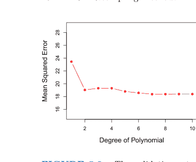

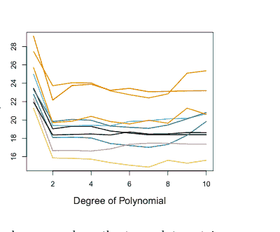

**图 5.2.** 在 Auto 数据集上使用验证集方法，以估计使用马力的多项式函数预测 mpg 所产生的测试误差。左图：单次划分训练集和验证集得到的验证误差估计。右图：验证方法被重复了十次，每次都将观测值随机划分为不同的训练集和验证集。这说明了该方法导致的估计测试 MSE 的变异性。

验证集误差率可能会*高估*在整个数据集上拟合模型的测试误差率。

在接下来的小节中，我们将介绍*交叉验证*，这是对验证集方法的一种改进，旨在解决这两个问题。

### 5.1.2 留一法交叉验证

*留一法交叉验证* (LOOCV) 与第 5.1.1 节的验证集方法密切相关，但它试图解决该方法的缺点。

与验证集方法一样，LOOCV 涉及将观测集分成两部分。然而，它不是创建两个大小相当的子集，而是使用单个观测值 $(x_1, y_1)$ 作为验证集，其余观测值 $\{(x_2, y_2), \dots, (x_n, y_n)\}$ 构成训练集。统计学习方法在 $n-1$ 个训练观测值上进行拟合，并使用其值 $x_1$ 对被排除的观测值进行预测 $\hat{y}_1$。由于 $(x_1, y_1)$ 未用于拟合过程，$\text{MSE}_1 = (y_1 - \hat{y}_1)^2$ 提供了测试误差的近似无偏估计。但即使 $\text{MSE}_1$ 对测试误差是无偏的，它也是一个很差的估计，因为它具有高度的变异性，这是基于单个观测值 $(x_1, y_1)$ 的。

我们可以通过选择 $(x_2, y_2)$ 作为验证数据，在 $n-1$ 个观测值 $\{(x_1, y_1), (x_3, y_3), \dots, (x_n, y_n)\}$ 上训练统计学习过程，并计算 $\text{MSE}_2 = (y_2 - \hat{y}_2)^2$ 来重复此过程。重复此方法 $n$ 次会产生 $n$ 个平方误差，$\text{MSE}_1, \dots, \text{MSE}_n$。测试 MSE 的 LOOCV 估计是这 $n$ 个测试误差估计的平均值：

$$\text{CV}_{(n)} = \frac{1}{n} \sum_{i=1}^{n} \text{MSE}_i. \tag{5.1}$$

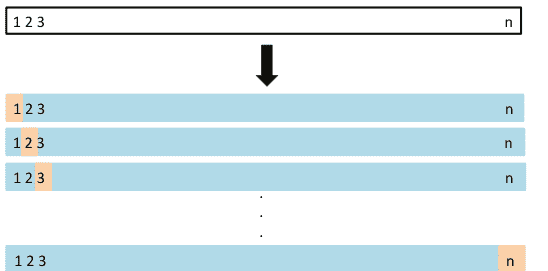

**图 5.3.** LOOCV 的示意图。一组 $n$ 个数据点被反复划分为一个训练集（蓝色显示），包含除一个观测值外的所有观测值，以及一个验证集（米色显示），仅包含该观测值。然后通过平均 $n$ 个结果 MSE 来估计测试误差。第一个训练集包含除观测值 1 外的所有观测值，第二个训练集包含除观测值 2 外的所有观测值，依此类推。

LOOCV 方法的示意图如图 5.3 所示。

LOOCV 相对于验证集方法有几个主要优势。首先，它的偏差小得多。在 LOOCV 中，我们反复使用包含 $n - 1$ 个观测值的训练集来拟合统计学习方法，这几乎与整个数据集中的观测值数量一样多。这与验证集方法形成对比，后者的训练集通常约为原始数据集大小的一半。因此，LOOCV 方法不像验证集方法那样容易高估测试误差率。其次，与验证方法由于训练/验证集划分的随机性在重复应用时会产生不同结果相比，多次执行 LOOCV 总是会产生相同的结果：训练/验证集划分中没有随机性。

我们在 Auto 数据集上使用了 LOOCV，以获得使用马力的多项式函数拟合线性回归模型预测 mpg 所产生的测试集 MSE 的估计。结果如图 5.4 左侧面板所示。

LOOCV 在实现时可能代价高昂，因为模型必须拟合 $n$ 次。如果 $n$ 很大，并且每个单独的模型拟合都很慢，这可能会非常耗时。对于最小二乘线性或多项式回归，一个惊人的捷径使得 LOOCV 的成本与单次模型拟合相同！以下公式成立：

$$\text{CV}_{(n)} = \frac{1}{n} \sum_{i=1}^{n} \left( \frac{y_i - \hat{y}_i}{1 - h_i} \right)^2, \quad (5.2)$$

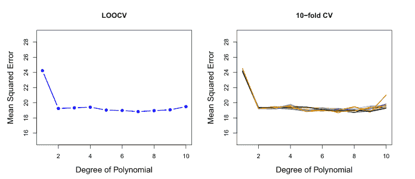

**图 5.4.** 在 Auto 数据集上使用交叉验证，以估计使用马力的多项式函数预测 mpg 所产生的测试误差。左图：LOOCV 误差曲线。右图：10 折 CV 被单独运行了九次，每次都将数据随机划分为十个不同的部分。该图显示了九条略有不同的 CV 误差曲线。

其中 $\hat{y}_i$ 是原始最小二乘拟合的第 $i$ 个拟合值，$h_i$ 是第 105 页公式 (3.37) 中定义的杠杆值。¹ 这类似于普通的 MSE，只是第 $i$ 个残差除以 $1 - h_i$。杠杆值介于 $1/n$ 和 1 之间，反映了一个观测值对其自身拟合的影响程度。因此，在这个公式中，高杠杆点的残差被恰好放大了正确的量，以使该等式成立。

LOOCV 是一种非常通用的方法，可以用于任何类型的预测建模。例如，我们可以将其用于逻辑回归或线性判别分析，或后面章节讨论的任何方法。神奇的公式 (5.2) 并不普遍成立，在这种情况下，模型必须重新拟合 $n$ 次。

### 5.1.3 k 折交叉验证

LOOCV 的一个替代方案是 $k$ 折 CV。这种方法涉及将观测集随机分成 $k$ 组，或称为折，每组大小大致相等。第一折被视为验证集，方法在其余 $k - 1$ 折上进行拟合。然后在保留的折中的观测值上计算均方误差 $\text{MSE}_1$。此过程重复 $k$ 次；每次，不同的观测组被视为验证集。此过程产生 $k$ 个测试误差估计，$\text{MSE}_1, \text{MSE}_2, \ldots, \text{MSE}_k$。$k$ 折 CV 估计通过平均这些值来计算，

$$\text{CV}_{(k)} = \frac{1}{k} \sum_{i=1}^{k} \text{MSE}_i. \qquad (5.3)$$

图 5.5 说明了 $k$ 折 CV 方法。

¹ 在多元线性回归的情况下，杠杆值的形式比 (3.37) 稍微复杂一些，但 (5.2) 仍然成立。

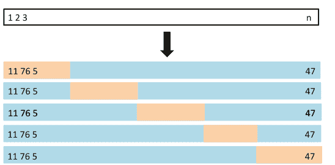

**图 5.5.** 5 折 CV 的示意图。一组 $n$ 个观测值被随机分成五个不重叠的组。这五分之一中的每一个都充当验证集（米色显示），其余部分作为训练集（蓝色显示）。通过平均五个结果的 MSE 估计来估计测试误差。

不难看出，LOOCV 是 $k$ 折 CV 的一个特例，其中 $k$ 被设置为等于 $n$。在实践中，通常使用 $k = 5$ 或 $k = 10$ 进行 $k$ 折 CV。使用 $k = 5$ 或 $k = 10$ 而不是 $k = n$ 的优势是什么？最明显的优势是计算上的。LOOCV 需要拟合统计学习方法 $n$ 次。这可能计算成本很高（除了通过最小二乘拟合的线性模型，这种情况下可以使用公式 (5.2)）。但交叉验证是一种非常通用的方法，可以应用于几乎任何统计学习方法。一些统计学习方法具有计算密集型的拟合过程，因此执行 LOOCV 可能会带来计算问题，特别是当 $n$ 极大时。相比之下，执行 10 折 CV 只需要拟合学习过程十次，这可能可行得多。正如我们在第 5.1.4 节所看到的，执行 5 折或 10 折 CV 也可能有其他非计算优势，这涉及偏差-方差权衡。

图 5.4 的右侧面板显示了 Auto 数据集的九个不同的 10 折 CV 估计，每个估计都源于将观测值随机划分为十个折的不同方式。正如我们从图中看到的，由于观测值被划分为十个折的方式存在变异性，CV 估计存在一些变异性。但这种变异性通常远低于验证集方法导致的测试误差估计的变异性（图 5.2 的右侧面板）。

当我们检查真实数据时，我们不知道*真实的*测试 MSE，因此很难确定交叉验证估计的准确性。但是，如果我们检查模拟数据，那么我们可以计算真实的测试 MSE，从而评估交叉验证结果的准确性。在图 5.6 中，我们绘制了将平滑样条应用于第 2 章图 2.9–2.11 所示的模拟数据集所产生的交叉验证估计和真实测试误差率。真实的测试 MSE 以蓝色显示。黑色虚线和橙色实线分别显示了估计的 LOOCV 和 10 折 CV 估计。在所有三个图中，两个交叉验证估计非常相似。在右侧面板

## 5. 重采样方法

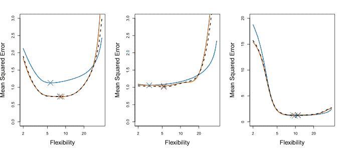

**图 5.6.** *图 2.9（左）、2.10（中）和 2.11（右）中模拟数据集的真实测试均方误差与估计测试均方误差。真实测试均方误差以蓝色显示，LOOCV 估计值以黑色虚线显示，10 折交叉验证估计值以橙色显示。叉号表示每条均方误差曲线的最小值。*

在图 5.6 的左侧面板中，真实测试均方误差和交叉验证曲线几乎完全相同。在图 5.6 的中间面板中，两组曲线在较低的灵活性水平下相似，而在较高的灵活性水平下，交叉验证曲线高估了测试集均方误差。在图 5.6 的左侧面板中，交叉验证曲线具有正确的总体形状，但它们低估了真实的测试均方误差。

当我们执行交叉验证时，我们的目标可能是确定一个给定的统计学习程序在独立数据上的预期表现；在这种情况下，测试均方误差的实际估计值是关注的重点。但有时我们只对估计的测试均方误差曲线中最小值点的位置感兴趣。这是因为我们可能正在对多种统计学习方法执行交叉验证，或者对单一方法使用不同的灵活性水平，以识别导致最低测试误差的方法。为此，估计的测试均方误差曲线中最小值点的位置很重要，但估计的测试均方误差的实际值并不重要。我们在图 5.6 中发现，尽管它们有时会低估真实的测试均方误差，但所有交叉验证曲线都接近于识别正确的灵活性水平——即对应于最小测试均方误差的灵活性水平。

### 5.1.4 k 折交叉验证的偏差-方差权衡

我们在第 5.1.3 节中提到，k < n 的 k 折交叉验证比 LOOCV 具有计算优势。但抛开计算问题不谈，k 折交叉验证一个不那么明显但可能更重要的优势是，它通常比 LOOCV 给出更准确的测试错误率估计。这与偏差-方差权衡有关。

在第 5.1.1 节中提到，验证集方法可能导致测试错误率的高估，因为在这种方法中，用于拟合统计学习方法的训练集仅包含整个数据集的一半观测值。根据这个逻辑，不难看出 LOOCV 将给出近似无偏的测试错误估计，因为每个训练集包含 $n-1$ 个观测值，这几乎与完整数据集中的观测值数量一样多。而执行 $k$ 折交叉验证，例如 $k=5$ 或 $k=10$，将导致中等程度的偏差，因为每个训练集大约包含 $(k-1)n/k$ 个观测值——比 LOOCV 方法少，但比验证集方法多得多。因此，从减少偏差的角度来看，显然 LOOCV 优于 $k$ 折交叉验证。

然而，我们知道偏差并不是估计过程中唯一需要关注的问题；我们还必须考虑该过程的方差。事实证明，LOOCV 比 $k < n$ 的 $k$ 折交叉验证具有更高的方差。为什么会这样？当我们执行 LOOCV 时，我们实际上是在平均 $n$ 个拟合模型的输出，每个模型都在几乎相同的观测集上训练；因此，这些输出彼此高度（正）相关。相比之下，当我们执行 $k < n$ 的 $k$ 折交叉验证时，我们是在平均 $k$ 个拟合模型的输出，这些模型彼此之间的相关性较低，因为每个模型中训练集之间的重叠较小。由于许多高度相关量的平均值比许多相关性不那么高的量的平均值具有更高的方差，因此 LOOCV 产生的测试错误估计往往比 $k$ 折交叉验证产生的测试错误估计具有更高的方差。

总之，在 $k$ 折交叉验证中选择 $k$ 时存在偏差-方差权衡。通常，考虑到这些因素，人们使用 $k=5$ 或 $k=10$ 执行 $k$ 折交叉验证，因为经验表明这些值产生的测试错误率估计既不会遭受过高的偏差，也不会遭受非常高的方差。

### 5.1.5 分类问题上的交叉验证

到目前为止，本章我们已经说明了在结果 $Y$ 为定量的回归设置中使用交叉验证，因此使用均方误差来量化测试错误。但当 $Y$ 为定性时，交叉验证在分类设置中也可以是一种非常有用的方法。在这种设置中，交叉验证的工作原理与本章前面描述的相同，只是我们不使用均方误差来量化测试错误，而是使用错误分类的观测值数量。例如，在分类设置中，LOOCV 错误率的形式为

$$\mathrm{CV}_{(n)} = \frac{1}{n} \sum_{i=1}^{n} \mathrm{Err}_{i}, \qquad (5.4)$$

其中 $\mathrm{Err}_{i} = I(y_{i} \neq \hat{y}_{i})$。$k$ 折交叉验证错误率和验证集错误率的定义类似。

例如，我们在图 2.13 所示的二维分类数据上拟合各种逻辑回归模型。在图 5.7 的左上角面板中，黑色实线显示了将标准逻辑回归模型拟合到此数据集后得到的估计决策边界。由于这是模拟数据，我们可以计算*真实*测试错误率，其值为 0.201，因此远大于贝叶斯错误率 0.133。显然，逻辑回归没有足够的灵活性来在此设置中对贝叶斯决策边界建模。我们可以很容易地扩展逻辑回归，通过使用预测变量的多项式函数来获得非线性决策边界，就像我们在第 3.3.2 节的回归设置中所做的那样。例如，我们可以拟合一个*二次*逻辑回归模型，由下式给出

$$\log \left(\frac{p}{1-p}\right) = \beta_0 + \beta_1 X_1 + \beta_2 X_1^2 + \beta_3 X_2 + \beta_4 X_2^2. \quad (5.5)$$

图 5.7 的右上角面板显示了由此产生的决策边界，现在是弯曲的。然而，测试错误率仅略有改善，降至 0.197。在图 5.7 的左下角面板中，我们拟合了一个涉及预测变量三次多项式的逻辑回归模型，显示出更大的改善。现在测试错误率降至 0.160。使用四次多项式（右下角）会略微增加测试错误。

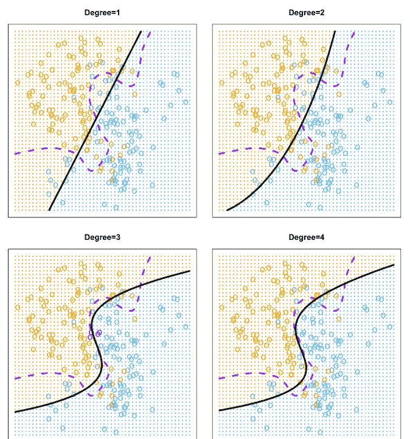

**图 5.7.** *在图 2.13 所示的二维分类数据上进行的逻辑回归拟合。贝叶斯决策边界用紫色虚线表示。线性、二次、三次和四次（1-4 阶）逻辑回归的估计决策边界以黑色显示。四种逻辑回归拟合的测试错误率分别为 0.201、0.197、0.160 和 0.162，而贝叶斯错误率为 0.133。*

在实践中，对于真实数据，贝叶斯决策边界和测试错误率是未知的。那么我们如何决定图 5.7 中显示的四种逻辑回归模型呢？我们可以使用交叉验证来做出这个决定。图 5.8 的左侧面板以黑色显示了将十个逻辑回归模型拟合到数据后产生的 10 折交叉验证错误率，使用了高达十阶的预测变量多项式函数。真实测试错误以棕色显示，训练错误以蓝色显示。正如我们之前所看到的，训练错误往往随着拟合灵活性的增加而减少。（该图表明，虽然训练错误率并非完全单调递减，但总体上随着模型复杂性的增加而趋于下降。）相比之下，测试错误显示出特征性的 U 形。10 折交叉验证错误率提供了对测试错误率的相当好的近似。虽然它在一定程度上低估了错误率，但它在使用四阶多项式时达到最小值，这非常接近测试曲线的最小值，该最小值出现在使用三阶多项式时。事实上，使用四阶多项式可能会带来良好的测试集性能，因为三阶、四阶、五阶和六阶多项式的真实测试错误率大致相同。

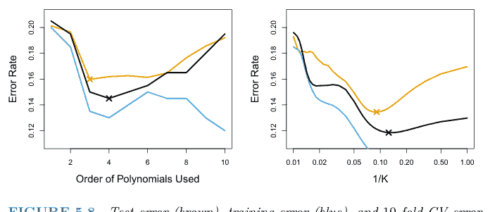

**图 5.8.** *在图 5.7 所示的二维分类数据上的测试错误（棕色）、训练错误（蓝色）和 10 折交叉验证错误（黑色）。左图：使用预测变量多项式函数的逻辑回归。x 轴上显示了所用多项式的阶数。右图：使用不同 K 值的 KNN 分类器，其中 K 表示 KNN 分类器中使用的邻居数量。*

图 5.8 的右侧面板显示了使用 KNN 方法进行分类的相同三条曲线，作为 K 值的函数（在此上下文中，K 表示 KNN 分类器中使用的邻居数量，而不是使用的交叉验证折数）。同样，训练错误率随着方法变得更加灵活而下降，因此我们看到训练错误率不能用于选择 K 的最佳值。尽管交叉验证错误曲线略微低估了测试错误率，但它在非常接近 K 的最佳值处取得最小值。

## 5.2 自助法

*自助法*是一种应用广泛且功能极其强大的统计工具，可用于量化与给定估计量或统计学习方法相关的不确定性。一个简单的例子是，自助法可用于估计线性回归拟合中系数的标准误差。在线性回归的特定情况下，这并非特别有用，因为我们在第3章中看到，R等标准统计软件会自动输出此类标准误差。然而，自助法的强大之处在于它可以轻松应用于各种统计学习方法，包括那些难以获得变异性度量且统计软件不会自动输出结果的方法。

在本节中，我们将通过一个简单的例子来说明自助法的应用，该例子旨在确定简单模型下的最佳投资配置。在第5.3节中，我们将探讨如何使用自助法来评估线性模型拟合中回归系数的变异性。

假设我们希望将一笔固定金额投资于两种金融资产，它们分别产生$X$和$Y$的回报，其中$X$和$Y$是随机变量。我们将投资比例$\alpha$的资金投入$X$，剩余的$1 - \alpha$投入$Y$。由于这两种资产的回报存在变异性，我们希望选择$\alpha$以最小化投资的总体风险或方差。换句话说，我们希望最小化$\text{Var}(\alpha X + (1 - \alpha)Y)$。可以证明，使风险最小化的值为

$$\alpha = \frac{\sigma_Y^2 - \sigma_{XY}}{\sigma_X^2 + \sigma_Y^2 - 2\sigma_{XY}}, \quad (5.6)$$

其中$\sigma_X^2 = \text{Var}(X)$，$\sigma_Y^2 = \text{Var}(Y)$，$\sigma_{XY} = \text{Cov}(X, Y)$。

实际上，$\sigma_X^2$、$\sigma_Y^2$和$\sigma_{XY}$的值是未知的。我们可以使用包含$X$和$Y$历史测量值的数据集来计算这些量的估计值$\hat{\sigma}_X^2$、$\hat{\sigma}_Y^2$和$\hat{\sigma}_{XY}$。然后，我们可以使用以下公式估计使投资方差最小化的$\alpha$值

$$\hat{\alpha} = \frac{\hat{\sigma}_Y^2 - \hat{\sigma}_{XY}}{\hat{\sigma}_X^2 + \hat{\sigma}_Y^2 - 2\hat{\sigma}_{XY}}. \quad (5.7)$$

图5.9展示了在模拟数据集上估计$\alpha$的这种方法。在每个面板中，我们模拟了100对投资$X$和$Y$的回报。我们使用这些回报来估计$\hat{\sigma}_X^2$、$\hat{\sigma}_Y^2$和$\hat{\sigma}_{XY}$，然后将其代入公式(5.7)以获得$\alpha$的估计值。每个模拟数据集得到的$\hat{\alpha}$值范围从0.532到0.657。

自然地，我们希望量化$\alpha$估计的准确性。为了估计$\hat{\alpha}$的标准差，我们重复了模拟100对$X$和$Y$观测值并使用公式(5.7)估计$\alpha$的过程，共进行了1,000次。由此我们获得了1,000个$\alpha$的估计值，可称为$\hat{\alpha}_1, \hat{\alpha}_2, \ldots, \hat{\alpha}_{1,000}$。图5.10的左侧面板显示了这些估计值的直方图。在这些模拟中，参数设置为$\sigma_X^2 = 1$，$\sigma_Y^2 = 1.25$，$\sigma_{XY} = 0.5$，因此我们知道$\alpha$的真实值为0.6。我们在直方图上用一条实心垂直线标出了这个值。

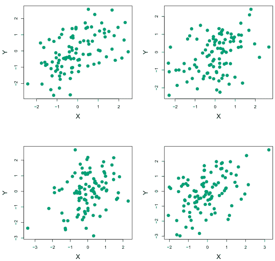

图5.9. 每个面板显示了投资$X$和$Y$的100个模拟回报。从左到右、从上到下，得到的$\alpha$估计值分别为0.576、0.532、0.657和0.651。

所有1,000个$\alpha$估计值的均值为

$$\bar{\alpha} = \frac{1}{1000} \sum_{r=1}^{1000} \hat{\alpha}_r = 0.5996,$$

非常接近$\alpha = 0.6$，估计值的标准差为

$$\sqrt{\frac{1}{1000-1} \sum_{r=1}^{1000} (\hat{\alpha}_r - \bar{\alpha})^2} = 0.083.$$

这让我们对$\hat{\alpha}$的准确性有了很好的认识：$\text{SE}(\hat{\alpha}) \approx 0.083$。因此，粗略地说，对于来自总体的随机样本，我们预期$\hat{\alpha}$与$\alpha$的差异平均约为0.08。

然而，在实践中，上述估计$\text{SE}(\hat{\alpha})$的程序无法应用，因为对于真实数据，我们无法从原始总体中生成新的样本。然而，自助法允许我们使用计算机来模拟获取新样本集的过程，从而无需生成额外样本即可估计$\hat{\alpha}$的变异性。我们不是反复从总体中获取独立数据集，而是通过反复从*原始数据集*中抽样观测值来获取不同的数据集。

图5.11在一个简单的数据集（我们称之为$Z$，仅包含$n = 3$个观测值）上说明了这种方法。我们从数据集中随机选择$n$个观测值以生成一个自助数据集$Z^{*1}$。抽样是*有放回*进行的，这意味着同一个观测值可以在自助数据集中出现多次。在这个例子中，$Z^{*1}$包含第三个观测值两次，第一个观测值一次，不包含第二个观测值。请注意，如果一个观测值包含在$Z^{*1}$中，那么它的$X$和$Y$值都会被包含。我们可以使用$Z^{*1}$来生成一个新的$\alpha$自助估计值，我们称之为$\hat{\alpha}^{*1}$。这个过程对某个较大的$B$值重复$B$次，以产生$B$个不同的自助数据集$Z^{*1}, Z^{*2}, \ldots, Z^{*B}$，以及$B$个相应的$\alpha$估计值$\hat{\alpha}^{*1}, \hat{\alpha}^{*2}, \ldots, \hat{\alpha}^{*B}$。我们可以使用以下公式计算这些自助估计值的标准误差

$$\text{SE}_B(\hat{\alpha}) = \sqrt{\frac{1}{B-1} \sum_{r=1}^{B} \left( \hat{\alpha}^{*r} - \frac{1}{B} \sum_{r'=1}^{B} \hat{\alpha}^{*r'} \right)^2}. \quad (5.8)$$

这作为从原始数据集估计的$\hat{\alpha}$的标准误差的估计。

自助法在图5.10的中间面板中进行了说明，该面板显示了1,000个$\alpha$自助估计值的直方图，每个估计值都使用不同的自助数据集计算得出。该面板是基于单个数据集构建的，因此可以使用真实数据创建。请注意，该直方图与左侧面板非常相似，左侧面板显示了通过从真实总体生成1,000个模拟数据集获得的$\alpha$估计值的理想化直方图。特别是，来自公式(5.8)的自助估计$\text{SE}(\hat{\alpha})$为0.087，与使用1,000个模拟数据集获得的估计值0.083非常接近。右侧面板以不同的方式显示了中间和左侧面板的信息，通过箱线图展示了通过从真实总体生成1,000个模拟数据集和使用自助法获得的$\alpha$估计值。同样，箱线图具有相似的分布范围，表明自助法可用于有效估计与$\hat{\alpha}$相关的变异性。

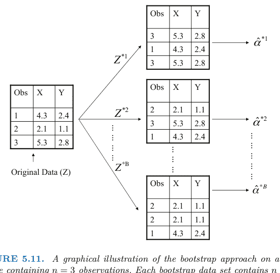

图5.11. 在一个包含$n = 3$个观测值的小样本上对自助法的图形化说明。每个自助数据集包含$n$个观测值，这些观测值是从原始数据集中有放回抽样得到的。每个自助数据集用于获得$\alpha$的一个估计值。

## 5.3 实验室：交叉验证与自助法

在本实验室中，我们将探讨本章涵盖的重采样技术。本实验室中的一些命令在你的计算机上可能需要运行一段时间。

我们再次将大部分导入放在顶层。

```python
import numpy as np
import statsmodels.api as sm
from ISLP import load_data
from ISLP.models import (ModelSpec as MS,
                        summarize,
                        poly)
from sklearn.model_selection import train_test_split
```

本实验室需要一些新的导入。

```python
from functools import partial
from sklearn.model_selection import \
    (cross_validate,
     KFold,
     ShuffleSplit)
from sklearn.base import clone
from ISLP.models import sklearn_sm
```

## 5.3.1 验证集方法

我们探讨验证集方法的使用，以估计在 Auto 数据集上拟合各种线性模型所产生的测试误差率。

我们使用 `train_test_split()` 函数将数据划分为训练集和验证集。由于共有 392 个观测值，我们使用参数 `test_size=196` 将其划分为两个大小相等的集合，每个集合包含 196 个观测值。在执行此类包含随机元素的操作时，设置随机种子通常是一个好主意，以便后续可以精确地重现获得的结果。我们使用参数 `random_state=0` 设置分割器的随机种子。

```
Auto = load_data('Auto')
Auto_train, Auto_valid = train_test_split(Auto,
                                        test_size=196,
                                        random_state=0)
```

现在，我们可以仅使用对应于训练集 `Auto_train` 的观测值来拟合线性回归。

```
hp_mm = MS(['horsepower'])
X_train = hp_mm.fit_transform(Auto_train)
y_train = Auto_train['mpg']
model = sm.OLS(y_train, X_train)
results = model.fit()
```

我们现在使用 `results` 的 `predict()` 方法，在使用验证数据集创建的该模型的模型矩阵上进行评估。我们还计算模型的验证均方误差。

```
X_valid = hp_mm.transform(Auto_valid)
y_valid = Auto_valid['mpg']
valid_pred = results.predict(X_valid)
np.mean((y_valid - valid_pred)**2)
```

因此，我们对线性回归拟合的验证均方误差的估计值为 23.62。

我们也可以估计更高次多项式回归的验证误差。我们首先提供一个函数 `evalMSE()`，它接受一个模型字符串以及训练集和测试集，并返回测试集上的均方误差。

```
def evalMSE(terms,
            response,
            train,
            test):

    mm = MS(terms)
    X_train = mm.fit_transform(train)
    y_train = train[response]

    X_test = mm.transform(test)
    y_test = test[response]

    results = sm.OLS(y_train, X_train).fit()
    test_pred = results.predict(X_test)

    return np.mean((y_test - test_pred)**2)
```

让我们使用这个函数来估计使用线性、二次和三次拟合的验证均方误差。我们在这里使用 `enumerate()` 函数，它在遍历 for 循环时同时给出对象的值和索引。

```
MSE = np.zeros(3)
for idx, degree in enumerate(range(1, 4)):
    MSE[idx] = evalMSE([poly('horsepower', degree)],
                        'mpg',
                        Auto_train,
                        Auto_valid)
MSE
```

这些误差率分别为 23.62、18.76 和 18.80。如果我们选择不同的训练/验证集划分，那么我们可以预期验证集上的误差会有所不同。

```
Auto_train, Auto_valid = train_test_split(Auto,
                                          test_size=196,
                                          random_state=3)

MSE = np.zeros(3)
for idx, degree in enumerate(range(1, 4)):
    MSE[idx] = evalMSE([poly('horsepower', degree)],
                        'mpg',
                        Auto_train,
                        Auto_valid)
MSE
```

使用这种将观测值划分为训练集和验证集的方法，我们发现具有线性、二次和三次项的模型的验证集误差率分别为 20.76、16.95 和 16.97。

这些结果与我们之前的发现一致：使用 `horsepower` 的二次函数预测 `mpg` 的模型比仅使用 `horsepower` 的线性函数的模型表现更好，并且没有证据表明使用 `horsepower` 的三次函数能带来改进。

## 5.3.2 交叉验证

理论上，交叉验证估计可以为任何广义线性模型计算。然而，在实践中，在 Python 中进行交叉验证最简单的方法是使用 `sklearn`，它与我们一直用于拟合 GLM 的 `statsmodels` 具有不同的接口或 API。

这是数据科学家经常面临的一个问题：“我有一个函数来执行任务 $A$，并且需要将其输入到执行任务 $B$ 的东西中，以便我可以计算 $B(A(D))$，其中 $D$ 是我的数据。” 当 $A$ 和 $B$ 不能自然地相互交流时，这就需要使用一个*包装器*。在 ISLP 包中，我们提供了一个包装器 `sklearn_sm()`，使我们能够轻松地将 `sklearn` 的交叉验证工具与通过 `statsmodels` 拟合的模型一起使用。`sklearn_sm()` 类的第一个参数是来自 `statsmodels` 的模型。它可以接受两个额外的可选参数：`model_str` 可用于指定公式，`model_args` 应该是一个字典，包含拟合模型时使用的额外参数。例如，要拟合逻辑回归模型，我们必须指定一个 `family` 参数。这通过 `model_args={'family':sm.families.Binomial()}` 传递。以下是我们的包装器的实际应用：

```
In [9]: hp_model = sklearn_sm(sm.OLS,
                MS(['horsepower']))
X, Y = Auto.drop(columns=['mpg']), Auto['mpg']
cv_results = cross_validate(hp_model,
                            X,
                            Y,
                            cv=Auto.shape[0])
cv_err = np.mean(cv_results['test_score'])
cv_err
```

```
Out[9]: 24.2315
```

`cross_validate()` 的参数如下：一个具有适当 `fit()`、`predict()` 和 `score()` 方法的对象，一个特征数组 `X` 和一个响应变量 `Y`。我们还向 `cross_validate()` 包含了一个额外的参数 `cv`；指定一个整数 $K$ 会导致 $K$ 折交叉验证。我们提供了一个对应于观测值总数的值，这导致留一法交叉验证（LOOCV）。`cross_validate()` 函数生成一个包含多个组件的字典；我们这里只需要交叉验证的测试分数（均方误差），估计值为 24.23。我们可以对越来越复杂的多项式拟合重复此过程。为了自动化该过程，我们再次使用一个 for 循环，该循环迭代地拟合 1 到 5 次的多项式回归，计算相关的交叉验证误差，并将其存储在向量 `cv_error` 的第 $i$ 个元素中。for 循环中的变量 `d` 对应于多项式的次数。我们首先初始化向量。此命令可能需要几秒钟才能运行。

```
In [10]: cv_error = np.zeros(5)
H = np.array(Auto['horsepower'])
M = sklearn_sm(sm.OLS)
for i, d in enumerate(range(1,6)):
    X = np.power.outer(H, np.arange(d+1))
    M_CV = cross_validate(M,
                          X,
                          Y,
                          cv=Auto.shape[0])
    cv_error[i] = np.mean(M_CV['test_score'])
cv_error
```

```
Out[10]: array([24.2315, 19.2482, 19.3350, 19.4244, 19.0332])
```

如图 5.4 所示，我们看到在从线性拟合到二次拟合时，估计的测试均方误差急剧下降，但之后使用更高次多项式没有明显的改进。

上面我们介绍了 `np.power()` 函数的 `outer()` 方法。`outer()` 方法应用于具有两个参数的操作，例如 `add()`、`min()` 或 `power()`。它以两个数组作为参数，然后形成一个更大的数组，其中该操作应用于两个数组的每一对元素。

```
In [11]: A = np.array([3, 5, 9])
        B = np.array([2, 4])
        np.add.outer(A, B)
```

```
Out[11]: array([[ 5,  7],
        [ 7,  9],
        [11, 13]])
```

在上面的交叉验证示例中，我们使用了 $K = n$，但当然我们也可以使用 $K < n$。代码与上面非常相似（并且速度明显更快）。这里我们使用 `KFold()` 将数据划分为 $K = 10$ 个随机组。我们使用 `random_state` 设置随机种子，并初始化一个向量 `cv_error`，用于存储对应于 1 到 5 次多项式拟合的交叉验证误差。

```
In [12]: cv_error = np.zeros(5)
        cv = KFold(n_splits=10,
                  shuffle=True,
                  random_state=0) # use same splits for each degree
        for i, d in enumerate(range(1,6)):
            X = np.power.outer(H, np.arange(d+1))
            M_CV = cross_validate(M,
                                 X,
                                 Y,
                                 cv=cv)
            cv_error[i] = np.mean(M_CV['test_score'])
        cv_error
```

```
Out[12]: array([24.2077, 19.1853, 19.2763, 19.4785, 19.1372])
```

请注意，计算时间比 LOOCV 短得多。（原则上，对于最小二乘线性模型，LOOCV 的计算时间应该比 $K$ 折交叉验证更快，因为有公式 (5.2) 可用于 LOOCV；然而，通用的 `cross_validate()` 函数并未利用此公式。）我们仍然没有发现太多证据表明使用三次或更高次多项式项比简单使用二次拟合能带来更低的测试误差。

`cross_validate()` 函数很灵活，可以接受不同的分割机制作为参数。例如，可以使用 `ShuffleSplit()` 函数轻松实现验证集方法，就像实现 K 折交叉验证一样。

```
In [13]: validation = ShuffleSplit(n_splits=1,
                                test_size=196,
                                random_state=0)
        results = cross_validate(hp_model,
                                Auto.drop(['mpg'], axis=1),
                                Auto['mpg'],
                                cv=validation);
        results['test_score']
```

Out[13]: array([23.6166])

可以通过运行以下代码来估计测试误差的变异性：

```
In [14]: validation = ShuffleSplit(n_splits=10,
                                test_size=196,
                                random_state=0)
results = cross_validate(hp_model,
                        Auto.drop(['mpg'], axis=1),
                        Auto['mpg'],
                        cv=validation)
results['test_score'].mean(), results['test_score'].std()
```

Out[14]: (23.8022, 1.4218)

请注意，这个标准差并不是平均测试分数或单个分数抽样变异性的有效估计，因为随机选择的训练样本存在重叠，从而引入了相关性。但它确实给出了选择不同随机折中所产生的蒙特卡洛变异的概念。

## 5.3.3 自助法

我们将在第5.2节的简单示例以及一个涉及估计线性回归模型在Auto数据集上准确性的示例中，说明自助法的使用。

### 估计感兴趣统计量的准确性

自助法的一个巨大优势是它几乎可以应用于所有情况。不需要复杂的数学计算。虽然Python中有几种自助法的实现，但其用于估计标准误的方法足够简单，因此我们将在下面为数据存储在数据框中的情况编写自己的函数。

为了说明自助法，我们从一个简单的例子开始。ISLP包中的Portfolio数据集在第5.2节中描述。目标是估计公式(5.7)中给出的参数α的抽样方差。我们将创建一个函数`alpha_func()`，它接受一个假设有X和Y列的数据框D作为输入，以及一个指示应使用哪些观测值来估计α的向量idx。然后，该函数基于选定的观测值输出α的估计值。

```
In [15]: Portfolio = load_data('Portfolio')
def alpha_func(D, idx):
    cov_ = np.cov(D[['X','Y']].loc[idx], rowvar=False)
    return ((cov_[1,1] - cov_[0,1]) /
            (cov_[0,0]+cov_[1,1]-2*cov_[0,1]))
```

此函数返回基于将最小方差公式(5.7)应用于由参数idx索引的观测值而得到的α的估计值。例如，以下命令使用所有100个观测值估计α。

```
In [16]: alpha_func(Portfolio, range(100))
```

Out[16]: 0.5758

接下来，我们从`range(100)`中随机选择100个观测值，进行有放回抽样。这相当于构建一个新的自助数据集，并基于新数据集重新计算$\hat{\alpha}$。

```
In [17]: rng = np.random.default_rng(0)
alpha_func(Portfolio,
           rng.choice(100,
                      100,
                      replace=True))
```

Out[17]: 0.6074

这个过程可以推广，创建一个简单的函数`boot_SE()`，用于计算仅接受数据框作为参数的任意函数的自助标准误。

```
In [18]: def boot_SE(func,
                D,
                n=None,
                B=1000,
                seed=0):
    rng = np.random.default_rng(seed)
    first_, second_ = 0, 0
    n = n or D.shape[0]
    for _ in range(B):
        idx = rng.choice(D.index,
                         n,
                         replace=True)
        value = func(D, idx)
        first_ += value
        second_ += value**2
    return np.sqrt(second_ / B - (first_ / B)**2)
```

注意在`for _ in range(B)`中使用了`_`作为循环变量。当计数器的值不重要时，通常使用这种方式，它只是确保循环执行$B$次。

让我们使用我们的函数，通过$B = 1,000$次自助重复来评估我们对$\alpha$估计的准确性。

```
In [19]: alpha_SE = boot_SE(alpha_func,
                       Portfolio,
                       B=1000,
                       seed=0)
alpha_SE
```

Out[19]: 0.0912

最终输出显示，$\text{SE}(\hat{\alpha})$的自助估计值为0.0912。

### 估计线性回归模型的准确性

自助法可用于评估统计学习方法中系数估计和预测的变异性。这里我们使用自助法来评估$\beta_0$和$\beta_1$估计值的变异性，它们是使用`horsepower`预测`Auto`数据集中`mpg`的线性回归模型的截距和斜率项。我们将比较使用自助法获得的估计值与第3.1.2节中描述的$\text{SE}(\hat{\beta}_0)$和$\text{SE}(\hat{\beta}_1)$公式获得的估计值。

要使用我们的`boot_SE()`函数，我们必须编写一个函数（它的第一个参数），该函数仅接受数据框`D`和索引`idx`作为其唯一参数。但在这里，我们想要对特定的回归模型进行自助法，该模型由模型公式和数据指定。我们将在几个简单的步骤中展示如何做到这一点。

我们首先编写一个通用函数`boot_OLS()`，用于对回归模型进行自助法，该模型接受一个公式来定义相应的回归。我们使用`clone()`函数创建公式的副本，该副本可以重新拟合到新的数据框。这意味着任何派生特征，例如由`poly()`定义的特征（我们稍后会看到），都将在重采样的数据框上重新拟合。

```
def boot_OLS(model_matrix, response, D, idx):
    D_ = D.loc[idx]
    Y_ = D_[response]
    X_ = clone(model_matrix).fit_transform(D_)
    return sm.OLS(Y_, X_).fit().params
```

这并不完全符合`boot_SE()`第一个参数的要求。指定模型的前两个参数在自助过程中不会改变，我们希望将它们“冻结”。`functools`模块中的`partial()`函数正是这样做的：它接受一个函数作为参数，并从左边开始冻结其一些参数。我们用它来冻结`boot_OLS()`的前两个模型公式参数。

```
hp_func = partial(boot_OLS, MS(['horsepower']), 'mpg')
```

输入`hp_func?`将显示它有两个参数`D`和`idx`——它是`boot_OLS()`的一个版本，前两个参数被冻结——因此非常适合作为`boot_SE()`的第一个参数。

现在可以使用`hp_func()`函数，通过从观测值中有放回地随机抽样来创建截距和斜率项的自助估计。我们首先在10个自助样本上演示其效用。

```
rng = np.random.default_rng(0)
np.array([hp_func(Auto,
                  rng.choice(392,
                             392,
                             replace=True)) for _ in range(10)])
```

```
Out[22]: array([[39.8806, -0.1568],
       [38.733 , -0.147 ],
       [38.3173, -0.1444],
       [39.9145, -0.1578],
       [39.4335, -0.1507],
       [40.3663, -0.1591],
       [39.6233, -0.1545],
       [39.0581, -0.1495],
       [38.6669, -0.1452],
       [39.6428, -0.1556]])
```

接下来，我们使用`boot_SE()`函数计算1,000次自助估计的截距和斜率项的标准误。

```
In [23]: hp_se = boot_SE(hp_func,
                Auto,
                B=1000,
                seed=10)

hp_se
```

```
Out[23]: intercept     0.8488
         horsepower    0.0074
         dtype: float64
```

这表明$\text{SE}(\hat{\beta}_0)$的自助估计值为0.85，$\text{SE}(\hat{\beta}_1)$的自助估计值为0.0074。如第3.1.2节所述，可以使用标准公式计算线性模型中回归系数的标准误。这些可以通过`ISLP.sm`中的`summarize()`函数获得。

```
In [24]: hp_model.fit(Auto, Auto['mpg'])
        model_se = summarize(hp_model.results_)['std err']
        model_se
```

```
Out[24]: intercept     0.717
         horsepower    0.006
         Name: std err, dtype: float64
```

使用第3.1.2节公式获得的$\hat{\beta}_0$和$\hat{\beta}_1$的标准误估计值分别为截距0.717和斜率0.006。有趣的是，这些与使用自助法获得的估计值有些不同。这是否表明自助法有问题？事实上，它暗示了相反的情况。回想一下，第75页公式3.8中给出的标准公式依赖于某些假设。例如，它们依赖于未知参数$\sigma^2$，即噪声方差。然后我们使用RSS估计$\sigma^2$。虽然标准误的公式不依赖于线性模型是否正确，但对$\sigma^2$的估计确实依赖。我们在第99页的图3.8中看到数据中存在非线性关系，因此线性拟合的残差会被放大，$\hat{\sigma}^2$也会被放大。其次，标准公式假设（有些不切实际地）$x_i$是固定的，所有的变异性都来自误差$\epsilon_i$的变化。自助法不依赖于这些假设中的任何一个，因此它可能比`sm.OLS`的结果更准确地估计$\hat{\beta}_0$和$\hat{\beta}_1$的标准误。

下面我们计算将二次模型拟合到数据时产生的自助标准误估计和标准线性回归估计。由于该模型对数据拟合良好（图3.8），现在自助估计与$\text{SE}(\hat{\beta}_0)$、$\text{SE}(\hat{\beta}_1)$和$\text{SE}(\hat{\beta}_2)$的标准估计之间有了更好的对应关系。

```
In [25]: quad_model = MS([poly('horsepower', 2, raw=True)])
        quad_func = partial(boot_OLS,
                           quad_model,
                           'mpg')
        boot_SE(quad_func, Auto, B=1000)
```

## 5. 重采样方法

```
Out[25]: intercept 2.067840
poly(horsepower, 2, raw=True)[0] 0.033019
poly(horsepower, 2, raw=True)[1] 0.000120
dtype: float64
```

我们将这些结果与使用 `sm.OLS()` 计算的标准误差进行比较。

```
In [26]: M = sm.OLS(Auto['mpg'],
quad_model.fit_transform(Auto))
summarize(M.fit())['std err']
```

```
Out[26]: intercept 1.800
poly(horsepower, 2, raw=True)[0] 0.031
poly(horsepower, 2, raw=True)[1] 0.000
Name: std err, dtype: float64
```

## 5.4 练习题

### 概念题

1.  利用方差的基本统计性质以及单变量微积分，推导公式 (5.6)。换句话说，证明由 (5.6) 给出的 $\alpha$ 确实能使 $\text{Var}(\alpha X + (1 - \alpha)Y)$ 最小化。
2.  我们现在来推导一个给定观测值属于自助样本的概率。假设我们从一组 $n$ 个观测值中获得一个自助样本。
    (a) 第一个自助观测值*不是*原始样本中第 $j$ 个观测值的概率是多少？请证明你的答案。
    (b) 第二个自助观测值*不是*原始样本中第 $j$ 个观测值的概率是多少？
    (c) 证明第 $j$ 个观测值*不在*自助样本中的概率是 $(1 - 1/n)^n$。
    (d) 当 $n = 5$ 时，第 $j$ 个观测值在自助样本中的概率是多少？
    (e) 当 $n = 100$ 时，第 $j$ 个观测值在自助样本中的概率是多少？
    (f) 当 $n = 10,000$ 时，第 $j$ 个观测值在自助样本中的概率是多少？
    (g) 创建一个图表，显示对于从 1 到 100,000 的每个整数 $n$ 值，第 $j$ 个观测值在自助样本中的概率。评论你的观察结果。
    (h) 我们现在通过数值方法研究一个大小为 $n = 100$ 的自助样本包含第 $j$ 个观测值的概率。这里 $j = 4$。我们首先使用 `np.empty()` 函数创建一个数组 `store`，其值随后将被覆盖。然后我们重复创建自助样本，每次记录第五个观测值是否包含在自助样本中。

```
rng = np.random.default_rng(10)
store = np.empty(10000)
for i in range(10000):
    store[i] = np.sum(rng.choice(100, replace=True) == 4) > 0
np.mean(store)
```

评论获得的结果。

3.  我们现在回顾 $k$ 折交叉验证。
    (a) 解释 $k$ 折交叉验证是如何实现的。
    (b) 与以下方法相比，$k$ 折交叉验证的优缺点是什么？
        i. 验证集方法？
        ii. 留一法交叉验证 (LOOCV)？

4.  假设我们使用某种统计学习方法对预测变量 $X$ 的特定值进行响应变量 $Y$ 的预测。请详细描述我们如何估计预测的标准差。

### 应用题

5.  在第 4 章中，我们使用逻辑回归在 `Default` 数据集上使用 `income` 和 `balance` 来预测 `default` 的概率。我们现在将使用验证集方法估计该逻辑回归模型的测试误差。不要忘记在开始分析之前设置随机种子。
    (a) 拟合一个使用 `income` 和 `balance` 来预测 `default` 的逻辑回归模型。
    (b) 使用验证集方法，估计该模型的测试误差。为此，您必须执行以下步骤：
        i. 将样本集分为训练集和验证集。
        ii. 仅使用训练观测值拟合一个多元逻辑回归模型。
        iii. 通过计算每个个体的 `default` 后验概率，如果后验概率大于 0.5，则将该个体分类为 `default` 类别，从而获得验证集中每个个体的 `default` 状态预测。
        iv. 计算验证集误差，即验证集中被错误分类的观测值的比例。
    (c) 使用三种不同的观测值分割为训练集和验证集的方式，重复 (b) 中的过程三次。评论获得的结果。
    (d) 现在考虑一个逻辑回归模型，该模型使用 `income`、`balance` 和一个 `student` 的虚拟变量来预测 `default` 的概率。使用验证集方法估计该模型的测试误差。评论包含 `student` 的虚拟变量是否导致测试错误率降低。

6.  我们继续考虑使用逻辑回归模型在 `Default` 数据集上使用 `income` 和 `balance` 来预测 `default` 的概率。特别是，我们现在将使用两种不同的方法计算 `income` 和 `balance` 逻辑回归系数的标准误差估计值：(1) 使用自助法，(2) 使用 `sm.GLM()` 函数中计算标准误差的标准公式。不要忘记在开始分析之前设置随机种子。
    (a) 使用 `summarize()` 和 `sm.GLM()` 函数，确定一个使用两个预测变量的多元逻辑回归模型中与 `income` 和 `balance` 相关联的系数的估计标准误差。
    (b) 编写一个函数 `boot_fn()`，该函数以 `Default` 数据集以及观测值的索引作为输入，并输出多元逻辑回归模型中 `income` 和 `balance` 的系数估计值。
    (c) 按照实验中的自助法示例，使用您的 `boot_fn()` 函数估计 `income` 和 `balance` 逻辑回归系数的标准误差。
    (d) 评论使用 `sm.GLM()` 函数和使用自助法获得的估计标准误差。

7.  在第 5.1.2 节和第 5.1.3 节中，我们看到 `cross_validate()` 函数可用于计算 LOOCV 测试误差估计值。或者，也可以在 for 循环中仅使用 `sm.GLM()` 和拟合模型的 `predict()` 方法来计算这些量。您现在将采用这种方法来计算 `Weekly` 数据集上一个简单逻辑回归模型的 LOOCV 误差。回想一下，在分类问题的背景下，LOOCV 误差由公式 (5.4) 给出。
    (a) 拟合一个使用 `Lag1` 和 `Lag2` 来预测 `Direction` 的逻辑回归模型。
    (b) *使用除第一个观测值以外的所有观测值*拟合一个使用 `Lag1` 和 `Lag2` 来预测 `Direction` 的逻辑回归模型。
    (c) 使用 (b) 中的模型预测第一个观测值的方向。您可以通过预测如果 $P(\text{Direction} = \text{"Up"} | \text{Lag1}, \text{Lag2}) > 0.5$，则第一个观测值将上涨来进行预测。该观测值是否被正确分类？
    (d) 编写一个从 $i = 1$ 到 $i = n$ 的 for 循环，其中 $n$ 是数据集中的观测值数量，执行以下每个步骤：
        i. 使用除第 $i$ 个观测值以外的所有观测值拟合一个逻辑回归模型，以使用 Lag1 和 Lag2 预测 Direction。
        ii. 计算第 $i$ 个观测值市场上涨的后验概率。
        iii. 使用第 $i$ 个观测值的后验概率来预测市场是否上涨。
        iv. 确定在预测第 $i$ 个观测值的方向时是否发生错误。如果发生错误，则将其表示为 1，否则表示为 0。
    (e) 对 (d)iv 中获得的 $n$ 个数字取平均值，以获得测试误差的 LOOCV 估计值。评论结果。

8.  我们现在将在一个模拟数据集上执行交叉验证。
    (a) 按如下方式生成一个模拟数据集：

    ```
    rng = np.random.default_rng(1)
    x = rng.normal(size=100)
    y = x - 2 * x**2 + rng.normal(size=100)
    ```

    在此数据集中，$n$ 是多少，$p$ 是多少？以方程形式写出用于生成数据的模型。
    (b) 创建 $X$ 对 $Y$ 的散点图。评论你的发现。
    (c) 设置一个随机种子，然后计算使用最小二乘法拟合以下四个模型所产生的 LOOCV 误差：
        i. $Y = \beta_0 + \beta_1 X + \epsilon$
        ii. $Y = \beta_0 + \beta_1 X + \beta_2 X^2 + \epsilon$
        iii. $Y = \beta_0 + \beta_1 X + \beta_2 X^2 + \beta_3 X^3 + \epsilon$
        iv. $Y = \beta_0 + \beta_1 X + \beta_2 X^2 + \beta_3 X^3 + \beta_4 X^4 + \epsilon$。

    注意，您可能会发现使用 `data.frame()` 函数创建一个包含 $X$ 和 $Y$ 的单一数据集会很有帮助。
    (d) 使用另一个随机种子重复 (c)，并报告您的结果。您的结果与 (c) 中得到的结果相同吗？为什么？
    (e) (c) 中的哪个模型具有最小的 LOOCV 误差？这是您预期的吗？解释您的答案。
    (f) 评论使用最小二乘法拟合 (c) 中每个模型所得系数估计值的统计显著性。这些结果是否与基于交叉验证结果得出的结论一致？

9.  我们现在将考虑来自 ISLP 库的波士顿住房数据集。
    (a) 基于此数据集，提供 medv 总体均值的估计值。将此估计值称为 $\hat{\mu}$。

(b) 提供 $\hat{\mu}$ 的标准误估计。解释此结果。

> 提示：我们可以通过将样本标准差除以观测值数量的平方根来计算样本均值的标准误。

(c) 现在使用自助法估计 $\hat{\mu}$ 的标准误。这与你在 (b) 中的答案相比如何？

(d) 基于你在 (c) 中的自助法估计，为 `medv` 的均值提供一个 95% 的置信区间。将其与使用 `Boston['medv'].std()` 和两倍标准误规则 (3.9) 得到的结果进行比较。

> 提示：你可以使用公式 $[\hat{\mu} - 2SE(\hat{\mu}), \hat{\mu} + 2SE(\hat{\mu})]$ 来近似一个 95% 的置信区间。

(e) 基于此数据集，为总体中 `medv` 的中位数提供一个估计值 $\hat{\mu}_{med}$。

(f) 我们现在希望估计 $\hat{\mu}_{med}$ 的标准误。不幸的是，没有简单的公式来计算中位数的标准误。相反，请使用自助法估计中位数的标准误。评论你的发现。

(g) 基于此数据集，为波士顿人口普查区 `medv` 的第十分位数提供一个估计值。将此量称为 $\hat{\mu}_{0.1}$。（你可以使用 `np.percentile()` 函数。）

(h) 使用自助法估计 $\hat{\mu}_{0.1}$ 的标准误。评论你的发现。

## 6 线性模型选择与正则化

在回归设定中，标准线性模型

$$Y = \beta_0 + \beta_1 X_1 + \cdots + \beta_p X_p + \epsilon \quad (6.1)$$

通常用于描述响应变量 $Y$ 与一组变量 $X_1, X_2, \ldots, X_p$ 之间的关系。我们在第 3 章中看到，通常使用最小二乘法来拟合此模型。

在接下来的章节中，我们将考虑一些扩展线性模型框架的方法。在第 7 章中，我们对 (6.1) 进行推广，以适应非线性但仍是可加的关系，而在第 8 章和第 10 章中，我们考虑更一般的非线性模型。然而，线性模型在推断方面具有明显的优势，并且在实际问题中，其表现常常与非线性方法相比出奇地具有竞争力。因此，在转向非线性世界之前，我们在本章讨论一些改进简单线性模型的方法，即用一些替代的拟合过程取代普通的最小二乘拟合。

为什么我们可能想使用另一种拟合过程而不是最小二乘法？正如我们将看到的，替代的拟合过程可以产生更好的*预测准确性*和*模型可解释性*。

- *预测准确性*：假设响应变量与预测变量之间的真实关系近似线性，最小二乘估计将具有低偏差。如果 $n \gg p$——即观测值数量 $n$ 远大于变量数量 $p$——那么最小二乘估计往往也具有低方差，因此在测试观测值上表现良好。然而，如果 $n$ 并不比 $p$ 大很多，那么最小二乘拟合可能存在很大的变异性，导致过拟合，从而在模型训练中未使用的未来观测值上预测效果不佳。如果 $p > n$，那么最小二乘系数估计将不再唯一：存在无限多个解。每个最小二乘解在训练数据上都给出零误差，但由于极高的方差，通常在测试集上的表现非常差。¹ 通过*约束*或*收缩*估计的系数，我们通常可以以可忽略不计的偏差增加为代价，显著降低方差。这可以大大提高我们对模型训练中未使用的观测值进行响应预测的准确性。

- *模型可解释性*：通常，多元回归模型中使用的部分或许多变量实际上与响应变量无关。包含这些*无关*变量会导致最终模型不必要的复杂性。通过移除这些变量——即将相应的系数估计设置为零——我们可以获得一个更容易解释的模型。现在，最小二乘法极不可能产生任何恰好为零的系数估计。在本章中，我们将看到一些自动执行*特征选择*或*变量选择*的方法——即从多元回归模型中排除无关变量。

有许多替代方法，包括经典和现代的，可以用来拟合 (6.1)。在本章中，我们讨论三类重要的方法。

- *子集选择*。这种方法涉及识别我们认为与响应变量相关的 $p$ 个预测变量子集。然后我们使用最小二乘法在缩减后的变量集上拟合模型。
- *收缩*。这种方法涉及拟合包含所有 $p$ 个预测变量的模型。然而，估计的系数相对于最小二乘估计向零收缩。这种收缩（也称为*正则化*）具有降低方差的效果。根据执行的收缩类型，某些系数可能被估计为恰好为零。因此，收缩方法也可以执行变量选择。
- *降维*。这种方法涉及将 $p$ 个预测变量*投影*到一个 $M$ 维子空间中，其中 $M < p$。这是通过计算变量的 $M$ 个不同的*线性组合*或*投影*来实现的。然后，这 $M$ 个投影被用作预测变量，通过最小二乘法拟合线性回归模型。

在接下来的几节中，我们将更详细地描述每种方法及其优缺点。尽管本章描述了对第 3 章中看到的回归线性模型的扩展和修改，但相同的概念也适用于其他方法，例如第 4 章中看到的分类模型。

> ¹当 $p \gg n$ 时，具有最小系数平方和的最小二乘解有时可能表现得相当好。更详细的讨论请参见第 10.8 节。

### 6.1 子集选择

在本节中，我们考虑一些选择预测变量子集的方法。这些包括最佳子集和逐步模型选择过程。

#### 6.1.1 最佳子集选择

要执行*最佳子集选择*，我们为 $p$ 个预测变量的每种可能组合拟合一个单独的最小二乘回归。也就是说，我们拟合所有包含恰好一个预测变量的 $p$ 个模型，所有包含恰好两个预测变量的 $\binom{p}{2} = p(p-1)/2$ 个模型，依此类推。然后我们查看所有结果模型，目标是识别出*最佳*模型。

从最佳子集选择考虑的 $2^p$ 种可能性中选择*最佳模型*的问题并非易事。这通常分为两个阶段，如算法 6.1 所述。

**算法 6.1** *最佳子集选择*

1. 令 $\mathcal{M}_0$ 表示*空模型*，该模型不包含任何预测变量。该模型仅为每个观测值预测样本均值。

2. 对于 $k = 1, 2, \dots p$：
    (a) 拟合所有包含恰好 $k$ 个预测变量的 $\binom{p}{k}$ 个模型。
    (b) 从这些 $\binom{p}{k}$ 个模型中选择最佳模型，并将其称为 $\mathcal{M}_k$。这里的*最佳*定义为具有最小的 RSS，或者等价地具有最大的 $R^2$。

3. 使用验证集上的预测误差、$C_p$（AIC）、BIC 或调整后的 $R^2$，从 $\mathcal{M}_0, \dots, \mathcal{M}_p$ 中选择一个单一的最佳模型。或者使用交叉验证方法。

在算法 6.1 中，步骤 2 识别了每个子集大小的最佳模型（在训练数据上），以便将问题从 $2^p$ 个可能模型减少到 $p + 1$ 个可能模型。在图 6.1 中，这些模型形成了红色描绘的下边界。

现在，为了选择一个单一的最佳模型，我们必须简单地从这 $p + 1$ 个选项中进行选择。这项任务必须谨慎执行，因为随着模型中包含的特征数量增加，这 $p + 1$ 个模型的 RSS 单调递减，而 $R^2$ 单调递增。因此，如果我们使用这些统计量来选择最佳模型，那么我们最终总会得到一个包含所有变量的模型。问题在于，低 RSS 或高 $R^2$ 表示模型具有低*训练*误差，而我们希望选择一个具有低*测试*误差的模型。（如第 2 章图 2.9–2.11 所示，训练误差往往比测试误差小得多，低训练误差绝不保证低测试误差。）因此，在步骤 3 中，我们使用验证集上的误差、$C_p$、BIC 或调整后的 $R^2$ 来从 $\mathcal{M}_0, \mathcal{M}_1, \dots, \mathcal{M}_p$ 中进行选择。如果使用交叉验证来选择最佳模型，那么步骤 2 在每个训练折上重复执行，并对验证误差取平均值以选择最佳的 $k$ 值。

## 6. 线性模型选择与正则化

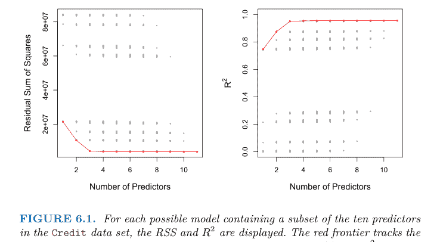

图 6.1. 对于包含 Credit 数据集中十个预测变量子集的每个可能模型，显示了 RSS 和 $R^2$。红色边界线根据 RSS 和 $R^2$ 追踪给定预测变量数量的最佳模型。尽管数据集只包含十个预测变量，但 x 轴范围从 1 到 11，因为其中一个变量是分类变量，有三个取值，从而创建了两个虚拟变量。

然后，针对选定的 $k$，使用完整训练集拟合的模型 $\mathcal{M}_k$ 被交付使用。这些方法在第 6.1.3 节中讨论。

图 6.1 展示了最佳子集选择的一个应用。每个绘制的点对应于使用 Credit 数据集中 10 个预测变量的不同子集拟合的最小二乘回归模型，该数据集在第 3 章中讨论。这里的变量 region 是一个三水平定性变量，因此由两个虚拟变量表示，在这种情况下它们是分别被选择的。因此，总共有 11 个可能的变量可以包含在模型中。我们绘制了每个模型的 RSS 和 $R^2$ 统计量，作为变量数量的函数。红色曲线根据 RSS 或 $R^2$ 连接每个模型大小的最佳模型。该图显示，正如预期的那样，随着变量数量的增加，这些量会改善；然而，从三变量模型开始，由于包含额外的预测变量，RSS 和 $R^2$ 的改进很小。

尽管我们在这里为最小二乘回归介绍了最佳子集选择，但同样的思想也适用于其他类型的模型，例如逻辑回归。在逻辑回归的情况下，我们不是在算法 6.1 的步骤 2 中按 RSS 对模型排序，而是使用偏差，这是一个在更广泛的模型类别中扮演 RSS 角色的度量。偏差是最大化对数似然的负两倍；偏差越小，拟合越好。

虽然最佳子集选择是一种简单且概念上吸引人的方法，但它受到计算限制。随着 $p$ 的增加，必须考虑的可能模型数量迅速增长。通常，涉及 $p$ 个预测变量子集的模型有 $2^p$ 个。因此，如果 $p = 10$，则大约有 1,000 个可能的模型需要考虑，如果 $p = 20$，则有超过一百万个可能性！因此，对于 $p$ 大于约 40 的值，即使使用极快的现代计算机，最佳子集选择在计算上也变得不可行。存在计算捷径——所谓的分支定界技术——可以消除一些选择，但当 $p$ 变大时，它们也有其局限性。它们也仅适用于最小二乘线性回归。接下来，我们将介绍计算效率更高的替代最佳子集选择的方法。

### 算法 6.2 前向逐步选择

1.  令 $\mathcal{M}_0$ 表示*空*模型，该模型不包含任何预测变量。
2.  对于 $k = 0, \dots, p - 1$：
    (a) 考虑所有 $p - k$ 个模型，这些模型通过添加一个额外的预测变量来扩展 $\mathcal{M}_k$ 中的预测变量。
    (b) 从这些 $p - k$ 个模型中选择*最佳*模型，并将其称为 $\mathcal{M}_{k+1}$。这里的*最佳*定义为具有最小的 RSS 或最高的 $R^2$。
3.  使用验证集上的预测误差、$C_p$ (AIC)、BIC 或调整后的 $R^2$，从 $\mathcal{M}_0, \dots, \mathcal{M}_p$ 中选择一个最佳模型。或者使用交叉验证方法。

### 6.1.2 逐步选择

由于计算原因，最佳子集选择无法应用于非常大的 $p$。当 $p$ 很大时，最佳子集选择也可能存在统计问题。搜索空间越大，找到在训练数据上看起来不错但对未来数据可能没有任何预测能力的模型的机会就越高。因此，巨大的搜索空间可能导致过拟合和系数估计的高方差。

由于这两个原因，*逐步*方法探索的模型集合要受限得多，是最佳子集选择的有吸引力的替代方案。

### 前向逐步选择

*前向逐步选择*是最佳子集选择的一种计算高效的替代方案。虽然最佳子集选择过程考虑了包含 $p$ 个预测变量子集的所有 $2^p$ 个可能模型，但前向逐步选择考虑的模型集合要小得多。前向逐步选择从一个不包含任何预测变量的模型开始，然后逐个向模型中添加预测变量，直到所有预测变量都在模型中。具体来说，在每一步中，将对拟合提供最大*额外*改进的变量添加到模型中。更正式地说，前向逐步选择过程在算法 6.2 中给出。

与涉及拟合 $2^p$ 个模型的最佳子集选择不同，前向逐步选择涉及拟合一个空模型，以及在第 $k$ 次迭代中拟合 $p - k$ 个模型，其中 $k = 0, \dots, p - 1$。这总共相当于 $1 + \sum_{k=0}^{p-1}(p - k) = 1 + p(p + 1)/2$ 个模型。这是一个显著的差异：当 $p = 20$ 时，最佳子集选择需要拟合 1,048,576 个模型，而前向逐步选择只需要拟合 211 个模型。²

在算法 6.2 的步骤 2(b) 中，我们必须从那些通过添加一个额外预测变量来扩展 $\mathcal{M}_k$ 的 $p-k$ 个模型中识别出*最佳*模型。我们可以通过简单地选择具有最低 RSS 或最高 $R^2$ 的模型来做到这一点。然而，在步骤 3 中，我们必须从一组具有不同变量数量的模型中识别出最佳模型。这更具挑战性，将在第 6.1.3 节中讨论。

前向逐步选择相对于最佳子集选择的计算优势是显而易见的。尽管前向逐步选择在实践中往往表现良好，但它并不保证能在所有包含 $p$ 个预测变量子集的 $2^p$ 个模型中找到最佳可能模型。例如，假设在一个具有 $p=3$ 个预测变量的给定数据集中，最佳可能的单变量模型包含 $X_1$，而最佳可能的双变量模型却包含 $X_2$ 和 $X_3$。那么前向逐步选择将无法选择最佳可能的双变量模型，因为 $\mathcal{M}_1$ 将包含 $X_1$，所以 $\mathcal{M}_2$ 也必须包含 $X_1$ 以及一个额外的变量。

表 6.1 显示了在 Credit 数据集上进行最佳子集选择和前向逐步选择时选择的前四个模型，说明了这种现象。最佳子集选择和前向逐步选择都为最佳单变量模型选择了 rating，然后为双变量和三变量模型包含了 income 和 student。然而，最佳子集选择在四变量模型中用 cards 替换了 rating，而前向逐步选择必须在其四变量模型中保留 rating。在这个例子中，图 6.1 表明三变量和四变量模型在 RSS 方面没有太大差异，因此任何一个四变量模型都可能是足够的。

前向逐步选择甚至可以在 $n < p$ 的高维设置中应用；然而，在这种情况下，只能构建子模型 $\mathcal{M}_0, \dots, \mathcal{M}_{n-1}$，因为每个子模型都是使用最小二乘法拟合的，如果 $p \geq n$，则不会产生唯一解。

| 变量数量 | 最佳子集 | 前向逐步 |
| :--- | :--- | :--- |
| 一 | rating | rating |
| 二 | rating, income | rating, income |
| 三 | rating, income, student | rating, income, student |
| 四 | cards, income, student, limit | rating, income, student, limit |

表 6.1. 在 Credit 数据集上进行最佳子集选择和前向逐步选择时选择的前四个模型。前三个模型是相同的，但第四个模型不同。

### 后向逐步选择

与前向逐步选择类似，*后向逐步选择*提供了最佳子集选择的替代方案。后向逐步选择从包含所有 $p$ 个预测变量的完整模型开始，然后迭代地移除最不有用的预测变量，一次一个，直到只剩下一个预测变量。后向逐步选择过程在算法 6.3 中给出。

²尽管前向逐步选择考虑了 $p(p+1)/2 + 1$ 个模型，但它在模型空间上执行*引导*搜索，因此考虑的*有效*模型空间包含的模型数量远多于 $p(p+1)/2 + 1$。

是最佳子集选择的一种高效替代方法。然而，与前向逐步选择不同，它从包含所有 $p$ 个预测变量的全最小二乘模型开始，然后迭代地每次移除一个最不有用的预测变量。详细步骤见算法 6.3。

## 算法 6.3 后向逐步选择

1.  令 $\mathcal{M}_p$ 表示包含所有 $p$ 个预测变量的*全*模型。
2.  对于 $k = p, p-1, \dots, 1$：
    (a) 考虑所有包含 $\mathcal{M}_k$ 中除一个预测变量外所有变量的 $k$ 个模型，即每个模型包含 $k-1$ 个预测变量。
    (b) 从这 $k$ 个模型中选择*最佳*模型，记为 $\mathcal{M}_{k-1}$。此处*最佳*定义为具有最小 RSS 或最高 $R^2$。
3.  使用验证集上的预测误差、$C_p$ (AIC)、BIC 或调整 $R^2$，从 $\mathcal{M}_0, \dots, \mathcal{M}_p$ 中选择一个最佳模型。或者使用交叉验证方法。

与前向逐步选择类似，后向选择方法仅搜索 $1 + p(p+1)/2$ 个模型，因此可以应用于 $p$ 过大而无法使用最佳子集选择的情况。$^3$ 同样，后向逐步选择也不能保证得到包含 $p$ 个预测变量子集的*最佳*模型。

后向选择要求样本数量 $n$ 大于变量数量 $p$（以便能够拟合全模型）。相比之下，前向逐步选择即使在 $n < p$ 时也可以使用，因此当 $p$ 非常大时，它是唯一可行的子集选择方法。

## 混合方法

最佳子集、前向逐步和后向逐步选择方法通常给出相似但不完全相同的模型。作为另一种选择，前向和后向逐步选择的混合版本是可用的，其中变量按顺序添加到模型中，类似于前向选择。然而，在添加每个新变量后，该方法也可能移除任何不再改善模型拟合的变量。这种方法试图更紧密地模仿最佳子集选择，同时保留前向和后向逐步选择的计算优势。

## 6.1.3 选择最优模型

最佳子集选择、前向选择和后向选择都会生成一组模型，每个模型包含 $p$ 个预测变量的一个子集。要应用这些方法，我们需要一种方法来确定这些模型中哪个是*最佳*的。正如我们在 6.1.1 节中讨论的，包含所有预测变量的模型总是具有最小的 RSS 和最大的 $R^2$，因为这些量与训练误差相关。相反，我们希望选择一个测试误差较低的模型。正如这里显而易见的，并且我们在第 2 章中所示，训练误差可能是测试误差的一个糟糕估计。因此，RSS 和 $R^2$ 不适合用于在具有不同数量预测变量的模型集合中选择最佳模型。

为了选择相对于测试误差的最佳模型，我们需要估计这个测试误差。有两种常用方法：

1.  我们可以通过对训练误差进行*调整*来间接估计测试误差，以考虑由于过拟合导致的偏差。
2.  我们可以*直接*估计测试误差，使用验证集方法或交叉验证方法，如第 5 章所述。

我们将在下面考虑这两种方法。

## $C_p$、AIC、BIC 和调整 $R^2$

我们在第 2 章中表明，训练集 MSE 通常低估了测试 MSE。（回想一下 MSE = RSS/$n$。）这是因为当我们使用最小二乘法拟合训练数据时，我们特别估计回归系数使得训练 RSS（但不是测试 RSS）尽可能小。特别是，随着模型中包含更多变量，训练误差会减少，但测试误差可能不会。因此，训练集 RSS 和训练集 $R^2$ 不能用于从具有不同数量变量的模型集合中进行选择。

然而，有许多技术可用于根据模型大小*调整*训练误差。这些方法可用于在具有不同数量变量的模型集合中进行选择。我们现在考虑四种这样的方法：$C_p$、*赤池信息准则* (AIC)、*贝叶斯信息准则* (BIC) 和*调整* $R^2$。图 6.2 显示了在 *Credit* 数据集上通过最佳子集选择产生的每个大小的最佳模型的 $C_p$、BIC 和调整 $R^2$。

对于包含 $d$ 个预测变量的拟合最小二乘模型，测试 MSE 的 $C_p$ 估计使用以下公式计算：

$$C_p = \frac{1}{n} \left( \text{RSS} + 2d\hat{\sigma}^2 \right),$$

其中 $\hat{\sigma}^2$ 是与 (6.1) 中每个响应测量相关的误差 $\epsilon$ 的方差的估计。$^4$ 通常 $\hat{\sigma}^2$ 使用包含所有预测变量的全模型进行估计。本质上，$C_p$ 统计量在训练 RSS 上添加了 $2d\hat{\sigma}^2$ 的惩罚，以调整训练误差倾向于低估测试误差的事实。显然，惩罚项随着模型中预测变量数量的增加而增加；这是为了调整训练 RSS 的相应减少。虽然超出了本书的范围，但可以证明，如果 $\hat{\sigma}^2$ 是 (6.2) 中 $\sigma^2$ 的无偏估计，那么 $C_p$ 是测试 MSE 的无偏估计。因此，$C_p$ 统计量倾向于对测试误差较低的模型取较小的值，因此在确定一组模型中哪个最佳时，我们选择 $C_p$ 值最低的模型。在图 6.2 中，$C_p$ 选择了包含预测变量 *income*、*limit*、*rating*、*cards*、*age* 和 *student* 的六变量模型。

AIC 准则适用于通过最大似然拟合的一大类模型。对于具有高斯误差的模型 (6.1)，最大似然和最小二乘是相同的。在这种情况下，AIC 由下式给出：

$$\text{AIC} = \frac{1}{n} \left( \text{RSS} + 2d\hat{\sigma}^2 \right),$$

其中，为简单起见，我们省略了无关常数。$^5$ 因此，对于最小二乘模型，$C_p$ 和 AIC 彼此成比例，因此图 6.2 中仅显示了 $C_p$。

BIC 源自贝叶斯观点，但最终看起来也与 $C_p$（和 AIC）相似。对于具有 $d$ 个预测变量的最小二乘模型，BIC 在忽略无关常数的情况下由下式给出：

$$\text{BIC} = \frac{1}{n} \left( \text{RSS} + \log(n)d\hat{\sigma}^2 \right). \quad (6.3)$$

与 $C_p$ 类似，BIC 倾向于对测试误差较低的模型取较小的值，因此通常我们选择 BIC 值最低的模型。注意，BIC 将 $C_p$ 使用的 $2d\hat{\sigma}^2$ 替换为 $\log(n)d\hat{\sigma}^2$ 项，其中 $n$ 是观测数量。由于对于任何 $n > 7$，$\log n > 2$，因此 BIC 统计量对具有许多变量的模型施加的惩罚比 $C_p$ 更大，因此倾向于选择比 $C_p$ 更小的模型。

$^3$ 与前向逐步选择类似，后向逐步选择在模型空间上执行*引导*搜索，因此实际上考虑的模型数量远多于 $1 + p(p+1)/2$。

$^4$ Mallow 的 $C_p$ 有时定义为 $C'_p = \text{RSS}/\hat{\sigma}^2 + 2d - n$。这在 $C_p = \frac{1}{n}\hat{\sigma}^2(C'_p + n)$ 的意义上等同于上面给出的定义，因此具有最小 $C_p$ 的模型也具有最小 $C'_p$。

$^5$ 最小二乘回归的 AIC 有两个公式。我们在此处提供的公式需要 $\sigma^2$ 的表达式，我们使用包含所有预测变量的全模型获得该表达式。第二个公式适用于 $\sigma^2$ 未知且我们不想显式估计它的情况；该公式具有 $\log(\text{RSS})$ 项而不是 RSS 项。这两个公式的详细推导超出了本书的范围。

BIC统计量通常对变量较多的模型施加更重的惩罚，因此选择的模型比$C_p$更小。在图6.2中，我们看到信用数据集确实如此；BIC选择了一个仅包含收入、额度、信用卡数量和学生身份这四个预测变量的模型。在这种情况下，曲线非常平坦，因此四变量模型和六变量模型在准确性上似乎没有太大差异。

调整$R^2$统计量是另一种在包含不同数量变量的模型集中进行选择的流行方法。回顾第3章，通常的$R^2$定义为$1 - \text{RSS}/\text{TSS}$，其中$\text{TSS} = \sum(y_i - \bar{y})^2$是响应变量的总平方和。由于RSS总是随着模型中变量的增加而减少，因此$R^2$总是随着变量的增加而增加。对于包含$d$个变量的最小二乘模型，调整$R^2$统计量计算如下：

$$\text{Adjusted } R^2 = 1 - \frac{\text{RSS}/(n - d - 1)}{\text{TSS}/(n - 1)}. \tag{6.4}$$

与$C_p$、AIC和BIC（较小的值表示测试误差较低的模型）不同，调整$R^2$的较大值表示测试误差较小的模型。最大化调整$R^2$等价于最小化$\frac{\text{RSS}}{n-d-1}$。虽然RSS总是随着模型中变量数量的增加而减少，但由于分母中存在$d$，$\frac{\text{RSS}}{n-d-1}$可能增加也可能减少。

调整$R^2$背后的直觉是，一旦所有正确的变量都已包含在模型中，添加额外的噪声变量只会导致RSS非常小的减少。由于添加噪声变量会导致$d$增加，这些变量将导致$\frac{\text{RSS}}{n-d-1}$增加，从而导致调整$R^2$减少。因此，理论上，具有最大调整$R^2$的模型将只包含正确的变量，而不包含噪声变量。与$R^2$统计量不同，调整$R^2$统计量会对模型中包含不必要的变量付出代价。图6.2显示了信用数据集的调整$R^2$。使用此统计量会选择一个包含七个变量的模型，比$C_p$和AIC选择的模型多了一个自有变量。

$C_p$、AIC和BIC都有严格的理论依据，超出了本书的范围。这些依据依赖于渐近论证（样本量$n$非常大的情况）。尽管调整$R^2$很受欢迎，而且相当直观，但它在统计理论中的依据不如AIC、BIC和$C_p$充分。所有这些度量都易于使用和计算。这里我们给出了它们在使用最小二乘拟合线性模型情况下的公式；然而，AIC和BIC也可以为更一般的模型类型定义。

## 验证与交叉验证

作为刚才讨论的方法的替代方案，我们可以使用第5章讨论的验证集和交叉验证方法直接估计测试误差。我们可以为每个考虑的模型计算验证集误差或交叉验证误差，然后选择估计测试误差最小的模型。这个过程相对于AIC、BIC、$C_p$和调整$R^2$有一个优势，因为它提供了测试误差的直接估计，并且对真实底层模型的假设更少。它也可以用于更广泛的模型选择任务，甚至在难以确定模型自由度（例如模型中的预测变量数量）或难以估计误差方差$\sigma^2$的情况下。请注意，当使用交叉验证时，算法6.1-6.3中的模型序列$\mathcal{M}_k$是为每个训练折单独确定的，并且验证误差是在每个模型大小$k$的所有折上取平均值。这意味着，例如对于最佳子集回归，大小为$k$的最佳子集$\mathcal{M}_k$在不同折之间可能不同。一旦选择了最佳大小$k$，我们就在完整数据集上找到该大小的最佳模型。

过去，对于许多$p$和/或$n$较大的问题，执行交叉验证在计算上是不可行的，因此AIC、BIC、$C_p$和调整$R^2$是在一组模型中进行选择的更有吸引力的方法。然而，如今有了快速计算机，执行交叉验证所需的计算几乎不再是问题。因此，交叉验证是从多个考虑的模型中进行选择的一种非常有吸引力的方法。

图6.3显示了作为$d$的函数的BIC、验证集误差和交叉验证误差，针对信用数据的最佳$d$变量模型。验证误差是通过随机选择四分之三的观测值作为训练集，其余作为验证集来计算的。交叉验证误差是使用$k = 10$折计算的。在这种情况下，验证和交叉验证方法都导致选择六变量模型。然而，所有三种方法都表明，四、五和六变量模型在测试误差方面大致相当。

事实上，图6.3中间和右侧面板显示的估计测试误差曲线相当平坦。虽然三变量模型的估计测试误差明显低于二变量模型，但3到11变量模型的估计测试误差非常相似。此外，如果我们使用不同的数据分割为训练集和验证集来重复验证集方法，或者如果我们使用不同的交叉验证折集来重复交叉验证，那么具有最低估计测试误差的确切模型肯定会改变。在这种情况下，我们可以使用*一倍标准误规则*来选择模型。我们首先计算每个模型大小的估计测试MSE的标准误，然后选择估计测试误差在曲线最低点的一个标准误范围内的最小模型。这里的原理是，如果一组模型看起来大致同样好，那么我们不妨选择最简单的模型——即预测变量数量最少的模型。在这种情况下，将一倍标准误规则应用于验证集或交叉验证方法会导致选择三变量模型。

## 6.2 收缩方法

第6.1节描述的子集选择方法涉及使用最小二乘来拟合包含预测变量子集的线性模型。作为替代方案，我们可以使用一种*约束*或*正则化*系数估计的技术来拟合包含所有$p$个预测变量的模型，或者等效地，将系数估计*收缩*向零。可能不立即明显为什么这样的约束会改善拟合，但事实证明，收缩系数估计可以显著减少其方差。将回归系数收缩向零的两种最著名的技术是*岭回归*和*lasso*。

### 6.2.1 岭回归

回顾第3章，最小二乘拟合过程通过最小化以下值来估计$\beta_0, \beta_1, \dots, \beta_p$：

$$\text{RSS} = \sum_{i=1}^n \left( y_i - \beta_0 - \sum_{j=1}^p \beta_j x_{ij} \right)^2.$$

*岭回归*与最小二乘非常相似，只是系数是通过最小化一个略有不同的量来估计的。具体来说，岭回归系数估计$\hat{\beta}^R$是使以下值最小化的值：

$$\sum_{i=1}^n \left( y_i - \beta_0 - \sum_{j=1}^p \beta_j x_{ij} \right)^2 + \lambda \sum_{j=1}^p \beta_j^2 = \text{RSS} + \lambda \sum_{j=1}^p \beta_j^2, \quad (6.5)$$

其中$\lambda \ge 0$是一个*调优参数*，需要单独确定。公式6.5权衡了两个不同的标准。与最小二乘一样，岭回归寻求通过使RSS变小来很好地拟合数据的系数估计。然而，第二项$\lambda \sum_j \beta_j^2$，称为*收缩惩罚*，当$\beta_1, \dots, \beta_p$接近零时很小，因此它具有将$\beta_j$的估计*收缩*向零的效果。调优参数$\lambda$用于控制

## 信用数据的应用

图6.4展示了信用数据集的岭回归系数估计。在左侧图中，每条曲线对应十个变量之一的岭回归系数估计，绘制为$\lambda$的函数。例如，黑色实线表示随着$\lambda$变化，收入系数的岭回归估计。在图的最左侧，$\lambda$基本为零，因此对应的岭回归系数估计与通常的最小二乘估计相同。但随着$\lambda$增大，岭回归系数估计向零收缩。当$\lambda$极大时，所有岭回归系数估计基本为零；这对应于不包含任何预测变量的零模型。在此图中，收入、额度、评级和学生变量以不同颜色显示，因为这些变量的系数估计值往往远大于其他变量。虽然岭回归系数估计总体上随$\lambda$增大而减小，但个别系数（如评级和收入）可能偶尔随$\lambda$增大而增加。

图6.4的右侧图显示了与左侧图相同的岭回归系数估计，但$x$轴不再显示$\lambda$，而是显示$\|\hat{\beta}^R_\lambda\|_2 / \|\hat{\beta}\|_2$，其中$\hat{\beta}$表示最小二乘系数估计向量。符号$\|\beta\|_2$表示向量的$\ell_2$范数（读作“ell 2”），定义为$\|\beta\|_2 = \sqrt{\sum_{j=1}^p \beta_j^2}$。它衡量$\beta$与零的距离。随着$\lambda$增大，$\hat{\beta}^R_\lambda$的$\ell_2$范数*总是*减小，因此$\|\hat{\beta}^R_\lambda\|_2 / \|\hat{\beta}\|_2$也会减小。后者的取值范围从1（当$\lambda = 0$时，此时岭回归系数估计与最小二乘估计相同，因此它们的$\ell_2$范数相同）到0（当$\lambda = \infty$时，此时岭回归系数估计为零向量，$\ell_2$范数等于零）。因此，我们可以将图6.4右侧图的$x$轴视为岭回归系数估计向零收缩的程度；较小的值表示它们已被收缩到非常接近零。

第3章讨论的标准最小二乘系数估计具有*尺度等变性*：将$X_j$乘以常数$c$只会导致最小二乘系数估计按因子$1/c$缩放。换句话说，无论第$j$个预测变量如何缩放，$X_j\hat{\beta}_j$将保持不变。相比之下，当将给定预测变量乘以常数时，岭回归系数估计可能会发生*显著*变化。例如，考虑以美元计量的`income`变量。人们可以合理地以千美元为单位计量收入，这将导致`income`的观测值减少1,000倍。现在，由于岭回归公式(6.5)中的系数平方和项，这种尺度变化不会简单地导致`income`的岭回归系数估计变化1,000倍。换句话说，$X_j\hat{\beta}^R_{j,\lambda}$不仅取决于$\lambda$的值，还取决于第$j$个预测变量的缩放。事实上，$X_j\hat{\beta}^R_{j,\lambda}$的值甚至可能取决于*其他*预测变量的缩放！因此，最好在*标准化预测变量*后应用岭回归，使用公式

$$\tilde{x}_{ij} = \frac{x_{ij}}{\sqrt{\frac{1}{n}\sum_{i=1}^n (x_{ij} - \bar{x}_j)^2}}, \quad (6.6)$$

使它们都处于相同的尺度。在(6.6)中，分母是第$j$个预测变量的估计标准差。因此，所有标准化预测变量的标准差都将为一。因此，最终拟合将不依赖于预测变量的测量尺度。在图6.4中，$y$轴显示标准化的岭回归系数估计——即使用标准化预测变量进行岭回归得到的系数估计。

## 为什么岭回归优于最小二乘？

岭回归相对于最小二乘的优势源于*偏差-方差权衡*。随着$\lambda$增大，岭回归拟合的*灵活性*降低，导致方差减小但偏差增大。图6.5的左侧图使用包含$p = 45$个预测变量和$n = 50$个观测值的模拟数据集说明了这一点。图6.5左侧图中的绿色曲线显示了岭回归预测的方差作为$\lambda$的函数。在最小二乘系数估计处（对应于$\lambda = 0$的岭回归），方差较高但没有偏差。但随着$\lambda$增大，岭回归系数估计的收缩导致预测方差大幅减小，代价是偏差略有增加。回想一下，测试均方误差（MSE）绘制为紫色，与方差加偏差平方密切相关。对于$\lambda$值高达约10的情况，方差迅速减小，而偏差（绘制为黑色）增加很少。因此，当$\lambda$从0增加到10时，MSE显著下降。超过这一点后，由于$\lambda$增大导致的方差减小放缓，系数的收缩导致它们被显著低估，从而导致偏差大幅增加。最小MSE在$\lambda \approx 30$时达到。有趣的是，由于其高方差，与最小二乘拟合（当$\lambda = 0$时）相关的MSE几乎与零模型（当$\lambda = \infty$时，所有系数估计为零）的MSE一样高。然而，对于中间值的$\lambda$，MSE要低得多。

图6.5的右侧图显示了与左侧图相同的曲线，这次绘制为岭回归系数估计的$\ell_2$范数除以最小二乘估计的$\ell_2$范数。现在，当我们从左向右移动时，拟合变得更加灵活，因此偏差减小而方差增大。

一般来说，在响应变量与预测变量之间的关系接近线性的情况下，最小二乘估计将具有低偏差但可能具有高方差。这意味着训练数据的微小变化可能导致最小二乘系数估计的大幅变化。特别是，当变量数$p$几乎与观测数$n$一样大时，如图6.5中的示例，最小二乘估计将具有极高的变异性。如果$p > n$，则最小二乘估计甚至没有唯一解，而岭回归仍然可以通过权衡偏差的小幅增加来表现良好。方差大幅减小。因此，当最小二乘估计具有高方差时，岭回归效果最佳。

与需要搜索 $2^p$ 个模型的最佳子集选择相比，岭回归在计算上也具有显著优势。正如我们之前讨论的，即使对于中等大小的 $p$，这样的搜索在计算上也可能不可行。相反，对于任何固定的 $\lambda$ 值，岭回归只拟合一个模型，并且模型拟合过程可以相当快速地执行。事实上，可以证明，*同时*为所有 $\lambda$ 值求解 (6.5) 所需的计算量，与使用最小二乘拟合模型所需的计算量几乎相同。

## 6.2.2 Lasso

岭回归确实有一个明显的缺点。与通常会选择仅包含变量子集的模型的最佳子集选择、向前逐步选择和向后逐步选择不同，岭回归会在最终模型中包含所有 $p$ 个预测变量。(6.5) 中的惩罚项 $\lambda \sum \beta_j^2$ 会将所有系数向零收缩，但不会将任何系数精确地设置为零（除非 $\lambda = \infty$）。对于预测精度来说，这可能不是问题，但在变量数 $p$ 非常大的情况下，这可能会给模型解释带来挑战。例如，在 **Credit** 数据集中，最重要的变量似乎是 **income**、**limit**、**rating** 和 **student**。因此，我们可能希望建立一个仅包含这些预测变量的模型。然而，岭回归总是会生成一个包含所有十个预测变量的模型。增加 $\lambda$ 的值往往会减小系数的大小，但不会导致任何变量被排除。

*Lasso* 是岭回归的一个相对较新的替代方法，它克服了这个缺点。Lasso 系数 $\hat{\beta}_\lambda^L$ 最小化以下量：

$$\sum_{i=1}^n \left(y_i - \beta_0 - \sum_{j=1}^p \beta_j x_{ij}\right)^2 + \lambda \sum_{j=1}^p |\beta_j| = \text{RSS} + \lambda \sum_{j=1}^p |\beta_j|. \quad (6.7)$$

比较 (6.7) 和 (6.5)，我们看到 lasso 和岭回归具有相似的公式。唯一的区别是，岭回归惩罚项 (6.5) 中的 $\beta_j^2$ 项在 lasso 惩罚项 (6.7) 中被替换为 $|\beta_j|$。用统计术语来说，lasso 使用 $\ell_1$（读作“ell 1”）惩罚，而不是 $\ell_2$ 惩罚。系数向量 $\beta$ 的 $\ell_1$ 范数由 $\|\beta\|_1 = \sum |\beta_j|$ 给出。

与岭回归一样，lasso 将系数估计值向零收缩。然而，在 lasso 的情况下，当调节参数 $\lambda$ 足够大时，$\ell_1$ 惩罚具有迫使某些系数估计值精确等于零的效果。因此，与最佳子集选择非常相似，lasso 执行*变量选择*。因此，由 lasso 生成的模型通常比岭回归生成的模型更容易解释。我们说 lasso 产生*稀疏*模型——即仅涉及变量子集的模型。与岭回归一样，为 lasso 选择一个好的 $\lambda$ 值至关重要；我们将此讨论推迟到第 6.2.3 节，届时我们将使用交叉验证。

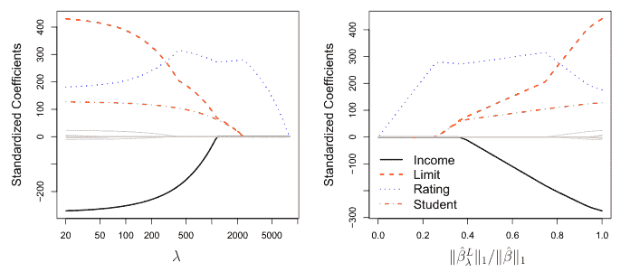

图 6.6. 显示了在 Credit 数据集上标准化的 lasso 系数作为 $\lambda$ 和 $\|\hat{\beta}_\lambda^L\|_1 / \|\hat{\beta}\|_1$ 的函数。

例如，考虑图 6.6 中的系数图，这些图是通过对 Credit 数据集应用 lasso 生成的。当 $\lambda = 0$ 时，lasso 简单地给出最小二乘拟合，当 $\lambda$ 变得足够大时，lasso 给出所有系数估计值都等于零的零模型。然而，在这两个极端之间，岭回归和 lasso 模型彼此相当不同。在图 6.6 的右侧面板中从左向右移动，我们观察到最初 lasso 产生一个仅包含 rating 预测变量的模型。然后 student 和 limit 几乎同时进入模型，紧接着是 income。最终，其余变量进入模型。因此，根据 $\lambda$ 的值，lasso 可以生成涉及任意数量变量的模型。相比之下，岭回归总是会在模型中包含所有变量，尽管系数估计值的大小将取决于 $\lambda$。

## 岭回归和 Lasso 的另一种表述

可以证明，lasso 和岭回归系数估计值分别解决以下问题：

$$\text{minimize}_{\beta} \left\{ \sum_{i=1}^n \left( y_i - \beta_0 - \sum_{j=1}^p \beta_j x_{ij} \right)^2 \right\} \quad \text{subject to} \quad \sum_{j=1}^p |\beta_j| \leq s$$

和

$$\text{minimize}_{\beta} \left\{ \sum_{i=1}^n \left( y_i - \beta_0 - \sum_{j=1}^p \beta_j x_{ij} \right)^2 \right\} \quad \text{subject to} \quad \sum_{j=1}^p \beta_j^2 \leq s,$$

换句话说，对于每个 $\lambda$ 值，都存在某个 $s$，使得方程 (6.7) 和 (6.8) 给出相同的 lasso 系数估计值。类似地，对于每个 $\lambda$ 值，都存在一个对应的 $s$，使得方程 (6.5) 和 (6.9) 给出相同的岭回归系数估计值。

当 $p=2$ 时，(6.8) 表明 lasso 系数估计值在由 $|\beta_1| + |\beta_2| \le s$ 定义的菱形内的所有点中具有最小的 RSS。类似地，岭回归估计值在由 $\beta_1^2 + \beta_2^2 \le s$ 定义的圆内的所有点中具有最小的 RSS。

我们可以这样理解 (6.8)。当我们执行 lasso 时，我们试图找到一组系数估计值，使得 RSS 最小，同时满足 $\sum_{j=1}^p |\beta_j|$ 可以多大的*预算* $s$ 约束。当 $s$ 极大时，这个预算限制性不强，因此系数估计值可以很大。事实上，如果 $s$ 足够大，使得最小二乘解落在预算内，那么 (6.8) 将简单地给出最小二乘解。相反，如果 $s$ 很小，那么 $\sum_{j=1}^p |\beta_j|$ 必须很小，以避免违反预算。类似地，(6.9) 表明，当我们执行岭回归时，我们寻求一组系数估计值，使得 RSS 尽可能小，同时满足 $\sum_{j=1}^p \beta_j^2$ 不超过预算 $s$ 的要求。

表述 (6.8) 和 (6.9) 揭示了 lasso、岭回归和最佳子集选择之间的密切联系。考虑以下问题：

$$\text{minimize}_{\beta} \left\{ \sum_{i=1}^n \left( y_i - \beta_0 - \sum_{j=1}^p \beta_j x_{ij} \right)^2 \right\} \quad \text{subject to} \quad \sum_{j=1}^p I(\beta_j \ne 0) \le s.$$

这里 $I(\beta_j \ne 0)$ 是一个指示变量：如果 $\beta_j \ne 0$，则取值为 1，否则等于零。那么 (6.10) 相当于找到一组系数估计值，使得 RSS 尽可能小，同时满足不超过 $s$ 个系数可以非零的约束。问题 (6.10) 等同于最佳子集选择。不幸的是，当 $p$ 很大时，求解 (6.10) 在计算上不可行，因为它需要考虑所有包含 $s$ 个预测变量的 $\binom{p}{s}$ 个模型。因此，我们可以将岭回归和 lasso 解释为最佳子集选择的计算可行替代方案，它们用更容易求解的形式替代了 (6.10) 中难以处理的预算形式。当然，lasso 与最佳子集选择的关系要密切得多，因为当 (6.8) 中的 $s$ 足够小时，lasso 执行特征选择，而岭回归则不会。

## Lasso 的变量选择特性

为什么 lasso 与岭回归不同，会导致系数估计值精确等于零？表述 (6.8) 和 (6.9) 可以用来阐明这个问题。图 6.7 说明了这种情况。最小二乘解标记为 $\hat{\beta}$，而蓝色菱形和圆圈分别代表 (6.8) 和 (6.9) 中的 lasso 和岭回归约束。如果 $s$ 足够大，那么约束区域将包含 $\hat{\beta}$，因此岭回归和 lasso 估计值将与最小二乘估计值相同。（如此大的 $s$ 值对应于 (6.5) 和 (6.7) 中的 $\lambda = 0$。）然而，在图 6.7 中，最小二乘估计值位于菱形和圆圈之外，因此最小二乘估计值与 lasso 和岭回归估计值不同。

以 $\hat{\beta}$ 为中心的每个椭圆代表一个*等高线*：这意味着特定椭圆上的所有点具有相同的 RSS 值。当

## 比较 Lasso 与岭回归

显然，Lasso 相较于岭回归有一个主要优势，即它能产生更简单、更易于解释的模型，且仅涉及预测变量子集。然而，哪种方法能带来更好的预测精度呢？图 6.8 展示了应用于与图 6.5 相同模拟数据的 Lasso 的方差、平方偏差和测试均方误差。显然，Lasso 表现出与岭回归定性相似的行为：随着 $\lambda$ 增大，方差减小而偏差增大。在图 6.8 的右侧面板中，虚线代表岭回归拟合。此处我们根据两者在训练数据上的 $R^2$ 进行绘图。这是另一种有用的模型索引方式，可用于比较不同正则化类型的模型，正如本例所示。在此示例中，Lasso 和岭回归产生的偏差几乎相同。然而，岭回归的方差略低于 Lasso 的方差。因此，岭回归的最小均方误差略小于 Lasso。

然而，图 6.8 中的数据生成方式使得所有 45 个预测变量都与响应相关——即所有真实系数 $\beta_1, \dots, \beta_{45}$ 均不为零。Lasso 隐含地假设许多系数真实值为零。因此，在此设定下岭回归在预测误差方面优于 Lasso 并不令人意外。图 6.9 展示了类似情况，但此时响应仅是 45 个预测变量中 2 个的函数。现在 Lasso 在偏差、方差和均方误差方面倾向于优于岭回归。

这两个例子说明，岭回归和 Lasso 并非在所有情况下都有一方普遍优于另一方。通常，可以预期在相对较少的预测变量具有显著系数、而其余预测变量系数非常小或为零的设定下，Lasso 表现更好。当响应是许多预测变量的函数，且所有系数大小大致相等时，岭回归将表现更好。然而，对于真实数据集，与响应相关的预测变量数量从未是*先验*已知的。可以使用交叉验证等技术来确定在特定数据集上哪种方法更好。

与岭回归类似，当最小二乘估计具有过高的方差时，Lasso 解可以通过牺牲偏差的小幅增加来降低方差，从而产生更准确的预测。与岭回归不同，Lasso 执行变量选择，因此产生的模型更易于解释。

存在非常高效的算法来拟合岭回归和 Lasso 模型；在两种情况下，整个系数路径的计算量与单次最小二乘拟合大致相同。我们将在本章末尾的实验中进一步探讨这一点。

## 岭回归与 Lasso 的一个简单特例

为了更好地理解岭回归和 Lasso 的行为，考虑一个简单特例：$n = p$，且 $\mathbf{X}$ 是一个对角矩阵，对角线上为 1，所有非对角线元素为 0。为简化问题，进一步假设我们执行无截距的回归。在这些假设下，通常的最小二乘问题简化为寻找 $\beta_1, \ldots, \beta_p$ 以最小化

$$\sum_{j=1}^p (y_j - \beta_j)^2. \tag{6.11}$$

在此情况下，最小二乘解为

$$\hat{\beta}_j = y_j.$$

在此设定下，岭回归相当于寻找 $\beta_1, \ldots, \beta_p$ 使得

$$\sum_{j=1}^p (y_j - \beta_j)^2 + \lambda \sum_{j=1}^p \beta_j^2 \tag{6.12}$$

最小化，而 Lasso 相当于寻找系数使得

$$\sum_{j=1}^p (y_j - \beta_j)^2 + \lambda \sum_{j=1}^p |\beta_j| \tag{6.13}$$

最小化。可以证明，在此设定下，岭回归估计的形式为

$$\hat{\beta}_j^R = y_j / (1 + \lambda), \quad (6.14)$$

而 Lasso 估计的形式为

$$\hat{\beta}_j^L = \begin{cases} y_j - \lambda/2 & \text{if } y_j > \lambda/2; \\ y_j + \lambda/2 & \text{if } y_j < -\lambda/2; \\ 0 & \text{if } |y_j| \le \lambda/2. \end{cases} \quad (6.15)$$

图 6.10 展示了这种情况。我们可以看到岭回归和 Lasso 执行两种非常不同的收缩类型。在岭回归中，每个最小二乘系数估计按相同比例收缩。相比之下，Lasso 将每个最小二乘系数向零收缩一个常数量 $\lambda/2$；绝对值小于 $\lambda/2$ 的最小二乘系数被完全收缩为零。在此简单设定 (6.15) 中 Lasso 执行的收缩类型称为*软阈值*。Lasso 系数被完全收缩为零的事实解释了为什么 Lasso 能执行特征选择。

对于更一般的数据矩阵 $\mathbf{X}$，情况比图 6.10 所描绘的稍复杂，但主要思想仍然大致成立：岭回归或多或少地按相同比例收缩数据的每个维度，而 Lasso 则或多或少地将所有系数向零收缩相似的量，且足够小的系数会被完全收缩为零。

## 岭回归与 Lasso 的贝叶斯解释

我们现在展示可以通过贝叶斯视角来看待岭回归和 Lasso。回归的贝叶斯观点假设系数向量 $\beta$ 具有某种*先验*分布，例如 $p(\beta)$，其中 $\beta = (\beta_0, \beta_1, \dots, \beta_p)^T$。数据的似然可以写为 $f(Y|X, \beta)$，

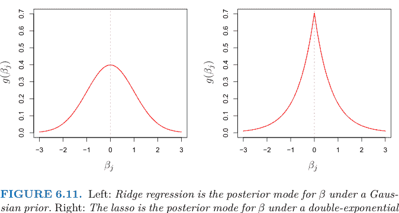

**图 6.11。** *左图：* 岭回归是在高斯先验下 $\beta$ 的后验众数。*右图：* Lasso 是在双指数先验下 $\beta$ 的后验众数。

其中 $X = (X_1, \dots, X_p)$。将先验分布乘以似然函数，我们得到（在比例常数意义下）*后验分布*，其形式为

$$p(\beta|X, Y) \propto f(Y|X, \beta)p(\beta|X) = f(Y|X, \beta)p(\beta),$$

其中上述比例关系源于贝叶斯定理，而等式则基于 $X$ 是固定的这一假设。

我们假设采用通常的线性模型，

$$Y = \beta_0 + X_1\beta_1 + \cdots + X_p\beta_p + \epsilon,$$

并假设误差是独立的且来自正态分布。此外，假设 $p(\beta) = \prod_{j=1}^p g(\beta_j)$，其中 $g$ 是某个密度函数。事实证明，岭回归和 Lasso 自然地源于 $g$ 的两种特殊情况：

- 如果 $g$ 是均值为零、标准差为 $\lambda$ 的函数的高斯分布，那么 $\beta$ 的*后验众数*——即在给定数据下 $\beta$ 的最可能值——由岭回归解给出。（事实上，岭回归解也是后验均值。）
- 如果 $g$ 是均值为零、尺度参数为 $\lambda$ 的函数的双指数（拉普拉斯）分布，那么 $\beta$ 的后验众数就是 Lasso 解。（然而，Lasso 解*不是*后验均值，事实上，后验均值不会产生稀疏的系数向量。）

高斯和双指数先验如图 6.11 所示。因此，从贝叶斯的角度来看，岭回归和 Lasso 直接源于假设带有正态误差的通常线性模型，以及 $\beta$ 的一个简单先验分布。注意，Lasso 先验在零处有一个陡峭的峰值，而高斯先验在零处更平坦、更宽。因此，Lasso 先验预期许多系数（恰好）为零，而岭回归则假设系数围绕零随机分布。

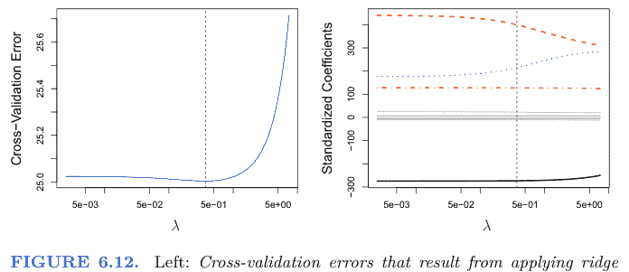

**图 6.12。** *左图：* 对 Credit 数据集应用岭回归，不同 $\lambda$ 值导致的交叉验证误差。*右图：* 系数估计值作为 $\lambda$ 的函数。垂直虚线表示由交叉验证选择的 $\lambda$ 值。

## 6.2.3 选择调节参数

正如第 6.1 节中考虑的子集选择方法需要一种方法来确定哪个模型是最佳的一样，实现岭回归和 Lasso 也需要一种方法来选择 (6.5) 和 (6.7) 中调节参数 $\lambda$ 的值，或者等价地，选择 (6.9) 和 (6.8) 中约束 $s$ 的值。交叉验证提供了一种解决这个问题的简单方法。我们选择一个 $\lambda$ 值的网格，并计算每个 $\lambda$ 值的交叉验证误差，如第 5 章所述。然后我们选择交叉验证误差最小的调节参数值。最后，使用所有可用的观测值和选定的调节参数值重新拟合模型。

图 6.12 展示了对 Credit 数据集的岭回归拟合进行留一法交叉验证后选择的 $\lambda$。垂直虚线表示选定的 $\lambda$ 值。在这种情况下，该值相对较小，表明最优拟合相对于最小二乘解只涉及少量的收缩。此外，下降点不是很明显，因此有相当宽的 $\lambda$ 值范围会产生非常相似的误差。在这种情况下，我们可能只需使用最小二乘解。

图 6.13 展示了对图 6.9 中稀疏模拟数据的 Lasso 拟合应用十折交叉验证的示例。图 6.13 的左侧面板显示了交叉验证误差，而右侧面板显示了系数估计值。垂直虚线表示交叉验证误差最小的点。图 6.13 右侧面板中的两条彩色线代表与响应相关的两个预测变量，而灰色线代表不相关的预测变量；这些通常分别被称为信号变量和噪声变量。Lasso 不仅正确地为两个信号预测变量分配了大得多的系数估计值，而且最小的交叉验证误差对应于一组系数估计值，其中只有信号变量是非零的。因此，交叉验证与 Lasso 一起正确地识别了模型中的两个信号变量，尽管这是一个具有 $p = 45$ 个变量而只有 $n = 50$ 个观测值的挑战性设置。

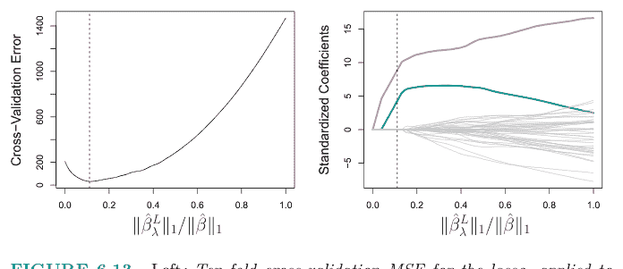

**图 6.13。** *左图：* 对图 6.9 中的稀疏模拟数据集应用 Lasso 的十折交叉验证 MSE。*右图：* 显示了相应的 Lasso 系数估计值。两个信号变量以彩色显示，噪声变量以灰色显示。垂直虚线表示交叉验证误差最小的 Lasso 拟合。

相比之下，最小二乘解——显示在图 6.13 右侧面板的最右侧——只给两个信号变量中的一个分配了较大的系数估计值。

## 6.3 降维方法

到目前为止，我们在本章中讨论的方法通过两种不同的方式控制方差：要么使用原始变量的子集，要么将它们的系数向零收缩。所有这些方法都是使用原始预测变量 $X_1, X_2, \dots, X_p$ 定义的。我们现在探索一类*变换*预测变量，然后使用变换后的变量拟合最小二乘模型的方法。我们将这些技术称为*降维*方法。

令 $Z_1, Z_2, \dots, Z_M$ 表示我们原始 $p$ 个预测变量的 $M < p$ 个*线性组合*。即，

$$Z_m = \sum_{j=1}^p \phi_{jm} X_j \qquad (6.16)$$

其中 $\phi_{1m}, \phi_{2m} \dots, \phi_{pm}$ 是某些常数，$m = 1, \dots, M$。然后我们可以使用最小二乘法拟合线性回归模型

$$y_i = \theta_0 + \sum_{m=1}^M \theta_m z_{im} + \epsilon_i, \quad i = 1, \dots, n, \qquad (6.17)$$

注意，在 (6.17) 中，回归系数由 $\theta_0, \theta_1, \dots, \theta_M$ 给出。如果常数 $\phi_{1m}, \phi_{2m}, \dots, \phi_{pm}$ 选择得当，那么这种降维方法通常可以优于最小二乘回归。换句话说，使用最小二乘法拟合 (6.17) 可能比使用最小二乘法拟合 (6.1) 得到更好的结果。

术语*降维*源于这种方法将估计 $p+1$ 个系数 $\beta_0, \beta_1, \dots, \beta_p$ 的问题简化为

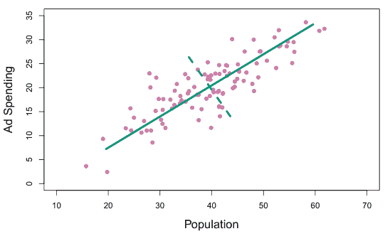

**图 6.14。** *100 个不同城市的人口规模 (pop) 和广告支出 (ad) 显示为紫色圆圈。绿色实线表示第一主成分，蓝色虚线表示第二主成分。*

估计 $M + 1$ 个系数 $\theta_0, \theta_1, \dots, \theta_M$ 的更简单问题，其中 $M < p$。换句话说，问题的维度从 $p + 1$ 降低到了 $M + 1$。

注意，由 (6.16)，

$$\sum_{m=1}^M \theta_m z_{im} = \sum_{m=1}^M \theta_m \sum_{j=1}^p \phi_{jm} x_{ij} = \sum_{j=1}^p \sum_{m=1}^M \theta_m \phi_{jm} x_{ij} = \sum_{j=1}^p \beta_j x_{ij},$$

其中

$$\beta_j = \sum_{m=1}^M \theta_m \phi_{jm}. \tag{6.18}$$

因此，(6.17) 可以被视为 (6.1) 给出的原始线性回归模型的一个特例。降维的作用是约束估计的 $\beta_j$ 系数，因为现在它们必须采取 (6.18) 的形式。这种对系数形式的约束有可能使系数估计产生偏差。然而，在 $p$ 相对于 $n$ 较大的情况下，选择一个 $M \ll p$ 的值可以显著降低拟合系数的方差。如果 $M = p$，并且所有 $Z_m$ 都是线性无关的，那么 (6.18) 不构成任何约束。在这种情况下，没有发生降维，因此拟合 (6.17) 等同于对原始 $p$ 个预测变量进行最小二乘回归。

所有降维方法都分两步进行。首先，获得变换后的预测变量 $Z_1, Z_2, \dots, Z_M$。其次，使用这 $M$ 个预测变量拟合模型。然而，$Z_1, Z_2, \dots, Z_M$ 的选择，或者等价地，$\phi_{jm}$ 的选择，可以通过不同的方式实现。在本章中，我们将考虑两种方法来完成这项任务：*主成分*和*偏最小二乘*。

### 6.3.1 主成分回归

*主成分分析 (PCA)* 是一种流行的方法，用于推导

## 主成分分析概述

主成分分析是一种降低 $n \times p$ 数据矩阵 $\mathbf{X}$ 维度的技术。数据的*第一主成分*方向是观测值*变化最大*的方向。例如，考虑图6.14，它显示了100个城市的人口规模（**pop**，单位：万人）和某特定公司的广告支出（**ad**，单位：千美元）。$^6$ 绿色实线代表数据的第一主成分方向。我们可以直观地看出，这是数据变异性最大的方向。也就是说，如果我们把这100个观测值*投影*到这条线上（如图6.15左侧面板所示），那么得到的投影观测值将具有最大的方差；将观测值投影到任何其他直线上，得到的投影观测值方差都会更小。将一个点投影到一条线上，只需找到线上离该点最近的位置。

第一主成分在图6.14中以图形方式展示，但如何用数学方式总结它呢？它由以下公式给出：

$$Z_1 = 0.839 \times (\text{pop} - \overline{\text{pop}}) + 0.544 \times (\text{ad} - \overline{\text{ad}}). \tag{6.19}$$

这里 $\phi_{11} = 0.839$ 和 $\phi_{21} = 0.544$ 是主成分载荷，它们定义了上述方向。在公式(6.19)中，$\overline{\text{pop}}$ 表示该数据集中所有 **pop** 值的均值，$\overline{\text{ad}}$ 表示所有广告支出的均值。其思想是，在所有满足 $\phi_{11}^2 + \phi_{21}^2 = 1$ 的 **pop** 和 **ad** 的可能*线性组合*中，这个特定的线性组合产生了最高的方差：即，这个线性组合使得 $\text{Var}(\phi_{11} \times (\text{pop} - \overline{\text{pop}}) + \phi_{21} \times (\text{ad} - \overline{\text{ad}}))$ 最大化。我们只需要考虑形式为 $\phi_{11}^2 + \phi_{21}^2 = 1$ 的线性组合，因为否则我们可以任意增大 $\phi_{11}$ 和 $\phi_{21}$ 来无限放大方差。在公式(6.19)中，两个载荷都是正数且大小相近，因此 $Z_1$ 几乎是这两个变量的*平均值*。

由于 $n = 100$，**pop** 和 **ad** 是长度为100的向量，公式(6.19)中的 $Z_1$ 也是。例如，

$$z_{i1} = 0.839 \times (\text{pop}_i - \overline{\text{pop}}) + 0.544 \times (\text{ad}_i - \overline{\text{ad}}). \tag{6.20}$$

$z_{11}, \ldots, z_{n1}$ 的值被称为*主成分得分*，可以在图6.15的右侧面板中看到。

主成分分析还有另一种解释：第一主成分向量定义了一条*尽可能接近*数据的直线。例如，在图6.14中，第一主成分直线最小化了每个点到该直线的垂直距离的平方和。这些距离在图6.15的左侧面板中绘制为虚线段，其中叉号代表每个点在第一主成分直线上的投影。选择第一主成分是为了使投影观测值尽可能接近原始观测值。

在图6.15的右侧面板中，左侧面板被旋转，使得第一主成分方向与x轴重合。可以证明，第i个观测值的第一主成分得分（由公式(6.20)给出）是第i个叉号在x方向上距离零点的距离。因此，例如，图6.15左侧面板左下角的点具有很大的负主成分得分，$z_{i1} = -26.1$，而右上角的点具有很大的正得分，$z_{i1} = 18.7$。这些得分可以直接使用公式(6.20)计算。

我们可以将主成分 $Z_1$ 的值视为每个地点 **pop** 和 **ad** 预算的单数字摘要。在这个例子中，如果 $z_{i1} = 0.839 \times (\text{pop}_i - \overline{\text{pop}}) + 0.544 \times (\text{ad}_i - \overline{\text{ad}}) < 0$，则表明该城市的人口规模和广告支出均低于平均水平。正得分则表明相反情况。一个数字能在多大程度上同时代表 **pop** 和 **ad**？在这个案例中，图6.14表明 **pop** 和 **ad** 具有近似线性关系，因此我们可能预期单数字摘要会效果良好。图6.16展示了 $z_{i1}$ 与 **pop** 和 **ad** 的关系图。这些图显示了第一主成分与这两个特征之间的强相关关系。换句话说，第一主成分似乎捕获了 **pop** 和 **ad** 预测变量中包含的大部分信息。

到目前为止，我们集中讨论了第一主成分。通常，可以构建多达 $p$ 个不同的主成分。第二主成分 $Z_2$ 是与 $Z_1$ 不相关的变量的线性组合，并且在满足此约束的条件下具有最大的方差。第二主成分方向在图6.14中以蓝色虚线表示。事实证明，$Z_1$ 与 $Z_2$ 的零相关条件等价于该方向必须与第一主成分方向*垂直*或*正交*的条件。第二主成分由以下公式给出：

$$Z_2 = 0.544 \times (\text{pop} - \overline{\text{pop}}) - 0.839 \times (\text{ad} - \overline{\text{ad}}).$$

由于广告数据有两个预测变量，前两个主成分包含了 **pop** 和 **ad** 中的所有信息。然而，根据构造，第一个成分将包含最多的信息。例如，考虑图6.15右侧面板中 $z_{i1}$（x轴）与 $z_{i2}$（y轴）的变异性差异要大得多。第二主成分得分更接近于零的事实表明，该成分捕获的信息要少得多。作为另一个例证，图6.17展示了 $z_{i2}$ 与 **pop** 和 **ad** 的关系图。第二主成分与这两个预测变量之间几乎没有关系，这再次表明，在这种情况下，只需要第一主成分就能准确地表示 **pop** 和 **ad** 预算。

对于二维数据，如我们的广告示例，我们最多可以构建两个主成分。但是，如果我们有其他预测变量，例如人口年龄、收入水平、教育程度等，那么就可以构建额外的成分。它们将依次最大化方差，同时满足与前面成分不相关的约束。

## 主成分回归方法

*主成分回归*（PCR）方法涉及构建前 $M$ 个主成分 $Z_1, \dots, Z_M$，然后将这些成分作为预测变量，用于使用最小二乘法拟合的线性回归模型中。关键思想是，通常少量的主成分就足以解释数据中的大部分变异性，以及与响应变量的关系。换句话说，我们假设*这些*

## 6. 线性模型选择与正则化

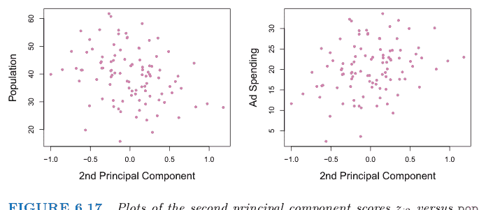

图 6.17. 第二主成分得分 $z_{i2}$ 与人口（pop）和广告（ad）的关系图。两者关系较弱。

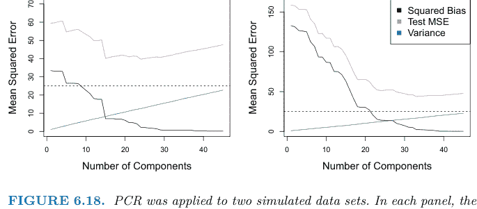

图 6.18. 对两个模拟数据集应用了主成分回归（PCR）。在每个子图中，水平虚线代表不可约误差。左图：来自图 6.8 的模拟数据。右图：来自图 6.9 的模拟数据。

$X_1, \dots, X_p$ 变异最大的方向就是与 $Y$ 相关的方向。虽然这个假设不一定总是成立，但它通常是一个足够合理的近似，能给出良好的结果。

如果主成分回归（PCR）所依据的假设成立，那么对 $Z_1, \dots, Z_M$ 拟合最小二乘模型将比对 $X_1, \dots, X_p$ 拟合得到更好的结果，因为数据中与响应变量相关的大部分或全部信息都包含在 $Z_1, \dots, Z_M$ 中，并且通过仅估计 $M \ll p$ 个系数，我们可以缓解过拟合问题。在广告数据中，第一主成分解释了人口（pop）和广告（ad）的大部分方差，因此，使用这个单一变量来预测某些感兴趣的响应（如销售额）的主成分回归，其表现可能相当好。

图 6.18 展示了在图 6.8 和图 6.9 的模拟数据集上的 PCR 拟合结果。回想一下，这两个数据集都是使用 $n = 50$ 个观测值和 $p = 45$ 个预测变量生成的。然而，第一个数据集中的响应是所有预测变量的函数，而第二个数据集中的响应仅使用了其中两个预测变量生成。曲线是作为 $M$（回归模型中用作预测变量的主成分数量）的函数绘制的。随着回归模型中使用的主成分增多

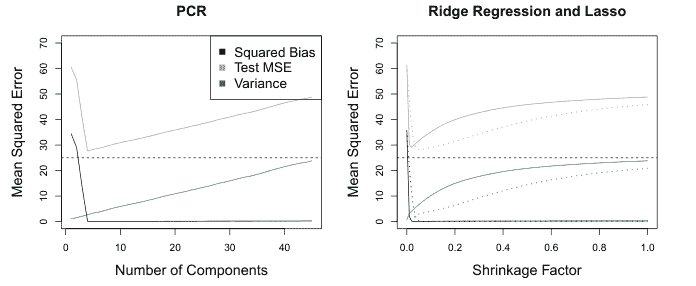

图 6.19. 对一个模拟数据集应用了主成分回归（PCR）、岭回归和 Lasso。该数据集中，X 的前五个主成分包含了关于响应变量 Y 的所有信息。在每个子图中，不可约误差 Var(ε) 显示为水平虚线。左图：PCR 的结果。右图：Lasso（实线）和岭回归（虚线）的结果。x 轴显示了系数估计的收缩因子，定义为收缩后系数估计的 ℓ₂ 范数除以最小二乘估计的 ℓ₂ 范数。

偏差减小，但方差增大。这导致均方误差呈现典型的 U 形曲线。当 $M = p = 45$ 时，PCR 就等同于使用所有原始预测变量进行最小二乘拟合。该图表明，通过适当选择 $M$ 进行 PCR，可以比最小二乘法得到显著的改进，尤其是在左侧子图中。然而，通过检查图 6.5、6.8 和 6.9 中的岭回归和 Lasso 结果，我们看到在这个例子中，PCR 的表现不如这两种收缩方法。

图 6.18 中 PCR 相对较差的表现，是由于数据生成方式使得需要许多主成分才能充分建模响应变量。相比之下，当少数几个主成分足以捕捉预测变量的大部分变异以及与响应变量的关系时，PCR 往往表现良好。图 6.19 的左侧子图展示了另一个模拟数据集的结果，该数据集的设计对 PCR 更有利。这里的响应变量生成方式使其完全依赖于前五个主成分。现在，随着 PCR 中使用的主成分数量 $M$ 的增加，偏差迅速降至零。均方误差在 $M = 5$ 时显示出明显的最小值。图 6.19 的右侧子图展示了在这些数据上使用岭回归和 Lasso 的结果。这三种方法都比最小二乘法有显著改进。然而，PCR 和岭回归略优于 Lasso。

我们注意到，尽管 PCR 提供了一种使用 $M < p$ 个预测变量进行回归的简单方法，但它不是一种特征选择方法。这是因为回归中使用的每个 $M$ 个主成分都是所有 $p$ 个原始特征的线性组合。例如，在 (6.19) 中，$Z_1$ 是人口（pop）和广告（ad）的线性组合。因此，虽然 PCR 在许多实际应用中表现相当好，但它并不会产生一个依赖于少量原始特征的模型。从这个意义上说，PCR 与岭回归的关系比与 Lasso 的关系更密切。事实上，可以证明 PCR 和岭回归密切相关。甚至可以将岭回归视为 PCR 的连续版本！^8

在 PCR 中，主成分的数量 $M$ 通常通过交叉验证来选择。将 PCR 应用于信用数据集（Credit data set）的结果如图 6.20 所示；右侧子图显示了作为 $M$ 函数的交叉验证误差。在这些数据上，最低的交叉验证误差出现在 $M = 10$ 个成分时；这几乎相当于没有进行降维，因为 $M = 11$ 的 PCR 等同于简单地执行最小二乘法。

执行 PCR 时，我们通常建议在生成主成分之前，使用 (6.6) 对每个预测变量进行标准化。这种标准化确保所有变量处于相同的尺度。如果不进行标准化，高方差变量往往会在获得的主成分中扮演更重要的角色，变量的测量尺度最终会影响最终的 PCR 模型。然而，如果所有变量都以相同的单位（例如，千克或英寸）测量，那么可以选择不对其进行标准化。

### 6.3.2 偏最小二乘法

我们刚才描述的 PCR 方法涉及识别最能代表预测变量 $X_1, \dots, X_p$ 的线性组合或方向。这些方向是以无监督的方式确定的，因为响应变量 $Y$ 没有被用来帮助确定主成分方向。也就是说，响应变量并不监督主成分的识别。因此，PCR 存在一个缺点：无法保证最能解释预测变量的方向也是用于预测响应变量的最佳方向。无监督方法将在第 12 章进一步讨论。

我们现在介绍 *偏最小二乘法* (PLS)，这是 PCR 的一种 *有监督* 替代方法。与 PCR 类似，PLS 是一种降维方法，它首先识别一组新的特征 $Z_1, \dots, Z_M$，这些特征是原始特征的线性组合，然后使用这 $M$ 个新特征通过最小二乘法拟合线性模型。但与 PCR 不同的是，PLS 以有监督的方式识别这些新特征——也就是说，它利用响应变量 $Y$ 来识别不仅能够很好地近似旧特征，而且 *与响应变量相关* 的新特征。粗略地说，PLS 方法试图找到既能帮助解释响应变量又能帮助解释预测变量的方向。

我们现在描述如何计算第一个 PLS 方向。在对 $p$ 个预测变量进行标准化后，PLS 通过将 (6.16) 中的每个 $\phi_{j1}$ 设置为 $Y$ 对 $X_j$ 进行简单线性回归的系数来计算第一个方向 $Z_1$。可以证明，该系数与 $Y$ 和 $X_j$ 之间的相关性成正比。因此，在计算 $Z_1 = \sum_{j=1}^p \phi_{j1} X_j$ 时，PLS 对与响应变量关系最强的变量赋予最高的权重。

图 6.21 展示了一个合成数据集上的 PLS 示例，该数据集中每个区域的销售额（Sales）作为响应变量，有两个预测变量：人口规模（Population Size）和广告支出（Advertising Spending）。实线绿色线表示第一个 PLS 方向，而虚线显示第一个主成分方向。与 PCA 相比，PLS 选择了一个在 *pop* 维度每单位变化时，在 *ad* 维度变化较小的方向。这表明 *pop* 与响应变量的相关性比 *ad* 更高。PLS 方向对预测变量的拟合不如 PCA 紧密，但它在解释响应变量方面做得更好。

为了识别第二个 PLS 方向，我们首先通过将每个变量对 $Z_1$ 进行回归并取 *残差* 来 *调整* 每个变量。这些残差可以解释为第一个 PLS 方向尚未解释的剩余信息。然后我们使用这些 *残差* 来计算 $Z_2$。

## 6.4 高维问题的考量

### 6.4.1 高维数据

大多数用于回归和分类的传统统计技术都适用于*低维*场景，即观测数量 $n$ 远大于特征数量 $p$。这部分是由于在该领域的大部分历史中，需要使用统计学的科学问题大多是低维的。例如，考虑开发一个模型，根据患者的年龄、性别和体重指数（BMI）来预测其血压。这里有三个预测变量，如果模型中包含截距项则为四个，而可能有数千名患者的血压以及年龄、性别和BMI数据可用。因此 $n \gg p$，所以这是一个低维问题。（这里的维度指的是 $p$ 的大小。）

在过去的20年里，新技术改变了金融、营销和医学等众多领域的数据收集方式。现在收集几乎无限数量的特征测量值（$p$ 非常大）已很常见。虽然 $p$ 可以非常大，但由于成本、样本可用性或其他因素，观测数量 $n$ 往往有限。以下是两个例子：

1.  与其仅根据年龄、性别和BMI来预测血压，人们可能还会收集五十万个*单核苷酸多态性*（SNPs；这些是人群中相对常见的单个DNA突变）的测量值，将其纳入预测模型。那么 $n \approx 200$，$p \approx 500,000$。
2.  一位对理解人们在线购物模式感兴趣的营销分析师，可以将搜索引擎用户输入的所有搜索词作为特征。这有时被称为“词袋”模型。同一位研究人员可能只能访问几百或几千名同意与研究人员共享其信息的搜索引擎用户的搜索历史。对于给定用户，$p$ 个搜索词中的每一个都被标记为存在（0）或不存在（1），从而创建一个大型二元特征向量。那么 $n \approx 1,000$，而 $p$ 则大得多。

特征多于观测的数据集通常被称为*高维*数据集。经典方法如最小二乘线性回归在此场景下并不适用。本书前面已经讨论了高维数据分析中出现的许多问题，因为它们同样适用于 $n > p$ 的情况：这些问题包括偏差-方差权衡的作用以及过拟合的危险。尽管这些问题总是相关的，但当特征数量相对于观测数量非常大时，它们会变得尤为重要。

我们将*高维场景*定义为特征数量 $p$ 大于观测数量 $n$ 的情况。但我们即将讨论的考量当然也适用于 $p$ 略小于 $n$ 的情况，并且在进行监督学习时最好始终牢记这些考量。

### 6.4.2 高维情况下会出什么问题？

为了说明当 $p > n$ 时，回归和分类需要额外的谨慎和专门技术，我们首先考察如果应用一种并非为高维场景设计的统计技术可能会出什么问题。为此，我们考察最小二乘回归。但同样的概念也适用于逻辑回归、线性判别分析和其他经典统计方法。

当特征数量 $p$ 与观测数量 $n$ 相当或更大时，第3章描述的最小二乘法无法（或者更准确地说，*不应该*）执行。原因很简单：无论特征和响应之间是否真的存在关系，最小二乘法都会产生一组系数估计值，从而完美拟合数据，使得残差为零。

图6.22展示了一个例子，其中 $p = 1$ 个特征（加上一个截距项），分两种情况：有20个观测时，以及只有两个观测时。当有20个观测时，$n > p$，最小二乘回归线不能完美拟合数据；相反，回归线试图尽可能好地近似这20个观测。另一方面，当只有两个观测时，无论这些观测的值是多少，回归线都将精确拟合数据。这是有问题的，因为这种完美拟合几乎肯定会导致数据的过拟合。换句话说，尽管在高维场景下可以完美拟合训练数据，但由此产生的线性模型在独立的测试集上表现会极其糟糕，因此不构成一个有用的模型。事实上，我们可以从图6.22中看到这一点：右侧面板中获得的最小二乘线在由左侧观测组成的测试集上表现会非常差。问题很简单：当 $p > n$ 或 $p \approx n$ 时，简单的最小二乘回归线过于*灵活*，因此会过拟合数据。

图6.23进一步说明了当特征数量 $p$ 很大时，不加注意地应用最小二乘法的风险。模拟了 $n = 20$ 个观测的数据，并使用1到20个特征进行回归，每个特征都与响应完全无关。如图所示，随着模型中包含的特征数量增加，模型的 R² 增加到1，相应地，训练集的均方误差（MSE）减少到0，即使这些特征与响应完全无关。另一方面，随着模型中包含的特征数量增加，独立测试集上的MSE变得极大，因为包含额外的预测变量会导致系数估计的方差大幅增加。观察测试集MSE，很明显最佳模型最多只包含几个变量。然而，如果有人不加注意地只检查 R² 或训练集MSE，可能会错误地得出变量最多的模型是最好的结论。这表明在分析具有大量变量的数据集时，应用额外的谨慎以及始终在独立测试集上评估模型性能的重要性。

264 6. 线性模型选择与正则化

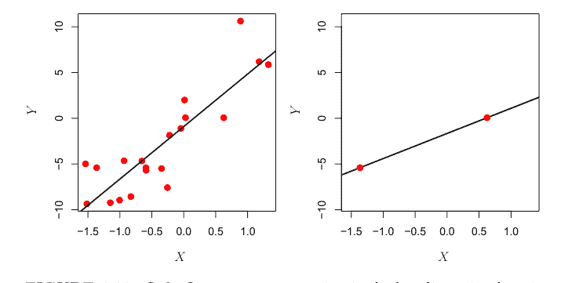

图6.22。左：低维场景下的最小二乘回归。右：n = 2个观测和两个待估参数（一个截距和一个系数）的最小二乘回归。

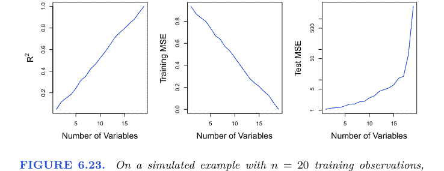

图6.23。在一个模拟示例中，n = 20个训练观测，将与结果完全无关的特征添加到模型中。左：随着包含更多特征，R² 增加到1。中：随着包含更多特征，训练集MSE减少到0。右：随着包含更多特征，测试集MSE增加。

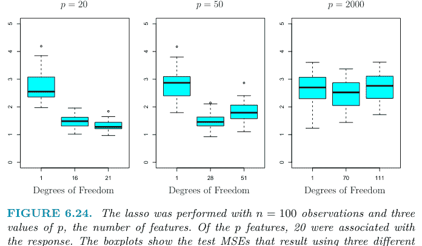

**图 6.24.** Lasso 回归在 $n = 100$ 个观测值和三个不同的特征数 $p$ 下进行。在 $p$ 个特征中，有 20 个与响应变量相关。箱线图展示了使用公式 (6.7) 中三个不同调节参数 $\lambda$ 值所得到的测试均方误差。为便于解释，这里报告的是自由度而非 $\lambda$ 值；对于 Lasso 而言，这恰好等于估计出的非零系数的数量。当 $p = 20$ 时，最小的正则化量得到了最低的测试均方误差。当 $p = 50$ 时，较大的正则化量实现了最低的测试均方误差。当 $p = 2,000$ 时，无论正则化量如何，Lasso 的表现都很差，这是因为 2,000 个特征中只有 20 个真正与结果相关。

在 6.1.3 节中，我们看到了多种调整训练集 RSS 或 $R^2$ 的方法，以考虑用于拟合最小二乘模型的变量数量。不幸的是，$C_p$、AIC 和 BIC 方法在高维设置下并不适用，因为估计 $\sigma^2$ 存在问题。（例如，第 3 章中 $\hat{\sigma}^2$ 的公式在此设置下会得到 $\hat{\sigma}^2 = 0$ 的估计值。）同样，在高维设置下应用调整 $R^2$ 也会出现问题，因为很容易就能得到一个调整 $R^2$ 值为 1 的模型。显然，需要更适合高维设置的替代方法。

## 6.4.3 高维回归

事实证明，本章中用于拟合*灵活性较低*的最小二乘模型的许多方法，如前向逐步选择、岭回归、Lasso 和主成分回归，在高维设置下进行回归时特别有用。本质上，这些方法通过使用比最小二乘法灵活性更低的拟合方法来避免过拟合。

图 6.24 展示了 Lasso 在一个简单模拟示例中的表现。该示例有 $p = 20$、50 或 2,000 个特征，其中 20 个真正与结果相关。Lasso 在 $n = 100$ 个训练观测值上进行，并在独立的测试集上评估均方误差。随着特征数量的增加，测试集误差也随之增加。当 $p = 20$ 时，当公式 (6.7) 中的 $\lambda$ 较小时，验证集误差最低；然而，当 $p$ 较大时，使用较大的 $\lambda$ 值才能达到最低的验证集误差。在每个箱线图中，显示的是所得 Lasso 解的*自由度*，而非所使用的 $\lambda$ 值；这恰好是 Lasso 解中非零系数估计的数量，是 Lasso 拟合灵活性的一种度量。图 6.24 突出了三个要点：（1）正则化或收缩在高维问题中起着关键作用，（2）选择合适的调节参数对于良好的预测性能至关重要，（3）除非额外的特征确实与响应变量相关，否则测试误差往往会随着问题维度（即特征或预测变量的数量）的增加而增加。

上述第三点实际上是高维数据分析中的一个关键原则，被称为*维度灾难*。人们可能认为，随着用于拟合模型的特征数量增加，拟合模型的质量也会提高。然而，比较图 6.24 中的左侧面板和右侧面板，我们发现情况并非总是如此：在此示例中，当 $p$ 从 20 增加到 2,000 时，测试集均方误差几乎翻了一番。一般来说，*添加真正与响应变量相关的额外信号特征将改善拟合模型*，即导致测试集误差的降低。然而，添加与响应变量不相关的噪声特征将导致拟合模型的恶化，从而增加测试集误差。这是因为噪声特征增加了问题的维度，加剧了过拟合的风险（因为噪声特征可能由于与训练集上的响应变量存在偶然关联而被赋予非零系数），而在改善测试集误差方面没有任何潜在的好处。因此，我们看到，允许收集数千或数百万个特征测量值的新技术是一把双刃剑：如果这些特征确实与手头的问题相关，它们可以带来改进的预测模型；但如果特征不相关，则会导致更差的结果。即使它们相关，拟合其系数所引入的方差也可能超过它们带来的偏差减少。

维度灾难

## 6.4.4 高维结果的解释

当我们在高维设置下执行 Lasso、岭回归或其他回归程序时，必须非常谨慎地报告所得结果。在第 3 章中，我们了解了*多重共线性*的概念，即回归中的变量可能彼此相关。在高维设置下，多重共线性问题极其严重：模型中的任何变量都可以写成模型中所有其他变量的线性组合。本质上，这意味着我们永远无法确切知道哪些变量（如果有的话）真正具有预测结果的能力，我们也永远无法确定用于回归的*最佳*系数。我们最多只能希望将较大的回归系数分配给那些与真正具有预测能力的变量相关的变量。

例如，假设我们试图根据 50 万个 SNP 来预测血压，并且前向逐步选择表明其中 17 个 SNP 在训练数据上能产生一个良好的预测模型。如果得出结论认为这 17 个 SNP 比模型中未包含的其他 SNP 更有效地预测血压，那将是不正确的。很可能存在许多组 17 个 SNP，它们预测血压的效果与所选模型一样好。如果我们获得一个独立的数据集并在该数据集上执行前向逐步选择，我们很可能会得到一个包含不同、甚至可能完全不重叠的 SNP 集合的模型。这并不减损所得模型的价值——例如，该模型可能在预测独立患者群体的血压方面非常有效，并且可能对医生具有临床实用性。但我们必须小心，不要夸大所得结果，并明确指出我们所识别的仅仅是预测血压的*众多可能模型之一*，并且必须在独立的数据集上进行进一步验证。

在高维设置下报告误差和模型拟合度量时，也需要特别谨慎。我们已经看到，当 $p > n$ 时，很容易得到一个残差为零的无用模型。因此，在高维设置下，*绝不*应使用平方误差和、p 值、$R^2$ 统计量或其他传统的训练数据模型拟合度量作为模型拟合良好的证据。例如，正如我们在图 6.23 中看到的，当 $p > n$ 时，很容易就能得到一个 $R^2 = 1$ 的模型。报告这一事实可能会误导他人，让他们认为已经获得了一个统计上有效且有用的模型，而实际上这完全没有提供令人信服的模型证据。重要的是要报告独立测试集上的结果，或交叉验证误差。例如，独立测试集上的 MSE 或 $R^2$ 是模型拟合的有效度量，但训练集上的 MSE 则肯定不是。

## 6.5 实验室：线性模型与正则化方法

在本实验室中，我们实现了本章讨论的许多技术。我们在顶层导入一些库。

```python
import numpy as np
import pandas as pd
from matplotlib.pyplot import subplots
from statsmodels.api import OLS
import sklearn.model_selection as skm
import sklearn.linear_model as skl
from sklearn.preprocessing import StandardScaler
from ISLP import load_data
from ISLP.models import ModelSpec as MS
from functools import partial
```

我们再次收集本实验室所需的新导入。

```python
from sklearn.pipeline import Pipeline
from sklearn.decomposition import PCA
```

from sklearn.cross_decomposition import PLSRegression
from ISLP.models import \
    (Stepwise,
     sklearn_selected,
     sklearn_selection_path)
!pip install l0bnb
from l0bnb import fit_path

我们已即时安装了 `l0bnb` 包。注意转义的 `!pip install` —— 这是作为单独的系统命令运行的。

## 6.5.1 子集选择方法

这里我们实现通过将模型限制为输入变量子集来减少模型中参数数量的方法。

### 前向选择

我们将对 `Hitters` 数据应用前向选择方法。我们希望根据与前一年表现相关的各种统计数据来预测棒球运动员的 `Salary`。

首先，我们注意到 `Salary` 变量在某些运动员中缺失。`np.isnan()` 函数可用于识别缺失的观测值。它返回一个与输入向量形状相同的数组，对于任何缺失的元素为 `True`，对于非缺失元素为 `False`。然后可以使用 `sum()` 方法来计算所有缺失的元素。

```
In [3]: Hitters = load_data('Hitters')
       np.isnan(Hitters['Salary']).sum()
```

Out[3]: 59

我们看到有 59 名运动员的 `Salary` 缺失。数据框的 `dropna()` 方法会删除所有在任何变量中具有缺失值的行（默认情况下——参见 `Hitters.dropna?`）。

```
In [4]: Hitters = Hitters.dropna();
       Hitters.shape
```

Out[4]: (263, 20)

我们首先使用基于 $C_p$ (6.2) 的前向选择来选择最佳模型。该分数并未作为 `sklearn` 的内置指标。因此，我们定义一个函数来自己计算它，并将其用作评分器。默认情况下，`sklearn` 试图最大化分数，因此我们的评分函数计算负 $C_p$ 统计量。

```
In [5]: def nCp(sigma2, estimator, X, Y):
           "Negative Cp statistic"
           n, p = X.shape
           Yhat = estimator.predict(X)
           RSS = np.sum((Y - Yhat)**2)
           return -(RSS + 2 * p * sigma2) / n
```

我们需要估计残差方差 $\sigma^2$，这是上面评分函数中的第一个参数。我们将拟合最大的模型，使用所有变量，并基于其 MSE 估计 $\sigma^2$。

```
design = MS(Hitters.columns.drop('Salary')).fit(Hitters)
Y = np.array(Hitters['Salary'])
X = design.transform(Hitters)
sigma2 = OLS(Y,X).fit().scale
```

函数 `sklearn_selected()` 期望一个只有三个参数的评分器——即上面 `nCp()` 定义中的最后三个参数。我们使用在第 5.3.3 节首次见到的 `partial()` 函数，用我们对 $\sigma^2$ 的估计值来冻结第一个参数。

```
neg_Cp = partial(nCp, sigma2)
```

我们现在可以使用 `neg_Cp()` 作为模型选择的评分器。
除了分数，我们还需要指定搜索策略。这是通过 `ISLP.models` 包中的 `Stepwise()` 对象完成的。`Stepwise.first_peak()` 方法运行前向逐步法，直到模型的任何进一步添加都不会导致评估分数的改善。类似地，`Stepwise.fixed_steps()` 方法运行固定步数的逐步搜索。

```
strategy = Stepwise.first_peak(design,
                              direction='forward',
                              max_terms=len(design.terms))
```

我们现在使用前向选择来拟合一个以 `Salary` 为结果的线性回归模型。为此，我们使用 `ISLP.models` 包中的 `sklearn_selected()` 函数。它接受来自 `statsmodels` 的模型以及搜索策略，并使用其 `fit` 方法选择一个模型。在不指定 `scoring` 参数的情况下，分数默认为 MSE，因此所有 19 个变量都将被选择（输出未显示）。

```
hitters_MSE = sklearn_selected(OLS,
                              strategy)
hitters_MSE.fit(Hitters, Y)
hitters_MSE.selected_state_
```

使用 `neg_Cp` 会产生一个更小的模型，正如预期的那样，只选择了 10 个变量。

```
hitters_Cp = sklearn_selected(OLS,
                             strategy,
                             scoring=neg_Cp)
hitters_Cp.fit(Hitters, Y)
hitters_Cp.selected_state_
```

```
('Assists',
 'AtBat',
 'CAtBat',
 'CRBI',
 'CRuns',
 'CWalks',
 'Division',
 'Hits',
 'PutOuts',
 'Walks')
```

### 使用验证集方法和交叉验证在模型中进行选择

作为使用 $C_p$ 的替代方案，我们可能会尝试交叉验证来在前向选择中选择模型。为此，我们需要一种方法来存储在前向选择中找到的完整模型路径，并允许对每个模型进行预测。这可以使用 `ISLP.models` 中的 `sklearn_selection_path()` 估计器来完成。`ISLP.models` 中的 `cross_val_predict()` 函数计算路径上每个模型的交叉验证预测，我们可以用它来评估路径上的交叉验证 MSE。

这里我们定义一个策略来拟合完整的前向选择路径。虽然 `sklearn_selection_path()` 有各种参数选择，但这里我们使用默认值，它基于 RSS 的最大减少在每一步选择模型。

```
In [11]: strategy = Stepwise.fixed_steps(design,
                                        len(design.terms),
                                        direction='forward')
        full_path = sklearn_selection_path(OLS, strategy)
```

我们现在在 `Hitters` 数据上拟合完整的前向选择路径并计算拟合值。

```
In [12]: full_path.fit(Hitters, Y)
        Yhat_in = full_path.predict(Hitters)
        Yhat_in.shape
```

Out[12]: (263, 20)

这为我们提供了一个拟合值数组——总共 20 步，包括空模型的拟合均值——我们可以用它来评估样本内 MSE。正如预期的那样，样本内 MSE 在我们采取的每一步都会改善，这表明我们必须使用验证或交叉验证方法来选择步数。我们将 y 轴固定在 50,000 到 250,000 的范围内，以便与下面的交叉验证和验证集 MSE 以及其他方法（如岭回归、lasso 和主成分回归）进行比较。

```
In [13]: mse_fig, ax = subplots(figsize=(8,8))
        insample_mse = ((Yhat_in - Y[:,None])**2).mean(0)
        n_steps = insample_mse.shape[0]
        ax.plot(np.arange(n_steps),
                insample_mse,
                'k', # color black
                label='In-sample')
        ax.set_ylabel('MSE',
                      fontsize=20)
        ax.set_xlabel('# steps of forward stepwise',
                      fontsize=20)
        ax.set_xticks(np.arange(n_steps)[::2])
        ax.legend()
        ax.set_ylim([50000,250000]);
```

注意上面 `Y[:,None]` 中的表达式 `None`。这为一维数组 `Y` 添加了一个轴（维度），使其在与二维的 `Yhat_in` 相减时可以被循环使用。

我们现在准备使用交叉验证来估计模型路径上的测试误差。我们必须*仅使用训练观测值*来执行模型拟合的所有方面——包括变量选择。因此，确定给定大小的最佳模型必须使用每个训练折叠中的*仅训练观测值*来完成。这一点很微妙但很重要。如果使用完整数据集在每一步选择最佳子集，那么我们获得的验证集误差和交叉验证误差将不是测试误差的准确估计。

我们现在使用 5 折交叉验证来计算交叉验证预测值。

```
K = 5
kfold = skm.KFold(K,
                  random_state=0,
                  shuffle=True)
Yhat_cv = skm.cross_val_predict(full_path,
                                Hitters,
                                Y,
                                cv=kfold)
Yhat_cv.shape
```

Out[14]: (263, 20)

预测矩阵 `Yhat_cv` 与 `Yhat_in` 形状相同；区别在于，对应于特定样本索引的每一行中的预测，是由不包含该行的训练折叠拟合的模型做出的。

在路径上的每个模型处，我们计算每个交叉验证折叠中的 MSE。我们将对这些值取平均以获得平均 MSE，也可以使用单个值来计算均值标准误差的粗略估计。⁹ 因此，我们必须知道每个交叉验证分割的测试索引。这可以通过使用 `kfold` 的 `split()` 方法来找到。因为我们在上面固定了随机状态，所以当我们用与 `Y` 相同行数的任何数组进行分割时，我们都会恢复相同的训练和测试索引，尽管我们下面只是忽略了训练索引。

```
cv_mse = []
for train_idx, test_idx in kfold.split(Y):
    errors = (Yhat_cv[test_idx] - Y[test_idx,None])**2
    cv_mse.append(errors.mean(0)) # column means
cv_mse = np.array(cv_mse).T
cv_mse.shape
```

Out[15]: (20, 5)

⁹ 该估计是粗略的，因为五个误差估计基于重叠的训练集，因此不是独立的。

## 6. 线性模型选择与正则化

我们现在将交叉验证误差估计添加到我们的均方误差图中。我们包含了五折交叉验证的平均误差以及均值的标准误差估计。

```python
ax.errorbar(np.arange(n_steps),
            cv_mse.mean(1),
            cv_mse.std(1) / np.sqrt(K),
            label='Cross-validated',
            c='r') # color red
ax.set_ylim([50000,250000])
ax.legend()
mse_fig
```

要使用验证集方法重复上述过程，我们只需将交叉验证参数更改为验证集：将数据随机划分为测试集和训练集。我们选择20%的测试集大小，这与5折交叉验证中每个测试集的大小相似。

```python
validation = skm.ShuffleSplit(n_splits=1,
                            test_size=0.2,
                            random_state=0)
for train_idx, test_idx in validation.split(Y):
    full_path.fit(Hitters.iloc[train_idx],
                  Y[train_idx])
    Yhat_val = full_path.predict(Hitters.iloc[test_idx])
    errors = (Yhat_val - Y[test_idx,None])**2
    validation_mse = errors.mean(0)
```

与样本内均方误差的情况一样，验证集方法不提供标准误差。

```python
ax.plot(np.arange(n_steps),
        validation_mse,
        'b--', # color blue, broken line
        label='Validation')
ax.set_xticks(np.arange(n_steps)[::2])
ax.set_ylim([50000,250000])
ax.legend()
mse_fig
```

## 最优子集选择

前向逐步选择是一种贪心选择过程；在每一步，它通过添加一个额外的变量来扩充当前集合。我们现在将最优子集选择应用于Hitters数据，该方法针对每个子集大小，搜索最佳的预测变量组合。

我们将使用一个名为`l1bnb`的包来执行最优子集选择。该包不是将子集约束为给定大小，而是使用子集大小作为惩罚项（而非约束）来生成一系列解。尽管区别很微妙，但差异会在我们进行交叉验证时显现。

```python
D = design.fit_transform(Hitters)
D = D.drop('intercept', axis=1)
X = np.asarray(D)
```

这里我们排除了对应于截距的第一列，因为`l1bnb`会单独拟合截距。我们可以使用`fit_path()`函数找到一条路径。

```python
In [20]: path = fit_path(X,
                  Y,
                  max_nonzeros=X.shape[1])
```

函数`fit_path()`返回一个列表，其值包括拟合系数`B`、截距`B0`，以及与所使用的特定路径算法相关的其他一些属性。这些细节超出了本书的范围。

```python
In [21]: path[3]
```

```python
Out[21]: {'B': array([0.        , 3.254844, 0.        , 0.        , 0.        ,
       0.        , 0.        , 0.        , 0.        , 0.        ,
       0.        , 0.677753 , 0.        , 0.        , 0.        ,
       0.        , 0.        , 0.        , 0.        ]),
 'B0': -38.98216739555494,
 'lambda_0': 0.011416248027450194,
 'M': 0.5829861733382011,
 'Time_exceeded': False}
```

在上面的例子中，我们看到在路径的第四步，`B`中有两个非零系数，对应于惩罚参数`lambda_0`的值为0.114。我们可以使用这一系列拟合在验证集上进行预测，作为`lambda_0`的函数，或者通过更多工作使用交叉验证。

## 6.5.2 岭回归与Lasso

我们将使用`sklearn.linear_model`包（下文我们使用`skl`作为简写）在`Hitters`数据上拟合岭回归和Lasso正则化线性模型。我们从上一节关于最优子集回归中计算的模型矩阵`X`（不含截距）开始。

## 岭回归

我们将使用函数`skl.ElasticNet()`来拟合岭回归和Lasso。要拟合岭回归模型的*路径*，我们使用`skl.ElasticNet.path()`，它可以拟合岭回归、Lasso以及混合模型；岭回归对应于`l1_ratio=0`。在这些应用中，如果变量以不同单位测量，对`X`的列进行标准化是一个好习惯。由于`skl.ElasticNet()`不进行归一化，我们必须自己处理。因为我们先进行标准化，为了在原始尺度上找到系数估计，我们必须*反标准化*系数估计。公式(6.5)和(6.7)中的参数$\lambda$在`sklearn`中称为`alphas`。为了与本章其余部分保持一致，我们在下文中使用`lambdas`而不是`alphas`。$^{10}$

$^{10}$ 在出版时，像代码块[22]中的岭回归拟合会发出不必要的收敛警告信息；我们预计随着该包的成熟，这些信息会消失。

```python
In [22]: Xs = X - X.mean(0)[None,:]
X_scale = X.std(0)
Xs = Xs / X_scale[None,:]
lambdas = 10**np.linspace(8, -2, 100) / Y.std()
soln_array = skl.ElasticNet.path(Xs,
                                Y,
                                l1_ratio=0.,
                                alphas=lambdas)[1]
soln_array.shape
```

```python
Out[22]: (19, 100)
```

这里我们提取了沿正则化路径的解对应的系数数组。默认情况下，`skl.ElasticNet.path`方法沿自动选择的$\lambda$值范围拟合路径，除了`l1_ratio=0`的情况，这会导致岭回归（如此处所示）。$^{11}$ 因此，这里我们选择在$\lambda$值从$\lambda = 10^8$到$\lambda = 10^{-2}$的网格上实现该函数，并按$y$的标准差缩放，本质上覆盖了从仅包含截距的零模型到最小二乘拟合的全部场景。

与每个$\lambda$值相关联的是一个岭回归系数向量，可以通过`soln_array`的一列来访问。在这种情况下，`soln_array`是一个$19 \times 100$的矩阵，有19行（每个预测变量一行）和100列（每个$\lambda$值一列）。

我们转置这个矩阵并将其转换为数据框，以便于查看和绘图。

```python
In [23]: soln_path = pd.DataFrame(soln_array.T,
                            columns=D.columns,
                            index=-np.log(lambdas))
soln_path.index.name = 'negative log(lambda)'
soln_path
```

```python
Out[23]:
AtBat Hits HmRun Runs ...
negative
log(lambda)
-12.310855 0.000800 0.000889 0.000695 0.000851 ...
-12.078271 0.001010 0.001122 0.000878 0.001074 ...
-11.845686 0.001274 0.001416 0.001107 0.001355 ...
-11.613102 0.001608 0.001787 0.001397 0.001710 ...
-11.380518 0.002029 0.002255 0.001763 0.002158 ...
... ... ... ... ... ...
100 rows × 19 columns
```

我们绘制路径以了解系数如何随$\lambda$变化。为了控制图例的位置，我们首先在绘图方法中将`legend`设置为`False`，然后使用`ax`的`legend()`方法添加它。

```python
In [24]: path_fig, ax = subplots(figsize=(8,8))
soln_path.plot(ax=ax, legend=False)
ax.set_xlabel('$-\log(\lambda)$', fontsize=20)
```

$^{11}$ 原因相当技术性；对于除岭回归外的所有模型，我们可以找到使所有系数为零的最小$\lambda$值。对于岭回归，这个值是$\infty$。

```python
ax.set_ylabel('Standardized coefficients', fontsize=20)
ax.legend(loc='upper left');
```

（我们在水平标签中使用了`latex`格式，以便正确格式化希腊字母$\lambda$。）我们预期当使用较大的$\lambda$值时，系数估计的$\ell_2$范数会比使用较小的$\lambda$值时小得多。（回想一下，$\ell_2$范数是系数值平方和的平方根。）我们显示第40步的系数，此时$\lambda$为25.535。

```python
beta_hat = soln_path.loc[soln_path.index[39]]
lambdas[39], beta_hat
```

```python
(25.535,
 AtBat          5.433750
 Hits           6.223582
 HmRun          4.585498
 Runs           5.880855
 RBI            6.195921
 Walks          6.277975
 Years          5.299767
 ...            ...)
```

让我们计算标准化系数的$\ell_2$范数。

```python
np.linalg.norm(beta_hat)
```

```python
24.17
```

相比之下，当$\lambda$为2.44e-01时，$\ell_2$范数如下。注意与这个较小$\lambda$值相关的系数具有大得多的$\ell_2$范数。

```python
beta_hat = soln_path.loc[soln_path.index[59]]
lambdas[59], np.linalg.norm(beta_hat)
```

```python
(0.2437, 160.4237)
```

上面我们预先对`X`进行了标准化，并使用`Xs`拟合了岭模型。`sklearn`中的`Pipeline()`对象提供了一种清晰的方法，将特征标准化与岭模型本身的拟合分开。

```python
ridge = skl.ElasticNet(alpha=lambdas[59], l1_ratio=0)
scaler = StandardScaler(with_mean=True, with_std=True)
pipe = Pipeline(steps=[('scaler', scaler), ('ridge', ridge)])
pipe.fit(X, Y)
```

我们证明它给出了与我们之前在标准化数据上拟合相同的$\ell_2$范数。

```python
np.linalg.norm(ridge.coef_)
```

```python
160.4237
```

请注意，上面的操作`pipe.fit(X, Y)`已经改变了`ridge`对象，特别是添加了之前没有的属性，如`coef_`。

## 6. 线性模型选择与正则化

### 估计岭回归的测试误差

为岭回归选择一个*先验*的 $\lambda$ 值即使不是不可能，也是非常困难的。我们将需要使用验证法或交叉验证来选择调谐参数。读者可能不会惊讶，`Pipeline()` 方法可以在 `skm.cross_validate()` 中与验证法（即 `validation`）或 $k$ 折交叉验证一起使用。
我们固定分割器的随机状态，以便获得的结果可以重现。

```python
validation = skm.ShuffleSplit(n_splits=1,
                            test_size=0.5,
                            random_state=0)
ridge.alpha = 0.01
results = skm.cross_validate(ridge,
                            X,
                            Y,
                            scoring='neg_mean_squared_error',
                            cv=validation)
-results['test_score']
```

Out[30]: array([134214.0])
测试均方误差为 1.342e+05。注意，如果我们改为简单地拟合一个只有截距的模型，我们将使用训练观测值的均值来预测每个测试观测值。我们可以通过拟合一个具有*非常*大的 $\lambda$ 值的岭回归模型来获得相同的结果。注意 `1e10` 表示 $10^{10}$。

```python
ridge.alpha = 1e10
results = skm.cross_validate(ridge,
                            X,
                            Y,
                            scoring='neg_mean_squared_error',
                            cv=validation)
-results['test_score']
```

Out[31]: array([231788.32])
显然，选择 $\lambda = 0.01$ 是武断的，因此我们将使用交叉验证或验证集法来选择调谐参数 $\lambda$。对象 `GridSearchCV()` 允许进行穷举网格搜索来选择这样的参数。
我们首先使用验证集法来选择 $\lambda$。

```python
param_grid = {'ridge__alpha': lambdas}
grid = skm.GridSearchCV(pipe,
                       param_grid,
                       cv=validation,
                       scoring='neg_mean_squared_error')
grid.fit(X, Y)
grid.best_params_['ridge__alpha']
grid.best_estimator_
```

Out[32]: Pipeline(steps=[('scaler', StandardScaler()),
                    ('ridge', ElasticNet(alpha=0.005899, l1_ratio=0))])

或者，我们可以使用 5 折交叉验证。

```python
grid = skm.GridSearchCV(pipe,
                       param_grid,
                       cv=kfold,
                       scoring='neg_mean_squared_error')
grid.fit(X, Y)
grid.best_params_['ridge__alpha']
grid.best_estimator_
```

回想一下，我们在第 271 页设置了用于 5 折交叉验证的 `kfold` 对象。我们现在绘制交叉验证的均方误差作为 $-\log(\lambda)$ 的函数，其中收缩程度从左到右递减。

```python
ridge_fig, ax = subplots(figsize=(8,8))
ax.errorbar(-np.log(lambdas),
            -grid.cv_results_['mean_test_score'],
            yerr=grid.cv_results_['std_test_score'] / np.sqrt(K))
ax.set_ylim([50000,250000])
ax.set_xlabel('$-\log(\lambda)$', fontsize=20)
ax.set_ylabel('Cross-validated MSE', fontsize=20);
```

可以交叉验证不同的指标来选择参数。`skl.ElasticNet()` 的默认指标是测试 $R^2$。让我们在这里比较交叉验证的 $R^2$ 和均方误差。

```python
grid_r2 = skm.GridSearchCV(pipe,
                          param_grid,
                          cv=kfold)
grid_r2.fit(X, Y)
```

最后，让我们绘制交叉验证 $R^2$ 的结果。

```python
r2_fig, ax = subplots(figsize=(8,8))
ax.errorbar(-np.log(lambdas),
            grid_r2.cv_results_['mean_test_score'],
            yerr=grid_r2.cv_results_['std_test_score'] / np.sqrt(K)
            )
ax.set_xlabel('$-\log(\lambda)$', fontsize=20)
ax.set_ylabel('Cross-validated $R^2$', fontsize=20);
```

### 解路径的快速交叉验证

岭回归、lasso 和弹性网可以沿着一系列 $\lambda$ 值高效地拟合，创建所谓的*解路径*或*正则化路径*。因此，有专门的代码来拟合这样的路径，并使用交叉验证选择合适的 $\lambda$ 值。即使使用相同的分割，结果也不会与我们上面的 `grid` *完全*一致，因为在 `grid` 中每个特征的标准化是在每一折上进行的，而在下面的 `pipeCV` 中只进行一次。尽管如此，结果是相似的，因为归一化在各折之间相对稳定。

```python
ridgeCV = skl.ElasticNetCV(alphas=lambdas,
                          l1_ratio=0,
                          cv=kfold)
pipeCV = Pipeline(steps=[('scaler', scaler),
                         ('ridge', ridgeCV)])
pipeCV.fit(X, Y)
```

让我们再次绘制交叉验证误差图，以查看它与使用 `skm.GridSearchCV` 的结果相似。

```python
tuned_ridge = pipeCV.named_steps['ridge']
ridgeCV_fig, ax = subplots(figsize=(8,8))
ax.errorbar(-np.log(lambdas),
            tuned_ridge.mse_path_.mean(1),
            yerr=tuned_ridge.mse_path_.std(1) / np.sqrt(K))
ax.axvline(-np.log(tuned_ridge.alpha_), c='k', ls='--')
ax.set_ylim([50000,250000])
ax.set_xlabel('$-\log(\lambda)$', fontsize=20)
ax.set_ylabel('Cross-validated MSE', fontsize=20);
```

我们看到，导致最小交叉验证误差的 $\lambda$ 值是 1.19e-02，可通过 `tuned_ridge.alpha_` 的值获得。与此 $\lambda$ 值相关的测试均方误差是多少？

```python
np.min(tuned_ridge.mse_path_.mean(1))
```

这代表了比我们使用 $\lambda = 4$ 得到的测试均方误差的进一步改进。最后，`tuned_ridge.coef_` 包含在此 $\lambda$ 值下在整个数据集上拟合的系数。

```python
tuned_ridge.coef_
```

正如预期的那样，没有一个系数为零——岭回归不执行变量选择！

### 评估交叉验证岭回归的测试误差

使用交叉验证选择 $\lambda$ 提供了一个单一的回归估计器，类似于我们在第 3 章看到的拟合线性回归模型。因此，估计其测试误差是合理的。我们在这里遇到一个问题，即交叉验证在选择 $\lambda$ 时已经*接触*了所有数据，因此我们没有更多的数据来估计测试误差。一个折衷方案是将数据初始分割为两个不相交的集合：训练集和测试集。然后我们在训练集上拟合一个交叉验证调谐的岭回归，并在测试集上评估其性能。我们可以称之为嵌套在验证集法中的交叉验证。先验地，没有理由在验证中将一半的数据用于两个集合中的每一个。下面，我们使用 75% 用于训练，25% 用于测试，估计器是使用 5 折交叉验证调谐的岭回归。这可以通过以下代码实现：

```python
outer_valid = skm.ShuffleSplit(n_splits=1,
                               test_size=0.25,
                               random_state=1)
inner_cv = skm.KFold(n_splits=5,
                     shuffle=True,
                     random_state=2)
ridgeCV = skl.ElasticNetCV(alphas=lambdas,
                           l1_ratio=0,
                           cv=inner_cv)
pipeCV = Pipeline(steps=[('scaler', scaler),
                         ('ridge', ridgeCV)]);
```

```python
results = skm.cross_validate(pipeCV,
                            X,
                            Y,
                            cv=outer_valid,
                            scoring='neg_mean_squared_error')
-results['test_score']
```

Out[42]: array([132393.84])

### Lasso

我们看到，通过明智地选择 $\lambda$，岭回归在 Hitters 数据集上可以优于最小二乘法以及零模型。我们现在要问，lasso 是否能产生比岭回归更准确或更易于解释的模型。为了拟合 lasso 模型，我们再次使用 ElasticNetCV() 函数；然而，这次我们使用参数 l1_ratio=1。除了这个变化，我们进行的步骤与拟合岭模型时相同。

```python
lassoCV = skl.ElasticNetCV(n_alphas=100,
                           l1_ratio=1,
                           cv=kfold)
pipeCV = Pipeline(steps=[('scaler', scaler),
                         ('lasso', lassoCV)])
pipeCV.fit(X, Y)
tuned_lasso = pipeCV.named_steps['lasso']
tuned_lasso.alpha_
```

Out[43]: 3.147

```python
lambdas, soln_array = skl.Lasso.path(Xs,
                                    Y,
                                    l1_ratio=1,
                                    n_alphas=100)[:2]
soln_path = pd.DataFrame(soln_array.T,
                         columns=D.columns,
                         index=-np.log(lambdas))
```

从标准化系数的系数图中，我们可以看到，根据调谐参数的选择，一些系数将恰好等于零。

## 6.5.3 PCR 与 PLS 回归

### 主成分回归

主成分回归（PCR）可以使用 `sklearn.decomposition` 模块中的 `PCA()` 来执行。我们现在将 PCR 应用于 `Hitters` 数据，以预测 `Salary`。同样，请确保数据中的缺失值已被移除，如第 6.5.1 节所述。

我们在此使用 `LinearRegression()` 来拟合回归模型。请注意，它默认会拟合一个截距，这与第 6.5.1 节中看到的 `OLS()` 函数不同。

```python
In [49]: pca = PCA(n_components=2)
         linreg = skl.LinearRegression()
         pipe = Pipeline([('pca', pca),
                         ('linreg', linreg)])
         pipe.fit(X, Y)
         pipe.named_steps['linreg'].coef_
```

Out[49]: array([0.09846131, 0.4758765 ])

执行 PCA 时，结果会因数据是否经过*标准化*而异。与前面的示例一样，这可以通过在管道中添加一个额外的步骤来实现。

```python
In [50]: pipe = Pipeline([('scaler', scaler),
                         ('pca', pca),
                         ('linreg', linreg)])
         pipe.fit(X, Y)
         pipe.named_steps['linreg'].coef_
```

Out[50]: array([106.36859204, -21.60350456])

我们当然可以使用交叉验证（CV）来选择主成分的数量，方法是使用 `skm.GridSearchCV`，在此例中固定参数以改变 `n_components`。

```python
In [51]: param_grid = {'pca__n_components': range(1, 20)}
         grid = skm.GridSearchCV(pipe,
                                param_grid,
                                cv=kfold,
                                scoring='neg_mean_squared_error')
         grid.fit(X, Y)
```

让我们像处理其他方法一样绘制结果。

```python
In [52]: pcr_fig, ax = subplots(figsize=(8,8))
         n_comp = param_grid['pca__n_components']
         ax.errorbar(n_comp,
                    -grid.cv_results_['mean_test_score'],
                    grid.cv_results_['std_test_score'] / np.sqrt(K))
         ax.set_ylabel('Cross-validated MSE', fontsize=20)
         ax.set_xlabel('# principal components', fontsize=20)
         ax.set_xticks(n_comp[::2])
         ax.set_ylim([50000,250000]);
```

我们看到，当使用 17 个主成分时，交叉验证误差最小。然而，从图中我们也可以看到，当模型中只包含一个主成分时，交叉验证误差大致相同。这表明，仅使用少量主成分的模型可能就足够了。

交叉验证分数提供了从 1 到 19 所有可能的主成分数量的结果。`PCA()` 方法在尝试仅使用 `n_components=0` 来拟合截距时会报错，因此我们也使用这些数据划分计算了仅包含空模型的均方误差（MSE）。

```python
In [53]: Xn = np.zeros((X.shape[0], 1))
         cv_null = skm.cross_validate(linreg,
                                      Xn,
                                      Y,
                                      cv=kfold,
                                      scoring='neg_mean_squared_error')
         -cv_null['test_score'].mean()
```

Out[53]: 204139.31

我们的 `PCA` 对象的 `explained_variance_ratio_` 属性提供了使用不同数量的主成分时，预测变量和响应变量的*方差解释百分比*。这个概念在第 12.2 节中有更详细的讨论。

```python
pipe.named_steps['pca'].explained_variance_ratio_
```

Out[54]: array([0.3831424 , 0.21841076])

简而言之，我们可以将其理解为使用 $M$ 个主成分所捕获的关于预测变量的信息量。例如，设置 $M = 1$ 仅捕获了 38.31% 的方差，而 $M = 2$ 额外捕获了 21.84%，总计捕获了 60.15% 的方差。到 $M = 6$ 时，这个比例增加到 88.63%。此后，增量继续减少，直到我们使用所有 $M = p = 19$ 个主成分，此时捕获了全部 100% 的方差。

### 偏最小二乘法

偏最小二乘法（PLS）在 `PLSRegression()` 函数中实现。

```python
pls = PLSRegression(n_components=2,
                    scale=True)
pls.fit(X, Y)
```

与 PCR 的情况一样，我们将希望使用交叉验证来选择主成分的数量。

```python
param_grid = {'n_components':range(1, 20)}
grid = skm.GridSearchCV(pls,
                       param_grid,
                       cv=kfold,
                       scoring='neg_mean_squared_error')
grid.fit(X, Y)
```

与其他方法一样，我们绘制均方误差（MSE）。

```python
pls_fig, ax = subplots(figsize=(8,8))
n_comp = param_grid['n_components']
ax.errorbar(n_comp,
           -grid.cv_results_['mean_test_score'],
           grid.cv_results_['std_test_score'] / np.sqrt(K))
ax.set_ylabel('Cross-validated MSE', fontsize=20)
ax.set_xlabel('# principal components', fontsize=20)
ax.set_xticks(n_comp[::2])
ax.set_ylim([50000,250000]);
```

交叉验证误差在 12 个主成分时最小化，尽管这一点与像 2 或 3 个这样少得多的主成分数量之间没有明显差异。

## 6.6 练习题

### 概念题

1.  我们在一个数据集上执行了最优子集选择、向前逐步选择和向后逐步选择。对于每种方法，我们都得到了 $p + 1$ 个模型，分别包含 $0, 1, 2, \dots, p$ 个预测变量。请解释你的答案：

    (a) 三个包含 $k$ 个预测变量的模型中，哪一个具有最小的*训练*残差平方和（RSS）？

    (b) 三个包含 $k$ 个预测变量的模型中，哪一个具有最小的*测试*残差平方和（RSS）？

    (c) 判断正误：

    i.  向前逐步选择确定的 $k$ 变量模型中的预测变量，是向前逐步选择确定的 $(k+1)$ 变量模型中预测变量的一个子集。

    ii. 向后逐步选择确定的 $k$ 变量模型中的预测变量，是向后逐步选择确定的 $(k+1)$ 变量模型中预测变量的一个子集。

    iii. 向后逐步选择确定的 $k$ 变量模型中的预测变量，是向前逐步选择确定的 $(k+1)$ 变量模型中预测变量的一个子集。

    iv. 向前逐步选择确定的 $k$ 变量模型中的预测变量，是向后逐步选择确定的 $(k+1)$ 变量模型中预测变量的一个子集。

    v.  最优子集选择确定的 $k$ 变量模型中的预测变量，是最优子集选择确定的 $(k+1)$ 变量模型中预测变量的一个子集。

2.  对于 (a) 到 (c) 部分，指出 i. 到 iv. 中哪一个是正确的。请证明你的答案。

    (a) 与最小二乘法相比，lasso 方法是：

    i.  更灵活，因此当其偏差的增加小于方差的减少时，会提供更好的预测精度。

    ii. 更灵活，因此当其方差的增加小于偏差的减少时，会提供更好的预测精度。

    iii. 灵活性较低，因此当其偏差的增加小于方差的减少时，会提供更好的预测精度。

    iv. 灵活性较低，因此当其方差的增加小于偏差的减少时，会提供更好的预测精度。

    (b) 对于岭回归相对于最小二乘法的情况，重复 (a)。

    (c) 对于非线性方法相对于最小二乘法的情况，重复 (a)。

## 6. 线性模型选择与正则化

3. 假设我们通过最小化以下表达式来估计线性回归模型中的回归系数：

$$\sum_{i=1}^{n}\left(y_{i}-\beta_{0}-\sum_{j=1}^{p} \beta_{j} x_{i j}\right)^{2} \quad \text { subject to } \quad \sum_{j=1}^{p}\left|\beta_{j}\right| \leq s$$

其中 $s$ 是一个特定值。对于 (a) 至 (e) 部分，请指出 i. 至 v. 中哪一项是正确的，并说明理由。

(a) 当我们从 0 开始增加 $s$ 时，训练 RSS 将会：

- i. 初始增加，然后最终开始以倒 U 形下降。
- ii. 初始减少，然后最终开始以 U 形上升。
- iii. 稳步增加。
- iv. 稳步减少。
- v. 保持不变。

(b) 对于测试 RSS，重复 (a)。
(c) 对于方差，重复 (a)。
(d) 对于（平方）偏差，重复 (a)。
(e) 对于不可约误差，重复 (a)。

4. 假设我们通过最小化以下表达式来估计线性回归模型中的回归系数：

$$\sum_{i=1}^{n}\left(y_{i}-\beta_{0}-\sum_{j=1}^{p} \beta_{j} x_{i j}\right)^{2}+\lambda \sum_{j=1}^{p} \beta_{j}^{2}$$

其中 $\lambda$ 是一个特定值。对于 (a) 至 (e) 部分，请指出 i. 至 v. 中哪一项是正确的，并说明理由。

(a) 当我们从 0 开始增加 $\lambda$ 时，训练 RSS 将会：

- i. 初始增加，然后最终开始以倒 U 形下降。
- ii. 初始减少，然后最终开始以 U 形上升。
- iii. 稳步增加。
- iv. 稳步减少。
- v. 保持不变。

(b) 对于测试 RSS，重复 (a)。
(c) 对于方差，重复 (a)。
(d) 对于（平方）偏差，重复 (a)。
(e) 对于不可约误差，重复 (a)。

5. 众所周知，岭回归倾向于给相关变量赋予相似的系数值，而 Lasso 可能会给相关变量赋予相当不同的系数值。我们现在将在一个非常简单的设定中探讨这一性质。

假设 $n = 2$，$p = 2$，$x_{11} = x_{12}$，$x_{21} = x_{22}$。此外，假设 $y_1 + y_2 = 0$ 且 $x_{11} + x_{21} = 0$ 且 $x_{12} + x_{22} = 0$，因此在最小二乘、岭回归或 Lasso 模型中，截距的估计值为零：$\hat{\beta}_0 = 0$。

(a) 写出此设定下的岭回归优化问题。

(b) 论证在此设定下，岭回归系数估计满足 $\hat{\beta}_1 = \hat{\beta}_2$。

(c) 写出此设定下的 Lasso 优化问题。

(d) 论证在此设定下，Lasso 系数 $\hat{\beta}_1$ 和 $\hat{\beta}_2$ 不是唯一的——换句话说，(c) 中的优化问题有许多可能的解。描述这些解。

6. 我们现在将进一步探讨 (6.12) 和 (6.13)。

(a) 考虑 $p = 1$ 时的 (6.12)。对于 $y_1$ 和 $\lambda > 0$ 的某些选择，将 (6.12) 绘制为 $\beta_1$ 的函数。你的图应确认 (6.12) 由 (6.14) 求解。

(b) 考虑 $p = 1$ 时的 (6.13)。对于 $y_1$ 和 $\lambda > 0$ 的某些选择，将 (6.13) 绘制为 $\beta_1$ 的函数。你的图应确认 (6.13) 由 (6.15) 求解。

7. 我们现在将推导第 6.2.2 节中讨论的 Lasso 和岭回归的贝叶斯联系。

(a) 假设 $y_i = \beta_0 + \sum_{j=1}^p x_{ij}\beta_j + \epsilon_i$，其中 $\epsilon_1, \ldots, \epsilon_n$ 独立同分布于 $N(0, \sigma^2)$ 分布。写出数据的似然函数。

(b) 假设 $\beta$ 具有以下先验：$\beta_1, \ldots, \beta_p$ 独立同分布于均值为 0、共同尺度参数为 $b$ 的双指数分布：即 $p(\beta) = \frac{1}{2b} \exp(-|\beta|/b)$。写出此设定下 $\beta$ 的后验分布。

(c) 论证 Lasso 估计是此后验分布下 $\beta$ 的*众数*。

(d) 现在假设 $\beta$ 具有以下先验：$\beta_1, \ldots, \beta_p$ 独立同分布于均值为零、方差为 $c$ 的正态分布。写出此设定下 $\beta$ 的后验分布。

(e) 论证岭回归估计既是此后验分布下 $\beta$ 的*众数*，也是*均值*。

## 应用

8. 在本练习中，我们将生成模拟数据，然后使用这些数据执行前向和后向逐步选择。

(a) 创建一个随机数生成器，并使用其 `normal()` 方法生成一个长度为 $n = 100$ 的预测变量 $X$，以及一个长度为 $n = 100$ 的噪声向量 $\epsilon$。

(b) 根据以下模型生成一个长度为 $n = 100$ 的响应向量 $Y$
$$Y = \beta_0 + \beta_1 X + \beta_2 X^2 + \beta_3 X^3 + \epsilon,$$
其中 $\beta_0$、$\beta_1$、$\beta_2$ 和 $\beta_3$ 是你选择的常数。

(c) 使用前向逐步选择来选择一个包含预测变量 $X, X^2, \dots, X^{10}$ 的模型。根据 $C_p$ 得到的模型是什么？报告所得模型的系数。

(d) 使用后向逐步选择重复 (c)。你的答案与 (c) 中的结果相比如何？

(e) 现在对模拟数据拟合一个 Lasso 模型，同样使用 $X, X^2, \dots, X^{10}$ 作为预测变量。使用交叉验证选择 $\lambda$ 的最优值。绘制交叉验证误差作为 $\lambda$ 函数的图。报告所得的系数估计，并讨论获得的结果。

(f) 现在根据以下模型生成一个响应向量 $Y$
$$Y = \beta_0 + \beta_7 X^7 + \epsilon,$$
并执行前向逐步选择和 Lasso。讨论获得的结果。

9. 在本练习中，我们将使用 `College` 数据集中的其他变量来预测收到的申请数量。

(a) 将数据集拆分为训练集和测试集。

(b) 在训练集上使用最小二乘拟合一个线性模型，并报告获得的测试误差。

(c) 在训练集上拟合一个岭回归模型，$\lambda$ 通过交叉验证选择。报告获得的测试误差。

(d) 在训练集上拟合一个 Lasso 模型，$\lambda$ 通过交叉验证选择。报告获得的测试误差，以及非零系数估计的数量。

(e) 在训练集上拟合一个 PCR 模型，$M$ 通过交叉验证选择。报告获得的测试误差，以及交叉验证选择的 $M$ 值。

(f) 在训练集上拟合一个 PLS 模型，$M$ 通过交叉验证选择。报告获得的测试误差，以及交叉验证选择的 $M$ 值。

(g) 评论获得的结果。我们预测大学收到的申请数量有多准确？这五种方法产生的测试误差之间是否存在很大差异？

10. 我们已经看到，随着模型中使用的特征数量增加，训练误差必然会减少，但测试误差可能不会。我们现在将在一个模拟数据集中探讨这一点。

(a) 生成一个具有 $p = 20$ 个特征、$n = 1,000$ 个观测值的数据集，以及一个根据以下模型生成的关联定量响应向量

$$Y = X\beta + \epsilon,$$

其中 $\beta$ 的某些元素恰好等于零。

(b) 将你的数据集拆分为包含 100 个观测值的训练集和包含 900 个观测值的测试集。

(c) 在训练集上执行最佳子集选择，并绘制与每个大小的最佳模型相关的训练集 MSE。

(d) 绘制与每个大小的最佳模型相关的测试集 MSE。

(e) 对于哪个模型大小，测试集 MSE 取得最小值？评论你的结果。如果它在仅包含截距的模型或包含所有特征的模型中取得最小值，那么请调整你在 (a) 中生成数据的方式，直到你找到一个测试集 MSE 在中间模型大小处最小化的场景。

(f) 测试集 MSE 最小化的模型与用于生成数据的真实模型相比如何？评论系数值。

(g) 创建一个图，显示 $\sqrt{\sum_{j=1}^p (\beta_j - \hat{\beta}_j^r)^2}$ 对于 $r$ 的一系列值，其中 $\hat{\beta}_j^r$ 是包含 $r$ 个系数的最佳模型中第 $j$ 个系数的估计值。评论你观察到的内容。这与 (d) 中的测试 MSE 图相比如何？

11. 我们现在将尝试预测波士顿数据集中的人均犯罪率。

(a) 尝试本章探讨的一些回归方法，例如最佳子集选择、Lasso、岭回归和 PCR。展示并讨论你认为合适的方法的结果。

(b) 提出一个（或一组）似乎在此数据集上表现良好的模型，并说明你的理由。确保你使用验证集误差、交叉验证或其他合理的替代方法来评估模型性能，而不是使用训练误差。

## 6. 线性模型选择与正则化

(c) 你选择的模型是否包含了数据集中的所有特征？为什么？

## 7. 超越线性

到目前为止，本书主要关注线性模型。线性模型相对易于描述和实现，并且在解释和推断方面优于其他方法。然而，标准线性回归在预测能力方面可能存在显著局限性。这是因为线性假设几乎总是一种近似，有时甚至是较差的近似。在第6章中，我们看到可以通过岭回归、lasso、主成分回归和其他技术来改进最小二乘法。在这种情况下，改进是通过降低线性模型的复杂性，从而降低估计的方差来实现的。但我们仍然在使用线性模型，其改进空间有限！在本章中，我们放宽线性假设，同时仍试图尽可能保持可解释性。我们通过研究线性模型的非常简单的扩展来实现这一点，例如多项式回归和阶跃函数，以及更复杂的方法，如样条、局部回归和广义可加模型。

- *多项式回归*通过添加额外的预测变量来扩展线性模型，这些预测变量是通过将每个原始预测变量提升到某个幂次得到的。例如，*三次*回归使用三个变量，$X$、$X^2$ 和 $X^3$，作为预测变量。这种方法为数据提供了一种简单的非线性拟合方式。
- *阶跃函数*将变量的范围划分为 $K$ 个不同的区域，以产生一个定性变量。这相当于拟合一个分段常数函数。
- *回归样条*比多项式和阶跃函数更灵活，实际上它们是这两者的扩展。它们涉及将 $X$ 的范围划分为 $K$ 个不同的区域。在每个区域内，拟合一个多项式函数到数据上。然而，这些多项式受到约束，使得它们在区域边界或*节点*处平滑连接。只要区间被划分为足够多的区域，这可以产生极其灵活的拟合。
- *平滑样条*与回归样条类似，但产生于略有不同的情境。平滑样条是在平滑性惩罚约束下最小化残差平方和准则的结果。
- *局部回归*与样条类似，但在一个重要方面有所不同。区域允许重叠，并且确实以非常平滑的方式重叠。
- *广义可加模型*允许我们将上述方法扩展到处理多个预测变量。

在第7.1至7.6节中，我们介绍了多种以灵活方式建模响应变量 $Y$ 与单个预测变量 $X$ 之间关系的方法。在第7.7节中，我们将展示这些方法可以无缝集成，以将响应变量 $Y$ 建模为多个预测变量 $X_1, \dots, X_p$ 的函数。

### 7.1 多项式回归

历史上，将线性回归扩展到预测变量与响应变量之间关系为非线性的场景的标准方法是，用多项式函数替换标准线性模型

$$y_i = \beta_0 + \beta_1 x_i + \epsilon_i$$

$$y_i = \beta_0 + \beta_1 x_i + \beta_2 x_i^2 + \beta_3 x_i^3 + \cdots + \beta_d x_i^d + \epsilon_i, \quad (7.1)$$

其中 $\epsilon_i$ 是误差项。这种方法被称为*多项式回归*，实际上我们在第3.3.2节中已经看到了这种方法的一个例子。对于足够大的次数 $d$，多项式回归允许我们产生极其非线性的曲线。注意，(7.1) 中的系数可以很容易地使用最小二乘线性回归来估计，因为这只是一个标准的线性模型，其预测变量为 $x_i, x_i^2, x_i^3, \dots, x_i^d$。一般来说，使用大于3或4的 $d$ 是不寻常的，因为对于较大的 $d$ 值，多项式曲线可能变得过于灵活，并可能呈现出一些非常奇怪的形状。这在 $X$ 变量的边界附近尤其如此。

图7.1的左侧面板是 `Wage` 数据集中 `wage` 对 `age` 的绘图，该数据集包含居住在美国中大西洋地区男性的收入和人口统计信息。我们看到了使用最小二乘法拟合4次多项式（实线蓝色曲线）的结果。尽管这与其他任何线性回归模型一样，但单个系数并不特别令人感兴趣。相反，我们查看在 `age` 从18到80的63个值网格上的整个拟合函数，以理解 `age` 和 `wage` 之间的关系。

### 4次多项式

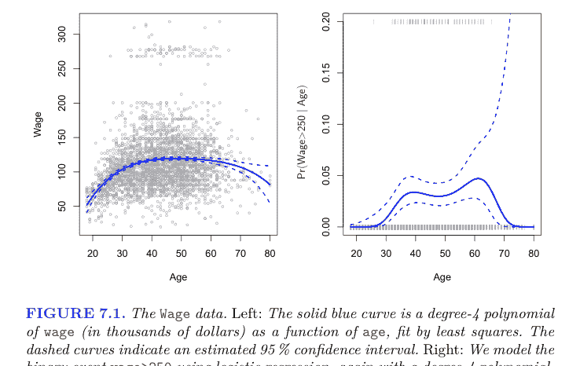

图7.1. Wage数据。左：实线蓝色曲线是工资（以千美元计）关于年龄的4次多项式，通过最小二乘法拟合。虚线曲线表示估计的95%置信区间。右：我们使用逻辑回归对二元事件 wage>250 进行建模，同样使用4次多项式。蓝色曲线显示了工资超过 $250,000 的拟合后验概率，以及估计的95%置信区间。

在图7.1中，一对虚线曲线伴随着拟合曲线；这些是（2倍）标准误差曲线。让我们看看它们是如何产生的。假设我们已经计算了在特定年龄值 $x_0$ 处的拟合：

$\hat{f}(x_0) = \hat{\beta}_0 + \hat{\beta}_1 x_0 + \hat{\beta}_2 x_0^2 + \hat{\beta}_3 x_0^3 + \hat{\beta}_4 x_0^4$。 (7.2)

拟合的方差，即 Var$\hat{f}(x_0)$ 是多少？最小二乘法返回每个拟合系数 $\hat{\beta}_j$ 的方差估计，以及系数估计对之间的协方差。我们可以使用这些来计算 $\hat{f}(x_0)$ 的估计方差。$\hat{f}(x_0)$ 的逐点估计标准误差是该方差的平方根。在每个参考点 $x_0$ 处重复此计算，我们绘制拟合曲线，以及拟合曲线两侧两倍的标准误差。我们绘制两倍的标准误差是因为，对于正态分布的误差项，该量对应于近似的95%置信区间。

图7.1中的工资似乎来自两个不同的群体：似乎有一个高收入群体，年收入超过250,000美元，以及一个低收入群体。我们可以通过将工资分成这两个组来将其视为二元变量。然后可以使用逻辑回归来预测这个二元响应，使用年龄的多项式函数作为预测变量。换句话说，我们拟合模型

$$\Pr(y_i > 250|x_i) = \frac{\exp(\beta_0 + \beta_1 x_i + \beta_2 x_i^2 + \cdots + \beta_d x_i^d)}{1 + \exp(\beta_0 + \beta_1 x_i + \beta_2 x_i^2 + \cdots + \beta_d x_i^d)}。 \quad (7.3)$$

结果如图7.1的右侧面板所示。面板顶部和底部的灰色标记表示高收入者和低收入者的年龄。实线蓝色曲线表示作为 *age* 函数的高收入者拟合概率。也显示了估计的95%置信区间。我们看到这里的置信区间相当宽，尤其是在右侧。尽管该数据集的样本量很大（$n = 3,000$），但只有79名高收入者，这导致估计系数的方差很高，从而置信区间很宽。

### 7.2 阶跃函数

在线性模型中使用特征的多项式函数作为预测变量，会对 $X$ 的非线性函数施加一个*全局*结构。我们可以改用*阶跃函数*来避免施加这种全局结构。这里我们将 $X$ 的范围划分为*箱*，并在每个箱中拟合一个不同的常数。这相当于将一个连续变量转换为一个*有序分类变量*。

更详细地说，我们在 $X$ 的范围内创建切点 $c_1, c_2, \dots, c_K$，然后构造 $K + 1$ 个新变量

$$\begin{aligned} C_0(X) &= I(X < c_1), \\ C_1(X) &= I(c_1 \le X < c_2), \\ C_2(X) &= I(c_2 \le X < c_3), \\ &\vdots \\ C_{K-1}(X) &= I(c_{K-1} \le X < c_K), \\ C_K(X) &= I(c_K \le X), \end{aligned} \quad (7.4)$$

其中 $I(\cdot)$ 是一个*指示函数*，如果条件为真则返回1，否则返回0。例如，如果 $c_K \le X$，则 $I(c_K \le X)$ 等于1，否则等于0。这些有时被称为*虚拟变量*。注意，对于任何 $X$ 值，$C_0(X) + C_1(X) + \cdots + C_K(X) = 1$，因为 $X$ 必须恰好位于 $K + 1$ 个区间中的一个。然后我们使用最小二乘法，以 $C_1(X), C_2(X), \dots, C_K(X)$ 作为预测变量$^2$ 来拟合线性模型：

$$y_i = \beta_0 + \beta_1 C_1(x_i) + \beta_2 C_2(x_i) + \cdots + \beta_K C_K(x_i) + \epsilon_i。 \quad (7.5)$$

对于给定的 $X$ 值，$C_1, C_2, \dots, C_K$ 中最多只有一个可以非零。注意，当 $X < c_1$ 时，(7.5) 中的所有预测变量都为零，因此 $\beta_0$ 可以

$^2$我们在 (7.5) 中排除了 $C_0(X)$ 作为预测变量，因为它与截距项冗余。这类似于这样一个事实：对于一个具有三个水平的定性变量，只要模型包含截距项，我们只需要两个虚拟变量就可以对其进行编码。在 (7.5) 中决定排除 $C_0(X)$ 而不是其他某个 $C_k(X)$ 是任意的。或者，我们可以包含 $C_0(X), C_1(X), \dots, C_K(X)$，并排除截距项。

## 分段常数

**图 7.2.** 工资数据。左图：实线曲线显示了使用年龄的阶梯函数对工资（以千美元计）进行最小二乘回归的拟合值。虚线曲线表示估计的95%置信区间。右图：我们使用逻辑回归对二元事件工资>250进行建模，同样使用年龄的阶梯函数。图中显示了工资超过25万美元的拟合后验概率，以及估计的95%置信区间。

可被解释为当 $X < c_1$ 时 $Y$ 的均值。相比之下，(7.5) 式预测当 $c_j \le X < c_{j+1}$ 时的响应为 $\beta_0+\beta_j$，因此 $\beta_j$ 代表了 $X$ 在 $c_j \le X < c_{j+1}$ 区间内相对于 $X < c_1$ 时的平均响应增量。

图7.2左侧面板展示了将阶梯函数拟合到图7.1工资数据的一个例子。我们还拟合了逻辑回归模型

$$\Pr(y_i > 250|x_i) = \frac{\exp(\beta_0 + \beta_1 C_1(x_i) + \cdots + \beta_K C_K(x_i))}{1 + \exp(\beta_0 + \beta_1 C_1(x_i) + \cdots + \beta_K C_K(x_i))} \quad (7.6)$$

以便根据年龄预测个体是高收入者的概率。图7.2右侧面板展示了使用此方法获得的拟合后验概率。

不幸的是，除非预测变量中存在自然的断点，否则分段常数函数可能会遗漏关键信息。例如，在图7.2的左侧面板中，第一个区间明显遗漏了工资随年龄增长的趋势。尽管如此，阶梯函数方法在生物统计学和流行病学等学科中非常流行。例如，通常使用5年年龄组来定义区间。

## 7.3 基函数

多项式和分段常数回归模型实际上是*基函数*方法的特例。其思想是手头有一族可以应用于变量 $X$ 的函数或变换：$b_1(X), b_2(X), \dots, b_K(X)$。我们不是拟合 $X$ 的线性模型，而是拟合模型

$$y_i = \beta_0 + \beta_1 b_1(x_i) + \beta_2 b_2(x_i) + \beta_3 b_3(x_i) + \cdots + \beta_K b_K(x_i) + \epsilon_i. \quad (7.7)$$

请注意，基函数 $b_1(\cdot), b_2(\cdot), \dots, b_K(\cdot)$ 是固定且已知的。（换句话说，我们提前选择了这些函数。）对于多项式回归，基函数是 $b_j(x_i) = x_i^j$，对于分段常数函数，它们是 $b_j(x_i) = I(c_j \le x_i < c_{j+1})$。我们可以将 (7.7) 视为一个标准线性模型，其预测变量为 $b_1(x_i), b_2(x_i), \dots, b_K(x_i)$。因此，我们可以使用最小二乘法来估计 (7.7) 中的未知回归系数。重要的是，这意味着第3章讨论的所有线性模型的推断工具，例如系数估计的标准误差和模型整体显著性的F统计量，在此设置中都可用。

到目前为止，我们已经考虑了使用多项式函数和分段常数函数作为我们的基函数；然而，还有许多其他可能的选择。例如，我们可以使用小波或傅里叶级数来构造基函数。在下一节中，我们将研究一个非常常见的基函数选择：*回归样条*。

## 7.4 回归样条

现在我们讨论一类灵活的基函数，它扩展了我们刚刚看到的多项式回归和分段常数回归方法。

### 7.4.1 分段多项式

*分段多项式回归*不是在整个 $X$ 的范围内拟合一个高次多项式，而是在 $X$ 的不同区域分别拟合独立的低次多项式。例如，一个分段三次多项式通过拟合如下形式的三次回归模型来工作

$$y_i = \beta_0 + \beta_1 x_i + \beta_2 x_i^2 + \beta_3 x_i^3 + \epsilon_i, \quad (7.8)$$

其中系数 $\beta_0, \beta_1, \beta_2$, 和 $\beta_3$ 在 $X$ 的不同部分是不同的。系数发生变化的点称为*节点*。

例如，一个没有节点的分段三次多项式就是一个标准的三次多项式，如 (7.1) 式中 $d = 3$ 的情况。一个在点 $c$ 处有一个节点的分段三次多项式具有如下形式

$$y_i = \begin{cases} \beta_{01} + \beta_{11} x_i + \beta_{21} x_i^2 + \beta_{31} x_i^3 + \epsilon_i & \text{if } x_i < c \\ \beta_{02} + \beta_{12} x_i + \beta_{22} x_i^2 + \beta_{32} x_i^3 + \epsilon_i & \text{if } x_i \ge c. \end{cases}$$

换句话说，我们对数据拟合两个不同的多项式函数，一个用于 $x_i < c$ 的观测子集，另一个用于 $x_i \ge c$ 的观测子集。第一个多项式函数的系数为 $\beta_{01}, \beta_{11}, \beta_{21}, \text{ and } \beta_{31}$，第二个的系数为 $\beta_{02}, \beta_{12}, \beta_{22}, \text{ and } \beta_{32}$。每个多项式函数都可以通过对原始预测变量的简单函数应用最小二乘法来拟合。

使用更多的节点会导致更灵活的分段多项式。通常，如果在 $X$ 的范围内放置 $K$ 个不同的节点，那么最终将拟合 $K + 1$ 个不同的三次多项式。请注意，我们不一定需要使用三次多项式。例如，我们也可以拟合分段线性函数。事实上，我们在7.2节中的分段常数函数就是0次的分段多项式！

**图 7.3.** 将各种分段多项式拟合到工资数据的一个子集，节点位于年龄=50。左上：三次多项式无约束。右上：三次多项式在年龄=50处被约束为连续。左下：三次多项式被约束为连续，且一阶和二阶导数连续。右下：显示了一个线性样条，它被约束为连续。

图7.3的左上图显示了将分段三次多项式拟合到工资数据的一个子集，节点位于年龄=50。我们立即发现一个问题：函数不连续，看起来很荒谬！由于每个多项式有四个参数，我们在拟合这个分段多项式模型时总共使用了八个*自由度*。

### 7.4.2 约束与样条

图7.3的左上图看起来不对，因为拟合曲线过于灵活。为了解决这个问题，我们可以在*约束*下拟合分段多项式，即拟合曲线必须是连续的。换句话说，在年龄=50处不能有跳跃。图7.3右上图显示了拟合结果。这看起来比左上图好，但V形连接看起来不自然。

在左下图中，我们增加了两个额外的约束：现在分段多项式在年龄=50处的一阶和二阶*导数*都是连续的。换句话说，我们要求分段多项式不仅在年龄=50处连续，而且非常*平滑*。我们对分段三次多项式施加的每个约束都有效地释放了一个自由度，通过降低最终分段多项式拟合的复杂性。因此，在左上图中，我们使用了八个自由度，但在左下图中，我们施加了三个约束（连续性、一阶导数连续性和二阶导数连续性），因此剩下五个自由度。左下图中的曲线称为*三次样条*。通常，一个有 $K$ 个节点的三次样条总共使用 $4 + K$ 个自由度。

在图7.3中，右下图是一个*线性样条*，它在年龄=50处连续。$d$ 次样条的一般定义是：它是一个分段 $d$ 次多项式，在每个节点处具有直到 $d - 1$ 次导数的连续性。因此，线性样条是通过在节点定义的预测变量空间的每个区域拟合一条直线，并在每个节点处要求连续性而获得的。

在图7.3中，年龄=50处有一个节点。当然，我们可以添加更多节点，并在每个节点处施加连续性。

### 7.4.3 样条基表示

我们在上一节看到的回归样条可能看起来有些复杂：我们如何在约束下（可能包括其前 $d - 1$ 阶导数）拟合一个分段 $d$ 次多项式？事实证明，我们可以使用基模型 (7.7) 来表示回归样条。一个有 $K$ 个节点的三次样条可以建模为

$$y_i = \beta_0 + \beta_1 b_1(x_i) + \beta_2 b_2(x_i) + \cdots + \beta_{K+3} b_{K+3}(x_i) + \epsilon_i, \quad (7.9)$$

其中 $b_1, b_2, \ldots, b_{K+3}$ 是适当选择的基函数。然后可以使用最小二乘法拟合模型 (7.9)。

正如表示多项式有多种方式一样，使用 (7.9) 中不同的基函数选择，也有许多等效的方式来表示三次样条。使用 (7.9) 表示三次样条最直接的方法是从三次多项式的基开始——即 $x, x^2$, 和 $x^3$——然后为每个节点添加一个*截断幂基*函数。

## 7.4.4 选择结点的数量与位置

当我们拟合样条函数时，应该将结点放置在何处？回归样条在包含大量结点的区域最为灵活，因为在这些区域，多项式系数可以快速变化。因此，一种选择是在我们认为函数可能变化最剧烈的地方放置更多结点，而在函数看起来更稳定的地方放置较少结点。虽然这种方法可能效果很好，但在实践中，通常以均匀的方式放置结点。一种方法是指定所需的自由度，然后让软件在数据的均匀分位数处自动放置相应数量的结点。

图7.5展示了工资数据上的一个例子。与图7.4类似，我们拟合了一个具有三个结点的自然三次样条，但这次结点位置是自动选择的，分别为年龄的第25、第50和第75百分位数。这是通过请求四个自由度来指定的。关于四个自由度如何对应三个内部结点的论证有些技术性。⁴

我们应该使用多少个结点，或者等价地，我们的样条函数应包含多少自由度？一种选择是尝试不同数量的结点，看看哪个能产生最佳的曲线。一种稍微更客观的方法是使用交叉验证，如第5章和第6章所讨论的。使用这种方法，我们移除一部分数据（比如10%），用特定数量的结点对剩余数据拟合一个样条，然后用该样条对保留部分进行预测。我们重复这个过程多次，直到每个观测值都被留出一次，然后计算整体的交叉验证残差平方和。这个过程可以针对不同的结点数 $K$ 重复进行。然后选择使RSS最小的 $K$ 值。

图7.6展示了对工资数据拟合不同自由度样条的十折交叉验证均方误差。左侧面板对应自然三次样条，右侧面板对应三次样条。两种方法产生的结果几乎相同，有明确证据表明一次拟合（线性回归）是不充分的。两条曲线都迅速趋于平缓，似乎自然样条的三个自由度和三次样条的四个自由度就相当足够了。

在第7.7节中，我们同时对多个变量拟合可加样条模型。这可能需要为每个变量选择自由度。在这种情况下，我们通常采用更实用的方法，将所有项的自由度设置为一个固定值，比如四。

## 7.4.5 与多项式回归的比较

图7.7比较了在工资数据集上，一个具有15个自由度的自然三次样条与一个15次多项式。多项式额外的灵活性在边界处产生了不理想的结果，而自然三次样条仍然提供了对数据的合理拟合。回归样条通常比多项式回归产生更优的结果。这是因为与必须使用高次（最高单项式的指数，例如 $X^{15}$）来产生灵活拟合的多项式不同，样条通过增加结点数量但保持次数固定来引入灵活性。通常，这种方法产生更稳定的估计。样条还允许我们在函数 $f$ 似乎变化剧烈的区域放置更多结点（从而增加灵活性），而在 $f$ 看起来更稳定的区域放置较少结点。

## 7.5 平滑样条

在上一节中，我们讨论了回归样条，我们通过指定一组结点、生成一系列基函数，然后使用最小二乘法估计样条系数来创建它们。我们现在介绍一种略有不同的方法，它也能产生样条。

### 7.5.1 平滑样条概述

在将一条平滑曲线拟合到一组数据时，我们真正想做的是找到某个函数，比如 $g(x)$，使其很好地拟合观测数据：也就是说，我们希望 $\text{RSS} = \sum_{i=1}^n (y_i - g(x_i))^2$ 尽可能小。然而，这种方法存在一个问题。如果我们不对 $g(x_i)$ 施加任何约束，那么我们总是可以通过选择 $g$ 使其*插值*所有 $y_i$ 来使RSS为零。这样的函数会严重过拟合数据——它会过于灵活。我们真正想要的是一个使RSS较小，同时又*平滑*的函数 $g$。

我们如何确保 $g$ 是平滑的呢？有多种方法可以做到这一点。一种自然的方法是找到使以下表达式最小化的函数 $g$：

$$\sum_{i=1}^n (y_i - g(x_i))^2 + \lambda \int g''(t)^2 dt \quad (7.11)$$

其中 $\lambda$ 是一个非负的*调节参数*。使 (7.11) 最小化的函数 $g$ 被称为*平滑样条*。

(7.11) 是什么意思？公式7.11采用了我们在第6章岭回归和lasso中遇到的“损失+惩罚”形式。项 $\sum_{i=1}^n (y_i - g(x_i))^2$ 是一个*损失函数*，它鼓励 $g$ 很好地拟合数据，而项 $\lambda \int g''(t)^2 dt$ 是一个*惩罚项*，它惩罚 $g$ 的变异性。符号 $g''(t)$ 表示函数 $g$ 的二阶导数。一阶导数 $g'(t)$ 衡量斜率。

---

**图7.4.** 一个三次样条和一个自然三次样条，具有三个结点，拟合到工资数据的一个子集。虚线表示结点位置。

截断幂基函数定义为

$$h(x, \xi) = (x - \xi)_+^3 = \begin{cases} (x - \xi)^3 & \text{if } x > \xi \\ 0 & \text{otherwise}, \end{cases} \quad (7.10)$$

其中 $\xi$ 是结点。可以证明，在三次多项式模型 (7.8) 中添加一个形如 $\beta_4 h(x, \xi)$ 的项，将仅在 $\xi$ 处导致三阶导数的不连续性；该函数在每个结点处将保持连续，且一阶和二阶导数连续。

换句话说，为了将三次样条拟合到具有 $K$ 个结点的数据集，我们执行带有截距和 $3 + K$ 个预测变量的最小二乘回归，这些预测变量的形式为 $X, X^2, X^3, h(X, \xi_1), h(X, \xi_2), \ldots, h(X, \xi_K)$，其中 $\xi_1, \ldots, \xi_K$ 是结点。这相当于总共估计 $K + 4$ 个回归系数；因此，拟合一个具有 $K$ 个结点的三次样条使用 $K+4$ 个自由度。

不幸的是，样条在预测变量的外部范围——即 $X$ 取非常小或非常大的值时——可能具有高方差。图7.4展示了用三个结点拟合工资数据的结果。我们看到边界区域的置信带看起来相当不稳定。*自然样条*是一种带有额外*边界约束*的回归样条：要求函数在边界处是线性的（在 $X$ 小于最小结点或大于最大结点的区域）。这个额外的约束意味着自然样条通常在边界处产生更稳定的估计。在图7.4中，也用红线显示了一个自然三次样条。注意相应的置信区间更窄。

---

**图7.5.** 一个具有四个自由度的自然三次样条函数拟合到工资数据。左图：样条拟合工资（以千美元计）作为年龄的函数。右图：使用逻辑回归对二元事件 wage>250 建模，作为年龄的函数。显示了工资超过 $250,000$ 的拟合后验概率。虚线表示结点位置。

---

**图7.6.** 在拟合样条到工资数据时，用于选择自由度的十折交叉验证均方误差。响应变量是工资，预测变量是年龄。左图：自然三次样条。右图：三次样条。

---

**图7.7.** 在工资数据集上，比较了一个具有15个自由度的自然三次样条与一个15次多项式。多项式可能表现出不稳定的行为，尤其是在尾部附近。

---

⁴实际上有五个结点，包括两个边界结点。一个具有五个结点的三次样条有九个自由度。但自然三次样条在每个边界处有两个额外的自然约束以强制线性，导致 9 − 4 = 5 个自由度。由于这包括一个常数，该常数被吸收到截距中，我们将其计为四个自由度。

在 $t$ 处的函数值，而二阶导数则对应于斜率的变化量。因此，广义上说，函数的二阶导数是其*粗糙度*的度量：如果 $g(t)$ 在 $t$ 附近非常曲折，其绝对值就大；否则就接近于零。（直线的二阶导数为零；注意直线是完全光滑的。）$\int$ 符号表示*积分*，我们可以将其视为对 $t$ 范围的求和。换句话说，$\int g''(t)^2 dt$ 仅仅是函数 $g'(t)$ 在其整个范围内总变化量的度量。如果 $g$ 非常光滑，那么 $g'(t)$ 将接近常数，$\int g''(t)^2 dt$ 将取一个小值。相反，如果 $g$ 是跳跃且多变的，那么 $g'(t)$ 将显著变化，$\int g''(t)^2 dt$ 将取一个大值。因此，在 (7.11) 中，$\lambda \int g''(t)^2 dt$ 鼓励 $g$ 是光滑的。$\lambda$ 的值越大，$g$ 就越光滑。

当 $\lambda = 0$ 时，(7.11) 中的惩罚项没有效果，因此函数 $g$ 将非常跳跃，并将精确插值训练观测值。当 $\lambda \to \infty$ 时，$g$ 将完全光滑——它将只是一条尽可能接近训练点的直线。事实上，在这种情况下，$g$ 将是线性最小二乘直线，因为 (7.11) 中的损失函数相当于最小化残差平方和。对于中间值的 $\lambda$，$g$ 将近似训练观测值，但会有些光滑。我们看到 $\lambda$ 控制着平滑样条的偏差-方差权衡。

可以证明，最小化 (7.11) 的函数 $g(x)$ 具有一些特殊性质：它是一个分段三次多项式，在 $x_1, \dots, x_n$ 的唯一值处有节点，并且在每个节点处具有连续的一阶和二阶导数。此外，在极端节点之外的区域，它是线性的。换句话说，*最小化 (7.11) 的函数 $g(x)$ 是一个在 $x_1, \dots, x_n$ 处有节点的自然三次样条！* 然而，它与如果应用第 7.4.3 节描述的基函数方法并在 $x_1, \dots, x_n$ 处设置节点所得到的自然三次样条并不相同——相反，它是这种自然三次样条的一个*收缩*版本，其中 (7.11) 中的调节参数 $\lambda$ 控制着收缩的程度。

## 7.5.2 选择平滑参数 $\lambda$

我们已经看到，平滑样条只是一个在每个 $x_i$ 的唯一值处都有节点的自然三次样条。平滑样条似乎会有过多的自由度，因为在每个数据点设置节点允许很大的灵活性。但是调节参数 $\lambda$ 控制着平滑样条的粗糙度，从而控制着*有效自由度*。可以证明，当 $\lambda$ 从 0 增加到 $\infty$ 时，有效自由度（我们记为 $df_\lambda$）从 $n$ 减少到 2。

在平滑样条的背景下，为什么我们讨论*有效*自由度而不是自由度？通常自由度指的是自由参数的数量，例如在多项式或三次样条中拟合的系数数量。虽然平滑样条有 $n$ 个参数，因此名义上有 $n$ 个自由度，但这 $n$ 个参数受到严重约束或收缩。因此 $df_\lambda$ 是平滑样条灵活性的度量——它越高，平滑样条越灵活（偏差越低但方差越高）。有效自由度的定义有些技术性。我们可以写成

$$\hat{\mathbf{g}}_{\lambda} = \mathbf{S}_{\lambda} \mathbf{y}, \quad (7.12)$$

其中 $\hat{\mathbf{g}}_{\lambda}$ 是对于特定选择的 $\lambda$ 的 (7.11) 的解——也就是说，它是一个 $n$ 维向量，包含平滑样条在训练点 $x_1, \dots, x_n$ 处的拟合值。方程 7.12 表明，当对数据应用平滑样条时，拟合值向量可以写成一个 $n \times n$ 矩阵 $\mathbf{S}_{\lambda}$（有一个公式）乘以响应向量 $\mathbf{y}$。那么有效自由度定义为

$$df_{\lambda} = \sum_{i=1}^{n} \{\mathbf{S}_{\lambda}\}_{ii}, \quad (7.13)$$

即矩阵 $\mathbf{S}_{\lambda}$ 对角线元素之和。

在拟合平滑样条时，我们不需要选择节点的数量或位置——在每个训练观测值 $x_1, \dots, x_n$ 处都会有一个节点。相反，我们有另一个问题：我们需要选择 $\lambda$ 的值。这个问题的一个可能解决方案是交叉验证，这并不奇怪。换句话说，我们可以找到使交叉验证 RSS 尽可能小的 $\lambda$ 值。事实证明，对于平滑样条，*留一法*交叉验证误差 (LOOCV) 可以非常高效地计算，其成本与计算单次拟合基本相同，使用以下公式：

$$\mathrm{RSS}_{cv}(\lambda) = \sum_{i=1}^{n} (y_i - \hat{g}_{\lambda}^{(-i)}(x_i))^2 = \sum_{i=1}^{n} \left[ \frac{y_i - \hat{g}_{\lambda}(x_i)}{1 - \{\mathbf{S}_{\lambda}\}_{ii}} \right]^2.$$

符号 $\hat{g}_{\lambda}^{(-i)}(x_i)$ 表示在 $x_i$ 处评估的平滑样条的拟合值，其中拟合使用了除第 $i$ 个观测值 $(x_i, y_i)$ 之外的所有训练观测值。相比之下，$\hat{g}_{\lambda}(x_i)$ 表示拟合到所有训练观测值并在 $x_i$ 处评估的平滑样条函数。这个显著的公式表明，我们可以仅使用 $\hat{g}_{\lambda}$（即对*所有*数据的原始拟合）来计算每个*留一法*拟合！$^5$ 我们在第 5 章第 205 页有一个非常相似的公式 (5.2)，用于最小二乘线性回归。使用 (5.2)，我们可以非常快速地对本章前面讨论的回归样条以及使用任意基函数的最小二乘回归执行 LOOCV。

图 7.8 显示了对 Wage 数据拟合平滑样条的结果。红色曲线表示通过预先指定我们想要一个具有 16 个有效自由度的平滑样条所获得的拟合。蓝色曲线是使用 LOOCV 选择 $\lambda$ 时获得的平滑样条；在这种情况下，选择的 $\lambda$ 值导致 6.8 个有效自由度（使用 (7.13) 计算）。对于这些数据，两个平滑样条之间几乎没有明显区别，除了具有 16 个自由度的那个似乎稍微更曲折一些。由于两种拟合之间差异很小，具有 6.8 个自由度的平滑样条拟合更可取，因为通常更简单的模型更好，除非数据提供了支持更复杂模型的证据。

$^5$ 计算 $\hat{g}(x_i)$ 和 $\mathbf{S}_{\lambda}$ 的确切公式非常技术性；然而，有高效的算法可用于计算这些量。

## 平滑样条

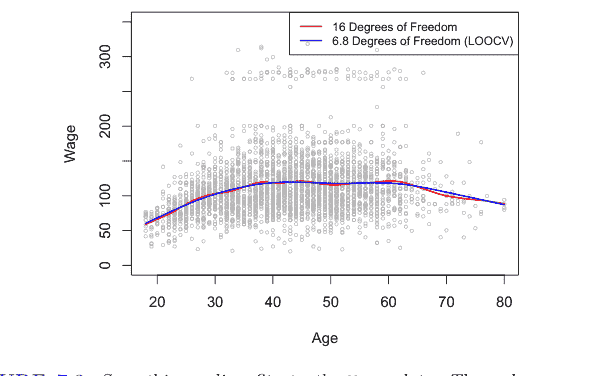

图 7.8. 对 Wage 数据的平滑样条拟合。红色曲线是通过指定 16 个有效自由度得到的。对于蓝色曲线，λ 是通过留一法交叉验证自动找到的，结果得到 6.8 个有效自由度。

## 7.6 局部回归

局部回归是拟合灵活非线性函数的一种不同方法，它涉及仅使用附近的训练观测值在目标点 $x_0$ 处计算拟合。图 7.9 在一些模拟数据上说明了这个想法，一个目标点在 0.4 附近，另一个在边界 0.05 附近。在该图中，蓝线代表生成数据的函数 $f(x)$，浅橙色线对应于局部回归估计 $\hat{f}(x)$。局部回归在算法 7.1 中描述。

注意，在算法 7.1 的步骤 3 中，权重 $K_{i0}$ 对于每个 $x_0$ 的值都会不同。换句话说，为了在新点获得局部回归拟合，我们需要通过最小化 (7.14) 来拟合一个新的加权最小二乘回归模型，使用一组新的权重。局部回归有时被称为*基于记忆*的过程，因为像最近邻一样，每次我们希望计算预测时，我们都需要所有训练数据。我们将避免在这里深入探讨局部回归的技术细节——有关于这个主题的书籍。

为了执行局部回归，需要做出许多选择，例如如何定义权重函数 $K$，以及在步骤 3 中是拟合线性、常数还是二次回归。（方程 7.14 对应于线性回归。）虽然所有这些选择都有一定影响，但最重要的选择是*跨度* $s$，即用于在 $x_0$ 处计算局部回归的点的比例，如上面步骤 1 中所定义。跨度的作用类似于平滑样条中的调节参数 $\lambda$。

## 局部回归

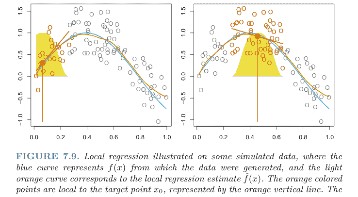

**图 7.9.** *局部回归在模拟数据上的示意图。蓝色曲线代表生成数据的函数 $f(x)$，浅橙色曲线对应局部回归估计 $\hat{f}(x)$。橙色点是目标点 $x_0$（由橙色垂直线表示）的邻域点。叠加在图上的黄色钟形曲线表示分配给每个点的权重，该权重随与目标点距离的增加而减小至零。$x_0$ 处的拟合值 $\hat{f}(x_0)$ 是通过拟合一个加权线性回归（橙色线段）并使用 $x_0$ 处的拟合值（橙色实心点）作为估计 $\hat{f}(x_0)$ 得到的。*

样条：它控制非线性拟合的灵活性。$s$ 的值越小，我们的拟合就越*局部*且波动越大；反之，一个非常大的 $s$ 值将导致使用所有训练观测值进行全局拟合。我们可以再次使用交叉验证来选择 $s$，或者直接指定它。图 7.10 展示了在 Wage 数据上使用两个 $s$ 值（0.7 和 0.2）进行的局部线性回归拟合。正如预期的那样，使用 $s = 0.7$ 得到的拟合比使用 $s = 0.2$ 得到的拟合更平滑。

局部回归的思想可以以多种不同的方式进行推广。在具有多个特征 $X_1, X_2, \dots, X_p$ 的情况下，一个非常有用的推广是拟合一个在某些变量上是全局的，但在另一个变量（例如时间）上是局部的多元线性回归模型。这种*变系数模型*是使模型适应最新收集数据的一种有用方式。当我们想要拟合在一对变量 $X_1$ 和 $X_2$ 上局部而非单个变量上局部的模型时，局部回归也非常自然地推广。我们可以简单地使用二维邻域，并使用在二维空间中靠近每个目标点的观测值来拟合二元线性回归模型。理论上，同样的方法可以在更高维度上实现，使用拟合 $p$ 维邻域的线性回归。然而，如果 $p$ 远大于 3 或 4，局部回归可能表现不佳，因为通常会非常少有训练观测值接近 $x_0$。第 3 章讨论的最近邻回归在高维情况下也存在类似的问题。

变系数模型

## 算法 7.1 在 $X = x_0$ 处的局部回归

1.  收集 $x_i$ 最接近 $x_0$ 的训练点，其比例为 $s = k/n$。
2.  为此邻域中的每个点分配一个权重 $K_{i0} = K(x_i, x_0)$，使得离 $x_0$ 最远的点权重为零，最近的点权重最高。除这 $k$ 个最近邻外，所有其他点的权重均为零。
3.  使用上述权重，通过找到使下式最小化的 $\hat{\beta}_0$ 和 $\hat{\beta}_1$，来拟合 $y_i$ 对 $x_i$ 的*加权最小二乘回归*：
    $$\sum_{i=1}^n K_{i0}(y_i - \beta_0 - \beta_1 x_i)^2. \tag{7.14}$$
4.  $x_0$ 处的拟合值由 $\hat{f}(x_0) = \hat{\beta}_0 + \hat{\beta}_1 x_0$ 给出。


**图 7.10.** *Wage 数据的局部线性拟合。跨度（span）指定了用于计算每个目标点拟合值的数据比例。*

## 7.7 广义可加模型

在第 7.1–7.6 节中，我们介绍了多种基于单个预测变量 $X$ 灵活预测响应变量 $Y$ 的方法。这些方法可以看作是简单线性回归的扩展。在这里，我们探讨基于多个预测变量 $X_1, \dots, X_p$ 灵活预测 $Y$ 的问题。这相当于多元线性回归的扩展。

*广义可加模型*（GAMs）提供了一个通用框架，通过允许每个变量的非线性函数，同时保持*可加性*，来扩展标准线性模型。就像线性模型一样，GAMs 可以应用于定量和定性响应。我们首先在第 7.7.1 节研究用于定量响应的 GAMs，然后在第 7.7.2 节研究用于定性响应的 GAMs。

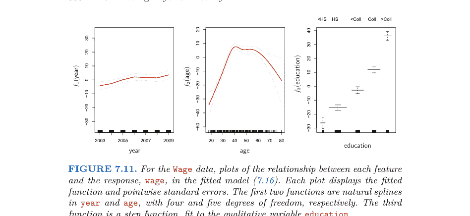

### 7.7.1 用于回归问题的 GAMs

扩展多元线性回归模型以允许每个特征与响应之间存在非线性关系的一种自然方法是，将每个线性分量 $\beta_j x_{ij}$ 替换为一个（平滑的）非线性函数 $f_j(x_{ij})$。然后我们可以将模型写为

$$y_i = \beta_0 + \sum_{j=1}^p f_j(x_{ij}) + \epsilon_i$$
$$= \beta_0 + f_1(x_{i1}) + f_2(x_{i2}) + \cdots + f_p(x_{ip}) + \epsilon_i. \quad (7.15)$$

这是 GAM 的一个例子。它被称为*可加*模型，因为我们为每个 $X_j$ 计算一个单独的 $f_j$，然后将它们的所有贡献相加。

在第 7.1–7.6 节中，我们讨论了许多拟合单个变量函数的方法。GAMs 的美妙之处在于，我们可以将这些方法用作拟合可加模型的构建模块。事实上，对于本章到目前为止我们看到的大多数方法，这都可以相当简单地完成。以自然样条为例，考虑在 Wage 数据上拟合模型

$$\text{wage} = \beta_0 + f_1(\text{year}) + f_2(\text{age}) + f_3(\text{education}) + \epsilon \quad (7.16)$$

的任务。这里 year 和 age 是定量变量，而变量 education 是具有五个水平的定性变量：<HS, HS, <Coll, Coll, >Coll，指的是个人完成的高中或大学教育程度。我们使用自然样条拟合前两个函数。我们使用第 3.3.1 节中通常的虚拟变量方法，为每个水平拟合一个单独的常数来拟合第三个函数。

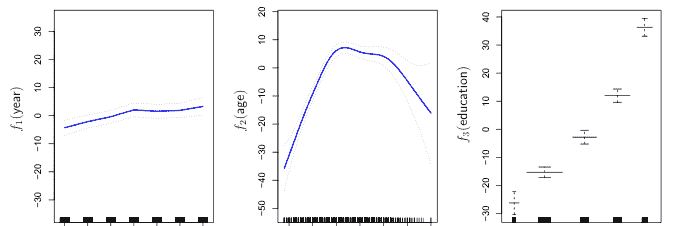

**图 7.12.** *细节与图 7.11 相同，但现在 $f_1$ 和 $f_2$ 分别是具有四和五个自由度的平滑样条。*

图 7.11 展示了使用最小二乘法拟合模型 (7.16) 的结果。这很容易做到，因为正如第 7.4 节所讨论的，自然样条可以使用适当选择的基函数集来构建。因此，整个模型只是一个对样条基变量和虚拟变量的大回归，所有这些都打包在一个大的回归矩阵中。

图 7.11 可以很容易地解释。左侧面板表明，在保持年龄和教育程度固定的情况下，工资往往随年份略有增加；这可能是由于通货膨胀。中间面板表明，在保持教育程度和年份固定的情况下，工资在年龄的中间值时最高，在非常年轻和非常年老时最低。右侧面板表明，在保持年份和年龄固定的情况下，工资往往随教育程度的提高而增加：平均而言，一个人受教育程度越高，其工资就越高。所有这些发现都是直观的。

图 7.12 展示了类似的三个图，但这次 $f_1$ 和 $f_2$ 分别是具有四和五个自由度的平滑样条。使用平滑样条拟合 GAM 不像使用自然样条拟合 GAM 那么简单，因为在平滑样条的情况下，不能使用最小二乘法。然而，标准软件（如 Python 包 pygam）可以使用一种称为回拟（backfitting）的方法来使用平滑样条拟合 GAM。这种方法通过依次更新每个预测变量的拟合值（同时保持其他变量固定）来拟合涉及多个预测变量的模型。这种方法的美妙之处在于，每次我们更新一个函数时，我们只需将该变量的拟合方法应用于一个偏残差。$^6$

图 7.11 和 7.12 中的拟合函数看起来非常相似。在大多数情况下，使用平滑样条与自然样条获得的 GAM 之间的差异很小。

$^6$ 例如，$X_3$ 的偏残差的形式为 $r_i = y_i - f_1(x_{i1}) - f_2(x_{i2})$。如果我们知道 $f_1$ 和 $f_2$，那么我们可以通过将此残差视为对 $X_3$ 的非线性回归中的响应来拟合 $f_3$。

我们不必将样条作为广义加性模型的构建模块：我们同样可以使用局部回归、多项式回归，或本章前面介绍的任何方法组合来创建GAM。本章末尾的实验部分将对GAM进行更深入的探讨。

## GAM的优缺点

在继续之前，让我们总结一下GAM的优势和局限性。

- GAM允许我们为每个$X_j$拟合非线性函数$f_j$，从而能够自动建模标准线性回归会忽略的非线性关系。这意味着我们无需手动对每个变量尝试许多不同的变换。
- 非线性拟合可能对响应变量$Y$做出更准确的预测。
- 由于模型是可加的，我们可以在保持其他所有变量固定的情况下，单独考察每个$X_j$对$Y$的影响。
- 变量$X_j$的函数$f_j$的平滑度可以通过自由度来概括。
- GAM的主要局限性在于模型被限制为可加形式。当变量较多时，可能会遗漏重要的交互作用。然而，与线性回归类似，我们可以通过添加$X_j \times X_k$形式的额外预测变量，手动将交互项添加到GAM模型中。此外，我们还可以将$f_{jk}(X_j, X_k)$形式的低维交互函数添加到模型中；此类项可以使用二维平滑器（如局部回归）或二维样条（此处不涉及）进行拟合。

对于完全通用的模型，我们需要寻找更灵活的方法，如第8章描述的随机森林和提升法。GAM在完全线性和完全非参数模型之间提供了一个有用的折中方案。

## 7.7.2 用于分类问题的GAM

GAM也可用于$Y$为定性变量的情况。为简单起见，这里我们假设$Y$取值为0或1，并令$p(X) = \Pr(Y = 1|X)$为响应等于1的条件概率（给定预测变量）。回顾逻辑回归模型（4.6）：

$$\log \left( \frac{p(X)}{1 - p(X)} \right) = \beta_0 + \beta_1 X_1 + \beta_2 X_2 + \cdots + \beta_p X_p. \tag{7.17}$$

等式左边是$P(Y = 1|X)$与$P(Y = 0|X)$之比的对数，（7.17）将其表示为预测变量的线性函数。将（7.17）扩展以允许非线性关系的一种自然方式是使用模型

$$\log \left( \frac{p(X)}{1 - p(X)} \right) = \beta_0 + f_1(X_1) + f_2(X_2) + \cdots + f_p(X_p). \tag{7.18}$$

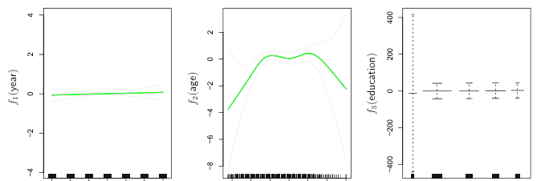

**图 7.13.** 对于`Wage`数据，将（7.19）中的逻辑回归GAM拟合到二元响应I(wage>250)。每个图显示了拟合函数和逐点标准误差。第一个函数是`year`的线性函数，第二个函数是`age`的具有五个自由度的平滑样条，第三个是`education`的阶梯函数。`education`的第一个水平<HS的标准误差非常宽。

方程7.18是一个逻辑回归GAM。它与上一节讨论的定量响应模型具有相同的优缺点。
我们将GAM拟合到`Wage`数据，以预测个人年收入超过$250,000的概率。我们拟合的GAM形式如下

$$\log \left( \frac{p(X)}{1-p(X)} \right) = \beta_0 + \beta_1 \times \text{year} + f_2(\text{age}) + f_3(\text{education}), \quad (7.19)$$

其中

$$p(X) = \Pr(\text{wage} > 250 | \text{year}, \text{age}, \text{education}).$$

同样，$f_2$使用具有五个自由度的平滑样条进行拟合，$f_3$通过为每个教育水平创建虚拟变量拟合为阶梯函数。拟合结果如图7.13所示。最后一个面板看起来可疑，<HS水平的置信区间非常宽。事实上，该类别没有响应值等于1：没有高中以下教育程度的人年收入超过$250,000。因此，我们重新拟合GAM，排除了高中以下教育程度的个体。结果模型如图7.14所示。与图7.11和7.12一样，所有三个面板具有相似的垂直尺度。这使我们能够直观地评估每个变量的相对贡献。我们观察到，`age`和`education`对成为高收入者的概率的影响远大于`year`。

## 7.8 实验：非线性建模

在本实验中，我们将演示本章讨论的一些非线性模型。我们使用`Wage`数据作为贯穿始终的示例，并展示许多讨论过的复杂非线性拟合过程可以轻松地在`Python`中实现。

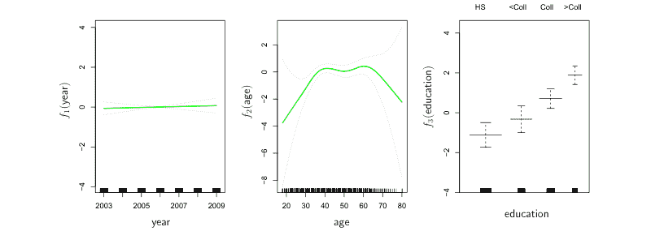

**图 7.14.** 与图7.13相同的模型，这次排除了教育水平为<HS的观测值。现在我们看到，教育程度的提高往往与更高的薪水相关。

像往常一样，我们从一些标准导入开始。

```python
import numpy as np, pandas as pd
from matplotlib.pyplot import subplots
import statsmodels.api as sm
from ISLP import load_data
from ISLP.models import (summarize,
                         poly,
                         ModelSpec as MS)
from statsmodels.stats.anova import anova_lm
```

我们再次收集本实验所需的新导入。其中许多是专门为ISLP包开发的。

```python
from pygam import (s as s_gam,
                   l as l_gam,
                   f as f_gam,
                   LinearGAM,
                   LogisticGAM)

from ISLP.transforms import (BSpline,
                             NaturalSpline)
from ISLP.models import bs, ns
from ISLP.pygam import (approx_lam,
                         degrees_of_freedom,
                         plot as plot_gam,
                         anova as anova_gam)
```

### 7.8.1 多项式回归和阶梯函数

我们首先演示如何重现图7.1。让我们从加载数据开始。

```python
Wage = load_data('Wage')
y = Wage['wage']
age = Wage['age']
```

在本实验的大部分内容中，我们的响应变量是`Wage['wage']`，我们已将其存储为上面的`y`。与第3.6.6节一样，我们将使用`poly()`函数创建一个模型矩阵，用于拟合`age`的4次多项式。

```python
poly_age = MS([poly('age', degree=4)]).fit(Wage)
M = sm.OLS(y, poly_age.transform(Wage)).fit()
summarize(M)
```

```
coef  std err       t  P>|t|
intercept  111.7036    0.729  153.283  0.000
poly(age, degree=4) [0]  447.0679   39.915   11.201  0.000
poly(age, degree=4) [1] -478.3158   39.915  -11.983  0.000
poly(age, degree=4) [2]  125.5217   39.915    3.145  0.002
poly(age, degree=4) [3]  -77.9112   39.915   -1.952  0.051
```

这个多项式是使用`poly()`函数构建的，该函数创建了一个特殊的转换器`Poly()`（使用`sklearn`术语，类似于第6.5.3节中看到的`PCA()`等特征转换），它允许在新数据点上轻松计算多项式。这里`poly()`被称为*辅助*函数，用于设置转换；`Poly()`是实际执行转换的工作马。另见第118页关于转换的讨论。

在上面的代码中，第一行使用数据框`Wage`执行`fit()`方法。这会重新计算并存储`Poly()`在训练数据上所需的任何参数作为属性，这些参数将用于后续所有`transform()`方法的计算。例如，它在第二行以及下面开发的绘图函数中使用。

我们现在创建一个`age`值的网格，用于我们想要预测的点。

```python
age_grid = np.linspace(age.min(),
                     age.max(),
                     100)
age_df = pd.DataFrame({'age': age_grid})
```

最后，我们希望绘制数据并添加四次多项式的拟合曲线。由于我们将在下面绘制几个类似的图，我们首先编写一个函数来创建所有元素并生成图表。我们的函数接受一个模型规范（这里是由转换指定的基）以及一个`age`值的网格。该函数生成一条拟合曲线以及95%的置信带。通过使用`basis`参数，我们可以使用几种不同的转换（例如我们即将看到的样条）来生成和绘制结果。

```python
def plot_wage_fit(age_df,
                  basis,
                  title):

    X = basis.transform(Wage)
    Xnew = basis.transform(age_df)
    M = sm.OLS(y, X).fit()
    preds = M.get_prediction(Xnew)
    bands = preds.conf_int(alpha=0.05)
    fig, ax = subplots(figsize=(8,8))
    ax.scatter(age,
               y,
```

## 7. 超越线性

```python
facecolor='gray',
alpha=0.5)
for val, ls in zip([preds.predicted_mean,
                    bands[:,0],
                    bands[:,1]],
                   ['b','r--','r--']):
    ax.plot(age_df.values, val, ls, linewidth=3)
ax.set_title(title, fontsize=20)
ax.set_xlabel('Age', fontsize=20)
ax.set_ylabel('Wage', fontsize=20);
return ax
```

我们向 `ax.scatter()` 函数添加了一个参数 `alpha`，为数据点增加了一些透明度。这提供了密度的视觉指示。请注意上面 `for` 循环中 `zip()` 函数的使用（参见第 2.3.8 节）。我们有三条线需要绘制，每条线都有不同的颜色和线型。这里 `zip()` 方便地将它们作为迭代器捆绑在循环中。⁷

我们现在使用这个函数来绘制四次多项式的拟合结果。

```python
In [7]: plot_wage_fit(age_df,
                     poly_age,
                     'Degree-4 Polynomial');
```

使用多项式回归时，我们必须决定使用多少次的多项式。有时我们只是随意决定使用二次或三次多项式，仅仅是为了获得非线性拟合。但我们可以用更系统的方式做出这种决定。一种方法是通过假设检验，我们在此进行演示。我们现在拟合一系列从线性（一次）到五次的多项式模型，并试图确定足以解释 `wage` 和 `age` 之间关系的最简单模型。我们使用 `anova_lm()` 函数，它执行一系列方差分析检验。*方差分析* 或 ANOVA 检验的原假设是模型 $\mathcal{M}_1$ 足以解释数据，备择假设是需要更复杂的模型 $\mathcal{M}_2$。判断基于 F 检验。要执行此检验，模型 $\mathcal{M}_1$ 和 $\mathcal{M}_2$ 必须是*嵌套的*：$\mathcal{M}_1$ 中预测变量所张成的空间必须是 $\mathcal{M}_2$ 中预测变量所张成空间的子空间。在这种情况下，我们拟合了五个不同的多项式模型，并依次将较简单的模型与较复杂的模型进行比较。

```python
In [8]: models = [MS([poly('age', degree=d)])
               for d in range(1, 6)]
Xs = [model.fit_transform(Wage) for model in models]
anova_lm(*[sm.OLS(y, X_).fit()
          for X_ in Xs])
```

Out[8]:

| df_resid | ssr | df_diff | ss_diff | F | Pr(>F) |
|---|---|---|---|---|---|
| 0 | 2998.0 | 5.022e+06 | 0.0 | NaN | NaN |
| 1 | 2997.0 | 4.793e+06 | 1.0 | 228786.010 | 143.593 | 2.364e-32 |
| 2 | 2996.0 | 4.778e+06 | 1.0 | 15755.694 | 9.889 | 1.679e-03 |
| 3 | 2995.0 | 4.772e+06 | 1.0 | 6070.152 | 3.810 | 5.105e-02 |
| 4 | 2994.0 | 4.770e+06 | 1.0 | 1282.563 | 0.805 | 3.697e-01 |

⁷用 Python 的术语来说，“迭代器”是一个具有有限数量值的对象，可以在循环中进行迭代。

请注意上面 `anova_lm()` 行中的 *。这个函数接受可变数量的非关键字参数，在本例中是拟合好的模型。当这些模型以列表形式提供时（如此处所示），必须在其前面加上 *。

比较线性模型 `models[0]` 和二次模型 `models[1]` 的 p 值基本上为零，表明线性拟合是不够的。同样，比较二次模型 `models[1]` 和三次模型 `models[2]` 的 p 值也非常低（0.0017），因此二次拟合也是不够的。比较三次和四次多项式 `models[2]` 和 `models[3]` 的 p 值约为 5%，而五次多项式 `models[4]` 似乎没有必要，因为其 p 值为 0.37。因此，三次或四次多项式似乎都能为数据提供合理的拟合，但更低阶或更高阶的模型则没有充分理由。

在这种情况下，我们本可以利用 `poly()` 创建正交多项式的事实，更简洁地获得这些 p 值，而不是使用 `anova()` 函数。

```python
In [9]: summarize(M)
```

```python
Out[9]:
              coef  std err        t  P>|t|
intercept    111.7036  0.729  153.283  0.000
poly(age, degree=4)[0]  447.0679  39.915   11.201  0.000
poly(age, degree=4)[1] -478.3158  39.915  -11.983  0.000
poly(age, degree=4)[2]  125.5217  39.915    3.145  0.002
poly(age, degree=4)[3]  -77.9112  39.915   -1.952  0.051
```

请注意，p 值是相同的，事实上 t 统计量的平方等于 `anova_lm()` 函数的 F 统计量；例如：

```python
In [10]: (-11.983)**2
```

```python
Out[10]: 143.59228
```

然而，无论我们是否使用了正交多项式，只要模型是嵌套的，ANOVA 方法都适用。例如，我们可以使用 `anova_lm()` 来比较以下三个模型，它们都包含 `education` 的线性项和不同次数的 `age` 多项式：

```python
In [11]: models = [MS(['education', poly('age', degree=d)])
            for d in range(1, 4)]
    XEs = [model.fit_transform(Wage)
            for model in models]
    anova_lm(*[sm.OLS(y, X_).fit() for X_ in XEs])
```

```python
Out[11]:
   df_resid        ssr  df_diff      ss_diff          F    Pr(>F)
0    2997.0  3.902e+06      0.0          NaN        NaN       NaN
1    2996.0  3.759e+06      1.0  142862.701  113.992  3.838e-26
2    2995.0  3.754e+06      1.0    5926.207    4.729  2.974e-02
```

从零开始的索引在多项式次数示例中令人困惑，因为 `models[1]` 是二次的而不是线性的！

作为使用假设检验和 ANOVA 的替代方案，我们可以使用交叉验证来选择多项式次数，如第 5 章所述。

接下来我们考虑预测个人年收入是否超过 250,000 美元的任务。我们像之前一样进行，只是首先创建适当的响应向量，然后使用二项族应用 `glm()` 函数来拟合多项式逻辑回归模型。

```python
In [12]:
X = poly_age.transform(Wage)
high_earn = Wage['high_earn'] = y > 250 # shorthand
glm = sm.GLM(y > 250,
             X,
             family=sm.families.Binomial())
B = glm.fit()
summarize(B)
```

```python
Out[12]:
                    coef    std err       z  P>|z|
intercept      -4.3012      0.345  -12.457  0.000
poly(age, degree=4)[0]   71.9642     26.133    2.754  0.006
poly(age, degree=4)[1]  -85.7729     35.929   -2.387  0.017
poly(age, degree=4)[2]   34.1626     19.697    1.734  0.083
poly(age, degree=4)[3]  -47.4008     24.105   -1.966  0.049
```

我们再次使用 `get_prediction()` 方法进行预测。

```python
In [13]:
newX = poly_age.transform(age_df)
preds = B.get_prediction(newX)
bands = preds.conf_int(alpha=0.05)
```

我们现在绘制估计的关系。

```python
In [14]:
fig, ax = subplots(figsize=(8,8))
rng = np.random.default_rng(0)
ax.scatter(age +
           0.2 * rng.uniform(size=y.shape[0]),
           np.where(high_earn, 0.198, 0.002),
           fc='gray',
           marker='|')
for val, ls in zip([preds.predicted_mean,
                   bands[:,0],
                   bands[:,1]],
                  ['b','r--','r--']):
    ax.plot(age_df.values, val, ls, linewidth=3)
ax.set_title('Degree-4 Polynomial', fontsize=20)
ax.set_xlabel('Age', fontsize=20)
ax.set_ylim([0,0.2])
ax.set_ylabel('P(Wage > 250)', fontsize=20);
```

我们将工资值高于 250 的观测值对应的年龄值绘制为图顶部的灰色标记，而工资值低于 250 的观测值则显示为图底部的灰色标记。我们添加了一点噪声来稍微抖动年龄值，以便相同年龄值的观测值不会相互覆盖。这种类型的图通常称为地毯图。

为了拟合阶梯函数，如第 7.2 节所述，我们首先使用 `pd.qcut()` 函数根据分位数对年龄进行离散化。然后我们使用 `pd.get_dummies()` 为这个分类变量创建模型矩阵的列。请注意，这个函数将包含给定分类变量的*所有*列，而不是通常的删除其中一个水平的方法。

```python
cut_age = pd.qcut(age, 4)
summarize(sm.OLS(y, pd.get_dummies(cut_age)).fit())
```

```python
Out[15]:
                coef    std err          t      P>|t|
(17.999, 33.75]   94.1584      1.478     63.692      0.0
(33.75, 42.0]    116.6608      1.470     79.385      0.0
(42.0, 51.0]     119.1887      1.416     84.147      0.0
(51.0, 80.0]     116.5717      1.559     74.751      0.0
```

这里 `pd.qcut()` 根据 25%、50% 和 75% 的分位数自动选择了切点，从而产生了四个区域。我们也可以直接指定自己的分位数，而不是参数 4。对于不基于分位数的切割，我们将使用 `pd.cut()` 函数。函数 `pd.qcut()`（和 `pd.cut()`）返回一个有序的分类变量。然后回归模型创建一组虚拟变量用于回归。由于年龄是模型中唯一的变量，值 $94,158.40 是 33.75 岁以下人群的平均工资，其他系数是其他年龄组的平均工资。我们可以像在多项式拟合的情况下一样生成预测和绘图。

### 7.8.2 样条

为了拟合回归样条，我们使用 ISLP 包中的转换。实际的样条评估函数在 `scipy.interpolate` 包中；我们只是将它们包装成类似于 `Poly()` 和 `PCA()` 的转换。

在第 7.4 节中，我们看到回归样条可以通过构建适当的基函数矩阵来拟合。`BSpline()` 函数为具有指定结点集的样条生成整个基函数矩阵。默认情况下，生成的 B 样条是三次的。要更改次数，请使用参数 `degree`。

```python
bs_ = BSpline(internal_knots=[25,40,60], intercept=True).fit(age)
bs_age = bs_.transform(age)
bs_age.shape
```

```python
Out[16]: (3000, 7)
```

这产生了一个七列矩阵，这是具有 3 个内部结点的三次样条基所预期的。我们可以使用 `bs()` 对象形成相同的矩阵，这便于将其添加到模型矩阵构建器中（如第 7.8.1 节中描述的 `poly()` 与其工作函数 `Poly()` 的关系）。

我们现在对工资数据拟合一个三次样条模型。

```python
bs_age = MS([bs('age', internal_knots=[25,40,60])])
Xbs = bs_age.fit_transform(Wage)
M = sm.OLS(y, Xbs).fit()
summarize(M)
```

## 7. 超越线性

```
Out[17]:
                    coef  std err  ...
intercept       60.494    9.460  ...
bs(age, internal_knots=[25, 40, 60])[0]   3.980   12.538  ...
bs(age, internal_knots=[25, 40, 60])[1]  44.631    9.626  ...
bs(age, internal_knots=[25, 40, 60])[2]  62.839   10.755  ...
bs(age, internal_knots=[25, 40, 60])[3]  55.991   10.706  ...
bs(age, internal_knots=[25, 40, 60])[4]  50.688   14.402  ...
bs(age, internal_knots=[25, 40, 60])[5]  16.606   19.126  ...
```

列名有些繁琐，并导致我们截断了打印的摘要。可以在构造时使用 `name` 参数进行设置，如下所示。

```
In [18]:
bs_age = MS([bs('age',
                  internal_knots=[25,40,60],
                  name='bs(age)')])
Xbs = bs_age.fit_transform(Wage)
M = sm.OLS(y, Xbs).fit()
summarize(M)
```

```
Out[18]:
                    coef  std err      t  P>|t|
intercept       60.494    9.460  6.394  0.000
bs(age, knots)[0]   3.981   12.538  0.317  0.751
bs(age, knots)[1]  44.631    9.626  4.636  0.000
bs(age, knots)[2]  62.839   10.755  5.843  0.000
bs(age, knots)[3]  55.991   10.706  5.230  0.000
bs(age, knots)[4]  50.688   14.402  3.520  0.000
bs(age, knots)[5]  16.606   19.126  0.868  0.385
```

注意这里有6个样条系数，而不是7个。这是因为，默认情况下，`bs()` 假设 `intercept=False`，因为我们通常在模型中有一个整体截距。因此，它生成具有给定节点的样条基，然后丢弃其中一个基函数以考虑截距。

我们也可以使用 `df`（自由度）选项来指定样条的复杂性。我们从上面看到，使用3个节点时，样条基有6列或6个自由度。当我们指定 `df=6` 而不是实际的节点时，`bs()` 将生成一个具有3个节点的样条，这些节点在训练数据的均匀分位数处选择。我们可以直接使用 `Bspline()` 最容易地看到这些选择的节点：

```
In [19]:
BSpline(df=6).fit(age).internal_knots_
```

```
Out[19]: array([33.75, 42.0, 51.0])
```

当要求六个自由度时，变换选择在年龄33.75、42.0和51.0处的节点，这些对应于 `age` 的第25、50和75百分位数。

使用B样条时，我们不必局限于三次多项式（即 `degree=3`）。例如，使用 `degree=0` 会产生分段常数函数，就像我们上面使用 `pd.qcut()` 的例子一样。

```
In [20]:
bs_age0 = MS([bs('age',
                  df=3,
                  degree=0)]).fit(Wage)
Xbs0 = bs_age0.transform(Wage)
summarize(sm.OLS(y, Xbs0).fit())
```

```
Out[20]:
                    coef    std err          t      P>|t|
intercept       94.1580      1.478     63.687      0.000
bs(age, df=3, degree=0)[0]   22.3490      2.152     10.388      0.000
bs(age, df=3, degree=0)[1]   24.8080      2.044     12.137      0.000
bs(age, df=3, degree=0)[2]   22.7810      2.087     10.917      0.000
```

这个拟合应该与单元格 [15] 进行比较，在那里我们使用 `qcut()` 通过在 `age` 的25%、50%和75%分位数处切割来创建四个箱。由于我们在这里为零次样条指定了 `df=3`，因此在相同的三个分位数处也会有节点。虽然系数看起来不同，但我们看到这是不同编码的结果。例如，第一个系数在两种情况下是相同的，并且是第一个箱中的平均响应。对于第二个系数，我们有 94.158 + 22.349 = 116.507 ≈ 116.611，后者是单元格 [15] 中第二个箱的平均值。这里截距由一列1编码，因此第二、第三和第四个系数是这些箱的增量。为什么总和不完全相同？事实证明，`qcut()` 在决定箱成员资格时使用 ≤，而 `bs()` 使用 <。

为了拟合自然样条，我们使用 `NaturalSpline()` 变换和相应的辅助函数 `ns()`。这里我们拟合一个具有五个自由度（不包括截距）的自然样条并绘制结果。

### 自然样条

```
In [21]: ns_age = MS([ns('age', df=5)]).fit(Wage)
        M_ns = sm.OLS(y, ns_age.transform(Wage)).fit()
        summarize(M_ns)
```

```
Out[21]:
                    coef    std err          t      P>|t|
intercept       60.4750      4.708     12.844      0.000
ns(age, df=5)[0]   61.5270      4.709     13.065      0.000
ns(age, df=5)[1]   55.6910      5.717      9.741      0.000
ns(age, df=5)[2]   46.8180      4.948      9.463      0.000
ns(age, df=5)[3]   83.2040     11.918      6.982      0.000
ns(age, df=5)[4]    6.8770      9.484      0.725      0.468
```

我们现在使用绘图函数绘制自然样条。

```
In [22]: plot_wage_fit(age_df,
                ns_age,
                'Natural spline, df=5');
```

### 7.8.3 平滑样条和GAM

平滑样条是具有平方误差损失和单个特征的GAM的特例。为了在Python中拟合GAM，我们将使用 `pygam` 包，可以通过 `pip install pygam` 安装。估计器 `LinearGAM()` 使用平方误差损失。GAM通过将模型矩阵的每一列与特定的平滑操作相关联来指定：`s` 表示平滑样条；`l` 表示线性；`f` 表示因子或分类变量。下面传递给 `s` 的参数 `0` 表示此平滑器将应用于特征矩阵的第一列。下面，我们传递一个具有单列的矩阵：`X_age`。参数 `lam` 是第7.5.2节中讨论的惩罚参数 λ。

### pygam LinearGAM

```
In [23]: X_age = np.asarray(age).reshape((-1,1))
        gam = LinearGAM(s_gam(0, lam=0.6))
        gam.fit(X_age, y)
```

```
Out[23]: LinearGAM(callbacks=[Deviance(), Diffs()], fit_intercept=True,
            max_iter=100, scale=None, terms=s(0) + intercept, tol=0.0001,
            verbose=False)
```

`pygam` 库通常期望一个特征矩阵，因此我们将 `age` 重塑为矩阵（二维数组）而不是向量（即一维数组）。在调用 `reshape()` 方法时，`-1` 告诉 `numpy` 根据形状元组的其余条目来推断该维度的大小。

让我们研究拟合如何随平滑参数 `lam` 变化。函数 `np.logspace()` 类似于 `np.linspace()`，但在对数尺度上均匀分布点。下面我们让 `lam` 从 $10^{-2}$ 变化到 $10^6$。

```
In [24]: fig, ax = subplots(figsize=(8,8))
        ax.scatter(age, y, facecolor='gray', alpha=0.5)
        for lam in np.logspace(-2, 6, 5):
            gam = LinearGAM(s_gam(0, lam=lam)).fit(X_age, y)
            ax.plot(age_grid,
                    gam.predict(age_grid),
                    label='{:.1e}'.format(lam),
                    linewidth=3)
        ax.set_xlabel('Age', fontsize=20)
        ax.set_ylabel('Wage', fontsize=20);
        ax.legend(title='$\lambda$');
```

`pygam` 包可以执行搜索以找到最优平滑参数。

```
In [25]: gam_opt = gam.gridsearch(X_age, y)
        ax.plot(age_grid,
                gam_opt.predict(age_grid),
                label='Grid search',
                linewidth=4)
        ax.legend()
        fig
```

或者，我们可以使用 `ISLP.pygam` 包中包含的函数来固定平滑样条的自由度。下面我们找到一个 λ 值，使其给我们大约四个自由度。我们在此指出，这些自由度包括平滑样条的无惩罚截距和线性项，因此至少有两个自由度。

```
In [26]: age_term = gam.terms[0]
        lam_4 = approx_lam(X_age, age_term, 4)
        age_term.lam = lam_4
        degrees_of_freedom(X_age, age_term)
```

```
Out[26]: 4.000000100004728
```

让我们在类似于上面的图中改变自由度。我们选择自由度为所需自由度加一，以考虑这些平滑样条始终有一个截距项的事实。因此，`df` 的值为1只是线性拟合。

```
In [27]: fig, ax = subplots(figsize=(8,8))
        ax.scatter(X_age,
                  y,
```

## 多项加性模型

广义加性模型的优势在于，它们能够比线性模型更灵活地拟合多元回归模型。我们演示两种方法：第一种是更手动的方式，使用自然样条和分段常数函数；第二种是使用 `pygam` 包和平滑样条。

我们现在手动拟合一个 GAM，使用 `year` 和 `age` 的自然样条函数来预测 `wage`，并将 `education` 作为定性预测变量，如 (7.16) 所示。由于这只是一个使用适当基函数选择的大型线性回归模型，我们可以简单地使用 `sm.OLS()` 函数来完成。

我们将以更手动的方式构建模型矩阵，因为我们希望在构建偏依赖图时能够分别访问各个部分。

```python
ns_age = NaturalSpline(df=4).fit(age)
ns_year = NaturalSpline(df=5).fit(Wage['year'])
Xs = [ns_age.transform(age),
      ns_year.transform(Wage['year']),
      pd.get_dummies(Wage['education']).values]
X_bh = np.hstack(Xs)
gam_bh = sm.OLS(y, X_bh).fit()
```

这里的函数 `NaturalSpline()` 是支持 `ns()` 辅助函数的核心。我们选择使用分类变量 `education` 的指示矩阵的所有列，使得截距项变得冗余。最后，我们将三个分量矩阵水平堆叠，形成模型矩阵 `X_bh`。

我们现在展示如何为我们的基础 GAM 中的每个项构建偏依赖图。给定 `age` 和 `year` 的网格，我们可以手动完成。我们只需使用新的 `X` 矩阵进行预测，一次固定除一个特征外的所有特征。

```python
age_grid = np.linspace(age.min(),
                      age.max(),
                      100)
X_age_bh = X_bh.copy()[:100]
X_age_bh[:] = X_bh[:].mean(0)[None,:]
X_age_bh[:,:4] = ns_age.transform(age_grid)
preds = gam_bh.get_prediction(X_age_bh)
bounds_age = preds.conf_int(alpha=0.05)
partial_age = preds.predicted_mean
center = partial_age.mean()
partial_age -= center
bounds_age -= center
fig, ax = subplots(figsize=(8,8))
ax.plot(age_grid, partial_age, 'b', linewidth=3)
ax.plot(age_grid, bounds_age[:,0], 'r--', linewidth=3)
ax.plot(age_grid, bounds_age[:,1], 'r--', linewidth=3)
ax.set_xlabel('Age')
ax.set_ylabel('Effect on wage')
ax.set_title('Partial dependence of age on wage', fontsize=20);
```

让我们详细解释一下上面所做的。思路是创建一个新的预测矩阵，其中除属于 `age` 的列外，所有列都是常数（并设置为它们的训练数据均值）。`age` 的四列用在 `age_grid` 的 100 个值上计算的自然样条基填充。

1. 我们在 `age` 中创建了一个长度为 100 的网格，并创建了一个具有 100 行和与 `X_bh` 相同列数的矩阵 `X_age_bh`。
2. 我们用原始矩阵的列均值替换了这个矩阵的每一行。
3. 然后，我们仅将代表 `age` 的前四列替换为在 `age_grid` 值上计算的自然样条基。

剩下的步骤现在应该很熟悉了。
我们还查看了 `year` 对 `wage` 的影响；过程是相同的。

```python
year_grid = np.linspace(Wage['year'].min(),
                        Wage['year'].max(),
                        100)
X_year_bh = X_bh.copy()[:100]
X_year_bh[:] = X_bh[:].mean(0)[None,:]
X_year_bh[:,4:9] = ns_year.transform(year_grid)
preds = gam_bh.get_prediction(X_year_bh)
bounds_year = preds.conf_int(alpha=0.05)
partial_year = preds.predicted_mean
center = partial_year.mean()
partial_year -= center
bounds_year -= center
fig, ax = subplots(figsize=(8,8))
ax.plot(year_grid, partial_year, 'b', linewidth=3)
ax.plot(year_grid, bounds_year[:,0], 'r--', linewidth=3)
ax.plot(year_grid, bounds_year[:,1], 'r--', linewidth=3)
ax.set_xlabel('Year')
ax.set_ylabel('Effect on wage')
ax.set_title('Partial dependence of year on wage', fontsize=20);
```

我们现在使用平滑样条而不是自然样条来拟合模型 (7.16)。(7.16) 中的所有项都是同时拟合的，相互考虑以解释响应。`pygam` 包仅适用于矩阵，因此我们必须将分类序列 `education` 转换为其数组表示，这可以通过 `education` 的 `cat.codes` 属性找到。由于 `year` 只有 7 个唯一值，我们仅为它使用七个基函数。

```python
gam_full = LinearGAM(s_gam(0) +
                    s_gam(1, n_splines=7) +
                    f_gam(2, lam=0))
Xgam = np.column_stack([age,
                        Wage['year'],
                        Wage['education'].cat.codes])
gam_full = gam_full.fit(Xgam, y)
```

两个 `s_gam()` 项产生平滑样条拟合，并使用 λ 的默认值（`lam=0.6`），这有点随意。对于使用 `f_gam()` 项指定的分类项 `education`，我们指定 `lam=0` 以避免任何收缩。我们生成 `age` 的偏依赖图，以查看这些选择的效果。

图的值由 `pygam` 包生成。我们在 `ISLP.pygam` 中提供了一个用于偏依赖图的 `plot_gam()` 函数，这使得这项工作比我们上一个使用自然样条的例子更容易。

```python
fig, ax = subplots(figsize=(8,8))
plot_gam(gam_full, 0, ax=ax)
ax.set_xlabel('Age')
ax.set_ylabel('Effect on wage')
ax.set_title('Partial dependence of age on wage - default lam=0.6',
             fontsize=20);
```

我们看到函数有些波动。指定 `df` 比指定 `lam` 值更自然。我们使用 `age` 和 `year` 各四个自由度重新拟合一个 GAM。回想一下，下面的加法考虑了平滑样条的截距。

```python
age_term = gam_full.terms[0]
age_term.lam = approx_lam(Xgam, age_term, df=4+1)
year_term = gam_full.terms[1]
year_term.lam = approx_lam(Xgam, year_term, df=4+1)
gam_full = gam_full.fit(Xgam, y)
```

请注意，上面更新 `age_term.lam` 也会更新 `gam_full.terms[0]` 中的值！`year_term.lam` 也是如此。

重复 `age` 的图，我们看到它平滑得多。我们也生成了 `year` 的图。

```python
fig, ax = subplots(figsize=(8,8))
plot_gam(gam_full,
         1,
         ax=ax)
ax.set_xlabel('Year')
ax.set_ylabel('Effect on wage')
ax.set_title('Partial dependence of year on wage', fontsize=20)
```

最后我们绘制分类变量 `education`。偏依赖图是不同的，更适合该变量每个水平的拟合常数集。

```python
fig, ax = subplots(figsize=(8, 8))
ax = plot_gam(gam_full, 2)
ax.set_xlabel('Education')
ax.set_ylabel('Effect on wage')
ax.set_title('Partial dependence of wage on education',
            fontsize=20);
ax.set_xticklabels(Wage['education'].cat.categories, fontsize=8);
```

## 加性模型的方差分析检验

在我们所有的模型中，`year` 的函数看起来相当线性。我们可以执行一系列方差分析检验，以确定这三个模型中哪个最好：一个排除 `year` 的 GAM（$M_1$），一个使用 `year` 线性函数的 GAM（$M_2$），或者一个使用 `year` 样条函数的 GAM（$M_3$）。

```python
gam_0 = LinearGAM(age_term + f_gam(2, lam=0))
gam_0.fit(Xgam, y)
gam_linear = LinearGAM(age_term +
                      l_gam(1, lam=0) +
                      f_gam(2, lam=0))
gam_linear.fit(Xgam, y)
```

```
LinearGAM(callbacks=[Deviance(), Diffs()], fit_intercept=True,
          max_iter=100, scale=None, terms=s(0) + l(1) + f(2) + intercept,
          tol=0.0001, verbose=False)
```

请注意我们在上面表达式中使用了 `age_term`。我们这样做是因为我们之前设置了该项的 `lam` 值以实现四个自由度。

为了直接评估 `year` 的效果，我们对上面拟合的三个模型运行方差分析。

```python
anova_gam(gam_0, gam_linear, gam_full)
```

| | deviance | df | deviance_diff | df_diff | F | pvalue |
|---|---|---|---|---|---|---|
| 0 | 3714362.366 | 2991.004 | NaN | NaN | NaN | NaN |
| 1 | 3696745.823 | 2990.005 | 17616.543 | 0.999 | 14.265 | 0.002 |
| 2 | 3693142.930 | 2987.007 | 3602.894 | 2.998 | 0.972 | 0.436 |

我们发现有令人信服的证据表明，使用 `year` 线性函数的 GAM 优于完全不包含 `year` 的 GAM（$p$-值=0.002）。然而，没有证据表明需要 `year` 的非线性函数（$p$-值=0.435）。换句话说，基于此方差分析的结果，$M_2$ 是首选。

我们也可以对 `age` 重复相同的过程。我们看到有非常明确的证据表明 `age` 需要非线性项。

```python
gam_0 = LinearGAM(year_term +
                  f_gam(2, lam=0))
gam_linear = LinearGAM(l_gam(0, lam=0) +
                      year_term +
                      f_gam(2, lam=0))

gam_0.fit(Xgam, y)
gam_linear.fit(Xgam, y)
anova_gam(gam_0, gam_linear, gam_full)
```

Out[38]: deviance df deviance_diff df_diff F pvalue
0 3975443.045 2991.001 NaN NaN NaN NaN
1 3850246.908 2990.001 125196.137 1.000 101.270 0.000
2 3693142.930 2987.007 157103.978 2.993 42.448 0.000

GAM拟合有一个（详细的）`summary()`方法。（我们在此不重复输出。）

```
In [39]: gam_full.summary()
```

我们可以像从`lm`对象进行预测一样，使用`gam`类的`predict()`方法从`gam`对象进行预测。这里我们在训练集上进行预测。

```
In [40]: Yhat = gam_full.predict(Xgam)
```

为了拟合逻辑回归GAM，我们使用`pygam`中的`LogisticGAM()`。

```
In [41]: gam_logit = LogisticGAM(age_term +
                                l_gam(1, lam=0) +
                                f_gam(2, lam=0))
gam_logit.fit(Xgam, high_earn)
```

Out[41]: LogisticGAM(callbacks=[Deviance(), Diffs(), Accuracy()],
            fit_intercept=True, max_iter=100,
            terms=s(0) + l(1) + f(2) + intercept, tol=0.0001, verbose=False)

```
In [42]: fig, ax = subplots(figsize=(8, 8))
ax = plot_gam(gam_logit, 2)
ax.set_xlabel('Education')
ax.set_ylabel('Effect on wage')
ax.set_title('Partial dependence of wage on education',
             fontsize=20);
ax.set_xticklabels(Wage['education'].cat.categories, fontsize=8);
```

该模型看起来非常平坦，尤其是第一个类别的误差条非常高。让我们更仔细地查看数据。

```
In [43]: pd.crosstab(Wage['high_earn'], Wage['education'])
```

我们看到在教育的第一个类别中没有高收入者，这意味着模型将难以拟合。我们将拟合一个排除所有属于该类别的观测值的逻辑回归GAM。这提供了更合理的结果。
为此，我们可以对模型矩阵进行子集化，但这不会从`Xgam`中移除该列。虽然我们可以推断出哪一列对应于该特征，但为了可重现性，我们在这个更小的子集上重新构建模型矩阵。

```
In [44]: only_hs = Wage['education'] == '1. < HS Grad'
Wage_ = Wage.loc[~only_hs]
Xgam_ = np.column_stack([Wage_['age'],
                         Wage_['year'],
                         Wage_['education'].cat.codes-1])
high_earn_ = Wage_['high_earn']
```

在上面的倒数第二行中，我们从类别的代码中减去一，这是由于`pygam`中的一个错误。这只是重新标记了教育值，因此对拟合没有影响。
我们现在拟合模型。

```
gam_logit_ = LogisticGAM(age_term +
                        year_term +
                        f_gam(2, lam=0))
gam_logit_.fit(Xgam_, high_earn_)
```

```
LogisticGAM(callbacks=[Deviance(), Diffs(), Accuracy()],
           fit_intercept=True, max_iter=100,
           terms=s(0) + s(1) + f(2) + intercept, tol=0.0001, verbose=False)
```

现在我们已经移除了那些观测值，让我们看看`education`、`year`和`age`对高收入者状态的影响。

```
fig, ax = subplots(figsize=(8, 8))
ax = plot_gam(gam_logit_, 2)
ax.set_xlabel('Education')
ax.set_ylabel('Effect on wage')
ax.set_title('Partial dependence of high earner status on education ', fontsize=20);
ax.set_xticklabels(Wage['education'].cat.categories[1:],
                   fontsize=8);
```

```
fig, ax = subplots(figsize=(8, 8))
ax = plot_gam(gam_logit_, 1)
ax.set_xlabel('Year')
ax.set_ylabel('Effect on wage')
ax.set_title('Partial dependence of high earner status on year',
             fontsize=20);
```

```
fig, ax = subplots(figsize=(8, 8))
ax = plot_gam(gam_logit_, 0)
ax.set_xlabel('Age')
ax.set_ylabel('Effect on wage')
ax.set_title('Partial dependence of high earner status on age',
             fontsize=20);
```

## 7.8.4 局部回归

我们使用`sm.nonparametric`中的`lowess()`函数来说明局部回归的用法。一些GAM的实现允许项是局部回归算子；`pygam`中并非如此。
这里我们使用跨度为0.2和0.5的局部线性回归模型；也就是说，每个邻域由20%或50%的观测值组成。正如预期的那样，使用0.5的跨度比0.2更平滑。

```
lowess = sm.nonparametric.lowess
fig, ax = subplots(figsize=(8,8))
ax.scatter(age, y, facecolor='gray', alpha=0.5)
for span in [0.2, 0.5]:
    fitted = lowess(y,
                    age,
                    frac=span,
                    xvals=age_grid)
    ax.plot(age_grid,
            fitted,
            label='{:.1f}'.format(span),
            linewidth=4)
ax.set_xlabel('Age', fontsize=20)
ax.set_ylabel('Wage', fontsize=20);
ax.legend(title='span', fontsize=15);
```

## 7.9 练习

### 概念题

1. 本章提到，在$\xi$处有一个结点的三次回归样条可以使用形如$x, x^2, x^3, (x - \xi)_+^3$的基获得，其中$(x - \xi)_+^3 = (x - \xi)^3$（如果$x > \xi$），否则等于0。我们现在将证明，形如
$$f(x) = \beta_0 + \beta_1 x + \beta_2 x^2 + \beta_3 x^3 + \beta_4 (x - \xi)_+^3$$
的函数确实是一个三次回归样条，无论$\beta_0, \beta_1, \beta_2, \beta_3, \beta_4$的值如何。

    (a) 找到一个三次多项式
    $$f_1(x) = a_1 + b_1 x + c_1 x^2 + d_1 x^3$$
    使得对于所有$x \le \xi$，$f(x) = f_1(x)$。用$\beta_0, \beta_1, \beta_2, \beta_3, \beta_4$表示$a_1, b_1, c_1, d_1$。

    (b) 找到一个三次多项式
    $$f_2(x) = a_2 + b_2 x + c_2 x^2 + d_2 x^3$$
    使得对于所有$x > \xi$，$f(x) = f_2(x)$。用$\beta_0, \beta_1, \beta_2, \beta_3, \beta_4$表示$a_2, b_2, c_2, d_2$。我们现在已确定$f(x)$是一个分段多项式。

    (c) 证明$f_1(\xi) = f_2(\xi)$。即，$f(x)$在$\xi$处连续。

    (d) 证明$f_1'(\xi) = f_2'(\xi)$。即，$f'(x)$在$\xi$处连续。

    (e) 证明$f_1''(\xi) = f_2''(\xi)$。即，$f''(x)$在$\xi$处连续。

    因此，$f(x)$确实是一个三次样条。

    提示：本题的(d)和(e)部分需要单变量微积分知识。作为提醒，给定一个三次多项式
    $$f_1(x) = a_1 + b_1 x + c_1 x^2 + d_1 x^3,$$
    一阶导数的形式为
    $$f_1'(x) = b_1 + 2c_1 x + 3d_1 x^2$$
    二阶导数的形式为
    $$f_1''(x) = 2c_1 + 6d_1x.$$

2. 假设计算一条曲线$\hat{g}$以使用以下公式平滑地拟合一组$n$个点：

    $$\hat{g} = \arg \min_g \left( \sum_{i=1}^n (y_i - g(x_i))^2 + \lambda \int \left[ g^{(m)}(x) \right]^2 dx \right),$$

    其中$g^{(m)}$表示$g$的$m$阶导数（且$g^{(0)} = g$）。在以下每种场景中，提供$\hat{g}$的示例草图。

    - (a) $\lambda = \infty, m = 0$。
    - (b) $\lambda = \infty, m = 1$。
    - (c) $\lambda = \infty, m = 2$。
    - (d) $\lambda = \infty, m = 3$。
    - (e) $\lambda = 0, m = 3$。

3. 假设我们使用基函数$b_1(X) = X$，$b_2(X) = (X - 1)^2 I(X \geq 1)$拟合一条曲线。（注意$I(X \geq 1)$在$X \geq 1$时等于1，否则为0。）我们拟合线性回归模型

    $$Y = \beta_0 + \beta_1 b_1(X) + \beta_2 b_2(X) + \epsilon,$$

    并获得系数估计$\hat{\beta}_0 = 1, \hat{\beta}_1 = 1, \hat{\beta}_2 = -2$。在$X = -2$和$X = 2$之间绘制估计曲线的草图。注意截距、斜率和其他相关信息。

4. 假设我们使用基函数$b_1(X) = I(0 \leq X \leq 2) - (X - 1)I(1 \leq X \leq 2)$，$b_2(X) = (X - 3)I(3 \leq X \leq 4) + I(4 < X \leq 5)$拟合一条曲线。我们拟合线性回归模型

    $$Y = \beta_0 + \beta_1 b_1(X) + \beta_2 b_2(X) + \epsilon,$$

    并获得系数估计$\hat{\beta}_0 = 1, \hat{\beta}_1 = 1, \hat{\beta}_2 = 3$。在$X = -2$和$X = 6$之间绘制估计曲线的草图。注意截距、斜率和其他相关信息。

5. 考虑两条曲线$\hat{g}_1$和$\hat{g}_2$，定义为

    $$\hat{g}_1 = \arg \min_g \left( \sum_{i=1}^n (y_i - g(x_i))^2 + \lambda \int \left[ g^{(3)}(x) \right]^2 dx \right),$$

    $$\hat{g}_2 = \arg \min_g \left( \sum_{i=1}^n (y_i - g(x_i))^2 + \lambda \int \left[ g^{(4)}(x) \right]^2 dx \right),$$

    其中$g^{(m)}$表示$g$的$m$阶导数。

    - (a) 当$\lambda \to \infty$时，$\hat{g}_1$还是$\hat{g}_2$的训练RSS更小？
    - (b) 当$\lambda \to \infty$时，$\hat{g}_1$还是$\hat{g}_2$的测试RSS更小？
    - (c) 对于$\lambda = 0$，$\hat{g}_1$还是$\hat{g}_2$的训练和测试RSS更小？

## 应用

6. 在本练习中，你将进一步分析本章中考虑的 `Wage` 数据集。

- (a) 使用多项式回归，通过 `age` 预测 `wage`。使用交叉验证选择多项式的最优次数 $d$。选择了哪个次数？这与使用 ANOVA 进行假设检验的结果相比如何？绘制所得多项式拟合数据的图。
- (b) 使用阶梯函数，通过 `age` 预测 `wage`，并执行交叉验证以选择最优的切割点数量。绘制所得拟合图。

7. `Wage` 数据集包含本章未探讨的其他特征，例如婚姻状况 (`maritl`)、工作类别 (`jobclass`) 等。探索其中一些其他预测变量与 `wage` 之间的关系，并使用非线性拟合技术为数据拟合灵活模型。创建所得结果的图，并撰写你的发现摘要。

8. 将本章研究的一些非线性模型拟合到 `Auto` 数据集。该数据集中是否存在非线性关系的证据？创建一些信息丰富的图表来证明你的答案。

9. 本题使用 `Boston` 数据中的变量 `dis`（到五个波士顿就业中心的加权平均距离）和 `nox`（氮氧化物浓度，单位为千万分之一）。我们将 `dis` 视为预测变量，`nox` 视为响应变量。

- (a) 使用 `ISLP.models` 模块中的 `poly()` 函数，通过 `dis` 拟合三次多项式回归以预测 `nox`。报告回归输出，并绘制所得数据和多项式拟合图。
- (b) 绘制一系列不同多项式次数（例如，从 1 到 10）的多项式拟合图，并报告相关的残差平方和。
- (c) 执行交叉验证或其他方法以选择多项式的最优次数，并解释你的结果。
- (d) 使用 `ISLP.models` 模块中的 `bs()` 函数，通过 `dis` 拟合回归样条以预测 `nox`。报告使用四个自由度进行拟合的输出。你是如何选择节点的？绘制所得拟合图。
- (e) 现在为一系列自由度拟合回归样条，绘制所得拟合图并报告所得 RSS。描述获得的结果。
- (f) 执行交叉验证或其他方法，以选择该数据上回归样条的最佳自由度。描述你的结果。

10. 本题与 College 数据集相关。

- (a) 将数据分为训练集和测试集。使用州外学费作为响应变量，其他变量作为预测变量，在训练集上执行前向逐步选择，以识别一个仅使用预测变量子集的满意模型。
- (b) 在训练数据上拟合一个 GAM，使用州外学费作为响应变量，上一步选择的特征作为预测变量。绘制结果，并解释你的发现。
- (c) 在测试集上评估所得模型，并解释获得的结果。
- (d) 对于哪些变量（如果有的话），存在与响应变量存在非线性关系的证据？

11. 在第 7.7 节中提到，GAM 通常使用回拟合方法进行拟合。回拟合背后的思想实际上相当简单。我们现在将在多元线性回归的背景下探讨回拟合。假设我们想执行多元线性回归，但我们没有软件来完成。相反，我们只有执行简单线性回归的软件。因此，我们采取以下迭代方法：我们反复将除一个系数估计值之外的所有系数估计值固定在其当前值，并仅使用简单线性回归更新该系数估计值。该过程持续进行直到收敛——即系数估计值停止变化。我们现在在一个玩具示例上尝试一下。

- (a) 生成一个响应变量 $Y$ 和两个预测变量 $X_1$ 和 $X_2$，样本量 $n = 100$。
- (b) 编写一个函数 `simple_reg()`，它接受两个参数 `outcome` 和 `feature`，使用此响应变量和特征拟合一个简单线性回归模型，并返回估计的截距和斜率。
- (c) 将 `beta1` 初始化为你选择的值。你选择什么值并不重要。
- (d) 保持 `beta1` 固定，使用你的函数 `simple_reg()` 拟合模型：$$Y - \text{beta1} \cdot X_1 = \beta_0 + \beta_2 X_2 + \epsilon.$$ 将所得值存储为 `beta0` 和 `beta2`。
- (e) 保持 `beta2` 固定，拟合模型 $$Y - \text{beta2} \cdot X_2 = \beta_0 + \beta_1 X_1 + \epsilon.$$ 将结果存储为 `beta0` 和 `beta1`（覆盖其先前的值）。
- (f) 编写一个 for 循环，重复 (c) 和 (d) 1,000 次。报告 for 循环每次迭代时 `beta0`、`beta1` 和 `beta2` 的估计值。创建一个图，其中显示这些值中的每一个，包括 `beta0`、`beta1` 和 `beta2`。
- (g) 将你在 (e) 中的答案与简单执行多元线性回归以使用 $X_1$ 和 $X_2$ 预测 $Y$ 的结果进行比较。使用 `axline()` 方法将这些多元线性回归系数估计值叠加在 (e) 中获得的图上。
- (h) 在此数据集上，需要多少次回拟合迭代才能获得对多元回归系数估计值的“良好”近似？

12. 本问题是前一个练习的延续。在一个 $p = 100$ 的玩具示例中，证明可以通过在回拟合过程中反复执行简单线性回归来近似多元线性回归系数估计值。需要多少次回拟合迭代才能获得对多元回归系数估计值的“良好”近似？创建一个图来证明你的答案。

# 8 基于树的方法

在本章中，我们描述用于回归和分类的*基于树*的方法。这些方法涉及将预测空间*分层*或*分割*成许多简单的区域。为了对给定观测值进行预测，我们通常使用该观测值所属区域中训练观测值的响应变量均值或众数。由于用于分割预测空间的分割规则集可以总结在树中，因此这些类型的方法被称为*决策树*方法。

基于树的方法简单且易于解释。然而，就预测精度而言，它们通常无法与第 6 章和第 7 章中看到的最佳监督学习方法相媲美。因此，在本章中，我们还介绍了 *bagging*、*随机森林*、*boosting* 和 *贝叶斯加性回归树*。每种方法都涉及生成多棵树，然后将它们组合以产生单一的共识预测。我们将看到，组合大量的树通常可以显著提高预测精度，但代价是解释性有所损失。

## 8.1 决策树基础

决策树可应用于回归和分类问题。我们首先考虑回归问题，然后转向分类。

### 8.1.1 回归树

为了引入*回归树*，我们从一个简单的例子开始。

332 8. 基于树的方法

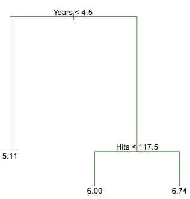

图 8.1. 对于 Hitters 数据，一个用于预测棒球运动员对数薪水的回归树，基于他在大联盟打球的年数和前一年的安打数。在给定的内部节点处，标签（形式为 $X_j < t_k$）表示从该分割发出的左分支，右分支对应于 $X_j \geq t_k$。例如，树顶部的分割产生了两个大分支。左分支对应于 Years<4.5，右分支对应于 Years>=4.5。该树有两个内部节点和三个终端节点或叶节点。每个叶节点中的数字是落入该节点的观测值的响应变量均值。

## 使用回归树预测棒球运动员的薪水

我们使用 Hitters 数据集，根据 Years（他在大联盟打球的年数）和 Hits（他前一年的安打数）来预测棒球运动员的 Salary。我们首先删除 Salary 值缺失的观测值，并对 Salary 进行对数变换，使其分布更接近典型的钟形。（回想一下，Salary 以千美元为单位。）

图 8.1 显示了拟合到该数据的回归树。它由一系列分割规则组成，从树的顶部开始。顶部的分割将 Years<4.5 的观测值分配到左分支。¹ 这些球员的预测薪水由数据集中 Years<4.5 的球员的响应变量均值给出。对于此类球员，平均对数薪水为 5.107，因此我们预测这些球员的薪水为 $e^{5.107}$ 千美元，即 $165,174。Years>=4.5 的球员被分配到右分支，然后该组进一步根据 Hits 进行细分。总的来说，该树将球员分层或分割成预测空间中的三个区域：打球年数四年或更少的球员、打球年数五年或更多且前一年安打数少于 118 次的球员，以及打球年数五年或更多且前一年安打数至少 118 次的球员。这三个区域可以写为 $R_1 =\{X \mid Years<4.5\}$、$R_2 =\{X \mid Years>=4.5, Hits<117.5\}$ 和 $R_3 =\{X \mid Years>=4.5, Hits>=117.5\}$。图 8.2 说明了

¹ 在这些数据中，Years 和 Hits 都是整数；用于拟合此树的函数将分割点标记在两个相邻值的中点。

## 通过特征空间分层进行预测

我们现在讨论构建回归树的过程。粗略地说，有两个步骤。

1.  我们将预测变量空间——即 X₁, X₂, ..., Xₚ 的可能取值集合——划分为 J 个互不重叠的区域，R₁, R₂, ..., Rⱼ。
2.  对于落入区域 $R_j$ 的每个观测值，我们做出相同的预测，该预测值就是 $R_j$ 中训练观测值响应值的均值。

例如，假设在步骤 1 中我们得到两个区域 $R_1$ 和 $R_2$，并且第一个区域中训练观测值的响应均值为 10，而第二个区域中训练观测值的响应均值为 20。那么对于给定的观测值 $X = x$，如果 $x \in R_1$，我们将预测值为 10；如果 $x \in R_2$，我们将预测值为 20。

我们现在详细阐述上面的步骤 1。我们如何构建区域 $R_1, \dots, R_J$？理论上，区域可以具有任何形状。然而，为了简单起见，也为了便于解释所得的预测模型，我们选择将预测变量空间划分为高维矩形，或称为 *盒子*。目标是找到盒子 $R_1, \dots, R_J$，使得残差平方和最小化，其表达式为

$$\sum_{j=1}^J \sum_{i \in R_j} (y_i - \hat{y}_{R_j})^2, \tag{8.1}$$

其中 $\hat{y}_{R_j}$ 是第 $j$ 个盒子内训练观测值的平均响应。不幸的是，考虑将特征空间划分为 $J$ 个盒子的所有可能分区在计算上是不可行的。因此，我们采用一种 *自顶向下*、*贪心* 的方法，称为 *递归二元分割*。该方法是 *自顶向下* 的，因为它从树的顶部开始（此时所有观测值都属于一个区域），然后依次分割预测变量空间；每次分割都通过树下方的两个新分支来表示。它是 *贪心* 的，因为在树构建过程的每一步，都在该特定步骤做出 *最佳* 分割，而不是向前看并选择一个在未来某个步骤能带来更好树的分割。

为了执行递归二元分割，我们首先选择预测变量 $X_j$ 和分割点 $s$，使得将预测变量空间分割为区域 $\{X|X_j < s\}$ 和 $\{X|X_j \geq s\}$ 能带来残差平方和的最大可能减少。（符号 $\{X|X_j < s\}$ 表示 *预测变量空间中 $X_j$ 取值小于 $s$ 的区域*。）也就是说，我们考虑所有预测变量 $X_1, \dots, X_p$，以及每个预测变量的所有可能分割点 $s$ 的值，然后选择预测变量和分割点，使得所得树的残差平方和最低。更详细地说，对于任意 $j$ 和 $s$，我们定义一对半平面

$$R_1(j, s) = \{X|X_j < s\} \quad \text{和} \quad R_2(j, s) = \{X|X_j \geq s\}, \tag{8.2}$$

我们寻找使下式最小化的 $j$ 和 $s$ 的值

$$\sum_{i: x_i \in R_1(j,s)} (y_i - \hat{y}_{R_1})^2 + \sum_{i: x_i \in R_2(j,s)} (y_i - \hat{y}_{R_2})^2, \tag{8.3}$$

其中 $\hat{y}_{R_1}$ 是 $R_1(j, s)$ 中训练观测值的平均响应，$\hat{y}_{R_2}$ 是 $R_2(j, s)$ 中训练观测值的平均响应。找到使 (8.3) 式最小化的 $j$ 和 $s$ 的值可以相当快速地完成，特别是当特征数量 $p$ 不太大时。

接下来，我们重复这个过程，寻找最佳预测变量和最佳分割点，以便进一步分割数据，从而最小化每个结果区域内的残差平方和。然而，这一次，我们不是分割整个预测变量空间，而是分割先前确定的两个区域之一。现在我们有三个区域。同样，我们寻求进一步分割这三个区域中的一个，以最小化残差平方和。这个过程持续进行，直到达到停止标准；例如，我们可能持续进行，直到没有区域包含超过五个观测值。

一旦区域 $R_1, \dots, R_J$ 被创建，我们使用该测试观测值所属区域中训练观测值的均值来预测给定测试观测值的响应。

图 8.3 展示了该方法的一个五区域示例。

## 树剪枝

上述过程可能在训练集上产生良好的预测，但很可能导致过拟合数据，从而在测试集上表现不佳。这是因为所得的树可能过于复杂。一个更小的树，具有更少的分割（即更少的区域 $R_1, \dots, R_J$），可能会以一点偏差为代价，带来更低的方差和更好的可解释性。上述过程的一个可能替代方案是，仅当每次分割带来的残差平方和减少超过某个（高）阈值时才构建树。这种策略将导致更小的树，但过于短视，因为树早期一个看似无价值的分割之后，可能会跟随着一个非常好的分割——即一个在后期带来残差平方和大幅减少的分割。

因此，更好的策略是生长一棵非常大的树 $T_0$，然后对其进行 *剪枝* 以获得一棵 *子树*。我们如何确定剪枝的最佳方式？直观地说，我们的目标是选择一棵导致最低测试错误率的子树。给定一棵子树，我们可以使用交叉验证或验证集方法来估计其测试错误。然而，估计每个可能子树的交叉验证错误将过于繁琐，因为可能的子树数量极其庞大。相反，我们需要一种方法来选择一小部分子树进行考虑。

*代价复杂度剪枝*——也称为 *最弱链接剪枝*——为我们提供了一种方法。我们不是考虑每个可能的子树，而是考虑一个由非负调优参数 $\alpha$ 索引的树序列。对于每个 $\alpha$ 值，都对应一棵子树 $T \subset T_0$，使得

$$ \sum_{m=1}^{|T|} \sum_{i: x_i \in R_m} (y_i - \hat{y}_{R_m})^2 + \alpha |T| \qquad (8.4) $$

尽可能小。这里 $|T|$ 表示树 $T$ 的终端节点数量，$R_m$ 是对应于第 $m$ 个终端节点的矩形（即预测变量空间的子集），$\hat{y}_{R_m}$ 是与 $R_m$ 相关的预测响应——即 $R_m$ 中训练观测值的均值。调优参数 $\alpha$ 控制着子树复杂度与其对训练数据拟合度之间的权衡。当 $\alpha = 0$ 时，子树 $T$ 将简单地等于 $T_0$，因为此时 (8.4) 式仅衡量训练误差。然而，随着 $\alpha$ 的增加，拥有一棵具有许多终端节点的树需要付出代价，因此量 (8.4) 将倾向于在更小的子树上最小化。方程 8.4 让人想起第 6 章中的 lasso (6.7)，其中使用了类似的公式来控制线性模型的复杂度。

事实证明，当我们在 (8.4) 式中将 $\alpha$ 从零开始增加时，分支会以嵌套和可预测的方式从树中被剪除，因此获得整个子树序列作为 $\alpha$ 的函数是容易的。我们可以使用验证集或交叉验证来选择一个 $\alpha$ 值。然后我们返回完整数据集，并获得对应于 $\alpha$ 的子树。这个过程在算法 8.1 中进行了总结。

图 8.4 和 8.5 展示了在 **Hitters** 数据上拟合和剪枝回归树的结果，使用了九个特征。首先，我们将数据集随机分成两半，训练集包含 132 个观测值，测试集包含 131 个观测值。然后我们在训练数据上构建了一棵大的回归树，并改变 (8.4) 式中的 $\alpha$ 以创建具有不同数量终端节点的子树。最后，我们执行了六折交叉验证，以估计这些树的交叉验证均方误差为

## 算法 8.1 构建回归树

1.  使用递归二元分割在训练数据上生成一棵大树，仅当每个终端节点的观测数少于某个最小值时才停止。
2.  对大树应用代价复杂度剪枝，以获得一系列最佳子树，作为 $\alpha$ 的函数。
3.  使用K折交叉验证来选择 $\alpha$。即将训练观测分为 $K$ 折。对于每个 $k = 1, \dots, K$：
    (a) 在除第 $k$ 折外的所有训练数据上重复步骤1和2。
    (b) 评估在留出的第 $k$ 折数据上的均方预测误差，作为 $\alpha$ 的函数。
    对每个 $\alpha$ 值的结果取平均，并选择使平均误差最小的 $\alpha$。
4.  返回步骤2中对应于所选 $\alpha$ 值的子树。

作为 $\alpha$ 的函数。（我们选择进行六折交叉验证，因为132是六的整数倍。）未剪枝的回归树如图8.4所示。图8.5中的绿色曲线显示了交叉验证误差作为叶节点数量的函数，而橙色曲线表示测试误差。图中还显示了估计误差周围的标准误差条。作为参考，训练误差曲线以黑色显示。交叉验证误差是测试误差的合理近似：交叉验证误差在三节点树时达到最小值，而测试误差也在三节点树时下降（尽管其最低值出现在十节点树）。包含三个终端节点的剪枝树如图8.1所示。

## 8.1.2 分类树

*分类树*与回归树非常相似，不同之处在于它用于预测定性响应而非定量响应。回顾一下，对于回归树，观测的预测响应由属于同一终端节点的训练观测的平均响应给出。相反，对于分类树，我们预测每个观测属于其所在区域中训练观测的*最常见类别*。在解释分类树的结果时，我们通常不仅对特定终端节点区域对应的类别预测感兴趣，还对落入该区域的训练观测的*类别比例*感兴趣。

构建分类树的任务与构建回归树的任务非常相似。正如在回归设置中一样，我们使用递归二元分割来生成分类树。然而，在分类设置中，RSS不能用作进行二元分割的标准。RSS的一个自然替代是*分类错误率*。由于我们计划将给定区域中的观测分配给该区域中训练观测的*最常见类别*，因此分类错误率就是该区域中不属于最常见类别的训练观测的比例：

$$E = 1 - \max_k(\hat{p}_{mk}).$$

这里 $\hat{p}_{mk}$ 表示第 $m$ 个区域中来自第 $k$ 类的训练观测的比例。然而，事实证明分类错误对于树的生长不够敏感，在实践中另外两种度量更可取。

*基尼指数*定义为

$$G = \sum_{k=1}^K \hat{p}_{mk}(1 - \hat{p}_{mk}),$$

这是跨 $K$ 个类别的总方差的度量。不难看出，如果所有 $\hat{p}_{mk}$ 都接近零或一，基尼指数会取较小的值。因此，基尼指数被称为节点*纯度*的度量——较小的值表示节点主要包含来自单一类别的观测。

基尼指数的替代是*熵*，由下式给出

$$D = -\sum_{k=1}^{K} \hat{p}_{mk} \log \hat{p}_{mk}. \quad (8.7)$$

由于 $0 \le \hat{p}_{mk} \le 1$，因此 $0 \le -\hat{p}_{mk} \log \hat{p}_{mk}$。可以证明，如果 $\hat{p}_{mk}$ 都接近零或接近一，熵将取接近零的值。因此，与基尼指数类似，如果第 $m$ 个节点是纯的，熵将取较小的值。事实上，基尼指数和熵在数值上非常相似。

在构建分类树时，通常使用基尼指数或熵来评估特定分割的质量，因为这两种方法比分类错误率对节点纯度更敏感。在*剪枝*树时，这三种方法中的任何一种都可能被使用，但如果最终剪枝树的预测准确性是目标，则分类错误率更可取。

图8.6显示了在心脏数据集上的一个例子。这些数据包含303名胸痛患者的二元结果HD。结果值为Yes表示基于血管造影测试存在心脏病，而No表示没有心脏病。有13个预测变量，包括年龄、性别、Chol（胆固醇测量值）以及其他心脏和肺功能测量值。交叉验证产生了一棵有六个终端节点的树。

在我们迄今为止的讨论中，我们假设预测变量取连续值。然而，即使存在定性预测变量，也可以构建决策树。例如，在心脏数据中，一些预测变量，如性别、Thal（铊压力测试）和ChestPain，是定性的。因此，对其中一个变量进行分割相当于将一些定性值分配给一个分支，将其余值分配给另一个分支。在图8.6中，一些内部节点对应于分割定性变量。例如，顶部的内部节点对应于分割Thal。文本Thal:a表示从该节点出来的左分支由Thal变量第一个值（正常）的观测组成，右节点由其余观测（固定或可逆缺陷）组成。文本ChestPain:bc在树的左侧向下两个分割处表示从该节点出来的左分支由ChestPain变量第二个和第三个值的观测组成，其中可能的值是典型心绞痛、非典型心绞痛、非心绞痛性疼痛和无症状。

图8.6有一个令人惊讶的特征：一些分割产生两个具有*相同预测值*的终端节点。例如，考虑未剪枝树右下角附近的分割RestECG<1。无论RestECG的值如何，对于这些观测都预测响应值为Yes。那么，为什么还要进行这个分割呢？进行这个分割是因为它导致了*节点纯度*的提高。也就是说，与右叶节点对应的9个观测的响应值都是Yes，而与左叶节点对应的7/11的观测响应值为Yes。为什么节点纯度很重要？假设我们有一个属于该右叶节点区域的测试观测。那么我们可以相当确定其响应值为Yes。相反，如果一个测试观测属于左叶节点区域，那么其响应值可能是Yes，但我们确定性要低得多。尽管分割RestECG<1没有减少分类错误，但它改善了基尼指数和熵，这两者对节点纯度更敏感。

## 8.1.3 树与线性模型

回归和分类树与第3章和第4章中介绍的更经典的回归和分类方法风格迥异。特别是，线性回归假设模型形式为

$$f(X) = \beta_0 + \sum_{j=1}^p X_j \beta_j, \quad (8.8)$$

而回归树假设模型形式为

$$f(X) = \sum_{m=1}^M c_m \cdot 1_{(X \in R_m)} \quad (8.9)$$

其中 $R_1, \dots, R_M$ 表示特征空间的划分，如图8.3所示。哪种模型更好？这取决于手头的问题。如果特征和响应之间的关系可以很好地用(8.8)中的线性模型近似，那么像线性回归这样的方法可能会效果很好，并且会优于不利用这种线性结构的回归树等方法。相反，如果特征和响应之间存在如模型(8.9)所示的高度非线性和复杂关系，那么决策树可能优于经典方法。图8.7展示了一个说明性例子。基于树的方法和经典方法的相对性能可以通过估计测试误差来评估，可以使用交叉验证或验证集方法（第5章）。

当然，在选择统计学习方法时，除了测试误差之外，其他考虑因素也可能发挥作用；例如，在某些情况下，出于可解释性和可视化的目的，可能更倾向于使用树进行预测。

## 8.1.4 树的优缺点

用于回归和分类的决策树比第3章和第4章中看到的更经典的方法有许多优点：

-   树非常容易向人们解释。事实上，它们甚至比线性回归更容易解释！

## 8. 基于树的方法

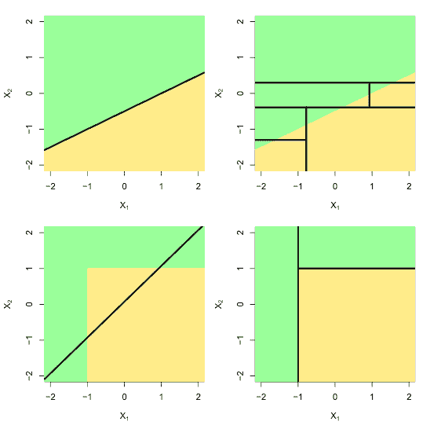

**图 8.7.** 上行：*一个二维分类示例，其中真实决策边界是线性的，并由阴影区域表示。假设边界为线性的经典方法（左）将优于执行平行于坐标轴分裂的决策树（右）。* 下行：*此处真实决策边界是非线性的。线性模型无法捕捉真实决策边界（左），而决策树则成功捕捉（右）。*

- 有些人认为，决策树比前几章中看到的回归和分类方法更接近地反映了人类的决策过程。
- 树可以图形化显示，即使非专家也能轻松解释（尤其是当树较小时）。
- 树可以轻松处理定性预测变量，而无需创建虚拟变量。
- 不幸的是，树通常不具备本书中其他一些回归和分类方法相同的预测精度水平。
- 此外，树可能非常不稳健。换句话说，数据的微小变化可能导致最终估计树的大幅变化。

然而，通过聚合许多决策树，使用*装袋*、*随机森林*和*提升*等方法，树的预测性能可以得到显著提高。我们将在下一节介绍这些概念。

## 8.2 装袋、随机森林、提升和贝叶斯加性回归树

*集成*方法是一种结合许多简单“构建块”模型以获得单个且可能非常强大的模型的方法。这些简单的构建块模型有时被称为*弱学习器*，因为它们单独使用时可能导致平庸的预测。

我们现在将讨论装袋、随机森林、提升和贝叶斯加性回归树。这些是集成方法，其中简单的构建块是回归树或分类树。

### 8.2.1 装袋

第5章介绍的自助法是一个极其强大的思想。它用于许多难以甚至无法直接计算感兴趣量标准差的情况。我们在这里看到，自助法可以在完全不同的背景下使用，以改进决策树等统计学习方法。

第8.1节讨论的决策树存在*高方差*问题。这意味着，如果我们随机将训练数据分成两部分，并对两半数据拟合一个决策树，我们得到的结果可能大相径庭。相比之下，*低方差*的程序如果重复应用于不同的数据集，将产生相似的结果；如果$n$与$p$的比率适中，线性回归往往具有低方差。*自助聚合*，或*装袋*，是一种降低统计学习方法方差的通用程序；我们在这里介绍它，因为它在决策树的背景下特别有用且经常使用。

回想一下，给定一组$n$个独立观测值$Z_1, \dots, Z_n$，每个观测值的方差为$\sigma^2$，则观测值均值$\bar{Z}$的方差为$\sigma^2/n$。换句话说，*对一组观测值取平均可以降低方差*。因此，降低统计学习方法方差并提高测试集准确性的自然方法是从总体中获取许多训练集，使用每个训练集构建一个单独的预测模型，然后对结果预测取平均。换句话说，我们可以使用$B$个单独的训练集计算$\hat{f}^1(x), \hat{f}^2(x), \dots, \hat{f}^B(x)$，并对它们取平均以获得单个低方差统计学习模型，由下式给出

$$\hat{f}_{\text{avg}}(x) = \frac{1}{B} \sum_{b=1}^{B} \hat{f}^b(x).$$

当然，这不切实际，因为我们通常无法访问多个训练集。相反，我们可以通过从（单个）训练数据集中重复抽样来进行自助。在这种方法中，我们生成$B$个不同的自助训练数据集。然后我们在第$b$个自助训练集上训练我们的方法以获得$\hat{f}^{*b}(x)$，最后对所有预测取平均，得到

$$\hat{f}_{\text{bag}}(x) = \frac{1}{B} \sum_{b=1}^{B} \hat{f}^{*b}(x).$$

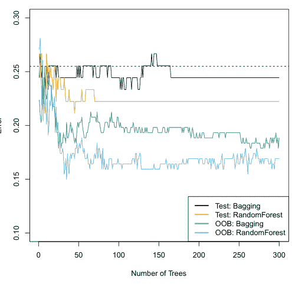

**图 8.8.** 心脏数据的装袋和随机森林结果。测试误差（黑色和橙色）显示为所用自助训练集数量$B$的函数。随机森林应用时$m = \sqrt{p}$。虚线表示单个分类树产生的测试误差。绿色和蓝色轨迹显示OOB误差，在这种情况下，由于偶然因素，其值明显较低。

这就是装袋。

虽然装袋可以改进许多回归方法的预测，但它对决策树特别有用。要将装袋应用于回归树，我们只需使用$B$个自助训练集构建$B$棵回归树，然后对结果预测取平均。这些树生长得很深，并且没有被剪枝。因此，每棵单独的树具有高方差，但低偏差。对这$B$棵树取平均可以降低方差。装袋已被证明通过将数百甚至数千棵树组合成一个单一程序，可以显著提高准确性。

到目前为止，我们已经在回归背景下描述了装袋程序，以预测定量结果$Y$。如何将装袋扩展到$Y$是定性的分类问题？在这种情况下，有几种可能的方法，但最简单的方法如下。对于给定的测试观测值，我们可以记录$B$棵树中每棵树预测的类别，并进行多数投票：总体预测是$B$个预测中最常出现的类别。

图8.8显示了在心脏数据上使用装袋树的结果。测试错误率显示为使用自助训练数据集构建的树的数量$B$的函数。我们看到，在这种情况下，装袋测试错误率略低于从单棵树获得的测试错误率。树的数量$B$在装袋中不是一个关键参数；使用非常大的$B$值不会导致过拟合。在实践中，我们使用足够大的$B$值，使误差稳定下来。在这个例子中，使用$B = 100$足以获得良好的性能。

### 包外误差估计

事实证明，有一种非常直接的方法来估计装袋模型的测试误差，而无需执行交叉验证或验证集方法。回想一下，装袋的关键在于树被反复拟合到观测值的自助子集上。可以证明，平均而言，每棵装袋树使用大约三分之二的观测值。$^3$ 未用于拟合给定装袋树的剩余三分之一观测值被称为*包外*（OOB）观测值。我们可以使用每棵该观测值为OOB的树来预测第$i$个观测值的响应。这将为第$i$个观测值产生大约$B/3$个预测。为了获得第$i$个观测值的单个预测，我们可以对这些预测响应取平均（如果目标是回归）或进行多数投票（如果目标是分类）。这将为第$i$个观测值产生一个单独的OOB预测。可以以这种方式为每个$n$个观测值获得一个OOB预测，从中可以计算出整体OOB均方误差（对于回归问题）或分类错误（对于分类问题）。由此产生的OOB误差是装袋模型测试误差的有效估计，因为每个观测值的响应仅使用未使用该观测值拟合的树进行预测。图8.8显示了心脏数据上的OOB误差。可以证明，当$B$足够大时，OOB误差实际上等同于留一交叉验证误差。在大数据集上执行装袋时，OOB方法对于估计测试误差特别方便，因为交叉验证在计算上会非常繁重。

### 变量重要性度量

正如我们所讨论的，装袋通常比使用单棵树预测能提高准确性。然而，不幸的是，它可能难以解释所得模型。回想一下，决策树的优点之一是产生的有吸引力且易于解释的图表，如图8.1所示的图表。然而，当我们装袋大量树时，就不再可能用单棵树来表示所得的统计学习程序，也不再清楚哪些变量对该程序最重要。因此，装袋以牺牲可解释性为代价提高了预测准确性。

尽管装袋树的集合比单棵树更难解释，但可以使用残差平方和（RSS）（对于装袋回归树）或基尼指数（对于装袋分类树）获得每个预测变量重要性的总体摘要。在装袋回归树的情况下，我们可以记录由于在给定预测变量上分裂而导致的RSS（8.1）减少的总量，在所有$B$棵树上取平均。较大的值表示重要的预测变量。类似地，在装袋分类的背景下

$^3$这与第5章的练习2有关。


**图 8.9.** 心脏数据的变量重要性图。变量重要性使用基尼指数的平均下降量计算，并相对于最大值表示。

对于所有 $B$ 棵树，我们可以将给定预测变量上所有分裂导致的基尼指数（8.6）总下降量相加，然后取平均值。

心脏数据中*变量重要性*的图形表示如图 8.9 所示。我们看到了每个变量相对于最大值的基尼指数平均下降量。基尼指数平均下降量最大的变量是 Thal、Ca 和 ChestPain。

## 8.2.2 随机森林

*随机森林*通过一种微小的调整对袋装树进行了改进，这种调整可以*去相关*这些树。与袋装法一样，我们在自助法训练样本上构建许多决策树。但在构建这些决策树时，每次考虑树中的一个分裂时，都会从完整的 $p$ 个预测变量中*随机抽取 $m$ 个预测变量*作为分裂候选。分裂只允许使用这 $m$ 个预测变量中的一个。每次分裂时都会抽取一个新的 $m$ 个预测变量的样本，通常我们选择 $m \approx \sqrt{p}$——也就是说，每次分裂考虑的预测变量数量大约等于预测变量总数的平方根（对于心脏数据，是 13 个中的 4 个）。

换句话说，在构建随机森林时，在树的每次分裂处，算法*甚至不被允许考虑*大多数可用的预测变量。这听起来可能很疯狂，但它有一个巧妙的原理。假设数据集中有一个非常强的预测变量，以及一些其他中等强度的预测变量。那么在袋装树的集合中，大多数或所有树都会在顶部的分裂中使用这个强预测变量。因此，所有的袋装树看起来会非常相似。

因此，袋装树的预测将高度相关。不幸的是，对许多高度相关的量取平均值，其方差的减少程度不如对许多不相关的量取平均值。特别是，这意味着在这种情况下，袋装法不会比单棵树带来显著的方差减少。

随机森林通过强制每次分裂只考虑预测变量的一个子集来克服这个问题。因此，平均而言，$(p - m)/p$ 的分裂甚至不会考虑强预测变量，因此其他预测变量将有更多的机会。我们可以将这个过程视为*去相关*这些树，从而使生成的树的平均值变化更小，因此更可靠。

袋装法和随机森林之间的主要区别在于预测变量子集大小 $m$ 的选择。例如，如果使用 $m = p$ 构建随机森林，那么这实际上就是袋装法。在心脏数据上，使用 $m = \sqrt{p}$ 的随机森林比袋装法（$m = p$）在测试误差和 OOB 误差上都有所降低（图 8.8）。

在构建随机森林时使用较小的 $m$ 值，通常在我们有大量相关预测变量时会有所帮助。我们将随机森林应用于一个高维生物数据集，该数据集包含 349 名患者组织样本的 4,718 个基因的表达测量值。人类大约有 20,000 个基因，单个基因在特定细胞、组织和生物条件下具有不同的活性或表达水平。在这个数据集中，每个患者样本都有一个具有 15 个不同水平的定性标签：正常或 14 种不同类型癌症中的一种。我们的目标是使用随机森林，根据训练集中方差最大的 500 个基因来预测癌症类型。我们将观测值随机分为训练集和测试集，并对训练集应用随机森林，使用三个不同的分裂变量数量 $m$ 值。结果如图 8.10 所示。单棵树的错误率为 45.7%，零错误率为 75.4%。<sup>4</sup> 我们看到，使用 400 棵树足以提供良好的性能，并且在这个例子中，选择 $m = \sqrt{p}$ 比袋装法（$m = p$）在测试误差上略有改善。与袋装法一样，如果增加 $B$，随机森林不会过拟合，因此在实践中我们使用足够大的 $B$ 值，使错误率稳定下来。

## 8.2.3 提升法

我们现在讨论*提升法*，这是改进决策树预测结果的另一种方法。与袋装法一样，提升法是一种通用方法，可以应用于许多用于回归或分类的统计学习方法。在这里，我们将提升法的讨论限制在决策树的背景下。

回想一下，袋装法涉及使用自助法创建原始训练数据集的多个副本，对每个副本拟合一个单独的决策树，然后将所有树组合起来以创建一个单一的预测模型。

<sup>4</sup>零错误率是通过简单地将每个观测值分类到总体中的主导类别（在本例中是正常类别）得出的。

348 8. 基于树的方法


**图 8.10.** 针对具有 $p = 500$ 个预测变量的 15 类基因表达数据集的随机森林结果。测试误差显示为树数量的函数。每条彩色线对应于不同的 $m$ 值，即每个内部树节点可用于分裂的预测变量数量。随机森林（$m < p$）比袋装法（$m = p$）略有改善。单棵分类树的错误率为 $45.7\%$。

预测模型。值得注意的是，每棵树都是在独立于其他树的自助数据集上构建的。提升法的工作方式类似，不同之处在于这些树是*顺序*生长的：每棵树的生长都使用先前生长的树的信息。提升法不涉及自助采样；相反，每棵树都是在原始数据集的修改版本上拟合的。

首先考虑回归设置。与袋装法一样，提升法涉及组合大量的决策树，$\hat{f}^1, \dots, \hat{f}^B$。提升法在算法 8.2 中描述。

这个过程背后的想法是什么？与将单个大树拟合到数据（这相当于*强行拟合数据*并可能过拟合）不同，提升法*缓慢学习*。给定当前模型，我们将一个决策树拟合到模型的残差上。也就是说，我们使用当前残差而不是结果 $Y$ 作为响应来拟合一棵树。然后我们将这个新的决策树添加到拟合函数中，以更新残差。这些树中的每一棵都可以相当小，只有几个终端节点，由算法中的参数 $d$ 决定。通过将小树拟合到残差，我们在 $\hat{f}$ 表现不佳的区域缓慢地改进它。收缩参数 $\lambda$ 进一步减慢了这个过程，允许更多不同形状的树来处理残差。一般来说，*缓慢学习*的统计学习方法往往表现良好。请注意，在提升法中，与袋装法不同，每棵树的构建都强烈依赖于已经生长的树。

我们刚刚描述了提升回归树的过程。提升分类树的过程类似但稍微复杂一些，此处省略细节。

### 算法 8.2 回归树的提升法

1.  对于训练集中的所有 $i$，设置 $\hat{f}(x) = 0$ 和 $r_i = y_i$。

2.  对于 $b = 1, 2, \dots, B$，重复：

    (a) 将一棵具有 $d$ 次分裂（$d+1$ 个终端节点）的树 $\hat{f}^b$ 拟合到训练数据 $(X, r)$。

    (b) 通过添加新树的收缩版本来更新 $\hat{f}$：

    $$\hat{f}(x) \leftarrow \hat{f}(x) + \lambda \hat{f}^b(x). \quad (8.10)$$

    (c) 更新残差，

    $$r_i \leftarrow r_i - \lambda \hat{f}^b(x_i). \quad (8.11)$$

3.  输出提升模型，

    $$\hat{f}(x) = \sum_{b=1}^B \lambda \hat{f}^b(x). \quad (8.12)$$

提升法有三个调整参数：

1.  树的数量 $B$。与袋装法和随机森林不同，如果 $B$ 太大，提升法可能会过拟合，尽管这种过拟合即使发生也往往很慢。我们使用交叉验证来选择 $B$。

2.  收缩参数 $\lambda$，一个小的正数。这控制了提升法学习的速度。典型值是 0.01 或 0.001，正确的选择可能取决于问题。非常小的 $\lambda$ 可能需要使用非常大的 $B$ 值才能达到良好的性能。

3.  每棵树的分裂数 $d$，它控制了提升集成模型的复杂度。通常 $d = 1$ 效果很好，在这种情况下，每棵树都是一个*树桩*，只包含一次分裂。在这种情况下，提升集成模型拟合的是一个加性模型，因为每个项只涉及一个变量。更一般地说，$d$ 是*交互深度*，它控制了提升模型的交互阶数，因为 $d$ 次分裂最多可以涉及 $d$ 个变量。

在图 8.11 中，我们将提升法应用于 15 类癌症基因表达数据集，以开发一个能够区分正常类别和 14 个癌症类别的分类器。我们将测试误差显示为总树数和交互深度 $d$ 的函数。我们看到，如果包含足够多的简单树桩（交互深度为 1），它们表现良好。这个模型优于深度为 2 的模型，并且两者都优于随机森林。这突出了提升法和随机森林之间的一个区别：在提升法中，由于特定树的生长考虑了已经生长的其他树，因此较小

## 8.2.4 贝叶斯加性回归树

最后，我们讨论贝叶斯加性回归树（BART），这是另一种以决策树为基本构件的集成方法。为简化起见，我们介绍用于回归（而非分类）的BART。

回顾一下，bagging和随机森林通过对多棵回归树的预测取平均来进行预测，每棵树都使用数据和/或预测变量的随机样本构建。每棵树都是独立构建的。相比之下，boosting使用树的加权和，每棵树都是通过对当前拟合的残差进行拟合而构建的。因此，每棵新树都试图捕捉当前树集尚未捕捉到的信号。BART与这两种方法都相关：每棵树都像在bagging和随机森林中那样以随机方式构建，并且每棵树都试图捕捉当前模型尚未捕捉到的信号，就像在boosting中一样。BART的主要新颖之处在于生成新树的方式。

在介绍BART算法之前，我们先定义一些符号。我们用$K$表示回归树的数量，用$B$表示BART算法将运行的迭代次数。符号$\hat{f}_k^b(x)$表示在第$b$次迭代中使用的第$k$棵回归树在$x$处的预测值。在每次迭代结束时，该次迭代的$K$棵树将被求和，即对于$b = 1, \dots, B$，有$\hat{f}^b(x) = \sum_{k=1}^K \hat{f}_k^b(x)$。

在BART算法的第一次迭代中，所有树都被初始化为只有一个根节点，其中$\hat{f}_k^1(x) = (1/nK) \sum_{i=1}^n y_i$，即响应值的平均值除以树的总数。因此，$\hat{f}^1(x) = \sum_{k=1}^K \hat{f}_k^1(x) = \frac{1}{n} \sum_{i=1}^n y_i$。

在后续迭代中，BART逐个更新$K$棵树。在第$b$次迭代中，为了更新第$k$棵树，我们从每个响应值中减去除第$k$棵树之外所有树的预测值，以获得第$i$个观测值（$i = 1, \dots, n$）的偏残差：

$$r_i = y_i - \sum_{k' < k} \hat{f}_{k'}^b(x_i) - \sum_{k' > k} \hat{f}_{k'}^{b-1}(x_i)$$

BART并非对这个偏残差重新拟合一棵全新的树，而是从一组可能的扰动中随机选择一个对上一次迭代的树（$\hat{f}_k^{b-1}$）进行扰动，倾向于选择那些能改善对偏残差拟合的扰动。这种扰动包含两个组成部分：

1.  我们可以通过添加或修剪分支来改变树的结构。
2.  我们可以改变树中每个终端节点的预测值。

图8.12展示了对一棵树进行可能扰动的示例。

BART的输出是一组预测模型，$\hat{f}^b(x) = \sum_{k=1}^K \hat{f}_k^b(x)$，其中$b = 1, 2, \dots, B$。

我们通常会丢弃前几个预测模型，因为在早期迭代（称为*预热*期）获得的模型往往不能提供很好的结果。我们可以用$L$表示预热迭代次数；例如，我们可以取$L = 200$。然后，为了获得单一预测，我们只需取预热迭代后的平均值，$\hat{f}(x) = \frac{1}{B-L} \sum_{b=L+1}^B \hat{f}^b(x)$。然而，也可以计算平均值以外的量：例如，$\hat{f}^{L+1}(x), \dots, \hat{f}^B(x)$的分位数提供了最终预测的不确定性度量。整个BART流程总结在算法8.3中。

BART方法的一个关键要素是，在步骤3(a)ii中，我们*不*对当前偏残差重新拟合一棵全新的树：相反，我们试图通过稍微修改上一次迭代获得的树来改善对当前偏残差的拟合（见图8.12）。粗略地说，这可以防止过拟合，因为它限制了我们在每次迭代中“用力”拟合数据的程度。此外，单棵树通常相当小。我们限制树的大小是为了避免对数据过拟合，如果我们生长非常大的树，这种情况更有可能发生。

图8.13展示了将BART应用于Heart数据的结果，使用$K = 200$棵树，随着迭代次数增加到10,000次。在初始迭代期间，测试误差和训练误差会有些跳跃。在这个初始预热期之后，误差率趋于稳定。我们注意到训练误差和测试误差之间只有很小的差异，这表明树扰动过程在很大程度上避免了过拟合。

图8.13也显示了boosting的训练和测试误差。我们看到boosting的测试误差接近BART的测试误差，但随着迭代次数的增加开始上升。此外，boosting的训练误差随着迭代次数的增加而下降，这表明boosting对数据过拟合了。

尽管细节超出了本书的范围，但事实证明，BART方法可以被视为一种*贝叶斯*方法来拟合树的集成：每次我们随机扰动一棵树以拟合残差时，我们实际上是从一个*后验*分布中抽取一棵新树。（当然，这种贝叶斯联系是BART名称的由来。）此外，算法8.3可以被视为一种用于拟合BART模型的*马尔可夫链蒙特卡洛*算法。

当我们应用BART时，必须选择树的数量$K$、迭代次数$B$和预热迭代次数$L$。我们通常选择较大的$B$和$K$值，以及适中的$L$值：例如，$K = 200$，$B = 1,000$，$L = 100$是一个合理的选择。BART已被证明具有非常出色的开箱即用性能——也就是说，它在最小调优的情况下表现良好。

### 算法8.3 贝叶斯加性回归树

1.  令$\hat{f}_1^1(x) = \hat{f}_2^1(x) = \cdots = \hat{f}_K^1(x) = \frac{1}{nK} \sum_{i=1}^n y_i$。
2.  计算$\hat{f}^1(x) = \sum_{k=1}^K \hat{f}_k^1(x) = \frac{1}{n} \sum_{i=1}^n y_i$。
3.  对于$b = 2, \ldots, B$：
    (a) 对于$k = 1, 2, \ldots, K$：
        i. 对于$i = 1, \ldots, n$，计算当前偏残差
        $$r_i = y_i - \sum_{k' < k} \hat{f}_{k'}^b(x_i) - \sum_{k' > k} \hat{f}_{k'}^{b-1}(x_i).$$
        ii. 通过随机扰动上一次迭代的第$k$棵树$\hat{f}_k^{b-1}(x)$，拟合一棵新树$\hat{f}_k^b(x)$到$r_i$。倾向于选择能改善拟合的扰动。
    (b) 计算$\hat{f}^b(x) = \sum_{k=1}^K \hat{f}_k^b(x)$。
4.  计算$L$个预热样本后的平均值，
    $$\hat{f}(x) = \frac{1}{B-L} \sum_{b=L+1}^B \hat{f}^b(x).$$

## 8.2.5 树集成方法总结

树作为集成方法的弱学习器具有吸引力，原因有很多，包括其灵活性和处理

## 8.3 实验室：基于树的方法

我们在顶层导入一些常用的库。

```python
import numpy as np
import pandas as pd
from matplotlib.pyplot import subplots
from statsmodels.datasets import get_rdataset
import sklearn.model_selection as skm
from ISLP import load_data, confusion_table
from ISLP.models import ModelSpec as MS
```

我们还收集了本实验所需的新导入。

```python
from sklearn.tree import (DecisionTreeClassifier as DTC,
                         DecisionTreeRegressor as DTR,
                         plot_tree,
                         export_text)
from sklearn.metrics import (accuracy_score,
                             log_loss)
from sklearn.ensemble import (RandomForestRegressor as RF,
     GradientBoostingRegressor as GBR)
from ISLP.bart import BART
```

混合类型的预测变量（即定性以及定量）。我们现在已经看到了四种拟合树集成的方法：装袋法、随机森林、提升法和BART。

- 在*装袋法*中，树是在观测值的随机样本上独立生长的。因此，树之间往往非常相似。所以，装袋法可能会陷入局部最优，并且可能无法彻底探索模型空间。
- 在*随机森林*中，树同样是在观测值的随机样本上独立生长的。然而，每棵树上的每次分裂都使用特征的一个随机子集进行，从而降低了树之间的相关性，并导致相对于装袋法更彻底地探索模型空间。
- 在*提升法*中，我们只使用原始数据，不抽取任何随机样本。树是依次生长的，采用一种“缓慢”学习的方法：每棵新树都拟合之前树留下的信号，并在使用前进行收缩。
- 在*BART*中，我们同样只使用原始数据，并且依次生长树。然而，每棵树都会被扰动，以避免局部最小值并实现更彻底的模型空间探索。

### 8.3.1 拟合分类树

我们首先使用分类树来分析`Carseats`数据集。在这些数据中，`Sales`是一个连续变量，因此我们首先将其重新编码为二元变量。我们使用`where()`函数创建一个名为`High`的变量，如果`Sales`变量超过8，则取值为`Yes`，否则取值为`No`。

```python
Carseats = load_data('Carseats')
High = np.where(Carseats.Sales > 8,
                "Yes",
                "No")
```

我们现在使用`DecisionTreeClassifier()`来拟合一个分类树，以便使用除`Sales`外的所有变量来预测`High`。为此，我们必须像拟合回归模型时那样构建一个模型矩阵。

```python
model = MS(Carseats.columns.drop('Sales'), intercept=False)
D = model.fit_transform(Carseats)
feature_names = list(D.columns)
X = np.asarray(D)
```

我们将`D`从数据框转换为数组`X`，这在下面的一些分析中是必需的。我们还需要`feature_names`来为后面的绘图添加注释。

指定分类器需要几个选项，例如`max_depth`（树生长的深度）、`min_samples_split`（节点中进行分裂所需的最小观测数）和`criterion`（使用基尼系数还是交叉熵作为分裂标准）。我们还设置了`random_state`以确保可重复性；分裂标准中的平局是随机打破的。

```python
clf = DTC(criterion='entropy',
          max_depth=3,
          random_state=0)
clf.fit(X, High)
```

```
DecisionTreeClassifier(criterion='entropy', max_depth=3)
```

在我们第3.3节关于定性特征的讨论中，我们注意到对于线性回归模型，这样的特征可以通过在模型矩阵中包含一个虚拟变量矩阵（独热编码）来表示，使用`statsmodels`的公式表示法。如第8.1节所述，在构建决策树时，有一种更自然的方法来处理定性特征，不需要这样的虚拟变量；每次分裂相当于将水平划分为两组。然而，`sklearn`的决策树实现并没有利用这种方法；相反，它只是将独热编码的水平视为单独的变量。

```python
accuracy_score(High, clf.predict(X))
```

```
0.7275
```

仅使用默认参数，训练错误率为21%。对于分类树，我们可以使用`log_loss()`来访问偏差的值，

$$-2 \sum_{m} \sum_{k} n_{mk} \log \hat{p}_{mk}$$

其中$n_{mk}$是第$m$个终端节点中属于第$k$类的观测数。

```python
resid_dev = np.sum(log_loss(High, clf.predict_proba(X)))
resid_dev
```

```
Out[7]: 0.4711
```

这与(8.7)中定义的*熵*密切相关。较小的偏差表明树对（训练）数据拟合良好。

树最吸引人的特性之一是它们可以图形化显示。这里我们使用`plot()`函数来显示树结构（此处未显示）。

```python
ax = subplots(figsize=(12,12))[1]
plot_tree(clf,
          feature_names=feature_names,
          ax=ax);
```

`Sales`最重要的指标似乎是`ShelveLoc`。

我们可以使用`export_text()`查看树的文本表示，它显示了每个分支的分裂标准（例如`Price <= 92.5`）。对于叶节点，它显示总体预测（`Yes`或`No`）。通过指定`show_weights=True`，我们还可以看到该叶节点中取值为`Yes`和`No`的观测数。

```python
print(export_text(clf,
                   feature_names=feature_names,
                   show_weights=True))
```

```
Out[9]: |--- ShelveLoc[Good] <= 0.50
|   |--- Price <= 92.50
|   |   |--- Income <= 57.00
|   |   |   |--- weights: [7.00, 3.00] class: No
|   |   |--- Income >  57.00
|   |   |   |--- weights: [7.00, 29.00] class: Yes
|   |--- Price >  92.50
|   |   |--- Advertising <= 13.50
|   |   |   |--- weights: [183.00, 41.00] class: No
|   |   |--- Advertising >  13.50
|   |   |   |--- weights: [20.00, 25.00] class: Yes
|--- ShelveLoc[Good] >  0.50
|   |--- Price <= 135.00
|   |   |--- US[Yes] <= 0.50
|   |   |   |--- weights: [6.00, 11.00] class: Yes
|   |   |--- US[Yes] >  0.50
|   |   |   |--- weights: [2.00, 49.00] class: Yes
|   |--- Price >  135.00
|   |   |--- Income <= 46.00
|   |   |   |--- weights: [6.00, 0.00] class: No
|   |   |--- Income >  46.00
|   |   |   |--- weights: [5.00, 6.00] class: Yes
```

为了正确评估分类树在这些数据上的性能，我们必须估计测试误差，而不是仅仅计算训练误差。我们将观测值分为训练集和测试集，使用训练集构建树，并在测试数据上评估其性能。这种模式与第6章类似，只是这里的线性模型被决策树所取代——验证的代码几乎相同。这种方法在测试数据集上对68.5%的位置做出了正确预测。

```python
validation = skm.ShuffleSplit(n_splits=1,
                                test_size=200,
                                random_state=0)
results = skm.cross_validate(clf,
                             D,
                             High,
                             cv=validation)
results['test_score']
```

```
Out[10]: array([0.685])
```

接下来，我们考虑剪枝树是否可能导致分类性能的提高。我们首先将数据分为训练集和测试集。我们将使用交叉验证在训练集上剪枝树，然后在测试集上评估剪枝树的性能。

```python
(X_train,
 X_test,
 High_train,
 High_test) = skm.train_test_split(X,
                                    High,
                                    test_size=0.5,
                                    random_state=0)
```

我们首先在训练集上重新拟合完整的树；这里我们不设置`max_depth`参数，因为我们将通过交叉验证来学习它。

```python
clf = DTC(criterion='entropy', random_state=0)
clf.fit(X_train, High_train)
accuracy_score(High_test, clf.predict(X_test))
```

```
Out[12]: 0.735
```

接下来，我们使用`clf`的`cost_complexity_pruning_path()`方法来提取代价复杂度值。

```python
ccp_path = clf.cost_complexity_pruning_path(X_train, High_train)
kfold = skm.KFold(10,
                  random_state=1,
                  shuffle=True)
```

这产生了一组不纯度和$\alpha$值，我们可以通过交叉验证从中提取一个最优值。

```python
grid = skm.GridSearchCV(clf,
                        {'ccp_alpha': ccp_path.ccp_alphas},
                        refit=True,
```

## 8.3.2 拟合回归树

这里我们对 `Boston` 数据集拟合一个回归树。其步骤与分类树类似。

```python
Boston = load_data("Boston")
model = MS(Boston.columns.drop('medv'), intercept=False)
D = model.fit_transform(Boston)
feature_names = list(D.columns)
X = np.asarray(D)
```

首先，我们将数据划分为训练集和测试集，并将树拟合到训练数据上。这里我们使用30%的数据作为测试集。

```python
(X_train,
 X_test,
 y_train,
 y_test) = skm.train_test_split(X,
                                Boston['medv'],
                                test_size=0.3,
                                random_state=0)
```

在形成训练集和测试集之后，我们拟合回归树。

```python
reg = DTR(max_depth=3)
reg.fit(X_train, y_train)
ax = subplots(figsize=(12,12))[1]
plot_tree(reg,
          feature_names=feature_names,
          ax=ax);
```

变量 `lstat` 衡量的是社会经济地位较低的个体所占的百分比。该树表明，`lstat` 的值越低，对应的房价越贵。该树预测，在居民社会经济地位较低（`lstat` > 14.4）且犯罪率中等（`crim` > 5.8）的郊区，小型住宅（rm < 6.8）的中位数房价为12,042美元。

现在我们使用交叉验证函数来查看剪枝是否会提高性能。

```python
ccp_path = reg.cost_complexity_pruning_path(X_train, y_train)
kfold = skm.KFold(5,
                  shuffle=True,
                  random_state=10)
grid = skm.GridSearchCV(reg,
                       {'ccp_alpha': ccp_path.ccp_alphas},
                       refit=True,
                       cv=kfold,
                       scoring='neg_mean_squared_error')
G = grid.fit(X_train, y_train)
```

根据交叉验证的结果，我们使用剪枝后的树在测试集上进行预测。

```python
best_ = grid.best_estimator_
np.mean((y_test - best_.predict(X_test))**2)
```

Out[22]: 28.07

换句话说，与该回归树相关的测试集均方误差为28.07。因此，均方误差的平方根约为5.30，这表明该模型产生的测试预测值与该郊区真实中位数房价的偏差在5300美元左右。

让我们绘制最佳树，看看它的可解释性如何。

```python
ax = subplots(figsize=(12,12))[1]
plot_tree(G.best_estimator_,
          feature_names=feature_names,
          ax=ax);
```

## 8.3.3 Bagging 和随机森林

这里我们使用 `sklearn.ensemble` 包中的 `RandomForestRegressor()` 将 bagging 和随机森林应用于 Boston 数据。回顾一下，bagging 只是随机森林在 $m = p$ 时的特例。因此，`RandomForestRegressor()` 函数可用于执行 bagging 和随机森林。我们从 bagging 开始。

```python
bag_boston = RF(max_features=X_train.shape[1], random_state=0)
bag_boston.fit(X_train, y_train)
```

Out[24]: RandomForestRegressor(max_features=12, random_state=0)

参数 `max_features` 表示在树的每次分裂时都应考虑所有12个预测变量——换句话说，应执行 bagging。这个 bagging 模型在测试集上的表现如何？

```python
ax = subplots(figsize=(8,8))[1]
y_hat_bag = bag_boston.predict(X_test)
ax.scatter(y_hat_bag, y_test)
np.mean((y_test - y_hat_bag)**2)
```

Out[25]: 14.63

与 bagging 回归树相关的测试集均方误差为14.63，大约是使用最优剪枝的单棵树所得结果的一半。我们可以通过使用 `n_estimators` 参数来改变生成的树的数量（默认为100）：

```python
bag_boston = RF(max_features=X_train.shape[1],
                n_estimators=500,
                random_state=0).fit(X_train, y_train)
y_hat_bag = bag_boston.predict(X_test)
np.mean((y_test - y_hat_bag)**2)
```

Out[26]: 14.61

变化不大。Bagging 和随机森林不会因为增加树的数量而过拟合，但如果树的数量太少，则可能欠拟合。

生成随机森林的过程完全相同，只是我们使用了更小的 `max_features` 参数值。默认情况下，`RandomForestRegressor()` 在构建回归树的随机森林时使用 $p$ 个变量（即默认为 bagging），而 `RandomForestClassifier()` 在构建分类树的随机森林时使用 $\sqrt{p}$ 个变量。这里我们使用 `max_features=6`。

```python
RF_boston = RF(max_features=6,
               random_state=0).fit(X_train, y_train)
y_hat_RF = RF_boston.predict(X_test)
np.mean((y_test - y_hat_RF)**2)
```

Out[27]: 20.04

测试集均方误差为20.04；这表明在这种情况下，随机森林的表现比 bagging 稍差。从拟合模型中提取 `feature_importances_` 值，我们可以查看每个变量的重要性。

```python
feature_imp = pd.DataFrame(
    {'importance':RF_boston.feature_importances_},
    index=feature_names)
feature_imp.sort_values(by='importance', ascending=False)
```

| importance | |
| :--- | :--- |
| lstat | 0.368683 |
| rm | 0.333842 |
| ptratio | 0.057306 |
| indus | 0.053303 |
| crim | 0.052426 |
| dis | 0.042493 |
| nox | 0.034410 |
| age | 0.024327 |
| tax | 0.022368 |
| rad | 0.005048 |
| zn | 0.003238 |
| chas | 0.002557 |

这是由该变量上的分裂导致的节点不纯度总减少量的相对度量，在所有树上取平均值（这在图8.9中针对拟合到 Heart 数据的模型进行了绘制）。

结果表明，在随机森林考虑的所有树中，社区的财富水平（`lstat`）和房屋大小（`rm`）是迄今为止最重要的两个变量。

## 8.3.4 Boosting

这里我们使用 `sklearn.ensemble` 中的 `GradientBoostingRegressor()` 来拟合 Boston 数据集的提升回归树。对于分类，我们将使用 `GradientBoostingClassifier()`。参数 `n_estimators=5000` 表示我们想要5000棵树，选项 `max_depth=3` 限制了每棵树的深度。参数 `learning_rate` 是之前在 boosting 描述中提到的 λ。

```python
boost_boston = GBR(n_estimators=5000,
                  learning_rate=0.001,
                  max_depth=3,
                  random_state=0)
boost_boston.fit(X_train, y_train)
```

我们可以通过 `train_score_` 属性查看训练误差如何下降。为了了解测试误差如何下降，我们可以使用 `staged_predict()` 方法来获取路径上的预测值。

```python
test_error = np.zeros_like(boost_boston.train_score_)
for idx, y_ in enumerate(boost_boston.staged_predict(X_test)):
    test_error[idx] = np.mean((y_test - y_)**2)

plot_idx = np.arange(boost_boston.train_score_.shape[0])
ax = subplots(figsize=(8,8))[1]
ax.plot(plot_idx,
        boost_boston.train_score_,
        'b',
        label='Training')
```

我们现在使用提升模型在测试集上预测`medv`：

```python
y_hat_boost = boost_boston.predict(X_test)
np.mean((y_test - y_hat_boost)**2)
```

得到的测试均方误差为14.48，与装袋法的测试均方误差相似。如果需要，我们可以使用(8.10)中不同的收缩参数$\lambda$值进行提升。默认值为0.001，但可以轻松修改。这里我们取$\lambda = 0.2$。

```python
boost_boston = GBR(n_estimators=5000,
                  learning_rate=0.2,
                  max_depth=3,
                  random_state=0)
boost_boston.fit(X_train,
                y_train)
y_hat_boost = boost_boston.predict(X_test)
np.mean((y_test - y_hat_boost)**2)
```

在这种情况下，使用$\lambda = 0.2$得到的测试均方误差与使用$\lambda = 0.001$时几乎相同。

## 8.3.5 贝叶斯加性回归树

本节我们演示`ISLP.bart`包中BART的Python实现。我们对`Boston`住房数据集拟合一个模型。这个`BART()`估计器是为定量结果变量设计的，尽管也有其他实现可用于将逻辑回归和Probit模型拟合到分类结果。

```python
bart_boston = BART(random_state=0, burnin=5, ndraw=15)
bart_boston.fit(X_train, y_train)
```

在这个数据集上，使用这种测试集和训练集划分，我们看到BART的测试误差与随机森林相似。

```python
yhat_test = bart_boston.predict(X_test.astype(np.float32))
np.mean((y_test - yhat_test)**2)
```

我们可以检查每个变量在树集合中出现的次数。这给出了类似于提升和随机森林的变量重要性图的摘要。

```python
In [35]: var_inclusion = pd.Series(bart_boston.variable_inclusion_.mean(0),
                                index=D.columns)
        var_inclusion
```

```
Out[35]: crim        25.333333
         zn          27.000000
         indus       21.266667
         chas        20.466667
         nox         25.400000
         rm          32.400000
         age         26.133333
         dis         25.666667
         rad         24.666667
         tax         23.933333
         ptratio     25.000000
         lstat       31.866667
         dtype: float64
```

## 8.4 练习题

### 概念题

1.  绘制一个你自己发明的二维特征空间划分示例，该划分可能由递归二元分割产生。你的示例应包含至少六个区域。绘制一个对应于此划分的决策树。确保标注图形的所有方面，包括区域$R_1, R_2, \dots$、分割点$t_1, t_2, \dots$等。

    *提示：你的结果应类似于图8.1和8.2。*

2.  第8.2.3节提到，使用深度为1的树（或*树桩*）进行提升会导致一个*可加*模型：即形式为

    $$f(X) = \sum_{j=1}^{p} f_j(X_j)$$

    的模型。解释为什么会这样。你可以从算法8.2中的(8.12)开始。

3.  考虑一个简单的二分类问题中的基尼指数、分类误差和熵。创建一个单独的图，显示这些量作为$\hat{p}_{m1}$的函数。$x$轴应显示$\hat{p}_{m1}$，范围从0到1，$y$轴应显示基尼指数、分类误差和熵的值。

    *提示：在二分类问题中，$\hat{p}_{m1} = 1 - \hat{p}_{m2}$。你可以手工绘制此图，但在R中绘制会容易得多。*

4.  此问题与图8.14中的图有关。

    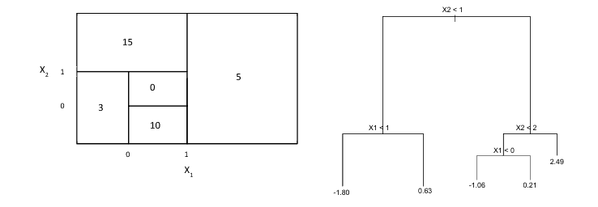

    图8.14。左：对应于练习4a的预测空间划分。右：对应于练习4b的树。

    (a) 绘制对应于图8.14左侧面板所示预测空间划分的树。方框内的数字表示每个区域内Y的均值。
    (b) 使用同一图右侧面板所示的树，创建一个类似于图8.14左侧面板的图。你应该将预测空间划分为正确的区域，并标出每个区域的均值。

5.  假设我们从一个包含红色和绿色类别的数据集中生成了十个自助样本。然后我们对每个自助样本应用一个分类树，并对于特定的X值，产生10个P(类别为红色|X)的估计值：

    0.1, 0.15, 0.2, 0.2, 0.55, 0.6, 0.6, 0.65, 0.7, 和 0.75。

    有两种常见的方法可以将这些结果组合成一个单一的类别预测。一种是本章讨论的多数投票法。第二种方法是基于平均概率进行分类。在这个例子中，这两种方法各自的最终分类是什么？

6.  详细解释用于拟合回归树的算法。

### 应用题

7.  在第8.3.3节中，我们使用max_features = 6以及n_estimators = 100和n_estimators = 500将随机森林应用于Boston数据。创建一个图，显示在此数据集上使用更全面的max_features和n_estimators值范围时随机森林产生的测试误差。你可以参考图8.10来绘制你的图。描述获得的结果。

8.  在实验中，将Sales转换为定性响应变量后，对Carseats数据集应用了分类树。现在我们将使用回归树及相关方法来预测Sales，将响应视为定量变量。

    (a) 将数据集划分为训练集和测试集。
    (b) 对训练集拟合一个回归树。绘制该树，并解释结果。你得到的测试均方误差是多少？
    (c) 使用交叉验证来确定树复杂度的最佳水平。剪枝树是否能改善测试均方误差？
    (d) 使用装袋法来分析此数据。你得到的测试均方误差是多少？使用`feature_importance_`值来确定哪些变量最重要。
    (e) 使用随机森林来分析此数据。你得到的测试均方误差是多少？使用`feature_importance_`值来确定哪些变量最重要。描述$m$（每次分割考虑的变量数）对获得的错误率的影响。
    (f) 现在使用BART分析数据，并报告你的结果。

9.  此问题涉及`ISLP`包中的`OJ`数据集。

    (a) 创建一个包含800个随机观测样本的训练集，以及包含剩余观测的测试集。
    (b) 对训练数据拟合一个树，以`Purchase`为响应，其他变量为预测变量。训练错误率是多少？
    (c) 绘制该树的图，并解释结果。该树有多少个终端节点？
    (d) 使用`export_tree()`函数生成拟合树的文本摘要。选择一个终端节点，并解释显示的信息。
    (e) 在测试数据上预测响应，并生成一个混淆矩阵，比较测试标签与预测的测试标签。测试错误率是多少？
    (f) 在训练集上使用交叉验证来确定最佳树大小。
    (g) 绘制一个图，$x$轴为树大小，$y$轴为交叉验证的分类错误率。
    (h) 哪个树大小对应于最低的交叉验证分类错误率？
    (i) 生成一个对应于使用交叉验证获得的最佳树大小的剪枝树。如果交叉验证没有导致选择剪枝树，则创建一个具有五个终端节点的剪枝树。
    (j) 比较剪枝树和未剪枝树的训练错误率。哪个更高？
    (k) 比较剪枝树和未剪枝树的测试错误率。哪个更高？

## 8. 基于树的方法

10. 我们现在使用提升法来预测 Hitters 数据集中的 Salary。

- (a) 移除薪资信息未知的观测值，然后对薪资进行对数变换。
- (b) 创建一个由前 200 个观测值组成的训练集，以及一个由剩余观测值组成的测试集。
- (c) 在训练集上执行提升法，使用 1,000 棵树，并针对一系列收缩参数 λ 的值进行。生成一个图表，x 轴为不同的收缩值，y 轴为对应的训练集均方误差。
- (d) 生成一个图表，x 轴为不同的收缩值，y 轴为对应的测试集均方误差。
- (e) 将提升法的测试集均方误差与第 3 章和第 6 章中两种回归方法得到的测试集均方误差进行比较。
- (f) 在提升模型中，哪些变量看起来是最重要的预测变量？
- (g) 现在对训练集应用装袋法。这种方法的测试集均方误差是多少？

11. 本题使用 Caravan 数据集。

- (a) 创建一个由前 1,000 个观测值组成的训练集，以及一个由剩余观测值组成的测试集。
- (b) 在训练集上拟合一个提升模型，以 Purchase 作为响应变量，其他变量作为预测变量。使用 1,000 棵树，收缩值为 0.01。哪些预测变量看起来最重要？
- (c) 使用提升模型预测测试数据上的响应。如果估计的购买概率大于 20%，则预测该人会进行购买。生成一个混淆矩阵。在预测会购买的人中，实际购买的比例是多少？这与对该数据集应用 KNN 或逻辑回归得到的结果相比如何？

12. 将提升法、装袋法、随机森林和 BART 应用于你选择的一个数据集。务必在训练集上拟合模型，并在测试集上评估其性能。与线性回归或逻辑回归等简单方法相比，结果有多准确？这些方法中哪一种性能最好？

## 9. 支持向量机

在本章中，我们讨论*支持向量机*，这是一种在 1990 年代由计算机科学界开发的分类方法，此后日益流行。SVM 已被证明在各种情况下表现良好，通常被认为是最佳的“开箱即用”分类器之一。

支持向量机是一种简单直观的分类器——*最大间隔分类器*的推广，我们将在 9.1 节介绍。尽管它优雅且简单，但我们将看到，这种分类器不幸地无法应用于大多数数据集，因为它要求类别可以通过线性边界分离。在 9.2 节，我们介绍*支持向量分类器*，这是最大间隔分类器的扩展，可以应用于更广泛的情况。9.3 节介绍*支持向量机*，这是支持向量分类器的进一步扩展，以适应非线性类别边界。支持向量机适用于二元分类设置，即有两个类别；在 9.4 节，我们讨论支持向量机向两个以上类别的扩展。在 9.5 节，我们讨论支持向量机与其他统计方法（如逻辑回归）之间的密切联系。

人们经常笼统地将最大间隔分类器、支持向量分类器和支持向量机称为“支持向量机”。为避免混淆，我们将在本章仔细区分这三个概念。

### 9.1 最大间隔分类器

在本节中，我们定义超平面并介绍最优分离超平面的概念。

#### 9.1.1 什么是超平面？

在 $p$ 维空间中，*超平面*是一个 $p - 1$ 维的平坦仿射子空间。例如，在二维空间中，超平面是一个平坦的一维子空间——换句话说，是一条线。在三维空间中，超平面是一个平坦的二维子空间——即一个平面。在 $p > 3$ 维空间中，可视化超平面可能很困难，但 $(p - 1)$ 维平坦子空间的概念仍然适用。

超平面的数学定义相当简单。在二维空间中，超平面由方程定义

$$\beta_0 + \beta_1 X_1 + \beta_2 X_2 = 0 \quad (9.1)$$

其中参数为 $\beta_0$、$\beta_1$ 和 $\beta_2$。当我们说 (9.1) “定义”了超平面时，我们的意思是任何满足 (9.1) 的 $X = (X_1, X_2)^T$ 都是超平面上的一个点。注意 (9.1) 只是一条直线的方程，因为在二维空间中超平面确实是一条直线。

方程 9.1 可以很容易地扩展到 $p$ 维情况：

$$\beta_0 + \beta_1 X_1 + \beta_2 X_2 + \cdots + \beta_p X_p = 0 \quad (9.2)$$

定义了一个 $p$ 维超平面，同样，如果 $p$ 维空间中的一个点 $X = (X_1, X_2, \ldots, X_p)^T$（即一个长度为 $p$ 的向量）满足 (9.2)，那么 $X$ 就位于超平面上。

现在，假设 $X$ 不满足 (9.2)；而是

$$\beta_0 + \beta_1 X_1 + \beta_2 X_2 + \cdots + \beta_p X_p > 0. \quad (9.3)$$

那么这告诉我们 $X$ 位于超平面的一侧。另一方面，如果

$$\beta_0 + \beta_1 X_1 + \beta_2 X_2 + \cdots + \beta_p X_p < 0, \quad (9.4)$$

那么 $X$ 位于超平面的另一侧。因此，我们可以将超平面视为将 $p$ 维空间分成两半。只需计算 (9.2) 左侧的符号，就可以轻松确定一个点位于超平面的哪一侧。图 9.1 显示了二维空间中的一个超平面。

#### 9.1.2 使用分离超平面进行分类

现在假设我们有一个 $n \times p$ 的数据矩阵 $\mathbf{X}$，它由 $p$ 维空间中的 $n$ 个训练观测值组成，

$$x_1 = \begin{pmatrix} x_{11} \\ \vdots \\ x_{1p} \end{pmatrix}, \ldots, x_n = \begin{pmatrix} x_{n1} \\ \vdots \\ x_{np} \end{pmatrix}, \quad (9.5)$$

并且这些观测值属于两个类别——即 $y_1, \ldots, y_n \in \{-1, 1\}$，其中 $-1$ 代表一个类别，$1$ 代表另一个类别。我们还有一个测试观测值，一个由观测特征组成的 $p$ 维向量 $x^* = (x_1^* \dots x_p^*)^T$。我们的目标是基于训练数据开发一个分类器，该分类器能够使用其特征测量值正确地对测试观测值进行分类。我们已经看到了许多用于此任务的方法，例如第 4 章中的线性判别分析和逻辑回归，以及第 8 章中的分类树、装袋法和提升法。我们现在将看到一种基于*分离超平面*概念的新方法。

假设可以构造一个超平面，根据类别标签完美地分离训练观测值。图 9.2 左侧面板显示了三个此类*分离超平面*的示例。我们可以将蓝色类别的观测值标记为 $y_i = 1$，将紫色类别的观测值标记为 $y_i = -1$。那么分离超平面具有以下性质：

$$\beta_0 + \beta_1 x_{i1} + \beta_2 x_{i2} + \cdots + \beta_p x_{ip} > 0 \text{ 如果 } y_i = 1, \quad (9.6)$$

以及

$$\beta_0 + \beta_1 x_{i1} + \beta_2 x_{i2} + \cdots + \beta_p x_{ip} < 0 \text{ 如果 } y_i = -1. \quad (9.7)$$

等价地，分离超平面具有以下性质：

$$y_i(\beta_0 + \beta_1 x_{i1} + \beta_2 x_{i2} + \cdots + \beta_p x_{ip}) > 0 \quad (9.8)$$

对于所有 $i = 1, \dots, n$。

如果存在分离超平面，我们可以用它来构建一个非常自然的分类器：根据测试观测值位于超平面的哪一侧来分配其类别。图 9.2 右侧面板显示了此类分类器的一个示例。也就是说，我们根据 $f(x^*) = \beta_0 + \beta_1 x_1^* + \beta_2 x_2^* + \cdots + \beta_p x_p^*$ 的符号对测试观测值 $x^*$ 进行分类。如果 $f(x^*)$ 为正，则将测试观测值分配到类别 1；如果 $f(x^*)$ 为负，则将其分配到类别 $-1$。我们还可以利用 $f(x^*)$ 的*大小*。如果

## 9. 支持向量机

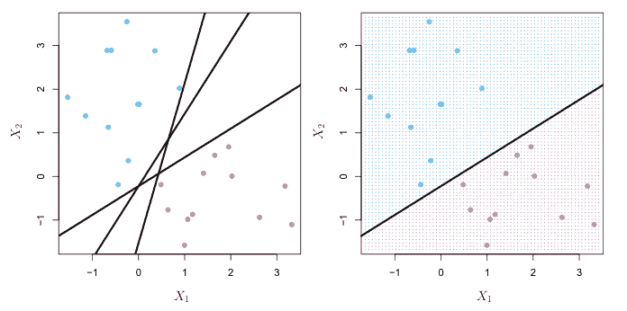

**图 9.2.** *左图：* 有两类观测值，分别以蓝色和紫色显示，每类都有两个变量的测量值。图中以黑色显示了众多可能的分离超平面中的三个。*右图：* 一条分离超平面以黑色显示。蓝色和紫色的网格表示基于该分离超平面的分类器所做的决策规则：落在网格蓝色部分的测试观测值将被分配到蓝色类，落在紫色部分的测试观测值将被分配到紫色类。

如果 $f(x^*)$ 远离零点，这意味着 $x^*$ 远离超平面，因此我们可以对 $x^*$ 的类别分配充满信心。另一方面，如果 $f(x^*)$ 接近零点，则 $x^*$ 位于超平面附近，因此我们对 $x^*$ 的类别分配就不那么确定了。毫不奇怪，正如我们在图 9.2 中看到的，基于分离超平面的分类器会产生线性的决策边界。

### 9.1.3 最大间隔分类器

通常，如果我们的数据可以被一个超平面完美分离，那么实际上会存在无数个这样的超平面。这是因为给定的分离超平面通常可以稍微向上或向下移动，或者旋转，而不会与任何观测值接触。图 9.2 的左侧面板显示了三个可能的分离超平面。为了构建一个基于分离超平面的分类器，我们必须有一种合理的方法来决定使用这无数个可能的分离超平面中的哪一个。

一个自然的选择是*最大间隔超平面*（也称为*最优分离超平面*），它是距离训练观测值最远的分离超平面。也就是说，我们可以计算每个训练观测值到给定分离超平面的（垂直）距离；这些距离中最小的那个就是观测值到超平面的最小距离，被称为*间隔*。最大间隔超平面是使间隔最大的分离超平面——也就是说，它是到训练观测值的最小距离最远的超平面。然后，我们可以根据测试观测值位于最大间隔超平面的哪一侧对其进行分类。这就是所谓的*最大间隔分类器*。我们希望在训练数据上具有大间隔的分类器在测试数据上也能有大间隔，从而正确地对测试观测值进行分类。尽管最大间隔分类器通常很成功，但当 $p$ 很大时，它也可能导致过拟合。

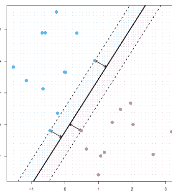

**图 9.3.** 有两类观测值，分别以蓝色和紫色显示。最大间隔超平面显示为实线。间隔是实线到任一虚线的距离。位于虚线上的两个蓝色点和一个紫色点是支持向量，这些点到超平面的距离由箭头标出。紫色和蓝色的网格表示基于该分离超平面的分类器所做的决策规则。

如果 $\beta_0, \beta_1, \dots, \beta_p$ 是最大间隔超平面的系数，那么最大间隔分类器根据 $f(x^*) = \beta_0 + \beta_1 x_1^* + \beta_2 x_2^* + \dots + \beta_p x_p^*$ 的符号对测试观测值 $x^*$ 进行分类。

图 9.3 显示了图 9.2 数据集上的最大间隔超平面。比较图 9.2 的右侧面板和图 9.3，我们看到图 9.3 中显示的最大间隔超平面确实导致了观测值与分离超平面之间更大的最小距离——即更大的间隔。从某种意义上说，最大间隔超平面代表了我们可以插入两类之间的最宽“平板”的中线。

观察图 9.3，我们看到三个训练观测值与最大间隔超平面等距，并沿着表示间隔宽度的虚线分布。这三个观测值被称为*支持向量*，因为它们是 $p$ 维空间中的向量（在图 9.3 中，$p = 2$），并且它们“支持”最大间隔超平面，意思是如果这些点稍微移动，最大间隔超平面也会随之移动。有趣的是，最大间隔超平面直接依赖于支持向量，而不依赖于其他观测值：只要其他观测值的移动不会导致其越过间隔设定的边界，那么对任何其他观测值的移动都不会影响分离超平面。最大间隔超平面仅直接依赖于观测值的一个小子集，这一事实是一个重要特性，我们将在本章后面讨论支持向量分类器和支持向量机时再次遇到。

### 9.1.4 最大间隔分类器的构建

我们现在考虑基于一组 $n$ 个训练观测值 $x_1, \dots, x_n \in \mathbb{R}^p$ 和相关的类别标签 $y_1, \dots, y_n \in \{-1, 1\}$ 来构建最大间隔超平面的任务。简而言之，最大间隔超平面是以下优化问题的解

$$\text{maximize}_{\beta_0, \beta_1, \dots, \beta_p, M} \quad M \quad (9.9)$$
$$\text{subject to} \quad \sum_{j=1}^p \beta_j^2 = 1, \quad (9.10)$$
$$y_i(\beta_0 + \beta_1 x_{i1} + \beta_2 x_{i2} + \dots + \beta_p x_{ip}) \ge M \quad \forall i = 1, \dots, n. \quad (9.11)$$

这个优化问题 (9.9)–(9.11) 实际上比它看起来要简单。首先，(9.11) 中的约束条件

$$y_i(\beta_0 + \beta_1 x_{i1} + \beta_2 x_{i2} + \dots + \beta_p x_{ip}) \ge M \quad \forall i = 1, \dots, n$$

保证了每个观测值都在超平面的正确一侧，前提是 $M$ 为正数。（实际上，要使每个观测值都在超平面的正确一侧，我们只需要 $y_i(\beta_0 + \beta_1 x_{i1} + \beta_2 x_{i2} + \dots + \beta_p x_{ip}) > 0$，因此 (9.11) 中的约束实际上要求每个观测值都在超平面的正确一侧，并留有一定余量，前提是 $M$ 为正数。）

其次，请注意 (9.10) 并不是对超平面的真正约束，因为如果 $\beta_0 + \beta_1 x_{i1} + \beta_2 x_{i2} + \dots + \beta_p x_{ip} = 0$ 定义了一个超平面，那么对于任何 $k \ne 0$，$k(\beta_0 + \beta_1 x_{i1} + \beta_2 x_{i2} + \dots + \beta_p x_{ip}) = 0$ 也定义了一个超平面。然而，(9.10) 为 (9.11) 赋予了意义；可以证明，在这个约束下，第 $i$ 个观测值到超平面的垂直距离由下式给出

$$y_i(\beta_0 + \beta_1 x_{i1} + \beta_2 x_{i2} + \dots + \beta_p x_{ip}).$$

因此，约束条件 (9.10) 和 (9.11) 确保每个观测值都在超平面的正确一侧，并且距离超平面至少为 $M$。因此，$M$ 代表了我们超平面的间隔，而优化问题选择 $\beta_0, \beta_1, \dots, \beta_p$ 来最大化 $M$。这正是最大间隔超平面的定义！问题 (9.9)–(9.11) 可以高效地求解，但此优化的细节超出了本书的范围。

### 9.1.5 不可分情况

最大间隔分类器是执行分类的一种非常自然的方式，*前提是存在一个分离超平面*。然而，正如我们已经暗示的，在许多情况下不存在分离超平面，因此也就没有最大间隔分类器。在这种情况下，优化问题 (9.9)–(9.11) 没有 $M > 0$ 的解。图 9.4 显示了一个例子。

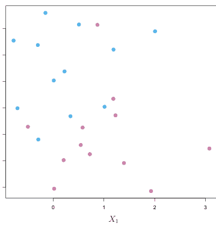

**图 9.4.** 有两类观测值，分别以蓝色和紫色显示。在这种情况下，这两类不能被超平面分离，因此无法使用最大间隔分类器。

在这种情况下，我们无法*精确地*分离这两类。然而，正如我们将在下一节看到的，我们可以扩展分离超平面的概念，以开发一个*几乎*分离两类的超平面，使用所谓的*软间隔*。最大间隔分类器到不可分情况的推广被称为*支持向量分类器*。

## 9.2 支持向量分类器

### 9.2.1 支持向量分类器概述

在图 9.4 中，我们看到属于两类的观测值不一定能被超平面分离。事实上，即使存在一个分离超平面，也存在基于分离超平面的分类器可能不理想的情况。基于分离超平面的分类器必然会完美地分类所有训练观测值；这可能导致对单个观测值过于敏感。图 9.5 显示了一个例子。在图 9.5 的右侧面板中添加一个观测值，导致最大间隔超平面发生剧烈变化。由此产生的最大间隔超平面并不令人满意——首先，它只有一个极小的间隔。这是有问题的，因为如前所述，观测值到超平面的距离可以被视为我们对该观测值被正确分类的信心的度量。此外，最大间隔超平面对单个观测值的变化极其敏感这一事实表明，它可能已经过拟合了训练数据。

在这种情况下，为了

## 9.2.2 支持向量分类器的细节

支持向量分类器根据测试观测点位于超平面的哪一侧对其进行分类。该超平面被选择用来将大多数训练观测点正确地分到两个类别中，但可能会错误分类少数观测点。它是以下优化问题的解：

$$\begin{aligned}
\text{maximize}_{\beta_0, \beta_1, \ldots, \beta_p, \epsilon_1, \ldots, \epsilon_n, M} \quad & M \\
\text{subject to} \quad & \sum_{j=1}^p \beta_j^2 = 1, \\
& y_i(\beta_0 + \beta_1 x_{i1} + \beta_2 x_{i2} + \cdots + \beta_p x_{ip}) \geq M(1 - \epsilon_i), \\
& \epsilon_i \geq 0, \quad \sum_{i=1}^n \epsilon_i \leq C,
\end{aligned}$$

其中 $C$ 是一个非负的调节参数。与 (9.11) 式一样，$M$ 是间隔的宽度；我们试图使这个量尽可能大。在 (9.14) 式中，$\epsilon_1, \ldots, \epsilon_n$ 是*松弛变量*，它们允许个别观测点位于间隔或超平面的错误一侧；我们稍后将更详细地解释它们。一旦我们求解了 (9.12)–(9.15) 式，我们就像之前一样对测试观测点 $x^*$ 进行分类，只需确定它位于超平面的哪一侧即可。也就是说，我们根据 $f(x^*) = \beta_0 + \beta_1 x_1^* + \cdots + \beta_p x_p^*$ 的符号来对测试观测点进行分类。

问题 (9.12)–(9.15) 看起来很复杂，但通过下面提出的一系列简单观察，可以洞察其行为。首先，松弛变量 $\epsilon_i$ 告诉我们第 $i$ 个观测点相对于超平面和间隔的位置。如果 $\epsilon_i = 0$，那么第 $i$ 个观测点位于间隔的正确一侧，正如我们在第 9.1.4 节中看到的。如果 $\epsilon_i > 0$，那么第 $i$ 个观测点位于间隔的错误一侧，我们说第 $i$ 个观测点*违反*了间隔。如果 $\epsilon_i > 1$，那么它位于超平面的错误一侧。

我们现在考虑调节参数 $C$ 的作用。在 (9.15) 式中，$C$ 限制了 $\epsilon_i$ 的总和，因此它决定了我们将容忍的对间隔（以及对超平面）违反的数量和严重程度。我们可以将 $C$ 视为 $n$ 个观测点违反间隔的*预算*。如果 $C = 0$，那么就没有违反间隔的预算，必须满足 $\epsilon_1 = \cdots = \epsilon_n = 0$，在这种情况下，(9.12)–(9.15) 式就简化为最大间隔超平面优化问题 (9.9)–(9.11) 式。（当然，最大间隔超平面仅在两个类别可分时存在。）对于 $C > 0$，最多只能有 $C$ 个观测点位于超平面的错误一侧，因为如果一个观测点位于超平面的错误一侧，那么 $\epsilon_i > 1$，而 (9.15) 式要求 $\sum_{i=1}^n \epsilon_i \le C$。随着预算 $C$ 的增加，我们对违反间隔的容忍度提高，因此间隔会变宽。相反，随着 $C$ 的减小，我们对违反间隔的容忍度降低，因此间隔会变窄。图 9.7 展示了一个例子。

在实践中，$C$ 被视为一个调节参数，通常通过交叉验证来选择。与我们在本书中看到的调节参数一样，$C$ 控制着统计学习技术的偏差-方差权衡。当 $C$ 较小时，我们寻求很少被违反的窄间隔；这相当于一个高度拟合数据的分类器，它可能具有低偏差但高方差。另一方面，当 $C$ 较大时，间隔更宽，我们允许更多的违反；这相当于不那么严格地拟合数据，从而获得一个可能偏差更大但方差可能更低的分类器。

优化问题 (9.12)–(9.15) 有一个非常有趣的性质：事实证明，只有那些位于间隔上或违反间隔的观测点才会影响超平面，从而影响所获得的分类器。换句话说，一个严格位于间隔正确一侧的观测点不会影响支持向量分类器！只要该观测点的位置保持在间隔的正确一侧，改变它的位置根本不会改变分类器。那些直接位于间隔上，或位于其类别间隔错误一侧的观测点，被称为*支持向量*。这些观测点确实会影响支持向量分类器。

只有支持向量影响分类器这一事实，与我们之前关于 $C$ 控制支持向量分类器偏差-方差权衡的断言是一致的。当调节参数 $C$ 较大时，间隔很宽，许多观测点违反间隔，因此存在许多支持向量。在这种情况下，许多观测点参与确定超平面。图 9.7 的左上角面板说明了这种情况：这个分类器具有低方差（因为许多观测点是支持向量）但可能具有高偏差。相反，如果 $C$ 较小，那么支持向量会更少，因此所得的分类器将具有低偏差但高方差。图 9.7 的右下角面板说明了这种情况，只有八个支持向量。

支持向量分类器的决策规则仅基于训练观测点的一个可能很小的子集（支持向量），这一事实意味着它对远离超平面的观测点的行为相当稳健。这一特性不同于一些

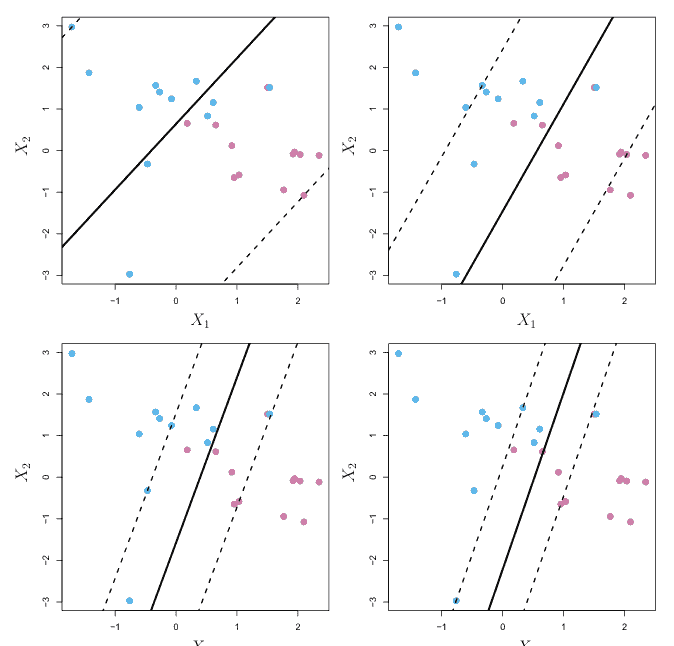

**图 9.7.** 使用公式 (9.12)-(9.15) 中四个不同的调节参数 C 值拟合了一个支持向量分类器。左上图使用了最大的 C 值，右上、左下和右下图使用了较小的 C 值。当 C 较大时，对观测值位于错误一侧的容忍度较高，因此间隔会较大。随着 C 减小，对观测值位于错误一侧的容忍度降低，间隔也随之变窄。

与我们在前面章节中看到的其他分类方法（如线性判别分析）不同。回想一下，LDA 分类规则依赖于每个类别中*所有*观测值的均值，以及使用*所有*观测值计算的类内协方差矩阵。相比之下，逻辑回归与 LDA 不同，它对远离决策边界的观测值敏感度很低。事实上，我们将在第 9.5 节中看到，支持向量分类器和逻辑回归密切相关。

## 9.3 支持向量机

我们首先讨论一种将线性分类器转换为能产生非线性决策边界分类器的一般机制。然后，我们介绍支持向量机，它以一种自动化的方式实现了这一点。

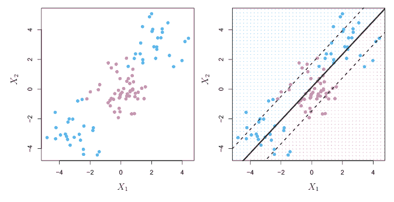

**图 9.8.** 左图：观测值分为两类，它们之间存在非线性边界。右图：支持向量分类器试图寻找一个线性边界，因此表现非常差。

### 9.3.1 具有非线性决策边界的分类

如果两类之间的边界是线性的，支持向量分类器是二元分类的自然方法。然而，在实践中，我们有时会遇到非线性的类别边界。例如，考虑图 9.8 左图中的数据。很明显，支持向量分类器或任何线性分类器在这里的表现都会很差。事实上，图 9.8 右图所示的支持向量分类器在这里毫无用处。

在第 7 章中，我们遇到了类似的情况。我们看到，当预测变量和结果之间存在非线性关系时，线性回归的性能可能会受到影响。在这种情况下，我们考虑使用预测变量的函数（如二次项和三次项）来扩大特征空间，以解决这种非线性问题。对于支持向量分类器，我们可以通过使用预测变量的二次、三次甚至更高阶多项式函数来扩大特征空间，以类似的方式解决类别之间可能存在的非线性边界问题。例如，与其使用 $p$ 个特征

$$X_1, X_2, \dots, X_p,$$

来拟合支持向量分类器，我们不如使用 $2p$ 个特征

$$X_1, X_1^2, X_2, X_2^2, \dots, X_p, X_p^2.$$

来拟合支持向量分类器。那么公式 (9.12)–(9.15) 将变为

$$\begin{aligned} & \underset{\beta_0, \beta_{11}, \beta_{12}, \ldots, \beta_{p1}, \beta_{p2}, \epsilon_1, \ldots, \epsilon_n, M}{\text{maximize}} \quad M \ & \text{subject to} \quad y_i \left( \beta_0 + \sum_{j=1}^p \beta_{j1} x_{ij} + \sum_{j=1}^p \beta_{j2} x_{ij}^2 \right) \geq M(1 - \epsilon_i), \ & \qquad \qquad \qquad \sum_{i=1}^n \epsilon_i \leq C, \quad \epsilon_i \geq 0, \quad \sum_{j=1}^p \sum_{k=1}^2 \beta_{jk}^2 = 1. \end{aligned}$$

为什么这会导致非线性决策边界？在扩大的特征空间中，由公式 (9.16) 得出的决策边界实际上是线性的。但在原始特征空间中，决策边界的形式是 $q(x) = 0$，其中 $q$ 是一个二次多项式，其解通常是非线性的。人们可能还想用更高阶的多项式项，或者形如 $X_j X_{j'}$（其中 $j \neq j'$）的交互项来扩大特征空间。或者，可以考虑使用预测变量的其他函数，而不是多项式。不难看出，扩大特征空间的方法有很多，除非我们小心，否则最终可能会得到大量的特征。那么计算将变得难以管理。我们接下来介绍的支持向量机，允许我们以一种能实现高效计算的方式来扩大支持向量分类器所使用的特征空间。

### 9.3.2 支持向量机

*支持向量机*（SVM）是支持向量分类器的扩展，它通过使用*核函数*以特定方式扩大特征空间而产生。我们现在将讨论这种扩展，其细节有些复杂，超出了本书的范围。然而，主要思想在第 9.3.1 节中已经描述：我们可能希望扩大特征空间以适应类别之间的非线性边界。我们这里描述的核方法只是实现这一思想的一种高效计算方法。

我们还没有讨论支持向量分类器具体是如何计算的，因为细节有些技术性。然而，事实证明，支持向量分类器问题 (9.12)–(9.15) 的解只涉及观测值的*内积*（而不是观测值本身）。两个 $r$ 维向量 $a$ 和 $b$ 的内积定义为 $\langle a, b \rangle = \sum_{i=1}^r a_i b_i$。因此，两个观测值 $x_i, x_{i'}$ 的内积由下式给出

$$\langle x_i, x_{i'} \rangle = \sum_{j=1}^p x_{ij} x_{i'j}.$$

可以证明

- 线性支持向量分类器可以表示为

$$f(x) = \beta_0 + \sum_{i=1}^n \alpha_i \langle x, x_i \rangle,$$

其中存在 $n$ 个参数 $\alpha_i$，$i = 1,\dots,n$，每个训练观测值对应一个参数。

- 要估计参数 $\alpha_1,\dots,\alpha_n$ 和 $\beta_0$，我们只需要所有训练观测值对之间的 $\binom{n}{2}$ 个内积 $\langle x_i, x_{i'} \rangle$。（符号 $\binom{n}{2}$ 表示 $n(n-1)/2$，给出了一组 $n$ 个项目中成对的数量。）

注意，在公式 (9.18) 中，为了计算函数 $f(x)$，我们需要计算新点 $x$ 与每个训练点 $x_i$ 之间的内积。然而，事实证明，$\alpha_i$ 仅对解中的支持向量非零——也就是说，如果一个训练观测值不是支持向量，那么它的 $\alpha_i$ 等于零。因此，如果 $\mathcal{S}$ 是这些支持点的索引集合，我们可以将任何形如 (9.18) 的解函数重写为

$$f(x) = \beta_0 + \sum_{i \in \mathcal{S}} \alpha_i \langle x, x_i \rangle, \qquad (9.19)$$

这通常涉及的项数远少于 (9.18)。$^2$

总而言之，在表示线性分类器 $f(x)$ 及其系数计算中，我们只需要内积。

现在假设每次内积 (9.17) 出现在表示式 (9.18) 中，或出现在支持向量分类器的解计算中时，我们都将其替换为内积的*推广*形式

$$K(x_i, x_{i'}), \qquad (9.20)$$

其中 $K$ 是某个函数，我们称之为*核函数*。核函数是量化两个观测值相似性的函数。例如，我们可以简单地取

$$K(x_i, x_{i'}) = \sum_{j=1}^p x_{ij} x_{i'j}, \qquad (9.21)$$

这将使我们回到支持向量分类器。公式 9.21 被称为*线性核*，因为支持向量分类器在特征上是线性的；线性核本质上使用皮尔逊（标准）相关性来量化一对观测值的相似性。但人们也可以为 (9.20) 选择另一种形式。例如，可以将每个 $\sum_{j=1}^p x_{ij} x_{i'j}$ 替换为

$$K(x_i, x_{i'}) = \left(1 + \sum_{j=1}^p x_{ij} x_{i'j}\right)^d. \qquad (9.22)$$

这被称为 $d$ 次*多项式核*，其中 $d$ 是一个正整数。在支持向量分类器算法中使用这样的核（$d > 1$），而不是标准的线性核 (9.21)，会导致更灵活的决策边界。它本质上相当于拟合一个支持向量

> $^2$通过展开 (9.19) 中的每个内积，很容易看出 $f(x)$ 是 $x$ 坐标的线性函数。这样做也建立了 $\alpha_i$ 与原始参数 $\beta_j$ 之间的对应关系。

## 9.3.3 在心脏病数据上的应用

在第8章中，我们将决策树及相关方法应用于心脏数据。其目标是利用年龄、性别和胆固醇等13个预测变量来预测个体是否患有心脏病。我们现在研究支持向量机（SVM）与线性判别分析（LDA）在此数据上的比较。在移除6个缺失观测值后，数据包含297个受试者，我们将其随机分为207个训练观测值和90个测试观测值。

我们首先对训练数据拟合LDA和支持向量分类器。请注意，支持向量分类器等同于使用$d = 1$次多项式核的SVM。图9.10的左侧面板展示了LDA和支持向量分类器在训练集预测上的ROC曲线（在4.4.2节中描述）。两个分类器都为每个观测值计算形如$\hat{f}(X) = \hat{\beta}_0 + \hat{\beta}_1 X_1 + \hat{\beta}_2 X_2 + \cdots + \hat{\beta}_p X_p$的分数。对于任何给定的截断值$t$，我们根据$\hat{f}(X) < t$或$\hat{f}(X) \geq t$将观测值分类为患有心脏病或未患心脏病。ROC曲线是通过形成这些预测并计算一系列$t$值的假阳性率和真阳性率而得到的。一个最优分类器会紧贴ROC图的左上角。在此例中，LDA和支持向量分类器都表现良好，尽管有迹象表明支持向量分类器可能略胜一筹。

图9.10的右侧面板展示了使用径向核的SVM的ROC曲线，其中$\gamma$取不同值。随着$\gamma$增大且拟合变得更加非线性，ROC曲线得到改善。使用$\gamma = 10^{-1}$似乎给出了几乎完美的ROC曲线。然而，这些曲线代表的是训练错误率，在评估新测试数据上的性能时可能会产生误导。图9.11展示了在90个测试观测值上计算的ROC曲线。我们观察到与训练ROC曲线的一些差异。在图9.11的左侧面板中，支持向量分类器似乎比LDA略有优势（尽管这些差异在统计上并不显著）。在右侧面板中，在训练数据上表现最佳的使用$\gamma = 10^{-1}$的SVM，在测试数据上产生了最差的估计。这再次证明，虽然更灵活的方法通常会产生更低的训练错误率，但这并不一定意味着在测试数据上的性能会得到改善。使用$\gamma = 10^{-2}$和$\gamma = 10^{-3}$的SVM与支持向量分类器表现相当，并且这三者都优于使用$\gamma = 10^{-1}$的SVM。

## 9.4 多类别的SVM

到目前为止，我们的讨论仅限于二元分类的情况：即在两类设置中的分类。我们如何将SVM扩展到具有任意数量类别的更一般情况？事实证明，SVM所基于的分离超平面概念本身并不自然地适用于两个以上的类别。尽管已经提出了许多将SVM扩展到$K$类情况的方案，但最流行的两种是*一对一*和*一对多*方法。我们在此简要讨论这两种方法。

### 9.4.1 一对一分类

假设我们希望使用SVM进行分类，并且有$K > 2$个类别。*一对一*或*所有配对*方法构建$\binom{K}{2}$个SVM，每个SVM比较一对类别。例如，其中一个SVM可能将第$k$类（编码为$+1$）与第$k'$类（编码为$-1$）进行比较。我们使用$\binom{K}{2}$个分类器中的每一个对测试观测值进行分类，并统计测试观测值被分配到每个$K$类的次数。最终的分类是通过将测试观测值分配到在这些$\binom{K}{2}$次成对分类中被分配次数最多的类别来完成的。

### 9.4.2 一对多分类

*一对多*方法（也称为*一对剩余*）是在$K > 2$类情况下应用SVM的另一种程序。我们拟合$K$个SVM，每次将$K$个类别中的一个与其余$K - 1$个类别进行比较。令$\beta_{0k}, \beta_{1k}, \dots, \beta_{pk}$表示拟合一个将第$k$类（编码为$+1$）与其他类（编码为$-1$）进行比较的SVM所得到的参数。令$x^*$表示一个测试观测值。我们将该观测值分配给使$\beta_{0k} + \beta_{1k}x_1^* + \beta_{2k}x_2^* + \dots + \beta_{pk}x_p^*$最大的类别，因为这相当于高度确信该测试观测值属于第$k$类，而不是其他任何类别。

## 9.5 与逻辑回归的关系

当SVM在20世纪90年代中期首次被引入时，它们在统计和机器学习界引起了相当大的轰动。这部分归功于其良好的性能、良好的营销，也因为其底层方法既新颖又神秘。寻找一个尽可能好地分离数据，同时允许一些违反这种分离的超平面的想法，似乎与经典分类方法（如逻辑回归和线性判别分析）截然不同。此外，使用核来扩展特征空间以适应非线性类别边界的想法，似乎是一个独特而有价值的特性。

然而，自那时以来，SVM与其他更经典的统计方法之间已经出现了深刻的联系。事实证明，可以将拟合支持向量分类器$f(X) = \beta_0 + \beta_1 X_1 + \dots + \beta_p X_p$的标准(9.12)–(9.15)重写为

$$\underset{\beta_0, \beta_1, \dots, \beta_p}{\text{minimize}} \left\{ \sum_{i=1}^n \max \left[0, 1 - y_i f(x_i)\right] + \lambda \sum_{j=1}^p \beta_j^2 \right\}, \quad (9.25)$$

其中$\lambda$是一个非负的调节参数。当$\lambda$较大时，$\beta_1, \dots, \beta_p$较小，允许更多的间隔违反，从而产生一个低方差但高偏差的分类器。当$\lambda$较小时，发生的间隔违反很少；这相当于一个高方差但低偏差的分类器。

分类器。因此，(9.25) 中 $\lambda$ 的小值对应于 (9.15) 中 $C$ 的小值。注意，(9.25) 中的 $\lambda \sum_{j=1}^p \beta_j^2$ 项是第 6.2.1 节中的岭惩罚项，在控制支持向量分类器的偏差-方差权衡方面起着类似的作用。

现在，(9.25) 采用了我们在本书中反复见到的“损失 + 惩罚”形式：

$$\text{minimize}_{\beta_0, \beta_1, \dots, \beta_p} \{L(\mathbf{X}, \mathbf{y}, \beta) + \lambda P(\beta)\} . \quad (9.26)$$

在 (9.26) 中，$L(\mathbf{X}, \mathbf{y}, \beta)$ 是某个损失函数，用于量化由 $\beta$ 参数化的模型拟合数据 $(\mathbf{X}, \mathbf{y})$ 的程度，而 $P(\beta)$ 是对参数向量 $\beta$ 的惩罚函数，其效果由一个非负调优参数 $\lambda$ 控制。例如，岭回归和 Lasso 都采用这种形式，其中

$$L(\mathbf{X}, \mathbf{y}, \beta) = \sum_{i=1}^n \left( y_i - \beta_0 - \sum_{j=1}^p x_{ij} \beta_j \right)^2$$

对于岭回归，$P(\beta) = \sum_{j=1}^p \beta_j^2$；对于 Lasso，$P(\beta) = \sum_{j=1}^p |\beta_j|$。在 (9.25) 的情况下，损失函数则采取以下形式

$$L(\mathbf{X}, \mathbf{y}, \beta) = \sum_{i=1}^n \max \left[ 0, 1 - y_i (\beta_0 + \beta_1 x_{i1} + \cdots + \beta_p x_{ip}) \right] .$$

这被称为 *铰链损失*，并在图 9.12 中描绘。然而，事实证明，铰链损失函数与逻辑回归中使用的损失函数密切相关，后者也在图 9.12 中显示。

支持向量分类器的一个有趣特性是，只有支持向量在所得分类器中起作用；位于间隔正确一侧的观测值不会影响它。这是由于图 9.12 所示的损失函数对于满足 $y_i(\beta_0 + \beta_1 x_{i1} + \cdots + \beta_p x_{ip}) \geq 1$ 的观测值恰好为零；这些对应于位于间隔正确一侧的观测值。$^3$ 相比之下，图 9.12 所示的逻辑回归损失函数在任何地方都不完全为零。但对于远离决策边界的观测值，它非常小。由于它们的损失函数相似，逻辑回归和支持向量分类器通常给出非常相似的结果。当类别分离良好时，SVM 往往比逻辑回归表现更好；在重叠更多的场景中，逻辑回归通常更受青睐。

当支持向量分类器和 SVM 首次被引入时，人们认为 (9.15) 中的调优参数 $C$ 是一个不重要的“麻烦”参数，可以设置为某个默认值，比如 1。然而，支持向量分类器的“损失 + 惩罚”公式 (9.25) 表明情况并非如此。调优参数的选择非常重要，它决定了模型对数据拟合不足或过度拟合的程度，例如在图 9.7 中所示。

$^3$ 采用这种铰链损失 + 惩罚表示，间隔对应于值 1，间隔的宽度由 $\sum \beta_j^2$ 决定。

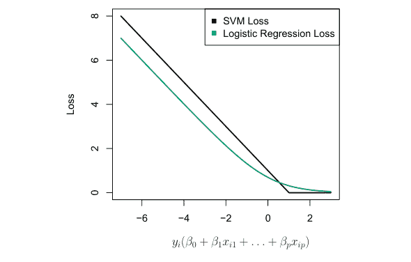

图 9.12. 比较了 SVM 和逻辑回归的损失函数，作为 $y_i(\beta_0 + \beta_1 x_{i1} + \dots + \beta_p x_{ip})$ 的函数。当 $y_i(\beta_0 + \beta_1 x_{i1} + \dots + \beta_p x_{ip})$ 大于 1 时，SVM 损失为零，因为这对应于位于间隔正确一侧的观测值。总体而言，这两个损失函数的行为非常相似。

我们已经确定支持向量分类器与逻辑回归和其他已有的统计方法密切相关。SVM 在使用核函数扩大特征空间以适应非线性类边界方面是否独特？这个问题的答案是“否”。我们同样可以使用非线性核函数执行逻辑回归或本书中看到的许多其他分类方法；这与第 7 章中看到的一些非线性方法密切相关。然而，由于历史原因，非线性核函数在 SVM 背景下的使用比在逻辑回归或其他方法的背景下要广泛得多。

尽管我们在此未涉及，但事实上存在一种用于回归（即用于定量而非定性响应）的 SVM 扩展，称为 *支持向量回归*。在第 3 章中，我们看到最小二乘回归寻求系数 $\beta_0, \beta_1, \dots, \beta_p$，使得残差平方和尽可能小。（回顾第 3 章，残差定义为 $y_i - \beta_0 - \beta_1 x_{i1} - \dots - \beta_p x_{ip}$。）支持向量回归则寻求最小化不同类型损失的系数，其中只有绝对值大于某个正常数的残差才对损失函数有贡献。这是支持向量分类器中使用的间隔在回归设置中的扩展。

## 9.6 实验室：支持向量机

在本实验室中，我们使用 `sklearn.svm` 库来演示支持向量分类器和支持向量机。
我们导入一些常用的库。

```
import numpy as np
from matplotlib.pyplot import subplots, cm
import sklearn.model_selection as skm
from ISLP import load_data, confusion_table
```

我们还收集本实验室所需的新导入。

```
from sklearn.svm import SVC
from ISLP.svm import plot as plot_svm
from sklearn.metrics import RocCurveDisplay
```

我们将使用函数 `RocCurveDisplay.from_estimator()` 来生成几个 ROC 图，并使用简写 `roc_curve`。

```
roc_curve = RocCurveDisplay.from_estimator # shorthand
```

### 9.6.1 支持向量分类器

我们现在使用 `sklearn` 中的 `SupportVectorClassifier()` 函数（缩写为 `SVC()`）来拟合给定参数 `C` 值的支持向量分类器。`C` 参数允许我们指定违反间隔的成本。当 `cost` 参数较小时，间隔会很宽，许多支持向量将位于间隔上或违反间隔。当 `C` 参数较大时，间隔会很窄，位于间隔上或违反间隔的支持向量会很少。
这里我们通过一个二维示例演示 `SVC()` 的使用，以便我们可以绘制所得的决策边界。我们首先生成属于两个类别的观测值，并检查这些类别是否线性可分。

```
rng = np.random.default_rng(1)
X = rng.standard_normal((50, 2))
y = np.array([-1]*25+[1]*25)
X[y==1] += 1
fig, ax = subplots(figsize=(8,8))
ax.scatter(X[:,0],
           X[:,1],
           c=y,
           cmap=cm.coolwarm);
```

它们不是线性可分的。我们现在拟合分类器。

```
svm_linear = SVC(C=10, kernel='linear')
svm_linear.fit(X, y)
```

具有两个特征的支持向量分类器可以通过绘制其 *决策函数* 的值来可视化。我们在 `ISLP` 包中包含了一个用于此目的的函数（灵感来自 `sklearn` 文档中的类似示例）。

```
fig, ax = subplots(figsize=(8,8))
plot_svm(X,
         y,
         svm_linear,
         ax=ax)
```

两个类别之间的决策边界是线性的（因为我们使用了参数 `kernel='linear'`）。支持向量用 + 标记，其余观测值绘制为圆圈。
如果我们使用较小的成本参数值会怎样？

```
svm_linear_small = SVC(C=0.1, kernel='linear')
svm_linear_small.fit(X, y)
fig, ax = subplots(figsize=(8,8))
plot_svm(X,
         y,
         svm_linear_small,
         ax=ax)
```

使用较小的成本参数值，我们得到更多的支持向量，因为间隔现在更宽了。对于线性核函数，我们可以如下提取线性决策边界的系数：

```
svm_linear.coef_
```

```
array([[1.173 , 0.7734]])
```

由于支持向量机是 `sklearn` 中的一个估计器，我们可以使用常规机制来调优它。

```
kfold = skm.KFold(5,
                       random_state=0,
                       shuffle=True)
grid = skm.GridSearchCV(svm_linear,
                       {'C':[0.001,0.01,0.1,1,5,10,100]},
                       refit=True,
                       cv=kfold,
                       scoring='accuracy')
grid.fit(X, y)
grid.best_params_
```

```
{'C': 1}
```

我们可以轻松地在 `grid.cv_results_` 中访问每个模型的交叉验证错误。这会打印出很多细节，因此我们只提取准确率结果。

```
grid.cv_results_[('mean_test_score')]
```

```
array([0.46, 0.46, 0.72, 0.74, 0.74, 0.74, 0.74])
```

我们看到 C=1 产生了最高的交叉验证准确率 0.74，尽管对于几个 C 值准确率相同。分类器 `grid.best_estimator_` 可用于预测一组测试观测值的类别标签。让我们生成一个测试数据集。

X_test = rng.standard_normal((20, 2))
y_test = np.array([-1]*10+[1]*10)
X_test[y_test==1] += 1

现在我们来预测这些测试观测值的类别标签。这里我们使用交叉验证选出的最佳模型来进行预测。

best_ = grid.best_estimator_
y_test_hat = best_.predict(X_test)
confusion_table(y_test_hat, y_test)

Out[12]:
Truth  -1   1
Predicted
-1   8   4
1    2   6

因此，使用这个C值，70%的测试观测值被正确分类。如果我们改用C=0.001会怎样？

svm_ = SVC(C=0.001,
           kernel='linear').fit(X, y)
y_test_hat = svm_.predict(X_test)
confusion_table(y_test_hat, y_test)

Out[13]:
Truth  -1   1
Predicted
-1   2   0
1    8  10

在这种情况下，60%的测试观测值被正确分类。
我们现在考虑两个类别线性可分的情况。那么我们可以使用`SVC()`估计器找到一个最优分离超平面。我们首先在模拟数据中进一步分离这两个类别，使它们线性可分：

X[y==1] += 1.9;
fig, ax = subplots(figsize=(8,8))
ax.scatter(X[:,0], X[:,1], c=y, cmap=cm.coolwarm);

现在观测值几乎是线性可分的。

svm_ = SVC(C=1e5, kernel='linear').fit(X, y)
y_hat = svm_.predict(X)
confusion_table(y_hat, y)

Out[15]:
Truth  -1   1
Predicted
-1  25   0
1    0  25

我们拟合支持向量分类器并绘制出得到的超平面，使用一个非常大的C值，以确保没有观测值被错误分类。

fig, ax = subplots(figsize=(8,8))
plot_svm(X,
         y,
         svm_,
         ax=ax)

确实没有产生训练误差，并且只使用了三个支持向量。事实上，大的C值也意味着这三个支持点*位于间隔上*，并定义了间隔。人们可能会想知道，仅依赖三个数据点的分类器在测试数据上表现会如何！我们现在尝试一个更小的C值。

In [17]:
svm_ = SVC(C=0.1, kernel='linear').fit(X, y)
y_hat = svm_.predict(X)
confusion_table(y_hat, y)

Out[17]:
Truth    -1    1
Predicted
-1    25    0
1     0    25

使用C=0.1，我们再次没有错误分类任何训练观测值，但我们也获得了更宽的间隔，并使用了十二个支持向量。这些支持向量共同定义了决策边界的方向，并且由于数量更多，它更加稳定。这个模型在测试数据上的表现似乎可能优于C=1e5的模型（事实上，一个使用大测试集的简单实验会证实这一点）。

In [18]:
fig, ax = subplots(figsize=(8,8))
plot_svm(X,
         y,
         svm_,
         ax=ax)

## 9.6.2 支持向量机

为了使用非线性核拟合SVM，我们再次使用`SVC()`估计器。然而，现在我们使用参数`kernel`的不同值。要拟合具有多项式核的SVM，我们使用`kernel="poly"`；要拟合具有径向核的SVM，我们使用`kernel="rbf"`。在前一种情况下，我们还使用`degree`参数来指定多项式核的次数（即(9.22)中的*d*）；在后一种情况下，我们使用`gamma`来指定径向基核(9.24)的γ值。

我们首先生成一些具有非线性类别边界的数据，如下所示：

In [19]:
X = rng.standard_normal((200, 2))
X[:100] += 2
X[100:150] -= 2
y = np.array([1]*150+[2]*50)

绘制数据可以清楚地看出，类别边界确实是非线性的。

In [20]:
fig, ax = subplots(figsize=(8,8))
ax.scatter(X[:,0],
           X[:,1],
           c=y,
           cmap=cm.coolwarm)

Out[20]: <matplotlib.collections.PathCollection at 0x7faa9ba52eb0>

数据被随机分为训练组和测试组。然后我们使用带有径向核和$\gamma = 1$的`SVC()`估计器来拟合训练数据：

In [21]:
(X_train,
 X_test,
 y_train,
 y_test) = skm.train_test_split(X,
                                y,
                                test_size=0.5,
                                random_state=0)
svm_rbf = SVC(kernel="rbf", gamma=1, C=1)
svm_rbf.fit(X_train, y_train)

绘图显示，得到的SVM具有明显的非线性边界。

In [22]:
fig, ax = subplots(figsize=(8,8))
plot_svm(X_train,
         y_train,
         svm_rbf,
         ax=ax)

从图中我们可以看到，这个SVM拟合中有相当数量的训练误差。如果我们增加$C$的值，可以减少训练误差的数量。然而，这是以更不规则的决策边界为代价的，这似乎有过拟合数据的风险。

In [23]:
svm_rbf = SVC(kernel="rbf", gamma=1, C=1e5)
svm_rbf.fit(X_train, y_train)
fig, ax = subplots(figsize=(8,8))
plot_svm(X_train,
         y_train,
         svm_rbf,
         ax=ax)

我们可以使用`skm.GridSearchCV()`进行交叉验证，为带有径向核的SVM选择最佳的$\gamma$和$C$值：

In [24]:
kfold = skm.KFold(5,
                   random_state=0,
                   shuffle=True)
grid = skm.GridSearchCV(svm_rbf,
                        {'C':[0.1,1,10,100,1000],
                         'gamma':[0.5,1,2,3,4]},
                        refit=True,
                        cv=kfold,
                        scoring='accuracy');
grid.fit(X_train, y_train)
grid.best_params_

Out[24]: {'C': 100, 'gamma': 1}

在五折交叉验证下，最佳参数选择在$C=1$和$\gamma=0.5$时实现，尽管其他几个值也达到了相同的值。

In [25]:
best_svm = grid.best_estimator_
fig, ax = subplots(figsize=(8,8))
plot_svm(X_train,
         y_train,
         best_svm,
         ax=ax)

y_hat_test = best_svm.predict(X_test)
confusion_table(y_hat_test, y_test)

Out[25]:
Truth 1 2
Predicted
1 69 6
2 6 19

使用这些参数，12%的测试观测值被这个SVM错误分类。

## 9.6.3 ROC曲线

SVM和支持向量分类器为每个观测值输出类别标签。然而，也可以获得每个观测值的*拟合值*，这些是用于获得类别标签的数值分数。例如，在支持向量分类器的情况下，观测值$X = (X_1, X_2, \dots, X_p)^T$的拟合值形式为$\hat{\beta}_0 + \hat{\beta}_1 X_1 + \hat{\beta}_2 X_2 + \dots + \hat{\beta}_p X_p$。对于具有非线性核的SVM，产生拟合值的方程在(9.23)中给出。拟合值的符号决定了观测值位于决策边界的哪一侧。因此，对于给定的观测值，拟合值与类别预测之间的关系很简单：如果拟合值超过零，则观测值被分配到一个类别；如果小于零，则被分配到另一个类别。通过将此阈值从零更改为某个正值，我们使分类偏向一个类别而非另一个类别。通过考虑一系列正负阈值，我们生成了ROC图的要素。我们可以通过调用拟合SVM估计器的`decision_function()`方法来访问这些值。

函数`ROCCurveDisplay.from_estimator()`（我们将其简写为`roc_curve()`）将生成ROC曲线图。它以拟合的估计器作为第一个参数，后跟模型矩阵$X$和标签$y$。参数`name`用于图例，而`color`用于线条颜色。结果绘制在我们的轴对象`ax`上。

fig, ax = subplots(figsize=(8,8))
roc_curve(best_svm,
          X_train,
          y_train,
          name='Training',
          color='r',
          ax=ax);

在这个例子中，SVM似乎提供了准确的预测。通过增加$\gamma$，我们可以产生更灵活的拟合，并进一步提高准确性。

svm_flex = SVC(kernel="rbf",
               gamma=50,

## 9.6.4 多类支持向量机

如果响应变量是一个包含两个以上水平的因子，那么`SVC()`函数将执行多类分类，采用一对一方法（当`decision_function_shape=='ovo'`时）或一对多$^4$方法（当`decision_function_shape=='ovr'`时）。我们通过生成第三类观测值来简要探讨这一设置。

```python
rng = np.random.default_rng(123)
X = np.vstack([X, rng.standard_normal((50, 2))])
y = np.hstack([y, [0]*50])
X[y==0,1] += 2
fig, ax = subplots(figsize=(8,8))
ax.scatter(X[:,0], X[:,1], c=y, cmap=cm.coolwarm);
```

$^4$一对多也称为一对所有。

我们现在将支持向量机拟合到数据上：

```python
In [31]: svm_rbf_3 = SVC(kernel="rbf",
                C=10,
                gamma=1,
                decision_function_shape='ovo');
svm_rbf_3.fit(X, y)
fig, ax = subplots(figsize=(8,8))
plot_svm(X,
         y,
         svm_rbf_3,
         scatter_cmap=cm.tab10,
         ax=ax)
```

`sklearn.svm`库也可用于使用估计器`SupportVectorRegression()`对数值响应执行支持向量回归。

## 9.6.5 应用于基因表达数据

我们现在检查`Khan`数据集，该数据集包含对应于四种不同类型的小圆蓝细胞肿瘤的多个组织样本。对于每个组织样本，都有基因表达测量值。该数据集包括训练数据`xtrain`和`ytrain`，以及测试数据`xtest`和`ytest`。

我们检查数据的维度：

```python
In [32]: Khan = load_data('Khan')
Khan['xtrain'].shape, Khan['xtest'].shape
```

Out[32]: ((63, 2308), (20, 2308))

该数据集包含2,308个基因的表达测量值。训练集和测试集分别包含63个和20个观测值。

我们将使用支持向量方法，利用基因表达测量值来预测癌症亚型。在此数据集中，相对于观测值数量，特征数量非常大。这表明我们应该使用线性核，因为使用多项式或径向核所带来的额外灵活性是不必要的。

```python
In [33]: khan_linear = SVC(kernel='linear', C=10)
khan_linear.fit(Khan['xtrain'], Khan['ytrain'])
confusion_table(khan_linear.predict(Khan['xtrain']),
                Khan['ytrain'])
```

Out[33]: Truth 1 2 3 4
Predicted
1 8 0 0 0
2 0 23 0 0
3 0 0 12 0
4 0 0 0 20

我们看到训练误差为*零*。事实上，这并不奇怪，因为相对于观测值数量，变量数量很大，这意味着很容易找到完全分离各类的超平面。

我们更感兴趣的是支持向量分类器在测试观测值上的表现。

```python
confusion_table(khan_linear.predict(Khan['xtest']),
                Khan['ytest'])
```

```
Truth       1  2  3  4
Predicted
      1     3  0  0  0
      2     0  6  2  0
      3     0  0  4  0
      4     0  0  0  5
```

我们看到，使用C=10在这些数据上产生了两个测试集错误。

## 9.7 练习题

### 概念题

1.  本题涉及二维中的超平面。
    (a) 绘制超平面 $1 + 3X_1 - X_2 = 0$。标出满足 $1 + 3X_1 - X_2 > 0$ 的点集，以及满足 $1 + 3X_1 - X_2 < 0$ 的点集。
    (b) 在同一图上，绘制超平面 $-2 + X_1 + 2X_2 = 0$。标出满足 $-2 + X_1 + 2X_2 > 0$ 的点集，以及满足 $-2 + X_1 + 2X_2 < 0$ 的点集。

2.  我们已经看到，在 $p = 2$ 维中，线性决策边界的形式为 $\beta_0 + \beta_1 X_1 + \beta_2 X_2 = 0$。我们现在研究非线性决策边界。
    (a) 绘制曲线
    $$ (1 + X_1)^2 + (2 - X_2)^2 = 4. $$
    (b) 在你的图上，标出满足以下条件的点集
    $$ (1 + X_1)^2 + (2 - X_2)^2 > 4, $$
    以及满足以下条件的点集
    $$ (1 + X_1)^2 + (2 - X_2)^2 \leq 4. $$
    (c) 假设一个分类器将观测值分配到蓝色类，如果
    $$ (1 + X_1)^2 + (2 - X_2)^2 > 4, $$
    否则分配到红色类。观测值 $(0, 0)$ 被分到哪个类？$(-1, 1)$？$(2, 2)$？$(3, 8)$？
    (d) 论证虽然 (c) 中的决策边界在 $X_1$ 和 $X_2$ 方面不是线性的，但在 $X_1, X_1^2, X_2$ 和 $X_2^2$ 方面是线性的。

3.  这里我们在一个玩具数据集上探索最大间隔分类器。
    (a) 给定 $n = 7$ 个在 $p = 2$ 维中的观测值。每个观测值都有一个关联的类标签。

| Obs. | $X_1$ | $X_2$ | $Y$ |
|---|---|---|---|
| 1 | 3 | 4 | Red |
| 2 | 2 | 2 | Red |
| 3 | 4 | 4 | Red |
| 4 | 1 | 4 | Red |
| 5 | 2 | 1 | Blue |
| 6 | 4 | 3 | Blue |
| 7 | 4 | 1 | Blue |

    绘制观测值。
    (b) 绘制最优分离超平面，并提供该超平面的方程（形式为 (9.1)）。
    (c) 描述最大间隔分类器的分类规则。它应该类似于“如果 $\beta_0 + \beta_1 X_1 + \beta_2 X_2 > 0$ 则分类为红色，否则分类为蓝色。”提供 $\beta_0$、$\beta_1$ 和 $\beta_2$ 的值。
    (d) 在你的图上，标出最大间隔超平面的间隔。
    (e) 标出最大间隔分类器的支持向量。
    (f) 论证第七个观测值的轻微移动不会影响最大间隔超平面。
    (g) 绘制一个*不是*最优分离超平面的超平面，并提供该超平面的方程。
    (h) 在图上绘制一个额外的观测值，使得两类不再能被超平面分离。

### 应用题

4.  生成一个模拟的两类数据集，包含100个观测值和两个特征，其中两类之间存在可见但非线性的分离。证明在这种情况下，使用多项式核（度数大于1）或径向核的支持向量机在训练数据上将优于支持向量分类器。哪种技术在测试数据上表现最好？制作图表并报告训练和测试错误率以支持你的论断。

5.  我们已经看到，我们可以拟合具有非线性核的支持向量机，以使用非线性决策边界执行分类。我们现在将看到，我们也可以通过对特征进行非线性变换来执行逻辑回归，从而获得非线性决策边界。
    (a) 生成一个数据集，其中 $n = 500$，$p = 2$，使得观测值属于两类，且它们之间存在二次决策边界。例如，你可以这样做：

    ```python
    rng = np.random.default_rng(5)
    x1 = rng.uniform(size=500) - 0.5
    x2 = rng.uniform(size=500) - 0.5
    y = x1**2 - x2**2 > 0
    ```

    (b) 绘制观测值，根据其类标签着色。你的图应在 $x$ 轴上显示 $X_1$，在 $y$ 轴上显示 $X_2$。
    (c) 使用 $X_1$ 和 $X_2$ 作为预测变量，将逻辑回归模型拟合到数据上。
    (d) 将此模型应用于*训练数据*，以获得每个训练观测值的预测类标签。根据*预测的*类标签着色绘制观测值。决策边界应该是线性的。
    (e) 现在使用 $X_1$ 和 $X_2$ 的非线性函数（例如 $X_1^2$、$X_1 \times X_2$、$\log(X_2)$ 等）作为预测变量，将逻辑回归模型拟合到数据上。
    (f) 将此模型应用于*训练数据*，以获得每个训练观测值的预测类标签。根据*预测的*类标签着色绘制观测值。决策边界应该是明显非线性的。如果不是，则重复 (a)–(e)，直到你找到一个预测类标签明显非线性的例子。
    (g) 使用 $X_1$ 和 $X_2$ 作为预测变量，将支持向量分类器拟合到数据上。获得每个训练观测值的类预测。根据*预测的类标签*着色绘制观测值。
    (h) 使用非线性核将支持向量机拟合到数据上。获得每个训练观测值的类预测。根据*预测的类标签*着色绘制观测值。
    (i) 评论你的结果。

6.  在第9.6.1节末尾，有人声称，在数据恰好线性可分的情况下，一个具有较小 $C$ 值并错误分类了几个训练观测值的支持向量分类器，在测试数据上的表现可能优于一个具有巨大 $C$ 值且没有错误分类任何训练观测值的支持向量分类器。你现在将研究这一说法。
    (a) 生成 $p = 2$ 的两类数据，使得两类恰好线性可分。
    (b) 计算一系列 $C$ 值对应的支持向量分类器的交叉验证错误率。对于每个考虑的 $C$ 值，有多少训练观测值被错误分类，这与获得的交叉验证错误有何关系？

(c) 生成一个合适的测试数据集，并计算所考虑的每个C值对应的测试误差。哪个C值导致的测试误差最少？这与产生最少训练误差和最少交叉验证误差的C值相比如何？

(d) 讨论你的结果。

7. 在这个问题中，你将使用支持向量方法，基于Auto数据集预测给定汽车的油耗是高还是低。

- (a) 创建一个二元变量，对于油耗高于中位数的汽车取值为1，对于油耗低于中位数的汽车取值为0。

- (b) 使用不同的C值，将支持向量分类器拟合到数据上，以预测汽车的油耗是高还是低。报告与此参数不同值相关的交叉验证误差。评论你的结果。注意，你需要在不包含油耗变量的情况下拟合分类器，以产生合理的结果。

- (c) 现在重复(b)，这次使用具有径向基和多项式基核的支持向量机，采用不同的gamma、degree和C值。评论你的结果。

- (d) 绘制一些图表来支持你在(b)和(c)中的断言。

> 提示：在实验中，我们使用了`plot_svm()`函数来绘制拟合后的SVM。当p > 2时，你可以使用关键字参数`features`来创建一次显示一对变量的图表。

8. 这个问题涉及OJ数据集，该数据集是ISLP包的一部分。

- (a) 创建一个包含800个随机抽样观测值的训练集，以及一个包含剩余观测值的测试集。

- (b) 使用C = 0.01，将支持向量分类器拟合到训练数据上，以Purchase作为响应变量，其他变量作为预测变量。有多少个支持点？

- (c) 训练和测试错误率是多少？

- (d) 使用交叉验证选择一个最优的C。考虑0.01到10范围内的值。

- (e) 使用这个新的C值计算训练和测试错误率。

- (f) 使用具有径向核的支持向量机重复(b)到(e)部分。使用gamma的默认值。

- (g) 使用具有多项式核的支持向量机重复(b)到(e)部分。设置degree = 2。

- (h) 总体而言，哪种方法似乎在这个数据上给出了最好的结果？

## 10 深度学习

本章涵盖了*深度学习*这一重要主题。在撰写本文时（2020年），深度学习是机器学习和人工智能社区中一个非常活跃的研究领域。深度学习的基石是*神经网络*。

神经网络在20世纪80年代末声名鹊起。这种方法带来了大量的兴奋和一定程度的炒作，它们是每年举办的流行的*神经信息处理系统*会议（NeurIPS，前身为NIPS）的推动力，这些会议通常在滑雪胜地等异国他乡举行。随后进入了一个综合阶段，机器学习者、数学家和统计学家分析了神经网络的特性；算法得到了改进，方法论也趋于稳定。接着，支持向量机、提升方法和随机森林出现了，神经网络在一定程度上失宠了。部分原因是神经网络需要大量的调试，而新方法则更加自动化。此外，在许多问题上，新方法的表现优于训练不佳的神经网络。这是新千年头十年的*现状*。

然而，一直以来，一个核心的神经网络爱好者群体一直在更大的计算架构和数据集上更努力地推进他们的技术。2010年后，神经网络以*深度学习*的新名字重新出现，带来了新的架构、额外的修饰，以及在图像和视频分类、语音和文本建模等一些小众问题上的一系列成功案例。该领域的许多人认为，这些成功的主要原因是可用的训练数据集越来越大，这得益于科学和工业中数字化的广泛使用。

在本章中，我们将讨论神经网络和深度学习的基础知识，然后深入探讨针对特定问题的一些专门化内容，例如用于图像分类的卷积神经网络（CNNs），以及用于时间序列和其他序列的循环神经网络（RNNs）。我们还将使用Python的`torch`包以及一些辅助包来演示这些模型。

本章的内容比本书其他部分稍具挑战性。

### 10.1 单层神经网络

神经网络接受一个包含$p$个变量的输入向量$X = (X_1, X_2, \dots, X_p)$，并构建一个非线性函数$f(X)$来预测响应$Y$。我们在前面的章节中已经使用树、提升方法和广义加性模型构建了非线性预测模型。神经网络与这些方法的区别在于模型的特定*结构*。图10.1展示了一个简单的*前馈神经网络*，用于使用$p = 4$个预测变量对定量响应进行建模。在神经网络术语中，四个特征$X_1, \dots, X_4$构成了*输入层*中的单元。箭头表示来自输入层的每个输入都馈入到$K$个*隐藏单元*中的每一个（我们可以选择$K$；这里我们选择了5）。神经网络模型的形式为

$$f(X) = \beta_0 + \sum_{k=1}^K \beta_k h_k(X)$$
$$= \beta_0 + \sum_{k=1}^K \beta_k g(w_{k0} + \sum_{j=1}^p w_{kj} X_j). \quad (10.1)$$

它在这里分两步构建。首先，隐藏层中的$K$个*激活值*$A_k$，$k = 1, \dots, K$，被计算为输入特征$X_1, \dots, X_p$的函数，

$$A_k = h_k(X) = g(w_{k0} + \sum_{j=1}^p w_{kj} X_j), \quad (10.2)$$

其中$g(z)$是一个预先指定的非线性*激活函数*。我们可以将每个$A_k$视为原始特征的不同变换$h_k(X)$，类似于第7章的基函数。来自隐藏层的这$K$个激活值随后馈入输出层，得到

$$f(X) = \beta_0 + \sum_{k=1}^K \beta_k A_k, \quad (10.3)$$

一个在$K=5$个激活值上的线性回归模型。所有参数$\beta_0, \dots, \beta_K$和$w_{10}, \dots, w_{Kp}$都需要从数据中估计。在神经网络的早期实例中，*sigmoid*激活函数受到青睐，

$$g(z) = \frac{e^z}{1+e^z} = \frac{1}{1+e^{-z}}, \quad (10.4)$$

这与逻辑回归中用于将线性函数转换为0到1之间的概率的函数相同（见图10.2）。现代神经网络中首选的是*ReLU（修正线性单元）*激活函数，其形式为

$$g(z) = (z)_+ = \begin{cases} 0 & \text{if } z < 0 \\ z & \text{otherwise.} \end{cases} \quad (10.5)$$

ReLU激活比sigmoid激活计算和存储更高效。虽然它在零点处有阈值，但由于我们将其应用于线性函数(10.2)，常数项$w_{k0}$会移动这个拐点。

因此，用文字描述，图10.1所示的模型通过计算$X$的五个不同线性组合来派生五个新特征，然后将每个特征通过激活函数$g(\cdot)$进行压缩以进行变换。最终模型在这些派生变量上是线性的。

*神经网络*这个名称最初源于将这些隐藏单元视为类似于大脑中的神经元——激活值$A_k = h_k(X)$接近1的表示*正在放电*，而接近零的表示*静默*（使用sigmoid激活函数）。

激活函数$g(\cdot)$中的非线性是必不可少的，因为如果没有它，(10.1)中的模型$f(X)$将退化为一个简单的线性模型。

## 10.2 多层神经网络

现代神经网络通常具有多个隐藏层，并且每层往往包含多个单元。理论上，一个具有大量单元的单隐藏层网络能够逼近大多数函数。然而，通过使用多个规模适中的隐藏层，发现良好解决方案的学习任务会变得容易得多。

我们将在著名的公开MNIST手写数字数据集上展示一个大型密集网络。图10.3展示了这些数字的示例。其思想是构建一个模型，将图像分类到正确的数字类别0-9中。每张图像有 $p = 28 \times 28 = 784$ 个像素，每个像素是一个八位灰度值，范围在0到255之间，表示该微小方格中书写数字的相对深浅。这些像素存储在输入向量 $X$ 中（例如，按列顺序）。输出是类别标签，由一个包含10个虚拟变量的向量 $Y = (Y_0, Y_1, \dots, Y_9)$ 表示，其中对应标签的位置为1，其余位置为0。在机器学习领域，这被称为*独热编码*。数据集包含60,000张训练图像和10,000张测试图像。

从历史角度看，数字识别问题是20世纪80年代末在AT&T贝尔实验室等地加速神经网络技术发展的催化剂。这类模式识别任务对人类来说相对简单。我们的视觉系统占据了大脑的很大一部分，良好的识别能力是生存进化的驱动力。然而，这些任务对机器来说并不简单，经过30多年的改进神经网络架构，才使其性能达到与人类相当的水平。

图10.4展示了一种能很好解决数字分类任务的多层网络架构。它与图10.1在几个方面有所不同：

- 它有两个隐藏层 $L_1$（256个单元）和 $L_2$（128个单元），而不是一个。稍后我们将看到一个具有七个隐藏层的网络。
- 它有十个输出变量，而不是一个。在这种情况下，这十个变量实际上代表一个单一的定性变量，因此它们之间具有很强的依赖性。（为了清晰起见，我们用数字类别0-9而不是1-10来索引它们。）更一般地，在*多任务学习*中，可以使用单个网络同时预测不同的响应；它们都对隐藏层的形成有贡献。
- 用于训练网络的损失函数是为多类别分类任务量身定制的。

第一个隐藏层如公式(10.2)所示，其中

$$A_k^{(1)} = h_k^{(1)}(X) = g(w_{k0}^{(1)} + \sum_{j=1}^p w_{kj}^{(1)} X_j) \quad (10.10)$$

其中 $k = 1, \dots, K_1$。第二个隐藏层将第一个隐藏层的激活值 $A_k^{(1)}$ 作为输入，并计算新的激活值

$$A_\ell^{(2)} = h_\ell^{(2)}(X) = g(w_{\ell 0}^{(2)} + \sum_{k=1}^{K_1} w_{\ell k}^{(2)} A_k^{(1)}) \quad (10.11)$$

其中 $\ell = 1, \dots, K_2$。请注意，第二层中的每个激活值 $A_\ell^{(2)} = h_\ell^{(2)}(X)$ 都是输入向量 $X$ 的函数。这是因为，虽然它们显式地是来自 $L_1$ 层的激活值 $A_k^{(1)}$ 的函数，但这些激活值本身又是 $X$ 的函数。对于更多的隐藏层，情况也是如此。因此，通过一系列变换，网络能够构建出 $X$ 的相当复杂的变换，这些变换最终作为特征输入到输出层。

我们在公式(10.10)和(10.11)中引入了额外的上标符号，如 $h_\ell^{(2)}(X)$ 和 $w_{\ell j}^{(2)}$，以指明激活值和权重（系数）所属的层，在本例中是第2层。图10.4中的符号 $\mathbf{W}_1$ 表示从输入层馈送到第一个隐藏层 $L_1$ 的整个权重矩阵。该矩阵将有 $785 \times 256 = 200,960$ 个元素；之所以是785而不是784，是因为我们必须考虑截距或*偏置*项。

每个元素 $A_k^{(1)}$ 通过维度为 $257 \times 128 = 32,896$ 的权重矩阵 $\mathbf{W}_2$ 馈送到第二个隐藏层 $L_2$。

现在我们来到输出层，这里有十个响应而不是一个。第一步是计算十个不同的线性模型，类似于我们的单模型(10.1)，

$$Z_m = \beta_{m0} + \sum_{\ell=1}^{K_2} \beta_{m\ell} h_{\ell}^{(2)}(X) = \beta_{m0} + \sum_{\ell=1}^{K_2} \beta_{m\ell} A_{\ell}^{(2)}, \quad (10.12)$$

其中 $m = 0, 1, \dots, 9$。矩阵 $\mathbf{B}$ 存储了所有 $129 \times 10 = 1,290$ 个这样的权重。

如果这些都是独立的定量响应，我们只需将每个 $f_m(X) = Z_m$ 设定为输出即可。然而，我们希望我们的估计值代表类别概率 $f_m(X) = \Pr(Y = m|X)$，就像第4.3.5节中的多项逻辑回归一样。因此，我们使用特殊的*softmax*激活函数（参见第145页的公式(4.13)），

$$f_m(X) = \Pr(Y = m|X) = \frac{e^{Z_m}}{\sum_{\ell=0}^9 e^{Z_{\ell}}}, \quad (10.13)$$

其中 $m = 0, 1, \dots, 9$。这确保了这10个数字表现得像概率（非负且总和为1）。尽管目标是构建一个分类器，但我们的模型实际上估计了10个类别中每个类别的概率。然后分类器将图像分配给概率最高的类别。

为了训练这个网络，由于响应是定性的，我们寻找能使负多项对数似然最小化的系数估计值

$$-\sum_{i=1}^n \sum_{m=0}^9 y_{im} \log(f_m(x_i)), \quad (10.14)$$

这也被称为*交叉熵*。这是第4.3.5节中两类逻辑回归准则(4.5)的推广。关于如何最小化此目标的详细信息在第10.7节中给出。如果响应是定量的，我们将改为最小化平方误差损失，如公式(10.9)所示。

表10.1将神经网络的测试性能与第4章中提出的两个使用线性决策边界的简单模型进行了比较：多项逻辑回归和线性判别分析。神经网络相对于这两种线性方法的改进是显著的：使用dropout正则化的网络在10,000张测试图像上的测试错误率低于2%。（我们在第10.7.3节中描述了dropout正则化。）在实验部分的第10.9.2节中，我们提供了拟合此模型的代码，该代码在笔记本电脑上运行仅需两分多钟。

---

402 10. 深度学习

$X_1, \dots, X_p$。此外，具有非线性激活函数使模型能够捕捉复杂的非线性和交互效应。考虑一个非常简单的例子，有 $p = 2$ 个输入变量 $X = (X_1, X_2)$，以及 $K = 2$ 个隐藏单元 $h_1(X)$ 和 $h_2(X)$，激活函数为 $g(z) = z^2$。我们指定其他参数为

$$\begin{aligned} \beta_0 &= 0, & \beta_1 &= \frac{1}{4}, & \beta_2 &= -\frac{1}{4}, \\ w_{10} &= 0, & w_{11} &= 1, & w_{12} &= 1, \\ w_{20} &= 0, & w_{21} &= 1, & w_{22} &= -1. \end{aligned} \quad (10.6)$$

根据公式(10.2)，这意味着

$$\begin{aligned} h_1(X) &= (0 + X_1 + X_2)^2, \\ h_2(X) &= (0 + X_1 - X_2)^2. \end{aligned} \quad (10.7)$$

然后将(10.7)代入(10.1)，我们得到

$$\begin{aligned} f(X) &= 0 + \frac{1}{4} \cdot (0 + X_1 + X_2)^2 - \frac{1}{4} \cdot (0 + X_1 - X_2)^2 \\ &= \frac{1}{4} [(X_1 + X_2)^2 - (X_1 - X_2)^2] \\ &= X_1 X_2. \end{aligned} \quad (10.8)$$

因此，两个线性函数的非线性变换之和可以给我们一个交互项！在实践中，我们不会对 $g(z)$ 使用二次函数，因为我们总是会得到原始坐标 $X_1, \dots, X_p$ 的二次多项式。Sigmoid或ReLU激活函数没有这样的限制。

拟合神经网络需要估计公式(10.1)中的未知参数。对于定量响应，通常使用平方误差损失，因此选择参数以最小化

$$\sum_{i=1}^n (y_i - f(x_i))^2. \quad (10.9)$$

关于如何执行此最小化的详细信息在第10.7节中提供。

---

**图10.3.** *来自MNIST语料库的手写数字示例。每张灰度图像有28 × 28个像素，每个像素是一个八位数字（0-255），表示该像素的深浅程度。前三个数字3、5和8被放大以显示其784个单独的像素值。*

---

404 10. 深度学习

---

$^1$参见LeCun, Cortes, and Burges (2010) “The MNIST database of handwritten digits”，可访问 http://yann.lecun.com/exdb/mnist。

$^2$在模数转换过程中，只有部分书写的数字可能落在代表特定像素的方格内。

$^3$在机器学习社区中，使用“权重”表示系数，使用“偏置”表示公式(10.2)中的截距 $w_{k0}$ 很常见；此处的“偏置”用法不要与本书其他地方的“偏差-方差”用法混淆。

| 方法 | 测试误差 |
| :--- | :--- |
| 神经网络 + 岭正则化 | 2.3% |
| 神经网络 + Dropout 正则化 | 1.8% |
| 多项式逻辑回归 | 7.2% |
| 线性判别分析 | 12.7% |

表 10.1. MNIST 数据上的测试错误率，包括两种正则化形式的神经网络，以及多项式逻辑回归和线性判别分析。在此示例中，神经网络的额外复杂性带来了测试误差的显著改善。

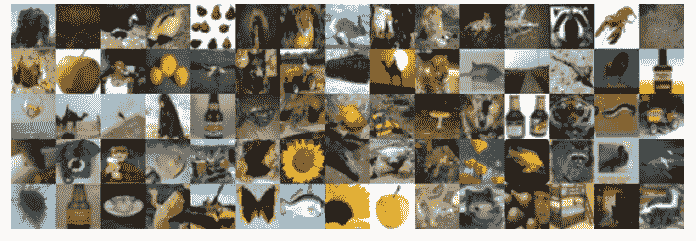

图 10.5. CIFAR100 数据库中的图像样本：一组来自日常生活的自然图像，包含 100 个不同的类别。

将 $\mathbf{W}_1$、$\mathbf{W}_2$ 和 $\mathbf{B}$ 中的系数数量相加，我们总共得到 235,146 个，是多项式逻辑回归所需数量 $785 \times 9 = 7,065$ 的 33 倍多。回想一下，训练集中有 60,000 张图像。虽然这看起来是一个很大的训练集，但神经网络模型中的系数数量几乎是训练集中观测值数量的四倍！为了避免过拟合，需要一些正则化。在此示例中，我们使用了两种形式的正则化：岭正则化，类似于第 6 章的岭回归，以及 *dropout* 正则化。我们将在第 10.7 节讨论这两种正则化形式。

## 10.3 卷积神经网络

神经网络在 2010 年左右凭借图像分类的巨大成功而重新崛起。大约在那个时候，带有标签的大型图像数据库正在不断积累，类别数量也越来越多。图 10.5 显示了从 CIFAR100 数据库中抽取的 75 张图像。$^4$ 该数据库包含 60,000 张图像，根据 20 个超类（例如水生哺乳动物）进行标记，每个超类包含五个类别（海狸、海豚、水獭、海豹、鲸鱼）。每张图像的分辨率为 $32 \times 32$ 像素，每个像素有三个八位数，分别代表红色、绿色和蓝色。每张图像的数字被组织在一个称为 *特征图* 的三维数组中。前两个

$^4$ 参见 Krizhevsky (2009) 的第 3 章 “Learning multiple layers of features from tiny images”，可在 https://www.cs.toronto.edu/~kriz/learning-features-2009-TR.pdf 获取。


图 10.6. *示意图，展示卷积神经网络如何对一张老虎图像进行分类。网络接收图像并识别局部特征。然后，它将这些局部特征组合起来以创建复合特征，在此示例中包括眼睛和耳朵。这些复合特征用于输出标签“老虎”。*

轴是空间轴（均为 32 维），第三个是 *通道* 轴，⁵ 代表三种颜色。有一个指定的包含 50,000 张图像的训练集，以及一个包含 10,000 张图像的测试集。

一类特殊的 *卷积神经网络*（CNNs）已经发展起来，用于对这类图像进行分类，并在广泛的问题上取得了显著的成功。CNNs 在某种程度上模仿了人类对图像进行分类的方式，即识别图像中任何位置的特定特征或模式，以区分每个特定的对象类别。在本节中，我们将简要概述它们的工作原理。

图 10.6 在一张老虎的卡通图像上说明了卷积神经网络背后的思想。⁶

网络首先识别输入图像中的低级特征，例如小的边缘、色块等。然后，这些低级特征被组合形成更高级的特征，例如耳朵、眼睛等部分。最终，这些更高级特征的存在与否有助于任何给定输出类别的概率。

卷积神经网络如何构建这种层次结构？它结合了两种专门类型的隐藏层，称为 *卷积* 层和 *池化* 层。卷积层在图像中搜索小模式的实例，而池化层则对这些模式进行下采样以选择一个突出的子集。为了达到最先进的结果，现代神经网络架构使用了许多卷积层和池化层。接下来我们将描述卷积层和池化层。

### 10.3.1 卷积层

一个 *卷积层* 由大量的 *卷积滤波器* 组成，每个

⁵ 术语 *通道* 取自信号处理文献。每个通道是一个独立的信息源。

⁶ 感谢 Elena Tuzhilina 制作图表，并感谢 https://www.cartooning4kids.com/ 允许使用卡通老虎。

滤波器都是一个模板，用于确定图像中是否存在特定的局部特征。卷积滤波器依赖于一个非常简单的操作，称为 *卷积*，它基本上就是重复地将矩阵元素相乘，然后将结果相加。

为了理解卷积滤波器的工作原理，考虑一个非常简单的 $4 \times 3$ 图像示例：

$$\text{原始图像} = \begin{bmatrix} a & b & c \\ d & e & f \\ g & h & i \\ j & k & l \end{bmatrix}.$$

现在考虑一个 $2 \times 2$ 的滤波器，形式如下

$$\text{卷积滤波器} = \begin{bmatrix} \alpha & \beta \\ \gamma & \delta \end{bmatrix}.$$

当我们用滤波器对图像进行 *卷积* 时，我们得到结果$^7$

$$\text{卷积后的图像} = \begin{bmatrix} a\alpha + b\beta + d\gamma + e\delta & b\alpha + c\beta + e\gamma + f\delta \\ d\alpha + e\beta + g\gamma + h\delta & e\alpha + f\beta + h\gamma + i\delta \\ g\alpha + h\beta + j\gamma + k\delta & h\alpha + i\beta + k\gamma + l\delta \end{bmatrix}.$$

例如，左上角的元素来自将 $2 \times 2$ 滤波器中的每个元素与图像左上角 $2 \times 2$ 部分中的对应元素相乘，并将结果相加。其他元素以类似方式获得：卷积滤波器应用于原始图像的每个 $2 \times 2$ 子矩阵，以获得卷积后的图像。如果原始图像的 $2 \times 2$ 子矩阵与卷积滤波器相似，那么它在卷积后的图像中将具有 *大* 值；否则，它将具有 *小* 值。因此，*卷积后的图像突出了原始图像中与卷积滤波器相似的区域*。我们使用了 $2 \times 2$ 作为示例；通常卷积滤波器是小的 $\ell_1 \times \ell_2$ 数组，其中 $\ell_1$ 和 $\ell_2$ 是小的正整数，不一定相等。

图 10.7 说明了将两个卷积滤波器应用于左侧所示的 $192 \times 179$ 老虎图像的情况。$^8$ 每个卷积滤波器是一个 $15 \times 15$ 的图像，主要包含零（黑色），其中有一条窄的一（白色）条带，可以是垂直或水平方向。当每个滤波器与老虎图像进行卷积时，与滤波器相似的老虎区域（即具有水平或垂直条纹或边缘的区域）被赋予大值，而不相似的区域被赋予小值。卷积后的图像显示在右侧。我们看到水平条纹滤波器突出了原始图像中的水平条纹和边缘，而垂直条纹滤波器突出了原始图像中的垂直条纹和边缘。

$^7$ 卷积后的图像比原始图像小，因为它的维度由原始图像中 $2 \times 2$ 子矩阵的数量给出。注意 $2 \times 2$ 是卷积滤波器的维度。如果我们希望卷积后的图像与原始图像具有相同的维度，则可以应用填充。

$^8$ 图 10.7–10.9 中使用的老虎图像来自公共领域图像资源 https://www.needpix.com/。


**图 10.7.** *卷积滤波器在图像中查找局部特征，例如边缘和小形状。我们从左侧显示的老虎图像开始，应用中间的两个小卷积滤波器。卷积后的图像突出了原始图像中与滤波器相似的细节区域。具体来说，上方的卷积图像突出了老虎的垂直条纹，而下方的卷积图像突出了老虎的水平条纹。我们可以将原始图像视为卷积神经网络中的输入层，将卷积后的图像视为第一个隐藏层中的单元。*

我们在图 10.7 中使用了一张大图像和两个大滤波器进行说明。对于 CIFAR100 数据库，每张图像有 $32 \times 32$ 个彩色像素，我们使用 $3 \times 3$ 的卷积滤波器。

在卷积层中，我们使用一整套滤波器来挑选图像中各种不同方向的边缘和形状。以这种方式使用预定义的滤波器是图像处理中的标准做法。相比之下，对于 CNNs，滤波器是针对特定分类任务 *学习* 的。我们可以将滤波器权重视为从输入层到隐藏层的参数，其中卷积后图像中的每个像素对应一个隐藏单元。这实际上是这种情况，尽管参数具有高度结构化和约束性（更多细节请参见练习 4）。它们在输入图像的局部区域上操作（因此有许多结构性零），并且给定滤波器中的相同权重在图像的所有可能区域上重复使用（因此权重受到约束）。$^9$

我们现在给出一些额外的细节。

- 由于输入图像是彩色的，它有三个通道，由一个三维特征图（数组）表示。每个通道是一个二维（$32 \times 32$）特征图——一个用于红色，一个用于绿色，一个用于蓝色。单个卷积滤波器也将有三个通道，每个颜色一个，每个维度为 $3 \times 3$，可能具有不同的滤波器权重。三个卷积的结果相加形成一个二维输出特征图。注意，此时颜色信息已被使用，并且除了在卷积中的作用外，不会传递到后续层。

$^9$ 这在神经网络的早期被称为 *权重共享*。

- 如果我们在第一个隐藏层使用 $K$ 个不同的卷积滤波器，就会得到 $K$ 个二维输出特征图，它们共同构成一个单一的三维特征图。我们将这 $K$ 个输出特征图中的每一个视为一个独立的信息通道，因此现在我们有 $K$ 个通道，这与原始输入特征图的三个颜色通道形成对比。这个三维特征图就像简单神经网络隐藏层中的激活值，只是其组织和产生方式具有空间结构。

- 我们通常将 ReLU 激活函数 (10.5) 应用于卷积后的图像。这一步有时被视为卷积神经网络中的一个单独层，在这种情况下，它被称为*检测层*。

## 10.3.2 池化层

*池化*层提供了一种将大图像浓缩为较小摘要图像的方法。虽然有多种可能的池化方式，但*最大池化*操作使用每个像素块中的最大值来汇总图像中每个不重叠的 $2 \times 2$ 像素块。这使图像的大小在每个方向上都减少了一半，同时也提供了一些*位置不变性*：即只要块中四个像素中有一个是大值，整个块在缩小后的图像中就会被记录为大值。

这是一个最大池化的简单示例：

$$\text{Max pool} \begin{bmatrix} 1 & 2 & 5 & 3 \\ 3 & 0 & 1 & 2 \\ 2 & 1 & 3 & 4 \\ 1 & 1 & 2 & 0 \end{bmatrix} \rightarrow \begin{bmatrix} 3 & 5 \\ 2 & 4 \end{bmatrix}.$$

## 10.3.3 卷积神经网络的架构

到目前为止，我们已经定义了一个单一的卷积层——每个滤波器产生一个新的二维特征图。卷积层中卷积滤波器的数量类似于我们在第 10.2 节中看到的全连接神经网络中特定隐藏层的单元数量。这个数量也定义了最终三维特征图中的通道数。我们还描述了一个池化层，它减少了每个三维特征图的前两个维度。深度 CNN 有许多这样的层。图 10.8 展示了一个用于 CIFAR100 图像分类任务的典型 CNN 架构。

在输入层，我们看到一个彩色图像的三维特征图，其中通道轴通过每个 $32 \times 32$ 的二维像素特征图来表示每种颜色。每个卷积滤波器在第一个隐藏层产生一个新的通道，每个通道都是一个 $32 \times 32$ 的特征图（在边缘进行了一些填充之后）。经过这第一轮卷积后，我们现在有了一个新的“图像”；一个通道数远多于三个颜色输入通道的特征图（图中为六个，因为我们使用了六个卷积滤波器）。

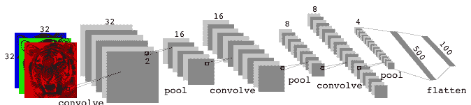

**图 10.8.** 用于 CIFAR100 分类任务的深度 CNN 架构。卷积层与 2 × 2 最大池化层交替出现，后者将两个维度的尺寸都减少了一半。

接下来是一个最大池化层，它将每个通道的特征图大小减少了四倍：每个维度减少两倍。
这种“先卷积后池化”的序列在接下来的两层中重复。一些细节如下：

- 每个后续的卷积层与第一个类似。它将前一层的三维特征图作为输入，并将其视为单个多通道图像。每个学习到的卷积滤波器都具有与该特征图相同数量的通道。
- 由于通道特征图在每个池化层之后尺寸减小，我们通常会增加下一个卷积层中的滤波器数量以作补偿。
- 有时我们在一个池化层之前重复几个卷积层。这实际上增加了滤波器的维度。

这些操作重复进行，直到池化将每个通道特征图在每个维度上都缩减到只有几个像素。此时，三维特征图被*展平*——像素被视为独立的单元——并馈入一个或多个全连接层，最后到达输出层，该层是一个用于 100 个类别的 *softmax 激活*（如 (10.13) 所示）。

构建这样的网络有许多需要选择的调优参数，除了每层的数量、性质和大小之外。Dropout 学习可以在每一层使用，lasso 或岭回归正则化也可以（见第 10.7 节）。构建卷积神经网络的细节可能看起来令人生畏。幸运的是，有优秀的软件可用，并提供了大量示例和说明，为参数的合理选择提供指导。对于 CIFAR100 官方测试集，截至本文撰写时，最佳准确率略高于 75%，但毫无疑问，这一性能将继续提高。

## 10.3.4 数据增强

图像建模中使用的另一个重要技巧是*数据增强*。本质上，每个训练图像被复制多次，每个副本都以自然的方式随机扭曲，使得人类识别不受影响。图 10.9 展示了一些例子。典型的扭曲包括


**图 10.9.** *数据增强。原始图像（最左边）以自然的方式被扭曲，以产生具有相同类别标签的不同图像。这些扭曲不会欺骗人类，并且在拟合 CNN 时充当一种正则化形式。*

缩放、水平和垂直平移、剪切、小角度旋转，以及在本例中的水平翻转。表面上看，这是一种通过使用略有不同的样本来显著增加训练集的方法，从而防止过拟合。事实上，我们可以将其视为一种正则化形式：我们在每个原始图像周围构建一个图像云，所有图像都具有相同的标签。这种数据的“增厚”在精神上类似于岭回归正则化。

我们将在第 10.7.2 节中看到，用于拟合深度学习模型的随机梯度下降算法会重复处理随机选择的批次，例如一次处理 128 张训练图像。这与增强技术完美配合，因为我们可以即时扭曲批次中的每张图像，因此不必存储所有新图像。

## 10.3.5 使用预训练分类器的结果

这里我们使用一个工业级的预训练分类器来预测一些新图像的类别。`resnet50` 分类器是一个卷积神经网络，它使用 `imagenet` 数据集进行训练，该数据集包含数百万张属于不断增长的类别的图像。¹⁰ 图 10.10 展示了 `resnet50` 在六张照片（其中一位作者的私人收藏）上的性能。¹¹ CNN 在对第二张图像中的鹰进行分类时表现尚可。如果我们像第三张图像那样缩小视野，它就会感到困惑，选择了喷泉而不是鹰。在最后一张图像中，“翠鴗”是一种来自南美洲和中美洲的热带鸟，与南非的开普织布鸟颜色相似。我们将在第 10.9.4 节中提供更多关于此示例的细节。

拟合 CNN 的大部分工作在于学习隐藏层的卷积滤波器；这些是 CNN 的系数。对于在像 `imagenet` 这样拥有大量类别的海量语料库上拟合的模型，这些滤波器的输出可以作为通用自然图像分类问题的特征。可以将这些预训练的隐藏层用于训练集小得多的新问题（这个过程称为*权重冻结*），并且只训练网络的最后几层，这需要的数据要少得多。

¹⁰有关 `resnet50` 的更多信息，请参阅 He, Zhang, Ren, and Sun (2015) “Deep residual learning for image recognition”, https://arxiv.org/abs/1512.03385。有关 `imagenet` 的详细信息，请参阅 Russakovsky, Deng, et al. (2015) “ImageNet Large Scale Visual Recognition Challenge”，发表于 *International Journal of Computer Vision*。

¹¹这些 `resnet` 结果可能会随时间变化，因为公开训练的模型会定期更新。

## 10.4 文档分类

在本节中，我们将介绍一种在工业和科学领域具有重要应用价值的新型示例：预测文档的属性。文档的例子包括医学期刊文章、路透社新闻稿、电子邮件、推文等。我们的示例将是 IMDb（互联网电影数据库）评分——观众撰写的电影评论短文。这里的响应变量是评论的情感倾向，即*正面*或*负面*。

> <sup>12</sup>F. Chollet 和 J.J. Allaire 所著的《R语言深度学习》，2018年，Manning Publications。
> <sup>13</sup>详情请参见 Maas 等人（2011）的论文“Learning word vectors for sentiment analysis”，收录于*第49届计算语言学协会年会论文集：人类语言技术*，第142-150页。

以下是一段相当有趣的负面评论的开头：

> 这绝对是1990年代最糟糕的电影之一。当我和朋友们观看这部电影（我们正是其目标观众）时，我们只是坐着看了前半个小时，下巴都快惊掉了，因为它实在太糟糕了。剩下的时间里，影院里的其他人开始互相交谈、离场，或者干脆对着他们的爆米花哭泣……

每篇评论的长度可能不同，可能包含俚语或非标准词汇，存在拼写错误等。我们需要找到一种方法来*特征化*此类文档。这是现代术语，意为定义一组预测变量。

最简单且最常见的特征化方法是*词袋*模型。我们根据语言词典（此处为英语词典）中每个单词的出现与否对每篇文档进行评分。如果词典包含 $M$ 个单词，这意味着对于每篇文档，我们创建一个长度为 $M$ 的二元特征向量，对于存在的每个单词记为1，否则记为0。这可能是一个非常宽的特征向量，因此我们限制词典——在此例中，限制为包含25,000篇评论的训练语料库中出现频率最高的10,000个单词。幸运的是，有很好的工具可以自动完成这项工作。以下是一篇经过这种方式处理的正面评论的开头：

> ⟨START⟩ 这部电影的选角、场景、故事、导演都非常出色，每个人都非常适合他们扮演的角色，你简直可以想象自己身临其境。robert ⟨UNK⟩ 是一位了不起的演员，现在同样作为导演 ⟨UNK⟩ 父亲来自与我相同的苏格兰岛屿，所以我喜欢……

在这里我们可以看到许多单词被省略了，一些未知单词（UNK）被标记出来。经过这种缩减，二元特征向量的长度为10,000，主要由0组成，在文档中存在的单词对应位置上散布着一些1。我们有一个训练集和一个测试集，每个包含25,000个样本，并且在*情感倾向*方面是平衡的。由此产生的训练特征矩阵 $\mathbf{X}$ 的维度为 $25,000 \times 10,000$，但只有1.3%的二元条目是非零的。我们称这样的矩阵为稀疏矩阵，因为大多数值是相同的（在此例中为零）；它可以高效地存储在*稀疏矩阵格式*中。<sup>14</sup> 有多种方法可以考虑文档长度；这里我们只对单词是否在文档中进行评分，但例如，也可以记录单词的相对频率。我们从25,000个训练观测值中分离出一个大小为2,000的验证集（用于模型调优），并拟合两个模型序列：

- 使用 `glmnet` 包的lasso逻辑回归；
- 一个具有两个隐藏层的二分类神经网络，每层有16个ReLU单元。

<sup>14</sup>我们不必存储整个矩阵，而是可以存储非零条目的位置和值。在这种情况下，由于非零条目都是1，只需存储位置即可。

两种方法都产生一系列解。lasso序列由正则化参数λ索引。神经网络序列由拟合中使用的梯度下降迭代次数索引，以训练轮次或遍历训练集的次数来衡量（第10.7节）。请注意，图10.11中的训练准确率（黑点）在两种情况下都单调递增。我们可以使用验证误差从每个序列中选择一个好的解（图中的蓝点），然后用于在测试数据集上进行预测。

请注意，二分类神经网络相当于一个非线性逻辑回归模型。从公式（10.12）和（10.13）我们可以看到：

$$\log \left( \frac{\Pr(Y=1|X)}{\Pr(Y=0|X)} \right) = Z_1 - Z_0 = (\beta_{10} - \beta_{00}) + \sum_{\ell=1}^{K_2} (\beta_{1\ell} - \beta_{0\ell}) A_{\ell}^{(2)}.$$

（这显示了softmax函数的冗余性；对于K个类别，我们实际上只需要估计K-1组系数。参见第4.3.5节。）在图10.11中，我们显示的是准确率（正确分类的比例）而不是分类错误率（错误分类的比例），前者在机器学习社区中更受欢迎。两种模型在测试集上都达到了约88%的准确率。

词袋模型通过文档中存在的单词来总结文档，并忽略了它们的上下文。至少有两种流行的方法可以考虑上下文：

- n-gram词袋模型。例如，2-gram词袋记录每个不同单词对的连续共现。“Blissfully long”在电影评论中可以被视为一个正面短语，而“blissfully short”则是一个负面短语。
- 将文档视为一个序列，考虑所有单词在其前面和后面单词的上下文。

在下一节中，我们将探索数据序列的模型，这些模型在天气预报、语音识别、语言翻译和时间序列预测等方面都有应用。我们将在那里继续使用这个IMDb示例。

## 10.5 循环神经网络

许多数据源本质上是序列性的，在构建预测模型时需要特殊处理。例子包括：

- 文档，如书籍和电影评论、报纸文章和推文。文档中单词的顺序和相对位置捕捉了叙事、主题和语气，并可用于主题分类、情感分析和语言翻译等任务。
- 温度、降雨量、风速、空气质量等的时间序列。我们可能希望预测未来几天的天气，或未来几十年的气候。
- 金融时间序列，我们跟踪市场指数、交易量、股票和债券价格以及汇率。这里的预测通常很困难，但正如我们将看到的，某些指数可以以合理的准确度进行预测。
- 录制的语音、音乐录音和其他声音录音。我们可能希望给出演讲的文本转录，或者进行语言翻译。我们可能希望评估一段音乐的质量，或分配某些属性。
- 手写体，如医生笔记，以及手写数字，如邮政编码。这里我们希望将手写体转换为数字文本，或读取数字（光学字符识别）。

在*循环神经网络*（RNN）中，输入对象 $X$ 是一个*序列*。考虑一个文档语料库，例如IMDb电影评论的集合。每篇文档可以表示为一个包含 $L$ 个单词的序列，因此 $X = \{X_1, X_2, \dots, X_L\}$，其中每个 $X_\ell$ 代表一个单词。单词的顺序以及句子中某些单词的接近程度传达了语义含义。RNN旨在适应并利用此类输入对象的序列特性，就像卷积神经网络适应图像输入的空间结构一样。输出 $Y$ 也可以是一个序列（例如在语言翻译中），但通常是一个标量，比如电影评论文档的二元情感标签。

## 10.5 循环神经网络

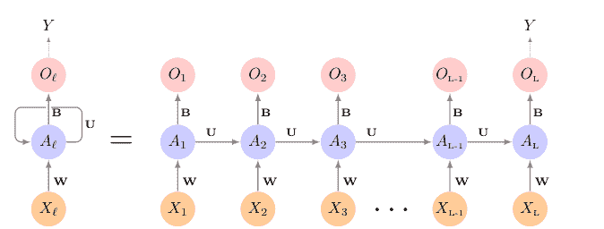

**图 10.12.** 简单循环神经网络的示意图。输入是一个向量序列 $\{X_{\ell}\}_{1}^{L}$，这里的输出目标是一个单一响应。网络按顺序处理输入序列 $X$；每个 $X_{\ell}$ 输入到隐藏层，该层同时接收来自序列中前一个元素的激活向量 $A_{\ell-1}$ 作为输入，并产生当前的激活向量 $A_{\ell}$。在处理序列的每个元素时，都使用相同的权重集合 $\mathbf{W}$、$\mathbf{U}$ 和 $\mathbf{B}$。输出层根据当前的激活 $A_{\ell}$ 产生一系列预测 $O_{\ell}$，但通常只有最后一个 $O_L$ 是相关的。等号左侧是网络的简洁表示，右侧则展开为更明确的版本。

图 10.12 展示了一个非常基础的 RNN 结构，其输入为序列 $X = \{X_1, X_2, \dots, X_L\}$，一个简单的输出 $Y$，以及一个隐藏层序列 $\{A_{\ell}\}_{1}^{L} = \{A_1, A_2, \dots, A_L\}$。每个 $X_{\ell}$ 是一个向量；在文档示例中，$X_{\ell}$ 可以表示基于语料库语言词典的第 $\ell$ 个词的独热编码（参见图 10.13 顶部面板的简单示例）。随着序列一次处理一个向量 $X_{\ell}$，网络会更新隐藏层中的激活 $A_{\ell}$，其输入是向量 $X_{\ell}$ 和来自序列中前一步的激活向量 $A_{\ell-1}$。每个 $A_{\ell}$ 输入到输出层，并产生对 $Y$ 的预测 $O_{\ell}$。其中最后一个 $O_L$ 是最相关的。

具体来说，假设输入序列的每个向量 $X_{\ell}$ 有 $p$ 个分量 $X_{\ell}^T = (X_{\ell 1}, X_{\ell 2}, \dots, X_{\ell p})$，隐藏层由 $K$ 个单元组成 $A_{\ell}^T = (A_{\ell 1}, A_{\ell 2}, \dots, A_{\ell K})$。如图 10.4 所示，我们用一个矩阵 $\mathbf{W}$ 表示输入层的 $K \times (p+1)$ 个共享权重 $w_{kj}$，类似地，$\mathbf{U}$ 是一个 $K \times K$ 的矩阵，包含隐藏层到隐藏层的权重 $u_{ks}$，而 $\mathbf{B}$ 是一个 $K + 1$ 维的向量，包含输出层的权重 $\beta_k$。那么

$$A_{\ell k} = g\left(w_{k0} + \sum_{j=1}^{p} w_{kj} X_{\ell j} + \sum_{s=1}^{K} u_{ks} A_{\ell-1,s}\right), \quad (10.16)$$

输出 $O_{\ell}$ 计算如下

$$O_{\ell} = \beta_0 + \sum_{k=1}^{K} \beta_k A_{\ell k} \quad (10.17)$$

对于定量响应，或者对于二元响应，可以额外使用一个 sigmoid 激活函数。这里 $g(\cdot)$ 是一个激活函数，例如 ReLU。请注意，在处理序列中的每个元素时，都使用相同的权重 $\mathbf{W}$、$\mathbf{U}$ 和 $\mathbf{B}$，即它们不是 $\ell$ 的函数。这是 RNN 使用的一种*权重共享*形式，类似于卷积神经网络（第 10.3.1 节）中滤波器的使用。当我们从开始到结束处理时，激活 $A_\ell$ 累积了之前所见内容的历史，从而可以将学习到的上下文用于预测。

对于回归问题，一个观测值 $(X, Y)$ 的损失函数是

$(Y - O_L)^2$, (10.18)

它只引用最终输出 $O_L = \beta_0 + \sum_{k=1}^K \beta_k A_{Lk}$。因此 $O_1, O_2, \ldots, O_{L-1}$ 未被使用。当我们拟合模型时，输入序列 $X$ 的每个元素 $X_\ell$ 通过链式关系 (10.16) 对 $O_L$ 作出贡献，因此通过损失 (10.18) 间接地对学习共享参数 $\mathbf{W}$、$\mathbf{U}$ 和 $\mathbf{B}$ 作出贡献。对于 $n$ 个输入序列/响应对 $(x_i, y_i)$，通过最小化平方和来找到参数

$\sum_{i=1}^n (y_i - o_{iL})^2 = \sum_{i=1}^n \left( y_i - \left( \beta_0 + \sum_{k=1}^K \beta_k g\left( w_{k0} + \sum_{j=1}^p w_{kj} x_{iLj} + \sum_{s=1}^K u_{ks} a_{i,L-1,s} \right) \right) \right)^2$. (10.19)

这里我们使用小写字母表示观测到的 $y_i$ 和向量序列 $x_i = \{x_{i1}, x_{i2}, \ldots, x_{iL}\}^{15}$ 以及派生的激活。

由于中间输出 $O_\ell$ 未被使用，人们可能会问为什么它们还存在。首先，它们是免费的，因为它们使用了产生 $O_L$ 所需的相同输出权重 $\mathbf{B}$，并为输出提供了一个不断演变的预测。此外，对于某些学习任务，响应也是一个序列，因此输出序列 $\{O_1, O_2, \ldots, O_L\}$ 是明确需要的。

当充分发挥作用时，循环神经网络可能相当复杂。我们通过两个简单的应用来说明它们的用途。第一个应用，我们继续上一节的 IMDb 情感分析，我们按顺序处理评论中的单词。在第二个应用中，我们说明它们在金融时间序列预测问题中的用途。

### 10.5.1 用于文档分类的序列模型

这里我们回到 IMDb 评论的分类任务。我们在第 10.4 节的方法是使用词袋模型。这里的计划是改为使用文档中出现的单词序列来预测整个文档的标签。

然而，我们面临一个维度问题：我们文档中的每个单词都由一个独热编码向量（虚拟变量）表示，该向量有 10,000 个元素（词典中的每个单词一个）！一种流行的方法是将每个单词表示在一个低得多的*嵌入*空间中。这意味着，我们不再用一个包含 9,999 个零和一个位置为 1 的二元向量来表示每个单词，而是用一组 $m$ 个实数来表示它，这些实数通常都不为零。这里 $m$ 是嵌入维度，可以低至 100 多，甚至更少。这意味着（在我们的情况下）我们需要一个维度为 $m \times 10,000$ 的矩阵 $\mathbf{E}$。

15 这是一个向量序列；每个元素 $x_{i\ell}$ 是一个 $p$ 维向量。

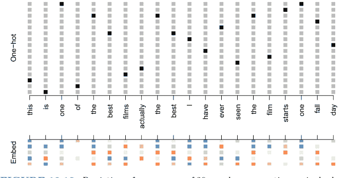

**图 10.13.** 表示单个文档的 20 个单词序列的示意图：使用包含 16 个单词的词典进行独热编码（顶部面板），以及嵌入到维度 m = 5 的空间中（底部面板）。

其中每一列由我们词典中的 10,000 个单词之一索引，该列中的值给出了该单词在嵌入空间中的 m 个坐标。

图 10.13 说明了这个想法（使用包含 16 个单词而非 10,000 个单词的词典，且 m = 5）。E 从哪里来？如果我们有一个大型的带标签文档语料库，我们可以让神经网络在优化过程中学习 E。在这种情况下，E 被称为嵌入层，并为手头的任务学习一个专门的 E。否则，我们可以在嵌入层中插入一个预计算的矩阵 E，这个过程称为权重冻结。两个预训练的嵌入，word2vec 和 GloVe，被广泛使用。16 它们是通过主成分分析（第 12.2 节）的一种变体从非常大的文档语料库中构建的。其思想是，单词在嵌入空间中的位置保留了语义意义：例如，同义词应该彼此靠近。

到目前为止，一切顺利。每个文档现在被表示为一个 m 维向量的序列，该序列代表单词序列。下一步是将每个文档限制为最后 L 个单词。长度小于 L 的文档会在前面用零填充。所以现在每个文档由一个包含 L 个向量的序列 X = {X1, X2, ..., XL} 表示，序列中的每个 Xℓ 有 m 个分量。

我们现在使用图 10.12 中的 RNN 结构。训练语料库由 n 个独立的长度为 L 的序列（文档）组成，每个序列都从左到右按顺序处理。在此过程中，为每个文档创建一个并行的隐藏激活向量序列 Aℓ, ℓ = 1, ..., L，如 (10.16) 所示。Aℓ 输入到输出层以产生演变的预测 Oℓ。我们使用最终值 OL 来预测响应：评论的情感。

16 word2vec 在 Mikolov, Chen, Corrado, and Dean (2013) 中描述，可在 https://code.google.com/archive/p/word2vec 获取。GloVe 在 Pennington, Socher, and Manning (2014) 中描述，可在 https://nlp.stanford.edu/projects/glove 获取。

这是一个简单的循环神经网络，参数相对较少。如果有 $K$ 个隐藏单元，公共权重矩阵 $\mathbf{W}$ 有 $K \times (m+1)$ 个参数，矩阵 $\mathbf{U}$ 有 $K \times K$ 个参数，而 $\mathbf{B}$ 对于如 (10.15) 所示的二分类逻辑回归有 $2(K+1)$ 个参数。当我们从左到右处理序列 $X = \{X_{\ell}\}_1^L$ 时，这些参数被重复使用，这很像我们使用单个卷积滤波器来处理图像中的每个图块（第 10.3.1 节）。如果嵌入层 $\mathbf{E}$ 是学习得到的，这会增加额外的 $m \times D$ 个参数（此处 $D=10,000$），并且是目前最大的开销。

我们按照图 10.12 及其附带文本的描述，将 RNN 拟合到 IMDb 数据上。该模型有一个嵌入矩阵 $\mathbf{E}$，其中 $m=32$（在训练中学习得到，而非预计算），随后是一个具有 $K=32$ 个隐藏单元的循环层。该模型在指定的训练集中的 25,000 条评论上使用 dropout 正则化进行训练，并在 IMDb 测试数据上取得了令人失望的 76% 准确率。使用 GloVe 预训练嵌入矩阵 $\mathbf{E}$ 的网络表现稍差。

为了便于说明，我们展示了一个非常简单的 RNN。更复杂的版本使用*长期*和*短期*记忆（LSTM）。维护两条隐藏层激活轨迹，因此当计算激活 $A_{\ell}$ 时，它既接收来自时间上更靠后的隐藏单元的输入，也接收来自时间上更接近的隐藏单元的输入——即所谓的 *LSTM RNN*。对于长序列，这克服了早期信号在通过链传播到最终激活向量 $A_L$ 时被淹没的问题。

当我们使用 LSTM 架构重新拟合隐藏层模型时，性能在 IMDb 测试数据上提高到了 87%。这与第 10.4 节中词袋模型达到的 88% 相当。我们将在第 10.9.6 节给出拟合这些模型的细节。

尽管增加了 LSTM 的复杂性，我们的 RNN 仍然有些“入门级”。我们可能通过改变模型大小、改变正则化以及增加额外的隐藏层来获得稍好的结果。然而，LSTM 模型训练时间很长，这使得探索许多架构和参数优化变得繁琐。

RNN 为建模数据序列提供了一个丰富的框架，并且它们仍在不断发展。在 RNN 的发展中已经取得了许多进步——在架构、数据增强和学习算法方面。在撰写本文时（2020 年初），领先的 RNN 配置在 IMDb 数据上报告的准确率超过 95%。其细节超出了本书的范围。$^{17}$

## 10.5.2 时间序列预测

图 10.14 显示了纽约证券交易所的历史交易统计数据。展示了三个每日时间序列，涵盖 1962 年 12 月 3 日至 1986 年 12 月 31 日的时期：$^{18}$

$^{17}$ IMDb 排行榜可在 https://paperswithcode.com/sota/sentiment-analysis-on-imdb 找到。

$^{18}$ 这些数据由 LeBaron 和 Weigend (1998) *IEEE Transactions on Neural Networks*, 9(1): 213-220 整理。

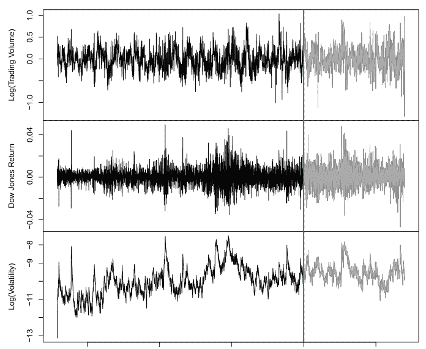

**图 10.14.** *纽约证券交易所的历史交易统计数据。显示了 1962–1986 年 24 年期间的归一化对数交易量、道琼斯指数回报率和对数波动率的每日值。我们希望根据所有早期交易日的历史数据来预测任何一天的交易量。红色条（1980 年 1 月 2 日）左侧是训练数据，右侧是测试数据。*

- **对数交易量。** 这是当日交易的流通股比例，相对于过去 100 天换手率的移动平均值，取对数尺度。
- **道琼斯指数回报率。** 这是连续交易日道琼斯工业指数对数的差值。
- **对数波动率。** 这基于每日价格变动的绝对值。

预测股票价格是一个出了名的难题，但事实证明，基于近期历史预测交易量更易于管理（并且对规划交易策略有用）。

此处的一个观测值由第 $t$ 天的测量值 $(v_t, r_t, z_t)$ 组成，在此例中是 `log_volume`、`DJ_return` 和 `log_volatility` 的值。总共有 $T = 6,051$ 个这样的三元组，每个都在图 10.14 中绘制为时间序列。一个立即引起我们注意的特征是，逐日观测值彼此并不独立。这些序列表现出*自相关*——在这种情况下，时间上接近的值往往彼此相似。这将时间序列与我们遇到的其他数据集区分开来，在那些数据集中，观测值可以被假定为彼此独立。为了明确起见，考虑观测值对 $(v_t, v_{t-\ell})$，滞后 $\ell$ 天。如果我们取 $v_t$ 序列中的所有这样的对并计算它们的相关系数，这就给出了滞后 $\ell$ 的自相关。图 10.15 显示了所有滞后高达 37 的自相关函数，我们看到了相当大的相关性。

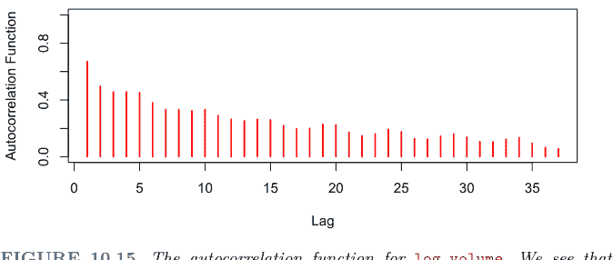

**图 10.15.** *log_volume 的自相关函数。我们看到附近的值相当强地相关，即使相隔 20 天，相关性也高于 0.2。*

这个预测问题的另一个有趣特征是，响应变量 $v_t$（log_volume）也是一个预测因子！特别是，我们将使用 log_volume 的过去值来预测未来的值。

## RNN 预测器

我们希望从过去的值 $v_{t-1}, v_{t-2}, \dots$ 预测值 $v_t$，并且还要利用其他序列的过去值 $r_{t-1}, r_{t-2}, \dots$ 和 $z_{t-1}, z_{t-2}, \dots$。尽管我们的组合数据是一个相当长的序列，有 6,051 个交易日，但问题的结构与之前的文档分类示例不同。

- 我们只有一个数据序列，而不是 25,000 个。
- 我们有一个完整的目标序列 $v_t$，并且输入包括该序列的过去值。

我们如何用图 10.12 所示的结构来表示这个问题？其思想是提取许多具有预定义长度 $L$（在此上下文中称为滞后）的短迷你序列输入序列 $X = \{X_1, X_2, \dots, X_L\}$，以及一个对应的目标 $Y$。它们的形式为

$$X_1 = \begin{pmatrix} v_{t-L} \ r_{t-L} \ z_{t-L} \end{pmatrix}, \quad X_2 = \begin{pmatrix} v_{t-L+1} \ r_{t-L+1} \ z_{t-L+1} \end{pmatrix}, \quad \dots, \quad X_L = \begin{pmatrix} v_{t-1} \ r_{t-1} \ z_{t-1} \end{pmatrix}, \quad \text{and } Y = v_t. \tag{10.20}$$

因此，这里的目标 $Y$ 是单个时间点 $t$ 的 log_volume 值 $v_t$，输入序列 $X$ 是 3 维向量序列 $\{X_\ell\}_1^L$，每个向量由从第 $t-L, t-L+1$ 天到 $t-1$ 天的三个测量值 log_volume、DJ_return 和 log_volatility 组成。每个 $t$ 值构成一个单独的 $(X, Y)$ 对，$t$ 从 $L+1$ 运行到 $T$。对于 NYSE 数据，我们将使用过去五个交易日来预测下一个交易日的交易量。因此，我们使用 $L = 5$。由于 $T = 6,051$，我们可以创建 6,046 个这样的 $(X, Y)$ 对。显然，$L$ 是一个应该谨慎选择的参数，也许可以使用验证数据。

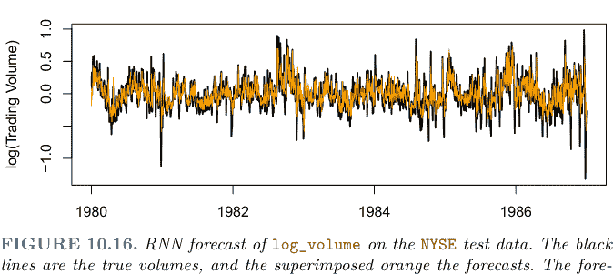

**图 10.16.** *NYSE 测试数据上 log_volume 的 RNN 预测。黑线是真实交易量，叠加的橙色线是预测值。预测序列解释了 log_volume 42% 的方差。*

我们使用 $K = 12$ 个隐藏单元拟合此模型，使用从 1980 年 1 月 2 日之前的数据导出的 4,281 个训练序列（见图 10.14），然后用它来预测此日期之后的 1,770 个 log_volume 值。我们在测试数据上实现了 $R^2 = 0.42$。细节在第 10.9.6 节给出。作为一个*基准*，<sup>19</sup> 使用昨天的 log_volume 值作为今天的预测，其 $R^2 = 0.18$。图 10.16 显示了预测结果。我们用黑色绘制了 1980–1986 年测试期间每日 log_volume 的观测值，并用橙色叠加了预测序列。对应关系似乎相当好。

在预测测试期间 log_volume 的值时，我们必须使用测试数据本身来形成输入序列 $X$。这可能感觉像是作弊，但事实上并非如此；我们始终使用过去的数据来预测未来。

## 自回归

我们刚刚拟合的 RNN 与传统的*自回归*（AR）线性模型有很多共同之处，我们现在将其呈现出来以作比较。我们首先单独考虑响应序列 $v_t$，并构建一个响应向量 $\mathbf{y}$ 和一个用于最小二乘回归的预测变量矩阵 $\mathbf{M}$，如下所示：

$$ \mathbf{y} = \begin{bmatrix} v_{L+1} \ v_{L+2} \ v_{L+3} \ \vdots \ v_T \end{bmatrix} \quad \mathbf{M} = \begin{bmatrix} 1 & v_L & v_{L-1} & \cdots & v_1 \ 1 & v_{L+1} & v_L & \cdots & v_2 \ 1 & v_{L+2} & v_{L+1} & \cdots & v_3 \ \vdots & \vdots & \vdots & \ddots & \vdots \ 1 & v_{T-1} & v_{T-2} & \cdots & v_{T-L} \end{bmatrix}. \quad (10.21) $$

$\mathbf{M}$ 和 $\mathbf{y}$ 各有 $T - L$ 行，每行对应一个观测值。我们看到，对于第 $t$ 天的任何给定响应 $v_t$，其预测变量是前 $L$ 个值

<sup>19</sup> 此处的基准指一个简单且合理的预测，可用作比较的基线。

属于同一时间序列。对 $\mathbf{y}$ 关于 $\mathbf{M}$ 进行回归拟合，相当于拟合模型

$$\hat{v}_t = \hat{\beta}_0 + \hat{\beta}_1 v_{t-1} + \hat{\beta}_2 v_{t-2} + \cdots + \hat{\beta}_L v_{t-L}, \quad (10.22)$$

这被称为 $L$ 阶自回归模型，或简称为 AR($L$)。对于纽约证券交易所数据，我们可以在预测矩阵 $\mathbf{M}$ 中包含 DJ_return 和 log_volatility 的滞后版本 $r_t$ 和 $z_t$，从而得到 $3L+1$ 列。一个 $L=5$ 的 AR 模型在测试集上实现了 0.41 的 $R^2$，略低于 RNN 实现的 0.42。

当然，RNN 和 AR 模型非常相似。它们都使用相同的响应变量 $Y$ 和长度为 $L=5$、维度为 $p=3$ 的输入序列 $X$。RNN 使用相同的权重 $\mathbf{W}$（用于输入层）从左到右处理这个序列，而 AR 模型则简单地将序列的所有 $L$ 个元素视为一个 $L \times p$ 的预测向量——这个过程在神经网络文献中称为*展平*。当然，RNN 还包括隐藏层激活 $A_\ell$，它沿着序列传递信息，并引入了额外的非线性。根据公式 (10.19)，当有 $K=12$ 个隐藏单元时，我们看到 RNN 有 $13 + 12 \times (1 + 3 + 12) = 205$ 个参数，而 AR(5) 模型只有 16 个参数。

AR 模型的一个明显扩展是将滞后预测变量集合作为普通前馈神经网络 (10.1) 的输入向量，从而增加灵活性。这在测试集上实现了 $R^2 = 0.42$，略优于线性 AR，并与 RNN 相同。

所有模型都可以通过加入对应于目标 $v_t$ 的日期 $t$ 的变量 `day_of_week`（可以从数据提供的日历日期中学习）来改进；交易量在周一和周五通常更高。由于有五个交易日，这被独热编码为五个二元变量。AR 模型的性能提高到 $R^2 = 0.46$，RNN 也是如此，而非线性 AR 模型提高到 $R^2 = 0.47$。

我们在本节示例中使用了最简单版本的 RNN。使用 RNN 的 LSTM 扩展进行的额外实验带来了小幅改进，在这些示例中 $R^2$ 通常提高最多 1%。

我们将在第 10.9.6 节详细介绍如何拟合所有这三个模型。

## 10.5.3 RNN 总结

我们通过两个简单的用例说明了 RNN，但这只是触及了皮毛。

用于序列建模的简单 RNN 有许多变体和增强。我们没有讨论的一种方法是使用一维卷积神经网络，将向量序列（例如在嵌入空间中表示的单词）视为图像。卷积滤波器以一维方式沿着序列滑动，有可能学习与学习任务相关的特定短语或短子序列。

RNN 中也可以有额外的隐藏层。例如，有两个隐藏层时，序列 $A_\ell$ 以明显的方式被视为下一个隐藏层的输入序列。

我们使用的 RNN 从头到尾扫描文档；替代的*双向* RNN 从两个方向扫描序列。

在语言翻译中，目标也是一个单词序列，但语言与输入序列不同。输入序列和目标序列都由类似于图 10.12 的结构表示，并且它们共享隐藏单元。在这种所谓的 *Seq2Seq* 学习中，隐藏单元被认为捕捉了句子的语义含义。语言建模和翻译的一些重大突破源于近年来此类 RNN 的改进。

用于拟合 RNN 的算法可能很复杂且计算成本高昂。幸运的是，良好的软件在一定程度上保护用户免受这些复杂性的影响，并使指定和拟合这些模型相对轻松。我们日常生活中享受的许多模型（如 *Google Translate*）使用由高技能工程师团队开发的最先进架构，并使用海量计算和数据资源进行训练。

## 10.6 何时使用深度学习

深度学习在本章中的表现相当令人印象深刻。它解决了数字分类问题，深度 CNN 真正革新了图像分类。我们每天都能看到关于深度学习新成功案例的报道。其中许多与图像分类任务相关，例如乳腺X光片或数字X光图像的机器诊断、眼科扫描、MRI扫描的标注等等。同样，RNN 在语音和语言翻译、预测和文档建模方面也取得了无数成功。那么问题来了：*我们应该抛弃所有旧工具，在每个数据问题上都使用深度学习吗？* 为了解决这个问题，我们重新审视第 6 章的 **Hitters** 数据集。

这是一个回归问题，目标是使用棒球运动员 1986 年的表现统计数据来预测其 1987 年的 **Salary**。在移除响应变量缺失的球员后，我们剩下 263 名球员和 19 个变量。我们将数据随机分为包含 176 名球员（三分之二）的训练集和包含 87 名球员（三分之一）的测试集。我们使用了三种方法来拟合这些数据的回归模型。

- 使用线性模型拟合训练数据，并在测试数据上进行预测。该模型有 20 个参数。
- 使用套索正则化拟合相同的线性模型。通过在训练数据上进行 10 折交叉验证选择调优参数。它选择了一个有 12 个非零系数变量的模型。
- 使用一个包含 64 个 ReLU 单元的单隐藏层神经网络拟合数据。该模型有 1,345 个参数。²⁰

²⁰该模型通过随机梯度下降拟合，批大小为 32，训练 1,000 个周期，并使用 10% 的 dropout 正则化。测试误差性能在 1,000 个周期后趋于平稳并开始缓慢增加。这些拟合细节在第 10.7 节讨论。

| 模型 | 参数数量 | 平均绝对误差 | 测试集 $R^2$ |
| :--- | :--- | :--- | :--- |
| 线性回归 | 20 | 254.7 | 0.56 |
| 套索 | 12 | 252.3 | 0.51 |
| 神经网络 | 1345 | 257.4 | 0.54 |

**表 10.2.** *在 Hitters 测试数据上的预测结果，比较了通过普通最小二乘和套索拟合的线性模型，以及通过带 dropout 正则化的随机梯度下降拟合的神经网络。*

| | 系数 | 标准误差 | $t$ 统计量 | $p$ 值 |
| :--- | :--- | :--- | :--- | :--- |
| 截距 | -226.67 | 86.26 | -2.63 | 0.0103 |
| 安打 | 3.06 | 1.02 | 3.00 | 0.0036 |
| 保送 | 0.181 | 2.04 | 0.09 | 0.9294 |
| 累计得分 | 0.859 | 0.12 | 7.09 | < 0.0001 |
| 接杀 | 0.465 | 0.13 | 3.60 | 0.0005 |

**表 10.3.** *在 Hitters 数据集上，Salary 对套索选择的四个变量进行回归的最小二乘系数估计。该模型在测试数据上取得了最佳性能，平均绝对误差为 224.8。此处报告的结果来自在测试数据上的回归，该数据未用于拟合套索模型。*

表 10.2 比较了结果。我们看到三个模型的性能相似。我们报告了测试数据上的平均绝对误差以及每种方法的测试 $R^2$，这些结果都是可观的（参见练习 5）。我们花了不少时间调整神经网络的配置参数才达到这些结果。如果我们花更多时间，并且正则化的形式和数量恰到好处，我们有可能匹配甚至超越线性回归和套索。但是，我们非常轻松地就获得了效果良好的线性模型。线性模型比本质上是黑箱的神经网络更容易呈现和理解。套索在预测时选择了 19 个变量中的 12 个。因此，在这种情况下，我们最好遵循奥卡姆剃刀原则：当面对几种性能大致相当的方法时，选择最简单的。

奥卡姆剃刀

在对套索模型进行更多探索后，我们确定了一个更简单的包含四个变量的模型。然后我们用这四个变量重新拟合线性模型到训练数据（所谓的*宽松套索*），并实现了 224.8 的测试平均绝对误差，成为总体最佳！我们很想展示这次拟合的汇总表，以便我们可以看到系数和 p 值；然而，由于模型是在训练数据上选择的，会存在*选择偏差*。相反，我们在未用于选择的测试数据上重新拟合了模型。表 10.3 显示了结果。

我们手头有许多非常强大的工具，包括神经网络、随机森林和提升法、支持向量机和广义可加模型等等。然后我们有线性模型及其简单变体。当面临新的数据建模和预测问题时，人们总是倾向于追求时髦的新方法。通常它们会给出极其令人印象深刻的结果，特别是在数据集非常大且能够支持拟合高维非线性模型的情况下。然而，*如果*我们能用更简单的工具产生模型，其性能与复杂模型相当，那么我们通常应该更倾向于使用更简单的模型。

## 10.7 拟合神经网络

拟合神经网络有些复杂，我们在此做一个简要概述。这些思想可以推广到更复杂的网络。觉得这部分内容有挑战性的读者可以放心跳过。幸运的是，正如我们在本章末尾的实验中所看到的，有很好的软件可以以相对自动化的方式拟合神经网络模型，而无需担心模型拟合过程的技术细节。

我们从第10.1节图10.1所示的简单网络开始。在模型(10.1)中，参数为 $\beta = (\beta_0, \beta_1, \dots, \beta_K)$，以及每个 $w_k = (w_{k0}, w_{k1}, \dots, w_{kp})$，$k = 1, \dots, K$。给定观测值 $(x_i, y_i)$，$i = 1, \dots, n$，我们可以通过求解一个非线性最小二乘问题来拟合模型

$$\text{minimize}_{\{w_k\}_1^K, \beta} \frac{1}{2} \sum_{i=1}^n (y_i - f(x_i))^2, \quad (10.23)$$

其中

$$f(x_i) = \beta_0 + \sum_{k=1}^K \beta_k g\left(w_{k0} + \sum_{j=1}^p w_{kj} x_{ij}\right). \quad (10.24)$$

(10.23)中的目标函数看起来很简单，但由于参数的嵌套排列和隐藏单元的对称性，最小化它并不直接。该问题在参数上是非凸的，因此存在多个解。例如，图10.17显示了一个单变量 $\theta$ 的简单非凸函数；有两个解：一个是*局部最小值*，另一个是*全局最小值*。此外，(10.1)是神经网络中最简单的；在本章中，我们介绍了更复杂的网络，这些问题会更加复杂。为了克服其中一些问题并防止过拟合，在拟合神经网络时采用了两种通用策略。

- *慢速学习*：模型以某种缓慢的迭代方式拟合，使用*梯度下降*。当检测到过拟合时，拟合过程随即停止。
- *正则化*：对参数施加惩罚，通常是第6.2节讨论的lasso或岭回归。

假设我们将所有参数表示为一个长向量 $\theta$。那么我们可以将(10.23)中的目标函数重写为

$$R(\theta) = \frac{1}{2} \sum_{i=1}^n (y_i - f_\theta(x_i))^2, \quad (10.25)$$

其中我们明确显示了f对参数的依赖性。梯度下降的思想非常简单。

1. 从所有参数 $\theta$ 的一个猜测值 $\theta^0$ 开始，并设置 $t = 0$。
2. 迭代直到目标函数(10.25)不再下降：
   (a) 找到一个向量 $\delta$，它反映了 $\theta$ 的一个小变化，使得 $\theta^{t+1} = \theta^t + \delta$ 能减小目标函数；即使得 $R(\theta^{t+1}) < R(\theta^t)$。
   (b) 设置 $t \leftarrow t + 1$。

可以想象（图10.17）站在一片山地中，目标是通过一系列步骤到达谷底。只要每一步都是下坡的，我们最终必定能到达谷底。在这个例子中我们很幸运，因为从我们的初始猜测 $\theta^0$ 出发，我们最终到达了全局最小值。通常我们希望能到达一个（好的）局部最小值。

### 10.7.1 反向传播

我们如何找到移动 $\theta$ 的方向以减小(10.25)中的目标函数 $R(\theta)$？$R(\theta)$ 在某个当前值 $\theta = \theta^m$ 处的*梯度*，是该点处的偏导数向量：

$$\nabla R(\theta^m) = \frac{\partial R(\theta)}{\partial \theta} \bigg|_{\theta=\theta^m} . \quad (10.26)$$

下标 $\theta = \theta^m$ 意味着在计算导数向量后，我们在当前猜测值 $\theta^m$ 处对其进行评估。这给出了 $\theta$ 空间中 $R(\theta)$ *增加*最快的方向。梯度下降的思想是将 $\theta$ 向*相反*方向移动一小步（因为我们希望下坡）：

$$\theta^{m+1} \leftarrow \theta^m - \rho \nabla R(\theta^m). \quad (10.27)$$

对于足够小的*学习率* $\rho$，这一步将减小目标函数 $R(\theta)$；即 $R(\theta^{m+1}) \leq R(\theta^m)$。如果梯度向量为零，那么我们可能已经到达了目标函数的一个最小值。

计算(10.26)有多复杂？事实证明，在这里它相当简单，即使对于更复杂的网络也保持简单，这要归功于微分的*链式法则*。

由于 $R(\theta) = \sum_{i=1}^n R_i(\theta) = \frac{1}{2} \sum_{i=1}^n (y_i - f_\theta(x_i))^2$ 是一个求和，其梯度也是对 $n$ 个观测值的求和，所以我们只考察其中一项，

$$R_i(\theta) = \frac{1}{2} \left( y_i - \beta_0 - \sum_{k=1}^K \beta_k g\left(w_{k0} + \sum_{j=1}^p w_{kj} x_{ij}\right) \right)^2. \qquad (10.28)$$

为了简化后续表达式，我们记 $z_{ik} = w_{k0} + \sum_{j=1}^p w_{kj} x_{ij}$。首先我们对 $\beta_k$ 求导：

$$\frac{\partial R_i(\theta)}{\partial \beta_k} = \frac{\partial R_i(\theta)}{\partial f_\theta(x_i)} \cdot \frac{\partial f_\theta(x_i)}{\partial \beta_k} = -(y_i - f_\theta(x_i)) \cdot g(z_{ik}). \qquad (10.29)$$

现在我们对 $w_{kj}$ 求导：

$$\frac{\partial R_i(\theta)}{\partial w_{kj}} = \frac{\partial R_i(\theta)}{\partial f_\theta(x_i)} \cdot \frac{\partial f_\theta(x_i)}{\partial g(z_{ik})} \cdot \frac{\partial g(z_{ik})}{\partial z_{ik}} \cdot \frac{\partial z_{ik}}{\partial w_{kj}} = -(y_i - f_\theta(x_i)) \cdot \beta_k \cdot g'(z_{ik}) \cdot x_{ij}. \qquad (10.30)$$

注意这两个表达式都包含残差 $y_i - f_\theta(x_i)$。在(10.29)中，我们看到该残差的一部分根据 $g(z_{ik})$ 的值被分配给每个隐藏单元。然后在(10.30)中，我们看到通过隐藏单元 $k$ 对输入 $j$ 的类似分配。因此，微分的行为通过链式法则将残差的一部分分配给每个参数——这个过程在神经网络文献中被称为*反向传播*。尽管这些计算很直接，但需要仔细的记录来跟踪所有部分。

### 10.7.2 正则化与随机梯度下降

梯度下降通常需要许多步才能到达局部最小值。实际上，有多种方法可以加速这个过程。此外，当 $n$ 很大时，我们不必对所有 $n$ 个观测值求和(10.29)–(10.30)，而是可以在每次计算梯度步时采样一小部分或*小批量*观测值。这个过程被称为*随机梯度下降*（SGD），是学习深度神经网络的最新技术。幸运的是，有非常好的软件用于建立深度学习模型并将其拟合到数据，因此大部分技术细节对用户是隐藏的。

我们现在转向数字识别问题中使用的多层网络（图10.4）。该网络有超过235,000个权重，大约是训练样本数量的四倍。正则化对于避免过拟合至关重要。表10.1的第一行使用权重的岭回归正则化。这是通过在目标函数(10.14)中增加一个惩罚项来实现的：

$$R(\theta; \lambda) = -\sum_{i=1}^{n} \sum_{m=0}^{9} y_{im} \log(f_m(x_i)) + \lambda \sum_{j} \theta_j^2. \quad (10.31)$$

参数 $\lambda$ 通常预设为一个小值，或者使用第5.3.1节的验证集方法来确定。我们也可以对不同层的权重组使用不同的 $\lambda$ 值；在这种情况下，$\mathbf{W}_1$ 和 $\mathbf{W}_2$ 被惩罚，而输出层相对较少的权重 $\mathbf{B}$ 则完全没有被惩罚。Lasso正则化也很流行，作为一种额外的正则化形式，或作为岭回归的替代。

图10.18显示了在MNIST数据上训练网络过程中演变的一些指标。事实证明，SGD自然地施加了其自身形式的近似二次正则化。$^{21}$ 这里小批量大小为每次梯度更新128个观测值。图10.18中横轴标记的*epochs*（周期）一词计算的是完整训练集被处理的等效次数。对于这个网络，60,000个训练观测值中的20%被用作验证集，以确定何时应停止训练。因此，实际上使用了48,000个观测值进行训练，因此每个周期有 $48,000/128 \approx 375$ 次小批量梯度更新。我们看到验证目标函数的值实际上在30个周期后开始增加，因此*早停*也可以用作一种额外的正则化形式。

$^{21}$SGD在深度学习中的这一及其他特性是撰写本文时机器学习文献中大量研究的主题。

## 10.7.3 Dropout 学习

表 10.1 的第二行标记为 *dropout*。这是一种相对较新且高效的正则化形式，在某些方面类似于岭正则化。受随机森林（第 8.2 节）的启发，其思想是在拟合模型时，随机移除某一层中比例为 $\phi$ 的单元。图 10.19 展示了这一过程。每次处理一个训练观测值时，都会单独执行此操作。存活下来的单元替代了缺失的单元，它们的权重会按 $1/(1-\phi)$ 的因子进行缩放以作补偿。这可以防止节点变得过于专业化，并可被视为一种正则化形式。在实践中，dropout 是通过随机将“被丢弃”单元的激活值设置为零来实现的，同时保持网络结构不变。

## 10.7.4 网络调优

图 10.4 中的网络被认为相对简单；然而，它需要做出许多选择，这些选择都会影响性能：

- *隐藏层数量以及每层的单元数量。* 现代观点认为，每个隐藏层的单元数量可以很多，而过拟合可以通过各种形式的正则化来控制。
- *正则化调优参数。* 这些包括 dropout 率 $\phi$ 以及 lasso 和岭正则化的强度 $\lambda$，通常在每一层分别设置。
- *随机梯度下降的细节。* 这些包括批量大小、迭代次数（epochs），以及如果使用数据增强（第 10.3.4 节）的细节。

诸如此类的选择会产生影响。在准备这个 MNIST 示例时，经过一些试错，我们取得了 1.8% 的可观的分类错误率。对类似网络进行更精细的调优和训练，可以在这些数据上将错误率降至 1% 以下，但调整过程可能很繁琐，并且如果操作不慎，可能导致过拟合。

## 10.8 插值与双重下降

在本书中，我们反复讨论了偏差-方差权衡，该概念首次在第 2.2.2 节中提出。这种权衡表明，就测试集误差而言，统计学习方法在模型复杂度处于中等水平时往往表现最佳。具体来说，如果我们在 $x$ 轴上绘制“灵活性”，在 $y$ 轴上绘制误差，那么我们通常会看到测试误差呈 U 形，而训练误差单调递减。这种行为的两个“典型”例子可以在第 29 页的图 2.9 右侧面板和第 39 页的图 2.17 中看到。偏差-方差权衡的一个含义是，通常*插值*训练数据——即获得零训练误差——并不是一个好主意，因为这通常会导致非常高的测试误差。

然而，事实证明，在某些特定情况下，一个插值训练数据的统计学习方法可能表现良好——或者至少，比一个不完全插值数据的、稍微不那么复杂的模型表现更好。这种现象被称为*双重下降*，如图 10.20 所示。“双重下降”得名于这样一个事实：在达到插值阈值之前，测试误差呈 U 形，然后（至少在一段时间内）随着拟合的模型越来越灵活，测试误差再次下降。

我们现在描述导致图 10.20 的设置。我们从模型中模拟了 $n = 20$ 个观测值

$$Y = \sin(X) + \epsilon,$$

其中 $X \sim U[-5, 5]$（均匀分布），$\epsilon \sim N(0, \sigma^2)$，且 $\sigma = 0.3$。然后，我们按照第 7.4 节的描述，用 $d$ 个自由度拟合了一个自然样条。$^{22}$ 回想第 7.4 节，拟合一个具有 $d$ 个自由度的自然样条相当于将响应变量对一组 $d$ 个基函数进行最小二乘回归。图 10.21 的左上角面板显示了数据、真实函数 $f(X)$ 以及拟合的自然样条 $\hat{f}_8(X)$（$d = 8$ 个自由度）。

接下来，我们拟合了一个具有 $d = 20$ 个自由度的自然样条。由于 $n = 20$，这意味着 $n = d$，我们得到了零训练误差；换句话说，我们插值了训练数据！从图 10.21 的右上角面板可以看出，$\hat{f}_{20}(X)$ 剧烈波动，因此测试误差会很大。

我们现在继续用自然样条拟合数据，自由度 $d$ 的值逐渐增加。对于 $d > 20$，将 $Y$ 对 $d$ 个基函数的最小二乘回归不是唯一的：存在无限多个能达到零误差的最小二乘系数估计。为了从中选择，我们选择系数平方和 $\sum_{j=1}^d \hat{\beta}_j^2$ 最小的那个。这被称为*最小范数*解。

图 10.21 的两个下方面板显示了自由度为 $d = 42$ 和 $d = 80$ 的最小范数自然样条拟合。令人难以置信的是，$\hat{f}_{42}(X)$ 比 $\hat{f}_{20}(X)$ *不那么*剧烈，*尽管它使用了更多的自由度*。而 $\hat{f}_{80}(X)$ 与之差别也不大。这怎么可能呢？本质上，$\hat{f}_{20}(X)$ 非常剧烈，因为使用 $d = 20$ 个基函数插值 $n = 20$ 个观测值只有一种方式，而这种方式导致了某种程度上极端的拟合函数。相比之下，使用 $d = 42$ 或 $d = 80$ 个基函数插值 $n = 20$ 个观测值有无限多种方式，其中最平滑的——即最小范数解——比 $\hat{f}_{20}(X)$ 平滑得多！

在图 10.20 中，我们展示了与 $\hat{f}_d(X)$ 相关的训练误差和测试误差，其中自由度 $d$ 取一系列值。我们看到，一旦 $d = 20$ 及以上，训练误差就降至零；即一旦达到插值阈值。相比之下，测试误差在 $d \le 20$ 时呈 $U$ 形，在 $d = 20$ 附近变得极大，然后在 $d > 20$ 时显示出第二个下降区域。对于这个例子，信噪比——$\text{Var}(f(X))/\sigma^2$——是 5.9，相当高（数据点接近真实曲线）。因此，一个插值数据且在观测数据点之间不会偏离太远的估计可能会表现良好。

在图 10.20 和 10.21 中，我们使用自然样条在一个简单的一维设置中说明了双重下降现象。然而，事实证明，同样的现象也可能出现在深度学习中。基本上，当我们用大量参数拟合神经网络时，有时能够以零训练误差获得良好的结果。这在信噪比高的问题中尤其如此，例如自然图像识别和语言翻译。这是因为用于拟合神经网络的技术，包括随机梯度下降，天然适合选择一个“平滑”的插值模型，该模型在这类问题上具有良好的测试集性能。

有几点值得强调：

- *双重下降现象并不与第 2.2.2 节中提出的偏差-方差权衡相矛盾。* 相反，图 10.20 右侧看到的双重下降曲线是这样一个事实的结果：$x$ 轴显示的是所用样条基函数的数量，这并未恰当地捕捉到插值训练数据的模型的真实“灵活性”。换句话说，在这个例子中，自由度为 $d = 42$ 的最小范数自然样条比自由度为 $d = 20$ 的自然样条具有更低的方差。
- *本书中看到的大多数统计学习方法不会表现出双重下降。* 例如，正则化方法通常不会插值训练数据，因此不会发生双重下降。这不是正则化方法的缺点：它们可以在*不插值数据*的情况下给出很好的结果！
- 特别地，在这里的例子中，如果我们使用岭回归（带有适当选择的惩罚项）而不是最小二乘法来拟合自然样条，那么我们就不会看到双重下降，事实上还会获得更好的测试误差结果。
- *在第 9 章中，我们看到具有零训练误差的最大间隔分类器和 SVM 通常仍然能取得非常好的测试误差。* 这部分是因为这些方法寻求平滑的最小范数解。这类似于最小范数自然样条可以在零训练误差的情况下给出良好结果的事实。
- *机器学习界已经利用双重下降现象来解释使用过参数化模型的成功实践。*

$^{22}$ 这意味着选择 $d$ 个节点，这里选择在训练数据的 $d$ 个等概率分位数处。当 $d > n$ 时，分位数通过插值找到。

参数化的神经网络（包含许多层和许多隐藏单元），然后一直拟合到零训练误差。然而，拟合到零误差并不总是最优的，是否可取取决于信噪比。例如，我们可能会使用岭正则化来避免神经网络过拟合，如（10.31）所示。在这种情况下，只要我们为调优参数 λ 选择了合适的值，我们就永远不会插值训练数据，因此也不会看到双重下降现象。尽管如此，我们仍然可以获得非常好的测试集性能，很可能比我们插值训练数据时所能达到的性能要好得多。在随机梯度下降过程中的早停也可以作为一种正则化形式，它能防止我们插值训练数据，同时仍然在测试数据上获得非常好的结果。

总结一下：尽管双重下降有时可能在神经网络中发生，但我们通常不希望依赖这种行为。此外，重要的是要记住，偏差-方差权衡始终成立（尽管测试误差作为灵活性的函数可能不会呈现 U 形，这取决于我们如何在 x 轴上参数化“灵活性”的概念）。

## 10.9 实验室：深度学习

在本节中，我们将演示如何拟合文本中讨论的示例。我们使用 Python 的 torch 包，以及 pytorch_lightning 包，后者提供了简化模型拟合和评估的实用工具。在某些特殊处理器（如苹果的新款 M1 芯片）上，这段代码的运行速度可以非常快。该包结构良好、灵活，Python 用户使用起来会感到舒适。一个很好的配套资源是 pytorch.org/tutorials 网站。我们的大部分代码都改编自那里，以及 pytorch_lightning 文档。²³

我们从几个之前见过的标准导入开始。

```
In [1]: import numpy as np, pandas as pd
from matplotlib.pyplot import subplots
from sklearn.linear_model import \
    (LinearRegression,
     LogisticRegression,
     Lasso)
from sklearn.preprocessing import StandardScaler
from sklearn.model_selection import KFold
from sklearn.pipeline import Pipeline
from ISLP import load_data
from ISLP.models import ModelSpec as MS
from sklearn.model_selection import \
    (train_test_split,
     GridSearchCV)
```

²³撰写本文时的精确 URL 为 https://pytorch.org/tutorials/beginner/basics/intro.html 和 https://pytorch-lightning.readthedocs.io/en/latest/。

### Torch 特定导入

有许多用于 `torch` 的导入。（这些不包含在 `ISLP` 中，因此必须单独安装。）首先，我们导入主库和用于指定顺序结构网络的基本工具。

```
import torch
from torch import nn
from torch.optim import RMSprop
from torch.utils.data import TensorDataset
```

还有几个用于 `torch` 的辅助包。例如，`torchmetrics` 包包含用于计算各种指标以评估模型拟合性能的实用工具。`torchinfo` 包提供了模型各层的有用摘要。我们在第 10.9.4 节加载测试图像时使用了 `read_image()` 函数。

```
from torchmetrics import (MeanAbsoluteError,
                         R2Score)
from torchinfo import summary
from torchvision.io import read_image
```

`pytorch_lightning` 包是 `torch` 的一个更高级别的接口，通过减少所需的样板代码量（与单独使用 `torch` 相比），简化了模型的指定和拟合。

```
from pytorch_lightning import Trainer
from pytorch_lightning.loggers import CSVLogger
```

为了重现结果，我们使用 `seed_everything()`。我们还将指示 `torch` 在可能的情况下使用确定性算法。

```
from pytorch_lightning.utilities.seed import seed_everything
seed_everything(0, workers=True)
torch.use_deterministic_algorithms(True, warn_only=True)
```

我们将使用 `torchvision` 附带的几个数据集作为示例：一个用于图像分类的预训练网络，以及一些用于预处理的变换。

```
from torchvision.datasets import MNIST, CIFAR100
from torchvision.models import (resnet50,
                               ResNet50_Weights)
from torchvision.transforms import (Resize,
                                   Normalize,
                                   CenterCrop,
                                   ToTensor)
```

我们在 `ISLP` 中专门为本实验室提供了一些实用工具。`SimpleDataModule` 和 `SimpleModule` 是 `pytorch_lightning`（用于拟合 `torch` 模型的高级模块）中使用的对象的简单版本。尽管该模块中可以进行更高级的使用，例如在图形处理单元（GPU）上计算和并行数据处理，但我们在本实验室中不会过多关注这些。`ErrorTracker` 处理验证或测试阶段每个小批量上的目标和预测集合，允许在整个验证或测试数据集上计算指标。

```
from ISLP.torch import (SimpleDataModule,
                        SimpleModule,
                        ErrorTracker,
                        rec_num_workers)
```

此外，我们还包含了一些辅助函数来加载 IMDb 数据库，以及一个将整数映射到数据库中特定键的查找表。我们包含了一个来自 keras（一个用于拟合深度学习模型的独立包）的预处理 IMDb 数据的略微修改副本。这为我们节省了大量的预处理工作，使我们能够专注于指定和拟合模型本身。

```
from ISLP.torch.imdb import (load_lookup,
                            load_tensor,
                            load_sparse,
                            load_sequential)
```

最后，我们介绍一些与 torch 无直接关系的实用导入。`glob` 模块中的 `glob()` 函数用于查找所有匹配通配符字符的文件，我们将在将 ResNet50 模型应用于我们自己的一些图像的示例中使用它。`json` 模块将用于加载一个 JSON 文件，以查找类别来识别 ResNet50 示例中图片的标签。

```
from glob import glob
import json
```

### 10.9.1 Hitters 数据上的单层网络

我们首先在 Hitters 数据上拟合第 10.6 节中的模型。

```
Hitters = load_data('Hitters').dropna()
n = Hitters.shape[0]
```

我们将拟合两个线性模型（最小二乘和 lasso），并将它们的性能与神经网络进行比较。对于这种比较，我们将在验证数据集上使用平均绝对误差。

$$MAE(y, \hat{y}) = \frac{1}{n} \sum_{i=1}^{n} |y_i - \hat{y}_i|.$$

我们设置模型矩阵和响应变量。

```
model = MS(Hitters.columns.drop('Salary'), intercept=False)
X = model.fit_transform(Hitters).to_numpy()
Y = Hitters['Salary'].to_numpy()
```

上面的 `to_numpy()` 方法将 pandas 数据框或序列转换为 numpy 数组。我们这样做是因为我们需要使用 sklearn 来拟合 lasso 模型，它需要这种转换。我们还使用 sklearn 中的线性回归方法，而不是第 3 章中来自 statsmodels 的方法，以便于比较。

我们现在将数据分为测试集和训练集，固定 sklearn 用于分割的随机状态。

```
In [12]: (X_train,
    X_test,
    Y_train,
    Y_test) = train_test_split(X,
                               Y,
                               test_size=1/3,
                               random_state=1)
```

#### 线性模型

我们拟合线性模型并直接评估测试误差。

```
In [13]: hit_lm = LinearRegression().fit(X_train, Y_train)
    Yhat_test = hit_lm.predict(X_test)
    np.abs(Yhat_test - Y_test).mean()
```

Out[13]: 259.7153

接下来，我们使用 sklearn 拟合 lasso。我们使用平均绝对误差来选择和评估模型，而不是均方误差。我们在第 6.5.2 节中使用的专用求解器仅使用均方误差。因此，这里需要多做一些工作，我们创建一个交叉验证网格并直接执行交叉验证。
我们编码一个包含两个步骤的管道：首先使用 `StandardScaler()` 变换对特征进行标准化，然后在不进一步标准化的情况下拟合 lasso。

```
In [14]: scaler = StandardScaler(with_mean=True, with_std=True)
    lasso = Lasso(warm_start=True, max_iter=30000)
    standard_lasso = Pipeline(steps=[('scaler', scaler),
                                    ('lasso', lasso)])
```

我们需要为 λ 创建一个值网格。按照常见做法，我们选择 100 个 λ 值的网格，在 log 尺度上从 lam_max 均匀分布到 0.01*lam_max。这里 lam_max 是使解全为零的最小 λ 值。该值等于任何预测变量与（中心化）响应变量之间的最大绝对内积。²⁴

```
In [15]: X_s = scaler.fit_transform(X_train)
    n = X_s.shape[0]
    lam_max = np.fabs(X_s.T.dot(Y_train - Y_train.mean())).max() / n
    param_grid = {'alpha': np.exp(np.linspace(0, np.log(0.01), 100))
                  * lam_max}
```

注意，我们必须先转换数据，因为变量的尺度会影响 λ 的选择。我们现在使用这个 λ 值序列执行交叉验证。

```
In [16]: cv = KFold(10,
              shuffle=True,
              random_state=1)
    grid = GridSearchCV(lasso,
```

²⁴该结果的推导超出了本书的范围。

param_grid,
cv=cv,
scoring='neg_mean_absolute_error')
grid.fit(X_train, Y_train);
```

我们提取具有最佳交叉验证平均绝对误差的lasso模型，并在未用于交叉验证的`X_test`和`Y_test`上评估其性能。

```
trained_lasso = grid.best_estimator_
Yhat_test = trained_lasso.predict(X_test)
np.fabs(Yhat_test - Y_test).mean()
```

Out[17]: 257.2382

这与我们通过最小二乘法拟合线性模型得到的结果相似。然而，对于不同的训练/测试集划分，这些结果可能会有很大差异；我们鼓励读者在代码块12中尝试不同的随机种子，并重新运行后续代码直到此处。

## 指定网络：类与继承

为了拟合神经网络，我们首先设置一个描述网络的模型结构。这样做需要我们为希望拟合的模型定义新的特定类。通常在`pytorch`中，这是通过继承网络的通用表示来完成的，这也是我们在此采用的方法。尽管这个例子很简单，但我们将详细地介绍这些步骤，因为它将为后续更复杂的例子打下良好基础。

```
class HittersModel(nn.Module):

    def __init__(self, input_size):
        super(HittersModel, self).__init__()
        self.flatten = nn.Flatten()
        self.sequential = nn.Sequential(
            nn.Linear(input_size, 50),
            nn.ReLU(),
            nn.Dropout(0.4),
            nn.Linear(50, 1))

    def forward(self, x):
        x = self.flatten(x)
        return torch.flatten(self.sequential(x))
```

`class`语句将代码块标识为一个类`HittersModel`的声明，该类继承自基类`nn.Module`。这个基类在`torch`中无处不在，代表了神经网络中的映射。

在`class`语句下方缩进的是这个类的方法：在本例中是`__init__`和`forward`。当创建类的实例时（如下方单元格所示），会调用`__init__`方法。在方法中，`self`始终指代类的一个实例。在`__init__`方法中，我们将两个对象作为属性附加到`self`上：`flatten`和`sequential`。这些在`forward`方法中用于描述该模块实现的映射。

`__init__`方法中还有一行额外的代码，即调用`super()`。这个函数允许子类（即`HittersModel`）访问它们所继承的类的方法。例如，类`nn.Module`有自己的`__init__`方法，这与我们上面编写的`HittersModel.__init__()`方法不同。使用`super()`允许我们调用基类的方法。对于`torch`模型，我们将始终进行这个`super()`调用，因为这对于模型被`torch`正确解释是必要的。

对象`nn.Module`的方法不仅仅是`__init__`和`forward`。由于这种继承关系，这些方法可以直接被`HittersModel`实例访问。我们很快会看到的一个这样的方法是`eval()`方法，用于在我们想要在测试数据上评估模型时禁用dropout。

```
hit_model = HittersModel(X.shape[1])
```

对象`self.sequential`是四个映射的组合。第一个将`Hitters`的19个特征映射到50维，引入了$50 \times 19 + 50$个参数，用于映射的权重和*截距*（通常称为*偏置*）。然后该层映射到一个ReLU层，接着是一个40%的dropout层，最后是一个线性映射到1维，同样带有偏置。因此，可训练参数的总数为$50 \times 19 + 50 + 50 + 1 = 1051$。

`torchinfo`包提供了一个`summary()`函数，可以清晰地总结这些信息。我们指定输入的大小，并查看每个张量通过网络各层时的大小。

```
summary(hit_model,
        input_size=X_train.shape,
        col_names=['input_size',
                   'output_size',
                   'num_params'])
```

```
========================================================================================================================================================================
Layer (type:depth-idx)                   Input Shape               Output Shape              Param #
========================================================================================================================================================================
HittersModel                             [175, 19]                 [175]                     --
├─Flatten: 1-1                           [175, 19]                 [175, 19]                 --
├─Sequential: 1-2                        [175, 19]                 [175, 1]                  --
│    ├─Linear: 2-1                       [175, 19]                 [175, 50]                 1,000
│    ├─ReLU: 2-2                         [175, 50]                 [175, 50]                 --
│    ├─Dropout: 2-3                      [175, 50]                 [175, 50]                 --
│    └─Linear: 2-4                       [175, 50]                 [175, 1]                  51
========================================================================================================================================================================
Total params: 1,051
Trainable params: 1,051
```

我们在此处和后续使用中略微截断了输出的末尾。

我们现在需要将训练数据转换为`torch`可访问的形式。`torch`中的基本数据类型是*张量*，它与早期章节中的`ndarray`非常相似。我们还在此指出，`torch`通常使用32位（*单精度*）而不是64位（*双精度*）浮点数。因此，我们在形成张量之前将数据转换为`np.float32`。然后，使用`TensorDataset()`将$X$和$Y$张量排列成`torch`识别的`Dataset`。

```
In [21]:
X_train_t = torch.tensor(X_train.astype(np.float32))
Y_train_t = torch.tensor(Y_train.astype(np.float32))
hit_train = TensorDataset(X_train_t, Y_train_t)
```

我们对测试数据执行相同的操作。

```
In [22]:
X_test_t = torch.tensor(X_test.astype(np.float32))
Y_test_t = torch.tensor(Y_test.astype(np.float32))
hit_test = TensorDataset(X_test_t, Y_test_t)
```

最后，将此数据集传递给`DataLoader()`，它最终将数据传递到我们的网络中。虽然这看起来像是很多开销，但这种结构对于更复杂的任务很有帮助，例如数据可能存储在不同的机器上，或者数据必须传递到GPU。我们在ISLP中提供了一个辅助函数`SimpleDataModule()`，以简化标准用法的此任务。它的一个参数是`num_workers`，它指示我们将使用多少个进程来加载数据。对于像`Hitters`这样的小数据集，这影响不大，但它确实为下面的`MNIST`和`CIFAR100`示例提供了优势。`torch`包将检查正在运行的进程并确定最大工作进程数。²⁵我们包含了一个函数`rec_num_workers()`来计算这个值，以便我们知道多少个工作进程可能是合理的（这里最大值是16）。

```
In [23]:
max_num_workers = rec_num_workers()
```

`pytorch_lightning`中的通用训练设置涉及训练、验证和测试数据。这些分别由不同的数据加载器表示。在每个epoch期间，我们运行一个训练步骤来学习模型，以及一个验证步骤来跟踪误差。测试数据通常在训练结束时用于评估模型。

在本例中，由于我们只划分了测试集和训练集，我们将使用测试数据作为验证数据，并使用参数`validation=hit_test`。`validation`参数可以是0到1之间的浮点数、整数或`Dataset`。如果是浮点数（或整数），则被解释为用于验证的`training`观测值的百分比（或数量）。如果是`Dataset`，则直接传递给数据加载器。

```
In [24]:
hit_dm = SimpleDataModule(hit_train,
                        hit_test,
                        batch_size=32,
                        num_workers=min(4, max_num_workers),
                        validation=hit_test)
```

接下来，我们必须提供一个`pytorch_lightning`模块来控制训练过程中执行的步骤。我们为`SimpleModule()`提供方法，这些方法仅在每个epoch结束时记录损失函数的值和任何额外的指标。这些操作由`SimpleModule.[training/test/validation]_step()`方法控制，尽管我们不会在示例中修改这些方法。

hit_module = SimpleModule.regression(hit_model,
                            metrics={'mae':MeanAbsoluteError()})

通过使用 `SimpleModule.regression()` 方法，我们表明将使用如 (10.23) 中的平方误差损失。我们还要求在记录的指标中跟踪平均绝对误差。

我们通过 `CSVLogger()` 记录结果，在此情况下，它将结果存储在目录 `logs/hitters` 中的一个 CSV 文件里。拟合完成后，这允许我们将结果加载为 `pd.DataFrame()` 并在下方进行可视化。在 `pytorch_lightning` 中有多种记录结果的方式，尽管我们不会在此详细讨论。

hit_logger = CSVLogger('logs', name='hitters')

最后，我们准备训练模型并记录结果。我们使用来自 `pytorch_lightning` 的 `Trainer()` 对象来完成这项工作。参数 `datamodule=hit_dm` 告诉训练器如何生成训练/验证/测试日志，而第一个参数 `hit_module` 指定了网络架构以及训练/验证/测试步骤。`callbacks` 参数允许在训练模型的各个阶段执行多项任务。这里我们的 `ErrorTracker()` 回调将使我们能够在训练期间计算验证误差，并最终计算测试误差。我们现在拟合模型 50 个周期。

hit_trainer = Trainer(deterministic=True,
                      max_epochs=50,
                      log_every_n_steps=5,
                      logger=hit_logger,
                      callbacks=[ErrorTracker()])
hit_trainer.fit(hit_module, datamodule=hit_dm)

在 SGD 的每一步，算法随机选择 32 个训练观测值来计算梯度。回顾第 10.7 节，一个周期相当于处理 $n$ 个观测值所需的 SGD 步数。由于训练集有 $n = 175$，并且我们在构建 `hit_dm` 时指定了 `batch_size` 为 32，因此一个周期是 $175/32 = 5.5$ 个 SGD 步。

拟合模型后，我们可以使用训练器的 `test()` 方法在测试数据上评估性能。

hit_trainer.test(hit_module, datamodule=hit_dm)

Out[28]: [{'test_loss': 104098.5469, 'test_mae': 229.5012}]

拟合结果已记录到 CSV 文件中。我们可以在记录器的 `experiment.metrics_file_path` 属性中找到本次运行的特定结果。请注意，每次拟合模型时，记录器都会将结果输出到目录 `logs/hitters` 的一个新子目录中。

我们现在创建一个 MAE（平均绝对误差）随周期数变化的图表。首先，我们检索记录的摘要。

hit_results = pd.read_csv(hit_logger.experiment.metrics_file_path)

由于我们将在后续示例中生成类似的图表，因此我们编写一个简单的通用函数来生成此图表。

def summary_plot(results,
                ax,
                col='loss',
                valid_legend='Validation',
                training_legend='Training',
                ylabel='Loss',
                fontsize=20):
    for (column,
         color,
         label) in zip([f'train_{col}_epoch',
                        f'valid_{col}'],
                       ['black',
                        'red'],
                       [training_legend,
                        valid_legend]):
        results.plot(x='epoch',
                     y=column,
                     label=label,
                     marker='o',
                     color=color,
                     ax=ax)
    ax.set_xlabel('Epoch')
    ax.set_ylabel(ylabel)
    return ax

我们现在设置坐标轴，并使用我们的函数生成 MAE 图。

fig, ax = subplots(1, 1, figsize=(6, 6))
ax = summary_plot(hit_results,
                  ax,
                  col='mae',
                  ylabel='MAE',
                  valid_legend='Validation (=Test)')
ax.set_ylim([0, 400])
ax.set_xticks(np.linspace(0, 50, 11).astype(int));

我们可以直接从最终模型进行预测，并评估其在测试数据上的性能。在拟合之前，我们调用 `hit_model` 的 `eval()` 方法。这告诉 `torch` 有效地将此模型视为已拟合，以便我们可以用它来预测新数据。对于我们这里的模型，最大的变化是 dropout 层将被关闭，即在预测新数据时不会随机丢弃任何权重。

hit_model.eval()
preds = hit_module(X_test_t)
torch.abs(Y_test_t - preds).mean()

Out[31]: tensor(229.5012, grad_fn=<MeanBackward0>)

## 清理

在设置数据模块时，我们启动了几个将继续运行的工作进程。我们删除所有对 torch 对象的引用，以确保这些进程将被终止。

del(Hitters,
    hit_model, hit_dm,
    hit_logger,
    hit_test, hit_train,
    X, Y,
    X_test, X_train,
    Y_test, Y_train,
    X_test_t, Y_test_t,
    hit_trainer, hit_module)

## 10.9.2 MNIST 数字数据上的多层网络

`torchvision` 包附带了许多示例数据集，包括 MNIST 数字数据。我们的第一步是检索训练和测试数据集；`torchvision.datasets` 中的 `MNIST()` 函数就是为此目的提供的。数据将在第一次执行此函数时下载，并存储在目录 `data/MNIST` 中。

(mnist_train,
 mnist_test) = [MNIST(root='data',
                     train=train,
                     download=True,
                     transform=ToTensor())
               for train in [True, False]]
mnist_train

Dataset MNIST
    Number of datapoints: 60000
    Root location: data
    Split: Train
    StandardTransform
Transform: ToTensor()

训练数据中有 60,000 张图像，测试数据中有 10,000 张。图像是 28 × 28，并以像素矩阵的形式存储。我们需要将每张图像转换为一个向量。

神经网络对输入的尺度有些敏感，就像岭回归和 Lasso 正则化受缩放影响一样。这里的输入是 0 到 255 之间的八位灰度值，因此我们将其重新缩放到单位区间。此转换以及一些轴的重新排序由 `torchvision.transforms` 包中的 `ToTensor()` 转换执行。

与我们的 `Hitters` 示例一样，我们从训练和测试数据集形成一个数据模块，将 20% 的训练图像留作验证。

mnist_dm = SimpleDataModule(mnist_train,
                            mnist_test,
                            validation=0.2,
                            num_workers=max_num_workers,
                            batch_size=256)

注意：八位意味着 2^8，等于 256。由于惯例是从 0 开始，因此可能的值范围是 0 到 255。

让我们看看将被输入到我们网络中的数据。我们循环遍历测试数据集的前几个块，在 2 个批次后中断：

for idx, (X_ ,Y_) in enumerate(mnist_dm.train_dataloader()):
    print('X: ', X_.shape)
    print('Y: ', Y_.shape)
    if idx >= 1:
        break

X:  torch.Size([256, 1, 28, 28])
Y:  torch.Size([256])
X:  torch.Size([256, 1, 28, 28])
Y:  torch.Size([256])

我们看到每个批次的 $X$ 由 256 张大小为 `1x28x28` 的图像组成。这里的 `1` 表示单个通道（灰度）。对于像下面 `CIFAR100` 这样的 RGB 图像，我们将看到大小中的 `1` 将被替换为 `3`，代表三个 RGB 通道。

现在我们准备好指定我们的神经网络了。

class MNISTModel(nn.Module):
    def __init__(self):
        super(MNISTModel, self).__init__()
        self.layer1 = nn.Sequential(
            nn.Flatten(),
            nn.Linear(28*28, 256),
            nn.ReLU(),
            nn.Dropout(0.4))
        self.layer2 = nn.Sequential(
            nn.Linear(256, 128),
            nn.ReLU(),
            nn.Dropout(0.3))
        self._forward = nn.Sequential(
            self.layer1,
            self.layer2,
            nn.Linear(128, 10))
    def forward(self, x):
        return self._forward(x)

我们看到在第一层中，每张 `1x28x28` 的图像被展平，然后映射到 256 维，我们应用一个带有 40% dropout 的 ReLU 激活。第二层将第一层的输出映射到 128 维，应用一个带有 30% dropout 的 ReLU 激活。最后，128 维被映射到 10，即 `MNIST` 数据中的类别数。

mnist_model = MNISTModel()

我们可以检查模型是否基于我们上面现有的批次 `X_` 产生预期大小的输出。

mnist_model(X_).size()

Out[38]: torch.Size([256, 10])

让我们看看模型的摘要。我们可以传递一个正确形状的张量来代替 `input_size`。在这种情况下，我们传递上面最后的批处理 `X_`。

## 10. 深度学习

```python
In [39]: summary(mnist_model,
            input_data=X_,
            col_names=['input_size',
                       'output_size',
                       'num_params'])
```

```
Out[39]: ====================================================================================================
Layer (type:depth-idx)                   Input Shape               Output Shape              Param #
====================================================================================================
MNISTModel                               [256, 1, 28, 28]          [256, 10]                 --
├─Sequential: 1-1                        [256, 1, 28, 28]          [256, 10]                 --
│    └─Sequential: 2-1                   [256, 1, 28, 28]          [256, 256]                --
│    │    └─Flatten: 3-1                 [256, 1, 28, 28]          [256, 784]                --
│    │    └─Linear: 3-2                  [256, 784]                [256, 256]                200,960
│    │    └─ReLU: 3-3                    [256, 256]                [256, 256]                --
│    │    └─Dropout: 3-4                 [256, 256]                [256, 256]                --
│    └─Sequential: 2-2                   [256, 256]                [256, 128]                --
│    │    └─Linear: 3-5                  [256, 256]                [256, 128]                32,896
│    │    └─ReLU: 3-6                    [256, 128]                [256, 128]                --
│    │    └─Dropout: 3-7                 [256, 128]                [256, 128]                --
│    └─Linear: 2-3                       [256, 128]                [256, 10]                 1,290
====================================================================================================
Total params: 235,146
Trainable params: 235,146
```

在设置好模型和数据模块之后，拟合这个模型现在与 Hitters 示例几乎完全相同。与我们的回归模型相比，这里我们将使用 `SimpleModule.classification()` 方法，该方法使用交叉熵损失函数而不是均方误差。

```python
In [40]: mnist_module = SimpleModule.classification(mnist_model)
        mnist_logger = CSVLogger('logs', name='MNIST')
```

现在我们准备就绪。最后一步是提供训练数据并拟合模型。

```python
In [41]: mnist_trainer = Trainer(deterministic=True,
                            max_epochs=30,
                            logger=mnist_logger,
                            callbacks=[ErrorTracker()])
        mnist_trainer.fit(mnist_module,
                         datamodule=mnist_dm)
```

我们在此处抑制了输出，这是模型拟合的进度报告，按 epoch 分组。这非常有用，因为在大型数据集上拟合可能需要时间。在配备 Apple M1 Pro 芯片（10 核，16 GB 内存）的 MacBook Pro 上拟合此模型耗时 245 秒。这里我们指定了 20% 的验证集划分，因此训练实际上是在训练集 60,000 个观测值的 80% 上进行的。这是实际提供验证数据的一种替代方案，就像我们为 Hitters 数据所做的那样。SGD 在计算梯度时使用 256 个观测值的批次，通过计算，我们看到一个 epoch 对应 188 个梯度步。

`SimpleModule.classification()` 默认包含一个准确率指标。其他分类指标可以从 `torchmetrics` 添加。我们将使用我们的 `summary_plot()` 函数来显示各 epoch 的准确率。

```python
mnist_results = pd.read_csv(mnist_logger.experiment.metrics_file_path)
fig, ax = subplots(1, 1, figsize=(6, 6))
summary_plot(mnist_results,
             ax,
             col='accuracy',
             ylabel='Accuracy')
ax.set_ylim([0.5, 1])
ax.set_ylabel('Accuracy')
ax.set_xticks(np.linspace(0, 30, 7).astype(int));
```

我们再次使用训练器的 `test()` 方法评估准确率。该模型在测试数据上达到了 97% 的准确率。

```python
mnist_trainer.test(mnist_module,
                   datamodule=mnist_dm)
```

```
Out[43]: [{'test_loss': 0.1471, 'test_accuracy': 0.9681}]
```

表 10.1 还报告了 LDA（第 4 章）和多类逻辑回归产生的错误率。关于 LDA，我们请读者参考第 4.7.3 节。虽然我们可以使用 `sklearn` 函数 `LogisticRegression()` 来拟合多类逻辑回归，但这里我们设置使用 `torch` 来拟合这样的模型。我们只有一个输入层和一个输出层，省略了隐藏层！

```python
class MNIST_MLR(nn.Module):
    def __init__(self):
        super(MNIST_MLR, self).__init__()
        self.linear = nn.Sequential(nn.Flatten(),
                                    nn.Linear(784, 10))
    def forward(self, x):
        return self.linear(x)

mlr_model = MNIST_MLR()
mlr_module = SimpleModule.classification(mlr_model)
mlr_logger = CSVLogger('logs', name='MNIST_MLR')
```

```python
mlr_trainer = Trainer(deterministic=True,
                      max_epochs=30,
                      callbacks=[ErrorTracker()])
mlr_trainer.fit(mlr_module, datamodule=mnist_dm)
```

我们像之前一样拟合模型并计算测试结果。

```python
mlr_trainer.test(mlr_module,
                 datamodule=mnist_dm)
```

```
Out[46]: [{'test_loss': 0.3187, 'test_accuracy': 0.9241}]
```

即使对于这个相当简单的模型，准确率也超过了 90%。与 `Hitters` 示例一样，我们删除了上面创建的一些对象。

```python
del(mnist_test,
    mnist_train,
    mnist_model,
    mnist_dm,
    mnist_trainer,
    mnist_module,
    mnist_results,
    mlr_model,
    mlr_module,
    mlr_trainer)
```

### 10.9.3 卷积神经网络

在本节中，我们将 CNN 拟合到 CIFAR100 数据，该数据在 `torchvision` 包中可用。它的组织方式与 MNIST 数据类似。

```python
(cifar_train,
    cifar_test) = [CIFAR100(root="data",
                            train=train,
                            download=True)
                   for train in [True, False]]
```

```python
transform = ToTensor()
cifar_train_X = torch.stack([transform(x) for x in
                                    cifar_train.data])
cifar_test_X = torch.stack([transform(x) for x in
                                    cifar_test.data])
cifar_train = TensorDataset(cifar_train_X,
                                    torch.tensor(cifar_train.targets))
cifar_test = TensorDataset(cifar_test_X,
                                    torch.tensor(cifar_test.targets))
```

CIFAR100 数据集包含 50,000 张训练图像，每张图像由一个三维张量表示：每张三色图像表示为三个通道的集合，每个通道由 32 × 32 个八位像素组成。我们像处理数字数据一样进行标准化，但保留数组结构。这是通过 `ToTensor()` 转换来完成的。创建数据模块与 MNIST 示例类似。

```python
cifar_dm = SimpleDataModule(cifar_train,
                            cifar_test,
                            validation=0.2,
                            num_workers=max_num_workers,
                            batch_size=128)
```

我们再次查看数据加载器中典型批次的形状。

```python
for idx, (X_ ,Y_) in enumerate(cifar_dm.train_dataloader()):
    print('X: ', X_.shape)
    print('Y: ', Y_.shape)
    if idx >= 1:
        break
```

```
X:  torch.Size([128, 3, 32, 32])
Y:  torch.Size([128])
X:  torch.Size([128, 3, 32, 32])
Y:  torch.Size([128])
```

在开始之前，我们查看一些训练图像；类似的代码生成了第 406 页的图 10.5。下面的示例还说明了 `TensorDataset` 对象可以用整数索引——我们通过索引 `cifar_train` 从训练数据中选择随机图像。为了正确显示，我们必须通过调用 `np.transpose()` 重新排列维度。

```python
fig, axes = subplots(5, 5, figsize=(10,10))
rng = np.random.default_rng(4)
indices = rng.choice(np.arange(len(cifar_train)), 25,
                    replace=False).reshape((5,5))
for i in range(5):
    for j in range(5):
        idx = indices[i,j]
        axes[i,j].imshow(np.transpose(cifar_train[idx][0],
                                     [1,2,0]),
                        interpolation=None)
        axes[i,j].set_xticks([])
        axes[i,j].set_yticks([])
```

这里的 `imshow()` 方法从其参数的形状识别出它是一个三维数组，最后一个维度索引三个 RGB 颜色通道。

我们指定一个中等大小的 CNN 作为演示，其结构类似于图 10.8。我们使用几层，每层包含卷积、ReLU 和最大池化步骤。我们首先定义一个模块来定义其中一层。与我们之前的示例一样，我们重写了 `nn.Module` 的 `__init__()` 和 `forward()` 方法。这个用户定义的模块现在可以像 `nn.Linear()` 或 `nn.Dropout()` 一样使用。

```python
class BuildingBlock(nn.Module):

    def __init__(self,
                 in_channels,
                 out_channels):

        super(BuildingBlock, self).__init__()
        self.conv = nn.Conv2d(in_channels=in_channels,
                             out_channels=out_channels,
                             kernel_size=(3,3),
                             padding='same')
        self.activation = nn.ReLU()
        self.pool = nn.MaxPool2d(kernel_size=(2,2))

    def forward(self, x):
        return self.pool(self.activation(self.conv(x)))
```

注意我们使用了 `nn.Conv2d()` 的 `padding = "same"` 参数，这确保了输出通道与输入通道具有相同的维度。第一个隐藏层有 32 个通道，而输入层有三个通道。我们在所有层中对每个通道使用 $3 \times 3$ 卷积滤波器。每次卷积之后是一个 $2 \times 2$ 块上的最大池化层。

在为 CIFAR100 数据构建我们的深度学习模型时，我们顺序使用了几个 `BuildingBlock()` 模块。这个简单的示例说明了 `torch` 的一些强大功能。用户可以定义自己的模块，这些模块可以与其他模块组合使用。最终，所有内容都由一个通用训练器进行拟合。

```python
class CIFARModel(nn.Module):
    def __init__(self):
        super(CIFARModel, self).__init__()
        sizes = [(3,32),
                 (32,64),
                 (64,128),
                 (128,256)]
        self.conv = nn.Sequential(*[BuildingBlock(in_, out_)
                                    for in_, out_ in sizes])
        self.output = nn.Sequential(nn.Dropout(0.5),
                                    nn.Linear(2*2*256, 512),
                                    nn.ReLU(),
                                    nn.Linear(512, 100))
    def forward(self, x):
        val = self.conv(x)
        val = torch.flatten(val, start_dim=1)
        return self.output(val)
```

我们构建模型并查看其摘要。（我们之前已经创建了`X_`的示例。）

```python
cifar_model = CIFARModel()
summary(cifar_model,
        input_data=X_,
        col_names=['input_size',
                   'output_size',
                   'num_params'])
```

```
Out[55]: ====================================================================================================
Layer (type:depth-idx)                   Input Shape               Output Shape              Param #
====================================================================================================
CIFARModel                               [128, 3, 32, 32]         [128, 100]                --
├─Sequential: 1-1                        [128, 3, 32, 32]         [128, 256, 2, 2]          --
│  ├─BuildingBlock: 2-1                  [128, 3, 32, 32]         [128, 32, 16, 16]         --
│  │  ├─Conv2d: 3-1                      [128, 3, 32, 32]         [128, 32, 32, 32]         896
│  │  ├─ReLU: 3-2                        [128, 32, 32, 32]        [128, 32, 32, 32]         --
│  │  └─MaxPool2d: 3-3                   [128, 32, 32, 32]        [128, 32, 16, 16]         --
│  ├─BuildingBlock: 2-2                  [128, 32, 16, 16]        [128, 64, 8, 8]           --
│  │  ├─Conv2d: 3-4                      [128, 32, 16, 16]        [128, 64, 16, 16]         18,496
│  │  ├─ReLU: 3-5                        [128, 64, 16, 16]        [128, 64, 16, 16]         --
│  │  └─MaxPool2d: 3-6                   [128, 64, 16, 16]        [128, 64, 8, 8]           --
│  ├─BuildingBlock: 2-3                  [128, 64, 8, 8]          [128, 128, 4, 4]          --
│  │  ├─Conv2d: 3-7                      [128, 64, 8, 8]          [128, 128, 8, 8]          73,856
│  │  ├─ReLU: 3-8                        [128, 128, 8, 8]         [128, 128, 8, 8]          --
│  │  └─MaxPool2d: 3-9                   [128, 128, 8, 8]         [128, 128, 4, 4]          --
│  └─BuildingBlock: 2-4                  [128, 128, 4, 4]         [128, 256, 2, 2]          --
│     ├─Conv2d: 3-10                     [128, 128, 4, 4]         [128, 256, 4, 4]          295,168
│     ├─ReLU: 3-11                       [128, 256, 4, 4]         [128, 256, 4, 4]          --
│     └─MaxPool2d: 3-12                  [128, 256, 4, 4]         [128, 256, 2, 2]          --
├─Sequential: 1-2                        [128, 1024]              [128, 100]                --
│  ├─Dropout: 2-5                        [128, 1024]              [128, 1024]               --
│  └─Linear: 2-6                         [128, 1024]              [128, 512]                524,800
│  ├─ReLU: 2-7                           [128, 512]               [128, 512]                --
│  └─Linear: 2-8                         [128, 512]               [128, 100]                51,300
=================================================================
Total params: 964,516
Trainable params: 964,516
```

可训练参数的总数为964,516。通过研究参数的大小，我们可以看到在每次最大池化操作后，通道数在两个维度上都减半。在最后一次池化之后，我们得到一个具有256个通道、维度为2 × 2的层。这些随后被展平为一个大小为1,024的密集层；换句话说，每个2 × 2的矩阵被转换为一个4维向量，并并排放置在一个层中。其后是一个dropout正则化层，然后是另一个大小为512的密集层，最后是输出层。

到目前为止，我们一直在`SimpleModule()`中使用默认优化器。对于这些数据，实验表明，较小的学习率比默认的0.01表现更好。我们在这里使用一个自定义优化器，学习率为0.001。除此之外，日志记录和训练遵循与我们之前示例类似的模式。优化器接受一个`params`参数，该参数告知优化器哪些参数参与了SGD（随机梯度下降）。

我们之前看到，模块参数的条目是张量。在将参数传递给优化器时，我们所做的不仅仅是简单地传递数组；图结构的一部分被编码在张量本身中。

```python
cifar_optimizer = RMSprop(cifar_model.parameters(), lr=0.001)
cifar_module = SimpleModule.classification(cifar_model,
                                        optimizer=cifar_optimizer)
cifar_logger = CSVLogger('logs', name='CIFAR100')
```

```python
cifar_trainer = Trainer(deterministic=True,
                        max_epochs=30,
                        logger=cifar_logger,
                        callbacks=[ErrorTracker()])
cifar_trainer.fit(cifar_module,
                  datamodule=cifar_dm)
```

这个模型运行需要10分钟或更长时间，在测试数据上达到约42%的准确率。虽然对于100类数据来说这并不算太差（随机分类器的准确率为1%），但通过网络搜索我们看到结果在75%左右。通常，要达到这样的结果需要大量的架构设计、正则化调整和时间。

让我们看看各个时期的验证和训练准确率。

```python
log_path = cifar_logger.experiment.metrics_file_path
cifar_results = pd.read_csv(log_path)
fig, ax = subplots(1, 1, figsize=(6, 6))
summary_plot(cifar_results,
             ax,
             col='accuracy',
             ylabel='Accuracy')
ax.set_xticks(np.linspace(0, 10, 6).astype(int))
ax.set_ylabel('Accuracy')
ax.set_ylim([0, 1]);
```

最后，我们在测试数据上评估我们的模型。

```python
cifar_trainer.test(cifar_module,
                   datamodule=cifar_dm)
```

```
[{'test_loss': 2.4238, 'test_accuracy': 0.4206}]
```

## 硬件加速

随着深度学习在机器学习中变得无处不在，硬件制造商已经开发出特殊的库，这些库通常可以加速梯度下降步骤。

例如，配备M1芯片的Mac OS设备可能启用了*Metal*编程框架，这可以加速`torch`计算。我们提供一个如何使用此加速的示例。

主要更改在于`Trainer()`调用以及将在数据上评估的指标。这些指标必须被告知在评估时数据将位于何处。这通过调用指标的`to()`方法来实现。

```python
try:
    for name, metric in cifar_module.metrics.items():
        cifar_module.metrics[name] = metric.to('mps')
    cifar_trainer_mps = Trainer(accelerator='mps',
                               deterministic=True,
                               max_epochs=30)
    cifar_trainer_mps.fit(cifar_module,
                          datamodule=cifar_dm)
    cifar_trainer_mps.test(cifar_module,
                           datamodule=cifar_dm)
except:
    pass
```

这为每个时期带来了大约两到三倍的加速。我们使用`try:`和`except:`子句保护了这个代码块；如果它有效，我们就能获得加速；如果它失败，什么也不会发生。

## 10.9.4 使用预训练的CNN模型

我们现在展示如何使用在`imagenet`数据库上预训练的CNN来对自然图像进行分类，并演示我们如何生成图10.10。我们从一个数码相册中复制了六张JPEG图像到`book_images`目录中。这些图像可从ISLP书籍网站www.statlearning.com的数据部分获取。下载`book_images.zip`；点击后会创建`book_images`目录。

我们使用的预训练网络称为`resnet50`；详细规格可以在网上找到。我们将读取图像，并将它们转换为`torch`软件期望的数组格式，以匹配`resnet50`中的规范。转换包括调整大小、裁剪，然后对三个通道中的每一个进行预定义的标准化。我们现在读取图像并进行预处理。

在[61]中：`resize = Resize((232,232))`
        `crop = CenterCrop(224)`
        `normalize = Normalize([0.485,0.456,0.406],`
                              `[0.229,0.224,0.225])`
        `imgfiles = sorted([f for f in glob('book_images/*')])`
        `imgs = torch.stack([torch.div(crop(resize(read_image(f))), 255)`
                            `for f in imgfiles])`
        `imgs = normalize(imgs)`
        `imgs.size()`

Out[61]: `torch.Size([6, 3, 224, 224])`

我们现在使用在代码块6中读取的权重来设置训练好的网络。该模型有50层，具有相当高的复杂度。

```
In [62]: resnet_model = resnet50(weights=ResNet50_Weights.DEFAULT)
        summary(resnet_model,
                input_data=imgs,
                col_names=['input_size',
                           'output_size',
                           'num_params'])
```

我们将模式设置为`eval()`，以确保模型准备好对新数据进行预测。

```
In [63]: resnet_model.eval()
```

检查上面的输出，我们看到在设置`resnet_model`时，作者定义了一个`Bottleneck`，类似于我们的`BuildingBlock`模块。
我们现在将六张图像输入到拟合好的网络中。

```
In [64]: img_preds = resnet_model(imgs)
```

让我们看看每个前3个选择的预测概率。首先，我们通过对`img_preds`中的logits应用softmax来计算概率。注意，我们不得不在张量`img_preds`上调用`detach()`方法，以便将其转换为我们更熟悉的`ndarray`。

```
In [65]: img_probs = np.exp(np.asarray(img_preds.detach()))
        img_probs /= img_probs.sum(1)[:,None]
```

为了查看类别标签，我们必须下载与imagenet关联的索引文件。²⁷

```
In [66]: labs = json.load(open('imagenet_class_index.json'))
        class_labels = pd.DataFrame([(int(k), v[1]) for k, v in
                                     labs.items()],
                                    columns=['idx', 'label'])
        class_labels = class_labels.set_index('idx')
        class_labels = class_labels.sort_index()
```

我们现在将为每个图像文件构建一个数据框，其中包含由上述模型估计的三个最高概率的标签。

> ²⁷此文件可从本书网站和s3.amazonaws.com/deep-learning-models/image-models/imagenet_class_index.json获取。

```
for i, imgfile in enumerate(imgfiles):
    img_df = class_labels.copy()
    img_df['prob'] = img_probs[i]
    img_df = img_df.sort_values(by='prob', ascending=False)[:3]
    print(f'Image: {imgfile}')
    print(img_df.reset_index().drop(columns=['idx']))
```

Image: book_images/Cape_Weaver.jpg
label prob
0 jacamar 0.287283
1 bee_eater 0.046768
2 bulbul 0.037507
Image: book_images/Flamingo.jpg
label prob
0 flamingo 0.591761
1 spoonbill 0.012386
2 American_egret 0.002105
Image: book_images/Hawk_Fountain.jpg
label prob
0 great_grey_owl 0.287959
1 kite 0.039478
2 fountain 0.029384
Image: book_images/Hawk_cropped.jpg
label prob
0 kite 0.301830
1 jay 0.121674
2 magpie 0.015513
Image: book_images/Lhasa_Apso.jpg
label prob
0 Lhasa 0.151143
1 Shih-Tzu 0.129850
2 Tibetan_terrier 0.102358
Image: book_images/Sleeping_Cat.jpg
label prob
0 tabby 0.173627
1 tiger_cat 0.110414
2 doormat 0.093447

我们看到模型对Flamingo.jpg相当有信心，但对其他图像的信心稍弱一些。
我们以通常的清理工作结束本节。

```
del(cifar_test,
    cifar_train,
    cifar_dm,
    cifar_module,
    cifar_logger,
    cifar_optimizer,
    cifar_trainer)
```

## 10.9.5 IMDB文档分类

我们现在在IMDB数据集上实现情感分类（第10.4节）的模型。如上文代码块8所述，我们使用的是keras包中预处理过的IMDB数据集版本。由于keras使用tensorflow（一个不同的张量和深度学习库），我们已将数据转换为适合torch的格式。用于从keras转换的代码可在模块`ISLP.torch._make_imdb`中找到。它需要一些keras包才能运行。这些数据使用了一个大小为10,000的词典。
我们为本实验存储了评论数据的三种不同表示：

- `load_tensor()`，一个torch可用的稀疏张量版本；
- `load_sparse()`，一个sklearn可用的稀疏矩阵版本，因为我们将与lasso拟合进行比较；
- `load_sequential()`，原始序列表示的填充版本，仅限于每条评论的最后500个单词。

```
In [69]: (imdb_seq_train,
    imdb_seq_test) = load_sequential(root='data/IMDB')
padded_sample = np.asarray(imdb_seq_train.tensors[0][0])
sample_review = padded_sample[padded_sample > 0][:12]
sample_review[:12]
```

```
Out[69]: array([    1,    14,    22,    16,    43,   530,   973,  1622,  1385,
          65,   458,  4468], dtype=int32)
```

数据集`imdb_seq_train`和`imdb_seq_test`都是`TensorDataset`类的实例。用于构建它们的张量可以在`tensors`属性中找到，第一个张量是特征X，第二个是结果Y。我们取了特征的第一行并将其存储为`padded_sample`。在形成这些数据的预处理中，如果序列不够长，则在开头用0填充，因此我们通过限制`padded_sample > 0`的条目来移除此填充。然后我们提供了样本评论的前12个单词。
我们可以在`ISLP.torch.imdb`模块的查找字典中找到这些单词。

```
In [70]: lookup = load_lookup(root='data/IMDB')
' '.join(lookup[i] for i in sample_review)
```

```
Out[70]: "<START> this film was just brilliant casting location scenery
        story direction everyone's"
```

对于我们的第一个模型，我们为数据集中10,000个可能的单词中的每一个创建了一个二元特征，如果单词j出现在评论i中，则在i, j条目中为1。由于大多数评论相当短，这样的特征矩阵有超过98%的零。这些数据使用`ISLP`库中的`load_tensor()`访问。

```
In [71]: max_num_workers=10
(imdb_train,
    imdb_test) = load_tensor(root='data/IMDB')
imdb_dm = SimpleDataModule(imdb_train,
                           imdb_test,
                           validation=2000,
                           num_workers=min(6, max_num_workers),
                           batch_size=512)
```

我们将为第一个模型使用一个两层模型。

```
class IMDBModel(nn.Module):
    def __init__(self, input_size):
        super(IMDBModel, self).__init__()
        self.dense1 = nn.Linear(input_size, 16)
        self.activation = nn.ReLU()
        self.dense2 = nn.Linear(16, 16)
        self.output = nn.Linear(16, 1)

    def forward(self, x):
        val = x
        for _map in [self.dense1,
                     self.activation,
                     self.dense2,
                     self.activation,
                     self.output]:
            val = _map(val)
        return torch.flatten(val)
```

我们现在实例化我们的模型并查看摘要（未显示）。

```
imdb_model = IMDBModel(imdb_test.tensors[0].size()[1])
summary(imdb_model,
        input_size=imdb_test.tensors[0].size(),
        col_names=['input_size',
                   'output_size',
                   'num_params'])
```

我们将再次为这些数据使用较小的学习率，因此我们将一个优化器传递给`SimpleModule`。由于评论被分类为正面或负面情感，我们使用`SimpleModule.binary_classification()`。<sup>28</sup>

```
imdb_optimizer = RMSprop(imdb_model.parameters(), lr=0.001)
imdb_module = SimpleModule.binary_classification(
    imdb_model,
    optimizer=imdb_optimizer)
```

将数据集加载到数据模块并创建`SimpleModule`后，剩余的步骤就很熟悉了。

```
imdb_logger = CSVLogger('logs', name='IMDB')
imdb_trainer = Trainer(deterministic=True,
                       max_epochs=30,
                       logger=imdb_logger,
                       callbacks=[ErrorTracker()])
imdb_trainer.fit(imdb_module,
                 datamodule=imdb_dm)
```

评估测试误差得出大约86%的准确率。

```
test_results = imdb_trainer.test(imdb_module, datamodule=imdb_dm)
test_results
```

> <sup>28</sup>我们使用`binary_classification()`而不是`classification()`是由于`torchmetrics.Accuracy()`的工作方式以及目标的数据类型存在一些微妙之处。

## 与 Lasso 的比较

我们现在使用 `sklearn` 中的 `LogisticRegression()` 拟合一个 lasso 逻辑回归模型。由于 `sklearn` 不识别 `torch` 的稀疏张量，我们使用 `sklearn` 能识别的稀疏矩阵。

```
((X_train, Y_train),
 (X_valid, Y_valid),
 (X_test, Y_test)) = load_sparse(validation=2000,
                                random_state=0,
                                root='data/IMDB')
```

与我们在第 10.9.1 节中所做的类似，我们为 lasso 正则化参数 λ 构造了 50 个值的序列。

```
lam_max = np.abs(X_train.T * (Y_train - Y_train.mean())).max()
lam_val = lam_max * np.exp(np.linspace(np.log(1),
                                      np.log(1e-4), 50))
```

使用 `LogisticRegression()` 时，正则化参数 $C$ 被指定为 λ 的倒数。逻辑回归有多种求解器；这里我们使用 `liblinear`，它适用于稀疏输入格式。

```
logit = LogisticRegression(penalty='l1',
                           C=1/lam_max,
                           solver='liblinear',
                           warm_start=True,
                           fit_intercept=True)
```

这 50 个值的路径大约需要 40 秒运行。

```
coefs = []
intercepts = []

for l in lam_val:
    logit.C = 1/l
    logit.fit(X_train, Y_train)
    coefs.append(logit.coef_.copy())
    intercepts.append(logit.intercept_)
```

系数和截距有一个多余的维度，可以通过 `np.squeeze()` 函数移除。

```
coefs = np.squeeze(coefs)
intercepts = np.squeeze(intercepts)
```

我们现在将绘制一个图表，将我们的神经网络结果与 lasso 进行比较。

```
%%capture
fig, axes = subplots(1, 2, figsize=(16, 8), sharey=True)
for ((X_, Y_),
     data_,
     color) in zip([(X_train, Y_train),
                    (X_valid, Y_valid),
                    (X_test, Y_test)],
                    ['Training', 'Validation', 'Test'],
                    ['black', 'red', 'blue']):
    linpred_ = X_ * coefs.T + intercepts[None,:]
    label_ = np.array(linpred_ > 0)
    accuracy_ = np.array([np.mean(Y_ == 1) for l in label_.T])
    axes[0].plot(-np.log(lam_val / X_train.shape[0]),
                 accuracy_,
                 '.--',
                 color=color,
                 markersize=13,
                 linewidth=2,
                 label=data_)
axes[0].legend()
axes[0].set_xlabel(r'$-\log(\lambda)$', fontsize=20)
axes[0].set_ylabel('Accuracy', fontsize=20)
```

注意 `%%capture` 的使用，它抑制了部分完成图形的显示。这在制作复杂图形时很有用，因为步骤可以分散在两个或多个单元格中。我们现在添加一个 lasso 准确率的图表，并通过在单元格末尾简单输入其名称来显示组合图形。

```
imdb_results = pd.read_csv(imdb_logger.experiment.metrics_file_path)
summary_plot(imdb_results,
             axes[1],
             col='accuracy',
             ylabel='Accuracy')
axes[1].set_xticks(np.linspace(0, 30, 7).astype(int))
axes[1].set_ylabel('Accuracy', fontsize=20)
axes[1].set_xlabel('Epoch', fontsize=20)
axes[1].set_ylim([0.5, 1]);
axes[1].axhline(test_results[0]['test_accuracy'],
                 color='blue',
                 linestyle='--',
                 linewidth=3)
fig
```

从图中我们看到，lasso 逻辑回归的准确率在约 0.88 处达到峰值，神经网络也是如此。
最后，我们再次进行清理。

```
del(imdb_model,
    imdb_trainer,
    imdb_logger,
    imdb_dm,
    imdb_train,
    imdb_test)
```

## 10.9.6 循环神经网络

在本实验中，我们拟合第 10.5 节中说明的模型。

## 用于文档分类的序列模型

在这里，我们为 IMDb 电影评论数据拟合一个简单的 LSTM RNN 用于情感预测，如第 10.5.1 节所述。对于 RNN，我们使用文档中的单词序列，并考虑它们的顺序。我们在第 10.9.5 节开头加载了预处理数据。详细的预处理脚本可以在 ISLP 库中找到。值得注意的是，由于超过 90% 的文档少于 500 个单词，我们将文档长度设置为 500。对于较长的文档，我们使用最后 500 个单词；对于较短的文档，我们在前面用空格填充。

```
imdb_seq_dm = SimpleDataModule(imdb_seq_train,
                                imdb_seq_test,
                                validation=2000,
                                batch_size=300,
                                num_workers=min(6, max_num_workers)
                                )
```

RNN 的第一层是一个大小为 32 的嵌入层，该层将在训练过程中学习。该层将每个文档进行 one-hot 编码，形成一个维度为 500 × 10,003 的矩阵，然后将这些 10,003 个维度映射到 32 个维度。29 由于每个单词由一个整数表示，这实际上是通过创建一个大小为 10,003 × 32 的嵌入矩阵来实现的；文档中的 500 个整数中的每一个都通过索引该矩阵的相应行映射到相应的 32 个实数。

第二层是一个具有 32 个单元的 LSTM，输出层是用于二元分类任务的单个 logit。在下面 forward() 方法的最后一行中，我们获取 LSTM 的最后一个 32 维输出，并将其映射到我们的响应。

```
class LSTMModel(nn.Module):
    def __init__(self, input_size):
        super(LSTMModel, self).__init__()
        self.embedding = nn.Embedding(input_size, 32)
        self.lstm = nn.LSTM(input_size=32,
                            hidden_size=32,
                            batch_first=True)
        self.dense = nn.Linear(32, 1)
    def forward(self, x):
        val, (h_n, c_n) = self.lstm(self.embedding(x))
        return torch.flatten(self.dense(val[:,-1]))
```

我们实例化并查看模型的摘要，使用语料库中的前 10 个文档。

```
lstm_model = LSTMModel(X_test.shape[-1])
summary(lstm_model,
        input_data=imdb_seq_train.tensors[0][:10],
        col_names=['input_size',
                   'output_size',
                   'num_params'])
```

```
=================================================================================================================================
Layer (type:depth-idx)                   Input Shape               Output Shape              Param #
=================================================================================================================================
LSTMModel                                [10, 500]                 [10]                      --
---------------------------------------------------------------------------------------------------------------------------------
Embedding: 1-1                           [10, 500]                 [10, 500, 32]             320,096
LSTM: 1-2                                [10, 500, 32]             [10, 500, 32]             8,448
Linear: 1-3                               [10, 32]                  [10, 1]                   33
================================================================
Total params: 328,577
Trainable params: 328,577
```

29 额外的 3 个维度对应于评论中常见的非单词条目。

10,003 在摘要中被省略了，但我们在参数计数中看到了它，因为 10,003 × 32 = 320,096。

```
In [88]: lstm_module = SimpleModule.binary_classification(lstm_model)
lstm_logger = CSVLogger('logs', name='IMDB_LSTM')
```

```
In [89]: lstm_trainer = Trainer(deterministic=True,
                                max_epochs=20,
                                logger=lstm_logger,
                                callbacks=[ErrorTracker()])
lstm_trainer.fit(lstm_module,
                 datamodule=imdb_seq_dm)
```

其余部分现在与我们拟合的其他网络类似。我们跟踪网络拟合过程中的测试性能，并看到它达到了 85% 的准确率。

```
In [90]: lstm_trainer.test(lstm_module, datamodule=imdb_seq_dm)
```

```
Out[90]: [{'test_loss': 0.8178, 'test_accuracy': 0.8476}]
```

我们再次展示学习进度，然后进行清理。

```
In [91]: lstm_results = pd.read_csv(lstm_logger.experiment.metrics_file_path)
fig, ax = subplots(1, 1, figsize=(6, 6))
summary_plot(lstm_results,
             ax,
             col='accuracy',
             label='Accuracy')
ax.set_xticks(np.linspace(0, 20, 5).astype(int))
ax.set_ylabel('Accuracy')
ax.set_ylim([0.5, 1])
```

```
In [92]: del(lstm_model,
     lstm_trainer,
     lstm_logger,
     imdb_seq_dm,
     imdb_seq_train,
     imdb_seq_test)
```

## 时间序列预测

我们现在展示如何拟合第 10.5.2 节中的模型进行时间序列预测。我们首先加载并标准化数据。

```
In [93]: NYSE = load_data('NYSE')
cols = ['DJ_return', 'log_volume', 'log_volatility']
X = pd.DataFrame(StandardScaler(
                     with_mean=True,
                     with_std=True).fit_transform(NYSE[cols]),
                 columns=NYSE[cols].columns,
                 index=NYSE.index)
```

接下来，我们设置数据的滞后版本，并使用 `dropna()` 方法删除任何包含缺失值的行。

```python
In [94]: for lag in range(1, 6):
    for col in cols:
        newcol = np.zeros(X.shape[0]) * np.nan
        newcol[lag:] = X[col].values[:-lag]
        X.insert(len(X.columns), "{0}_{1}".format(col, lag), newcol)
X.insert(len(X.columns), 'train', NYSE['train'])
X = X.dropna()
```

最后，我们提取响应变量、训练指示器，并删除当天的 `DJ_return` 和 `log_volatility`，以便仅使用前一天的数据进行预测。

```python
In [95]: Y, train = X['log_volume'], X['train']
X = X.drop(columns=['train'] + cols)
X.columns
```

```
Out[95]: Index(['DJ_return_1', 'log_volume_1', 'log_volatility_1',
       'DJ_return_2', 'log_volume_2', 'log_volatility_2',
       'DJ_return_3', 'log_volume_3', 'log_volatility_3',
       'DJ_return_4', 'log_volume_4', 'log_volatility_4',
       'DJ_return_5', 'log_volume_5', 'log_volatility_5'],
      dtype='object')
```

我们首先拟合一个简单的线性模型，并使用 `score()` 方法计算测试数据上的 $R^2$。

```python
In [96]: M = LinearRegression()
M.fit(X[train], Y[train])
M.score(X[~train], Y[~train])
```

```
Out[96]: 0.4129
```

我们重新拟合此模型，包括因子变量 `day_of_week`。对于 `pandas` 中的分类序列，我们可以使用 `get_dummies()` 方法生成指示变量。

```python
In [97]: X_day = pd.merge(X,
                pd.get_dummies(NYSE['day_of_week']),
                on='date')
```

请注意，我们不必重新实例化线性回归模型，因为其 `fit()` 方法可以直接接受设计矩阵和响应变量。

```python
In [98]: M.fit(X_day[train], Y[train])
M.score(X_day[~train], Y[~train])
```

```
Out[98]: 0.4595
```

该模型达到了约 46% 的 $R^2$。
为了拟合 RNN，我们必须重塑数据，因为它将期望每个特征的 5 个滞后版本，如下方 `nn.RNN()` 层的 `input_shape` 参数所示。我们首先确保数据框的列顺序正确，以便重塑后的矩阵具有正确滞后的变量。我们使用 `reindex()` 方法来完成此操作。

对于输入形状 (5,3)，每一行代表三个变量的滞后版本。`nn.RNN()` 层还期望每个观测的第一行在时间上最早，因此我们必须反转当前顺序。因此，我们在下面循环 `range(5,0,-1)`，这是使用 `slice()` 索引可迭代对象的一个例子。通用表示法是 `start:end:step`。

```python
In [99]: ordered_cols = []
        for lag in range(5,0,-1):
            for col in cols:
                ordered_cols.append('{0}_{1}'.format(col, lag))
        X = X.reindex(columns=ordered_cols)
        X.columns
```

```
Out[99]: Index(['DJ_return_5', 'log_volume_5', 'log_volatility_5',
         'DJ_return_4', 'log_volume_4', 'log_volatility_4',
         'DJ_return_3', 'log_volume_3', 'log_volatility_3',
         'DJ_return_2', 'log_volume_2', 'log_volatility_2',
         'DJ_return_1', 'log_volume_1', 'log_volatility_1'],
        dtype='object')
```

我们现在重塑数据。

```python
In [100]: X_rnn = X.to_numpy().reshape((-1,5,3))
         X_rnn.shape
```

```
Out[100]: (6046, 5, 3)
```

通过将第一个维度指定为 -1，`numpy.reshape()` 会根据其余参数推断其大小。
现在我们准备好进行 RNN，它使用 12 个隐藏单元和 10% 的 dropout。通过 RNN 后，我们在下面的 `forward()` 中提取最后一个时间点 `val[:,-1]`。这经过 10% 的 dropout，然后通过一个线性层展平。

```python
In [101]: class NYSEModel(nn.Module):
         def __init__(self):
             super(NYSEModel, self).__init__()
             self.rnn = nn.RNN(3,
                              12,
                              batch_first=True)
             self.dense = nn.Linear(12, 1)
             self.dropout = nn.Dropout(0.1)
         def forward(self, x):
             val, h_n = self.rnn(x)
             val = self.dense(self.dropout(val[:,-1]))
             return torch.flatten(val)
         nyse_model = NYSEModel()
```

我们以与之前网络类似的方式拟合模型。我们将测试数据作为验证数据提供给 `fit` 函数，这样当我们监控其进度并绘制历史函数时，可以看到测试数据上的进展。当然，我们不应将其用作早停的依据，因为那样测试性能会有偏差。
我们以与 `Hitters` 示例类似的方式构建训练数据集。

```python
datasets = []
for mask in [train, ~train]:
    X_rnn_t = torch.tensor(X_rnn[mask].astype(np.float32))
    Y_t = torch.tensor(Y[mask].astype(np.float32))
    datasets.append(TensorDataset(X_rnn_t, Y_t))
nyse_train, nyse_test = datasets
```

按照我们通常的模式，我们检查模型摘要。

```python
summary(nyse_model,
        input_data=X_rnn_t,
        col_names=['input_size',
                   'output_size',
                   'num_params'])
```

```
=========================================================================================================
Layer (type:depth-idx)                   Input Shape         Output Shape        Param #
=========================================================================================================
NYSEModel                                [1770, 5, 3]        [1770]              --
├─RNN: 1-1                               [1770, 5, 3]        [1770, 5, 12]       204
├─Dropout: 1-2                           [1770, 12]          [1770, 12]          --
└─Linear: 1-3                            [1770, 12]          [1770, 1]           13
=========================================================================================================
Total params: 217
Trainable params: 217
```

我们再次将两个数据集放入一个数据模块中，批大小为 64。

```python
nyse_dm = SimpleDataModule(nyse_train,
                          nyse_test,
                          num_workers=min(4, max_num_workers),
                          validation=nyse_test,
                          batch_size=64)
```

我们向模型输入一些数据，以确保尺寸正确匹配。

```python
for idx, (x, y) in enumerate(nyse_dm.train_dataloader()):
    out = nyse_model(x)
    print(y.size(), out.size())
    if idx >= 2:
        break
```

```
torch.Size([64]) torch.Size([64])
torch.Size([64]) torch.Size([64])
torch.Size([64]) torch.Size([64])
```

我们遵循之前的示例为回归问题设置训练器，要求在每个 epoch 计算 $R^2$ 指标。

```python
nyse_optimizer = RMSprop(nyse_model.parameters(),
                        lr=0.001)
nyse_module = SimpleModule.regression(nyse_model,
                                     optimizer=nyse_optimizer,
                                     metrics={'r2':R2Score()})
```

拟合模型到现在应该很熟悉了。测试数据上的结果与线性 AR 模型非常相似。

464 10. 深度学习

```python
nyse_trainer = Trainer(deterministic=True,
                       max_epochs=200,
                       callbacks=[ErrorTracker()])
nyse_trainer.fit(nyse_module,
                 datamodule=nyse_dm)
nyse_trainer.test(nyse_module,
                  datamodule=nyse_dm)
```

Out[107]: [{'test_loss': 0.6141, 'test_r2': 0.4172}]

我们也可以通过只使用 `nn.Flatten()` 层来拟合一个没有 `nn.RNN()` 层的模型。这将是一个非线性 AR 模型。如果再加上排除隐藏层，这将等同于我们之前的线性 AR 模型。
相反，我们将使用包含 `day_of_week` 指示变量的特征集 `X_day` 来拟合一个非线性 AR 模型。为此，我们必须首先创建测试和训练数据集以及相应的数据模块。这可能看起来有点繁琐，但这是 `torch` 通用流程的一部分。

```python
datasets = []
for mask in [train, ~train]:
    X_day_t = torch.tensor(
        np.asarray(X_day[mask]).astype(np.float32))
    Y_t = torch.tensor(np.asarray(Y[mask]).astype(np.float32))
    datasets.append(TensorDataset(X_day_t, Y_t))
day_train, day_test = datasets
```

创建数据模块遵循熟悉的模式。

```python
day_dm = SimpleDataModule(day_train,
                         day_test,
                         num_workers=min(4, max_num_workers),
                         validation=day_test,
                         batch_size=64)
```

我们构建一个 `NonLinearARModel()`，它接受 20 个特征作为输入和一个包含 32 个单元的隐藏层。其余步骤很熟悉。

```python
class NonLinearARModel(nn.Module):
    def __init__(self):
        super(NonLinearARModel, self).__init__()
        self._forward = nn.Sequential(nn.Flatten(),
                                     nn.Linear(20, 32),
                                     nn.ReLU(),
                                     nn.Dropout(0.5),
                                     nn.Linear(32, 1))
    def forward(self, x):
        return torch.flatten(self._forward(x))
```

```python
nl_model = NonLinearARModel()
nl_optimizer = RMSprop(nl_model.parameters(),
                      lr=0.001)
nl_module = SimpleModule.regression(nl_model,
                                   optimizer=nl_optimizer,
                                   metrics={'r2':R2Score()})
```

我们继续进行常规的训练步骤，拟合模型，并评估测试误差。我们看到测试 $R^2$ 相比于同样包含 `day_of_week` 的线性 AR 模型有轻微提升。

```
In [112]: nl_trainer = Trainer(deterministic=True,
                           max_epochs=20,
                           callbacks=[ErrorTracker()])
nl_trainer.fit(nl_module, datamodule=day_dm)
nl_trainer.test(nl_module, datamodule=day_dm)

Out[112]: [{'test_loss': 0.5625, 'test_r2': 0.4662}]
```

## 10.10 练习题

### 概念题

1.  考虑一个具有两个隐藏层的神经网络：$p = 4$ 个输入单元，第一隐藏层有 2 个单元，第二隐藏层有 3 个单元，以及一个输出单元。
    (a) 画出该网络的示意图，类似于图 10.1 或 10.4。
    (b) 假设使用 ReLU 激活函数，写出 $f(X)$ 的表达式。尽可能明确！
    (c) 现在代入一些系数值，写出 $f(X)$ 的值。
    (d) 该网络有多少个参数？
2.  考虑 (10.13) 中的 *softmax* 函数（另见第 145 页的 (4.13)），用于建模多项概率。
    (a) 在 (10.13) 中，证明如果我们在每个 $z_{\ell}$ 上加上一个常数 $c$，则概率保持不变。
    (b) 在 (4.13) 中，证明如果我们在每个类别的对应系数上加上常数 $c_j$，$j = 0, 1, \dots, p$，则在任何新点 $x$ 处的预测保持不变。
3.  证明当有 $M = 2$ 个类别时，负多项对数似然 (10.14) 等价于似然表达式 (4.5) 的负对数。
4.  考虑一个 CNN，它接收 $32 \times 32$ 的灰度图像，并有一个包含三个 $5 \times 5$ 卷积滤波器（无边界填充）的卷积层。
    (a) 画出输入和第一隐藏层的示意图，类似于图 10.8。
    (b) 该模型有多少个参数？
    (c) 解释如何将该模型视为一个普通的前馈神经网络，其中单个像素作为输入，并且隐藏单元的权重受到约束。这些约束是什么？
    (d) 如果没有这些约束，那么 (c) 中的普通前馈神经网络会有多少个权重？
5.  在第 426 页的表 10.2 中，我们看到三种方法在平均绝对误差方面的排序与在测试集 $R^2$ 方面的排序不同。这怎么可能？

这表明 softmax 函数是 *过参数化* 的。然而，正则化和 SGD 通常会约束解，使得这不会成为问题。

### 应用题

6.  考虑简单函数 $R(\beta) = \sin(\beta) + \beta/10$。
    (a) 画出该函数在 $\beta \in [-6, 6]$ 范围内的图像。
    (b) 该函数的导数是什么？
    (c) 给定 $\beta^0 = 2.3$，使用学习率 $\rho = 0.1$ 运行梯度下降法来寻找 $R(\beta)$ 的一个局部最小值。在你的图中显示 $\beta^0, \beta^1, \dots$ 的每一步，以及最终答案。
    (d) 用 $\beta^0 = 1.4$ 重复上述过程。
7.  对 Default 数据拟合一个神经网络。使用一个包含 10 个单元的隐藏层，并采用 dropout 正则化。参考实验 10.9.1–10.9.2 获取指导。将你的模型的分类性能与线性逻辑回归进行比较。
8.  从你的个人照片集中，挑选 10 张动物图片（如狗、猫、鸟、农场动物等）。如果主体没有占据图像的合理部分，则裁剪图像。现在使用实验 10.9.4 中的预训练图像分类 CNN 来预测每张图片的类别，并报告每张图片前五个预测类别的概率。
9.  如文本和实验 10.9.6 所述，对 NYSE 数据拟合一个滞后 5 阶的自回归模型。使用一个代表月份的 12 水平因子重新拟合模型。这个因子是否提高了模型的性能？
10. 在第 10.9.6 节中，我们展示了如何使用 LinearRegression() 函数对 NYSE 数据拟合线性 AR 模型。然而，我们也提到，我们可以“展平”为 RNN 模型生成的短序列，以便拟合线性 AR 模型。使用后一种方法对 NYSE 数据拟合线性 AR 模型。将该线性 AR 模型的测试 $R^2$ 与我们在实验中拟合的线性 AR 模型进行比较。每种方法的优缺点是什么？
11. 重复上一个练习，但现在通过“展平”为 RNN 模型生成的短序列来拟合非线性 AR 模型。
12. 考虑第 10.9.6 节中对 NYSE 数据拟合的 RNN。修改代码以允许包含变量 day_of_week，并拟合 RNN。计算测试 $R^2$。
13. 使用结构类似的神经网络，在 IMDb 数据上重复实验 10.9.5 的分析。我们在两个隐藏层中各使用了 16 个隐藏单元。探索将每层单元数增加到 32 和 64 的效果，以及是否使用 30% dropout 正则化。

## 11 生存分析与删失数据

在本章中，我们将讨论 *生存分析* 和 *删失数据* 的主题。这些主题出现在分析一种独特结果变量时：*事件发生前的时间*。

例如，假设我们进行了一项为期五年的医学研究，其中患者接受了癌症治疗。我们希望拟合一个模型来预测患者的生存时间，使用诸如基线健康测量值或治疗类型等特征。乍一看，这可能听起来像是第 3 章讨论的那种回归问题。但有一个重要的复杂情况：希望部分或许多患者存活到了研究结束。这样的患者的生存时间被称为 *删失*：我们知道它至少是五年，但我们不知道其真实值。我们不想丢弃这部分存活的患者，因为他们至少存活了五年这一事实构成了有价值的信息。然而，目前尚不清楚如何利用本教科书迄今为止涵盖的技术来利用这些信息。

尽管“生存分析”这个短语让人联想到医学研究，但生存分析的应用远远超出了医学领域。例如，考虑一家希望建模 *客户流失* 的公司，即客户取消服务订阅的过程。公司可能会在一段时间内收集客户数据，以便将每个客户的取消时间建模为人口统计学或其他预测变量的函数。然而，大概并非所有客户都在此时间段结束时取消了订阅；对于这些客户，取消时间是删失的。

事实上，生存分析甚至在与时间无关的应用领域也具有相关性。例如，假设我们希望使用一个包含大量人员测量值的数据集，将一个人的体重建模为某些协变量的函数。不幸的是，用于称重的秤无法报告超过某个数值的重量。那么，任何超过该数值的重量都是删失的。本章介绍的生存分析方法可用于分析此数据集。

生存分析是统计学中一个研究非常深入的主题，因为它在医学内外的各种应用中都至关重要。然而，它在机器学习社区中受到的关注相对较少。

### 11.1 生存时间与删失时间

对于每个个体，我们假设存在一个真实的 *生存时间* $T$，以及一个真实的 *删失时间* $C$。（生存时间也称为 *失效时间* 或 *事件时间*。）生存时间代表感兴趣事件发生的时间：例如，患者死亡或客户取消订阅的时间。相比之下，删失时间是删失发生的时间：例如，患者退出研究或研究结束的时间。

我们观察到的是生存时间 $T$ 或删失时间 $C$。具体来说，我们观察到随机变量

$$Y = \min(T, C).$$

换句话说，如果事件发生在删失之前（即 $T < C$），那么我们观察到真实的生存时间 $T$；然而，如果删失发生在事件之前（$T > C$），那么我们观察到删失时间。我们还观察到一个状态指示符，

$$\delta = \begin{cases} 1 & \text{if } T \leqslant C \\ 0 & \text{if } T > C. \end{cases}$$

因此，如果我们观察到真实的生存时间，则 $\delta = 1$；如果我们观察到删失时间，则 $\delta = 0$。

现在，假设我们观察到 $n$ 个 $(Y, \delta)$ 对，我们将其表示为 $(y_1, \delta_1), \ldots, (y_n, \delta_n)$。图 11.1 展示了一个（虚构的）医学研究的例子，其中我们对 $n = 4$ 名患者进行了 365 天的随访。对于患者 1 和 3，我们观察到了事件发生时间（如死亡或疾病复发）$T = t_i$。患者 2 在研究结束时仍然存活，患者 4 退出了研究，或“失访”；对于这些患者，我们观察到 $C = c_i$。因此，$y_1 = t_1$，$y_3 = t_3$，$y_2 = c_2$，$y_4 = c_4$，$\delta_1 = \delta_3 = 1$，且 $\delta_2 = \delta_4 = 0$。

### 11.2 深入探讨删失

为了分析生存数据，我们需要对 *为什么* 发生删失做出一些假设。例如，假设一些患者因为病情非常严重而提前退出了一项癌症研究。一项不考虑患者退出原因的分析可能会高估真实的平均生存时间。同样，假设病情非常严重的男性比

## 11.3 Kaplan–Meier 生存曲线

*展示了删失生存数据。对于患者1和3，观察到了事件发生。患者2在研究结束时仍然存活。患者4中途退出了研究。*

病情非常严重的女性。那么，对男性和女性生存时间的比较可能会错误地表明男性比女性存活时间更长。

通常，我们需要假设删失机制是*独立的*：在给定特征的条件下，事件时间 $T$ 与删失时间 $C$ 是独立的。上面的两个例子违反了独立删失的假设。通常，无法从数据本身判断删失机制是否独立。相反，必须仔细考虑数据收集过程，以确定独立删失是否是一个合理的假设。在本章的剩余部分，我们将假设删失机制是独立的。¹

在本章中，我们重点关注*右删失*，它发生在 $T \ge Y$ 时，即真实的事件时间 $T$ 至少与观测时间 $Y$ 一样大。（注意 $T \ge Y$ 是 (11.1) 的结果）。右删失的名称源于时间通常从左到右显示，如图 11.1 所示。）然而，其他类型的删失也是可能的。例如，在*左删失*中，真实的事件时间 $T$ 小于或等于观测时间 $Y$。例如，在一项关于妊娠时长的研究中，假设我们在受孕后 250 天对患者进行调查，此时一些人已经分娩。那么我们知道，对于这些患者，妊娠时长少于 250 天。更一般地，*区间删失*指的是我们不知道确切的事件时间，但知道它落在某个区间内的情况。例如，如果我们每周调查一次患者以确定事件是否发生，就会出现这种情况。虽然左删失和区间删失可以使用本章介绍的思想的变体来处理，但接下来我们将专门关注右删失。

¹独立删失的假设可以使用*非信息性删失*的概念在一定程度上放宽；然而，非信息性删失的定义对于本书来说过于技术性。

*生存曲线*，或*生存函数*，定义为

$$S(t) = \Pr(T > t). \tag{11.2}$$

这个递减函数量化了存活超过时间 $t$ 的概率。例如，假设一家公司对客户流失建模感兴趣。令 $T$ 表示客户取消订阅公司服务的时间。那么 $S(t)$ 表示客户在时间 $t$ 之后取消订阅的概率。$S(t)$ 的值越大，客户在时间 $t$ 之前取消订阅的可能性就越小。

在本节中，我们将考虑估计生存曲线的任务。我们的研究受到 `BrainCancer` 数据集的启发，该数据集包含接受立体定向放射方法治疗的原发性脑肿瘤患者的生存时间。² 预测变量包括 `gtv`（肿瘤总体积，单位为立方厘米）；`sex`（男性或女性）；`diagnosis`（脑膜瘤、低级别胶质瘤、高级别胶质瘤或其他）；`loc`（肿瘤位置：幕下或幕上）；`ki`（Karnofsky 指数）；以及 `stereo`（立体定向方法：立体定向放射外科或分次立体定向放射治疗，分别缩写为 SRS 和 SRT）。在研究结束时，88 名患者中只有 53 人仍然存活。

现在，我们考虑为这些数据估计生存曲线 (11.2) 的任务。为了估计 $S(20) = \Pr(T > 20)$，即患者存活至少 $t = 20$ 个月的概率，人们可能倾向于简单地计算已知存活超过 20 个月的患者比例，即 $Y > 20$ 的患者比例。结果是 48/88，约为 55%。然而，这似乎不太正确，因为 $Y$ 和 $T$ 代表不同的量。特别是，在未存活到 20 个月的 40 名患者中，有 17 人实际上是删失的，这种分析隐含地假设所有这些删失患者的 $T < 20$；当然，我们不知道这是否属实。

或者，为了估计 $S(20)$，我们可以考虑计算在时间 $t = 20$ 时*未*被删失的 71 名患者中，$Y > 20$ 的患者比例；结果是 48/71，约为 68%。然而，这也不完全正确，因为它完全忽略了在时间 $t = 20$ 之前被删失的患者，尽管他们被删失的*时间*可能具有信息性。例如，一个在时间 $t = 19.9$ 被删失的患者，如果他或她没有被删失，很可能已经存活超过了 $t = 20$。

我们已经看到，由于删失的存在，估计 $S(t)$ 变得复杂。我们现在提出一种克服这些挑战的方法。我们令 $d_1 < d_2 < \cdots < d_K$ 表示非删失患者中的 $K$ 个唯一死亡时间，并令 $q_k$ 表示在时间 $d_k$ 死亡的患者数量。对于 $k = 1, \ldots, K$，我们令 $r_k$ 表示在时间 $d_k$ 之前存活

²该数据集在以下论文中描述：Selingerová et al. (2016) Survival of patients with primary brain tumors: Comparison of two statistical approaches. PLoS One, 11(2):e0148733.

且仍在研究中的患者数量；这些是*风险*患者。在给定时间处于风险的患者集合称为*风险集*。

根据全概率公式，³

$$\Pr(T > d_k) = \Pr(T > d_k | T > d_{k-1}) \Pr(T > d_{k-1}) + \Pr(T > d_k | T \le d_{k-1}) \Pr(T \le d_{k-1}).$$

由于 $d_{k-1} < d_k$，这意味着 $\Pr(T > d_k | T \le d_{k-1}) = 0$（如果患者没有存活到更早的时间 $d_{k-1}$，那么他或她不可能存活超过时间 $d_k$）。因此，

$$S(d_k) = \Pr(T > d_k) = \Pr(T > d_k | T > d_{k-1}) \Pr(T > d_{k-1}).$$

再次代入 (11.2)，我们看到

$$S(d_k) = \Pr(T > d_k | T > d_{k-1}) S(d_{k-1}).$$

这意味着

$$S(d_k) = \Pr(T > d_k | T > d_{k-1}) \times \cdots \times \Pr(T > d_2 | T > d_1) \Pr(T > d_1).$$

我们现在只需代入上一个方程右边每一项的估计值。很自然地使用估计量

$$\widehat{\Pr}(T > d_j | T > d_{j-1}) = (r_j - q_j)/r_j,$$

这是在时间 $d_j$ 的风险集中存活超过时间 $d_j$ 的比例。这导致了生存曲线的 *Kaplan-Meier 估计量*：

$$\widehat{S}(d_k) = \prod_{j=1}^k \left( \frac{r_j - q_j}{r_j} \right). \qquad (11.3)$$

对于介于 $d_k$ 和 $d_{k+1}$ 之间的时间 $t$，我们设 $\widehat{S}(t) = \widehat{S}(d_k)$。因此，Kaplan-Meier 生存曲线具有阶梯状形状。

*BrainCancer* 数据的 Kaplan-Meier 生存曲线如图 11.2 所示。实线阶梯曲线中的每个点显示了存活超过水平轴上所示时间的估计概率。存活超过 20 个月的估计概率为 71%，这比前面提出的朴素估计值 55% 和 68% 要高得多。

Kaplan-Meier 估计量的顺序构建——从时间零开始，并随着时间的推移绘制观察到的事件——是生存分析中许多关键技术的基础。这些包括第 11.4 节的对数秩检验和第 11.5.2 节的 Cox 比例风险模型。

³全概率公式指出，对于任意两个事件 $A$ 和 $B$，$\Pr(A) = \Pr(A|B)\Pr(B) + \Pr(A|B^c)\Pr(B^c)$，其中 $B^c$ 是事件 $B$ 的补集，即 $B$ 不成立的事件。

**图 11.2.** 对于 BrainCancer 数据，我们展示了 Kaplan–Meier 生存曲线（实线），以及标准误带（虚线）。

**图 11.3.** 对于 BrainCancer 数据，展示了男性和女性的 Kaplan–Meier 生存曲线。

## 11.4 对数秩检验

我们现在继续分析第 11.3 节介绍的 BrainCancer 数据。我们希望比较男性和女性的生存情况。图 11.3 显示了两组的 Kaplan–Meier 生存曲线。女性在大约 50 个月之前似乎表现稍好一些，但随后两条曲线都趋于平缓，大约在 50% 左右。我们如何对两条生存曲线的相等性进行正式检验？

乍一看，双样本 t 检验似乎是一个显而易见的选择：我们可以检验女性的平均生存时间是否等于男性的平均生存时间。但删失的存在再次造成了复杂性。为了克服这个挑战，我们将进行对数秩检验，⁴

| | 第1组 | 第2组 | 总计 |
|---|---|---|---|
| 死亡 | $q_{1k}$ | $q_{2k}$ | $q_k$ |
| 存活 | $r_{1k} - q_{1k}$ | $r_{2k} - q_{2k}$ | $r_k - q_k$ |
| 总计 | $r_{1k}$ | $r_{2k}$ | $r_k$ |

**表 11.1.** *报告了在时间 $d_k$ 处于风险中的患者集合中，两个组别中死亡和存活的患者数量。*

该表考察了每个组别中的事件如何随时间顺序展开。

回顾第 11.3 节，$d_1 < d_2 < \cdots < d_K$ 是非删失患者中的唯一死亡时间，$r_k$ 是在时间 $d_k$ 处于风险中的患者数量，$q_k$ 是在时间 $d_k$ 死亡的患者数量。我们进一步定义 $r_{1k}$ 和 $r_{2k}$ 分别为在时间 $d_k$ 处于风险中的第 1 组和第 2 组的患者数量。类似地，我们定义 $q_{1k}$ 和 $q_{2k}$ 分别为在时间 $d_k$ 死亡的第 1 组和第 2 组的患者数量。注意 $r_{1k} + r_{2k} = r_k$ 且 $q_{1k} + q_{2k} = q_k$。

在每个死亡时间 $d_k$，我们构建一个如表 11.1 所示的 $2 \times 2$ 计数表。注意，如果死亡时间是唯一的（即没有两个个体在同一时间死亡），那么 $q_{1k}$ 和 $q_{2k}$ 中有一个等于 1，另一个等于 0。

对数秩检验统计量背后的主要思想如下。为了检验 $H_0 : \mathrm{E}(X) = \mu$（对于某个随机变量 $X$），一种方法是构建如下形式的检验统计量

$$W = \frac{X - \mu}{\sqrt{\mathrm{Var}(X)}}. \tag{11.4}$$

为了构建对数秩检验统计量，我们计算一个量，其形式恰好为 (11.4)，其中 $X = \sum_{k=1}^K q_{1k}$，$q_{1k}$ 在表 11.1 的左上角给出。

更详细地说，如果两组之间的生存没有差异，并且以表 11.1 中的行和列总计为条件，$q_{1k}$ 的期望值为

$$\mu_k = \frac{r_{1k}}{r_k} q_k. \tag{11.5}$$

因此，$X = \sum_{k=1}^K q_{1k}$ 的期望值为 $\mu = \sum_{k=1}^K \frac{r_{1k}}{r_k} q_k$。此外，可以证明$^5$ $q_{1k}$ 的方差为

$$\mathrm{Var}(q_{1k}) = \frac{q_k(r_{1k}/r_k)(1 - r_{1k}/r_k)(r_k - q_k)}{r_k - 1}. \tag{11.6}$$

尽管 $q_{11}, \ldots, q_{1K}$ 可能相关，我们仍然估计

$$\mathrm{Var}\left(\sum_{k=1}^K q_{1k}\right) \approx \sum_{k=1}^K \mathrm{Var}(q_{1k}) = \sum_{k=1}^K \frac{q_k(r_{1k}/r_k)(1 - r_{1k}/r_k)(r_k - q_k)}{r_k - 1}. \tag{11.7}$$

$^4$对数秩检验也称为 *Mantel-Haenszel 检验* 或 *Cochran-Mantel-Haenszel 检验*。

$^5$详见本章末尾的练习 7。

因此，要计算对数秩检验统计量，我们只需按照 (11.4) 进行，其中 $X = \sum_{k=1}^K q_{1k}$，并利用 (11.5) 和 (11.7)。也就是说，我们计算

$$W = \frac{\sum_{k=1}^K (q_{1k} - \mu_k)}{\sqrt{\sum_{k=1}^K \text{Var}(q_{1k})}} = \frac{\sum_{k=1}^K \left(q_{1k} - \frac{q_k}{r_k} r_{1k}\right)}{\sqrt{\sum_{k=1}^K \frac{q_k(r_{1k}/r_k)(1-r_{1k}/r_k)(r_k-q_k)}{r_k-1}}}. \quad (11.8)$$

当样本量较大时，对数秩检验统计量 $W$ 近似服从标准正态分布；这可用于计算零假设（两组生存曲线无差异）的 $p$ 值。$^6$

比较 BrainCancer 数据中女性和男性的生存时间，得到对数秩检验统计量 $W = 1.2$，使用理论零分布对应的双侧 $p$ 值为 0.2，使用 1,000 次置换的置换零分布得到的 $p$ 值为 0.25。因此，我们不能拒绝女性和男性生存曲线无差异的零假设。

对数秩检验与 Cox 比例风险模型密切相关，我们将在第 11.5.2 节讨论。

## 11.5 具有生存响应的回归模型

我们现在考虑将回归模型拟合到生存数据的任务。与第 11.1 节一样，观测值的形式为 $(Y, \delta)$，其中 $Y = \min(T, C)$ 是（可能删失的）生存时间，$\delta$ 是一个指示变量，当 $T \le C$ 时等于 1。此外，$X \in \mathbb{R}^p$ 是一个 $p$ 维特征向量。我们希望预测真实的生存时间 $T$。

由于观测到的量 $Y$ 是正数且可能具有长右尾，我们可能倾向于拟合 $\log(Y)$ 对 $X$ 的线性回归。但正如读者肯定会猜测的，删失再次造成了问题，因为我们实际上感兴趣的是预测 $T$ 而不是 $Y$。为了克服这个困难，我们转而使用一种序贯构造，类似于第 11.3 节中 Kaplan-Meier 生存曲线和第 11.4 节中对数秩检验的构造。

### 11.5.1 风险函数

*风险函数* 或 *风险率* —— 也称为 *死亡力* —— 正式定义为

$$h(t) = \lim_{\Delta t \to 0} \frac{\text{Pr}(t < T \le t + \Delta t | T > t)}{\Delta t}, \quad (11.9)$$

$^6$ 或者，我们可以使用第 13.5 节将介绍的思想，通过置换来估计 $p$ 值。置换分布是通过随机交换两组观测值的标签获得的。

其中 $T$ 是（未观测到的）生存时间。它是在时间 $t$ 之后瞬间的死亡率，给定在该时间之后存活。$^7$ 在 (11.9) 中，我们取 $\Delta t$ 趋近于零的极限，因此我们可以将 $\Delta t$ 视为一个极其微小的数。因此，更非正式地，(11.9) 意味着

$$h(t) \approx \frac{\Pr(t < T \leq t + \Delta t | T > t)}{\Delta t}$$

对于某个任意小的 $\Delta t$。

为什么我们应该关心风险函数？首先，它与生存曲线 (11.2) 密切相关，我们接下来会看到。其次，事实证明，将生存数据建模为协变量函数的一个关键方法严重依赖于风险函数；我们将在第 11.5.2 节介绍这种方法——Cox 比例风险模型。

我们现在更详细地考虑风险函数 $h(t)$。回顾对于两个事件 $A$ 和 $B$，给定 $B$ 的 $A$ 的概率可以表示为 $\Pr(A \mid B) = \Pr(A \cap B)/\Pr(B)$，即 $A$ 和 $B$ 同时发生的概率除以 $B$ 发生的概率。此外，回顾 (11.2) 中 $S(t) = \Pr(T > t)$。因此，

$$\begin{aligned} h(t) &= \lim_{\Delta t \to 0} \frac{\Pr((t < T \leq t + \Delta t) \cap (T > t)) / \Delta t}{\Pr(T > t)} \\ &= \lim_{\Delta t \to 0} \frac{\Pr(t < T \leq t + \Delta t) / \Delta t}{\Pr(T > t)} \\ &= \frac{f(t)}{S(t)}, \end{aligned}$$

其中

$$f(t) = \lim_{\Delta t \to 0} \frac{\Pr(t < T \leq t + \Delta t)}{\Delta t}$$

是与 $T$ 相关的 *概率密度函数*，即它是时间 $t$ 的瞬时死亡率。(11.10) 中的第二个等式利用了这样一个事实：如果 $t < T \leq t + \Delta t$，那么必然有 $T > t$。

方程 11.10 暗示了风险函数 $h(t)$、生存函数 $S(t)$ 和概率密度函数 $f(t)$ 之间的关系。事实上，这是描述 $T$ 分布的三种等价方式$^8$。

与第 $i$ 个观测值相关的似然函数为

$$L_i = \begin{cases} f(y_i) & \text{如果第 } i \text{ 个观测值未被删失} \\ S(y_i) & \text{如果第 } i \text{ 个观测值被删失} \end{cases} = f(y_i)^{\delta_i} S(y_i)^{1-\delta_i}.$$

(11.12) 背后的直觉如下：如果 $Y = y_i$ 且第 $i$ 个观测值未被删失，那么似然函数是在时间 $y_i$ 附近一个微小区间内死亡的概率。如果第 $i$ 个观测值被删失，那么似然函数是至少存活到时间 $y_i$ 的概率。假设 $n$ 个观测值是独立的，数据的似然函数形式为

$$L = \prod_{i=1}^n f(y_i)^{\delta_i} S(y_i)^{1-\delta_i} = \prod_{i=1}^n h(y_i)^{\delta_i} S(y_i), \quad (11.13)$$

其中第二个等式由 (11.10) 得出。

我们现在考虑建模生存时间的任务。如果我们假设指数生存，即生存时间 $T$ 的概率密度函数形式为 $f(t) = \lambda \exp(-\lambda t)$，那么通过最大化 (11.13) 中的似然函数来估计参数 $\lambda$ 是直接了当的。$^9$ 或者，我们可以假设生存时间来自更灵活的分布族，例如 Gamma 或 Weibull 族。另一种可能性是像第 11.3 节中使用 Kaplan-Meier 估计量那样，非参数地建模生存时间。

然而，我们真正想做的是将生存时间建模为 *协变量的函数*。为此，直接使用风险函数而不是概率密度函数更为方便。$^{10}$ 一种可能的方法是假设风险函数 $h(t|x_i)$ 的函数形式，例如 $h(t|x_i) = \exp\left(\beta_0 + \sum_{j=1}^p \beta_j x_{ij}\right)$，其中指数函数保证了风险函数的非负性。注意指数风险函数是特殊的，因为它不随时间变化。$^{11}$ 给定 $h(t|x_i)$，我们可以计算 $S(t|x_i)$。将这些方程代入 (11.13)，然后我们可以最大化似然函数以估计参数 $\beta = (\beta_0, \beta_1, \dots, \beta_p)^T$。然而，这种方法相当受限，因为它要求我们对风险函数 $h(t|x_i)$ 的形式做出非常严格的假设。在下一节中，我们将考虑一种更灵活的方法。

### 11.5.2 比例风险

#### 比例风险假设

*比例风险假设* 指出

$$h(t|x_i) = h_0(t) \exp\left(\sum_{j=1}^p x_{ij} \beta_j\right), \quad (11.14)$$

其中 $h_0(t) \ge 0$ 是一个未指定的函数，称为 *基线风险*。它是特征为 $x_{i1} = \cdots = x_{ip} = 0$ 的个体的风险函数。“比例风险”这个名称源于这样一个事实：具有特征向量 $x_i$ 的个体的风险函数是某个未知函数

$^9$见练习 9。
$^{10}$鉴于风险函数 $h(t)$ 和密度函数 $f(t)$ 在练习 8 中探讨的密切关系，对风险函数形式的假设与对密度函数形式的假设密切相关，正如上一段所做的那样。
$^{11}$符号 $h(t|x_i)$ 表示我们现在考虑的是第 $i$ 个观测值在给定协变量 $x_i$ 值条件下的风险函数。

## Cox比例风险模型

由于比例风险假设（11.14）中 $h_0(t)$ 的形式未知，我们不能简单地将 $h(t|x_i)$ 代入似然函数（11.13），然后通过最大似然估计 $\beta = (\beta_1, \dots, \beta_p)^T$。*Cox比例风险模型*的精妙之处在于，它实际上可以在*无需指定 $h_0(t)$ 形式*的情况下估计 $\beta$。

为实现这一点，我们沿用了推导Kaplan-Meier生存曲线和对数秩检验时所用的“时间顺序”逻辑。为简化起见，假设失败或死亡时间没有结：即每次失败都发生在不同的时间点。假设 $\delta_i = 1$，即第 $i$ 个观测是未删失的，因此 $y_i$ 是其失败时间。那么第 $i$ 个观测在时间 $y_i$ 的风险函数为 $h(y_i|x_i) = h_0(y_i) \exp\left(\sum_{j=1}^p x_{ij} \beta_j\right)$，而在时间 $y_i$ 处处于风险中的观测$^{12}$的总风险为

$$\sum_{i': y_{i'} \ge y_i} h_0(y_i) \exp\left(\sum_{j=1}^p x_{i'j} \beta_j\right).$$

因此，第 $i$ 个观测在时间 $y_i$ 失败（而非风险集中的其他观测）的概率为

$$\frac{h_0(y_i) \exp\left(\sum_{j=1}^p x_{ij} \beta_j\right)}{\sum_{i': y_{i'} \ge y_i} h_0(y_i) \exp\left(\sum_{j=1}^p x_{i'j} \beta_j\right)} = \frac{\exp\left(\sum_{j=1}^p x_{ij} \beta_j\right)}{\sum_{i': y_{i'} \ge y_i} \exp\left(\sum_{j=1}^p x_{i'j} \beta_j\right)}. \tag{11.15}$$

注意，未指定的基线风险函数 $h_0(y_i)$ 在分子和分母中被约去了！

*偏似然*就是所有未删失观测的这些概率的乘积，

$$PL(\beta) = \prod_{i: \delta_i=1} \frac{\exp\left(\sum_{j=1}^p x_{ij} \beta_j\right)}{\sum_{i': y_{i'} \ge y_i} \exp\left(\sum_{j=1}^p x_{i'j} \beta_j\right)}. \tag{11.16}$$

关键的是，无论 $h_0(t)$ 的真实值如何，偏似然都是有效的，这使得模型非常灵活且稳健。$^{13}$

为了估计 $\beta$，我们只需最大化偏似然（11.16）关于 $\beta$ 的函数。与第4章逻辑回归的情况一样，没有闭式解，因此需要迭代算法。

除了估计 $\beta$，我们还可以获得在第3章最小二乘回归和第4章逻辑回归中看到的其他模型输出。例如，我们可以获得与特定原假设（例如 $H_0 : \beta_j = 0$）对应的 $p$ 值，以及与系数相关的置信区间。

$^{12}$ 回想一下，时间 $y_i$ 处“处于风险中”的观测是指那些仍然面临失败风险的观测，即在时间 $y_i$ 之前尚未失败或被删失的观测。

$^{13}$ 通常，偏似然用于难以计算所有参数的完全似然的情况。相反，我们只计算主要关注参数的似然：在本例中，是 $\beta_1, \dots, \beta_p$。可以证明，最大化（11.16）可以为这些参数提供良好的估计。

## 与对数秩检验的联系

假设我们只有一个预测变量（$p = 1$），并假设它是二元的，即 $x_i \in \{0, 1\}$。为了确定组 $\{i : x_i = 0\}$ 和组 $\{i : x_i = 1\}$ 的观测生存时间是否存在差异，我们可以考虑两种可能的方法：

*方法一：* 拟合Cox比例风险模型，并检验原假设 $H_0 : \beta = 0$。（由于 $p = 1$，$\beta$ 是一个标量。）

*方法二：* 如11.4节所述，执行对数秩检验以比较两组。

我们应该偏好哪一种？
事实上，这两种方法之间存在密切关系。具体来说，在采用方法一时，有多种可能的方法来检验 $H_0$。一种称为得分检验。事实证明，在单个二元协变量的情况下，Cox比例风险模型中 $H_0 : \beta = 0$ 的得分检验恰好等于对数秩检验。换句话说，无论我们采用方法一还是方法二，结果都是一样的！

## 补充细节

对Cox比例风险模型的讨论忽略了一些微妙之处：

- （11.14）及其后续方程中没有截距项，因为截距可以被吸收到基线风险 $h_0(t)$ 中。
- 我们假设没有结的失败时间。在存在结的情况下，偏似然（11.16）的确切形式会更复杂一些，并且必须使用一些计算近似方法。
- （11.16）被称为*偏*似然，因为它并非完全是一个似然函数。也就是说，它并不完全对应于假设（11.14）下数据的概率。然而，它是一个非常好的近似。
- 我们只关注系数 $\beta = (\beta_1, \ldots, \beta_p)^T$ 的估计。然而，有时我们也可能希望估计基线风险 $h_0(t)$，例如，以便我们可以估计具有特征向量 $x$ 的个体的生存曲线 $S(t|x)$。详细内容超出了本书的范围。$h_0(t)$ 的估计在Python的 `lifelines` 包中实现，我们将在11.8节中看到。

## 11.5.3 示例：脑癌数据

表11.2显示了将比例风险模型拟合到最初在11.3节描述的BrainCancer数据的结果。系数列显示 $\hat{\beta}_j$。结果表明，例如，男性患者的估计风险比女性患者高 $e^{0.18} = 1.2$ 倍：换句话说，在所有其他特征保持不变的情况下，在任何时间点，男性的死亡机会是女性的1.2倍。然而，$p$ 值为0.61，这表明男性和女性之间的这种差异并不显著。

另一个例子是，我们还看到Karnofsky指数每增加一个单位，对应的瞬时死亡机会乘数为 $\exp(-0.05) = 0.95$。换句话说，Karnofsky指数越高，在任何给定时间点的死亡机会就越低。这种效应非常显著，$p$ 值为0.0027。

| | 系数 | 标准误 | z统计量 | p值 |
|---|---|---|---|---|
| sex[Male] | 0.18 | 0.36 | 0.51 | 0.61 |
| diagnosis[LG Glioma] | 0.92 | 0.64 | 1.43 | 0.15 |
| diagnosis[HG Glioma] | 2.15 | 0.45 | 4.78 | 0.00 |
| diagnosis[Other] | 0.89 | 0.66 | 1.35 | 0.18 |
| loc[Supratentorial] | 0.44 | 0.70 | 0.63 | 0.53 |
| ki | -0.05 | 0.02 | -3.00 | <0.01 |
| gtv | 0.03 | 0.02 | 1.54 | 0.12 |
| stereo[SRT] | 0.18 | 0.60 | 0.30 | 0.77 |

表11.2. 将Cox比例风险模型拟合到最初在11.3节描述的BrainCancer数据的结果。变量diagnosis是具有四个水平的定性变量：脑膜瘤、LG胶质瘤、HG胶质瘤或其他。变量sex、loc和stereo是二元变量。

## 11.5.4 示例：发表数据

接下来，我们考虑名为Publication的数据集，该数据集涉及报告由国家心肺血液研究所资助的临床试验结果的期刊论文的发表时间。¹⁴ 对于244项试验，记录了以月为单位的发表时间。在这244项试验中，只有156项在研究期间发表；其余研究被删失。协变量包括试验是否关注临床终点（clinend）、试验是否涉及多个中心（multi）、国家卫生研究院内的资助机制（mech）、试验样本量（sampsize）、预算（budget）、影响力（impact，与引用次数相关）以及试验是否产生阳性（显著）结果（posres）。最后一个协变量特别有趣，因为许多研究表明，阳性试验的发表率更高。

¹⁴该数据集在以下论文中有描述：Gordon et al. (2013) Publication of trials funded by the National Heart, Lung, and Blood Institute. New England Journal of Medicine, 369(20):1926–1934.

## 11.5.4 发表数据分析

图11.5展示了根据研究是否产生阳性结果分层的发表时间Kaplan–Meier曲线。我们看到微弱的证据表明，产生阳性结果的研究发表时间更短。然而，对数秩检验得出的*p*值为0.36，非常不显著。

我们现在考虑一个更精细的分析，它利用了所有可用的预测变量。使用所有可用特征拟合Cox比例风险模型的结果如表11.3所示。我们发现，在其他所有协变量保持不变的情况下，一项产生阳性结果的研究在任何时间点发表的机会是产生阴性结果研究的$e^{0.55} = 1.74$倍。表11.3中与`posres`相关的极小*p*值表明该结果高度显著。这一点引人注目，特别是考虑到我们之前的发现：比较阳性与阴性结果研究发表时间的对数秩检验得出的*p*值为0.36。我们如何解释这种差异？答案源于对数秩检验没有考虑任何其他协变量，而表11.3中的结果是基于使用所有可用协变量的Cox模型。换句话说，在我们调整了所有其他协变量后，研究是否产生阳性结果对发表时间具有高度预测性。

为了更深入地理解这一结果，我们在图11.6中展示了调整其他预测变量后，与阳性和阴性结果相关的生存曲线估计值。为了生成这些生存曲线，我们估计了基础风险函数$h_0(t)$。我们还需要为其他预测变量选择代表性值；对于每个预测变量，我们使用了均值，除了分类预测变量`mech`，我们使用了最普遍的类别（R01）。调整其他预测变量后，我们现在看到阳性与阴性结果研究之间的生存曲线存在明显差异。

从表11.3中还可以得出其他有趣的见解。例如，在任何给定时间点，具有临床终点的研究比非临床终点的研究更有可能被发表。资助机制似乎与发表时间没有显著关联。

**表11.3.** 使用所有可用特征拟合发表数据的Cox比例风险模型结果。特征posres、multi和clinend是二元的。特征mech是具有14个水平的定性变量；其编码方式使得基线水平为Contract。

| | 系数 | 标准误 | z统计量 | p值 |
|---|---|---|---|---|
| posres[是] | 0.55 | 0.18 | 3.02 | 0.00 |
| multi[是] | 0.15 | 0.31 | 0.47 | 0.64 |
| clinend[是] | 0.51 | 0.27 | 1.89 | 0.06 |
| mech[K01] | 1.05 | 1.06 | 1.00 | 0.32 |
| mech[K23] | -0.48 | 1.05 | -0.45 | 0.65 |
| mech[P01] | -0.31 | 0.78 | -0.40 | 0.69 |
| mech[P50] | 0.60 | 1.06 | 0.57 | 0.57 |
| mech[R01] | 0.10 | 0.32 | 0.30 | 0.76 |
| mech[R18] | 1.05 | 1.05 | 0.99 | 0.32 |
| mech[R21] | -0.05 | 1.06 | -0.04 | 0.97 |
| mech[R24,K24] | 0.81 | 1.05 | 0.77 | 0.44 |
| mech[R42] | -14.78 | 3414.38 | -0.00 | 1.00 |
| mech[R44] | -0.57 | 0.77 | -0.73 | 0.46 |
| mech[RC2] | -14.92 | 2243.60 | -0.01 | 0.99 |
| mech[U01] | -0.22 | 0.32 | -0.70 | 0.48 |
| mech[U54] | 0.47 | 1.07 | 0.44 | 0.66 |
| sampsize | 0.00 | 0.00 | 0.19 | 0.85 |
| budget | 0.00 | 0.00 | 1.67 | 0.09 |
| impact | 0.06 | 0.01 | 8.23 | 0.00 |

## 11.6 Cox模型的收缩

在本节中，我们说明第6.2节的收缩方法可以应用于生存数据设置。特别是，受第6.2节“损失+惩罚”公式的启发，我们考虑最小化(11.16)中负对数部分似然的惩罚版本，

$$-\log \left( \prod_{i:\delta_i=1} \frac{\exp\left(\sum_{j=1}^p x_{ij}\beta_j\right)}{\sum_{i':y_{i'}\ge y_i} \exp\left(\sum_{j=1}^p x_{i'j}\beta_j\right)} \right) + \lambda P(\beta), \quad (11.17)$$

关于$\beta = (\beta_1, \dots, \beta_p)^T$。我们可以取$P(\beta) = \sum_{j=1}^p \beta_j^2$，这对应于岭惩罚，或者$P(\beta) = \sum_{j=1}^p |\beta_j|$，这对应于lasso惩罚。

在(11.17)中，$\lambda$是一个非负的调节参数；通常我们会在一系列$\lambda$值上最小化它。当$\lambda = 0$时，最小化(11.17)等价于简单地最大化通常的Cox部分似然(11.16)。然而，当$\lambda > 0$时，最小化(11.17)会产生系数估计的收缩版本。当$\lambda$很大时，使用岭惩罚会给出不完全等于零的小系数。相比之下，对于足够大的$\lambda$值，使用lasso惩罚会使一些系数恰好等于零。

我们现在将lasso惩罚的Cox模型应用于第11.5.4节描述的发表数据。我们首先将244项试验随机分成大小相等的训练集和测试集。训练集的交叉验证结果如图11.7所示。$y$轴上显示的“部分似然偏差”是交叉验证的负对数部分似然的两倍；它扮演着交叉验证误差的角色。$^{15}$注意部分似然偏差的“U形”：正如我们在前面章节中看到的，交叉验证误差在模型复杂度中等时最小化。具体来说，这发生在只有两个预测变量（budget和impact）具有非零估计系数时。

那么，我们如何将这个模型应用于测试集呢？这引出了一个重要的概念点：本质上，没有简单的方法来比较测试集上的预测生存时间和真实生存时间。第一个问题是，一些观察是删失的，因此这些观察的真实生存时间是未观测到的。第二个问题源于Cox模型的事实，即我们不是给定协变量向量$x$预测单个生存时间，而是估计整个生存曲线$S(t|x)$作为$t$的函数。

因此，为了评估模型拟合，我们必须采取不同的方法，这涉及使用系数估计对观察进行分层。具体来说，对于每个测试观察，我们计算“风险”分数

$$\text{budget}_i \cdot \hat{\beta}_{\text{budget}} + \text{impact}_i \cdot \hat{\beta}_{\text{impact}},$$

其中$\hat{\beta}_{\text{budget}}$和$\hat{\beta}_{\text{impact}}$是来自训练集的这两个特征的系数估计。然后我们使用这些风险分数根据它们的“风险”对观察进行分类。例如，高风险组由$\text{budget}_i \cdot \hat{\beta}_{\text{budget}} + \text{impact}_i \cdot \hat{\beta}_{\text{impact}}$最大的观察组成；根据(11.14)，我们看到这些是在任何时刻被发表的瞬时概率最大的观察。换句话说，高风险组由可能更早发表的试验组成。在*发表*数据上，我们将观察分为低、中、高三等分。由此产生的三个层的生存曲线如图11.8所示。我们看到三个层之间有明显的分离，并且这些层在发表风险低、中、高方面正确排序。

$^{15}$Cox模型的交叉验证比线性或逻辑回归更复杂，因为目标函数不是观察的总和。

## 11.7 附加主题

### 11.7.1 生存分析的曲线下面积

在第4章中，我们介绍了ROC曲线下的面积——通常称为“AUC”——作为量化两类分类器性能的一种方法。定义第$i$个观察的*分数*为分类器对$\Pr(Y = 1 | X = x_i)$的估计。事实证明，如果我们考虑由一个第1类观察和一个第2类观察组成的所有配对，那么AUC是第1类观察的分数超过第2类观察的分数的配对比例。

这表明了一种将AUC概念推广到生存分析的方法。我们使用Cox模型系数计算估计的风险分数$\hat{\eta}_i = \hat{\beta}_1 x_{i1} + \cdots + \hat{\beta}_p x_{ip}$，其中$i = 1, \dots, n$。如果$\hat{\eta}_{i'} > \hat{\eta}_i$，则模型预测第$i'$个观察的风险大于第$i$个观察，因此生存时间$t_i$将*大于*$t_{i'}$。因此，人们很想尝试通过计算满足$t_i > t_{i'}$且$\hat{\eta}_{i'} > \hat{\eta}_i$的观察比例来推广AUC。然而，事情并非如此简单，因为回想一下我们没有观测到$t_1, \dots, t_n$；相反，我们观测到

## 11.7.2 时间尺度的选择

在本章迄今为止考虑的示例中，如何定义*时间*是相当明确的。例如，在出版物示例中，每篇论文的*时间零点*被定义为研究结束时的日历时间，而失败时间被定义为从研究结束到论文发表所经过的月数。

然而，在其他情况下，时间零点和失败时间的定义可能更为微妙。例如，在流行病学研究中检查风险因素与疾病发生之间的关联时，可能会使用患者的年龄来定义时间，这样时间零点就是患者的出生日期。采用这种选择，年龄与生存之间的关联就无法衡量；然而，在分析中也无需对年龄进行调整。在检查与无病生存期（即治疗与疾病复发之间经过的时间）相关的协变量时，可能会使用治疗日期作为时间零点。

## 11.7.3 时间依赖性协变量

比例风险模型的一个强大功能是其能够处理*时间依赖性协变量*，即其值可能随时间变化的预测变量。例如，假设我们在一项医学研究过程中每周测量一次患者的血压。在这种情况下，我们可以将第*i*次观测的血压视为不是$x_i$，而是时间$t$时的$x_i(t)$。

由于(11.16)中的偏似然函数是按时间顺序构建的，因此处理时间依赖性协变量非常直接。具体来说，我们只需将(11.16)中的$x_{ij}$和$x_{i'j}$分别替换为$x_{ij}(y_i)$和$x_{i'j}(y_i)$；这些是预测变量在时间$y_i$时的当前值。相比之下，在传统的参数方法（如(11.13)）的背景下，时间依赖性协变量会带来更大的挑战。

时间依赖性协变量的一个例子出现在斯坦福心脏移植计划的数据分析中。需要心脏移植的患者被列入等待名单。一些患者接受了移植，但另一些患者在等待期间死亡。分析的主要目标是确定移植是否与更长的患者生存期相关。

一种简单的方法是使用固定协变量来表示移植状态：即，如果第*i*个患者曾经接受过移植，则$x_i = 1$，否则$x_i = 0$。但这种方法忽略了患者必须存活足够长时间才能接受移植的事实，因此，平均而言，更健康的患者接受了移植。这个问题可以通过使用移植的时间依赖性协变量来解决：如果患者在时间$t$之前接受了移植，则$x_i(t) = 1$，否则$x_i(t) = 0$。

## 11.7.4 检查比例风险假设

我们已经看到，Cox比例风险模型依赖于比例风险假设(11.14)。虽然Cox模型的结果对该假设的违反往往相当稳健，但检查其是否成立仍然是一个好主意。对于定性特征，我们可以绘制该特征每个水平的对数风险函数。如果(11.14)成立，那么对数风险函数应该仅相差一个常数，如图11.4左上角面板所示。对于定量特征，我们可以通过对该特征进行分层来采用类似的方法。

## 11.7.5 生存树

在第8章中，我们讨论了灵活且自适应的学习过程，如树、随机森林和提升，我们将它们应用于回归和分类设置。这些方法中的大多数都可以推广到生存分析设置。例如，*生存树*是对分类和回归树的修改，它使用一种分裂准则，该准则最大化生成的子节点中生存曲线之间的差异。生存树随后可用于创建随机生存森林。

## 11.8 实验室：生存分析

在本实验室中，我们在三个独立的数据集上执行生存分析。在第11.8.1节中，我们分析第11.3节首次描述的BrainCancer数据。在第11.8.2节中，我们检查第11.5.4节的Publication数据。最后，第11.8.3节探讨一个模拟的呼叫中心数据集。

我们首先在这个顶层导入一些库。这使得代码更具可读性，因为扫描笔记本的前几行就能告诉我们这个笔记本中使用了哪些库。

```python
from matplotlib.pyplot import subplots
import numpy as np
import pandas as pd
from ISLP.models import ModelSpec as MS
from ISLP import load_data
```

我们还收集本实验室所需的新导入。

```python
from lifelines import (
    KaplanMeierFitter,
    CoxPHFitter
)
from lifelines.statistics import (
    logrank_test,
    multivariate_logrank_test
)
from ISLP.survival import sim_time
```

### 11.8.1 脑癌数据

我们从包含在ISLP包中的BrainCancer数据集开始。

```python
BrainCancer = load_data('BrainCancer')
BrainCancer.columns
```

```
Index(['sex', 'diagnosis', 'loc', 'ki', 'gtv', 'stereo',
       'status', 'time'],
      dtype='object')
```

行索引88名患者，而8列包含预测变量和结果变量。我们首先简要检查数据。

```python
BrainCancer['sex'].value_counts()
```

```
Female    45
Male      43
Name: sex, dtype: int64
```

```python
BrainCancer['diagnosis'].value_counts()
```

```
Meningioma 42
HG glioma 22
Other 14
LG glioma 9
Name: diagnosis, dtype: int64
```

```python
BrainCancer['status'].value_counts()
```

```
0 53
1 35
Name: status, dtype: int64
```

在开始分析之前，了解状态变量是如何编码的非常重要。大多数软件使用这样的约定：状态为1表示未删失的观测（通常是死亡），状态为0表示删失的观测。但一些科学家可能会使用相反的编码。对于BrainCancer数据集，有35名患者在研究结束前死亡，因此我们使用的是常规编码。

为了开始分析，我们重新创建图11.2所示的Kaplan-Meier生存曲线。我们将用于生存分析的主要包是lifelines。变量time对应于$y_i$，即第$i$个事件（删失或死亡）的时间。km.fit的第一个参数是事件时间，第二个参数是删失变量，其中1表示观察到的失败时间。plot()方法生成带有逐点置信区间的生存曲线。默认情况下，这些是90%置信区间，但可以通过将alpha参数设置为1减去所需的置信水平来更改。

```python
fig, ax = subplots(figsize=(8,8))
km = KaplanMeierFitter()
km_brain = km.fit(BrainCancer['time'], BrainCancer['status'])
km_brain.plot(label='Kaplan Meier estimate', ax=ax)
```

接下来，我们创建按性别分层的Kaplan-Meier生存曲线，以重现图11.3。我们使用数据框的groupby()方法来实现这一点。该方法返回一个生成器，可以在for循环中迭代。在这种情况下，for循环中的项目是表示组的2元组：第一个条目是分组列sex的值，第二个值是由与该sex值匹配的所有行组成的数据框。我们将在下面的对数秩检验中使用此数据，因此我们将此信息存储在字典by_sex中。最后，我们还使用了字符串插值的概念来自动标记图中的不同线条。字符串插值是一种强大的字符串格式化技术——Python有多种方式来促进此类操作。

```python
fig, ax = subplots(figsize=(8,8))
by_sex = {}
for sex, df in BrainCancer.groupby('sex'):
    by_sex[sex] = df
    km_sex = km.fit(df['time'], df['status'])
    km_sex.plot(label='Sex=%s' % sex, ax=ax)
```

如第11.4节所述，我们可以执行对数秩检验来比较男性和女性的生存情况。我们使用来自`lifelines.statistics` 模块。前两个参数是事件时间，第二个参数表示相应的（可选）删失指示符。

```python
logrank_test(by_sex['Male']['time'],
            by_sex['Female']['time'],
            by_sex['Male']['status'],
            by_sex['Female']['status'])
```

```
t_0                    -1
null_distribution    chi squared
degrees_of_freedom            1
test_name        logrank_test

test_statistic    p    -log2(p)
      1.44 0.23        2.12
```

得到的 $p$ 值为 0.23，表明没有证据表明两性之间的生存率存在差异。

接下来，我们使用 `lifelines` 中的 `CoxPHFitter()` 估计器来拟合 Cox 比例风险模型。首先，我们考虑一个仅使用 `sex` 作为唯一预测变量的模型。

```python
coxph = CoxPHFitter # shorthand
sex_df = BrainCancer[['time', 'status', 'sex']]
model_df = MS(['time', 'status', 'sex'],
              intercept=False).fit_transform(sex_df)
cox_fit = coxph().fit(model_df,
                     'time',
                     'status')
cox_fit.summary[['coef', 'se(coef)', 'p']]
```

```
coef  se(coef)         p
covariate
sex[Male]  0.407667  0.342004  0.233263
```

`fit` 的第一个参数应是一个数据框，其中至少包含事件时间（本例中为第二个参数 `time`），以及一个可选的删失变量（本例中为参数 `status`）。还需注意，Cox 模型不包含截距项，这就是为什么我们在上面使用了 `ModelSpec` 的 `intercept=False` 参数。`summary()` 方法提供了许多列；我们在此选择简化其输出。可以通过以下方式获得将此模型与无特征模型进行比较的似然比检验：

```python
cox_fit.log_likelihood_ratio_test()
```

```
null_distribution              chi squared
degrees_freedom                        1
test_name        log-likelihood ratio test

test_statistic    p    -log2(p)
      1.44 0.23        2.12
```

无论我们使用哪种检验，我们都没有发现明确的证据表明男性和女性之间的生存率存在差异。正如我们在本章所学，Cox 模型的得分检验统计量恰好等于对数秩检验统计量！

现在我们拟合一个使用更多预测变量的模型。我们首先注意到我们的一个诊断值缺失，因此在继续之前我们删除该观测值。

```python
cleaned = BrainCancer.dropna()
all_MS = MS(cleaned.columns, intercept=False)
all_df = all_MS.fit_transform(cleaned)
fit_all = coxph().fit(all_df,
                     'time',
                     'status')
fit_all.summary[['coef', 'se(coef)', 'p']]
```

```
Out[12]:
                coef  se(coef)          p
covariate
sex[Male]       0.183748  0.360358  0.610119
diagnosis[LG glioma]  -1.239541  0.579557  0.032454
diagnosis[Meningioma] -2.154566  0.450524  0.000002
diagnosis[Other]      -1.268870  0.617672  0.039949
loc[Supratentorial]    0.441195  0.703669  0.530664
ki                    -0.054955  0.018314  0.002693
gtv                    0.034293  0.022333  0.124660
stereo[SRT]            0.177778  0.601578  0.767597
```

诊断变量已被编码，使得基线对应于高级别胶质瘤。结果表明，与脑膜瘤相关的风险是高级别胶质瘤风险的八倍以上（即 $e^{2.15} = 8.62$）。换句话说，在调整其他预测变量后，高级别胶质瘤患者的生存率比脑膜瘤患者差得多。此外，卡诺夫斯基指数（ki）值越大，风险越低，即生存时间越长。

最后，我们绘制每个诊断类别的估计生存曲线，并调整其他预测变量。为了绘制这些图，我们将其他预测变量的值设置为定量变量的平均值和分类变量的众数。为此，我们使用 `apply()` 方法遍历行（即 axis=0），并使用一个检查列是否为分类的代表性函数。

```python
levels = cleaned['diagnosis'].unique()
def representative(series):
    if hasattr(series.dtype, 'categories'):
        return pd.Series.mode(series)
    else:
        return series.mean()
modal_data = cleaned.apply(representative, axis=0)
```

我们复制四次列均值，并将诊断列分配为四种不同的诊断。

```python
modal_df = pd.DataFrame(
    [modal_data.iloc[0] for _ in range(len(levels))])
modal_df['diagnosis'] = levels
modal_df
```

```
Out[14]:
    sex    diagnosis          loc      ki     gtv  stereo  ...
  Female  Meningioma  Supratentorial  80.920  8.687     SRT  ...
  Female    HG glioma  Supratentorial  80.920  8.687     SRT  ...
  Female    LG glioma  Supratentorial  80.920  8.687     SRT  ...
  Female        Other  Supratentorial  80.920  8.687     SRT  ...
```

然后，我们基于用于拟合模型的模型规范 `all_MS` 构建模型矩阵，并根据诊断水平命名行。

```python
In [15]:
modal_X = all_MS.transform(modal_df)
modal_X.index = levels
modal_X
```

我们可以使用 `predict_survival_function()` 方法来获得估计的生存函数。

```python
In [16]:
predicted_survival = fit_all.predict_survival_function(modal_X)
predicted_survival
```

```
Out[16]:
          Meningioma  HG glioma  LG glioma  Other
0.070         0.998      0.982      0.995  0.995
1.180         0.998      0.982      0.995  0.995
1.410         0.996      0.963      0.989  0.990
1.540         0.996      0.963      0.989  0.990
...             ...        ...        ...    ...
67.380        0.689      0.040      0.394  0.405
73.740        0.689      0.040      0.394  0.405
78.750        0.689      0.040      0.394  0.405
82.560        0.689      0.040      0.394  0.405
85 rows × 4 columns
```

这返回一个数据框，其绘图方法可生成不同的生存曲线。为避免图中杂乱，我们不显示置信区间。

```python
In [17]:
fig, ax = subplots(figsize=(8, 8))
predicted_survival.plot(ax=ax);
```

## 11.8.2 出版数据

第 11.5.4 节中介绍的 `Publication` 数据可以在 `ISLP` 包中找到。我们首先通过绘制按 `posres` 变量分层的 Kaplan-Meier 曲线来重现图 11.5，该变量记录了研究结果是阳性还是阴性。

```python
In [18]:
fig, ax = subplots(figsize=(8,8))
Publication = load_data('Publication')
by_result = {}
for result, df in Publication.groupby('posres'):
    by_result[result] = df
    km_result = km.fit(df['time'], df['status'])
    km_result.plot(label='Result=%d' % result, ax=ax)
```

如前所述，将 Cox 比例风险模型拟合到 `posres` 变量得到的 p 值相当大，没有证据表明阳性结果与阴性结果的研究在发表时间上存在差异。

```python
In [19]: posres_df = MS(['posres',
                'time',
                'status'],
               intercept=False).fit_transform(Publication)
posres_fit = coxph().fit(posres_df,
                        'time',
                        'status')
posres_fit.summary()[['coef', 'se(coef)', 'p']]
```

```
Out[19]:
              coef  se(coef)          p
covariate
posres    0.148076  0.161625  0.359578
```

然而，当我们在模型中包含其他预测变量时，结果发生了显著变化。这里我们排除了资金机制变量。

```python
In [20]: model = MS(Publication.columns.drop('mech'),
               intercept=False)
coxph().fit(model.fit_transform(Publication),
           'time',
           'status').summary()[['coef', 'se(coef)', 'p']]
```

```
Out[20]:
              coef  se(coef)          p
covariate
posres    0.570774  0.175960  1.179606e-03
multi    -0.040863  0.251194  8.707727e-01
clinend   0.546180  0.262001  3.710099e-02
sampsize  0.000005  0.000015  7.506978e-01
budget    0.004386  0.002464  7.511276e-02
impact    0.058318  0.006676  2.426779e-18
```

我们看到有许多统计上显著的变量，包括试验是否关注临床终点、研究的影响以及研究结果是阳性还是阴性。

## 11.8.3 呼叫中心数据

在本节中，我们将使用练习 8 中探讨的累积风险与生存函数之间的关系来模拟生存数据。我们的模拟数据将代表 2,000 名致电呼叫中心的客户观察到的等待时间（以秒为单位）。在此背景下，如果客户在电话被接听前挂断，则发生删失。

有三个协变量：`Operators`（通话时可用的呼叫中心接线员数量，范围从 5 到 15）、`Center`（A、B 或 C）和 `Time`（一天中的时间：上午、下午或晚上）。我们生成这些协变量的数据，使得所有可能性均等：例如，上午、下午和晚上的通话可能性相等，5 到 15 的任何接线员数量可能性也相等。

```python
In [21]: rng = np.random.default_rng(10)
N = 2000
Operators = rng.choice(np.arange(5, 16),
                       N,
                       replace=True)
```

## 11.9 练习

### 概念题

- 1. 对于以下每个例子，请说明删失机制是否独立，并阐述理由。
    (a) 在一项疾病复发研究中，由于一位研究科学家的疏忽，所有电话号码以“2”开头的患者都失访了。
    (b) 在一项寿命研究中，一个格式错误导致所有年龄超过99岁的患者数据丢失（即我们知道这些患者年龄超过99岁，但不知道他们的确切年龄）。
    (c) 医院A进行了一项寿命研究。然而，病情非常严重的患者往往会被转到医院B，从而失访。
    (d) 在一项失业持续时间研究中，较早找到工作的人与研究调查员保持联系的动力较低，因此更有可能失访。
    (e) 在一项妊娠持续时间研究中，与足月分娩的女性相比，早产的女性更可能在非其常规分娩医院分娩，因此更有可能被删失。

## 应用

10. 本练习聚焦于脑肿瘤数据，该数据包含在ISLP库中。

- (a) 使用lifelines包中的KaplanMeierFitter()估计器，绘制带有±1个标准误带的Kaplan-Meier生存曲线。
- (b) 从配对数据$(y_i, \delta_i)$中抽取一个大小为$n = 88$的自助样本，并计算由此得到的Kaplan-Meier生存曲线。重复此过程$B = 200$次。利用结果估计每个时间点上Kaplan-Meier生存曲线的标准误。将此结果与(a)中获得的标准误进行比较。
- (c) 拟合一个使用所有预测变量来预测生存的Cox比例风险模型。总结主要发现。
- (d) 按$ki$的值对数据进行分层。（由于只有一个观测值的$ki==40$，你可以将该观测值与$ki==60$的观测值归为一组。）绘制五个分层各自的Kaplan-Meier生存曲线，并对其他预测变量进行调整。

11. 本练习使用表11.4中的数据。

- (a) 创建两组观测值。第1组中，$X < 2$；第2组中，$X \ge 2$。绘制对应于这两组的Kaplan-Meier生存曲线。务必为曲线添加标签，以便清楚哪条曲线对应哪一组。肉眼观察，两组的生存曲线是否存在差异？
- (b) 拟合Cox比例风险模型，使用组别指示变量作为协变量。估计的系数是多少？用一句话解释该系数的含义，从风险或事件的瞬时概率角度阐述。是否有证据表明真实系数值不为零？
- (c) 回顾第11.5.2节，在单一二元协变量的情况下，对数秩检验统计量应与Cox模型的得分统计量相同。进行对数秩检验，以确定两组的生存曲线是否存在差异。对数秩检验统计量的p值与(b)中Cox模型的得分统计量的p值相比如何？

(f) 一位研究人员希望对某小镇居民的受教育年限进行建模。与在镇内上大学的居民相比，在外地上大学的居民更可能失访，也更可能攻读研究生。

(g) 研究人员进行了一项无病生存期研究（即治疗后至疾病复发的时间）。五年内未复发的患者被视为治愈，因此其生存时间在五年处被删失。

(h) 我们希望对某种电子元件的失效时间进行建模。该元件可在爱荷华州或匹兹堡制造，质量无差异。爱荷华工厂五年前开业，因此在爱荷华制造的元件在五年处被删失。匹兹堡工厂两年前开业，因此那些元件在两年处被删失。

(i) 我们希望对两家不同工厂生产的电子元件的失效时间进行建模，其中一家工厂比另一家更早开业。我们有理由相信，更早开业的工厂生产的元件质量更高。

2. 我们对$n = 4$名刚购买手机的参与者进行研究，以建模手机更换时间。第一位参与者在1.2年后更换了手机。第二位参与者在两年的研究期结束时仍未更换手机。第三位参与者在研究进行到1.5年时更换了电话号码并失访（但尚未更换手机）。第四位参与者在0.2年后更换了手机。

对于四位参与者中的每一位（$i = 1, \dots, 4$），使用第11.1节引入的符号回答以下问题：

(a) 该参与者的手机更换时间是否被删失？
(b) $c_i$的值是否已知？如果是，其值是多少？
(c) $t_i$的值是否已知？如果是，其值是多少？
(d) $y_i$的值是否已知？如果是，其值是多少？
(e) $\delta_i$的值是否已知？如果是，其值是多少？

3. 对于练习2中的例子，报告$K$, $d_1, \dots, d_K$, $r_1, \dots, r_K$, 和 $q_1, \dots, q_K$的值，其中该符号在第11.3节中定义。

4. 本题使用图11.9中显示的Kaplan-Meier生存曲线。绘制该生存曲线所用的原始数据在表11.4中给出。该表中的协变量列在本题中不需要。

(a) 估计的生存超过50天的概率是多少？

500 11. 生存分析与删失数据

| 观测值 ($Y$) | 删失指示符 ($\delta$) | 协变量 ($X$) |
| :--- | :--- | :--- |
| 26.5 | 1 | 0.1 |
| 37.2 | 1 | 11 |
| 57.3 | 1 | -0.3 |
| 90.8 | 0 | 2.8 |
| 20.2 | 0 | 1.8 |
| 89.8 | 0 | 0.4 |

表11.4. 练习4中使用的数据。

(b) 写出估计生存函数的解析表达式。例如，你的答案可能类似于

$$\widehat{S}(t) = \begin{cases} 0.8 & \text{if } t < 31 \\ 0.5 & \text{if } 31 \le t < 77 \\ 0.22 & \text{if } 77 \le t. \end{cases}$$

（上式仅为说明，并非正确答案！）

5. 绘制由以下方程给出的生存函数的草图

$$\widehat{S}(t) = \begin{cases} 0.8 & \text{if } t < 31 \\ 0.5 & \text{if } 31 \le t < 77 \\ 0.22 & \text{if } 77 \le t. \end{cases}$$

你的答案应类似于图11.9。

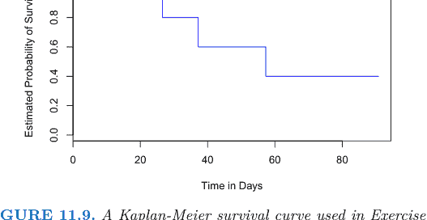

图11.9. 练习4中使用的Kaplan-Meier生存曲线。

6. 本题使用图11.1中显示的数据。在完成本题时，你可以将观测时间称为$y_1, \dots, y_4$。这些观测时间的顺序可以从图11.1中看出；不需要它们的确切值。

(a) 报告$\delta_1, \dots, \delta_4$, $K$, $d_1, \dots, d_K$, $r_1, \dots, r_K$, 和 $q_1, \dots, q_K$的值。相关符号在第11.1节和第11.3节中定义。

(b) 绘制对应于该数据集的Kaplan-Meier生存曲线的草图。（你不需要使用任何软件来完成此操作——你可以使用(a)中获得的结果手绘草图。）

(c) 根据(b)中估计的生存曲线，事件在200天内发生的概率是多少？事件在310天内未发生的概率是多少？

(d) 写出(b)中估计生存曲线的表达式。

7. 在本题中，我们将推导(11.5)和(11.6)，它们是构建对数秩检验统计量(11.8)所必需的。回顾表11.1中的符号。

(a) 假设两组的生存函数没有差异。那么，我们可以将$q_{1k}$视为从一个包含$q_k$个失败事件、大小为$r_k$的风险集中，不放回地抽取$r_{1k}$个观测值时，失败事件的数量。论证$q_{1k}$服从超几何分布。用$r_{1k}$, $r_k$, 和 $q_k$表示该分布的参数。

(b) 根据你之前的答案以及超几何分布的性质，$q_{1k}$的均值和方差是多少？将你的答案与(11.5)和(11.6)进行比较。

8. 回顾生存函数$S(t)$、风险函数$h(t)$和密度函数$f(t)$分别在(11.2)、(11.9)和(11.11)中定义。此外，定义$F(t) = 1 - S(t)$。证明以下关系成立：

$$f(t) = dF(t)/dt$$
$$S(t) = \exp\left(-\int_0^t h(u)du\right).$$

9. 在本练习中，我们将探讨假设生存时间服从指数分布所带来的后果。

(a) 假设生存时间服从$\text{Exp}(\lambda)$分布，因此其密度函数为$f(t) = \lambda \exp(-\lambda t)$。使用练习8中提供的关系，证明$S(t) = \exp(-\lambda t)$。

(b) 现在假设$n$个独立的生存时间中的每一个都服从$\text{Exp}(\lambda)$分布。写出似然函数(11.13)的表达式。

(c) 证明$\lambda$的最大似然估计量为

$$\hat{\lambda} = \sum_{i=1}^n \delta_i / \sum_{i=1}^n y_i.$$

(d) 使用你在(c)中的答案推导平均生存时间的估计量。

提示：对于(d)，回顾$\text{Exp}(\lambda)$随机变量的均值为$1/\lambda$。

## 12 无监督学习

本书大部分内容涉及*监督学习*方法，如回归和分类。在监督学习场景中，我们通常可以获取一组在 $n$ 个观测值上测量的 $p$ 个特征 $X_1, X_2, \ldots, X_p$，以及同样在这 $n$ 个观测值上测量的响应变量 $Y$。目标是利用 $X_1, X_2, \ldots, X_p$ 来预测 $Y$。

本章将转而关注*无监督学习*，这是一组统计工具，适用于我们仅有一组在 $n$ 个观测值上测量的特征 $X_1, X_2, \ldots, X_p$ 的场景。我们对预测不感兴趣，因为没有与之关联的响应变量 $Y$。相反，目标是发现关于 $X_1, X_2, \ldots, X_p$ 测量值的有趣信息。是否存在一种信息丰富的方式来可视化数据？我们能否在变量之间或观测值之间发现子群？无监督学习指的是用于回答此类问题的多种技术。在本章中，我们将重点介绍两种特定类型的无监督学习：*主成分分析*，一种用于数据可视化或在应用监督技术之前进行数据预处理的工具；以及*聚类*，一类用于在数据中发现未知子群的广泛方法。

### 12.1 无监督学习的挑战

监督学习是一个被充分理解的领域。事实上，如果你已经阅读了本书前面的章节，那么你现在应该对监督学习有了很好的掌握。例如，如果要求你从一个数据集中预测一个二元结果，你手头有一套非常成熟的工具（如逻辑回归、线性判别分析、分类树、支持向量机等），并且清楚如何评估所得结果的质量（使用交叉验证、在独立测试集上验证等）。

相比之下，无监督学习通常更具挑战性。这项练习往往更主观，分析没有简单的目标，例如预测响应变量。无监督学习通常作为*探索性数据分析*的一部分进行。此外，评估无监督学习方法所得的结果可能很困难，因为没有普遍接受的机制来进行交叉验证或在独立数据集上验证结果。造成这种差异的原因很简单。如果我们使用监督学习技术拟合一个预测模型，那么可以通过观察模型在未用于拟合模型的观测值上预测响应变量 $Y$ 的效果来*检查我们的工作*。然而，在无监督学习中，没有办法检查我们的工作，因为我们不知道真正的答案——这个问题是无监督的。

无监督学习技术在许多领域正变得越来越重要。一位癌症研究人员可能会检测100名乳腺癌患者的基因表达水平。然后，他或她可能会在乳腺癌样本之间或基因之间寻找子群，以更好地理解这种疾病。一个在线购物网站可能会尝试识别具有相似浏览和购买历史的购物者群体，以及每个群体中购物者特别感兴趣的物品。然后，可以根据类似购物者的购买历史，优先向单个购物者展示他或她特别可能感兴趣的物品。一个搜索引擎可能会根据具有相似搜索模式的其他个体的点击历史，选择向特定个体显示哪些搜索结果。这些统计学习任务，以及更多其他任务，都可以通过无监督学习技术来执行。

### 12.2 主成分分析

*主成分*在第6.3.1节关于主成分回归的背景下进行了讨论。当面对大量相关变量时，主成分允许我们用较少数量的代表性变量来概括这组变量，这些变量共同解释了原始集合中的大部分变异性。主成分方向在第6.3.1节中被描述为特征空间中的方向，原始数据在这些方向上具有*高变异性*。这些方向也定义了*尽可能接近*数据云的直线和子空间。要执行主成分回归，我们只需在回归模型中使用主成分作为预测变量，以替代原始的较大变量集。

*主成分分析*（PCA）指的是计算主成分的过程，以及随后使用这些成分来理解数据。PCA是一种无监督方法，因为它只涉及一组特征 $X_1, X_2, \dots, X_p$，而没有关联的响应变量 $Y$。除了生成用于监督学习问题的派生变量外，PCA还作为数据可视化（观测值的可视化或变量的可视化）的工具。它也可以用作数据填充的工具——即填充数据矩阵中的缺失值。

我们现在更详细地讨论PCA，重点是将PCA作为无监督数据探索的工具，这与本章的主题一致。

#### 12.2.1 什么是主成分？

假设我们希望可视化 $n$ 个观测值，这些观测值在一组 $p$ 个特征 $X_1, X_2, \dots, X_p$ 上有测量值，作为探索性数据分析的一部分。我们可以通过检查数据的二维散点图来做到这一点，每个散点图包含 $n$ 个观测值在两个特征上的测量值。然而，这样的散点图有 $\binom{p}{2} = p(p-1)/2$ 个；例如，当 $p = 10$ 时，有45个图！如果 $p$ 很大，那么肯定不可能查看所有这些图；此外，很可能没有一个图是有信息量的，因为它们每个只包含数据集中总信息的一小部分。显然，当 $p$ 很大时，需要一种更好的方法来可视化 $n$ 个观测值。特别是，我们希望找到数据的低维表示，以尽可能多地捕捉信息。例如，如果我们能获得数据的二维表示，捕捉大部分信息，那么我们就可以在这个低维空间中绘制观测值。

PCA提供了一个工具来做到这一点。它找到数据集的低维表示，包含尽可能多的变异。其思想是每个 $n$ 个观测值生活在 $p$ 维空间中，但并非所有这些维度都同样有趣。PCA寻求少数尽可能有趣的维度，其中*有趣*的概念是通过观测值沿每个维度的变化量来衡量的。PCA找到的每个维度都是 $p$ 个特征的线性组合。我们现在解释这些维度或*主成分*的发现方式。

一组特征 $X_1, X_2, \dots, X_p$ 的*第一主成分*是特征的归一化线性组合

$$Z_1 = \phi_{11}X_1 + \phi_{21}X_2 + \dots + \phi_{p1}X_p \quad (12.1)$$

具有最大的方差。*归一化*意味着 $\sum_{j=1}^p \phi_{j1}^2 = 1$。我们将元素 $\phi_{11}, \dots, \phi_{p1}$ 称为第一主成分的*载荷*；这些载荷共同构成主成分载荷向量 $\phi_1 = (\phi_{11} \ \phi_{21} \ \dots \ \phi_{p1})^T$。我们约束载荷，使其平方和等于一，因为否则将这些元素设置为任意大的绝对值可能导致任意大的方差。

给定一个 $n \times p$ 数据集 $\mathbf{X}$，我们如何计算第一主成分？由于我们只关心方差，我们假设 $\mathbf{X}$ 中的每个变量都已中心化，均值为零（即 $\mathbf{X}$ 的列均值为零）。然后我们寻找形式如下的样本特征值的线性组合

$$z_{i1} = \phi_{11}x_{i1} + \phi_{21}x_{i2} + \dots + \phi_{p1}x_{ip} \quad (12.2)$$

在约束条件 $\sum_{j=1}^p \phi_{j1}^2=1$ 下，具有最大样本方差。换句话说，第一主成分载荷向量求解以下优化问题

$$\text{maximize}_{\phi_{11},...,\phi_{p1}} \left\{ \frac{1}{n} \sum_{i=1}^n \left( \sum_{j=1}^p \phi_{j1} x_{ij} \right)^2 \right\} \text{ subject to } \sum_{j=1}^p \phi_{j1}^2 = 1. \quad (12.3)$$

由 (12.2) 式，我们可以将 (12.3) 式中的目标函数写为 $\frac{1}{n} \sum_{i=1}^n z_{i1}^2$。由于 $\frac{1}{n} \sum_{i=1}^n x_{ij} = 0$，$z_{11}, \dots, z_{n1}$ 的平均值也将为零。因此，我们在 (12.3) 式中最大化的目标函数正是 $z_{i1}$ 这 $n$ 个值的样本方差。我们将 $z_{11}, \dots, z_{n1}$ 称为第一主成分的*得分*。问题 (12.3) 可以通过*特征分解*（线性代数中的一种标准技术）来求解，但其细节超出了本书的范围。¹

第一主成分有一个很好的几何解释。载荷向量 $\phi_1$（其元素为 $\phi_{11}, \phi_{21}, \dots, \phi_{p1}$）定义了特征空间中的一个方向，数据沿该方向的变化最大。如果我们将 $n$ 个数据点 $x_1, \dots, x_n$ 投影到这个方向上，投影值就是主成分得分 $z_{11}, \dots, z_{n1}$ 本身。例如，第 254 页的图 6.14 在一个广告数据集上显示了第一主成分载荷向量（绿色实线）。在这些数据中，只有两个特征，因此观测值以及第一主成分载荷向量可以很容易地显示出来。从 (6.19) 式可以看出，在该数据集中，$\phi_{11} = 0.839$ 且 $\phi_{21} = 0.544$。

在确定了特征的第一主成分 $Z_1$ 之后，我们可以找到第二主成分 $Z_2$。第二主成分是 $X_1, \dots, X_p$ 的线性组合，在所有与 $Z_1$ *不相关*的线性组合中具有最大方差。第二主成分得分 $z_{12}, z_{22}, \dots, z_{n2}$ 的形式为

$$z_{i2} = \phi_{12}x_{i1} + \phi_{22}x_{i2} + \cdots + \phi_{p2}x_{ip}, \quad (12.4)$$

其中 $\phi_2$ 是第二主成分载荷向量，其元素为 $\phi_{12}, \phi_{22}, \dots, \phi_{p2}$。事实证明，约束 $Z_2$ 与 $Z_1$ 不相关，等价于约束方向 $\phi_2$ 与方向 $\phi_1$ 正交（垂直）。在图 6.14 的例子中，观测值位于二维空间中（因为 $p = 2$），所以一旦我们找到了 $\phi_1$，$\phi_2$ 就只有一种可能性，如蓝色虚线所示。（根据第 6.3.1 节，我们知道 $\phi_{12} = 0.544$ 且 $\phi_{22} = -0.839$。）但在具有 $p > 2$ 个变量的更大数据集中，存在多个不同的主成分，它们的定义方式类似。为了找到 $\phi_2$，我们求解一个类似于 (12.3) 的问题，用 $\phi_2$ 替换 $\phi_1$，并附加约束 $\phi_2$ 与 $\phi_1$ 正交。²

¹作为特征分解的替代方法，可以使用一种称为奇异值分解的相关技术。这将在本章末尾的实验中进行探讨。

²从技术角度讲，主成分方向 $\phi_1, \phi_2, \phi_3, \dots$ 由矩阵 $\mathbf{X}^T\mathbf{X}$ 的特征向量按顺序给出，而各成分的方差就是特征值。最多有 $\min(n-1, p)$ 个主成分。

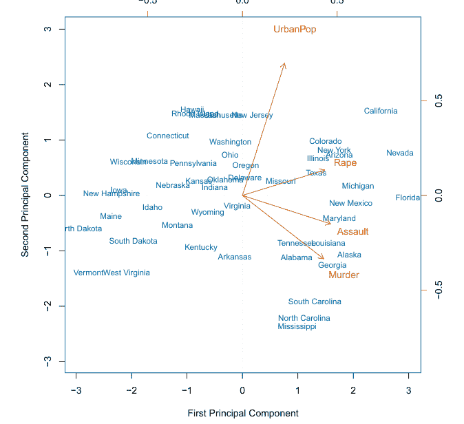

**图 12.1.** *USArrests* 数据的前两个主成分。蓝色的州名代表前两个主成分的得分。橙色箭头表示前两个主成分载荷向量（坐标轴在顶部和右侧）。例如，**Rape** 在第一主成分上的载荷为 0.54，在第二主成分上的载荷为 0.17（单词 **Rape** 的中心位于点 (0.54, 0.17)）。该图被称为双标图，因为它同时显示了主成分得分和主成分载荷。

一旦我们计算出主成分，就可以将它们相互绘制，以生成数据的低维视图。例如，我们可以绘制得分向量 $Z_1$ 对 $Z_2$，$Z_1$ 对 $Z_3$，$Z_2$ 对 $Z_3$，等等。从几何上看，这相当于将原始数据投影到由 $\phi_1$、$\phi_2$ 和 $\phi_3$ 张成的子空间上，并绘制投影点。

我们以 *USArrests* 数据集为例说明 PCA 的使用。对于美国的 50 个州，该数据集包含每 10 万居民中因三种犯罪被逮捕的人数：**Assault**、**Murder** 和 **Rape**。我们还记录了 *UrbanPop*（每个州居住在城市地区的人口百分比）。主成分得分向量的长度为 $n = 50$，主成分载荷向量的长度为 $p = 4$。PCA 是在将每个变量标准化为均值为零、标准差为一之后进行的。图 12.1 绘制了这些数据的前两个主成分。该图在一个*双标图*中同时表示了主成分得分和载荷向量。载荷也列在表 12.1 中。

| | PC1 | PC2 |
|---|---|---|
| Murder | 0.5358995 | -0.4181809 |
| Assault | 0.5831836 | -0.1879856 |
| UrbanPop | 0.2781909 | 0.8728062 |
| Rape | 0.5434321 | 0.1673186 |

表 12.1. USArrests 数据的主成分载荷向量 $\phi_1$ 和 $\phi_2$。这些也在图 12.1 中显示。

在图 12.1 中，我们看到第一个载荷向量在 Assault、Murder 和 Rape 上赋予了大致相等的权重，但在 UrbanPop 上的权重小得多。因此，该成分大致对应于严重犯罪总体率的度量。第二个载荷向量将其大部分权重放在 UrbanPop 上，而在其他三个特征上的权重小得多。因此，该成分大致对应于该州的城市化水平。总体而言，我们看到与犯罪相关的变量（Murder、Assault 和 Rape）彼此靠近，而 UrbanPop 变量则远离其他三个变量。这表明与犯罪相关的变量彼此相关——谋杀率高的州往往袭击和强奸率也高——而 UrbanPop 变量与其他三个变量的相关性较低。

我们可以通过图 12.1 中显示的两个主成分得分向量来考察各州之间的差异。我们对载荷向量的讨论表明，在第一主成分上得分较高的州，如加利福尼亚州、内华达州和佛罗里达州，犯罪率较高，而像北达科他州这样在第一主成分上得分为负的州，犯罪率较低。加利福尼亚州在第二主成分上的得分也很高，表明城市化水平高，而密西西比州等州则相反。在两个主成分上都接近零的州，如印第安纳州，其犯罪和城市化水平都大致处于平均水平。

## 12.2.2 主成分的另一种解释

图 12.2 左侧面板显示了一个模拟三维数据集中的前两个主成分载荷向量；这两个载荷向量张成了一个平面，观测值沿该平面的方差最大。

在上一节中，我们将主成分载荷向量描述为特征空间中数据变化最大的方向，将主成分得分描述为沿这些方向的投影。然而，主成分的另一种解释也可能很有用：主成分提供了*最接近*观测值的低维线性曲面。我们在此展开这种解释。<sup>3</sup>

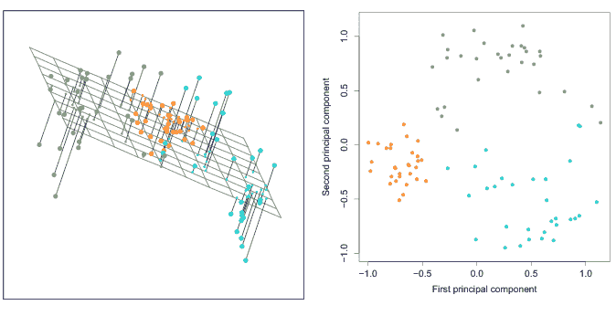

**图 12.2.** *在三维空间中模拟的九十个观测值。为了便于可视化，观测值以彩色显示。左图：前两个主成分方向张成了最能拟合数据的平面。该平面的位置使得到每个点的平方距离之和最小。右图：前两个主成分得分向量给出了 90 个观测值在该平面上的投影坐标。*

第一主成分载荷向量有一个非常特殊的性质：它是 *p* 维空间中与 *n* 个观测值*最接近*的直线（使用平均平方欧氏距离作为接近程度的度量）。这种解释可以在图 6.15 的左侧面板中看到；虚线表示每个观测值与第一主成分载荷向量定义的直线之间的距离。这种解释的吸引力显而易见：我们寻找数据的一个维度，使其尽可能接近所有数据点，因为这样的直线很可能为数据提供一个良好的概括。

主成分作为最接近 *n* 个观测值的维度的概念不仅限于第一主成分。例如，数据集的前两个主成分张成了最接近 *n* 个观测值的平面（就平均平方欧氏距离而言）。图 12.2 的左侧面板显示了一个例子。数据集的前三个主成分张成了最接近 *n* 个观测值的三维超平面，依此类推。

使用这种解释，前 *M* 个主成分得分向量和前 *M* 个主成分载荷向量共同提供了对以下内容的最佳 *M* 维近似（就欧氏距离而言）

> <sup>3</sup>在本节中，我们继续假设数据矩阵 **X** 的每一列都已中心化，使其均值为零——即从每一列中减去了列均值。

第 $i$ 个观测值 $x_{ij}$。这种表示可以写成

$$x_{ij} \approx \sum_{m=1}^M z_{im} \phi_{jm}. \tag{12.5}$$

我们可以通过建立一个优化问题来更正式地表述这一点。假设数据矩阵 $\mathbf{X}$ 是列中心化的。在所有形如 $x_{ij} \approx \sum_{m=1}^M a_{im} b_{jm}$ 的近似中，我们可以寻找具有最小残差平方和的那个：

$$\underset{\mathbf{A} \in \mathbb{R}^{n \times M}, \mathbf{B} \in \mathbb{R}^{p \times M}}{\text{minimize}} \left\{ \sum_{j=1}^p \sum_{i=1}^n \left( x_{ij} - \sum_{m=1}^M a_{im} b_{jm} \right)^2 \right\}. \tag{12.6}$$

这里，$\mathbf{A}$ 是一个 $n \times M$ 矩阵，其 $(i,m)$ 元素为 $a_{im}$，而 $\mathbf{B}$ 是一个 $p \times M$ 矩阵，其 $(j,m)$ 元素为 $b_{jm}$。

可以证明，对于任意 $M$ 值，求解 (12.6) 的矩阵 $\hat{\mathbf{A}}$ 和 $\hat{\mathbf{B}}$ 的列实际上是前 $M$ 个主成分得分向量和载荷向量。换句话说，如果 $\hat{\mathbf{A}}$ 和 $\hat{\mathbf{B}}$ 求解 (12.6)，那么 $\hat{a}_{im} = z_{im}$ 且 $\hat{b}_{jm} = \phi_{jm}$。$^4$ 这意味着 (12.6) 中目标函数的最小可能值为

$$\sum_{j=1}^p \sum_{i=1}^n \left( x_{ij} - \sum_{m=1}^M z_{im} \phi_{jm} \right)^2. \tag{12.7}$$

总之，当 $M$ 足够大时，$M$ 个主成分得分向量和 $M$ 个主成分载荷向量可以很好地近似数据。当 $M = \min(n-1, p)$ 时，表示是精确的：$x_{ij} = \sum_{m=1}^M z_{im} \phi_{jm}$。

## 12.2.3 解释的方差比例

在图 12.2 中，我们对一个三维数据集（左图）进行了主成分分析，并将数据投影到前两个主成分载荷向量上，以获得数据的二维视图（即主成分得分向量；右图）。我们看到，这种三维数据的二维表示确实成功地捕捉了数据中的主要模式：在三维空间中彼此靠近的橙色、绿色和青色观测值在二维表示中仍然保持邻近。类似地，我们在 `USArrests` 数据集上看到，我们仅使用前两个主成分得分向量和前两个主成分载荷向量就可以概括 50 个观测值和 4 个变量。

我们现在可以提出一个自然的问题：将观测值投影到前几个主成分上，会丢失给定数据集中多少信息？也就是说，数据中有多少方差*不*包含在前几个主成分中？更一般地，我们感兴趣的是知道每个主成分解释的*方差比例*（PVE）。数据集中存在的*总方差*（假设变量已中心化，均值为零）定义为

$$\sum_{j=1}^p \text{Var}(X_j) = \sum_{j=1}^p \frac{1}{n} \sum_{i=1}^n x_{ij}^2, \quad (12.8)$$

而第 $m$ 个主成分解释的方差为

$$\frac{1}{n} \sum_{i=1}^n z_{im}^2 = \frac{1}{n} \sum_{i=1}^n \left( \sum_{j=1}^p \phi_{jm} x_{ij} \right)^2. \quad (12.9)$$

因此，第 $m$ 个主成分的 PVE 由下式给出

$$\frac{\sum_{i=1}^n z_{im}^2}{\sum_{j=1}^p \sum_{i=1}^n x_{ij}^2} = \frac{\sum_{i=1}^n \left( \sum_{j=1}^p \phi_{jm} x_{ij} \right)^2}{\sum_{j=1}^p \sum_{i=1}^n x_{ij}^2}. \quad (12.10)$$

每个主成分的 PVE 都是一个正数。为了计算前 $M$ 个主成分的累积 PVE，我们只需将 (12.10) 对前 $M$ 个 PVE 求和。总共有 $\min(n-1, p)$ 个主成分，它们的 PVE 之和为 1。

在第 12.2.2 节中，我们展示了前 $M$ 个主成分载荷和得分向量可以解释为数据的最佳 $M$ 维近似（就残差平方和而言）。事实证明，数据的方差可以分解为前 $M$ 个主成分的方差加上这个 $M$ 维近似的均方误差，如下所示：

$$\underbrace{\sum_{j=1}^p \frac{1}{n} \sum_{i=1}^n x_{ij}^2}_{\text{数据的方差}} = \underbrace{\sum_{m=1}^M \frac{1}{n} \sum_{i=1}^n z_{im}^2}_{\text{前 } M \text{ 个主成分的方差}} + \underbrace{\frac{1}{n} \sum_{j=1}^p \sum_{i=1}^n \left( x_{ij} - \sum_{m=1}^M z_{im} \phi_{jm} \right)^2}_{M\text{维近似的均方误差}} \quad (12.11)$$

这个分解中的三项分别在 (12.8)、(12.9) 和 (12.7) 中讨论。由于第一项是固定的，我们看到通过最大化前 $M$ 个主成分的方差，我们最小化了 $M$ 维近似的均方误差，反之亦然。这解释了为什么主成分可以等效地被视为最小化近似误差（如第 12.2.2 节）或最大化方差（如第 12.2.1 节）。

此外，我们可以使用 (12.11) 看到 (12.10) 中定义的 PVE 等于

$$1 - \frac{\sum_{j=1}^p \sum_{i=1}^n \left( x_{ij} - \sum_{m=1}^M z_{im} \phi_{jm} \right)^2}{\sum_{j=1}^p \sum_{i=1}^n x_{ij}^2} = 1 - \frac{\text{RSS}}{\text{TSS}},$$

其中 TSS 表示 $\mathbf{X}$ 所有元素的总平方和，RSS 表示由主成分给出的 $M$ 维近似的残差平方和。回顾 (3.17) 中 $R^2$ 的定义，这意味着我们可以将 PVE 解释为前 $M$ 个主成分给出的 $\mathbf{X}$ 近似的 $R^2$。

512 12. 无监督学习

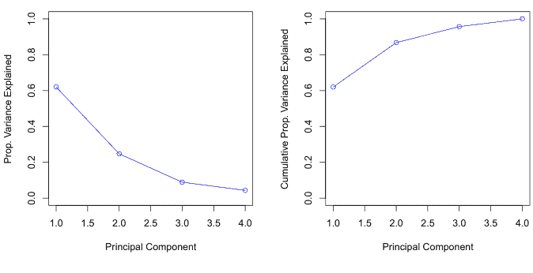

**图 12.3.** *左图：碎石图，描绘了 `USArrests` 数据中每个主成分解释的方差比例。右图：`USArrests` 数据中四个主成分的累积解释方差比例。*

在 `USArrests` 数据中，第一个主成分解释了数据中 62.0% 的方差，下一个主成分解释了 24.7% 的方差。前两个主成分一起解释了数据中近 87% 的方差，而后两个主成分仅解释了 13% 的方差。这意味着图 12.1 仅使用两个维度就提供了数据的相当准确的概括。每个主成分的 PVE 以及累积 PVE 如图 12.3 所示。左图被称为*碎石图*，将在本章后面讨论。

## 12.2.4 关于主成分分析的更多内容

### 变量的缩放

我们已经提到，在执行主成分分析之前，变量应该中心化，使其均值为零。此外，*我们执行主成分分析时获得的结果也取决于变量是否被单独缩放*（每个变量乘以不同的常数）。这与一些其他监督和无监督学习技术形成对比，例如线性回归，其中缩放变量没有影响。（在线性回归中，将一个变量乘以因子 $c$ 只会导致相应的系数估计乘以因子 $1/c$，因此对获得的模型没有实质性影响。）

例如，图 12.1 是在将每个变量缩放为标准差为 1 后获得的。这在图 12.4 的左图中重现。为什么缩放变量很重要？在这些数据中，变量以不同的单位测量；`Murder`、`Rape` 和 `Assault` 报告为每 10 万人的发生次数，而 `UrbanPop` 是该州居住在城市地区的人口百分比。这四个变量的方差分别为 18.97、87.73、6945.16 和 209.5。因此，如果我们对未缩放的变量执行主成分分析，那么第一个主成分载荷向量在“Assault”变量上会有非常大的载荷，因为该变量的方差远高于其他变量。图12.4右侧的图展示了未对变量进行标准化（即未将标准差缩放为1）的USArrests数据集的前两个主成分。正如预测的那样，第一个主成分载荷向量几乎将所有权重都放在了“Assault”上，而第二个主成分载荷向量则几乎将所有权重都放在了“UrbanPop”上。与左侧的图对比，我们可以看到缩放确实对所得结果产生了显著影响。

然而，这个结果仅仅是变量测量尺度不同所导致的。例如，如果“Assault”是以每100人的发生次数为单位来测量（而不是每100,000人的发生次数），那么这相当于将该变量的所有元素除以1,000。这样，该变量的方差就会变得非常小，因此第一个主成分载荷向量在该变量上的值也会非常小。由于我们不希望主成分的结果依赖于任意的缩放选择，因此在执行PCA之前，我们通常会将每个变量缩放为标准差为1。

然而，在某些情况下，变量可能以相同的单位进行测量。在这种情况下，我们可能不希望在执行PCA之前将变量缩放为标准差为1。例如，假设给定数据集中的变量对应于p个基因的表达水平。由于每个基因的表达都是以相同的“单位”测量的，我们可能选择不对基因进行缩放，使其各自的标准差为1。

## 主成分的唯一性

虽然理论上主成分不一定是唯一的，但在几乎所有实际应用中，它们都是唯一的（符号可能相反）。这意味着两个不同的软件包会产生相同的主成分载荷向量，尽管这些载荷向量的符号可能不同。符号可能不同是因为每个主成分载荷向量指定了p维空间中的一个方向：翻转符号不会改变方向，因此没有影响。（考虑图6.14——主成分载荷向量是一条向两个方向延伸的直线，翻转其符号不会产生任何影响。）同样，得分向量在符号相反的情况下也是唯一的，因为Z的方差与-Z的方差相同。值得注意的是，当我们使用公式(12.5)来近似x_ij时，我们将z_im乘以φ_jm。因此，如果载荷向量和得分向量的符号同时翻转，这两个量的最终乘积保持不变。

## 决定使用多少个主成分

通常，一个n×p的数据矩阵X有min(n-1, p)个不同的主成分。然而，我们通常对所有这些主成分并不感兴趣；相反，我们只想使用前几个主成分来可视化或解释数据。事实上，我们希望使用最少数量的主成分来获得对数据的*良好*理解。需要多少个主成分？不幸的是，这个问题没有一个单一（或简单！）的答案。

我们通常通过查看*碎石图*（scree plot）来决定可视化数据所需的主成分数量，例如图12.3左侧面板所示的图。我们选择解释数据中相当大一部分变异所需的最小主成分数量。这是通过目视检查碎石图来完成的，寻找一个点，在该点之后每个后续主成分所解释的方差比例显著下降。这种下降通常被称为碎石图中的*肘部*。例如，通过检查图12.3，人们可能会得出结论：前两个主成分解释了相当多的方差，并且在第二个主成分之后出现了一个肘部。毕竟，第三个主成分解释了数据中不到10%的方差，而第四个主成分解释的方差不到其一半，因此基本上毫无价值。

然而，这种视觉分析本质上是*临时的*。不幸的是，没有一个被广泛接受的客观方法来决定多少个主成分是*足够的*。事实上，多少个主成分足够这个问题本质上是定义不明确的，它将取决于具体的应用领域和特定的数据集。在实践中，我们倾向于查看前几个主成分，以在数据中发现有趣的模式。如果在前几个主成分中没有发现有趣的模式，那么进一步的主成分也不太可能引起兴趣。相反，如果前几个主成分很有趣，那么我们通常会继续查看后续的主成分，直到没有发现进一步的有趣模式为止。诚然，这是一种主观的方法，它反映了PCA通常被用作探索性数据分析工具的事实。

另一方面，如果我们计算主成分用于监督分析，例如第6.3.1节中介绍的主成分回归，那么有一个简单而客观的方法来确定使用多少个主成分：我们可以将回归中使用的主成分得分向量的数量视为一个需要通过交叉验证或相关方法选择的调节参数。为监督分析选择主成分数量的相对简单性，是监督分析比非监督分析定义更清晰、评估更客观这一事实的一个体现。

## 12.2.5 主成分的其他用途

我们在第6.3.1节中看到，我们可以使用主成分得分向量作为特征来执行回归。事实上，许多统计技术，如回归、分类和聚类，都可以轻松地调整为使用n×M矩阵（其列是前M ≪ p个主成分得分向量），而不是使用完整的n×p数据矩阵。这可以导致*噪声更少*的结果，因为通常数据集中的信号（与噪声相对）集中在其前几个主成分中。

## 12.3 缺失值与矩阵补全

数据集通常有缺失值，这可能很麻烦。例如，假设我们希望分析USArrests数据，并发现200个值中有20个被随机损坏并标记为缺失。不幸的是，我们在本书中看到的统计学习方法无法处理缺失值。我们应该如何进行？

我们可以删除包含缺失观测值的行，并在完整的行上执行数据分析。但这似乎很浪费，并且根据缺失的比例，可能不切实际。或者，如果x_ij缺失，我们可以用第j列的均值（使用非缺失条目计算均值）来替换它。尽管这是一种常见且方便的策略，但通常我们可以通过利用变量之间的相关性做得更好。

在本节中，我们将展示如何使用主成分通过称为*矩阵补全*的过程来*填补*缺失值。补全后的矩阵随后可用于统计学习方法，如线性回归或LDA。

如果缺失是随机的，这种填补缺失数据的方法是合适的。例如，如果患者的体重缺失是因为电子秤的电池在检查时没电了，那么这种方法是合适的。相反，如果体重缺失是因为患者太重无法爬上秤，那么这就不是随机缺失；缺失是信息量有限，且此处描述的处理缺失数据的方法并不适用。

有时数据缺失是必然的。例如，如果我们构建一个矩阵，记录 $n$ 位客户对 Netflix 全部 $p$ 部电影的评分（评分范围为1到5），那么矩阵的大部分将是缺失的，因为没有客户会观看并评价整个片库中超过极小一部分的电影。如果我们能很好地填补缺失值，就能大致了解每位客户对他们尚未观看的电影的看法。因此，矩阵补全可用于驱动*推荐系统*。

## 带缺失值的主成分

在第12.2.2节中，我们展示了前 $M$ 个主成分得分和载荷向量在(12.6)式的意义下为数据矩阵 $\mathbf{X}$ 提供了“最佳”近似。假设部分观测值 $x_{ij}$ 缺失。我们现在展示如何同时填补缺失值并解决主成分问题。我们回到优化问题(12.6)的修改形式：

$$\underset{\mathbf{A} \in \mathbb{R}^{n \times M}, \mathbf{B} \in \mathbb{R}^{p \times M}}{\text{minimize}} \left\{ \sum_{(i,j) \in \mathcal{O}} \left( x_{ij} - \sum_{m=1}^M a_{im} b_{jm} \right)^2 \right\}, \quad (12.12)$$

其中 $\mathcal{O}$ 是所有*已观测*索引对 $(i, j)$ 的集合，是所有可能的 $n \times p$ 对的一个子集。

一旦我们解决了这个问题：
- 我们可以使用 $\hat{x}_{ij} = \sum_{m=1}^M \hat{a}_{im} \hat{b}_{jm}$ 来估计缺失的观测值 $x_{ij}$，其中 $\hat{a}_{im}$ 和 $\hat{b}_{jm}$ 分别是求解(12.12)式得到的矩阵 $\hat{\mathbf{A}}$ 和 $\hat{\mathbf{B}}$ 的 $(i, m)$ 和 $(j, m)$ 元素；并且
- 我们可以（近似地）恢复 $M$ 个主成分得分和载荷，就像数据完整时所做的那样。

事实证明，精确求解(12.12)式是困难的，这与数据完整的情况不同：特征分解不再适用。但算法12.1中的简单迭代方法（在第12.5.2节中演示）通常能提供一个良好的解。$^6$

我们在 USArrests 数据上演示算法12.1。该数据有 $p = 4$ 个变量和 $n = 50$ 个观测值（州）。我们首先对数据进行标准化，使每个变量的均值为零，标准差为一。然后，我们从50个州中随机选择20个，并对每个选中的州随机将四个变量中的一个设为缺失。因此，数据矩阵中有10%的元素缺失。我们应用算法12.1，使用 $M = 1$ 个主成分。图12.5显示，缺失元素的恢复

$^5$ 该算法在 Mazumder, Hastie, and Tibshirani (2010) 发表于 *Journal of Machine Learning Research* 的论文“Spectral regularization algorithms for learning large incomplete matrices”（第2287–2322页）中被称为“Hard-Impute”。
$^6$ 该算法第2步的每次迭代都会使目标函数(12.14)减小。然而，该算法不能保证达到(12.12)式的全局最优解。

## 算法12.1 矩阵补全的迭代算法

1. 创建一个维度为 $n \times p$ 的完整数据矩阵 $\tilde{\mathbf{X}}$，其 $(i, j)$ 元素等于

    $$\tilde{x}_{ij} = \begin{cases} x_{ij} & \text{if } (i, j) \in \mathcal{O} \\ \bar{x}_j & \text{if } (i, j) \notin \mathcal{O}, \end{cases}$$

    其中 $\bar{x}_j$ 是不完整数据矩阵 $\mathbf{X}$ 中第 $j$ 个变量的已观测值的平均值。这里，$\mathcal{O}$ 索引了 $\mathbf{X}$ 中已观测的观测值。

2. 重复步骤 (a)–(c)，直到目标函数(12.14)不再下降：

    (a) 求解

    $$\underset{\mathbf{A} \in \mathbb{R}^{n \times M}, \mathbf{B} \in \mathbb{R}^{p \times M}}{\text{minimize}} \left\{ \sum_{j=1}^p \sum_{i=1}^n \left( \tilde{x}_{ij} - \sum_{m=1}^M a_{im} b_{jm} \right)^2 \right\} \quad (12.13)$$

    方法是计算 $\tilde{\mathbf{X}}$ 的主成分。

    (b) 对于每个不属于 $\mathcal{O}$ 的元素 $(i, j)$，设置 $\tilde{x}_{ij} \leftarrow \sum_{m=1}^M \hat{a}_{im} \hat{b}_{jm}$。

    (c) 计算目标函数

    $$\sum_{(i, j) \in \mathcal{O}} \left( x_{ij} - \sum_{m=1}^M \hat{a}_{im} \hat{b}_{jm} \right)^2. \quad (12.14)$$

3. 返回估计的缺失条目 $\tilde{x}_{ij}$，其中 $(i, j) \notin \mathcal{O}$。

相当准确。在100次随机实验中，缺失元素真实值与填补值之间的平均相关性为0.63，标准差为0.11。这个表现好吗？要回答这个问题，我们可以将这个相关性与使用*完整*数据估计这20个值时得到的相关性进行比较——也就是说，如果我们直接计算 $\hat{x}_{ij} = z_{i1} \phi_{j1}$，其中 $z_{i1}$ 和 $\phi_{j1}$ 是完整数据的第一主成分得分和载荷向量的元素。$^7$ 以这种方式使用完整数据，这20个元素的真实值与估计值之间的平均相关性为0.79，标准差为0.08。因此，我们的填补方法比使用所有数据的方法表现稍差（$0.63 \pm 0.11$ 对比 $0.79 \pm 0.08$），但其表现仍然相当不错。（当然，使用所有数据的方法在现实世界存在缺失数据的情况下无法应用。）

图12.6进一步表明，算法12.1在此数据集上表现相当好。

$^7$ 这是一个无法达到的黄金标准，因为在有缺失数据的情况下，我们当然无法计算完整数据的主成分。

518 12. 无监督学习

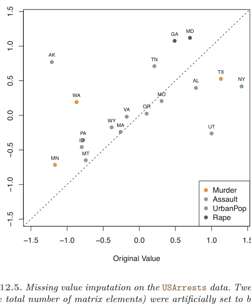

**图12.5.** *USArrests 数据的缺失值填补。人为地将二十个值（占矩阵元素总数的10%）设为缺失，然后通过算法12.1（M = 1）进行填补。该图显示了所有二十个缺失值的真实值 $x_{ij}$ 和填补值 $\hat{x}_{ij}$。对于每个缺失值，颜色表示变量，标签表示州。真实值与填补值之间的相关性约为0.63。*

最后我们总结几点观察：

- USArrests 数据只有四个变量，对于算法12.1这类方法要表现良好来说，这个数量偏少。因此，在这个演示中，我们随机地为每个州最多设置一个变量缺失，并且只使用了 $M = 1$ 个主成分。
- 一般来说，为了应用算法12.1，我们必须选择 $M$，即用于填补的主成分数量。一种方法是随机地从矩阵中额外留出一些元素，并根据这些已知值的恢复情况来选择 $M$。这与第5章中看到的验证集方法密切相关。

## 推荐系统

像 Netflix 和 Amazon 这样的数字流媒体服务使用客户过去观看的内容数据以及其他客户的数据，来为客户推荐其他内容。一个具体的例子是，几年前，Netflix 让客户对他们看过的每部电影进行1-5分的评分。这产生了一个非常大的 $n \times p$ 矩阵，其中 $(i, j)$ 元素是第 $i$ 位客户对

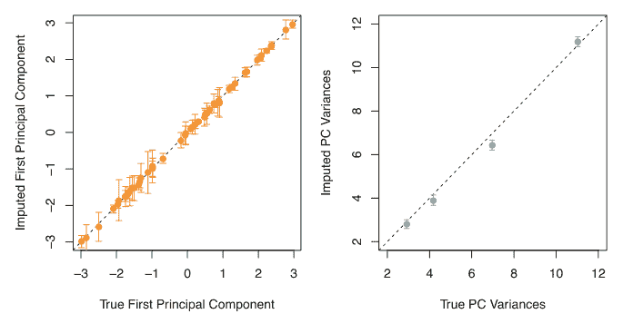

**图12.6.** 如文中所述，在100次试验中，每次我们都从 USArrests 数据集中留出20个元素。在每次试验中，我们应用算法12.1（$M = 1$）来填补缺失元素并计算主成分。左图：对于50个州中的每一个，填补的第一主成分得分（在100次试验中取平均，并显示标准差条）与使用所有数据计算的第一主成分得分进行对比绘制。右图：填补的主成分载荷（在100次试验中取平均，并显示标准差条）与真实的主成分载荷进行对比绘制。

第 $j$ 部电影的评分。这个矩阵的一个具体早期例子有 $n = 480,189$ 位客户和 $p = 17,770$ 部电影。然而，平均每位客户看过大约200部电影，因此矩阵中有99%的元素是缺失的。表12.2说明了这种设置。

为了推荐某位特定客户可能喜欢的电影，Netflix 需要一种方法来填补这个数据矩阵的缺失值。关键思想如下：第 $i$ 位客户看过的电影集合将与其他客户看过的电影有重叠。此外，其中一些其他客户与第 $i$ 位客户有相似的电影偏好。因此，应该可以利用与第 $i$ 位客户相似的客户对第 $i$ 位客户未看过的电影的评分，来预测第 $i$ 位客户是否会喜欢这些电影。

更具体地说，通过应用算法12.1，我们可以使用 $\hat{x}_{ij} = \sum_{m=1}^M \hat{a}_{im} \hat{b}_{jm}$ 来预测第 $i$ 位客户对第 $j$ 部电影的评分。此外，我们可以从“圈子”和“类型”的角度来解释这 $M$ 个成分：

- $\hat{a}_{im}$ 代表第 $i$ 位用户属于第 $m$ 个圈子的强度，其中*圈子*是一群喜欢第 $m$ 种类型电影的客户；
- $\hat{b}_{jm}$ 代表第 $j$ 部电影属于第 $m$ 种类型的强度。

类型的例子包括爱情片、西部片和动作片。

类似于算法12.1的主成分模型是许多推荐系统的核心。尽管所涉及的数据矩阵

## 12. 无监督学习

| | 杰瑞·马奎尔 | 盗海迷踪 | 天堂之路 | 幸运的人 | 猫鼠游戏 | 为黛西小姐开车 | 两位教宗 | 洗衣房 | 代码8 | 社交网络 | ... |
|---|---|---|---|---|---|---|---|---|---|---|---|
| 客户1 | • | • | • | • | 4 | • | • | • | • | • | ... |
| 客户2 | • | • | 3 | • | • | • | 3 | • | • | 3 | ... |
| 客户3 | • | 2 | • | 4 | • | • | • | • | 2 | • | ... |
| 客户4 | 3 | • | • | • | • | • | • | • | • | • | ... |
| 客户5 | 5 | 1 | • | • | 4 | • | • | • | • | • | ... |
| 客户6 | • | • | • | • | • | 2 | 4 | • | • | • | ... |
| 客户7 | • | • | 5 | • | • | • | • | 3 | • | • | ... |
| 客户8 | • | • | • | • | • | • | • | • | • | • | ... |
| 客户9 | 3 | • | • | • | 5 | • | • | 1 | • | • | ... |
| ⋮ | ⋮ | ⋮ | ⋮ | ⋮ | ⋮ | ⋮ | ⋮ | ⋮ | ⋮ | ⋮ | ⋮ |

表 12.2. Netflix电影评分数据摘录。电影评分从1（最差）到5（最好）。符号•代表缺失值：即对应客户未评分的电影。

通常数据规模巨大，因此已开发出能够利用高缺失率进行高效计算的算法。

## 12.4 聚类方法

*聚类*是指在数据集中寻找*子组*或*簇*的一系列广泛技术。当我们对数据集的观测进行聚类时，我们试图将它们划分为不同的组，使得每个组内的观测彼此相当相似，而不同组的观测则彼此相当不同。当然，为了使这一概念具体化，我们必须定义两个或多个观测*相似*或*不同*的含义。实际上，这通常是一个基于所研究数据知识的领域特定考量。

例如，假设我们有一组$n$个观测，每个观测有$p$个特征。这$n$个观测可能对应乳腺癌患者的组织样本，而$p$个特征可能对应为每个组织样本收集的测量值；这些可以是临床测量，如肿瘤分期或分级，也可以是基因表达测量。我们可能有理由相信这$n$个组织样本存在某种异质性；例如，可能存在几种不同的*未知*乳腺癌亚型。聚类可用于发现这些子组。这是一个无监督问题，因为我们试图基于数据集发现结构——在这种情况下是不同的簇。另一方面，监督问题的目标是尝试预测某个结果向量，如生存时间或对药物治疗的反应。

聚类和主成分分析都试图通过少量摘要来简化数据，但它们的机制不同：
- 主成分分析旨在找到观测的低维表示，以解释方差的很大一部分；
- 聚类旨在找到观测中的同质子组。

聚类的另一个应用出现在市场营销中。我们可能拥有大量人员的大量测量值（例如，家庭收入中位数、职业、到最近城市地区的距离等）。我们的目标是通过识别可能对特定形式广告更易接受或更可能购买特定产品的子人群来进行*市场细分*。执行市场细分的任务相当于对数据集中的人群进行聚类。

由于聚类在许多领域都很流行，因此存在大量的聚类方法。在本节中，我们重点介绍两种最著名的聚类方法：*K-均值聚类*和*层次聚类*。在*K*-均值聚类中，我们试图将观测划分为预先指定数量的簇。另一方面，在层次聚类中，我们事先不知道想要多少个簇；事实上，我们最终会得到一个观测的树状可视化表示，称为*树状图*，它允许我们一次性查看从1到*n*的每个可能簇数所获得的聚类结果。这两种聚类方法各有优缺点，我们将在本章中重点介绍。

通常，我们可以基于特征对观测进行聚类，以识别观测中的子组，或者基于观测对特征进行聚类，以发现特征中的子组。为简单起见，下文我们将讨论基于特征对观测进行聚类，尽管通过简单地转置数据矩阵也可以执行相反的操作。

### 12.4.1 *K*-均值聚类

*K*-均值聚类是一种简单而优雅的方法，用于将数据集划分为*K*个不同的、不重叠的簇。要执行*K*-均值聚类，我们必须首先指定所需的簇数*K*；然后*K*-均值算法会将每个观测分配到*K*个簇中的一个。图12.7显示了在由150个二维观测组成的模拟示例上，使用三个不同的*K*值执行*K*-均值聚类所获得的结果。

*K*-均值聚类过程源于一个简单而直观的数学问题。我们首先定义一些符号。令$C_1, \dots, C_K$表示包含每个簇中观测索引的集合。这些集合满足两个性质：
1. $C_1 \cup C_2 \cup \cdots \cup C_K = \{1, \dots, n\}$。换句话说，每个观测至少属于*K*个簇中的一个。
2. 对于所有$k \neq k'$，$C_k \cap C_{k'} = \emptyset$。换句话说，簇是不重叠的：没有观测属于多个簇。

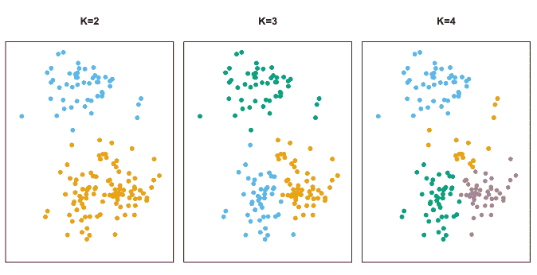

图 12.7. 一个包含150个二维观测的模拟数据集。面板显示了使用不同簇数*K*值应用K-均值聚类的结果。每个观测的颜色表示使用K-均值聚类算法分配给它的簇。注意，簇没有顺序，因此簇的颜色是任意的。这些簇标签未用于聚类；相反，它们是聚类过程的输出。

例如，如果第$i$个观测在第$k$个簇中，则$i \in C_k$。K-均值聚类背后的思想是，一个好的聚类是簇内变异尽可能小的聚类。簇$C_k$的簇内变异是衡量簇内观测彼此差异程度的度量$W(C_k)$。因此，我们希望解决问题

最小化 $\{ \sum_{k=1}^K W(C_k) \}$ 。 (12.15)

用文字表述，这个公式说我们希望将观测划分为$K$个簇，使得所有$K$个簇的总簇内变异之和尽可能小。

求解(12.15)似乎是一个合理的想法，但为了使其可操作，我们需要定义簇内变异。定义这个概念有许多可能的方式，但迄今为止最常见的选择涉及欧几里得距离的平方。也就是说，我们定义

$W(C_k) = \frac{1}{|C_k|} \sum_{i,i' \in C_k} \sum_{j=1}^p (x_{ij} - x_{i'j})^2$, (12.16)

其中$|C_k|$表示第$k$个簇中的观测数量。换句话说，第$k$个簇的簇内变异是该簇中所有观测两两欧几里得距离平方的总和，除以该簇中的观测总数。结合(12.15)和(12.16)给出了定义$K$-均值聚类的优化问题，

$$\underset{C_1,\dots,C_K}{\text{minimize}} \left\{ \sum_{k=1}^K \frac{1}{|C_k|} \sum_{i,i' \in C_k} \sum_{j=1}^p (x_{ij} - x_{i'j})^2 \right\}. \tag{12.17}$$

现在，我们希望找到一个算法来求解(12.17)——即一种将观测划分为$K$个簇的方法，使得(12.17)的目标最小化。这实际上是一个非常难以精确求解的问题，因为将$n$个观测划分为$K$个簇的方式几乎有$K^n$种。除非$K$和$n$都非常小，否则这是一个巨大的数字！幸运的是，一个非常简单的算法可以被证明为$K$-均值优化问题(12.17)提供一个局部最优解——一个*相当好的解*。这种方法在算法12.2中阐述。

### 算法 12.2 $K$-均值聚类

1.  随机为每个观测分配一个从1到$K$的数字。这些作为观测的初始簇分配。
2.  迭代直到簇分配停止变化：
    (a) 对于$K$个簇中的每一个，计算簇*质心*。第$k$个簇的质心是第$k$个簇中观测的$p$个特征均值的向量。
    (b) 将每个观测分配到其质心最近的簇（其中*最近*使用欧几里得距离定义）。

算法12.2保证在每一步都降低目标(12.17)的值。要理解原因，以下恒等式很有启发性：

$$\frac{1}{|C_k|} \sum_{i,i' \in C_k} \sum_{j=1}^p (x_{ij} - x_{i'j})^2 = 2 \sum_{i \in C_k} \sum_{j=1}^p (x_{ij} - \bar{x}_{kj})^2, \tag{12.18}$$

其中$\bar{x}_{kj} = \frac{1}{|C_k|} \sum_{i \in C_k} x_{ij}$是簇$C_k$中特征$j$的均值。在步骤2(a)中，每个特征的簇均值是使偏差平方和最小化的常数，而在步骤2(b)中，重新分配观测只能改进(12.18)。这意味着随着算法的运行，所获得的聚类将持续改进，直到结果不再变化；目标(12.17)永远不会增加。当结果不再变化时，就达到了*局部最优*。图12.8显示了算法在图12.7的玩具示例上的进展。$K$-均值聚类之所以得名，是因为在步骤2(a)中，簇质心被计算为分配给每个簇的观测的均值。

由于$K$-均值算法找到的是局部最优而非全局最优，因此获得的结果将取决于算法12.2步骤1中每个观测的初始（随机）簇分配。因此，从不同的随机初始值多次运行该算法非常重要。

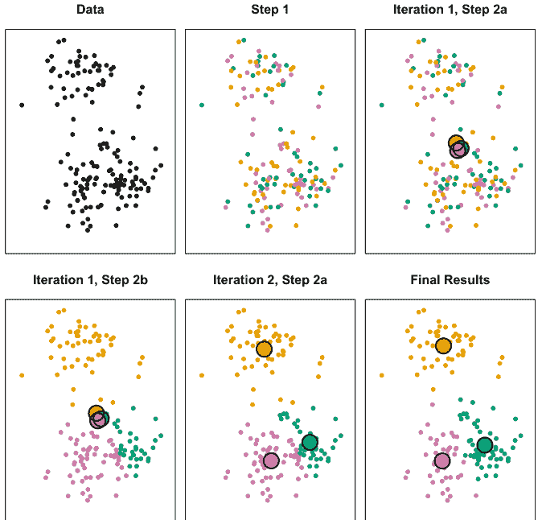

**图 12.8.** K-means 算法在图 12.7 示例数据上（K=3）的进展过程。左上：显示了观测点。中上：在算法的步骤 1 中，每个观测点被随机分配到一个簇。右上：在步骤 2(a) 中，计算了簇质心。这些质心显示为大的彩色圆盘。最初，质心几乎完全重叠，因为初始的簇分配是随机选择的。左下：在步骤 2(b) 中，每个观测点被分配到最近的质心。中下：再次执行步骤 2(a)，得到新的簇质心。右下：经过十次迭代后得到的结果。

初始配置。然后选择最佳解决方案，即使目标函数 (12.17) 最小的那个。图 12.9 展示了使用图 12.7 的玩具数据，通过六种不同的初始簇分配运行 K-means 聚类六次所得到的局部最优解。在这种情况下，最佳聚类是目标值为 235.8 的那个。

正如我们所看到的，要执行 K-means 聚类，我们必须确定数据中预期有多少个簇。选择 K 的问题远非简单。这个问题，连同执行 K-means 聚类时出现的其他实际考虑因素，在第 12.4.3 节中讨论。

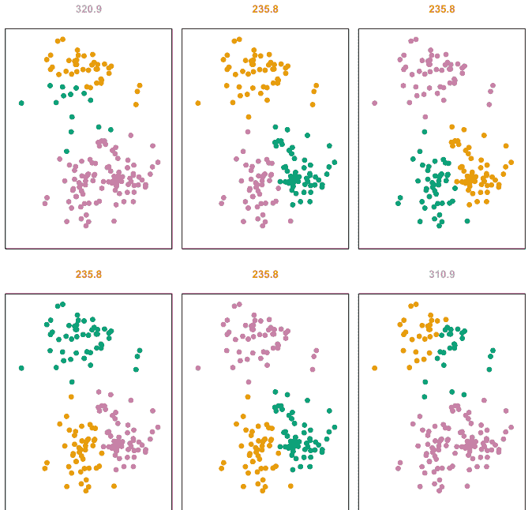

**图 12.9.** 对图 12.7 的数据执行六次 *K*-means 聚类（*K* = 3），每次在 *K*-means 算法的步骤 1 中对观测点进行不同的随机分配。每个图上方是目标函数 (12.17) 的值。获得了三个不同的局部最优解，其中一个导致目标值更小，并提供了更好的簇间分离。标记为红色的都达到了相同的最佳解决方案，目标值为 235.8。

## 12.4.2 层次聚类

*K*-means 聚类的一个潜在缺点是它要求我们预先指定簇的数量 *K*。*层次聚类* 是一种替代方法，它不需要我们承诺特定的 *K* 值选择。层次聚类相对于 *K*-means 聚类还有一个额外的优势，即它产生了一个基于树的、有吸引力的观测点表示，称为 *树状图*。

在本节中，我们描述 *自底向上* 或 *凝聚* 聚类。这是最常见的层次聚类类型，指的是树状图（通常描绘为倒置的树；见图 12.11）从叶子开始构建，并将簇合并到树干。我们将首先讨论如何解释树状图

526 12. 无监督学习

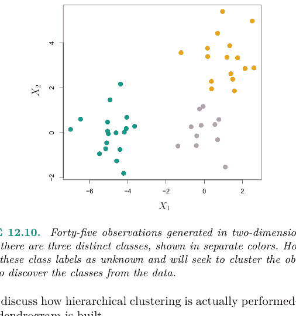

**图 12.10.** 在二维空间中生成的四十五个观测点。实际上有三个不同的类别，用不同的颜色显示。然而，我们将把这些类别标签视为未知，并将寻求对观测点进行聚类，以便从数据中发现这些类别。

然后讨论层次聚类实际上是如何执行的——即树状图是如何构建的。

### 解释树状图

我们从图 12.10 所示的模拟数据集开始，该数据集包含二维空间中的 45 个观测点。数据是从一个三类模型生成的；每个观测点的真实类别标签用不同的颜色显示。然而，假设数据是在没有类别标签的情况下被观察到的，并且我们想要对数据执行层次聚类。层次聚类（使用完全连接法，稍后讨论）产生了图 12.11 左侧面板所示的结果。我们如何解释这个树状图？

在图 12.11 的左侧面板中，树状图的每个 *叶子* 代表图 12.10 中的 45 个观测点之一。然而，当我们沿着树向上移动时，一些叶子开始 *融合* 成分支。这些对应于彼此相似的观测点。当我们向树的更高处移动时，分支本身也会融合，与叶子或其他分支融合。融合发生得越早（在树中位置越低），观测点组彼此就越相似。另一方面，融合发生得较晚（靠近树顶）的观测点可能相当不同。事实上，这个陈述可以精确化：对于任意两个观测点，我们可以寻找树中包含这两个观测点的分支首次融合的点。这个融合的高度，由垂直轴测量，表示这两个观测点有多不同。因此，在树的最底部融合的观测点彼此非常相似，而在靠近树顶融合的观测点往往相当不同。

这突出了解释树状图时一个非常重要但经常被误解的点。考虑图 12.12 的左侧面板，它显示了通过对九个观测点进行层次聚类得到的一个简单树状图。

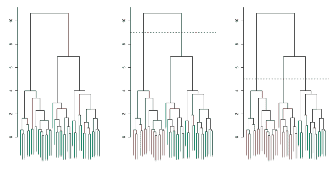

**图 12.11.** *左：使用完全连接法和欧几里得距离对图 12.10 的数据进行层次聚类得到的树状图。中：左侧面板的树状图，在高度为九处切割（由虚线指示）。此切割产生两个不同的簇，用不同颜色显示。右：左侧面板的树状图，现在在高度为五处切割。此切割产生三个不同的簇，用不同颜色显示。注意，颜色未用于聚类，仅用于本图的显示目的。*

观测点。可以看到观测点 5 和 7 彼此非常相似，因为它们在树状图的最低点融合。观测点 1 和 6 也彼此非常相似。然而，从图中得出观测点 9 和 2 彼此非常相似的结论是诱人但错误的，因为它们在树状图上位置靠近。事实上，根据树状图包含的信息，观测点 9 与观测点 2 的相似程度并不比与观测点 8、5 和 7 的相似程度更高。（这可以从图 12.12 的右侧面板看出，其中显示了原始数据。）用数学语言来说，树状图有 $2^{n-1}$ 种可能的重新排序，其中 $n$ 是叶子的数量。这是因为在 $n - 1$ 个融合点中的每一个点，两个融合分支的位置可以互换，而不会影响树状图的含义。因此，我们不能根据两个观测点在 *水平轴* 上的接近程度来得出关于它们相似性的结论。相反，我们根据包含这两个观测点的分支首次融合的 *垂直轴* 位置来得出关于它们相似性的结论。

现在我们理解了如何解释图 12.11 的左侧面板，我们可以继续讨论基于树状图识别簇的问题。为此，我们在树状图上进行水平切割，如图 12.11 的中间和右侧面板所示。切割下方的不同观测点集合可以解释为簇。在图 12.11 的中间面板中，在高度为九处切割树状图产生两个簇，用不同颜色显示。在右侧面板中，在高度为五处切割树状图产生三个簇。可以沿着树状图向下进行进一步切割，以获得任意数量的簇，介于 1（对应于不切割）和 $n$

528 12. 无监督学习

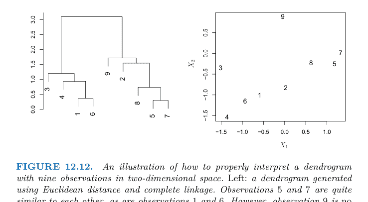

**图 12.12.** 说明如何正确解释具有九个二维空间观测点的树状图。左：使用欧几里得距离和完全连接法生成的树状图。观测点 5 和 7 彼此非常相似，观测点 1 和 6 也是如此。然而，观测点 9 与观测点 2 的相似程度并不比与观测点 8、5 和 7 的相似程度更高，即使观测点 9 和 2 在水平距离上很接近。这是因为观测点 2、8、5 和 7 都在相同高度（约 1.8）与观测点 9 融合。右：用于生成树状图的原始数据可以用来证实，确实，观测点 9 与观测点 2 的相似程度并不比与观测点 8、5 和 7 的相似程度更高。

（对应于在高度 0 处切割，使得每个观测点都在其自己的簇中）。换句话说，树状图的切割高度与 $K$-means 聚类中的 $K$ 起着相同的作用：它控制获得的簇的数量。

因此，图 12.11 突出了层次聚类一个非常吸引人的方面：一个单一的树状图可以用来获得任意数量的簇。在实践中，人们经常查看树状图，并根据融合的高度和所需的簇数量，用眼睛选择一个合理的簇数量。在图 12.11 的情况下，人们可能选择两个或三个簇。然而，通常在哪里切割树状图的选择并不那么明确。

术语 *层次* 指的是在给定高度切割树状图获得的簇必然嵌套在在任何更大高度切割树状图获得的簇中。然而，在任意数据集上，这种层次结构的假设可能不现实。例如，假设我们的观测点对应于一群男性和女性，均匀分布在美国人、日本人和法国人中。我们可以想象这样一种情况：最佳的两组划分可能按性别划分这些人，而最佳的三组划分可能按国籍划分他们。在这种情况下，真实的簇不是嵌套的，因为最佳的三组划分并非通过获取最佳的两组划分并拆分其中一个组而产生。因此，这种情况无法通过层次聚类很好地表示。由于类似这样的情况，层次聚类有时可能比 $K$-means 聚类产生 *更差*（即不那么准确）的结果，即使对于给定的簇数量也是如此。

## 算法 12.3 层次聚类

1.  从 $n$ 个观测值开始，并计算所有 $\binom{n}{2} = n(n-1)/2$ 对观测值之间的不相似性度量（如欧氏距离）。将每个观测值视为其自身的簇。
2.  对于 $i = n, n-1, \dots, 2$：
    (a) 检查 $i$ 个簇之间所有成对的簇间不相似性，并找出最不相似（即最相似）的那一对簇。将这两个簇合并。这两个簇之间的不相似性指示了在树状图中应放置合并点的高度。
    (b) 计算剩余 $i-1$ 个簇之间新的成对簇间不相似性。

## 层次聚类算法

层次聚类树状图是通过一个极其简单的算法得到的。我们首先定义每对观测值之间的某种*不相似性*度量。最常用的是欧氏距离；我们将在本章后面讨论不相似性度量的选择。该算法是迭代进行的。从树状图的底部开始，每个 $n$ 个观测值都被视为其自身的簇。然后，将彼此最相似的两个簇*合并*，这样现在就有 $n-1$ 个簇了。接着，再次将彼此最相似的两个簇合并，这样现在就有 $n-2$ 个簇了。算法以这种方式继续进行，直到所有观测值都属于一个单一的簇，树状图完成。图 12.13 描绘了该算法的前几个步骤，使用的是图 12.12 的数据。总结来说，层次聚类算法如算法 12.3 所示。

这个算法看起来很简单，但有一个问题尚未解决。考虑图 12.13 右下角的面板。我们是如何确定簇 $\{5, 7\}$ 应该与簇 $\{8\}$ 合并的？我们有观测值对之间不相似性的概念，但如果一个或两个簇包含多个观测值，我们如何定义两个簇之间的不相似性？观测值对之间的不相似性概念需要扩展到*观测值组*对之间。这种扩展是通过发展*连接*的概念来实现的，它定义了两组观测值之间的不相似性。四种最常见的连接类型——*完全连接*、*平均连接*、*单连接*和*质心连接*——在表 12.3 中进行了简要描述。平均连接、完全连接和单连接在统计学家中最受欢迎。平均连接和完全连接通常比单连接更受青睐，因为它们倾向于产生更平衡的树状图。质心连接常用于基因组学，但有一个主要缺点，即可能发生*反转*，即在树状图中，两个簇在*低于*其中任何一个单独簇的高度被合并。这可能导致树状图的可视化和解释都出现困难。层次聚类算法步骤 2(b) 中计算的不相似性将取决于所使用的连接类型以及不相似性度量的选择。因此，最终的树状图通常强烈依赖于所使用的连接类型，如图 12.14 所示。

| 连接类型 | 描述 |
| :--- | :--- |
| 完全连接 | 最大簇间不相似性。计算簇 A 中的观测值与簇 B 中的观测值之间所有成对的不相似性，并记录这些不相似性中的*最大值*。 |
| 单连接 | 最小簇间不相似性。计算簇 A 中的观测值与簇 B 中的观测值之间所有成对的不相似性，并记录这些不相似性中的*最小值*。单连接可能导致产生延伸的、拖尾的簇，其中单个观测值被逐一合并。 |
| 平均连接 | 平均簇间不相似性。计算簇 A 中的观测值与簇 B 中的观测值之间所有成对的不相似性，并记录这些不相似性的*平均值*。 |
| 质心连接 | 簇 A 的质心（一个长度为 *p* 的均值向量）与簇 B 的质心之间的不相似性。质心连接可能导致不理想的*反转*。 |

**表 12.3.** *层次聚类中四种最常用连接类型的总结。*

## 不相似性度量的选择

到目前为止，本章中的示例都使用欧氏距离作为不相似性度量。但有时可能更倾向于使用其他不相似性度量。例如，*基于相关性的距离*认为，如果两个观测值的特征高度相关，则它们是相似的，即使它们的观测值在欧氏距离上可能相距甚远。这是对相关性的一种不寻常的使用，相关性通常是在变量之间计算的；而这里是在每对观测值的观测值轮廓之间计算的。图 12.15 说明了欧氏距离和基于相关性的距离之间的区别。基于相关性的距离关注的是观测值轮廓的形状，而不是它们的大小。

不相似性度量的选择非常重要，因为它对最终的树状图有很强的影响。通常，应仔细关注被聚类的数据类型和手头的科学问题。这些考虑因素应决定用于层次聚类的不相似性度量类型。

例如，考虑一个在线零售商，希望根据购物者的过往购物历史对他们进行聚类。目标是识别出*相似*购物者的子群体，以便向每个子群体内的购物者展示他们特别可能感兴趣的商品和广告。假设数据采用矩阵形式，其中行是购物者，列是可供购买的商品；数据矩阵的元素表示给定购物者购买给定商品的次数（即，如果购物者从未购买过该商品则为 0，如果购买过一次则为 1，等等）。应该使用什么类型的不相似性度量来对购物者进行聚类？如果使用欧氏距离，那么那些总体上购买商品非常少（即不经常使用在线购物网站）的购物者将被聚在一起。这可能不是理想的。另一方面，如果使用基于相关性的距离，那么具有相似偏好的购物者（例如，购买过商品 A 和 B 但从未购买过商品 C 或 D 的购物者）将被聚在一起，即使其中一些购物者的购买量比其他购物者高。因此，对于这个应用，基于相关性的距离可能是更好的选择。

除了仔细选择所使用的不相似性度量外，还必须考虑在计算观测值之间的不相似性之前，是否应该对变量进行缩放，使其标准差为 1。为了说明这一点，我们继续使用刚才描述的在线购物示例。某些商品可能比其他商品购买得更频繁；例如，一个购物者可能一年买十双袜子，但很少买电脑。因此，像袜子这样的高频购买品对购物者间不相似性的影响，以及最终获得的聚类结果的影响，往往比像电脑这样的稀有购买品大得多。这可能不是理想的。如果在计算观测值间不相似性之前，将变量缩放为标准差为 1，那么在执行的层次聚类中，每个变量实际上将被赋予同等的重要性。如果变量是在不同的尺度上测量的，我们可能也希望将变量缩放为标准差为 1；否则，特定变量的单位选择（例如厘米与公里）将极大地影响所获得的不相似性度量。毫不奇怪，是否在计算不相似性度量之前缩放变量是一个好的决定，这取决于手头的应用。图 12.16 展示了一个例子。我们注意到，是否在聚类前缩放变量的问题也适用于 $K$-均值聚类。

## 12.4.3 聚类中的实际问题

聚类在无监督设置中可以是数据分析的一个非常有用的工具。然而，在执行聚类时会出现许多问题。我们在这里描述其中一些问题。

### 影响重大的小决策

为了执行聚类，必须做出一些决策。

## 验证所得聚类

任何时候对数据集进行聚类分析，我们都会得到聚类结果。但我们真正想知道的是，所发现的聚类是否代表了数据中的真实子群，或者它们是否仅仅是*对噪声进行聚类*的结果。例如，如果我们获得一组独立的观测数据，那么这些观测数据是否也会呈现出相同的聚类模式？这是一个难以回答的问题。存在多种技术可以为聚类分配一个p值，以评估该聚类是否比随机情况下预期的有更多证据支持。然而，对于哪种是最佳方法尚未达成共识。更多细节可参见ESL。⁸

## 聚类的其他考量

*K*-均值聚类和层次聚类都会将每个观测分配到一个聚类中。然而，有时这可能并不合适。例如，假设大多数观测确实属于少数几个（未知的）子群，而一小部分观测彼此之间以及与其他所有观测都差异很大。那么，由于*K*-均值聚类和层次聚类强制将*每个*观测都分配到一个聚类中，所发现的聚类可能会因不属于任何聚类的异常值的存在而严重失真。混合模型是处理此类异常值存在的一种有吸引力的方法。这相当于*K*-均值聚类的*软*版本，在ESL中有描述。

此外，聚类方法通常对数据的扰动不够稳健。例如，假设我们对$n$个观测进行聚类，然后随机移除这$n$个观测的一个子集后再次进行聚类。我们希望得到的两组聚类结果应该相当相似，但情况往往并非如此！

## 解释聚类结果的审慎方法

我们已经描述了与聚类相关的一些问题。然而，如果使用得当，聚类可以是一个非常有用且有效的统计工具。我们提到，聚类执行方式中的小决策，例如数据如何标准化以及使用何种类型的连接方式，都可能对结果产生很大影响。因此，我们建议使用这些参数的不同选择进行聚类，并查看完整的结果集，以观察哪些模式持续出现。由于聚类可能不稳健，我们建议对数据的子集进行聚类，以了解所得聚类的稳健性。最重要的是，我们必须谨慎报告聚类分析的结果。这些结果不应被视为关于数据集的绝对真理。相反，它们应构成科学假设发展和进一步研究的起点，最好是在独立的数据集上进行。

## 12.5 实验室：无监督学习

在本实验室中，我们将在几个数据集上演示PCA和聚类。与其他实验室一样，我们在此顶层导入一些库。这使得代码更具可读性，因为扫描笔记本的前几行就能告诉我们本笔记本使用了哪些库。

```python
import numpy as np
import pandas as pd
import matplotlib.pyplot as plt
from statsmodels.datasets import get_rdataset
from sklearn.decomposition import PCA
from sklearn.preprocessing import StandardScaler
from ISLP import load_data
```

我们还收集了本实验室所需的新导入。

```python
from sklearn.cluster import \
    (KMeans,
     AgglomerativeClustering)
from scipy.cluster.hierarchy import \
    (dendrogram,
     cut_tree)
from ISLP.cluster import compute_linkage
```

### 12.5.1 主成分分析

在本实验室中，我们对R计算环境中的数据集`USArrests`执行PCA。我们使用`get_rdataset()`检索数据，该函数可以从许多标准R包中获取数据。数据集的行包含50个州，按字母顺序排列。

```python
In [3]: USArrests = get_rdataset('USArrests').data
        USArrests
```

Out [3]:

| | Murder | Assault | UrbanPop | Rape |
|---|---|---|---|---|
| Alabama | 13.2 | 236 | 58 | 21.2 |
| Alaska | 10.0 | 263 | 48 | 44.5 |
| Arizona | 8.1 | 294 | 80 | 31.0 |
| ... | ... | ... | ... | ... |
| Wisconsin | 2.6 | 53 | 66 | 10.8 |
| Wyoming | 6.8 | 161 | 60 | 15.6 |

数据集的列包含四个变量。

```python
In [4]: USArrests.columns
```

```python
Out [4]: Index(['Murder', 'Assault', 'UrbanPop', 'Rape'],
        dtype='object')
```

我们首先简要检查数据。我们注意到这些变量的均值差异很大。

```python
In [5]: USArrests.mean()
```

```python
Out [5]: Murder        7.788
         Assault     170.760
         UrbanPop    65.540
         Rape        21.232
         dtype: float64
```

数据框有几种用于计算列摘要的有用方法。我们也可以使用var()方法检查四个变量的方差。

```python
In [6]: USArrests.var()
```

```python
Out [6]: Murder          18.970465
         Assault      6945.165714
         UrbanPop      209.518776
         Rape           87.729159
         dtype: float64
```

毫不奇怪，这些变量的方差也差异很大。UrbanPop变量衡量的是每个州居住在城市地区的人口百分比，这与每10万人中的强奸案数量不具可比性。PCA寻找的是能解释数据集中大部分方差的派生变量。如果在执行PCA之前不对变量进行缩放，那么主成分将主要由Assault变量驱动，因为它的方差最大。因此，如果变量以不同的单位测量或尺度差异很大，建议在执行PCA之前将变量标准化为标准差为1。通常我们也将均值设为零。

⁸ESL：Hastie、Tibshirani和Friedman所著的《统计学习基础》。

这种缩放可以通过上面导入的`StandardScaler()`转换来完成。我们首先`fit`缩放器，计算必要的均值和标准差，然后使用`transform`方法将其应用于我们的数据。与之前一样，我们使用`fit_transform()`方法将这些步骤结合起来。

```python
scaler = StandardScaler(with_std=True,
                        with_mean=True)
USArrests_scaled = scaler.fit_transform(USArrests)
```

缩放数据后，我们可以使用`sklearn.decomposition`包中的`PCA()`转换来执行主成分分析。

```python
pcaUS = PCA()
```

（默认情况下，`PCA()`转换会将变量中心化为均值零，但不会对其进行缩放。）转换`pcaUS`可用于查找`fit()`返回的PCA `scores`。一旦调用了`fit`方法，`pcaUS`对象还包含许多有用的量。

```python
pcaUS.fit(USArrests_scaled)
```

拟合后，`mean_`属性对应于变量的均值。在这种情况下，由于我们使用`scaler()`对数据进行了中心化和缩放，因此均值将全部为0。

```python
pcaUS.mean_
```

```
array([-0.,  0., -0.,  0.])
```

可以在`pcaUS`拟合后使用其`transform()`方法计算分数。

```python
scores = pcaUS.transform(USArrests_scaled)
```

我们将在稍后绘制这些分数。`components_`属性提供主成分载荷：`pcaUS.components_`的每一行包含相应的主成分载荷向量。

```python
pcaUS.components_
```

```
array([[ 0.53589947,  0.58318363,  0.27819087,  0.54343209],
       [ 0.41818087,  0.1879856 , -0.87280619, -0.16731864],
       [-0.34123273, -0.26814843, -0.37801579,  0.81777791],
       [ 0.6492278 , -0.74340748,  0.13387773,  0.08902432]])
```

双标图（`biplot`）是PCA中常用的可视化方法。它不是`sklearn`的标准内置部分，但有一些python包可以生成此类图表。这里我们手动制作一个简单的双标图。

```python
i, j = 0, 1 # which components
fig, ax = plt.subplots(1, 1, figsize=(8, 8))
ax.scatter(scores[:,0], scores[:,1])
ax.set_xlabel('PC%d' % (i+1))
ax.set_ylabel('PC%d' % (j+1))
for k in range(pcaUS.components_.shape[1]):
    ax.arrow(0, 0, pcaUS.components_[i,k], pcaUS.components_[j,k])
    ax.text(pcaUS.components_[i,k],
            pcaUS.components_[j,k],
            USArrests.columns[k])
```

请注意，此图是图12.1关于$y$轴的镜像。回想一下，主成分仅在符号变化上是唯一的，因此我们可以通过翻转第二组分数和载荷的符号来重现该图。我们还增加了箭头的长度以强调载荷。

```python
scale_arrow = s_ = 2
scores[:,1] *= -1
pcaUS.components_[1] *= -1 # flip the y-axis
fig, ax = plt.subplots(1, 1, figsize=(8, 8))
ax.scatter(scores[:,0], scores[:,1])
ax.set_xlabel('PC%d' % (i+1))
ax.set_ylabel('PC%d' % (j+1))
for k in range(pcaUS.components_.shape[1]):
    ax.arrow(0, 0, s_*pcaUS.components_[i,k], s_*pcaUS.components_[j,k])
    ax.text(s_*pcaUS.components_[i,k],
            s_*pcaUS.components_[j,k],
            USArrests.columns[k])
```

主成分分数的标准差如下：

```python
scores.std(0, ddof=1)
```

```
array([1.5909, 1.0050, 0.6032, 0.4207])
```

每个分数的方差可以直接从`pcaUS`对象通过`explained_variance_`属性提取。

```python
pcaUS.explained_variance_
```

```
array([2.5309, 1.01   , 0.3638, 0.177  ])
```

每个主成分解释的方差比例（PVE）存储为`explained_variance_ratio_`：

```python
pcaUS.explained_variance_ratio_
```

```
array([0.6201, 0.2474, 0.0891, 0.0434])
```

我们看到第一个主成分解释了数据中62.0%的方差，下一个主成分解释了24.7%的方差，依此类推。我们可以绘制每个成分解释的PVE以及累积PVE。我们首先绘制解释的方差比例。

```python
%%capture
fig, axes = plt.subplots(1, 2, figsize=(15, 6))
ticks = np.arange(pcaUS.n_components_)+1
ax = axes[0]
ax.plot(ticks,
        pcaUS.explained_variance_ratio_,
        marker='o')
ax.set_xlabel('Principal Component');
ax.set_ylabel('Proportion of Variance Explained')
ax.set_ylim([0,1])
ax.set_xticks(ticks)
```

注意`%%capture`的使用，它抑制了部分完成图形的显示。

```python
ax = axes[1]
ax.plot(ticks,
        pcaUS.explained_variance_ratio_.cumsum(),
        marker='o')
ax.set_xlabel('Principal Component')
ax.set_ylabel('Cumulative Proportion of Variance Explained')
ax.set_ylim([0, 1])
ax.set_xticks(ticks)
fig
```

结果与图12.3所示相似。请注意，`cumsum()`方法计算数值向量元素的累积和。例如：

```python
a = np.array([1,2,8,-3])
np.cumsum(a)
```

```
Out[20]: array([ 1, 3, 11, 8])
```

## 12.5.2 矩阵补全

我们现在重新创建在第12.3节中对`USArrests`数据进行的分析。

我们在第12.2.2节中看到，在中心化数据矩阵$\mathbf{X}$上求解优化问题（12.6）等价于计算数据的前$M$个主成分。我们在下面使用缩放和中心化的`USArrests`数据作为$\mathbf{X}$。*奇异值分解*（SVD）是求解（12.6）的通用算法。

```python
X = USArrests_scaled
U, D, V = np.linalg.svd(X, full_matrices=False)
U.shape, D.shape, V.shape
```

```
Out[21]: ((50, 4), (4,), (4, 4))
```

`np.linalg.svd()`函数返回三个分量：$U$、$D$和$V$。矩阵$V$等价于主成分的载荷矩阵（除了一个无关紧要的符号翻转）。使用`full_matrices=False`选项可确保对于高矩阵，$U$的形状与$\mathbf{X}$的形状相同。

```python
V
```

```
Out[22]: array([[-0.53589947, -0.58318363, -0.27819087, -0.54343209],
       [ 0.41818087, 0.1879856 , -0.87280619, -0.16731864],
       [-0.34123273, -0.26814843, -0.37801579, 0.81777791],
       [ 0.6492278 , -0.74340748, 0.13387773, 0.08902432]])
```

```python
In [23]: pcaUS.components_
```

```
Out[23]: array([[ 0.53589947,  0.58318363,  0.27819087,  0.54343209],
       [ 0.41818087,  0.1879856 , -0.87280619, -0.16731864],
       [-0.34123273, -0.26814843, -0.37801579,  0.81777791],
       [ 0.6492278 , -0.74340748,  0.13387773,  0.08902432]])
```

矩阵U对应于PCA分数矩阵的*标准化*版本（每列标准化为平方和为1）。如果我们将U的每一列乘以D的相应元素，我们就能精确地恢复PCA分数（除了一个无意义的符号翻转）。

```python
In [24]: (U * D[None,:])[:3]
```

```
Out[24]: array([[-0.9856,  1.1334, -0.4443,  0.1563],
       [-1.9501,  1.0732,  2.04  , -0.4386],
       [-1.7632, -0.746 ,  0.0548, -0.8347]])
```

```python
In [25]: scores[:3]
```

```
Out[25]: array([[ 0.9856, -1.1334, -0.4443,  0.1563],
       [ 1.9501, -1.0732,  2.04  , -0.4386],
       [ 1.7632,  0.746 ,  0.0548, -0.8347]])
```

虽然可以使用`PCA()`估计器进行此实验，但这里我们使用`np.linalg.svd()`函数来说明其用法。我们现在在50 × 4的数据矩阵中随机省略20个条目。我们通过首先随机选择20行（州），然后在每行中随机选择四个条目之一来实现。这确保了每行至少有三个观测值。

```python
In [26]: n_omit = 20
np.random.seed(15)
r_idx = np.random.choice(np.arange(X.shape[0]),
                        n_omit,
                        replace=False)
c_idx = np.random.choice(np.arange(X.shape[1]),
                        n_omit,
                        replace=True)
Xna = X.copy()
Xna[r_idx, c_idx] = np.nan
```

这里数组`r_idx`包含20个从0到49的整数；这代表被选中包含缺失值的州（X的行）。而`c_idx`包含20个从0到3的整数，代表每个选定州中包含缺失值的特征（X中的列）。我们现在编写一些代码来实现算法12.1。我们首先编写一个函数，该函数接收一个矩阵，并使用`svd()`函数返回该矩阵的近似值。这将在算法12.1的步骤2中需要。

```python
In [27]: def low_rank(X, M=1):
    U, D, V = np.linalg.svd(X)
    L = U[:,:M] * D[None,:M]
    return L.dot(V[:M])
```

要执行算法的第1步，我们初始化Xhat——即算法12.1中的$\tilde{\mathbf{X}}$——方法是将缺失值替换为非缺失条目的列均值。这些均值在沿行轴运行`np.nanmean()`后存储在下方的Xbar中。我们创建副本是为了在下面给Xhat赋值时，不会同时覆盖Xna中的值。

```
In [28]:
Xhat = Xna.copy()
Xbar = np.nanmean(Xhat, axis=0)
Xhat[r_idx, c_idx] = Xbar[c_idx]
```

在开始第2步之前，我们先设置好以衡量迭代进度：

```
In [29]:
thresh = 1e-7
rel_err = 1
count = 0
ismiss = np.isnan(Xna)
mssold = np.mean(Xhat[~ismiss]**2)
mss0 = np.mean(Xna[~ismiss]**2)
```

这里的`ismiss`是一个与Xna维度相同的逻辑矩阵；如果对应的矩阵元素缺失，则该元素为`True`。符号`~ismiss`对此布尔向量取反。这很有用，因为它允许我们同时访问缺失和非缺失的条目。我们将非缺失元素的平方均值存储在`mss0`中。我们将Xhat旧版本中非缺失元素的均方误差存储在`mssold`中（目前与`mss0`一致）。我们计划将Xhat当前版本中非缺失元素的均方误差存储在`mss`中，然后迭代算法12.1的第2步，直到*相对误差*（定义为(`mssold` - `mss`) / `mss0`）低于`thresh = 1e-7`。

在算法12.1的第2(a)步中，我们使用`low_rank()`来近似Xhat；我们称之为Xapp。在第2(b)步中，我们使用Xapp来更新Xhat中在Xna里缺失的元素的估计值。最后，在第2(c)步中，我们计算相对误差。这三个步骤包含在下面的`while`循环中：

```
In [30]:
while rel_err > thresh:
    count += 1
    # Step 2(a)
    Xapp = low_rank(Xhat, M=1)
    # Step 2(b)
    Xhat[ismiss] = Xapp[ismiss]
    # Step 2(c)
    mss = np.mean(((Xna - Xapp)[~ismiss])**2)
    rel_err = (mssold - mss) / mss0
    mssold = mss
    print("Iteration: {0}, MSS:{1:.3f}, Rel.Err {2:.2e}"
          .format(count, mss, rel_err))
```

$^9$算法12.1告诉我们，要迭代第2步直到(12.14)不再减小。判断(12.14)是否减小只需要我们跟踪`mssold` - `mss`。然而，在实践中，我们跟踪的是(`mssold` - `mss`) / `mss0`：这样，算法12.1收敛所需的迭代次数就不会取决于我们是否将原始数据$\mathbf{X}$乘以一个常数因子。

Iteration: 1, MSS:0.395, Rel.Err 5.99e-01
Iteration: 2, MSS:0.382, Rel.Err 1.33e-02
Iteration: 3, MSS:0.381, Rel.Err 1.44e-03
Iteration: 4, MSS:0.381, Rel.Err 1.79e-04
Iteration: 5, MSS:0.381, Rel.Err 2.58e-05
Iteration: 6, MSS:0.381, Rel.Err 4.22e-06
Iteration: 7, MSS:0.381, Rel.Err 7.65e-07
Iteration: 8, MSS:0.381, Rel.Err 1.48e-07
Iteration: 9, MSS:0.381, Rel.Err 2.95e-08

我们看到，经过八次迭代后，相对误差已降至`thresh = 1e-7`以下，因此算法终止。此时，非缺失元素的均方误差等于0.381。

最后，我们计算20个插补值与实际值之间的相关性：

```
In [31]: np.corrcoef(Xapp[ismiss], X[ismiss])[0,1]
```

Out[31]: 0.711

在本实验中，我们为了教学目的自己实现了算法12.1。然而，希望将矩阵补全应用于自己数据的读者，可能会寻求更专业的Python实现。

## 12.5.3 聚类

### K-均值聚类

估计器`sklearn.cluster.KMeans()`在Python中执行K-均值聚类。我们从一个简单的模拟示例开始，其中数据确实存在两个簇：前25个观测值相对于接下来的25个观测值存在均值偏移。

```
In [32]: np.random.seed(0);
X = np.random.standard_normal((50,2));
X[:25,0] += 3;
X[:25,1] -= 4;
```

我们现在执行K=2的K-均值聚类。

```
In [33]: kmeans = KMeans(n_clusters=2,
random_state=2,
n_init=20).fit(X)
```

我们指定`random_state`以使结果可重现。50个观测值的簇分配包含在`kmeans.labels_`中。

```
In [34]: kmeans.labels_
```

Out[34]: array([1, 1, 1, 1, 1, 1, 1, 1, 1, 1, 1, 1, 1, 1, 1, 1, 1, 1, 1, 1, 1, 1, 1, 1, 1, 0, 0, 0, 0, 0, 0, 0, 0, 0, 0, 0, 0, 0, 0, 0, 0, 0, 0, 0, 0, 0, 0, 0, 0, 0], dtype=int32)

K-均值聚类完美地将观测值分成了两个簇，即使我们没有向KMeans()提供任何分组信息。我们可以绘制数据，每个观测值根据其簇分配着色。

```
fig, ax = plt.subplots(1, 1, figsize=(8,8))
ax.scatter(X[:,0], X[:,1], c=kmeans.labels_)
ax.set_title("K-Means Clustering Results with K=2");
```

这里的观测值可以轻松绘制，因为它们是二维的。如果变量超过两个，我们可以改为执行PCA并绘制前两个主成分得分向量来表示簇。

在这个例子中，我们知道确实存在两个簇，因为我们生成了数据。然而，对于真实数据，我们不知道真实的簇数量，也不知道它们是否以任何精确的方式存在。我们也可以在这个例子上执行$K$-均值聚类，其中$K = 3$。

```
kmeans = KMeans(n_clusters=3,
                random_state=3,
                n_init=20).fit(X)
fig, ax = plt.subplots(figsize=(8,8))
ax.scatter(X[:,0], X[:,1], c=kmeans.labels_)
ax.set_title("K-Means Clustering Results with K=3");
```

当$K = 3$时，$K$-均值聚类将两个簇拆分开了。我们使用了`n_init`参数，用20个初始簇分配运行$K$-均值（默认值是10）。如果使用大于1的`n_init`值，那么$K$-均值聚类将在算法12.2的第1步中使用多个随机分配进行，并且`KMeans()`函数将只报告最佳结果。这里我们比较使用`n_init=1`和`n_init=20`。

```
kmeans1 = KMeans(n_clusters=3,
                 random_state=3,
                 n_init=1).fit(X)
kmeans20 = KMeans(n_clusters=3,
                  random_state=3,
                  n_init=20).fit(X);
kmeans1.inertia_, kmeans20.inertia_
```

请注意，`kmeans.inertia_`是簇内平方和的总和，我们通过执行$K$-均值聚类来最小化它（12.17）。

我们*强烈*建议始终使用较大的`n_init`值（如20或50）运行$K$-均值聚类，否则可能会得到不理想的局部最优解。

执行$K$-均值聚类时，除了使用多个初始簇分配外，使用`KMeans()`的`random_state`参数设置随机种子也很重要。这样，第1步中的初始簇分配就可以重现，并且$K$-均值输出将完全可重现。

### 层次聚类

`sklearn.clustering`包中的`AgglomerativeClustering()`类实现了层次聚类。由于其名称较长，我们使用简写`HClust`表示*层次聚类*。请注意，这不会改变使用此方法时的返回类型，因此实例仍然是`AgglomerativeClustering`类。在下面的例子中，我们使用上一个实验的数据，使用完全连接、单连接和平均连接聚类，以欧氏距离作为相异性度量，绘制层次聚类树状图。我们首先使用完全连接对观测值进行聚类。

```
HClust = AgglomerativeClustering
hc_comp = HClust(distance_threshold=0,
                 n_clusters=None,
                 linkage='complete')
hc_comp.fit(X)
```

这计算了整个树状图。我们同样可以使用平均连接或单连接进行层次聚类：

```
hc_avg = HClust(distance_threshold=0,
                 n_clusters=None,
                 linkage='average');
hc_avg.fit(X)
hc_sing = HClust(distance_threshold=0,
                  n_clusters=None,
                  linkage='single');
hc_sing.fit(X);
```

要使用预计算的距离矩阵，我们提供一个额外的参数`metric="precomputed"`。在下面的代码中，前四行计算了$50 \times 50$的成对距离矩阵。

```
D = np.zeros((X.shape[0], X.shape[0]));
for i in range(X.shape[0]):
    x_ = np.multiply.outer(np.ones(X.shape[0]), X[i])
    D[i] = np.sqrt(np.sum((X - x_)**2, 1));
hc_sing_pre = HClust(distance_threshold=0,
                     n_clusters=None,
                     metric='precomputed',
                     linkage='single')
hc_sing_pre.fit(D)
```

我们使用`scipy.cluster.hierarchy`中的`dendrogram()`来绘制树状图。然而，`dendrogram()`期望聚类的所谓*连接矩阵表示*，而`AgglomerativeClustering()`并未提供，但可以计算。`ISLP.cluster`包中的函数`compute_linkage()`就是为此目的提供的。

我们现在可以绘制树状图了。图底部的数字标识每个观测值。`dendrogram()`函数有一个默认方法来为树的不同分支着色，这暗示了在特定深度对树进行预定义切割。我们更喜欢通过将此阈值设置为无穷大来覆盖此默认值。由于我们希望对许多树状图都采用这种行为，我们将这些值存储在字典`cargs`中，并使用符号`**cargs`将其作为关键字参数传递。

```
cargs = {'color_threshold':-np.inf,
         'above_threshold_color':'black'}
linkage_comp = compute_linkage(hc_comp)
fig, ax = plt.subplots(1, 1, figsize=(8, 8))
```

我们可能希望将树状图中切割阈值上下的分支着以不同颜色。这可以通过改变 `color_threshold` 来实现。让我们在高度为4处切割树状图，将合并高度高于4的链接着为黑色。

```python
fig, ax = plt.subplots(1, 1, figsize=(8, 8))
dendrogram(linkage_comp,
           ax=ax,
           color_threshold=4,
           above_threshold_color='black');
```

要确定与树状图给定切割相关的每个观测值的聚类标签，我们可以使用 `scipy.cluster.hierarchy` 中的 `cut_tree()` 函数：

```python
cut_tree(linkage_comp, n_clusters=4).T
```

```
array([[0, 1, 0, 0, 1, 1, 0, 1, 0, 0, 2, 0, 0, 0, 1, 1, 0, 0, 1,
       0, 0, 2, 0, 2, 2, 3, 2, 3, 3, 3, 3, 2, 3, 3, 3, 3, 2, 3,
       3, 3, 3, 2, 3, 3, 3, 3, 3, 3, 3]])
```

这也可以通过向 `HClust()` 提供参数 `n_clusters` 来实现；然而，每次切割都需要重新计算聚类。类似地，可以通过向 `HClust()` 提供参数 `distance_threshold` 或向 `cut_tree()` 提供参数 `height` 来按距离阈值切割树状图。

```python
cut_tree(linkage_comp, height=5)
```

```
array([[0, 0, 0, 0, 0, 0, 0, 0, 0, 0, 1, 0, 0, 0, 0, 0, 0, 0, 0,
       0, 0, 1, 0, 1, 1, 2, 1, 2, 2, 2, 2, 1, 2, 2, 2, 2, 1, 2,
       2, 2, 2, 1, 2, 2, 2, 2, 2, 2, 2]])
```

在对观测值进行层次聚类之前，我们使用 `StandardScaler()` 对变量进行缩放，正如我们在PCA示例中所做的那样：

```python
scaler = StandardScaler()
X_scale = scaler.fit_transform(X)
hc_comp_scale = HClust(distance_threshold=0,
                       n_clusters=None,
                       linkage='complete').fit(X_scale)
linkage_comp_scale = compute_linkage(hc_comp_scale)
fig, ax = plt.subplots(1, 1, figsize=(8, 8))
dendrogram(linkage_comp_scale, ax=ax, **cargs)
ax.set_title("Hierarchical Clustering with Scaled Features");
```

观测值之间基于相关性的距离可用于聚类。两个观测值之间的相关性衡量了它们特征值的相似性。对于 $n$ 个观测值，$n \times n$ 的相关矩阵

> 假设每个观测值有 $p$ 个特征，每个特征是一个数值。我们通过计算这 $p$ 对数字的相关性来衡量两个此类观测值的相似性。

然后可以用作相似性（或亲和性）矩阵，即，使得1减去相关矩阵成为用于聚类的相异性矩阵。
请注意，使用相关性仅对至少有三个特征的数据有意义，因为对于任何两个在两个特征上有测量值的观测值，其绝对相关性始终为1。因此，我们将对一个三维数据集进行聚类。

```python
X = np.random.standard_normal((30, 3))
corD = 1 - np.corrcoef(X)
hc_cor = HClust(linkage='complete',
                distance_threshold=0,
                n_clusters=None,
                metric='precomputed')
hc_cor.fit(corD)
linkage_cor = compute_linkage(hc_cor)
fig, ax = plt.subplots(1, 1, figsize=(8, 8))
dendrogram(linkage_cor, ax=ax, **cargs)
ax.set_title("Complete Linkage with Correlation-Based Dissimilarity");
```

## 12.5.4 NCI60 数据示例

无监督技术常用于基因组数据分析。特别是，PCA和层次聚类是流行的工具。我们在NCI60癌细胞系微阵列数据上演示这些技术，该数据包含64个癌细胞系的6830个基因表达测量值。

```python
NCI60 = load_data('NCI60')
nci_labs = NCI60['labels']
nci_data = NCI60['data']
```

每个细胞系都标有一种癌症类型。在执行PCA和聚类时，我们不使用癌症类型，因为这些是无监督技术。但在执行PCA和聚类后，我们将检查这些癌症类型在多大程度上与这些无监督技术的结果一致。
数据有64行和6830列。

```python
nci_data.shape
```

Out[48]: (64, 6830)
我们首先检查细胞系的癌症类型。

```python
nci_labs.value_counts()
```

Out[49]: label
NSCLC 9
RENAL 9
MELANOMA 8
BREAST 7
COLON 7
LEUKEMIA 6
OVARIAN 6
CNS 5
PROSTATE 2
K562A-repro 1
K562B-repro 1
MCF7A-repro 1
MCF7D-repro 1
UNKNOWN 1
dtype: int64

### 对NCI60数据进行PCA

我们首先在将变量（基因）缩放为标准差为1后对数据执行PCA，尽管在这里可以合理地认为不缩放基因更好，因为它们是以相同单位测量的。

```python
scaler = StandardScaler()
nci_scaled = scaler.fit_transform(nci_data)
nci_pca = PCA()
nci_scores = nci_pca.fit_transform(nci_scaled)
```

我们现在绘制前几个主成分得分向量，以可视化数据。对应于给定癌症类型的观测值（细胞系）将以相同颜色绘制，以便我们可以看到同一癌症类型内的观测值彼此相似的程度。

```python
cancer_types = list(np.unique(nci_labs))
nci_groups = np.array([cancer_types.index(lab)
                      for lab in nci_labs.values])
fig, axes = plt.subplots(1, 2, figsize=(15,6))
ax = axes[0]
ax.scatter(nci_scores[:,0],
           nci_scores[:,1],
           c=nci_groups,
           marker='o',
           s=50)
ax.set_xlabel('PC1'); ax.set_ylabel('PC2')
ax = axes[1]
ax.scatter(nci_scores[:,0],
           nci_scores[:,2],
           c=nci_groups,
           marker='o',
           s=50)
ax.set_xlabel('PC1'); ax.set_ylabel('PC3');
```

结果图如图12.17所示。总体而言，对应于单一癌症类型的细胞系在前几个主成分得分向量上确实倾向于具有相似的值。这表明来自同一癌症类型的细胞系往往具有相当相似的基因表达水平。

我们还可以绘制主成分解释的方差百分比以及累积解释的方差百分比。这类似于我们之前为USArrests数据绘制的图。

```python
fig, axes = plt.subplots(1, 2, figsize=(15,6))
ax = axes[0]
ticks = np.arange(nci_pca.n_components_)+1
```

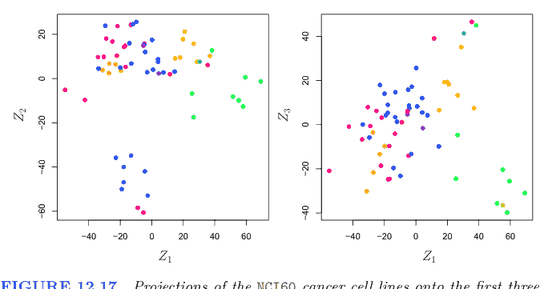

**图12.17.** *NCI60癌细胞系在前三个主成分上的投影（换句话说，前三个主成分的得分）。总体而言，属于单一癌症类型的观测值在这个低维空间中倾向于彼此靠近。如果不使用PCA等降维方法，就不可能可视化数据，因为基于完整数据集，有 $\binom{6,830}{2}$ 种可能的散点图，其中没有一个会特别有信息量。*

```python
ax.plot(ticks,
        nci_pca.explained_variance_ratio_,
        marker='o')
ax.set_xlabel('Principal Component');
ax.set_ylabel('PVE')
ax = axes[1]
ax.plot(ticks,
        nci_pca.explained_variance_ratio_.cumsum(),
        marker='o');
ax.set_xlabel('Principal Component')
ax.set_ylabel('Cumulative PVE');
```

结果图如图12.18所示。

我们看到，前七个主成分共同解释了数据中约40%的方差。这不是一个巨大的方差比例。然而，查看碎石图，我们看到虽然前七个主成分中的每一个都解释了大量的方差，但后续主成分解释的方差显著减少。也就是说，在大约第七个主成分之后，图中出现了一个*肘部*。这表明检查超过七个左右的主成分可能收益甚微（尽管即使检查七个主成分也可能很困难）。

### 对NCI60数据的观测值进行聚类

我们现在使用完全连接、单连接和平均连接对NCI60数据中的细胞系进行层次聚类。目标是再次找出观测值是否聚类成不同的癌症类型。使用欧几里得距离作为相异性度量。我们首先编写一个简短的函数来生成三个树状图。

## 12. 无监督学习

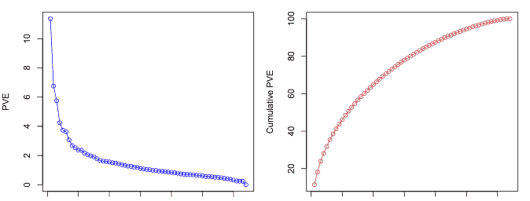

图 12.18. NCI60 癌细胞系微阵列数据集主成分的 PVE（解释方差比例）。左图：显示了每个主成分的 PVE。右图：显示了主成分的累积 PVE。所有主成分共同解释了 100% 的方差。

```python
def plot_nci(linkage, ax, cut=-np.inf):
    cargs = {'above_threshold_color':'black',
             'color_threshold':cut}
    hc = HClust(n_clusters=None,
                distance_threshold=0,
                linkage=linkage.lower()).fit(nci_scaled)
    linkage_ = compute_linkage(hc)
    dendrogram(linkage_,
               ax=ax,
               labels=np.asarray(nci_labs),
               leaf_font_size=10,
               **cargs)
    ax.set_title('%s Linkage' % linkage)
    return hc
```

让我们绘制结果。

```python
fig, axes = plt.subplots(3, 1, figsize=(15,30))
ax = axes[0]; hc_comp = plot_nci('Complete', ax)
ax = axes[1]; hc_avg = plot_nci('Average', ax)
ax = axes[2]; hc_sing = plot_nci('Single', ax)
```

结果如图 12.19 所示。我们看到，连接方式的选择确实会影响所得结果。通常，单连接倾向于产生拖尾的簇：非常大的簇，单个观测值逐一附着其上。另一方面，完全连接和平均连接倾向于产生更平衡、更具吸引力的簇。因此，通常更倾向于使用完全连接和平均连接，而非单连接。显然，单一癌症类型内的细胞系确实倾向于聚集在一起，尽管聚类并不完美。在接下来的分析中，我们将使用完全连接层次聚类。

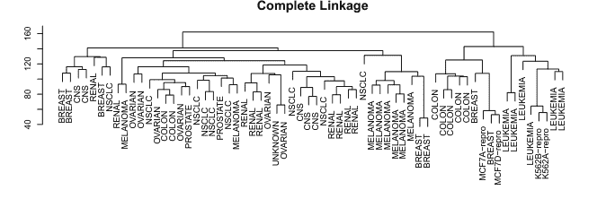

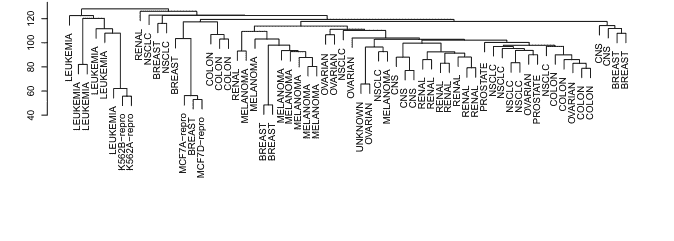

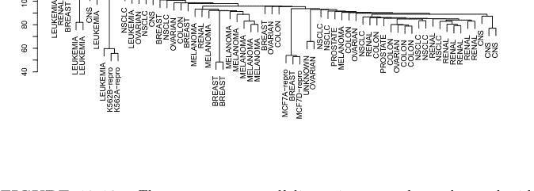

图 12.19. NCI60 癌细胞系微阵列数据，使用平均连接、完全连接和单连接进行聚类，并使用欧氏距离作为相异性度量。完全连接和平均连接倾向于产生大小均匀的簇，而单连接倾向于产生延伸的簇，单个叶子逐一融合其上。

我们可以在产生特定数量簇的高度切割树状图，例如四个：

```python
linkage_comp = compute_linkage(hc_comp)
comp_cut = cut_tree(linkage_comp, n_clusters=4).reshape(-1)
pd.crosstab(nci_labs['label'],
            pd.Series(comp_cut.reshape(-1), name='Complete'))
```

存在一些明显的模式。所有白血病细胞系都落在一个簇中，而乳腺癌细胞系则分散在三个不同的簇中。

我们可以在树状图上绘制一个切割线，以产生这四个簇：

```python
fig, ax = plt.subplots(figsize=(10,10))
plot_nci('Complete', ax, cut=140)
ax.axhline(140, c='r', linewidth=4);
```

`axhline()` 函数在任何现有坐标轴集之上绘制一条水平线。参数 `140` 在树状图的高度 140 处绘制一条水平线；这个高度会产生四个不同的簇。很容易验证，所得的簇与我们在 `comp_cut` 中获得的簇相同。

我们在第 12.4.2 节中早先声称，$K$-均值聚类和层次聚类（通过切割树状图以获得相同数量的簇）可能产生非常不同的结果。这些 NCI60 层次聚类结果与我们执行 $K = 4$ 的 $K$-均值聚类得到的结果相比如何？

```python
nci_kmeans = KMeans(n_clusters=4,
                    random_state=0,
                    n_init=20).fit(nci_scaled)
pd.crosstab(pd.Series(comp_cut, name='HClust'),
            pd.Series(nci_kmeans.labels_, name='K-means'))
```

Out[57]:
K-means    0  1  2  3
HClust
0         28  3  9  0
1          7  0  0  0
2          0  0  0  8
3          0  9  0  0

我们看到，使用层次聚类和 $K$-均值聚类获得的四个簇有些不同。首先我们注意到，两种聚类中的标签是任意的。也就是说，交换簇的标识符不会改变聚类。我们在这里看到，$K$-均值聚类中的簇 3 与层次聚类中的簇 2 相同。然而，其他簇不同：例如，$K$-均值聚类中的簇 0 包含了层次聚类分配给簇 0 的一部分观测值，以及层次聚类分配给簇 1 的所有观测值。

我们不必对整个数据矩阵执行层次聚类，也可以对前几个主成分得分向量执行层次聚类，将这些前几个成分视为数据的噪声较小版本。

```python
hc_pca = HClust(n_clusters=None,
                distance_threshold=0,
                linkage='complete'
                ).fit(nci_scores[:,:5])
linkage_pca = compute_linkage(hc_pca)
fig, ax = plt.subplots(figsize=(8,8))
dendrogram(linkage_pca,
           labels=np.asarray(nci_labs),
           leaf_font_size=10,
           ax=ax,
           **cargs)
ax.set_title("Hier. Clust. on First Five Score Vectors")
pca_labels = pd.Series(cut_tree(linkage_pca,
                                n_clusters=4).reshape(-1),
                        name='Complete-PCA')
pd.crosstab(nci_labs['label'], pca_labels)
```

## 12.6 练习题

### 概念题

1.  本题涉及 $K$-均值聚类算法。
    (a) 证明 (12.18)。
    (b) 基于此恒等式，论证 $K$-均值聚类算法（算法 12.2）在每次迭代中都会降低目标函数 (12.17)。

2.  假设我们有四个观测值，我们计算了一个相异性矩阵，如下所示
    $$
    \begin{bmatrix}
    & 0.3 & 0.4 & 0.7 \\
    0.3 & & 0.5 & 0.8 \\
    0.4 & 0.5 & & 0.45 \\
    0.7 & 0.8 & 0.45 &
    \end{bmatrix}
    $$
    例如，第一个和第二个观测值之间的相异性为 0.3，第二个和第四个观测值之间的相异性为 0.8。
    (a) 基于此相异性矩阵，绘制使用完全连接对这四个观测值进行层次聚类所产生的树状图。确保在图上标明每次融合发生的高度，以及树状图中每个叶子对应的观测值。
    (b) 重复 (a)，这次使用单连接聚类。
    (c) 假设我们切割 (a) 中获得的树状图，使得产生两个簇。每个簇中有哪些观测值？
    (d) 假设我们切割 (b) 中获得的树状图，使得产生两个簇。每个簇中有哪些观测值？


(e) 本章提到，在树状图的每次融合中，被融合的两个簇的位置可以互换，而不会改变树状图的含义。绘制一个与 (a) 中树状图等效的树状图，其中两个或更多叶子被重新定位，但树状图的含义相同。

3.  在本题中，你将手动执行 $K$-均值聚类，$K = 2$，在一个包含 $n = 6$ 个观测值和 $p = 2$ 个特征的小例子上。观测值如下。

| 观测值 | $X_1$ | $X_2$ |
|---|---|---|
| 1 | 1 | 4 |
| 2 | 1 | 3 |
| 3 | 0 | 4 |
| 4 | 5 | 1 |
| 5 | 6 | 2 |
| 6 | 4 | 0 |

(a) 绘制观测值。
(b) 随机为每个观测值分配一个簇标签。你可以使用 `np.random.choice()` 函数来完成此操作。报告每个观测值的簇标签。
(c) 计算每个簇的质心。
(d) 根据欧氏距离，将每个观测值分配给离它最近的质心。报告每个观测值的簇标签。
(e) 重复 (c) 和 (d)，直到所得答案停止变化。
(f) 在你 (a) 中的图中，根据获得的簇标签为观测值着色。

4.  假设对于一个特定的数据集，我们使用单连接和完全连接执行层次聚类。我们得到两个树状图。
    (a) 在单连接树状图的某个点，簇 {1, 2, 3} 和 {4, 5} 融合。在完全连接树状图上，簇 {1, 2, 3} 和 {4, 5} 也在某个点融合。哪个融合会发生在树的更高处，或者它们会在相同高度融合，或者没有足够的信息来判断？
    (b) 在单连接树状图的某个点，簇 {5} 和 {6} 融合。在完全连接树状图上，簇 {5} 和 {6} 也在某个点融合。哪个融合会发生在树的更高处，或者它们会在相同高度融合，或者没有足够的信息来判断？

5.  用文字描述，如果你基于图 12.16 中八位购物者的袜子和电脑购买情况，执行 $K = 2$ 的 $K$-均值聚类，你预期会得到什么结果。给出三个答案，分别对应显示的每种变量缩放。解释原因。

## 13
### 多重检验

迄今为止，本教材主要关注*估计*及其近亲*预测*。在本章中，我们将转向假设检验，这是进行*推断*的关键。我们提醒读者，推断在第2章中已简要讨论过。

虽然第13.1节简要回顾了零假设、*p*值、检验统计量以及假设检验中的其他关键概念，但本章假设读者此前已接触过这些主题。特别是，我们将不关注*为什么*或*如何*进行假设检验——这是一个可以（并且已经）写成整本书的话题！相反，我们将假设读者有兴趣检验某组特定的零假设，并且心中已有如何进行检验并获得*p*值的具体计划。

经典统计学的重点大多在于检验单个零假设，例如 $H_0$：*对照组小鼠的预期血压等于处理组小鼠的预期血压*。当然，我们可能希望发现两组的平均血压*确实*存在差异。但出于稍后将变得清晰的原因，我们构建了一个对应于无差异的零假设。

在当代背景下，我们经常面临海量数据，因此可能希望检验大量的零假设。例如，我们可能不想仅仅检验 $H_0$，而是想检验 $m$ 个零假设 $H_{01}, \ldots, H_{0m}$，其中 $H_{0j}$：*对照组小鼠中第 $j^{th}$ 个生物标志物的预期值等于处理组小鼠中第 $j^{th}$ 个生物标志物的预期值*。在进行*多重检验*时，我们需要非常小心如何解释结果，以避免错误地拒绝过多的零假设。

本章讨论了在大数据背景下进行多重检验的经典方法和更现代的方法。在第13.2节中，我们重点介绍了与多重检验相关的挑战。这些挑战的经典解决方案

6. 我们在第12.2.2节中看到，主成分载荷和得分向量在(12.5)式的意义上提供了矩阵的近似。具体来说，主成分得分和载荷向量求解(12.6)式中给出的优化问题。

现在，假设 $M$ 个主成分得分向量 $z_{im}$，$m = 1, \dots, M$ 是已知的。利用(12.6)式，解释如何通过执行 $p$ 个独立的最小二乘线性回归来获得前 $M$ 个主成分载荷向量 $\phi_{jm}$，$m = 1, \dots, M$ 中的每一个。在每个回归中，主成分得分向量是预测变量，而数据矩阵的其中一个特征是响应变量。

## 应用

7. 在本章中，我们提到了使用基于相关性的距离和欧几里得距离作为层次聚类的不相似性度量。事实证明，这两种度量几乎是等价的：如果每个观测值已被中心化为均值为零、标准差为一，并且我们用 $r_{ij}$ 表示第 $i$ 个和第 $j$ 个观测值之间的相关性，那么量 $1 - r_{ij}$ 与第 $i$ 个和第 $j$ 个观测值之间的欧几里得距离的平方成正比。

在 `USArrests` 数据上，证明这种比例关系成立。

> 提示：欧几里得距离可以使用 `sklearn.metrics` 模块中的 `pairwise_distances()` 函数计算，相关性可以使用 `np.corrcoef()` 函数计算。

8. 在第12.2.3节中，给出了计算PVE的公式，即公式12.10。我们还看到，PVE可以使用拟合的 `PCA()` 估计器的 `explained_variance_ratio_` 属性获得。

在 `USArrests` 数据上，用两种方式计算PVE：

- (a) 使用拟合的 `PCA()` 估计器的 `explained_variance_ratio_` 输出，如第12.2.3节所示。
- (b) 直接应用公式12.10。载荷存储为拟合的 `PCA()` 估计器的 `components_` 属性。在公式12.10中使用这些载荷来获得PVE。

这两种方法应该给出相同的结果。

> 提示：只有在两种情况下使用相同的数据，(a)和(b)才会得到相同的结果。例如，如果在(a)中你使用了中心化和标准化的变量执行了 `PCA()`，那么在(b)中应用公式12.10之前，你也必须对变量进行中心化和标准化。

9. 考虑 `USArrests` 数据。我们现在将对各州进行层次聚类。

- (a) 使用完全连接法和欧几里得距离进行层次聚类，对各州进行聚类。
- (b) 在产生三个不同簇的高度处切割树状图。哪些州属于哪个簇？
- (c) 在*将变量标准化为标准差为一之后*，使用完全连接法和欧几里得距离对各州进行层次聚类。
- (d) 变量标准化对所得的层次聚类有什么影响？在你看来，在计算观测间不相似性之前是否应该对变量进行标准化？请为你的答案提供理由。

10. 在这个问题中，你将生成模拟数据，然后对数据执行PCA和*K*-均值聚类。

- (a) 生成一个模拟数据集，包含三个类别（即总共60个观测值）中每个类别20个观测值，以及50个变量。
  *提示：Python中有许多函数可用于生成数据。一个例子是numpy中random()函数的normal()方法；uniform()方法是另一个选择。确保为每个类别中的观测值添加均值偏移，以便存在三个不同的类别。*
- (b) 对60个观测值执行PCA，并绘制前两个主成分得分向量。使用不同的颜色表示三个类别中的观测值。如果这三个类别在此图中看起来是分离的，则继续进行(c)部分。如果不是，则返回(a)部分并修改模拟，使三个类别之间有更大的分离。在前两个主成分得分向量中三个类别至少显示出一些分离之前，不要继续进行(c)部分。
- (c) 对观测值执行 *K* = 3 的 *K*-均值聚类。你在 *K*-均值聚类中获得的簇与真实类别标签相比如何？
  *提示：你可以使用Python中的pd.crosstab()函数来比较真实类别标签和聚类获得的类别标签。注意如何解释结果：K-均值聚类会任意地为簇编号，因此你不能简单地检查真实类别标签和聚类标签是否相同。*
- (d) 执行 *K* = 2 的 *K*-均值聚类。描述你的结果。
- (e) 现在执行 *K* = 4 的 *K*-均值聚类，并描述你的结果。
- (f) 现在对前两个主成分得分向量执行 *K* = 3 的 *K*-均值聚类，而不是对原始数据执行。也就是说，对60 × 2矩阵执行 *K*-均值聚类，其中第一列是第一个主成分得分向量，第二列是第二个主成分得分向量。评论结果。
- (g) 使用StandardScaler()估计器，在*将每个变量标准化为标准差为一之后*对数据执行 *K* = 3 的 *K*-均值聚类。这些结果与(b)中获得的结果相比如何？解释原因。

11. 编写一个Python函数来执行矩阵补全，如算法12.1和第12.5.2节所述。在每次迭代中，该函数应跟踪相对误差以及迭代次数。迭代应持续进行，直到相对误差足够小或达到某个最大迭代次数（为此最大次数设置一个默认值）。此外，应有一个选项可以打印每次迭代的进度。

在Boston数据上测试你的函数。首先，使用StandardScaler()函数将特征标准化为均值为零、标准差为一。运行一个实验，你随机地从5%到30%，以5%为步长，逐步（且嵌套地）留出越来越多的观测值。应用算法12.1，其中 $M = 1, 2, \dots, 8$。显示近似误差作为缺失观测值比例和 $M$ 值的函数，在实验重复10次后取平均值。

12. 在第12.5.2节中，算法12.1是使用np.linalg模块中的svd()函数实现的。然而，考虑到svd()函数与PCA()估计器之间的联系（如实验中所强调的），我们本可以改用PCA()来实现该算法。

编写一个函数来实现算法12.1，该函数使用PCA()而不是svd()。

13. 在本书网站www.statlearning.com上，有一个基因表达数据集（Ch12Ex13.csv），包含40个组织样本，对1,000个基因进行了测量。前20个样本来自健康患者，后20个样本来自患病组。

- (a) 使用pd.read_csv()加载数据。你需要选择header = None。
- (b) 使用基于相关性的距离对样本应用层次聚类，并绘制树状图。基因是否将样本分成两组？你的结果是否取决于所使用的连接类型？
- (c) 你的合作者想知道哪些基因在两组之间差异最大。建议一种回答这个问题的方法，并在此处应用它。

挑战在第13.3节中提出，而更多当代解决方案则在第13.4节和第13.5节中讨论。

特别是，第13.4节聚焦于错误发现率。错误发现率的概念可追溯至1990年代。它在2000年代初迅速流行起来，当时大规模数据集开始从基因组学领域涌现。这些数据集的独特之处不仅在于其庞大的规模¹，还在于它们通常是出于*探索性*目的而收集的：研究人员收集这些数据集是为了检验大量的零假设，而不仅仅是少数几个预先指定的零假设。当然，如今在几乎所有领域，都在收集没有预先指定零假设的海量数据集。正如我们将看到的，错误发现率非常适合这种现代现实。

本章自然以经典的统计技术——*p*值为中心，该技术用于量化假设检验的结果。在撰写本书时（2020年），*p*值最近成为社会科学界广泛评论的话题，以至于一些社会科学期刊甚至完全禁止使用*p*值！我们只想指出，当被正确理解和应用时，*p*值为从数据中得出推断性结论提供了强大的工具。

### 13.1 假设检验快速回顾

假设检验为回答关于数据的简单“是或否”问题提供了一个严谨的统计框架，例如以下问题：

- 1. 在$Y$对$X_1, \dots, X_p$的线性回归中，真实系数$\beta_j$是否等于零？²
- 2. 实验室小鼠在对照组和治疗组中的预期血压是否存在差异？³

在第13.1.1节中，我们简要回顾了假设检验所涉及的步骤。第13.1.2节讨论了假设检验中可能出现的不同类型的错误。

### 13.1.1 检验一个假设

进行假设检验通常包括四个步骤。首先，我们定义零假设和备择假设。接下来，我们构建一个检验统计量，以总结反对零假设的证据强度。然后，我们计算一个*p*值，该值量化了在零假设下获得与观测统计量相当或更极端值的概率。最后，基于$p$值，我们决定是否拒绝零假设。我们现在依次简要讨论这些步骤中的每一步。

#### 步骤1：定义零假设和备择假设

在假设检验中，我们将世界分为两种可能性：*零假设*和*备择假设*。零假设，记为$H_0$，是关于世界的默认信念状态。⁴ 例如，与本章前面提出的两个问题相关的零假设如下：

- 1. 在$Y$对$X_1, \dots, X_p$的线性回归中，真实系数$\beta_j$等于零。
- 2. 对照组和治疗组小鼠的预期血压之间没有差异。

零假设在设计上是乏味的：它很可能是真的，但我们可能希望我们的数据会告诉我们相反的情况。
备择假设，记为$H_a$，代表一些不同且意想不到的事情：例如，两组小鼠的预期血压*确实*存在差异。通常，备择假设只是假设零假设不成立：如果零假设指出*$A$和$B$之间没有差异*，那么备择假设就指出*$A$和$B$之间存在差异*。

需要注意的是，对$H_0$和$H_a$的处理是不对称的。$H_0$被视为世界的默认状态，我们专注于使用数据来拒绝$H_0$。如果我们拒绝$H_0$，那么这就提供了支持$H_a$的证据。我们可以将拒绝$H_0$视为对我们的数据做出了一个*发现*：即我们发现$H_0$不成立！相比之下，如果我们未能拒绝$H_0$，那么我们的发现就更加模糊：我们不知道未能拒绝$H_0$是因为我们的样本量太小（在这种情况下，在更大或更高质量的数据集上再次检验$H_0$可能会导致拒绝），还是因为我们未能拒绝$H_0$是因为$H_0$确实成立。

#### 步骤2：构建检验统计量

接下来，我们希望利用我们的数据来寻找支持或反对零假设的证据。为此，我们必须计算一个*检验统计量*，记为$T$，它总结了我们的数据与$H_0$一致的程度。我们构建$T$的方式取决于我们正在检验的零假设的性质。

为了具体说明，令$x_1^t, \dots, x_{n_t}^t$表示治疗组$n_t$只小鼠的血压测量值，令$x_1^c, \dots, x_{n_c}^c$表示对照组$n_c$只小鼠的血压测量值，并令$\mu_t = \mathrm{E}(X^t)$，$\mu_c = \mathrm{E}(X^c)$。为了检验$H_0 : \mu_t = \mu_c$，我们使用一个*双样本$t$统计量*⁵，定义为

$$T = \frac{\hat{\mu}_t - \hat{\mu}_c}{s \sqrt{\frac{1}{n_t} + \frac{1}{n_c}}}$$ (13.1)

其中$\hat{\mu}_t = \frac{1}{n_t} \sum_{i=1}^{n_t} x_i^t$，$\hat{\mu}_c = \frac{1}{n_c} \sum_{i=1}^{n_c} x_i^c$，并且

$$s = \sqrt{\frac{(n_t - 1)s_t^2 + (n_c - 1)s_c^2}{n_t + n_c - 2}}$$ (13.2)

是两个样本合并标准差的一个估计量。⁶ 这里，$s_t^2$和$s_c^2$分别是治疗组和对照组血压方差的无偏估计量。$T$的（绝对）值越大，就越能提供反对$H_0 : \mu_t = \mu_c$的证据，从而支持$H_a : \mu_t \neq \mu_c$。

#### 步骤3：计算$p$值

在上一节中，我们注意到双样本$t$统计量的（绝对）值越大，就越能提供反对$H_0$的证据。这就引出了一个问题：*多大才算大*？换句话说，一个给定的检验统计量值提供了多少反对$H_0$的证据？

$p$值的概念为我们提供了一种形式化并回答这个问题的方法。$p$值定义为在*假设$H_0$确实成立*的情况下，观察到等于或比观测统计量更极端的检验统计量的概率。因此，一个小的$p$值提供了*反对*$H_0$的证据。

为了具体说明，假设检验统计量(13.1)的$T = 2.33$。那么，我们可以问：如果$H_0$确实成立，观察到如此大的$T$值的概率是多少？事实证明，在$H_0$下，(13.1)中$T$的分布近似服从$N(0, 1)$分布⁷——即均值为0、方差为1的正态分布。该分布如图13.1所示。我们看到，$N(0, 1)$分布的绝大多数——98%——落在$-2.33$和$2.33$之间。这意味着在$H_0$下，我们预期只有2%的时间会看到如此大的$|T|$值。因此，对应于$T = 2.33$的$p$值是0.02。

检验统计量在$H_0$下的分布（也称为检验统计量的*零分布*）将取决于正在检验的零假设类型以及所使用的检验统计量类型的具体细节。通常，大多数常用的检验统计量在零假设下遵循一个众所周知的统计分布——例如正态分布、$t$分布、$\chi^2$分布或$F$分布——前提是样本量足够大并且其他一些假设成立。通常，用于计算检验统计量的R函数将利用这个零分布来输出$p$值。在第13.5节中，我们将看到一种使用重采样来估计检验统计量零分布的方法；在许多当代环境中，这是一个非常有吸引力的选择，因为它利用了快速计算机的可用性，从而避免了对数据做出可能有问题的假设。

$p$值可能是整个统计学中使用最多、也最被滥用的概念之一。特别是，有时会说$p$值是$H_0$成立的概率，即零假设为真的概率。这是不正确的！$p$值唯一正确的解释是：如果我们重复实验很多很多次，*在$H_0$成立的前提下*，我们预期会看到如此极端的检验统计量值的比例。⁸

在步骤2中，我们计算了一个检验统计量，并注意到检验统计量的（绝对）值越大，就越能提供反对$H_0$的证据。在步骤3中，检验统计量被转换为$p$值，小的$p$值提供反对$H_0$的证据。那么，通过将步骤2中的检验统计量转换为步骤3中的$p$值，我们实现了什么呢？要回答这个问题，假设一位数据分析师进行了一次统计检验，并报告了一个检验统计量$T = 17.3$。这是否提供了反对$H_0$的有力证据？没有更多信息是不可能知道的：特别是，我们需要知道

---

¹ 微阵列数据在当时被视为“大数据”，但以今天的标准来看，这个标签似乎有些过时：一个微阵列数据集可以（并且通常是）存储在Microsoft Excel电子表格中！
² 这个假设检验在第3章第76页讨论过。
³ “治疗组”指接受实验性治疗的小鼠集合，“对照组”指未接受治疗的小鼠。
⁴ 零假设有时也被称为“现状”假设。
⁵ $t$统计量得名于在$H_0$下它服从$t$分布。
⁶ 注意(13.2)假设对照组和治疗组具有相等的方差。如果没有这个假设，(13.2)的形式会略有不同。
⁷ 更准确地说，假设观测值来自正态分布，那么$T$服从自由度为$n_t + n_c - 2$的$t$分布。只要$n_t + n_c - 2$大于40左右，这就可以用$N(0, 1)$分布很好地近似。在第13.5节中，我们将看到一种替代且通常更有吸引力的方法来近似$T$的零分布，它避免了对数据做出严格的假设。
⁸ *单侧*$p$值是看到如此极端的检验统计量值的概率；例如，看到检验统计量大于或等于$T = 2.33$的概率。*双侧*$p$值是看到如此极端的*绝对*检验统计量值的概率；例如，看到检验统计量大于或等于2.33或小于或等于$-2.33$的概率。默认建议是报告双侧$p$值而不是单侧$p$值，除非有明确且令人信服的理由表明只有检验统计量的一个方向具有科学意义。

| | 真实情况 | |
|---|---|---|
| 决策 | $H_0$ | $H_a$ |
| 拒绝 $H_0$ | 第一类错误 | 正确 |
| 不拒绝 $H_0$ | 正确 | 第二类错误 |

表 13.1. 与检验原假设 $H_0$ 相关的可能情景总结。第一类错误也称为假阳性，第二类错误称为假阴性。

在 $H_0$ 成立的条件下，我们期望检验统计量取到什么值？这正是 $p$ 值所告诉我们的。换句话说，$p$ 值使我们能够将检验统计量（它是在某个任意且难以解释的尺度上测量的）转换为一个介于 0 和 1 之间的、更容易解释的数值。

## 步骤 4：决定是否拒绝原假设

一旦我们计算出了与 $H_0$ 对应的 $p$ 值，接下来就需要决定是否拒绝 $H_0$。（我们通常不谈论“接受” $H_0$：而是谈论“未能拒绝” $H_0$。）较小的 $p$ 值表明，在 $H_0$ 成立的条件下，如此大的检验统计量值不太可能出现，从而提供了反对 $H_0$ 的证据。如果 $p$ 值足够小，那么我们就会想要拒绝 $H_0$（从而做出一项“发现”）。但是，多小才算足够小以拒绝 $H_0$ 呢？

事实证明，这个问题的答案在很大程度上取决于观察者，或者更具体地说，取决于数据分析者的判断。$p$ 值越小，反对 $H_0$ 的证据就越强。在某些领域，如果 $p$ 值低于 0.05，通常就会拒绝 $H_0$；这意味着，如果 $H_0$ 成立，我们预期看到如此小的 $p$ 值的概率不超过 5%。然而，在其他领域，需要更高的证明标准：例如，在物理学的某些领域，通常只有当 $p$ 值低于 $10^{-9}$ 时才会拒绝 $H_0$！

在图 13.1 所示的例子中，如果我们使用 0.05 作为拒绝原假设的阈值，那么我们将拒绝原假设。相反，如果我们使用 0.01 的阈值，那么我们将未能拒绝原假设。这些概念将在下一节中形式化。

## 13.1.2 第一类错误和第二类错误

如果原假设成立，那么我们称其为*真原假设*；否则，它是一个*假原假设*。例如，如果我们像第 13.1.1 节那样检验 $H_0: \mu_t = \mu_c$，并且治疗组小鼠和对照组小鼠的*总体*平均血压确实没有差异，那么 $H_0$ 为真；否则，它为假。当然，我们*先验地*并不知道 $H_0$ 是真还是假：这就是为什么我们需要进行假设检验！

- 真原假设
- 假原假设

> $^9$尽管在某些科学领域，使用 0.05 的阈值来拒绝 $H_0$ 很普遍，但我们建议不要盲目坚持这个武断的选择。此外，数据分析者通常应该报告 $p$ 值本身，而不仅仅是它是否超过某个指定的阈值。

表 13.1 总结了与检验原假设 $H_0$ 相关的可能情景。<sup>10</sup> 一旦执行了假设检验，表格的*行*是已知的（基于我们是否拒绝了 $H_0$）；然而，我们无法知道我们处于哪个*列*。如果我们在 $H_0$ 为假时（即 $H_a$ 为真时）拒绝了 $H_0$，或者在 $H_0$ 为真时没有拒绝 $H_0$，那么我们就得出了正确的结果。然而，如果我们在 $H_0$ 实际上为真时错误地拒绝了 $H_0$，那么我们就犯了*第一类错误*。*第一类错误率*定义为在 $H_0$ 成立的条件下犯第一类错误的概率，即错误地拒绝 $H_0$ 的概率。或者，如果我们在 $H_0$ 实际上为假时没有拒绝 $H_0$，那么我们就犯了*第二类错误*。假设检验的*功效*定义为在 $H_a$ 成立的条件下不犯第二类错误的概率，即正确地拒绝 $H_0$ 的概率。

理想情况下，我们希望第一类和第二类错误率都很小。但在实践中，这很难实现！通常存在一种权衡：我们可以通过只在相当确定 $H_0$ 不成立时才拒绝它来使第一类错误变小；然而，这将导致第二类错误增加。或者，我们可以通过在有哪怕微弱证据表明 $H_0$ 不成立时就拒绝它来使第二类错误变小，但这将导致第一类错误变大。在实践中，我们通常认为第一类错误比第二类错误更“严重”，因为前者涉及宣布一个不正确的科学发现。因此，当我们进行假设检验时，我们通常要求较低的第一类错误率——例如，最多 $\alpha = 0.05$——同时试图使第二类错误变小（或者等效地，使功效变大）。

事实证明，导致我们拒绝 $H_0$ 的 *p* 值阈值与第一类错误率之间存在直接对应关系。只有当 *p* 值低于 $\alpha$ 时才拒绝 $H_0$，我们就能确保第一类错误率小于或等于 $\alpha$。

## 13.2 多重检验的挑战

在上一节中，我们看到，如果 *p* 值低于（比如）0.01 就拒绝 $H_0$，为我们提供了一种简单的方法来将 $H_0$ 的第一类错误控制在 0.01 的水平：如果 $H_0$ 为真，那么我们拒绝它的概率不超过 1%。但现在假设我们希望检验 $m$ 个原假设，$H_{01}, \ldots, H_{0m}$。简单地拒绝所有对应 *p* 值低于（比如）0.01 的原假设是否可行？换句话说，如果我们拒绝所有 *p* 值低于 0.01 的原假设，那么我们应该预期犯多少个第一类错误？

作为回答这个问题的*第一步*，考虑一位股票经纪人，她希望通过说服潜在客户相信她的交易技巧来招揽新客户。她告诉 1,024 (1,024 = 2^{10}) 位潜在新客户，她能够连续 10 天正确预测苹果公司股价是上涨还是下跌。在这 10 天内，苹果公司股价的变化有 2^{10} 种可能性。因此，她给每位客户发送了这些可能性中的一种。她的绝大多数潜在客户会发现，这位股票经纪人的预测并不比随机猜测好（许多人甚至会发现它们比随机猜测更糟）。但是，一个坏掉的钟一天也能对两次，她的一位潜在客户会非常惊讶地发现，她的预测在所有 10 天里都是正确的！于是，这位股票经纪人赢得了一位新客户。

这里发生了什么？这位股票经纪人对苹果公司股价是涨是跌有任何实际的洞察力吗？没有。那么，她是如何连续 10 天完美预测苹果公司股价的呢？答案是她做了很多猜测，而其中一个碰巧完全正确。

这与多重检验有什么关系？假设我们抛掷 1,024 枚公平硬币^{11}，每枚抛十次。那么我们预期（平均而言）有一枚硬币会全部出现反面。（任何一枚硬币全部出现反面的概率是 1/2^{10} = 1/1,024。所以如果我们抛 1,024 枚硬币，那么平均而言我们预期有一枚硬币会全部出现反面。）如果我们的硬币中有一枚全部出现反面，那么我们可能会因此得出结论，认为这枚特定的硬币不公平。事实上，针对这枚特定硬币公平性的标准原假设检验会导致 p 值低于 0.002！^{12} 但得出硬币不公平的结论是错误的：事实上，原假设成立，我们只是碰巧连续得到了十次反面。

这些例子说明了*多重检验*的主要挑战：当检验大量的原假设时，我们必然会因为偶然性而得到一些非常小的 p 值。如果我们决定是否拒绝每个原假设时，没有考虑到我们已经进行了非常大量的检验这一事实，那么我们最终可能会拒绝许多真的原假设——也就是说，犯大量的第一类错误。

这个问题有多严重？回顾上一节，如果我们拒绝一个单一的原假设 H_0，如果其 p 值小于，比如 α = 0.01，那么如果 H_0 实际上为真，就有 1% 的错误拒绝机会。现在，如果我们检验 m 个原假设，H_{01}, ..., H_{0m}，它们全部为真呢？拒绝任何单个原假设有 1% 的机会；因此，我们预期会错误地拒绝大约 0.01 × m 个原假设。如果 m = 10,000，那就意味着我们预期会因为偶然性而错误地拒绝 100 个原假设！这是*很多*第一类错误。

问题的关键如下：如果 p 值低于 α 就拒绝原假设，可以将错误拒绝*该原假设*的概率控制在 α 水平。然而，如果我们对 m 个原假设都这样做，那么错误拒绝*至少一个原假设*的概率就会高得多！

^{11} *公平硬币*是指正面或反面出现机会均等的硬币。
^{12} 回想一下，p 值是在原假设成立的条件下，观察到至少如此极端数据的概率。如果硬币是公平的，那么观察到至少十次反面的概率是 (1/2)^{10} = 1/1,024 < 0.001。因此 p 值是 2/1,024 < 0.002，因为这是观察到十次正面或十次反面的概率。

| | $H_0$ 为真 | $H_0$ 为假 | 总计 |
|---|---|---|---|
| 拒绝 $H_0$ | $V$ | $S$ | $R$ |
| 不拒绝 $H_0$ | $U$ | $W$ | $m - R$ |
| 总计 | $m_0$ | $m - m_0$ | $m$ |

表 13.2. 检验 $m$ 个原假设的结果总结。给定的原假设要么为真，要么为假，而对该原假设的检验要么拒绝它，要么未能拒绝它。在实践中，$V$、$S$、$U$ 和 $W$ 的具体值是未知的。然而，我们确实可以知道 $V + S = R$ 和 $U + W = m - R$，它们分别是被拒绝和未被拒绝的原假设的数量。

我们将在第 13.3 节中更详细地探讨这个问题，并提出解决方案。

## 13.3 家族-wise 错误率

在接下来的几节中，我们将讨论在控制至少犯一次第一类错误概率的同时，进行多重假设检验的问题。

### 13.3.1 什么是家族-wise 错误率？

回顾一下，第一类错误率是在 $H_0$ 为真时拒绝 $H_0$ 的概率。*家族-wise 错误率*（FWER）将这一概念推广到 $m$ 个原假设 $H_{01}, \dots, H_{0m}$ 的情形，并被定义为犯*至少一次*第一类错误的概率。为了更正式地陈述这个想法，请考虑表 13.2，它总结了执行 $m$ 个假设检验时可能的结果。这里，$V$ 代表第一类错误的数量（也称为假阳性或假发现），$S$ 代表真阳性的数量，$U$ 代表真阴性的数量，$W$ 代表第二类错误的数量（也称为假阴性）。那么家族-wise 错误率由下式给出

$$\text{FWER} = \Pr(V \geq 1). \tag{13.3}$$

一种拒绝任何 $p$-值低于 $\alpha$ 的原假设的策略（即，将每个原假设的第一类错误控制在 $\alpha$ 水平）会导致 FWER 为

$$\begin{aligned}
\text{FWER}(\alpha) &= 1 - \Pr(V = 0) \\
&= 1 - \Pr(\text{未错误地拒绝任何原假设}) \\
&= 1 - \Pr\left(\bigcap_{j=1}^m \{\text{未错误地拒绝 } H_{0j}\}\right). \tag{13.4}
\end{aligned}$$

根据基本概率论，如果两个事件 $A$ 和 $B$ 是独立的，那么 $\Pr(A \cap B) = \Pr(A) \Pr(B)$。因此，如果我们做出额外的、相当强的假设，即 $m$ 个检验是独立的，并且所有 $m$ 个原假设都为真，那么

$$\text{FWER}(\alpha) = 1 - \prod_{j=1}^m (1 - \alpha) = 1 - (1 - \alpha)^m. \tag{13.5}$$

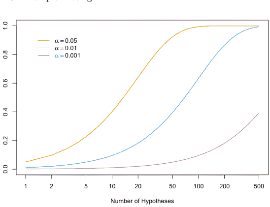

**图 13.2.** 家族-wise 错误率作为检验假设数量（以对数尺度显示）的函数，对应于三个 $\alpha$ 值：$\alpha = 0.05$（橙色）、$\alpha = 0.01$（蓝色）和 $\alpha = 0.001$（紫色）。虚线表示 0.05。例如，为了在检验 $m = 50$ 个原假设时将 FWER 控制在 0.05，我们必须将每个原假设的第一类错误控制在 $\alpha = 0.001$ 的水平。

因此，如果我们只检验一个原假设，那么 FWER($\alpha$) = $1 - (1 - \alpha)^1 = \alpha$，所以第一类错误率和 FWER 是相等的。然而，如果我们进行 $m = 100$ 个独立检验，那么 FWER($\alpha$) = $1 - (1 - \alpha)^{100}$。例如，取 $\alpha = 0.05$ 会导致 FWER 为 $1 - (1 - 0.05)^{100} = 0.994$。换句话说，我们几乎肯定会犯至少一次第一类错误！

图 **13.2** 显示了 (13.5) 式对于不同数量的假设 $m$ 和第一类错误 $\alpha$ 的值。我们看到，即使对于中等大小的 $m$，设置 $\alpha = 0.05$ 也会导致较高的 FWER。当 $\alpha = 0.01$ 时，在 FWER 超过 0.05 之前，我们最多只能检验五个原假设。只有对于非常小的值，例如 $\alpha = 0.001$，我们才能确保 FWER 较小，至少对于中等规模的 $m$ 是如此。

我们现在简要回顾一下第 **13.1.1** 节中的例子，其中我们考虑使用双样本 $t$-统计量检验形式为 $H_0 : \mu_l = \mu_c$ 的单个原假设。回顾图 **13.1**，为了保证第一类错误不超过 0.02，我们使用 2.33 的临界点来决定是否拒绝 $H_0$（即，如果 $|T| \geq 2.33$，我们拒绝 $H_0$）。现在，如果我们希望使用双样本 $t$-统计量检验 10 个原假设，而不是仅仅一个呢？我们将在第 **13.3.2** 节中看到，通过仅拒绝 $p$-值低于 0.002 的原假设，我们可以保证 FWER 不超过 0.02。这对应于一个严格得多的临界点 3.09（即，对于 $j = 1, \dots, 10$，我们应仅在其检验统计量 $|T_j| \geq 3.09$ 时拒绝 $H_{0j}$）。换句话说，将 FWER 控制在 $\alpha$ 水平，意味着在拒绝任何给定原假设所需的证据方面，比仅仅将每个原假设的第一类错误控制在 $\alpha$ 水平要高得多。

| 经理 | 均值, $\bar{x}$ | 标准差, $s$ | $t$-统计量 | $p$-值 |
| :--- | :--- | :--- | :--- | :--- |
| 一 | 3.0 | 7.4 | 2.86 | 0.006 |
| 二 | -0.1 | 6.9 | -0.10 | 0.918 |
| 三 | 2.8 | 7.5 | 2.62 | 0.012 |
| 四 | 0.5 | 6.7 | 0.53 | 0.601 |
| 五 | 0.3 | 6.8 | 0.31 | 0.756 |

表 13.3. 前两列对应于基金数据集中前五位经理在 $n = 50$ 个月内的超额收益率的样本均值和样本标准差。最后两列提供了检验 $H_{0j} : \mu_j = 0$（即第 $j$ 个对冲基金经理的（总体）平均收益率为零的原假设）的 $t$-统计量（$\sqrt{n} \cdot \bar{X}/S$）和相关的 $p$-值。

### 13.3.2 控制家族-wise 错误率的方法

在本节中，我们简要概述一些控制 FWER 的方法。我们将在基金数据集上说明这些方法，该数据集记录了 2,000 名基金经理在 $n = 50$ 个月内的月度百分比超额收益。13 表 13.3 提供了前五位经理的相关汇总统计信息。

我们首先介绍 Bonferroni 方法和 Holm 的逐步下降程序，它们是控制 FWER 的非常通用的方法，只要计算了 $m$ 个 $p$-值，无论原假设的形式、检验统计量的选择或 $p$-值的（不）独立性如何，都可以应用。然后我们简要讨论 Tukey 方法和 Scheffé 方法，以说明在某些情况下，更专门的控制 FWER 的方法可能更可取。

## Bonferroni 方法

与上一节一样，假设我们希望检验 $H_{01}, \ldots, H_{0m}$。令 $A_j$ 表示我们在第 $j$ 个原假设上犯第一类错误的事件，其中 $j = 1, \ldots, m$。那么

$$\begin{aligned}
\text{FWER} &= \text{Pr(错误地拒绝至少一个原假设)} \\
&= \text{Pr}(\cup_{j=1}^m A_j) \\
&\leq \sum_{j=1}^m \text{Pr}(A_j). \tag{13.6}
\end{aligned}$$

在 (13.6) 中，不等式源于这样一个事实：对于任意两个事件 $A$ 和 $B$，无论 $A$ 和 $B$ 是否独立，都有 $\text{Pr}(A \cup B) \leq \text{Pr}(A) + \text{Pr}(B)$。*Bonferroni 方法*，或 *Bonferroni 校正*，将每个假设检验的拒绝阈值设置为 $\alpha/m$，使得 $\text{Pr}(A_j) \leq \alpha/m$。方程 13.6 意味着

$$\text{FWER}(\alpha/m) \leq m \times \frac{\alpha}{m} = \alpha, \tag{13.7}$$

因此该程序将 FWER 控制在 $\alpha$ 水平。例如，为了在检验 $m = 100$ 个原假设时将 FWER 控制在 0.1 水平，Bonferroni 程序要求我们将每个原假设的第一类错误控制在 $0.1/100 = 0.001$ 的水平，即拒绝所有 $p$-值低于 0.001 的原假设。

我们现在考虑表 13.3 中的基金数据集。如果我们将每个基金经理的第一类错误分别控制在 $\alpha = 0.05$ 的水平，那么我们将得出结论：第一位和第三位经理的超额收益显著不为零；换句话说，我们将拒绝 $H_{01} : \mu_1 = 0$ 和 $H_{03} : \mu_3 = 0$。然而，如前面章节所讨论的，该程序没有考虑到我们已经检验了多个假设，因此它将导致 FWER 大于 0.05。如果我们希望将 FWER 控制在 0.05 水平，那么使用 Bonferroni 校正，我们必须将每个单独经理的第一类错误控制在 $\alpha/m = 0.05/5 = 0.01$ 的水平。因此，我们将仅拒绝第一位经理的原假设，因为所有其他经理的 $p$-值都超过 0.01。Bonferroni 校正让我们放心，我们没有错误地拒绝太多原假设，但代价是：我们拒绝的原假设很少，因此通常会犯相当多的第二类错误。

Bonferroni 校正是迄今为止所有统计学中最著名、最常用的多重性校正方法。它的普遍性很大程度上归功于它非常易于理解且实现简单，同时也因为它成功地控制了第一类错误，无论 $m$ 个假设检验是否独立。然而，正如我们将看到的，它通常既不是最有效的，也不是多重检验校正的最佳方法。特别是，Bonferroni 校正可能相当保守，其真实 FWER 通常远低于名义（或目标）FWER；这源于 (13.6) 中的不等式。相比之下，一个不那么保守的程序可能允许我们在拒绝更多原假设的同时控制 FWER，从而减少第二类错误。

## Holm 的逐步下降程序

*Holm 方法*，也称为 Holm 逐步下降程序或 Holm-Bonferroni 方法，是 Bonferroni 程序的一种替代方案。Holm 方法控制 FWER，但它比 Bonferroni 不那么保守，因为它会拒绝更多的原假设，通常导致更少的第二类错误，从而具有更高的功效。该程序在算法 13.1 中进行了总结。证明该方法控制 FWER 的过程类似于 (13.6) 中 Bonferroni 方法控制 FWER 的论证，但稍微复杂一些。值得注意的是，在 Holm 程序中，我们用于拒绝每个原假设的阈值——第 5 步中的 $p_{(L)}$——实际上取决于*所有* $m$ 个 $p$-值的值。（参见 (13.7) 中 $L$ 的定义。）这与 Bonferroni 程序形成对比，在 Bonferroni 程序中，为了将 FWER 控制在 $\alpha$ 水平，我们拒绝任何 $p$-值低于 $\alpha/m$ 的原假设，而不考虑其他 $p$-值。Holm 方法对 $m$ 个假设检验没有独立性假设，并且在功效上一致优于 Bonferroni 方法——它将

## 算法 13.1 控制 FWER 的 Holm 逐步下降程序

1.  指定 $\alpha$，即控制 FWER 的水平。
2.  计算 $m$ 个原假设 $H_{01}, \dots, H_{0m}$ 的 $p$ 值，$p_1, \dots, p_m$。
3.  将 $m$ 个 $p$ 值排序，使得 $p_{(1)} \le p_{(2)} \le \dots \le p_{(m)}$。
4.  定义
    $$L = \min \left\{ j : p_{(j)} > \frac{\alpha}{m + 1 - j} \right\}.$$
5.  拒绝所有满足 $p_j < p_{(L)}$ 的原假设 $H_{0j}$。

该方法拒绝的原假设数量总是不少于 Bonferroni 方法——因此应始终优先考虑。

我们现在考虑将 Holm 方法应用于表 13.3 中基金数据集的前五位基金经理，同时将 FWER 控制在 0.05 水平。排序后的 $p$ 值为 $p_{(1)} = 0.006, p_{(2)} = 0.012, p_{(3)} = 0.601, p_{(4)} = 0.756$ 和 $p_{(5)} = 0.918$。Holm 程序拒绝了前两个原假设，因为 $p_{(1)} = 0.006 < 0.05/(5 + 1 - 1) = 0.01$ 且 $p_{(2)} = 0.012 < 0.05/(5 + 1 - 2) = 0.0125$，但 $p_{(3)} = 0.601 > 0.05/(5 + 1 - 3) = 0.0167$，这意味着 $L = 3$。我们注意到，在这种情况下，Holm 比 Bonferroni 更有功效：前者拒绝了第一位和第三位基金经理的原假设，而后者仅拒绝了第一位基金经理的原假设。

图 13.3 在涉及 $m = 10$ 次假设检验（其中 $m_0 = 2$ 个原假设为真）的设置中，对三个模拟数据集展示了 Bonferroni 和 Holm 方法。每个面板显示了十个对应的 $p$ 值，按从小到大排序，并绘制在对数尺度上。八个红点代表错误的原假设，两个黑点代表真实的原假设。我们希望将 FWER 控制在 0.05 水平。Bonferroni 程序要求我们拒绝所有 $p$ 值低于 0.005 的原假设；这由黑色水平线表示。Holm 程序要求我们拒绝所有低于蓝线的原假设。蓝线始终位于黑线之上，因此 Holm 拒绝的检验总是多于 Bonferroni；两条线之间的区域对应于仅被 Holm 拒绝的假设。在左侧面板中，Bonferroni 和 Holm 都成功拒绝了八个错误原假设中的七个。在中间面板中，Holm 成功拒绝了所有八个错误原假设，而 Bonferroni 未能拒绝其中一个。在右侧面板中，Bonferroni 仅拒绝了八个错误原假设中的三个，而 Holm 拒绝了全部八个。在这些例子中，Bonferroni 和 Holm 均未犯任何第一类错误。

## 两种特殊情况：Tukey 方法和 Scheffé 方法

Bonferroni 方法和 Holm 方法几乎可以用于任何我们希望控制 $m$ 个原假设的 FWER 的场景：它们对原假设的性质、所用检验统计量的类型或 p 值的（不）独立性不作任何假设。然而，在某些非常特定的场景中，我们可以通过使用更针对手头任务的方法来控制 FWER，从而获得更高的功效。Tukey 方法和 Scheffé 方法提供了两个这样的例子。

表 13.3 表明，对于基金数据集，第一位和第二位基金经理的样本平均回报差异最大。这一发现可能促使我们检验原假设 $H_0 : \mu_1 = \mu_2$，其中 $\mu_j$ 是第 $j$ 位基金经理的（总体）平均回报。针对 $H_0$ 的双样本 t 检验 (13.1) 得出的 p 值为 0.0349，表明有适度证据反对 $H_0$。然而，这个 p 值具有误导性，因为我们是在查看了所有五位基金经理的回报后才决定比较第一位和第二位基金经理的平均回报；这本质上相当于进行了 $m = 5 \times (5 - 1)/2 = 10$ 次假设检验，并选择了 p 值最小的那一个。这表明，为了将 FWER 控制在 0.05 水平，我们应该对 $m = 10$ 次假设检验进行 Bonferroni 校正，因此只应拒绝 p 值低于 0.005 的原假设。如果我们这样做，那么我们将无法拒绝第一位和第二位基金经理表现相同的原假设。

然而，在这种情况下，Bonferroni 校正实际上有点过于严格，因为它未能考虑到 $m = 10$ 次假设检验在某种程度上都是相关的这一事实：例如，第二位和第五位基金经理的平均回报相似，第二位和第四位也是如此；这保证了第四位和第五位基金经理的平均回报也相似。换句话说，$m$ 个成对比较的 $p$ 值并非独立。因此，应该有可能以一种不那么保守的方式来控制 FWER。这正是 *Tukey 方法* 背后的思想：当进行 $G$ 个均值的 $m = G(G - 1)/2$ 次成对比较时，它允许我们在将 FWER 控制在 $\alpha$ 水平的同时，拒绝所有 p 值低于 $\alpha_T$ 的原假设，其中 $\alpha_T > \alpha/m$。

图 13.4 在 $G = 6$ 个均值（其中 $\mu_1 = \mu_2 = \mu_3 = \mu_4 = \mu_5 \neq \mu_6$）的设置中，对三个模拟数据集说明了 Tukey 方法。因此，在 $m = G(G - 1)/2 = 15$ 个形式为 $H_0 : \mu_j = \mu_k$ 的原假设中，十个为真，五个为假。在每个面板中，真实的原假设以黑色显示，错误的以红色显示。水平线表明 Tukey 方法总是导致至少与 Bonferroni 方法一样多的拒绝。在左侧面板中，Tukey 正确地比 Bonferroni 多拒绝了两个原假设。

现在，假设我们再次查看表 13.3 中的数据，并注意到第一位和第三位基金经理的平均回报高于第二位、第四位和第五位。这可能促使我们检验原假设

$$H_0 : \frac{1}{2} (\mu_1 + \mu_3) = \frac{1}{3} (\mu_2 + \mu_4 + \mu_5) . \tag{13.8}$$

（回想一下，$\mu_j$ 是第 $j$ 位对冲基金经理的总体平均回报。）事实证明，我们可以使用 (13.1) 中呈现的双样本 $t$ 检验的变体来检验 (13.8)，得出的 $p$ 值为 0.004。这表明有强有力的证据表明第一位和第三位基金经理与第二位、第四位和第五位之间存在差异。然而，这里有一个问题：我们是在查看了表 13.3 中的数据后才决定检验 (13.8) 中的原假设。从某种意义上说，这意味着我们进行了多重检验。在这种情况下，使用 Bonferroni 将 FWER 控制在 $\alpha$ 水平

## 13.3.3 FWER与检验功效之间的权衡

通常，我们选择的FWER阈值与我们拒绝原假设的*功效*之间存在权衡。回顾一下，功效定义为被拒绝的错误原假设数量除以错误原假设的总数，即使用表13.2的符号表示为 $S/(m - m_0)$。图13.5展示了一个涉及 $m$ 个原假设的模拟设置结果，其中90%为真，剩余10%为假；功效显示为FWER的函数。在这个特定的模拟设置中，当 $m = 10$ 时，FWER为0.05对应约60%的功效。然而，随着 $m$ 的增加，功效下降。当 $m = 500$ 时，在FWER为0.05时，功效低于0.2，因此我们仅成功拒绝了20%的错误原假设。

图13.5表明，当 $m$ 取较小值（如5或10）时，控制FWER是合理的。然而，对于 $m = 100$ 或 $m = 1,000$，试图控制FWER将使得几乎不可能拒绝任何错误原假设。换句话说，功效将极低。

为什么会这样？回顾一下，使用表13.2中的符号，FWER定义为 $\Pr(V \ge 1)$（13.3）。换句话说，将FWER控制在水平 $\alpha$ 保证了数据分析者*极不可能*（概率不超过 $\alpha$）拒绝*任何*真原假设，即出现任何假阳性。为了在 $m$ 很大时兑现这一保证，数据分析者可能被迫拒绝极少的原假设，甚至可能一个也不拒绝（因为如果 $R = 0$，则 $V = 0$；见表13.2）。

$^{14}$实际上，计算 $m$ 的“正确”值相当技术性，超出了本书范围。

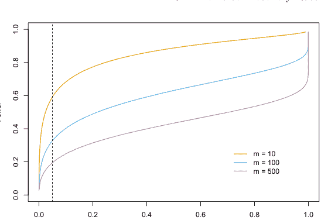

图13.5. 在一个模拟设置中，其中 $m$ 个原假设的90%为真，我们显示功效（我们成功拒绝的错误原假设的比例）作为族错误率的函数。曲线对应于 $m = 10$（橙色）、$m = 100$（蓝色）和 $m = 500$（紫色）。随着 $m$ 值的增加，功效降低。垂直虚线表示FWER为0.05。

这在科学上没有意义，并且通常导致非常低的功效，如图13.5所示。

在实践中，当 $m$ 很大时，为了做出更多发现（即更多地拒绝原假设），我们可能愿意容忍一些假阳性。这就是错误发现率背后的动机，我们接下来介绍。

## 13.4 错误发现率

### 13.4.1 错误发现率的直观理解

正如我们刚才讨论的，当 $m$ 很大时，试图防止*任何*假阳性（如FWER控制）过于严格。相反，我们可以尝试确保假阳性（$V$）与总阳性（$V + S = R$）的比率足够低，使得大多数被拒绝的原假设不是假阳性。比率 $V/R$ 被称为*错误发现比例*（FDP）。

可能会诱使数据分析者控制FDP：确保不超过，比如说，20%的被拒绝原假设是假阳性。然而，在实践中，控制FDP对数据分析者来说是不可能的任务，因为她无法在任何特定数据集上确定哪些假设为真，哪些为假。这与数据分析者可以控制FWER的事实非常相似，即她可以保证对于任何预先指定的 $\alpha$，$\Pr(V \ge 1) \le \alpha$，但她无法保证在任何特定数据集上 $V = 0$（除非拒绝任何原假设，即设置 $R = 0$）。

因此，我们转而控制*错误发现率*（FDR）$^{15}$，定义为

$$\text{FDR} = \text{E}(\text{FDP}) = \text{E}(V/R). \tag{13.9}$$

当我们控制FDR在（比如说）水平 $q = 20\%$ 时，我们是在尽可能多地拒绝原假设，同时保证平均而言，不超过20%的被拒绝原假设是假阳性。

在FDR的定义（13.9）中，期望是在生成数据的总体上取的。例如，假设我们对 $m$ 个原假设控制FDR在 $q = 0.2$。这意味着如果我们重复这个实验大量次数，并且每次都将FDR控制在 $q = 0.2$，那么我们应该预期平均而言，20%的被拒绝原假设将是假阳性。在给定的数据集上，被拒绝假设中假阳性的比例可能大于或小于20%。

到目前为止，我们从实用角度论证了使用FDR的动机，即当 $m$ 很大时，控制FWER过于严格，不会导致“足够多”的发现。使用FDR的另一个动机是它与当代应用中数据收集的方式非常吻合。随着数据集在各个领域的规模持续增长，为了探索性而非验证性目的进行大量假设检验变得越来越常见。例如，基因组研究人员可能会对患有和未患有某种特定医疗状况的个体进行基因组测序，然后对20,000个基因中的每一个，测试该基因中的序列变异是否与感兴趣的医疗状况相关。这相当于执行 $m = 20,000$ 次假设检验。分析本质上是探索性的，因为研究人员没有任何特定的假设；相反，她希望看到每个基因与疾病之间是否存在适度的证据，并计划进一步研究任何有此类证据的基因。她可能愿意容忍进一步研究的基因集合中存在一定数量的假阳性；因此，FWER不是一个合适的选择。然而，需要进行一些多重检验校正：简单地研究所有 $p$-值小于（比如说）0.05的基因不是一个好主意，因为即使没有基因与疾病相关，我们也会预期有1,000个基因具有如此小的 $p$-值（因为 $0.05 \times 20,000 = 1,000$）。将她的探索性分析的FDR控制在20%保证了——平均而言——她进一步研究的基因中不超过20%是假阳性。

值得注意的是，与 $p$-值不同（通常认为0.05的阈值是“阳性”结果的最低证据标准，而0.01甚至0.001的阈值被认为更有说服力），FDR控制没有标准接受的阈值。相反，FDR阈值的选择通常是上下文相关的，甚至是数据集相关的。例如，前例中的基因组研究人员如果计划的后续研究需要*非常*严格的证据，可能会寻求将FDR控制在10%的阈值。

$^{15}$如果 $R = 0$，则我们将比率 $V/R$ 替换为0，以避免计算 $0/0$。形式上，$\text{FDR} = \text{E}(V/R | R > 0) \text{Pr}(R > 0)$。

对于 $m$ 极大的情况，需要一个 $\alpha/m$ 的 *p*-值阈值$^{14}$。

*谢费方法*正是为此类情况设计的。它允许我们计算一个值 $\alpha_S$，使得如果 *p*-值低于 $\alpha_S$ 则拒绝原假设 $H_0$（13.8），将第一类错误控制在水平 $\alpha$。结果表明，对于基金示例，为了将第一类错误控制在水平 $\alpha = 0.05$，我们必须设置 $\alpha_S = 0.002$。因此，尽管 *p*-值明显很小（0.004），我们仍无法拒绝（13.8）中的 $H_0$。谢费方法的一个重要优势是，我们可以使用相同的阈值 $\alpha_S = 0.002$ 来对任何将经理分成两组的划分进行成对比较：例如，我们也可以使用相同的阈值0.002来检验 $H_0 : \frac{1}{3} (\mu_1 + \mu_2 + \mu_3) = \frac{1}{2} (\mu_4 + \mu_5)$ 和 $H_0 : \frac{1}{4} (\mu_1 + \mu_2 + \mu_3 + \mu_4) = \mu_5$，而无需进一步调整多重检验。

总结一下，霍尔姆程序和邦费罗尼程序是非常通用的多重检验校正方法，适用于所有情况。然而，在某些特殊情况下，可能存在更强大的多重检验校正程序，以便在控制FWER的同时实现比使用霍尔姆或邦费罗尼更高的功效（即犯更少的第二类错误）。在本节中，我们已经说明了两个这样的例子。

## 13.4.2 本杰明尼-霍赫伯格程序

我们现在专注于控制FDR的任务：即决定拒绝哪些原假设，同时保证FDR，E(V/R)，小于或等于某个预先指定的值q。为此，我们需要某种方式将来自m个原假设的p值，p1, . . . , pm，与期望的FDR值q联系起来。事实证明，一个非常简单的程序，如算法13.2所示，可用于控制FDR。

算法13.2 控制FDR的本杰明尼-霍赫伯格程序

1.  指定q，即控制FDR的水平。
2.  计算m个原假设H01, . . . , H0m的p值，p1, . . . , pm。
3.  将m个p值排序，使得p(1) ≤ p(2) ≤ · · · ≤ p(m)。
4.  定义 L = max{j : p(j) < qj/m}。
5.  拒绝所有满足 pj ≤ p(L) 的原假设 H0j。

算法13.2被称为本杰明尼-霍赫伯格程序。该程序的关键在于(13.10)。例如，再次考虑基金数据集中前五位经理，如表13.3所示。（在此示例中，m = 5，尽管通常我们在涉及更多原假设的场景中控制FDR。）我们看到 p(1) = 0.006 < 0.05 × 1/5，p(2) = 0.012 < 0.05 × 2/5，p(3) = 0.601 > 0.05 × 3/5，p(4) = 0.756 > 0.05 × 4/5，以及 p(5) = 0.918 > 0.05 × 5/5。因此，为了将FDR控制在5%，我们拒绝前两位基金经理表现不优于随机的原假设。

只要m个p值是独立的或仅轻微依赖，那么本杰明尼-霍赫伯格程序保证FDR ≤ q。

换句话说，该程序确保平均而言，被拒绝的原假设中假阳性的比例不超过q。值得注意的是，无论有多少原假设为真，也无论为假的原假设的p值分布如何，这一点都成立。因此，本杰明尼-霍赫伯格程序为我们提供了一种非常简单的方法，给定一组m个p值，确定拒绝哪些原假设以将FDR控制在任何预先指定的水平q。

然而，其证明远超本书范围。

576 13. 多重检验

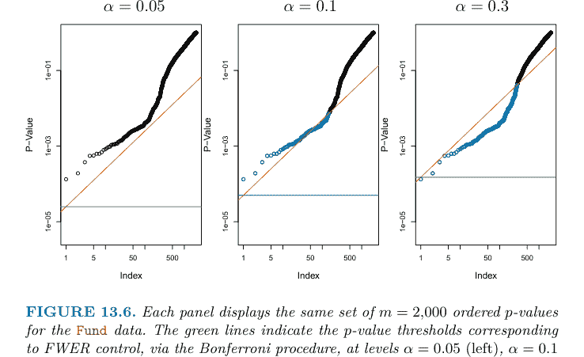

图13.6. 每个面板显示了基金数据的相同一组$m = 2,000$个有序$p$值。绿线表示通过邦费罗尼程序在水平$\alpha = 0.05$（左）、$\alpha = 0.1$（中）和$\alpha = 0.3$（右）下进行FWER控制对应的$p$值阈值。橙线表示通过本杰明尼-霍赫伯格在水平$q = 0.05$（左）、$q = 0.1$（中）和$q = 0.3$（右）下进行FDR控制对应的$p$值阈值。当FDR控制在水平$q = 0.1$时，拒绝了146个原假设（中）；相应的$p$值以蓝色显示。当FDR控制在水平$q = 0.3$时，拒绝了279个原假设（右）；相应的$p$值以蓝色显示。

第13.3.2节的邦费罗尼程序与本杰明尼-霍赫伯格程序之间存在根本区别。在邦费罗尼程序中，为了将$m$个原假设的FWER控制在水平$\alpha$，我们只需拒绝$p$值低于$\alpha/m$的原假设。这个$\alpha/m$的阈值不依赖于数据的任何信息（除了$m$的值），当然也不依赖于$p$值本身。相比之下，本杰明尼-霍赫伯格程序中使用的拒绝阈值更为复杂：我们拒绝所有$p$值小于或等于第$L$小$p$值的原假设，其中$L$本身是所有$m$个$p$值的函数，如(13.10)所示。因此，在进行本杰明尼-霍赫伯格程序时，我们无法提前计划使用什么阈值来拒绝$p$值；我们需要先查看数据。例如，在抽象意义上，当使用FDR阈值0.1且$m = 100$时，无法知道是否会拒绝对应$p$值为0.01的原假设；答案取决于其他$m - 1$个$p$值的值。本杰明尼-霍赫伯格程序的这一特性与霍尔姆程序共有，后者也涉及数据依赖的$p$值阈值。

图13.6显示了在基金数据集上应用邦费罗尼和本杰明尼-霍赫伯格程序的结果，使用了完整的$m = 2,000$位基金经理，其中前五位显示在表13.3中。当使用邦费罗尼将FWER控制在水平0.3时，只拒绝了一个原假设；也就是说，我们只能得出结论，只有一位基金经理跑赢了市场。尽管在未进行多重检验校正的情况下，相当一部分$m = 2,000$位基金经理似乎跑赢了市场——例如，其中13位的$p$值低于0.001。相比之下，当FDR控制在水平0.3时，我们可以得出结论，有279位基金经理跑赢了市场：我们预计其中不超过约$279 \times 0.3 = 83.7$位基金经理的良好表现仅是由于偶然。因此，我们看到FDR控制比FWER控制温和得多——也更强大——因为它允许我们拒绝更多的原假设，代价是假阳性显著增加。

本杰明尼-霍赫伯格程序自20世纪90年代中期就已存在。尽管此后发表了大量论文，提出了在特定场景下表现更好的FDR控制替代方法，但本杰明尼-霍赫伯格程序仍然是一个非常有用且应用广泛的方法。

## 13.5 $p$值和错误发现率的重抽样方法

到目前为止，本章的讨论假设我们有兴趣使用检验统计量$T$来检验特定的原假设$H_0$，该统计量在$H_0$下具有某种已知（或假设）的分布，例如正态分布、$t$分布、$\chi^2$分布或$F$分布。这被称为*理论零分布*。我们通常依赖理论零分布的可用性来获得与检验统计量相关的$p$值。事实上，对于我们可能感兴趣的大多数类型的原假设，只要我们愿意对数据做出严格的假设，理论零分布是可用的。

然而，如果我们的原假设$H_0$或检验统计量$T$有些不寻常，那么可能没有可用的理论零分布。或者，即使存在理论零分布，我们可能也不愿依赖它，也许是因为其成立所需的某些假设被违反了。例如，也许样本量太小。

在本节中，我们介绍了一种在此设置下进行推断的框架，它利用快速计算机的可用性来近似$T$的零分布，从而获得$p$值。虽然这个框架非常通用，但它必须针对特定问题仔细实例化。因此，在下文中，我们考虑一个具体的例子，其中我们希望使用双样本$t$检验来检验两个随机变量的均值是否相等。

本节的讨论比本章前面的节更具挑战性，对于满足于使用理论零分布来计算检验统计量$p$值的读者，可以安全地跳过。

### 13.5.1 p值的重抽样方法

我们回到第13.1.1节的例子，其中我们希望检验随机变量$X$的均值是否等于随机变量$Y$的均值，即$H_0 : \mathrm{E}(X) = \mathrm{E}(Y)$，对备择假设$H_a : \mathrm{E}(X) \neq \mathrm{E}(Y)$。给定来自$X$的$n_X$个独立观测和来自$Y$的$n_Y$个独立观测，双样本$t$统计量的形式为

$$T = \frac{\hat{\mu}_X - \hat{\mu}_Y}{s \sqrt{\frac{1}{n_X} + \frac{1}{n_Y}}} \quad (13.11)$$

其中$\hat{\mu}_X = \frac{1}{n_X} \sum_{i=1}^{n_X} x_i$，$\hat{\mu}_Y = \frac{1}{n_Y} \sum_{i=1}^{n_Y} y_i$，$s = \sqrt{\frac{(n_X-1)s_X^2+(n_Y-1)s_Y^2}{n_X+n_Y-2}}$，$s_X^2$和$s_Y^2$是两组方差的无偏估计量。$T$的较大（绝对）值提供了反对$H_0$的证据。

如果$n_X$和$n_Y$很大，那么(13.11)中的$T$近似服从$N(0, 1)$分布。但如果$n_X$和$n_Y$很小，那么在没有对$X$和$Y$的分布做出强假设的情况下，我们不知道$T$的理论零分布。在这种情况下，事实证明我们可以使用*重抽样*方法，或者更具体地说，*置换*方法来近似$T$的零分布。

为此，我们进行一个思想实验。如果$H_0$成立，即$\mathrm{E}(X) = \mathrm{E}(Y)$，并且我们做出更强的假设，即$X$和$Y$的分布相同，那么$T$的分布在交换$X$和$Y$的观测下是不变的。也就是说，如果我们随机交换$X$中的一些观测与$Y$中的观测，那么*基于此交换数据计算的(13.11)中的检验统计量$T$与基于原始数据的$T$具有相同的分布*。这仅在$H_0$成立且$X$和$Y$的分布相同时才成立。

这表明，为了近似$T$的零分布，我们可以采用以下方法。我们随机置换$n_X + n_Y$个观测$B$次，对于某个较大的$B$值，每次计算(13.11)。我们用$T^{*1}, \ldots, T^{*B}$表示置换数据上(13.11)的值。这些可以被视为$H_0$下$T$的零分布的近似。回顾一下，根据定义，$p$值是在$H_0$下观察到至少这么极端的检验统计量的概率。因此，为了计算$T$的$p$值，我们只需计算

$$p\text{-value} = \frac{\sum_{b=1}^B \mathbf{1}(|T^{*b}| \geq |T|)}{B}, \quad (13.12)$$

即检验统计量值至少与原始数据上观察到的值一样极端的置换数据集的比例。该程序总结在算法13.3中。

如果我们假设$X$和$Y$服从正态分布，那么在$H_0$下，(13.11)中的$T$服从自由度为$n_X + n_Y - 2$的$t$分布。然而，在实践中，随机变量的分布很少已知，因此执行重抽样方法可能比做出强烈且无根据的假设更可取。如果重抽样方法的结果与假设理论零分布的结果不一致，那么重抽样方法的结果更值得信赖。

## 算法 13.3 双样本 t 检验的重抽样 p 值

1.  在原始数据 $x_1, \dots, x_{n_X}$ 和 $y_1, \dots, y_{n_Y}$ 上计算公式 (13.11) 定义的 $T$。
2.  对于 $b = 1, \dots, B$，其中 $B$ 是一个很大的数（例如 $B = 10,000$）：
    (a) 随机置换 $n_X + n_Y$ 个观测值。将前 $n_X$ 个置换后的观测值称为 $x_1^*, \dots, x_{n_X}^*$，将剩余的 $n_Y$ 个观测值称为 $y_1^*, \dots, y_{n_Y}^*$。
    (b) 在置换后的数据 $x_1^*, \dots, x_{n_X}^*$ 和 $y_1^*, \dots, y_{n_Y}^*$ 上计算公式 (13.11)，并将结果称为 $T^{*b}$。
3.  $p$ 值由 $\frac{\sum_{b=1}^B \mathbf{1}_{(|T^{*b}| \ge |T|)}}{B}$ 给出。

我们在 Khan 数据集上尝试了这个过程，该数据集包含四种儿童常见小圆血细胞肿瘤亚型中 2,308 个基因的表达测量值。此数据集是 ISLR2 包的一部分。我们将注意力限制在观测值最多的两个亚型上：横纹肌肉瘤（$n_X = 29$）和伯基特淋巴瘤（$n_Y = 25$）。

针对第 11 个基因在两组中平均表达值相等的原假设进行双样本 $t$ 检验，得到 $T = -2.09$。使用理论零分布（即 $t_{52}$ 分布，因为 $n_X + n_Y - 2 = 52$），我们得到 $p$ 值为 0.041。（注意，$t_{52}$ 分布与 $N(0, 1)$ 分布几乎无法区分。）如果我们改用 $B = 10,000$ 的算法 13.3，则得到 $p$ 值为 0.042。图 13.7 显示了该基因的理论零分布、重抽样零分布以及检验统计量的实际值（$T = -2.09$）。在这个例子中，我们看到使用理论零分布和重抽样零分布得到的 $p$ 值差异非常小。

相比之下，图 13.8 显示了第 877 个基因的一组类似结果。在这种情况下，理论零分布和重抽样零分布之间存在显著差异，这导致了它们的 $p$ 值也存在差异。

一般来说，在样本量较小或数据分布更偏斜（因此理论零分布不够准确）的情况下，重抽样 $p$ 值和理论 $p$ 值之间的差异往往会更加明显。事实上，图 13.8 中重抽样零分布和理论零分布之间的显著差异是由于第 877 个基因中有一个观测值与其他观测值相距甚远，导致分布非常偏斜。

## 13.5.2 错误发现率的重抽样方法

现在，假设我们希望在以下情况下控制 $m$ 个原假设 $H_{01}, \dots, H_{0m}$ 的错误发现率：要么没有可用的理论零分布，要么我们干脆倾向于避免使用理论零分布。与第 13.5.1 节一样，我们对每个假设使用双样本 $t$ 统计量，从而得到检验统计量 $T_1, \dots, T_m$。我们可以像第 13.5.1 节那样，简单地为每个原假设计算一个 $p$ 值，然后对这些 $p$ 值应用第 13.4.2 节的 Benjamini–Hochberg 程序。然而，事实证明我们可以用一种更直接的方式来完成，甚至不需要计算 $p$ 值。

回顾第 13.4 节，错误发现率定义为 $\mathrm{E}(V/R)$，使用表 13.2 中的符号。为了通过重抽样估计错误发现率，我们首先进行以下近似：

$$\mathrm{FDR} = E\left(\frac{V}{R}\right) \approx \frac{\mathrm{E}(V)}{R}. \tag{13.13}$$

现在假设我们拒绝任何检验统计量绝对值超过 $c$ 的原假设。那么计算公式 (13.13) 右边分母中的 $R$ 很简单：$R = \sum_{j=1}^m 1_{(|T_j| \ge c)}$。

然而，公式 (13.13) 右边的分子 $\mathrm{E}(V)$ 更具挑战性。这是与拒绝任何检验统计量绝对值超过 $c$ 的原假设相关的假阳性期望数量。冒着陈述显而易见事实的风险，估计 $V$ 很有挑战性，因为我们不知道 $H_{01}, \dots, H_{0m}$ 中哪些是真正成立的，因此我们也不知道哪些被拒绝的假设是假阳性。为了克服这个问题，我们采用重抽样方法，我们在 $H_{01}, \dots, H_{0m}$ 下模拟数据，然后计算相应的检验统计量。超过 $c$ 的重抽样检验统计量的数量提供了 $V$ 的估计值。

更详细地说，在每个原假设 $H_{01}, \dots, H_{0m}$ 对应双样本 $t$ 统计量 (13.11) 的情况下，我们可以如下估计 $\mathrm{E}(V)$。令 $x_1^{(j)}, \dots, x_{n_X}^{(j)}$ 和 $y_1^{(j)}, \dots, y_{n_Y}^{(j)}$ 表示与第 $j$ 个原假设相关的数据，$j = 1, \dots, m$。我们随机置换这 $n_X + n_Y$ 个观测值，然后在置换后的数据上计算 $t$ 统计量。对于这个置换后的数据，我们知道所有原假设 $H_{01}, \dots, H_{0m}$ 都成立；因此，绝对值超过阈值 $c$ 的置换 $t$ 统计量的数量提供了 $\mathrm{E}(V)$ 的估计值。通过重复置换过程 $B$ 次（$B$ 取一个较大的值）并对结果取平均值，可以进一步改进这个估计。

算法 13.4 详细描述了这个过程。它提供了所谓的错误发现率的插件估计，因为公式 (13.13) 中的近似允许我们通过将 $R$ 代入分母并将 $\mathrm{E}(V)$ 的估计值代入分子来估计错误发现率。

我们将算法 13.4 的错误发现率重抽样方法以及算法 13.2 使用理论 $p$ 值的 Benjamini–Hochberg 方法应用于 Khan 数据集中的 $m = 2,308$ 个基因。结果如图 13.9 所示。我们看到，对于给定数量的被拒绝假设，两种方法的估计错误发现率几乎相同。

本节开头我们指出，为了使用重抽样方法控制 $m$ 个假设检验的错误发现率，我们可以像第 13.5.1 节那样简单地计算 $m$ 个重抽样 $p$ 值，然后对这些 $p$ 值应用第 13.4.2 节的 Benjamini–Hochberg 程序。事实证明，如果我们定义第 $j$ 个重抽样 $p$ 值为

$$p_j = \frac{\sum_{j'=1}^m \sum_{b=1}^B 1_{(|T_{j'}^{*b}| \ge |T_j|)}}{Bm}$$

对于 $j = 1, \dots, m$，而不是像 (13.12) 那样定义，那么对这些重抽样 $p$ 值应用 Benjamini–Hochberg 程序与算法 13.4 完全等价。注意，(13.14) 是 (13.12) 的一种替代方案，它在近似零分布时汇集了所有 $m$ 个假设检验的信息。

## 13.5.3 重抽样方法何时有用？

在第 13.5.1 节和第 13.5.2 节中，我们考虑了使用双样本 $t$ 统计量 (13.11) 检验形式为 $H_0 : \mathrm{E}(X) = \mathrm{E}(Y)$ 的原假设，并通过重抽样方法近似零分布。我们看到，在图 13.8 中，使用重抽样方法得到的结果与使用理论 $p$ 值方法得到的结果有显著差异，但在图 13.7 中则没有。一般来说，重抽样方法在以下两种情况下特别有用：

1.  可能没有可用的理论零分布。如果你正在检验一个不寻常的原假设 $H_0$，或者使用一个不寻常的检验统计量 $T$，就可能出现这种情况。
2.  可能有可用的理论零分布，但其有效性所需的假设不成立。例如，公式 (13.11) 中的双样本 $t$ 统计量仅在观测值服从正态分布时才服从 $t_{n_X+n_Y-2}$ 分布。此外，仅当 $n_X$ 和 $n_Y$ 相当大时，它才服从 $N(0,1)$ 分布。如果数据非正态且 $n_X$ 和 $n_Y$ 较小，那么使用理论零分布的 $p$ 值将无效（即它们不能正确控制第一类错误）。

一般来说，如果你能想出一种方法来重抽样或置换你的观测值，以生成遵循零分布的数据，那么你就可以使用算法 13.3 和 13.4 的变体来计算 $p$ 值或估计错误发现率。在许多现实世界的情况下，当没有现成的假设检验可用，或者当这些现成检验的关键假设被违反时，这为假设检验提供了一个强大的工具。

## 算法 13.4 双样本 T 检验的插件错误发现率

1.  选择一个阈值 $c$，其中 $c > 0$。
2.  对于 $j = 1, \dots, m$：
    (a) 基于原始数据 $x_1^{(j)}, \dots, x_{n_X}^{(j)}$ 和 $y_1^{(j)}, \dots, y_{n_Y}^{(j)}$，计算原假设 $H_{0j}$ 的双样本 $t$ 统计量 (13.11) $T^{(j)}$。
    (b) 对于 $b = 1, \dots, B$，其中 $B$ 是一个很大的数（例如 $B = 10,000$）：
        i. 随机置换 $n_X + n_Y$ 个观测值。将前 $n_X$ 个观测值称为 $x_1^{*(j)}, \dots, x_{n_X}^{*(j)}$，将剩余的观测值称为 $y_1^{*(j)}, \dots, y_{n_Y}^{*(j)}$。
        ii. 在置换后的数据 $x_1^{*(j)}, \dots, x_{n_X}^{*(j)}$ 和 $y_1^{*(j)}, \dots, y_{n_Y}^{*(j)}$ 上计算公式 (13.11)，并将结果称为 $T^{(j), *b}$。
3.  计算 $R = \sum_{j=1}^m \mathbf{1}(|T^{(j)}| \ge c)$。
4.  计算 $\widehat{V} = \frac{\sum_{b=1}^B \sum_{j=1}^m \mathbf{1}(|T^{(j), *b}| \ge c)}{B}$。
5.  与阈值 $c$ 相关的估计错误发现率为 $\widehat{V}/R$。

## 13.6 实验：多重检验

我们引入了在前面实验中常见的导入语句。

```python
import numpy as np
import pandas as pd
import matplotlib.pyplot as plt
import statsmodels.api as sm
from ISLP import load_data
```

我们还收集了本实验所需的新导入语句。

```python
from scipy.stats import (
    ttest_1samp,
    ttest_rel,
    ttest_ind,
    t as t_dbn
)
from statsmodels.stats.multicomp import pairwise_tukeyhsd
from statsmodels.stats.multitest import multipletests as mult_test
```

### 13.6.1 假设检验回顾

我们首先进行一些单样本 $t$ 检验。首先，我们创建100个变量，每个变量包含10个观测值。前50个变量的均值为0.5，方差为1，而其余变量的均值为0，方差为1。

```python
rng = np.random.default_rng(12)
X = rng.standard_normal((10, 100))
true_mean = np.array([0.5]*50 + [0]*50)
X += true_mean[None,:]
```

首先，我们使用 `scipy.stats` 模块中的 `ttest_1samp()` 来检验 $H_0 : \mu_1 = 0$，即第一个变量均值为零的原假设。

```python
In [4]: result = ttest_1samp(X[:,0], 0)
        result.pvalue
```

Out[4]: 0.931

$p$ 值为0.931，在 $\alpha = 0.05$ 的水平下不够低，不足以拒绝原假设。在这种情况下，$\mu_1 = 0.5$，因此原假设是错误的。因此，当原假设为假时，我们未能拒绝原假设，犯了第二类错误。

我们现在对 $j = 1, \dots, 100$ 检验 $H_{0,j} : \mu_j = 0$。我们计算100个 $p$ 值，然后构建一个向量，记录第 $j$ 个 $p$ 值是否小于或等于0.05（此时我们拒绝 $H_{0,j}$），或大于0.05（此时我们不拒绝 $H_{0,j}$），其中 $j = 1, \dots, 100$。

```python
In [5]: p_values = np.empty(100)
        for i in range(100):
            p_values[i] = ttest_1samp(X[:,i], 0).pvalue
        decision = pd.cut(p_values,
                          [0, 0.05, 1],
                          labels=['Reject H0',
                                  'Do not reject H0'])
        truth = pd.Categorical(true_mean == 0,
                               categories=[True, False],
                               ordered=True)
```

由于这是一个模拟数据集，我们可以创建一个类似于表13.2的 $2 \times 2$ 表格。

```python
In [6]: pd.crosstab(decision,
                    truth,
                    rownames=['Decision'],
                    colnames=['H0'])
```

Out[6]:

| H0 | True | False |
| :--- | :--- | :--- |
| **Reject H0** | 5 | 15 |
| **Do not reject H0** | 45 | 35 |

因此，在 $\alpha = 0.05$ 的水平下，我们拒绝了50个错误原假设中的15个，并且错误地拒绝了5个真实原假设。使用第13.3节的符号，我们有 $V = 5$，$S = 15$，$U = 45$ 和 $W = 35$。我们设定了 $\alpha = 0.05$，这意味着我们预计会拒绝大约5%的真实原假设。这与上面的 $2 \times 2$ 表格一致，该表格表明我们拒绝了50个真实原假设中的 $V = 5$ 个。

在上面的模拟中，对于错误的原假设，均值与标准差的比率仅为 $0.5/1 = 0.5$。这相当于一个相当弱的信号，并导致了大量的第二类错误。让我们改为模拟具有更强信号的数据，使得错误原假设的均值与标准差的比率等于1。我们只犯了10个第二类错误。

```python
In [7]: true_mean = np.array([1]*50 + [0]*50)
        X = rng.standard_normal((10, 100))
        X += true_mean[None,:]
        for i in range(100):
            p_values[i] = ttest_1samp(X[:,i], 0).pvalue
        decision = pd.cut(p_values,
                          [0, 0.05, 1],
                          labels=['Reject H0',
                                  'Do not reject H0'])
        truth = pd.Categorical(true_mean == 0,
                               categories=[True, False],
                               ordered=True)
        pd.crosstab(decision,
                    truth,
                    rownames=['Decision'],
                    colnames=['H0'])
```

Out[7]:

| H0 | True | False |
| :--- | :--- | :--- |
| **Reject H0** | 2 | 40 |
| **Do not reject H0** | 48 | 10 |

### 13.6.2 族错误率

回顾公式 (13.5)，如果对于 $m$ 个独立的假设检验，每个原假设都为真，那么族错误率 (FWER) 等于 $1 - (1 - \alpha)^m$。我们可以使用这个表达式来计算 $m = 1, \dots, 500$ 且 $\alpha = 0.05, 0.01$ 和 $0.001$ 时的 FWER。我们绘制这些 $\alpha$ 值下的 FWER，以重现图13.2。

```python
In [8]: m = np.linspace(1, 501)
        fig, ax = plt.subplots()
        [ax.plot(m,
                 1 - (1 - alpha)**m,
                 label=r'$\alpha=%s$' % str(alpha))
         for alpha in [0.05, 0.01, 0.001]]
        ax.set_xscale('log')
        ax.set_xlabel('Number of Hypotheses')
        ax.set_ylabel('Family-Wise Error Rate')
        ax.legend()
        ax.axhline(0.05, c='k', ls='--');
```

如前所述，即使对于中等大小的 $m$（例如50），除非将 $\alpha$ 设置为非常低的值（例如0.001），否则 FWER 会超过0.05。当然，将 $\alpha$ 设置为如此低的值的问题在于，我们可能会犯很多第二类错误：换句话说，我们的功效非常低。

我们现在对 Fund 数据集中的前五位基金经理进行单样本 $t$ 检验，以检验第 $j$ 位基金经理的平均回报等于零的原假设，即 $H_{0,j} : \mu_j = 0$。

```python
In [9]: Fund = load_data('Fund')
        fund_mini = Fund.iloc[:,:5]
        fund_mini_pvals = np.empty(5)
        for i in range(5):
            fund_mini_pvals[i] = ttest_1samp(fund_mini.iloc[:,i], 0).pvalue
        fund_mini_pvals
```

Out[9]: array([0.006, 0.918, 0.012, 0.601, 0.756])

经理一和经理三的 $p$ 值较低，而其他三位经理的 $p$ 值较高。然而，我们不能简单地拒绝 $H_{0,1}$ 和 $H_{0,3}$，因为这没有考虑到我们已经进行的多重检验。相反，我们将使用 Bonferroni 方法和 Holm 方法来控制 FWER。

为此，我们使用 `statsmodels` 模块中的 `multipletests()` 函数（缩写为 `mult_test()`）。给定 $p$ 值，对于像 Holm 和 Bonferroni 这样的方法，该函数输出*调整后的 $p$ 值*，可以将其视为一组经过多重检验校正的新 $p$ 值。如果给定假设的调整后 $p$ 值小于或等于 $\alpha$，则可以在保持 FWER 不超过 $\alpha$ 的前提下拒绝该假设。换句话说，对于此类方法，`multipletests()` 函数产生的调整后 $p$ 值可以直接与期望的 FWER 进行比较，以确定是否拒绝每个假设。我们稍后将看到，我们可以使用相同的函数来控制 FDR。

`mult_test()` 函数接受 $p$ 值和一个 `method` 参数，以及一个可选的 `alpha` 参数。它返回决策（下面的 `reject`）以及调整后的 $p$ 值（`bonf`）。

```python
reject, bonf = mult_test(fund_mini_pvals, method = "bonferroni")[:2]
reject
```

Out[10]: array([ True, False, False, False, False])

调整后的 $p$ 值 `bonf` 只是 `fund_mini_pvals` 乘以5并截断为小于或等于1。

```python
bonf, np.minimum(fund_mini_pvals * 5, 1)
```

Out[11]: (array([0.03, 1. , 0.06, 1. , 1. ]),
       array([0.03, 1. , 0.06, 1. , 1. ]))

因此，使用 Bonferroni 方法，我们只能在控制 FWER 为0.05的情况下拒绝经理一的原假设。

相比之下，使用 Holm 方法，调整后的 $p$ 值表明我们可以在 FWER 为0.05的情况下拒绝经理一和经理三的原假设。

```python
mult_test(fund_mini_pvals, method = "holm", alpha=0.05)[:2]
```

Out[12]: (array([ True, False, True, False, False]),
       array([0.03, 1. , 0.05, 1. , 1. ]))

如前所述，经理一似乎表现特别好，而经理二的表现较差。

## 13.6.3 错误发现率

现在，我们对基金数据集中的全部2,000名基金经理进行假设检验。我们对 $H_{0,j} : \mu_j = 0$ 进行单样本t检验，该假设表明第j位基金经理的平均收益率为零。

```python
fund_pvalues = np.empty(2000)
for i, manager in enumerate(Fund.columns):
    fund_pvalues[i] = ttest_1samp(Fund[manager], 0).pvalue
```

基金经理数量太多，考虑控制族错误率（FWER）并不现实。因此，我们专注于控制错误发现率（FDR）：即被拒绝的原假设中实际为假阳性的预期比例。`multipletests()` 函数（缩写为 `mult_test()`）可用于执行Benjamini–Hochberg程序。

```python
In [18]: fund_qvalues = mult_test(fund_pvalues, method = "fdr_bh")[1]
        fund_qvalues[:10]
```

```
Out[18]: array([0.09, 0.99, 0.12, 0.92, 0.96, 0.08, 0.08, 0.08, 0.08,
          0.08])
```

Benjamini–Hochberg程序输出的q值可以解释为：我们拒绝某个特定原假设时所能接受的最小FDR阈值。例如，q值为0.1表示我们可以在FDR为10%或更高时拒绝相应的原假设，但在FDR低于10%时则不能拒绝该原假设。

如果我们将FDR控制在10%，那么对于多少位基金经理，我们可以拒绝 $H_{0,j} : \mu_j = 0$？

```python
In [19]: (fund_qvalues <= 0.1).sum()
```

```
Out[19]: 146
```

我们发现2,000名基金经理中有146位的q值低于0.1；因此，我们能够得出结论：有146位基金经理在FDR为10%的水平上跑赢了市场。其中只有大约15位（146的10%）可能是错误的发现。

相比之下，如果我们改用Bonferroni方法在 $\alpha = 0.1$ 的水平上控制FWER，那么我们将无法拒绝任何原假设！

```python
In [20]: (fund_pvalues <= 0.1 / 2000).sum()
```

```
Out[20]: 0
```

图13.6展示了基金数据集的有序p值 $p_{(1)} \le p_{(2)} \le \cdots \le p_{(2000)}$，以及Benjamini–Hochberg程序的拒绝阈值。回顾一下，Benjamini–Hochberg程序找出满足 $p_{(j)} < qj/m$ 的最大p值 $p_{(j)}$，并拒绝所有p值小于或等于 $p_{(j)}$ 的假设。在下面的代码中，我们自己实现了Benjamini–Hochberg程序，以说明其工作原理。我们首先对p值进行排序。然后，我们找出所有满足 $p_{(j)} < qj/m$ 的p值（`sorted_set_`）。最后，`selected_` 是一个布尔数组，指示哪些p值小于或等于 `sorted_[sorted_set_]` 中的最大p值。因此，`selected_` 索引了被Benjamini–Hochberg程序拒绝的p值。

```python
In [21]: sorted_ = np.sort(fund_pvalues)
        m = fund_pvalues.shape[0]
        q = 0.1
        sorted_set_ = np.where(sorted_ < q * np.linspace(1, m, m) / m)[0]
        if sorted_set_.shape[0] > 0:
            selected_ = fund_pvalues < sorted_[sorted_set_].max()
            sorted_set_ = np.arange(sorted_set_.max())
        else:
            selected_ = []
            sorted_set_ = []
```

我们现在重现图13.6的中间面板。

```python
In [22]: fig, ax = plt.subplots()
        ax.scatter(np.arange(0, sorted_.shape[0]) + 1,
                  sorted_, s=10)
        ax.set_yscale('log')
        ax.set_xscale('log')
        ax.set_ylabel('P-Value')
        ax.set_xlabel('Index')
        ax.scatter(sorted_set_+1, sorted_[sorted_set_], c='r', s=20)
        ax.axline((0, 0), (1,q/m), c='k', ls='--', linewidth=3);
```

## 13.6.4 重抽样方法

这里，我们使用在13.5节中研究过的Khan数据集来实现假设检验的重抽样方法。首先，我们合并训练集和测试集数据，得到83名患者在2,308个基因上的观测值。

```python
In [23]: Khan = load_data('Khan')
        D = pd.concat([Khan['xtrain'], Khan['xtest']])
        D['Y'] = pd.concat([Khan['ytrain'], Khan['ytest']])
        D['Y'].value_counts()
```

```
Out[23]: 2    29
        4    25
        3    18
        1    11
        Name: Y, dtype: int64
```

共有四类癌症。对于每个基因，我们比较第二类（横纹肌肉瘤）的平均表达水平与第四类（伯基特淋巴瘤）的平均表达水平。使用 `scipy.stats` 中的 `ttest_ind()` 对第11个基因进行标准的两样本t检验，得到检验统计量为-2.09，相应的p值为0.0412，这表明两种癌症类型平均表达水平存在差异的证据尚不充分。

```python
In [24]: D2 = D[lambda df:df['Y'] == 2]
        D4 = D[lambda df:df['Y'] == 4]
        gene_11 = 'G0011'
        observedT, pvalue = ttest_ind(D2[gene_11],
                                     D4[gene_11],
                                     equal_var=True)
        observedT, pvalue
```

```
Out[24]: (-2.094, 0.041)
```

然而，这个p值依赖于一个假设：在两组之间无差异的原假设下，检验统计量服从自由度为29 + 25 - 2 = 52的t分布。我们不必使用这个理论上的零分布，而是可以将54名患者随机分成29人和25人的两组，并计算一个新的检验统计量。在两组之间无差异的原假设下，这个新的检验统计量应与我们原始的统计量具有相同的分布。重复此过程多次，我们就可以为检验统计量构建一个经验性的零分布。处理10,000次允许我们近似检验统计量的零分布。我们计算观测到的检验统计量超过通过重采样获得的检验统计量的次数比例。

```python
In [25]: B = 10000
Tnull = np.empty(B)
D_ = np.hstack([D2[gene_11], D4[gene_11]])
n_ = D2[gene_11].shape[0]
D_null = D_.copy()
for b in range(B):
    rng.shuffle(D_null)
    ttest_ = ttest_ind(D_null[:n_],
                      D_null[n_:],
                      equal_var=True)
    Tnull[b] = ttest_.statistic
(np.abs(Tnull) > np.abs(observedT)).mean()
```

Out[25]: 0.0398

这个比例，0.0398，就是我们基于重采样的p值。它与使用理论零分布获得的p值0.0412几乎相同。我们可以绘制基于重采样的检验统计量的直方图，以重现图13.7。

```python
In [26]: fig, ax = plt.subplots(figsize=(8,8))
ax.hist(Tnull,
        bins=100,
        density=True,
        facecolor='y',
        label='Null')
xval = np.linspace(-4.2, 4.2, 1001)
ax.plot(xval,
        t_dbn.pdf(xval, D_.shape[0]-2),
        c='r')
ax.axvline(observedT,
           c='b',
           label='Observed')
ax.legend()
ax.set_xlabel("Null Distribution of Test Statistic");
```

基于重采样的零分布与理论零分布（以红色显示）几乎相同。

最后，我们实现算法13.4中概述的插件重采样FDR方法。根据计算机的速度，计算Khan数据集中所有2,308个基因的FDR可能需要一段时间。因此，我们将在随机选择的100个基因子集上演示该方法。对于每个基因，我们首先计算观测到的检验统计量，然后生成10,000个重采样的检验统计量。这可能需要几分钟才能运行完成。如果你赶时间，可以将B设置为一个较小的值（例如B=500）。

```python
In [27]: m, B = 100, 10000
idx = rng.choice(Khan['xtest'].columns, m, replace=False)
T_vals = np.empty(m)
Tnull_vals = np.empty((m, B))

for j in range(m):
    col = idx[j]
    T_vals[j] = ttest_ind(D2[col],
                         D4[col],
                         equal_var=True).statistic
    D_ = np.hstack([D2[col], D4[col]])
    D_null = D_.copy()
    for b in range(B):
        rng.shuffle(D_null)
        ttest_ = ttest_ind(D_null[:n_],
                          D_null[n_:],
                          equal_var=True)
        Tnull_vals[j,b] = ttest_.statistic
```

接下来，我们计算算法13.4中一系列阈值$c$对应的被拒绝的零假设数量$R$、估计的假阳性数量$\hat{V}$以及估计的FDR。阈值是根据100个基因的检验统计量的绝对值选择的。

```python
cutoffs = np.sort(np.abs(T_vals))
FDRs, Rs, Vs = np.empty((3, m))
for j in range(m):
    R = np.sum(np.abs(T_vals) >= cutoffs[j])
    V = np.sum(np.abs(Tnull_vals) >= cutoffs[j]) / B
    Rs[j] = R
    Vs[j] = V
    FDRs[j] = V / R
```

现在，对于任何给定的FDR，我们都可以找到将被拒绝的基因。例如，当FDR控制在0.1时，我们拒绝100个零假设中的15个。平均而言，我们预计这些基因中大约有一两个（即15的10%）是假发现。在FDR为0.2时，我们可以拒绝28个基因的零假设，其中预计大约有六个是假发现。

变量`idx`存储了我们随机选择的100个基因中包含了哪些基因。让我们看看估计FDR小于0.1的基因。

```python
sorted(idx[np.abs(T_vals) >= cutoffs[FDRs < 0.1].min()])
```

在FDR阈值为0.2时，选择的基因更多，但代价是假发现的预期比例更高。

```python
sorted(idx[np.abs(T_vals) >= cutoffs[FDRs < 0.2].min()])
```

下一行生成图13.11，它与图13.9类似，但仅基于基因的一个子集。

```python
fig, ax = plt.subplots()
ax.plot(Rs, FDRs, 'b', linewidth=3)
ax.set_xlabel("Number of Rejections")
ax.set_ylabel("False Discovery Rate");
```

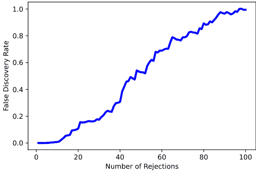

**图13.11.** 从*Khan*数据集中随机选择的100个基因的估计错误发现率与被拒绝的零假设数量的关系。

## 13.7 练习题

### 概念题

1.  假设我们检验$m$个零假设，所有这些假设都是真实的。我们将每个零假设的I类错误控制在水平$\alpha$。对于每个子问题，请说明你的答案理由。

    (a) 总共，我们预计会犯多少个I类错误？

    (b) 假设我们执行的$m$个检验是独立的。与这$m$个检验相关的族错误率是多少？
    *提示：如果两个事件$A$和$B$是独立的，那么$\Pr(A \cap B) = \Pr(A) \Pr(B)$。*

    (c) 假设$m = 2$，并且两个检验的$p$值是正相关的，因此如果一个很小，另一个往往也会很小，如果一个很大，另一个往往也会很大。与$m = 2$时(b)中的答案相比，与这$m = 2$个检验相关的族错误率在定性上如何比较？
    *提示：首先，假设两个$p$值是完全相关的。*

    (d) 再次假设$m = 2$，但现在两个检验的$p$值是负相关的，因此如果一个很大，另一个往往很小。与$m = 2$时(b)中的答案相比，与这$m = 2$个检验相关的族错误率在定性上如何比较？
    *提示：首先，假设每当一个$p$值小于$\alpha$时，另一个就会大于$\alpha$。换句话说，我们永远无法同时拒绝两个零假设。*

2.  假设我们检验$m$个假设，并将每个假设的I类错误控制在水平$\alpha$。假设所有$m$个$p$值都是独立的，并且所有零假设都是真实的。

    (a) 设随机变量$A_j$在第$j$个零假设被拒绝时等于1，否则等于0。$A_j$的分布是什么？

    (b) $\sum_{j=1}^m A_j$的分布是什么？

    (c) 我们将要犯的I类错误数量的标准差是多少？

3.  假设我们检验$m$个零假设，并将第$j$个零假设的I类错误控制在水平$\alpha_j$，其中$j = 1, \dots, m$。论证族错误率不大于$\sum_{j=1}^m \alpha_j$。

4.  假设我们检验$m = 10$个假设，并获得表13.4中所示的$p$值。

| 零假设 | $p$值 |
| :--- | :--- |
| $H_{01}$ | 0.0011 |
| $H_{02}$ | 0.031 |
| $H_{03}$ | 0.017 |
| $H_{04}$ | 0.32 |
| $H_{05}$ | 0.11 |
| $H_{06}$ | 0.90 |
| $H_{07}$ | 0.07 |
| $H_{08}$ | 0.006 |
| $H_{09}$ | 0.004 |
| $H_{10}$ | 0.0009 |

**表13.4.** 练习题4的$p$值。

    (a) 假设我们希望将每个零假设的I类错误控制在水平$\alpha = 0.05$。我们将拒绝哪些零假设？

    (b) 现在假设我们希望将FWER控制在水平$\alpha = 0.05$。我们将拒绝哪些零假设？请说明你的答案理由。

    (c) 现在假设我们希望将FDR控制在水平$q = 0.05$。我们将拒绝哪些零假设？请说明你的答案理由。

    (d) 现在假设我们希望将FDR控制在水平$q = 0.2$。我们将拒绝哪些零假设？请说明你的答案理由。

    (e) 在FDR水平$q = 0.2$下被拒绝的零假设中，大约有多少个是假阳性？请说明你的答案理由。

5.  对于这个问题，你将构造一些$p$值，这些值在使用Bonferroni和Holm程序时会导致一定数量的拒绝。

    (a) 给出五个$p$值（即五个介于0和1之间的数字，在本题中我们将它们解释为$p$值）的例子，使得当FWER控制在0.1水平时，Bonferroni方法和Holm方法都恰好拒绝一个零假设。

    (b) 现在给出五个$p$值的例子，使得在0.1水平下，Bonferroni拒绝一个零假设，而Holm拒绝多于一个零假设。

6.  对于图13.3中的每个面板，回答以下问题：

    (a) 应用Bonferroni程序将FWER控制在水平$\alpha = 0.05$时，会产生多少个假阳性、假阴性、真阳性、真阴性、I类错误和II类错误？

    (b) 应用Holm程序将FWER控制在水平$\alpha = 0.05$时，会产生多少个假阳性、假阴性、真阳性、真阴性、I类错误和II类错误？

    (c) 使用Bonferroni程序将FWER控制在水平$\alpha = 0.05$时，相关的错误发现比例是多少？

    (d) 使用Holm程序将FWER控制在水平$\alpha = 0.05$时，相关的错误发现比例是多少？

    (e) 如果我们改用Bonferroni程序将FWER控制在水平$\alpha = 0.001$，(a)和(c)的答案会如何变化？

### 应用题

7.  这个问题使用ISLP包中的Carseats数据集。

    (a) 对于数据集中除Sales外的每个定量变量，使用该定量变量拟合一个线性模型来预测Sales。报告与变量系数相关的$p$值。也就是说，对于每个形如$Y = \beta_0 + \beta_1 X + \epsilon$的模型，报告与系数$\beta_1$相关的$p$值。这里，$Y$代表Sales，$X$代表其他定量变量之一。

    (b) 假设我们将(a)中获得的$p$值的I类错误控制在水平$\alpha = 0.05$。我们将拒绝哪些零假设？

    (c) 现在假设我们将$p$值的FWER控制在水平0.05。我们将拒绝哪些零假设？

    (d) 最后，假设我们将$p$值的FDR控制在水平0.2。我们将拒绝哪些零假设？

8.  在这个问题中，我们将模拟来自$m = 100$个基金经理的数据。

```python
rng = np.random.default_rng(1)
n, m = 20, 100
X = rng.normal(size=(n, m))
```

这些数据代表了每位基金经理在 $n = 20$ 个月中的月度收益率百分比。我们希望检验每位基金经理的月度收益率百分比的总体均值等于零的原假设。请注意，我们模拟数据的方式使得每位基金经理的月度收益率百分比的总体均值确实为零；换句话说，所有 $m$ 个原假设都是真实的。

(a) 对每位基金经理进行单样本 $t$-检验，并绘制所得 $p$-值的直方图。
(b) 如果我们将每个原假设的第一类错误控制在 $\alpha = 0.05$ 的水平，那么我们会拒绝多少个原假设？
(c) 如果我们将族错误率控制在 0.05 的水平，那么我们会拒绝多少个原假设？
(d) 如果我们将错误发现率控制在 0.05 的水平，那么我们会拒绝多少个原假设？
(e) 现在假设我们从数据中“挑选”出表现最好的 10 位基金经理。如果我们将这 10 位基金经理的族错误率控制在 0.05 的水平，那么我们会拒绝多少个原假设？如果我们将这 10 位基金经理的错误发现率控制在 0.05 的水平，那么我们会拒绝多少个原假设？
(f) 解释为什么 (e) 中的分析具有误导性。

> 提示：控制族错误率和错误发现率的标准方法假设所有被检验的原假设都进行了多重性调整，并且没有发生对最小 $p$-值的“挑选”。如果我们进行挑选，会出什么问题？

## 索引

准确率, 415
激活, 400
激活函数, 401
可加的, 11, 94–98, 110–111
可加性, 305, 306
调整 $R^2$, 87, 231, 232, 236–238
*Advertising* 数据集, 15, 16, 19, 69, 71–73, 77, 78, 80, 82, 83, 85, 87–90, 95, 96, 109–111
凝聚聚类, 525
赤池信息准则, 87, 231, 232, 236–238
备择假设, 76, 559
方差分析, 312
ANOVA, 587
曲线下面积, 155, 486–487
参数, 40
数组, 42
属性, 42
AUC, 155
*Auto* 数据集, 12, 66, 98–101, 129, 197, 202–207, 327, 398
自相关, 421
自回归, 423
坐标轴, 48
回拟法, 307, 328
反向传播, 429
向后逐步选择, 87, 234–235
$n$-gram 词袋, 415
词袋, 414
袋装法, 11, 24, 331, 343–346, 354, 360–361
BART, 343, 350, 353, 354, 362–363
基线, 93, 145, 161
基函数, 293–294, 296
贝叶斯
- 分类器, 35–37, 147
- 决策边界, 148
- 误差, 35–37
贝叶斯定理, 146, 250
贝叶斯, 250–251, 353
贝叶斯可加回归树, 331, 343, 350, 350, 353, 354, 362–363
贝叶斯信息准则, 87, 231, 232, 236–238
Benjamini–Hochberg 程序, 575–577
伯努利分布, 172
最优子集选择, 231, 246
偏差, 31–34, 74, 90, 159, 405
偏差-方差
- 分解, 32
- 权衡, 31–34, 38, 111–112, 157, 159, 163, 164, 242, 254, 263, 266, 301, 336, 376, 385
双向, 425
Bikeshare 数据集, 12, 167–172
二元, 27, 138
双标图, 507, 508
Bonferroni 方法, 575–577, 585
布尔, 53, 176
提升法, 11, 24, 331, 343, 347–350, 354, 361–362
自助法, 11, 201, 212–214, 343
Boston 数据集, 12, 67, 117, 122, 133, 199, 227, 287, 327, 364, 556
自底向上聚类, 525
箱线图, 62
BrainCancer 数据集, 12, 472–474, 476, 482
分支, 333
预热期, 352
C-index, 487
Caravan 数据集, 12, 184, 366
Carseats 数据集, 12, 126, 130, 364
分类的, 2, 27
删失数据, 469–502
删失
- 独立, 471
- 区间, 471
- 左, 471
- 机制, 471
- 非信息性, 471
- 右, 471
- 时间, 470
链式法则, 429
通道, 407
CIFAR100 数据集, 406, 409–411, 448, 449
分类, 2, 11, 27, 34–39, 135–199, 367–382
- 错误率, 338
- 树, 337–341, 355–358
分类器, 135
聚类分析, 25–26
聚类, 4, 25–26, 520–535
- 凝聚, 525
- 自底向上, 525
- 层次, 521, 525–535
- K-均值, 11, 521–524
Cochran–Mantel–Haenszel 检验, 475
系数, 71
College 数据集, 12, 65, 286, 328
共线性, 106–110
连接, 41
条件概率, 35
置信区间, 75–76, 90, 110, 292
混杂, 144
混淆矩阵, 153, 176
连续的, 2
等高线, 246
等高线图, 50
对比, 94
便捷函数, 53
卷积滤波器, 407
卷积层, 407
卷积神经网络, 406–413
相关性, 79, 82–83, 530
计数数据, 167, 170
Cox 比例风险模型, 480, 483–486
Cp, 87, 231, 232, 236–238
Credit 数据集, 12, 91, 92, 94, 97, 98, 106–109
交叉熵, 405
交叉验证, 11, 31, 34, 201–211, 231, 252, 270
- k 折, 206–209
- 留一法, 204–206
维度灾难, 115, 193, 266
数据增强, 411
数据框, 55
数据集
- Advertising, 15, 16, 19, 69, 71–73, 77, 78, 80, 82, 83, 85, 87–90, 95, 96, 109–111
- Auto, 12, 66, 98–101, 129, 197, 202–207, 327, 398
- Bikeshare, 12, 167–172
- Boston, 12, 67, 117, 122, 133, 199, 227, 287, 327, 364, 556
- BrainCancer, 12, 472–474, 476, 482
- Caravan, 12, 184, 366
- Carseats, 12, 126, 130, 364
- CIFAR100, 406, 409–411, 448, 449
- College, 12, 65, 286, 328
- Credit, 12, 91, 92, 94, 97, 98, 106–109
- Default, 12, 136–139, 141–144, 152–156, 160, 161, 225, 226, 466
- Fund, 12, 567–570, 572, 575, 576, 585, 588, 589
- Heart, 339, 340, 344–347, 352, 353, 382, 383
- Hitters, 12, 332, 333, 336, 338, 339, 366, 425, 426, 437, 446
- IMDb, 413, 415, 416, 418, 420, 437, 458, 467
- Income, 16–18, 21–23
- Khan, 12, 579–581, 583, 590, 593
- MNIST, 402–404, 406, 430, 431, 441, 444, 445, 448
- NCI60, 4, 5, 12, 546, 548–550
- NYSE, 12, 422–424, 466, 467
- OJ, 12, 365, 398
- Portfolio, 12
- Publication, 12, 482–487
- Smarket, 2, 3, 12, 173, 184, 196
- USArrests, 12, 507, 508, 510, 512, 513, 515, 516, 518, 519
- Wage, 1, 2, 8, 9, 12, 290, 291, 293, 295, 297–300, 302–306, 309, 315, 327
- Weekly, 12, 196, 226
数据类型, 42
决策函数, 387
决策树, 11, 331–342
深度学习, 399
Default 数据集, 12, 136–139, 141–144, 152–156, 160, 161, 225, 226, 466
自由度, 30, 266, 295, 296, 301
树状图, 521, 525–530
密度函数, 146
因变量, 15
导数, 296, 300
检测层, 410
偏差, 232
字典, 66
降维, 230, 253–262
判别函数, 149
判别方法, 146–161
相异性, 530–532
距离
- 基于相关性, 530–532, 554
- 欧几里得, 509, 522, 523, 529–532
双重下降, 431–435
双指数分布, 251
丢弃法, 406, 431
虚拟变量, 91–94, 138, 142, 292
早停法, 430
有效自由度, 301
特征分解, 506, 516
肘部, 548
嵌入, 418
嵌入层, 419
集成, 343–354
熵, 337–339, 363
轮次, 430
误差
- 不可约, 17, 30
- 率, 34
- 可约, 17
- 项, 16
欧几里得距离, 509, 522, 523, 529–532, 554
事件时间, 470
异常, 45
期望值, 18
探索性数据分析, 504
指数, 173
指数族, 173
F-统计量, 84
因子, 92
阶乘, 170
失效时间, 470
错误
- 发现比例, 155, 573
- 发现率, 558, 573–577, 579–582
- 假阴性, 155, 562
- 假阳性, 155, 562, 563
- 假阳性率, 155, 156, 382
族错误率, 565–573, 577
特征, 15
特征图, 406
特征选择, 230
特征化, 414
前馈神经网络, 400
图形, 48
拟合, 21
拟合值, 101
展平, 424
灵活的, 21
浮点数, 43
向前逐步选择, 86, 87, 233–234, 268
函数, 40
Fund 数据集, 12, 567–570, 572, 575, 576, 585, 588, 589
Gamma, 173
高斯（正态）分布, 146, 147, 150, 172, 561
广义可加模型, 5, 24, 162, 289, 290, 305–309, 319
广义线性模型, 5, 135, 167–174, 217
生成模型, 146–161
基尼指数, 337–339, 345, 346, 363
全局最小值, 427
梯度, 428
梯度下降, 427
Harrell 一致性指数, 487
风险函数, 476–478
- 基线, 478
风险率, 476
Heart 数据集, 339, 340, 344–347, 352, 353, 382, 383
热图, 50
辅助函数, 311
异方差性, 103, 168
隐藏层, 400
隐藏单元, 400
层次聚类, 525–530
- 树状图, 525–528
- 反转, 529
- 连接, 529–530
层次原则, 96
高维, 86, 234, 263
铰链损失, 385
Hitters 数据集, 12, 332, 333, 336, 338, 339, 366, 425, 426, 437, 446
留出集, 202
Holm 方法, 568, 576, 585
超几何分布, 501
超参数, 187
超平面, 367–372
假设检验, 76–77, 84, 103, 558–583
IMDb 数据集, 413, 415, 416, 418, 420, 437, 458, 467
插补, 515
Income 数据集, 16–18, 21–23
增量, 60
自变量, 15
可索引的, 186
指示函数, 292
推断, 17, 18
内积, 379, 380
输入层, 400
输入变量, 15
积分, 301
交互项, 70, 89, 95–98, 110–111, 308
截距, 71, 72
插值, 432
可解释性, 229
反转, 529
不可约误差, 17, 36, 90, 110
迭代器, 312
联合分布, 158
K-均值聚类, 11, 521–524
K-近邻, 135, 164–167
- 分类器, 11, 36–37
- 回归, 111–115

## Kaplan–Meier 生存曲线，472–474，483

核函数，379–382，384，394
- 线性，380
- 非线性，377–382
- 多项式，380，382
- 径向，381–383，390

核密度估计器，159

关键词，46

Khan 数据集，12，579–581，583，590，593

节点，290，294，296–299

ℓ₁ 范数，244

ℓ₂ 范数，242

滞后，422

拉普拉斯分布，251

lasso，11，24，244–251，265–266，336，385，484

叶节点，333，526

学习率，429

最小二乘，5，21，71–72，140，141，229
- 直线，73
- 加权，103

水平，92

杠杆值，104–106

似然函数，141

线性，2，69–115
- 线性组合，128，230，253，505
- 线性判别分析，5，11，135，138，147–155，164–167，377，382
- 线性核，380
- 线性模型，20，69–115
- 线性回归，5，11，69–115，172–173
  - 多元，80–90
  - 简单，70–80

连接函数，172，173

连接方式，529–530，548
- 平均，529–530
- 质心，529–530
- 完全，526，529–530
- 单一，529–530

列表，41

列表推导式，123

局部最小值，427

局部回归，290

对数几率，145

对数秩检验，474–476，483

逻辑函数，139

逻辑回归，5，11，25，135，138–144，164–167，172–173，308–309，377，384–385
- 多项式，145，163
- 多元，142–144

logit，140

损失函数，300，385

低维，262

LSTM RNN，420

主效应，96

多数投票，344

Mallow’s Cₚ，87，231，232，236–238

Mantel–Haenszel 检验，475

间隔，370，385

边际分布，158

马尔可夫链蒙特卡洛，353

矩阵补全，515

矩阵乘法，10

最大间隔
- 分类器，367–372
- 超平面，370

最大似然，139–141，143，170

均方误差，28

网格，53

方法，43

小批量，429

误分类误差，35

随机缺失，515

缺失数据，56，515–520

混合选择，87

MNIST 数据集，402–404，406，430，431，441，444，445，448

模型评估，201

模型选择，201

模块，42

多重共线性，108，266

多项式逻辑回归，145，163

多重检验，557–583

多任务学习，403

多元高斯，150

多元正态，150

朴素贝叶斯，135，158–161，164–167

命名空间，116

自然样条，297，298，301，317

NCI60 数据集，4，5，12，546，548–550

负二项，173

阴性预测值，155，156

神经网络，5，399

节点
- 内部，333
- 纯度，337–339
- 终端，333

噪声，21，252

非线性，2，11，289–329
- 决策边界，377–382
- 核，377–382

非参数，20，22–23，111–115，193

正态（高斯）分布，146，147，150，172，476，561

笔记本，40

零假设
- 分布，561，578
- 假设，76，559
- 模型，87，231，245

零假设率，186

NYSE 数据集，12，422–424，466，467

奥卡姆剃刀，426

几率，140，145，195

OJ 数据集，12，365，398

过拟合，21，23，25，30–31，88，152，233，371

p 值，77，82，560–562，578–579
- 调整后，586

包，42

参数，71

参数化，20–22，111–115

偏最小二乘，254，260–262，282

偏似然，480

路径算法，249

置换，578

置换方法，577–582

垂直，257

泊松分布，169，172

泊松回归，135，167–173

多项式
- 核，380，382
- 回归，98–99，289–292，294–295

池化，410

总体回归线，73

Portfolio 数据集，12

阳性预测值，155，156

后验
- 分布，251
- 众数，251
- 概率，147

功效，108，155，563

精确度，155

预测，17
- 区间，90，110
- 投影，230

比例风险假设，478

剪枝，336
- 代价复杂度，336
- 最弱链接，336

Publication 数据集，12，482–487

Python 对象与函数
- %%capture，458
- iloc[]，58
- loc[]，57
- AgglomerativeClustering()，543
- anova()，313
- anova_lm()，125，129，312，313
- axhline()，122，551
- axline()，121，129，329
- BART()，362
- biplot，537
- boot_SE()，223
- boxplot()，62，66
- bs()，315，327
- BSpline()，315
- clone()，222
- columns.drop()，122
- compute_linkage()，544
- confusion_table()，176
- contour()，50
- corr()，129，174
- cost_complexity_pruning_path()，357
- CoxPHFitter()，491
- cross_val_predict()，270
- cross_validate()，218，219，226
- cumsum()，539
- cut_tree()，545
- data.frame()，227
- Dataset，440
- decision_function()，392
- DecisionTreeClassifier()，354，355
- DecisionTreeRegressor()，354
- def，121
- dendrogram()，544
- describe()，62，66
- dir()，116
- drop()，179
- dropna()，56，268，461
- DTC()，参见 DecisionTreeClassifier()
- DTR()，参见 DecisionTreeRegressor()
- dtype，43
- ElasticNetCV()，279
- enumerate()，217
- export_text()，356
- export_tree()，365
- fit()，118，181，218
- fit_transform()，119
- for，59
- GaussianNB()，182
- GBR()，参见 GradientBoostingRegressor()
- get_dummies()，461
- get_influence()，121
- get_prediction()，120，314
- get_rdataset()，535
- glm()，313
- glob()，437
- GradientBoostingClassifier()，361
- GradientBoostingRegressor()，354，361
- GridSearchCV()，276
- groupby()，490
- hist()，62
- iloc[]，58，59
- import，42
- imshow()，50，449
- ISLP.bart，362
- ISLP.cluster，544
- json，437
- KaplanMeierFitter()，502
- keras，437
- KFold()，219
- KMeans()，542，543
- Kmeans()，542
- KNeighborsClassifier()，183
- lambda，58
- LDA()，参见 LinearDiscriminantAnalysis()
- legend()，132
- lifelines，490
- LinearDiscriminantAnalysis()，174，179
- LinearGAM()，317
- LinearRegression()，280
- load_data()，117
- loc[]，58，59，177
- log_loss()，355
- LogisticGAM()，323
- logrank_test()，490
- lowess()，324
- matplotlib，48
- max()，66
- mean()，48
- median()，197
- min()，66
- MNIST()，444
- ModelSpec()，116–118，122，124，267
- MS()，参见 ModelSpec()
- mult_test()，参见 multipletests()
- multipletests()，586
- multipletests()，583，589
- multivariate_logrank_test()，496
- NaturalSpline()，317，319
- ndim，42
- nn.RNN()，461
- normal()，132，286，555
- np，参见 numpy
- np.all()，54，180
- np.allclose()，190
- np.any()，54
- np.arange()，51
- np.argmax()，122
- np.array()，42
- np.concatenate()，133
- np.corrcoef()，46，554
- np.empty()，224
- np.isnan()，268
- np.ix_()，53
- np.linalg.svd()，539
- np.linspace()，50
- np.logspace()，318
- np.mean()，47，176
- np.nan，60
- np.nanmean()，541
- np.percentile()，228
- np.power()，219
- np.random.choice()，553
- np.random.default_rng()，46，47
- np.random.normal()，45
- np.sqrt()，45
- np.squeeze()，457
- np.std()，47
- np.sum()，43
- np.var()，47
- np.where()，180
- ns()，317
- numpy，42，555
- os.chdir()，55
- outer()，219
- pairwise_distances()，554
- pairwise_tukeyhsd()，587
- pandas，55
- params，175
- partial()，222，269
- PCA()，280，537，540，554
- pd，参见 pandas
- pd.crosstab()，555
- pd.cut()，315
- pd.get_dummies()，314
- pd.plotting.scatter_matrix()，62
- pd.qcut()，314，315
- pd.read_csv()，55，556
- pd.Series()，62
- Pipeline()，275
- plot()，48，61，356，490
- plot.scatter()，120
- plot_gam()，321
- plot_svm()，398
- PLSRegression()，282
- poly()，125，313，327
- predict()，175，178，181，216，218，323，358
- predict_survival_function()，493
- print()，40
- pvalues，175
- pygam，307，317
- pytorch_lightning，435
- QDA()，参见 QuadraticDiscriminantAnalysis()
- QuadraticDiscriminantAnalysis()，174，181
- random()，555
- RandomForestRegressor()，354，360
- read_image()，436
- reindex()，461
- reshape()，43
- return，198
- RF()，参见 RandomForestRegressor()
- rng，参见 np.random.default_rng()
- rng.choice()，60
- rng.standard_normal()，60
- roc_curve()，392
- RocCurveDisplay.from_estimator()，387
- savefig()，50
- scatter()，49，61
- scipy.interpolate，315
- score()，218，461
- seed_everything()，436
- set_index()，57
- set_title()，49
- set_xlabel()，49
- set_xscale()，198
- set_ylabel()，49
- set_yscale()，198
- shape，43
- ShuffleSplit()，219
- sim_time()，495
- SimpleDataModule()，441
- SimpleModule.classification()，446
- SimpleModule.regression()，442
- skl，参见 sklearn.linear_model
- skl.ElasticNet()，273，277
- skl.ElasticNet.path，274
- skl.ElasticNet.path()，273
- sklearn，118，181
- sklearn.ensemble，360
- sklearn.linear_model，267
- sklearn.model_selection，267
- sklearn_selected()，269
- sklearn_selection_path()，270
- sklearn_sm()，218
- skm，参见 sklearn.model_selection
- skm.cross_val_predict()，271
- skm.KFold()，271
- skm.ShuffleSplit()，272
- slice()，51，462
- sm，参见 statsmodels
- sm.GLM()，174，192，226
- sm.Logit()，174
- sm.OLS()，118，129，174，319
- StandardScaler()，185，438，537，555
- statsmodels，116，173
- std()，186
- Stepwise()，269
- str.contains()，59
- subplots()，48
- sum()，43，268
- summarize()，118，129，223，226
- summary()，119，322，587
- super()，440
- SupportVectorClassifier()，387，389–391，393
- SupportVectorRegression()，394
- SVC()，参见 SupportVectorClassifier()
- svd()，539
- SVR()，参见 SupportVectorRegression()
- TensorDataset()，441
- to_numpy()，437
- torch，435
- torchinfo，436
- torchmetrics，436
- torchvision，436
- ToTensor()，444
- train_test_split()，186，216
- transform()，118，119
- ttest_1samp()，584
- ttest_ind()，590
- ttest_rel()，587
- tuple，43
- uniform()，555
- value_counts()，66
- var()，536
- variance_inflation_factor()，116，124
- VIF()，参见 variance_inflation_factor()
- where()，355
- zip()，60，312

q 值，589

二次，98

二次判别分析，4，135，156–157，164–167

## 索引

定性，2，27，91，135，167，202
变量，91–94

定量，2，27，91，135，167，202

径向核，381，383，390

随机森林，11，331，343，346–347，354，360–361

随机种子，46

重采样，577–582

召回率，155

受试者工作特征曲线（ROC），154，382–383

推荐系统，516

修正线性单元，401

循环神经网络，416–427

递归二元分割，334，337，338

可约误差，17，90

回归，2，11，27
- 局部，289，290，304–305
- 分段多项式，294–295
- 多项式，289–292，299
- 样条，289，294
- 树，331–337，358–360

正则化，230，240，406，484–486

ReLU，401

重采样，201–214

残差，71，81
- 图，100
- 标准误，75，77–78，88–89，109
- 学生化，104
- 平方和，71，79，81

残差，263，348

响应，15

岭回归，11，240–244，385，484

风险集，473

稳健，374，376，535

ROC曲线，154，382–383，486–487

R²，77–80，88，109，238

地毯图，314

尺度等变，242

Scheffé方法，572

碎石图，512，514–515
- 肘部，514

半监督学习，27

敏感度，153，155，156

分离超平面，367–372

Seq2Seq，425

序列，41

收缩，230，240，484–486
- 惩罚，240

S型函数，401

信号，252

签名，45

奇异值分解，539

松弛变量，375

切片，51

斜率，71，72

Smarket数据集，2，3，12，173，184，196

平滑器，308

平滑样条，290，300–303

软间隔分类器，372–374

软阈值，250

softmax，145，405

稀疏，244，252

稀疏矩阵格式，414

稀疏性，244

特异度，153，155，156

样条，289，294–303
- 三次，296
- 线性，296
- 自然，297，301
- 回归，289，294–299
- 平滑，30，290，300–303
- 薄板，22

标准误，75，101

标准化，185

统计模型，1

阶跃函数，111，289，292–293

逐步模型选择，11，231，233

随机梯度下降，429

字符串，41

字符串插值，490

树桩，349

子集选择，230–240

子树，336

监督学习，25–27，261

支持向量，371，376，385
- 分类器，367，372–377
- 机，5，11，24，377–386
- 回归，386

生存
- 分析，469–502
- 曲线，472，483
- 函数，472
- 时间，470

协同，70，89，95–98，110–111

系统性，16

t分布，77，165

t统计量，76

t检验
- 单样本，583，584，588
- 配对，587
- 双样本，559，570，571，577–581，584，590

检验
- 误差，35，37，176
- 均方误差，28–32
- 观测值，28
- 集，30
- 统计量，559

理论零分布，577

时间序列，101

总平方和，79

追踪，102

训练，21

训练
- 数据，20
- 误差，35，37，176
- 均方误差，28–31

Transformer，311

树，331–342

基于树的方法，331

真阴性，155

真阳性，155

真阳性率，155，156，382

截断幂基，296

Tukey方法，571，585，587

调优参数，187，240，484

双样本t检验，474

第一类错误，155，562–565

第一类错误率，563

第二类错误，155，563，568，584

无监督学习，25–27，255，260，503–552

USArrests数据集，12，507，508，510，512，513，515，516，518，519

验证集，202
- 方法，202–204

变量，15
- 因变量，15
- 虚拟变量，91–94，97–98
- 重要性，346，360
- 自变量，15
- 指示变量，35
- 输入，15
- 输出，15
- 定性，91–94，97–98
- 选择，86，230，244

方差，18，31–34，159
- 膨胀因子，108–110，123

变系数模型，305

Wage数据集，1，2，8，9，12，290，291，293，295，297–300，302–306，309，315，327

弱学习器，343

最弱链接剪枝，336

Weekly数据集，12，196，226

权重冻结，412，419

权重共享，418

加权最小二乘，103，304

权重，404

有放回，214

类内协方差，150

封装器，217