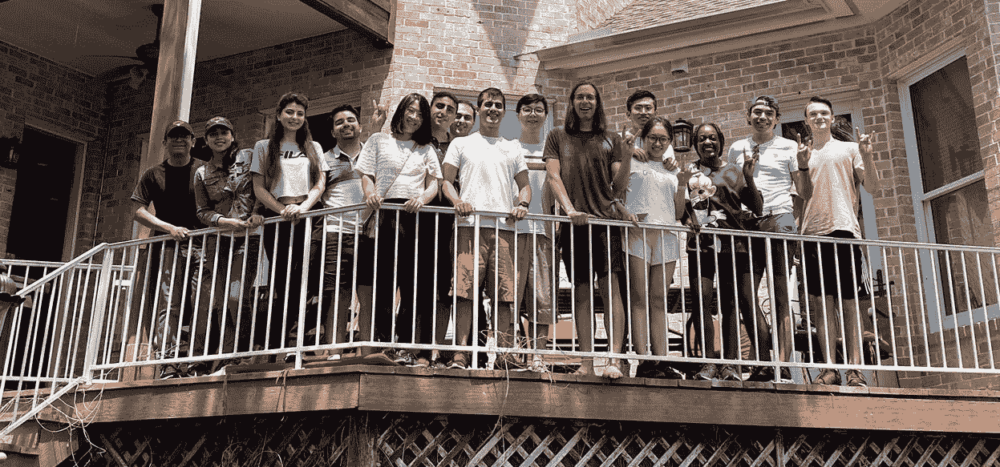
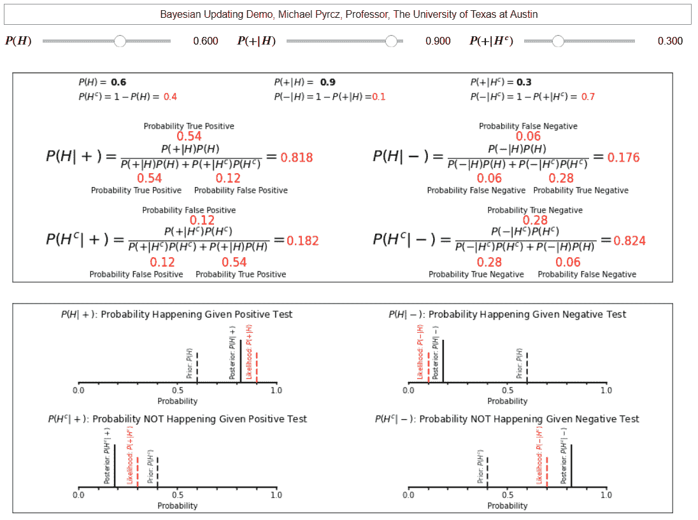

# 引言

> 原文：[`geostatsguy.github.io/MachineLearningDemos_Book/intro.html`](https://geostatsguy.github.io/MachineLearningDemos_Book/intro.html)

迈克尔·J·皮尔奇，教授，德克萨斯大学奥斯汀分校

[Twitter](https://twitter.com/geostatsguy) | [GitHub](https://github.com/GeostatsGuy) | [网站](http://michaelpyrcz.com) | [Google Scholar](https://scholar.google.com/citations?user=QVZ20eQAAAAJ&hl=en&oi=ao) | [地统计学书籍](https://www.amazon.com/Geostatistical-Reservoir-Modeling-Michael-Pyrcz/dp/0199731446) | [YouTube](https://www.youtube.com/channel/UCLqEr-xV-ceHdXXXrTId5ig) | [Python 中应用地统计学电子书](https://geostatsguy.github.io/GeostatsPyDemos_Book/intro.html) | [Python 中应用机器学习电子书](https://geostatsguy.github.io/MachineLearningDemos_Book/) | [LinkedIn](https://www.linkedin.com/in/michael-pyrcz-61a648a1)

电子书“Python 中应用机器学习：动手指南及代码”的章节。

请将此电子书引用如下：

Pyrcz, M.J., 2024, *Applied Machine Learning in Python: A Hands-on Guide with Code* [电子书]. Zenodo. doi:10.5281/zenodo.15169138 

本书中的工作流程以及其他工作流程都可以在这里找到：

请将 MachineLearningDemos GitHub 仓库引用如下：

Pyrcz, M.J., 2024, *MachineLearningDemos: Python Machine Learning Demonstration Workflows Repository* (0.0.3) [软件]. Zenodo. DOI: 10.5281/zenodo.13835312\. GitHub 仓库：[GeostatsGuy/MachineLearningDemos](https://github.com/GeostatsGuy/MachineLearningDemos) 

作者：迈克尔·J·皮尔奇

© 版权所有 2024。

## 关于这本电子书

这本电子书提供了一个易于访问的在线版本，一种新的方式来分享我在德克萨斯大学奥斯汀分校的[机器学习](https://www.youtube.com/playlist?list=PLG19vXLQHvSC2ZKFIkgVpI9fCjkN38kwf)研究生课程，其中包括：

+   **详细记录的演示 Python 工作流程** - 几乎一半的讲座时间都花在了这些来自我的[MachineLearningDemos](https://github.com/GeostatsGuy/MachineLearningDemos) GitHub 仓库的工作流程上，这些工作流程包括许多常见机器学习工作流程的详细记录的演示 Python Jupyter 工作流程。这本电子书的一个目标是将这些内容分享给 GitHub 用户之外的人，通常只有专家和开发者才能看到——以帮助更多的人！

+   **课程笔记** - 我还努力继续将更多课程笔记添加到这本电子书中，以提供更多关于理论和实现细节的覆盖。

+   **交互式 Python 仪表板** - 我在课堂上使用了许多交互式 Python 仪表板，我将继续在这本电子书中解释和引用它们，以帮助您获得完整的课堂体验。这些仪表板都可以在我的[DataScienceInteractivePython](https://github.com/GeostatsGuy/DataScienceInteractivePython) GitHub 仓库中找到。

+   **录音讲座** - 每个月在我的[YouTube 频道](https://www.youtube.com/@GeostatsGuyLectures)的[机器学习](https://www.youtube.com/playlist?list=PLG19vXLQHvSC2ZKFIkgVpI9fCjkN38kwf)课程播放列表中，我的讲座有数千次观看。这些录音讲座提供了更多的解释来支持您！

欢迎您！

这本电子书的范围是教授机器学习在 Python 中的应用，对于机器学习新手，我提供了理论概述和链接到我的录音讲座，以便进行更深入的学习；对于经验丰富的从业者，我提供了示例和增强的工作流程以及可视化，您可以实施这些内容。

这是将我德克萨斯大学奥斯汀分校的课程之一，基于良好的 Python 工作流程文档，转换为在线可访问电子书的第二次努力。

+   对于对数据分析、空间数据分析和地统计学感兴趣的人，我欢迎您访问我的另一本电子书，[Python 应用地统计学：GeostatsPy 实践指南](https://geostatsguy.github.io/GeostatsPyDemos_Book/intro.html)，该书基于我的本科课程[数据分析与地统计学](https://youtube.com/playlist?list=PLG19vXLQHvSB-D4XKYieEku9GQMQyAzjJ&si=YufCV19jRunPmFZc)和我的地统计学 Python 包[GeostatsPy](https://pypi.org/project/geostatspy/)。

来自世界各地学生和职场专业人士对这本电子书的积极响应激励我整理、构建和发布这本电子书。

+   这本书中工作流程的原始存储库可以在[MachineLearningDemos：Python 机器学习演示工作流程存储库](https://github.com/GeostatsGuy/MachineLearningDemos)找到，但请放心，这本书的每一章都是一个 Jupyter Notebook 或 Jupyter Lab .ipynb 文件，可以下载并本地运行。

+   我唯一的要求是，当我的作品被使用时，请保留我的作者身份并引用来源。我的动机是吸引更多人关注我在网上分享的所有资源！请考虑在您的作品中引用和链接这些资源。请参阅本介绍顶部的引用。

这本电子书内容的最终来源是我的为期一个学期的机器学习研究生课程，因此我根据课程中的教育叙事做出了范围决策。

+   我相信任何数据科学中 80%或更多的内容都是数据准备，所以我将课程的三分之一时间用于工作流程设计、概率概念、数据准备和特征工程，然后再启动任何机器。

+   我在简单的机器上花费了很多时间，比如线性回归和正则化变体，来教授基本理论。

+   我逐步介绍具体方法来构建概念，例如，$L²$与$L¹$范数、正则化、卷积、自助和袋装、贝叶斯方法等。

+   我很快将添加关于深度学习的章节。

我努力将章节排序，以构建机器学习概念，从特征工程开始，通过推理机器学习，直至预测机器学习。预测机器学习的排序从线性回归开始，引入岭回归进行超参数调整，引入多项式回归进行基函数扩展，将贝叶斯方法与贝叶斯线性回归结合，通过 k-最近邻展示懒惰学习与积极学习，用树展示集成方法等。

+   如果你按顺序完成章节，你将受益于我在所有课程中都喜欢应用的这种“支架”和“螺旋”的教育方法。

+   然而，每个章节都设计成独立的资源，在大多数情况下，你可以轻松地插入自己的数据集。记住在你的工作中引用这本电子书和存储库，如果你经过奥斯汀，请带给我一个早餐玉米卷！

这本电子书不是统计学的一般介绍，也不是机器学习的全面处理。

+   要深入了解基于基本概率和统计学的理论与实践，请点击每个章节顶部的链接，查看我 YouTube 频道上的[机器学习课程](https://www.youtube.com/playlist?list=PLG19vXLQHvSC2ZKFIkgVpI9fCjkN38kwf) [Pyr24a]播放列表。

+   当然，有关于机器学习理论的优秀书籍，我特别喜欢的是[《统计学习的要素：数据挖掘、推理和预测》](https://www.amazon.com/Elements-Statistical-Learning-Prediction-Statistics/dp/0387848576/ref=sr_1_1?crid=219UH54M8MIS6&dib=eyJ2IjoiMSJ9.fh_JG0GOjaLD32XrqN8uJE0bBbEVgutMStZUYLHACzr8YEzjV2ommtSpLcI0ed8OflRxA4AgTUEYl4S8Y4ICbP3s2OkSR8EaSxk8OHLwyavIw52GFVGGSJpyX9Y7BNipvmjdb8VgidS9njUPpDwpl1CmpD0BTb8LtbTHm8nCXBQT0W21r5H0DU84tHqrT0AQUUBb2fA9DMIdAJGqdFp1yssN1rXciwATn5v4juV5TiA.nGxoUTS2l564x_D3GUdkwt-QUKt8be_WRfy8eJPgjkQ&dib_tag=se&keywords=machine+learning+statistical+learning&qid=1727204107&sprefix=machine+learning+statistical+learning%2Caps%2C119&sr=8-1) [HTF09].

可用的链接讲座

要深入了解地理统计学的理论与实践，请点击每个章节顶部的链接，查看我录制的 YouTube 讲座。


我的 YouTube 频道。

如果您感兴趣，我的 YouTube 频道包括 3 个完整的课程：

1.  [数据分析和地统计学课程](https://youtube.com/playlist?list=PLG19vXLQHvSB-D4XKYieEku9GQMQyAzjJ&si=MzTdgS7IfHEhvF4Q) [Pyr24a]

1.  [空间数据分析课程](https://youtube.com/playlist?list=PLG19vXLQHvSDUmEOmBoaxGbFAbvaLdfx4&si=Pd9bNQLVFZ9Yqz6-)

1.  [机器学习](https://youtube.com/playlist?list=PLG19vXLQHvSC2ZKFIkgVpI9fCjkN38kwf&si=tfOVljWgWiduwGYl)

以及包括以下补充系列：

1.  [数据科学交互式 Python 演示](https://youtube.com/playlist?list=PLG19vXLQHvSDy26fM3hDLg3VCU7U5BGZl&si=FB2UoSfJrzjwcKAS) - 许多交互式 Python 数据科学仪表板的操作指南

1.  [Python 中的数据科学基础](https://youtube.com/playlist?list=PLG19vXLQHvSAufDFgZEFAYQEwMJXklnQV&si=FN_PZ9C9GdJlHxNv) - 加载数据和可视化的基础知识，此电子书的学习前提

1.  [随机谈话](https://youtube.com/playlist?list=PLG19vXLQHvSDyiLrXpqPV8bUMRvOCHiUZ&si=kCApGUp2xPMu6R7Z) - 关于数据分析、地统计学和机器学习等主题的一些谈话，甚至有标题为，

+   “在工业界和学术界之间选择”

+   “迈克尔的无偿职业建议”

+   “地下数据分析与机器学习的新研究”

+   “教授的秘密武器”

+   “作为合格工程师或地球科学家应用机器学习”

## 目录

这里是目录，包含指向此电子书每个章节的链接。注意，在桌面电脑上有一个左侧导航栏，在手机上有一个下拉导航栏。此外，词汇表提供了指向定义每个术语的章节的链接。

+   机器学习概念

+   训练和调整

+   工作流程构建和编码

+   概率概念

+   加载数据和绘图模型

+   单变量分析

+   多元分析

+   特征变换

+   特征排序

+   特征插补

+   聚类分析

+   基于密度的聚类

+   谱聚类

+   主成分分析

+   多维尺度

+   随机投影

+   使用 scikit-learn 进行预测

+   线性回归

+   岭回归

+   LASSO 回归

+   贝叶斯线性回归

+   朴素贝叶斯

+   多项式回归

+   k-最近邻

+   决策树

+   Bagging 树和随机森林

+   梯度提升

+   支持向量机

+   神经网络激活函数

+   人工神经网络

+   卷积神经网络

+   自动编码器神经网络

+   生成对抗网络

+   时间序列分析和建模

+   Python 代码片段

+   合成数据集

+   结论

+   术语表

+   参考文献

## 近期更新

这里是此电子书近期更新的亮点：

### 版本 0.0.1 的新增内容

+   这是最初的发布版本。感谢您早期加入！抱歉，还有一些小的格式问题，我将在接下来的几个月内解决。我欢迎对错误进行反馈。我感激任何形式的帮助。

+   我将研究将我的[交互式教育数据科学 Python 仪表板](https://github.com/GeostatsGuy/DataScienceInteractivePython)交互式仪表板[Pyr21], 以及更多来自我的[机器学习讲座系列](https://youtube.com/playlist?list=PLG19vXLQHvSC2ZKFIkgVpI9fCjkN38kwf&si=tfOVljWgWiduwGYl) [Pyr24a].

### 版本 0.0.2 的新增内容

+   添加了关于特征工程、机器学习概念概述章节和术语表的新章节！

+   我正在努力捕捉和纠正错误、链接、拼写和语法错误

## 开放教育内容的动机

还有更多的工作要做，但我很兴奋地将所有这些内容整理成易于访问的格式，并链接到讲座和可重复的代码。我的目标是帮助人们开始或提高他们对机器学习的应用。通过电子书，我实现了与大家分享教育内容的美梦，

+   **活文档**，我会持续改进并添加新内容，所以请给我建议和错误，并经常回来！

+   **可重复的结果**，所有示例和图表都展示了代码，任何人都可以重现所有结果！代码可以立即下载，所有数据都在线可用。

+   **链接**，快速访问所有相关资源，汇集我所有的教育内容。

+   **无付费墙**，让全世界的人都能访问我的内容。

对于我来说，这是一个将所有教育内容结合和分享的绝佳工具。是的，数千人可以在 GitHub 上跟随和镜像我的工作流程，但电子书将更广泛地分享这些内容。我通过我的 YouTube 频道看到这一点，该频道有数万订阅者，每月观看次数与我的 GitHub 账户上大约 3,600 个关注者相比。

+   可访问和可操作的教育内容是我的个人座右铭。

有些人可能会 wonder，为什么迈克尔这样做？查看[我的故事](https://michaelpyrcz.com/my-story)，你就会了解到教育改变了我的人生。以下是总结，

+   我在加拿大一个小镇的低收入家庭中长大。

+   一个随机的工程学生在寒冷的一个晚上在加油站和我交谈，这让我对大学教育产生了兴趣。

+   我通过工程学[B.Sc](http://B.Sc)和 Ph.D.学位支持自己和年轻的家庭，因此拥有了一个充满挑战、激动人心且富有成效的职业生涯。

现在，我的使命是分享我在大学期间的所有教育内容，希望我能像别人帮助我一样帮助别人。



2022 年春季，我在德克萨斯州奥斯汀的家中聚集了我的研究生。

在我们开始之前，这里有一些关于本电子书章节中工作流程和我的交互式 Python 仪表板的更多信息。

## 机器学习演示

当我教学时，我避免“复制粘贴”，而是，

+   每个示例都是真实且可重复的。学生可以访问代码和数据，并为自己运行课堂演示示例。

例如，当我教授概率密度函数作为数据分析的一部分时，我会展示一个使用不同核的示例。


从我的数据分析、单变量分析课程笔记中演示如何计算连续概率密度函数，使用高斯核。

在课程笔记的图表标题中，我包括了重现此方法的流程和实际图表的链接，这些图表包含在本电子书章节单变量分析中。

本电子书中的每个机器学习章节都是一个可下载的、有良好文档的工作流程，

+   利用我从[GeoDataSets](https://github.com/GeostatsGuy/GeoDataSets)存储库中合成的数据

+   小而频繁的 2D 示例，以实现快速运行时间和易于解释

常见的机器学习工作流程包括，

+   多变量分析

+   特征选择

+   特征转换

+   聚类分析

+   主成分分析

+   线性回归

+   岭回归

+   LASSO 回归

+   贝叶斯线性回归

+   朴素贝叶斯分类

+   多项式回归

+   k 最近邻

+   决策树

+   梯度提升树和随机森林

+   梯度提升

+   支持向量机

在我的其他仓库中，我还有许多其他机器学习和数据科学工作流程。当我为这本电子书准备这些内容时，我会将它们添加到这个仓库中。如果还有其他感兴趣的主题，请告诉我。

+   人工和卷积神经网络是下一个！

## 数据科学交互式 Python 仓库

我最喜欢做的事情之一就是构建 Python 交互式仪表板来支持我的讲座。以下是我交互式仪表板的一个示例屏幕截图，[贝叶斯更新](https://github.com/GeostatsGuy/DataScienceInteractivePython/blob/main/Interactive_Bayesian_Updating.ipynb)，



我交互式仪表板的一个例子，贝叶斯更新，带有滑块来调整输入概率，即先验和似然，以及自定义绘图来可视化结果后验概率。

+   我认为教一个概念，然后让学生打开仪表板并快速尝试，即玩转系统，是一种很酷的教学方式！

您可以探索我在 GitHub 上的[数据科学交互式 Python](https://github.com/GeostatsGuy/DataScienceInteractivePython)仓库中超过 50 个交互式数据科学 Python 仪表板，包括交互式，

+   贝叶斯更新

+   bootstrap

+   中心极限定理

+   相关系数

+   k 均值聚类

+   基于密度的聚类

+   谱聚类

+   线性、岭回归和 LASSO 回归

+   模型超参数调整和过拟合

+   主成分分析

+   变差图计算和建模

+   空间估计和模拟

+   在不确定性存在的情况下进行决策

+   人工神经网络

这已经是一项很大的工作，但什么激励着我？

+   **我是一个视觉学习者** - 是的，我理解数学和系统，但看到它们在行动中对我来说非常有帮助。我知道很多人像我一样。

+   **在课堂上回答问题的最佳方式之一** - 一个学生问，主成分载荷看起来像什么？那天晚上我制作了一个非常酷的仪表板，其中一个输入是三个特征之间的相关系数，另一个是独立的。输出包括主成分载荷和每个主成分解释的方差。它展示了如此多的内容，包括方差守恒，以及当相关性增加时，第一个成分作为三个相关特征的混合。

+   **我真的喜欢做这件事** - 我离开了工业界，为了回馈社会并享受乐趣。我喜欢编码，我也喜欢制作数据科学展示。

目前我将添加这些交互式仪表板的链接。

+   在未来，我希望这些内容能够以实时和交互式的方式包含在电子书中。GitHub 上托管的 jupyter-book 目前不允许这样做。

## 运行本电子书中的工作流程

你可以使用此电子书，即阅读和审查工作流程，而无需运行代码。我建议你自己运行代码，以巩固这些概念。

+   要这样做，你只需要安装所需的 Python 包。

好消息是，我通常使用通过[Anaconda](https://www.anaconda.com/download)提供的常见 Python 包。还需要安装一些额外的包，包括，

+   **geostatspy** - 我的空间数据分析和地统计学包，用于某些数据转换和可视化

+   **pyvista** - 3D 网格可视化

+   **astropy** - 稀疏数据卷积

+   **shap** - 用于可解释机器学习和特征排序的 Shapley 值

这些包维护得很好，都可以使用以下方式安装：

```py
pip install [package_name] 
```

从终端窗口。

+   我喜欢从 Anaconda Navigator 的“环境”选项卡启动终端窗口，然后左键点击绿色箭头并选择“打开终端”。这将确保包被安装到正确的位置。在教了 100 多名学生并看到许多问题后，这是我建议的最安全的安装 Python 包的方法。

## 使用此电子书的建议

这是一种针对机器学习实际应用的专题方法。每一章都是独立的，并涵盖了一种独特的机器学习方法。

+   想要评估你的特征吗？

+   想要执行聚类分析吗？

+   想要训练和调整随机森林模型吗？

打开相应的章节，按照所有必要的步骤进行示例演练，包括数据加载、数据可视化和建模步骤，所有代码都可用，并通过文本和注释进行解释，并展示结果。

+   实际上，我尽量使用高效的图表展示了尽可能多的图形输出。

在做这件事的时候，你可以去链接的讲座中填补你知识上的任何空白，然后下载并更新你的应用工作流程。

+   请记住，在你的工作中引用此电子书，这样其他人就能看到并使用这个资源！

记住，这个内容仅用于教育目的，我不提供任何保证。

+   代码中可能有错误，你的案例可能有问题，这会使得电子书工作流程的假设无效。评估你的结果取决于你。

警告

如果你从这个电子书中采用了任何工作流程，你必须检查你自己的工作。

## 关于作者


德克萨斯大学奥斯汀分校 40 英亩校园内，迈克尔·皮尔茨教授在他的办公室。

迈克尔·皮尔茨是德克萨斯大学奥斯汀分校[Cockrell 工程学院](https://cockrell.utexas.edu/faculty-directory/alphabetical/p)和[Jackson 地球科学学院](https://www.jsg.utexas.edu/researcher/michael_pyrcz/)的教授，他在那里研究并教授地下、空间数据分析、地统计学和机器学习。迈克尔还是，

+   [能源分析](https://fri.cns.utexas.edu/energy-analytics)新生研究项目的首席研究员，德克萨斯大学奥斯汀分校自然科学院机器学习实验室的核心教员。

+   [《计算机与地球科学》](https://www.sciencedirect.com/journal/computers-and-geosciences/about/editorial-board)的副编辑，以及国际数学地球科学协会[《数学地球科学》](https://link.springer.com/journal/11004/editorial-board)的董事会成员。

迈克尔已经撰写了超过 70 篇[同行评审的出版物](https://scholar.google.com/citations?user=QVZ20eQAAAAJ&hl=en)，一个用于空间数据分析的[Python 包](https://pypi.org/project/geostatspy/)，合著了一本关于空间数据分析的教科书《[地统计学储层建模](https://www.amazon.com/Geostatistical-Reservoir-Modeling-Michael-Pyrcz/dp/0199731446)》，并是两本最近发布的电子书的作者，分别是《[Python 中的应用地统计学：GeostatsPy 实践指南](https://geostatsguy.github.io/GeostatsPyDemos_Book/intro.html)》和《[Python 中的应用机器学习：带代码的实践指南](https://geostatsguy.github.io/MachineLearningDemos_Book/intro.html)》。

迈克尔的所有大学讲座都可在他的[YouTube 频道](https://www.youtube.com/@GeostatsGuyLectures)上找到，附有 100 多个 Python 交互式仪表板和 40 多个 GitHub 仓库中的详细工作流程链接，以支持任何感兴趣的学生和在职专业人士，提供持续更新的内容。想了解更多关于迈克尔的工作和共享教育资源，请访问他的网站。

## 想一起工作吗？

我希望这个内容对那些想了解更多关于地下、空间建模、数据分析和地统计学的人来说是有帮助的。学生和在职专业人士都欢迎参与。我很乐意与您的组织合作。

+   想邀请我到贵公司进行培训、辅导、项目审查、工作流程设计和/或咨询？我很乐意拜访并与您一起工作！我是数据科学教育公司的联合创始人。

+   想要合作、支持我的研究生研究或我的地下数据分析与机器学习联盟（包括 Foster 教授、Torres-Verdin 教授和 van Oort 教授作为共同负责人）？我的研究将数据分析、随机建模和机器学习理论与实践相结合，以开发新的方法和工作流程，增加价值。我们正在解决具有挑战性的地下问题！

+   我可以通过 mpyrcz@austin.utexas.edu 联系。

我总是乐于讨论，

*迈克尔*

迈克尔·皮尔茨，博士，P.Eng. 教授，德克萨斯大学奥斯汀分校的 Cockrell 工程学院和 Jackson 地球科学学院

更多资源可在以下位置获取：[Twitter](https://twitter.com/geostatsguy) | [GitHub](https://github.com/GeostatsGuy) | [网站](http://michaelpyrcz.com) | [Google Scholar](https://scholar.google.com/citations?user=QVZ20eQAAAAJ&hl=en&oi=ao) | [地统计学书籍](https://www.amazon.com/Geostatistical-Reservoir-Modeling-Michael-Pyrcz/dp/0199731446) | [YouTube](https://www.youtube.com/channel/UCLqEr-xV-ceHdXXXrTId5ig) | [Python 中应用地统计学电子书](https://geostatsguy.github.io/GeostatsPyDemos_Book/intro.html) | [Python 中应用机器学习电子书](https://geostatsguy.github.io/MachineLearningDemos_Book/) | [LinkedIn](https://www.linkedin.com/in/michael-pyrcz-61a648a1)

## 关于此电子书

本电子书提供了一个可访问的在线版本，一种分享我在德克萨斯大学奥斯汀分校的[机器学习](https://www.youtube.com/playlist?list=PLG19vXLQHvSC2ZKFIkgVpI9fCjkN38kwf)研究生课程的新方式，其中包括，

+   **详细记录的演示 Python 工作流程** - 几乎一半的讲座时间都花在了我的[MachineLearningDemos](https://github.com/GeostatsGuy/MachineLearningDemos) GitHub 仓库中的这些工作流程上，这些工作流程包括许多常见机器学习工作流程的详细记录的演示 Python Jupyter 工作流程。本电子书的一个目标是将这些内容分享给 GitHub 用户之外的人，通常只有专家和开发者——以帮助更多的人！

+   **课程笔记** - 我还努力继续将更多的课程笔记添加到这本电子书中，以提供更多关于理论和实现细节的覆盖。

+   **交互式 Python 仪表板** - 我在我的课堂上使用了大量的交互式 Python 仪表板，我将继续在这本电子书中解释和引用它们，以帮助您获得完整的课堂体验。这些内容都可以在我的[DataScienceInteractivePython](https://github.com/GeostatsGuy/DataScienceInteractivePython) GitHub 仓库中找到。

+   **录音讲座** - 我的讲座在[YouTube 频道](https://www.youtube.com/@GeostatsGuyLectures)的[机器学习](https://www.youtube.com/playlist?list=PLG19vXLQHvSC2ZKFIkgVpI9fCjkN38kwf)课程播放列表中每月有数千次观看。这些录音讲座提供了更多的解释来支持您！

欢迎光临！

本电子书的范围是教授 Python 中机器学习的应用，对于机器学习的新手，我提供了理论概述和记录的讲座链接，以便进行更深入的探讨；而对于经验丰富的从业者，我提供了示例和增强的工作流程以及可视化，您可以实施这些内容。

这是我的第二次尝试，将我在德克萨斯大学奥斯汀分校的基于良好记录的 Python 工作流程的课程，转换成在线可访问的电子书。

+   对于对数据分析和空间数据分析以及地统计学感兴趣的人，我欢迎您访问我的另一本电子书，[《Python 应用地统计学：GeostatsPy 动手指南》](https://geostatsguy.github.io/GeostatsPyDemos_Book/intro.html)，这本书基于我的本科课程[《数据分析和地统计学》](https://youtube.com/playlist?list=PLG19vXLQHvSB-D4XKYieEku9GQMQyAzjJ&si=YufCV19jRunPmFZc)以及我的地统计学 Python 包[GeostatsPy](https://pypi.org/project/geostatspy/)。

这本电子书从全球的学生和职场专业人士那里得到了热烈的回应，这激励我编译、构建和发布这本电子书。

+   本书中的工作流程原始仓库位于[MachineLearningDemos：Python 机器学习演示工作流程仓库](https://github.com/GeostatsGuy/MachineLearningDemos) [Pyr24d]，但请放心，本书中的每一章都是一个 Jupyter Notebook 或 Jupyter Lab .ipynb 文件，可以下载并本地运行。

+   我所要求的只是保留我的作者身份，并在我的作品被使用时引用来源。我的动机是吸引更多人关注我在网上分享的所有资源！请考虑在您的作品中引用和链接这些资源。请参阅本介绍顶部的引用。

这本电子书内容的最终来源是我的为期一个学期的机器学习研究生课程，因此我根据课程中的教育叙事做出了范围决策。

+   我认为任何数据科学中的 80%或更多是数据准备，所以我将课程的三分之一用于工作流程设计、概率概念、数据准备和特征工程，然后我们再启动任何机器。

+   我在简单的机器上花费了大量时间，比如线性回归和正则化变体，来教授基本理论。

+   我逐步介绍具体方法来构建概念，例如，$L²$与$L¹$范数、正则化、卷积、自助法和袋装法、贝叶斯方法等。

+   我很快将添加关于深度学习的章节。

我努力将章节排序，以构建机器学习概念，从特征工程开始，通过推断机器学习，直至预测机器学习。预测机器学习的排序是从线性回归开始，引入岭回归进行超参数调整，引入多项式回归进行基函数扩展，将贝叶斯方法与贝叶斯线性回归结合，通过 k-最近邻展示懒惰学习与积极学习，用树展示集成方法等。

+   如果您按顺序完成章节，您将受益于我在这所有课程中喜欢应用的这种“支架”和“螺旋”教育方法。

+   尽管如此，每个章节都设计成独立的资源，在大多数情况下，你可以轻松地插入并使用自己的数据集。记住在您的作品中引用这本电子书和存储库，并且如果您经过奥斯汀，请带给我一个早餐玉米卷饼！

这本电子书既不是统计学的一般介绍，也不是机器学习的全面论述，

+   若要深入了解基于基础概率和统计的理论与实践，请在每个章节顶部点击链接，访问我在[机器学习课程](https://www.youtube.com/playlist?list=PLG19vXLQHvSC2ZKFIkgVpI9fCjkN38kwf)的录音讲座播放列表 [Pyr24a]。

+   当然，还有许多关于机器学习理论的优秀书籍，其中我最喜欢的是[《统计学习的要素：数据挖掘、推理和预测》](https://www.amazon.com/Elements-Statistical-Learning-Prediction-Statistics/dp/0387848576/ref=sr_1_1?crid=219UH54M8MIS6&dib=eyJ2IjoiMSJ9.fh_JG0GOjaLD32XrqN8uJE0bBbEVgutMStZUYLHACzr8YEzjV2ommtSpLcI0ed8OflRxA4AgTUEYl4S8Y4ICbP3s2OkSR8EaSxk8OHLwyavIw52GFVGGSJpyX9Y7BNipvmjdb8VgidS9njUPpDwpl1CmpD0BTb8LtbTHm8nCXBQT0W21r5H0DU84tHqrT0AQUUBb2fA9DMIdAJGqdFp1yssN1rXciwATn5v4juV5TiA.nGxoUTS2l564x_D3GUdkwt-QUKt8be_WRfy8eJPgjkQ&dib_tag=se&keywords=machine+learning+statistical+learning&qid=1727204107&sprefix=machine+learning+statistical+learning%2Caps%2C119&sr=8-1) [HTF09].

链接式录音讲座可供使用

若要深入了解地统计学理论和实践，请在每个章节顶部点击链接，访问我的 YouTube 频道上的录音讲座。


我的 YouTube 频道。

如果您感兴趣，我的 YouTube 频道包括 3 门完整的课程：

1.  [数据分析和地统计学课程](https://youtube.com/playlist?list=PLG19vXLQHvSB-D4XKYieEku9GQMQyAzjJ&si=MzTdgS7IfHEhvF4Q) [Pyr24a]。

1.  [空间数据分析课程](https://youtube.com/playlist?list=PLG19vXLQHvSDUmEOmBoaxGbFAbvaLdfx4&si=Pd9bNQLVFZ9Yqz6-)

1.  [机器学习](https://youtube.com/playlist?list=PLG19vXLQHvSC2ZKFIkgVpI9fCjkN38kwf&si=tfOVljWgWiduwGYl)

以及包括以下补充系列：

1.  [数据科学交互式 Python 演示](https://youtube.com/playlist?list=PLG19vXLQHvSDy26fM3hDLg3VCU7U5BGZl&si=FB2UoSfJrzjwcKAS) - 许多交互式 Python 数据科学仪表板的操作指南

1.  [Python 中的数据科学基础](https://youtube.com/playlist?list=PLG19vXLQHvSAufDFgZEFAYQEwMJXklnQV&si=FN_PZ9C9GdJlHxNv) - 基础知识，如加载数据和可视化数据，此电子书的学习前提

1.  [随机谈话](https://youtube.com/playlist?list=PLG19vXLQHvSDyiLrXpqPV8bUMRvOCHiUZ&si=kCApGUp2xPMu6R7Z) - 一些关于数据分析、地统计学和机器学习的谈话，甚至有标题为，

+   “在工业界和学术界之间选择”

+   “迈克尔的无偿职业建议”

+   “在地下数据分析与机器学习中的新研究”

+   “教授的秘密武器”

+   “应用机器学习作为合格工程师或地球科学家”

## 目录

这里是目录，包含指向此电子书每个章节的链接。注意，左侧有一个导航栏（在桌面电脑上）和一个下拉导航栏（在手机上）。此外，术语表提供了指向定义每个术语的章节的链接。

+   机器学习概念

+   训练和调整

+   工作流程构建和编码

+   概率概念

+   加载数据和绘图模型

+   单变量分析

+   多元分析

+   特征转换

+   特征排序

+   特征插补

+   聚类分析

+   基于密度的聚类

+   谱聚类

+   主成分分析

+   多维尺度分析

+   随机投影

+   使用 scikit-learn 进行预测

+   线性回归

+   岭回归

+   LASSO 回归

+   贝叶斯线性回归

+   朴素贝叶斯

+   多项式回归

+   k-最近邻

+   决策树

+   袋装树和随机森林

+   梯度提升

+   支持向量机

+   神经网络激活函数

+   人工神经网络

+   卷积神经网络

+   自动编码器神经网络

+   生成对抗网络

+   时间序列分析和建模

+   Python 代码片段

+   合成数据集

+   结论

+   术语表

+   参考文献

## 近期更新

这里是此电子书最近更新的亮点：

### 版本 0.0.1 的新增内容

+   这是第一个版本。感谢您早期加入！抱歉，有许多小的格式问题，我将在接下来的几个月内解决。我欢迎提供错误反馈的反馈。我感激任何帮助。

+   我将探讨将我的 [交互式教育数据科学 Python 仪表板](https://github.com/GeostatsGuy/DataScienceInteractivePython) 交互式仪表板 [Pyr21], 以及更多来自我的 [机器学习讲座系列](https://youtube.com/playlist?list=PLG19vXLQHvSC2ZKFIkgVpI9fCjkN38kwf&si=tfOVljWgWiduwGYl) [Pyr24a].

### 版本 0.0.2 的新增内容

+   添加了关于特征工程、机器学习概念概述章节和术语表的新章节！

+   我正在努力捕捉和纠正错误、链接、拼写和语法

### 版本 0.0.1 的新增内容

+   这是第一个版本。感谢您早期加入！抱歉，有许多小的格式问题，我将在接下来的几个月内解决。我欢迎提供错误反馈的反馈。我感激任何帮助。

+   我将探讨将我的 [交互式教育数据科学 Python 仪表板](https://github.com/GeostatsGuy/DataScienceInteractivePython) 交互式仪表板 [Pyr21], 以及更多来自我的 [机器学习讲座系列](https://youtube.com/playlist?list=PLG19vXLQHvSC2ZKFIkgVpI9fCjkN38kwf&si=tfOVljWgWiduwGYl) [Pyr24a].

### 版本 0.0.2 的新增内容

+   添加了关于特征工程、机器学习概念概述章节和术语表的新章节！

+   我正在努力捕捉和纠正错误、链接、拼写和语法

## 开放教育内容的动机

还有更多的工作要做，但我很高兴将这些内容整理成可访问的格式，与讲座相关联，并带有可重复的代码。我的目标是帮助人们开始或提高他们对机器学习的应用。通过电子书，我实现了与

+   **活文档**，我会随着时间的推移不断改进和添加新内容，所以请给我建议和错误，并经常回来！

+   **可重复的结果**，所有示例和图表都显示了代码，任何人都可以重现所有结果！代码可以立即下载，所有数据都在线可用。

+   **链接**，快速访问所有相关资源，汇集我所有的教育内容。

+   **无付费墙**，让全世界的人都能访问我的内容。

对于我来说，这是一个将所有教育内容结合和分享的绝佳工具。是的，成千上万的人可以在 GitHub 上跟随和镜像我的工作流程，但电子书将使这些内容传播得更广。我以我的 YouTube 频道为例，拥有数万订阅者和每月数万次观看，而我的 GitHub 账户则有大约 3,600 个关注者。

+   可访问和可操作的教育内容是我的个人信条。

有些人可能会 wonder，为什么迈克尔这样做？查看[我的故事](https://michaelpyrcz.com/my-story)，你就会了解到教育改变了我的人生。以下是总结，

+   我在加拿大一个小镇的低收入家庭中长大。

+   一个随机的工程学学生在寒冷的一个晚上在加油站和我交谈，这让我对大学教育产生了兴趣。

+   我通过工程学学士（B.Sc）和博士学位的支持，养活了自己和年轻的家庭，因此拥有了一个充满挑战、激动人心且富有成效的职业生涯。

现在，我的使命是分享我所有的大学教育内容，希望我能像别人帮助我一样帮助他人。


2022 年春季，我在德克萨斯州奥斯汀的家中聚集了我的研究生们。

在我们开始之前，这里有一些关于本书章节中的工作流程和我交互式 Python 仪表板的更多信息。

## 机器学习演示

当我教学时，我避免“复制粘贴”，而是，

+   每个示例都是真实且可重复的。学生可以访问代码和数据，为自己运行课堂演示示例。

例如，当我教授概率密度函数作为数据分析的一部分时，我会展示不同核的示例。


从我的数据分析、单变量分析课程笔记中计算具有高斯核的连续概率密度函数的演示。

在课程笔记的图例中，我包括了链接到工作流程以重现此方法和实际图表的链接，这些图表包含在本章单变量分析中。

本书中的每个机器学习章节都是一个可下载的、有良好文档的工作流程，

+   利用来自我的[GeoDataSets](https://github.com/GeostatsGuy/GeoDataSets)仓库的合成数据

+   小而常见的二维示例，以实现快速运行时间和易于解释

常见的机器学习工作流程包括，

+   多变量分析

+   特征选择

+   特征转换

+   聚类分析

+   主成分分析

+   线性回归

+   岭回归

+   LASSO 回归

+   贝叶斯线性回归

+   朴素贝叶斯分类

+   多项式回归

+   k 近邻

+   决策树

+   梯度提升树和随机森林

+   梯度提升

+   支持向量机

我在其他仓库中还有许多其他机器学习和数据科学工作流程。当我为这本电子书准备这些内容时，我会将它们添加到这个仓库中。如果还有其他感兴趣的主题，请告诉我。

+   人工和卷积神经网络是下一个目标！

## 数据科学交互式 Python 仓库

我最喜欢做的事情之一就是构建 Python 交互式仪表板来支持我的讲座。以下是我为[贝叶斯更新](https://github.com/GeostatsGuy/DataScienceInteractivePython/blob/main/Interactive_Bayesian_Updating.ipynb)制作的交互式仪表板的一个示例屏幕截图，


我的一个交互式仪表板的例子，贝叶斯更新带有滑块来调整输入概率，即先验和似然，以及自定义绘图来可视化结果的后验概率。

+   我认为教一个概念然后让学生打开仪表板并快速尝试它，即玩转系统，是非常酷的！

您可以自由探索我在 GitHub 上[数据科学交互式 Python](https://github.com/GeostatsGuy/DataScienceInteractivePython)仓库中超过 50 个交互式数据科学 Python 仪表板，包括交互式，

+   贝叶斯更新

+   自举

+   中心极限定理

+   相关系数

+   k 均值聚类

+   基于密度的聚类

+   谱聚类

+   线性、岭回归和 LASSO 回归

+   模型超参数调整和过拟合

+   主成分分析

+   变差图计算和建模

+   空间估计和模拟

+   在存在不确定性的情况下进行决策

+   人工神经网络

这已经是一项大量工作，但什么激励着我？

+   **我是一个视觉学习者** - 是的，我理解数学和系统，但看到它们在行动中对我来说非常有帮助。我知道很多人像我一样。

+   **在课堂上回答问题的最佳方式之一** - 一个学生问，主成分载荷看起来像什么？那天晚上我制作了一个非常酷的仪表板，只有一个输入，三个特征之间的相关性与另一个独立特征。输出包括主成分载荷和每个主成分解释的方差。它展示了如此多的内容，包括方差的守恒，以及随着相关性的增加，第一个成分作为三个相关特征的混合。

+   **我真的喜欢这样做** - 我离开了工业界，为了回馈社会和享受乐趣。我喜欢编码，我也喜欢制作数据科学展示。

目前，我将添加这些交互式仪表板的链接。

+   在未来，我希望这些内容能够实时互动地包含在电子书中。GitHub 上托管的 jupyter-book 目前不允许这样做。

## 运行这本电子书中的工作流程

你可以使用这本电子书，即阅读和审查工作流程，而无需运行代码。我建议你自己运行代码，以巩固这些概念。

+   要这样做，你只需要安装所需的 Python 包。

好消息是，我通常使用通过[Anaconda](https://www.anaconda.com/download)提供的常见 Python 包。还需要安装一些额外的包，包括，

+   **geostatspy** - 我的空间数据分析和地统计学包，用于一些数据转换和可视化

+   **pyvista** - 3D 网格可视化

+   **astropy** - 稀疏数据卷积

+   **shap** - 用于可解释机器学习和特征排名的 Shapley 值

这些包都得到了良好的维护，并且都可以使用以下方式安装：

```py
pip install [package_name] 
```

从终端窗口。

+   我喜欢从 Anaconda Navigator 的“环境”选项卡中启动终端窗口，然后左键点击绿色箭头并选择“打开终端”。这将确保包被安装到正确的位置。在教了成百上千名学生并看到许多问题后，这是我建议安装 Python 包最安全的方法。

## 使用这本电子书的建议

这是一种针对机器学习实际应用的专题方法。每一章都是独立的，并涵盖了一种独特的机器学习方法。

+   想要对你的特征进行排名吗？

+   想要执行聚类分析吗？

+   想要训练和调整随机森林模型吗？

打开相应的章节，按照所有必要的步骤进行示例操作，包括数据加载、数据可视化和建模步骤，所有代码都可用，并通过文本和注释进行解释，并展示结果。

+   事实上，我走得更远，尽可能多地使用高效的图形输出展示。

在做这件事的时候，你可以去链接的讲座中填补你知识上的任何空白，然后下载并更新你的应用工作流程。

+   请记住在你的工作中引用这本电子书，这样其他人就能看到并使用这个资源！

记住，这个内容仅用于教育目的，并且我不提供任何保证。

+   代码中可能有错误，你的案例可能有问题，这会使得电子书工作流程的假设无效。评估你的结果取决于你。

警告

如果你从这个电子书中采用了任何工作流程，你必须检查你自己的工作。

## 关于作者


在德克萨斯大学奥斯汀分校 40 英亩校园内，迈克尔·皮尔茨教授的办公室。

迈克尔·皮尔奇是德克萨斯大学奥斯汀分校[科克雷尔工程学院](https://cockrell.utexas.edu/faculty-directory/alphabetical/p)和[杰克逊地球科学学院](https://www.jsg.utexas.edu/researcher/michael_pyrcz/)的教授，他在那里研究并教授地下、空间数据分析、大地统计学和机器学习。迈克尔还是，

+   [能源分析](https://fri.cns.utexas.edu/energy-analytics)新生研究项目的负责人，以及德克萨斯大学奥斯汀分校自然科学院机器学习实验室的核心教师。

+   [《计算机与地球科学》](https://www.sciencedirect.com/journal/computers-and-geosciences/about/editorial-board)的副编辑，以及国际数学地球科学协会[《数学地球科学》](https://link.springer.com/journal/11004/editorial-board)的董事会成员。

迈克尔已经撰写了超过 70 篇[同行评审出版物](https://scholar.google.com/citations?user=QVZ20eQAAAAJ&hl=en)，一个用于空间数据分析的[Python 包](https://pypi.org/project/geostatspy/)，合著了一本关于空间数据分析的教科书《[大地统计学储层建模](https://www.amazon.com/Geostatistical-Reservoir-Modeling-Michael-Pyrcz/dp/0199731446)》，并是两本最近发布的电子书的作者，分别是《[Python 中的应用大地统计学：GeostatsPy 实践指南](https://geostatsguy.github.io/GeostatsPyDemos_Book/intro.html)》和《[Python 中的应用机器学习：带代码的实践指南](https://geostatsguy.github.io/MachineLearningDemos_Book/intro.html)》。

迈克尔的所有大学讲座都可在他的[YouTube 频道](https://www.youtube.com/@GeostatsGuyLectures)上找到，附有 100 多个 Python 交互式仪表板和 40 多个 GitHub 仓库中的详细记录的工作流程链接，以支持任何感兴趣的学生和在职专业人士。想了解更多关于迈克尔的工作和共享教育资源，请访问他的网站。

## 想一起工作吗？

我希望这些内容对那些想了解更多关于地下、空间建模、数据分析和大地统计学的人来说有帮助。学生和在职专业人士都欢迎参加。我很高兴与您的组织合作。

+   想邀请我到贵公司进行培训、辅导、项目审查、工作流程设计和/或咨询吗？我很乐意拜访并与您合作！我是数据科学教育公司的联合创始人。

+   对合作、支持我的研究生研究或我的地下数据分析与机器学习联盟（共同负责人包括 Foster 教授、Torres-Verdin 教授和 van Oort 教授）感兴趣吗？我的研究将数据分析、随机建模和机器学习理论与实践相结合，以开发新的方法和工作流程，增加价值。我们正在解决具有挑战性的地下问题！

+   您可以通过 mpyrcz@austin.utexas.edu 联系到我。

我总是很高兴讨论，

*迈克尔*

迈克尔·皮尔茨，博士，P.Eng. 教授，德克萨斯大学奥斯汀分校 Cockrell 工程学院和 Jackson 地球科学学院

更多资源请访问：[Twitter](https://twitter.com/geostatsguy) | [GitHub](https://github.com/GeostatsGuy) | [网站](http://michaelpyrcz.com) | [Google Scholar](https://scholar.google.com/citations?user=QVZ20eQAAAAJ&hl=en&oi=ao) | [地统计学书籍](https://www.amazon.com/Geostatistical-Reservoir-Modeling-Michael-Pyrcz/dp/0199731446) | [YouTube](https://www.youtube.com/channel/UCLqEr-xV-ceHdXXXrTId5ig) | [Python 中应用地统计学电子书](https://geostatsguy.github.io/GeostatsPyDemos_Book/intro.html) | [Python 中应用机器学习电子书](https://geostatsguy.github.io/MachineLearningDemos_Book/) | [LinkedIn](https://www.linkedin.com/in/michael-pyrcz-61a648a1)
