# 机器学习概念

> 原文：[`geostatsguy.github.io/MachineLearningDemos_Book/MachineLearning_concepts.html`](https://geostatsguy.github.io/MachineLearningDemos_Book/MachineLearning_concepts.html)

迈克尔·J·皮尔茨，教授，德克萨斯大学奥斯汀分校

[Twitter](https://twitter.com/geostatsguy) | [GitHub](https://github.com/GeostatsGuy) | [网站](http://michaelpyrcz.com) | [Google Scholar](https://scholar.google.com/citations?user=QVZ20eQAAAAJ&hl=en&oi=ao) | [地统计学书籍](https://www.amazon.com/Geostatistical-Reservoir-Modeling-Michael-Pyrcz/dp/0199731446) | [YouTube](https://www.youtube.com/channel/UCLqEr-xV-ceHdXXXrTId5ig) | [Python 地统计学应用电子书](https://geostatsguy.github.io/GeostatsPyDemos_Book/intro.html) | [Python 应用机器学习电子书](https://geostatsguy.github.io/MachineLearningDemos_Book/) | [LinkedIn](https://www.linkedin.com/in/michael-pyrcz-61a648a1)

电子书“Python 应用机器学习：带代码的实战指南”的一章。

引用此电子书时，请按照以下格式：

皮尔茨，M.J.，2024，*Python 应用机器学习：带代码的实战指南* [电子书]。Zenodo。doi：10.5281/zenodo.15169138 

本书中的工作流程以及更多内容可在以下链接找到：

引用 MachineLearningDemos GitHub 仓库时，请按照以下格式：

皮尔茨，M.J.，2024，*MachineLearningDemos: Python 机器学习演示工作流程存储库*（0.0.3）[软件]。Zenodo。DOI：10.5281/zenodo.13835312。GitHub 仓库：[GeostatsGuy/MachineLearningDemos](https://github.com/GeostatsGuy/MachineLearningDemos) 

作者：迈克尔·J·皮尔茨

© 版权所有 2024。

本章是 **机器学习概念** 的总结，包括基本概念：

+   统计和数据分析

+   推理性机器学习

+   预测性机器学习

+   机器学习模型训练和调整

+   机器学习模型过拟合

**YouTube 讲座**：查看我的关于 [机器学习简介](https://youtu.be/zOUM_AnI1DQ?si=Gi2KZTfPa5xQ2Qb6) 的讲座。为了您的方便，这里是一个要点总结。

## 机器学习概念的动机

你可以直接在 Python 中打开一个 Jupyter 笔记本，并开始构建机器学习模型。

+   [scikit-learn 文档](https://scikit-learn.org/stable/)相当不错，对于每个机器学习函数，都有一个简短的代码示例，你可以复制并粘贴以重复他们的工作。

+   此外，你可以在 Google 上搜索有关在 Python 中使用特定机器学习算法的问题，顶级结果将包括 [StackOverflow](https://stackoverflow.com/) 问题和回答，真正令人惊叹的是经验丰富的程序员愿意回馈和分享他们的知识。我们真正拥有一个令人惊叹的科学社区，具有知识共享和开源开发的 spirit。尊重。

+   当然，你可以从像[ChatGPT](https://chatgpt.com/)这样的机器学习大型语言模型（LLM）中学习很多关于机器学习的东西。ChatGPT 不仅会回答你的问题，还会在你告诉它出了什么问题时提供代码并帮助你调试。

无论哪种方式，你都已经接收并添加了这段代码到你的数据科学工作流程中，

```py
n_neighbours = 10; weights = "distance"; p = 2
neigh = KNeighborsRegressor(n_neighbors=n_neighbours,weights = weights,p = p).fit(X_train,y_train) 
```

哎呀（注意，我是加拿大人，所以我会用一些法语短语），你现在有一个经过训练的预测机器学习模型，可以应用于对新案例进行预测。

+   但是，这是一个好模型吗？

+   它有多好？

+   它能更好吗？

如果没有关于基本机器学习概念的知识，我们就无法回答这些问题并构建最佳模型。一般来说，我不是黑盒模型的倡导者，因为它：

1.  很可能导致难以检测和纠正的错误

1.  与专业工程师的胜任实践预期不符。我曾在[应用机器学习作为胜任工程师或地球科学家](https://youtu.be/W_ZDg1Wb2vM?si=DF-n1E4-ik2ukLfF)的演讲中提到。

为了帮助你，本章为你提供了回答这些问题的基本知识，以及构建更好、更可靠的机器学习模型。让我们从一些定义开始，建立这个基本的基础。

## 大数据

每个人都听说机器学习需要大量数据。实际上，数据量如此之大，以至于被称为“大数据”，但你怎么知道你正在处理大数据呢？

+   大数据的标准是这些‘V’

如果你至少对其中的一些标准回答“是”，那么你正在处理大数据，

+   **体积**：许多数据样本，难以处理和可视化

+   **速度**：高频率收集，相对于决策周期是连续的

+   **多样性**：数据来自各种来源，具有各种类型和规模

+   **可变性**：在项目期间数据采集发生变化

+   **真实性**：数据具有各种准确度级别

根据我的经验，大多数地下工程师和地球科学家都对这些‘V’标准回答“是”。

+   因此，我自豪地说，我们在地下领域在大数据技术领域了解大数据之前就已经是大数据了

事实上，我经常说，我们在地下资源行业中是原始的数据科学家。

+   我可能有点过于自信了，稍后会详细介绍。如果你觉得我过于自负，请放心，这本电子书是为任何对机器学习感兴趣的人写的。

+   你可以跳过关于地下数据科学的小节，或者如果你感兴趣，可以继续阅读。

既然我们已经了解了大数据，那么让我们来谈谈与大数据相关的话题，统计学、地统计学和数据分析。

## 统计学、地统计学和数据分析

统计学是实践，

1.  收集数据

1.  组织数据

1.  解释数据

1.  从数据中得出结论

1.  基于数据的决策

它全部关于从数据到决策的转变。

统计学中决策的重要性。

如果你的工作不会影响决策，你就不会增加价值！

如果您查阅数据分析的定义，您将找到包括统计分析和数据可视化以支持决策制定的准则。

+   我称之为，数据分析与统计学是同一件事。

现在我们可以将地理统计学作为应用统计学的一个分支添加进来，它考虑了，

1.  空间（地质）背景

1.  空间关系

1.  体积支持

1.  不确定性

记得那些假设独立同分布的统计学课程吧。

+   空间现象不是独立同分布的，因此我们开发了一个独特的统计学分支来解决这个问题

+   根据我们上面的假设（统计学是数据分析），我们可以声明地理统计学与空间数据分析相同

现在，让我们用一个维恩图来可视化统计学/数据分析与地理统计学/空间数据分析，

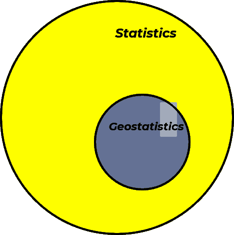

统计学和地理统计学维恩图。

我们可以将之前讨论的大数据添加到我们的维恩图中，从而得到大数据分析和空间大数据分析。

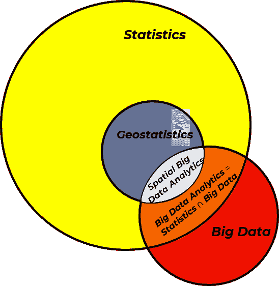

添加大数据的统计学和地理统计学维恩图。

## 科学范式与第四范式

如果没有人对您说过这句话，让我有这个荣幸对您说，

欢迎

到第四个科学发现范式，数据驱动科学发现，或者我们也可以称之为数据科学。

科学发现的范式是人类应用科学以扩展人类知识、发现和开发影响社会的新技术的独特方法。这些范式包括，

+   **第一范式** - 基于物理实验和观察的逻辑推理

+   **第二范式** - 理论驱动，使用数学模型和定律来解释和预测自然现象

+   **第三范式** - 基于计算机的数值模拟和模型来研究难以或无法通过解析或实验测试的复杂系统

+   **第四范式** - 使用数据分析、机器学习、云计算和人工智能等工具分析大量数据集，数据中的模式引导洞察。

这里列出了所有四个范式及其重要发展的日期，

| 第一范式经验科学 | 第二范式理论科学 | 第三范式计算科学 | 第四范式数据科学 |
| --- | --- | --- | --- |
| 逻辑与实验 | 理论与模型 | 数值模拟 | 从数据中学习 |
| 约公元前 600 年 米利都的泰勒斯预测日食 | 约公元前 300 年 欧几里得 - 元素 | 1946 年 冯·诺伊曼天气模拟 | 1990 年代 人类基因组计划 |
| 约公元前 400 年 希波克拉底的疾病自然原因 | 约公元 150 年 托勒密行星运动模型 | 1952 年 费米模拟非线性系统 | 2008 年 大型强子对撞机 |
| 公元前 430 年 恩培多克勒证明空气有物质 | 1011 年 阿尔哈桑《光学书》 | 1957 年 洛伦兹演示混沌 | 2009 年 海伊等人《数据密集型书籍》 |
| 公元前 230 年 埃拉托斯特尼测量地球直径 | 1687 年 牛顿《自然哲学的数学原理》 | 1980 年代 曼德尔布罗特模拟分形 | 2015 年 AlphaGo 击败职业围棋选手 |

当然，我们可以争论科学发现范式之间的界限，即一个特定的范式何时开始？例如，考虑这些应用第一范式的例子，这些例子将第一范式的开始推向了古代！

| 领域 | 例子 | 大约日期 | 为什么它符合第一范式 |
| --- | --- | --- | --- |
| 农业 | 使用运河、闸门和定时灌溉系统 | $\approx$ 3000 年 | 对水流、土壤和季节性时间安排的经验理解 |
| 天文学 | 巴比伦星表；月历 | $\approx$ 1800 年 | 系统性观察以预测天体事件 |
| 工程 | 轮子（交通、陶器） | $\approx$ 3500 年 | 通过试错和实际改进发展而来 |
| 医学 | 草药疗法，外科手术 | $\approx$ 2000 年 | 基于观察和积累的案例知识 |
| 数学 | 六十进制系统；几何计算板 | $\approx$ 2000 年 | 用于土地划分、建筑和天文学；经验测试 |

+   当然，美索不达米亚人（公元前 4000 年 - 公元前 3500 年）通过支持轮子、犁、战车、织布机和灌溉的发展的实验，应用了第一范式。此外，我想向古代人民致敬，因为我非常着迷于人类社会及其技术随时间的发展。

在另一方面，我们可以追溯第四范式方法的发展，例如 1943 年的人工神经网络到麦柯洛克和皮茨，并考虑这些从大型数据集中提炼模式的学习的早期例子，

| 年份 | 领域 | 例子/人物 | 为什么它符合第四范式特征 |
| --- | --- | --- | --- |
| $\approx$100 年 | 天文学 | 托勒密星表 | 使用大量经验数据预测天体运动 |
| 1086 | 经济学 | 大宪章（英格兰） | 大规模数据普查，用于行政和经济决策 |
| 1700 年代 | 自然历史 | 卡尔·林奈 – 分类学 | 基于可观察特征对物种进行分类；数据优先方法 |
| 1801 | 统计学 | 阿道夫·凯特莱特 – 社会物理学 | 使用统计数据从大型数据集中分析人类行为 |
| 1830 年代 | 天文学 | 约翰·赫歇尔的星空调查 | 编目了数千颗恒星和星云；数据驱动天空分类 |
| 1859 | 生物学 | 达尔文 – *物种起源* | 综合全球物种数据以揭示进化模式 |
| 1890 | 公共卫生 | 弗洛伦斯·南丁格尔 | 使用死亡率数据可视化来影响医院改革 |
| 1890 | 人口普查，计算 | 哈勒里特穿孔卡片（美国人口普查） | 大数据集的首次自动化分析；机械数据处理 |
| 1910 年代–30 年代 | 遗传学 | 摩根实验室 – 果蝇研究 | 从数千次果蝇杂交中绘制基因特征 |
| 1920 年代 | 经济学 | 康德拉季耶夫，库兹涅茨 | 使用历史数据系列识别经济模式 |
| 1937 | 生态学 | 亚瑟·坦斯利 – 生态系统概念 | 将大规模实地数据整合到系统生态框架中 |

最后，采用新的科学范式代表着一种重大的社会转变，这种转变在全球范围内展开得并不均匀。虽然我旨在总结时间顺序，但承认其复杂性是很重要的。

## 第四科学范式的基石与推动力

第四范式是什么原因在 1943 年至 2009 年之间的某个时间开始的？是新的数学的发展吗？

+   数据驱动模型背后的基础数学已经可用数十年甚至数百年。考虑以下数学和统计发展的例子，这些发展支撑着现代数据科学，

| 技术 | 关键贡献者 | 日期 / 出版物 |
| --- | --- | --- |
| **微积分** | 艾萨克·牛顿，戈特弗里德·威廉·莱布尼茨 | 牛顿：*流数法*（1671 年，1736 年出版）；莱布尼茨：*新方法*（1684 年） |
| **贝叶斯概率** | 托马斯·贝叶斯牧师 | *关于概率论教义中一个问题的论文*（遗著，1763 年） |
| **线性回归** | 玛丽·勒让德 | 1805 年正式化 |
| **判别分析** | 罗纳德·费希尔 | *在分类问题中使用多种测量方法*（1939 年） |
| **蒙特卡洛模拟** | 斯坦尼斯瓦夫·乌拉姆，约翰·冯·诺伊曼 | 在 1940 年代初期的曼哈顿计划期间开发 |

反思后，人们可能会问：为什么第四科学范式没有在 19 世纪或甚至 20 世纪 40 年代之前出现？发生了什么变化？答案在于，还需要几个关键的发展来创造数据科学生根发芽的肥沃土壤。

特别是：

+   低成本、易于获取的计算能力

+   大规模、高容量数据集（大数据）的出现

让我们更详细地探讨这些内容。

### 便宜且易于获取的计算

没有经济实惠且广泛可用的计算和存储资源，从大数据中学习是不可能的。考虑以下计算进步，这些进步为第四科学范式的出现铺平了道路，

| 年份 | 里程碑 | 描述 |
| --- | --- | --- |
| **1837** | 巴贝奇的解析机 | 第一个具有内存和控制流等概念的机械计算机设计（未建造）。 |
| **1941–45** | 庄泽的 Z3，ENIAC | 第一台可编程数字计算机；重新布线的插板，内存有限，速度慢且不可靠。 |
| **1947** | 发明晶体管 | 取代了真空管；使第二代计算机（例如 IBM 7090）更快、更小、更可靠。 |
| **1960 年代** | 集成电路 | 单个芯片上的多个晶体管；导致了第三代计算机的出现。 |
| **1971 年** | 微处理器开发 | 集成 CPU 的芯片；使得像 Apple II（1977 年）和 IBM PC（1981 年）这样的个人电脑成为可能。 |

是的，在我上小学一年级的时候，我们教室里就有了第一台电脑（Apple IIe），它的单色（橙色和黑色像素）显示器、5 1/4 英寸软盘加载的程序（当时没有硬盘）以及电脑的哔哔声和点击声都让我们所有人都感到震惊！

我们生活在一个社会中，我们口袋里的计算能力比用来送第一艘宇航员上月球还要强大，即我们的手机，以及一个利用家用电脑闲置时间来搜索外星生命的 SETI 屏幕保护程序！

+   [SETI@home](https://setiathome.berkeley.edu/) - 搜索外星智能。注意，@home 组件现在处于休眠状态，而团队继续分析数据。

还可以查看这些方法来充分利用你电脑的闲置时间，

+   [Folding@home](https://foldingathome.org/) - 模拟蛋白质动力学，包括蛋白质折叠过程和蛋白质的运动，以开发治疗疾病的药物。

+   [Einstein@home](https://einsteinathome.org/) - 利用 LIGO 引力波探测器、MeerKAT 射电望远镜、Fermi 伽马射线卫星以及阿雷西博射电望远镜的存档数据，搜索来自旋转中子星的微弱天体物理信号。

现在我们周围都是便宜且可靠的计算设备，我们的祖父母（甚至可能是我们的父母）几乎无法想象。

正如你将在这本电子书中学到的那样，机器学习方法需要大量的计算，因为训练这些方法中的大多数都依赖于，

+   多次迭代

+   矩阵或并行计算

+   引导技术

+   随机梯度下降

+   广泛的模型调整，这可能涉及到在嵌套循环中训练许多版本

可负担和可访问的计算是第四科学范式的根本先决条件。

+   数据科学的发展在很大程度上是由众包和开源贡献驱动的——这些努力依赖于对计算能力的广泛访问

在巴贝奇分析机或 ENIAC 的时代，大规模的数据科学将是不可能的。

### 大数据的可用性

在小数据的情况下，我们通常依赖于外部知识来源，例如：

1.  物理

1.  工程和地球科学原理

这些模型随后使用有限的可用观测数据进行校准——这是第二和第三科学范式中的常见方法。

相比之下，大数据使我们能够直接从数据本身学习自然系统的全部行为范围。事实上，大数据经常揭示第二和第三范式模型的局限性，暴露出我们传统解决方案中缺失的复杂性。

因此，大数据对于：

+   提供足够的采样以支持数据驱动的第四范式

它甚至可能挑战对第二和第三范式模型的过度依赖，因为大数据集的复杂性揭示了现有理论框架的边界。

今天，大数据无处不在！考虑所有在线的开源和公开数据。以下是一些很好的例子，

| 资源 | 描述 | 链接 |
| --- | --- | --- |
| **Google Earth (Timelapse)** | 卫星影像（不是最高分辨率，但可用于土地利用、地貌和地表演变研究）。由研究团队使用。 | [Google Earth](https://www.google.com/maps) |
| **美国地质调查局河流水位数据** | 公共河流流量和水文数据；用于分析和休闲规划（例如，划船）。 | [USGS NWIS](https://waterdata.usgs.gov/nwis) |
| **政府数据库** | 包括美国人口普查和石油与天然气生产统计数据。对公众和研究开放。 | [美国人口普查](https://data.census.gov/)，[德克萨斯州石油与天然气数据](https://www.rrc.texas.gov/oil-and-gas/research-and-statistics/production-data/) |
| **NASA 月球之旅** | 来自 LRO、SELENE 和 Clementine 的高分辨率月球表面影像；交互式可视化和下载。 | [月球之旅](https://trek.nasa.gov/moon/) |
| **Landsat 卫星档案** | 50 多年（自 1972 年以来）的中分辨率地球观测数据；对土地覆盖变化至关重要。 | [USGS EarthExplorer](https://earthexplorer.usgs.gov/) |
| **Copernicus Open Access Hub** | 欧洲航天局 Sentinel 卫星数据（例如，雷达、多光谱影像）。 | [Copernicus Hub](https://scihub.copernicus.eu/) |
| **全球生物多样性信息设施 (GBIF)** | 开放生物多样性数据：来自世界各地的物种分布、观察和生态记录。 | [GBIF](https://www.gbif.org/) |
| **国家海洋和大气管理局 (NOAA)** | 包含天气、海洋和气候数据的大型档案，包括雷达、再分析和预报。 | [NOAA 数据](https://www.ncei.noaa.gov/) |
| **世界银行开放数据** | 包含所有国家的经济、发展、人口和环境指标。 | [世界银行数据](https://data.worldbank.org/) |
| **我们的世界数据** | 关于健康、人口、能源、CO₂、教育和更多方面的精选全球数据集。 | [我们的世界数据](https://ourworldindata.org/) |
| **OpenStreetMap (OSM)** | 包含道路、建筑和土地利用等全球地理空间数据的众包数据。 | [OpenStreetMap](https://www.openstreetmap.org/) |
| **Google Dataset Search** | 跨学科和存储库的元搜索引擎索引数据集。 | [Dataset Search](https://datasetsearch.research.google.com/) |

虽然开放数据正在迅速扩展，但许多行业中的专有数据也在快速增长，这得益于智能、互联系统的采用，这些系统具有先进的监控和控制功能。

所有这些的结果是数据的巨大爆炸，得益于更快、更经济的计算、处理和存储。我们现在沉浸在一个前几代人无法想象的数据海洋中。

+   注意，我们也可以讨论针对数据科学优化的改进算法和硬件架构，但我会将这一点排除在本电子书范围之外。

这里有一个本地可自由获取的大数据示例。我从[德克萨斯州水数据](https://waterdatafortexas.org/reservoirs/individual/travis)下载了我们当地特拉维斯湖的每日水位。注意，这些数据是由下科罗拉多水管理局[LRCA](https://www.lcra.org/)收集和提供的。

我绘制了每日水位图，并添加了有用的信息，例如，

+   水位高度 - 以平均海平面以上的英尺计

+   满载百分比 - 当前储存在水库中的水量与总储水容量的比率，以百分比表示，考虑了水库的形状

+   最大蓄水池 - 最大蓄水池，水库用于供水、灌溉、水力发电和娱乐的顶部，不包括洪水蓄水。

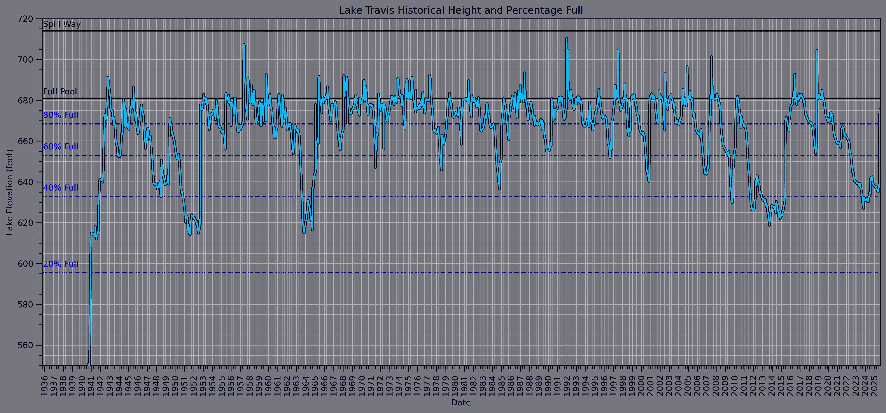

历史上的奥斯汀湖每日水位和满载百分比。

在你甚至提问之前 - 是的！我确实计算了水位半方差图，令我惊讶的是没有明显的聚集效应。

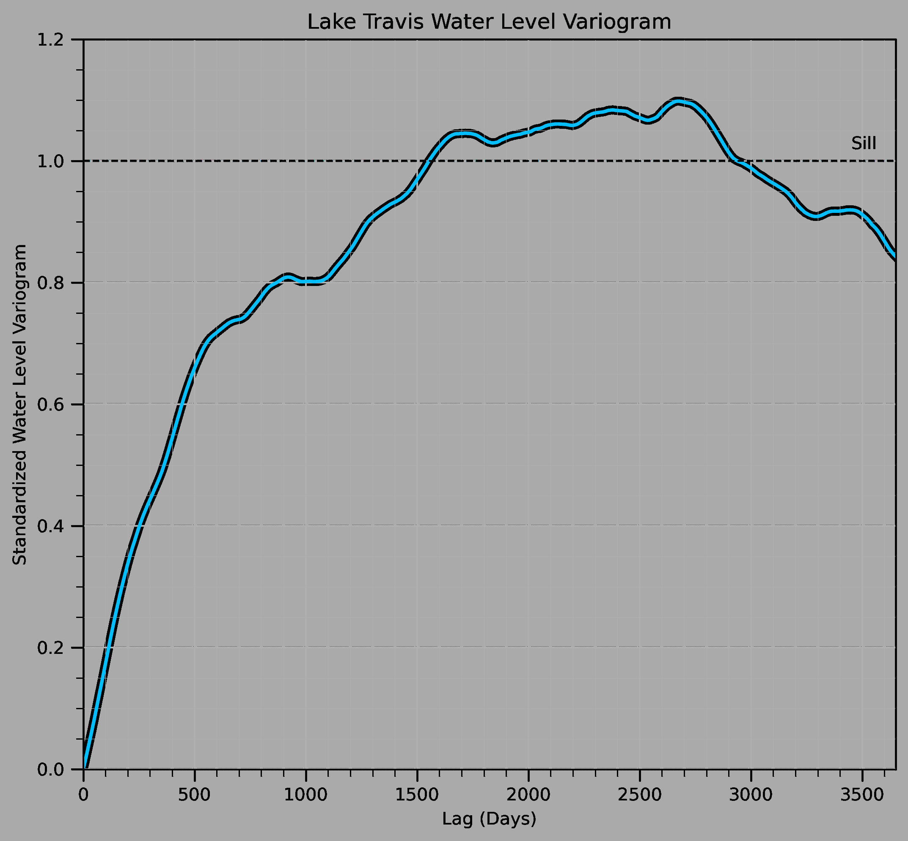

历史奥斯汀湖每日水位变差图。

为了成为一名优秀的数据科学家！

找到并玩转数据！

所有这些发展都为数据科学的种子提供了肥沃的土壤，使其影响我们经济和社会的各个领域。

## 数据科学与地下资源

提前剧透，我将在这一节中稍微自吹自擂。我经常听到学生们说，

+   “我简直不敢相信这门数据科学课程在[希尔布兰德石油与地质系统工程学院](https://pge.utexas.edu/)！”

+   “你为什么在[地球与行星科学系](https://eps.jsg.utexas.edu/)教授机器学习？”

一次又一次，我的回答是，

我们在地下是原始的数据科学家！

在科技界了解到大数据之前，我们已经有大数据了！

这可能听起来有点自大，但让我用这个时间线来支持这个说法，

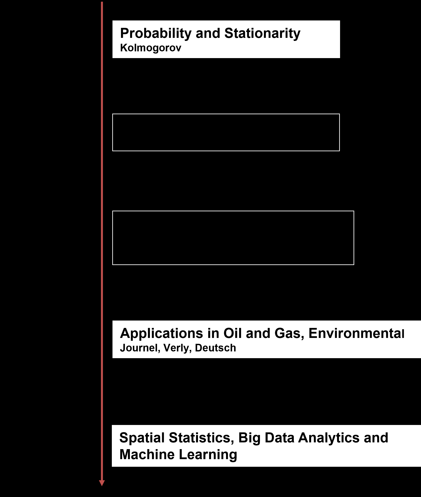

从地下工程和地球科学的角度看数据科学发展的时间线。

在科尔莫哥洛夫发展了基本的概率公理之后不久，丹尼尔·克里格开发了一套统计、空间即数据驱动的工具，用于在空间中进行估计，同时考虑到空间连续性和尺度。这些工具在 20 世纪 60 年代由马瑟龙教授在一种新科学——地统计学中发展的理论中得到正式化。在 20 世纪 70 年代至 90 年代期间，地统计学方法和应用从采矿扩展到解决石油和天然气、环境、农业、渔业等问题，并有许多重要的开源发展。

为什么地下工程和地球科学在数据科学的发展中较早？

+   因为，需要是发明之母！复杂、异质、稀疏采样、庞大的系统，具有复杂的物理和高价值决策驱使我们转向数据驱动方法。

由于许多其他工程领域由于以下原因，几乎没有动力去发展和应用数据科学，

+   具有均匀现象，但没有显著的空间异质性、连续性或不确定性——对于少数样本，现象已经足够理解，例如，用于飞机的铝板或用于结构的水泥

+   相对于建模目的而言，对人群进行详尽的采样，并且不需要具有不确定性的估计模型——现象的性质是已知的，其性能可以在有限元模型中模拟，例如，对机器外壳裂缝的射线照相检测

+   有很好的物理理解，可以用第二和第三范式现象来模拟整个系统——（耦合）物理是已知的并且可以建模，例如，波音 777 是第一种完全使用计算机辅助设计（CAD）设计的商用客机

与典型的地下工程和地球科学背景相比，数据挑战既独特又重大：

+   **稀疏采样数据集** – 我们通常只采样感兴趣地下体积的一小部分——有时少到十亿分之一。这导致显著的不确定性和对统计和数据驱动模型的强烈依赖。

+   **大规模多变量数据集** – 集成多种数据类型（例如，地震数据、井日志、岩心数据）是一个主要挑战，需要强大的多变量统计和机器学习技术。

+   **复杂、异质地球系统** – 地下地质学高度多变且与位置相关。这些开放系统通常表现出不可预测的行为，需要灵活和自适应的建模方法。

+   **高风险、高成本决策** – 支持关键、高价值决策的需要推动了方法、工作流程和高级分析采用的创新。

因此，我们许多从事地下工程和地球科学的人在学习、应用和教授数据科学以更好地理解和管理这些复杂性方面拥有丰富的经验。

## 机器学习

现在我们准备定义机器学习，一个关于机器学习的[维基百科文章](https://en.wikipedia.org/wiki/Machine_learning)可以总结和分解如下，机器学习具有以下方面，

1.  **工具箱** - 计算机系统使用的算法和数学模型的集合

1.  **学习** - 在特定任务上逐步提高其性能

1.  **训练数据** - 通过从样本数据中学习模式

1.  **通用** - 在没有为特定任务明确编程的情况下进行预测或决策

让我们突出一些关键思想：

+   机器学习是一个数值工具箱，一组旨在适应不同问题的算法（工具箱）

+   这些算法通过从训练数据中学习或拟合来改进（从训练数据学习）

+   单个算法通常可以在许多不同的领域进行训练和应用（泛化）

一个特别重要的观点，通常在文章的末尾被忽视：

这强调了机器学习在传统基于规则的编程变得过于复杂、不切实际或不可行时最有价值，这通常是由于任务的规模或可变性。

换句话说，如果基础理论理解得很好，无论是工程原理、地球科学基础、物理、化学反应还是机械系统，那么首先使用这些知识。

+   不要依赖数据科学来替代对科学和工程基础的理解（根据与卡洛斯·托雷斯-韦尔丁教授的个人通信，2024 年）

## 机器学习先决条件定义

要理解机器学习和一般的数据科学，我们首先需要区分总体和样本。

### 总体

总体是我们感兴趣的空间现象的所有可能信息。在数据的分辨率下，对感兴趣区域的感兴趣特征的详尽、有限的列表。例如，

+   在气藏内每个位置，在岩心样本的规模上，孔隙率的详尽集合，即想象整个储层被钻探、提取和分析，岩心一个接一个！

+   对于森林中的每一棵树，包括物种、胸径（DBH）、树冠直径、年龄、树木健康状况、木材体积和位置，即我们森林的完美知识！

通常整个总体无法访问，因为，

+   技术限制 - 提供改进覆盖率的采样方法通常具有较低的分辨率和精度

+   实用性 - 过度移除储层将影响地质力学稳定性

+   成本 - 井的成本为数百万至数亿美元

### 样本

在特定位置测量的有限值集。例如，

+   从提取的岩心样本中测量的有限孔隙率值，并在储层内的井日志中进行校准

+   在一个管理单位内随机选取的 1,000 棵树，包括物种、胸径（DBH）、树冠直径、年龄、树木健康状况、木材体积和位置

关于采样，我可以提到很多！例如，

+   代表性样本选择的方法

+   样本频率或覆盖范围对不确定性和所需采样水平的影响

+   去除有偏空间样本偏差的方法（参见我的[《Python 应用地统计学》电子书](https://geostatsguy.github.io/GeostatsPyDemos_Book/intro.html)中的[去聚类以去偏数据](https://geostatsguy.github.io/GeostatsPyDemos_Book/GeostatsPy_declustering.html)）

为了简洁，我这里不会涵盖这些主题，但现在让我们深入探讨，

+   我们在样本中测量的是什么？

每种不同的测量类型被称为变量或特征。

### 变量或特征

在任何科学或工程研究中，被测量或观察的属性通常被称为变量。

+   然而，在数据科学和机器学习中，我们几乎只使用术语特征。

虽然术语不同，但概念是相同的：两者都指关于对象或系统的定量或分类信息。

为了说明什么是特征，可以考虑以下从现实世界的地球科学、石油和天然气以及采矿环境中抽取的例子，

+   从墨西哥湾米奥阶 Tahiti 油田提取的直径 1.5 英寸、长度 2 英寸的岩心柱测得的孔隙率

+   在加拿大西部沉积盆地晚德文纪 Leduc 地层中，沿井筒以 0.5 英尺的分辨率从孔隙率（中子密度井日志）和岩石相（页岩日志的解释比例）模拟的渗透率。

+   在 Voisey’s Bay Mine 的太古宙片麻岩复杂体中，直径超过 8 英寸、深度 10 米的爆破孔中镍级爆破孔切割物。

你看到我做了什么了吗？

+   我指定了被测量的内容、测量方式以及测量的尺度。

这很重要，因为，

+   **如何进行测量？** - 改变了特征的真实性（测量的确定性水平），并且不同的方法实际上可能会改变特征值，因此我们可能需要协调同一特征的多个测量方法。

+   **测量的尺度是什么？** - 由于体积方差效应，这一点非常重要，随着支持体积和样本尺度的增加，由于体积平均，方差减少，导致回归到平均值。对于那些对更多细节感兴趣的人，我在我的《Python 应用地统计学》电子书中有一个关于体积方差的[章节](https://geostatsguy.github.io/GeostatsPyDemos_Book/GeostatsPy_volume_variance.html)。

此外，我们的地下测量通常需要大量的分析、解释等。

+   我们不只是把工具举到岩石上就能得到数字

+   我们有一个“厚层”的工程和地质科学解释，从测量映射到可用的特征。

考虑这个来自德克萨斯大学奥斯汀分校经济地质局碳酸盐薄片，由 F. Jerry Lucia 在[地质科学课程](http://www.beg.utexas.edu/lmod/_IOL-CM07/old-4.29.03/cm07-step05.htm)中提供的例子。

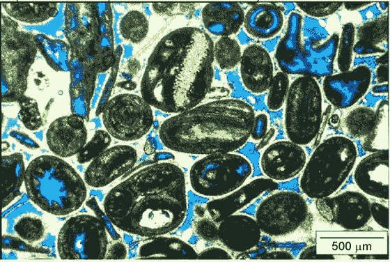

碳酸盐薄片图像（来自 [此链接](http://www.beg.utexas.edu/lmod/_IOL-CM07/old-4.29.03/cm07-step05.htm) 由 F. Jerry Lucia 提供）。

注意：核心样品中的蓝色染料从视觉上表示空隙空间——岩石中的孔隙。但孔隙率特征仅仅是蓝色区域除以样品总面积吗？

+   这将给出总孔隙率，即总体积与总体积之比。

+   然而，并非所有孔隙空间都对流体流动有贡献。有些孔隙是孤立的或连通性差，尤其是在低渗透性岩石中。

为了估算对流动真正有影响的孔隙率，我们需要解释连通性。这为我们提供了有效孔隙率，这是建模流体传输、渗透率和储层性能的一个更有用的特征。

+   因此，即使是孔隙率，通常被视为一个“简单”的特征，可以在测井中观察到，适合进行线性平均，也无法逃避一个基本的解释步骤。估计有效孔隙率涉及到关于孔隙几何形状和连通性的假设、阈值或模型。

这是一个关键的提醒，我们的特征通常需要解释，即使它们看起来可以直接测量。测量尺度、观察方法和预期用途都会影响我们如何定义和推导出对数据科学模型有用的特征。

### 预测变量和响应变量

为了理解预测变量和响应变量之间的区别，让我们看看机器学习模型最简洁的表达式。


将预测变量映射到响应变量的基本预测机器学习模型。

+   预测变量（或独立）特征（或变量）是模型的输入，即 $X_1,\ldots,X_m$。

+   响应（或依赖）特征（或变量）是模型输出，$y$，

并且存在一个误差项，$\epsilon$。

机器学习就是关于估计这样的模型 $\hat{𝑓}$，用于两个目的，推理或预测。

### 推理

在我们能够做出可靠的预测之前，我们必须首先进行推理——也就是说，我们必须从有限的样本中了解底层系统，以便对更广泛的群体进行建模。推理是基于观察数据建立对系统理解的过程，表示为 $\hat{f}$。

通过推理，我们试图回答以下问题：

+   特征之间的关系是什么？

+   哪些特征最重要？

+   特征之间是否存在复杂或非线性交互作用？

这些见解是做出任何预测的先决条件，因为它们构成了最终用于预测、分类或决策的模型的基石。

例如，想象我走进一个房间，从口袋里掏出一枚硬币，抛了 10 次，观察到 3 个正面和 7 个反面。然后我问，“这是一枚公平的硬币吗？”。

这是一个经典的推理问题。

+   你使用有限的样本（10 次抛掷）来对总体进行推断——在这种情况下，硬币的概率分布

+   而这里的关键转折点是：在这个例子中，硬币本身就是总体！

你不仅仅是总结样本，你试图了解生成样本的系统的一些普遍性。

### 预测

一旦我们完成了推理——从样本中学习以构建潜在总体的模型——我们就准备好使用该模型进行预测。预测是将我们所学应用于估计新或未来观察结果的过程。

+   简而言之，推理是从样本到总体，而预测是从总体模型到新的样本

+   预测的目标是产生未知或未来结果的最准确估计

让我们回到之前提到的抛硬币的例子，

+   你观察我抛硬币 10 次，看到 3 次正面和 7 次反面。基于这个观察，你推断这枚硬币可能偏向于反面。

现在，在我再次抛掷之前，你预测接下来的 10 次抛掷可能会有更多反面而不是正面。这是预测，使用你对硬币（即总体）的推断模型来估计未来的数据。

### 机器学习中的推理与预测

那么，你如何知道在机器学习环境中你是在进行推理还是预测？

+   这取决于你是建模结构还是估计结果

**推理机器学习**，也称为无监督学习，只涉及预测特征（没有已知的输出或标签）。目标是学习数据中的结构并提高对系统的理解。

机器学习推理方法的例子包括，

+   聚类分析——将观察结果分组到不同的簇中（潜在的子群体），通常作为建模的前处理步骤。

+   维度降低——通过找到最佳保留信息的同时最小化噪声的组合来减少特征数量，例如，主成分分析（PCA）、t 分布随机近邻嵌入（t-SNE）或多维尺度（MDS）。

这些技术有助于揭示数据中的关系、模式或潜在变量——对于良好的建模至关重要，但它们并不是为了直接预测而设计的。

有些人可能会对我的推理机器学习的定义和聚类分析包括在内提出异议，因为他们包括在统计推断中量化不确定性和测试假设，这在聚类分析中是不可用的。

+   我通过识别地下和空间数据集中组别的难度和重要性来捍卫我的选择。

+   例如，储层模型中的沉积相通常描述了 80%的异质性，即沉积相是许多储层最重要的推断！

+   此外，我对不确定性建模和模型检查有非常广泛的理解，包括各种类型的重采样，例如，自助法和空间自助法，在地下，我们很少使用分析置信区间和假设检验。

**预测机器学习**，也称为监督学习，这涉及到预测特征和响应特征（标签）。模型被训练来预测新样本的响应。

机器学习预测方法的例子包括，

+   线性回归 - 将响应特征估计为预测特征的线性组合

+   简单贝叶斯分类器 - 通过先验概率和每个条件概率的乘积来估计响应特征的每个可能分类结果的可能性

模型被优化以最小化预测误差，通常通过交叉验证或测试数据来评估。让我们谈谈如何制作预测机器学习模型。

## 训练和调整预测机器学习模型

在预测机器学习中，我们遵循标准的模型训练和测试工作流程。这个过程确保我们的模型对新数据有很好的泛化能力，而不仅仅是完美地拟合训练数据。

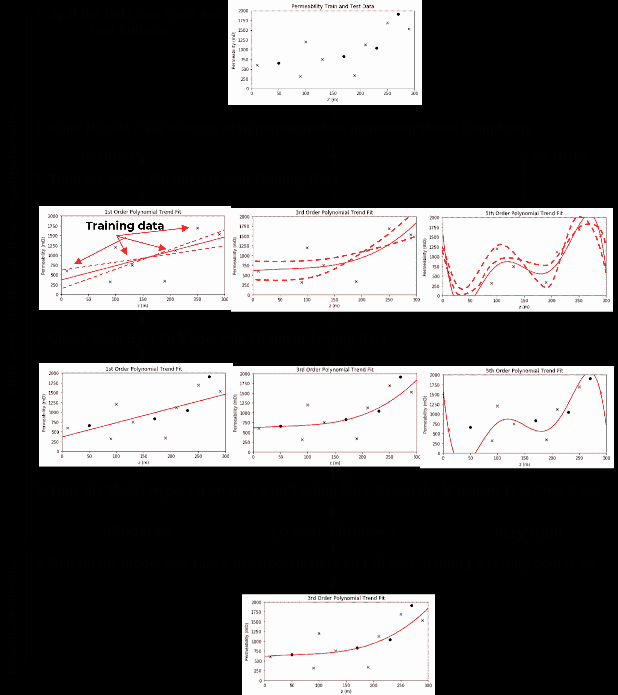

标准预测机器学习建模工作流程。

让我们一步步来看关键步骤，

1.  **训练和测试数据分割** - 将可用数据分成互斥的、穷尽的子集：一个训练集和一个测试集。

+   通常，15%–30%的数据被保留用于测试

+   剩余的 70%–85%用于训练模型

1.  **定义要探索的超参数值范围**，范围从，

+   简单模型，灵活性低

+   到复杂模型，灵活性高

$\quad$ 这一步可能涉及调整多个超参数，在这种情况下，通常使用高效的采样方法（例如，网格搜索、随机搜索或贝叶斯优化）。

1.  **为每个超参数设置训练模型参数** - 对于每一组超参数，在训练数据上训练一个模型。这会产生：

+   一系列具有不同复杂性的训练模型

+   每个模型都有参数经过优化，以最小化训练数据上的误差

1.  **在保留的测试数据上评估每个模型** - 使用测试数据，

+   评估每个训练模型在未见数据上的表现

+   总结每个模型的预测误差（例如，均方根误差（RMSE）、平均绝对误差（MAE）、分类准确率）

1.  **选择最小化测试误差的超参数** - 这是超参数调整步骤：

+   选择在测试数据上表现最佳的模型超参数

+   这些就是你的调整过的超参数

1.  **使用调整过的超参数在所有数据上重新训练最终模型** - 现在已经确定了最佳模型复杂性，

+   使用训练集和测试集重新训练模型

+   这最大化了用于最终模型参数估计的数据量

+   结果模型是你在现实世界应用中部署的模型

## 关于模型训练和调整流程的常见问题

作为一名教授，当我介绍上述机器学习模型训练和调整流程时，我经常听到这些问题。

+   **步骤 1–5 的主要结果是什么？** - 唯一可靠的输出是调整后的超参数。

$\quad$ 我们不直接使用步骤 3 或 4 中训练的模型，因为它是在没有访问所有可用数据的情况下训练的。相反，我们使用所有数据和选定的超参数重新训练最终模型。

+   **为什么一开始不在所有数据上训练模型？** - 因为如果我们这样做，我们就没有独立的方式来评估模型的泛化能力。一个非常复杂的模型很容易过拟合——完美地拟合训练数据，但在新的、未见过的数据上表现不佳。

$\quad$ 当模型灵活性过高时会发生过拟合——它捕捉噪声而不是潜在的模式。如果没有保留的测试集，我们就无法检测到这一点。

这个用于训练和调整预测机器学习模型的流程是，

+   一个基于经验、交叉验证的过程

+   这是一个对现实世界模型使用的实际模拟

+   一种识别最佳平衡拟合和泛化的模型复杂性的方法

我已经多次提到模型参数和模型超参数，所以我有责任给出它们的定义。

## 模型参数和模型超参数

**模型参数**是在训练阶段调整以最小化训练数据上的误差，即模型参数是通过训练数据训练的，并控制模型与数据的拟合。例如，

+   对于上面机器学习工作流程示例中的多项式预测机器学习模型，模型参数是多项式系数，例如，对于三次多项式模型，$b_3$、$b_2$、$b_1$ 和 $c$（通常称为 $b_0$）。

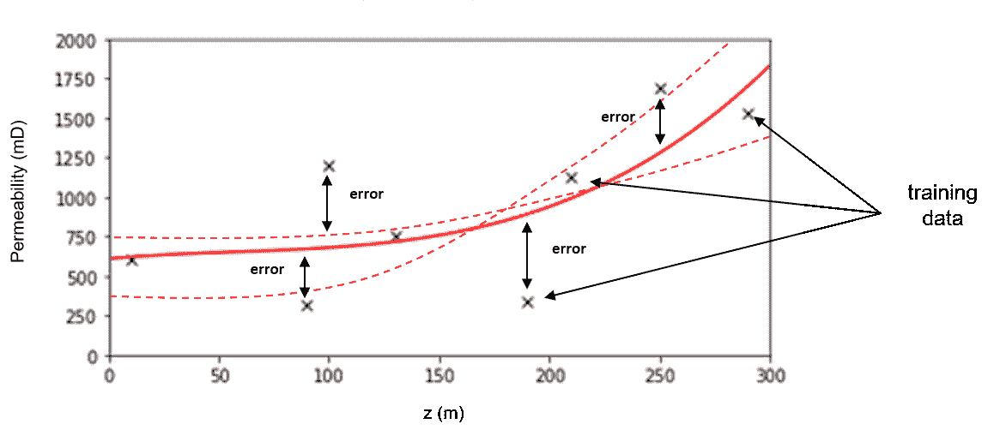

模型参数被调整以拟合模型与数据，即模型参数被训练以最小化训练数据上的误差（x 标记）。

**模型超参数**非常不同。它们并不直接约束模型与数据的拟合，而是约束模型复杂性。模型超参数被选择（称为调整）以最小化保留的测试数据上的误差。回到我们之前的多项式预测机器学习示例，多项式的阶数选择就是模型超参数。

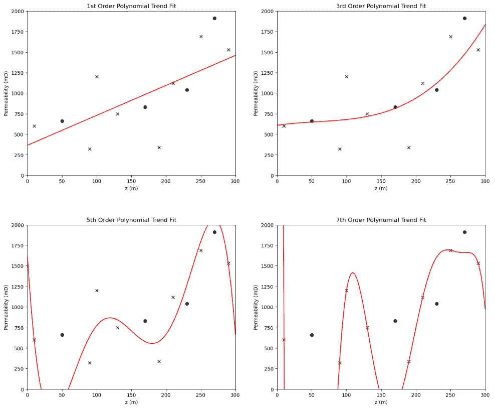

模型超参数被调整以改变模型复杂性/灵活性，即模型超参数被调整以最小化保留的测试数据上的误差（实心圆圈）。

模型参数与模型超参数

模型参数控制模型拟合，并使用训练数据进行训练。模型超参数控制模型复杂性，并使用测试数据进行调整。

## 回归和分类

在我们继续之前，我们需要定义回归和分类。

+   **回归** - 一种预测机器学习模型，其中响应特征是连续的。

+   **分类** - 一种预测机器学习模型，其中响应特征是分类的。

结果表明，对于这些中的每一个，我们都需要构建不同的模型并使用不同的方法来评估这些模型。

+   在这次讨论的剩余部分，我们将专注于回归，但在后面的章节中，我们还将介绍分类模型。

现在，为了更好地理解预测机器学习模型调整，即通过经验方法调整模型复杂度以最小化测试误差，我们需要了解测试误差的来源。

+   我们试图最小化的东西的原因！

## 预测机器学习测试误差的来源

均方误差（MSE）是表达误差的标准方式。均方误差被称为范数，因为我们取一个误差向量（覆盖所有数据）并用一个单一的非负值来总结。

+   特别是 MSER 是 L2 范数，因为误差在求和之前被平方了，

+   L2 范数有很多很好的特性，包括一个连续的误差函数，可以在所有误差值上微分，但它对数据异常值敏感，这些异常值可能会对平方和产生不成比例的影响。关于这一点，我们稍后再谈。

$$ MSE = \frac{1}{n} \sum_{i=1}^{n} \left( y_i - \hat{y}_i \right)² $$

其中 $y_i$ 是响应特征的实际情况，而 $\hat{y}_i$ 是针对索引数据 $i = 1,\ldots,n$ 的模型估计。$\hat{y}_i$ 是用我们的预测机器学习模型估计的，具有一般形式，

$$ \hat{y}_i = \hat{f}(x¹_i, \ldots , x^m_i) $$

其中 $\hat{f}$ 是我们的预测机器学习模型，$x¹_i, \ldots , x^m_i$ 是 $i^{th}$ 数据的预测特征值。

当然，MSE 可以在训练数据上计算，这通常是我们在训练回归模型的模型参数时最小化的损失函数。

$$ MSE_{train} = \frac{1}{n_{train}} \sum_{i=1}^{n_{train}} \left( y_i - \hat{y}_i \right)² $$

MSE 可以在保留的测试数据上计算，以调整回归模型的超参数。

如果我们取 $MSE_{test}$，

$$ MSE_{test} = \frac{1}{n_{test}} \sum_{i=1}^{n_{test}} \left( y_i - \hat{f}(x¹_i, \ldots , x^m_i) \right)² $$

但我们将它表述为期望的测试平方误差，从而得到这种期望形式，

$$ E \left[ \left( y_0 - \hat{f}(x¹_0, \ldots , x^m_0) \right)² \right] $$

其中我们使用 $_0$ 符号来表示不在训练数据集分割中的数据样本，但在保留的测试分割中。我们可以展开二次项并合并项，以得到期望测试平方误差的方便分解为三个加性来源（推导见 [Hastie et al., 2009](https://www.amazon.com/Elements-Statistical-Learning-Prediction-Statistics/dp/0387848576/ref=sr_1_1?crid=32MDGH9EIGR9T&dib=eyJ2IjoiMSJ9.p0bVgWPuChRIt10algkzSRLwDHzW4bCihIh1RA6GGZDYFtIQN37sOnIqDS5rCJ4fF5dgqsleBiGbmgJUSXISlcmayLc6C0aOcXVX8iCtyZElt9qVbd-Dvq9P3x4KTBlzHCFHDtjz0ImJUAd3LhT6D6KhOtiHOAveaz8xiE4jU1ah6LlDo0xzGoQVDXzNE6ODFzysbfBvzJMRGXhLbQBD292ixuH_tTBTPZwOzNGzpIw.TpRqJ1llQqMdsDXdXhWr0WQIhzTn6rpjDKSAzA10E_I&dib_tag=se&keywords=hastie+machine+learning&qid=1728683359&s=books&sprefix=hastie+machine+learn%2Cstripbooks%2C187&sr=1-1)），

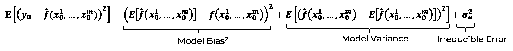

测试中的模型误差包含三个加性成分，即模型方差、模型偏差和不可约误差。

让我们解释这三个加性误差来源在测试数据中的情况，即，我们对于模型在现实世界中预测未用于训练模型的情况的最佳误差表示，

1.  **模型方差** - 是由于对数据集敏感造成的误差，例如，一个简单的模型如线性回归，如果我们改变训练数据，它不会改变很多，但一个更复杂的模型如五次多项式模型，当我们改变训练数据时，会跳来跳去。

$\quad$ 更高的模型复杂度往往会增加模型方差。

1.  **模型偏差** - 是由于使用近似模型造成的误差，即模型过于简单，无法拟合自然现象。一个非常简单的模型不够灵活，通常会有较高的模型偏差，而一个更复杂的模型足够灵活，可以拟合数据，并将具有较低的模型偏差。

$\quad$ 更高的模型复杂度往往会使模型偏差降低。

1.  **不可约误差** - 是由于缺失和不完整的数据造成的。可能存在重要的特征没有被采样，或者特征值范围没有被采样。这是由于数据限制造成的误差，这种误差不能通过机器学习模型超参数调整来优化复杂度；因此，不可约误差在模型复杂度的范围内是恒定的。

$\quad$ 更高的模型复杂度不应该改变不可约误差。

现在，我们可以将这三个加性误差来源组合起来，制作一个有教育意义的、示意图，

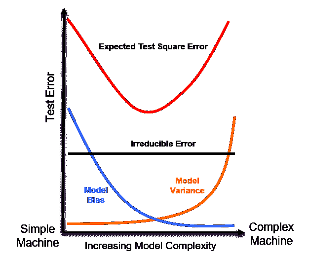

测试中的模型误差与模型复杂度相比，包含三个加性误差成分，即模型方差、模型偏差和不可约误差。

从这张图中我们可以观察到，**模型偏差-方差权衡**，

+   低复杂度模型的测试误差较高，是由于模型偏差高

+   高复杂度模型的测试误差较高，是由于模型方差高

因此，超参数调整是对模型偏差-方差权衡的优化。我们通过超参数选择模型复杂度，以实现一个不是，

+   **欠拟合** - 过于简单，过于不灵活，无法拟合自然现象

+   **过拟合** - 过于复杂，过于灵活，对数据过于敏感

现在，让我们更详细地了解欠拟合和过拟合的机器学习模型。

## 欠拟合和过拟合模型

首先，通过一个简单的预测问题可视化欠拟合和过拟合，该问题有一个预测特征和一个响应特征，这里有一个过于简单的模型（左侧）和一个过于复杂的模型（右侧）。

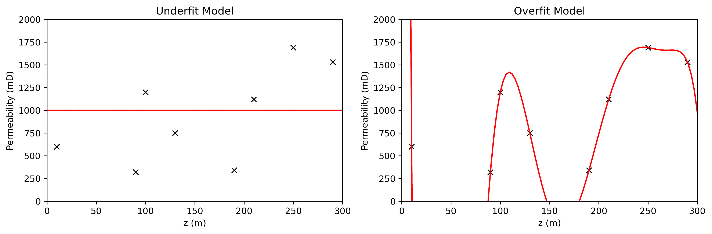

示例：欠拟合模型（左侧），一个过于简单/不灵活的模型，以及过拟合模型（右侧），一个过于复杂/灵活的模型。

一些观察结果，

+   简单模型不足以灵活地拟合数据，这很可能是欠拟合模型

+   过拟合模型完美地拟合了所有训练数据，但在训练数据之外过于嘈杂，很可能是过拟合模型

为了更好地理解差异，我们现在可以绘制训练误差与之前显示的测试误差曲线并排，说明它们如何随着模型复杂度的变化而变化。

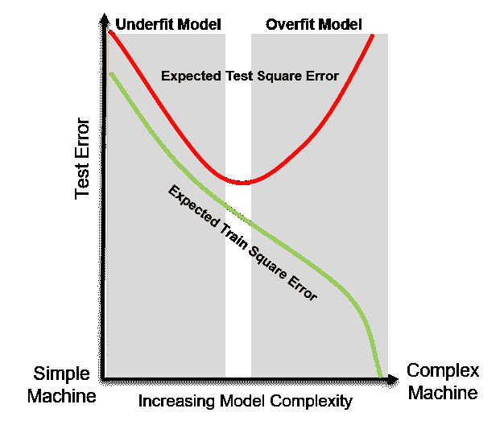

训练和测试中的模型误差与模型复杂度对比，并展示了欠拟合和过拟合模型区域。

从图中，我们可以得出以下观察结果：

+   **训练误差** – 随着模型复杂度的增加，训练误差持续下降。具有足够灵活性的模型最终可以完美地拟合训练数据，将训练误差驱动到零。

+   **测试误差** – 测试误差由偏差、方差和不可减少误差组成。偏差和方差之间的相互作用导致权衡，从而产生一个最优模型复杂度，以最小化测试误差。

基于这些观察结果，我们可以将欠拟合和过拟合描述如下：

+   **欠拟合** - 当模型过于简单，无法捕捉数据中的潜在模式时发生。这些模型无法很好地泛化，并且倾向于显示出高训练和测试误差。随着复杂度的增加，测试误差会降低。

+   **过拟合** - 当模型过于复杂，不仅捕捉了数据中的潜在模式，还捕捉了噪声时发生。虽然训练误差继续下降，但由于泛化不良，测试误差开始增加。这些模型可能会给出强大的性能印象，误导我们认为自己比实际情况更了解系统。

## 更多关于训练和测试分割的信息

机器学习训练和调整工作流程的一个关键部分是训练和测试数据分割。以下是关于训练和测试数据分割的一些更多考虑因素，

### 保留用于测试的比例

元分析已经确定，通常保留 15%到 30%的数据用于测试是最佳的。为了理解潜在的权衡，想象这些极端情况，

+   保留 2%的数据用于测试，然后我们将有大量的训练数据来很好地训练模型，但测试数据太少，无法在一系列预测案例中对模型进行测试。

+   保留 98%的数据用于测试，然后只有 2%的数据可用于训练，我们将对非常差的模型进行非常好的测试。

保留用于测试的比例是在构建一个好的模型和用广泛的预测案例很好地测试这个模型之间的权衡。

### 其他交叉验证方法

上述的训练和测试工作流程被称为交叉验证或保留方法，但还有许多其他用于模型训练和测试的方法，

+   **k 折交叉验证（K-fold CV）** - 我们将数据分成 k 个互斥的、穷尽的、大小相等的集合（称为折叠），重复进行模型训练和测试 k 次，每次折叠轮流保留测试数据，其余为训练数据。

+   **留一法交叉验证（LOO CV）** - 我们遍历所有数据，每次我们将一个数据点作为测试数据，并在剩余的 n-1 个数据上训练。

+   **留 p 法交叉验证（LpO-CV）** - 我们分配一个整数 p < n，然后遍历所有可能的组合情况，其中保留 p 个测试数据。由于我们考虑所有可能的情况，这是一个穷尽交叉验证方法。

对于上述每个折叠或一般而言，训练和测试数据集组合，我们计算误差范数

+   然后我们平均折叠上的误差范数，以提供一个用于超参数调整的单个误差

+   此方法消除了对精确的训练和测试分割的敏感性，因此通常被认为比常规保留方法更稳健。

保留用于测试的数据比例取决于交叉验证方法，

+   对于 k 折交叉验证，测试比例隐含于 k 的选择，对于 k=3，每个折叠保留 33%的数据，对于 k=5，每个折叠保留 20%的数据

+   对于留一法交叉验证，测试比例是 $\frac{1}{n}$

+   对于留一法交叉验证，测试比例是 $\frac{p}{n}$

### 训练、验证和测试分割

有一种替代方法，使用数据的三个互斥的、穷尽的子集

+   **训练数据** - 子集与上面的训练相同，用于训练模型参数

+   **验证数据** - 子集类似于上述训练和测试分割方法中的测试子集，用于调整模型超参数

+   **测试数据** - 子集应用于检查在所有数据上训练并调整了超参数的最终模型

训练、验证和测试分割的哲学是，这个最终模型检查是在不涉及模型构建的数据上进行的，包括训练模型参数和调整模型超参数。我有两个反对这种方法的理由，

1.  **完美模型验证的循环追求** - 如果我们在这个测试阶段对性能不太满意，我们是否有一个第四个子集进行另一次测试？第五个子集？第六个子集？如此无限循环？

1.  **我们必须用所有数据训练部署的模型** - 我们永远不能部署没有用所有可用数据进行训练的模型；因此，我们仍然需要用测试子集来训练以获得我们的最终模型？

1.  **减少模型训练和调整性能** - 测试阶段的第三次数据分割减少了用于模型训练和调整的数据量，从而降低了这些关键步骤的性能。

### 空间公平训练和测试分割

朱利安·萨拉扎博士建议，对于空间预测问题，随机训练和测试分割可能不公平。他提出了一种[公平训练和测试分割方法](https://www.sciencedirect.com/science/article/pii/S0920410521015023)，用于空间预测模型，该方法根据模型计划使用的难度来分割数据。预测难度与克里金方差相关，它考虑了空间连续性和距离偏差。例如，

+   如果模型将用于使用与可用数据有微小偏差的数据进行插补，则构建一个训练数据接近测试数据的训练和测试分割

+   如果模型将用于预测大距离偏差，则进行分割的结果是训练数据和测试数据之间的大偏差。

使用这种方法，调整后的模型可能会根据模型在现实世界中的预期用途而有所不同。

## 数据科学的伦理和专业实践问题

为了展示数据科学中的担忧，考虑这个例子，[Rideiro 等人（2016）](https://arxiv.org/pdf/1602.04938.pdf)使用 20 张狼和狗的图像训练了一个逻辑回归分类器，以检测狼和狗之间的差异。

+   输入是一张狗或狼的照片，输出是狗的概率和补数，即狼的概率

+   模型直到这个例子这里（见下方的左侧）都工作得很好，


示例：一只被错误分类为狼的狗（左侧）以及导致这种错误分类的像素（右侧），图片来自 Rideiro 等人（2016 年）。

这导致狼的高概率。幸运的是，作者能够调查模型并确定对模型确定狼有最大影响的像素（见上方的右侧）。发生了什么？

+   他们训练了一个模型来检查背景中的雪。作为一个加拿大人，我可以保证，我们国家北部雪地地区有很多狼的照片，而许多狗的照片是在草地上拍摄的。

机器学习的问题在于，

+   复杂模型的可解释性可能较低

+   机器学习的应用可能变得常规和可信

这是一个危险的组合，因为机器可能成为被信任且不容置疑的权威。Rideiro 和其他人表示，他们开发这个问题是为了证明这一点，但实际上发生了吗？是的。我指导了一个团队的学生，他们试图从时间延迟卫星照片中自动分割城市和农村环境来构建城市发展模型。模型看起来很棒，但我要求进行额外的检查，即像素分类与像素颜色的对比图。结果是 100%对应，即这个包含所有复杂卷积、激活、池化的模型只是在寻找灰色和米色像素，这些像素通常与道路和建筑有关。

我不会说“天网”，哎呀，我刚刚说了，但请考虑以下这些想法：

+   通过集中快速推理和大数据来集中财富的新力量和分配，随着更多数据的共享

+   在最大化机器学习目标函数的同时，可能会忽略对社会的有意义的权衡，导致可解释性低

+   社会变革、颠覆性技术、后劳动社会

+   非科学结果，如[Clever Hans](https://en.wikipedia.org/wiki/Clever_Hans)效应，模型从数据中的提示中学习而不是真正学习执行任务，导致灾难性失败

我不想过于消极，也不想让这个问题变得过于严重。坦白说，我是一个传统的教授，认为我们应该把手机放在口袋里，抬头走路，这样我们才能互相问候，观察我们惊人的环境和社区。有一点是确定的，数据科学正在以许多方式改变社会，正如尼尔·波曼在[技术垄断](https://www.amazon.com/Technopoly-Surrender-Technology-Neil-Postman-ebook/dp/B004ZZJBW4/ref=sr_1_1?crid=E9SP0DFNP9JO&dib=eyJ2IjoiMSJ9.ELnF0aIjkOw11vdTEQ3Tpg.NSaPUOIOz6m6i7XxpEMUJvZobANzU5baE6DlEa40Uzs&dib_tag=se&keywords=technolopoly&qid=1728667409&sprefix=technolopo%2Caps%2C127&sr=8-1)中所说的。

尼尔·波曼对《技术垄断》的引言

“一旦技术被接纳，它就会发挥其作用。”

## 评论

这是对机器学习概念的初步描述。还有更多可以做的和讨论的，我有很多更多的资源。查看我的[共享资源清单](https://michaelpyrcz.com/my-resources)以及本章开头带有资源链接的 YouTube 讲座链接。

希望这有所帮助，

*迈克尔*

## 关于作者


德克萨斯大学奥斯汀分校 40 英亩校园内，迈克尔·皮尔奇教授的办公室。

迈克尔·皮尔奇（Michael Pyrcz）是德克萨斯大学奥斯汀分校[科克雷尔工程学院](https://cockrell.utexas.edu/faculty-directory/alphabetical/p)和[杰克逊地球科学学院](https://www.jsg.utexas.edu/researcher/michael_pyrcz/)的教授，他在那里研究并教授地下、空间数据分析、地统计学和机器学习。迈克尔还，

+   [能源分析](https://fri.cns.utexas.edu/energy-analytics)新生研究项目的首席研究员，以及德克萨斯大学奥斯汀分校自然科学院机器学习实验室的核心教员

+   担任[《计算机与地球科学》](https://www.sciencedirect.com/journal/computers-and-geosciences/about/editorial-board)的副编辑，以及国际数学地球科学协会[《数学地球科学》](https://link.springer.com/journal/11004/editorial-board)的董事会成员。

迈克尔已撰写超过 70 篇[同行评审出版物](https://scholar.google.com/citations?user=QVZ20eQAAAAJ&hl=en)，一个用于空间数据分析的[Python 包](https://pypi.org/project/geostatspy/)，合著了一本关于空间数据分析的教科书[《地统计学储层建模》](https://www.amazon.com/Geostatistical-Reservoir-Modeling-Michael-Pyrcz/dp/0199731446)，并是两本最近发布的电子书的作者，分别是[《Python 应用地统计学：GeostatsPy 实践指南》](https://geostatsguy.github.io/GeostatsPyDemos_Book/intro.html)和[《Python 应用机器学习：代码实践指南》](https://geostatsguy.github.io/MachineLearningDemos_Book/intro.html)。

迈克尔的所有大学讲座都可以在他的[YouTube 频道](https://www.youtube.com/@GeostatsGuyLectures)上找到，附有 100 多个 Python 交互式仪表板和 40 多个存储库中的详细工作流程链接，这些存储库位于他的[GitHub 账户](https://github.com/GeostatsGuy)，以支持任何感兴趣的学生和在职专业人士，提供常青内容。要了解更多关于迈克尔的工作和共享教育资源，请访问他的网站。

## 想要一起工作吗？

我希望这些内容对那些想了解更多关于地下建模、数据分析和机器学习的人有所帮助。学生和在职专业人士欢迎参加。

+   想邀请我到贵公司进行培训、辅导、项目审查、工作流程设计和/或咨询？我很乐意拜访并与您合作！

+   感兴趣合作、支持我的研究生研究或我的地下数据分析与机器学习联盟（包括 Foster 教授、Torres-Verdin 教授和 van Oort 教授作为共同负责人）吗？我的研究将数据分析、随机建模和机器学习理论与实践相结合，以开发新的方法和工作流程，增加价值。我们正在解决具有挑战性的地下问题！

+   您可以通过 mpyrcz@austin.utexas.edu 联系到我。

我总是很高兴讨论，

*迈克尔*

迈克尔·皮尔茨，博士，P.Eng. 教授，德克萨斯大学奥斯汀分校的 Cockrell 工程学院和 Jackson 地质学院

更多资源可在以下链接获取：[Twitter](https://twitter.com/geostatsguy) | [GitHub](https://github.com/GeostatsGuy) | [网站](http://michaelpyrcz.com) | [Google Scholar](https://scholar.google.com/citations?user=QVZ20eQAAAAJ&hl=en&oi=ao) | [地统计学书籍](https://www.amazon.com/Geostatistical-Reservoir-Modeling-Michael-Pyrcz/dp/0199731446) | [YouTube](https://www.youtube.com/channel/UCLqEr-xV-ceHdXXXrTId5ig) | [Python 中应用地统计学电子书](https://geostatsguy.github.io/GeostatsPyDemos_Book/intro.html) | [Python 中应用机器学习电子书](https://geostatsguy.github.io/MachineLearningDemos_Book/) | [LinkedIn](https://www.linkedin.com/in/michael-pyrcz-61a648a1)

## 机器学习概念的动机

你可以直接在 Python 中打开一个 Jupyter 笔记本，并开始构建机器学习模型。

+   [scikit-learn 文档](https://scikit-learn.org/stable/)相当不错，对于每个机器学习函数，都有一个简短的代码示例，你可以复制并粘贴来重复他们的工作。

+   此外，你还可以在 Google 上搜索有关在 Python 中使用特定机器学习算法的问题，搜索结果将包括[StackOverflow](https://stackoverflow.com/)的问题和回答，真正令人惊叹的是经验丰富的程序员愿意回馈和分享他们的知识。我们真正拥有一个令人惊叹的科学社区，具有知识共享和开源开发的 spirit。尊重。

+   当然，你可以从像[ChatGPT](https://chatgpt.com/)这样的机器学习大型语言模型（LLM）中学习很多关于机器学习的内容。ChatGPT 不仅会回答你的问题，还会在你告诉它出了什么问题时提供代码并帮助你调试。

无论哪种方式，你都会收到并添加这段代码到你的数据科学工作流程中，

```py
n_neighbours = 10; weights = "distance"; p = 2
neigh = KNeighborsRegressor(n_neighbors=n_neighbours,weights = weights,p = p).fit(X_train,y_train) 
```

et voilà（注意我是加拿大人，所以我使用一些法语短语），你已经有了一个经过训练的预测机器学习模型，可以应用于对新案例进行预测。

+   但是，这是一个好的模型吗？

+   它有多好？

+   它能变得更好吗？

没有关于基本机器学习概念的知识，我们无法回答这些问题并构建最佳可能的模型。一般来说，我并不是黑盒模型的倡导者，因为它：

1.  很可能导致难以检测和纠正的错误

1.  与专业工程师的合格实践预期不符。我曾在[作为合格工程师或地球科学家应用机器学习](https://youtu.be/W_ZDg1Wb2vM?si=DF-n1E4-ik2ukLfF)的演讲中提到。

为了帮助解答这些问题，本章为你提供了构建更好、更可靠的机器学习模型所需的基本知识。让我们从一些定义开始，构建这个基本的基础。

## 大数据

每个人都听说机器学习需要大量的数据。事实上，数据量如此之大，以至于被称为“大数据”，但你怎么知道你正在处理大数据呢？

+   大数据的标准是这些“V”值

如果你至少对其中一些标准回答“是”，那么你正在处理大数据，

+   **体积**：许多数据样本，难以处理和可视化

+   **速度**：高频率收集，相对于决策周期是连续的

+   **多样性**：数据来自各种来源，具有各种类型和规模

+   **可变性**：数据采集在项目过程中发生变化

+   **真实性**：数据具有各种准确度水平

根据我的经验，大多数地下工程师和地球科学家对所有这些“v”标准都回答“是”。

+   因此，我自豪地说，我们在地下领域在大数据技术领域了解大数据之前就已经是大数据了

事实上，我经常说，我们在地下资源行业中是原始的数据科学家。

+   我可能有点过于自信了，稍后我会详细说明。如果你觉得我过于自负，请放心，这本电子书是为任何有兴趣学习机器学习的人写的。

+   你可以跳过关于地下数据科学的简短章节，或者如果你感兴趣，可以继续阅读。

既然我们已经了解了大数据，让我们谈谈与大数据相关的话题，统计学、地理统计学和数据分析。

## 统计学、地理统计学和数据分析

统计学是实践，

1.  收集数据

1.  组织数据

1.  从数据中解读数据

1.  从数据中得出结论

1.  用数据做出决策

这一切都是关于从数据到决策的转变。

统计学中决策的重要性。

如果你的工作没有影响决策，你就没有增加价值！

如果你查阅数据分析师的定义，你会发现包括统计分析和数据可视化以支持决策制定的标准。

+   我称之为，数据分析和统计学是同一件事。

现在，我们可以添加地理统计学，作为应用统计学的一个分支，它考虑了，

1.  空间（地质）背景

1.  空间（地质）背景

1.  **支持体积**

1.  不确定性

记得那些假设独立同分布的统计学课程吗？

+   空间现象不是独立同分布的，因此我们开发了一个独特的统计学分支来解决这个问题

+   根据我们上面的假设（统计学是数据分析），我们可以声明地理统计学等同于空间数据分析

现在，让我们用一个维恩图来可视化统计学/数据分析与地理统计学/空间数据分析，


统计学、地理统计学维恩图。

我们可以将之前讨论的大数据添加到我们的维恩图中，从而得到大数据分析和空间大数据分析。


统计学、地理统计学和大数据的维恩图。

## 科学范式与第四范式

如果没有人对你说过这句话，让我有这个荣幸说，

欢迎光临

到科学发现的第四范式，数据驱动的科学发现，或者我们也可以称之为数据科学。

科学发现的范式是人类将科学应用于扩展人类知识、发现和开发影响社会的新技术的独特方法。这些范式包括，

+   **第一范式** - 通过物理实验和观察进行逻辑推理

+   **第二范式** - 理论驱动，使用数学模型和定律来解释和预测自然现象

+   **第三范式** - 基于计算机的数值模拟和模型来研究难以或无法通过解析或实验测试的复杂系统

+   **第四范式** - 使用数据分析、机器学习、云计算和 AI 等工具分析大量数据集，数据中的模式引导洞察。

这里列出了所有四个范式及其重要发展的事件日期，

| 第 1 范式 实证科学 | 第 2 范式 理论科学 | 第 3 范式 计算科学 | 第 4 范式 数据科学 |
| --- | --- | --- | --- |
| 逻辑和实验 | 理论和模型 | 数值模拟 | 从数据中学习 |
| $\approx$ 600 BC 米利都的泰勒斯预测日食 | $\approx$ 300 BC 欧几里得 - 《几何原本》 | 1946 冯·诺伊曼天气模拟 | 1990 年代 人类基因组计划 |
| $\approx$ 400 BC 希波克拉底对疾病的自然原因 | $\approx$ 150 AD 托勒密行星运动模型 | 1952 费米模拟非线性系统 | 2008 大型强子对撞机 |
| 430 BC 恩培多克勒证明空气有物质 | 1011 AD 阿尔哈桑《光学书》 | 1957 洛伦兹演示混沌 | 2009 海伊等人《数据密集型书籍》 |
| 230 BC 埃拉托斯特尼测量地球直径 | 1687 AD 牛顿《自然哲学的数学原理》 | 1980 年代 曼德尔布罗特模拟分形 | 2015 AlphaGo 击败职业围棋选手 |

当然，我们可以争论科学发现范式的边界，即特定范式何时开始？例如，考虑这些第一范式应用的例子，这些例子将第一范式的开始推向了远古时代！

| 领域 | 例子 | 大约日期 | 为什么适合第 1 范式 |
| --- | --- | --- | --- |
| 农业 | 使用运河、闸门和定时灌溉系统 | $\approx$ 3000 BC | 对水流、土壤和季节性时间的经验理解 |
| 天文学 | 巴比伦星图；月历 | $\approx$ 1800 BC | 系统性观察以预测天体事件 |
| 工程 | 轮子（交通、陶器） | $\approx$ 3500 BC | 通过试错和实际改进发展而来 |
| 医学 | 草药疗法，外科手术程序 | $\approx$ 2000 BC | 基于观察和积累的案例知识 |
| 数学 | 六十进制系统；几何计算板 | $\approx$ 2000 BC | 用于土地划分、建筑和天文学；经验测试 |

+   当然，美索不达米亚人（公元前 4000 年 - 公元前 3500 年）通过支持轮子、犁、战车、织布机和灌溉的发展的实验，应用了第一个范式。此外，我想向古代人民致敬，因为我非常着迷于人类社会及其技术在时间上的发展。

在另一方面，我们可以追溯第四范式方法的发展，例如 1943 年的麦柯洛克和皮茨的人工神经网络，并考虑这些从大量数据集中提炼模式的学习的早期例子，

| 年份 | 领域 | 示例 / 人物 | 为什么符合第四范式特征 |
| --- | --- | --- | --- |
| $\approx$100 AD | 天文学 | 托勒密星表 | 使用大量经验数据预测天体运动 |
| 1086 | 经济学 | 英格兰末日审判书 | 大规模数据普查用于行政和经济决策 |
| 1700 年代 | 自然历史 | 卡尔·林奈 – 分类学 | 根据可观察特征对物种进行分类；数据优先方法 |
| 1801 | 统计学 | 阿道夫·凯特莱特 – 社会物理学 | 使用统计数据从大量数据集中分析人类行为 |
| 1830 年代 | 天文学 | 约翰·赫歇尔的星空调查 | 编制了数千颗恒星和星云；数据驱动的天空分类 |
| 1859 | 生物学 | 达尔文 – *物种起源* | 综合全球物种数据以揭示进化模式 |
| 1890 | 公共卫生 | 弗洛伦斯·南丁格尔 | 使用死亡率数据可视化来影响医院改革 |
| 1890 | 人口普查，计算 | 哈勒里思穿孔卡片（美国人口普查） | 首次对大量数据集的自动分析；机械数据处理 |
| 1910 年代–30 年代 | 遗传学 | 摩根实验室 – 果蝇研究 | 从数千次果蝇杂交中绘制基因特征 |
| 1920 年代 | 经济学 | 康德拉季耶夫，库兹涅茨 | 使用历史数据系列识别经济模式 |
| 1937 | 生态学 | 阿瑟·坦斯利 – 生态系统概念 | 将大规模实地数据整合到系统生态框架中 |

最后，采用新的科学范式代表了一种重大的社会转变，这种转变在全球范围内展开得并不均匀。虽然我旨在总结时间顺序，但承认其复杂性是很重要的。

## 第四科学范式的基石和推动力

1943 年至 2009 年之间是什么原因导致了第四范式的开始？是数学的发展吗？

+   数据驱动模型背后的基础数学已经可用数十年甚至数百年。考虑以下数学和统计发展的例子，这些发展支撑着现代数据科学，

| 技术 | 关键贡献者 | 日期 / 出版 |
| --- | --- | --- |
| **微积分** | 艾萨克·牛顿，戈特弗里德·威廉·莱布尼茨 | 牛顿：*流数法*（1671 年，1736 年出版）；莱布尼茨：*新方法*（1684 年） |
| **贝叶斯概率** | 托马斯·贝叶斯牧师 | *关于或然论教义中问题的论文*（遗著，1763 年） |
| **线性回归** | 玛丽·勒让德 | 1805 年正式化 |
| **判别分析** | 罗纳德·费希尔 | 《在分类问题中使用多种测量方法》（1939 年） |
| **蒙特卡洛模拟** | 斯坦尼斯拉夫·乌拉姆，约翰·冯·诺伊曼 | 在 1940 年代初的曼哈顿计划期间开发 |

反思一下，人们可能会问：为什么第四个科学范式没有更早出现——比如说在 19 世纪，甚至在 1940 年之前？发生了什么变化？答案在于，还需要几个关键的发展来为数据科学打下肥沃的土壤。

具体来说：

+   经济实惠、易于获取的计算能力可用性

+   大量、高容量数据集（大数据）的出现

让我们更详细地探讨这些内容。

### 便宜且易于获取的计算资源

没有经济实惠且广泛可用的计算和存储资源，从大数据中学习是不可能的。考虑以下计算进步，这些进步为第四个科学范式的出现铺平了道路，

| 年份 | 里程碑 | 描述 |
| --- | --- | --- |
| **1837** | 巴贝奇的分析机 | 第一个具有内存和控制流等概念的机械计算机设计（未建造）。 |
| **1941–45** | 庄泽的 Z3，ENIAC | 第一台可编程数字计算机；重新布线插板，内存有限，速度慢且不可靠。 |
| **1947** | 发明晶体管 | 取代了真空管；使第二代计算机（例如 IBM 7090）更快、更小、更可靠。 |
| **1960 年代** | 集成电路 | 单个芯片上的多个晶体管；导致了第三代计算机的出现。 |
| **1971** | 开发微处理器 | 将 CPU 集成到芯片上；使个人电脑如 Apple II（1977 年）和 IBM PC（1981 年）成为可能。 |

是的，当我在小学一年级的时候，我们教室里就有了第一台电脑（Apple IIe），它的单色（橙色和黑色像素）显示器、5 1/4 英寸软盘加载的程序（当时没有硬盘）以及电脑的哔哔声和点击声（没有专用音效芯片）让我们所有人都感到震惊！

我们生活在一个口袋里就有比用来送第一艘宇航员上月球还要强大的计算能力的社会，即我们的手机，以及一个利用家用电脑空闲时间来搜索外星生命的 SETI 屏幕保护程序！

+   [SETI@home](https://setiathome.berkeley.edu/) - 搜索外星智能。注意，@home 组件现在处于休眠状态，而团队继续分析数据。

还可以查看以下这些方法，让你的电脑空闲时间得到有效利用，

+   [Folding@home](https://foldingathome.org/) - 模拟蛋白质动力学，包括蛋白质折叠过程和蛋白质的运动，以开发治疗疾病的药物。

+   [Einstein@home](https://einsteinathome.org/) - 从旋转中子星中寻找微弱的射电信号，使用来自 LIGO 引力波探测器、MeerKAT 射电望远镜、费米伽马射线卫星和档案数据的爱因斯坦射电望远镜的大数据。

现在我们周围都是便宜且可靠的计算，我们的祖父母（甚至父母）几乎无法想象。

正如您将在本电子书中了解到的那样，机器学习方法需要大量的计算，因为训练这些方法中的大多数依赖于，

+   多次迭代

+   矩阵或并行计算

+   自举技术

+   随机梯度下降

+   广泛的模型调整，可能涉及在嵌套循环中训练许多版本

经济实惠且易于访问的计算是第四科学范式的基本先决条件。

+   数据科学的发展在很大程度上是由众包和开源贡献驱动的——这些努力依赖于对计算能力的广泛访问

在巴贝奇分析引擎或 ENIAC 的时代，大规模的数据科学将是不可能的。

### 大数据的可用性

在小数据的情况下，我们通常依赖于外部知识来源，例如：

1.  物理

1.  工程和地球科学原理

这些模型随后使用有限的可用观测数据进行校准——这是第二和第三科学范式中的常见方法。

相比之下，大数据使我们能够直接从数据本身学习自然系统的全部行为范围。事实上，大数据经常揭示第二和第三范式模型的局限性，暴露出我们传统解决方案中缺失的复杂性。

因此，大数据对于：

+   提供足够的采样以支持数据驱动的第四范式

它甚至可能挑战对第二和第三范式模型的独家依赖，因为大数据集的复杂性揭示了我们的现有理论框架的边界。

今天，大数据无处不在！考虑所有在线的开源和公开数据。以下是一些很好的例子，

| 资源 | 描述 | 链接 |
| --- | --- | --- |
| **谷歌地球（时间轴）** | 卫星影像（不是最高分辨率，但可用于土地利用、地貌和地表演变研究）。由研究团队使用。 | [谷歌地球](https://www.google.com/maps) |
| **美国地质调查局河流测站数据** | 公共河流流量和水利数据；用于分析和休闲规划（例如，划船）。 | [美国地质调查局 NWIS](https://waterdata.usgs.gov/nwis) |
| **政府数据库** | 包括美国人口普查和石油与天然气生产统计数据。对公众和研究开放。 | [美国人口普查](https://data.census.gov/), [德克萨斯州石油与天然气数据](https://www.rrc.texas.gov/oil-and-gas/research-and-statistics/production-data/) |
| **NASA 月球之旅** | 来自 LRO、SELENE 和 Clementine 的高分辨率月球表面影像；交互式可视化和下载。 | [月球之旅](https://trek.nasa.gov/moon/) |
| **Landsat 卫星档案** | 50 多年中分辨率地球观测数据（自 1972 年起）；对土地覆盖变化极为宝贵。 | [USGS EarthExplorer](https://earthexplorer.usgs.gov/) |
| **哥白尼开放访问中心** | 欧洲航天局 Sentinel 卫星数据（例如，雷达、多光谱影像）。 | [Copernicus Hub](https://scihub.copernicus.eu/) |
| **全球生物多样性信息设施（GBIF）** | 开放生物多样性数据：来自世界各地的物种分布、观察和生态记录。 | [GBIF](https://www.gbif.org/) |
| **美国国家海洋和大气管理局（NOAA）** | 包含雷达、再分析和预报的大量天气、海洋和气候数据档案。 | [NOAA 数据](https://www.ncei.noaa.gov/) |
| **世界银行开放数据** | 所有国家的经济、发展、人口统计和环境指标。 | [World Bank 数据](https://data.worldbank.org/) |
| **我们的世界数据** | 健康状况、人口、能源、CO₂、教育等方面的全球数据集。 | [Our World in Data](https://ourworldindata.org/) |
| **OpenStreetMap（OSM）** | 包括道路、建筑和土地利用的全球地理空间数据。 | [OpenStreetMap](https://www.openstreetmap.org/) |
| **Google 数据集搜索** | 索引跨学科和存储库数据集的元搜索引擎。 | [Dataset Search](https://datasetsearch.research.google.com/) |

虽然开放数据正在迅速扩展，但许多行业中的专有数据也在快速增长，这得益于采用智能、连接的系统以及先进的监控和控制。

所有这些的结果是数据爆炸性的增长，得益于更快、更经济的计算、处理和存储。我们现在沉浸在数据海洋中，这是前几代人无法想象的。

+   注意，我们还可以讨论针对数据科学优化的改进算法和硬件架构，但我会将这一点排除在本电子书范围之外。

这是一个本地可自由获取的大数据示例。我从[德克萨斯州水数据](https://waterdatafortexas.org/reservoirs/individual/travis)下载了我们当地特拉维斯湖的每日水位。注意，数据由下科罗拉多水管理局[LRCA](https://www.lcra.org/)收集和提供。

我绘制了每日水位图，并添加了有用的信息，例如，

+   水位高度 - 以平均海平面以上的英尺计

+   满载百分比 - 当前水库存储水量与总存储容量的比率，以百分比表示，并考虑水库的形状。

+   最大蓄水池 - 最大蓄水区，水库顶部用于供水、灌溉、水力发电和娱乐，不包括洪水蓄水区。


历史上的奥斯汀湖每日水位和满载百分比。

在你甚至还没问之前 - 是的！我已经计算了水位半方差图，令我惊讶的是没有明显的集聚效应。


历史上的奥斯汀湖每日水位变差图。

要成为一名优秀的数据科学家！

寻找并玩转数据！

所有这些发展都为数据科学的种子提供了肥沃的土壤，使其影响我们经济和社会的各个领域。

### 便宜且可用的计算资源

没有便宜且广泛可用的计算和存储资源，从大数据中学习是不可能的。考虑以下计算进步，为第四个科学范式的出现铺平了道路，

| 年份 | 里程碑 | 描述 |
| --- | --- | --- |
| **1837 年** | 巴贝奇的解析机 | 第一个具有内存和控制流等概念的机械计算机设计（未建造）。 |
| **1941–45 年** | 庄泽的 Z3，ENIAC | 第一台可编程数字计算机；通过重新布线插板，内存有限，速度慢且不可靠。 |
| **1947 年** | 晶体管发明 | 取代了真空管；使得第二代计算机（例如 IBM 7090）更快、更小、更可靠。 |
| **1960 年代** | 集成电路 | 单个芯片上的多个晶体管；导致了第三代计算机的出现。 |
| **1971 年** | 微处理器开发 | 芯片上的集成 CPU；使得像 Apple II（1977 年）和 IBM PC（1981 年）这样的个人电脑成为可能。 |

是的，当我上小学一年级时，我们教室里有了第一台电脑（Apple IIe），它的单色（橙色和黑色像素）显示器、5 1/4 英寸软盘加载的程序（没有硬盘）以及电脑的哔哔声和点击声（没有专用音效芯片）让我们所有人都感到震惊！

我们生活在一个口袋里就有比用来送第一艘宇航员上月球还要多的计算能力的社会，即我们的手机，以及一个使用家用电脑闲置时间来搜索外星生命的 SETI 屏幕保护程序！

+   [SETI@home](https://setiathome.berkeley.edu/) - 搜索外星智能。注意，@home 组件现在处于休眠状态，而团队继续分析数据。

也可以查看这些方法，让你的电脑闲置时间得到有效利用，

+   [Folding@home](https://foldingathome.org/) - 模拟蛋白质动力学，包括蛋白质折叠过程和蛋白质的运动，以开发治疗疾病的治疗方法。

+   [Einstein@home](https://einsteinathome.org/) - 从旋转中子星中寻找微弱的射电信号，使用来自 LIGO 引力波探测器、MeerKAT 射电望远镜、费米伽马射线卫星以及阿雷西博射电望远镜的存档数据。

现在我们周围充满了便宜且可靠的计算资源，这是我们祖父母（甚至可能是我们的父母）难以想象的。

正如你将在本电子书中学到的那样，机器学习方法需要大量的计算资源，因为训练这些方法中的大多数都依赖于，

+   多次迭代

+   矩阵或并行计算

+   引导技术

+   随机梯度下降

+   广泛的模型调整，可能涉及在嵌套循环中训练多个版本

可负担和可访问的计算是第四科学范式的基本先决条件。

+   数据科学的发展在很大程度上是由众包和开源贡献驱动的——这些努力依赖于对计算能力的广泛访问

在巴贝奇分析引擎或 ENIAC 的时代，大规模的数据科学将是不可能的。

### 大数据可用性

在小数据的情况下，我们通常依赖于外部知识来源，例如：

1.  物理

1.  工程和地学原理

这些模型随后使用有限的可用观测数据进行校准——这是第二和第三科学范式中的常见方法。

相比之下，大数据使我们能够直接从数据本身学习自然系统的全部行为范围。事实上，大数据经常揭示第二和第三范式模型的局限性，暴露了传统解决方案中缺失的复杂性。

因此，大数据对于：

+   提供足够的采样以支持数据驱动的第四范式

它甚至可能挑战对第二和第三范式模型的独家依赖，因为大数据集的复杂性揭示了现有理论框架的边界。

今天，大数据无处不在！考虑所有在线的开源和公开数据。以下是一些很好的例子，

| 资源 | 描述 | 链接 |
| --- | --- | --- |
| **谷歌地球（时间轴）** | 卫星图像（不是最高分辨率，但用于土地利用、地貌和地表演变研究）。由研究团队使用。 | [谷歌地球](https://www.google.com/maps) |
| **USGS 河流水位数据** | 公共河流流量和水文数据；用于分析和休闲规划（例如，划船）。 | [USGS NWIS](https://waterdata.usgs.gov/nwis) |
| **政府数据库** | 包括美国人口普查和石油与天然气生产统计数据。对公众和研究开放。 | [美国人口普查](https://data.census.gov/)，[德克萨斯州石油与天然气数据](https://www.rrc.texas.gov/oil-and-gas/research-and-statistics/production-data/) |
| **NASA 月球之旅** | 来自 LRO、SELENE 和 Clementine 的高分辨率月球表面图像；交互式可视化和下载。 | [月球之旅](https://trek.nasa.gov/moon/) |
| **Landsat 卫星档案** | 50 多年中分辨率地球观测数据（自 1972 年以来）；对土地覆盖变化至关重要。 | [USGS EarthExplorer](https://earthexplorer.usgs.gov/) |
| **哥白尼开放访问中心** | 欧洲航天局哨兵卫星数据（例如，雷达，多光谱图像）。 | [哥白尼中心](https://scihub.copernicus.eu/) |
| **全球生物多样性信息设施（GBIF）** | 开放生物多样性数据：来自世界各地的物种分布、观察和生态记录。 | [GBIF](https://www.gbif.org/) |
| **国家海洋和大气管理局 (NOAA)** | 包含雷达、再分析和预报等天气、海洋和气候数据的巨大档案库。 | [NOAA 数据](https://www.ncei.noaa.gov/) |
| **世界银行开放数据** | 所有国家的经济、发展、人口和环境指标。 | [世界银行数据](https://data.worldbank.org/) |
| **我们的世界数据** | 关于健康、人口、能源、CO₂、教育和更多方面的全球数据集。 | [我们的世界数据](https://ourworldindata.org/) |
| **OpenStreetMap (OSM)** | 包含道路、建筑和土地利用等全球地理数据的众包数据。 | [OpenStreetMap](https://www.openstreetmap.org/) |
| **Google Dataset Search** | 索引跨学科和存储库数据集的元搜索引擎。 | [数据集搜索](https://datasetsearch.research.google.com/) |

当开放数据迅速扩展时，许多行业中的专有数据也在快速增长，这得益于采用智能、连接的系统以及先进的监控和控制。

所有这些的结果是数据的巨大爆炸，得益于更快、更经济的计算、处理和存储。我们现在沉浸在一个数据海洋中，这是前几代人无法想象的。

+   注意，我们也可以讨论针对数据科学优化的改进算法和硬件架构，但我会将这一点排除在本电子书范围之外。

这里有一个本地可用的免费大数据示例。我从 [德克萨斯州水数据](https://waterdatafortexas.org/reservoirs/individual/travis) 下载了我们当地特拉维斯湖的每日水位。注意，数据由下科罗拉多水管理局 [LRCA](https://www.lcra.org/) 收集和提供。

我绘制了每日水位图，并添加了有用的信息，例如，

+   水位高度 - 以平均海平面英尺计

+   满载百分比 - 当前储存在水库中的水量与总储水容量的比率，以百分比表示，考虑了水库的形状

+   最大蓄水池 - 最大蓄水区，水库顶部用于供水、灌溉、水力发电和娱乐，不包括洪水储备。


历史奥斯汀湖每日水位和满载百分比。

在你甚至提出问题之前 - 是的！我计算了水位半变异图，令我惊讶的是，没有明显的核效应。


历史上的奥斯汀湖每日水位变异图。

成为一名优秀的数据科学家！

查找并玩转数据！

所有这些发展都为数据科学的种子提供了肥沃的土壤，使其影响我们经济和社会的各个领域。

## 数据科学与地下资源

揭秘警告，我将在本节中稍微自夸一下。我经常听到学生说，

+   “我简直不敢相信这个数据科学课程在[希尔德布兰德石油和地球系统工程学院](https://pge.utexas.edu/)！”

+   “你为什么在[地球和行星科学系](https://eps.jsg.utexas.edu/)教授机器学习？”

再次，我的回答是，

我们在地下是原始的数据科学家！

在技术了解大数据之前，我们早已是大数据了！

这可能听起来有点自大，但让我用这个时间线来支持这个声明，


从地下工程和地球科学的角度看数据科学发展的时间线。

在科尔莫哥洛夫发展了基本的概率公理之后不久，丹尼尔·克里格开发了一套统计的、空间的，即数据驱动的工具，用于在空间中进行估计，同时考虑到空间连续性和尺度。这些工具在 20 世纪 60 年代由马瑟龙教授发展起来的新科学——地统计学中得到形式化。在 1970 年代至 1990 年代期间，地统计学的方法和应用从采矿扩展到解决石油和天然气、环境、农业、渔业等问题，并伴随着许多重要的开源发展。

为什么地下工程和地球科学在数据科学的发展中较早？

+   因为，需要是发明之母！复杂、异质、稀疏采样、庞大的系统，具有复杂的物理和高价值决策，驱使我们采用数据驱动的方法。

由于许多其他工程领域由于缺乏发展和应用数据科学的动机，

+   均匀现象不具有显著的空间异质性、连续性或不确定性 - 在少量样本的情况下，现象的理解足够充分，例如，用于飞机的铝板或用于结构的水泥

+   相对于建模目的对人群进行详尽的抽样，并且不需要具有不确定性的估计模型——现象的性质是已知的，可以在有限元模型中模拟性能，例如，对机器外壳中的裂纹进行射线照相检测

+   物理学非常了解，可以用第二和第三范式现象来模拟整个系统 - （耦合）物理学是已知的并且可以模拟，例如，波音 777 是第一个完全使用计算机辅助设计（CAD）设计的商用客机

将此与典型的地下工程和地球科学背景进行比较，其中数据挑战既独特又重大：

+   **稀疏采样数据集** – 我们通常只采样感兴趣地下体积的一小部分——有时少到十亿分之一——这导致显著的不确定性和对统计和数据驱动模型的强烈依赖。

+   **大规模多变量数据集** – 集成多种数据类型（例如，地震、井日志、岩心数据）是一个主要挑战，需要强大的多变量统计和机器学习技术。

+   **复杂、异质的地表系统** – 地下地质高度可变且与位置相关。这些开放系统通常表现出不可预测的行为，需要灵活和适应性强的建模方法。

+   **高风险、高成本决策** – 支持关键、高价值决策的需要推动了方法、工作流程和高级分析采用方面的创新。

因此，我们许多在地下工程和地球科学领域的人都有大量学习、应用和教授数据科学以更好地理解和管理的经验。

## 机器学习

现在我们准备定义机器学习，一篇关于机器学习的[维基百科文章](https://en.wikipedia.org/wiki/Machine_learning)可以总结和分解如下，机器学习具有以下这些方面，

1.  **工具箱** - 计算机系统使用的算法和数学模型的集合

1.  **学习** - 在特定任务上逐步提高其性能

1.  **训练数据** - 通过从样本数据中学习模式

1.  **通用** - 在没有为特定任务明确编程的情况下进行预测或决策

让我们突出一些关键思想：

+   机器学习是一个数值工具箱，一套旨在适应不同问题的广泛算法（工具箱）

+   这些算法通过从训练数据中学习或拟合来改进（从训练数据中学习）

+   单个算法通常可以在许多不同的领域进行训练和应用（泛化）

一个特别重要但常被忽视的观点位于文章的末尾：

这强调了当传统基于规则的编程变得过于复杂、不切实际或不可行时，机器学习最有价值，这通常是由于任务的规模或可变性。

换句话说，如果基础理论理解得很好，无论是工程原理、地球科学基础、物理学、化学反应还是机械系统，那么首先使用这些知识。

+   不要依赖数据科学来替代科学和工程的基础理解（根据与卡洛斯·托雷斯-韦尔丁教授的个人通信，2024 年）

## 机器学习先决条件定义

要理解机器学习和一般的数据科学，我们首先需要区分种群和样本。

### 种群

种群是我们感兴趣的空间现象的所有可能信息。在数据的分辨率下，对感兴趣区域的感兴趣特征的详尽、有限的列表。例如，

+   在气藏的每个位置都有一个详尽的孔隙率集合，即想象整个气藏被钻探、提取和分析，核心样本一个接一个！

+   对于森林中的每一棵树，我们都有其物种、胸径（DBH）、树冠直径、年龄、树木健康状况、木材体积和位置等完全的知识，即我们森林的完美知识！

通常，由于以下原因，整个种群是无法访问的，

+   技术限制 - 提供改进覆盖范围的采样方法通常具有较低的分辨率和精度

+   实用性 - 过度移除储层将影响地质力学稳定性

+   成本 - 井的成本为数百万至数亿美元

### 样本

在特定位置测量的有限值集。例如，

+   从提取的岩心样本中测量的有限孔隙率值，并在储层内的井日志中进行校准

+   在一个管理单位内随机选取的 1,000 棵树，包括物种、胸径（DBH）、树冠直径、年龄、树木健康状况、木材体积和位置

关于采样，我可以提到很多！例如，

+   代表性样本选择的方法

+   样本频率或覆盖范围对不确定性和所需采样水平的影响

+   方法来去偏有偏的空间样本（参见我的[《Python 应用地统计学》电子书](https://geostatsguy.github.io/GeostatsPyDemos_Book/GeostatsPy_declustering.html)中的[去簇以去偏数据](https://geostatsguy.github.io/GeostatsPyDemos_Book/GeostatsPy_declustering.html)）

为了简洁起见，我这里不会涵盖这些主题，但现在让我们深入探讨，

+   我们在样本中测量了我们的人口中的什么？

每种不同的测量类型被称为变量或特征。

### 变量或特征

在任何科学或工程研究中，被测量或观察的属性通常被称为变量。

+   然而，在数据科学和机器学习中，我们几乎只使用术语特征。

虽然术语不同，但概念是相同的：两者都指关于对象或系统的定量或分类信息。

为了说明什么是特征，可以考虑以下从现实世界的地球科学、石油和天然气以及采矿环境中抽取的例子，

+   从墨西哥湾米奥 ocene 时代的塔希提油田中提取的直径 1.5 英寸、长 2 英寸的岩心塞中测量的孔隙率

+   在加拿大西部沉积盆地晚德文郡 Leduc 地层中，沿井筒以 0.5 英尺的分辨率从孔隙率（中子密度井日志）和岩石相（页岩日志的解释分数）中模拟的渗透率。

+   在 Voisey’s Bay Mine 的太古代片麻岩复杂体中，直径超过 8 英寸、深 10 米的爆破孔中镍级爆破孔切割物。

你看到我做了什么吗？

+   我指定了测量的内容、如何测量以及测量的尺度。

这很重要，因为，

+   **如何进行测量？** - 改变了特征的真实性（测量的确定性水平）并且不同的方法实际上可能会改变特征值，因此我们可能需要协调同一特征的多重测量方法。

+   **测量的尺度是多少？** —— 由于体积方差效应，这一点非常重要，随着支持体积、样本尺度的增加，由于体积平均，方差减少，回归到平均值。对于那些对更多细节感兴趣的人，我在我的《Python 应用地球统计学》电子书中有一个关于体积方差的[章节](https://geostatsguy.github.io/GeostatsPyDemos_Book/GeostatsPy_volume_variance.html)。

此外，我们的地下测量通常需要大量的分析、解释等。

+   我们并不是把工具举到岩石上就能得到数字

+   我们有一个“厚层”的工程和地球科学解释，将测量映射到可用的特征。

考虑一下来自德克萨斯大学奥斯汀分校经济地质局、F. Jerry Lucia 的[地质科学课程](http://www.beg.utexas.edu/lmod/_IOL-CM07/old-4.29.03/cm07-step05.htm)的碳酸盐薄片。


碳酸盐薄片图像（来自[F. Jerry Lucia 的链接](http://www.beg.utexas.edu/lmod/_IOL-CM07/old-4.29.03/cm07-step05.htm)）。

注意：岩心样品中的蓝色染料在视觉上指示了空隙空间——岩石中的孔隙。但孔隙率特征仅仅是蓝色区域与样品总面积之比吗？

+   那将给出总孔隙率，这是总体空隙体积与总体积之比

+   然而，并非所有孔隙空间都对流体流动有贡献。一些孔隙是孤立的或连通性差，尤其是在低渗透性岩石中

为了估计对流体流动真正重要的孔隙率，我们需要解释连通性。这为我们提供了有效孔隙率，这是建模流体传输、渗透率和储层性能的一个更有用的特征。

+   因此，即使是孔隙率，通常被视为一个“简单”的特征，可以在岩心录井中观察到，并且适合进行线性平均，也无法逃避一个基本的解释步骤。估计有效孔隙率涉及到关于孔隙几何形状和连通性的假设、阈值或模型。

这是一个关键的提醒，我们的特征通常需要解释，即使它们看起来可以直接测量。测量尺度、观测方法和预期用途都会影响我们如何定义和推导出对数据科学模型有用的特征。

### 预测者和响应特征

要理解预测特征和响应特征之间的区别，让我们看看机器学习模型最简洁的表达式。


基本的预测机器学习模型，它将预测特征映射到响应特征。

+   预测者（或独立）特征（或变量）是模型的输入，即，$X_1,\ldots,X_m$

+   响应（或依赖）特征（或变量）是模型输出，$y$，

并且存在一个误差项，$\epsilon$。

机器学习全部关于估计这样的模型，$\hat{𝑓}$，有两个目的，推理或预测。

### 推理

在我们能够做出可靠的预测之前，我们必须首先进行推理——也就是说，我们必须从有限的样本中了解底层系统，以便对更广泛的总体进行建模。推理是基于观察数据建立对系统理解的过程，表示为 $\hat{f}$。

通过推理，我们试图回答如下问题：

+   特征之间的关系是什么？

+   哪些特征是最重要的？

+   特征之间是否存在复杂或非线性交互？

这些见解是做出任何预测的先决条件，因为它们构成了最终用于预测、分类或决策的模型的基础。

例如，想象我走进一个房间，从口袋里掏出一枚硬币，抛掷 10 次，观察到 3 个正面和 7 个反面。然后我问，“这是一枚公平的硬币吗？”。

这是一个经典的推理问题。

+   你正在使用有限的样本（10 次抛掷）对总体进行推断——在这种情况下，是控制硬币的概率分布

+   而这里的关键转折点：在这个例子中，硬币本身就是总体！

你不仅仅是总结样本，你试图了解生成样本的系统的一些普遍性知识。

### 预测

一旦我们完成了推理——从样本中学习以构建潜在总体模型——我们就准备好使用该模型进行预测。预测是将我们所学的知识应用于估计新或未来观察结果的过程。

+   简而言之，推理是从样本到总体，而预测是从总体模型到新的样本

+   预测的目标是产生未知或未来结果的最准确估计

让我们回到我们之前的硬币例子，

+   你观察我抛掷硬币 10 次，看到 3 个正面和 7 个反面。基于此，你推断这枚硬币可能偏向于反面。

现在，在我再次抛掷之前，你预测接下来的 10 次抛掷可能会出现比头更多的尾巴。这是预测，使用你对硬币（即总体）的推断模型来估计未来的数据。

### 机器学习中的推理与预测

那么，你如何知道在机器学习环境中你是在做推理还是预测？

+   这取决于你是建模结构还是估计结果

**推理机器学习**，也称为无监督学习，只涉及预测特征（没有已知的输出或标签）。目标是学习数据中的结构并提高对系统的理解。

机器学习推理方法的例子包括，

+   聚类分析——将观察结果分组到不同的簇（潜在的子总体），通常作为建模的前处理步骤。

+   维度降低 - 通过找到最佳保留信息的同时最小化噪声的组合来减少特征数量，例如，主成分分析（PCA）、t-分布随机邻域嵌入（t-SNE）或多维尺度（MDS）。

这些技术有助于揭示数据中的关系、模式或潜在变量——这对于良好的建模至关重要，但它们并不是为了直接预测而设计的。

有些人可能会对我的推断机器学习定义以及聚类分析包括的内容提出异议，因为他们包括在统计推断中对不确定性的量化以及测试假设，而这些在聚类分析中是不可用的。

+   我通过识别地下和空间数据集中组别的难度和重要性来捍卫我的选择。

+   例如，用于储层模型的沉积相通常描述了 80%的异质性，即沉积相是许多储层最重要的推断！

+   此外，我对不确定性建模和模型检查有着非常广泛的观点，包括各种类型的重采样，例如，自助法（bootstrap）和空间自助法（spatial bootstrap），而在地下，我们很少能使用分析置信区间和假设检验。

**预测机器学习**，也称为监督学习，这涉及到预测特征和响应特征（标签）。模型被训练来预测新样本的响应。

机器学习预测方法的例子包括，

+   线性回归 - 将响应特征估计为预测特征的线性组合

+   简单贝叶斯分类器 - 通过先验概率和每个条件概率的乘积来估计响应特征的每个可能分类结果的可能性

模型经过优化以最小化预测误差，通常通过交叉验证或测试数据来评估。让我们谈谈如何制作预测机器学习模型。

### 总体

总体而言，我们的空间现象的所有可能信息构成了总体。在数据的分辨率下，对感兴趣区域内的感兴趣特征的详尽、有限的列表。例如，

+   在气藏的每个位置，以岩心样本的规模测量的孔隙率有限集，即想象整个储层被钻探、提取并逐个分析岩心！

+   对于森林中的每一棵树，我们都有其物种、胸径（DBH）、树冠直径、年龄、树木健康状况、木材体积和位置等完全的知识，即我们完全了解我们的森林！

通常，整个总体由于以下原因而无法获取，

+   技术限制 - 提供改进覆盖率的采样方法通常具有降低的分辨率和精度

+   实用性 - 过度移除储层将影响地质力学稳定性

+   成本 - 井的成本为数百万至数亿美元

### 样本

在特定位置测量的有限值集。例如，

+   从提取的岩心样品中测量的有限孔隙度值，并在储层内的井日志中进行校准

+   在一个管理单元内随机选取的 1,000 棵树，包括树种、胸径（DBH）、树冠直径、年龄、树木健康状况、木材体积和位置

关于采样，我可以提到很多！例如，

+   代表性样本选择的方法

+   样本频率或覆盖范围对不确定性和所需采样水平的影响

+   去除空间样本偏差的方法（参见我的[《Python 应用地球统计学》电子书](https://geostatsguy.github.io/GeostatsPyDemos_Book/intro.html)中的[去聚类以去偏数据](https://geostatsguy.github.io/GeostatsPyDemos_Book/GeostatsPy_declustering.html)）

为了简洁起见，我这里不会涵盖这些主题，但现在让我们深入探讨，

+   我们在样本中测量了什么？

每种不同的测量类型被称为变量或特征。

### 变量或特征

在任何科学或工程研究中，被测量或观察到的属性通常被称为变量。

+   然而，在数据科学和机器学习中，我们几乎只使用术语特征。

尽管术语不同，但概念是相同的：两者都指关于对象或系统的定量或分类信息。

为了说明构成特征的内容，可以考虑以下从现实世界的地球科学、石油和天然气以及采矿环境中抽取的例子，

+   从墨西哥湾米奥阶塔希提油田提取的直径 1.5 英寸、长度 2 英寸的岩心样品中测量的孔隙度

+   从孔隙度（中子密度井日志）和岩石相（页岩井日志的解释页岩分数）在加拿大西部沉积盆地晚德文郡莱德克形成带井筒中 0.5 英尺分辨率建模的渗透率。

+   在沃西湾矿，太古宙片麻岩复杂体中，直径 8 英寸、深度 10 米的爆破孔中镍级爆破岩屑的聚合。

你看到我做了什么了吗？

+   我指定了测量了什么，如何测量的，以及是在什么尺度上测量的。

这很重要，因为，

+   **测量是如何进行的？** - 改变了特征的真实性（测量的确定性水平），并且不同的方法实际上可能会改变特征值的偏移，因此我们可能需要协调同一特征的多重测量方法。

+   **测量的尺度是什么？** - 由于体积-方差效应，非常重要，随着支撑体积的增加，样本尺度，由于体积平均，方差减少，导致回归到平均值。对于那些对更多细节感兴趣的人，我在我的《Python 应用地球统计学》电子书中有一个关于[体积-方差](https://geostatsguy.github.io/GeostatsPyDemos_Book/GeostatsPy_volume_variance.html)的章节。

此外，我们的地下测量通常需要大量的分析、解释等。

+   我们不只是把工具举到岩石上就得到数字

+   我们有一个“厚层”的工程和地球科学解释，将测量结果映射到可用的特征。

考虑来自德克萨斯大学奥斯汀分校经济地质局这个碳酸盐薄片，由 F. Jerry Lucia 在[地球科学课程](http://www.beg.utexas.edu/lmod/_IOL-CM07/old-4.29.03/cm07-step05.htm)提供。


碳酸盐薄片图像（来自[F. Jerry Lucia 的链接](http://www.beg.utexas.edu/lmod/_IOL-CM07/old-4.29.03/cm07-step05.htm)）。

注意：岩心样品中的蓝色染料在视觉上表示空隙空间——岩石中的孔隙。但孔隙率特征仅仅是蓝色区域除以样品总面积吗？

+   这将给出总孔隙率，即总体积与总体积之比

+   然而，并非所有孔隙空间都对流体流动有贡献。一些孔隙是孤立的或连接不良，尤其是在低渗透性岩石中

为了估计对流动真正有意义的孔隙率，我们需要解释连通性。这给我们有效孔隙率，这是建模流体传输、渗透率和储层性能的一个更有用的特征。

+   因此，即使是孔隙率，通常被视为一个“简单”的特征，可以在测井中观察到，适合线性平均，也无法避免一个基本的解释步骤。估计有效孔隙率涉及关于孔隙几何形状和连通性的假设、阈值或模型。

这是一个关键的提醒，我们的特征通常需要解释，即使它们看起来可以直接测量。测量尺度、观察方法和预期用途都会影响我们如何定义和推导出数据科学模型的有用特征。

### 预测器和响应特征

要了解预测器和响应特征之间的区别，让我们看看机器学习模型最简洁的表达式。


将预测器特征映射到响应特征的基本预测机器学习模型。

+   模型输入的预测器（或独立）特征（或变量），即 $X_1,\ldots,X_m$

+   响应（或依赖）特征（或变量）是模型输出，$y$，

并且存在一个误差项，$\epsilon$。

机器学习全部关于估计这样的模型，$\hat{𝑓}$，用于两个目的，推理或预测。

### 推理

在我们能够做出可靠的预测之前，我们必须首先进行推理——也就是说，我们必须从有限的样本中了解潜在的系统，以便对更广泛的群体进行建模。推理是基于观察数据建立对系统理解的过程，表示为 $\hat{f}$。

通过推理，我们试图回答如下问题：

+   特征之间的关系是什么？

+   哪些特征最重要？

+   特征之间是否存在复杂或非线性相互作用？

这些见解是做出任何预测的前提，因为它们构成了最终用于预测、分类或决策的模型的基础。

例如，想象我走进一个房间，从口袋里掏出一枚硬币，抛掷 10 次，观察到 3 次正面和 7 次反面。然后我问，“这是一枚公平的硬币吗？”。

这是一个经典的推理问题。

+   你使用有限的样本（10 次抛掷）来对总体进行推断——在这种情况下，是控制硬币的概率分布

+   而这里的关键转折是：在这个例子中，硬币本身就是总体！

你不仅仅是总结样本，你试图了解生成样本的系统的一些普遍性。

### 预测

一旦我们完成了推理——从样本中学习以构建底层总体的模型——我们就准备好使用该模型进行预测。预测是将我们所学应用于估计新或未来观测结果的估计过程。

+   简而言之，推理是从样本到总体，而预测是从总体模型到新样本

+   预测的目标是产生对未知或未来结果的最准确估计

让我们回到我们之前的硬币例子，

+   你观察我抛掷硬币 10 次，看到 3 次正面和 7 次反面。基于此，你推断这枚硬币可能偏向反面。

现在，在我再次抛掷之前，你预测接下来的 10 次抛掷可能结果会有更多反面而不是正面。这是预测，使用你对硬币（即总体）的推断模型来估计未来的数据。

### 机器学习中的推理与预测

那么，你如何知道在机器学习环境中你是在做推理还是预测？

+   这取决于你是在建模结构还是估计结果

**推理机器学习**，也称为无监督学习，只涉及预测特征（没有已知的输出或标签）。目标是学习数据中的结构，并提高对系统的理解。

机器学习推理方法的例子包括，

+   聚类分析——将观测值分组到不同的簇中（潜在的子总体），通常作为建模的预处理步骤。

+   维度降低——通过找到最佳保留信息的同时最小化噪声的组合来减少特征数量，例如，主成分分析（PCA）、t 分布随机近邻嵌入（t-SNE）或多维尺度（MDS）。

这些技术有助于揭示数据中的关系、模式或潜在变量——对于良好的建模至关重要，但它们并不是为了直接做出预测而设计的。

有些人可能会对我的推理机器学习的定义以及聚类分析包括在内提出异议，因为他们认为在统计推理中包括不确定性的量化和对假设的测试，这在聚类分析中是不可用的。

+   我通过识别地下和空间数据集中组别的难度和重要性来捍卫我的选择。

+   例如，储层模型中的沉积相通常描述了 80%的异质性，即，沉积相是许多储层最重要的推断！

+   此外，我对不确定性建模和模型检查有着非常广泛的观点，包括各种类型的重采样，例如，bootstrap 和空间 bootstrap，在地下，我们很少使用分析置信区间和假设检验。

**预测机器学习**，也称为监督学习，这涉及到预测特征和响应特征（标签）。模型被训练来预测新样本的响应。

机器学习预测方法的例子包括，

+   线性回归 - 将响应特征估计为预测特征的线性组合

+   Naive Bayes 分类器 - 通过先验概率和每个条件概率的乘积来估计响应特征每个可能分类结果的可能性

该模型被优化以最小化预测误差，通常通过交叉验证或测试数据来评估。让我们谈谈如何制作预测机器学习模型。

## 训练和调整预测机器学习模型

在预测机器学习中，我们遵循标准的模型训练和测试工作流程。这个过程确保我们的模型能够很好地泛化到新数据，而不仅仅是完美地拟合训练数据。


标准预测机器学习建模工作流程。

让我们逐一介绍关键步骤，

1.  **训练和测试分割** - 将可用的数据分成互斥的、穷尽的子集：一个训练集和一个测试集。

+   通常，15%–30%的数据被保留用于测试

+   剩余的 70%–85%用于训练模型

1.  **定义要探索的超参数值范围**，范围从，

+   到具有低灵活性的简单模型

+   到具有高灵活性的复杂模型

$\quad$ 这一步可能涉及调整多个超参数，在这种情况下，通常使用高效的采样方法（例如，网格搜索、随机搜索或贝叶斯优化）。

1.  **为每个超参数设置训练模型参数** - 对于每一组超参数，在训练数据上训练一个模型。这会产生：

+   一系列训练好的模型，每个模型具有不同的复杂度

+   每个模型都有参数被优化以最小化训练数据上的误差

1.  **在保留的测试数据上评估每个模型** - 使用测试数据，

+   评估每个训练模型在未见数据上的表现

+   总结每个模型的预测误差（例如，均方根误差（RMSE）、平均绝对误差（MAE）、分类准确率）

1.  **选择最小化测试误差的超参数** - 这是超参数调整步骤：

+   选择在测试数据上表现最好的模型超参数

+   这些是你的调整过的超参数

1.  **使用调整后的超参数在所有数据上重新训练最终模型** - 现在我们已经确定了最佳模型复杂性，

+   使用训练集和测试集重新训练模型

+   这最大化了用于最终模型参数估计的数据量

+   结果模型是你在现实世界应用中部署的模型

## 关于模型训练和调优工作流程的常见问题

作为一名教授，我在介绍上述机器学习模型训练和调优工作流程时，经常听到这些问题。

+   **步骤 1-5 的主要结果是什么？** - 唯一可靠的结果是调整后的超参数。

$\quad$ 我们不直接使用步骤 3 或 4 中训练的模型，因为它是在没有访问所有可用数据的情况下训练的。相反，我们使用所有数据和选定的超参数重新训练最终模型。

+   **为什么不从一开始就在所有数据上训练模型？** - 因为如果我们那样做，我们就没有独立的方式来评估模型的泛化能力。一个非常复杂的模型很容易过拟合——完美地拟合训练数据，但在新的、未见过的数据上表现不佳。

$\quad$ 过拟合发生在模型灵活性过高时——它捕捉了噪声而不是潜在的模式。如果没有保留的测试集，我们就无法检测到这一点。

这个用于训练和调整预测机器学习模型的流程是，

+   基于经验、交叉验证的过程

+   对现实世界模型使用的实际模拟

+   一种识别最佳平衡拟合和泛化的模型复杂度的方法

我已经多次提到模型参数和模型超参数，所以我有责任给出它们的定义。

## 模型参数和模型超参数

**模型参数**在训练阶段进行调整以最小化训练数据的误差，即模型参数通过训练数据训练，并控制模型对数据的拟合。例如，

+   对于上面机器学习工作流程示例中的多项式预测机器学习模型，模型参数是多项式系数，例如，三阶多项式模型的 $b_3$、$b_2$、$b_1$ 和 $c$（通常称为 $b_0$）。


模型参数调整以适应模型对数据的拟合，即模型参数通过训练数据训练，以最小化训练数据（x 标记）上的误差。

**模型超参数**非常不同。它们不直接约束模型对数据的拟合，而是约束模型复杂性。模型超参数被选择（称为调整）以最小化保留的测试数据上的误差。回到我们多项式预测机器学习示例，多项式阶数的选择是模型超参数。


模型超参数调整以改变模型复杂性/灵活性，即模型超参数调整以最小化保留的测试数据上的误差（实心圆圈）。

模型参数与模型超参数

模型参数控制模型拟合，并使用训练数据进行训练。模型超参数控制模型复杂度，并使用测试数据进行调整。

## 回归和分类

在我们继续之前，我们需要定义回归和分类。

+   **回归** - 一个预测机器学习模型，其中响应特征是连续的。

+   **分类** - 一个预测机器学习模型，其中响应特征是分类的。

结果表明，对于这些中的每一个，我们都需要构建不同的模型并使用不同的方法来评估这些模型。

+   在本讨论的剩余部分，我们将专注于回归，但在后面的章节中，我们还将介绍分类模型。

现在，为了更好地理解预测机器学习模型调整，即通过经验方法调整模型复杂度以最小化测试误差，我们需要了解测试误差的来源。

+   我们试图最小化的东西的原因！

## 预测机器学习测试误差的来源

均方误差（MSE）是表达误差的标准方式。均方误差被称为范数，因为我们取一个错误向量（覆盖所有数据）并用一个单一的非负值进行总结。

+   特别是 MSER 是 L2 范数，因为错误在求和之前被平方了，

+   L2 范数具有许多良好的特性，包括一个连续的错误函数，可以在所有错误值上微分，但它对数据异常值敏感，这些异常值可能会对平方和产生不成比例的影响。关于这一点稍后详细说明。

$$ MSE = \frac{1}{n} \sum_{i=1}^{n} \left( y_i - \hat{y}_i \right)² $$

其中 $y_i$ 是响应特征的实际情况，而 $\hat{y}_i$ 是针对索引数据 $i = 1,\ldots,n$ 的模型估计。$\hat{y}_i$ 是使用我们的预测机器学习模型进行估计的，该模型具有一般形式，

$$ \hat{y}_i = \hat{f}(x¹_i, \ldots , x^m_i) $$

其中 $\hat{f}$ 是我们的预测机器学习模型，$x¹_i, \ldots , x^m_i$ 是第 $i$ 个数据的预测特征值。

当然，MSE 可以在训练数据上计算，这通常是我们在回归模型中训练模型参数时最小化的损失函数。

$$ MSE_{train} = \frac{1}{n_{train}} \sum_{i=1}^{n_{train}} \left( y_i - \hat{y}_i \right)² $$

并且 MSE 可以在保留的测试数据上计算，用于回归模型的超参数调整。

如果我们取 $MSE_{test}$，

$$ MSE_{test} = \frac{1}{n_{test}} \sum_{i=1}^{n_{test}} \left( y_i - \hat{f}(x¹_i, \ldots , x^m_i) \right)² $$

但我们将其表述为期望的测试平方误差，我们得到这个期望形式，

$$ E \left[ \left( y_0 - \hat{f}(x¹_0, \ldots , x^m_0) \right)² \right] $$

其中我们使用 $_0$ 符号来表示不在训练数据集分割中，但在保留的测试分割中的数据样本。我们可以展开二次项并合并项，以得到期望测试平方误差的三个加性来源的方便分解（推导见 [Hastie et al., 2009](https://www.amazon.com/Elements-Statistical-Learning-Prediction-Statistics/dp/0387848576/ref=sr_1_1?crid=32MDGH9EIGR9T&dib=eyJ2IjoiMSJ9.p0bVgWPuChRIt10algkzSRLwDHzW4bCihIh1RA6GGZDYFtIQN37sOnIqDS5rCJ4fF5dgqsleBiGbmgJUSXISlcmayLc6C0aOcXVX8iCtyZElt9qVbd-Dvq9P3x4KTBlzHCFHDtjz0ImJUAd3LhT6D6KhOtiHOAveaz8xiE4jU1ah6LlDo0xzGoQVDXzNE6ODFzysbfBvzJMRGXhLbQBD292ixuH_tTBTPZwOzNGzpIw.TpRqJ1llQqMdsDXdXhWr0WQIhzTn6rpjDKSAzA10E_I&dib_tag=se&keywords=hastie+machine+learning&qid=1728683359&s=books&sprefix=hastie+machine+learn%2Cstripbooks%2C187&sr=1-1)），


测试中的模型误差包含三个加性成分，模型方差、模型偏差和不可减少误差。

让我们解释这三个加性误差来源在测试数据上的影响，即我们期望在模型真实世界使用中预测未用于训练模型的案例时的最佳误差表示，

1.  **模型方差** - 是由于对数据集敏感造成的误差，例如，像线性回归这样的简单模型，如果我们改变训练数据，它不会改变太多，但像五次多项式模型这样的更复杂模型，当我们改变训练数据时，会跳来跳去。

$\quad$ 模型复杂度越高，往往会导致模型方差增加。

1.  **模型偏差** - 是由于使用近似模型造成的误差，即模型过于简单，无法拟合自然现象。一个非常简单的模型缺乏灵活性，通常会有较高的模型偏差，而一个更复杂的模型足够灵活，可以拟合数据，并将具有较低的模型偏差。

$\quad$ 模型复杂度越高，往往会导致模型偏差降低。

1.  **不可减少误差** - 是由于缺失和不完整数据造成的。可能存在重要的特征未被采样，或者特征值范围未被采样。这是由于数据限制造成的误差，无法通过机器学习模型超参数调整来优化复杂度；因此，不可减少误差在模型复杂度的范围内是恒定的。

$\quad$ 模型复杂度增加不应改变不可减少误差。

现在我们可以将这三个加性误差来源制作成一个有教育意义的、示意图，


测试中的模型误差与模型复杂度，包含三个加性误差成分：模型方差、模型偏差和不可减少误差。

从这张图中我们可以观察到，**模型偏差-方差权衡**，

+   对于低复杂度模型，由于模型偏差高，测试误差较高

+   对于高复杂度模型，由于模型方差高，测试误差较高

因此，超参数调整是对模型偏差-方差权衡的优化。我们通过超参数选择模型复杂度，使得模型既不是，

+   **欠拟合** - 太简单，太不灵活，无法拟合自然现象

+   **过拟合** - 太复杂，太灵活，对数据过于敏感

现在，让我们更详细地了解欠拟合和过拟合的机器学习模型。

## 欠拟合和过拟合模型

首先，通过一个简单的预测问题可视化欠拟合和过拟合，该问题有一个预测特征和一个响应特征，这里有一个过于简单的模型（左侧）和一个过于复杂的模型（右侧）。


欠拟合模型示例（左侧），一个过于简单/不够灵活的模型，以及过拟合模型（右侧），一个过于复杂/灵活的模型。

一些观察结果，

+   简单模型不足以灵活地拟合数据，这很可能是一个欠拟合模型

+   过拟合模型完美地拟合了所有训练数据，但在训练数据之外过于嘈杂，很可能是过拟合模型

为了更好地理解差异，我们现在可以将训练误差与之前显示的测试误差曲线并排绘制，说明两者如何随着模型复杂度而变化。


训练和测试中的模型误差与模型复杂度对比，以及欠拟合和过拟合模型区域的说明。

从图中，我们可以得出以下观察：

+   **训练误差** – 随着模型复杂度的增加，训练误差持续下降。在足够的灵活性下，模型最终可以完美地拟合训练数据，将训练误差驱动到零。

+   **测试误差** – 测试误差由偏差、方差和不可减少误差组成。偏差和方差之间的相互作用导致权衡，从而得到最小化测试误差的最佳模型复杂度。

基于这些观察，我们可以将欠拟合和过拟合描述如下：

+   **欠拟合** - 当模型过于简单，无法捕捉数据中的潜在模式时发生。这些模型泛化能力差，往往显示出高训练和测试误差。随着复杂度的增加，测试误差会降低。

+   **过拟合** - 当模型过于复杂，不仅捕捉到潜在的数据模式，还捕捉到噪声时发生。虽然训练误差持续下降，但由于泛化能力差，测试误差开始增加。这些模型可能会给人一种强大性能的错觉，误导我们认为自己比实际情况更了解系统。

## 更多关于训练和测试分割的内容

机器学习训练和调整工作流程的一个关键部分是训练和测试数据分割。以下是关于训练和测试数据分割的一些更多考虑，

### 保留用于测试的比例

元分析已经确定，通常保留 15%到 30%的数据用于测试是最佳的。为了理解潜在的权衡，想象这些极端情况，

+   保留 2%的数据用于测试，然后我们将有大量的训练数据来很好地训练模型，但测试数据太少，无法在广泛的预测案例中测试我们的模型。

+   保留 98%的数据用于测试，然后只有 2%的数据可用于训练，我们将对非常糟糕的模型进行非常好的测试。

保留用于测试的比例是在构建一个好的模型和用广泛的预测案例很好地测试此模型之间的一种权衡。

### 其他交叉验证方法

上述的训练和测试工作流程被称为交叉验证或留出方法，但有许多其他用于模型训练和测试的方法，

+   **k 折交叉验证（K-fold CV）** - 我们将数据分成 k 个互斥、穷尽的等大小集合（称为折叠），重复进行模型训练和测试 k 次，每个折叠轮流保留测试数据，其余为训练数据。

+   **留一法交叉验证（LOO CV）** - 我们遍历所有数据，每次我们将一个数据点分配为测试数据，并在剩余的 n-1 个数据上训练。

+   **留出-p-Out 交叉验证（LpO-CV）** - 我们分配一个整数 p < n，然后遍历所有可能的组合情况，其中 p 个数据被保留为测试数据。由于我们考虑所有可能的情况，这是一种穷尽交叉验证方法。

对于上述每个折叠或一般而言，训练和测试数据集组合，我们计算误差范数

+   然后我们平均折叠上的误差范数，以提供一个用于超参数调整的单个误差。

+   此方法消除了对精确的训练和测试分割的敏感性，因此通常被认为比常规留出方法更稳健。

保留用于测试的数据比例因交叉验证方法而异，

+   对于 k 折交叉验证，测试的比例隐含于 k 的选择，对于 k = 3，每个折叠保留 33%的数据，对于 k=5，每个折叠保留 20%的数据

+   对于留一法交叉验证，测试的比例是 $\frac{1}{n}$

+   对于留出-p-out 交叉验证，测试的比例是 $\frac{p}{n}$

### 训练、验证和测试分割

有一种替代方法，有三个穷尽、互斥的数据子集

+   **训练数据** - 子集与上述训练相同，用于训练模型参数

+   **验证数据** - 子集类似于上述训练和测试分割方法中的测试子集，并用于调整模型超参数

+   **测试数据** - 子集应用于检查在所有数据上训练并使用调整的超参数的最终模型

训练、验证和测试分割的哲学是，这个最终模型检查是在不涉及模型构建的数据上进行的，包括训练模型参数和调整模型超参数。我反对这种方法有两个原因，

1.  **完美模型验证的循环追求** - 如果我们在这个测试阶段对性能不太满意，我们是否有一个第四个子集进行另一次测试？第五个子集？第六个子集？等等？

1.  **我们必须用所有数据训练部署的模型** - 我们永远不能部署没有用所有可用数据进行训练的模型；因此，我们仍然需要用测试子集来获得我们的最终模型？

1.  **降低建模训练和调整性能** - 测试阶段的第三次数据分割减少了模型训练和调整可用数据，从而降低了这些关键步骤的性能。

### 空间公平训练和测试分割

朱利安·萨拉扎博士建议，对于空间预测问题，随机训练和测试分割可能不公平。他提出了一种[公平训练和测试分割方法](https://www.sciencedirect.com/science/article/pii/S0920410521015023)，该方法根据模型计划使用的难度来分割数据。预测难度与克里金方差相关，克里金方差考虑了空间连续性和距离偏移。例如，

+   如果模型将用于使用与可用数据的小偏移来插补数据，那么构建一个训练数据接近测试数据的训练和测试分割

+   如果模型将用于预测大距离偏移，则进行分割，结果是在训练数据和测试数据之间存在大偏移。

使用这种方法，调整后的模型可能会根据模型在现实世界中的预期用途而有所不同。

### 保留用于测试的比例

元分析表明，通常保留 15%到 30%的数据用于测试是最佳的。为了理解潜在的权衡，想象这些极端情况，

+   保留 2%的数据用于测试，这样我们就会有大量的训练数据来很好地训练模型，但测试数据太少，无法在一系列预测案例中对我们的模型进行测试。

+   保留 98%的数据用于测试，然后只有 2%的数据可用于训练，我们将对一个非常差的模型进行非常好的测试。

保留用于测试的比例是在构建一个好的模型和广泛预测案例中良好测试此模型之间的权衡。

### 其他交叉验证方法

上述训练和测试工作流程称为交叉验证或保留方法，但还有许多其他模型训练和测试方法，

+   **k 折交叉验证（K-fold CV）** - 我们将数据分成 k 个互斥、穷尽的相等大小的集合（称为折），重复进行模型训练和测试 k 次，每次每个折轮流作为测试数据，其余作为训练数据。

+   **留出一个数据点交叉验证（LOO CV）** - 我们遍历所有数据，每次我们将一个数据点作为测试数据，并在剩余的 n-1 个数据上训练。

+   **留出-一-个数据点交叉验证（LpO-CV）** - 我们分配一个整数 p < n，然后遍历所有可能的组合情况，其中 p 个测试数据被保留。由于我们考虑了所有可能的情况，这是一种详尽的交叉验证方法。

对于上述每个折叠或一般而言，训练和测试数据集组合，我们计算误差范数

+   然后我们平均折叠中的误差范数，以提供一个用于超参数调整的单个误差值

+   这种方法消除了对精确训练和测试分割的敏感性，因此通常被认为比常规保留法更稳健。

对于保留测试数据的数据比例的选择，根据交叉验证方法的不同而有所不同，

+   对于 k 折交叉验证，测试数据的比例隐含于 k 的选择，对于 k = 3，每个折叠保留 33% 的数据，对于 k = 5，每个折叠保留 20% 的数据

+   对于留出一个数据点交叉验证，测试数据的比例是 $\frac{1}{n}$

+   对于留出 p 个数据点交叉验证，测试数据的比例是 $\frac{p}{n}$

### 训练、验证和测试数据分割

有一种替代方法，使用数据的三个详尽且互斥的子集

+   **训练数据** - 子集与上面的训练数据相同，用于训练模型参数

+   **验证数据** - 子集类似于上述训练和测试分割方法的测试子集，用于调整模型超参数

+   **测试数据** - 子集应用于检查在所有数据上用调整好的超参数训练的最终模型

训练、验证和测试分割的哲学是，这个最终模型检查是在不涉及模型构建的数据上进行的，包括训练模型参数和调整模型超参数。有两个原因让我对这个方法持保留态度，

1.  **完美模型验证的循环** - 如果我们在这个测试阶段对性能不太满意，我们是否有一个第四个子集进行另一次测试？第五个子集？第六个子集？等等，无穷无尽？

1.  **我们必须用所有数据训练部署的模型** - 我们永远不能部署没有用所有可用数据进行训练的模型；因此，我们仍然需要用测试子集来训练以获得我们的最终模型？

1.  **减少建模训练和调整性能** - 测试阶段的第三个数据分割减少了用于模型训练和调整的数据量，从而降低了这些关键步骤的性能。

### 空间公平训练和测试分割

朱利安·萨拉扎尔博士建议，对于空间预测问题，随机训练和测试分割可能不公平。他提出了一种[公平的训练和测试分割方法](https://www.sciencedirect.com/science/article/pii/S0920410521015023)，用于空间预测模型，根据模型计划使用的难度来分割数据。预测难度与克里金方差相关，它考虑了空间连续性和距离偏移。例如，

+   如果模型将用于使用与可用数据的小偏移来插补数据，则构建一个训练数据和测试数据接近的训练和测试分割。

+   如果模型将用于预测大距离偏移，则在训练数据和测试数据之间进行分割，结果是大距离偏移。

使用这种方法，调整后的模型可能根据模型在现实世界中的预期用途而变化。

## 数据科学的伦理和专业实践问题

为了说明数据科学中存在的问题，考虑以下例子，[Rideiro 等人（2016）](https://arxiv.org/pdf/1602.04938.pdf) 使用 20 张狼和狗的图片训练了一个逻辑回归分类器，以检测狼和狗之间的差异。

+   输入是一张狗或狼的图片，输出是狗的概率以及补数，即狼的概率。

+   模型直到这个例子（见下方的左侧）都工作得很好，


将示例狗误分类为狼（左侧）以及导致这种误分类的像素（右侧），图片来自 Rideiro 等人（2016 年）。

这导致狼的高概率。幸运的是，作者能够调查模型并确定对模型确定狼有最大影响的像素（见上方的右侧）。发生了什么？

+   他们训练了一个模型来检查背景中的雪。作为一个加拿大人，我可以保证我们国家北部有很多狼的照片是在雪地中拍摄的，而很多狗的照片是在草地上拍摄的。

机器学习的问题包括，

+   复杂模型的可解释性可能较低，

+   机器学习的应用可能变得常规且可信。

这是一个危险的结合，因为机器可能成为被信任且不容置疑的权威。Rideiro 和其他人表示，他们开发这个问题是为了展示这一点，但实际上会发生吗？是的。我曾建议一个团队的学生尝试从时间延迟卫星照片中自动分割城市与乡村环境，以构建城市发展模型。模型看起来很棒，但我要求进行额外的检查，通过绘制按像素分类与像素颜色的对比图。结果是 100% 的对应关系，即这个包含所有复杂卷积、激活、池化的模型只是在寻找通常与道路和建筑相关的灰色和棕色像素。

我不会说“天网”，哎呀，我刚刚说了，但只是考虑这些想法：

+   通过集中快速推理和大数据，随着更多数据的共享，实现新的权力和财富分配

+   在最大化机器学习目标函数的同时，可能会忽略对社会有重要意义的权衡，从而导致可解释性低

+   社会变革、颠覆性技术、后劳动社会

+   非科学结果，如从数据中的提示中学习的模型而不是真正学习执行任务的[《聪明的汉斯》](https://en.wikipedia.org/wiki/Clever_Hans)效应，导致灾难性失败

我不想太过消极，也不想让事情变得过于极端。完全坦白，我是一个老派的教授，认为我们应该把手机放在口袋里，抬头走路，这样我们才能互相问候，观察我们惊人的环境和社会。有一点是确定的，数据科学正在以许多方式改变社会，正如尼尔·波兹曼在[《技术垄断》](https://www.amazon.com/Technopoly-Surrender-Technology-Neil-Postman-ebook/dp/B004ZZJBW4/ref=sr_1_1?crid=E9SP0DFNP9JO&dib=eyJ2IjoiMSJ9.ELnF0aIjkOw11vdTEQ3Tpg.NSaPUOIOz6m6i7XxpEMUJvZobANzU5baE6DlEa40Uzs&dib_tag=se&keywords=technolopoly&qid=1728667409&sprefix=technolopo%2Caps%2C127&sr=8-1)中所说。

尼尔·波兹曼对《技术垄断》的引言

“一旦技术被接受，它就会发挥其作用。”

## 评论

这是对机器学习概念的初步描述。还有更多可以做的事情和讨论，我有很多更多的资源。查看我的[共享资源清单](https://michaelpyrcz.com/my-resources)以及本章开头带有资源链接的 YouTube 讲座链接。

我希望这有所帮助，

*迈克尔*

## 关于作者


迈克尔·皮尔奇教授在德克萨斯大学奥斯汀分校 40 英亩校园的办公室。

迈克尔·皮尔奇是德克萨斯大学奥斯汀分校[科克雷尔工程学院](https://cockrell.utexas.edu/faculty-directory/alphabetical/p)和[杰克逊地球科学学院](https://www.jsg.utexas.edu/researcher/michael_pyrcz/)的教授，他在那里研究并教授地下、空间数据分析、地统计学和机器学习。迈克尔还是，

+   [能源分析](https://fri.cns.utexas.edu/energy-analytics)新生研究项目的首席研究员，以及德克萨斯大学奥斯汀分校自然科学学院机器学习实验室的核心教员。

+   [《计算机与地球科学》](https://www.sciencedirect.com/journal/computers-and-geosciences/about/editorial-board)的副编辑，以及国际数学地球科学协会[《数学地球科学》](https://link.springer.com/journal/11004/editorial-board)的董事会成员。

Michael 已经撰写了超过 70 篇[同行评审的出版物](https://scholar.google.com/citations?user=QVZ20eQAAAAJ&hl=en)，一个用于空间数据分析的[Python 包](https://pypi.org/project/geostatspy/)，合著了一本关于空间数据分析的教科书《Geostatistical Reservoir Modeling》（[亚马逊链接](https://www.amazon.com/Geostatistical-Reservoir-Modeling-Michael-Pyrcz/dp/0199731446)），并且是两本最近发布的电子书的作者，分别是《Applied Geostatistics in Python: a Hands-on Guide with GeostatsPy》（[在线介绍](https://geostatsguy.github.io/GeostatsPyDemos_Book/intro.html)）和《Applied Machine Learning in Python: a Hands-on Guide with Code》（[在线介绍](https://geostatsguy.github.io/MachineLearningDemos_Book/intro.html)）。

Michael 的所有大学讲座都可在他的[YouTube 频道](https://www.youtube.com/@GeostatsGuyLectures)上找到，其中包含 100 多个 Python 交互式仪表板和 40 多个存储库中的详细记录工作流程，这些存储库位于他的[GitHub 账户](https://github.com/GeostatsGuy)，以支持任何有兴趣的学生和在职专业人士。要了解更多关于 Michael 的工作和共享教育资源，请访问他的网站。

## 想要一起工作吗？

我希望这些内容对那些想了解更多关于地下建模、数据分析和机器学习的人有所帮助。学生和在职专业人士都欢迎参与。

+   想邀请我到贵公司进行培训、辅导、项目审查、工作流程设计和/或咨询吗？我很乐意拜访并与您合作！

+   感兴趣合作，支持我的研究生研究或我的地下数据分析与机器学习联盟（共同负责人包括 Foster 教授、Torres-Verdin 教授和 van Oort 教授）吗？我的研究将数据分析、随机建模和机器学习理论与实践相结合，以开发新的方法和工作流程来增加价值。我们正在解决具有挑战性的地下问题！

+   您可以通过 mpyrcz@austin.utexas.edu 联系我。

我总是很高兴讨论，

*Michael*

Michael Pyrcz，博士，P.Eng. 教授，德克萨斯大学奥斯汀分校 Cockrell 工程学院和 Jackson 地球科学学院

更多资源可在以下链接获取：[Twitter](https://twitter.com/geostatsguy) | [GitHub](https://github.com/GeostatsGuy) | [网站](http://michaelpyrcz.com) | [Google Scholar](https://scholar.google.com/citations?user=QVZ20eQAAAAJ&hl=en&oi=ao) | [Geostatistics Book](https://www.amazon.com/Geostatistical-Reservoir-Modeling-Michael-Pyrcz/dp/0199731446) | [YouTube](https://www.youtube.com/channel/UCLqEr-xV-ceHdXXXrTId5ig) | [Applied Geostats in Python e-book](https://geostatsguy.github.io/GeostatsPyDemos_Book/intro.html) | [Applied Machine Learning in Python e-book](https://geostatsguy.github.io/MachineLearningDemos_Book/) | [LinkedIn](https://www.linkedin.com/in/michael-pyrcz-61a648a1)
