# 训练和调整

> 原文：[`geostatsguy.github.io/MachineLearningDemos_Book/MachineLearning_training_tuning.html`](https://geostatsguy.github.io/MachineLearningDemos_Book/MachineLearning_training_tuning.html)

Michael J. Pyrcz，教授，德克萨斯大学奥斯汀分校

[Twitter](https://twitter.com/geostatsguy) | [GitHub](https://github.com/GeostatsGuy) | [网站](http://michaelpyrcz.com) | [Google Scholar](https://scholar.google.com/citations?user=QVZ20eQAAAAJ&hl=en&oi=ao) | [地统计学书籍](https://www.amazon.com/Geostatistical-Reservoir-Modeling-Michael-Pyrcz/dp/0199731446) | [YouTube](https://www.youtube.com/channel/UCLqEr-xV-ceHdXXXrTId5ig) | [Python 地统计学应用电子书](https://geostatsguy.github.io/GeostatsPyDemos_Book/intro.html) | [Python 应用机器学习电子书](https://geostatsguy.github.io/MachineLearningDemos_Book/) | [LinkedIn](https://www.linkedin.com/in/michael-pyrcz-61a648a1)

电子书“《Python 应用机器学习：带代码的手动指南》”的章节。

请将此电子书引用如下：

Pyrcz, M.J., 2024, *《Python 应用机器学习：带代码的手动指南》* [电子书]. Zenodo. doi:10.5281/zenodo.15169138 

本书中的工作流程以及更多内容在此处可用：

将 MachineLearningDemos GitHub 仓库引用如下：

Pyrcz, M.J., 2024, *MachineLearningDemos: Python 机器学习演示工作流程仓库* (0.0.3) [软件]. Zenodo. DOI: 10.5281/zenodo.13835312\. GitHub 仓库：[GeostatsGuy/MachineLearningDemos](https://github.com/GeostatsGuy/MachineLearningDemos) 

作者：Michael J. Pyrcz

© 版权所有 2024。

本章是对**机器学习训练和调整**的总结，包括基本概念：

+   模型参数训练和超参数调整

+   模型良好性指标

+   交叉验证工作流程

+   交叉验证的局限性

**YouTube 讲座**：查看我在以下方面的讲座：

+   [训练和测试](https://youtu.be/owOSiKT3K8E?si=PrY5lL4Dbi2Ix7fu)

+   [模型良好性指标](https://youtu.be/g38sEpFOX-0?si=XPC18zNMCxaIZCOF)

+   [交叉验证考虑因素](https://youtu.be/FiX8IWPhTcg?si=K4A3W0zTaiypm7n7)

为了您的方便，以下是对关键点的总结。

## 训练和调整预测机器学习模型

在预测机器学习中，我们遵循标准的模型训练和测试工作流程。这个过程确保我们的模型能够很好地泛化到新的数据，而不仅仅是完美地拟合训练数据。


标准预测机器学习建模工作流程。

让我们逐一了解关键步骤，

1.  **训练和测试分割** - 将可用数据划分为互斥且穷尽的子集：一个训练集和一个测试集。

+   通常，15%–30%的数据被保留用于测试

+   剩余的 70%–85%用于训练模型

1.  **定义要探索的超参数值范围**，范围从，

+   灵活性低的简单模型

+   到具有高灵活性的复杂模型

$\quad$ 这一步可能涉及调整多个超参数，在这种情况下，通常会使用高效的采样方法（例如，网格搜索、随机搜索或贝叶斯优化）。

1.  **为每个超参数设置训练模型参数** - 对于每组超参数，在训练数据上训练一个模型。这会产生：

+   一系列具有不同复杂性的训练模型

+   每个模型都有参数被优化以最小化训练数据上的误差

1.  **在保留的测试数据上评估每个模型** - 使用测试数据，

+   评估每个训练模型在未见数据上的表现

+   总结每个模型的预测误差（例如，均方根误差（RMSE）、平均绝对误差（MAE）、分类准确率）

1.  **选择最小化测试误差的超参数** - 这就是超参数调整步骤：

+   选择在测试数据上表现最佳的模型超参数

+   这些是你的调整后的超参数

1.  **使用调整后的超参数在所有数据上重新训练最终模型** - 现在已经确定了最佳模型复杂度，

+   使用训练集和测试集重新训练模型

+   这最大化了用于最终模型参数估计的数据量

+   结果模型是你在实际应用中部署的模型

## 常见关于模型训练和调优工作流程的问题

作为一名教授，当我介绍上述机器学习模型训练和调优工作流程时，我经常听到这些问题。

+   **步骤 1-5 的主要结果是什么？** - 唯一可靠的结果是调整后的超参数。

$\quad$ 我们不直接使用步骤 3 或 4 中训练的模型，因为它是在没有访问所有可用数据的情况下训练的。相反，我们使用所有数据和选定的超参数重新训练最终模型。

+   **为什么一开始不在所有数据上训练模型？** - 因为如果我们那样做，我们就没有独立的方式来评估模型的泛化能力。一个非常复杂的模型很容易过拟合——完美地拟合训练数据，但在新的、未见过的数据上表现不佳。

$\quad$ 当模型灵活性过高时会发生过拟合——它捕捉了噪声而不是潜在的模式。如果没有保留的测试集，我们就无法检测到这一点。

这个用于训练和调整预测机器学习模型的工作流程是，

+   一个基于经验、交叉验证的过程

+   对现实世界模型使用的一个实际模拟

+   一种识别最佳模型复杂度的方法，以平衡拟合和泛化

我已经多次提到模型参数和模型超参数，所以我有责任给出它们的定义。

## 模型参数和模型超参数

**模型参数**在训练阶段被调整以最小化训练数据上的误差，即模型参数是用训练数据训练的，并控制模型对数据的拟合。例如，

+   对于上面机器学习工作流程示例中的多项式预测性机器学习模型，模型参数是多项式系数，例如，三次多项式模型的$b_3$、$b_2$、$b_1$和$c$（通常称为$b_0$）。


模型参数被调整以适应模型与数据的一致性，即模型参数被训练以最小化训练数据（x 标记）上的误差。

**模型超参数**非常不同。它们不直接约束模型与数据的一致性，而是约束模型复杂性。模型超参数被选择（称为调整）以最小化保留测试数据上的误差。回到我们多项式预测性机器学习示例，多项式阶数的选择是模型超参数。


模型超参数被调整以改变模型复杂度/灵活性，即模型超参数被调整以最小化保留的测试数据（实心圆）上的误差。

模型参数与模型超参数

模型参数控制模型拟合，并使用训练数据进行训练。模型超参数控制模型复杂性，并使用测试数据进行调整。

## 回归和分类

在我们继续之前，我们需要定义回归和分类。

+   **回归** - 一种预测性机器学习模型，其中响应特征是连续的。

+   **分类** - 一种预测性机器学习模型，其中响应特征是分类的。

结果表明，对于这些中的每一个，我们都需要构建不同的模型，并使用不同的方法来评估这些模型。

+   在本讨论的剩余部分，我们将关注回归，但在后面的章节中，我们也会介绍分类模型。

现在，为了更好地理解预测性机器学习模型调整，即通过经验方法调整模型复杂性以最小化测试误差，我们需要了解测试误差的来源。

+   我们试图最小化的那个事物的成因！

## 训练和测试数据

为了清晰起见，考虑这是预测性机器学习模型参数训练和超参数调整工作流程中训练和测试数据流示意图，

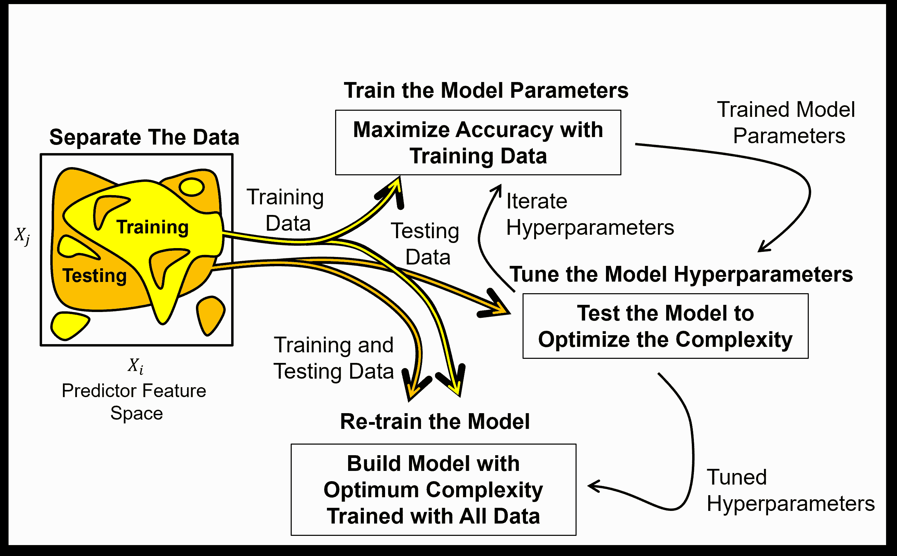

预测性机器学习模型参数训练和超参数调整工作流程中训练和测试数据的流程。

**训练数据**,

+   训练模型参数

+   训练用于实际应用的最终模型

**测试数据**,

+   从训练模型参数中保留以避免模型过拟合

+   调整模型超参数

+   返回训练以部署最终调整好的模型

## 应该保留多少数据用于测试？

测试数据所占的比例由各种来源推荐，从总数据集的 15%到 30%。这是一个折衷方案，

+   用于测试保留的数据减少了可用于训练的数据；因此，降低了模型的准确性。

+   用于测试保留的数据提高了对模型性能评估的准确性。

不同的作者已经对各种训练和测试比率进行了实验，并为其应用推荐了分割方案，

+   训练和测试分割的最佳比例取决于问题设置

为了确定测试数据保留的比例，我们可以考虑模型参数训练的难度（例如，模型参数的数量）和模型超参数调整的难度（例如，超参数的数量，响应特征结果的范围）。

## 公平的训练和测试分割

朱利安·萨拉扎博士建议，对于空间预测问题，随机训练和测试数据分割可能不公平。

+   提出了一种[公平的训练和测试分割方法](https://www.sciencedirect.com/science/article/pii/S0920410521015023)，用于基于模型计划用途难度的空间预测模型数据分割。

+   预测难度与克里金方差相关，它考虑了空间连续性和距离偏移，即估计的难度。

+   测试分割被迭代以匹配模型在计划用于现实世界应用中的克里金方差分布

为了说明预测难度这一概念，考虑以下这组井日志，其中包含了测试数据的随机分配和保留整个连续区域作为测试数据。

+   **易于预测的问题** - 对于随机分配，通常训练数据非常接近且与保留的测试数据非常相似

+   **难以预测的问题** - 对于移除连续区域，没有相似或接近的训练数据与保留的测试数据

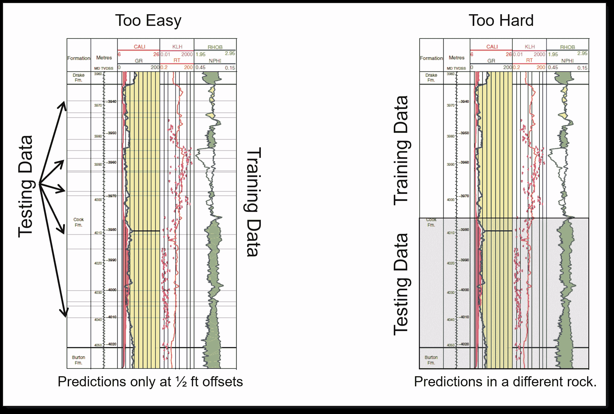

训练和测试数据分割的两个案例，随机（左）和按区域（右）。

考虑以下预测案例，即模型的计划现实世界应用，以及一些关于公平训练和测试分割的实际建议。

1.  如果模型将用于使用可用数据中的小偏移来插补数据，则构建一个靠近测试数据的训练和测试分割 - 随机分配保留的测试数据可能是足够的。

1.  如果模型将用于预测大距离偏移，则进行分割，结果是在训练数据和测试数据之间产生大偏移 - 保留整个井筒、钻孔或空间区域。

+   注意，在公平的训练和测试分割下，调整后的模型可能基于模型的计划用途而有所不同。

使用像为预钻预测模型保留整个井筒这样的简单方法，或者使用萨拉扎博士的工作流程，但不要忽略这个问题，而默认使用随机选择。

+   虽然如此，在整个电子书中，为了演示工作流程的简洁性和清晰性，我仅仅使用了随机的训练和测试数据分配。

## 模型度量

由于我们已经涵盖了培训和调整的工作流程，现在我们可以指定应用这些模型度量的模型。

+   训练模型参数

+   调整模型超参数

+   模型检查和比较

这里有一个流程图，说明了这些度量如何适合机器学习建模工作流程。

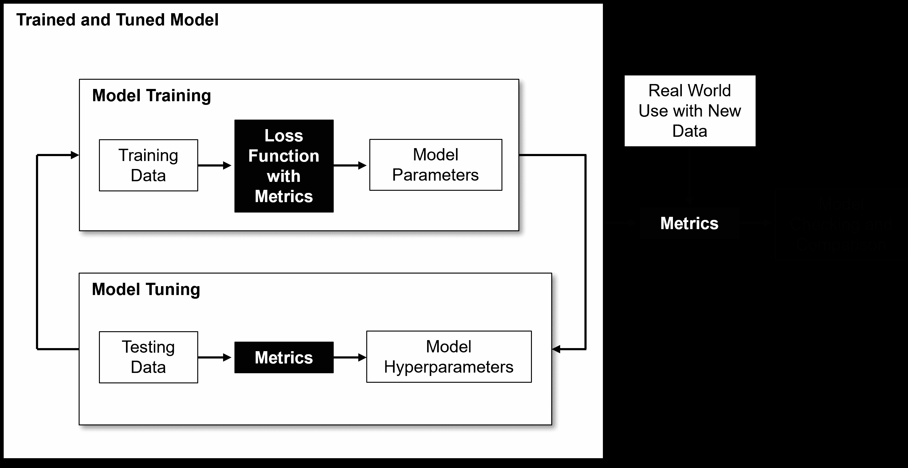

在机器学习建模工作流程中，模型度量有多种应用。

模型度量的选择主要取决于预测问题的上下文，

+   分类与回归

+   单个估计与空间（图像）或时间（信号）中的整个子集

+   估计与不确定性

有其他一些考虑因素，例如，

+   $L¹$ 与 $L²$ 范数及其差异，例如，在异常值鲁棒性、解的稳定性和解的稀疏性方面

+   与模型假设的一致性，例如，$r²$ 只对线性模型有效

让我们回顾一些回归模型的常见模型度量，然后是分类模型。

## 均方误差 (MSE)

对异常值敏感，但连续可微，导致模型训练有封闭形式表达式。由于误差是平方的，误差单位也是平方的，这可能导致解释性较差，例如，均方误差为 23,543 $mD²$。该方程是，

$$ \text{Test MSE} = \frac{1}{n_{\text{test}}} \sum_{i=1}^{n_{\text{test}}} (y_i - \hat{y}_i)² = \frac{1}{n_{\text{test}}} \sum_{i=1}^{n_{\text{test}}} (\Delta y_i)² $$

## 均值绝对误差 (MAE)

在存在异常值的情况下具有鲁棒性，但不是连续可微的；因此，没有模型训练的封闭形式表达式，模型训练通常通过迭代优化来完成。该方程是，

$$ \text{Test MAE} = \frac{1}{n_{\text{test}}} \sum_{i=1}^{n_{\text{test}}} |y_i - \hat{y}_i| = \frac{1}{n_{\text{test}}} \sum_{i=1}^{n_{\text{test}}} |\Delta y_i| $$

## 解释的方差

模型捕获的响应特征方差的比率。假设方差的可加性；因此，我们只对线性模型使用此模型度量。

首先，我们计算模型解释的方差，简单地说就是模型预测的方差，

$$ \sigma_{\text{explained}}² = \frac{1}{n_{\text{test}}} \sum_{i=1}^{n_{\text{test}}} ( \hat{y}_i - \bar{y} )² $$

然后我们计算模型未解释的方差，作为模型预测误差的方差，

$$ \sigma_{\text{not explained}}² = \frac{1}{n_{\text{test}}} \sum_{i=1}^{n_{\text{test}}} (y_i - \hat{y}_i)² $$

然后在方差可加性的假设下，我们计算解释的方差与所有方差（解释的方差加上未解释的方差）的比率，

$$ r² = \frac{\sigma_{\text{explained}}²}{\sigma_{\text{explained}}² + \sigma_{\text{not explained}}²} = \frac{\sigma_{\text{explained}}²}{\sigma_{\text{total}}²} $$

对于线性回归，回忆 $r² = \left( \rho_(X,y) \right)²$；因此，像相关系数一样，$r²$，

+   与异常值和混合多个总体相关的相关性问题类似，例如，辛普森悖论

+   对于非线性模型，考虑伪 R 平方方法

此外，即使线性模型也可能有负的 $r²$，如果模型趋势与数据趋势相矛盾，例如，如果你用具有正斜率的线性模型拟合具有负斜率的数据！

## 内点比率

测试数据中，$y_i$ 在模型，$\hat{y}_i$ 的边界，$\epsilon$ 内的比例，计算如下，

$$ I_R = \frac{1}{n_{\text{test}}} \sum_{i=1}^{n_{\text{test}}} I(y_i, \hat{y}_i) $$

其中指示变换，$I_R$ 被定义为，

$$\begin{split} I(y_i, \hat{y}_i) = \begin{cases} 1, & \text{if } |y_i - \hat{y}_i| \leq \epsilon \\ 0, & \text{otherwise} \end{cases} \end{split}$$

这里是一个内点比率模型度量，$I_R$ 模型度量的插图，

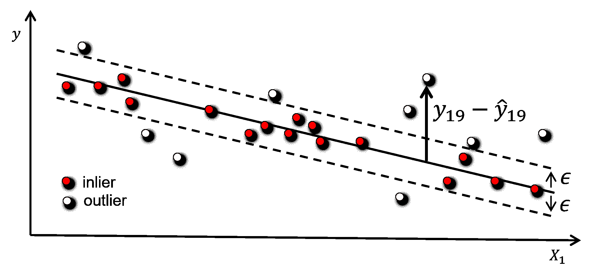

测试数据，具有边界的模型，$\epsilon$，以及异常值（白色）和内点（红色）已识别，25 个数据样本中有 16 个内点，$𝐼𝑅 = 0.64$。

虽然插图是线性模型，但此度量可以应用于任何模型。尽管内点比率模型度量存在一些主观性，

+   什么是最优的边界选择，$\epsilon$？

## 常见分类模型度量

让我们回顾一些常见的分类模型度量。分类可能比回归更复杂，因为我们实际上计算的是一个完整的混淆矩阵，

+   一个 $K \times K$ 的矩阵，包含预测（x 轴）与实际（y 轴）类别的频率，以可视化分类模型的性能，其中 $K$ 是响应特征的基数，即可能类别的数量

+   使用分类模型可视化并诊断所有正确和错误分类的组合，例如，类别 1 通常被错误地分类为类别 3，


对于分类模型，一个示例混淆矩阵，2D 矩阵，包含所有真实和预测类别的频率。

+   完美准确度是每个类别的数量，$n_1, n_2, \ldots, n_K$ 在对角线上，即类别 1 总是被预测为类别 1 等。

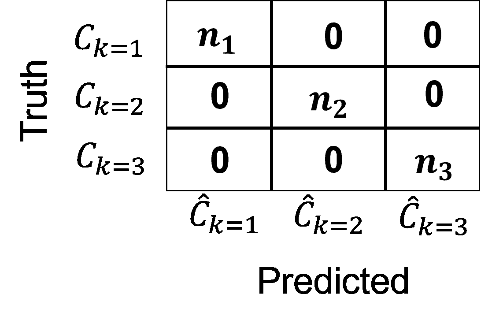

完美准确度的分类模型示例混淆矩阵。

+   混淆矩阵被应用于计算分类准确性的单个汇总，例如，精确度、召回率等。

+   模型度量特定于特定类别，并且可能在类别之间有显著差异，即我们可能对类别 $k=1$ 预测得很好，但对类别 $k=3$ 则不然。

## 精确度

对于类别 $𝑘$，精确度是真实正例与所有正例的比率，

$$ \text{Precision}_k = \frac{n_{k \text{ true positive}}}{n_{k \text{ true positive}} + n_{k \text{ false positive}}} = \frac{\text{true positive}}{\text{all positives}} $$

我们可以直观地描述精确度作为条件概率，

$$ \text{Precision}_k = P \left(k \text{ is happening} \mid \text{model says } k \text{ is happening}\right) $$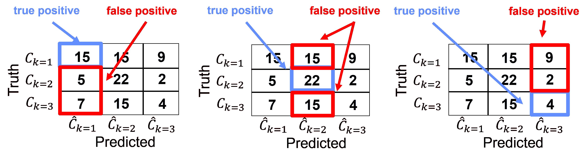

示例混淆矩阵，展示了每个类别 $k$ 的精确度模型指标。

对于这个例子，我们可以计算每个类别的精确度，

+   类别 k=1

$$ \text{Precision}_{k=1} = \frac{15}{15 + (5 + 7)} = \frac{15}{27} = 0.56 $$

+   类别 k = 2,

$$ \text{Precision}_{k=2} = \frac{22}{22 + (15 + 15)} = \frac{22}{52} = 0.42 $$

+   类别 k = 3,

$$ \text{Precision}_{k=3} = \frac{4}{4 + (2 + 9)} = \frac{4}{15} = 0.27 $$

## 召回率（在医学中称为灵敏度）

组 $𝑘$ 的召回率是真实阳性数与 $𝑘$ 的所有案例数的比率。

$$ \text{Recall}_k = \frac{n_{k \text{ true positive}}}{n_{k \text{ true positive}} + n_{k \text{ false negative}}} $$

我们可以直观地描述召回率，即我们捕获了多少组 𝑘 的成员？

+   注意，召回率不考虑假阳性。

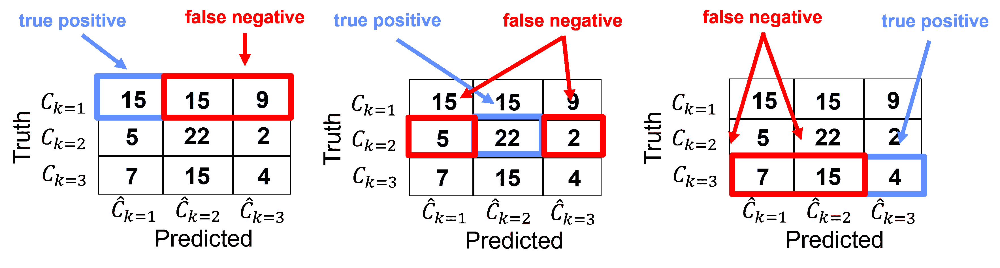

示例混淆矩阵，展示了每个类别 $k$ 的召回率模型指标。

对于这个例子，我们可以计算每个类别的召回率，

+   类别 k=1

$$ \text{Recall}_{k=1} = \frac{15}{15 + (15 + 2)} = \frac{15}{32} = 0.47 $$

+   类别 k = 2,

$$ \text{Recall}_{k=2} = \frac{22}{22 + (5 + 9)} = \frac{22}{36} = 0.61 $$

+   类别 k = 3,

$$ \text{Recall}_{k=3} = \frac{4}{4 + (7 + 15)} = \frac{4}{26} = 0.15 $$

## 特异性

组 $𝑘$ 的特异性是真实负例数与 $n \ne 𝑘$ 的所有负例数的比率。

$$ \text{Specificity}_k = \frac{n_{k \text{ true negative}}}{n_{\neq k} \, n_{k \text{ true negative}} + n_{k \text{ false positive}}} $$

我们可以直观地描述特异性，即我们捕获了多少非组 $k$ 的成员？

+   注意，召回率不考虑真实阳性。

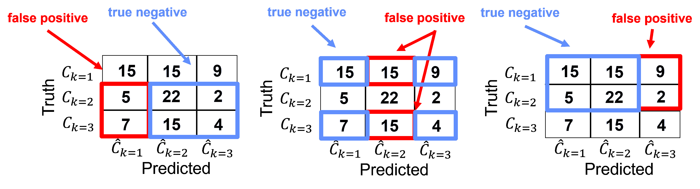

示例混淆矩阵，展示了每个类别 $k$ 的召回率模型指标。

对于这个例子，我们可以计算每个类别的召回率，

+   类别 k=1

$$ \text{Specificity}_{k=1} = \frac{22 + 9 + 15 + 4}{(22 + 9 + 15 + 4) + (5 + 7)} = \frac{50}{62} = 0.81 $$

+   类别 k = 2,

$$ \text{Specificity}_{k=2} = \frac{15 + 2 + 7 + 4}{(15 + 2 + 7 + 4) + (15 + 15)} = \frac{28}{58} = 0.48 $$

+   类别 k = 3,

$$ \text{Specificity}_{k=3} = \frac{15 + 15 + 5 + 22}{(15 + 15 + 5 + 22) + (2 + 9)} = \frac{57}{68} = 0.84 $$

## f1-score

f1-score 是每个 $k$ 类别精确度和召回率的调和平均数。

$$ \text{F1-Score}_k = \frac{2}{\frac{1}{\text{Precision}_k} + \frac{1}{\text{Recall}_k}} $$

理念是将精确度和召回率合并成一个单一指标，因为它们都看到了分类模型准确性的不同方面。

+   调和平均数对最低分敏感；因此，一个分数的良好表现不能平均或弥补另一个分数的糟糕表现

## 训练和测试保持分离交叉验证

如果只应用一个训练和测试数据分割来调整我们的机器学习模型超参数，那么我们正在应用保持分离交叉验证方法。

+   我们将数据分割成训练数据和测试数据，这些是详尽且互斥的组。

+   但这种交叉验证方法并不全面，我们只考虑一个测试分割，大部分数据都没有被测试。此外，我们也没有探索所有可能的分割组合（我们将在与其他交叉验证方法比较时了解更多关于这一点）

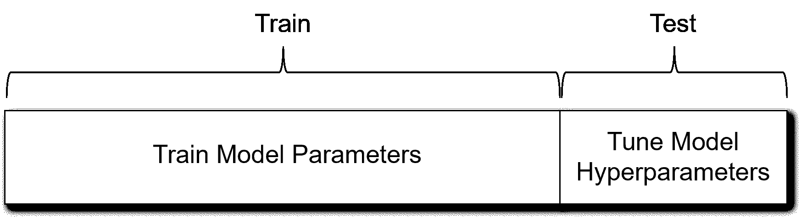

训练和测试数据保持分离交叉验证。

工作流程是，

1.  从模型训练中保留测试数据子集

1.  使用剩余的训练数据以及代表从简单到复杂模型的多种超参数来训练模型

1.  然后使用保留的测试数据测试从简单到复杂的训练模型套件

1.  选择具有最低测试错误的模型超参数（复杂性）

1.  使用调整后的超参数和所有数据重新训练模型以进行部署

这种方法的优点是我们可以轻松评估训练和测试数据分割。

+   由于只有一个分割，我们可以轻松可视化和评估训练和测试数据案例、覆盖率和平衡性

这种方法的缺点是这种方法可能对测试数据的特定选择敏感

+   因此，保持分离交叉验证可能会导致测试错误与超参数的噪声图

## 训练、验证和测试保持分离交叉验证

常用的更完整的保持分离交叉验证工作流程是

1.  **使用训练数据分割进行训练** - 模型从这个数据中看到并学习以训练模型参数。

1.  **使用验证数据分割进行验证** - 评估模型复杂性相对于准确性的数据，这些数据是从模型参数训练中保留出来的，以调整模型超参数。这与训练和测试工作流程中的测试数据相同。

1.  **使用测试数据测试模型性能** - 数据保留到模型完成，以提供对模型性能的最终评估。这些数据在构建模型时没有发挥作用，通常用于比较多个竞争模型。

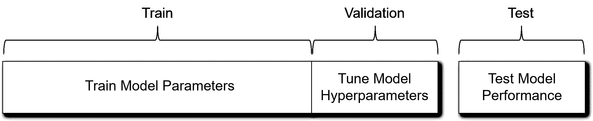

训练、验证和测试保持分离交叉验证。

我理解训练、验证和测试交叉验证工作流程的动机。这是尝试用我们知道真相并能准确访问准确性的案例来客观地检查我们的模型。

+   我们知道真相并能准确访问准确性

+   与模型构建、训练模型参数或调整模型超参数无关

我对此表示赞赏，但我有一些担忧，

1.  我们进一步减少了可用于训练模型参数和调整模型超参数的样本数量。

1.  最终我们将使用所有数据重新训练调整后的模型，因此我们测试的模型实际上并不是最终部署的模型。

1.  如果测试数据没有被准确预测，我们该怎么办？我们是否包括另一轮测试，使用数据集的另一部分进行测试？无穷无尽？

## 加载所需的库

以下代码加载所需的库。这些库应该已经与 Anaconda 3 一起安装。

```py
ignore_warnings = True
import pandas as pd
import numpy as np
import matplotlib.pyplot as plt
from matplotlib.ticker import (MultipleLocator, AutoMinorLocator) # control of axes ticks
from sklearn.model_selection import cross_val_score           # multi-processor K-fold crossvalidation
from sklearn.model_selection import train_test_split          # train and test split
from sklearn.model_selection import KFold                     # K-fold cross validation
plt.rc('axes', axisbelow=True)                                # plot all grids below the plot elements
if ignore_warnings == True:                                   
    import warnings
    warnings.filterwarnings('ignore')
cmap = plt.cm.inferno                                         # color map
seed = 42                                                     # random number seed 
```

## 声明函数

我还添加了一个方便的函数来添加主网格线和副网格线，以提高绘图的可解释性。

```py
def add_grid():
    plt.gca().grid(True, which='major',linewidth = 1.0); plt.gca().grid(True, which='minor',linewidth = 0.2) # add y grids
    plt.gca().tick_params(which='major',length=7); plt.gca().tick_params(which='minor', length=4)
    plt.gca().xaxis.set_minor_locator(AutoMinorLocator()); plt.gca().yaxis.set_minor_locator(AutoMinorLocator()) # turn on minor ticks 
```

## 将数据加载到演示交叉验证方法

让我们加载一个空间数据集并选择 2 个预测特征来可视化交叉验证方法。

+   我们将关注数据拆分，而不是实际的模型训练和调整。稍后当我们介绍预测机器学习方法时，我们将添加工作流程中的模型组件。

```py
df = pd.read_csv('https://raw.githubusercontent.com/GeostatsGuy/GeoDataSets/master/unconv_MV_v4.csv') # load data from Dr. Pyrcz's GitHub repository 

response = 'Prod'                                             # specify the response feature
X = df.iloc[:,[1,3]]                                          # make predictor and response DataFrames
y = df.loc[:,response]

Xname = X.columns.values.tolist()                             # store the names of the features
yname = y.name

Xmin = [6.0,1.0]; Xmax = [24.0,5.0]                           # set the minimum and maximum values for plotting
ymin = 500.0; ymax = 9000.0

Xlabel = ['Porosity','Acoustic Impedance']
ylabel = 'Normalized Initial Production (MCFPD)'

Xtitle = ['Porosity','Acoustic Impedance']
ytitle = 'Normalized Initial Production'

Xunit = ['%',r'$kg/m³ x m/s x 10³$']; yunit = 'MCFPD'
Xlabelunit = [Xlabel[0] + ' (' + Xunit[0] + ')',Xlabel[1] + ' (' + Xunit[1] + ')']
ylabelunit = ylabel + ' (' + yunit + ')'

m = len(pred) + 1
mpred = len(pred) 
```

```py
---------------------------------------------------------------------------
NameError  Traceback (most recent call last)
Cell In[3], line 23
  20 Xlabelunit = [Xlabel[0] + ' (' + Xunit[0] + ')',Xlabel[1] + ' (' + Xunit[1] + ')']
  21 ylabelunit = ylabel + ' (' + yunit + ')'
---> 23 m = len(pred) + 1
  24 mpred = len(pred)

NameError: name 'pred' is not defined 
```

## 可视化训练和测试数据保留的交叉验证

让我们比较训练和测试数据与训练、验证和测试数据保留的拆分。

+   首先，我们绘制训练和测试数据拆分，然后是训练、验证和测试拆分。

```py
test_prop = 0.15                                              # set the proportion of test data to withhold
X_train, X_test, y_train, y_test = train_test_split(X,y,test_size=test_prop,random_state=73073) # train and test split
df_train = pd.concat([X_train,y_train],axis=1)                # make one train DataFrame with both X and y (remove all other features)
df_test = pd.concat([X_test,y_test],axis=1)                   # make one testin DataFrame with both X and y (remove all other features)

nbins = 20                                                    # number of histogram bins

plt.subplot(221)                                              # predictor feature #1 histogram
freq1,_,_ = plt.hist(x=df_train[Xname[0]],weights=None,bins=np.linspace(Xmin[0],Xmax[0],nbins),alpha = 0.6,
                     edgecolor='black',color='darkorange',density=False,label='Train')
freq2,_,_ = plt.hist(x=df_test[Xname[0]],weights=None,bins=np.linspace(Xmin[0],Xmax[0],nbins),alpha = 0.6,
                     edgecolor='black',color='red',density=False,label='Test')
max_freq = max(freq1.max()*1.10,freq2.max()*1.10)
plt.xlabel(Xlabelunit[0]); plt.ylabel('Frequency'); plt.ylim([0.0,max_freq]); plt.title(Xtitle[0]); add_grid()  
plt.xlim([Xmin[0],Xmax[0]]); plt.legend(loc='upper right')   

plt.subplot(222)                                              # predictor feature #2 histogram
freq1,_,_ = plt.hist(x=df_train[Xname[1]],weights=None,bins=np.linspace(Xmin[1],Xmax[1],nbins),alpha = 0.6,
                     edgecolor='black',color='darkorange',density=False,label='Train')
freq2,_,_ = plt.hist(x=df_test[Xname[1]],weights=None,bins=np.linspace(Xmin[1],Xmax[1],nbins),alpha = 0.6,
                     edgecolor='black',color='red',density=False,label='Test')
max_freq = max(freq1.max()*1.10,freq2.max()*1.10)
plt.xlabel(Xlabelunit[1]); plt.ylabel('Frequency'); plt.ylim([0.0,max_freq]); plt.title(Xtitle[1]); add_grid()  
plt.xlim([Xmin[1],Xmax[1]]); plt.legend(loc='upper right')   

plt.subplot(223)                                              # predictor feature #2 histogram
freq1,_,_ = plt.hist(x=df_train[yname],weights=None,bins=np.linspace(ymin,ymax,nbins),alpha = 0.6,
                     edgecolor='black',color='darkorange',density=False,label='Train')
freq2,_,_ = plt.hist(x=df_test[yname],weights=None,bins=np.linspace(ymin,ymax,nbins),alpha = 0.6,
                     edgecolor='black',color='red',density=False,label='Test')
max_freq = max(freq1.max()*1.10,freq2.max()*1.10)
plt.xlabel(ylabelunit); plt.ylabel('Frequency'); plt.ylim([0.0,max_freq]); plt.title(ytitle); add_grid()  
plt.xlim([ymin,ymax]); plt.legend(loc='upper right')   

plt.subplot(224)                                              # predictor features #1 and #2 scatter plot
plt.scatter(df_train[Xname[0]],df_train[Xname[1]],s=40,marker='o',color = 'darkorange',alpha = 0.8,edgecolor = 'black',zorder=10,label='Train')
plt.scatter(df_test[Xname[0]],df_test[Xname[1]],s=40,marker='o',color = 'red',alpha = 0.8,edgecolor = 'black',zorder=10,label='Test')
plt.title(Xlabel[0] + ' vs ' +  Xlabel[1])
plt.xlabel(Xlabelunit[0]); plt.ylabel(Xlabelunit[1])
plt.legend(); add_grid(); plt.xlim([Xmin[0],Xmax[0]]); plt.ylim([Xmin[1],Xmax[1]])

plt.subplots_adjust(left=0.0, bottom=0.0, right=2.0, top=2.1, wspace=0.3, hspace=0.2)
#plt.savefig('Test.pdf', dpi=600, bbox_inches = 'tight',format='pdf') 
plt.show() 
```

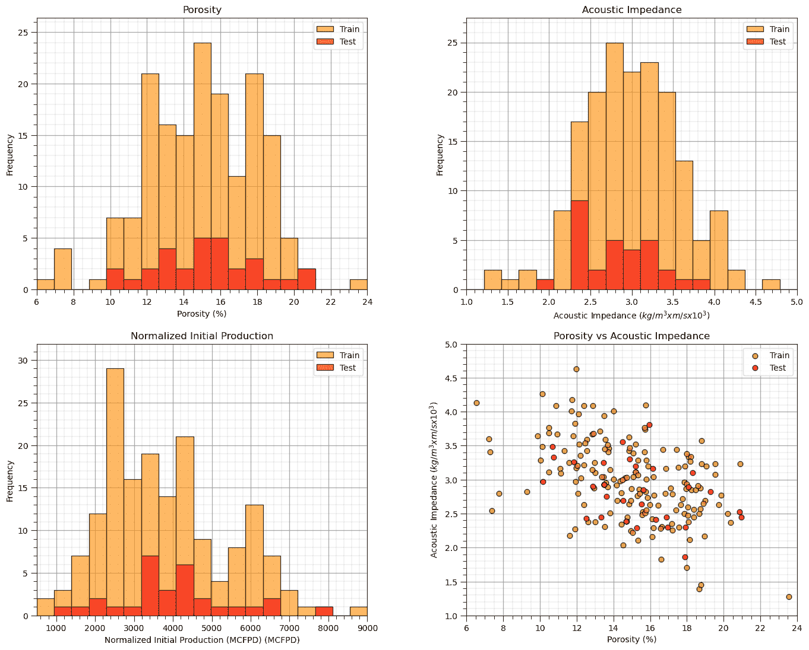

可视化训练和测试拆分是一个好主意，

+   对于每个预测特征和响应特征绘制直方图，以确保训练和测试覆盖了可能的范围并且是平衡的

+   如果预测特征的数量是 2，那么我们实际上可以绘制预测特征空间来检查训练和测试数据拆分的覆盖率和平衡性

现在我们重复这个过程，针对训练、验证和测试数据拆分。

```py
val_prop = 0.15; test_prop = 0.15                             # set the proportion of test data to withhold
nbins = 20                                                    # number of histogram bins

X_train, X_temp, y_train, y_temp = train_test_split(X, y, test_size=val_prop + test_prop, random_state=42)
X_val, X_test, y_val, y_test = train_test_split(X_temp, y_temp, test_size=test_prop/(val_prop + test_prop), random_state=42)

df_train = pd.concat([X_train,y_train],axis=1); df_val = pd.concat([X_val,y_val],axis=1); df_test = pd.concat([X_test,y_test],axis=1) 

plt.subplot(221)                                              # predictor feature #1 histogram
freq1,_,_ = plt.hist(x=df_train[Xname[0]],weights=None,bins=np.linspace(Xmin[0],Xmax[0],nbins),alpha = 0.6,
                     edgecolor='black',color='darkorange',density=False,label='Train')
freq2,_,_ = plt.hist(x=df_val[Xname[0]],weights=None,bins=np.linspace(Xmin[0],Xmax[0],nbins),alpha = 0.6,
                     edgecolor='black',color='red',density=False,label='Validate')
freq3,_,_ = plt.hist(x=df_test[Xname[0]],weights=None,bins=np.linspace(Xmin[0],Xmax[0],nbins),alpha = 0.6,
                     edgecolor='black',color='blue',density=False,label='Test')
max_freq = max(freq1.max()*1.10,freq2.max()*1.10,freq3.max()*1.10)
plt.xlabel(Xlabelunit[0]); plt.ylabel('Frequency'); plt.ylim([0.0,max_freq]); plt.title(Xtitle[0]); add_grid()  
plt.xlim([Xmin[0],Xmax[0]]); plt.legend(loc='upper right')   

plt.subplot(222)                                              # predictor feature #2 histogram
freq1,_,_ = plt.hist(x=df_train[Xname[1]],weights=None,bins=np.linspace(Xmin[1],Xmax[1],nbins),alpha = 0.6,
                     edgecolor='black',color='darkorange',density=False,label='Train')
freq2,_,_ = plt.hist(x=df_val[Xname[1]],weights=None,bins=np.linspace(Xmin[1],Xmax[1],nbins),alpha = 0.6,
                     edgecolor='black',color='red',density=False,label='Validate')
freq3,_,_ = plt.hist(x=df_test[Xname[1]],weights=None,bins=np.linspace(Xmin[1],Xmax[1],nbins),alpha = 0.6,
                     edgecolor='black',color='blue',density=False,label='Test')
max_freq = max(freq1.max()*1.10,freq2.max()*1.10,freq3.max()*1.10)
plt.xlabel(Xlabelunit[1]); plt.ylabel('Frequency'); plt.ylim([0.0,max_freq]); plt.title(Xtitle[1]); add_grid()  
plt.xlim([Xmin[1],Xmax[1]]); plt.legend(loc='upper right')   

plt.subplot(223)                                              # predictor feature #2 histogram
freq1,_,_ = plt.hist(x=df_train[yname],weights=None,bins=np.linspace(ymin,ymax,nbins),alpha = 0.6,
                     edgecolor='black',color='darkorange',density=False,label='Train')
freq2,_,_ = plt.hist(x=df_val[yname],weights=None,bins=np.linspace(ymin,ymax,nbins),alpha = 0.6,
                     edgecolor='black',color='red',density=False,label='Validate')
freq2,_,_ = plt.hist(x=df_test[yname],weights=None,bins=np.linspace(ymin,ymax,nbins),alpha = 0.6,
                     edgecolor='black',color='blue',density=False,label='Test')
max_freq = max(freq1.max()*1.10,freq2.max()*1.10,freq3.max()*1.10)
plt.xlabel(ylabelunit); plt.ylabel('Frequency'); plt.ylim([0.0,max_freq]); plt.title(ytitle); add_grid()  
plt.xlim([ymin,ymax]); plt.legend(loc='upper right')   

plt.subplot(224)                                              # predictor features #1 and #2 scatter plot
plt.scatter(df_train[Xname[0]],df_train[Xname[1]],s=40,marker='o',color = 'darkorange',alpha = 0.8,edgecolor = 'black',zorder=10,label='Train')
plt.scatter(df_val[Xname[0]],df_val[Xname[1]],s=40,marker='o',color = 'blue',alpha = 0.8,edgecolor = 'black',zorder=10,label='Test')
plt.scatter(df_test[Xname[0]],df_test[Xname[1]],s=40,marker='o',color = 'red',alpha = 0.8,edgecolor = 'black',zorder=10,label='Test')
plt.title(Xlabel[0] + ' vs ' +  Xlabel[1])
plt.xlabel(Xlabelunit[0]); plt.ylabel(Xlabelunit[1])
plt.legend(); add_grid(); plt.xlim([Xmin[0],Xmax[0]]); plt.ylim([Xmin[1],Xmax[1]])

plt.subplots_adjust(left=0.0, bottom=0.0, right=2.0, top=2.1, wspace=0.3, hspace=0.2)
#plt.savefig('Test.pdf', dpi=600, bbox_inches = 'tight',format='pdf') 
plt.show() 
```

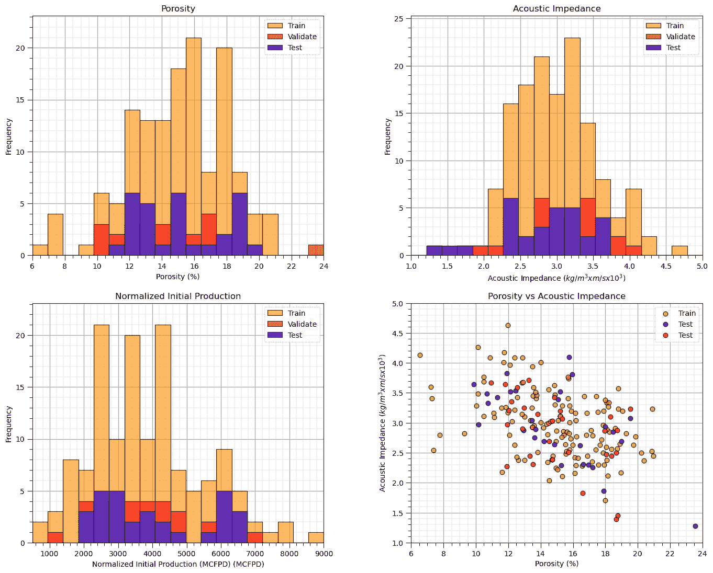

再次，我们可以可视化拆分，现在包括训练、验证和测试，

+   对于每个预测特征和响应特征绘制直方图，以确保训练和测试覆盖了可能的范围并且是平衡的

+   如果预测特征的数量是 2，那么我们实际上可以绘制预测特征空间来检查训练和测试数据拆分的覆盖率和平衡性

## 留一法交叉验证 (LOO CV)

留一法交叉验证是一种详尽的交叉验证方法，即通过遍历所有数据来测试所有数据。

+   我们训练和调整 $n$ 个模型，对于每个模型，一个数据点被保留作为测试，而 $n-1$ 个数据被分配为训练数据

+   我们将计算 $n$ 个训练和测试误差，这些误差将在所有 $n$ 个模型上汇总，例如，均方误差的平均值。

在留一法交叉验证的情况下，

+   我们只测试一个数据点，因此测试误差只是单个保留数据点的单个错误，所以我们只使用标准均方误差来评估 $n$ 个模型

$$ \text{测试均方误差总和} = \frac{1}{n_{\text{test}}} \sum_{i=1}^{n_{\text{test}}} (y_i - \hat{y}_i)² = \frac{1}{n_{\text{test}}} \sum_{i=1}^{n_{\text{test}}} (\Delta y_i)² $$

+   但是，对于每个模型，我们有 $n-1$ 个训练数据，所以我们通过平均每个模型的均方误差来汇总，

$$ \text{Train MSE Aggregate} = \frac{1}{n} \sum_{i=1}^{n} \frac{1}{n-1} \sum_{i=1}^{n-1} (y_i - \hat{y}_i)² = \frac{1}{n} \sum_{i=1}^{n} \text{Train MSE}_i $$

这里是留一法交叉验证的步骤，

1.  遍历所有 $n$ 个数据，并保留该数据

1.  在剩余的 $n−1$ 个数据上训练，并在保留的单个数据上测试

1.  计算模型良好度指标，单个测试数据的均方误差（MSE）是平方误差

1.  转到 1

1.  对所有数据聚合模型良好度指标，$n$

通常，留一法交叉验证预测问题过于简单；因此，它不常被使用，

+   但它引入了全面交叉验证的概念，即所有数据都进行了测试！

留一法交叉验证在探索 $n$ 个数据中选择 $p$ 的完整组合方面也是全面的，其中 $p=1$，

$$ \binom{n}{p} = \frac{n!}{p!(n - p)!} = \frac{n!}{1!(n - 1)!} = \frac{n!}{(n - 1)!} = n $$

其中，完整的组合是上面构建的 $n$ 个模型！

## K 折交叉验证（k-fold CV）

K 折是一种更通用、高效且稳健的方法。

+   一种全面交叉验证方法（所有数据都进行测试），但它只采样了预测问题可能组合的有限集，与留一法交叉验证不同，在留一法交叉验证中，我们尝试对保留用于测试的数据的每一种可能情况进行测试

+   对于 K 折交叉验证，我们分配一组 K 个大小相等的分割，并遍历这些分割，保留 $k$ 个分割作为测试数据，并使用分割外的数据作为训练数据

+   测试比例是 $\frac{1}{K}$，例如，对于 $K=3$，33.3% 被保留用于测试，对于 $K=4$，25% 被保留用于测试，对于 $K=5$，20% 被保留用于测试

我们称之为 K 折交叉验证，因为每个分割都被称为一个折。以下是 K 折交叉验证的步骤，

1.  选择 $K$，整数个折

1.  将数据分成 $K$ 个大小相等的折

1.  遍历每个 $k = 1,\ldots,K$ 折

1.  将 $k$ 折外的数据分配为训练数据，并将 $k$ 折内的数据分配为测试数据

1.  训练和测试预测模型，并计算测试模型指标

1.  转到 3

1.  对所有 K 折进行聚合测试模型指标

如上图所示，k 折交叉验证是全面的，因为所有数据都进行了测试，即作为测试数据被保留，但这种方法并不是全面的，因为并没有考虑所有可能的 $\frac{n}{K}$ 个数据子集。

为了计算全面 K 折的组合，我们使用了多项式系数，

$$ \frac{n!}{\left( \frac{n}{K}! \right)^K \cdot K!} $$

例如，如果有 $n=100$ 个数据和 $K=4$ 个折，那么有 $6.72 \times 10⁵⁵$ 种可能的组合。我建议我们坚持使用常规的 K 折交叉验证。

让我们可视化 K 折交叉验证的分割，以 $K=4$ 为例。

```py
K = 4
kf = KFold(n_splits=K, shuffle=True, random_state=seed)

df['Fold'] = -1
for fold_number, (train_index, test_index) in enumerate(kf.split(df)):
    df.loc[test_index, 'Fold'] = fold_number  # Assign fold number to test set

for k in range(0,K):
    df_in = df[df['Fold'] == k]; df_out = df[df['Fold'] != k]
    plt.subplot(2,2,k+1)
    plt.scatter(df_in[Xname[0]],df_in[Xname[1]],color='red',edgecolor='black',label='Test')
    plt.scatter(df_out[Xname[0]],df_out[Xname[1]],color='white',edgecolor='black',label='Train'); add_grid()
    plt.title('K-fold #' + str(k) + ', ' + Xlabel[0] + ' vs ' +  Xlabel[1])
    plt.xlabel(Xlabelunit[0]); plt.ylabel(Xlabelunit[1])
    plt.legend(); add_grid(); plt.xlim([Xmin[0],Xmax[0]]); plt.ylim([Xmin[1],Xmax[1]])

plt.subplots_adjust(left=0.0, bottom=0.0, right=2.0, top=2.1, wspace=0.2, hspace=0.2); plt.show() 
```


## 留出 $p$ 个样本交叉验证（LpO-CV）

这是 K 折交叉验证的一种变体，它彻底采样了保留 $p$ 个测试数据的全部组合。

1.  选择 $p$，保留测试数据的整数数量

1.  对于所有可能的 $p$ 个 $n$ 的子集，

1.  将 $p$ 以外的数据分配为训练数据，将 $p$ 以内的数据分配为测试数据

1.  训练和测试预测模型并计算测试模型度量

1.  转到 2

1.  在组合上聚合测试模型度量

对于这种情况，案例的组合是，从 $n$ 中选择 $p$，

$$ \binom{n}{p} = \frac{n!}{p!(n - p)!} $$

对于 $n=100$ 和 $p=20$，我们有 $5.36 \times 10^{20}$ 种组合需要检查！

## 交叉验证的限制

这里有一些关于模型交叉验证方法的一般问题，

+   **偷看，信息泄露**——一些信息从保留数据传输到模型中，一些模型决策（们）使用所有数据。管道和包装器有助于解决这个问题。

+   **黑天鹅 / 静态性**——模型无法测试数据中不可用的事件。这也被称为机器学习中的“无免费午餐定理”

考虑休谟的话，

“即使观察到了频繁或恒定的对象联合，我们也没有理由对任何超出我们经验范围的对象做出任何推论”——休谟 (1739–1740)

+   我们无法预测我们在数据中从未见过的事物！

这里是从著名的 Oreskes 等人 (1994) 关于地下验证和验证的论文中摘录的一句话，

“验证和验证自然系统的数值模型是不可能的。这是因为自然系统永远不会封闭，因为模型结果总是非唯一的。模型可以通过观察和预测之间的一致性来证实，但证实本质上是不完全的。由于肯定后件的谬误和自然现象的不完全访问，完全证实在逻辑上是不可能的。模型只能相对评估，它们的预测价值总是值得怀疑。模型的主要价值是启发性的。”

+   Oreskes 等人 (1994)

所有这些都很好地总结为，

“所有模型都是错误的，但有些是有用的”——乔治·博克斯

并提醒，

**简约性**——由于所有模型都是错误的，因此对系统的经济描述。奥卡姆剃刀

从而形成了一种实用方法，

**选择性担忧**——由于所有模型都是错误的，找出最重要的错误是什么。

最后，我加入了自己的观点，

“谦逊，地球会给你惊喜！”——迈克尔·皮尔奇

## 评论

这是对机器学习概念的基本描述。可以做和讨论的还有很多，我有很多更多的资源。查看我的 [共享资源清单](https://michaelpyrcz.com/my-resources) 以及本章开头带有资源链接的视频讲座链接。

希望这有所帮助，

*迈克尔*

## 关于作者


迈克尔·皮尔奇兹教授在德克萨斯大学奥斯汀分校 40 英亩校园的办公室。

迈克尔·皮尔奇兹是德克萨斯大学奥斯汀分校[科克雷尔工程学院](https://cockrell.utexas.edu/faculty-directory/alphabetical/p)和[杰克逊地球科学学院](https://www.jsg.utexas.edu/researcher/michael_pyrcz/)的教授，在那里他研究并教授地下、空间数据分析、地统计学和机器学习。迈克尔还是，

+   [能源分析](https://fri.cns.utexas.edu/energy-analytics)新生研究项目的负责人，德克萨斯大学奥斯汀分校自然科学院机器学习实验室的核心教员。

+   [计算机与地球科学](https://www.sciencedirect.com/journal/computers-and-geosciences/about/editorial-board)的副编辑，以及国际数学地球科学协会[数学地球科学](https://link.springer.com/journal/11004/editorial-board)的董事会成员。

迈克尔已经撰写了 70 多篇[同行评审的出版物](https://scholar.google.com/citations?user=QVZ20eQAAAAJ&hl=en)，一个用于空间数据分析的[Python 包](https://pypi.org/project/geostatspy/)，合著了一本关于空间数据分析的教科书《Geostatistical Reservoir Modeling》（[亚马逊链接](https://www.amazon.com/Geostatistical-Reservoir-Modeling-Michael-Pyrcz/dp/0199731446)），并且是两本最近发布的电子书的作者，分别是《Applied Geostatistics in Python: a Hands-on Guide with GeostatsPy》（[GitHub 链接](https://geostatsguy.github.io/GeostatsPyDemos_Book/intro.html)）和《Applied Machine Learning in Python: a Hands-on Guide with Code》（[GitHub 链接](https://geostatsguy.github.io/MachineLearningDemos_Book/intro.html)）。

迈克尔的所有大学讲座都可以在他的[YouTube 频道](https://www.youtube.com/@GeostatsGuyLectures)上找到，其中包含 100 多个 Python 交互式仪表板和 40 多个 GitHub 账户上的详细文档工作流程，这些工作流程分布在 40 多个存储库中，旨在支持任何感兴趣的学生和在职专业人士，提供常青内容。想了解更多关于迈克尔的工作和共享教育资源，请访问他的网站。

## 想一起工作吗？

我希望这些内容对那些想了解更多关于地下建模、数据分析和学习机器的人来说有帮助。学生和在职专业人士都欢迎参加。

+   想邀请我到贵公司进行培训、辅导、项目审查、工作流程设计和/或咨询吗？我很乐意拜访并与您合作！

+   感兴趣合作，支持我的研究生研究或我的地下数据分析与机器学习联盟（共同负责人包括 Foster 教授、Torres-Verdin 教授和 van Oort 教授）？我的研究结合数据分析、随机建模和机器学习理论与实践，以开发新的方法和工作流程，增加价值。我们正在解决具有挑战性的地下问题！

+   我可以通过 mpyrcz@austin.utexas.edu 联系到。

我总是很高兴讨论，

*迈克尔*

迈克尔·皮尔茨，博士，工程师，德克萨斯大学奥斯汀分校 Cockrell 工程学院和 Jackson 地球科学学院教授

更多资源可在以下链接获取：[Twitter](https://twitter.com/geostatsguy) | [GitHub](https://github.com/GeostatsGuy) | [网站](http://michaelpyrcz.com) | [Google Scholar](https://scholar.google.com/citations?user=QVZ20eQAAAAJ&hl=en&oi=ao) | [地统计学书籍](https://www.amazon.com/Geostatistical-Reservoir-Modeling-Michael-Pyrcz/dp/0199731446) | [YouTube](https://www.youtube.com/channel/UCLqEr-xV-ceHdXXXrTId5ig) | [Python 中应用地统计学电子书](https://geostatsguy.github.io/GeostatsPyDemos_Book/intro.html) | [Python 中应用机器学习电子书](https://geostatsguy.github.io/MachineLearningDemos_Book/) | [LinkedIn](https://www.linkedin.com/in/michael-pyrcz-61a648a1)

## 训练和调整预测机器学习模型

在预测机器学习中，我们遵循标准的模型训练和测试工作流程。这个过程确保我们的模型能够很好地推广到新数据，而不仅仅是完美地拟合训练数据。


标准预测机器学习建模工作流程。

让我们逐一了解关键步骤，

1.  **训练和测试分割** - 将可用的数据划分为互斥的、穷尽的子集：训练集和测试集。

+   通常，15%–30%的数据被保留用于测试

+   剩余的 70%–85%用于训练模型

1.  **定义要探索的超参数值范围**，范围从，

+   简单模型，灵活性低

+   到复杂模型，灵活性高

$\quad$ 此步骤可能涉及调整多个超参数，在这种情况下，通常使用高效的采样方法（例如，网格搜索、随机搜索或贝叶斯优化）。

1.  **为每个超参数设置训练模型参数** - 对于每组超参数，在训练数据上训练一个模型。这会产生：

+   一系列经过训练的模型，每个模型具有不同的复杂度

+   每个模型都有参数优化以最小化训练数据上的误差

1.  **在保留的测试数据上评估每个模型** - 使用测试数据，

+   评估每个训练模型在未见数据上的表现

+   总结每个模型的预测误差（例如，均方根误差（RMSE）、平均绝对误差（MAE）、分类准确率）

1.  **选择最小化测试错误的超参数** - 这是超参数调整步骤：

+   选择在测试数据上表现最好的模型超参数

+   这些就是你的调整后的超参数

1.  **使用调整后的超参数在所有数据上重新训练最终模型** - 现在已经确定了最佳模型复杂性，

+   使用训练集和测试集重新训练模型

+   这最大化了用于最终模型参数估计的数据量

+   结果模型是你在现实世界应用中部署的模型

## 关于模型训练和调整工作流程的常见问题

作为一名教授，我在介绍上述机器学习模型训练和调整工作流程时，经常听到这些问题。

+   **步骤 1–5 的主要结果是什么？** - 唯一可靠的输出是调整后的超参数。

$\quad$ 我们不直接使用步骤 3 或 4 中训练的模型，因为它是在无法访问所有可用数据的情况下训练的。相反，我们使用所有数据和选定的超参数重新训练最终模型。

+   **为什么一开始不在所有数据上训练模型？** - 因为如果我们那样做，我们就没有独立的方式来评估模型的泛化能力。一个非常复杂的模型很容易过拟合——完美地拟合训练数据，但在新的、未见过的数据上表现不佳。

$\quad$ 当模型灵活性过高时会发生过拟合——它捕捉了噪声而不是潜在的模式。如果没有保留的测试集，我们无法检测到这一点。

这个用于训练和调整预测性机器学习模型的工作流程是，

+   一种基于经验、交叉验证的过程

+   对现实世界模型使用的实际模拟

+   一种识别最佳模型复杂度的方法，以平衡拟合和泛化

我已经多次提到模型参数和模型超参数，所以我有责任给出它们的定义。

## 模型参数和模型超参数

**模型参数**在训练阶段进行调整以最小化训练数据的误差，即模型参数通过训练数据训练，并控制模型对数据的拟合。例如，

+   对于上述机器学习工作流程示例中的多项式预测机器学习模型，模型参数是多项式系数，例如，对于三次多项式模型，$b_3$、$b_2$、$b_1$ 和 $c$（通常称为 $b_0$）。


模型参数被调整以拟合模型对数据的拟合，即模型参数被训练以最小化训练数据（x 标记）上的误差。

**模型超参数**非常不同。它们并不直接约束模型对数据的拟合，而是约束模型复杂度。模型超参数被选择（称为调整）以最小化保留的测试数据的误差。回到我们多项式预测机器学习示例，多项式阶数的选择是模型超参数。


模型超参数被调整以改变模型复杂度/灵活性，即模型超参数被调整以最小化保留测试数据（实心圆）上的错误。

模型参数与模型超参数

模型参数控制模型拟合，并使用训练数据进行训练。模型超参数控制模型复杂度，并使用测试数据进行调整。

## 回归和分类

在我们继续之前，我们需要定义回归和分类。

+   **回归** - 一个预测机器学习模型，其中响应特征是连续的。

+   **分类** - 一个预测机器学习模型，其中响应特征是分类的。

结果表明，对于这些中的每一个，我们都需要构建不同的模型并使用不同的方法来评估这些模型。

+   在本讨论的剩余部分，我们将专注于回归，但在后面的章节中我们也会介绍分类模型。

现在，为了更好地理解预测机器学习模型调整，即调整模型复杂度以最小化测试错误的经验方法，我们需要了解测试错误的来源。

+   我们试图最小化的东西的原因！

## 培训和测试数据

为了清晰起见，考虑这是预测机器学习模型参数训练和超参数调整工作流程中培训和测试数据流动的示意图，


预测机器学习模型参数训练和超参数调整工作流程中培训和测试数据的流动。

**训练数据**，

+   训练模型参数

+   训练用于实际应用的最终模型

**测试数据**，

+   从训练中保留模型参数以避免模型过拟合

+   调整模型超参数

+   返回以训练最终调整模型以部署

## 应该保留多少数据用于测试？

测试的比例由各种来源推荐，从总数据集的 15%到 30%。这是一个折衷方案，

+   保留用于测试的数据减少了可用于训练的数据；因此，降低了模型的准确性。

+   保留用于测试的数据提高了对模型性能评估的准确性。

不同的作者在各种各样的培训和测试比例上进行了实验，并为其应用推荐了分割。

+   培训和测试分割的最佳比例取决于问题设置

为了确定测试数据保留的比例，我们可以考虑模型参数训练的难度（例如，模型参数的数量）和模型超参数调整的难度（例如，超参数的数量，响应特征结果的范围）。

## 公平的培训和测试数据分割

朱利安·萨拉扎博士建议，对于空间预测问题，随机培训和测试数据分割可能并不公平。

+   提出了一种[公平训练和测试分割方法](https://www.sciencedirect.com/science/article/pii/S0920410521015023)，用于空间预测模型，该方法根据模型计划用途的难度来分割数据。

+   预测难度与克里金方差相关，克里金方差考虑了空间连续性和距离偏移，即估计的难度。

+   测试分割被迭代以匹配模型计划实际应用的克里金方差分布

为了说明预测难度这一概念，考虑以下一组井日志，其中既包含了测试数据的随机分配，又保留了一个连续的整个井日志区域作为测试数据。

+   **容易预测的问题** - 对于随机分配，通常训练数据非常接近且与保留的测试数据非常相似

+   **难以预测的问题** - 对于移除连续区域，没有与保留的测试数据相似或接近的训练数据


训练和测试数据分割的两种情况，随机（左）和按区域（右）。

考虑以下预测案例，即模型的计划实际应用，以及一些关于公平训练和测试分割的实际建议。

1.  如果模型将用于使用可用数据中的小偏移来插补数据，则构建一个训练数据和测试数据分割，其中训练数据靠近测试数据 - 随机分配保留的测试数据可能是足够的。

1.  如果模型将用于预测大距离偏移，则进行分割，结果是在训练数据和测试数据之间存在大偏移 - 保留整个井、钻孔或空间区域。

+   注意，在公平的训练和测试数据分割下，调整后的模型可能根据模型的计划用途而有所不同。

对于预钻预测模型，可以使用保留整个井的简单方法，或者使用 Salazar 博士的工作流程，但不要忽略这个问题，而默认使用随机选择。

+   承认，在整个电子书中，为了演示工作流程的简洁性和清晰性，我仅仅使用了随机的训练和测试数据分配。

## 模型指标

由于我们已经涵盖了训练和调整的工作流程，现在我们可以指定应用这些模型指标的情况，

+   训练模型参数

+   调整模型超参数

+   模型检查和比较

这里有一个流程图，说明了这些指标如何适应机器学习建模工作流程。


模型指标在机器学习建模工作流程中的各种应用。

模型指标的选择主要取决于预测问题的上下文，

+   分类与回归

+   单个估计值与空间（图像）或时间（信号）中的整个子集

+   估计与不确定性

有其他考虑因素，例如，

+   $L¹$ 与 $L²$ 范数及其差异，例如，在异常值鲁棒性、解的稳定性和解的稀疏性方面

+   与模型假设的一致性，例如，$r²$ 只对线性模型有效

让我们回顾一些回归模型的常见模型度量，然后是分类模型。

## 均方误差 (MSE)

对异常值敏感，但连续可微，导致模型训练的闭式表达式。由于误差是平方的，误差单位也是平方的，这可能导致解释性较差，例如，均方误差为 23,543 $mD²$。该方程是，

$$ \text{测试均方误差} = \frac{1}{n_{\text{test}}} \sum_{i=1}^{n_{\text{test}}} (y_i - \hat{y}_i)² = \frac{1}{n_{\text{test}}} \sum_{i=1}^{n_{\text{test}}} (\Delta y_i)² $$

## 均值绝对误差 (MAE)

在异常值存在的情况下稳健，但不可连续微分；因此，没有模型训练的闭式表达式，训练通常通过迭代优化完成。方程是，

$$ \text{测试 MAE} = \frac{1}{n_{\text{test}}} \sum_{i=1}^{n_{\text{test}}} |y_i - \hat{y}_i| = \frac{1}{n_{\text{test}}} \sum_{i=1}^{n_{\text{test}}} |\Delta y_i| $$

## 解释方差

模型捕获的响应特征方差的比率。假设方差可加性；因此，我们只对线性模型使用此模型度量。

首先，我们计算模型解释的方差，简单地说就是模型预测的方差，

$$ \sigma_{\text{explained}}² = \frac{1}{n_{\text{test}}} \sum_{i=1}^{n_{\text{test}}} ( \hat{y}_i - \bar{y} )² $$

然后，我们计算模型未解释的方差作为误差方差的方差，

$$ \sigma_{\text{not explained}}² = \frac{1}{n_{\text{test}}} \sum_{i=1}^{n_{\text{test}}} (y_i - \hat{y}_i)² $$

然后在方差可加性的假设下，我们计算解释方差与总方差的比率，解释方差加上未解释的方差，

$$ r² = \frac{\sigma_{\text{explained}}²}{\sigma_{\text{explained}}² + \sigma_{\text{not explained}}²} = \frac{\sigma_{\text{explained}}²}{\sigma_{\text{total}}²} $$

对于线性回归，回忆 $r² = \left( \rho_(X,y) \right)²$；因此，像相关系数一样，$r²$，

+   与相关系数在异常值和混合多个总体方面有类似问题，例如，辛普森悖论

+   对于非线性模型，考虑伪决定系数方法

此外，即使线性模型也可能有负的 $r²$，如果模型趋势与数据趋势相矛盾，例如，如果你用正斜率的线性模型拟合负斜率的数据！

## 内点比率

计算为模型 $\hat{y}_i$ 在一个边际 $\epsilon$ 内的测试数据 $y_i$ 的比例，

$$ I_R = \frac{1}{n_{\text{test}}} \sum_{i=1}^{n_{\text{test}}} I(y_i, \hat{y}_i) $$

其中，指示变换 $I_R$ 定义为，

$$\begin{split} I(y_i, \hat{y}_i) = \begin{cases} 1, & \text{if } |y_i - \hat{y}_i| \leq \epsilon \\ 0, & \text{otherwise} \end{cases} \end{split}$$

这是对内点比例模型指标 $I_R$ 的一个说明，


测试数据，模型带有边界，$\epsilon$，以及识别出的异常值（白色）和内点（红色），25 个数据样本中有 16 个内点，$𝐼𝑅 = 0.64$。

虽然这个图示是线性模型，但这个指标可以应用于任何模型。尽管内点比例模型指标存在一些主观性，

+   什么是最优的边界选择，$\epsilon$？

## 常见分类模型指标

让我们回顾一些常见的分类模型指标。分类可能比回归更复杂，因为我们实际上计算的是一个完整的混淆矩阵，

+   一个 $K \times K$ 的矩阵，表示预测（x 轴）与实际（y 轴）类别频率，用于可视化分类模型的性能，其中 $K$ 是响应特征的基数，即可能类别的数量

+   使用分类模型可视化并诊断所有正确和错误分类的组合，例如，类别 1 常常被错误地分类为类别 3，


分类模型的示例混淆矩阵，一个二维矩阵，表示所有真实和预测类别的频率。

+   完美准确度是每个类别的数量，$n_1, n_2, \ldots, n_K$ 在对角线上，即类别 1 总是预测为类别 1，等等。


完美准确度的示例混淆矩阵。

+   混淆矩阵应用于计算单个分类准确度的摘要，例如，精确度、召回率等。

+   模型指标特定于特定类别，并且可能在类别之间有显著差异，即我们可能对类别 $k=1$ 预测得很好，但对类别 $k=3$ 则不然。

## 精确度

对于类别 $𝑘$，精确度是所有正例中真正例的比例，

$$ \text{Precision}_k = \frac{n_{k \text{ true positive}}}{n_{k \text{ true positive}} + n_{k \text{ false positive}}} = \frac{\text{true positive}}{\text{all positives}} $$

我们可以直观地描述精确度为条件概率，

$$ \text{Precision}_k = P \left(k \text{ is happening} \mid \text{model says } k \text{ is happening}\right) $$

示例混淆矩阵，展示了每个类别 $k$ 的精确度模型指标。

对于这个例子，我们可以计算每个类别的精确度，

+   类别 k=1

$$ \text{Precision}_{k=1} = \frac{15}{15 + (5 + 7)} = \frac{15}{27} = 0.56 $$

+   类别 k = 2,

$$ \text{Precision}_{k=2} = \frac{22}{22 + (15 + 15)} = \frac{22}{52} = 0.42 $$

+   类别 k = 3,

$$ \text{Precision}_{k=3} = \frac{4}{4 + (2 + 9)} = \frac{4}{15} = 0.27 $$

## 召回率（在医学中称为敏感性）

对于组 $𝑘$ 的召回率是真正例与 $𝑘$ 的所有案例的比例。

$$ \text{Recall}_k = \frac{n_{k \text{ true positive}}}{n_{k \text{ true positive}} + n_{k \text{ false negative}}} $$

我们可以直观地描述召回率，即我们捕获了组 $k$ 中的多少个？

+   注意，召回率不考虑假阳性。


示例混淆矩阵，展示了每个类别 $k$ 的召回模型指标，

对于这个例子，我们可以计算每个类别的召回率如下，

+   类别 $k=1$

$$ \text{Recall}_{k=1} = \frac{15}{15 + (15 + 2)} = \frac{15}{32} = 0.47 $$

+   类别 $k = 2$，

$$ \text{Recall}_{k=2} = \frac{22}{22 + (5 + 9)} = \frac{22}{36} = 0.61 $$

+   类别 $k = 3$，

$$ \text{Recall}_{k=3} = \frac{4}{4 + (7 + 15)} = \frac{4}{26} = 0.15 $$

## 特异性

组 $𝑘$ 的特异性是真实负例与所有非 $k$ 负例的比率。

$$ \text{Specificity}_k = \frac{n_{k \text{ true negative}}}{n_{\neq k} \, n_{k \text{ true negative}} + n_{k \text{ false positive}}} $$

我们可以直观地描述特异性，即我们捕获了非组 $k$ 中的多少个？

+   注意，召回率不考虑真阳性。


示例混淆矩阵，展示了每个类别 $k$ 的召回模型指标，

对于这个例子，我们可以计算每个类别的召回率如下，

+   类别 $k=1$

$$ \text{Specificity}_{k=1} = \frac{22 + 9 + 15 + 4}{(22 + 9 + 15 + 4) + (5 + 7)} = \frac{50}{62} = 0.81 $$

+   类别 $k = 2$，

$$ \text{Specificity}_{k=2} = \frac{15 + 2 + 7 + 4}{(15 + 2 + 7 + 4) + (15 + 15)} = \frac{28}{58} = 0.48 $$

+   类别 $k = 3$，

$$ \text{Specificity}_{k=3} = \frac{15 + 15 + 5 + 22}{(15 + 15 + 5 + 22) + (2 + 9)} = \frac{57}{68} = 0.84 $$

## f1-score

f1-score 是每个 $k$ 类别的精确率和召回率的调和平均值，

$$ \text{F1-Score}_k = \frac{2}{\frac{1}{\text{Precision}_k} + \frac{1}{\text{Recall}_k}} $$

理念是将精确率和召回率合并成一个单一指标，因为它们都看到了分类模型准确性的不同方面。

+   调和平均值对最低分数敏感；因此，一个分数的良好表现不能平均或弥补另一个分数的差劣表现

## 训练和测试留出交叉验证

如果只应用一个训练和测试数据分割来调整我们的机器学习模型超参数，那么我们正在应用留出交叉验证方法。

+   我们将数据分为训练数据和测试数据，这些是详尽且互斥的组。

+   但这种交叉验证方法并不全面，我们只考虑一个用于测试的分割，大部分数据都没有被测试。此外，我们也没有探索所有可能的分割组合（更多关于这一点，当我们与其他交叉验证方法进行比较时）


训练数据和测试数据采用留出交叉验证。

工作流程是，

1.  在模型训练中保留测试数据子集

1.  使用剩余的训练数据以及代表简单到复杂模型的多种超参数来训练模型

1.  然后使用保留的测试数据测试从简单到复杂的训练模型套件

1.  选择具有最低测试错误的模型超参数（复杂度）

1.  使用调整后的超参数和所有数据重新训练模型以进行部署

这种方法的优点是我们可以轻松地评估训练和测试数据拆分。

+   由于只有一个拆分，我们可以轻松地可视化和评估训练和测试数据案例、覆盖率和平衡性

这种方法的缺点是它可能对测试数据的特定选择敏感

+   因此，保留样本交叉验证可能会导致测试错误与超参数的噪声图

## 训练、验证和测试保留样本交叉验证

常用的更完整的保留样本交叉验证工作流程，

1.  **使用训练数据拆分进行训练** - 模型通过此数据学习和训练模型参数。

1.  **使用验证数据拆分进行验证** - 评估模型复杂度与准确度，数据未用于模型参数训练以调整模型超参数。与训练和测试工作流程中的测试数据相同。

1.  **使用测试数据测试模型性能** - 数据保留直到模型完成，以提供模型性能的最终评估。这些数据在构建模型时没有发挥作用，通常用于比较多个竞争模型。


训练、验证和测试保留样本交叉验证。

我理解训练、验证和测试交叉验证工作流程的动机。这是尝试用客观的方式检查我们的模型，这些案例，

+   我们知道真相并能准确访问准确性

+   与模型构建、训练模型参数或调整模型超参数无关

我对此表示赞赏，但我有一些顾虑，

1.  我们正在进一步减少可用于训练模型参数和调整模型超参数的样本数量。

1.  最终，我们将使用所有数据重新训练调整后的模型，因此我们测试的模型实际上并不是最终部署的模型。

1.  如果测试数据预测不准确，我们该怎么办？我们是否包括另一轮测试，使用数据的一个另一个保留子集？无穷无尽？

## 加载所需的库

以下代码加载所需的库。这些库应该已经与 Anaconda 3 一起安装。

```py
ignore_warnings = True
import pandas as pd
import numpy as np
import matplotlib.pyplot as plt
from matplotlib.ticker import (MultipleLocator, AutoMinorLocator) # control of axes ticks
from sklearn.model_selection import cross_val_score           # multi-processor K-fold crossvalidation
from sklearn.model_selection import train_test_split          # train and test split
from sklearn.model_selection import KFold                     # K-fold cross validation
plt.rc('axes', axisbelow=True)                                # plot all grids below the plot elements
if ignore_warnings == True:                                   
    import warnings
    warnings.filterwarnings('ignore')
cmap = plt.cm.inferno                                         # color map
seed = 42                                                     # random number seed 
```

## 声明函数

我还添加了一个方便的函数来添加主网格线和副网格线，以提高绘图的可解释性。

```py
def add_grid():
    plt.gca().grid(True, which='major',linewidth = 1.0); plt.gca().grid(True, which='minor',linewidth = 0.2) # add y grids
    plt.gca().tick_params(which='major',length=7); plt.gca().tick_params(which='minor', length=4)
    plt.gca().xaxis.set_minor_locator(AutoMinorLocator()); plt.gca().yaxis.set_minor_locator(AutoMinorLocator()) # turn on minor ticks 
```

## 加载数据到演示交叉验证方法

让我们加载一个空间数据集并选择 2 个预测特征来可视化交叉验证方法。

+   我们将关注数据拆分，而不是实际的模型训练和调整。稍后当我们介绍预测机器学习方法时，我们将添加工作流程中的模型组件。

```py
df = pd.read_csv('https://raw.githubusercontent.com/GeostatsGuy/GeoDataSets/master/unconv_MV_v4.csv') # load data from Dr. Pyrcz's GitHub repository 

response = 'Prod'                                             # specify the response feature
X = df.iloc[:,[1,3]]                                          # make predictor and response DataFrames
y = df.loc[:,response]

Xname = X.columns.values.tolist()                             # store the names of the features
yname = y.name

Xmin = [6.0,1.0]; Xmax = [24.0,5.0]                           # set the minimum and maximum values for plotting
ymin = 500.0; ymax = 9000.0

Xlabel = ['Porosity','Acoustic Impedance']
ylabel = 'Normalized Initial Production (MCFPD)'

Xtitle = ['Porosity','Acoustic Impedance']
ytitle = 'Normalized Initial Production'

Xunit = ['%',r'$kg/m³ x m/s x 10³$']; yunit = 'MCFPD'
Xlabelunit = [Xlabel[0] + ' (' + Xunit[0] + ')',Xlabel[1] + ' (' + Xunit[1] + ')']
ylabelunit = ylabel + ' (' + yunit + ')'

m = len(pred) + 1
mpred = len(pred) 
```

```py
---------------------------------------------------------------------------
NameError  Traceback (most recent call last)
Cell In[3], line 23
  20 Xlabelunit = [Xlabel[0] + ' (' + Xunit[0] + ')',Xlabel[1] + ' (' + Xunit[1] + ')']
  21 ylabelunit = ylabel + ' (' + yunit + ')'
---> 23 m = len(pred) + 1
  24 mpred = len(pred)

NameError: name 'pred' is not defined 
```

## 可视化训练和测试保留交叉验证

让我们比较训练和测试与训练、验证和测试保留数据分割。

+   首先，我们绘制训练和测试数据分割，然后是训练、验证和测试分割。

```py
test_prop = 0.15                                              # set the proportion of test data to withhold
X_train, X_test, y_train, y_test = train_test_split(X,y,test_size=test_prop,random_state=73073) # train and test split
df_train = pd.concat([X_train,y_train],axis=1)                # make one train DataFrame with both X and y (remove all other features)
df_test = pd.concat([X_test,y_test],axis=1)                   # make one testin DataFrame with both X and y (remove all other features)

nbins = 20                                                    # number of histogram bins

plt.subplot(221)                                              # predictor feature #1 histogram
freq1,_,_ = plt.hist(x=df_train[Xname[0]],weights=None,bins=np.linspace(Xmin[0],Xmax[0],nbins),alpha = 0.6,
                     edgecolor='black',color='darkorange',density=False,label='Train')
freq2,_,_ = plt.hist(x=df_test[Xname[0]],weights=None,bins=np.linspace(Xmin[0],Xmax[0],nbins),alpha = 0.6,
                     edgecolor='black',color='red',density=False,label='Test')
max_freq = max(freq1.max()*1.10,freq2.max()*1.10)
plt.xlabel(Xlabelunit[0]); plt.ylabel('Frequency'); plt.ylim([0.0,max_freq]); plt.title(Xtitle[0]); add_grid()  
plt.xlim([Xmin[0],Xmax[0]]); plt.legend(loc='upper right')   

plt.subplot(222)                                              # predictor feature #2 histogram
freq1,_,_ = plt.hist(x=df_train[Xname[1]],weights=None,bins=np.linspace(Xmin[1],Xmax[1],nbins),alpha = 0.6,
                     edgecolor='black',color='darkorange',density=False,label='Train')
freq2,_,_ = plt.hist(x=df_test[Xname[1]],weights=None,bins=np.linspace(Xmin[1],Xmax[1],nbins),alpha = 0.6,
                     edgecolor='black',color='red',density=False,label='Test')
max_freq = max(freq1.max()*1.10,freq2.max()*1.10)
plt.xlabel(Xlabelunit[1]); plt.ylabel('Frequency'); plt.ylim([0.0,max_freq]); plt.title(Xtitle[1]); add_grid()  
plt.xlim([Xmin[1],Xmax[1]]); plt.legend(loc='upper right')   

plt.subplot(223)                                              # predictor feature #2 histogram
freq1,_,_ = plt.hist(x=df_train[yname],weights=None,bins=np.linspace(ymin,ymax,nbins),alpha = 0.6,
                     edgecolor='black',color='darkorange',density=False,label='Train')
freq2,_,_ = plt.hist(x=df_test[yname],weights=None,bins=np.linspace(ymin,ymax,nbins),alpha = 0.6,
                     edgecolor='black',color='red',density=False,label='Test')
max_freq = max(freq1.max()*1.10,freq2.max()*1.10)
plt.xlabel(ylabelunit); plt.ylabel('Frequency'); plt.ylim([0.0,max_freq]); plt.title(ytitle); add_grid()  
plt.xlim([ymin,ymax]); plt.legend(loc='upper right')   

plt.subplot(224)                                              # predictor features #1 and #2 scatter plot
plt.scatter(df_train[Xname[0]],df_train[Xname[1]],s=40,marker='o',color = 'darkorange',alpha = 0.8,edgecolor = 'black',zorder=10,label='Train')
plt.scatter(df_test[Xname[0]],df_test[Xname[1]],s=40,marker='o',color = 'red',alpha = 0.8,edgecolor = 'black',zorder=10,label='Test')
plt.title(Xlabel[0] + ' vs ' +  Xlabel[1])
plt.xlabel(Xlabelunit[0]); plt.ylabel(Xlabelunit[1])
plt.legend(); add_grid(); plt.xlim([Xmin[0],Xmax[0]]); plt.ylim([Xmin[1],Xmax[1]])

plt.subplots_adjust(left=0.0, bottom=0.0, right=2.0, top=2.1, wspace=0.3, hspace=0.2)
#plt.savefig('Test.pdf', dpi=600, bbox_inches = 'tight',format='pdf') 
plt.show() 
```


可视化训练和测试分割是一个好主意，

+   为确保训练和测试覆盖所有可能的输出范围并保持平衡，为每个预测特征和响应特征绘制直方图

+   如果预测特征的数量是 2，那么我们实际上可以绘制预测特征空间来检查训练和测试数据分割的覆盖率和平衡性

现在我们重复这个步骤，针对训练、验证和测试数据分割。

```py
val_prop = 0.15; test_prop = 0.15                             # set the proportion of test data to withhold
nbins = 20                                                    # number of histogram bins

X_train, X_temp, y_train, y_temp = train_test_split(X, y, test_size=val_prop + test_prop, random_state=42)
X_val, X_test, y_val, y_test = train_test_split(X_temp, y_temp, test_size=test_prop/(val_prop + test_prop), random_state=42)

df_train = pd.concat([X_train,y_train],axis=1); df_val = pd.concat([X_val,y_val],axis=1); df_test = pd.concat([X_test,y_test],axis=1) 

plt.subplot(221)                                              # predictor feature #1 histogram
freq1,_,_ = plt.hist(x=df_train[Xname[0]],weights=None,bins=np.linspace(Xmin[0],Xmax[0],nbins),alpha = 0.6,
                     edgecolor='black',color='darkorange',density=False,label='Train')
freq2,_,_ = plt.hist(x=df_val[Xname[0]],weights=None,bins=np.linspace(Xmin[0],Xmax[0],nbins),alpha = 0.6,
                     edgecolor='black',color='red',density=False,label='Validate')
freq3,_,_ = plt.hist(x=df_test[Xname[0]],weights=None,bins=np.linspace(Xmin[0],Xmax[0],nbins),alpha = 0.6,
                     edgecolor='black',color='blue',density=False,label='Test')
max_freq = max(freq1.max()*1.10,freq2.max()*1.10,freq3.max()*1.10)
plt.xlabel(Xlabelunit[0]); plt.ylabel('Frequency'); plt.ylim([0.0,max_freq]); plt.title(Xtitle[0]); add_grid()  
plt.xlim([Xmin[0],Xmax[0]]); plt.legend(loc='upper right')   

plt.subplot(222)                                              # predictor feature #2 histogram
freq1,_,_ = plt.hist(x=df_train[Xname[1]],weights=None,bins=np.linspace(Xmin[1],Xmax[1],nbins),alpha = 0.6,
                     edgecolor='black',color='darkorange',density=False,label='Train')
freq2,_,_ = plt.hist(x=df_val[Xname[1]],weights=None,bins=np.linspace(Xmin[1],Xmax[1],nbins),alpha = 0.6,
                     edgecolor='black',color='red',density=False,label='Validate')
freq3,_,_ = plt.hist(x=df_test[Xname[1]],weights=None,bins=np.linspace(Xmin[1],Xmax[1],nbins),alpha = 0.6,
                     edgecolor='black',color='blue',density=False,label='Test')
max_freq = max(freq1.max()*1.10,freq2.max()*1.10,freq3.max()*1.10)
plt.xlabel(Xlabelunit[1]); plt.ylabel('Frequency'); plt.ylim([0.0,max_freq]); plt.title(Xtitle[1]); add_grid()  
plt.xlim([Xmin[1],Xmax[1]]); plt.legend(loc='upper right')   

plt.subplot(223)                                              # predictor feature #2 histogram
freq1,_,_ = plt.hist(x=df_train[yname],weights=None,bins=np.linspace(ymin,ymax,nbins),alpha = 0.6,
                     edgecolor='black',color='darkorange',density=False,label='Train')
freq2,_,_ = plt.hist(x=df_val[yname],weights=None,bins=np.linspace(ymin,ymax,nbins),alpha = 0.6,
                     edgecolor='black',color='red',density=False,label='Validate')
freq2,_,_ = plt.hist(x=df_test[yname],weights=None,bins=np.linspace(ymin,ymax,nbins),alpha = 0.6,
                     edgecolor='black',color='blue',density=False,label='Test')
max_freq = max(freq1.max()*1.10,freq2.max()*1.10,freq3.max()*1.10)
plt.xlabel(ylabelunit); plt.ylabel('Frequency'); plt.ylim([0.0,max_freq]); plt.title(ytitle); add_grid()  
plt.xlim([ymin,ymax]); plt.legend(loc='upper right')   

plt.subplot(224)                                              # predictor features #1 and #2 scatter plot
plt.scatter(df_train[Xname[0]],df_train[Xname[1]],s=40,marker='o',color = 'darkorange',alpha = 0.8,edgecolor = 'black',zorder=10,label='Train')
plt.scatter(df_val[Xname[0]],df_val[Xname[1]],s=40,marker='o',color = 'blue',alpha = 0.8,edgecolor = 'black',zorder=10,label='Test')
plt.scatter(df_test[Xname[0]],df_test[Xname[1]],s=40,marker='o',color = 'red',alpha = 0.8,edgecolor = 'black',zorder=10,label='Test')
plt.title(Xlabel[0] + ' vs ' +  Xlabel[1])
plt.xlabel(Xlabelunit[0]); plt.ylabel(Xlabelunit[1])
plt.legend(); add_grid(); plt.xlim([Xmin[0],Xmax[0]]); plt.ylim([Xmin[1],Xmax[1]])

plt.subplots_adjust(left=0.0, bottom=0.0, right=2.0, top=2.1, wspace=0.3, hspace=0.2)
#plt.savefig('Test.pdf', dpi=600, bbox_inches = 'tight',format='pdf') 
plt.show() 
```


再次可视化分割，现在包括训练、验证和测试，

+   为确保训练和测试覆盖所有可能的输出范围并保持平衡，为每个预测特征和响应特征绘制直方图

+   如果预测特征的数量是 2，那么我们实际上可以绘制预测特征空间来检查训练和测试数据分割的覆盖率和平衡性

## 留一法交叉验证 (LOO CV)

留一法交叉验证是一种穷举交叉验证方法，即通过遍历所有数据来测试所有数据。

+   我们训练和调整 $n$ 个模型，对于每个模型，一个数据点被保留作为测试，而 $n-1$ 个数据点被分配为训练数据

+   我们将计算 $n$ 个训练和测试错误，这些错误将汇总到所有 $n$ 个模型中，例如，均方误差的平均值。

在留一法交叉验证的情况下，

+   我们只在单个数据点上测试，因此测试误差只是单个保留数据点的单个误差，所以我们只需在 $n$ 个模型上使用标准 MSE

$$ \text{测试 MSE 总和} = \frac{1}{n_{\text{测试}}} \sum_{i=1}^{n_{\text{测试}}} (y_i - \hat{y}_i)² = \frac{1}{n_{\text{测试}}} \sum_{i=1}^{n_{\text{测试}}} (\Delta y_i)² $$

+   但是，对于每个模型，我们有 $n-1$ 个训练数据，所以我们通过平均每个模型的均方误差来汇总，

$$ \text{训练 MSE 总和} = \frac{1}{n} \sum_{i=1}^{n} \frac{1}{n-1} \sum_{i=1}^{n-1} (y_i - \hat{y}_i)² = \frac{1}{n} \sum_{i=1}^{n} \text{Train MSE}_i $$

这里是留一法交叉验证的步骤，

1.  遍历所有 $n$ 个数据，并保留该数据

1.  在剩余的 $n−1$ 个数据上训练，并在保留的单个数据上测试

1.  计算模型良好度指标，单个测试数据的均方误差是平方误差

1.  转到 1

1.  在所有数据上汇总模型良好度指标，$n$

通常，留一法交叉验证是一个太简单的预测问题；因此，它不太常用，

+   但它引入了穷举交叉验证的概念，即所有数据都得到测试！

留一法交叉验证在某种意义上也是全面的，因为它探索了 $n$ 个数据中选择 $p$（其中 $p=1$）的完整排列组合，

$$ \binom{n}{p} = \frac{n!}{p!(n - p)!} = \frac{n!}{1!(n - 1)!} = \frac{n!}{(n - 1)!} = n $$

其中，完整的排列组合是我们上面构建的 $n$ 个模型！

## K 折交叉验证（k-fold CV）

K 折是一种更通用、高效且稳健的方法。

+   一种全面交叉验证的方法（所有数据都进行测试），但它只采样了可能的预测问题排列组合的有限集，与留一法交叉验证不同，在留一法交叉验证中，我们尝试对保留用于测试的数据的每一种可能情况进行测试

+   对于 K 折交叉验证，我们分配一组 K 个大小相等的分割，并循环遍历这些分割，保留 $k$ 个分割作为测试数据，并使用分割之外的数据进行训练

+   测试比例是 $\frac{1}{K}$，例如，对于 $K=3$，33.3% 被保留用于测试，对于 $K=4$，25% 被保留用于测试，对于 $K=5$，20% 被保留用于测试

我们称之为 K 折交叉验证，因为每个分割都被称为一个折。以下是 K 折交叉验证的步骤，

1.  选择 $K$，整数个折数

1.  将数据分割成 $K$ 个大小相等的折

1.  遍历每个 $k = 1,\ldots,K$ 折

1.  将 $k$ 折以外的数据作为训练数据，将 $k$ 折以内的数据作为测试数据

1.  训练和测试预测模型，并计算测试模型指标

1.  转到 3

1.  在所有 K 折上汇总测试模型指标

如上图所示，k 折交叉验证是全面的，因为所有数据都进行了测试，即作为测试数据被保留，但这种方法不是全面的，因为并没有考虑所有可能的 $\frac{n}{K}$ 个数据子集。

为了计算全面 K 折的排列组合，我们使用了多项式系数，

$$ \frac{n!}{\left( \frac{n}{K}! \right)^K \cdot K!} $$

例如，如果有 $n=100$ 个数据和 $K=4$ 个折，有 $6.72 \times 10⁵⁵$ 种可能的组合。我建议我们坚持使用常规的 K 折交叉验证。

让我们可视化 $K$ 折交叉验证的分割，以 $K=4$ 为例。

```py
K = 4
kf = KFold(n_splits=K, shuffle=True, random_state=seed)

df['Fold'] = -1
for fold_number, (train_index, test_index) in enumerate(kf.split(df)):
    df.loc[test_index, 'Fold'] = fold_number  # Assign fold number to test set

for k in range(0,K):
    df_in = df[df['Fold'] == k]; df_out = df[df['Fold'] != k]
    plt.subplot(2,2,k+1)
    plt.scatter(df_in[Xname[0]],df_in[Xname[1]],color='red',edgecolor='black',label='Test')
    plt.scatter(df_out[Xname[0]],df_out[Xname[1]],color='white',edgecolor='black',label='Train'); add_grid()
    plt.title('K-fold #' + str(k) + ', ' + Xlabel[0] + ' vs ' +  Xlabel[1])
    plt.xlabel(Xlabelunit[0]); plt.ylabel(Xlabelunit[1])
    plt.legend(); add_grid(); plt.xlim([Xmin[0],Xmax[0]]); plt.ylim([Xmin[1],Xmax[1]])

plt.subplots_adjust(left=0.0, bottom=0.0, right=2.0, top=2.1, wspace=0.2, hspace=0.2); plt.show() 
```


## 留出 $p$ 个数据交叉验证（LpO-CV）

这是 K 折交叉验证的一种变体，它全面采样了保留 $p$ 个测试数据的全部排列组合。

1.  选择 $p$，整数个要保留的测试数据

1.  对于所有可能的 $n$ 的 $p$ 个子集，

1.  将 $p$ 以外的数据作为训练数据，将 $p$ 以内的数据作为测试数据

1.  训练和测试预测模型，并计算测试模型指标

1.  转到 2

1.  在组合上汇总测试模型指标

对于这种情况，案例的排列组合是，$n$ 选 $p$，

$$ \binom{n}{p} = \frac{n!}{p!(n - p)!} $$

对于 $n=100$ 和 $p=20$，我们有 $5.36 \times 10^{20}$ 种组合需要检查！

## 交叉验证的局限性

下面是一些关于模型交叉验证方法的一般问题，

+   **窥视，信息泄露** – 一些信息从保留的数据中传递到模型中，一些模型决策（s）使用所有数据。管道和包装器有助于解决这个问题。

+   **黑天鹅/平稳性** – 模型无法对数据中不可用的事件进行测试。这也被称为机器学习中的“无免费午餐定理”

考虑一下休谟的话，

“即使观察到了频繁或恒定的对象联合，我们也没有理由对任何超出我们经验范围的对象做出任何推论” - 赫尔（1739-1740）

+   我们无法预测我们在数据中从未见过的事情！

下面是从著名的 Oreskes 等人（1994）关于地下验证和验证的论文中引用的一句话，

“自然系统数值模型的验证和验证是不可能的。这是因为自然系统永远不会封闭，因为模型结果总是非唯一的。模型可以通过观察和预测之间的一致性来证实，但证实本质上是不完全的。由于肯定后件的谬误和自然现象的不完全访问，完全证实在逻辑上是不可能的。模型只能相对评估，它们的预测价值总是受到质疑。模型的主要价值是启发性的。”

+   Oreskes 等人（1994）

所有这些都很好地总结为，

“所有模型都是错误的，但有些是有用的” – 乔治·博克斯

以及提醒，

**简约性** – 既然所有模型都是错误的，对系统的经济描述。奥卡姆剃刀

导致了一种实用主义的方法，

**选择性担忧** – 既然所有模型都是错误的，找出最重要的错误是什么。

最后，我加上自己的话，

“保持谦逊，地球会给你惊喜！” – 迈克尔·皮尔茨

## 评论

这是对机器学习概念的初步描述。可以做和讨论的还有很多，我有很多资源。查看我的[共享资源清单](https://michaelpyrcz.com/my-resources)以及本章开头带有资源链接的视频讲座 YouTube 链接。

我希望这有所帮助，

*迈克尔*

## 关于作者


迈克尔·皮尔茨教授在德克萨斯大学奥斯汀分校 40 英亩校园的办公室。

迈克尔·皮尔茨是德克萨斯大学奥斯汀分校[Cockrell 工程学院](https://cockrell.utexas.edu/faculty-directory/alphabetical/p)和[Jackson 地球科学学院](https://www.jsg.utexas.edu/researcher/michael_pyrcz/)的教授，在那里他研究并教授地下、空间数据分析、地统计学和机器学习。迈克尔还是，

+   [Energy Analytics](https://fri.cns.utexas.edu/energy-analytics)新生研究项目的首席研究员，以及德克萨斯大学奥斯汀分校自然科学院机器学习实验室的核心教员。

+   [Computers and Geosciences](https://www.sciencedirect.com/journal/computers-and-geosciences/about/editorial-board)的副编辑，以及国际数学地球科学协会[Mathematical Geosciences](https://link.springer.com/journal/11004/editorial-board)的董事会成员。

迈克尔已经撰写了 70 多篇[同行评审出版物](https://scholar.google.com/citations?user=QVZ20eQAAAAJ&hl=en)，一个用于空间数据分析的[Python 包](https://pypi.org/project/geostatspy/)，合著了一本关于空间数据分析的教科书[Geostatistical Reservoir Modeling](https://www.amazon.com/Geostatistical-Reservoir-Modeling-Michael-Pyrcz/dp/0199731446)，并且是两本最近发布的电子书的作者，分别是[Applied Geostatistics in Python: a Hands-on Guide with GeostatsPy](https://geostatsguy.github.io/GeostatsPyDemos_Book/intro.html)和[Applied Machine Learning in Python: a Hands-on Guide with Code](https://geostatsguy.github.io/MachineLearningDemos_Book/intro.html)。

迈克尔的所有大学讲座都可以在他的[YouTube 频道](https://www.youtube.com/@GeostatsGuyLectures)上找到，其中包含 100 多个 Python 交互式仪表板和 40 多个存储库中的详细工作流程链接，这些存储库位于他的[GitHub 账户](https://github.com/GeostatsGuy)，以支持任何感兴趣的学生和在职专业人士，提供常青内容。了解更多关于迈克尔的工作和共享教育资源，请访问他的网站。

## 想一起工作吗？

我希望这个内容对那些想了解更多关于地下建模、数据分析和机器学习的人有所帮助。学生和在职专业人士欢迎参加。

+   想邀请我到贵公司进行培训、辅导、项目审查、工作流程设计和/或咨询吗？我很乐意拜访并与您合作！

+   感兴趣于合作，支持我的研究生研究或我的地下数据分析与机器学习联盟（共同负责人包括 Foster 教授、Torres-Verdin 教授和 van Oort 教授）吗？我的研究将数据分析、随机建模和机器学习理论与实践相结合，以开发新的方法和工作流程来增加价值。我们正在解决具有挑战性的地下问题！

+   我可以通过 mpyrcz@austin.utexas.edu 联系到。

我总是很高兴讨论，

*迈克尔*

迈克尔·皮尔茨，博士，P.Eng. 教授，德克萨斯大学奥斯汀分校 Cockrell 工程学院和 Jackson 地球科学学院

更多资源可在以下链接找到：[Twitter](https://twitter.com/geostatsguy) | [GitHub](https://github.com/GeostatsGuy) | [网站](http://michaelpyrcz.com) | [Google Scholar](https://scholar.google.com/citations?user=QVZ20eQAAAAJ&hl=en&oi=ao) | [地统计学书籍](https://www.amazon.com/Geostatistical-Reservoir-Modeling-Michael-Pyrcz/dp/0199731446) | [YouTube](https://www.youtube.com/channel/UCLqEr-xV-ceHdXXXrTId5ig) | [Python 中应用地统计学电子书](https://geostatsguy.github.io/GeostatsPyDemos_Book/intro.html) | [Python 中应用机器学习电子书](https://geostatsguy.github.io/MachineLearningDemos_Book/) | [LinkedIn](https://www.linkedin.com/in/michael-pyrcz-61a648a1)
