# 概率概念

> 原文：[`geostatsguy.github.io/MachineLearningDemos_Book/MachineLearning_probability.html`](https://geostatsguy.github.io/MachineLearningDemos_Book/MachineLearning_probability.html)

迈克尔·J·皮尔茨，教授，德克萨斯大学奥斯汀分校

[Twitter](https://twitter.com/geostatsguy) | [GitHub](https://github.com/GeostatsGuy) | [网站](http://michaelpyrcz.com) | [Google Scholar](https://scholar.google.com/citations?user=QVZ20eQAAAAJ&hl=en&oi=ao) | [地统计学书籍](https://www.amazon.com/Geostatistical-Reservoir-Modeling-Michael-Pyrcz/dp/0199731446) | [YouTube](https://www.youtube.com/channel/UCLqEr-xV-ceHdXXXrTId5ig) | [Python 中应用地统计学电子书](https://geostatsguy.github.io/GeostatsPyDemos_Book/intro.html) | [Python 中应用机器学习电子书](https://geostatsguy.github.io/MachineLearningDemos_Book/) | [LinkedIn](https://www.linkedin.com/in/michael-pyrcz-61a648a1)

电子书“Python 应用机器学习：动手实践指南”的一章。

引用此电子书为：

皮尔茨，M.J.，2024，*《Python 应用机器学习：动手实践指南》[电子书]*. Zenodo. doi:10.5281/zenodo.15169138 

本书及更多工作流程的流程图在此处可用：

引用 MachineLearningDemos GitHub 仓库为：

皮尔茨，M.J.，2024，*《MachineLearningDemos：Python 机器学习演示工作流程存储库》*(0.0.3) [软件]. Zenodo. DOI: 10.5281/zenodo.13835312\. GitHub 仓库：[GeostatsGuy/MachineLearningDemos](https://github.com/GeostatsGuy/MachineLearningDemos) 

作者：迈克尔·J·皮尔茨

© 版权所有 2024。

本章是**概率概念**的总结，包括基本概念：

+   动机与对模型不确定性的应用

+   计算概率的方法

+   概率算子

+   边缘概率、条件概率和联合概率

+   独立性检查

+   贝叶斯更新

**YouTube 讲座**：查看我关于以下内容的讲座：

+   [概率与统计学](https://youtu.be/jl14s8jvXcc?si=TA1YAG_LVWAXMeik)

我还有更多关于数据分析和地统计学课程的全面概率内容：

+   [概率](https://youtu.be/IGPayWv1BBM?si=K2zI0qBQV3FvJ9fM)

+   [频率概率](https://youtu.be/NSvyljWT4mw?si=c0HepAkQwLDx3TCb)

+   [贝叶斯概率](https://youtu.be/Ppwfr8H177M?si=NYBOi8zTCAxJEpGl)

+   [联合、边缘和条件概率](https://youtu.be/kxjnPVyuuo8?si=FI3Tiu72Wc5Neunm)

+   [联合、边缘和条件概率](https://youtu.be/kxjnPVyuuo8?si=FI3Tiu72Wc5Neunm)

+   [贝叶斯硬币示例](https://youtu.be/D1UKZGOYDOg?si=uFSAB0xLWsr80TYj)

为了方便，以下是重要点的总结。

## 概率学的动机

为什么在机器学习的电子书或课程开始时介绍概率？

1.  **模型公式化** - 我们许多机器学习模型都是用概率概念公式化的，例如，朴素贝叶斯分类是从贝叶斯定理推导出来的，贝叶斯线性回归估计我们的模型参数的概率分布。

1.  **数据清洗和准备** - 是任何机器学习工作流程的 90%，我们无法在不理解我们的数据分布和统计学的情况下完成这些步骤，而这些都基于概率。

1.  **损失函数和优化** - 我们许多机器学习模型是通过优化依赖于概率的损失函数来训练的，或者直接在损失函数中，如最大似然估计的情况。

1.  **调整机器学习模型** - 机器学习模型调整以减少模型过拟合是基于各种不确定性来源下期望模型性能的概念，而概率是统计期望和不确定性的语言。

1.  **机器学习模型选择** - 您将在频率派和贝叶斯预测机器学习模型之间做出选择，它们的差异是两种计算概率和构建模型的不同方法的产物。

1.  **现实世界应用** - 为了在机器学习工作流程设计中做出最佳选择，并使用我们的结果来支持决策，我们必须将概率概念与我们在现实世界中的模型整合使用。

让我们在概率的坚实基础上构建我们的机器学习技能！

概率

概率是机器学习的一个基本先决条件。

现在我们从定义概率开始，然后我们将准备好讨论计算概率的方法。

## 什么是概率？

要理解什么是概率，请考虑柯尔莫哥洛夫关于概率的 3 个公理，即任何概率度量的规则必须遵守的，

安德烈·柯尔莫哥洛夫（1903 – 1987），苏联数学家，1972 年拍摄的照片，来自 https://culturemath.ens.fr/thematiques/biographie/life-and-work-kolmogorov)。

1.  **非负性** - 事件发生的概率是一个非负数

$$ P(𝐴) \ge 0 $$

想象负概率！

1.  **归一化** - 整个样本空间的概率为 1（统一），也称为概率封闭

$$ P(\Omega) = 1 $$

发生了某些事情！

1.  **可加性** - 对于并集，互斥事件的概率相加

$$ P\left(⋃_{i=1}^{\infty} A_i\right) = \sum_{i=1}^{\infty} P(A_i) $$

例如，$A_1$ 和 $A_2$ 互斥事件的概率是，$Prob(A_1 + A_2) = Prob(A_1) + Prob(A_2)$

+   注意我们简洁的符号，$P(\cdot)$，表示括号内事件发生的概率。

这是一个有效概率的起点，我们稍后会进一步完善。现在我们可以问，

## 如何计算概率？

有三种概率视角可以应用于计算概率，

1.  **基于长期频率的概率**（频率主义概率），

+   概率是实验结果的比率

+   需要来自受控实验的重复观察

例如，你抛硬币 100 次，计算出现正面的次数 $n(\text{正面})$，然后计算这个比率，

$$ P(\text{正面}) = \frac{n(\text{正面})}{n} $$

这是频率主义计算概率的方法。实验是抛硬币的集合。

+   频率主义概率的一个问题是，我们现在能否在实验之外使用这个正面概率？例如，

    +   在另一天？

    +   投掷硬币的人不同？

    +   另一枚硬币？

1.  **基于物理倾向或倾向性**（工程概率），

+   从关于系统的知识计算出的概率

+   我们可以在没有实验的情况下知道抛硬币的结果概率

这是工程概率的方法，即建模系统并使用该模型来计算结果概率，即系统的物理学。

+   你知道硬币落地并保持直立边缘的概率是 $\frac{1}{6,000}$ 吗？这可能会根据投掷方式、硬币厚度和表面特性而降低。

1.  **基于信念程度的概率**（贝叶斯概率），

+   首先，我们指定“信念”的科学概念，即基于你所有知识和经验的观点。

+   我们的模式整合了我们关于结果的确信和数据

+   这非常灵活，我们可以为任何事件分配概率，并且包括一个用于更新新信息的框架

如果这是你的方法，那么你正在使用贝叶斯概率方法。如果不是，在你摒弃这种方法之前，让我提出几个论点，

+   你可能会被这种信念的想法所困扰，因为它可能看起来与频率主义者从实验中客观测量的概率相比是主观的，但，

    +   要使用频率主义概率，你必须做出主观决定将其应用于实验之外，即，我们需要超越一枚硬币！

    +   贝叶斯概率方法包括来自实验的客观概率，但它也允许整合我们的专业知识

## 关于计算概率的警告

统计学可能会被误用或滥用，导致错误的结论和不良的决策。当概率计算不当或误解时，可能会产生重大后果。以下是一些可能出现问题的例子：

1.  **采样不足** - 关于构成小样本量的各种经验法则，例如，对于推断总体参数来说太小，对于训练可靠的预测模型来说也太小。有些人说 7，有些人说 30，毫无疑问，存在一个最小样本量。

+   通常情况下，随着数据量的减少，我们的模型会传达越来越多的不确定性，但到了某个点，这些模型就会崩溃！

+   考虑到自助法，是的，随着样本数量的减少，自助法报告的统计量的不确定性增加，但这个不确定性分布是以样本统计量为中心的！换句话说，我们首先需要足够的样本来对不确定性模型的期望有一个合理的估计。

+   当然，完成数学操作需要最小数量的样本，例如，主成分分析只能计算 $n-1$ 个主成分（其中 $n$ 是样本数量），我们无法将线性回归模型拟合到 $n=1$ 的样本。最佳实践是远离（拥有更多样本）任何这些算法限制。

1.  **有偏抽样** - 通常我们的概率计算不会自动去除样本数据的偏差。任何样本中的偏差都会传递到代表我们的不确定性模型的概率上。

+   例如，有偏的样本均值将使简单克里金估计偏离数据。地统计模拟复制了整个输入特征分布，因此分布任何部分的偏差都将传递到空间模型中。

+   此外，还有不良数据。当我们使用贝叶斯方法并依赖专家经验时，这并不是说任何话并为之辩护作为信念的许可。相反，我们必须严格记录并捍卫我们所有的选择。

1.  **缺乏技巧的练习和缺乏严谨性** - 在概率中可能会犯一些错误，其中一些是令人震惊地常见。

+   我们的第一道防线是理解我们的方法在幕后是如何工作的！这有助于我们在构建工作流程时识别逻辑上的不一致性。

+   我们的第二道防线是检查我们工作流程中的每一步。就像会计一样，我们必须通过所有概率计算来关闭循环，这个过程会计称之为核对。就像软件工程师一样，我们必须对每个操作进行单元测试，以确保我们在更新概率工作流程时不会引入错误。

+   例如，如果我们使用与二级特征模拟相同的随机数种子进行主要特征共模拟，我们将在模拟的主要和二级特征之间引入人为的相关性，这将极大地改变条件概率和联合概率。

+   在另一个例子中，如果我们使用似然概率的信息来告知先验概率，我们将显著低估不确定性。这个错误是一种信息泄露，我们描述它为“从信息中双重抽取”。

请记住以下警告，在您继续构建自己的数据科学工作流程时，以及在此之后。

## 维恩图

维恩图是沟通概率的工具。

+   在所有可能的事件或结果（$A, B,\ldots$）的集合中，表示实验的可能事件或结果，即样本空间（$\Omega$）。

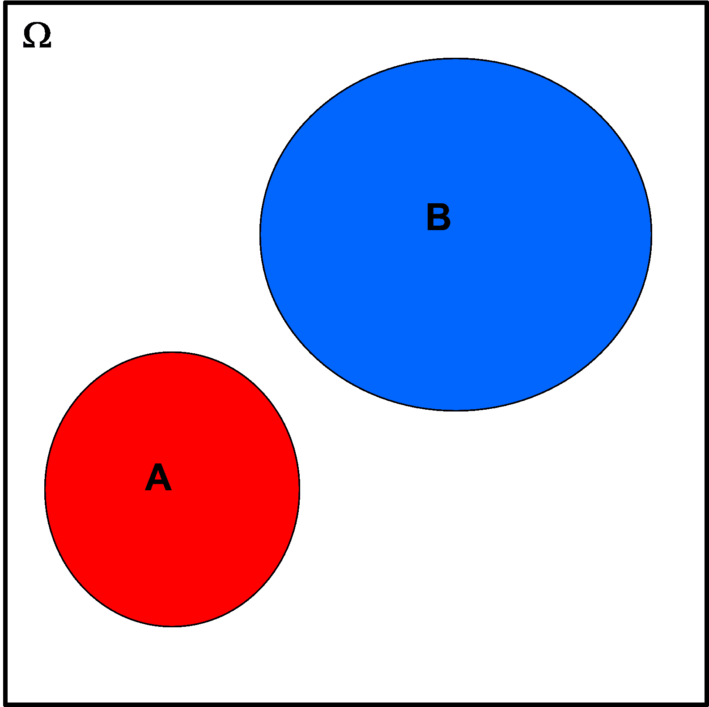

简单的维恩图示例。

我们从这个维恩图中能学到什么？

1.  每个事件内部区域的相对大小是发生相对概率，$B$ 的概率大于 $A$ 的概率

1.  事件的重叠部分是联合发生的概率，$A$ 和 $B$ 同时发生的概率为 0.0

让我们包括一个更实际的维恩图，以确保这个概念不是过于抽象。这是一个来自 3,000 个岩心样本并解释了相的维恩图

+   事件是砂岩（Sm）和泥岩（Fm）

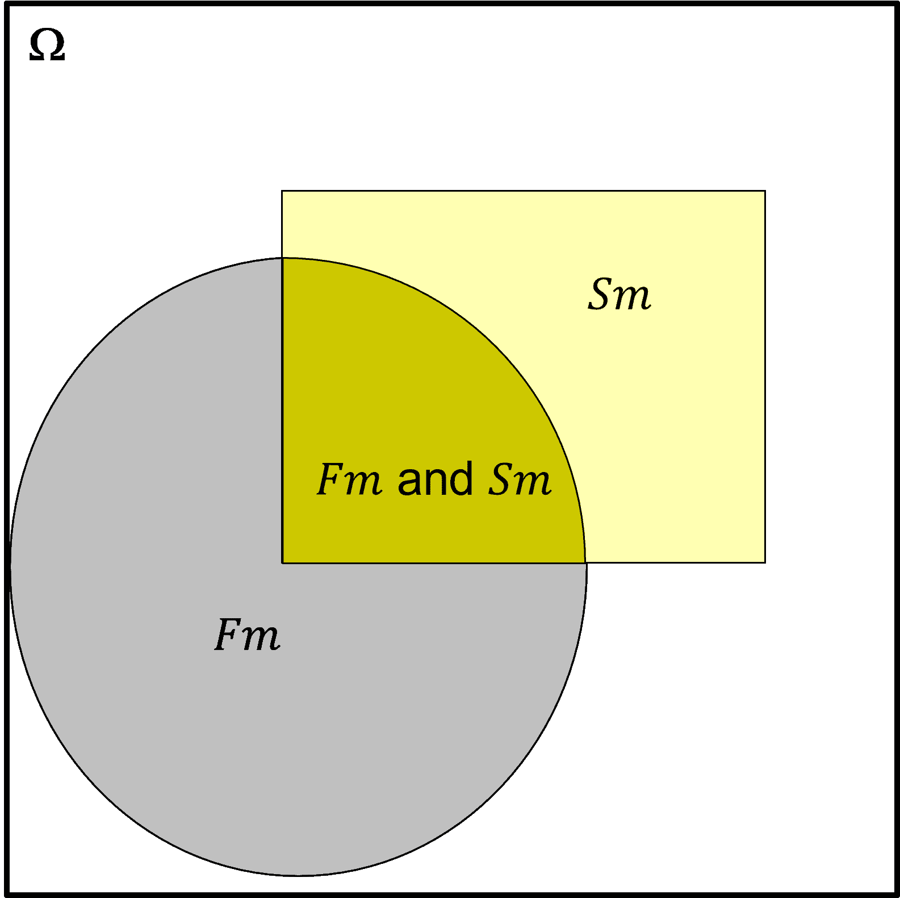

表示 3,000 个岩心样本的相赋值维恩图。

我们从这个维恩图中能学到什么？

+   在这些岩心样本中，泥岩比砂岩更常见

+   有很多样本既不是砂岩也不是泥岩，$\Omega$ 内的空白区域

+   有一些样本被解释为既是砂岩也是泥岩，即互层砂岩-泥岩

+   不要忘记绘制并标注 $\Omega$ 方框，否则我们无法理解事件的相对概率

+   我们可以使用任何方便的形状来表示一个事件

总结来说，维恩图是可视化概率的绝佳工具，因此我们将使用它们在这里进行可视化和概率教学。

## 频率派概率

我们现在为频率派概率方法提供一个扩展的定义。这是基于从实验观察到的频率来衡量事件发生可能性的一个度量。

+   对于随机实验和定义明确的设置，我们计算概率如下：

$$ P(A) = \lim_{n \to \infty} \frac{n(A)}{n} $$

其中：

$n(A)$ = 事件 $A$ 发生的次数 $n$ = 试验次数

+   我们使用极限符号来表示足够的采样，并且随着我们从实验中引入更多样本，解决方案会收敛并提高准确性

例如，

+   根据历史钻井结果，在储层位置 ($\bf{u}_{\alpha}$) 钻遇干井、砂岩和超过岩石孔隙率 $15\%$ 的概率

现在，我们从频率派的角度逐一讲解各种概率运算，在此期间，我向我的贝叶斯派朋友们请求耐心，因为我们稍后会回到贝叶斯派概率的角度。

## 概率运算

**事件并集** - 例如，属于事件 $A$ 或 $B$ 的样本空间中的所有结果

+   对于事件并集运算符，我们使用“或”这个词和数学符号，$cup$，使用集合表示法，我们声明并集 $A$ 或 $B$ 中的样本为，

$$ A \cup B = \{x: x \in A \text{ 或 } x \in B\} $$

+   并集的概率表示为，

$$ P(A \cup B) $$

这里有一个维恩图展示了并集 $P(A \cup B)$。

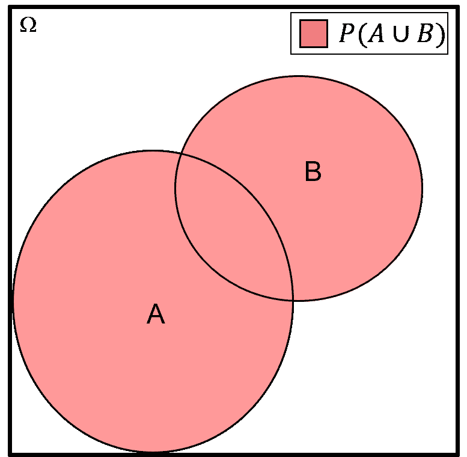

一个表示事件 $A$ 或 $B$ 并集概率运算符的维恩图。注意，右上角的图例包括在内以澄清图表，但不属于维恩图。

**事件的交集** - 例如，样本空间中属于事件 $A$ 和 $B$ 的所有结果

+   对于事件交集运算符，我们使用“和”这个词和数学符号 $cap$，使用集合表示法，我们说明交集 $A$ 和 $B$ 的样本，

$$ A \cap B = \{x: x \in A \text{ 且 } x \in B\} $$

+   以及交集的概率表示法，

$$ P(A \cap B) $$

+   或者使用常见的概率缩写，

$$ P(A,B) $$

我们稍后会称这为联合概率。以下是一个说明交集 $P(A \cap B)$ 的维恩图。

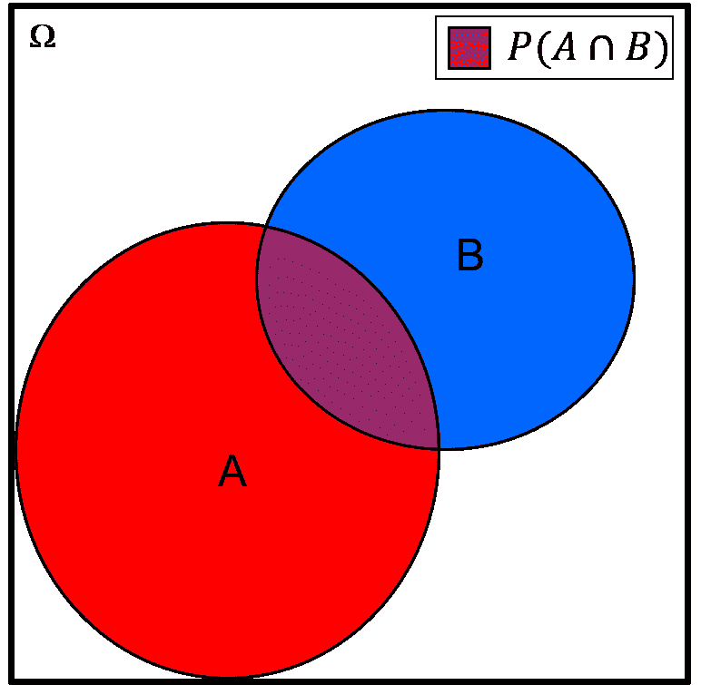

一个表示事件 $A$ 和 $B$ 交集概率运算符的维恩图。注意，右上角的图例包括在内以澄清图表，但不属于维恩图。

**事件的补** - 例如，样本空间中不属于事件 $A$ 的所有结果

+   对于事件补运算符，我们使用“不”这个词和数学符号 $^c$，使用集合表示法，我们说明事件 $A$ 补的样本，

$$ A^c = \{x: x \notin A\} $$

+   以及补的概率表示法，

$$ P(A^c) $$

这里是一个说明补 $P(A^c)$ 的维恩图。

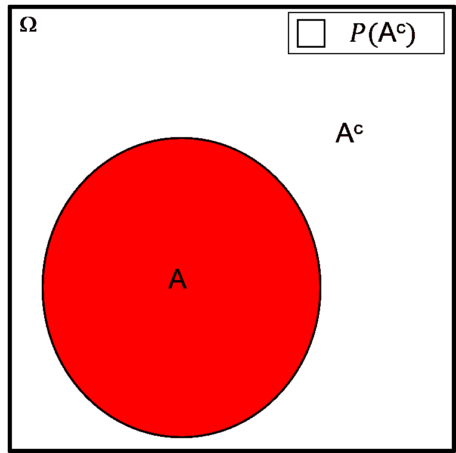

一个表示事件 $A$ 概率补运算符的维恩图。注意，右上角的图例包括在内以澄清图表，但不属于维恩图。

**互斥事件** - 例如，事件不相交或没有共同的结果，$A$ 和 $B$ 不同时发生。

+   使用集合表示法，我们说明事件 $A$ 和 $B$ 是互斥的，

$$ A \cap B = \{x: x \in A \text{ 且 } x \in B \} = \emptyset $$

+   以及互斥的概率表示法，

$$ P(A \cap B) = 0.0 $$

+   或者使用常见的概率缩写，

$$ P(A,B) = 0.0 $$

这里是一个说明互斥事件 $A$ 和 $B$ 的维恩图。

一个表示事件 $A$ 和 $B$ 互斥的维恩图。

**穷举、互斥事件** 指的是事件序列，其并集等于样本空间，所有可能的事件 ($\Omega$)，且事件之间没有交集：

+   使用集合表示法，我们说明事件 $A$ 和 $B$ 是穷举的，

$$ \{x: x \in A \text{ 或 } x \in B \} = \Omega $$

+   并且事件 $A$ 和 $B$ 互斥，因为，

$$ \{x: x \in A \text{ 且 } x \in B \} = \emptyset $$

+   以及穷举事件的概率表示法，

$$ P(A \cup B) = 1.0 $$

+   并且对于互斥事件，

$$ P(A,B) = 0.0 $$

这里是一个说明互斥、穷举事件 $A$ 和 $B$ 的维恩图。

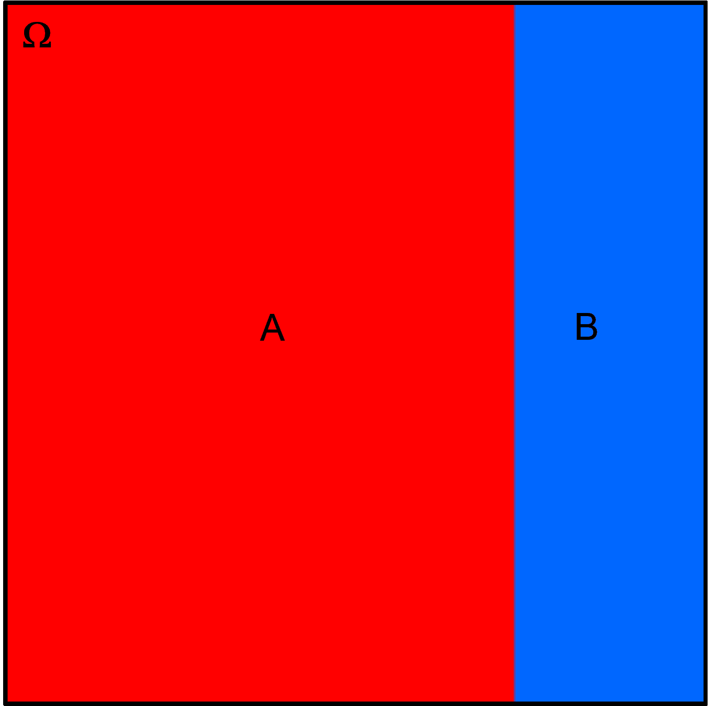

一个表示事件 $A$ 和 $B$ 作为穷尽、互斥的维恩图。

**运算符的组合** - 我们可以使用这些概率运算符与任何数量的事件来传达复杂的概率情况。例如，让我们定义这些事件，

+   事件 $A$：存在石油（$A^c$：干井）

+   事件 $B$：𝑆𝑚 （$B^c$： 𝐹𝑚）

+   事件 $C$：孔隙率 ≥ 15%（$C^c$：孔隙率 < 15%）

巨大砂岩（𝑆𝑚）和孔隙率 ≥ 15%的干井的概率是多少？

$$ P(A^c \cap B \cap C) = \frac{\text{Area}(A^c \cap B \cap C)}{\text{Area}(\Omega)} $$

这里有一个表示此情况的维恩图。

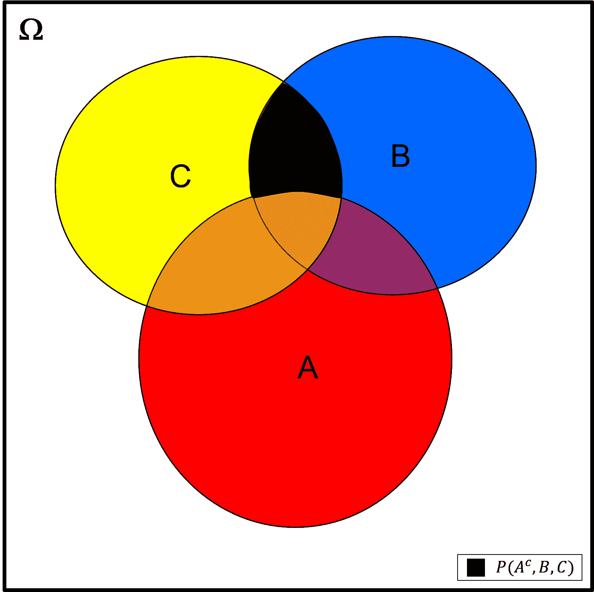

一个表示三个事件 $A, B, C$，包括补集和交集概率运算符的更复杂情况的维恩图。

## 概率约束

现在我们已经定义了概率符号和概率运算，现在我们回到由科尔莫哥洛夫表达的可允许概率值的概念。现在我们可以用这组概率约束来构建科尔莫哥洛夫的概率公理，

非负性，归一化约束包括，

+   概率是有界的，

$$ 0.0 \le P(A) \le 1.0 $$

概率必须在 0.0 和 1.0 之间（包括 0.0 和 1.0）

+   概率封闭性，

$$ P(\Omega) = 1.0 $$

任何事件的概率是 1.0

$$ P(A) + P(A^c) = 1.0 $$

事件 $A$ 或非 $A$ 的概率是 1.0

+   空集的概率，

$$ P(\emptyset) = 0.0 $$

概率什么也不发生是零

现在我们使用这些概率概念和符号来添加更多基本的复杂概率概念。

## 概率加法规则

事件的并集的概率是多少？记住，并集是一个由 $\cup$ 符号表示的“或”操作。考虑，

$$ P(A \cup B) $$

检查之前显示的维恩图表明，我们不能仅仅通过相加 $P(A)$ 和 $P(B)$ 来计算并集 $P(A \cup B)$。

一个表示事件 $A$ 和 $B$ 的维恩图，显示了 $A$ 和 $B$ 的交集，如果我们计算并集以及 $A$ 或 $B$ 作为 $A$ 和 $B$ 的和时，将会被重复计算。注意，右上角的图例包括在内，以澄清图表，但不属于维恩图。

概率 $P(A)$ 和 $P(B)$ 的和将重复计算交集 $P(A \cap B)$，因此我们必须减去它，

$$ P(A \cup B) = P(A) + P(B) - P(A \cap B) $$

是的，对于任何数量的事件，计算并集的概率都有一个通用表达式，

+   我不会在这里包括它，但可以说，考虑到可以多次计算的交集的组合，这真是一个会计噩梦！

有一个更简单的情况。如果事件是互斥的，那么没有交集，$P(A,B) = 0.0$，我们只需将概率相加。

+   对于任何数量事件的互斥的一般情况，

$$ A_i \cap A_j = \emptyset, \quad \forall \quad i \ne j $$

然后，我们可以为任何数量的互斥事件写出这个加法法则的一般方程，

$$ P\left( \bigcup_{i=1}^k A_i \right) = \sum_{i=1}^k P(A_i) $$

这里有一个维恩图，展示了 4 个互斥事件，$A_1, A_2, A_3, A_4$。

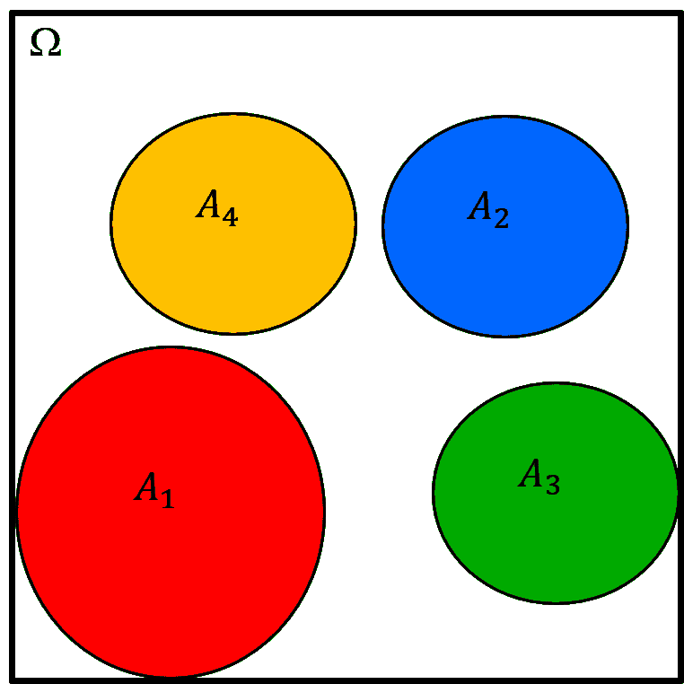

一个表示 4 个事件，$A_1, A_2, A_3, A_4$，它们都是互斥的维恩图。我们可以通过将每个事件的概率相加来计算这些事件的并集的概率。

## 条件概率

发生了一个事件后，另一个事件的概率是多少？为了讨论这个问题，让我们更具体一点，事件 $B$ 在事件 $A$ 已经发生的情况下发生的概率是多少？

+   为了表达这一点，我们使用符号，$P(B|A)$

+   我们读这个符号为，“在 A 的条件下 B 的概率”

这是一个条件概率的例子。我们用这个方程来计算条件概率，

$$ P(B|A) = \frac{P(A \cap B)}{P(A)} $$

这可能看起来很复杂，但我们可以很容易地从我们的维恩图中可视化和理解这个方程。

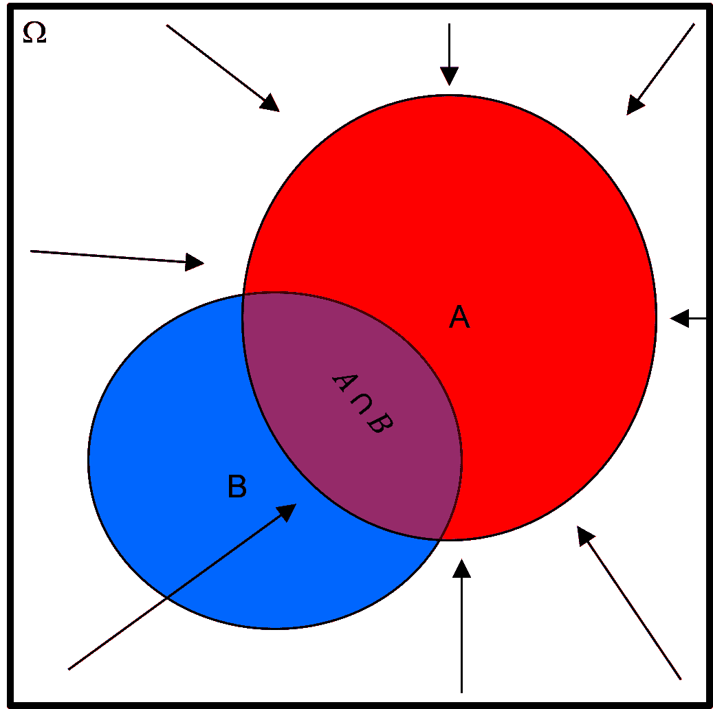

为了计算条件概率，我们将“我们的宇宙”缩小到给定的条件。对于 $A$ 给定 $B$ 的概率，我们将维恩图缩小到 $A$。

在我们缩小我们的宇宙之后，我们的 $\Omega$ 只剩下事件 $A$！现在我们可以很容易地看到，条件概率仅仅是 $A$ 和 $B$ 的交集除以 $A$ 的概率。

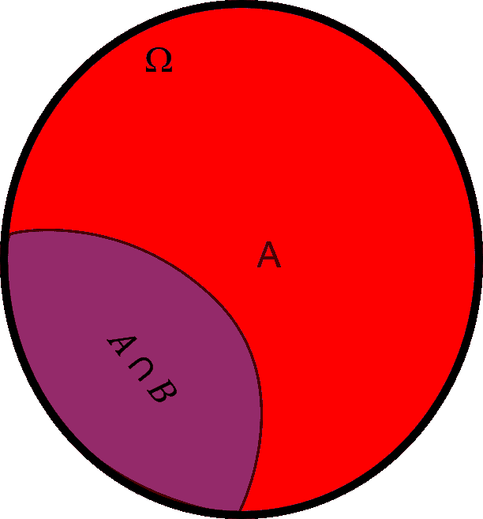

在我们将“我们的宇宙”缩小到条件之后，我们可以清楚地看到条件概率方程是 $A$ 和 $B$ 的交集除以 $A$ 的概率。

现在我们引入几个例子来测试我们对条件概率的了解，

**条件概率示例 #1** - 对于这个维恩图，以 $A$ 和 $B$ 为条件提供条件概率，$P(A|B)$ 和 $P(B|A)$。

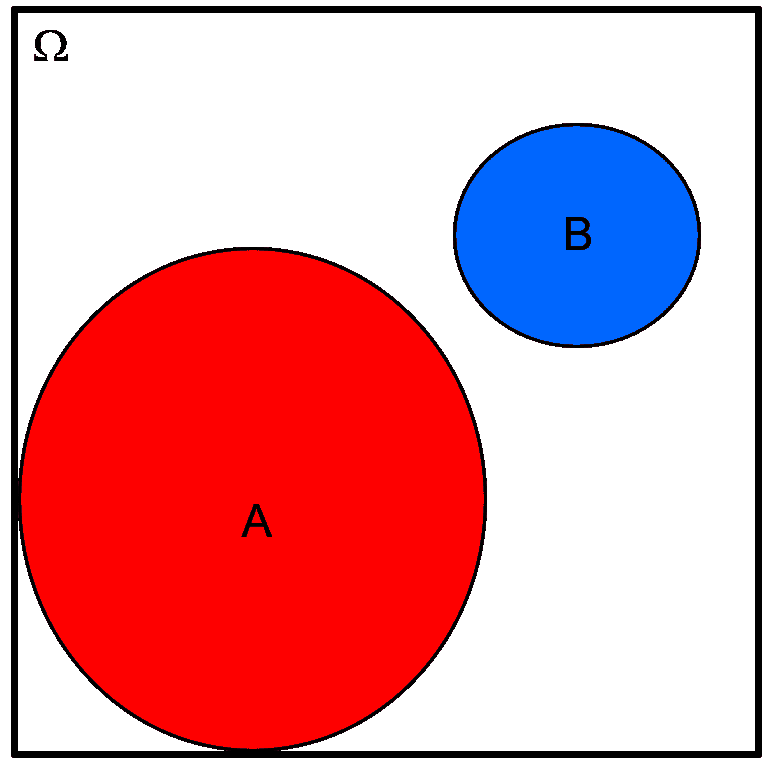

维恩图用于检查你对条件概率的理解。

这个问题很简单，两个条件概率的答案都是 0.0，因为要计算条件概率，分子是概率，$P(A,B)$，如果没有重叠，这个值就是 0.0。

+   此外，由于 $P(B,A) = P(B,A)$，两个条件概率的分子是相同的，

$$ P(A|B) = \frac{P(B,A)}{P(B)} = \frac{0.0}{P(B)} = 0.0 $$$$ P(B|A) = \frac{P(A,B)}{P(A)} = \frac{0.0}{P(A)} = 0.0 $$

现在我们尝试一个更具挑战性的例子。

**条件概率示例 #2** - 对于这个维恩图，以 $A$ 和 $B$ 为条件提供条件概率，$P(A|B)$ 和 $P(B|A)$。

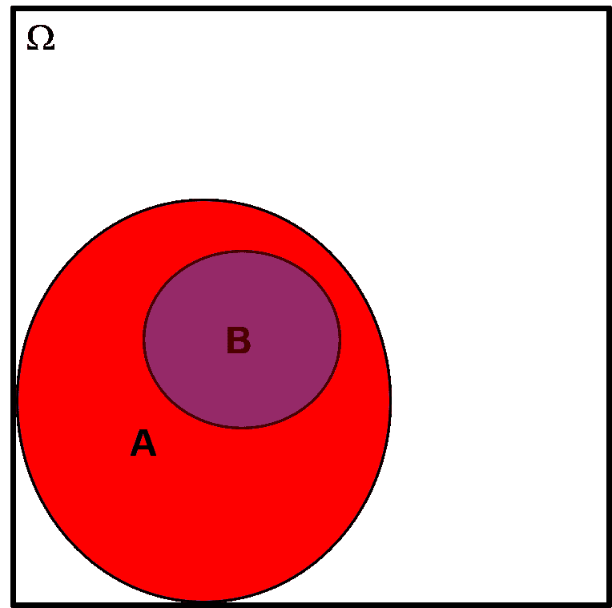

维恩图用于检查你对条件概率的理解。

这个更有趣。让我们逐个看看每个条件概率。

$$ P(A|B) = \frac{P(B,A)}{P(B)} $$

注意到$P(B,A) = P(B)$，因为所有的$B$都在$A$内部，所以我们可以用$P(B)$替换上面的$P(B,A)$，

$$ P(A|B) = \frac{P(B)}{P(B)} = 1.0 $$

考虑到$B$，那么$A$必须发生，条件概率是 1.0。现在我们计算另一个条件概率，

$$ P(B|A) = \frac{P(A,B)}{P(A)} = \frac{P(B,A)}{P(A)} $$

提醒一下，$P(B,A) = P(A,B)$，所以我们可以使用我们之前的结果，并用$P(B)$替换上面的$P(B,A)$，

$$ P(B|A) = \frac{P(A,B)}{P(A)} = \frac{P(B,A)}{P(A)} = \frac{P(B)}{P(A)} $$

如果你理解这两个例子，那么你对条件概率有了很好的基础，

+   我可以挑战你一个更复杂的没有条件概率的案例，并学习一个有趣的通用情况！

+   让我们以这个包含 3 个事件（$A, B, C$）及其所有可能事件交集的文氏图为例。

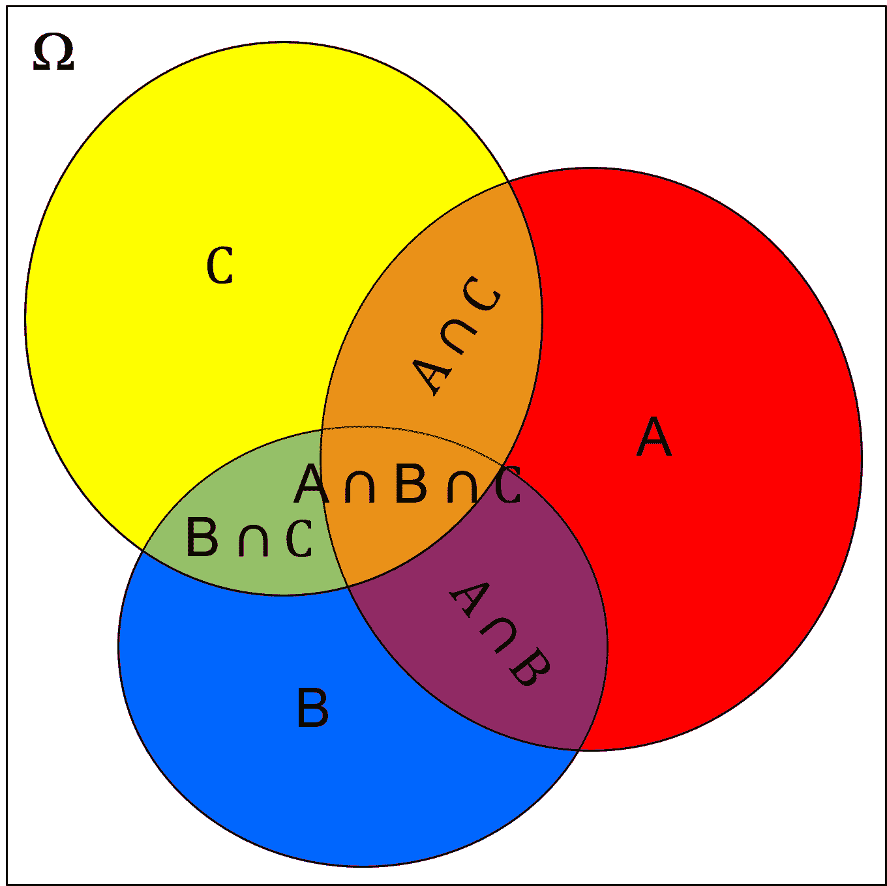

处理 3 个事件$A, B, C$的更复杂的条件概率案例。

现在我们计算条件概率，

$$ P(C|B \cap A) = \frac{P(A \cap B \cap C)}{P(A \cap B)} $$

回忆一下条件概率的定义，

$$ P(B|A) = \frac{P(A \cap B)}{P(A)} $$

因此我们可以重新排列这个公式，

$$ \frac{P(A \cap B)} = P(B|A) \cdot P(A) $$

提示一下，稍后我们将定义这个乘法规则，但现在我们可以将这个作为条件概率$P(C|B \cap A)$的分母，得到，

$$ P(C|B \cap A) = \frac{P(A \cap B \cap C)}{P(B|A) \cdot P(A)} $$

现在我们可以重新排列这个公式，

$$ P(A \cap B \cap C) = P(C|B \cap A) \cdot P(B|A) \cdot P(A) $$

你看出了模式吗？我们可以将高阶概率交集视为一个序列集，边际概率的乘积和然后是递增的条件概率。让我用文字表述一下，

+   $A$、$B$和$C$的概率是$A$的概率乘以给定$A$的$B$的概率，再乘以给定$B$和$A$的$C$的概率。

实际上，我们可以将这个推广到任何数量的事件，

$$ P(A_1 \cap A_2 \cap \ldots \cap A_n) = P(A_n|A_{n-1} \cap \ldots \cap A_1) \cdot P(A_{n-1}|A_{n-2} \cap \ldots \cap A_1) \cdot \ldots \cdot P(A_2|A_1) \cdot P(A_1) $$

或者更简洁地，

$$ P(A_1, A_2, \ldots , A_n) = P(A_n|A_{n-1}, \ldots , A_1) \cdot P(A_{n-1}|A_{n-2}, \ldots , A_1) \cdot \ldots \cdot P(A_2|A_1) \cdot P(A_1) $$

我们现在只是在炫耀吗？不！这个例子让我们对条件概率的工作方式有了很多了解。

+   此外，这正是我们在顺序高斯模拟中使用的概念，我们从条件分布而不是从高阶联合概率中顺序采样，没有顺序方法是不可能的任务！

现在我们已经准备好总结边际、条件和联合概率。

## 边际、条件和联合概率

现在我们定义边缘、条件和联合概率，提供符号并讨论如何计算它们：

**边缘概率** - 不考虑任何其他事件的事件的概率，

$$ P(A), P(B) $$

+   边缘概率的计算如下，

$$ P(A) = \frac{n(A)}{n(\Omega)} $$

+   边缘概率可以通过边缘化过程从联合概率中计算得出，

$$ P(A) = \int_{-\infty}^{\infty} P(A,B) dB $$

+   其中我们对其他事件的所有情况 $B$ 进行积分，以消除它们。

+   对于事件 $B$ 的离散情况，我们可以简单地对所有 $B$ 的情况的概率进行求和，

$$ P(A) = \sum_{i=1}^{k_B} P(A,B) $$

**条件概率** - 在另一个事件已经发生的情况下，事件的概率，

$$ P(A \text{ 在 } B \text{ 的条件下}), P(B \text{ 在 } A \text{ 的条件下}) $$

+   或者用紧凑的概率符号，

$$ P(A|B), P(B|A) $$

+   更多信息请参阅上一节，但为了对称性，我们重复该方法来计算条件概率，

$$ P(B|A) = \frac{P(A,B)}{P(A)} $$

+   当然，如我们上面在条件概率示例中所见，我们不能交换事件的顺序，

$$ P(B|A) \ne P(A|B) $$

**联合概率** - 同时发生多个事件的概率，

$$ P(A \text{ 和 } B), P(B \text{ 和 } A) $$

+   或者用紧凑的概率符号，

$$ P(A \cap B), P(B \cap A) $$

+   或者更紧凑地表示为，

$$ P(A,B), P(B,A) $$

+   当然，对于联合概率，顺序并不重要，

$$ P(A,B) = P(B,A) $$

+   我们计算联合概率如下，

$$ P(A,B) = \frac{n(A,B)}{n(\Omega)} $$

为了阐明边缘、条件和联合概率（以及分布）的概念，我编写了一套交互式 Python 仪表板，[Interactive_Marginal_Joint_Conditional_Probability](https://github.com/GeostatsGuy/DataScienceInteractivePython/blob/main/Interactive_Marginal_Joint_Conditional_Probability.ipynb)，

+   这提供了一个数据集，并交互式地计算和比较边缘、条件和联合概率，并可视化并比较边缘和条件分布。

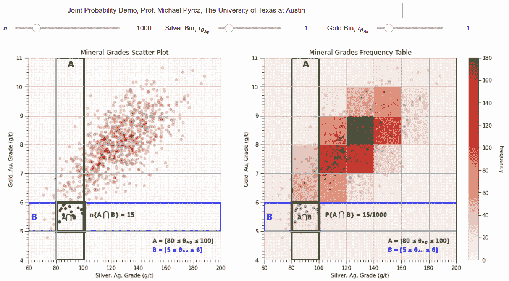

这是我关于边缘、条件和联合概率及分布系列中的一个交互式 Python 仪表板。

## 概率乘法规则

如上所示，我们可以通过将 $B$ 在 $A$ 的条件下的条件概率与 $A$ 的边缘概率相乘来计算 $A$ 和 $B$ 的联合概率，

$$ P(A \cap B) = P(A,B) = P(B|A) \cdot P(A) $$

当然，我们也可以说，

$$ P(B \cap A) = P(B,A) = P(A|B) \cdot P(B) $$

这就是乘法规则，我们使用乘法规则来发展独立性的定义。

## 独立事件

根据概率乘法规则，

$$ P(A \cap B) = P(A,B) = P(B|A) \cdot P(A) $$

现在我们来问一个问题，如果事件 $A$ 和 $B$ 是独立的，条件概率 $P(B|A)$ 是多少？给定 $A$ 和 $B$ 之间的独立性，我们预计了解 $A$ 不会影响 $B$ 的结果，

$$ P(B|A) = P(B) $$

如果我们将这个代入 $P(A \cap B) = P(A,B) = P(B|A) \cdot P(A)$，我们得到，

$$ P(A \cap B) = P(B) \cdot P(A) $$

按照同样的逻辑，我们可以证明，

$$ P(A|B) = P(A) $$

现在我们可以总结为，事件 $A$ 和 $B$ 独立当且仅当以下关系成立，

1.  $P(A \cap B) = P(A) \cdot P(B)$ - 联合概率是边缘概率的乘积

1.  $P(A|B) = P(A)$ - 条件概率是边缘概率

1.  $P(B|A) = P(B)$ - 条件概率是边缘概率

如果其中任何一个被违反，我们可以怀疑存在某种形式的关系。

+   我们将这个结果的意义留在这个关于概率的章节之外

+   当然，如果我们假设独立性，这将简化我们的数据科学工作流程

**独立性示例 #1** - 检查以下数据集的独立性。

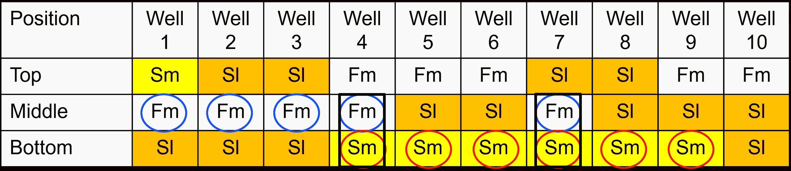

如果事件 $A_1$ 是中间单元的 Fm 相，事件 $A_2$ 是底部单元的 Sm 相，并且事件 $A_1$ 和 $A_2$ 的联合情况（黑色矩形表示 $A_1$ 和 $A_2$ 同时发生）是 $A_1$ 和 $A_2$ 独立事件吗？

为了检查独立性，我们计算边缘和联合概率，

$$ P(A_1) = \frac{5}{10} \quad P(A_2) = \frac{6}{10} \quad P(A_1,A_2) = \frac{2}{10} $$

现在我们检查独立性的一条条件，即联合概率作为边缘概率的乘积，

+   $P(A_1 \cap A_2) = P(A_1) \cdot P(A_2)$ $\rightarrow$ $0.2 \ne 0.5 \cdot 0.6$，$\therefore$ 我们怀疑事件 $A_1$ 和 $A_2$ 之间存在某种关系

## 贝叶斯概率

现在我们终于深入到概率的贝叶斯方法，这是一种非常灵活的方法，可以应用于为任何事物分配概率，并且包括一个用于更新新信息的框架。

当我说贝叶斯方法可以为任何事物分配概率时，我意识到这需要进一步的解释，

+   当然，记住我在上面“关于计算概率的警告”部分中的陈述，有时我们没有足够的数据，并且存在一些不正确的工作流程。

我的意图是任何类型的信息都可以编码到贝叶斯框架中，包括信念

让我们通过一个来自 Sivia (1996) 介绍章节的精彩例子来讨论这个问题，“Jupyter 的质量是多少？”。

木星图像来自新地平线长程成像仪（LORRI），于 2007 年 1 月在 5700 万公里处拍摄。图像来自 https://en.wikipedia.org/wiki/Jupiter#/media/File:Jupiter_New_Horizons.jpg。

那么频率派和贝叶斯方法如何计算木星质量的不确定性模型的概率呢？

+   频率派视角 - 通过测量来自许多星系足够多的类似木星的行星的质量来计算累积分布函数。

+   贝叶斯方法 - 形成先验概率，并用任何可用信息更新。

现在对于任何说频率派方法可行的人来说，记住第一个系外行星是在 1995 年由天文学家米歇尔·梅耶尔和迪迪埃·奎洛兹发现的。

+   顺便提一下，第一个发现的系外行星是一个木星质量的热气巨星，因为这些行星可以用基于多普勒效应的摆动方法更容易地看到，因为靠近恒星的气巨星对其恒星有更大的引力，导致相对较高的振幅和频率，可以轻易观察到。

+   当西维亚撰写他的书时，还没有已知的系外行星。

因此，我们没有其他类似木星的行星来应用频率派方法，但我们可以利用我们对太阳系形成的知识来制定一个先验模型。然后我们可以使用从木星获得的任何可用观察或测量来更新这个先验。我们可以做些事情！

+   但我可能有点超前了，我们必须正确地介绍贝叶斯概率方法，从贝叶斯定理开始。

## 贝叶斯定理

再次强调，这是乘法法则，

$$ P(B \cup A) = P(B,A) = P(A|B) \cdot P(B) $$

因此，我们也可以将其表达为，

$$ P(A \cup B) = P(A,B) = P(B|A) \cdot P(A) $$

因此，

$$ P(B \cup A) = P(A \cup B) $$

因此，我们可以将上述乘法法则的右侧代入这个等式中，

$$ P(A|B) \cdot P(B) = P(B|A) \cdot P(A) $$

这就是贝叶斯定理。我们可以进行简单的修改，得到流行的贝叶斯定理形式，

$$ P(A|B) = \frac{P(B|A) \cdot P(A)}{P(B)} $$

为了更好地解释贝叶斯定理，我们将 $A$ 替换为“模型”，将 $B$ 替换为“新数据”，其中“新数据”是我们正在更新的新数据。

$$ P(\text{Model}|\text{New Data}) = \frac{P(\text{New Data}|\text{Model}) \cdot P(\text{Model})}{P(\text{New Data})} $$

现在，我们可以将贝叶斯更新视为用一个模型并更新它以新数据。

现在我们对贝叶斯定理做一些观察，

1.  我们正在反转条件概率，从 $P(B|A)$ 得到 $P(A|B)$，这通常很有用，因为我们容易获得其中一个，但不容易获得另一个。

1.  贝叶斯定理中的概率被称为：

+   $P(B)$ - 证据

+   $P(A)$ - 先验

+   $P(B|A)$ - 似然

+   $P(A|B)$ - 后验

我们可以用它们的标签替换概率，

$$ \text{Posterior} = \frac{\text{Likelihood} \cdot \text{Prior}}{\text{Evidence}} $$

1.  先验不应包含似然中的信息。

+   先验概率是在收集新信息之前根据似然估计的。如果先验和似然都包含新信息，那么这就是新信息的“双重计算”！

1.  证据项通常只是一个标准化，以确保概率封闭。

+   证据概率通常通过边缘化来计算，

$$ P(B) = \int_{A} P(B|A) \cdot P(A) dA $$

+   对于两个互斥且穷尽的例子，$A$ 和 $A^c$，这种边缘化可以应用于计算 $P(B)$。

$$ P(B) = P(B|A) \cdot P(A) + P(B|A^c) \cdot P(A^c) $$

+   通过代入，我们得到贝叶斯定理这种扩展但通常更容易计算的形式。

$$ P(A|B) = \frac{P(B|A) \cdot P(A)}{P(B|A) \cdot P(A) + P(B|A^c) \cdot P(A^c)} $$

+   我们可以推广这种边缘化，适用于任何数量的离散、互斥、穷尽事件，

$$ P(B) = \sum_{i=1}^{m} P(B|A_i) \cdot P(A_i), \quad \forall \quad i = 1,\ldots,m $$

+   在某些情况下，例如使用 Metropolis-Hastings 算法的马尔可夫链蒙特卡洛方法，我们消除了证据项的需要，因为我们计算了提议步骤与当前状态的概率比，证据概率被抵消。

1.  如果先验是天真的话，后验就等于似然。这是逻辑的，如果我们收集新数据之前一无所知，那么我们就完全依赖于似然概率。

+   一个天真先验是一个最大不确定性先验，就像所有结果等可能性的均匀概率

+   在标准正态分布的假设下，全局高斯分布，均值为 0.0，标准差为 1.0，天真先验是标准正态分布

1.  如果似然概率是天真的话，后验就等于先验。再次，这也是逻辑的，如果新数据没有提供任何信息，那么我们应该继续依赖于先验概率和原始模型不会更新。

## 贝叶斯概率示例问题

提高你对贝叶斯概率理解的一个有效方法是解决说明性问题。这里有一组很好的问题，

+   你进行了一次测试，得到了一个对我们无法直接观察到的发生事件的阳性测试结果，但给定阳性测试结果，该事件实际发生的概率是多少？

这里有一些适合这类问题的测试示例，

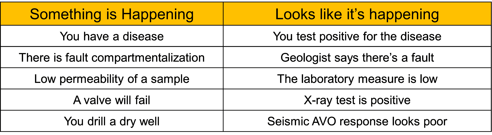

测试的示例案例，基本事件正在发生与测试表明基本事件正在发生。

我们可以针对这些测试之一重写贝叶斯定理，

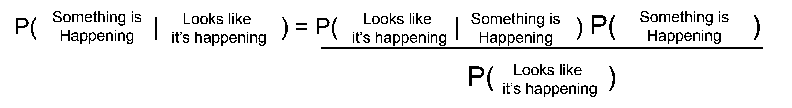

贝叶斯定理针对测试情况的重写。

**贝叶斯更新示例 #1** - 站点上的先验信息表明，在给定位置存在一个深海河道储层，概率为 0.6。我们考虑进行 3D 地震勘探的进一步调查。

3D 地震勘探将指示一个河道化储层：

如果它真的存在，那么它的概率是 0.9

如果它真的不存在，那么它的概率是 0.7

我们有我们的测试，地震调查，它将提供新的数据，我们还有我们的先验信息（在收集新的地震数据之前）。现在我们定义我们的事件，

+   $A$ = 深水通道存在，那么 $P(A)$ 是在收集新数据之前该事件发生的概率

+   $B$ = 新地震数据显示存在深水通道，那么 $P(B)$ 是该事件发生的阳性测试概率

因此，补充如下，

+   $A^c$ = 深水通道不存在，那么 $P(A^c)$ 是在收集新数据之前该事件未发生的概率

+   $B^c$ = 新地震数据未显示深水通道，那么 $P(B^c)$ 是该事件发生的阴性测试概率

现在我们写出贝叶斯定理，通过边缘化写出常规和扩展的证据项，

$$ P(A|B) = \frac{P(B|A) \cdot P(A)}{P(B)} = \frac{P(B|A) \cdot P(A)}{P(B|A) \cdot P(A) + P(B|A^c) \cdot P(A^c)} $$

我们知道什么？从上述问题中我们得到，

+   $P(A) = 0.6$ - “先验信息表明在某个地点存在深水通道储层，概率为 0.6”

+   $P(B|A) = 0.9$ - “如果确实存在，则存在概率为 0.9”

+   $P(B^c|A^c) = 0.7$ - “如果确实不存在，则不存在概率为 0.7”

但我们还需要 $P(A^c)$ 和 $P(B|A^c)$。我们从封闭性计算出这些值，

+   $P(A^c) = 1.0 - P(A) = 1.0 - 0.6 = 0.4$

+   $P(B|A^c) = 1.0 - P(B^c|A^c) = 1.0 - 0.7 = 0.3$

我们已经有了所有需要替换的信息，

$$ P(A|B) = \frac{P(B|A) \cdot P(A)}{P(B|A) \cdot P(A) + P(B|A^c) \cdot P(A^c)} = \frac{0.9 \cdot 0.6}{0.9 \cdot 0.6 + 0.3 \cdot 0.4} = 0.82 $$

给定一个阳性测试，地震指示深水通道存在，我们的后验概率为 0.82。

地震数据有用吗？我们如何获取这些数据？

+   考虑从先验概率 0.6 到后验概率 0.82 的变化，表明不确定性降低。通过整合决策的价值和潜在损失，现在可以分配地震数据的情报价值。

+   我将决策分析排除在本电子书之外，但它是一个迷人的主题，我建议所有从事数据科学的人至少学习基础知识，以确保通过影响决策（们）来增加价值！

对这个示例问题进行敏感性分析以评估贝叶斯更新的行为是非常有教育意义的。您可以下载并运行我的[交互式贝叶斯更新仪表板](https://github.com/GeostatsGuy/DataScienceInteractivePython/blob/main/Interactive_Bayesian_Updating.ipynb)来完成此操作。

+   这是一个用于可视化的自定义仪表板。

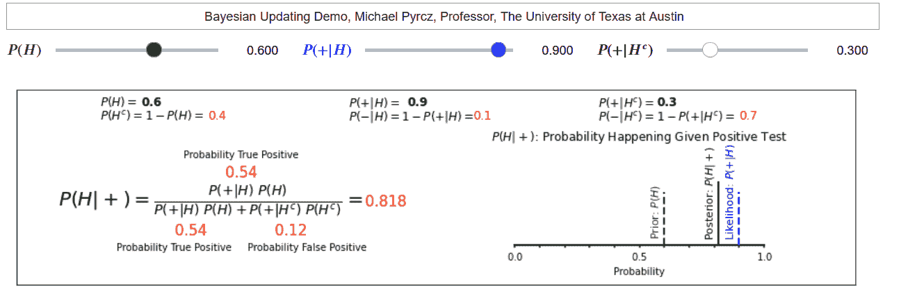

我的交互式 Python 仪表板演示了贝叶斯更新。注意，$H$ 代表事件发生（在我们的例子中是 $A$），而 $+$ 代表阳性测试，$-$ 代表阴性测试（在我们的例子中分别是 $B$ 和 $B^c$）。

我们提高了测试精度，当通道存在时，地震检测到通道的概率，$P(B|A)$从 0.9 提高到 0.99。

$$ P(A|B) = \frac{P(B|A) \cdot P(A)}{P(B|A) \cdot P(A) + P(B|A^c) \cdot P(A^c)} = \frac{0.99 \cdot 0.6}{0.99 \cdot 0.6 + 0.3 \cdot 0.4} = 0.83 $$

现在我们几乎没有任何变化在后验概率上。现在我们提高了检测无通道的能力，当通道不存在时，$P(B|A^c)$从 0.3 提高到 0.03。

$$ P(A|B) = \frac{P(B|A) \cdot P(A)}{P(B|A) \cdot P(A) + P(B|A^c) \cdot P(A^c)} = \frac{0.9 \cdot 0.6}{0.9 \cdot 0.6 + 0.03 \cdot 0.4} = 0.98 $$

我们将后验概率从 0.82 改为 0.98！发生了什么？

+   我们的测试受到相对较高的假阳性概率的影响，地震显示没有通道时显示通道，$P(B|A^c) = 0.3$，与相对较高的无通道率，$P(A^c) = 0.4$相匹配。

现在我们转换思路，来看另一个在生产线上使用机器进行贝叶斯更新的示例。

**贝叶斯更新示例 #2** - 你有 3 台机器生产相同的产品（想象一个大型生产线）。它们有不同的产量和错误率。

+   注意我们假设产品是互斥的（只来自单个机器），并且是穷尽的（所有产品都来自 3 台机器中的某台）。

机器 1、2 和 3 生产相同的产品，然后在装配线上混合。它们各自有不同的生产率（总百分比和错误率）。

我们想知道在单个产品出现错误的情况下，该产品来自特定机器的概率是多少？首先，我们定义我们的变量，

+   $Y$ = 产品有错误

+   $X_1, X_2, X_3$ = 产品来自机器 1、2 或 3。

我们为特定机器生产有缺陷（有错误的）产品的概率的贝叶斯公式是，

$$ P(X_i|Y) = \frac{P(Y|X_i) \cdot P(X_i)}{P(Y)} \quad \forall \quad i = 1, 2, 3 $$

我们需要计算我们的证据项，P(Y)，以解决任何产品的这个问题。此外，我们只需做一次，证据项对所有产品都是相同的。

我们将通过将我们的变量代入之前引入的通用方程来完成归一化，

$$ P(Y) = \sum_{i=1}^{m} P(Y|X_i) \cdot P(X_i), \quad \forall \quad i = 1,\ldots,3 $$

我们的具体形式是针对我们的问题，

$$ P(Y) = P(Y|X_1) \cdot P(X_1) + P(Y|X_2) \cdot P(X_2) + P(Y|X_3) \cdot P(X_3) $$

我们将问题陈述中的概率代入，

$$ P(Y) = 0.2 \cdot 0.05 + 0.3 \cdot 0.03 + 0.5 \cdot 0.01 = 0.024 $$

给定这个证据概率，现在我们可以计算在产品有缺陷的情况下，来自每个机器的后验概率，

$$ P(X_1|Y) = \frac{P(Y|X_1) \cdot P(X_1)}{P(Y)} = \frac{0.05 \cdot 0.2}{0.024} = 0.41 $$$$ P(X_2|Y) = \frac{P(Y|X_2) \cdot P(X_2)}{P(Y)} = \frac{0.03 \cdot 0.3}{0.024} = 0.38 $$$$ P(X_3|Y) = \frac{P(Y|X_3) \cdot P(X_3)}{P(Y)} = \frac{0.01 \cdot 0.5}{0.024} = 0.21 $$

通过检查收敛性来闭合循环，我们期望所有机器上的这些后验概率之和为 1.0（再次假设产品是互斥的，并且对机器是穷尽的），

$$ P(X_1|Y) + P(X_2|Y) + P(X_3|Y) = 0.41 + 0.38 + 0.21 = 1.0 $$

并且我们得到了闭合。

这两个例子对于理解贝叶斯更新非常有帮助。在课堂上，我会让学生计算额外的后验，例如给定阴性测试事件发生的概率等。

+   我在这个 Jupyter 笔记本中的第二个仪表板[交互式贝叶斯更新仪表板](https://github.com/GeostatsGuy/DataScienceInteractivePython/blob/main/Interactive_Bayesian_Updating.ipynb)包括这些例子。

+   我邀请大家尝试使用贝叶斯更新。

我的更完整的交互式 Python 仪表板展示了针对所有可能的后验概率的贝叶斯更新。注意，$H$代表我们例子中的事件$A$正在发生，$+$代表阳性测试，$-$代表阴性测试，分别对应我们例子中的$B$和$B^c$。

## 贝叶斯更新与高斯分布

Sivia (1996) 在假设标准正态全局分布的情况下，提供了贝叶斯更新的分析方法，均值为 0.0，方差为 1.0。我们计算，

+   从先验和似然均值和方差计算后验分布的均值。

$$ \mu_{\text{posterior}} = \frac{\mu_{\text{likelihood}} \cdot \sigma²_{\text{prior}} + \mu_{\text{prior}} \cdot \sigma²_{\text{likelihood}}}{\left[1.0 − \sigma²_{\text{likelihood}} \right] \cdot \left[\sigma²_{\text{prior}} − 1.0 \right]+1.0} $$

+   从先验和似然方差计算后验分布的方差

$$ \sigma²_{\text{posterior}} = \frac{\sigma²_{\text{prior}} \cdot \sigma²_{\text{likelihood}}}{\left[1.0 − \sigma²_{\text{likelihood}} \right] \cdot \left[\sigma²_{\text{prior}} − 1.0 \right]+1.0} $$

+   与多元高斯分布一致，这个后验是同方差性的，先验或似然均值不在后验方差的方程中。

+   我在这个 Jupyter 笔记本中的第三个仪表板[交互式贝叶斯更新仪表板](https://github.com/GeostatsGuy/DataScienceInteractivePython/blob/main/Interactive_Bayesian_Updating.ipynb)包括高斯分布的贝叶斯更新。

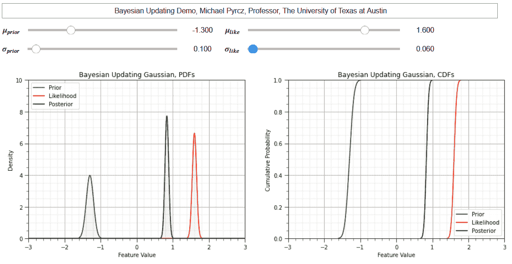

我的交互式 Python 仪表板展示了在假设标准正态全局分布下的贝叶斯更新。

这个例子帮助我的学生理解了构建不确定性分布的贝叶斯更新概念。以下是一些可以尝试的事情，

1.  一个天真先验或似然，并观察到后验与似然或先验分别相同。

1.  一个非常确定、低方差的先验。从一个大的先验方差开始，随着你减少方差，后验会被拉向先验。先验和似然的影响与它们的相对确定性成正比。

1.  先验和似然之间有非常不同均值的矛盾。你可能甚至可以引入外推，一个低先验正均值与更高似然正均值相结合，可以导致更高的正后验均值。

## 评论

这只是一个概率的基本处理。可以做和讨论的还有很多，我有很多更多的资源。查看我的[共享资源清单](https://michaelpyrcz.com/my-resources)以及本章开头带有资源链接的视频讲座 YouTube 链接。

希望这有所帮助，

*迈克尔*

## 关于作者

德克萨斯大学奥斯汀分校 40 英亩校园内，迈克尔·皮尔茨教授的办公室。

迈克尔·皮尔茨（Michael Pyrcz）是德克萨斯大学奥斯汀分校[《 Cockrell 工程学院》](https://cockrell.utexas.edu/faculty-directory/alphabetical/p)和[《Jackson 地球科学学院》](https://www.jsg.utexas.edu/researcher/michael_pyrcz/)的教授，他在该校研究并教授地下、空间数据分析、地统计学和机器学习。迈克尔还，

+   [《能源分析》](https://fri.cns.utexas.edu/energy-analytics)新生研究项目的首席研究员，并在德克萨斯大学奥斯汀分校自然科学院的机器学习实验室担任核心教职。

+   [《计算机与地球科学》](https://www.sciencedirect.com/journal/computers-and-geosciences/about/editorial-board)的副编辑，以及国际数学地球科学协会[《数学地球科学》](https://link.springer.com/journal/11004/editorial-board)的董事会成员。

迈克尔已经撰写了超过 70 篇[同行评审出版物](https://scholar.google.com/citations?user=QVZ20eQAAAAJ&hl=en)，一个用于空间数据分析的[Python 包](https://pypi.org/project/geostatspy/)，合著了一本关于空间数据分析的教科书[《地统计学储层建模》](https://www.amazon.com/Geostatistical-Reservoir-Modeling-Michael-Pyrcz/dp/0199731446)，并是两本最近发布的电子书的作者，[《Python 中的应用地统计学：GeostatsPy 实践指南》](https://geostatsguy.github.io/GeostatsPyDemos_Book/intro.html)和[《Python 中的应用机器学习：带代码的实践指南》](https://geostatsguy.github.io/MachineLearningDemos_Book/intro.html)。

Michael 的所有大学讲座都可以在他的[YouTube 频道](https://www.youtube.com/@GeostatsGuyLectures)上找到，附有 100 多个 Python 交互式仪表板和 40 多个 GitHub 仓库中的详细记录的工作流程，以支持任何感兴趣的学生和在职专业人士。了解更多关于 Michael 的工作和共享教育资源，请访问他的网站。

## 想一起工作吗？

我希望这个内容对那些想要了解更多关于地下建模、数据分析以及机器学习的人有所帮助。学生和在职专业人士都欢迎参与。

+   想邀请我到贵公司进行培训、辅导、项目审查、工作流程设计以及/或咨询吗？我很乐意拜访并与您合作！

+   想要合作、支持我的研究生研究或我的地下数据分析与机器学习联盟（共同负责人包括 Foster 教授、Torres-Verdin 教授和 van Oort 教授）吗？我的研究将数据分析、随机建模和机器学习理论与实践相结合，以开发新的方法和工作流程，增加价值。我们正在解决具有挑战性的地下问题！

+   我可以通过 mpyrcz@austin.utexas.edu 联系到您。

我总是很高兴讨论，

*Michael*

Michael Pyrcz，博士，P.Eng. 教授，德克萨斯大学奥斯汀分校 Cockrell 工程学院和 Jackson 地球科学学院

更多资源可在以下位置获取：[Twitter](https://twitter.com/geostatsguy) | [GitHub](https://github.com/GeostatsGuy) | [网站](http://michaelpyrcz.com) | [Google Scholar](https://scholar.google.com/citations?user=QVZ20eQAAAAJ&hl=en&oi=ao) | [地统计学书籍](https://www.amazon.com/Geostatistical-Reservoir-Modeling-Michael-Pyrcz/dp/0199731446) | [Python 应用地统计学电子书](https://geostatsguy.github.io/GeostatsPyDemos_Book/intro.html) | [Python 应用机器学习电子书](https://geostatsguy.github.io/MachineLearningDemos_Book/) | [LinkedIn](https://www.linkedin.com/in/michael-pyrcz-61a648a1)

## 概率的动机

为什么在机器学习的电子书或课程开始时介绍概率？

1.  **模型公式化** - 我们的大多数机器学习模型都是用概率概念公式化的，例如，朴素贝叶斯分类是从贝叶斯定理推导出来的，贝叶斯线性回归估计了我们的模型参数的概率分布。

1.  **数据清洗和准备** - 这占任何机器学习工作流程的 90%，我们无法在不理解我们的数据分布和统计的情况下完成这些步骤，所有这些都基于概率。

1.  **损失函数和优化** - 许多我们的机器学习模型是通过优化依赖于概率的损失函数来训练的，这些概率用于随机步骤，甚至在最大似然估计的情况下直接用于损失函数。

1.  **调整机器学习模型** - 机器学习模型调整以减少模型过拟合是基于各种不确定性来源下预期模型性能的概念，概率是统计期望和不确定性的语言。

1.  **机器学习模型选择** - 你将在频率主义和贝叶斯预测机器学习模型之间做出选择，它们之间的差异是两种不同的计算概率和构建模型的方法的结果。

1.  **实际应用** - 为了在机器学习工作流程设计中做出最佳选择，并使用我们的结果来支持决策，我们必须将概率概念与我们在现实世界中的模型整合使用。

让我们在概率的坚实基础上建立我们的机器学习技能！

概率

概率是机器学习的一个基本先决条件。

现在我们从定义概率开始，然后我们将准备好讨论计算概率的方法。

## 什么是概率？

要理解什么是概率，请考虑柯尔莫哥洛夫的概率三公理，即任何概率度量必须遵守的规则，

安德烈·柯尔莫哥洛夫（1903 – 1987），苏联数学家，1972 年拍摄的照片，来自 https://culturemath.ens.fr/thematiques/biographie/life-and-work-kolmogorov)。

1.  **非负性** - 事件的概率是一个非负数

$$ P(𝐴) \ge 0 $$

想象负概率！

1.  **归一化** - 整个样本空间的概率为 1（单位），也称为概率封闭

$$ P(\Omega) = 1 $$

发生了某些事情！

1.  **可加性** - 对于互斥事件的并集，概率的可加性

$$ P\left(⋃_{i=1}^{\infty} A_i\right) = \sum_{i=1}^{\infty} P(A_i) $$

例如，$A_1$ 和 $A_2$ 互斥事件的概率是，$Prob(A_1 + A_2) = Prob(A_1) + Prob(A_2)$

+   注意我们简洁的符号，$P(\cdot)$，表示括号内事件发生的概率。

这是一个开始有效概率的好地方，我们稍后会对其进行细化。现在我们可以问，

## 如何计算概率？

有三种概率视角可以应用于计算概率，

1.  **通过长期频率的概率** (频率主义概率)，

+   概率作为实验结果的比率

+   需要来自受控实验的重复观察

例如，你掷硬币 100 次，计算出现正面的次数 $n(\text{正面})$，然后计算这个比率，

$$ P(\text{正面}) = \frac{n(\text{正面})}{n} $$

这是频率主义计算概率的方法。实验是掷硬币的集合。

+   频率主义概率的一个问题是，我们能否现在将这个抛硬币的概率应用到实验之外？例如，

    +   在另一天？

    +   另一个人抛硬币？

    +   另一枚硬币？

1.  **通过物理倾向或倾向性计算概率**（工程概率），

+   从对系统知识的了解计算出的概率

+   我们可以在没有实验的情况下知道抛硬币结果的可能性

这是概率的工程方法，即建模系统并使用这个模型，即系统的物理学来计算结果的可能性

+   你知道硬币落地并保持直立边缘的概率是 $\frac{1}{6,000}$ 吗？这可能会根据抛掷方式、硬币厚度和表面特性而降低。

1.  **通过信念程度计算概率**（贝叶斯概率），

+   首先，我们定义科学概念“信念”为基于你所有知识和经验的观点。

+   我们的模式整合了我们对于一个结果的确信和数据的

+   这非常灵活，我们可以为任何事件分配概率，并包括一个用于更新新信息的框架

如果这是你的方法，那么你正在使用贝叶斯方法来处理概率。如果不是，在你摒弃这种方法之前，让我提出几个论点，

+   你可能对这种信念的想法感到烦恼，因为它可能看起来与频率主义者从实验中客观测量的概率相比是主观的，但，

    +   要使用频率主义概率，你必须做出主观决定将其应用于实验之外，即我们需要超越一枚硬币！

    +   贝叶斯概率方法包括实验中的客观概率，但它也允许整合我们的专业知识

## 关于计算概率的警告

统计学可能会被误用或滥用，导致错误的结论和不良的决策。当概率计算不当或误解时，可能会产生重大后果。以下是一些可能出现问题的例子：

1.  **采样不足** - 关于构成小样本量的各种经验法则，即对于人口参数的推断太小，以及训练可靠的预测模型太小。有人说 7，有人说 30，毫无疑问，存在一个最小样本量。

+   通常，我们的模型会随着数据的减少而传达越来越大的不确定性，但到了某个点，这些模型就会崩溃！

+   考虑自助法，是的，随着样本数量的减少，自助法报告的统计量的不确定性增加，但这种不确定性分布是以样本统计量为中心的！换句话说，我们首先需要足够的样本来对不确定性模型的期望有一个合理的估计。

+   当然，完成数学运算需要最小数量的样本，例如，主成分分析只能计算 $n-1$ 个主成分（其中 $n$ 是样本数量），我们无法将线性回归模型拟合到 $n=1$ 个样本。最佳实践是远离（拥有更多样本）任何这些算法限制。

1.  **有偏抽样** - 通常，我们的概率计算不会自动去除样本数据的有偏性。任何样本中的偏差都会传递到代表我们的不确定性模型概率中。

+   例如，有偏样本均值会将简单克里金估计值从数据中偏差。地统计模拟重现了整个输入特征分布，因此分布任何部分的偏差都会传递到空间模型中。

+   此外，还有不良数据。当我们使用贝叶斯方法并依赖专家经验时，这并不是说任何话并为之辩护作为信念的许可。相反，我们必须严格记录并捍卫我们所有的选择

1.  **缺乏技能的实践和缺乏严谨性** - 在概率中可以犯的错误有很多，其中一些是惊人的常见。

+   我们的第一道防线是理解我们的方法在幕后是如何工作的！这将帮助我们识别我们在构建工作流程时出现的逻辑不一致性。

+   我们的第二道防线是检查我们工作流程中的每一步。就像会计一样，我们必须通过所有概率计算来关闭循环，这个过程会计称之为核对。就像软件工程师一样，我们必须对每个操作进行单元测试，以确保我们在更新概率工作流程时不会引入错误。

+   例如，如果我们使用与次要特征模拟相同的随机数种子进行主要特征共模拟，我们将在模拟的主要和次要特征之间引入人工相关性，这将极大地改变条件概率和联合概率。

+   在另一个例子中，如果我们使用似然概率的信息来告知先验概率，我们将显著低估不确定性。这种错误是一种信息泄露，我们描述它为“从信息中双重抽取”。

请记住以下警告，在构建自己的数据科学工作流程时，请继续向下进行。

## 维恩图

维恩图是沟通概率的工具。

+   在所有可能的事件或结果（$A, B,\ldots$）的集合中表示实验的可能事件或结果，即样本空间（$\Omega$）。

简单的维恩图示例。

我们从这个维恩图中学到了什么？

1.  每个事件内部的区域相对大小是发生相对概率，$B$ 的概率大于 $A$ 的概率

1.  事件的重叠部分是共同发生的概率，$A$ 和 $B$ 同时发生的概率为 0.0。

让我们包括一个更实际的维恩图，以确保这个概念不是太抽象。这是一个来自 3,000 个岩心样品并已解释的岩相的维恩图。

+   事件是砂岩（Sm）和泥岩（Fm）。

表示 3,000 个岩心样品岩相分配的维恩图。

我们从这张维恩图中学到了什么？

+   在这些岩心样品中，泥岩比砂岩更常见。

+   有很多既不是砂岩也不是泥岩的样品，$\Omega$ 内的空白区域

+   有一些样品被解释为既是砂岩也是泥岩，即互层的砂岩-泥岩

+   不要忘记绘制并标注 $\Omega$ 盒，否则我们无法理解事件的相对概率

+   我们可以使用任何方便的形状来表示一个事件

总结来说，维恩图是可视化概率的绝佳工具，因此我们将在这里使用它们来可视化和教授概率。

## 频率主义概率

我们现在为频率主义概率方法提供一个扩展的定义。这是基于从实验中观察到的频率来衡量事件发生的可能性。

+   对于随机实验和定义明确的设置，我们计算概率如下：

$$ P(A) = \lim_{n \to \infty} \frac{n(A)}{n} $$

其中：

$n(A)$ = 事件 $A$ 发生的次数 $n$ = 试验次数

+   我们使用极限符号来表示足够的采样，并且随着我们从实验中引入更多的样本，解决方案会收敛并提高准确性

例如，

+   根据该储层钻探的历史结果，在位置 ($\bf{u}_{\alpha}$) 钻干井、遇到砂岩和超过 $15\%$ 的岩石孔隙率的概率

现在，我们从频率主义的角度逐一讲解各种概率运算，我可以向我的贝叶斯主义朋友们请求耐心，因为我们稍后将回到贝叶斯主义概率的角度。

## 概率运算

**事件联合** - 例如，样本空间中属于事件 $A$ 或 $B$ 的所有结果

+   对于事件联合运算符，我们使用“或”这个词和数学符号，$cup$，使用集合表示法，我们表示联合 $A$ 或 $B$ 的样本为，

$$ A \cup B = \{x: x \in A \text{ or } x \in B\} $$

+   联合的概率表示为，

$$ P(A \cup B) $$

这里有一个说明联合 $P(A \cup B)$ 的维恩图。

表示事件 $A$ 或 $B$ 联合概率运算符的维恩图。注意，右上角的图例包括在内以澄清图表，但不属于维恩图。

**事件交集** - 例如，样本空间中属于事件 $A$ 和 $B$ 的所有结果

+   对于交集运算符，我们使用单词“和”和数学符号 $cap$，使用集合表示法，我们表述交集 $A$ 和 $B$ 中的样本如下，

$$ A \cap B = \{x: x \in A \text{ and } x \in B\} $$

+   以及交集的概率表示法，

$$ P(A \cap B) $$

+   或者用常见的概率缩写表示，

$$ P(A,B) $$

我们稍后会称这为联合概率。以下是一个韦恩图，说明了交集 $P(A \cap B)$。

一个韦恩图表示事件 $A$ 和 $B$ 的交集概率运算符。注意，右上角的图例包括在内以澄清图表，但不属于韦恩图。

**事件补** - 例如，样本空间中不属于事件 $A$ 的所有结果

+   对于事件补运算符，我们使用单词“不”和数学符号 $^c$，使用集合表示法，我们表述 $A$ 的补集中的样本如下，

$$ A^c = \{x: x \notin A\} $$

+   以及补事件的概率表示法，

$$ P(A^c) $$

这是一个韦恩图，说明了补 $P(A^c)$。

一个韦恩图表示事件 $A$ 的概率补运算符。注意，右上角的图例包括在内以澄清图表，但不属于韦恩图。

**互斥事件** - 例如，事件不相交或没有共同的结果，$A$ 和 $B$ 不同时发生。

+   使用集合表示法，我们表述事件 $A$ 和 $B$ 是互斥的，如下所示，

$$ A \cap B = \{x: x \in A \text{ and } x \in B \} = \emptyset $$

+   以及互斥事件的概率表示法，

$$ P(A \cap B) = 0.0 $$

+   或者用常见的概率缩写表示，

$$ P(A,B) = 0.0 $$

这是一个韦恩图，说明了互斥事件 $A$ 和 $B$。

一个韦恩图表示事件 $A$ 和 $B$ 作为互斥。

**穷尽且互斥事件** - 事件序列的并集等于样本空间，所有可能的事件 ($\Omega$)，且事件之间没有交集：

+   使用集合表示法，我们表述事件 $A$ 和 $B$ 是穷尽的，

$$ \{x: x \in A \text{ or } x \in B \} = \Omega $$

+   事件 $A$ 和 $B$ 是互斥的，

$$ \{x: x \in A \text{ and } x \in B \} = \emptyset $$

+   以及穷尽事件的概率表示法，

$$ P(A \cup B) = 1.0 $$

+   对于互斥事件，如下所示，

$$ P(A,B) = 0.0 $$

这是一个韦恩图，说明了互斥且穷尽的事件 $A$ 和 $B$。

一个韦恩图表示事件 $A$ 和 $B$ 作为穷尽且互斥。

**运算符的组合** - 我们可以使用这些概率运算符与任何数量的事件来传达复杂的概率情况。例如，让我们定义这些事件，

+   事件 $A$：有油 ($A^c$：干井)

+   事件 $B$：𝑆𝑚 ($B^c$：𝐹𝑚)

+   事件 $C$：孔隙率 ≥ 15% ($C^c$：孔隙率 < 15%)

带有大量砂岩（𝑆𝑚）和孔隙率 ≥ 15% 的干井的概率是多少？

$$ P(A^c \cap B \cap C) = \frac{\text{Area}(A^c \cap B \cap C)}{\text{Area}(\Omega)} $$

这里有一个表示这种情况的维恩图。

一个表示 3 个事件 $A, B, C$ 的更复杂情况的维恩图，包括补集和交集概率运算符。

## 概率约束

现在我们已经定义了概率符号和概率运算，现在我们回到由柯尔莫哥洛夫提出的允许的概率值的概念。现在我们可以用这组概率约束来构建柯尔莫哥洛夫的概率公理，

非负性，归一化约束包括，

+   概率是有界的，

$$ 0.0 \le P(A) \le 1.0 $$

概率必须在 0.0 和 1.0 之间（包括 0.0 和 1.0）

+   概率封闭性，

$$ P(\Omega) = 1.0 $$

任何事件的概率是 1.0

$$ P(A) + P(A^c) = 1.0 $$

A 或非 A 的概率是 1.0

+   空集的概率，

$$ P(\emptyset) = 0.0 $$

什么情况下什么也不发生，概率为零

现在我们使用这些概率概念和符号来补充更多基本的复杂概率概念。

## 概率加法规则

事件的并集的概率是多少？记住，并集是一个“或”操作，用$\cup$符号表示。考虑，

$$ P(A \cup B) $$

检查之前显示的维恩图表明，我们不能仅仅通过相加 $P(A)$ 和 $P(B)$ 来计算并集 $P(A \cup B)$。

一个表示事件 $A$ 和 $B$ 的维恩图，显示了 $A$ 和 $B$ 的交集，如果我们计算并集和 $A$ 或 $B$ 作为 $A$ 和 $B$ 的和，这个交集将被重复计算。注意，右上角的图例是为了澄清图表，但不属于维恩图。

概率 $P(A)$ 和 $P(B)$ 的和将重复计算交集 $P(A \cap B)$，因此我们必须减去它，

$$ P(A \cup B) = P(A) + P(B) - P(A \cap B) $$

是的，存在一个通用的表达式来计算任意多个事件的并集概率，

+   我不会在这里包括它，但可以说，考虑到可以多次计算的交集组合，这确实是一个会计噩梦！

有一个更简单的情况。如果事件是互斥的，那么它们没有交集，$P(A,B) = 0.0$，我们只需将概率相加。

+   对于任意多个事件的互斥情况，

$$ A_i \cap A_j = \emptyset, \quad \forall \quad i \ne j $$

然后，我们可以为任意多个互斥事件写出这个加法规则的一般方程，

$$ P\left( \bigcup_{i=1}^k A_i \right) = \sum_{i=1}^k P(A_i) $$

这里有一个表示 4 个互斥事件的维恩图，$A_1, A_2, A_3, A_4$。

一个表示 4 个事件 $A_1, A_2, A_3, A_4$ 的韦恩图，这些事件都是互斥的。我们可以通过将每个事件的概率相加来计算这些事件的并集的概率。

## 条件概率

在另一个事件已经发生的情况下，事件的概率是多少？为了讨论这个问题，让我们更具体一些，事件 $B$ 在事件 $A$ 已经发生的情况下，概率是多少？

+   为了表达这个概念，我们使用符号 $P(B|A)$

+   我们读这个符号为，“在 A 发生的条件下 B 的概率”

这是一个条件概率的例子。我们用这个方程来计算条件概率，

$$ P(B|A) = \frac{P(A \cap B)}{P(A)} $$

这可能看起来很复杂，但我们可以很容易地从我们的韦恩图中可视化和理解这个方程。

为了计算条件概率，我们将“宇宙”缩小到给定的条件。对于 $A$ 给定 $B$ 的概率，我们将韦恩图缩小到 $A$。

在我们将宇宙缩小后，我们的 $\Omega$ 只剩下事件 $A$！现在我们可以很容易地看出，条件概率就是 $A$ 和 $B$ 交集的概率除以 $A$ 的概率。

在我们将“宇宙”缩小到给定条件之后，我们可以清楚地看到条件概率方程，即 $A$ 和 $B$ 的交集除以 $A$ 的概率。

现在我们通过几个例子来测试我们对条件概率的了解，

**条件概率示例 #1** - 对于这个韦恩图，以 $A$ 和 $B$ 为条件提供条件概率 $P(A|B)$ 和 $P(B|A)$。

韦恩图来检查你对条件概率的理解。

这个问题很容易解决，两个条件概率的答案都是 0.0，因为计算条件概率时，分子是概率 $P(A,B)$，如果没有交集，这个值就是 0.0。

+   此外，由于 $P(B,A) = P(B,A)$，两个条件概率的分子是相同的，

$$ P(A|B) = \frac{P(B,A)}{P(B)} = \frac{0.0}{P(B)} = 0.0 $$$$ P(B|A) = \frac{P(A,B)}{P(A)} = \frac{0.0}{P(A)} = 0.0 $$

现在我们尝试一个更具挑战性的例子。

**条件概率示例 #2** - 对于这个韦恩图，以 $A$ 和 $B$ 为条件提供条件概率 $P(A|B)$ 和 $P(B|A)$。

韦恩图来检查你对条件概率的理解。

这个例子更有趣。让我们一次看一个条件概率。

$$ P(A|B) = \frac{P(B,A)}{P(B)} $$

注意，由于所有 $B$ 都在 $A$ 内部，所以 $P(B,A) = P(B)$，我们可以在上面的 $P(B,A)$ 上替换 $P(B)$，

$$ P(A|B) = \frac{P(B)}{P(B)} = 1.0 $$

这是有意义的，因为给定 $B$，则 $A$ 必须发生，条件概率是 1.0。现在我们计算另一个条件概率，

$$ P(B|A) = \frac{P(A,B)}{P(A)} = \frac{P(B,A)}{P(A)} $$

只是一个提醒，$P(B,A) = P(A,B)$，所以我们可以使用我们之前的结果，并用 $P(B)$ 替换上面的 $P(B,A)$。

$$ P(B|A) = \frac{P(A,B)}{P(A)} = \frac{P(B,A)}{P(A)} = \frac{P(B)}{P(A)} $$

如果你理解这两个例子，那么你在条件概率方面就有了良好的基础，

+   我可以挑战你一个更复杂的例子，没有条件概率，并学习一个有趣的通用案例！

+   让我们用一个包含 3 个事件 ($A, B, C$) 和所有可能事件交集的文氏图来表示。

一个更复杂的条件概率案例，涉及 3 个事件，$A, B, C$。

现在我们计算条件概率，

$$ P(C|B \cap A) = \frac{P(A \cap B \cap C)}{P(A \cap B)} $$

回顾条件概率的定义，

$$ P(B|A) = \frac{P(A \cap B)}{P(A)} $$

因此，我们可以重新排列这个公式来得到，

$$ \frac{P(A \cap B)} = P(B|A) \cdot {P(A)} $$

提示：稍后我们将在乘法法则中定义这个概念，但现在我们可以用这个作为条件概率 $P(C|B \cap A)$ 的分母来替换，

$$ P(C|B \cap A) = \frac{P(A \cap B \cap C)}{P(B|A) \cdot P(A)} $$

现在我们可以重新排列这个公式，

$$ P(A \cap B \cap C) = P(C|B \cap A) \cdot P(B|A) \cdot P(A) $$

你看到了模式吗？我们可以将高阶概率交集作为一个顺序集来计算，即边缘概率的乘积和然后增长的条件概率。让我用语言来表述，

+   $A, B$ 和 $C$ 的概率是 $A$ 的概率乘以在 $A$ 的条件下 $B$ 的概率，再乘以在 $B$ 和 $A$ 的条件下 $C$ 的概率。

实际上，我们可以将这个概念推广到任何数量的事件，

$$ P(A_1 \cap A_2 \cap \ldots \cap A_n) = P(A_n|A_{n-1} \cap \ldots \cap A_1) \cdot P(A_{n-1}|A_{n-2} \cap \ldots \cap A_1) \cdot \ldots \cdot P(A_2|A_1) \cdot P(A_1) $$

或者更简洁地，

$$ P(A_1, A_2, \ldots , A_n) = P(A_n|A_{n-1}, \ldots , A_1) \cdot P(A_{n-1}|A_{n-2}, \ldots , A_1) \cdot \ldots \cdot P(A_2|A_1) \cdot P(A_1) $$

我们现在只是在炫耀吗？不！这个例子教会了我们很多关于条件概率是如何工作的。

+   此外，这正是我们在顺序高斯模拟中使用的概念，我们按顺序从条件分布中采样，而不是从高阶联合概率中采样，没有顺序方法这是不可能的任务！

现在我们准备总结边缘概率、条件概率和联合概率。

## 边缘概率、条件概率和联合概率

现在我们定义边缘概率、条件概率和联合概率，提供符号并讨论它们的计算方法：

**边缘概率** - 事件发生的概率，不考虑任何其他事件，

$$ P(A), P(B) $$

+   边缘概率的计算如下，

$$ P(A) = \frac{n(A)}{n(\Omega)} $$

+   边缘概率可以通过边缘化过程从联合概率中计算得出，

$$ P(A) = \int_{-\infty}^{\infty} P(A,B) dB $$

+   其中我们通过对其他事件的所有情况 $B$ 进行积分，以消除它们。

+   对于事件 $B$ 的离散情况，我们可以简单地对所有 $B$ 的情况求和概率，

$$ P(A) = \sum_{i=1}^{k_B} P(A,B) $$

**条件概率** - 在另一个事件已经发生的情况下，事件的概率，

$$ P(A \text{ given } B), P(B \text{ given } A) $$

+   或者使用压缩概率符号，

$$ P(A|B), P(B|A) $$

+   有关更多信息，请参阅上一节，但为了对称性，我们重复该方法来计算条件概率，

$$ P(B|A) = \frac{P(A,B)}{P(A)} $$

+   当然，正如我们在上面的条件概率示例中所看到的，我们不能改变事件的顺序，

$$ P(B|A) \ne P(A|B) $$

**联合概率** - 多个事件同时发生的概率，

$$ P(A \text{ and } B), P(B \text{ and } A) $$

+   或者使用压缩概率符号，

$$ P(A \cap B), P(B \cap A) $$

+   或者更紧凑地表示为，

$$ P(A,B), P(B,A) $$

+   当然，对于联合概率，顺序并不重要，

$$ P(A,B) = P(B,A) $$

+   我们计算联合概率的方式是，

$$ P(A,B) = \frac{n(A,B)}{n(\Omega)} $$

为了阐明边缘、条件和联合概率（及分布）的概念，我编写了一套交互式 Python 仪表板，[Interactive_Marginal_Joint_Conditional_Probability](https://github.com/GeostatsGuy/DataScienceInteractivePython/blob/main/Interactive_Marginal_Joint_Conditional_Probability.ipynb)，

+   提供数据集并交互式计算和比较边缘、条件和联合概率，并可视化比较边缘和条件分布的工具。

我关于边缘、条件和联合概率及分布的系列中之一个交互式 Python 仪表板。

## 概率乘法规则

如上所示，我们可以通过将 $A$ 给定 $B$ 的条件概率与 $A$ 的边缘概率相乘来计算 $A$ 和 $B$ 的联合概率，

$$ P(A \cap B) = P(A,B) = P(B|A) \cdot P(A) $$

当然，我们也可以陈述，

$$ P(B \cap A) = P(B,A) = P(A|B) \cdot P(B) $$

这就是乘法规则，我们使用乘法规则来发展独立性的定义。

## 独立事件

给定概率乘法规则，

$$ P(A \cap B) = P(A,B) = P(B|A) \cdot P(A) $$

现在我们来问一个问题，如果事件 $A$ 和 $B$ 是独立的，条件概率 $P(B|A)$ 是多少？给定 $A$ 和 $B$ 之间的独立性，我们预计知道 $A$ 不会影响 $B$ 的结果，

$$ P(B|A) = P(B) $$

如果我们将此代入 $P(A \cap B) = P(A,B) = P(B|A) \cdot P(A)$，我们得到，

$$ P(A \cap B) = P(B) \cdot P(A) $$

通过相同的逻辑，我们可以证明，

$$ P(A|B) = P(A) $$

现在我们可以总结为，事件 $A$ 和 $B$ 是独立的，当且仅当以下关系成立，

1.  $P(A \cap B) = P(A) \cdot P(B)$ - 联合概率是边缘概率的乘积

1.  $P(A|B) = P(A)$ - 条件概率是边缘概率

1.  $P(B|A) = P(B)$ - 条件概率是边缘概率

如果这些中的任何一个被违反，我们可以怀疑存在某种形式的关系。

+   我们将这个结果的意义留在这个关于概率的章节之外

+   当然，如果我们假设独立性，这将简化我们的数据科学工作流程

**独立性示例 #1** - 检查以下数据集的独立性。

如果事件 $A_1$ 是中单元的 Fm 相（蓝色圆圈）且事件 $A_2$ 是底单元的 Sm 相（红色圆圈），并且事件 $A_1$ 和 $A_2$ 的联合情况（黑色矩形表示 $A_1$ 和 $A_2$ 同时发生）是 $A_1$ 和 $A_2$ 独立事件吗？

为了检查独立性，我们计算边缘和联合概率，

$$ P(A_1) = \frac{5}{10} \quad P(A_2) = \frac{6}{10} \quad P(A_1,A_2) = \frac{2}{10} $$

现在我们检查独立性的一个条件，即联合概率是边缘概率的乘积，

+   $(P(A_1 \cap A_2) = P(A_1) \cdot P(A_2)) \rightarrow 0.2 \ne 0.5 \cdot 0.6$, $\therefore$ 我们怀疑事件 $A_1$ 和 $A_2$ 之间存在某种关系

## 贝叶斯概率

现在我们终于深入到贝叶斯概率方法，这是一个非常灵活的方法，可以应用于为任何事物分配概率，并包括一个用于更新新信息的框架。

当我说贝叶斯方法可以为任何事物分配概率时，我意识到这需要进一步的解释。

+   当然，记住我在“关于计算概率的警告”部分上面的陈述，有时我们没有足够的数据，有些工作流程是不正确的。

我的意思是，任何类型的信息都可以编码到贝叶斯框架中，包括信念

让我们通过 Sivia（1996）引言章节中的一个很好的例子来讨论这个问题，“Jupyter 的质量是多少？”。

新地平线长程成像仪（LORRI）的 Jupyter 图像，拍摄于 2007 年 1 月的 5700 万公里处。图像来自 https://en.wikipedia.org/wiki/Jupiter#/media/File:Jupiter_New_Horizons.jpg。

频率主义和贝叶斯方法将如何计算木星质量不确定性模型的概率？

+   频率主义视角 - 通过测量来自许多星系中足够多的类似木星行星的质量来计算累积分布函数。

+   贝叶斯 - 形成先验概率，并使用任何可用信息进行更新。

现在对于任何说频率主义方法可行的人来说，记住第一个系外行星是在 1995 年由天文学家米歇尔·梅耶尔和迪迪埃·奎洛兹发现的。

+   顺便提一下，第一个发现的系外行星是一个木星质量的热气巨星，因为这些行星可以用基于多普勒效应的摆动方法更容易地观察到，因为靠近恒星的气巨星对其恒星有更大的引力，导致相对较高的振幅和频率，这些都可以轻易观察到。

+   当 Sivia 写他的书时，还没有已知的系外行星。

因此，我们没有其他类似木星的行星来应用频率主义方法，但我们可以利用我们对太阳系形成过程的知识来制定一个先验模型。然后我们可以使用从木星获得的任何可用观测或测量来更新这个先验模型。我们可以做些事情！

+   但我可能有些过于急切了，我们首先应该正确地介绍贝叶斯概率方法，从贝叶斯定理开始。

## 贝叶斯定理

再次强调，这是乘法法则，

$$ P(B \cup A) = P(B,A) = P(A|B) \cdot P(B) $$

因此，我们也可以将其表达为，

$$ P(A \cup B) = P(A,B) = P(B|A) \cdot P(A) $$

由此可得，

$$ P(B \cup A) = P(A \cup B) $$

因此，我们可以将上述乘法法则的右侧代入这个等式中，

$$ P(A|B) \cdot P(B) = P(B|A) \cdot P(A) $$

这就是贝叶斯定理。我们可以对其进行简单的修改，得到贝叶斯定理的流行形式，

$$ P(A|B) = \frac{P(B|A) \cdot P(A)}{P(B)} $$

为了更好地解释贝叶斯定理，我们将 $A$ 替换为“模型”，将 $B$ 替换为“新数据”，其中“新数据”是我们用来更新模型的新数据。

$$ P(\text{Model}|\text{New Data}) = \frac{P(\text{New Data}|\text{Model}) \cdot P(\text{Model})}{P(\text{New Data})} $$

现在，我们可以将贝叶斯更新视为获取一个模型并使用新数据更新它。

现在我们对贝叶斯定理做一些观察，

1.  我们正在反转条件概率，从 $P(B|A)$ 得到 $P(A|B)$，这通常很有用，因为我们容易获得其中一个，但不容易获得另一个。

1.  贝叶斯定理中的概率被称为：

+   $P(B)$ - 证据

+   $P(A)$ - 先验概率

+   $P(B|A)$ - 似然

+   $P(A|B)$ - 后验概率

我们可以用它们的标签替换概率，

$$ \text{Posterior} = \frac{\text{Likelihood} \cdot \text{Prior}}{\text{Evidence}} $$

1.  先验不应包含来自似然的信息。

+   先验概率是在收集似然中的新信息之前估计的。如果先验和似然包含新信息，那么这就是新信息的“双重计算”！

1.  证据项通常只是一个标准化过程，以确保概率封闭。

+   证据概率通常通过边缘化来计算，

$$ P(B) = \int_{A} P(B|A) \cdot P(A) dA $$

+   对于两个互斥、穷尽的结局 $A$ 和 $A^c$，则可以应用边缘化来计算 $P(B)$。

$$ P(B) = P(B|A) \cdot P(A) + P(B|A^c) \cdot P(A^c) $$

+   通过替换，我们得到贝叶斯定理的这种扩展形式，但通常更容易计算，

$$ P(A|B) = \frac{P(B|A) \cdot P(A)}{P(B|A) \cdot P(A) + P(B|A^c) \cdot P(A^c)} $$

+   我们可以推广这种边缘化到任何数量的离散、互斥、穷尽事件，

$$ P(B) = \sum_{i=1}^{m} P(B|A_i) \cdot P(A_i), \quad \forall \quad i = 1,\ldots,m $$

+   在某些情况下，例如使用 Metropolis-Hastings 算法的马尔可夫链蒙特卡洛，我们消除了证据项的需要，因为我们计算了提议步骤与当前状态的概率比，证据概率抵消了。

1.  如果先验是朴素的，那么后验等于似然。这是逻辑上的，如果我们收集新数据之前一无所知，那么我们完全依赖似然概率。

+   一个朴素先验是一个最大不确定性的先验，就像所有结果等可能性的均匀概率

+   在标准正态分布、全局高斯分布的假设下，均值为 0.0，标准差为 1.0，一个朴素先验是标准正态分布

1.  如果似然概率是朴素的，那么后验等于先验。再次强调，这是逻辑上的，如果新数据没有提供任何信息，那么我们应该继续依赖先验概率和原始模型不会被更新。

## 贝叶斯概率示例问题

通过解决说明性问题来提高你对贝叶斯概率的理解是一个有效的方法。这里有一组很好的问题，

+   你进行了一次测试，得到了一个我们无法直接观察到的结果的阳性测试结果，但给定阳性测试，该事件实际发生的概率是多少？

这里有一些适合这类问题的测试示例，

测试的例子，基本事件正在发生与测试表明基本事件正在发生。

我们可以针对这些测试之一重写贝叶斯定理，

贝叶斯定理针对测试情况进行了重写。

**贝叶斯更新示例 #1** - 站点上的先验信息表明，在给定位置存在深水河道储层的概率为 0.6。我们考虑进一步使用 3D 地震勘探进行调查研究。

3D 地震勘探将指示一个河道化储层：

如果它确实存在，那么它的出现概率是 0.9

如果它确实不存在，那么它的出现概率是 0.7

我们有了我们的测试，地震勘探，它将提供新的数据，我们有了我们的先验信息（在收集新的地震数据之前）。现在我们定义我们的事件，

+   $A$ = 深水河道存在，那么 $P(A)$ 是在收集新数据之前事件发生的概率

+   $B$ = 新地震显示存在深水河道，那么 $P(B)$ 是事件发生的阳性测试概率

因此，补集是，

+   $A^c$ = 深水通道不存在，因此$P(A^c)$是在收集新数据之前事件未发生的概率

+   $B^c$ = 新地震数据未显示深水通道，因此$P(B^c)$是事件发生时的阴性测试概率

现在我们写出贝叶斯定理，通过边缘化得到的常规和扩展的证据项，

$$ P(A|B) = \frac{P(B|A) \cdot P(A)}{P(B)} = \frac{P(B|A) \cdot P(A)}{P(B|A) \cdot P(A) + P(B|A^c) \cdot P(A^c)} $$

我们知道什么？从上述问题中我们得知，

+   $P(A) = 0.6$ - “在某个地点的先验信息表明，在给定位置存在深水通道的概率为 0.6”

+   $P(B|A) = 0.9$ - “如果确实存在，则存在的概率为 0.9”

+   $P(B^c|A^c) = 0.7$ - “如果确实不存在，则不存在的概率为 0.7”

但我们还需要$P(A^c)$和$P(B|A^c)$。我们从封闭性计算出这些值，

+   $P(A^c) = 1.0 - P(A) = 1.0 - 0.6 = 0.4$

+   $P(B|A^c) = 1.0 - P(B^c|A^c) = 1.0 - 0.7 = 0.3$

我们已经拥有了所有需要替换的信息。

$$ P(A|B) = \frac{P(B|A) \cdot P(A)}{P(B|A) \cdot P(A) + P(B|A^c) \cdot P(A^c)} = \frac{0.9 \cdot 0.6}{0.9 \cdot 0.6 + 0.3 \cdot 0.4} = 0.82 $$

给定一个阳性测试，地震指示深水通道存在，我们的后验概率为 0.82。

地震数据有用吗？我们如何获取这些数据？

+   考虑从先验概率 0.6 到后验概率 0.82 的变化，表明不确定性降低。通过整合决策的价值和潜在损失，现在可以为地震数据分配信息价值。

+   我将决策分析排除在这个电子书之外，但它是一个迷人的主题，我建议所有从事数据科学的人至少学习基础知识，以确保通过影响决策（们）来增加价值！

对这个示例问题进行敏感性分析以评估贝叶斯更新的行为是非常有教育意义的。您可以下载并运行我的[交互式贝叶斯更新仪表板](https://github.com/GeostatsGuy/DataScienceInteractivePython/blob/main/Interactive_Bayesian_Updating.ipynb)来完成此操作。

+   这是一个用于可视化贝叶斯更新的自定义仪表板。

我的交互式 Python 仪表板展示了贝叶斯更新。注意，$H$代表事件正在发生（在我们的例子中是$A$），而$+$代表阳性测试，$-$代表阴性测试（在我们的例子中分别是$B$和$B^c$）。

我们提高了测试精度，即在通道存在的情况下地震检测到通道的概率，$P(B|A)$从 0.9 提升到 0.99。

$$ P(A|B) = \frac{P(B|A) \cdot P(A)}{P(B|A) \cdot P(A) + P(B|A^c) \cdot P(A^c)} = \frac{0.99 \cdot 0.6}{0.99 \cdot 0.6 + 0.3 \cdot 0.4} = 0.83 $$

我们几乎没有任何后验概率的变化。现在我们提高了在给定通道不存在的情况下检测无通道的能力，$P(B|A^c)$从 0.3 提升到 0.03。

$$ P(A|B) = \frac{P(B|A) \cdot P(A)}{P(B|A) \cdot P(A) + P(B|A^c) \cdot P(A^c)} = \frac{0.9 \cdot 0.6}{0.9 \cdot 0.6 + 0.03 \cdot 0.4} = 0.98 $$

我们将后验概率从 0.82 更改为 0.98！发生了什么？

+   我们的测试受到相对较高的假阳性概率的影响，地震显示存在通道，而实际上没有通道，$P(B|A^c) = 0.3$，与相对较高的无通道率相匹配，$P(A^c) = 0.4$。

现在我们转换思路，看看另一个关于生产线上的贝叶斯更新的示例。

**贝叶斯更新示例 #2** - 你有 3 台机器生产相同的产品（想象一个大型生产线）。它们有不同的产量和错误率。

+   注意，我们假设产品是互斥的（只来自单个机器），并且是穷尽的（所有产品都来自 3 台机器中的某台）。

机器 1，2 和 3 生产相同的产品，然后在装配线上混合。它们各自有不同的生产率（总百分比和错误率）。

我们想知道，给定单个产品中的错误，产品来自特定机器的概率是多少？首先，我们定义我们的变量，

+   $Y$ = 产品存在错误

+   $X_1, X_2, X_3$ = 产品分别来自机器 1，2 或 3。

我们为特定机器来自有缺陷（存在错误的产品）的概率的贝叶斯公式是，

$$ P(X_i|Y) = \frac{P(Y|X_i) \cdot P(X_i)}{P(Y)} \quad \forall \quad i = 1, 2, 3 $$

我们需要计算证据项，$P(Y)$，以解决任何产品的这个问题。此外，我们只需做一次，证据项对所有产品都是相同的。

我们将通过将我们的变量代入之前引入的通用方程来实现这一点，以应用边缘化，

$$ P(Y) = \sum_{i=1}^{m} P(Y|X_i) \cdot P(X_i), \quad \forall \quad i = 1,\ldots,3 $$

我们问题的具体形式是，

$$ P(Y) = P(Y|X_1) \cdot P(X_1) + P(Y|X_2) \cdot P(X_2) + P(Y|X_3) \cdot P(X_3) $$

我们将问题陈述中的概率值代入，

$$ P(Y) = 0.2 \cdot 0.05 + 0.3 \cdot 0.03 + 0.5 \cdot 0.01 = 0.024 $$

给定这个证据概率，现在我们可以计算在产品存在缺陷的情况下，产品来自每个机器的后验概率，

$$ P(X_1|Y) = \frac{P(Y|X_1) \cdot P(X_1)}{P(Y)} = \frac{0.05 \cdot 0.2}{0.024} = 0.41 $$$$ P(X_2|Y) = \frac{P(Y|X_2) \cdot P(X_2)}{P(Y)} = \frac{0.03 \cdot 0.3}{0.024} = 0.38 $$$$ P(X_3|Y) = \frac{P(Y|X_3) \cdot P(X_3)}{P(Y)} = \frac{0.01 \cdot 0.5}{0.024} = 0.21 $$

通过检查闭合性来闭合循环，我们期望这些后验概率在所有机器上（再次假设产品是互斥的，并且对机器是穷尽的）的总和为 1.0，

$$ P(X_1|Y) + P(X_2|Y) + P(X_3|Y) = 0.41 + 0.38 + 0.21 = 1.0 $$

并且我们有了闭合性。

这两个例子对于理解贝叶斯更新非常有帮助。在课堂上，我会让学生计算额外的后验，例如给定阴性测试事件发生的概率等。

+   我在这个 Jupyter 笔记本中的第二个仪表板[交互式贝叶斯更新仪表板](https://github.com/GeostatsGuy/DataScienceInteractivePython/blob/main/Interactive_Bayesian_Updating.ipynb)包括了这些例子。

+   我邀请您尝试贝叶斯更新。

我的更完整的交互式 Python 仪表板展示了所有可能的后验概率的贝叶斯更新。注意，$H$代表我们例子中的事件$A$正在发生，$+$代表阳性测试，$-$代表阴性测试，分别对应我们例子中的$B$和$B^c$。

## 基于高斯分布的贝叶斯更新

Sivia (1996) 在标准正态全局分布假设下提供了贝叶斯更新的分析方法，高斯分布，均值为 0.0，方差为 1.0。我们计算，

+   从先验和似然均值和方差得到的后验分布的均值。

$$ \mu_{\text{后验}} = \frac{\mu_{\text{似然}} \cdot \sigma²_{\text{先验}} + \mu_{\text{先验}} \cdot \sigma²_{\text{似然}}}{\left[1.0 − \sigma²_{\text{似然}} \right] \cdot \left[\sigma²_{\text{先验}} − 1.0 \right]+1.0} $$

+   从先验和似然方差得到的后验分布的方差

$$ \sigma²_{\text{后验}} = \frac{\sigma²_{\text{先验}} \cdot \sigma²_{\text{似然}}}{\left[1.0 − \sigma²_{\text{似然}} \right] \cdot \left[\sigma²_{\text{先验}} − 1.0 \right]+1.0} $$

+   与多元高斯分布一致，这个后验是同方差性的，先验或似然均值不在后验方差的方程中。

+   我在这个 Jupyter 笔记本中的第三个仪表板[交互式贝叶斯更新仪表板](https://github.com/GeostatsGuy/DataScienceInteractivePython/blob/main/Interactive_Bayesian_Updating.ipynb)包括了高斯分布的贝叶斯更新。

我的交互式 Python 仪表板展示了在标准正态全局分布假设下的贝叶斯更新。

这个例子帮助我的学生理解贝叶斯更新构建不确定性分布的概念。以下是一些可以尝试的事情，

1.  一个简单的先验或似然，观察后验与似然或先验相同，分别对应。

1.  一个非常确定，方差很低的先验。从一个大的先验方差开始，随着您减小方差，后验被拉向先验。先验和似然的影响与它们的相对确定性成正比。

1.  存在前验和似然之间有非常不同均值的矛盾。你可能甚至可以引入外推法，一个低前验正均值与更高正似然均值的组合可以导致更高的正后验均值。

## 评论

这是对概率的基本处理。可以做和讨论的还有很多，我有很多更多的资源。查看我的[共享资源清单](https://michaelpyrcz.com/my-resources)以及本章开头带有资源链接的 YouTube 讲座链接。

希望这有所帮助，

*迈克尔*

## 关于作者

迈克尔·皮尔奇兹教授在德克萨斯大学奥斯汀分校 40 英亩校园的办公室。

迈克尔·皮尔奇兹（Michael Pyrcz）是德克萨斯大学奥斯汀分校[Cockrell 工程学院](https://cockrell.utexas.edu/faculty-directory/alphabetical/p)和[Jackson 地球科学学院](https://www.jsg.utexas.edu/researcher/michael_pyrcz/)的教授，在那里他从事和教授地下、空间数据分析、地统计学和机器学习。迈克尔还，

+   [能源分析](https://fri.cns.utexas.edu/energy-analytics)新生研究项目的首席研究员，德克萨斯大学奥斯汀分校自然科学院机器学习实验室的核心教员。

+   [计算机与地球科学](https://www.sciencedirect.com/journal/computers-and-geosciences/about/editorial-board)的副编辑和[数学地球科学](https://link.springer.com/journal/11004/editorial-board)国际数学地球科学协会的董事会成员。

迈克尔已经撰写了超过 70 篇[同行评审的出版物](https://scholar.google.com/citations?user=QVZ20eQAAAAJ&hl=en)，一个用于空间数据分析的[Python 包](https://pypi.org/project/geostatspy/)，合著了一本关于空间数据分析的教科书《[地统计学储层建模](https://www.amazon.com/Geostatistical-Reservoir-Modeling-Michael-Pyrcz/dp/0199731446)》，并且是两本近期发布的电子书的作者，分别是《[Python 应用地统计学：GeostatsPy 实践指南](https://geostatsguy.github.io/GeostatsPyDemos_Book/intro.html)》和《[Python 应用机器学习：带代码的实践指南](https://geostatsguy.github.io/MachineLearningDemos_Book/intro.html)》。

迈克尔的所有大学讲座都可以在他的[YouTube 频道](https://www.youtube.com/@GeostatsGuyLectures)上找到，其中包含 100 多个 Python 交互式仪表板和 40 多个 GitHub 仓库中的详细记录的工作流程链接，以支持任何感兴趣的学生和在职专业人士，提供常青内容。要了解更多关于迈克尔的工作和共享教育资源，请访问他的网站。

## 想要一起工作吗？

我希望这个内容对那些想了解更多关于地下建模、数据分析和机器学习的人有所帮助。学生和在职专业人士都欢迎参加。

+   想邀请我到贵公司进行培训、辅导、项目审查、工作流程设计和/或咨询吗？我很乐意拜访并与您合作！

+   感兴趣合作，支持我的研究生研究或我的地下数据分析与机器学习联盟（共同负责人包括 Foster 教授、Torres-Verdin 教授和 van Oort 教授）吗？我的研究将数据分析、随机建模和机器学习理论与实践相结合，以开发新的方法和工作流程来增加价值。我们正在解决具有挑战性的地下问题！

+   您可以通过 mpyrcz@austin.utexas.edu 联系我。

我总是乐于讨论，

*迈克尔*

Michael Pyrcz，博士，P.Eng. 教授，德克萨斯大学奥斯汀分校 Cockrell 工程学院和 Jackson 地球科学学院

更多资源请访问：[Twitter](https://twitter.com/geostatsguy) | [GitHub](https://github.com/GeostatsGuy) | [网站](http://michaelpyrcz.com) | [Google Scholar](https://scholar.google.com/citations?user=QVZ20eQAAAAJ&hl=en&oi=ao) | [地统计学书籍](https://www.amazon.com/Geostatistical-Reservoir-Modeling-Michael-Pyrcz/dp/0199731446) | [YouTube](https://www.youtube.com/channel/UCLqEr-xV-ceHdXXXrTId5ig) | [Python 中应用地统计学电子书](https://geostatsguy.github.io/GeostatsPyDemos_Book/intro.html) | [Python 中应用机器学习电子书](https://geostatsguy.github.io/MachineLearningDemos_Book/) | [LinkedIn](https://www.linkedin.com/in/michael-pyrcz-61a648a1)
