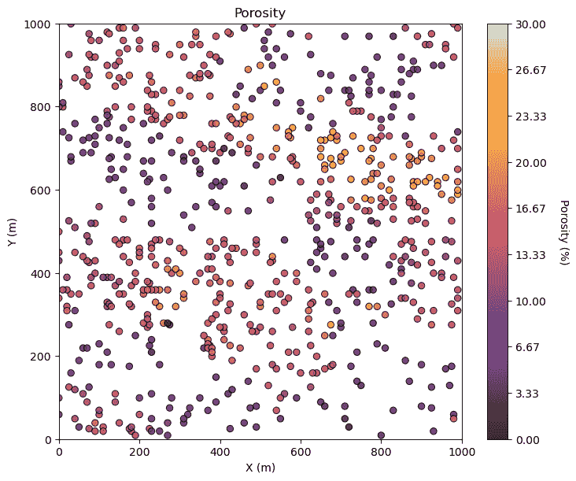
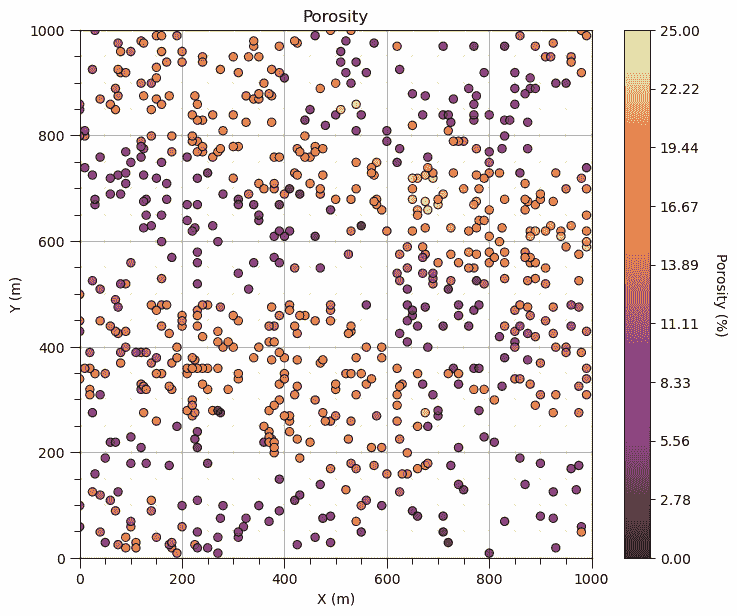
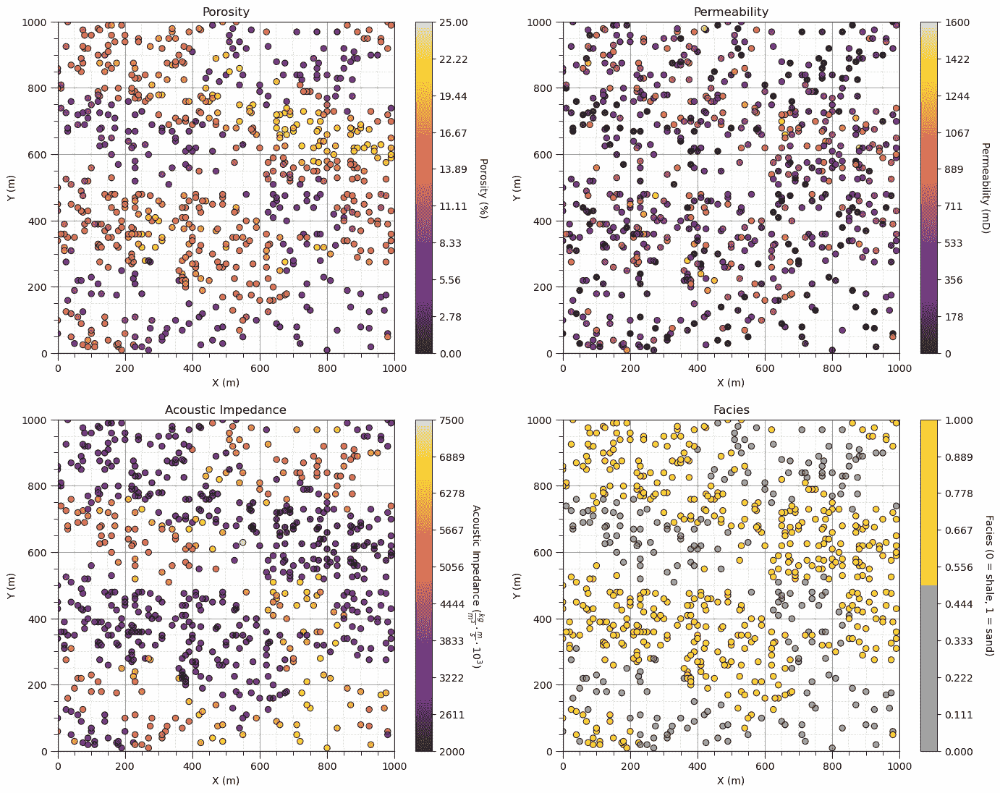
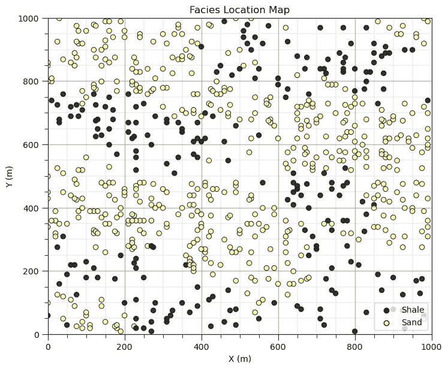
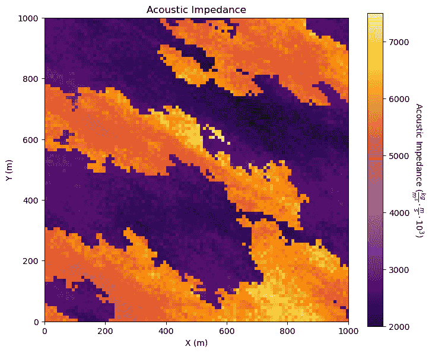
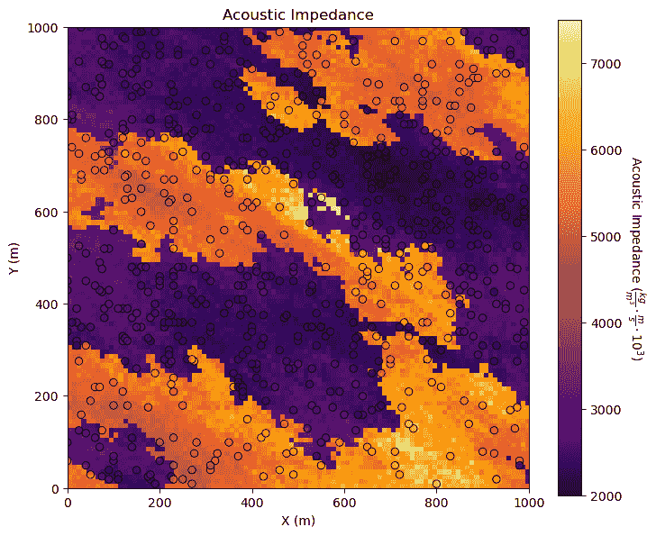
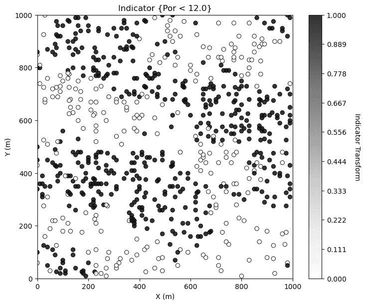

# 加载数据和绘图

> 原文：[`geostatsguy.github.io/MachineLearningDemos_Book/MachineLearning_plotting_data_models.html`](https://geostatsguy.github.io/MachineLearningDemos_Book/MachineLearning_plotting_data_models.html)

迈克尔·J·皮尔奇，教授，德克萨斯大学奥斯汀分校

[Twitter](https://twitter.com/geostatsguy) | [GitHub](https://github.com/GeostatsGuy) | [网站](http://michaelpyrcz.com) | [Google Scholar](https://scholar.google.com/citations?user=QVZ20eQAAAAJ&hl=en&oi=ao) | [地统计学书籍](https://www.amazon.com/Geostatistical-Reservoir-Modeling-Michael-Pyrcz/dp/0199731446) | [YouTube](https://www.youtube.com/channel/UCLqEr-xV-ceHdXXXrTId5ig) | [Python 中应用地统计学电子书](https://geostatsguy.github.io/GeostatsPyDemos_Book/intro.html) | [Python 中应用机器学习电子书](https://geostatsguy.github.io/MachineLearningDemos_Book/) | [LinkedIn](https://www.linkedin.com/in/michael-pyrcz-61a648a1)

电子书“Python 中应用机器学习：带代码的实践指南”的章节。

引用此电子书如下：

Pyrcz, M.J., 2024, *Python 中应用机器学习：带代码的实践指南* [电子书]. Zenodo. doi:10.5281/zenodo.15169138 

本书中的工作流程以及更多内容可在以下链接找到：

引用 MachineLearningDemos GitHub 仓库如下：

Pyrcz, M.J., 2024, *MachineLearningDemos: Python Machine Learning Demonstration Workflows Repository* (0.0.3) [软件]. Zenodo. DOI: 10.5281/zenodo.13835312\. GitHub 仓库：[GeostatsGuy/MachineLearningDemos](https://github.com/GeostatsGuy/MachineLearningDemos) 

作者：迈克尔·J·皮尔奇

© 版权所有 2024。

本章是关于**加载数据和模型以及绘图**的教程和演示。

我涵盖了加载数据：

+   **数据表** - 表示具有$n$行样本和$m$列特征的表格数据的$n \times m$逗号分隔文件。特征可能包括多变量数据集的各种共定位测量，并可能包括空间数据的坐标$x, y, z$。假设特征名称位于第一行。表示缺失数据（空值）的具体值应明确指定。

+   **网格数据** - 表示单个特征（例如，空间中的地图或预测 2 个预测特征在规则间隔上的模型）的值的$n_x \times n_y$逗号分隔文件，例如，多个特征通常需要每个文件一个特征。

对于绘图，我涵盖了以下内容：

+   **位置图** - 用于绘制表格空间数据，在位置或特征空间中的数据点，一个或多个特征以颜色和/或标记形状显示。

+   **像素图** - 用于绘制带有一个或多个特征的网格、详尽的空间数据和模型。

**YouTube 讲座**：查看我的关于[显示数据](https://youtu.be/TbqaMXdSV4I?si=UwGH-iRc7V962yNF)的讲座，这是关于单变量分布的更大讲座的第一部分。

## 加载所需的库

以下代码加载所需的库。我们包括 GeostatsPy，它基于 matplotlib 提供了一些超级紧凑、美观的位置图和像素绘图功能。

```py
import geostatspy.GSLIB as GSLIB                              # GSLIB utilities, visualization and wrapper
import geostatspy.geostats as geostats                        # GSLIB methods convert to Python 
import geostatspy
print('GeostatsPy version: ' + str(geostatspy.__version__)) 
```

```py
GeostatsPy version: 0.0.71 
```

我们还需要一些标准包。这些应该已经与 Anaconda 3 一起安装。

```py
import os                                                     # set working directory, run executables

from tqdm import tqdm                                         # suppress the status bar
from functools import partialmethod
tqdm.__init__ = partialmethod(tqdm.__init__, disable=True)

ignore_warnings = True                                        # ignore warnings?
import numpy as np                                            # ndarrays for gridded data
import pandas as pd                                           # DataFrames for tabular data
import matplotlib.pyplot as plt                               # for plotting
import matplotlib as mpl                                      # custom colorbar
from matplotlib.ticker import (MultipleLocator, AutoMinorLocator) # control of axes ticks
plt.rc('axes', axisbelow=True)                                # plot all grids below the plot elements
if ignore_warnings == True:                                   
    import warnings
    warnings.filterwarnings('ignore')
cmap = plt.cm.inferno                                         # color map 
```

## 定义函数

这是一个方便的函数，用于添加主网格线和副网格线，以提高绘图的可解释性。

```py
def add_grid():
    plt.gca().grid(True, which='major',linewidth = 1.0); plt.gca().grid(True, which='minor',linewidth = 0.2) # add y grids
    plt.gca().tick_params(which='major',length=7); plt.gca().tick_params(which='minor', length=4)
    plt.gca().xaxis.set_minor_locator(AutoMinorLocator()); plt.gca().yaxis.set_minor_locator(AutoMinorLocator()) # turn on minor ticks 
```

## 制作自定义颜色条

我们制作这个颜色条来显示我们的分类、沙质和页岩面貌。

+   自定义颜色图是改进我们绘图的好方法！我们可以轻松修改颜色图并创建新的颜色图，就像这样。

```py
cmap_facies = mpl.colors.ListedColormap(['grey','gold'])
cmap_facies.set_over('white'); cmap_facies.set_under('white') 
```

## 设置工作目录

我总是喜欢这样做，这样我就不会丢失文件，并且可以简化后续的读取和写入（避免每次都包含完整地址）。

```py
#os.chdir("c:/PGE383")                                        # set the working directory 
```

## 加载表格数据

这是将我们的逗号分隔数据文件加载到 Pandas DataFrame 对象中的命令。

+   X 和 Y 坐标 ($m$)

+   孔隙率（分数）

+   渗透率 ($mD$)

+   声阻抗 ($\frac{kg}{m³} \cdot \frac{m}{s} \cdot 10³$)

+   +   面貌 0 和 1

```py
df = pd.read_csv(r"https://raw.githubusercontent.com/GeostatsGuy/GeoDataSets/master/spatial_nonlinear_MV_facies_v13.csv") # load the data from Dr. Pyrcz's GitHub repository
df = df.iloc[:,1:8]                                           # remove a blank column from the data table
df.head()                                                     # preview the DataFrame 
```

|  | X | Y | Por | Perm | AI | Facies |
| --- | --- | --- | --- | --- | --- | --- |
| 0 | 180.0 | 769.0 | 13.770949 | 446.436677 | 3445.418690 | 1.0 |
| 1 | 530.0 | 259.0 | 13.974270 | 216.593948 | 3159.935063 | 1.0 |
| 2 | 470.0 | 139.0 | 6.031127 | 0.000000 | 5799.299877 | 0.0 |
| 3 | 250.0 | 179.0 | 5.158305 | 129.285485 | 5656.422332 | 0.0 |
| 4 | 960.0 | 169.0 | 5.553232 | 370.191342 | 6354.235120 | 0.0 |

## 设置元数据

我们的数据总是包含一些重要的元数据，这对于我们的工作流程和绘图至关重要。例如：

+   特征名称、绘图的正确名称和单位

我喜欢紧凑且一致地设置和存储我的元数据，以便泛化和简化我的工作流程。

+   我可以轻松地加载新的数据集，更新元数据并重新运行我的工作流程。

+   我通过使用列表中的元素而不是实际字符串来为我的特征和绘图标签使用列表元素，从而避免硬编码我的工作流程。与每个工作流程步骤和绘图相比，更新下面的块更容易！

```py
Xname = ['X','Y','Por','Perm','AI','Facies']                  # specify the predictor features (x2) and response feature (x1)
Xmin = [0.0,0.0,0.0,0.0,2000.0,0];                            # set minimums and maximums for visualization 
Xmax = [1000.0,1000.0,25.0,1600.0,7500.0,1.0]                      
Xlabel = ['X','Y','Porosity','Permeability','Acoustic Impedance','Facies'] # specify the feature labels for plotting
Xunit = ['m','m','%','mD',r'$\frac{kg}{m³} \cdot \frac{m}{s} \cdot 10³$','0 = shale, 1 = sand']
Xlabelunit = [f"{s1} ({s2})" for s1, s2 in zip(Xlabel, Xunit)] 
```

## 总体统计信息

让我们看看所有特征的总体统计信息。

```py
df.describe().transpose() 
```

|  | count | mean | std | min | 25% | 50% | 75% | max |
| --- | --- | --- | --- | --- | --- | --- | --- | --- |
| X | 720.0 | 479.395833 | 289.337554 | 0.000000 | 225.000000 | 460.000000 | 730.000000 | 990.000000 |
| Y | 720.0 | 525.572222 | 268.797902 | 9.000000 | 325.000000 | 525.000000 | 749.000000 | 999.000000 |
| Por | 720.0 | 13.154504 | 4.921139 | 3.113721 | 8.140312 | 14.192083 | 16.852002 | 22.801310 |
| Perm | 720.0 | 462.242089 | 325.040727 | 0.000000 | 195.268277 | 453.089288 | 704.256901 | 1525.989345 |
| AI | 720.0 | 3915.972800 | 1292.243819 | 2555.187875 | 2974.530389 | 3224.863572 | 5381.452060 | 7400.229415 |
| 相 | 720.0 | 0.691667 | 0.462126 | 0.000000 | 0.000000 | 1.000000 | 1.000000 | 1.000000 |

## 指定感兴趣区域/网格和特征限制

让我们指定网格和特征的合理范围：

+   我们这样做是为了确保比较时图表的一致性。

我们可以使用这样的命令来找到坐标的最小值，比如 X：

```py
df['X'].min() 
```

+   但是，手动设置范围以获得清晰和干净的图表会更好。例如，你希望你的位置地图从 0.05887 到 998.24230 精确绘制吗？

```py
xlim = [0.0,1000.0]; ylim = [0,1000]                          # specify the spatial extents 
```

## 选择一个特征

让我们选择一个要工作的特征。

1.  X

1.  Y

1.  孔隙率

1.  渗透率

1.  声阻抗

1.  相

```py
ix = 0; iy = 1; i = 2                                         # location x, y and feature 
```

## 使用位置图可视化表格数据

让我们尝试 locmap。这是 GSLIB 的 locmap 程序的重新实现，它使用 matplotlib。我希望你发现它比 matplotlib 更简单，如果你想更高级并构建自定义图表，请查看源代码。如果你改进了它，请将新代码发给我。任何帮助都受欢迎。要查看参数，只需键入命令名称：

```py
GSLIB.locmap                                                  # GeostatsPy's location map function 
```

```py
<function geostatspy.GSLIB.locmap(df, xcol, ycol, vcol, xmin, xmax, ymin, ymax, vmin, vmax, title, xlabel, ylabel, vlabel, cmap, fig_name)> 
```

让我们添加绘图参数并制作位置图。

```py
GSLIB.locmap_st(df,Xname[ix],Xname[iy],Xname[i],xlim[0],xlim[1],ylim[0],ylim[1],0.0,30.0,Xlabel[i],Xlabelunit[ix],Xlabelunit[iy],
             Xlabelunit[i],cmap)                              # location map plot
plt.subplots_adjust(left=0.0, bottom=0.0, right=1.0, top=1.1, wspace=0.1, hspace=0.2); plt.show() 
```



我们能否将颜色条调紧一些，以便看到更多细节？并添加一些网格线？

+   我们精心制作数据和模型图表，以便最好地与我们的观众沟通。制作出色的数据和模型图表很有趣！

```py
GSLIB.locmap_st(df,Xname[ix],Xname[iy],Xname[i],xlim[0],xlim[1],ylim[0],ylim[1],Xmin[i],Xmax[i],Xlabel[i],Xlabelunit[ix],Xlabelunit[iy],
             Xlabelunit[i],cmap); add_grid()                  # location map plot

plt.subplots_adjust(left=0.0, bottom=0.0, right=1.0, top=1.1, wspace=0.1, hspace=0.2) 
```



让我们将其他属性添加到组合图中，所有图表作为子图。

+   要这样做，我们使用 matplotlib 包中的 subplot 命令，在 figure 命令之前，以指示以下图是子图的一部分，我们使用 subplots_adjust 在最后来获取正确的缩放。

+   我们可以将我们的花哨图表保存为图像文件，格式和分辨率由我们所需。

这非常适合撰写报告、论文和制作外观出色的更新演示。

注意，在 GeostatsPy 中，我提供了带有和没有‘_st’命名的附加绘图方法。

+   使用‘_st’函数在组合图中“堆叠”图像。

+   没有使用‘_st’函数来生成单个图像并同时创建文件

我们也可以在制作我们的组合图之后创建文件，如下所示。

```py
save_to_file = False                                          # save composite image to a file?

fimin = 2; fimax = 5                                          # index of features to plot, plotting 2, 3, 4, and 5 below

for i,fi in enumerate(range(fimin,fimax+1)):                  # loop over the subplots
    plt.subplot(2,2,i+1)
    if fi == 5: 
        lcmap = cmap_facies                                   # used facies colormap for facies, assumed to be index 5
    else: 
        lcmap = cmap
    GSLIB.locmap_st(df,Xname[ix],Xname[iy],Xname[fi],xlim[0],xlim[1],ylim[0],ylim[1],Xmin[fi],Xmax[fi],Xlabel[fi],Xlabelunit[ix],Xlabelunit[iy],
             Xlabelunit[fi],lcmap); add_grid()                # location map plot

plt.subplots_adjust(left=0.0, bottom=0.0, right=2.0, top=2.1, wspace=0.2, hspace=0.2)
if save_to_file == True:                                      # make a figure file
    plt.savefig('All_location_maps.tif',dpi=600,bbox_inches="tight")
plt.show() 
```



看起来相当不错，对吧？（是的，我是加拿大人）。

+   你注意到相的定制颜色图了吗？我们实际上可以更新颜色条上的刻度标记，这可以改进，我们将在稍后解决这个问题。

## 使用 Matplotlib 的位置图

这是您如何使用 Matplotlib 创建相同位置图的示例。

+   再次强调，GeostatsPy 实际上是在使用 Matplotlib 进行绘图，绘图函数是为了方便和紧凑的代码。

```py
i = 2                                                       # select the feature for the location map
im = plt.scatter(df[Xname[ix]],df[Xname[iy]],s=None,c=df[Xname[i]],marker=None,cmap=cmap,norm=None,
        vmin=Xmin[i],vmax=Xmax[i],alpha=0.8,linewidths=0.8,edgecolors="black")
plt.title(str(Xlabel[i]) + ' Location Map')
plt.xlim(xlim); plt.ylim(ylim)
plt.xlabel(Xlabelunit[ix]); plt.ylabel(Xlabelunit[iy])
cbar = plt.colorbar(im, orientation="vertical", ticks=np.linspace(Xmin[i],Xmax[i],10))
cbar.set_label(Xlabelunit[i], rotation=270, labelpad=20)
add_grid()
plt.subplots_adjust(left=0.0, bottom=0.0, right=1.0, top=1.1, wspace=0.2, hspace=0.2); plt.show() 
```


是的，我喜欢用一行代码制作位置图，当我们直接使用 Matplotlib 时，我们为合理的位置图编写了很多行代码。此外，许多人熟悉 GSLIB 中 locmap 函数的参数化，所以我在我 GeostatsPy 函数中使用了相同的参数。

由于我们正在制作自己的位置图，让我们重复绘制相 facies 位置图，并移除颜色条，用图例替换。

+   这对于分类信息来说效果相当好

+   如果我们只是给我们的特征添加一个标签，我们只会得到一个图例条目来表示所有类别

+   我编写了一些代码来找到分类特征中所有唯一类别的整数

+   然后，我为每个类别在绘图区域外创建一个数据点来告知图例

```py
i = 5                                                         # select the facies feature

categories = np.unique(df[Xname[i]])                          # find the categorical indices 
cat_names = ['Shale','Sand']                                  # provide the category labels

im = plt.scatter(df[Xname[ix]],df[Xname[iy]],s=None,c=df[Xname[i]],marker=None,cmap=cmap,norm=None,
        vmin=Xmin[i],vmax=Xmax[i],alpha=0.8,linewidths=0.8,edgecolors="black") # location map plot
plt.title(str(Xlabel[i]) + ' Location Map')
plt.xlim(xlim); plt.ylim(ylim)
plt.xlabel(Xlabelunit[ix]); plt.ylabel(Xlabelunit[iy])

for j,cat in enumerate(categories):                           # plot outside the plot area to inform the legend
    plt.scatter(xlim[0]-9999,ylim[0]-9999,marker='o',c = cat,edgecolor='black',label=cat_names[j],cmap=cmap,vmin=Xmin[i],vmax=Xmax[i])
plt.legend(loc = 'lower right')
add_grid()
plt.subplots_adjust(left=0.0, bottom=0.0, right=1.0, top=1.1, wspace=0.2, hspace=0.2); plt.show() 
```



现在足够自定义位置图了。我们可以用 matplotlib 来定制和改进我们的图表。

## 加载网格数据

让我们加载并可视化网格化的、详尽的地震数据集。

+   数据是 X 和 Y 的二维地图，平面视图。

+   数据文件存储为常见的分隔 ASCII 文件。

文件看起来像这样。

3.499406970376157915e+03,3.485861232441123320e+03,3.358157676165383236e+03,3.212598229839397845e+03,2.969960100495822189e+03, $\dots$

文件的第一行是地图的顶部 y 行（$iy = 0$）。有$ix = 1,\ldots,n_x$个值，由逗号分隔，然后是行尾。下一行数据是前一行数据下面的行（$iy = 1$），以此类推。

+   NumPy 数组从上到下和从左到右进行索引。

+   在数组表示法中，位置表示为：

```py
my2Darray[iy,ix] 
```

注意，这与许多从左上角开始（而不是右上角）并按 ix,iy（而不是 iy,ix）顺序索引的数组相反。

好的，我们现在准备好加载我们的网格地震图数据。

```py
seismic = np.loadtxt("https://raw.githubusercontent.com/GeostatsGuy/GeoDataSets/master/spatial_nonlinear_MV_facies_v13_truth_AI.csv", 
                     delimiter=",")                           # load the 2D csv file 
```

再次强调，没有错误，这是一个好兆头。让我们看看我们加载了什么。

```py
type(seismic)                                                 # check the type of the load object 
```

```py
numpy.ndarray 
```

这是一个 NumPy ndarray - 值的数组。很好！

让我们更具体一些。我们可以使用“type”命令来找出任何对象是什么，我们可以使用 ndarray 的 shape 成员来获取数组的大小（ny, nx）。

```py
print('The object type is ' + str(type(seismic)))              
print('  with size, ny =  ' + str(seismic.shape[0]) + ' and nx = ' + str(seismic.shape[1])) # check the grid size 
```

```py
The object type is <class 'numpy.ndarray'>
  with size, ny =  100 and nx = 100 
```

## 可视化网格数据

我们在 y 方向上有 100 个单元格，在 x 方向上有 100 个单元格的网格，但我们需要更多信息。

+   那么，数据的来源、单位、方向和单元格大小是什么？

这个文件格式不包含该信息，所以我将提供给你。

+   单元大小是 10m 各向同性（x 和 y 相同）

+   网格在 x 和 y 方向上从 0 到 1000m（原点在 0,0）。

+   网格方向与 x 和 y 对齐（东西向和南北向，没有旋转）。

我们需要添加网格单元格大小，因为我们已经在上文中有网格范围（xmin, xmax, ymin 和 ymax）。

```py
csize = 10.0                                                  # grid cell size 
```

我们将使用 GSLIB 重新实现的 pixelplt 命令。要查看参数，请输入名称并运行。

```py
GSLIB.pixelplt                                                # GeostatsPy's pixel plot function 
```

```py
<function geostatspy.GSLIB.pixelplt(array, xmin, xmax, ymin, ymax, step, vmin, vmax, title, xlabel, ylabel, vlabel, cmap, fig_name)> 
```

```py
i = 4                                                         # we are working with AI, let's use our metadata from above
GSLIB.pixelplt_st(seismic,xlim[0],xlim[1],ylim[0],ylim[1],csize,Xmin[i],Xmax[i],Xlabel[i],Xlabelunit[ix],Xlabelunit[iy],
               Xlabelunit[i],cmap) # plot the seismic data
plt.subplots_adjust(left=0.0, bottom=0.0, right=1.0, top=1.1, wspace=0.2, hspace=0.2); plt.show() 
```



很有趣，我们的地下单元在声阻抗方面有很多地方性差异。如果声阻抗与岩石物理性质很好地相关，那么这里有很多有用的信息。

## 一起可视化表格和网格数据

你可能会担心表格声阻抗样本和网格声阻抗之间的一致性。

+   数据表可能是从网格数据中提取的，或者可能有一个可用的特征，或者是从表格数据中派生出来的，无论如何，它的一致性很重要。

+   将它们一起绘制出来是一个很好的检查。

+   GeostatsPy 的 locpix 是一个用于一起绘制表格和网格数据的函数。

```py
GSLIB.locpix_st                                               # GeostatsPy's combined tabular and gridded data plot 
```

```py
<function geostatspy.GSLIB.locpix_st(array, xmin, xmax, ymin, ymax, step, vmin, vmax, df, xcol, ycol, vcol, title, xlabel, ylabel, vlabel, cmap)> 
```

```py
GSLIB.locpix_st(seismic,xlim[0],xlim[1],ylim[0],ylim[1],csize,Xmin[i],Xmax[i],df,Xname[ix],Xname[iy],Xname[i],Xlabel[i],Xlabelunit[ix],Xlabelunit[iy],
               Xlabelunit[i],cmap)                            # location map and pixel plot combined
plt.subplots_adjust(left=0.0, bottom=0.0, right=1.0, top=1.1, wspace=0.2, hspace=0.2); plt.show() 
```



## 其他空间数据查询的想法

看起来不错。我们可以做更多的事情来展示我们的空间数据，以便从中学习。例如，如果我们想分离低和高孔隙率怎么办？尝试这样做，在 DataFrame 中创建一个新的属性，低孔隙率为 0，高孔隙率为 1。

```py
i = 2 ; threshold = 12.0                                      # select feature and threshold for indicator map

df['cat_'+ Xname[i]] = np.where(df[Xname[i]]>=threshold,1.0,0.0) # binary category assignment, 1 if > 12%, 0 otherwise

plt.subplot(111)
GSLIB.locmap_st(df,Xname[ix],Xname[iy],'cat_' + Xname[i],xlim[0],xlim[1],ylim[0],ylim[1],0.0,1.0, # location map plot
             'Indicator {' + Xname[i] + ' < ' + str(threshold) + '}',Xlabelunit[ix],Xlabelunit[iy],'Indicator Transform',cmap=plt.cm.Greys)
plt.subplots_adjust(left=0.0, bottom=0.0, right=1.0, top=1.1, wspace=0.2, hspace=0.2); plt.show() 
```



## 从头开始制作自己的图表

有时我会从头开始制作自定义图表，实际上是在使用线条、形状和文本！如果你想看看我的例子，请查看：

+   [主成分载荷](https://github.com/GeostatsGuy/DataScienceInteractivePython/blob/main/Interactive_PCA_Eigen.ipynb) - 我为交互式 PCA 主成分仪表板制作了组件加载显示在右下角。

+   [贝叶斯更新](https://github.com/GeostatsGuy/DataScienceInteractivePython/blob/main/Interactive_Bayesian_Updating.ipynb) - 我写出了贝叶斯更新方程，添加了交互式标签和概率轴上的先验、似然和后验的线图。

我实际上经常这样做，以最大化我的数据和模型绘图中的创造力，以便进行良好的沟通。

## 评论

这是对数据加载和可视化的基本处理。可以做和讨论的还有很多，我有很多更多的资源。查看我的[共享资源清单](https://michaelpyrcz.com/my-resources)以及本章开头带有资源链接的 YouTube 讲座链接。

*迈克尔*

## 关于作者


迈克尔·皮尔奇兹教授在德克萨斯大学奥斯汀分校 40 英亩校园的办公室。

迈克尔·皮尔奇兹是德克萨斯大学奥斯汀分校[Cockrell 工程学院](https://cockrell.utexas.edu/faculty-directory/alphabetical/p)和[杰克逊地球科学学院](https://www.jsg.utexas.edu/researcher/michael_pyrcz/)的教授，他在该校从事和教授地下、空间数据分析、地统计学和机器学习的研究。迈克尔还，

+   [能源分析](https://fri.cns.utexas.edu/energy-analytics)新生研究项目的首席研究员，以及德克萨斯大学奥斯汀分校自然科学院机器学习实验室的核心教员。

+   [计算机与地球科学](https://www.sciencedirect.com/journal/computers-and-geosciences/about/editorial-board)的副编辑，以及国际数学地球科学协会 [数学地球科学](https://link.springer.com/journal/11004/editorial-board) 的董事会成员。

迈克尔已撰写超过 70 篇 [同行评审出版物](https://scholar.google.com/citations?user=QVZ20eQAAAAJ&hl=en)，一个用于空间数据分析的 [Python 包](https://pypi.org/project/geostatspy/)，合著了一本关于空间数据分析的教科书 [地统计学储层建模](https://www.amazon.com/Geostatistical-Reservoir-Modeling-Michael-Pyrcz/dp/0199731446)，并是两本最近发布的电子书的作者，[Python 中的应用地统计学：GeostatsPy 实战指南](https://geostatsguy.github.io/GeostatsPyDemos_Book/intro.html) 和 [Python 中的应用机器学习：带代码的实战指南](https://geostatsguy.github.io/MachineLearningDemos_Book/intro.html)。

迈克尔的所有大学课程都可在他的 [YouTube 频道](https://www.youtube.com/@GeostatsGuyLectures)上找到，其中包含链接到 100 多个 Python 交互式仪表板和 40 多个存储库中的详细文档工作流程，这些存储库位于他的 [GitHub 账户](https://github.com/GeostatsGuy)，以支持任何感兴趣的学生和在职专业人士，提供常青内容。要了解更多关于迈克尔的工作和共享教育资源，请访问他的网站。

## 想要一起工作吗？

我希望这些内容对那些想了解更多关于地层数据建模、数据分析和机器学习的人有所帮助。学生和在职专业人士欢迎参加。

+   想邀请我到贵公司进行培训、辅导、项目审查、工作流程设计和/或咨询吗？我很乐意拜访并与您合作！

+   感兴趣合作、支持我的研究生研究或我的地层数据分析和机器学习联盟（共同负责人包括 Foster 教授、Torres-Verdin 教授和 van Oort 教授）吗？我的研究将数据分析、随机建模和机器学习理论与实践相结合，以开发新的方法和工作流程，增加价值。我们正在解决具有挑战性的地层数据问题！

+   您可以通过 mpyrcz@austin.utexas.edu 联系到我。

我总是很高兴讨论，

*迈克尔*

迈克尔·皮尔茨，博士，P.Eng. 教授，德克萨斯大学奥斯汀分校 Cockrell 工程学院和 Jackson 地球科学学院

## 更多资源可在以下链接获取：[Twitter](https://twitter.com/geostatsguy) | [GitHub](https://github.com/GeostatsGuy) | [网站](http://michaelpyrcz.com) | [Google Scholar](https://scholar.google.com/citations?user=QVZ20eQAAAAJ&hl=en&oi=ao) | [地质统计学书籍](https://www.amazon.com/Geostatistical-Reservoir-Modeling-Michael-Pyrcz/dp/0199731446) | [YouTube](https://www.youtube.com/channel/UCLqEr-xV-ceHdXXXrTId5ig) | [Python 中的应用地质统计学电子书](https://geostatsguy.github.io/GeostatsPyDemos_Book/intro.html) | [Python 中的应用机器学习电子书](https://geostatsguy.github.io/MachineLearningDemos_Book/) | [LinkedIn](https://www.linkedin.com/in/michael-pyrcz-61a648a1)

## 加载所需的库

以下代码加载所需的库。我们包括 GeostatsPy，用于一些基于 matplotlib 的超级紧凑、美观的位置地图和像素绘图功能。

```py
import geostatspy.GSLIB as GSLIB                              # GSLIB utilities, visualization and wrapper
import geostatspy.geostats as geostats                        # GSLIB methods convert to Python 
import geostatspy
print('GeostatsPy version: ' + str(geostatspy.__version__)) 
```

```py
GeostatsPy version: 0.0.71 
```

我们还需要一些标准包。这些应该已经与 Anaconda 3 一起安装。

```py
import os                                                     # set working directory, run executables

from tqdm import tqdm                                         # suppress the status bar
from functools import partialmethod
tqdm.__init__ = partialmethod(tqdm.__init__, disable=True)

ignore_warnings = True                                        # ignore warnings?
import numpy as np                                            # ndarrays for gridded data
import pandas as pd                                           # DataFrames for tabular data
import matplotlib.pyplot as plt                               # for plotting
import matplotlib as mpl                                      # custom colorbar
from matplotlib.ticker import (MultipleLocator, AutoMinorLocator) # control of axes ticks
plt.rc('axes', axisbelow=True)                                # plot all grids below the plot elements
if ignore_warnings == True:                                   
    import warnings
    warnings.filterwarnings('ignore')
cmap = plt.cm.inferno                                         # color map 
```

## 定义函数

这是一个方便的函数，用于添加主网格线和副网格线，以提高图表的可解释性。

```py
def add_grid():
    plt.gca().grid(True, which='major',linewidth = 1.0); plt.gca().grid(True, which='minor',linewidth = 0.2) # add y grids
    plt.gca().tick_params(which='major',length=7); plt.gca().tick_params(which='minor', length=4)
    plt.gca().xaxis.set_minor_locator(AutoMinorLocator()); plt.gca().yaxis.set_minor_locator(AutoMinorLocator()) # turn on minor ticks 
```

## 制作自定义颜色条

我们制作这个颜色条来显示我们的分类、沙质和页岩岩相。

+   自定义颜色图是改进我们的图表的绝佳方式！我们可以轻松修改颜色图并创建新的颜色图，如下所示。

```py
cmap_facies = mpl.colors.ListedColormap(['grey','gold'])
cmap_facies.set_over('white'); cmap_facies.set_under('white') 
```

## 设置工作目录

我总是喜欢这样做，这样我就不会丢失文件，并且可以简化后续的读取和写入（避免每次都包含完整地址）。

```py
#os.chdir("c:/PGE383")                                        # set the working directory 
```

## 加载表格数据

这是将我们的逗号分隔数据文件加载到 Pandas DataFrame 对象的命令。

+   X 和 Y 坐标（$m$）

+   孔隙率（分数）

+   渗透率（$mD$）

+   声波阻抗（$\frac{kg}{m³} \cdot \frac{m}{s} \cdot 10³$）

+   +   岩相 0 和 1

```py
df = pd.read_csv(r"https://raw.githubusercontent.com/GeostatsGuy/GeoDataSets/master/spatial_nonlinear_MV_facies_v13.csv") # load the data from Dr. Pyrcz's GitHub repository
df = df.iloc[:,1:8]                                           # remove a blank column from the data table
df.head()                                                     # preview the DataFrame 
```

|  | X | Y | Por | Perm | AI | Facies |
| --- | --- | --- | --- | --- | --- | --- | --- | --- |
| 0 | 180.0 | 769.0 | 13.770949 | 446.436677 | 3445.418690 | 1.0 |
| 1 | 530.0 | 259.0 | 13.974270 | 216.593948 | 3159.935063 | 1.0 |
| 2 | 470.0 | 139.0 | 6.031127 | 0.000000 | 5799.299877 | 0.0 |
| 3 | 250.0 | 179.0 | 5.158305 | 129.285485 | 5656.422332 | 0.0 |
| 4 | 960.0 | 169.0 | 5.553232 | 370.191342 | 6354.235120 | 0.0 |

## 设置元数据

总是有一些重要的元数据需要与我们的数据一起包含，这对于我们的工作流程和图表至关重要。例如：

+   特征名称，用于绘图的正确名称和单位

我喜欢紧凑且一致地设置和存储我的元数据，以便泛化和简化我的工作流程。

+   我可以轻松地加载新的数据集，更新元数据并重新运行我的工作流程。

+   我通过使用列表中的元素而不是实际字符串来避免硬编码我的工作流程，用于我的特征和绘图标签。更新下面的块比更新每个工作流程步骤和绘图更容易！

```py
Xname = ['X','Y','Por','Perm','AI','Facies']                  # specify the predictor features (x2) and response feature (x1)
Xmin = [0.0,0.0,0.0,0.0,2000.0,0];                            # set minimums and maximums for visualization 
Xmax = [1000.0,1000.0,25.0,1600.0,7500.0,1.0]                      
Xlabel = ['X','Y','Porosity','Permeability','Acoustic Impedance','Facies'] # specify the feature labels for plotting
Xunit = ['m','m','%','mD',r'$\frac{kg}{m³} \cdot \frac{m}{s} \cdot 10³$','0 = shale, 1 = sand']
Xlabelunit = [f"{s1} ({s2})" for s1, s2 in zip(Xlabel, Xunit)] 
```

## 总体统计信息

让我们看看所有特征的总体统计信息。

```py
df.describe().transpose() 
```

|  | count | mean | std | min | 25% | 50% | 75% | max |
| --- | --- | --- | --- | --- | --- | --- | --- | --- |
| X | 720.0 | 479.395833 | 289.337554 | 0.000000 | 225.000000 | 460.000000 | 730.000000 | 990.000000 |
| Y | 720.0 | 525.572222 | 268.797902 | 9.000000 | 325.000000 | 525.000000 | 749.000000 | 999.000000 |
| 孔 | 720.0 | 13.154504 | 4.921139 | 3.113721 | 8.140312 | 14.192083 | 16.852002 | 22.801310 |
| 层段 | 720.0 | 462.242089 | 325.040727 | 0.000000 | 195.268277 | 453.089288 | 704.256901 | 1525.989345 |
| AI | 720.0 | 3915.972800 | 1292.243819 | 2555.187875 | 2974.530389 | 3224.863572 | 5381.452060 | 7400.229415 |
| 地层 | 720.0 | 0.691667 | 0.462126 | 0.000000 | 0.000000 | 1.000000 | 1.000000 | 1.000000 |

## 指定感兴趣区域/网格和特征限制

让我们指定网格和特征的一个合理的范围：

+   我们这样做是为了使比较的图表保持一致。

我们可以使用这样的命令来找到坐标的最小值，比如 X：

```py
df['X'].min() 
```

+   但是，手动设置清晰图表的范围会更好。例如，你希望你的位置地图图从 0.05887 精确到 998.24230 吗？

```py
xlim = [0.0,1000.0]; ylim = [0,1000]                          # specify the spatial extents 
```

## 选择一个特征

让我们选择一个要工作的特征。

1.  X

1.  Y

1.  孔隙率

1.  渗透率

1.  声波阻抗

1.  地层

```py
ix = 0; iy = 1; i = 2                                         # location x, y and feature 
```

## 使用位置地图可视化表格数据

让我们尝试使用 locmap。这是一个使用 matplotlib 重新实现的 GSLIB 的 locmap 程序。我希望你发现它比 matplotlib 更简单，如果你想要更高级的功能并构建自定义图表，请查看源代码。如果你改进了它，请把新代码发给我。任何帮助都受欢迎。要查看参数，只需输入命令名称：

```py
GSLIB.locmap                                                  # GeostatsPy's location map function 
```

```py
<function geostatspy.GSLIB.locmap(df, xcol, ycol, vcol, xmin, xmax, ymin, ymax, vmin, vmax, title, xlabel, ylabel, vlabel, cmap, fig_name)> 
```

让我们添加绘图参数并创建一个位置地图图。

```py
GSLIB.locmap_st(df,Xname[ix],Xname[iy],Xname[i],xlim[0],xlim[1],ylim[0],ylim[1],0.0,30.0,Xlabel[i],Xlabelunit[ix],Xlabelunit[iy],
             Xlabelunit[i],cmap)                              # location map plot
plt.subplots_adjust(left=0.0, bottom=0.0, right=1.0, top=1.1, wspace=0.1, hspace=0.2); plt.show() 
```


也许我们可以调整颜色条以查看更多细节？并添加一些网格线？

+   我们精心制作数据和模型图，以便最好地向我们的观众传达信息。制作出色的数据和模型图很有趣！

```py
GSLIB.locmap_st(df,Xname[ix],Xname[iy],Xname[i],xlim[0],xlim[1],ylim[0],ylim[1],Xmin[i],Xmax[i],Xlabel[i],Xlabelunit[ix],Xlabelunit[iy],
             Xlabelunit[i],cmap); add_grid()                  # location map plot

plt.subplots_adjust(left=0.0, bottom=0.0, right=1.0, top=1.1, wspace=0.1, hspace=0.2) 
```


让我们将其他属性添加到包含所有子图的复合图中。

+   为了做到这一点，我们使用 matplotlib 包中的 subplot 命令，在 figure 命令之前，以指示以下图是子图的一部分，我们使用 subplots_adjust 在最后来获取正确的缩放。

+   我们可以将我们的复杂图形保存为具有所需文件格式和分辨率的图像文件。

这对于撰写报告、论文和制作出色的更新演示文稿非常有用。

注意，在 GeostatsPy 中，我提供了带有和没有‘_st’命名的额外绘图方法。

+   使用‘_st’函数在复合图中“堆叠”图像。

+   不使用‘_st’函数来生成单个图像并同时创建一个文件

我们也可以在创建复合图后创建一个文件，如下所示。

```py
save_to_file = False                                          # save composite image to a file?

fimin = 2; fimax = 5                                          # index of features to plot, plotting 2, 3, 4, and 5 below

for i,fi in enumerate(range(fimin,fimax+1)):                  # loop over the subplots
    plt.subplot(2,2,i+1)
    if fi == 5: 
        lcmap = cmap_facies                                   # used facies colormap for facies, assumed to be index 5
    else: 
        lcmap = cmap
    GSLIB.locmap_st(df,Xname[ix],Xname[iy],Xname[fi],xlim[0],xlim[1],ylim[0],ylim[1],Xmin[fi],Xmax[fi],Xlabel[fi],Xlabelunit[ix],Xlabelunit[iy],
             Xlabelunit[fi],lcmap); add_grid()                # location map plot

plt.subplots_adjust(left=0.0, bottom=0.0, right=2.0, top=2.1, wspace=0.2, hspace=0.2)
if save_to_file == True:                                      # make a figure file
    plt.savefig('All_location_maps.tif',dpi=600,bbox_inches="tight")
plt.show() 
```


看起来相当不错，对吧？（是的，我是加拿大人）。

+   你注意到地层有自定义的颜色图吗？我们实际上可以更新颜色条上的刻度标记，这可以改进，我们将在稍后解决这个问题。

## 使用 Matplotlib 的位置图

这就是如何使用 Matplotlib 制作相同的位置图。

+   再次强调，GeostatsPy 实际上是在使用 Matplotlib 进行绘图，绘图函数是为了方便、紧凑的代码。

```py
i = 2                                                       # select the feature for the location map
im = plt.scatter(df[Xname[ix]],df[Xname[iy]],s=None,c=df[Xname[i]],marker=None,cmap=cmap,norm=None,
        vmin=Xmin[i],vmax=Xmax[i],alpha=0.8,linewidths=0.8,edgecolors="black")
plt.title(str(Xlabel[i]) + ' Location Map')
plt.xlim(xlim); plt.ylim(ylim)
plt.xlabel(Xlabelunit[ix]); plt.ylabel(Xlabelunit[iy])
cbar = plt.colorbar(im, orientation="vertical", ticks=np.linspace(Xmin[i],Xmax[i],10))
cbar.set_label(Xlabelunit[i], rotation=270, labelpad=20)
add_grid()
plt.subplots_adjust(left=0.0, bottom=0.0, right=1.0, top=1.1, wspace=0.2, hspace=0.2); plt.show() 
```


是的，我喜欢用一行代码制作位置图，当我们直接与 Matplotlib 一起工作时，我们为合理的位置图编写了很多行代码。此外，许多人熟悉 GSLIB 中 locmap 函数的参数化，所以我将 GeostatsPy 中的函数使用相同的参数。

由于我们正在制作自己的位置图，让我们重复绘制地层位置图，并移除颜色条，用图例替换它。

+   这对于分类信息来说效果相当好

+   如果我们只是给我们的特征添加了一个标签，我们只会为所有类别在图例中得到一个条目

+   我编写了一些代码来查找分类特征中所有唯一类别的整数

+   然后我为每个类别在绘图区域外制作一个数据点，以告知图例

```py
i = 5                                                         # select the facies feature

categories = np.unique(df[Xname[i]])                          # find the categorical indices 
cat_names = ['Shale','Sand']                                  # provide the category labels

im = plt.scatter(df[Xname[ix]],df[Xname[iy]],s=None,c=df[Xname[i]],marker=None,cmap=cmap,norm=None,
        vmin=Xmin[i],vmax=Xmax[i],alpha=0.8,linewidths=0.8,edgecolors="black") # location map plot
plt.title(str(Xlabel[i]) + ' Location Map')
plt.xlim(xlim); plt.ylim(ylim)
plt.xlabel(Xlabelunit[ix]); plt.ylabel(Xlabelunit[iy])

for j,cat in enumerate(categories):                           # plot outside the plot area to inform the legend
    plt.scatter(xlim[0]-9999,ylim[0]-9999,marker='o',c = cat,edgecolor='black',label=cat_names[j],cmap=cmap,vmin=Xmin[i],vmax=Xmax[i])
plt.legend(loc = 'lower right')
add_grid()
plt.subplots_adjust(left=0.0, bottom=0.0, right=1.0, top=1.1, wspace=0.2, hspace=0.2); plt.show() 
```


目前就足够自定义位置图了。我们可以用 matplotlib 来定制和改进我们的图表有很多事情可以做。

## 加载网格数据

让我们加载并可视化网格化的、详尽的地震数据集。

+   数据是 X 和 Y 的二维地图，平面视图。

+   数据文件存储为常见的分隔 ASCII 文件。

文件看起来像这样。

3.499406970376157915e+03,3.485861232441123320e+03,3.358157676165383236e+03,3.212598229839397845e+03,2.969960100495822189e+03, ...

文件的第一行是地图的顶部 y 行（$iy = 0$）。有$ix = 1,\ldots,n_x$个值，由逗号分隔，然后是行尾。下一行数据是前一行下面的行（$iy = 1$），以此类推。

+   NumPy 数组从上到下和从左到右进行索引。

+   在数组表示法中，位置表示为：

```py
my2Darray[iy,ix] 
```

注意，这与许多从左下角（而不是左上角）开始并且按 ix,iy（而不是 iy,ix）顺序排列索引的数组相反。

好的，我们准备好加载我们的网格地震图数据了。

```py
seismic = np.loadtxt("https://raw.githubusercontent.com/GeostatsGuy/GeoDataSets/master/spatial_nonlinear_MV_facies_v13_truth_AI.csv", 
                     delimiter=",")                           # load the 2D csv file 
```

再次强调，没有错误，这是一个好兆头。让我们看看我们加载了什么。

```py
type(seismic)                                                 # check the type of the load object 
```

```py
numpy.ndarray 
```

它是一个 NumPy ndarray - 值的数组。很好！

让我们更具体一些。我们可以使用“type”命令来找出任何对象是什么，我们可以使用 ndarray 的 shape 成员来获取数组的大小（ny, nx）。

```py
print('The object type is ' + str(type(seismic)))              
print('  with size, ny =  ' + str(seismic.shape[0]) + ' and nx = ' + str(seismic.shape[1])) # check the grid size 
```

```py
The object type is <class 'numpy.ndarray'>
  with size, ny =  100 and nx = 100 
```

## 可视化网格数据

我们在 y 轴上有 100 个单元格，在 x 轴上有 100 个单元格的网格，但我们需要更多信息。

+   原点、单位、方向和单元格大小是什么？

此文件格式不包含该信息，所以我将提供给你。

+   单元大小为 10m 各向同性（x 和 y 方向相同）。

+   网格在 x 和 y 方向上从 0 到 1000m（原点在 0,0）。

+   网格方向与 x 和 y 对齐（东西向和南北向，没有旋转）。

我们需要添加网格单元格大小，因为我们已经在上文中有网格范围（xmin, xmax, ymin 和 ymax）。

```py
csize = 10.0                                                  # grid cell size 
```

我们将使用从 GSLIB 重新实现的 pixelplt 命令。要查看参数，请输入名称并运行。

```py
GSLIB.pixelplt                                                # GeostatsPy's pixel plot function 
```

```py
<function geostatspy.GSLIB.pixelplt(array, xmin, xmax, ymin, ymax, step, vmin, vmax, title, xlabel, ylabel, vlabel, cmap, fig_name)> 
```

```py
i = 4                                                         # we are working with AI, let's use our metadata from above
GSLIB.pixelplt_st(seismic,xlim[0],xlim[1],ylim[0],ylim[1],csize,Xmin[i],Xmax[i],Xlabel[i],Xlabelunit[ix],Xlabelunit[iy],
               Xlabelunit[i],cmap) # plot the seismic data
plt.subplots_adjust(left=0.0, bottom=0.0, right=1.0, top=1.1, wspace=0.2, hspace=0.2); plt.show() 
```


很有趣，我们的地下单元在声阻抗方面有很多局部变化。如果声阻抗与岩石物理性质很好地相关，那么这里有很多有用的信息。

## 一起可视化表格和网格数据

你可能担心表格声阻抗样本和网格声阻抗之间的一致性。

+   数据表可能是从网格数据中提取的，或者有一个可用的特征，或者是从表格数据中派生出来的，无论如何，重要的是它的一致性。

+   将它们一起绘制是一个很好的检查。

+   GeostatsPy 的 locpix 是一个用于一起绘制表格和网格数据的函数。

```py
GSLIB.locpix_st                                               # GeostatsPy's combined tabular and gridded data plot 
```

```py
<function geostatspy.GSLIB.locpix_st(array, xmin, xmax, ymin, ymax, step, vmin, vmax, df, xcol, ycol, vcol, title, xlabel, ylabel, vlabel, cmap)> 
```

```py
GSLIB.locpix_st(seismic,xlim[0],xlim[1],ylim[0],ylim[1],csize,Xmin[i],Xmax[i],df,Xname[ix],Xname[iy],Xname[i],Xlabel[i],Xlabelunit[ix],Xlabelunit[iy],
               Xlabelunit[i],cmap)                            # location map and pixel plot combined
plt.subplots_adjust(left=0.0, bottom=0.0, right=1.0, top=1.1, wspace=0.2, hspace=0.2); plt.show() 
```


## 其他用于查询空间数据的方法

看起来不错。我们还有很多方法可以展示我们的空间数据，以便从中学习。例如，如果我们想区分低孔隙率和高孔隙率呢？试试这个，在 DataFrame 中创建一个新的属性，低孔隙率用 0 表示，高孔隙率用 1 表示。

```py
i = 2 ; threshold = 12.0                                      # select feature and threshold for indicator map

df['cat_'+ Xname[i]] = np.where(df[Xname[i]]>=threshold,1.0,0.0) # binary category assignment, 1 if > 12%, 0 otherwise

plt.subplot(111)
GSLIB.locmap_st(df,Xname[ix],Xname[iy],'cat_' + Xname[i],xlim[0],xlim[1],ylim[0],ylim[1],0.0,1.0, # location map plot
             'Indicator {' + Xname[i] + ' < ' + str(threshold) + '}',Xlabelunit[ix],Xlabelunit[iy],'Indicator Transform',cmap=plt.cm.Greys)
plt.subplots_adjust(left=0.0, bottom=0.0, right=1.0, top=1.1, wspace=0.2, hspace=0.2); plt.show() 
```


## 从头开始制作自己的图表

有时我会从头开始制作我的自定义图表，实际上是在使用线条、形状和文本工作！如果你想看看我的例子，请查看：

+   [主成分载荷](https://github.com/GeostatsGuy/DataScienceInteractivePython/blob/main/Interactive_PCA_Eigen.ipynb) - 对于交互式 PCA 主成分仪表板，我在右下角显示了成分载荷显示。

+   [贝叶斯更新](https://github.com/GeostatsGuy/DataScienceInteractivePython/blob/main/Interactive_Bayesian_Updating.ipynb) - 我写出了贝叶斯更新方程，添加了交互式标签，并在概率轴上绘制了先验、似然和后验的线图。

我实际上经常这样做，以最大化我的数据和模型绘图中的创造力，以便进行良好的沟通。

## 评论

这是对数据加载和可视化的基本处理。可以做和讨论的还有很多，我有很多更多的资源。查看我的[共享资源清单](https://michaelpyrcz.com/my-resources)以及本章开头带有资源链接的 YouTube 讲座链接。

*迈克尔*

## 关于作者


迈克尔·皮尔奇教授在德克萨斯大学奥斯汀分校 40 英亩校园的办公室。

迈克尔·皮尔奇（Michael Pyrcz）是德克萨斯大学奥斯汀分校[科克雷尔工程学院](https://cockrell.utexas.edu/faculty-directory/alphabetical/p)和[杰克逊地球科学学院](https://www.jsg.utexas.edu/researcher/michael_pyrcz/)的教授，他在那里研究并教授地下、空间数据分析、地统计学和机器学习。迈克尔还是，

+   [能源分析](https://fri.cns.utexas.edu/energy-analytics)新生研究项目的负责人，以及德克萨斯大学奥斯汀分校自然科学院机器学习实验室的核心教员。

+   [计算机与地球科学](https://www.sciencedirect.com/journal/computers-and-geosciences/about/editorial-board)的副编辑，以及国际数学地球科学协会[数学地球科学](https://link.springer.com/journal/11004/editorial-board)的董事会成员。

迈克尔已经撰写了超过 70 篇[同行评审出版物](https://scholar.google.com/citations?user=QVZ20eQAAAAJ&hl=en)，一个用于空间数据分析的[Python 包](https://pypi.org/project/geostatspy/)，合著了一本关于空间数据分析的教科书[地统计学储层建模](https://www.amazon.com/Geostatistical-Reservoir-Modeling-Michael-Pyrcz/dp/0199731446)，并是两本最近发布的电子书的作者，分别是[Python 应用地统计学：GeostatsPy 实践指南](https://geostatsguy.github.io/GeostatsPyDemos_Book/intro.html)和[Python 应用机器学习：代码实践指南](https://geostatsguy.github.io/MachineLearningDemos_Book/intro.html)。

迈克尔的所有大学讲座都可以在他的[YouTube 频道](https://www.youtube.com/@GeostatsGuyLectures)上找到，附有 100 多个 Python 交互式仪表板和 40 多个 GitHub 仓库中的详细工作流程链接，以支持任何感兴趣的学生和在职专业人士，提供常青内容。要了解更多关于迈克尔的工作和共享教育资源，请访问他的网站。

## 想一起工作吗？

我希望这份内容对那些想要了解更多关于地下建模、数据分析以及机器学习的人有所帮助。学生和在职专业人士都欢迎参与。

+   想邀请我到贵公司进行培训、辅导、项目审查、工作流程设计和/或咨询吗？我很乐意拜访并与您合作！

+   感兴趣合作、支持我的研究生研究或我的地下数据分析与机器学习联盟（共同负责人包括 Foster 教授、Torres-Verdin 教授和 van Oort 教授）吗？我的研究结合数据分析、随机建模和机器学习理论实践，开发新颖的方法和工作流程以增加价值。我们正在解决具有挑战性的地下问题！

+   您可以通过 mpyrcz@austin.utexas.edu 联系到我。

我总是乐意讨论，

*迈克尔*

迈克尔·皮尔茨，博士，P.Eng. 教授，德克萨斯大学奥斯汀分校 Cockrell 工程学院和 Jackson 地球科学学院

## 更多资源请访问：[Twitter](https://twitter.com/geostatsguy) | [GitHub](https://github.com/GeostatsGuy) | [网站](http://michaelpyrcz.com) | [Google Scholar](https://scholar.google.com/citations?user=QVZ20eQAAAAJ&hl=en&oi=ao) | [地统计学书籍](https://www.amazon.com/Geostatistical-Reservoir-Modeling-Michael-Pyrcz/dp/0199731446) | [YouTube](https://www.youtube.com/channel/UCLqEr-xV-ceHdXXXrTId5ig) | [Python 中应用地统计学电子书](https://geostatsguy.github.io/GeostatsPyDemos_Book/intro.html) | [Python 中应用机器学习电子书](https://geostatsguy.github.io/MachineLearningDemos_Book/) | [LinkedIn](https://www.linkedin.com/in/michael-pyrcz-61a648a1)
