# 单变量分析

> 原文：[`geostatsguy.github.io/MachineLearningDemos_Book/MachineLearning_univariate_analysis.html`](https://geostatsguy.github.io/MachineLearningDemos_Book/MachineLearning_univariate_analysis.html)

Michael J. Pyrcz，教授，德克萨斯大学奥斯汀分校

[Twitter](https://twitter.com/geostatsguy) | [GitHub](https://github.com/GeostatsGuy) | [网站](http://michaelpyrcz.com) | [Google Scholar](https://scholar.google.com/citations?user=QVZ20eQAAAAJ&hl=en&oi=ao) | [地统计学书籍](https://www.amazon.com/Geostatistical-Reservoir-Modeling-Michael-Pyrcz/dp/0199731446) | [YouTube](https://www.youtube.com/channel/UCLqEr-xV-ceHdXXXrTId5ig) | [Python 中应用地统计学电子书](https://geostatsguy.github.io/GeostatsPyDemos_Book/intro.html) | [Python 中应用机器学习电子书](https://geostatsguy.github.io/MachineLearningDemos_Book/) | [LinkedIn](https://www.linkedin.com/in/michael-pyrcz-61a648a1)

电子书“Python 应用机器学习：带代码的手动指南”的一章。

请将此电子书引用如下：

Pyrcz, M.J., 2024, *Applied Machine Learning in Python: A Hands-on Guide with Code* [电子书]. Zenodo. doi:10.5281/zenodo.15169138 

本书及更多工作流程在此处可用：

请将 MachineLearningDemos GitHub 仓库引用如下：

Pyrcz, M.J., 2024, *MachineLearningDemos: Python Machine Learning Demonstration Workflows Repository* (0.0.3) [软件]. Zenodo. DOI: 10.5281/zenodo.13835312\. GitHub 仓库：[GeostatsGuy/MachineLearningDemos](https://github.com/GeostatsGuy/MachineLearningDemos) 

作者：Michael J. Pyrcz

© 版权所有 2024。

本章是关于**单变量分析**的教程/演示，包括：

+   直方图

+   概率密度函数

+   累积分布函数

**YouTube 讲座**：查看我的讲座：

+   [单变量分布](https://youtu.be/TbqaMXdSV4I?si=tzPNssh5Qcqv6DY_)

+   [统计期望](https://youtu.be/QVgMt3cPMmM?si=otR-qEN8xeEm2nbk)

+   [参数分布](https://youtu.be/U7fGsqCLPHU?si=ekNqbNqUvrGdTjjG)

+   [联合、边缘和条件概率](https://youtu.be/kxjnPVyuuo8?si=FI3Tiu72Wc5Neunm)

为了方便，以下是主要观点的总结。

## 单变量分析的动力

在机器学习电子书中包含单变量分析有许多原因：

+   单变量统计用于训练、调整和预测机器学习模型，例如，回归的决策树预测是叶节点中训练数据的平均值，分类决策树使用叶节点中训练数据的众数进行预测，模型通常训练以最小化均方误差的平均值，

+   直方图、概率密度函数和累积分布函数在机器学习工作流程中应用，例如，评估聚类组之间特征值的重叠，检查预测模型误差分布中的偏差等。

+   单变量分析是双变量和多变量分析的前提，后者对于特征选择、模型计算和模型检查至关重要。

+   此外，这也为我们提供了更多重要的工具来绘制和检查我们的工作流程中的步骤。在实践中，我总是绘制并检查单变量分布，或者至少检查预测的均值以实现无偏性。

## 定义

让我们从关于单变量、双变量和多变量的基本定义开始。

+   **单变量** - 涉及一个变量（特征）或事件。

+   **单变量统计** - 基于样本中一个特征测量的汇总度量

+   **单变量参数** - 从对总体中测量的一个特征推断出的汇总度量

我们从单变量开始，但稍后我们将涵盖双变量，涉及两个变量（特征）。注意，联合概率和分布是：

+   **双变量** - 关于 2 个变量（特征）

+   **多变量** - $> 1$ 个特征的通用术语，但通常指的是 $\ge 3$ 或更多）。

+   **大规模多变量** - 高维的，通常表示有 7 个或更多特征

现在，让我们描述分布的概念。

+   **统计分布** – 对于一个变量（特征）在可能值范围内的发生概率描述。我们从统计分布中得到什么？

    +   最小值和最大值是什么？

    +   我们是否有大量的低值？

    +   我们是否有大量的高值？

    +   我们是否有异常值（不合理且需要解释的值）？

## 直方图

直方图是一组区间或类别的频率条形图。直方图通过以下步骤计算：

1.  将可能值的连续特征范围划分为 $𝐾$ 个相等大小的区间，∆𝑥，或类别，

$$ \Delta x = \left( \frac{X_{max}-x_{min}}{K} \right) $$

1.  计算每个区间中样本的数量（频率），$𝑛_(𝑘),\quad \forall 𝑘=1,\ldots,𝐾$.

1.  如果是连续的，则绘制区间概率与中间范围 $\left( 𝑥_{𝑘,𝑚𝑖𝑛} + \frac{\Delta x}{2} \right)$ 的对比图，或分类标签。

通常，条形图区间的宽度设置为 $\Delta x$，使得条形相接触并延伸到每个区间 $k$ 的整个范围从 $𝑥_{𝑘,𝑚𝑖𝑛}$ 到 $𝑥_{𝑘,𝑚𝑖𝑛}$。

这里是一个直方图的例子，

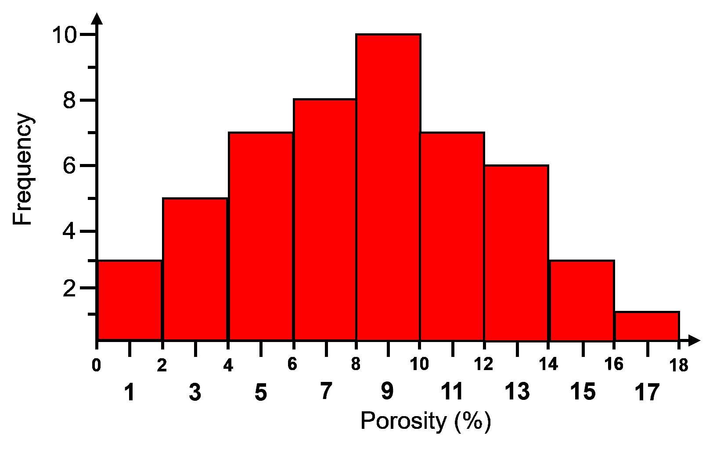

举例说明，孔隙率的直方图，宽度为 2%，从 0%到 18%的孔隙率，共 9 个区间。

## 归一化直方图

对于归一化直方图，频率通过除以样本总数 $n$ 来归一化到概率。

+   每个区间 $k$ 中存在结果的概率。

$$ 𝑝_𝑘 = \frac{𝑛_𝑘}{𝑛}, \quad \forall \quad 𝑘=1,\ldots,𝐾 $$

现在对于每个区间，我们都有概率：

$$ 0.0 \le 𝑝_𝑘 \le 1.0, \quad \forall \quad 𝑘=1,\dots,𝐾 $$

通过闭合，所有归一化直方图柱状宽度的总和为 1：

$$ \sum^{K}_{k=1} p_k = 1.0 $$

归一化直方图很方便，因为我们可以从图中读取概率。计算归一化直方图的步骤如下：

1.  将数据范围 ($x_{max} - x_{min}$) 划分为所需的柱状宽度/类别/类别数，$K$，对于连续特征：

$$ \Delta x = \left( \frac{X_{max}-x_{min}}{K} \right) $$

1.  计算柱状宽度中的数据数量，$n_k$，然后计算概率，其中 $n$ 是数据总数：

$$ 𝑝_𝑘 = \frac{𝑛_𝑘}{𝑛}, \quad \forall \quad 𝑘=1,\ldots,𝐾 $$

1.  绘制柱状宽度与中值范围的关系图，$\left( 𝑥_{𝑘,𝑚𝑖𝑛} + \frac{\Delta x}{2} \right)$，如果是连续的或者分类标签。

通常，条形图柱状宽度设置为 $\Delta x$，使得柱状宽度相接触并扩展到每个柱状宽度 $k$ 的整个范围 $𝑥_{𝑘,𝑚𝑖𝑛}$ 到 $𝑥_{𝑘,𝑚𝑖𝑛}$。

这是之前的直方图和相关的归一化直方图，

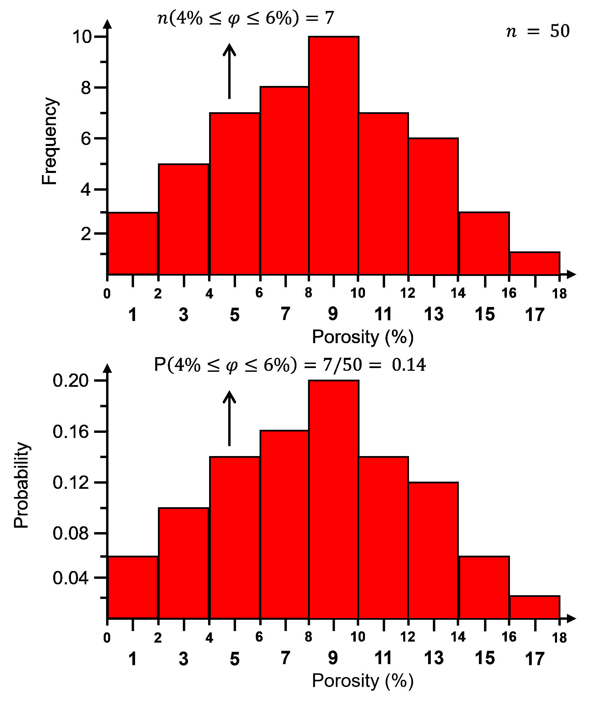

举例说明孔隙率的直方图和归一化直方图，宽度为 2%，从 0%到 18%的孔隙率，共有 9 个柱状宽度。归一化显示在单个柱状宽度中。

## 直方图柱状宽度

柱状宽度对有什么影响？

+   **过大的柱状宽度/过少的柱状宽度** - 通常会平滑，掩盖信息，缺乏分辨率

+   **过小的柱状宽度/过多的柱状宽度** - 过于嘈杂，每个柱状宽度中缺乏样本，无法稳定评估频率或概率（如果为归一化直方图）

一般建议选择最高分辨率且噪声最低的方案。

注意：非常大的和非常小的柱状宽度将趋向于每个柱状宽度中比例相等（所有样本在一个柱状宽度中或每个柱状宽度中一个样本）。

+   当柱状宽度接近极小或极大时，分布可能看起来接近均匀分布

## 概率密度函数 (PDF)

一个函数，$𝑓_x(𝑥)$，表示所有可能特征值范围的概率密度，$𝑥$，满足以下约束条件：

+   非负性，注意对于连续变量（特征）密度可能 $> 1.0$

$$ 0.0 \le f_x(x) $$

+   通过积分计算概率

$$ 0 \le \int^b_a f_x(𝑥)𝑑𝑥 = 𝑃(𝑎 \le 𝑥 \le 𝑏) \le 1.0 $$

+   闭合：

$$ \int^{\infty}_{-\infty} f_x(x)dx = 1.0 $$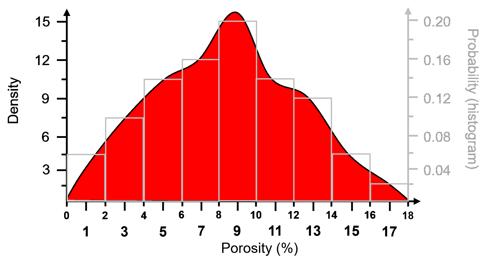

举例说明从 0%到 18%孔隙率的概率密度函数 (PDF)（红色）。归一化直方图（灰色）叠加进行比较（灰色次要 y 轴）。因为 PDF 的 y 轴是密度，归一化直方图的 y 轴是概率，所以使用了两个 y 轴。

对于分类特征，归一化直方图是 PDF。

一些关于使用和解释概率密度函数 $𝒇_x(𝒙)$ 中的密度度量的评论。

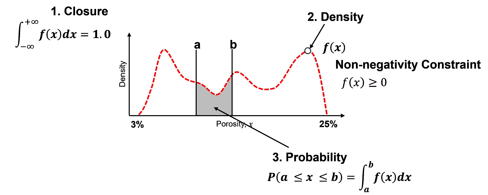

概率密度函数 (PDF) 约束的说明。

1.  **闭合** - PDF 曲线下的面积 $= 1.0$。

$$ \int^{\infty}_{-\infty} f_x(x)dx = 1.0 $$

1.  **密度** - 是相对可能性的度量，可能 $\gt 1.0$，但不能为负！

$$ f_x(x) \ge 0.0 $$

1.  **概率** - 只能通过在区间上对 PDF 进行积分来获得。

$$ P(a \le x \le b) = \int^b_a f_x(x) dx $$

为了测试你的知识，评估这些示意图 PDF 并确定哪些是不有效的。

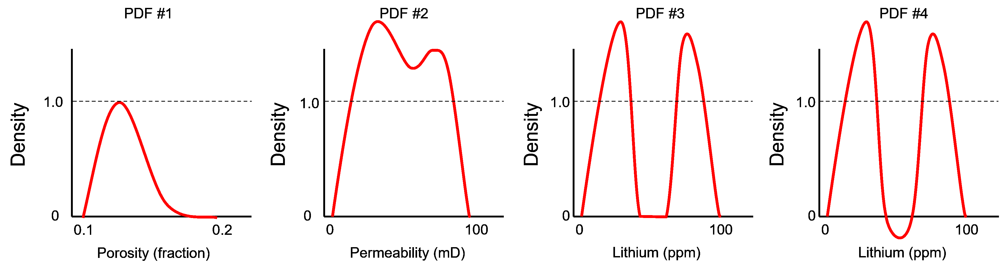

四个 PDF 示意图，从左到右分别是 1，2，3 和 4。

这里是解决方案，

1.  **不** - 曲线下方的面积粗略估计表明它远低于 1.0，例如假设为三角形形状。

$$ area_{triangle} = \frac{1}{2} \cdot w \cdot h = \frac{1}{2} \cdot 0.1 \cdot 1.0 = 0.05 << 1.0 $$

1.  **可能** - 只要所有可能的区间 [a,b] 都有有效的概率，曲线下的总面积为 1.0，并且看起来合理，密度可以大于一。

1.  **可能** - 密度可以大于一，只要所有可能的区间 [a,b] 都有有效的概率，曲线下的总面积为 1.0，并且看起来合理。

1.  **不** - 负密度表示区间 [a,b] 上的负概率。

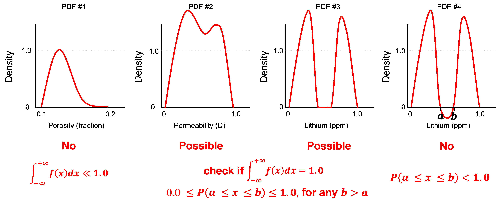

四个 PDF 示意图，从左到右分别是 1，2，3 和 4。

### 计算 PDF

对于参数化情况，PDF 的方程是已知的，但对于非参数情况，PDF 是从数据中计算得出的。

虽然可以通过对数据导出的累积分布函数（下文将讨论）进行微分来计算由数据导出的非参数 PDF，但通常这会太嘈杂！

计算数据导出 PDF 的常用方法是拟合一个平滑模型到数据上。核密度估计（KDE）方法，拟合平滑 PDF 到数据：

1.  用核替换所有数据，高斯是典型的。

1.  标准化结果以确保封闭性，

$$ \int^{\infty}_{-\infty} f_x(x)dx = 1.0 $$

改变核宽度有什么影响？

+   类似于改变直方图箱大小，尝试平滑噪声同时不删除信息

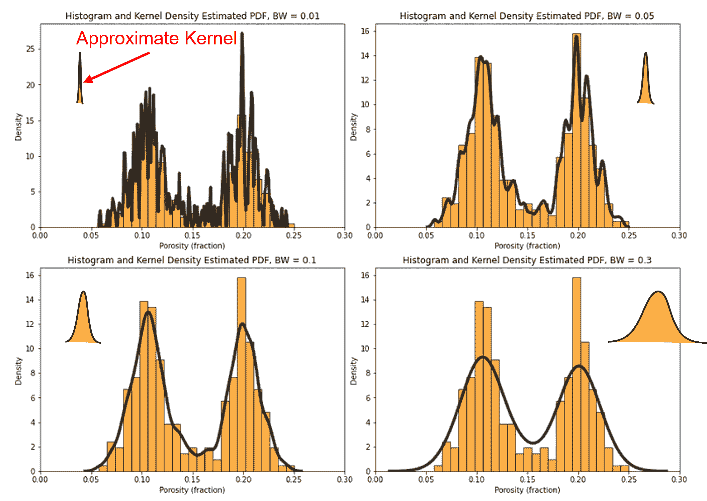

例如，具有不同核宽度的 PDF（黑色线）和归一化直方图（橙色）。

## 累积分布函数（CDF）

累积分布函数（CDF）是离散 PDF 的总和或连续 PDF 的积分。

+   累积分布函数 $𝑭_𝒙 (𝒙)$ 是随机样本 $𝑿$ 小于或等于值 $𝒙$ 的概率。

$$ F_x (x) = P(X \le x) = \int^x_{-\infty} f(u) du $$

+   CDF 表示为一条图，其中 x 轴是变量（特征）值，y 轴是累积概率。

+   对于 CDF 没有箱假设；因此，图形的分辨率与数据的分辨率相同。

+   单调不减函数，因为负斜率会表明区间上的负概率。

为了可视化 CDF，这里有一个归一化直方图的累积表示的插图。

+   将条形图添加到所有后续箱中

+   对于这个箱尺度 CDF，你可以计算这些而不是通常的数据尺度 CDF


从标准化直方图中绘制的累积分布函数（CDF）的示意图。

对从累积分布函数 $F_x(𝒙)$ 中提取和解释密度度量的一些评论。

为了检查给定这些约束的有效 CDF：

+   非负约束

$$ F_x(x) = P(X \le x) \ge 0.0, \quad \forall \quad x $$

有效概率：

$$ 0.0 \le F_x(x) \le 1.0, \quad \forall \quad x $$

+   不能有负斜率

$$ \frac{dF_x(x)}{dx} \ge 0.0, \quad \forall \quad x $$

+   最小值和最大值（封闭）：

$$ min(F_x(x)) = 0.0 \quad \quad max(F_x(x)) = 1.0 $$

+   由于 CDF 没有负斜率，我们可以使用极限：

$$ \lim\limits_{x \to -\infty} F_x(x) \rightarrow 0.0 \quad \quad \lim\limits_{x \to \infty} F_x(x) \rightarrow 1.0 $$

为了测试你的知识，评估这些示意图 CDF，并确定哪些不是有效的。

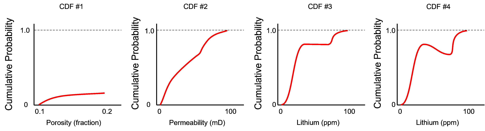

从左到右的四个累积分布函数（CDF）示意图，1、2、3 和 4。

这里是解决方案，

1.  **否** - CDF 在最大特征值处没有达到 1.0。

1.  **是** - 最小值是 0.0，最大值是 1.0，并且在整个渗透率值范围内斜率从未为负。

1.  **是** - 最小值是 0.0，最大值是 1.0，并且在渗透率值范围内斜率从未为负。零斜率区间是数据集中的间隙。

1.  **否** - 在锂值区间内存在负斜率，表示负概率。

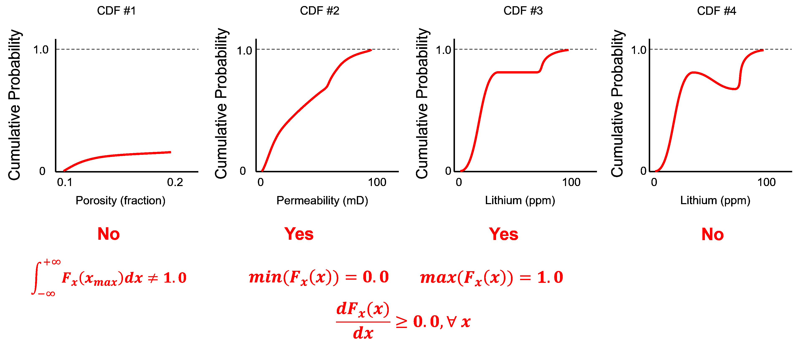

从左到右的四个累积分布函数（CDF）示意图，1、2、3 和 4，以及有效性评估。

仔细观察，上面的 CDF 来自前一个例子中的 PDF！

现在让我们用一个最后的例子来挑战自己，这是一个有效的 CDF 吗？


从左到右的四个累积分布函数（CDF）示意图，1、2、3 和 4。

这里是解决方案，

+   **是** - 这是一个数据尖峰，80% 的样本是 0.1，导致 CDF 中延伸了 0.8 累积概率的垂直段。


从左到右的四个累积分布函数（CDF）示意图，1、2、3 和 4，以及有效性评估。

## 随机变量

现在是介绍随机变量概念的时候了，因为我们需要这个来理解上面的 CDF 表示法。

+   **随机变量** - 我们不知道在某个位置/时间点的值，它可以取一系列可能的值，完全由统计分布 PDF/CDF 描述。它用大写变量表示，例如 $𝑿$，而可能的结果或数据度量用小写表示，例如 $𝒙$。稍后会更详细地介绍这一点！

## 加载所需的库

以下代码加载所需的库。

```py
import geostatspy.GSLIB as GSLIB          # GSLIB utilities, visualization and wrapper
import geostatspy.geostats as geostats    # GSLIB methods convert to Python 
```

我们还需要一些标准包。这些应该已经与 Anaconda 3 一起安装。

```py
import os                                                     # set working directory, run executables

from tqdm import tqdm                                         # suppress the status bar
from functools import partialmethod
tqdm.__init__ = partialmethod(tqdm.__init__, disable=True)

ignore_warnings = True                                        # ignore warnings?
import numpy as np                                            # ndarrays for gridded data
import pandas as pd                                           # DataFrames for tabular data
import matplotlib.pyplot as plt                               # for plotting
from matplotlib.ticker import (MultipleLocator, AutoMinorLocator) # control of axes ticks
from scipy import stats                                       # summary statistics
import seaborn as sns                                         # advanced plotting
plt.rc('axes', axisbelow=True)                                # plot all grids below the plot elements
if ignore_warnings == True:                                   
    import warnings
    warnings.filterwarnings('ignore')
from IPython.utils import io                                  # mute output from simulation
cmap = plt.cm.inferno                                         # color map 
```

## 定义函数

这是一个便利函数，用于添加主要和次要网格线以改善绘图可解释性。

```py
def add_grid():
    plt.gca().grid(True, which='major',linewidth = 1.0); plt.gca().grid(True, which='minor',linewidth = 0.2) # add y grids
    plt.gca().tick_params(which='major',length=7); plt.gca().tick_params(which='minor', length=4)
    plt.gca().xaxis.set_minor_locator(AutoMinorLocator()); plt.gca().yaxis.set_minor_locator(AutoMinorLocator()) # turn on minor ticks 
```

## 设置工作目录

我总是喜欢这样做，这样我就不会丢失文件，并且简化后续的读取和写入操作（每次都避免包含完整的地址）。

```py
#os.chdir("c:/PGE383")                                        # set the working directory 
```

## 加载表格数据

这是将逗号分隔的数据文件加载到 Pandas DataFrame 对象中的命令。为了好玩，尝试拼写错误。你会得到一个丑陋的长错误信息。

```py
df = pd.read_csv('sample_data_cow.csv')                       # load our data table (wrong name!) 
```

```py
---------------------------------------------------------------------------
FileNotFoundError  Traceback (most recent call last)
Cell In[5], line 1
----> 1 df = pd.read_csv('sample_data_cow.csv')

File C:\ProgramData\anaconda3\envs\MachineLearningBook\lib\site-packages\pandas\io\parsers\readers.py:912, in read_csv(filepath_or_buffer, sep, delimiter, header, names, index_col, usecols, dtype, engine, converters, true_values, false_values, skipinitialspace, skiprows, skipfooter, nrows, na_values, keep_default_na, na_filter, verbose, skip_blank_lines, parse_dates, infer_datetime_format, keep_date_col, date_parser, date_format, dayfirst, cache_dates, iterator, chunksize, compression, thousands, decimal, lineterminator, quotechar, quoting, doublequote, escapechar, comment, encoding, encoding_errors, dialect, on_bad_lines, delim_whitespace, low_memory, memory_map, float_precision, storage_options, dtype_backend)
  899 kwds_defaults = _refine_defaults_read(
  900     dialect,
  901     delimiter,
   (...)
  908     dtype_backend=dtype_backend,
  909 )
  910 kwds.update(kwds_defaults)
--> 912 return _read(filepath_or_buffer, kwds)

File C:\ProgramData\anaconda3\envs\MachineLearningBook\lib\site-packages\pandas\io\parsers\readers.py:577, in _read(filepath_or_buffer, kwds)
  574 _validate_names(kwds.get("names", None))
  576 # Create the parser.
--> 577 parser = TextFileReader(filepath_or_buffer, **kwds)
  579 if chunksize or iterator:
  580     return parser

File C:\ProgramData\anaconda3\envs\MachineLearningBook\lib\site-packages\pandas\io\parsers\readers.py:1407, in TextFileReader.__init__(self, f, engine, **kwds)
  1404     self.options["has_index_names"] = kwds["has_index_names"]
  1406 self.handles: IOHandles | None = None
-> 1407 self._engine = self._make_engine(f, self.engine)

File C:\ProgramData\anaconda3\envs\MachineLearningBook\lib\site-packages\pandas\io\parsers\readers.py:1661, in TextFileReader._make_engine(self, f, engine)
  1659     if "b" not in mode:
  1660         mode += "b"
-> 1661 self.handles = get_handle(
  1662     f,
  1663     mode,
  1664     encoding=self.options.get("encoding", None),
  1665     compression=self.options.get("compression", None),
  1666     memory_map=self.options.get("memory_map", False),
  1667     is_text=is_text,
  1668     errors=self.options.get("encoding_errors", "strict"),
  1669     storage_options=self.options.get("storage_options", None),
  1670 )
  1671 assert self.handles is not None
  1672 f = self.handles.handle

File C:\ProgramData\anaconda3\envs\MachineLearningBook\lib\site-packages\pandas\io\common.py:859, in get_handle(path_or_buf, mode, encoding, compression, memory_map, is_text, errors, storage_options)
  854 elif isinstance(handle, str):
  855     # Check whether the filename is to be opened in binary mode.
  856     # Binary mode does not support 'encoding' and 'newline'.
  857     if ioargs.encoding and "b" not in ioargs.mode:
  858         # Encoding
--> 859         handle = open(
  860             handle,
  861             ioargs.mode,
  862             encoding=ioargs.encoding,
  863             errors=errors,
  864             newline="",
  865         )
  866     else:
  867         # Binary mode
  868         handle = open(handle, ioargs.mode)

FileNotFoundError: [Errno 2] No such file or directory: 'sample_data_cow.csv' 
```

这就是 Python，但其中也有一定的规律。一般来说，错误会显示从初始命令到所有嵌套程序直到实际错误发生的轨迹。如果你正在调试代码（我知道，我现在有点跑题了），这对于找出出了什么问题非常有用。我曾经在 C++ 中调试了一个问题，这很有帮助。所以既然你在 Jupyter Notebook 中工作，程序就假设你在编写代码。好的。如果你滚动到错误的底部，你通常会得到一个总结语句 *FileNotFoundError: 文件 b’sample_data_cow.csv’不存在*。好的，现在你知道在当前工作目录中没有名为该名称的文件。

离开那个错误真的很痛苦，不是吗？每次我在制作这份文档时经过它，都想修复它。这是程序员的事情……当我们这样做的时候，注意如果你点击‘+’，你可以在任何地方添加一个新的块。好的，让我们正确拼写文件名，然后继续工作。

```py
df = pd.read_csv('https://raw.githubusercontent.com/GeostatsGuy/GeoDataSets/master/sample_data.csv') # load data from Dr. Pyrcz's github repository 
```

现在没有任何错误了！它成功了，我们已经将文件加载到名为‘df’的 DataFrame 中。但你怎么真正知道它成功了？可视化 DataFrame 总是作为第一级检查的好主意。

## 可视化 DataFrame

我们可以通过打印一个切片或利用‘head’ DataFrame 成员函数（以整洁的格式，见下文）来预览 DataFrame。通过切片，我们可以查看数据表的任何子集，通过使用 head 命令，添加参数‘n=13’来查看数据集的前 13 行。

```py
print(df.iloc[0:5,:])                                         # display first 4 samples in the table as a preview
df.head(n=13)                                                 # we could also use this command for a table preview 
```

```py
 X      Y  Facies  Porosity       Perm           AI
0  100.0  900.0     1.0  0.100187   1.363890  5110.699751
1  100.0  800.0     0.0  0.107947  12.576845  4671.458560
2  100.0  700.0     0.0  0.085357   5.984520  6127.548006
3  100.0  600.0     0.0  0.108460   2.446678  5201.637996
4  100.0  500.0     0.0  0.102468   1.952264  3835.270322 
```

|  | X | Y | 地层 | 孔隙率 | Perm | AI |
| --- | --- | --- | --- | --- | --- | --- |
| 0 | 100.0 | 900.0 | 1.0 | 0.100187 | 1.363890 | 5110.699751 |
| 1 | 100.0 | 800.0 | 0.0 | 0.107947 | 12.576845 | 4671.458560 |
| 2 | 100.0 | 700.0 | 0.0 | 0.085357 | 5.984520 | 6127.548006 |
| 3 | 100.0 | 600.0 | 0.0 | 0.108460 | 2.446678 | 5201.637996 |
| 4 | 100.0 | 500.0 | 0.0 | 0.102468 | 1.952264 | 3835.270322 |
| 5 | 100.0 | 400.0 | 0.0 | 0.110579 | 3.691908 | 5295.267191 |
| 6 | 100.0 | 300.0 | 0.0 | 0.088936 | 1.073582 | 6744.996106 |
| 7 | 100.0 | 200.0 | 0.0 | 0.102094 | 2.396189 | 5947.338115 |
| 8 | 100.0 | 100.0 | 1.0 | 0.137453 | 5.727603 | 5823.241783 |
| 9 | 200.0 | 900.0 | 1.0 | 0.137062 | 14.771314 | 5621.146994 |
| 10 | 200.0 | 800.0 | 1.0 | 0.125984 | 10.675436 | 4292.700500 |
| 11 | 200.0 | 700.0 | 0.0 | 0.121754 | 3.085825 | 5397.400218 |
| 12 | 200.0 | 600.0 | 0.0 | 0.095147 | 0.962565 | 4619.786478 |

## 表格数据的单变量统计摘要

表格包括 X 和 Y 坐标（米），地层 1 和 2（1 为砂岩，0 为夹层砂岩和泥岩），孔隙率（分数），渗透率以 Perm（mDarcy）表示，声阻抗以 AI（kg/m2s*10⁶）表示。

在 DataFrames 中从表格数据计算汇总统计量有许多高效的方法。`describe` 命令提供了一个包含计数、平均值、最小值、最大值和四分位数的数据表。我们使用 `transpose` 仅是为了翻转表格，使得特征在行上，而统计量在列上。

```py
df.describe()                                                 # summary statistics 
```

|  | X | Y | Facies | Porosity | Perm | AI |
| --- | --- | --- | --- | --- | --- | --- |
| count | 261.000000 | 261.000000 | 261.000000 | 261.000000 | 261.000000 | 261.000000 |
| mean | 629.823755 | 488.344828 | 0.620690 | 0.150357 | 183.711554 | 4203.657220 |
| std | 341.200403 | 166.669352 | 0.486148 | 0.049783 | 344.959449 | 1317.753146 |
| min | 40.000000 | 29.000000 | 0.000000 | 0.058871 | 0.033611 | 1844.166880 |
| 25% | 241.000000 | 416.000000 | 0.000000 | 0.104893 | 2.186525 | 2947.867713 |
| 50% | 700.000000 | 479.000000 | 1.000000 | 0.137062 | 19.977020 | 4204.150893 |
| 75% | 955.000000 | 539.000000 | 1.000000 | 0.199108 | 246.215865 | 5397.400218 |
| max | 1005.000000 | 989.000000 | 1.000000 | 0.242298 | 2642.999829 | 7881.898531 |

我们还可以使用嵌入在 NumPy ndarrays 中的各种统计摘要。当我们使用命令时：

```py
df['Porosity']                       # returns an Pandas series
df['Porosity'].values                # returns an ndarray 
```

Pandas 的 DataFrame 返回所有孔隙率数据作为一个序列，如果我们添加‘values’，它返回一个 NumPy ndarray，我们就可以访问许多 NumPy 方法。我也喜欢使用 `round` 函数将答案四舍五入到有限位数，以便精确报告精度并便于阅读。

例如，现在我们可以使用这样的命令：

```py
print('The minimum is ' + str(round((df['Porosity'].values).min(),2)) + '.') # print univariate statistics
print('The maximum is ' + str(round((df['Porosity'].values).max(),2)) + '.')
print('The mean is ' + str(round((df['Porosity'].values).mean(),2)) + '.')
print('The standard deviation is ' + str(round((df['Porosity'].values).std(),2)) + '.') 
```

```py
The minimum is 0.06.
The maximum is 0.24.
The mean is 0.15.
The standard deviation is 0.05. 
```

这里有一些 NumPy 统计函数，它们接受 ndarrays 作为输入。使用这些方法，如果你有一个多维数组，你可以按行（axis = 1）或按列（axis = 0）或在整个数组上（未指定轴）计算平均值。我们只有一个一维 ndarray，所以这里不适用。

我们使用 Numpy 百分比函数计算 CDF 的逆，$F^{-1}_x(x)$。

```py
print('The minimum is ' + str(round(np.amin(df['Porosity'].values),2))) # print univariate statistics
print('The maximum is ' + str(round(np.amax(df['Porosity'].values),2)))
print('The range (maximum - minimum) is ' + str(round(np.ptp(df['Porosity'].values),2)))
print('The P10 is ' + str(round(np.percentile(df['Porosity'].values,10),3)))
print('The P50 is ' + str(round(np.percentile(df['Porosity'].values,50),3)))
print('The P90 is ' + str(round(np.percentile(df['Porosity'].values,90),3)))
print('The P13 is ' + str(round(np.percentile(df['Porosity'].values,13),3)))
print('The median (P50) is ' + str(round(np.median(df['Porosity'].values),3)))
print('The mean is ' + str(round(np.mean(df['Porosity'].values),3))) 
```

```py
The minimum is 0.06
The maximum is 0.24
The range (maximum - minimum) is 0.18
The P10 is 0.092
The P50 is 0.137
The P90 is 0.212
The P13 is 0.095
The median (P50) is 0.137
The mean is 0.15 
```

我们可以直接从数据计算累积分布函数（CDF）值，$F_x(x)$。

+   我们在我们的 ndarray 上应用一个条件语句来计算一个与数据大小相同的布尔 ndarray，然后计算满足条件的案例数量。

+   注意，我们假设权重相等

```py
value = 0.10                                                  # calculate cumulative distribution function for a specified value
cumul_prob = np.count_nonzero(df['Porosity'].values <= value)/len(df)
print('The cumulative probability for porosity = ' + str(value) + ' is ' + str(round(cumul_prob,2))) 
```

```py
The cumulative probability for porosity = 0.1 is 0.18 
```

## 加权单变量统计

在去簇章节中，我介绍了计算权重和加权统计动机的方法。

+   NumPy 命令 `average` 允许加权平均值，如统计期望和去簇统计的情况。

+   为了演示，让我们创建一个权重数组并应用它。

```py
nd = len(df)                                                  # get the number of data values
wts = np.ones(nd)                                             # make an array of nd length of 1's
print('The equal weighted average is ' + str(round(np.average(df['Porosity'].values,weights = wts),3)) + ', the same as the mean above.') 
```

```py
The equal weighted average is 0.15, the same as the mean above. 
```

让我们变得复杂一些，我们将修改权重，如果孔隙率大于 13%，则权重为 0.5，如果孔隙率小于或等于 13%，则保留 1.0。结果应该是一个较低的加权平均值。

```py
porosity = df['Porosity'].values     
wts[porosity > 0.13] *= 0.1                                   # make arbitrary weights for demonstration
print('The equal weighted average is ' + str(round(np.average(df['Porosity'].values,weights = wts),3)) + ', lower than the equal weighted average above.') 
```

```py
The equal weighted average is 0.112, lower than the equal weighted average above. 
```

我应该指出，SciPy 统计函数提供了一个方便的汇总统计函数。输出是一个值“列表”（实际上它是一个 SciPy.DescribeResult 对象）。可以从中提取任何一个用于工作流程，如下所示。

```py
print(stats.describe(df['Porosity'].values))                  # summary statistics
por_stats = stats.describe(df['Porosity'].values)             # store as an array
print('Porosity kurtosis is ' + str(round(por_stats[5],2)))   # extract a statistic 
```

```py
DescribeResult(nobs=261, minmax=(0.0588710426408954, 0.2422978845362023), mean=0.15035706160196555, variance=0.0024783238419715933, skewness=0.08071652694567066, kurtosis=-1.5618166076333853)
Porosity kurtosis is -1.56 
```

## 直方图

让我们显示一些直方图。我重新实现了 GSLIB 中的 hist 函数。通过不带参数输入命令来预览参数。

+   还可以通过在函数括号中的光标处使用 alt-tab 键组合来了解函数参数。

```py
GSLIB.hist 
```

```py
<function geostatspy.GSLIB.hist(array, xmin, xmax, log, cumul, bins, weights, xlabel, title, fig_name)> 
```

让我们为孔隙率特征制作一个直方图。

```py
pormin = 0.05; pormax = 0.25                                  # minimum and maximum feature values
GSLIB.hist_st(df['Porosity'].values,pormin,pormax,log=False,cumul = False,bins=10,weights = None,
           xlabel='Porosity (fraction)',title='Porosity Well Data')
add_grid()
plt.subplots_adjust(left=0.0, bottom=0.0, right=1.0, top=1.1, wspace=0.1, hspace=0.2); plt.show() 
```

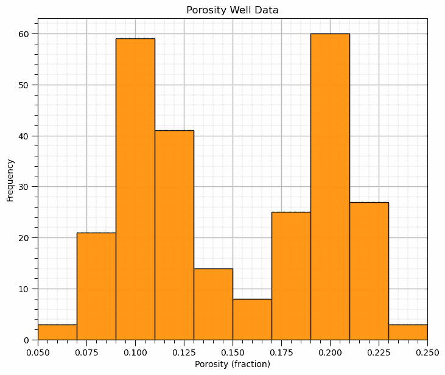

这里发生了什么？看起来相当双峰。

## 直方图区间、区间数量和区间大小

让我们通过几个区间大小来探索对直方图的影响。

```py
nbin_list = [3,20,100]                                             # number of bins for each histogram

for i,nbin in enumerate(nbin_list):
    plt.subplot(1,3,i+1)
    GSLIB.hist_st(df['Porosity'].values,pormin,pormax,log=False,cumul = False,bins=nbin,weights = None,
                  xlabel='Porosity (fraction)',title='Histogram with ' + str(nbin) + ' Bins'); add_grid()

plt.subplots_adjust(left=0.0, bottom=0.0, right=3.0, top=1.1, wspace=0.2, hspace=0.2); plt.show() 
```

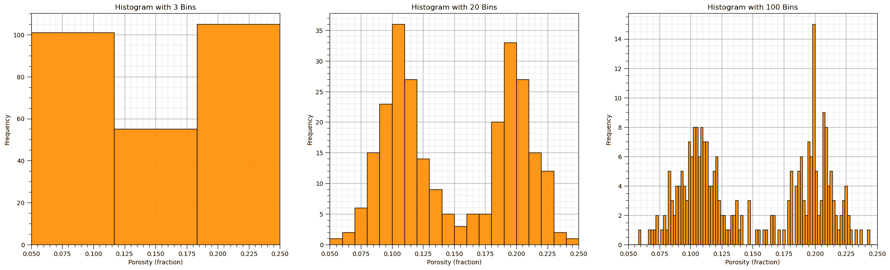

当我们使用以下方法时，看看会发生什么：

+   **过大的区间/过少的区间** - 通常平滑，去除了信息。

+   **过小的区间/过多的区间** - 通常太嘈杂，掩盖了信息。

## 使用 matplotlib 包绘制直方图

我不想建议 matplotlib 难以使用。GSLIB 的可视化提供了便利，并且再次使用了与 GSLIB 方法相同的参数。特别是，'hist'函数相当容易使用，只是需要编写更多的代码。

+   这是如何使用 matplotlib 直接制作与上面相同的直方图的。

```py
plt.hist(df['Porosity'].values,alpha=0.8,color="darkorange",edgecolor="black",bins=20,range=[pormin,pormax])
plt.title('Histogram'); plt.xlabel('Porosity (fraction)'); plt.ylabel("Frequency"); add_grid()
plt.subplots_adjust(left=0.0, bottom=0.0, right=1.0, top=1.1, wspace=0.1, hspace=0.2); plt.show() 
```

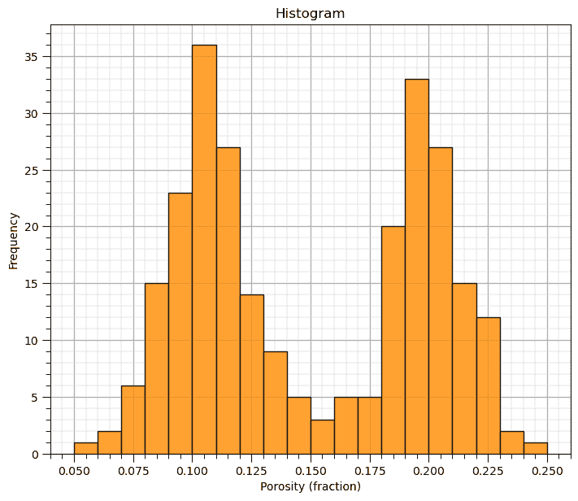

现在我们可以使用 matplotlib 演示归一化直方图。

+   我没有将此功能添加到 GeostatsPy 的 hist 函数中。

## 归一化直方图

归一化直方图很方便，因为我们可以在每个区间读取概率，并通过将所有区间的概率相加来观察总和为 1.0 的封闭性。

+   为了做到这一点，我们需要明确地为每个数据设置权重为 $\frac{1}{n}$（假设权重相等）。

```py
weights = np.ones(len(df)) / len(df)
plt.hist(df['Porosity'].values,alpha=0.8,color="darkorange",edgecolor="black",bins=25,range=[pormin,pormax],weights=weights)
plt.title('Normalized Histogram'); plt.xlabel('Porosity (fraction)'); plt.ylabel("Probability"); add_grid()
plt.subplots_adjust(left=0.0, bottom=0.0, right=1.0, top=1.1, wspace=0.1, hspace=0.2); plt.show() 
```

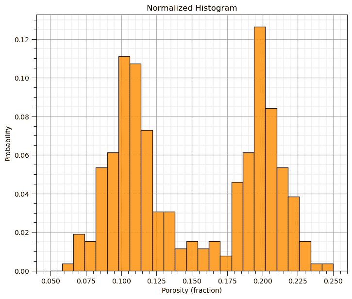

## 概率密度函数

从数据计算概率密度函数（PDF）的实用方法是使用核密度估计（KDE）。

+   我们在每个数据值处放置一个核，在这种情况下是一个参数化的高斯 PDF，然后计算所有数据核的总和。

+   为了使曲线下的面积等于 1.0，对区间进行了约束。

+   对数据累积分布函数（CDF）进行微分通常太嘈杂，无法使用。

为了演示核密度估计（KDE）方法，我们计算了前 2、5、…、200 个数据的 KDE PDF。

+   当数据非常少时，你可以看到单个高斯核。

+   随着数据的增加，它们开始变得平滑。

```py
nums=[2,4,10,20,50,200]

for i, num in enumerate(nums):
    plt.subplot(2,3,i+1)
    sns.kdeplot(x=df['Porosity'].values[:num],color = 'black',alpha = 1.0,linewidth=3,bw_method=0.1,fill=False,zorder=10)
    sns.kdeplot(x=df['Porosity'].values[:num],color = 'darkorange',alpha = 1.0,linewidth=3,bw_method=0.1,fill=True,zorder=1)
    plt.xlim([0,0.30]); add_grid()
    plt.title('KDE PDF for First ' + str(num) + ' Data'); plt.xlabel('Porosity (fraction)'); plt.ylabel("Density")
plt.subplots_adjust(left=0.0, bottom=0.0, right=3.0, top=2.1, wspace=0.1, hspace=0.2); plt.show() 
```

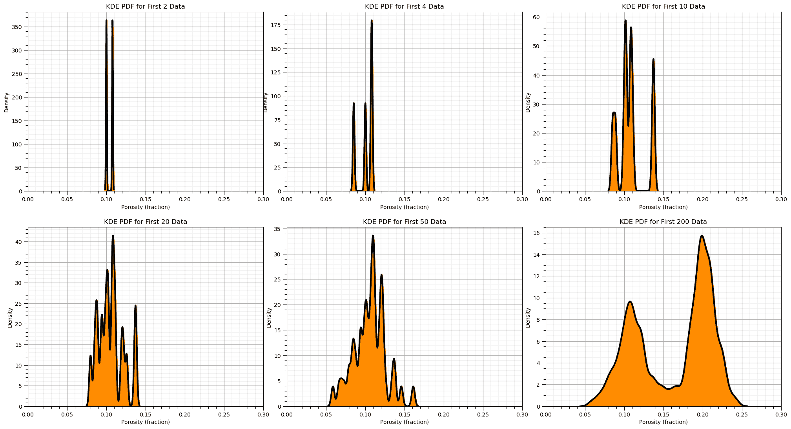

现在我们可以使用 Seaborn Python 包来计算并绘制我们的数据的 PDF。

```py
plt.hist(df['Porosity'].values,alpha=0.7,color="darkorange",edgecolor="black",bins=25,range=[pormin,pormax],density=True,
         label = 'Normalized Histogram')
sns.kdeplot(x=df['Porosity'].values,color = 'black',alpha = 0.8,linewidth=4.0,bw_method=0.10,label = 'PDF')
plt.title('Histogram and Kernel Density Estimated PDF'); plt.xlabel('Porosity (fraction)'); plt.ylabel("Density")
plt.legend(loc='upper left'); add_grid()
plt.subplots_adjust(left=0.0, bottom=0.0, right=1.0, top=1.0, wspace=0.1, hspace=0.2); plt.show() 
```

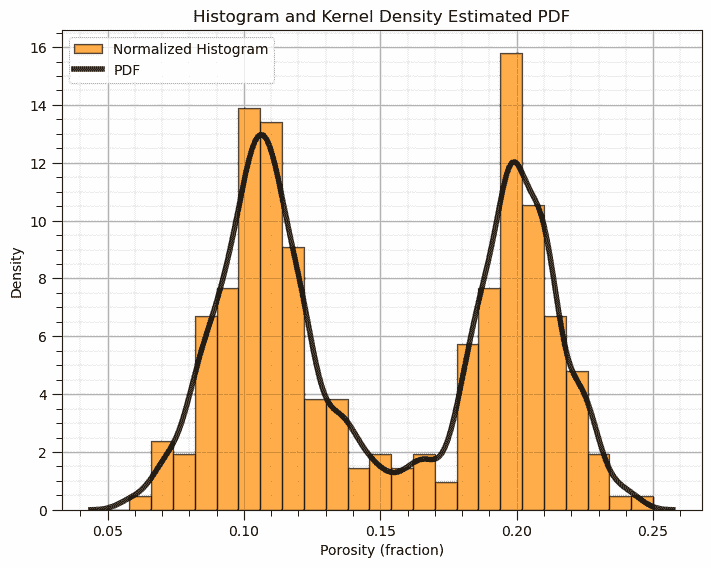

改变核宽度对 KDE PDF 模型有什么影响？

+   让我们遍历各种核大小，并观察数据直方图的结果 PDF。

+   注意，核宽度由带宽控制，但在 Seaborn 中带宽参数的文档描述不佳，似乎与原始标准差有关。我的假设是核标准差是带宽和特征标准差的乘积。

```py
for i, bw in enumerate([0.01,0.05,0.1,0.3]):
    plt.subplot(2,2,i+1)
    print(r'Band Width = ' + str(bw) + r', bandwidth x standard deviation = ' + str(bw*np.std(df['Porosity'])) )
    plt.hist(df['Porosity'].values,alpha=0.7,color="darkorange",edgecolor="black",bins=25,range=[pormin,pormax],density=True)
    sns.kdeplot(x=df['Porosity'].values,color = 'black',alpha = 0.8,linewidth=4.0,bw_method=bw)
    plt.xlim([0.0,0.3])
    plt.title('Histogram and Kernel Density Estimated PDF, BW = ' + str(bw)); plt.xlabel('Porosity (fraction)'); plt.ylabel("Density")

plt.subplots_adjust(left=0.0, bottom=0.0, right=2.0, top=2.1, wspace=0.1, hspace=0.2); plt.show() 
```

```py
Band Width = 0.01, bandwidth x standard deviation = 0.0004968730570602708
Band Width = 0.05, bandwidth x standard deviation = 0.0024843652853013543
Band Width = 0.1, bandwidth x standard deviation = 0.0049687305706027085
Band Width = 0.3, bandwidth x standard deviation = 0.014906191711808122 
```

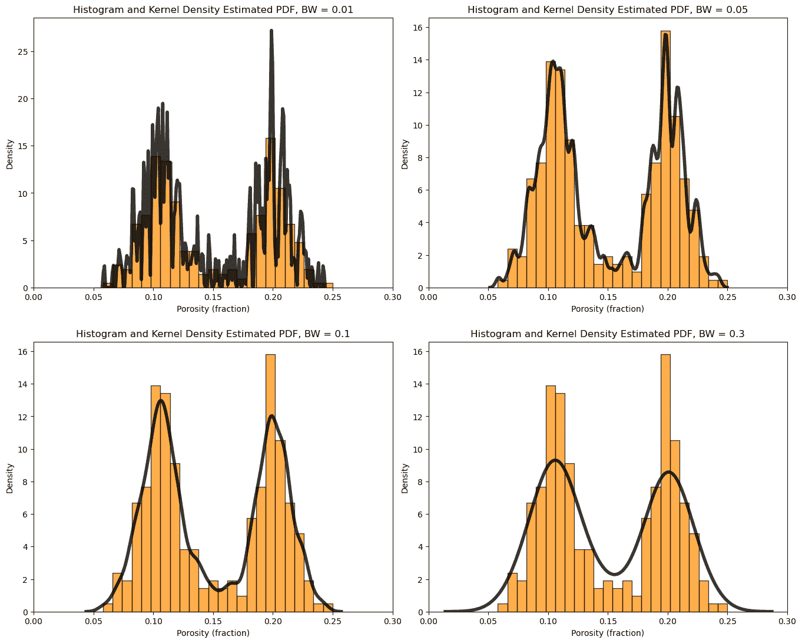

## 累积分布函数

GeostatsPy 中的此方法创建累积直方图。

+   你可以增加或减少箱子的数量，$> n$ 是数据分辨率

```py
GSLIB.hist_st(df['Porosity'].values,pormin,pormax,log=False,cumul = True,bins=1000,weights = None, # CDF with GeostatsPy
           xlabel='Porosity (fraction)',title='Cumulative Distribution Function with Cumulative Histogram'); add_grid()
plt.subplots_adjust(left=0.0, bottom=0.0, right=1.0, top=1.1, wspace=0.1, hspace=0.2); plt.show() 
```

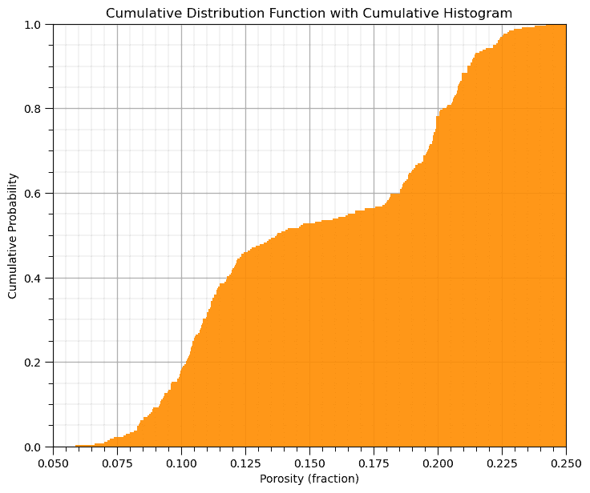

## 使用 Matplotlib 包绘制 CDF

这就是如何使用 matplotlib 计算和绘制 CDF 的方法。

+   y 轴是累积概率，最小值为 0.0，最大值为 1.0，正如预期的那样，对于 CDF 来说。

+   注意，在初始 hist 命令之后，我们可以添加各种元素，如标签，到我们的图中，如下所示。

```py
plt.hist(df['Porosity'].values,density=True, cumulative=True, label='CDF',
           histtype='stepfilled', alpha=0.8, bins = 100, color='darkorange', edgecolor = 'black', range=[0.0,0.25])
plt.xlabel('Porosity (fraction)'); plt.title('Porosity CDF'); plt.ylabel('Cumulation Probability'); add_grid()
plt.subplots_adjust(left=0.0, bottom=0.0, right=1.0, top=1.0, wspace=0.1, hspace=0.2); plt.xlim([pormin,pormax]); plt.ylim([0,1])
#plt.savefig('cdf_Porosity.tif',dpi=600,bbox_inches="tight")
plt.show() 
```

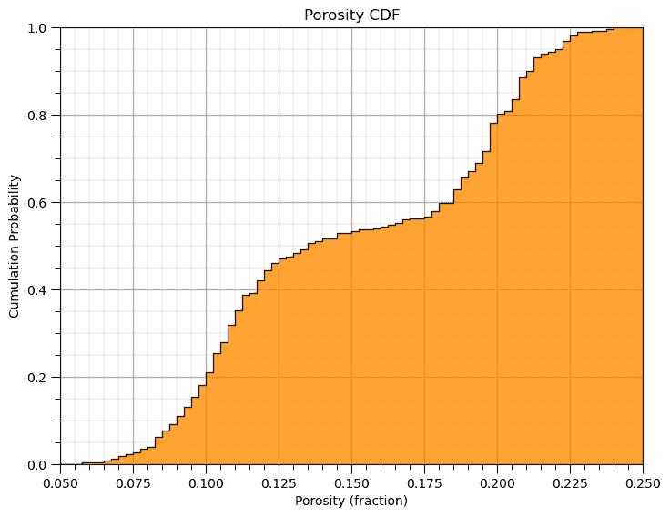

## 手动计算和绘制 CDF

让我们手动演示非参数累积分布函数（CDF）的计算和绘图。

1.  将特征复制为 1D 数组（来自 NumPy 的 ndarray）

1.  按升序排序数据

1.  根据尾部假设分配累积概率。

1.  绘制累积概率与特征值的关系图

```py
por = df['Porosity'].copy(deep = True).values                 # make a deep copy of the feature from the DataFrame
print('The ndarray has a shape of ' + str(por.shape) + '.')

por = np.sort(por)                                            # sort the data in ascending order
n = por.shape[0]                                              # get the number of data samples
cprob = np.zeros(n)
for i in range(0,n):
    index = i + 1
    cprob[i] = index / n                                      # known upper tail
    # cprob[i] = (index - 1)/n                                # known lower tail
    # cprob[i] = (index - 1)/(n - 1)                          # known upper and lower tails
    # cprob[i] = index/(n+1)                                  # unknown tails 

plt.subplot(111)
plt.plot(por,cprob, alpha = 0.8, c = 'black',zorder=1) # plot piecewise linear interpolation
plt.scatter(por,cprob,s = 20, alpha = 1.0, c = 'darkorange', edgecolor = 'black',zorder=2) # plot the CDF points
plt.xlim([pormin,pormax]); plt.ylim([0.0,1.0]); add_grid()
plt.xlabel("Porosity (fraction)"); plt.ylabel("Cumulative Probability"); plt.title("Cumulative Distribution Function")

plt.subplots_adjust(left=0.0, bottom=0.0, right=1.0, top=1.1, wspace=0.1, hspace=0.2); plt.show() 
```

```py
The ndarray has a shape of (261,). 
```

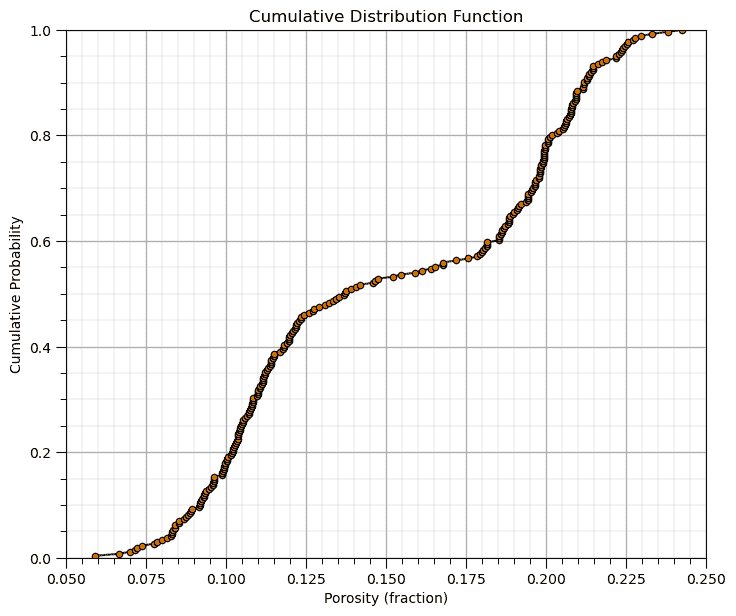

总之，让我们以所有特征的直方图结束！

```py
permmin = 0.01; permmax = 3000;                # user specified min and max
AImin = 1000.0; AImax = 8000
Fmin = 0; Fmax = 1

plt.subplot(221)
GSLIB.hist_st(df['Facies'].values,Fmin,Fmax,log=False,cumul = False,bins=20,weights = None,xlabel='Facies (1-sand, 0-shale)',
              title='Facies Well Data'); add_grid()

plt.subplot(222)
GSLIB.hist_st(df['Porosity'].values,pormin,pormax,log=False,cumul = False,bins=20,weights = None,xlabel='Porosity (fraction)',
              title='Porosity Well Data'); add_grid()

plt.subplot(223)
GSLIB.hist_st(df['Perm'].values,permmin,permmax,log=False,cumul = False,bins=20,weights = None,xlabel='Permeability (mD)',
              title='Permeability Well Data'); add_grid()

plt.subplot(224)
GSLIB.hist_st(df['AI'].values,AImin,AImax,log=False,cumul = False,bins=20,weights = None,xlabel='Acoustic Impedance (kg/m2s*10⁶)',
              title='Acoustic Impedance Well Data'); add_grid()

plt.subplots_adjust(left=0.0, bottom=0.0, right=2.0, top=2.1, wspace=0.1, hspace=0.2)
#plt.savefig('hist_Porosity_Multiple_bins.tif',dpi=600,bbox_inches="tight")
plt.show() 
```

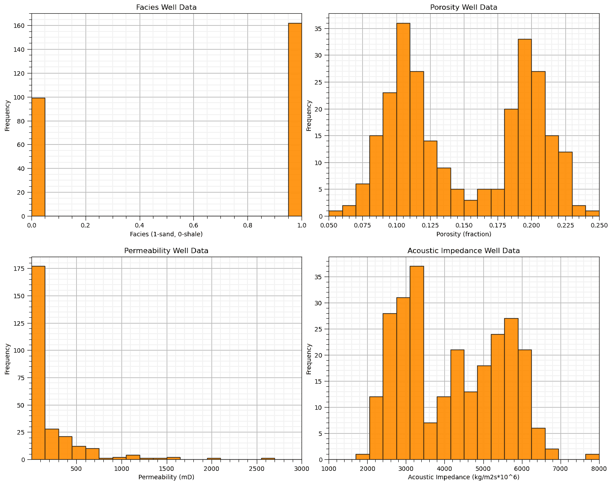

## 评论

这是对单变量分析的基本处理。可以做和讨论的还有很多，我有很多更多的资源。查看我的[共享资源清单](https://michaelpyrcz.com/my-resources)以及本章开头带有资源链接的 YouTube 讲座链接。

希望这有所帮助，

*迈克尔*

## 关于作者


迈克尔·皮尔茨教授在德克萨斯大学奥斯汀分校的 40 英亩校园办公室。

迈克尔·皮尔茨是德克萨斯大学奥斯汀分校 [Cockrell 工程学院](https://cockrell.utexas.edu/faculty-directory/alphabetical/p) 和 [Jackson 地球科学学院](https://www.jsg.utexas.edu/researcher/michael_pyrcz/) 的教授，他在那里研究并教授地下、空间数据分析、地统计学和机器学习。迈克尔还是，

+   [Energy Analytics](https://fri.cns.utexas.edu/energy-analytics)新生研究项目的首席研究员，以及德克萨斯大学奥斯汀分校自然科学院机器学习实验室的核心教员

+   [Computers and Geosciences](https://www.sciencedirect.com/journal/computers-and-geosciences/about/editorial-board)的副编辑，以及国际数学地球科学协会[Mathematical Geosciences](https://link.springer.com/journal/11004/editorial-board)的董事会成员。

迈克尔已经撰写了 70 多篇[同行评审出版物](https://scholar.google.com/citations?user=QVZ20eQAAAAJ&hl=en)，一个用于空间数据分析的[Python 包](https://pypi.org/project/geostatspy/)，合著了一本关于空间数据分析的教科书[Geostatistical Reservoir Modeling](https://www.amazon.com/Geostatistical-Reservoir-Modeling-Michael-Pyrcz/dp/0199731446)，并是两本最近发布的电子书的作者，[Applied Geostatistics in Python: a Hands-on Guide with GeostatsPy](https://geostatsguy.github.io/GeostatsPyDemos_Book/intro.html)和[Applied Machine Learning in Python: a Hands-on Guide with Code](https://geostatsguy.github.io/MachineLearningDemos_Book/intro.html)。

迈克尔的所有大学讲座都可以在他的[YouTube 频道](https://www.youtube.com/@GeostatsGuyLectures)上找到，其中包含 100 多个 Python 交互式仪表板和 40 多个 GitHub 账户上的详细工作流程，这些工作流程在他的[GitHub 账户](https://github.com/GeostatsGuy)上，以支持任何感兴趣的学生和在职专业人士，提供常青内容。想了解更多关于迈克尔的工作和共享教育资源，请访问他的网站。

## 想一起工作吗？

我希望这些内容对那些想了解更多关于地下建模、数据分析和学习的人来说有帮助。学生和在职专业人士都欢迎参加。

+   想邀请我到贵公司进行培训、辅导、项目审查、工作流程设计和/或咨询吗？我很乐意拜访并与您合作！

+   想要合作、支持我的研究生研究或我的地下数据分析与机器学习联盟（共同负责人包括 Foster 教授、Torres-Verdin 教授和 van Oort 教授）吗？我的研究将数据分析、随机建模和机器学习理论与实践相结合，以开发新的方法和工作流程，增加价值。我们正在解决具有挑战性的地下问题！

+   我可以通过 mpyrcz@austin.utexas.edu 联系到。

我总是很高兴讨论，

*迈克尔*

迈克尔·皮尔茨，博士，P.Eng. 教授，德克萨斯大学奥斯汀分校的 Cockrell 工程学院和 Jackson 地球科学学院

更多资源可在以下链接获取：[Twitter](https://twitter.com/geostatsguy) | [GitHub](https://github.com/GeostatsGuy) | [网站](http://michaelpyrcz.com) | [Google Scholar](https://scholar.google.com/citations?user=QVZ20eQAAAAJ&hl=en&oi=ao) | [地统计学书籍](https://www.amazon.com/Geostatistical-Reservoir-Modeling-Michael-Pyrcz/dp/0199731446) | [YouTube](https://www.youtube.com/channel/UCLqEr-xV-ceHdXXXrTId5ig) | [Python 中应用地统计学电子书](https://geostatsguy.github.io/GeostatsPyDemos_Book/intro.html) | [Python 中应用机器学习电子书](https://geostatsguy.github.io/MachineLearningDemos_Book/) | [LinkedIn](https://www.linkedin.com/in/michael-pyrcz-61a648a1)

## 一元分析的动力

在机器学习电子书中包含一元分析有许多原因：

+   一元统计用于使用机器学习模型进行训练、调整和预测，例如，回归的决策树预测是叶节点中训练数据的平均值，分类决策树在叶节点中使用训练数据的众数进行预测，模型通常训练以最小化平方误差的均值，

+   直方图、概率密度函数和累积分布函数在机器学习工作流程中应用，例如，评估聚类组之间特征值的重叠，检查预测模型误差分布中的偏差等。

+   一元分析是二元和多变量分析的前提，这些分析对于特征选择、模型计算和模型检查至关重要

+   此外，这也为我们提供了更多重要的工具来绘制和检查我们的工作流程中的步骤。在实践中，我总是绘制和检查一元分布，或者至少检查预测的均值以检查无偏性。

## 定义

让我们从一元、二元和多变量的基本定义开始。 

+   **一元** - 涉及一个变量（特征）或事件。

+   **一元统计分析** - 基于样本中一个特征测量的汇总度量

+   **一元参数** - 从对总体中测量的一个特征推断出的汇总度量

我们从一元分析开始，但稍后我们将涵盖涉及两个变量（特征）的二元分析。注意，联合概率和分布是：

+   **二元** - 关于两个变量（特征）

+   **多元** - $> 1$ 个特征的通用术语，但通常指的是 $\ge 3$ 或更多)。

+   **大规模多元** - 高维，通常表示 7 个或更多特征

现在，让我们描述一下分布的概念。

+   **统计分布** – 对于一个变量（特征），描述其在可能值范围内的发生概率。我们从统计分布中得到什么？

    +   最小值和最大值是多少？

    +   我们是否有大量低值？

    +   我们是否有大量高值？

    +   我们是否有异常值（不合理且需要解释的值）？

## 直方图

直方图是一组区间或类别的频率条形图。直方图的计算步骤如下：

1.  将可能的连续特征值范围划分为$K$个等大小的区间，∆𝑥，或类别，

$$ \Delta x = \left( \frac{X_{max}-x_{min}}{K} \right) $$

1.  计算每个区间中的样本数量（频率），$𝑛_(𝑘),\quad \forall 𝑘=1,\ldots,𝐾$.

1.  如果是连续的，则绘制区间概率与中间范围，$\left( 𝑥_{𝑘,𝑚𝑖𝑛} + \frac{\Delta x}{2} \right)$或分类标签的对比图。

通常，条形图的区间宽度设置为$\Delta x$，使得条形图接触并延伸到每个区间，$k$，的整个范围从$𝑥_{𝑘,𝑚𝑖𝑛}$到$𝑥_{𝑘,𝑚𝑖𝑛}$。

这里是一个示例直方图，


以下是孔隙率的示例直方图，宽度为 2%，共有 9 个区间，从 0%到 18%的孔隙率。

## 归一化直方图

对于归一化直方图，频率通过除以样本总数$n$进行归一化。

+   每个区间中存在结果的概率，𝑘。

$$ 𝑝_𝑘 = \frac{𝑛_𝑘}{𝑛}, \quad \forall \quad 𝑘=1,\ldots,𝐾 $$

现在对于每个区间，我们有一个概率：

$$ 0.0 \le 𝑝_𝑘 \le 1.0, \quad \forall \quad 𝑘=1,\dots,𝐾 $$

通过闭合，所有归一化直方图区间的和为 1：

$$ \sum^{K}_{k=1} p_k = 1.0 $$

归一化直方图很方便，因为我们可以从图中读取概率。计算归一化直方图的步骤如下：

1.  将数据范围（$x_{max} - x_{min}$）划分为所需数量的区间/类别/类别，$K$，对于连续特征：

$$ \Delta x = \left( \frac{X_{max}-x_{min}}{K} \right) $$

1.  计算区间中的数据数量，$n_k$，然后计算概率，其中$n$是数据总数：

$$ 𝑝_𝑘 = \frac{𝑛_𝑘}{𝑛}, \quad \forall \quad 𝑘=1,\ldots,𝐾 $$

1.  如果是连续的，则绘制区间概率与中间范围，$\left( 𝑥_{𝑘,𝑚𝑖𝑛} + \frac{\Delta x}{2} \right)$或分类标签的对比图。

通常，条形图的区间宽度设置为$\Delta x$，使得条形图接触并延伸到每个区间，$k$，的整个范围从$𝑥_{𝑘,𝑚𝑖𝑛}$到$𝑥_{𝑘,𝑚𝑖𝑛}$。

这里是之前的直方图和相关的归一化直方图，


以下是孔隙率的示例直方图和归一化直方图，宽度为 2%，共有 9 个区间，从 0%到 18%的孔隙率。归一化显示在单个区间中。

## 直方图区间大小

区间大小的影响是什么？

+   **区间过大/区间过少** - 通常会平滑，掩盖信息，缺乏分辨率

+   **区间过小/区间过多** - 过于嘈杂，每个区间缺乏样本，无法稳定评估频率或概率（如果为归一化直方图）

一般指导原则是选择尽可能高分辨率且噪声最低的分辨率。

注意：非常大的和非常小的区间倾向于在各个区间中达到相等比例（所有样本在一个区间中或每个区间一个样本）。

+   当区间大小接近极端过小或过大时，分布可能看起来接近均匀分布

## 概率密度函数（PDF）

一个函数，$𝑓_x(𝑥)$，表示所有可能的特征值范围$𝑥$的概率密度，具有以下约束：

+   非负性，注意对于连续变量（特征）密度可能大于 1.0

$$ 0.0 \le f_x(x) $$

+   通过积分计算概率

$$ 0 \le \int^b_a f_x(𝑥)𝑑𝑥 = 𝑃(𝑎 \le 𝑥 \le 𝑏) \le 1.0 $$

+   闭合：

$$ \int^{\infty}_{-\infty} f_x(x)dx = 1.0 $$

从 0%到 18%孔隙率的孔隙率的示例概率密度函数（PDF）（红色）。归一化直方图（灰色）叠加进行比较（灰色次要 y 轴）。由于 PDF 的 y 轴是密度，而归一化直方图的 y 轴是概率，因此使用了两个 y 轴。

对于分类特征，归一化直方图是 PDF。

关于从概率密度函数中处理和解释密度度量的几点评论，$𝒇_x(𝒙)$。


概率密度函数（PDF）约束的插图。

1.  **闭合** - PDF 曲线下的面积 $= 1.0$.

$$ \int^{\infty}_{-\infty} f_x(x)dx = 1.0 $$

1.  **密度** - 是相对可能性的度量，可能大于 1.0，但不能为负！

$$ f_x(x) \ge 0.0 $$

1.  **概率** - 只有通过在区间上对 PDF 进行积分才能获得。

$$ P(a \le x \le b) = \int^b_a f_x(x) dx $$

为了测试你的知识，评估这些示意图 PDF，并确定哪些是不有效的。


从左到右依次是 PDF 的四个示意图，1，2，3 和 4。

这里是解决方案，

1.  **无** - 曲线下面积的粗略估计表明它远低于 1.0，例如假设三角形形状。

$$ area_{triangle} = \frac{1}{2} \cdot w \cdot h = \frac{1}{2} \cdot 0.1 \cdot 1.0 = 0.05 << 1.0 $$

1.  **可能** - 只要所有可能的区间[a,b]都有有效的概率，并且曲线下的总面积为 1.0，密度可以大于 1。

1.  **可能** - 密度可以大于 1，并且密度为 0.0 表示中间没有值。

1.  **无** - 负密度表示在区间[a,b]上的负概率。


从左到右依次是 PDF 的四个示意图，1，2，3 和 4。

### 计算 PDF

对于参数化情况，PDF 的方程是已知的，但对于非参数化情况，PDF 是从数据中计算得出的。

虽然可以通过对数据导出的 CDF（下文讨论）进行微分来计算由数据导出的非参数化 PDF，但通常这会太嘈杂！

计算数据导出 PDF 的常用方法是拟合数据的一个平滑模型。核密度估计（KDE）方法，拟合平滑 PDF 到数据：

1.  将所有数据替换为核，高斯是典型的。

1.  标准化结果以确保闭合，

$$ \int^{\infty}_{-\infty} f_x(x)dx = 1.0 $$

改变核宽度有什么影响？

+   类似于改变直方图柱状宽度，尝试平滑噪声而不去除信息


例如，具有不同核宽度的 PDF（黑色线条）和归一化直方图（橙色）。

### 计算 PDF

对于参数情况，PDF 的方程是已知的，但对于非参数情况，PDF 是从数据中计算出来的。

虽然可以通过对数据导出的 CDF 求导（下文将讨论）来计算由数据导出的非参数 PDF，但通常这会太嘈杂！

计算数据导出 PDF 的常用方法是拟合数据的一个平滑模型。核密度估计（KDE）方法，拟合平滑 PDF 到数据：

1.  用核替换所有数据，高斯是典型的。

1.  标准化结果以确保闭包，

$$ \int^{\infty}_{-\infty} f_x(x)dx = 1.0 $$

改变核宽度有什么影响？

+   类似于改变直方图柱状宽度，尝试平滑噪声而不去除信息


例如，具有不同核宽度的 PDF（黑色线条）和归一化直方图（橙色）。

## 累积分布函数 (CDF)

累积分布函数（CDF）是离散 PDF 的总和或连续 PDF 的积分。

+   累积分布函数 $𝑭_𝒙 (𝒙)$ 是随机样本 $𝑿$ 小于或等于值 $𝒙$ 的概率。

$$ F_x (x) = P(X \le x) = \int^x_{-\infty} f(u) du $$

+   CDF 表示为一条曲线图，其中 x 轴是变量（特征）值，y 轴是累积概率。

+   对于 CDF 没有柱状假设；因此，图形的分辨率与数据相同。

+   单调不减函数，因为负斜率会表明区间内的负概率。

为了可视化 CDF，这里有一个归一化直方图的累积表示的示意图。

+   将条形图添加到所有后续的柱状中

+   在这个柱状尺度 CDF 中，你可以计算这些而不是通常的数据尺度 CDF


累积分布函数（CDF）的示意图，来自归一化直方图。

一些关于使用和解释累积分布函数 $F_x(𝒙)$ 中的密度度量的评论。

为了检查给定这些约束的有效 CDF：

+   非负约束

$$ F_x(x) = P(X \le x) \ge 0.0, \quad \forall \quad x $$

有效的概率：

$$ 0.0 \le F_x(x) \le 1.0, \quad \forall \quad x $$

+   不能有负斜率

$$ \frac{dF_x(x)}{dx} \ge 0.0, \quad \forall \quad x $$

+   最小和最大（闭包）值：

$$ min(F_x(x)) = 0.0 \quad \quad max(F_x(x)) = 1.0 $$

+   由于 CDF 没有负斜率，我们可以使用极限：

$$ \lim\limits_{x \to -\infty} F_x(x) \rightarrow 0.0 \quad \quad \lim\limits_{x \to \infty} F_x(x) \rightarrow 1.0 $$

为了测试你的知识，评估这些示意图 CDF 并确定哪些不是有效的。


从左到右依次是 CDF 的四个示意图，1、2、3 和 4。

这是解决方案，

1.  **不是** - CDF 在最大特征值处没有达到 1.0。

1.  **是的** - 最小值是 0.0，最大值是 1.0，并且在渗透率值上斜率永远不会为负。

1.  **是的** - 最小值是 0.0，最大值是 1.0，并且在渗透率值上斜率永远不会为负。零斜率区间是数据集中的空白。

1.  **不是** - 在锂值的一个区间内存在负斜率，表明存在负概率。


从左到右依次是 CDF 的四个示意图，1、2、3 和 4，以及有效性评估。

仔细看，上面的 CDF 是从上一个例子中的 PDF 得到的！

现在让我们用一个最后的例子来挑战自己，这是一个有效的累积分布函数（CDF）吗？


从左到右依次是 CDF 的四个示意图，1、2、3 和 4。

这是解决方案，

+   **是的** - 这是一个数据峰值，80%的样本值为 0.1，导致 CDF 中延伸了 0.8 累积概率的垂直段。


从左到右依次是 CDF 的四个示意图，1、2、3 和 4，以及有效性评估。

## 随机变量

现在是介绍随机变量概念的时候了，因为我们需要这个来理解 CDF 的表示法。

+   **随机变量** - 我们不知道在某个位置/时间点的值，它可以取一系列可能的值，这些值由统计分布 PDF/CDF 完全描述。它用大写变量表示，例如，$𝑿$，而可能的结果或数据度量用小写表示，例如，$𝒙$。稍后我会详细说明这一点！

## 加载所需的库

以下代码加载了所需的库。

```py
import geostatspy.GSLIB as GSLIB          # GSLIB utilities, visualization and wrapper
import geostatspy.geostats as geostats    # GSLIB methods convert to Python 
```

我们还需要一些标准包。这些应该已经与 Anaconda 3 一起安装了。

```py
import os                                                     # set working directory, run executables

from tqdm import tqdm                                         # suppress the status bar
from functools import partialmethod
tqdm.__init__ = partialmethod(tqdm.__init__, disable=True)

ignore_warnings = True                                        # ignore warnings?
import numpy as np                                            # ndarrays for gridded data
import pandas as pd                                           # DataFrames for tabular data
import matplotlib.pyplot as plt                               # for plotting
from matplotlib.ticker import (MultipleLocator, AutoMinorLocator) # control of axes ticks
from scipy import stats                                       # summary statistics
import seaborn as sns                                         # advanced plotting
plt.rc('axes', axisbelow=True)                                # plot all grids below the plot elements
if ignore_warnings == True:                                   
    import warnings
    warnings.filterwarnings('ignore')
from IPython.utils import io                                  # mute output from simulation
cmap = plt.cm.inferno                                         # color map 
```

## 定义函数

这是一个方便的函数，用于添加主网格线和副网格线，以提高绘图的可解释性。

```py
def add_grid():
    plt.gca().grid(True, which='major',linewidth = 1.0); plt.gca().grid(True, which='minor',linewidth = 0.2) # add y grids
    plt.gca().tick_params(which='major',length=7); plt.gca().tick_params(which='minor', length=4)
    plt.gca().xaxis.set_minor_locator(AutoMinorLocator()); plt.gca().yaxis.set_minor_locator(AutoMinorLocator()) # turn on minor ticks 
```

## 设置工作目录

我总是喜欢这样做，这样我就不会丢失文件，并且可以简化后续的读取和写入（每次都避免包含完整地址）。

```py
#os.chdir("c:/PGE383")                                        # set the working directory 
```

## 加载表格数据

这是将我们的逗号分隔数据文件加载到 Pandas DataFrame 对象的命令。为了好玩，试着拼错名字。你会得到一个丑陋的长错误。

```py
df = pd.read_csv('sample_data_cow.csv')                       # load our data table (wrong name!) 
```

```py
---------------------------------------------------------------------------
FileNotFoundError  Traceback (most recent call last)
Cell In[5], line 1
----> 1 df = pd.read_csv('sample_data_cow.csv')

File C:\ProgramData\anaconda3\envs\MachineLearningBook\lib\site-packages\pandas\io\parsers\readers.py:912, in read_csv(filepath_or_buffer, sep, delimiter, header, names, index_col, usecols, dtype, engine, converters, true_values, false_values, skipinitialspace, skiprows, skipfooter, nrows, na_values, keep_default_na, na_filter, verbose, skip_blank_lines, parse_dates, infer_datetime_format, keep_date_col, date_parser, date_format, dayfirst, cache_dates, iterator, chunksize, compression, thousands, decimal, lineterminator, quotechar, quoting, doublequote, escapechar, comment, encoding, encoding_errors, dialect, on_bad_lines, delim_whitespace, low_memory, memory_map, float_precision, storage_options, dtype_backend)
  899 kwds_defaults = _refine_defaults_read(
  900     dialect,
  901     delimiter,
   (...)
  908     dtype_backend=dtype_backend,
  909 )
  910 kwds.update(kwds_defaults)
--> 912 return _read(filepath_or_buffer, kwds)

File C:\ProgramData\anaconda3\envs\MachineLearningBook\lib\site-packages\pandas\io\parsers\readers.py:577, in _read(filepath_or_buffer, kwds)
  574 _validate_names(kwds.get("names", None))
  576 # Create the parser.
--> 577 parser = TextFileReader(filepath_or_buffer, **kwds)
  579 if chunksize or iterator:
  580     return parser

File C:\ProgramData\anaconda3\envs\MachineLearningBook\lib\site-packages\pandas\io\parsers\readers.py:1407, in TextFileReader.__init__(self, f, engine, **kwds)
  1404     self.options["has_index_names"] = kwds["has_index_names"]
  1406 self.handles: IOHandles | None = None
-> 1407 self._engine = self._make_engine(f, self.engine)

File C:\ProgramData\anaconda3\envs\MachineLearningBook\lib\site-packages\pandas\io\parsers\readers.py:1661, in TextFileReader._make_engine(self, f, engine)
  1659     if "b" not in mode:
  1660         mode += "b"
-> 1661 self.handles = get_handle(
  1662     f,
  1663     mode,
  1664     encoding=self.options.get("encoding", None),
  1665     compression=self.options.get("compression", None),
  1666     memory_map=self.options.get("memory_map", False),
  1667     is_text=is_text,
  1668     errors=self.options.get("encoding_errors", "strict"),
  1669     storage_options=self.options.get("storage_options", None),
  1670 )
  1671 assert self.handles is not None
  1672 f = self.handles.handle

File C:\ProgramData\anaconda3\envs\MachineLearningBook\lib\site-packages\pandas\io\common.py:859, in get_handle(path_or_buf, mode, encoding, compression, memory_map, is_text, errors, storage_options)
  854 elif isinstance(handle, str):
  855     # Check whether the filename is to be opened in binary mode.
  856     # Binary mode does not support 'encoding' and 'newline'.
  857     if ioargs.encoding and "b" not in ioargs.mode:
  858         # Encoding
--> 859         handle = open(
  860             handle,
  861             ioargs.mode,
  862             encoding=ioargs.encoding,
  863             errors=errors,
  864             newline="",
  865         )
  866     else:
  867         # Binary mode
  868         handle = open(handle, ioargs.mode)

FileNotFoundError: [Errno 2] No such file or directory: 'sample_data_cow.csv' 
```

这就是 Python，但其中也有一定的规律。一般来说，错误会显示从初始命令到所有嵌套程序，直到实际错误发生时的跟踪信息。如果你正在调试代码（我知道，我现在有点跑题了），这对于找出问题所在非常有用。我曾经在 C++中调试了一个问题，这帮了我大忙。所以既然你在 Jupyter Notebook 中工作，程序就假设你在编写代码。好的。如果你滚动到错误的底部，你通常会看到一个总结性语句 *FileNotFoundError: 文件 b’sample_data_cow.csv’不存在*。好的，现在你知道在当前工作目录中没有名为该文件的文件。

留下那个错误在我们的工作流程中真是痛苦啊？每次我在制作这份文档时经过它，都想修复它。这是程序员的事情……当我们忙于这件事时，注意如果你点击‘+’，你可以在任何地方添加一个新的块。好吧，让我们正确拼写文件名，然后继续工作。

```py
df = pd.read_csv('https://raw.githubusercontent.com/GeostatsGuy/GeoDataSets/master/sample_data.csv') # load data from Dr. Pyrcz's github repository 
```

没有错误了！它工作了，我们已经将文件加载到名为‘df’的 DataFrame 中。但你怎么真正知道它工作了呢？可视化 DataFrame 始终是一个很好的初步检查方法。

## 可视化 DataFrame

我们可以通过打印一个切片或利用‘head’ DataFrame 成员函数（格式整洁，见下文）来预览 DataFrame。通过切片，我们可以查看数据表的任何子集，通过 head 命令，添加参数‘n=13’来查看数据集的前 13 行。

```py
print(df.iloc[0:5,:])                                         # display first 4 samples in the table as a preview
df.head(n=13)                                                 # we could also use this command for a table preview 
```

```py
 X      Y  Facies  Porosity       Perm           AI
0  100.0  900.0     1.0  0.100187   1.363890  5110.699751
1  100.0  800.0     0.0  0.107947  12.576845  4671.458560
2  100.0  700.0     0.0  0.085357   5.984520  6127.548006
3  100.0  600.0     0.0  0.108460   2.446678  5201.637996
4  100.0  500.0     0.0  0.102468   1.952264  3835.270322 
```

|  | X | Y | Facies | Porosity | Perm | AI |
| --- | --- | --- | --- | --- | --- | --- |
| 0 | 100.0 | 900.0 | 1.0 | 0.100187 | 1.363890 | 5110.699751 |
| 1 | 100.0 | 800.0 | 0.0 | 0.107947 | 12.576845 | 4671.458560 |
| 2 | 100.0 | 700.0 | 0.0 | 0.085357 | 5.984520 | 6127.548006 |
| 3 | 100.0 | 600.0 | 0.0 | 0.108460 | 2.446678 | 5201.637996 |
| 4 | 100.0 | 500.0 | 0.0 | 0.102468 | 1.952264 | 3835.270322 |
| 5 | 100.0 | 400.0 | 0.0 | 0.110579 | 3.691908 | 5295.267191 |
| 6 | 100.0 | 300.0 | 0.0 | 0.088936 | 1.073582 | 6744.996106 |
| 7 | 100.0 | 200.0 | 0.0 | 0.102094 | 2.396189 | 5947.338115 |
| 8 | 100.0 | 100.0 | 1.0 | 0.137453 | 5.727603 | 5823.241783 |
| 9 | 200.0 | 900.0 | 1.0 | 0.137062 | 14.771314 | 5621.146994 |
| 10 | 200.0 | 800.0 | 1.0 | 0.125984 | 10.675436 | 4292.700500 |
| 11 | 200.0 | 700.0 | 0.0 | 0.121754 | 3.085825 | 5397.400218 |
| 12 | 200.0 | 600.0 | 0.0 | 0.095147 | 0.962565 | 4619.786478 |

## 表格数据的单变量统计摘要

该表包括 X 和 Y 坐标（米），Facies 1 和 2（1 是砂岩，0 是夹层砂岩和泥岩），孔隙率（分数），渗透率作为 Perm（mDarcy）和声阻抗作为 AI（kg/m2s*10⁶）。

在 DataFrame 中从表格数据计算汇总统计有很多高效的方法。describe 命令提供了计数、平均值、最小值、最大值和四分位数，全部在一个漂亮的数据表中。我们使用 transpose 只是翻转表格，使得特征在行上，而统计在列上。

```py
df.describe()                                                 # summary statistics 
```

|  | X | Y | Facies | Porosity | Perm | AI |
| --- | --- | --- | --- | --- | --- | --- |
| count | 261.000000 | 261.000000 | 261.000000 | 261.000000 | 261.000000 | 261.000000 |
| mean | 629.823755 | 488.344828 | 0.620690 | 0.150357 | 183.711554 | 4203.657220 |
| std | 341.200403 | 166.669352 | 0.486148 | 0.049783 | 344.959449 | 1317.753146 |
| min | 40.000000 | 29.000000 | 0.000000 | 0.058871 | 0.033611 | 1844.166880 |
| 25% | 241.000000 | 416.000000 | 0.000000 | 0.104893 | 2.186525 | 2947.867713 |
| 50% | 700.000000 | 479.000000 | 1.000000 | 0.137062 | 19.977020 | 4204.150893 |
| 75% | 955.000000 | 539.000000 | 1.000000 | 0.199108 | 246.215865 | 5397.400218 |
| 最大值 | 1005.000000 | 989.000000 | 1.000000 | 0.242298 | 2642.999829 | 7881.898531 |

我们还可以使用 NumPy ndarray 内置的广泛统计摘要。当我们使用命令时：

```py
df['Porosity']                       # returns an Pandas series
df['Porosity'].values                # returns an ndarray 
```

Panda 的 DataFrame 返回所有孔隙率数据作为一个序列，如果我们添加‘values’，它返回一个 NumPy ndarray，我们就可以访问许多 NumPy 方法。我也喜欢使用 round 函数将答案四舍五入到有限位数，以便精确报告精度并便于阅读。

例如，现在我们可以使用这样的命令：

```py
print('The minimum is ' + str(round((df['Porosity'].values).min(),2)) + '.') # print univariate statistics
print('The maximum is ' + str(round((df['Porosity'].values).max(),2)) + '.')
print('The mean is ' + str(round((df['Porosity'].values).mean(),2)) + '.')
print('The standard deviation is ' + str(round((df['Porosity'].values).std(),2)) + '.') 
```

```py
The minimum is 0.06.
The maximum is 0.24.
The mean is 0.15.
The standard deviation is 0.05. 
```

这里有一些 NumPy 统计函数，它们接受 ndarray 作为输入。使用这些方法，如果您有一个多维数组，您可以通过行（axis = 1）或列（axis = 0）或整个数组（未指定轴）来计算平均值。我们只有一个 1D ndarray，所以这里不适用。

我们使用 Numpy 的百分位数函数计算 CDF 的逆，$F^{-1}_x(x)$。

```py
print('The minimum is ' + str(round(np.amin(df['Porosity'].values),2))) # print univariate statistics
print('The maximum is ' + str(round(np.amax(df['Porosity'].values),2)))
print('The range (maximum - minimum) is ' + str(round(np.ptp(df['Porosity'].values),2)))
print('The P10 is ' + str(round(np.percentile(df['Porosity'].values,10),3)))
print('The P50 is ' + str(round(np.percentile(df['Porosity'].values,50),3)))
print('The P90 is ' + str(round(np.percentile(df['Porosity'].values,90),3)))
print('The P13 is ' + str(round(np.percentile(df['Porosity'].values,13),3)))
print('The median (P50) is ' + str(round(np.median(df['Porosity'].values),3)))
print('The mean is ' + str(round(np.mean(df['Porosity'].values),3))) 
```

```py
The minimum is 0.06
The maximum is 0.24
The range (maximum - minimum) is 0.18
The P10 is 0.092
The P50 is 0.137
The P90 is 0.212
The P13 is 0.095
The median (P50) is 0.137
The mean is 0.15 
```

我们可以直接从数据中计算 CDF 值，$F_x(x)$。

+   我们对 ndarray 应用条件语句，以计算与数据大小相同的布尔 ndarray，然后计算满足条件的案例数

+   注意，我们假设权重相等

```py
value = 0.10                                                  # calculate cumulative distribution function for a specified value
cumul_prob = np.count_nonzero(df['Porosity'].values <= value)/len(df)
print('The cumulative probability for porosity = ' + str(value) + ' is ' + str(round(cumul_prob,2))) 
```

```py
The cumulative probability for porosity = 0.1 is 0.18 
```

## 加权单变量统计

在去簇章节中，我介绍了计算权重和加权统计动机的方法。

+   NumPy 命令 average 允许进行加权平均，例如在统计期望和去簇统计的情况下。

+   为了演示，让我们创建一个权重数组并应用它。

```py
nd = len(df)                                                  # get the number of data values
wts = np.ones(nd)                                             # make an array of nd length of 1's
print('The equal weighted average is ' + str(round(np.average(df['Porosity'].values,weights = wts),3)) + ', the same as the mean above.') 
```

```py
The equal weighted average is 0.15, the same as the mean above. 
```

让我们变得花哨一些，我们将修改权重，如果孔隙率大于 13%，则权重为 0.5，如果孔隙率小于或等于 13%，则保留 1.0。结果应该是一个较低的加权平均值。

```py
porosity = df['Porosity'].values     
wts[porosity > 0.13] *= 0.1                                   # make arbitrary weights for demonstration
print('The equal weighted average is ' + str(round(np.average(df['Porosity'].values,weights = wts),3)) + ', lower than the equal weighted average above.') 
```

```py
The equal weighted average is 0.112, lower than the equal weighted average above. 
```

我应该指出，SciPy 的 stats 函数提供了一个方便的摘要统计函数。输出是一个“列表”的值（实际上它是一个 SciPy.DescribeResult 对象）。可以从中提取任何一个用于工作流程，如下所示。

```py
print(stats.describe(df['Porosity'].values))                  # summary statistics
por_stats = stats.describe(df['Porosity'].values)             # store as an array
print('Porosity kurtosis is ' + str(round(por_stats[5],2)))   # extract a statistic 
```

```py
DescribeResult(nobs=261, minmax=(0.0588710426408954, 0.2422978845362023), mean=0.15035706160196555, variance=0.0024783238419715933, skewness=0.08071652694567066, kurtosis=-1.5618166076333853)
Porosity kurtosis is -1.56 
```

## 直方图

让我们显示一些直方图。我重新实现了 GSLIB 中的 hist 函数。通过不带参数输入命令来预览参数。

+   还可以通过在函数括号中的光标使用 alt-tab 键组合来了解函数参数。这通常可以访问“docstrings”或检查 Python 包文档。

```py
GSLIB.hist 
```

```py
<function geostatspy.GSLIB.hist(array, xmin, xmax, log, cumul, bins, weights, xlabel, title, fig_name)> 
```

让我们为孔隙率特征制作一个直方图。

```py
pormin = 0.05; pormax = 0.25                                  # minimum and maximum feature values
GSLIB.hist_st(df['Porosity'].values,pormin,pormax,log=False,cumul = False,bins=10,weights = None,
           xlabel='Porosity (fraction)',title='Porosity Well Data')
add_grid()
plt.subplots_adjust(left=0.0, bottom=0.0, right=1.0, top=1.1, wspace=0.1, hspace=0.2); plt.show() 
```


这里发生了什么？看起来相当双峰。

## 直方图区间，区间数量和区间大小

让我们通过几个区间大小来探索，以检查对直方图的影响。

```py
nbin_list = [3,20,100]                                             # number of bins for each histogram

for i,nbin in enumerate(nbin_list):
    plt.subplot(1,3,i+1)
    GSLIB.hist_st(df['Porosity'].values,pormin,pormax,log=False,cumul = False,bins=nbin,weights = None,
                  xlabel='Porosity (fraction)',title='Histogram with ' + str(nbin) + ' Bins'); add_grid()

plt.subplots_adjust(left=0.0, bottom=0.0, right=3.0, top=1.1, wspace=0.2, hspace=0.2); plt.show() 
```


看看当我们使用时会发生什么：

+   **过大的区间/过少的区间** - 通常会平滑，去除信息

+   **过小的区间/过多的区间** - 通常太嘈杂，掩盖信息

## 使用 Matplotlib 包绘制直方图

我不想暗示 matplotlib 难以使用。GSLIB 的可视化提供了便利，并且再次使用与 GSLIB 方法相同的参数。特别是，'hist'函数非常容易使用，只是需要编写更多的代码。

+   这就是如何使用 matplotlib 直接制作与上面相同的直方图。

```py
plt.hist(df['Porosity'].values,alpha=0.8,color="darkorange",edgecolor="black",bins=20,range=[pormin,pormax])
plt.title('Histogram'); plt.xlabel('Porosity (fraction)'); plt.ylabel("Frequency"); add_grid()
plt.subplots_adjust(left=0.0, bottom=0.0, right=1.0, top=1.1, wspace=0.1, hspace=0.2); plt.show() 
```


现在我们可以使用 matplotlib 演示标准化直方图。

+   我没有将此功能添加到 GeostatsPy 的 hist 函数中。

## 标准化直方图

标准化直方图很方便，因为我们可以在每个箱子中读取概率，并通过将所有箱子的概率相加来观察总和为 1.0 的闭合性。

+   要做到这一点，我们需要明确地为每个数据设置权重为$\frac{1}{n}$（假设等权重）。

```py
weights = np.ones(len(df)) / len(df)
plt.hist(df['Porosity'].values,alpha=0.8,color="darkorange",edgecolor="black",bins=25,range=[pormin,pormax],weights=weights)
plt.title('Normalized Histogram'); plt.xlabel('Porosity (fraction)'); plt.ylabel("Probability"); add_grid()
plt.subplots_adjust(left=0.0, bottom=0.0, right=1.0, top=1.1, wspace=0.1, hspace=0.2); plt.show() 
```


## 概率密度函数

从数据计算概率密度函数（PDF）的实用方法是使用核密度估计（KDE）。

+   我们在每个数据值处放置一个核，在这种情况下是一个参数高斯概率密度函数（PDF），然后计算所有数据核的总和。

+   限制闭合，使得曲线下的面积为 1.0。

+   对数据 CDF 进行微分通常太嘈杂，没有实际用途。

为了演示 KDE 方法，我们计算了前 2、5、…、200 个数据的 KDE PDF。

+   当数据非常少时，你可以看到单个高斯核。

+   随着数据的增加，它们开始变得平滑。

```py
nums=[2,4,10,20,50,200]

for i, num in enumerate(nums):
    plt.subplot(2,3,i+1)
    sns.kdeplot(x=df['Porosity'].values[:num],color = 'black',alpha = 1.0,linewidth=3,bw_method=0.1,fill=False,zorder=10)
    sns.kdeplot(x=df['Porosity'].values[:num],color = 'darkorange',alpha = 1.0,linewidth=3,bw_method=0.1,fill=True,zorder=1)
    plt.xlim([0,0.30]); add_grid()
    plt.title('KDE PDF for First ' + str(num) + ' Data'); plt.xlabel('Porosity (fraction)'); plt.ylabel("Density")
plt.subplots_adjust(left=0.0, bottom=0.0, right=3.0, top=2.1, wspace=0.1, hspace=0.2); plt.show() 
```


现在我们可以使用 Seaborn Python 包来计算和绘制数据的 PDF。

```py
plt.hist(df['Porosity'].values,alpha=0.7,color="darkorange",edgecolor="black",bins=25,range=[pormin,pormax],density=True,
         label = 'Normalized Histogram')
sns.kdeplot(x=df['Porosity'].values,color = 'black',alpha = 0.8,linewidth=4.0,bw_method=0.10,label = 'PDF')
plt.title('Histogram and Kernel Density Estimated PDF'); plt.xlabel('Porosity (fraction)'); plt.ylabel("Density")
plt.legend(loc='upper left'); add_grid()
plt.subplots_adjust(left=0.0, bottom=0.0, right=1.0, top=1.0, wspace=0.1, hspace=0.2); plt.show() 
```


改变核宽度对 KDE PDF 模型有什么影响？

+   让我们遍历各种核大小，并观察数据直方图的结果 PDF。

+   注意，核宽度由带宽控制，但在 Seaborn 中带宽参数的文档不佳，似乎与原始标准差有关。我的假设是核标准差是带宽和特征标准差的乘积。

```py
for i, bw in enumerate([0.01,0.05,0.1,0.3]):
    plt.subplot(2,2,i+1)
    print(r'Band Width = ' + str(bw) + r', bandwidth x standard deviation = ' + str(bw*np.std(df['Porosity'])) )
    plt.hist(df['Porosity'].values,alpha=0.7,color="darkorange",edgecolor="black",bins=25,range=[pormin,pormax],density=True)
    sns.kdeplot(x=df['Porosity'].values,color = 'black',alpha = 0.8,linewidth=4.0,bw_method=bw)
    plt.xlim([0.0,0.3])
    plt.title('Histogram and Kernel Density Estimated PDF, BW = ' + str(bw)); plt.xlabel('Porosity (fraction)'); plt.ylabel("Density")

plt.subplots_adjust(left=0.0, bottom=0.0, right=2.0, top=2.1, wspace=0.1, hspace=0.2); plt.show() 
```

```py
Band Width = 0.01, bandwidth x standard deviation = 0.0004968730570602708
Band Width = 0.05, bandwidth x standard deviation = 0.0024843652853013543
Band Width = 0.1, bandwidth x standard deviation = 0.0049687305706027085
Band Width = 0.3, bandwidth x standard deviation = 0.014906191711808122 
```


## 累积分布函数

GeostatsPy 中的此方法制作一个累积直方图。

+   你可以增加或减少箱子的数量，$> n$是数据分辨率。

```py
GSLIB.hist_st(df['Porosity'].values,pormin,pormax,log=False,cumul = True,bins=1000,weights = None, # CDF with GeostatsPy
           xlabel='Porosity (fraction)',title='Cumulative Distribution Function with Cumulative Histogram'); add_grid()
plt.subplots_adjust(left=0.0, bottom=0.0, right=1.0, top=1.1, wspace=0.1, hspace=0.2); plt.show() 
```


## 使用 Matplotlib 包绘制累积分布函数（CDF）。

这就是如何使用 matplotlib 计算和绘制 CDF。

+   y 轴是累积概率，最小值为 0.0，最大值为 1.0，这是 CDF 预期的。

+   注意在初始 hist 命令之后，我们可以在我们的图表中添加各种元素，例如标签，如下所示。

```py
plt.hist(df['Porosity'].values,density=True, cumulative=True, label='CDF',
           histtype='stepfilled', alpha=0.8, bins = 100, color='darkorange', edgecolor = 'black', range=[0.0,0.25])
plt.xlabel('Porosity (fraction)'); plt.title('Porosity CDF'); plt.ylabel('Cumulation Probability'); add_grid()
plt.subplots_adjust(left=0.0, bottom=0.0, right=1.0, top=1.0, wspace=0.1, hspace=0.2); plt.xlim([pormin,pormax]); plt.ylim([0,1])
#plt.savefig('cdf_Porosity.tif',dpi=600,bbox_inches="tight")
plt.show() 
```


## 手动计算和绘制累积分布函数（CDF）

让我们演示如何手动计算和绘制非参数 CDF

1.  将特征复制为 1D 数组（来自 NumPy 的 ndarray）

1.  按升序排序数据

1.  根据尾部假设分配累积概率

1.  绘制累积概率与特征值的关系图

```py
por = df['Porosity'].copy(deep = True).values                 # make a deep copy of the feature from the DataFrame
print('The ndarray has a shape of ' + str(por.shape) + '.')

por = np.sort(por)                                            # sort the data in ascending order
n = por.shape[0]                                              # get the number of data samples
cprob = np.zeros(n)
for i in range(0,n):
    index = i + 1
    cprob[i] = index / n                                      # known upper tail
    # cprob[i] = (index - 1)/n                                # known lower tail
    # cprob[i] = (index - 1)/(n - 1)                          # known upper and lower tails
    # cprob[i] = index/(n+1)                                  # unknown tails 

plt.subplot(111)
plt.plot(por,cprob, alpha = 0.8, c = 'black',zorder=1) # plot piecewise linear interpolation
plt.scatter(por,cprob,s = 20, alpha = 1.0, c = 'darkorange', edgecolor = 'black',zorder=2) # plot the CDF points
plt.xlim([pormin,pormax]); plt.ylim([0.0,1.0]); add_grid()
plt.xlabel("Porosity (fraction)"); plt.ylabel("Cumulative Probability"); plt.title("Cumulative Distribution Function")

plt.subplots_adjust(left=0.0, bottom=0.0, right=1.0, top=1.1, wspace=0.1, hspace=0.2); plt.show() 
```

```py
The ndarray has a shape of (261,). 
```


最后，让我们以所有特征的历史图来结束！

```py
permmin = 0.01; permmax = 3000;                # user specified min and max
AImin = 1000.0; AImax = 8000
Fmin = 0; Fmax = 1

plt.subplot(221)
GSLIB.hist_st(df['Facies'].values,Fmin,Fmax,log=False,cumul = False,bins=20,weights = None,xlabel='Facies (1-sand, 0-shale)',
              title='Facies Well Data'); add_grid()

plt.subplot(222)
GSLIB.hist_st(df['Porosity'].values,pormin,pormax,log=False,cumul = False,bins=20,weights = None,xlabel='Porosity (fraction)',
              title='Porosity Well Data'); add_grid()

plt.subplot(223)
GSLIB.hist_st(df['Perm'].values,permmin,permmax,log=False,cumul = False,bins=20,weights = None,xlabel='Permeability (mD)',
              title='Permeability Well Data'); add_grid()

plt.subplot(224)
GSLIB.hist_st(df['AI'].values,AImin,AImax,log=False,cumul = False,bins=20,weights = None,xlabel='Acoustic Impedance (kg/m2s*10⁶)',
              title='Acoustic Impedance Well Data'); add_grid()

plt.subplots_adjust(left=0.0, bottom=0.0, right=2.0, top=2.1, wspace=0.1, hspace=0.2)
#plt.savefig('hist_Porosity_Multiple_bins.tif',dpi=600,bbox_inches="tight")
plt.show() 
```


## 评论

这是对单变量分析的基本处理。可以做和讨论的还有很多，我有很多更多的资源。查看我的 [共享资源清单](https://michaelpyrcz.com/my-resources) 以及本章开头带有资源链接的 YouTube 讲座链接。

希望这有所帮助，

*迈克尔*

## 关于作者


迈克尔·皮尔奇教授在德克萨斯大学奥斯汀分校 40 英亩校园的办公室。

迈克尔·皮尔奇（Michael Pyrcz）是德克萨斯大学奥斯汀分校 [Cockrell 工程学院](https://cockrell.utexas.edu/faculty-directory/alphabetical/p) 和 [Jackson 地球科学学院](https://www.jsg.utexas.edu/researcher/michael_pyrcz/) 的教授，他在那里研究并教授地下、空间数据分析、地统计学和机器学习。迈克尔还是，

+   [能源分析](https://fri.cns.utexas.edu/energy-analytics) 新生研究项目的首席研究员，以及德克萨斯大学奥斯汀分校自然科学学院机器学习实验室的核心教员。

+   [计算机与地球科学](https://www.sciencedirect.com/journal/computers-and-geosciences/about/editorial-board) 的副编辑，以及国际数学地球科学协会 [数学地球科学](https://link.springer.com/journal/11004/editorial-board) 的董事会成员。

迈克尔已撰写超过 70 篇[同行评审出版物](https://scholar.google.com/citations?user=QVZ20eQAAAAJ&hl=en)，一个用于空间数据分析的[Python 包](https://pypi.org/project/geostatspy/)，合著了一本关于空间数据分析的教科书[地统计学储层建模](https://www.amazon.com/Geostatistical-Reservoir-Modeling-Michael-Pyrcz/dp/0199731446)，并是两本新近发布的电子书的作者，[Python 中应用地统计学：GeostatsPy 实践指南](https://geostatsguy.github.io/GeostatsPyDemos_Book/intro.html)和[Python 中应用机器学习：带代码的实践指南](https://geostatsguy.github.io/MachineLearningDemos_Book/intro.html)。

迈克尔的全部大学讲座都可在他的[YouTube 频道](https://www.youtube.com/@GeostatsGuyLectures)上找到，附有 100 多个 Python 交互式仪表板和 40 多个存储库中的详细工作流程链接，这些存储库位于他的[GitHub 账户](https://github.com/GeostatsGuy)，以支持任何感兴趣的学生和在职专业人士，提供持续更新的内容。想了解更多关于迈克尔的工作和共享教育资源，请访问他的网站。

## 想一起工作吗？

我希望这些内容对那些想了解更多关于地下建模、数据分析和机器学习的人有所帮助。学生和在职专业人士都欢迎参与。

+   想邀请我到贵公司进行培训、辅导、项目审查、工作流程设计和/或咨询吗？我很乐意拜访并与您合作！

+   感兴趣合作、支持我的研究生研究或我的地下数据分析与机器学习联盟（包括 Foster 教授、Torres-Verdin 教授和 van Oort 教授）吗？我的研究结合数据分析、随机建模和机器学习理论及实践，开发新颖的方法和工作流程以增加价值。我们正在解决具有挑战性的地下问题！

+   您可以通过 mpyrcz@austin.utexas.edu 联系到我。

我总是很高兴讨论，

*迈克尔*

迈克尔·皮尔奇兹，博士，注册工程师，德克萨斯大学奥斯汀分校 Cockrell 工程学院和 Jackson 地球科学学院教授

更多资源可在以下链接获取：[Twitter](https://twitter.com/geostatsguy) | [GitHub](https://github.com/GeostatsGuy) | [网站](http://michaelpyrcz.com) | [Google Scholar](https://scholar.google.com/citations?user=QVZ20eQAAAAJ&hl=en&oi=ao) | [地统计学书籍](https://www.amazon.com/Geostatistical-Reservoir-Modeling-Michael-Pyrcz/dp/0199731446) | [YouTube](https://www.youtube.com/channel/UCLqEr-xV-ceHdXXXrTId5ig) | [Python 中应用地统计学电子书](https://geostatsguy.github.io/GeostatsPyDemos_Book/intro.html) | [Python 中应用机器学习电子书](https://geostatsguy.github.io/MachineLearningDemos_Book/) | [LinkedIn](https://www.linkedin.com/in/michael-pyrcz-61a648a1)
