# 多元分析

> 原文：[`geostatsguy.github.io/MachineLearningDemos_Book/MachineLearning_multivariate_analysis.html`](https://geostatsguy.github.io/MachineLearningDemos_Book/MachineLearning_multivariate_analysis.html)

Michael J. Pyrcz，教授，德克萨斯大学奥斯汀分校

[Twitter](https://twitter.com/geostatsguy) | [GitHub](https://github.com/GeostatsGuy) | [网站](http://michaelpyrcz.com) | [Google Scholar](https://scholar.google.com/citations?user=QVZ20eQAAAAJ&hl=en&oi=ao) | [地统计学书籍](https://www.amazon.com/Geostatistical-Reservoir-Modeling-Michael-Pyrcz/dp/0199731446) | [YouTube](https://www.youtube.com/channel/UCLqEr-xV-ceHdXXXrTId5ig) | [Python 中应用地统计学电子书](https://geostatsguy.github.io/GeostatsPyDemos_Book/intro.html) | [Python 中应用机器学习电子书](https://geostatsguy.github.io/MachineLearningDemos_Book/) | [LinkedIn](https://www.linkedin.com/in/michael-pyrcz-61a648a1)

电子书“Python 中应用机器学习：带代码的实用指南”的章节。

请以以下方式引用此电子书：

Pyrcz, M.J., 2024, *Python 中应用机器学习：带代码的实用指南* [电子书]. Zenodo. doi:10.5281/zenodo.15169138 

本书中的工作流程以及其他工作流程均可在以下链接找到：

请以以下方式引用 MachineLearningDemos GitHub 仓库：

Pyrcz, M.J., 2024, *MachineLearningDemos: Python Machine Learning Demonstration Workflows Repository* (0.0.3) [软件]. Zenodo. DOI: 10.5281/zenodo.13835312\. GitHub 仓库：[GeostatsGuy/MachineLearningDemos](https://github.com/GeostatsGuy/MachineLearningDemos) 

作者：Michael J. Pyrcz

© 版权所有 2024。

本章节是关于/演示**多元分析**的教程。

**YouTube 讲座**：请查看我在以下主题上的讲座：

+   [机器学习简介](https://youtu.be/zOUM_AnI1DQ?si=wzWdJ35qJ9n8O6Bl)

+   [数据准备](https://youtu.be/H73dwxNTdYU?si=8H1clq7mUcY7VLoL)

+   [多元分析](https://youtu.be/Ui2El5CZPRE?si=uA_IqurENzC6Owbg)

+   [特征选择](https://youtu.be/5Q0gemu-h3Q?si=BpYhdxNVYOOYt74q)

+   [特征变换](https://youtu.be/6QJjZoWknEI?si=Bab3VTlMbO1xCPRh)

+   [Shapley 值](https://youtu.be/oCIybnawLdg?si=E_ywWmDFq6T9TeV7)

这些讲座都是我 YouTube 上的[机器学习课程](https://youtube.com/playlist?list=PLG19vXLQHvSC2ZKFIkgVpI9fCjkN38kwf&si=XonjO2wHdXffMpeI)的一部分，其中包含有良好文档记录的 Python 工作流程和交互式仪表板。我的目标是分享易于获取、可操作和可重复的教育内容。如果你想知道我的动机，请查看[Michael 的故事](https://michaelpyrcz.com/my-story)。

## 多元分析的动机

为了构建好的机器学习模型，我们基于统计分析的基础来探索和理解数据内部的关系。这包括同时探索两个或更多特征之间的关系！

+   在许多情况下，这些多元统计实际上是机器学习方法的关键组成部分，例如，主成分分析中计算特征值和特征向量是从协方差矩阵中得出的。

让我们简要地谈谈双变量和多元方法。我承认目前双变量之外的统计是一个占位符。注意，在特征排名工作流程（上面链接）中，我已经包括了部分相关、基于互信息的最大相关最小冗余（MRMR）和随机森林特征重要性方法，这些方法提取了双变量之外的信息。

## 双变量分析

理解和量化两个变量之间的关系，即双变量概率密度函数，$f_{x,y}(x,y)$，例如，

+   孔隙率和渗透率

+   砂岩和石油回收率

+   铜 和 金

+   基面积和树木高度

我们如何利用这些关系？为了改进我们的预测模型，并最终做出更好的决策。

如果我们忽略这些关系，仅仅分别对每个特征进行建模，会有什么影响？

+   **独立性假设** - 我们估计或模拟的实现之间将没有关系，联合概率密度函数将不会被复制，可能发生不切实际的组合，例如，非常高的渗透率与非常低的孔隙率

+   **数据条件** - 将在数据位置上施加关系。地质统计学模型尊重数据位置上的数据，数据散点图是正确的关系，但远离数据时，这种关系将减弱

这里有一个有趣的二元关系的例子。当我们散点图数据并绘制岩相时，我们可以看到孔隙率和渗透率方面的自然分组。显然，仅考虑孔隙率或渗透率是不够理解这些数据的。

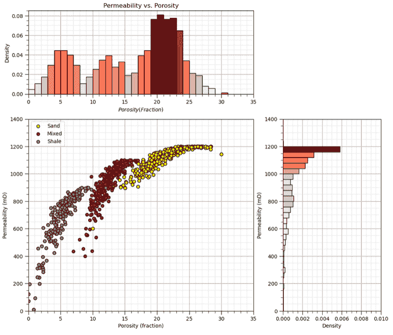

复杂的二元关系的例子。

双变量统计是我们量化并在我们的地质统计学模型中施加这些二元关系的工具。

## 双变量统计

**皮尔逊积矩相关系数**或简称相关系数，是一个广为人知的双变量统计量，如果你说 0.9 的相关性，大多数工程师和科学家都能想象出来！以下是相关系数的重要点和局限性，

+   相关性的表示为，$\rho_{x,y}$

+   提供了线性关系程度的度量，即非线性关系将偏置相关系数

+   对异常值非常敏感，即单个极端异常值可以显著增加或减少明显的相关性

关于高斯假设，还有一些更深入的观点需要说明，

+   在双变量高斯性的假设下，相关系数才为双变量关系提供了一个完整的描述。如果我们假设高斯分布，那么均值 $\overline{x}$ 和 $\overline{y}$，标准差 $s_x$ 和 $s_y$，以及相关系数 $\rho_{x,y}$ 完全描述了双变量概率密度函数 $f_{x,y}(x,y)$。

+   对于任何其他分布，相关系数不足以了解整个双变量概率密度函数 $f_{x,y}(x,y)$，例如，为了计算条件分布 $f_{x|y}$

+   地统计学中的标准方法是对每个特征应用高斯畸变，然后假设双变量高斯分布，这样相关系数就足以描述两个特征之间的关系。

那么，空间双变量关系又是怎样的呢？

+   完整的交叉克里金系统包括交叉变异图和交叉协方差，它们捕捉了两个特征在空间中的关系！但由于推断和建模所需的线性模型核心区划的困难，这很少被做。

+   而不是像共位克里金那样简化应用，它只保留了共位次级数据，并将双变量关系的模型限制在共位（滞后 $\bf{h}$ 为 0.0）的相关系数。

还可以做更多的事情！让我们回顾一下变量 $x$ 的样本方差。当然，我在符号上进行了截断，因为 $x$ 是我们建模空间中一组样本和位置的集合，$x(\bf{u_\alpha}), \, \forall \, \alpha = 0, 1, \dots, n - 1$。

$$ \sigma²_{x} = \frac{\sum_{i=1}^{n} (x_i - \overline{x})²}{(n-1)} $$

我们可以展开平方项，并用 $y$ 替换其中一个，$y$ 是除了 $x$ 之外的另一个变量。

$$ C_{xy} = \frac{\sum_{i=1}^{n} (x_i - \overline{x})(y_i - \overline{y})}{(n-1)} $$

我们现在有一个衡量变量 $x$ 和 $y$ 共变或一起变化的方式的度量。我们可以通过 $x$ 和 $y$ 的标准差乘积来标准化协方差，以计算相关系数。

$$ \rho_{xy} = \frac{\sum_{i=1}^{n} (x_i - \overline{x})(y_i - \overline{y})}{(n-1)\sigma_x \sigma_y}, \, -1.0 \le \rho_{xy} \le 1.0 $$

总结来说，我们可以表述为相关系数与协方差的关系如下：

$$ \rho_{xy} = \frac{C_{xy}}{\sigma_x \sigma_y} $$

为了帮助您校准对相关系数的视觉，我开发了一个交互式的[相关仪表板](https://github.com/GeostatsGuy/DataScienceInteractivePython/blob/main/Interactive_Correlation_Coefficient.ipynb)。

+   对于双变量高斯情况，改变相关系数并观察样本、条件期望和联合概率密度


用于可视化相关系数的交互式 Python 仪表板。

皮尔逊相关系数对异常值和偏离线性行为（在双变量意义上）非常敏感。

在存在异常值和非线性的情况下，为了获得更稳健的相关性度量，我们有一个称为斯皮尔曼秩相关系数的替代方案。

$$ \rho_{R_x R_y} = \frac{\sum_{i=1}^{n} (R_{x_i} - \overline{R_x})(R_{y_i} - \overline{R_y})}{(n-1)\sigma_{R_x} \sigma_{R_y}}, \, -1.0 \le \rho_{R_x,R_y} \le 1.0 $$

排序相关系数在计算相关系数之前将数据应用排序变换。要计算排序变换，只需将数据值替换为排名 $R_x = 1,\dots,n$，其中 $n$ 是最大值，$1$ 是最小值。

$$ x_\alpha, \, \forall \alpha = 1,\dots, n, \, | \, x_i \ge x_j \, \forall \, i \gt j $$$$ R_{x_i} = i $$

为了比较存在异常值时的皮尔逊相关系数和秩相关系数，我开发了此[相关性异常仪表板](https://github.com/GeostatsGuy/DataScienceInteractivePython/blob/main/Interactive_Correlation_Coefficient_Issues.ipynb)，

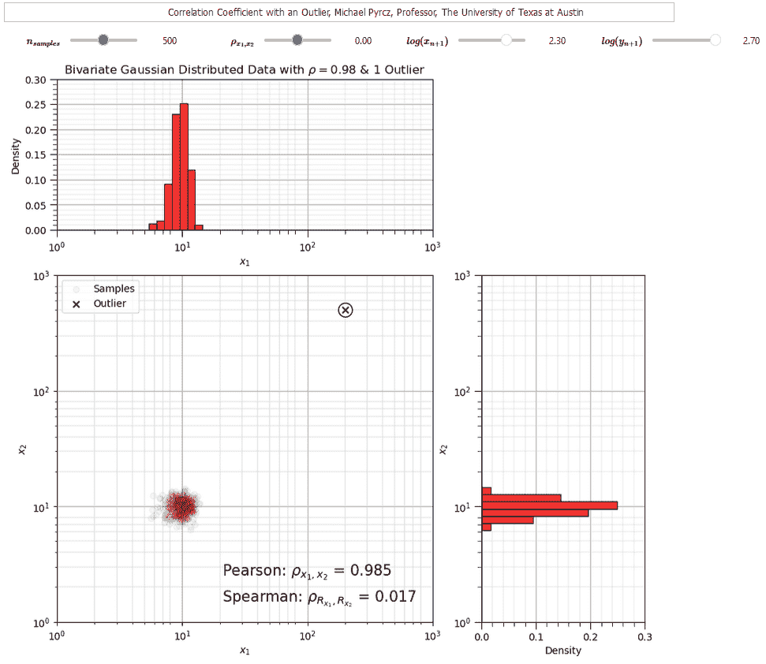

可视化相关系数的交互式 Python 仪表板。

相关系数提供了有用的指标来量化两个变量之间的关系。我们还可以考虑双变量散点图和矩阵散点图来可视化多元数据。

+   记住，当前的地下建模是双变量的，一次处理两个变量。

## 多元统计学

虽然我们局限于双变量模型，但我们需要了解一些多元方法来处理多元数据。

+   这里只提供了一个简短的摘要，有关联合概率和分布的讨论，请参阅概率概念章节。

+   请参阅我的关于[多元分析](https://youtu.be/Ui2El5CZPRE?si=uA_IqurENzC6Owbg)的讲座。

这里是多元统计学的一个简要概述。如果我们定义特征 $X_1$ 的概率密度函数（PDF），

$$ f_{X_1}(x_1) $$

我们可以将定义扩展到任意数量的联合概率密度函数，例如，$m$ 个特征，

$$ f_{X_1,\ldots,X_m}(x_1,\ldots,x_m) $$

同样，也可以计算条件概率密度函数，

$$ f_{Y | X}(y | x) $$

并扩展到任意数量的特征，例如，$m$ 个特征，

$$ f_{Y | X_1, \ldots, X_m}(y | x_1,\ldots,x_m) $$

以及许多我们的统计概念可以扩展到高维，例如考虑相关系数，

$$ \rho_{X,Y} $$

在两个特征之间，现在计算部分相关系数，它计算两个特征（$X$ 和 $Y$）之间的相关性，同时控制所有其他特征（$Z$）。

$$ \rho_{X,Y | Z} $$

最终，计算高维（大量多元）概率和统计学的困难在于推断，我们很少拥有足够的数据来观察广阔的多变量空间，并在该空间中建模概率和统计。

+   请参阅上面关于维度灾难的链接讲座。

## 加载所需的库

以下代码加载所需的库。

```py
import geostatspy.GSLIB as GSLIB                              # GSLIB utilities, visualization and wrapper
import geostatspy.geostats as geostats                        # GSLIB methods convert to Python 
import geostatspy
print('GeostatsPy version: ' + str(geostatspy.__version__)) 
```

```py
GeostatsPy version: 0.0.71 
```

我们还需要一些标准包。这些应该已经与 Anaconda 3 一起安装。

```py
ignore_warnings = True                                        # ignore warnings?
import numpy as np                                            # ndarrays for gridded data
import pandas as pd                                           # DataFrames for tabular data
from scipy import stats                                       # summary statistics
from scipy.stats import pearsonr                              # Pearson product moment correlation
from scipy.stats import spearmanr                             # spearman rank correlation
from scipy.stats import rankdata                              # rank data for visualization
import copy                                                   # for deep copies
import os                                                     # set working directory, run executables
import matplotlib.pyplot as plt                               # for plotting
from matplotlib.ticker import (MultipleLocator, AutoMinorLocator) # control of axes ticks
from matplotlib.colors import ListedColormap                  # custom color maps
import seaborn as sns                                         # advanced plotting
import matplotlib.ticker as mtick                             # control tick label formatting
plt.rc('axes', axisbelow=True)                                # plot all grids below the plot elements
if ignore_warnings == True:                                   
    import warnings
    warnings.filterwarnings('ignore')
cmap = plt.cm.inferno                                         # color map
seed = 42                                                     # random number seed 
```

如果遇到包导入错误，你可能需要首先安装这些包中的某些。这通常可以通过在 Windows 上打开命令窗口然后输入‘python -m pip install [package-name]’来完成。更多帮助可以在相应包的文档中找到。

## 声明函数

让我们定义一个单独的函数来简化绘制相关矩阵的绘图。我还添加了一个方便的函数来添加主网格线和副网格线，以提高绘图的可解释性。

```py
def plot_corr(corr_matrix,title,limits,mask):                 # plots a graphical correlation matrix 
    my_colormap = plt.cm.get_cmap('RdBu_r', 256)          
    newcolors = my_colormap(np.linspace(0, 1, 256))
    white = np.array([256/256, 256/256, 256/256, 1])
    white_low = int(128 - mask*128); white_high = int(128+mask*128)
    newcolors[white_low:white_high, :] = white                # mask all correlations less than abs(0.8)
    newcmp = ListedColormap(newcolors)
    m = corr_matrix.shape[0]
    im = plt.matshow(corr_matrix,fignum=0,vmin = -1.0*limits, vmax = limits,cmap = newcmp)
    plt.xticks(range(len(corr_matrix.columns)), corr_matrix.columns)
    plt.yticks(range(len(corr_matrix.columns)), corr_matrix.columns)
    plt.colorbar(im, orientation = 'vertical')
    plt.title(title)
    for i in range(0,m):
        plt.plot([i-0.5,i-0.5],[-0.5,m-0.5],color='black')
        plt.plot([-0.5,m-0.5],[i-0.5,i-0.5],color='black')
    plt.ylim([-0.5,m-0.5]); plt.xlim([-0.5,m-0.5])

def add_grid():
    plt.gca().grid(True, which='major',linewidth = 1.0); plt.gca().grid(True, which='minor',linewidth = 0.2) # add y grids
    plt.gca().tick_params(which='major',length=7); plt.gca().tick_params(which='minor', length=4)
    plt.gca().xaxis.set_minor_locator(AutoMinorLocator()); plt.gca().yaxis.set_minor_locator(AutoMinorLocator()) # turn on minor ticks 

def add_grid2(sub_plot):
    sub_plot.grid(True, which='major',linewidth = 1.0); sub_plot.grid(True, which='minor',linewidth = 0.2) # add y grids
    sub_plot.tick_params(which='major',length=7); sub_plot.tick_params(which='minor', length=4)
    sub_plot.xaxis.set_minor_locator(AutoMinorLocator()); sub_plot.yaxis.set_minor_locator(AutoMinorLocator()) # turn on minor ticks 
```

## 设计自定义颜色图

通过屏蔽非显著值来考虑显著性

+   目前仅用于演示，可以根据结果置信度和不确定性更新每个绘图

```py
my_colormap = plt.cm.get_cmap('RdBu_r', 256)                  # make a custom colormap
newcolors = my_colormap(np.linspace(0, 1, 256))               # define colormap space
white = np.array([250/256, 250/256, 250/256, 1])              # define white color (4 channel)
#newcolors[26:230, :] = white                                 # mask all correlations less than abs(0.8)
#newcolors[56:200, :] = white                                 # mask all correlations less than abs(0.6)
newcolors[76:180, :] = white                                  # mask all correlations less than abs(0.4)
signif = ListedColormap(newcolors)                            # assign as listed colormap

my_colormap = plt.cm.get_cmap('inferno', 256)                 # make a custom colormap
newcolors = my_colormap(np.linspace(0, 1, 256))               # define colormap space
white = np.array([250/256, 250/256, 250/256, 1])              # define white color (4 channel)
#newcolors[26:230, :] = white                                 # mask all correlations less than abs(0.8)
newcolors[0:12, :] = white                                    # mask all correlations less than abs(0.6)
#newcolors[86:170, :] = white                                 # mask all correlations less than abs(0.4)
sign1 = ListedColormap(newcolors)                             # assign as listed colormap 
```

## 可视化相关性

在加载数据之前，让我们即时生成一些双变量高斯数据并计算相关系数。

+   这将帮助我们校准我们的眼睛以适应相关性，在高斯情况下，它完美地描述了这种关系

你可以指定 4 个相关系数和数据数量，然后重新运行此块以可视化散点图。

```py
corr_mat = [-0.96,0.0,0.4,0.7]; ndata = 1000                   # set the correlation coefficient, number of samples

for i, corr in enumerate(corr_mat):
    plt.subplot(2,2,i+1)
    mean = np.array([0,0])                                     # make the bivariate Gaussian data
    correl = np.array([[1.0,corr],[corr,1.0]],dtype=float)
    np.random.seed(seed = seed)
    sample = np.random.multivariate_normal(mean,correl,size = ndata)
    plt.scatter(sample[:,0],sample[:,1],color = 'red',alpha = 0.2,edgecolors='black',label = 'Samples',zorder=100)
    plt.xlim([-3.0,3.0]); plt.ylim([-3.0,3.0])
    plt.xlabel(r'$x_1$'); plt.ylabel(r'$X_2$'); plt.legend(loc='upper left'); add_grid()
    plt.title(r'Bivariate Standard Gaussian Distributed Data with $\rho_{x_1,x_2} =$' + str(np.round(corr,2)))

plt.subplots_adjust(left=0.0, bottom=0.0, right=2.0, top=2.2, wspace=0.3, hspace=0.3); plt.show() 
```

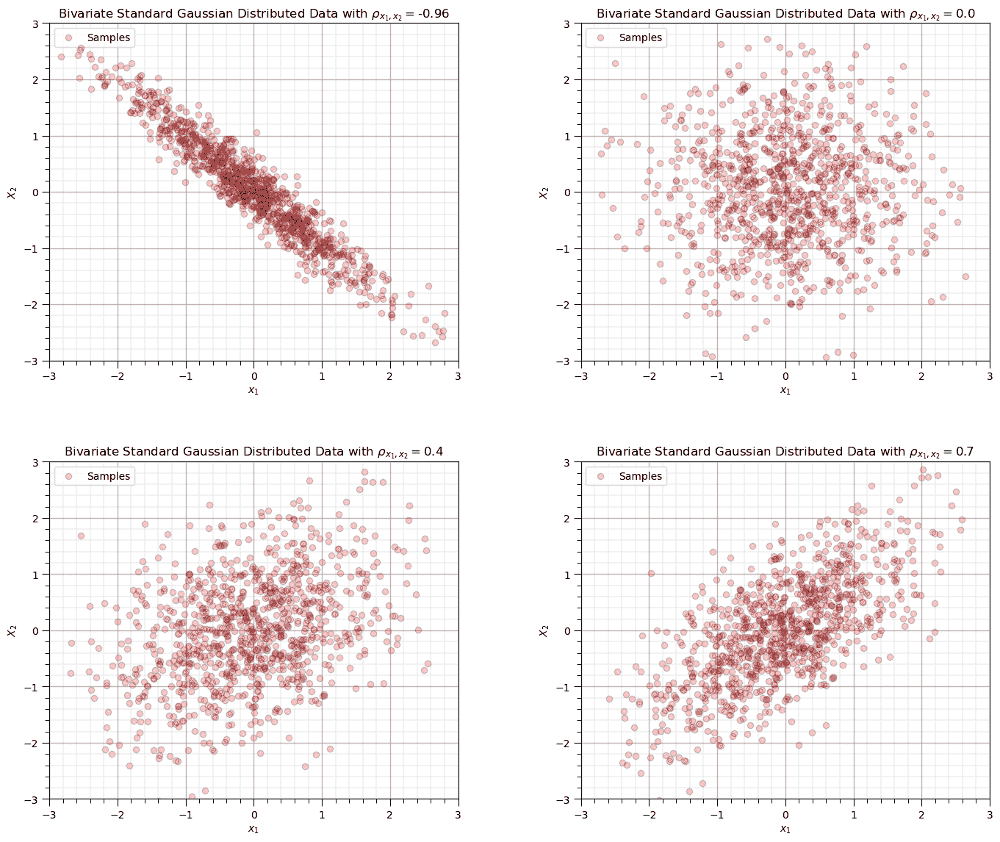

## 异常值对相关系数的影响

让我们观察单个异常值对相关系数的影响。

+   比较皮尔逊积矩和斯皮尔曼秩相关系数

如何运行此示例？

+   设置原始数据的相关性，默认为 0.0，无相关性

+   设置具有相关性的原始样本中的数据数量

+   设置样本 $x_{n+1},y_{n+1}$，将其作为潜在的异常值附加到数据中

对于我设计的案例，你会观察到，

+   当新样本位于先前数据中间时，对相关性统计量没有显著影响

+   当新样本从样本数据中进一步移动时，相关系数增加，而秩相关系数保持接近原始样本的相关性，它在存在异常值的情况下更稳健

```py
corr = 0.0; outlier_mat = [0,1,1.5,1.9]; ndata = 100           # set the correlation coefficient, number of samples

for i, outlier in enumerate(outlier_mat):
    plt.subplot(2,2,i+1)
    mean = np.array([0,0])                                     # make the bivariate Gaussian data
    correl = np.array([[1.0,corr],[corr,1.0]],dtype=float)
    np.random.seed(seed = seed)
    sample = np.random.multivariate_normal(mean,correl,size = ndata)
    sample = np.vstack([sample, [pow(10.0,outlier),pow(10.0,outlier)]]) # add outlier
    plt.scatter(sample[:,0],sample[:,1],color = 'red',alpha = 0.2,edgecolors='black',s=10,label = 'samples',zorder=100) # plot result
    plt.scatter(sample[-1,0],sample[-1,1],color = 'black',alpha = 0.8,marker = 'x',label = 'outlier', zorder=200)
    plt.xlim([-3.0,100.0]); plt.ylim([-3.0,100.0])
    plt.xlabel(r'$x_1$'); plt.ylabel(r'$X_2$'); plt.legend(loc='upper left'); add_grid()
    plt.title(r'Bivariate Standard Gaussian Distributed Data with $\rho_{x_1,x_2} =$' + str(np.round(corr,2)))
    pearson_corr = pearsonr(sample[:,0],sample[:,1])[0]
    rank_corr = spearmanr(sample[:,0],sample[:,1])[0]
    plt.annotate(r'$\rho_{x_1,x_2}$ = ' + str(np.round(pearson_corr,3)),[75.0,30.0])
    plt.annotate(r'$\rho_{R_{x_1},R_{x_2}}$ = ' + str(np.round(rank_corr,3)),[75.0,25.0])
plt.subplots_adjust(left=0.0, bottom=0.0, right=2.0, top=2.2, wspace=0.3, hspace=0.3); plt.show() 
```

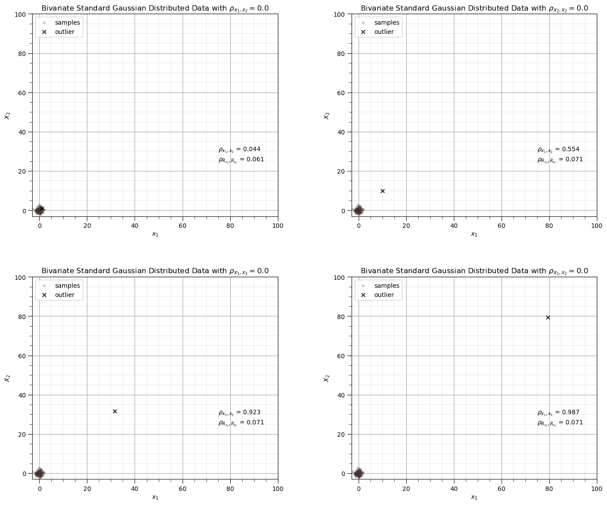

我们准备好加载数据并处理双变量和多变量统计。

## 设置工作目录

我总是喜欢这样做，这样我就不会丢失文件，并且可以简化后续的读取和写入（每次都避免包含完整地址）。

```py
#os.chdir("c:/PGE383")                                        # set the working directory 
```

## 加载表格数据

这里是加载我们的逗号分隔数据文件到 Pandas DataFrame 对象的命令。

让我们加载提供的多元，空间数据集‘sample_data_MV_biased.csv’。它是一个逗号分隔的文件，包含：

+   X 和 Y 坐标（$m$）

+   facies 0 和 1

+   孔隙率（分数）

+   渗透率（$mD$）

+   声波阻抗（$\frac{kg}{m³} \cdot \frac{m}{s} \cdot 10³$）。

```py
#df = pd.read_csv('sample_data_MV_biased.csv')                # load our data table
df = pd.read_csv('https://raw.githubusercontent.com/GeostatsGuy/GeoDataSets/master/sample_data_MV_biased.csv')
df = df.iloc[:,1:] 
```

## 可视化 DataFrame

可视化 DataFrame 是有用的。

我们可以通过使用 'head' DataFrame 成员函数来预览（格式整洁，见下文）。

+   添加参数 'n=13' 以查看数据集的前 13 行。

```py
df.head(n=13)                                                 # we could also use this command for a table preview 
```

|  | X | Y | 属性 | 孔隙率 | 渗透率 | AI |
| --- | --- | --- | --- | --- | --- | --- |
| 0 | 100.0 | 900.0 | 0.0 | 0.101319 | 1.996868 | 5590.417154 |
| 1 | 100.0 | 800.0 | 1.0 | 0.147676 | 10.711789 | 3470.845666 |
| 2 | 100.0 | 700.0 | 1.0 | 0.145912 | 17.818143 | 3586.988513 |
| 3 | 100.0 | 600.0 | 1.0 | 0.186167 | 217.109365 | 3732.114787 |
| 4 | 100.0 | 500.0 | 1.0 | 0.146088 | 16.717367 | 2534.551236 |
| 5 | 200.0 | 900.0 | 1.0 | 0.129949 | 23.348473 | 4781.590782 |
| 6 | 200.0 | 700.0 | 1.0 | 0.185299 | 595.674540 | 4729.017454 |
| 7 | 200.0 | 600.0 | 1.0 | 0.164923 | 154.555841 | 2147.668805 |
| 8 | 200.0 | 500.0 | 1.0 | 0.167026 | 50.970899 | 4583.679953 |
| 9 | 200.0 | 400.0 | 1.0 | 0.125382 | 4.061772 | 4477.930200 |
| 10 | 200.0 | 200.0 | 0.0 | 0.077419 | 1.162642 | 6844.535923 |
| 11 | 300.0 | 800.0 | 1.0 | 0.164797 | 497.593578 | 3881.489046 |
| 12 | 300.0 | 700.0 | 1.0 | 0.165155 | 486.504799 | 3726.023776 |

## 表格数据的摘要统计

在 DataFrames 中从表格数据计算摘要统计有很多高效的方法。describe 命令提供计数、平均值、最小值、最大值和四分位数，全部在一个整洁的数据表中。

+   我们使用转置仅是为了翻转表格，使得特征在行上，而统计信息在列上。

```py
df.describe().transpose()                                     # DataFrame summary statistics 
```

|  | 计数 | 平均值 | 标准差 | 最小值 | 25% | 50% | 75% | 最大值 |
| --- | --- | --- | --- | --- | --- | --- | --- | --- |
| X | 368.0 | 499.565217 | 289.770794 | 0.000000 | 240.000000 | 500.000000 | 762.500000 | 990.000000 |
| Y | 368.0 | 520.644022 | 277.412187 | 9.000000 | 269.000000 | 539.000000 | 769.000000 | 999.000000 |
| 属性 | 368.0 | 0.597826 | 0.491004 | 0.000000 | 0.000000 | 1.000000 | 1.000000 | 1.000000 |
| 孔隙率 | 368.0 | 0.127026 | 0.030642 | 0.041122 | 0.103412 | 0.125842 | 0.148623 | 0.210258 |
| 渗透率 | 368.0 | 85.617362 | 228.362654 | 0.094627 | 2.297348 | 10.377292 | 50.581288 | 1991.097723 |
| AI | 368.0 | 4791.736646 | 974.560569 | 1981.177309 | 4110.728374 | 4713.325533 | 5464.043562 | 7561.250336 |

## 使用位置图可视化表格数据

手动设置 x 和 y 坐标和特征范围是自然的，例如，你希望颜色条从 0.05887 到 0.24230 精确地显示？此外，让我们选择一个颜色图进行显示。

+   我听说等离子体对色盲友好，因为颜色和强度是同时变化的（希望我理解正确，如果我记得正确的话，这是一个由 Agile 的 Matt Hall 启发的有趣的 Twitter 对话）。

+   我们将假设研究区域为 x 和 y 方向上的 0 到 1000m，并省略此区域之外的数据。

```py
xmin = 0.0; xmax = 1000.0                                     # range of x values
ymin = 0.0; ymax = 1000.0                                     # range of y values
pormin = 0.05; pormax = 0.25;                                 # range of porosity values
permmin = 0.01; permmax = 2000.0                              # range of permeability values
AImin = 2000.0; AImax = 8000.0                                # range of AI values
nx = 100; ny = 100; csize = 10.0 
```

让我们尝试 locmap。这是 GSLIB 的 locmap 程序的重新实现，它使用 matplotlib。我希望你发现它比 matplotlib 更简单，如果你想更高级并构建自定义图表，请查看源代码。如果你改进了它，请将新代码发给我。

现在我们可以填充绘图参数并可视化孔隙率数据。

```py
plt.subplot(221)
GSLIB.locmap_st(df,'X','Y','Facies',xmin,xmax,ymin,ymax,0,1,'Well Data - Porosity','X(m)','Y(m)','Facies (0-shale, 1-sand)',cmap)

plt.subplot(222)
GSLIB.locmap_st(df,'X','Y','Porosity',xmin,xmax,ymin,ymax,pormin,pormax,'Well Data - Porosity','X(m)','Y(m)','Porosity (fraction)',cmap)

plt.subplot(223)
GSLIB.locmap_st(df,'X','Y','Perm',xmin,xmax,ymin,ymax,permmin,permmax,'Well Data - Permeability','X(m)','Y(m)','Permeability (md)',cmap)

plt.subplot(224)
GSLIB.locmap_st(df,'X','Y','AI',xmin,xmax,ymin,ymax,AImin,AImax,'Well Data - Acoustic Impedance','X(m)','Y(m)','Acoustic Impedance (m/s x g/cm³)',cmap)

plt.subplots_adjust(left=0.0, bottom=0.0, right=1.5, top=1.7, wspace=0.3, hspace=0.3); plt.show() 
```

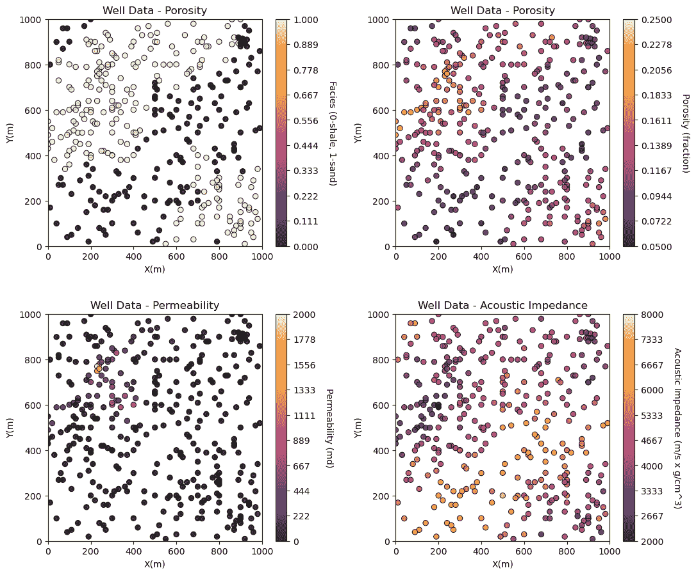

## 双变量分析

让我们从简单的双变量散点图和计算双变量统计开始。以下是散点图。

+   我在下面（注释掉）包含了将图表作为图像文件写入的代码。注意，你可以写入许多不同的格式，例如.tif、jpg 等，你也可以控制分辨率。

+   通过保存为.pdf、.svg 或 eps 格式，你可以创建矢量图形，这些图形在任何分辨率下都保持清晰，同时文件大小经济。

```py
plt.subplot(121)
plt.plot(df['Porosity'].values,df['Perm'].values, 'o', label='', markerfacecolor='darkorange', markeredgecolor='black', alpha=0.8)
plt.title('Well Data Permeability vs. Porosity')
plt.xlabel('Porosity (fraction)'); plt.ylabel('Permeability (mD)')
plt.xlim([pormin,pormax]); plt.ylim([permmin,permmax]); add_grid()

plt.subplot(122)
plt.plot(df['AI'].values,df['Porosity'].values, 'o', label='', markerfacecolor='darkorange', markeredgecolor='black', alpha=0.8)
plt.title('Well Data Porosity vs. Acoustic Impedance')
plt.ylabel('Porosity (fraction)'); plt.xlabel('Acoustic Impedance (m/s x g/cm³)')
plt.xlim([AImin,AImax]); plt.ylim([pormin,pormax]); add_grid()

plt.subplots_adjust(left=0.0, bottom=0.0, right=1.5, top=0.8, wspace=0.3, hspace=0.2)
#plt.savefig('Test.pdf', dpi=600, bbox_inches = 'tight',format='pdf') 
plt.show() 
```

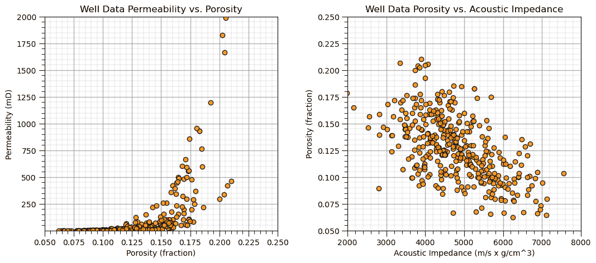

## 相关性和协方差

从我们的数据集中的数据对计算协方差和相关系数是直接的。以下是协方差矩阵。

+   注意矩阵是对称的？这是有道理的，因为$C_{Por,Perm} = C_{Perm,Por}$。

+   此外，请注意，对角值（$C_{i,j}$其中$i=j$）等于方差。

我们通过计算方差来检查孔隙率。

```py
print(df.iloc[:,3:7].cov())                                   # the covariance matrix for columns 3,4,5 and 6 and all rows
print('The variance of porosity is ' + str(round(np.var(df['Porosity'].values),6))) 
```

```py
 Porosity          Perm             AI
Porosity   0.000939      4.055029     -17.132244
Perm       4.055029  52149.501968  -46471.695092
AI       -17.132244 -46471.695092  949768.302409
The variance of porosity is 0.000936 
```

这是相关系数矩阵。

```py
df.iloc[:,3:7].corr()                                         # correlation matrix 
```

|  | 孔隙率 | 渗透率 | AI |
| --- | --- | --- | --- |
| 孔隙率 | 1.000000 | 0.579493 | -0.573700 |
| 渗透率 | 0.579493 | 1.000000 | -0.208812 |
| AI | -0.573700 | -0.208812 | 1.000000 |

## 可视化相关矩阵

如此可视化相关矩阵是方便的。

+   我添加了一个自定义的颜色条来传达显著性。这只是一个演示，我没有计算置信区间，但可以添加。

```py
corr_matrix = df.iloc[:,2:].corr()
plt.subplot(111)
plot_corr(corr_matrix,'Correlation Matrix',1.0,0.5)           # using our correlation matrix visualization function
plt.subplots_adjust(left=0.0, bottom=0.0, right=1.0, top=0.8, wspace=0.2, hspace=0.3); plt.show() 
```


要计算一个相关系数及其关联的 p 值以进行显著性检验，我们可以使用 SciPy 的 pearsonr 函数。

+   p 值表示我们拒绝零假设（相关系数实际上为 0.0，该值是由于随机效应造成的）的$\alpha$水平。

```py
corr, corr_p_value = pearsonr(df['Porosity'],df['Perm'])

plt.subplot(111)
plt.plot(df['Porosity'].values,df['Perm'].values, 'o', label='', markerfacecolor='darkorange', markeredgecolor='black', alpha=0.8)
plt.title('Well Data Permeability vs. Porosity')
plt.xlabel('Porosity (fraction)'); plt.ylabel('Permeability (mD)')
plt.xlim([pormin,pormax]); plt.ylim([permmin,permmax]); add_grid()

plt.annotate(r'$\rho_{\phi,k}$ = ' + str(np.round(corr,3)),[0.075,1600.0])
plt.annotate(r'$\rho_{\phi,k}$, p-value = ' + str(np.round(corr_p_value,20)),[0.075,1500.0])
plt.subplots_adjust(left=0.0, bottom=0.0, right=1.0, top=1.2, wspace=0.3, hspace=0.2); plt.show() 
```

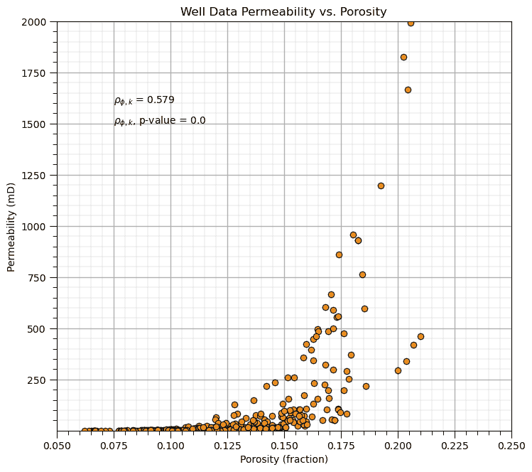

孔隙率和渗透率相关系数的 p 值为 2.1569195170201772e-34，

+   对于任何可行的$\alpha$水平，相关系数与 0.0 显著不同。

## 斯皮尔曼秩相关系数

斯皮尔曼秩相关系数提供了单调关系的度量。

+   排序变换，例如$R_(x_i)$，按升序排序数据，并用索引替换数据，$i=1,\ldots,n$。

+   与皮尔逊相关系数相比，斯皮尔曼秩相关系数在存在异常值和一些非线性特征时更稳健。

让我们尝试使用 SciPy 的 stats 模块函数计算秩相关系数。

+   它还为每个度量提供了 p 值，用于显著性检验，即如果 p 值 < alpha，则我们拒绝零假设，即秩相关系数为 0.0。

```py
rank_correlation, rank_correlation_pval = stats.spearmanr(df.iloc[:,2:]) # calculate the range correlation coefficient
rank_matrix = pd.DataFrame(rank_correlation,columns=corr_matrix.columns)
print('Rank Correlation:')
print(rank_correlation)
print('\nRank Correlation p-value:')
print(rank_correlation_pval) 
```

```py
Rank Correlation:
[[ 1\.          0.79973189  0.71923703 -0.50503617]
 [ 0.79973189  1\.          0.88314655 -0.56863773]
 [ 0.71923703  0.88314655  1\.         -0.34876935]
 [-0.50503617 -0.56863773 -0.34876935  1\.        ]]

Rank Correlation p-value:
[[0.00000000e+000 4.11417796e-083 7.49150387e-060 3.24513314e-025]
 [4.11417796e-083 0.00000000e+000 2.26847950e-122 6.59769641e-033]
 [7.49150387e-060 2.26847950e-122 0.00000000e+000 5.77157354e-012]
 [3.24513314e-025 6.59769641e-033 5.77157354e-012 0.00000000e+000]] 
```

## 比较皮尔逊和斯皮尔曼相关系数

让我们创建一个简单的随机数据集并添加一个异常值，然后比较皮尔逊和斯皮尔曼相关系数。

```py
corr = 0.0; xout = 9; yout = 9; n = 100                       # correlation, outlier datum, and total number of data
mean = [0, 0]                                                 # bivariate Gaussian mean vector
cov = [[1, corr], [corr, 1]]                                  # bivariate Gaussian covariance matrix

np.random.seed(seed = seed)                                   # set seed for repeatability
samples = np.random.multivariate_normal(mean, cov, n)         # random samples from bivariate Gaussian
samples[-1,0] = xout; samples[-1,1] = yout                    # replace last sample with user specified outlier
x2 = samples[:, 0]; y2 = samples[:, 1]                        # copy x and y for compact code

corr = stats.pearsonr(x2[:-1],y2[:-1])[0]                     # calculate Pearson and Spearman correlation without outlier
rank_corr = stats.spearmanr(x2[:-1],y2[:-1])[0] 
corr_out = stats.pearsonr(x2,y2)[0]                           # calculate Pearson and Spearman correlation with outlier
rank_corr_out = stats.spearmanr(x2,y2)[0]

plt.subplot(121)
plt.scatter(x2,y2,color='red',edgecolor='black',zorder=1)     # plot and annotate results
plt.scatter(x2[-1],y2[-1],color='white',edgecolor='black',zorder=10)
plt.scatter([5.7,5.7],[0.17,-1.8],color='white',edgecolor='black',zorder=1) 
plt.scatter([5.4],[-1.8],color='red',edgecolor='black',zorder=1) 
plt.annotate('With outlier:',[6.0,0.1])
plt.annotate(r'$\rho^{out}_{x,y} = $',[6.5,-0.5])
plt.annotate(r'$\rho^{out}_{R_x,R_y} = $',[6.5,-1.2])
plt.annotate('Without outlier:',[6.0,-1.9])
plt.annotate(r'$\rho_{x,y} = $',[6.5,-2.5])
plt.annotate(r'$\rho_{R_x,R_y} = $',[6.5,-3.2])
plt.xlim([-4,10]); plt.ylim([-4,10]); plt.xlabel('X'); plt.ylabel('Y'); add_grid(); plt.title('Impact of an Outlier on Correlation')

plt.subplot(122)
plt.scatter(x2,y2,color='red',edgecolor='black',zorder=1)       # plot and annotate results
plt.scatter(x2[-1],y2[-1],color='white',edgecolor='black',zorder=10)
plt.scatter([5.7,5.7],[0.17,-1.8],color='white',edgecolor='black',zorder=1) 
plt.scatter([5.4],[-1.8],color='red',edgecolor='black',zorder=1) 
plt.annotate('With outlier:',[6.0,0.1])
plt.annotate(r'$\rho^{out}_{x,y} = $' + str(round(corr_out,2)),[6.5,-0.5])
plt.annotate(r'$\rho^{out}_{R_x,R_y} = $' + str(round(rank_corr_out,2)),[6.5,-1.2])
plt.annotate('Without outlier:',[6.0,-1.9])
plt.annotate(r'$\rho_{x,y} = $' + str(round(corr,2)),[6.5,-2.5])
plt.annotate(r'$\rho_{R_x,R_y} = $' + str(round(rank_corr,2)),[6.5,-3.2])
plt.xlim([-4,10]); plt.ylim([-4,10]); plt.xlabel('X'); plt.ylabel('Y'); add_grid(); plt.title('Impact of an Outlier on Correlation')

plt.subplots_adjust(left=0.0, bottom=0.0, right=2.0, top=1.2, wspace=0.2, hspace=0.3); plt.show() 
```

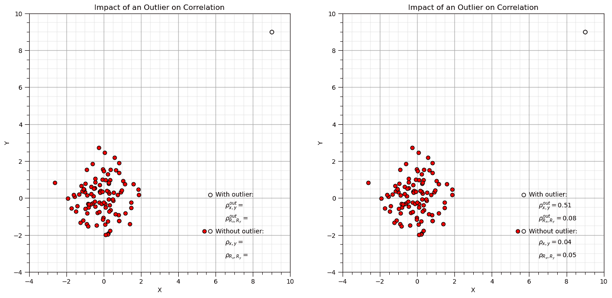

现在，让我们看看斯皮尔曼相关系数看到的是什么，通过绘制数据的秩转换。

```py
x2_rank = rankdata(x2)                                          # rank transform data, x and y separately
y2_rank = rankdata(y2)

plt.subplot(121)
plt.scatter(x2,y2,color='red',edgecolor='black',zorder=1)       # plot and annotate results
plt.scatter(x2[-1],y2[-1],color='white',edgecolor='black',zorder=10)
plt.scatter([5.7,5.7],[0.17,-1.8],color='white',edgecolor='black',zorder=1) 
plt.scatter([5.4],[-1.8],color='red',edgecolor='black',zorder=1) 
plt.annotate('With outlier:',[6.0,0.1])
plt.annotate(r'$\rho^{out}_{x,y} = $' + str(round(corr_out,2)),[6.5,-0.5])
plt.annotate(r'$\rho^{out}_{R_x,R_y} = $' + str(round(rank_corr_out,2)),[6.5,-1.2])
plt.annotate('Without outlier:',[6.0,-1.9])
plt.annotate(r'$\rho_{x,y} = $' + str(round(corr,2)),[6.5,-2.5])
plt.annotate(r'$\rho_{R_x,R_y} = $' + str(round(rank_corr,2)),[6.5,-3.2])
plt.xlim([-4,10]); plt.ylim([-4,10]); plt.xlabel('X'); plt.ylabel('Y'); add_grid(); plt.title('Impact of an Outlier on Correlation')

plt.subplot(122)
plt.scatter(x2_rank,y2_rank,color='red',edgecolor='black',zorder=1) # plot and annotate results
plt.scatter(x2_rank[-1],y2_rank[-1],color='white',edgecolor='black',zorder=10)
plt.xlim([0,n+1]); plt.ylim([0,n+1]); plt.xlabel(r'$X_{rank}$'); plt.ylabel(r'$Y_{rank}$'); add_grid(); plt.title('Data Rank Transformed')

plt.subplots_adjust(left=0.0, bottom=0.0, right=2.0, top=1.2, wspace=0.2, hspace=0.3); plt.show() 
```

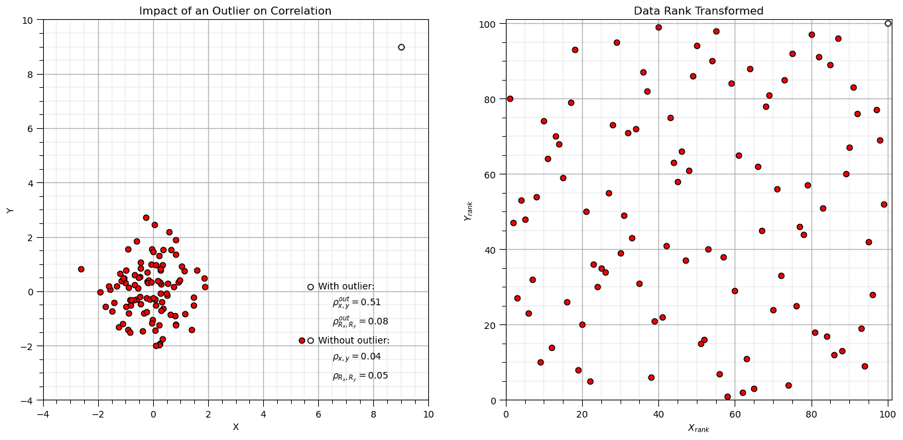

## 使用抛物线比较皮尔逊和斯皮尔曼相关系数

让我们尝试使用常见的抛物线示例来演示非线性对相关性的影响。

```py
x3 = np.linspace(-3.0,3.0,n)
y3 = x3**2

corr = stats.pearsonr(x3,y3)[0]                               # calculate Pearson and Spearman correlation with outlier
rank_corr = stats.spearmanr(x3,y3)[0]

corr_half = stats.pearsonr(x3[:-50],y3[:-50])[0]              # calculate Pearson and Spearman correlation with outlier
rank_corr_half = stats.spearmanr(x3[:-50],y3[:-50])[0]

plt.subplot(121)
plt.scatter(x3,y3,color='red',edgecolor='black',zorder=1)     # plot and annotate results
plt.scatter(x3[:-50],y3[:-50],color='white',edgecolor='black',zorder=10) # first half
plt.scatter([5.7,5.7],[4.15,2.15],color='white',edgecolor='black',zorder=1) 
plt.scatter([5.4],[2.15],color='red',edgecolor='black',zorder=1) 
plt.annotate('First half of data only:',[6.0,4.1])
plt.annotate(r'$\rho^{half}_{x,y} = $',[6.5,3.5])
plt.annotate(r'$\rho^{half}_{R_x,R_y} = $',[6.5,2.8])
plt.annotate('All data:',[6.0,2.1])
plt.annotate(r'$\rho_{x,y} = $',[6.5,1.5])
plt.annotate(r'$\rho_{R_x,R_y} = $',[6.5,0.8])
plt.xlim([-4,10]); plt.ylim([-0.1,10]); plt.xlabel('X'); plt.ylabel('Y'); add_grid(); plt.title('Impact of an Outlier on Correlation')

plt.subplot(122)
plt.scatter(x3,y3,color='red',edgecolor='black',zorder=1)     # plot and annotate results
plt.scatter(x3[:-50],y3[:-50],color='white',edgecolor='black',zorder=10) # first half
plt.scatter([5.7,5.7],[4.15,2.15],color='white',edgecolor='black',zorder=1) 
plt.scatter([5.4],[2.15],color='red',edgecolor='black',zorder=1) 
plt.annotate('First half of data only:',[6.0,4.1])
plt.annotate(r'$\rho^{half}_{x,y} = $' + str(round(corr_half,2)),[6.5,3.5])
plt.annotate(r'$\rho^{half}_{R_x,R_y} = $' + str(round(rank_corr_half,2)),[6.5,2.8])
plt.annotate('All data:',[6.0,2.1])
plt.annotate(r'$\rho_{x,y} = $' + str(round(corr,2)),[6.5,1.5])
plt.annotate(r'$\rho_{R_x,R_y} = $' + str(round(rank_corr,2)),[6.5,0.8])
plt.xlim([-4,10]); plt.ylim([-0.1,10]); plt.xlabel('X'); plt.ylabel('Y'); add_grid(); plt.title('Impact of an Outlier on Correlation')

plt.subplots_adjust(left=0.0, bottom=0.0, right=2.0, top=1.2, wspace=0.2, hspace=0.3); plt.show() 
```

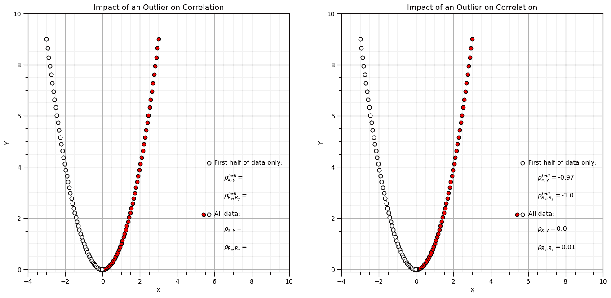

现在，让我们看看斯皮尔曼相关系数看到的是什么，通过绘制数据的秩转换。

```py
x3_rank = rankdata(x3)                                        # rank transform data, x and y separately
y3_rank = rankdata(y3)

plt.subplot(121)
plt.scatter(x3,y3,color='red',edgecolor='black',zorder=1)     # plot and annotate results
plt.scatter(x3[:-50],y3[:-50],color='white',edgecolor='black',zorder=10) # first half
plt.scatter([5.7,5.7],[4.15,2.15],color='white',edgecolor='black',zorder=1) 
plt.scatter([5.4],[2.15],color='red',edgecolor='black',zorder=1) 
plt.annotate('First half of data only:',[6.0,4.1])
plt.annotate(r'$\rho^{half}_{x,y} = $' + str(round(corr_half,2)),[6.5,3.5])
plt.annotate(r'$\rho^{half}_{R_x,R_y} = $' + str(round(rank_corr_half,2)),[6.5,2.8])
plt.annotate('All data:',[6.0,2.1])
plt.annotate(r'$\rho_{x,y} = $' + str(round(corr,2)),[6.5,1.5])
plt.annotate(r'$\rho_{R_x,R_y} = $' + str(round(rank_corr,2)),[6.5,0.8])
plt.xlim([-4,10]); plt.ylim([-0.1,10]); plt.xlabel('X'); plt.ylabel('Y'); add_grid(); plt.title('Impact of an Nonlinearity on Correlation')

plt.subplot(122)
plt.scatter(x3_rank,y3_rank,color='red',edgecolor='black',zorder=1) # plot and annotate results
plt.scatter(x3_rank[:-50],y3_rank[:-50],color='white',edgecolor='black',zorder=10)
plt.xlim([0,n+1]); plt.ylim([0,n+1]); plt.xlabel(r'$X_{rank}$'); plt.ylabel(r'$Y_{rank}$'); add_grid(); plt.title('Data Rank Transformed')

plt.subplots_adjust(left=0.0, bottom=0.0, right=2.0, top=1.2, wspace=0.2, hspace=0.3); plt.show() 
```

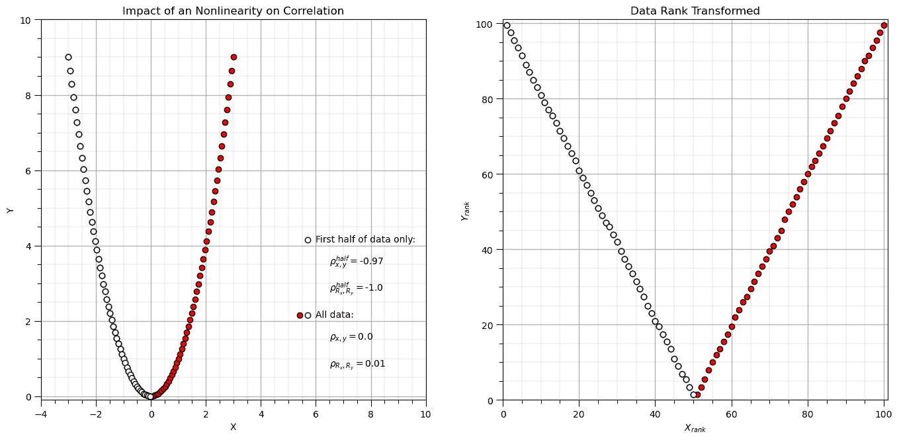

秩转换可以线性化数据的单调递增或递减段。

## 与多个群体的关联

```py
n = 100                                                        # total number in each population
np.random.seed(seed = seed)                                   # set seed for repeatability
mean4 = [-1.0, 2.0]                                                 # bivariate Gaussian mean vector
cov4 = [[0.5, 0.0], [0.0, 0.5]]                               # bivariate Gaussian covariance matrix
samples4 = np.random.multivariate_normal(mean4, cov4, n)        # random samples from bivariate Gaussian

mean5 = [4.0, 6.0]                                                 # bivariate Gaussian mean vector
cov5 = [[0.3, 0.0], [0.0, 0.3]]                               # bivariate Gaussian covariance matrix
samples5 = np.random.multivariate_normal(mean5, cov5, n)        # random samples from bivariate Gaussian

samples45 = np.vstack((samples4,samples5))

corr = stats.pearsonr(samples45[:,0],samples45[:,1])[0]                               # calculate Pearson and Spearman correlation with outlier
rank_corr = stats.spearmanr(samples45[:,0],samples45[:,1])[0]

corr_one = stats.pearsonr(samples4[:,0],samples4[:,1])[0]              # calculate Pearson and Spearman correlation with outlier
rank_corr_one = stats.spearmanr(samples4[:,0],samples4[:,1])[0]

plt.subplot(121)
plt.scatter(samples4[:,0],samples4[:,1],color='white',edgecolor='black',zorder=1)     # plot and annotate results
plt.scatter(samples5[:,0],samples5[:,1],color='red',edgecolor='black',zorder=1)     # plot and annotate results

plt.scatter([5.7,5.7],[4.15,2.15],color='white',edgecolor='black',zorder=1) 
plt.scatter([5.4],[2.15],color='red',edgecolor='black',zorder=1) 
plt.annotate('First population only:',[6.0,4.1])
plt.annotate(r'$\rho^{half}_{x,y} = $' + str(round(corr_one,2)),[6.5,3.5])
plt.annotate(r'$\rho^{half}_{R_x,R_y} = $' + str(round(rank_corr_one,2)),[6.5,2.8])
plt.annotate('Both populations:',[6.0,2.1])
plt.annotate(r'$\rho_{x,y} = $' + str(round(corr,2)),[6.5,1.5])
plt.annotate(r'$\rho_{R_x,R_y} = $' + str(round(rank_corr,2)),[6.5,0.8])
plt.xlim([-4,10]); plt.ylim([-0.1,10]); plt.xlabel('X'); plt.ylabel('Y'); add_grid(); plt.title('Impact of Multiple Populations on Correlation')

mean6 = [3.0, 4.0]                                                 # bivariate Gaussian mean vector
cov6 = [[0.5, 0.45], [0.45, 0.5]]                               # bivariate Gaussian covariance matrix
samples6 = np.random.multivariate_normal(mean6, cov6, n)        # random samples from bivariate Gaussian

mean7 = [2.0, 6.0]                                                 # bivariate Gaussian mean vector
cov7 = [[0.3, 0.25], [0.25, 0.3]]                               # bivariate Gaussian covariance matrix
samples7 = np.random.multivariate_normal(mean7, cov7, n)        # random samples from bivariate Gaussian

samples67 = np.vstack((samples6,samples7))

corr = stats.pearsonr(samples67[:,0],samples67[:,1])[0]                               # calculate Pearson and Spearman correlation with outlier
rank_corr = stats.spearmanr(samples67[:,0],samples67[:,1])[0]

corr_one = stats.pearsonr(samples6[:,0],samples6[:,1])[0]              # calculate Pearson and Spearman correlation with outlier
rank_corr_one = stats.spearmanr(samples6[:,0],samples6[:,1])[0]

plt.subplot(122)
plt.scatter(samples6[:,0],samples6[:,1],color='white',edgecolor='black',zorder=1)     # plot and annotate results
plt.scatter(samples7[:,0],samples7[:,1],color='red',edgecolor='black',zorder=1)     # plot and annotate results

plt.scatter([5.7,5.7],[4.15,2.15],color='white',edgecolor='black',zorder=1) 
plt.scatter([5.4],[2.15],color='red',edgecolor='black',zorder=1) 
plt.annotate('First population only:',[6.0,4.1])
plt.annotate(r'$\rho^{half}_{x,y} = $' + str(round(corr_one,2)),[6.5,3.5])
plt.annotate(r'$\rho^{half}_{R_x,R_y} = $' + str(round(rank_corr_one,2)),[6.5,2.8])
plt.annotate('Both populations:',[6.0,2.1])
plt.annotate(r'$\rho_{x,y} = $' + str(round(corr,2)),[6.5,1.5])
plt.annotate(r'$\rho_{R_x,R_y} = $' + str(round(rank_corr,2)),[6.5,0.8])
plt.xlim([-4,10]); plt.ylim([-0.1,10]); plt.xlabel('X'); plt.ylabel('Y'); add_grid(); plt.title('Impact of Multiple Populations on Correlation')

plt.subplots_adjust(left=0.0, bottom=0.0, right=2.0, top=1.2, wspace=0.2, hspace=0.3); plt.show() 
```

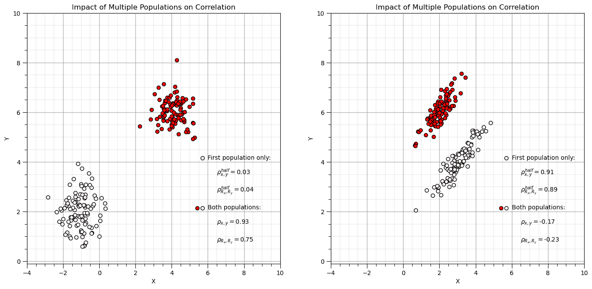

## 辛普森悖论

当组合（或分离）组时，数据趋势会逆转或消失。

待补充

## 绘制相关性和秩相关性矩阵

返回到我们之前的数据集，让我们制作相关矩阵。

```py
plt.subplot(131)                                              # plot correlation matrix with significance colormap
plot_corr(corr_matrix,'Correlation Matrix',1.0,0.5)           # using our correlation matrix visualization function

plt.subplot(132)                                              # plot correlation matrix with significance colormap
plot_corr(rank_matrix,'Rank Correlation Matrix',1.0,0.5)      # using our correlation matrix visualization function

plt.subplot(133)                                              # plot correlation matrix with significance colormap
diff = corr_matrix.values - rank_matrix.values
diff_matrix = pd.DataFrame(diff,columns=corr_matrix.columns)
plot_corr(diff_matrix,'Correlation - Rank Correlation',0.3,0.0) # using our correlation matrix visualization function

plt.subplots_adjust(left=0.0, bottom=0.0, right=2.5, top=0.6, wspace=0.2, hspace=0.3); plt.show() 
```

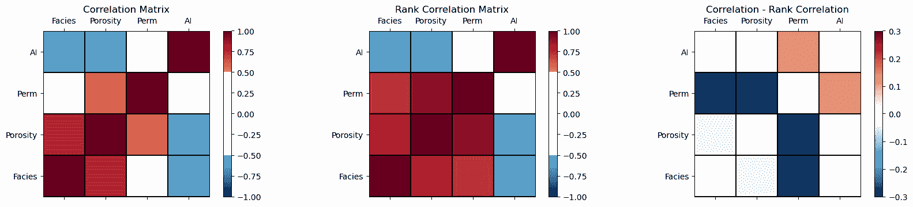

从相关系数减去秩相关系数的热力图我们可以看到，

+   非线性可能正在降低渗透率与岩性和孔隙率的关联性，并增加与 AI 的关联性。

## 矩阵散点图

如果我们要考虑 3 个或更多变量，则矩阵散点图提供了一种有效的方法来显示多元关系，一次显示两个变量。可以识别：

1.  配对数据的范围，包络

1.  同方差和非同方差行为

1.  非线性特征

这是 seaborn 包的矩阵散点图函数，pairplot。让我们按岩性着色结果。

```py
sns.pairplot(df, hue='Facies',vars=['Porosity','Perm','AI'],markers='o')
plt.subplots_adjust(left=0.0, bottom=0.0, right=0.9, top=0.9, wspace=0.2, hspace=0.3); plt.show() 
```

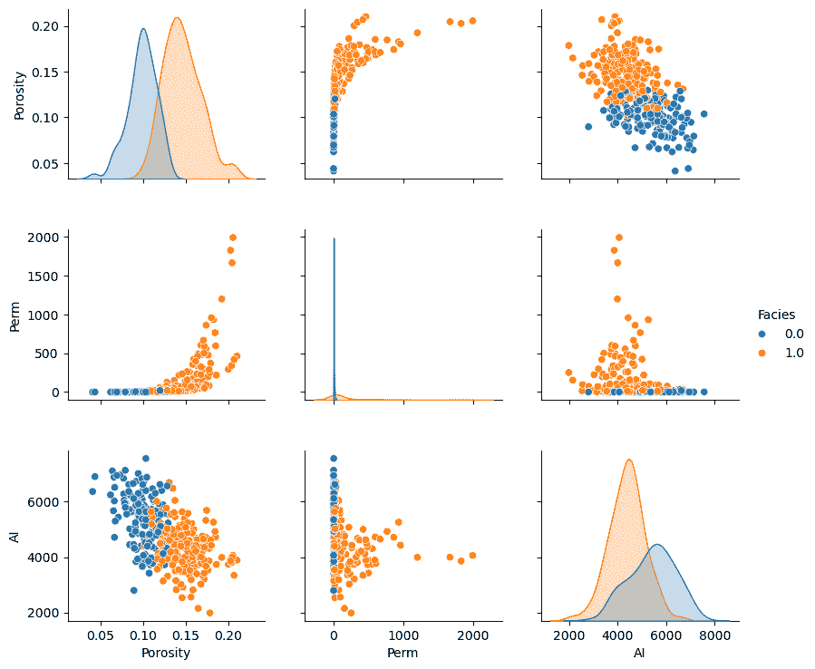

记住，尽管这些矩阵散点图非常有用，但它们仍然是高维关系的高维边际化。

+   其他维度可能存在我们看不到的结构。

## 对网格图

为了对生成的图表有最大控制权，我们可以使用 seaborn 的对网格图。

+   我们可以独立设置图表的下部、上部和对角线部分。

我们通过将所有岩性合并在一起来演示这一点：

+   上方的散点图

+   对角线的直方图

+   下方的核密度图

```py
pairgrid = sns.PairGrid(df,vars=['Porosity','Perm','AI'])
pairgrid = pairgrid.map_upper(plt.scatter, color = 'darkorange', edgecolor = 'black', alpha = 0.8, s = 10)
pairgrid = pairgrid.map_diag(plt.hist, bins = 20, color = 'darkorange',alpha = 0.8, edgecolor = 'k')# Map a density plot to the lower triangle
pairgrid = pairgrid.map_lower(sns.kdeplot, cmap = plt.cm.inferno, 
                              shade = False, shade_lowest = False, alpha = 1.0, n_levels = 10)
pairgrid.add_legend()
plt.subplots_adjust(left=0.0, bottom=0.0, right=0.9, top=0.9, wspace=0.2, hspace=0.2); plt.show() 
```

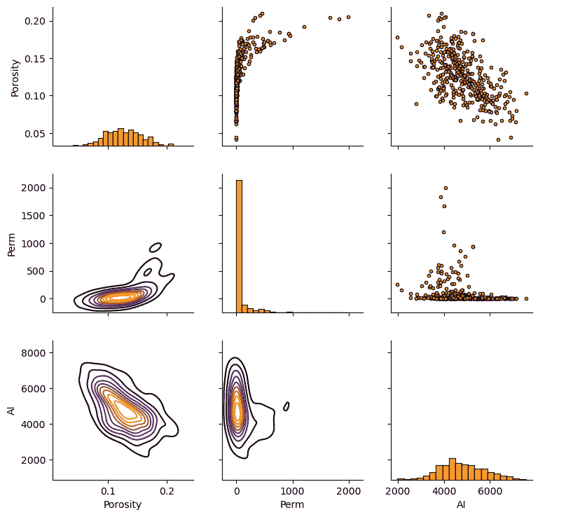

## 联合、条件和边缘概率

我们可以使用核密度估计来估计配对数据的联合概率密度函数（pdf），一个二维 pdf！

+   我们可以用这个来估计任何所需的联合、边缘和条件概率（注意规范化）。

让我们使用 seaborn 包的 `kdeplot` 函数来估计孔隙度和声阻抗的联合概率密度函数。

```py
ax = sns.kdeplot(x=df['AI'].values,y=df['Porosity'].values, shade=True, n_levels = 10,cmap=cmap,cbar= True, shade_lowest = False)
#ax = sns.kdeplot(df.loc[:,['AI','Porosity']], shade=True, n_levels = 10,cmap=cmap,cbar= True, shade_lowest = False)
ax.set_xlabel('Acoustic Impedance (m/s x g/cm³)'); ax.set_ylabel('Porosity (fraction)'); ax.set_title('Porosity vs. Acoustic Impedance')
add_grid()
plt.subplots_adjust(left=0.0, bottom=0.0, right=0.9, top=0.9, wspace=0.2, hspace=0.2); plt.show() 
```

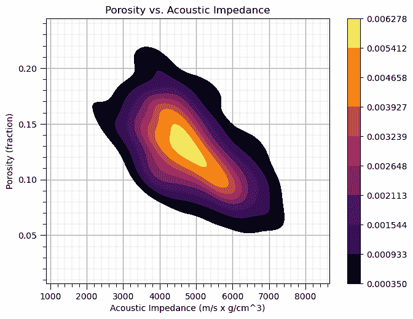

我认为将联合概率密度函数与边缘概率密度函数可视化在同一张图上是有用的。我们可以使用 seaborn 的 `jointplot` 来完成这个任务。

```py
ax = sns.jointplot(x=df['AI'],y=df['Porosity'],kind='kde',shade = False,n_levels = 10,cmap=cmap,shade_lowest = True); 
```

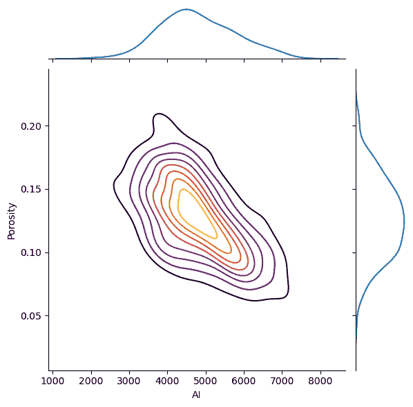

相关系数及其 p 值（如果 < $\alpha/2$ 或 > $1-\alpha/2$ 则表示显著）。

## 计算条件统计量

当然，我们也可以手动计算条件统计量。我们需要选择一些变量上的箱，我们将对它进行条件化。让我们计算给定声阻抗的孔隙度的条件统计量。我们将选择 9 个等间距的箱。

```py
AI_bins = np.linspace(2000,8000,10)                           # set the bin boundaries and then the centroids for plotting
AI_centroids = np.linspace((AI_bins[0]+AI_bins[1])*0.5,(AI_bins[8]+AI_bins[9])*0.5,9)
print(AI_bins)                                                # check the boundaries
print(AI_centroids)                                           # check the centroids
df['AI_bins'] = pd.cut(df['AI'], AI_bins,labels = AI_centroids) # cut on bondaries and label with centroids 
df.head()                                                     # check the new column in the DataFrame 
```

```py
[2000\.         2666.66666667 3333.33333333 4000\.         4666.66666667
 5333.33333333 6000\.         6666.66666667 7333.33333333 8000\.        ]
[2333.33333333 3000\.         3666.66666667 4333.33333333 5000.
 5666.66666667 6333.33333333 7000\.         7666.66666667] 
```

|  | X | Y | 岩性 | 孔隙度 | 渗透率 | AI | AI_bins |
| --- | --- | --- | --- | --- | --- | --- | --- |
| 0 | 100.0 | 900.0 | 0.0 | 0.101319 | 1.996868 | 5590.417154 | 5666.666667 |
| 1 | 100.0 | 800.0 | 1.0 | 0.147676 | 10.711789 | 3470.845666 | 3666.666667 |
| 2 | 100.0 | 700.0 | 1.0 | 0.145912 | 17.818143 | 3586.988513 | 3666.666667 |
| 3 | 100.0 | 600.0 | 1.0 | 0.186167 | 217.109365 | 3732.114787 | 3666.666667 |
| 4 | 100.0 | 500.0 | 1.0 | 0.146088 | 16.717367 | 2534.551236 | 2333.333333 |

现在，我们可以使用 Pandas DataFrame 内置的 `groupby` 函数从 DataFrame 中提取每个箱中的孔隙度值子集，然后计算条件统计量：期望、P90 和 P10。让我们绘制结果。

```py
cond_exp = df.groupby('AI_bins')['Porosity'].mean()
cond_P90 = df.groupby('AI_bins')['Porosity'].quantile(.9)
cond_P10 = df.groupby('AI_bins')['Porosity'].quantile(.1)

plt.subplot(111)
plt.plot(AI_centroids,cond_exp,color='black')
plt.plot(AI_centroids,cond_P90,'r--',color='black',linewidth = 1.0)
plt.plot(AI_centroids,cond_P10,'r--',color='black',linewidth = 1.0)

plt.xlabel('Acoustic Impedance (m/s x g/cm³)')
plt.ylabel('Porosity (fraction) | Acoustic Impedance')
t = plt.title('Porosity Conditional to Acoustic Impedance')
plt.ylim(pormin,pormax)
plt.xlim(AImin,AImax)
plt.text(3200, .10, 'P10')
plt.text(3200, .15, 'Expectation')
plt.text(3200, .19, 'P90')

add_grid()

plt.subplots_adjust(left=0.0, bottom=0.0, right=1.2, top=1.2, wspace=0.2, hspace=0.2); plt.show() 
```

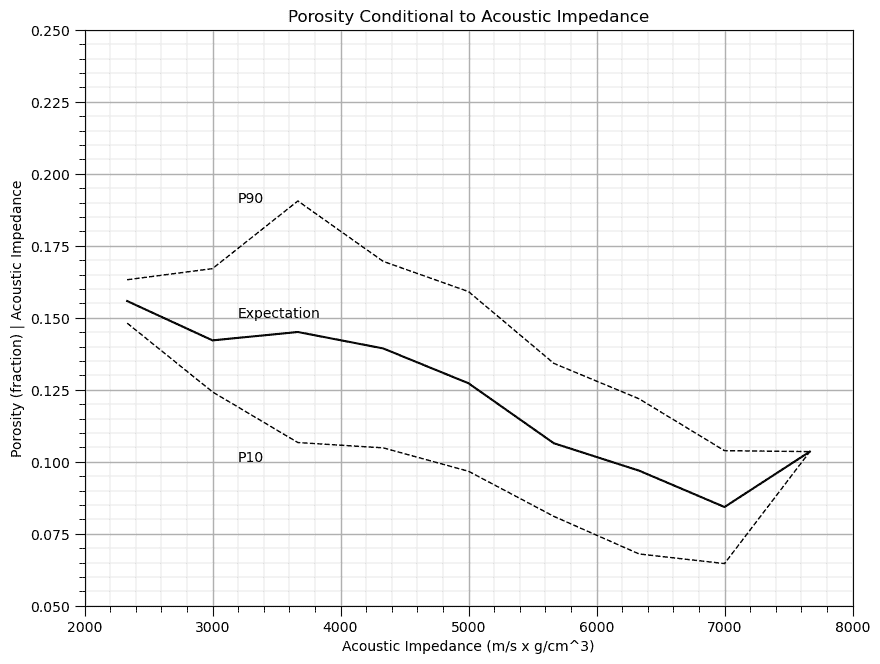

声阻抗是否提供了关于孔隙度的信息？

是的，显然条件统计量随声阻抗的变化而变化，知道声阻抗可以减少孔隙度的不确定性。

+   这提供了一个强大、非参数的关系模型，即没有任何假设，如线性。 

## 注释

这是对多元分析的基本处理，重点是双变量分析。可以做和讨论的还有很多，我有很多更多的资源。请查看我的[共享资源清单](https://michaelpyrcz.com/my-resources)以及本章开头提供的 YouTube 讲座链接，视频描述中包含资源链接。

我希望这有所帮助，

*迈克尔*

## 关于作者


迈克尔·皮尔奇兹教授在德克萨斯大学奥斯汀分校 40 英亩校园的办公室。

迈克尔·皮尔奇兹是德克萨斯大学奥斯汀分校[Cockrell 工程学院](https://cockrell.utexas.edu/faculty-directory/alphabetical/p)和[Jackson 地球科学学院](https://www.jsg.utexas.edu/researcher/michael_pyrcz/)的教授，在那里他研究并教授地下、空间数据分析、地统计学和机器学习。迈克尔还是，

+   [能源分析](https://fri.cns.utexas.edu/energy-analytics)新生研究项目的首席研究员，德克萨斯大学奥斯汀分校自然科学院机器学习实验室的核心教员

+   [计算机与地球科学](https://www.sciencedirect.com/journal/computers-and-geosciences/about/editorial-board)的副编辑，以及国际数学地球科学协会[数学地球科学](https://link.springer.com/journal/11004/editorial-board)的董事会成员。

迈克尔已经撰写了 70 多篇[同行评审出版物](https://scholar.google.com/citations?user=QVZ20eQAAAAJ&hl=en)，一个用于空间数据分析的[Python 包](https://pypi.org/project/geostatspy/)，合著了一本关于空间数据分析的教科书[地统计学储层建模](https://www.amazon.com/Geostatistical-Reservoir-Modeling-Michael-Pyrcz/dp/0199731446)，并是两本最近发布的电子书的作者，[Python 应用地统计学：GeostatsPy 实践指南](https://geostatsguy.github.io/GeostatsPyDemos_Book/intro.html)和[Python 应用机器学习：实践指南与代码](https://geostatsguy.github.io/MachineLearningDemos_Book/intro.html)。

迈克尔的所有大学讲座都可以在他的[YouTube 频道](https://www.youtube.com/@GeostatsGuyLectures)上找到，其中包含 100 多个 Python 交互式仪表板和 40 多个 GitHub 仓库中的详细文档工作流程，以支持任何感兴趣的学生和在职专业人士。要了解更多关于迈克尔的工作和共享教育资源，请访问他的网站。

## 想要一起工作吗？

我希望这些内容对那些想了解更多关于地下建模、数据分析和机器学习的人有所帮助。学生和在职专业人士欢迎参加。

+   想邀请我到贵公司进行培训、辅导、项目审查、工作流程设计和/或咨询吗？我很乐意拜访并与您合作！

+   感兴趣合作、支持我的研究生研究或我的地下数据分析与机器学习联盟（共同负责人是约翰·福斯特教授）吗？我的研究结合数据分析、随机建模和机器学习理论及实践，开发新的方法和工作流程以增加价值。我们正在解决具有挑战性的地下问题！

+   我可以通过 mpyrcz@austin.utexas.edu 联系我。

我总是很高兴讨论，

*迈克尔*

迈克尔·J·皮尔奇，博士，P.Eng. 教授，德克萨斯大学奥斯汀分校 Cockrell 工程学院和 Jackson 地球科学学院

更多资源请访问：[Twitter](https://twitter.com/geostatsguy) | [GitHub](https://github.com/GeostatsGuy) | [网站](http://michaelpyrcz.com) | [Google Scholar](https://scholar.google.com/citations?user=QVZ20eQAAAAJ&hl=en&oi=ao) | [地统计学书籍](https://www.amazon.com/Geostatistical-Reservoir-Modeling-Michael-Pyrcz/dp/0199731446) | [YouTube](https://www.youtube.com/channel/UCLqEr-xV-ceHdXXXrTId5ig) | [Python 中应用地统计学电子书](https://geostatsguy.github.io/GeostatsPyDemos_Book/intro.html) | [Python 中应用机器学习电子书](https://geostatsguy.github.io/MachineLearningDemos_Book/) | [LinkedIn](https://www.linkedin.com/in/michael-pyrcz-61a648a1)

## 多元分析的动力

为了构建好的机器学习模型，我们建立在统计分析的基础上，探索和理解数据内部的关系。这包括一次探索两个或更多特征之间的关系！

+   在许多情况下，这些多元统计分析实际上是机器学习方法的关键组成部分，例如，主成分分析中计算特征值和特征向量是从协方差矩阵中得出的。

让我们简要地谈谈双变量和多元方法。我必须承认，目前双变量之外的统计是占位符。注意，在特征排名工作流程（上文链接）中，我已经包括了部分相关、基于互信息的最大相关最小冗余（MRMR）和随机森林特征重要性方法，这些方法提取了双变量之外的信息。

## 双变量分析

理解和量化两个变量之间的关系，即双变量概率密度函数，例如，$f_{x,y}(x,y)$，

+   孔隙率和渗透率

+   砂岩和石油回收率

+   铜 和 金

+   基面积和树高

我们如何利用这些关系？为了改进我们的预测模型，并最终做出更好的决策。

如果我们忽略这些关系，仅仅分别对每个特征进行建模，会有什么影响？

+   **独立性假设** - 我们估计或模拟的实现之间将没有关系，联合概率密度函数将不会被复制，可能发生不现实的组合，例如，非常高的渗透率与非常低的孔隙率

+   **数据条件化** - 将在数据位置上施加关系。地统计学模型尊重数据位置上的数据，数据散点图是正确的关系，但远离数据时这种关系会减弱

这里有一个有趣的二元关系的例子。当我们散点图数据并绘制岩相时，我们可以看到与孔隙率和渗透率相关的自然分组。显然，仅考虑孔隙率或渗透率不足以理解这些数据。


复杂双变量关系的示例。

双变量统计是我们量化并在我们的地统计学模型中施加这些双变量关系的工具。

## 双变量统计

**皮尔逊积矩相关系数**或简称相关系数，是一种广为人知的双变量统计量，如果你说 0.9 的相关性，大多数工程师和科学家都能想象出来！以下是相关系数的重要点和局限性，

+   相关性的符号表示为，$\rho_{x,y}$

+   提供了线性关系程度的度量，即非线性关系将偏置相关系数

+   对异常值非常敏感，即单个极端异常值可以显著增加或减少明显的相关性

关于高斯假设，还有一些其他更深入的观点需要说明，

+   在双变量高斯假设下，相关系数才为双变量关系提供完整的描述。如果我们假设高斯分布，那么均值 $\overline{x}$ 和 $\overline{y}$，标准差 $s_x$ 和 $s_y$，以及相关系数 $\rho_{x,y}$ 完全描述了双变量概率密度函数 $f_{x,y}(x,y)$

+   对于任何其他分布，相关系数不足以了解整个双变量概率密度函数 $f_{x,y}(x,y)$，例如，为了计算条件分布，$f_{x|y}$

+   地统计学中的标准方法是对每个特征应用高斯形变，然后假设双变量高斯，这样相关系数就足以描述两个特征之间的关系

那么，空间双变量关系如何？

+   完整的克立格系统包括交叉变异图和交叉协方差，它们捕捉了两个特征在空间中的关系！但由于推断和建模所需的核心区划线性模型难度较大，这种情况很少发生。

+   而不是简化地应用如同位素克立格法，它只保留了同位素次级数据，并将双变量关系的模型限制在同位素（滞后 $\bf{h}$ 为 0.0）的相关系数。

可以做更多的事情！让我们回顾一下变量 $x$ 的样本方差。当然，我在这里截断了我们的符号，因为 $x$ 是我们建模空间中样本点的集合，$x(\bf{u_\alpha}), \, \forall \, \alpha = 0, 1, \dots, n - 1$。

$$ \sigma²_{x} = \frac{\sum_{i=1}^{n} (x_i - \overline{x})²}{(n-1)} $$

我们可以展开平方项，并用 $y$ 替换其中一个，$y$ 是除了 $x$ 之外的另一个变量。

$$ C_{xy} = \frac{\sum_{i=1}^{n} (x_i - \overline{x})(y_i - \overline{y})}{(n-1)} $$

现在我们有一个表示变量 $x$ 和 $y$ 共变或共同变化方式的度量。我们可以通过 $x$ 和 $y$ 的标准差乘积来标准化协方差，以计算相关系数。

$$ \rho_{xy} = \frac{\sum_{i=1}^{n} (x_i - \overline{x})(y_i - \overline{y})}{(n-1)\sigma_x \sigma_y}, \, -1.0 \le \rho_{xy} \le 1.0 $$

总结来说，我们可以指出相关系数与协方差的关系如下：

$$ \rho_{xy} = \frac{C_{xy}}{\sigma_x \sigma_y} $$

为了帮助您校准对相关系数的视觉判断，我开发了一个交互式的 [相关仪表板](https://github.com/GeostatsGuy/DataScienceInteractivePython/blob/main/Interactive_Correlation_Coefficient.ipynb)。

+   对于双变量高斯情况，改变相关系数并观察样本、条件期望和联合概率密度。


用于可视化相关系数的交互式 Python 仪表板。

人的相关系数对异常值和偏离线性行为（在双变量意义上）非常敏感。

在存在异常值和非线性的情况下，我们有一个称为斯皮尔曼秩相关系数的替代方法，用于更稳健的相关度量。

$$ \rho_{R_x R_y} = \frac{\sum_{i=1}^{n} (R_{x_i} - \overline{R_x})(R_{y_i} - \overline{R_y})}{(n-1)\sigma_{R_x} \sigma_{R_y}}, \, -1.0 \le \rho_{R_x,R_y} \le 1.0 $$

秩相关在计算相关系数之前将秩变换应用于数据。要计算秩变换，只需将数据值替换为秩 $R_x = 1,\dots,n$，其中 $n$ 是最大值，$1$ 是最小值。

$$ x_\alpha, \, \forall \alpha = 1,\dots, n, \, | \, x_i \ge x_j \, \forall \, i \gt j $$$$ R_{x_i} = i $$

为了比较存在异常值时的皮尔逊相关和秩相关，我开发了这个 [相关异常仪表板](https://github.com/GeostatsGuy/DataScienceInteractivePython/blob/main/Interactive_Correlation_Coefficient_Issues.ipynb)，


用于可视化相关系数的交互式 Python 仪表板。

相关系数提供了有用的指标，可以量化两个变量之间的关系。我们还可以考虑二元散点图和矩阵散点图来可视化多元数据。

+   记住，当前的实际地下建模是二元模型，一次处理两个变量

## 多元统计分析

虽然我们局限于二元模型，但我们需要了解一些多元方法来处理多元数据。

+   这里只提供了一个简短的总结，有关联合概率和分布的讨论请参阅概率概念章节

+   请参阅我关于[多元分析](https://youtu.be/Ui2El5CZPRE?si=uA_IqurENzC6Owbg)的讲座

这里是多元统计分析的简要总结。如果我们定义特征$X_1$的概率密度函数（PDF），

$$ f_{X_1}(x_1) $$

我们可以将定义扩展到任意数量的联合概率密度函数，例如，$m$个特征，如下所示，

$$ f_{X_1,\ldots,X_m}(x_1,\ldots,x_m) $$

类似地，条件概率密度函数也可以计算，

$$ f_{Y | X}(y | x) $$

并扩展到任意数量的特征，例如，$m$个特征，如下所示，

$$ f_{Y | X_1, \ldots, X_m}(y | x_1,\ldots,x_m) $$

许多我们的统计概念都扩展到高维，例如，考虑相关系数，

$$ \rho_{X,Y} $$

两个特征之间的相关系数，现在计算两个特征（$X$和$Y$）之间的部分相关系数，同时控制所有其他特征（$Z$）。

$$ \rho_{X,Y | Z} $$

最终，计算高维（大量多元）概率和统计学的困难在于推断，我们很少拥有足够的数据来观察广阔的多变量空间，并在该空间中建模概率和统计学！

+   请参阅上面链接的关于维度诅咒的讲座。

## 加载所需的库

以下代码加载所需的库。

```py
import geostatspy.GSLIB as GSLIB                              # GSLIB utilities, visualization and wrapper
import geostatspy.geostats as geostats                        # GSLIB methods convert to Python 
import geostatspy
print('GeostatsPy version: ' + str(geostatspy.__version__)) 
```

```py
GeostatsPy version: 0.0.71 
```

我们还需要一些标准包。这些应该已经与 Anaconda 3 一起安装。

```py
ignore_warnings = True                                        # ignore warnings?
import numpy as np                                            # ndarrays for gridded data
import pandas as pd                                           # DataFrames for tabular data
from scipy import stats                                       # summary statistics
from scipy.stats import pearsonr                              # Pearson product moment correlation
from scipy.stats import spearmanr                             # spearman rank correlation
from scipy.stats import rankdata                              # rank data for visualization
import copy                                                   # for deep copies
import os                                                     # set working directory, run executables
import matplotlib.pyplot as plt                               # for plotting
from matplotlib.ticker import (MultipleLocator, AutoMinorLocator) # control of axes ticks
from matplotlib.colors import ListedColormap                  # custom color maps
import seaborn as sns                                         # advanced plotting
import matplotlib.ticker as mtick                             # control tick label formatting
plt.rc('axes', axisbelow=True)                                # plot all grids below the plot elements
if ignore_warnings == True:                                   
    import warnings
    warnings.filterwarnings('ignore')
cmap = plt.cm.inferno                                         # color map
seed = 42                                                     # random number seed 
```

如果您遇到包导入错误，您可能需要首先安装这些包中的一些。这通常可以通过在 Windows 上打开命令窗口并输入‘python -m pip install [package-name]’来完成。更多帮助可以在相应的包文档中找到。

## 声明函数

让我们定义一个单一函数来简化相关矩阵的绘制。我还添加了一个方便的函数来添加主网格线和副网格线，以提高图表的可解释性。

```py
def plot_corr(corr_matrix,title,limits,mask):                 # plots a graphical correlation matrix 
    my_colormap = plt.cm.get_cmap('RdBu_r', 256)          
    newcolors = my_colormap(np.linspace(0, 1, 256))
    white = np.array([256/256, 256/256, 256/256, 1])
    white_low = int(128 - mask*128); white_high = int(128+mask*128)
    newcolors[white_low:white_high, :] = white                # mask all correlations less than abs(0.8)
    newcmp = ListedColormap(newcolors)
    m = corr_matrix.shape[0]
    im = plt.matshow(corr_matrix,fignum=0,vmin = -1.0*limits, vmax = limits,cmap = newcmp)
    plt.xticks(range(len(corr_matrix.columns)), corr_matrix.columns)
    plt.yticks(range(len(corr_matrix.columns)), corr_matrix.columns)
    plt.colorbar(im, orientation = 'vertical')
    plt.title(title)
    for i in range(0,m):
        plt.plot([i-0.5,i-0.5],[-0.5,m-0.5],color='black')
        plt.plot([-0.5,m-0.5],[i-0.5,i-0.5],color='black')
    plt.ylim([-0.5,m-0.5]); plt.xlim([-0.5,m-0.5])

def add_grid():
    plt.gca().grid(True, which='major',linewidth = 1.0); plt.gca().grid(True, which='minor',linewidth = 0.2) # add y grids
    plt.gca().tick_params(which='major',length=7); plt.gca().tick_params(which='minor', length=4)
    plt.gca().xaxis.set_minor_locator(AutoMinorLocator()); plt.gca().yaxis.set_minor_locator(AutoMinorLocator()) # turn on minor ticks 

def add_grid2(sub_plot):
    sub_plot.grid(True, which='major',linewidth = 1.0); sub_plot.grid(True, which='minor',linewidth = 0.2) # add y grids
    sub_plot.tick_params(which='major',length=7); sub_plot.tick_params(which='minor', length=4)
    sub_plot.xaxis.set_minor_locator(AutoMinorLocator()); sub_plot.yaxis.set_minor_locator(AutoMinorLocator()) # turn on minor ticks 
```

## 设计自定义颜色图

通过屏蔽非显著值来考虑显著性

+   目前仅用于演示，可以根据结果置信度和不确定性更新每个图表

```py
my_colormap = plt.cm.get_cmap('RdBu_r', 256)                  # make a custom colormap
newcolors = my_colormap(np.linspace(0, 1, 256))               # define colormap space
white = np.array([250/256, 250/256, 250/256, 1])              # define white color (4 channel)
#newcolors[26:230, :] = white                                 # mask all correlations less than abs(0.8)
#newcolors[56:200, :] = white                                 # mask all correlations less than abs(0.6)
newcolors[76:180, :] = white                                  # mask all correlations less than abs(0.4)
signif = ListedColormap(newcolors)                            # assign as listed colormap

my_colormap = plt.cm.get_cmap('inferno', 256)                 # make a custom colormap
newcolors = my_colormap(np.linspace(0, 1, 256))               # define colormap space
white = np.array([250/256, 250/256, 250/256, 1])              # define white color (4 channel)
#newcolors[26:230, :] = white                                 # mask all correlations less than abs(0.8)
newcolors[0:12, :] = white                                    # mask all correlations less than abs(0.6)
#newcolors[86:170, :] = white                                 # mask all correlations less than abs(0.4)
sign1 = ListedColormap(newcolors)                             # assign as listed colormap 
```

## 可视化相关系数

在我们加载数据之前，让我们现场生成一些合成二元高斯数据并计算相关系数。

+   这将帮助我们校准我们的眼睛以适应相关系数，在高斯情况下，它完美地描述了关系

您可以指定 4 个相关系数和数据的数量，然后重新运行此块以可视化散点图。

```py
corr_mat = [-0.96,0.0,0.4,0.7]; ndata = 1000                   # set the correlation coefficient, number of samples

for i, corr in enumerate(corr_mat):
    plt.subplot(2,2,i+1)
    mean = np.array([0,0])                                     # make the bivariate Gaussian data
    correl = np.array([[1.0,corr],[corr,1.0]],dtype=float)
    np.random.seed(seed = seed)
    sample = np.random.multivariate_normal(mean,correl,size = ndata)
    plt.scatter(sample[:,0],sample[:,1],color = 'red',alpha = 0.2,edgecolors='black',label = 'Samples',zorder=100)
    plt.xlim([-3.0,3.0]); plt.ylim([-3.0,3.0])
    plt.xlabel(r'$x_1$'); plt.ylabel(r'$X_2$'); plt.legend(loc='upper left'); add_grid()
    plt.title(r'Bivariate Standard Gaussian Distributed Data with $\rho_{x_1,x_2} =$' + str(np.round(corr,2)))

plt.subplots_adjust(left=0.0, bottom=0.0, right=2.0, top=2.2, wspace=0.3, hspace=0.3); plt.show() 
```


## 异常值对相关系数的影响

让我们观察单个异常值对相关系数的影响。

+   比较皮尔逊积矩相关系数和斯皮尔曼秩相关系数

如何运行此示例？

+   设置原始数据的相关性，默认为 0.0，无相关性

+   设置具有相关性的原始样本中的数据数量

+   将样本 $x_{n+1},y_{n+1}$ 设置为可能作为异常值添加到数据中

对于我设计的案例，您将观察到，

+   当新样本位于先前数据中间时，对相关统计量没有显著影响

+   当新样本进一步远离样本数据时，相关系数增加，而秩相关系数保持接近原始样本的相关性，它在存在异常值的情况下更稳健

```py
corr = 0.0; outlier_mat = [0,1,1.5,1.9]; ndata = 100           # set the correlation coefficient, number of samples

for i, outlier in enumerate(outlier_mat):
    plt.subplot(2,2,i+1)
    mean = np.array([0,0])                                     # make the bivariate Gaussian data
    correl = np.array([[1.0,corr],[corr,1.0]],dtype=float)
    np.random.seed(seed = seed)
    sample = np.random.multivariate_normal(mean,correl,size = ndata)
    sample = np.vstack([sample, [pow(10.0,outlier),pow(10.0,outlier)]]) # add outlier
    plt.scatter(sample[:,0],sample[:,1],color = 'red',alpha = 0.2,edgecolors='black',s=10,label = 'samples',zorder=100) # plot result
    plt.scatter(sample[-1,0],sample[-1,1],color = 'black',alpha = 0.8,marker = 'x',label = 'outlier', zorder=200)
    plt.xlim([-3.0,100.0]); plt.ylim([-3.0,100.0])
    plt.xlabel(r'$x_1$'); plt.ylabel(r'$X_2$'); plt.legend(loc='upper left'); add_grid()
    plt.title(r'Bivariate Standard Gaussian Distributed Data with $\rho_{x_1,x_2} =$' + str(np.round(corr,2)))
    pearson_corr = pearsonr(sample[:,0],sample[:,1])[0]
    rank_corr = spearmanr(sample[:,0],sample[:,1])[0]
    plt.annotate(r'$\rho_{x_1,x_2}$ = ' + str(np.round(pearson_corr,3)),[75.0,30.0])
    plt.annotate(r'$\rho_{R_{x_1},R_{x_2}}$ = ' + str(np.round(rank_corr,3)),[75.0,25.0])
plt.subplots_adjust(left=0.0, bottom=0.0, right=2.0, top=2.2, wspace=0.3, hspace=0.3); plt.show() 
```


我们已经准备好加载数据并处理双变量和多变量统计。

## 设置工作目录

我总是喜欢这样做，这样我就不会丢失文件，并且可以简化后续的读取和写入（每次避免包含完整地址）。

```py
#os.chdir("c:/PGE383")                                        # set the working directory 
```

## 加载表格数据

这是将我们的逗号分隔数据文件加载到 Pandas DataFrame 对象中的命令。

让我们加载提供的多元、空间数据集‘sample_data_MV_biased.csv’。它是一个逗号分隔的文件，包含：

+   X 和 Y 坐标 ($m$)

+   地层 0 和 1

+   孔隙率（分数）

+   渗透率 ($mD$)

+   声波阻抗 ($\frac{kg}{m³} \cdot \frac{m}{s} \cdot 10³$).

```py
#df = pd.read_csv('sample_data_MV_biased.csv')                # load our data table
df = pd.read_csv('https://raw.githubusercontent.com/GeostatsGuy/GeoDataSets/master/sample_data_MV_biased.csv')
df = df.iloc[:,1:] 
```

## 可视化 DataFrame

可视化 DataFrame 很有用。

我们可以通过使用‘head’DataFrame 成员函数来预览（格式整洁、美观，见下文）。

+   添加参数‘n=13’以查看数据集的前 13 行。

```py
df.head(n=13)                                                 # we could also use this command for a table preview 
```

|  | X | Y | Facies | Porosity | Perm | AI |
| --- | --- | --- | --- | --- | --- | --- |
| 0 | 100.0 | 900.0 | 0.0 | 0.101319 | 1.996868 | 5590.417154 |
| 1 | 100.0 | 800.0 | 1.0 | 0.147676 | 10.711789 | 3470.845666 |
| 2 | 100.0 | 700.0 | 1.0 | 0.145912 | 17.818143 | 3586.988513 |
| 3 | 100.0 | 600.0 | 1.0 | 0.186167 | 217.109365 | 3732.114787 |
| 4 | 100.0 | 500.0 | 1.0 | 0.146088 | 16.717367 | 2534.551236 |
| 5 | 200.0 | 900.0 | 1.0 | 0.129949 | 23.348473 | 4781.590782 |
| 6 | 200.0 | 700.0 | 1.0 | 0.185299 | 595.674540 | 4729.017454 |
| 7 | 200.0 | 600.0 | 1.0 | 0.164923 | 154.555841 | 2147.668805 |
| 8 | 200.0 | 500.0 | 1.0 | 0.167026 | 50.970899 | 4583.679953 |
| 9 | 200.0 | 400.0 | 1.0 | 0.125382 | 4.061772 | 4477.930200 |
| 10 | 200.0 | 200.0 | 0.0 | 0.077419 | 1.162642 | 6844.535923 |
| 11 | 300.0 | 800.0 | 1.0 | 0.164797 | 497.593578 | 3881.489046 |
| 12 | 300.0 | 700.0 | 1.0 | 0.165155 | 486.504799 | 3726.023776 |

## 表格数据的摘要统计

在 DataFrames 中，有很多高效的方法来计算表格数据的摘要统计。describe 命令提供了一个很好的数据表，提供了计数、平均值、最小值、最大值和四分位数。

+   我们使用转置只是翻转表格，以便特征在行上，统计在列上。

```py
df.describe().transpose()                                     # DataFrame summary statistics 
```

|  | 计数 | 平均值 | 标准差 | 最小值 | 25% | 50% | 75% | 最大值 |
| --- | --- | --- | --- | --- | --- | --- | --- | --- |
| X | 368.0 | 499.565217 | 289.770794 | 0.000000 | 240.000000 | 500.000000 | 762.500000 | 990.000000 |
| Y | 368.0 | 520.644022 | 277.412187 | 9.000000 | 269.000000 | 539.000000 | 769.000000 | 999.000000 |
| 地层 | 368.0 | 0.597826 | 0.491004 | 0.000000 | 0.000000 | 1.000000 | 1.000000 | 1.000000 |
| 孔隙率 | 368.0 | 0.127026 | 0.030642 | 0.041122 | 0.103412 | 0.125842 | 0.148623 | 0.210258 |
| 渗透率 | 368.0 | 85.617362 | 228.362654 | 0.094627 | 2.297348 | 10.377292 | 50.581288 | 1991.097723 |
| 人工智能 | 368.0 | 4791.736646 | 974.560569 | 1981.177309 | 4110.728374 | 4713.325533 | 5464.043562 | 7561.250336 |

## 使用位置图可视化表格数据

手动设置 x 和 y 坐标和特征范围是自然的，例如，你希望你的颜色条从 0.05887 精确到 0.24230 吗？此外，让我们选择一个用于显示的颜色图。

+   我听说等离子体对色盲友好，因为颜色和强度是同时变化的（希望我理解正确，这是一个有趣的 Twitter 对话，由敏捷的 Matt Hall 发起，如果我记得正确的话）。

+   我们将假设研究区域在 x 和 y 方向上为 0 到 1000 米，并省略此区域之外的所有数据。

```py
xmin = 0.0; xmax = 1000.0                                     # range of x values
ymin = 0.0; ymax = 1000.0                                     # range of y values
pormin = 0.05; pormax = 0.25;                                 # range of porosity values
permmin = 0.01; permmax = 2000.0                              # range of permeability values
AImin = 2000.0; AImax = 8000.0                                # range of AI values
nx = 100; ny = 100; csize = 10.0 
```

让我们尝试 locmap。这是 GSLIB 的 locmap 程序的重新实现，它使用 matplotlib。我希望你发现它比 matplotlib 更简单，如果你想更高级并构建自定义图表，请查看源代码。如果你改进了它，请把新代码发给我。

现在我们可以填充绘图参数并可视化孔隙率数据。

```py
plt.subplot(221)
GSLIB.locmap_st(df,'X','Y','Facies',xmin,xmax,ymin,ymax,0,1,'Well Data - Porosity','X(m)','Y(m)','Facies (0-shale, 1-sand)',cmap)

plt.subplot(222)
GSLIB.locmap_st(df,'X','Y','Porosity',xmin,xmax,ymin,ymax,pormin,pormax,'Well Data - Porosity','X(m)','Y(m)','Porosity (fraction)',cmap)

plt.subplot(223)
GSLIB.locmap_st(df,'X','Y','Perm',xmin,xmax,ymin,ymax,permmin,permmax,'Well Data - Permeability','X(m)','Y(m)','Permeability (md)',cmap)

plt.subplot(224)
GSLIB.locmap_st(df,'X','Y','AI',xmin,xmax,ymin,ymax,AImin,AImax,'Well Data - Acoustic Impedance','X(m)','Y(m)','Acoustic Impedance (m/s x g/cm³)',cmap)

plt.subplots_adjust(left=0.0, bottom=0.0, right=1.5, top=1.7, wspace=0.3, hspace=0.3); plt.show() 
```


## 双变量分析

让我们从简单的双变量散点图和计算双变量统计开始。以下是散点图。

+   我在下面包含了代码（已注释），用于将图表保存为图像文件。注意，你可以写入多种不同的格式，例如.tif、jpg 等，你也可以控制分辨率。

+   通过保存为.pdf、.svg 或 eps 格式，你可以创建矢量图形，它们在任何分辨率下都保持清晰，同时文件大小经济。

```py
plt.subplot(121)
plt.plot(df['Porosity'].values,df['Perm'].values, 'o', label='', markerfacecolor='darkorange', markeredgecolor='black', alpha=0.8)
plt.title('Well Data Permeability vs. Porosity')
plt.xlabel('Porosity (fraction)'); plt.ylabel('Permeability (mD)')
plt.xlim([pormin,pormax]); plt.ylim([permmin,permmax]); add_grid()

plt.subplot(122)
plt.plot(df['AI'].values,df['Porosity'].values, 'o', label='', markerfacecolor='darkorange', markeredgecolor='black', alpha=0.8)
plt.title('Well Data Porosity vs. Acoustic Impedance')
plt.ylabel('Porosity (fraction)'); plt.xlabel('Acoustic Impedance (m/s x g/cm³)')
plt.xlim([AImin,AImax]); plt.ylim([pormin,pormax]); add_grid()

plt.subplots_adjust(left=0.0, bottom=0.0, right=1.5, top=0.8, wspace=0.3, hspace=0.2)
#plt.savefig('Test.pdf', dpi=600, bbox_inches = 'tight',format='pdf') 
plt.show() 
```


## 相关系数和协方差

从我们的数据集中的数据对中计算协方差和相关性是直接的。以下是协方差矩阵。

+   注意矩阵是对称的？这是有道理的，因为$C_{Por,Perm} = C_{Perm,Por}$。

+   此外，请注意，对角线值（$C_{i,j}$ 其中 $i=j$）等于方差。

我们通过计算方差来检查孔隙率。

```py
print(df.iloc[:,3:7].cov())                                   # the covariance matrix for columns 3,4,5 and 6 and all rows
print('The variance of porosity is ' + str(round(np.var(df['Porosity'].values),6))) 
```

```py
 Porosity          Perm             AI
Porosity   0.000939      4.055029     -17.132244
Perm       4.055029  52149.501968  -46471.695092
AI       -17.132244 -46471.695092  949768.302409
The variance of porosity is 0.000936 
```

这里是相关系数矩阵。

```py
df.iloc[:,3:7].corr()                                         # correlation matrix 
```

|  | 孔隙率 | 渗透率 | AI |
| --- | --- | --- | --- |
| 孔隙率 | 1.000000 | 0.579493 | -0.573700 |
| 渗透率 | 0.579493 | 1.000000 | -0.208812 |
| AI | -0.573700 | -0.208812 | 1.000000 |

## 可视化相关矩阵

如下可视化相关矩阵是方便的。

+   我添加了一个自定义的颜色条来传达显著性。仅作演示，我没有计算置信区间，但可以添加。

```py
corr_matrix = df.iloc[:,2:].corr()
plt.subplot(111)
plot_corr(corr_matrix,'Correlation Matrix',1.0,0.5)           # using our correlation matrix visualization function
plt.subplots_adjust(left=0.0, bottom=0.0, right=1.0, top=0.8, wspace=0.2, hspace=0.3); plt.show() 
```


要计算一个单个相关系数及其关联的 p 值以进行显著性检验，我们可以使用 SciPy 的 pearsonr 函数。

+   p 值表明我们会在哪个 $\alpha$ 水平上拒绝零假设，即相关系数实际上为 0.0，并且该值是由于随机效应造成的。

```py
corr, corr_p_value = pearsonr(df['Porosity'],df['Perm'])

plt.subplot(111)
plt.plot(df['Porosity'].values,df['Perm'].values, 'o', label='', markerfacecolor='darkorange', markeredgecolor='black', alpha=0.8)
plt.title('Well Data Permeability vs. Porosity')
plt.xlabel('Porosity (fraction)'); plt.ylabel('Permeability (mD)')
plt.xlim([pormin,pormax]); plt.ylim([permmin,permmax]); add_grid()

plt.annotate(r'$\rho_{\phi,k}$ = ' + str(np.round(corr,3)),[0.075,1600.0])
plt.annotate(r'$\rho_{\phi,k}$, p-value = ' + str(np.round(corr_p_value,20)),[0.075,1500.0])
plt.subplots_adjust(left=0.0, bottom=0.0, right=1.0, top=1.2, wspace=0.3, hspace=0.2); plt.show() 
```


孔隙率和渗透率相关系数的 p 值为 2.1569195170201772e-34，

+   对于任何可行的 alpha 水平，相关性显著不同于 0.0。

## 斯皮尔曼秩相关系数

斯皮尔曼秩相关系数提供了单调关系程度的度量。

+   秩转换，例如 $R_(x_i)$，按升序排序数据，并用索引替换数据，$i=1,\ldots,n$。

+   在存在异常值和一些非线性特征的情况下，斯皮尔曼秩相关系数比皮尔逊相关系数更稳健。

让我们尝试使用 SciPy 的 stats 模块函数来计算秩相关系数。

+   它还为每个度量提供了一个 p 值，用于显著性检验，即如果 p 值 < alpha，则我们拒绝零假设，即秩相关系数为 0.0。

```py
rank_correlation, rank_correlation_pval = stats.spearmanr(df.iloc[:,2:]) # calculate the range correlation coefficient
rank_matrix = pd.DataFrame(rank_correlation,columns=corr_matrix.columns)
print('Rank Correlation:')
print(rank_correlation)
print('\nRank Correlation p-value:')
print(rank_correlation_pval) 
```

```py
Rank Correlation:
[[ 1\.          0.79973189  0.71923703 -0.50503617]
 [ 0.79973189  1\.          0.88314655 -0.56863773]
 [ 0.71923703  0.88314655  1\.         -0.34876935]
 [-0.50503617 -0.56863773 -0.34876935  1\.        ]]

Rank Correlation p-value:
[[0.00000000e+000 4.11417796e-083 7.49150387e-060 3.24513314e-025]
 [4.11417796e-083 0.00000000e+000 2.26847950e-122 6.59769641e-033]
 [7.49150387e-060 2.26847950e-122 0.00000000e+000 5.77157354e-012]
 [3.24513314e-025 6.59769641e-033 5.77157354e-012 0.00000000e+000]] 
```

## 比较皮尔逊和斯皮尔曼相关系数

让我们创建一个简单的随机数据集，添加一个异常值，然后比较皮尔逊和斯皮尔曼相关系数。

```py
corr = 0.0; xout = 9; yout = 9; n = 100                       # correlation, outlier datum, and total number of data
mean = [0, 0]                                                 # bivariate Gaussian mean vector
cov = [[1, corr], [corr, 1]]                                  # bivariate Gaussian covariance matrix

np.random.seed(seed = seed)                                   # set seed for repeatability
samples = np.random.multivariate_normal(mean, cov, n)         # random samples from bivariate Gaussian
samples[-1,0] = xout; samples[-1,1] = yout                    # replace last sample with user specified outlier
x2 = samples[:, 0]; y2 = samples[:, 1]                        # copy x and y for compact code

corr = stats.pearsonr(x2[:-1],y2[:-1])[0]                     # calculate Pearson and Spearman correlation without outlier
rank_corr = stats.spearmanr(x2[:-1],y2[:-1])[0] 
corr_out = stats.pearsonr(x2,y2)[0]                           # calculate Pearson and Spearman correlation with outlier
rank_corr_out = stats.spearmanr(x2,y2)[0]

plt.subplot(121)
plt.scatter(x2,y2,color='red',edgecolor='black',zorder=1)     # plot and annotate results
plt.scatter(x2[-1],y2[-1],color='white',edgecolor='black',zorder=10)
plt.scatter([5.7,5.7],[0.17,-1.8],color='white',edgecolor='black',zorder=1) 
plt.scatter([5.4],[-1.8],color='red',edgecolor='black',zorder=1) 
plt.annotate('With outlier:',[6.0,0.1])
plt.annotate(r'$\rho^{out}_{x,y} = $',[6.5,-0.5])
plt.annotate(r'$\rho^{out}_{R_x,R_y} = $',[6.5,-1.2])
plt.annotate('Without outlier:',[6.0,-1.9])
plt.annotate(r'$\rho_{x,y} = $',[6.5,-2.5])
plt.annotate(r'$\rho_{R_x,R_y} = $',[6.5,-3.2])
plt.xlim([-4,10]); plt.ylim([-4,10]); plt.xlabel('X'); plt.ylabel('Y'); add_grid(); plt.title('Impact of an Outlier on Correlation')

plt.subplot(122)
plt.scatter(x2,y2,color='red',edgecolor='black',zorder=1)       # plot and annotate results
plt.scatter(x2[-1],y2[-1],color='white',edgecolor='black',zorder=10)
plt.scatter([5.7,5.7],[0.17,-1.8],color='white',edgecolor='black',zorder=1) 
plt.scatter([5.4],[-1.8],color='red',edgecolor='black',zorder=1) 
plt.annotate('With outlier:',[6.0,0.1])
plt.annotate(r'$\rho^{out}_{x,y} = $' + str(round(corr_out,2)),[6.5,-0.5])
plt.annotate(r'$\rho^{out}_{R_x,R_y} = $' + str(round(rank_corr_out,2)),[6.5,-1.2])
plt.annotate('Without outlier:',[6.0,-1.9])
plt.annotate(r'$\rho_{x,y} = $' + str(round(corr,2)),[6.5,-2.5])
plt.annotate(r'$\rho_{R_x,R_y} = $' + str(round(rank_corr,2)),[6.5,-3.2])
plt.xlim([-4,10]); plt.ylim([-4,10]); plt.xlabel('X'); plt.ylabel('Y'); add_grid(); plt.title('Impact of an Outlier on Correlation')

plt.subplots_adjust(left=0.0, bottom=0.0, right=2.0, top=1.2, wspace=0.2, hspace=0.3); plt.show() 
```


现在让我们看看斯皮尔曼相关系数看到的是什么，通过绘制数据的秩转换图。

```py
x2_rank = rankdata(x2)                                          # rank transform data, x and y separately
y2_rank = rankdata(y2)

plt.subplot(121)
plt.scatter(x2,y2,color='red',edgecolor='black',zorder=1)       # plot and annotate results
plt.scatter(x2[-1],y2[-1],color='white',edgecolor='black',zorder=10)
plt.scatter([5.7,5.7],[0.17,-1.8],color='white',edgecolor='black',zorder=1) 
plt.scatter([5.4],[-1.8],color='red',edgecolor='black',zorder=1) 
plt.annotate('With outlier:',[6.0,0.1])
plt.annotate(r'$\rho^{out}_{x,y} = $' + str(round(corr_out,2)),[6.5,-0.5])
plt.annotate(r'$\rho^{out}_{R_x,R_y} = $' + str(round(rank_corr_out,2)),[6.5,-1.2])
plt.annotate('Without outlier:',[6.0,-1.9])
plt.annotate(r'$\rho_{x,y} = $' + str(round(corr,2)),[6.5,-2.5])
plt.annotate(r'$\rho_{R_x,R_y} = $' + str(round(rank_corr,2)),[6.5,-3.2])
plt.xlim([-4,10]); plt.ylim([-4,10]); plt.xlabel('X'); plt.ylabel('Y'); add_grid(); plt.title('Impact of an Outlier on Correlation')

plt.subplot(122)
plt.scatter(x2_rank,y2_rank,color='red',edgecolor='black',zorder=1) # plot and annotate results
plt.scatter(x2_rank[-1],y2_rank[-1],color='white',edgecolor='black',zorder=10)
plt.xlim([0,n+1]); plt.ylim([0,n+1]); plt.xlabel(r'$X_{rank}$'); plt.ylabel(r'$Y_{rank}$'); add_grid(); plt.title('Data Rank Transformed')

plt.subplots_adjust(left=0.0, bottom=0.0, right=2.0, top=1.2, wspace=0.2, hspace=0.3); plt.show() 
```


## 比较皮尔逊和斯皮尔曼相关系数与抛物线

让我们尝试著名的抛物线示例，该示例通常用于演示非线性对相关性的影响。

```py
x3 = np.linspace(-3.0,3.0,n)
y3 = x3**2

corr = stats.pearsonr(x3,y3)[0]                               # calculate Pearson and Spearman correlation with outlier
rank_corr = stats.spearmanr(x3,y3)[0]

corr_half = stats.pearsonr(x3[:-50],y3[:-50])[0]              # calculate Pearson and Spearman correlation with outlier
rank_corr_half = stats.spearmanr(x3[:-50],y3[:-50])[0]

plt.subplot(121)
plt.scatter(x3,y3,color='red',edgecolor='black',zorder=1)     # plot and annotate results
plt.scatter(x3[:-50],y3[:-50],color='white',edgecolor='black',zorder=10) # first half
plt.scatter([5.7,5.7],[4.15,2.15],color='white',edgecolor='black',zorder=1) 
plt.scatter([5.4],[2.15],color='red',edgecolor='black',zorder=1) 
plt.annotate('First half of data only:',[6.0,4.1])
plt.annotate(r'$\rho^{half}_{x,y} = $',[6.5,3.5])
plt.annotate(r'$\rho^{half}_{R_x,R_y} = $',[6.5,2.8])
plt.annotate('All data:',[6.0,2.1])
plt.annotate(r'$\rho_{x,y} = $',[6.5,1.5])
plt.annotate(r'$\rho_{R_x,R_y} = $',[6.5,0.8])
plt.xlim([-4,10]); plt.ylim([-0.1,10]); plt.xlabel('X'); plt.ylabel('Y'); add_grid(); plt.title('Impact of an Outlier on Correlation')

plt.subplot(122)
plt.scatter(x3,y3,color='red',edgecolor='black',zorder=1)     # plot and annotate results
plt.scatter(x3[:-50],y3[:-50],color='white',edgecolor='black',zorder=10) # first half
plt.scatter([5.7,5.7],[4.15,2.15],color='white',edgecolor='black',zorder=1) 
plt.scatter([5.4],[2.15],color='red',edgecolor='black',zorder=1) 
plt.annotate('First half of data only:',[6.0,4.1])
plt.annotate(r'$\rho^{half}_{x,y} = $' + str(round(corr_half,2)),[6.5,3.5])
plt.annotate(r'$\rho^{half}_{R_x,R_y} = $' + str(round(rank_corr_half,2)),[6.5,2.8])
plt.annotate('All data:',[6.0,2.1])
plt.annotate(r'$\rho_{x,y} = $' + str(round(corr,2)),[6.5,1.5])
plt.annotate(r'$\rho_{R_x,R_y} = $' + str(round(rank_corr,2)),[6.5,0.8])
plt.xlim([-4,10]); plt.ylim([-0.1,10]); plt.xlabel('X'); plt.ylabel('Y'); add_grid(); plt.title('Impact of an Outlier on Correlation')

plt.subplots_adjust(left=0.0, bottom=0.0, right=2.0, top=1.2, wspace=0.2, hspace=0.3); plt.show() 
```


现在让我们看看斯皮尔曼相关系数看到的是什么，通过绘制数据的秩转换图。

```py
x3_rank = rankdata(x3)                                        # rank transform data, x and y separately
y3_rank = rankdata(y3)

plt.subplot(121)
plt.scatter(x3,y3,color='red',edgecolor='black',zorder=1)     # plot and annotate results
plt.scatter(x3[:-50],y3[:-50],color='white',edgecolor='black',zorder=10) # first half
plt.scatter([5.7,5.7],[4.15,2.15],color='white',edgecolor='black',zorder=1) 
plt.scatter([5.4],[2.15],color='red',edgecolor='black',zorder=1) 
plt.annotate('First half of data only:',[6.0,4.1])
plt.annotate(r'$\rho^{half}_{x,y} = $' + str(round(corr_half,2)),[6.5,3.5])
plt.annotate(r'$\rho^{half}_{R_x,R_y} = $' + str(round(rank_corr_half,2)),[6.5,2.8])
plt.annotate('All data:',[6.0,2.1])
plt.annotate(r'$\rho_{x,y} = $' + str(round(corr,2)),[6.5,1.5])
plt.annotate(r'$\rho_{R_x,R_y} = $' + str(round(rank_corr,2)),[6.5,0.8])
plt.xlim([-4,10]); plt.ylim([-0.1,10]); plt.xlabel('X'); plt.ylabel('Y'); add_grid(); plt.title('Impact of an Nonlinearity on Correlation')

plt.subplot(122)
plt.scatter(x3_rank,y3_rank,color='red',edgecolor='black',zorder=1) # plot and annotate results
plt.scatter(x3_rank[:-50],y3_rank[:-50],color='white',edgecolor='black',zorder=10)
plt.xlim([0,n+1]); plt.ylim([0,n+1]); plt.xlabel(r'$X_{rank}$'); plt.ylabel(r'$Y_{rank}$'); add_grid(); plt.title('Data Rank Transformed')

plt.subplots_adjust(left=0.0, bottom=0.0, right=2.0, top=1.2, wspace=0.2, hspace=0.3); plt.show() 
```


排序变换可以将数据的单调递增或递减段线性化。

## 与多个种群的相关性

```py
n = 100                                                        # total number in each population
np.random.seed(seed = seed)                                   # set seed for repeatability
mean4 = [-1.0, 2.0]                                                 # bivariate Gaussian mean vector
cov4 = [[0.5, 0.0], [0.0, 0.5]]                               # bivariate Gaussian covariance matrix
samples4 = np.random.multivariate_normal(mean4, cov4, n)        # random samples from bivariate Gaussian

mean5 = [4.0, 6.0]                                                 # bivariate Gaussian mean vector
cov5 = [[0.3, 0.0], [0.0, 0.3]]                               # bivariate Gaussian covariance matrix
samples5 = np.random.multivariate_normal(mean5, cov5, n)        # random samples from bivariate Gaussian

samples45 = np.vstack((samples4,samples5))

corr = stats.pearsonr(samples45[:,0],samples45[:,1])[0]                               # calculate Pearson and Spearman correlation with outlier
rank_corr = stats.spearmanr(samples45[:,0],samples45[:,1])[0]

corr_one = stats.pearsonr(samples4[:,0],samples4[:,1])[0]              # calculate Pearson and Spearman correlation with outlier
rank_corr_one = stats.spearmanr(samples4[:,0],samples4[:,1])[0]

plt.subplot(121)
plt.scatter(samples4[:,0],samples4[:,1],color='white',edgecolor='black',zorder=1)     # plot and annotate results
plt.scatter(samples5[:,0],samples5[:,1],color='red',edgecolor='black',zorder=1)     # plot and annotate results

plt.scatter([5.7,5.7],[4.15,2.15],color='white',edgecolor='black',zorder=1) 
plt.scatter([5.4],[2.15],color='red',edgecolor='black',zorder=1) 
plt.annotate('First population only:',[6.0,4.1])
plt.annotate(r'$\rho^{half}_{x,y} = $' + str(round(corr_one,2)),[6.5,3.5])
plt.annotate(r'$\rho^{half}_{R_x,R_y} = $' + str(round(rank_corr_one,2)),[6.5,2.8])
plt.annotate('Both populations:',[6.0,2.1])
plt.annotate(r'$\rho_{x,y} = $' + str(round(corr,2)),[6.5,1.5])
plt.annotate(r'$\rho_{R_x,R_y} = $' + str(round(rank_corr,2)),[6.5,0.8])
plt.xlim([-4,10]); plt.ylim([-0.1,10]); plt.xlabel('X'); plt.ylabel('Y'); add_grid(); plt.title('Impact of Multiple Populations on Correlation')

mean6 = [3.0, 4.0]                                                 # bivariate Gaussian mean vector
cov6 = [[0.5, 0.45], [0.45, 0.5]]                               # bivariate Gaussian covariance matrix
samples6 = np.random.multivariate_normal(mean6, cov6, n)        # random samples from bivariate Gaussian

mean7 = [2.0, 6.0]                                                 # bivariate Gaussian mean vector
cov7 = [[0.3, 0.25], [0.25, 0.3]]                               # bivariate Gaussian covariance matrix
samples7 = np.random.multivariate_normal(mean7, cov7, n)        # random samples from bivariate Gaussian

samples67 = np.vstack((samples6,samples7))

corr = stats.pearsonr(samples67[:,0],samples67[:,1])[0]                               # calculate Pearson and Spearman correlation with outlier
rank_corr = stats.spearmanr(samples67[:,0],samples67[:,1])[0]

corr_one = stats.pearsonr(samples6[:,0],samples6[:,1])[0]              # calculate Pearson and Spearman correlation with outlier
rank_corr_one = stats.spearmanr(samples6[:,0],samples6[:,1])[0]

plt.subplot(122)
plt.scatter(samples6[:,0],samples6[:,1],color='white',edgecolor='black',zorder=1)     # plot and annotate results
plt.scatter(samples7[:,0],samples7[:,1],color='red',edgecolor='black',zorder=1)     # plot and annotate results

plt.scatter([5.7,5.7],[4.15,2.15],color='white',edgecolor='black',zorder=1) 
plt.scatter([5.4],[2.15],color='red',edgecolor='black',zorder=1) 
plt.annotate('First population only:',[6.0,4.1])
plt.annotate(r'$\rho^{half}_{x,y} = $' + str(round(corr_one,2)),[6.5,3.5])
plt.annotate(r'$\rho^{half}_{R_x,R_y} = $' + str(round(rank_corr_one,2)),[6.5,2.8])
plt.annotate('Both populations:',[6.0,2.1])
plt.annotate(r'$\rho_{x,y} = $' + str(round(corr,2)),[6.5,1.5])
plt.annotate(r'$\rho_{R_x,R_y} = $' + str(round(rank_corr,2)),[6.5,0.8])
plt.xlim([-4,10]); plt.ylim([-0.1,10]); plt.xlabel('X'); plt.ylabel('Y'); add_grid(); plt.title('Impact of Multiple Populations on Correlation')

plt.subplots_adjust(left=0.0, bottom=0.0, right=2.0, top=1.2, wspace=0.2, hspace=0.3); plt.show() 
```


## 辛普森悖论

当组合（或分离）组时，数据趋势会逆转或消失。

待补充

## 绘制相关性和秩相关性矩阵

返回我们之前的数据库，让我们制作相关性矩阵。

```py
plt.subplot(131)                                              # plot correlation matrix with significance colormap
plot_corr(corr_matrix,'Correlation Matrix',1.0,0.5)           # using our correlation matrix visualization function

plt.subplot(132)                                              # plot correlation matrix with significance colormap
plot_corr(rank_matrix,'Rank Correlation Matrix',1.0,0.5)      # using our correlation matrix visualization function

plt.subplot(133)                                              # plot correlation matrix with significance colormap
diff = corr_matrix.values - rank_matrix.values
diff_matrix = pd.DataFrame(diff,columns=corr_matrix.columns)
plot_corr(diff_matrix,'Correlation - Rank Correlation',0.3,0.0) # using our correlation matrix visualization function

plt.subplots_adjust(left=0.0, bottom=0.0, right=2.5, top=0.6, wspace=0.2, hspace=0.3); plt.show() 
```


从相关系数减去秩相关系数热图中我们可以看到，

+   非线性可能会降低渗透率与岩性和孔隙率的关联性，并增加与 AI 的关联性。

## 矩阵散点图

如果我们要考虑 3 个或更多变量，矩阵散点图提供了一种有效的方法来显示多变量关系，每次显示两个变量。可以识别：

1.  配对数据的范围，包络线

1.  同方差和非同方差行为

1.  非线性特征

这是 seaborn 包的矩阵散点图函数，pairplot。让我们按岩性着色结果。

```py
sns.pairplot(df, hue='Facies',vars=['Porosity','Perm','AI'],markers='o')
plt.subplots_adjust(left=0.0, bottom=0.0, right=0.9, top=0.9, wspace=0.2, hspace=0.3); plt.show() 
```


记住，尽管这些矩阵散点图非常有用，但它们仍然是高维关系的高维边际化。

+   可能存在我们看不到的其他维度的结构。

## 对网格图

为了对生成的图表有最大程度的控制，我们可以使用 seaborn 的对网格图。

+   我们可以独立设置图表的下部、上部和对角线组件。

我们通过将所有岩性合并在一起来展示这一点：

+   上部的散点图

+   对角线的直方图

+   下部的核密度图

```py
pairgrid = sns.PairGrid(df,vars=['Porosity','Perm','AI'])
pairgrid = pairgrid.map_upper(plt.scatter, color = 'darkorange', edgecolor = 'black', alpha = 0.8, s = 10)
pairgrid = pairgrid.map_diag(plt.hist, bins = 20, color = 'darkorange',alpha = 0.8, edgecolor = 'k')# Map a density plot to the lower triangle
pairgrid = pairgrid.map_lower(sns.kdeplot, cmap = plt.cm.inferno, 
                              shade = False, shade_lowest = False, alpha = 1.0, n_levels = 10)
pairgrid.add_legend()
plt.subplots_adjust(left=0.0, bottom=0.0, right=0.9, top=0.9, wspace=0.2, hspace=0.2); plt.show() 
```


## 联合、条件和边缘

我们可以使用核密度估计来估计配对数据的联合概率密度函数（pdf），这是一个二维 pdf！

+   我们可以使用这种方法来估计任何所需的联合、边缘和条件概率（在归一化时必须小心）。

让我们使用 seaborn 包的 'kdeplot' 函数来估计孔隙率和声阻抗的联合 pdf。

```py
ax = sns.kdeplot(x=df['AI'].values,y=df['Porosity'].values, shade=True, n_levels = 10,cmap=cmap,cbar= True, shade_lowest = False)
#ax = sns.kdeplot(df.loc[:,['AI','Porosity']], shade=True, n_levels = 10,cmap=cmap,cbar= True, shade_lowest = False)
ax.set_xlabel('Acoustic Impedance (m/s x g/cm³)'); ax.set_ylabel('Porosity (fraction)'); ax.set_title('Porosity vs. Acoustic Impedance')
add_grid()
plt.subplots_adjust(left=0.0, bottom=0.0, right=0.9, top=0.9, wspace=0.2, hspace=0.2); plt.show() 
```


我认为将联合概率密度函数（pdf）与边缘概率密度函数在同一图表上可视化是有用的。我们可以使用 seaborn 的 'jointplot' 函数来完成此操作。

```py
ax = sns.jointplot(x=df['AI'],y=df['Porosity'],kind='kde',shade = False,n_levels = 10,cmap=cmap,shade_lowest = True); 
```


相关系数和相关性系数的 p 值（如果小于 $\alpha/2$ 或大于 $1-\alpha/2$ 则表示显著）。

## 计算条件统计

当然，我们可以手动计算条件统计。我们需要选择一些变量上的区间，我们将对它们进行条件化。让我们计算给定声阻抗的孔隙率的条件统计。我们将选择 9 个等间距的区间。

```py
AI_bins = np.linspace(2000,8000,10)                           # set the bin boundaries and then the centroids for plotting
AI_centroids = np.linspace((AI_bins[0]+AI_bins[1])*0.5,(AI_bins[8]+AI_bins[9])*0.5,9)
print(AI_bins)                                                # check the boundaries
print(AI_centroids)                                           # check the centroids
df['AI_bins'] = pd.cut(df['AI'], AI_bins,labels = AI_centroids) # cut on bondaries and label with centroids 
df.head()                                                     # check the new column in the DataFrame 
```

```py
[2000\.         2666.66666667 3333.33333333 4000\.         4666.66666667
 5333.33333333 6000\.         6666.66666667 7333.33333333 8000\.        ]
[2333.33333333 3000\.         3666.66666667 4333.33333333 5000.
 5666.66666667 6333.33333333 7000\.         7666.66666667] 
```

|  | X | Y | 砂岩类型 | 孔隙率 | 渗透率 | AI | AI 区间 |
| --- | --- | --- | --- | --- | --- | --- | --- |
| 0 | 100.0 | 900.0 | 0.0 | 0.101319 | 1.996868 | 5590.417154 | 5666.666667 |
| 1 | 100.0 | 800.0 | 1.0 | 0.147676 | 10.711789 | 3470.845666 | 3666.666667 |
| 2 | 100.0 | 700.0 | 1.0 | 0.145912 | 17.818143 | 3586.988513 | 3666.666667 |
| 3 | 100.0 | 600.0 | 1.0 | 0.186167 | 217.109365 | 3732.114787 | 3666.666667 |
| 4 | 100.0 | 500.0 | 1.0 | 0.146088 | 16.717367 | 2534.551236 | 2333.333333 |

现在我们可以使用 Pandas DataFrame 内置的‘groupby’函数从 DataFrame 中提取每个区间的孔隙率值子集，然后计算条件统计：期望值、P90 和 P10。让我们绘制结果。

```py
cond_exp = df.groupby('AI_bins')['Porosity'].mean()
cond_P90 = df.groupby('AI_bins')['Porosity'].quantile(.9)
cond_P10 = df.groupby('AI_bins')['Porosity'].quantile(.1)

plt.subplot(111)
plt.plot(AI_centroids,cond_exp,color='black')
plt.plot(AI_centroids,cond_P90,'r--',color='black',linewidth = 1.0)
plt.plot(AI_centroids,cond_P10,'r--',color='black',linewidth = 1.0)

plt.xlabel('Acoustic Impedance (m/s x g/cm³)')
plt.ylabel('Porosity (fraction) | Acoustic Impedance')
t = plt.title('Porosity Conditional to Acoustic Impedance')
plt.ylim(pormin,pormax)
plt.xlim(AImin,AImax)
plt.text(3200, .10, 'P10')
plt.text(3200, .15, 'Expectation')
plt.text(3200, .19, 'P90')

add_grid()

plt.subplots_adjust(left=0.0, bottom=0.0, right=1.2, top=1.2, wspace=0.2, hspace=0.2); plt.show() 
```


声阻抗是否提供关于孔隙率的有关信息？

是的，显然条件统计随着声阻抗的变化而变化，知道声阻抗可以减少对孔隙率的不确定性。

+   这提供了一个强大的、非参数的关系模型，即没有任何假设，如线性。

## 评论

这是对多元分析的基本处理，重点是双变量分析。可以做和讨论的还有很多，我有很多更多的资源。查看我的[共享资源清单](https://michaelpyrcz.com/my-resources)以及本章开头带有资源链接的 YouTube 讲座链接。

希望这有所帮助，

*Michael*

## 关于作者


德克萨斯大学奥斯汀分校 40 英亩校园内，迈克尔·皮尔奇教授的办公室。

迈克尔·皮尔奇是德克萨斯大学奥斯汀分校[Cockrell 工程学院](https://cockrell.utexas.edu/faculty-directory/alphabetical/p)和[Jackson 地球科学学院](https://www.jsg.utexas.edu/researcher/michael_pyrcz/)的教授，他在[德克萨斯大学奥斯汀分校](https://www.utexas.edu/)从事和教授地下、空间数据分析、地统计学和机器学习。迈克尔还是，

+   [能源分析](https://fri.cns.utexas.edu/energy-analytics)新生研究项目的首席研究员，以及德克萨斯大学奥斯汀分校自然科学学院机器学习实验室的核心教员

+   [《计算机与地球科学》](https://www.sciencedirect.com/journal/computers-and-geosciences/about/editorial-board)的副编辑，以及[《数学地球科学》](https://link.springer.com/journal/11004/editorial-board)国际数学地球科学协会的董事会成员。

迈克尔已经撰写了超过 70 篇[同行评审的出版物](https://scholar.google.com/citations?user=QVZ20eQAAAAJ&hl=en)，一个用于空间数据分析的[Python 包](https://pypi.org/project/geostatspy/)，合著了一本关于空间数据分析的教科书《[地质统计学储层建模](https://www.amazon.com/Geostatistical-Reservoir-Modeling-Michael-Pyrcz/dp/0199731446)》，并且是两本近期发布的电子书的作者，分别是《[Python 中的应用地质统计学：GeostatsPy 实践指南](https://geostatsguy.github.io/GeostatsPyDemos_Book/intro.html)》和《[Python 中的应用机器学习：带代码的实践指南](https://geostatsguy.github.io/MachineLearningDemos_Book/intro.html)》。

迈克尔的所有大学讲座都可以在他的[YouTube 频道](https://www.youtube.com/@GeostatsGuyLectures)上找到，其中包含 100 多个 Python 交互式仪表板和 40 多个存储库中的详细工作流程链接，这些存储库位于他的[GitHub 账户](https://github.com/GeostatsGuy)，以支持任何感兴趣的学生和在职专业人士，提供持续更新的内容。要了解更多关于迈克尔的工作和共享教育资源，请访问他的网站。

## 想要一起工作吗？

我希望这份内容对那些想要了解更多关于地下建模、数据分析以及机器学习的人有所帮助。学生和在职专业人士都欢迎参与。

+   想邀请我到贵公司进行培训、辅导、项目审查、工作流程设计以及/或咨询吗？我很乐意拜访并与您合作！

+   感兴趣合作、支持我的研究生研究或我的地下数据分析与机器学习联盟（共同负责人是约翰·福斯特教授）吗？我的研究将数据分析、随机建模和机器学习理论与实践相结合，以开发新的方法和工作流程，增加价值。我们正在解决具有挑战性的地下问题！

+   您可以通过 mpyrcz@austin.utexas.edu 联系到我。

我总是很高兴讨论，

*迈克尔*

迈克尔·J·皮尔奇兹，博士，注册工程师，德克萨斯大学奥斯汀分校 Cockrell 工程学院和 Jackson 地球科学学院教授

更多资源可在以下链接找到：[Twitter](https://twitter.com/geostatsguy) | [GitHub](https://github.com/GeostatsGuy) | [网站](http://michaelpyrcz.com) | [Google Scholar](https://scholar.google.com/citations?user=QVZ20eQAAAAJ&hl=en&oi=ao) | [地统计学书籍](https://www.amazon.com/Geostatistical-Reservoir-Modeling-Michael-Pyrcz/dp/0199731446) | [YouTube](https://www.youtube.com/channel/UCLqEr-xV-ceHdXXXrTId5ig) | [Python 中应用地统计学电子书](https://geostatsguy.github.io/GeostatsPyDemos_Book/intro.html) | [Python 中应用机器学习电子书](https://geostatsguy.github.io/MachineLearningDemos_Book/) | [LinkedIn](https://www.linkedin.com/in/michael-pyrcz-61a648a1)
