# 特征转换

> 原文：[`geostatsguy.github.io/MachineLearningDemos_Book/MachineLearning_feature_transformations.html`](https://geostatsguy.github.io/MachineLearningDemos_Book/MachineLearning_feature_transformations.html)

Michael J. Pyrcz，教授，德克萨斯大学奥斯汀分校

[Twitter](https://twitter.com/geostatsguy) | [GitHub](https://github.com/GeostatsGuy) | [网站](http://michaelpyrcz.com) | [Google Scholar](https://scholar.google.com/citations?user=QVZ20eQAAAAJ&hl=en&oi=ao) | [地统计学书籍](https://www.amazon.com/Geostatistical-Reservoir-Modeling-Michael-Pyrcz/dp/0199731446) | [YouTube](https://www.youtube.com/channel/UCLqEr-xV-ceHdXXXrTId5ig) | [Python 中应用地统计学电子书](https://geostatsguy.github.io/GeostatsPyDemos_Book/intro.html) | [Python 中应用机器学习电子书](https://geostatsguy.github.io/MachineLearningDemos_Book/) | [LinkedIn](https://www.linkedin.com/in/michael-pyrcz-61a648a1)

电子书“Python 中的应用机器学习：带代码的手动指南”的一章。

请引用此电子书为：

Pyrcz, M.J., 2024, *Python 中的应用机器学习：带代码的手动指南* [电子书]. Zenodo. doi:10.5281/zenodo.15169138 

本书中的工作流程以及更多内容可在以下位置找到：

请引用 MachineLearningDemos GitHub 仓库为：

Pyrcz, M.J., 2024, *MachineLearningDemos: Python Machine Learning Demonstration Workflows Repository* (0.0.3) [软件]. Zenodo. DOI: 10.5281/zenodo.13835312\. GitHub 仓库：[GeostatsGuy/MachineLearningDemos](https://github.com/GeostatsGuy/MachineLearningDemos) 

由 Michael J. Pyrcz 提供

© 版权所有 2024。

本章是关于/演示 **特征转换** 的教程。

**YouTube 讲座**：查看我在以下方面的讲座：

+   [机器学习简介](https://youtu.be/zOUM_AnI1DQ?si=wzWdJ35qJ9n8O6Bl)

+   [维度诅咒、降维、主成分分析](https://youtu.be/embks9p4pb8?si=B2HXm_i0oMSWkBhN)

+   [多维尺度缩放和随机投影](https://youtu.be/Yt0o8ukIOKU?si=_ri1NPwKVdhYzgO3)

+   [特征转换](https://youtu.be/6QJjZoWknEI?si=p6vp811xWAmzWY3r)

这些讲座都是我 YouTube 上的 [机器学习课程](https://youtube.com/playlist?list=PLG19vXLQHvSC2ZKFIkgVpI9fCjkN38kwf&si=XonjO2wHdXffMpeI) 的一部分，其中包含有良好文档记录的 Python 工作流程和交互式仪表板。我的目标是分享易于获取、可操作和可重复的教育内容。如果您想了解我的动机，请查看 [Michael 的故事](https://michaelpyrcz.com/my-story)。

## 特征转换的动机

我们可能有多种原因想要执行特征转换。

+   使特征一致以便于可视化和比较

+   为了避免偏差或为依赖于预测特征空间中计算的距离的方法（例如 k 最近邻回归）施加特征权重

+   该方法要求变量具有特定的范围或分布：

    +   人工神经网络可能要求所有特征的范围从[-1,1]

    +   部分相关系数需要高斯分布。

    +   统计测试可能需要特定的分布

    +   地统计学顺序模拟需要指示器或高斯转换

特征转换是许多机器学习工作流程中的常见基本构建块。

+   让我们学习如何执行特征转换。

## 特征转换工作流程

常见的特征转换工作流程包括将特征转换到新的空间，完成新空间中的机器学习工作流程，然后反向转换回原始空间。

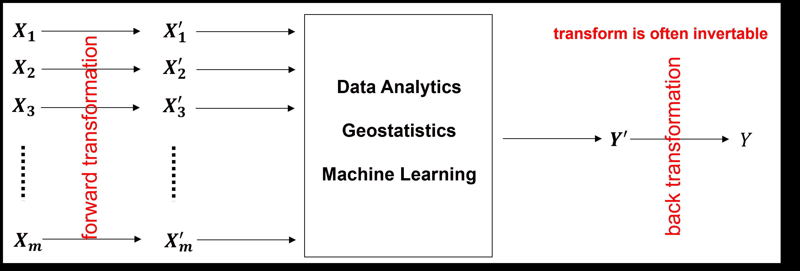

常见的特征转换工作流程，将预测特征$X_1,\ldots,X_m$转换为$X^{\prime}_1,\ldots,X^{\prime}_m$，应用数据分析、地统计学或机器学习步骤来预测转换后的响应特征$Y^{\prime}$，然后反向转换回原始响应特征$Y$。

## 加载所需的库

以下代码加载所需的库。

```py
import geostatspy.GSLIB as GSLIB                              # GSLIB utilities, visualization and wrapper
import geostatspy.geostats as geostats                        # GSLIB methods convert to Python 
import geostatspy
print('GeostatsPy version: ' + str(geostatspy.__version__)) 
```

```py
GeostatsPy version: 0.0.71 
```

我们还需要一些标准包。这些应该已经与 Anaconda 3 一起安装。

```py
ignore_warnings = True                                        # ignore warnings?
import numpy as np                                            # ndarrays for gridded data
import pandas as pd                                           # DataFrames for tabular data
import os                                                     # set working directory, run executables
import matplotlib.pyplot as plt                               # for plotting
from matplotlib.lines import Line2D                           # custom legend
from matplotlib.patches import Patch                          # add shapes to plots 
from matplotlib.ticker import (MultipleLocator, AutoMinorLocator) # control of axes ticks
import matplotlib.patheffects as pe                           # advanced plotting of lines / curves
from scipy import stats                                       # summary statistics
from scipy.stats import norm                                  # Gaussian parametric distribution
import math                                                   # trigonometry etc.
import scipy.signal as signal                                 # kernel for moving window calculation
import random                                                 # for random numbers
import seaborn as sns                                         # for matrix scatter plots
from scipy import linalg                                      # for linear regression
from sklearn import preprocessing
from sklearn.preprocessing import Normalizer                  # L1/L2 normalizer
from sklearn.preprocessing import StandardScaler              # standardization
from sklearn.preprocessing import Binarizer                   # indicator transform
from sklearn.preprocessing import KBinsDiscretizer            # k-bins discretization
from sklearn.preprocessing import QuantileTransformer         # quantile
from sklearn.preprocessing import FunctionTransformer         # custom transformations
plt.rc('axes', axisbelow=True)                                # plot all grids below the plot elements
if ignore_warnings == True:                                   
    import warnings
    warnings.filterwarnings('ignore')
cmap = plt.cm.inferno                                         # color map 
```

如果您遇到包导入错误，您可能必须首先安装这些包中的某些包。这通常可以通过在 Windows 上打开命令窗口然后输入‘python -m pip install [package-name]’来完成。有关相应包的文档中提供了更多帮助。

## 声明函数

让我们定义一个函数，以简化向我们的绘图添加指定的百分位数和主次网格线。

```py
def weighted_percentile(data, weights, perc):                 # calculate weighted percentile 
    ix = np.argsort(data)
    data = data[ix] 
    weights = weights[ix] 
    cdf = (np.cumsum(weights) - 0.5 * weights) / np.sum(weights) 
    return np.interp(perc, cdf, data)
# function from iambr on StackOverflow @ https://stackoverflow.com/questions/21844024/weighted-percentile-using-numpy/32216049 

def histogram_bounds(values,weights,color):                   # add uncertainty bounds to a histogram 
    p10 = weighted_percentile(values,weights,0.1); avg = np.average(values,weights=weights); p90 = weighted_percentile(values,weights,0.9)
    plt.plot([p10,p10],[0.0,45],color = color,linestyle='dashed')
    plt.plot([avg,avg],[0.0,45],color = color)
    plt.plot([p90,p90],[0.0,45],color = color,linestyle='dashed')

def add_grid():                                               # add major and minor gridlines
    plt.gca().grid(True, which='major',linewidth = 1.0); plt.gca().grid(True, which='minor',linewidth = 0.2) # add y grids
    plt.gca().tick_params(which='major',length=7); plt.gca().tick_params(which='minor', length=4)
    plt.gca().xaxis.set_minor_locator(AutoMinorLocator()); plt.gca().yaxis.set_minor_locator(AutoMinorLocator()) # turn on minor ticks 
```

## 设置工作目录

我总是喜欢这样做，这样我就不会丢失文件，并且可以简化后续的读取和写入（避免每次都包含完整地址）。

```py
#os.chdir("c:/PGE383")                                        # set the working directory 
```

您将不得不更新引号内的部分，以包含您自己的工作目录，并且 Mac 上的格式不同（例如，“~/PGE”）。

## 加载表格数据

这是将我们的逗号分隔数据文件加载到 Pandas DataFrame 对象的命令。

让我们加载提供的多元、空间数据集‘unconv_MV.csv’。此数据集包含来自 1,000 个非常规井的变量，包括：

+   良好的平均孔隙率

+   渗透率的对数转换（以线性化与其他变量的关系）

+   声波阻抗（kg/m³ x m/s x 10⁶）

+   剪切比（%）

+   总有机碳（%）

+   玻璃质反射率（%）

+   初始生产 90 天平均（MCFPD）。

注意，数据集是合成的。

我们使用 pandas 的‘read_csv’函数将其加载到名为‘my_data’的 DataFrame 中，然后预览它以确保正确加载。

```py
#df = pd.read_csv('unconv_MV_v4.csv')                         # load our data table
df = pd.read_csv('https://raw.githubusercontent.com/GeostatsGuy/GeoDataSets/master/unconv_MV_v4.csv') # load data from Dr. Pyrcz's GitHub repository 
df = df.iloc[:,1:]                                            # remove the well index

response = 'Prod'                                             # specify the response feature
x = df.copy(deep = True); x = x.drop([response],axis='columns') # make predictor and response DataFrames
Y = df.loc[:,response]

features = x.columns.values.tolist() + [Y.name]               # store the names of the features
pred = x.columns.values.tolist()
resp = Y.name

xmin = [6.0,0.0,1.0,10.0,0.0,0.9]; xmax = [24.0,10.0,5.0,85.0,2.2,2.9] # set the minumum and maximum values for plotting
Ymin = 500.0; Ymax = 9000.0

predlabel = ['Porosity (%)','Permeability (mD)','Acoustic Impedance (kg/m2s*10⁶)','Brittleness Ratio (%)', # set the names for plotting
             'Total Organic Carbon (%)','Vitrinite Reflectance (%)']
resplabel = 'Initial Production (MCFPD)'

predtitle = ['Porosity','Permeability','Acoustic Impedance','Brittleness Ratio', # set the units for plotting
             'Total Organic Carbon','Vitrinite Reflectance']
resptitle = 'Initial Production'

featurelabel = predlabel + [resplabel]                        # make feature labels and titles for concise code
featuretitle = predtitle + [resptitle]

m = len(pred) + 1
mpred = len(pred) 
```

## 可视化 DataFrame

可视化 DataFrame 是数据的第一步检查。

+   许多事情可能会出错，例如，我们加载了错误的数据，所有特征都没有加载，等等。

我们可以通过使用 DataFrame 的`head`成员函数来预览（格式整洁，见下文）。

+   添加参数‘n=13’以查看数据集的前 13 行。

```py
df.head(n=13)                                                 # we could also use this command for a table preview 
```

|  | Por | Perm | AI | Brittle | TOC | VR | Prod |
| --- | --- | --- | --- | --- | --- | --- | --- |
| 0 | 12.08 | 2.92 | 2.80 | 81.40 | 1.16 | 2.31 | 1695.360819 |
| 1 | 12.38 | 3.53 | 3.22 | 46.17 | 0.89 | 1.88 | 3007.096063 |
| 2 | 14.02 | 2.59 | 4.01 | 72.80 | 0.89 | 2.72 | 2531.938259 |
| 3 | 17.67 | 6.75 | 2.63 | 39.81 | 1.08 | 1.88 | 5288.514854 |
| 4 | 17.52 | 4.57 | 3.18 | 10.94 | 1.51 | 1.90 | 2859.469624 |
| 5 | 14.53 | 4.81 | 2.69 | 53.60 | 0.94 | 1.67 | 4017.374438 |
| 6 | 13.49 | 3.60 | 2.93 | 63.71 | 0.80 | 1.85 | 2952.812773 |
| 7 | 11.58 | 3.03 | 3.25 | 53.00 | 0.69 | 1.93 | 2670.933846 |
| 8 | 12.52 | 2.72 | 2.43 | 65.77 | 0.95 | 1.98 | 2474.048178 |
| 9 | 13.25 | 3.94 | 3.71 | 66.20 | 1.14 | 2.65 | 2722.893266 |
| 10 | 15.04 | 4.39 | 2.22 | 61.11 | 1.08 | 1.77 | 3828.247174 |
| 11 | 16.19 | 6.30 | 2.29 | 49.10 | 1.53 | 1.86 | 5095.810104 |
| 12 | 16.82 | 5.42 | 2.80 | 66.65 | 1.17 | 1.98 | 4091.637316 |

## 表格数据的摘要统计

在 DataFrame 中，有很多高效的方法可以计算表格数据的摘要统计。`describe`命令提供了一个很好的数据表，包括计数、平均值、最小值、最大值和四分位数。

+   我们使用`transpose`只是为了翻转表格，使得特征在行上，统计在列上。

```py
df.describe().transpose() 
```

|  | count | mean | std | min | 25% | 50% | 75% | max |
| --- | --- | --- | --- | --- | --- | --- | --- | --- |
| Por | 200.0 | 14.991150 | 2.971176 | 6.550000 | 12.912500 | 15.070000 | 17.402500 | 23.550000 |
| Perm | 200.0 | 4.330750 | 1.731014 | 1.130000 | 3.122500 | 4.035000 | 5.287500 | 9.870000 |
| AI | 200.0 | 2.968850 | 0.566885 | 1.280000 | 2.547500 | 2.955000 | 3.345000 | 4.630000 |
| Brittle | 200.0 | 48.161950 | 14.129455 | 10.940000 | 37.755000 | 49.510000 | 58.262500 | 84.330000 |
| TOC | 200.0 | 0.990450 | 0.481588 | -0.190000 | 0.617500 | 1.030000 | 1.350000 | 2.180000 |
| VR | 200.0 | 1.964300 | 0.300827 | 0.930000 | 1.770000 | 1.960000 | 2.142500 | 2.870000 |
| Prod | 200.0 | 3864.407081 | 1553.277558 | 839.822063 | 2686.227611 | 3604.303506 | 4752.637555 | 8590.384044 |

## 数据可视化

我们还应该看看直方图。

+   对每个特征的范围、众数、偏度、异常值等有一个大致的了解

```py
nbins = 20                                                    # number of histogram bins
for i, feature in enumerate(features):                        # plot histograms with central tendency and P10 and P90 labeled
    plt.subplot(3,3,i+1)
    y,_,_ = plt.hist(x=df[feature],weights=None,bins=nbins,alpha = 0.8,edgecolor='black',color='darkorange',density=True)
    histogram_bounds(values=df[feature].values,weights=np.ones(len(df)),color='red')
    plt.xlabel(feature); plt.ylabel('Frequency'); plt.ylim([0.0,y.max()*1.10]); plt.title(featuretitle[i]); add_grid() 
    if feature == resp:   
        plt.xlim([Ymin,Ymax])    
    else:
        plt.xlim([xmin[i],xmax[i]]) 

plt.subplots_adjust(left=0.0, bottom=0.0, right=2., top=2.1, wspace=0.2, hspace=0.3); plt.show() 
```

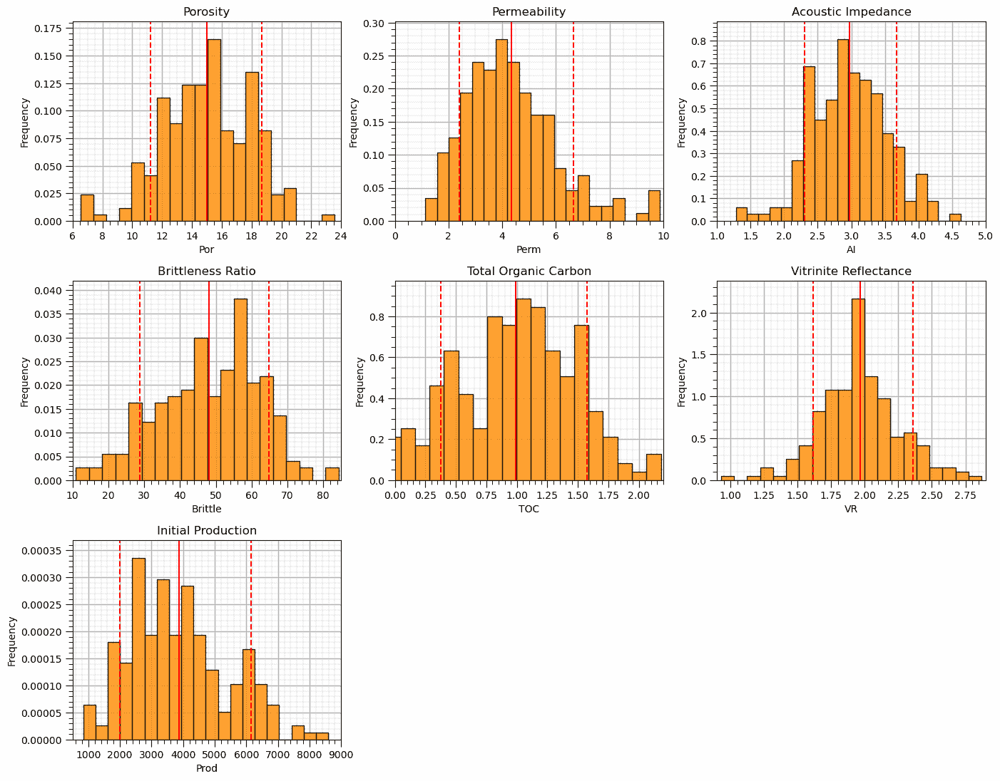

现在让我们逐步进行，描述、演示和可视化每个特征转换。

幸运的是，只有几个略微负值，这为我们第一个特征转换提供了一个很好的过渡。

## 截断

可能这些特征可能超出了合理的值域范围。

+   截断简单地说就是将超出范围的值赋予一个特定的值

+   通常会将最小可接受值分配给下尾部的异常值，反之亦然

使用 numpy 操作符在 Pandas DataFrame 中对特征数组进行截断处理可以轻松处理截断。

```py
num = df._get_numeric_data() 
num[num < data_min] = data_min
num[num > data_max] = data_max 
```

```py
plt.subplot(121)
plt.hist(df['TOC'].values,color='darkorange',alpha=0.8,edgecolor='black',bins=np.linspace(-0.2,1.0,25))
plt.xlabel('TOC (fraction)'); plt.ylabel('Frequency'); plt.title('Original Histogram'); plt.ylim([0,14]); plt.xlim([-0.2,1.0])
plt.gca().grid(which='minor', color='#EEEEEE', linestyle=':', linewidth=0.5)
plt.gca().grid(which='major', color='#DDDDDD', linewidth=0.8); plt.gca().minorticks_on()

old_TOC = df['TOC'].values.copy()
num = df._get_numeric_data()                                  # get the numerical values
num[num < 0] = 0                                              # truncate negative values to 0.0
df.describe().transpose()                                     # get the summary statistics of all features

plt.subplot(122)
plt.hist(df['TOC'].values,color='red',alpha=0.8,edgecolor='black',bins=np.linspace(-0.2,1.0,25),zorder=10)
plt.hist(old_TOC,color='darkorange',alpha=0.8,edgecolor='black',bins=np.linspace(-0.2,1.0,25),zorder=20)
plt.xlabel('TOC (fraction)'); plt.ylabel('Frequency'); plt.title('Truncated (>0.0) Histogram'); plt.ylim([0,14]); plt.xlim([-0.2,1.0])
plt.fill_between([-0.2,0.0],[14,14],[0,0],color='grey',alpha=1.0,zorder=30); plt.plot([0.0,0.0],[0,14],color='black',ls='--',zorder=30)
plt.gca().grid(which='minor', color='#EEEEEE', linestyle=':', linewidth=0.5)
plt.gca().grid(which='major', color='#DDDDDD', linewidth=0.8); plt.gca().minorticks_on()

plt.subplots_adjust(left=0.0, bottom=0.0, right=2.0, top=1.1, wspace=0.2, hspace=0.2); plt.show() 
```

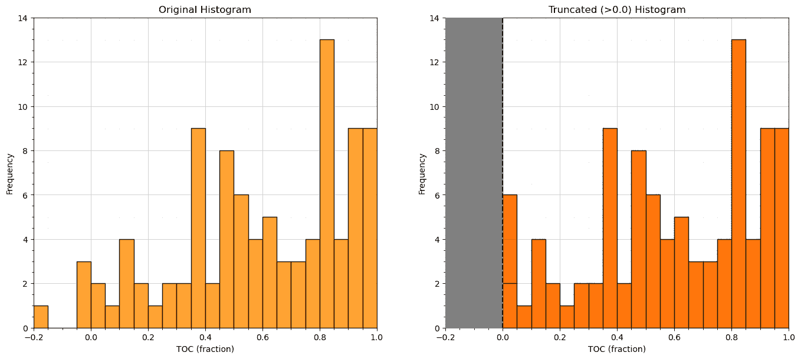

让我们再次查看总结统计信息，以确认我们成功地将 TOC 截断到 $\ge 0$。

```py
df.describe().transpose() 
```

|  | count | mean | std | min | 25% | 50% | 75% | max |
| --- | --- | --- | --- | --- | --- | --- | --- | --- |
| Por | 200.0 | 14.991150 | 2.971176 | 6.550000 | 12.912500 | 15.070000 | 17.402500 | 23.550000 |
| Perm | 200.0 | 4.330750 | 1.731014 | 1.130000 | 3.122500 | 4.035000 | 5.287500 | 9.870000 |
| AI | 200.0 | 2.968850 | 0.566885 | 1.280000 | 2.547500 | 2.955000 | 3.345000 | 4.630000 |
| Brittle | 200.0 | 48.161950 | 14.129455 | 10.940000 | 37.755000 | 49.510000 | 58.262500 | 84.330000 |
| TOC | 200.0 | 0.991950 | 0.478264 | 0.000000 | 0.617500 | 1.030000 | 1.350000 | 2.180000 |
| VR | 200.0 | 1.964300 | 0.300827 | 0.930000 | 1.770000 | 1.960000 | 2.142500 | 2.870000 |
| Prod | 200.0 | 3864.407081 | 1553.277558 | 839.822063 | 2686.227611 | 3604.303506 | 4752.637555 | 8590.384044 |

从总结统计中可以看出，截断是成功的，我们现在有最小值 0.0。

## 线性校正

线性校正是将特征分布转换为新的均值和方差的过程。

+   这是对原始属性分布的平移和拉伸/压缩。

+   假设没有形状变化。

以下方程应用于原始分布中的每个样本

$$ y = \frac{\sigma_y}{\sigma_x}\left( x - \overline{x} \right) + \overline{y} $$

其中 $\sigma_x$ 是原始标准差，$\sigma_y$ 是目标标准差，$\overline{x}$ 是原始均值，$\overline{y}$ 是目标均值。

+   GeostatsPy 中有一个线性函数我们可以使用。

+   为了简洁起见，我们只转换一个特征，请注意，该函数没有设置为一次转换多个特征，并且该函数也不处理反向转换。

让我们将孔隙率转换为具有任意均值和标准差（$\overline{x} = 20\%$ 和 $\sigma_x = 3\%$）。

```py
df['aPor'] = GSLIB.affine(df['Por'].values,tmean = 22.0,tstdev = 1.5) # affine correction

plt.subplot(121)
plt.hist(df['Por'].values,color='yellow',alpha=0.4,edgecolor='black',bins=np.linspace(0.0,30.0,30),label='Original')
plt.hist(df['aPor'].values,color='red',alpha=0.4,edgecolor='black',bins=np.linspace(0.0,30.0,30),label='Transformed')
plt.hist(df['aPor'].values,fill=False,alpha=1.0,edgecolor='black',lw=2.0,bins=np.linspace(0.0,30.0,30))
plt.legend(loc='upper left'); plt.grid(True)
plt.xlabel('Porosity (%)'); plt.ylabel('Frequency'); plt.title('Original and Affine Transformed Histograms'); plt.ylim([0,60]); plt.xlim([0.0,30.0])
add_grid()

plt.subplot(122)
plt.plot(np.sort(df['Por']),np.linspace(0,1,len(df)),color='yellow',alpha=0.8,lw=3,zorder=10,label='Original', path_effects=[pe.Stroke(linewidth=7, foreground='black'), pe.Normal()])
plt.plot(np.sort(df['aPor']),np.linspace(0,1,len(df)),color='red',alpha=0.8,lw=3,zorder=10,label='Transformed', path_effects=[pe.Stroke(linewidth=7, foreground='black'), pe.Normal()])
plt.xlim([0,30]); plt.ylim(0,1); plt.xlabel('Porosity (%)'); plt.ylabel('Cumulative Probability'); 
plt.title('Original and Affine Transformed CDFs'); plt.legend(loc='upper left'); plt.grid(True)
add_grid()

plt.subplots_adjust(left=0.0, bottom=0.0, right=2.0, top=1.2, wspace=0.2, hspace=0.2); plt.show() 
```

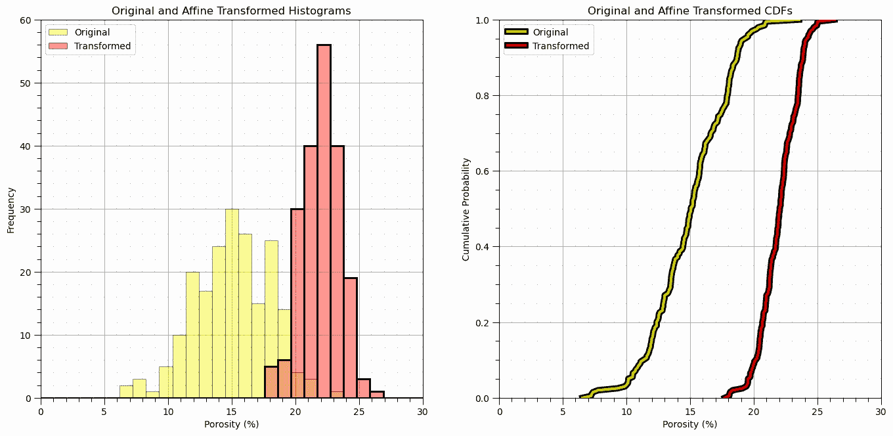

让我们检查新特征的总体统计信息。

```py
df['aPor'].describe().transpose() 
```

```py
count    200.000000
mean      22.000000
std        1.503764
min       17.727787
25%       20.947959
50%       22.039907
75%       23.220426
max       26.331783
Name: aPor, dtype: float64 
```

让我们删除线性转换的特征。

```py
df = df.drop(columns = ['aPor']) 
```

## 标准化

标准化是将特征分布转换为均值为零和方差为 1 的过程。

+   这是对原始属性分布的平移和拉伸/压缩。

+   假设没有形状变化。

该转换实际上是线性校正的一个特例，其中 $\overline{y} = 0$ 且 $\sigma_y = 1.0$。

\begin{equation} y = \frac{1}{\sigma_x}\left( x - \overline{x} \right) \end{equation}

其中 $\sigma_x$ 是原始标准差，$\overline{x}$ 是原始均值。

让我们将特征标准化为：

+   均值 = 0.0

+   方差 = 标准差 = 1.0

要做到这一点，我们：

1.  从 scikit learn 中实例化 StandardScaler。我们将它分配为“scaler”对象，这样我们就可以方便地使用这个对象来反转转换，我们需要这样做才能将预测值转换回常规生产单位。该“scaler”对象为我们处理所有账目。

```py
scaler = StandardScaler() 
```

1.  然后，我们从 DataFrame 中提取所有值并应用按列标准化。结果是 2D ndarray。

```py
sfeatures = scaler.fit_transform(df_mv.values) 
```

1.  我们创建一个新的空 DataFrame

```py
df_nmv = pd.DataFrame() 
```

1.  然后我们将转换后的值添加到新的 DataFrame 中，同时保留旧 DataFrame 的样本索引和特征名称

```py
df_nmv = pd.DataFrame(sfeatures, index=df_mv.index, columns=df_mv.columns) 
```

```py
scaler = StandardScaler()                                     # instantiate the scaler 
sfeatures = scaler.fit_transform(df.values)                   # standardize all the values extracted from the DataFrame 
df_st = pd.DataFrame()                                        # instantiate a new DataFrame
df_st = pd.DataFrame(sfeatures, index=df.index, columns=df.columns) # copy the standardized values into the new DataFrame

plt.subplot(121)
plt.hist(df['Por'].values,color='yellow',alpha=0.4,edgecolor='black',bins=np.linspace(-5.0,30.0,36),label='Original')
plt.hist(df_st['Por'].values,color='red',alpha=0.4,edgecolor='black',bins=np.linspace(-5.0,30.0,36),label='Standardized')
plt.hist(df_st['Por'].values,fill=False,alpha=1.0,edgecolor='black',lw=2.0,bins=np.linspace(-5.0,30.0,36))
plt.legend(loc='upper left')
plt.xlabel('Porosity (%)'); plt.ylabel('Frequency'); plt.title('Original and Standardized Histograms'); plt.ylim([0,80]); plt.xlim([-5.0,25.0])
add_grid()

plt.subplot(122)
plt.plot(np.sort(df['Por']),np.linspace(0,1,len(df)),color='yellow',alpha=0.8,lw=3,zorder=10,label='Original',
         path_effects=[pe.Stroke(linewidth=7, foreground='black'), pe.Normal()])
plt.plot(np.sort(df_st['Por']),np.linspace(0,1,len(df)),color='red',alpha=0.8,lw=3,zorder=10,label='Standardized',
         path_effects=[pe.Stroke(linewidth=7, foreground='black'), pe.Normal()])
plt.xlim([-5,25]); plt.ylim(0,1); plt.xlabel('Porosity (%)'); plt.ylabel('Cumulative Probability'); 
plt.title('Original and Standardized CDFs'); plt.legend(loc='lower right'); plt.grid(True)
add_grid()

plt.subplots_adjust(left=0.0, bottom=0.0, right=2.0, top=1.2, wspace=0.2, hspace=0.2); plt.show() 
```

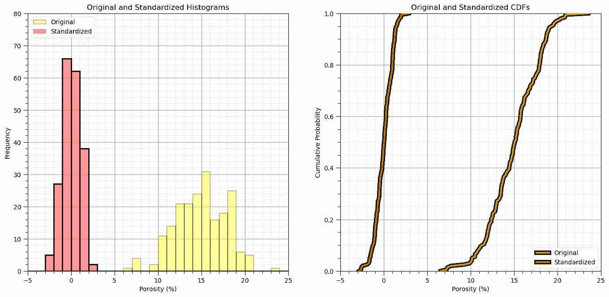

让我们关闭循环并反转转换，以确认我们回到了原始数据。

要做到这一点，我们：

1.  调用“fit”特征“scaler”的反转换函数，将转换后的值添加到新的 DataFrame 中，同时保留旧 DataFrame 的样本索引和特征名称

```py
rfeatures = scaler.inverse_transform(df_st.values) 
```

从这个输出中得到的是一个 2D numpy 数组。

1.  我们将把它放入一个新的 DataFrame 中。

```py
df_reverse = pd.DataFrame(rfeatures, index=df.index, columns=df.columns) 
```

```py
rfeatures = scaler.inverse_transform(df_st.values)
df_reverse = pd.DataFrame(rfeatures, index=df.index, columns=df.columns) # copy the standardized values into the new DataFrame
df_reverse.head() 

plt.subplot(131)
GSLIB.hist_st(df['Por'].values,0,30,log=False,cumul = False,bins=40,weights = None,xlabel='Porosity (%)',title='Original Porosity')
add_grid()

plt.subplot(132)
GSLIB.hist_st(df_st['Por'].values,-3,3,log=False,cumul = False,bins=40,weights = None,xlabel='Porosity Standardized',title='Standardized Porosity')
add_grid()

plt.subplot(133)
GSLIB.hist_st(df_reverse['Por'].values,0,30,log=False,cumul = False,bins=40,weights = None,xlabel='Porosity Reverse Standardization (%)',
              title='Porosity Reverse Standardization')
add_grid()

plt.subplots_adjust(left=0.0, bottom=0.0, right=3.0, top=1.1, wspace=0.2, hspace=0.2) 
```

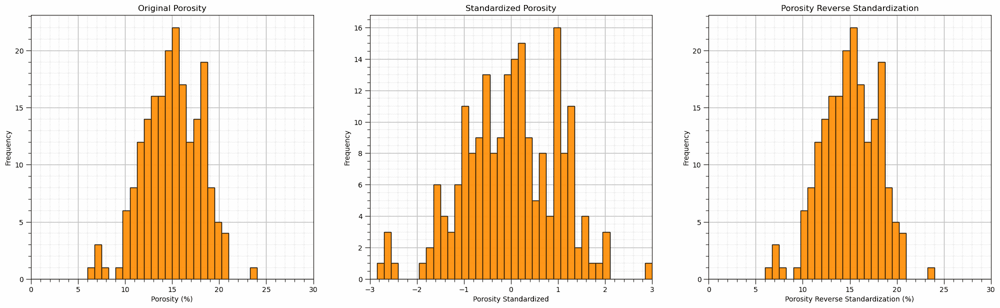

你可以确认结果与标准化前的原始 DataFrame 相同。

我们只是在进行测试，所以让我们删除（删除）新的 DataFrame。我们可以使用以下方法在 Python 中删除一个实例化的对象。

```py
del df_reverse 
```

对于更复杂的流程，删除中间产品以节省内存并防止杂乱可能是个好主意！

```py
del df_reverse 
```

## 归一化

也称为最小/最大转换，重新校准特征，使其最小值为 0，最大值为 1。

$$ y = \frac{x - min(x)}{max(x) - min(x)} $$

其中 $min(x)$ 和 $max(x)$ 是每个特征的最小值和最大值。

+   scikit learn 有一个内置的最小/最大转换方法

```py
min_max_scaler = preprocessing.MinMaxScaler()
scaled_array = min_max_scaler.fit_transform(float_array) 
```

```py
norm_scaler = preprocessing.MinMaxScaler()                 # instantiate the scaler 
nfeatures = norm_scaler.fit_transform(df.values)           # standardize all the values extracted from the DataFrame 
df_n = pd.DataFrame(nfeatures, index=df.index, columns=df.columns) # copy the standardized values into the new DataFrame
df_n.head() 

plt.subplot(121)
plt.hist(df['Por'].values,color='yellow',alpha=0.4,edgecolor='black',bins=np.linspace(0.0,25.0,26),label='Original')
plt.hist(df_n['Por'].values,color='red',alpha=0.4,edgecolor='black',bins=np.linspace(0.0,25.0,26),label='Standardized')
plt.hist(df_n['Por'].values,fill=False,alpha=1.0,edgecolor='black',lw=2.0,bins=np.linspace(0.0,25.0,26))
plt.legend(loc='upper left')
plt.xlabel('Porosity (%)'); plt.ylabel('Frequency'); plt.title('Original and Standardized Histograms'); plt.ylim([0,80]); plt.xlim([0.0,25.0])
add_grid()

plt.subplot(122)
plt.plot(np.sort(df['Por']),np.linspace(0,1,len(df)),color='yellow',alpha=0.8,lw=3,zorder=10,label='Original',
         path_effects=[pe.Stroke(linewidth=7, foreground='black'), pe.Normal()])
plt.plot(np.sort(df_n['Por']),np.linspace(0,1,len(df)),color='red',alpha=0.8,lw=3,zorder=10,label='Standardized',
         path_effects=[pe.Stroke(linewidth=7, foreground='black'), pe.Normal()])
plt.xlim([0,25]); plt.ylim(0,1); plt.xlabel('Porosity (%)'); plt.ylabel('Cumulative Probability'); 
plt.title('Original and Standardized CDFs'); plt.legend(loc='lower right'); plt.grid(True)
add_grid()

plt.subplots_adjust(left=0.0, bottom=0.0, right=2.0, top=1.2, wspace=0.2, hspace=0.2); plt.show() 
```

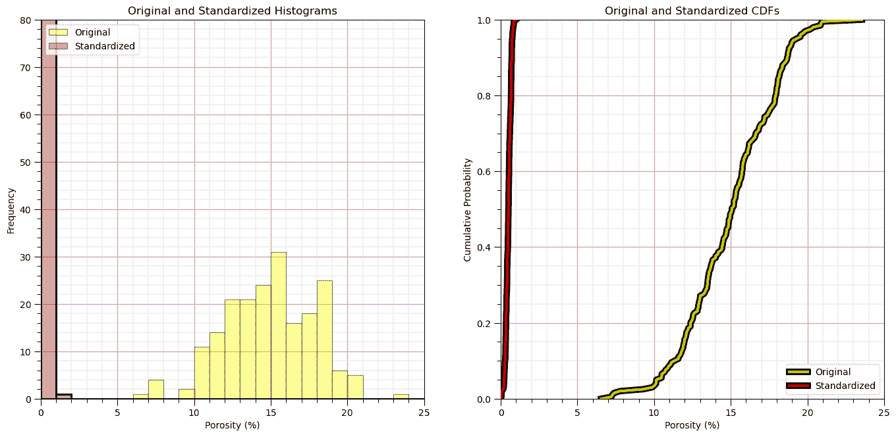

让我们检查摘要统计信息。

```py
df_n.describe().transpose() 
```

|  | count | mean | std | min | 25% | 50% | 75% | max |
| --- | --- | --- | --- | --- | --- | --- | --- | --- |
| Por | 200.0 | 0.496538 | 0.174775 | 0.0 | 0.374265 | 0.501176 | 0.638382 | 1.0 |
| Perm | 200.0 | 0.366219 | 0.198057 | 0.0 | 0.227975 | 0.332380 | 0.475686 | 1.0 |
| AI | 200.0 | 0.504134 | 0.169220 | 0.0 | 0.378358 | 0.500000 | 0.616418 | 1.0 |
| Brittle | 200.0 | 0.507180 | 0.192526 | 0.0 | 0.365377 | 0.525548 | 0.644809 | 1.0 |
| TOC | 200.0 | 0.455023 | 0.219387 | 0.0 | 0.283257 | 0.472477 | 0.619266 | 1.0 |
| VR | 200.0 | 0.533144 | 0.155066 | 0.0 | 0.432990 | 0.530928 | 0.625000 | 1.0 |
| Prod | 200.0 | 0.390241 | 0.200408 | 0.0 | 0.238229 | 0.356681 | 0.504843 | 1.0 |

让我们关闭循环并反转转换（反转换）并确认我们回到了原始数据。

```py
rfeatures = norm_scaler.inverse_transform(df_n.values)
df_reverse = pd.DataFrame()                                     # instantiate a new DataFrame
df_reverse = pd.DataFrame(rfeatures, index=df.index, columns=df.columns) # copy the standardized values into the new DataFrame
df_reverse.head() 

plt.subplot(131)
GSLIB.hist_st(df['Por'].values,0,30,log=False,cumul = False,bins=40,weights = None,xlabel='Porosity (%)',title='Original Porosity')
plt.subplots_adjust(left=0.0, bottom=0.0, right=2.0, top=1.1, wspace=0.2, hspace=0.2)

plt.subplot(132)
GSLIB.hist_st(df_n['Por'].values,0,1,log=False,cumul = False,bins=40,weights = None,xlabel='Porosity Normalized',title='Normalization Porosity')
plt.subplots_adjust(left=0.0, bottom=0.0, right=2.0, top=1.1, wspace=0.2, hspace=0.2)

plt.subplot(133)
GSLIB.hist_st(df_reverse['Por'].values,0,30,log=False,cumul = False,bins=40,weights = None,xlabel='Porosity Reverse Normalization (%)',
              title='Porosity Reverse Normalization')
plt.subplots_adjust(left=0.0, bottom=0.0, right=3.0, top=1.1, wspace=0.2, hspace=0.2); plt.show() 
```


在对 DataFrame 进行标准化之前，您可以确认结果与原始结果相同。

我们再次只是进行测试，所以让我们删除反向变换后的 DataFrame。

```py
del df_reverse 
```

## L1 / L2 标准化器

另一种类型的标准化是在每个样本上独立执行的，以强制 $L1$ 或 $L2$ 范数为 1.0。

对于 L1 范数：

$$ \sum^m_{i,\alpha = 1} x_{i, \alpha} = 1.0, \quad i = 1, \ldots, n $$

其中我们对于 $i = 1, \dots, n$ 样本有 $x_{i, \alpha}, \alpha = 1, \dots, m$ 个特征。

对于 L2 范数：

$$ \sum^m_{i,\alpha = 1}\left( x_{i, \alpha} \right)² = 1.0, \quad i = 1, \ldots, n $$

其中我们对于 $i = 1, \dots, n$ 样本有 $x_{i, \alpha}, \alpha = 1, \dots, m$ 个特征。

+   这可以应用于文本分类或聚类

我们在下面展示了 L1 和 L2 标准化器。

+   此变换没有逆变换

让我们从 $L2$ 范数开始。

```py
l2normalizer = Normalizer(norm = 'l2') 
l2features = l2normalizer.fit_transform(df_n) 

colors =  ['#1f77b4', '#ff7f0e', '#2ca02c', '#d62728', '#9467bd', '#8c564b', '#e377c2','#7f7f7f', '#bcbd22', '#17becf']
names = ['Porosity','Permeability','Acoustic Impedance','Brittleness','Total Organic Carbon','Vitrinite Reflectance','Production']

plt.subplot(121)
n_cumul_sum =np.cumsum(np.power(df_n.values,2),axis=1)
for i in range(0,l2features.shape[1]):
    plt.plot(np.linspace(0,len(df)-1,len(df)),n_cumul_sum[:,i])

plt.fill_between(np.linspace(0,len(df)-1,len(df)),n_cumul_sum[:,i],np.zeros(len(df)))
for i in range(1,l2features.shape[1]):
    plt.fill_between(np.linspace(0,len(df)-1,len(df)),n_cumul_sum[:,i],n_cumul_sum[:,i-1])

plt.xlim([0,len(df)-1]); plt.ylim([0,5])
plt.xlabel('Sample (index)'); plt.ylabel('Features Cumulative Square'); plt.title('Original')

legend_elements = []
for i in range(len(names)):
    legend_elements.append(Patch(facecolor=colors[i], edgecolor='black',label=names[i]))
plt.gca().legend(handles=legend_elements, loc='upper right')
add_grid()

plt.subplot(122)
l2_cumul_sum =np.cumsum(np.power(l2features,2),axis=1)
for i in range(0,l2features.shape[1]):
    plt.plot(np.linspace(0,len(df)-1,len(df)),l2_cumul_sum[:,i])

plt.fill_between(np.linspace(0,len(df)-1,len(df)),l2_cumul_sum[:,i],np.zeros(len(df)))
for i in range(1,l2features.shape[1]):
    plt.fill_between(np.linspace(0,len(df)-1,len(df)),l2_cumul_sum[:,i],l2_cumul_sum[:,i-1])

plt.xlim([0,len(df)-1]); plt.ylim([0,1])
plt.xlabel('Sample (index)'); plt.ylabel('Features Cumulative Square'); plt.title('L2 Normalized')

legend_elements = []
for i in range(len(names)):
    legend_elements.append(Patch(facecolor=colors[i], edgecolor='black',label=names[i]))
plt.gca().legend(handles=legend_elements, loc='upper right')
add_grid()

plt.subplots_adjust(left=0.0, bottom=0.0, right=2.0, top=1.2, wspace=0.2, hspace=0.2); plt.show() 
```

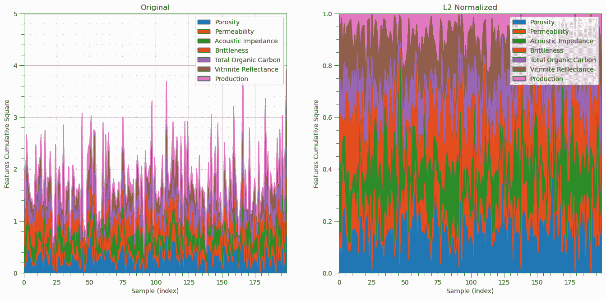

现在我们来演示 $L1$ 范数。

```py
l1normalizer = Normalizer(norm = 'l1') 
l1features = l1normalizer.fit_transform(df_n)                # standardize all the values extracted from the DataFrame 
df_nL1 = pd.DataFrame()                                      # instantiate a new DataFrame
df_nL1 = pd.DataFrame(l1features, index=df.index, columns=df.columns) # copy the standardized values into the new DataFrame
df_nL1.head() 

colors =  ['#1f77b4', '#ff7f0e', '#2ca02c', '#d62728', '#9467bd', '#8c564b', '#e377c2','#7f7f7f', '#bcbd22', '#17becf']
names = ['Porosity','Permeability','Acoustic Impedance','Brittleness','Total Organic Carbon','Vitrinite Reflectance','Production']

plt.subplot(121)
n_cumul_sum =np.cumsum(df_n.values,axis=1)
for i in range(0,l1features.shape[1]):
    plt.plot(np.linspace(0,len(df)-1,len(df)),n_cumul_sum[:,i])

plt.fill_between(np.linspace(0,len(df)-1,len(df)),n_cumul_sum[:,i],np.zeros(len(df)))
for i in range(1,l1features.shape[1]):
    plt.fill_between(np.linspace(0,len(df)-1,len(df)),n_cumul_sum[:,i],n_cumul_sum[:,i-1])

plt.xlim([0,len(df)-1]); plt.ylim([0,5])
plt.xlabel('Sample (index)'); plt.ylabel('Features Cumulative'); plt.title('Original')

legend_elements = []
for i in range(len(names)):
    legend_elements.append(Patch(facecolor=colors[i], edgecolor='black',label=names[i]))
plt.gca().legend(handles=legend_elements, loc='upper right')

plt.subplot(122)
l1_cumul_sum =np.cumsum(l1features,axis=1)
for i in range(0,l1features.shape[1]):
    plt.plot(np.linspace(0,len(df)-1,len(df)),l1_cumul_sum[:,i])

plt.fill_between(np.linspace(0,len(df)-1,len(df)),l1_cumul_sum[:,i],np.zeros(len(df)))
for i in range(1,l1features.shape[1]):
    plt.fill_between(np.linspace(0,len(df)-1,len(df)),l1_cumul_sum[:,i],l1_cumul_sum[:,i-1])

plt.xlim([0,len(df)-1]); plt.ylim([0,1])
plt.xlabel('Sample (index)'); plt.ylabel('Features Cumulative'); plt.title('L1 Normalized')

legend_elements = []
for i in range(len(names)):
    legend_elements.append(Patch(facecolor=colors[i], edgecolor='black',label=names[i]))
plt.gca().legend(handles=legend_elements, loc='upper right')

plt.subplots_adjust(left=0.0, bottom=0.0, right=2.0, top=1.2, wspace=0.2, hspace=0.2); plt.show() 
```

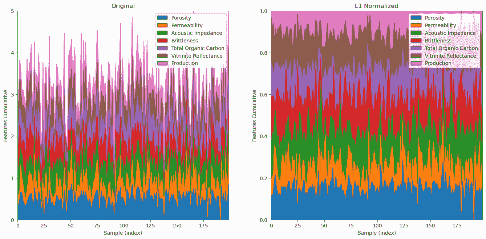

## 二进制或指示变换

对于许多需要执行二进制变换以将连续特征转换为基于阈值 $x_t$ 的 0 和 1 的问题

+   对于二进制变换，$x_i = 0$ 如果 $<= x_t$，否则 $x_i = 1$

+   对于指示变换，$x_i = 1$ 如果 $<= x_t$，否则 $x_i = 0$

scikit-learn 有一个用于二进制变换的函数

```py
threshold = 13.0
binarizer = Binarizer(threshold = threshold) 
bPor = binarizer.fit_transform(df['Por'].values.reshape(-1, 1)) # standardize all the values extracted from the DataFrame 

plt.subplot(121)
GSLIB.hist_st(df['Por'].values,0,30,log=False,cumul = False,bins=40,weights = None,xlabel='Porosity (%)',title='Original Porosity')
add_grid()

plt.subplot(122)
GSLIB.hist_st(bPor,0,1,log=False,cumul = False,bins=40,weights = None,xlabel='Porosity Indicator Transform',
              title='Porosity Indicator Transform, Threshold = ' + str(threshold))
add_grid()
plt.subplots_adjust(left=0.0, bottom=0.0, right=2.0, top=1.1, wspace=0.2, hspace=0.2) 
```

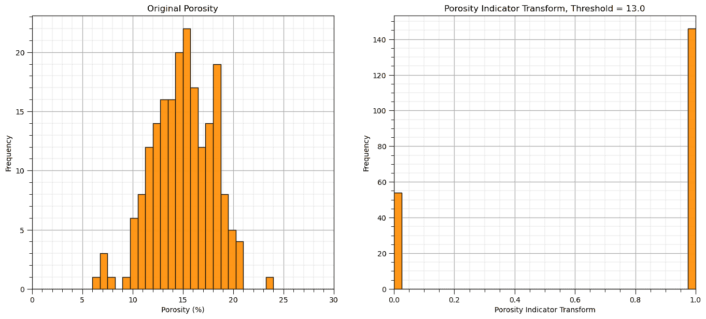

## k Bins 离散化

使用 k Bins 离散化，我们将特征的取值范围划分为 K 个 bin，然后对于我们的连续特征，将每个样本扩展为 K 个特征，如果样本在 bin 内，则分配值为 1，如果不在 bin 内，则分配值为 0

+   策略包括均匀宽度 bin（均匀）和每个 bin 中均匀的数据数量（分位数）

让我们创建 5 个均匀的 bin，然后将原始孔隙率值连接起来，这样我们就可以比较原始孔隙率值和我们的 K Bins 离散化。

```py
nbins = 5
kbins = KBinsDiscretizer(n_bins=nbins, strategy='uniform',encode='onehot') 
kbins_por = kbins.fit_transform(df['Por'].values.reshape(-1, 1)) # standardize all the values extracted from the DataFrame 
kbins_values = np.concatenate((df['Por'].values.reshape(-1, 1),kbins_por.toarray()),axis=1)
kbins_values 
```

```py
array([[12.08,  0\.  ,  1\.  ,  0\.  ,  0\.  ,  0\.  ],
       [12.38,  0\.  ,  1\.  ,  0\.  ,  0\.  ,  0\.  ],
       [14.02,  0\.  ,  0\.  ,  1\.  ,  0\.  ,  0\.  ],
       ...,
       [12.12,  0\.  ,  1\.  ,  0\.  ,  0\.  ,  0\.  ],
       [15.55,  0\.  ,  0\.  ,  1\.  ,  0\.  ,  0\.  ],
       [20.89,  0\.  ,  0\.  ,  0\.  ,  0\.  ,  1\.  ]]) 
```

让我们可视化 k Bins 离散化。

+   查看原始数据分布和 bin 边界，以更好地理解上述结果。

```py
kbins_edges = kbins.bin_edges_[0]
kbins_centers = (kbins_edges[1:] + kbins_edges[:-1]) / 2
bsiz = (np.max(kbins_edges) - np.min(kbins_edges))/nbins
fig = plt.figure(figsize=(6, 6))
gs = fig.add_gridspec(2,2 ,width_ratios=(1.0, 1.0))

plt_scatter = fig.add_subplot(gs[0, 1])
plt_x = fig.add_subplot(gs[0, 0],sharey=plt_scatter) 
plt_y = fig.add_subplot(gs[1, 1],sharex=plt_scatter) 

for i in range(0,len(df)):
    ones = kbins_centers[kbins_values[i][1:] == 1.0]
    plt_scatter.scatter(ones,np.full(len(ones),kbins_values[i][0]),marker = 'o',s=10,color='red')
    zeros = kbins_centers[kbins_values[i][1:] == 0.0]
    plt_scatter.scatter(zeros,np.full(len(zeros),kbins_values[i][0]),color='black',s=5,marker='x',lw=0.4)
    #print(zeros,np.full(len(zeros),kbins_values[i][0]))

for edge in kbins_edges:
    plt_scatter.plot([edge,edge],[0,30],color='black',lw=1,ls='--',alpha=0.5)
    #plt.plot([5,25],[edge,edge],color='black',lw=1,ls='--',alpha=0.5)

for icenter,center in enumerate(kbins_centers):
    plt_scatter.annotate('Bin ' + str(icenter),[center-bsiz*0.1,5.2])

plt_scatter.set_ylabel(r'Original Feature, $X$'); plt_scatter.set_xlabel(r'Transformed Features, $X^{\prime}$')
plt_scatter.set_xlim([5,25]); plt_scatter.set_ylim([5,25])

plt_scatter.scatter(-9999.9,99999,marker = 'o',s=10,color='red',label='1')
plt_scatter.scatter(-9999.9,99999,color='black',s=5,marker='x',lw=0.4,label='0')
plt_scatter.set_xticks(kbins_edges)
plt_scatter.legend(loc='upper left')
plt_scatter.set_title('K Bins Discretization, One Hot Encoding of Continuous Feature')

plt_x.hist(df['Por'].values,orientation='horizontal',density = False,weights = np.ones(len(df))/len(df),
           color='red',alpha=0.8,edgecolor='black',bins=np.linspace(5.0,25.0,30))

plt_x.set_xlim([0.13,0.0])
plt_x.set_ylabel(r'Original Feature, $X$'); plt_x.set_xlabel(r'Probability') 
plt_x.set_title('Original Feature')

z_values = np.zeros(int(np.sum(kbins_values[:,1:])))
count = np.sum(kbins_values[:,1:],axis=0)
ii = 0
for i in range(0,kbins_values[:,1:].shape[1]):
    for j in range(0,int(count[i])):
        z_values[ii] = kbins_centers[i]  
        ii = ii + 1

plt_y.hist(z_values,orientation='vertical',density = False,weights = np.ones(len(df))/len(df),
           color='red',alpha=0.8,edgecolor='black',bins=np.linspace(5.0,25.0,30),zorder=10)
plt_y.hist(df['Por'].values,orientation='vertical',density = False,weights = np.ones(len(df))/len(df),
           color='red',alpha=0.2,edgecolor='black',bins=np.linspace(5.0,25.0,30),zorder=5)

for edge in kbins_edges:
    plt_y.plot([edge,edge],[0,0.6],color='black',lw=1,ls='--',alpha=0.5)

for icenter,center in enumerate(kbins_centers):
    plt_y.annotate('Bin ' + str(icenter),[center-bsiz*0.21,0.58])
    plt_y.plot([center,center],[0,0.6],color='grey',lw=1,alpha=0.5,zorder=1)
    plt_y.annotate(str(np.round(center,1)),[center+bsiz*0.01,0.5],rotation=270.0,color='grey')

plt_y.set_ylim([0.0,0.6])
plt_y.set_xlabel(r'Transformed Features, $X^{\prime}$'); plt_y.set_ylabel(r'Probability') 

plt.subplots_adjust(left=0.0, bottom=0.0, right=1.6, top=1.6, wspace=0.2, hspace=0.2) 
```

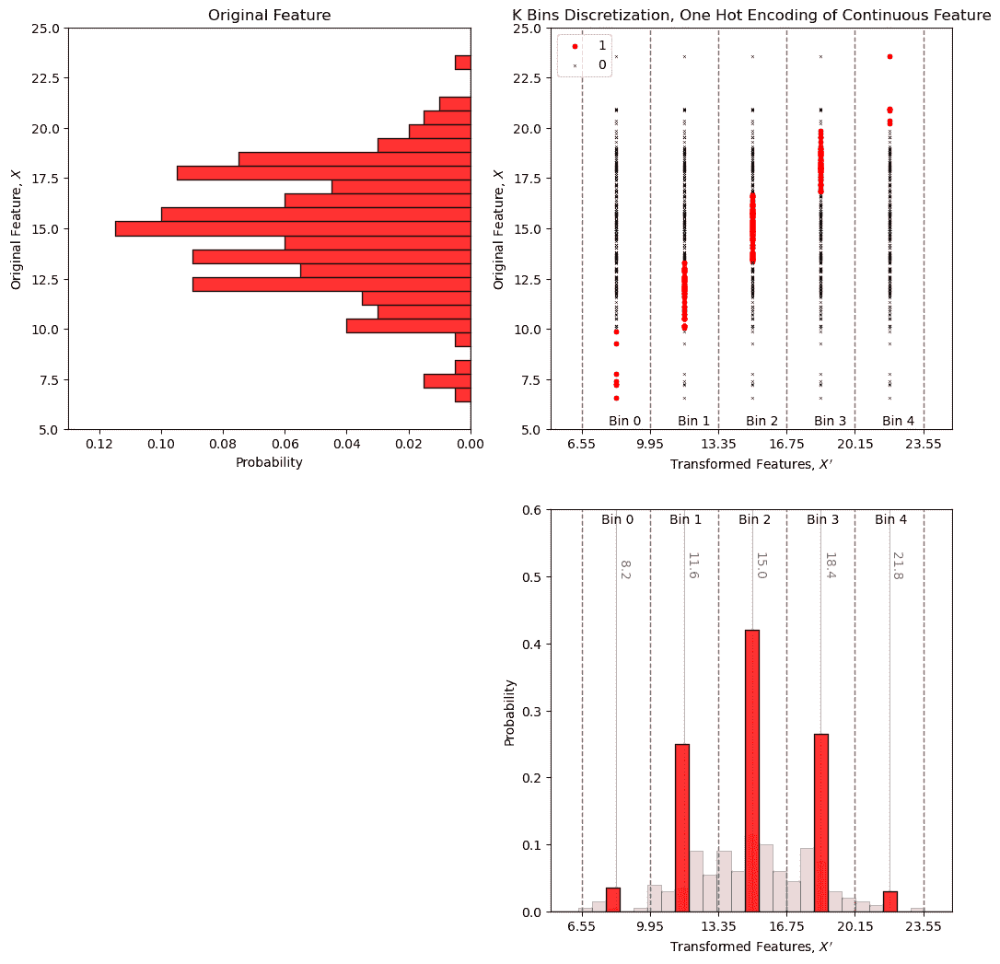

检查第一个样本，$12.08\%$ 孔隙率是 $\in [9.95\%,13.35\%]$，因此我们在第二个 bin（表格中的第二列）中有一个 1，其他 bin 中为零。

## 一般分布变换

分布变换可以应用于将任何分布 $F_x(x)$ 转换为任何其他分布 $F_y(y)$。

+   目标分布，$F_y(y)$，可以是非参数的，即一组值。在这种情况下，数据被转换为 CDF，并应用某种形式的插值来找到目标 CDF 的逆，$F_y^{-1}(p)$，对于任何累积概率，$p$

+   目标分布，$F_y(y)$，可以是任何参数分布，并且对于任何累积概率，$p$，计算目标 CDF 的逆，$F_y^{-1}(p)$，可以通过解析解获得

我构建了一个交互式 Python 仪表板[分布转换](https://github.com/GeostatsGuy/DataScienceInteractivePython/blob/main/Interactive_Distribution_Transformations.ipynb)，其中包含将分布转换到参数分布的转换，


用于将分布转换到参数目标分布的交互式 Python 仪表板。

并将转换到非参数分布，


用于将分布转换到非参数目标分布的交互式 Python 仪表板。

## 分布转换到参数分布

我们可以使用此工作流程将我们的数据特征分布转换为任何参数分布。

1.  计算我们每个数据值的累积概率值，$p_{\alpha} = F_x(x_\alpha)$，$\forall$ $\alpha = 1,\ldots, n$。

1.  将目标参数累积分布函数（CDF）的逆应用于计算转换值。$y_{\alpha} = G_y^{-1}\left(F_x(x_\alpha)\right)$，$\forall$ $\alpha = 1,\ldots, n$。

在分配累积概率时，你必须对分布尾（最小值和最大值）做出假设。

+   **已知尾** - 数据集中的最小值或最大值是分布的最小值或最大值

+   **未知尾** - 分布的最小值或最大值是已知的

对于每个可能的案例，我们计算按升序排序数据的累积概率，

1.  已知下尾和上尾，

$$ F_i = \frac{i-1}{n-1} $$

1.  未知下尾和已知上尾，

$$ F_i = \frac{i}{n} $$

1.  已知下尾和未知上尾，

$$ F_i = \frac{i-1}{n} $$

1.  未知上尾和下尾，

$$ F_i = \frac{i}{n+1} $$

这在稀疏采样数据集中更为重要。当$n$很大时，这就不那么重要了，

+   尾部的累积概率范围非常小！

+   特征的最小值和最大值可能是已知的

## 高斯变换/高斯畸变

我们表明，通过仿射校正将均值校正到 0.0 和标准差校正到 1.0 不会改变形状；因此，不会使分布成为高斯分布。

+   对于许多统计或地统计方法，需要假设高斯分布。我们在许多地下建模工作流程中需要正态得分转换。

高斯畸变是通过累积分布函数（CDF）$F_{X}$应用到新的 CDF $G_{Y}$ 上实现的。这可以通过对所有样本数据应用分位数-分位数变换进行推广：

+   正向变换：

$$ Y = G_{Y}^{-1}(F_{X}(X)) $$

+   反向变换：

$$ X = F_{X}^{-1}(G_{Y}(Y)) $$

这里是高斯变换的可视化，

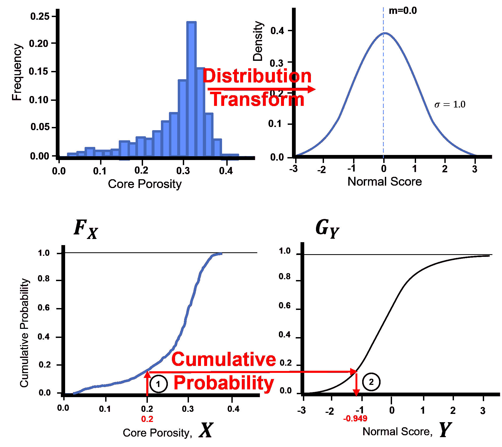

高斯畸变将原始分布转换为标准正态分布，均值为 0.0，方差为 1.0。

让我们手动查看单个特征的原始累积分布函数和高斯变换后的累积分布函数。

```py
por = df['Por'].copy(deep = True).values                 # make a deepcopy of the feature from the DataFrame

por = np.sort(por)                                            # sort the data in ascending order
n = por.shape[0]                                              # get the number of data samples

cprob = np.zeros(n)
for i in range(0,n):
    index = i + 1
    cprob[i] = index / n                                      # known upper tail
    # cprob[i] = (index - 1)/n                                # known lower tail
    # cprob[i] = (index - 1)/(n - 1)                          # known upper and lower tails
    # cprob[i] = index/(n+1)                                  # unknown tails 

y = np.zeros(n)

for i in range(0,n):
    y[i] = norm.ppf(cprob[i],loc=0.0,scale=1.0)

plt.subplot(121)
plt.plot(por,cprob, alpha = 0.2, c = 'black') # plot piecewise linear interpolation
plt.scatter(por,cprob,s = 10, alpha = 1.0, c = 'red', edgecolor = 'black') # plot the CDF points
plt.grid(); plt.xlim([5,25]); plt.ylim([0.0,1.0])
plt.xlabel("Porosity (fraction)"); plt.ylabel("Cumulative Probability"); plt.title("Non-parametric Porosity Cumulative Distribution Function")

plt.subplot(122)
plt.plot(y,cprob, alpha = 0.2, c = 'black') # plot piecewise linear interpolation
plt.scatter(y,cprob,s = 10, alpha = 1.0, c = 'red', edgecolor = 'black') # plot the CDF points
plt.grid(); plt.xlim([-3.0,3.0]); plt.ylim([0.0,1.0])
plt.xlabel("Porosity (fraction)"); plt.ylabel("Cumulative Probability"); plt.title("After Distribution Transformation to Gaussian")

plt.subplots_adjust(left=0.0, bottom=0.0, right=2.0, top=1.2, wspace=0.2, hspace=0.2); plt.show() 
```

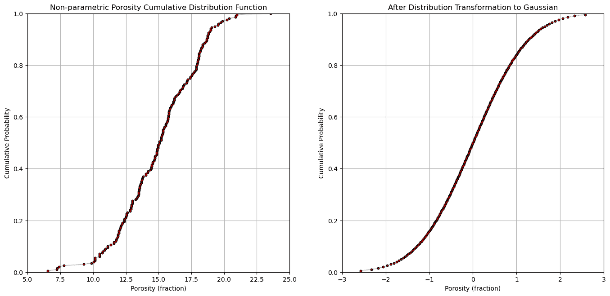

现在，让我们使用一个函数执行高斯变换。

```py
from sklearn.preprocessing import QuantileTransformer
nscore = QuantileTransformer(n_quantiles=100, random_state=73, output_distribution = 'normal') 
nsfeatures = nscore.fit_transform(df)                       # standardize all the values extracted from the DataFrame 
df_ns = pd.DataFrame()                                      # instantiate a new DataFrame
df_ns = pd.DataFrame(nsfeatures, index=df.index, columns=df.columns) # copy the standardized values into the new DataFrame
df_ns.head() 

plt.subplot(121)
GSLIB.hist_st(df['Por'].values,0,30,log=False,cumul = False,bins=40,weights = None,xlabel='Porosity (%)',title='Original Porosity')
add_grid()

plt.subplot(122)
GSLIB.hist_st(df_ns['Por'].values,-3,3,log=False,cumul = False,bins=40,weights = None,xlabel='Porosity Normal Score',title='Standard Normal Porosity')
add_grid()
plt.subplots_adjust(left=0.0, bottom=0.0, right=2.0, top=1.1, wspace=0.2, hspace=0.2); plt.show() 
```

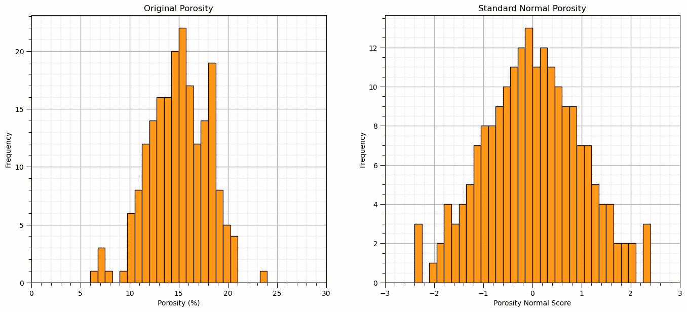

让我们可视化高斯变换后的特征直方图。

+   我们应该看到一个以 0.0 为中心，范围大约在-4 到 4 之间的漂亮的钟形曲线。

```py
nbins = 30                                                    # number of histogram bins
for i, feature in enumerate(features):                        # plot histograms with central tendency and P10 and P90 labeled
    plt.subplot(3,3,i+1)
    y,_,_ = plt.hist(x=df_ns[feature],weights=None,bins=nbins,alpha = 0.8,edgecolor='black',color='darkorange',density=True)
    histogram_bounds(values=df_ns[feature].values,weights=np.ones(len(df)),color='red')
    plt.xlabel(feature); plt.ylabel('Frequency'); plt.ylim([0.0,y.max()*1.10]); plt.title(featuretitle[i]); add_grid() 
    plt.xlim([-3.0,3.0]) 

plt.subplots_adjust(left=0.0, bottom=0.0, right=2., top=2.1, wspace=0.2, hspace=0.3); plt.show() 
```


再次，让我们检查反向变换，从高斯回到原始特征。

\begin{equation} x = F_x^{-1}(G_y(y)) \end{equation}

```py
rfeatures = nscore.inverse_transform(df_ns.values)
df_reverse = pd.DataFrame()                                     # instantiate a new DataFrame
df_reverse = pd.DataFrame(rfeatures, index=df.index, columns=df.columns) # copy the standardized values into the new DataFrame

plt.subplot(131)
GSLIB.hist_st(df['Por'].values,0,30,log=False,cumul = False,bins=40,weights = None,xlabel='Porosity (%)',title='Original Porosity')
add_grid()

plt.subplot(132)
GSLIB.hist_st(df_ns['Por'].values,-3,3,log=False,cumul = False,bins=40,weights = None,xlabel='Porosity Normal Score',title='Standard Normal Porosity')
add_grid()

plt.subplot(133)
GSLIB.hist_st(df_reverse['Por'].values,0,30,log=False,cumul = False,bins=40,weights = None,xlabel='Porosity Reverse Normal Score (%)',
              title='Porosity Reverse Gaussian Transform')
add_grid()

plt.subplots_adjust(left=0.0, bottom=0.0, right=3.0, top=1.1, wspace=0.2, hspace=0.2) 
```

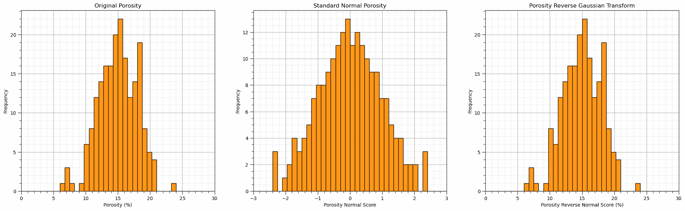

## 分位数/均匀[0,1]变换

我们还可以执行均匀变换，这被称为累积概率值的分位数变换。

+   累积概率值具有均匀分布。

```py
uniform = QuantileTransformer(n_quantiles=100, random_state=73, output_distribution = 'uniform') 
unifeatures = uniform.fit_transform(df)                      # standardize all the values extracted from the DataFrame 
df_uni = pd.DataFrame()                                      # instantiate a new DataFrame
df_uni = pd.DataFrame(unifeatures, index=df.index, columns=df.columns) # copy the standardized values into the new DataFrame

plt.subplot(121)
GSLIB.hist_st(df['Por'].values,0,30,log=False,cumul = False,bins=40,weights = None,xlabel='Porosity (%)',title='Original Porosity')
add_grid()

plt.subplot(122)
GSLIB.hist_st(df_uni['Por'].values,0,1,log=False,cumul = False,bins=40,weights = None,xlabel='Porosity Uniform Transform',
              title='Uniform Transform Porosity')
add_grid()

plt.subplots_adjust(left=0.0, bottom=0.0, right=2.0, top=1.1, wspace=0.2, hspace=0.2) 
```

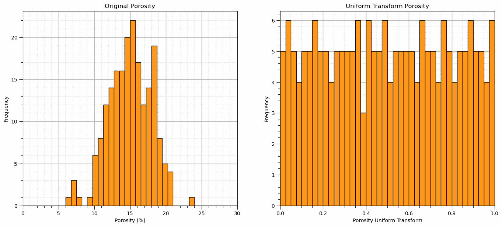

让我们可视化均匀变换后的特征直方图。

+   我们应该看到均匀频率（由于采样有限，存在一些噪声）$\in [0,1]$。

```py
nbins = 30                                                    # number of histogram bins
for i, feature in enumerate(features):                        # plot histograms with central tendency and P10 and P90 labeled
    plt.subplot(3,3,i+1)
    y,_,_ = plt.hist(x=df_uni[feature],weights=None,bins=nbins,alpha = 0.8,edgecolor='black',color='darkorange',density=True)
    histogram_bounds(values=df_uni[feature].values,weights=np.ones(len(df)),color='red')
    plt.xlabel(feature); plt.ylabel('Frequency'); plt.ylim([0.0,y.max()*1.10]); plt.title(featuretitle[i]); add_grid() 
    plt.xlim([0.0,1.0]) 

plt.subplots_adjust(left=0.0, bottom=0.0, right=2., top=2.1, wspace=0.2, hspace=0.3); plt.show() 
```

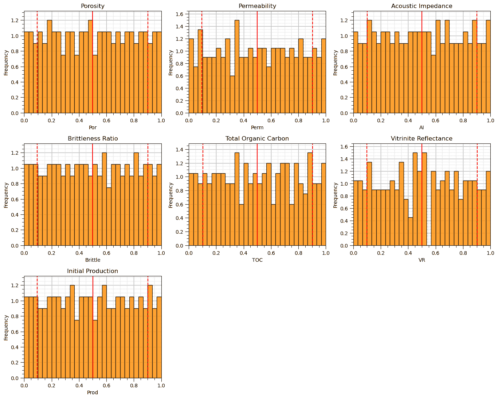

我们现在有了具有均匀分布 $[0,1]$ 的特征。

## 自定义特征变换

我们也可以创建自己的自定义特征变换。我们可以在 scikit-learn 预处理函数中指定自己的变换

+   这使我们能够方便地进行特征的前向和反向变换，就像我们上面看到的那样

让我们用自然对数进行正向变换，用指数进行反向变换。

$$ y = log(x) $$$$ x = exp(y) $$

这是创建我们的自定义特征变换的代码，

```py
custom_transformer = FunctionTransformer(func = np.log, inverse_func = np.exp) 
```

```py
custom_transformer = FunctionTransformer(func = np.log, inverse_func = np.exp, check_inverse = True, validate=True)
custom_features = custom_transformer.fit_transform(df['Perm'].values.reshape(-1, 1)) # standardize all the values extracted from the DataFrame 
df_custom = pd.DataFrame(custom_features, columns = ['LogPerm'])                 # instantiate a new DataFrame
df_custom.head() 

plt.subplot(121)
GSLIB.hist_st(df['Perm'].values,0,15,log=False,cumul = False,bins=40,weights = None,xlabel='Permeability (mD)',title='Original Permeability')
add_grid()

plt.subplot(122)
GSLIB.hist_st(df_custom['LogPerm'].values,0,3,log=False,cumul = False,bins=40,weights = None,xlabel='Permeability Log Transform',
              title='Custom Transform - Log Transformed Permeability')
add_grid()

plt.subplots_adjust(left=0.0, bottom=0.0, right=2.0, top=1.1, wspace=0.2, hspace=0.2) 
```

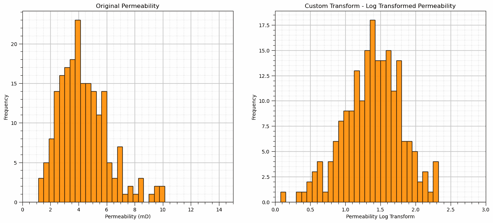

让我们演示我们的自定义变换是可逆的。

```py
rfeatures = custom_transformer.inverse_transform(df_custom.values)
df_reverse = pd.DataFrame(rfeatures, index=df_custom.index, columns=['Perm']) # copy the standardized values into the new DataFrame

plt.subplot(131)
GSLIB.hist_st(df['Perm'].values,0,15,log=False,cumul = False,bins=40,weights = None,xlabel='Permeability (mD)',title='Original Permeability')
add_grid()

plt.subplot(132)
GSLIB.hist_st(df_custom['LogPerm'].values,0,3,log=False,cumul = False,bins=40,weights = None,xlabel='Pemeability Log Transform',
              title='Custom Transform - Log Transformed Permeability')
add_grid()

plt.subplot(133)
GSLIB.hist_st(df_reverse['Perm'].values,0,15,log=False,cumul = False,bins=40,weights = None,xlabel='Permeability (mD)',title='Original Permeability')
add_grid()

plt.subplots_adjust(left=0.0, bottom=0.0, right=2.0, top=1.1, wspace=0.2, hspace=0.2); plt.show() 
```

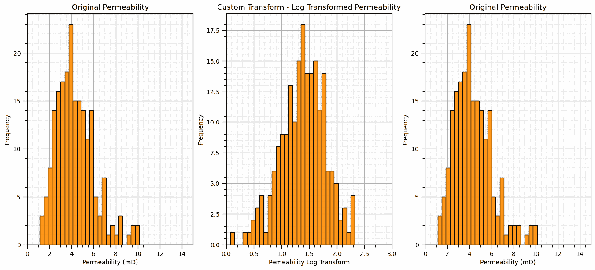

将反向转换的渗透率值与原始数据集进行比较。我们用自定义转换指定的反向转换是有效的！

## 评论

这是对特征转换的基本处理。可以做和讨论的还有很多，我有很多更多的资源。查看我的[共享资源清单](https://michaelpyrcz.com/my-resources)以及本章开头带有资源链接的 YouTube 讲座链接。

希望这有所帮助，

*迈克尔*

## 关于作者


迈克尔·皮尔茨教授在德克萨斯大学奥斯汀分校 40 英亩校园的办公室。

迈克尔·皮尔茨是[德克萨斯大学奥斯汀分校的科克雷尔工程学院](https://cockrell.utexas.edu/faculty-directory/alphabetical/p)和[杰克逊地球科学学院](https://www.jsg.utexas.edu/researcher/michael_pyrcz/)的教授，他在[德克萨斯大学奥斯汀分校](https://www.utexas.edu/)从事和教授地下、空间数据分析、地统计学和机器学习。迈克尔还是，

+   [能源分析](https://fri.cns.utexas.edu/energy-analytics)新生研究项目的首席研究员，以及德克萨斯大学奥斯汀分校自然科学学院机器学习实验室的核心教员。

+   [《计算机与地球科学》](https://www.sciencedirect.com/journal/computers-and-geosciences/about/editorial-board)的副编辑，以及国际数学地球科学协会[《数学地球科学》](https://link.springer.com/journal/11004/editorial-board)的董事会成员。

迈克尔已经撰写了超过 70 篇[同行评审的出版物](https://scholar.google.com/citations?user=QVZ20eQAAAAJ&hl=en)，一个用于空间数据分析的[Python 包](https://pypi.org/project/geostatspy/)，合著了一本关于空间数据分析的教科书《[地统计学储层建模](https://www.amazon.com/Geostatistical-Reservoir-Modeling-Michael-Pyrcz/dp/0199731446)》，并且是两本近期发布的电子书的作者，分别是《[Python 中的应用地统计学：GeostatsPy 实践指南](https://geostatsguy.github.io/GeostatsPyDemos_Book/intro.html)》和《[Python 中的应用机器学习：带代码的实践指南](https://geostatsguy.github.io/MachineLearningDemos_Book/intro.html)》。

迈克尔的所有大学讲座都可以在他的[YouTube 频道](https://www.youtube.com/@GeostatsGuyLectures)上找到，其中包含 100 多个 Python 交互式仪表板和 40 多个 GitHub 仓库中的详细记录的工作流程，以支持任何感兴趣的学生和在职专业人士。要了解更多关于迈克尔的工作和共享教育资源，请访问他的网站。

## 想要一起工作吗？

希望这些内容对那些想了解更多关于地下建模、数据分析和机器学习的人有所帮助。学生和在职专业人士都欢迎参加。

+   想邀请我到贵公司进行培训、辅导、项目审查、工作流程设计和/或咨询吗？我很乐意拜访并与您合作！

+   感兴趣于合作、支持我的研究生研究或我的地下数据分析与机器学习联盟（共同负责人是约翰·福斯特教授）吗？我的研究将数据分析、随机建模和机器学习理论与实践相结合，以开发新的方法和工作流程，增加价值。我们正在解决具有挑战性的地下问题！

+   您可以通过 mpyrcz@austin.utexas.edu 联系到我。

我总是很高兴讨论，

*迈克尔*

迈克尔·J·皮尔茨，博士，P.Eng. 教授，德克萨斯大学奥斯汀分校 Cockrell 工程学院和 Jackson 地球科学学院

更多资源可在以下链接获取：[Twitter](https://twitter.com/geostatsguy) | [GitHub](https://github.com/GeostatsGuy) | [网站](http://michaelpyrcz.com) | [Google Scholar](https://scholar.google.com/citations?user=QVZ20eQAAAAJ&hl=en&oi=ao) | [地统计学书籍](https://www.amazon.com/Geostatistical-Reservoir-Modeling-Michael-Pyrcz/dp/0199731446) | [YouTube](https://www.youtube.com/channel/UCLqEr-xV-ceHdXXXrTId5ig) | [Python 中应用地统计学电子书](https://geostatsguy.github.io/GeostatsPyDemos_Book/intro.html) | [Python 中应用机器学习电子书](https://geostatsguy.github.io/MachineLearningDemos_Book/) | [LinkedIn](https://www.linkedin.com/in/michael-pyrcz-61a648a1)

## 特征变换的动机

我们可能有多种原因想要执行特征变换。

+   使特征在可视化和比较时保持一致

+   为了避免偏差或为依赖于预测特征空间中计算的距离的方法（例如 k 最近邻回归）施加特征权重

+   该方法要求变量具有特定的范围或分布：

    +   人工神经网络可能要求所有特征的范围在[-1,1]之间

    +   部分相关系数需要高斯分布。

    +   统计测试可能需要特定的分布

    +   地统计学顺序模拟需要指示符或高斯变换

特征变换是许多机器学习工作流程中的常见基本构建块。

+   让我们学习如何执行特征变换。

## 特征变换工作流程

常见的特征变换工作流程包括将特征转换到新的空间，在新空间中完成机器学习工作流程，然后反向转换回原始空间。


常见的特征转换工作流程，将预测特征 $X_1,\ldots,X_m$ 转换为 $X^{\prime}_1,\ldots,X^{\prime}_m$，应用数据分析、地统计学或机器学习步骤来预测转换后的响应特征 $Y^{\prime}$，然后将其反变换回原始响应特征 $Y$。

## 加载所需的库

以下代码加载了所需的库。

```py
import geostatspy.GSLIB as GSLIB                              # GSLIB utilities, visualization and wrapper
import geostatspy.geostats as geostats                        # GSLIB methods convert to Python 
import geostatspy
print('GeostatsPy version: ' + str(geostatspy.__version__)) 
```

```py
GeostatsPy version: 0.0.71 
```

我们还需要一些标准包。这些应该已经与 Anaconda 3 一起安装。

```py
ignore_warnings = True                                        # ignore warnings?
import numpy as np                                            # ndarrays for gridded data
import pandas as pd                                           # DataFrames for tabular data
import os                                                     # set working directory, run executables
import matplotlib.pyplot as plt                               # for plotting
from matplotlib.lines import Line2D                           # custom legend
from matplotlib.patches import Patch                          # add shapes to plots 
from matplotlib.ticker import (MultipleLocator, AutoMinorLocator) # control of axes ticks
import matplotlib.patheffects as pe                           # advanced plotting of lines / curves
from scipy import stats                                       # summary statistics
from scipy.stats import norm                                  # Gaussian parametric distribution
import math                                                   # trigonometry etc.
import scipy.signal as signal                                 # kernel for moving window calculation
import random                                                 # for random numbers
import seaborn as sns                                         # for matrix scatter plots
from scipy import linalg                                      # for linear regression
from sklearn import preprocessing
from sklearn.preprocessing import Normalizer                  # L1/L2 normalizer
from sklearn.preprocessing import StandardScaler              # standardization
from sklearn.preprocessing import Binarizer                   # indicator transform
from sklearn.preprocessing import KBinsDiscretizer            # k-bins discretization
from sklearn.preprocessing import QuantileTransformer         # quantile
from sklearn.preprocessing import FunctionTransformer         # custom transformations
plt.rc('axes', axisbelow=True)                                # plot all grids below the plot elements
if ignore_warnings == True:                                   
    import warnings
    warnings.filterwarnings('ignore')
cmap = plt.cm.inferno                                         # color map 
```

如果您遇到包导入错误，您可能需要首先安装这些包中的一些。这通常可以通过在 Windows 上打开命令窗口然后输入‘python -m pip install [package-name]’来完成。有关相应包的文档，可以获得更多帮助。

## 声明函数

让我们定义一个函数来简化向我们的图表添加指定的百分位数和主次网格线。

```py
def weighted_percentile(data, weights, perc):                 # calculate weighted percentile 
    ix = np.argsort(data)
    data = data[ix] 
    weights = weights[ix] 
    cdf = (np.cumsum(weights) - 0.5 * weights) / np.sum(weights) 
    return np.interp(perc, cdf, data)
# function from iambr on StackOverflow @ https://stackoverflow.com/questions/21844024/weighted-percentile-using-numpy/32216049 

def histogram_bounds(values,weights,color):                   # add uncertainty bounds to a histogram 
    p10 = weighted_percentile(values,weights,0.1); avg = np.average(values,weights=weights); p90 = weighted_percentile(values,weights,0.9)
    plt.plot([p10,p10],[0.0,45],color = color,linestyle='dashed')
    plt.plot([avg,avg],[0.0,45],color = color)
    plt.plot([p90,p90],[0.0,45],color = color,linestyle='dashed')

def add_grid():                                               # add major and minor gridlines
    plt.gca().grid(True, which='major',linewidth = 1.0); plt.gca().grid(True, which='minor',linewidth = 0.2) # add y grids
    plt.gca().tick_params(which='major',length=7); plt.gca().tick_params(which='minor', length=4)
    plt.gca().xaxis.set_minor_locator(AutoMinorLocator()); plt.gca().yaxis.set_minor_locator(AutoMinorLocator()) # turn on minor ticks 
```

## 设置工作目录

我总是喜欢这样做，这样我就不会丢失文件，并且可以简化后续的读取和写入（每次避免包含完整地址）。

```py
#os.chdir("c:/PGE383")                                        # set the working directory 
```

您将需要更新引号中的部分以包含您自己的工作目录，并且在 Mac 上格式不同（例如，“~/PGE”）。

## 加载表格数据

这是将我们的逗号分隔数据文件加载到 Pandas DataFrame 对象中的命令。

让我们加载提供的多元、空间数据集‘unconv_MV.csv’。此数据集包含来自 1000 个非常规井的变量，包括：

+   平均孔隙率

+   渗透率的对数变换（以线性化与其他变量的关系）

+   声波阻抗（kg/m³ x m/s x 10⁶）

+   剪切比（%）

+   总有机碳（%）

+   玻璃质反射率（%）

+   初始产量 90 天平均（MCFPD）。

注意，数据集是合成的。

我们使用 pandas 的‘read_csv’函数将其加载到名为‘my_data’的 DataFrame 中，然后预览它以确保正确加载。

```py
#df = pd.read_csv('unconv_MV_v4.csv')                         # load our data table
df = pd.read_csv('https://raw.githubusercontent.com/GeostatsGuy/GeoDataSets/master/unconv_MV_v4.csv') # load data from Dr. Pyrcz's GitHub repository 
df = df.iloc[:,1:]                                            # remove the well index

response = 'Prod'                                             # specify the response feature
x = df.copy(deep = True); x = x.drop([response],axis='columns') # make predictor and response DataFrames
Y = df.loc[:,response]

features = x.columns.values.tolist() + [Y.name]               # store the names of the features
pred = x.columns.values.tolist()
resp = Y.name

xmin = [6.0,0.0,1.0,10.0,0.0,0.9]; xmax = [24.0,10.0,5.0,85.0,2.2,2.9] # set the minumum and maximum values for plotting
Ymin = 500.0; Ymax = 9000.0

predlabel = ['Porosity (%)','Permeability (mD)','Acoustic Impedance (kg/m2s*10⁶)','Brittleness Ratio (%)', # set the names for plotting
             'Total Organic Carbon (%)','Vitrinite Reflectance (%)']
resplabel = 'Initial Production (MCFPD)'

predtitle = ['Porosity','Permeability','Acoustic Impedance','Brittleness Ratio', # set the units for plotting
             'Total Organic Carbon','Vitrinite Reflectance']
resptitle = 'Initial Production'

featurelabel = predlabel + [resplabel]                        # make feature labels and titles for concise code
featuretitle = predtitle + [resptitle]

m = len(pred) + 1
mpred = len(pred) 
```

## 可视化 DataFrame

可视化 DataFrame 是检查数据的第一步。

+   许多事情可能会出错，例如，我们加载了错误的数据，所有特征都没有加载，等等。

我们可以通过使用‘head’DataFrame 成员函数来预览（格式整洁，见下文）。

+   添加参数‘n=13’以查看数据集的前 13 行。

```py
df.head(n=13)                                                 # we could also use this command for a table preview 
```

|  | 孔 | 渗 | AI | 剪切 | TOC | VR | 产 |
| --- | --- | --- | --- | --- | --- | --- | --- |
| 0 | 12.08 | 2.92 | 2.80 | 81.40 | 1.16 | 2.31 | 1695.360819 |
| 1 | 12.38 | 3.53 | 3.22 | 46.17 | 0.89 | 1.88 | 3007.096063 |
| 2 | 14.02 | 2.59 | 4.01 | 72.80 | 0.89 | 2.72 | 2531.938259 |
| 3 | 17.67 | 6.75 | 2.63 | 39.81 | 1.08 | 1.88 | 5288.514854 |
| 4 | 17.52 | 4.57 | 3.18 | 10.94 | 1.51 | 1.90 | 2859.469624 |
| 5 | 14.53 | 4.81 | 2.69 | 53.60 | 0.94 | 1.67 | 4017.374438 |
| 6 | 13.49 | 3.60 | 2.93 | 63.71 | 0.80 | 1.85 | 2952.812773 |
| 7 | 11.58 | 3.03 | 3.25 | 53.00 | 0.69 | 1.93 | 2670.933846 |
| 8 | 12.52 | 2.72 | 2.43 | 65.77 | 0.95 | 1.98 | 2474.048178 |
| 9 | 13.25 | 3.94 | 3.71 | 66.20 | 1.14 | 2.65 | 2722.893266 |
| 10 | 15.04 | 4.39 | 2.22 | 61.11 | 1.08 | 1.77 | 3828.247174 |
| 11 | 16.19 | 6.30 | 2.29 | 49.10 | 1.53 | 1.86 | 5095.810104 |
| 12 | 16.82 | 5.42 | 2.80 | 66.65 | 1.17 | 1.98 | 4091.637316 |

## 表格数据的摘要统计

在 DataFrames 中，有许多高效的方法可以计算表格数据的摘要统计。`describe` 命令提供了一个包含计数、平均值、最小值、最大值和四分位数的数据表。

+   我们使用转置只是翻转表格，使得特征在行上，统计在列上。

```py
df.describe().transpose() 
```

|  | count | mean | std | min | 25% | 50% | 75% | max |
| --- | --- | --- | --- | --- | --- | --- | --- | --- |
| Por | 200.0 | 14.991150 | 2.971176 | 6.550000 | 12.912500 | 15.070000 | 17.402500 | 23.550000 |
| Perm | 200.0 | 4.330750 | 1.731014 | 1.130000 | 3.122500 | 4.035000 | 5.287500 | 9.870000 |
| AI | 200.0 | 2.968850 | 0.566885 | 1.280000 | 2.547500 | 2.955000 | 3.345000 | 4.630000 |
| Brittle | 200.0 | 48.161950 | 14.129455 | 10.940000 | 37.755000 | 49.510000 | 58.262500 | 84.330000 |
| TOC | 200.0 | 0.990450 | 0.481588 | -0.190000 | 0.617500 | 1.030000 | 1.350000 | 2.180000 |
| VR | 200.0 | 1.964300 | 0.300827 | 0.930000 | 1.770000 | 1.960000 | 2.142500 | 2.870000 |
| Prod | 200.0 | 3864.407081 | 1553.277558 | 839.822063 | 2686.227611 | 3604.303506 | 4752.637555 | 8590.384044 |

## 数据可视化

我们还应该看看直方图。

+   对每个特征的范围、众数、偏度、异常值等有一个大致的了解。

```py
nbins = 20                                                    # number of histogram bins
for i, feature in enumerate(features):                        # plot histograms with central tendency and P10 and P90 labeled
    plt.subplot(3,3,i+1)
    y,_,_ = plt.hist(x=df[feature],weights=None,bins=nbins,alpha = 0.8,edgecolor='black',color='darkorange',density=True)
    histogram_bounds(values=df[feature].values,weights=np.ones(len(df)),color='red')
    plt.xlabel(feature); plt.ylabel('Frequency'); plt.ylim([0.0,y.max()*1.10]); plt.title(featuretitle[i]); add_grid() 
    if feature == resp:   
        plt.xlim([Ymin,Ymax])    
    else:
        plt.xlim([xmin[i],xmax[i]]) 

plt.subplots_adjust(left=0.0, bottom=0.0, right=2., top=2.1, wspace=0.2, hspace=0.3); plt.show() 
```


现在，让我们逐步进行、描述、演示和可视化每个特征转换。

幸运的是，只有几个稍微负面的值，这很好地过渡到我们的第一个特征转换。

## 截断

特征可能超出合理的值范围。

+   截断简单地说就是将范围之外的值赋予一个特定的值。

+   通常会将下尾部的异常值赋予最小可接受值，反之亦然。

使用 numpy 操作符对 Pandas DataFrame 中的特征数组进行截断可以轻松处理。

```py
num = df._get_numeric_data() 
num[num < data_min] = data_min
num[num > data_max] = data_max 
```

```py
plt.subplot(121)
plt.hist(df['TOC'].values,color='darkorange',alpha=0.8,edgecolor='black',bins=np.linspace(-0.2,1.0,25))
plt.xlabel('TOC (fraction)'); plt.ylabel('Frequency'); plt.title('Original Histogram'); plt.ylim([0,14]); plt.xlim([-0.2,1.0])
plt.gca().grid(which='minor', color='#EEEEEE', linestyle=':', linewidth=0.5)
plt.gca().grid(which='major', color='#DDDDDD', linewidth=0.8); plt.gca().minorticks_on()

old_TOC = df['TOC'].values.copy()
num = df._get_numeric_data()                                  # get the numerical values
num[num < 0] = 0                                              # truncate negative values to 0.0
df.describe().transpose()                                     # get the summary statistics of all features

plt.subplot(122)
plt.hist(df['TOC'].values,color='red',alpha=0.8,edgecolor='black',bins=np.linspace(-0.2,1.0,25),zorder=10)
plt.hist(old_TOC,color='darkorange',alpha=0.8,edgecolor='black',bins=np.linspace(-0.2,1.0,25),zorder=20)
plt.xlabel('TOC (fraction)'); plt.ylabel('Frequency'); plt.title('Truncated (>0.0) Histogram'); plt.ylim([0,14]); plt.xlim([-0.2,1.0])
plt.fill_between([-0.2,0.0],[14,14],[0,0],color='grey',alpha=1.0,zorder=30); plt.plot([0.0,0.0],[0,14],color='black',ls='--',zorder=30)
plt.gca().grid(which='minor', color='#EEEEEE', linestyle=':', linewidth=0.5)
plt.gca().grid(which='major', color='#DDDDDD', linewidth=0.8); plt.gca().minorticks_on()

plt.subplots_adjust(left=0.0, bottom=0.0, right=2.0, top=1.1, wspace=0.2, hspace=0.2); plt.show() 
```


让我们再次查看摘要统计，以确认我们成功地将 TOC 截断到 $\ge 0$。

```py
df.describe().transpose() 
```

|  | count | mean | std | min | 25% | 50% | 75% | max |
| --- | --- | --- | --- | --- | --- | --- | --- | --- |
| Por | 200.0 | 14.991150 | 2.971176 | 6.550000 | 12.912500 | 15.070000 | 17.402500 | 23.550000 |
| Perm | 200.0 | 4.330750 | 1.731014 | 1.130000 | 3.122500 | 4.035000 | 5.287500 | 9.870000 |
| AI | 200.0 | 2.968850 | 0.566885 | 1.280000 | 2.547500 | 2.955000 | 3.345000 | 4.630000 |
| Brittle | 200.0 | 48.161950 | 14.129455 | 10.940000 | 37.755000 | 49.510000 | 58.262500 | 84.330000 |
| TOC | 200.0 | 0.991950 | 0.478264 | 0.000000 | 0.617500 | 1.030000 | 1.350000 | 2.180000 |
| VR | 200.0 | 1.964300 | 0.300827 | 0.930000 | 1.770000 | 1.960000 | 2.142500 | 2.870000 |
| Prod | 200.0 | 3864.407081 | 1553.277558 | 839.822063 | 2686.227611 | 3604.303506 | 4752.637555 | 8590.384044 |

从汇总统计中可以看出，截断是成功的，我们现在有一个最小值 0.0。

## 仿射校正

仿射校正是将特征分布转换为新的均值和方差。

+   这是对原始属性分布的平移和拉伸/压缩

+   假设没有形状变化

以下方程应用于原始分布中的每个样本

$$ y = \frac{\sigma_y}{\sigma_x}\left( x - \overline{x} \right) + \overline{y} $$

其中 $\sigma_x$ 是原始标准差，$\sigma_y$ 是目标标准差，$\overline{x}$ 是原始均值，$\overline{y}$ 是目标均值。

+   GeostatsPy 中有一个仿射函数我们可以使用

+   为了简洁起见，我们只转换一个特征，请注意，该函数没有设置为一次转换多个特征，该函数也不处理反向转换。

让我们将孔隙率转换为具有任意均值和标准差（$\overline{x} = 20\%$ 和 $\sigma_x = 3\%$）

```py
df['aPor'] = GSLIB.affine(df['Por'].values,tmean = 22.0,tstdev = 1.5) # affine correction

plt.subplot(121)
plt.hist(df['Por'].values,color='yellow',alpha=0.4,edgecolor='black',bins=np.linspace(0.0,30.0,30),label='Original')
plt.hist(df['aPor'].values,color='red',alpha=0.4,edgecolor='black',bins=np.linspace(0.0,30.0,30),label='Transformed')
plt.hist(df['aPor'].values,fill=False,alpha=1.0,edgecolor='black',lw=2.0,bins=np.linspace(0.0,30.0,30))
plt.legend(loc='upper left'); plt.grid(True)
plt.xlabel('Porosity (%)'); plt.ylabel('Frequency'); plt.title('Original and Affine Transformed Histograms'); plt.ylim([0,60]); plt.xlim([0.0,30.0])
add_grid()

plt.subplot(122)
plt.plot(np.sort(df['Por']),np.linspace(0,1,len(df)),color='yellow',alpha=0.8,lw=3,zorder=10,label='Original', path_effects=[pe.Stroke(linewidth=7, foreground='black'), pe.Normal()])
plt.plot(np.sort(df['aPor']),np.linspace(0,1,len(df)),color='red',alpha=0.8,lw=3,zorder=10,label='Transformed', path_effects=[pe.Stroke(linewidth=7, foreground='black'), pe.Normal()])
plt.xlim([0,30]); plt.ylim(0,1); plt.xlabel('Porosity (%)'); plt.ylabel('Cumulative Probability'); 
plt.title('Original and Affine Transformed CDFs'); plt.legend(loc='upper left'); plt.grid(True)
add_grid()

plt.subplots_adjust(left=0.0, bottom=0.0, right=2.0, top=1.2, wspace=0.2, hspace=0.2); plt.show() 
```


让我们检查新特征的汇总统计。

```py
df['aPor'].describe().transpose() 
```

```py
count    200.000000
mean      22.000000
std        1.503764
min       17.727787
25%       20.947959
50%       22.039907
75%       23.220426
max       26.331783
Name: aPor, dtype: float64 
```

让我们移除仿射变换后的特征。

```py
df = df.drop(columns = ['aPor']) 
```

## 标准化

标准化是将特征分布转换为均值为零和方差为 1 的转换。

+   这是对原始属性分布的平移和拉伸/压缩

+   假设没有形状变化

这种转换实际上是仿射校正的一个特例，其中 $\overline{y} = 0$ 和 $\sigma_y = 1.0$。

\begin{equation} y = \frac{1}{\sigma_x}\left( x - \overline{x} \right) \end{equation}

其中 $\sigma_x$ 是原始标准差，$\overline{x}$ 是原始均值。

让我们将特征标准化为：

+   均值 = 0.0

+   方差 = 标准差 = 1.0

要做到这一点，我们：

1.  从 scikit learn 实例化 StandardScaler。我们将它分配为“scaler”对象，这样我们就可以方便地使用此对象来反转转换，我们需要这样做才能将我们的预测转换回常规生产单位。该“scaler”对象为我们处理所有账目。

```py
scaler = StandardScaler() 
```

1.  我们随后从我们的 DataFrame 中提取所有值并应用按列标准化。结果是二维 ndarray

```py
sfeatures = scaler.fit_transform(df_mv.values) 
```

1.  我们创建一个新的空 DataFrame

```py
df_nmv = pd.DataFrame() 
```

1.  然后我们将转换后的值添加到新的 DataFrame 中，同时保留来自旧 DataFrame 的样本索引和特征名称

```py
df_nmv = pd.DataFrame(sfeatures, index=df_mv.index, columns=df_mv.columns) 
```

```py
scaler = StandardScaler()                                     # instantiate the scaler 
sfeatures = scaler.fit_transform(df.values)                   # standardize all the values extracted from the DataFrame 
df_st = pd.DataFrame()                                        # instantiate a new DataFrame
df_st = pd.DataFrame(sfeatures, index=df.index, columns=df.columns) # copy the standardized values into the new DataFrame

plt.subplot(121)
plt.hist(df['Por'].values,color='yellow',alpha=0.4,edgecolor='black',bins=np.linspace(-5.0,30.0,36),label='Original')
plt.hist(df_st['Por'].values,color='red',alpha=0.4,edgecolor='black',bins=np.linspace(-5.0,30.0,36),label='Standardized')
plt.hist(df_st['Por'].values,fill=False,alpha=1.0,edgecolor='black',lw=2.0,bins=np.linspace(-5.0,30.0,36))
plt.legend(loc='upper left')
plt.xlabel('Porosity (%)'); plt.ylabel('Frequency'); plt.title('Original and Standardized Histograms'); plt.ylim([0,80]); plt.xlim([-5.0,25.0])
add_grid()

plt.subplot(122)
plt.plot(np.sort(df['Por']),np.linspace(0,1,len(df)),color='yellow',alpha=0.8,lw=3,zorder=10,label='Original',
         path_effects=[pe.Stroke(linewidth=7, foreground='black'), pe.Normal()])
plt.plot(np.sort(df_st['Por']),np.linspace(0,1,len(df)),color='red',alpha=0.8,lw=3,zorder=10,label='Standardized',
         path_effects=[pe.Stroke(linewidth=7, foreground='black'), pe.Normal()])
plt.xlim([-5,25]); plt.ylim(0,1); plt.xlabel('Porosity (%)'); plt.ylabel('Cumulative Probability'); 
plt.title('Original and Standardized CDFs'); plt.legend(loc='lower right'); plt.grid(True)
add_grid()

plt.subplots_adjust(left=0.0, bottom=0.0, right=2.0, top=1.2, wspace=0.2, hspace=0.2); plt.show() 
```


让我们闭合循环并反转转换，以确认我们回到了原始数据。

要做到这一点，我们：

1.  调用‘fit’特征缩放器的逆变换函数，将变换值应用到新的 DataFrame 中，同时保留旧 DataFrame 的样本索引和特征名称。

```py
rfeatures = scaler.inverse_transform(df_st.values) 
```

此输出的结果是 2D NumPy 数组。

1.  我们将把它放入一个新的 DataFrame。

```py
df_reverse = pd.DataFrame(rfeatures, index=df.index, columns=df.columns) 
```

```py
rfeatures = scaler.inverse_transform(df_st.values)
df_reverse = pd.DataFrame(rfeatures, index=df.index, columns=df.columns) # copy the standardized values into the new DataFrame
df_reverse.head() 

plt.subplot(131)
GSLIB.hist_st(df['Por'].values,0,30,log=False,cumul = False,bins=40,weights = None,xlabel='Porosity (%)',title='Original Porosity')
add_grid()

plt.subplot(132)
GSLIB.hist_st(df_st['Por'].values,-3,3,log=False,cumul = False,bins=40,weights = None,xlabel='Porosity Standardized',title='Standardized Porosity')
add_grid()

plt.subplot(133)
GSLIB.hist_st(df_reverse['Por'].values,0,30,log=False,cumul = False,bins=40,weights = None,xlabel='Porosity Reverse Standardization (%)',
              title='Porosity Reverse Standardization')
add_grid()

plt.subplots_adjust(left=0.0, bottom=0.0, right=3.0, top=1.1, wspace=0.2, hspace=0.2) 
```


您可以确认结果与标准化前的原始数据相同。

我们只是在测试，所以让我们删除（删除）新的 DataFrame。我们可以在 Python 中使用以下方法删除实例化的对象。

```py
del df_reverse 
```

对于更复杂的流程，删除中间产品以节省内存并防止混乱可能是个好主意！

```py
del df_reverse 
```

## 标准化

也称为最小/最大变换，将特征重新缩放，使其最小值为 0，最大值为 1。

$$ y = \frac{x - min(x)}{max(x) - min(x)} $$

其中 $min(x)$ 和 $max(x)$ 是每个特征的最小值和最大值。

+   scikit learn 内置了最小/最大变换方法。

```py
min_max_scaler = preprocessing.MinMaxScaler()
scaled_array = min_max_scaler.fit_transform(float_array) 
```

```py
norm_scaler = preprocessing.MinMaxScaler()                 # instantiate the scaler 
nfeatures = norm_scaler.fit_transform(df.values)           # standardize all the values extracted from the DataFrame 
df_n = pd.DataFrame(nfeatures, index=df.index, columns=df.columns) # copy the standardized values into the new DataFrame
df_n.head() 

plt.subplot(121)
plt.hist(df['Por'].values,color='yellow',alpha=0.4,edgecolor='black',bins=np.linspace(0.0,25.0,26),label='Original')
plt.hist(df_n['Por'].values,color='red',alpha=0.4,edgecolor='black',bins=np.linspace(0.0,25.0,26),label='Standardized')
plt.hist(df_n['Por'].values,fill=False,alpha=1.0,edgecolor='black',lw=2.0,bins=np.linspace(0.0,25.0,26))
plt.legend(loc='upper left')
plt.xlabel('Porosity (%)'); plt.ylabel('Frequency'); plt.title('Original and Standardized Histograms'); plt.ylim([0,80]); plt.xlim([0.0,25.0])
add_grid()

plt.subplot(122)
plt.plot(np.sort(df['Por']),np.linspace(0,1,len(df)),color='yellow',alpha=0.8,lw=3,zorder=10,label='Original',
         path_effects=[pe.Stroke(linewidth=7, foreground='black'), pe.Normal()])
plt.plot(np.sort(df_n['Por']),np.linspace(0,1,len(df)),color='red',alpha=0.8,lw=3,zorder=10,label='Standardized',
         path_effects=[pe.Stroke(linewidth=7, foreground='black'), pe.Normal()])
plt.xlim([0,25]); plt.ylim(0,1); plt.xlabel('Porosity (%)'); plt.ylabel('Cumulative Probability'); 
plt.title('Original and Standardized CDFs'); plt.legend(loc='lower right'); plt.grid(True)
add_grid()

plt.subplots_adjust(left=0.0, bottom=0.0, right=2.0, top=1.2, wspace=0.2, hspace=0.2); plt.show() 
```


让我们检查汇总统计信息。

```py
df_n.describe().transpose() 
```

|  | count | mean | std | min | 25% | 50% | 75% | max |
| --- | --- | --- | --- | --- | --- | --- | --- | --- |
| Por | 200.0 | 0.496538 | 0.174775 | 0.0 | 0.374265 | 0.501176 | 0.638382 | 1.0 |
| Perm | 200.0 | 0.366219 | 0.198057 | 0.0 | 0.227975 | 0.332380 | 0.475686 | 1.0 |
| AI | 200.0 | 0.504134 | 0.169220 | 0.0 | 0.378358 | 0.500000 | 0.616418 | 1.0 |
| Brittle | 200.0 | 0.507180 | 0.192526 | 0.0 | 0.365377 | 0.525548 | 0.644809 | 1.0 |
| TOC | 200.0 | 0.455023 | 0.219387 | 0.0 | 0.283257 | 0.472477 | 0.619266 | 1.0 |
| VR | 200.0 | 0.533144 | 0.155066 | 0.0 | 0.432990 | 0.530928 | 0.625000 | 1.0 |
| Prod | 200.0 | 0.390241 | 0.200408 | 0.0 | 0.238229 | 0.356681 | 0.504843 | 1.0 |

让我们闭合循环并逆变换（反向变换）以确认我们回到了原始数据。

```py
rfeatures = norm_scaler.inverse_transform(df_n.values)
df_reverse = pd.DataFrame()                                     # instantiate a new DataFrame
df_reverse = pd.DataFrame(rfeatures, index=df.index, columns=df.columns) # copy the standardized values into the new DataFrame
df_reverse.head() 

plt.subplot(131)
GSLIB.hist_st(df['Por'].values,0,30,log=False,cumul = False,bins=40,weights = None,xlabel='Porosity (%)',title='Original Porosity')
plt.subplots_adjust(left=0.0, bottom=0.0, right=2.0, top=1.1, wspace=0.2, hspace=0.2)

plt.subplot(132)
GSLIB.hist_st(df_n['Por'].values,0,1,log=False,cumul = False,bins=40,weights = None,xlabel='Porosity Normalized',title='Normalization Porosity')
plt.subplots_adjust(left=0.0, bottom=0.0, right=2.0, top=1.1, wspace=0.2, hspace=0.2)

plt.subplot(133)
GSLIB.hist_st(df_reverse['Por'].values,0,30,log=False,cumul = False,bins=40,weights = None,xlabel='Porosity Reverse Normalization (%)',
              title='Porosity Reverse Normalization')
plt.subplots_adjust(left=0.0, bottom=0.0, right=3.0, top=1.1, wspace=0.2, hspace=0.2); plt.show() 
```


您可以确认结果与标准化前的原始数据相同。

再次，我们只是在测试，所以让我们删除反向变换后的 DataFrame。

```py
del df_reverse 
```

## L1 / L2 标准化器

另一种类型的标准化是对每个样本独立执行的，以强制 $L1$ 或 $L2$ 范数为 1.0。

对于 L1 范数：

$$ \sum^m_{i,\alpha = 1} x_{i, \alpha} = 1.0, \quad i = 1, \ldots, n $$

其中，我们对于 $i = 1, \dots, n$ 个样本，有 $x_{i, \alpha}, \alpha = 1, \dots, m$ 个特征。

对于 L2 范数：

$$ \sum^m_{i,\alpha = 1}\left( x_{i, \alpha} \right)² = 1.0, \quad i = 1, \ldots, n $$

其中，我们对于 $i = 1, \dots, n$ 个样本，有 $x_{i, \alpha}, \alpha = 1, \dots, m$ 个特征。

+   这可能适用于文本分类或聚类。

我们下面展示了 L1 和 L2 标准化器。

+   此变换没有逆变换。

让我们从 $L2$ 范数开始。

```py
l2normalizer = Normalizer(norm = 'l2') 
l2features = l2normalizer.fit_transform(df_n) 

colors =  ['#1f77b4', '#ff7f0e', '#2ca02c', '#d62728', '#9467bd', '#8c564b', '#e377c2','#7f7f7f', '#bcbd22', '#17becf']
names = ['Porosity','Permeability','Acoustic Impedance','Brittleness','Total Organic Carbon','Vitrinite Reflectance','Production']

plt.subplot(121)
n_cumul_sum =np.cumsum(np.power(df_n.values,2),axis=1)
for i in range(0,l2features.shape[1]):
    plt.plot(np.linspace(0,len(df)-1,len(df)),n_cumul_sum[:,i])

plt.fill_between(np.linspace(0,len(df)-1,len(df)),n_cumul_sum[:,i],np.zeros(len(df)))
for i in range(1,l2features.shape[1]):
    plt.fill_between(np.linspace(0,len(df)-1,len(df)),n_cumul_sum[:,i],n_cumul_sum[:,i-1])

plt.xlim([0,len(df)-1]); plt.ylim([0,5])
plt.xlabel('Sample (index)'); plt.ylabel('Features Cumulative Square'); plt.title('Original')

legend_elements = []
for i in range(len(names)):
    legend_elements.append(Patch(facecolor=colors[i], edgecolor='black',label=names[i]))
plt.gca().legend(handles=legend_elements, loc='upper right')
add_grid()

plt.subplot(122)
l2_cumul_sum =np.cumsum(np.power(l2features,2),axis=1)
for i in range(0,l2features.shape[1]):
    plt.plot(np.linspace(0,len(df)-1,len(df)),l2_cumul_sum[:,i])

plt.fill_between(np.linspace(0,len(df)-1,len(df)),l2_cumul_sum[:,i],np.zeros(len(df)))
for i in range(1,l2features.shape[1]):
    plt.fill_between(np.linspace(0,len(df)-1,len(df)),l2_cumul_sum[:,i],l2_cumul_sum[:,i-1])

plt.xlim([0,len(df)-1]); plt.ylim([0,1])
plt.xlabel('Sample (index)'); plt.ylabel('Features Cumulative Square'); plt.title('L2 Normalized')

legend_elements = []
for i in range(len(names)):
    legend_elements.append(Patch(facecolor=colors[i], edgecolor='black',label=names[i]))
plt.gca().legend(handles=legend_elements, loc='upper right')
add_grid()

plt.subplots_adjust(left=0.0, bottom=0.0, right=2.0, top=1.2, wspace=0.2, hspace=0.2); plt.show() 
```


现在，让我们演示 $L1$ 范数。

```py
l1normalizer = Normalizer(norm = 'l1') 
l1features = l1normalizer.fit_transform(df_n)                # standardize all the values extracted from the DataFrame 
df_nL1 = pd.DataFrame()                                      # instantiate a new DataFrame
df_nL1 = pd.DataFrame(l1features, index=df.index, columns=df.columns) # copy the standardized values into the new DataFrame
df_nL1.head() 

colors =  ['#1f77b4', '#ff7f0e', '#2ca02c', '#d62728', '#9467bd', '#8c564b', '#e377c2','#7f7f7f', '#bcbd22', '#17becf']
names = ['Porosity','Permeability','Acoustic Impedance','Brittleness','Total Organic Carbon','Vitrinite Reflectance','Production']

plt.subplot(121)
n_cumul_sum =np.cumsum(df_n.values,axis=1)
for i in range(0,l1features.shape[1]):
    plt.plot(np.linspace(0,len(df)-1,len(df)),n_cumul_sum[:,i])

plt.fill_between(np.linspace(0,len(df)-1,len(df)),n_cumul_sum[:,i],np.zeros(len(df)))
for i in range(1,l1features.shape[1]):
    plt.fill_between(np.linspace(0,len(df)-1,len(df)),n_cumul_sum[:,i],n_cumul_sum[:,i-1])

plt.xlim([0,len(df)-1]); plt.ylim([0,5])
plt.xlabel('Sample (index)'); plt.ylabel('Features Cumulative'); plt.title('Original')

legend_elements = []
for i in range(len(names)):
    legend_elements.append(Patch(facecolor=colors[i], edgecolor='black',label=names[i]))
plt.gca().legend(handles=legend_elements, loc='upper right')

plt.subplot(122)
l1_cumul_sum =np.cumsum(l1features,axis=1)
for i in range(0,l1features.shape[1]):
    plt.plot(np.linspace(0,len(df)-1,len(df)),l1_cumul_sum[:,i])

plt.fill_between(np.linspace(0,len(df)-1,len(df)),l1_cumul_sum[:,i],np.zeros(len(df)))
for i in range(1,l1features.shape[1]):
    plt.fill_between(np.linspace(0,len(df)-1,len(df)),l1_cumul_sum[:,i],l1_cumul_sum[:,i-1])

plt.xlim([0,len(df)-1]); plt.ylim([0,1])
plt.xlabel('Sample (index)'); plt.ylabel('Features Cumulative'); plt.title('L1 Normalized')

legend_elements = []
for i in range(len(names)):
    legend_elements.append(Patch(facecolor=colors[i], edgecolor='black',label=names[i]))
plt.gca().legend(handles=legend_elements, loc='upper right')

plt.subplots_adjust(left=0.0, bottom=0.0, right=2.0, top=1.2, wspace=0.2, hspace=0.2); plt.show() 
```


## 二进制或指示转换

对于许多需要将连续特征转换为 0 和 1 的二进制转换问题，基于阈值 $x_t$，

+   对于二进制转换，如果 $x_i \leq x_t$，则 $x_i = 0$，否则 $x_i = 1$。

+   对于指示转换，如果 $x_i \leq x_t$，则 $x_i = 1$，否则 $x_i = 0$。

对于二进制转换，有一个 scikit-learn 函数。

```py
threshold = 13.0
binarizer = Binarizer(threshold = threshold) 
bPor = binarizer.fit_transform(df['Por'].values.reshape(-1, 1)) # standardize all the values extracted from the DataFrame 

plt.subplot(121)
GSLIB.hist_st(df['Por'].values,0,30,log=False,cumul = False,bins=40,weights = None,xlabel='Porosity (%)',title='Original Porosity')
add_grid()

plt.subplot(122)
GSLIB.hist_st(bPor,0,1,log=False,cumul = False,bins=40,weights = None,xlabel='Porosity Indicator Transform',
              title='Porosity Indicator Transform, Threshold = ' + str(threshold))
add_grid()
plt.subplots_adjust(left=0.0, bottom=0.0, right=2.0, top=1.1, wspace=0.2, hspace=0.2) 
```


## k 箱子离散化

使用 k 个箱子离散化，我们将特征的范围划分为 K 个箱子，然后对于我们的连续特征，将每个样本扩展为 K 个特征，如果样本在箱子内，则分配值为 1，如果不在箱子内，则分配值为 0。

+   策略包括均匀宽度箱子（均匀）和每个箱子中均匀数量的数据（分位数）。

让我们创建 5 个均匀箱子，然后将原始孔隙率值连接起来，这样我们就可以比较原始孔隙率值和我们的 K 箱子离散化。

```py
nbins = 5
kbins = KBinsDiscretizer(n_bins=nbins, strategy='uniform',encode='onehot') 
kbins_por = kbins.fit_transform(df['Por'].values.reshape(-1, 1)) # standardize all the values extracted from the DataFrame 
kbins_values = np.concatenate((df['Por'].values.reshape(-1, 1),kbins_por.toarray()),axis=1)
kbins_values 
```

```py
array([[12.08,  0\.  ,  1\.  ,  0\.  ,  0\.  ,  0\.  ],
       [12.38,  0\.  ,  1\.  ,  0\.  ,  0\.  ,  0\.  ],
       [14.02,  0\.  ,  0\.  ,  1\.  ,  0\.  ,  0\.  ],
       ...,
       [12.12,  0\.  ,  1\.  ,  0\.  ,  0\.  ,  0\.  ],
       [15.55,  0\.  ,  0\.  ,  1\.  ,  0\.  ,  0\.  ],
       [20.89,  0\.  ,  0\.  ,  0\.  ,  0\.  ,  1\.  ]]) 
```

让我们可视化 k 箱子离散化。

+   查看原始数据分布和箱子边界，以更好地理解上述结果。

```py
kbins_edges = kbins.bin_edges_[0]
kbins_centers = (kbins_edges[1:] + kbins_edges[:-1]) / 2
bsiz = (np.max(kbins_edges) - np.min(kbins_edges))/nbins
fig = plt.figure(figsize=(6, 6))
gs = fig.add_gridspec(2,2 ,width_ratios=(1.0, 1.0))

plt_scatter = fig.add_subplot(gs[0, 1])
plt_x = fig.add_subplot(gs[0, 0],sharey=plt_scatter) 
plt_y = fig.add_subplot(gs[1, 1],sharex=plt_scatter) 

for i in range(0,len(df)):
    ones = kbins_centers[kbins_values[i][1:] == 1.0]
    plt_scatter.scatter(ones,np.full(len(ones),kbins_values[i][0]),marker = 'o',s=10,color='red')
    zeros = kbins_centers[kbins_values[i][1:] == 0.0]
    plt_scatter.scatter(zeros,np.full(len(zeros),kbins_values[i][0]),color='black',s=5,marker='x',lw=0.4)
    #print(zeros,np.full(len(zeros),kbins_values[i][0]))

for edge in kbins_edges:
    plt_scatter.plot([edge,edge],[0,30],color='black',lw=1,ls='--',alpha=0.5)
    #plt.plot([5,25],[edge,edge],color='black',lw=1,ls='--',alpha=0.5)

for icenter,center in enumerate(kbins_centers):
    plt_scatter.annotate('Bin ' + str(icenter),[center-bsiz*0.1,5.2])

plt_scatter.set_ylabel(r'Original Feature, $X$'); plt_scatter.set_xlabel(r'Transformed Features, $X^{\prime}$')
plt_scatter.set_xlim([5,25]); plt_scatter.set_ylim([5,25])

plt_scatter.scatter(-9999.9,99999,marker = 'o',s=10,color='red',label='1')
plt_scatter.scatter(-9999.9,99999,color='black',s=5,marker='x',lw=0.4,label='0')
plt_scatter.set_xticks(kbins_edges)
plt_scatter.legend(loc='upper left')
plt_scatter.set_title('K Bins Discretization, One Hot Encoding of Continuous Feature')

plt_x.hist(df['Por'].values,orientation='horizontal',density = False,weights = np.ones(len(df))/len(df),
           color='red',alpha=0.8,edgecolor='black',bins=np.linspace(5.0,25.0,30))

plt_x.set_xlim([0.13,0.0])
plt_x.set_ylabel(r'Original Feature, $X$'); plt_x.set_xlabel(r'Probability') 
plt_x.set_title('Original Feature')

z_values = np.zeros(int(np.sum(kbins_values[:,1:])))
count = np.sum(kbins_values[:,1:],axis=0)
ii = 0
for i in range(0,kbins_values[:,1:].shape[1]):
    for j in range(0,int(count[i])):
        z_values[ii] = kbins_centers[i]  
        ii = ii + 1

plt_y.hist(z_values,orientation='vertical',density = False,weights = np.ones(len(df))/len(df),
           color='red',alpha=0.8,edgecolor='black',bins=np.linspace(5.0,25.0,30),zorder=10)
plt_y.hist(df['Por'].values,orientation='vertical',density = False,weights = np.ones(len(df))/len(df),
           color='red',alpha=0.2,edgecolor='black',bins=np.linspace(5.0,25.0,30),zorder=5)

for edge in kbins_edges:
    plt_y.plot([edge,edge],[0,0.6],color='black',lw=1,ls='--',alpha=0.5)

for icenter,center in enumerate(kbins_centers):
    plt_y.annotate('Bin ' + str(icenter),[center-bsiz*0.21,0.58])
    plt_y.plot([center,center],[0,0.6],color='grey',lw=1,alpha=0.5,zorder=1)
    plt_y.annotate(str(np.round(center,1)),[center+bsiz*0.01,0.5],rotation=270.0,color='grey')

plt_y.set_ylim([0.0,0.6])
plt_y.set_xlabel(r'Transformed Features, $X^{\prime}$'); plt_y.set_ylabel(r'Probability') 

plt.subplots_adjust(left=0.0, bottom=0.0, right=1.6, top=1.6, wspace=0.2, hspace=0.2) 
```


检查第一个样本，12.08% 的孔隙率在 $[9.95\%,13.35\%]$ 范围内，因此我们在第二个箱子（表格中的第二列）中有一个 1，其他箱子中为 0。

## 一般分布转换

分布变换可以应用于将任何分布 $F_x(x)$ 转换为任何其他分布 $F_y(y)$。

+   目标分布 $F_y(y)$ 可以是非参数的，即一组值。在这种情况下，数据被转换为 CDF，并应用某种形式的插值来找到对于任何累积概率 $p$ 的目标 CDF 的逆 $F_y^{-1}(p)$。

+   目标分布 $F_y(y)$ 可以是任何参数分布，对于任何累积概率 $p$，目标 CDF 的逆 $F_y^{-1}(p)$ 的计算可以通过解析解获得。

我构建了一个交互式 Python 仪表板 [分布转换](https://github.com/GeostatsGuy/DataScienceInteractivePython/blob/main/Interactive_Distribution_Transformations.ipynb)，用于将分布转换到参数分布，


用于将分布转换到参数目标分布的交互式 Python 仪表板。

以及转换到非参数分布，


用于将分布转换为非参数目标分布的交互式 Python 仪表板。

## 将分布转换为参数分布

我们可以使用这个工作流程将我们的数据特征分布转换为任何参数分布。

1.  计算我们每个数据值的累积概率值，$p_{\alpha} = F_x(x_\alpha)$，$\forall$ $\alpha = 1,\ldots, n$。

1.  将目标参数累积分布函数（CDF）的逆应用于计算变换值。$y_{\alpha} = G_y^{-1}\left(F_x(x_\alpha)\right)$，$\forall$ $\alpha = 1,\ldots, n$。

在分配累积概率时，你必须对分布的尾部（最小值和最大值）做出假设。

+   **已知尾部** - 数据集中的最小值或最大值是分布的最小值或最大值

+   **未知尾部** - 分布的最小值或最大值是已知的

对于每个可能的情况，我们计算按升序排序的数据的累积概率，

1.  已知下尾部和未知上尾部，

$$ F_i = \frac{i-1}{n-1} $$

1.  未知下尾部和已知上尾部，

$$ F_i = \frac{i}{n} $$

1.  已知下尾部和未知上尾部，

$$ F_i = \frac{i-1}{n} $$

1.  未知上下尾部，

$$ F_i = \frac{i}{n+1} $$

这在稀疏采样数据集中尤为重要。当 $n$ 很大时，这并不那么重要，

+   尾部的累积概率范围非常小！

+   特征的最小值和最大值可能是已知的

## 高斯变换 / 高斯畸变

我们表明，通过仿射校正将均值校正到 0.0 和标准差校正到 1.0 不会改变形状；因此，不会使分布具有高斯分布的特性。

+   对于许多统计或地质统计方法，需要高斯分布的假设。在许多地下建模工作流程中需要正态得分变换。

高斯畸变是通过累积分布函数（CDF）$F_{X}$应用到新的 CDF $G_{Y}$来实现的。这可以通过对所有样本数据应用分位数-分位数变换来推广：

+   正向变换：

$$ Y = G_{Y}^{-1}(F_{X}(X)) $$

+   反向变换：

$$ X = F_{X}^{-1}(G_{Y}(Y)) $$

这里是高斯变换的可视化，


将原始分布转换为标准正态分布，高斯形状，均值为 0.0，方差为 1.0。

让我们手动查看单个特征的原始累积分布函数和高斯变换后的累积分布函数。

```py
por = df['Por'].copy(deep = True).values                 # make a deepcopy of the feature from the DataFrame

por = np.sort(por)                                            # sort the data in ascending order
n = por.shape[0]                                              # get the number of data samples

cprob = np.zeros(n)
for i in range(0,n):
    index = i + 1
    cprob[i] = index / n                                      # known upper tail
    # cprob[i] = (index - 1)/n                                # known lower tail
    # cprob[i] = (index - 1)/(n - 1)                          # known upper and lower tails
    # cprob[i] = index/(n+1)                                  # unknown tails 

y = np.zeros(n)

for i in range(0,n):
    y[i] = norm.ppf(cprob[i],loc=0.0,scale=1.0)

plt.subplot(121)
plt.plot(por,cprob, alpha = 0.2, c = 'black') # plot piecewise linear interpolation
plt.scatter(por,cprob,s = 10, alpha = 1.0, c = 'red', edgecolor = 'black') # plot the CDF points
plt.grid(); plt.xlim([5,25]); plt.ylim([0.0,1.0])
plt.xlabel("Porosity (fraction)"); plt.ylabel("Cumulative Probability"); plt.title("Non-parametric Porosity Cumulative Distribution Function")

plt.subplot(122)
plt.plot(y,cprob, alpha = 0.2, c = 'black') # plot piecewise linear interpolation
plt.scatter(y,cprob,s = 10, alpha = 1.0, c = 'red', edgecolor = 'black') # plot the CDF points
plt.grid(); plt.xlim([-3.0,3.0]); plt.ylim([0.0,1.0])
plt.xlabel("Porosity (fraction)"); plt.ylabel("Cumulative Probability"); plt.title("After Distribution Transformation to Gaussian")

plt.subplots_adjust(left=0.0, bottom=0.0, right=2.0, top=1.2, wspace=0.2, hspace=0.2); plt.show() 
```


现在我们用一个函数来进行高斯变换。

```py
from sklearn.preprocessing import QuantileTransformer
nscore = QuantileTransformer(n_quantiles=100, random_state=73, output_distribution = 'normal') 
nsfeatures = nscore.fit_transform(df)                       # standardize all the values extracted from the DataFrame 
df_ns = pd.DataFrame()                                      # instantiate a new DataFrame
df_ns = pd.DataFrame(nsfeatures, index=df.index, columns=df.columns) # copy the standardized values into the new DataFrame
df_ns.head() 

plt.subplot(121)
GSLIB.hist_st(df['Por'].values,0,30,log=False,cumul = False,bins=40,weights = None,xlabel='Porosity (%)',title='Original Porosity')
add_grid()

plt.subplot(122)
GSLIB.hist_st(df_ns['Por'].values,-3,3,log=False,cumul = False,bins=40,weights = None,xlabel='Porosity Normal Score',title='Standard Normal Porosity')
add_grid()
plt.subplots_adjust(left=0.0, bottom=0.0, right=2.0, top=1.1, wspace=0.2, hspace=0.2); plt.show() 
```


让我们可视化高斯变换后的特征直方图。

+   我们应该看到一个以 0.0 为中心，范围大约在-4 到 4 之间的漂亮的钟形曲线。

```py
nbins = 30                                                    # number of histogram bins
for i, feature in enumerate(features):                        # plot histograms with central tendency and P10 and P90 labeled
    plt.subplot(3,3,i+1)
    y,_,_ = plt.hist(x=df_ns[feature],weights=None,bins=nbins,alpha = 0.8,edgecolor='black',color='darkorange',density=True)
    histogram_bounds(values=df_ns[feature].values,weights=np.ones(len(df)),color='red')
    plt.xlabel(feature); plt.ylabel('Frequency'); plt.ylim([0.0,y.max()*1.10]); plt.title(featuretitle[i]); add_grid() 
    plt.xlim([-3.0,3.0]) 

plt.subplots_adjust(left=0.0, bottom=0.0, right=2., top=2.1, wspace=0.2, hspace=0.3); plt.show() 
```


再次，让我们检查反向转换，从高斯回到原始特征。

\begin{equation} x = F_x^{-1}(G_y(y)) \end{equation}

```py
rfeatures = nscore.inverse_transform(df_ns.values)
df_reverse = pd.DataFrame()                                     # instantiate a new DataFrame
df_reverse = pd.DataFrame(rfeatures, index=df.index, columns=df.columns) # copy the standardized values into the new DataFrame

plt.subplot(131)
GSLIB.hist_st(df['Por'].values,0,30,log=False,cumul = False,bins=40,weights = None,xlabel='Porosity (%)',title='Original Porosity')
add_grid()

plt.subplot(132)
GSLIB.hist_st(df_ns['Por'].values,-3,3,log=False,cumul = False,bins=40,weights = None,xlabel='Porosity Normal Score',title='Standard Normal Porosity')
add_grid()

plt.subplot(133)
GSLIB.hist_st(df_reverse['Por'].values,0,30,log=False,cumul = False,bins=40,weights = None,xlabel='Porosity Reverse Normal Score (%)',
              title='Porosity Reverse Gaussian Transform')
add_grid()

plt.subplots_adjust(left=0.0, bottom=0.0, right=3.0, top=1.1, wspace=0.2, hspace=0.2) 
```


## 分位数/均匀[0,1]转换

我们还可以执行一个均匀转换，这被称为累积概率值的分位数转换。

+   累积概率值具有均匀分布。

```py
uniform = QuantileTransformer(n_quantiles=100, random_state=73, output_distribution = 'uniform') 
unifeatures = uniform.fit_transform(df)                      # standardize all the values extracted from the DataFrame 
df_uni = pd.DataFrame()                                      # instantiate a new DataFrame
df_uni = pd.DataFrame(unifeatures, index=df.index, columns=df.columns) # copy the standardized values into the new DataFrame

plt.subplot(121)
GSLIB.hist_st(df['Por'].values,0,30,log=False,cumul = False,bins=40,weights = None,xlabel='Porosity (%)',title='Original Porosity')
add_grid()

plt.subplot(122)
GSLIB.hist_st(df_uni['Por'].values,0,1,log=False,cumul = False,bins=40,weights = None,xlabel='Porosity Uniform Transform',
              title='Uniform Transform Porosity')
add_grid()

plt.subplots_adjust(left=0.0, bottom=0.0, right=2.0, top=1.1, wspace=0.2, hspace=0.2) 
```


让我们可视化均匀转换的特征直方图。

+   我们应该看到一个均匀的频率（由于采样有限，存在一些噪声）$\in [0,1]$。

```py
nbins = 30                                                    # number of histogram bins
for i, feature in enumerate(features):                        # plot histograms with central tendency and P10 and P90 labeled
    plt.subplot(3,3,i+1)
    y,_,_ = plt.hist(x=df_uni[feature],weights=None,bins=nbins,alpha = 0.8,edgecolor='black',color='darkorange',density=True)
    histogram_bounds(values=df_uni[feature].values,weights=np.ones(len(df)),color='red')
    plt.xlabel(feature); plt.ylabel('Frequency'); plt.ylim([0.0,y.max()*1.10]); plt.title(featuretitle[i]); add_grid() 
    plt.xlim([0.0,1.0]) 

plt.subplots_adjust(left=0.0, bottom=0.0, right=2., top=2.1, wspace=0.2, hspace=0.3); plt.show() 
```


现在我们有了均匀分布$[0,1]$的特征。

## 自定义特征转换

我们还可以创建我们自己的自定义特征转换。我们可以在 scikit-learn 预处理函数中指定自己的转换

+   这使我们能够方便地进行特征的前向和反向转换，就像我们上面看到的那样

让我们用自然对数作为前向转换，用指数作为反向转换来演示。

$$ y = log(x) $$$$ x = exp(y) $$

这是创建我们自定义特征转换的代码，

```py
custom_transformer = FunctionTransformer(func = np.log, inverse_func = np.exp) 
```

```py
custom_transformer = FunctionTransformer(func = np.log, inverse_func = np.exp, check_inverse = True, validate=True)
custom_features = custom_transformer.fit_transform(df['Perm'].values.reshape(-1, 1)) # standardize all the values extracted from the DataFrame 
df_custom = pd.DataFrame(custom_features, columns = ['LogPerm'])                 # instantiate a new DataFrame
df_custom.head() 

plt.subplot(121)
GSLIB.hist_st(df['Perm'].values,0,15,log=False,cumul = False,bins=40,weights = None,xlabel='Permeability (mD)',title='Original Permeability')
add_grid()

plt.subplot(122)
GSLIB.hist_st(df_custom['LogPerm'].values,0,3,log=False,cumul = False,bins=40,weights = None,xlabel='Permeability Log Transform',
              title='Custom Transform - Log Transformed Permeability')
add_grid()

plt.subplots_adjust(left=0.0, bottom=0.0, right=2.0, top=1.1, wspace=0.2, hspace=0.2) 
```


让我们证明我们的自定义转换是可逆的。

```py
rfeatures = custom_transformer.inverse_transform(df_custom.values)
df_reverse = pd.DataFrame(rfeatures, index=df_custom.index, columns=['Perm']) # copy the standardized values into the new DataFrame

plt.subplot(131)
GSLIB.hist_st(df['Perm'].values,0,15,log=False,cumul = False,bins=40,weights = None,xlabel='Permeability (mD)',title='Original Permeability')
add_grid()

plt.subplot(132)
GSLIB.hist_st(df_custom['LogPerm'].values,0,3,log=False,cumul = False,bins=40,weights = None,xlabel='Pemeability Log Transform',
              title='Custom Transform - Log Transformed Permeability')
add_grid()

plt.subplot(133)
GSLIB.hist_st(df_reverse['Perm'].values,0,15,log=False,cumul = False,bins=40,weights = None,xlabel='Permeability (mD)',title='Original Permeability')
add_grid()

plt.subplots_adjust(left=0.0, bottom=0.0, right=2.0, top=1.1, wspace=0.2, hspace=0.2); plt.show() 
```


将反向转换的渗透率值与原始数据集进行比较。我们用自定义转换指定的反向转换是有效的！

## 评论

这是对特征转换的基本处理。可以做和讨论的还有很多，我有很多更多的资源。查看我的[共享资源清单](https://michaelpyrcz.com/my-resources)以及本章开头带有资源链接的 YouTube 讲座链接。

希望这有所帮助，

*迈克尔*

## 关于作者


德克萨斯大学奥斯汀分校 40 英亩校园内，迈克尔·皮尔奇教授在他的办公室。

迈克尔·皮尔茨是[德克萨斯大学奥斯汀分校 Cockrell 工程学院](https://cockrell.utexas.edu/faculty-directory/alphabetical/p)和[Jackson 地球科学学院](https://www.jsg.utexas.edu/researcher/michael_pyrcz/)的教授，在那里他研究并教授地下、空间数据分析、地质统计学和机器学习。迈克尔还是，

+   [能源分析](https://fri.cns.utexas.edu/energy-analytics)新生研究项目的负责人，以及德克萨斯大学奥斯汀分校自然科学院机器学习实验室的核心教员

+   [计算机与地球科学](https://www.sciencedirect.com/journal/computers-and-geosciences/about/editorial-board)的副编辑，以及[数学地球科学](https://link.springer.com/journal/11004/editorial-board)国际数学地球科学协会的董事会成员。

迈克尔已经撰写了超过 70 篇[同行评审出版物](https://scholar.google.com/citations?user=QVZ20eQAAAAJ&hl=en)，一个用于空间数据分析的[Python 包](https://pypi.org/project/geostatspy/)，合著了一本关于空间数据分析的教科书[地质统计学储层建模](https://www.amazon.com/Geostatistical-Reservoir-Modeling-Michael-Pyrcz/dp/0199731446)，并是两本最近发布的电子书的作者，[Python 中的应用地质统计学：GeostatsPy 实践指南](https://geostatsguy.github.io/GeostatsPyDemos_Book/intro.html)和[Python 中的应用机器学习：带代码的实践指南](https://geostatsguy.github.io/MachineLearningDemos_Book/intro.html)。

迈克尔的全部大学讲座都可在他的[YouTube 频道](https://www.youtube.com/@GeostatsGuyLectures)上找到，附有 100 多个 Python 交互式仪表板和 40 多个存储库中的详细工作流程链接，这些存储库位于他的[GitHub 账户](https://github.com/GeostatsGuy)，以支持任何感兴趣的学生和在职专业人士，提供持续更新的内容。想了解更多关于迈克尔的工作和共享教育资源，请访问他的网站。

## 想一起工作吗？

我希望这些内容对那些想了解更多关于地下建模、数据分析和学习机器学习的人有所帮助。学生和在职专业人士都欢迎参加。

+   想邀请我到贵公司进行培训、辅导、项目审查、工作流程设计和/或咨询吗？我很乐意拜访并与您合作！

+   感兴趣合作、支持我的研究生研究或我的地下数据分析与机器学习联盟（共同负责人是约翰·福斯特教授）吗？我的研究将数据分析、随机建模和机器学习理论与实践相结合，以开发新的方法和工作流程，增加价值。我们正在解决具有挑战性的地下问题！

+   您可以通过 mpyrcz@austin.utexas.edu 联系到我。

我总是很高兴进行讨论，

*迈克尔*

迈克尔·J·皮尔茨，博士，注册工程师，德克萨斯大学奥斯汀分校 Cockrell 工程学院和 Jackson 地球科学学院教授

更多资源可在以下链接获取：[Twitter](https://twitter.com/geostatsguy) | [GitHub](https://github.com/GeostatsGuy) | [网站](http://michaelpyrcz.com) | [Google Scholar](https://scholar.google.com/citations?user=QVZ20eQAAAAJ&hl=en&oi=ao) | [地统计学书籍](https://www.amazon.com/Geostatistical-Reservoir-Modeling-Michael-Pyrcz/dp/0199731446) | [YouTube](https://www.youtube.com/channel/UCLqEr-xV-ceHdXXXrTId5ig) | [Python 中应用地统计学电子书](https://geostatsguy.github.io/GeostatsPyDemos_Book/intro.html) | [Python 中应用机器学习电子书](https://geostatsguy.github.io/MachineLearningDemos_Book/) | [LinkedIn](https://www.linkedin.com/in/michael-pyrcz-61a648a1)
