# 特征排序

> 原文：[`geostatsguy.github.io/MachineLearningDemos_Book/MachineLearning_feature_ranking.html`](https://geostatsguy.github.io/MachineLearningDemos_Book/MachineLearning_feature_ranking.html)

Michael J. Pyrcz，教授，德克萨斯大学奥斯汀分校

[Twitter](https://twitter.com/geostatsguy) | [GitHub](https://github.com/GeostatsGuy) | [网站](http://michaelpyrcz.com) | [Google Scholar](https://scholar.google.com/citations?user=QVZ20eQAAAAJ&hl=en&oi=ao) | [地统计学书籍](https://www.amazon.com/Geostatistical-Reservoir-Modeling-Michael-Pyrcz/dp/0199731446) | [YouTube](https://www.youtube.com/channel/UCLqEr-xV-ceHdXXXrTId5ig) | [Python 应用地统计学电子书](https://geostatsguy.github.io/GeostatsPyDemos_Book/intro.html) | [Python 应用机器学习电子书](https://geostatsguy.github.io/MachineLearningDemos_Book/) | [LinkedIn](https://www.linkedin.com/in/michael-pyrcz-61a648a1)

电子书“Python 应用机器学习：带代码的实战指南”的章节。

请引用此电子书为：

Pyrcz, M.J., 2024, *Applied Machine Learning in Python: A Hands-on Guide with Code* [电子书]. Zenodo. doi:10.5281/zenodo.15169138 

本书中的工作流程以及其他工作流程都可以在这里找到：

请将 MachineLearningDemos GitHub 仓库引用如下：

Pyrcz, M.J., 2024, *MachineLearningDemos: Python Machine Learning Demonstration Workflows Repository* (0.0.3) [软件]. Zenodo. DOI: 10.5281/zenodo.13835312\. GitHub 仓库：[GeostatsGuy/MachineLearningDemos](https://github.com/GeostatsGuy/MachineLearningDemos) 

作者：Michael J. Pyrcz

© 版权所有 2024。

本章是关于**特征排序**的教程/演示。

**YouTube 讲座**：查看我关于以下内容的讲座：

+   [机器学习简介](https://youtu.be/zOUM_AnI1DQ?si=wzWdJ35qJ9n8O6Bl)

+   [维度诅咒、降维、主成分分析](https://youtu.be/embks9p4pb8?si=B2HXm_i0oMSWkBhN)

+   [多维尺度分析和随机投影](https://youtu.be/Yt0o8ukIOKU?si=_ri1NPwKVdhYzgO3)

+   [特征转换](https://youtu.be/6QJjZoWknEI?si=p6vp811xWAmzWY3r)

+   [特征选择](https://youtu.be/5Q0gemu-h3Q?si=ATG-ue0i2qcc-IVx)

这些讲座都是我 YouTube 上的[机器学习课程](https://youtube.com/playlist?list=PLG19vXLQHvSC2ZKFIkgVpI9fCjkN38kwf&si=XonjO2wHdXffMpeI)的一部分，其中包含有良好文档记录的 Python 工作流程和交互式仪表板。我的目标是分享易于获取、可操作和可重复的教育内容。如果你想知道我的动机，请查看[Michael 的故事](https://michaelpyrcz.com/my-story)。

## 特征排序的动机

通常有很多预测特征（输入变量）可供我们用于构建预测模型。

+   有充分的理由要有所选择，将每个可能的特征都加入进来并不是一个好主意！

通常，对于最佳的预测模型，仔细选择提供最多信息的少数特征是最佳实践。

原因如下：

+   **错误** - 更多的预测特征导致更复杂的流程，需要更多专业时间，并且在流程中出错的机会增加

+   **难以可视化** - 高维模型，即更多预测特征的模型，更难以可视化

+   **模型检查** - 更复杂的模型可能更难以调查、解释和进行质量控制

+   **预测特征冗余** - 更有可能存在冗余的预测特征。包含高度冗余和共线性或多共线性的特征会增加模型方差，增加模型不稳定性，并降低测试预测的准确性

+   **计算时间** - 通常，更多的预测特征会增加训练模型所需的计算时间和计算存储，即模型可能不太紧凑且不便于携带

+   **模型过拟合** - 随着特征数量的增加，过拟合的风险增加，因为模型复杂性增加

+   **模型外推** - 许多预测特征导致高维模型空间数据覆盖度低，模型外推可能不准确的可能性更高

许多预测特征的主要问题是维度诅咒。让我们总结一下这个诅咒！

## 维度诅咒

1.  **数据和模型可视化** - 我们无法可视化超过三维，即无法访问数据拟合模型，评估内插与外推。

+   考虑一个 5D 示例，如图所示为矩阵散点图，即使在这种情况中，每个图也有极端的边际化到二维，


示例：5D 数据作为矩阵散点图。

1.  **采样** - 足够的样本数量以推断诸如联合概率$P(x_1,\ldots,x_m)$之类的统计信息。

+   回忆一下直方图或归一化直方图的计算：我们建立箱子并计算每个箱子中的频率或概率。

+   我们需要每个箱子的名义数据样本数，因此在一维中我们需要$𝑛=𝑛_{𝑠/𝑏𝑖𝑛} \cdot 𝑛_{𝑏𝑖𝑛𝑠}$个样本

+   但在 mD 中，我们需要$n$个样本来计算离散化联合概率，

$$ 𝑛=𝑛_{𝑠/𝑏𝑖𝑛} \cdot 𝑛_{𝑏𝑖𝑛𝑠}^m $$

+   例如，每个箱子 10 个样本，35 个箱子需要 2D 中的 12,250 个样本，3D 中的 428,750 个样本


示例：具有每个特征 35 个箱子的 2D 数据。

1.  **样本覆盖** - 样本值范围覆盖预测特征空间。

+   样本空间中可能解空间的分数，对于 1 个特征，我们假设 80%的覆盖率

+   记住，我们通常直接采样只有地下体积的$\frac{1}{10⁷}$。

+   是的，覆盖的概念是主观的，需要覆盖多少数据？关于缺口怎么办等问题。

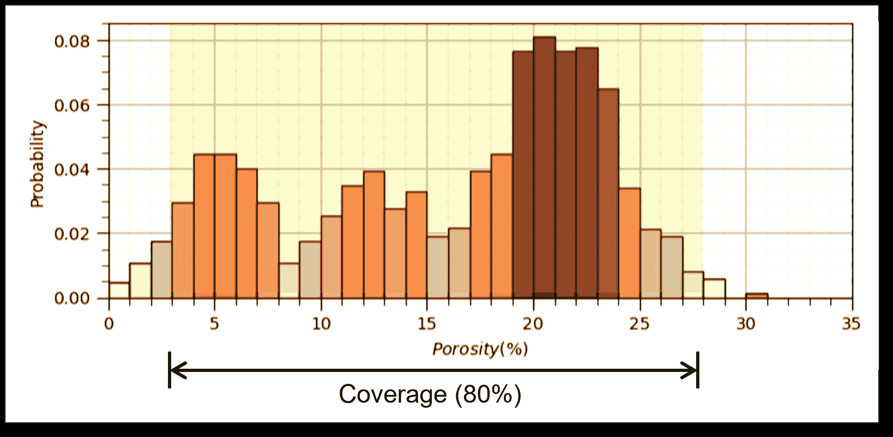

每个特征有 35 个桶的 2D 数据的示例。

+   如果有两个特征的 80%覆盖率，则二维覆盖率是 64%。

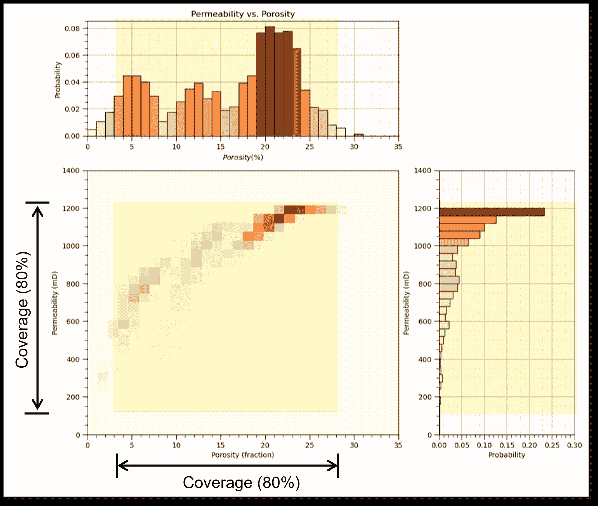

每个特征有 35 个桶的 2D 数据的示例。

+   覆盖率是，

$$ c = c_1^m $$

1.  **扭曲空间** - 高维空间被扭曲。

+   取超立方体内内接超球体的体积比，

$$ \frac{\pi^{\frac{m}{2}}}{m 2^{m-1} \Gamma\left(\frac{m}{2}\right)} \to 0 \quad \text{as} \quad m \to \infty $$

+   回忆，$\Gamma(𝑛)=(𝑛−1)!$.

+   高维空间全是角而没有中间部分，而且大多数高维空间离中间部分很远（全是角！）。

+   因此，高维空间中的距离失去了敏感性，即对于空间中的任何随机点，预期的成对距离都变得相同，

$$ \lim_{m \to \infty} \left( \mathbb{E}\left[\text{dist}_{\text{max}}(m) - \text{dist}_{\text{min}}(m)\right] \right) \to 0 $$

+   超高维空间中随机点成对距离范围的期望极限趋于零。如果距离几乎都相同，欧几里得距离就不再有意义了！

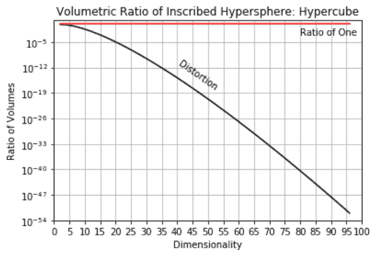

超立方体内超球体的体积比。

+   这里是各种维度的扭曲严重程度，

| m | nD / 2D |
| --- | --- |
| 2 | 1.0 |
| 5 | 0.28 |
| 10 | 0.003 |
| 20 | 0.00000003 |

1.  **多重共线性** - 高维数据集更有可能出现共线性或多重共线性。

+   由其他特征线性描述的特征导致模型方差高。

## 什么是特征排名？

特征排名是一组度量，它根据包含在推理中的信息和预测响应特征的重要性，为每个预测特征分配相对重要性或价值。有各种各样的可能方法来完成这项任务。我的建议是采用**“宽数组”**方法，结合多种分析和度量，同时理解每种方法的假设和限制。

这里是我们考虑的特征排名的一般类型。

1.  数据分布和散点图的视觉检查

1.  统计摘要

1.  基于模型

1.  递归特征消除

此外，我们不应忽视专家知识。如果关于物理过程、因果关系、预测特征的可靠性和可用性有额外的信息，这些信息应整合到分配特征排名中。

## 加载所需的库

以下代码加载所需的库。

```py
import geostatspy.GSLIB as GSLIB                              # GSLIB utilities, visualization and wrapper
import geostatspy.geostats as geostats                        # GSLIB methods convert to Python 
import geostatspy
print('GeostatsPy version: ' + str(geostatspy.__version__)) 
```

```py
GeostatsPy version: 0.0.71 
```

我们还需要一些标准包。这些应该已经与 Anaconda 3 一起安装。

```py
ignore_warnings = True                                        # ignore warnings?
import numpy as np                                            # ndarrays for gridded data
import pandas as pd                                           # DataFrames for tabular data
from sklearn import preprocessing                             # remove encoding error
from sklearn.feature_selection import RFE                     # for recursive feature selection
from sklearn.feature_selection import mutual_info_regression  # mutual information
from sklearn.linear_model import LinearRegression             # linear regression model
from sklearn.ensemble import RandomForestRegressor            # model-based feature importance
from sklearn import metrics                                   # measures to check our models
from statsmodels.stats.outliers_influence import variance_inflation_factor # variance inflation factor
import os                                                     # set working directory, run executables
import math                                                   # basic math operations
import random                                                 # for random numbers
import matplotlib.pyplot as plt                               # for plotting
from matplotlib.ticker import (MultipleLocator, AutoMinorLocator) # control of axes ticks
from matplotlib.colors import ListedColormap                  # custom color maps
import matplotlib.ticker as mtick                             # control tick label formatting
import seaborn as sns                                         # for matrix scatter plots
from scipy import stats                                       # summary statistics
import numpy.linalg as linalg                                 # for linear algebra
import scipy.spatial as sp                                    # for fast nearest neighbor search
import scipy.signal as signal                                 # kernel for moving window calculation
from numba import jit                                         # for numerical speed up
from statsmodels.stats.weightstats import DescrStatsW
plt.rc('axes', axisbelow=True)                                # plot all grids below the plot elements
if ignore_warnings == True:                                   
    import warnings
    warnings.filterwarnings('ignore')
cmap = plt.cm.inferno                                         # color map 
```

对于特征排名的 Shapley 值方法，我们需要一个额外的包以及启动 javascript 支持。

+   运行此代码块后，你应该看到一个带有文本‘js’的六边形，以表示 javascript 已准备好。

```py
import sys
#!{sys.executable} -m pip install shap
import shap
shap.initjs() 
```


如果您遇到包导入错误，您可能首先需要安装这些包中的某些包。这通常可以通过在 Windows 上打开命令窗口，然后输入 ‘python -m pip install [package-name]’ 来完成。更多帮助可以在相应包的文档中找到。

## 设计自定义颜色图

通过屏蔽非显著值来考虑显著性

+   目前仅用于演示，可以根据结果置信度和不确定性更新每个图表

```py
my_colormap = plt.cm.get_cmap('RdBu_r', 256)                  # make a custom colormap
newcolors = my_colormap(np.linspace(0, 1, 256))               # define colormap space
white = np.array([250/256, 250/256, 250/256, 1])              # define white color (4 channel)
#newcolors[26:230, :] = white                                 # mask all correlations less than abs(0.8)
#newcolors[56:200, :] = white                                 # mask all correlations less than abs(0.6)
newcolors[76:180, :] = white                                  # mask all correlations less than abs(0.4)
signif = ListedColormap(newcolors)                            # assign as listed colormap

my_colormap = plt.cm.get_cmap('inferno', 256)                 # make a custom colormap
newcolors = my_colormap(np.linspace(0, 1, 256))               # define colormap space
white = np.array([250/256, 250/256, 250/256, 1])              # define white color (4 channel)
#newcolors[26:230, :] = white                                 # mask all correlations less than abs(0.8)
newcolors[0:12, :] = white                                    # mask all correlations less than abs(0.6)
#newcolors[86:170, :] = white                                 # mask all correlations less than abs(0.4)
sign1 = ListedColormap(newcolors)                             # assign as listed colormap 
```

## 声明函数

这里有一些函数可以帮助计算用于排名和其他图表的指标：

+   **plot_corr** - 绘制相关矩阵

+   **partial_corr** - 部分相关系数

+   **semipar_corr** - 半部分相关系数

+   **mutual_matrix** - 互信息矩阵，所有成对互信息的矩阵

+   **mutual_information_objective** - 我修改的 MRMR 损失函数版本（Ixy - 平均(Ixx)）用于特征排名（使用所有其他预测特征）

+   **delta_mutual_information_quotient** - 通过添加和删除特定特征来改变互信息商的变化（使用所有其他预测特征进行比较）

+   **weighted_avg_and_std** - 平均值和标准差考虑数据权重

+   **weighted_percentile** - 考虑数据权重的百分位数

+   **histogram_bounds** - 向直方图添加置信区间

+   **add_grid** - 添加主要和次要网格线以改善绘图可解释性的便利函数

这里是这些函数：

```py
def feature_rank_plot(pred,metric,mmin,mmax,nominal,title,ylabel,mask): # feature ranking plot
    mpred = len(pred); mask_low = nominal-mask*(nominal-mmin); mask_high = nominal+mask*(mmax-nominal)
    plt.plot(pred,metric,color='black',zorder=20)
    plt.scatter(pred,metric,marker='o',s=10,color='black',zorder=100)
    plt.plot([-0.5,mpred-0.5],[0.0,0.0],'r--',linewidth = 1.0,zorder=1)
    plt.fill_between(np.arange(0,mpred,1),np.zeros(mpred),metric,where=(metric < nominal),interpolate=True,color='dodgerblue',alpha=0.3)
    plt.fill_between(np.arange(0,mpred,1),np.zeros(mpred),metric,where=(metric > nominal),interpolate=True,color='lightcoral',alpha=0.3)
    plt.fill_between(np.arange(0,mpred,1),np.full(mpred,mask_low),metric,where=(metric < mask_low),interpolate=True,color='blue',alpha=0.8,zorder=10)
    plt.fill_between(np.arange(0,mpred,1),np.full(mpred,mask_high),metric,where=(metric > mask_high),interpolate=True,color='red',alpha=0.8,zorder=10)  
    plt.xlabel('Predictor Features'); plt.ylabel(ylabel); plt.title(title)
    plt.ylim(mmin,mmax); plt.xlim([-0.5,mpred-0.5]); add_grid();
    plt.xticks(rotation=270.0)
    return

def plot_corr(corr_matrix,title,limits,mask):                 # plots a graphical correlation matrix 
    my_colormap = plt.cm.get_cmap('RdBu_r', 256)          
    newcolors = my_colormap(np.linspace(0, 1, 256))
    white = np.array([256/256, 256/256, 256/256, 1])
    white_low = int(128 - mask*128); white_high = int(128+mask*128)
    newcolors[white_low:white_high, :] = white                # mask all correlations less than abs(0.8)
    newcmp = ListedColormap(newcolors)
    m = corr_matrix.shape[0]
    im = plt.matshow(corr_matrix,fignum=0,vmin = -1.0*limits, vmax = limits,cmap = newcmp)
    plt.xticks(range(len(corr_matrix.columns)), corr_matrix.columns); ax = plt.gca()
    ax.xaxis.set_label_position('bottom'); ax.xaxis.tick_bottom()
    plt.yticks(range(len(corr_matrix.columns)), corr_matrix.columns)
    plt.colorbar(im, orientation = 'vertical')
    plt.title(title)
    for i in range(0,m):
        plt.plot([i-0.5,i-0.5],[-0.5,m-0.5],color='black')
        plt.plot([-0.5,m-0.5],[i-0.5,i-0.5],color='black')
    plt.ylim([-0.5,m-0.5]); plt.xlim([-0.5,m-0.5])
    plt.xticks(rotation=270.0)

def partial_corr(C):                                          # partial correlation by Fabian Pedregosa-Izquierdo, f@bianp.net
    C = np.asarray(C)
    p = C.shape[1]
    P_corr = np.zeros((p, p), dtype=float)
    for i in range(p):
        P_corr[i, i] = 1
        for j in range(i+1, p):
            idx = np.ones(p, dtype=bool)
            idx[i] = False
            idx[j] = False
            beta_i = linalg.lstsq(C[:, idx], C[:, j])[0]
            beta_j = linalg.lstsq(C[:, idx], C[:, i])[0]
            res_j = C[:, j] - C[:, idx].dot( beta_i)
            res_i = C[:, i] - C[:, idx].dot(beta_j)
            corr = stats.pearsonr(res_i, res_j)[0]
            P_corr[i, j] = corr
            P_corr[j, i] = corr
    return P_corr

def semipartial_corr(C):                                      # Michael Pyrcz modified the function above by Fabian Pedregosa-Izquierdo, f@bianp.net for semipartial correlation

    C = np.asarray(C)
    p = C.shape[1]
    P_corr = np.zeros((p, p), dtype=float)
    for i in range(p):
        P_corr[i, i] = 1
        for j in range(i+1, p):
            idx = np.ones(p, dtype=bool)
            idx[i] = False
            idx[j] = False
            beta_i = linalg.lstsq(C[:, idx], C[:, j])[0]
            res_j = C[:, j] - C[:, idx].dot( beta_i)
            res_i = C[:, i] 
            corr = stats.pearsonr(res_i, res_j)[0]
            P_corr[i, j] = corr
            P_corr[j, i] = corr
    return P_corr

def mutual_matrix(df,features):                               # calculate mutual information matrix
    mutual = np.zeros([len(features),len(features)])
    for i, ifeature in enumerate(features):
        for j, jfeature in enumerate(features):
            if i != j:
                mutual[i,j] = mutual_info_regression(df.iloc[:,i].values.reshape(-1, 1),np.ravel(df.iloc[:,j].values))[0]
    mutual /= np.max(mutual) 
    for i, ifeature in enumerate(features):
        mutual[i,i] = 1.0
    return mutual

def mutual_information_objective(x,y):                        # modified from MRMR loss function, Ixy - average(Ixx)
    mutual_information_quotient = []
    for i, icol in enumerate(x.columns):
        Vx = mutual_info_regression(x.iloc[:,i].values.reshape(-1, 1),np.ravel(y.values.reshape(-1, 1)))
        Ixx_mat = []
        for m, mcol in enumerate(x.columns):
            if i != m:
                Ixx_mat.append(mutual_info_regression(x.iloc[:,m].values.reshape(-1, 1),np.ravel(x.iloc[:,i].values.reshape(-1, 1))))
        Wx = np.average(Ixx_mat)
        mutual_information_quotient.append(Vx/Wx)
    mutual_information_quotient  = np.asarray(mutual_information_quotient).reshape(-1)
    return mutual_information_quotient

def delta_mutual_information_quotient(x,y):                   # standard mutual information quotient
    delta_mutual_information_quotient = []               

    Ixy = []
    for m, mcol in enumerate(x.columns):
        Ixy.append(mutual_info_regression(x.iloc[:,m].values.reshape(-1, 1),np.ravel(y.values.reshape(-1, 1))))
    Vs = np.average(Ixy)
    Ixx = []
    for m, mcol in enumerate(x.columns):
        for n, ncol in enumerate(x.columns):
            Ixx.append(mutual_info_regression(x.iloc[:,m].values.reshape(-1, 1),np.ravel(x.iloc[:,n].values.reshape(-1, 1))))
    Ws = np.average(Ixx) 

    for i, icol in enumerate(x.columns):          
        Ixy_s = []                                          
        for m, mcol in enumerate(x.columns):
            if m != i:
                Ixy_s.append(mutual_info_regression(x.iloc[:,m].values.reshape(-1, 1),np.ravel(y.values.reshape(-1, 1))))
        Vs_s = np.average(Ixy_s)
        Ixx_s = []
        for m, mcol in enumerate(x.columns):
            if m != i:
                for n, ncol in enumerate(x.columns):
                    if n != i:
                        Ixx_s.append(mutual_info_regression(x.iloc[:,m].values.reshape(-1, 1),np.ravel(x.iloc[:,n].values.reshape(-1, 1))))                  
        Ws_s = np.average(Ixx_s)
        delta_mutual_information_quotient.append((Vs/Ws)-(Vs_s/Ws_s))

    delta_mutual_information_quotient  = np.asarray(delta_mutual_information_quotient).reshape(-1)  
    return delta_mutual_information_quotient

def weighted_avg_and_std(values, weights):                    # calculate weighted statistics (Eric O Lebigot, stack overflow)
    average = np.average(values, weights=weights)
    variance = np.average((values-average)**2, weights=weights)
    return (average, math.sqrt(variance))

def weighted_percentile(data, weights, perc):                 # calculate weighted percentile (iambr on StackOverflow @ https://stackoverflow.com/questions/21844024/weighted-percentile-using-numpy/32216049) 
    ix = np.argsort(data)
    data = data[ix] 
    weights = weights[ix] 
    cdf = (np.cumsum(weights) - 0.5 * weights) / np.sum(weights) 
    return np.interp(perc, cdf, data)

def histogram_bounds(values,weights,color):                   # add uncertainty bounds to a histogram 
    p10 = weighted_percentile(values,weights,0.1); avg = np.average(values,weights=weights); p90 = weighted_percentile(values,weights,0.9)
    plt.plot([p10,p10],[0.0,45],color = color,linestyle='dashed')
    plt.plot([avg,avg],[0.0,45],color = color)
    plt.plot([p90,p90],[0.0,45],color = color,linestyle='dashed')

def add_grid():                                               # add major and minor gridlines
    plt.gca().grid(True, which='major',linewidth = 1.0); plt.gca().grid(True, which='minor',linewidth = 0.2) # add y grids
    plt.gca().tick_params(which='major',length=7); plt.gca().tick_params(which='minor', length=4)
    plt.gca().xaxis.set_minor_locator(AutoMinorLocator()); plt.gca().yaxis.set_minor_locator(AutoMinorLocator()) # turn on minor ticks 
```

## 设置工作目录

我总是喜欢这样做，这样我就不会丢失文件，并且可以简化后续的读取和写入（避免每次都包含完整地址）。

```py
#os.chdir("d:/PGE383")                                   # set the working directory 
```

您将不得不更新引号内的部分以匹配您自己的工作目录，并且在 Mac 上格式不同（例如：“~/PGE”）。

## 加载表格数据

这里是加载我们的逗号分隔数据文件到 Pandas DataFrame 对象的命令。

让我们加载提供的多元、空间数据集 ‘unconv_MV.csv’。这个数据集包含来自 1,000 个非常规井的变量，包括：

+   井平均孔隙率

+   渗透率的对数变换（以线性化与其他变量的关系）

+   声波阻抗（kg/m³ x m/s x 10⁶）

+   剪切比（%）

+   总有机碳（%）

+   玻璃质反射率（%）

+   初始生产 90 天平均（MCFPD）。

注意，数据集是合成的。

我们使用 pandas 的 ‘read_csv’ 函数将其加载到我们称为 ‘my_data’ 的 DataFrame 中，然后预览它以确保正确加载。

```py
idata = 0
if idata == 0:
    df = pd.read_csv('https://raw.githubusercontent.com/GeostatsGuy/GeoDataSets/master/unconv_MV_v4.csv') # load data from Dr. Pyrcz's GitHub repository 

    response = 'Prod'                                             # specify the response feature
    x = df.copy(deep = True); x = x.drop(['Well',response],axis='columns') # make predictor and response DataFrames
    Y = df.loc[:,response]

    features = x.columns.values.tolist() + [Y.name]               # store the names of the features
    pred = x.columns.values.tolist()
    resp = Y.name

    xmin = [6.0,0.0,1.0,10.0,0.0,0.9]; xmax = [24.0,10.0,5.0,85.0,2.2,2.9] # set the minimum and maximum values for plotting
    Ymin = 500.0; Ymax = 9000.0

    predlabel = ['Porosity (%)','Permeability (mD)','Acoustic Impedance (kg/m2s*10⁶)','Brittleness Ratio (%)', # set the names for plotting
                 'Total Organic Carbon (%)','Vitrinite Reflectance (%)']
    resplabel = 'Normalized Initial Production (MCFPD)'

    predtitle = ['Porosity','Permeability','Acoustic Impedance','Brittleness Ratio', # set the units for plotting
                 'Total Organic Carbon','Vitrinite Reflectance']
    resptitle = 'Normalized Initial Production'

    featurelabel = predlabel + [resplabel]                        # make feature labels and titles for concise code
    featuretitle = predtitle + [resptitle]

    m = len(pred) + 1
    mpred = len(pred)

# elif idata == 1:
#     names = {'Porosity':'Por'}

#     df = pd.read_csv('https://raw.githubusercontent.com/GeostatsGuy/GeoDataSets/master/12_sample_data.csv') # load data from Dr. Pyrcz's GitHub repository 
#     df = df.rename(columns=names)
#     df['Por'] = df['Por'] * 100.0; df['AI'] = df['AI'] / 1000.0; 
#     df.drop('Unnamed: 0',axis=1,inplace=True) 

#     features = df.columns.values.tolist()                          # store the names of the features

#     xmin = [0.0,0.0,0.0,4.0,0.0,6.5,1.4,1600.0,10.0,1300.0,1.6]; xmax = [10000.0,10000.0,1.0,19.0,500.0,8.3,3.6,6200.0,50.0,2000.0,12.0] # set the minimum and maximum values for plotting

#     flabel = ['Well (ID)','X (m)','Y (m)','Depth (m)','Porosity (fraction)','Permeability (mD)','Acoustic Impedance (kg/m2s*10⁶)','Facies (categorical)',
#               'Density (g/cm³)','Compressible velocity (m/s)','Youngs modulus (GPa)', 'Shear velocity (m/s)', 'Shear modulus (GPa)'] # set the names for plotting

#     ftitle = ['Well','X','Y','Depth','Porosity','Permeability','Acoustic Impedance','Facies',
#               'Density','Compressible velocity','Youngs modulus', 'Shear velocity', 'Shear modulus']

elif idata == 2:  
    df = pd.read_csv('https://raw.githubusercontent.com/GeostatsGuy/GeoDataSets/master/res21_2D_wells.csv') # load data from Dr. Pyrcz's GitHub repository 

    response = 'CumulativeOil'                                             # specify the response feature
    x = df.copy(deep = True); x = x.drop(['Well_ID','X','Y',response],axis='columns') # make predictor and response DataFrames
    Y = df.loc[:,response]

    features = x.columns.values.tolist() + [Y.name]               # store the names of the features
    pred = x.columns.values.tolist()
    resp = Y.name

    xmin = [1.0,0.0,0.0,4.0,0.0,6.5,1.4,1600.0,10.0,1300.0,1.6]; xmax = [75.0,10000.0,10000.0,19.0,500.0,8.3,3.6,6200.0,50.0,2000.0,12.0] # set the minimum and maximum values for plotting
    Ymin = 0.0; Ymax = 3000.0

    predlabel = ['Well (ID)','X (m)','Y (m)','Porosity (fraction)','Permeability (mD)','Acoustic Impedance (kg/m2s*10⁶)',
              'Density (g/cm³)','Compressible velocity (m/s)','Youngs modulus (GPa)', 'Shear velocity (m/s)', 'Shear modulus (GPa)'] 
    resplabel = 'Cumulative Production (MSTB)'

    predtitle = ['Well','X','Y','Porosity','Permeability','Acoustic Impedance',
              'Density (g/cm³)','Compressible velocity','Youngs modulus', 'Shear velocity', 'Shear modulus'] 
    resptitle = 'Cumulative Production'

    featurelabel = predlabel + [resplabel]                        # make feature labels and titles for concise code
    featuretitle = predtitle + [resptitle]

    m = len(pred) + 1
    mpred = len(pred) 
```

```py
---------------------------------------------------------------------------
SSLCertVerificationError  Traceback (most recent call last)
File C:\ProgramData\anaconda3\envs\MachineLearningBook\lib\urllib\request.py:1317, in AbstractHTTPHandler.do_open(self, http_class, req, **http_conn_args)
  1316 try:
-> 1317     h.request(req.get_method(), req.selector, req.data, headers,
  1318               encode_chunked=req.has_header('Transfer-encoding'))
  1319 except OSError as err: # timeout error

File C:\ProgramData\anaconda3\envs\MachineLearningBook\lib\http\client.py:1230, in HTTPConnection.request(self, method, url, body, headers, encode_chunked)
  1229  """Send a complete request to the server."""
-> 1230 self._send_request(method, url, body, headers, encode_chunked)

File C:\ProgramData\anaconda3\envs\MachineLearningBook\lib\http\client.py:1276, in HTTPConnection._send_request(self, method, url, body, headers, encode_chunked)
  1275     body = _encode(body, 'body')
-> 1276 self.endheaders(body, encode_chunked=encode_chunked)

File C:\ProgramData\anaconda3\envs\MachineLearningBook\lib\http\client.py:1225, in HTTPConnection.endheaders(self, message_body, encode_chunked)
  1224     raise CannotSendHeader()
-> 1225 self._send_output(message_body, encode_chunked=encode_chunked)

File C:\ProgramData\anaconda3\envs\MachineLearningBook\lib\http\client.py:1004, in HTTPConnection._send_output(self, message_body, encode_chunked)
  1003 del self._buffer[:]
-> 1004 self.send(msg)
  1006 if message_body is not None:
  1007 
  1008     # create a consistent interface to message_body

File C:\ProgramData\anaconda3\envs\MachineLearningBook\lib\http\client.py:944, in HTTPConnection.send(self, data)
  943 if self.auto_open:
--> 944     self.connect()
  945 else:

File C:\ProgramData\anaconda3\envs\MachineLearningBook\lib\http\client.py:1399, in HTTPSConnection.connect(self)
  1397     server_hostname = self.host
-> 1399 self.sock = self._context.wrap_socket(self.sock,
  1400                                       server_hostname=server_hostname)

File C:\ProgramData\anaconda3\envs\MachineLearningBook\lib\ssl.py:500, in SSLContext.wrap_socket(self, sock, server_side, do_handshake_on_connect, suppress_ragged_eofs, server_hostname, session)
  494 def wrap_socket(self, sock, server_side=False,
  495                 do_handshake_on_connect=True,
  496                 suppress_ragged_eofs=True,
  497                 server_hostname=None, session=None):
  498     # SSLSocket class handles server_hostname encoding before it calls
  499     # ctx._wrap_socket()
--> 500     return self.sslsocket_class._create(
  501         sock=sock,
  502         server_side=server_side,
  503         do_handshake_on_connect=do_handshake_on_connect,
  504         suppress_ragged_eofs=suppress_ragged_eofs,
  505         server_hostname=server_hostname,
  506         context=self,
  507         session=session
  508     )

File C:\ProgramData\anaconda3\envs\MachineLearningBook\lib\ssl.py:1040, in SSLSocket._create(cls, sock, server_side, do_handshake_on_connect, suppress_ragged_eofs, server_hostname, context, session)
  1039             raise ValueError("do_handshake_on_connect should not be specified for non-blocking sockets")
-> 1040         self.do_handshake()
  1041 except (OSError, ValueError):

File C:\ProgramData\anaconda3\envs\MachineLearningBook\lib\ssl.py:1309, in SSLSocket.do_handshake(self, block)
  1308         self.settimeout(None)
-> 1309     self._sslobj.do_handshake()
  1310 finally:

SSLCertVerificationError: [SSL: CERTIFICATE_VERIFY_FAILED] certificate verify failed: unable to get local issuer certificate (_ssl.c:1108)

During handling of the above exception, another exception occurred:

URLError  Traceback (most recent call last)
Cell In[7], line 3
  1 idata = 0
  2 if idata == 0:
----> 3     df = pd.read_csv('https://raw.githubusercontent.com/GeostatsGuy/GeoDataSets/master/unconv_MV_v4.csv') # load data from Dr. Pyrcz's GitHub repository 
  5     response = 'Prod'                                             # specify the response feature
  6     x = df.copy(deep = True); x = x.drop(['Well',response],axis='columns') # make predictor and response DataFrames

File C:\ProgramData\anaconda3\envs\MachineLearningBook\lib\site-packages\pandas\io\parsers\readers.py:912, in read_csv(filepath_or_buffer, sep, delimiter, header, names, index_col, usecols, dtype, engine, converters, true_values, false_values, skipinitialspace, skiprows, skipfooter, nrows, na_values, keep_default_na, na_filter, verbose, skip_blank_lines, parse_dates, infer_datetime_format, keep_date_col, date_parser, date_format, dayfirst, cache_dates, iterator, chunksize, compression, thousands, decimal, lineterminator, quotechar, quoting, doublequote, escapechar, comment, encoding, encoding_errors, dialect, on_bad_lines, delim_whitespace, low_memory, memory_map, float_precision, storage_options, dtype_backend)
  899 kwds_defaults = _refine_defaults_read(
  900     dialect,
  901     delimiter,
   (...)
  908     dtype_backend=dtype_backend,
  909 )
  910 kwds.update(kwds_defaults)
--> 912 return _read(filepath_or_buffer, kwds)

File C:\ProgramData\anaconda3\envs\MachineLearningBook\lib\site-packages\pandas\io\parsers\readers.py:577, in _read(filepath_or_buffer, kwds)
  574 _validate_names(kwds.get("names", None))
  576 # Create the parser.
--> 577 parser = TextFileReader(filepath_or_buffer, **kwds)
  579 if chunksize or iterator:
  580     return parser

File C:\ProgramData\anaconda3\envs\MachineLearningBook\lib\site-packages\pandas\io\parsers\readers.py:1407, in TextFileReader.__init__(self, f, engine, **kwds)
  1404     self.options["has_index_names"] = kwds["has_index_names"]
  1406 self.handles: IOHandles | None = None
-> 1407 self._engine = self._make_engine(f, self.engine)

File C:\ProgramData\anaconda3\envs\MachineLearningBook\lib\site-packages\pandas\io\parsers\readers.py:1661, in TextFileReader._make_engine(self, f, engine)
  1659     if "b" not in mode:
  1660         mode += "b"
-> 1661 self.handles = get_handle(
  1662     f,
  1663     mode,
  1664     encoding=self.options.get("encoding", None),
  1665     compression=self.options.get("compression", None),
  1666     memory_map=self.options.get("memory_map", False),
  1667     is_text=is_text,
  1668     errors=self.options.get("encoding_errors", "strict"),
  1669     storage_options=self.options.get("storage_options", None),
  1670 )
  1671 assert self.handles is not None
  1672 f = self.handles.handle

File C:\ProgramData\anaconda3\envs\MachineLearningBook\lib\site-packages\pandas\io\common.py:716, in get_handle(path_or_buf, mode, encoding, compression, memory_map, is_text, errors, storage_options)
  713     codecs.lookup_error(errors)
  715 # open URLs
--> 716 ioargs = _get_filepath_or_buffer(
  717     path_or_buf,
  718     encoding=encoding,
  719     compression=compression,
  720     mode=mode,
  721     storage_options=storage_options,
  722 )
  724 handle = ioargs.filepath_or_buffer
  725 handles: list[BaseBuffer]

File C:\ProgramData\anaconda3\envs\MachineLearningBook\lib\site-packages\pandas\io\common.py:368, in _get_filepath_or_buffer(filepath_or_buffer, encoding, compression, mode, storage_options)
  366 # assuming storage_options is to be interpreted as headers
  367 req_info = urllib.request.Request(filepath_or_buffer, headers=storage_options)
--> 368 with urlopen(req_info) as req:
  369     content_encoding = req.headers.get("Content-Encoding", None)
  370     if content_encoding == "gzip":
  371         # Override compression based on Content-Encoding header

File C:\ProgramData\anaconda3\envs\MachineLearningBook\lib\site-packages\pandas\io\common.py:270, in urlopen(*args, **kwargs)
  264  """
  265 Lazy-import wrapper for stdlib urlopen, as that imports a big chunk of
  266 the stdlib.
  267 """
  268 import urllib.request
--> 270 return urllib.request.urlopen(*args, **kwargs)

File C:\ProgramData\anaconda3\envs\MachineLearningBook\lib\urllib\request.py:222, in urlopen(url, data, timeout, cafile, capath, cadefault, context)
  220 else:
  221     opener = _opener
--> 222 return opener.open(url, data, timeout)

File C:\ProgramData\anaconda3\envs\MachineLearningBook\lib\urllib\request.py:525, in OpenerDirector.open(self, fullurl, data, timeout)
  522     req = meth(req)
  524 sys.audit('urllib.Request', req.full_url, req.data, req.headers, req.get_method())
--> 525 response = self._open(req, data)
  527 # post-process response
  528 meth_name = protocol+"_response"

File C:\ProgramData\anaconda3\envs\MachineLearningBook\lib\urllib\request.py:542, in OpenerDirector._open(self, req, data)
  539     return result
  541 protocol = req.type
--> 542 result = self._call_chain(self.handle_open, protocol, protocol +
  543                           '_open', req)
  544 if result:
  545     return result

File C:\ProgramData\anaconda3\envs\MachineLearningBook\lib\urllib\request.py:502, in OpenerDirector._call_chain(self, chain, kind, meth_name, *args)
  500 for handler in handlers:
  501     func = getattr(handler, meth_name)
--> 502     result = func(*args)
  503     if result is not None:
  504         return result

File C:\ProgramData\anaconda3\envs\MachineLearningBook\lib\urllib\request.py:1360, in HTTPSHandler.https_open(self, req)
  1359 def https_open(self, req):
-> 1360     return self.do_open(http.client.HTTPSConnection, req,
  1361         context=self._context, check_hostname=self._check_hostname)

File C:\ProgramData\anaconda3\envs\MachineLearningBook\lib\urllib\request.py:1320, in AbstractHTTPHandler.do_open(self, http_class, req, **http_conn_args)
  1317         h.request(req.get_method(), req.selector, req.data, headers,
  1318                   encode_chunked=req.has_header('Transfer-encoding'))
  1319     except OSError as err: # timeout error
-> 1320         raise URLError(err)
  1321     r = h.getresponse()
  1322 except:

URLError: <urlopen error [SSL: CERTIFICATE_VERIFY_FAILED] certificate verify failed: unable to get local issuer certificate (_ssl.c:1108)> 
```

+   我们还可以为绘图建立特征范围。我们可以使用如下代码直接从数据中计算特征范围：

```py
Pormin = np.min(df['Por'].values)                             # extract ndarray of data table column
Pormax = np.max(df['Por'].values)                             # and calculate min and max 
```

但是，这不会导致易于理解的色彩条和轴刻度，让我们选择方便的整数。我们还将声明特征标签以方便绘图。

## 可视化 DataFrame

可视化 DataFrame 是数据的第一步检查。

+   许多事情可能会出错，例如，我们加载了错误的数据，所有特征都没有加载，等等。

我们可以通过使用 DataFrame 的‘head’成员函数来预览（格式整洁，见下文）。

+   添加参数‘n=13’以查看数据集的前 13 行。

```py
df.head(n=13)                                                 # we could also use this command for a table preview 
```

|  | Well | Por | Perm | AI | Brittle | TOC | VR | Prod |
| --- | --- | --- | --- | --- | --- | --- | --- | --- |
| 0 | 1 | 12.08 | 2.92 | 2.80 | 81.40 | 1.16 | 2.31 | 1695.360819 |
| 1 | 2 | 12.38 | 3.53 | 3.22 | 46.17 | 0.89 | 1.88 | 3007.096063 |
| 2 | 3 | 14.02 | 2.59 | 4.01 | 72.80 | 0.89 | 2.72 | 2531.938259 |
| 3 | 4 | 17.67 | 6.75 | 2.63 | 39.81 | 1.08 | 1.88 | 5288.514854 |
| 4 | 5 | 17.52 | 4.57 | 3.18 | 10.94 | 1.51 | 1.90 | 2859.469624 |
| 5 | 6 | 14.53 | 4.81 | 2.69 | 53.60 | 0.94 | 1.67 | 4017.374438 |
| 6 | 7 | 13.49 | 3.60 | 2.93 | 63.71 | 0.80 | 1.85 | 2952.812773 |
| 7 | 8 | 11.58 | 3.03 | 3.25 | 53.00 | 0.69 | 1.93 | 2670.933846 |
| 8 | 9 | 12.52 | 2.72 | 2.43 | 65.77 | 0.95 | 1.98 | 2474.048178 |
| 9 | 10 | 13.25 | 3.94 | 3.71 | 66.20 | 1.14 | 2.65 | 2722.893266 |
| 10 | 11 | 15.04 | 4.39 | 2.22 | 61.11 | 1.08 | 1.77 | 3828.247174 |
| 11 | 12 | 16.19 | 6.30 | 2.29 | 49.10 | 1.53 | 1.86 | 5095.810104 |
| 12 | 13 | 16.82 | 5.42 | 2.80 | 66.65 | 1.17 | 1.98 | 4091.637316 |

## 表格数据的汇总统计

在 DataFrames 中，有许多高效的方法可以计算表格数据的汇总统计。`describe`命令提供了计数、平均值、最小值、最大值和四分位数，全部在一个漂亮的数据表中。

+   我们使用转置只是为了让表格翻转，使得特征在行上，而统计信息在列上。

```py
df.describe().transpose()                                     # calculate summary statistics for the data 
```

|  | count | mean | std | min | 25% | 50% | 75% | max |
| --- | --- | --- | --- | --- | --- | --- | --- | --- |
| Well | 200.0 | 100.500000 | 57.879185 | 1.000000 | 50.750000 | 100.500000 | 150.250000 | 200.000000 |
| Por | 200.0 | 14.991150 | 2.971176 | 6.550000 | 12.912500 | 15.070000 | 17.402500 | 23.550000 |
| Perm | 200.0 | 4.330750 | 1.731014 | 1.130000 | 3.122500 | 4.035000 | 5.287500 | 9.870000 |
| AI | 200.0 | 2.968850 | 0.566885 | 1.280000 | 2.547500 | 2.955000 | 3.345000 | 4.630000 |
| Brittle | 200.0 | 48.161950 | 14.129455 | 10.940000 | 37.755000 | 49.510000 | 58.262500 | 84.330000 |
| TOC | 200.0 | 0.990450 | 0.481588 | -0.190000 | 0.617500 | 1.030000 | 1.350000 | 2.180000 |
| VR | 200.0 | 1.964300 | 0.300827 | 0.930000 | 1.770000 | 1.960000 | 2.142500 | 2.870000 |
| Prod | 200.0 | 3864.407081 | 1553.277558 | 839.822063 | 2686.227611 | 3604.303506 | 4752.637555 | 8590.384044 |

排序特征实际上是一项努力，旨在理解特征及其相互之间的关系。我们将从基本的数据可视化开始，过渡到更复杂的方法，例如偏相关和递归特征消除。

## 覆盖率

让我们从特征覆盖的概念开始。

+   如果一个特征只在少量样本中可用，那么我们可能不想将其包括在内，因为这会导致特征插补和缺失数据估计的问题。

+   通过删除一些覆盖率较差的特征，我们可能会提高我们的模型，因为特征插补存在局限性，特征插补实际上会在统计数据和我们的预测模型中引入偏差和额外的误差。

+   如果应用类似删除来处理缺失值，低覆盖率的特征会导致大量数据被删除！

让我们从条形图开始，展示缺失记录的比例：

```py
plt.subplot(111)
(df.isnull().sum()/len(df)).plot(kind = 'bar')                # calculate DataFrame with percentage missing by feature
plt.xlabel('Feature'); plt.ylabel('Percentage of Missing Values'); plt.title('Data Completeness'); plt.ylim([0.0,1.0])
plt.subplots_adjust(left=0.0, bottom=0.0, right=1.0, top=0.8, wspace=0.2, hspace=0.2); add_grid(); plt.show() 
```

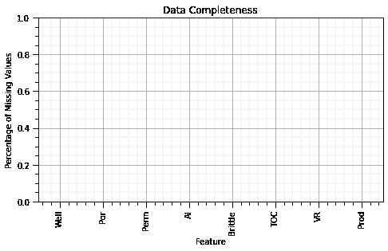

对于提供的示例数据集，图表应为空。没有缺失数据，因此所有特征的“缺失记录比例”均为 0.0。

如果你想用一些缺失数据测试此图表，请先运行此代码：

```py
proportion_NaN = 0.1                                    # proportion of values in DataFrame to remove

remove = np.random.random(df.shape) < proportion_NaN    # make the boolean array for removal
print('Fraction of removed values in mask ndarray = ' + str(round(remove.sum()/remove.size,3)) + '.')

df_mask = df.mask(remove)                               # make a new DataFrame with specified proportion removed 
```

删除此代码并重新加载数据，以继续获得与以下讨论一致的结果。

这并不能说明全部情况。例如，如果特征 A 的 20%缺失，特征 B 的 20%缺失，这些是否是相同的样本或不同的样本。如果你执行类似的删除，这会产生巨大的影响。

+   如果数据量不是太多，我们实际上可以在这样的布尔表中可视化所有样本和特征的覆盖情况。

+   此方法可能识别出具有许多缺失特征的具体样本，这些样本可能被删除以提高整体覆盖或缺失数据中的其他趋势或结构，这可能导致采样偏差。

```py
df_temp = df.copy(deep=True)                                  # make a deep copy of the DataFrame
df_bool = df_temp.isnull()                                    # true is value, false if NaN
#df_bool = df_bool.set_index(df_temp.pop('UWI'))              # set the index / feature for the heat map y column
heat = sns.heatmap(df_bool, cmap=['r','w'], annot=False, fmt='.0f',cbar=False,linecolor='black',linewidth=0.1) # make the binary heat map, no bins
heat.set_xticklabels(heat.get_xticklabels(), rotation=90, fontsize=8)
heat.set_yticklabels(heat.get_yticklabels(), rotation=0, fontsize=8)
heat.set_title('Data Completeness Heatmap',fontsize=16); heat.set_xlabel('Feature',fontsize=12); heat.set_ylabel('Sample (Index)',fontsize=12)
plt.subplots_adjust(left=0.0, bottom=0.0, right=1.8, top=1.6, wspace=0.2, hspace=0.2); plt.show() 
```

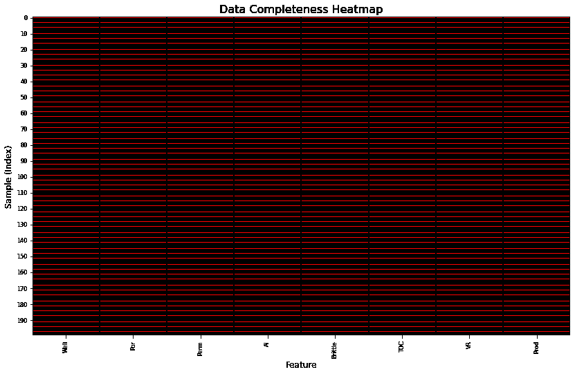

再次强调，对于提供的具有完美覆盖的数据集，此图表应该相当无聊，每个单元格都应填充红色。

+   添加代码以删除一些记录以测试此图表。白色单元格表示缺失记录。

### 特征插补

请参阅关于特征插补的章节，了解如何处理缺失数据。

目前在此处进行简要处理，我们只需同样删除并继续进行。

+   我们移除所有具有任何缺失特征值的样本。虽然这很简单，但这是确保我们即将展示的特征排名方法所需完美覆盖的一种简单粗暴的方法。请查看上面链接的工作流程中的其他方法。

```py
df.dropna(axis=0,how='any',inplace=True)                      # likewise deletion 
```

## 摘要统计

在任何多元工作中，我们应该从单变量分析开始，一次只分析一个变量的摘要统计。摘要统计排名方法是定性的，我们是在问：

+   是否存在数据问题？

+   我们是否信任特征？我们是否同等信任所有特征？

+   在我们开发任何多元工作流程之前，需要处理哪些问题？

在 DataFrames 中，有许多高效的方法可以计算表格数据的摘要统计。describe 命令提供了一个紧凑的数据表，提供了计数、平均值、最小值、最大值和四分位数。我们使用 transpose()命令翻转表格，使特征位于行上，而统计值位于列上。

```py
df.describe().transpose()                                     # DataFrame summary statistics 
```

|  | count | mean | std | min | 25% | 50% | 75% | max |
| --- | --- | --- | --- | --- | --- | --- | --- | --- |
| Well | 200.0 | 100.500000 | 57.879185 | 1.000000 | 50.750000 | 100.500000 | 150.250000 | 200.000000 |
| Por | 200.0 | 14.991150 | 2.971176 | 6.550000 | 12.912500 | 15.070000 | 17.402500 | 23.550000 |
| Perm | 200.0 | 4.330750 | 1.731014 | 1.130000 | 3.122500 | 4.035000 | 5.287500 | 9.870000 |
| AI | 200.0 | 2.968850 | 0.566885 | 1.280000 | 2.547500 | 2.955000 | 3.345000 | 4.630000 |
| Brittle | 200.0 | 48.161950 | 14.129455 | 10.940000 | 37.755000 | 49.510000 | 58.262500 | 84.330000 |
| TOC | 200.0 | 0.990450 | 0.481588 | -0.190000 | 0.617500 | 1.030000 | 1.350000 | 2.180000 |
| VR | 200.0 | 1.964300 | 0.300827 | 0.930000 | 1.770000 | 1.960000 | 2.142500 | 2.870000 |
| Prod | 200.0 | 3864.407081 | 1553.277558 | 839.822063 | 2686.227611 | 3604.303506 | 4752.637555 | 8590.384044 |

摘要统计是数据检查的关键第一步。

+   这包括每个特征的有效（非空）值的数量（计数会从每个变量的总数中移除所有 np.NaN）。

+   我们可以看到一般的行为，如中心趋势、均值和分散度、方差。

+   我们可以识别出负值、极端值以及超出每个属性可能值范围的值的问题。

+   数据看起来相当良好，为了简洁起见，我们跳过异常值检测。让我们看看单变量分布。

## 单变量分布

与摘要统计一样，这种方法是对数据问题进行定性检查，并评估我们对每个特征的信心。最好不包含质量信心低的特征，因为这可能会误导（如前所述，同时增加模型复杂性）。

```py
nbins = 20                                                    # number of histogram bins
for i, feature in enumerate(features):                        # plot histograms with central tendency and P10 and P90 labeled
    plt.subplot(4,3,i+1)
    y,_,_ = plt.hist(x=df[feature],weights=None,bins=nbins,alpha = 0.8,edgecolor='black',color='darkorange',density=True)
    # histogram_bounds(values=df[feature].values,weights=np.ones(len(df)),color='red')
    plt.xlabel(feature); plt.ylabel('Frequency'); plt.ylim([0.0,y.max()*1.10]); plt.title(featuretitle[i]); add_grid() 
    # if feature == resp: 
    #     plt.xlim([Ymin,Ymax]) 
    # else:
    #     plt.xlim([xmin[i],xmax[i]]) 

plt.subplots_adjust(left=0.0, bottom=0.0, right=3., top=4.1, wspace=0.2, hspace=0.3); plt.show() 
```

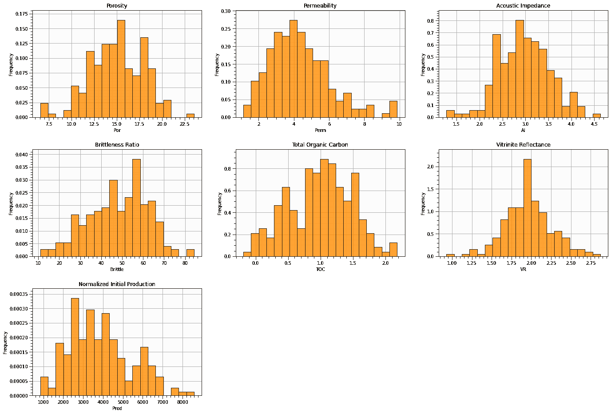

单变量分布看起来很好：

+   没有明显的异常值

+   渗透率是正偏斜的，这是常见的现象

+   修正后的目录表有一个小峰值，但这是合理的

## 双变量分布

矩阵散点图是观察变量之间双变量关系的一种非常有效的方法。

+   这又是通过数据可视化来识别数据问题的另一个机会

+   我们可以评估是否存在多重共线性，特别是每次评估两个特征之间的简单形式。

```py
pairgrid = sns.PairGrid(df) # matrix scatter plots
pairgrid = pairgrid.map_upper(plt.scatter, color = 'darkorange', edgecolor = 'black', alpha = 0.8, s = 10)
pairgrid = pairgrid.map_diag(plt.hist, bins = 20, color = 'darkorange',alpha = 0.8, edgecolor = 'k')# Map a density plot to the lower triangle
pairgrid = pairgrid.map_lower(sns.kdeplot, cmap = plt.cm.inferno, 
                              shade = False, shade_lowest = False, alpha = 1.0, n_levels = 10)
pairgrid.add_legend()
plt.subplots_adjust(left=0.0, bottom=0.0, right=0.9, top=0.9, wspace=0.2, hspace=0.2); plt.show() 
```

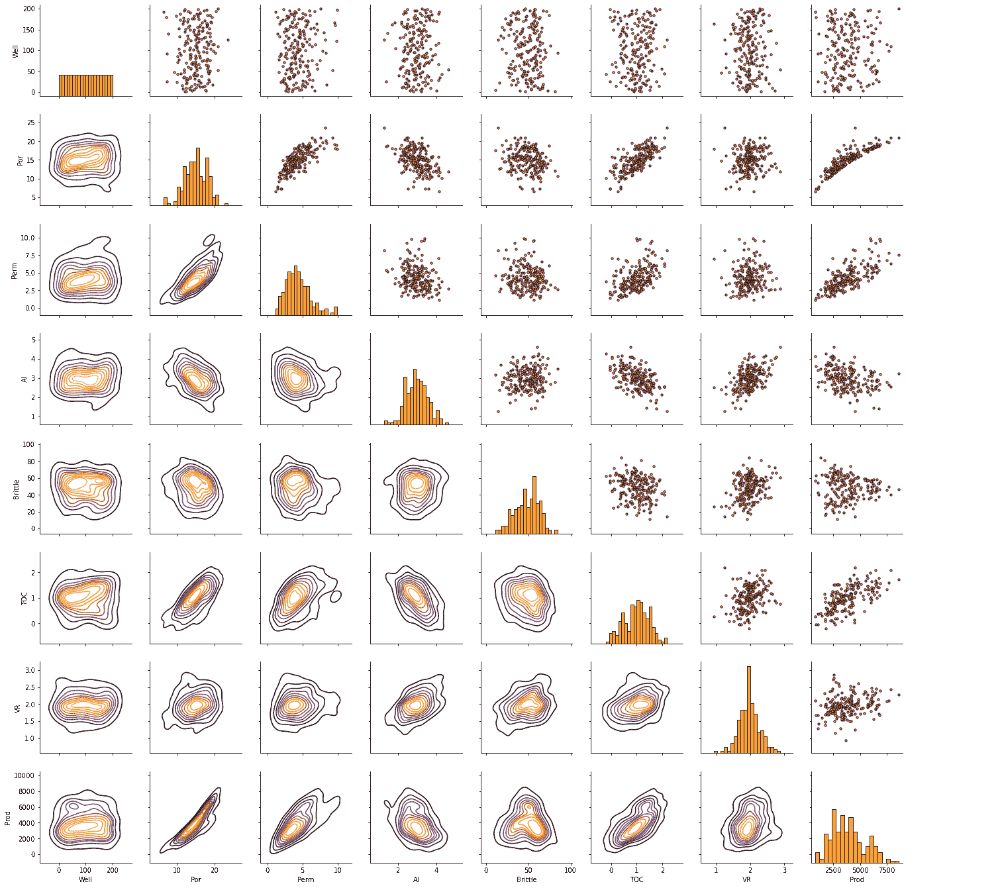

这个图表传达了大量的信息。我们如何利用这个图表进行变量排名？

+   我们可以识别出彼此紧密相关的特征，例如，如果两个特征几乎有完美的单调线性或近线性关系，我们应该立即删除一个。这是一个简单的多重共线性案例，如上所述，可能会导致模型不稳定。

+   我们可以检查线性与非线性关系。如果我们观察到非线性双变量关系，这将影响方法的选择，以及变量排名方法假设线性关系时的结果质量。

+   我们可以识别变量之间的约束关系和异方差性。再次强调，这些可能会限制我们的排名方法，并鼓励我们保留特定特征以在结果模型中保留这些特征。

然而，我们必须记住，双变量可视化和分析不足以理解数据中的所有多元关系，例如，多重共线性包括两个或更多特征之间强烈的线性关系。这些可能仅通过双变量图难以看到。

## 对数协方差

对数协方差提供了衡量每个预测特征与响应特征之间线性关系强度的度量。在此，我们指定本研究的目的是从其他可用的预测特征中预测产量，我们的响应变量。我们现在正在预测性思考，而不是推断性思考，我们想要估计函数 $\hat{f}$ 来完成这个任务：

$$ Y = \hat{f}(X_1,\ldots,X_n) $$

其中 $Y$ 是我们的响应特征，$X_1,\ldots,X_n$ 是我们的预测特征。如果我们保留了所有预测特征来预测响应，我们就会有：

$$ 产量 = \hat{f}(孔隙率，渗透率，AI，脆性，TOC，VR) $$

现在回到协方差，协方差定义为：

$$ C_{xy} = \frac{\sum_{i=1}^{n} (x_i - \overline{x})(y_i - \overline{y})}{(n-1)} $$

协方差：

+   衡量线性关系

+   对预测和响应的分散/方差敏感

我们可以使用以下命令来构建协方差矩阵：

```py
df.iloc[:,1:8].cov()                                    # covariance matrix sliced predictors vs. response 
```

输出是一个新的 Pandas DataFrame，因此我们可以切片最后一列以获取一个 Pandas 系列（具有名称的 ndarray），其中包含所有预测特征与响应之间的协方差。

```py
covariance = df.iloc[:,df.columns.get_indexer(features)].cov().iloc[len(features)-1,:len(features)] # calculate covariance matrix and slice for only pred - resp
cov_matrix = df.iloc[:,df.columns.get_indexer(features)].cov()
plt.subplot(121)
plot_corr(cov_matrix,'Covariance Matrix',4000.0,0.1)          # using our correlation matrix visualization function
plt.xlabel('Features'); plt.ylabel('Features') 

plt.subplot(122)
feature_rank_plot(features,covariance,-20000.0,20000.0,0.0,'Feature Ranking, Covariance with ' + resp,'Covariance',0.1)

plt.subplots_adjust(left=0.0, bottom=0.0, right=1.6, top=0.8, wspace=0.2, hspace=0.3); plt.show() 
```

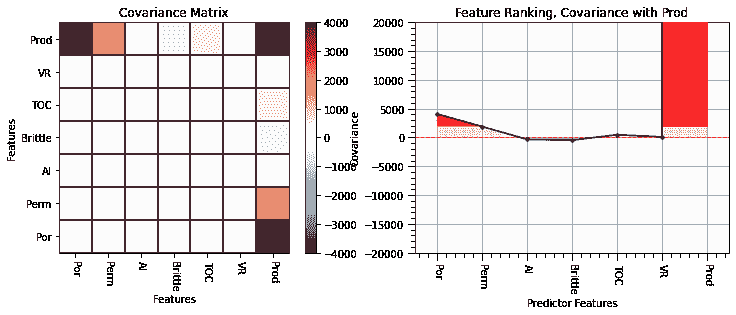

协方差是有用的，但如您所见，其大小相当多变。

+   协方差的大小是每个特征的特性及其特征方差是相当任意的。

+   例如，孔隙率的方差在分数与百分比之间或渗透率在达西与毫达西之间的方差是多少。我们可以表明，如果我们对一个特征 $X$ 应用一个常数乘数 $c$，方差将根据此关系变化（证明基于方差的期望公式）：

$$ \sigma_{cX}² = c² \cdot \sigma_{X}² $$

通过从百分比转换为分数，我们使孔隙率的方差降低了 10000 倍！每个特征的方差可能是任意的，除非所有特征都在相同的单位中。

对数相关系数是标准化的协方差；因此，避免了这种任意大小的问题。

## 对数相关系数

配对相关系数提供了衡量每个预测特征与响应特征之间线性关系强度的度量。

$$ \rho_{xy} = \frac{\sum_{i=1}^{n} (x_i - \overline{x})(y_i - \overline{y})}{(n-1)\sigma_x \sigma_y}, \, -1.0 \le \rho_{xy} \le 1.0 $$

相关系数：

+   衡量线性关系

+   通过将每个特征的标准差乘积进行归一化，消除了对预测特征和响应特征分散/方差的敏感性

我们可以使用以下命令来构建一个相关矩阵：

```py
df.iloc[:,1:8].corr() 
```

输出是一个新的 Pandas DataFrame，因此我们可以切片最后一列以获取一个 Pandas 系列（具有名称的 ndarray），其中包含所有预测特征与响应之间的相关性。

```py
correlation = df.iloc[:,df.columns.get_indexer(features)].corr().iloc[len(features)-1,:len(features)] # calculate covariance matrix and slice for only pred - resp
corr_matrix = df.iloc[:,df.columns.get_indexer(features)].corr()

plt.subplot(121)
plot_corr(corr_matrix,'Correlation Matrix',1.0,0.5)           # using our correlation matrix visualization function
plt.xlabel('Features'); plt.ylabel('Features')

plt.subplot(122)
feature_rank_plot(features,correlation,-1.0,1.0,0.0,'Feature Ranking, Correlation with ' + resp,'Correlation',0.5)

plt.subplots_adjust(left=0.0, bottom=0.0, right=2.0, top=0.8, wspace=0.2, hspace=0.3); plt.show() 
```

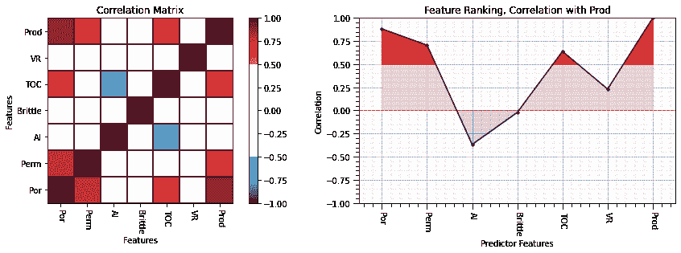

从相关矩阵中我们可以观察到：

+   我们可以看到孔隙率、渗透率和总有机碳与产量之间有最强的线性关系。

+   声波阻抗与产量呈弱负相关。

+   延展性非常接近 0.0。如果你查看延展性 vs. 产量散点图，你会观察到一种复杂的非线性关系。对于产量来说，有一个延展性比率最佳点（既不太软也不太硬的岩石）！

我们也可以查看完整的相关矩阵来评估预测特征之间冗余的潜力。

+   孔隙率和渗透率以及孔隙率和 TOC 之间存在强烈的关联度

+   TOC 和声波阻抗之间存在强烈的负相关度

我们仍然局限于严格的线性关系。排序相关系数使我们能够放宽这个假设。

## 配对斯皮尔曼秩相关系数

排序相关系数在计算相关系数之前对数据进行秩转换。要计算秩转换，只需将数据值替换为秩 $R_x = 1,\dots,n$，其中 $n$ 是最大值，$1$ 是最小值。

$$ \rho_{R_x R_y} = \frac{\sum_{i=1}^{n} (R_{x_i} - \overline{R_x})(R_{y_i} - \overline{R_y})}{(n-1)\sigma_{R_x} \sigma_{R_y}}, \, -1.0 \le \rho_{xy} \le 1.0 $$$$ x_\alpha, \, \forall \alpha = 1,\dots, n, \, | \, x_i \ge x_j \, \forall \, i \gt j $$$$ R_{x_i} = i $$

排序相关系数：

+   衡量单调关系，放宽了线性假设

+   通过将每个特征的标准差乘积进行归一化，消除了对预测特征和响应的敏感性

我们可以使用以下命令来构建排序相关矩阵并计算 p 值：

```py
stats.spearmanr(df.iloc[:,1:8]) 
```

输出是一个新的 Pandas DataFrame，因此我们可以切片最后一列以获取一个 Pandas 系列（具有名称的 ndarray），其中包含所有预测特征与响应之间的相关性。

此外，我们还得到了一个非常方便的 *pval* 2D ndarray，它具有假设检验的双侧（两尾求和对称地跨越两端）p 值：

$$ H_o: \rho_{R_x R_y} = 0 $$$$ H_1: \rho_{R_x R_y} \ne 0 $$

让我们保留所有预测特征和响应特征之间的 p 值。

```py
rank_correlation, rank_correlation_pval = stats.spearmanr(df.iloc[:,df.columns.get_indexer(features)]) # calculate the rank correlation coefficient
rank_matrix = pd.DataFrame(rank_correlation,columns=corr_matrix.columns)
rank_correlation = rank_correlation[:,len(features)-1][:len(features)]
rank_correlation_pval = rank_correlation_pval[:,len(pred)-1][:len(features)]
print("\nRank Correlation p-value:\n"); print(rank_correlation_pval)

plt.subplot(121)
plot_corr(rank_matrix,'Rank Correlation Matrix',1.0,0.5)      # using our correlation matrix visualization function
plt.xlabel('Features'); plt.ylabel('Features')

plt.subplot(122)
feature_rank_plot(features,rank_correlation,-1.0,1.0,0.0,'Feature Ranking, Rank Correlation with ' + resp,'Rank Correlation',0.5)

plt.subplots_adjust(left=0.0, bottom=0.0, right=2.0, top=0.8, wspace=0.2, hspace=0.3); plt.show() 
```

```py
Rank Correlation p-value:

[2.43279911e-02 1.34135205e-01 1.18844068e-10 2.71646948e-04
 2.11367755e-06 0.00000000e+00 3.29170847e-04] 
```

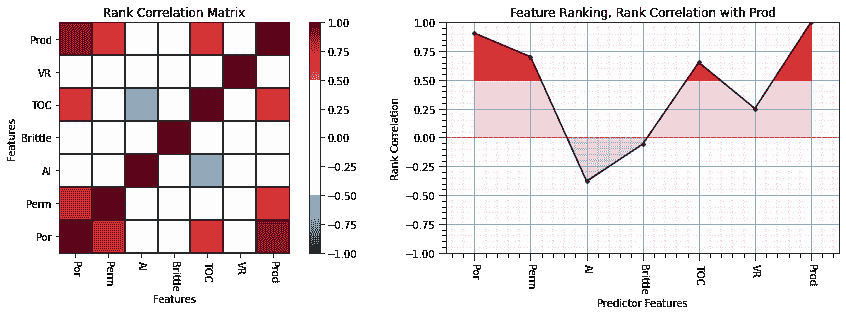

这些矩阵和线图表明，秩相关系数与相关系数相似，表明非线性异常值不太可能影响基于相关性的特征排序。

关于秩相关 p 值，

+   在典型的 alpha 值为 0.05 的情况下，只有脆性与产量的秩相关没有通过假设检验；因此，与 0.0 并无显著差异。

查看相关系数和秩相关系数之间的差异是有用的。

```py
plt.subplot(121)                                              # plot correlation matrix with significance colormap
diff = corr_matrix.values - rank_matrix.values
diff_matrix = pd.DataFrame(diff,columns=corr_matrix.columns)
plot_corr(diff_matrix,'Correlation - Rank Correlation',0.1,0.1) # using our correlation matrix visualization function
plt.xlabel('Features'); plt.ylabel('Features')

corr_diff = correlation - rank_correlation

plt.subplot(122)
feature_rank_plot(features,corr_diff,-0.20,0.20,0.0,'Correlation Coefficient - Rank Correlation Coefficient','Correlation Diffference',0.1)

plt.subplots_adjust(left=0.0, bottom=0.0, right=2.0, top=0.8, wspace=0.2, hspace=0.3); plt.show() 
```

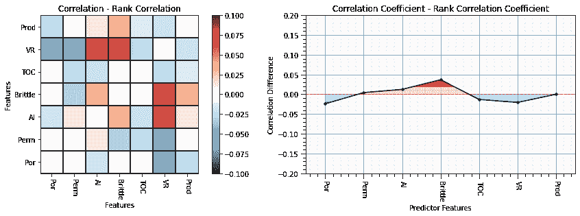

这里有一些有趣的观察：

+   当我们减少线性和异常值的影响时，孔隙率和玻璃光泽反射率与产量的相关性提高

+   当我们减少线性和异常值的影响时，脆性与产量的相关性变差

到目前为止，所有这些方法都是一次考虑一个特征。我们也可以考虑同时考虑所有特征的方法，以“隔离”每个特征的影响。

## 偏相关系数

这是一个控制所有剩余变量影响的线性相关系数，$\rho_{XY.Z}$ 和 $\rho_{YX.Z}$ 是在控制 $Z$ 后 $X$ 和 $Y$、$Y$ 和 $X$ 之间的偏相关。

要计算在给定 $Z_i, \forall \quad i = 1,\ldots, m-1$ 剩余特征的情况下 $X$ 和 $Y$ 之间的偏相关系数，我们使用以下步骤：

1.  执行线性、最小二乘回归以从 $Z_i, \forall \quad i = 1,\ldots, m-1$ 预测 $X$。$X$ 通过预测变量进行回归以计算估计值，$X^*$

1.  在步骤 #1 中计算残差，$X-X^*$，其中 $X^* = f(Z_{1,\ldots,m-1})$，线性回归模型

1.  执行线性、最小二乘回归以从 $Z_i, \forall \quad i = 1,\ldots, m-1$ 预测 $Y$。$Y$ 通过预测变量进行回归以计算估计值，$Y^*$

1.  在步骤 #3 中计算残差，$Y-Y^*$，其中 $Y^* = f(Z_{1,\ldots,m-1})$，线性回归模型

1.  计算步骤 #2 和 #4 的残差之间的相关系数，$\rho_{X-X^*,Y-Y^*}$

偏相关系数提供了在控制 $Z$ 等其他特征对 $X$ 和 $Y$ 的影响下，$X$ 和 $Y$ 之间线性关系的度量。我们使用之前声明的函数，来自 Fabian Pedregosa-Izquierdo，f@bianp.net。原始代码在 GitHub 上，[`git.io/fhyHB`](https://git.io/fhyHB)。

要使用此方法，我们必须假设：

1.  需要比较的两个变量，$X$ 和 $Y$

1.  需要控制的其它变量，$Z_{1,\ldots,m-2}$

1.  所有变量之间的线性关系

1.  没有显著异常值

1.  变量之间的大致双变量正态性

我们的情况相当不错，但有一些偏离双变量正态性的情况。我们可以考虑高斯单变量变换来改进这一点。此选项将在稍后提供。

```py
partial_correlation = partial_corr(df.iloc[:,df.columns.get_indexer(features)]) # calculate the partial correlation coefficients
partial_matrix = pd.DataFrame(partial_correlation,columns=corr_matrix.columns)
partial_correlation = partial_correlation[:,len(features)-1][:len(features)] # extract a single row and remove production with itself 

plt.subplot(121)
plot_corr(partial_matrix,'Partial Correlation Matrix',1.0,0.5) # using our correlation matrix visualization function
plt.xlabel('Features'); plt.ylabel('Features')

plt.subplot(122)
feature_rank_plot(features,partial_correlation,-1.0,1.0,0.0,'Feature Ranking, Partial Correlation with ' + resp,'Partial Correlation',0.5)

plt.subplots_adjust(left=0.0, bottom=0.0, right=2.0, top=0.8, wspace=0.2, hspace=0.3); plt.show() 
```


现在，我们看到了关于每个预测特征独特贡献的许多新事物！

+   孔隙率和渗透率彼此之间高度相关，因此它们受到严重惩罚

+   声波阻抗和镜质体反射率的绝对关联性增加，反映了它们独特的贡献

+   总有机碳翻转了符号！当我们控制所有其他变量时，它与产量呈负相关关系。

通过偏相关系数，我们已经控制了所有其他预测特征对特定预测特征和响应特征的影响。半偏相关系数过滤掉所有其他预测特征对原始响应变量的影响。

## 半偏相关系数

这是一个控制所有剩余特征 $Z$ 对 $X$ 的影响的线性相关系数，然后计算残差 $X^*-X$ 和 $Y$ 之间的相关系数。注意：我们不控制 $Z$ 特征对响应特征 $Y$ 的影响。

要计算给定 $Z_i, \forall \quad i = 1,\ldots, m-1$ 剩余特征下的 $X$ 和 $Y$ 之间的半偏相关系数，我们使用以下步骤：

1.  执行线性、最小二乘回归以预测 $X$ 来自 $Z_i, \forall \quad i = 1,\ldots, m-1$。$X$ 通过剩余的预测特征进行回归以计算估计值，$X^*$

1.  在步骤 #1 中计算残差，$X-X^*$，其中 $X^* = f(Z_{1,\ldots,m-1})$，线性回归模型

1.  计算步骤 #2 中残差与 $Y$ 响应特征的关联系数，$\rho_{X-X^*,Y}$

半部分相关系数提供了在控制 $Z$（其他预测特征）对预测特征 $X$ 的影响的情况下，$X$ 和 $Y$ 之间线性关系的度量。我们使用之前声明的部分相关函数的修改版。原始代码在 GitHub 上，见 [`git.io/fhyHB`](https://git.io/fhyHB)。

```py
semipartial_correlation = semipartial_corr(df.iloc[:,df.columns.get_indexer(features)])    # calculate the semi-partial correlation coefficients
semipartial_matrix = pd.DataFrame(semipartial_correlation,columns=corr_matrix.columns)
semipartial_correlation = semipartial_correlation[:,len(features)-1][:len(features)]    # extract a single row and remove production with itself

plt.subplot(121)
plot_corr(semipartial_matrix,'Semi-partial Correlation Matrix',1.0,0.5) # using our correlation matrix visualization function
plt.xlabel('Features'); plt.ylabel('Features')

plt.subplot(122)
feature_rank_plot(features,semipartial_correlation,-1.0,1.0,0.0,'Feature Ranking, Semipartial Correlation with ' + resp,'Semipartial Correlation',0.5)

plt.subplots_adjust(left=0.0, bottom=0.0, right=2.0, top=0.8, wspace=0.2, hspace=0.3); plt.show() 
```

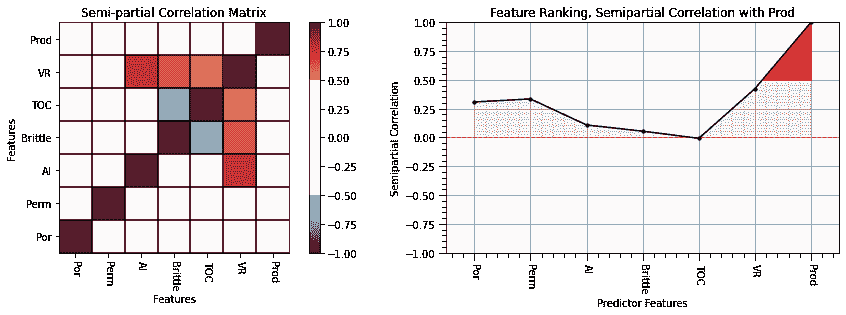

需要考虑的更多信息：

+   孔隙率、渗透率和镜质体反射率是按此特征排名方法最重要的

+   其他预测特征的相关性都相当低

这是停下来总结所有定量方法结果的不错时机。我们将一起绘制它们。

```py
# plt.subplot(151)
# feature_rank_plot(features,covariance,-5000.0,5000.0,0.0,'Feature Ranking, Covariance with ' + resp,'Covariance',0.1)

plt.subplot(131)
feature_rank_plot(features,correlation,-1.0,1.0,0.0,'Feature Ranking, Correlation with ' + resp,'Correlation',0.5)

plt.subplot(132)
feature_rank_plot(features,rank_correlation,-1.0,1.0,0.0,'Feature Ranking, Rank Correlation with ' + resp,'Rank Correlation',0.5)

plt.subplot(133)
feature_rank_plot(features,partial_correlation,-1.0,1.0,0.0,'Feature Ranking, Partial Correlation with ' + resp,'Partial Correlation',0.5)

# plt.subplot(155)
# feature_rank_plot(features,semipartial_correlation,-1.0,1.0,0.0,'Feature Ranking, Semipartial Correlation with ' + resp,'Semipartial Correlation',0.5)

plt.subplots_adjust(left=0.0, bottom=0.0, right=3.2, top=1.2, wspace=0.3, hspace=0.2); plt.show() 
```

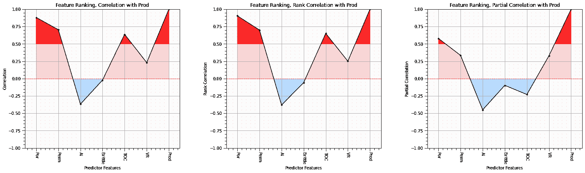

我认为我们正在收敛于孔隙率、渗透率和镜质体反射率作为与生产相关的线性关系中最重要的变量。

## 带有特征转换的特征排名

有许多原因需要进行特征转换（参见相关章节），如上所述，对于部分和半部分相关，分布转换可能有助于符合度量假设。

+   作为一项练习和检查，让我们将所有特征标准化并重复之前计算出的定量方法。我们知道这将对协方差产生影响，那么其他指标呢？

有一些代码来完成这项工作，但并不复杂。首先，让我们创建一个新的包含所有标准化变量的 DataFrame。然后我们可以进行一些小的编辑（更改 DataFrame 名称）并重用上面的代码。您可以选择：

1.  标准化 - 对分布进行仿射校正以使其具有 $\overline{x} = 0$ 和 $\sigma_x = 1.0$。

1.  正态分数转换 - 将每个特征的分布转换为标准正态分布，具有 $\overline{x} = 0$ 和 $\sigma_x = 1.0$ 的高斯形状。

使用此块执行特征的仿射校正：

```py
# dfS = pd.DataFrame()                                        # affine correction, standardization to a mean of 0 and variance of 1 
# dfS['Well'] = df['Well'].values
# dfS['Por'] = GSLIB.affine(df['Por'].values,0.0,1.0)
# dfS['Perm'] = GSLIB.affine(df['Perm'].values,0.0,1.0)
# dfS['AI'] = GSLIB.affine(df['AI'].values,0.0,1.0)
# dfS['Brittle'] = GSLIB.affine(df['Brittle'].values,0.0,1.0)
# dfS['TOC'] = GSLIB.affine(df['TOC'].values,0.0,1.0)
# dfS['VR'] = GSLIB.affine(df['VR'].values,0.0,1.0)
# dfS['Prod'] = GSLIB.affine(df['Prod'].values,0.0,1.0)
# dfS.head() 
```

使用此块执行特征的正常分数转换：

```py
dfS = pd.DataFrame()                                          # Gaussian transform, standardization to a mean of 0 and variance of 1 

for feature in features:
    dfS[feature],d1,d2 = geostats.nscore(df,feature)

dfS.head() 
```

|  | Por | Perm | AI | Brittle | TOC | VR | Prod |
| --- | --- | --- | --- | --- | --- | --- | --- |
| 0 | -0.964092 | -0.780664 | -0.285841 | 2.432379 | 0.312053 | 1.114651 | -1.780464 |
| 1 | -0.832725 | -0.378580 | 0.446827 | -0.195502 | -0.272809 | -0.325239 | -0.392079 |
| 2 | -0.312053 | -1.069155 | 1.722384 | 2.004654 | -0.272809 | 2.241403 | -0.832725 |
| 3 | 0.730638 | 1.325516 | -0.531604 | -0.590284 | 0.131980 | -0.325239 | 0.815126 |
| 4 | 0.698283 | 0.298921 | 0.365149 | -2.870033 | 1.047216 | -0.259823 | -0.531604 |

无论选择哪种转换，检查总结统计信息都是最佳实践。

```py
dfS.describe()                                                # check the summary statistics 
```

|  | Por | Perm | AI | Brittle | TOC | VR | Prod |
| --- | --- | --- | --- | --- | --- | --- | --- |
| count | 200.000000 | 200.000000 | 2.000000e+02 | 2.000000e+02 | 200.000000 | 200.000000 | 2.000000e+02 |
| mean | -0.009700 | 0.010306 | 9.732356e-03 | 8.028717e-05 | 0.014152 | 0.017360 | 1.617223e-03 |
| std | 1.040456 | 1.005488 | 1.000221e+00 | 1.000278e+00 | 0.989223 | 1.000401 | 9.949811e-01 |
| min | -4.991462 | -3.355431 | -2.782502e+00 | -2.870033e+00 | -2.336891 | -2.899210 | -2.483589e+00 |
| 25% | -0.670577 | -0.647337 | -6.588985e-01 | -6.705770e-01 | -0.670577 | -0.651072 | -6.705770e-01 |
| 50% | 0.006267 | 0.006267 | 8.881784e-16 | 8.881784e-16 | 0.018807 | 0.006267 | 8.881784e-16 |
| 75% | 0.670577 | 0.678574 | 6.705770e-01 | 6.705770e-01 | 0.682378 | 0.682642 | 6.705770e-01 |
| max | 2.807034 | 2.807034 | 2.807034e+00 | 2.807034e+00 | 2.807034 | 2.807034 | 2.807034e+00 |

我们还应该再次检查矩阵散点图。

+   如果你进行了正态得分转换，你已经标准化了均值和方差，并纠正了分布的单变量形状，但双变量关系仍然偏离高斯。

```py
pairgrid = sns.PairGrid(dfS) # matrix scatter plots
pairgrid = pairgrid.map_upper(plt.scatter, color = 'darkorange', edgecolor = 'black', alpha = 0.8, s = 10)
pairgrid = pairgrid.map_diag(plt.hist, bins = 20, color = 'darkorange',alpha = 0.8, edgecolor = 'k')# Map a density plot to the lower triangle
pairgrid = pairgrid.map_lower(sns.kdeplot, cmap = plt.cm.inferno, 
                              shade = False, shade_lowest = False, alpha = 1.0, n_levels = 10)
pairgrid.add_legend()
plt.subplots_adjust(left=0.0, bottom=0.0, right=0.9, top=0.9, wspace=0.2, hspace=0.2); plt.show() 
```

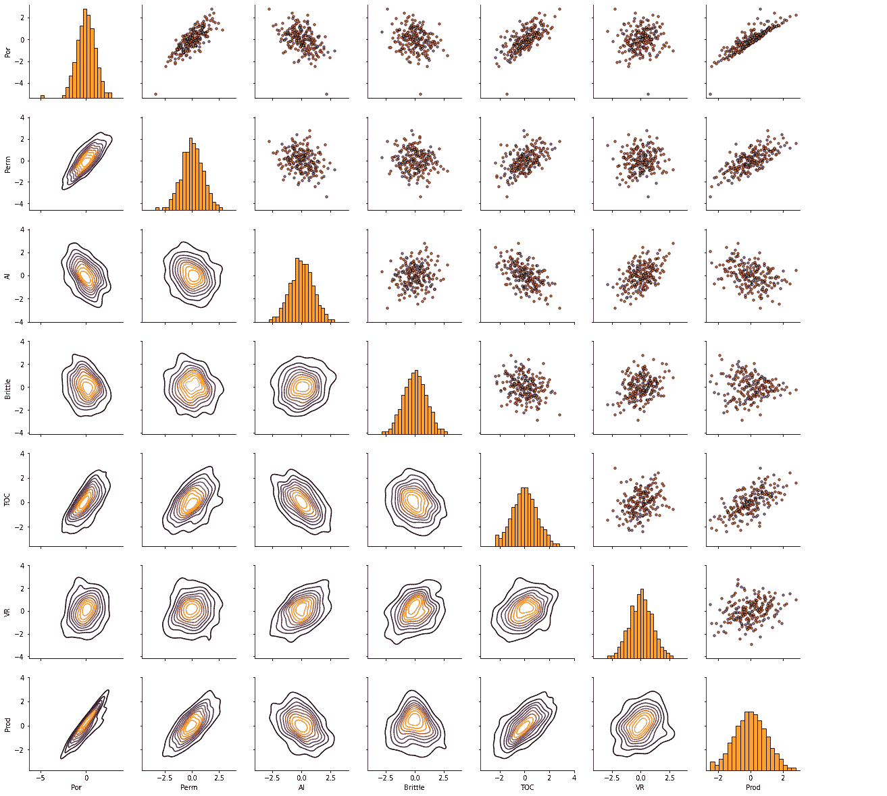

这是带有标准化变量的新 DataFrame。现在我们重复之前的计算。

+   我们这次将更加高效，并使用相当紧凑的代码。

```py
stand_covariance = dfS.iloc[:,dfS.columns.get_indexer(features)].cov().iloc[len(features)-1,:len(features)]
stand_correlation = dfS.iloc[:,dfS.columns.get_indexer(features)].corr().iloc[len(features)-1,:len(features)]

stand_rank_correlation, stand_rank_correlation_pval = stats.spearmanr(dfS.iloc[:,dfS.columns.get_indexer(features)])
stand_rank_correlation = stand_rank_correlation[:,len(features)-1][:len(features)]
stand_partial_correlation = partial_corr(dfS.iloc[:,dfS.columns.get_indexer(features)]) # calculate the partial correlation coefficients
stand_partial_correlation = stand_partial_correlation[:,len(features)-1][:len(features)]
stand_semipartial_correlation = semipartial_corr(dfS.iloc[:,dfS.columns.get_indexer(features)])    # calculate the semi-partial correlation coefficients
stand_semipartial_correlation = stand_semipartial_correlation[:,len(features)-1][:len(features)] 
```

并重复之前的汇总图。

```py
# plt.subplot(2,5,1)
# feature_rank_plot(features,covariance,-5000.0,5000.0,0.0,'Feature Ranking, Covariance with ' + resp,'Covariance',0.5)

plt.subplot(2,3,1)
feature_rank_plot(features,correlation,-1.0,1.0,0.0,'Feature Ranking, Correlation with ' + resp,'Correlation',0.5)

plt.subplot(2,3,2)
feature_rank_plot(features,rank_correlation,-1.0,1.0,0.0,'Feature Ranking, Rank Correlation with ' + resp,'Rank Correlation',0.5)

plt.subplot(2,3,3)
feature_rank_plot(features,partial_correlation,-1.0,1.0,0.0,'Feature Ranking, Partial Correlation with ' + resp,'Partial Correlation',0.5)

# plt.subplot(2,5,5)
# feature_rank_plot(features,semipartial_correlation,-1.0,1.0,0.0,'Feature Ranking, Semipartial Correlation with ' + resp,'Semipartial Correlation',0.5)

# plt.subplot(2,5,6)
# feature_rank_plot(features,stand_covariance,-1.0,1.0,0.0,'Feature Ranking, Covariance with ' + resp,'Covariance of Standardized',0.5)

plt.subplot(2,3,4)
feature_rank_plot(features,stand_correlation,-1.0,1.0,0.0,'Feature Ranking, Correlation with ' + resp,'Correlation of Standardized',0.5)

plt.subplot(2,3,5)
feature_rank_plot(features,stand_rank_correlation,-1.0,1.0,0.0,'Feature Ranking, Rank Correlation with ' + resp,'Rank Correlation of Standardized',0.5)

plt.subplot(2,3,6)
feature_rank_plot(features,stand_partial_correlation,-1.0,1.0,0.0,'Feature Ranking, Partial Correlation with ' + resp,'Partial Correlation of Standardized',0.5)

# plt.subplot(2,5,10)
# feature_rank_plot(features,stand_semipartial_correlation,-1.0,1.0,0.0,'Feature Ranking, Semipartial Correlation with ' + resp,'Semipartial Correlation of Standardized',0.5)

plt.subplots_adjust(left=0.0, bottom=0.0, right=3.2, top=2.2, wspace=0.3, hspace=0.3); plt.show() 
```

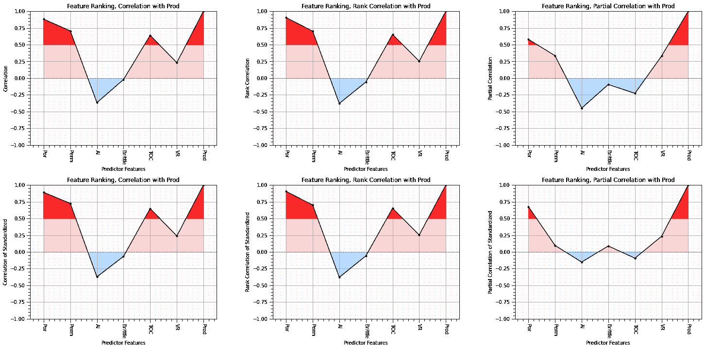

你可以观察到什么：

+   协方差现在等于相关系数

+   半偏相关对特征标准化（仿射相关或正态得分转换）敏感。

## 条件统计量

我们将把井分成低、中、高产量，并检查条件统计量的差异。

+   这将提供一种更灵活的方法来比较每个特征与生产之间的关系

+   如果条件统计量发生显著变化，那么该特征是有信息的

我们将制作一个包含所有特征的单一小提琴图

+   我们需要一个用于生产的分类特征，因此我们使用此代码将生产截断为高或低，

```py
df['tProd'] = np.where(df['Prod']>=4000, 'High', 'Low') 
```

+   我们需要标准化所有特征，以便我们可以观察它们的相对差异

```py
x = df[['Por','Perm','AI','Brittle','TOC','VR']]
x_stand = (x - x.mean()) / (x.std()) 
```

+   此代码将特征提取到新的 DataFrame ‘x’ 中，然后对每个列（特征）应用标准化操作

+   然后我们将截断的生产特征添加到标准化特征中

```py
x = pd.concat([df['tProd'],x_stand.iloc[:,0:6]],axis=1) 
```

+   我们可以应用 melt 命令来逆转 DataFrame

```py
x = pd.melt(x,id_vars="tProd",var_name="Predictors",value_name='Standardized_Value') 
```

+   我们现在有一个长 DataFrame（6 个特征 x 200 个样本 = 12000 行），包含：

    +   生产：低或高

    +   特征：Por, Perm, AI, Brittle, TOC 或 VR

    +   标准化特征值

我们可以构建我们的小提琴图

+   x 是我们的预测特征

+   y 是预测特征的标准化值（现在都在一列中）

+   hue 是生产水平高或低

+   split 是 True，因此小提琴图被分成两半

+   内部是 P25、P50 和 P75 的四分位数，用虚线表示

```py
threshold = 2000.0

df['tProd'] = np.where(df[resp]>=threshold, 'High', 'Low')       # make a high and low production categorical feature

x_temp = df[pred]
x_temp_stand = (x_temp - x_temp.mean()) / (x_temp.std())      # standardization by feature
x_temp = pd.concat([df['tProd'],x_temp_stand.iloc[:,0:len(pred)]],axis=1) # add the production categorical feature to the DataFrame
x_temp = pd.melt(x_temp,id_vars="tProd",var_name="Predictor Feature",value_name='Standardized Predictor Feature') # unpivot the DataFrame

plt.subplot(111)
sns.violinplot(x="Predictor Feature", y="Standardized Predictor Feature", hue="tProd", data=x_temp,split=True, inner="quart", palette="Set2")
plt.xticks(rotation=90); plt.title('Conditional Distributions by Production')
plt.subplots_adjust(left=0.0, bottom=0.0, right=1.5, top=1.5, wspace=0.2, hspace=0.2); plt.show() 
```


从小提琴图中我们可以观察到孔隙率、渗透率和总有机碳（TOC）在低产量井和高产量井之间的条件分布变化最大。

我们可以用条件分布的箱线图来替换这个图。

+   箱线图和须图提高了我们观察条件 P25、P75 以及 Tukey 异常值测试上下限的能力。

```py
plt.subplot(111)
sns.boxplot(x="Predictor Feature", y="Standardized Predictor Feature", hue="tProd", data=x_temp)
plt.xticks(rotation=90)
plt.subplots_adjust(left=0.0, bottom=0.0, right=1.5, top=1.5, wspace=0.2, hspace=0.2)
plt.show()

df = df.drop(['tProd'], axis = 1) 
```

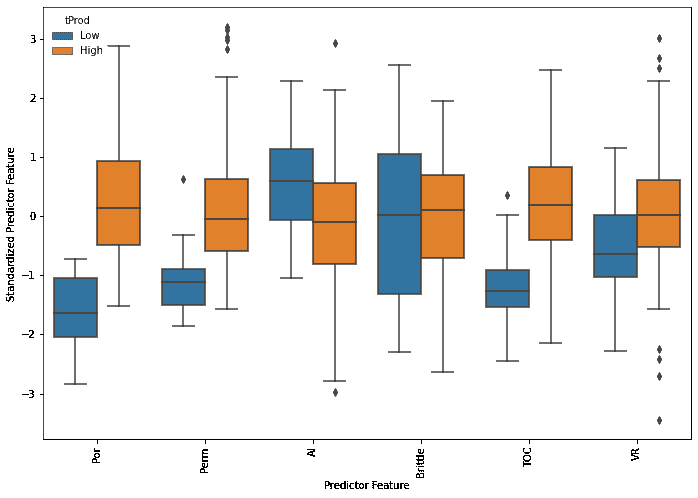

从条件箱线图中我们可以观察到孔隙率、渗透率和总有机碳（TOC）在低产量井和高产量井之间的条件分布变化最大。

+   我们可以观察到孔隙率、渗透率（上尾）、总有机碳（下尾）和玻璃质反射率的异常值。

## 方差膨胀因子（VIF）

这是一个衡量预测特征（$X_i$）与所有其他预测特征（$X_j, \forall j \ne i$）之间线性多重共线性程度的指标。

首先，我们针对所有其他预测特征，对给定预测特征进行线性回归计算。

$$ X_i = \sum_{j, j \ne i}^m X_j + \epsilon $$

从这个模型中，我们确定确定系数 $R²$，也称为方差解释。

然后，我们计算方差膨胀因子（VIF）如下：

$$ VIF = \frac{1}{1 - R²} $$

```py
vif_values = []
for i in range(df[pred].values.shape[1]):
    vif_values.append(variance_inflation_factor(df[pred].values, i))

vif_values = np.asarray(vif_values)
indices = np.argsort(vif_values)[::-1]                  # find indices for descending order

plt.subplot(111)                                        # plot the feature importance 
plt.title("Variance Inflation Factor")
plt.bar(range(df[pred].values.shape[1]), vif_values[indices],edgecolor = 'black',
       color="darkorange",alpha=0.6, align="center")
plt.xticks(np.linspace(0,len(pred)-1,len(pred)), np.array(pred)[indices].tolist(),rotation=90); 

plt.gca().yaxis.grid(True, which='major',linewidth = 1.0); plt.gca().yaxis.grid(True, which='minor',linewidth = 0.2) # add y grids
plt.gca().tick_params(which='major',length=7); plt.gca().tick_params(which='minor', length=4)
plt.gca().xaxis.set_minor_locator(AutoMinorLocator()); plt.gca().yaxis.set_minor_locator(AutoMinorLocator()) # turn on minor ticks

plt.xlim([-0.5, x.shape[1]-0.5]); plt.yscale('log');
plt.xlabel('Predictor Feature'); plt.ylabel('Variance Inflation Factor')
plt.subplots_adjust(left=0.0, bottom=0.0, right=2., top=1., wspace=0.2, hspace=0.5)
plt.show() 
```

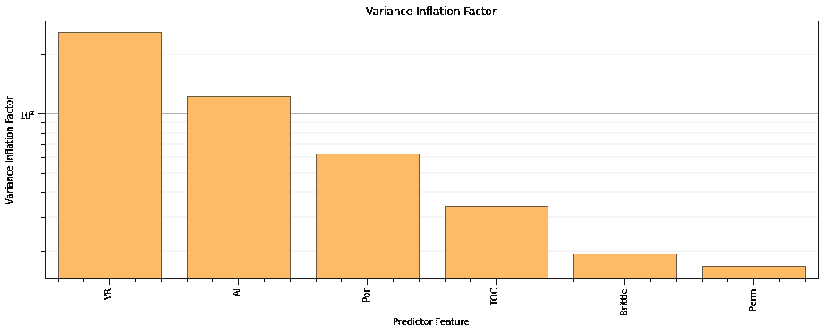

玻璃质反射率具有最多的线性冗余，而渗透率与其他预测特征的线性冗余最少。

+   记住，高方差膨胀因子是不好的。

+   记住，方差膨胀因子（VIF）并不整合每个预测特征与响应特征之间的关系。

+   通常，方差膨胀因子被用作筛选工具，以去除与其他预测特征有过多冗余的特征。

现在我们来介绍基于模型的特征排序方法。

## $B$ 系数 / 贝塔权重

我们还可以考虑 $B$ 系数。这些是不对变量进行标准化的线性回归系数。让我们使用 SciPy 包中可用的线性回归方法。

$Y$ 的估计器简单地是线性方程：

\begin{equation} Y^* = \sum_{i=1}^{m} b_i X_i + c \end{equation}

$b_i$ 系数通过最小化估计值 $Y^*$ 与训练数据集中值 $Y$ 之间的平方误差来求解。

```py
reg = LinearRegression()                                      # instantiate a linear regression model 
reg.fit(df[pred],df[resp])                                    # train the model
b = reg.coef_

plt.subplot(111)
feature_rank_plot(pred,b,-1000.0,1000.0,0.0,'Feature Ranking, B Coefficients with ' + resp,r'Linear Regression Slope, $b_1$',0.5) 
```

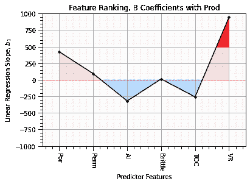

输出是 $b$ 系数，按我们的特征从 $b_i, i = 1,\ldots,n$ 排序，然后是截距 $c$，我已经移除以避免混淆。

+   我们看到了人工智能和 TOC 的负贡献

+   结果对预测特征方差的幅度非常敏感。

我们可以通过处理标准化特征来消除这种敏感性。

## $\beta$ 系数 / Beta Weights

$\beta$ 系数是在我们将预测和响应特征标准化为方差为 1 之后计算的线性回归系数。

$$ \sigma²_{X^s_i} = 1.0 \quad \forall \quad i = 1,\ldots,m, \quad \sigma²_{Y^s} = 1.0 $$

$Y^s$ 标准化的估计器只是一个简单的线性方程：

$$ Y^{s*} = \sum_{i=1}^{m} \beta_i X^s_i + c $$

很方便的是，我们刚刚刚刚将所有变量标准化，使其方差为 1.0（见上文）。让我们再次使用相同的线性回归方法在标准化特征上得到 $\beta$ 系数。

```py
reg = LinearRegression()
reg.fit(dfS[pred],dfS[resp])
beta = reg.coef_

plt.subplot(111)
feature_rank_plot(pred,beta,-1.0,1.0,0.0,r'Feature Ranking, $\beta$ Coefficients with ' + resp,r'Standardized Linear Regression Slope, $b_1$',0.5) 
```

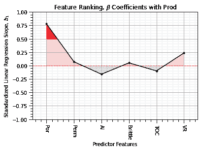

一些观察结果：

+   $b$ 和 $\beta$ 系数的差异并不仅仅是排名指标上的常数缩放，因为线性模型系数对特征的取值范围和大小也很敏感。

+   在估计生产时，$\beta$ 系数、孔隙率、声阻抗和总有机碳具有更高的排名

## 特征重要性

不同的机器学习方法提供了特征重要性的度量，例如决策树通过包含每个特征来减少均方误差，总结如下：

$$ FI(x) = \sum_{t \in T_f} \frac{N_t}{N} \Delta_{MSE_t} $$

其中 $T_f$ 是所有以特征 $x$ 作为分割的节点，$N_t$ 是达到节点 $t$ 的训练样本数量，$N$ 是数据集中样本的总数，$\Delta_{MSE_t}$ 是 $t$ 分割带来的 MSE 减少。

注意，特征重要性可以像上面的 MSE 一样，以类似的方式计算分类树中的 **Gini 不纯度** 的情况。

让我们看看拟合到我们数据的随机森林回归模型的特征重要性。

+   我们使用默认超参数实例化一个随机森林。这导致我们的森林中无限复杂，过拟合的树。这些树的平均处理了过拟合问题。

+   然后，我们训练我们的随机森林并提取特征重要性，计算为森林中所有树上的预期特征重要性。

+   我们还可以从森林中的所有树中提取特征重要性，并使用标准差来总结，以评估我们特征重要性度量的鲁棒性和不确定性。

想了解更多信息，请查看我关于[随机森林](https://www.youtube.com/watch?v=m5_wk310fho&list=PLG19vXLQHvSC2ZKFIkgVpI9fCjkN38kwf&index=39)预测机器学习的讲座。

```py
# Code modified from https://www.kaggle.com/kanncaa1/feature-selection-and-data-visualization
lab_enc = preprocessing.LabelEncoder(); Y_encoded = lab_enc.fit_transform(Y) # this removes an encoding error 

random_forest = RandomForestRegressor()                 # instantiate the random forest 
random_forest = random_forest.fit(x,np.ravel(Y_encoded)) # fit the random forest
importance_rank = random_forest.feature_importances_    # extract the expected feature importances

importance_rank_stand = importance_rank/np.max(importance_rank)                          # calculate relative mutual information

std = np.std([tree.feature_importances_ for tree in random_forest.estimators_],axis=0) # calculate stdev over trees
indices = np.argsort(importance_rank)[::-1]             # find indices for descending order

plt.subplot(111)                                        # plot the feature importance 
plt.title("Random Forest-based Feature importances")
plt.bar(range(x.shape[1]), importance_rank[indices],edgecolor = 'black',
       color="darkorange",alpha = 0.6, yerr=std[indices], align="center")
plt.xticks(range(x.shape[1]), x.columns[indices],rotation=90)
plt.xlim([-0.5, x.shape[1]-0.5]); 
plt.gca().yaxis.grid(True, which='major',linewidth = 1.0); plt.gca().yaxis.grid(True, which='minor',linewidth = 0.2) # add y grids
plt.gca().tick_params(which='major',length=7); plt.gca().tick_params(which='minor', length=4)
plt.gca().xaxis.set_minor_locator(AutoMinorLocator()); plt.gca().yaxis.set_minor_locator(AutoMinorLocator()) # turn on minor ticks
plt.ylim([0.,1.0])
plt.xlabel('Predictor Feature'); plt.ylabel('Feature Importance')
plt.subplots_adjust(left=0.0, bottom=0.0, right=2., top=1., wspace=0.2, hspace=0.5)
plt.show() 
```

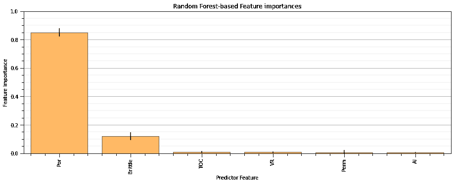

我们还可以使用基于模型的方法做更多的事情。我们将实际测试模型以评估每个预测特征增量影响！我们将尝试使用递归特征消除法来做这个实验。

让我们绘制$B$和$\beta$系数的结果，并与之前的结果进行比较。

```py
plt.subplot(231)
feature_rank_plot(features,rank_correlation,-1.0,1.0,0.0,'Feature Ranking, Rank Correlation with ' + resp,'Rank Correlation',0.5)

plt.subplot(232)
feature_rank_plot(features,partial_correlation,-1.0,1.0,0.0,'Feature Ranking, Partial Correlation with ' + resp,'Partial Correlation',0.5)

plt.subplot(234)
feature_rank_plot(pred,b[0:len(pred)],-1000.0,1000.0,0.0,'Feature Ranking, B Coefficients with ' + resp,'B Coefficients',0.5)

plt.subplot(235)
feature_rank_plot(pred,beta[0:len(pred)],-1.0,1.0,0.0,'Feature Ranking, Beta Coefficients with ' + resp,'Beta Coefficients',0.5)

plt.subplot(236)
feature_rank_plot(pred,importance_rank_stand,0.0,1.0,0.0,'Feature Ranking, Feature Importance with ' + resp,'Standardized Feature Importance',0.5)

plt.subplots_adjust(left=0.0, bottom=0.0, right=3.2, top=2.2, wspace=0.2, hspace=0.3); plt.show() 
```

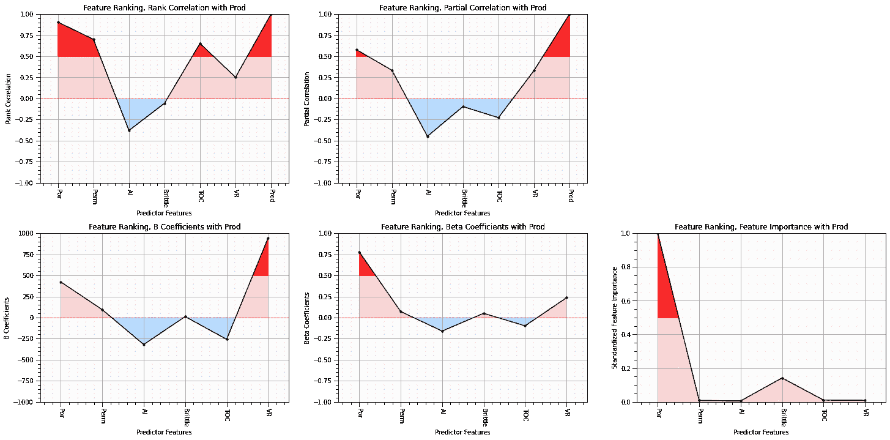

## 互信息

互信息是一种泛化方法，量化了两个特征之间的相互依赖性。

+   量化了从观察一个特征中获取关于另一个特征的信息量

+   避免了对关系形式的任何假设（例如，没有线性关系的假设）

+   将联合概率与边缘概率的乘积进行比较

对于离散或分箱的连续特征$X$和$Y$，互信息计算如下：

$$ I(X;Y) = \sum_{y \in Y} \sum_{x \in X}P_{X,Y}(x,y) log \left( \frac{P_{X,Y}(x,y)}{P_X(x) \cdot P_Y(y)} \right) $$

回忆，给定$X$和$Y$之间的独立性：

$$ P_{X,Y}(x,y) = P_X(x) \cdot P_Y(y) $$

因此，如果两个特征是独立的，那么$log \left( \frac{P_{X,Y}(x,y)}{P_X(x) \cdot P_Y(y)} \right) = 0$

联合概率$P_{X,Y}(x,y)$是总和的加权项，并强制封闭。

+   联合分布中密度更大的部分对互信息度量有更大的影响

对于连续（且未分箱）的特征，我们可以应用积分形式。

$$ I(X;Y) = \int_{Y} \int_{X}P_{X,Y}(x,y) log \left( \frac{P_{X,Y}(x,y)}{P_X(x) \cdot P_Y(y)} \right) dx dy $$

我们可以通过命令获取按重要性降序排列的索引列表

```py
indices = np.argsort(importances)[::-1] 
```

切片会反转顺序，以特征重要性的降序排列。

```py
x_df = df.loc[:,pred]                            # separate DataFrames for predictor and response features
y_df = df.loc[:,resp]

mi = mutual_info_regression(x_df,np.ravel(y_df))              # calculate mutual information
mi /= np.max(mi)                                        # calculate relative mutual information

indices = np.argsort(mi)[::-1]                          # find indices for descending order

print("Feature ranking:")                               # write out the feature importances
for f in range(x.shape[1]):
    print("%d. feature %s = %f" % (f + 1, x.columns[indices][f], mi[indices[f]]))

plt.subplot(111)                                        # plot the relative mutual information 
plt.title("Mutual Information")
plt.bar(range(x.shape[1]), mi[indices],edgecolor = 'black',
       color="darkorange",alpha=0.6,align="center")
plt.xticks(range(x.shape[1]), x.columns[indices],rotation=90)
plt.xlim([-0.5, x.shape[1]-0.5]); plt.ylim([0,1.3])
plt.gca().yaxis.grid(True, which='major',linewidth = 1.0); plt.gca().yaxis.grid(True, which='minor',linewidth = 0.2) # add y grids
plt.gca().tick_params(which='major',length=7); plt.gca().tick_params(which='minor', length=4)
plt.gca().xaxis.set_minor_locator(AutoMinorLocator()); plt.gca().yaxis.set_minor_locator(AutoMinorLocator()) # turn on minor ticks
plt.xlabel('Predictor Feature'); plt.ylabel('Mutual Information')
plt.subplots_adjust(left=0.0, bottom=0.0, right=2., top=1., wspace=0.2, hspace=0.5)
plt.show() 
```

```py
Feature ranking:
1\. feature Por = 1.000000
2\. feature Perm = 0.345842
3\. feature TOC = 0.272418
4\. feature Brittle = 0.073310
5\. feature AI = 0.059024
6\. feature VR = 0.000000 
```

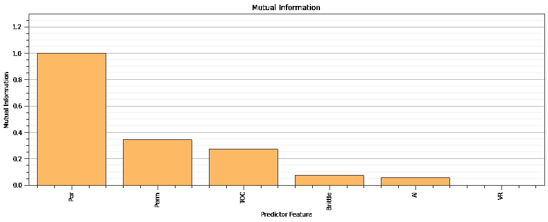

### 考虑到相关性和冗余的互信息

标准的最大相关性-最小冗余（MRMR）目标函数考虑预测特征的一个子集，即，将预测特征子集作为度量标准，以识别最具有信息量的预测特征子集。

+   该方法计算预测特征子集与响应特征之间的平均互信息减去预测特征子集之间的平均互信息。

$$ MID = \frac{1}{|S|}{\sum_{\alpha \in S} I(X_{\alpha},Y) } - \frac{1}{|S|²} {\sum_{\alpha \in S}^m \sum_{\beta \in S}^m I(X_{\alpha},X_{\beta})} $$

作为$相关性 - 冗余$的度量或

$\begin{equation} MIQ = \frac{ \frac{1}{|S|}{\sum_{\alpha \in S}^m I(X_{\alpha},Y) } }{ \frac{1}{|S|²} {\sum_{\alpha \in S}^m \sum_{\beta \in S}^m I(X_{\alpha},X_{\beta})} } \end{equation}$

+   作为$\frac{相关性}{冗余}$的度量。

## 考虑相关性和冗余的互信息 OFAT 变体

我建议对于一次一个特征（OFAT）预测特征排序（预测特征子集，$S = [X_i]$ 和 $|S| = 1$），我们将此修改为以下计算：

+   **相关性** - 选定的预测特征 $X_i$ 与响应特征 $Y$ 之间的互信息

+   **冗余** - 选定的预测特征 $X_i$ 与剩余预测特征 $X_{\alpha}, \alpha \ne i$ 之间的平均互信息。

+   我们使用 Gulgezen, Cataltepe 和 Yu (2009) 的计算公式的商形式。

我们对最大相关性-最小冗余（MRMR）目标函数进行了修改，用于 OFAT 排序分数，将选定的预测特征 $X_i$ 的**相关性**作为其与响应特征之间的互信息：

$\begin{equation} I(X_i,Y) \end{equation}$

以及选定的预测特征 $X_i$ 与剩余预测特征之间的**冗余**：

$\begin{equation} \frac{1}{|S|-1} \sum_{\alpha=1, \alpha \ne i}^m I(X_i,X_{\alpha}) \end{equation}$

其中 $X$ 是预测特征，$Y$ 是响应特征，$X_i$ 是被评分的具体预测特征，$|S|$ 是预测特征的数量，$I()$ 是特征之间的互信息。一种形式是简单的差值，相关性减去冗余，

$$ \Phi_{\Delta}(X_i,Y) = I(X_{\alpha},Y) - \frac{1}{|S|-1} \sum_{\beta=1, \alpha \ne \beta}^m I( X_{\alpha},X_{\beta} ) $$

另一个选择是比率，

$$ \Phi_{r}(X_i,Y) = \frac{ I(X_i,Y) }{ \frac{1}{|S|-1} \sum_{\alpha=1, \alpha \ne i}^m I(X_i,X_{\alpha})} $$

在这里，特征排名为互信息相关性减去冗余，$\Phi_{\Delta}(X_i,Y)$方法。

```py
obj_mutual = mutual_information_objective(x_df,y_df)
indices_obj = np.argsort(obj_mutual)[::-1]              # find indices for descending order

plt.subplot(111)                                        # plot the relative mutual information 
plt.title("One-at-a-Time MRMR Objective Function for Mutual Information-based Feature Selection")
plt.bar(range(x.shape[1]), obj_mutual[indices_obj],
       color="darkorange",alpha = 0.6, align="center",edgecolor="black")
plt.xticks(range(x.shape[1]), x.columns[indices_obj],rotation=90)
plt.gca().yaxis.grid(True, which='major',linewidth = 1.0); plt.gca().yaxis.grid(True, which='minor',linewidth = 0.2) # add y grids
plt.gca().tick_params(which='major',length=7); plt.gca().tick_params(which='minor', length=4)
plt.gca().xaxis.set_minor_locator(AutoMinorLocator()); plt.gca().yaxis.set_minor_locator(AutoMinorLocator()) # turn on minor ticks
plt.xlim([-0.5, x.shape[1]-0.5]); plt.xlabel('Predictor Feature'); plt.ylabel('Feature Importance')
plt.subplots_adjust(left=0.0, bottom=0.0, right=2., top=1., wspace=0.2, hspace=0.5)
plt.show() 
```

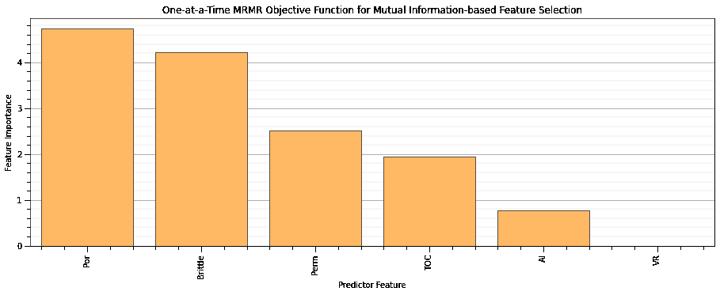

### 考虑相关性和冗余的 Delta 互信息商

我们将 Gulgezen, Cataltepe 和 Yu (2009) 的互信息商应用于开发一个 OFAT 排序度量。

标准的 MRMR 目标函数，用于评估预测特征子集与响应特征之间的**相关性**：

$\begin{equation} \frac{1}{|S|}{\sum_{\alpha=1}^m I(X_{\alpha},Y) } \end{equation}$

以及预测特征子集之间的**冗余**：

$\begin{equation} \frac{1}{|S|²} {\sum_{\alpha=1}^m \sum_{\beta=1}^m I(X_{\alpha},X_{\beta})} \end{equation}$

为了找到最有信息的预测特征子集，我们必须找到最大化相关性同时最小化冗余的特征子集。我们可以通过最大化这两个公式中的任何一个来实现这一点，

\begin{equation} MID = \frac{1}{|S|}{\sum_{\alpha=1}^m I(X_{\alpha},Y) } - \frac{1}{|S|²} {\sum_{\alpha=1}^m \sum_{\beta=1}^m I(X_{\alpha},X_{\beta})} \end{equation}

或者

\begin{equation} MIQ = \frac{ \frac{1}{|S|}{\sum_{\alpha=1}^m I(X_{\alpha},Y) } }{ \frac{1}{|S|²} {\sum_{\alpha=1}^m \sum_{\beta=1}^m I(X_{\alpha},X_{\beta})} } \end{equation}

我建议通过计算包含和移除特定预测特征（$X_i$）的$MIQ$变化来进行特征排序。

\begin{equation} \Delta MIQ_i = \frac{ \frac{1}{|S|}{\sum_{\alpha=1}^m I(X_{\alpha},Y) } }{ \frac{1}{|S|²} {\sum_{\alpha=1}^m \sum_{\beta=1}^m I(X_{\alpha},X_{\beta})} } - \frac{ \frac{1}{|S|}{\sum_{\alpha=1,\alpha \ne i}^m I(X_{\alpha},Y) } }{ \frac{1}{|S|²} {\sum_{\alpha=1,\alpha \ne i}^m \sum_{\beta=1,\beta \ne i}^m I(X_{\alpha},X_{\beta})} } \end{equation}

```py
delta_mutual_information = delta_mutual_information_quotient(x_df,y_df)

indices_delta_mutual_information = np.argsort(delta_mutual_information)[::-1] # find indices for descending order

plt.subplot(111)                                              # plot the relative mutual information 
plt.title("Delta Mutual Information Quotient")
plt.bar(range(x.shape[1]), delta_mutual_information[indices_delta_mutual_information],
       color="darkorange",alpha = 0.6,align="center",edgecolor = 'black')
plt.xticks(range(x.shape[1]), x.columns[indices_delta_mutual_information],rotation=90)
plt.xlim([-0.5, x.shape[1]-0.5])
plt.gca().yaxis.grid(True, which='major',linewidth = 1.0); plt.gca().yaxis.grid(True, which='minor',linewidth = 0.2) # add y grids
plt.gca().tick_params(which='major',length=7); plt.gca().tick_params(which='minor', length=4)
plt.gca().xaxis.set_minor_locator(AutoMinorLocator()); plt.gca().yaxis.set_minor_locator(AutoMinorLocator()) # turn on minor ticks
plt.plot([-0.5,x.shape[1]-0.5],[0,0],color='black',lw=3); plt.xlabel('Predictor Feature'); plt.ylabel('Feature Importance')
plt.subplots_adjust(left=0.0, bottom=0.0, right=2., top=1., wspace=0.2, hspace=0.5)
plt.show() 
```

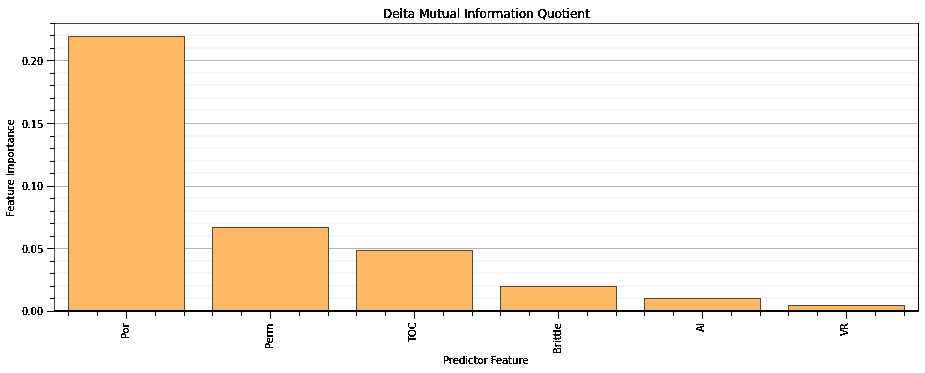

比较增量互信息和方差膨胀因子排序是有教育意义的。这两种方法都考虑了预测特征冗余。

+   但 VIF 假设线性关系，并且不考虑相关性

```py
plt.scatter(stats.rankdata(delta_mutual_information),stats.rankdata(-vif_values),c='black',edgecolor='black')
for i, feature in enumerate(x.columns):
    plt.annotate(feature, (stats.rankdata(delta_mutual_information)[i]-0.2,stats.rankdata(-vif_values)[i]+0.1))
plt.xlabel('Delta Mutual Information Rank'); plt.ylabel('Variance Inflation Factor Rank'); plt.title('Variance Inflation Factor vs. Delta Mutual Information Ranking')
plt.xlim(0,len(pred)+0.1); plt.ylim(0,len(pred)+0.1)
plt.plot([2,len(pred)],[0,len(pred)-2],color='black',alpha=0.5,ls='--'); 
plt.plot([0,len(pred)-2],[2,len(pred)],color='black',alpha=0.5,ls='--')
plt.fill_between([0,len(pred)-2], [2,len(pred)], [len(pred),len(pred)], color='coral',alpha=0.2,zorder=1)
plt.fill_between([2,len(pred)], [0,len(pred)-2], [0,0], color='dodgerblue',alpha=0.2,zorder=1)
plt.subplots_adjust(left=0.0, bottom=0.0, right=1.5, top=1.5, wspace=0.2, hspace=0.2); plt.show() 
```

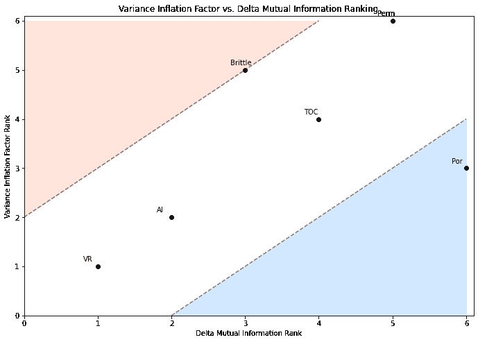

从互信息中我们可以观察到，孔隙率、渗透率然后是总有机碳和脆性在一般独立性方面有最大的偏离。

## 所有双变量指标的总结

我们有一系列广泛的准则来对特征进行排序。

+   $B$系数与协方差有相同的问题，对单变量方差敏感

+   $\beta$系数消除了这种敏感性，并与先前结果一致。

考虑到所有这些方法，我将变量排序如下：

1.  孔隙率

1.  玻璃光泽反射率

1.  声阻抗

1.  渗透率

1.  总有机碳

1.  脆性

我通过观察这些指标的一般趋势来分配这些等级。当然，我们可以通过加权每种方法来制作一个更定量的分数并排序。

如前所述，我们不应忽视专家知识。如果关于物理过程、因果关系以及变量的可靠性和可用性有更多信息，则应将这些信息整合到分配等级中。

我们在这里包括一个附加方法，递归特征消除，但只提供了一个简单的线性回归模型示例。对于更复杂的模型，可以做更多的事情。

## 递归特征消除

递归特征消除（RFE）方法通过递归地移除特征并使用剩余特征构建模型来工作。

+   在第一步中，使用所有特征构建模型，并根据特征重要性或$\beta$系数对特征进行排序

+   最不重要的特征被剪枝，并重新构建模型

+   这会一直重复，直到只剩下一个特征

在此代码中，我们基于多元回归构建预测模型，并指出我们想要根据递归特征消除找到最佳特征。算法为所有特征分配排名 $1,\ldots,m$。

```py
rfe_linear = RFE(LinearRegression(),n_features_to_select=1,verbose=0) # set up RFE linear regression model
df['const'] = np.ones(len(df))                                # let's add one's for the constant term
rfe_linear = rfe_linear.fit(df[pred].values,np.ravel(df[resp])) # recursive elimination
dfS = df.drop('const',axis = 1)                               # remove the ones
print('Recursive Feature Elimination: Multilinear Regression')
for i in range(0,len(pred)):
    print('Rank #' + str(i+1) + ' ' + pred[rfe_linear.ranking_[i]-1]) 
```

```py
Recursive Feature Elimination: Multilinear Regression
Rank #1 Brittle
Rank #2 TOC
Rank #3 AI
Rank #4 VR
Rank #5 Por
Rank #6 Perm 
```

递归消除方法的优点：

+   实际模型可用于评估特征排名

+   排名基于估计的准确性

但这种方法对以下因素敏感：

+   模型的选择

+   训练数据集

特征排名与我们之前的方法相当不同。许多已经从之前的评估中移动。也许我们应该使用更灵活的建模方法。

让我们用一种更灵活的机器学习方法，即决策树回归模型，重复这种方法。

```py
from sklearn.ensemble import RandomForestRegressor
import warnings
warnings.filterwarnings('ignore')            
import geostatspy.GSLIB as GSLIB                              # GSLIB utilities, visualization and wrapper
rfe_rf = RFE(RandomForestRegressor(max_depth=3),n_features_to_select=1,verbose=0) # set up RFE linear regression model
df['const'] = np.ones(len(df))                                # let's add one's for the constant term

lab_enc = preprocessing.LabelEncoder(); Y_encoded = lab_enc.fit_transform(Y)

rfe_rf = rfe_rf.fit(x,np.ravel(Y_encoded))                    # recursive elimination
dfS = df.drop('const',axis = 1)                               # remove the ones
print('Recursive Feature Elimination: Random Forest Regression')
for i in range(0,len(pred)):
    print('Rank #' + str(i+1) + ' ' + pred[rfe_rf.ranking_[i]-1]) 
```

```py
Recursive Feature Elimination: Random Forest Regression
Rank #1 Por
Rank #2 VR
Rank #3 Brittle
Rank #4 Perm
Rank #5 TOC
Rank #6 AI 
```

再次强调，递归特征消除在特征排名中对模型的准确性敏感。

+   实际的预测模型必须调整其关联的超参数并检查模型精度。

+   例如，在这种情况下，由于线性模型的准确性差，多元回归的特征排名不可靠。

## 特征排名的 Shapley 值

让我们取数据的一个随机子集，作为背景值来评估我们的模型。

+   我们为了更快地计算而进行子集划分

+   我们应该评估/强制预测特征空间的效率覆盖

由于 Shapley 值是基于模型的，我们必须从构建模型开始

### 构建随机森林模型

由于 Shapley 是基于模型的，我们需要构建一个模型

+   让我们从一个好的随机森林模型开始，观察 Shapley，然后返回这里并修改模型

```py
seed = 73093                                                  # set the random forest hyperparameters

# #Underfit random forest
max_leaf_nodes = 2
num_tree = 10
max_features = 2

#Overfit random forest
max_leaf_nodes = 50
num_tree = 1
max_features = 6

# #Good random forest
max_leaf_nodes = 5
num_tree = 300
max_features = 2

rfr = RandomForestRegressor(max_leaf_nodes=max_leaf_nodes, random_state=seed,n_estimators=num_tree, max_features=max_features)
rfr.fit(X = x, y = Y)

Y_hat = predict_train = rfr.predict(x)

MSE = metrics.mean_squared_error(Y,Y_hat)
Var_Explained = metrics.explained_variance_score(Y,Y_hat)
print('Mean Squared Error on Training = ', round(MSE,2),', Variance Explained =', round(Var_Explained,2))

importances = rfr.feature_importances_               # expected (global) importance over the forest fore each predictor feature
std = np.std([rfr.feature_importances_ for tree in rfr.estimators_],axis=0)
indices = np.argsort(importances)[::-1].tolist()

plt.subplot(121)
plt.scatter(Y,Y_hat,s=None, c='darkorange',marker=None, cmap=None, norm=None, vmin=None, vmax=None, alpha=0.8, linewidths=0.3, edgecolors="black")
plt.title('Random Forest Model'); plt.xlabel('Actual Production (MCFPD)'); plt.ylabel('Estimated Production (MCFPD)')
plt.xlim(0,7000); plt.ylim(0,7000)
plt.arrow(0,0,7000,7000,width=0.02,color='black',head_length=0.0,head_width=0.0)

plt.subplot(122)
plt.title("Feature Importances")
plt.bar([pred[i] for i in indices],rfr.feature_importances_[indices],color="darkorange", alpha = 0.8, edgecolor = 'black', yerr=std[indices], align="center")
#plt.xticks(range(X.shape[1]), indices)
plt.ylim(0,1), plt.xlabel('Predictor Features'); plt.ylabel('Feature Importance')
plt.subplots_adjust(left=0.0, bottom=0.0, right=2.2, top=0.8, wspace=0.2, hspace=0.2); plt.show() 
```

```py
Mean Squared Error on Training =  428100.87 , Variance Explained = 0.82 
```

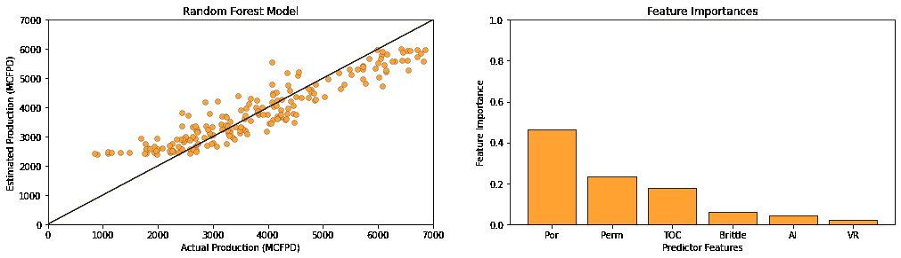

## 计算 Shapley 值

让我们随机选择一些背景数据来计算局部 Shapley 值，然后用全局 Shapley 度量来总结。

背景样本是从所有数据中随机选择的子集。为什么不直接使用所有数据作为背景？

+   **Shapley 值的计算可能很昂贵**，我们需要所有模型的组合来获取所有边际贡献的预测，这些边际贡献被总结为 Shapley 值

+   **原始数据可能以有偏的方式采样**，那么我们就会想确保背景数据具有代表性，即从原始数据中采样以减少偏差，避免在特征重要性评估中的偏差

+   **泛化与特定预测案例**，如果所有数据都用作背景，我们将得到特征重要性的总体数据评估，但我们可能希望仔细选择数据来探索特定的预测案例

为了简单起见，我们只是随机选择 $n$ 个数据。

```py
background = shap.sample(x,nsamples=50,random_state=73073) 
model_explainer = shap.TreeExplainer(rfr)
shap_values = model_explainer.shap_values(background) # global Shapley Measures 
```

## 局部 Shapley 值

让我们先看看局部 Shapley 值，以展示效率的概念。

+   首先，让我们确认 shap 函数的输出是一个 $\left[n_{background}, m\right]$ 的 nd 数组。

```py
shap_values.shape 
```

```py
(50, 6) 
```

我们为背景案例中的每个预测都计算了局部 Shapley 值。让我们可视化一个来展示这一点。

+   我编写了这个自定义可视化，以清楚地传达局部 Shapley 值和效率的概念。

+   我们从训练响应特征的均值开始，为每个预测特征添加局部 Shapley 值，以达到预测。

```py
nback = 7

resp_avg  = np.average(Y_hat)
yhat = rfr.predict(background.iloc[[nback]])

current = resp_avg

plt.subplot(111)

plt.plot([current,current],[0,0.3],color='black',lw=2,zorder=1)
plt.plot([current-2,current],[0.2,0.3],color='black',lw=2,zorder=1)
plt.plot([current,current+2],[0.3,0.2],color='black',lw=2,zorder=1)
for i in range(len(pred)+1):
    plt.scatter(current,i+0.5,color='grey',edgecolor='black',zorder=10)
    if i < len(pred):
        if shap_values[nback,i] > 0.0:
            color = 'red'
        else:
            color = 'blue'
        plt.plot([current,current + shap_values[nback,i]],[i+1,i+1],color=color,lw=2,zorder=1)
        plt.plot([current,current],[i+0.6,i+1],color=color,lw=2,zorder=1)
        plt.plot([current + shap_values[nback,i],current + shap_values[nback,i]],[i+1,i+1.3],color=color,lw=2,zorder=1)
        plt.plot([current + shap_values[nback,i]-2,current + shap_values[nback,i]],[i+1.2,i+1.3],color=color,lw=2,zorder=1)
        plt.plot([current + shap_values[nback,i],current + shap_values[nback,i]+2],[i+1.3,i+1.2],color=color,lw=2,zorder=1)
        if shap_values[nback,i] > 0.0:
            plt.annotate('+ ' + str(np.round(shap_values[nback,i],0)),[current + shap_values[nback,i]*0.5,i+1.1],ha='center')
        else:
            plt.annotate('- ' + str(np.round(abs(shap_values[nback,i]),0)),[current + shap_values[nback,i]*0.5,i+1.1],ha='center')
        current = current + shap_values[nback,i]

plt.plot([current,current],[i+0.7,i+1],color='black',lw=2,zorder=1)
plt.plot([current-2,current],[i+0.9,i+1],color='black',lw=2,zorder=1)
plt.plot([current,current+2],[i+1,i+0.9],color='black',lw=2,zorder=1)

plt.plot([resp_avg,resp_avg],[-0.5,len(pred)+1.5],color='black',ls='--',zorder=1)
plt.plot([yhat,yhat],[-0.5,len(pred)+1.5],color='black',ls='--',zorder=1)
plt.annotate('Response Feature, Training Average',[resp_avg-8,1.0],rotation=90.0)
plt.annotate('Model Prediction',[yhat-8,1.0],rotation=90.0)

plt.yticks(ticks=np.arange(len(pred)+2), labels=[r'None / $\overline{y}$'] + pred + [r'$\hat{y}=f(X)$'])
add_grid(); plt.ylim([-0.5,len(pred)+1.5])
plt.xlabel('Production (MCFPD)'); plt.ylabel('Feature'); plt.title('Local Shapley Values, Background Index: ' + str(nback))
plt.subplots_adjust(left=0.0, bottom=0.0, right=2.2, top=0.8, wspace=0.2, hspace=0.2); plt.show() 
```

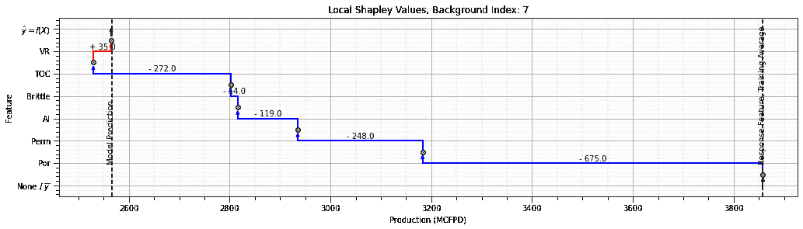

现在我向您展示使用 shap Python 包内置的绘图方法来传达相同的信息。

## Shapley 力图

我们可以同时可视化所有样本数据中的所有 Shapley 值，按背景数据集的顺序排列。

+   蓝色表示预测产量的减少，红色表示预测产量的增加

我们正在一次性可视化所有背景样本数据。按原始样本顺序重新排序，并选择 nback 索引以与上面的图表进行比较。

```py
shap.force_plot(model_explainer.expected_value,shap_values,background,out_names = ['Production'],feature_names=pred,) 
```

**可视化被省略，JavaScript 库未加载！**

您在这个笔记本中运行了`initjs()`吗？如果这个笔记本来自另一个用户，您还必须信任这个笔记本（文件 -> 信任笔记本）。如果您在 GitHub 上查看此笔记本，JavaScript 已被移除以增强安全性。如果您正在使用 JupyterLab，此错误是因为尚未编写 JupyterLab 扩展。

## 局部力图

我们从背景中选取一个特定的样本，并可视化其力图。

+   我们可以看到上述图表的起源，给定样本$i$（$x_i$）的局部值集的所有特征的 Shapley 值。

将此结果与上面我制作的自定义图表进行比较，您将看到它们传达了相同的信息。

```py
shap.force_plot(model_explainer.expected_value,shap_values[nback],background.iloc[[nback]],show=False,feature_names = pred) 
```

**可视化被省略，JavaScript 库未加载！**

您在这个笔记本中运行了`initjs()`吗？如果这个笔记本来自另一个用户，您还必须信任这个笔记本（文件 -> 信任笔记本）。如果您在 GitHub 上查看此笔记本，JavaScript 已被移除以增强安全性。如果您正在使用 JupyterLab，此错误是因为尚未编写 JupyterLab 扩展。

感谢薛松对改进上述局部 Shapley 值内容和可视化的建议。

## 全局 Shapley 值

让我们回顾全局 Shapley 度量。

+   背景数据上绝对 SHAP 值的算术平均值的排序条形图

+   背景数据上 SHAP 值的排序图

+   背景数据上 SHAP 值的 violin 图

注意：所有这些方法都是将每个特征的全球平均值（$E[X_i]$）应用于那些不包括特征$i$的案例。

```py
plt.subplot(131)
shap.summary_plot(show=False,feature_names = pred, shap_values = shap_values, features = background, plot_type="bar",color = "darkorange",cmap = plt.cm.inferno)
plt.ylabel('Predictor Features')

plt.subplot(132)
shap.summary_plot(show=False,feature_names = pred, shap_values = shap_values, features = background,cmap = plt.cm.inferno)

plt.subplot(133)
shap.summary_plot(show=False,feature_names = pred, shap_values = shap_values, features = background,plot_type = "violin")

plt.subplots_adjust(left=0.0, bottom=0.0, right=2.2, top=1.2, wspace=0.2, hspace=0.2)
plt.show() 
```

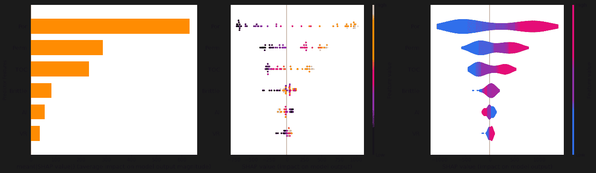

中间和右侧的图显示了所有随机选择的背景样本中每个特征的 Shapley 值，而左侧的图是平均绝对 Shapley 值的条形图。

+   孔隙率、渗透率和 TOC 是顶级特征

## 评论

这是对特征排名的基本处理。可以做和讨论的还有很多，我有很多更多的资源。查看我的[共享资源清单](https://michaelpyrcz.com/my-resources)以及本章开头 YouTube 讲座中的资源链接，视频描述中包含资源链接。

我希望这有所帮助，

*迈克尔*

## 关于作者


迈克尔·皮尔奇教授在德克萨斯大学奥斯汀分校 40 英亩校园的办公室。

迈克尔·皮尔奇是德克萨斯大学奥斯汀分校[Cockrell 工程学院](https://cockrell.utexas.edu/faculty-directory/alphabetical/p)和[杰克逊地球科学学院](https://www.jsg.utexas.edu/researcher/michael_pyrcz/)的教授，他在该校从事和教授地下、空间数据分析、地统计学和机器学习。迈克尔还，

+   [能源分析](https://fri.cns.utexas.edu/energy-analytics)新生研究项目的首席研究员，以及德克萨斯大学奥斯汀分校自然科学院机器学习实验室的核心教员。

+   [计算机与地球科学](https://www.sciencedirect.com/journal/computers-and-geosciences/about/editorial-board)的副编辑，以及国际数学地球科学协会[数学地球科学](https://link.springer.com/journal/11004/editorial-board)的董事会成员。

迈克尔已经撰写了 70 多篇[同行评审出版物](https://scholar.google.com/citations?user=QVZ20eQAAAAJ&hl=en)，一个用于空间数据分析的[Python 包](https://pypi.org/project/geostatspy/)，合著了一本关于空间数据分析的教科书[地统计学储层建模](https://www.amazon.com/Geostatistical-Reservoir-Modeling-Michael-Pyrcz/dp/0199731446)，并是两本最近发布的电子书的作者，[Python 中的应用地统计学：GeostatsPy 动手指南](https://geostatsguy.github.io/GeostatsPyDemos_Book/intro.html)和[Python 中的应用机器学习：带代码的动手指南](https://geostatsguy.github.io/MachineLearningDemos_Book/intro.html)。

迈克尔的所有大学讲座都可以在他的[YouTube 频道](https://www.youtube.com/@GeostatsGuyLectures)上找到，附有 100 多个 Python 交互式仪表板和 40 多个 GitHub 仓库中的详细文档工作流程链接，这些仓库在他的[GitHub 账户](https://github.com/GeostatsGuy)上，以支持任何感兴趣的学生和在职专业人士，提供常青内容。要了解更多关于迈克尔的工作和共享教育资源，请访问他的网站。

## 想一起工作？

我希望这个内容对那些想了解更多关于地下建模、数据分析和机器学习的人有所帮助。学生和在职专业人士欢迎参加。

+   想邀请我到贵公司进行培训、辅导、项目审查、工作流程设计和/或咨询吗？我很乐意拜访并与您合作！

+   感兴趣于合作，支持我的研究生研究或我的地下数据分析与机器学习联盟（共同负责人是约翰·福斯特教授）吗？我的研究将数据分析、随机建模和机器学习理论与实践相结合，以开发新的方法和工作流程来增加价值。我们正在解决具有挑战性的地下问题！

+   您可以通过 mpyrcz@austin.utexas.edu 联系到我。

我总是很高兴讨论，

*迈克尔*

迈克尔·皮尔奇，博士，P.Eng. 教授，德克萨斯大学奥斯汀分校 Cockrell 工程学院和 Jackson 地球科学学院

更多资源可在以下链接获取：[Twitter](https://twitter.com/geostatsguy) | [GitHub](https://github.com/GeostatsGuy) | [网站](http://michaelpyrcz.com) | [Google Scholar](https://scholar.google.com/citations?user=QVZ20eQAAAAJ&hl=en&oi=ao) | [地统计学书籍](https://www.amazon.com/Geostatistical-Reservoir-Modeling-Michael-Pyrcz/dp/0199731446) | [YouTube](https://www.youtube.com/channel/UCLqEr-xV-ceHdXXXrTId5ig) | [Python 中应用地统计学电子书](https://geostatsguy.github.io/GeostatsPyDemos_Book/intro.html) | [Python 中应用机器学习电子书](https://geostatsguy.github.io/MachineLearningDemos_Book/) | [LinkedIn](https://www.linkedin.com/in/michael-pyrcz-61a648a1)

## 特征排序的动机

通常有很多预测特征（输入变量）可供我们用于构建预测模型。

+   有充分的理由进行选择，将所有可能的特征都加入进来并不是一个好主意！

通常，对于最佳的预测模型，仔细选择提供最多信息的少数特征是最佳实践。

原因如下：

+   **错误** - 更多的预测特征会导致更复杂的流程，需要更多专业时间，并且在工作流程中出错的机会增加

+   **难以可视化** - 高维模型，即预测特征数量更多，更难以可视化

+   **模型检查** - 更复杂的模型可能更难以调查、解释和进行质量控制

+   **预测特征冗余** - 更有可能存在冗余的预测特征。包含高度冗余和共线性或多共线性的特征会增加模型方差，增加模型的不稳定性，并降低测试预测的准确性

+   **计算时间** - 更多的预测特征通常会增加训练模型所需的计算时间和计算存储，即模型可能不够紧凑且不便于携带

+   **模型过拟合** - 随着特征数量的增加，模型复杂度的提高，过拟合的风险也随之增加

+   **模型外推** - 许多预测特征导致高维模型空间数据覆盖度低，且模型外推可能不准确

对于许多预测特征的主要问题是维度灾难。让我们总结一下这个灾难！

## 维度灾难

1.  **数据和模型可视化** - 我们无法可视化超过三维，即无法访问数据拟合模型，评估内插与外推。

+   考虑一个 5 维示例，如图所示为矩阵散点图，即使在这种情况下，每个图也极端地边缘化到二维，


示例 5D 数据作为矩阵散点图。

1.  **采样** - 足够的样本数量以推断诸如联合概率 $P(x_1,\ldots,x_m)$ 这样的统计量。

+   回忆直方图或归一化直方图的计算：我们建立区间并计算每个区间的频率或概率。

+   我们需要为每个区间提供名义上的数据样本数量，因此在一维中我们需要 $𝑛=𝑛_{𝑠/𝑏𝑖𝑛} \cdot 𝑛_{𝑏𝑖𝑛𝑠}$ 个样本

+   但在 mD 中，我们需要 $n$ 个样本来计算离散化的联合概率，

$$ 𝑛=𝑛_{𝑠/𝑏𝑖𝑛} \cdot 𝑛_{𝑏𝑖𝑛𝑠}^m $$

+   例如，每个区间 10 个样本，35 个区间，在二维中需要 12,250 个样本，在三维中需要 428,750 个样本


示例 2D 数据，每个特征有 35 个区间。

1.  **样本覆盖度** - 样本值范围覆盖预测特征空间。

+   样本空间中可能解的分数，对于 1 个特征，我们假设 80%的覆盖度

+   记住，我们通常只直接采样地下体积的 $\frac{1}{10⁷}$。

+   是的，覆盖度的概念是主观的，需要覆盖多少数据？关于间隙怎么办？等等。


示例 2D 数据，每个特征有 35 个区间。

+   现在如果有两个特征的 80%覆盖度，二维覆盖度为 64%


示例 2D 数据，每个特征有 35 个区间。

+   覆盖度，

$$ c = c_1^m $$

1.  **扭曲空间** - 高维空间是扭曲的。

+   取内嵌超球体的体积与超立方体的体积之比，

$$ \frac{\pi^{\frac{m}{2}}}{m 2^{m-1} \Gamma\left(\frac{m}{2}\right)} \to 0 \quad \text{as} \quad m \to \infty $$

+   回忆，$\Gamma(𝑛)=(𝑛−1)!$.

+   高维空间全是角落而没有中间部分，大多数高维空间离中间部分很远（全是角落！）。

+   因此，在多维空间中，距离失去了敏感性，即对于空间中的任何随机点，预期的成对距离都变得相同，

$$ \lim_{m \to \infty} \left( \mathbb{E}\left[\text{dist}_{\text{max}}(m) - \text{dist}_{\text{min}}(m)\right] \right) \to 0 $$

+   随机点在超空间中成对距离范围的期望极限趋于零。如果距离几乎都相同，欧几里得距离就不再有意义了！


超立方体内超球体体积的比率。

+   这里是各种维度下的扭曲程度，

| m | nD / 2D |
| --- | --- |
| 2 | 1.0 |
| 5 | 0.28 |
| 10 | 0.003 |
| 20 | 0.00000003 |

1.  **Multicollinearity** - 高维数据集更有可能出现共线性或多重共线性。

+   由其他特征线性描述的特征导致模型方差高。

## 什么是特征排名？

特征排名是一组指标，它们根据包含在推理中的信息和预测响应特征的重要性，为每个预测特征分配相对重要性或价值。有各种各样的可能方法来完成这项任务。我的建议是采用**“宽数组”**方法，结合多种分析和指标，同时理解每种方法的假设和局限性。

这里是我们考虑用于特征排名的一般类型指标。

1.  数据分布和散点图的视觉检查

1.  统计摘要

1.  基于模型

1.  递归特征消除

此外，我们不应忽视专家知识。如果关于物理过程、因果关系、预测特征的可信度和可用性有额外的信息，这些信息应整合到分配特征排名中。

## 加载所需的库

以下代码加载了所需的库。

```py
import geostatspy.GSLIB as GSLIB                              # GSLIB utilities, visualization and wrapper
import geostatspy.geostats as geostats                        # GSLIB methods convert to Python 
import geostatspy
print('GeostatsPy version: ' + str(geostatspy.__version__)) 
```

```py
GeostatsPy version: 0.0.71 
```

我们还需要一些标准包。这些包应该已经与 Anaconda 3 一起安装。

```py
ignore_warnings = True                                        # ignore warnings?
import numpy as np                                            # ndarrays for gridded data
import pandas as pd                                           # DataFrames for tabular data
from sklearn import preprocessing                             # remove encoding error
from sklearn.feature_selection import RFE                     # for recursive feature selection
from sklearn.feature_selection import mutual_info_regression  # mutual information
from sklearn.linear_model import LinearRegression             # linear regression model
from sklearn.ensemble import RandomForestRegressor            # model-based feature importance
from sklearn import metrics                                   # measures to check our models
from statsmodels.stats.outliers_influence import variance_inflation_factor # variance inflation factor
import os                                                     # set working directory, run executables
import math                                                   # basic math operations
import random                                                 # for random numbers
import matplotlib.pyplot as plt                               # for plotting
from matplotlib.ticker import (MultipleLocator, AutoMinorLocator) # control of axes ticks
from matplotlib.colors import ListedColormap                  # custom color maps
import matplotlib.ticker as mtick                             # control tick label formatting
import seaborn as sns                                         # for matrix scatter plots
from scipy import stats                                       # summary statistics
import numpy.linalg as linalg                                 # for linear algebra
import scipy.spatial as sp                                    # for fast nearest neighbor search
import scipy.signal as signal                                 # kernel for moving window calculation
from numba import jit                                         # for numerical speed up
from statsmodels.stats.weightstats import DescrStatsW
plt.rc('axes', axisbelow=True)                                # plot all grids below the plot elements
if ignore_warnings == True:                                   
    import warnings
    warnings.filterwarnings('ignore')
cmap = plt.cm.inferno                                         # color map 
```

对于特征排名的 Shapley 值方法，我们需要一个额外的包以及启动 JavaScript 支持。

+   运行此代码块后，你应该会看到一个带有文本‘js’的六边形，以表示 JavaScript 已就绪

```py
import sys
#!{sys.executable} -m pip install shap
import shap
shap.initjs() 
```


如果您遇到包导入错误，您可能需要首先安装这些包中的一些。这通常可以通过在 Windows 上打开命令窗口，然后输入‘python -m pip install [package-name]’来完成。有关相应包的文档可以提供更多帮助。

## 设计自定义颜色图

通过屏蔽非显著值来考虑显著性

+   目前仅用于演示，可以根据结果置信度和不确定性更新每个图表

```py
my_colormap = plt.cm.get_cmap('RdBu_r', 256)                  # make a custom colormap
newcolors = my_colormap(np.linspace(0, 1, 256))               # define colormap space
white = np.array([250/256, 250/256, 250/256, 1])              # define white color (4 channel)
#newcolors[26:230, :] = white                                 # mask all correlations less than abs(0.8)
#newcolors[56:200, :] = white                                 # mask all correlations less than abs(0.6)
newcolors[76:180, :] = white                                  # mask all correlations less than abs(0.4)
signif = ListedColormap(newcolors)                            # assign as listed colormap

my_colormap = plt.cm.get_cmap('inferno', 256)                 # make a custom colormap
newcolors = my_colormap(np.linspace(0, 1, 256))               # define colormap space
white = np.array([250/256, 250/256, 250/256, 1])              # define white color (4 channel)
#newcolors[26:230, :] = white                                 # mask all correlations less than abs(0.8)
newcolors[0:12, :] = white                                    # mask all correlations less than abs(0.6)
#newcolors[86:170, :] = white                                 # mask all correlations less than abs(0.4)
sign1 = ListedColormap(newcolors)                             # assign as listed colormap 
```

## 声明函数

这里有一些函数可以帮助计算排名和其他图表的指标：

+   **plot_corr** - 绘制相关矩阵

+   **partial_corr** - 部分相关系数

+   **semipar_corr** - 半部分相关系数

+   **mutual_matrix** - 互信息矩阵，所有成对互信息的矩阵

+   **mutual_information_objective** - 我修改的 MRMR 损失函数版本（Ixy - Ixx 的平均值）用于特征排名（使用所有其他预测特征）

+   **delta_mutual_information_quotient** - 通过添加和删除特定特征来改变互信息商的变化（用于比较使用所有其他预测特征）

+   **weighted_avg_and_std** - 平均值和标准差考虑数据权重

+   **weighted_percentile** - 考虑数据权重的百分位数

+   **histogram_bounds** - 向直方图添加置信区间

+   **add_grid** - 添加主要和次要网格线以增强绘图可解释性的便利函数

这里是函数：

```py
def feature_rank_plot(pred,metric,mmin,mmax,nominal,title,ylabel,mask): # feature ranking plot
    mpred = len(pred); mask_low = nominal-mask*(nominal-mmin); mask_high = nominal+mask*(mmax-nominal)
    plt.plot(pred,metric,color='black',zorder=20)
    plt.scatter(pred,metric,marker='o',s=10,color='black',zorder=100)
    plt.plot([-0.5,mpred-0.5],[0.0,0.0],'r--',linewidth = 1.0,zorder=1)
    plt.fill_between(np.arange(0,mpred,1),np.zeros(mpred),metric,where=(metric < nominal),interpolate=True,color='dodgerblue',alpha=0.3)
    plt.fill_between(np.arange(0,mpred,1),np.zeros(mpred),metric,where=(metric > nominal),interpolate=True,color='lightcoral',alpha=0.3)
    plt.fill_between(np.arange(0,mpred,1),np.full(mpred,mask_low),metric,where=(metric < mask_low),interpolate=True,color='blue',alpha=0.8,zorder=10)
    plt.fill_between(np.arange(0,mpred,1),np.full(mpred,mask_high),metric,where=(metric > mask_high),interpolate=True,color='red',alpha=0.8,zorder=10)  
    plt.xlabel('Predictor Features'); plt.ylabel(ylabel); plt.title(title)
    plt.ylim(mmin,mmax); plt.xlim([-0.5,mpred-0.5]); add_grid();
    plt.xticks(rotation=270.0)
    return

def plot_corr(corr_matrix,title,limits,mask):                 # plots a graphical correlation matrix 
    my_colormap = plt.cm.get_cmap('RdBu_r', 256)          
    newcolors = my_colormap(np.linspace(0, 1, 256))
    white = np.array([256/256, 256/256, 256/256, 1])
    white_low = int(128 - mask*128); white_high = int(128+mask*128)
    newcolors[white_low:white_high, :] = white                # mask all correlations less than abs(0.8)
    newcmp = ListedColormap(newcolors)
    m = corr_matrix.shape[0]
    im = plt.matshow(corr_matrix,fignum=0,vmin = -1.0*limits, vmax = limits,cmap = newcmp)
    plt.xticks(range(len(corr_matrix.columns)), corr_matrix.columns); ax = plt.gca()
    ax.xaxis.set_label_position('bottom'); ax.xaxis.tick_bottom()
    plt.yticks(range(len(corr_matrix.columns)), corr_matrix.columns)
    plt.colorbar(im, orientation = 'vertical')
    plt.title(title)
    for i in range(0,m):
        plt.plot([i-0.5,i-0.5],[-0.5,m-0.5],color='black')
        plt.plot([-0.5,m-0.5],[i-0.5,i-0.5],color='black')
    plt.ylim([-0.5,m-0.5]); plt.xlim([-0.5,m-0.5])
    plt.xticks(rotation=270.0)

def partial_corr(C):                                          # partial correlation by Fabian Pedregosa-Izquierdo, f@bianp.net
    C = np.asarray(C)
    p = C.shape[1]
    P_corr = np.zeros((p, p), dtype=float)
    for i in range(p):
        P_corr[i, i] = 1
        for j in range(i+1, p):
            idx = np.ones(p, dtype=bool)
            idx[i] = False
            idx[j] = False
            beta_i = linalg.lstsq(C[:, idx], C[:, j])[0]
            beta_j = linalg.lstsq(C[:, idx], C[:, i])[0]
            res_j = C[:, j] - C[:, idx].dot( beta_i)
            res_i = C[:, i] - C[:, idx].dot(beta_j)
            corr = stats.pearsonr(res_i, res_j)[0]
            P_corr[i, j] = corr
            P_corr[j, i] = corr
    return P_corr

def semipartial_corr(C):                                      # Michael Pyrcz modified the function above by Fabian Pedregosa-Izquierdo, f@bianp.net for semipartial correlation

    C = np.asarray(C)
    p = C.shape[1]
    P_corr = np.zeros((p, p), dtype=float)
    for i in range(p):
        P_corr[i, i] = 1
        for j in range(i+1, p):
            idx = np.ones(p, dtype=bool)
            idx[i] = False
            idx[j] = False
            beta_i = linalg.lstsq(C[:, idx], C[:, j])[0]
            res_j = C[:, j] - C[:, idx].dot( beta_i)
            res_i = C[:, i] 
            corr = stats.pearsonr(res_i, res_j)[0]
            P_corr[i, j] = corr
            P_corr[j, i] = corr
    return P_corr

def mutual_matrix(df,features):                               # calculate mutual information matrix
    mutual = np.zeros([len(features),len(features)])
    for i, ifeature in enumerate(features):
        for j, jfeature in enumerate(features):
            if i != j:
                mutual[i,j] = mutual_info_regression(df.iloc[:,i].values.reshape(-1, 1),np.ravel(df.iloc[:,j].values))[0]
    mutual /= np.max(mutual) 
    for i, ifeature in enumerate(features):
        mutual[i,i] = 1.0
    return mutual

def mutual_information_objective(x,y):                        # modified from MRMR loss function, Ixy - average(Ixx)
    mutual_information_quotient = []
    for i, icol in enumerate(x.columns):
        Vx = mutual_info_regression(x.iloc[:,i].values.reshape(-1, 1),np.ravel(y.values.reshape(-1, 1)))
        Ixx_mat = []
        for m, mcol in enumerate(x.columns):
            if i != m:
                Ixx_mat.append(mutual_info_regression(x.iloc[:,m].values.reshape(-1, 1),np.ravel(x.iloc[:,i].values.reshape(-1, 1))))
        Wx = np.average(Ixx_mat)
        mutual_information_quotient.append(Vx/Wx)
    mutual_information_quotient  = np.asarray(mutual_information_quotient).reshape(-1)
    return mutual_information_quotient

def delta_mutual_information_quotient(x,y):                   # standard mutual information quotient
    delta_mutual_information_quotient = []               

    Ixy = []
    for m, mcol in enumerate(x.columns):
        Ixy.append(mutual_info_regression(x.iloc[:,m].values.reshape(-1, 1),np.ravel(y.values.reshape(-1, 1))))
    Vs = np.average(Ixy)
    Ixx = []
    for m, mcol in enumerate(x.columns):
        for n, ncol in enumerate(x.columns):
            Ixx.append(mutual_info_regression(x.iloc[:,m].values.reshape(-1, 1),np.ravel(x.iloc[:,n].values.reshape(-1, 1))))
    Ws = np.average(Ixx) 

    for i, icol in enumerate(x.columns):          
        Ixy_s = []                                          
        for m, mcol in enumerate(x.columns):
            if m != i:
                Ixy_s.append(mutual_info_regression(x.iloc[:,m].values.reshape(-1, 1),np.ravel(y.values.reshape(-1, 1))))
        Vs_s = np.average(Ixy_s)
        Ixx_s = []
        for m, mcol in enumerate(x.columns):
            if m != i:
                for n, ncol in enumerate(x.columns):
                    if n != i:
                        Ixx_s.append(mutual_info_regression(x.iloc[:,m].values.reshape(-1, 1),np.ravel(x.iloc[:,n].values.reshape(-1, 1))))                  
        Ws_s = np.average(Ixx_s)
        delta_mutual_information_quotient.append((Vs/Ws)-(Vs_s/Ws_s))

    delta_mutual_information_quotient  = np.asarray(delta_mutual_information_quotient).reshape(-1)  
    return delta_mutual_information_quotient

def weighted_avg_and_std(values, weights):                    # calculate weighted statistics (Eric O Lebigot, stack overflow)
    average = np.average(values, weights=weights)
    variance = np.average((values-average)**2, weights=weights)
    return (average, math.sqrt(variance))

def weighted_percentile(data, weights, perc):                 # calculate weighted percentile (iambr on StackOverflow @ https://stackoverflow.com/questions/21844024/weighted-percentile-using-numpy/32216049) 
    ix = np.argsort(data)
    data = data[ix] 
    weights = weights[ix] 
    cdf = (np.cumsum(weights) - 0.5 * weights) / np.sum(weights) 
    return np.interp(perc, cdf, data)

def histogram_bounds(values,weights,color):                   # add uncertainty bounds to a histogram 
    p10 = weighted_percentile(values,weights,0.1); avg = np.average(values,weights=weights); p90 = weighted_percentile(values,weights,0.9)
    plt.plot([p10,p10],[0.0,45],color = color,linestyle='dashed')
    plt.plot([avg,avg],[0.0,45],color = color)
    plt.plot([p90,p90],[0.0,45],color = color,linestyle='dashed')

def add_grid():                                               # add major and minor gridlines
    plt.gca().grid(True, which='major',linewidth = 1.0); plt.gca().grid(True, which='minor',linewidth = 0.2) # add y grids
    plt.gca().tick_params(which='major',length=7); plt.gca().tick_params(which='minor', length=4)
    plt.gca().xaxis.set_minor_locator(AutoMinorLocator()); plt.gca().yaxis.set_minor_locator(AutoMinorLocator()) # turn on minor ticks 
```

## 设置工作目录

我总是喜欢这样做，这样我就不会丢失文件，并且可以简化后续的读取和写入（避免每次都包含完整地址）。

```py
#os.chdir("d:/PGE383")                                   # set the working directory 
```

您将不得不更新引号中的部分以包含您自己的工作目录，并且格式在 Mac 上不同（例如，“~/PGE”）。

## 加载表格数据

这是将我们的逗号分隔数据文件加载到 Pandas DataFrame 对象的命令。

让我们加载提供的多元空间数据集‘unconv_MV.csv’。这个数据集包括来自 1,000 个非常规井的变量，包括：

+   井平均孔隙率

+   渗透率的对数变换（以线性化与其他变量的关系）

+   声波阻抗（kg/m³ x m/s x 10⁶）

+   岩石脆性比（%）

+   总有机碳（%）

+   玻璃质反射率（%）

+   初始生产 90 天平均（MCFPD）。

注意，数据集是合成的。

我们使用 pandas 的‘read_csv’函数将其加载到名为‘my_data’的 DataFrame 中，然后预览以确保正确加载。

```py
idata = 0
if idata == 0:
    df = pd.read_csv('https://raw.githubusercontent.com/GeostatsGuy/GeoDataSets/master/unconv_MV_v4.csv') # load data from Dr. Pyrcz's GitHub repository 

    response = 'Prod'                                             # specify the response feature
    x = df.copy(deep = True); x = x.drop(['Well',response],axis='columns') # make predictor and response DataFrames
    Y = df.loc[:,response]

    features = x.columns.values.tolist() + [Y.name]               # store the names of the features
    pred = x.columns.values.tolist()
    resp = Y.name

    xmin = [6.0,0.0,1.0,10.0,0.0,0.9]; xmax = [24.0,10.0,5.0,85.0,2.2,2.9] # set the minimum and maximum values for plotting
    Ymin = 500.0; Ymax = 9000.0

    predlabel = ['Porosity (%)','Permeability (mD)','Acoustic Impedance (kg/m2s*10⁶)','Brittleness Ratio (%)', # set the names for plotting
                 'Total Organic Carbon (%)','Vitrinite Reflectance (%)']
    resplabel = 'Normalized Initial Production (MCFPD)'

    predtitle = ['Porosity','Permeability','Acoustic Impedance','Brittleness Ratio', # set the units for plotting
                 'Total Organic Carbon','Vitrinite Reflectance']
    resptitle = 'Normalized Initial Production'

    featurelabel = predlabel + [resplabel]                        # make feature labels and titles for concise code
    featuretitle = predtitle + [resptitle]

    m = len(pred) + 1
    mpred = len(pred)

# elif idata == 1:
#     names = {'Porosity':'Por'}

#     df = pd.read_csv('https://raw.githubusercontent.com/GeostatsGuy/GeoDataSets/master/12_sample_data.csv') # load data from Dr. Pyrcz's GitHub repository 
#     df = df.rename(columns=names)
#     df['Por'] = df['Por'] * 100.0; df['AI'] = df['AI'] / 1000.0; 
#     df.drop('Unnamed: 0',axis=1,inplace=True) 

#     features = df.columns.values.tolist()                          # store the names of the features

#     xmin = [0.0,0.0,0.0,4.0,0.0,6.5,1.4,1600.0,10.0,1300.0,1.6]; xmax = [10000.0,10000.0,1.0,19.0,500.0,8.3,3.6,6200.0,50.0,2000.0,12.0] # set the minimum and maximum values for plotting

#     flabel = ['Well (ID)','X (m)','Y (m)','Depth (m)','Porosity (fraction)','Permeability (mD)','Acoustic Impedance (kg/m2s*10⁶)','Facies (categorical)',
#               'Density (g/cm³)','Compressible velocity (m/s)','Youngs modulus (GPa)', 'Shear velocity (m/s)', 'Shear modulus (GPa)'] # set the names for plotting

#     ftitle = ['Well','X','Y','Depth','Porosity','Permeability','Acoustic Impedance','Facies',
#               'Density','Compressible velocity','Youngs modulus', 'Shear velocity', 'Shear modulus']

elif idata == 2:  
    df = pd.read_csv('https://raw.githubusercontent.com/GeostatsGuy/GeoDataSets/master/res21_2D_wells.csv') # load data from Dr. Pyrcz's GitHub repository 

    response = 'CumulativeOil'                                             # specify the response feature
    x = df.copy(deep = True); x = x.drop(['Well_ID','X','Y',response],axis='columns') # make predictor and response DataFrames
    Y = df.loc[:,response]

    features = x.columns.values.tolist() + [Y.name]               # store the names of the features
    pred = x.columns.values.tolist()
    resp = Y.name

    xmin = [1.0,0.0,0.0,4.0,0.0,6.5,1.4,1600.0,10.0,1300.0,1.6]; xmax = [75.0,10000.0,10000.0,19.0,500.0,8.3,3.6,6200.0,50.0,2000.0,12.0] # set the minimum and maximum values for plotting
    Ymin = 0.0; Ymax = 3000.0

    predlabel = ['Well (ID)','X (m)','Y (m)','Porosity (fraction)','Permeability (mD)','Acoustic Impedance (kg/m2s*10⁶)',
              'Density (g/cm³)','Compressible velocity (m/s)','Youngs modulus (GPa)', 'Shear velocity (m/s)', 'Shear modulus (GPa)'] 
    resplabel = 'Cumulative Production (MSTB)'

    predtitle = ['Well','X','Y','Porosity','Permeability','Acoustic Impedance',
              'Density (g/cm³)','Compressible velocity','Youngs modulus', 'Shear velocity', 'Shear modulus'] 
    resptitle = 'Cumulative Production'

    featurelabel = predlabel + [resplabel]                        # make feature labels and titles for concise code
    featuretitle = predtitle + [resptitle]

    m = len(pred) + 1
    mpred = len(pred) 
```

```py
---------------------------------------------------------------------------
SSLCertVerificationError  Traceback (most recent call last)
File C:\ProgramData\anaconda3\envs\MachineLearningBook\lib\urllib\request.py:1317, in AbstractHTTPHandler.do_open(self, http_class, req, **http_conn_args)
  1316 try:
-> 1317     h.request(req.get_method(), req.selector, req.data, headers,
  1318               encode_chunked=req.has_header('Transfer-encoding'))
  1319 except OSError as err: # timeout error

File C:\ProgramData\anaconda3\envs\MachineLearningBook\lib\http\client.py:1230, in HTTPConnection.request(self, method, url, body, headers, encode_chunked)
  1229  """Send a complete request to the server."""
-> 1230 self._send_request(method, url, body, headers, encode_chunked)

File C:\ProgramData\anaconda3\envs\MachineLearningBook\lib\http\client.py:1276, in HTTPConnection._send_request(self, method, url, body, headers, encode_chunked)
  1275     body = _encode(body, 'body')
-> 1276 self.endheaders(body, encode_chunked=encode_chunked)

File C:\ProgramData\anaconda3\envs\MachineLearningBook\lib\http\client.py:1225, in HTTPConnection.endheaders(self, message_body, encode_chunked)
  1224     raise CannotSendHeader()
-> 1225 self._send_output(message_body, encode_chunked=encode_chunked)

File C:\ProgramData\anaconda3\envs\MachineLearningBook\lib\http\client.py:1004, in HTTPConnection._send_output(self, message_body, encode_chunked)
  1003 del self._buffer[:]
-> 1004 self.send(msg)
  1006 if message_body is not None:
  1007 
  1008     # create a consistent interface to message_body

File C:\ProgramData\anaconda3\envs\MachineLearningBook\lib\http\client.py:944, in HTTPConnection.send(self, data)
  943 if self.auto_open:
--> 944     self.connect()
  945 else:

File C:\ProgramData\anaconda3\envs\MachineLearningBook\lib\http\client.py:1399, in HTTPSConnection.connect(self)
  1397     server_hostname = self.host
-> 1399 self.sock = self._context.wrap_socket(self.sock,
  1400                                       server_hostname=server_hostname)

File C:\ProgramData\anaconda3\envs\MachineLearningBook\lib\ssl.py:500, in SSLContext.wrap_socket(self, sock, server_side, do_handshake_on_connect, suppress_ragged_eofs, server_hostname, session)
  494 def wrap_socket(self, sock, server_side=False,
  495                 do_handshake_on_connect=True,
  496                 suppress_ragged_eofs=True,
  497                 server_hostname=None, session=None):
  498     # SSLSocket class handles server_hostname encoding before it calls
  499     # ctx._wrap_socket()
--> 500     return self.sslsocket_class._create(
  501         sock=sock,
  502         server_side=server_side,
  503         do_handshake_on_connect=do_handshake_on_connect,
  504         suppress_ragged_eofs=suppress_ragged_eofs,
  505         server_hostname=server_hostname,
  506         context=self,
  507         session=session
  508     )

File C:\ProgramData\anaconda3\envs\MachineLearningBook\lib\ssl.py:1040, in SSLSocket._create(cls, sock, server_side, do_handshake_on_connect, suppress_ragged_eofs, server_hostname, context, session)
  1039             raise ValueError("do_handshake_on_connect should not be specified for non-blocking sockets")
-> 1040         self.do_handshake()
  1041 except (OSError, ValueError):

File C:\ProgramData\anaconda3\envs\MachineLearningBook\lib\ssl.py:1309, in SSLSocket.do_handshake(self, block)
  1308         self.settimeout(None)
-> 1309     self._sslobj.do_handshake()
  1310 finally:

SSLCertVerificationError: [SSL: CERTIFICATE_VERIFY_FAILED] certificate verify failed: unable to get local issuer certificate (_ssl.c:1108)

During handling of the above exception, another exception occurred:

URLError  Traceback (most recent call last)
Cell In[7], line 3
  1 idata = 0
  2 if idata == 0:
----> 3     df = pd.read_csv('https://raw.githubusercontent.com/GeostatsGuy/GeoDataSets/master/unconv_MV_v4.csv') # load data from Dr. Pyrcz's GitHub repository 
  5     response = 'Prod'                                             # specify the response feature
  6     x = df.copy(deep = True); x = x.drop(['Well',response],axis='columns') # make predictor and response DataFrames

File C:\ProgramData\anaconda3\envs\MachineLearningBook\lib\site-packages\pandas\io\parsers\readers.py:912, in read_csv(filepath_or_buffer, sep, delimiter, header, names, index_col, usecols, dtype, engine, converters, true_values, false_values, skipinitialspace, skiprows, skipfooter, nrows, na_values, keep_default_na, na_filter, verbose, skip_blank_lines, parse_dates, infer_datetime_format, keep_date_col, date_parser, date_format, dayfirst, cache_dates, iterator, chunksize, compression, thousands, decimal, lineterminator, quotechar, quoting, doublequote, escapechar, comment, encoding, encoding_errors, dialect, on_bad_lines, delim_whitespace, low_memory, memory_map, float_precision, storage_options, dtype_backend)
  899 kwds_defaults = _refine_defaults_read(
  900     dialect,
  901     delimiter,
   (...)
  908     dtype_backend=dtype_backend,
  909 )
  910 kwds.update(kwds_defaults)
--> 912 return _read(filepath_or_buffer, kwds)

File C:\ProgramData\anaconda3\envs\MachineLearningBook\lib\site-packages\pandas\io\parsers\readers.py:577, in _read(filepath_or_buffer, kwds)
  574 _validate_names(kwds.get("names", None))
  576 # Create the parser.
--> 577 parser = TextFileReader(filepath_or_buffer, **kwds)
  579 if chunksize or iterator:
  580     return parser

File C:\ProgramData\anaconda3\envs\MachineLearningBook\lib\site-packages\pandas\io\parsers\readers.py:1407, in TextFileReader.__init__(self, f, engine, **kwds)
  1404     self.options["has_index_names"] = kwds["has_index_names"]
  1406 self.handles: IOHandles | None = None
-> 1407 self._engine = self._make_engine(f, self.engine)

File C:\ProgramData\anaconda3\envs\MachineLearningBook\lib\site-packages\pandas\io\parsers\readers.py:1661, in TextFileReader._make_engine(self, f, engine)
  1659     if "b" not in mode:
  1660         mode += "b"
-> 1661 self.handles = get_handle(
  1662     f,
  1663     mode,
  1664     encoding=self.options.get("encoding", None),
  1665     compression=self.options.get("compression", None),
  1666     memory_map=self.options.get("memory_map", False),
  1667     is_text=is_text,
  1668     errors=self.options.get("encoding_errors", "strict"),
  1669     storage_options=self.options.get("storage_options", None),
  1670 )
  1671 assert self.handles is not None
  1672 f = self.handles.handle

File C:\ProgramData\anaconda3\envs\MachineLearningBook\lib\site-packages\pandas\io\common.py:716, in get_handle(path_or_buf, mode, encoding, compression, memory_map, is_text, errors, storage_options)
  713     codecs.lookup_error(errors)
  715 # open URLs
--> 716 ioargs = _get_filepath_or_buffer(
  717     path_or_buf,
  718     encoding=encoding,
  719     compression=compression,
  720     mode=mode,
  721     storage_options=storage_options,
  722 )
  724 handle = ioargs.filepath_or_buffer
  725 handles: list[BaseBuffer]

File C:\ProgramData\anaconda3\envs\MachineLearningBook\lib\site-packages\pandas\io\common.py:368, in _get_filepath_or_buffer(filepath_or_buffer, encoding, compression, mode, storage_options)
  366 # assuming storage_options is to be interpreted as headers
  367 req_info = urllib.request.Request(filepath_or_buffer, headers=storage_options)
--> 368 with urlopen(req_info) as req:
  369     content_encoding = req.headers.get("Content-Encoding", None)
  370     if content_encoding == "gzip":
  371         # Override compression based on Content-Encoding header

File C:\ProgramData\anaconda3\envs\MachineLearningBook\lib\site-packages\pandas\io\common.py:270, in urlopen(*args, **kwargs)
  264  """
  265 Lazy-import wrapper for stdlib urlopen, as that imports a big chunk of
  266 the stdlib.
  267 """
  268 import urllib.request
--> 270 return urllib.request.urlopen(*args, **kwargs)

File C:\ProgramData\anaconda3\envs\MachineLearningBook\lib\urllib\request.py:222, in urlopen(url, data, timeout, cafile, capath, cadefault, context)
  220 else:
  221     opener = _opener
--> 222 return opener.open(url, data, timeout)

File C:\ProgramData\anaconda3\envs\MachineLearningBook\lib\urllib\request.py:525, in OpenerDirector.open(self, fullurl, data, timeout)
  522     req = meth(req)
  524 sys.audit('urllib.Request', req.full_url, req.data, req.headers, req.get_method())
--> 525 response = self._open(req, data)
  527 # post-process response
  528 meth_name = protocol+"_response"

File C:\ProgramData\anaconda3\envs\MachineLearningBook\lib\urllib\request.py:542, in OpenerDirector._open(self, req, data)
  539     return result
  541 protocol = req.type
--> 542 result = self._call_chain(self.handle_open, protocol, protocol +
  543                           '_open', req)
  544 if result:
  545     return result

File C:\ProgramData\anaconda3\envs\MachineLearningBook\lib\urllib\request.py:502, in OpenerDirector._call_chain(self, chain, kind, meth_name, *args)
  500 for handler in handlers:
  501     func = getattr(handler, meth_name)
--> 502     result = func(*args)
  503     if result is not None:
  504         return result

File C:\ProgramData\anaconda3\envs\MachineLearningBook\lib\urllib\request.py:1360, in HTTPSHandler.https_open(self, req)
  1359 def https_open(self, req):
-> 1360     return self.do_open(http.client.HTTPSConnection, req,
  1361         context=self._context, check_hostname=self._check_hostname)

File C:\ProgramData\anaconda3\envs\MachineLearningBook\lib\urllib\request.py:1320, in AbstractHTTPHandler.do_open(self, http_class, req, **http_conn_args)
  1317         h.request(req.get_method(), req.selector, req.data, headers,
  1318                   encode_chunked=req.has_header('Transfer-encoding'))
  1319     except OSError as err: # timeout error
-> 1320         raise URLError(err)
  1321     r = h.getresponse()
  1322 except:

URLError: <urlopen error [SSL: CERTIFICATE_VERIFY_FAILED] certificate verify failed: unable to get local issuer certificate (_ssl.c:1108)> 
```

+   我们还可以为绘图建立特征范围。我们可以使用如下代码直接从数据中计算特征范围：

```py
Pormin = np.min(df['Por'].values)                             # extract ndarray of data table column
Pormax = np.max(df['Por'].values)                             # and calculate min and max 
```

但是，这不会导致易于理解的色条和坐标轴刻度，让我们选择方便的整数。我们还将声明特征标签以方便绘图。

## 可视化 DataFrame

可视化 DataFrame 是数据的第一步检查。

+   许多事情可能会出错，例如，我们加载了错误的数据，所有特征都没有加载，等等。

我们可以通过使用‘head’ DataFrame 成员函数来预览（格式整洁，见下文）。

+   添加参数‘n=13’以查看数据集的前 13 行。

```py
df.head(n=13)                                                 # we could also use this command for a table preview 
```

|  | 井 | 孔 | 渗 | AI | 脆性 | TOC | VR | 产 |
| --- | --- | --- | --- | --- | --- | --- | --- | --- |
| 0 | 1 | 12.08 | 2.92 | 2.80 | 81.40 | 1.16 | 2.31 | 1695.360819 |
| 1 | 2 | 12.38 | 3.53 | 3.22 | 46.17 | 0.89 | 1.88 | 3007.096063 |
| 2 | 3 | 14.02 | 2.59 | 4.01 | 72.80 | 0.89 | 2.72 | 2531.938259 |
| 3 | 4 | 17.67 | 6.75 | 2.63 | 39.81 | 1.08 | 1.88 | 5288.514854 |
| 4 | 5 | 17.52 | 4.57 | 3.18 | 10.94 | 1.51 | 1.90 | 2859.469624 |
| 5 | 6 | 14.53 | 4.81 | 2.69 | 53.60 | 0.94 | 1.67 | 4017.374438 |
| 6 | 7 | 13.49 | 3.60 | 2.93 | 63.71 | 0.80 | 1.85 | 2952.812773 |
| 7 | 8 | 11.58 | 3.03 | 3.25 | 53.00 | 0.69 | 1.93 | 2670.933846 |
| 8 | 9 | 12.52 | 2.72 | 2.43 | 65.77 | 0.95 | 1.98 | 2474.048178 |
| 9 | 10 | 13.25 | 3.94 | 3.71 | 66.20 | 1.14 | 2.65 | 2722.893266 |
| 10 | 11 | 15.04 | 4.39 | 2.22 | 61.11 | 1.08 | 1.77 | 3828.247174 |
| 11 | 12 | 16.19 | 6.30 | 2.29 | 49.10 | 1.53 | 1.86 | 5095.810104 |
| 12 | 13 | 16.82 | 5.42 | 2.80 | 66.65 | 1.17 | 1.98 | 4091.637316 |

## 表格数据的摘要统计

在 DataFrames 中，有很多高效的方法可以计算表格数据的摘要统计信息。describe 命令提供了一个很好的数据表，提供了计数、平均值、最小值、最大值和四分位数。

+   我们使用转置只是为了让表格翻转，使得特征在行上，统计信息在列上。

```py
df.describe().transpose()                                     # calculate summary statistics for the data 
```

|  | count | mean | std | min | 25% | 50% | 75% | max |
| --- | --- | --- | --- | --- | --- | --- | --- | --- |
| Well | 200.0 | 100.500000 | 57.879185 | 1.000000 | 50.750000 | 100.500000 | 150.250000 | 200.000000 |
| Por | 200.0 | 14.991150 | 2.971176 | 6.550000 | 12.912500 | 15.070000 | 17.402500 | 23.550000 |
| Perm | 200.0 | 4.330750 | 1.731014 | 1.130000 | 3.122500 | 4.035000 | 5.287500 | 9.870000 |
| AI | 200.0 | 2.968850 | 0.566885 | 1.280000 | 2.547500 | 2.955000 | 3.345000 | 4.630000 |
| Brittle | 200.0 | 48.161950 | 14.129455 | 10.940000 | 37.755000 | 49.510000 | 58.262500 | 84.330000 |
| TOC | 200.0 | 0.990450 | 0.481588 | -0.190000 | 0.617500 | 1.030000 | 1.350000 | 2.180000 |
| VR | 200.0 | 1.964300 | 0.300827 | 0.930000 | 1.770000 | 1.960000 | 2.142500 | 2.870000 |
| Prod | 200.0 | 3864.407081 | 1553.277558 | 839.822063 | 2686.227611 | 3604.303506 | 4752.637555 | 8590.384044 |

特征排名实际上是一项理解特征及其相互关系的努力。我们将从基本的数据可视化开始，然后转向更复杂的方法，如偏相关和递归特征消除。

## 覆盖率

让我们从特征覆盖的概念开始。

+   如果一个特征在样本中的比例很小，那么我们可能不想包含它，因为它会导致特征插补、缺失数据估计等问题。

+   通过移除一些覆盖率较差的特征，我们可能会改进我们的模型，因为特征插补存在局限性，特征插补实际上会在统计数据和我们的预测模型中引入偏差和额外的误差

+   如果应用类似的删除来处理缺失值，覆盖率低的特征会导致大量数据被删除！

让我们从带有缺失记录比例的柱状图开始：

```py
plt.subplot(111)
(df.isnull().sum()/len(df)).plot(kind = 'bar')                # calculate DataFrame with percentage missing by feature
plt.xlabel('Feature'); plt.ylabel('Percentage of Missing Values'); plt.title('Data Completeness'); plt.ylim([0.0,1.0])
plt.subplots_adjust(left=0.0, bottom=0.0, right=1.0, top=0.8, wspace=0.2, hspace=0.2); add_grid(); plt.show() 
```


对于提供的示例数据集，图表应该是空的。没有缺失数据，因此所有特征的“缺失记录比例”都是 0.0。

如果你想测试这个图表并包含一些缺失数据，请先运行以下代码：

```py
proportion_NaN = 0.1                                    # proportion of values in DataFrame to remove

remove = np.random.random(df.shape) < proportion_NaN    # make the boolean array for removal
print('Fraction of removed values in mask ndarray = ' + str(round(remove.sum()/remove.size,3)) + '.')

df_mask = df.mask(remove)                               # make a new DataFrame with specified proportion removed 
```

删除此代码并重新加载数据，以继续获得与以下讨论一致的结果。

这并没有讲述整个故事。例如，如果特征 A 的 20%缺失，特征 B 的 20%缺失，这些是否是相同的样本和不同的样本。如果你执行类似的删除，这会有巨大的影响。

+   如果数据不是太多，我们实际上可以在这样的布尔表中可视化所有样本和特征的数据覆盖情况。

+   此方法可能识别出具有许多缺失特征的特定样本，这些样本可能被移除以提高整体覆盖范围或导致采样偏差的缺失数据中的其他趋势或结构。

```py
df_temp = df.copy(deep=True)                                  # make a deep copy of the DataFrame
df_bool = df_temp.isnull()                                    # true is value, false if NaN
#df_bool = df_bool.set_index(df_temp.pop('UWI'))              # set the index / feature for the heat map y column
heat = sns.heatmap(df_bool, cmap=['r','w'], annot=False, fmt='.0f',cbar=False,linecolor='black',linewidth=0.1) # make the binary heat map, no bins
heat.set_xticklabels(heat.get_xticklabels(), rotation=90, fontsize=8)
heat.set_yticklabels(heat.get_yticklabels(), rotation=0, fontsize=8)
heat.set_title('Data Completeness Heatmap',fontsize=16); heat.set_xlabel('Feature',fontsize=12); heat.set_ylabel('Sample (Index)',fontsize=12)
plt.subplots_adjust(left=0.0, bottom=0.0, right=1.8, top=1.6, wspace=0.2, hspace=0.2); plt.show() 
```


再次强调，对于具有完美覆盖的提供数据集，此图应该相当无聊，每个单元格都应该用红色填充。

+   添加代码以删除一些记录以测试此图。空白单元格表示缺失记录。

### 特征插补

请参阅关于特征插补的章节，了解如何处理缺失数据。

目前在这里进行简要处理，我们只是应用类似的删除并继续。

+   我们移除所有具有任何缺失特征值的样本。虽然这很简单，但这是确保我们即将展示的特征排名方法所需完美覆盖的一种简单粗暴的方法。请查看上面链接的工作流程中的其他方法。

```py
df.dropna(axis=0,how='any',inplace=True)                      # likewise deletion 
```

### 特征插补

请参阅关于特征插补的章节，了解如何处理缺失数据。

目前在这里进行简要处理，我们只是应用类似的删除并继续。

+   我们移除所有具有任何缺失特征值的样本。虽然这很简单，但这是确保我们即将展示的特征排名方法所需完美覆盖的一种简单粗暴的方法。请查看上面链接的工作流程中的其他方法。

```py
df.dropna(axis=0,how='any',inplace=True)                      # likewise deletion 
```

## 摘要统计

在任何多元分析工作中，我们应该从单变量分析开始，一次分析一个变量的摘要统计。摘要统计排名方法是定性的，我们正在询问：

+   是否存在数据问题？

+   我们是否信任这些特征？我们是否同等信任所有特征？

+   在我们开发任何多元工作流程之前，是否有需要处理的问题？

在 DataFrames 中，有许多高效的方法可以计算表格数据的摘要统计。`describe`命令提供了一个紧凑的数据表，其中包括计数、平均值、最小值、最大值和四分位数。我们使用`transpose()`命令翻转表格，使得特征位于行上，而统计值位于列上。

```py
df.describe().transpose()                                     # DataFrame summary statistics 
```

|  | count | mean | std | min | 25% | 50% | 75% | max |
| --- | --- | --- | --- | --- | --- | --- | --- | --- |
| Well | 200.0 | 100.500000 | 57.879185 | 1.000000 | 50.750000 | 100.500000 | 150.250000 | 200.000000 |
| Por | 200.0 | 14.991150 | 2.971176 | 6.550000 | 12.912500 | 15.070000 | 17.402500 | 23.550000 |
| Perm | 200.0 | 4.330750 | 1.731014 | 1.130000 | 3.122500 | 4.035000 | 5.287500 | 9.870000 |
| AI | 200.0 | 2.968850 | 0.566885 | 1.280000 | 2.547500 | 2.955000 | 3.345000 | 4.630000 |
| Brittle | 200.0 | 48.161950 | 14.129455 | 10.940000 | 37.755000 | 49.510000 | 58.262500 | 84.330000 |
| TOC | 200.0 | 0.990450 | 0.481588 | -0.190000 | 0.617500 | 1.030000 | 1.350000 | 2.180000 |
| VR | 200.0 | 1.964300 | 0.300827 | 0.930000 | 1.770000 | 1.960000 | 2.142500 | 2.870000 |
| Prod | 200.0 | 3864.407081 | 1553.277558 | 839.822063 | 2686.227611 | 3604.303506 | 4752.637555 | 8590.384044 |

摘要统计是数据检查的关键第一步。

+   这包括每个特征的有效（非空）值的数量（计数从每个变量的总数中移除了所有 np.NaN）。

+   我们可以看到一般行为，如中心趋势、均值和分散性、方差。

+   我们可以识别出与每个属性可能的值范围之外的负值、极端值和值的问题。

+   数据看起来相当良好，为了简洁起见，我们跳过异常值检测。让我们看看单变量分布。

## 单变量分布

与摘要统计一样，这种排序方法是对数据问题的定性检查，以及评估我们对每个特征的信心。最好不包含质量信心低的特征，因为这可能会产生误导（同时如前所述增加了模型复杂性）。

```py
nbins = 20                                                    # number of histogram bins
for i, feature in enumerate(features):                        # plot histograms with central tendency and P10 and P90 labeled
    plt.subplot(4,3,i+1)
    y,_,_ = plt.hist(x=df[feature],weights=None,bins=nbins,alpha = 0.8,edgecolor='black',color='darkorange',density=True)
    # histogram_bounds(values=df[feature].values,weights=np.ones(len(df)),color='red')
    plt.xlabel(feature); plt.ylabel('Frequency'); plt.ylim([0.0,y.max()*1.10]); plt.title(featuretitle[i]); add_grid() 
    # if feature == resp: 
    #     plt.xlim([Ymin,Ymax]) 
    # else:
    #     plt.xlim([xmin[i],xmax[i]]) 

plt.subplots_adjust(left=0.0, bottom=0.0, right=3., top=4.1, wspace=0.2, hspace=0.3); plt.show() 
```


单变量分布看起来很好：

+   没有明显的异常值。

+   穿透率呈正偏态，这是常见的现象。

+   校正后的目录表有一个小峰值，但这是合理的。

## 双变量分布

矩阵散点图是观察变量之间双变量关系的一种非常有效的方法。

+   这是通过数据可视化识别数据问题的另一个机会

+   我们可以评估是否存在共线性，特别是每次评估两个特征之间的简单形式。

```py
pairgrid = sns.PairGrid(df) # matrix scatter plots
pairgrid = pairgrid.map_upper(plt.scatter, color = 'darkorange', edgecolor = 'black', alpha = 0.8, s = 10)
pairgrid = pairgrid.map_diag(plt.hist, bins = 20, color = 'darkorange',alpha = 0.8, edgecolor = 'k')# Map a density plot to the lower triangle
pairgrid = pairgrid.map_lower(sns.kdeplot, cmap = plt.cm.inferno, 
                              shade = False, shade_lowest = False, alpha = 1.0, n_levels = 10)
pairgrid.add_legend()
plt.subplots_adjust(left=0.0, bottom=0.0, right=0.9, top=0.9, wspace=0.2, hspace=0.2); plt.show() 
```


这个图传达了大量的信息。我们如何利用这个图进行变量排序？

+   我们可以识别出彼此紧密相关的特征，例如，如果两个特征几乎具有完美的单调线性或近线性关系，我们应该立即删除其中一个。这是一个简单的共线性案例，如上所述，可能会导致模型不稳定。

+   我们可以检查线性与非线性关系。如果我们观察到非线性双变量关系，这将影响方法的选择，以及假设变量排序为线性关系的方法的质量。

+   我们可以识别变量之间的约束关系和异方差性。再次强调，这些可能会限制我们的排序方法，并鼓励我们保留特定特征以在结果模型中保留这些特征。

然而，我们必须记住，双变量可视化和分析不足以理解数据中的所有多变量关系，例如，多重共线性包括两个或更多特征之间强烈的线性关系。这些关系仅通过双变量图可能难以看到。

## 对应协方差

配对协方差提供了每个预测特征与响应特征之间线性关系强度的度量。在此阶段，我们指定本研究的目的是从其他可用的预测特征中预测产量，我们的响应变量。我们现在处于预测思维状态，而不是推断思维状态，我们想要估计函数 $\hat{f}$ 以完成此任务：

$$ Y = \hat{f}(X_1,\ldots,X_n) $$

其中 $Y$ 是我们的响应特征，$X_1,\ldots,X_n$ 是我们的预测特征。如果我们保留所有预测特征来预测响应，我们会有：

$$ Prod = \hat{f}(Por,Perm,AI,Brittle,TOC,VR) $$

现在回到协方差，协方差定义为：

$$ C_{xy} = \frac{\sum_{i=1}^{n} (x_i - \overline{x})(y_i - \overline{y})}{(n-1)} $$

协方差：

+   衡量线性关系

+   对预测变量和响应变量的分散/方差都很敏感

我们可以使用以下命令来构建协方差矩阵：

```py
df.iloc[:,1:8].cov()                                    # covariance matrix sliced predictors vs. response 
```

输出是一个新的 Pandas DataFrame，因此我们可以切片最后一列以获取包含所有预测特征与响应之间协方差的 Pandas 系列（具有名称的 ndarray）。

```py
covariance = df.iloc[:,df.columns.get_indexer(features)].cov().iloc[len(features)-1,:len(features)] # calculate covariance matrix and slice for only pred - resp
cov_matrix = df.iloc[:,df.columns.get_indexer(features)].cov()
plt.subplot(121)
plot_corr(cov_matrix,'Covariance Matrix',4000.0,0.1)          # using our correlation matrix visualization function
plt.xlabel('Features'); plt.ylabel('Features') 

plt.subplot(122)
feature_rank_plot(features,covariance,-20000.0,20000.0,0.0,'Feature Ranking, Covariance with ' + resp,'Covariance',0.1)

plt.subplots_adjust(left=0.0, bottom=0.0, right=1.6, top=0.8, wspace=0.2, hspace=0.3); plt.show() 
```


协方差是有用的，但正如你所见，其大小相当多变。

+   协方差的大小是每个特征的函数，并且特征方差是有些任意的。

+   例如，孔隙率的方差在分数与百分比之间，或者渗透率在达西与毫达西之间的方差是多少。我们可以表明，如果我们对一个特征 $X$ 应用一个常数乘数 $c$，方差将根据此关系变化（证明基于方差的期望公式）：

$$ \sigma_{cX}² = c² \cdot \sigma_{X}² $$

通过从百分比转换为分数，我们降低了孔隙率的方差因子为 10,000！每个特征的方差可能是任意的，除了当所有特征都在相同的单位时。

配对相关系数是标准化的协方差；因此，避免了这种任意大小的问题。

## 配对相关系数

配对相关系数提供了每个预测特征与响应特征之间线性关系强度的度量。

$$ \rho_{xy} = \frac{\sum_{i=1}^{n} (x_i - \overline{x})(y_i - \overline{y})}{(n-1)\sigma_x \sigma_y}, \, -1.0 \le \rho_{xy} \le 1.0 $$

相关系数：

+   衡量线性关系

+   通过将每个特征的方差乘积进行归一化，消除了对预测变量和响应变量分散/方差的敏感性。

我们可以使用以下命令来构建相关矩阵：

```py
df.iloc[:,1:8].corr() 
```

输出是一个新的 Pandas DataFrame，因此我们可以切片最后一列以获取包含所有预测特征与响应之间相关性的 Pandas 系列（具有名称的 ndarray）。

```py
correlation = df.iloc[:,df.columns.get_indexer(features)].corr().iloc[len(features)-1,:len(features)] # calculate covariance matrix and slice for only pred - resp
corr_matrix = df.iloc[:,df.columns.get_indexer(features)].corr()

plt.subplot(121)
plot_corr(corr_matrix,'Correlation Matrix',1.0,0.5)           # using our correlation matrix visualization function
plt.xlabel('Features'); plt.ylabel('Features')

plt.subplot(122)
feature_rank_plot(features,correlation,-1.0,1.0,0.0,'Feature Ranking, Correlation with ' + resp,'Correlation',0.5)

plt.subplots_adjust(left=0.0, bottom=0.0, right=2.0, top=0.8, wspace=0.2, hspace=0.3); plt.show() 
```


从相关矩阵中我们可以观察到：

+   我们可以看到孔隙率、渗透率和总有机碳与生产之间有最强的线性关系。

+   声波阻抗与生产有弱负相关关系。

+   脆性非常接近 0.0。如果你回顾脆性与生产的散点图，你会观察到一种复杂的非线性关系。对于生产来说，有一个脆性比率最佳点（既不太软也不太硬的岩石）！

我们还可以查看完整的相关矩阵来评估预测特征之间冗余的潜力。

+   孔隙率与渗透率以及孔隙率与 TOC 之间有很强的相关性

+   TOC 与声波阻抗之间有很强的负相关性

我们仍然局限于严格的线性关系。秩相关使我们能够放宽这个假设。

## 配对 Spearman 秩相关系数

秩相关系数在计算相关系数之前对数据进行秩转换。要计算秩转换，只需将数据值替换为秩 $R_x = 1,\dots,n$，其中 $n$ 是最大值，1 是最小值。

$$ \rho_{R_x R_y} = \frac{\sum_{i=1}^{n} (R_{x_i} - \overline{R_x})(R_{y_i} - \overline{R_y})}{(n-1)\sigma_{R_x} \sigma_{R_y}}, \, -1.0 \le \rho_{xy} \le 1.0 $$$$ x_\alpha, \, \forall \alpha = 1,\dots, n, \, | \, x_i \ge x_j \, \forall \, i \gt j $$$$ R_{x_i} = i $$

秩相关：

+   衡量单调关系，放宽线性假设

+   通过将每个标准差的乘积进行归一化，消除了对预测和响应的分散/方差的敏感性。

我们可以使用以下命令构建秩相关矩阵并计算 p 值：

```py
stats.spearmanr(df.iloc[:,1:8]) 
```

输出是一个新的 Pandas DataFrame，因此我们可以切片最后一列以获取一个 Pandas 系列（具有名称的 ndarray），其中包含所有预测特征与响应之间的相关性。

此外，我们还得到了一个非常方便的*pval* 2D ndarray，其中包含假设检验的双侧（两尾求和对称地覆盖两尾）p 值：

$$ H_0: \rho_{R_x R_y} = 0 $$$$ H_1: \rho_{R_x R_y} \ne 0 $$

让我们保留所有预测特征与响应特征之间的 p 值。

```py
rank_correlation, rank_correlation_pval = stats.spearmanr(df.iloc[:,df.columns.get_indexer(features)]) # calculate the rank correlation coefficient
rank_matrix = pd.DataFrame(rank_correlation,columns=corr_matrix.columns)
rank_correlation = rank_correlation[:,len(features)-1][:len(features)]
rank_correlation_pval = rank_correlation_pval[:,len(pred)-1][:len(features)]
print("\nRank Correlation p-value:\n"); print(rank_correlation_pval)

plt.subplot(121)
plot_corr(rank_matrix,'Rank Correlation Matrix',1.0,0.5)      # using our correlation matrix visualization function
plt.xlabel('Features'); plt.ylabel('Features')

plt.subplot(122)
feature_rank_plot(features,rank_correlation,-1.0,1.0,0.0,'Feature Ranking, Rank Correlation with ' + resp,'Rank Correlation',0.5)

plt.subplots_adjust(left=0.0, bottom=0.0, right=2.0, top=0.8, wspace=0.2, hspace=0.3); plt.show() 
```

```py
Rank Correlation p-value:

[2.43279911e-02 1.34135205e-01 1.18844068e-10 2.71646948e-04
 2.11367755e-06 0.00000000e+00 3.29170847e-04] 
```


该矩阵和线图表明，秩相关系数与相关系数相似，表明非线性或异常值不太可能影响基于相关性的特征排名。

关于秩相关 p 值，

+   在典型的α值为 0.05 时，只有脆性与生产之间的秩相关关系没有通过假设检验；因此，与 0.0 没有显著差异。

查看相关系数和秩相关系数之间的差异是有用的。

```py
plt.subplot(121)                                              # plot correlation matrix with significance colormap
diff = corr_matrix.values - rank_matrix.values
diff_matrix = pd.DataFrame(diff,columns=corr_matrix.columns)
plot_corr(diff_matrix,'Correlation - Rank Correlation',0.1,0.1) # using our correlation matrix visualization function
plt.xlabel('Features'); plt.ylabel('Features')

corr_diff = correlation - rank_correlation

plt.subplot(122)
feature_rank_plot(features,corr_diff,-0.20,0.20,0.0,'Correlation Coefficient - Rank Correlation Coefficient','Correlation Diffference',0.1)

plt.subplots_adjust(left=0.0, bottom=0.0, right=2.0, top=0.8, wspace=0.2, hspace=0.3); plt.show() 
```


这里有一些有趣的观察：

+   当我们减少线性性和异常值的影响时，孔隙率和镜质体反射率与生产的关联性会改善

+   当我们减少线性性和异常值的影响时，脆性与生产的关联性会恶化

到目前为止，所有这些方法都考虑了一个特征。我们还可以考虑考虑所有特征的方法，以“隔离”每个特征的影响。

## 部分相关系数

这是一个控制所有剩余变量影响的线性相关系数，$\rho_{XY.Z}$ 和 $\rho_{YX.Z}$ 是在控制 $Z$ 后 $X$ 和 $Y$、$Y$ 和 $X$ 之间的部分相关

在给定 $Z_i, \forall \quad i = 1,\ldots, m-1$ 剩余特征的情况下，计算 $X$ 和 $Y$ 之间的部分相关系数，我们使用以下步骤：

1.  执行线性、最小二乘回归，从 $Z_i, \forall \quad i = 1,\ldots, m-1$ 预测 $X$。$X$ 通过预测因子回归以计算估计值，$X^*$

1.  在步骤 #1 中计算残差，$X-X^*$，其中 $X^* = f(Z_{1,\ldots,m-1})$，线性回归模型

1.  执行线性、最小二乘回归，从 $Z_i, \forall \quad i = 1,\ldots, m-1$ 预测 $Y$。$Y$ 通过预测因子回归以计算估计值，$Y^*$

1.  在步骤 #3 中计算残差，$Y-Y^*$，其中 $Y^* = f(Z_{1,\ldots,m-1})$，线性回归模型

1.  计算步骤 #2 和 #4 的残差之间的相关系数，$\rho_{X-X^*,Y-Y^*}$

部分相关提供了在控制 $Z$ 以及其他特征对 $X$ 和 $Y$ 的影响的情况下，$X$ 和 $Y$ 之间线性关系的度量。我们使用之前声明的函数，来自 Fabian Pedregosa-Izquierdo，f@bianp.net。原始代码在 GitHub 上，[`git.io/fhyHB`](https://git.io/fhyHB)。

要使用这种方法，我们必须假设：

1.  比较的两个变量，$X$ 和 $Y$

1.  需要控制的其他变量，$Z_{1,\ldots,m-2}$

1.  所有变量之间的线性关系

1.  没有显著的异常值

1.  变量之间的大约双变量正态性

我们的情况相当不错，但有一些与双变量正态性的偏差。我们可以考虑高斯单变量变换来改进这一点。此选项将在稍后提供。

```py
partial_correlation = partial_corr(df.iloc[:,df.columns.get_indexer(features)]) # calculate the partial correlation coefficients
partial_matrix = pd.DataFrame(partial_correlation,columns=corr_matrix.columns)
partial_correlation = partial_correlation[:,len(features)-1][:len(features)] # extract a single row and remove production with itself 

plt.subplot(121)
plot_corr(partial_matrix,'Partial Correlation Matrix',1.0,0.5) # using our correlation matrix visualization function
plt.xlabel('Features'); plt.ylabel('Features')

plt.subplot(122)
feature_rank_plot(features,partial_correlation,-1.0,1.0,0.0,'Feature Ranking, Partial Correlation with ' + resp,'Partial Correlation',0.5)

plt.subplots_adjust(left=0.0, bottom=0.0, right=2.0, top=0.8, wspace=0.2, hspace=0.3); plt.show() 
```


现在，我们看到了关于每个预测特征独特贡献的许多新事物！

+   孔隙率和渗透率彼此之间高度相关，因此它们受到严重惩罚

+   声波阻抗和镜质体反射率的绝对相关性增加，反映了它们独特的贡献

+   总有机碳翻转了符号！当我们控制所有其他变量时，它与生产呈负相关关系。

通过偏相关系数，我们已经控制了所有其他预测特征对特定预测特征和响应特征的影响。半偏相关系数过滤掉了所有其他预测特征对原始响应变量的影响。

## 半偏相关系数

这是一个线性相关系数，它控制了所有剩余特征 $Z$ 对 $X$ 的影响，然后计算残差 $X^*-X$ 与 $Y$ 之间的相关性。注意：我们没有控制 $Z$ 特征对响应特征 $Y$ 的影响。

要计算给定 $Z_i, \forall \quad i = 1,\ldots, m-1$ 剩余特征的 $X$ 和 $Y$ 之间的半偏相关系数，我们使用以下步骤：

1.  执行线性、最小二乘回归以预测 $X$ 来自 $Z_i, \forall \quad i = 1,\ldots, m-1$。$X$ 通过剩余预测特征回归以计算估计值，$X^*$

1.  在步骤 #1 中计算残差，$X-X^*$，其中 $X^* = f(Z_{1,\ldots,m-1})$，线性回归模型

1.  计算步骤 #2 中残差与响应特征 $Y$ 之间的相关系数，$\rho_{X-X^*,Y}$

半偏相关系数提供了 $X$ 和 $Y$ 之间线性关系的度量，同时控制了 $Z$ 其他预测特征对预测特征 $X$ 的影响，以获得 $X$ 相对于 $Y$ 的独特贡献。我们使用之前声明的偏相关函数的修改版。原始代码在 GitHub 上，[`git.io/fhyHB`](https://git.io/fhyHB)。

```py
semipartial_correlation = semipartial_corr(df.iloc[:,df.columns.get_indexer(features)])    # calculate the semi-partial correlation coefficients
semipartial_matrix = pd.DataFrame(semipartial_correlation,columns=corr_matrix.columns)
semipartial_correlation = semipartial_correlation[:,len(features)-1][:len(features)]    # extract a single row and remove production with itself

plt.subplot(121)
plot_corr(semipartial_matrix,'Semi-partial Correlation Matrix',1.0,0.5) # using our correlation matrix visualization function
plt.xlabel('Features'); plt.ylabel('Features')

plt.subplot(122)
feature_rank_plot(features,semipartial_correlation,-1.0,1.0,0.0,'Feature Ranking, Semipartial Correlation with ' + resp,'Semipartial Correlation',0.5)

plt.subplots_adjust(left=0.0, bottom=0.0, right=2.0, top=0.8, wspace=0.2, hspace=0.3); plt.show() 
```


需要考虑的更多信息：

+   孔隙率、渗透率和镜质体反射率是按此特征排序方法最重要的

+   所有其他预测特征的相关性都相当低

这是个好时机停下来，总结所有定量方法的结果。我们将把它们全部一起绘制出来。

```py
# plt.subplot(151)
# feature_rank_plot(features,covariance,-5000.0,5000.0,0.0,'Feature Ranking, Covariance with ' + resp,'Covariance',0.1)

plt.subplot(131)
feature_rank_plot(features,correlation,-1.0,1.0,0.0,'Feature Ranking, Correlation with ' + resp,'Correlation',0.5)

plt.subplot(132)
feature_rank_plot(features,rank_correlation,-1.0,1.0,0.0,'Feature Ranking, Rank Correlation with ' + resp,'Rank Correlation',0.5)

plt.subplot(133)
feature_rank_plot(features,partial_correlation,-1.0,1.0,0.0,'Feature Ranking, Partial Correlation with ' + resp,'Partial Correlation',0.5)

# plt.subplot(155)
# feature_rank_plot(features,semipartial_correlation,-1.0,1.0,0.0,'Feature Ranking, Semipartial Correlation with ' + resp,'Semipartial Correlation',0.5)

plt.subplots_adjust(left=0.0, bottom=0.0, right=3.2, top=1.2, wspace=0.3, hspace=0.2); plt.show() 
```


我认为我们正在收敛到孔隙率、渗透率和镜质体反射率作为与生产线性关系最重要的变量。

## 基于特征变换的特征排序

有许多原因需要进行特征变换（参见相关章节），如上所述，对于偏相关和半偏相关，分布变换可能有助于符合度量假设。

+   作为一项练习和检查，让我们标准化所有特征并重复之前计算的定量方法。我们知道这将对协方差产生影响，那么其他指标呢？

完成这项工作有一堆代码，但并不复杂。首先，让我们创建一个新的 DataFrame，其中所有变量都已标准化。然后我们可以进行微小的编辑（更改 DataFrame 名称）并重用上面的代码。你可以选择：

1.  标准化 - 仿射校正以将分布缩放到 $\overline{x} = 0$ 和 $\sigma_x = 1.0$。

1.  正态分数变换 - 将每个特征的分布转换为标准正态分布，高斯形状，均值为 $\overline{x} = 0$，标准差为 $\sigma_x = 1.0$。

使用此块对特征进行仿射校正：

```py
# dfS = pd.DataFrame()                                        # affine correction, standardization to a mean of 0 and variance of 1 
# dfS['Well'] = df['Well'].values
# dfS['Por'] = GSLIB.affine(df['Por'].values,0.0,1.0)
# dfS['Perm'] = GSLIB.affine(df['Perm'].values,0.0,1.0)
# dfS['AI'] = GSLIB.affine(df['AI'].values,0.0,1.0)
# dfS['Brittle'] = GSLIB.affine(df['Brittle'].values,0.0,1.0)
# dfS['TOC'] = GSLIB.affine(df['TOC'].values,0.0,1.0)
# dfS['VR'] = GSLIB.affine(df['VR'].values,0.0,1.0)
# dfS['Prod'] = GSLIB.affine(df['Prod'].values,0.0,1.0)
# dfS.head() 
```

使用此块对特征进行正态分数变换：

```py
dfS = pd.DataFrame()                                          # Gaussian transform, standardization to a mean of 0 and variance of 1 

for feature in features:
    dfS[feature],d1,d2 = geostats.nscore(df,feature)

dfS.head() 
```

|  | Por | Perm | AI | Brittle | TOC | VR | Prod |
| --- | --- | --- | --- | --- | --- | --- | --- |
| 0 | -0.964092 | -0.780664 | -0.285841 | 2.432379 | 0.312053 | 1.114651 | -1.780464 |
| 1 | -0.832725 | -0.378580 | 0.446827 | -0.195502 | -0.272809 | -0.325239 | -0.392079 |
| 2 | -0.312053 | -1.069155 | 1.722384 | 2.004654 | -0.272809 | 2.241403 | -0.832725 |
| 3 | 0.730638 | 1.325516 | -0.531604 | -0.590284 | 0.131980 | -0.325239 | 0.815126 |
| 4 | 0.698283 | 0.298921 | 0.365149 | -2.870033 | 1.047216 | -0.259823 | -0.531604 |

无论你选择了哪种变换，检查总结统计信息都是最佳实践。

```py
dfS.describe()                                                # check the summary statistics 
```

|  | Por | Perm | AI | Brittle | TOC | VR | Prod |
| --- | --- | --- | --- | --- | --- | --- | --- |
| count | 200.000000 | 200.000000 | 2.000000e+02 | 2.000000e+02 | 200.000000 | 200.000000 | 2.000000e+02 |
| mean | -0.009700 | 0.010306 | 9.732356e-03 | 8.028717e-05 | 0.014152 | 0.017360 | 1.617223e-03 |
| std | 1.040456 | 1.005488 | 1.000221e+00 | 1.000278e+00 | 0.989223 | 1.000401 | 9.949811e-01 |
| min | -4.991462 | -3.355431 | -2.782502e+00 | -2.870033e+00 | -2.336891 | -2.899210 | -2.483589e+00 |
| 25% | -0.670577 | -0.647337 | -6.588985e-01 | -6.705770e-01 | -0.670577 | -0.651072 | -6.705770e-01 |
| 50% | 0.006267 | 0.006267 | 8.881784e-16 | 8.881784e-16 | 0.018807 | 0.006267 | 8.881784e-16 |
| 75% | 0.670577 | 0.678574 | 6.705770e-01 | 6.705770e-01 | 0.682378 | 0.682642 | 6.705770e-01 |
| max | 2.807034 | 2.807034 | 2.807034e+00 | 2.807034e+00 | 2.807034 | 2.807034 | 2.807034e+00 |

我们还应该再次检查矩阵散点图。

+   如果你执行了正态分数变换，你已经标准化了均值和方差，并纠正了分布的单变量形状，但双变量关系仍然偏离高斯。

```py
pairgrid = sns.PairGrid(dfS) # matrix scatter plots
pairgrid = pairgrid.map_upper(plt.scatter, color = 'darkorange', edgecolor = 'black', alpha = 0.8, s = 10)
pairgrid = pairgrid.map_diag(plt.hist, bins = 20, color = 'darkorange',alpha = 0.8, edgecolor = 'k')# Map a density plot to the lower triangle
pairgrid = pairgrid.map_lower(sns.kdeplot, cmap = plt.cm.inferno, 
                              shade = False, shade_lowest = False, alpha = 1.0, n_levels = 10)
pairgrid.add_legend()
plt.subplots_adjust(left=0.0, bottom=0.0, right=0.9, top=0.9, wspace=0.2, hspace=0.2); plt.show() 
```


这是带有标准化变量的新 DataFrame。现在我们重复之前的计算。

+   我们这次将更有效率，并使用相当紧凑的代码。

```py
stand_covariance = dfS.iloc[:,dfS.columns.get_indexer(features)].cov().iloc[len(features)-1,:len(features)]
stand_correlation = dfS.iloc[:,dfS.columns.get_indexer(features)].corr().iloc[len(features)-1,:len(features)]

stand_rank_correlation, stand_rank_correlation_pval = stats.spearmanr(dfS.iloc[:,dfS.columns.get_indexer(features)])
stand_rank_correlation = stand_rank_correlation[:,len(features)-1][:len(features)]
stand_partial_correlation = partial_corr(dfS.iloc[:,dfS.columns.get_indexer(features)]) # calculate the partial correlation coefficients
stand_partial_correlation = stand_partial_correlation[:,len(features)-1][:len(features)]
stand_semipartial_correlation = semipartial_corr(dfS.iloc[:,dfS.columns.get_indexer(features)])    # calculate the semi-partial correlation coefficients
stand_semipartial_correlation = stand_semipartial_correlation[:,len(features)-1][:len(features)] 
```

并重复之前的总结图。

```py
# plt.subplot(2,5,1)
# feature_rank_plot(features,covariance,-5000.0,5000.0,0.0,'Feature Ranking, Covariance with ' + resp,'Covariance',0.5)

plt.subplot(2,3,1)
feature_rank_plot(features,correlation,-1.0,1.0,0.0,'Feature Ranking, Correlation with ' + resp,'Correlation',0.5)

plt.subplot(2,3,2)
feature_rank_plot(features,rank_correlation,-1.0,1.0,0.0,'Feature Ranking, Rank Correlation with ' + resp,'Rank Correlation',0.5)

plt.subplot(2,3,3)
feature_rank_plot(features,partial_correlation,-1.0,1.0,0.0,'Feature Ranking, Partial Correlation with ' + resp,'Partial Correlation',0.5)

# plt.subplot(2,5,5)
# feature_rank_plot(features,semipartial_correlation,-1.0,1.0,0.0,'Feature Ranking, Semipartial Correlation with ' + resp,'Semipartial Correlation',0.5)

# plt.subplot(2,5,6)
# feature_rank_plot(features,stand_covariance,-1.0,1.0,0.0,'Feature Ranking, Covariance with ' + resp,'Covariance of Standardized',0.5)

plt.subplot(2,3,4)
feature_rank_plot(features,stand_correlation,-1.0,1.0,0.0,'Feature Ranking, Correlation with ' + resp,'Correlation of Standardized',0.5)

plt.subplot(2,3,5)
feature_rank_plot(features,stand_rank_correlation,-1.0,1.0,0.0,'Feature Ranking, Rank Correlation with ' + resp,'Rank Correlation of Standardized',0.5)

plt.subplot(2,3,6)
feature_rank_plot(features,stand_partial_correlation,-1.0,1.0,0.0,'Feature Ranking, Partial Correlation with ' + resp,'Partial Correlation of Standardized',0.5)

# plt.subplot(2,5,10)
# feature_rank_plot(features,stand_semipartial_correlation,-1.0,1.0,0.0,'Feature Ranking, Semipartial Correlation with ' + resp,'Semipartial Correlation of Standardized',0.5)

plt.subplots_adjust(left=0.0, bottom=0.0, right=3.2, top=2.2, wspace=0.3, hspace=0.3); plt.show() 
```


你可以观察到什么：

+   协方差现在等于相关系数

+   半偏相关对特征标准化（仿射相关或正态得分转换）敏感。

## 条件统计

我们将井分为低、中、高产量，并检查条件统计的差异。

+   这将提供一种更灵活的方法来比较每个特征与生产之间的关系

+   如果条件统计发生显著变化，则该特征是有信息的

我们将在所有特征上制作一个单独的小提琴图

+   我们需要一个分类特征来表示生产，因此使用此代码将生产截断为高或低，

```py
df['tProd'] = np.where(df['Prod']>=4000, 'High', 'Low') 
```

+   我们需要将所有特征标准化，以便我们可以一起观察它们的相对差异

```py
x = df[['Por','Perm','AI','Brittle','TOC','VR']]
x_stand = (x - x.mean()) / (x.std()) 
```

+   此代码将特征提取到新的 DataFrame 'x'中，然后对每个列（特征）应用标准化操作

+   然后，我们将截断的生产特征添加到标准化特征中

```py
x = pd.concat([df['tProd'],x_stand.iloc[:,0:6]],axis=1) 
```

+   然后，我们可以应用 melt 命令来逆置 DataFrame

```py
x = pd.melt(x,id_vars="tProd",var_name="Predictors",value_name='Standardized_Value') 
```

+   现在我们有一个长 DataFrame（6 个特征 x 200 个样本 = 12000 行），包含：

    +   生产：低或高

    +   特征：Por、Perm、AI、Brittle、TOC 或 VR

    +   标准化特征值

然后，我们可以构建我们的小提琴图

+   x 是我们的预测特征

+   y 是预测特征的标准化值（现在都在一列中）

+   色调是生产水平的高或低

+   split 为 True，因此小提琴图被分成两半

+   内部是 P25、P50 和 P75 的四分位数，以虚线绘制

```py
threshold = 2000.0

df['tProd'] = np.where(df[resp]>=threshold, 'High', 'Low')       # make a high and low production categorical feature

x_temp = df[pred]
x_temp_stand = (x_temp - x_temp.mean()) / (x_temp.std())      # standardization by feature
x_temp = pd.concat([df['tProd'],x_temp_stand.iloc[:,0:len(pred)]],axis=1) # add the production categorical feature to the DataFrame
x_temp = pd.melt(x_temp,id_vars="tProd",var_name="Predictor Feature",value_name='Standardized Predictor Feature') # unpivot the DataFrame

plt.subplot(111)
sns.violinplot(x="Predictor Feature", y="Standardized Predictor Feature", hue="tProd", data=x_temp,split=True, inner="quart", palette="Set2")
plt.xticks(rotation=90); plt.title('Conditional Distributions by Production')
plt.subplots_adjust(left=0.0, bottom=0.0, right=1.5, top=1.5, wspace=0.2, hspace=0.2); plt.show() 
```


从小提琴图中，我们可以观察到孔隙率、渗透率、TOC 在低和高产量井之间的条件分布变化最大。

我们可以将图替换为条件分布的箱线图

+   箱线图提高了我们观察条件 P25、P75 以及 Tukey 异常值测试上下限的能力。

```py
plt.subplot(111)
sns.boxplot(x="Predictor Feature", y="Standardized Predictor Feature", hue="tProd", data=x_temp)
plt.xticks(rotation=90)
plt.subplots_adjust(left=0.0, bottom=0.0, right=1.5, top=1.5, wspace=0.2, hspace=0.2)
plt.show()

df = df.drop(['tProd'], axis = 1) 
```


从条件箱线图中，我们可以观察到孔隙率、渗透率、TOC 在低和高产量井之间的条件分布变化最大。

+   我们可以观察到孔隙率、渗透率（上尾）、总有机碳（下尾）和镜质体反射率的异常值。

## 方差膨胀因子（VIF）

预测特征（$X_i$）与所有其他预测特征（$X_j, \forall j \ne i$）之间的线性多重共线性度量。

首先，我们针对所有其他预测特征计算一个预测特征的线性回归。

$$ X_i = \sum_{j, j \ne i}^m X_j + \epsilon $$

从这个模型中，我们确定确定系数 $R²$，也称为方差解释。

然后我们计算方差膨胀因子如下：

$$ VIF = \frac{1}{1 - R²} $$

```py
vif_values = []
for i in range(df[pred].values.shape[1]):
    vif_values.append(variance_inflation_factor(df[pred].values, i))

vif_values = np.asarray(vif_values)
indices = np.argsort(vif_values)[::-1]                  # find indices for descending order

plt.subplot(111)                                        # plot the feature importance 
plt.title("Variance Inflation Factor")
plt.bar(range(df[pred].values.shape[1]), vif_values[indices],edgecolor = 'black',
       color="darkorange",alpha=0.6, align="center")
plt.xticks(np.linspace(0,len(pred)-1,len(pred)), np.array(pred)[indices].tolist(),rotation=90); 

plt.gca().yaxis.grid(True, which='major',linewidth = 1.0); plt.gca().yaxis.grid(True, which='minor',linewidth = 0.2) # add y grids
plt.gca().tick_params(which='major',length=7); plt.gca().tick_params(which='minor', length=4)
plt.gca().xaxis.set_minor_locator(AutoMinorLocator()); plt.gca().yaxis.set_minor_locator(AutoMinorLocator()) # turn on minor ticks

plt.xlim([-0.5, x.shape[1]-0.5]); plt.yscale('log');
plt.xlabel('Predictor Feature'); plt.ylabel('Variance Inflation Factor')
plt.subplots_adjust(left=0.0, bottom=0.0, right=2., top=1., wspace=0.2, hspace=0.5)
plt.show() 
```


烟煤反射率具有最多的线性冗余，而渗透率与其他预测特征具有最少的线性冗余。

+   记住，高方差膨胀因子是不好的。

+   记住，方差膨胀因子不整合每个预测特征与响应特征之间的关系。

+   通常，方差膨胀因子被用作筛选工具，以去除与其他预测特征有过多冗余的特征。

现在我们来介绍基于模型的特征排序方法。

## $B$ 系数 / Beta Weights

我们还可以考虑 $B$ 系数。这些是在变量未标准化时的线性回归系数。让我们使用 SciPy 包中可用的线性回归方法。

$Y$ 的估计量只是一个线性方程：

$$ Y^* = \sum_{i=1}^{m} b_i X_i + c $$

$b_i$ 系数是通过最小化估计值 $Y^*$ 与训练数据集中值 $Y$ 之间的平方误差来解决的。

```py
reg = LinearRegression()                                      # instantiate a linear regression model 
reg.fit(df[pred],df[resp])                                    # train the model
b = reg.coef_

plt.subplot(111)
feature_rank_plot(pred,b,-1000.0,1000.0,0.0,'Feature Ranking, B Coefficients with ' + resp,r'Linear Regression Slope, $b_1$',0.5) 
```


输出是 $b$ 系数，按我们的特征从 $b_i, i = 1,\ldots,n$ 排序，然后是截距 $c$，我已将其移除以避免混淆。

+   我们看到了人工智能和 TOC 的负面影响。

+   结果对预测特征方差的幅度非常敏感。

我们可以通过处理标准化特征来消除这种敏感性。

## $\beta$ 系数 / Beta Weights

$\beta$ 系数是在我们将预测和响应特征标准化为方差为 1 之后计算线性回归系数的。

$$ \sigma²_{X^s_i} = 1.0 \quad \forall \quad i = 1,\ldots,m, \quad \sigma²_{Y^s} = 1.0 $$

$Y^s$ 的估计量只是一个线性方程：

$$ Y^{s*} = \sum_{i=1}^{m} \beta_i X^s_i + c $$

很方便的是，我们刚刚刚刚将所有变量标准化，使其方差为 1.0（见上文）。让我们再次使用相同的线性回归方法在标准化特征上得到 $\beta$ 系数。

```py
reg = LinearRegression()
reg.fit(dfS[pred],dfS[resp])
beta = reg.coef_

plt.subplot(111)
feature_rank_plot(pred,beta,-1.0,1.0,0.0,r'Feature Ranking, $\beta$ Coefficients with ' + resp,r'Standardized Linear Regression Slope, $b_1$',0.5) 
```


一些观察：

+   $b$ 和 $\beta$ 系数之间的变化不仅仅是排名指标上的常数缩放，因为线性模型系数对特征的取值范围和幅度也很敏感。

+   使用贝塔系数孔隙率、声阻抗和总有机碳在估计产量方面具有更高的排名

## 特征重要性

不同的机器学习方法提供了特征重要性的度量，例如决策树通过包含每个特征来减少均方误差，并总结如下：

$$ FI(x) = \sum_{t \in T_f} \frac{N_t}{N} \Delta_{MSE_t} $$

其中 $T_f$ 是所有以特征 $x$ 为分割点的节点，$N_t$ 是达到节点 $t$ 的训练样本数量，$N$ 是数据集中样本的总数，$\Delta_{MSE_t}$ 是 $t$ 分割点的 MSE 减少量。

注意，特征重要性可以像上面的均方误差（MSE）一样计算，适用于具有 **Gini 不纯度** 的分类树。

让我们看看从适合我们数据的随机森林回归模型中得到的特征重要性。

+   我们使用默认的超参数实例化一个随机森林。这导致我们的森林中存在无限复杂性和过拟合的树。这些树的平均处理负责解决过拟合问题。

+   然后，我们训练我们的随机森林并提取特征重要性，这是通过计算森林中所有树的期望特征重要性来计算的。

+   我们也可以从森林中的所有树中提取特征重要性，并用标准差来总结，以评估我们特征重要性测量的鲁棒性和不确定性。

更多信息请查看我的关于 [随机森林](https://www.youtube.com/watch?v=m5_wk310fho&list=PLG19vXLQHvSC2ZKFIkgVpI9fCjkN38kwf&index=39) 预测机器学习的讲座。

```py
# Code modified from https://www.kaggle.com/kanncaa1/feature-selection-and-data-visualization
lab_enc = preprocessing.LabelEncoder(); Y_encoded = lab_enc.fit_transform(Y) # this removes an encoding error 

random_forest = RandomForestRegressor()                 # instantiate the random forest 
random_forest = random_forest.fit(x,np.ravel(Y_encoded)) # fit the random forest
importance_rank = random_forest.feature_importances_    # extract the expected feature importances

importance_rank_stand = importance_rank/np.max(importance_rank)                          # calculate relative mutual information

std = np.std([tree.feature_importances_ for tree in random_forest.estimators_],axis=0) # calculate stdev over trees
indices = np.argsort(importance_rank)[::-1]             # find indices for descending order

plt.subplot(111)                                        # plot the feature importance 
plt.title("Random Forest-based Feature importances")
plt.bar(range(x.shape[1]), importance_rank[indices],edgecolor = 'black',
       color="darkorange",alpha = 0.6, yerr=std[indices], align="center")
plt.xticks(range(x.shape[1]), x.columns[indices],rotation=90)
plt.xlim([-0.5, x.shape[1]-0.5]); 
plt.gca().yaxis.grid(True, which='major',linewidth = 1.0); plt.gca().yaxis.grid(True, which='minor',linewidth = 0.2) # add y grids
plt.gca().tick_params(which='major',length=7); plt.gca().tick_params(which='minor', length=4)
plt.gca().xaxis.set_minor_locator(AutoMinorLocator()); plt.gca().yaxis.set_minor_locator(AutoMinorLocator()) # turn on minor ticks
plt.ylim([0.,1.0])
plt.xlabel('Predictor Feature'); plt.ylabel('Feature Importance')
plt.subplots_adjust(left=0.0, bottom=0.0, right=2., top=1., wspace=0.2, hspace=0.5)
plt.show() 
```


我们还可以使用基于模型的方法做更多的事情。我们将实际测试模型以评估每个预测特征的增加影响！我们将尝试使用递归特征消除法来做这个实验。

让我们绘制 $B$ 和 $\beta$ 系数的结果，并与之前的结果进行比较。

```py
plt.subplot(231)
feature_rank_plot(features,rank_correlation,-1.0,1.0,0.0,'Feature Ranking, Rank Correlation with ' + resp,'Rank Correlation',0.5)

plt.subplot(232)
feature_rank_plot(features,partial_correlation,-1.0,1.0,0.0,'Feature Ranking, Partial Correlation with ' + resp,'Partial Correlation',0.5)

plt.subplot(234)
feature_rank_plot(pred,b[0:len(pred)],-1000.0,1000.0,0.0,'Feature Ranking, B Coefficients with ' + resp,'B Coefficients',0.5)

plt.subplot(235)
feature_rank_plot(pred,beta[0:len(pred)],-1.0,1.0,0.0,'Feature Ranking, Beta Coefficients with ' + resp,'Beta Coefficients',0.5)

plt.subplot(236)
feature_rank_plot(pred,importance_rank_stand,0.0,1.0,0.0,'Feature Ranking, Feature Importance with ' + resp,'Standardized Feature Importance',0.5)

plt.subplots_adjust(left=0.0, bottom=0.0, right=3.2, top=2.2, wspace=0.2, hspace=0.3); plt.show() 
```


## 互信息

互信息是一种通用方法，它量化了两个特征之间的相互依赖性。

+   量化从观察一个特征关于另一个特征获得的信息量

+   避免对关系的形状做出任何假设（例如，没有线性关系的假设）

+   将联合概率与边缘概率的乘积进行比较

对于离散或分箱的连续特征 $X$ 和 $Y$，互信息计算如下：

$$ I(X;Y) = \sum_{y \in Y} \sum_{x \in X}P_{X,Y}(x,y) log \left( \frac{P_{X,Y}(x,y)}{P_X(x) \cdot P_Y(y)} \right) $$

回想一下，给定 $X$ 和 $Y$ 之间的独立性：

$$ P_{X,Y}(x,y) = P_X(x) \cdot P_Y(y) $$

因此，如果两个特征是独立的，那么 $\log \left( \frac{P_{X,Y}(x,y)}{P_X(x) \cdot P_Y(y)} \right) = 0$

联合概率 $P_{X,Y}(x,y)$ 是加权项，对总和进行约束，并强制封闭。

+   联合分布中密度较大的部分对互信息度量有更大的影响

对于连续（和非分箱）特征，我们可以应用积分形式。

$$ I(X;Y) = \int_{Y} \int_{X}P_{X,Y}(x,y) log \left( \frac{P_{X,Y}(x,y)}{P_X(x) \cdot P_Y(y)} \right) dx dy $$

我们通过命令获得按重要性递减顺序排序的索引列表。

```py
indices = np.argsort(importances)[::-1] 
```

切片反转了顺序，以按特征重要性降序排列。

```py
x_df = df.loc[:,pred]                            # separate DataFrames for predictor and response features
y_df = df.loc[:,resp]

mi = mutual_info_regression(x_df,np.ravel(y_df))              # calculate mutual information
mi /= np.max(mi)                                        # calculate relative mutual information

indices = np.argsort(mi)[::-1]                          # find indices for descending order

print("Feature ranking:")                               # write out the feature importances
for f in range(x.shape[1]):
    print("%d. feature %s = %f" % (f + 1, x.columns[indices][f], mi[indices[f]]))

plt.subplot(111)                                        # plot the relative mutual information 
plt.title("Mutual Information")
plt.bar(range(x.shape[1]), mi[indices],edgecolor = 'black',
       color="darkorange",alpha=0.6,align="center")
plt.xticks(range(x.shape[1]), x.columns[indices],rotation=90)
plt.xlim([-0.5, x.shape[1]-0.5]); plt.ylim([0,1.3])
plt.gca().yaxis.grid(True, which='major',linewidth = 1.0); plt.gca().yaxis.grid(True, which='minor',linewidth = 0.2) # add y grids
plt.gca().tick_params(which='major',length=7); plt.gca().tick_params(which='minor', length=4)
plt.gca().xaxis.set_minor_locator(AutoMinorLocator()); plt.gca().yaxis.set_minor_locator(AutoMinorLocator()) # turn on minor ticks
plt.xlabel('Predictor Feature'); plt.ylabel('Mutual Information')
plt.subplots_adjust(left=0.0, bottom=0.0, right=2., top=1., wspace=0.2, hspace=0.5)
plt.show() 
```

```py
Feature ranking:
1\. feature Por = 1.000000
2\. feature Perm = 0.345842
3\. feature TOC = 0.272418
4\. feature Brittle = 0.073310
5\. feature AI = 0.059024
6\. feature VR = 0.000000 
```


### 考虑相关性和冗余的互信息

标准的最大相关性-最小冗余（MRMR）目标函数考虑预测特征的子集，即，将预测特征子集作为度量标准来识别最具有信息量的预测特征子集。

+   该方法计算预测特征子集与响应特征之间的平均互信息减去预测特征子集之间的平均互信息。

$$ MID = \frac{1}{|S|}{\sum_{\alpha \in S} I(X_{\alpha},Y) } - \frac{1}{|S|²} {\sum_{\alpha \in S}^m \sum_{\beta \in S}^m I(X_{\alpha},X_{\beta})} $$

作为 $相关性 - 余度$ 的度量或

$$ MIQ = \frac{ \frac{1}{|S|}{\sum_{\alpha \in S}^m I(X_{\alpha},Y) } }{ \frac{1}{|S|²} {\sum_{\alpha \in S}^m \sum_{\beta \in S}^m I(X_{\alpha},X_{\beta})} } $$

+   作为 $\frac{相关性}{冗余}$ 的度量。

### 考虑相关性和冗余的互信息

标准的最大相关性-最小冗余（MRMR）目标函数考虑预测特征的子集，即，将预测特征子集作为度量标准来识别最具有信息量的预测特征子集。

+   该方法计算预测特征子集与响应特征之间的平均互信息减去预测特征子集之间的平均互信息。

$$ MID = \frac{1}{|S|}{\sum_{\alpha \in S} I(X_{\alpha},Y) } - \frac{1}{|S|²} {\sum_{\alpha \in S}^m \sum_{\beta \in S}^m I(X_{\alpha},X_{\beta})} $$

作为 $相关性 - 余度$ 的度量或

$$ MIQ = \frac{ \frac{1}{|S|}{\sum_{\alpha \in S}^m I(X_{\alpha},Y) } }{ \frac{1}{|S|²} {\sum_{\alpha \in S}^m \sum_{\beta \in S}^m I(X_{\alpha},X_{\beta})} } $$

+   作为 $\frac{相关性}{冗余}$ 的度量。

## 考虑相关性和冗余的互信息 OFAT 变体

我建议对于一次一个特征的预测特征排序（预测特征子集，$S = [X_i]$ 且 $|S| = 1$），我们将此修改为以下计算：

+   **相关性** - 选定的预测特征 $X_i$ 与响应特征 $Y$ 之间的互信息

+   **冗余** - 所选预测特征 $X_i$ 与剩余预测特征 $X_{\alpha}, \alpha \ne i$ 之间的平均互信息。

+   我们使用 Gulgezen、Cataltepe 和 Yu (2009) 的计算公式的商形式。

我们修改了最大相关性-最小冗余（MRMR）目标函数，用于 OFAT 排名，它将所选预测特征 $X_i$ 的**相关性**视为其与响应特征的互信息：

\begin{equation} I(X_i,Y) \end{equation}

以及所选预测特征 $X_i$ 与剩余预测特征之间的**冗余**：

\begin{equation} \frac{1}{|S|-1} \sum_{\alpha=1, \alpha \ne i}^m I(X_i,X_{\alpha}) \end{equation}

其中 $X$ 是预测特征，$Y$ 是响应特征，$X_i$ 是被评分的具体预测特征，$|S|$ 是预测特征的数量，$I()$ 是指示特征之间的互信息。一种公式是简单的差值，相关性减去冗余，

$$ \Phi_{\Delta}(X_i,Y) = I(X_{\alpha},Y) - \frac{1}{|S|-1} \sum_{\beta=1, \alpha \ne \beta}^m I( X_{\alpha},X_{\beta} ) $$

另一个选择是比率，

$$ \Phi_{r}(X_i,Y) = \frac{ I(X_i,Y) }{ \frac{1}{|S|-1} \sum_{\alpha=1, \alpha \ne i}^m I(X_i,X_{\alpha})} $$

在这里，特征排名是通过互信息相关减去冗余的 $\Phi_{\Delta}(X_i,Y)$ 方法来实现的。

```py
obj_mutual = mutual_information_objective(x_df,y_df)
indices_obj = np.argsort(obj_mutual)[::-1]              # find indices for descending order

plt.subplot(111)                                        # plot the relative mutual information 
plt.title("One-at-a-Time MRMR Objective Function for Mutual Information-based Feature Selection")
plt.bar(range(x.shape[1]), obj_mutual[indices_obj],
       color="darkorange",alpha = 0.6, align="center",edgecolor="black")
plt.xticks(range(x.shape[1]), x.columns[indices_obj],rotation=90)
plt.gca().yaxis.grid(True, which='major',linewidth = 1.0); plt.gca().yaxis.grid(True, which='minor',linewidth = 0.2) # add y grids
plt.gca().tick_params(which='major',length=7); plt.gca().tick_params(which='minor', length=4)
plt.gca().xaxis.set_minor_locator(AutoMinorLocator()); plt.gca().yaxis.set_minor_locator(AutoMinorLocator()) # turn on minor ticks
plt.xlim([-0.5, x.shape[1]-0.5]); plt.xlabel('Predictor Feature'); plt.ylabel('Feature Importance')
plt.subplots_adjust(left=0.0, bottom=0.0, right=2., top=1., wspace=0.2, hspace=0.5)
plt.show() 
```


### 考虑相关性和冗余的 Delta 互信息商

我们采用 Gulgezen、Cataltepe 和 Yu (2009) 的互信息商来开发一个 OFAT 排名指标。

标准的 MRMR 目标函数评估预测特征子集与响应特征之间的**相关性**：

\begin{equation} \frac{1}{|S|}{\sum_{\alpha=1}^m I(X_{\alpha},Y) } \end{equation}

以及预测特征子集之间的**冗余**：

\begin{equation} \frac{1}{|S|²} {\sum_{\alpha=1}^m \sum_{\beta=1}^m I(X_{\alpha},X_{\beta})} \end{equation}

为了找到最有信息量的预测特征子集，我们必须找到最大化相关性同时最小化冗余的特征子集。我们可以通过最大化以下两种公式中的任何一个来实现这一点，

\begin{equation} MID = \frac{1}{|S|}{\sum_{\alpha=1}^m I(X_{\alpha},Y) } - \frac{1}{|S|²} {\sum_{\alpha=1}^m \sum_{\beta=1}^m I(X_{\alpha},X_{\beta})} \end{equation}

或者

\begin{equation} MIQ = \frac{ \frac{1}{|S|}{\sum_{\alpha=1}^m I(X_{\alpha},Y) } }{ \frac{1}{|S|²} {\sum_{\alpha=1}^m \sum_{\beta=1}^m I(X_{\alpha},X_{\beta})} } \end{equation}

我建议通过包含和删除特定预测特征（$X_i$）来计算 $MIQ$ 的变化来进行特征排名。

$$ \Delta MIQ_i = \frac{ \frac{1}{|S|}{\sum_{\alpha=1}^m I(X_{\alpha},Y) } }{ \frac{1}{|S|²} {\sum_{\alpha=1}^m \sum_{\beta=1}^m I(X_{\alpha},X_{\beta})} } - \frac{ \frac{1}{|S|}{\sum_{\alpha=1,\alpha \ne i}^m I(X_{\alpha},Y) } }{ \frac{1}{|S|²} {\sum_{\alpha=1,\alpha \ne i}^m \sum_{\beta=1,\beta \ne i}^m I(X_{\alpha},X_{\beta})} } $$

```py
delta_mutual_information = delta_mutual_information_quotient(x_df,y_df)

indices_delta_mutual_information = np.argsort(delta_mutual_information)[::-1] # find indices for descending order

plt.subplot(111)                                              # plot the relative mutual information 
plt.title("Delta Mutual Information Quotient")
plt.bar(range(x.shape[1]), delta_mutual_information[indices_delta_mutual_information],
       color="darkorange",alpha = 0.6,align="center",edgecolor = 'black')
plt.xticks(range(x.shape[1]), x.columns[indices_delta_mutual_information],rotation=90)
plt.xlim([-0.5, x.shape[1]-0.5])
plt.gca().yaxis.grid(True, which='major',linewidth = 1.0); plt.gca().yaxis.grid(True, which='minor',linewidth = 0.2) # add y grids
plt.gca().tick_params(which='major',length=7); plt.gca().tick_params(which='minor', length=4)
plt.gca().xaxis.set_minor_locator(AutoMinorLocator()); plt.gca().yaxis.set_minor_locator(AutoMinorLocator()) # turn on minor ticks
plt.plot([-0.5,x.shape[1]-0.5],[0,0],color='black',lw=3); plt.xlabel('Predictor Feature'); plt.ylabel('Feature Importance')
plt.subplots_adjust(left=0.0, bottom=0.0, right=2., top=1., wspace=0.2, hspace=0.5)
plt.show() 
```


比较 Delta 互信息和方差膨胀因子排序是有启发性的。这两种方法都考虑了预测特征冗余。

+   但 VIF 假设线性且不考虑相关性

```py
plt.scatter(stats.rankdata(delta_mutual_information),stats.rankdata(-vif_values),c='black',edgecolor='black')
for i, feature in enumerate(x.columns):
    plt.annotate(feature, (stats.rankdata(delta_mutual_information)[i]-0.2,stats.rankdata(-vif_values)[i]+0.1))
plt.xlabel('Delta Mutual Information Rank'); plt.ylabel('Variance Inflation Factor Rank'); plt.title('Variance Inflation Factor vs. Delta Mutual Information Ranking')
plt.xlim(0,len(pred)+0.1); plt.ylim(0,len(pred)+0.1)
plt.plot([2,len(pred)],[0,len(pred)-2],color='black',alpha=0.5,ls='--'); 
plt.plot([0,len(pred)-2],[2,len(pred)],color='black',alpha=0.5,ls='--')
plt.fill_between([0,len(pred)-2], [2,len(pred)], [len(pred),len(pred)], color='coral',alpha=0.2,zorder=1)
plt.fill_between([2,len(pred)], [0,len(pred)-2], [0,0], color='dodgerblue',alpha=0.2,zorder=1)
plt.subplots_adjust(left=0.0, bottom=0.0, right=1.5, top=1.5, wspace=0.2, hspace=0.2); plt.show() 
```


从互信息中我们可以观察到，孔隙率、渗透率然后总有机碳和脆性最偏离一般独立性。

### 考虑相关性和冗余的 Delta 互信息商

我们采用 Gulgezen、Cataltepe 和 Yu（2009）的互信息商来开发一个 OFAT 排序指标。

标准的 MRMR 目标函数对预测特征子集和响应特征之间的**相关性**子集进行评分：

$$ \frac{1}{|S|}{\sum_{\alpha=1}^m I(X_{\alpha},Y) } $$

以及预测特征子集之间的**冗余**：

$$ \frac{1}{|S|²} {\sum_{\alpha=1}^m \sum_{\beta=1}^m I(X_{\alpha},X_{\beta})} $$

为了找到最有信息的预测特征子集，我们必须找到最大化相关性同时最小化冗余的特征子集。我们可以通过最大化以下两种公式中的任何一个来实现这一点，

$$ MID = \frac{1}{|S|}{\sum_{\alpha=1}^m I(X_{\alpha},Y) } - \frac{1}{|S|²} {\sum_{\alpha=1}^m \sum_{\beta=1}^m I(X_{\alpha},X_{\beta})} $$

或者

$$ MIQ = \frac{ \frac{1}{|S|}{\sum_{\alpha=1}^m I(X_{\alpha},Y) } }{ \frac{1}{|S|²} {\sum_{\alpha=1}^m \sum_{\beta=1}^m I(X_{\alpha},X_{\beta})} } $$

我建议通过计算包含和删除特定预测特征（$X_i$）时 $MIQ$ 的变化来进行特征排序。

$$ \Delta MIQ_i = \frac{ \frac{1}{|S|}{\sum_{\alpha=1}^m I(X_{\alpha},Y) } }{ \frac{1}{|S|²} {\sum_{\alpha=1}^m \sum_{\beta=1}^m I(X_{\alpha},X_{\beta})} } - \frac{ \frac{1}{|S|}{\sum_{\alpha=1,\alpha \ne i}^m I(X_{\alpha},Y) } }{ \frac{1}{|S|²} {\sum_{\alpha=1,\alpha \ne i}^m \sum_{\beta=1,\beta \ne i}^m I(X_{\alpha},X_{\beta})} } $$

```py
delta_mutual_information = delta_mutual_information_quotient(x_df,y_df)

indices_delta_mutual_information = np.argsort(delta_mutual_information)[::-1] # find indices for descending order

plt.subplot(111)                                              # plot the relative mutual information 
plt.title("Delta Mutual Information Quotient")
plt.bar(range(x.shape[1]), delta_mutual_information[indices_delta_mutual_information],
       color="darkorange",alpha = 0.6,align="center",edgecolor = 'black')
plt.xticks(range(x.shape[1]), x.columns[indices_delta_mutual_information],rotation=90)
plt.xlim([-0.5, x.shape[1]-0.5])
plt.gca().yaxis.grid(True, which='major',linewidth = 1.0); plt.gca().yaxis.grid(True, which='minor',linewidth = 0.2) # add y grids
plt.gca().tick_params(which='major',length=7); plt.gca().tick_params(which='minor', length=4)
plt.gca().xaxis.set_minor_locator(AutoMinorLocator()); plt.gca().yaxis.set_minor_locator(AutoMinorLocator()) # turn on minor ticks
plt.plot([-0.5,x.shape[1]-0.5],[0,0],color='black',lw=3); plt.xlabel('Predictor Feature'); plt.ylabel('Feature Importance')
plt.subplots_adjust(left=0.0, bottom=0.0, right=2., top=1., wspace=0.2, hspace=0.5)
plt.show() 
```


比较 Delta 互信息和方差膨胀因子排序是有启发性的。这两种方法都考虑了预测特征冗余。

+   但 VIF 假设线性关系，并且没有考虑相关性。

```py
plt.scatter(stats.rankdata(delta_mutual_information),stats.rankdata(-vif_values),c='black',edgecolor='black')
for i, feature in enumerate(x.columns):
    plt.annotate(feature, (stats.rankdata(delta_mutual_information)[i]-0.2,stats.rankdata(-vif_values)[i]+0.1))
plt.xlabel('Delta Mutual Information Rank'); plt.ylabel('Variance Inflation Factor Rank'); plt.title('Variance Inflation Factor vs. Delta Mutual Information Ranking')
plt.xlim(0,len(pred)+0.1); plt.ylim(0,len(pred)+0.1)
plt.plot([2,len(pred)],[0,len(pred)-2],color='black',alpha=0.5,ls='--'); 
plt.plot([0,len(pred)-2],[2,len(pred)],color='black',alpha=0.5,ls='--')
plt.fill_between([0,len(pred)-2], [2,len(pred)], [len(pred),len(pred)], color='coral',alpha=0.2,zorder=1)
plt.fill_between([2,len(pred)], [0,len(pred)-2], [0,0], color='dodgerblue',alpha=0.2,zorder=1)
plt.subplots_adjust(left=0.0, bottom=0.0, right=1.5, top=1.5, wspace=0.2, hspace=0.2); plt.show() 
```


从互信息中我们可以观察到，孔隙率、渗透率然后总有机碳和脆性在一般独立性方面有最大的偏离。

## 所有双变量指标的总结

我们有一系列广泛的准则来排序我们的特征。

+   $B$ 系数与协方差有同样的问题，对单变量方差敏感。

+   $\beta$ 系数消除了这种敏感性，并与先前结果一致。

考虑到所有这些方法，我会按以下顺序排列变量：

1.  孔隙率

1.  玻璃质反射率

1.  声阻抗

1.  渗透率

1.  总有机碳

1.  脆性

我通过观察这些指标的一般趋势来分配这些等级。当然，我们可以通过加权每种方法来制作一个更量化的分数并排序。

如前所述，我们不应忽视专家知识。如果关于物理过程、因果关系以及变量的可靠性和可用性有更多信息，这些信息应整合到分配等级中。

我们在这里包括一个额外的方法，递归特征消除，但只提供了一个简单的线性回归模型示例。使用更复杂的模型可以做更多的事情。

## 递归特征消除

递归特征消除（RFE）方法通过递归删除特征并使用剩余特征构建模型来工作。

+   在第一步中，使用所有特征构建一个模型，并根据特征重要性或 $\beta$ 系数对特征进行排序。

+   最不重要的特征被剪枝，模型被重建

+   重复此过程，直到只剩下一个特征。

在此代码中，我们基于多元回归建立一个预测模型，并指出我们想要根据递归特征消除找到最佳特征。算法为所有特征分配 $1,\ldots,m$ 的等级。

```py
rfe_linear = RFE(LinearRegression(),n_features_to_select=1,verbose=0) # set up RFE linear regression model
df['const'] = np.ones(len(df))                                # let's add one's for the constant term
rfe_linear = rfe_linear.fit(df[pred].values,np.ravel(df[resp])) # recursive elimination
dfS = df.drop('const',axis = 1)                               # remove the ones
print('Recursive Feature Elimination: Multilinear Regression')
for i in range(0,len(pred)):
    print('Rank #' + str(i+1) + ' ' + pred[rfe_linear.ranking_[i]-1]) 
```

```py
Recursive Feature Elimination: Multilinear Regression
Rank #1 Brittle
Rank #2 TOC
Rank #3 AI
Rank #4 VR
Rank #5 Por
Rank #6 Perm 
```

递归消除方法的优点：

+   实际模型可用于评估特征等级

+   排序基于估计的准确性

但这种方法对以下因素敏感：

+   模型的选择

+   训练数据集

特征等级与我们先前的方法相当不同。许多特征从先前的评估中移动。也许我们应该使用更灵活的建模方法。

让我们用更灵活的机器学习方法，决策树回归模型，重复这种方法。

```py
from sklearn.ensemble import RandomForestRegressor
import warnings
warnings.filterwarnings('ignore')            
import geostatspy.GSLIB as GSLIB                              # GSLIB utilities, visualization and wrapper
rfe_rf = RFE(RandomForestRegressor(max_depth=3),n_features_to_select=1,verbose=0) # set up RFE linear regression model
df['const'] = np.ones(len(df))                                # let's add one's for the constant term

lab_enc = preprocessing.LabelEncoder(); Y_encoded = lab_enc.fit_transform(Y)

rfe_rf = rfe_rf.fit(x,np.ravel(Y_encoded))                    # recursive elimination
dfS = df.drop('const',axis = 1)                               # remove the ones
print('Recursive Feature Elimination: Random Forest Regression')
for i in range(0,len(pred)):
    print('Rank #' + str(i+1) + ' ' + pred[rfe_rf.ranking_[i]-1]) 
```

```py
Recursive Feature Elimination: Random Forest Regression
Rank #1 Por
Rank #2 VR
Rank #3 Brittle
Rank #4 Perm
Rank #5 TOC
Rank #6 AI 
```

再次强调，特征排序的递归特征消除对模型的准确性敏感。

+   实际预测模型必须调整其关联的超参数并检查模型准确性。

+   例如，在这种情况下，由于线性模型的准确性差，多元线性回归特征排序不可靠。

## 特征排序的 Shapley 值

让我们随机选取数据的一个子集，作为背景值来评估我们的模型。

+   我们对子集进行划分以加快计算。

+   我们应该评估/强制执行预测特征空间的效率覆盖

由于 Shapley 值是基于模型的，我们必须先构建一个模型

### 构建随机森林模型

由于 Shapley 是基于模型的，我们需要构建一个模型

+   让我们从一个好的随机森林模型开始，观察 Shapley 值，然后返回这里并修改模型

```py
seed = 73093                                                  # set the random forest hyperparameters

# #Underfit random forest
max_leaf_nodes = 2
num_tree = 10
max_features = 2

#Overfit random forest
max_leaf_nodes = 50
num_tree = 1
max_features = 6

# #Good random forest
max_leaf_nodes = 5
num_tree = 300
max_features = 2

rfr = RandomForestRegressor(max_leaf_nodes=max_leaf_nodes, random_state=seed,n_estimators=num_tree, max_features=max_features)
rfr.fit(X = x, y = Y)

Y_hat = predict_train = rfr.predict(x)

MSE = metrics.mean_squared_error(Y,Y_hat)
Var_Explained = metrics.explained_variance_score(Y,Y_hat)
print('Mean Squared Error on Training = ', round(MSE,2),', Variance Explained =', round(Var_Explained,2))

importances = rfr.feature_importances_               # expected (global) importance over the forest fore each predictor feature
std = np.std([rfr.feature_importances_ for tree in rfr.estimators_],axis=0)
indices = np.argsort(importances)[::-1].tolist()

plt.subplot(121)
plt.scatter(Y,Y_hat,s=None, c='darkorange',marker=None, cmap=None, norm=None, vmin=None, vmax=None, alpha=0.8, linewidths=0.3, edgecolors="black")
plt.title('Random Forest Model'); plt.xlabel('Actual Production (MCFPD)'); plt.ylabel('Estimated Production (MCFPD)')
plt.xlim(0,7000); plt.ylim(0,7000)
plt.arrow(0,0,7000,7000,width=0.02,color='black',head_length=0.0,head_width=0.0)

plt.subplot(122)
plt.title("Feature Importances")
plt.bar([pred[i] for i in indices],rfr.feature_importances_[indices],color="darkorange", alpha = 0.8, edgecolor = 'black', yerr=std[indices], align="center")
#plt.xticks(range(X.shape[1]), indices)
plt.ylim(0,1), plt.xlabel('Predictor Features'); plt.ylabel('Feature Importance')
plt.subplots_adjust(left=0.0, bottom=0.0, right=2.2, top=0.8, wspace=0.2, hspace=0.2); plt.show() 
```

```py
Mean Squared Error on Training =  428100.87 , Variance Explained = 0.82 
```


### 构建随机森林模型

由于 Shapley 是基于模型的，我们需要构建一个模型

+   让我们从一个好的随机森林模型开始，观察 Shapley 值，然后返回这里并修改模型

```py
seed = 73093                                                  # set the random forest hyperparameters

# #Underfit random forest
max_leaf_nodes = 2
num_tree = 10
max_features = 2

#Overfit random forest
max_leaf_nodes = 50
num_tree = 1
max_features = 6

# #Good random forest
max_leaf_nodes = 5
num_tree = 300
max_features = 2

rfr = RandomForestRegressor(max_leaf_nodes=max_leaf_nodes, random_state=seed,n_estimators=num_tree, max_features=max_features)
rfr.fit(X = x, y = Y)

Y_hat = predict_train = rfr.predict(x)

MSE = metrics.mean_squared_error(Y,Y_hat)
Var_Explained = metrics.explained_variance_score(Y,Y_hat)
print('Mean Squared Error on Training = ', round(MSE,2),', Variance Explained =', round(Var_Explained,2))

importances = rfr.feature_importances_               # expected (global) importance over the forest fore each predictor feature
std = np.std([rfr.feature_importances_ for tree in rfr.estimators_],axis=0)
indices = np.argsort(importances)[::-1].tolist()

plt.subplot(121)
plt.scatter(Y,Y_hat,s=None, c='darkorange',marker=None, cmap=None, norm=None, vmin=None, vmax=None, alpha=0.8, linewidths=0.3, edgecolors="black")
plt.title('Random Forest Model'); plt.xlabel('Actual Production (MCFPD)'); plt.ylabel('Estimated Production (MCFPD)')
plt.xlim(0,7000); plt.ylim(0,7000)
plt.arrow(0,0,7000,7000,width=0.02,color='black',head_length=0.0,head_width=0.0)

plt.subplot(122)
plt.title("Feature Importances")
plt.bar([pred[i] for i in indices],rfr.feature_importances_[indices],color="darkorange", alpha = 0.8, edgecolor = 'black', yerr=std[indices], align="center")
#plt.xticks(range(X.shape[1]), indices)
plt.ylim(0,1), plt.xlabel('Predictor Features'); plt.ylabel('Feature Importance')
plt.subplots_adjust(left=0.0, bottom=0.0, right=2.2, top=0.8, wspace=0.2, hspace=0.2); plt.show() 
```

```py
Mean Squared Error on Training =  428100.87 , Variance Explained = 0.82 
```


## 计算 Shapley 值

让我们随机选择一些背景数据来计算局部的 Shapley 值，然后用全局 Shapley 度量来总结。

背景样本是从所有数据中随机选择的子集。为什么不用所有数据作为背景？

+   **Shapley 值的计算可能很昂贵**，我们需要所有模型的组合来获取所有预测的边际贡献，这些贡献被总结为 Shapley 值

+   **原始数据可能以有偏的方式采样**，那么我们希望确保背景数据具有代表性，即从原始数据中采样以减少偏差，避免在特征重要性评估中的偏差

+   **泛化与特定预测案例**，如果所有数据都用作背景，我们得到一个整体的数据特征重要性评估，但我们可能希望仔细选择数据来探索特定的预测案例

为了简单起见，我们只是随机选择$n$个数据。

```py
background = shap.sample(x,nsamples=50,random_state=73073) 
model_explainer = shap.TreeExplainer(rfr)
shap_values = model_explainer.shap_values(background) # global Shapley Measures 
```

## 局部 Shapley 值

让我们先看看局部的 Shapley 值来展示效率的概念。

+   首先，让我们确认 shap 函数的输出是一个$\left[n_{background}, m\right]$的 nd 数组。

```py
shap_values.shape 
```

```py
(50, 6) 
```

我们为背景案例中的每个预测都拥有局部的 Shapley 值。让我们可视化一个来展示这一点。

+   我编写了这个自定义的可视化代码，以清楚地传达局部的 Shapley 值和效率的概念。

+   我们从训练响应特征的均值开始，为每个预测特征添加局部的 Shapley 值，以达到预测。

```py
nback = 7

resp_avg  = np.average(Y_hat)
yhat = rfr.predict(background.iloc[[nback]])

current = resp_avg

plt.subplot(111)

plt.plot([current,current],[0,0.3],color='black',lw=2,zorder=1)
plt.plot([current-2,current],[0.2,0.3],color='black',lw=2,zorder=1)
plt.plot([current,current+2],[0.3,0.2],color='black',lw=2,zorder=1)
for i in range(len(pred)+1):
    plt.scatter(current,i+0.5,color='grey',edgecolor='black',zorder=10)
    if i < len(pred):
        if shap_values[nback,i] > 0.0:
            color = 'red'
        else:
            color = 'blue'
        plt.plot([current,current + shap_values[nback,i]],[i+1,i+1],color=color,lw=2,zorder=1)
        plt.plot([current,current],[i+0.6,i+1],color=color,lw=2,zorder=1)
        plt.plot([current + shap_values[nback,i],current + shap_values[nback,i]],[i+1,i+1.3],color=color,lw=2,zorder=1)
        plt.plot([current + shap_values[nback,i]-2,current + shap_values[nback,i]],[i+1.2,i+1.3],color=color,lw=2,zorder=1)
        plt.plot([current + shap_values[nback,i],current + shap_values[nback,i]+2],[i+1.3,i+1.2],color=color,lw=2,zorder=1)
        if shap_values[nback,i] > 0.0:
            plt.annotate('+ ' + str(np.round(shap_values[nback,i],0)),[current + shap_values[nback,i]*0.5,i+1.1],ha='center')
        else:
            plt.annotate('- ' + str(np.round(abs(shap_values[nback,i]),0)),[current + shap_values[nback,i]*0.5,i+1.1],ha='center')
        current = current + shap_values[nback,i]

plt.plot([current,current],[i+0.7,i+1],color='black',lw=2,zorder=1)
plt.plot([current-2,current],[i+0.9,i+1],color='black',lw=2,zorder=1)
plt.plot([current,current+2],[i+1,i+0.9],color='black',lw=2,zorder=1)

plt.plot([resp_avg,resp_avg],[-0.5,len(pred)+1.5],color='black',ls='--',zorder=1)
plt.plot([yhat,yhat],[-0.5,len(pred)+1.5],color='black',ls='--',zorder=1)
plt.annotate('Response Feature, Training Average',[resp_avg-8,1.0],rotation=90.0)
plt.annotate('Model Prediction',[yhat-8,1.0],rotation=90.0)

plt.yticks(ticks=np.arange(len(pred)+2), labels=[r'None / $\overline{y}$'] + pred + [r'$\hat{y}=f(X)$'])
add_grid(); plt.ylim([-0.5,len(pred)+1.5])
plt.xlabel('Production (MCFPD)'); plt.ylabel('Feature'); plt.title('Local Shapley Values, Background Index: ' + str(nback))
plt.subplots_adjust(left=0.0, bottom=0.0, right=2.2, top=0.8, wspace=0.2, hspace=0.2); plt.show() 
```


现在，我向您展示内置的绘图方法，使用 shap Python 包以相同的方式传达相同的信息。

## Shapley 力图

我们可以同时可视化所有样本数据中的所有 Shapley 值，按背景数据集的顺序排列。

+   蓝色表示预测产量的减少，红色表示预测产量的增加

我们正在一次性可视化所有背景样本数据。按原始样本顺序重新排序，并选择 nback 索引与上面的图进行比较。

```py
shap.force_plot(model_explainer.expected_value,shap_values,background,out_names = ['Production'],feature_names=pred,) 
```

**可视化省略，JavaScript 库未加载！**

你在这个笔记本中运行了`initjs()`吗？如果这个笔记本是从另一个用户那里来的，你必须也信任这个笔记本（文件 -> 信任笔记本）。如果你在 github 上查看这个笔记本，JavaScript 已经被移除以保障安全。如果你在使用 JupyterLab，这个错误是因为还没有编写 JupyterLab 扩展。

## 局部力图

我们从背景中选取一个特定的样本并可视化力图。

+   我们可以看到上述图表的起源，即给定样本$i$中的局部值集的所有特征的 Shapley 值（$x_i$）。

将这个结果与上面我制作的自定义图表进行比较，你会看到它传达了相同的信息。

```py
shap.force_plot(model_explainer.expected_value,shap_values[nback],background.iloc[[nback]],show=False,feature_names = pred) 
```

**可视化省略，JavaScript 库未加载！**

你在这个笔记本中运行了`initjs()`吗？如果这个笔记本是从另一个用户那里来的，你必须也信任这个笔记本（文件 -> 信任笔记本）。如果你在 github 上查看这个笔记本，JavaScript 已经被移除以保障安全。如果你在使用 JupyterLab，这个错误是因为还没有编写 JupyterLab 扩展。

感谢薛松·马对改进上述局部 Shapley 值内容和可视化的建议。

## 全局 Shapley 值

让我们回顾一下全局 Shapley 度量。

+   背景数据上绝对 SHAP 值的算术平均值的排序条形图

+   背景数据上 SHAP 值的排序图

+   背景数据上 SHAP 值的 violin 图

注意：所有这些方法都是应用每个特征的全球平均值（$E[X_i]$）来填补不包含特征$i$的案例。

```py
plt.subplot(131)
shap.summary_plot(show=False,feature_names = pred, shap_values = shap_values, features = background, plot_type="bar",color = "darkorange",cmap = plt.cm.inferno)
plt.ylabel('Predictor Features')

plt.subplot(132)
shap.summary_plot(show=False,feature_names = pred, shap_values = shap_values, features = background,cmap = plt.cm.inferno)

plt.subplot(133)
shap.summary_plot(show=False,feature_names = pred, shap_values = shap_values, features = background,plot_type = "violin")

plt.subplots_adjust(left=0.0, bottom=0.0, right=2.2, top=1.2, wspace=0.2, hspace=0.2)
plt.show() 
```


中心图和右侧图显示了所有特征在随机选择的背景样本上的 Shapley 值，而左侧图是平均绝对 Shapley 值的条形图。

+   孔隙率、渗透率和 TOC 是顶级特征

## 评论

这是对特征排名的基本处理。可以做和讨论的还有很多，我有很多更多的资源。查看我的[共享资源清单](https://michaelpyrcz.com/my-resources)以及本章开头带有资源链接的 YouTube 讲座链接。

希望这有所帮助，

*迈克尔*

## 关于作者


迈克尔·皮尔奇教授在德克萨斯大学奥斯汀分校 40 英亩校园的办公室。

迈克尔·皮尔奇是德克萨斯大学奥斯汀分校[Cockrell 工程学院](https://cockrell.utexas.edu/faculty-directory/alphabetical/p)和[Jackson 地球科学学院](https://www.jsg.utexas.edu/researcher/michael_pyrcz/)的教授，他在那里研究并教授地下、空间数据分析、地统计学和机器学习。迈克尔还是，

+   [能源分析](https://fri.cns.utexas.edu/energy-analytics)新生研究项目的首席研究员，德克萨斯大学奥斯汀分校自然科学院机器学习实验室的核心教员

+   [计算机与地学](https://www.sciencedirect.com/journal/computers-and-geosciences/about/editorial-board)的副编辑，以及国际数学地学协会的[数学地学](https://link.springer.com/journal/11004/editorial-board)董事会成员。

迈克尔已撰写超过 70 篇[同行评审出版物](https://scholar.google.com/citations?user=QVZ20eQAAAAJ&hl=en)，一个用于空间数据分析的[Python 包](https://pypi.org/project/geostatspy/)，合著了一本关于空间数据分析的教科书[地统计学储层建模](https://www.amazon.com/Geostatistical-Reservoir-Modeling-Michael-Pyrcz/dp/0199731446)，并是两本最近发布的电子书的作者，[Python 中的应用地统计学：GeostatsPy 实践指南](https://geostatsguy.github.io/GeostatsPyDemos_Book/intro.html)和[Python 中的应用机器学习：代码实践指南](https://geostatsguy.github.io/MachineLearningDemos_Book/intro.html)。

迈克尔的所有大学讲座都可以在他的 [YouTube 频道](https://www.youtube.com/@GeostatsGuyLectures)上找到，其中包含 100 多个 Python 交互式仪表板和 40 多个存储库中的详细工作流程链接，这些存储库位于他的 [GitHub 账户](https://github.com/GeostatsGuy)，以支持任何感兴趣的学生和在职专业人士，提供常青内容。了解更多关于迈克尔的工作和共享教育资源，请访问他的网站。

## 想要一起工作吗？

我希望这个内容对那些想了解更多关于地学建模、数据分析和机器学习的人有所帮助。学生和在职专业人士欢迎参加。

+   想邀请我到贵公司进行培训、辅导、项目审查、工作流程设计和/或咨询吗？我很乐意拜访并与您合作！

+   感兴趣合作，支持我的研究生研究或我的地学数据分析和机器学习联盟（共同负责人是约翰·福斯特教授）吗？我的研究将数据分析、随机建模和机器学习理论与实践相结合，以开发新的方法和工作流程来增加价值。我们正在解决具有挑战性的地学问题！

+   我可以通过 mpyrcz@austin.utexas.edu 联系。

我总是乐于讨论，

*迈克尔*

迈克尔·皮尔奇，博士，注册工程师，德克萨斯大学奥斯汀分校 Cockrell 工程学院和 Jackson 地球科学学院教授

更多资源可在以下链接找到：[Twitter](https://twitter.com/geostatsguy) | [GitHub](https://github.com/GeostatsGuy) | [网站](http://michaelpyrcz.com) | [Google Scholar](https://scholar.google.com/citations?user=QVZ20eQAAAAJ&hl=en&oi=ao) | [地统计学书籍](https://www.amazon.com/Geostatistical-Reservoir-Modeling-Michael-Pyrcz/dp/0199731446) | [YouTube](https://www.youtube.com/channel/UCLqEr-xV-ceHdXXXrTId5ig) | [Python 中应用地统计学电子书](https://geostatsguy.github.io/GeostatsPyDemos_Book/intro.html) | [Python 中应用机器学习电子书](https://geostatsguy.github.io/MachineLearningDemos_Book/) | [LinkedIn](https://www.linkedin.com/in/michael-pyrcz-61a648a1)
