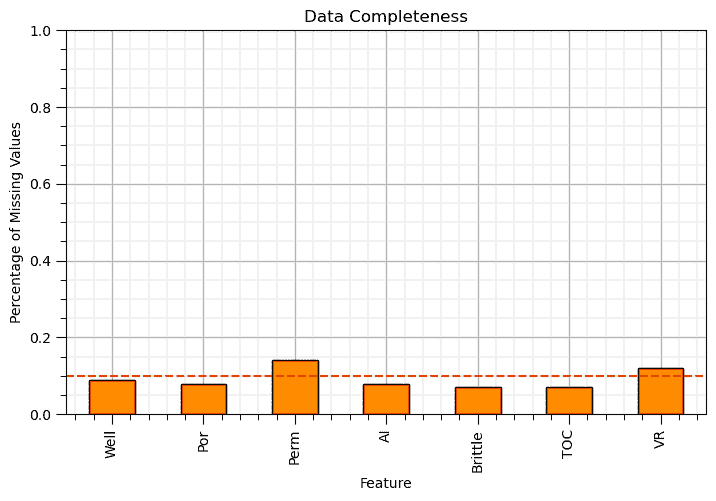
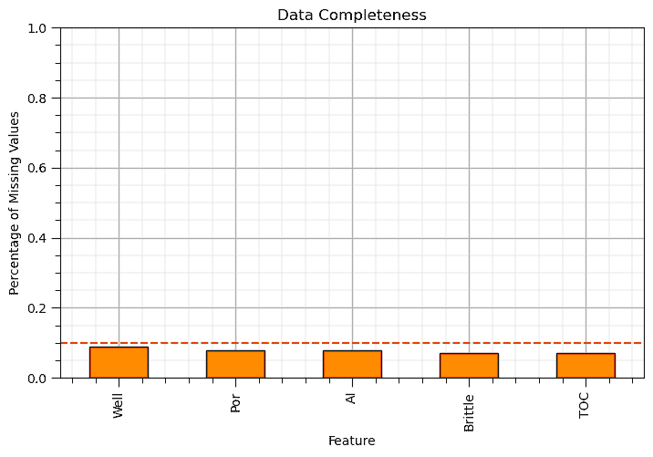
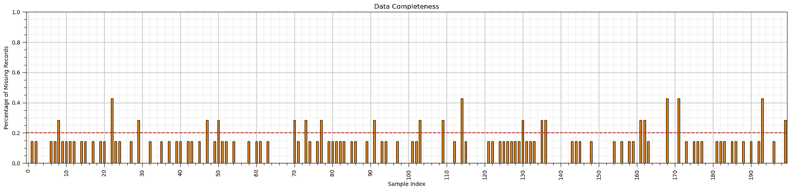
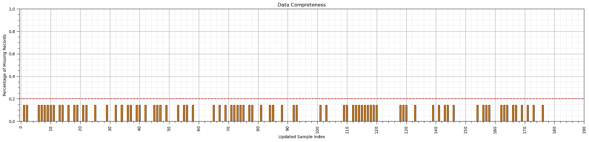
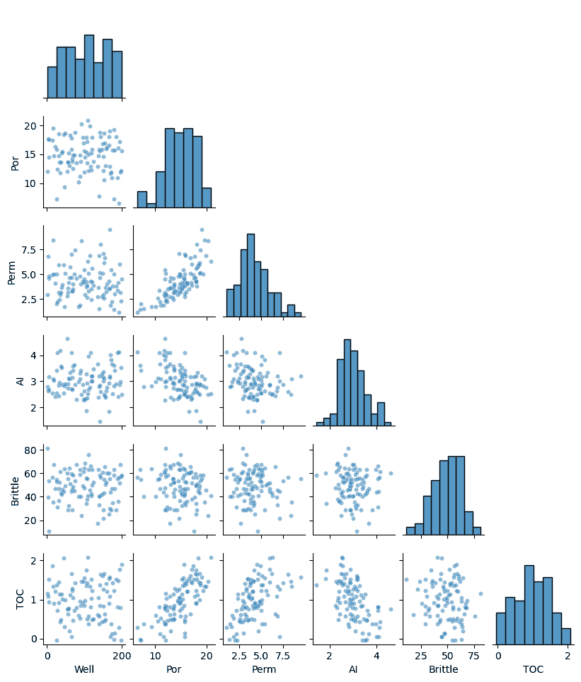
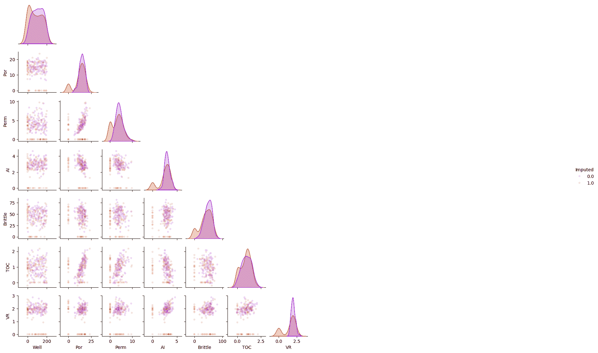
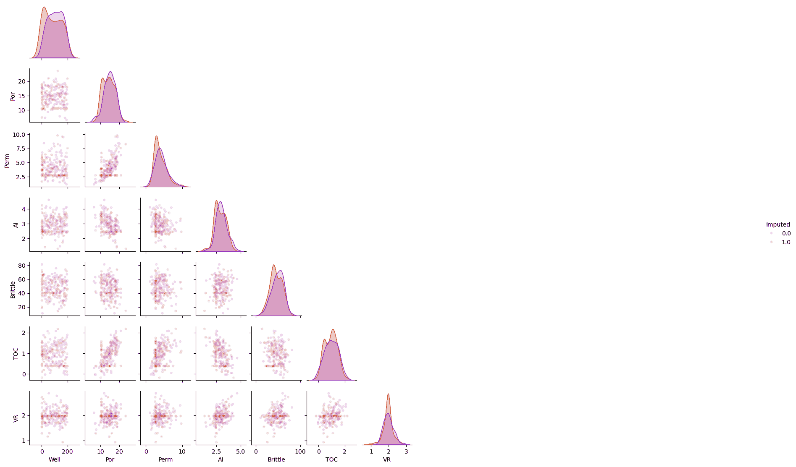
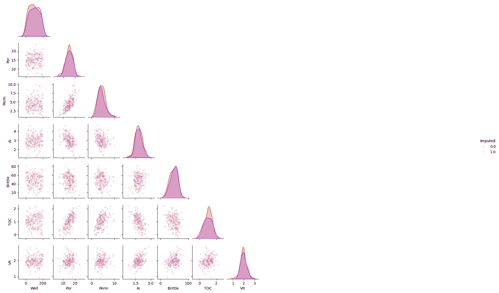
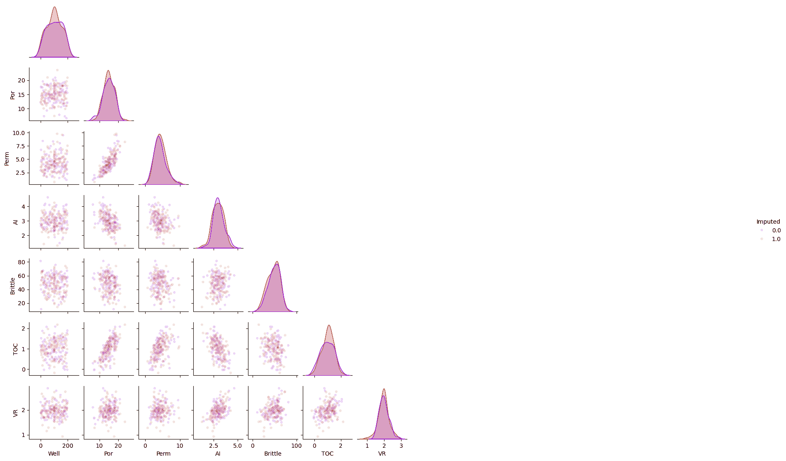

# 特征插补

> 原文：[`geostatsguy.github.io/MachineLearningDemos_Book/MachineLearning_feature_imputation.html`](https://geostatsguy.github.io/MachineLearningDemos_Book/MachineLearning_feature_imputation.html)

Michael J. Pyrcz，教授，德克萨斯大学奥斯汀分校

[Twitter](https://twitter.com/geostatsguy) | [GitHub](https://github.com/GeostatsGuy) | [网站](http://michaelpyrcz.com) | [Google Scholar](https://scholar.google.com/citations?user=QVZ20eQAAAAJ&hl=en&oi=ao) | [地统计学书籍](https://www.amazon.com/Geostatistical-Reservoir-Modeling-Michael-Pyrcz/dp/0199731446) | [YouTube](https://www.youtube.com/channel/UCLqEr-xV-ceHdXXXrTId5ig) | [Python 中应用地统计学电子书](https://geostatsguy.github.io/GeostatsPyDemos_Book/intro.html) | [Python 中应用机器学习电子书](https://geostatsguy.github.io/MachineLearningDemos_Book/) | [LinkedIn](https://www.linkedin.com/in/michael-pyrcz-61a648a1)

电子书“Python 中应用机器学习：带代码的手动指南”的章节。

请将此电子书引用如下：

Pyrcz, M.J., 2024, *Python 中应用机器学习：带代码的手动指南* [电子书]. Zenodo. doi:10.5281/zenodo.15169138 

本书中的工作流程以及更多内容在此处可用：

请将 MachineLearningDemos GitHub 仓库引用如下：

Pyrcz, M.J., 2024, *MachineLearningDemos: Python Machine Learning Demonstration Workflows Repository* (0.0.3) [软件]. Zenodo. DOI: 10.5281/zenodo.13835312\. GitHub 仓库：[GeostatsGuy/MachineLearningDemos](https://github.com/GeostatsGuy/MachineLearningDemos) 

作者：Michael J. Pyrcz

© 版权所有 2024.

本章是关于/演示**特征插补**的教程。

**YouTube 讲座**：查看我在以下主题上的讲座：

+   [机器学习简介](https://youtu.be/zOUM_AnI1DQ?si=wzWdJ35qJ9n8O6Bl)

+   [维度诅咒、降维、主成分分析](https://youtu.be/embks9p4pb8?si=B2HXm_i0oMSWkBhN)

+   [多维尺度分析和随机投影](https://youtu.be/Yt0o8ukIOKU?si=_ri1NPwKVdhYzgO3)

+   [特征变换](https://youtu.be/6QJjZoWknEI?si=p6vp811xWAmzWY3r)

+   [特征选择](https://youtu.be/5Q0gemu-h3Q?si=ATG-ue0i2qcc-IVx)

+   特征插补 - 将于近期记录

这些讲座都是我 YouTube 上的[机器学习课程](https://youtube.com/playlist?list=PLG19vXLQHvSC2ZKFIkgVpI9fCjkN38kwf&si=XonjO2wHdXffMpeI)的一部分，其中包含有良好文档记录的 Python 工作流程和交互式仪表板。我的目标是分享易于获取、可操作和可重复的教育内容。如果你想知道我的动机，请查看[迈克尔的故事](https://michaelpyrcz.com/my-story)。

## 特征插补的动机

大多数空间和地下数据集都不完整，数据库中存在缺失值。

+   许多数据分析机器学习工作流程需要完整数据，$𝑥_(1,𝑖),\dots,𝑥_(𝑚,𝑖)$ 对于每个数据样本 $𝑖 = 1,\ldots,𝑛$。

**推断机器学习** - 需要完整数据的方法，例如，

1.  主成分分析 - 需要协方差矩阵，而协方差需要所有特征值

1.  多维尺度分析 - 如果没有所有特征可用，我们无法计算相似性矩阵

1.  聚类分析 - 如果没有所有特征值，我们无法在特征空间中计算距离

**预测机器学习** - 总是需要所有特征来训练和测试模型，

$$ y = f(X_1,\ldots,X_m) $$

处理缺失数据是特征/数据工程的重要组成部分，是数据分析和机器学习的先决条件。

+   首先了解缺失数据的原因和影响是很重要的。

## 缺失特征值的原因

随机缺失（MAR）并不常见且难以评估，在这种情况下，

+   全局随机缺失可能不会导致数据偏差和结果模型的偏差

MAR 通常不是这种情况，因为缺失数据通常与一个混杂特征相关，例如，

+   **采样成本** - 例如，低渗透率测试耗时过长

+   **岩石流变学或其他样本存活率偏差** - 例如，无法恢复泥岩样本

+   **样本设计** - 为了减少不确定性并最大化盈利而不是统计代表性而进行采样，信息与生产双重目的的样本

+   **采样可及性** - 在地下存在一些难以或无法采样的位置，例如，湖泊或社区附近，或用于地震成像的盐下

## 缺失特征值的后果

这将导致缺失值在位置和特征空间上的聚类。

+   缺失这些特征值可能会偏置全局统计，并降低局部预测的准确性

+   使用全局分布来插补缺失值可能并不合理

不仅仅是减少训练和测试数据量，如果缺失数据不是完全随机的话，将会导致：

+   偏差的样本统计导致偏置的模型训练和测试

+   偏置的模型具有偏置的预测，可能没有任何偏置的指示！

如果你重新阅读上述内容寻找解决方案，我提供我的加拿大式，“对不起”。了解我们的人知道我们经常说对不起，并且对这个词有独特的发音。

我以上所说的都是作为一个警告，但是，

+   在某些情况下，由于我们的数据挑战，实践中存在一些差距，即数据稀少和非平稳性。

+   我可以花整个课程来教授解决这些挑战的方法

+   解决方案整合了整个地下，空间项目团队，即领域专业知识至关重要

+   我将这个层次停留在意识层面

我们必须超越常用的类似删除，即删除所有具有任何缺失特征的样本。

## 加载所需的库

以下代码加载所需的库。

+   这些应该已经与 Anaconda 3 一起安装。

```py
ignore_warnings = True                                        # ignore warnings?
import numpy as np                                            # ndarrays for gridded data
import pandas as pd                                           # DataFrames for tabular data
from sklearn.impute import SimpleImputer                      # basic imputation method
from sklearn.impute import KNNImputer                         # k-nearest neighbour imputation method
from sklearn.experimental import enable_iterative_imputer     # required for MICE imputation
from sklearn.impute import IterativeImputer                   # MICE imputation
import os                                                     # set working directory, run executables
import math                                                   # basic math operations
import random                                                 # for random numbers
import matplotlib.pyplot as plt                               # for plotting
from matplotlib.ticker import (MultipleLocator, AutoMinorLocator) # control of axes ticks
from matplotlib.colors import ListedColormap                  # custom color maps
import matplotlib.ticker as mtick                             # control tick label formatting
import seaborn as sns                                         # for matrix scatter plots
from scipy import stats                                       # summary statistics
import numpy.linalg as linalg                                 # for linear algebra
import scipy.spatial as sp                                    # for fast nearest neighbor search
import scipy.signal as signal                                 # kernel for moving window calculation
from numba import jit                                         # for numerical speed up
from statsmodels.stats.weightstats import DescrStatsW
plt.rc('axes', axisbelow=True)                                # plot all grids below the plot elements
if ignore_warnings == True:                                   
    import warnings
    warnings.filterwarnings('ignore')
cmap = plt.cm.inferno                                         # color map
seed = 73071                                                  # random seed
np.random.seed(seed=seed) 
```

## 声明函数

这里是一个辅助绘图的函数：

+   **add_grid** - 用于添加主网格线和副网格线的便利函数，以提高绘图的可解释性

这里是函数：

```py
def add_grid():                                               # add major and minor gridlines
    plt.gca().grid(True, which='major',linewidth = 1.0); plt.gca().grid(True, which='minor',linewidth = 0.2) # add y grids
    plt.gca().tick_params(which='major',length=7); plt.gca().tick_params(which='minor', length=4)
    plt.gca().xaxis.set_minor_locator(AutoMinorLocator()); plt.gca().yaxis.set_minor_locator(AutoMinorLocator()) # turn on minor ticks 
```

## 设置工作目录

我总是喜欢这样做，这样我就不会丢失文件，并且可以简化后续的读取和写入（避免每次都包含完整地址）。

```py
#os.chdir("c:/PGE383")                                        # set the working directory 
```

您必须更新引号内的部分以包含您自己的工作目录，并且格式在 Mac 上不同（例如：“~/PGE”）。

## 加载表格数据

这里是加载我们逗号分隔的数据文件到 Pandas DataFrame 对象的命令。

### 数据集 0，非常规多元变量 v4

让我们加载提供的非常规多元数据集 [unconv_MV.csv](https://github.com/GeostatsGuy/GeoDataSets/blob/master/unconv_MV_v4.csv)。此数据集包含来自 1,000 个非常规井的变量，包括：

+   井平均孔隙率

+   渗透率的对数变换（以线性化与其他变量的关系）

+   声阻抗 (kg/m³ x m/s x 10⁶)

+   剪切比 (%)

+   总有机碳 (%) 

+   玻璃光泽度 (%)

+   初始生产 90 天平均 (MCFPD)。

### 数据集 1，十二个，12

让我们加载提供的非常规多元，2D 空间数据集 [12_sample_data.csv](https://github.com/GeostatsGuy/GeoDataSets/blob/master/12_sample_data.csv)。此数据集包含来自 480 个非常规井的变量，包括：

+   X (m), Y (m) 位置坐标

+   孔隙率 (%) 单位转换后

+   渗透率 (mD)

+   声阻抗 (kg/m³ x m/s x 10⁶)

### 数据集 2，储层 21

让我们加载提供的非常规多元，3D 空间数据集 [res21_wells.csv](https://github.com/GeostatsGuy/GeoDataSets/blob/master/res21_wells.csv)。此数据集包含来自 73 个垂直井的变量，覆盖 10,000m x 10,000m x 50 m 的储层单元：

+   井 (ID)

+   X (m), Y (m), 深度 (m) 位置坐标

+   孔隙率 (%) 单位转换后

+   渗透率 (mD)

+   声阻抗 (kg/m2s*10⁶) 单位转换后

+   相 (分类) - 从页岩、沙质页岩、页岩砂到砂岩的顺序。

+   密度 (g/cm³)

+   可压缩速度 (m/s)

+   杨氏模量 (GPa)

+   剪切速度 (m/s)

+   剪切模量 (GPa)

我们使用 pandas 的 ‘read_csv’ 函数将表格数据加载到名为 ‘my_data’ 的 DataFrame 中，然后预览它以确保正确加载。

+   我们还用数据范围和标签填充列表，以便于绘图

```py
idata = 0

if idata == 0:
    df = pd.read_csv('https://raw.githubusercontent.com/GeostatsGuy/GeoDataSets/master/unconv_MV_v4.csv') # load data from Dr. Pyrcz's GitHub repository 
    df.drop('Prod',axis=1,inplace=True)

    features = df.columns.values.tolist()                          # store the names of the features

    xmin = [6.0,0.0,1.0,10.0,0.0,0.9]; xmax = [24.0,10.0,5.0,85.0,2.2,2.9] # set the minimum and maximum values for plotting

    flabel = ['Porosity (%)','Permeability (mD)','Acoustic Impedance (kg/m2s*10⁶)','Brittleness Ratio (%)', # set the names for plotting
             'Total Organic Carbon (%)','Vitrinite Reflectance (%)']

    ftitle = ['Porosity','Permeability','Acoustic Impedance','Brittleness Ratio', # set the units for plotting
             'Total Organic Carbon','Vitrinite Reflectance']

elif idata == 1:
    names = {'Porosity':'Por'}

    df = pd.read_csv('https://raw.githubusercontent.com/GeostatsGuy/GeoDataSets/master/12_sample_data.csv') # load data from Dr. Pyrcz's GitHub repository 
    df = df.rename(columns=names)
    df['Por'] = df['Por'] * 100.0; df['AI'] = df['AI'] / 1000.0; 
    df.drop('Unnamed: 0',axis=1,inplace=True) 

    features = df.columns.values.tolist()                          # store the names of the features

    xmin = [0.0,0.0,0.0,4.0,0.0,6.5,1.4,1600.0,10.0,1300.0,1.6]; xmax = [10000.0,10000.0,1.0,19.0,500.0,8.3,3.6,6200.0,50.0,2000.0,12.0] # set the minimum and maximum values for plotting

    flabel = ['Well (ID)','X (m)','Y (m)','Depth (m)','Porosity (fraction)','Permeability (mD)','Acoustic Impedance (kg/m2s*10⁶)','Facies (categorical)',
              'Density (g/cm³)','Compressible velocity (m/s)','Youngs modulus (GPa)', 'Shear velocity (m/s)', 'Shear modulus (GPa)'] # set the names for plotting

    ftitle = ['Well','X','Y','Depth','Porosity','Permeability','Acoustic Impedance','Facies',
              'Density','Compressible velocity','Youngs modulus', 'Shear velocity', 'Shear modulus']

elif idata == 2:  
    df = pd.read_csv('https://raw.githubusercontent.com/GeostatsGuy/GeoDataSets/master/res21_2D_wells.csv') # load data from Dr. Pyrcz's GitHub repository 

    features = df.columns.values.tolist()                          # store the names of the features

    xmin = [1,0.0,0.0,4.0,0.0,6.5,1.4,1600.0,10.0,1300.0,1.6]; xmax = [73,10000.0,10000.0,19.0,500.0,8.3,3.6,6200.0,50.0,2000.0,12.0] # set the minimum and maximum values for plotting

    flabel = ['Well (ID)','X (m)','Y (m)','Depth (m)','Porosity (fraction)','Permeability (mD)','Acoustic Impedance (kg/m2s*10⁶)','Facies (categorical)',
              'Density (g/cm³)','Compressible velocity (m/s)','Youngs modulus (GPa)', 'Shear velocity (m/s)', 'Shear modulus (GPa)'] # set the names for plotting

    ftitle = ['Well','X','Y','Depth','Porosity','Permeability','Acoustic Impedance','Facies',
              'Density','Compressible velocity','Youngs modulus', 'Shear velocity', 'Shear modulus'] 
```

+   我们还可以为绘图建立特征范围。我们可以使用如下代码直接从数据中计算特征范围：

```py
Pormin = np.min(df['Por'].values)                             # extract ndarray of data table column
Pormax = np.max(df['Por'].values)                             # and calculate min and max 
```

但是，这不会导致易于理解的色条和轴刻度，让我们选择方便的整数。我们还将声明特征标签以方便绘图。

## 可视化 DataFrame

可视化 DataFrame 是对数据的初步检查。

+   许多事情可能会出错，例如，我们加载了错误的数据，所有特征都没有加载，等等。

我们可以通过使用‘head’DataFrame 成员函数来预览（格式整洁，见下文）。

+   添加参数‘n=13’以查看数据集的前 13 行。

```py
df.head(n=13)                                                 # DataFrame preview 
```

|  | Well | Por | Perm | AI | Brittle | TOC | VR |
| --- | --- | --- | --- | --- | --- | --- | --- |
| 0 | 1 | 12.08 | 2.92 | 2.80 | 81.40 | 1.16 | 2.31 |
| 1 | 2 | 12.38 | 3.53 | 3.22 | 46.17 | 0.89 | 1.88 |
| 2 | 3 | 14.02 | 2.59 | 4.01 | 72.80 | 0.89 | 2.72 |
| 3 | 4 | 17.67 | 6.75 | 2.63 | 39.81 | 1.08 | 1.88 |
| 4 | 5 | 17.52 | 4.57 | 3.18 | 10.94 | 1.51 | 1.90 |
| 5 | 6 | 14.53 | 4.81 | 2.69 | 53.60 | 0.94 | 1.67 |
| 6 | 7 | 13.49 | 3.60 | 2.93 | 63.71 | 0.80 | 1.85 |
| 7 | 8 | 11.58 | 3.03 | 3.25 | 53.00 | 0.69 | 1.93 |
| 8 | 9 | 12.52 | 2.72 | 2.43 | 65.77 | 0.95 | 1.98 |
| 9 | 10 | 13.25 | 3.94 | 3.71 | 66.20 | 1.14 | 2.65 |
| 10 | 11 | 15.04 | 4.39 | 2.22 | 61.11 | 1.08 | 1.77 |
| 11 | 12 | 16.19 | 6.30 | 2.29 | 49.10 | 1.53 | 1.86 |
| 12 | 13 | 16.82 | 5.42 | 2.80 | 66.65 | 1.17 | 1.98 |

注意，第一个数据集 idata = 0，没有缺失数据，如果你选择了它，让我们为了下面的演示删除一些数据。

## 删除一些数据

让我们选择一定比例的 NaN 值，要设置为缺失的值，

```py
proportion_NaN = 0.1 
```

然后，我们可以创建一个布尔数组

1.  创建一个与 DataFrame 形状相同（行数和列数）的 ndarray，值为均匀分布在[0,1]之间的值

```py
np.random.random(df.shape) 
```

1.  检查小于已识别比例的条件，以创建相同大小的布尔 ndarray，如果小于比例则为 true。结果将是正确的随机 true 值的比例（在误差范围内）。

```py
remove = np.random.random(df.shape) < proportion_NaN 
```

1.  将掩码应用于 DataFrame 中已识别的值，以从 DataFrame 中删除

```py
df_mask = df.mask(remove) 
```

完全披露，为了这个演示，我们的数据是随机缺失的，MAR，这简化了我们的任务。

+   这使我们能够专注于特征插补的机制，而不需要额外的领域专业知识主题。这是一个很好的第一步！

```py
if idata == 0 or idata == 1:
    proportion_NaN = 0.1                                          # proportion of values in DataFrame to remove
    np.random.seed(seed=seed)                                     # ensure repeatability
    remove = np.random.random(df.shape) < proportion_NaN          # make the boolean array for removal
    if idata == 1:
        remove[:,df.columns.get_loc('Facies')] = False            # avoid categoical imputation at this time 
    print('Fraction of removed values in mask ndarray = ' + str(round(remove.sum()/remove.size,3)) + '.')

    df_mask = df.mask(remove)
else:
    df_mask = df.copy(deep = True)

print('Fraction of nan values in the DataFrame = ' + str(round(df_mask.isnull().sum().sum()/(df_mask.shape[0]*df_mask.shape[1]),3)) + '.') 
```

```py
Fraction of removed values in mask ndarray = 0.093.
Fraction of nan values in the DataFrame = 0.093. 
```

我们现在有一个新的包含一些缺失数据的 DataFrame。

+   让我们进行一个.head()预览来观察数据集中散布的 NaN 值

```py
df_mask.head(n=13)                                            # DataFrame preview 
```

|  | Well | Por | Perm | AI | Brittle | TOC | VR |
| --- | --- | --- | --- | --- | --- | --- | --- |
| 0 | 1.0 | 12.08 | 2.92 | 2.80 | 81.40 | 1.16 | 2.31 |
| 1 | 2.0 | 12.38 | 3.53 | NaN | 46.17 | 0.89 | 1.88 |
| 2 | NaN | 14.02 | 2.59 | 4.01 | 72.80 | 0.89 | 2.72 |
| 3 | 4.0 | 17.67 | 6.75 | 2.63 | 39.81 | 1.08 | 1.88 |
| 4 | 5.0 | 17.52 | 4.57 | 3.18 | 10.94 | 1.51 | 1.90 |
| 5 | 6.0 | 14.53 | 4.81 | 2.69 | 53.60 | 0.94 | 1.67 |
| 6 | 7.0 | 13.49 | 3.60 | NaN | 63.71 | 0.80 | 1.85 |
| 7 | 8.0 | 11.58 | 3.03 | NaN | 53.00 | 0.69 | 1.93 |
| 8 | 9.0 | NaN | 2.72 | NaN | 65.77 | 0.95 | 1.98 |
| 9 | 10.0 | NaN | 3.94 | 3.71 | 66.20 | 1.14 | 2.65 |
| 10 | 11.0 | 15.04 | 4.39 | 2.22 | NaN | 1.08 | 1.77 |
| 11 | NaN | 16.19 | 6.30 | 2.29 | 49.10 | 1.53 | 1.86 |
| 12 | 13.0 | NaN | 5.42 | 2.80 | 66.65 | 1.17 | 1.98 |

## 数据覆盖率的评估

让我们计算缺失数据的数量。

```py
df_mask.describe().transpose()                                # DataFrame summary statistics 
```

|  | count | mean | std | min | 25% | 50% | 75% | max |
| --- | --- | --- | --- | --- | --- | --- | --- | --- |
| Well | 182.0 | 102.653846 | 58.078019 | 1.00 | 53.2500 | 104.000 | 153.7500 | 200.00 |
| Por | 184.0 | 14.935978 | 3.002142 | 6.55 | 12.8900 | 15.055 | 17.4225 | 23.55 |
| Perm | 172.0 | 4.319419 | 1.684672 | 1.13 | 3.1300 | 4.010 | 5.1850 | 9.78 |
| AI | 184.0 | 2.991630 | 0.571569 | 1.28 | 2.5675 | 2.975 | 3.3950 | 4.63 |
| Brittle | 186.0 | 47.793817 | 13.781815 | 10.94 | 37.7450 | 48.830 | 58.0150 | 81.40 |
| TOC | 186.0 | 0.991882 | 0.481896 | -0.19 | 0.6225 | 1.020 | 1.3500 | 2.18 |
| VR | 176.0 | 1.969602 | 0.293877 | 0.93 | 1.7775 | 1.970 | 2.1100 | 2.87 |

我们可以看到每个特征的可用值计数，由于缺失值而少于样本总数。

让我们绘制一个图来表示每个特征的数据完整性

+   这是一个有用的总结

```py
plt.subplot(111)                                              # data completeness plot
(df_mask.isnull().sum()/len(df)).plot(kind = 'bar',color='darkorange',edgecolor='black') 
plt.xlabel('Feature'); plt.ylabel('Percentage of Missing Values'); plt.title('Data Completeness'); plt.ylim([0.0,1.0])
plt.plot([-0.5,df.shape[1]+0.5],[0.1,0.1],color='red',ls='--')
plt.subplots_adjust(left=0.0, bottom=0.0, right=1.0, top=0.8, wspace=0.2, hspace=0.2); add_grid(); plt.show() 
```



这导致了第一种数据补值方法，特征选择。

## 补值方法 #1 - 特征选择

在特征选择中应考虑数据完整性。

+   如果某个特征的数据完整性低、缺失样本比例高，那么该特征可能被移除。

一种方法是使用 .drop() DataFrame 函数。

```py
df_test = df_mask.drop('VR',axis = 1) 
```

我们使用 axis = 1 删除一个特征（如上所述）以移除超过 10% 特征值缺失的特征。

```py
if idata == 0:
    drop_features = ['Perm','VR']
elif idata == 1:
    drop_features = []
elif idata == 2:
    drop_features = ['Youngs','Shear']

df_test = df_mask.drop(drop_features,axis = 1)

plt.subplot(111)
(df_test.isnull().sum()/len(df)).plot(kind = 'bar',color='darkorange',edgecolor='black')                # calculate DataFrame with percentage missing by feature
plt.xlabel('Feature'); plt.ylabel('Percentage of Missing Values'); plt.title('Data Completeness'); plt.ylim([0.0,1.0])
plt.plot([-0.5,df.shape[1]+0.5],[0.1,0.1],color='red',ls='--')
plt.subplots_adjust(left=0.0, bottom=0.0, right=1.0, top=0.8, wspace=0.2, hspace=0.2); add_grid(); plt.show() 
```



## 补值方法 #2 - 样本选择

可能存在更多缺失特征值的样本。

+   指定版本的数据，例如，旧数据，或经历数据收集问题的样本位置

让我们检查 DataFrame 中的样本覆盖率。

+   我们在 sum 命令中使用 axis=1 参数来对 DataFrame 的行（样本）上的 NaN 值求和。

```py
(df_mask.isnull().sum(axis=1)/len(df.columns)).plot(kind = 'bar',color='darkorange',edgecolor='black')
plt.subplots_adjust(left=0.0, bottom=0.0, right=3.2, top=1.2, wspace=0.2, hspace=0.2) # plot formatting
plt.xlabel('Sample Index'); plt.ylabel('Percentage of Missing Records'); plt.title('Data Completeness')
plt.xticks(np.arange(0,len(df_mask),10),np.arange(0,len(df_mask),10))
plt.ylim([0,1.0])
plt.plot([-0.5,len(df)+0.5],[0.2,0.2],color='red',ls='--')
plt.subplots_adjust(left=0.0, bottom=0.0, right=3.0, top=0.8, wspace=0.2, hspace=0.2); add_grid(); plt.show() 
```



如果我们识别出数据完整性低、缺失样本比例高的样本，那么该样本可能被移除。

再次使用 .drop() DataFrame 函数。

```py
df_test = df_mask.drop('Water',axis = 1) 
```

这次我们使用 axis = 0 来删除样本列表，如下所示。

1.  我们需要制作一个包含太多缺失样本的样本索引列表

```py
(df_mask.isnull().sum(axis=1)/len(df.columns)) > max_proportion_missing_by_sample 
```

1.  这是一个元组类型，让我们将其转换为 ndarray，然后确保将其转换为仅包含 1D 值

```py
index_low_coverage_samples = np.asarray(np.where(low_coverage_samples == True))[0] 
```

1.  现在，我们准备应用长度为样本数量的布尔数组，对于太多缺失值的样本使用 True 来通过索引移除这些样本。

```py
df_test2 = df_mask.drop(index = index_low_coverage_samples,axis = 0) 
```

```py
max_proportion_missing_by_sample = 0.2

low_coverage_samples = (df_mask.isnull().sum(axis=1)/len(df.columns)) > max_proportion_missing_by_sample 
index_low_coverage_samples = np.asarray(np.where(low_coverage_samples == True))[0]

df_test2 = df_mask.drop(index = index_low_coverage_samples,axis = 0)

(df_test2.isnull().sum(axis=1)/len(df_test2.columns)).plot(kind = 'bar',color='darkorange',edgecolor='black')
plt.subplots_adjust(left=0.0, bottom=0.0, right=3.2, top=1.2, wspace=0.2, hspace=0.2) # plot formatting
plt.xlabel('Updated Sample Index'); plt.ylabel('Percentage of Missing Records'); plt.title('Data Completeness')
plt.xticks(np.arange(0,len(df_mask),10),np.arange(0,len(df_mask),10))
plt.ylim([0,1.0])
plt.plot([-0.5,len(df)+0.5],[0.2,0.2],color='red',ls='--')
plt.subplots_adjust(left=0.0, bottom=0.0, right=3.0, top=0.8, wspace=0.2, hspace=0.2); add_grid(); plt.show() 
```



## 补值方法 #3 - 列删除

这是移除所有具有任何缺失特征值的样本的方法。

+   这种方法确保了数据的完整性，同时在技术上避免了补值的需求

+   不需要填值模型决策

+   通常会删除重要信息

+   如果信息不是随机缺失（MAR），则最大化数据偏差

我们必须考虑数据完整性，每个特征的覆盖范围，如上图所示。考虑以下情况，

+   一个特征中的缺失记录可能与另一个特征中的缺失特征不同

+   所有特征中缺失值的并集，可能会导致比特征中最大比例的缺失丢失更多

此外，如果缺失不是随机的（MNAR），则样本偏差最大化

+   虽然同样经常应用删除，但不建议这样做。

我们可以使用 dropna() 函数。

+   使用 subset 我们只能考虑特征列表

+   how 可以设置为 'any' 以在存在任何缺失值时删除，或者设置为 'all' 以在所有值都缺失时删除

+   inplace true 将覆盖 DataFrame 而没有输出，而 false 将将新的 DataFrame 作为副本传递

```py
df_listwise = df_mask.dropna(how='any',inplace=False)

sns.pairplot(df_listwise.iloc[:,:-1], plot_kws={'alpha':0.5,'s':20},corner=True)
plt.subplots_adjust(left=0.0, bottom=0.0, right=0.5, top=0.6, wspace=0.1, hspace=0.2)
# df_likewise.head(n = 13) 
```



## 填值建模方法

这些是将特征填值视为预测问题的方法，即使用其他可用数据预测缺失特征值，例如，

+   相邻的其他可用特征值

+   在其他样本位置可用的相同特征值

有许多预测方法用于特征填值，

+   我们从最简单的预测模型开始，使用全局均值进行预测，然后从那里开始使用更复杂的模型

为了帮助我们可视化结果，让我们添加一个特征，表示特定样本是否有任何缺失的特征值

+   这样我们就可以为已经进行特征填值的样本进行标记，以便对特征填值结果进行评估和可视化

```py
df_mask['Imputed'] = (df_mask.isnull().sum(axis=1)) > 0
df_mask.head() 
```

|  | Well | Por | Perm | AI | Brittle | TOC | VR | Imputed |
| --- | --- | --- | --- | --- | --- | --- | --- | --- |
| 0 | 1.0 | 12.08 | 2.92 | 2.80 | 81.40 | 1.16 | 2.31 | False |
| 1 | 2.0 | 12.38 | 3.53 | NaN | 46.17 | 0.89 | 1.88 | True |
| 2 | NaN | 14.02 | 2.59 | 4.01 | 72.80 | 0.89 | 2.72 | True |
| 3 | 4.0 | 17.67 | 6.75 | 2.63 | 39.81 | 1.08 | 1.88 | False |
| 4 | 5.0 | 17.52 | 4.57 | 3.18 | 10.94 | 1.51 | 1.90 | False |

## 填值方法 #4 - 用常数替换

这是用常数值替换缺失值的方法。

+   这里是一个用非常低的值替换缺失特征值的示例

这会导致偏差，不应这样做。

```py
df_constant = df_mask.copy(deep=True)                         # make a deep copy of the DataFrame
constant_imputer = SimpleImputer(strategy='constant',fill_value = 0.01)
df_constant.iloc[:,:] = constant_imputer.fit_transform(df_constant)

sns.pairplot(df_constant.iloc[:,:], hue="Imputed", plot_kws={'alpha':0.15,'s':20}, palette = 'gnuplot', corner=True)
plt.subplots_adjust(left=0.0, bottom=0.0, right=0.5, top=0.6, wspace=0.1, hspace=0.2)
df_constant.head(n=5) 
```

|  | Well | Por | Perm | AI | Brittle | TOC | VR | Imputed |
| --- | --- | --- | --- | --- | --- | --- | --- | --- |
| 0 | 1.00 | 12.08 | 2.92 | 2.80 | 81.40 | 1.16 | 2.31 | 0.0 |
| 1 | 2.00 | 12.38 | 3.53 | 0.01 | 46.17 | 0.89 | 1.88 | 1.0 |
| 2 | 0.01 | 14.02 | 2.59 | 4.01 | 72.80 | 0.89 | 2.72 | 1.0 |
| 3 | 4.00 | 17.67 | 6.75 | 2.63 | 39.81 | 1.08 | 1.88 | 0.0 |
| 4 | 5.00 | 17.52 | 4.57 | 3.18 | 10.94 | 1.51 | 1.90 | 0.0 |



## Imputation Method #6 - Replace with the Mean

这是将缺失值替换为特征的平均值，即算术平均值的方法。

$$ 𝑥_𝑖 = 𝐸\{𝑋_𝑖\} $$

+   全局均值全局无偏，但可能导致局部偏差，即低值被高估，高值被低估

```py
df_mean = df_mask.copy(deep=True)                         # make a deep copy of the DataFrame
mean_imputer = SimpleImputer(strategy='mean')
df_mean.iloc[:,:] = mean_imputer.fit_transform(df_mean)

sns.pairplot(df_mean.iloc[:,:], hue="Imputed", plot_kws={'alpha':0.15,'s':20}, palette = 'gnuplot', corner=True)
plt.subplots_adjust(left=0.0, bottom=0.0, right=0.5, top=0.6, wspace=0.1, hspace=0.2)
df_constant.head(n=5)
df_mean.head(n=5) 
```

|  | Well | Por | Perm | AI | Brittle | TOC | VR | Imputed |
| --- | --- | --- | --- | --- | --- | --- | --- | --- |
| 0 | 1.000000 | 12.08 | 2.92 | 2.80000 | 81.40 | 1.16 | 2.31 | 0.0 |
| 1 | 2.000000 | 12.38 | 3.53 | 2.99163 | 46.17 | 0.89 | 1.88 | 1.0 |
| 2 | 102.653846 | 14.02 | 2.59 | 4.01000 | 72.80 | 0.89 | 2.72 | 1.0 |
| 3 | 4.000000 | 17.67 | 6.75 | 2.63000 | 39.81 | 1.08 | 1.88 | 0.0 |
| 4 | 5.000000 | 17.52 | 4.57 | 3.18000 | 10.94 | 1.51 | 1.90 | 0.0 |


## Imputation Method #6 - Replace with the Mode

这是将缺失值替换为特征中最频繁值，即众数的方法。

+   在存在异常值的情况下，平均值可能不可靠。我的建议是在特征插补之前首先处理异常值

```py
df_mode = df_mask.copy(deep=True)                         # make a deep copy of the DataFrame
mode_imputer = SimpleImputer(strategy='most_frequent')
df_mode.iloc[:,:] = mode_imputer.fit_transform(df_mode)

sns.pairplot(df_mode.iloc[:,:], hue="Imputed", plot_kws={'alpha':0.15,'s':20}, palette = 'gnuplot', corner=True)
plt.subplots_adjust(left=0.0, bottom=0.0, right=0.5, top=0.6, wspace=0.1, hspace=0.2)
df_constant.head(n=5)
df_mode.head(n=5) 
```

|  | Well | Por | Perm | AI | Brittle | TOC | VR | Imputed |
| --- | --- | --- | --- | --- | --- | --- | --- | --- |
| 0 | 1.0 | 12.08 | 2.92 | 2.80 | 81.40 | 1.16 | 2.31 | 0.0 |
| 1 | 2.0 | 12.38 | 3.53 | 2.45 | 46.17 | 0.89 | 1.88 | 1.0 |
| 2 | 1.0 | 14.02 | 2.59 | 4.01 | 72.80 | 0.89 | 2.72 | 1.0 |
| 3 | 4.0 | 17.67 | 6.75 | 2.63 | 39.81 | 1.08 | 1.88 | 0.0 |
| 4 | 5.0 | 17.52 | 4.57 | 3.18 | 10.94 | 1.51 | 1.90 | 0.0 |



## Imputation Method #7 - Replace with the n-nearest Neighbor estimation

这是将缺失值替换为基于其他可用同位特征值的 k-最近邻预测模型的方法。

+   在本电子书的 k-最近邻章节中查看方法的解释、假设和超参数

+   可用数据应用于预测特征空间中的缺失值

由于 k-最近邻方法是一种懒惰学习器，插补值是在对缺失值进行单次遍历时计算的

+   没有单独的培训和预测步骤

此方法应具有全局无偏性，并将相对于全局均值特征插补减少局部偏差

```py
df_knn = df_mask.copy(deep=True)                         # make a deep copy of the DataFrame
knn_imputer = KNNImputer(n_neighbors=2, weights="uniform")
df_knn.iloc[:,:] = knn_imputer.fit_transform(df_knn)

sns.pairplot(df_knn.iloc[:,:], hue="Imputed", plot_kws={'alpha':0.15,'s':20}, palette = 'gnuplot', corner=True)
plt.subplots_adjust(left=0.0, bottom=0.0, right=0.5, top=0.6, wspace=0.1, hspace=0.2)
df_constant.head(n=5)
df_mode.head(n=5) 
```

|  | Well | Por | Perm | AI | Brittle | TOC | VR | Imputed |
| --- | --- | --- | --- | --- | --- | --- | --- | --- |
| 0 | 1.0 | 12.08 | 2.92 | 2.80 | 81.40 | 1.16 | 2.31 | 0.0 |
| 1 | 2.0 | 12.38 | 3.53 | 2.45 | 46.17 | 0.89 | 1.88 | 1.0 |
| 2 | 1.0 | 14.02 | 2.59 | 4.01 | 72.80 | 0.89 | 2.72 | 1.0 |
| 3 | 4.0 | 17.67 | 6.75 | 2.63 | 39.81 | 1.08 | 1.88 | 0.0 |
| 4 | 5.0 | 17.52 | 4.57 | 3.18 | 10.94 | 1.51 | 1.90 | 0.0 |



## 填充方法 #8 - 通过链式方程的多重填充

这是用 k-最近邻预测模型替换缺失值的方法

1.  用 $𝐹_{𝑋_{𝑖=1,\ldots,𝑚}}(𝑋_{𝑖=1,\ldots,𝑚})$ 中的随机值替换缺失值

1.  对特征进行顺序预测，以预测其他缺失值

1.  迭代直到收敛标准，通常是多元统计

1.  对数据集的多个实现进行重复

默认预测器是 BayesianRidge()。

+   我们可以指定最大迭代次数。返回最后计算出的填充值。

```py
df_mice = df_mask.copy(deep=True)                         # make a deep copy of the DataFrame
mice_imputer = IterativeImputer()
df_mice.iloc[:,:] = mice_imputer.fit_transform(df_mice)

sns.pairplot(df_mice.iloc[:,:], hue="Imputed", plot_kws={'alpha':0.15,'s':20}, palette = 'gnuplot', corner=True)
plt.subplots_adjust(left=0.0, bottom=0.0, right=0.5, top=0.6, wspace=0.1, hspace=0.2)
df_constant.head(n=5)
df_mode.head(n=5) 
```

|  | Well | Por | Perm | AI | Brittle | TOC | VR | 填充 |
| --- | --- | --- | --- | --- | --- | --- | --- | --- |
| 0 | 1.0 | 12.08 | 2.92 | 2.80 | 81.40 | 1.16 | 2.31 | 0.0 |
| 1 | 2.0 | 12.38 | 3.53 | 2.45 | 46.17 | 0.89 | 1.88 | 1.0 |
| 2 | 1.0 | 14.02 | 2.59 | 4.01 | 72.80 | 0.89 | 2.72 | 1.0 |
| 3 | 4.0 | 17.67 | 6.75 | 2.63 | 39.81 | 1.08 | 1.88 | 0.0 |
| 4 | 5.0 | 17.52 | 4.57 | 3.18 | 10.94 | 1.51 | 1.90 | 0.0 |



## 保存填充的 DataFrame

输出输入的数据文件。

```py
save_imputed = False                                          # save the imputed DataFrame?

if save_imputed == True:
    df_imputed = df_knn.copy(deep = True)                     # select the imputation method

    df_imputed.drop('Imputed',axis=1,inplace=True) 
    file_name = r'dataframe_imputed.csv'

    df_imputed.to_csv(file_name, index=False) 
```

## 注释

这是对特征填充的基本处理。可以做和讨论的还有很多，我有很多更多的资源。查看我的[共享资源清单](https://michaelpyrcz.com/my-resources)以及本章开头带有资源链接的 YouTube 讲座链接。

希望这有所帮助，

*迈克尔*

## 关于作者


迈克尔·皮尔奇教授在德克萨斯大学奥斯汀分校 40 英亩校园的办公室。

迈克尔·皮尔奇是德克萨斯大学奥斯汀分校[科克雷尔工程学院](https://cockrell.utexas.edu/faculty-directory/alphabetical/p)和[杰克逊地球科学学院](https://www.jsg.utexas.edu/researcher/michael_pyrcz/)的教授，他在那里研究并教授地下、空间数据分析、地统计学和机器学习。迈克尔还是，

+   [能源分析](https://fri.cns.utexas.edu/energy-analytics)新生研究项目的负责人，德克萨斯大学奥斯汀分校自然科学院机器学习实验室的核心教员

+   [计算机与地球科学](https://www.sciencedirect.com/journal/computers-and-geosciences/about/editorial-board)的副编辑，以及国际数学地球科学协会[数学地球科学](https://link.springer.com/journal/11004/editorial-board)的董事会成员。

迈克尔已经撰写了 70 多篇[同行评审出版物](https://scholar.google.com/citations?user=QVZ20eQAAAAJ&hl=en)，一个用于空间数据分析的[Python 包](https://pypi.org/project/geostatspy/)，合著了一本关于空间数据分析的教科书[地统计学储层建模](https://www.amazon.com/Geostatistical-Reservoir-Modeling-Michael-Pyrcz/dp/0199731446)，并是两本最近发布的电子书的作者，[Python 中应用地统计学：GeostatsPy 实践指南](https://geostatsguy.github.io/GeostatsPyDemos_Book/intro.html)和[Python 中应用机器学习：代码实践指南](https://geostatsguy.github.io/MachineLearningDemos_Book/intro.html)。

迈克尔的所有大学讲座都可以在他的[YouTube 频道](https://www.youtube.com/@GeostatsGuyLectures)上找到，附有 100 多个 Python 交互式仪表板和 40 多个存储库中的详细工作流程链接，这些存储库位于他的[GitHub 账户](https://github.com/GeostatsGuy)，以支持任何感兴趣的学生和在职专业人士，提供常青内容。想了解更多关于迈克尔的工作和共享教育资源，请访问他的网站。

## 想一起工作吗？

我希望这些内容对那些想了解更多关于地下建模、数据分析和机器学习的人有所帮助。学生和在职专业人士欢迎参加。

+   想邀请我到贵公司进行培训、辅导、项目审查、工作流程设计和/或咨询吗？我很乐意拜访并与您合作！

+   感兴趣合作、支持我的研究生研究或我的地下数据分析与机器学习联盟（共同负责人是约翰·福斯特教授）吗？我的研究结合数据分析、随机建模和机器学习理论及实践，开发新颖的方法和工作流程以增加价值。我们正在解决具有挑战性的地下问题！

+   您可以通过 mpyrcz@austin.utexas.edu 联系我。

我总是很高兴讨论。

*迈克尔*

迈克尔·皮尔茨，博士，P.Eng. 教授，德克萨斯大学奥斯汀分校的科克雷尔工程学院和杰克逊地球科学学院

更多资源可在以下链接找到：[Twitter](https://twitter.com/geostatsguy) | [GitHub](https://github.com/GeostatsGuy) | [网站](http://michaelpyrcz.com) | [Google Scholar](https://scholar.google.com/citations?user=QVZ20eQAAAAJ&hl=en&oi=ao) | [地统计学书籍](https://www.amazon.com/Geostatistical-Reservoir-Modeling-Michael-Pyrcz/dp/0199731446) | [YouTube](https://www.youtube.com/channel/UCLqEr-xV-ceHdXXXrTId5ig) | [Python 中应用地统计学电子书](https://geostatsguy.github.io/GeostatsPyDemos_Book/intro.html) | [Python 中应用机器学习电子书](https://geostatsguy.github.io/MachineLearningDemos_Book/) | [LinkedIn](https://www.linkedin.com/in/michael-pyrcz-61a648a1)

## 特征插补的动机

大多数空间和地下数据集都不完整，数据库中存在缺失值。

+   许多数据分析和机器学习工作流程需要完整的数据，$𝑥_(1,𝑖),\dots,𝑥_(𝑚,𝑖)$ 对于每个数据样本 $𝑖 = 1,\ldots,𝑛$。

**推理机器学习** - 需要完整数据的方法，例如，

1.  主成分分析 - 需要协方差矩阵，而协方差需要所有特征值

1.  多维尺度分析 - 没有所有特征可用，我们无法计算相似性矩阵

1.  聚类分析 - 没有所有特征值，我们无法在特征空间中计算距离

**预测机器学习** - 总是需要所有特征来训练和测试模型，

$$ y = f(X_1,\ldots,X_m) $$

处理缺失数据是特征/数据工程的重要组成部分，是数据分析和机器学习的先决条件。

+   首先了解缺失数据的原因和影响是很重要的。

## 缺失特征值的原因

随机缺失（MAR）并不常见且难以评估，在这种情况下，

+   全球随机遗漏可能不会导致数据偏差和结果模型的偏差

随机缺失（MAR）通常不是这种情况，因为缺失数据通常与一个混杂特征相关，例如，

+   **采样成本** - 例如，低渗透率测试耗时过长

+   **岩石流变学或其他样本存活率偏差** - 例如，无法恢复泥岩样本

+   **样本设计** - 采样以减少不确定性并最大化盈利性，而不是统计代表性，信息与生产双重目的的样本

+   **采样可及性** - 地下空间中有一些地方难以或无法采样，例如，靠近湖泊或社区，或用于地震成像的底盐层

## 缺失特征值的后果

这将导致缺失值在位置和特征空间中的聚类。

+   缺失这些特征值可能会偏全球统计，并降低局部预测的准确性

+   使用全局分布来插补缺失值可能并不合理

不仅仅是减少训练和测试数据量，如果缺失数据不是完全随机的，将导致：

+   偏差的样本统计导致模型训练和测试偏差

+   偏差模型具有偏差预测，可能没有任何偏差指示！

如果你重新阅读上述内容寻找解决方案，我提供我的加拿大式“对不起”。了解我们的人知道我们经常说“对不起”，并且对这个词有独特的发音。

我以上所述仅为一个警示性的提醒，

+   在某些情况下，由于我们的数据挑战，例如数据稀缺和非平稳性，实践中存在差距。

+   我可以花整个课程的时间教授解决这些挑战的方法

+   解决方案整合了整个地下空间，空间项目团队，即领域专业知识至关重要

+   我将此留于意识层面

我们必须超越常用的类似删除，删除所有具有任何缺失特征的样本。

## 加载所需的库

以下代码加载所需的库。

+   这些应该已经与 Anaconda 3 一起安装。

```py
ignore_warnings = True                                        # ignore warnings?
import numpy as np                                            # ndarrays for gridded data
import pandas as pd                                           # DataFrames for tabular data
from sklearn.impute import SimpleImputer                      # basic imputation method
from sklearn.impute import KNNImputer                         # k-nearest neighbour imputation method
from sklearn.experimental import enable_iterative_imputer     # required for MICE imputation
from sklearn.impute import IterativeImputer                   # MICE imputation
import os                                                     # set working directory, run executables
import math                                                   # basic math operations
import random                                                 # for random numbers
import matplotlib.pyplot as plt                               # for plotting
from matplotlib.ticker import (MultipleLocator, AutoMinorLocator) # control of axes ticks
from matplotlib.colors import ListedColormap                  # custom color maps
import matplotlib.ticker as mtick                             # control tick label formatting
import seaborn as sns                                         # for matrix scatter plots
from scipy import stats                                       # summary statistics
import numpy.linalg as linalg                                 # for linear algebra
import scipy.spatial as sp                                    # for fast nearest neighbor search
import scipy.signal as signal                                 # kernel for moving window calculation
from numba import jit                                         # for numerical speed up
from statsmodels.stats.weightstats import DescrStatsW
plt.rc('axes', axisbelow=True)                                # plot all grids below the plot elements
if ignore_warnings == True:                                   
    import warnings
    warnings.filterwarnings('ignore')
cmap = plt.cm.inferno                                         # color map
seed = 73071                                                  # random seed
np.random.seed(seed=seed) 
```

## 声明函数

这里是一个辅助绘图的函数：

+   **add_grid** - 添加主网格线和副网格线的便利函数，以提高绘图的可解释性

这里是函数：

```py
def add_grid():                                               # add major and minor gridlines
    plt.gca().grid(True, which='major',linewidth = 1.0); plt.gca().grid(True, which='minor',linewidth = 0.2) # add y grids
    plt.gca().tick_params(which='major',length=7); plt.gca().tick_params(which='minor', length=4)
    plt.gca().xaxis.set_minor_locator(AutoMinorLocator()); plt.gca().yaxis.set_minor_locator(AutoMinorLocator()) # turn on minor ticks 
```

## 设置工作目录

我总是喜欢这样做，这样我就不会丢失文件，并且简化后续的读取和写入（避免每次都包含完整地址）。

```py
#os.chdir("c:/PGE383")                                        # set the working directory 
```

您将需要更新引号内的部分为您的自己的工作目录，并且格式在 Mac 上不同（例如：“~/PGE”）。

## 加载表格数据

这是将我们的逗号分隔数据文件加载到 Pandas DataFrame 对象的命令。

### 数据集 0，非常规多元 v4

让我们加载提供的多元数据集 [unconv_MV.csv](https://github.com/GeostatsGuy/GeoDataSets/blob/master/unconv_MV_v4.csv)。这个数据集包含来自 1,000 个非常规井的变量，包括：

+   井平均孔隙率

+   渗透率的对数变换（用于线性化与其他变量的关系）

+   声阻抗（kg/m³ x m/s x 10⁶）

+   岩脆性比（%）

+   总有机碳（%）

+   煤岩反射率（%）

+   初始产量 90 天平均（MCFPD）。

### 数据集 1，十二，12

让我们加载提供的多元、二维空间数据集 [12_sample_data.csv](https://github.com/GeostatsGuy/GeoDataSets/blob/master/12_sample_data.csv)。这个数据集包含来自 480 个非常规井的变量，包括：

+   X（m），Y（m）位置坐标

+   转换单位后的孔隙率（%）

+   渗透率（mD）

+   声阻抗（kg/m³ x m/s x 10⁶）

### 数据集 2，储层 21

让我们加载提供的多元、三维空间数据集 [res21_wells.csv](https://github.com/GeostatsGuy/GeoDataSets/blob/master/res21_wells.csv)。这个数据集包含来自 73 个垂直井在 10,000m x 10,000m x 50 m 储层单元的变量：

+   井（ID）

+   X（m），Y（m），深度（m）位置坐标

+   转换单位后的孔隙率（%）

+   渗透率（mD）

+   转换单位后的声阻抗（kg/m²s*10⁶）

+   岩性（分类）- 有序的，从页岩、沙质页岩、页岩质砂岩到砂岩。

+   密度（g/cm³）

+   可压缩波速（m/s）

+   杨氏模量（GPa）

+   剪切波速（m/s）

+   剪切模量（GPa）

我们使用 pandas 的‘read_csv’函数将表格数据加载到我们称为‘my_data’的 DataFrame 中，然后预览它以确保正确加载。

+   我们还用数据范围和标签填充列表，以便于绘图

```py
idata = 0

if idata == 0:
    df = pd.read_csv('https://raw.githubusercontent.com/GeostatsGuy/GeoDataSets/master/unconv_MV_v4.csv') # load data from Dr. Pyrcz's GitHub repository 
    df.drop('Prod',axis=1,inplace=True)

    features = df.columns.values.tolist()                          # store the names of the features

    xmin = [6.0,0.0,1.0,10.0,0.0,0.9]; xmax = [24.0,10.0,5.0,85.0,2.2,2.9] # set the minimum and maximum values for plotting

    flabel = ['Porosity (%)','Permeability (mD)','Acoustic Impedance (kg/m2s*10⁶)','Brittleness Ratio (%)', # set the names for plotting
             'Total Organic Carbon (%)','Vitrinite Reflectance (%)']

    ftitle = ['Porosity','Permeability','Acoustic Impedance','Brittleness Ratio', # set the units for plotting
             'Total Organic Carbon','Vitrinite Reflectance']

elif idata == 1:
    names = {'Porosity':'Por'}

    df = pd.read_csv('https://raw.githubusercontent.com/GeostatsGuy/GeoDataSets/master/12_sample_data.csv') # load data from Dr. Pyrcz's GitHub repository 
    df = df.rename(columns=names)
    df['Por'] = df['Por'] * 100.0; df['AI'] = df['AI'] / 1000.0; 
    df.drop('Unnamed: 0',axis=1,inplace=True) 

    features = df.columns.values.tolist()                          # store the names of the features

    xmin = [0.0,0.0,0.0,4.0,0.0,6.5,1.4,1600.0,10.0,1300.0,1.6]; xmax = [10000.0,10000.0,1.0,19.0,500.0,8.3,3.6,6200.0,50.0,2000.0,12.0] # set the minimum and maximum values for plotting

    flabel = ['Well (ID)','X (m)','Y (m)','Depth (m)','Porosity (fraction)','Permeability (mD)','Acoustic Impedance (kg/m2s*10⁶)','Facies (categorical)',
              'Density (g/cm³)','Compressible velocity (m/s)','Youngs modulus (GPa)', 'Shear velocity (m/s)', 'Shear modulus (GPa)'] # set the names for plotting

    ftitle = ['Well','X','Y','Depth','Porosity','Permeability','Acoustic Impedance','Facies',
              'Density','Compressible velocity','Youngs modulus', 'Shear velocity', 'Shear modulus']

elif idata == 2:  
    df = pd.read_csv('https://raw.githubusercontent.com/GeostatsGuy/GeoDataSets/master/res21_2D_wells.csv') # load data from Dr. Pyrcz's GitHub repository 

    features = df.columns.values.tolist()                          # store the names of the features

    xmin = [1,0.0,0.0,4.0,0.0,6.5,1.4,1600.0,10.0,1300.0,1.6]; xmax = [73,10000.0,10000.0,19.0,500.0,8.3,3.6,6200.0,50.0,2000.0,12.0] # set the minimum and maximum values for plotting

    flabel = ['Well (ID)','X (m)','Y (m)','Depth (m)','Porosity (fraction)','Permeability (mD)','Acoustic Impedance (kg/m2s*10⁶)','Facies (categorical)',
              'Density (g/cm³)','Compressible velocity (m/s)','Youngs modulus (GPa)', 'Shear velocity (m/s)', 'Shear modulus (GPa)'] # set the names for plotting

    ftitle = ['Well','X','Y','Depth','Porosity','Permeability','Acoustic Impedance','Facies',
              'Density','Compressible velocity','Youngs modulus', 'Shear velocity', 'Shear modulus'] 
```

+   我们还可以为绘图建立特征范围。我们可以使用如下代码直接从数据中计算特征范围：

```py
Pormin = np.min(df['Por'].values)                             # extract ndarray of data table column
Pormax = np.max(df['Por'].values)                             # and calculate min and max 
```

但是，这不会导致易于理解的色条和轴刻度，让我们选择方便的整数。我们还将声明特征标签以简化绘图。

### 数据集 0，非常规多元 v4

让我们加载提供的多元数据集 [unconv_MV.csv](https://github.com/GeostatsGuy/GeoDataSets/blob/master/unconv_MV_v4.csv)。这个数据集包含来自 1,000 个非常规井的变量，包括：

+   井平均孔隙率

+   渗透率的对数变换（以线性化与其他变量的关系）

+   声阻抗（kg/m³ x m/s x 10⁶）

+   剪切比（%）

+   总有机碳（%）

+   玻璃质反射率（%）

+   初始生产 90 天平均（MCFPD）。

### 数据集 1，十二，12

让我们加载提供的多元、2D 空间数据集 [12_sample_data.csv](https://github.com/GeostatsGuy/GeoDataSets/blob/master/12_sample_data.csv)。此数据集包含来自 480 口非常规井的变量，包括：

+   X (m), Y (m) 位置坐标

+   单位转换后的孔隙率（%）

+   渗透率（mD）

+   声阻抗（kg/m³ x m/s x 10⁶）

### 数据集 2，储层 21

让我们加载提供的多元、3D 空间数据集 [res21_wells.csv](https://github.com/GeostatsGuy/GeoDataSets/blob/master/res21_wells.csv)。此数据集包含来自 73 口垂直井的变量，覆盖 10,000m x 10,000m x 50 m 的储层单元：

+   井（ID）

+   X (m), Y (m), 深度（m）位置坐标

+   单位转换后的孔隙率（%）

+   渗透率（mD）

+   单位转换后的声阻抗（kg/m2s*10⁶）

+   地层（分类）- 从页岩、砂质页岩、页岩砂到砂岩的顺序。

+   密度（g/cm³）

+   可压缩速度（m/s）

+   杨氏模量（GPa）

+   剪切波速（m/s）

+   剪切模量（GPa）

我们使用 pandas 的‘read_csv’函数将表格数据加载到名为‘my_data’的 DataFrame 中，然后预览它以确保正确加载。

+   我们还用数据范围和标签填充列表，以便于绘图

```py
idata = 0

if idata == 0:
    df = pd.read_csv('https://raw.githubusercontent.com/GeostatsGuy/GeoDataSets/master/unconv_MV_v4.csv') # load data from Dr. Pyrcz's GitHub repository 
    df.drop('Prod',axis=1,inplace=True)

    features = df.columns.values.tolist()                          # store the names of the features

    xmin = [6.0,0.0,1.0,10.0,0.0,0.9]; xmax = [24.0,10.0,5.0,85.0,2.2,2.9] # set the minimum and maximum values for plotting

    flabel = ['Porosity (%)','Permeability (mD)','Acoustic Impedance (kg/m2s*10⁶)','Brittleness Ratio (%)', # set the names for plotting
             'Total Organic Carbon (%)','Vitrinite Reflectance (%)']

    ftitle = ['Porosity','Permeability','Acoustic Impedance','Brittleness Ratio', # set the units for plotting
             'Total Organic Carbon','Vitrinite Reflectance']

elif idata == 1:
    names = {'Porosity':'Por'}

    df = pd.read_csv('https://raw.githubusercontent.com/GeostatsGuy/GeoDataSets/master/12_sample_data.csv') # load data from Dr. Pyrcz's GitHub repository 
    df = df.rename(columns=names)
    df['Por'] = df['Por'] * 100.0; df['AI'] = df['AI'] / 1000.0; 
    df.drop('Unnamed: 0',axis=1,inplace=True) 

    features = df.columns.values.tolist()                          # store the names of the features

    xmin = [0.0,0.0,0.0,4.0,0.0,6.5,1.4,1600.0,10.0,1300.0,1.6]; xmax = [10000.0,10000.0,1.0,19.0,500.0,8.3,3.6,6200.0,50.0,2000.0,12.0] # set the minimum and maximum values for plotting

    flabel = ['Well (ID)','X (m)','Y (m)','Depth (m)','Porosity (fraction)','Permeability (mD)','Acoustic Impedance (kg/m2s*10⁶)','Facies (categorical)',
              'Density (g/cm³)','Compressible velocity (m/s)','Youngs modulus (GPa)', 'Shear velocity (m/s)', 'Shear modulus (GPa)'] # set the names for plotting

    ftitle = ['Well','X','Y','Depth','Porosity','Permeability','Acoustic Impedance','Facies',
              'Density','Compressible velocity','Youngs modulus', 'Shear velocity', 'Shear modulus']

elif idata == 2:  
    df = pd.read_csv('https://raw.githubusercontent.com/GeostatsGuy/GeoDataSets/master/res21_2D_wells.csv') # load data from Dr. Pyrcz's GitHub repository 

    features = df.columns.values.tolist()                          # store the names of the features

    xmin = [1,0.0,0.0,4.0,0.0,6.5,1.4,1600.0,10.0,1300.0,1.6]; xmax = [73,10000.0,10000.0,19.0,500.0,8.3,3.6,6200.0,50.0,2000.0,12.0] # set the minimum and maximum values for plotting

    flabel = ['Well (ID)','X (m)','Y (m)','Depth (m)','Porosity (fraction)','Permeability (mD)','Acoustic Impedance (kg/m2s*10⁶)','Facies (categorical)',
              'Density (g/cm³)','Compressible velocity (m/s)','Youngs modulus (GPa)', 'Shear velocity (m/s)', 'Shear modulus (GPa)'] # set the names for plotting

    ftitle = ['Well','X','Y','Depth','Porosity','Permeability','Acoustic Impedance','Facies',
              'Density','Compressible velocity','Youngs modulus', 'Shear velocity', 'Shear modulus'] 
```

+   我们还可以为绘图建立特征范围。我们可以使用如下代码直接从数据中计算特征范围：

```py
Pormin = np.min(df['Por'].values)                             # extract ndarray of data table column
Pormax = np.max(df['Por'].values)                             # and calculate min and max 
```

但是，这不会导致易于理解的色条和坐标轴刻度，让我们选择方便的整数。我们还将声明特征标签以便于绘图。

## 可视化 DataFrame

可视化 DataFrame 是数据的第一步检查。

+   许多事情可能会出错，例如，我们加载了错误的数据，所有特征都没有加载，等等。

我们可以通过使用‘head’ DataFrame 成员函数来预览（格式整洁，见下文）。

+   添加参数‘n=13’以查看数据集的前 13 行。

```py
df.head(n=13)                                                 # DataFrame preview 
```

|  | 井 | 孔 | 渗 | AI | 剪 | TOC | VR |
| --- | --- | --- | --- | --- | --- | --- | --- |
| 0 | 1 | 12.08 | 2.92 | 2.80 | 81.40 | 1.16 | 2.31 |
| 1 | 2 | 12.38 | 3.53 | 3.22 | 46.17 | 0.89 | 1.88 |
| 2 | 3 | 14.02 | 2.59 | 4.01 | 72.80 | 0.89 | 2.72 |
| 3 | 4 | 17.67 | 6.75 | 2.63 | 39.81 | 1.08 | 1.88 |
| 4 | 5 | 17.52 | 4.57 | 3.18 | 10.94 | 1.51 | 1.90 |
| 5 | 6 | 14.53 | 4.81 | 2.69 | 53.60 | 0.94 | 1.67 |
| 6 | 7 | 13.49 | 3.60 | 2.93 | 63.71 | 0.80 | 1.85 |
| 7 | 8 | 11.58 | 3.03 | 3.25 | 53.00 | 0.69 | 1.93 |
| 8 | 9 | 12.52 | 2.72 | 2.43 | 65.77 | 0.95 | 1.98 |
| 9 | 10 | 13.25 | 3.94 | 3.71 | 66.20 | 1.14 | 2.65 |
| 10 | 11 | 15.04 | 4.39 | 2.22 | 61.11 | 1.08 | 1.77 |
| 11 | 12 | 16.19 | 6.30 | 2.29 | 49.10 | 1.53 | 1.86 |
| 12 | 13 | 16.82 | 5.42 | 2.80 | 66.65 | 1.17 | 1.98 |

注意，第一个数据集 idata = 0，没有缺失数据，如果你选择了它，那么为了下面的演示，让我们删除一些数据。

## 删除一些数据

让我们选择一个 NaN 值的比例，将这些值设置为缺失值，

```py
proportion_NaN = 0.1 
```

然后，我们可以创建一个布尔数组

1.  创建一个与 uniform[0,1]分布的 DataFrame 具有相同形状的 ndarray（行数和列数）

```py
np.random.random(df.shape) 
```

1.  检查小于识别比例的条件，以创建一个与相同大小的布尔 ndarray，如果小于比例则为 true。结果将是随机 true 值的正确比例（在误差范围内）。

```py
remove = np.random.random(df.shape) < proportion_NaN 
```

1.  将掩码应用于 DataFrame 以删除已识别的值

```py
df_mask = df.mask(remove) 
```

完全披露，对于这个演示，我们的数据是随机缺失的，MAR，这简化了我们的任务。

+   这使我们能够专注于特征插补的机制，而不需要额外的领域专业知识。这是一个很好的第一步！

```py
if idata == 0 or idata == 1:
    proportion_NaN = 0.1                                          # proportion of values in DataFrame to remove
    np.random.seed(seed=seed)                                     # ensure repeatability
    remove = np.random.random(df.shape) < proportion_NaN          # make the boolean array for removal
    if idata == 1:
        remove[:,df.columns.get_loc('Facies')] = False            # avoid categoical imputation at this time 
    print('Fraction of removed values in mask ndarray = ' + str(round(remove.sum()/remove.size,3)) + '.')

    df_mask = df.mask(remove)
else:
    df_mask = df.copy(deep = True)

print('Fraction of nan values in the DataFrame = ' + str(round(df_mask.isnull().sum().sum()/(df_mask.shape[0]*df_mask.shape[1]),3)) + '.') 
```

```py
Fraction of removed values in mask ndarray = 0.093.
Fraction of nan values in the DataFrame = 0.093. 
```

我们现在有一个新的包含一些缺失数据的 DataFrame。

+   让我们使用.head()预览来观察数据集中散布的 NaN 值

```py
df_mask.head(n=13)                                            # DataFrame preview 
```

|  | Well | Por | Perm | AI | Brittle | TOC | VR |
| --- | --- | --- | --- | --- | --- | --- | --- |
| 0 | 1.0 | 12.08 | 2.92 | 2.80 | 81.40 | 1.16 | 2.31 |
| 1 | 2.0 | 12.38 | 3.53 | NaN | 46.17 | 0.89 | 1.88 |
| 2 | NaN | 14.02 | 2.59 | 4.01 | 72.80 | 0.89 | 2.72 |
| 3 | 4.0 | 17.67 | 6.75 | 2.63 | 39.81 | 1.08 | 1.88 |
| 4 | 5.0 | 17.52 | 4.57 | 3.18 | 10.94 | 1.51 | 1.90 |
| 5 | 6.0 | 14.53 | 4.81 | 2.69 | 53.60 | 0.94 | 1.67 |
| 6 | 7.0 | 13.49 | 3.60 | NaN | 63.71 | 0.80 | 1.85 |
| 7 | 8.0 | 11.58 | 3.03 | NaN | 53.00 | 0.69 | 1.93 |
| 8 | 9.0 | NaN | 2.72 | NaN | 65.77 | 0.95 | 1.98 |
| 9 | 10.0 | NaN | 3.94 | 3.71 | 66.20 | 1.14 | 2.65 |
| 10 | 11.0 | 15.04 | 4.39 | 2.22 | NaN | 1.08 | 1.77 |
| 11 | NaN | 16.19 | 6.30 | 2.29 | 49.10 | 1.53 | 1.86 |
| 12 | 13.0 | NaN | 5.42 | 2.80 | 66.65 | 1.17 | 1.98 |

## 数据覆盖评估

让我们计算缺失数据的数量。

```py
df_mask.describe().transpose()                                # DataFrame summary statistics 
```

|  | count | mean | std | min | 25% | 50% | 75% | max |
| --- | --- | --- | --- | --- | --- | --- | --- | --- |
| Well | 182.0 | 102.653846 | 58.078019 | 1.00 | 53.2500 | 104.000 | 153.7500 | 200.00 |
| Por | 184.0 | 14.935978 | 3.002142 | 6.55 | 12.8900 | 15.055 | 17.4225 | 23.55 |
| Perm | 172.0 | 4.319419 | 1.684672 | 1.13 | 3.1300 | 4.010 | 5.1850 | 9.78 |
| AI | 184.0 | 2.991630 | 0.571569 | 1.28 | 2.5675 | 2.975 | 3.3950 | 4.63 |
| Brittle | 186.0 | 47.793817 | 13.781815 | 10.94 | 37.7450 | 48.830 | 58.0150 | 81.40 |
| TOC | 186.0 | 0.991882 | 0.481896 | -0.19 | 0.6225 | 1.020 | 1.3500 | 2.18 |
| VR | 176.0 | 1.969602 | 0.293877 | 0.93 | 1.7775 | 1.970 | 2.1100 | 2.87 |

我们可以看到每个特征的可用值的计数，由于缺失值，少于样本总数。

让我们绘制一个图来表示每个特征的数据完整性

+   这是一个有用的总结

```py
plt.subplot(111)                                              # data completeness plot
(df_mask.isnull().sum()/len(df)).plot(kind = 'bar',color='darkorange',edgecolor='black') 
plt.xlabel('Feature'); plt.ylabel('Percentage of Missing Values'); plt.title('Data Completeness'); plt.ylim([0.0,1.0])
plt.plot([-0.5,df.shape[1]+0.5],[0.1,0.1],color='red',ls='--')
plt.subplots_adjust(left=0.0, bottom=0.0, right=1.0, top=0.8, wspace=0.2, hspace=0.2); add_grid(); plt.show() 
```


这导致了第一种数据插补方法，特征选择。

## 插补方法 #1 - 特征选择

在特征选择中应考虑数据完整性。

+   如果特征的数据完整性低，缺失样本比例高，则该特征可能会被移除。

一种方法是使用.drop() DataFrame 函数。

```py
df_test = df_mask.drop('VR',axis = 1) 
```

我们使用 axis = 1 来删除特征（如上所示），以删除超过 10%特征值缺失的特征。

```py
if idata == 0:
    drop_features = ['Perm','VR']
elif idata == 1:
    drop_features = []
elif idata == 2:
    drop_features = ['Youngs','Shear']

df_test = df_mask.drop(drop_features,axis = 1)

plt.subplot(111)
(df_test.isnull().sum()/len(df)).plot(kind = 'bar',color='darkorange',edgecolor='black')                # calculate DataFrame with percentage missing by feature
plt.xlabel('Feature'); plt.ylabel('Percentage of Missing Values'); plt.title('Data Completeness'); plt.ylim([0.0,1.0])
plt.plot([-0.5,df.shape[1]+0.5],[0.1,0.1],color='red',ls='--')
plt.subplots_adjust(left=0.0, bottom=0.0, right=1.0, top=0.8, wspace=0.2, hspace=0.2); add_grid(); plt.show() 
```


## 插补方法 #2 - 样本选择

可能存在具有更多缺失特征值的样本。

+   指定的数据版本，例如，旧数据，或经历数据收集问题的样本位置

让我们检查 DataFrame 中按样本的覆盖率。

+   在求和命令中使用 axis=1 参数来对 DataFrame 的行、样本中的 NaN 值进行求和。

```py
(df_mask.isnull().sum(axis=1)/len(df.columns)).plot(kind = 'bar',color='darkorange',edgecolor='black')
plt.subplots_adjust(left=0.0, bottom=0.0, right=3.2, top=1.2, wspace=0.2, hspace=0.2) # plot formatting
plt.xlabel('Sample Index'); plt.ylabel('Percentage of Missing Records'); plt.title('Data Completeness')
plt.xticks(np.arange(0,len(df_mask),10),np.arange(0,len(df_mask),10))
plt.ylim([0,1.0])
plt.plot([-0.5,len(df)+0.5],[0.2,0.2],color='red',ls='--')
plt.subplots_adjust(left=0.0, bottom=0.0, right=3.0, top=0.8, wspace=0.2, hspace=0.2); add_grid(); plt.show() 
```


如果我们识别出数据完整性低、缺失样本比例高的样本，那么该样本可能会被移除。

再次使用.drop() DataFrame 函数。

```py
df_test = df_mask.drop('Water',axis = 1) 
```

这次我们使用 axis = 0 来删除样本列表，如下所示。

1.  我们需要制作一个包含太多缺失样本的样本索引列表

```py
(df_mask.isnull().sum(axis=1)/len(df.columns)) > max_proportion_missing_by_sample 
```

1.  这是一个元组类型，让我们将其转换为 ndarray，然后我们确保将其转换为仅包含 1D 值的数组

```py
index_low_coverage_samples = np.asarray(np.where(low_coverage_samples == True))[0] 
```

1.  现在我们已经准备好应用我们的布尔数组，长度为样本数量，对于有太多缺失值的样本，通过索引来移除这些样本。

```py
df_test2 = df_mask.drop(index = index_low_coverage_samples,axis = 0) 
```

```py
max_proportion_missing_by_sample = 0.2

low_coverage_samples = (df_mask.isnull().sum(axis=1)/len(df.columns)) > max_proportion_missing_by_sample 
index_low_coverage_samples = np.asarray(np.where(low_coverage_samples == True))[0]

df_test2 = df_mask.drop(index = index_low_coverage_samples,axis = 0)

(df_test2.isnull().sum(axis=1)/len(df_test2.columns)).plot(kind = 'bar',color='darkorange',edgecolor='black')
plt.subplots_adjust(left=0.0, bottom=0.0, right=3.2, top=1.2, wspace=0.2, hspace=0.2) # plot formatting
plt.xlabel('Updated Sample Index'); plt.ylabel('Percentage of Missing Records'); plt.title('Data Completeness')
plt.xticks(np.arange(0,len(df_mask),10),np.arange(0,len(df_mask),10))
plt.ylim([0,1.0])
plt.plot([-0.5,len(df)+0.5],[0.2,0.2],color='red',ls='--')
plt.subplots_adjust(left=0.0, bottom=0.0, right=3.0, top=0.8, wspace=0.2, hspace=0.2); add_grid(); plt.show() 
```


## 插补方法 #3 - 列删除

这是移除具有任何缺失特征值的所有样本的方法。

+   这种方法确保了完整的数据，同时在技术上避免了插补的需求

+   不需要使用插补模型决策

+   通常会删除重要信息

+   如果信息不是随机缺失（MAR），则最大化数据偏差

我们必须考虑数据完整性、每个特征的覆盖率，如上图所示。考虑以下情况，

+   一个特征中的缺失记录可能不同于另一个特征中的缺失特征

+   所有特征中缺失值的并集，可能会导致比特征中最大比例的缺失丢失更多数据。

此外，如果缺失不是随机的（MNAR），则样本偏差最大化

+   虽然类似删除通常被应用，但并不推荐。

我们可以使用 dropna()函数。

+   使用 subset 时，我们只能考虑一个特征列表

+   可以设置为‘any’以在存在任何缺失值时删除，如果全部缺失则设置为‘all’删除

+   inplace true 将覆盖 DataFrame 而没有输出，而 false 将传递新的 DataFrame 作为副本

```py
df_listwise = df_mask.dropna(how='any',inplace=False)

sns.pairplot(df_listwise.iloc[:,:-1], plot_kws={'alpha':0.5,'s':20},corner=True)
plt.subplots_adjust(left=0.0, bottom=0.0, right=0.5, top=0.6, wspace=0.1, hspace=0.2)
# df_likewise.head(n = 13) 
```


## 插补建模方法

这些是将特征插补视为预测问题的方法，即使用其他可用数据预测缺失的特征值，例如，

+   使用其他可用的特征值

+   在其他样本位置可用的相同特征值

在特征插补中应用了许多预测方法，

+   我们从最简单的预测模型开始，使用全局均值进行预测，然后逐步过渡到更复杂的模型

为了帮助我们可视化结果，让我们添加一个特征，表示特定样本是否有任何缺失的特征值

+   这样我们可以为已经进行特征插补的样本进行标记，以便评估和可视化特征插补的结果

```py
df_mask['Imputed'] = (df_mask.isnull().sum(axis=1)) > 0
df_mask.head() 
```

|  | Well | Por | Perm | AI | Brittle | TOC | VR | Imputed |
| --- | --- | --- | --- | --- | --- | --- | --- | --- |
| 0 | 1.0 | 12.08 | 2.92 | 2.80 | 81.40 | 1.16 | 2.31 | False |
| 1 | 2.0 | 12.38 | 3.53 | NaN | 46.17 | 0.89 | 1.88 | True |
| 2 | NaN | 14.02 | 2.59 | 4.01 | 72.80 | 0.89 | 2.72 | True |
| 3 | 4.0 | 17.67 | 6.75 | 2.63 | 39.81 | 1.08 | 1.88 | False |
| 4 | 5.0 | 17.52 | 4.57 | 3.18 | 10.94 | 1.51 | 1.90 | False |

## 插补方法 #4 - 用常数替换

这是一种将缺失值替换为常数的插补方法。

+   这里是一个用非常低的值替换缺失特征值的例子

这会导致偏差，不应这样做。

```py
df_constant = df_mask.copy(deep=True)                         # make a deep copy of the DataFrame
constant_imputer = SimpleImputer(strategy='constant',fill_value = 0.01)
df_constant.iloc[:,:] = constant_imputer.fit_transform(df_constant)

sns.pairplot(df_constant.iloc[:,:], hue="Imputed", plot_kws={'alpha':0.15,'s':20}, palette = 'gnuplot', corner=True)
plt.subplots_adjust(left=0.0, bottom=0.0, right=0.5, top=0.6, wspace=0.1, hspace=0.2)
df_constant.head(n=5) 
```

|  | Well | Por | Perm | AI | Brittle | TOC | VR | Imputed |
| --- | --- | --- | --- | --- | --- | --- | --- | --- |
| 0 | 1.00 | 12.08 | 2.92 | 2.80 | 81.40 | 1.16 | 2.31 | 0.0 |
| 1 | 2.00 | 12.38 | 3.53 | 0.01 | 46.17 | 0.89 | 1.88 | 1.0 |
| 2 | 0.01 | 14.02 | 2.59 | 4.01 | 72.80 | 0.89 | 2.72 | 1.0 |
| 3 | 4.00 | 17.67 | 6.75 | 2.63 | 39.81 | 1.08 | 1.88 | 0.0 |
| 4 | 5.00 | 17.52 | 4.57 | 3.18 | 10.94 | 1.51 | 1.90 | 0.0 |


## 插补方法 #6 - 用平均值替换

这是一种将缺失值替换为特征的平均值、算术平均值的插补方法。

$$ 𝑥_𝑖 = 𝐸\{𝑋_𝑖\} $$

+   全局均值在全局上是无偏的，但可能会导致局部偏差，即低值被高估，高值被低估

```py
df_mean = df_mask.copy(deep=True)                         # make a deep copy of the DataFrame
mean_imputer = SimpleImputer(strategy='mean')
df_mean.iloc[:,:] = mean_imputer.fit_transform(df_mean)

sns.pairplot(df_mean.iloc[:,:], hue="Imputed", plot_kws={'alpha':0.15,'s':20}, palette = 'gnuplot', corner=True)
plt.subplots_adjust(left=0.0, bottom=0.0, right=0.5, top=0.6, wspace=0.1, hspace=0.2)
df_constant.head(n=5)
df_mean.head(n=5) 
```

|  | Well | Por | Perm | AI | Brittle | TOC | VR | Imputed |
| --- | --- | --- | --- | --- | --- | --- | --- | --- |
| 0 | 1.000000 | 12.08 | 2.92 | 2.80000 | 81.40 | 1.16 | 2.31 | 0.0 |
| 1 | 2.000000 | 12.38 | 3.53 | 2.99163 | 46.17 | 0.89 | 1.88 | 1.0 |
| 2 | 102.653846 | 14.02 | 2.59 | 4.01000 | 72.80 | 0.89 | 2.72 | 1.0 |
| 3 | 4.000000 | 17.67 | 6.75 | 2.63000 | 39.81 | 1.08 | 1.88 | 0.0 |
| 4 | 5.000000 | 17.52 | 4.57 | 3.18000 | 10.94 | 1.51 | 1.90 | 0.0 |


## 插补方法 #6 - 用众数替换

这是使用特征上最频繁的值，即众数，替换缺失值的方法

+   在存在异常值的情况下，平均值可能不可靠。我的建议是在特征插补之前首先处理异常值

```py
df_mode = df_mask.copy(deep=True)                         # make a deep copy of the DataFrame
mode_imputer = SimpleImputer(strategy='most_frequent')
df_mode.iloc[:,:] = mode_imputer.fit_transform(df_mode)

sns.pairplot(df_mode.iloc[:,:], hue="Imputed", plot_kws={'alpha':0.15,'s':20}, palette = 'gnuplot', corner=True)
plt.subplots_adjust(left=0.0, bottom=0.0, right=0.5, top=0.6, wspace=0.1, hspace=0.2)
df_constant.head(n=5)
df_mode.head(n=5) 
```

|  | Well | Por | Perm | AI | Brittle | TOC | VR | Imputed |
| --- | --- | --- | --- | --- | --- | --- | --- | --- |
| 0 | 1.0 | 12.08 | 2.92 | 2.80 | 81.40 | 1.16 | 2.31 | 0.0 |
| 1 | 2.0 | 12.38 | 3.53 | 2.45 | 46.17 | 0.89 | 1.88 | 1.0 |
| 2 | 1.0 | 14.02 | 2.59 | 4.01 | 72.80 | 0.89 | 2.72 | 1.0 |
| 3 | 4.0 | 17.67 | 6.75 | 2.63 | 39.81 | 1.08 | 1.88 | 0.0 |
| 4 | 5.0 | 17.52 | 4.57 | 3.18 | 10.94 | 1.51 | 1.90 | 0.0 |


## 补充方法 #7 - 使用 n 近邻估计替换

这是基于其他可用同位特征值使用 k 近邻预测模型替换缺失值的方法

+   在本电子书中查看 k 近邻章节，以了解方法的解释、假设和超参数

+   可用数据应用于预测特征空间中的缺失值

由于 k 近邻方法是一种懒惰学习器，插补值是在对缺失值进行单次遍历中计算的

+   没有单独的培训和预测步骤

此方法应具有全局无偏性，并将相对于全局平均特征插补减少局部偏差

```py
df_knn = df_mask.copy(deep=True)                         # make a deep copy of the DataFrame
knn_imputer = KNNImputer(n_neighbors=2, weights="uniform")
df_knn.iloc[:,:] = knn_imputer.fit_transform(df_knn)

sns.pairplot(df_knn.iloc[:,:], hue="Imputed", plot_kws={'alpha':0.15,'s':20}, palette = 'gnuplot', corner=True)
plt.subplots_adjust(left=0.0, bottom=0.0, right=0.5, top=0.6, wspace=0.1, hspace=0.2)
df_constant.head(n=5)
df_mode.head(n=5) 
```

|  | Well | Por | Perm | AI | Brittle | TOC | VR | Imputed |
| --- | --- | --- | --- | --- | --- | --- | --- | --- |
| 0 | 1.0 | 12.08 | 2.92 | 2.80 | 81.40 | 1.16 | 2.31 | 0.0 |
| 1 | 2.0 | 12.38 | 3.53 | 2.45 | 46.17 | 0.89 | 1.88 | 1.0 |
| 2 | 1.0 | 14.02 | 2.59 | 4.01 | 72.80 | 0.89 | 2.72 | 1.0 |
| 3 | 4.0 | 17.67 | 6.75 | 2.63 | 39.81 | 1.08 | 1.88 | 0.0 |
| 4 | 5.0 | 17.52 | 4.57 | 3.18 | 10.94 | 1.51 | 1.90 | 0.0 |


## 补充方法 #8 - 通过链式方程进行多重插补

这是使用 k 近邻预测模型替换缺失值的方法

1.  用 $𝐹_{𝑋_{𝑖=1,\ldots,𝑚}}(𝑋_{𝑖=1,\ldots,𝑚})$ 中的随机值替换缺失值

1.  依次预测具有其他特征的缺失值

1.  迭代直到收敛标准，通常是多元统计

1.  对数据集的多个实现进行重复

默认预测器是 BayesianRidge()

+   我们可以指定最大迭代次数。返回最后计算的插补值。

```py
df_mice = df_mask.copy(deep=True)                         # make a deep copy of the DataFrame
mice_imputer = IterativeImputer()
df_mice.iloc[:,:] = mice_imputer.fit_transform(df_mice)

sns.pairplot(df_mice.iloc[:,:], hue="Imputed", plot_kws={'alpha':0.15,'s':20}, palette = 'gnuplot', corner=True)
plt.subplots_adjust(left=0.0, bottom=0.0, right=0.5, top=0.6, wspace=0.1, hspace=0.2)
df_constant.head(n=5)
df_mode.head(n=5) 
```

|  | Well | Por | Perm | AI | Brittle | TOC | VR | Imputed |
| --- | --- | --- | --- | --- | --- | --- | --- | --- |
| 0 | 1.0 | 12.08 | 2.92 | 2.80 | 81.40 | 1.16 | 2.31 | 0.0 |
| 1 | 2.0 | 12.38 | 3.53 | 2.45 | 46.17 | 0.89 | 1.88 | 1.0 |
| 2 | 1.0 | 14.02 | 2.59 | 4.01 | 72.80 | 0.89 | 2.72 | 1.0 |
| 3 | 4.0 | 17.67 | 6.75 | 2.63 | 39.81 | 1.08 | 1.88 | 0.0 |
| 4 | 5.0 | 17.52 | 4.57 | 3.18 | 10.94 | 1.51 | 1.90 | 0.0 |


## 保存推断的 DataFrame

输出推断数据文件。

```py
save_imputed = False                                          # save the imputed DataFrame?

if save_imputed == True:
    df_imputed = df_knn.copy(deep = True)                     # select the imputation method

    df_imputed.drop('Imputed',axis=1,inplace=True) 
    file_name = r'dataframe_imputed.csv'

    df_imputed.to_csv(file_name, index=False) 
```

## 评论

这是对特征插补的基本处理。可以做和讨论的还有很多，我有很多更多的资源。查看我的 [资源共享清单](https://michaelpyrcz.com/my-resources) 和本章开头提供的 YouTube 讲座链接，其中包含视频描述中的资源链接。

希望这有所帮助，

*迈克尔*

## 关于作者


德克萨斯大学奥斯汀分校 40 英亩校园内迈克尔·皮尔奇的办公室。

迈克尔·皮尔奇（Michael Pyrcz）是德克萨斯大学奥斯汀分校 [Cockrell 工程学院](https://cockrell.utexas.edu/faculty-directory/alphabetical/p) 和 [Jackson 地球科学学院](https://www.jsg.utexas.edu/researcher/michael_pyrcz/) 的教授，他在该校研究并教授地下、空间数据分析、地统计学和机器学习。迈克尔还，

+   是 [能源分析](https://fri.cns.utexas.edu/energy-analytics) 新生研究项目的首席研究员，并在德克萨斯大学奥斯汀分校自然科学院的机器学习实验室担任核心教员。

+   [计算机与地球科学](https://www.sciencedirect.com/journal/computers-and-geosciences/about/editorial-board) 的副编辑，以及国际数学地球科学协会 [数学地球科学](https://link.springer.com/journal/11004/editorial-board) 的董事会成员。

迈克尔已经撰写了超过 70 篇 [同行评审出版物](https://scholar.google.com/citations?user=QVZ20eQAAAAJ&hl=en)，一个用于空间数据分析的 [Python 包](https://pypi.org/project/geostatspy/)，合著了一本关于空间数据分析的教科书 [地统计学储层建模](https://www.amazon.com/Geostatistical-Reservoir-Modeling-Michael-Pyrcz/dp/0199731446)，并是两本最近发布的电子书的作者，[Python 中的应用地统计学：GeostatsPy 实战指南](https://geostatsguy.github.io/GeostatsPyDemos_Book/intro.html) 和 [Python 中的应用机器学习：实战指南与代码](https://geostatsguy.github.io/MachineLearningDemos_Book/intro.html)。

迈克尔的所有大学讲座都可在他的 [YouTube 频道](https://www.youtube.com/@GeostatsGuyLectures) 上找到，其中包含 100 多个 Python 交互式仪表板和 40 多个存储库中的详细文档工作流程，这些存储库位于他的 [GitHub 账户](https://github.com/GeostatsGuy)，以支持任何感兴趣的学生和专业人士，提供持续更新的内容。要了解更多关于迈克尔的工作和共享教育资源的信息，请访问他的网站。

## 想要一起工作吗？

我希望这份内容对那些想要了解更多关于地下建模、数据分析以及机器学习的人有所帮助。学生和在职专业人士都欢迎参与。

+   想邀请我到贵公司进行培训、辅导、项目审查、工作流程设计和/或咨询吗？我很乐意拜访并与您合作！

+   想要合作、支持我的研究生研究或我的地下数据分析与机器学习联盟（共同负责人是约翰·福斯特教授）吗？我的研究将数据分析、随机建模和机器学习理论与实践相结合，以开发新的方法和工作流程，增加价值。我们正在解决具有挑战性的地下问题！

+   您可以通过 mpyrcz@austin.utexas.edu 联系到我。

我总是很高兴讨论，

*迈克尔*

迈克尔·皮尔茨，博士，P.Eng. 教授，德克萨斯大学奥斯汀分校 Cockrell 工程学院和 Jackson 地球科学学院

更多资源请访问：[Twitter](https://twitter.com/geostatsguy) | [GitHub](https://github.com/GeostatsGuy) | [网站](http://michaelpyrcz.com) | [Google Scholar](https://scholar.google.com/citations?user=QVZ20eQAAAAJ&hl=en&oi=ao) | [地统计学书籍](https://www.amazon.com/Geostatistical-Reservoir-Modeling-Michael-Pyrcz/dp/0199731446) | [YouTube](https://www.youtube.com/channel/UCLqEr-xV-ceHdXXXrTId5ig) | [Python 中应用地统计学电子书](https://geostatsguy.github.io/GeostatsPyDemos_Book/intro.html) | [Python 中应用机器学习电子书](https://geostatsguy.github.io/MachineLearningDemos_Book/) | [LinkedIn](https://www.linkedin.com/in/michael-pyrcz-61a648a1)
