# K-means 聚类

> 原文：[`geostatsguy.github.io/MachineLearningDemos_Book/MachineLearning_clustering.html`](https://geostatsguy.github.io/MachineLearningDemos_Book/MachineLearning_clustering.html)

迈克尔·J·皮尔茨，教授，德克萨斯大学奥斯汀分校

[Twitter](https://twitter.com/geostatsguy) | [GitHub](https://github.com/GeostatsGuy) | [网站](http://michaelpyrcz.com) | [Google Scholar](https://scholar.google.com/citations?user=QVZ20eQAAAAJ&hl=en&oi=ao) | [地统计学书籍](https://www.amazon.com/Geostatistical-Reservoir-Modeling-Michael-Pyrcz/dp/0199731446) | [YouTube](https://www.youtube.com/channel/UCLqEr-xV-ceHdXXXrTId5ig) | [Python 中应用地统计学电子书](https://geostatsguy.github.io/GeostatsPyDemos_Book/intro.html) | [Python 中应用机器学习电子书](https://geostatsguy.github.io/MachineLearningDemos_Book/) | [LinkedIn](https://www.linkedin.com/in/michael-pyrcz-61a648a1)

电子书“Python 应用机器学习：动手指南及代码”的一章。

引用此电子书如下：

Pyrcz, M.J., 2024, *Python 应用机器学习：动手指南及代码* [电子书]. Zenodo. doi:10.5281/zenodo.15169138 

本书中的工作流程以及更多内容在此处可用：

引用 MachineLearningDemos GitHub 仓库如下：

Pyrcz, M.J., 2024, *MachineLearningDemos: Python 机器学习演示工作流程仓库* (0.0.3) [软件]. Zenodo. DOI: 10.5281/zenodo.13835312\. GitHub 仓库: [GeostatsGuy/MachineLearningDemos](https://github.com/GeostatsGuy/MachineLearningDemos) 

作者：迈克尔·J·皮尔茨

© 版权 2024。

这章是关于 **K-means 聚类** 的教程/演示。

**YouTube 讲座**：查看我在以下方面的讲座：

+   [机器学习简介](https://youtu.be/zOUM_AnI1DQ?si=wzWdJ35qJ9n8O6Bl)

+   [聚类分析](https://youtu.be/oFE10cLl0Fs?si=AwmYnrYggtYWGV2n)

+   [k-Means 聚类的问题](https://youtu.be/ysJw8M_J40I?si=EIlg2941QrfAt7zE)

+   [基于密度的聚类](https://www.youtube.com/watch?v=3GaLe8HaDMc&list=PLG19vXLQHvSC2ZKFIkgVpI9fCjkN38kwf&index=15)

这些讲座都是我 [YouTube 机器学习课程](https://youtube.com/playlist?list=PLG19vXLQHvSC2ZKFIkgVpI9fCjkN38kwf&si=XonjO2wHdXffMpeI) 的一部分，该课程包含有良好文档记录的 Python 工作流程和交互式仪表板。我的目标是分享易于理解、可操作和可重复的教育内容。如果您想了解我的动力，请查看 [迈克尔的故事](https://michaelpyrcz.com/my-story)。

## 聚类分析的动力

将不同的种群混合起来训练预测模型通常会降低模型精度。

+   聚类是一种推断机器学习方法，用于自动将数据集分割成不同的组，称为簇，并指定为整数索引。

+   计算机不提供组别的意义或描述，这是我们的工作！

我们需要学习和分割不同的群体以提高我们的预测模型，


示例数据集分为 5 组。

然而，上面的图示具有误导性。如果我们按照上述方式计算边界，实际上我们会得到一个针对任何新案例的预测分类模型，

+   给定归一化孔隙率为 0.7 和归一化声阻抗率为 0.18，分类为组#5

聚类不这样做，它是一种推断的、无监督的机器学习方法，

+   它是在学习数据中的结构

+   聚类将标签分配给数据

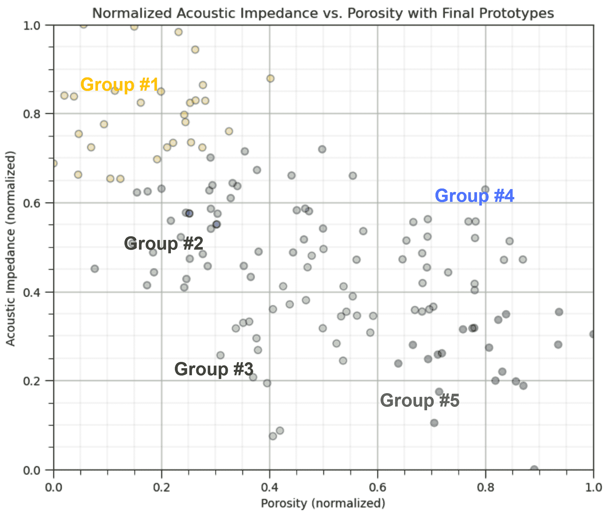

示例数据集，5 组标签通过聚类分配，用颜色表示。

## 推断机器学习

没有响应特征，$y$，只有预测特征，

$$ 𝑋_1,\ldots,𝑋_𝑚 $$

+   机器通过模仿数据的紧凑表示来学习

+   通过特征投影、组分配、神经网络潜在特征等方式捕捉模式。

+   我们专注于对总体、自然系统的推断，而不是响应特征的预测。

## K-Means 聚类

K-means 聚类方法主要作为无监督机器学习方法应用于聚类，将组分配给未标记数据，其中聚类组内的差异最小化。K-means 聚类中要最小化的损失函数，称为惯性，是：

$$ J = \sum^k_{i=1} \sum_{\alpha \in C_i} || X_{\alpha} - \mu_i || $$

其中 $i$ 是簇索引，$\alpha$ 是数据样本索引，$X$ 是数据样本，$\mu_i$ 是第 $i$ 个簇原型，$k$ 是簇的总数，而 $|| X_m - \mu_m ||$ 是在 $M$ 维空间中从样本到簇原型的欧几里得距离，计算如下：

$$ || X_{m,\alpha} - \mu_i || = \sqrt{ \sum_m^M \left( X_{m,\alpha} - \mu_{m,i} \right)² } $$

这里是这种损失函数的示意图，即组原型与组内样本之间的距离之和，

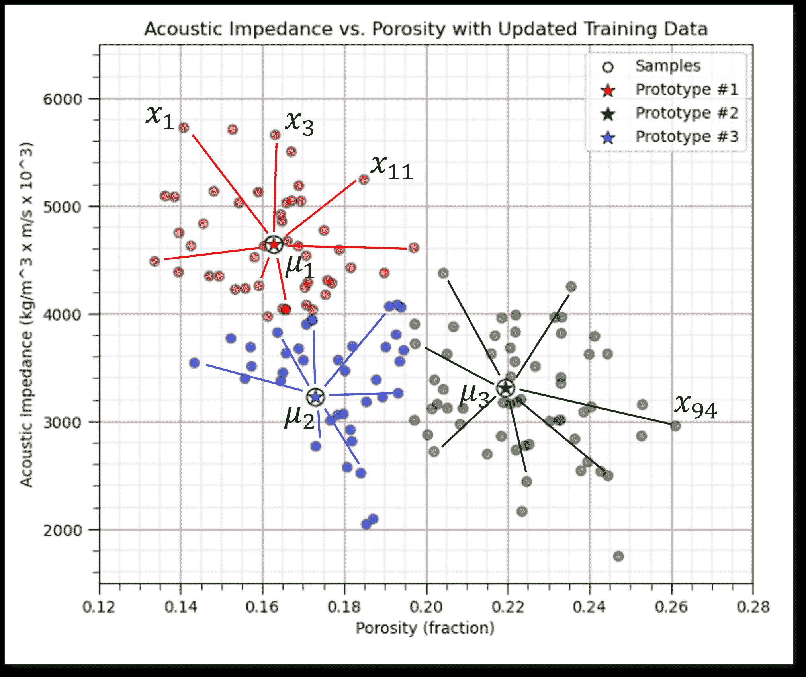

K-means 聚类损失函数示意图，惯性。注意，为了清晰起见，仅标注了部分样本到原型的距离以及一些数据标签。

这里是 K-means 聚类的一些重要方面的总结：

+   **原型方法** - 在特征空间中用合成案例的数量表示训练数据。对于 K-means 聚类，我们分配并迭代更新 $K$ 个原型。

+   **迭代解法** - 初始原型在特征空间中随机分配，每个训练样本的标签更新为最近的原型，然后原型调整到其分配的训练数据质心，重复此过程直到训练数据分配不再更新。

+   **无监督学习** - 训练数据未标记，并根据其在特征空间中与原型之间的接近程度分配 $K$ 个标签。其理念是相似的事物，在特征空间中的接近度，应属于同一个簇组。

+   **特征加权** - 该过程取决于训练样本与特征空间中原型之间的欧几里得距离。距离被视为相似性的“逆”。如果特征具有显著不同的幅度，则幅度和范围最大的特征将主导损失函数，簇组将变得各向异性，与高范围特征垂直对齐。虽然常见的做法是对变量进行标准化/归一化，但可以通过不等方差应用按特征加权。注意，在这个演示中，我们将特征归一化到 0.0 到 1.0 的范围。

## 解决方案启发式

让我们首先定义一个解决方案启发式，

+   **启发式** - 为了实用性而牺牲准确性的捷径，即解决方案通常足够好，并且运行时间合理。

对于将 $k$ 个分类标签之一分配给 $n$ 个样本数据的 K-means 聚类问题，解决方案空间包括，

$$ k^n $$

可能的解决方案。

K-means 聚类解决方案启发式包括以下步骤：

1.  分配带有标签的初始随机原型。

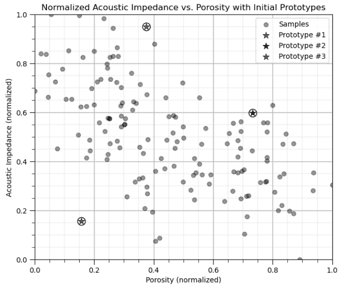

$k$ 个随机原型。

1.  将样本分配给最近的原型。

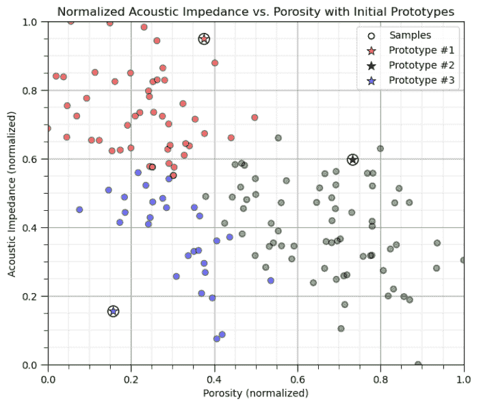

将样本分配给最近的 $k$ 个原型。

1.  根据属于此原型的样本的质心更新原型。

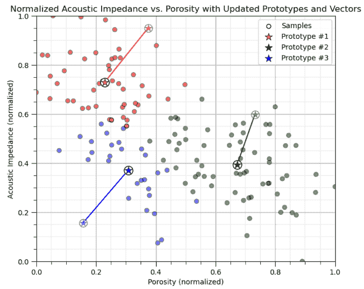

将 $k$ 个原型更新为分配数据的质心。

1.  迭代（返回步骤 2），直到没有样本分配发生变化（原型停止移动）。

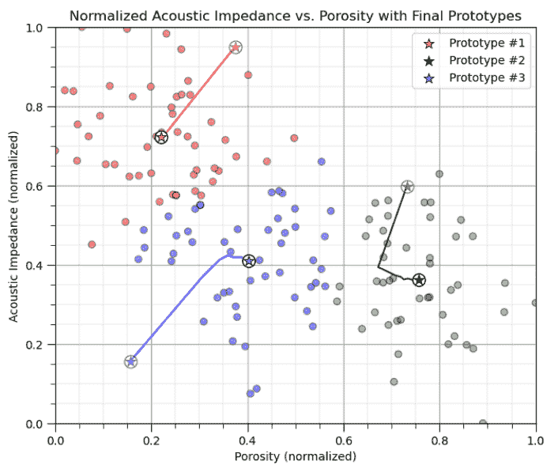

分配和更新迭代，直到启发式解决方案收敛。

## 演示

我从手动计算 K-means 聚类组分配的“手工”方法开始。

+   这使我们能够观察方法在实际中的表现，而不仅仅是得到一个结果。我认为这更有教育意义。

+   之后，我展示了 scikit-learn 中的函数，以一行代码完成计算。

我还开发了一套 [交互式 k-means 聚类仪表板](https://github.com/GeostatsGuy/DataScienceInteractivePython/blob/main/Interactive_kMeans_Clustering.ipynb)，以探索 k-means 聚类启发式，包括这个显示多个随机原型和惯性累积分布函数的解决方案，以探索解决方案的一致性。

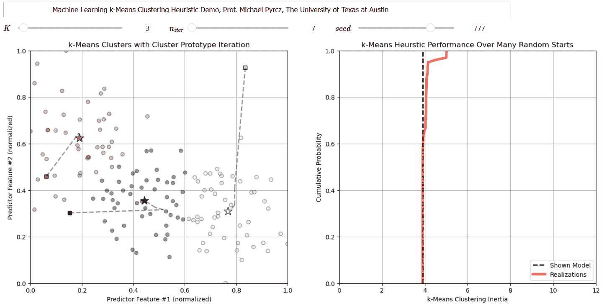

交互式 Python 仪表板以探索 k-means 聚类解决方案启发式的性能。

注意，对于下面的工作流程，我已经将 Ben Keen 提供的教程中的代码修改为函数，以处理步骤（将训练数据分配给最近的原型，更新原型为分配数据的质心）。

+   原始教程可在[这里](http://benalexkeen.com/k-means-clustering-in-python)找到。

+   我的修改使此工作流程适合我的特定示例，并包括归一化和原始数据。感谢 Ben！

## 加载所需的库

以下代码加载所需的库。这些库应该已经与 Anaconda 3 一起安装。

```py
ignore_warnings = True                                        # ignore warnings?
import numpy as np                                            # ndarrays for gridded data
import pandas as pd                                           # DataFrames for tabular data
import copy                                                   # for deep copies
import os                                                     # set working directory, run executables
import matplotlib.pyplot as plt                               # for plotting
from matplotlib.ticker import (MultipleLocator, AutoMinorLocator) # control of axes ticks
import matplotlib.ticker as mtick                             # control tick label formatting
import seaborn as sns                                         # for matrix scatter plots
from sklearn.preprocessing import MinMaxScaler                # min/max normalization
from sklearn.metrics import silhouette_score                  # calculating the optimum K number of clusters
from sklearn.cluster import KMeans                            # k-means clustering
plt.rc('axes', axisbelow=True)                                # plot all grids below the plot elements
if ignore_warnings == True:                                   
    import warnings
    warnings.filterwarnings('ignore')
cmap = plt.cm.inferno                                         # color map
seed = 42                                                     # random number seed 
```

## 声明函数

以下函数执行 K-means 聚类所需的步骤。

+   将训练数据分配给最近的原型

+   将原型更新为分配的训练数据的质心

如果您不理解代码，请不要担心，我们为了代码简洁，使用了一些高级方法。

我还添加了一个方便的函数，用于添加主网格线和副网格线，以提高绘图的可解释性。

```py
# Assignment function to assigned training data to the nearest prototype (code modified from Ben Keen, http://benalexkeen.com/k-means-clustering-in-python/)
def assignment(df,centroids):
    for i in centroids.keys():
        df['distance_from_{}'.format(i)] = (                  # use the normalized features and centroids
            np.sqrt(
                (df['Norm_Porosity'] - centroids[i][2]) ** 2
                + (df['Norm_AI'] - centroids[i][3]) ** 2
            )
        )
    centroid_distance_cols = ['distance_from_{}'.format(i) for i in centroids.keys()]
    df['closest'] = df.loc[:, centroid_distance_cols].idxmin(axis=1)
    df['closest'] = df['closest'].map(lambda x: int(x.lstrip('distance_from_')))
    df['color'] = df['closest'].map(lambda x: colmap[x])
    return

# Update function to shift the prototype to the centroid of the training data assigned to the prototype (code modified from Ben Keen, http://benalexkeen.com/k-means-clustering-in-python/)
def update(df,centroids,x1min,x1max,x2min,x2max):
    for i in centroids.keys():
        centroids[i][2] = np.mean(df[df['closest'] == i]['Norm_Porosity'])
        centroids[i][3] = np.mean(df[df['closest'] == i]['Norm_AI'])
        centroids[i][0] = centroids[i][2] * (x1max-x1min) + x1min
        centroids[i][1] = centroids[i][3] * (x2max-x2min) + x2min
    return

def add_grid():
    plt.gca().grid(True, which='major',linewidth = 1.0); plt.gca().grid(True, which='minor',linewidth = 0.2) # add y grids
    plt.gca().tick_params(which='major',length=7); plt.gca().tick_params(which='minor', length=4)
    plt.gca().xaxis.set_minor_locator(AutoMinorLocator()); plt.gca().yaxis.set_minor_locator(AutoMinorLocator()) # turn on minor ticks 
```

## 设置工作目录

我总是喜欢这样做，这样我就不会丢失文件，并且可以简化后续的读取和写入（避免每次都包含完整地址）。

```py
#os.chdir("C:/PGE383")                                        # set the working directory with the input data file 
```

## 加载表格数据

这里是加载我们以逗号分隔的数据文件到 Pandas DataFrame 对象中的命令。

让我们加载提供的多元、空间数据集‘12_sample_data.csv’。它是一个逗号分隔的文件，包含：

+   X 和 Y 坐标（$m$）

+   地层 0 和 1

+   孔隙率（分数）

+   渗透率（$mD$）

+   声波阻抗（$\frac{kg}{m³} \cdot \frac{m}{s} \cdot 10³$）。

我们使用 pandas 的‘read_csv’函数将其加载到我们称为‘df’的 DataFrame 中，然后预览它以确保正确加载。

**Python 小贴士：使用包中的函数**只需输入我们在开头声明的包的标签：

```py
import pandas as pd 
```

因此，我们可以使用以下命令访问 pandas 函数‘read_csv’：

```py
pd.read_csv() 
```

但 read csv 需要输入参数。最重要的一个是文件名。在我们的情况下，所有其他默认参数都很好。如果您想查看此函数的所有可能参数，请访问[这里](https://pandas.pydata.org/pandas-docs/stable/reference/api/pandas.read_csv.html)的文档。

+   文档总是很有帮助

+   Python 函数通常有很多灵活性，这可以通过使用各种输入参数来实现。

此外，程序有一个输出，即从数据加载的 pandas DataFrame。因此，我们必须指定代表新对象的名字/变量。

```py
df = pd.read_csv("12_sample_data.csv") 
```

让我们运行此命令来加载数据，然后运行此命令来提取数据的一个随机子集。

```py
df = df.sample(frac=.30, random_state = 73073); 
df = df.reset_index() 
```

我们这样做是为了减少数据量，便于可视化（如果图上点太多，很难看清楚）。

```py
#df = pd.read_csv('12_sample_data.csv')                       # load our data table from the current directory
df = pd.read_csv('https://raw.githubusercontent.com/GeostatsGuy/GeoDataSets/master/12_sample_data.csv') # or from GtiHub
df = df.iloc[:,1:]                                            # remove a null column 
df = df.sample(frac=.30, random_state = seed); df = df.reset_index(drop=True) # extract 30% random to reduce the number of data 
```

## 表格数据摘要统计

该表格包括我们将要在下面的演示中使用的孔隙率（分数）和声波阻抗（$\frac{kg}{m³} \cdot \frac{m}{s} \cdot 10³$）。

在 DataFrames 中，有许多高效的方法可以计算表格数据的摘要统计信息。describe 命令提供了一个很好的数据表，提供了计数、平均值、最小值、最大值和四分位数。我们使用 transpose 只是翻转表格，以便特征在行上，而统计信息在列上。

```py
df.describe().transpose()                                     # DataFrame summary statistics 
```

|  | 计数 | 平均值 | 标准差 | 最小值 | 25% | 50% | 75% | 最大值 |
| --- | --- | --- | --- | --- | --- | --- | --- | --- |
| X | 144.0 | 3910.668909 | 2563.309885 | 6.161100 | 1978.194998 | 3500.392517 | 5502.096026 | 9703.495538 |
| Y | 144.0 | 5093.498955 | 2861.683625 | 491.789431 | 2503.509193 | 5393.325918 | 7596.505416 | 9897.863401 |
| 岩性 | 144.0 | 0.618056 | 0.487559 | 0.000000 | 0.000000 | 1.000000 | 1.000000 | 1.000000 |
| 孔隙率 | 144.0 | 0.191045 | 0.031262 | 0.133681 | 0.165889 | 0.185460 | 0.220655 | 0.261091 |
| 透率 | 144.0 | 568.892892 | 1265.582175 | 0.035608 | 9.382939 | 64.000905 | 425.323240 | 7452.343369 |
| AI | 144.0 | 3749.924448 | 821.100292 | 1746.387548 | 3131.159498 | 3686.800017 | 4292.981181 | 5725.525232 |

## 标准化特征

这两个特征相当不兼容。它们有显著不同的：

+   方差/范围

我们应该将每个特征标准化到 0 到 1 的范围内。方程是：

$$ x_i^{\prime} = \frac{ \left( x_i - min(x) \right)}{\left( max(x) - min(x) \right)} \quad i = 1,\ldots,n $$

+   这是一个没有改变分布形状的分布、平移、拉伸或压缩。

现在我们可以使用这些标准化值来计算工作流程中的距离：

+   以消除量级和范围对我们相似度计算的影响

```py
pormin = df['Porosity'].min(); pormax = df['Porosity'].max()  # find min and max for each feature
AImin = df['AI'].min(); AImax = df['AI'].max()

df['Norm_Porosity'] = (df['Porosity']-pormin)/(pormax - pormin) # normalize each feature, this broadcasts over all samples in the DataFrame
df['Norm_AI'] = (df['AI']-AImin)/(AImax - AImin)                            # and appends a new normalized feature for each 
```

当然，scikit-learn 中有一个标准化函数，但这次我们首先手动执行这个操作，以确保操作完全清晰。

```py
from sklearn.preprocessing import MinMaxScaler
scaler = MinMaxScaler()
X_normalized = scaler.fit_transform(X) 
```

让我们确认我们的标准化孔隙率和声阻抗现在在 0 到 1 的范围内。

```py
df.describe().transpose()                                     # summary statistics for the DataFrame 
```

|  | 计数 | 平均值 | 标准差 | 最小值 | 25% | 50% | 75% | 最大值 |
| --- | --- | --- | --- | --- | --- | --- | --- | --- |
| X | 144.0 | 3910.668909 | 2563.309885 | 6.161100 | 1978.194998 | 3500.392517 | 5502.096026 | 9703.495538 |
| Y | 144.0 | 5093.498955 | 2861.683625 | 491.789431 | 2503.509193 | 5393.325918 | 7596.505416 | 9897.863401 |
| 岩性 | 144.0 | 0.618056 | 0.487559 | 0.000000 | 0.000000 | 1.000000 | 1.000000 | 1.000000 |
| 孔隙率 | 144.0 | 0.191045 | 0.031262 | 0.133681 | 0.165889 | 0.185460 | 0.220655 | 0.261091 |
| 透率 | 144.0 | 568.892892 | 1265.582175 | 0.035608 | 9.382939 | 64.000905 | 425.323240 | 7452.343369 |
| AI | 144.0 | 3749.924448 | 821.100292 | 1746.387548 | 3131.159498 | 3686.800017 | 4292.981181 | 5725.525232 |
| 标准化孔隙率 | 144.0 | 0.450230 | 0.245367 | 0.000000 | 0.252789 | 0.406397 | 0.682631 | 1.000000 |
| 标准化 AI | 144.0 | 0.503510 | 0.206351 | 0.000000 | 0.348008 | 0.487646 | 0.639986 | 1.000000 |

## 提取感兴趣的特征

现在，让我们切出孔隙率和声阻抗特征，然后查看生成的 DataFrame，以确保我们按预期加载和重新格式化。

+   我经常只分离感兴趣的特性，以简化我的工作流程并减少错误的可能性，例如，意外引用当前工作流程中未使用的特性！

+   注意，这是一个浅拷贝；因此，对 df_subset DataFrame 的任何更改都会反映在原始的 df DataFrame 中。这个切片实际上是对原始 DataFrame 在内存中的引用。

```py
df_subset = df.iloc[:,[3,5,6,7]]                              # extract Porosity and AI for a simple 2D example
df_subset.head()                                              # preview the new DataFrame 
```

|  | 孔隙率 | AI | Norm_Porosity | Norm_AI |
| --- | --- | --- | --- | --- |
| 0 | 0.252772 | 2862.446918 | 0.934709 | 0.280478 |
| 1 | 0.181580 | 2919.237330 | 0.375944 | 0.294750 |
| 2 | 0.230303 | 2999.248935 | 0.758358 | 0.314858 |
| 3 | 0.163732 | 3823.747676 | 0.235860 | 0.522063 |
| 4 | 0.197078 | 4609.845251 | 0.497583 | 0.719618 |

## 推断模型参数

从汇总统计中，我们可以为每个特征分配一个合理的最小值和最大值。

+   我们将使用这个来绘图。

我们还将设置随机数种子以确保程序每次运行时都做同样的事情。

+   改变种子数字以获得不同的结果

我们将设置原型/聚类数量，*K*

我们定义一个字典，包含每个聚类的颜色代码，$k = 1,\ldots,K$。目前有 7 个代码，如果 $K$ 设置得大于 7，将会出现错误。向字典中添加更多颜色代码以允许更多类别。

```py
por_min = 0.12; por_max = 0.28                                # min and max values for plotting
AI_min = 1500; AI_max = 6500                                  
K = 6; max_iter = 100                                         # number of prototypes / categories
colmap = {1: 'r', 2: 'g', 3: 'b', 4: 'm', 5: 'c', 6: 'k', 7: 'w'} # color dictionary for up to 7 categories
prototypes = np.zeros((K,max_iter,2))                         # store the prototypes over iterations
norm_prototypes = np.zeros((K,max_iter,2))                    # store the prototypes for the standardized features over iterations 
```

## 可视化训练数据

在这个练习中，我们想使用 K-means 聚类根据声阻抗和孔隙率预测特征提供岩相。

+   这允许我们将具有相似岩石物性和地球物理特性的岩石分组。

让我们从查看训练数据特征的散点图开始，孔隙率和声阻抗。

+   我们将通过整个练习查看原始单位和归一化单位的数据。

```py
plt.subplot(121)                                              # scatter plot our training data 
plt.scatter(df_subset['Porosity'], df['AI'], c="black", alpha = 0.4, linewidths=1.0, edgecolors="black")
plt.title('Acoustic Impedance vs. Porosity'); plt.xlabel('Porosity (fraction)'); plt.ylabel('Acoustic Impedance (kg/m³ x m/s x 10³)')
plt.xlim(por_min, por_max); plt.ylim(AI_min, AI_max); add_grid();

plt.subplot(122)                                              # scatter plot our normalized training data 
plt.scatter(df_subset['Norm_Porosity'], df['Norm_AI'], c="black", alpha = 0.4, linewidths=1.0, edgecolors="black")
plt.title('Normalized Acoustic Impedance vs. Porosity'); plt.xlabel('Porosity (normalized)'); plt.ylabel('Acoustic Impedance (normalized)')
plt.xlim(0.0,1.0); plt.ylim(0.0,1.0); add_grid();
plt.subplots_adjust(left=0.0, bottom=0.0, right=2.0, top=1.0, wspace=0.2, hspace=0.2); plt.show() 
```

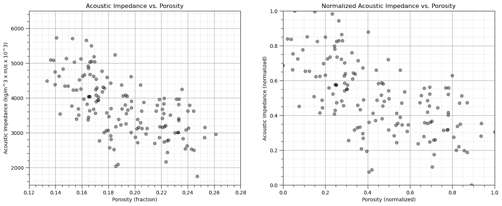

## 手动计算 k-Means 聚类

这是计算未标记数据集 k-means 聚类的步骤。

### 初始化 k 个原型

首先，我们将随机地在特征空间中分配 k 个原型。

+   对于 K 个原型，随机分配孔隙率和声阻抗

+   别担心，这些原型最初可能没有太多意义，但它们会改进

我们将这样做，然后以红色、绿色、蓝色等点来可视化原型。

```py
np.random.seed(seed)                                          # random number seed for repeatability of the results
centroids = {}
for i in range(K):                                            # Assign Initial Prototypes 
    norm_por = np.random.random(); por = norm_por * (pormax-pormin) + pormin
    norm_AI = np.random.random(); AI = norm_AI * (AImax-AImin) + AImin
    centroids[i+1] = [por,AI,norm_por,norm_AI]; prototypes[i,0] = [por,AI]; norm_prototypes[i,0] = [norm_por,norm_AI]

plt.subplot(121)                                              # plot the training data and K prototypes
plt.scatter(df_subset['Porosity'], df['AI'],c="black",alpha = 0.4,linewidths=1.0,edgecolors="black",zorder=1,label='Samples')
for i in centroids.keys():
    plt.scatter(centroids.get(i)[0], centroids.get(i)[1],color='white',s=120,marker='o',linewidths=1.0, edgecolors="black",zorder=10)
    plt.scatter(centroids.get(i)[0], centroids.get(i)[1],color=colmap[i],s=90,marker='*',linewidths=0.5, edgecolors="black",zorder=20,
                label='Prototype #'+str(i))
plt.title('Acoustic Impedance vs. Porosity with Initial Prototypes'); plt.xlabel('Porosity (fraction)')
plt.ylabel('Acoustic Impedance (kg/m³ x m/s x 10³)')
plt.xlim(por_min, por_max); plt.ylim(AI_min, AI_max); add_grid(); plt.legend(loc='upper right')

plt.subplot(122)                                              # plot the training data and K prototypes
plt.scatter(df_subset['Norm_Porosity'], df['Norm_AI'], c="black", alpha = 0.4, linewidths=1.0, edgecolors="black",label='Samples')
for i in centroids.keys():
    plt.scatter(centroids.get(i)[2], centroids.get(i)[3],color='white',s=120,marker='o',linewidths=1.0, edgecolors="black",zorder=10)
    plt.scatter(centroids.get(i)[2], centroids.get(i)[3],color=colmap[i],s=90,marker='*',linewidths=0.5, edgecolors="black",zorder=20,
                label='Prototype #'+str(i))
plt.title('Normalized Acoustic Impedance vs. Porosity with Initial Prototypes'); plt.xlabel('Porosity (normalized)')
plt.ylabel('Acoustic Impedance (normalized)')
plt.xlim([0, 1]); plt.ylim([0, 1]); add_grid(); plt.legend(loc='upper right')
plt.subplots_adjust(left=0.0, bottom=0.0, right=2.0, top=1.0, wspace=0.2, hspace=0.2); plt.show() 
```

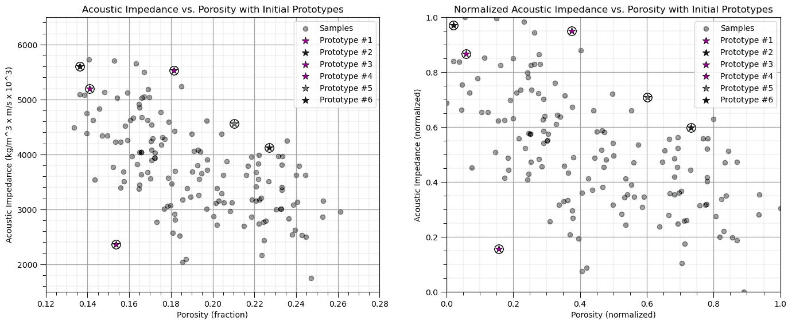

### 训练数据的分配

所有训练数据都被分配到最近的原型。

+   记得我们有一个函数来做这件事

```py
df = assignment(df, centroids) 
```

+   我们处理归一化特征并可视化归一化和原始特征

```py
assignment(df, centroids)                                     # assign training data to the nearest prototype

plt.subplot(121)                                              # plot the assigned training data and K prototypes
plt.scatter(df['Porosity'], df['AI'], color=df['color'], alpha=0.5, edgecolor='k'); plt.scatter(-999,-999,color='white',edgecolors='black',
                label='Samples')
for i in centroids.keys():
    plt.scatter(centroids.get(i)[0], centroids.get(i)[1],color='white',s=120,marker='o',linewidths=1.0, edgecolors="black",zorder=10)
    plt.scatter(centroids.get(i)[0], centroids.get(i)[1],color=colmap[i],s=90,marker='*',linewidths=0.5, edgecolors="black",zorder=20,
                label='Prototype #'+str(i))
plt.title('Acoustic Impedance vs. Porosity with Initial Prototypes'); plt.xlabel('Porosity (fraction)')
plt.ylabel('Acoustic Impedance (kg/m³ x m/s x 10³)')
plt.xlim(por_min, por_max); plt.ylim(AI_min, AI_max); add_grid(); plt.legend(loc='upper right')

plt.subplot(122)                                              # plot the normalized training data and K prototypes
plt.scatter(df_subset['Norm_Porosity'], df['Norm_AI'], c=df['color'], alpha = 0.5, linewidths=1.0, edgecolors="black")
plt.scatter(-999,-999,color='white',edgecolors='black',label='Samples')
for i in centroids.keys():
    plt.scatter(centroids.get(i)[2], centroids.get(i)[3],color='white',s=120,marker='o',linewidths=1.0, edgecolors="black",zorder=10)
    plt.scatter(centroids.get(i)[2], centroids.get(i)[3],color=colmap[i],s=90,marker='*',linewidths=0.5, edgecolors="black",zorder=20,
                label='Prototype #'+str(i))
plt.title('Normalized Acoustic Impedance vs. Porosity with Initial Prototypes'); plt.xlabel('Porosity (normalized)')
plt.ylabel('Acoustic Impedance (normalized)')
plt.xlim([0, 1]); plt.ylim([0, 1]); add_grid(); plt.legend(loc='upper right')
plt.subplots_adjust(left=0.0, bottom=0.0, right=2.0, top=1.0, wspace=0.2, hspace=0.2); plt.show() 
```

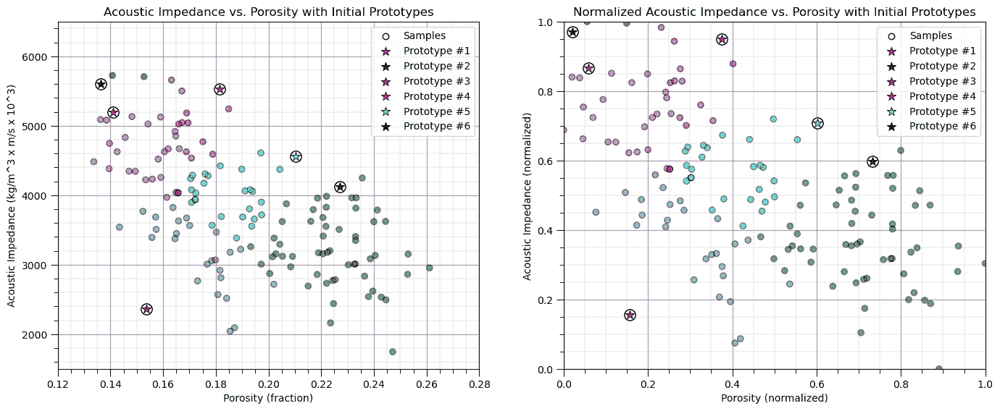

### 更新原型

现在，我们将原型重新分配到每个所属训练数据的质心。

```py
old_centroids = copy.deepcopy(centroids)                      # make a deep copy of the centroids for plotting vectors below
update(df,centroids,pormin,pormax,AImin,AImax)                # update the centroids to the new data assignments

plt.subplot(121)                                              # plot the assigned training data and k prototypes
ax = plt.gca()
plt.scatter(df['Porosity'], df['AI'], color=df['color'], alpha=0.5, edgecolor='k')
plt.scatter(-999,-999,color='white',edgecolors='black',label='Samples')
for i in centroids.keys():
    plt.scatter(old_centroids.get(i)[0], old_centroids.get(i)[1],color='white',s=120,marker='o',linewidths=1.0,alpha=0.5,
            edgecolors="black",zorder=10)
    plt.scatter(old_centroids.get(i)[0], old_centroids.get(i)[1],color=colmap[i],s=90,marker='*',linewidths=0.5,alpha=0.5,
            edgecolors="black",zorder=20)
    plt.scatter(centroids.get(i)[0], centroids.get(i)[1],color='white',s=150,marker='o',linewidths=1.0, edgecolors="black",zorder=10)
    plt.scatter(centroids.get(i)[0], centroids.get(i)[1],color=colmap[i],s=120,marker='*',linewidths=0.5,
            edgecolors="black",zorder=20,label='Prototype #'+str(i))
    prototypes[i-1,1] = [centroids[i][0],centroids[i][1]]; norm_prototypes[i-1,1] = [centroids[i][2],centroids[i][3]]
plt.title('Acoustic Impedance vs. Porosity with Updated Prototypes and Vectors'); plt.xlabel('Porosity (fraction)')
plt.ylabel('Acoustic Impedance (kg/m³ x m/s x 10³)')
plt.xlim(por_min, por_max); plt.ylim(AI_min, AI_max); add_grid(); plt.legend(loc='upper right')

for i in old_centroids.keys():                                # plot the vectors
    old_x = old_centroids[i][0]
    old_y = old_centroids[i][1]
    dx = (centroids[i][0] - old_centroids[i][0]) 
    dy = (centroids[i][1] - old_centroids[i][1]) 
    ax.arrow(old_x, old_y, dx, dy,fc=colmap[i], ec=colmap[i]); 

plt.subplot(122)                                              # plot the normalized assigned training data and k prototypes
ax = plt.gca()
plt.scatter(df['Norm_Porosity'], df['Norm_AI'], color=df['color'], alpha=0.5, edgecolor='k')
plt.scatter(-999,-999,color='white',edgecolors='black',label='Samples')
for i in centroids.keys():
    plt.scatter(old_centroids.get(i)[2], old_centroids.get(i)[3],color='white',s=120,marker='o',linewidths=1.0,alpha=0.5,
        edgecolors="black",zorder=10)
    plt.scatter(old_centroids.get(i)[2], old_centroids.get(i)[3],color=colmap[i],s=90,marker='*',linewidths=0.5,alpha=0.5,
        edgecolors="black",zorder=20)
    plt.scatter(centroids.get(i)[2], centroids.get(i)[3],color='white',s=150,marker='o',linewidths=1.0, edgecolors="black",zorder=10)
    plt.scatter(centroids.get(i)[2], centroids.get(i)[3],color=colmap[i],s=120,marker='*',linewidths=0.5, edgecolors="black",zorder=20,
        label='Prototype #'+str(i))
plt.title('Normalized Acoustic Impedance vs. Porosity with Updated Prototypes and Vectors'); plt.xlabel('Porosity (normalized)')
plt.ylabel('Acoustic Impedance (normalized)')
plt.xlim([0, 1]); plt.ylim([0, 1]); add_grid(); plt.legend(loc='upper right')

for i in old_centroids.keys():                                # plot the vectors
    old_x = old_centroids[i][2]
    old_y = old_centroids[i][3]
    dx = (centroids[i][2] - old_centroids[i][2]) 
    dy = (centroids[i][3] - old_centroids[i][3]) 
    ax.arrow(old_x, old_y, dx, dy,fc=colmap[i], ec=colmap[i])

plt.subplots_adjust(left=0.0, bottom=0.0, right=2.0, top=1.0, wspace=0.2, hspace=0.2); plt.show() 
```

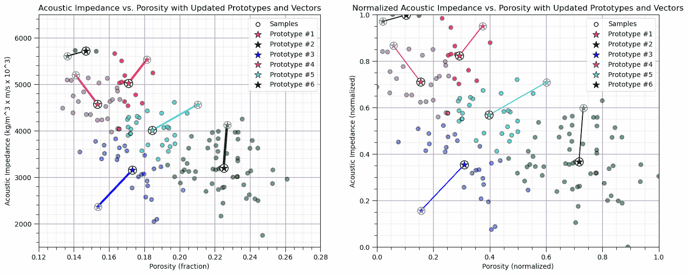

### 重复分配训练数据

再次，我们将训练数据分配到最近的原型。

+   注意，在前一个步骤中更新了原型，因此分配可能会改变

```py
assignment(df, centroids)                                     # assign samples to nearest prototype

plt.subplot(121)                                              # plot the assigned training data and K prototypes
plt.scatter(df['Porosity'], df['AI'], color=df['color'], alpha=0.5, edgecolor='k'); plt.scatter(-999,-999,color='white',
    edgecolors='black',label='Samples')
for i in centroids.keys():
    plt.scatter(centroids.get(i)[0], centroids.get(i)[1],color='white',s=120,marker='o',linewidths=1.0, edgecolors="black",zorder=10)
    plt.scatter(centroids.get(i)[0], centroids.get(i)[1],color=colmap[i],s=90,marker='*',linewidths=0.5, edgecolors="black",zorder=20,
            label='Prototype #'+str(i))
plt.title('Acoustic Impedance vs. Porosity with Updated Training Data'); plt.xlabel('Porosity (fraction)')
plt.ylabel('Acoustic Impedance (kg/m³ x m/s x 10³)')
plt.xlim(por_min, por_max); plt.ylim(AI_min, AI_max); add_grid(); plt.legend(loc='upper right')

plt.subplot(122)                                              # plot the normalized training data and K prototypes
plt.scatter(df_subset['Norm_Porosity'], df['Norm_AI'], c=df['color'], alpha = 0.4, linewidths=1.0, edgecolors="black")
plt.scatter(-999,-999,color='white',edgecolors='black',label='Samples')
for i in centroids.keys():
    plt.scatter(centroids.get(i)[2], centroids.get(i)[3],color='white',s=120,marker='o',linewidths=1.0, edgecolors="black",zorder=10)
    plt.scatter(centroids.get(i)[2], centroids.get(i)[3],color=colmap[i],s=90,marker='*',linewidths=0.5, edgecolors="black",
            zorder=20,label='Prototype #'+str(i))
plt.title('Normalized Acoustic Impedance vs. Porosity with Updated Training Data'); plt.xlabel('Porosity (normalized)')
plt.ylabel('Acoustic Impedance (normalized)')
plt.xlim([0, 1]); plt.ylim([0, 1]); add_grid(); plt.legend(loc='upper right')
plt.subplots_adjust(left=0.0, bottom=0.0, right=2.0, top=1.0, wspace=0.2, hspace=0.2); plt.show() 
```


### 迭代直到收敛

现在我们遍历之前的步骤：

+   将训练数据分配到最近的原型

+   更新原型

我们这样做，直到没有进一步的机会改变每个训练数据分配的类别。

```py
iteration = 2                                                 # initialize a counter, we already completed iteration 0 and 1 above
while True:
    closest_centroids = df['closest'].copy(deep=True)
    update(df,centroids,pormin,pormax,AImin,AImax)
    for i in centroids.keys():
        prototypes[i-1,iteration] = [centroids[i][0],centroids[i][1]]
        norm_prototypes[i-1,iteration] = [centroids[i][2],centroids[i][3]]
    assignment(df, centroids)
    if closest_centroids.equals(df['closest']):
        break
    iteration = iteration + 1

plt.subplot(121)                                              # plot the assigned training data and K prototypes
plt.scatter(df['Porosity'], df['AI'], color=df['color'], alpha=0.5, edgecolor='k')
for i in centroids.keys():
    plt.scatter(prototypes[i-1,0,0], prototypes[i-1,0,1],color='white',s=120,marker='o',linewidths=1.0,alpha=0.5,edgecolors="black",zorder=10)
    plt.scatter(prototypes[i-1,0,0], prototypes[i-1,0,1],color=colmap[i],s=90,marker='*',linewidths=0.5,alpha=0.5,edgecolors="black",zorder=20)
    plt.scatter(centroids.get(i)[0], centroids.get(i)[1],color='white',s=120,marker='o',linewidths=1.0, edgecolors="black",zorder=10)
    plt.scatter(centroids.get(i)[0], centroids.get(i)[1],color=colmap[i],s=90,marker='*',linewidths=0.5, edgecolors="black",
        zorder=20,label='Prototype #'+str(i))
    plt.plot(prototypes[i-1,:iteration+1,0],prototypes[i-1,:iteration+1,1],color=colmap[i],zorder = 1)
plt.title('Acoustic Impedance vs. Porosity with Final Prototypes'); plt.xlabel('Porosity (fraction)')
plt.ylabel('Acoustic Impedance (kg/m³ x m/s x 10³)')
plt.xlim(por_min, por_max); plt.ylim(AI_min, AI_max); add_grid(); plt.legend(loc='upper right')

plt.subplot(122)                                              # plot the training data and K prototypes
plt.scatter(df_subset['Norm_Porosity'], df['Norm_AI'], c=df['color'], alpha = 0.4, linewidths=1.0, edgecolors="black")
for i in centroids.keys():
    plt.scatter(norm_prototypes[i-1,0,0], norm_prototypes[i-1,0,1],color='white',s=120,marker='o',linewidths=1.0,alpha=0.5,
            edgecolors="black",zorder=10)
    plt.scatter(norm_prototypes[i-1,0,0], norm_prototypes[i-1,0,1],color=colmap[i],s=90,marker='*',linewidths=0.5,alpha=0.5,
            edgecolors="black",zorder=20)
    plt.scatter(centroids.get(i)[2], centroids.get(i)[3],color='white',s=120,marker='o',linewidths=1.0, edgecolors="black",zorder=10)
    plt.scatter(centroids.get(i)[2], centroids.get(i)[3],color=colmap[i],s=90,marker='*',linewidths=0.5, edgecolors="black",
            zorder=20,label='Prototype #'+str(i))
    plt.plot(norm_prototypes[i-1,:iteration+1,0],norm_prototypes[i-1,:iteration+1,1],color=colmap[i],zorder = 1)
plt.title('Normalized Acoustic Impedance vs. Porosity with Final Prototypes'); plt.xlabel('Porosity (normalized)')
plt.ylabel('Acoustic Impedance (normalized)')
plt.xlim([0, 1]); plt.ylim([0, 1]); add_grid(); plt.legend(loc='upper right')
plt.subplots_adjust(left=0.0, bottom=0.0, right=2.0, top=1.0, wspace=0.2, hspace=0.2); plt.show() 
```

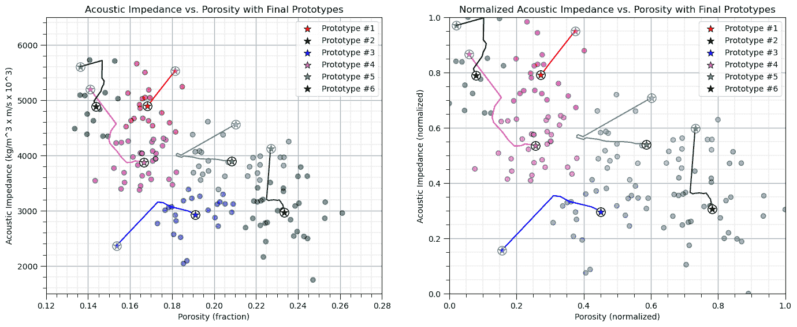

## 使用 scikit-learn 函数进行 k-Means 聚类

让我们用 scikit-learn 函数重复这个过程。

```py
K = 2                                                         # number categories / clusters 

kmeans = KMeans(n_clusters=K, random_state=seed, n_init = 100).fit(df.loc[:,['Norm_Porosity','Norm_AI']]) # k-means clustering
df['kMeans'] = kmeans.labels_ + 1

plt.subplot(111)                                              # plot the training data and K prototypes
plt.scatter(df_subset['Norm_Porosity'], df['Norm_AI'], c=df['kMeans'], alpha = 0.4, linewidths=1.0, edgecolors="black")
plt.title('Normalized Acoustic Impedance vs. Porosity with Final Prototypes'); plt.xlabel('Porosity (normalized)')
plt.ylabel('Acoustic Impedance (normalized)')
plt.xlim([0, 1]); plt.ylim([0, 1]); add_grid()
plt.subplots_adjust(left=0.0, bottom=0.0, right=1.0, top=1.1, wspace=0.2, hspace=0.2) 
```

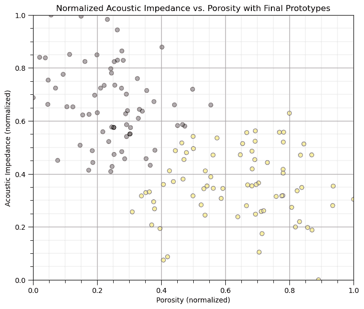

## 选择最优簇数量

对于 K-means 聚类，簇的数量 K 是一个输入。

+   在某些情况下，这个选择是容易的或者受问题背景的限制，例如，我们知道我们的地下数据集中有 3 个不同的岩相

+   这可以看作是 K-means 聚类的优势，因为我们可以使用我们的专业知识来限制簇的数量

+   或者这也可以看作是 K-means 聚类的弱点，因为该方法无法确定簇的数量，就像 DBSCAN 这样的方法一样

当簇的数量 K 未知时，有多种方法可以定量地确定最优的 K 值，包括，

+   **肘部方法** - 对一系列 K 值执行 k-means 聚类，并比较簇内平方和（WCSS）或惯性（每个点到其分配的簇质心的平方距离之和）与簇的数量（K）之间的关系，寻找 WCSS 下降速度放缓的“肘部”点。

+   **轮廓系数** - 轮廓系数衡量一个对象与其自身簇的相似性相对于其他簇的相似性。

## 肘部方法

**肘部方法**是一种启发式方法，用于确定聚类算法（如**K-Means**）中的最优簇数量，$K$。

+   策略是运行聚类算法一系列簇值$K$，计算性能指标，并绘制图表。图表上的**肘部**点表示最优簇数量，即增加更多簇不会显著提高模型，也就是说，不会进一步减少损失函数。

+   该方法基于 K-means 损失函数，惯性，也被称为簇内平方和（WCSS），再次强调，

$$ J = \sum^k_{i=1} \sum_{\alpha \in C_i} || X_{\alpha} - \mu_i || $$

其中 $i$ 是簇索引，$\alpha$ 是数据样本索引，$X$ 是数据样本，$\mu_i$ 是 $i$ 簇原型，$k$ 是簇的总数，而 $|| X_m - \mu_m ||$ 是在 $M$ 维空间中从样本到簇原型的欧几里得距离，计算如下：

$$ || X_{m,\alpha} - \mu_i || = \sqrt{ \sum_m^M \left( X_{m,\alpha} - \mu_{m,i} \right)² } $$

肘部方法按照以下步骤进行，

1.  **为不同的 $K$ 值拟合 K-Means**，选择可能的 $K$ 值范围，并对每个 $K$ 值，拟合 K-Means 算法并计算惯性。

1.  **绘制惯性与 $K$ 的关系图**，创建一个 x 轴表示簇数（$K$），y 轴表示惯性的图表。

1.  **寻找“肘部”**，图表上的**肘部**点是 WCS（Within-Cluster Sum of Squares）开始减慢下降的地方，这表明增加簇数超过这一点在减少惯性方面提供的回报递减。

肘部方法的优点包括，

+   对于 K-means 聚类，使用精确损失函数以确保一致性，即最小化惯性

影子分数的限制包括，

+   惯性方法只能应用于 K-means 聚类，但肘部方法与 k-distance 图一起应用于基于密度的聚类，例如 DBSCAN。

+   对于具有重叠或不规则形状簇的复杂数据集，可能不会提供明确的结果。

```py
max_K = 50                                                    # maximum number of clusters, k
optimal_k = 13

inertia = []
for k in range(2,max_K+1):                                    # loop over number of clusters and store the inertia
    kmeans_iter = KMeans(n_clusters=k, random_state=14, n_init = 10).fit(df.loc[:,['Norm_Porosity','Norm_AI']].values)
    inertia.append(kmeans_iter.inertia_)

plt.scatter(range(2,max_K+1),inertia,c='red',edgecolor='black',zorder=10)
plt.plot(range(2,max_K+1),inertia,c='red',ls='--',zorder=1)
plt.xlim(2,max_K); plt.xlabel('Number of Clusters'); plt.ylabel('Inertia'); plt.ylim(bottom=0)
plt.vlines(optimal_k,0,np.max(inertia),color='black'); plt.annotate('Optimum K = ' + str(optimal_k),[optimal_k+0.5,4.0],rotation=90.0)
plt.grid(True); plt.title('k-Means Clustering Inertia vs. Number of Clusters')
plt.xlim([0,max_K+1]); plt.ylim([0, np.max(inertia)]); add_grid()
plt.subplots_adjust(left=0.0, bottom=0.0, right=1.0, top=1.1, wspace=0.2, hspace=0.2); plt.show() 
```

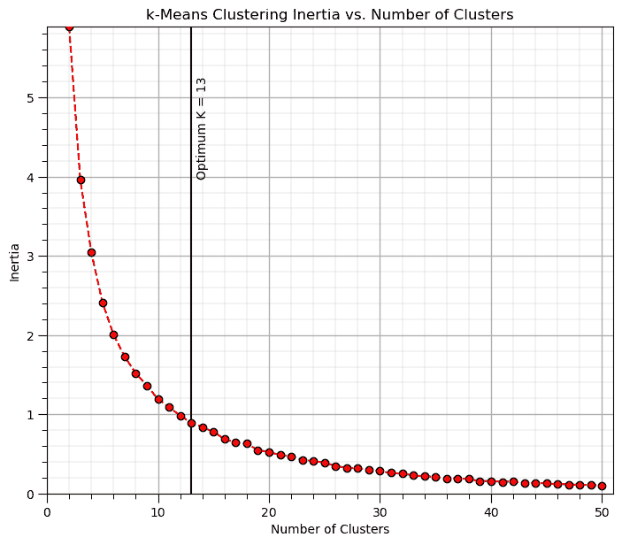

+   在这种情况下，梯度有连续的变化，而不是一个明显的肘部。

## 影子方法

描述：影子分数衡量一个对象与其自身簇的相似程度与与其他簇的相似程度。其工作原理：计算每个 K 值的影子分数。影子分数的范围从-1（拟合差）到+1（拟合好），其中较高的值表示聚类更好。解释：最优的 $K$ 对应于最高的平均影子分数。优点：提供凝聚力和分离度指标。缺点：对于大数据集可能计算成本较高。

影子计算过程如下，对于给定的数据点（i），使用以下步骤计算影子分数：

1.  计算同一簇内的**平均距离**，

$$ a(i) = \frac{1}{|C_i| - 1} \sum_{j \in C_i, j \neq i} d(i, j) $$

其中，$C_i$ 是包含点 $i$ 的簇，$d(i, j)$ 是点 $i$ 和 $j$ 之间的欧几里得距离，而 $|C_i|$ 是簇 $C_i$ 中点的数量。

1.  计算到最近簇的**平均距离**，

$$ b(i) = \min_{C_k \neq C_i} \left( \frac{1}{|C_k|} \sum_{j \in C_k} d(i, j) \right) $$

其中 $C_k$ 是任何其他簇，不同于包含点 $i$ 的簇 $C_i$。

1.  计算点 $i$ 的**影子分数**，

$$ s(i) = \frac{b(i) - a(i)}{\max(a(i), b(i))} $$

其中 $s(i)$ 是点 $i$ 的轮廓分数，$a(i)$ 是到同一聚类中点的平均距离，$b(i)$ 是到最近邻聚类中点的平均距离。

1.  现在对于所有点，计算**整体轮廓分数**，即所有点的平均轮廓分数，

$$ S = \frac{1}{n} \sum_{i=1}^{n} s(i) $$

其中 $n$ 是数据点的数量，$s(i)$ 是点 $i$ 的轮廓分数。

我们将整体轮廓分数值解释为，

+   **+1**，点平均来看聚类良好，且远离邻近聚类。

+   **0**，点平均来看位于或非常接近两个聚类之间的边界。

+   **-1**，点平均来看可能被分配到错误的聚类。

现在我们对一系列的 $K$ 值重复整体轮廓分数计算，并选择最大轮廓分数的情况作为最优的 $K$。

轮廓方法的优势包括，

+   轮廓分数提供了对聚类紧凑性和分离度的理解。

+   可以应用于任何聚类算法，而不仅仅是 K-Means，即输入是数据和聚类分配。

轮廓分数的限制包括，

+   轮廓方法在计算上很昂贵，尤其是对于大型数据集。

+   它可能无法为具有重叠或不规则形状聚类的复杂数据集提供清晰的结果。

```py
max_K = 50                                                    # maximum number of clusters, k

silhouette = []
for k in range(2,max_K+1):                                    # loop over number of clusters and store the inertia
    kmeans_iter = KMeans(n_clusters=k, random_state=14, n_init = 10).fit(df.loc[:,['Norm_Porosity','Norm_AI']].values)
    score = silhouette_score(df.loc[:,['Norm_Porosity','Norm_AI']].values, kmeans_iter.labels_)
    silhouette.append(score)
optimal_k = np.argmax(silhouette) + 2 

plt.scatter(range(2,max_K+1),silhouette,c='red',edgecolor='black',zorder=10)
plt.annotate('Good Fit',[0.8,0.7],rotation = 90); plt.annotate('Poor Fit',[0.8,-0.9],rotation = 90)
plt.plot(range(2,max_K+1),silhouette,c='red',ls='--',zorder=1)
plt.xlim(2,max_K); plt.xlabel('Number of Clusters'); plt.ylabel('Silhouetter Score'); plt.ylim(bottom=0)
plt.vlines(optimal_k,-1,1,color='black'); plt.annotate('Optimum K = ' + str(optimal_k),[optimal_k+0.5,-0.75],rotation=90.0)
plt.grid(True); plt.title('Silhouetter Score vs. Number of Clusters')
plt.xlim([0,max_K+1]); plt.ylim([-1,1]); add_grid()
plt.subplots_adjust(left=0.0, bottom=0.0, right=1.0, top=1.1, wspace=0.2, hspace=0.2); plt.show() 
```

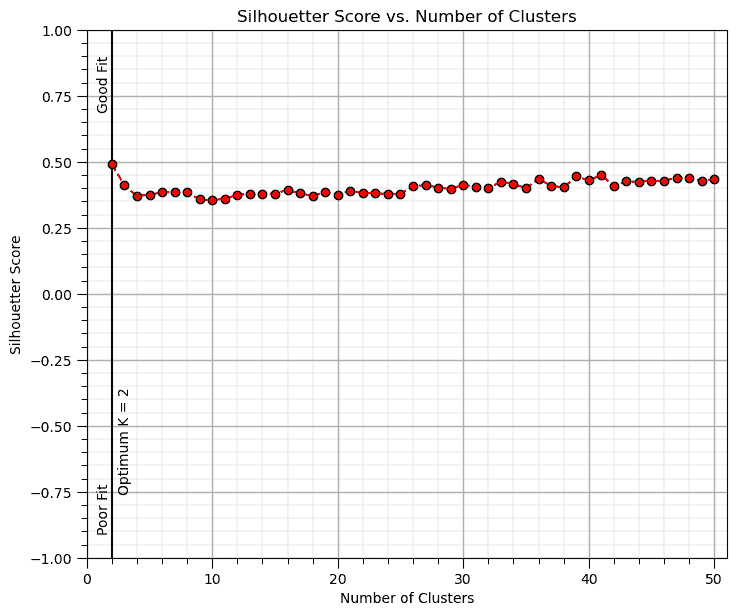

## 无归一化/标准化聚类

聚类的一个关键假设是每个特征的变异性是相同的。

+   如果特征具有相同的单位且可变性差异有意义，则会出现例外。

让我们取这个数据集并按比例绘制它（以显示距离度量在原始单位中会看到什么）。

+   我们旋转图表，并提供了孔隙率 1 单位等于渗透率 1 单位的近似可视化。

+   事实上，数据集对于聚类算法来说是 1 维的，孔隙率的差异变得没有意义。

这是我们的图表在两个特征之间具有相等纵横比时的样子。

+   图表变成了一条线，数据无法正确显示。

```py
plt.subplot(121)                                              # scatter plot our training data 
plt.scatter(df_subset['Porosity'], df['AI'], c="black", alpha = 0.4, linewidths=1.0, edgecolors="black")
plt.title('Acoustic Impedance vs. Porosity'); plt.xlabel('Porosity (fraction)'); plt.ylabel('Acoustic Impedance (kg/m³ x m/s x 10³)')
plt.xlim(por_min, por_max); plt.ylim(AI_min, AI_max); add_grid();
plt.gca().set_aspect('equal', adjustable='box') 
```

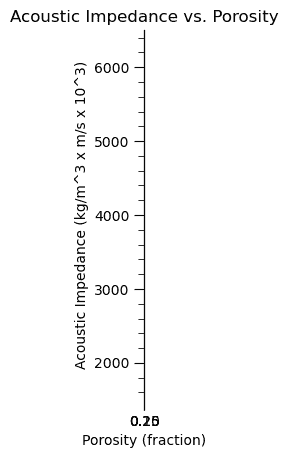

现在我们重复之前的 k-means 聚类，但使用原始特征（未归一化）。

```py
K = 5                                                         # number categories / clusters 

kmeans = KMeans(n_clusters=K, random_state=seed, n_init = 100).fit(df.loc[:,['Porosity','AI']]) # k-means clustering
df['kMeans_Orig'] = kmeans.labels_ + 1

plt.subplot(111)                                              # plot the training data and K prototypes
plt.scatter(df_subset['Norm_Porosity'], df['Norm_AI'], c=df['kMeans_Orig'], alpha = 0.4, linewidths=1.0, edgecolors="black")
plt.title('Normalized Acoustic Impedance vs. Porosity with Final Prototypes'); plt.xlabel('Porosity (normalized)')
plt.ylabel('Acoustic Impedance (normalized)')
plt.xlim([0, 1]); plt.ylim([0, 1]); add_grid()
plt.subplots_adjust(left=0.0, bottom=0.0, right=1.0, top=1.1, wspace=0.2, hspace=0.2) 
```


由于声阻抗特征的较大范围，孔隙率的差异并不显著，因此聚类仅存在于声阻抗中。

+   聚类与声阻抗正交。

## 在新的数据集上进行实践

好了，是时候开始工作了。让我们加载数据集并使用以下方法进行聚类分析，

+   紧凑的代码

+   基本可视化

+   保存输出

您可以选择这些数据集之一或修改代码并添加自己的数据集来完成此操作。

### 数据集 0，非常规多变量 v4

让我们加载提供的多变量、数据集 [unconv_MV.csv](https://github.com/GeostatsGuy/GeoDataSets/blob/master/unconv_MV_v4.csv)。此数据集包含来自 1,000 个非常规井的变量，包括：

+   井平均孔隙率

+   渗透率的对数变换（以线性化与其他变量的关系）

+   声阻抗（kg/m³ x m/s x 10⁶）

+   岩脆性比（%）

+   总有机碳（%）

+   煤岩反射率（%）

+   初始产量 90 天平均（MCFPD）。

### 数据集 1，十二，12

让我们加载提供的多变量、2D 空间数据集 [12_sample_data.csv](https://github.com/GeostatsGuy/GeoDataSets/blob/master/12_sample_data.csv)。此数据集包含来自 480 个非常规井的变量，包括：

+   X (m), Y (m) 位置坐标

+   相（0 - 页岩，1 - 砂岩）

+   单位转换后的孔隙率（%）

+   渗透率（mD）

+   声阻抗（kg/m³ x m/s x 10⁶）

### 数据集 2，储层 21

让我们加载提供的多变量、3D 空间数据集 [res21_wells.csv](https://github.com/GeostatsGuy/GeoDataSets/blob/master/res21_wells.csv)。此数据集包含来自 10,000m x 10,000m x 50 m 储层单元的 73 个垂直井的变量：

+   井（ID）

+   X (m), Y (m), 深度 (m) 位置坐标

+   单位转换后的孔隙率（%）

+   渗透率（mD）

+   单位转换后的声阻抗（kg/m2s*10⁶）

+   相（分类） - 从页岩、沙质页岩、页岩砂到砂岩的顺序。

+   密度（g/cm³）

+   可压缩速度（m/s）

+   杨氏模量（GPa）

+   剪切速度（m/s）

+   剪切模量（GPa）

我们使用 pandas 的‘read_csv’函数将表格数据加载到我们称为‘my_data’的 DataFrame 中，然后预览它以确保正确加载。

+   我们还填充了数据范围和标签的列表，以便于绘图

加载并格式化数据，

+   删除响应特征

+   根据需要重新格式化特征

+   此外，我也喜欢将元数据存储在列表中

```py
idata = 0                                                     # select the dataset

if idata == 0:
    df_new = pd.read_csv('https://raw.githubusercontent.com/GeostatsGuy/GeoDataSets/master/unconv_MV_v4.csv') # load data from Dr. Pyrcz's GitHub repository 
    df_new.drop(['Well','Prod'],axis=1,inplace=True)          # remove well index and response feature

    features = df_new.columns.values.tolist()                 # store the names of the features

    xmin_new = [6.0,0.0,1.0,10.0,0.0,0.9]; xmax_new = [24.0,10.0,5.0,85.0,2.2,2.9] # set the minimum and maximum values for plotting

    flabel_new = ['Porosity (%)','Permeability (mD)','Acoustic Impedance (kg/m2s*10⁶)','Brittleness Ratio (%)', # set the names for plotting
             'Total Organic Carbon (%)','Vitrinite Reflectance (%)']

    ftitle_new = ['Porosity','Permeability','Acoustic Impedance','Brittleness Ratio', # set the units for plotting
             'Total Organic Carbon','Vitrinite Reflectance']

elif idata == 1:
    names = {'Porosity':'Por'}

    df_new = pd.read_csv('https://raw.githubusercontent.com/GeostatsGuy/GeoDataSets/master/12_sample_data.csv') # load data from Dr. Pyrcz's GitHub repository 
    df_new.drop(['X','Y','Unnamed: 0'],axis=1,inplace=True)   # remove response feature
    df_new = df_new.rename(columns=names)

    features = df_new.columns.values.tolist()                 # store the names of the features

    xmin_new = [0.0,0.0,0.0,4.0,0.0,6.5,1.4,1600.0,10.0,1300.0,1.6]; xmax_new = [10000.0,10000.0,1.0,19.0,500.0,8.3,3.6,6200.0,50.0,2000.0,12.0] # set the minimum and maximum values for plotting

    flabel_new = ['Well (ID)','X (m)','Y (m)','Depth (m)','Porosity (fraction)','Permeability (mD)','Acoustic Impedance (kg/m2s*10⁶)','Facies (categorical)',
              'Density (g/cm³)','Compressible velocity (m/s)','Youngs modulus (GPa)', 'Shear velocity (m/s)', 'Shear modulus (GPa)'] # set the names for plotting

    ftitle_new = ['Well','X','Y','Depth','Porosity','Permeability','Acoustic Impedance','Facies',
              'Density','Compressible velocity','Youngs modulus', 'Shear velocity', 'Shear modulus']

elif idata == 2:  
    df_new = pd.read_csv('https://raw.githubusercontent.com/GeostatsGuy/GeoDataSets/master/res21_2D_wells.csv') # load data from Dr. Pyrcz's GitHub repository 
    df_new.drop(['Well_ID','X','Y','CumulativeOil'],axis=1,inplace=True) # remove Well Index, X and Y coordinates, and response feature
    df_new = df_new.dropna(how='any',inplace=False)

    features = df_new.columns.values.tolist()                 # store the names of the features

    xmin_new = [1,0.0,0.0,4.0,0.0,6.5,1.4,1600.0,10.0,1300.0,1.6]; xmax_new = [73,10000.0,10000.0,19.0,500.0,8.3,3.6,6200.0,50.0,2000.0,12.0] # set the minimum and maximum values for plotting

    flabel_new = ['Well (ID)','X (m)','Y (m)','Depth (m)','Porosity (fraction)','Permeability (mD)','Acoustic Impedance (kg/m2s*10⁶)','Facies (categorical)',
              'Density (g/cm³)','Compressible velocity (m/s)','Youngs modulus (GPa)', 'Shear velocity (m/s)', 'Shear modulus (GPa)'] # set the names for plotting

    ftitle_new = ['Well','X','Y','Depth','Porosity','Permeability','Acoustic Impedance','Facies',
              'Density','Compressible velocity','Youngs modulus', 'Shear velocity', 'Shear modulus']

df_new[df_new.columns] = MinMaxScaler().fit_transform(df_new) # min/max normalize all the features
df_new.head(n=13) 
```

|  | 孔隙率 | 渗透率 | AI | 岩脆性 | TOC | VR |
| --- | --- | --- | --- | --- | --- | --- |
| 0 | 0.325294 | 0.204805 | 0.453731 | 0.960076 | 0.569620 | 0.711340 |
| 1 | 0.342941 | 0.274600 | 0.579104 | 0.480038 | 0.455696 | 0.489691 |
| 2 | 0.439412 | 0.167048 | 0.814925 | 0.842894 | 0.455696 | 0.922680 |
| 3 | 0.654118 | 0.643021 | 0.402985 | 0.393378 | 0.535865 | 0.489691 |
| 4 | 0.645294 | 0.393593 | 0.567164 | 0.000000 | 0.717300 | 0.500000 |
| 5 | 0.469412 | 0.421053 | 0.420896 | 0.581278 | 0.476793 | 0.381443 |
| 6 | 0.408235 | 0.282609 | 0.492537 | 0.719035 | 0.417722 | 0.474227 |
| 7 | 0.295882 | 0.217391 | 0.588060 | 0.573103 | 0.371308 | 0.515464 |
| 8 | 0.351176 | 0.181922 | 0.343284 | 0.747105 | 0.481013 | 0.541237 |
| 9 | 0.394118 | 0.321510 | 0.725373 | 0.752964 | 0.561181 | 0.886598 |
| 10 | 0.499412 | 0.372998 | 0.280597 | 0.683608 | 0.535865 | 0.432990 |
| 11 | 0.567059 | 0.591533 | 0.301493 | 0.519962 | 0.725738 | 0.479381 |
| 12 | 0.604118 | 0.490847 | 0.453731 | 0.759095 | 0.573840 | 0.541237 |

### 执行聚类分析

现在计算轮廓图以确定合适的类别数量，并使用该“K”值执行 K-means 聚类。

```py
max_K = min(len(df_new)-1,20)                                 # maximum number of clusters, K

silhouette = []
for k in range(2,max_K+1):                                    # loop over number of clusters and store the inertia
    kmeans_iter = KMeans(n_clusters=k, random_state=14, n_init = 10).fit(df_new.values)
    score = silhouette_score(df_new.values, kmeans_iter.labels_)
    silhouette.append(score)
optimal_k = np.argmax(silhouette) + 2 

kmeans = KMeans(n_clusters=optimal_k, random_state=seed, n_init = 100).fit(df_new.values) # k-means clustering
df_new['Kmeans'] = kmeans.labels_ + 1

plt.subplot(111)
plt.scatter(range(2,max_K+1),silhouette,c='red',edgecolor='black',zorder=10)
plt.annotate('Good Fit',[0.8,0.7],rotation = 90); plt.annotate('Poor Fit',[0.8,-0.9],rotation = 90)
plt.plot(range(2,max_K+1),silhouette,c='red',ls='--',zorder=1)
plt.xlim(2,max_K); plt.xlabel('Number of Clusters'); plt.ylabel('Silhouetter Score'); plt.ylim(bottom=0)
plt.vlines(optimal_k,-1,1,color='black'); plt.annotate('Optimum K = ' + str(optimal_k),[optimal_k+0.5,-0.75],rotation=90.0)
plt.grid(True); plt.title('Silhouetter Score vs. Number of Clusters')
plt.xlim([0,max_K+1]); plt.ylim([-1,1]); add_grid()

plt.subplots_adjust(left=0.0, bottom=0.0, right=1.0, top=1.1, wspace=0.2, hspace=0.2); plt.show() 
```

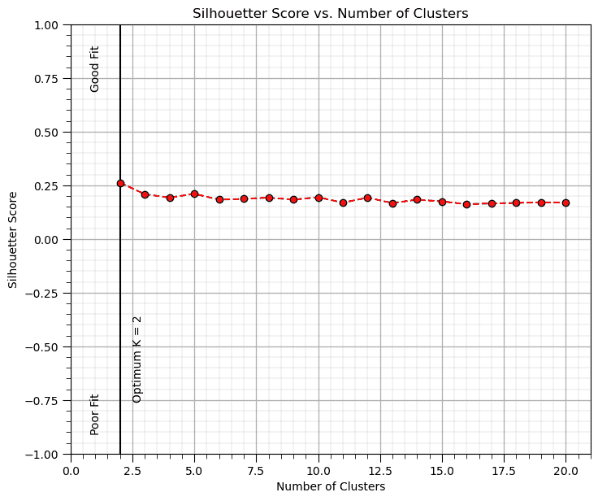

### 可视化聚类

现在让我们使用矩阵散点图来可视化聚类。

```py
sns.pairplot(df_new.iloc[:,:], hue="Kmeans", plot_kws={'alpha':1.0,'s':50}, palette = 'colorblind', corner=True) # matrix scatter plot
plt.subplots_adjust(left=0.0, bottom=0.0, right=0.6, top=0.7, wspace=0.2, hspace=0.2); plt.show() 
```

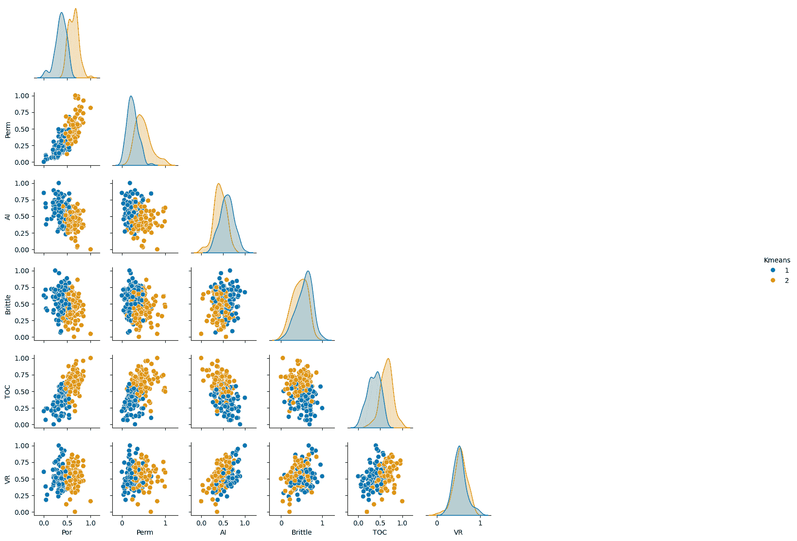

### 保存聚类

现在我们可以选择将带有聚类的 DataFrame 写出来。

```py
save_clusters = False                                         # save the imputed DataFrame?

if save_clusters == True:
    folder = r'C:\Local'
    file_name = r'dataframe_cluster.csv'

    df_new.to_csv(folder + "/" + file_name, index=False) 
```

## 评论

这是对聚类分析的基本处理。可以做和讨论的还有很多，我有很多更多的资源。查看我的[共享资源清单](https://michaelpyrcz.com/my-resources)以及本章开头提供的 YouTube 讲座链接，视频描述中包含资源链接。

希望这有所帮助，

*迈克尔*

## 关于作者


迈克尔·皮尔奇兹教授在德克萨斯大学奥斯汀分校 40 英亩校园的办公室。

迈克尔·皮尔奇兹是德克萨斯大学奥斯汀分校[科克雷尔工程学院](https://cockrell.utexas.edu/faculty-directory/alphabetical/p)和[杰克逊地球科学学院](https://www.jsg.utexas.edu/researcher/michael_pyrcz/)的教授，他在[德克萨斯大学奥斯汀分校](https://www.utexas.edu/)从事和教授地下、空间数据分析、地质统计学和机器学习。迈克尔还是，

+   [能源分析](https://fri.cns.utexas.edu/energy-analytics)新生研究项目的首席研究员，以及德克萨斯大学奥斯汀分校自然科学院机器学习实验室的核心教员

+   [计算机与地球科学](https://www.sciencedirect.com/journal/computers-and-geosciences/about/editorial-board)的副编辑，以及国际数学地球科学协会[数学地球科学](https://link.springer.com/journal/11004/editorial-board)的董事会成员。

迈克尔已经撰写了超过 70 篇[同行评审的出版物](https://scholar.google.com/citations?user=QVZ20eQAAAAJ&hl=en)，一个用于空间数据分析的[Python 包](https://pypi.org/project/geostatspy/)，合著了一本关于空间数据分析的教科书《[地质统计学储层建模](https://www.amazon.com/Geostatistical-Reservoir-Modeling-Michael-Pyrcz/dp/0199731446)》，并且是两本最近发布的电子书的作者，分别是《[Python 中的应用地质统计学：GeostatsPy 的实践指南](https://geostatsguy.github.io/GeostatsPyDemos_Book/intro.html)》和《[Python 中的应用机器学习：带代码的实践指南](https://geostatsguy.github.io/MachineLearningDemos_Book/intro.html)》。

迈克尔的所有大学课程都可在他的[YouTube 频道](https://www.youtube.com/@GeostatsGuyLectures)上找到，其中包含 100 多个 Python 交互式仪表板和 40 多个存储库中的详细工作流程链接，他的[GitHub 账户](https://github.com/GeostatsGuy)，以支持任何感兴趣的学生和在职专业人士的常青内容。了解更多关于迈克尔的工作和共享教育资源，请访问他的网站。

## 想一起工作吗？

我希望这个内容对那些想要了解更多关于地下建模、数据分析以及机器学习的人有所帮助。学生和在职专业人士都欢迎参与。

+   想邀请我到贵公司进行培训、辅导、项目审查、工作流程设计和/或咨询吗？我很乐意拜访并与您合作！

+   感兴趣合作、支持我的研究生研究或我的地下数据分析与机器学习联盟（共同负责人是约翰·福斯特教授）吗？我的研究将数据分析、随机建模和机器学习理论与实践相结合，以开发新的方法和工作流程，增加价值。我们正在解决具有挑战性的地下问题！

+   我可以通过 mpyrcz@austin.utexas.edu 联系到。

我总是很高兴讨论，

*迈克尔*

迈克尔·皮尔奇，博士，注册工程师，德克萨斯大学奥斯汀分校 Cockrell 工程学院和 Jackson 地球科学学院教授

更多资源可在以下位置获取：[Twitter](https://twitter.com/geostatsguy) | [GitHub](https://github.com/GeostatsGuy) | [网站](http://michaelpyrcz.com) | [Google Scholar](https://scholar.google.com/citations?user=QVZ20eQAAAAJ&hl=en&oi=ao) | [书籍](https://www.amazon.com/Geostatistical-Reservoir-Modeling-Michael-Pyrcz/dp/0199731446) | [YouTube](https://www.youtube.com/channel/UCLqEr-xV-ceHdXXXrTId5ig) | [Python 中的应用地球统计学电子书](https://geostatsguy.github.io/GeostatsPyDemos_Book/intro.html) | [LinkedIn](https://www.linkedin.com/in/michael-pyrcz-61a648a1)

## 聚类分析的动机

将不同的群体混合起来训练预测模型通常会降低模型精度。

+   聚类分析是一种推断性机器学习方法，用于自动化将数据集分割成单独的组，称为簇，并由整数索引指定。

+   计算机不提供组别的意义或描述，这是我们的工作！

我们需要学习和分割不同的群体来提高我们的预测模型，


示例数据集分为 5 组。

然而，上面的图示具有误导性。如果我们按照上面的计算边界，实际上我们会得到一个对新案例进行预测分类的模型，

+   给定 0.7 的标准化孔隙率和 0.18 的标准化声阻抗率，归类为第 5 组

聚类分析并不这样做，它是一种推断性、无监督的机器学习方法，

+   这是在数据中学习结构。

+   聚类将标签分配给数据


示例数据集，其中 5 个组标签通过聚类分配，颜色表示聚类。

## 推理机器学习

没有响应特征，$y$，只有预测特征，

$$ 𝑋_1,\ldots,𝑋_𝑚 $$

+   机器通过模仿学习数据的紧凑表示

+   通过特征投影、组分配、神经网络潜在特征等方式捕捉模式。

+   我们专注于对人群、自然系统的推理，而不是对响应特征的预测。

## K-Means 聚类

K-means 聚类方法主要作为一种无监督机器学习方法应用于聚类，将未标记数据分组分配，其中聚类组内的差异最小化。K-means 聚类中要最小化的损失函数，称为惯性，是，

$$ J = \sum^k_{i=1} \sum_{\alpha \in C_i} || X_{\alpha} - \mu_i || $$

其中 $i$ 是簇索引，$\alpha$ 是数据样本索引，$X$ 是数据样本，$\mu_i$ 是 $i$ 簇原型，$k$ 是簇的总数，而 $|| X_m - \mu_m ||$ 是在 $M$ 维空间中从样本到簇原型的欧几里得距离，计算如下：

$$ || X_{m,\alpha} - \mu_i || = \sqrt{ \sum_m^M \left( X_{m,\alpha} - \mu_{m,i} \right)² } $$

这里是这种损失函数的示意图，计算组原型与组内样本之间的距离之和，


K-means 聚类损失函数（惯性）的示意图。注意，为了清晰起见，仅标注了部分样本到原型的距离，以及部分数据标签。

下面是 K-means 聚类的一些重要方面的总结：

+   **原型方法** - 在特征空间中用合成案例的数量表示训练数据。对于 K-means 聚类，我们分配并迭代更新 $K$ 个原型。

+   **迭代解法** - 初始原型在特征空间中随机分配，每个训练样本的标签更新为最近的原型，然后原型调整到其分配的训练数据质心，重复此过程直到训练数据分配不再更新。

+   **无监督学习** - 训练数据未标记，并根据其在特征空间中与原型的接近程度分配 $K$ 个标签。其想法是相似的事物，特征空间中的接近度，应该属于同一个簇组。

+   **特征加权** - 该过程取决于特征空间中训练样本和原型之间的欧几里得距离。距离被视为相似性的“逆”。如果特征具有显著不同的幅度，则幅度和范围最大的特征将主导损失函数，聚类组将变得各向异性，与高范围特征垂直对齐。虽然常见的做法是对变量进行标准化/归一化，但可以通过不等方差应用特征加权。注意，在本演示中，我们将特征归一化到 0.0 到 1.0 的范围。

## 解决方案启发式方法

让我们先定义一个解决方案启发式方法，

+   **启发式方法** - 为了实用性而牺牲准确性的捷径，即解决方案通常足够好，并且有合理的运行时间。

对于将一个 $k$ 类别的标签分配给 $n$ 个样本数据的 K-means 聚类问题，解决方案空间包括，

$$ k^n $$

可能的解决方案。

K-means 聚类解决方案启发式方法包括以下步骤：

1.  分配初始随机原型并标记。


$k$ 个随机原型。

1.  将样本分配给最近的原型。


将样本分配给最近的原型。

1.  根据属于此原型的样本的质心更新原型。


将 $k$ 个原型更新为分配数据的质心。

1.  迭代（返回步骤 2），直到没有样本分配改变（原型停止移动）。


分配和更新迭代直到启发式解决方案收敛。

## 展示

我首先采用“手动”方法来计算 K-means 聚类分组分配。

+   这使我们能够观察方法在实际中的运用，而不仅仅是得到一个结果。我认为这更有指导意义。

+   之后，我将展示如何使用 scikit-learn 函数通过一行代码完成计算。

我还开发了一套[交互式 K-means 聚类仪表板](https://github.com/GeostatsGuy/DataScienceInteractivePython/blob/main/Interactive_kMeans_Clustering.ipynb)，以探索 K-means 聚类启发式方法，包括这个显示多个随机原型和惯性累积分布函数的解决方案一致性的一个。


交互式 Python 仪表板用于探索 K-means 聚类解决方案启发式方法的性能。

注意，对于下面的工作流程，我已经将 Ben Keen 提供的教程中的代码修改为函数，以处理步骤（将训练数据分配给最近的原型，将原型更新为分配数据的质心）。

+   原始教程可在[这里](http://benalexkeen.com/k-means-clustering-in-python)找到。

+   我的修改使此工作流程适合我的特定示例，并包括归一化和原始数据。感谢 Ben！

## 加载所需的库

以下代码加载所需的库。这些库应该已经与 Anaconda 3 一起安装。

```py
ignore_warnings = True                                        # ignore warnings?
import numpy as np                                            # ndarrays for gridded data
import pandas as pd                                           # DataFrames for tabular data
import copy                                                   # for deep copies
import os                                                     # set working directory, run executables
import matplotlib.pyplot as plt                               # for plotting
from matplotlib.ticker import (MultipleLocator, AutoMinorLocator) # control of axes ticks
import matplotlib.ticker as mtick                             # control tick label formatting
import seaborn as sns                                         # for matrix scatter plots
from sklearn.preprocessing import MinMaxScaler                # min/max normalization
from sklearn.metrics import silhouette_score                  # calculating the optimum K number of clusters
from sklearn.cluster import KMeans                            # k-means clustering
plt.rc('axes', axisbelow=True)                                # plot all grids below the plot elements
if ignore_warnings == True:                                   
    import warnings
    warnings.filterwarnings('ignore')
cmap = plt.cm.inferno                                         # color map
seed = 42                                                     # random number seed 
```

## 声明函数

以下函数执行 K-means 聚类所需的步骤。

+   将训练数据分配给最近的原型

+   将原型更新为分配的训练数据的质心

如果您不理解代码，请不要担心，我们使用了一些高级方法以使代码更简洁。

我还添加了一个方便的函数，用于添加主副网格线以提高绘图的可解释性。

```py
# Assignment function to assigned training data to the nearest prototype (code modified from Ben Keen, http://benalexkeen.com/k-means-clustering-in-python/)
def assignment(df,centroids):
    for i in centroids.keys():
        df['distance_from_{}'.format(i)] = (                  # use the normalized features and centroids
            np.sqrt(
                (df['Norm_Porosity'] - centroids[i][2]) ** 2
                + (df['Norm_AI'] - centroids[i][3]) ** 2
            )
        )
    centroid_distance_cols = ['distance_from_{}'.format(i) for i in centroids.keys()]
    df['closest'] = df.loc[:, centroid_distance_cols].idxmin(axis=1)
    df['closest'] = df['closest'].map(lambda x: int(x.lstrip('distance_from_')))
    df['color'] = df['closest'].map(lambda x: colmap[x])
    return

# Update function to shift the prototype to the centroid of the training data assigned to the prototype (code modified from Ben Keen, http://benalexkeen.com/k-means-clustering-in-python/)
def update(df,centroids,x1min,x1max,x2min,x2max):
    for i in centroids.keys():
        centroids[i][2] = np.mean(df[df['closest'] == i]['Norm_Porosity'])
        centroids[i][3] = np.mean(df[df['closest'] == i]['Norm_AI'])
        centroids[i][0] = centroids[i][2] * (x1max-x1min) + x1min
        centroids[i][1] = centroids[i][3] * (x2max-x2min) + x2min
    return

def add_grid():
    plt.gca().grid(True, which='major',linewidth = 1.0); plt.gca().grid(True, which='minor',linewidth = 0.2) # add y grids
    plt.gca().tick_params(which='major',length=7); plt.gca().tick_params(which='minor', length=4)
    plt.gca().xaxis.set_minor_locator(AutoMinorLocator()); plt.gca().yaxis.set_minor_locator(AutoMinorLocator()) # turn on minor ticks 
```

## 设置工作目录

我总是喜欢这样做，这样我就不会丢失文件，并且可以简化后续的读取和写入（避免每次都包含完整地址）。

```py
#os.chdir("C:/PGE383")                                        # set the working directory with the input data file 
```

## 加载表格数据

这是将我们的逗号分隔数据文件加载到 Pandas DataFrame 对象中的命令。

让我们加载提供的多元空间数据集“12_sample_data.csv”。这是一个以逗号分隔的文件，包含：

+   X 和 Y 坐标 ($m$)

+   地层 0 和 1

+   孔隙率（分数）

+   渗透率 ($mD$)

+   声阻抗 ($\frac{kg}{m³} \cdot \frac{m}{s} \cdot 10³$)。

我们使用 pandas 的“read_csv”函数将其加载到名为“df”的 DataFrame 中，然后预览以确保正确加载。

**Python 小贴士：使用包中的函数**只需输入我们在开头声明的包的标签：

```py
import pandas as pd 
```

因此，我们可以使用命令来访问 pandas 函数“read_csv”：

```py
pd.read_csv() 
```

但 read csv 需要输入参数。最重要的是文件名。在我们的情况下，所有其他默认参数都很好。如果您想查看此函数的所有可能参数，请访问[这里](https://pandas.pydata.org/pandas-docs/stable/reference/api/pandas.read_csv.html)。

+   文档总是很有帮助

+   Python 函数通常有很多灵活性，这可以通过使用各种输入参数来实现。

此外，程序还有一个输出，即从数据加载的 pandas DataFrame。因此，我们必须指定代表该新对象的名字/变量。

```py
df = pd.read_csv("12_sample_data.csv") 
```

让我们运行此命令来加载数据，然后运行此命令来提取数据的一个随机子集。

```py
df = df.sample(frac=.30, random_state = 73073); 
df = df.reset_index() 
```

我们这样做是为了减少数据量，以便于可视化（如果图上点太多就难以看清）。

```py
#df = pd.read_csv('12_sample_data.csv')                       # load our data table from the current directory
df = pd.read_csv('https://raw.githubusercontent.com/GeostatsGuy/GeoDataSets/master/12_sample_data.csv') # or from GtiHub
df = df.iloc[:,1:]                                            # remove a null column 
df = df.sample(frac=.30, random_state = seed); df = df.reset_index(drop=True) # extract 30% random to reduce the number of data 
```

## 表格数据的摘要统计

表格包括孔隙率（分数）和声阻抗（$\frac{kg}{m³} \cdot \frac{m}{s} \cdot 10³$)，我们将在下面的演示中使用。

在 DataFrames 中从表格数据计算摘要统计有很多高效的方法。describe 命令提供了一个很好的数据表，包括计数、平均值、最小值、最大值和四分位数。我们使用 transpose 仅用于翻转表格，以便特征在行上，统计在列上。

```py
df.describe().transpose()                                     # DataFrame summary statistics 
```

|  | count | mean | std | min | 25% | 50% | 75% | max |
| --- | --- | --- | --- | --- | --- | --- | --- | --- |
| X | 144.0 | 3910.668909 | 2563.309885 | 6.161100 | 1978.194998 | 3500.392517 | 5502.096026 | 9703.495538 |
| Y | 144.0 | 5093.498955 | 2861.683625 | 491.789431 | 2503.509193 | 5393.325918 | 7596.505416 | 9897.863401 |
| Facies | 144.0 | 0.618056 | 0.487559 | 0.000000 | 0.000000 | 1.000000 | 1.000000 | 1.000000 |
| Porosity | 144.0 | 0.191045 | 0.031262 | 0.133681 | 0.165889 | 0.185460 | 0.220655 | 0.261091 |
| Perm | 144.0 | 568.892892 | 1265.582175 | 0.035608 | 9.382939 | 64.000905 | 425.323240 | 7452.343369 |
| AI | 144.0 | 3749.924448 | 821.100292 | 1746.387548 | 3131.159498 | 3686.800017 | 4292.981181 | 5725.525232 |

## 归一化特征

这两个特征相当不兼容。它们有显著不同的：

+   方差/范围

我们应该将每个特征归一化到 0 到 1 之间。公式是：

$$ x_i^{\prime} = \frac{ \left( x_i - min(x) \right)}{\left( max(x) - min(x) \right)} \quad i = 1,\ldots,n $$

+   这是一个没有改变分布形状的分布、平移、拉伸或压缩。

现在我们可以使用这些归一化值来计算工作流程中的距离：

+   为了消除幅度和范围对我们相似度计算的影响

```py
pormin = df['Porosity'].min(); pormax = df['Porosity'].max()  # find min and max for each feature
AImin = df['AI'].min(); AImax = df['AI'].max()

df['Norm_Porosity'] = (df['Porosity']-pormin)/(pormax - pormin) # normalize each feature, this broadcasts over all samples in the DataFrame
df['Norm_AI'] = (df['AI']-AImin)/(AImax - AImin)                            # and appends a new normalized feature for each 
```

当然，scikit-learn 中有一个归一化函数，但这次我们第一次手动进行操作，以确保操作过程非常清晰。

```py
from sklearn.preprocessing import MinMaxScaler
scaler = MinMaxScaler()
X_normalized = scaler.fit_transform(X) 
```

让我们确认我们的归一化孔隙率和声阻抗现在在 0 到 1 之间。

```py
df.describe().transpose()                                     # summary statistics for the DataFrame 
```

|  | count | mean | std | min | 25% | 50% | 75% | max |
| --- | --- | --- | --- | --- | --- | --- | --- | --- |
| X | 144.0 | 3910.668909 | 2563.309885 | 6.161100 | 1978.194998 | 3500.392517 | 5502.096026 | 9703.495538 |
| Y | 144.0 | 5093.498955 | 2861.683625 | 491.789431 | 2503.509193 | 5393.325918 | 7596.505416 | 9897.863401 |
| Facies | 144.0 | 0.618056 | 0.487559 | 0.000000 | 0.000000 | 1.000000 | 1.000000 | 1.000000 |
| Porosity | 144.0 | 0.191045 | 0.031262 | 0.133681 | 0.165889 | 0.185460 | 0.220655 | 0.261091 |
| Perm | 144.0 | 568.892892 | 1265.582175 | 0.035608 | 9.382939 | 64.000905 | 425.323240 | 7452.343369 |
| AI | 144.0 | 3749.924448 | 821.100292 | 1746.387548 | 3131.159498 | 3686.800017 | 4292.981181 | 5725.525232 |
| Norm_Porosity | 144.0 | 0.450230 | 0.245367 | 0.000000 | 0.252789 | 0.406397 | 0.682631 | 1.000000 |
| Norm_AI | 144.0 | 0.503510 | 0.206351 | 0.000000 | 0.348008 | 0.487646 | 0.639986 | 1.000000 |

## 提取感兴趣的特征

现在，让我们切片提取孔隙率和声阻抗特征，然后查看生成的 DataFrame，以确保我们按预期加载和重新格式化。

+   我经常只分离感兴趣的特征，以简化我的工作流程并减少出错的可能性，例如，不小心引用了当前工作流程中未使用的特征！

+   注意，这是一个浅拷贝；因此，对 df_subset DataFrame 的任何更改都会反映在原始的 df DataFrame 中。这个切片实际上是内存中原始 DataFrame 的引用。

```py
df_subset = df.iloc[:,[3,5,6,7]]                              # extract Porosity and AI for a simple 2D example
df_subset.head()                                              # preview the new DataFrame 
```

|  | Porosity | AI | Norm_Porosity | Norm_AI |
| --- | --- | --- | --- | --- |
| 0 | 0.252772 | 2862.446918 | 0.934709 | 0.280478 |
| 1 | 0.181580 | 2919.237330 | 0.375944 | 0.294750 |
| 2 | 0.230303 | 2999.248935 | 0.758358 | 0.314858 |
| 3 | 0.163732 | 3823.747676 | 0.235860 | 0.522063 |
| 4 | 0.197078 | 4609.845251 | 0.497583 | 0.719618 |

## 推断模型参数

从汇总统计中，我们可以为每个特征分配合理的最小值和最大值。

+   我们将使用这个来绘图。

我们还将设置随机数种子以确保每次运行程序时程序都做同样的事情。

+   更改种子数字以获得不同的结果

我们将设置原型/聚类数量，*K*

我们定义一个字典，其中包含每个聚类的颜色代码，$k = 1,\ldots,K$。目前有 7 个代码，如果 $K$ 设置大于 7，将会出现错误。向字典中添加更多颜色代码以允许更多类别。

```py
por_min = 0.12; por_max = 0.28                                # min and max values for plotting
AI_min = 1500; AI_max = 6500                                  
K = 6; max_iter = 100                                         # number of prototypes / categories
colmap = {1: 'r', 2: 'g', 3: 'b', 4: 'm', 5: 'c', 6: 'k', 7: 'w'} # color dictionary for up to 7 categories
prototypes = np.zeros((K,max_iter,2))                         # store the prototypes over iterations
norm_prototypes = np.zeros((K,max_iter,2))                    # store the prototypes for the standardized features over iterations 
```

## 可视化训练数据

在这个练习中，我们想使用 K-均值聚类根据声阻抗和孔隙率预测特征提供岩相。

+   这允许我们将具有相似岩石物理和地球物理特性的岩石分组。

让我们首先查看训练数据特征（孔隙率和声阻抗）的散点图。

+   在整个练习中，我们将通过原始单位和归一化单位查看数据。

```py
plt.subplot(121)                                              # scatter plot our training data 
plt.scatter(df_subset['Porosity'], df['AI'], c="black", alpha = 0.4, linewidths=1.0, edgecolors="black")
plt.title('Acoustic Impedance vs. Porosity'); plt.xlabel('Porosity (fraction)'); plt.ylabel('Acoustic Impedance (kg/m³ x m/s x 10³)')
plt.xlim(por_min, por_max); plt.ylim(AI_min, AI_max); add_grid();

plt.subplot(122)                                              # scatter plot our normalized training data 
plt.scatter(df_subset['Norm_Porosity'], df['Norm_AI'], c="black", alpha = 0.4, linewidths=1.0, edgecolors="black")
plt.title('Normalized Acoustic Impedance vs. Porosity'); plt.xlabel('Porosity (normalized)'); plt.ylabel('Acoustic Impedance (normalized)')
plt.xlim(0.0,1.0); plt.ylim(0.0,1.0); add_grid();
plt.subplots_adjust(left=0.0, bottom=0.0, right=2.0, top=1.0, wspace=0.2, hspace=0.2); plt.show() 
```


## 手动计算 k-均值聚类

这里是计算未标记数据集的 k-均值聚类的步骤。

### 初始化 k 个原型

首先，我们将随机地在特征空间中分配 k 个原型。

+   为 K 个原型分配一个随机的孔隙率和声阻抗

+   别担心，这些原型最初可能没有太多意义，但它们会改进

我们将这样做，然后以红色、绿色、蓝色等点来可视化原型。

```py
np.random.seed(seed)                                          # random number seed for repeatability of the results
centroids = {}
for i in range(K):                                            # Assign Initial Prototypes 
    norm_por = np.random.random(); por = norm_por * (pormax-pormin) + pormin
    norm_AI = np.random.random(); AI = norm_AI * (AImax-AImin) + AImin
    centroids[i+1] = [por,AI,norm_por,norm_AI]; prototypes[i,0] = [por,AI]; norm_prototypes[i,0] = [norm_por,norm_AI]

plt.subplot(121)                                              # plot the training data and K prototypes
plt.scatter(df_subset['Porosity'], df['AI'],c="black",alpha = 0.4,linewidths=1.0,edgecolors="black",zorder=1,label='Samples')
for i in centroids.keys():
    plt.scatter(centroids.get(i)[0], centroids.get(i)[1],color='white',s=120,marker='o',linewidths=1.0, edgecolors="black",zorder=10)
    plt.scatter(centroids.get(i)[0], centroids.get(i)[1],color=colmap[i],s=90,marker='*',linewidths=0.5, edgecolors="black",zorder=20,
                label='Prototype #'+str(i))
plt.title('Acoustic Impedance vs. Porosity with Initial Prototypes'); plt.xlabel('Porosity (fraction)')
plt.ylabel('Acoustic Impedance (kg/m³ x m/s x 10³)')
plt.xlim(por_min, por_max); plt.ylim(AI_min, AI_max); add_grid(); plt.legend(loc='upper right')

plt.subplot(122)                                              # plot the training data and K prototypes
plt.scatter(df_subset['Norm_Porosity'], df['Norm_AI'], c="black", alpha = 0.4, linewidths=1.0, edgecolors="black",label='Samples')
for i in centroids.keys():
    plt.scatter(centroids.get(i)[2], centroids.get(i)[3],color='white',s=120,marker='o',linewidths=1.0, edgecolors="black",zorder=10)
    plt.scatter(centroids.get(i)[2], centroids.get(i)[3],color=colmap[i],s=90,marker='*',linewidths=0.5, edgecolors="black",zorder=20,
                label='Prototype #'+str(i))
plt.title('Normalized Acoustic Impedance vs. Porosity with Initial Prototypes'); plt.xlabel('Porosity (normalized)')
plt.ylabel('Acoustic Impedance (normalized)')
plt.xlim([0, 1]); plt.ylim([0, 1]); add_grid(); plt.legend(loc='upper right')
plt.subplots_adjust(left=0.0, bottom=0.0, right=2.0, top=1.0, wspace=0.2, hspace=0.2); plt.show() 
```


### 训练数据分配

所有训练数据都分配到最近的原型。

+   回想我们有一个函数来做这件事

```py
df = assignment(df, centroids) 
```

+   我们处理归一化特征并可视化归一化和原始特征

```py
assignment(df, centroids)                                     # assign training data to the nearest prototype

plt.subplot(121)                                              # plot the assigned training data and K prototypes
plt.scatter(df['Porosity'], df['AI'], color=df['color'], alpha=0.5, edgecolor='k'); plt.scatter(-999,-999,color='white',edgecolors='black',
                label='Samples')
for i in centroids.keys():
    plt.scatter(centroids.get(i)[0], centroids.get(i)[1],color='white',s=120,marker='o',linewidths=1.0, edgecolors="black",zorder=10)
    plt.scatter(centroids.get(i)[0], centroids.get(i)[1],color=colmap[i],s=90,marker='*',linewidths=0.5, edgecolors="black",zorder=20,
                label='Prototype #'+str(i))
plt.title('Acoustic Impedance vs. Porosity with Initial Prototypes'); plt.xlabel('Porosity (fraction)')
plt.ylabel('Acoustic Impedance (kg/m³ x m/s x 10³)')
plt.xlim(por_min, por_max); plt.ylim(AI_min, AI_max); add_grid(); plt.legend(loc='upper right')

plt.subplot(122)                                              # plot the normalized training data and K prototypes
plt.scatter(df_subset['Norm_Porosity'], df['Norm_AI'], c=df['color'], alpha = 0.5, linewidths=1.0, edgecolors="black")
plt.scatter(-999,-999,color='white',edgecolors='black',label='Samples')
for i in centroids.keys():
    plt.scatter(centroids.get(i)[2], centroids.get(i)[3],color='white',s=120,marker='o',linewidths=1.0, edgecolors="black",zorder=10)
    plt.scatter(centroids.get(i)[2], centroids.get(i)[3],color=colmap[i],s=90,marker='*',linewidths=0.5, edgecolors="black",zorder=20,
                label='Prototype #'+str(i))
plt.title('Normalized Acoustic Impedance vs. Porosity with Initial Prototypes'); plt.xlabel('Porosity (normalized)')
plt.ylabel('Acoustic Impedance (normalized)')
plt.xlim([0, 1]); plt.ylim([0, 1]); add_grid(); plt.legend(loc='upper right')
plt.subplots_adjust(left=0.0, bottom=0.0, right=2.0, top=1.0, wspace=0.2, hspace=0.2); plt.show() 
```


### 更新原型

现在我们将原型重新分配到每个训练数据的质心。

```py
old_centroids = copy.deepcopy(centroids)                      # make a deep copy of the centroids for plotting vectors below
update(df,centroids,pormin,pormax,AImin,AImax)                # update the centroids to the new data assignments

plt.subplot(121)                                              # plot the assigned training data and k prototypes
ax = plt.gca()
plt.scatter(df['Porosity'], df['AI'], color=df['color'], alpha=0.5, edgecolor='k')
plt.scatter(-999,-999,color='white',edgecolors='black',label='Samples')
for i in centroids.keys():
    plt.scatter(old_centroids.get(i)[0], old_centroids.get(i)[1],color='white',s=120,marker='o',linewidths=1.0,alpha=0.5,
            edgecolors="black",zorder=10)
    plt.scatter(old_centroids.get(i)[0], old_centroids.get(i)[1],color=colmap[i],s=90,marker='*',linewidths=0.5,alpha=0.5,
            edgecolors="black",zorder=20)
    plt.scatter(centroids.get(i)[0], centroids.get(i)[1],color='white',s=150,marker='o',linewidths=1.0, edgecolors="black",zorder=10)
    plt.scatter(centroids.get(i)[0], centroids.get(i)[1],color=colmap[i],s=120,marker='*',linewidths=0.5,
            edgecolors="black",zorder=20,label='Prototype #'+str(i))
    prototypes[i-1,1] = [centroids[i][0],centroids[i][1]]; norm_prototypes[i-1,1] = [centroids[i][2],centroids[i][3]]
plt.title('Acoustic Impedance vs. Porosity with Updated Prototypes and Vectors'); plt.xlabel('Porosity (fraction)')
plt.ylabel('Acoustic Impedance (kg/m³ x m/s x 10³)')
plt.xlim(por_min, por_max); plt.ylim(AI_min, AI_max); add_grid(); plt.legend(loc='upper right')

for i in old_centroids.keys():                                # plot the vectors
    old_x = old_centroids[i][0]
    old_y = old_centroids[i][1]
    dx = (centroids[i][0] - old_centroids[i][0]) 
    dy = (centroids[i][1] - old_centroids[i][1]) 
    ax.arrow(old_x, old_y, dx, dy,fc=colmap[i], ec=colmap[i]); 

plt.subplot(122)                                              # plot the normalized assigned training data and k prototypes
ax = plt.gca()
plt.scatter(df['Norm_Porosity'], df['Norm_AI'], color=df['color'], alpha=0.5, edgecolor='k')
plt.scatter(-999,-999,color='white',edgecolors='black',label='Samples')
for i in centroids.keys():
    plt.scatter(old_centroids.get(i)[2], old_centroids.get(i)[3],color='white',s=120,marker='o',linewidths=1.0,alpha=0.5,
        edgecolors="black",zorder=10)
    plt.scatter(old_centroids.get(i)[2], old_centroids.get(i)[3],color=colmap[i],s=90,marker='*',linewidths=0.5,alpha=0.5,
        edgecolors="black",zorder=20)
    plt.scatter(centroids.get(i)[2], centroids.get(i)[3],color='white',s=150,marker='o',linewidths=1.0, edgecolors="black",zorder=10)
    plt.scatter(centroids.get(i)[2], centroids.get(i)[3],color=colmap[i],s=120,marker='*',linewidths=0.5, edgecolors="black",zorder=20,
        label='Prototype #'+str(i))
plt.title('Normalized Acoustic Impedance vs. Porosity with Updated Prototypes and Vectors'); plt.xlabel('Porosity (normalized)')
plt.ylabel('Acoustic Impedance (normalized)')
plt.xlim([0, 1]); plt.ylim([0, 1]); add_grid(); plt.legend(loc='upper right')

for i in old_centroids.keys():                                # plot the vectors
    old_x = old_centroids[i][2]
    old_y = old_centroids[i][3]
    dx = (centroids[i][2] - old_centroids[i][2]) 
    dy = (centroids[i][3] - old_centroids[i][3]) 
    ax.arrow(old_x, old_y, dx, dy,fc=colmap[i], ec=colmap[i])

plt.subplots_adjust(left=0.0, bottom=0.0, right=2.0, top=1.0, wspace=0.2, hspace=0.2); plt.show() 
```


### 重复训练数据的分配

再次将训练数据分配到最近的原型。

+   注意，原型在之前的步骤中已更新，因此分配可能会改变

```py
assignment(df, centroids)                                     # assign samples to nearest prototype

plt.subplot(121)                                              # plot the assigned training data and K prototypes
plt.scatter(df['Porosity'], df['AI'], color=df['color'], alpha=0.5, edgecolor='k'); plt.scatter(-999,-999,color='white',
    edgecolors='black',label='Samples')
for i in centroids.keys():
    plt.scatter(centroids.get(i)[0], centroids.get(i)[1],color='white',s=120,marker='o',linewidths=1.0, edgecolors="black",zorder=10)
    plt.scatter(centroids.get(i)[0], centroids.get(i)[1],color=colmap[i],s=90,marker='*',linewidths=0.5, edgecolors="black",zorder=20,
            label='Prototype #'+str(i))
plt.title('Acoustic Impedance vs. Porosity with Updated Training Data'); plt.xlabel('Porosity (fraction)')
plt.ylabel('Acoustic Impedance (kg/m³ x m/s x 10³)')
plt.xlim(por_min, por_max); plt.ylim(AI_min, AI_max); add_grid(); plt.legend(loc='upper right')

plt.subplot(122)                                              # plot the normalized training data and K prototypes
plt.scatter(df_subset['Norm_Porosity'], df['Norm_AI'], c=df['color'], alpha = 0.4, linewidths=1.0, edgecolors="black")
plt.scatter(-999,-999,color='white',edgecolors='black',label='Samples')
for i in centroids.keys():
    plt.scatter(centroids.get(i)[2], centroids.get(i)[3],color='white',s=120,marker='o',linewidths=1.0, edgecolors="black",zorder=10)
    plt.scatter(centroids.get(i)[2], centroids.get(i)[3],color=colmap[i],s=90,marker='*',linewidths=0.5, edgecolors="black",
            zorder=20,label='Prototype #'+str(i))
plt.title('Normalized Acoustic Impedance vs. Porosity with Updated Training Data'); plt.xlabel('Porosity (normalized)')
plt.ylabel('Acoustic Impedance (normalized)')
plt.xlim([0, 1]); plt.ylim([0, 1]); add_grid(); plt.legend(loc='upper right')
plt.subplots_adjust(left=0.0, bottom=0.0, right=2.0, top=1.0, wspace=0.2, hspace=0.2); plt.show() 
```


### 迭代直到收敛

现在我们将重复之前的步骤：

+   将训练数据分配到最近的原型

+   更新原型

我们会这样做，直到没有进一步的机会改变分配给每个训练数据的类别。

```py
iteration = 2                                                 # initialize a counter, we already completed iteration 0 and 1 above
while True:
    closest_centroids = df['closest'].copy(deep=True)
    update(df,centroids,pormin,pormax,AImin,AImax)
    for i in centroids.keys():
        prototypes[i-1,iteration] = [centroids[i][0],centroids[i][1]]
        norm_prototypes[i-1,iteration] = [centroids[i][2],centroids[i][3]]
    assignment(df, centroids)
    if closest_centroids.equals(df['closest']):
        break
    iteration = iteration + 1

plt.subplot(121)                                              # plot the assigned training data and K prototypes
plt.scatter(df['Porosity'], df['AI'], color=df['color'], alpha=0.5, edgecolor='k')
for i in centroids.keys():
    plt.scatter(prototypes[i-1,0,0], prototypes[i-1,0,1],color='white',s=120,marker='o',linewidths=1.0,alpha=0.5,edgecolors="black",zorder=10)
    plt.scatter(prototypes[i-1,0,0], prototypes[i-1,0,1],color=colmap[i],s=90,marker='*',linewidths=0.5,alpha=0.5,edgecolors="black",zorder=20)
    plt.scatter(centroids.get(i)[0], centroids.get(i)[1],color='white',s=120,marker='o',linewidths=1.0, edgecolors="black",zorder=10)
    plt.scatter(centroids.get(i)[0], centroids.get(i)[1],color=colmap[i],s=90,marker='*',linewidths=0.5, edgecolors="black",
        zorder=20,label='Prototype #'+str(i))
    plt.plot(prototypes[i-1,:iteration+1,0],prototypes[i-1,:iteration+1,1],color=colmap[i],zorder = 1)
plt.title('Acoustic Impedance vs. Porosity with Final Prototypes'); plt.xlabel('Porosity (fraction)')
plt.ylabel('Acoustic Impedance (kg/m³ x m/s x 10³)')
plt.xlim(por_min, por_max); plt.ylim(AI_min, AI_max); add_grid(); plt.legend(loc='upper right')

plt.subplot(122)                                              # plot the training data and K prototypes
plt.scatter(df_subset['Norm_Porosity'], df['Norm_AI'], c=df['color'], alpha = 0.4, linewidths=1.0, edgecolors="black")
for i in centroids.keys():
    plt.scatter(norm_prototypes[i-1,0,0], norm_prototypes[i-1,0,1],color='white',s=120,marker='o',linewidths=1.0,alpha=0.5,
            edgecolors="black",zorder=10)
    plt.scatter(norm_prototypes[i-1,0,0], norm_prototypes[i-1,0,1],color=colmap[i],s=90,marker='*',linewidths=0.5,alpha=0.5,
            edgecolors="black",zorder=20)
    plt.scatter(centroids.get(i)[2], centroids.get(i)[3],color='white',s=120,marker='o',linewidths=1.0, edgecolors="black",zorder=10)
    plt.scatter(centroids.get(i)[2], centroids.get(i)[3],color=colmap[i],s=90,marker='*',linewidths=0.5, edgecolors="black",
            zorder=20,label='Prototype #'+str(i))
    plt.plot(norm_prototypes[i-1,:iteration+1,0],norm_prototypes[i-1,:iteration+1,1],color=colmap[i],zorder = 1)
plt.title('Normalized Acoustic Impedance vs. Porosity with Final Prototypes'); plt.xlabel('Porosity (normalized)')
plt.ylabel('Acoustic Impedance (normalized)')
plt.xlim([0, 1]); plt.ylim([0, 1]); add_grid(); plt.legend(loc='upper right')
plt.subplots_adjust(left=0.0, bottom=0.0, right=2.0, top=1.0, wspace=0.2, hspace=0.2); plt.show() 
```


### 初始化 k 个原型

首先，我们将随机地在特征空间中分配 k 个原型。

+   对于 K 个原型，分配一个随机的孔隙率和声阻抗

+   别担心，这些原型最初可能没有太多意义，但它们会改进

我们将这样做，然后以红色、绿色、蓝色等点可视化工原型。

```py
np.random.seed(seed)                                          # random number seed for repeatability of the results
centroids = {}
for i in range(K):                                            # Assign Initial Prototypes 
    norm_por = np.random.random(); por = norm_por * (pormax-pormin) + pormin
    norm_AI = np.random.random(); AI = norm_AI * (AImax-AImin) + AImin
    centroids[i+1] = [por,AI,norm_por,norm_AI]; prototypes[i,0] = [por,AI]; norm_prototypes[i,0] = [norm_por,norm_AI]

plt.subplot(121)                                              # plot the training data and K prototypes
plt.scatter(df_subset['Porosity'], df['AI'],c="black",alpha = 0.4,linewidths=1.0,edgecolors="black",zorder=1,label='Samples')
for i in centroids.keys():
    plt.scatter(centroids.get(i)[0], centroids.get(i)[1],color='white',s=120,marker='o',linewidths=1.0, edgecolors="black",zorder=10)
    plt.scatter(centroids.get(i)[0], centroids.get(i)[1],color=colmap[i],s=90,marker='*',linewidths=0.5, edgecolors="black",zorder=20,
                label='Prototype #'+str(i))
plt.title('Acoustic Impedance vs. Porosity with Initial Prototypes'); plt.xlabel('Porosity (fraction)')
plt.ylabel('Acoustic Impedance (kg/m³ x m/s x 10³)')
plt.xlim(por_min, por_max); plt.ylim(AI_min, AI_max); add_grid(); plt.legend(loc='upper right')

plt.subplot(122)                                              # plot the training data and K prototypes
plt.scatter(df_subset['Norm_Porosity'], df['Norm_AI'], c="black", alpha = 0.4, linewidths=1.0, edgecolors="black",label='Samples')
for i in centroids.keys():
    plt.scatter(centroids.get(i)[2], centroids.get(i)[3],color='white',s=120,marker='o',linewidths=1.0, edgecolors="black",zorder=10)
    plt.scatter(centroids.get(i)[2], centroids.get(i)[3],color=colmap[i],s=90,marker='*',linewidths=0.5, edgecolors="black",zorder=20,
                label='Prototype #'+str(i))
plt.title('Normalized Acoustic Impedance vs. Porosity with Initial Prototypes'); plt.xlabel('Porosity (normalized)')
plt.ylabel('Acoustic Impedance (normalized)')
plt.xlim([0, 1]); plt.ylim([0, 1]); add_grid(); plt.legend(loc='upper right')
plt.subplots_adjust(left=0.0, bottom=0.0, right=2.0, top=1.0, wspace=0.2, hspace=0.2); plt.show() 
```


### 训练数据的分配

所有训练数据都被分配到最近的原型。

+   回想一下，我们有一个函数来做这件事

```py
df = assignment(df, centroids) 
```

+   我们使用归一化特征并可视化归一化和原始特征

```py
assignment(df, centroids)                                     # assign training data to the nearest prototype

plt.subplot(121)                                              # plot the assigned training data and K prototypes
plt.scatter(df['Porosity'], df['AI'], color=df['color'], alpha=0.5, edgecolor='k'); plt.scatter(-999,-999,color='white',edgecolors='black',
                label='Samples')
for i in centroids.keys():
    plt.scatter(centroids.get(i)[0], centroids.get(i)[1],color='white',s=120,marker='o',linewidths=1.0, edgecolors="black",zorder=10)
    plt.scatter(centroids.get(i)[0], centroids.get(i)[1],color=colmap[i],s=90,marker='*',linewidths=0.5, edgecolors="black",zorder=20,
                label='Prototype #'+str(i))
plt.title('Acoustic Impedance vs. Porosity with Initial Prototypes'); plt.xlabel('Porosity (fraction)')
plt.ylabel('Acoustic Impedance (kg/m³ x m/s x 10³)')
plt.xlim(por_min, por_max); plt.ylim(AI_min, AI_max); add_grid(); plt.legend(loc='upper right')

plt.subplot(122)                                              # plot the normalized training data and K prototypes
plt.scatter(df_subset['Norm_Porosity'], df['Norm_AI'], c=df['color'], alpha = 0.5, linewidths=1.0, edgecolors="black")
plt.scatter(-999,-999,color='white',edgecolors='black',label='Samples')
for i in centroids.keys():
    plt.scatter(centroids.get(i)[2], centroids.get(i)[3],color='white',s=120,marker='o',linewidths=1.0, edgecolors="black",zorder=10)
    plt.scatter(centroids.get(i)[2], centroids.get(i)[3],color=colmap[i],s=90,marker='*',linewidths=0.5, edgecolors="black",zorder=20,
                label='Prototype #'+str(i))
plt.title('Normalized Acoustic Impedance vs. Porosity with Initial Prototypes'); plt.xlabel('Porosity (normalized)')
plt.ylabel('Acoustic Impedance (normalized)')
plt.xlim([0, 1]); plt.ylim([0, 1]); add_grid(); plt.legend(loc='upper right')
plt.subplots_adjust(left=0.0, bottom=0.0, right=2.0, top=1.0, wspace=0.2, hspace=0.2); plt.show() 
```


### 更新原型

现在，我们将原型重新分配到属于每个的训练数据的质心。

```py
old_centroids = copy.deepcopy(centroids)                      # make a deep copy of the centroids for plotting vectors below
update(df,centroids,pormin,pormax,AImin,AImax)                # update the centroids to the new data assignments

plt.subplot(121)                                              # plot the assigned training data and k prototypes
ax = plt.gca()
plt.scatter(df['Porosity'], df['AI'], color=df['color'], alpha=0.5, edgecolor='k')
plt.scatter(-999,-999,color='white',edgecolors='black',label='Samples')
for i in centroids.keys():
    plt.scatter(old_centroids.get(i)[0], old_centroids.get(i)[1],color='white',s=120,marker='o',linewidths=1.0,alpha=0.5,
            edgecolors="black",zorder=10)
    plt.scatter(old_centroids.get(i)[0], old_centroids.get(i)[1],color=colmap[i],s=90,marker='*',linewidths=0.5,alpha=0.5,
            edgecolors="black",zorder=20)
    plt.scatter(centroids.get(i)[0], centroids.get(i)[1],color='white',s=150,marker='o',linewidths=1.0, edgecolors="black",zorder=10)
    plt.scatter(centroids.get(i)[0], centroids.get(i)[1],color=colmap[i],s=120,marker='*',linewidths=0.5,
            edgecolors="black",zorder=20,label='Prototype #'+str(i))
    prototypes[i-1,1] = [centroids[i][0],centroids[i][1]]; norm_prototypes[i-1,1] = [centroids[i][2],centroids[i][3]]
plt.title('Acoustic Impedance vs. Porosity with Updated Prototypes and Vectors'); plt.xlabel('Porosity (fraction)')
plt.ylabel('Acoustic Impedance (kg/m³ x m/s x 10³)')
plt.xlim(por_min, por_max); plt.ylim(AI_min, AI_max); add_grid(); plt.legend(loc='upper right')

for i in old_centroids.keys():                                # plot the vectors
    old_x = old_centroids[i][0]
    old_y = old_centroids[i][1]
    dx = (centroids[i][0] - old_centroids[i][0]) 
    dy = (centroids[i][1] - old_centroids[i][1]) 
    ax.arrow(old_x, old_y, dx, dy,fc=colmap[i], ec=colmap[i]); 

plt.subplot(122)                                              # plot the normalized assigned training data and k prototypes
ax = plt.gca()
plt.scatter(df['Norm_Porosity'], df['Norm_AI'], color=df['color'], alpha=0.5, edgecolor='k')
plt.scatter(-999,-999,color='white',edgecolors='black',label='Samples')
for i in centroids.keys():
    plt.scatter(old_centroids.get(i)[2], old_centroids.get(i)[3],color='white',s=120,marker='o',linewidths=1.0,alpha=0.5,
        edgecolors="black",zorder=10)
    plt.scatter(old_centroids.get(i)[2], old_centroids.get(i)[3],color=colmap[i],s=90,marker='*',linewidths=0.5,alpha=0.5,
        edgecolors="black",zorder=20)
    plt.scatter(centroids.get(i)[2], centroids.get(i)[3],color='white',s=150,marker='o',linewidths=1.0, edgecolors="black",zorder=10)
    plt.scatter(centroids.get(i)[2], centroids.get(i)[3],color=colmap[i],s=120,marker='*',linewidths=0.5, edgecolors="black",zorder=20,
        label='Prototype #'+str(i))
plt.title('Normalized Acoustic Impedance vs. Porosity with Updated Prototypes and Vectors'); plt.xlabel('Porosity (normalized)')
plt.ylabel('Acoustic Impedance (normalized)')
plt.xlim([0, 1]); plt.ylim([0, 1]); add_grid(); plt.legend(loc='upper right')

for i in old_centroids.keys():                                # plot the vectors
    old_x = old_centroids[i][2]
    old_y = old_centroids[i][3]
    dx = (centroids[i][2] - old_centroids[i][2]) 
    dy = (centroids[i][3] - old_centroids[i][3]) 
    ax.arrow(old_x, old_y, dx, dy,fc=colmap[i], ec=colmap[i])

plt.subplots_adjust(left=0.0, bottom=0.0, right=2.0, top=1.0, wspace=0.2, hspace=0.2); plt.show() 
```


### 重复分配训练数据

再次将训练数据分配到最近的原型。

+   注意，原型在之前的步骤中已被更新，因此分配可能会改变

```py
assignment(df, centroids)                                     # assign samples to nearest prototype

plt.subplot(121)                                              # plot the assigned training data and K prototypes
plt.scatter(df['Porosity'], df['AI'], color=df['color'], alpha=0.5, edgecolor='k'); plt.scatter(-999,-999,color='white',
    edgecolors='black',label='Samples')
for i in centroids.keys():
    plt.scatter(centroids.get(i)[0], centroids.get(i)[1],color='white',s=120,marker='o',linewidths=1.0, edgecolors="black",zorder=10)
    plt.scatter(centroids.get(i)[0], centroids.get(i)[1],color=colmap[i],s=90,marker='*',linewidths=0.5, edgecolors="black",zorder=20,
            label='Prototype #'+str(i))
plt.title('Acoustic Impedance vs. Porosity with Updated Training Data'); plt.xlabel('Porosity (fraction)')
plt.ylabel('Acoustic Impedance (kg/m³ x m/s x 10³)')
plt.xlim(por_min, por_max); plt.ylim(AI_min, AI_max); add_grid(); plt.legend(loc='upper right')

plt.subplot(122)                                              # plot the normalized training data and K prototypes
plt.scatter(df_subset['Norm_Porosity'], df['Norm_AI'], c=df['color'], alpha = 0.4, linewidths=1.0, edgecolors="black")
plt.scatter(-999,-999,color='white',edgecolors='black',label='Samples')
for i in centroids.keys():
    plt.scatter(centroids.get(i)[2], centroids.get(i)[3],color='white',s=120,marker='o',linewidths=1.0, edgecolors="black",zorder=10)
    plt.scatter(centroids.get(i)[2], centroids.get(i)[3],color=colmap[i],s=90,marker='*',linewidths=0.5, edgecolors="black",
            zorder=20,label='Prototype #'+str(i))
plt.title('Normalized Acoustic Impedance vs. Porosity with Updated Training Data'); plt.xlabel('Porosity (normalized)')
plt.ylabel('Acoustic Impedance (normalized)')
plt.xlim([0, 1]); plt.ylim([0, 1]); add_grid(); plt.legend(loc='upper right')
plt.subplots_adjust(left=0.0, bottom=0.0, right=2.0, top=1.0, wspace=0.2, hspace=0.2); plt.show() 
```


### 迭代直到收敛

现在我们迭代之前的步骤：

+   将训练数据分配到最近的原型

+   更新原型

我们会这样做，直到没有进一步的机会改变分配给每个训练数据的类别。

```py
iteration = 2                                                 # initialize a counter, we already completed iteration 0 and 1 above
while True:
    closest_centroids = df['closest'].copy(deep=True)
    update(df,centroids,pormin,pormax,AImin,AImax)
    for i in centroids.keys():
        prototypes[i-1,iteration] = [centroids[i][0],centroids[i][1]]
        norm_prototypes[i-1,iteration] = [centroids[i][2],centroids[i][3]]
    assignment(df, centroids)
    if closest_centroids.equals(df['closest']):
        break
    iteration = iteration + 1

plt.subplot(121)                                              # plot the assigned training data and K prototypes
plt.scatter(df['Porosity'], df['AI'], color=df['color'], alpha=0.5, edgecolor='k')
for i in centroids.keys():
    plt.scatter(prototypes[i-1,0,0], prototypes[i-1,0,1],color='white',s=120,marker='o',linewidths=1.0,alpha=0.5,edgecolors="black",zorder=10)
    plt.scatter(prototypes[i-1,0,0], prototypes[i-1,0,1],color=colmap[i],s=90,marker='*',linewidths=0.5,alpha=0.5,edgecolors="black",zorder=20)
    plt.scatter(centroids.get(i)[0], centroids.get(i)[1],color='white',s=120,marker='o',linewidths=1.0, edgecolors="black",zorder=10)
    plt.scatter(centroids.get(i)[0], centroids.get(i)[1],color=colmap[i],s=90,marker='*',linewidths=0.5, edgecolors="black",
        zorder=20,label='Prototype #'+str(i))
    plt.plot(prototypes[i-1,:iteration+1,0],prototypes[i-1,:iteration+1,1],color=colmap[i],zorder = 1)
plt.title('Acoustic Impedance vs. Porosity with Final Prototypes'); plt.xlabel('Porosity (fraction)')
plt.ylabel('Acoustic Impedance (kg/m³ x m/s x 10³)')
plt.xlim(por_min, por_max); plt.ylim(AI_min, AI_max); add_grid(); plt.legend(loc='upper right')

plt.subplot(122)                                              # plot the training data and K prototypes
plt.scatter(df_subset['Norm_Porosity'], df['Norm_AI'], c=df['color'], alpha = 0.4, linewidths=1.0, edgecolors="black")
for i in centroids.keys():
    plt.scatter(norm_prototypes[i-1,0,0], norm_prototypes[i-1,0,1],color='white',s=120,marker='o',linewidths=1.0,alpha=0.5,
            edgecolors="black",zorder=10)
    plt.scatter(norm_prototypes[i-1,0,0], norm_prototypes[i-1,0,1],color=colmap[i],s=90,marker='*',linewidths=0.5,alpha=0.5,
            edgecolors="black",zorder=20)
    plt.scatter(centroids.get(i)[2], centroids.get(i)[3],color='white',s=120,marker='o',linewidths=1.0, edgecolors="black",zorder=10)
    plt.scatter(centroids.get(i)[2], centroids.get(i)[3],color=colmap[i],s=90,marker='*',linewidths=0.5, edgecolors="black",
            zorder=20,label='Prototype #'+str(i))
    plt.plot(norm_prototypes[i-1,:iteration+1,0],norm_prototypes[i-1,:iteration+1,1],color=colmap[i],zorder = 1)
plt.title('Normalized Acoustic Impedance vs. Porosity with Final Prototypes'); plt.xlabel('Porosity (normalized)')
plt.ylabel('Acoustic Impedance (normalized)')
plt.xlim([0, 1]); plt.ylim([0, 1]); add_grid(); plt.legend(loc='upper right')
plt.subplots_adjust(left=0.0, bottom=0.0, right=2.0, top=1.0, wspace=0.2, hspace=0.2); plt.show() 
```


## 使用 scikit-learn 函数进行 k-Means 聚类

让我们使用 scikit-learn 函数重复这个过程。

```py
K = 2                                                         # number categories / clusters 

kmeans = KMeans(n_clusters=K, random_state=seed, n_init = 100).fit(df.loc[:,['Norm_Porosity','Norm_AI']]) # k-means clustering
df['kMeans'] = kmeans.labels_ + 1

plt.subplot(111)                                              # plot the training data and K prototypes
plt.scatter(df_subset['Norm_Porosity'], df['Norm_AI'], c=df['kMeans'], alpha = 0.4, linewidths=1.0, edgecolors="black")
plt.title('Normalized Acoustic Impedance vs. Porosity with Final Prototypes'); plt.xlabel('Porosity (normalized)')
plt.ylabel('Acoustic Impedance (normalized)')
plt.xlim([0, 1]); plt.ylim([0, 1]); add_grid()
plt.subplots_adjust(left=0.0, bottom=0.0, right=1.0, top=1.1, wspace=0.2, hspace=0.2) 
```


## 选择最佳簇数量

对于 K-means 聚类，簇的数量 K 是一个输入。

+   在某些情况下，这个选择很容易或受问题上下文的约束，例如，我们知道在我们的地下数据集中有 3 个不同的岩性

+   这可以被视为 K-means 聚类的一个优点，因为我们可以使用我们的专业知识来限制簇的数量

+   或者这可以被视为 K-means 聚类的弱点，因为该方法无法确定簇的数量，就像 DBSCAN 等方法一样

当簇的数量 K 未知时，有多种方法可以定量确定最佳 K 值，包括，

+   **肘部方法** - 对一系列 K 值执行 k-means 聚类，并比较簇内平方和(WCSS)或惯性（每个点到其分配簇质心的平方距离之和）与簇数(K)的关系，寻找 WCSS 减少速度放缓的“肘部”点。

+   **轮廓得分** - 轮廓得分衡量一个对象与其自身簇的相似度与与其他簇的相似度之间的差异。

## 肘部方法

**肘部方法**是一种启发式方法，用于确定聚类算法（如**K-Means**）中最佳簇数$K$。

+   理念是运行聚类算法一系列簇值$K$，计算性能指标，并绘制。图上的**肘部**点代表最佳簇数，此时增加簇数不会显著提高模型，即进一步减少损失函数。

+   该方法基于 K-means 损失函数，惯性，也被称为簇内平方和（WCSS），再次强调，这是，

$$ J = \sum^k_{i=1} \sum_{\alpha \in C_i} || X_{\alpha} - \mu_i || $$

其中$i$是簇索引，$\alpha$是数据样本索引，$X$是数据样本，$\mu_i$是第$i$个簇原型，$k$是簇的总数，$|| X_m - \mu_m ||$是从样本到$M$维空间中簇原型的欧几里得距离，计算如下：

$$ || X_{m,\alpha} - \mu_i || = \sqrt{ \sum_m^M \left( X_{m,\alpha} - \mu_{m,i} \right)² } $$

肘部方法按照以下步骤进行，

1.  **为不同的$K$值拟合 K-Means**，选择一系列可能的$K$值，并对每个$K$值，拟合 K-Means 算法并计算惯性。

1.  **绘制惯性与$K$的关系图**，创建一个 x 轴表示簇数($K$)，y 轴表示惯性的图。

1.  **寻找“肘部”**，图上的**肘部**点是在 WCSS 减少开始放缓的地方，表明在此点之后增加簇数在减少惯性方面提供的回报递减。

肘部方法的优点包括，

+   对于 K-means 聚类，使用确切的损失函数以确保一致性，即拟合最小化惯性

轮廓得分的局限性包括，

+   惯性方法，只能应用于 K-means 聚类，但肘部方法与 k-distance 图一起应用于基于密度的聚类，例如，DBSCAN。

+   对于具有重叠或不规则形状簇的复杂数据集，可能无法提供清晰的结果。

```py
max_K = 50                                                    # maximum number of clusters, k
optimal_k = 13

inertia = []
for k in range(2,max_K+1):                                    # loop over number of clusters and store the inertia
    kmeans_iter = KMeans(n_clusters=k, random_state=14, n_init = 10).fit(df.loc[:,['Norm_Porosity','Norm_AI']].values)
    inertia.append(kmeans_iter.inertia_)

plt.scatter(range(2,max_K+1),inertia,c='red',edgecolor='black',zorder=10)
plt.plot(range(2,max_K+1),inertia,c='red',ls='--',zorder=1)
plt.xlim(2,max_K); plt.xlabel('Number of Clusters'); plt.ylabel('Inertia'); plt.ylim(bottom=0)
plt.vlines(optimal_k,0,np.max(inertia),color='black'); plt.annotate('Optimum K = ' + str(optimal_k),[optimal_k+0.5,4.0],rotation=90.0)
plt.grid(True); plt.title('k-Means Clustering Inertia vs. Number of Clusters')
plt.xlim([0,max_K+1]); plt.ylim([0, np.max(inertia)]); add_grid()
plt.subplots_adjust(left=0.0, bottom=0.0, right=1.0, top=1.1, wspace=0.2, hspace=0.2); plt.show() 
```


+   在这种情况下，梯度有一个连续的变化，而不是一个清晰的肘部。

## 轮廓方法

描述：轮廓得分衡量一个对象与其自身聚类相比与其他聚类的相似程度。工作原理：计算每个 K 值的轮廓得分。轮廓得分范围从 -1（拟合差）到 +1（拟合好），其中更高的值表示更好的聚类。解释：最优的 K 对应于最高的平均轮廓得分。优点：提供凝聚力和分离度指标。缺点：对于大数据集可能计算上很昂贵。

轮廓计算按以下步骤进行，对于给定的数据点（i），轮廓得分使用以下步骤计算：

1.  计算同一聚类内的**平均距离**，

$$ a(i) = \frac{1}{|C_i| - 1} \sum_{j \in C_i, j \neq i} d(i, j) $$

其中，$C_i$ 是包含点 $i$ 的聚类，$d(i, j)$ 是点 $i$ 和 $j$ 之间的欧几里得距离，而 $|C_i|$ 是聚类 $C_i$ 中点的数量。

1.  计算到最近聚类的**平均距离**，

$$ b(i) = \min_{C_k \neq C_i} \left( \frac{1}{|C_k|} \sum_{j \in C_k} d(i, j) \right) $$

其中 $C_k$ 是任何其他聚类，不同于包含点 $i$ 的聚类 $C_i$。

1.  计算点 $i$ 的**轮廓得分**，

$$ s(i) = \frac{b(i) - a(i)}{\max(a(i), b(i))} $$

其中 $s(i)$ 是点 $i$ 的轮廓得分，$a(i)$ 是到同一聚类中点的平均距离，$b(i)$ 是到最近邻聚类中点的平均距离。

1.  现在计算所有点的**整体轮廓得分**，即所有点的平均轮廓得分。

$$ S = \frac{1}{n} \sum_{i=1}^{n} s(i) $$

其中 $n$ 是数据点的数量，$s(i)$ 是点 $i$ 的轮廓得分。

我们将整体轮廓得分值解释为，

+   **+1**，平均而言，点很好地聚类并且远离邻近聚类。

+   **0**，平均而言，点位于或非常接近两个聚类之间的边界。

+   **-1**，平均而言，点可能被分配到错误的聚类。

现在我们将在一系列的 $K$ 值上重复整体轮廓得分计算，并选择最大轮廓得分情况作为最优的 $K$。

轮廓方法的优势包括，

+   轮廓得分提供了对聚类紧凑性和分离性的理解。

+   可应用于任何聚类算法，而不仅仅是 K-Means，即输入是数据和聚类分配。

轮廓得分的局限性包括，

+   轮廓方法在计算上很昂贵，特别是对于大数据集。

+   对于具有重叠或不规则形状聚类的复杂数据集，可能无法提供清晰的结果。

```py
max_K = 50                                                    # maximum number of clusters, k

silhouette = []
for k in range(2,max_K+1):                                    # loop over number of clusters and store the inertia
    kmeans_iter = KMeans(n_clusters=k, random_state=14, n_init = 10).fit(df.loc[:,['Norm_Porosity','Norm_AI']].values)
    score = silhouette_score(df.loc[:,['Norm_Porosity','Norm_AI']].values, kmeans_iter.labels_)
    silhouette.append(score)
optimal_k = np.argmax(silhouette) + 2 

plt.scatter(range(2,max_K+1),silhouette,c='red',edgecolor='black',zorder=10)
plt.annotate('Good Fit',[0.8,0.7],rotation = 90); plt.annotate('Poor Fit',[0.8,-0.9],rotation = 90)
plt.plot(range(2,max_K+1),silhouette,c='red',ls='--',zorder=1)
plt.xlim(2,max_K); plt.xlabel('Number of Clusters'); plt.ylabel('Silhouetter Score'); plt.ylim(bottom=0)
plt.vlines(optimal_k,-1,1,color='black'); plt.annotate('Optimum K = ' + str(optimal_k),[optimal_k+0.5,-0.75],rotation=90.0)
plt.grid(True); plt.title('Silhouetter Score vs. Number of Clusters')
plt.xlim([0,max_K+1]); plt.ylim([-1,1]); add_grid()
plt.subplots_adjust(left=0.0, bottom=0.0, right=1.0, top=1.1, wspace=0.2, hspace=0.2); plt.show() 
```


## 无归一化/标准化的聚类

聚类的一个关键假设是每个特征的变异性是相同的。

+   如果特征具有相同的单位且变异性差异有意义，则将是一个例外

让我们绘制这个数据集并按比例绘制（以显示距离度量在原始单位中会看到什么）。

+   我们旋转了图表，并提供了孔隙率为 1 单位等于渗透率为 1 单位的近似可视化

+   实际上，数据集对聚类算法来说看起来是一维的，孔隙率的差异变得没有意义

这是我们的图表在两个特征之间具有相等纵横比时的样子。

+   图表变成了一条线，数据没有正确显示。

```py
plt.subplot(121)                                              # scatter plot our training data 
plt.scatter(df_subset['Porosity'], df['AI'], c="black", alpha = 0.4, linewidths=1.0, edgecolors="black")
plt.title('Acoustic Impedance vs. Porosity'); plt.xlabel('Porosity (fraction)'); plt.ylabel('Acoustic Impedance (kg/m³ x m/s x 10³)')
plt.xlim(por_min, por_max); plt.ylim(AI_min, AI_max); add_grid();
plt.gca().set_aspect('equal', adjustable='box') 
```


现在，让我们重复之前的 k-means 聚类，但使用原始特征（未归一化）。

```py
K = 5                                                         # number categories / clusters 

kmeans = KMeans(n_clusters=K, random_state=seed, n_init = 100).fit(df.loc[:,['Porosity','AI']]) # k-means clustering
df['kMeans_Orig'] = kmeans.labels_ + 1

plt.subplot(111)                                              # plot the training data and K prototypes
plt.scatter(df_subset['Norm_Porosity'], df['Norm_AI'], c=df['kMeans_Orig'], alpha = 0.4, linewidths=1.0, edgecolors="black")
plt.title('Normalized Acoustic Impedance vs. Porosity with Final Prototypes'); plt.xlabel('Porosity (normalized)')
plt.ylabel('Acoustic Impedance (normalized)')
plt.xlim([0, 1]); plt.ylim([0, 1]); add_grid()
plt.subplots_adjust(left=0.0, bottom=0.0, right=1.0, top=1.1, wspace=0.2, hspace=0.2) 
```


由于声阻抗特征的较大范围，孔隙率的差异不显著，因此聚类仅包含声阻抗。

+   聚类与声阻抗正交

## 在新的数据集上进行练习

好的，是时候开始工作了。让我们加载一个数据集并使用聚类分析，

+   紧凑的代码

+   基本可视化

+   保存输出

您可以选择这些数据集之一或修改代码并添加您自己的数据集来完成此操作。

### 数据集 0，非常规多元 v4

让我们加载提供的多元数据集 [unconv_MV.csv](https://github.com/GeostatsGuy/GeoDataSets/blob/master/unconv_MV_v4.csv)。此数据集包含来自 1,000 个非常规井的变量，包括：

+   井平均孔隙率

+   渗透率的对数变换（以线性化与其他变量的关系）

+   声阻抗（kg/m³ x m/s x 10⁶）

+   破裂比（%）

+   总有机碳（%）

+   玻璃质反射率（%）

+   初始生产 90 天平均（MCFPD）。

### 数据集 1，十二，12

让我们加载提供的多元、二维空间数据集 [12_sample_data.csv](https://github.com/GeostatsGuy/GeoDataSets/blob/master/12_sample_data.csv)。此数据集包含来自 480 个非常规井的变量，包括：

+   X（m），Y（m）位置坐标

+   地层（0 -页岩，1 -砂岩）

+   单位转换后的孔隙率（%）

+   渗透率（mD）

+   声阻抗（kg/m³ x m/s x 10⁶）

### 数据集 2，储层 21

让我们加载提供的多元、三维空间数据集 [res21_wells.csv](https://github.com/GeostatsGuy/GeoDataSets/blob/master/res21_wells.csv)。此数据集包含来自 10,000m x 10,000m x 50 m 储层单元的 73 口垂直井的变量：

+   井（ID）

+   X（m），Y（m），深度（m）位置坐标

+   单位转换后的孔隙率（%）

+   渗透率（mD）

+   单位转换后的声阻抗（kg/m2s*10⁶）

+   地层（分类） - 有序的，从页岩、砂质页岩、砂质页岩到砂岩。

+   密度（g/cm³）

+   可压缩速度（m/s）

+   杨氏模量（GPa）

+   剪切波速（m/s）

+   剪切模量（GPa）

我们使用 pandas 的 ‘read_csv’ 函数将表格数据加载到名为 ‘my_data’ 的 DataFrame 中，然后预览它以确保正确加载。

+   我们还用数据范围和标签填充列表，以便于绘图

加载数据并格式化，

+   删除响应特征

+   根据需要重新格式化特征

+   此外，我也喜欢将元数据存储在列表中

```py
idata = 0                                                     # select the dataset

if idata == 0:
    df_new = pd.read_csv('https://raw.githubusercontent.com/GeostatsGuy/GeoDataSets/master/unconv_MV_v4.csv') # load data from Dr. Pyrcz's GitHub repository 
    df_new.drop(['Well','Prod'],axis=1,inplace=True)          # remove well index and response feature

    features = df_new.columns.values.tolist()                 # store the names of the features

    xmin_new = [6.0,0.0,1.0,10.0,0.0,0.9]; xmax_new = [24.0,10.0,5.0,85.0,2.2,2.9] # set the minimum and maximum values for plotting

    flabel_new = ['Porosity (%)','Permeability (mD)','Acoustic Impedance (kg/m2s*10⁶)','Brittleness Ratio (%)', # set the names for plotting
             'Total Organic Carbon (%)','Vitrinite Reflectance (%)']

    ftitle_new = ['Porosity','Permeability','Acoustic Impedance','Brittleness Ratio', # set the units for plotting
             'Total Organic Carbon','Vitrinite Reflectance']

elif idata == 1:
    names = {'Porosity':'Por'}

    df_new = pd.read_csv('https://raw.githubusercontent.com/GeostatsGuy/GeoDataSets/master/12_sample_data.csv') # load data from Dr. Pyrcz's GitHub repository 
    df_new.drop(['X','Y','Unnamed: 0'],axis=1,inplace=True)   # remove response feature
    df_new = df_new.rename(columns=names)

    features = df_new.columns.values.tolist()                 # store the names of the features

    xmin_new = [0.0,0.0,0.0,4.0,0.0,6.5,1.4,1600.0,10.0,1300.0,1.6]; xmax_new = [10000.0,10000.0,1.0,19.0,500.0,8.3,3.6,6200.0,50.0,2000.0,12.0] # set the minimum and maximum values for plotting

    flabel_new = ['Well (ID)','X (m)','Y (m)','Depth (m)','Porosity (fraction)','Permeability (mD)','Acoustic Impedance (kg/m2s*10⁶)','Facies (categorical)',
              'Density (g/cm³)','Compressible velocity (m/s)','Youngs modulus (GPa)', 'Shear velocity (m/s)', 'Shear modulus (GPa)'] # set the names for plotting

    ftitle_new = ['Well','X','Y','Depth','Porosity','Permeability','Acoustic Impedance','Facies',
              'Density','Compressible velocity','Youngs modulus', 'Shear velocity', 'Shear modulus']

elif idata == 2:  
    df_new = pd.read_csv('https://raw.githubusercontent.com/GeostatsGuy/GeoDataSets/master/res21_2D_wells.csv') # load data from Dr. Pyrcz's GitHub repository 
    df_new.drop(['Well_ID','X','Y','CumulativeOil'],axis=1,inplace=True) # remove Well Index, X and Y coordinates, and response feature
    df_new = df_new.dropna(how='any',inplace=False)

    features = df_new.columns.values.tolist()                 # store the names of the features

    xmin_new = [1,0.0,0.0,4.0,0.0,6.5,1.4,1600.0,10.0,1300.0,1.6]; xmax_new = [73,10000.0,10000.0,19.0,500.0,8.3,3.6,6200.0,50.0,2000.0,12.0] # set the minimum and maximum values for plotting

    flabel_new = ['Well (ID)','X (m)','Y (m)','Depth (m)','Porosity (fraction)','Permeability (mD)','Acoustic Impedance (kg/m2s*10⁶)','Facies (categorical)',
              'Density (g/cm³)','Compressible velocity (m/s)','Youngs modulus (GPa)', 'Shear velocity (m/s)', 'Shear modulus (GPa)'] # set the names for plotting

    ftitle_new = ['Well','X','Y','Depth','Porosity','Permeability','Acoustic Impedance','Facies',
              'Density','Compressible velocity','Youngs modulus', 'Shear velocity', 'Shear modulus']

df_new[df_new.columns] = MinMaxScaler().fit_transform(df_new) # min/max normalize all the features
df_new.head(n=13) 
```

|  | Por | Perm | AI | Brittle | TOC | VR |
| --- | --- | --- | --- | --- | --- | --- |
| 0 | 0.325294 | 0.204805 | 0.453731 | 0.960076 | 0.569620 | 0.711340 |
| 1 | 0.342941 | 0.274600 | 0.579104 | 0.480038 | 0.455696 | 0.489691 |
| 2 | 0.439412 | 0.167048 | 0.814925 | 0.842894 | 0.455696 | 0.922680 |
| 3 | 0.654118 | 0.643021 | 0.402985 | 0.393378 | 0.535865 | 0.489691 |
| 4 | 0.645294 | 0.393593 | 0.567164 | 0.000000 | 0.717300 | 0.500000 |
| 5 | 0.469412 | 0.421053 | 0.420896 | 0.581278 | 0.476793 | 0.381443 |
| 6 | 0.408235 | 0.282609 | 0.492537 | 0.719035 | 0.417722 | 0.474227 |
| 7 | 0.295882 | 0.217391 | 0.588060 | 0.573103 | 0.371308 | 0.515464 |
| 8 | 0.351176 | 0.181922 | 0.343284 | 0.747105 | 0.481013 | 0.541237 |
| 9 | 0.394118 | 0.321510 | 0.725373 | 0.752964 | 0.561181 | 0.886598 |
| 10 | 0.499412 | 0.372998 | 0.280597 | 0.683608 | 0.535865 | 0.432990 |
| 11 | 0.567059 | 0.591533 | 0.301493 | 0.519962 | 0.725738 | 0.479381 |
| 12 | 0.604118 | 0.490847 | 0.453731 | 0.759095 | 0.573840 | 0.541237 |

### 执行聚类分析

现在计算轮廓图以确定合适的类别数量，并使用该“K”值执行 K-means 聚类。

```py
max_K = min(len(df_new)-1,20)                                 # maximum number of clusters, K

silhouette = []
for k in range(2,max_K+1):                                    # loop over number of clusters and store the inertia
    kmeans_iter = KMeans(n_clusters=k, random_state=14, n_init = 10).fit(df_new.values)
    score = silhouette_score(df_new.values, kmeans_iter.labels_)
    silhouette.append(score)
optimal_k = np.argmax(silhouette) + 2 

kmeans = KMeans(n_clusters=optimal_k, random_state=seed, n_init = 100).fit(df_new.values) # k-means clustering
df_new['Kmeans'] = kmeans.labels_ + 1

plt.subplot(111)
plt.scatter(range(2,max_K+1),silhouette,c='red',edgecolor='black',zorder=10)
plt.annotate('Good Fit',[0.8,0.7],rotation = 90); plt.annotate('Poor Fit',[0.8,-0.9],rotation = 90)
plt.plot(range(2,max_K+1),silhouette,c='red',ls='--',zorder=1)
plt.xlim(2,max_K); plt.xlabel('Number of Clusters'); plt.ylabel('Silhouetter Score'); plt.ylim(bottom=0)
plt.vlines(optimal_k,-1,1,color='black'); plt.annotate('Optimum K = ' + str(optimal_k),[optimal_k+0.5,-0.75],rotation=90.0)
plt.grid(True); plt.title('Silhouetter Score vs. Number of Clusters')
plt.xlim([0,max_K+1]); plt.ylim([-1,1]); add_grid()

plt.subplots_adjust(left=0.0, bottom=0.0, right=1.0, top=1.1, wspace=0.2, hspace=0.2); plt.show() 
```


### 可视化聚类

现在让我们用矩阵散点图来可视化这些聚类。

```py
sns.pairplot(df_new.iloc[:,:], hue="Kmeans", plot_kws={'alpha':1.0,'s':50}, palette = 'colorblind', corner=True) # matrix scatter plot
plt.subplots_adjust(left=0.0, bottom=0.0, right=0.6, top=0.7, wspace=0.2, hspace=0.2); plt.show() 
```


### 保存聚类

现在我们可以选择将带有聚类的 DataFrame 写出来。

```py
save_clusters = False                                         # save the imputed DataFrame?

if save_clusters == True:
    folder = r'C:\Local'
    file_name = r'dataframe_cluster.csv'

    df_new.to_csv(folder + "/" + file_name, index=False) 
```

### 数据集 0，非常规多元 v4

让我们加载提供的多元数据集 [unconv_MV.csv](https://github.com/GeostatsGuy/GeoDataSets/blob/master/unconv_MV_v4.csv)。这个数据集包含来自 1,000 个非常规井的变量，包括：

+   井平均孔隙率

+   渗透率的对数变换（用于将与其他变量的关系线性化）

+   声波阻抗（kg/m³ x m/s x 10⁶）

+   剪切率（%）

+   总有机碳（%）

+   玻璃质反射率（%）

+   初始生产 90 天平均（MCFPD）。

### 数据集 1，十二，12

让我们加载提供的多元、2D 空间数据集 [12_sample_data.csv](https://github.com/GeostatsGuy/GeoDataSets/blob/master/12_sample_data.csv)。这个数据集包含来自 480 个非常规井的变量，包括：

+   X (m), Y (m) 位置坐标

+   岩性（0 - 砂岩，1 - 砂）

+   单位转换后的孔隙率（%）

+   渗透率（mD）

+   声波阻抗（kg/m³ x m/s x 10⁶）

### 数据集 2，储层 21

让我们加载提供的多元、3D 空间数据集[res21_wells.csv](https://github.com/GeostatsGuy/GeoDataSets/blob/master/res21_wells.csv)。此数据集包含一个 10,000m x 10,000m x 50 m 储层单元中 73 口垂直井的变量：

+   井（ID）

+   X（m），Y（m），深度（m）位置坐标

+   孔隙率（%）单位转换后

+   渗透率（mD）

+   声波阻抗（kg/m2s*10⁶）单位转换后

+   岩性（分类） - 从页岩、砂质页岩、页岩砂到砂岩的顺序。

+   密度（g/cm³）

+   可压缩速度（m/s）

+   杨氏模量（GPa）

+   剪切速度（m/s）

+   剪切模量（GPa）

我们使用 pandas 的‘read_csv’函数将表格数据加载到我们称为‘my_data’的 DataFrame 中，然后预览它以确保正确加载。

+   我们还用数据范围和标签填充列表，以便于绘图

加载数据并格式化，

+   删除响应特征

+   根据需要重新格式化特征

+   此外，我也喜欢将元数据存储在列表中

```py
idata = 0                                                     # select the dataset

if idata == 0:
    df_new = pd.read_csv('https://raw.githubusercontent.com/GeostatsGuy/GeoDataSets/master/unconv_MV_v4.csv') # load data from Dr. Pyrcz's GitHub repository 
    df_new.drop(['Well','Prod'],axis=1,inplace=True)          # remove well index and response feature

    features = df_new.columns.values.tolist()                 # store the names of the features

    xmin_new = [6.0,0.0,1.0,10.0,0.0,0.9]; xmax_new = [24.0,10.0,5.0,85.0,2.2,2.9] # set the minimum and maximum values for plotting

    flabel_new = ['Porosity (%)','Permeability (mD)','Acoustic Impedance (kg/m2s*10⁶)','Brittleness Ratio (%)', # set the names for plotting
             'Total Organic Carbon (%)','Vitrinite Reflectance (%)']

    ftitle_new = ['Porosity','Permeability','Acoustic Impedance','Brittleness Ratio', # set the units for plotting
             'Total Organic Carbon','Vitrinite Reflectance']

elif idata == 1:
    names = {'Porosity':'Por'}

    df_new = pd.read_csv('https://raw.githubusercontent.com/GeostatsGuy/GeoDataSets/master/12_sample_data.csv') # load data from Dr. Pyrcz's GitHub repository 
    df_new.drop(['X','Y','Unnamed: 0'],axis=1,inplace=True)   # remove response feature
    df_new = df_new.rename(columns=names)

    features = df_new.columns.values.tolist()                 # store the names of the features

    xmin_new = [0.0,0.0,0.0,4.0,0.0,6.5,1.4,1600.0,10.0,1300.0,1.6]; xmax_new = [10000.0,10000.0,1.0,19.0,500.0,8.3,3.6,6200.0,50.0,2000.0,12.0] # set the minimum and maximum values for plotting

    flabel_new = ['Well (ID)','X (m)','Y (m)','Depth (m)','Porosity (fraction)','Permeability (mD)','Acoustic Impedance (kg/m2s*10⁶)','Facies (categorical)',
              'Density (g/cm³)','Compressible velocity (m/s)','Youngs modulus (GPa)', 'Shear velocity (m/s)', 'Shear modulus (GPa)'] # set the names for plotting

    ftitle_new = ['Well','X','Y','Depth','Porosity','Permeability','Acoustic Impedance','Facies',
              'Density','Compressible velocity','Youngs modulus', 'Shear velocity', 'Shear modulus']

elif idata == 2:  
    df_new = pd.read_csv('https://raw.githubusercontent.com/GeostatsGuy/GeoDataSets/master/res21_2D_wells.csv') # load data from Dr. Pyrcz's GitHub repository 
    df_new.drop(['Well_ID','X','Y','CumulativeOil'],axis=1,inplace=True) # remove Well Index, X and Y coordinates, and response feature
    df_new = df_new.dropna(how='any',inplace=False)

    features = df_new.columns.values.tolist()                 # store the names of the features

    xmin_new = [1,0.0,0.0,4.0,0.0,6.5,1.4,1600.0,10.0,1300.0,1.6]; xmax_new = [73,10000.0,10000.0,19.0,500.0,8.3,3.6,6200.0,50.0,2000.0,12.0] # set the minimum and maximum values for plotting

    flabel_new = ['Well (ID)','X (m)','Y (m)','Depth (m)','Porosity (fraction)','Permeability (mD)','Acoustic Impedance (kg/m2s*10⁶)','Facies (categorical)',
              'Density (g/cm³)','Compressible velocity (m/s)','Youngs modulus (GPa)', 'Shear velocity (m/s)', 'Shear modulus (GPa)'] # set the names for plotting

    ftitle_new = ['Well','X','Y','Depth','Porosity','Permeability','Acoustic Impedance','Facies',
              'Density','Compressible velocity','Youngs modulus', 'Shear velocity', 'Shear modulus']

df_new[df_new.columns] = MinMaxScaler().fit_transform(df_new) # min/max normalize all the features
df_new.head(n=13) 
```

|  | Por | Perm | AI | Brittle | TOC | VR |
| --- | --- | --- | --- | --- | --- | --- |
| 0 | 0.325294 | 0.204805 | 0.453731 | 0.960076 | 0.569620 | 0.711340 |
| 1 | 0.342941 | 0.274600 | 0.579104 | 0.480038 | 0.455696 | 0.489691 |
| 2 | 0.439412 | 0.167048 | 0.814925 | 0.842894 | 0.455696 | 0.922680 |
| 3 | 0.654118 | 0.643021 | 0.402985 | 0.393378 | 0.535865 | 0.489691 |
| 4 | 0.645294 | 0.393593 | 0.567164 | 0.000000 | 0.717300 | 0.500000 |
| 5 | 0.469412 | 0.421053 | 0.420896 | 0.581278 | 0.476793 | 0.381443 |
| 6 | 0.408235 | 0.282609 | 0.492537 | 0.719035 | 0.417722 | 0.474227 |
| 7 | 0.295882 | 0.217391 | 0.588060 | 0.573103 | 0.371308 | 0.515464 |
| 8 | 0.351176 | 0.181922 | 0.343284 | 0.747105 | 0.481013 | 0.541237 |
| 9 | 0.394118 | 0.321510 | 0.725373 | 0.752964 | 0.561181 | 0.886598 |
| 10 | 0.499412 | 0.372998 | 0.280597 | 0.683608 | 0.535865 | 0.432990 |
| 11 | 0.567059 | 0.591533 | 0.301493 | 0.519962 | 0.725738 | 0.479381 |
| 12 | 0.604118 | 0.490847 | 0.453731 | 0.759095 | 0.573840 | 0.541237 |

### 执行聚类分析

现在计算轮廓图以确定合适的类别数量，并使用该“K”值执行 K-means 聚类。

```py
max_K = min(len(df_new)-1,20)                                 # maximum number of clusters, K

silhouette = []
for k in range(2,max_K+1):                                    # loop over number of clusters and store the inertia
    kmeans_iter = KMeans(n_clusters=k, random_state=14, n_init = 10).fit(df_new.values)
    score = silhouette_score(df_new.values, kmeans_iter.labels_)
    silhouette.append(score)
optimal_k = np.argmax(silhouette) + 2 

kmeans = KMeans(n_clusters=optimal_k, random_state=seed, n_init = 100).fit(df_new.values) # k-means clustering
df_new['Kmeans'] = kmeans.labels_ + 1

plt.subplot(111)
plt.scatter(range(2,max_K+1),silhouette,c='red',edgecolor='black',zorder=10)
plt.annotate('Good Fit',[0.8,0.7],rotation = 90); plt.annotate('Poor Fit',[0.8,-0.9],rotation = 90)
plt.plot(range(2,max_K+1),silhouette,c='red',ls='--',zorder=1)
plt.xlim(2,max_K); plt.xlabel('Number of Clusters'); plt.ylabel('Silhouetter Score'); plt.ylim(bottom=0)
plt.vlines(optimal_k,-1,1,color='black'); plt.annotate('Optimum K = ' + str(optimal_k),[optimal_k+0.5,-0.75],rotation=90.0)
plt.grid(True); plt.title('Silhouetter Score vs. Number of Clusters')
plt.xlim([0,max_K+1]); plt.ylim([-1,1]); add_grid()

plt.subplots_adjust(left=0.0, bottom=0.0, right=1.0, top=1.1, wspace=0.2, hspace=0.2); plt.show() 
```


### 可视化聚类

现在让我们用矩阵散点图可视化聚类。

```py
sns.pairplot(df_new.iloc[:,:], hue="Kmeans", plot_kws={'alpha':1.0,'s':50}, palette = 'colorblind', corner=True) # matrix scatter plot
plt.subplots_adjust(left=0.0, bottom=0.0, right=0.6, top=0.7, wspace=0.2, hspace=0.2); plt.show() 
```


### 保存聚类结果

现在我们可以选择将带有聚类的 DataFrame 写入输出。

```py
save_clusters = False                                         # save the imputed DataFrame?

if save_clusters == True:
    folder = r'C:\Local'
    file_name = r'dataframe_cluster.csv'

    df_new.to_csv(folder + "/" + file_name, index=False) 
```

## 评论

这是对聚类分析的基本处理。可以做和讨论的还有很多，我有很多更多的资源。查看我的[共享资源清单](https://michaelpyrcz.com/my-resources)以及本章开头带有资源链接的 YouTube 讲座链接。

希望这有所帮助，

*迈克尔*

## 关于作者


迈克尔·皮尔茨教授在德克萨斯大学奥斯汀分校 40 英亩校园的办公室。

迈克尔·皮尔茨是[ Cockrell 工程学院](https://cockrell.utexas.edu/faculty-directory/alphabetical/p)和[ Jackson 地球科学学院](https://www.jsg.utexas.edu/researcher/michael_pyrcz/)的教授，在[德克萨斯大学奥斯汀分校](https://www.utexas.edu/)，在那里他研究并教授地下、空间数据分析、地球统计学和机器学习。迈克尔还是，

+   [能源分析](https://fri.cns.utexas.edu/energy-analytics)新生研究项目的首席研究员，以及德克萨斯大学奥斯汀分校自然科学院机器学习实验室的核心教员。

+   [《计算机与地球科学》](https://www.sciencedirect.com/journal/computers-and-geosciences/about/editorial-board)的副编辑，以及国际数学地球科学协会[《数学地球科学》](https://link.springer.com/journal/11004/editorial-board)的董事会成员。

迈克尔已经撰写了超过 70 篇[同行评审的出版物](https://scholar.google.com/citations?user=QVZ20eQAAAAJ&hl=en)，一个用于空间数据分析的[Python 包](https://pypi.org/project/geostatspy/)，合著了一本关于空间数据分析的教科书[《地球统计学储层建模》](https://www.amazon.com/Geostatistical-Reservoir-Modeling-Michael-Pyrcz/dp/0199731446)，并是两本最近发布的电子书的作者，分别是[《Python 应用地球统计学：GeostatsPy 实践指南》](https://geostatsguy.github.io/GeostatsPyDemos_Book/intro.html)和[《Python 应用机器学习：带代码的实践指南》](https://geostatsguy.github.io/MachineLearningDemos_Book/intro.html)。

迈克尔的所有大学讲座都可在他的[YouTube 频道](https://www.youtube.com/@GeostatsGuyLectures)上找到，附有 100 多个 Python 交互式仪表板和 40 多个 GitHub 仓库中的详细记录的工作流程链接，以支持任何感兴趣的学生和在职专业人士。想了解更多关于迈克尔的工作和共享教育资源，请访问他的网站。

## 想一起工作吗？

我希望这些内容对那些想了解更多关于地下建模、数据分析和学习机器学习的人有所帮助。学生和在职专业人士都欢迎参加。

+   想邀请我到贵公司进行培训、辅导、项目审查、工作流程设计和/或咨询吗？我很乐意拜访并与您合作！

+   感兴趣合作、支持我的研究生研究或我的地下数据分析与机器学习联盟（共同负责人是约翰·福斯特教授）吗？我的研究将数据分析、随机建模和机器学习理论与实践相结合，以开发新的方法和工作流程，增加价值。我们正在解决具有挑战性的地下问题！

+   我可以通过 mpyrcz@austin.utexas.edu 联系到您。

我总是很高兴讨论，

*迈克尔*

迈克尔·皮尔奇，博士，注册工程师，德克萨斯大学奥斯汀分校 Cockrell 工程学院和 Jackson 地球科学学院教授

更多资源请访问：[Twitter](https://twitter.com/geostatsguy) | [GitHub](https://github.com/GeostatsGuy) | [网站](http://michaelpyrcz.com) | [Google Scholar](https://scholar.google.com/citations?user=QVZ20eQAAAAJ&hl=en&oi=ao) | [书籍](https://www.amazon.com/Geostatistical-Reservoir-Modeling-Michael-Pyrcz/dp/0199731446) | [YouTube](https://www.youtube.com/channel/UCLqEr-xV-ceHdXXXrTId5ig) | [Python 地质统计学电子书](https://geostatsguy.github.io/GeostatsPyDemos_Book/intro.html) | [LinkedIn](https://www.linkedin.com/in/michael-pyrcz-61a648a1)
