# 基于密度的聚类

> 原文：[`geostatsguy.github.io/MachineLearningDemos_Book/MachineLearning_density-based_clustering.html`](https://geostatsguy.github.io/MachineLearningDemos_Book/MachineLearning_density-based_clustering.html)

Michael J. Pyrcz，教授，德克萨斯大学奥斯汀分校

[Twitter](https://twitter.com/geostatsguy) | [GitHub](https://github.com/GeostatsGuy) | [网站](http://michaelpyrcz.com) | [Google Scholar](https://scholar.google.com/citations?user=QVZ20eQAAAAJ&hl=en&oi=ao) | [地统计学书籍](https://www.amazon.com/Geostatistical-Reservoir-Modeling-Michael-Pyrcz/dp/0199731446) | [YouTube](https://www.youtube.com/channel/UCLqEr-xV-ceHdXXXrTId5ig) | [Python 中应用地统计学电子书](https://geostatsguy.github.io/GeostatsPyDemos_Book/intro.html) | [Python 中应用机器学习电子书](https://geostatsguy.github.io/MachineLearningDemos_Book/) | [LinkedIn](https://www.linkedin.com/in/michael-pyrcz-61a648a1)

电子书“Python 中应用机器学习：带代码的手动指南”的章节。

请将此电子书引用如下：

Pyrcz, M.J., 2024, *Python 中应用机器学习：带代码的手动指南* [电子书]. Zenodo. doi:10.5281/zenodo.15169138 

本书及更多工作流程均可在以下链接找到：

将 MachineLearningDemos GitHub 仓库引用如下：

Pyrcz, M.J., 2024, *MachineLearningDemos: Python 机器学习演示工作流程存储库* (0.0.3) [软件]. Zenodo. DOI: 10.5281/zenodo.13835312\. GitHub 仓库：[GeostatsGuy/MachineLearningDemos](https://github.com/GeostatsGuy/MachineLearningDemos) 

作者：Michael J. Pyrcz

© 版权所有 2024。

这是一个关于/演示**基于密度的聚类**的教程。

**YouTube 讲座**：查看我在以下主题上的讲座：

+   [机器学习简介](https://youtu.be/zOUM_AnI1DQ?si=wzWdJ35qJ9n8O6Bl)

+   [聚类分析](https://youtu.be/oFE10cLl0Fs?si=AwmYnrYggtYWGV2n)

+   [k-Means 聚类的问题](https://youtu.be/ysJw8M_J40I?si=EIlg2941QrfAt7zE)

+   [基于密度的聚类](https://www.youtube.com/watch?v=3GaLe8HaDMc&list=PLG19vXLQHvSC2ZKFIkgVpI9fCjkN38kwf&index=15)

这些讲座都是我 YouTube 上的[机器学习课程](https://youtube.com/playlist?list=PLG19vXLQHvSC2ZKFIkgVpI9fCjkN38kwf&si=XonjO2wHdXffMpeI)的一部分，其中包含有良好文档记录的 Python 工作流程和交互式仪表板。我的目标是分享易于理解、可操作和可重复的教育内容。如果您想了解我的动力，请查看[Michael 的故事](https://michaelpyrcz.com/my-story)。

## 基于密度的聚类分析的动力

我们需要学习和分割不同的种群以提高我们的预测模型，

+   将不同的种群混合起来训练预测模型通常会降低模型精度

+   聚类是一种推理机器学习方法，用于自动将数据集分割成单独的组，称为聚类，并由整数索引指定

+   像 k-means 聚类这样的聚类分析方法易于应用，但相当不灵活；因此，向我们的工具包中添加更多灵活的聚类方法，如基于密度的聚类，是至关重要的

+   总是记住，计算机不会提供群组的含义或描述，那是我们的工作！

这里有一个简单的流程，K-means、基于密度和基于光谱的聚类（用于自动类别分配）的演示，用于地下建模工作流程。这应该有助于您开始使用推理方法来寻找地下数据集中的模式。

## k-Means 聚类

让我们回顾一下 K-means 聚类，这是一种常见的聚类方法，用于对未标记数据进行分组分配，其中聚类组内的差异度最小化。最小化的损失函数是，

$$ J = \sum^k_{i=1} \sum_{\alpha \in C_i} || X_{\alpha} - \mu_i || $$

其中 $i$ 是聚类索引，$\alpha$ 是数据样本索引，$X$ 是数据样本，$\mu_i$ 是 $i$ 聚类原型，$k$ 是聚类总数，$|| X_m - \mu_m ||$ 是在 $M$ 维空间中从样本到聚类原型的欧几里得距离，计算如下，

$$ || X_{m,\alpha} - \mu_i || = \sqrt{ \sum_m^M \left( X_{m,\alpha} - \mu_{m,i} \right)² } $$

这里是 k-means 聚类的一些重要方面的总结：

+   **原型方法** - 在特征空间中用合成案例的数量表示训练数据。对于 K-means 聚类，我们分配并迭代更新 $K$ 个原型。

+   **迭代解法** - 初始原型在特征空间中随机分配，每个训练样本的标签更新为最近的原型，然后原型调整到其分配的训练数据质心，重复此过程，直到训练数据分配没有进一步更新。

+   **无监督学习** - 训练数据未标记，并根据其在特征空间中与原型的接近程度分配 $K$ 个标签。想法是相似的事物，在特征空间中的接近度，应该属于同一个聚类组。

+   **特征加权** - 该过程依赖于训练样本和特征空间中原型之间的欧几里得距离。距离被视为相似性的“倒数”。如果特征具有显著不同的幅度，则幅度和范围最大的特征将主导损失函数，聚类组将变得各向异性，与高范围特征垂直对齐。虽然常见的做法是对变量进行标准化/归一化，但可以通过不等方差应用特征加权。注意，在本演示中，我们将特征归一化到 0.0 到 1.0 的范围。

## k-means 聚类算法的假设

这些是导致 k-均值聚类灵活性显著降低的假设：

1.  在预测特征空间内，簇是球形的、凸的和各向同性的。

+   这是因为基于最小化簇内差异的模型损失，这是通过预测特征空间中的简单球形几何来实现的。

1.  所有特征都有相同方差

$$ \sigma_{X_1}² = \sigma_{X_2}²= \ldots = \sigma_{X_m}² $$

+   这假设了样本间距离/相似度计算

1.  簇的大小和频率（簇中的样本数量）相似

+   较大的簇被分割以最小化簇内的总体平方差异

+   特征空间中样本数量很少的簇会被淹没！

局限性相当显著，有一个更灵活的聚类方法是有用的。

## 基于密度的聚类 DBSCAN

对于密集、非线性且可能重叠的组，我们可以使用一种受自然界启发的计算方法进行聚类。

+   你知道吗，你的大脑内置了基于密度的聚类分析吗？

+   我可以用一种称为点彩画的美术形式来证明这一点。


“黎明时分马恩河的河岸。”，阿尔贝·杜博依斯-皮利特（1886 年），点彩画的例子。我移除了颜色，以突出我们大脑中基于点密度变化的自动聚类分析。

它起作用了吗？你通过局部密度将树木、云彩、植被河岸分组。

+   我之所以知道点彩画，是因为我的妹妹苏珊·韦克塞勒是一位了不起的艺术家和音乐家。愿她安息，Suse。

使用基于密度的聚类，簇组在特征空间中在具有足够点密度的位置进行播种或生长，这种密度由超参数确定，

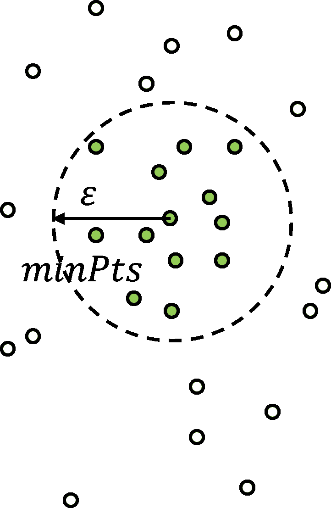

基于密度的聚类超参数需要检查是否有足够的局部密度来实例化一个簇。

$\epsilon$ – 在归一化特征度量的局部邻域半径。这是簇的尺度/分辨率。如果这个值设置得太小，太多的样本会被留下作为异常值，如果设置得太大，所有簇将合并成一个单一的簇。

$min_{Pts}$ – 分配核心点所需的最小点数，其中核心点用于初始化或增长簇组。

如上图所示，密度是通过样本数量在体积中的量化来衡量的，其中体积是基于特征空间所有维度的半径。

自动或引导的 $\epsilon$ 参数估计可以通过 k-距离图（在这种情况下是 k 个最近邻）来实现，

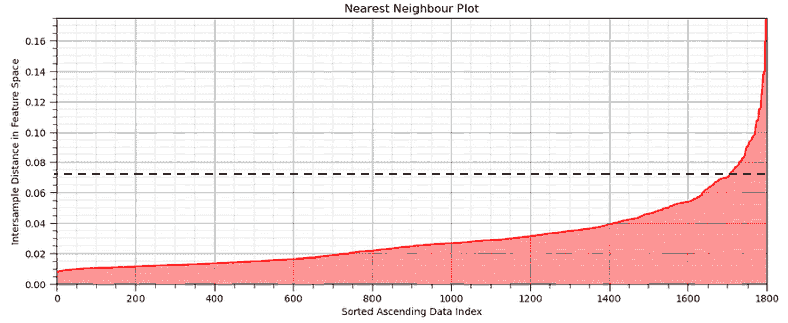

k-距离图，预测特征空间中的肘部约为 0.07 的距离。

1.  计算所有样本数据（本例中为 1,700）在归一化特征空间中的最近邻距离。

1.  按升序排序并绘图。

1.  选择最大化正曲率的距离（即肘部）。

这里是 DBSCAN 聚类的重要方面的总结，

+   **DBSCAN** - 代表 [基于密度的空间聚类应用噪声](https://cdn.aaai.org/KDD/1996/KDD96-037.pdf) (Ester et al., 1996)。

+   **优点** - 包括最小化领域知识来估计超参数，能够表示任意形状的簇组，并且在大数据集上应用高效。

+   **层次自底向上/聚合聚类** – 所有数据样本最初都是它们自己的组，称为“未访问”，但实际上作为异常值，直到被分配到组，然后簇组迭代增长。

+   **互斥** – 类似于 k-means 聚类，所有样本只能属于单个簇组。

$$ P(C_i \cap C_j | i \ne j) = 0.0 $$

+   **非穷尽性** – 一些样本可能被留下作为未分配的，并假设为簇组分配的异常值。

$$ P(C_1 \cup C_2 \cup \dots C_k) \le 1.0 $$

## DBSCAN 迭代解法

所有数据样本最初都被初始化为未访问状态，然后方法通过数据集进行迭代，并将样本分配为，

+   如果样本点周围 **eps** 距离内有 **$\ge$ min_samples** 个点，则该点为 **core** 点，也是新簇的开始

+   **边界** 点如果样本点周围 **eps** 距离内没有 **min_samples** 个点，但样本点在核心点的 **eps** 距离内，是现有簇的潜在增长。

+   如果样本点周围 **eps** 距离内没有 **min_samples** 个点，且该样本点也不在核心点的 **eps** 距离内，则该点为 **outlier** 点

如果你想看到 DBSCAN 的实际应用，请查看我的 [DBSCAN 交互式 Python 仪表板](https://github.com/GeostatsGuy/DataScienceInteractivePython/blob/main/Interactive_DBSCAN.ipynb)

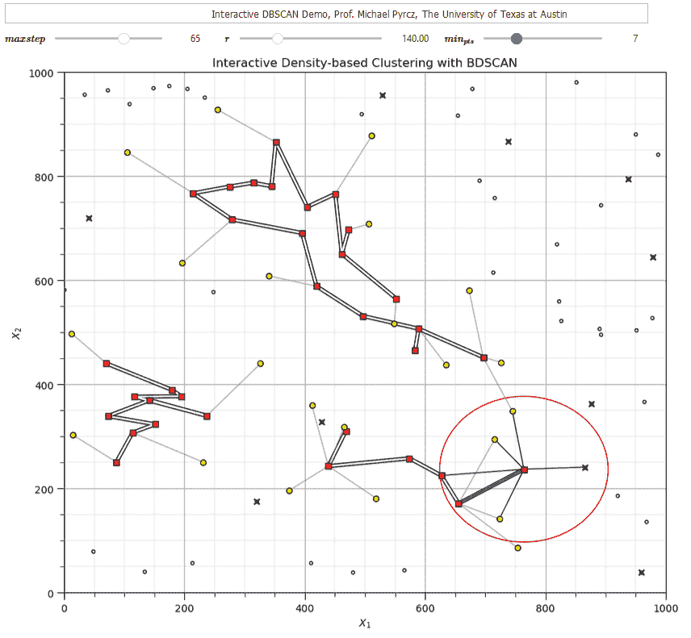

我的 DBSCAN 交互式 Python 仪表板。

一旦点被分配了这些标签，所有连接的核心点和它们的关联边界点都被分配到一个唯一的簇中。异常点被留下作为异常值，没有分配到簇。为了理解簇分配，我们应该解释以下形式的连接。

**直接密度可达** - 点 X 从点 A 直接密度可达，如果 A 是核心点且 X 属于 A 的邻域（距离 $ \le $ eps）。

**密度可达** - 如果点 Y 属于可以从 A 到达的核心点的邻域，则点 Y 从 A 密度可达。这需要一系列属于前一个核心点且最后一个核心点包括点 Y 的核心点链。

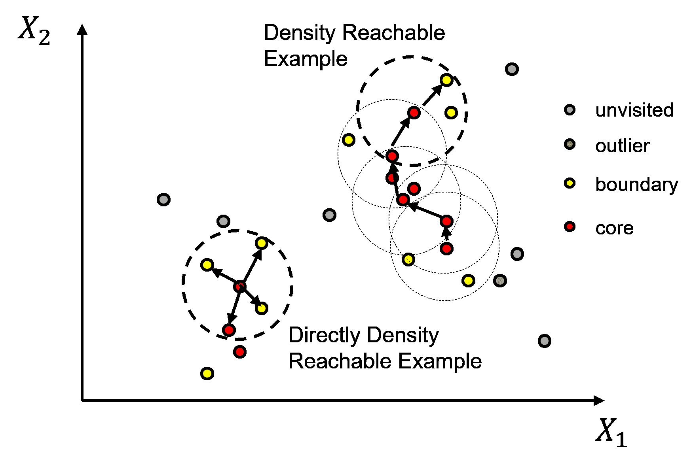

直接密度可达和密度可达。

**密度连接** - 如果存在一个点 Z，它可以从点 A 和点 B 都密度可达，则点 A 和点 B 是密度连接的。

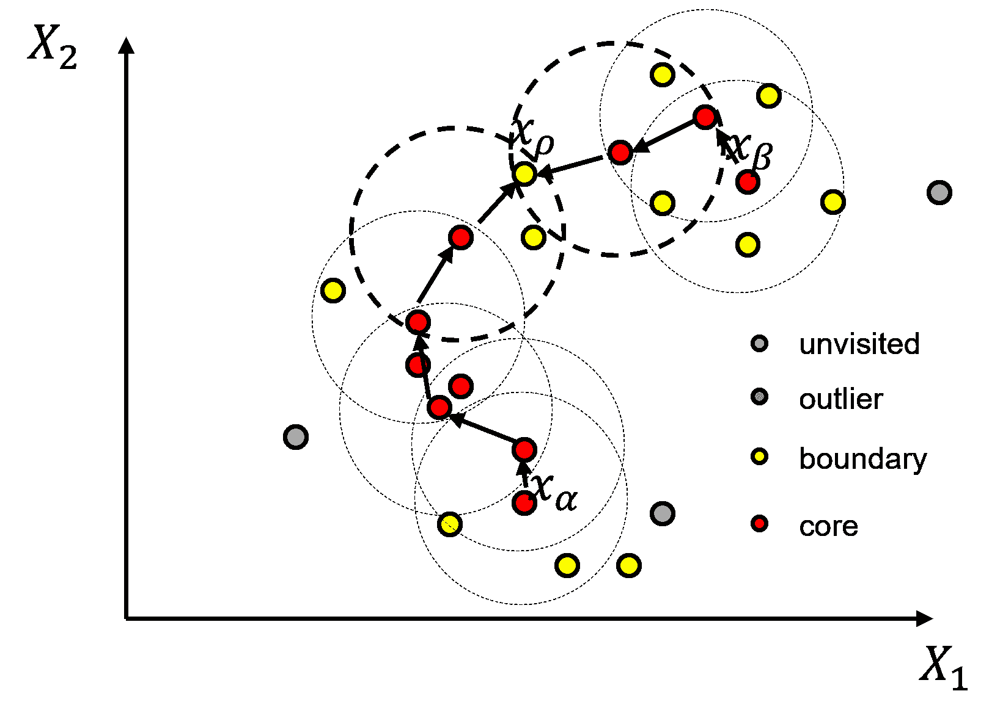

密度连接。

**基于密度的聚类** - 一个非空集合，其中所有点都通过密度相互连接。


基于密度的聚类。

这里是对解决 DBSCAN 的步骤的简要总结，

1.  所有点都被标记为未访问

1.  随机访问一个未访问的样本

1.  检查是否为核心点（在 $\epsilon$ 距离内 $\ge min_{Pts}$），如果是，则标记为核心点，否则标记为异常点

1.  现在，访问核心点 eps 距离内的所有点，确定是否为核心点，否则标记为边界点

1.  递归操作，检查 eps 距离内所有新核心点

1.  一旦这耗尽，就随机访问一个未访问的点

这种方法可以被认为是根据局部点密度来识别和增长/合并聚类。

## 加载所需的库

以下代码加载所需的库。这些应该已经与 Anaconda 3 一起安装。

```py
ignore_warnings = True                                        # ignore warnings?
import numpy as np                                            # ndarrays for gridded data
import pandas as pd                                           # DataFrames for tabular data
import copy                                                   # for deep copies
import os                                                     # set working directory, run executables
import matplotlib.pyplot as plt                               # for plotting
from matplotlib.colors import ListedColormap                  # custom color maps
from matplotlib.ticker import (MultipleLocator,AutoMinorLocator,NullLocator) # control of axes ticks
import matplotlib.ticker as mtick                             # control tick label formatting
from sklearn.neighbors import NearestNeighbors                # nearest neighbours function to calculate eps hyperparameter
from sklearn.preprocessing import MinMaxScaler                # min/max normalization
from sklearn.cluster import KMeans                            # k-means clustering
from sklearn.cluster import DBSCAN                            # DBSCAN clustering
plt.rc('axes', axisbelow=True)                                # plot all grids below the plot elements
if ignore_warnings == True:                                   
    import warnings
    warnings.filterwarnings('ignore')
cmap = plt.cm.inferno                                         # color map
seed = 42                                                     # random number seed 
```

如果你遇到包导入错误，你可能必须首先安装这些包中的一些。这通常可以通过在 Windows 上打开命令窗口然后输入‘python -m pip install [package-name]’来完成。有关相应包的文档，还有更多帮助。

## 声明函数

便利函数，用于向图中添加主网格线和副网格线。

```py
def add_grid():
    plt.gca().grid(True, which='major',linewidth = 1.0); plt.gca().grid(True, which='minor',linewidth = 0.2) # add y grids
    plt.gca().tick_params(which='major',length=7); plt.gca().tick_params(which='minor', length=4)
    plt.gca().xaxis.set_minor_locator(AutoMinorLocator()); plt.gca().yaxis.set_minor_locator(AutoMinorLocator()) # turn on minor ticks 
```

## 自定义颜色图

DBSCAN 的自定义颜色图，用于多个组，并将 0 设置为异常值。

```py
paired = plt.get_cmap('Paired')                               # build on categorical colormap
paired_colors = paired(np.linspace(0, 1, paired.N))
paired_colors[0] = [1, 1, 1, 1]                               # white in RGBA format for first value
lcmap = ListedColormap(paired_colors) 
```

## 设置工作目录

我总是喜欢这样做，这样我就不会丢失文件，并且可以简化后续的读取和写入（每次避免包含完整地址）。

```py
#os.chdir("d:/PGE383")                                        # set the working directory with the input data file 
```

## 加载数据

让我们加载提供的多元、空间数据集之一：

+   你可以选中下面的数据集 1-4。

这些是具有以下特征的多元数据集：

+   相（整数）

+   孔隙率（分数）

+   渗透率（$mD$）

是的，聚类分析是无监督的、推断性机器学习，不使用标签。我们有相可用，因此我们可以根据分配的相来评估我们的聚类组。

我们使用 pandas 的‘read_csv’函数将选定的数据集加载到我们称为‘df’的数据框中，然后预览它以确保正确加载。

**Python 提示：使用包中的函数**只需输入我们在开头声明的包的标签：

```py
import pandas as pd 
```

因此，我们可以使用命令访问 pandas 函数‘read_csv’：

```py
pd.read_csv() 
```

但 read_csv() 函数需要输入参数。最重要的是文件名。对于我们的情况，所有其他默认参数都很好。如果你想查看此函数的所有可能参数，只需访问 [文档](https://pandas.pydata.org/pandas-docs/stable/reference/api/pandas.read_csv.html)。

+   **提示** - 建立的 Python 包如 pandas 具有优秀的文档。它们是学习新包的一个绝佳起点。我也发现示例至关重要，这激励了我课程中所有的工作流程示例和代码！

此外，程序有一个输出，一个从数据文件加载的 pandas DataFrame。因此，我们必须指定表示这个新 DataFrame 对象的名称/变量。

```py
df = pd.read_csv("nonlinear_facies_v1.csv") 
```

您可以切换数据集从 $1, \ldots, 4$ 来尝试不同的聚类挑战。

```py
dataset = 2 
```

警告：一些这些数据集示例对于聚类来说相当困难！我为你准备了很多来测试你的技能！

```py
dataset = 2                                                   # select a dataset, 1 - 4
reduce_the_data = False; retain_fraction = 0.3                # reduce the number of samples to improve visualization and run time 
yname = 'Facies'                                              # available group label for checking

if dataset == 1:
    Xname = ['Por','Perm']; Xunit = ['%','mD']; Xlabel = ['Porosity','Brittleness'] 
    Xlabelunit = [Xlabel[0] + ' (' + Xunit[0] + ')',Xlabel[1] + ' (' + Xunit[1] + ')']
    Xmin = [0.0,0.0]; Xmax = [25.0,1200.0]                    # set minimums and maximums for visualization 
    df = pd.read_csv(r'https://raw.githubusercontent.com/GeostatsGuy/GeoDataSets/master/nonlinear_facies_v1.csv') # load our data table 
elif dataset == 2:
    Xname = ['AI','Por']; Xunit = [r'$kg/m2*10³$','%']; Xlabel = ['Acoustic Impedance','Porosity'] 
    Xlabelunit = [Xlabel[0] + ' (' + Xunit[0] + ')',Xlabel[1] + ' (' + Xunit[1] + ')']
    Xmin = [0.0,0.0]; Xmax = [1200.0,30.0]                    # set minimums and maximums for visualization 
    df = pd.read_csv(r'https://raw.githubusercontent.com/GeostatsGuy/GeoDataSets/master/nonlinear_facies_v2.csv') # load our data table
elif dataset == 3:
    Xname = ['AI','Por']; Xunit = [r'$kg/m2*10³$','%']; Xlabel = ['Acoustic Impedance','Porosity'] 
    Xlabelunit = [Xlabel[0] + ' (' + Xunit[0] + ')',Xlabel[1] + ' (' + Xunit[1] + ')']
    Xmin = [0.0,0.0]; Xmax = [1200.0,30.0]                    # set minimums and maximums for visualization 
    df = pd.read_csv(r'https://raw.githubusercontent.com/GeostatsGuy/GeoDataSets/master/nonlinear_facies_v3.csv') # load our data table
elif dataset == 4:
    Xname = ['AI','Por']; Xunit = [r'$kg/m2*10³$','%']; Xlabel = ['Acoustic Impedance','Porosity'] 
    Xlabelunit = [Xlabel[0] + ' (' + Xunit[0] + ')',Xlabel[1] + ' (' + Xunit[1] + ')']
    Xmin = [0.0,0.0]; Xmax = [7000.0,30.0]                    # set minimums and maximums for visualization 
    df = pd.read_csv(r'https://raw.githubusercontent.com/GeostatsGuy/GeoDataSets/master/sample_data_Gaussian_mixture_v1.csv') # load our data table

nXname = ['n' + feature for feature in Xname]                 # labels, units and ranges for normalized features
nXunit = ['norm[' + unit + ']' for unit in Xunit]
nXlabel = ['Normalized ' + feature for feature in Xlabel]
nXlabelunit = [nXlabel[0] + ' (' + nXunit[0] + ')',nXlabel[1] + ' (' + nXunit[1] + ')']
nXmin = [0.0,0.0]; nXmax = [1.0,1.0]    

if reduce_the_data == True:
    df = df.sample(frac=retain_fraction, random_state = 73073); df = df.reset_index() # extract a fraction of the data

df = df[Xname + [yname]]                                      # make a new DataFrame with only the features of interest
df.head() 
```

|  | AI | Por | 砂岩 |
| --- | --- | --- | --- |
| 0 | 381.296221 | 8.980678 | 3 |
| 1 | 304.449932 | 10.135657 | 3 |
| 2 | 193.607906 | 16.150132 | 3 |
| 3 | 205.778123 | 13.696509 | 3 |
| 4 | 290.854794 | 13.132821 | 3 |

## 表格数据的摘要统计信息和直方图

表格包括孔隙率（分数）和声阻抗（$\frac{kg}{m³} \cdot \frac{m}{s} \cdot 10³$），我们将在下面的演示中使用这些数据。

在 DataFrames 中，有许多有效的方法可以计算表格数据的摘要统计信息。describe 命令提供了一个很好的数据表，提供了计数、平均值、最小值、最大值和四分位数。我们使用 transpose 只是翻转表格，使得特征在行上，而统计信息在列上。

```py
df.describe().transpose()                                     # DataFrame summary statistics 
```

|  | count | mean | std | min | 25% | 50% | 75% | max |
| --- | --- | --- | --- | --- | --- | --- | --- | --- |
| AI | 1800.0 | 625.522917 | 247.547997 | 10.0 | 518.076017 | 683.865824 | 783.315226 | 1200.0 |
| 孔隙率 | 1800.0 | 17.122778 | 4.778704 | 0.0 | 14.663434 | 17.674606 | 20.361860 | 30.0 |
| 砂岩 | 1800.0 | 1.666667 | 0.816723 | 1.0 | 1.000000 | 1.000000 | 2.000000 | 3.0 |

让我们也检查一下砂岩的比例。

+   再次强调，我们不会使用砂岩，但砂岩表示样本在数据集中的自然聚类的比例

```py
plt.subplot(221)                                              # histogram feature 1
plt.hist(df[Xname[0]],alpha=0.8,color="darkorange",edgecolor="black",bins=np.linspace(Xmin[0],Xmax[0],20),density = False)
plt.title(Xlabel[0])
plt.xlabel(Xlabelunit[0]); plt.ylabel("Frequency")
add_grid()

plt.subplot(222)                                              # histogram feature 2
plt.hist(df[Xname[1]],alpha=0.8,color="darkorange",edgecolor="black",bins=np.linspace(Xmin[1],Xmax[1],20),density = False)
plt.title(Xlabel[1])
plt.xlabel(Xlabelunit[1]); plt.ylabel("Frequency")
add_grid()

plt.subplot(223)                                              # histogram truth label
n, bins, patches = plt.hist(df[yname],alpha=0.8,color="darkorange",edgecolor="black",bins=[0.5,1.5,2.5,3.5],label = ['Shale','SandShale','Sand'],range=[0.5,2.5],density = True)
plt.title('Facies Proportions')
plt.xlabel('Facies'); plt.ylabel("Proportion")
ax = plt.gca()
ax.set_xticks(np.arange(1.0, 3.1, 1)); ax.set_yticks(np.arange(0, 0.6, 0.2)); ax.set_yticks(np.arange(0, 0.6, 0.05), minor=True)
ax.grid(which='minor', alpha=0.1); ax.grid(which='major', alpha=0.2)
colors = plt.cm.YlOrBr_r(np.linspace(0, 1, len(patches)))
for patch, color in zip(patches, colors):
    patch.set_facecolor(color)

plt.subplots_adjust(left=0.0, bottom=0.0, right=2.0, top=2.1, wspace=0.2, hspace=0.2); plt.show() 
```

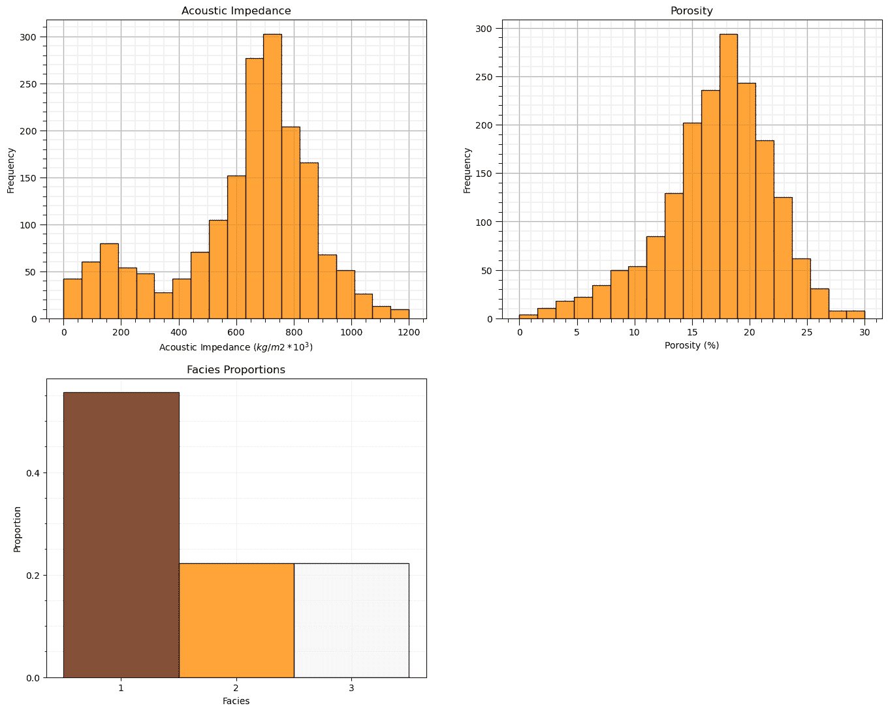

## 特征归一化

考虑的两个特征相当不兼容。它们有显著不同的：

+   数值/平均值

+   方差/范围

由于特征之间的范围差异是任意的，我们需要通过转换每个特征来消除这一点。我们将每个特征归一化，使其范围从 0.0（最小值）到 1.0（最大值）。

+   注意，在归一化过程中没有分布形状的变化，所以我们通常会在转换之前检查异常值等问题，为了简洁，这一步骤在此处未包括，因为提供的数据集中没有异常值。

现在，我们使用这些归一化的特征值进行聚类工作流程，例如，在我们的工作流程中计算样本和原型之间的所需距离：

+   注意，对于每个数据样本，我们都有原始特征和转换后的特征值；因此，无需进行反向转换，很容易来回切换。

```py
transform = MinMaxScaler();                                   # instantiate the normalization object
df['n' + Xname[0]], df['n' + Xname[1]] = transform.fit_transform(df.loc[:,Xname].values).T # normalize features
df.head(n = 3) 
```

|  | AI | Por | 砂岩 | nAI | nPor |
| --- | --- | --- | --- | --- | --- |
| 0 | 381.296221 | 8.980678 | 3 | 0.312014 | 0.299356 |
| 1 | 304.449932 | 10.135657 | 3 | 0.247437 | 0.337855 |
| 2 | 193.607906 | 16.150132 | 3 | 0.154292 | 0.538338 |

让我们确认我们的归一化孔隙率和声阻抗现在在 0 到 1 之间。

```py
df.describe().transpose()                                     # check normalization via summary statistics 
```

|  | count | mean | std | min | 25% | 50% | 75% | max |
| --- | --- | --- | --- | --- | --- | --- | --- | --- |
| AI | 1800.0 | 625.522917 | 247.547997 | 10.0 | 518.076017 | 683.865824 | 783.315226 | 1200.0 |
| Por | 1800.0 | 17.122778 | 4.778704 | 0.0 | 14.663434 | 17.674606 | 20.361860 | 30.0 |
| Facies | 1800.0 | 1.666667 | 0.816723 | 1.0 | 1.000000 | 1.000000 | 2.000000 | 3.0 |
| nAI | 1800.0 | 0.517246 | 0.208024 | 0.0 | 0.426955 | 0.566274 | 0.649845 | 1.0 |
| nPor | 1800.0 | 0.570759 | 0.159290 | 0.0 | 0.488781 | 0.589154 | 0.678729 | 1.0 |

让我们比较原始和转换后的特征直方图。

```py
plt.subplot(221)                                              # original histograms
plt.hist(df[Xname[0]],alpha=0.8,color="darkorange",edgecolor="black",bins=np.linspace(Xmin[0],Xmax[0],20),density = False)
plt.title(Xlabel[0])
plt.xlabel(Xlabelunit[0]); plt.ylabel("Frequency")
add_grid()

plt.subplot(222)
plt.hist(df[Xname[1]],alpha=0.8,color="darkorange",edgecolor="black",bins=np.linspace(Xmin[1],Xmax[1],20),density = False)
plt.title(Xlabel[1])
plt.xlabel(Xlabelunit[1]); plt.ylabel("Frequency")
add_grid()

plt.subplot(223)                                              # normalized histograms
plt.hist(df[nXname[0]],alpha=0.8,color="darkorange",edgecolor="black",bins=np.linspace(nXmin[0],nXmax[0],20),density = False)
plt.title(nXlabel[0])
plt.xlabel(nXlabelunit[0]); plt.ylabel("Frequency")
add_grid()

plt.subplot(224)
plt.hist(df[nXname[1]],alpha=0.8,color="darkorange",edgecolor="black",bins=np.linspace(nXmin[1],nXmax[1],20),density = False)
plt.title(nXlabel[1])
plt.xlabel(nXlabelunit[1]); plt.ylabel("Frequency")
add_grid()

plt.subplots_adjust(left=0.0, bottom=0.0, right=2.0, top=2.1, wspace=0.2, hspace=0.2); plt.show() 
```

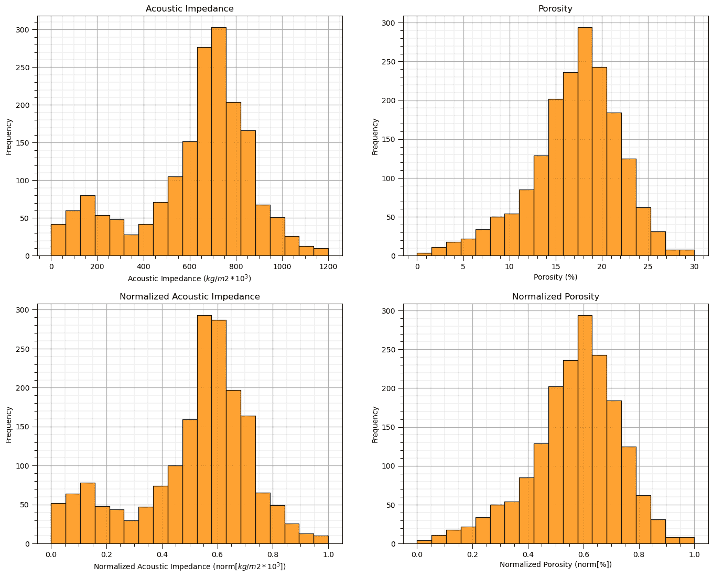

## 快速查看可用于教育目的的可用标签

我知道这是作弊，但为了校准我们的眼睛并检查数据集中的自然聚类，让我们作弊一下，看看按岩性标签着色的特征散点图。

+   对于这个演示工作流程，这是我们无法访问的真实模型，我们只将其用作教学工具

+   在此之后，我们将省略这些标签，并尝试使用聚类分析自动分配它们

```py
facies_list = np.unique(df[yname])                            # get the facies list from loaded data
min_facies = min(facies_list); max_facies = max(facies_list)
for ifacies in facies_list:                                   # plot the labeled data
    plt.scatter(df[df[yname] == ifacies][Xname[0]],df[df[yname] == ifacies][Xname[1]],
        color = plt.cm.YlOrBr_r((ifacies-min_facies)/(max_facies-min_facies)),edgecolor='black',alpha = 0.8,
        vmin = min_facies, vmax = max_facies,label = 'Facies: ' + str(ifacies))

plt.xlabel(Xlabelunit[0]); plt.ylabel(Xlabelunit[1]); plt.title(Xlabel[1] + ' vs. ' + Xlabel[0] + ' with Truth ' + yname); add_grid()
plt.xlim([Xmin[0],Xmax[0]]); plt.ylim([Xmin[1],Xmax[1]])
plt.legend()

plt.subplots_adjust(left=0.0, bottom=0.0, right=1.0, top=1.0, wspace=0.2, hspace=0.2) 
```

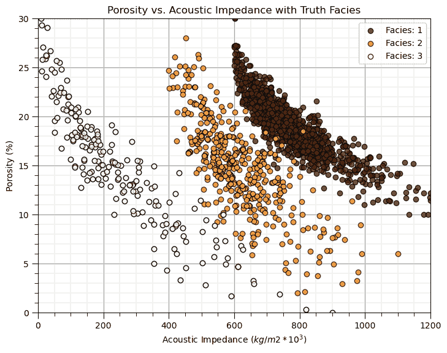

短暂地看看真实模型。这看起来会很难通过聚类分析来重现和自动化吗？

+   自然组是否分离 - 是否有重叠？

+   聚类组的形状是什么 - 组是否是球形的？

+   每个聚类组中的频率是什么？

这很有教育意义，因为如果组之间没有很好地分离，不是球形的，并且在每个自然组内频率不均匀，那么 k-means 聚类可能不会表现良好。

现在，让我们忽略真实岩性的分类分配，并继续进行适当的聚类分析，无监督且无标签。

## 可视化未标记的数据

在这个练习中，我们想使用聚类来自动根据两个特征分配岩性。

+   我将每个可视化的特征限制为两个

+   让我们从可视化未标记的数据开始

+   我们在整个练习中通过原始单位和归一化单位来观察数据。

```py
plt.subplot(121)                                              # scatter plot our data
plt.scatter(df[Xname[0]], df[Xname[1]], c="black", alpha = 0.4, linewidths=1.0, edgecolors="black")
plt.title(Xlabel[1] + ' vs. ' + Xlabel[0]); plt.xlabel(Xlabelunit[0]); plt.ylabel(Xlabelunit[1])
plt.xlim([Xmin[0],Xmax[0]]); plt.ylim([Xmin[1],Xmax[1]]); add_grid()

plt.subplot(122)                                              # scatter plot our normalized data 
plt.scatter(df[nXname[0]], df[nXname[1]],c="black",alpha = 0.4,linewidths=1.0, edgecolors="black")
plt.title(nXlabel[1] + ' vs. ' + nXlabel[0]); plt.xlabel(nXlabelunit[0]); plt.ylabel(nXlabelunit[1])
plt.xlim([nXmin[0],nXmax[0]]); plt.ylim([nXmin[1],nXmax[1]]); add_grid()

plt.subplots_adjust(left=0.0, bottom=0.0, right=1.6, top=0.8, wspace=0.2, hspace=0.2); plt.show() 
```


## k-Means Clustering

首先，我们从 k-means 聚类开始。从我们之前的分析中，我们可能知道这不会进展顺利！

+   我有一个专门的演示，专门用于[k-means 聚类](https://github.com/GeostatsGuy/PythonNumericalDemos/blob/master/SubsurfaceDataAnalytics_Clustering.ipynb)。

+   在这里，我们使用 k-means 聚类来与我们将尝试的后续基于密度的方法进行比较和对比。

再次提醒，让我们注意 k-means 聚类的假设：

+   特征上的球形变异性

+   每个特征上的相同变异性（经过我们的最小/最大归一化后）

+   所有聚类的先验成员概率，每个样本数量相等

此数据集违反了这些假设，具有非球形形状，每个聚类中样本比例不均（我们知道这一点，因为我们有真实面貌，我们也做了峰值）。

```py
np.random.seed(seed)
K = 3                                                         # number of prototypes
ignore_warnings = True                                        # ignore warnings?

kmeans = KMeans(n_clusters=K, random_state=0).fit(df[nXname].values)
df['kMeans'] = kmeans.labels_ + 1
cluster_list = np.unique(df['kMeans']); min_cluster = min(cluster_list); max_cluster = max(cluster_list)

plt.subplot(221)                                              # plot the data unlabeled
plt.scatter(df[Xname[0]], df[Xname[1]],c='black',alpha=0.5,edgecolor='k',cmap = cmap)
plt.xlabel(Xlabelunit[0]); plt.ylabel(Xlabelunit[1]); plt.title(Xlabel[1] + ' vs. ' + Xlabel[0]); add_grid()
plt.xlim([Xmin[0],Xmax[0]]); plt.ylim([Xmin[1],Xmax[1]])

plt.subplot(223)                                              # plot the cluster groups
for icluster in cluster_list:
    plt.scatter(df[df['kMeans'] == icluster][Xname[0]],df[df['kMeans'] == icluster][Xname[1]],
        color = plt.cm.YlOrBr_r((icluster-min_cluster)/(max_cluster-min_cluster)),edgecolor='black',alpha = 0.8,
        vmin = min_cluster,vmax = max_cluster,label = 'Facies: ' + str(icluster))
plt.xlabel(Xlabelunit[0]); plt.ylabel(Xlabelunit[1]); plt.title(Xlabel[1] + ' vs. ' + Xlabel[0] + ' with Clusters'); add_grid()
plt.xlim([Xmin[0],Xmax[0]]); plt.ylim([Xmin[1],Xmax[1]])
plt.legend(loc='upper right')

plt.subplot(224)                                              # plot the cluster groups histograms 
N, bins, patches  = plt.hist(df['kMeans'],alpha=0.8,edgecolor="black",range=[min_cluster-0.5,max_cluster-0.5],
    bins=np.insert(np.linspace(min_cluster,max_cluster,len(cluster_list))+0.5,0,min_cluster-0.5),density = False)
for i in range(0,len(cluster_list)):
    patches[i].set_facecolor(plt.cm.YlOrBr_r((cluster_list[i]-min_cluster)/(max_cluster-min_cluster)));
ax = plt.gca(); ax.set_xticks(cluster_list); plt.xlabel('k-Means Clusters'); plt.ylabel('Frequency'); plt.title('k-Means Clustering Groups')
add_grid()   

plt.subplots_adjust(left=0.0, bottom=0.0, right=2.0, top=2.1, wspace=0.2, hspace=0.2); plt.show() 
```

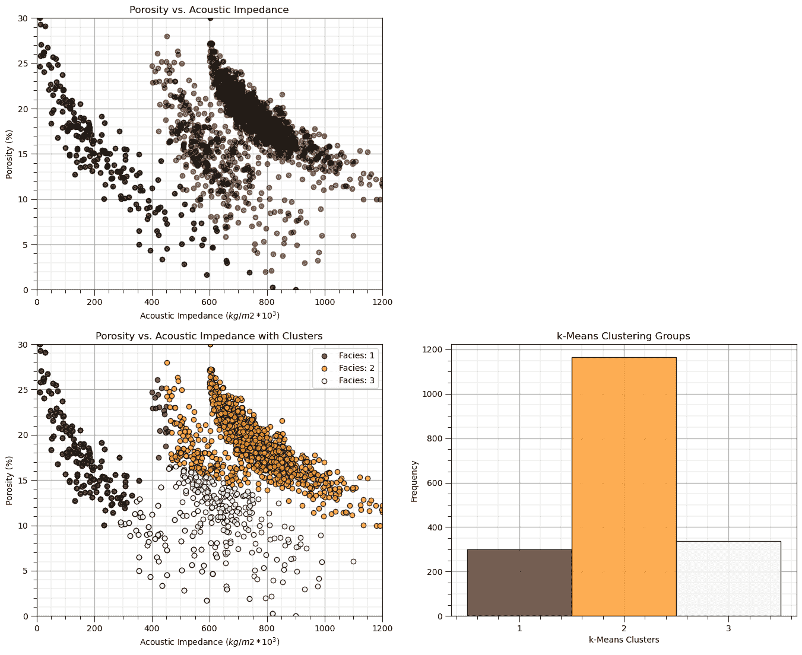

如预期，存在一些问题：

+   聚类边缘的非凸、非线性形状和低密度表示没有得到很好的捕捉

结果是明显的连通几何被分割。

## DBSCAN 聚类

基于高密度种子和生长聚类组的 DBSCAN 方法非常适合处理具有任意形状（甚至非凸）和噪声的数据。

再次，这两个参数包括：

+   **eps** - 样本在特征空间中的最大距离，以使其包含在另一个样本的邻域中。太小的值会导致许多聚类和异常值，而太大的值会导致一个包含所有样本的聚类。

+   **最小样本数** - 在邻域中产生新聚类所需的最小样本数。对于噪声数据，使用较大的值以防止由于少数分组异常值而识别聚类。

```py
eps = 0.026; min_samples = 10                                 # DBSCAN model parameters

dbscan = DBSCAN(eps=0.029, min_samples=15).fit(df[nXname].values)
df['DBSCAN'] = dbscan.labels_ + 1
cluster_list = np.unique(df['DBSCAN']); min_cluster = min(cluster_list); max_cluster = max(cluster_list)

plt.subplot(221)                                              # plot the assigned training data and K prototypes
plt.scatter(df[Xname[0]], df[Xname[1]],c='black',alpha=0.5,edgecolor='k',cmap = cmap)
plt.xlabel(Xlabelunit[0]); plt.ylabel(Xlabelunit[1]); plt.title(Xlabel[1] + ' vs. ' + Xlabel[0]); add_grid()
plt.xlim([Xmin[0],Xmax[0]]); plt.ylim([Xmin[1],Xmax[1]])

plt.subplot(223)                                              # plot the cluster groups
for icluster in cluster_list:
    if icluster == 0:
        plt.scatter(df[df['DBSCAN'] == icluster][Xname[0]],df[df['DBSCAN'] == icluster][Xname[1]],
            color = lcmap((icluster-min_cluster)/(max_cluster-min_cluster)),edgecolor='black',alpha = 0.8,
            vmin = min_cluster,vmax = max_cluster,label = 'Outliers')
    else:
        plt.scatter(df[df['DBSCAN'] == icluster][Xname[0]],df[df['DBSCAN'] == icluster][Xname[1]],
            color = lcmap((icluster-min_cluster)/(max_cluster-min_cluster)),edgecolor='black',alpha = 0.8,
            vmin = min_cluster,vmax = max_cluster,label = 'Facies: ' + str(icluster))
plt.xlabel(Xlabelunit[0]); plt.ylabel(Xlabelunit[1]); plt.title(Xlabel[1] + ' vs. ' + Xlabel[0] + ' with Clusters'); add_grid()
plt.xlim([Xmin[0],Xmax[0]]); plt.ylim([Xmin[1],Xmax[1]])
plt.legend(loc='lower left',ncol = 3)

plt.subplot(224)                                              # plot the cluster histogram
N, bins, patches  = plt.hist(df['DBSCAN'],alpha=0.8,edgecolor="black",range=[min_cluster-0.5,max_cluster-0.5],
    bins=np.insert(np.linspace(min_cluster,max_cluster,len(cluster_list))+0.5,0,min_cluster-0.5),density = False)
for i in range(0,len(cluster_list)):
    patches[i].set_facecolor(lcmap((cluster_list[i]-min_cluster)/(max_cluster-min_cluster)));
ax = plt.gca(); ax.set_xticks(cluster_list); plt.xlabel('DBSCAN Clusters'); plt.ylabel('Frequency'); plt.title('DBSCAN Clustering Groups')
add_grid()   
current_labels = plt.gca().get_xticks().astype(str)
current_labels[0] = 'Outliers'
plt.gca().set_xticklabels(current_labels); plt.gca().xaxis.set_minor_locator(NullLocator())

plt.subplots_adjust(left=0.0, bottom=0.0, right=2.0, top=2.1, wspace=0.2, hspace=0.2) 
```

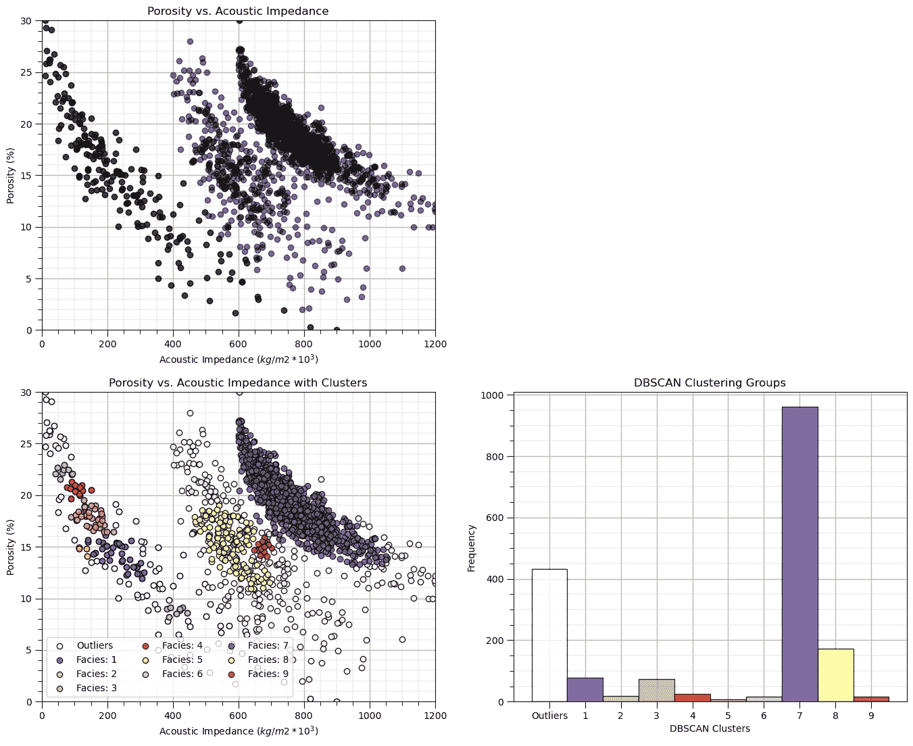

这个结果与 k-means 聚类非常不同：

+   聚类组不是对称的或球形的

+   我们也有异常值

让我们通过查看超参数的 $3 \times 3$ 组合结果来探索参数的敏感性。第一次运行时保持原样，然后尝试更改此代码中的值。

```py
eps_mat = [0.026,0.029,0.032] 
min_sample_mat = [10, 15, 20] 
```

```py
eps_mat = [0.026,0.029,0.032]                                 # set parameters to explore - set for 3 cases of each
min_sample_mat = [10, 15, 20]

index = 1
for eps in eps_mat:
    for min_sample in min_sample_mat:
        dbscan = DBSCAN(eps=eps, min_samples=min_sample).fit(df[nXname].values) # perform DBSCAN
        df['DBSCAN'] = dbscan.labels_ + 1

        cluster_list = np.unique(df['DBSCAN']); min_cluster = min(cluster_list); max_cluster = max(cluster_list) # cluster indexes

        plt.subplot(3,3,index)                                # plot the cluster groups
        for icluster in cluster_list:
            if icluster == 0:
                plt.scatter(df[df['DBSCAN'] == icluster][Xname[0]],df[df['DBSCAN'] == icluster][Xname[1]],
                    color = lcmap((icluster-min_cluster)/(max_cluster-min_cluster)),edgecolor='black',alpha = 0.8,
                    vmin = min_cluster,vmax = max_cluster,label = 'Outliers')
            else:
                plt.scatter(df[df['DBSCAN'] == icluster][Xname[0]],df[df['DBSCAN'] == icluster][Xname[1]],
                    color = lcmap((icluster-min_cluster)/(max_cluster-min_cluster)),edgecolor='black',alpha = 0.8,
                    vmin = min_cluster,vmax = max_cluster,label = 'Facies: ' + str(icluster))
        plt.xlabel(Xlabelunit[0]); plt.ylabel(Xlabelunit[1])
        plt.title(Xlabel[1] + ' vs. ' + Xlabel[0] + ' Clusters, eps: ' + str(eps) + r', $min_{sample}$ ' + str(min_sample))
        plt.xlim([Xmin[0],Xmax[0]]); plt.ylim([Xmin[1],Xmax[1]]); add_grid()
        index = index + 1

plt.subplots_adjust(left=0.0, bottom=0.0, right=3.0, top=3.50, wspace=0.2, hspace=0.2) 
```

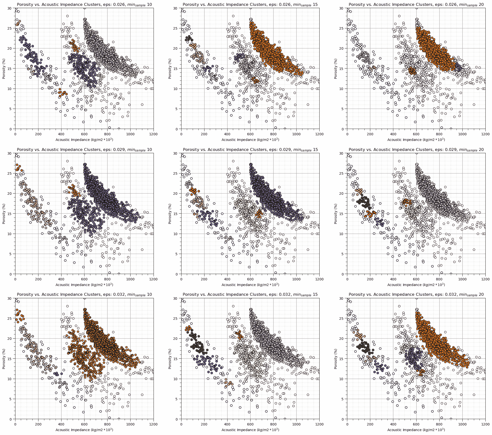

## 计算 DBSCAN 参数

现在我们尝试使用一种更可重复的方法来计算 DBSCAN 超参数。

+   **最小样本数** - 我们根据专家知识设定，有一个经验法则，对于大型、噪声数据集，$min_{sample} \ge D + 1$ 或 $min_{sample} \ge 2 \times D + 1$

+   **eps** - 我们将使用最近邻函数来估计它，给定最小样本数量

让我们使用命令计算每个样本数据到最小样本最近邻在归一化特征空间中的最近邻距离：

```py
neigh = NearestNeighbors(n_neighbors=min_sample)
nbrs = neigh.fit(df[['nPor','nPerm']].values)
distances, indices = nbrs.kneighbors(df[['nPor','nPerm']].values) 
```

我们有一个 $n \times k$ 的距离和样本数据索引数组：

+   对于每个 $n$ 样本，我们有一行最近的邻距离，直到 $k$ 个最近邻（从近到远按列排列），注意第一个邻居是样本本身；因此第一列是 0。

+   然后，我们将按升序排序行，并相对于样本索引绘制，$i = 1,\ldots,n-1$

然后，我们将绘制距离与样本索引的升序关系图

```py
min_sample = 15                                               # set the number of neighbours for k-nearest neighbour plot

neigh = NearestNeighbors(n_neighbors=min_sample,radius=999.0,algorithm='kd_tree')
nbrs = neigh.fit(df[nXname].values)
distances, indices = nbrs.kneighbors(df[nXname].values)
distances = distances[:,min_sample-1]
distances = np.sort(distances)

plt.plot(distances, c = 'red'); plt.xlabel('Sorted Ascending Data Index'); plt.ylabel('Intersample Distance in Feature Space')
plt.fill_between(np.arange(1,len(df)+1,1),np.zeros((len(df))),distances,color='red',alpha=0.4)
plt.title('Nearest Neighbour Plot'); add_grid(); plt.xlim([0,len(df)]); plt.ylim([0,np.max(distances)])
plt.subplots_adjust(left=0.0, bottom=0.0, right=1.6, top=0.8, wspace=0.2, hspace=0.2) 
```


现在我们寻找具有最大正曲率的最近邻距离，这被称为最近邻图中的“肘部”

+   这提供了对簇大小的指示

+   在这种情况下，我们会估计 eps 大约为 0.03 - 0.04。

一些来自 DBSCAN 的观察

+   结果对 **eps** 和 **min_samples** 的选择非常敏感。

+   在“簇”的稀疏部分，许多数据被分配到其他组，并保留为异常值

在这种情况下，使用这个估计的 eps 超参数的结果并不令人满意。

```py
dbscan_tuned = DBSCAN(eps=0.029, min_samples=15).fit(df[nXname].values) # DBSCAN with tuned/improved parameters
df['DBSCAN_tuned'] = dbscan_tuned.labels_ + 1 
cluster_list = np.unique(df['DBSCAN_tuned']); min_cluster = min(cluster_list); max_cluster = max(cluster_list) # cluster statistics

plt.subplot(221)                                              # plot the assigned training data and K prototypes
plt.scatter(df[Xname[0]], df[Xname[1]],c='black',alpha=0.5,edgecolor='k',cmap = cmap)
plt.xlabel(Xlabelunit[0]); plt.ylabel(Xlabelunit[1]); plt.title(Xlabel[1] + ' vs. ' + Xlabel[0]); add_grid()
plt.xlim([Xmin[0],Xmax[0]]); plt.ylim([Xmin[1],Xmax[1]])

plt.subplot(223)                                              # plot the cluster groups
for icluster in cluster_list:
    if icluster == 0:
        plt.scatter(df[df['DBSCAN_tuned'] == icluster][Xname[0]],df[df['DBSCAN_tuned'] == icluster][Xname[1]],
            color = lcmap((icluster-min_cluster)/(max_cluster-min_cluster)),edgecolor='black',alpha = 0.8,
            vmin = min_cluster,vmax = max_cluster,label = 'Outliers')
    else:
        plt.scatter(df[df['DBSCAN_tuned'] == icluster][Xname[0]],df[df['DBSCAN_tuned'] == icluster][Xname[1]],
            color = lcmap((icluster-min_cluster)/(max_cluster-min_cluster)),edgecolor='black',alpha = 0.8,
            vmin = min_cluster,vmax = max_cluster,label = 'Facies: ' + str(icluster))
plt.xlabel(Xlabelunit[0]); plt.ylabel(Xlabelunit[1]); plt.title(Xlabel[1] + ' vs. ' + Xlabel[0] + ' with Clusters'); add_grid()
plt.xlim([Xmin[0],Xmax[0]]); plt.ylim([Xmin[1],Xmax[1]])
plt.legend(loc='lower left',ncol = 3)

plt.subplot(224)                                              # plot cluster histogram
N, bins, patches  = plt.hist(df['DBSCAN_tuned'],alpha=0.8,edgecolor="black",range=[min_cluster-0.5,max_cluster-0.5],
    bins=np.insert(np.linspace(min_cluster,max_cluster,len(cluster_list))+0.5,0,min_cluster-0.5),density = False)
for i in range(0,len(cluster_list)):
    patches[i].set_facecolor(lcmap((cluster_list[i]-min_cluster)/(max_cluster-min_cluster)));
ax = plt.gca(); ax.set_xticks(cluster_list); plt.xlabel('Tuned DBSCAN Clusters'); plt.ylabel('Frequency'); plt.title('Tuned DBSCAN Clustering Groups')
add_grid()   
current_labels = plt.gca().get_xticks().astype(str)
current_labels[0] = 'Outliers'
plt.gca().set_xticklabels(current_labels); plt.gca().xaxis.set_minor_locator(NullLocator())

plt.subplots_adjust(left=0.0, bottom=0.0, right=2.0, top=2.1, wspace=0.2, hspace=0.2) 
```

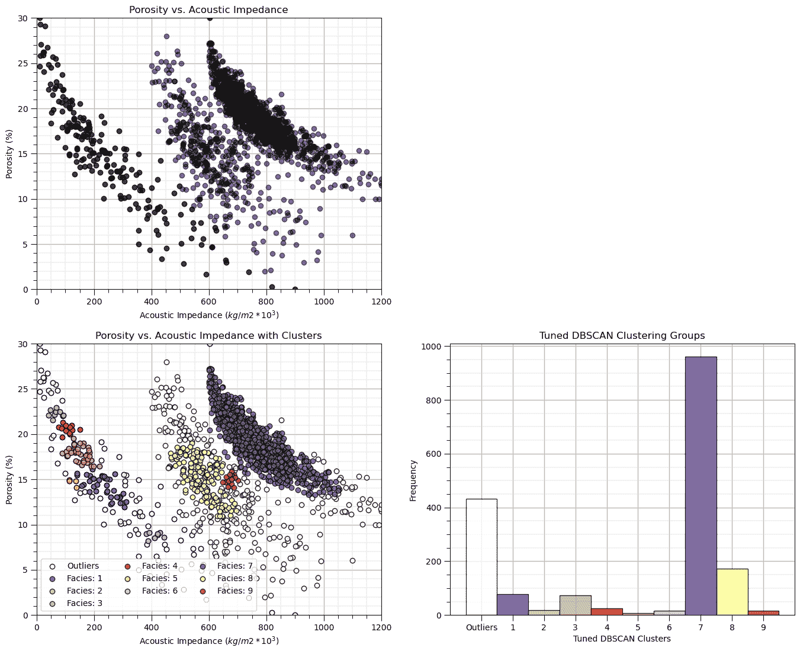

## 评论

这是对基于密度的聚类方法 DBSCAN 的基本处理。可以做和讨论的还有很多，我有很多更多的资源。查看我的 [共享资源清单](https://michaelpyrcz.com/my-resources) 以及本章开头带有资源链接的视频讲座链接。

我希望这有所帮助，

*迈克尔*

## 关于作者


迈克尔·皮尔奇教授在德克萨斯大学奥斯汀分校 40 英亩校园的办公室。

迈克尔·皮尔奇（Michael Pyrcz）是德克萨斯大学奥斯汀分校 [Cockrell 工程学院](https://cockrell.utexas.edu/faculty-directory/alphabetical/p) 和 [Jackson 地球科学学院](https://www.jsg.utexas.edu/researcher/michael_pyrcz/) 的教授，他在 [德克萨斯大学奥斯汀分校](https://www.utexas.edu/) 研究和教授地下、空间数据分析、地统计学和机器学习。迈克尔还是，

+   [能源分析](https://fri.cns.utexas.edu/energy-analytics) 新生研究项目的首席研究员，德克萨斯大学奥斯汀分校自然科学院机器学习实验室的核心教员

+   [计算机与地球科学](https://www.sciencedirect.com/journal/computers-and-geosciences/about/editorial-board) 的副编辑，以及国际数学地球科学协会 [数学地球科学](https://link.springer.com/journal/11004/editorial-board) 的董事会成员。

迈克尔已经撰写了超过 70 篇 [同行评审出版物](https://scholar.google.com/citations?user=QVZ20eQAAAAJ&hl=en)，一个用于空间数据分析的 [Python 包](https://pypi.org/project/geostatspy/)，合著了一本关于空间数据分析的教科书 [地统计学储层建模](https://www.amazon.com/Geostatistical-Reservoir-Modeling-Michael-Pyrcz/dp/0199731446)，并是两本最近发布的电子书的作者，[Python 中的应用地统计学：GeostatsPy 的实践指南](https://geostatsguy.github.io/GeostatsPyDemos_Book/intro.html) 和 [Python 中的应用机器学习：带代码的实践指南](https://geostatsguy.github.io/MachineLearningDemos_Book/intro.html)。

迈克尔的所有大学讲座都可以在他的[YouTube 频道](https://www.youtube.com/@GeostatsGuyLectures)上找到，附有 100 多个 Python 交互式仪表板和 40 多个 GitHub 仓库中的详细文档工作流程，以支持任何感兴趣的学生和在职专业人士，提供永恒的内容。要了解更多关于迈克尔的工作和共享教育资源，请访问他的网站。

## 想要一起工作吗？

我希望这些内容对那些想了解更多关于地下建模、数据分析和机器学习的人有所帮助。学生和在职专业人士都欢迎参加。

+   想邀请我到贵公司进行培训、辅导、项目审查、工作流程设计和/或咨询吗？我很乐意拜访并与您合作！

+   感兴趣合作、支持我的研究生研究或我的地下数据分析与机器学习联盟（共同负责人是约翰·福斯特教授）吗？我的研究将数据分析、随机建模和机器学习理论与实践相结合，以开发新的方法和工作流程，增加价值。我们正在解决具有挑战性的地下问题！

+   我可以通过 mpyrcz@austin.utexas.edu 联系到。

我总是乐于讨论，

*迈克尔*

迈克尔·皮尔茨，博士，P.Eng. 教授，德克萨斯大学奥斯汀分校 Cockrell 工程学院和 Jackson 地球科学学院

更多资源可在以下位置获取：[Twitter](https://twitter.com/geostatsguy) | [GitHub](https://github.com/GeostatsGuy) | [网站](http://michaelpyrcz.com) | [Google Scholar](https://scholar.google.com/citations?user=QVZ20eQAAAAJ&hl=en&oi=ao) | [地统计学书籍](https://www.amazon.com/Geostatistical-Reservoir-Modeling-Michael-Pyrcz/dp/0199731446) | [YouTube](https://www.youtube.com/channel/UCLqEr-xV-ceHdXXXrTId5ig) | [Python 中应用地统计学电子书](https://geostatsguy.github.io/GeostatsPyDemos_Book/intro.html) | [Python 中应用机器学习电子书](https://geostatsguy.github.io/MachineLearningDemos_Book/) | [LinkedIn](https://www.linkedin.com/in/michael-pyrcz-61a648a1)

## 基于密度的聚类分析动机

我们需要学习和分割不同的群体以提高我们的预测模型，

+   将不同的群体混合起来训练预测模型通常会降低模型精度

+   聚类是一种推理机器学习方法，用于自动将数据集分割成单独的组，这些组被称为簇，并由一个整数索引指定

+   常见的聚类分析方法，如 k-means 聚类，易于应用但相当不灵活；因此，向我们的工具箱中添加更多灵活的聚类方法，如基于密度的聚类，是至关重要的

+   总是记住，计算机不提供群组的含义和描述，这是我们的工作！

这里有一个简单的流程，演示了 K-means、基于密度和频谱的聚类（用于自动分类分配）在地下建模工作流程中的应用。这应该有助于你开始使用推断方法来寻找地下数据集中的模式。

## k-Means 聚类

让我们回顾一下 K-means 聚类，这是一种常见的聚类方法，用于对未标记数据进行分组分配，其中聚类组内的差异被最小化。最小化的损失函数是，

$$ J = \sum^k_{i=1} \sum_{\alpha \in C_i} || X_{\alpha} - \mu_i || $$

其中 $i$ 是簇索引，$\alpha$ 是数据样本索引，$X$ 是数据样本，$\mu_i$ 是 $i$ 簇原型，$k$ 是簇的总数，$|| X_m - \mu_m ||$ 是在 $M$ 维空间中从样本到簇原型的欧几里得距离，计算如下，

$$ || X_{m,\alpha} - \mu_i || = \sqrt{ \sum_m^M \left( X_{m,\alpha} - \mu_{m,i} \right)² } $$

这里是 k-means 聚类的一些重要方面的总结：

+   **原型方法** - 在特征空间中用合成案例的数量表示训练数据。对于 K-means 聚类，我们分配并迭代更新 $K$ 个原型。

+   **迭代解法** - 初始原型在特征空间中随机分配，每个训练样本的标签更新为最近的原型，然后原型调整到其分配的训练数据的质心，重复此过程直到训练数据分配不再更新。

+   **无监督学习** - 训练数据未标记，并根据其在特征空间中与原型的接近程度分配 $K$ 个标签。想法是相似的事物，在特征空间中的接近度，应该属于同一个簇组。

+   **特征加权** - 该过程取决于训练样本和原型在特征空间中的欧几里得距离。距离被视为相似性的“倒数”。如果特征具有显著不同的幅度，那么幅度和范围最大的特征将主导损失函数，簇组将变得各向异性，与高范围特征垂直对齐。虽然常见的做法是对变量进行标准化/归一化，但可以通过不等方差应用特征加权。注意，在这个演示中，我们将特征归一化到 0.0 到 1.0 的范围。

## k-means 聚类算法的假设

这些假设导致了 k-means 聚类算法灵活性的显著降低：

1.  在预测特征空间内，簇是球形的、凸的和各向同性的。

+   这是因为基于最小化簇内差异的模型损失，这是通过预测特征空间中的简单球形几何来实现的。

1.  所有特征都有相同的变化量

$$ \sigma_{X_1}² = \sigma_{X_2}²= \ldots = \sigma_{X_m}² $$

+   这是在样本间距离/相似度计算中假设的

1.  聚类具有相似的大小和频率（聚类中的样本数量）

+   较大的聚类被分割以最小化聚类内的总体平方差异

+   在特征空间中样本数量较少的聚类会被淹没！

局限性相当显著，有一个更灵活的聚类方法是有用的。

## 基于密度的聚类 DBSCAN

对于密集、非线性且可能重叠的组，我们可以使用一种受自然界启发的计算方法进行聚类。

+   你知道吗，你的大脑内置了基于密度的聚类分析吗？

+   我可以用一种称为点彩画的艺术形式来证明这一点。


“黎明时分马恩河的河岸。”，由阿尔贝·杜博瓦-皮利特（1886）创作，这是点彩画的例子。我移除了颜色，以突出基于点密度变化的自动聚类分析在我们大脑中的表现。

它工作了吗？你通过局部密度将树木、云彩、植被河岸分组。

+   我知道点彩画的原因是因为我的妹妹苏珊·韦克塞勒是一位了不起的艺术家和音乐家。愿她安息，Suse。

基于密度的聚类中，聚类组在特征空间中以足够点密度（由超参数确定）的位置进行播种或生长，


基于密度的聚类超参数需要检查是否有足够的局部密度来实例化一个聚类。

$\epsilon$ – 在归一化特征度量的局部邻域半径。这是聚类的尺度/分辨率。如果这个值设置得太小，太多的样本会被留下作为异常值；如果设置得太大，所有的聚类会合并成一个单一的聚类。

$min_{Pts}$ – 分配核心点所需的最小点数，其中核心点用于初始化或增长聚类组。

如上图所示，密度通过样本数量在体积上的量化来衡量，其中体积基于特征空间所有维度的半径。

通过 k-距离图（在这种情况下是 k 个最近邻）可以进行自动或引导的 $\epsilon$ 参数估计，


k-距离图在预测特征空间中的肘点约为 0.07 距离。

1.  计算所有样本数据（在这种情况下为 1,700）在归一化特征空间中的最近邻距离。

1.  按升序排序并绘图。

1.  选择最大化正曲率的距离（即肘点）。

这里是 DBSCAN 聚类的重要方面总结，

+   **DBSCAN** - 代表 [基于密度的空间聚类应用噪声](https://cdn.aaai.org/KDD/1996/KDD96-037.pdf) (Ester et al., 1996)。

+   **优点** - 包括估计超参数所需的最小领域知识，能够表示任意形状的聚类组，并且在大数据集上应用高效

+   **层次自底向上/聚合聚类** - 所有数据样本最初作为它们自己的组，称为“未访问”，但实际上作为异常点，直到分配到组，然后簇组迭代增长。

+   **互斥** - 类似于 k-means 聚类，所有样本只能属于一个簇组。

$$ P(C_i \cap C_j | i \ne j) = 0.0 $$

+   **非穷尽** - 一些样本可能被保留为未分配，并假设为簇组的异常点

$$ P(C_1 \cup C_2 \cup \dots C_k) \le 1.0 $$

## DBSCAN 迭代解法

所有数据样本最初被初始化为未访问，然后方法通过数据集进行，并将样本分配为，

+   **核心**点如果存在**min_samples**个点在**eps**距离内，则开始一个新的簇

+   **边界**点如果在**eps**距离内有**lt**个**min_samples**，但样本在**eps**距离内的核心点附近，现有簇的潜在增长

+   **异常**点如果在**eps**距离内有**lt**个**min_samples**，并且样本不在**eps**距离内的核心点附近

如果你想看到 DBSCAN 的实际应用，请查看我的[DBSCAN 交互式 Python 仪表板](https://github.com/GeostatsGuy/DataScienceInteractivePython/blob/main/Interactive_DBSCAN.ipynb)，


我为 DBSCAN 制作的交互式 Python 仪表板。

一旦点被分配这些标签，所有连接的核心点和它们的关联边界点都被分配到一个唯一的簇中。异常点被保留为异常点，没有分配簇。为了理解簇分配，我们应该解释以下形式的连接。

**直接密度可达** - 如果 A 是一个核心点，并且 X 属于 A 的邻域（距离$le$ eps），则点 X 从 A 直接密度可达。

**密度可达** - 如果点 Y 属于一个核心点的邻域，并且可以从 A 到达该核心点，则点 Y 从 A 密度可达。这需要一系列属于前一个核心点并且最后一个核心点包括点 Y 的核心点链。


直接密度可达和密度可达。

**密度连接** - 如果存在一个点 Z，它从点 A 和点 B 都密度可达，则点 A 和点 B 是密度连接的。


密度连接。

**基于密度的簇** - 一个非空集合，其中所有点都相互密度连接。


基于密度的簇。

这里是对解决 DBSCAN 步骤的简要总结，

1.  所有点都被标记为未访问

1.  随机访问一个未访问的样本

1.  检查是否存在核心点（在**eps**距离内有**min_samples**个点），如果是，则标记为核心点，否则标记为异常点

1.  现在访问核心点 eps 距离内的所有点，确定是否为核心点，否则标记为边界点

1.  在 eps 距离内检查所有新核心点的递归操作

1.  一旦这些用完，就随机访问一个未访问的点

这种方法可以被视为根据局部点密度识别和增长/合并聚类的策略。

## 加载所需的库

以下代码加载所需的库。这些库应该已经与 Anaconda 3 一起安装。

```py
ignore_warnings = True                                        # ignore warnings?
import numpy as np                                            # ndarrays for gridded data
import pandas as pd                                           # DataFrames for tabular data
import copy                                                   # for deep copies
import os                                                     # set working directory, run executables
import matplotlib.pyplot as plt                               # for plotting
from matplotlib.colors import ListedColormap                  # custom color maps
from matplotlib.ticker import (MultipleLocator,AutoMinorLocator,NullLocator) # control of axes ticks
import matplotlib.ticker as mtick                             # control tick label formatting
from sklearn.neighbors import NearestNeighbors                # nearest neighbours function to calculate eps hyperparameter
from sklearn.preprocessing import MinMaxScaler                # min/max normalization
from sklearn.cluster import KMeans                            # k-means clustering
from sklearn.cluster import DBSCAN                            # DBSCAN clustering
plt.rc('axes', axisbelow=True)                                # plot all grids below the plot elements
if ignore_warnings == True:                                   
    import warnings
    warnings.filterwarnings('ignore')
cmap = plt.cm.inferno                                         # color map
seed = 42                                                     # random number seed 
```

如果您遇到包导入错误，您可能必须首先安装这些包中的一些。这通常可以通过在 Windows 上打开命令窗口并输入 ‘python -m pip install [package-name]’ 来完成。有关相应包的文档，还有更多帮助。

## 声明函数

便捷函数，用于向图中添加主网格线和副网格线。

```py
def add_grid():
    plt.gca().grid(True, which='major',linewidth = 1.0); plt.gca().grid(True, which='minor',linewidth = 0.2) # add y grids
    plt.gca().tick_params(which='major',length=7); plt.gca().tick_params(which='minor', length=4)
    plt.gca().xaxis.set_minor_locator(AutoMinorLocator()); plt.gca().yaxis.set_minor_locator(AutoMinorLocator()) # turn on minor ticks 
```

## 自定义颜色映射

为 DBSCAN 的几个组和 0 设置为异常值的自定义颜色映射。

```py
paired = plt.get_cmap('Paired')                               # build on categorical colormap
paired_colors = paired(np.linspace(0, 1, paired.N))
paired_colors[0] = [1, 1, 1, 1]                               # white in RGBA format for first value
lcmap = ListedColormap(paired_colors) 
```

## 设置工作目录

我总是喜欢这样做，这样我就不会丢失文件，并且可以简化后续的读取和写入（避免每次都包含完整地址）。

```py
#os.chdir("d:/PGE383")                                        # set the working directory with the input data file 
```

## 加载数据

让我们加载提供的多元、空间数据集之一：

+   您可以在下面选择 1-4 个数据集。

这些是具有以下特点的多元数据集：

+   地层 (整数)

+   孔隙率 (分数)

+   渗透率 ($mD$)

是的，聚类分析是无监督的、推断性机器学习，不使用标签。我们有地层可供使用，因此我们可以根据分配的地层评估我们的聚类组。

我们使用 pandas 的 ‘read_csv’ 函数将选定的数据集加载到我们称为 ‘df’ 的数据框中，然后预览它以确保正确加载。

**Python 小贴士：使用包中的函数**只需输入我们在开头声明的包的标签：

```py
import pandas as pd 
```

因此，我们可以使用以下命令访问 pandas 函数 ‘read_csv’：

```py
pd.read_csv() 
```

但 read_csv() 函数需要输入参数。最重要的是文件名。在我们的情况下，所有其他默认参数都很好。如果您想查看此函数的所有可能参数，只需访问 [文档](https://pandas.pydata.org/pandas-docs/stable/reference/api/pandas.read_csv.html)。

+   **提示** - 建立的 Python 包如 pandas 具有优秀的文档。它们是学习新包的绝佳起点。我还发现示例至关重要，这激励了我的课程中所有工作流程示例和代码！

此外，程序还有一个输出，即从数据文件加载的 pandas DataFrame。因此，我们必须指定代表这个新 DataFrame 对象的名称/变量。

```py
df = pd.read_csv("nonlinear_facies_v1.csv") 
```

您可以将数据集从 $1, \ldots, 4$ 切换，以尝试不同的聚类挑战。

```py
dataset = 2 
```

警告：这些数据集示例中的一些对于聚类来说相当困难！我为您准备了多种以测试您的技能！

```py
dataset = 2                                                   # select a dataset, 1 - 4
reduce_the_data = False; retain_fraction = 0.3                # reduce the number of samples to improve visualization and run time 
yname = 'Facies'                                              # available group label for checking

if dataset == 1:
    Xname = ['Por','Perm']; Xunit = ['%','mD']; Xlabel = ['Porosity','Brittleness'] 
    Xlabelunit = [Xlabel[0] + ' (' + Xunit[0] + ')',Xlabel[1] + ' (' + Xunit[1] + ')']
    Xmin = [0.0,0.0]; Xmax = [25.0,1200.0]                    # set minimums and maximums for visualization 
    df = pd.read_csv(r'https://raw.githubusercontent.com/GeostatsGuy/GeoDataSets/master/nonlinear_facies_v1.csv') # load our data table 
elif dataset == 2:
    Xname = ['AI','Por']; Xunit = [r'$kg/m2*10³$','%']; Xlabel = ['Acoustic Impedance','Porosity'] 
    Xlabelunit = [Xlabel[0] + ' (' + Xunit[0] + ')',Xlabel[1] + ' (' + Xunit[1] + ')']
    Xmin = [0.0,0.0]; Xmax = [1200.0,30.0]                    # set minimums and maximums for visualization 
    df = pd.read_csv(r'https://raw.githubusercontent.com/GeostatsGuy/GeoDataSets/master/nonlinear_facies_v2.csv') # load our data table
elif dataset == 3:
    Xname = ['AI','Por']; Xunit = [r'$kg/m2*10³$','%']; Xlabel = ['Acoustic Impedance','Porosity'] 
    Xlabelunit = [Xlabel[0] + ' (' + Xunit[0] + ')',Xlabel[1] + ' (' + Xunit[1] + ')']
    Xmin = [0.0,0.0]; Xmax = [1200.0,30.0]                    # set minimums and maximums for visualization 
    df = pd.read_csv(r'https://raw.githubusercontent.com/GeostatsGuy/GeoDataSets/master/nonlinear_facies_v3.csv') # load our data table
elif dataset == 4:
    Xname = ['AI','Por']; Xunit = [r'$kg/m2*10³$','%']; Xlabel = ['Acoustic Impedance','Porosity'] 
    Xlabelunit = [Xlabel[0] + ' (' + Xunit[0] + ')',Xlabel[1] + ' (' + Xunit[1] + ')']
    Xmin = [0.0,0.0]; Xmax = [7000.0,30.0]                    # set minimums and maximums for visualization 
    df = pd.read_csv(r'https://raw.githubusercontent.com/GeostatsGuy/GeoDataSets/master/sample_data_Gaussian_mixture_v1.csv') # load our data table

nXname = ['n' + feature for feature in Xname]                 # labels, units and ranges for normalized features
nXunit = ['norm[' + unit + ']' for unit in Xunit]
nXlabel = ['Normalized ' + feature for feature in Xlabel]
nXlabelunit = [nXlabel[0] + ' (' + nXunit[0] + ')',nXlabel[1] + ' (' + nXunit[1] + ')']
nXmin = [0.0,0.0]; nXmax = [1.0,1.0]    

if reduce_the_data == True:
    df = df.sample(frac=retain_fraction, random_state = 73073); df = df.reset_index() # extract a fraction of the data

df = df[Xname + [yname]]                                      # make a new DataFrame with only the features of interest
df.head() 
```

|  | AI | Por | 地层 |
| --- | --- | --- | --- |
| 0 | 381.296221 | 8.980678 | 3 |
| 1 | 304.449932 | 10.135657 | 3 |
| 2 | 193.607906 | 16.150132 | 3 |
| 3 | 205.778123 | 13.696509 | 3 |
| 4 | 290.854794 | 13.132821 | 3 |

## 表格数据的摘要统计和直方图

表格包括我们将要在下面的演示中使用的孔隙率（分数）和声阻抗（$\frac{kg}{m³} \cdot \frac{m}{s} \cdot 10³$)。

在 DataFrames 中，有很多高效的方法可以计算表格数据的摘要统计信息。describe 命令提供了一个很好的数据表，提供了计数、平均值、最小值、最大值和四分位数。我们使用 transpose 只是翻转表格，使得特征在行上，而统计信息在列上。

```py
df.describe().transpose()                                     # DataFrame summary statistics 
```

|  | count | mean | std | min | 25% | 50% | 75% | max |
| --- | --- | --- | --- | --- | --- | --- | --- | --- |
| AI | 1800.0 | 625.522917 | 247.547997 | 10.0 | 518.076017 | 683.865824 | 783.315226 | 1200.0 |
| Por | 1800.0 | 17.122778 | 4.778704 | 0.0 | 14.663434 | 17.674606 | 20.361860 | 30.0 |
| Facies | 1800.0 | 1.666667 | 0.816723 | 1.0 | 1.000000 | 1.000000 | 2.000000 | 3.0 |

让我们也检查一下岩相的比例。

+   一次又一次，我们不会使用岩相，但岩相表示样本在数据集中的自然聚类的比例

```py
plt.subplot(221)                                              # histogram feature 1
plt.hist(df[Xname[0]],alpha=0.8,color="darkorange",edgecolor="black",bins=np.linspace(Xmin[0],Xmax[0],20),density = False)
plt.title(Xlabel[0])
plt.xlabel(Xlabelunit[0]); plt.ylabel("Frequency")
add_grid()

plt.subplot(222)                                              # histogram feature 2
plt.hist(df[Xname[1]],alpha=0.8,color="darkorange",edgecolor="black",bins=np.linspace(Xmin[1],Xmax[1],20),density = False)
plt.title(Xlabel[1])
plt.xlabel(Xlabelunit[1]); plt.ylabel("Frequency")
add_grid()

plt.subplot(223)                                              # histogram truth label
n, bins, patches = plt.hist(df[yname],alpha=0.8,color="darkorange",edgecolor="black",bins=[0.5,1.5,2.5,3.5],label = ['Shale','SandShale','Sand'],range=[0.5,2.5],density = True)
plt.title('Facies Proportions')
plt.xlabel('Facies'); plt.ylabel("Proportion")
ax = plt.gca()
ax.set_xticks(np.arange(1.0, 3.1, 1)); ax.set_yticks(np.arange(0, 0.6, 0.2)); ax.set_yticks(np.arange(0, 0.6, 0.05), minor=True)
ax.grid(which='minor', alpha=0.1); ax.grid(which='major', alpha=0.2)
colors = plt.cm.YlOrBr_r(np.linspace(0, 1, len(patches)))
for patch, color in zip(patches, colors):
    patch.set_facecolor(color)

plt.subplots_adjust(left=0.0, bottom=0.0, right=2.0, top=2.1, wspace=0.2, hspace=0.2); plt.show() 
```


## 特征归一化

考虑的两个特征非常不兼容。它们有显著不同的：

+   幅度/平均值

+   方差/范围

由于特征之间的范围差异是任意的，我们需要通过转换每个特征来消除这一点。我们将每个特征归一化，使其范围从 0.0（最小值）到 1.0（最大值）。

+   注意，归一化后没有分布形状的变化，因此我们通常会在转换之前检查像异常值等问题，为了简洁，这一步在此处未包括，因为提供的数据集中没有异常值。

现在我们使用这些归一化的特征值进行聚类工作流程，例如，在流程中计算样本和原型之间的所需距离：

+   注意，对于每个数据样本，我们都有原始特征和转换后的特征值；因此，无需反向转换，就可以轻松地来回切换。

```py
transform = MinMaxScaler();                                   # instantiate the normalization object
df['n' + Xname[0]], df['n' + Xname[1]] = transform.fit_transform(df.loc[:,Xname].values).T # normalize features
df.head(n = 3) 
```

|  | AI | Por | Facies | nAI | nPor |
| --- | --- | --- | --- | --- | --- |
| 0 | 381.296221 | 8.980678 | 3 | 0.312014 | 0.299356 |
| 1 | 304.449932 | 10.135657 | 3 | 0.247437 | 0.337855 |
| 2 | 193.607906 | 16.150132 | 3 | 0.154292 | 0.538338 |

让我们确认我们的归一化孔隙率和声阻抗现在在 0 到 1 之间。

```py
df.describe().transpose()                                     # check normalization via summary statistics 
```

|  | count | mean | std | min | 25% | 50% | 75% | max |
| --- | --- | --- | --- | --- | --- | --- | --- | --- |
| AI | 1800.0 | 625.522917 | 247.547997 | 10.0 | 518.076017 | 683.865824 | 783.315226 | 1200.0 |
| Por | 1800.0 | 17.122778 | 4.778704 | 0.0 | 14.663434 | 17.674606 | 20.361860 | 30.0 |
| Facies | 1800.0 | 1.666667 | 0.816723 | 1.0 | 1.000000 | 1.000000 | 2.000000 | 3.0 |
| nAI | 1800.0 | 0.517246 | 0.208024 | 0.0 | 0.426955 | 0.566274 | 0.649845 | 1.0 |
| nPor | 1800.0 | 0.570759 | 0.159290 | 0.0 | 0.488781 | 0.589154 | 0.678729 | 1.0 |

让我们比较原始和转换后的特征直方图。

```py
plt.subplot(221)                                              # original histograms
plt.hist(df[Xname[0]],alpha=0.8,color="darkorange",edgecolor="black",bins=np.linspace(Xmin[0],Xmax[0],20),density = False)
plt.title(Xlabel[0])
plt.xlabel(Xlabelunit[0]); plt.ylabel("Frequency")
add_grid()

plt.subplot(222)
plt.hist(df[Xname[1]],alpha=0.8,color="darkorange",edgecolor="black",bins=np.linspace(Xmin[1],Xmax[1],20),density = False)
plt.title(Xlabel[1])
plt.xlabel(Xlabelunit[1]); plt.ylabel("Frequency")
add_grid()

plt.subplot(223)                                              # normalized histograms
plt.hist(df[nXname[0]],alpha=0.8,color="darkorange",edgecolor="black",bins=np.linspace(nXmin[0],nXmax[0],20),density = False)
plt.title(nXlabel[0])
plt.xlabel(nXlabelunit[0]); plt.ylabel("Frequency")
add_grid()

plt.subplot(224)
plt.hist(df[nXname[1]],alpha=0.8,color="darkorange",edgecolor="black",bins=np.linspace(nXmin[1],nXmax[1],20),density = False)
plt.title(nXlabel[1])
plt.xlabel(nXlabelunit[1]); plt.ylabel("Frequency")
add_grid()

plt.subplots_adjust(left=0.0, bottom=0.0, right=2.0, top=2.1, wspace=0.2, hspace=0.2); plt.show() 
```


## 快速查看可用于教育目的的标签

我知道这是作弊，但为了校准我们的眼睛并检查数据集中的自然簇，让我们作弊一下，看看按面貌标签着色的特征散点图。

+   对于这个演示工作流程，这是我们不可访问的真实模型，我们只将其用作教学工具

+   在此之后，我们将忽略这些标签，并尝试用簇分析来自动分配它们

```py
facies_list = np.unique(df[yname])                            # get the facies list from loaded data
min_facies = min(facies_list); max_facies = max(facies_list)
for ifacies in facies_list:                                   # plot the labeled data
    plt.scatter(df[df[yname] == ifacies][Xname[0]],df[df[yname] == ifacies][Xname[1]],
        color = plt.cm.YlOrBr_r((ifacies-min_facies)/(max_facies-min_facies)),edgecolor='black',alpha = 0.8,
        vmin = min_facies, vmax = max_facies,label = 'Facies: ' + str(ifacies))

plt.xlabel(Xlabelunit[0]); plt.ylabel(Xlabelunit[1]); plt.title(Xlabel[1] + ' vs. ' + Xlabel[0] + ' with Truth ' + yname); add_grid()
plt.xlim([Xmin[0],Xmax[0]]); plt.ylim([Xmin[1],Xmax[1]])
plt.legend()

plt.subplots_adjust(left=0.0, bottom=0.0, right=1.0, top=1.0, wspace=0.2, hspace=0.2) 
```


就让我们看看真实模型。这看起来用簇分析来重现和自动化会很难吗？

+   自然组是否分离——是否存在重叠？

+   簇组的形状是什么样子的一是球形的吗？

+   每个簇组中的频率是什么？

这很有教育意义，因为如果组没有很好地分离，不是球形的，并且在每个自然组内频率不均匀，那么 k-means 聚类可能不会表现良好。

现在，让我们忽略真实面貌的分类分配，继续进行适当的簇分析，无监督且无标签。

## 可视化未标记的数据

在这个练习中，我们想使用聚类根据两个特征自动分配面貌。

+   我限制每个可视化的特征数量为两个

+   让我们从可视化未标记的数据开始

+   我们在整个练习中查看原始单位和归一化单位的数据。

```py
plt.subplot(121)                                              # scatter plot our data
plt.scatter(df[Xname[0]], df[Xname[1]], c="black", alpha = 0.4, linewidths=1.0, edgecolors="black")
plt.title(Xlabel[1] + ' vs. ' + Xlabel[0]); plt.xlabel(Xlabelunit[0]); plt.ylabel(Xlabelunit[1])
plt.xlim([Xmin[0],Xmax[0]]); plt.ylim([Xmin[1],Xmax[1]]); add_grid()

plt.subplot(122)                                              # scatter plot our normalized data 
plt.scatter(df[nXname[0]], df[nXname[1]],c="black",alpha = 0.4,linewidths=1.0, edgecolors="black")
plt.title(nXlabel[1] + ' vs. ' + nXlabel[0]); plt.xlabel(nXlabelunit[0]); plt.ylabel(nXlabelunit[1])
plt.xlim([nXmin[0],nXmax[0]]); plt.ylim([nXmin[1],nXmax[1]]); add_grid()

plt.subplots_adjust(left=0.0, bottom=0.0, right=1.6, top=0.8, wspace=0.2, hspace=0.2); plt.show() 
```


## k-Means 聚类

首先，我们从 k-means 聚类开始。从我们之前的分析中，我们可能知道这不会进展顺利！

+   我有一个专门的演示，专门用于[k-means 簇](https://github.com/GeostatsGuy/PythonNumericalDemos/blob/master/SubsurfaceDataAnalytics_Clustering.ipynb)。

+   在这里，我们使用 k-means 聚类来与我们将尝试的后续基于密度的方法进行比较。

再次提醒，让我们注意 k-means 聚类的假设：

+   特征上的球形变化

+   每个特征的变异性相同（在我们的最小/最大归一化之后）

+   所有簇的成员资格的先验概率相同，每个簇中的样本数量相等

这个数据集违反了这些假设，具有非球形的形状，每个簇中的样本比例不均（我们知道这一点，因为我们有真实面貌，我们也做了峰值分析）。

```py
np.random.seed(seed)
K = 3                                                         # number of prototypes
ignore_warnings = True                                        # ignore warnings?

kmeans = KMeans(n_clusters=K, random_state=0).fit(df[nXname].values)
df['kMeans'] = kmeans.labels_ + 1
cluster_list = np.unique(df['kMeans']); min_cluster = min(cluster_list); max_cluster = max(cluster_list)

plt.subplot(221)                                              # plot the data unlabeled
plt.scatter(df[Xname[0]], df[Xname[1]],c='black',alpha=0.5,edgecolor='k',cmap = cmap)
plt.xlabel(Xlabelunit[0]); plt.ylabel(Xlabelunit[1]); plt.title(Xlabel[1] + ' vs. ' + Xlabel[0]); add_grid()
plt.xlim([Xmin[0],Xmax[0]]); plt.ylim([Xmin[1],Xmax[1]])

plt.subplot(223)                                              # plot the cluster groups
for icluster in cluster_list:
    plt.scatter(df[df['kMeans'] == icluster][Xname[0]],df[df['kMeans'] == icluster][Xname[1]],
        color = plt.cm.YlOrBr_r((icluster-min_cluster)/(max_cluster-min_cluster)),edgecolor='black',alpha = 0.8,
        vmin = min_cluster,vmax = max_cluster,label = 'Facies: ' + str(icluster))
plt.xlabel(Xlabelunit[0]); plt.ylabel(Xlabelunit[1]); plt.title(Xlabel[1] + ' vs. ' + Xlabel[0] + ' with Clusters'); add_grid()
plt.xlim([Xmin[0],Xmax[0]]); plt.ylim([Xmin[1],Xmax[1]])
plt.legend(loc='upper right')

plt.subplot(224)                                              # plot the cluster groups histograms 
N, bins, patches  = plt.hist(df['kMeans'],alpha=0.8,edgecolor="black",range=[min_cluster-0.5,max_cluster-0.5],
    bins=np.insert(np.linspace(min_cluster,max_cluster,len(cluster_list))+0.5,0,min_cluster-0.5),density = False)
for i in range(0,len(cluster_list)):
    patches[i].set_facecolor(plt.cm.YlOrBr_r((cluster_list[i]-min_cluster)/(max_cluster-min_cluster)));
ax = plt.gca(); ax.set_xticks(cluster_list); plt.xlabel('k-Means Clusters'); plt.ylabel('Frequency'); plt.title('k-Means Clustering Groups')
add_grid()   

plt.subplots_adjust(left=0.0, bottom=0.0, right=2.0, top=2.1, wspace=0.2, hspace=0.2); plt.show() 
```


如预期的那样，存在一些问题：

+   簇的非凸、非线性形状以及簇边缘的低密度表示没有得到很好的捕捉

结果是明显的连通几何形状被分割。

## DBSCAN 聚类

基于高密度种子和生长聚类的 DBSCAN 方法非常适合处理具有任意形状（甚至非凸形状）和噪声的数据。

两个参数再次包括：

+   **eps** - 在特征空间中两个样本之间的最大距离，一个样本要被包含在另一个样本的邻域中。太小的值会导致许多聚类和异常值，而太大的值会导致一个包含所有样本的聚类。

+   **min_samples** - 在一个邻域中产生一个新聚类所需的最小样本数。对于噪声数据，使用较大的值以防止由于少数分组异常值而识别出聚类。

```py
eps = 0.026; min_samples = 10                                 # DBSCAN model parameters

dbscan = DBSCAN(eps=0.029, min_samples=15).fit(df[nXname].values)
df['DBSCAN'] = dbscan.labels_ + 1
cluster_list = np.unique(df['DBSCAN']); min_cluster = min(cluster_list); max_cluster = max(cluster_list)

plt.subplot(221)                                              # plot the assigned training data and K prototypes
plt.scatter(df[Xname[0]], df[Xname[1]],c='black',alpha=0.5,edgecolor='k',cmap = cmap)
plt.xlabel(Xlabelunit[0]); plt.ylabel(Xlabelunit[1]); plt.title(Xlabel[1] + ' vs. ' + Xlabel[0]); add_grid()
plt.xlim([Xmin[0],Xmax[0]]); plt.ylim([Xmin[1],Xmax[1]])

plt.subplot(223)                                              # plot the cluster groups
for icluster in cluster_list:
    if icluster == 0:
        plt.scatter(df[df['DBSCAN'] == icluster][Xname[0]],df[df['DBSCAN'] == icluster][Xname[1]],
            color = lcmap((icluster-min_cluster)/(max_cluster-min_cluster)),edgecolor='black',alpha = 0.8,
            vmin = min_cluster,vmax = max_cluster,label = 'Outliers')
    else:
        plt.scatter(df[df['DBSCAN'] == icluster][Xname[0]],df[df['DBSCAN'] == icluster][Xname[1]],
            color = lcmap((icluster-min_cluster)/(max_cluster-min_cluster)),edgecolor='black',alpha = 0.8,
            vmin = min_cluster,vmax = max_cluster,label = 'Facies: ' + str(icluster))
plt.xlabel(Xlabelunit[0]); plt.ylabel(Xlabelunit[1]); plt.title(Xlabel[1] + ' vs. ' + Xlabel[0] + ' with Clusters'); add_grid()
plt.xlim([Xmin[0],Xmax[0]]); plt.ylim([Xmin[1],Xmax[1]])
plt.legend(loc='lower left',ncol = 3)

plt.subplot(224)                                              # plot the cluster histogram
N, bins, patches  = plt.hist(df['DBSCAN'],alpha=0.8,edgecolor="black",range=[min_cluster-0.5,max_cluster-0.5],
    bins=np.insert(np.linspace(min_cluster,max_cluster,len(cluster_list))+0.5,0,min_cluster-0.5),density = False)
for i in range(0,len(cluster_list)):
    patches[i].set_facecolor(lcmap((cluster_list[i]-min_cluster)/(max_cluster-min_cluster)));
ax = plt.gca(); ax.set_xticks(cluster_list); plt.xlabel('DBSCAN Clusters'); plt.ylabel('Frequency'); plt.title('DBSCAN Clustering Groups')
add_grid()   
current_labels = plt.gca().get_xticks().astype(str)
current_labels[0] = 'Outliers'
plt.gca().set_xticklabels(current_labels); plt.gca().xaxis.set_minor_locator(NullLocator())

plt.subplots_adjust(left=0.0, bottom=0.0, right=2.0, top=2.1, wspace=0.2, hspace=0.2) 
```


这个结果与 k-means 聚类非常不同：

+   聚类组不是对称的或球形的。

+   我们也有异常值。

让我们通过查看超参数的 $3 \times 3$ 组合结果来探索参数的敏感性。第一次运行时保持原样，然后尝试更改此代码中的值。

```py
eps_mat = [0.026,0.029,0.032] 
min_sample_mat = [10, 15, 20] 
```

```py
eps_mat = [0.026,0.029,0.032]                                 # set parameters to explore - set for 3 cases of each
min_sample_mat = [10, 15, 20]

index = 1
for eps in eps_mat:
    for min_sample in min_sample_mat:
        dbscan = DBSCAN(eps=eps, min_samples=min_sample).fit(df[nXname].values) # perform DBSCAN
        df['DBSCAN'] = dbscan.labels_ + 1

        cluster_list = np.unique(df['DBSCAN']); min_cluster = min(cluster_list); max_cluster = max(cluster_list) # cluster indexes

        plt.subplot(3,3,index)                                # plot the cluster groups
        for icluster in cluster_list:
            if icluster == 0:
                plt.scatter(df[df['DBSCAN'] == icluster][Xname[0]],df[df['DBSCAN'] == icluster][Xname[1]],
                    color = lcmap((icluster-min_cluster)/(max_cluster-min_cluster)),edgecolor='black',alpha = 0.8,
                    vmin = min_cluster,vmax = max_cluster,label = 'Outliers')
            else:
                plt.scatter(df[df['DBSCAN'] == icluster][Xname[0]],df[df['DBSCAN'] == icluster][Xname[1]],
                    color = lcmap((icluster-min_cluster)/(max_cluster-min_cluster)),edgecolor='black',alpha = 0.8,
                    vmin = min_cluster,vmax = max_cluster,label = 'Facies: ' + str(icluster))
        plt.xlabel(Xlabelunit[0]); plt.ylabel(Xlabelunit[1])
        plt.title(Xlabel[1] + ' vs. ' + Xlabel[0] + ' Clusters, eps: ' + str(eps) + r', $min_{sample}$ ' + str(min_sample))
        plt.xlim([Xmin[0],Xmax[0]]); plt.ylim([Xmin[1],Xmax[1]]); add_grid()
        index = index + 1

plt.subplots_adjust(left=0.0, bottom=0.0, right=3.0, top=3.50, wspace=0.2, hspace=0.2) 
```


## 计算 DBSCAN 参数

现在我们尝试使用一个更可重复的方法来计算 DBSCAN 超参数。

+   **min_samples** - 我们根据专业知识设置，有一个经验法则，对于大型、噪声数据集，$min_{sample} \ge D + 1$ 或 $min_{sample} \ge 2 \times D + 1$。

+   **eps** - 我们将使用最近邻函数来估计它，给定最小样本数。

让我们使用命令计算每个样本数据到最小样本最近邻在归一化特征空间中的最近邻距离：

```py
neigh = NearestNeighbors(n_neighbors=min_sample)
nbrs = neigh.fit(df[['nPor','nPerm']].values)
distances, indices = nbrs.kneighbors(df[['nPor','nPerm']].values) 
```

我们有一个 $n \times k$ 的数组，包含距离和样本数据索引：

+   对于每个 $n$ 样本，我们都有一个包含到 k 个最近邻（从最近到最远）的最近邻距离的行，注意第一个邻居是样本本身；因此，第一列是 0。

+   我们将按升序排序行，并相对于样本索引绘制，$i = 1,\ldots,n-1$。

然后，我们将绘制距离与样本索引的升序关系图。

```py
min_sample = 15                                               # set the number of neighbours for k-nearest neighbour plot

neigh = NearestNeighbors(n_neighbors=min_sample,radius=999.0,algorithm='kd_tree')
nbrs = neigh.fit(df[nXname].values)
distances, indices = nbrs.kneighbors(df[nXname].values)
distances = distances[:,min_sample-1]
distances = np.sort(distances)

plt.plot(distances, c = 'red'); plt.xlabel('Sorted Ascending Data Index'); plt.ylabel('Intersample Distance in Feature Space')
plt.fill_between(np.arange(1,len(df)+1,1),np.zeros((len(df))),distances,color='red',alpha=0.4)
plt.title('Nearest Neighbour Plot'); add_grid(); plt.xlim([0,len(df)]); plt.ylim([0,np.max(distances)])
plt.subplots_adjust(left=0.0, bottom=0.0, right=1.6, top=0.8, wspace=0.2, hspace=0.2) 
```


现在我们寻找具有最大正曲率的最近邻距离，称为最近邻图中的“肘部”。

+   这提供了对聚类大小的指示。

+   在这种情况下，我们将估计 eps 为 0.03 - 0.04 之间略高。

一些关于 DBSCAN 的观察

+   结果对 **eps** 和 **min_samples** 的选择非常敏感。

+   在“聚类”的稀疏部分，许多数据被分配到其他组，并保留为异常值。

在这种情况下，使用这个估计的 eps 超参数得到的结果并不令人满意。

```py
dbscan_tuned = DBSCAN(eps=0.029, min_samples=15).fit(df[nXname].values) # DBSCAN with tuned/improved parameters
df['DBSCAN_tuned'] = dbscan_tuned.labels_ + 1 
cluster_list = np.unique(df['DBSCAN_tuned']); min_cluster = min(cluster_list); max_cluster = max(cluster_list) # cluster statistics

plt.subplot(221)                                              # plot the assigned training data and K prototypes
plt.scatter(df[Xname[0]], df[Xname[1]],c='black',alpha=0.5,edgecolor='k',cmap = cmap)
plt.xlabel(Xlabelunit[0]); plt.ylabel(Xlabelunit[1]); plt.title(Xlabel[1] + ' vs. ' + Xlabel[0]); add_grid()
plt.xlim([Xmin[0],Xmax[0]]); plt.ylim([Xmin[1],Xmax[1]])

plt.subplot(223)                                              # plot the cluster groups
for icluster in cluster_list:
    if icluster == 0:
        plt.scatter(df[df['DBSCAN_tuned'] == icluster][Xname[0]],df[df['DBSCAN_tuned'] == icluster][Xname[1]],
            color = lcmap((icluster-min_cluster)/(max_cluster-min_cluster)),edgecolor='black',alpha = 0.8,
            vmin = min_cluster,vmax = max_cluster,label = 'Outliers')
    else:
        plt.scatter(df[df['DBSCAN_tuned'] == icluster][Xname[0]],df[df['DBSCAN_tuned'] == icluster][Xname[1]],
            color = lcmap((icluster-min_cluster)/(max_cluster-min_cluster)),edgecolor='black',alpha = 0.8,
            vmin = min_cluster,vmax = max_cluster,label = 'Facies: ' + str(icluster))
plt.xlabel(Xlabelunit[0]); plt.ylabel(Xlabelunit[1]); plt.title(Xlabel[1] + ' vs. ' + Xlabel[0] + ' with Clusters'); add_grid()
plt.xlim([Xmin[0],Xmax[0]]); plt.ylim([Xmin[1],Xmax[1]])
plt.legend(loc='lower left',ncol = 3)

plt.subplot(224)                                              # plot cluster histogram
N, bins, patches  = plt.hist(df['DBSCAN_tuned'],alpha=0.8,edgecolor="black",range=[min_cluster-0.5,max_cluster-0.5],
    bins=np.insert(np.linspace(min_cluster,max_cluster,len(cluster_list))+0.5,0,min_cluster-0.5),density = False)
for i in range(0,len(cluster_list)):
    patches[i].set_facecolor(lcmap((cluster_list[i]-min_cluster)/(max_cluster-min_cluster)));
ax = plt.gca(); ax.set_xticks(cluster_list); plt.xlabel('Tuned DBSCAN Clusters'); plt.ylabel('Frequency'); plt.title('Tuned DBSCAN Clustering Groups')
add_grid()   
current_labels = plt.gca().get_xticks().astype(str)
current_labels[0] = 'Outliers'
plt.gca().set_xticklabels(current_labels); plt.gca().xaxis.set_minor_locator(NullLocator())

plt.subplots_adjust(left=0.0, bottom=0.0, right=2.0, top=2.1, wspace=0.2, hspace=0.2) 
```


## 评论

这是对基于密度的聚类算法 DBSCAN 的基本介绍。还有很多可以做的和讨论的，我有很多更多的资源。查看我的[共享资源清单](https://michaelpyrcz.com/my-resources)以及本章开头带有资源链接的视频 YouTube 讲座链接。

希望这有所帮助，

*迈克尔*

## 关于作者


迈克尔·皮尔茨教授在德克萨斯大学奥斯汀分校 40 英亩校园的办公室。

迈克尔·皮尔茨是德克萨斯大学奥斯汀分校[科克雷尔工程学院](https://cockrell.utexas.edu/faculty-directory/alphabetical/p)和[杰克逊地球科学学院](https://www.jsg.utexas.edu/researcher/michael_pyrcz/)的教授，他在那里研究并教授地下、空间数据分析、地统计学和机器学习。迈克尔还是，

+   [能源分析](https://fri.cns.utexas.edu/energy-analytics)新生研究项目的负责人，德克萨斯大学奥斯汀分校自然科学院机器学习实验室的核心教员

+   [计算机与地球科学](https://www.sciencedirect.com/journal/computers-and-geosciences/about/editorial-board)的副编辑，以及国际数学地球科学协会[数学地球科学](https://link.springer.com/journal/11004/editorial-board)的董事会成员。

迈克尔已经撰写了 70 多篇[同行评审的出版物](https://scholar.google.com/citations?user=QVZ20eQAAAAJ&hl=en)，一个用于空间数据分析的[Python 包](https://pypi.org/project/geostatspy/)，合著了一本关于空间数据分析的教科书[地统计学储层建模](https://www.amazon.com/Geostatistical-Reservoir-Modeling-Michael-Pyrcz/dp/0199731446)，并是两本最近发布的电子书的作者，[Python 应用地统计学：GeostatsPy 实践指南](https://geostatsguy.github.io/GeostatsPyDemos_Book/intro.html)和[Python 应用机器学习：实践指南与代码](https://geostatsguy.github.io/MachineLearningDemos_Book/intro.html)。

迈克尔的所有大学讲座都可以在他的[YouTube 频道](https://www.youtube.com/@GeostatsGuyLectures)上找到，其中包含 100 多个 Python 交互式仪表板和 40 多个 GitHub 仓库中的详细文档工作流程链接，以支持任何感兴趣的学生和在职专业人士。要了解更多关于迈克尔的工作和共享教育资源，请访问他的网站。

## 想要一起工作吗？

希望这个内容对那些想了解更多关于地下建模、数据分析以及机器学习的人有所帮助。学生和在职专业人士都欢迎参加。

+   想邀请我到贵公司进行培训、辅导、项目审查、工作流程设计和/或咨询？我很乐意拜访并与您合作！

+   感兴趣合作、支持我的研究生研究或我的地下数据分析与机器学习联盟（共同负责人是约翰·福斯特教授）吗？我的研究将数据分析、随机建模和机器学习理论与实践相结合，以开发新的方法和工作流程，增加价值。我们正在解决具有挑战性的地下问题！

+   您可以通过 mpyrcz@austin.utexas.edu 联系到我。

我总是很高兴讨论，

*迈克尔*

迈克尔·皮尔茨，博士，工程师，德克萨斯大学奥斯汀分校 Cockrell 工程学院和 Jackson 地球科学学院教授

更多资源请访问：[Twitter](https://twitter.com/geostatsguy) | [GitHub](https://github.com/GeostatsGuy) | [网站](http://michaelpyrcz.com) | [Google Scholar](https://scholar.google.com/citations?user=QVZ20eQAAAAJ&hl=en&oi=ao) | [地统计学书籍](https://www.amazon.com/Geostatistical-Reservoir-Modeling-Michael-Pyrcz/dp/0199731446) | [YouTube](https://www.youtube.com/channel/UCLqEr-xV-ceHdXXXrTId5ig) | [Python 中应用地统计学电子书](https://geostatsguy.github.io/GeostatsPyDemos_Book/intro.html) | [Python 中应用机器学习电子书](https://geostatsguy.github.io/MachineLearningDemos_Book/) | [LinkedIn](https://www.linkedin.com/in/michael-pyrcz-61a648a1)
