# 光谱聚类

> 原文：[`geostatsguy.github.io/MachineLearningDemos_Book/MachineLearning_spectral_clustering.html`](https://geostatsguy.github.io/MachineLearningDemos_Book/MachineLearning_spectral_clustering.html)

迈克尔·J·皮尔茨，教授，德克萨斯大学奥斯汀分校

[Twitter](https://twitter.com/geostatsguy) | [GitHub](https://github.com/GeostatsGuy) | [网站](http://michaelpyrcz.com) | [Google Scholar](https://scholar.google.com/citations?user=QVZ20eQAAAAJ&hl=en&oi=ao) | [地统计学书籍](https://www.amazon.com/Geostatistical-Reservoir-Modeling-Michael-Pyrcz/dp/0199731446) | [YouTube](https://www.youtube.com/channel/UCLqEr-xV-ceHdXXXrTId5ig) | [Python 地统计学电子书](https://geostatsguy.github.io/GeostatsPyDemos_Book/intro.html) | [Python 应用机器学习电子书](https://geostatsguy.github.io/MachineLearningDemos_Book/) | [LinkedIn](https://www.linkedin.com/in/michael-pyrcz-61a648a1)

电子书“Python 应用机器学习：带代码的手册”的一章。

请将此电子书引用如下：

Pyrcz, M.J., 2024, *Python 应用机器学习：带代码的手册* [电子书]. Zenodo. doi:10.5281/zenodo.15169138 

本书中的工作流程以及更多内容可在以下链接找到：

请将 MachineLearningDemos GitHub 仓库引用如下：

Pyrcz, M.J., 2024, *MachineLearningDemos: Python 机器学习演示工作流程仓库* (0.0.3) [软件]. Zenodo. DOI: 10.5281/zenodo.13835312\. GitHub 仓库：[GeostatsGuy/MachineLearningDemos](https://github.com/GeostatsGuy/MachineLearningDemos) 

作者：迈克尔·J·皮尔茨

© 版权所有 2024。

本章是关于 **光谱聚类** 的教程/演示。

**YouTube 讲座**：查看我在以下主题上的讲座：

+   [机器学习简介](https://youtu.be/zOUM_AnI1DQ?si=wzWdJ35qJ9n8O6Bl)

+   [聚类分析](https://youtu.be/oFE10cLl0Fs?si=AwmYnrYggtYWGV2n)

+   [k-Means 聚类的问题](https://youtu.be/ysJw8M_J40I?si=EIlg2941QrfAt7zE)

+   [基于密度的聚类](https://www.youtube.com/watch?v=3GaLe8HaDMc&list=PLG19vXLQHvSC2ZKFIkgVpI9fCjkN38kwf&index=15)

+   光谱聚类 - 我将尽快录制并更新。

## 光谱聚类分析的动力

我们需要学习和分割不同的种群来提高我们的预测模型。

+   将不同的种群混合起来训练预测模型通常会降低模型精度。

+   聚类是一种推理机器学习方法，用于自动将数据集分割成不同的组，称为簇，并指定一个整数索引。

+   像 k-means 聚类这样的聚类分析方法易于应用，但它们仅基于特征空间中的邻近性，并不整合关于数据样本之间成对关系的信 息；因此，向我们的工具箱中添加聚类方法，如谱聚类，是至关重要的。

+   总是记住，计算机不提供组的意义或描述，这是我们的工作！

这里有一个简单的流程图，展示了谱聚类（用于自动分类分配）。这应该有助于你开始使用推断方法来寻找你的地下数据集中的模式。

## 聚类方法涵盖

我将介绍以下聚类方法，

+   **k-Means 聚类**作为一种基于质心的聚类方法，具有预定的簇数量

+   **基于密度的 DBSCAN**，基于密度的空间聚类应用噪声，作为一种没有预定簇数量的基于密度的聚类方法

+   **谱聚类**作为一种基于层次连接的聚类方法，具有预定的簇数量

在我们开始进行谱聚类分析之前，让我们先了解一些基本前提。让我们从推断机器学习的概念开始，然后简要讨论 k-means 聚类，以便与谱聚类进行比较。

## 推断机器学习

没有响应特征，$y$，只有预测特征，

$$ 𝑋_1,\ldots,𝑋_𝑚 $$

+   机器通过模仿数据的紧凑表示来学习

+   以特征投影、分组分配、神经网络潜在特征等方式捕捉模式。

+   我们专注于推断总体，自然系统，而不是预测响应特征。

## k-Means 聚类

K-means 聚类方法主要作为无监督机器学习方法应用于聚类，对未标记数据进行分组分配，其中聚类组内的差异最小化。最小化的损失函数是：

$$ J = \sum^k_{i=1} \sum_{\alpha \in C_i} || X_{\alpha} - \mu_i || $$

其中 $i$ 是簇索引，$\alpha$ 是数据样本索引，$X$ 是数据样本，$\mu_i$ 是 $i$ 簇原型，$k$ 是簇的总数，$|| X_m - \mu_m ||$ 是在 $M$ 维空间中从样本到簇原型的欧几里得距离，计算如下：

$$ || X_{m,\alpha} - \mu_i || = \sqrt{ \sum_m^M \left( X_{m,\alpha} - \mu_{m,i} \right)² } $$

下面是 k-means 聚类的关键方面总结：

+   **原型方法** - 在特征空间中用合成案例的数量表示训练数据。对于 K-means 聚类，我们分配并迭代更新 $K$ 个原型。

+   **迭代解法** - 初始原型在特征空间中随机分配，每个训练样本的标签更新为最近的原型，然后原型调整到分配的训练数据质心，重复此过程直到训练数据分配没有进一步更新。

+   **无监督学习** - 训练数据未标记，并根据其在特征空间中与原型的接近程度分配$K$个标签。想法是相似的事物，在特征空间中的接近度，应该属于同一个聚类组。

+   **特征加权** - 该过程取决于特征空间中训练样本和原型之间的欧几里得距离。距离被视为相似性的“逆”。如果特征具有显著不同的幅度，那么幅度和范围最大的特征将主导损失函数，聚类组将变得各向异性，与高范围特征垂直对齐。虽然常见的做法是对变量进行标准化/归一化，但可以通过不等方差应用特征加权。注意，在这个演示中，我们将特征归一化到 0.0 到 1.0 的范围。

## k-means 聚类的假设

这些假设导致 k-means 聚类的灵活性显著降低：

1.  聚类在预测特征空间内是球形的、凸的和各向同性的。

+   这是因为模型损失基于最小化聚类内的差异，这是通过预测特征空间中的简单球形几何来实现的。

1.  所有特征都具有相等的方差

$$ \sigma_{X_1}² = \sigma_{X_2}²= \ldots = \sigma_{X_m}² $$

+   这是在样本间距离/相似度计算中假设的

1.  聚类具有相似的大小和频率（聚类中的样本数量）

+   较大的聚类被分割以最小化聚类内的总体平方差异

+   在特征空间中样本数量较少的聚类会被淹没！

## 谱聚类

谱聚类利用表示数据样本之间成对关系的矩阵的谱（特征值）。

数据样本之间的关系由一个图表示，以下是一些先验的图术语：

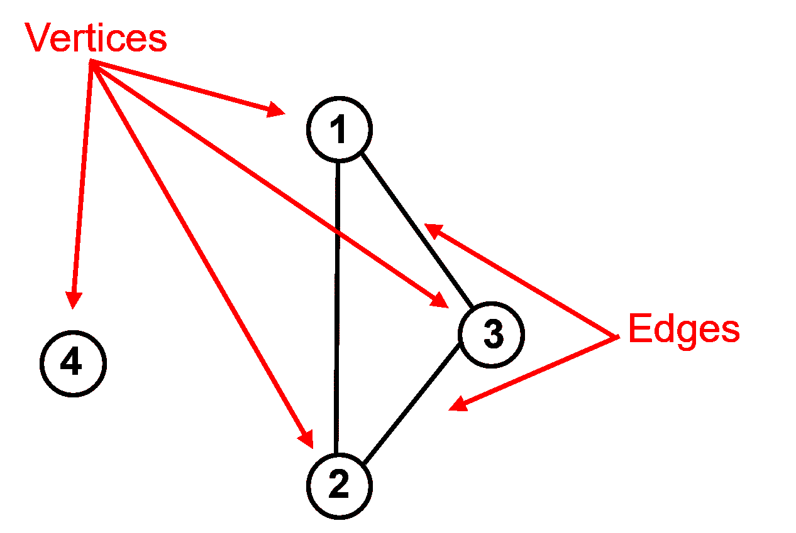

简单图的示意图。

+   **顶点**是数据样本。

+   **边**作为数据样本之间的成对连接。这些连接可以表示为 0 或 1（关闭或开启），称为邻接，或者表示为连接度（数值越大表示连接越紧密），称为亲和力。

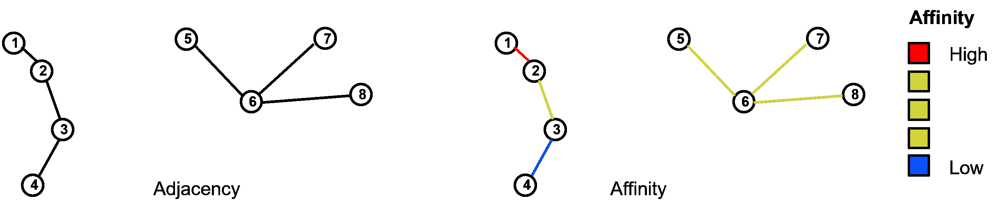

邻接与亲和力的示意图。

给定图，我们可以计算邻接矩阵或亲和力矩阵（$A$），它是一个$n \times n$的矩阵，具有：

$$\begin{split} A = \begin{bmatrix} 0 & a_{1,2} & \dots & a_{1,n} \\ a_{2,1} & 0 & \dots & a_{2,n} \\ \vdots & \vdots & \ddots & \vdots \\ a_{n,1} & a_{n,2} & \dots & 0 \\ \end{bmatrix} \end{split}$$

注意，对角线是 0，因为数据样本不被认为是彼此连接的。

对于上面的 4 个数据示例，我们有样本 1、2 和 3 彼此连接，而样本 4 没有连接到任何其他样本，那么邻接矩阵是：

$$\begin{split} A_{adjacency} = \begin{bmatrix} 0 & 1 & 1 & 0 \\ 1 & 0 & 1 & 0 \\ 1 & 1 & 0 & 0 \\ 0 & 0 & 0 & 0 \\ \end{bmatrix} \end{split}$$

现在我们需要考虑每个样本的连接度，即连接的数量。这被称为度矩阵（$D$）。

+   我们可以从邻接矩阵中计算度，作为行或列的边缘化（由于$A$是对称的，所以这无关紧要）。

$$ D_{i,i} = \sum_{j=1}^n A_{i,j} $$

$D$矩阵的对角线值设为零。以下是其一般结构：

$$\begin{split} D = \begin{bmatrix} d_1 & 0 & \dots & 0 \\ 0 & d_2 & \dots & 0 \\ \vdots & \vdots & \ddots & \vdots \\ 0 & 0 & \dots & d_n \\ \end{bmatrix} \end{split}$$

对于我们的 4 个数据样本，$D$矩阵是：

$$\begin{split} D = \begin{bmatrix} 2 & 0 & 0 & 0 \\ 0 & 2 & 0 & 0 \\ 0 & 0 & 2 & 0 \\ 0 & 0 & 0 & 0 \\ \end{bmatrix} \end{split}$$

数据样本 1、2 和 3 连接到 2 个其他样本（它们彼此都连接），但数据样本 4 没有连接到任何其他样本。

现在我们通过这个操作将邻接（或亲和力）矩阵与度矩阵结合，形成图拉普拉斯矩阵（$L$）：

$$ L = D - A $$

结果矩阵具有以下一般形式：

$$\begin{split} L = \begin{bmatrix} d_1 & -a_{1,2} & \dots & -a_{1,n} \\ -a_{2,1} & d_2 & \dots & -a_{2,n} \\ \vdots & \vdots & \ddots & \vdots \\ -a_{n,1} & -a_{n,2} & \dots & d_n \\ \end{bmatrix} \end{split}$$

现在如果我们回到我们的 4 个数据样本示例，我们得到图拉普拉斯矩阵（$L$）为：

$$\begin{split} L = \begin{bmatrix} 2 & -1 & -1 & 0 \\ -1 & 2 & -1 & 0 \\ -1 & -1 & 2 & 0 \\ 0 & 0 & 0 & 0 \\ \end{bmatrix} \end{split}$$

现在我们有一个单一的矩阵总结了图，即我们的数据样本之间的成对连接。但我们需要总结这些信息，以便用最少的维度描述最多的信息。

+   这听起来像是我们用主成分分析解决的问题，所以让我们使用相同的数学方法，特征值和特征向量，来给出一个有序的向量集，这些向量描述了系统的最大信息量，并且彼此独立，因此它们各自描述了系统的独特方面。

+   我们计算图拉普拉斯矩阵的特征值和特征向量。

让我们总结一下谱聚类方法：

1.  确定簇的数量（类似于 k-means 聚类）

1.  图的成对数据连接被编译在图拉普拉斯矩阵中

1.  使用特征值、特征向量线性、正交投影、旋转来最佳描述系统方差，实现了图拉普拉斯矩阵的降维

1.  k-means 聚类应用于 $2, 3, \ldots, k$ 特征向量。例如，

+   对于 $k=2$ 个聚类，我们只需将 $2^{nd}$ 特征向量分配给数据样本，$1, \ldots, n$，然后使用 k-means 聚类在 1D 中找到 2 个 k-means 聚类。

+   对于 $k=3$ 个聚类，我们将 $2^{nd}$ 和 $3^{rd}$ 特征向量分配给数据样本，$1, \ldots, n$，然后使用 k-means 聚类在 2D 中找到 3 个 k-means 聚类。

谱聚类的优势是什么？：

+   能够编码成对关系，整合专家知识。

+   特征值提供了关于聚类数量的有用信息，基于形成 k 个聚类所需的“切割”程度

+   样本数据成对关系的低维表示

+   特征值和特征向量可以解释

如果您想看到谱聚类的实际应用，请查看我的 [谱聚类交互式 Python 仪表板](https://github.com/GeostatsGuy/DataScienceInteractivePython/blob/main/Interactive_Spectral_Clustering.ipynb)，

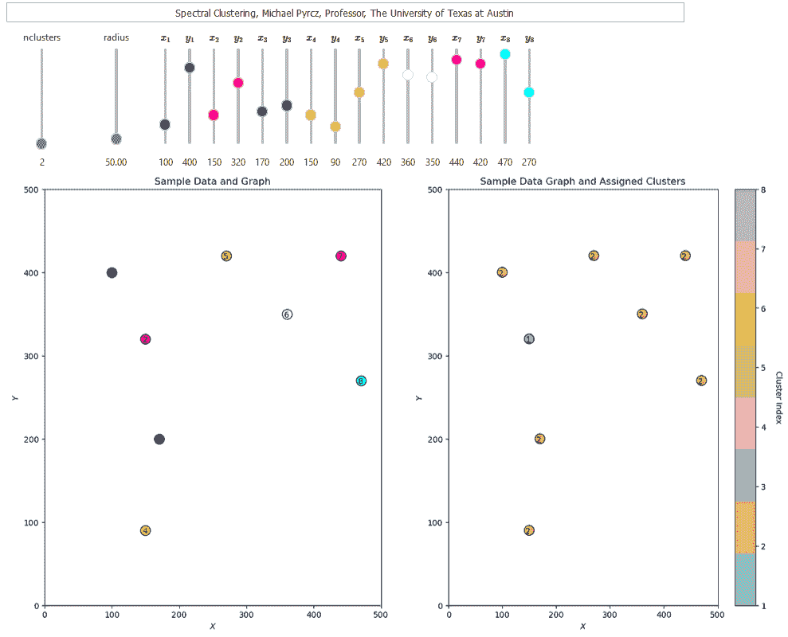

我的关于谱聚类的交互式 Python 仪表板。

这里还有包含从谱聚类中提取的特征值和特征向量的插图和解释的额外仪表板，

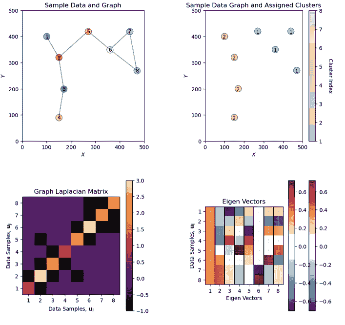

我的关于谱聚类（带有图拉普拉斯矩阵和特征向量）的交互式 Python 仪表板。

让我们加载数据集并尝试使用谱聚类。

## 加载所需的库

以下代码加载所需的库。这些库应该已经与 Anaconda 3 一起安装。

```py
ignore_warnings = True                                        # ignore warnings?
import numpy as np                                            # ndarrays for gridded data
import pandas as pd                                           # DataFrames for tabular data
import copy                                                   # for deep copies
import os                                                     # set working directory, run executables
import matplotlib.pyplot as plt                               # for plotting
from matplotlib.colors import ListedColormap                  # custom color maps
from matplotlib.ticker import (MultipleLocator,AutoMinorLocator,NullLocator,FuncFormatter) # control of axes ticks
from matplotlib.lines import Line2D                           # custom legend entry
import matplotlib.ticker as mtick                             # control tick label formatting
from sklearn.preprocessing import MinMaxScaler                # min/max normalization
from sklearn.cluster import KMeans                            # k-means clustering
from sklearn.cluster import SpectralClustering                # spectral clustering
plt.rc('axes', axisbelow=True)                                # plot all grids below the plot elements
if ignore_warnings == True:                                   
    import warnings
    warnings.filterwarnings('ignore')
cmap = plt.cm.inferno                                         # color map
seed = 42                                                     # random number seed 
```

如果您遇到包导入错误，您可能必须首先安装这些包中的一些。这通常可以通过在 Windows 上打开命令窗口然后输入‘python -m pip install [package-name]’来完成。有关相应包的文档，还有更多帮助可用。

## 为绘图设置自定义颜色图

我们在这里指定用于绘图的离散化自定义颜色图。

```py
continuous_cmap = plt.get_cmap('seismic')
num_levels = 7  
discretized_cmap = continuous_cmap(np.linspace(0, 1, num_levels))
discrete_cmap = ListedColormap(discretized_cmap) 
```

## 声明函数

添加逗号到数字和主次网格线的便利函数。

```py
def comma_format(x, pos):
    return f'{int(x):,}'

def add_grid():                                            
    plt.gca().grid(True, which='major',linewidth = 1.0); plt.gca().grid(True, which='minor',linewidth = 0.2) # add y grids
    plt.gca().tick_params(which='major',length=7); plt.gca().tick_params(which='minor', length=4)
    plt.gca().xaxis.set_minor_locator(AutoMinorLocator()); plt.gca().yaxis.set_minor_locator(AutoMinorLocator()) # turn on minor ticks 
```

## 设置工作目录

我总是喜欢这样做，这样我就不会丢失文件，并且可以简化后续的读取和写入（每次都避免包含完整地址）。

```py
#os.chdir("d:/PGE383")                                        # set the working directory with the input data file 
```

## 加载数据

让我们加载数据提供的多元、空间数据集。它是一个逗号分隔的文件，包含：

+   您可以选择下面的数据集 1-4。

我们使用 pandas 的‘read_csv’函数将其加载到我们称为‘df’的数据框中，然后预览它以确保正确加载。

**Python 小贴士：使用包中的函数**只需输入我们在开头声明的包的标签：

```py
import pandas as pd 
```

因此我们可以使用命令访问 pandas 函数‘read_csv’：

```py
pd.read_csv() 
```

但读取 csv 需要输入参数。最重要的一个是文件名。对于我们的情况，所有其他默认参数都很好。如果您想查看此函数的所有可能参数，请访问[此处](https://pandas.pydata.org/pandas-docs/stable/reference/api/pandas.read_csv.html)的文档。

+   文档总是很有帮助

+   Python 函数通常有很多灵活性，这可以通过使用各种输入参数来实现。

此外，程序还有一个输出，即从数据加载的 pandas DataFrame。因此，我们必须指定代表该新对象的名字/变量。

```py
df = pd.read_csv("nonlinear_facies_v1.csv") 
```

让我们运行此命令来加载数据，然后运行此命令来提取数据的一个随机子集。

```py
df = df.sample(frac=.30, random_state = 73073); 
df = df.reset_index() 
```

我们这样做是为了减少数据量，以便于可视化（如果图表上的点太多，就难以看清）以及在谱聚类的情形下，我们可以可视化亲和度、度和图拉普拉斯矩阵。

```py
dataset = 1                                                   # select a dataset, 1 - 4
reduce_the_data = True; retain_fraction = 0.02                # reduce the number of samples to improve visualization and run time 
yname = 'Facies'                                              # available group label for checking

if dataset == 1:
    Xname = ['Por','Perm']; Xunit = ['%','mD']; Xlabel = ['Porosity','Permeability'] 
    Xlabelunit = [Xlabel[0] + ' (' + Xunit[0] + ')',Xlabel[1] + ' (' + Xunit[1] + ')']
    Xmin = [0.0,0.0]; Xmax = [30.0,1400.0]                    # set minimums and maximums for visualization 
    df = pd.read_csv(r'https://raw.githubusercontent.com/GeostatsGuy/GeoDataSets/master/nonlinear_facies_v1.csv') # load our data table 
elif dataset == 2:
    Xname = ['AI','Por']; Xunit = [r'$kg/m2*10³$','%']; Xlabel = ['Acoustic Impedance','Porosity'] 
    Xlabelunit = [Xlabel[0] + ' (' + Xunit[0] + ')',Xlabel[1] + ' (' + Xunit[1] + ')']
    Xmin = [0.0,0.0]; Xmax = [1200.0,30.0]                    # set minimums and maximums for visualization 
    df = pd.read_csv(r'https://raw.githubusercontent.com/GeostatsGuy/GeoDataSets/master/nonlinear_facies_v2.csv') # load our data table
elif dataset == 3:
    Xname = ['AI','Por']; Xunit = [r'$kg/m2*10³$','%']; Xlabel = ['Acoustic Impedance','Porosity'] 
    Xlabelunit = [Xlabel[0] + ' (' + Xunit[0] + ')',Xlabel[1] + ' (' + Xunit[1] + ')']
    Xmin = [0.0,0.0]; Xmax = [1200.0,30.0]                    # set minimums and maximums for visualization 
    df = pd.read_csv(r'https://raw.githubusercontent.com/GeostatsGuy/GeoDataSets/master/nonlinear_facies_v3.csv') # load our data table
elif dataset == 4:
    Xname = ['AI','Por']; Xunit = [r'$kg/m2*10³$','%']; Xlabel = ['Acoustic Impedance','Porosity'] 
    Xlabelunit = [Xlabel[0] + ' (' + Xunit[0] + ')',Xlabel[1] + ' (' + Xunit[1] + ')']
    Xmin = [0.0,0.0]; Xmax = [7000.0,30.0]                    # set minimums and maximums for visualization 
    df = pd.read_csv(r'https://raw.githubusercontent.com/GeostatsGuy/GeoDataSets/master/sample_data_Gaussian_mixture_v1.csv') # load our data table

nXname = ['n' + feature for feature in Xname]                 # labels, units and ranges for normalized features
nXunit = ['norm[' + unit + ']' for unit in Xunit]
nXlabel = ['Normalized ' + feature for feature in Xlabel]
nXlabelunit = [nXlabel[0] + ' (' + nXunit[0] + ')',nXlabel[1] + ' (' + nXunit[1] + ')']
nXmin = [0.0,0.0]; nXmax = [1.0,1.0]    

if reduce_the_data == True:
    df = df.sample(frac=retain_fraction, random_state = 73073); df = df.reset_index() # extract a fraction of the data

df = df[Xname + [yname]]                                      # make a new DataFrame with only the features of interest
df.head() 
```

|  | Por | Perm | Facies |
| --- | --- | --- | --- |
| 0 | 24.751762 | 1199.611948 | 1 |
| 1 | 5.152299 | 530.125860 | 3 |
| 2 | 21.259112 | 1137.369924 | 1 |
| 3 | 20.203508 | 1122.143340 | 1 |
| 4 | 4.145138 | 737.744165 | 3 |

## 表格数据的摘要统计信息

该表格包括我们将要在下面的演示中使用的孔隙率（分数）和声阻抗（$\frac{kg}{m³} \cdot \frac{m}{s} \cdot 10³$)。

在 DataFrames 中，有许多有效的方法可以计算表格数据的摘要统计信息。describe 命令提供了一个很好的数据表，提供了计数、平均值、最小值、最大值和四分位数。我们使用 transpose 只是翻转表格，以便特征在行上，而统计信息在列上。

```py
df.describe().transpose()                                     # summary statistics 
```

|  | count | mean | std | min | 25% | 50% | 75% | max |
| --- | --- | --- | --- | --- | --- | --- | --- | --- |
| Por | 34.0 | 16.880290 | 7.045527 | 1.405136 | 12.192611 | 19.562295 | 22.544500 | 26.296139 |
| Perm | 34.0 | 1007.408007 | 218.666676 | 245.633475 | 935.089796 | 1084.143851 | 1172.372323 | 1199.611948 |
| Facies | 34.0 | 1.529412 | 0.748141 | 1.000000 | 1.000000 | 1.000000 | 2.000000 | 3.000000 |

让我们也检查一下岩相的比例。

+   我们将不会使用这些，但它们表示每个簇中样本的比例

```py
plt.subplot(221)                                              # histogram feature 1
plt.hist(df[Xname[0]],alpha=0.8,color="darkorange",edgecolor="black",bins=np.linspace(Xmin[0],Xmax[0],20),density = False)
plt.title(Xlabel[0])
plt.xlabel(Xlabelunit[0]); plt.ylabel("Frequency")
add_grid()

plt.subplot(222)                                              # histogram feature 2
plt.hist(df[Xname[1]],alpha=0.8,color="darkorange",edgecolor="black",bins=np.linspace(Xmin[1],Xmax[1],20),density = False)
plt.title(Xlabel[1]); plt.xlabel(Xlabelunit[1]); plt.ylabel("Frequency")
plt.gca().xaxis.set_major_formatter(FuncFormatter(comma_format)); add_grid()

plt.subplot(223)                                              # histogram truth label
n, bins, patches = plt.hist(df[yname],alpha=0.8,color="darkorange",edgecolor="black",bins=[0.5,1.5,2.5,3.5],label = ['Shale','SandShale','Sand'],range=[0.5,2.5],density = True)
plt.title('Facies Proportions')
plt.xlabel('Facies'); plt.ylabel("Proportion")
ax = plt.gca()
ax.set_xticks(np.arange(1.0, 3.1, 1)); ax.set_yticks(np.arange(0, 0.6, 0.2)); ax.set_yticks(np.arange(0, 0.6, 0.05), minor=True)
ax.grid(which='minor', alpha=0.1); ax.grid(which='major', alpha=0.2)
colors = plt.cm.YlOrBr_r(np.linspace(0, 1, len(patches)))
for patch, color in zip(patches, colors):
    patch.set_facecolor(color)

plt.subplots_adjust(left=0.0, bottom=0.0, right=2.0, top=2.1, wspace=0.2, hspace=0.2); plt.show() 
```

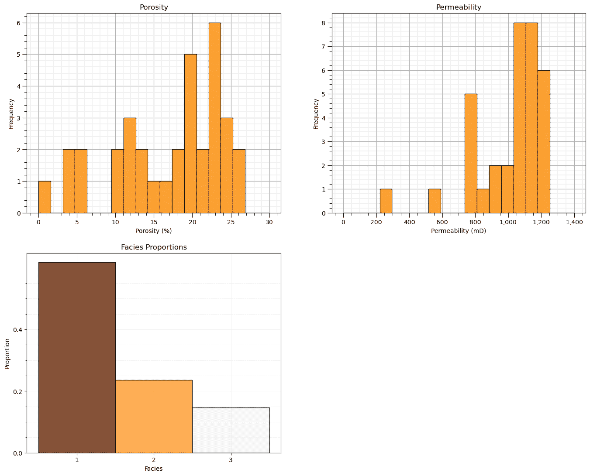

## 特征归一化

考虑的两个特征相当不兼容。它们有显著不同的：

+   数值/平均值

+   方差/范围

由于特征范围之间的差异是任意的，我们需要通过转换每个特征来消除这一点。我们将每个特征归一化，使其范围从 0.0（最小值）到 1.0（最大值）。

+   注意，归一化后没有分布形状的变化，所以通常在转换之前检查像异常值等问题，为了简洁，这一步在此处未包括，因为提供的数据集中没有异常值。

现在我们使用这些归一化特征值进行聚类工作流程，例如，在我们的工作流程中计算样本和原型之间的所需距离：

+   注意，对于每个数据样本，我们都有原始特征和转换特征值；因此，可以很容易地来回转换，而无需进行反向转换。

```py
transform = MinMaxScaler();                                   # instantiate the normalization object
df['n' + Xname[0]], df['n' + Xname[1]] = transform.fit_transform(df.loc[:,Xname].values).T # normalize features
df.head(n = 3) 
```

|  | Por | Perm | Facies | nPor | nPerm |
| --- | --- | --- | --- | --- | --- |
| 0 | 24.751762 | 1199.611948 | 1 | 0.937954 | 1.000000 |
| 1 | 5.152299 | 530.125860 | 3 | 0.150543 | 0.298217 |
| 2 | 21.259112 | 1137.369924 | 1 | 0.797637 | 0.934755 |

让我们确认我们的归一化孔隙率和声阻抗现在介于 0 和 1 之间。

```py
df.describe().transpose()                                     # check normalization via summary statistics 
```

|  | count | mean | std | min | 25% | 50% | 75% | max |
| --- | --- | --- | --- | --- | --- | --- | --- | --- |
| Por | 34.0 | 16.880290 | 7.045527 | 1.405136 | 12.192611 | 19.562295 | 22.544500 | 26.296139 |
| Perm | 34.0 | 1007.408007 | 218.666676 | 245.633475 | 935.089796 | 1084.143851 | 1172.372323 | 1199.611948 |
| Facies | 34.0 | 1.529412 | 0.748141 | 1.000000 | 1.000000 | 1.000000 | 2.000000 | 3.000000 |
| nPor | 34.0 | 0.621717 | 0.283055 | 0.000000 | 0.433388 | 0.729467 | 0.849277 | 1.000000 |
| nPerm | 34.0 | 0.798524 | 0.229216 | 0.000000 | 0.722717 | 0.878962 | 0.971446 | 1.000000 |

让我们比较原始和转换后的特征直方图。

```py
plt.subplot(221)                                              # original histograms
plt.hist(df[Xname[0]],alpha=0.8,color="darkorange",edgecolor="black",bins=np.linspace(Xmin[0],Xmax[0],20),density = False)
plt.title(Xlabel[0]); plt.xlabel(Xlabelunit[0]); plt.ylabel("Frequency"); plt.xlim([Xmin[0],Xmax[0]]); add_grid()

plt.subplot(222)
plt.hist(df[Xname[1]],alpha=0.8,color="darkorange",edgecolor="black",bins=np.linspace(Xmin[1],Xmax[1],20),density = False)
plt.title(Xlabel[1]); plt.xlabel(Xlabelunit[1]); plt.ylabel("Frequency"); plt.xlim([Xmin[1],Xmax[1]])
plt.gca().xaxis.set_major_formatter(FuncFormatter(comma_format)); add_grid()

plt.subplot(223)                                              # normalized histograms
plt.hist(df[nXname[0]],alpha=0.8,color="darkorange",edgecolor="black",bins=np.linspace(nXmin[0],nXmax[0],20),density = False)
plt.title(nXlabel[0]); plt.xlabel(nXlabelunit[0]); plt.ylabel("Frequency"); add_grid(); plt.xlim([nXmin[0],nXmax[0]]);

plt.subplot(224)
plt.hist(df[nXname[1]],alpha=0.8,color="darkorange",edgecolor="black",bins=np.linspace(nXmin[1],nXmax[1],20),density = False)
plt.title(nXlabel[1]); plt.xlabel(nXlabelunit[1]); plt.ylabel("Frequency"); add_grid(); plt.xlim([nXmin[1],nXmax[1]]);

plt.subplots_adjust(left=0.0, bottom=0.0, right=2.0, top=2.1, wspace=0.2, hspace=0.2); plt.show() 
```

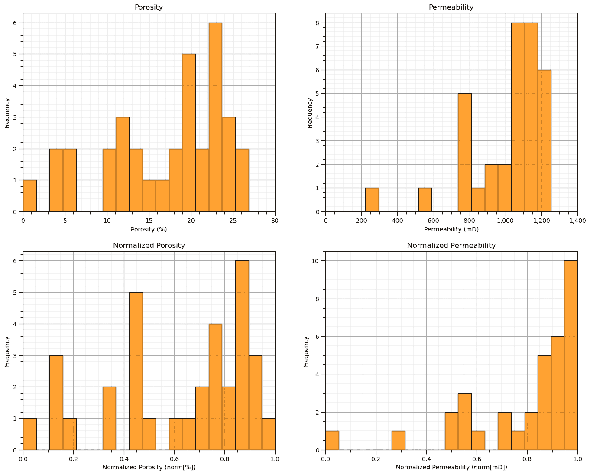

## 快速查看用于教育目的的可用标签

我知道这是作弊，但为了校准我们的眼睛并检查数据集中的自然聚类，让我们作弊一下，看看按岩性标签着色的特征散点图。

+   对于这个演示工作流程，这是我们不可访问的真实模型，我们只将其用作教学工具

+   在此之后，我们将省略这些标签，并尝试使用聚类分析自动化它们的分配

```py
facies_list = np.unique(df[yname])                            # get the facies list from loaded data
min_facies = min(facies_list); max_facies = max(facies_list)
for ifacies in facies_list:                                   # plot the labeled data
    plt.scatter(df[df[yname] == ifacies][Xname[0]],df[df[yname] == ifacies][Xname[1]],
        color = plt.cm.YlOrBr_r((ifacies-min_facies)/(max_facies-min_facies)),edgecolor='black',alpha = 0.8,
        vmin = min_facies, vmax = max_facies,label = 'Facies: ' + str(ifacies))

plt.xlabel(Xlabelunit[0]); plt.ylabel(Xlabelunit[1]); plt.title(Xlabel[1] + ' vs. ' + Xlabel[0] + ' with Truth ' + yname); add_grid()
plt.xlim([Xmin[0],Xmax[0]]); plt.ylim([Xmin[1],Xmax[1]])
plt.gca().yaxis.set_major_formatter(FuncFormatter(comma_format)); plt.legend(loc = 'lower right')

plt.subplots_adjust(left=0.0, bottom=0.0, right=1.0, top=1.1, wspace=0.2, hspace=0.2) 
```

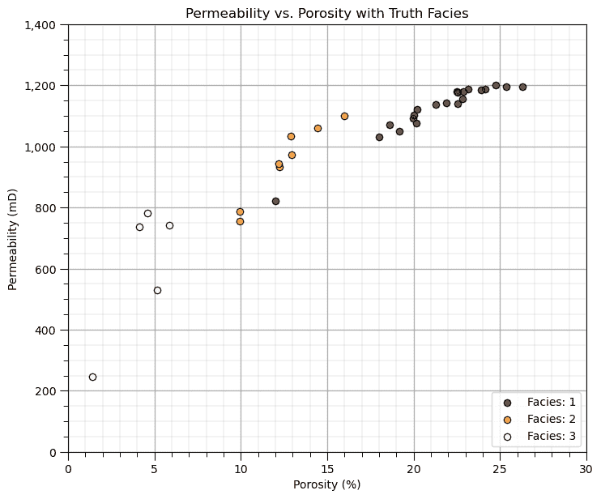

## 训练数据可视化

在这个练习中，我们想使用 K-means 聚类根据孔隙率和脆性特征提供岩性。

让我们从查看我们的训练数据特征散点图开始，孔隙率和脆性。

+   我们将通过整个练习查看原始单位和归一化单位中的数据。

```py
plt.subplot(121)                                              # scatter plot our training data 
plt.scatter(df[Xname[0]],df[Xname[1]], c="black", alpha = 0.8, linewidths=1.0, edgecolors="black")
plt.title(Xlabel[1] + ' vs. ' + Xlabel[0]); plt.xlabel(Xlabelunit[0]); plt.ylabel(Xlabelunit[1])
plt.gca().yaxis.set_major_formatter(FuncFormatter(comma_format)); 
plt.xlim(Xmin[0],Xmax[0]); plt.ylim(Xmin[1],Xmax[1]); add_grid()

plt.subplot(122)
plt.scatter(df[nXname[0]],df[nXname[1]], c="black", alpha = 0.8, linewidths=1.0, edgecolors="black")
plt.title(nXlabel[1] + ' vs. ' + nXlabel[0]); plt.xlabel(nXlabelunit[0]); plt.ylabel(nXlabelunit[1])
plt.xlim(nXmin[0],nXmax[0]); plt.ylim(nXmin[1],nXmax[1]); add_grid()

plt.subplots_adjust(left=0.0, bottom=0.0, right=2.0, top=1.0, wspace=0.2, hspace=0.2) 
```

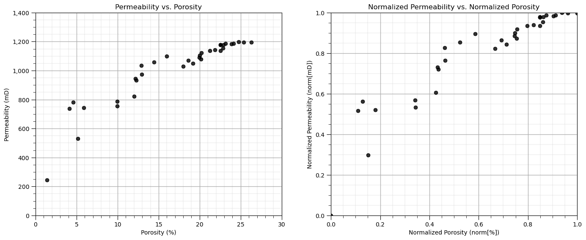

## 计算邻接矩阵、度矩阵和图拉普拉斯矩阵

我们的第一步是计算亲和矩阵。虽然核方法和最近邻方法很常见，但这些方法只整合了邻近信息，这一步可以包括整合各种信息源。

+   为了演示这一点，我们将手动分配邻接。让我们指定相连的数据样本。

+   再次强调，在实际应用中，我们会使用额外的信息来构建邻接或亲和矩阵。

为了演示目的，让我们看看特征空间中的数据样本，并绘制索引以分配一些连接。

```py
plt.subplot(131)                                              # plot the data unlabeled
np.random.seed(15)                                            # I found a seed with pretty good random "jittered" labels
plt.scatter(df[Xname[0]], df[Xname[1]],c='black',alpha=0.5,edgecolor='k',cmap = cmap)
plt.xlabel(Xlabelunit[0]); plt.ylabel(Xlabelunit[1]); plt.title(Xlabel[1] + ' vs. ' + Xlabel[0]); add_grid()
plt.gca().yaxis.set_major_formatter(FuncFormatter(comma_format))
plt.xlim([Xmin[0],Xmax[0]]); plt.ylim([Xmin[1],Xmax[1]])
for i in range(0,len(df)):
    dx = dy = np.random.choice([-1,0,1])*2; dy = np.random.choice([-1,0,1])*30
    x0 = df[Xname[0]][i]; x1 = df[Xname[1]][i]
    xa0 = df[Xname[0]][i]+dx; xa1 = df[Xname[1]][i]+dy
    plt.annotate(i,[xa0,xa1],size=7,zorder=20,color='red')
    plt.plot([x0,xa0],[x1,xa1],color='black',lw=0.5)

plt.subplots_adjust(left=0.0, bottom=0.0, right=2.4, top=0.8, wspace=0.2, hspace=0.2); plt.show() 
```

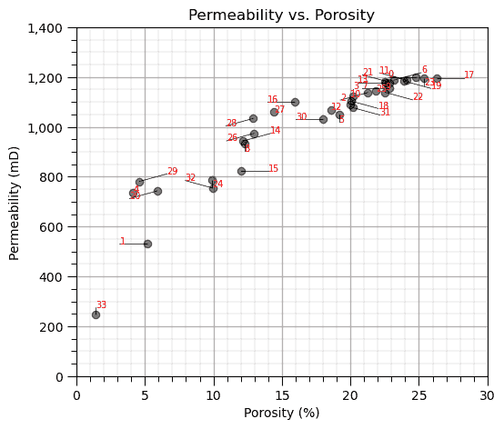

现在我们通过索引指定连接的数据对，并构建邻接、度和图拉普拉斯矩阵。

+   实际上，我们只构建邻接（或亲和）矩阵。其他矩阵由谱聚类函数自动计算。

```py
connect = [(33,1),(1,4),(4,29),(29,20),(32,24),(24,15),(14,15),(14,8),(14,26),(26,28),(28,27),(27,16)]
connect = connect + [(30,5),(5,12),(12,2),(2,10),(10,18),(18,31),(31,10),(10,3),(3,7),(7,13),(13,21),(21,11)]
connect = connect + [(11,0),(0,9),(9,6),(6,23),(23,19),(19,17),(22,2),(31,2)]

A = np.zeros((len(df),len(df))); D = np.zeros((len(df),len(df))) # declare the adjacency and degree matrices

for icon in range(0,len(connect)):                            # make adjacency matrix
    A[connect[icon][0],connect[icon][1]] = 1.0
    A[connect[icon][1],connect[icon][0]] = 1.0

degrees = np.sum(A,axis=0)                                    # make degree matrix
for i in range(0,len(df)):
    D[i,i] = degrees[i]

L = D - A                                                     # calculate graph Laplacian matrix

plt.subplot(221)                                              # plot the data with graph vertices
plt.scatter(df[Xname[0]], df[Xname[1]],c='black',alpha=0.5,edgecolor='k',cmap = cmap,zorder=5,label='vertex')
plt.xlabel(Xlabelunit[0]); plt.ylabel(Xlabelunit[1]); plt.title('Graph with Data Samples'); add_grid()
plt.gca().yaxis.set_major_formatter(FuncFormatter(comma_format))
plt.xlim([Xmin[0],Xmax[0]]); plt.ylim([Xmin[1],Xmax[1]])
for i in range(0,len(df)):
    x0 = df[Xname[0]][i]; x1 = df[Xname[1]][i]+60
    plt.annotate(i,[x0,x1],color='blue',zorder=20)

for icon in range(0,len(connect)):
    i,j = connect[icon]
    plt.plot([df[Xname[0]][i],df[Xname[0]][j]],[df[Xname[1]][i],df[Xname[1]][j]],color='red',zorder=1)
line = Line2D([0], [0], label='edge', color='red')

colors = ['#FFFFFF','#000000']  # Black and white
binary_cmap = ListedColormap(colors)
handles, labels = plt.gca().get_legend_handles_labels()
handles.extend([line])
plt.legend(handles=handles,loc='lower right')

plt.subplot(222)                                              # plot adjacency matrix
plt.imshow(A,extent=[-0.5,len(df)-1+0.5,-0.5,len(df)-1+0.5],cmap = discrete_cmap,vmin=-3.5,vmax=3.5)
for icon in range(0,len(df)+1):
    plt.plot([icon+0.5,icon+0.5],[-0.5,len(df)-1+0.5],color='grey')
    plt.plot([-0.5,len(df)-1+0.5],[icon+0.5,icon+0.5],color='grey')
plt.xlim([-0.5,len(df)-1+0.5]); plt.ylim([-0.5,len(df)-1+0.5]);
plt.title('Adjacency Matrix (A)'); plt.xlabel('$i$ (Data Sample Index)'); plt.ylabel('$j$ (Data Sample Index)');
cbar = plt.colorbar()

plt.subplot(223)                                              # plot the degree matrix
plt.imshow(D,extent=[-0.5,len(df)-1+0.5,-0.5,len(df)-1+0.5],cmap = discrete_cmap,vmin=-3.5,vmax=3.5)
for icon in range(0,len(df)+1):
    plt.plot([icon+0.5,icon+0.5],[-0.5,len(df)-1+0.5],color='grey')
    plt.plot([-0.5,len(df)-1+0.5],[icon+0.5,icon+0.5],color='grey')
plt.xlim([-0.5,len(df)-1+0.5]); plt.ylim([-0.5,len(df)-1+0.5]);
plt.title('Degree Matrix (D)'); plt.xlabel('$i$ (Data Sample Index)'); plt.ylabel('$j$ (Data Sample Index)');
cbar = plt.colorbar()

plt.subplot(224)                                              # plot the graph Laplacian matrix
plt.imshow(L,extent=[-0.5,len(df)-1+0.5,-0.5,len(df)-1+0.5],cmap = discrete_cmap,vmin=-3.5,vmax=3.5)
for icon in range(0,len(df)+1):
    plt.plot([icon+0.5,icon+0.5],[-0.5,len(df)-1+0.5],color='grey')
    plt.plot([-0.5,len(df)-1+0.5],[icon+0.5,icon+0.5],color='grey')
plt.xlim([-0.5,len(df)-1+0.5]); plt.ylim([-0.5,len(df)-1+0.5]);
plt.title('Graph Laplacian Matrix (L = D - A)'); plt.xlabel('$i$ (Data Sample Index)'); plt.ylabel('$j$ (Data Sample Index)');
cbar = plt.colorbar()

plt.subplots_adjust(left=0.0, bottom=0.0, right=1.6, top=1.6, wspace=0.2, hspace=0.25); plt.show() 
```

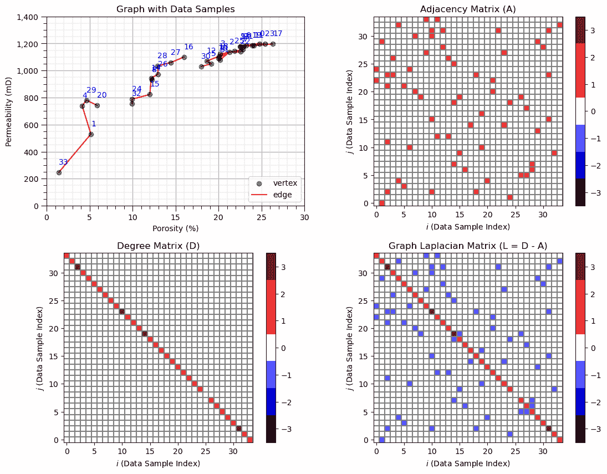

## 基于自定义邻接矩阵的谱聚类

现在我们使用我们的邻接矩阵运行谱聚类。

+   要做到这一点，我们将参数“affinity”设置为预计算的，然后在对邻接矩阵而不是数据进行训练。

```py
K = 3
spectral = SpectralClustering(n_clusters=K,assign_labels="kmeans",affinity='precomputed', random_state=seed).fit(A)

df['Spectral'] = spectral.labels_ + 1
cluster_list = np.unique(df['Spectral']); min_cluster = min(cluster_list); max_cluster = max(cluster_list)

cmap = plt.cm.inferno

plt.subplot(221)                                              # plot the clusters and graph
for k in range(1,K+1):    
    plt.scatter(df[df['Spectral']==k][Xname[0]], df[df['Spectral']==k][Xname[1]],color=cmap((k-1)/(K-1)),alpha = 1.0,
        linewidths=1.0, edgecolors="black", cmap = cmap,label = 'Cluster ' + str(k),vmin=0,vmax=K,zorder=10)
plt.title(Xname[1] + ' vs. ' + Xname[1] + ' with Spectral Clustering by Custom Adjacency Matrix'); plt.xlabel(Xlabelunit[0])
plt.ylabel(Xlabelunit[1]); plt.xlim([Xmin[0],Xmax[0]]); plt.ylim([Xmin[1],Xmax[1]]); add_grid()
plt.gca().yaxis.set_major_formatter(FuncFormatter(comma_format))
for icon in range(0,len(connect)):
    i,j = connect[icon]
    plt.plot([df[Xname[0]][i],df[Xname[0]][j]],[df[Xname[1]][i],df[Xname[1]][j]],color='grey',lw=0.5,zorder=1)
plt.legend(loc='lower right')

plt.subplot(222)                                              # plot the clusters and graph
for k in range(1,K+1):    
    plt.scatter(df[df['Spectral']==k][nXname[0]], df[df['Spectral']==k][nXname[1]],color=cmap((k-1)/(K-1)),alpha = 1.0,
        linewidths=1.0, edgecolors="black", cmap = cmap,label = 'Cluster ' + str(k),vmin=0,vmax=K,zorder=10)
plt.title(nXname[1] + ' vs. ' + nXname[1] + ' Spectral Clustering by Custom Adjacency Matrix'); plt.xlabel(nXlabelunit[0])
plt.ylabel(nXlabelunit[1]); plt.xlim([nXmin[0],nXmax[0]]); plt.ylim([nXmin[1],nXmax[1]]); add_grid()
for icon in range(0,len(connect)):
    i,j = connect[icon]
    plt.plot([df[nXname[0]][i],df[nXname[0]][j]],[df[nXname[1]][i],df[nXname[1]][j]],color='grey',lw=0.5,zorder=1)
plt.legend(loc='lower right')

plt.subplot(223)                                              # plot the cluster groups histograms 
N, bins, patches  = plt.hist(df['Spectral'],alpha=0.8,edgecolor="black",range=[min_cluster-0.5,max_cluster-0.5],
    bins=np.insert(np.linspace(min_cluster,max_cluster,len(cluster_list))+0.5,0,min_cluster-0.5),density = True)
for i in range(0,len(cluster_list)):
    patches[i].set_facecolor(cmap((cluster_list[i]-min_cluster)/(max_cluster-min_cluster)));
ax = plt.gca(); ax.set_xticks(cluster_list); plt.xlabel('Spectral Clusters'); plt.ylabel('Proportion'); plt.title('Spectral Clustering Groups')
plt.xlim([0.5,K+0.5]); plt.ylim([0,1]); add_grid()   

plt.subplots_adjust(left=0.0, bottom=0.0, right=2.0, top=2.1, wspace=0.2, hspace=0.2) 
```

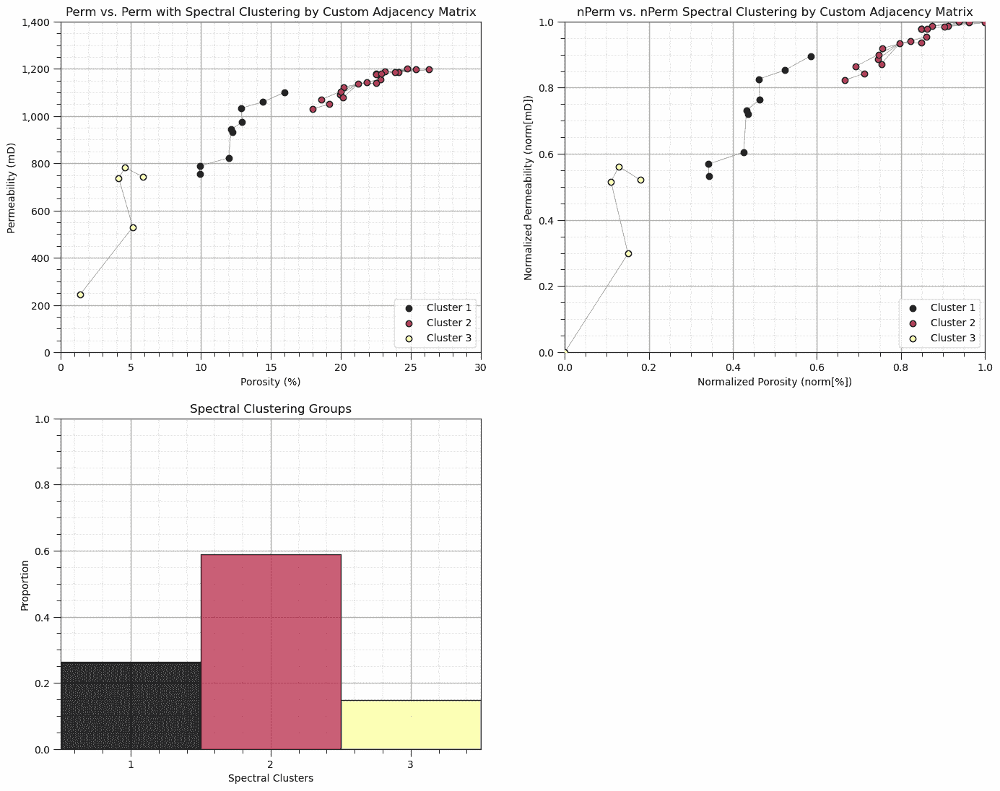

一些观察：

+   毫不意外，频谱组与我们所指定的连接组对齐。

让我们尝试其他事情，我们在 3 个组之间添加 2 个新顶点的连接。

```py
new_vertices = [(20,32),(16,30)]                              # add new vertices
connect2 = connect + new_vertices

A2 = np.zeros((len(df),len(df)))                              # declare the adjacency and degree matrices

for icon in range(0,len(connect2)):
    A2[connect2[icon][0],connect2[icon][1]] = 1.0
    A2[connect2[icon][1],connect2[icon][0]] = 1.0

K = 3                                                         # spectral clustering with the new graph
spectral2 = SpectralClustering(n_clusters=K,assign_labels="kmeans",affinity='precomputed', random_state=seed).fit(A2)

df['Spectral2'] = spectral2.labels_ + 1
cluster_list = np.unique(df['Spectral2']); min_cluster = min(cluster_list); max_cluster = max(cluster_list)

cmap = plt.cm.inferno

plt.subplot(121)                                              # plot the clusters and graph
for k in range(1,K+1):    
    plt.scatter(df[df['Spectral2']==k][Xname[0]], df[df['Spectral2']==k][Xname[1]],color=cmap((k-1)/(K-1)),alpha = 1.0,
        linewidths=1.0, edgecolors="black", cmap = cmap,label = 'Cluster ' + str(k),vmin=0,vmax=K,zorder=10)
plt.title(Xname[1] + ' vs. ' + Xname[1] + ' with Spectral Clustering & New Connections'); plt.xlabel(Xlabelunit[0]); plt.ylabel(Xlabelunit[1])
plt.xlim([Xmin[0],Xmax[0]]); plt.ylim([Xmin[1],Xmax[1]]); add_grid()
plt.gca().yaxis.set_major_formatter(FuncFormatter(comma_format))
for icon in range(0,len(connect)):
    i,j = connect[icon]
    plt.plot([df[Xname[0]][i],df[Xname[0]][j]],[df[Xname[1]][i],df[Xname[1]][j]],color='grey',lw=0.5,zorder=1)
for icon in range(0,len(new_vertices)):
    i,j = new_vertices[icon]
    if icon == 1:
        plt.plot([df[Xname[0]][i],df[Xname[0]][j]],[df[Xname[1]][i],df[Xname[1]][j]],color='red',lw=1.0,zorder=1,label='New Connection')
    else:
        plt.plot([df[Xname[0]][i],df[Xname[0]][j]],[df[Xname[1]][i],df[Xname[1]][j]],color='red',lw=1.0,zorder=1)
plt.legend(loc='lower right')

plt.subplot(122)                                              # plot the clustering and graph
for k in range(1,K+1):    
    plt.scatter(df[df['Spectral']==k][Xname[0]], df[df['Spectral']==k][Xname[1]],color=cmap((k-1)/(K-1)),alpha = 1.0,
        linewidths=1.0, edgecolors="black", cmap = cmap,label = 'Cluster ' + str(k),vmin=0,vmax=K,zorder=10)
plt.title(Xname[1] + ' vs. ' + Xname[1] + ' with Spectral Clustering'); plt.xlabel(Xlabelunit[0]); plt.ylabel(Xlabelunit[1])
plt.xlim([Xmin[0],Xmax[0]]); plt.ylim([Xmin[1],Xmax[1]]); add_grid()
plt.gca().yaxis.set_major_formatter(FuncFormatter(comma_format))
for icon in range(0,len(connect)):
    i,j = connect[icon]
    plt.plot([df[Xname[0]][i],df[Xname[0]][j]],[df[Xname[1]][i],df[Xname[1]][j]],color='grey',lw=0.5,zorder=1)
plt.legend(loc='lower right')

plt.subplots_adjust(left=0.0, bottom=0.0, right=2.0, top=1.1, wspace=0.2, hspace=0.2) 
```

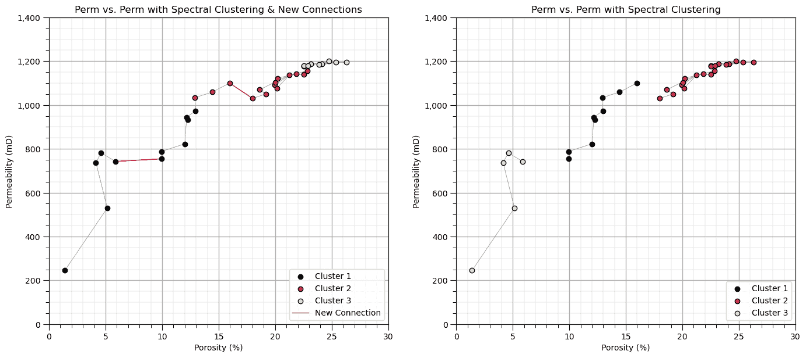

请注意，添加的顶点以红色粗线显示在上图。注意我们连接的间隙中集群组的位移。

+   尽管所有数据样本都是连接的，但谱聚类提供了合理的组，因为它学习了直接连接（通过顶点连接的两个数据样本）和间接连接（通过一个或多个其他数据样本经过多个顶点连接的两个数据样本）之间的差异。

+   再次强调，实际的集群组数字没有意义，所以不要担心集群组数字和颜色分配的切换。

## 基于核的谱聚类

有多种方法可以从特征空间中数据样本的位置计算亲和矩阵。

+   一种常见的方法是使用核函数，如径向基函数（RBF）核，由 $\gamma$ 参数化：

$$ K(x_i,x_j) = exp \left(- \gamma || x_i - x_j ||² \right) $$

其中 $|| x_i - x_j ||$ 是特征空间中数据样本 $x_i$ 和 $x_j$ 之间的距离。

+   由于我们使用距离计算，我们小心确保使用归一化或标准化特征

+   **大的 $\gamma$** - 相似性在局部分配

+   **小的 $\gamma$** - 相似性在长距离上持续存在

```py
K = 3; gamma = 1.0
spectral = SpectralClustering(n_clusters=K,assign_labels="kmeans",affinity = 'rbf',
                               gamma = gamma,random_state=seed).fit(df[[nXname[0],nXname[1]]].values)
df['Spectral3'] = spectral.labels_ + 1
cluster_list = np.unique(df['Spectral3']); min_cluster = min(cluster_list); max_cluster = max(cluster_list)

cmap = plt.cm.inferno

plt.subplot(121)                                              # plot the clusters and graph
for k in range(1,K+1):    
    plt.scatter(df[df['Spectral3']==k][Xname[0]], df[df['Spectral3']==k][Xname[1]],color=cmap((k-1)/(K-1)),alpha = 1.0,
        linewidths=1.0, edgecolors="black", cmap = cmap,label = 'Cluster ' + str(k),vmin=0,vmax=K,zorder=10)
plt.title(Xname[1] + ' vs. ' + Xname[1] + ' with Spectral Clustering'); plt.xlabel(Xlabelunit[0]); plt.ylabel(Xlabelunit[1])
plt.xlim([Xmin[0],Xmax[0]]); plt.ylim([Xmin[1],Xmax[1]]); add_grid()
plt.gca().yaxis.set_major_formatter(FuncFormatter(comma_format)); plt.legend(loc='lower right')

plt.subplot(122)                                              # plot the cluster and graph 
N, bins, patches  = plt.hist(df['Spectral3'],alpha=0.8,edgecolor="black",range=[min_cluster-0.5,max_cluster-0.5],
    bins=np.insert(np.linspace(min_cluster,max_cluster,len(cluster_list))+0.5,0,min_cluster-0.5),density = True)
for i in range(0,len(cluster_list)):
    patches[i].set_facecolor(cmap((cluster_list[i]-min_cluster)/(max_cluster-min_cluster)));
ax = plt.gca(); ax.set_xticks(cluster_list); plt.xlabel('Spectral Clusters'); plt.ylabel('Proportion')
plt.title('Spectral Clustering Groups'); plt.xlim([0.5,K+0.5]); plt.ylim([0,1]); add_grid()   

plt.subplots_adjust(left=0.0, bottom=0.0, right=2.0, top=1.1, wspace=0.2, hspace=0.2) 
```

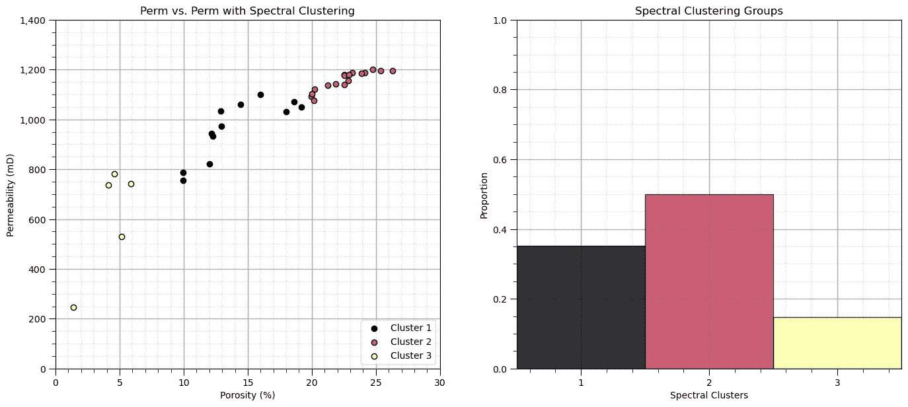

让我们看看 scikit-learn 的 SpectralClustering 函数计算出的亲和矩阵，以实现这个聚类结果。

+   这是所有样本数据之间的成对连接。

```py
plt.subplot(111)                                              # plot the affinity matrix 
plt.imshow(spectral.affinity_matrix_,cmap = plt.cm.gist_heat_r,vmin = 0.0, vmax = 1.0)
plt.xlabel(r'Sample Data $\alpha = 1, \ldots ,n$'); plt.ylabel(r'Sample Data $\alpha = 1, \ldots ,n$')
plt.subplots_adjust(left=0.0, bottom=0.0, right=1.0, top=1.1, wspace=0.2, hspace=0.2) 
```

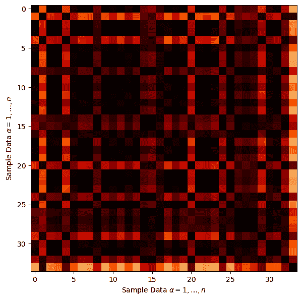

这里有一些一般性的观察：

+   样本数据之间存在大量成对连接。

让我们演示解决方案对模型超参数的敏感性。

让我们通过查看超参数的$3 \times 3$组合结果来探索参数的敏感性。第一次运行时保持原样，然后尝试修改这些代码中的值。

```py
ncluster_mat = [2,3,4] 
gamma_mat = [0.01,1.0,10] 
```

```py
ncluster_mat = [2,3,4]                                        # spectral clustering with RBF kernel affinity cases
gamma_mat = [0.01,1.0,10]
index = 1
for ncluster in ncluster_mat:
    for gamma in gamma_mat:
        spectral = SpectralClustering(n_clusters=ncluster,assign_labels="kmeans",affinity = 'rbf',
                              gamma = gamma,n_neighbors = 200,random_state=230).fit(df[[nXname[0],nXname[1]]].values)
        df['Spectral_test'] = spectral.labels_ + 1

        plt.subplot(3,3,index)                                 
        for k in range(1,ncluster+1):    
            if len(df[df['Spectral_test']==k]) > 0:
                plt.scatter(df[df['Spectral_test']==k][Xname[0]], df[df['Spectral_test']==k][Xname[1]],color=cmap((k-1)/(ncluster-1)),alpha = 1.0,
                    linewidths=1.0, edgecolors="black", cmap = cmap,label = 'Cluster ' + str(k),vmin=0,vmax=ncluster,zorder=10)
        plt.title(Xlabel[1] + ' vs. ' + Xlabel[0] + ' with Spectral, ncluster = ' + str(ncluster) + ', RBF: gamma = ' + str(gamma)); 
        plt.xlabel(Xlabelunit[0]); plt.ylabel(Xlabelunit[1])
        plt.xlim([Xmin[0],Xmax[0]]); plt.ylim([Xmin[1],Xmax[1]]); add_grid()
        plt.gca().yaxis.set_major_formatter(FuncFormatter(comma_format))
        plt.legend(loc='lower right')
        index = index + 1
plt.subplots_adjust(left=0.0, bottom=0.0, right=3.0, top=3.50, wspace=0.2, hspace=0.2) 
```

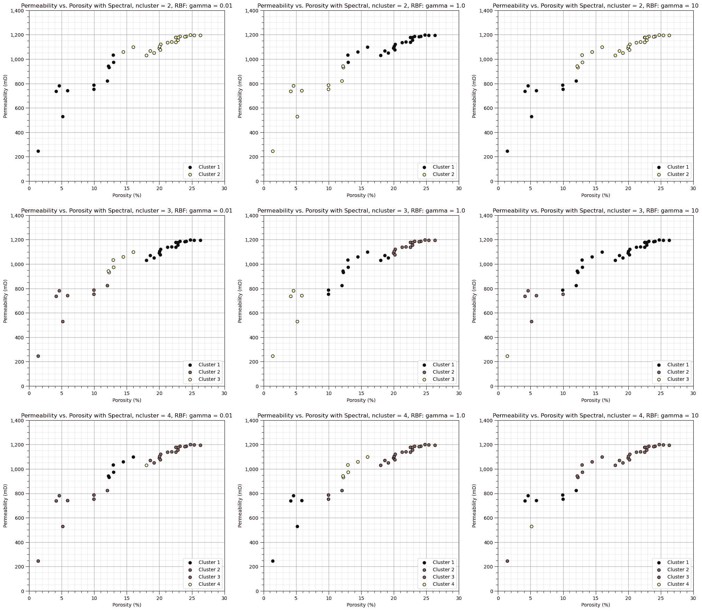

从这些光谱聚类分组分配中观察到：

+   当伽马值增加时，相似度的范围减少，模型对数据中的间隙更加敏感。

## 注释

这是对聚类分析（光谱聚类）的基本处理。可以做得更多，也可以讨论更多，我有很多更多的资源。查看我的[共享资源清单](https://michaelpyrcz.com/my-resources)以及本章开头带有资源链接的 YouTube 讲座链接。

希望这有所帮助，

*迈克尔*

## 关于作者


迈克尔·皮尔茨教授在德克萨斯大学奥斯汀分校 40 英亩校园的办公室。

迈克尔·皮尔茨是德克萨斯大学奥斯汀分校[科克雷尔工程学院](https://cockrell.utexas.edu/faculty-directory/alphabetical/p)和[杰克逊地球科学学院](https://www.jsg.utexas.edu/researcher/michael_pyrcz/)的教授，他在那里研究并教授地下、空间数据分析、地统计学和机器学习。迈克尔还是，

+   [能源分析](https://fri.cns.utexas.edu/energy-analytics)新生研究项目的首席研究员，以及德克萨斯大学奥斯汀分校自然科学学院机器学习实验室的核心教员。

+   [《计算机与地球科学》](https://www.sciencedirect.com/journal/computers-and-geosciences/about/editorial-board)的副编辑，以及国际数学地球科学协会[《数学地球科学》](https://link.springer.com/journal/11004/editorial-board)的董事会成员。

迈克尔已撰写超过 70 篇[同行评审出版物](https://scholar.google.com/citations?user=QVZ20eQAAAAJ&hl=en)，一个用于空间数据分析的[Python 包](https://pypi.org/project/geostatspy/)，合著了一本关于空间数据分析的教科书[地统计学储层建模](https://www.amazon.com/Geostatistical-Reservoir-Modeling-Michael-Pyrcz/dp/0199731446)，并是两本新近发布的电子书的作者，[Python 中应用地统计学：GeostatsPy 实践指南](https://geostatsguy.github.io/GeostatsPyDemos_Book/intro.html)和[Python 中应用机器学习：代码实践指南](https://geostatsguy.github.io/MachineLearningDemos_Book/intro.html)。

迈克尔的所有大学讲座都可在他的[YouTube 频道](https://www.youtube.com/@GeostatsGuyLectures)上找到，其中包含 100 多个 Python 交互式仪表板和 40 多个存储库中的详细工作流程，这些存储库位于他的[GitHub 账户](https://github.com/GeostatsGuy)，以支持任何感兴趣的学生和在职专业人士。了解更多关于迈克尔的工作和共享教育资源，请访问他的网站。

## 想要一起工作吗？

希望这些内容对那些想了解更多关于地下建模、数据分析和机器学习的人有所帮助。学生和在职专业人士都欢迎参与。

+   想邀请我到贵公司进行培训、辅导、项目审查、工作流程设计和/或咨询吗？我很乐意拜访并与您合作！

+   感兴趣合作、支持我的研究生研究或我的地下数据分析与机器学习联盟（共同负责人是约翰·福斯特教授）吗？我的研究结合数据分析、随机建模和机器学习理论及实践，开发新颖的方法和工作流程以增加价值。我们正在解决具有挑战性的地下问题！

+   您可以通过 mpyrcz@austin.utexas.edu 联系我。

我总是很高兴讨论，

*迈克尔*

迈克尔·皮尔奇，博士，注册工程师，德克萨斯大学奥斯汀分校 Cockrell 工程学院和 Jackson 地球科学学院教授

更多资源可在以下链接获取：[Twitter](https://twitter.com/geostatsguy) | [GitHub](https://github.com/GeostatsGuy) | [网站](http://michaelpyrcz.com) | [Google Scholar](https://scholar.google.com/citations?user=QVZ20eQAAAAJ&hl=en&oi=ao) | [地统计学书籍](https://www.amazon.com/Geostatistical-Reservoir-Modeling-Michael-Pyrcz/dp/0199731446) | [YouTube](https://www.youtube.com/channel/UCLqEr-xV-ceHdXXXrTId5ig) | [Python 中应用地统计学电子书](https://geostatsguy.github.io/GeostatsPyDemos_Book/intro.html) | [Python 中应用机器学习电子书](https://geostatsguy.github.io/MachineLearningDemos_Book/) | [LinkedIn](https://www.linkedin.com/in/michael-pyrcz-61a648a1)

## 光谱聚类分析的动力

我们需要学习和划分不同的群体以提高我们的预测模型。

+   将不同的群体混合起来训练预测模型通常会降低模型精度。

+   聚类是一种推断机器学习方法，用于自动将数据集分割成单独的组，称为簇，并指定为整数索引。

+   常见的聚类分析方法，如 k-means 聚类，易于应用，但仅基于特征空间中的邻近性，并不整合关于数据样本之间成对关系的信 息；因此，向我们的工具包中添加聚类方法，如谱聚类，是至关重要的。

+   总是记住，计算机不提供对组的意义或描述，这是我们的工作！

这里有一个简单的流程图，展示了谱聚类（用于自动分类分配）。这应该有助于你开始使用推断方法来寻找你的地下数据集中的模式。

## 覆盖的聚类方法

我涵盖了以下聚类方法，

+   **k-Means 聚类**作为一种基于质心的聚类方法，具有预定义的簇数量

+   **基于密度的 DBSCAN**，一种无预定义簇数量的基于密度的空间聚类方法

+   **谱聚类**作为一种基于预定义簇数量的层次连接聚类方法

在我们开始进行谱聚类分析之前，让我们先了解一些基本前提。让我们从推断机器学习的概念开始，然后简要讨论 k-means 聚类，以便与谱聚类进行比较。

## 推断性机器学习

没有响应特征$y$，只有预测特征，

$$ 𝑋_1,\ldots,𝑋_𝑚 $$

+   机器通过模仿数据的紧凑表示来学习

+   通过特征投影、分组分配、神经网络潜在特征等方式捕捉模式。

+   我们关注的是对总体、自然系统的推断，而不是对响应特征的预测。

## k-Means Clustering

K-means 聚类方法主要作为无监督机器学习方法应用于聚类，对未标记数据进行分组分配，其中聚类组内的差异最小化。最小化的损失函数是：

$$ J = \sum^k_{i=1} \sum_{\alpha \in C_i} || X_{\alpha} - \mu_i || $$

其中$i$是簇索引，$\alpha$是数据样本索引，$X$是数据样本，$\mu_i$是$i$簇原型，$k$是簇的总数，$|| X_m - \mu_m ||$是从样本到$M$维空间中簇原型的欧几里得距离，计算如下：

$$ || X_{m,\alpha} - \mu_i || = \sqrt{ \sum_m^M \left( X_{m,\alpha} - \mu_{m,i} \right)² } $$

以下是 k-means 聚类的关键方面总结：

+   **原型方法** - 在特征空间中用合成案例的数量表示训练数据。对于 K-means 聚类，我们分配并迭代更新$K$个原型。

+   **迭代解法** - 初始原型在特征空间中随机分配，每个训练样本的标签更新为最近的原型，然后原型调整到其分配的训练数据质心，重复进行，直到训练数据分配没有进一步更新。

+   **无监督学习** - 训练数据未标记，并根据其在特征空间中与原型的接近程度分配$K$个标签。想法是相似的事物，在特征空间中的接近度，应该属于同一个簇组。

+   **特征加权** - 该过程依赖于特征空间中训练样本与原型之间的欧几里得距离。距离被视为相似性的“倒数”。如果特征具有显著不同的幅度，则幅度和范围最大的特征将主导损失函数，并且簇组将变得各向异性，与高范围特征垂直对齐。虽然常见的做法是对变量进行标准化/归一化，但可以通过不等方差应用按特征加权。注意，在本演示中，我们将特征归一化到 0.0 到 1.0 的范围。

## k-means 聚类的假设

这些是导致 k-means 聚类灵活性显著降低的假设：

1.  在预测特征空间内，簇是球形的、凸的和各向同性的。

+   这是因为基于最小化簇内差异的模型损失，这是通过预测特征空间中的简单球形几何实现的。

1.  所有特征都有相等的方差

$$ \sigma_{X_1}² = \sigma_{X_2}²= \ldots = \sigma_{X_m}² $$

+   这假设了样本间距离/差异的计算

1.  簇的大小和频率（簇中的样本数量）相似

+   较大的簇被分割以最小化簇内的总体平方差异

+   特征空间中样本较少的簇会被淹没！

## 谱聚类

谱聚类，利用表示数据样本之间成对关系的矩阵的谱（特征值）。

数据样本之间的关系通过图表表示，以下是一些先决的图表术语：


简单图的示意图。

+   **顶点**是数据样本。

+   **边**作为数据样本之间的成对连接。这些连接可以表示为 0 或 1（关闭或开启），称为邻接，或表示连接程度（数字越大表示连接越紧密），称为亲和力。


邻接与亲和力的示意图。

给定图，我们可以计算邻接矩阵或亲和力矩阵（$A$），它是一个$n \times n$的矩阵：

$$\begin{split} A = \begin{bmatrix} 0 & a_{1,2} & \dots & a_{1,n} \\ a_{2,1} & 0 & \dots & a_{2,n} \\ \vdots & \vdots & \ddots & \vdots \\ a_{n,1} & a_{n,2} & \dots & 0 \\ \end{bmatrix} \end{split}$$

注意到对角线为 0，因为数据样本不被认为是相互连接的。

对于上述 4 个数据示例，我们有样本 1、2 和 3 相互连接，而样本 4 没有连接到任何其他样本，那么邻接矩阵为：

$$\begin{split} A_{adjacency} = \begin{bmatrix} 0 & 1 & 1 & 0 \\ 1 & 0 & 1 & 0 \\ 1 & 1 & 0 & 0 \\ 0 & 0 & 0 & 0 \\ \end{bmatrix} \end{split}$$

现在我们需要考虑每个样本的连接度，即连接的数量。这被称为度矩阵（$D$）。

+   我们可以从邻接矩阵中计算度，作为行或列的边缘化（由于$A$是对称的，所以这无关紧要）。

$$ D_{i,i} = \sum_{j=1}^n A_{i,j} $$

$D$矩阵的对角线值设为零。以下是其一般结构：

$$\begin{split} D = \begin{bmatrix} d_1 & 0 & \dots & 0 \\ 0 & d_2 & \dots & 0 \\ \vdots & \vdots & \ddots & \vdots \\ 0 & 0 & \dots & d_n \\ \end{bmatrix} \end{split}$$

对于我们的 4 个数据样本，$D$矩阵为：

$$\begin{split} D = \begin{bmatrix} 2 & 0 & 0 & 0 \\ 0 & 2 & 0 & 0 \\ 0 & 0 & 2 & 0 \\ 0 & 0 & 0 & 0 \\ \end{bmatrix} \end{split}$$

数据样本 1、2 和 3 连接到 2 个其他样本（它们彼此都连接），但数据样本 4 没有连接到任何其他样本。

现在我们通过这个操作将邻接矩阵（或亲和矩阵）与度矩阵结合起来形成图拉普拉斯矩阵（$L$）：

$$ L = D - A $$

结果矩阵具有一般形式：

$$\begin{split} L = \begin{bmatrix} d_1 & -a_{1,2} & \dots & -a_{1,n} \\ -a_{2,1} & d_2 & \dots & -a_{2,n} \\ \vdots & \vdots & \ddots & \vdots \\ -a_{n,1} & -a_{n,2} & \dots & d_n \\ \end{bmatrix} \end{split}$$

现在如果我们回到我们的 4 个数据样本示例，我们得到图拉普拉斯矩阵（$L$）为：

$$\begin{split} L = \begin{bmatrix} 2 & -1 & -1 & 0 \\ -1 & 2 & -1 & 0 \\ -1 & -1 & 2 & 0 \\ 0 & 0 & 0 & 0 \\ \end{bmatrix} \end{split}$$

我们现在有一个单一的矩阵来总结图，即我们数据样本之间的成对连接。但我们需要这样总结，以便在尽可能少的维度中描述最多的信息。

+   这听起来像是我们用主成分分析解决的问题的类似问题，所以让我们使用相同的数学方法，特征值和特征向量，来给我们一个描述系统最多信息的向量顺序集，它们彼此独立，因此每个向量描述系统的独特方面。

+   我们计算图拉普拉斯矩阵的特征值和特征向量。

让我们总结一下谱聚类方法：

1.  确定簇的数量（类似于 k-means 聚类）

1.  图中的成对数据连接被编译在图拉普拉斯矩阵中

1.  图拉普拉斯矩阵的降维是通过特征值、特征向量的线性、正交投影和旋转来实现的，以最好地描述系统的方差

1.  在$2, 3, \ldots, k$特征向量上应用 k-means 聚类。例如，

+   对于$k=2$个聚类，我们只需将$2^{nd}$特征向量分配给数据样本，$1, \ldots, n$，然后使用 k-means 聚类在 1D 中找到 2 个 k-means 聚类。

+   对于$k=3$个聚类，我们将$2^{nd}$和$3^{rd}$特征向量分配给数据样本，$1, \ldots, n$，然后使用 k-means 聚类在 2D 中找到 3 个 k-means 聚类。

光谱聚类的优势是什么？：

+   能够编码成对关系，整合专家知识。

+   特征值提供了关于聚类数量的有用信息，基于创建 k 个聚类所需的“切割”程度

+   样本数据成对关系的低维表示

+   特征值和特征向量可以解释

如果你想看到光谱聚类的实际应用，请查看我的[spectral clustering 交互式 Python 仪表板](https://github.com/GeostatsGuy/DataScienceInteractivePython/blob/main/Interactive_Spectral_Clustering.ipynb)，


我为光谱聚类创建的交互式 Python 仪表板。

此外，还有包含从光谱聚类中提取的特征值和特征向量的说明和解释的额外仪表板，


我为光谱聚类（使用图拉普拉斯算子和特征向量）创建的交互式 Python 仪表板。

让我们加载一个数据集并尝试光谱聚类。

## 加载所需的库

以下代码加载了所需的库。这些库应该已经与 Anaconda 3 一起安装。

```py
ignore_warnings = True                                        # ignore warnings?
import numpy as np                                            # ndarrays for gridded data
import pandas as pd                                           # DataFrames for tabular data
import copy                                                   # for deep copies
import os                                                     # set working directory, run executables
import matplotlib.pyplot as plt                               # for plotting
from matplotlib.colors import ListedColormap                  # custom color maps
from matplotlib.ticker import (MultipleLocator,AutoMinorLocator,NullLocator,FuncFormatter) # control of axes ticks
from matplotlib.lines import Line2D                           # custom legend entry
import matplotlib.ticker as mtick                             # control tick label formatting
from sklearn.preprocessing import MinMaxScaler                # min/max normalization
from sklearn.cluster import KMeans                            # k-means clustering
from sklearn.cluster import SpectralClustering                # spectral clustering
plt.rc('axes', axisbelow=True)                                # plot all grids below the plot elements
if ignore_warnings == True:                                   
    import warnings
    warnings.filterwarnings('ignore')
cmap = plt.cm.inferno                                         # color map
seed = 42                                                     # random number seed 
```

如果你遇到包导入错误，你可能必须首先安装这些包中的一些。这通常可以通过在 Windows 上打开命令窗口然后输入‘python -m pip install [package-name]’来完成。有关相应包的文档中提供了更多帮助。

## 设置绘图的自定义颜色映射

在这里，我们指定用于绘图的自定义颜色映射和离散化。

```py
continuous_cmap = plt.get_cmap('seismic')
num_levels = 7  
discretized_cmap = continuous_cmap(np.linspace(0, 1, num_levels))
discrete_cmap = ListedColormap(discretized_cmap) 
```

## 声明函数

便于在数字中添加逗号以及主副网格线的绘图函数。

```py
def comma_format(x, pos):
    return f'{int(x):,}'

def add_grid():                                            
    plt.gca().grid(True, which='major',linewidth = 1.0); plt.gca().grid(True, which='minor',linewidth = 0.2) # add y grids
    plt.gca().tick_params(which='major',length=7); plt.gca().tick_params(which='minor', length=4)
    plt.gca().xaxis.set_minor_locator(AutoMinorLocator()); plt.gca().yaxis.set_minor_locator(AutoMinorLocator()) # turn on minor ticks 
```

## 设置工作目录

我总是喜欢这样做，这样我就不会丢失文件，并且可以简化后续的读取和写入（避免每次都包含完整地址）。

```py
#os.chdir("d:/PGE383")                                        # set the working directory with the input data file 
```

## 加载数据

让我们加载提供的多元、空间数据集。它是一个以逗号分隔的文件，包含：

+   你可以选择下面的 1-4 个数据集。

我们使用 pandas 的‘read_csv’函数将其加载到我们称为‘df’的数据框中，然后预览它以确保正确加载。

**Python 技巧：使用包中的函数**只需输入我们在开头声明的包的标签：

```py
import pandas as pd 
```

因此，我们可以使用以下命令访问 pandas 函数‘read_csv’：

```py
pd.read_csv() 
```

但是`read_csv`需要输入参数。最重要的一个是文件名。对于我们的情况，所有其他默认参数都很好。如果您想查看此函数的所有可能参数，请参阅[此处](https://pandas.pydata.org/pandas-docs/stable/reference/api/pandas.read_csv.html)的文档。

+   文档总是很有帮助

+   Python 函数通常有很多灵活性，这得益于各种输入参数的使用

此外，程序还有一个输出，即从数据加载的 pandas DataFrame。因此，我们必须指定代表该新对象的名称/变量。

```py
df = pd.read_csv("nonlinear_facies_v1.csv") 
```

让我们运行这个命令来加载数据，然后运行这个命令来提取数据的一个随机子集。

```py
df = df.sample(frac=.30, random_state = 73073); 
df = df.reset_index() 
```

我们这样做是为了减少数据量，以便于可视化（如果图表上有太多点就难以看到），以及在谱聚类的案例中，我们可以可视化亲和度、度和图拉普拉斯矩阵。

```py
dataset = 1                                                   # select a dataset, 1 - 4
reduce_the_data = True; retain_fraction = 0.02                # reduce the number of samples to improve visualization and run time 
yname = 'Facies'                                              # available group label for checking

if dataset == 1:
    Xname = ['Por','Perm']; Xunit = ['%','mD']; Xlabel = ['Porosity','Permeability'] 
    Xlabelunit = [Xlabel[0] + ' (' + Xunit[0] + ')',Xlabel[1] + ' (' + Xunit[1] + ')']
    Xmin = [0.0,0.0]; Xmax = [30.0,1400.0]                    # set minimums and maximums for visualization 
    df = pd.read_csv(r'https://raw.githubusercontent.com/GeostatsGuy/GeoDataSets/master/nonlinear_facies_v1.csv') # load our data table 
elif dataset == 2:
    Xname = ['AI','Por']; Xunit = [r'$kg/m2*10³$','%']; Xlabel = ['Acoustic Impedance','Porosity'] 
    Xlabelunit = [Xlabel[0] + ' (' + Xunit[0] + ')',Xlabel[1] + ' (' + Xunit[1] + ')']
    Xmin = [0.0,0.0]; Xmax = [1200.0,30.0]                    # set minimums and maximums for visualization 
    df = pd.read_csv(r'https://raw.githubusercontent.com/GeostatsGuy/GeoDataSets/master/nonlinear_facies_v2.csv') # load our data table
elif dataset == 3:
    Xname = ['AI','Por']; Xunit = [r'$kg/m2*10³$','%']; Xlabel = ['Acoustic Impedance','Porosity'] 
    Xlabelunit = [Xlabel[0] + ' (' + Xunit[0] + ')',Xlabel[1] + ' (' + Xunit[1] + ')']
    Xmin = [0.0,0.0]; Xmax = [1200.0,30.0]                    # set minimums and maximums for visualization 
    df = pd.read_csv(r'https://raw.githubusercontent.com/GeostatsGuy/GeoDataSets/master/nonlinear_facies_v3.csv') # load our data table
elif dataset == 4:
    Xname = ['AI','Por']; Xunit = [r'$kg/m2*10³$','%']; Xlabel = ['Acoustic Impedance','Porosity'] 
    Xlabelunit = [Xlabel[0] + ' (' + Xunit[0] + ')',Xlabel[1] + ' (' + Xunit[1] + ')']
    Xmin = [0.0,0.0]; Xmax = [7000.0,30.0]                    # set minimums and maximums for visualization 
    df = pd.read_csv(r'https://raw.githubusercontent.com/GeostatsGuy/GeoDataSets/master/sample_data_Gaussian_mixture_v1.csv') # load our data table

nXname = ['n' + feature for feature in Xname]                 # labels, units and ranges for normalized features
nXunit = ['norm[' + unit + ']' for unit in Xunit]
nXlabel = ['Normalized ' + feature for feature in Xlabel]
nXlabelunit = [nXlabel[0] + ' (' + nXunit[0] + ')',nXlabel[1] + ' (' + nXunit[1] + ')']
nXmin = [0.0,0.0]; nXmax = [1.0,1.0]    

if reduce_the_data == True:
    df = df.sample(frac=retain_fraction, random_state = 73073); df = df.reset_index() # extract a fraction of the data

df = df[Xname + [yname]]                                      # make a new DataFrame with only the features of interest
df.head() 
```

|  | Por | Perm | Facies |
| --- | --- | --- |
| 0 | 24.751762 | 1199.611948 | 1 |
| 1 | 5.152299 | 530.125860 | 3 |
| 2 | 21.259112 | 1137.369924 | 1 |
| 3 | 20.203508 | 1122.143340 | 1 |
| 4 | 4.145138 | 737.744165 | 3 |

## 表格数据的摘要统计

表格包括孔隙率（分数）和声阻抗（$\frac{kg}{m³} \cdot \frac{m}{s} \cdot 10³$），我们将在下面的演示中使用这些数据。

在 DataFrame 中从表格数据计算摘要统计有很多高效的方法。`describe`命令提供了一个包含计数、平均值、最小值、最大值和四分位数的数据表。我们使用`transpose`只是翻转表格，使得特征在行上，而统计在列上。

```py
df.describe().transpose()                                     # summary statistics 
```

|  | count | mean | std | min | 25% | 50% | 75% | max |
| --- | --- | --- | --- | --- | --- | --- | --- | --- |
| Por | 34.0 | 16.880290 | 7.045527 | 1.405136 | 12.192611 | 19.562295 | 22.544500 | 26.296139 |
| Perm | 34.0 | 1007.408007 | 218.666676 | 245.633475 | 935.089796 | 1084.143851 | 1172.372323 | 1199.611948 |
| Facies | 34.0 | 1.529412 | 0.748141 | 1.000000 | 1.000000 | 1.000000 | 2.000000 | 3.000000 |

让我们也检查一下岩相的比例。

+   我们将不会使用这些，但它们表示每个簇中样本的比例

```py
plt.subplot(221)                                              # histogram feature 1
plt.hist(df[Xname[0]],alpha=0.8,color="darkorange",edgecolor="black",bins=np.linspace(Xmin[0],Xmax[0],20),density = False)
plt.title(Xlabel[0])
plt.xlabel(Xlabelunit[0]); plt.ylabel("Frequency")
add_grid()

plt.subplot(222)                                              # histogram feature 2
plt.hist(df[Xname[1]],alpha=0.8,color="darkorange",edgecolor="black",bins=np.linspace(Xmin[1],Xmax[1],20),density = False)
plt.title(Xlabel[1]); plt.xlabel(Xlabelunit[1]); plt.ylabel("Frequency")
plt.gca().xaxis.set_major_formatter(FuncFormatter(comma_format)); add_grid()

plt.subplot(223)                                              # histogram truth label
n, bins, patches = plt.hist(df[yname],alpha=0.8,color="darkorange",edgecolor="black",bins=[0.5,1.5,2.5,3.5],label = ['Shale','SandShale','Sand'],range=[0.5,2.5],density = True)
plt.title('Facies Proportions')
plt.xlabel('Facies'); plt.ylabel("Proportion")
ax = plt.gca()
ax.set_xticks(np.arange(1.0, 3.1, 1)); ax.set_yticks(np.arange(0, 0.6, 0.2)); ax.set_yticks(np.arange(0, 0.6, 0.05), minor=True)
ax.grid(which='minor', alpha=0.1); ax.grid(which='major', alpha=0.2)
colors = plt.cm.YlOrBr_r(np.linspace(0, 1, len(patches)))
for patch, color in zip(patches, colors):
    patch.set_facecolor(color)

plt.subplots_adjust(left=0.0, bottom=0.0, right=2.0, top=2.1, wspace=0.2, hspace=0.2); plt.show() 
```


## 特征归一化

考虑的两个特征非常不兼容。它们有显著不同的：

+   幅度/平均值

+   方差/范围

由于特征之间的范围差异是任意的，我们需要通过转换每个特征来消除这一点。我们将每个特征归一化，使其范围从 0.0（最小值）到 1.0（最大值）。

+   注意，在归一化过程中，分布形状不会发生变化，因此我们通常会在转换之前检查是否存在异常值等问题，为了简洁，这一步骤在此处未包括，因为提供的数据集中没有异常值。

现在，我们使用这些归一化特征值进行聚类工作流程，例如，在我们的工作流程中计算所需的距离，即样本和原型之间的距离：

+   注意，对于每个数据样本，我们都有原始特征和转换后的特征值；因此，无需进行反向转换，很容易来回切换。

```py
transform = MinMaxScaler();                                   # instantiate the normalization object
df['n' + Xname[0]], df['n' + Xname[1]] = transform.fit_transform(df.loc[:,Xname].values).T # normalize features
df.head(n = 3) 
```

|  | Por | Perm | Facies | nPor | nPerm |
| --- | --- | --- | --- | --- | --- |
| 0 | 24.751762 | 1199.611948 | 1 | 0.937954 | 1.000000 |
| 1 | 5.152299 | 530.125860 | 3 | 0.150543 | 0.298217 |
| 2 | 21.259112 | 1137.369924 | 1 | 0.797637 | 0.934755 |

让我们确认我们的归一化孔隙率和声阻抗现在介于 0 和 1 之间。

```py
df.describe().transpose()                                     # check normalization via summary statistics 
```

|  | count | mean | std | min | 25% | 50% | 75% | max |
| --- | --- | --- | --- | --- | --- | --- | --- | --- |
| Por | 34.0 | 16.880290 | 7.045527 | 1.405136 | 12.192611 | 19.562295 | 22.544500 | 26.296139 |
| Perm | 34.0 | 1007.408007 | 218.666676 | 245.633475 | 935.089796 | 1084.143851 | 1172.372323 | 1199.611948 |
| 地层 | 34.0 | 1.529412 | 0.748141 | 1.000000 | 1.000000 | 1.000000 | 2.000000 | 3.000000 |
| nPor | 34.0 | 0.621717 | 0.283055 | 0.000000 | 0.433388 | 0.729467 | 0.849277 | 1.000000 |
| nPerm | 34.0 | 0.798524 | 0.229216 | 0.000000 | 0.722717 | 0.878962 | 0.971446 | 1.000000 |

让我们比较原始和转换后的特征直方图。

```py
plt.subplot(221)                                              # original histograms
plt.hist(df[Xname[0]],alpha=0.8,color="darkorange",edgecolor="black",bins=np.linspace(Xmin[0],Xmax[0],20),density = False)
plt.title(Xlabel[0]); plt.xlabel(Xlabelunit[0]); plt.ylabel("Frequency"); plt.xlim([Xmin[0],Xmax[0]]); add_grid()

plt.subplot(222)
plt.hist(df[Xname[1]],alpha=0.8,color="darkorange",edgecolor="black",bins=np.linspace(Xmin[1],Xmax[1],20),density = False)
plt.title(Xlabel[1]); plt.xlabel(Xlabelunit[1]); plt.ylabel("Frequency"); plt.xlim([Xmin[1],Xmax[1]])
plt.gca().xaxis.set_major_formatter(FuncFormatter(comma_format)); add_grid()

plt.subplot(223)                                              # normalized histograms
plt.hist(df[nXname[0]],alpha=0.8,color="darkorange",edgecolor="black",bins=np.linspace(nXmin[0],nXmax[0],20),density = False)
plt.title(nXlabel[0]); plt.xlabel(nXlabelunit[0]); plt.ylabel("Frequency"); add_grid(); plt.xlim([nXmin[0],nXmax[0]]);

plt.subplot(224)
plt.hist(df[nXname[1]],alpha=0.8,color="darkorange",edgecolor="black",bins=np.linspace(nXmin[1],nXmax[1],20),density = False)
plt.title(nXlabel[1]); plt.xlabel(nXlabelunit[1]); plt.ylabel("Frequency"); add_grid(); plt.xlim([nXmin[1],nXmax[1]]);

plt.subplots_adjust(left=0.0, bottom=0.0, right=2.0, top=2.1, wspace=0.2, hspace=0.2); plt.show() 
```


## 快速查看用于教育目的的可用标签

我知道这是作弊，但为了校准我们的眼睛并检查数据集中的自然聚类，让我们作弊并查看按地层标签着色的特征散点图。

+   对于这个演示工作流程，这是我们无法访问的真实模型，我们只将其用作教学工具

+   在此之后，我们将省略这些标签，并尝试使用聚类分析自动分配它们。

```py
facies_list = np.unique(df[yname])                            # get the facies list from loaded data
min_facies = min(facies_list); max_facies = max(facies_list)
for ifacies in facies_list:                                   # plot the labeled data
    plt.scatter(df[df[yname] == ifacies][Xname[0]],df[df[yname] == ifacies][Xname[1]],
        color = plt.cm.YlOrBr_r((ifacies-min_facies)/(max_facies-min_facies)),edgecolor='black',alpha = 0.8,
        vmin = min_facies, vmax = max_facies,label = 'Facies: ' + str(ifacies))

plt.xlabel(Xlabelunit[0]); plt.ylabel(Xlabelunit[1]); plt.title(Xlabel[1] + ' vs. ' + Xlabel[0] + ' with Truth ' + yname); add_grid()
plt.xlim([Xmin[0],Xmax[0]]); plt.ylim([Xmin[1],Xmax[1]])
plt.gca().yaxis.set_major_formatter(FuncFormatter(comma_format)); plt.legend(loc = 'lower right')

plt.subplots_adjust(left=0.0, bottom=0.0, right=1.0, top=1.1, wspace=0.2, hspace=0.2) 
```


## 训练数据的可视化

在这个练习中，我们想使用 K-means 聚类根据孔隙率和脆性特征来提供地层。

让我们从查看我们的训练数据特征散点图开始，即孔隙率和脆性。

+   我们将通过整个练习查看原始单位和归一化单位中的数据。

```py
plt.subplot(121)                                              # scatter plot our training data 
plt.scatter(df[Xname[0]],df[Xname[1]], c="black", alpha = 0.8, linewidths=1.0, edgecolors="black")
plt.title(Xlabel[1] + ' vs. ' + Xlabel[0]); plt.xlabel(Xlabelunit[0]); plt.ylabel(Xlabelunit[1])
plt.gca().yaxis.set_major_formatter(FuncFormatter(comma_format)); 
plt.xlim(Xmin[0],Xmax[0]); plt.ylim(Xmin[1],Xmax[1]); add_grid()

plt.subplot(122)
plt.scatter(df[nXname[0]],df[nXname[1]], c="black", alpha = 0.8, linewidths=1.0, edgecolors="black")
plt.title(nXlabel[1] + ' vs. ' + nXlabel[0]); plt.xlabel(nXlabelunit[0]); plt.ylabel(nXlabelunit[1])
plt.xlim(nXmin[0],nXmax[0]); plt.ylim(nXmin[1],nXmax[1]); add_grid()

plt.subplots_adjust(left=0.0, bottom=0.0, right=2.0, top=1.0, wspace=0.2, hspace=0.2) 
```


## 计算邻接矩阵、度矩阵和图拉普拉斯矩阵

我们的第一步是计算亲和矩阵。虽然核方法和最近邻方法很常见，但这些方法只整合了邻近信息，这一步可以包括整合各种信息源。

+   为了演示这一点，我们将手动分配邻接。让我们指定连接的数据样本。

+   再次强调，在实践中，我们会使用额外的信息来构建邻接或亲和矩阵。

为了演示目的，让我们看看特征空间中的数据样本，并绘制索引以分配一些连接。

```py
plt.subplot(131)                                              # plot the data unlabeled
np.random.seed(15)                                            # I found a seed with pretty good random "jittered" labels
plt.scatter(df[Xname[0]], df[Xname[1]],c='black',alpha=0.5,edgecolor='k',cmap = cmap)
plt.xlabel(Xlabelunit[0]); plt.ylabel(Xlabelunit[1]); plt.title(Xlabel[1] + ' vs. ' + Xlabel[0]); add_grid()
plt.gca().yaxis.set_major_formatter(FuncFormatter(comma_format))
plt.xlim([Xmin[0],Xmax[0]]); plt.ylim([Xmin[1],Xmax[1]])
for i in range(0,len(df)):
    dx = dy = np.random.choice([-1,0,1])*2; dy = np.random.choice([-1,0,1])*30
    x0 = df[Xname[0]][i]; x1 = df[Xname[1]][i]
    xa0 = df[Xname[0]][i]+dx; xa1 = df[Xname[1]][i]+dy
    plt.annotate(i,[xa0,xa1],size=7,zorder=20,color='red')
    plt.plot([x0,xa0],[x1,xa1],color='black',lw=0.5)

plt.subplots_adjust(left=0.0, bottom=0.0, right=2.4, top=0.8, wspace=0.2, hspace=0.2); plt.show() 
```


现在我们通过索引指定连接的数据对，并构建邻接、度和图拉普拉斯矩阵。

+   在实践中，我们只构建邻接（或亲和）矩阵。其他矩阵由光谱聚类函数自动计算。

```py
connect = [(33,1),(1,4),(4,29),(29,20),(32,24),(24,15),(14,15),(14,8),(14,26),(26,28),(28,27),(27,16)]
connect = connect + [(30,5),(5,12),(12,2),(2,10),(10,18),(18,31),(31,10),(10,3),(3,7),(7,13),(13,21),(21,11)]
connect = connect + [(11,0),(0,9),(9,6),(6,23),(23,19),(19,17),(22,2),(31,2)]

A = np.zeros((len(df),len(df))); D = np.zeros((len(df),len(df))) # declare the adjacency and degree matrices

for icon in range(0,len(connect)):                            # make adjacency matrix
    A[connect[icon][0],connect[icon][1]] = 1.0
    A[connect[icon][1],connect[icon][0]] = 1.0

degrees = np.sum(A,axis=0)                                    # make degree matrix
for i in range(0,len(df)):
    D[i,i] = degrees[i]

L = D - A                                                     # calculate graph Laplacian matrix

plt.subplot(221)                                              # plot the data with graph vertices
plt.scatter(df[Xname[0]], df[Xname[1]],c='black',alpha=0.5,edgecolor='k',cmap = cmap,zorder=5,label='vertex')
plt.xlabel(Xlabelunit[0]); plt.ylabel(Xlabelunit[1]); plt.title('Graph with Data Samples'); add_grid()
plt.gca().yaxis.set_major_formatter(FuncFormatter(comma_format))
plt.xlim([Xmin[0],Xmax[0]]); plt.ylim([Xmin[1],Xmax[1]])
for i in range(0,len(df)):
    x0 = df[Xname[0]][i]; x1 = df[Xname[1]][i]+60
    plt.annotate(i,[x0,x1],color='blue',zorder=20)

for icon in range(0,len(connect)):
    i,j = connect[icon]
    plt.plot([df[Xname[0]][i],df[Xname[0]][j]],[df[Xname[1]][i],df[Xname[1]][j]],color='red',zorder=1)
line = Line2D([0], [0], label='edge', color='red')

colors = ['#FFFFFF','#000000']  # Black and white
binary_cmap = ListedColormap(colors)
handles, labels = plt.gca().get_legend_handles_labels()
handles.extend([line])
plt.legend(handles=handles,loc='lower right')

plt.subplot(222)                                              # plot adjacency matrix
plt.imshow(A,extent=[-0.5,len(df)-1+0.5,-0.5,len(df)-1+0.5],cmap = discrete_cmap,vmin=-3.5,vmax=3.5)
for icon in range(0,len(df)+1):
    plt.plot([icon+0.5,icon+0.5],[-0.5,len(df)-1+0.5],color='grey')
    plt.plot([-0.5,len(df)-1+0.5],[icon+0.5,icon+0.5],color='grey')
plt.xlim([-0.5,len(df)-1+0.5]); plt.ylim([-0.5,len(df)-1+0.5]);
plt.title('Adjacency Matrix (A)'); plt.xlabel('$i$ (Data Sample Index)'); plt.ylabel('$j$ (Data Sample Index)');
cbar = plt.colorbar()

plt.subplot(223)                                              # plot the degree matrix
plt.imshow(D,extent=[-0.5,len(df)-1+0.5,-0.5,len(df)-1+0.5],cmap = discrete_cmap,vmin=-3.5,vmax=3.5)
for icon in range(0,len(df)+1):
    plt.plot([icon+0.5,icon+0.5],[-0.5,len(df)-1+0.5],color='grey')
    plt.plot([-0.5,len(df)-1+0.5],[icon+0.5,icon+0.5],color='grey')
plt.xlim([-0.5,len(df)-1+0.5]); plt.ylim([-0.5,len(df)-1+0.5]);
plt.title('Degree Matrix (D)'); plt.xlabel('$i$ (Data Sample Index)'); plt.ylabel('$j$ (Data Sample Index)');
cbar = plt.colorbar()

plt.subplot(224)                                              # plot the graph Laplacian matrix
plt.imshow(L,extent=[-0.5,len(df)-1+0.5,-0.5,len(df)-1+0.5],cmap = discrete_cmap,vmin=-3.5,vmax=3.5)
for icon in range(0,len(df)+1):
    plt.plot([icon+0.5,icon+0.5],[-0.5,len(df)-1+0.5],color='grey')
    plt.plot([-0.5,len(df)-1+0.5],[icon+0.5,icon+0.5],color='grey')
plt.xlim([-0.5,len(df)-1+0.5]); plt.ylim([-0.5,len(df)-1+0.5]);
plt.title('Graph Laplacian Matrix (L = D - A)'); plt.xlabel('$i$ (Data Sample Index)'); plt.ylabel('$j$ (Data Sample Index)');
cbar = plt.colorbar()

plt.subplots_adjust(left=0.0, bottom=0.0, right=1.6, top=1.6, wspace=0.2, hspace=0.25); plt.show() 
```


## 带自定义邻接矩阵的谱聚类

现在，让我们使用我们的邻接矩阵运行谱聚类。

+   要做到这一点，我们将参数“affinity”设置为预计算的，然后在对邻接矩阵而不是数据进行训练。

```py
K = 3
spectral = SpectralClustering(n_clusters=K,assign_labels="kmeans",affinity='precomputed', random_state=seed).fit(A)

df['Spectral'] = spectral.labels_ + 1
cluster_list = np.unique(df['Spectral']); min_cluster = min(cluster_list); max_cluster = max(cluster_list)

cmap = plt.cm.inferno

plt.subplot(221)                                              # plot the clusters and graph
for k in range(1,K+1):    
    plt.scatter(df[df['Spectral']==k][Xname[0]], df[df['Spectral']==k][Xname[1]],color=cmap((k-1)/(K-1)),alpha = 1.0,
        linewidths=1.0, edgecolors="black", cmap = cmap,label = 'Cluster ' + str(k),vmin=0,vmax=K,zorder=10)
plt.title(Xname[1] + ' vs. ' + Xname[1] + ' with Spectral Clustering by Custom Adjacency Matrix'); plt.xlabel(Xlabelunit[0])
plt.ylabel(Xlabelunit[1]); plt.xlim([Xmin[0],Xmax[0]]); plt.ylim([Xmin[1],Xmax[1]]); add_grid()
plt.gca().yaxis.set_major_formatter(FuncFormatter(comma_format))
for icon in range(0,len(connect)):
    i,j = connect[icon]
    plt.plot([df[Xname[0]][i],df[Xname[0]][j]],[df[Xname[1]][i],df[Xname[1]][j]],color='grey',lw=0.5,zorder=1)
plt.legend(loc='lower right')

plt.subplot(222)                                              # plot the clusters and graph
for k in range(1,K+1):    
    plt.scatter(df[df['Spectral']==k][nXname[0]], df[df['Spectral']==k][nXname[1]],color=cmap((k-1)/(K-1)),alpha = 1.0,
        linewidths=1.0, edgecolors="black", cmap = cmap,label = 'Cluster ' + str(k),vmin=0,vmax=K,zorder=10)
plt.title(nXname[1] + ' vs. ' + nXname[1] + ' Spectral Clustering by Custom Adjacency Matrix'); plt.xlabel(nXlabelunit[0])
plt.ylabel(nXlabelunit[1]); plt.xlim([nXmin[0],nXmax[0]]); plt.ylim([nXmin[1],nXmax[1]]); add_grid()
for icon in range(0,len(connect)):
    i,j = connect[icon]
    plt.plot([df[nXname[0]][i],df[nXname[0]][j]],[df[nXname[1]][i],df[nXname[1]][j]],color='grey',lw=0.5,zorder=1)
plt.legend(loc='lower right')

plt.subplot(223)                                              # plot the cluster groups histograms 
N, bins, patches  = plt.hist(df['Spectral'],alpha=0.8,edgecolor="black",range=[min_cluster-0.5,max_cluster-0.5],
    bins=np.insert(np.linspace(min_cluster,max_cluster,len(cluster_list))+0.5,0,min_cluster-0.5),density = True)
for i in range(0,len(cluster_list)):
    patches[i].set_facecolor(cmap((cluster_list[i]-min_cluster)/(max_cluster-min_cluster)));
ax = plt.gca(); ax.set_xticks(cluster_list); plt.xlabel('Spectral Clusters'); plt.ylabel('Proportion'); plt.title('Spectral Clustering Groups')
plt.xlim([0.5,K+0.5]); plt.ylim([0,1]); add_grid()   

plt.subplots_adjust(left=0.0, bottom=0.0, right=2.0, top=2.1, wspace=0.2, hspace=0.2) 
```


一些观察：

+   令人意外的是，光谱群与我们所指定的连通群是一致的。

让我们尝试其他事情，我们在 3 个组之间添加 2 个新顶点的连接。

```py
new_vertices = [(20,32),(16,30)]                              # add new vertices
connect2 = connect + new_vertices

A2 = np.zeros((len(df),len(df)))                              # declare the adjacency and degree matrices

for icon in range(0,len(connect2)):
    A2[connect2[icon][0],connect2[icon][1]] = 1.0
    A2[connect2[icon][1],connect2[icon][0]] = 1.0

K = 3                                                         # spectral clustering with the new graph
spectral2 = SpectralClustering(n_clusters=K,assign_labels="kmeans",affinity='precomputed', random_state=seed).fit(A2)

df['Spectral2'] = spectral2.labels_ + 1
cluster_list = np.unique(df['Spectral2']); min_cluster = min(cluster_list); max_cluster = max(cluster_list)

cmap = plt.cm.inferno

plt.subplot(121)                                              # plot the clusters and graph
for k in range(1,K+1):    
    plt.scatter(df[df['Spectral2']==k][Xname[0]], df[df['Spectral2']==k][Xname[1]],color=cmap((k-1)/(K-1)),alpha = 1.0,
        linewidths=1.0, edgecolors="black", cmap = cmap,label = 'Cluster ' + str(k),vmin=0,vmax=K,zorder=10)
plt.title(Xname[1] + ' vs. ' + Xname[1] + ' with Spectral Clustering & New Connections'); plt.xlabel(Xlabelunit[0]); plt.ylabel(Xlabelunit[1])
plt.xlim([Xmin[0],Xmax[0]]); plt.ylim([Xmin[1],Xmax[1]]); add_grid()
plt.gca().yaxis.set_major_formatter(FuncFormatter(comma_format))
for icon in range(0,len(connect)):
    i,j = connect[icon]
    plt.plot([df[Xname[0]][i],df[Xname[0]][j]],[df[Xname[1]][i],df[Xname[1]][j]],color='grey',lw=0.5,zorder=1)
for icon in range(0,len(new_vertices)):
    i,j = new_vertices[icon]
    if icon == 1:
        plt.plot([df[Xname[0]][i],df[Xname[0]][j]],[df[Xname[1]][i],df[Xname[1]][j]],color='red',lw=1.0,zorder=1,label='New Connection')
    else:
        plt.plot([df[Xname[0]][i],df[Xname[0]][j]],[df[Xname[1]][i],df[Xname[1]][j]],color='red',lw=1.0,zorder=1)
plt.legend(loc='lower right')

plt.subplot(122)                                              # plot the clustering and graph
for k in range(1,K+1):    
    plt.scatter(df[df['Spectral']==k][Xname[0]], df[df['Spectral']==k][Xname[1]],color=cmap((k-1)/(K-1)),alpha = 1.0,
        linewidths=1.0, edgecolors="black", cmap = cmap,label = 'Cluster ' + str(k),vmin=0,vmax=K,zorder=10)
plt.title(Xname[1] + ' vs. ' + Xname[1] + ' with Spectral Clustering'); plt.xlabel(Xlabelunit[0]); plt.ylabel(Xlabelunit[1])
plt.xlim([Xmin[0],Xmax[0]]); plt.ylim([Xmin[1],Xmax[1]]); add_grid()
plt.gca().yaxis.set_major_formatter(FuncFormatter(comma_format))
for icon in range(0,len(connect)):
    i,j = connect[icon]
    plt.plot([df[Xname[0]][i],df[Xname[0]][j]],[df[Xname[1]][i],df[Xname[1]][j]],color='grey',lw=0.5,zorder=1)
plt.legend(loc='lower right')

plt.subplots_adjust(left=0.0, bottom=0.0, right=2.0, top=1.1, wspace=0.2, hspace=0.2) 
```


如上图所示，添加的顶点以红色粗线表示。注意我们连接的间隙中聚类组的位移。

+   尽管所有数据样本都是连接的，但谱聚类提供了合理的组，因为它学习了直接连接（通过顶点连接的两个数据样本）和间接连接（通过多个顶点通过一个或多个其他数据样本连接的两个数据样本）之间的差异。

+   再次强调，实际的聚类组数字没有意义，所以不要担心聚类组数字和颜色分配的切换。

## 从核函数的亲和矩阵进行谱聚类

从特征空间中的数据样本位置计算亲和矩阵有多种方法。

+   一种常见的方法是使用核函数，如径向基函数（RBF）核，其参数为$\gamma$:

$$ K(x_i,x_j) = exp \left(- \gamma || x_i - x_j ||² \right) $$

其中 $|| x_i - x_j ||$ 是特征空间中数据样本 $x_i$ 和 $x_j$ 之间的距离。

+   由于我们使用距离计算，我们小心确保使用归一化或标准化特征

+   **大的$\gamma$** - 相似性被分配在局部

+   **小的$\gamma$** - 相似性在长距离上持续存在

```py
K = 3; gamma = 1.0
spectral = SpectralClustering(n_clusters=K,assign_labels="kmeans",affinity = 'rbf',
                               gamma = gamma,random_state=seed).fit(df[[nXname[0],nXname[1]]].values)
df['Spectral3'] = spectral.labels_ + 1
cluster_list = np.unique(df['Spectral3']); min_cluster = min(cluster_list); max_cluster = max(cluster_list)

cmap = plt.cm.inferno

plt.subplot(121)                                              # plot the clusters and graph
for k in range(1,K+1):    
    plt.scatter(df[df['Spectral3']==k][Xname[0]], df[df['Spectral3']==k][Xname[1]],color=cmap((k-1)/(K-1)),alpha = 1.0,
        linewidths=1.0, edgecolors="black", cmap = cmap,label = 'Cluster ' + str(k),vmin=0,vmax=K,zorder=10)
plt.title(Xname[1] + ' vs. ' + Xname[1] + ' with Spectral Clustering'); plt.xlabel(Xlabelunit[0]); plt.ylabel(Xlabelunit[1])
plt.xlim([Xmin[0],Xmax[0]]); plt.ylim([Xmin[1],Xmax[1]]); add_grid()
plt.gca().yaxis.set_major_formatter(FuncFormatter(comma_format)); plt.legend(loc='lower right')

plt.subplot(122)                                              # plot the cluster and graph 
N, bins, patches  = plt.hist(df['Spectral3'],alpha=0.8,edgecolor="black",range=[min_cluster-0.5,max_cluster-0.5],
    bins=np.insert(np.linspace(min_cluster,max_cluster,len(cluster_list))+0.5,0,min_cluster-0.5),density = True)
for i in range(0,len(cluster_list)):
    patches[i].set_facecolor(cmap((cluster_list[i]-min_cluster)/(max_cluster-min_cluster)));
ax = plt.gca(); ax.set_xticks(cluster_list); plt.xlabel('Spectral Clusters'); plt.ylabel('Proportion')
plt.title('Spectral Clustering Groups'); plt.xlim([0.5,K+0.5]); plt.ylim([0,1]); add_grid()   

plt.subplots_adjust(left=0.0, bottom=0.0, right=2.0, top=1.1, wspace=0.2, hspace=0.2) 
```


让我们看看 scikit-learn 的 SpectralClustering 函数计算出的亲和矩阵，以实现这种聚类结果。

+   这是所有样本数据之间的成对连接

```py
plt.subplot(111)                                              # plot the affinity matrix 
plt.imshow(spectral.affinity_matrix_,cmap = plt.cm.gist_heat_r,vmin = 0.0, vmax = 1.0)
plt.xlabel(r'Sample Data $\alpha = 1, \ldots ,n$'); plt.ylabel(r'Sample Data $\alpha = 1, \ldots ,n$')
plt.subplots_adjust(left=0.0, bottom=0.0, right=1.0, top=1.1, wspace=0.2, hspace=0.2) 
```


这里有一些一般性的观察：

+   样本数据之间存在大量的成对连接

让我们演示解决方案对模型超参数的敏感性。

让我们通过查看超参数的$3 \times 3$组合结果来探索参数的敏感性。第一次运行时按原样运行，然后尝试更改此代码中的这些值。

```py
ncluster_mat = [2,3,4] 
gamma_mat = [0.01,1.0,10] 
```

```py
ncluster_mat = [2,3,4]                                        # spectral clustering with RBF kernel affinity cases
gamma_mat = [0.01,1.0,10]
index = 1
for ncluster in ncluster_mat:
    for gamma in gamma_mat:
        spectral = SpectralClustering(n_clusters=ncluster,assign_labels="kmeans",affinity = 'rbf',
                              gamma = gamma,n_neighbors = 200,random_state=230).fit(df[[nXname[0],nXname[1]]].values)
        df['Spectral_test'] = spectral.labels_ + 1

        plt.subplot(3,3,index)                                 
        for k in range(1,ncluster+1):    
            if len(df[df['Spectral_test']==k]) > 0:
                plt.scatter(df[df['Spectral_test']==k][Xname[0]], df[df['Spectral_test']==k][Xname[1]],color=cmap((k-1)/(ncluster-1)),alpha = 1.0,
                    linewidths=1.0, edgecolors="black", cmap = cmap,label = 'Cluster ' + str(k),vmin=0,vmax=ncluster,zorder=10)
        plt.title(Xlabel[1] + ' vs. ' + Xlabel[0] + ' with Spectral, ncluster = ' + str(ncluster) + ', RBF: gamma = ' + str(gamma)); 
        plt.xlabel(Xlabelunit[0]); plt.ylabel(Xlabelunit[1])
        plt.xlim([Xmin[0],Xmax[0]]); plt.ylim([Xmin[1],Xmax[1]]); add_grid()
        plt.gca().yaxis.set_major_formatter(FuncFormatter(comma_format))
        plt.legend(loc='lower right')
        index = index + 1
plt.subplots_adjust(left=0.0, bottom=0.0, right=3.0, top=3.50, wspace=0.2, hspace=0.2) 
```


从这些谱聚类分组分配中观察到：

+   随着伽马值的增加，相似度的范围减小，模型对数据中的差距更加敏感。

## 评论

这是对基于谱聚类的聚类分析的基本处理。可以做得更多，也可以讨论更多，我有很多更多的资源。查看我的[共享资源清单](https://michaelpyrcz.com/my-resources)以及本章开头带有资源链接的 YouTube 讲座链接。

我希望这有所帮助，

*迈克尔*

## 关于作者


迈克尔·皮尔奇教授在德克萨斯大学奥斯汀分校 40 英亩校园办公室。

迈克尔·皮尔奇（Michael Pyrcz）是德克萨斯大学奥斯汀分校[Cockrell 工程学院](https://cockrell.utexas.edu/faculty-directory/alphabetical/p)和[Jackson 地球科学学院](https://www.jsg.utexas.edu/researcher/michael_pyrcz/)的教授，他在[德克萨斯大学奥斯汀分校](https://www.utexas.edu/)从事和教授地下、空间数据分析、地统计学和机器学习。迈克尔还是，

+   [能源分析](https://fri.cns.utexas.edu/energy-analytics)新生研究项目的首席研究员，德克萨斯大学奥斯汀分校自然科学院机器学习实验室的核心教员

+   [计算机与地球科学](https://www.sciencedirect.com/journal/computers-and-geosciences/about/editorial-board)的副编辑，以及国际数学地球科学协会[数学地球科学](https://link.springer.com/journal/11004/editorial-board)的董事会成员。

迈克尔已经撰写了超过 70 篇[同行评审的出版物](https://scholar.google.com/citations?user=QVZ20eQAAAAJ&hl=en)，一个用于空间数据分析的[Python 包](https://pypi.org/project/geostatspy/)，合著了一本关于空间数据分析的教科书《[地统计学储层建模](https://www.amazon.com/Geostatistical-Reservoir-Modeling-Michael-Pyrcz/dp/0199731446)》，并且是两本近期发布的电子书的作者，分别是《[Python 应用地统计学：GeostatsPy 实践指南](https://geostatsguy.github.io/GeostatsPyDemos_Book/intro.html)》和《[Python 应用机器学习：代码实践指南](https://geostatsguy.github.io/MachineLearningDemos_Book/intro.html)》。

迈克尔的所有大学讲座都可以在他的[YouTube 频道](https://www.youtube.com/@GeostatsGuyLectures)上找到，附有 100 多个 Python 交互式仪表板和 40 多个 GitHub 仓库中的详细文档工作流程链接，以支持任何感兴趣的学生和在职专业人士，提供持续更新的内容。要了解更多关于迈克尔的工作和共享教育资源，请访问他的网站。

## 想一起工作吗？

我希望这些内容对那些想要了解更多关于地下建模、数据分析和学习机器学习的人来说是有帮助的。学生和在职专业人士都欢迎参与。

+   想邀请我到贵公司进行培训、辅导、项目审查、工作流程设计和/或咨询吗？我很乐意拜访并与您合作！

+   感兴趣合作、支持我的研究生研究或我的地下数据分析与机器学习联盟（共同负责人是约翰·福斯特教授）吗？我的研究将数据分析、随机建模和机器学习理论与实践相结合，以开发新的方法和工作流程，增加价值。我们正在解决具有挑战性的地下问题！

+   您可以通过 mpyrcz@austin.utexas.edu 联系我。

我总是很高兴讨论。

*迈克尔*

迈克尔·皮尔奇，博士，注册工程师，德克萨斯大学奥斯汀分校 Cockrell 工程学院和 Jackson 地球科学学院教授

更多资源可在以下链接找到：[Twitter](https://twitter.com/geostatsguy) | [GitHub](https://github.com/GeostatsGuy) | [网站](http://michaelpyrcz.com) | [Google Scholar](https://scholar.google.com/citations?user=QVZ20eQAAAAJ&hl=en&oi=ao) | [地统计学书籍](https://www.amazon.com/Geostatistical-Reservoir-Modeling-Michael-Pyrcz/dp/0199731446) | [YouTube](https://www.youtube.com/channel/UCLqEr-xV-ceHdXXXrTId5ig) | [Python 应用地统计学电子书](https://geostatsguy.github.io/GeostatsPyDemos_Book/intro.html) | [Python 应用机器学习电子书](https://geostatsguy.github.io/MachineLearningDemos_Book/) | [LinkedIn](https://www.linkedin.com/in/michael-pyrcz-61a648a1)
