# 主成分分析

> 原文：[`geostatsguy.github.io/MachineLearningDemos_Book/MachineLearning_PCA.html`](https://geostatsguy.github.io/MachineLearningDemos_Book/MachineLearning_PCA.html)

Michael J. Pyrcz，德克萨斯大学奥斯汀分校教授

[Twitter](https://twitter.com/geostatsguy) | [GitHub](https://github.com/GeostatsGuy) | [网站](http://michaelpyrcz.com) | [Google Scholar](https://scholar.google.com/citations?user=QVZ20eQAAAAJ&hl=en&oi=ao) | [地统计学书籍](https://www.amazon.com/Geostatistical-Reservoir-Modeling-Michael-Pyrcz/dp/0199731446) | [YouTube](https://www.youtube.com/channel/UCLqEr-xV-ceHdXXXrTId5ig) | [Python 应用地统计学电子书](https://geostatsguy.github.io/GeostatsPyDemos_Book/intro.html) | [Python 应用机器学习电子书](https://geostatsguy.github.io/MachineLearningDemos_Book/) | [LinkedIn](https://www.linkedin.com/in/michael-pyrcz-61a648a1)

本书是电子书“Python 应用机器学习：带代码的手册”的一章。

请将此电子书引用如下：

Pyrcz, M.J., 2024, *Python 应用机器学习：带代码的手册* [电子书]. Zenodo. doi:10.5281/zenodo.15169138 

本书中的工作流程以及其他工作流程都可以在这里找到：

请将 MachineLearningDemos GitHub 仓库引用如下：

Pyrcz, M.J., 2024, *MachineLearningDemos: Python 机器学习演示工作流程仓库* (0.0.3) [软件]. Zenodo. DOI: 10.5281/zenodo.13835312\. GitHub 仓库：[GeostatsGuy/MachineLearningDemos](https://github.com/GeostatsGuy/MachineLearningDemos) 

作者：Michael J. Pyrcz

© 版权所有 2024。

本章是关于/演示**主成分分析**的教程。

**YouTube 讲座**：查看我在以下方面的讲座：

+   [机器学习简介](https://youtu.be/zOUM_AnI1DQ?si=wzWdJ35qJ9n8O6Bl)

+   [维度诅咒、降维、主成分分析](https://youtu.be/-to3JXiae9Y?si=W1j2CwR9t0t8hxIB)

+   [多维尺度分析和随机投影](https://youtu.be/Yt0o8ukIOKU?si=_ri1NPwKVdhYzgO3)

这些讲座都是我 YouTube 上的[机器学习课程](https://youtube.com/playlist?list=PLG19vXLQHvSC2ZKFIkgVpI9fCjkN38kwf&si=XonjO2wHdXffMpeI)的一部分，其中包含有良好文档记录的 Python 工作流程和交互式仪表板。我的目标是分享易于获取、可操作和可重复的教育内容。如果你想知道我的动力，请查看[Michael 的故事](https://michaelpyrcz.com/my-story)。

## 主成分分析的动力

与更多特征/变量一起工作更困难！

1.  更难可视化和模型数据

1.  需要更多数据来推断联合概率

1.  特征空间的数据覆盖范围更少

1.  更难对模型进行质询/检查

1.  更可能存在冗余特征，例如多重共线性，导致模型不稳定

1.  需要更多的计算努力、更多的计算资源和更长的运行时间

1.  更复杂的模型更有可能过拟合

1.  模型构建需要更多专业时间

我们通过使用更少、更有信息量的特征来获得更好的模型，而不是将所有特征都投入模型！这部分动机很大程度上是由维度灾难驱动的。

## 维度灾难

1.  **数据和模型可视化** - 我们无法可视化超过三维，即无法访问数据拟合模型，评估内插与外推。

+   考虑一个 5 维示例，以矩阵散点图的形式展示，即使在这种情况中，每个图也极端地边缘化到二维，


5 维数据的示例，以矩阵散点图的形式展示。

1.  **采样** - 足够的样本数量以推断联合概率等统计量，$P(x_1,\ldots,x_m)$。

+   回忆一下直方图或归一化直方图的计算：我们建立箱子并计算每个箱子中的频率或概率。

+   我们需要每个箱子一个名义上的数据样本数，因此在一维空间中我们需要$𝑛=𝑛_{𝑠/𝑏𝑖𝑛} \cdot 𝑛_{𝑏𝑖𝑛𝑠}$个样本。

+   但在 mD 中，我们需要$n$个样本来计算离散化的联合概率，

$$ 𝑛=𝑛_{𝑠/𝑏𝑖𝑛} \cdot 𝑛_{𝑏𝑖𝑛𝑠}^m $$

+   例如，每个箱子 10 个样本，共有 35 个箱子，在二维空间中需要 12,250 个样本，在三维空间中需要 428,750 个样本


每个特征有 35 个箱子的 2 维数据示例。

1.  **样本覆盖率** - 样本值范围覆盖预测特征空间。

+   样本空间中可能解的分数，对于 1 个特征，我们假设覆盖率为 80%

+   记住，我们通常只直接采样地下体积的$\frac{1}{10⁷}$。

+   是的，覆盖率的观念是主观的，需要覆盖多少数据？关于间隙呢？等等。


每个特征有 35 个箱子的 2 维数据示例。

+   现在如果有两个特征各有 80%的覆盖率，二维覆盖率是 64%


每个特征有 35 个箱子的 2 维数据示例。

+   覆盖率是，

$$ c = c_1^m $$

1.  **扭曲空间** - 高维空间是扭曲的。

+   计算超立方体内嵌超球体的体积比，

$$ \frac{\pi^{\frac{m}{2}}}{m 2^{m-1} \Gamma\left(\frac{m}{2}\right)} \to 0 \quad \text{as} \quad m \to \infty $$

+   回忆一下，$\Gamma(𝑛)=(𝑛−1)!$。

+   高维空间全是角而没有中间部分，大部分高维空间离中间部分很远（全是角！）。

+   结果，高维空间中的距离失去了敏感性，即对于空间中的任何随机点，期望的成对距离都变得相同，

$$ \lim_{m \to \infty} \left( \mathbb{E}\left[\text{dist}_{\text{max}}(m) - \text{dist}_{\text{min}}(m)\right] \right) \to 0 $$

+   在超空间中随机点对距离范围的期望极限趋于零。如果距离几乎都相同，欧几里得距离就不再有意义了！


超立方体内超球体的体积比。

+   这里是各种维度下扭曲的严重程度，

| m | nD / 2D |
| --- | --- |
| 2 | 1.0 |
| 5 | 0.28 |
| 10 | 0.003 |
| 20 | 0.00000003 |

1.  **多重共线性** - 高维数据集更可能出现共线性或多重共线性。

+   由其他特征线性描述的特征导致模型方差高。

## 推断性机器学习

主成分分析是一种推断性、无监督的机器学习方法。

+   没有响应特征，$y$，只有预测特征，

$$ 𝑋_1,\ldots,𝑋_𝑚 $$

+   通过模仿数据的紧凑表示来学习机器

+   通过捕捉特征投影、分组分配、神经网络潜在特征等模式

+   我们专注于对人群、自然系统的推断，而不是对响应特征的预测。

## 主成分分析

主成分分析是多种降维方法之一：

降维将数据转换到较低维度

+   给定特征，$𝑋_1,\dots,𝑋_𝑚$，我们需要 ${m \choose 2}=\frac{𝑚 \cdot (𝑚−1)}{2}$ 个散点图来可视化二维散点图。

+   一旦我们有 4 个或更多变量，理解数据就变得非常困难。

+   回忆维度诅咒，它影响推断、建模和可视化。

一种解决方案是找到一个好的低维 $𝑝$ 表示，以表示原始维度 $𝑚$

在降维表示中的好处：

1.  数据存储/计算时间

1.  更容易可视化

1.  还处理了多重共线性

## 正交变换

将一组观测值转换为一组线性不相关的变量，称为主成分

+   可用的主成分数 ($k$) 为 min⁡($𝑛−1,𝑚$)

+   受变量/特征 $𝑚$ 和数据数量的限制

组件按顺序排列，

+   第一个成分描述了最大的可能方差 / 尽可能解释最多的变异性

+   下一个成分描述了最大的可能剩余方差

+   最多到最大主成分数

对主成分分析有多种解释方式，

## 最佳拟合解释

最小化数据与主成分之间的正交投影误差，

$$ \min \sum_{i=1}^{n} \left( \left( X_i - \bar{X} \right) - \left( X_i - \bar{X} \right) V_p V_p^T \right)² $$

其中 $𝑽_𝒑$ 是我们前 $𝒑$ 个向量的矩阵，$𝑿_𝒊$ 是样本 $𝑖$ 在所有 $𝑝$ 个特征上的向量，$\overline{X}$ 是均值向量，

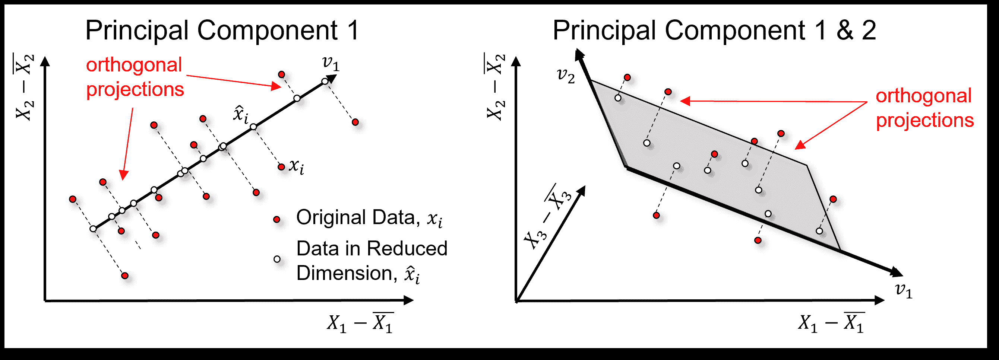

将二维数据投影到一维（左）和三维数据投影到二维（右）的正交误差（待添加引用）。

其中主成分描述了一维中的向量和平面中的二维，以及投影空间中的主成分得分，

$$ (𝑿_𝒊−\overline{𝑿})𝑽_𝒑 $$

并且在原始空间中具有降低维度的反变换是，

$$ (X_i-\overline{X})V_p V_p^T $$

注意，给定 $V_p$ 矩阵是正交的，

$$ V_p^T = V_p^{-1} $$

## 基于旋转的解释

正交变换是一种旋转，它最大化了第一主成分解释的方差，最大化第二主成分的剩余方差，等等。

如果你想看到 PCA 作为旋转的实际操作，请查看我的[PCA 旋转交互式 Python 仪表板](https://github.com/GeostatsGuy/DataScienceInteractivePython/blob/main/Interactive_PCA_Rotation.ipynb)，

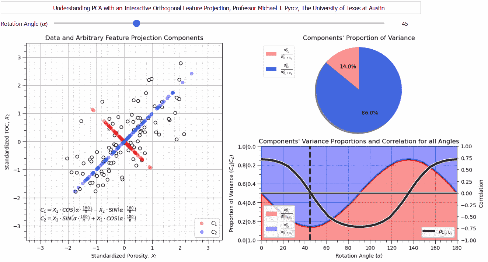

我的交互式仪表板展示了 PCA 作为数据的旋转。

从这个仪表板中可以清楚地看到，有一个旋转最大化了第一主成分解释的方差，同时消除了第一和第二主成分之间的相关性。

## 特征值 / 特征向量解释

对于主成分分析，我们计算数据协方差矩阵，特征的组合的成对协方差。

+   我们从协方差矩阵中计算特征向量和特征值。

+   特征值是每个组件解释的方差。

+   数据协方差矩阵的特征向量是主成分。

## 主成分分析工作流程

1.  标准化特征

$$ X^s=\frac{X-\overline{X}}{\sigma_X} $$$$ X_1,\ldots,X_m \quad \rightarrow X_1^s,\ldots,X_m^s $$

```py
where $X_i$ are original features and $X^s_i$ are transformed features. 
```

+   标准化是必要的，以防止具有较大方差的特征主导解决方案，即第一主成分与方差最大的特征对齐

1.  计算标准化的特征协方差矩阵

$$ C_{(X_{m_1}, X_{m_2})} = \frac{\sum_{i=1}^{n} \left( (x_{m_1} - \bar{x}_{m_1})(x_{m_2} - \bar{x}_{m_2}) \right)}{n - 1} $$

```py
given the features are standardized the matrix is a correlation matrix 
```

$$\begin{split} C = \begin{bmatrix} C(X_1, X_1) & \cdots & C(X_1, X_m) \\ \vdots & \ddots & \vdots \\ C(X_m, X_1) & \cdots & C(X_m, X_m) \end{bmatrix} \end{split}$$

```py
given the features are standardized the matrix is a correlation matrix, 
```

$$\begin{split} C = \begin{bmatrix} \rho(X_1, X_1) & \cdots & \rho(X_1, X_m) \\ \vdots & \ddots & \vdots \\ \rho(X_m, X_1) & \cdots & \rho(X_m, X_m) \end{bmatrix} \end{split}$$

1.  计算协方差矩阵 $C$ 的特征值和特征向量，

    给定 $C$ 是一个方阵 $(m \times m)$，$v (m \times 1)$ 是一个向量，$\lambda$ 是一个标量 ($1$)，

$$ Cv=\lambda v $$

```py
we can reorder to, 
```

$$ (C- \lambda \cdot I)∙v=0 $$

```py
where $I$ is an identity matrix. By Cramer’s rule, we have a solution if the determinant is 0, 
```

$$ |C- \lambda \cdot I|=0 $$

```py
find the possible Eigenvalues, $\lambda_𝛼$, and solve for eigenvectors, $𝒗_𝜶, \quad \alpha=𝟏,\ldots,𝒎$ 
```

+   结果在矩阵 $V_m$ 中有 $\text{min}(m,n-1)$ 个特征向量

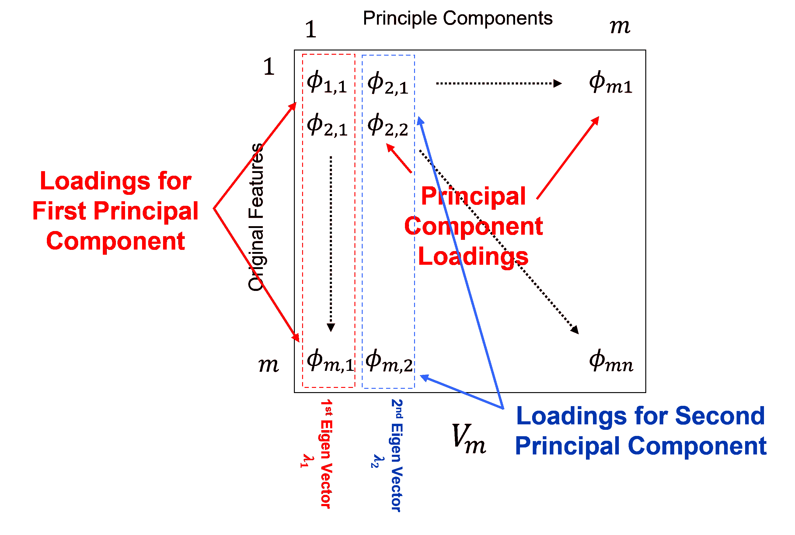

特征向量作为主成分。

```py
that form a basis on which the data are projected for dimensionality reduction, 
```

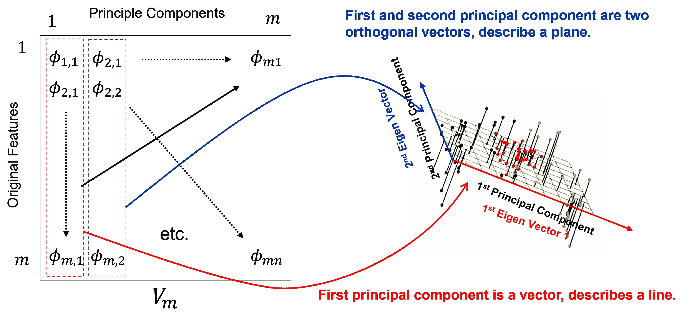

特征向量作为定义新旋转基的主成分。

如果你想查看主成分加载和成分之间的方差分配，请查看我的[PCA 加载交互式 Python 仪表板](https://github.com/GeostatsGuy/DataScienceInteractivePython/blob/main/Interactive_PCA_Eigen.ipynb),

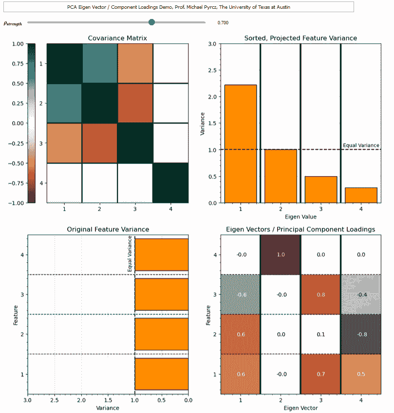

我的交互式仪表板展示了 PCA 加载和方差解释，每个主成分的相关性变化都在特征 1、2 和 3 之间。

## 加载所需的库

以下代码加载所需的库。这些库应该已经与 Anaconda 3 一起安装。

```py
ignore_warnings = True                                        # ignore warnings?
from sklearn.preprocessing import MinMaxScaler                # min/max normalization
from sklearn.decomposition import PCA                         # PCA program from scikit learn (package for machine learning)
from sklearn.preprocessing import StandardScaler              # standardize variables to mean of 0.0 and variance of 1.0
import numpy as np                                            # ndarrays for gridded data
import pandas as pd                                           # DataFrames for tabular data
import pandas.plotting as pd_plot                             # pandas plotting functions
import copy                                                   # for deep copies
import os                                                     # set working directory, run executables
import matplotlib.pyplot as plt                               # for plotting
from matplotlib.ticker import (MultipleLocator, AutoMinorLocator) # control of axes ticks
import matplotlib.ticker as mtick                             # control tick label formatting
from matplotlib.ticker import PercentFormatter                # percentage axis label formatting
import seaborn as sns                                         # advanced plotting
plt.rc('axes', axisbelow=True)                                # plot all grids below the plot elements
if ignore_warnings == True:                                   
    import warnings
    warnings.filterwarnings('ignore')
cmap = plt.cm.inferno                                         # color map
seed = 42                                                     # random number seed 
```

如果你遇到包导入错误，你可能需要首先安装这些包中的一些。这通常可以通过在 Windows 上打开命令窗口然后输入‘python -m pip install [package-name]’来完成。更多帮助可以在相应包的文档中找到。

## 声明函数

让我们定义一个单独的函数来简化绘制相关矩阵。我还添加了一个方便的函数来添加主网格线和副网格线，以提高绘图的可解释性。

```py
def plot_corr(df,size=10):                                    # plots a graphical correlation matrix 
    from matplotlib.colors import ListedColormap              # make a custom colormap
    my_colormap = plt.cm.get_cmap('RdBu_r', 256)          
    newcolors = my_colormap(np.linspace(0, 1, 256))
    white = np.array([256/256, 256/256, 256/256, 1])
    newcolors[65:191, :] = white                              # mask all correlations less than abs(0.8)
    newcmp = ListedColormap(newcolors)
    m = len(df.columns)
    corr = df.corr()
    fig, ax = plt.subplots(figsize=(size, size))
    im = ax.matshow(corr,vmin = -1.0, vmax = 1.0,cmap = newcmp)
    plt.xticks(range(len(corr.columns)), corr.columns);
    plt.yticks(range(len(corr.columns)), corr.columns);
    plt.colorbar(im, orientation = 'vertical')
    plt.title('Correlation Matrix')
    for i in range(0,m):
        plt.plot([i-0.5,i-0.5],[-0.5,m-0.5],color='black')
        plt.plot([-0.5,m-0.5],[i-0.5,i-0.5],color='black')
    plt.ylim([-0.5,m-0.5]); plt.xlim([-0.5,m-0.5])

def add_grid():
    plt.gca().grid(True, which='major',linewidth = 1.0); plt.gca().grid(True, which='minor',linewidth = 0.2) # add y grids
    plt.gca().tick_params(which='major',length=7); plt.gca().tick_params(which='minor', length=4)
    plt.gca().xaxis.set_minor_locator(AutoMinorLocator()); plt.gca().yaxis.set_minor_locator(AutoMinorLocator()) # turn on minor ticks 

def add_grid2(sub_plot):
    sub_plot.grid(True, which='major',linewidth = 1.0); sub_plot.grid(True, which='minor',linewidth = 0.2) # add y grids
    sub_plot.tick_params(which='major',length=7); sub_plot.tick_params(which='minor', length=4)
    sub_plot.xaxis.set_minor_locator(AutoMinorLocator()); sub_plot.yaxis.set_minor_locator(AutoMinorLocator()) # turn on minor ticks 
```

## 设置工作目录

我总是喜欢这样做，这样我就不会丢失文件，并且简化后续的读取和写入（避免每次都包含完整地址）。

```py
#os.chdir("c:/Local")                                 # set the working directory 
```

你将需要更新引号内的部分为你的工作目录，并且在 Mac 上格式不同（例如：“~/PGE”）。

## 加载表格数据

这是将我们的逗号分隔数据文件加载到 Pandas DataFrame 对象的命令。

让我们加载提供的多元、空间数据集‘unconv_MV.csv’。这个数据集包括来自 1,000 个非常规井的变量，包括：

+   优良的孔隙率

+   渗透率的对数变换（以线性化与其他变量的关系）

+   声波阻抗（kg/m³ x m/s x 10⁶）

+   剪切比（%）

+   总有机碳（%）

+   玻璃质反射率（%）

+   初始生产 90 天平均（MCFPD）。

注意，数据集是合成的。

我们使用 pandas 的‘read_csv’函数将其加载到我们称为‘my_data’的 DataFrame 中，然后预览以确保正确加载。

```py
#my_data = pd.read_csv("unconv_MV.csv") 
my_data = pd.read_csv(r"https://raw.githubusercontent.com/GeostatsGuy/GeoDataSets/master/unconv_MV.csv") # load the comma delimited data file
my_data = my_data.iloc[:,1:]                              # remove the well index 
```

## 可视化 DataFrame

可视化 DataFrame 是一个有用的初步检查。

我们可以通过切片 DataFrame 来预览。

+   我们显示从 0 到 7 的所有记录，但不包括 7。

```py
my_data[:7]                                               # preview the first 7 rows of the dataframe 
```

|  | 孔隙率 | LogPerm | AI | 剪切比 | TOC | VR | 生产 |
| --- | --- | --- | --- | --- | --- | --- | --- |
| 0 | 15.91 | 1.67 | 3.06 | 14.05 | 1.36 | 1.85 | 177.381958 |
| 1 | 15.34 | 1.65 | 2.60 | 31.88 | 1.37 | 1.79 | 1479.767778 |
| 2 | 20.45 | 2.02 | 3.13 | 63.67 | 1.79 | 2.53 | 4421.221583 |
| 3 | 11.95 | 1.14 | 3.90 | 58.81 | 0.40 | 2.03 | 1488.317629 |
| 4 | 19.53 | 1.83 | 2.57 | 43.75 | 1.40 | 2.11 | 5261.094919 |
| 5 | 19.47 | 2.04 | 2.73 | 54.37 | 1.42 | 2.12 | 5497.005506 |
| 6 | 12.70 | 1.30 | 3.70 | 43.03 | 0.45 | 1.95 | 1784.266285 |

## 描述性统计表数据

在 DataFrames 中，有很多高效的方法可以从表格数据中计算汇总统计信息。describe 命令提供了一个很好的数据表，提供了计数、平均值、最小值、最大值和四分位数。

+   我们使用转置只是为了翻转表格，使得特征在行上，而统计信息在列上。

```py
my_data.describe().transpose()                            # calculate summary statistics for the data 
```

|  | count | mean | std | min | 25% | 50% | 75% | max |
| --- | --- | --- | --- | --- | --- | --- | --- | --- |
| Por | 1000.0 | 14.950460 | 3.029634 | 5.400000 | 12.85750 | 14.98500 | 17.080000 | 24.65000 |
| LogPerm | 1000.0 | 1.398880 | 0.405966 | 0.120000 | 1.13000 | 1.39000 | 1.680000 | 2.58000 |
| AI | 1000.0 | 2.982610 | 0.577629 | 0.960000 | 2.57750 | 3.01000 | 3.360000 | 4.70000 |
| Brittle | 1000.0 | 49.719480 | 15.077006 | -10.500000 | 39.72250 | 49.68000 | 59.170000 | 93.47000 |
| TOC | 1000.0 | 1.003810 | 0.504978 | -0.260000 | 0.64000 | 0.99500 | 1.360000 | 2.71000 |
| VR | 1000.0 | 1.991170 | 0.308194 | 0.900000 | 1.81000 | 2.00000 | 2.172500 | 2.90000 |
| Production | 1000.0 | 2247.295809 | 1464.256312 | 2.713535 | 1191.36956 | 1976.48782 | 3023.594214 | 12568.64413 |

很好，我们已经检查了汇总统计信息，对于脆性和总有机碳，我们有一些负值。这是在物理上不可能的。

+   这些值必须存在误差。我们知道可能的最小值是 0.0，因此我们将截断到 0.0。

我们使用：

```py
df.get_numerical_data() 
```

DataFrame 成员函数用于从 DataFrame 获取数据的浅拷贝。

由于这是一个浅拷贝，我们对副本所做的任何更改都会影响到原始 DataFrame 中的数据。

+   这允许我们一次性将这个简单的条件语句应用到 DataFrame 中的所有数据值。

```py
num = my_data._get_numeric_data()                         # get the numerical values
num[num < 0] = 0                                          # truncate negative values to 0.0
my_data.describe().transpose()                            # calculate summary statistics for the data 
```

|  | count | mean | std | min | 25% | 50% | 75% | max |
| --- | --- | --- | --- | --- | --- | --- | --- | --- |
| Por | 1000.0 | 14.950460 | 3.029634 | 5.400000 | 12.85750 | 14.98500 | 17.080000 | 24.65000 |
| LogPerm | 1000.0 | 1.398880 | 0.405966 | 0.120000 | 1.13000 | 1.39000 | 1.680000 | 2.58000 |
| AI | 1000.0 | 2.982610 | 0.577629 | 0.960000 | 2.57750 | 3.01000 | 3.360000 | 4.70000 |
| Brittle | 1000.0 | 49.731480 | 15.033593 | 0.000000 | 39.72250 | 49.68000 | 59.170000 | 93.47000 |
| TOC | 1000.0 | 1.006170 | 0.499838 | 0.000000 | 0.64000 | 0.99500 | 1.360000 | 2.71000 |
| VR | 1000.0 | 1.991170 | 0.308194 | 0.900000 | 1.81000 | 2.00000 | 2.172500 | 2.90000 |
| Production | 1000.0 | 2247.295809 | 1464.256312 | 2.713535 | 1191.36956 | 1976.48782 | 3023.594214 | 12568.64413 |

## 计算相关矩阵

对于降维，数据可视化是一个很好的第一步。

让我们从相关矩阵开始。

我们可以计算它，并通过以下命令在控制台中查看。

```py
corr_matrix = np.corrcoef(my_data, rowvar = False) 
```

输入数据是一个 2D ndarray，$rowvar$指定变量是否在行上而不是列上。

```py
corr_matrix = np.corrcoef(my_data, rowvar = False)
print(np.around(corr_matrix,2))                           # print the correlation matrix to 2 decimals 
```

```py
[[ 1\.    0.81 -0.51 -0.25  0.71  0.08  0.69]
 [ 0.81  1\.   -0.32 -0.15  0.51  0.05  0.57]
 [-0.51 -0.32  1\.    0.17 -0.55  0.49 -0.33]
 [-0.25 -0.15  0.17  1\.   -0.24  0.3  -0.07]
 [ 0.71  0.51 -0.55 -0.24  1\.    0.31  0.5 ]
 [ 0.08  0.05  0.49  0.3   0.31  1\.    0.14]
 [ 0.69  0.57 -0.33 -0.07  0.5   0.14  1\.  ]] 
```

注意由于每个变量与其自身的相关性而产生的 1.0 对角线。

让我们使用上面声明的函数来制作一个图形相关矩阵可视化。

+   这可能提高我们识别特征的能力。它依赖于 Numpy DataFrames 内置的相关矩阵方法和 MatPlotLib 进行绘图。

```py
plot_corr(my_data,7)                                      # using our correlation matrix visualization function
plt.subplots_adjust(left=0.0, bottom=0.0, right=1.0, top=0.8, wspace=0.2, hspace=0.3); plt.show() 
```

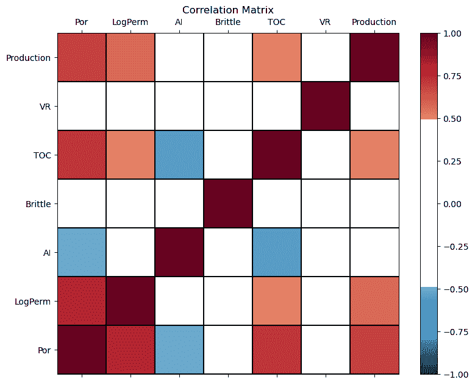

这看起来不错。存在多种双变量、线性相关程度。当然，相关系数仅限于线性相关程度。

## 检查矩阵散点图

为了获取更完整的信息，让我们查看 Pandas 包中的矩阵散点图。

+   协方差和相关系数对异常值和非线性敏感

```py
pd_plot.scatter_matrix(my_data) 
```

`alpha` 允许我们使用半透明点，以便在密集散点图中更容易可视化。

`hist_kwds` 是对角线元素上直方图的参数集。

```py
pd_plot.scatter_matrix(my_data, alpha = 0.1,              # pandas matrix scatter plot
    figsize=(6, 6),color = 'black', hist_kwds={'color':['grey']})
plt.subplots_adjust(left=0.0, bottom=0.0, right=1.0, top=0.8, wspace=0.2, hspace=0.3); plt.show() 
```

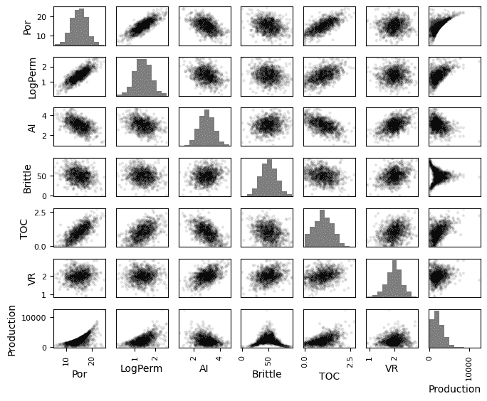

## 简单的双变量示例

让我们将问题简化为双变量（2 个特征），孔隙率和渗透率的对数变换，并将井的数量从 1,000 减少到 100。

```py
my_data_por_perm = my_data.iloc[0:100,0:2]                # extract just por and logperm, 100 samples
my_data_por_perm.describe().transpose()                   # calculate summary statistics for the data 
```

|  | count | mean | std | min | 25% | 50% | 75% | max |
| --- | --- | --- | --- | --- | --- | --- | --- | --- |
| Por | 100.0 | 14.9856 | 2.823016 | 9.23 | 12.9275 | 14.720 | 16.705 | 21.00 |
| LogPerm | 100.0 | 1.3947 | 0.390947 | 0.36 | 1.1475 | 1.365 | 1.650 | 2.48 |

让我们首先检查 Por 和 LogPerm 的单变量统计信息。

```py
f, (ax1, ax2) = plt.subplots(1, 2, sharey=True)
ax1.hist(my_data_por_perm["Por"], alpha = 0.8, color = 'darkorange', edgecolor = 'black', bins=20)
ax1.set_title('Porosity'); ax1.set_xlabel('Porosity (%)'); ax1.set_ylabel('Frequency'); add_grid2(ax1)
ax2.hist(my_data_por_perm["LogPerm"], alpha = 0.8, color = 'darkorange', edgecolor = 'black', bins=20)
ax2.set_title('Log Transformed Permeability'); ax2.set_xlabel('Log[Permeability] (log(mD)'); add_grid2(ax2)
plt.subplots_adjust(left=0.0, bottom=0.0, right=1.5, top=0.8, wspace=0.2, hspace=0.3); plt.show() 
```

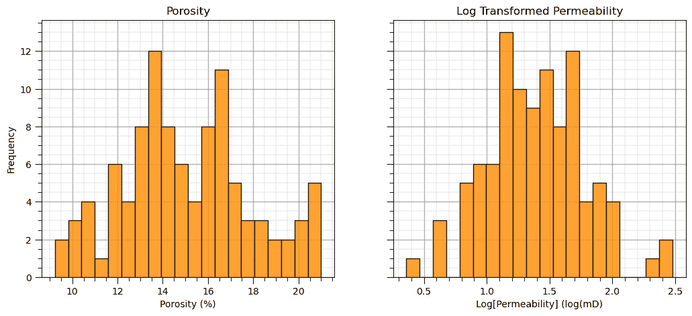

实际上，分布可能是高斯分布的，无论它们的行为如何良好，我们无法观察到明显的缺口或截断。

让我们看一下孔隙率与对数渗透率的散点图。

这将是来自 *matplotlib* 的基本命令，用于制作散点图。

```py
plt.scatter(my_data_por_perm["Por"],my_data_por_perm["LogPerm"] 
```

+   额外的参数用于格式化和标签

```py
plt.scatter(my_data_por_perm["Por"],my_data_por_perm["LogPerm"],s=None, c="darkorange", marker=None, cmap=None, norm=None, vmin=None, vmax=None, alpha=0.8, linewidths=1.0, edgecolors="black")
plt.title('Log Transformed Permeability vs. Porosity'); plt.xlabel('Porosity (%)'); plt.ylabel('Log(Permeability (Log(mD))'); add_grid()
plt.subplots_adjust(left=0.0, bottom=0.0, right=0.7, top=0.8, wspace=0.2, hspace=0.3); plt.show() 
```

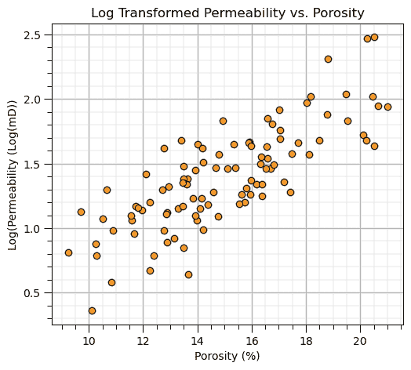

## 主成分计算

使用渗透率的对数变换，我们与孔隙率有一个非常好的线性关系，PCA 应该在这组数据上工作得很好。

+   我们准备好使用孔隙率和渗透率的对数进行 PCA。

## 标准化特征

我们必须标准化我们的变量，使其均值为零，$\bar{x} = 0.0$，方差为 1，$\sigma^{2}_{x} = 1.0$。

+   否则，孔隙率和渗透率的比例差异将产生重大影响。注意，单位选择对方差的影响，例如，渗透率使用达西（D）而不是毫达西（mD），或者孔隙率使用分数而不是百分比。这是相当任意的！

为了消除这种影响，我们应该始终标准化，除非两个变量具有相同的单位，并且它们之间的范围和方差有意义，然后标准化可能会删除重要信息。

```py
features = ['Por','LogPerm']
x = my_data_por_perm.loc[:,features].values
mu = np.mean(x, axis=0)
sd = np.std(x, axis=0)
x = StandardScaler().fit_transform(x)                     # standardize the data features to mean = 0, var = 1.0

print("Original Mean Por", np.round(mu[0],2), ', Original Mean LogPerm = ', np.round(mu[1],2)) 
print("Original StDev Por", np.round(sd[0],2), ', Original StDev LogPerm = ', np.round(sd[1],2)) 
print('Mean Transformed Por =',np.round(np.mean(x[:,0]),2),', Mean Transformed LogPerm =',np.round(np.mean(x[:,1]),2))
print('Variance Transformed Por =',np.var(x[:,0]),', Variance Transformed LogPerm =',np.var(x[:,1])) 
```

```py
Original Mean Por 14.99 , Original Mean LogPerm =  1.39
Original StDev Por 2.81 , Original StDev LogPerm =  0.39
Mean Transformed Por = 0.0 , Mean Transformed LogPerm = -0.0
Variance Transformed Por = 1.0000000000000002 , Variance Transformed LogPerm = 1.0 
```

```py
cov = np.cov(x,rowvar = False)
cov 
```

```py
array([[1.01010101, 0.80087707],
       [0.80087707, 1.01010101]]) 
```

“x”是一个来自 Numpy 包的二维 ndarray，其特征在列上，样本在行上。

+   如上所述，我们确认“x”二维数组中的特征已经标准化。

检查我们标准化变量的单变量和多变量分布不是一个坏主意。

```py
dfS = pd.DataFrame({'sPor': x[:,0], 'sLogPerm': x[:,1]})
sns.jointplot(data=dfS,x='sPor',y='sLogPerm',marginal_kws=dict(bins=30),color='darkorange',edgecolor='black')
plt.subplots_adjust(left=0.0, bottom=0.0, right=1.0, top=1.1, wspace=0.2, hspace=0.3); plt.show() 
```

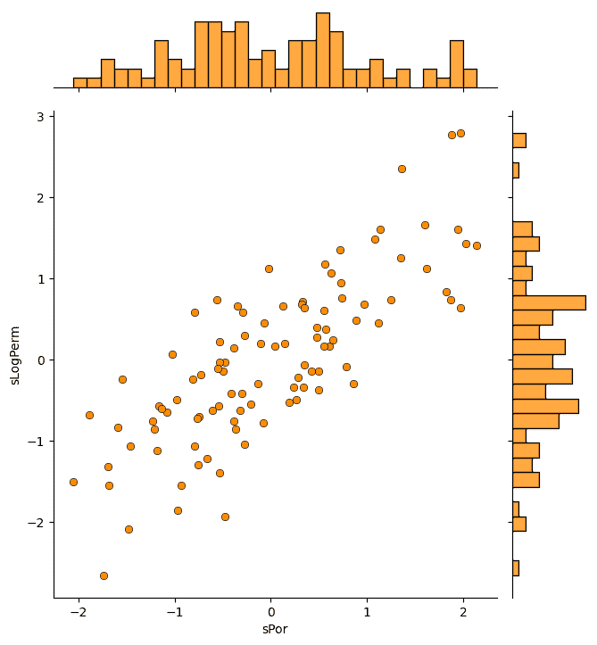

一切看起来都很正常，我们准备应用主成分分析。

## 主成分分析 (PCA)

要在 Python 中使用 SciKitLearn 机器学习包运行 PCA，我们首先创建一个指定组件数量的 PCA 模型，然后将其“拟合”到我们的数据。

```py
n_components = 2
pca = PCA(n_components=n_components)
pca.fit(x) 
```

你将在后面的降维中看到，我们可以使用矩阵数学来使用这个模型，并将我们的数据减少到从 1 到特征数量 m 的任何维度。让我们以与特征数量 m 相等的组件数量运行模型。

```py
n_components = 2
pca = PCA(n_components=n_components).fit(x) 
```

## 组件载荷

我们应该做的第一件事是查看组件载荷。让我们查看它们并解释我们的结果。

```py
print(np.round(pca.components_,3))
print('First Principal Component = ' + str(np.round(pca.components_[0,:],3)))
print('Second Principal Component = ' + str(np.round(pca.components_[1,:],3))) 
```

```py
[[ 0.707  0.707]
 [ 0.707 -0.707]]
First Principal Component = [0.707 0.707]
Second Principal Component = [ 0.707 -0.707] 
```

组件被列为一个二维数组（ndarray），其中：

+   主成分在行上

+   特征在列上

+   行已排序，以便第一个主成分是顶行，最后一个主成分是最后一行。

## 主成分解释的方差比例

也很重要的是要查看每个主成分描述的方差比例。

```py
print('Variance explained by PC1 and PC2 =', np.round(pca.explained_variance_ratio_,3))
print('First Principal Component explains ' + str(np.round(pca.explained_variance_ratio_[0],3)) + ' of the total variance.')
print('Second Principal Component explains ' + str(np.round(pca.explained_variance_ratio_[1],3)) + ' of the total variance.') 
```

```py
Variance explained by PC1 and PC2 = [0.896 0.104]
First Principal Component explains 0.896 of the total variance.
Second Principal Component explains 0.104 of the total variance. 
```

## 主成分得分，正向和反向投影

我们可以计算原始数据的主成分得分。

+   这实际上是对数据的旋转，与 PC1 对最大方差的方向对齐。

+   我们将使用 PCA 内置的“transform”函数计算主成分得分，然后将其可视化为一个散点图。

+   然后为了“闭合循环”并检查我们所做的工作（以及我们的知识），我们将进行 PCA 的反向操作，从主成分得分回到标准化特征。

```py
f, (ax101, ax102, ax103) = plt.subplots(1, 3,figsize=(12,3))
f.subplots_adjust(wspace=0.7)

ax101.scatter(x[:,0],x[:,1], s=None, c="darkorange", marker=None, cmap=None, norm=None, vmin=None, vmax=None, alpha=0.8, linewidths=1.0, edgecolors="black")
ax101.set_title('Standardized LogPerm vs. Por'); ax101.set_xlabel('Standardized Por'); ax101.set_ylabel('Standardized LogPerm')
ax101.set_xlim([-3,3]); ax101.set_ylim([-3,3]); add_grid2(ax101)

x_trans = pca.transform(x)                                # calculate the principal component scores
ax102.scatter(x_trans[:,0],-1*x_trans[:,1],s=None, c="darkorange", marker=None, cmap=None, norm=None, vmin=None, vmax=None, alpha=0.8, linewidths=1.0, edgecolors="black")
ax102.set_title('Principal Component Scores'); ax102.set_xlabel('PC1'); ax102.set_ylabel('PC2')
ax102.set_xlim([-3,3]); ax102.set_ylim([-3,3]); add_grid2(ax102)

x_reverse = pca.inverse_transform(x_trans)                        # reverse the principal component scores to standardized values
ax103.scatter(x_reverse[:,0],x_reverse[:,1],s=None, c="darkorange", marker=None, cmap=None, norm=None, vmin=None, vmax=None, alpha=0.8, linewidths=1.0, edgecolors="black")
ax103.set_title('Reverse PCA'); ax103.set_xlabel('Standardized Por'); ax103.set_ylabel('Standardized LogPerm')
ax103.set_xlim([-3,3]); ax103.set_ylim([-3,3]); add_grid2(ax103)

plt.subplots_adjust(left=0.0, bottom=0.0, right=1.0, top=0.8, wspace=0.2, hspace=0.3); plt.show() 
```

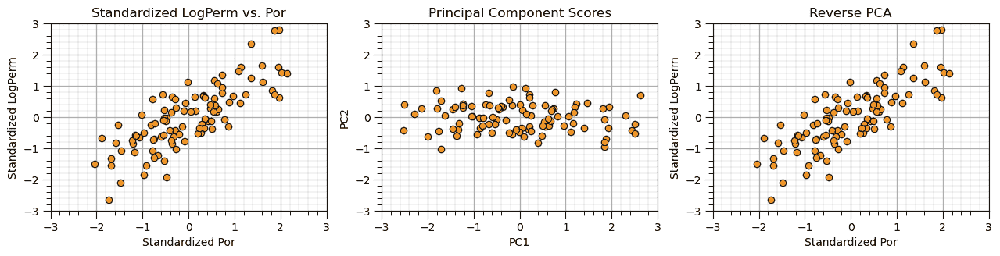

标准化的原始和反向 PCA 交叉图应该看起来完全相同。如果是这样，那么方法就是有效的。

## 方差守恒

让我们检查主成分得分的方差，因为我们已经计算了它们。

+   我们计算原始特征的方差

+   然后求和以得到原始的总方差

+   我们计算每个转换后的主成分得分的方差

+   然后我们求和以得到转换后的总方差

我们注意到：

+   第一个主成分得分比第二个成分得分有更大的方差

+   变换过程中总方差得到保留，原始特征和 m 个主成分得分方差之和相同

```py
print('Variance of the 2 features:')
print(np.var(x, axis = 0))

print('\nTotal Variance from Original Features:')
print(np.sum(np.var(x, axis = 0)))

print('\nVariance of the 2 principle components:')
print(np.round(np.var(x_trans, axis = 0),2))

print('\nTotal Variance from Original Features:')
print(round(np.sum(np.var(x_trans, axis = 0)),2)) 
```

```py
Variance of the 2 features:
[1\. 1.]

Total Variance from Original Features:
2.0

Variance of the 2 principle components:
[1.79 0.21]

Total Variance from Original Features:
2.0 
```

## 主成分得分独立性

让我们检查原始特征与我们的投影特征之间的相关性。

```py
print('\nCorrelation Matrix of the 2 original features components:')
print(np.round(np.corrcoef(x, rowvar = False),2))

print('\nCorrelation Matrix of the 2 principle components\' scores:')
print(np.round(np.corrcoef(x_trans, rowvar = False),2)) 
```

```py
Correlation Matrix of the 2 original features components:
[[1\.   0.79]
 [0.79 1\.  ]]

Correlation Matrix of the 2 principle components' scores:
[[ 1\. -0.]
 [-0\.  1.]] 
```

我们已经将具有高相关性的原始特征投影到 2 个新特征上，这些新特征之间没有相关性。

## 通过特征值和特征向量计算器手动进行主成分分析

让我们手动计算 PCA，使用标准化特征和特征值计算，并与上面的 scikit-learn 结果进行比较。

+   我们确认结果是一致的。

```py
from numpy.linalg import eig
eigen_values,eigen_vectors = eig(cov)
print('Eigen Vectors:\n' +  str(np.round(eigen_vectors,2)))
print('First Eigen Vector: ' + str(eigen_vectors[:,0]))
print('Second Eigen Vector: ' + str(eigen_vectors[:,1]))
print('Eigen Values:\n' +  str(np.round(eigen_values,2)))
PC = eigen_vectors.T.dot(x.T)
plt.subplot(121)
plt.scatter(PC[0,:],PC[1,:],s=None, c="darkorange", marker=None, cmap=None, norm=None, vmin=None, vmax=None, alpha=0.8, linewidths=1.0, edgecolors="black")
plt.title('Principal Component Scores By-hand with numpy.linalg Eig Function'); plt.xlabel('PC1'); plt.ylabel('PC2')
plt.xlim([-3,3]); plt.ylim([-3,3]); add_grid()

plt.subplot(122)
plt.scatter(x_trans[:,0],-1*x_trans[:,1],s=None, c="darkorange", marker=None, cmap=None, norm=None, vmin=None, vmax=None, alpha=0.8, linewidths=1.0, edgecolors="black")
plt.title('Principal Component Scores with scikit-learn PCA'); plt.xlabel('PC1'); plt.ylabel('PC2')
plt.xlim([-3,3]); plt.ylim([-3,3]); add_grid()

plt.subplots_adjust(left=0.0, bottom=0.0, right=1.5, top=1.0, wspace=0.2, hspace=0.3); plt.show() 
```

```py
Eigen Vectors:
[[ 0.71 -0.71]
 [ 0.71  0.71]]
First Eigen Vector: [0.70710678 0.70710678]
Second Eigen Vector: [-0.70710678  0.70710678]
Eigen Values:
[1.81 0.21] 
```

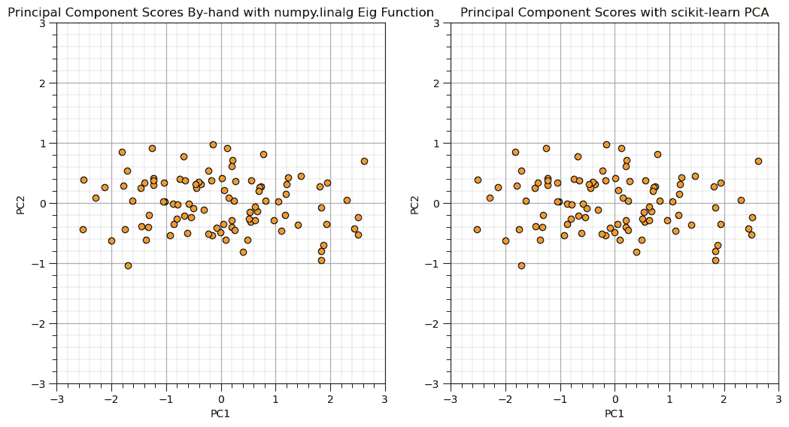

## 降维演示

现在我们尝试通过仅保留第一个主成分来进行**降维**。我们将从原始值过渡到原始值的预测。

+   回想一下，我们能够用第一个主成分解释大约 90%的方差，所以结果应该看起来“相当不错”，对吧？

我们将手动完成整个过程，使其尽可能简单易懂。稍后我们将更加紧凑。步骤如下：

1.  从原始孔隙率和渗透率数据开始

1.  标准化，使得 Por 和 LogPerm 的均值为 0.0，方差为 1.0

1.  计算两个主成分模型，可视化主成分得分

1.  通过将相关成分得分设置为 0.0 来移除第二个主成分

1.  通过矩阵乘以得分和成分负载来反转主成分

1.  将矩阵数学应用于恢复原始均值和方差

```py
nComp = 1
f, ((ax201, ax202, ax203), (ax206, ax205, ax204)) = plt.subplots(2, 3,figsize=(15,10))
#f, ((ax201, ax202), (ax203, ax204), (ax205, ax206)) = plt.subplots(3, 2,figsize=(10,15))
f.subplots_adjust(wspace=0.5,hspace = 0.3)

ax201.scatter(my_data_por_perm["Por"],my_data_por_perm["LogPerm"],s=None, c="darkorange", marker=None, cmap=None, norm=None, vmin=None, vmax=None, alpha=0.8, linewidths=1.0, edgecolors="black")
ax201.set_title('1\. LogPerm vs. Por'); ax201.set_xlabel('Por'); ax201.set_ylabel('LogPerm')
ax201.set_xlim([8,22]); ax201.set_ylim([0,2.5]); add_grid2(ax201)

mu = np.mean(np.vstack((my_data_por_perm["Por"].values,my_data_por_perm["LogPerm"].values)), axis=1)
sd = np.std(np.vstack((my_data_por_perm["Por"].values,my_data_por_perm["LogPerm"].values)), axis=1)
x = StandardScaler().fit_transform(x)                     # standardize the data features to mean = 0, var = 1.0

ax202.scatter(x[:,0],x[:,1], s=None, c="darkorange", marker=None, cmap=None, norm=None, vmin=None, vmax=None, alpha=0.8, linewidths=1.0, edgecolors="black")
ax202.set_title('2\. Standardized LogPerm vs. Por'); ax202.set_xlabel('Standardized Por'); ax202.set_ylabel('Standardized LogPerm')
ax202.set_xlim([-3.5,3.5]); ax202.set_ylim([-3.5,3.5]); add_grid2(ax202)

n_components = 2                                          # build principal component model with 2 components
pca = PCA(n_components=n_components)
pca.fit(x)

x_trans = pca.transform(x)                                # calculate principal component scores
ax203.scatter(x_trans[:,0],-1*x_trans[:,1],s=None, c="darkorange", marker=None, cmap=None, norm=None, vmin=None, vmax=None, alpha=0.8, linewidths=1.0, edgecolors="black")
ax203.set_title('3\. Principal Component Scores'); ax203.set_xlabel('PC1'); ax203.set_ylabel('PC2')
ax203.set_xlim([-3.5,3.5]); ax203.set_ylim([-3.5,3.5]); add_grid2(ax203)

x_trans[:,1] = 0.0                                         # zero / remove the 2nd principal component 

ax204.scatter(x_trans[:,0],x_trans[:,1],s=None, c="darkorange", marker=None, cmap=None, norm=None, vmin=None, vmax=None, alpha=0.8, linewidths=1.0, edgecolors="black")
ax204.set_title('4\. Only 1st Principal Component Scores'); ax204.set_xlabel('PC1'); ax204.set_ylabel('PC2')
ax204.set_xlim([-3.5,3.5]); ax204.set_ylim([-3.5,3.5]); add_grid2(ax204)

xhat = pca.inverse_transform(x_trans)                             # reverse the principal component scores to standardized values
ax205.scatter(xhat[:,0],xhat[:,1],s=None, c="darkorange", marker=None, cmap=None, norm=None, vmin=None, vmax=None, alpha=0.8, linewidths=1.0, edgecolors="black")
ax205.set_title('5\. Reverse PCA'); ax205.set_xlabel('Standardized Por'); ax205.set_ylabel('Standardized LogPerm')
ax205.set_xlim([-3.5,3.5]); ax205.set_ylim([-3.5,3.5]); add_grid2(ax205)

xhat = np.dot(pca.inverse_transform(x)[:,:nComp], pca.components_[:nComp,:])
xhat = sd*xhat + mu                                       # remove the standardization

ax206.scatter(my_data_por_perm["Por"],my_data_por_perm["LogPerm"],s=None, c="blue", marker=None, cmap=None, norm=None, vmin=None, vmax=None, alpha=0.6, linewidths=1.0, edgecolors="black")
ax206.scatter(xhat[:,0],xhat[:,1],s=None, c="darkorange", marker=None, cmap=None, norm=None, vmin=None, vmax=None, alpha=0.8, linewidths=1.0, edgecolors="black")
ax206.set_title('6\. De-standardized Reverse PCA'); ax206.set_xlabel('Por'); ax206.set_ylabel('LogPerm')
ax206.set_xlim([8,22]); ax206.set_ylim([0,2.5]); add_grid2(ax206)

plt.show() 
```

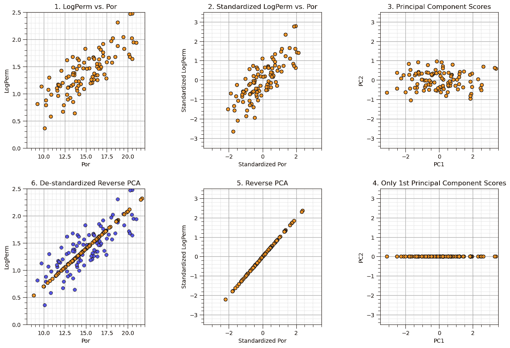

让我们将原始数据和结果低维模型并排放置，并检查结果方差。

```py
f, (ax201, ax206) = plt.subplots(1, 2,figsize=(10,6))
f.subplots_adjust(wspace=0.5,hspace = 0.3)

ax201.scatter(my_data_por_perm["Por"],my_data_por_perm["LogPerm"],s=None, c="darkorange", marker=None, cmap=None, norm=None, vmin=None, vmax=None, alpha=0.8, linewidths=1.0, edgecolors="black")
ax201.set_title('1\. LogPerm vs. Por'); ax201.set_xlabel('Por'); ax201.set_ylabel('LogPerm')
ax201.set_xlim([8,22]); ax201.set_ylim([0,2.5]); add_grid2(ax201)

ax206.scatter(xhat[:,0],xhat[:,1],s=None, c="darkorange", marker=None, cmap=None, norm=None, vmin=None, vmax=None, alpha=0.8, linewidths=1.0, edgecolors="black")
ax206.set_title('6\. De-standardized Reverse PCA'); ax206.set_xlabel('Por'); ax206.set_ylabel('LogPerm')
ax206.set_xlim([8,22]); ax206.set_ylim([0,2.5]); add_grid2(ax206)
plt.show()

var_por = np.var(my_data_por_perm["Por"]); var_por_hat = np.var(xhat[:,0]);
var_logperm = np.var(my_data_por_perm["LogPerm"]); var_logperm_hat = np.var(xhat[:,1]);
print('Variance Por =',np.round(var_por,3),', Variance Reduced Dimensional Por =',np.round(var_por_hat,3),'Fraction = ',np.round(var_por_hat/var_por,3))
print('Variance LogPerm =',np.round(var_logperm,3),', Variance Reduced Dimensional LogPerm =',np.round(var_logperm_hat,3),'Fraction = ',np.round(var_logperm_hat/var_logperm,3))
print('Total Variance =',np.round(var_por + var_logperm,3), ', Total Variance Reduced Dimension =',np.round(var_por_hat+var_logperm_hat,3),'Fraction = ',np.round((var_por_hat+var_logperm_hat)/(var_por+var_logperm),3)) 
```

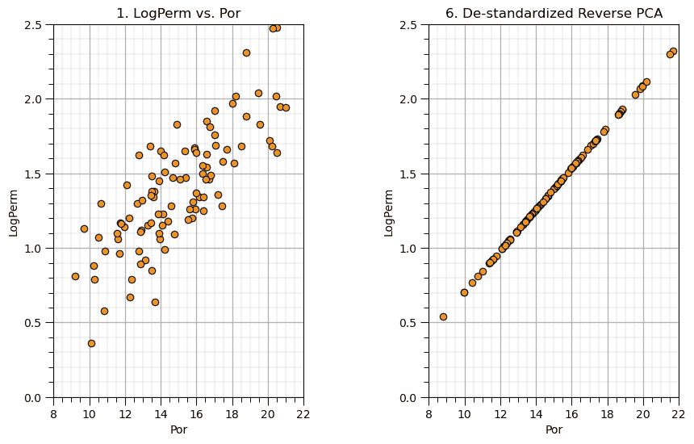

```py
Variance Por = 7.89 , Variance Reduced Dimensional Por = 7.073 Fraction =  0.896
Variance LogPerm = 0.151 , Variance Reduced Dimensional LogPerm = 0.136 Fraction =  0.896
Total Variance = 8.041 , Total Variance Reduced Dimension = 7.208 Fraction =  0.896 
```

## 所有预测特征

我们将回到原始数据文件，这次提取所有 6 个预测变量和前 500 个样本。

```py
my_data_f6 = my_data.iloc[0:500,0:6]                      # extract the 6 predictors, 500 samples 
```

从我们的数据开始，先计算总结统计量是个好主意。

```py
my_data_f6.describe().transpose()                         # calculate summary statistics for the data 
```

|  | count | mean | std | min | 25% | 50% | 75% | max |
| --- | --- | --- | --- | --- | --- | --- | --- | --- |
| Por | 500.0 | 14.89936 | 2.985967 | 5.40 | 12.8500 | 14.900 | 17.0125 | 23.85 |
| LogPerm | 500.0 | 1.40010 | 0.409616 | 0.18 | 1.1475 | 1.380 | 1.6700 | 2.58 |
| AI | 500.0 | 2.99244 | 0.563674 | 1.21 | 2.5900 | 3.035 | 3.3725 | 4.70 |
| Brittle | 500.0 | 49.74682 | 15.212123 | 0.00 | 39.3125 | 49.595 | 59.2075 | 93.47 |
| TOC | 500.0 | 0.99800 | 0.503635 | 0.00 | 0.6400 | 0.960 | 1.3500 | 2.71 |
| VR | 500.0 | 1.99260 | 0.307434 | 0.90 | 1.8200 | 2.010 | 2.1725 | 2.84 |

让我们再计算一个相关矩阵并查看它。

```py
corr_matrix = np.corrcoef(my_data_f6, rowvar = False)
print(np.around(corr_matrix,2))                           # print the correlation matrix to 2 decimals 
```

```py
[[ 1\.    0.79 -0.49 -0.25  0.71  0.12]
 [ 0.79  1\.   -0.32 -0.13  0.48  0.04]
 [-0.49 -0.32  1\.    0.14 -0.53  0.47]
 [-0.25 -0.13  0.14  1\.   -0.24  0.24]
 [ 0.71  0.48 -0.53 -0.24  1\.    0.35]
 [ 0.12  0.04  0.47  0.24  0.35  1\.  ]] 
```

我们需要将每个变量标准化，使其均值为零，方差为 1。让我们这样做并检查结果。在下面的控制台中，我们打印出所有 6 个预测变量的初始值和标准化均值和方差。

```py
features = ['Por','LogPerm','AI','Brittle','TOC','VR']
x_f6 = my_data_f6.loc[:,features].values
mu_f6 = np.mean(x_f6, axis=0)
sd_f6 = np.std(x_f6, axis=0)
x_f6 = StandardScaler().fit_transform(x_f6)

print("Original Means", features[:], np.round(mu_f6[:],2)) 
print("Original StDevs", features[:],np.round(sd_f6[:],2)) 
print('Mean Transformed =',features[:],np.round(x.mean(axis=0),2))
print('Variance Transformed Por =',features[:],np.round(x.var(axis=0),2)) 
```

```py
Original Means ['Por', 'LogPerm', 'AI', 'Brittle', 'TOC', 'VR'] [14.9   1.4   2.99 49.75  1\.    1.99]
Original StDevs ['Por', 'LogPerm', 'AI', 'Brittle', 'TOC', 'VR'] [ 2.98  0.41  0.56 15.2   0.5   0.31]
Mean Transformed = ['Por', 'LogPerm', 'AI', 'Brittle', 'TOC', 'VR'] [0\. 0.]
Variance Transformed Por = ['Por', 'LogPerm', 'AI', 'Brittle', 'TOC', 'VR'] [1\. 1.] 
```

我们还应该检查每个变量的单变量分布。

```py
f, (ax6,ax7,ax8,ax9,ax10,ax11) = plt.subplots(1, 6, sharey=True, figsize=(15,2))
ax6.hist(x_f6[:,0], alpha = 0.8, color = 'darkorange', edgecolor = 'black', bins=20); ax6.set_title('Std. Porosity'); ax6.set_xlim(-5,5)
ax7.hist(x_f6[:,1], alpha = 0.8, color = 'darkorange', edgecolor = 'black', bins=20); ax7.set_title('Std. Log[Perm.]'); ax7.set_xlim(-5,5)
ax8.hist(x_f6[:,2], alpha = 0.8, color = 'darkorange', edgecolor = 'black', bins=20); ax8.set_title('Std. Acoustic Imped.'); ax8.set_xlim(-5,5)
ax9.hist(x_f6[:,3], alpha = 0.8, color = 'darkorange', edgecolor = 'black', bins=20); ax9.set_title('Std. Brittleness'); ax9.set_xlim(-5,5)
ax10.hist(x_f6[:,4], alpha = 0.8, color = 'darkorange', edgecolor = 'black', bins=20); ax10.set_title('Std. Total Organic C'); ax10.set_xlim(-5,5)
ax11.hist(x_f6[:,5], alpha = 0.8, color = 'darkorange', edgecolor = 'black', bins=20); ax11.set_title('Std. Vit. Reflectance'); ax11.set_xlim(-5,5)
plt.show() 
```

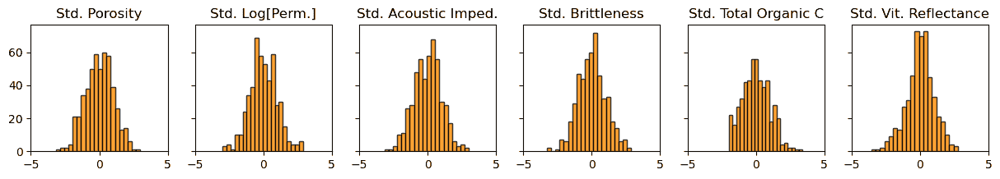

概率统计和分布看起来很好。没有明显的缺失数据、缺口、显著的截断、峰值或异常值。我们现在可以对我们 6 个特征进行主成分分析了。

```py
n_components = 6
pca_f6 = PCA(n_components=n_components)
pca_f6.fit(x_f6)

print(np.round(pca_f6.components_,3))                     # visualize the component loadings 
```

```py
[[ 0.558  0.476 -0.405 -0.211  0.504  0.01 ]
 [-0.117 -0.114 -0.432 -0.323 -0.229 -0.794]
 [-0.019 -0.124  0.384 -0.898  0.07   0.157]
 [-0.214 -0.674 -0.424 -0.006  0.526  0.21 ]
 [-0.784  0.522 -0.031 -0.046  0.331 -0.019]
 [ 0.12  -0.138  0.566  0.206  0.55  -0.549]] 
```

让我们先看看成分载荷。每一行是一个成分，最上面一行是第一个主成分（PC1），下一行是第二个主成分（PC2），直到最后一行是第六个主成分（PC6）。列是按‘Por’、‘LogPerm’、‘AI’、‘Brittle’、‘TOC’到‘VR’的顺序排列的特征。

第一主成分主要由孔隙率、对数渗透率、声阻抗和总有机碳组成，表明它们共同变化的方式是造成大部分方差的原因。下一个主成分主要由镜煤反射率组成。第三个主坐标主要由脆性等组成。

## 切片图

为了帮助解释这一点，我们应该考虑每个主成分的方差贡献。

```py
print('Variance explained by PC1 thru PC6 =', np.round(pca_f6.explained_variance_ratio_,3))

f, (ax10, ax11) = plt.subplots(1, 2,figsize=(10,6))
f.subplots_adjust(wspace=0.5,hspace = 0.3)

ax10.plot(np.arange(1,7,1),pca_f6.explained_variance_ratio_*100,color='darkorange',alpha=0.8)
ax10.scatter(np.arange(1,7,1),pca_f6.explained_variance_ratio_*100,color='darkorange',alpha=0.8,edgecolor='black')
ax10.set_xlabel('Principal Component'); ax10.set_ylabel('Variance Explained'); ax10.set_title('Variance Explained by Principal Component')
fmt = '%.0f%%' # Format you want the ticks, e.g. '40%'
yticks = mtick.FormatStrFormatter(fmt); ax10.set_xlim(1,6); ax10.set_ylim(0,100.0)
ax10.yaxis.set_major_formatter(yticks); add_grid2(ax10)

ax11.plot(np.arange(1,7,1),np.cumsum(pca_f6.explained_variance_ratio_*100),color='darkorange',alpha=0.8)
ax11.scatter(np.arange(1,7,1),np.cumsum(pca_f6.explained_variance_ratio_*100),color='darkorange',alpha=0.8,edgecolor='black')
ax11.plot([1,6],[95,95], color='black',linestyle='dashed')
ax11.set_xlabel('Principal Component'); ax11.set_ylabel('Cumulative Variance Explained'); ax11.set_title('Cumulative Variance Explained by Principal Component')
fmt = '%.0f%%' # Format you want the ticks, e.g. '40%'
yticks = mtick.FormatStrFormatter(fmt); ax11.set_xlim(1,6); ax11.set_ylim(0,100.0); ax11.annotate('95% variance explained',[4.05,90])
ax11.yaxis.set_major_formatter(yticks); add_grid2(ax11)

plt.show() 
```

```py
Variance explained by PC1 thru PC6 = [0.462 0.246 0.149 0.11  0.024 0.009] 
```

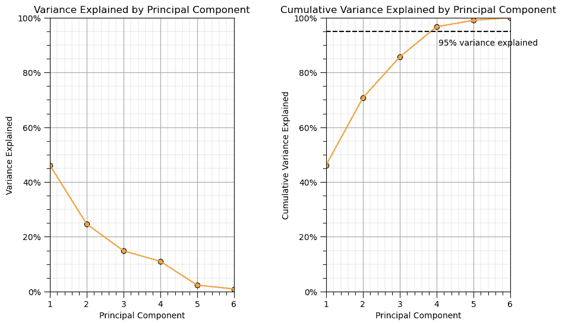

我们可以看到，大约 46%的方差由第一个主成分描述，然后大约 25%由第二个主成分描述等等。

## 主成分得分之间的独立性

在投影前后检查特征对之间的相关性。

```py
print('\nCorrelation Matrix of the 6 original features components:')
print(np.round(np.corrcoef(x_f6, rowvar = False),2))

print('\nCorrelation Matrix of the 6 principle components\' scores:')
print(np.round(np.corrcoef(pca_f6.transform(x_f6), rowvar = False),2)) 
```

```py
Correlation Matrix of the 6 original features components:
[[ 1\.    0.79 -0.49 -0.25  0.71  0.12]
 [ 0.79  1\.   -0.32 -0.13  0.48  0.04]
 [-0.49 -0.32  1\.    0.14 -0.53  0.47]
 [-0.25 -0.13  0.14  1\.   -0.24  0.24]
 [ 0.71  0.48 -0.53 -0.24  1\.    0.35]
 [ 0.12  0.04  0.47  0.24  0.35  1\.  ]]

Correlation Matrix of the 6 principle components' scores:
[[ 1\.  0\. -0\.  0\.  0\. -0.]
 [ 0\.  1\. -0\. -0\. -0\. -0.]
 [-0\. -0\.  1\. -0\. -0\.  0.]
 [ 0\. -0\. -0\.  1\.  0\.  0.]
 [ 0\. -0\. -0\.  0\.  1\.  0.]
 [-0\. -0\.  0\.  0\.  0\.  1.]] 
```

新的投影特征（即使没有降维，$p=m$）所有成对的相关性都是 0.0！

+   所有投影特征彼此之间线性独立

## 降维对两个特征关系的影响

当我们保留 1 到 6 个主成分时，仅查看孔隙率与对数渗透率的双变量关系将很有趣。

+   要做到这一点，我们使用矩阵数学来通过 PCA 进行反转，以及用各种主成分数量进行标准化，然后绘制对数渗透率与孔隙率的散点图。

```py
nComp = 6
xhat_6d = np.dot(pca_f6.transform(x_f6)[:,:nComp], pca_f6.components_[:nComp,:])
xhat_6d = sd_f6*xhat_6d + mu_f6

nComp = 5
xhat_5d = np.dot(pca_f6.transform(x_f6)[:,:nComp], pca_f6.components_[:nComp,:])
xhat_5d = sd_f6*xhat_5d + mu_f6

nComp = 4
xhat_4d = np.dot(pca_f6.transform(x_f6)[:,:nComp], pca_f6.components_[:nComp,:])
xhat_4d = sd_f6*xhat_4d + mu_f6

nComp = 3
xhat_3d = np.dot(pca_f6.transform(x_f6)[:,:nComp], pca_f6.components_[:nComp,:])
xhat_3d = sd_f6*xhat_3d + mu_f6

nComp = 2
xhat_2d = np.dot(pca_f6.transform(x_f6)[:,:nComp], pca_f6.components_[:nComp,:])
xhat_2d = sd_f6*xhat_2d + mu_f6

nComp = 1
xhat_1d = np.dot(pca_f6.transform(x_f6)[:,:nComp], pca_f6.components_[:nComp,:])
xhat_1d = sd_f6*xhat_1d + mu_f6

f, (ax12, ax13, ax14, ax15, ax16, ax17, ax18) = plt.subplots(1, 7,figsize=(20,20))
f.subplots_adjust(wspace=0.7)

ax12.scatter(my_data_f6["Por"],my_data_f6["LogPerm"],s=None, c="darkorange",marker=None, cmap=None, norm=None, vmin=None, vmax=None, alpha=0.2, linewidths=1.0, edgecolors="black")
ax12.set_title('Original Data'); ax12.set_xlabel('Por'); ax12.set_ylabel('LogPerm')
ax12.set_ylim(0.0,3.0); ax12.set_xlim(8,22); ax12.set_aspect(4.0); 

ax13.scatter(xhat_1d[:,0],xhat_1d[:,1],s=None, c="darkorange", marker=None, cmap=None, norm=None, vmin=None, vmax=None, alpha=0.2, linewidths=1.0, edgecolors="black")
ax13.set_title('1 Principal Component'); ax13.set_xlabel('Por'); ax13.set_ylabel('LogPerm')
ax13.set_ylim(0.0,3.0); ax13.set_xlim(8,22); ax13.set_aspect(4.0)

ax14.scatter(xhat_2d[:,0],xhat_2d[:,1],s=None, c="darkorange", marker=None, cmap=None, norm=None, vmin=None, vmax=None, alpha=0.2, linewidths=1.0, edgecolors="black")
ax14.set_title('2 Principal Components'); ax14.set_xlabel('Por'); ax14.set_ylabel('LogPerm')
ax14.set_ylim(0.0,3.0); ax14.set_xlim(8,22); ax14.set_aspect(4.0)

ax15.scatter(xhat_3d[:,0],xhat_3d[:,1],s=None, c="darkorange", marker=None, cmap=None, norm=None, vmin=None, vmax=None, alpha=0.2, linewidths=1.0, edgecolors="black")
ax15.set_title('3 Principal Components'); ax15.set_xlabel('Por'); ax15.set_ylabel('LogPerm')
ax15.set_ylim(0.0,3.0); ax15.set_xlim(8,22); ax15.set_aspect(4.0)

ax16.scatter(xhat_4d[:,0],xhat_4d[:,1],s=None, c="darkorange", marker=None, cmap=None, norm=None, vmin=None, vmax=None, alpha=0.2, linewidths=1.0, edgecolors="black")
ax16.set_title('4 Principal Components'); ax16.set_xlabel('Por'); ax16.set_ylabel('LogPerm')
ax16.set_ylim(0.0,3.0); ax16.set_xlim(8,22); ax16.set_aspect(4.0)

ax17.scatter(xhat_5d[:,0],xhat_5d[:,1],s=None, c="darkorange", marker=None, cmap=None, norm=None, vmin=None, vmax=None, alpha=0.2, linewidths=1.0, edgecolors="black")
ax17.set_title('5 Principal Components'); ax17.set_xlabel('Por'); ax17.set_ylabel('LogPerm')
ax17.set_ylim(0.0,3.0); ax17.set_xlim(8,22); ax17.set_aspect(4.0)

ax18.scatter(xhat_6d[:,0],xhat_6d[:,1],s=None, c="darkorange", marker=None, cmap=None, norm=None, vmin=None, vmax=None, alpha=0.2, linewidths=1.0, edgecolors="black")
ax18.set_title('6 Principal Components'); ax18.set_xlabel('Por'); ax18.set_ylabel('LogPerm')
ax18.set_ylim(0.0,3.0); ax18.set_xlim(8,22); ax18.set_aspect(4.0)

plt.show() 
```

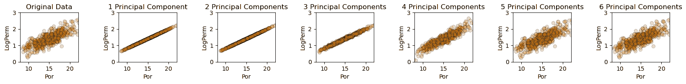

非常有趣地观察随着我们包含更多成分，对数渗透率与孔隙率之间的双变量关系的准确性如何提高。让我们检查一下方差。

```py
print('1 Principal Component : Variance Por =',np.round(np.var(xhat_1d[:,0])/(sd_f6[0]*sd_f6[0]),2),' Variance Log Perm = ',np.round(np.var(xhat_1d[:,1])/(sd_f6[1]*sd_f6[1]),2))

print('2 Principal Components: Variance Por =',np.round(np.var(xhat_2d[:,0])/(sd_f6[0]*sd_f6[0]),2),' Variance Log Perm = ',np.round(np.var(xhat_2d[:,1])/(sd_f6[1]*sd_f6[1]),2))

print('3 Principal Components: Variance Por =',np.round(np.var(xhat_3d[:,0])/(sd_f6[0]*sd_f6[0]),2),' Variance Log Perm = ',np.round(np.var(xhat_3d[:,1])/(sd_f6[1]*sd_f6[1]),2))

print('4 Principal Components: Variance Por =',np.round(np.var(xhat_4d[:,0])/(sd_f6[0]*sd_f6[0]),2),' Variance Log Perm = ',np.round(np.var(xhat_4d[:,1])/(sd_f6[1]*sd_f6[1]),2))

print('5 Principal Components: Variance Por =',np.round(np.var(xhat_5d[:,0])/(sd_f6[0]*sd_f6[0]),2),'  Variance Log Perm = ',np.round(np.var(xhat_5d[:,1])/(sd_f6[1]*sd_f6[1]),2))

print('6 Principal Components: Variance Por =',np.round(np.var(xhat_6d[:,0])/(sd_f6[0]*sd_f6[0]),2),'  Variance Log Perm = ',np.round(np.var(xhat_6d[:,1])/(sd_f6[1]*sd_f6[1]),2)) 
```

```py
1 Principal Component : Variance Por = 0.86  Variance Log Perm =  0.63
2 Principal Components: Variance Por = 0.88  Variance Log Perm =  0.65
3 Principal Components: Variance Por = 0.88  Variance Log Perm =  0.66
4 Principal Components: Variance Por = 0.91  Variance Log Perm =  0.96
5 Principal Components: Variance Por = 1.0   Variance Log Perm =  1.0
6 Principal Components: Variance Por = 1.0   Variance Log Perm =  1.0 
```

这很有趣。使用第一个主成分，我们描述了 86%的孔隙率方差。接下来的两个主成分没有提供太多帮助。然后第四和第五个主成分出现了一个跳跃。

+   当然，问题是 6 维的，不仅仅是孔隙率与对数渗透率，但是看到主成分数量与每个原始特征保留的方差之间的关系是否有趣

+   主成分并没有均匀地描述每个特征

## 降维对所有特征矩阵散点图的影响

让我们看看矩阵散点图，以查看所有双变量组合。

+   首先，做一些记录，我们必须将 6D 降维模型放入 DataFrames 中（目前是 Numpy ndarrays）。

```py
df_1d = pd.DataFrame(data=xhat_1d,columns=features)   
df_2d = pd.DataFrame(data=xhat_2d,columns=features)
df_3d = pd.DataFrame(data=xhat_3d,columns=features)
df_4d = pd.DataFrame(data=xhat_4d,columns=features)
df_5d = pd.DataFrame(data=xhat_5d,columns=features)
df_6d = pd.DataFrame(data=xhat_6d,columns=features) 
```

现在，我们可以使用这些 DataFrames 生成矩阵散点图。当我们添加主成分时，看到双变量图的准确性提高是非常有趣的。而且，仅使用两个主成分，我们就很好地捕捉到一些变量对的双变量关系。

```py
fig = plt.figure()

pd_plot.scatter_matrix(my_data_f6, alpha = 0.1,           # pandas matrix scatter plot
    figsize=(6, 6),color = 'black', hist_kwds={'color':['grey']})
plt.suptitle('Original Data')

pd_plot.scatter_matrix(df_1d, alpha = 0.1,                # pandas matrix scatter plot
    figsize=(6, 6),color = 'black', hist_kwds={'color':['grey']})
plt.suptitle('1 Principal Component')

pd_plot.scatter_matrix(df_2d, alpha = 0.1,                # pandas matrix scatter plot
    figsize=(6, 6),color = 'black', hist_kwds={'color':['grey']})
plt.suptitle('2 Principal Components')

pd_plot.scatter_matrix(df_3d, alpha = 0.1,                # pandas matrix scatter plot
    figsize=(6, 6),color = 'black', hist_kwds={'color':['grey']})
plt.suptitle('3 Principal Components')

pd_plot.scatter_matrix(df_4d, alpha = 0.1,                # pandas matrix scatter plot
    figsize=(6, 6),color = 'black', hist_kwds={'color':['grey']})
plt.suptitle('4 Principal Components')

pd_plot.scatter_matrix(df_5d, alpha = 0.1,                # pandas matrix scatter plot
    figsize=(6, 6),color = 'black', hist_kwds={'color':['grey']})
plt.suptitle('5 Principal Components')

pd_plot.scatter_matrix(df_6d, alpha = 0.1,                # pandas matrix scatter plot
    figsize=(6, 6),color = 'black', hist_kwds={'color':['grey']})
plt.suptitle('6 Principal Components')

plt.show() 
```

```py
<Figure size 640x480 with 0 Axes> 
```

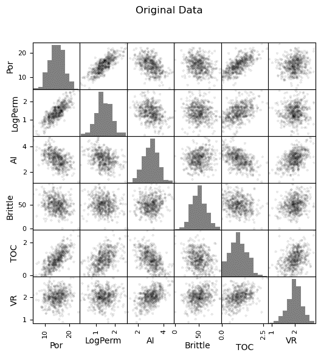 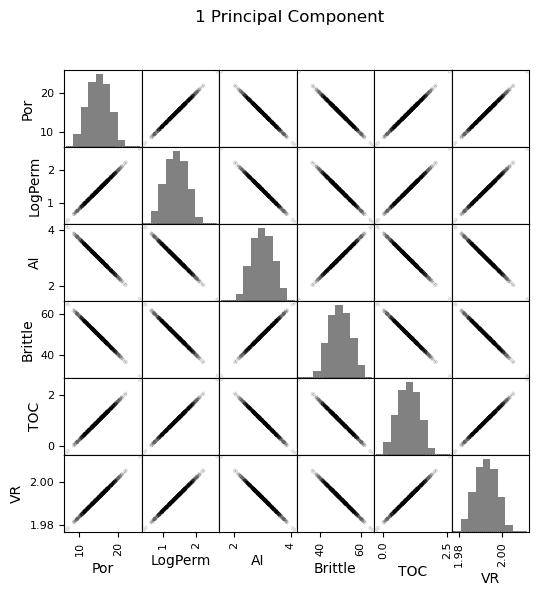 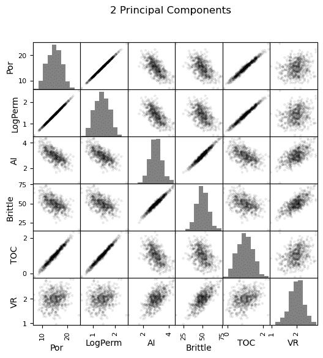   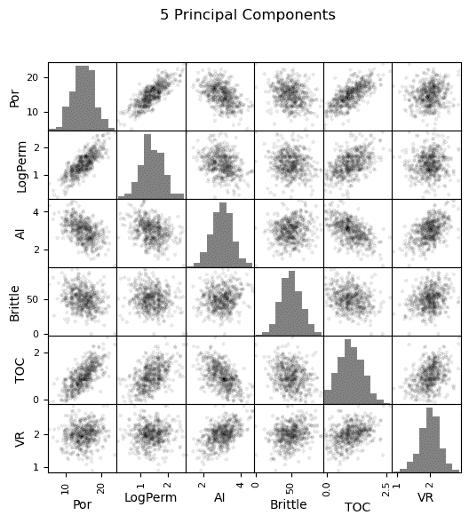 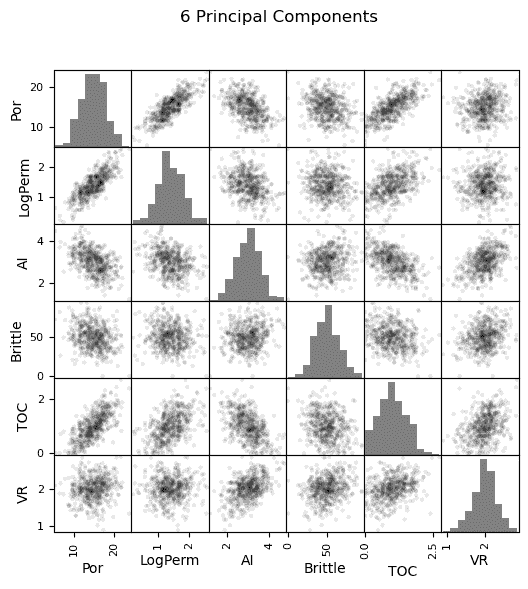

## 对不相关数据进行主成分分析

让我们再试一次测试，对不相关数据进行主成分分析。

+   我们为 5 个特征生成了大量随机样本（n 很大）。

+   我们将假设一个均匀分布

```py
x_rand = np.random.rand(10000,5); df_x_rand = pd.DataFrame(x_rand)
print('Variance of original features: ', np.round(np.var(x_rand, axis = 0),2))
print('Proportion of variance of original features: ', np.round(np.var(x_rand, axis = 0)/np.sum(np.var(x_rand, axis = 0)),2))
print('Correlation Matrix of original features:\n'); print(np.round(np.cov(x_rand, rowvar = False),2)); print()

pd_plot.scatter_matrix(df_x_rand, alpha = 0.1,                # pandas matrix scatter plot
    figsize=(6, 6),color = 'black', hist_kwds={'color':['grey']})
plt.suptitle('Original Features')

pca_rand = PCA(n_components=5)
pca_rand.fit(x_rand)
print('PCA Variance Explained ', np.round(pca_rand.explained_variance_ratio_,2))  

scores_x_rand = pca_rand.transform(x_rand); df_scores_x_rand = pd.DataFrame(scores_x_rand)

print('\nCorrelation Matrix of scores:\n'); print(np.round(np.cov(scores_x_rand, rowvar = False),2)); print()

pd_plot.scatter_matrix(df_scores_x_rand, alpha = 0.1,                # pandas matrix scatter plot
    figsize=(6, 6),color = 'black', hist_kwds={'color':['grey']})
plt.suptitle('Principal Component Scores') 
```

```py
Variance of original features:  [0.08 0.08 0.08 0.08 0.08]
Proportion of variance of original features:  [0.2 0.2 0.2 0.2 0.2]
Correlation Matrix of original features:

[[ 0.08 -0\.    0\.   -0\.    0\.  ]
 [-0\.    0.08  0\.    0\.   -0\.  ]
 [ 0\.    0\.    0.08  0\.   -0\.  ]
 [-0\.    0\.    0\.    0.08  0\.  ]
 [ 0\.   -0\.   -0\.    0\.    0.08]] 
```

```py
PCA Variance Explained  [0.21 0.2  0.2  0.2  0.19]

Correlation Matrix of scores:

[[ 0.09 -0\.   -0\.   -0\.    0\.  ]
 [-0\.    0.08  0\.   -0\.   -0\.  ]
 [-0\.    0\.    0.08  0\.    0\.  ]
 [-0\.   -0\.    0\.    0.08  0\.  ]
 [ 0\.   -0\.    0\.    0\.    0.08]] 
```

```py
Text(0.5, 0.98, 'Principal Component Scores') 
```

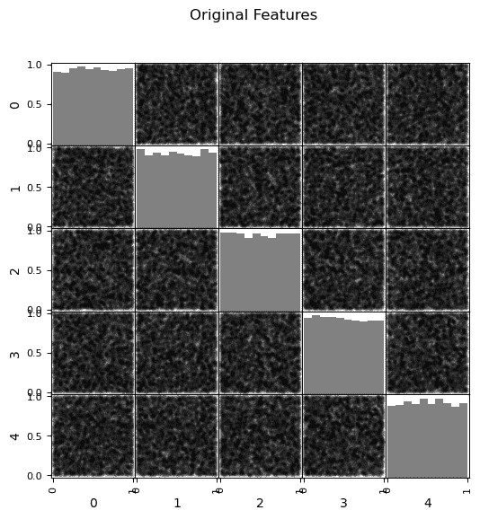 

当主成分分析应用于不相关、均匀分布的特征时会发生什么？

+   所有主成分描述了相同数量的方差

+   无法通过特征投影进行降维

+   独立随机变量的线性组合引发中心极限定理，主成分得分趋向于高斯分布（见上面矩阵散点图中点的四舍五入）

## 在新数据集上进行实践

好的，是时候开始工作了。让我们加载一个数据集并执行 PCA，

+   紧凑的代码

+   基本可视化

+   保存输出

您可以选择这些数据集之一或修改代码并添加您自己的数据集来执行此操作。

### 数据集 0，非常规多元 v4

让我们加载提供的多元数据集 [unconv_MV.csv](https://github.com/GeostatsGuy/GeoDataSets/blob/master/unconv_MV_v4.csv)。这个数据集包括来自 1,000 个非常规井的变量，包括：

+   井平均孔隙率

+   渗透率的对数变换（以线性化与其他变量的关系）

+   声阻抗 (kg/m³ x m/s x 10⁶)

+   岩脆性比 (%)

+   总有机碳 (%) 

+   玻璃质反射率 (%)

+   初始生产 90 天平均 (MCFPD)。

### 数据集 1，十二，12

让我们加载提供的多元、二维空间数据集 [12_sample_data.csv](https://github.com/GeostatsGuy/GeoDataSets/blob/master/12_sample_data.csv)。此数据集包含来自 480 口非常规井的变量，包括：

+   X (m), Y (m) 位置坐标

+   岩性 (0 - 粘土，1 - 砂)

+   单位转换后的孔隙率 (%)

+   渗透率 (mD)

+   声阻抗 (kg/m³ x m/s x 10⁶)

### 数据集 2，储层 21

让我们加载提供的多元、三维空间数据集 [res21_wells.csv](https://github.com/GeostatsGuy/GeoDataSets/blob/master/res21_wells.csv)。此数据集包含来自 10,000m x 10,000m x 50 m 储层单元的 73 口垂直井的变量：

+   井（ID）

+   X (m), Y (m), 深度 (m) 位置坐标

+   单位转换后的孔隙率 (%)

+   渗透率 (mD)

+   单位转换后的声阻抗 (kg/m2s*10⁶)

+   岩性（分类）- 从粘土、砂质粘土、粘土质砂到砂岩的顺序

+   密度 (g/cm³)

+   压缩波速度 (m/s)

+   杨氏模量 (GPa)

+   剪切波速度 (m/s)

+   剪切模量 (GPa)

我们使用 pandas 的 ‘read_csv’ 函数将表格数据加载到名为 ‘my_data’ 的 DataFrame 中，然后预览它以确保正确加载。

+   我们还用数据范围和标签填充列表，以便于绘图

加载数据并格式化，

+   删除响应特征

+   根据需要重新格式化特征

+   此外，我也喜欢将元数据存储在列表中

```py
idata = 0                                                     # select the dataset

if idata == 0:
    df_new = pd.read_csv('https://raw.githubusercontent.com/GeostatsGuy/GeoDataSets/master/unconv_MV_v4.csv') # load data from Dr. Pyrcz's GitHub repository 
    df_new.drop(['Well','Prod'],axis=1,inplace=True)          # remove well index and response feature

    features = df_new.columns.values.tolist()                 # store the names of the features

    xmin_new = [6.0,0.0,1.0,10.0,0.0,0.9]; xmax_new = [24.0,10.0,5.0,85.0,2.2,2.9] # set the minimum and maximum values for plotting

    flabel_new = ['Porosity (%)','Permeability (mD)','Acoustic Impedance (kg/m2s*10⁶)','Brittleness Ratio (%)', # set the names for plotting
             'Total Organic Carbon (%)','Vitrinite Reflectance (%)']

    ftitle_new = ['Porosity','Permeability','Acoustic Impedance','Brittleness Ratio', # set the units for plotting
             'Total Organic Carbon','Vitrinite Reflectance']

elif idata == 1:
    names = {'Porosity':'Por'}

    df_new = pd.read_csv('https://raw.githubusercontent.com/GeostatsGuy/GeoDataSets/master/12_sample_data.csv') # load data from Dr. Pyrcz's GitHub repository 
    df_new.drop(['X','Y','Unnamed: 0'],axis=1,inplace=True)   # remove response feature
    df_new = df_new.rename(columns=names)

    features = df_new.columns.values.tolist()                 # store the names of the features

    xmin_new = [0.0,0.0,0.0,4.0,0.0,6.5,1.4,1600.0,10.0,1300.0,1.6]; xmax_new = [10000.0,10000.0,1.0,19.0,500.0,8.3,3.6,6200.0,50.0,2000.0,12.0] # set the minimum and maximum values for plotting

    flabel_new = ['Well (ID)','X (m)','Y (m)','Depth (m)','Porosity (fraction)','Permeability (mD)','Acoustic Impedance (kg/m2s*10⁶)','Facies (categorical)',
              'Density (g/cm³)','Compressible velocity (m/s)','Youngs modulus (GPa)', 'Shear velocity (m/s)', 'Shear modulus (GPa)'] # set the names for plotting

    ftitle_new = ['Well','X','Y','Depth','Porosity','Permeability','Acoustic Impedance','Facies',
              'Density','Compressible velocity','Youngs modulus', 'Shear velocity', 'Shear modulus']

elif idata == 2:  
    df_new = pd.read_csv('https://raw.githubusercontent.com/GeostatsGuy/GeoDataSets/master/res21_2D_wells.csv') # load data from Dr. Pyrcz's GitHub repository 
    df_new.drop(['Well_ID','X','Y','CumulativeOil'],axis=1,inplace=True) # remove Well Index, X and Y coordinates, and response feature
    df_new = df_new.dropna(how='any',inplace=False)

    features = df_new.columns.values.tolist()                 # store the names of the features

    xmin_new = [1,0.0,0.0,4.0,0.0,6.5,1.4,1600.0,10.0,1300.0,1.6]; xmax_new = [73,10000.0,10000.0,19.0,500.0,8.3,3.6,6200.0,50.0,2000.0,12.0] # set the minimum and maximum values for plotting

    flabel_new = ['Well (ID)','X (m)','Y (m)','Depth (m)','Porosity (fraction)','Permeability (mD)','Acoustic Impedance (kg/m2s*10⁶)','Facies (categorical)',
              'Density (g/cm³)','Compressible velocity (m/s)','Youngs modulus (GPa)', 'Shear velocity (m/s)', 'Shear modulus (GPa)'] # set the names for plotting

    ftitle_new = ['Well','X','Y','Depth','Porosity','Permeability','Acoustic Impedance','Facies',
              'Density','Compressible velocity','Youngs modulus', 'Shear velocity', 'Shear modulus']

df_new[df_new.columns] = MinMaxScaler().fit_transform(df_new) # min/max normalize all the features
df_new.head(n=13) 
```

|  | Por | Perm | AI | Brittle | TOC | VR |
| --- | --- | --- | --- | --- | --- | --- |
| 0 | 0.325294 | 0.204805 | 0.453731 | 0.960076 | 0.569620 | 0.711340 |
| 1 | 0.342941 | 0.274600 | 0.579104 | 0.480038 | 0.455696 | 0.489691 |
| 2 | 0.439412 | 0.167048 | 0.814925 | 0.842894 | 0.455696 | 0.922680 |
| 3 | 0.654118 | 0.643021 | 0.402985 | 0.393378 | 0.535865 | 0.489691 |
| 4 | 0.645294 | 0.393593 | 0.567164 | 0.000000 | 0.717300 | 0.500000 |
| 5 | 0.469412 | 0.421053 | 0.420896 | 0.581278 | 0.476793 | 0.381443 |
| 6 | 0.408235 | 0.282609 | 0.492537 | 0.719035 | 0.417722 | 0.474227 |
| 7 | 0.295882 | 0.217391 | 0.588060 | 0.573103 | 0.371308 | 0.515464 |
| 8 | 0.351176 | 0.181922 | 0.343284 | 0.747105 | 0.481013 | 0.541237 |
| 9 | 0.394118 | 0.321510 | 0.725373 | 0.752964 | 0.561181 | 0.886598 |
| 10 | 0.499412 | 0.372998 | 0.280597 | 0.683608 | 0.535865 | 0.432990 |
| 11 | 0.567059 | 0.591533 | 0.301493 | 0.519962 | 0.725738 | 0.479381 |
| 12 | 0.604118 | 0.490847 | 0.453731 | 0.759095 | 0.573840 | 0.541237 |

### 执行主成分分析

执行主成分分析，

1.  计算主成分载荷

1.  选择主成分的数量以描述目标方差解释

1.  创建一个新的 DataFrame，包含主成分得分

```py
var_explained = 0.95                                          # select the minimum variance explained

n_components = min(len(df_new.columns),len(df_new)-1)         # max components is min of number of features or number of data - 1
pca_new = PCA(n_components=n_components).fit(df_new.values)   # calculate PCA
pca_scores = pca_new.fit_transform(df_new.values)

cumulative_variance = np.cumsum(pca_new.explained_variance_ratio_) # calculate cumulative explained variance

n_selected = np.argmax(cumulative_variance >= var_explained) + 1 # find number of components to retain 95% variance

df_new_projected = pd.DataFrame(pca_scores[:, :n_selected],columns=[f'PC{i+1}' for i in range(n_selected)],
            index=df_new.index)                               # project data to that many principal components

sns.pairplot(df_new_projected.iloc[:,:], plot_kws={'alpha':1.0,'s':50}, palette = 'colorblind', corner=True) # matrix scatter plot
plt.subplots_adjust(left=0.0, bottom=0.0, right=0.6, top=0.7, wspace=0.2, hspace=0.2); plt.show() 
```

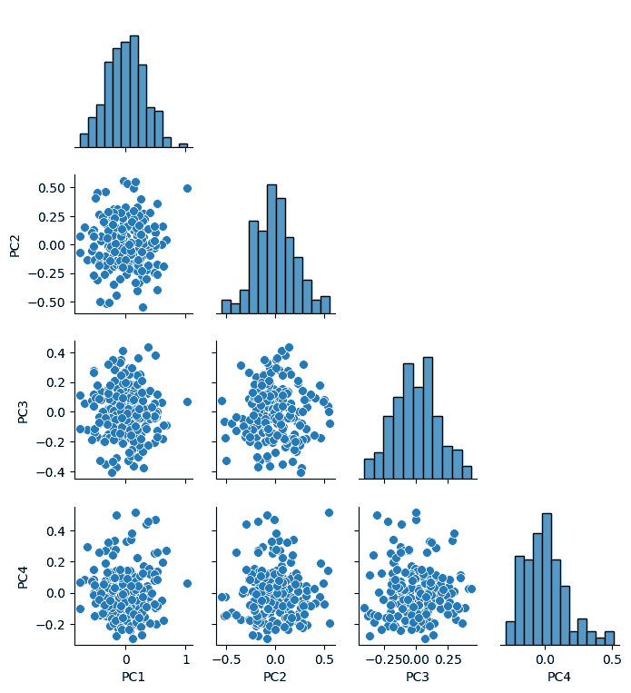

### 检查累积方差解释

```py
plt.plot(np.arange(1,len(pca_new.explained_variance_ratio_)+1,1),np.cumsum(pca_new.explained_variance_ratio_*100),color='darkorange',alpha=0.8)
plt.scatter(np.arange(1,len(pca_new.explained_variance_ratio_)+1,1),np.cumsum(pca_new.explained_variance_ratio_*100),color='darkorange',alpha=0.8,edgecolor='black')
plt.plot([1,len(df_new.columns)],[95,95], color='black',linestyle='dashed'); plt.plot([n_selected,n_selected],[0,100],color='red',zorder=-1)
plt.annotate('Selected Number of Components = '+ str(n_selected),[n_selected,10],rotation=270,color='red')
plt.xlabel('Principal Component'); plt.ylabel('Cumulative Variance Explained'); plt.title('Cumulative Variance Explained by Principal Component')
fmt = '%.0f%%' # Format you want the ticks
plt.xticks(range(1, len(cumulative_variance) + 1))
yticks = mtick.FormatStrFormatter(fmt); plt.xlim(1,len(pca_new.explained_variance_ratio_)); plt.ylim(0,100.0) 
plt.annotate('95% variance explained',[4.05,90]); add_grid()
plt.gca().yaxis.set_major_formatter(PercentFormatter(100.0))  # 1.0 = 100%
plt.subplots_adjust(left=0.0, bottom=0.0, right=1.5, top=1.0, wspace=0.2, hspace=0.2); plt.show() 
```

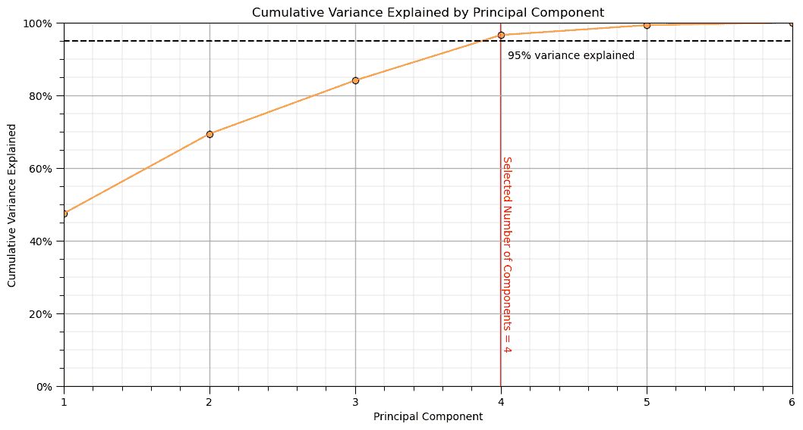

### 保存主成分

现在我们可以选择写出具有降维主成分得分的 DataFrame。

```py
save_PCA = True                                        # save the imputed DataFrame?

if save_PCA == True:
    folder = r'C:\Local'
    file_name = r'dataframe_PCA.csv'

    df_new_projected.to_csv(folder + "/" + file_name, index=False) 
```

```py
---------------------------------------------------------------------------
OSError  Traceback (most recent call last)
Cell In[42], line 7
  4 folder = r'C:\Local'
  5 file_name = r'dataframe_PCA.csv'
----> 7 df_new_projected.to_csv(folder + "/" + file_name, index=False)

File C:\ProgramData\anaconda3\envs\MachineLearningBook\lib\site-packages\pandas\core\generic.py:3772, in NDFrame.to_csv(self, path_or_buf, sep, na_rep, float_format, columns, header, index, index_label, mode, encoding, compression, quoting, quotechar, lineterminator, chunksize, date_format, doublequote, escapechar, decimal, errors, storage_options)
  3761 df = self if isinstance(self, ABCDataFrame) else self.to_frame()
  3763 formatter = DataFrameFormatter(
  3764     frame=df,
  3765     header=header,
   (...)
  3769     decimal=decimal,
  3770 )
-> 3772 return DataFrameRenderer(formatter).to_csv(
  3773     path_or_buf,
  3774     lineterminator=lineterminator,
  3775     sep=sep,
  3776     encoding=encoding,
  3777     errors=errors,
  3778     compression=compression,
  3779     quoting=quoting,
  3780     columns=columns,
  3781     index_label=index_label,
  3782     mode=mode,
  3783     chunksize=chunksize,
  3784     quotechar=quotechar,
  3785     date_format=date_format,
  3786     doublequote=doublequote,
  3787     escapechar=escapechar,
  3788     storage_options=storage_options,
  3789 )

File C:\ProgramData\anaconda3\envs\MachineLearningBook\lib\site-packages\pandas\io\formats\format.py:1186, in DataFrameRenderer.to_csv(self, path_or_buf, encoding, sep, columns, index_label, mode, compression, quoting, quotechar, lineterminator, chunksize, date_format, doublequote, escapechar, errors, storage_options)
  1165     created_buffer = False
  1167 csv_formatter = CSVFormatter(
  1168     path_or_buf=path_or_buf,
  1169     lineterminator=lineterminator,
   (...)
  1184     formatter=self.fmt,
  1185 )
-> 1186 csv_formatter.save()
  1188 if created_buffer:
  1189     assert isinstance(path_or_buf, StringIO)

File C:\ProgramData\anaconda3\envs\MachineLearningBook\lib\site-packages\pandas\io\formats\csvs.py:240, in CSVFormatter.save(self)
  236  """
  237 Create the writer & save.
  238 """
  239 # apply compression and byte/text conversion
--> 240 with get_handle(
  241     self.filepath_or_buffer,
  242     self.mode,
  243     encoding=self.encoding,
  244     errors=self.errors,
  245     compression=self.compression,
  246     storage_options=self.storage_options,
  247 ) as handles:
  248     # Note: self.encoding is irrelevant here
  249     self.writer = csvlib.writer(
  250         handles.handle,
  251         lineterminator=self.lineterminator,
   (...)
  256         quotechar=self.quotechar,
  257     )
  259     self._save()

File C:\ProgramData\anaconda3\envs\MachineLearningBook\lib\site-packages\pandas\io\common.py:737, in get_handle(path_or_buf, mode, encoding, compression, memory_map, is_text, errors, storage_options)
  735 # Only for write methods
  736 if "r" not in mode and is_path:
--> 737     check_parent_directory(str(handle))
  739 if compression:
  740     if compression != "zstd":
  741         # compression libraries do not like an explicit text-mode

File C:\ProgramData\anaconda3\envs\MachineLearningBook\lib\site-packages\pandas\io\common.py:600, in check_parent_directory(path)
  598 parent = Path(path).parent
  599 if not parent.is_dir():
--> 600     raise OSError(rf"Cannot save file into a non-existent directory: '{parent}'")

OSError: Cannot save file into a non-existent directory: 'C:\Local' 
```

## 评论

这是对主成分分析（PCA）进行降维的基本处理。可以做得更多，讨论更多，我有很多更多的资源。查看我的[共享资源清单](https://michaelpyrcz.com/my-resources)以及本章开头 YouTube 讲座中的资源链接，视频描述中包含资源链接。

希望这有所帮助，

*迈克尔*

## 关于作者


德克萨斯大学奥斯汀分校 40 英亩校园内办公室的迈克尔·皮尔奇兹教授。

迈克尔·皮尔奇兹是德克萨斯大学奥斯汀分校[Cockrell 工程学院](https://cockrell.utexas.edu/faculty-directory/alphabetical/p)和[杰克逊地球科学学院](https://www.jsg.utexas.edu/researcher/michael_pyrcz/)的教授，他在该校从事和教授地下、空间数据分析、地统计学和机器学习。迈克尔还，

+   [能源分析](https://fri.cns.utexas.edu/energy-analytics)新生研究项目的首席研究员，以及德克萨斯大学奥斯汀分校自然科学学院机器学习实验室的核心教员

+   担任[计算机与地球科学](https://www.sciencedirect.com/journal/computers-and-geosciences/about/editorial-board)的副编辑，以及国际数学地球科学协会[数学地球科学](https://link.springer.com/journal/11004/editorial-board)的董事会成员。

迈克尔已撰写超过 70 篇[同行评审出版物](https://scholar.google.com/citations?user=QVZ20eQAAAAJ&hl=en)，一个用于空间数据分析的[Python 包](https://pypi.org/project/geostatspy/)，合著了一本关于空间数据分析的教科书[地统计学储层建模](https://www.amazon.com/Geostatistical-Reservoir-Modeling-Michael-Pyrcz/dp/0199731446)，并是两本近期发布的电子书的作者，[Python 应用地统计学：GeostatsPy 实践指南](https://geostatsguy.github.io/GeostatsPyDemos_Book/intro.html)和[Python 应用机器学习：实践指南与代码](https://geostatsguy.github.io/MachineLearningDemos_Book/intro.html)。

迈克尔的所有大学讲座都可在他的[YouTube 频道](https://www.youtube.com/@GeostatsGuyLectures)上找到，其中包含 100 多个 Python 交互式仪表板和 40 多个 GitHub 仓库中的详细工作流程，以支持任何感兴趣的学生和专业人士，提供持续更新的内容。要了解更多关于迈克尔的工作和共享教育资源，请访问他的网站。

## 想一起工作吗？

希望这个内容对那些想了解更多关于地下建模、数据分析和机器学习的人有所帮助。学生和在职专业人士都欢迎参加。

+   想邀请我到贵公司进行培训、辅导、项目审查、工作流程设计和/或咨询吗？我很乐意拜访并与您合作！

+   对合作、支持我的研究生研究或我的地下数据分析与机器学习联盟（共同负责人是约翰·福斯特教授）感兴趣吗？我的研究将数据分析、随机建模和机器学习理论与实践相结合，以开发新的方法和工作流程，增加价值。我们正在解决具有挑战性的地下问题！

+   我可以通过 mpyrcz@austin.utexas.edu 联系到您。

我总是很高兴讨论，

*迈克尔*

迈克尔·皮尔奇兹，博士，P.Eng. 教授，德克萨斯大学奥斯汀分校 Cockrell 工程学院和 Jackson 地球科学学院

更多资源可在以下链接获取：[Twitter](https://twitter.com/geostatsguy) | [GitHub](https://github.com/GeostatsGuy) | [网站](http://michaelpyrcz.com) | [Google Scholar](https://scholar.google.com/citations?user=QVZ20eQAAAAJ&hl=en&oi=ao) | [地统计学书籍](https://www.amazon.com/Geostatistical-Reservoir-Modeling-Michael-Pyrcz/dp/0199731446) | [YouTube](https://www.youtube.com/channel/UCLqEr-xV-ceHdXXXrTId5ig) | [Python 中应用地统计学电子书](https://geostatsguy.github.io/GeostatsPyDemos_Book/intro.html) | [Python 中应用机器学习电子书](https://geostatsguy.github.io/MachineLearningDemos_Book/) | [LinkedIn](https://www.linkedin.com/in/michael-pyrcz-61a648a1)

## 主成分分析（PCA）的动机

与更多特征/变量一起工作更困难！

1.  可视化数据和模型更困难

1.  需要更多数据来推断联合概率

1.  特征空间的数据覆盖范围更少

1.  检查/验证模型更困难

1.  更可能存在冗余特征，例如多重共线性，导致模型不稳定

1.  耗费更多的计算努力、更多的计算资源和更长的运行时间

1.  更复杂的模型更有可能过拟合

1.  模型构建需要更多专业时间

与更少的、具有信息量的特征相比，将所有特征都投入模型中可以得到更好的模型！这部分动机很大程度上是由维度诅咒驱动的。

## 维度诅咒

1.  **数据和模型可视化** - 我们无法可视化超过 3D，即无法访问数据拟合，评估内插与外推。

+   考虑一个以矩阵散点图形式展示的 5D 示例，即使在在这种情况下，每个图也有极端的边缘化到 2D，


5D 数据的矩阵散点图示例。

1.  **采样** - 足够的样本数量，以推断诸如联合概率 $P(x_1,\ldots,x_m)$ 这样的统计量。

+   回忆一下直方图或归一化直方图的计算：我们建立区间并计算每个区间的频率或概率。

+   我们需要每个区间的名义数据样本数，因此在一维中我们需要 $𝑛=𝑛_{𝑠/𝑏𝑖𝑛} \cdot 𝑛_{𝑏𝑖𝑛𝑠}$ 个样本

+   但在 mD 中，我们需要 $n$ 个样本来计算离散化联合概率，

$$ 𝑛=𝑛_{𝑠/𝑏𝑖𝑛} \cdot 𝑛_{𝑏𝑖𝑛𝑠}^m $$

+   例如，每个区间有 10 个样本，35 个区间，在 2D 中需要 12,250 个样本，在 3D 中需要 428,750 个样本


示例 2D 数据，每个特征有 35 个区间。

1.  **样本覆盖率** - 样本值范围覆盖预测特征空间。

+   样本覆盖的分数，对于 1 个特征我们假设 80%的覆盖率

+   记住，我们通常只直接采样地下体积的 $\frac{1}{10⁷}$。

+   是的，覆盖的概念是主观的，覆盖多少数据？关于间隙呢？等等。


示例 2D 数据，每个特征有 35 个区间。

+   现在如果有两个特征的 80%覆盖率，2D 覆盖率是 64%


示例 2D 数据，每个特征有 35 个区间。

+   覆盖率是，

$$ c = c_1^m $$

1.  **扭曲空间** - 高维空间是扭曲的。

+   取超立方体内内接超球体的体积比，

$$ \frac{\pi^{\frac{m}{2}}}{m 2^{m-1} \Gamma\left(\frac{m}{2}\right)} \to 0 \quad \text{as} \quad m \to \infty $$

+   回忆一下，$\Gamma(𝑛)=(𝑛−1)!$。

+   高维空间全是角而没有中间部分，而且大多数高维空间离中间部分很远（全是角！）。

+   因此，高维空间中的距离敏感性降低，即对于空间中的任何随机点，成对距离的期望都变得相同。

$$ \lim_{m \to \infty} \left( \mathbb{E}\left[\text{dist}_{\text{max}}(m) - \text{dist}_{\text{min}}(m)\right] \right) \to 0 $$

+   随机点在超空间中成对距离范围的期望极限趋于零。如果距离几乎都相同，欧几里得距离就不再有意义了！


超立方体内超球体的体积比。

+   这里是不同维度下的扭曲程度，

| m | nD / 2D |
| --- | --- |
| 2 | 1.0 |
| 5 | 0.28 |
| 10 | 0.003 |
| 20 | 0.00000003 |

1.  **多重共线性** - 高维数据集更有可能存在共线性或多重共线性。

+   由其他特征线性描述的特征导致模型方差高。

## 推断性机器学习

主成分分析是一种推断性、无监督的机器学习方法。

+   没有响应特征，$y$，只有预测特征，

$$ 𝑋_1,\ldots,𝑋_𝑚 $$

+   机器通过模仿数据的紧凑表示来学习。

+   通过特征投影、分组分配、神经网络潜在特征等方式捕捉模式。

+   我们专注于对总体、自然系统的推理，而不是对响应特征的预测。

## 主成分分析

主成分分析是多种降维方法之一：

降维将数据转换到更低维度

+   给定特征，$𝑋_1,\dots,𝑋_𝑚$，我们需要 ${m \choose 2}=\frac{𝑚 \cdot (𝑚−1)}{2}$ 个散点图来可视化二维散点图。

+   一旦我们有 4 个或更多变量，理解数据就变得非常困难。

+   回忆维度诅咒，影响推理、建模和可视化。

一种解决方案是找到一个好的低维表示，$𝑝$，来表示原始维度 $𝑚$

在降维表示中的好处：

1.  数据存储/计算时间

1.  更容易的可视化

1.  还考虑了多重共线性

## 正交变换

将一组观测值转换为一组线性不相关的变量，称为主成分

+   可用的主成分数量（$k$）是 min⁡($𝑛−1,𝑚$)

+   受限于变量/特征，$𝑚$，和数据数量

成分是有序的，

+   第一成分描述了最大的可能方差/尽可能多地解释变异性

+   下一个成分描述了可能的最大剩余方差

+   最多到最大数量的主成分

有多种方式来解释主成分分析，

## 最佳拟合解释

最小化数据与主成分之间的正交投影误差，

$$ \min \sum_{i=1}^{n} \left( \left( X_i - \bar{X} \right) - \left( X_i - \bar{X} \right) V_p V_p^T \right)² $$

其中 $𝑽_𝒑$ 是我们前 $𝒑$ 个向量的矩阵，$𝑿_𝒊$ 是样本 $𝑖$ 在所有 $𝑝$ 个特征上的向量，$\overline{X}$ 是均值向量，


将二维数据投影到一维（左）和三维数据投影到二维（右）的正交误差（待添加引用）。

其中主成分描述了一维中的向量和平面中的二维，以及投影空间中的主成分得分，

$$ (𝑿_𝒊−\overline{𝑿})𝑽_𝒑 $$

并且在原始空间中具有降维的反变换是，

$$ (𝑿_𝒊−\overline{X})𝑽_𝒑 𝑽_𝒑^𝑻 $$

注意，由于 $V_p$ 矩阵是正交的，

$$ V_p^T = V_p^{-1} $$

## 基于旋转的解释

正交变换是一种旋转，它最大化了第一主成分解释的方差，最大化第二主成分的剩余方差，等等。

如果你想看到 PCA 作为旋转的实际操作，请查看我的[PCA 旋转交互式 Python 仪表板](https://github.com/GeostatsGuy/DataScienceInteractivePython/blob/main/Interactive_PCA_Rotation.ipynb)。


我的交互式仪表板展示了 PCA 作为数据旋转。

从这个仪表板可以看出，存在一个旋转，它最大化了第一个主成分解释的方差，同时消除了第一个和第二个主成分之间的相关性。

## 特征值/特征向量解释

对于主成分分析，我们计算数据协方差矩阵，特征组合的成对协方差。

+   然后我们从协方差矩阵中计算特征向量和特征值。

+   特征值是每个成分解释的方差。

+   数据协方差矩阵的特征向量是主成分。

## 主成分分析工作流程

1.  标准化特征

$$ 𝑋^𝑠=\frac{𝑋−\overline{X}}{\sigma_𝑋} $$$$ 𝑋_1,\ldots,𝑋_𝑚 \quad \rightarrow 𝑋_1^𝑠,\ldots,𝑋_𝑚^𝑠 $$

```py
where $X_i$ are original features and $X^s_i$ are transformed features. 
```

+   标准化是必要的，以防止具有较大方差的特征主导解决方案，即第一个主成分与方差最大的特征对齐

1.  计算标准化的特征协方差矩阵

$$ C_{(X_{m_1}, X_{m_2})} = \frac{\sum_{i=1}^{n} \left( (x_{m_1} - \bar{x}_{m_1})(x_{m_2} - \bar{x}_{m_2}) \right)}{n - 1} $$

```py
given the features are standardized the matrix is a correlation matrix 
```

$$\begin{split} C = \begin{bmatrix} C(X_1, X_1) & \cdots & C(X_1, X_m) \\ \vdots & \ddots & \vdots \\ C(X_m, X_1) & \cdots & C(X_m, X_m) \end{bmatrix} \end{split}$$

```py
given the features are standardized the matrix is a correlation matrix, 
```

$$\begin{split} C = \begin{bmatrix} \rho(X_1, X_1) & \cdots & \rho(X_1, X_m) \\ \vdots & \ddots & \vdots \\ \rho(X_m, X_1) & \cdots & \rho(X_m, X_m) \end{bmatrix} \end{split}$$

1.  计算协方差矩阵 $𝑪$ 的特征值和特征向量，

    给定 $𝐶$ 是一个方阵 $(𝑚 \times 𝑚)$，$𝑣 (𝑚 \times 1)$ 是一个向量，$\lambda$ 是一个标量 ($1$)，

$$ 𝐶𝑣=\lambda 𝑣 $$

```py
we can reorder to, 
```

$$ (𝐶− \lambda \cdot 𝐼)∙𝑣=0 $$

```py
where $I$ is an identity matrix. By Cramer’s rule, we have a solution if the determinant is 0, 
```

$$ |𝐶− \lambda \cdot 𝐼|=0 $$

```py
find the possible Eigenvalues, $\lambda_𝛼$, and solve for eigenvectors, $𝒗_𝜶, \quad \alpha=𝟏,\ldots,𝒎$ 
```

+   结果是矩阵 $𝑽_𝒎$ 中的 $\text{𝒎𝒊𝒏}⁡(𝒎,𝒏−𝟏)$ 个特征向量。


特征向量作为主成分。

```py
that form a basis on which the data are projected for dimensionality reduction, 
```


特征向量作为定义新旋转基的主成分。

如果你想查看主成分载荷和各成分之间的方差分配，请查看我的 [PCA 载荷交互式 Python 仪表板](https://github.com/GeostatsGuy/DataScienceInteractivePython/blob/main/Interactive_PCA_Eigen.ipynb)，


我的交互式仪表板展示了主成分载荷和每个主成分解释的方差，随着特征 1、2 和 3 之间的相关性变化。

## 加载所需的库

以下代码加载所需的库。这些库应该已经与 Anaconda 3 一起安装。

```py
ignore_warnings = True                                        # ignore warnings?
from sklearn.preprocessing import MinMaxScaler                # min/max normalization
from sklearn.decomposition import PCA                         # PCA program from scikit learn (package for machine learning)
from sklearn.preprocessing import StandardScaler              # standardize variables to mean of 0.0 and variance of 1.0
import numpy as np                                            # ndarrays for gridded data
import pandas as pd                                           # DataFrames for tabular data
import pandas.plotting as pd_plot                             # pandas plotting functions
import copy                                                   # for deep copies
import os                                                     # set working directory, run executables
import matplotlib.pyplot as plt                               # for plotting
from matplotlib.ticker import (MultipleLocator, AutoMinorLocator) # control of axes ticks
import matplotlib.ticker as mtick                             # control tick label formatting
from matplotlib.ticker import PercentFormatter                # percentage axis label formatting
import seaborn as sns                                         # advanced plotting
plt.rc('axes', axisbelow=True)                                # plot all grids below the plot elements
if ignore_warnings == True:                                   
    import warnings
    warnings.filterwarnings('ignore')
cmap = plt.cm.inferno                                         # color map
seed = 42                                                     # random number seed 
```

如果你遇到包导入错误，你可能需要首先安装这些包中的一些。这通常可以通过在 Windows 上打开命令窗口，然后输入‘python -m pip install [package-name]’来完成。有关相应包的文档可以提供更多帮助。

## 声明函数

让我们定义一个单独的函数来简化绘制相关矩阵。我还添加了一个方便的函数来添加主网格线和副网格线，以提高图表的可解释性。

```py
def plot_corr(df,size=10):                                    # plots a graphical correlation matrix 
    from matplotlib.colors import ListedColormap              # make a custom colormap
    my_colormap = plt.cm.get_cmap('RdBu_r', 256)          
    newcolors = my_colormap(np.linspace(0, 1, 256))
    white = np.array([256/256, 256/256, 256/256, 1])
    newcolors[65:191, :] = white                              # mask all correlations less than abs(0.8)
    newcmp = ListedColormap(newcolors)
    m = len(df.columns)
    corr = df.corr()
    fig, ax = plt.subplots(figsize=(size, size))
    im = ax.matshow(corr,vmin = -1.0, vmax = 1.0,cmap = newcmp)
    plt.xticks(range(len(corr.columns)), corr.columns);
    plt.yticks(range(len(corr.columns)), corr.columns);
    plt.colorbar(im, orientation = 'vertical')
    plt.title('Correlation Matrix')
    for i in range(0,m):
        plt.plot([i-0.5,i-0.5],[-0.5,m-0.5],color='black')
        plt.plot([-0.5,m-0.5],[i-0.5,i-0.5],color='black')
    plt.ylim([-0.5,m-0.5]); plt.xlim([-0.5,m-0.5])

def add_grid():
    plt.gca().grid(True, which='major',linewidth = 1.0); plt.gca().grid(True, which='minor',linewidth = 0.2) # add y grids
    plt.gca().tick_params(which='major',length=7); plt.gca().tick_params(which='minor', length=4)
    plt.gca().xaxis.set_minor_locator(AutoMinorLocator()); plt.gca().yaxis.set_minor_locator(AutoMinorLocator()) # turn on minor ticks 

def add_grid2(sub_plot):
    sub_plot.grid(True, which='major',linewidth = 1.0); sub_plot.grid(True, which='minor',linewidth = 0.2) # add y grids
    sub_plot.tick_params(which='major',length=7); sub_plot.tick_params(which='minor', length=4)
    sub_plot.xaxis.set_minor_locator(AutoMinorLocator()); sub_plot.yaxis.set_minor_locator(AutoMinorLocator()) # turn on minor ticks 
```

## 设置工作目录

我总是喜欢这样做，这样我就不会丢失文件，并且可以简化后续的读取和写入（避免每次都包含完整地址）。

```py
#os.chdir("c:/Local")                                 # set the working directory 
```

您将不得不更新引号内的部分以包含您自己的工作目录，并且格式在 Mac 上不同（例如：“~/PGE”）。

## 加载表格数据

这是加载我们的逗号分隔数据文件到 Pandas DataFrame 对象的命令。

让我们加载提供的多元、空间数据集‘unconv_MV.csv’。这个数据集包括来自 1000 个非常规井的变量：

+   优良的孔隙率

+   渗透率的对数变换（以线性化与其他变量的关系）

+   声波阻抗（kg/m³ x m/s x 10⁶）

+   岩脆性比（%）

+   总有机碳（%）

+   玻璃质反射率（%）

+   初始生产 90 天平均（MCFPD）。

注意，数据集是合成的。

我们使用 pandas 的‘read_csv’函数将其加载到我们称为‘my_data’的 DataFrame 中，然后预览以确保正确加载。

```py
#my_data = pd.read_csv("unconv_MV.csv") 
my_data = pd.read_csv(r"https://raw.githubusercontent.com/GeostatsGuy/GeoDataSets/master/unconv_MV.csv") # load the comma delimited data file
my_data = my_data.iloc[:,1:]                              # remove the well index 
```

## 可视化 DataFrame

可视化 DataFrame 是一个有用的初步检查。

我们可以通过切片 DataFrame 来预览。

+   我们显示从 0 到 7 的所有记录，但不包括 7

```py
my_data[:7]                                               # preview the first 7 rows of the dataframe 
```

|  | Por | LogPerm | AI | Brittle | TOC | VR | 生产 |
| --- | --- | --- | --- | --- | --- | --- | --- |
| 0 | 15.91 | 1.67 | 3.06 | 14.05 | 1.36 | 1.85 | 177.381958 |
| 1 | 15.34 | 1.65 | 2.60 | 31.88 | 1.37 | 1.79 | 1479.767778 |
| 2 | 20.45 | 2.02 | 3.13 | 63.67 | 1.79 | 2.53 | 4421.221583 |
| 3 | 11.95 | 1.14 | 3.90 | 58.81 | 0.40 | 2.03 | 1488.317629 |
| 4 | 19.53 | 1.83 | 2.57 | 43.75 | 1.40 | 2.11 | 5261.094919 |
| 5 | 19.47 | 2.04 | 2.73 | 54.37 | 1.42 | 2.12 | 5497.005506 |
| 6 | 12.70 | 1.30 | 3.70 | 43.03 | 0.45 | 1.95 | 1784.266285 |

## 表格数据的摘要统计

在 DataFrames 中从表格数据计算摘要统计有很多高效的方法。describe 命令提供了一个很好的数据表，提供了计数、平均值、最小值、最大值和四分位数。

+   我们使用转置只是翻转表格，以便特征在行上，统计信息在列上。

```py
my_data.describe().transpose()                            # calculate summary statistics for the data 
```

|  | count | mean | std | min | 25% | 50% | 75% | max |
| --- | --- | --- | --- | --- | --- | --- | --- | --- |
| Por | 1000.0 | 14.950460 | 3.029634 | 5.400000 | 12.85750 | 14.98500 | 17.080000 | 24.65000 |
| LogPerm | 1000.0 | 1.398880 | 0.405966 | 0.120000 | 1.13000 | 1.39000 | 1.680000 | 2.58000 |
| AI | 1000.0 | 2.982610 | 0.577629 | 0.960000 | 2.57750 | 3.01000 | 3.360000 | 4.70000 |
| Brittle | 1000.0 | 49.719480 | 15.077006 | -10.500000 | 39.72250 | 49.68000 | 59.170000 | 93.47000 |
| TOC | 1000.0 | 1.003810 | 0.504978 | -0.260000 | 0.64000 | 0.99500 | 1.360000 | 2.71000 |
| VR | 1000.0 | 1.991170 | 0.308194 | 0.900000 | 1.81000 | 2.00000 | 2.172500 | 2.90000 |
| Production | 1000.0 | 2247.295809 | 1464.256312 | 2.713535 | 1191.36956 | 1976.48782 | 3023.594214 | 12568.64413 |

很好，我们已经检查了摘要统计信息，对于脆性和总有机碳，我们有一些负值。这是在物理上不可能的。

+   这些值肯定有误。我们知道最低可能的值是 0.0，因此我们将截断到 0.0。

我们使用：

```py
df.get_numerical_data() 
```

DataFrame 成员函数用于从 DataFrame 获取数据的浅拷贝。

由于这是一个浅拷贝，我们对拷贝所做的任何更改都会影响到原始 DataFrame 中的数据。

+   这允许我们一次性将这个简单的条件语句应用到 DataFrame 中的所有数据值。

```py
num = my_data._get_numeric_data()                         # get the numerical values
num[num < 0] = 0                                          # truncate negative values to 0.0
my_data.describe().transpose()                            # calculate summary statistics for the data 
```

|  | count | mean | std | min | 25% | 50% | 75% | max |
| --- | --- | --- | --- | --- | --- | --- | --- | --- |
| Por | 1000.0 | 14.950460 | 3.029634 | 5.400000 | 12.85750 | 14.98500 | 17.080000 | 24.65000 |
| LogPerm | 1000.0 | 1.398880 | 0.405966 | 0.120000 | 1.13000 | 1.39000 | 1.680000 | 2.58000 |
| AI | 1000.0 | 2.982610 | 0.577629 | 0.960000 | 2.57750 | 3.01000 | 3.360000 | 4.70000 |
| Brittle | 1000.0 | 49.731480 | 15.033593 | 0.000000 | 39.72250 | 49.68000 | 59.170000 | 93.47000 |
| TOC | 1000.0 | 1.006170 | 0.499838 | 0.000000 | 0.64000 | 0.99500 | 1.360000 | 2.71000 |
| VR | 1000.0 | 1.991170 | 0.308194 | 0.900000 | 1.81000 | 2.00000 | 2.172500 | 2.90000 |
| Production | 1000.0 | 2247.295809 | 1464.256312 | 2.713535 | 1191.36956 | 1976.48782 | 3023.594214 | 12568.64413 |

## 计算相关矩阵

对于降维，数据可视化是一个很好的第一步。

让我们从相关矩阵开始。

我们可以使用这些命令计算并查看控制台中的结果。

```py
corr_matrix = np.corrcoef(my_data, rowvar = False) 
```

输入数据是一个二维数组，$rowvar$ 指定变量是否位于行而不是列中。

```py
corr_matrix = np.corrcoef(my_data, rowvar = False)
print(np.around(corr_matrix,2))                           # print the correlation matrix to 2 decimals 
```

```py
[[ 1\.    0.81 -0.51 -0.25  0.71  0.08  0.69]
 [ 0.81  1\.   -0.32 -0.15  0.51  0.05  0.57]
 [-0.51 -0.32  1\.    0.17 -0.55  0.49 -0.33]
 [-0.25 -0.15  0.17  1\.   -0.24  0.3  -0.07]
 [ 0.71  0.51 -0.55 -0.24  1\.    0.31  0.5 ]
 [ 0.08  0.05  0.49  0.3   0.31  1\.    0.14]
 [ 0.69  0.57 -0.33 -0.07  0.5   0.14  1\.  ]] 
```

注意由于每个变量与其自身相关而产生的 1.0 对角线。

让我们使用上面声明的函数来制作图形相关矩阵可视化。

+   这可能提高我们识别特征的能力。它依赖于内置的 Numpy DataFrames 相关矩阵方法和 Matplotlib 进行绘图。

```py
plot_corr(my_data,7)                                      # using our correlation matrix visualization function
plt.subplots_adjust(left=0.0, bottom=0.0, right=1.0, top=0.8, wspace=0.2, hspace=0.3); plt.show() 
```


这看起来不错。存在多种双变量、线性相关程度。当然，相关系数仅限于线性相关程度。

## 检查矩阵散点图

为了获取更完整的信息，让我们查看 Pandas 包中的矩阵散点图。

+   协方差和相关系数对异常值和非线性敏感

```py
pd_plot.scatter_matrix(my_data) 
```

$alpha$ 允许我们使用半透明点，以便在密集散点图中更容易可视化。

$hist_kwds$ 是对角线元素直方图的参数集。

```py
pd_plot.scatter_matrix(my_data, alpha = 0.1,              # pandas matrix scatter plot
    figsize=(6, 6),color = 'black', hist_kwds={'color':['grey']})
plt.subplots_adjust(left=0.0, bottom=0.0, right=1.0, top=0.8, wspace=0.2, hspace=0.3); plt.show() 
```


## 简单的双变量示例

让我们将问题简化为双变量（2 个特征），孔隙率和渗透率的对数变换，并将井的数量从 1,000 减少到 100。

```py
my_data_por_perm = my_data.iloc[0:100,0:2]                # extract just por and logperm, 100 samples
my_data_por_perm.describe().transpose()                   # calculate summary statistics for the data 
```

|  | count | mean | std | min | 25% | 50% | 75% | max |
| --- | --- | --- | --- | --- | --- | --- | --- | --- |
| Por | 100.0 | 14.9856 | 2.823016 | 9.23 | 12.9275 | 14.720 | 16.705 | 21.00 |
| LogPerm | 100.0 | 1.3947 | 0.390947 | 0.36 | 1.1475 | 1.365 | 1.650 | 2.48 |

让我们首先检查 Por 和 LogPerm 的单变量统计信息。

```py
f, (ax1, ax2) = plt.subplots(1, 2, sharey=True)
ax1.hist(my_data_por_perm["Por"], alpha = 0.8, color = 'darkorange', edgecolor = 'black', bins=20)
ax1.set_title('Porosity'); ax1.set_xlabel('Porosity (%)'); ax1.set_ylabel('Frequency'); add_grid2(ax1)
ax2.hist(my_data_por_perm["LogPerm"], alpha = 0.8, color = 'darkorange', edgecolor = 'black', bins=20)
ax2.set_title('Log Transformed Permeability'); ax2.set_xlabel('Log[Permeability] (log(mD)'); add_grid2(ax2)
plt.subplots_adjust(left=0.0, bottom=0.0, right=1.5, top=0.8, wspace=0.2, hspace=0.3); plt.show() 
```


分布实际上可能是高斯分布的，无论它们的行为是否良好，我们无法观察到明显的缺口或截断。

让我们看看孔隙率与对数渗透率的散点图。

这将是来自 *matplotlib* 的基本命令，用于制作散点图。

```py
plt.scatter(my_data_por_perm["Por"],my_data_por_perm["LogPerm"] 
```

+   额外的参数用于格式化和标签

```py
plt.scatter(my_data_por_perm["Por"],my_data_por_perm["LogPerm"],s=None, c="darkorange", marker=None, cmap=None, norm=None, vmin=None, vmax=None, alpha=0.8, linewidths=1.0, edgecolors="black")
plt.title('Log Transformed Permeability vs. Porosity'); plt.xlabel('Porosity (%)'); plt.ylabel('Log(Permeability (Log(mD))'); add_grid()
plt.subplots_adjust(left=0.0, bottom=0.0, right=0.7, top=0.8, wspace=0.2, hspace=0.3); plt.show() 
```


## 主成分计算

通过渗透率的对数变换，我们与孔隙率有一个非常好的线性关系，PCA 应该可以很好地处理这些数据。

+   我们准备使用孔隙率和渗透率的对数进行 PCA。

## 标准化特征

我们必须标准化我们的变量，使其均值等于零，$\bar{x} = 0.0$，方差等于一，$\sigma^{2}_{x} = 1.0$。

+   否则，孔隙率和渗透率的比例差异将产生重大影响。注意，由于单位选择对方差的影响，例如，渗透率使用达西（D）而不是毫达西（mD）或使用分数而不是百分比来表示孔隙率。这是相当任意的！

要消除这种影响，除非两个变量具有相同的单位并且它们之间的范围和方差有意义，否则我们应该始终进行标准化，因为标准化可能会删除重要信息。

```py
features = ['Por','LogPerm']
x = my_data_por_perm.loc[:,features].values
mu = np.mean(x, axis=0)
sd = np.std(x, axis=0)
x = StandardScaler().fit_transform(x)                     # standardize the data features to mean = 0, var = 1.0

print("Original Mean Por", np.round(mu[0],2), ', Original Mean LogPerm = ', np.round(mu[1],2)) 
print("Original StDev Por", np.round(sd[0],2), ', Original StDev LogPerm = ', np.round(sd[1],2)) 
print('Mean Transformed Por =',np.round(np.mean(x[:,0]),2),', Mean Transformed LogPerm =',np.round(np.mean(x[:,1]),2))
print('Variance Transformed Por =',np.var(x[:,0]),', Variance Transformed LogPerm =',np.var(x[:,1])) 
```

```py
Original Mean Por 14.99 , Original Mean LogPerm =  1.39
Original StDev Por 2.81 , Original StDev LogPerm =  0.39
Mean Transformed Por = 0.0 , Mean Transformed LogPerm = -0.0
Variance Transformed Por = 1.0000000000000002 , Variance Transformed LogPerm = 1.0 
```

```py
cov = np.cov(x,rowvar = False)
cov 
```

```py
array([[1.01010101, 0.80087707],
       [0.80087707, 1.01010101]]) 
```

“x”是来自 Numpy 包的 2D ndarray，特征在列中，样本在行中。

+   如上所示，我们确认“x”二维数组中的特征已经标准化。

检查我们标准化变量的单变量和多变量分布不是一个坏主意。

```py
dfS = pd.DataFrame({'sPor': x[:,0], 'sLogPerm': x[:,1]})
sns.jointplot(data=dfS,x='sPor',y='sLogPerm',marginal_kws=dict(bins=30),color='darkorange',edgecolor='black')
plt.subplots_adjust(left=0.0, bottom=0.0, right=1.0, top=1.1, wspace=0.2, hspace=0.3); plt.show() 
```


一切看起来都很正常，我们准备应用主成分分析。

## 主成分分析 (PCA)

要在 Python 中使用 SciKitLearn 机器学习包运行 PCA，我们首先使用指定数量的组件创建一个 PCA 模型，然后将其“拟合”到我们的数据上。

```py
n_components = 2
pca = PCA(n_components=n_components)
pca.fit(x) 
```

正如你稍后通过降维将看到的，我们可以使用矩阵数学来处理这个模型，并将我们的数据减少到从 1 到特征数量 m 的任何维度。让我们以特征数量 m 等于组件数量的方式运行模型。

```py
n_components = 2
pca = PCA(n_components=n_components).fit(x) 
```

## 组件载荷

我们首先应该做的是查看成分加载。让我们查看它们并解释我们的结果。

```py
print(np.round(pca.components_,3))
print('First Principal Component = ' + str(np.round(pca.components_[0,:],3)))
print('Second Principal Component = ' + str(np.round(pca.components_[1,:],3))) 
```

```py
[[ 0.707  0.707]
 [ 0.707 -0.707]]
First Principal Component = [0.707 0.707]
Second Principal Component = [ 0.707 -0.707] 
```

组件被列为一个二维数组（ndarray），包括：

+   主成分在行上

+   特征在列上

+   行是按顺序排列的，以便第一个主成分是第一行，最后一个主成分是最后一行。

## 主成分解释的方差比例

也很重要的是要查看每个主成分描述的方差比例。

```py
print('Variance explained by PC1 and PC2 =', np.round(pca.explained_variance_ratio_,3))
print('First Principal Component explains ' + str(np.round(pca.explained_variance_ratio_[0],3)) + ' of the total variance.')
print('Second Principal Component explains ' + str(np.round(pca.explained_variance_ratio_[1],3)) + ' of the total variance.') 
```

```py
Variance explained by PC1 and PC2 = [0.896 0.104]
First Principal Component explains 0.896 of the total variance.
Second Principal Component explains 0.104 of the total variance. 
```

## 主成分得分，正向和逆向投影

我们可以计算原始数据的主成分得分。

+   这实际上是对数据的旋转，与 PC1 的方向对齐，这是最大方差的方向。

+   我们将使用 PCA 内置的“transform”函数计算主成分得分，然后将其可视化为散点图。

+   然后为了“闭环”并检查我们所做的工作（以及我们的知识），我们将进行逆 PCA，从主成分得分回到标准化特征。

```py
f, (ax101, ax102, ax103) = plt.subplots(1, 3,figsize=(12,3))
f.subplots_adjust(wspace=0.7)

ax101.scatter(x[:,0],x[:,1], s=None, c="darkorange", marker=None, cmap=None, norm=None, vmin=None, vmax=None, alpha=0.8, linewidths=1.0, edgecolors="black")
ax101.set_title('Standardized LogPerm vs. Por'); ax101.set_xlabel('Standardized Por'); ax101.set_ylabel('Standardized LogPerm')
ax101.set_xlim([-3,3]); ax101.set_ylim([-3,3]); add_grid2(ax101)

x_trans = pca.transform(x)                                # calculate the principal component scores
ax102.scatter(x_trans[:,0],-1*x_trans[:,1],s=None, c="darkorange", marker=None, cmap=None, norm=None, vmin=None, vmax=None, alpha=0.8, linewidths=1.0, edgecolors="black")
ax102.set_title('Principal Component Scores'); ax102.set_xlabel('PC1'); ax102.set_ylabel('PC2')
ax102.set_xlim([-3,3]); ax102.set_ylim([-3,3]); add_grid2(ax102)

x_reverse = pca.inverse_transform(x_trans)                        # reverse the principal component scores to standardized values
ax103.scatter(x_reverse[:,0],x_reverse[:,1],s=None, c="darkorange", marker=None, cmap=None, norm=None, vmin=None, vmax=None, alpha=0.8, linewidths=1.0, edgecolors="black")
ax103.set_title('Reverse PCA'); ax103.set_xlabel('Standardized Por'); ax103.set_ylabel('Standardized LogPerm')
ax103.set_xlim([-3,3]); ax103.set_ylim([-3,3]); add_grid2(ax103)

plt.subplots_adjust(left=0.0, bottom=0.0, right=1.0, top=0.8, wspace=0.2, hspace=0.3); plt.show() 
```


标准化原始数据和逆 PCA 交叉图应该看起来完全相同。如果是这样，那么该方法就是有效的。

## 方差的守恒

让我们检查主成分得分的方差，因为我们现在已经计算了它们。

+   我们计算每个原始特征的方差

+   然后求和以得到原始的总方差

+   我们计算每个转换后的、主成分得分的方差

+   然后我们求和以得到转换后的总方差

我们注意到：

+   第一个主成分得分比第二个成分得分有更大的方差

+   总方差在转换过程中保持不变，原始特征和 m 个主成分得分方差之和相同

```py
print('Variance of the 2 features:')
print(np.var(x, axis = 0))

print('\nTotal Variance from Original Features:')
print(np.sum(np.var(x, axis = 0)))

print('\nVariance of the 2 principle components:')
print(np.round(np.var(x_trans, axis = 0),2))

print('\nTotal Variance from Original Features:')
print(round(np.sum(np.var(x_trans, axis = 0)),2)) 
```

```py
Variance of the 2 features:
[1\. 1.]

Total Variance from Original Features:
2.0

Variance of the 2 principle components:
[1.79 0.21]

Total Variance from Original Features:
2.0 
```

## 主成分得分的独立性

让我们检查原始特征与我们的投影特征之间的相关性。

```py
print('\nCorrelation Matrix of the 2 original features components:')
print(np.round(np.corrcoef(x, rowvar = False),2))

print('\nCorrelation Matrix of the 2 principle components\' scores:')
print(np.round(np.corrcoef(x_trans, rowvar = False),2)) 
```

```py
Correlation Matrix of the 2 original features components:
[[1\.   0.79]
 [0.79 1\.  ]]

Correlation Matrix of the 2 principle components' scores:
[[ 1\. -0.]
 [-0\.  1.]] 
```

我们将原始特征投影到 2 个新特征上，这些新特征之间没有相关性。

## 使用特征值和特征向量计算器手动进行主成分分析

让我们通过标准化的特征和特征值计算来手动展示 PCA，并与上面的 scikit-learn 结果进行比较。

+   我们确认结果是一致的。

```py
from numpy.linalg import eig
eigen_values,eigen_vectors = eig(cov)
print('Eigen Vectors:\n' +  str(np.round(eigen_vectors,2)))
print('First Eigen Vector: ' + str(eigen_vectors[:,0]))
print('Second Eigen Vector: ' + str(eigen_vectors[:,1]))
print('Eigen Values:\n' +  str(np.round(eigen_values,2)))
PC = eigen_vectors.T.dot(x.T)
plt.subplot(121)
plt.scatter(PC[0,:],PC[1,:],s=None, c="darkorange", marker=None, cmap=None, norm=None, vmin=None, vmax=None, alpha=0.8, linewidths=1.0, edgecolors="black")
plt.title('Principal Component Scores By-hand with numpy.linalg Eig Function'); plt.xlabel('PC1'); plt.ylabel('PC2')
plt.xlim([-3,3]); plt.ylim([-3,3]); add_grid()

plt.subplot(122)
plt.scatter(x_trans[:,0],-1*x_trans[:,1],s=None, c="darkorange", marker=None, cmap=None, norm=None, vmin=None, vmax=None, alpha=0.8, linewidths=1.0, edgecolors="black")
plt.title('Principal Component Scores with scikit-learn PCA'); plt.xlabel('PC1'); plt.ylabel('PC2')
plt.xlim([-3,3]); plt.ylim([-3,3]); add_grid()

plt.subplots_adjust(left=0.0, bottom=0.0, right=1.5, top=1.0, wspace=0.2, hspace=0.3); plt.show() 
```

```py
Eigen Vectors:
[[ 0.71 -0.71]
 [ 0.71  0.71]]
First Eigen Vector: [0.70710678 0.70710678]
Second Eigen Vector: [-0.70710678  0.70710678]
Eigen Values:
[1.81 0.21] 
```


## 维度降低的演示

现在我们尝试通过仅保留第一个主成分来进行**维度降低**。我们将从原始值到原始值的预测。

+   回想一下，我们能够用第一个主成分解释大约 90%的方差，所以结果应该看起来“相当不错”，对吧？

我们将手动完成整个过程，以便在第一次尝试时尽可能简单易懂。以后我们会更加紧凑。步骤如下：

1.  从原始的孔隙率和渗透率数据开始

1.  标准化处理，使得 Por 和 LogPerm 的均值为 0.0，方差为 1.0

1.  计算两个主成分模型，可视化主成分得分

1.  通过将相关的成分得分设置为 0.0 来移除第二个主成分

1.  通过矩阵乘以得分和成分负载来反转主成分

1.  应用矩阵数学来恢复原始的均值和方差

```py
nComp = 1
f, ((ax201, ax202, ax203), (ax206, ax205, ax204)) = plt.subplots(2, 3,figsize=(15,10))
#f, ((ax201, ax202), (ax203, ax204), (ax205, ax206)) = plt.subplots(3, 2,figsize=(10,15))
f.subplots_adjust(wspace=0.5,hspace = 0.3)

ax201.scatter(my_data_por_perm["Por"],my_data_por_perm["LogPerm"],s=None, c="darkorange", marker=None, cmap=None, norm=None, vmin=None, vmax=None, alpha=0.8, linewidths=1.0, edgecolors="black")
ax201.set_title('1\. LogPerm vs. Por'); ax201.set_xlabel('Por'); ax201.set_ylabel('LogPerm')
ax201.set_xlim([8,22]); ax201.set_ylim([0,2.5]); add_grid2(ax201)

mu = np.mean(np.vstack((my_data_por_perm["Por"].values,my_data_por_perm["LogPerm"].values)), axis=1)
sd = np.std(np.vstack((my_data_por_perm["Por"].values,my_data_por_perm["LogPerm"].values)), axis=1)
x = StandardScaler().fit_transform(x)                     # standardize the data features to mean = 0, var = 1.0

ax202.scatter(x[:,0],x[:,1], s=None, c="darkorange", marker=None, cmap=None, norm=None, vmin=None, vmax=None, alpha=0.8, linewidths=1.0, edgecolors="black")
ax202.set_title('2\. Standardized LogPerm vs. Por'); ax202.set_xlabel('Standardized Por'); ax202.set_ylabel('Standardized LogPerm')
ax202.set_xlim([-3.5,3.5]); ax202.set_ylim([-3.5,3.5]); add_grid2(ax202)

n_components = 2                                          # build principal component model with 2 components
pca = PCA(n_components=n_components)
pca.fit(x)

x_trans = pca.transform(x)                                # calculate principal component scores
ax203.scatter(x_trans[:,0],-1*x_trans[:,1],s=None, c="darkorange", marker=None, cmap=None, norm=None, vmin=None, vmax=None, alpha=0.8, linewidths=1.0, edgecolors="black")
ax203.set_title('3\. Principal Component Scores'); ax203.set_xlabel('PC1'); ax203.set_ylabel('PC2')
ax203.set_xlim([-3.5,3.5]); ax203.set_ylim([-3.5,3.5]); add_grid2(ax203)

x_trans[:,1] = 0.0                                         # zero / remove the 2nd principal component 

ax204.scatter(x_trans[:,0],x_trans[:,1],s=None, c="darkorange", marker=None, cmap=None, norm=None, vmin=None, vmax=None, alpha=0.8, linewidths=1.0, edgecolors="black")
ax204.set_title('4\. Only 1st Principal Component Scores'); ax204.set_xlabel('PC1'); ax204.set_ylabel('PC2')
ax204.set_xlim([-3.5,3.5]); ax204.set_ylim([-3.5,3.5]); add_grid2(ax204)

xhat = pca.inverse_transform(x_trans)                             # reverse the principal component scores to standardized values
ax205.scatter(xhat[:,0],xhat[:,1],s=None, c="darkorange", marker=None, cmap=None, norm=None, vmin=None, vmax=None, alpha=0.8, linewidths=1.0, edgecolors="black")
ax205.set_title('5\. Reverse PCA'); ax205.set_xlabel('Standardized Por'); ax205.set_ylabel('Standardized LogPerm')
ax205.set_xlim([-3.5,3.5]); ax205.set_ylim([-3.5,3.5]); add_grid2(ax205)

xhat = np.dot(pca.inverse_transform(x)[:,:nComp], pca.components_[:nComp,:])
xhat = sd*xhat + mu                                       # remove the standardization

ax206.scatter(my_data_por_perm["Por"],my_data_por_perm["LogPerm"],s=None, c="blue", marker=None, cmap=None, norm=None, vmin=None, vmax=None, alpha=0.6, linewidths=1.0, edgecolors="black")
ax206.scatter(xhat[:,0],xhat[:,1],s=None, c="darkorange", marker=None, cmap=None, norm=None, vmin=None, vmax=None, alpha=0.8, linewidths=1.0, edgecolors="black")
ax206.set_title('6\. De-standardized Reverse PCA'); ax206.set_xlabel('Por'); ax206.set_ylabel('LogPerm')
ax206.set_xlim([8,22]); ax206.set_ylim([0,2.5]); add_grid2(ax206)

plt.show() 
```


让我们把原始数据和得到的低维模型并排放置，并检查结果方差。

```py
f, (ax201, ax206) = plt.subplots(1, 2,figsize=(10,6))
f.subplots_adjust(wspace=0.5,hspace = 0.3)

ax201.scatter(my_data_por_perm["Por"],my_data_por_perm["LogPerm"],s=None, c="darkorange", marker=None, cmap=None, norm=None, vmin=None, vmax=None, alpha=0.8, linewidths=1.0, edgecolors="black")
ax201.set_title('1\. LogPerm vs. Por'); ax201.set_xlabel('Por'); ax201.set_ylabel('LogPerm')
ax201.set_xlim([8,22]); ax201.set_ylim([0,2.5]); add_grid2(ax201)

ax206.scatter(xhat[:,0],xhat[:,1],s=None, c="darkorange", marker=None, cmap=None, norm=None, vmin=None, vmax=None, alpha=0.8, linewidths=1.0, edgecolors="black")
ax206.set_title('6\. De-standardized Reverse PCA'); ax206.set_xlabel('Por'); ax206.set_ylabel('LogPerm')
ax206.set_xlim([8,22]); ax206.set_ylim([0,2.5]); add_grid2(ax206)
plt.show()

var_por = np.var(my_data_por_perm["Por"]); var_por_hat = np.var(xhat[:,0]);
var_logperm = np.var(my_data_por_perm["LogPerm"]); var_logperm_hat = np.var(xhat[:,1]);
print('Variance Por =',np.round(var_por,3),', Variance Reduced Dimensional Por =',np.round(var_por_hat,3),'Fraction = ',np.round(var_por_hat/var_por,3))
print('Variance LogPerm =',np.round(var_logperm,3),', Variance Reduced Dimensional LogPerm =',np.round(var_logperm_hat,3),'Fraction = ',np.round(var_logperm_hat/var_logperm,3))
print('Total Variance =',np.round(var_por + var_logperm,3), ', Total Variance Reduced Dimension =',np.round(var_por_hat+var_logperm_hat,3),'Fraction = ',np.round((var_por_hat+var_logperm_hat)/(var_por+var_logperm),3)) 
```


```py
Variance Por = 7.89 , Variance Reduced Dimensional Por = 7.073 Fraction =  0.896
Variance LogPerm = 0.151 , Variance Reduced Dimensional LogPerm = 0.136 Fraction =  0.896
Total Variance = 8.041 , Total Variance Reduced Dimension = 7.208 Fraction =  0.896 
```

## 所有预测特征

我们将回到原始数据文件，这次提取所有 6 个预测变量和前 500 个样本。

```py
my_data_f6 = my_data.iloc[0:500,0:6]                      # extract the 6 predictors, 500 samples 
```

从数据的基本统计开始是一个好主意。

```py
my_data_f6.describe().transpose()                         # calculate summary statistics for the data 
```

|  | count | mean | std | min | 25% | 50% | 75% | max |
| --- | --- | --- | --- | --- | --- | --- | --- | --- |
| Por | 500.0 | 14.89936 | 2.985967 | 5.40 | 12.8500 | 14.900 | 17.0125 | 23.85 |
| LogPerm | 500.0 | 1.40010 | 0.409616 | 0.18 | 1.1475 | 1.380 | 1.6700 | 2.58 |
| AI | 500.0 | 2.99244 | 0.563674 | 1.21 | 2.5900 | 3.035 | 3.3725 | 4.70 |
| Brittle | 500.0 | 49.74682 | 15.212123 | 0.00 | 39.3125 | 49.595 | 59.2075 | 93.47 |
| TOC | 500.0 | 0.99800 | 0.503635 | 0.00 | 0.6400 | 0.960 | 1.3500 | 2.71 |
| VR | 500.0 | 1.99260 | 0.307434 | 0.90 | 1.8200 | 2.010 | 2.1725 | 2.84 |

让我们也计算一个相关矩阵并查看它。

```py
corr_matrix = np.corrcoef(my_data_f6, rowvar = False)
print(np.around(corr_matrix,2))                           # print the correlation matrix to 2 decimals 
```

```py
[[ 1\.    0.79 -0.49 -0.25  0.71  0.12]
 [ 0.79  1\.   -0.32 -0.13  0.48  0.04]
 [-0.49 -0.32  1\.    0.14 -0.53  0.47]
 [-0.25 -0.13  0.14  1\.   -0.24  0.24]
 [ 0.71  0.48 -0.53 -0.24  1\.    0.35]
 [ 0.12  0.04  0.47  0.24  0.35  1\.  ]] 
```

我们需要将每个变量标准化，使其均值为零，方差为 1。让我们这样做并检查结果。在下面的控制台中，我们打印出所有 6 个预测变量的初始和标准化均值和方差。

```py
features = ['Por','LogPerm','AI','Brittle','TOC','VR']
x_f6 = my_data_f6.loc[:,features].values
mu_f6 = np.mean(x_f6, axis=0)
sd_f6 = np.std(x_f6, axis=0)
x_f6 = StandardScaler().fit_transform(x_f6)

print("Original Means", features[:], np.round(mu_f6[:],2)) 
print("Original StDevs", features[:],np.round(sd_f6[:],2)) 
print('Mean Transformed =',features[:],np.round(x.mean(axis=0),2))
print('Variance Transformed Por =',features[:],np.round(x.var(axis=0),2)) 
```

```py
Original Means ['Por', 'LogPerm', 'AI', 'Brittle', 'TOC', 'VR'] [14.9   1.4   2.99 49.75  1\.    1.99]
Original StDevs ['Por', 'LogPerm', 'AI', 'Brittle', 'TOC', 'VR'] [ 2.98  0.41  0.56 15.2   0.5   0.31]
Mean Transformed = ['Por', 'LogPerm', 'AI', 'Brittle', 'TOC', 'VR'] [0\. 0.]
Variance Transformed Por = ['Por', 'LogPerm', 'AI', 'Brittle', 'TOC', 'VR'] [1\. 1.] 
```

我们还应该检查每个变量的单变量分布。

```py
f, (ax6,ax7,ax8,ax9,ax10,ax11) = plt.subplots(1, 6, sharey=True, figsize=(15,2))
ax6.hist(x_f6[:,0], alpha = 0.8, color = 'darkorange', edgecolor = 'black', bins=20); ax6.set_title('Std. Porosity'); ax6.set_xlim(-5,5)
ax7.hist(x_f6[:,1], alpha = 0.8, color = 'darkorange', edgecolor = 'black', bins=20); ax7.set_title('Std. Log[Perm.]'); ax7.set_xlim(-5,5)
ax8.hist(x_f6[:,2], alpha = 0.8, color = 'darkorange', edgecolor = 'black', bins=20); ax8.set_title('Std. Acoustic Imped.'); ax8.set_xlim(-5,5)
ax9.hist(x_f6[:,3], alpha = 0.8, color = 'darkorange', edgecolor = 'black', bins=20); ax9.set_title('Std. Brittleness'); ax9.set_xlim(-5,5)
ax10.hist(x_f6[:,4], alpha = 0.8, color = 'darkorange', edgecolor = 'black', bins=20); ax10.set_title('Std. Total Organic C'); ax10.set_xlim(-5,5)
ax11.hist(x_f6[:,5], alpha = 0.8, color = 'darkorange', edgecolor = 'black', bins=20); ax11.set_title('Std. Vit. Reflectance'); ax11.set_xlim(-5,5)
plt.show() 
```


基本统计和分布看起来很好。没有明显的缺失数据、缺口、显著的截断、尖峰或异常值。我们现在可以对我们 6 个特征执行主成分分析了。

```py
n_components = 6
pca_f6 = PCA(n_components=n_components)
pca_f6.fit(x_f6)

print(np.round(pca_f6.components_,3))                     # visualize the component loadings 
```

```py
[[ 0.558  0.476 -0.405 -0.211  0.504  0.01 ]
 [-0.117 -0.114 -0.432 -0.323 -0.229 -0.794]
 [-0.019 -0.124  0.384 -0.898  0.07   0.157]
 [-0.214 -0.674 -0.424 -0.006  0.526  0.21 ]
 [-0.784  0.522 -0.031 -0.046  0.331 -0.019]
 [ 0.12  -0.138  0.566  0.206  0.55  -0.549]] 
```

首先让我们看看成分负载。每一行代表一个成分，最上面一行是第一个主成分（PC1），接下来一行是第二个主成分（PC2），以此类推，直到最后一行是第六个主成分（PC6）。列是按照‘Por’，‘LogPerm’，‘AI’，‘Brittle’，‘TOC’，到‘VR’的顺序排列的特征。

第一个主成分主要由孔隙率、对数渗透率、声阻抗和总有机碳组成，表明它们共同变化的方式是造成大部分方差的原因。下一个主成分主要由镜煤反射率组成。第三个主坐标主要由脆性等组成。

## Scree Plots

为了帮助解释，我们应该考虑每个主成分的方差贡献。

```py
print('Variance explained by PC1 thru PC6 =', np.round(pca_f6.explained_variance_ratio_,3))

f, (ax10, ax11) = plt.subplots(1, 2,figsize=(10,6))
f.subplots_adjust(wspace=0.5,hspace = 0.3)

ax10.plot(np.arange(1,7,1),pca_f6.explained_variance_ratio_*100,color='darkorange',alpha=0.8)
ax10.scatter(np.arange(1,7,1),pca_f6.explained_variance_ratio_*100,color='darkorange',alpha=0.8,edgecolor='black')
ax10.set_xlabel('Principal Component'); ax10.set_ylabel('Variance Explained'); ax10.set_title('Variance Explained by Principal Component')
fmt = '%.0f%%' # Format you want the ticks, e.g. '40%'
yticks = mtick.FormatStrFormatter(fmt); ax10.set_xlim(1,6); ax10.set_ylim(0,100.0)
ax10.yaxis.set_major_formatter(yticks); add_grid2(ax10)

ax11.plot(np.arange(1,7,1),np.cumsum(pca_f6.explained_variance_ratio_*100),color='darkorange',alpha=0.8)
ax11.scatter(np.arange(1,7,1),np.cumsum(pca_f6.explained_variance_ratio_*100),color='darkorange',alpha=0.8,edgecolor='black')
ax11.plot([1,6],[95,95], color='black',linestyle='dashed')
ax11.set_xlabel('Principal Component'); ax11.set_ylabel('Cumulative Variance Explained'); ax11.set_title('Cumulative Variance Explained by Principal Component')
fmt = '%.0f%%' # Format you want the ticks, e.g. '40%'
yticks = mtick.FormatStrFormatter(fmt); ax11.set_xlim(1,6); ax11.set_ylim(0,100.0); ax11.annotate('95% variance explained',[4.05,90])
ax11.yaxis.set_major_formatter(yticks); add_grid2(ax11)

plt.show() 
```

```py
Variance explained by PC1 thru PC6 = [0.462 0.246 0.149 0.11  0.024 0.009] 
```


我们可以看到，大约 46%的方差由第一个主成分描述，然后大约 25%由第二个主成分描述等等。

## 主成分得分之间的独立性

在投影前后，让我们检查一下特征对的成对特征相关性。

```py
print('\nCorrelation Matrix of the 6 original features components:')
print(np.round(np.corrcoef(x_f6, rowvar = False),2))

print('\nCorrelation Matrix of the 6 principle components\' scores:')
print(np.round(np.corrcoef(pca_f6.transform(x_f6), rowvar = False),2)) 
```

```py
Correlation Matrix of the 6 original features components:
[[ 1\.    0.79 -0.49 -0.25  0.71  0.12]
 [ 0.79  1\.   -0.32 -0.13  0.48  0.04]
 [-0.49 -0.32  1\.    0.14 -0.53  0.47]
 [-0.25 -0.13  0.14  1\.   -0.24  0.24]
 [ 0.71  0.48 -0.53 -0.24  1\.    0.35]
 [ 0.12  0.04  0.47  0.24  0.35  1\.  ]]

Correlation Matrix of the 6 principle components' scores:
[[ 1\.  0\. -0\.  0\.  0\. -0.]
 [ 0\.  1\. -0\. -0\. -0\. -0.]
 [-0\. -0\.  1\. -0\. -0\.  0.]
 [ 0\. -0\. -0\.  1\.  0\.  0.]
 [ 0\. -0\. -0\.  0\.  1\.  0.]
 [-0\. -0\.  0\.  0\.  0\.  1.]] 
```

新的投影特征（即使没有降维，$p=m$）所有成对相关性都是 0.0！

+   所有投影特征之间都是线性独立的

## 降维对 2 个特征关系的影响

当我们保留$1,\ldots,6$个主成分时，仅观察孔隙率与对数渗透率的双变量关系将很有趣。

+   要做到这一点，我们使用矩阵数学来逆 PCA 和标准化，然后绘制对数渗透率与孔隙率的散点图。

```py
nComp = 6
xhat_6d = np.dot(pca_f6.transform(x_f6)[:,:nComp], pca_f6.components_[:nComp,:])
xhat_6d = sd_f6*xhat_6d + mu_f6

nComp = 5
xhat_5d = np.dot(pca_f6.transform(x_f6)[:,:nComp], pca_f6.components_[:nComp,:])
xhat_5d = sd_f6*xhat_5d + mu_f6

nComp = 4
xhat_4d = np.dot(pca_f6.transform(x_f6)[:,:nComp], pca_f6.components_[:nComp,:])
xhat_4d = sd_f6*xhat_4d + mu_f6

nComp = 3
xhat_3d = np.dot(pca_f6.transform(x_f6)[:,:nComp], pca_f6.components_[:nComp,:])
xhat_3d = sd_f6*xhat_3d + mu_f6

nComp = 2
xhat_2d = np.dot(pca_f6.transform(x_f6)[:,:nComp], pca_f6.components_[:nComp,:])
xhat_2d = sd_f6*xhat_2d + mu_f6

nComp = 1
xhat_1d = np.dot(pca_f6.transform(x_f6)[:,:nComp], pca_f6.components_[:nComp,:])
xhat_1d = sd_f6*xhat_1d + mu_f6

f, (ax12, ax13, ax14, ax15, ax16, ax17, ax18) = plt.subplots(1, 7,figsize=(20,20))
f.subplots_adjust(wspace=0.7)

ax12.scatter(my_data_f6["Por"],my_data_f6["LogPerm"],s=None, c="darkorange",marker=None, cmap=None, norm=None, vmin=None, vmax=None, alpha=0.2, linewidths=1.0, edgecolors="black")
ax12.set_title('Original Data'); ax12.set_xlabel('Por'); ax12.set_ylabel('LogPerm')
ax12.set_ylim(0.0,3.0); ax12.set_xlim(8,22); ax12.set_aspect(4.0); 

ax13.scatter(xhat_1d[:,0],xhat_1d[:,1],s=None, c="darkorange", marker=None, cmap=None, norm=None, vmin=None, vmax=None, alpha=0.2, linewidths=1.0, edgecolors="black")
ax13.set_title('1 Principal Component'); ax13.set_xlabel('Por'); ax13.set_ylabel('LogPerm')
ax13.set_ylim(0.0,3.0); ax13.set_xlim(8,22); ax13.set_aspect(4.0)

ax14.scatter(xhat_2d[:,0],xhat_2d[:,1],s=None, c="darkorange", marker=None, cmap=None, norm=None, vmin=None, vmax=None, alpha=0.2, linewidths=1.0, edgecolors="black")
ax14.set_title('2 Principal Components'); ax14.set_xlabel('Por'); ax14.set_ylabel('LogPerm')
ax14.set_ylim(0.0,3.0); ax14.set_xlim(8,22); ax14.set_aspect(4.0)

ax15.scatter(xhat_3d[:,0],xhat_3d[:,1],s=None, c="darkorange", marker=None, cmap=None, norm=None, vmin=None, vmax=None, alpha=0.2, linewidths=1.0, edgecolors="black")
ax15.set_title('3 Principal Components'); ax15.set_xlabel('Por'); ax15.set_ylabel('LogPerm')
ax15.set_ylim(0.0,3.0); ax15.set_xlim(8,22); ax15.set_aspect(4.0)

ax16.scatter(xhat_4d[:,0],xhat_4d[:,1],s=None, c="darkorange", marker=None, cmap=None, norm=None, vmin=None, vmax=None, alpha=0.2, linewidths=1.0, edgecolors="black")
ax16.set_title('4 Principal Components'); ax16.set_xlabel('Por'); ax16.set_ylabel('LogPerm')
ax16.set_ylim(0.0,3.0); ax16.set_xlim(8,22); ax16.set_aspect(4.0)

ax17.scatter(xhat_5d[:,0],xhat_5d[:,1],s=None, c="darkorange", marker=None, cmap=None, norm=None, vmin=None, vmax=None, alpha=0.2, linewidths=1.0, edgecolors="black")
ax17.set_title('5 Principal Components'); ax17.set_xlabel('Por'); ax17.set_ylabel('LogPerm')
ax17.set_ylim(0.0,3.0); ax17.set_xlim(8,22); ax17.set_aspect(4.0)

ax18.scatter(xhat_6d[:,0],xhat_6d[:,1],s=None, c="darkorange", marker=None, cmap=None, norm=None, vmin=None, vmax=None, alpha=0.2, linewidths=1.0, edgecolors="black")
ax18.set_title('6 Principal Components'); ax18.set_xlabel('Por'); ax18.set_ylabel('LogPerm')
ax18.set_ylim(0.0,3.0); ax18.set_xlim(8,22); ax18.set_aspect(4.0)

plt.show() 
```


观察到随着我们包含更多成分，对数渗透率和孔隙率之间的双变量关系准确性提高，这非常有趣。让我们检查一下方差。

```py
print('1 Principal Component : Variance Por =',np.round(np.var(xhat_1d[:,0])/(sd_f6[0]*sd_f6[0]),2),' Variance Log Perm = ',np.round(np.var(xhat_1d[:,1])/(sd_f6[1]*sd_f6[1]),2))

print('2 Principal Components: Variance Por =',np.round(np.var(xhat_2d[:,0])/(sd_f6[0]*sd_f6[0]),2),' Variance Log Perm = ',np.round(np.var(xhat_2d[:,1])/(sd_f6[1]*sd_f6[1]),2))

print('3 Principal Components: Variance Por =',np.round(np.var(xhat_3d[:,0])/(sd_f6[0]*sd_f6[0]),2),' Variance Log Perm = ',np.round(np.var(xhat_3d[:,1])/(sd_f6[1]*sd_f6[1]),2))

print('4 Principal Components: Variance Por =',np.round(np.var(xhat_4d[:,0])/(sd_f6[0]*sd_f6[0]),2),' Variance Log Perm = ',np.round(np.var(xhat_4d[:,1])/(sd_f6[1]*sd_f6[1]),2))

print('5 Principal Components: Variance Por =',np.round(np.var(xhat_5d[:,0])/(sd_f6[0]*sd_f6[0]),2),'  Variance Log Perm = ',np.round(np.var(xhat_5d[:,1])/(sd_f6[1]*sd_f6[1]),2))

print('6 Principal Components: Variance Por =',np.round(np.var(xhat_6d[:,0])/(sd_f6[0]*sd_f6[0]),2),'  Variance Log Perm = ',np.round(np.var(xhat_6d[:,1])/(sd_f6[1]*sd_f6[1]),2)) 
```

```py
1 Principal Component : Variance Por = 0.86  Variance Log Perm =  0.63
2 Principal Components: Variance Por = 0.88  Variance Log Perm =  0.65
3 Principal Components: Variance Por = 0.88  Variance Log Perm =  0.66
4 Principal Components: Variance Por = 0.91  Variance Log Perm =  0.96
5 Principal Components: Variance Por = 1.0   Variance Log Perm =  1.0
6 Principal Components: Variance Por = 1.0   Variance Log Perm =  1.0 
```

这很有趣。第一个主成分描述了 86%的孔隙率方差。接下来的两个主成分没有提供太多帮助。然后是第四和第五个主成分的跳跃。

+   当然，问题是 6 维的，不仅仅是孔隙率与对数渗透率，但是看到主成分数量与保留的每个原始特征方差之间的关系是否有趣

+   主成分并不均匀地描述每个特征

## 所有特征矩阵散点图的降维影响

让我们看看矩阵散点图，以查看所有双变量组合。

+   首先，有一些账目需要处理，我们必须将 6D 降维模型放入 DataFrame 中（目前是 Numpy ndarrays）。

```py
df_1d = pd.DataFrame(data=xhat_1d,columns=features)   
df_2d = pd.DataFrame(data=xhat_2d,columns=features)
df_3d = pd.DataFrame(data=xhat_3d,columns=features)
df_4d = pd.DataFrame(data=xhat_4d,columns=features)
df_5d = pd.DataFrame(data=xhat_5d,columns=features)
df_6d = pd.DataFrame(data=xhat_6d,columns=features) 
```

现在，我们可以使用这些 DataFrame 生成矩阵散点图。当我们添加主成分时，看到双变量图的准确性提高非常有趣。而且，仅用两个主成分，我们就能很好地捕捉到一些变量对的双变量关系。

```py
fig = plt.figure()

pd_plot.scatter_matrix(my_data_f6, alpha = 0.1,           # pandas matrix scatter plot
    figsize=(6, 6),color = 'black', hist_kwds={'color':['grey']})
plt.suptitle('Original Data')

pd_plot.scatter_matrix(df_1d, alpha = 0.1,                # pandas matrix scatter plot
    figsize=(6, 6),color = 'black', hist_kwds={'color':['grey']})
plt.suptitle('1 Principal Component')

pd_plot.scatter_matrix(df_2d, alpha = 0.1,                # pandas matrix scatter plot
    figsize=(6, 6),color = 'black', hist_kwds={'color':['grey']})
plt.suptitle('2 Principal Components')

pd_plot.scatter_matrix(df_3d, alpha = 0.1,                # pandas matrix scatter plot
    figsize=(6, 6),color = 'black', hist_kwds={'color':['grey']})
plt.suptitle('3 Principal Components')

pd_plot.scatter_matrix(df_4d, alpha = 0.1,                # pandas matrix scatter plot
    figsize=(6, 6),color = 'black', hist_kwds={'color':['grey']})
plt.suptitle('4 Principal Components')

pd_plot.scatter_matrix(df_5d, alpha = 0.1,                # pandas matrix scatter plot
    figsize=(6, 6),color = 'black', hist_kwds={'color':['grey']})
plt.suptitle('5 Principal Components')

pd_plot.scatter_matrix(df_6d, alpha = 0.1,                # pandas matrix scatter plot
    figsize=(6, 6),color = 'black', hist_kwds={'color':['grey']})
plt.suptitle('6 Principal Components')

plt.show() 
```

```py
<Figure size 640x480 with 0 Axes> 
```

      

## 对非相关数据的主成分分析

让我们再进行一次测试，对非相关数据进行主成分分析。

+   我们为 5 个特征生成大量随机样本（n 很大）。

+   我们将假设均匀分布

```py
x_rand = np.random.rand(10000,5); df_x_rand = pd.DataFrame(x_rand)
print('Variance of original features: ', np.round(np.var(x_rand, axis = 0),2))
print('Proportion of variance of original features: ', np.round(np.var(x_rand, axis = 0)/np.sum(np.var(x_rand, axis = 0)),2))
print('Correlation Matrix of original features:\n'); print(np.round(np.cov(x_rand, rowvar = False),2)); print()

pd_plot.scatter_matrix(df_x_rand, alpha = 0.1,                # pandas matrix scatter plot
    figsize=(6, 6),color = 'black', hist_kwds={'color':['grey']})
plt.suptitle('Original Features')

pca_rand = PCA(n_components=5)
pca_rand.fit(x_rand)
print('PCA Variance Explained ', np.round(pca_rand.explained_variance_ratio_,2))  

scores_x_rand = pca_rand.transform(x_rand); df_scores_x_rand = pd.DataFrame(scores_x_rand)

print('\nCorrelation Matrix of scores:\n'); print(np.round(np.cov(scores_x_rand, rowvar = False),2)); print()

pd_plot.scatter_matrix(df_scores_x_rand, alpha = 0.1,                # pandas matrix scatter plot
    figsize=(6, 6),color = 'black', hist_kwds={'color':['grey']})
plt.suptitle('Principal Component Scores') 
```

```py
Variance of original features:  [0.08 0.08 0.08 0.08 0.08]
Proportion of variance of original features:  [0.2 0.2 0.2 0.2 0.2]
Correlation Matrix of original features:

[[ 0.08 -0\.    0\.   -0\.    0\.  ]
 [-0\.    0.08  0\.    0\.   -0\.  ]
 [ 0\.    0\.    0.08  0\.   -0\.  ]
 [-0\.    0\.    0\.    0.08  0\.  ]
 [ 0\.   -0\.   -0\.    0\.    0.08]] 
```

```py
PCA Variance Explained  [0.21 0.2  0.2  0.2  0.19]

Correlation Matrix of scores:

[[ 0.09 -0\.   -0\.   -0\.    0\.  ]
 [-0\.    0.08  0\.   -0\.   -0\.  ]
 [-0\.    0\.    0.08  0\.    0\.  ]
 [-0\.   -0\.    0\.    0.08  0\.  ]
 [ 0\.   -0\.    0\.    0\.    0.08]] 
```

```py
Text(0.5, 0.98, 'Principal Component Scores') 
```

 

当主成分分析应用于非相关、均匀分布的特征时会发生什么？

+   所有主成分描述相同数量的方差

+   通过特征投影没有降维的机会

+   独立随机变量的线性组合引发中心极限定理，主成分得分趋向于高斯分布（参见上面矩阵散点图中点的四舍五入）

## 在新数据集上的实践

好的，是时候开始工作了。让我们加载一个数据集并使用 PCA 进行分析，

+   紧凑的代码

+   基本可视化

+   保存输出

您可以选择这些数据集之一或修改代码并添加您自己的数据集来完成此操作。

### 数据集 0，非常规多元变量 v4

让我们加载提供的多元数据集 [unconv_MV.csv](https://github.com/GeostatsGuy/GeoDataSets/blob/master/unconv_MV_v4.csv)。此数据集包含来自 1,000 个非常规井的变量，包括：

+   优良的孔隙率

+   渗透率的对数变换（以线性化与其他变量的关系）

+   声阻抗（kg/m³ x m/s x 10⁶）

+   岩性比（%）

+   总有机碳（%）

+   玻璃质反射率（%）

+   初始生产 90 天平均（MCFPD）。

### 数据集 1，十二个，12

让我们加载提供的多元 2D 空间数据集 [12_sample_data.csv](https://github.com/GeostatsGuy/GeoDataSets/blob/master/12_sample_data.csv)。此数据集包含来自 480 个非常规井的变量，包括：

+   X (m), Y (m) 位置坐标

+   岩性（0 - 页岩，1 - 砂岩）

+   单位转换后的孔隙率（%）

+   渗透率（mD）

+   声波阻抗（kg/m³ x m/s x 10⁶）

### 数据集 2，储层 21

让我们加载提供的多元 3D 空间数据集 [res21_wells.csv](https://github.com/GeostatsGuy/GeoDataSets/blob/master/res21_wells.csv)。此数据集包含来自 73 个垂直井在 10,000m x 10,000m x 50 m 储层单元的变量：

+   井（ID）

+   X（m），Y（m），深度（m）位置坐标

+   单位转换后的孔隙率（%）

+   渗透率（mD）

+   单位转换后的声波阻抗（kg/m2s*10⁶）

+   相（分类） - 从页岩、砂质页岩、页岩砂到砂岩的顺序。

+   密度（g/cm³）

+   压缩波速度（m/s）

+   杨氏模量（GPa）

+   剪切波速度（m/s）

+   剪切模量（GPa）

我们使用 pandas 的 ‘read_csv’ 函数将表格数据加载到名为 ‘my_data’ 的 DataFrame 中，然后预览它以确保正确加载。

+   我们还用数据范围和标签填充列表，以便于绘图

加载数据并格式化，

+   删除响应特征

+   根据需要重新格式化特征

+   此外，我也喜欢将元数据存储在列表中

```py
idata = 0                                                     # select the dataset

if idata == 0:
    df_new = pd.read_csv('https://raw.githubusercontent.com/GeostatsGuy/GeoDataSets/master/unconv_MV_v4.csv') # load data from Dr. Pyrcz's GitHub repository 
    df_new.drop(['Well','Prod'],axis=1,inplace=True)          # remove well index and response feature

    features = df_new.columns.values.tolist()                 # store the names of the features

    xmin_new = [6.0,0.0,1.0,10.0,0.0,0.9]; xmax_new = [24.0,10.0,5.0,85.0,2.2,2.9] # set the minimum and maximum values for plotting

    flabel_new = ['Porosity (%)','Permeability (mD)','Acoustic Impedance (kg/m2s*10⁶)','Brittleness Ratio (%)', # set the names for plotting
             'Total Organic Carbon (%)','Vitrinite Reflectance (%)']

    ftitle_new = ['Porosity','Permeability','Acoustic Impedance','Brittleness Ratio', # set the units for plotting
             'Total Organic Carbon','Vitrinite Reflectance']

elif idata == 1:
    names = {'Porosity':'Por'}

    df_new = pd.read_csv('https://raw.githubusercontent.com/GeostatsGuy/GeoDataSets/master/12_sample_data.csv') # load data from Dr. Pyrcz's GitHub repository 
    df_new.drop(['X','Y','Unnamed: 0'],axis=1,inplace=True)   # remove response feature
    df_new = df_new.rename(columns=names)

    features = df_new.columns.values.tolist()                 # store the names of the features

    xmin_new = [0.0,0.0,0.0,4.0,0.0,6.5,1.4,1600.0,10.0,1300.0,1.6]; xmax_new = [10000.0,10000.0,1.0,19.0,500.0,8.3,3.6,6200.0,50.0,2000.0,12.0] # set the minimum and maximum values for plotting

    flabel_new = ['Well (ID)','X (m)','Y (m)','Depth (m)','Porosity (fraction)','Permeability (mD)','Acoustic Impedance (kg/m2s*10⁶)','Facies (categorical)',
              'Density (g/cm³)','Compressible velocity (m/s)','Youngs modulus (GPa)', 'Shear velocity (m/s)', 'Shear modulus (GPa)'] # set the names for plotting

    ftitle_new = ['Well','X','Y','Depth','Porosity','Permeability','Acoustic Impedance','Facies',
              'Density','Compressible velocity','Youngs modulus', 'Shear velocity', 'Shear modulus']

elif idata == 2:  
    df_new = pd.read_csv('https://raw.githubusercontent.com/GeostatsGuy/GeoDataSets/master/res21_2D_wells.csv') # load data from Dr. Pyrcz's GitHub repository 
    df_new.drop(['Well_ID','X','Y','CumulativeOil'],axis=1,inplace=True) # remove Well Index, X and Y coordinates, and response feature
    df_new = df_new.dropna(how='any',inplace=False)

    features = df_new.columns.values.tolist()                 # store the names of the features

    xmin_new = [1,0.0,0.0,4.0,0.0,6.5,1.4,1600.0,10.0,1300.0,1.6]; xmax_new = [73,10000.0,10000.0,19.0,500.0,8.3,3.6,6200.0,50.0,2000.0,12.0] # set the minimum and maximum values for plotting

    flabel_new = ['Well (ID)','X (m)','Y (m)','Depth (m)','Porosity (fraction)','Permeability (mD)','Acoustic Impedance (kg/m2s*10⁶)','Facies (categorical)',
              'Density (g/cm³)','Compressible velocity (m/s)','Youngs modulus (GPa)', 'Shear velocity (m/s)', 'Shear modulus (GPa)'] # set the names for plotting

    ftitle_new = ['Well','X','Y','Depth','Porosity','Permeability','Acoustic Impedance','Facies',
              'Density','Compressible velocity','Youngs modulus', 'Shear velocity', 'Shear modulus']

df_new[df_new.columns] = MinMaxScaler().fit_transform(df_new) # min/max normalize all the features
df_new.head(n=13) 
```

|  | 孔隙率 | 渗透率 | AI | 岩脆性 | TOC | VR |
| --- | --- | --- | --- | --- | --- | --- |
| 0 | 0.325294 | 0.204805 | 0.453731 | 0.960076 | 0.569620 | 0.711340 |
| 1 | 0.342941 | 0.274600 | 0.579104 | 0.480038 | 0.455696 | 0.489691 |
| 2 | 0.439412 | 0.167048 | 0.814925 | 0.842894 | 0.455696 | 0.922680 |
| 3 | 0.654118 | 0.643021 | 0.402985 | 0.393378 | 0.535865 | 0.489691 |
| 4 | 0.645294 | 0.393593 | 0.567164 | 0.000000 | 0.717300 | 0.500000 |
| 5 | 0.469412 | 0.421053 | 0.420896 | 0.581278 | 0.476793 | 0.381443 |
| 6 | 0.408235 | 0.282609 | 0.492537 | 0.719035 | 0.417722 | 0.474227 |
| 7 | 0.295882 | 0.217391 | 0.588060 | 0.573103 | 0.371308 | 0.515464 |
| 8 | 0.351176 | 0.181922 | 0.343284 | 0.747105 | 0.481013 | 0.541237 |
| 9 | 0.394118 | 0.321510 | 0.725373 | 0.752964 | 0.561181 | 0.886598 |
| 10 | 0.499412 | 0.372998 | 0.280597 | 0.683608 | 0.535865 | 0.432990 |
| 11 | 0.567059 | 0.591533 | 0.301493 | 0.519962 | 0.725738 | 0.479381 |
| 12 | 0.604118 | 0.490847 | 0.453731 | 0.759095 | 0.573840 | 0.541237 |

### 执行主成分分析

执行主成分分析，

1.  计算主成分载荷

1.  选择主成分的数量以描述目标方差解释

1.  创建一个新的 DataFrame，包含主成分得分

```py
var_explained = 0.95                                          # select the minimum variance explained

n_components = min(len(df_new.columns),len(df_new)-1)         # max components is min of number of features or number of data - 1
pca_new = PCA(n_components=n_components).fit(df_new.values)   # calculate PCA
pca_scores = pca_new.fit_transform(df_new.values)

cumulative_variance = np.cumsum(pca_new.explained_variance_ratio_) # calculate cumulative explained variance

n_selected = np.argmax(cumulative_variance >= var_explained) + 1 # find number of components to retain 95% variance

df_new_projected = pd.DataFrame(pca_scores[:, :n_selected],columns=[f'PC{i+1}' for i in range(n_selected)],
            index=df_new.index)                               # project data to that many principal components

sns.pairplot(df_new_projected.iloc[:,:], plot_kws={'alpha':1.0,'s':50}, palette = 'colorblind', corner=True) # matrix scatter plot
plt.subplots_adjust(left=0.0, bottom=0.0, right=0.6, top=0.7, wspace=0.2, hspace=0.2); plt.show() 
```


### 检查累积方差解释

```py
plt.plot(np.arange(1,len(pca_new.explained_variance_ratio_)+1,1),np.cumsum(pca_new.explained_variance_ratio_*100),color='darkorange',alpha=0.8)
plt.scatter(np.arange(1,len(pca_new.explained_variance_ratio_)+1,1),np.cumsum(pca_new.explained_variance_ratio_*100),color='darkorange',alpha=0.8,edgecolor='black')
plt.plot([1,len(df_new.columns)],[95,95], color='black',linestyle='dashed'); plt.plot([n_selected,n_selected],[0,100],color='red',zorder=-1)
plt.annotate('Selected Number of Components = '+ str(n_selected),[n_selected,10],rotation=270,color='red')
plt.xlabel('Principal Component'); plt.ylabel('Cumulative Variance Explained'); plt.title('Cumulative Variance Explained by Principal Component')
fmt = '%.0f%%' # Format you want the ticks
plt.xticks(range(1, len(cumulative_variance) + 1))
yticks = mtick.FormatStrFormatter(fmt); plt.xlim(1,len(pca_new.explained_variance_ratio_)); plt.ylim(0,100.0) 
plt.annotate('95% variance explained',[4.05,90]); add_grid()
plt.gca().yaxis.set_major_formatter(PercentFormatter(100.0))  # 1.0 = 100%
plt.subplots_adjust(left=0.0, bottom=0.0, right=1.5, top=1.0, wspace=0.2, hspace=0.2); plt.show() 
```


### 保存主成分

现在我们可以选择将降维主成分得分写入 DataFrame。

```py
save_PCA = True                                        # save the imputed DataFrame?

if save_PCA == True:
    folder = r'C:\Local'
    file_name = r'dataframe_PCA.csv'

    df_new_projected.to_csv(folder + "/" + file_name, index=False) 
```

```py
---------------------------------------------------------------------------
OSError  Traceback (most recent call last)
Cell In[42], line 7
  4 folder = r'C:\Local'
  5 file_name = r'dataframe_PCA.csv'
----> 7 df_new_projected.to_csv(folder + "/" + file_name, index=False)

File C:\ProgramData\anaconda3\envs\MachineLearningBook\lib\site-packages\pandas\core\generic.py:3772, in NDFrame.to_csv(self, path_or_buf, sep, na_rep, float_format, columns, header, index, index_label, mode, encoding, compression, quoting, quotechar, lineterminator, chunksize, date_format, doublequote, escapechar, decimal, errors, storage_options)
  3761 df = self if isinstance(self, ABCDataFrame) else self.to_frame()
  3763 formatter = DataFrameFormatter(
  3764     frame=df,
  3765     header=header,
   (...)
  3769     decimal=decimal,
  3770 )
-> 3772 return DataFrameRenderer(formatter).to_csv(
  3773     path_or_buf,
  3774     lineterminator=lineterminator,
  3775     sep=sep,
  3776     encoding=encoding,
  3777     errors=errors,
  3778     compression=compression,
  3779     quoting=quoting,
  3780     columns=columns,
  3781     index_label=index_label,
  3782     mode=mode,
  3783     chunksize=chunksize,
  3784     quotechar=quotechar,
  3785     date_format=date_format,
  3786     doublequote=doublequote,
  3787     escapechar=escapechar,
  3788     storage_options=storage_options,
  3789 )

File C:\ProgramData\anaconda3\envs\MachineLearningBook\lib\site-packages\pandas\io\formats\format.py:1186, in DataFrameRenderer.to_csv(self, path_or_buf, encoding, sep, columns, index_label, mode, compression, quoting, quotechar, lineterminator, chunksize, date_format, doublequote, escapechar, errors, storage_options)
  1165     created_buffer = False
  1167 csv_formatter = CSVFormatter(
  1168     path_or_buf=path_or_buf,
  1169     lineterminator=lineterminator,
   (...)
  1184     formatter=self.fmt,
  1185 )
-> 1186 csv_formatter.save()
  1188 if created_buffer:
  1189     assert isinstance(path_or_buf, StringIO)

File C:\ProgramData\anaconda3\envs\MachineLearningBook\lib\site-packages\pandas\io\formats\csvs.py:240, in CSVFormatter.save(self)
  236  """
  237 Create the writer & save.
  238 """
  239 # apply compression and byte/text conversion
--> 240 with get_handle(
  241     self.filepath_or_buffer,
  242     self.mode,
  243     encoding=self.encoding,
  244     errors=self.errors,
  245     compression=self.compression,
  246     storage_options=self.storage_options,
  247 ) as handles:
  248     # Note: self.encoding is irrelevant here
  249     self.writer = csvlib.writer(
  250         handles.handle,
  251         lineterminator=self.lineterminator,
   (...)
  256         quotechar=self.quotechar,
  257     )
  259     self._save()

File C:\ProgramData\anaconda3\envs\MachineLearningBook\lib\site-packages\pandas\io\common.py:737, in get_handle(path_or_buf, mode, encoding, compression, memory_map, is_text, errors, storage_options)
  735 # Only for write methods
  736 if "r" not in mode and is_path:
--> 737     check_parent_directory(str(handle))
  739 if compression:
  740     if compression != "zstd":
  741         # compression libraries do not like an explicit text-mode

File C:\ProgramData\anaconda3\envs\MachineLearningBook\lib\site-packages\pandas\io\common.py:600, in check_parent_directory(path)
  598 parent = Path(path).parent
  599 if not parent.is_dir():
--> 600     raise OSError(rf"Cannot save file into a non-existent directory: '{parent}'")

OSError: Cannot save file into a non-existent directory: 'C:\Local' 
```

### 数据集 0，非常规多变量 v4

让我们加载提供的多元数据集 [unconv_MV.csv](https://github.com/GeostatsGuy/GeoDataSets/blob/master/unconv_MV_v4.csv)。此数据集包含来自 1,000 个非常规井的变量，包括：

+   井平均孔隙率

+   渗透率的对数变换（以线性化与其他变量的关系）

+   声波阻抗（kg/m³ x m/s x 10⁶）

+   剪切比（%）

+   总有机碳（%）

+   玻璃质反射率（%）

+   初始产量 90 天平均（MCFPD）。

### 数据集 1，十二，12

让我们加载提供的多元、2D 空间数据集 [12_sample_data.csv](https://github.com/GeostatsGuy/GeoDataSets/blob/master/12_sample_data.csv)。此数据集包含 480 口非常规井的变量，包括：

+   X（m），Y（m）位置坐标

+   相（0 - 页岩，1 - 砂岩）

+   孔隙率（%）单位转换后

+   渗透率（mD）

+   声波阻抗（kg/m³ x m/s x 10⁶）

### 数据集 2，储层 21

让我们加载提供的多元、3D 空间数据集 [res21_wells.csv](https://github.com/GeostatsGuy/GeoDataSets/blob/master/res21_wells.csv)。此数据集包含 73 口垂直井在 10,000m x 10,000m x 50 m 储层单元中的变量：

+   井（ID）

+   X（m），Y（m），深度（m）位置坐标

+   孔隙率（%）单位转换后

+   渗透率（mD）

+   声波阻抗（kg/m²s*10⁶）单位转换后

+   相（分类） - 从页岩、砂质页岩、页岩砂到砂岩的顺序。

+   密度（g/cm³）

+   可压缩波速（m/s）

+   杨氏模量（GPa）

+   剪切波速（m/s）

+   剪切模量（GPa）

我们使用 pandas 的 ‘read_csv’ 函数将表格数据加载到名为 ‘my_data’ 的 DataFrame 中，然后预览它以确保正确加载。

+   我们还用数据范围和标签填充列表，以便于绘图

加载数据并格式化，

+   删除响应特征

+   根据需要重新格式化特征

+   此外，我还喜欢将元数据存储在列表中

```py
idata = 0                                                     # select the dataset

if idata == 0:
    df_new = pd.read_csv('https://raw.githubusercontent.com/GeostatsGuy/GeoDataSets/master/unconv_MV_v4.csv') # load data from Dr. Pyrcz's GitHub repository 
    df_new.drop(['Well','Prod'],axis=1,inplace=True)          # remove well index and response feature

    features = df_new.columns.values.tolist()                 # store the names of the features

    xmin_new = [6.0,0.0,1.0,10.0,0.0,0.9]; xmax_new = [24.0,10.0,5.0,85.0,2.2,2.9] # set the minimum and maximum values for plotting

    flabel_new = ['Porosity (%)','Permeability (mD)','Acoustic Impedance (kg/m2s*10⁶)','Brittleness Ratio (%)', # set the names for plotting
             'Total Organic Carbon (%)','Vitrinite Reflectance (%)']

    ftitle_new = ['Porosity','Permeability','Acoustic Impedance','Brittleness Ratio', # set the units for plotting
             'Total Organic Carbon','Vitrinite Reflectance']

elif idata == 1:
    names = {'Porosity':'Por'}

    df_new = pd.read_csv('https://raw.githubusercontent.com/GeostatsGuy/GeoDataSets/master/12_sample_data.csv') # load data from Dr. Pyrcz's GitHub repository 
    df_new.drop(['X','Y','Unnamed: 0'],axis=1,inplace=True)   # remove response feature
    df_new = df_new.rename(columns=names)

    features = df_new.columns.values.tolist()                 # store the names of the features

    xmin_new = [0.0,0.0,0.0,4.0,0.0,6.5,1.4,1600.0,10.0,1300.0,1.6]; xmax_new = [10000.0,10000.0,1.0,19.0,500.0,8.3,3.6,6200.0,50.0,2000.0,12.0] # set the minimum and maximum values for plotting

    flabel_new = ['Well (ID)','X (m)','Y (m)','Depth (m)','Porosity (fraction)','Permeability (mD)','Acoustic Impedance (kg/m2s*10⁶)','Facies (categorical)',
              'Density (g/cm³)','Compressible velocity (m/s)','Youngs modulus (GPa)', 'Shear velocity (m/s)', 'Shear modulus (GPa)'] # set the names for plotting

    ftitle_new = ['Well','X','Y','Depth','Porosity','Permeability','Acoustic Impedance','Facies',
              'Density','Compressible velocity','Youngs modulus', 'Shear velocity', 'Shear modulus']

elif idata == 2:  
    df_new = pd.read_csv('https://raw.githubusercontent.com/GeostatsGuy/GeoDataSets/master/res21_2D_wells.csv') # load data from Dr. Pyrcz's GitHub repository 
    df_new.drop(['Well_ID','X','Y','CumulativeOil'],axis=1,inplace=True) # remove Well Index, X and Y coordinates, and response feature
    df_new = df_new.dropna(how='any',inplace=False)

    features = df_new.columns.values.tolist()                 # store the names of the features

    xmin_new = [1,0.0,0.0,4.0,0.0,6.5,1.4,1600.0,10.0,1300.0,1.6]; xmax_new = [73,10000.0,10000.0,19.0,500.0,8.3,3.6,6200.0,50.0,2000.0,12.0] # set the minimum and maximum values for plotting

    flabel_new = ['Well (ID)','X (m)','Y (m)','Depth (m)','Porosity (fraction)','Permeability (mD)','Acoustic Impedance (kg/m2s*10⁶)','Facies (categorical)',
              'Density (g/cm³)','Compressible velocity (m/s)','Youngs modulus (GPa)', 'Shear velocity (m/s)', 'Shear modulus (GPa)'] # set the names for plotting

    ftitle_new = ['Well','X','Y','Depth','Porosity','Permeability','Acoustic Impedance','Facies',
              'Density','Compressible velocity','Youngs modulus', 'Shear velocity', 'Shear modulus']

df_new[df_new.columns] = MinMaxScaler().fit_transform(df_new) # min/max normalize all the features
df_new.head(n=13) 
```

|  | Por | Perm | AI | Brittle | TOC | VR |
| --- | --- | --- | --- | --- | --- | --- |
| 0 | 0.325294 | 0.204805 | 0.453731 | 0.960076 | 0.569620 | 0.711340 |
| 1 | 0.342941 | 0.274600 | 0.579104 | 0.480038 | 0.455696 | 0.489691 |
| 2 | 0.439412 | 0.167048 | 0.814925 | 0.842894 | 0.455696 | 0.922680 |
| 3 | 0.654118 | 0.643021 | 0.402985 | 0.393378 | 0.535865 | 0.489691 |
| 4 | 0.645294 | 0.393593 | 0.567164 | 0.000000 | 0.717300 | 0.500000 |
| 5 | 0.469412 | 0.421053 | 0.420896 | 0.581278 | 0.476793 | 0.381443 |
| 6 | 0.408235 | 0.282609 | 0.492537 | 0.719035 | 0.417722 | 0.474227 |
| 7 | 0.295882 | 0.217391 | 0.588060 | 0.573103 | 0.371308 | 0.515464 |
| 8 | 0.351176 | 0.181922 | 0.343284 | 0.747105 | 0.481013 | 0.541237 |
| 9 | 0.394118 | 0.321510 | 0.725373 | 0.752964 | 0.561181 | 0.886598 |
| 10 | 0.499412 | 0.372998 | 0.280597 | 0.683608 | 0.535865 | 0.432990 |
| 11 | 0.567059 | 0.591533 | 0.301493 | 0.519962 | 0.725738 | 0.479381 |
| 12 | 0.604118 | 0.490847 | 0.453731 | 0.759095 | 0.573840 | 0.541237 |

### 执行主成分分析

执行主成分分析，

1.  计算主成分载荷

1.  选择主成分的数量以描述目标方差解释

1.  创建一个新的 DataFrame，包含主成分得分

```py
var_explained = 0.95                                          # select the minimum variance explained

n_components = min(len(df_new.columns),len(df_new)-1)         # max components is min of number of features or number of data - 1
pca_new = PCA(n_components=n_components).fit(df_new.values)   # calculate PCA
pca_scores = pca_new.fit_transform(df_new.values)

cumulative_variance = np.cumsum(pca_new.explained_variance_ratio_) # calculate cumulative explained variance

n_selected = np.argmax(cumulative_variance >= var_explained) + 1 # find number of components to retain 95% variance

df_new_projected = pd.DataFrame(pca_scores[:, :n_selected],columns=[f'PC{i+1}' for i in range(n_selected)],
            index=df_new.index)                               # project data to that many principal components

sns.pairplot(df_new_projected.iloc[:,:], plot_kws={'alpha':1.0,'s':50}, palette = 'colorblind', corner=True) # matrix scatter plot
plt.subplots_adjust(left=0.0, bottom=0.0, right=0.6, top=0.7, wspace=0.2, hspace=0.2); plt.show() 
```


### 检查累积方差解释

```py
plt.plot(np.arange(1,len(pca_new.explained_variance_ratio_)+1,1),np.cumsum(pca_new.explained_variance_ratio_*100),color='darkorange',alpha=0.8)
plt.scatter(np.arange(1,len(pca_new.explained_variance_ratio_)+1,1),np.cumsum(pca_new.explained_variance_ratio_*100),color='darkorange',alpha=0.8,edgecolor='black')
plt.plot([1,len(df_new.columns)],[95,95], color='black',linestyle='dashed'); plt.plot([n_selected,n_selected],[0,100],color='red',zorder=-1)
plt.annotate('Selected Number of Components = '+ str(n_selected),[n_selected,10],rotation=270,color='red')
plt.xlabel('Principal Component'); plt.ylabel('Cumulative Variance Explained'); plt.title('Cumulative Variance Explained by Principal Component')
fmt = '%.0f%%' # Format you want the ticks
plt.xticks(range(1, len(cumulative_variance) + 1))
yticks = mtick.FormatStrFormatter(fmt); plt.xlim(1,len(pca_new.explained_variance_ratio_)); plt.ylim(0,100.0) 
plt.annotate('95% variance explained',[4.05,90]); add_grid()
plt.gca().yaxis.set_major_formatter(PercentFormatter(100.0))  # 1.0 = 100%
plt.subplots_adjust(left=0.0, bottom=0.0, right=1.5, top=1.0, wspace=0.2, hspace=0.2); plt.show() 
```


### 保存主成分

现在我们可以选择将具有降维主成分得分的 DataFrame 写出来。

```py
save_PCA = True                                        # save the imputed DataFrame?

if save_PCA == True:
    folder = r'C:\Local'
    file_name = r'dataframe_PCA.csv'

    df_new_projected.to_csv(folder + "/" + file_name, index=False) 
```

```py
---------------------------------------------------------------------------
OSError  Traceback (most recent call last)
Cell In[42], line 7
  4 folder = r'C:\Local'
  5 file_name = r'dataframe_PCA.csv'
----> 7 df_new_projected.to_csv(folder + "/" + file_name, index=False)

File C:\ProgramData\anaconda3\envs\MachineLearningBook\lib\site-packages\pandas\core\generic.py:3772, in NDFrame.to_csv(self, path_or_buf, sep, na_rep, float_format, columns, header, index, index_label, mode, encoding, compression, quoting, quotechar, lineterminator, chunksize, date_format, doublequote, escapechar, decimal, errors, storage_options)
  3761 df = self if isinstance(self, ABCDataFrame) else self.to_frame()
  3763 formatter = DataFrameFormatter(
  3764     frame=df,
  3765     header=header,
   (...)
  3769     decimal=decimal,
  3770 )
-> 3772 return DataFrameRenderer(formatter).to_csv(
  3773     path_or_buf,
  3774     lineterminator=lineterminator,
  3775     sep=sep,
  3776     encoding=encoding,
  3777     errors=errors,
  3778     compression=compression,
  3779     quoting=quoting,
  3780     columns=columns,
  3781     index_label=index_label,
  3782     mode=mode,
  3783     chunksize=chunksize,
  3784     quotechar=quotechar,
  3785     date_format=date_format,
  3786     doublequote=doublequote,
  3787     escapechar=escapechar,
  3788     storage_options=storage_options,
  3789 )

File C:\ProgramData\anaconda3\envs\MachineLearningBook\lib\site-packages\pandas\io\formats\format.py:1186, in DataFrameRenderer.to_csv(self, path_or_buf, encoding, sep, columns, index_label, mode, compression, quoting, quotechar, lineterminator, chunksize, date_format, doublequote, escapechar, errors, storage_options)
  1165     created_buffer = False
  1167 csv_formatter = CSVFormatter(
  1168     path_or_buf=path_or_buf,
  1169     lineterminator=lineterminator,
   (...)
  1184     formatter=self.fmt,
  1185 )
-> 1186 csv_formatter.save()
  1188 if created_buffer:
  1189     assert isinstance(path_or_buf, StringIO)

File C:\ProgramData\anaconda3\envs\MachineLearningBook\lib\site-packages\pandas\io\formats\csvs.py:240, in CSVFormatter.save(self)
  236  """
  237 Create the writer & save.
  238 """
  239 # apply compression and byte/text conversion
--> 240 with get_handle(
  241     self.filepath_or_buffer,
  242     self.mode,
  243     encoding=self.encoding,
  244     errors=self.errors,
  245     compression=self.compression,
  246     storage_options=self.storage_options,
  247 ) as handles:
  248     # Note: self.encoding is irrelevant here
  249     self.writer = csvlib.writer(
  250         handles.handle,
  251         lineterminator=self.lineterminator,
   (...)
  256         quotechar=self.quotechar,
  257     )
  259     self._save()

File C:\ProgramData\anaconda3\envs\MachineLearningBook\lib\site-packages\pandas\io\common.py:737, in get_handle(path_or_buf, mode, encoding, compression, memory_map, is_text, errors, storage_options)
  735 # Only for write methods
  736 if "r" not in mode and is_path:
--> 737     check_parent_directory(str(handle))
  739 if compression:
  740     if compression != "zstd":
  741         # compression libraries do not like an explicit text-mode

File C:\ProgramData\anaconda3\envs\MachineLearningBook\lib\site-packages\pandas\io\common.py:600, in check_parent_directory(path)
  598 parent = Path(path).parent
  599 if not parent.is_dir():
--> 600     raise OSError(rf"Cannot save file into a non-existent directory: '{parent}'")

OSError: Cannot save file into a non-existent directory: 'C:\Local' 
```

## 评论

这是对主成分分析（PCA）进行降维的基本处理。可以做得更多，也可以讨论更多，我有很多更多的资源。查看我的[共享资源清单](https://michaelpyrcz.com/my-resources)以及本章开头带有资源链接的视频讲座链接。

我希望这有所帮助，

*迈克尔*

## 关于作者


迈克尔·皮尔奇教授在德克萨斯大学奥斯汀分校 40 英亩校园的办公室。

迈克尔·皮尔奇是[科克雷尔工程学院](https://cockrell.utexas.edu/faculty-directory/alphabetical/p)和[杰克逊地球科学学院](https://www.jsg.utexas.edu/researcher/michael_pyrcz/)的教授，在[德克萨斯大学奥斯汀分校](https://www.utexas.edu/)进行研究与教学，研究内容包括地下、空间数据分析、地统计学和机器学习。迈克尔还是，

+   [能源分析](https://fri.cns.utexas.edu/energy-analytics)新生研究项目的首席研究员，德克萨斯大学奥斯汀分校自然科学院机器学习实验室的核心教员。

+   [计算机与地球科学](https://www.sciencedirect.com/journal/computers-and-geosciences/about/editorial-board)的副编辑，以及国际数学地球科学协会[数学地球科学](https://link.springer.com/journal/11004/editorial-board)的董事会成员。

迈克尔已经撰写了超过 70 篇[同行评审出版物](https://scholar.google.com/citations?user=QVZ20eQAAAAJ&hl=en)，一个用于空间数据分析的[Python 包](https://pypi.org/project/geostatspy/)，合著了一本关于空间数据分析的教科书[空间数据统计分析](https://www.amazon.com/Geostatistical-Reservoir-Modeling-Michael-Pyrcz/dp/0199731446)，并且是两本最近发布的电子书的作者，[Python 中的应用地统计学：GeostatsPy 实战指南](https://geostatsguy.github.io/GeostatsPyDemos_Book/intro.html)和[Python 中的应用机器学习：带代码的实战指南](https://geostatsguy.github.io/MachineLearningDemos_Book/intro.html)。

迈克尔的所有大学讲座都可以在他的[YouTube 频道](https://www.youtube.com/@GeostatsGuyLectures)上找到，其中包含 100 多个 Python 交互式仪表板和 40 多个 GitHub 仓库中的详细文档工作流程，以支持任何感兴趣的学生和在职专业人士，提供持续更新的内容。想了解更多关于迈克尔的工作和共享教育资源，请访问他的网站。

## 想一起工作吗？

希望这个内容对那些想了解更多关于地下建模、数据分析和学习机器学习的人有所帮助。学生和在职专业人士都欢迎参加。

+   想邀请我到贵公司进行培训、辅导、项目审查、工作流程设计和/或咨询吗？我很乐意拜访并与您合作！

+   想要合作、支持我的研究生研究或我的地下数据分析与机器学习联盟（共同负责人是约翰·福斯特教授）吗？我的研究将数据分析、随机建模和机器学习理论与实践相结合，以开发新的方法和工作流程，增加价值。我们正在解决具有挑战性的地下问题！

+   您可以通过 mpyrcz@austin.utexas.edu 联系到我。

我总是乐于讨论，

*迈克尔*

迈克尔·皮尔奇，博士，工程师，德克萨斯大学奥斯汀分校 Cockrell 工程学院和 Jackson 地球科学学院教授

更多资源可在以下链接找到：[Twitter](https://twitter.com/geostatsguy) | [GitHub](https://github.com/GeostatsGuy) | [网站](http://michaelpyrcz.com) | [Google Scholar](https://scholar.google.com/citations?user=QVZ20eQAAAAJ&hl=en&oi=ao) | [地统计学书籍](https://www.amazon.com/Geostatistical-Reservoir-Modeling-Michael-Pyrcz/dp/0199731446) | [Python 中应用地统计学电子书](https://geostatsguy.github.io/GeostatsPyDemos_Book/intro.html) | [Python 中应用机器学习电子书](https://geostatsguy.github.io/MachineLearningDemos_Book/) | [LinkedIn](https://www.linkedin.com/in/michael-pyrcz-61a648a1)
