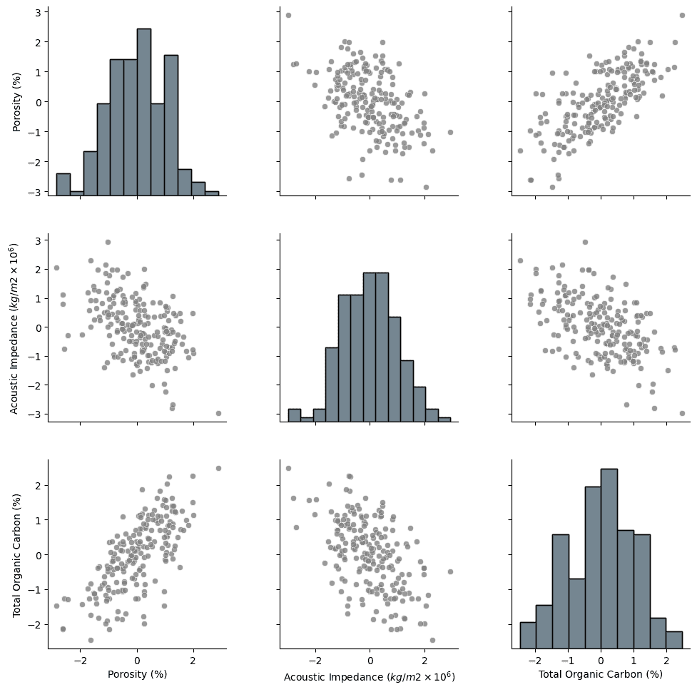
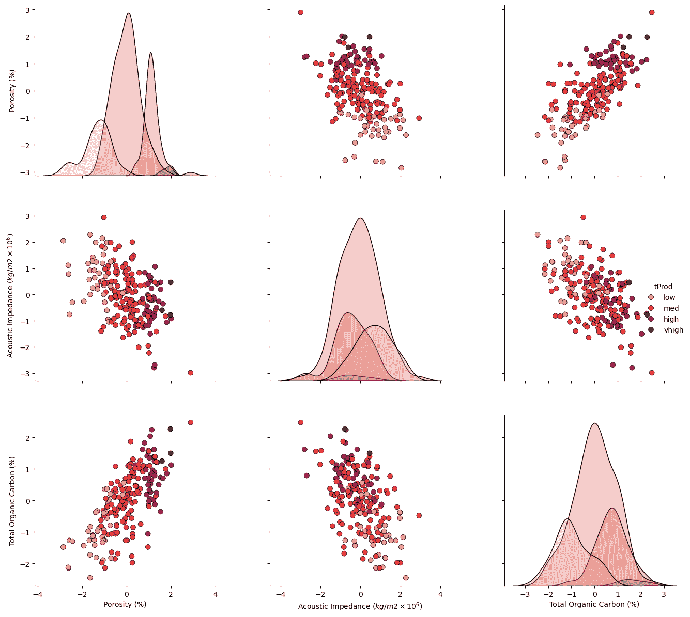
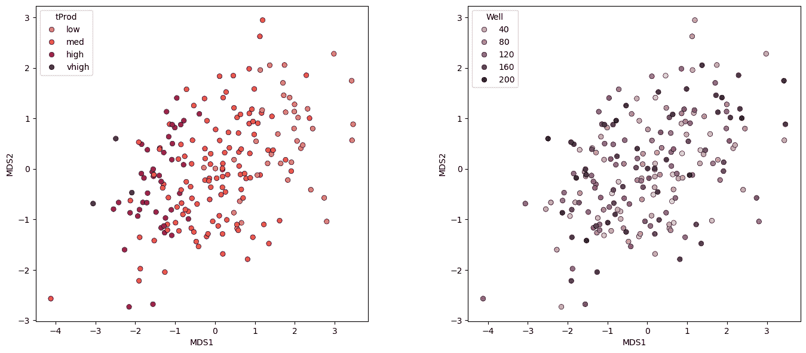
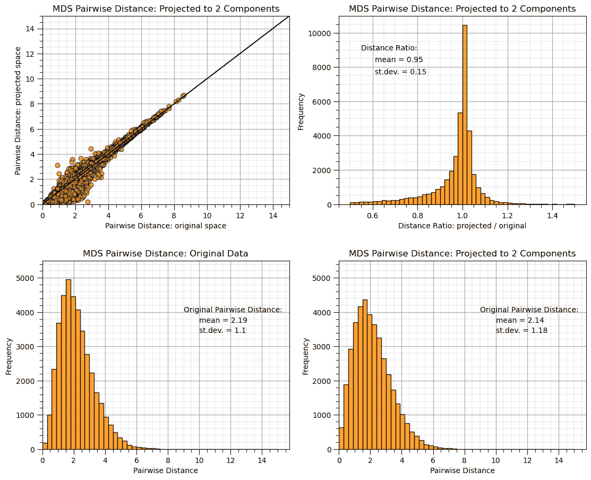
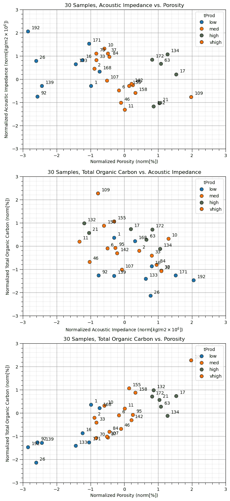

# 多维尺度

> 原文：[`geostatsguy.github.io/MachineLearningDemos_Book/MachineLearning_multidimensional_scaling.html`](https://geostatsguy.github.io/MachineLearningDemos_Book/MachineLearning_multidimensional_scaling.html)

迈克尔·J·皮尔奇，教授，德克萨斯大学奥斯汀分校

[Twitter](https://twitter.com/geostatsguy) | [GitHub](https://github.com/GeostatsGuy) | [网站](http://michaelpyrcz.com) | [Google Scholar](https://scholar.google.com/citations?user=QVZ20eQAAAAJ&hl=en&oi=ao) | [地统计学书籍](https://www.amazon.com/Geostatistical-Reservoir-Modeling-Michael-Pyrcz/dp/0199731446) | [YouTube](https://www.youtube.com/channel/UCLqEr-xV-ceHdXXXrTId5ig) | [Python 中应用地统计学电子书](https://geostatsguy.github.io/GeostatsPyDemos_Book/intro.html) | [Python 中应用机器学习电子书](https://geostatsguy.github.io/MachineLearningDemos_Book/) | [LinkedIn](https://www.linkedin.com/in/michael-pyrcz-61a648a1)

电子书“Python 应用机器学习：动手实践指南”的章节。

请引用此电子书如下：

皮尔奇，M.J.，2024，*Python 应用机器学习：动手实践指南* [电子书]. Zenodo. doi:10.5281/zenodo.15169138 

本书及更多工作流程在此处可用：

请引用 MachineLearningDemos GitHub 仓库如下：

皮尔奇，M.J.，2024，*MachineLearningDemos: Python 机器学习演示工作流程仓库*（0.0.3）[软件]. Zenodo. DOI: 10.5281/zenodo.13835312\. GitHub 仓库：[GeostatsGuy/MachineLearningDemos](https://github.com/GeostatsGuy/MachineLearningDemos) 

作者：迈克尔·J·皮尔奇

© 版权所有 2024。

本章是关于**多维尺度**的教程/演示。

**YouTube 讲座**：查看我在以下方面的讲座：

+   [机器学习简介](https://youtu.be/zOUM_AnI1DQ?si=wzWdJ35qJ9n8O6Bl)

+   [维度诅咒、降维、主成分分析](https://youtu.be/-to3JXiae9Y?si=W1j2CwR9t0t8hxIB)

+   [多维尺度与随机投影](https://youtu.be/Yt0o8ukIOKU?si=_ri1NPwKVdhYzgO3)

这些讲座都是我 YouTube 上的[机器学习课程](https://youtube.com/playlist?list=PLG19vXLQHvSC2ZKFIkgVpI9fCjkN38kwf&si=XonjO2wHdXffMpeI)的一部分，其中包含有良好文档记录的 Python 工作流程和交互式仪表板。我的目标是分享易于获取、可操作和可重复的教育内容。如果您想了解我的动机，请查看[迈克尔的故事](https://michaelpyrcz.com/my-story)。

## 多维尺度动机

与更多特征/变量一起工作更困难！

1.  更难于可视化和模型化数据

1.  需要更多数据来推断联合概率

1.  特征空间的数据覆盖范围更少

1.  更难于质询/检查模型

1.  更可能存在冗余特征，例如多重共线性，导致模型不稳定。

1.  更多的计算工作量，更多的计算资源，以及更长的运行时间

1.  更复杂的模型更有可能过拟合

1.  模型构建需要更多专业时间

我们通过将更少、更有信息性的特征投入模型，而不是将所有特征都投入模型，可以得到更好的模型！

## 推断性机器学习

没有响应特征，$y$，只有预测特征，

$$ 𝑋_1,\ldots,𝑋_𝑚 $$

+   机器学习通过模仿数据的紧凑表示。

+   通过特征投影、分组分配、神经网络潜在特征等方式捕捉模式。

+   我们专注于对总体、自然系统的推断，而不是对响应特征的预测。

## 多维尺度化

在推断统计学/信息可视化中，这是一种强大的排序方法，用于探索/可视化来自高维数据集的个体样本之间的相似性（反之亦然）。

+   超过 2 或 3 个特征，就难以可视化数据集中的关系

+   对于 2 个特征，我们可以通过常规散点图轻松可视化数据样本之间的关系

+   对于 3 个特征，我们可以在 3D 中可视化我们的散点图（例如，带有交互式旋转）或通过包括颜色或通过矩阵散点图进行边缘化。

多维尺度化将$m$维数据投影到$p$维，使得$p << m$。

+   理想情况下，我们能够将数据投影到$p=2$，以便轻松探索样本之间的关系

当主成分分析（PCA）使用协方差矩阵操作时，多维尺度化使用距离/不相似性矩阵操作。对于多维尺度化：

+   您不需要知道实际的特征值，只需知道样本之间的距离或不相似性即可。

+   就像特征空间中的任何距离一样，我们考虑特征标准化以确保具有更大方差的特征不会主导计算。

+   我们可以使用各种不相似性度量

## 多维尺度化的简单演示

假设我们有，

+   一系列城市，例如波士顿、芝加哥、华盛顿特区、丹佛等。

+   以及它们的 X 和 Y 位置（忽略测地线考虑）

我们有位置信息，并计算每个城市之间的距离，这是成对样本不相似性的欧几里得距离度量，距离矩阵，


城市间距离矩阵，类似于样本不相似性，来自 http://personality-project.org/r/mds.html。

从这些城市之间的成对距离来看，将城市投影到 2D 空间中，以保持城市之间的距离是有逻辑的。

+   这是我们这样做的结果。


通过距离矩阵投影到 2D 空间中的点，以保持城市间的距离，来自 http://personality-project.org/r/mds.html。

由于原始数据是在 2D 中，$X$ 和 $Y$ 坐标，忽略了地理背景，因此城市之间的距离矩阵被完美地复制。

+   距离矩阵没有包含任何关于方向或原点信息。

这种方法是不变的，对以下因素不敏感，

1.  **平移** - 结果通常以 0, 0 为中心。

1.  **旋转** - 方向是任意的。

1.  **反射** - 正如我们在上面的例子中看到的，$Y$ 坐标被翻转了，但成对距离是正确的。

当然，我们可以纠正结果投影。


，MDS 解决方案翻转以纠正 $Y$ 坐标，即西雅图在洛杉矶之上，来自 http://personality-project.org/r/mds.html。

当然，这个例子很 trivial。让我们通过一个由 [Alan Scherman](https://www.linkedin.com/in/alan-scherman/) 开发的 [MDS 工作流程](https://github.com/GeostatsGuy/PythonNumericalDemos/blob/master/MachineLearning_multidimensional_scaling_cities.ipynb)，在 Rice 大学本科工程 [B.Sc](http://B.Sc) 项目期间与我一起进行暑期本科生研究项目时展示降维。

Alan 选了 20 个城市，10 个来自德克萨斯州，10 个来自加利福尼亚州，并计算了从州中心、人口、中位数收入和平均通勤时间的距离，并将相似度计算为欧几里得范数。

$$ d_{i,j} = \sqrt{\left(d^{\Delta}_i - d^{\Delta}_j \right)² + \left(N_i - N_j \right)² + \left(I^{P50}_i - I^{P50}_j \right)² + \left(\overline{t}_i - \overline{t}_j \right)²} $$

其中 $d^{\Delta}$ 是从州中心到距离，$N$ 是人口，$I^{P50}$ 是中位数收入，$\overline{t}$ 是平均通勤时间。这种欧几里得城市相似度应用于计算这个相似度矩阵。


基于州中心、人口、中位数收入和平均通勤时间的欧几里得城市相似度矩阵。

然后通过多维尺度，城市被投影到 2D 空间。


德克萨斯州和加利福尼亚城市从基于州中心、人口、中位数收入和平均通勤时间的 4D 空间投影到低维 2D 空间。

分组和间距是有信息的。

+   圣何塞、旧金山和奥克兰组成一个群体，而弗雷斯诺、巴克斯菲尔德和米德兰组成另一个群体。

+   科珀斯克里斯蒂和阿马里洛与德克萨斯州和所有加利福尼亚城市不同。

在这些简单的演示之后，我们现在来探讨从距离矩阵投影到 2D 的多维尺度方法。

## 经典的多维尺度

基于样本之间的欧几里得距离。

**步骤**：

1.  计算平方、对称的距离矩阵：

$$\begin{split} D^{(2)} = \begin{bmatrix} \delta_{1,1}² & \delta_{1,2}² & \dots & \delta_{1,n}² \\ \delta_{2,1}² & \delta_{2,2}² & \dots & \delta_{2,n}² \\ \vdots & \vdots & \ddots & \vdots \\ \delta_{n,1}² & \delta_{n,2}² & \dots & \delta_{n,n}² \\ \end{bmatrix} \end{split}$$

其中 $\delta_{i,j}²$ 是数据样本在数据索引 $i$ 和 $j$ 之间的欧几里得距离。

1.  应用双重中心化 $B = - \frac{1}{2} J D^{(2)} J$

1.  求解特征值，$\lambda_1,\ldots,\lambda_p$

1.  求解投影坐标，$x^{'}_1, \dots ,x^{'}_p$

$$ X^{'} = E_m \land^{\frac{1}{2}}_m $$

其中 $E_m$ 是特征向量矩阵，$\land_m$ 是特征值对角矩阵。

关于经典多维尺度的一般评论：

+   非线性降维

+   没有分布假设

+   变换可能不是唯一的，并且可以是任意平移、旋转和变换（注意，这些不会改变成对距离 $\delta_{i,j}²$）。

## 度量多维尺度

经典多维尺度的一种推广，具有各种度量标准和损失函数优化。

+   将其表述为优化问题，以最小化原始和投影成对距离之间的平方差

$$ min_{x_1,\ldots,x_m} \sum_{i<j} \left( ||x_i - x_j|| - \delta_{i,j} \right)² $$

其中 $||x_i - x_j||$ 是投影空间（$p$ 维）中的成对距离，$\delta_{i,j}$ 是原始特征空间中的成对距离。

关于度量多维尺度的一般评论：

+   相似度度量必须是有意义的

+   执行降维，以最小化样本成对距离的误差

+   对于有序特征（有序的类别）存在一个称为非度量多维尺度的变体。

## 检查多维尺度结果

多维尺度方法最小化所有数据样本在投影的、低维的以及原始特征空间中相互之间的成对距离的平方差。

+   **应力**定义为：

$$ Stress_P(x_1,\ldots,x_n) = \left( \sum_{i \ne j = 1,\ldots,n} \left( ||x_i - x_j|| - \delta_{i,j} \right)² \right)^{\frac{1}{2}} $$

+   观察投影成对距离与原始成对距离的散点图也是有用的

## 与主成分分析的比较

多维尺度（MDS）和主成分分析（PCA）相当不同，以下是对每个的简要总结，以帮助阐明差异：

主成分分析（PCA）考虑所有特征之间的协方差矩阵（$m \times m$），并找到正交旋转，使得在有序的主成分上**方差最大化**。

多维尺度将特征空间中所有样本之间的成对距离矩阵（$n \times n$）进行非线性投影，使得**成对距离误差最小化**。

## 加载所需的库

以下代码加载所需的库。这些库应该已经与 Anaconda 3 一起安装。

```py
ignore_warnings = True                                        # ignore warnings?
import numpy as np                                            # ndarrays for gridded data
import pandas as pd                                           # DataFrames for tabular data
import copy                                                   # for deep copies
import os                                                     # set working directory, run executables
import matplotlib.pyplot as plt                               # for plotting
from matplotlib.colors import ListedColormap                  # custom color maps
from matplotlib.ticker import (MultipleLocator,AutoMinorLocator,NullLocator,FuncFormatter) # control of axes ticks
from scipy import stats                                       # summary statistics
import math                                                   # trigonometry etc.
import scipy.signal as signal                                 # kernel for moving window calculation
import random                                                 # for random numbers
import seaborn as sns                                         # for matrix scatter plots
from scipy import linalg                                      # for linear regression
from sklearn.preprocessing import StandardScaler # feature standardization
from sklearn.manifold import MDS                              # multidimensional scaling
from sklearn.metrics.pairwise import euclidean_distances
plt.rc('axes', axisbelow=True)                                # plot all grids below the plot elements
if ignore_warnings == True:                                   
    import warnings
    warnings.filterwarnings('ignore')
cmap = plt.cm.inferno                                         # color map
seed = 42                                                     # random number seed 
```

如果您遇到包导入错误，您可能需要首先安装这些包中的某些包。这通常可以通过在 Windows 上打开命令窗口并输入‘python -m pip install [package-name]’来完成。有关相应包的文档，可以获得更多帮助。

## 声明函数

方便的函数，用于向数字添加逗号，并在图表中添加主副网格线。

```py
def comma_format(x, pos):
    return f'{int(x):,}'

def add_grid():                                            
    plt.gca().grid(True, which='major',linewidth = 1.0); plt.gca().grid(True, which='minor',linewidth = 0.2) # add y grids
    plt.gca().tick_params(which='major',length=7); plt.gca().tick_params(which='minor', length=4)
    plt.gca().xaxis.set_minor_locator(AutoMinorLocator()); plt.gca().yaxis.set_minor_locator(AutoMinorLocator()) # turn on minor ticks 
```

## 设置工作目录

我总是喜欢这样做，这样我就不会丢失文件，并且可以简化后续的读取和写入（避免每次都包含完整地址）。

```py
#os.chdir("c:/PGE383")                     # set the working directory 
```

您必须更新引号内的部分以包含您自己的工作目录，并且在 Mac 上格式不同（例如，“~/PGE”）。

## 加载数据

让我们加载提供的多元，空间数据集[unconv_MV.csv](https://raw.githubusercontent.com/GeostatsGuy/GeoDataSets/master/unconv_MV.csv)，它在我的 GeoDataSet 仓库中可用。它是一个逗号分隔的文件，包含：

+   井索引（整数）

+   孔隙率（%）

+   渗透率 ($mD$)

+   声波阻抗 ($\frac{kg}{m³} \cdot \frac{m}{s} \cdot 10⁶$)。

+   脆性（%）

+   总有机碳（%）

+   玻璃光泽率（%）

+   初始气体产量（90 天平均）（MCFPD）

我们使用 pandas 的‘read_csv’函数将其加载到我们称为‘df’的数据框中，然后预览它以确保正确加载。

**Python 技巧：使用包中的函数**只需输入我们在开头声明的包的标签：

```py
import pandas as pd 
```

因此，我们可以使用命令访问 pandas 函数‘read_csv’：

```py
pd.read_csv() 
```

但是，读取 csv 需要输入参数。最重要的一个是文件名。对于我们的情况，所有其他默认参数都很好。如果您想查看此函数的所有可能参数，请访问[此处](https://pandas.pydata.org/pandas-docs/stable/reference/api/pandas.read_csv.html)的文档。

+   文档总是很有帮助

+   Python 函数通常有很多灵活性，这可以通过使用各种输入参数来实现

此外，程序还有一个输出，一个从数据加载的 pandas DataFrame。因此，我们必须指定代表该新对象的名称/变量。

```py
df = pd.read_csv("unconv_MV.csv") 
```

让我们运行此命令来加载数据，然后运行此命令来提取数据的一个随机子集。

```py
df = df.sample(frac=.30, random_state = 73073); 
df = df.reset_index() 
```

```py
df = pd.read_csv(r'https://raw.githubusercontent.com/GeostatsGuy/GeoDataSets/master/unconv_MV_v4.csv')

index = ['Well']
Xname = ['Por','AI','TOC']                                    # specify features of interest

yname = ['Prod']
df =  df[index + Xname + yname]

Xunit = ['%',r'$kg/m2 \times 10⁶$','%']; Xlabel = ['Porosity','Acoustic Impedance','Total Organic Carbon'] # specify features' metadata
Xlabelunit = [f"{s1} ({s2})" for s1, s2 in zip(Xlabel, Xunit)]
Xmin = [0.0,0.0,0.0]; Xmax = [30.0,5.0,100.0]                 # set minimums and maximums for visualization 
nXname = ['n' + feature for feature in Xname]                 # labels, units and ranges for normalized features

normalized = StandardScaler().fit_transform(df[Xname])        # standardize the features

for col_name, new_col in zip(nXname, normalized.T):           # add standardized features to the DataFrame
    df[col_name] = new_col

nXunit = ['norm[' + unit + ']' for unit in Xunit]             # specify the standardized features' metadata
nXlabel = ['Normalized ' + feature for feature in Xlabel]
nXlabelunit = [f"{s1} ({s2})" for s1, s2 in zip(nXlabel, nXunit)]
nXmin = [-3.0,-3.0,-3.0]; nXmax = [3.0,3.0,3.0] 
```

## 可视化加载的 DataFrame

```py
df.head(n=4)                                                  # we could also use this command for a table preview 
```

|  | 井 | 孔 | AI | TOC | 产量 | nPor | nAI | nTOC |
| --- | --- | --- | --- | --- | --- | --- | --- | --- |
| 0 | 1 | 12.08 | 2.80 | 1.16 | 1695.360819 | -0.982256 | -0.298603 | 0.352948 |
| 1 | 2 | 12.38 | 3.22 | 0.89 | 3007.096063 | -0.881032 | 0.444147 | -0.209104 |
| 2 | 3 | 14.02 | 4.01 | 0.89 | 2531.938259 | -0.327677 | 1.841224 | -0.209104 |
| 3 | 4 | 17.67 | 2.63 | 1.08 | 5288.514854 | 0.903875 | -0.599240 | 0.186414 |

## 概率统计

让我们检查我们数据的概率统计。

```py
df.describe() 
```

|  | 井 | 孔 | AI | TOC | 产量 | nPor | nAI | nTOC |
| --- | --- | --- | --- | --- | --- | --- | --- | --- |
| count | 200.000000 | 200.000000 | 200.000000 | 200.000000 | 200.000000 | 2.000000e+02 | 2.000000e+02 | 2.000000e+02 |
| mean | 100.500000 | 14.991150 | 2.968850 | 0.990450 | 3864.407081 | 2.486900e-16 | 4.130030e-16 | 3.375078e-16 |
| std | 57.879185 | 2.971176 | 0.566885 | 0.481588 | 1553.277558 | 1.002509e+00 | 1.002509e+00 | 1.002509e+00 |
| min | 1.000000 | 6.550000 | 1.280000 | -0.190000 | 839.822063 | -2.848142e+00 | -2.986650e+00 | -2.457313e+00 |
| 25% | 50.750000 | 12.912500 | 2.547500 | 0.617500 | 2686.227611 | -7.013606e-01 | -7.451372e-01 | -7.763606e-01 |
| 50% | 100.500000 | 15.070000 | 2.955000 | 1.030000 | 3604.303506 | 2.660490e-02 | -2.449306e-02 | 8.233024e-02 |
| 75% | 150.250000 | 17.402500 | 3.345000 | 1.350000 | 4752.637555 | 8.136175e-01 | 6.652032e-01 | 7.484661e-01 |
| max | 200.000000 | 23.550000 | 4.630000 | 2.180000 | 8590.384044 | 2.887855e+00 | 2.937664e+00 | 2.476256e+00 |

数据看起来相当良好，为了简洁起见，我们跳过了异常值检测。让我们使用 Seaborn 包的矩阵散点图来查看分布。

```py
pairplot = sns.pairplot(df,vars=nXname,markers='o',plot_kws={'color':'grey','alpha': 0.8},)
pairplot.map_diag(sns.histplot, color='grey', kde=False)
pairplot.x_vars = Xlabelunit; pairplot.y_vars = Xlabelunit; pairplot._add_axis_labels()
plt.subplots_adjust(left=0.0, bottom=0.0, right=1.2, top=1.2, wspace=0.3, hspace=0.2); plt.show() 
```



## 数据准备

让我们从连续生产中创建一个有序特征：

1.  低

1.  中等

1.  高

1.  非常高

产量率。这将帮助我们可视化结果，我们可以查看不同产量水平的井被投影到各种低维空间中，以便进行多维尺度分析。

```py
bins = [0,2500,5000,7500,10000]                               # assign the production bins (these are the fence posts)

labels = ['low', 'med', 'high', 'vhigh']                      # assign the labels
category = pd.cut(df[yname].values.reshape(-1),bins,labels=labels) # make the 1D array with the labels for our data
df['tProd'] = category                                        # add the new ordinal production feature to our DataFrames 
df.head()
dpalette = sns.color_palette("rocket_r",n_colors = 4)
palette = sns.color_palette("rocket") 
```

让我们看看我们三个特征和产量水平的矩阵散点图。

```py
pairplot2 = sns.pairplot(df[nXname + ['tProd']],markers='o',hue = 'tProd', palette = dpalette,diag_kws={'edgecolor':'black'},
                    plot_kws=dict(s=50, edgecolor="black", linewidth=0.5))
pairplot2.x_vars = Xlabelunit; pairplot2.y_vars = Xlabelunit; pairplot2._add_axis_labels()
plt.subplots_adjust(left=0.0, bottom=0.0, right=1.5, top=1.5, wspace=0.3, hspace=0.2); plt.show() 
```



## 多维尺度

多维尺度方法遵循与 scikit-learn 其他方法相同的样本模式，我们：

1.  实例化

1.  fit

1.  应用、转换或预测

让我们在特征子集（$m = 3$）上运行多维尺度，并仅投影到 2 个特征（$p = 2$）。

+   我们设置 random_state 以实现可重复性，每个人从迭代解中都能得到相同的结果。

+   我们使用 20 次随机初始化，选择最佳解以提高选择全局最优解（或搜索结果）的可能性，而不是局部最优解。

+   我们增加 max_iter 的数量以提高收敛性。

```py
np.random.seed(seed)                                          # set the random number seed, so we all get the same answer
n_components = 2                                              # p, reduced dimensionality space
embedding = MDS(n_components=2,n_init = 20,max_iter = 1000,random_state = 73073) # instantiate and set the hyperparameter
MDS_transformed = embedding.fit_transform(df[nXname])
MDS_transformed.shape 
```

```py
(200, 2) 
```

输出是 2 个多维尺度成分。我们将 3 个特征投影到 2 个特征上，以最小化样本之间的成对距离误差。让我们将这两个成分添加到我们的 DataFrame 中。

```py
df['MDS1'] = MDS_transformed[:,0]                             # add MDS projections to DataFrame
df['MDS2'] = MDS_transformed[:,1]
df.head() 
```

|  | Well | Por | AI | TOC | Prod | nPor | nAI | nTOC | tProd | MDS1 | MDS2 |
| --- | --- | --- | --- | --- | --- | --- | --- | --- | --- | --- | --- |
| 0 | 1 | 12.08 | 2.80 | 1.16 | 1695.360819 | -0.982256 | -0.298603 | 0.352948 | 低 | 0.619075 | -0.641325 |
| 1 | 2 | 12.38 | 3.22 | 0.89 | 3007.096063 | -0.881032 | 0.444147 | -0.209104 | med | 0.872691 | 0.306021 |
| 2 | 3 | 14.02 | 4.01 | 0.89 | 2531.938259 | -0.327677 | 1.841224 | -0.209104 | 中等 | 0.458548 | 1.846056 |
| 3 | 4 | 17.67 | 2.63 | 1.08 | 5288.514854 | 0.903875 | -0.599240 | 0.186414 | 高 | -0.885125 | -0.484969 |
| 4 | 5 | 17.52 | 3.18 | 1.51 | 2859.469624 | 0.853263 | 0.373409 | 1.081534 | 中等 | -1.382408 | 0.413270 |

让我们看看投影到新二维特征空间中的样本。

+   注意在这个空间中旋转和平移是任意的，只有样本成对距离是相关的。

```py
plt.subplot(121)                                              # plot labeled MDS projection
pairplot = sns.scatterplot(x = df['MDS1'],y = df['MDS2'],hue = df['tProd'],markers='o',palette = dpalette,edgecolor="black")

plt.subplot(122)
pairplot = sns.scatterplot(x = df['MDS1'],y = df['MDS2'],hue = df['Well'],markers='o',edgecolor="black")

plt.subplots_adjust(left=0.0, bottom=0.0, right=2., top=1.1, wspace=0.3, hspace=0.2,); plt.show() 
```



一些评论：

+   这些是这个空间中的实际样本，我们知道这些值，包括样本编号以帮助解释

+   样本之间的总体关系得到了保留。

+   从低产量到极高产量的总体产量转变得到了保留。

让我们检查我们的模型：

+   我们将计算所有样本之间的原始和投影成对距离

+   我们将交叉绘制原始与投影成对距离。

+   我们将绘制项目/原始成对距离比率的分布

```py
dists = euclidean_distances(df[nXname], squared=False).ravel() # calculate pairwise distance
nonzero = dists != 0                                          # select only non-identical samples pairs
dists = dists[nonzero]
projected_dists = euclidean_distances(MDS_transformed, squared=False).ravel()[nonzero] # calculate projected pairwise distance

plt.subplot(221)                                              # scatter plot original and projected pairwise distance
plt.scatter(dists,projected_dists,c='darkorange',alpha=0.4,edgecolor = 'black')
plt.arrow(0,0,200,200,width=0.02,color='black',head_length=0.0,head_width=0.0)
plt.xlim(0,15); plt.ylim(0,15); add_grid()
plt.xlabel("Pairwise Distance: original space"); plt.ylabel("Pairwise Distance: projected space")
plt.title("MDS Pairwise Distance: Projected to %d Components" % n_components)

ratio = projected_dists / dists                               # calculate projected distance/original distance ratio

plt.subplot(222)                                              # histogram of distance ratio
plt.hist(ratio, bins=50, range=(0.5, 1.5),color = 'darkorange',alpha = 0.8,edgecolor='k')
plt.xlabel("Distance Ratio: projected / original"); plt.ylabel("Frequency"); add_grid()
plt.title("MDS Pairwise Distance: Projected to %d Components" % n_components)
plt.annotate('Distance Ratio:',[0.55,9000])
plt.annotate('mean = ' + str(round(np.mean(ratio),2)),[0.61,8300])
plt.annotate('st.dev. = ' + str(round(np.std(ratio),2)),[0.61,7600])

plt.subplot(223)                                               # histogram of original pairwise distance
plt.hist(dists, bins=50, range=(0., 15.),color = 'darkorange',alpha = 0.8,edgecolor='k'); add_grid()
plt.xlabel("Pairwise Distance"); plt.ylabel("Frequency"); plt.title("MDS Pairwise Distance: Original Data"); plt.xlim(xmin=0)
plt.annotate('Original Pairwise Distance:',[9,4000]); plt.ylim([0,5500])
plt.annotate('mean = ' + str(round(np.mean(dists),2)),[10,3700])
plt.annotate('st.dev. = ' + str(round(np.std(dists),2)),[10,3400])

plt.subplot(224)                                               # histogram of projected pairwise distance
plt.hist(projected_dists, bins=50, range=(0., 15.),color = 'darkorange',alpha = 0.8, edgecolor='k')
plt.xlabel("Pairwise Distance"); plt.ylabel("Frequency"); add_grid(); plt.xlim(xmin=0); plt.ylim([0,5500])
plt.title("MDS Pairwise Distance: Projected to %d Components" % n_components)
plt.annotate('Original Pairwise Distance:',[9,4000])
plt.annotate('mean = ' + str(round(np.mean(projected_dists),2)),[10,3700])
plt.annotate('st.dev. = ' + str(round(np.std(projected_dists),2)),[10,3400])

plt.subplots_adjust(left=0.0, bottom=0.0, right=1.6, top=1.7, wspace=0.2, hspace=0.3); plt.show() 
```



我们将投影到二维特征空间，并很好地保留了样本之间的成对距离。

## 观察特定样本

让我们减少井的数量并发布井号，以观察原始和投影特征空间中的井间距。

```py
df_subset = df.sample(n = 30,random_state = seed+5).copy(deep = True)           # randomly sample 30 data without replacement
df_subset = df_subset.reset_index() 
```

让我们看看我们的数据集，我们将可视化三个特征之间的 3 个可能的散点图，样本点通过井号（1 至 30）标记。

```py
plt.subplot(311)
pairplot = sns.scatterplot(x = df_subset[nXname[0]],y = df_subset[nXname[1]],s=60,
        hue = df_subset['tProd'],edgecolor="black",markers='o')
plt.xlabel(nXlabelunit[0]); plt.ylabel(nXlabelunit[1]); add_grid();
plt.xlim([nXmin[0],nXmax[0]]); plt.ylim([nXmin[1],nXmax[1]]); plt.title('30 Samples, ' + str(Xlabel[1]) + ' vs. ' + str(Xlabel[0]))
for i, txt in enumerate(df_subset['Well']):
    pairplot.annotate(txt, (df_subset[nXname[0]][i]+0.1, df_subset[nXname[1]][i]+0.1))

plt.subplot(312)
pairplot = sns.scatterplot(x = df_subset[nXname[1]],y = df_subset[nXname[2]],s=60,
        hue = df_subset['tProd'],edgecolor="black",markers='o')
plt.xlabel(nXlabelunit[1]); plt.ylabel(nXlabelunit[2]); add_grid();
plt.xlim([nXmin[1],nXmax[1]]); plt.ylim([nXmin[2],nXmax[2]]); plt.title('30 Samples, ' + str(Xlabel[2]) + ' vs. ' + str(Xlabel[1]))
for i, txt in enumerate(df_subset['Well']):
    pairplot.annotate(txt, (df_subset[nXname[1]][i]+0.1, df_subset[nXname[2]][i]+0.1))

plt.subplot(313)
pairplot = sns.scatterplot(x = df_subset[nXname[0]],y = df_subset[nXname[2]],s=60,
        hue = df_subset['tProd'],edgecolor="black",markers='o')
plt.xlabel(nXlabelunit[0]); plt.ylabel(nXlabelunit[2]); add_grid();
plt.xlim([nXmin[0],nXmax[0]]); plt.ylim([nXmin[2],nXmax[2]]); plt.title('30 Samples, ' + str(Xlabel[2]) + ' vs. ' + str(Xlabel[0]))
for i, txt in enumerate(df_subset['Well']):
    pairplot.annotate(txt, (df_subset[nXname[0]][i]+0.1, df_subset[nXname[2]][i]+0.1))

plt.subplots_adjust(left=0.0, bottom=0.0, right=1.0, top=3.1, wspace=0.3, hspace=0.2); plt.show() 
```



现在，我们可以看到我们的 30 口井及其样本编号在 3 个可能的二元图上的分布。让我们进行多维尺度分析以投影 2 个成分。

```py
embedding_subset = MDS(n_components=2)                        # MDS projection
MDS_transformed_subset = embedding_subset.fit_transform(df_subset[nXname]) 
```

现在，让我们可视化投影特征空间中的井。

```py
plt.subplot(121)                                              # plot data samples in MDS space
pairplot = sns.scatterplot(x = MDS_transformed_subset[:,0],y = MDS_transformed_subset[:,1],s=60,
        hue = df_subset['tProd'],edgecolor="black",markers='o')
for i, txt in enumerate(df_subset['Well'].values):
    plt.annotate(txt, [MDS_transformed_subset[:,0][i]+0.1,MDS_transformed_subset[:,1][i]+0.1])
plt.xlim([-3.5,3.5]); plt.ylim([-3.5,3.5]); plt.title('30 Samples, MDS#2 vs. MDS#1')
pairplot.set_xlabel('MDS1'); pairplot.set_ylabel('MDS2')  
pairplot.legend(loc='lower right'); add_grid(); plt.legend(loc = 'upper right')

dists = euclidean_distances(df_subset[nXname], squared=False).ravel() # calculate all pairwise distances
nonzero = dists != 0                                          # select only non-identical samples pairs
dists = dists[nonzero]
projected_dists = euclidean_distances(MDS_transformed_subset, squared=False).ravel()[nonzero] # calculate projected pairwise distance

plt.subplot(122)                                              # scatter plot original and projected pairwise distance
plt.scatter(dists,projected_dists,c='darkorange',alpha=0.4,edgecolor = 'black')
plt.arrow(0,0,200,200,width=0.02,color='black',head_length=0.0,head_width=0.0)
plt.xlim(0,15); plt.ylim(0,15); add_grid()
plt.xlabel("Pairwise Distance: original space"); plt.ylabel("Pairwise Distance: projected space")
plt.title("MDS Pairwise Distance: Projected to %d Components" % n_components)

plt.subplots_adjust(left=0.0, bottom=0.0, right=2., top=1.1, wspace=0.3, hspace=0.2); plt.show() 
```


一些观察：

+   转换是非线性的，也不是正交的，即，不是旋转（如 PCA）

+   样本间距离大致得到了保留

$$ \delta_{i,j} = \sqrt{\left( (\delta Por_{i,j}^{2}) + (\delta AI_{i,j}^{2}) + (\delta TOC_{i,j}^{2}) \right)} $$

## MDS 的应用

多维尺度分析的主要应用是能够检查样本之间的高维特征空间中的关系。

+   我们可能观察到特定的井聚集在一起

+   我们可能观察到系统性的转变

例如，在上面的图中，我们可以观察到：

1.  井 1 和 168 位于中等产量井的位置，但产量较低。

1.  井 70 靠近许多低产量井，但产量中等。

1.  155 号和 158 号位于高产井附近，但它们是中等产量井。

这项分析可能识别出对这些特定数据样本进行进一步调查的机会。也许存在数据问题或其他需要整合的混杂特征。

回想一下，MDS 是一次性旅行。

+   虽然我们可以将数据投影到 MDS 空间中，但没有反向转换；因此，我们无法在 MDS 空间中任意位置计算原始特征组合。

+   解在平移、旋转和翻转方面是非唯一的。我们的解释基于 MDS 空间中的分离距离和分组。

+   每次我们更改数据并得到新的解决方案时，都会进行计算。

## 评论

这是对多维尺度分析的基本处理。还有更多可以做的和讨论的，我有很多更多的资源。查看我的[共享资源清单](https://michaelpyrcz.com/my-resources)以及本章开头带有资源链接的视频讲座链接。

希望这有所帮助，

*迈克尔*

## 关于作者


迈克尔·皮尔奇兹教授在德克萨斯大学奥斯汀分校 40 英亩校园的办公室。

迈克尔·皮尔奇兹是德克萨斯大学奥斯汀分校[科克雷尔工程学院](https://cockrell.utexas.edu/faculty-directory/alphabetical/p)和[杰克逊地球科学学院](https://www.jsg.utexas.edu/researcher/michael_pyrcz/)的教授，在那里他研究并教授地下、空间数据分析、地质统计学和机器学习。迈克尔还是，

+   能源分析[新生研究计划](https://fri.cns.utexas.edu/energy-analytics)的首席研究员，德克萨斯大学奥斯汀分校自然科学院机器学习实验室的核心教员

+   [计算机与地质学](https://www.sciencedirect.com/journal/computers-and-geosciences/about/editorial-board)的副编辑，以及国际数学地质学协会[数学地质学](https://link.springer.com/journal/11004/editorial-board)的董事会成员。

迈克尔已经撰写了 70 多篇[同行评审出版物](https://scholar.google.com/citations?user=QVZ20eQAAAAJ&hl=en)，一个用于空间数据分析的[Python 包](https://pypi.org/project/geostatspy/)，合著了一本关于空间数据分析的教科书[地质统计学储层建模](https://www.amazon.com/Geostatistical-Reservoir-Modeling-Michael-Pyrcz/dp/0199731446)，并是两本最近发布的电子书的作者，[Python 中的应用地质统计学：GeostatsPy 实践指南](https://geostatsguy.github.io/GeostatsPyDemos_Book/intro.html)和[Python 中的应用机器学习：带代码的实践指南](https://geostatsguy.github.io/MachineLearningDemos_Book/intro.html)。

迈克尔的所有大学讲座都可以在他的[YouTube 频道](https://www.youtube.com/@GeostatsGuyLectures)上找到，附有 100 多个 Python 交互式仪表板和 40 多个 GitHub 仓库中的详细文档工作流程，以支持任何感兴趣的学生和在职专业人士，提供永恒的内容。要了解更多关于迈克尔的工作和共享教育资源，请访问他的网站。

## 想一起工作吗？

我希望这些内容对那些想了解更多关于地下建模、数据分析和机器学习的人有所帮助。学生和在职专业人士都欢迎参加。

+   想邀请我到贵公司进行培训、辅导、项目审查、工作流程设计和/或咨询吗？我很乐意拜访并与您合作！

+   感兴趣于合作、支持我的研究生研究或我的地下数据分析与机器学习联盟（共同负责人是约翰·福斯特教授）吗？我的研究将数据分析、随机建模和机器学习理论与实践相结合，以开发新的方法和工作流程，增加价值。我们正在解决具有挑战性的地下问题！

+   我可以通过 mpyrcz@austin.utexas.edu 联系到我。

我总是很高兴讨论，

*迈克尔*

迈克尔·皮尔奇，博士，P.Eng. 教授，德克萨斯大学奥斯汀分校 Cockrell 工程学院和 Jackson 地球科学学院

更多资源可在以下位置获取：[Twitter](https://twitter.com/geostatsguy) | [GitHub](https://github.com/GeostatsGuy) | [网站](http://michaelpyrcz.com) | [Google Scholar](https://scholar.google.com/citations?user=QVZ20eQAAAAJ&hl=en&oi=ao) | [地统计学书籍](https://www.amazon.com/Geostatistical-Reservoir-Modeling-Michael-Pyrcz/dp/0199731446) | [YouTube](https://www.youtube.com/channel/UCLqEr-xV-ceHdXXXrTId5ig) | [Python 中应用地统计学电子书](https://geostatsguy.github.io/GeostatsPyDemos_Book/intro.html) | [Python 中应用机器学习电子书](https://geostatsguy.github.io/MachineLearningDemos_Book/) | [LinkedIn](https://www.linkedin.com/in/michael-pyrcz-61a648a1)

## 多维尺度化的动机

与更多特征/变量一起工作更困难！

1.  更难可视化数据和模型

1.  需要更多数据来推断联合概率

1.  特征空间的数据覆盖范围更少

1.  更难质询/检查模型

1.  更可能存在冗余特征，例如多重共线性，导致模型不稳定

1.  更多的计算工作量，更多的计算资源，以及更长的运行时间

1.  更复杂的模型更有可能过拟合

1.  模型构建需要更多专业时间

我们通过将更少的、信息丰富的特征投入模型，而不是将所有特征都投入模型，可以得到更好的模型！

## 推断性机器学习

没有响应特征，$y$，只有预测特征，

$$ 𝑋_1,\ldots,𝑋_𝑚 $$

+   机器通过模仿数据的紧凑表示来学习

+   通过特征投影、分组分配、神经网络潜在特征等捕捉模式。

+   我们专注于推断人口、自然系统，而不是响应特征的预测。

## 多维尺度分析

在推断统计学/信息可视化中，这是一种强大的排序方法，用于探索/可视化高维数据集中个体样本之间的相似性（反之，差异）。

+   超过 2 或 3 个特征，就难以可视化数据集内部的关系

+   对于两个特征，我们可以通过常规散点图轻松可视化数据样本之间的关系

+   对于三个特征，我们可以在 3D 中可视化我们的散点图（例如，通过交互式旋转）或通过包括颜色或通过矩阵散点图的外部边际化

多维尺度分析将$m$维数据投影到$p$维，使得$p << m$。

+   理想情况下，我们能够将数据投影到$p=2$，以轻松探索样本之间的关系

当主成分分析（PCA）使用协方差矩阵时，多维尺度分析使用距离/不相似度矩阵。对于多维尺度分析：

+   你不需要知道实际的特性值，只需要知道样本之间的距离或相似度

+   就像特征空间中的任何距离一样，我们考虑特征标准化以确保具有更大方差的特征不会主导计算

+   我们可以使用各种不相似度度量

## 多维尺度分析简单示例

假设我们有，

+   一系列城市，波士顿、芝加哥、华盛顿特区、丹佛等。

+   以及它们的 X 和 Y 位置（忽略测地线考虑）

我们有位置，我们计算每个城市之间的距离，这是通过欧几里得距离测量的成对样本不相似度度量，距离矩阵，


城市之间的距离矩阵，类似于样本不相似度，来自 http://personality-project.org/r/mds.html。

从这些城市之间的成对距离来看，将城市投影到二维空间，以保持城市之间的距离是有逻辑的。

+   如果这样做，这就是结果。


将距离矩阵投影到二维空间，以保持城市之间的距离，来自 http://personality-project.org/r/mds.html。

毫不意外，城市之间的距离矩阵被完美地复制了，因为原始数据是二维的，$X$和$Y$坐标，忽略了测地线背景

+   距离矩阵没有包含任何关于方向或起源的信息

这种方法是不变的且对以下因素不敏感，

1.  **平移** - 结果通常以 0，0 为中心

1.  **旋转** - 方向是任意的

1.  **反射** - 如上例所示，$Y$坐标被翻转，但成对距离是正确的

当然，我们可以纠正得到的投影。


，多维尺度缩放解决方案翻转以纠正 $Y$ 坐标，即西雅图在洛杉矶之上，来自 http://personality-project.org/r/mds.html。

当然，这个例子很简单。让我们通过[多维尺度缩放工作流程](https://github.com/GeostatsGuy/PythonNumericalDemos/blob/master/MachineLearning_multidimensional_scaling_cities.ipynb)，由[艾伦·舍尔曼](https://www.linkedin.com/in/alan-scherman/)开发，在我与他一起在莱斯大学本科工程[B.Sc](http://B.Sc)期间的一个暑期本科生研究项目中展示维度缩减。

阿兰选取了 20 个城市，其中 10 个来自德克萨斯州，10 个来自加利福尼亚州，并记录了从州中心到这些城市的距离、人口、中位数收入和平均通勤时间，并计算了欧几里得范数作为差异度。

$$ d_{i,j} = \sqrt{\left(d^{\Delta}_i - d^{\Delta}_j \right)² + \left(N_i - N_j \right)² + \left(I^{P50}_i - I^{P50}_j \right)² + \left(\overline{t}_i - \overline{t}_j \right)²} $$

其中 $d^{\Delta}$ 是从州中心的距离，$N$ 是人口，$I^{P50}$ 是中位数收入，$\overline{t}$ 是平均通勤时间。这种欧几里得城市差异度被应用于计算这个差异度矩阵。


基于州中心、人口、中位数收入和平均通勤时间的欧几里得城市差异度矩阵。

然后通过多维尺度缩放，城市被投影到二维空间，


德克萨斯州和加利福尼亚州的城市从基于州中心、人口、中位数收入和平均通勤时间的 4D 空间投影到低维的 2D 空间。

分组和间距是有信息的。

+   圣何塞、旧金山和奥克兰为一组，弗雷斯诺、贝克菲尔德和米德兰形成另一组

+   科珀斯克里斯蒂和阿马里洛与德克萨斯州和所有加利福尼亚州的城市不同

在这些简单的演示之后，我们现在来探讨从差异度矩阵投影到 2D 的多维尺度缩放方法，

## 经典的多维尺度缩放

基于样本之间的欧几里得距离。

步骤：

1.  计算平方、对称的距离矩阵：

$$\begin{split} D^{2} = \begin{bmatrix} \delta_{1,1}² & \delta_{1,2}² & \dots & \delta_{1,n}² \\ \delta_{2,1}² & \delta_{2,2}² & \dots & \delta_{2,n}² \\ \vdots & \vdots & \ddots & \vdots \\ \delta_{n,1}² & \delta_{n,2}² & \dots & \delta_{n,n}² \\ \end{bmatrix} \end{split}$$

其中 $\delta_{i,j}²$ 是数据样本在数据索引 $i$ 和 $j$ 之间的欧几里得距离。

1.  应用双重中心化 $B = - \frac{1}{2} J D^{(2)} J$

1.  求解特征值，$\lambda_1,\ldots,\lambda_p$

1.  求解投影坐标，$x^{'}_1, \dots ,x^{'}_p$

$$ X^{'} = E_m \land^{\frac{1}{2}}_m $$

其中 $E_m$ 是特征向量矩阵，$\land_m$ 是特征值对角矩阵。

关于经典多维尺度的一般评论：

+   非线性降维

+   没有分布假设

+   变换可能不是唯一的，并且可以任意平移、旋转和变换（注意，这些不会改变成对距离 $\delta_{i,j}²$）。

## 度量多维尺度

经典多维尺度的一种推广，具有各种度量标准和损失函数优化。

+   将其表述为一个优化问题，以最小化原始和投影成对距离之间的平方差

$$ \min_{x_1,\ldots,x_m} \sum_{i<j} \left( ||x_i - x_j|| - \delta_{i,j} \right)² $$

其中 $||x_i - x_j||$ 是投影空间（$p$ 维）中的成对距离，而 $\delta_{i,j}$ 是原始特征空间中的成对距离。

关于度量多维尺度的一般评论：

+   相似性度量必须是有效的

+   降维是通过最小化样本成对距离误差来实现的

+   对于有序特征（有序的类别），有一个称为非度量多维尺度的变体。

## 检查多维尺度结果

多维尺度方法通过最小化所有数据样本在投影、低维和原始特征空间之间的成对距离的平方差。

+   **应力**定义为：

$$ Stress_P(x_1,\ldots,x_n) = \left( \sum_{i \ne j = 1,\ldots,n} \left( ||x_i - x_j|| - \delta_{i,j} \right)² \right)^{\frac{1}{2}} $$

+   同时，可视化投影与原始成对距离的散点图也是有用的

## 与主成分分析的比较

MDS 和 PCA 相当不同，以下是对每个的简要总结，以帮助阐明差异：

主成分分析通过计算所有特征之间的协方差矩阵（$m \times m$）并找到使得**方差**在有序的主成分上最大化的正交旋转。

多维尺度通过取特征空间中所有样本之间的成对距离矩阵（$n \times n$）并找到非线性投影，使得**成对距离误差**最小化。

## 加载所需的库

以下代码加载所需的库。这些库应该已经与 Anaconda 3 一起安装。

```py
ignore_warnings = True                                        # ignore warnings?
import numpy as np                                            # ndarrays for gridded data
import pandas as pd                                           # DataFrames for tabular data
import copy                                                   # for deep copies
import os                                                     # set working directory, run executables
import matplotlib.pyplot as plt                               # for plotting
from matplotlib.colors import ListedColormap                  # custom color maps
from matplotlib.ticker import (MultipleLocator,AutoMinorLocator,NullLocator,FuncFormatter) # control of axes ticks
from scipy import stats                                       # summary statistics
import math                                                   # trigonometry etc.
import scipy.signal as signal                                 # kernel for moving window calculation
import random                                                 # for random numbers
import seaborn as sns                                         # for matrix scatter plots
from scipy import linalg                                      # for linear regression
from sklearn.preprocessing import StandardScaler # feature standardization
from sklearn.manifold import MDS                              # multidimensional scaling
from sklearn.metrics.pairwise import euclidean_distances
plt.rc('axes', axisbelow=True)                                # plot all grids below the plot elements
if ignore_warnings == True:                                   
    import warnings
    warnings.filterwarnings('ignore')
cmap = plt.cm.inferno                                         # color map
seed = 42                                                     # random number seed 
```

如果遇到包导入错误，你可能需要首先安装这些包中的一些。这通常可以通过在 Windows 上打开命令窗口然后输入‘python -m pip install [package-name]’来完成。更多帮助可以在相应的包文档中找到。

## 声明函数

方便的函数，用于向数字添加逗号以及向图表添加主和副网格线。

```py
def comma_format(x, pos):
    return f'{int(x):,}'

def add_grid():                                            
    plt.gca().grid(True, which='major',linewidth = 1.0); plt.gca().grid(True, which='minor',linewidth = 0.2) # add y grids
    plt.gca().tick_params(which='major',length=7); plt.gca().tick_params(which='minor', length=4)
    plt.gca().xaxis.set_minor_locator(AutoMinorLocator()); plt.gca().yaxis.set_minor_locator(AutoMinorLocator()) # turn on minor ticks 
```

## 设置工作目录

我总是喜欢这样做，这样我就不会丢失文件，并且可以简化后续的读取和写入（避免每次都包含完整地址）。

```py
#os.chdir("c:/PGE383")                     # set the working directory 
```

您将需要更新引号内的部分为您的自己的工作目录，并且格式在 Mac 上不同（例如：“~/PGE”）。

## 加载数据

让我们加载提供的多元、空间数据集[unconv_MV.csv](https://raw.githubusercontent.com/GeostatsGuy/GeoDataSets/master/unconv_MV.csv)，它在我的 GeoDataSet 仓库中可用。它是一个逗号分隔的文件，包含：

+   井索引（整数）

+   孔隙率（%）

+   渗透率（$mD$）

+   声阻抗 ($\frac{kg}{m³} \cdot \frac{m}{s} \cdot 10⁶$).

+   岩脆性（%）

+   总有机碳（%）

+   玻璃质反射率（%）

+   初始气产量（90 天平均）（MCFPD）

我们使用 pandas 的‘read_csv’函数将其加载到我们称为‘df’的数据框中，然后预览以确保正确加载。

**Python 技巧：使用包中的函数**只需输入我们在开头声明的包的标签：

```py
import pandas as pd 
```

因此，我们可以使用命令访问 pandas 函数‘read_csv’：

```py
pd.read_csv() 
```

但是，read csv 需要输入参数。最重要的一个是文件名。在我们的情况下，所有其他默认参数都很好。如果您想查看此函数的所有可能参数，请访问[此处](https://pandas.pydata.org/pandas-docs/stable/reference/api/pandas.read_csv.html)的文档。

+   文档总是很有帮助

+   Python 函数通常有很多灵活性，可以通过使用各种输入参数来实现。

此外，程序还有一个输出，一个从数据加载的 pandas DataFrame。因此，我们必须指定表示新对象的名称/变量。

```py
df = pd.read_csv("unconv_MV.csv") 
```

让我们运行这个命令来加载数据，然后运行这个命令来提取数据的一个随机子集。

```py
df = df.sample(frac=.30, random_state = 73073); 
df = df.reset_index() 
```

```py
df = pd.read_csv(r'https://raw.githubusercontent.com/GeostatsGuy/GeoDataSets/master/unconv_MV_v4.csv')

index = ['Well']
Xname = ['Por','AI','TOC']                                    # specify features of interest

yname = ['Prod']
df =  df[index + Xname + yname]

Xunit = ['%',r'$kg/m2 \times 10⁶$','%']; Xlabel = ['Porosity','Acoustic Impedance','Total Organic Carbon'] # specify features' metadata
Xlabelunit = [f"{s1} ({s2})" for s1, s2 in zip(Xlabel, Xunit)]
Xmin = [0.0,0.0,0.0]; Xmax = [30.0,5.0,100.0]                 # set minimums and maximums for visualization 
nXname = ['n' + feature for feature in Xname]                 # labels, units and ranges for normalized features

normalized = StandardScaler().fit_transform(df[Xname])        # standardize the features

for col_name, new_col in zip(nXname, normalized.T):           # add standardized features to the DataFrame
    df[col_name] = new_col

nXunit = ['norm[' + unit + ']' for unit in Xunit]             # specify the standardized features' metadata
nXlabel = ['Normalized ' + feature for feature in Xlabel]
nXlabelunit = [f"{s1} ({s2})" for s1, s2 in zip(nXlabel, nXunit)]
nXmin = [-3.0,-3.0,-3.0]; nXmax = [3.0,3.0,3.0] 
```

## 可视化加载的 DataFrame

```py
df.head(n=4)                                                  # we could also use this command for a table preview 
```

|  | Well | Por | AI | TOC | Prod | nPor | nAI | nTOC |
| --- | --- | --- | --- | --- | --- | --- | --- | --- |
| 0 | 1 | 12.08 | 2.80 | 1.16 | 1695.360819 | -0.982256 | -0.298603 | 0.352948 |
| 1 | 2 | 12.38 | 3.22 | 0.89 | 3007.096063 | -0.881032 | 0.444147 | -0.209104 |
| 2 | 3 | 14.02 | 4.01 | 0.89 | 2531.938259 | -0.327677 | 1.841224 | -0.209104 |
| 3 | 4 | 17.67 | 2.63 | 1.08 | 5288.514854 | 0.903875 | -0.599240 | 0.186414 |

## 概述统计

让我们检查我们数据的概述统计。

```py
df.describe() 
```

|  | Well | Por | AI | TOC | Prod | nPor | nAI | nTOC |
| --- | --- | --- | --- | --- | --- | --- | --- | --- |
| count | 200.000000 | 200.000000 | 200.000000 | 200.000000 | 200.000000 | 2.000000e+02 | 2.000000e+02 | 2.000000e+02 |
| mean | 100.500000 | 14.991150 | 2.968850 | 0.990450 | 3864.407081 | 2.486900e-16 | 4.130030e-16 | 3.375078e-16 |
| std | 57.879185 | 2.971176 | 0.566885 | 0.481588 | 1553.277558 | 1.002509e+00 | 1.002509e+00 | 1.002509e+00 |
| min | 1.000000 | 6.550000 | 1.280000 | -0.190000 | 839.822063 | -2.848142e+00 | -2.986650e+00 | -2.457313e+00 |
| 25% | 50.750000 | 12.912500 | 2.547500 | 0.617500 | 2686.227611 | -7.013606e-01 | -7.451372e-01 | -7.763606e-01 |
| 50% | 100.500000 | 15.070000 | 2.955000 | 1.030000 | 3604.303506 | 2.660490e-02 | -2.449306e-02 | 8.233024e-02 |
| 75% | 150.250000 | 17.402500 | 3.345000 | 1.350000 | 4752.637555 | 8.136175e-01 | 6.652032e-01 | 7.484661e-01 |
| 最大值 | 200.000000 | 23.550000 | 4.630000 | 2.180000 | 8590.384044 | 2.887855e+00 | 2.937664e+00 | 2.476256e+00 |

数据看起来相当好，为了简洁，我们跳过异常值检测。让我们使用 Seaborn 包的矩阵散点图查看分布。

```py
pairplot = sns.pairplot(df,vars=nXname,markers='o',plot_kws={'color':'grey','alpha': 0.8},)
pairplot.map_diag(sns.histplot, color='grey', kde=False)
pairplot.x_vars = Xlabelunit; pairplot.y_vars = Xlabelunit; pairplot._add_axis_labels()
plt.subplots_adjust(left=0.0, bottom=0.0, right=1.2, top=1.2, wspace=0.3, hspace=0.2); plt.show() 
```


## 数据准备

从连续生产中创建一个序数特征：

1.  低

1.  中等

1.  高

1.  非常高

生产率。这将帮助我们可视化结果，我们可以查看不同生产水平的项目到各种低维空间的多维尺度。

```py
bins = [0,2500,5000,7500,10000]                               # assign the production bins (these are the fence posts)

labels = ['low', 'med', 'high', 'vhigh']                      # assign the labels
category = pd.cut(df[yname].values.reshape(-1),bins,labels=labels) # make the 1D array with the labels for our data
df['tProd'] = category                                        # add the new ordinal production feature to our DataFrames 
df.head()
dpalette = sns.color_palette("rocket_r",n_colors = 4)
palette = sns.color_palette("rocket") 
```

让我们看一下我们的 3 个特征和产量水平的矩阵散点图。

```py
pairplot2 = sns.pairplot(df[nXname + ['tProd']],markers='o',hue = 'tProd', palette = dpalette,diag_kws={'edgecolor':'black'},
                    plot_kws=dict(s=50, edgecolor="black", linewidth=0.5))
pairplot2.x_vars = Xlabelunit; pairplot2.y_vars = Xlabelunit; pairplot2._add_axis_labels()
plt.subplots_adjust(left=0.0, bottom=0.0, right=1.5, top=1.5, wspace=0.3, hspace=0.2); plt.show() 
```


## 多维尺度

多维尺度方法遵循样本模式，就像其他 scikit-learn 方法一样，我们：

1.  实例化

1.  适配

1.  应用、转换或预测

让我们在特征子集（$m = 3$）上运行多维尺度，并仅投影到 2 个特征（$p = 2$）。

+   我们设置 random_state 以实现可重复性，每个人从迭代解中得到相同的结果

+   我们使用 20 次随机初始化，选择最佳解决方案以提高选择（或搜索结果）全局最优解而非局部最优解的可能性

+   我们使用增加的 max_iter 数量来提高收敛性

```py
np.random.seed(seed)                                          # set the random number seed, so we all get the same answer
n_components = 2                                              # p, reduced dimensionality space
embedding = MDS(n_components=2,n_init = 20,max_iter = 1000,random_state = 73073) # instantiate and set the hyperparameter
MDS_transformed = embedding.fit_transform(df[nXname])
MDS_transformed.shape 
```

```py
(200, 2) 
```

输出是 2 个多维尺度成分。我们将 3 个特征投影到 2 个特征上，以最小化样本间距离的错误。让我们将这两个成分添加到我们的 DataFrame 中。

```py
df['MDS1'] = MDS_transformed[:,0]                             # add MDS projections to DataFrame
df['MDS2'] = MDS_transformed[:,1]
df.head() 
```

|  | 好 | Por | AI | TOC | Prod | nPor | nAI | nTOC | tProd | MDS1 | MDS2 |
| --- | --- | --- | --- | --- | --- | --- | --- | --- | --- | --- | --- |
| 0 | 1 | 12.08 | 2.80 | 1.16 | 1695.360819 | -0.982256 | -0.298603 | 0.352948 | 低 | 0.619075 | -0.641325 |
| 1 | 2 | 12.38 | 3.22 | 0.89 | 3007.096063 | -0.881032 | 0.444147 | -0.209104 | 中等 | 0.872691 | 0.306021 |
| 2 | 3 | 14.02 | 4.01 | 0.89 | 2531.938259 | -0.327677 | 1.841224 | -0.209104 | 中等 | 0.458548 | 1.846056 |
| 3 | 4 | 17.67 | 2.63 | 1.08 | 5288.514854 | 0.903875 | -0.599240 | 0.186414 | 高 | -0.885125 | -0.484969 |
| 4 | 5 | 17.52 | 3.18 | 1.51 | 2859.469624 | 0.853263 | 0.373409 | 1.081534 | 中等 | -1.382408 | 0.413270 |

让我们看一下投影到新的二维特征空间中的样本。

+   注意旋转，在这个空间中平移是任意的，只有样本间的距离是相关的。

```py
plt.subplot(121)                                              # plot labeled MDS projection
pairplot = sns.scatterplot(x = df['MDS1'],y = df['MDS2'],hue = df['tProd'],markers='o',palette = dpalette,edgecolor="black")

plt.subplot(122)
pairplot = sns.scatterplot(x = df['MDS1'],y = df['MDS2'],hue = df['Well'],markers='o',edgecolor="black")

plt.subplots_adjust(left=0.0, bottom=0.0, right=2., top=1.1, wspace=0.3, hspace=0.2,); plt.show() 
```


一些注释：

+   这些是这个空间中的实际样本，我们知道它们的值，包括样本编号以帮助解释。

+   样本之间的一般关系得到保留。

+   从低产量到极高产量的总体生产转变得到保留。

让我们检查我们的模型：

+   我们将计算所有样本之间的原始和投影成对距离。

+   我们将交叉绘制原始数据与投影成对距离。

+   我们将绘制投影/原始成对距离比率的分布图。

```py
dists = euclidean_distances(df[nXname], squared=False).ravel() # calculate pairwise distance
nonzero = dists != 0                                          # select only non-identical samples pairs
dists = dists[nonzero]
projected_dists = euclidean_distances(MDS_transformed, squared=False).ravel()[nonzero] # calculate projected pairwise distance

plt.subplot(221)                                              # scatter plot original and projected pairwise distance
plt.scatter(dists,projected_dists,c='darkorange',alpha=0.4,edgecolor = 'black')
plt.arrow(0,0,200,200,width=0.02,color='black',head_length=0.0,head_width=0.0)
plt.xlim(0,15); plt.ylim(0,15); add_grid()
plt.xlabel("Pairwise Distance: original space"); plt.ylabel("Pairwise Distance: projected space")
plt.title("MDS Pairwise Distance: Projected to %d Components" % n_components)

ratio = projected_dists / dists                               # calculate projected distance/original distance ratio

plt.subplot(222)                                              # histogram of distance ratio
plt.hist(ratio, bins=50, range=(0.5, 1.5),color = 'darkorange',alpha = 0.8,edgecolor='k')
plt.xlabel("Distance Ratio: projected / original"); plt.ylabel("Frequency"); add_grid()
plt.title("MDS Pairwise Distance: Projected to %d Components" % n_components)
plt.annotate('Distance Ratio:',[0.55,9000])
plt.annotate('mean = ' + str(round(np.mean(ratio),2)),[0.61,8300])
plt.annotate('st.dev. = ' + str(round(np.std(ratio),2)),[0.61,7600])

plt.subplot(223)                                               # histogram of original pairwise distance
plt.hist(dists, bins=50, range=(0., 15.),color = 'darkorange',alpha = 0.8,edgecolor='k'); add_grid()
plt.xlabel("Pairwise Distance"); plt.ylabel("Frequency"); plt.title("MDS Pairwise Distance: Original Data"); plt.xlim(xmin=0)
plt.annotate('Original Pairwise Distance:',[9,4000]); plt.ylim([0,5500])
plt.annotate('mean = ' + str(round(np.mean(dists),2)),[10,3700])
plt.annotate('st.dev. = ' + str(round(np.std(dists),2)),[10,3400])

plt.subplot(224)                                               # histogram of projected pairwise distance
plt.hist(projected_dists, bins=50, range=(0., 15.),color = 'darkorange',alpha = 0.8, edgecolor='k')
plt.xlabel("Pairwise Distance"); plt.ylabel("Frequency"); add_grid(); plt.xlim(xmin=0); plt.ylim([0,5500])
plt.title("MDS Pairwise Distance: Projected to %d Components" % n_components)
plt.annotate('Original Pairwise Distance:',[9,4000])
plt.annotate('mean = ' + str(round(np.mean(projected_dists),2)),[10,3700])
plt.annotate('st.dev. = ' + str(round(np.std(projected_dists),2)),[10,3400])

plt.subplots_adjust(left=0.0, bottom=0.0, right=1.6, top=1.7, wspace=0.2, hspace=0.3); plt.show() 
```


我们将数据投影到二维特征空间，并很好地保留了样本之间的成对距离。

## 观察特定样本

让我们减少井的数量，并发布井号以观察它们在原始和投影特征空间中的间距。

```py
df_subset = df.sample(n = 30,random_state = seed+5).copy(deep = True)           # randomly sample 30 data without replacement
df_subset = df_subset.reset_index() 
```

让我们看看我们的数据集，我们将可视化三个特征之间的三个可能的散点图，样本点通过井号（1 到 30）标记。

```py
plt.subplot(311)
pairplot = sns.scatterplot(x = df_subset[nXname[0]],y = df_subset[nXname[1]],s=60,
        hue = df_subset['tProd'],edgecolor="black",markers='o')
plt.xlabel(nXlabelunit[0]); plt.ylabel(nXlabelunit[1]); add_grid();
plt.xlim([nXmin[0],nXmax[0]]); plt.ylim([nXmin[1],nXmax[1]]); plt.title('30 Samples, ' + str(Xlabel[1]) + ' vs. ' + str(Xlabel[0]))
for i, txt in enumerate(df_subset['Well']):
    pairplot.annotate(txt, (df_subset[nXname[0]][i]+0.1, df_subset[nXname[1]][i]+0.1))

plt.subplot(312)
pairplot = sns.scatterplot(x = df_subset[nXname[1]],y = df_subset[nXname[2]],s=60,
        hue = df_subset['tProd'],edgecolor="black",markers='o')
plt.xlabel(nXlabelunit[1]); plt.ylabel(nXlabelunit[2]); add_grid();
plt.xlim([nXmin[1],nXmax[1]]); plt.ylim([nXmin[2],nXmax[2]]); plt.title('30 Samples, ' + str(Xlabel[2]) + ' vs. ' + str(Xlabel[1]))
for i, txt in enumerate(df_subset['Well']):
    pairplot.annotate(txt, (df_subset[nXname[1]][i]+0.1, df_subset[nXname[2]][i]+0.1))

plt.subplot(313)
pairplot = sns.scatterplot(x = df_subset[nXname[0]],y = df_subset[nXname[2]],s=60,
        hue = df_subset['tProd'],edgecolor="black",markers='o')
plt.xlabel(nXlabelunit[0]); plt.ylabel(nXlabelunit[2]); add_grid();
plt.xlim([nXmin[0],nXmax[0]]); plt.ylim([nXmin[2],nXmax[2]]); plt.title('30 Samples, ' + str(Xlabel[2]) + ' vs. ' + str(Xlabel[0]))
for i, txt in enumerate(df_subset['Well']):
    pairplot.annotate(txt, (df_subset[nXname[0]][i]+0.1, df_subset[nXname[2]][i]+0.1))

plt.subplots_adjust(left=0.0, bottom=0.0, right=1.0, top=3.1, wspace=0.3, hspace=0.2); plt.show() 
```


我们现在可以看到我们的 30 口井，以及它们在每个 3 个可能的双变量图上的样本编号。让我们进行多维尺度分析，以投影 2 个成分。

```py
embedding_subset = MDS(n_components=2)                        # MDS projection
MDS_transformed_subset = embedding_subset.fit_transform(df_subset[nXname]) 
```

现在，让我们可视化投影特征空间中的井。

```py
plt.subplot(121)                                              # plot data samples in MDS space
pairplot = sns.scatterplot(x = MDS_transformed_subset[:,0],y = MDS_transformed_subset[:,1],s=60,
        hue = df_subset['tProd'],edgecolor="black",markers='o')
for i, txt in enumerate(df_subset['Well'].values):
    plt.annotate(txt, [MDS_transformed_subset[:,0][i]+0.1,MDS_transformed_subset[:,1][i]+0.1])
plt.xlim([-3.5,3.5]); plt.ylim([-3.5,3.5]); plt.title('30 Samples, MDS#2 vs. MDS#1')
pairplot.set_xlabel('MDS1'); pairplot.set_ylabel('MDS2')  
pairplot.legend(loc='lower right'); add_grid(); plt.legend(loc = 'upper right')

dists = euclidean_distances(df_subset[nXname], squared=False).ravel() # calculate all pairwise distances
nonzero = dists != 0                                          # select only non-identical samples pairs
dists = dists[nonzero]
projected_dists = euclidean_distances(MDS_transformed_subset, squared=False).ravel()[nonzero] # calculate projected pairwise distance

plt.subplot(122)                                              # scatter plot original and projected pairwise distance
plt.scatter(dists,projected_dists,c='darkorange',alpha=0.4,edgecolor = 'black')
plt.arrow(0,0,200,200,width=0.02,color='black',head_length=0.0,head_width=0.0)
plt.xlim(0,15); plt.ylim(0,15); add_grid()
plt.xlabel("Pairwise Distance: original space"); plt.ylabel("Pairwise Distance: projected space")
plt.title("MDS Pairwise Distance: Projected to %d Components" % n_components)

plt.subplots_adjust(left=0.0, bottom=0.0, right=2., top=1.1, wspace=0.3, hspace=0.2); plt.show() 
```


一些观察结果：

+   转换是非线性的，也不是正交的，即不是旋转（如 PCA）。

+   样本间的距离大致得到保留。

$$ \delta_{i,j} = \sqrt{\left( (\delta Por_{i,j}^{2}) + (\delta AI_{i,j}^{2}) + (\delta TOC_{i,j}^{2}) \right)} $$

## MDS 的应用

多维尺度分析的主要应用是检查样本之间的高维特征空间中的关系。

+   我们可能会观察到特定的井聚集在一起。

+   我们可能会观察到系统性的转变。

例如，在上面的图中，我们可以观察到：

1.  井 1 和 168 位于中等产量井的位置，但它们的产量较低。

1.  井 70 靠近许多低产量井，但它是中等产量井。

1.  井 155 和 158 位于高产量井的位置，但它们的产量是中等的。

这种分析可能识别出进一步调查这些特定数据样本的机会。也许有数据问题或其他需要整合的混杂特征。

回想一下，MDS 是一次性旅行。

+   虽然我们可以将数据投影到 MDS 空间，但没有反向转换；因此，我们无法在 MDS 空间中取任意位置并计算原始特征组合。

+   该解相对于平移、旋转和翻转不是唯一的。我们的解释基于 MDS 空间中的分离距离和分组。

+   每次我们更改数据并得到新的解决方案时，都会进行计算。

## 评论

这是对多维尺度分析的基本处理。可以做和讨论的还有很多，我有很多更多的资源。查看我的[共享资源清单](https://michaelpyrcz.com/my-resources)和本章开头的 YouTube 讲座链接，视频描述中有资源链接。

希望这有所帮助，

*迈克尔*

## 关于作者


迈克尔·皮尔奇教授在德克萨斯大学奥斯汀分校 40 英亩校园的办公室。

迈克尔·皮尔奇是德克萨斯大学奥斯汀分校[科克雷尔工程学院](https://cockrell.utexas.edu/faculty-directory/alphabetical/p)和[杰克逊地球科学学院](https://www.jsg.utexas.edu/researcher/michael_pyrcz/)的教授，他在那里研究并教授地下、空间数据分析、地统计学和机器学习。迈克尔还，

+   [能源分析](https://fri.cns.utexas.edu/energy-analytics)新生研究项目的负责人，德克萨斯大学奥斯汀分校自然科学院机器学习实验室的核心教员。

+   [计算机与地球科学](https://www.sciencedirect.com/journal/computers-and-geosciences/about/editorial-board)的副编辑，以及国际数学地球科学协会[数学地球科学](https://link.springer.com/journal/11004/editorial-board)的董事会成员。

迈克尔已经撰写了超过 70 篇[同行评审出版物](https://scholar.google.com/citations?user=QVZ20eQAAAAJ&hl=en)，一个用于空间数据分析的[Python 包](https://pypi.org/project/geostatspy/)，合著了一本关于空间数据分析的教科书[地统计学储层建模](https://www.amazon.com/Geostatistical-Reservoir-Modeling-Michael-Pyrcz/dp/0199731446)，并是两本新发布的电子书的作者，[Python 中的应用地统计学：GeostatsPy 实践指南](https://geostatsguy.github.io/GeostatsPyDemos_Book/intro.html)和[Python 中的应用机器学习：实践指南与代码](https://geostatsguy.github.io/MachineLearningDemos_Book/intro.html)。

迈克尔的所有大学讲座都可以在他的[YouTube 频道](https://www.youtube.com/@GeostatsGuyLectures)上找到，附有 100 多个 Python 交互式仪表板和 40 多个 GitHub 账户上的详细文档工作流程链接，以支持任何感兴趣的学生和在职专业人士。要了解更多关于迈克尔的工作和共享教育资源，请访问他的网站。

## 想要一起工作吗？

希望这个内容对那些想了解更多关于地下建模、数据分析和机器学习的人有所帮助。学生和在职专业人士欢迎参加。

+   想邀请我到贵公司进行培训、辅导、项目审查、工作流程设计和/或咨询吗？我很乐意拜访并与您合作！

+   感兴趣合作、支持我的研究生研究或我的地下数据分析与机器学习联盟（共同负责人是约翰·福斯特教授）吗？我的研究将数据分析、随机建模和机器学习理论与实践相结合，以开发新的方法和工作流程，增加价值。我们正在解决具有挑战性的地下问题！

+   您可以通过 mpyrcz@austin.utexas.edu 联系到我。

我总是乐于讨论，

*迈克尔*

迈克尔·皮尔茨，博士，注册工程师，德克萨斯大学奥斯汀分校 Cockrell 工程学院和 Jackson 地球科学学院教授

更多资源请访问：[Twitter](https://twitter.com/geostatsguy) | [GitHub](https://github.com/GeostatsGuy) | [网站](http://michaelpyrcz.com) | [Google Scholar](https://scholar.google.com/citations?user=QVZ20eQAAAAJ&hl=en&oi=ao) | [地统计学书籍](https://www.amazon.com/Geostatistical-Reservoir-Modeling-Michael-Pyrcz/dp/0199731446) | [YouTube](https://www.youtube.com/channel/UCLqEr-xV-ceHdXXXrTId5ig) | [Python 中应用地统计学电子书](https://geostatsguy.github.io/GeostatsPyDemos_Book/intro.html) | [Python 中应用机器学习电子书](https://geostatsguy.github.io/MachineLearningDemos_Book/) | [LinkedIn](https://www.linkedin.com/in/michael-pyrcz-61a648a1)
