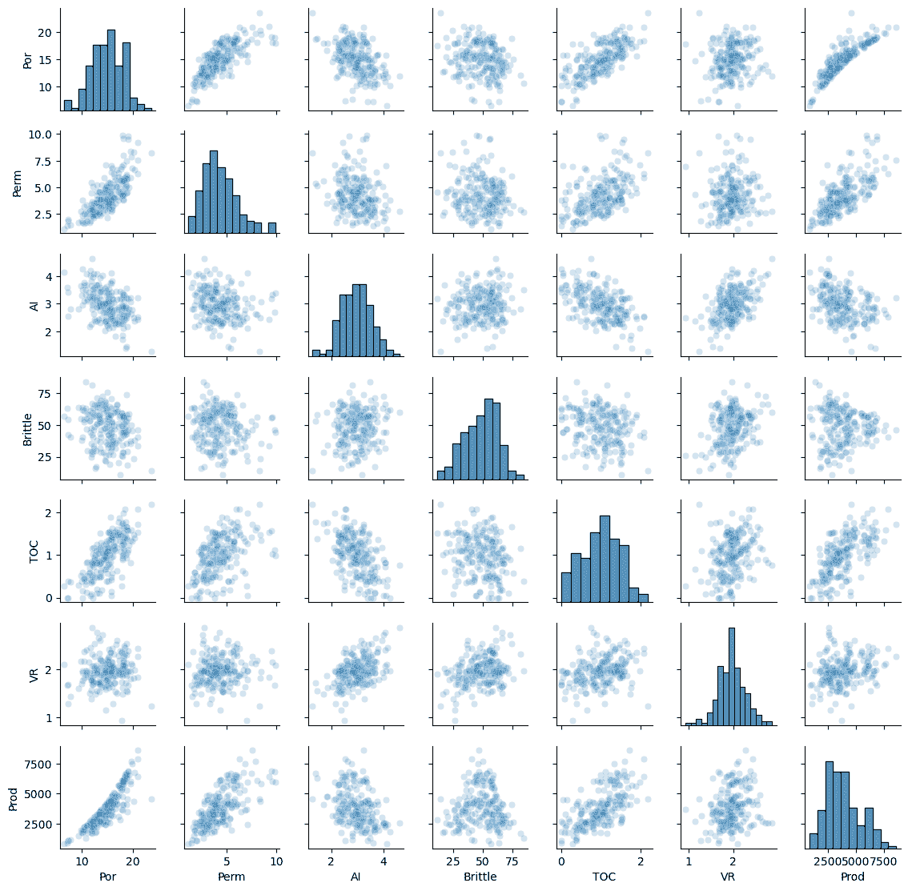
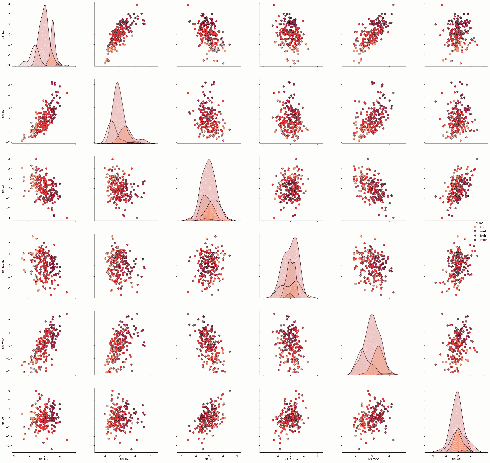
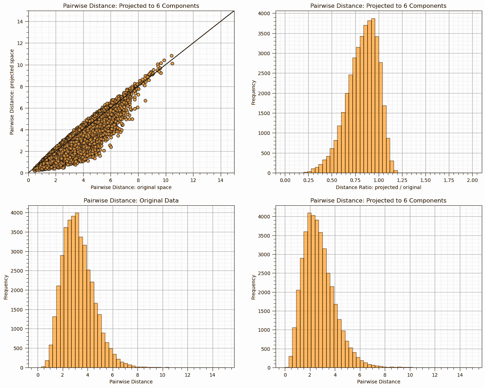
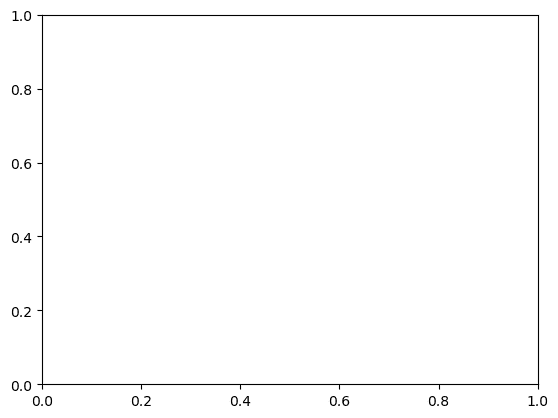
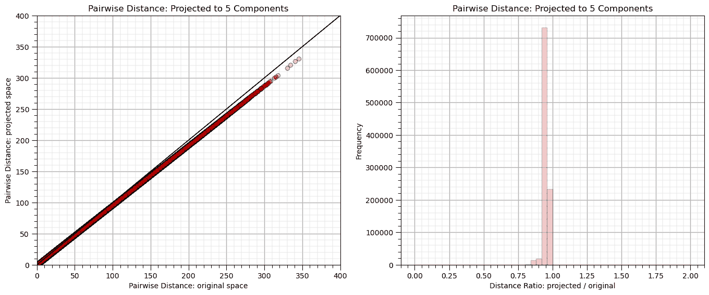
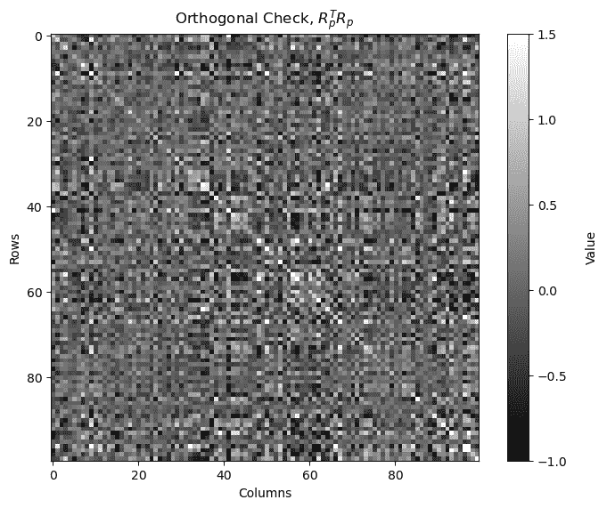
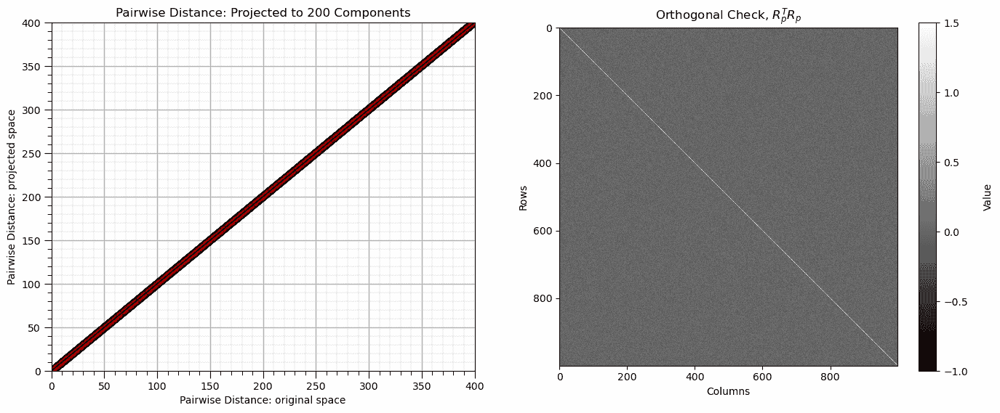

# 随机投影

> 原文：[`geostatsguy.github.io/MachineLearningDemos_Book/MachineLearning_random_projection.html`](https://geostatsguy.github.io/MachineLearningDemos_Book/MachineLearning_random_projection.html)

Michael J. Pyrcz，教授，德克萨斯大学奥斯汀分校

[Twitter](https://twitter.com/geostatsguy) | [GitHub](https://github.com/GeostatsGuy) | [网站](http://michaelpyrcz.com) | [Google Scholar](https://scholar.google.com/citations?user=QVZ20eQAAAAJ&hl=en&oi=ao) | [地统计学书籍](https://www.amazon.com/Geostatistical-Reservoir-Modeling-Michael-Pyrcz/dp/0199731446) | [YouTube](https://www.youtube.com/channel/UCLqEr-xV-ceHdXXXrTId5ig) | [Python 中应用地统计学电子书](https://geostatsguy.github.io/GeostatsPyDemos_Book/intro.html) | [Python 中应用机器学习电子书](https://geostatsguy.github.io/MachineLearningDemos_Book/) | [LinkedIn](https://www.linkedin.com/in/michael-pyrcz-61a648a1)

电子书“Python 中应用机器学习：动手指南及代码”的一章。

将此电子书引用如下：

Pyrcz, M.J., 2024, *Python 中应用机器学习：动手指南及代码* [电子书]. Zenodo. doi:10.5281/zenodo.15169138 

本书中的工作流程以及更多内容可在以下链接找到：

将 MachineLearningDemos GitHub 仓库引用如下：

Pyrcz, M.J., 2024, *MachineLearningDemos: Python 机器学习演示工作流程仓库* (0.0.3) [软件]. Zenodo. DOI: 10.5281/zenodo.13835312\. GitHub 仓库：[GeostatsGuy/MachineLearningDemos](https://github.com/GeostatsGuy/MachineLearningDemos) 

作者：Michael J. Pyrcz

© 版权所有 2024。

本章是关于**随机投影**的教程和演示。

**YouTube 讲座**：查看我在以下主题上的讲座：

+   [机器学习简介](https://youtu.be/zOUM_AnI1DQ?si=wzWdJ35qJ9n8O6Bl)

+   [维度诅咒、降维、主成分分析](https://youtu.be/-to3JXiae9Y?si=W1j2CwR9t0t8hxIB)

+   [多维尺度分析和随机投影](https://youtu.be/Yt0o8ukIOKU?si=_ri1NPwKVdhYzgO3)

这些讲座都是我 YouTube 上的[机器学习课程](https://youtube.com/playlist?list=PLG19vXLQHvSC2ZKFIkgVpI9fCjkN38kwf&si=XonjO2wHdXffMpeI)的一部分，其中包含有良好文档记录的 Python 工作流程和交互式仪表板。我的目标是分享易于获取、可操作和可重复的教育内容。如果你想知道我的动机，请查看[Michael 的故事](https://michaelpyrcz.com/my-story)。

## 随机投影的动机

假设我们需要通过从$m$个特征到$p$个特征（即低维空间）的投影来实现非常快速的降维，

$$ 𝑝, \quad \text{其中} \quad 𝑝 << 𝑚 $$

在这种情况下，

+   目前我们并没有所有数据（例如，实时数据），因此我们无法计算协方差矩阵或相似度矩阵

+   由于 $m$ 的大小，我们无法承担计算正交变换的成本

我们能否通过随机线性投影将 $m$ 个特征转换到低维的 $p$？


随机投影的概念，与多维尺度分析相对比。

其中 $𝑋_{1 \times m}$ 是一个关于 $m$ 个特征的单一数据样本，$𝑅_{p \times m}$ 是一个随机投影矩阵，填充了随机值，而 $𝑋_{p \times n}^{𝑅𝑃}$ 是投影到 $p$ 个特征的新数据。

## 随机投影

一种替代主成分分析和多维尺度分析的方法，它依赖于一个随机（$p \times n$）投影矩阵，$𝑅_{p \times m}$。

+   所有值都是独立的随机变量，通常是标准正态分布，$N\left[0,1\right]$。

为了避免失真，投影 $𝑅_{p \times m}$ 应该是正交的，但如上所述，确保正交性计算成本太高，为了理解这是如何工作的，我们需要了解，

+   **赫奇-尼尔森（1994）** - 高维空间中存在大量正交向量，可能是准正交的

+   **约翰逊-林德斯特拉斯引理（1984）** - 高维空间中的点可以以高概率线性嵌入到低维空间中，近似保持成对距离

## 高维空间中的近正交向量

罗伯特·赫奇-尼尔森（1994）证明了在高维空间中，存在比严格正交方向多得多的几乎正交方向。

+   随机矩阵在高维中可能足够接近正交。

$$ 𝑅_{m×p}^𝑇 𝑅_{p×m} \approx 𝐼_{m×m} $$

其中 $I$ 是单位矩阵，$\approx$ 表示近似等于单位矩阵。

如果维度足够大，即高维空间，我们的随机向量将足够接近正交。

+   随着维度的增加，特征的数量 $𝑚$，概率增加

## 高维空间中成对距离近似的保真概率

这种随机方法之所以在实践中有效，是因为约翰逊-林德斯特拉斯引理：

*在数学中，约翰逊-林德斯特拉斯引理是关于从高维空间到低维欧几里得空间低失真嵌入的一个结果。引理表明，高维空间中的一小部分点可以嵌入到一个维度低得多的空间中，使得点之间的距离几乎保持不变。用于嵌入的映射至少是 Lipschitz 连续的，甚至可以取为正交投影。- 来自维基百科的文章。*

在高维空间中，点可以线性嵌入到一个维度低得多的空间中，使得点之间的距离几乎保持不变（我们允许有误差，𝜀）。

我们可以根据数据集的大小，n，和期望的误差限制，ε，以及基于随机投影的高概率，计算出可以投影的最小维度数，p，

$$ 𝑝 > \frac{ln⁡(𝑛)}{𝜀²} $$

例如，对于具有 10%（0.1）成对距离误差的 1,000 个数据，我们可以随机投影到 690 维。

+   这个最小值不依赖于问题的原始维度，$𝑚$！

## 加载所需的库

以下代码加载了所需的库。这些库应该已经与 Anaconda 3 一起安装。

```py
ignore_warnings = True                                        # ignore warnings?
import numpy as np                                            # ndarrays for gridded data
import pandas as pd                                           # DataFrames for tabular data
import os                                                     # set working directory, run executables
import matplotlib.pyplot as plt                               # for plotting
from matplotlib.ticker import (MultipleLocator,AutoMinorLocator,NullLocator,FuncFormatter) # control of axes ticks
import matplotlib.patches as patches                          # add square to matrix plot
from scipy import stats                                       # summary statistics
import math                                                   # trigonometry etc.
import scipy.signal as signal                                 # kernel for moving window calculation
import random                                                 # for random numbers
import seaborn as sns                                         # for matrix scatter plots
from scipy import linalg                                      # for linear regression

from sklearn.random_projection import GaussianRandomProjection # random projection
from sklearn.random_projection import johnson_lindenstrauss_min_dim
from sklearn.random_projection import SparseRandomProjection
from sklearn.metrics.pairwise import euclidean_distances
from sklearn.preprocessing import StandardScaler              # standardize features
plt.rc('axes', axisbelow=True)                                # plot all grids below the plot elements
if ignore_warnings == True:                                   
    import warnings
    warnings.filterwarnings('ignore')
cmap = plt.cm.inferno                                         # color map
seed = 42                                                     # random number seed 
```

如果您遇到包导入错误，您可能需要首先安装这些包中的某些包。这通常可以通过在 Windows 上打开命令窗口然后输入‘python -m pip install [package-name]’来完成。有关相应包的文档，可以获得更多帮助。

## 声明函数

提供方便的函数，用于向数字添加逗号以及向图表添加主副网格线。

```py
def comma_format(x, pos):
    return f'{int(x):,}'

def add_grid():                                            
    plt.gca().grid(True, which='major',linewidth = 1.0); plt.gca().grid(True, which='minor',linewidth = 0.2) # add y grids
    plt.gca().tick_params(which='major',length=7); plt.gca().tick_params(which='minor', length=4)
    plt.gca().xaxis.set_minor_locator(AutoMinorLocator()); plt.gca().yaxis.set_minor_locator(AutoMinorLocator()) # turn on minor ticks 
```

## 设置工作目录

我总是喜欢这样做，这样我就不会丢失文件，并且可以简化后续的读取和写入（避免每次都包含完整地址）。

```py
#os.chdir("c:/PGE383")                                        # set the working directory 
```

## 加载数据表

这里是加载我们的逗号分隔数据文件到 Pandas DataFrame 对象的命令。

```py
#df = pd.read_csv('unconv_MV_v4.csv')                         # load our data table
df = pd.read_csv(r'https://raw.githubusercontent.com/GeostatsGuy/GeoDataSets/master/unconv_MV_v4.csv')
df['TOC'] = np.where(df['TOC']<0.0, 0.0, df['TOC']) # set TOC < 0.0 as 0.0, otherwise leave the same 
```

可视化 DataFrame 将很有用，我们已经在本次演示中学习了这些方法（[`git.io/fNgRW`](https://git.io/fNgRW)）。

我们可以通过使用‘head’ DataFrame 成员函数（以整洁的格式，见下文）来预览 DataFrame。使用 head 命令时，添加参数‘n=13’以查看数据集的前 13 行。

```py
df.head(n=13)                                                 # we could also use this command for a table preview 
```

|  | 井 | 孔 | 渗 | 初始 | 岩脆 | TOC | VR | 产量 |
| --- | --- | --- | --- | --- | --- | --- | --- | --- |
| 0 | 1 | 12.08 | 2.92 | 2.80 | 81.40 | 1.16 | 2.31 | 1695.360819 |
| 1 | 2 | 12.38 | 3.53 | 3.22 | 46.17 | 0.89 | 1.88 | 3007.096063 |
| 2 | 3 | 14.02 | 2.59 | 4.01 | 72.80 | 0.89 | 2.72 | 2531.938259 |
| 3 | 4 | 17.67 | 6.75 | 2.63 | 39.81 | 1.08 | 1.88 | 5288.514854 |
| 4 | 5 | 17.52 | 4.57 | 3.18 | 10.94 | 1.51 | 1.90 | 2859.469624 |
| 5 | 6 | 14.53 | 4.81 | 2.69 | 53.60 | 0.94 | 1.67 | 4017.374438 |
| 6 | 7 | 13.49 | 3.60 | 2.93 | 63.71 | 0.80 | 1.85 | 2952.812773 |
| 7 | 8 | 11.58 | 3.03 | 3.25 | 53.00 | 0.69 | 1.93 | 2670.933846 |
| 8 | 9 | 12.52 | 2.72 | 2.43 | 65.77 | 0.95 | 1.98 | 2474.048178 |
| 9 | 10 | 13.25 | 3.94 | 3.71 | 66.20 | 1.14 | 2.65 | 2722.893266 |
| 10 | 11 | 15.04 | 4.39 | 2.22 | 61.11 | 1.08 | 1.77 | 3828.247174 |
| 11 | 12 | 16.19 | 6.30 | 2.29 | 49.10 | 1.53 | 1.86 | 5095.810104 |
| 12 | 13 | 16.82 | 5.42 | 2.80 | 66.65 | 1.17 | 1.98 | 4091.637316 |

此数据集包含来自 200 口非常规井的特征，包括：

1.  井索引

1.  平均孔隙率（%）

1.  渗透率（mD）

1.  声阻抗（kg/m2s*10⁶）

1.  岩脆比（%）

1.  总有机碳（%）

1.  玻璃光泽率（%）

1.  标准化初始产量 90 天平均（MCFPD）。

注意，数据集是合成的，但具有现实范围和一般的多变量关系。

排序特征是一项真正努力去理解特征及其相互之间关系的工作。我们将从基本的数据可视化开始，然后转向更复杂的方法，如偏相关和递归特征消除。

## 摘要统计

让我们检查我们数据的摘要统计信息。

```py
df.describe().transpose()                                     # display summary statistics 
```

|  | count | mean | std | min | 25% | 50% | 75% | max |
| --- | --- | --- | --- | --- | --- | --- | --- | --- |
| Well | 200.0 | 100.500000 | 57.879185 | 1.000000 | 50.750000 | 100.500000 | 150.250000 | 200.000000 |
| Por | 200.0 | 14.991150 | 2.971176 | 6.550000 | 12.912500 | 15.070000 | 17.402500 | 23.550000 |
| Perm | 200.0 | 4.330750 | 1.731014 | 1.130000 | 3.122500 | 4.035000 | 5.287500 | 9.870000 |
| AI | 200.0 | 2.968850 | 0.566885 | 1.280000 | 2.547500 | 2.955000 | 3.345000 | 4.630000 |
| Brittle | 200.0 | 48.161950 | 14.129455 | 10.940000 | 37.755000 | 49.510000 | 58.262500 | 84.330000 |
| TOC | 200.0 | 0.991950 | 0.478264 | 0.000000 | 0.617500 | 1.030000 | 1.350000 | 2.180000 |
| VR | 200.0 | 1.964300 | 0.300827 | 0.930000 | 1.770000 | 1.960000 | 2.142500 | 2.870000 |
| Prod | 200.0 | 3864.407081 | 1553.277558 | 839.822063 | 2686.227611 | 3604.303506 | 4752.637555 | 8590.384044 |

摘要统计是数据检查的关键第一步。

+   这包括每个特征的（非空）有效值的数量（count 从每个变量的总数中移除了所有 np.NaN）。

+   我们可以看到一般的行为，如中心趋势、均值和分散性、方差。

+   我们可以识别出问题，如负值、极端值以及超出每个属性可能值范围的值。

+   我们还可以为绘图建立特征范围。我们可以使用如下代码直接从数据中计算特征范围：

```py
Pormin = np.min(df['Por'].values)          # extract ndarray of data table column
Pormax = np.max(df['Por'].values)          # and calculate min and max 
```

但这不会导致易于理解的色条和轴刻度，让我们选择方便的整数。我们还将声明特征标签以方便绘图。

```py
pormin = 6.0; pormax = 24.0; porname = 'Porosity (%)'; portitle = 'Porosity'
permmin = 0.0; permmax = 10; permname = 'Permeability (mD)'; permtitle = 'Permeability'                
AImin = 1.0; AImax = 5.0; AIname = 'Acoustic Impedance (kg/m2s*10⁶)'; AItitle = 'Acoustic Impedance'
brmin = 10.0; brmax = 85.0; brname = 'Brittleness Ratio (%)'; brtitle = 'Brittleness'
TOCmin = 0.0; TOCmax = 2.2; TOCname = 'Total Organic Carbon (%)'; TOCtitle = 'Total Organic Carbon' 
VRmin = 0.9; VRmax = 2.9; VRname = 'Vitrinite Reflectance (%)'; VRtitle = 'Vitrinite Reflectance'
prodmin = 500.0; prodmax = 9000.0; prodname = 'Normalized Initial Production (MCFPD)'; prodtitle = 'Normalized Initial Production' 
```

数据看起来相当不错，为了简洁起见，我们跳过异常值检测。让我们使用 Seaborn 包的矩阵散点图查看分布。

```py
sns.pairplot(df,vars=['Por','Perm','AI','Brittle','TOC','VR','Prod'],markers='o',plot_kws={'alpha': 0.2})
plt.subplots_adjust(left=0.0, bottom=0.0, right=0.6, top=0.6, wspace=0.3, hspace=0.2); plt.show() 
```



## 特征标准化

由于我们的模型使用的是差异度（类似于特征空间中的距离）度量，我们需要标准化特征。

```py
features = ['Por','Perm','AI','Brittle','TOC','VR']
x = df.loc[:,features].values
mu = np.mean(x, axis=0)
sd = np.std(x, axis=0)
xs = StandardScaler().fit_transform(x)

ns_features = []
for i in range(0,len(features)):
    df['NS_'+features[i]] = xs[:,i]
    ns_features.append('NS_'+features[i]) 

df.head(n=13) 
```

|  | Well | Por | Perm | AI | Brittle | TOC | VR | Prod | NS_Por | NS_Perm | NS_AI | NS_Brittle | NS_TOC | NS_VR |
| --- | --- | --- | --- | --- | --- | --- | --- | --- | --- | --- | --- | --- | --- | --- |
| 0 | 1 | 12.08 | 2.92 | 2.80 | 81.40 | 1.16 | 2.31 | 1695.360819 | -0.982256 | -0.817030 | -0.298603 | 2.358297 | 0.352257 | 1.152048 |
| 1 | 2 | 12.38 | 3.53 | 3.22 | 46.17 | 0.89 | 1.88 | 3007.096063 | -0.881032 | -0.463751 | 0.444147 | -0.141332 | -0.213702 | -0.280931 |
| 2 | 3 | 14.02 | 2.59 | 4.01 | 72.80 | 0.89 | 2.72 | 2531.938259 | -0.327677 | -1.008148 | 1.841224 | 1.748113 | -0.213702 | 2.518377 |
| 3 | 4 | 17.67 | 6.75 | 2.63 | 39.81 | 1.08 | 1.88 | 5288.514854 | 0.903875 | 1.401098 | -0.599240 | -0.592585 | 0.184565 | -0.280931 |
| 4 | 5 | 17.52 | 4.57 | 3.18 | 10.94 | 1.51 | 1.90 | 2859.469624 | 0.853263 | 0.138561 | 0.373409 | -2.640962 | 1.085907 | -0.214280 |
| 5 | 6 | 14.53 | 4.81 | 2.69 | 53.60 | 0.94 | 1.67 | 4017.374438 | -0.155597 | 0.277556 | -0.493133 | 0.385839 | -0.108895 | -0.980758 |
| 6 | 7 | 13.49 | 3.60 | 2.93 | 63.71 | 0.80 | 1.85 | 2952.812773 | -0.506505 | -0.423211 | -0.068704 | 1.103161 | -0.402355 | -0.380906 |
| 7 | 8 | 11.58 | 3.03 | 3.25 | 53.00 | 0.69 | 1.93 | 2670.933846 | -1.150962 | -0.753324 | 0.497200 | 0.343268 | -0.632930 | -0.114305 |
| 8 | 9 | 12.52 | 2.72 | 2.43 | 65.77 | 0.95 | 1.98 | 2474.048178 | -0.833795 | -0.932859 | -0.952930 | 1.249322 | -0.087933 | 0.052320 |
| 9 | 10 | 13.25 | 3.94 | 3.71 | 66.20 | 1.14 | 2.65 | 2722.893266 | -0.587484 | -0.226301 | 1.310688 | 1.279831 | 0.310334 | 2.285102 |
| 10 | 11 | 15.04 | 4.39 | 2.22 | 61.11 | 1.08 | 1.77 | 3828.247174 | 0.016483 | 0.034314 | -1.324305 | 0.918687 | 0.184565 | -0.647507 |
| 11 | 12 | 16.19 | 6.30 | 2.29 | 49.10 | 1.53 | 1.86 | 5095.810104 | 0.404506 | 1.140483 | -1.200514 | 0.066556 | 1.127830 | -0.347581 |
| 12 | 13 | 16.82 | 5.42 | 2.80 | 66.65 | 1.17 | 1.98 | 4091.637316 | 0.617075 | 0.630834 | -0.298603 | 1.311759 | 0.373218 | 0.052320 |

## 数据准备

让我们从连续的产量中创建一个有序特征：

1.  低

1.  中等

1.  高

1.  非常高

产量率。这将帮助我们可视化结果，我们可以查看不同产量水平的井被投影到各种低维空间中，使用多维缩放。

```py
bins = [0,2500,5000,7500,10000]                # assign the production bins (these are the fence posts)
labels = ['low', 'med', 'high', 'vhigh']       # assign the labels
category = pd.cut(df['Prod'],bins,labels=labels)     # make the 1D array with the labels for our data
df['tProd'] = category                                # add the new ordinal production feature to our DataFrames 
df.head()
dpalette = sns.color_palette("rocket_r",n_colors = 4)
palette = sns.color_palette("rocket") 
```

让我们看看我们三个特征和产量水平的矩阵散点图。

```py
plot = sns.pairplot(df[ns_features + ['tProd']],markers='o',hue = 'tProd', palette = dpalette,diag_kws={'edgecolor':'black'},plot_kws=dict(s=50, edgecolor="black", linewidth=0.5))

plt.subplots_adjust(left=0.0, bottom=0.0, right=1.5, top=1.5, wspace=0.3, hspace=0.2)
plt.show() 
```



## 随机投影

让我们演示随机投影的使用。

+   由于低维性，对于某些随机种子，您将看到相当糟糕的性能

```py
n_components = 6; seed = 73058
rp = GaussianRandomProjection(n_components=n_components,random_state = seed)

dists = euclidean_distances(df[ns_features], squared=False).ravel()
nonzero = dists != 0   # select only non-identical samples pairs
dists = dists[nonzero]

projected_data = rp.fit_transform(df[ns_features])
projected_dists = euclidean_distances(projected_data, squared=False).ravel()[nonzero]

plt.subplot(221)
plt.scatter(dists,projected_dists,c='darkorange',alpha=0.6,edgecolor = 'black')
plt.arrow(0,0,200,200,width=0.02,color='black',head_length=0.0,head_width=0.0)
plt.xlim(0,15); plt.ylim(0,15); add_grid()
plt.xlabel("Pairwise Distance: original space"); plt.ylabel("Pairwise Distance: projected space")
plt.title("Pairwise Distance: Projected to %d Components" % n_components)

rates = projected_dists / dists
print("Distance Ratio, mean: %0.2f, standard deviation %0.2f." % (np.mean(rates), np.std(rates)))

plt.subplot(222)
plt.hist(rates, bins=50, range=(0., 2.),color = 'darkorange', alpha = 0.6, edgecolor='k')
plt.xlabel("Distance Ratio: projected / original"); plt.ylabel("Frequency"); add_grid()
plt.title("Pairwise Distance: Projected to %d Components" % n_components)

plt.subplot(223)
plt.hist(dists, bins=50, range=(0., 15.),color = 'darkorange', alpha = 0.6, edgecolor='k')
plt.xlabel("Pairwise Distance"); plt.ylabel("Frequency"); add_grid()
plt.title("Pairwise Distance: Original Data")

plt.subplot(224)
plt.hist(projected_dists, bins=50, range=(0., 15.),color = 'darkorange', alpha = 0.6, edgecolor='k')
plt.xlabel("Pairwise Distance"); plt.ylabel("Frequency"); add_grid()
plt.title("Pairwise Distance: Projected to %d Components" % n_components)

plt.subplots_adjust(left=0.0, bottom=0.0, right=2.0, top=2.1, wspace=0.2, hspace=0.2); plt.show() 
```

```py
Distance Ratio, mean: 0.83, standard deviation 0.16. 
```



检查随机投影矩阵的正交性。

+   通过计算和显示 $R_p^T R_p$，如果它是正交的，它应该是一个严格对角矩阵

```py
orthogonal_check = np.dot(rp.components_.T, rp.components_)

fig, ax = plt.subplots()
cax = ax.imshow(orthogonal_check,cmap=plt.cm.grey,vmin=-1,vmax=1.0,interpolation='None',zorder=1)
#cbar = plt.colorbar(); cbar.set_label('Value')

matrix_size = orthogonal_check.shape[0]  # Assuming the matrix is square (m x m)
square_size = 1  # Each square has size 1x1

for i in range(matrix_size):
    # Add a square around each diagonal element
    square = patches.Rectangle((i - 0.5, i - 0.5),square_size,square_size,linewidth=3, edgecolor='white', facecolor='none')
    ax.add_patch(square)

# Add a colorbar
cbar = fig.colorbar(cax)
cbar.set_label('Value', rotation=90, labelpad=15)  # Set label for colorbar

plt.title(r'Orthogonal Check, $R_p^T R_p$')
plt.xlabel('Columns'); plt.ylabel('Rows')
plt.subplots_adjust(left=0.0, bottom=0.0, right=1.0, top=1.0, wspace=0.2, hspace=0.3); plt.show() 
```

```py
---------------------------------------------------------------------------
AttributeError  Traceback (most recent call last)
Cell In[13], line 4
  1 orthogonal_check = np.dot(rp.components_.T, rp.components_)
  3 fig, ax = plt.subplots()
----> 4 cax = ax.imshow(orthogonal_check,cmap=plt.cm.grey,vmin=-1,vmax=1.0,interpolation='None',zorder=1)
  5 #cbar = plt.colorbar(); cbar.set_label('Value')
  7 matrix_size = orthogonal_check.shape[0]  # Assuming the matrix is square (m x m)

AttributeError: module 'matplotlib.cm' has no attribute 'grey' 
```



## 添加更多功能

我们看到，对于 m = 6，我们没有看到显著的降维。让我们实例化一个更大的模型。

+   将 $m$ 设置得很大，即 $m \ge 100$

+   将 $p$ 设置为 $m$ 的合理比例，例如 $\frac{2}{3}$ 到 $\frac{1}{2}$

由于我们没有访问任意大小的数据集，让我们随机生成它。

+   标准正态分布，高维多高斯分布，所有均值为 0，方差为 1.0

+   特征之间的随机相关性

+   我们使用特征值分解，将负值或零特征值设置为小的正值，以确保相关矩阵是正半定的

```py
m = 100                                                       # number of dimensions
n_samples = 1000                                              # number of samples

np.random.seed(seed = seed)                                   # set the random seed
mean_vector = np.zeros(m)                                     # mean vector (zero mean for all variables)

random_matrix = np.random.rand(m, m)                          # step 1: generate a random matrix 
correlation_matrix = np.dot(random_matrix, random_matrix.T)   # step 2: create a symmetric correlation matrix
correlation_matrix = (correlation_matrix + correlation_matrix.T) / 2 # step 3: symmetrize the correlation matrix (ensures the matrix is symmetric)
np.fill_diagonal(correlation_matrix, 1)                       # step 4: normalize to have ones on the diagonal (this ensures unit variances)

# Ensure the covariance matrix is positive semi-definite using eigendecomposition
eigvals, eigvecs = np.linalg.eigh(correlation_matrix)         # eigendecomposition of the correlation matrix
eigvals = np.maximum(eigvals, 1e-6)                           # set any negative eigenvalues to a small positive value
cov_matrix = eigvecs @ np.diag(eigvals) @ eigvecs.T           # reconstruct the covariance matrix

big_data = np.random.multivariate_normal(mean_vector, cov_matrix, size=n_samples) # step 6: generate the multi-dimensional Gaussian dataset
df_big_data = pd.DataFrame(big_data, columns=[f"Dim_{i+1}" for i in range(m)]) # convert the data into a pandas DataFrame 
```

这份数据维度太高，不方便可视化，让我们继续使用随机投影。

```py
n_components = 5; seed = 73058
rp_big = GaussianRandomProjection(n_components=n_components,random_state = seed)

dists = euclidean_distances(df_big_data, squared=False).ravel()
nonzero = dists != 0   # select only non-identical samples pairs
dists = dists[nonzero]

projected_data = rp_big.fit_transform(df_big_data)
projected_dists = euclidean_distances(projected_data, squared=False).ravel()[nonzero]

plt.subplot(121)
plt.scatter(dists,projected_dists,c='red',alpha=0.2,edgecolor = 'black')
plt.arrow(0,0,10000,10000,width=0.02,color='black',head_length=0.0,head_width=0.0)
plt.xlabel("Pairwise Distance: original space")
plt.ylabel("Pairwise Distance: projected space")
plt.title("Pairwise Distance: Projected to %d Components" % n_components)
plt.xlim([0,400]); plt.ylim([0,400]); add_grid()

rates = projected_dists / dists
print("Distance Ratio, mean: %0.2f, standard deviation %0.2f." % (np.mean(rates), np.std(rates)))

plt.subplot(122)
plt.hist(rates, bins=50, range=(0., 2.),color = 'red', alpha = 0.2, edgecolor='k')
plt.xlabel("Distance Ratio: projected / original"); plt.ylabel("Frequency"); add_grid()
plt.title("Pairwise Distance: Projected to %d Components" % n_components)

plt.subplots_adjust(left=0.0, bottom=0.0, right=2.0, top=1.0, wspace=0.2, hspace=0.3); plt.show() 
```

```py
Distance Ratio, mean: 0.95, standard deviation 0.02. 
```



检查随机投影矩阵的正交性。

+   通过计算和显示 $R_p^T R_p$，如果它是正交的，它应该是一个严格对角矩阵

注意，$R_p$ 不是方阵，它是 $p \times m$，所以我们实际上是在检查列正交性，$R_p^T R_p$

+   我们正在检查的是降维后的投影是否形成一个正交基

+   从上面来看 $R_p^T$ 是 $m \times p$ 和 $R_p$ 是 $p \times m$，所以 $R_p^T R_p$ 是 $m \times m$

```py
orthogonal_check_big = np.dot(rp_big.components_.T, rp_big.components_)
fig, ax = plt.subplots()
cax = ax.imshow(orthogonal_check_big,cmap=plt.cm.grey,vmin=-1,vmax=1.5,interpolation='None',zorder=1)

matrix_size = orthogonal_check.shape[0]                       # assuming the matrix is square (m x m)
square_size = 1                                               # each square has size 1x1

cbar = fig.colorbar(cax); cbar.set_label('Value', rotation=90, labelpad=15) 

plt.title(r'Orthogonal Check, $R_p^T R_p$'); plt.xlabel('Columns'); plt.ylabel('Rows')
plt.subplots_adjust(left=0.0, bottom=0.0, right=1.0, top=1.0, wspace=0.2, hspace=0.3); plt.show() 
```



## 添加更多特征

让我们尝试一个更大的维度，使用一个单独的代码块。

```py
m = 1000                                                      # number of dimensions
n_samples = 1000                                              # number of samples
n_components = 200                                            # number of components 
seed = 73058                                                  # random seed

np.random.seed(seed = seed)                                   # set the random seed
mean_vector = np.zeros(m)                                     # mean vector (zero mean for all variables)

random_matrix = np.random.rand(m, m)                          # step 1: generate a random matrix 
correlation_matrix = np.dot(random_matrix, random_matrix.T)   # step 2: create a symmetric correlation matrix
correlation_matrix = (correlation_matrix + correlation_matrix.T) / 2 # step 3: symmetrize the correlation matrix (ensures the matrix is symmetric)
np.fill_diagonal(correlation_matrix, 1)                       # step 4: normalize to have ones on the diagonal (this ensures unit variances)

# Ensure the covariance matrix is positive semi-definite using eigendecomposition
eigvals, eigvecs = np.linalg.eigh(correlation_matrix)         # eigendecomposition of the correlation matrix
eigvals = np.maximum(eigvals, 1e-6)                           # set any negative eigenvalues to a small positive value
cov_matrix = eigvecs @ np.diag(eigvals) @ eigvecs.T           # reconstruct the covariance matrix

very_big_data = np.random.multivariate_normal(mean_vector, cov_matrix, size=n_samples) # step 6: generate the multi-dimensional Gaussian dataset
df_very_big_data = pd.DataFrame(very_big_data, columns=[f"Dim_{i+1}" for i in range(m)]) # convert the data into a pandas DataFrame

rp_very_big = GaussianRandomProjection(n_components=n_components,random_state = seed)

dists = euclidean_distances(df_very_big_data, squared=False).ravel()
nonzero = dists != 0                                          # select only non-identical samples pairs
dists = dists[nonzero]

projected_data = rp_very_big.fit_transform(df_very_big_data)
projected_dists = euclidean_distances(projected_data, squared=False).ravel()[nonzero]

plt.subplot(121)
plt.scatter(dists,projected_dists,c='red',alpha=0.2,edgecolor = 'black')
plt.arrow(0,0,10000,10000,width=0.02,color='black',head_length=0.0,head_width=0.0)
plt.xlabel("Pairwise Distance: original space")
plt.ylabel("Pairwise Distance: projected space")
plt.title("Pairwise Distance: Projected to %d Components" % n_components)
plt.xlim([0,400]); plt.ylim([0,400]); add_grid()

orthogonal_check_very_big = np.dot(rp_very_big.components_.T, rp_very_big.components_)

plt.subplot(122)
im = plt.imshow(orthogonal_check_very_big,cmap=plt.cm.grey,vmin=-1,vmax=1.5,interpolation='None',zorder=1)
matrix_size = orthogonal_check.shape[0]                       # assuming the matrix is square (m x m)
square_size = 1                                               # each square has size 1x1
cbar = fig.colorbar(im); cbar.set_label('Value', rotation=90, labelpad=15) 
plt.title(r'Orthogonal Check, $R_p^T R_p$'); plt.xlabel('Columns'); plt.ylabel('Rows')

plt.subplots_adjust(left=0.0, bottom=0.0, right=2.0, top=1.0, wspace=0.2, hspace=0.3); plt.show() 
```



## 评论

这是对随机投影的基本处理。可以做和讨论的还有很多，我有很多更多的资源。查看我的[共享资源清单](https://michaelpyrcz.com/my-resources)以及本章开头 YouTube 讲座链接中的资源链接，视频描述中包含资源链接。

我希望这有所帮助，

*迈克尔*

## 关于作者


德克萨斯大学奥斯汀分校 40 英亩校园内，迈克尔·皮尔茨教授的办公室。

迈克尔·皮尔茨是[科克雷尔工程学院](https://cockrell.utexas.edu/faculty-directory/alphabetical/p)和[杰克逊地球科学学院](https://www.jsg.utexas.edu/researcher/michael_pyrcz/)的教授，在[德克萨斯大学奥斯汀分校](https://www.utexas.edu/)，在那里他研究并教授地下、空间数据分析、地统计学和机器学习。迈克尔还是，

+   [能源分析](https://fri.cns.utexas.edu/energy-analytics)新生研究项目的首席研究员，以及自然科学院机器学习实验室的核心教员

+   [计算机与地球科学](https://www.sciencedirect.com/journal/computers-and-geosciences/about/editorial-board)的副编辑，以及国际数学地球科学协会的[数学地球科学](https://link.springer.com/journal/11004/editorial-board)董事会成员。

迈克尔已经撰写了超过 70 篇[同行评审的出版物](https://scholar.google.com/citations?user=QVZ20eQAAAAJ&hl=en)，一个用于空间数据分析的[Python 包](https://pypi.org/project/geostatspy/)，合著了一本关于空间数据分析的教科书《地统计学储层建模》（[Geostatistical Reservoir Modeling](https://www.amazon.com/Geostatistical-Reservoir-Modeling-Michael-Pyrcz/dp/0199731446)），并是两本新近发布的电子书的作者，分别是《Python 中应用地统计学：GeostatsPy 实践指南》（[Applied Geostatistics in Python: a Hands-on Guide with GeostatsPy](https://geostatsguy.github.io/GeostatsPyDemos_Book/intro.html)）和《Python 中应用机器学习：带代码的实践指南》（[Applied Machine Learning in Python: a Hands-on Guide with Code](https://geostatsguy.github.io/MachineLearningDemos_Book/intro.html)）。

迈克尔的所有大学讲座都可在他的[YouTube 频道](https://www.youtube.com/@GeostatsGuyLectures)上找到，附有 100 多个 Python 交互式仪表板和 40 多个存储库中的详细工作流程链接，这些存储库位于他的[GitHub 账户](https://github.com/GeostatsGuy)，以支持任何感兴趣的学生和在职专业人士，提供持续更新的内容。想了解更多关于迈克尔的工作和共享教育资源，请访问他的网站。

## 想一起工作吗？

希望这些内容对那些想了解更多关于地下建模、数据分析与机器学习的人有所帮助。学生和在职专业人士都欢迎参与。

+   想邀请我到贵公司进行培训、辅导、项目审查、工作流程设计以及/或咨询？我很乐意拜访并与您合作！

+   感兴趣合作、支持我的研究生研究或我的地下数据分析与机器学习联盟（共同负责人是约翰·福斯特教授）？我的研究将数据分析、随机建模和机器学习理论与实践相结合，以开发新的方法和工作流程，增加价值。我们正在解决具有挑战性的地下问题！

+   您可以通过 mpyrcz@austin.utexas.edu 联系我。

我总是乐于讨论，

*迈克尔*

迈克尔·皮尔奇，博士，P.Eng. 教授，德克萨斯大学奥斯汀分校 Cockrell 工程学院和 Jackson 地球科学学院

更多资源可在以下链接获取：[Twitter](https://twitter.com/geostatsguy) | [GitHub](https://github.com/GeostatsGuy) | [网站](http://michaelpyrcz.com) | [Google Scholar](https://scholar.google.com/citations?user=QVZ20eQAAAAJ&hl=en&oi=ao) | [地统计学书籍](https://www.amazon.com/Geostatistical-Reservoir-Modeling-Michael-Pyrcz/dp/0199731446) | [YouTube](https://www.youtube.com/channel/UCLqEr-xV-ceHdXXXrTId5ig) | [Python 中应用地统计学电子书](https://geostatsguy.github.io/GeostatsPyDemos_Book/intro.html) | [Python 中应用机器学习电子书](https://geostatsguy.github.io/MachineLearningDemos_Book/) | [LinkedIn](https://www.linkedin.com/in/michael-pyrcz-61a648a1)

## 随机投影的动机

假设我们需要通过从 $m$ 个特征（即高维空间）到 $p$ 个特征（即低维空间）的投影来实现非常快速的维度降低，

$$ 𝑝, \quad \text{其中} \quad 𝑝 << 𝑚 $$

在这种情况下，

+   我们现在没有所有数据（例如，实时数据），因此我们无法计算协方差矩阵或差异矩阵

+   由于 $m$ 的大小，我们无法承担计算正交变换的成本

我们能否通过随机线性投影将 $m$ 个特征转换到低维 $p$？


随机投影的概念，与多维尺度相比。

其中 $𝑋_{1 \times m}$ 是 $m$ 个特征上的单个数据样本，$𝑅_{p \times m}$ 是一个随机投影矩阵，填充了随机值，而 $𝑋_{p \times n}^{𝑅𝑃}$ 是投影到 $p$ 个特征的新数据。

## 随机投影

一种替代主成分分析和多维尺度分析的方法，它依赖于一个随机 ($p \times n$) 投影矩阵，$𝑅_{p \times m}$。

+   所有值都是独立的随机变量，通常是标准正态分布，$N\left[0,1\right]$。

为了避免失真，投影 $𝑅_{p \times m}$ 应该是正交的，但如上所述，确保正交性计算成本太高，为了理解这是如何工作的，我们需要了解，

+   **Hercht-Neilsen (1994)** - 高维空间中存在大量正交向量，可能是准正交的。

+   **Johnson-Lindenstrauss 引理（1984）** - 高维空间中的点可以以高概率线性嵌入到低维空间中，并且近似保持成对距离。

## 高维空间中的近似正交向量

Robert Hercht-Neilsen (1994) 证明了在高维空间中，近似正交的方向数量远多于严格正交的方向。

+   在高维中，随机矩阵可能足够接近正交。

$$ 𝑅_{m×p}^𝑇 𝑅_{p×m} \approx 𝐼_{m×m} $$

其中 $I$ 是单位矩阵，$\approx$ 表示近似等于单位矩阵。

如果维度足够大，即高维空间，我们的随机向量将足够接近正交。

+   随着维度的增加，特征的数量 $𝑚$ 的概率也会增加。

## 高维空间中成对距离近似保持的概率

这种随机方法之所以在实践中有效，是因为 Johnson-Lindenstrauss 引理：

*在数学中，Johnson-Lindenstrauss 引理是关于从高维空间到低维欧几里得空间低失真嵌入的结果。引理表明，高维空间中的一小部分点可以嵌入到低维空间中，使得点之间的距离几乎得到保留。用于嵌入的映射至少是 Lipschitz 的，甚至可以取为正交投影。* - 维基百科文章。

在高维空间中的点可以以几乎保留点之间距离的方式线性嵌入到低维空间中（我们允许误差，𝜀）

我们可以根据数据集的大小 𝑛 和所需的误差限制 𝜀，计算出基于随机投影，以高概率投影的最小维度数 𝑝，

$$ 𝑝 > \frac{ln⁡(𝑛)}{𝜀²} $$

例如，对于具有 10% 对距误差（0.1）的 1000 个数据，我们可以随机投影到 690 维。

+   这个最小值不依赖于问题的原始维度性，$𝑚$！

## 加载所需的库

以下代码加载所需的库。这些库应该已经与 Anaconda 3 一起安装。

```py
ignore_warnings = True                                        # ignore warnings?
import numpy as np                                            # ndarrays for gridded data
import pandas as pd                                           # DataFrames for tabular data
import os                                                     # set working directory, run executables
import matplotlib.pyplot as plt                               # for plotting
from matplotlib.ticker import (MultipleLocator,AutoMinorLocator,NullLocator,FuncFormatter) # control of axes ticks
import matplotlib.patches as patches                          # add square to matrix plot
from scipy import stats                                       # summary statistics
import math                                                   # trigonometry etc.
import scipy.signal as signal                                 # kernel for moving window calculation
import random                                                 # for random numbers
import seaborn as sns                                         # for matrix scatter plots
from scipy import linalg                                      # for linear regression

from sklearn.random_projection import GaussianRandomProjection # random projection
from sklearn.random_projection import johnson_lindenstrauss_min_dim
from sklearn.random_projection import SparseRandomProjection
from sklearn.metrics.pairwise import euclidean_distances
from sklearn.preprocessing import StandardScaler              # standardize features
plt.rc('axes', axisbelow=True)                                # plot all grids below the plot elements
if ignore_warnings == True:                                   
    import warnings
    warnings.filterwarnings('ignore')
cmap = plt.cm.inferno                                         # color map
seed = 42                                                     # random number seed 
```

如果您遇到包导入错误，您可能首先需要安装这些包中的某些包。这通常可以通过在 Windows 上打开命令窗口然后输入‘python -m pip install [package-name]’来完成。有关相应包的文档中提供了更多帮助。

## 声明函数

方便的函数，用于向数字添加逗号，以及向图表添加主副网格线。

```py
def comma_format(x, pos):
    return f'{int(x):,}'

def add_grid():                                            
    plt.gca().grid(True, which='major',linewidth = 1.0); plt.gca().grid(True, which='minor',linewidth = 0.2) # add y grids
    plt.gca().tick_params(which='major',length=7); plt.gca().tick_params(which='minor', length=4)
    plt.gca().xaxis.set_minor_locator(AutoMinorLocator()); plt.gca().yaxis.set_minor_locator(AutoMinorLocator()) # turn on minor ticks 
```

## 设置工作目录

我总是喜欢这样做，以免丢失文件，并简化后续的读取和写入（避免每次都包含完整地址）。

```py
#os.chdir("c:/PGE383")                                        # set the working directory 
```

## 加载表格数据

这是将我们的逗号分隔数据文件加载到 Pandas DataFrame 对象中的命令。

```py
#df = pd.read_csv('unconv_MV_v4.csv')                         # load our data table
df = pd.read_csv(r'https://raw.githubusercontent.com/GeostatsGuy/GeoDataSets/master/unconv_MV_v4.csv')
df['TOC'] = np.where(df['TOC']<0.0, 0.0, df['TOC']) # set TOC < 0.0 as 0.0, otherwise leave the same 
```

可视化 DataFrame 将很有用，我们已经在本次演示中学习了这些方法 ([`git.io/fNgRW`](https://git.io/fNgRW))。

我们可以通过使用‘head’ DataFrame 成员函数来预览 DataFrame（格式整洁，见下文）。使用 head 命令时，添加参数‘n=13’以查看数据集的前 13 行。

```py
df.head(n=13)                                                 # we could also use this command for a table preview 
```

|  | Well | Por | Perm | AI | Brittle | TOC | VR | Prod |
| --- | --- | --- | --- | --- | --- | --- | --- | --- |
| 0 | 1 | 12.08 | 2.92 | 2.80 | 81.40 | 1.16 | 2.31 | 1695.360819 |
| 1 | 2 | 12.38 | 3.53 | 3.22 | 46.17 | 0.89 | 1.88 | 3007.096063 |
| 2 | 3 | 14.02 | 2.59 | 4.01 | 72.80 | 0.89 | 2.72 | 2531.938259 |
| 3 | 4 | 17.67 | 6.75 | 2.63 | 39.81 | 1.08 | 1.88 | 5288.514854 |
| 4 | 5 | 17.52 | 4.57 | 3.18 | 10.94 | 1.51 | 1.90 | 2859.469624 |
| 5 | 6 | 14.53 | 4.81 | 2.69 | 53.60 | 0.94 | 1.67 | 4017.374438 |
| 6 | 7 | 13.49 | 3.60 | 2.93 | 63.71 | 0.80 | 1.85 | 2952.812773 |
| 7 | 8 | 11.58 | 3.03 | 3.25 | 53.00 | 0.69 | 1.93 | 2670.933846 |
| 8 | 9 | 12.52 | 2.72 | 2.43 | 65.77 | 0.95 | 1.98 | 2474.048178 |
| 9 | 10 | 13.25 | 3.94 | 3.71 | 66.20 | 1.14 | 2.65 | 2722.893266 |
| 10 | 11 | 15.04 | 4.39 | 2.22 | 61.11 | 1.08 | 1.77 | 3828.247174 |
| 11 | 12 | 16.19 | 6.30 | 2.29 | 49.10 | 1.53 | 1.86 | 5095.810104 |
| 12 | 13 | 16.82 | 5.42 | 2.80 | 66.65 | 1.17 | 1.98 | 4091.637316 |

此数据集包含来自 200 个非常规井的特征：

1.  井指数

1.  井平均孔隙率（%）

1.  渗透率（mD）

1.  声阻抗（kg/m2s*10⁶）

1.  剪切比（%）

1.  总有机碳（%）

1.  玻璃质反射率（%）

1.  标准化初始生产 90 天平均（MCFPD）。

注意，数据集是合成的，但具有现实范围和一般的多变量关系。

排序特征实际上是一项理解特征及其相互关系的努力。我们将从基本数据可视化开始，然后转向更复杂的方法，如偏相关和递归特征消除。

## 摘要统计

让我们检查一下我们数据的摘要统计信息。

```py
df.describe().transpose()                                     # display summary statistics 
```

|  | 计数 | 平均值 | 标准差 | 最小值 | 25% | 50% | 75% | 最大值 |
| --- | --- | --- | --- | --- | --- | --- | --- | --- |
| 井 | 200.0 | 100.500000 | 57.879185 | 1.000000 | 50.750000 | 100.500000 | 150.250000 | 200.000000 |
| 孔 | 200.0 | 14.991150 | 2.971176 | 6.550000 | 12.912500 | 15.070000 | 17.402500 | 23.550000 |
| Perm | 200.0 | 4.330750 | 1.731014 | 1.130000 | 3.122500 | 4.035000 | 5.287500 | 9.870000 |
| 人工智能 | 200.0 | 2.968850 | 0.566885 | 1.280000 | 2.547500 | 2.955000 | 3.345000 | 4.630000 |
| 剪切 | 200.0 | 48.161950 | 14.129455 | 10.940000 | 37.755000 | 49.510000 | 58.262500 | 84.330000 |
| TOC | 200.0 | 0.991950 | 0.478264 | 0.000000 | 0.617500 | 1.030000 | 1.350000 | 2.180000 |
| VR | 200.0 | 1.964300 | 0.300827 | 0.930000 | 1.770000 | 1.960000 | 2.142500 | 2.870000 |
| 产 | 200.0 | 3864.407081 | 1553.277558 | 839.822063 | 2686.227611 | 3604.303506 | 4752.637555 | 8590.384044 |

摘要统计是数据检查的关键第一步。

+   这包括每个特征的合法（非空）值的数量（计数从每个变量的总数中移除了所有 np.NaN）。

+   我们可以看到一般的行为，如中心趋势、平均值和分散性、方差。

+   我们可以识别出具有负值、极端值以及每个属性可能值范围之外的值的问题。

+   我们还可以为绘图建立特征范围。我们可以使用如下代码直接从数据中计算特征范围：

```py
Pormin = np.min(df['Por'].values)          # extract ndarray of data table column
Pormax = np.max(df['Por'].values)          # and calculate min and max 
```

但是，这不会导致易于理解的色条和轴刻度，让我们选择方便的整数。我们还将声明特征标签以方便绘图。

```py
pormin = 6.0; pormax = 24.0; porname = 'Porosity (%)'; portitle = 'Porosity'
permmin = 0.0; permmax = 10; permname = 'Permeability (mD)'; permtitle = 'Permeability'                
AImin = 1.0; AImax = 5.0; AIname = 'Acoustic Impedance (kg/m2s*10⁶)'; AItitle = 'Acoustic Impedance'
brmin = 10.0; brmax = 85.0; brname = 'Brittleness Ratio (%)'; brtitle = 'Brittleness'
TOCmin = 0.0; TOCmax = 2.2; TOCname = 'Total Organic Carbon (%)'; TOCtitle = 'Total Organic Carbon' 
VRmin = 0.9; VRmax = 2.9; VRname = 'Vitrinite Reflectance (%)'; VRtitle = 'Vitrinite Reflectance'
prodmin = 500.0; prodmax = 9000.0; prodname = 'Normalized Initial Production (MCFPD)'; prodtitle = 'Normalized Initial Production' 
```

数据看起来相当良好，为了简洁起见，我们跳过异常值检测。让我们使用 Seaborn 包的矩阵散点图查看分布。

```py
sns.pairplot(df,vars=['Por','Perm','AI','Brittle','TOC','VR','Prod'],markers='o',plot_kws={'alpha': 0.2})
plt.subplots_adjust(left=0.0, bottom=0.0, right=0.6, top=0.6, wspace=0.3, hspace=0.2); plt.show() 
```


## 特征标准化

由于我们的模型使用的是差异度（类似于特征空间中的距离）度量，我们需要标准化特征。

```py
features = ['Por','Perm','AI','Brittle','TOC','VR']
x = df.loc[:,features].values
mu = np.mean(x, axis=0)
sd = np.std(x, axis=0)
xs = StandardScaler().fit_transform(x)

ns_features = []
for i in range(0,len(features)):
    df['NS_'+features[i]] = xs[:,i]
    ns_features.append('NS_'+features[i]) 

df.head(n=13) 
```

|  | 井 | 渗透率 | 渗透率 | AI | 脆性 | TOC | VR | 生产 | NS_Por | NS_Perm | NS_AI | NS_Brittle | NS_TOC | NS_VR |
| --- | --- | --- | --- | --- | --- | --- | --- | --- | --- | --- | --- | --- | --- | --- |
| 0 | 1 | 12.08 | 2.92 | 2.80 | 81.40 | 1.16 | 2.31 | 1695.360819 | -0.982256 | -0.817030 | -0.298603 | 2.358297 | 0.352257 | 1.152048 |
| 1 | 2 | 12.38 | 3.53 | 3.22 | 46.17 | 0.89 | 1.88 | 3007.096063 | -0.881032 | -0.463751 | 0.444147 | -0.141332 | -0.213702 | -0.280931 |
| 2 | 3 | 14.02 | 2.59 | 4.01 | 72.80 | 0.89 | 2.72 | 2531.938259 | -0.327677 | -1.008148 | 1.841224 | 1.748113 | -0.213702 | 2.518377 |
| 3 | 4 | 17.67 | 6.75 | 2.63 | 39.81 | 1.08 | 1.88 | 5288.514854 | 0.903875 | 1.401098 | -0.599240 | -0.592585 | 0.184565 | -0.280931 |
| 4 | 5 | 17.52 | 4.57 | 3.18 | 10.94 | 1.51 | 1.90 | 2859.469624 | 0.853263 | 0.138561 | 0.373409 | -2.640962 | 1.085907 | -0.214280 |
| 5 | 6 | 14.53 | 4.81 | 2.69 | 53.60 | 0.94 | 1.67 | 4017.374438 | -0.155597 | 0.277556 | -0.493133 | 0.385839 | -0.108895 | -0.980758 |
| 6 | 7 | 13.49 | 3.60 | 2.93 | 63.71 | 0.80 | 1.85 | 2952.812773 | -0.506505 | -0.423211 | -0.068704 | 1.103161 | -0.402355 | -0.380906 |
| 7 | 8 | 11.58 | 3.03 | 3.25 | 53.00 | 0.69 | 1.93 | 2670.933846 | -1.150962 | -0.753324 | 0.497200 | 0.343268 | -0.632930 | -0.114305 |
| 8 | 9 | 12.52 | 2.72 | 2.43 | 65.77 | 0.95 | 1.98 | 2474.048178 | -0.833795 | -0.932859 | -0.952930 | 1.249322 | -0.087933 | 0.052320 |
| 9 | 10 | 13.25 | 3.94 | 3.71 | 66.20 | 1.14 | 2.65 | 2722.893266 | -0.587484 | -0.226301 | 1.310688 | 1.279831 | 0.310334 | 2.285102 |
| 10 | 11 | 15.04 | 4.39 | 2.22 | 61.11 | 1.08 | 1.77 | 3828.247174 | 0.016483 | 0.034314 | -1.324305 | 0.918687 | 0.184565 | -0.647507 |
| 11 | 12 | 16.19 | 6.30 | 2.29 | 49.10 | 1.53 | 1.86 | 5095.810104 | 0.404506 | 1.140483 | -1.200514 | 0.066556 | 1.127830 | -0.347581 |
| 12 | 13 | 16.82 | 5.42 | 2.80 | 66.65 | 1.17 | 1.98 | 4091.637316 | 0.617075 | 0.630834 | -0.298603 | 1.311759 | 0.373218 | 0.052320 |

## 数据准备

让我们从连续的生产中创建一个有序特征：

1.  低

1.  中等

1.  高

1.  非常高

生产率。这有助于我们在进行过程中可视化结果，我们可以查看不同生产水平的水井，这些水井被投影到各种低维空间中，使用多维尺度。

```py
bins = [0,2500,5000,7500,10000]                # assign the production bins (these are the fence posts)
labels = ['low', 'med', 'high', 'vhigh']       # assign the labels
category = pd.cut(df['Prod'],bins,labels=labels)     # make the 1D array with the labels for our data
df['tProd'] = category                                # add the new ordinal production feature to our DataFrames 
df.head()
dpalette = sns.color_palette("rocket_r",n_colors = 4)
palette = sns.color_palette("rocket") 
```

让我们看看我们 3 个特征和产量水平的矩阵散点图。

```py
plot = sns.pairplot(df[ns_features + ['tProd']],markers='o',hue = 'tProd', palette = dpalette,diag_kws={'edgecolor':'black'},plot_kws=dict(s=50, edgecolor="black", linewidth=0.5))

plt.subplots_adjust(left=0.0, bottom=0.0, right=1.5, top=1.5, wspace=0.3, hspace=0.2)
plt.show() 
```


## 随机投影

让我们演示随机投影的使用。

+   在低维度的条件下，对于某些随机种子，你将看到相当差的性能

```py
n_components = 6; seed = 73058
rp = GaussianRandomProjection(n_components=n_components,random_state = seed)

dists = euclidean_distances(df[ns_features], squared=False).ravel()
nonzero = dists != 0   # select only non-identical samples pairs
dists = dists[nonzero]

projected_data = rp.fit_transform(df[ns_features])
projected_dists = euclidean_distances(projected_data, squared=False).ravel()[nonzero]

plt.subplot(221)
plt.scatter(dists,projected_dists,c='darkorange',alpha=0.6,edgecolor = 'black')
plt.arrow(0,0,200,200,width=0.02,color='black',head_length=0.0,head_width=0.0)
plt.xlim(0,15); plt.ylim(0,15); add_grid()
plt.xlabel("Pairwise Distance: original space"); plt.ylabel("Pairwise Distance: projected space")
plt.title("Pairwise Distance: Projected to %d Components" % n_components)

rates = projected_dists / dists
print("Distance Ratio, mean: %0.2f, standard deviation %0.2f." % (np.mean(rates), np.std(rates)))

plt.subplot(222)
plt.hist(rates, bins=50, range=(0., 2.),color = 'darkorange', alpha = 0.6, edgecolor='k')
plt.xlabel("Distance Ratio: projected / original"); plt.ylabel("Frequency"); add_grid()
plt.title("Pairwise Distance: Projected to %d Components" % n_components)

plt.subplot(223)
plt.hist(dists, bins=50, range=(0., 15.),color = 'darkorange', alpha = 0.6, edgecolor='k')
plt.xlabel("Pairwise Distance"); plt.ylabel("Frequency"); add_grid()
plt.title("Pairwise Distance: Original Data")

plt.subplot(224)
plt.hist(projected_dists, bins=50, range=(0., 15.),color = 'darkorange', alpha = 0.6, edgecolor='k')
plt.xlabel("Pairwise Distance"); plt.ylabel("Frequency"); add_grid()
plt.title("Pairwise Distance: Projected to %d Components" % n_components)

plt.subplots_adjust(left=0.0, bottom=0.0, right=2.0, top=2.1, wspace=0.2, hspace=0.2); plt.show() 
```

```py
Distance Ratio, mean: 0.83, standard deviation 0.16. 
```


检查随机投影矩阵的正交性。

+   通过计算和显示 $R_p^T R_p$，如果正交，它应该是一个严格对角矩阵

```py
orthogonal_check = np.dot(rp.components_.T, rp.components_)

fig, ax = plt.subplots()
cax = ax.imshow(orthogonal_check,cmap=plt.cm.grey,vmin=-1,vmax=1.0,interpolation='None',zorder=1)
#cbar = plt.colorbar(); cbar.set_label('Value')

matrix_size = orthogonal_check.shape[0]  # Assuming the matrix is square (m x m)
square_size = 1  # Each square has size 1x1

for i in range(matrix_size):
    # Add a square around each diagonal element
    square = patches.Rectangle((i - 0.5, i - 0.5),square_size,square_size,linewidth=3, edgecolor='white', facecolor='none')
    ax.add_patch(square)

# Add a colorbar
cbar = fig.colorbar(cax)
cbar.set_label('Value', rotation=90, labelpad=15)  # Set label for colorbar

plt.title(r'Orthogonal Check, $R_p^T R_p$')
plt.xlabel('Columns'); plt.ylabel('Rows')
plt.subplots_adjust(left=0.0, bottom=0.0, right=1.0, top=1.0, wspace=0.2, hspace=0.3); plt.show() 
```

```py
---------------------------------------------------------------------------
AttributeError  Traceback (most recent call last)
Cell In[13], line 4
  1 orthogonal_check = np.dot(rp.components_.T, rp.components_)
  3 fig, ax = plt.subplots()
----> 4 cax = ax.imshow(orthogonal_check,cmap=plt.cm.grey,vmin=-1,vmax=1.0,interpolation='None',zorder=1)
  5 #cbar = plt.colorbar(); cbar.set_label('Value')
  7 matrix_size = orthogonal_check.shape[0]  # Assuming the matrix is square (m x m)

AttributeError: module 'matplotlib.cm' has no attribute 'grey' 
```


## 添加更多功能

我们看到，对于 $m = 6$，我们没有看到显著的维度降低。让我们实例化一个更大的模型。

+   将 $m$ 设置得很大，即 $m \ge 100$

+   将 $p$ 设置为 $m$ 的合理比例，例如 $\frac{2}{3}$ 到 $\frac{1}{2}$

由于我们没有访问任意大的数据集，让我们随机生成它。

+   标准正态分布，高维多高斯分布，所有均值为 0，方差为 1.0

+   特征之间的随机相关性

+   我们使用特征值分解，将负或零特征值设置为小的正数，以确保相关矩阵是正半定的

```py
m = 100                                                       # number of dimensions
n_samples = 1000                                              # number of samples

np.random.seed(seed = seed)                                   # set the random seed
mean_vector = np.zeros(m)                                     # mean vector (zero mean for all variables)

random_matrix = np.random.rand(m, m)                          # step 1: generate a random matrix 
correlation_matrix = np.dot(random_matrix, random_matrix.T)   # step 2: create a symmetric correlation matrix
correlation_matrix = (correlation_matrix + correlation_matrix.T) / 2 # step 3: symmetrize the correlation matrix (ensures the matrix is symmetric)
np.fill_diagonal(correlation_matrix, 1)                       # step 4: normalize to have ones on the diagonal (this ensures unit variances)

# Ensure the covariance matrix is positive semi-definite using eigendecomposition
eigvals, eigvecs = np.linalg.eigh(correlation_matrix)         # eigendecomposition of the correlation matrix
eigvals = np.maximum(eigvals, 1e-6)                           # set any negative eigenvalues to a small positive value
cov_matrix = eigvecs @ np.diag(eigvals) @ eigvecs.T           # reconstruct the covariance matrix

big_data = np.random.multivariate_normal(mean_vector, cov_matrix, size=n_samples) # step 6: generate the multi-dimensional Gaussian dataset
df_big_data = pd.DataFrame(big_data, columns=[f"Dim_{i+1}" for i in range(m)]) # convert the data into a pandas DataFrame 
```

这些数据维度太高，不方便可视化，让我们继续使用随机投影。

```py
n_components = 5; seed = 73058
rp_big = GaussianRandomProjection(n_components=n_components,random_state = seed)

dists = euclidean_distances(df_big_data, squared=False).ravel()
nonzero = dists != 0   # select only non-identical samples pairs
dists = dists[nonzero]

projected_data = rp_big.fit_transform(df_big_data)
projected_dists = euclidean_distances(projected_data, squared=False).ravel()[nonzero]

plt.subplot(121)
plt.scatter(dists,projected_dists,c='red',alpha=0.2,edgecolor = 'black')
plt.arrow(0,0,10000,10000,width=0.02,color='black',head_length=0.0,head_width=0.0)
plt.xlabel("Pairwise Distance: original space")
plt.ylabel("Pairwise Distance: projected space")
plt.title("Pairwise Distance: Projected to %d Components" % n_components)
plt.xlim([0,400]); plt.ylim([0,400]); add_grid()

rates = projected_dists / dists
print("Distance Ratio, mean: %0.2f, standard deviation %0.2f." % (np.mean(rates), np.std(rates)))

plt.subplot(122)
plt.hist(rates, bins=50, range=(0., 2.),color = 'red', alpha = 0.2, edgecolor='k')
plt.xlabel("Distance Ratio: projected / original"); plt.ylabel("Frequency"); add_grid()
plt.title("Pairwise Distance: Projected to %d Components" % n_components)

plt.subplots_adjust(left=0.0, bottom=0.0, right=2.0, top=1.0, wspace=0.2, hspace=0.3); plt.show() 
```

```py
Distance Ratio, mean: 0.95, standard deviation 0.02. 
```


检查随机投影矩阵的正交性。

+   通过计算和显示 $R_p^T R_p$，如果正交，它应该是一个严格对角矩阵

注意，$R_p$ 不是方阵，它是 $p \times m$，所以我们实际上是在检查列正交性，$R_p^T R_p$

+   我们正在检查降低的维度投影是否形成一个正交基

+   从上面的 $R_p^T$ 是 $m \times p$，而 $R_p$ 是 $p \times m$，所以 $R_p^T R_p$ 是 $m \times m$

```py
orthogonal_check_big = np.dot(rp_big.components_.T, rp_big.components_)
fig, ax = plt.subplots()
cax = ax.imshow(orthogonal_check_big,cmap=plt.cm.grey,vmin=-1,vmax=1.5,interpolation='None',zorder=1)

matrix_size = orthogonal_check.shape[0]                       # assuming the matrix is square (m x m)
square_size = 1                                               # each square has size 1x1

cbar = fig.colorbar(cax); cbar.set_label('Value', rotation=90, labelpad=15) 

plt.title(r'Orthogonal Check, $R_p^T R_p$'); plt.xlabel('Columns'); plt.ylabel('Rows')
plt.subplots_adjust(left=0.0, bottom=0.0, right=1.0, top=1.0, wspace=0.2, hspace=0.3); plt.show() 
```


## 添加更多功能

让我们尝试一个更大的维度，使用单个代码块。

```py
m = 1000                                                      # number of dimensions
n_samples = 1000                                              # number of samples
n_components = 200                                            # number of components 
seed = 73058                                                  # random seed

np.random.seed(seed = seed)                                   # set the random seed
mean_vector = np.zeros(m)                                     # mean vector (zero mean for all variables)

random_matrix = np.random.rand(m, m)                          # step 1: generate a random matrix 
correlation_matrix = np.dot(random_matrix, random_matrix.T)   # step 2: create a symmetric correlation matrix
correlation_matrix = (correlation_matrix + correlation_matrix.T) / 2 # step 3: symmetrize the correlation matrix (ensures the matrix is symmetric)
np.fill_diagonal(correlation_matrix, 1)                       # step 4: normalize to have ones on the diagonal (this ensures unit variances)

# Ensure the covariance matrix is positive semi-definite using eigendecomposition
eigvals, eigvecs = np.linalg.eigh(correlation_matrix)         # eigendecomposition of the correlation matrix
eigvals = np.maximum(eigvals, 1e-6)                           # set any negative eigenvalues to a small positive value
cov_matrix = eigvecs @ np.diag(eigvals) @ eigvecs.T           # reconstruct the covariance matrix

very_big_data = np.random.multivariate_normal(mean_vector, cov_matrix, size=n_samples) # step 6: generate the multi-dimensional Gaussian dataset
df_very_big_data = pd.DataFrame(very_big_data, columns=[f"Dim_{i+1}" for i in range(m)]) # convert the data into a pandas DataFrame

rp_very_big = GaussianRandomProjection(n_components=n_components,random_state = seed)

dists = euclidean_distances(df_very_big_data, squared=False).ravel()
nonzero = dists != 0                                          # select only non-identical samples pairs
dists = dists[nonzero]

projected_data = rp_very_big.fit_transform(df_very_big_data)
projected_dists = euclidean_distances(projected_data, squared=False).ravel()[nonzero]

plt.subplot(121)
plt.scatter(dists,projected_dists,c='red',alpha=0.2,edgecolor = 'black')
plt.arrow(0,0,10000,10000,width=0.02,color='black',head_length=0.0,head_width=0.0)
plt.xlabel("Pairwise Distance: original space")
plt.ylabel("Pairwise Distance: projected space")
plt.title("Pairwise Distance: Projected to %d Components" % n_components)
plt.xlim([0,400]); plt.ylim([0,400]); add_grid()

orthogonal_check_very_big = np.dot(rp_very_big.components_.T, rp_very_big.components_)

plt.subplot(122)
im = plt.imshow(orthogonal_check_very_big,cmap=plt.cm.grey,vmin=-1,vmax=1.5,interpolation='None',zorder=1)
matrix_size = orthogonal_check.shape[0]                       # assuming the matrix is square (m x m)
square_size = 1                                               # each square has size 1x1
cbar = fig.colorbar(im); cbar.set_label('Value', rotation=90, labelpad=15) 
plt.title(r'Orthogonal Check, $R_p^T R_p$'); plt.xlabel('Columns'); plt.ylabel('Rows')

plt.subplots_adjust(left=0.0, bottom=0.0, right=2.0, top=1.0, wspace=0.2, hspace=0.3); plt.show() 
```


## 评论

这是对随机投影的基本处理。可以做和讨论的还有很多，我有很多更多的资源。查看我的[共享资源清单](https://michaelpyrcz.com/my-resources)以及本章开头带有资源链接的 YouTube 讲座链接。

我希望这有所帮助，

*迈克尔*

## 关于作者


德克萨斯大学奥斯汀分校的 40 英亩校园内，迈克尔·皮尔奇教授的办公室。

迈克尔·皮尔奇是德克萨斯大学奥斯汀分校[科克雷尔工程学院](https://cockrell.utexas.edu/faculty-directory/alphabetical/p)和[杰克逊地球科学学院](https://www.jsg.utexas.edu/researcher/michael_pyrcz/)的教授，他在那里研究教学地下、空间数据分析、地统计学和机器学习。迈克尔还是，

+   该[能源分析](https://fri.cns.utexas.edu/energy-analytics)新生研究项目的负责人，以及德克萨斯大学奥斯汀分校自然科学学院机器学习实验室的核心教员

+   [《计算机与地球科学》(https://www.sciencedirect.com/journal/computers-and-geosciences/about/editorial-board)]的副编辑，以及国际数学地球科学协会[《数学地球科学》(https://link.springer.com/journal/11004/editorial-board)]的董事会成员。

迈克尔已经撰写了超过 70 篇[同行评审的出版物](https://scholar.google.com/citations?user=QVZ20eQAAAAJ&hl=en)，一个用于空间数据分析的[Python 包](https://pypi.org/project/geostatspy/)，合著了一本关于空间数据分析的教科书《[地质统计学储层建模](https://www.amazon.com/Geostatistical-Reservoir-Modeling-Michael-Pyrcz/dp/0199731446)》，并是两本最近发布的电子书的作者，分别是[《Python 中的应用地质统计学：GeostatsPy 实践指南》(https://geostatsguy.github.io/GeostatsPyDemos_Book/intro.html)和《Python 中的应用机器学习：带代码的实践指南》(https://geostatsguy.github.io/MachineLearningDemos_Book/intro.html)。

迈克尔的所有大学讲座都可在他的[YouTube 频道](https://www.youtube.com/@GeostatsGuyLectures)上找到，其中包含 100 多个 Python 交互式仪表板和 40 多个存储库中的详细工作流程，这些存储库位于他的[GitHub 账户](https://github.com/GeostatsGuy)，以支持任何感兴趣的学生和在职专业人士。要了解更多关于迈克尔的工作和共享教育资源，请访问他的网站。

## 想一起工作吗？

我希望这个内容对那些想了解更多关于地下建模、数据分析和学习机器学习的人有所帮助。学生和在职专业人士都欢迎参加。

+   想邀请我到贵公司进行培训、辅导、项目审查、工作流程设计和/或咨询吗？我很乐意拜访并与您一起工作！

+   感兴趣合作、支持我的研究生研究或我的地下数据分析与机器学习联盟（共同负责人是约翰·福斯特教授）吗？我的研究将数据分析、随机建模和机器学习理论与实践相结合，以开发新的方法和工作流程，增加价值。我们正在解决具有挑战性的地下问题！

+   您可以通过 mpyrcz@austin.utexas.edu 联系到我。

我总是很高兴讨论，

*迈克尔*

迈克尔·皮尔奇兹，博士，工程师，德克萨斯大学奥斯汀分校 Cockrell 工程学院和 Jackson 地球科学学院教授

更多资源可在以下链接找到：[Twitter](https://twitter.com/geostatsguy) | [GitHub](https://github.com/GeostatsGuy) | [网站](http://michaelpyrcz.com) | [Google Scholar](https://scholar.google.com/citations?user=QVZ20eQAAAAJ&hl=en&oi=ao) | [地统计学书籍](https://www.amazon.com/Geostatistical-Reservoir-Modeling-Michael-Pyrcz/dp/0199731446) | [YouTube](https://www.youtube.com/channel/UCLqEr-xV-ceHdXXXrTId5ig) | [Python 中应用地统计学电子书](https://geostatsguy.github.io/GeostatsPyDemos_Book/intro.html) | [Python 中应用机器学习电子书](https://geostatsguy.github.io/MachineLearningDemos_Book/) | [LinkedIn](https://www.linkedin.com/in/michael-pyrcz-61a648a1)
