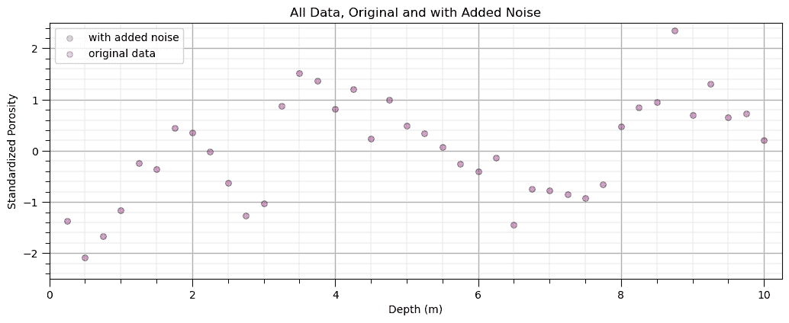
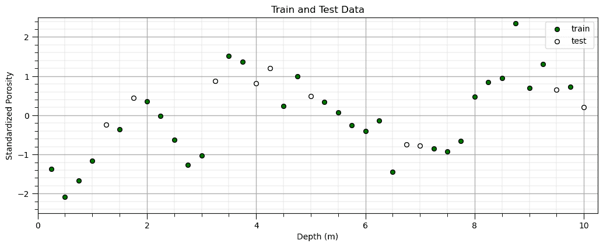
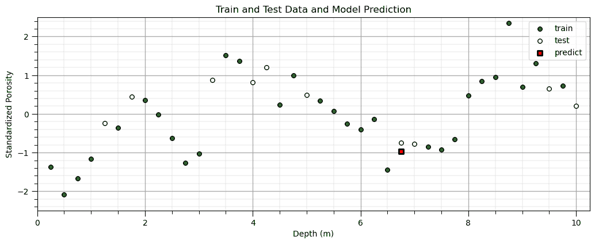
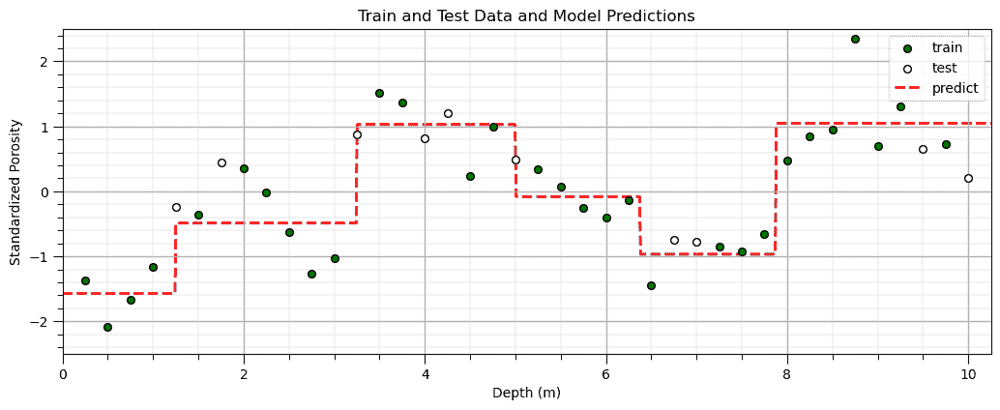
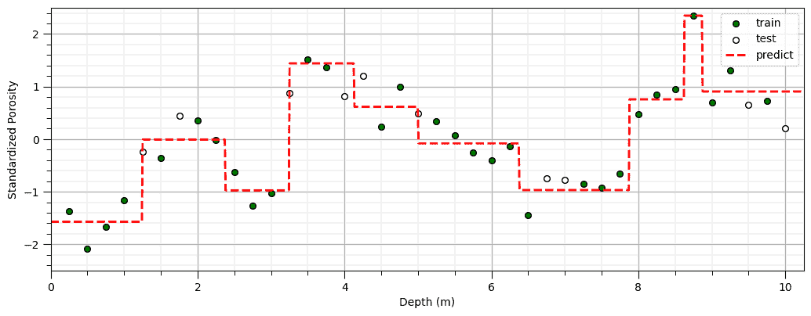
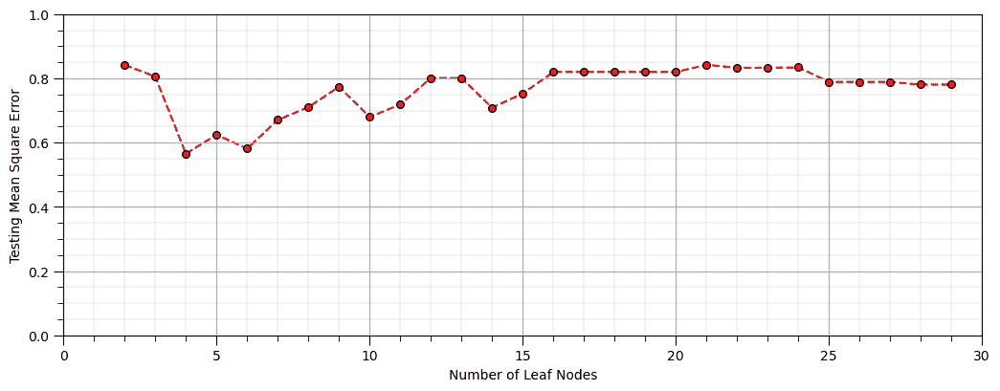
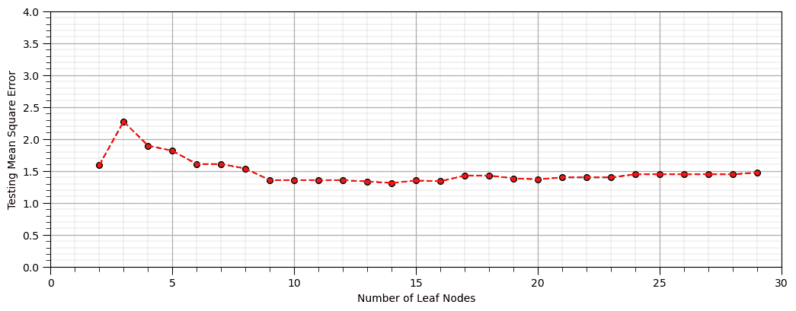
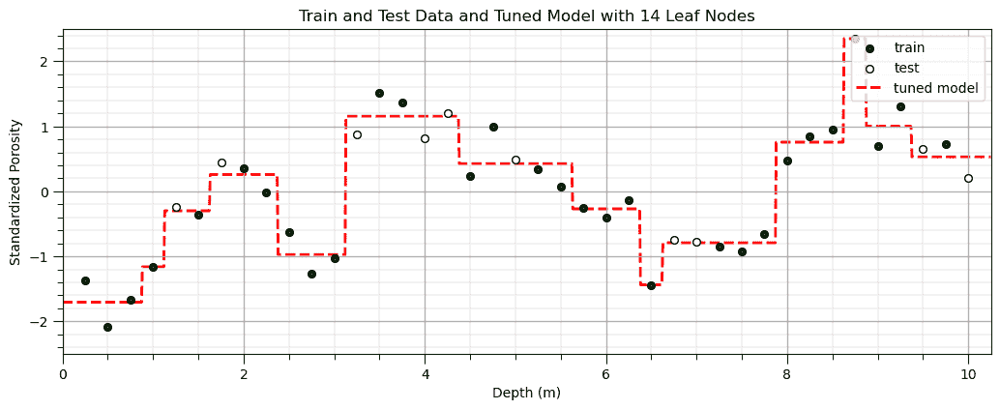

# 使用 scikit-learn 进行预测性机器学习

> 原文：[`geostatsguy.github.io/MachineLearningDemos_Book/MachineLearning_predictive.html`](https://geostatsguy.github.io/MachineLearningDemos_Book/MachineLearning_predictive.html)

Michael J. Pyrcz，教授，德克萨斯大学奥斯汀分校

[Twitter](https://twitter.com/geostatsguy) | [GitHub](https://github.com/GeostatsGuy) | [网站](http://michaelpyrcz.com) | [Google Scholar](https://scholar.google.com/citations?user=QVZ20eQAAAAJ&hl=en&oi=ao) | [地统计学书籍](https://www.amazon.com/Geostatistical-Reservoir-Modeling-Michael-Pyrcz/dp/0199731446) | [YouTube](https://www.youtube.com/channel/UCLqEr-xV-ceHdXXXrTId5ig) | [Python 应用地统计学电子书](https://geostatsguy.github.io/GeostatsPyDemos_Book/intro.html) | [Python 应用机器学习电子书](https://geostatsguy.github.io/MachineLearningDemos_Book/) | [LinkedIn](https://www.linkedin.com/in/michael-pyrcz-61a648a1)

电子书“《Python 应用机器学习：带代码的手册》”的一章。

请将此电子书引用如下：

Pyrcz, M.J., 2024, *《Python 应用机器学习：带代码的手册》[电子书]*. Zenodo. doi:10.5281/zenodo.15169138 

本书中的工作流程以及更多内容都可以在这里找到：

请将 MachineLearningDemos GitHub 仓库引用如下：

Pyrcz, M.J., 2024, *《MachineLearningDemos：Python 机器学习演示工作流程仓库》*(0.0.3) [软件]. Zenodo. DOI: 10.5281/zenodo.13835312\. GitHub 仓库：[GeostatsGuy/MachineLearningDemos](https://github.com/GeostatsGuy/MachineLearningDemos) 

作者：Michael J. Pyrcz

© 版权所有 2025。

本章是关于**使用 scikit-learn 进行预测性机器学习**的教程和演示。

**YouTube 讲座**：查看我在以下方面的讲座：

+   [机器学习简介](https://youtu.be/zOUM_AnI1DQ?si=wzWdJ35qJ9n8O6Bl)

+   [使用 scikit-learn 在 Python 中进行预测性机器学习](https://youtu.be/EbYePnjWB5o?si=dd7SpbQlQgMhFGZ5)

+   [使用 Pipelines 在 Python 中进行机器学习](https://youtu.be/tYrPs8s1l9U?si=5OMrFm7rlK6koR6g)

这些讲座都是我 YouTube 上的[机器学习课程](https://youtube.com/playlist?list=PLG19vXLQHvSC2ZKFIkgVpI9fCjkN38kwf&si=XonjO2wHdXffMpeI)的一部分，其中包含有良好文档记录的 Python 工作流程和交互式仪表板。我的目标是分享易于获取、可操作和可重复的教育内容。如果你想知道我的动机，请查看[Michael 的故事](https://michaelpyrcz.com/my-story)。

## 使用 scikit-learn 进行预测性机器学习的动机

这章对我来说很特别。作为一名教授，我避免专注于特定工具的讲座，因为我更愿意先教授原则，然后用常见工具介绍例子。我的观点是，

+   理论将超越任何可用的软件工具

+   如果没有理论重点，我可能会鼓励使用黑盒模型。

+   如果对理论有深入的理解，就可以根据需要选择任何软件。

但在这种情况下，

+   [scikit-learn](https://scikit-learn.org/) 是一个非常常用的机器学习包，被广泛用于机器学习。

+   在整个电子书中，我使用 scikit-learn

+   scikit-learn 使用一种螺丝钉和螺母的方法来构建机器学习工作流程，以最大化灵活性。

+   scikit-learn 在文档中提供理论或链接到原始出版物

总结来说，scikit-learn 让我受益匪浅，我把这个包看作是教育中的合作伙伴！谢谢！

因此，我决定添加这一章，专注于使用 scikit-learn 进行机器学习建模的方法。

## 基于机器学习的预测

这里有一个简单的流程，演示了使用简单数据集训练和调整 scikit-learn 机器学习模型。

+   我提供这个作为最基本、最少的 Python 工作流程，以帮助那些学习预测机器学习的人。

+   我演示了模型训练和调整（手动和自动），包括管道方法

+   为了便于数据和模型的可视化，这里给出了 1 个预测特征和 1 个响应

这为运行和可视化各种机器学习模型以进行经验学习提供了机会。

## 基于机器学习的预测

我们使用监督学习构建基于决策树的预测机器学习模型：

**预测**

+   非参数回归方法（连续响应）和分类（分类响应）

+   一个函数 $\hat{f}$，它是在预测特征空间中最近的 $k$ 个训练数据，这样我们就可以从一组预测特征 $X_1,\ldots,X_m$ 中预测响应特征 $Y$。

+   预测的形式如下：

\begin{equation} \hat{Y} = \hat{f}(X_1,\ldots,X_m) + \epsilon \end{equation}

其中 $\epsilon$ 是一个误差项。

**监督学习**

+   响应特征 $Y$ 在训练和测试数据中都是可用的

## 加载所需的库

以下代码加载所需的库。这些库应该已经与 Anaconda 3 一起安装。

```py
ignore_warnings = True                                        # ignore warnings?
import os                                                     # to set current working directory 
import pandas as pd                                           # DataFrames and plotting
import numpy as np                                            # arrays and matrix math
import matplotlib.pyplot as plt                               # plotting
from matplotlib.ticker import (MultipleLocator, AutoMinorLocator) # control of axes ticks
from sklearn import metrics                                   # measures to check our models
from sklearn.model_selection import train_test_split          # random train and test data split
from sklearn import tree                                      # tree program from scikit learn (package for machine learning)
plt.rc('axes', axisbelow=True)                                # plot all grids below the plot elements
if ignore_warnings == True:                                   
    import warnings
    warnings.filterwarnings('ignore')
cmap = plt.cm.inferno                                         # color map
seed = 42                                                     # random number seed 
```

如果遇到包导入错误，你可能需要首先安装这些包中的一些。这通常可以通过在 Windows 上打开命令窗口，然后输入‘python -m pip install [package-name]’来完成。更多帮助可以在相应的包文档中找到。

## 设置随机数种子

这些工作流程和模型可能使用随机过程，例如：

+   随机训练和测试分割，以及交叉验证和 k 折交叉验证

+   随机选择下一分割要考虑的特征子集

```py
np.random.seed(seed)                                        # scikit-learn uses the NumPy seed 
```

## 声明函数

让我们定义一个用于绘制网格线的函数。

```py
def add_grid():
    plt.gca().grid(True, which='major',linewidth = 1.0); plt.gca().grid(True, which='minor',linewidth = 0.2) # add y grids
    plt.gca().tick_params(which='major',length=7); plt.gca().tick_params(which='minor', length=4)
    plt.gca().xaxis.set_minor_locator(AutoMinorLocator()); plt.gca().yaxis.set_minor_locator(AutoMinorLocator()) # turn on minor ticks 
```

## 设置工作目录

我总是喜欢这样做，以免丢失文件，并简化后续的读取和写入（每次避免包含完整地址）。

```py
# not needed currently
#os.chdir("c:/PGE383")                                       # set the working directory 
```

你将不得不更新引号中的部分以包含你自己的工作目录，并且在 Mac 上格式不同（例如：“~/PGE”）。

## 读取数据表

我们使用来自我的 GitHub [GeoDataSets 仓库](https://github.com/GeostatsGuy/GeoDataSets)的“1D_Porosity.csv”逗号分隔文件。

+   此代码直接从我的 GitHub 仓库加载数据。

+   如果你有可用的本地数据文件（即你未连接到互联网），请将工作目录设置为数据文件所在的目录，并使用下面的第二行

```py
my_data = pd.read_csv("https://raw.githubusercontent.com/GeostatsGuy/GeoDataSets/master/1D_Porosity.csv") # load the comma delimited data file
#my_data = pd.read_csv("1D_Porosity.csv")                     # load the comma delimited data file locally
X = pd.DataFrame(data = my_data.loc[:,'Depth'])               # ensure X and y features are DataFrames
y = pd.DataFrame(data = my_data.loc[:,'Nporosity'])
X.head(n=2); y.head(n=2)                                      # preview the predictor feature
print('Loaded ' + str(len(my_data)) + ' samples, with features = ' + str(my_data.columns.values) + '.') 
```

```py
Loaded 40 samples, with features = ['Depth' 'Nporosity']. 
```

## 绘制可用数据

让我们做一个简单的散点图来检查数据。

```py
plt.scatter(X,y,color='red',s=30,edgecolor='black',alpha=1.0); plt.xlabel('Depth (m)'); plt.ylabel('Standardized Porosity'); plt.title('All Data'); 
plt.xlim([0,10.25]); plt.ylim([-2.5,2.5]); add_grid()
plt.subplots_adjust(left=0.0, bottom=0.0, right=1.5, top=0.7, wspace=0.2, hspace=0.2); 
```


## 可选：向响应特征$y$添加随机误差

为了更多的经验学习，考虑使用不同数量的额外错误重复此工作流程

+   为了观察模型过拟合的问题，考虑添加一些额外的错误，

```py
error_stdev = 0.0                                           # standard deviation of additional random error 
```

```py
error_stdev = 0.0                                             # standard deviation of additional random error
y_orig = y.copy(deep = True)                                  # make a deep copy of original dataset
y['Nporosity'] = y['Nporosity'] + np.random.normal(loc = 0, scale = error_stdev, size = y.shape[0])
plt.scatter(X,y,color='blue',s=30,edgecolor='black',alpha=0.2,label='with added noise'); plt.xlabel('Depth (m)'); 
plt.ylabel('Standardized Porosity'); plt.title('All Data, Original and with Added Noise'); plt.xlim([0,10.25]); plt.ylim([-2.5,2.5])
plt.scatter(X,y_orig,color='red',s=30,edgecolor='black',alpha=0.2,label='original data'); plt.xlabel('Depth (m)'); 
plt.ylabel('Standardized Porosity'); plt.legend(loc='upper left')
plt.xlim([0,10.25]); plt.ylim([-2.5,2.5]); add_grid()
plt.subplots_adjust(left=0.0, bottom=0.0, right=1.5, top=0.7, wspace=0.2, hspace=0.2); 
```



## 快速通过数据分析

此工作流程专注于构建预测机器学习模型

+   为了简洁起见，我们省略了数据检查、数据分析、统计分析、特征转换等。

+   我们直接跳到模型构建

+   我们甚至没有讨论模型选择、特征选择，也没有讨论鲁棒的超参数调整

这是可能的 simplest 预测机器学习工作流程！

+   Python 中使用 scikit-learn 进行机器学习的基础。没有更多。

## 让我们构建一个预测机器学习模型

我们使用以下步骤来构建我们的模型

1.  **实例化**机器学习模型并使用超参数

1.  **拟合**，将机器学习模型训练到训练数据上

1.  **预测**，检查训练好的机器学习模型在保留的测试数据上的预测

1.  **选择**最佳超参数，超参数调整

1.  **重新拟合**模型，使用所有数据和调整好的超参数进行训练

我们将使用训练-测试方法，另一种方法是训练、验证和测试方法。

+   我们将从一个简单的例子开始，并稍后介绍 k 折交叉验证和 scikit-learn 管道类。

## 分割训练数据和测试数据

我们将演示以下超参数调整方法：

+   **交叉验证** - 将 25%的数据作为保留的测试数据，只有 25%的数据进行测试

+   **k 折交叉验证** - 在 k 个折中计算平均误差，所有数据都进行测试

让我们从交叉验证开始，然后演示 k 折交叉验证。

```py
X_train, X_test, y_train, y_test = train_test_split(X,y, test_size=0.25, random_state=seed) # train and test split
plt.scatter(X_train,y_train,color='green',s=30,edgecolor='black',alpha=1.0,label='train'); plt.xlabel('Depth (m)') 
plt.ylabel('Standardized Porosity'); plt.title('Train and Test Data'); plt.xlim([0,10.25]); plt.ylim([-2.5,2.5]) 
plt.scatter(X_test,y_test,color='white',s=30,edgecolor='black',alpha=1.0,label='test'); plt.xlabel('Depth (m)')
plt.ylabel('Standardized Porosity');plt.legend(loc='upper right'); plt.xlim([0,10.25]); plt.ylim([-2.5,2.5]); add_grid()
plt.subplots_adjust(left=0.0, bottom=0.0, right=1.5, top=0.7, wspace=0.2, hspace=0.2); 
```



## 构建决策树模型

让我们实例化（设置超参数）并拟合（使用训练数据训练）决策树回归模型到我们的数据。

```py
max_leaf_nodes = 6                                            # set the hyperparameter
our_tree = tree.DecisionTreeRegressor(max_leaf_nodes = max_leaf_nodes) # instantiate the model
our_tree = our_tree.fit(X_train, y_train)                     # fit the model to the trainin data 
```

## 使用决策树模型进行预测

现在，让我们用我们的训练好的决策树模型进行预测。

```py
itest = 3; depth = X_test['Depth'].values[itest]            # set the predictor value for our prediction
spor = our_tree.predict([[depth]])                          # predict with our trained model
plt.scatter(X_train,y_train,color='green',s=30,edgecolor='black',alpha=1.0,label='train'); plt.xlabel('Depth (m)'); 
plt.ylabel('Standardized Porosity'); plt.title('Train and Test Data and Model Prediction'); plt.xlim([0,10.25]); plt.ylim([-2.5,2.5]) 
plt.scatter(X_test,y_test,color='white',s=30,edgecolor='black',alpha=1.0,label='test'); plt.xlabel('Depth (m)')
plt.ylabel('Standardized Porosity');plt.legend(loc='upper right')
plt.scatter(depth,spor,color='red',s=30,marker='s',edgecolor='black',alpha=1.0,lw=2,label='predict'); plt.xlabel('Depth (m)') 
plt.ylabel('Standardized Porosity');plt.legend(loc='upper right'); plt.xlim([0,10.25]); plt.ylim([-2.5,2.5]); add_grid()
plt.subplots_adjust(left=0.0, bottom=0.0, right=1.5, top=0.7, wspace=0.2, hspace=0.2); add_grid() 
```



## 使用决策树模型在一系列预测特征值上做出预测

现在，让我们在一系列预测特征值上做出预测，以便我们可以可视化模型。

+   由于我们只有一个预测特征，这很容易做到

```py
depths = np.linspace(0,10.25,1000)                          # set the predictor values for our prediction
spors = our_tree.predict(depths.reshape(-1, 1))             # predict with our trained model
plt.scatter(X_train,y_train,color='green',s=30,edgecolor='black',alpha=1.0,label='train'); plt.xlabel('Depth (m)') 
plt.ylabel('Standardized Porosity'); plt.title('Train and Test Data and Model Predictions'); plt.xlim([0,10.25]); plt.ylim([-2.5,2.5])
plt.scatter(X_test,y_test,color='white',s=30,edgecolor='black',alpha=1.0,label='test'); plt.xlabel('Depth (m)') 
plt.ylabel('Standardized Porosity');plt.legend(loc='upper right')
plt.plot(depths,spors,color='red',alpha=1.0,label='predict',linestyle='--',lw=2,zorder=-1); plt.xlabel('Depth (m)'); plt.ylabel('Standardized Porosity')
plt.xlim([0,10.25]); plt.ylim([-2.5,2.5]); add_grid()
plt.legend(loc='upper right'); plt.subplots_adjust(left=0.0, bottom=0.0, right=1.5, top=0.7, wspace=0.2, hspace=0.2); 
```



## 改变模型超参数

让我们尝试改变模型复杂度并重新调整模型。

```py
max_leaf_nodes = 10                                         # set the hyperparameter
our_tree = tree.DecisionTreeRegressor(max_leaf_nodes = max_leaf_nodes) # instantiate the model
our_tree = our_tree.fit(X_train, y_train)                   # fit the model to the trainin data
spors = our_tree.predict(depths.reshape(-1, 1))             # predict with our trained model
plt.scatter(X_train,y_train,color='green',s=30,edgecolor='black',alpha=1.0,label='train'); 
plt.xlabel('Depth (m)'); plt.ylabel('Standardized Porosity'); plt.xlim([0,10.25]); plt.ylim([-2.5,2.5]) 
plt.scatter(X_test,y_test,color='white',s=30,edgecolor='black',alpha=1.0,label='test'); plt.xlabel('Depth (m)')
plt.ylabel('Standardized Porosity');plt.legend(loc='upper right')
plt.plot(depths,spors,color='red',alpha=1.0,label='predict',linestyle='--',lw=2); plt.xlabel('Depth (m)'); 
plt.ylabel('Standardized Porosity');plt.legend(loc='upper right'); plt.xlim([0,10.25]); plt.ylim([-2.5,2.5]); add_grid()
plt.subplots_adjust(left=0.0, bottom=0.0, right=1.5, top=0.7, wspace=0.2, hspace=0.2); 
```



## 调整模型超参数

为了调整模型超参数，我们需要一个指标来总结保留测试数据上的模型错误

+   让我们在测试数据上做出预测并计算我们的指标，测试均方误差。

```py
leaf_nodes = 7                                              # set the hyperparameter
our_tree = tree.DecisionTreeRegressor(max_leaf_nodes = leaf_nodes) # instantiate the model
our_tree = our_tree.fit(X_train, y_train)                   # fit the model to the trainin data
y_predict = our_tree.predict(X_test)                        # predict at the testing data locations
mse = metrics.mean_squared_error(y_test,y_predict)
print('Testing MSE is ' + str(round(mse,2)) + '.') 
```

```py
Testing MSE is 0.67. 
```

我们需要以可变复杂度重建模型

+   让我们遍历叶节点数量并绘制保留测试数据上的性能

```py
nodes = []; scores = []; max_leaf_nodes = 30
for i, nnode in enumerate(np.arange(2,max_leaf_nodes,1)):
    our_tree = tree.DecisionTreeRegressor(max_leaf_nodes = nnode).fit(X_train, y_train) # instantiate / fit
    y_predict = our_tree.predict(X_test)                    # predict at the testing data locations
    nodes.append(nnode); scores.append(metrics.mean_squared_error(y_test,y_predict))
plt.scatter(nodes,scores,color='red',s=30,edgecolor='black',alpha=1.0,label='train'); 
plt.plot(nodes,scores,color='red',alpha=1.0,linestyle='--',zorder=-1); plt.xlabel('Depth (m)'); plt.ylabel('Standardized Porosity') 
plt.xlim([1,max_leaf_nodes]); plt.xlabel('Number of Leaf Nodes'); plt.ylabel('Testing Mean Square Error')
plt.xlim([0,max_leaf_nodes]); plt.ylim([0.0,1.0]); add_grid()
plt.subplots_adjust(left=0.0, bottom=0.0, right=1.5, top=0.7, wspace=0.2, hspace=0.2) 
```



为了对性能进行更稳健的评估，让我们使用 scikit-learn 的 k 折交叉验证。

```py
from sklearn.model_selection import cross_val_score as kfold       # cross validation methods
nodes = []; scores = []; max_leaf_nodes = 30
for i, nnode in enumerate(np.arange(2,max_leaf_nodes,1,dtype = int)):
    our_tree = tree.DecisionTreeRegressor(max_leaf_nodes = nnode) # instantiate / fit
    nodes.append(nnode); 
    scores.append(abs(kfold(estimator=our_tree,X=X,y=y,cv=4,n_jobs=4,scoring = "neg_mean_squared_error").mean()))
plt.scatter(nodes,scores,color='red',s=30,edgecolor='black',alpha=1.0,label='train')
plt.plot(nodes,scores,color='red',alpha=1.0,linestyle='--'); plt.xlabel('Depth (m)') 
plt.ylabel('Standardized Porosity'); plt.xlim([1,max_leaf_nodes]); plt.xlabel('Number of Leaf Nodes'); plt.ylabel('Testing Mean Square Error')
plt.xlim([0,max_leaf_nodes]); plt.ylim([0.0,4.0]); add_grid()
plt.subplots_adjust(left=0.0, bottom=0.0, right=1.5, top=0.7, wspace=0.2, hspace=0.2) 
```



所有先前工作的主要成果是调整后的超参数，最佳模型复杂度。

+   现在我们重新调整模型，在所有数据上训练模型，我们的调整后的模型现在可以用于实际应用

+   再次假设我们有一个训练和测试工作流程，而不是训练、验证和测试工作流程

```py
tuned_nodes = nodes[np.argmin(scores)]
our_tuned_tree = tree.DecisionTreeRegressor(max_leaf_nodes = tuned_nodes).fit(X, y) # instantiate / fit
tuned_spors = our_tuned_tree.predict(depths.reshape(-1, 1))             # predict with our trained model
plt.scatter(X_train,y_train,color='green',s=30,edgecolor='black',alpha=1.0,label='train')
plt.xlabel('Depth (m)'); plt.ylabel('Standardized Porosity')
plt.title('Train and Test Data and Tuned Model with ' + str(tuned_nodes) + ' Leaf Nodes')
plt.xlim([0,10.25]); plt.ylim([-2.5,2.5])
plt.scatter(X_test,y_test,color='white',s=30,edgecolor='black',alpha=1.0,label='test'); 
plt.xlabel('Depth (m)'); plt.ylabel('Standardized Porosity');plt.legend(loc='upper right')
plt.plot(depths,tuned_spors,color='red',alpha=1.0,label='tuned model',linestyle='--',lw=2,zorder=-1); 
plt.xlabel('Depth (m)'); plt.ylabel('Standardized Porosity');plt.legend(loc='upper right'); add_grid()
plt.subplots_adjust(left=0.0, bottom=0.0, right=1.5, top=0.7, wspace=0.2, hspace=0.2); 
```



## 完整工作流程与管道

让我们使用 scikit-learn 的 pipline 重复上述工作流程。以下是一些一般性评论：

+   **管道工作流程步骤** - 步骤列表、自定义标签以及相关的 scikit-learn 类

+   **选择和超参数** - 作为包含组合步骤自定义标签和超参数名称的字典

+   **工作流程场景** - 我们可以指定选择和超参数的列表

+   **一致的迭代** - 整个工作流程重复进行完整的组合

+   **最佳模型选择** - 最佳模型超参数组合和选择与所有数据重新调整

```py
from sklearn.pipeline import Pipeline                       # machine learning modeling pipeline
pipe = Pipeline([                                           # the machine learning workflow as a pipeline object
    ('tree', tree.DecisionTreeRegressor())
])

params = {                                                  # the machine learning workflow method's parameters
    'tree__max_leaf_nodes': np.arange(2,max_leaf_nodes,1,dtype = int)
}

from sklearn.model_selection import GridSearchCV            # model hyperparameter grid search
grid_cv_tuned = GridSearchCV(pipe, params, scoring = 'neg_mean_squared_error', # grid search cross validation 
                             cv=4,refit = True);

grid_cv_tuned.fit(X,y);                                      # fit model with tuned hyperparameters
print('Tuned maximum number of leaf nodes = ' + str(grid_cv_tuned.best_params_['tree__max_leaf_nodes']) + '.')
depth = 2.5
print('Prediction at depth = ' + str(depth) + ' m is ' + str(np.round(grid_cv_tuned.predict([[depth]]),2))) # predict with our trained model) + '.') 
```

```py
Tuned maximum number of leaf nodes = 14.
Prediction at depth = 2.5 m is [-0.97] 
```

## 评论

这是一个使用 Python 的 scikit-learn 进行预测机器学习模型构建的非常简单的演示。

+   这是一个基本介绍，可以做更多的事情

希望这有所帮助，

*迈克尔*

迈克尔·皮尔茨，博士，P.Eng. 教授，德克萨斯大学奥斯汀分校希尔布兰德石油和地球系统工程学院，经济地质局，杰克逊地球科学学院。在推特上，我是@GeostatsGuy。

## 关于作者


迈克尔·皮尔茨教授在德克萨斯大学奥斯汀分校 40 英亩校园的办公室。

迈克尔·皮尔奇兹是德克萨斯大学奥斯汀分校[科克雷尔工程学院](https://cockrell.utexas.edu/faculty-directory/alphabetical/p)和[杰克逊地球科学学院](https://www.jsg.utexas.edu/researcher/michael_pyrcz/)的教授，他在[德克萨斯大学奥斯汀分校](https://www.utexas.edu/)研究并教授地下、空间数据分析、地球统计学和机器学习。迈克尔还是，

+   能源分析新生研究计划的负责人，以及德克萨斯大学奥斯汀分校自然科学院机器学习实验室的核心教员。

+   [《计算机与地球科学》](https://www.sciencedirect.com/journal/computers-and-geosciences/about/editorial-board)的副编辑，以及国际数学地球科学协会[《数学地球科学》](https://link.springer.com/journal/11004/editorial-board)的董事会成员。

迈克尔已经撰写了 70 多篇[同行评审出版物](https://scholar.google.com/citations?user=QVZ20eQAAAAJ&hl=en)，一个用于空间数据分析的[Python 包](https://pypi.org/project/geostatspy/)，合著了一本关于空间数据分析的教科书[《地球统计学储层建模》](https://www.amazon.com/Geostatistical-Reservoir-Modeling-Michael-Pyrcz/dp/0199731446)，并是两本最近发布的电子书的作者，分别是[《Python 应用地球统计学：GeostatsPy 动手指南》](https://geostatsguy.github.io/GeostatsPyDemos_Book/intro.html)和[《Python 应用机器学习：带代码的动手指南》](https://geostatsguy.github.io/MachineLearningDemos_Book/intro.html)。

迈克尔的所有大学讲座都可以在他的[YouTube 频道](https://www.youtube.com/@GeostatsGuyLectures)上找到，其中包含 100 多个 Python 交互式仪表板和 40 多个 GitHub 账户上的详细工作流程，这些工作流程分布在 40 多个存储库中，以支持任何感兴趣的学生和在职专业人士，提供永恒的内容。要了解更多关于迈克尔的工作和共享教育资源，请访问他的网站。

## 想一起工作吗？

我希望这些内容对那些想了解更多关于地下建模、数据分析和机器学习的人有所帮助。学生和在职专业人士欢迎参加。

+   想邀请我到贵公司进行培训、辅导、项目审查、工作流程设计和/或咨询吗？我很乐意拜访并与您合作！

+   感兴趣于合作，支持我的研究生研究或我的地下数据分析与机器学习联盟（共同负责人是约翰·福斯特教授）吗？我的研究将数据分析、随机建模和机器学习理论与实践相结合，以开发新的方法和工作流程来增加价值。我们正在解决具有挑战性的地下问题！

+   我可以通过 mpyrcz@austin.utexas.edu 联系到。

我总是很高兴讨论，

*迈克尔*

迈克尔·皮尔奇，博士，P.Eng. 教授，德克萨斯大学奥斯汀分校的科克雷尔工程学院和杰克逊地球科学学院

更多资源请访问：[Twitter](https://twitter.com/geostatsguy) | [GitHub](https://github.com/GeostatsGuy) | [网站](http://michaelpyrcz.com) | [Google Scholar](https://scholar.google.com/citations?user=QVZ20eQAAAAJ&hl=en&oi=ao) | [书籍](https://www.amazon.com/Geostatistical-Reservoir-Modeling-Michael-Pyrcz/dp/0199731446) | [YouTube](https://www.youtube.com/channel/UCLqEr-xV-ceHdXXXrTId5ig) | [Python 地统计学应用电子书](https://geostatsguy.github.io/GeostatsPyDemos_Book/intro.html) | [LinkedIn](https://www.linkedin.com/in/michael-pyrcz-61a648a1)

## 使用 scikit-learn 进行预测机器学习的动机

这章对我来说很特别。作为一名教授，我避免专注于特定工具的讲座，因为我更愿意先教授原理，然后用常见的工具介绍例子。我的观点是，

+   理论将超越任何可用的软件工具

+   如果没有理论重点，我可能会鼓励使用黑盒模型

+   如果对理论有深入的理解，就可以根据需要选择任何软件

但在这种情况下，

+   [scikit-learn](https://scikit-learn.org/) 是一个非常常用的机器学习包，被广泛用于机器学习

+   在整个电子书中，我使用 scikit-learn

+   scikit-learn 采用了一种螺丝钉方法来构建机器学习工作流程，以最大化灵活性

+   scikit-learn 在文档中提供了理论，或链接到原始出版物

总结来说，scikit-learn 让我看到了它作为教育伙伴的价值！谢谢！

因此，我决定添加这一章，专注于使用 scikit-learn 进行机器学习建模的方法。

## 基于机器学习的预测

这里有一个简单的流程，演示了使用简单数据集对 scikit-learn 进行训练和调整的机器学习模型。

+   我提供这个最基本、最少的 Python 工作流程，以帮助那些学习预测机器学习的人

+   我演示了模型训练和调整（手动和自动），包括管道方法

+   为了便于数据和模型的可视化，我们只使用 1 个预测特征和 1 个响应

这为运行和可视化各种机器学习模型以进行经验学习提供了机会。

## 基于机器学习的预测

我们使用监督学习构建基于决策树的预测机器学习模型：

**预测**

+   非参数回归（连续响应）和分类（分类响应）的方法

+   一个函数 $\hat{f}$，它是预测特征空间中最近的 $k$ 个训练数据的函数，这样我们就可以从一组预测特征 $X_1,\ldots,X_m$ 中预测响应特征 $Y$。

+   预测的形式如下：

\begin{equation} \hat{Y} = \hat{f}(X_1,\ldots,X_m) + \epsilon \end{equation}

其中 $\epsilon$ 是一个误差项。

**监督学习**

+   响应特征，$Y$，在训练和测试数据中都是可用的

## 加载所需的库

以下代码加载所需的库。这些库应该已经与 Anaconda 3 一起安装。

```py
ignore_warnings = True                                        # ignore warnings?
import os                                                     # to set current working directory 
import pandas as pd                                           # DataFrames and plotting
import numpy as np                                            # arrays and matrix math
import matplotlib.pyplot as plt                               # plotting
from matplotlib.ticker import (MultipleLocator, AutoMinorLocator) # control of axes ticks
from sklearn import metrics                                   # measures to check our models
from sklearn.model_selection import train_test_split          # random train and test data split
from sklearn import tree                                      # tree program from scikit learn (package for machine learning)
plt.rc('axes', axisbelow=True)                                # plot all grids below the plot elements
if ignore_warnings == True:                                   
    import warnings
    warnings.filterwarnings('ignore')
cmap = plt.cm.inferno                                         # color map
seed = 42                                                     # random number seed 
```

如果你遇到包导入错误，你可能需要首先安装这些包中的几个。这通常可以通过在 Windows 上打开命令窗口然后输入‘python -m pip install [package-name]’来完成。更多帮助可以在相应的包文档中找到。

## 设置随机数种子

这些工作流程和模型可能使用随机过程，例如：

+   随机训练和测试分割，以及交叉验证和 k 折交叉验证

+   随机选择要考虑的下一分割的特征子集

```py
np.random.seed(seed)                                        # scikit-learn uses the NumPy seed 
```

## 声明函数

让我们定义一个用于绘制网格线的函数。

```py
def add_grid():
    plt.gca().grid(True, which='major',linewidth = 1.0); plt.gca().grid(True, which='minor',linewidth = 0.2) # add y grids
    plt.gca().tick_params(which='major',length=7); plt.gca().tick_params(which='minor', length=4)
    plt.gca().xaxis.set_minor_locator(AutoMinorLocator()); plt.gca().yaxis.set_minor_locator(AutoMinorLocator()) # turn on minor ticks 
```

## 设置工作目录

我总是喜欢这样做，这样我就不会丢失文件，并且可以简化后续的读取和写入（每次都避免包含完整的地址）。

```py
# not needed currently
#os.chdir("c:/PGE383")                                       # set the working directory 
```

你将不得不更新引号内的部分为你的工作目录，并且格式在 Mac 上不同（例如：“~/PGE”）。

## 读取数据表

我们使用来自我的 GitHub [GeoDataSets 仓库](https://github.com/GeostatsGuy/GeoDataSets)的数据“1D_Porosity.csv”逗号分隔文件。

+   这段代码直接从我的 GitHub 仓库加载数据。

+   如果你本地有数据文件（即你未连接到互联网），请将工作目录设置为数据文件的位置，并使用下面的第二行

```py
my_data = pd.read_csv("https://raw.githubusercontent.com/GeostatsGuy/GeoDataSets/master/1D_Porosity.csv") # load the comma delimited data file
#my_data = pd.read_csv("1D_Porosity.csv")                     # load the comma delimited data file locally
X = pd.DataFrame(data = my_data.loc[:,'Depth'])               # ensure X and y features are DataFrames
y = pd.DataFrame(data = my_data.loc[:,'Nporosity'])
X.head(n=2); y.head(n=2)                                      # preview the predictor feature
print('Loaded ' + str(len(my_data)) + ' samples, with features = ' + str(my_data.columns.values) + '.') 
```

```py
Loaded 40 samples, with features = ['Depth' 'Nporosity']. 
```

## 绘制可用数据

让我们做一个简单的散点图来检查数据。

```py
plt.scatter(X,y,color='red',s=30,edgecolor='black',alpha=1.0); plt.xlabel('Depth (m)'); plt.ylabel('Standardized Porosity'); plt.title('All Data'); 
plt.xlim([0,10.25]); plt.ylim([-2.5,2.5]); add_grid()
plt.subplots_adjust(left=0.0, bottom=0.0, right=1.5, top=0.7, wspace=0.2, hspace=0.2); 
```


## 可选：向响应特征，$y$，添加随机误差

为了更多的经验学习，考虑使用不同的额外错误量重复此工作流程

+   为了观察模型过拟合的问题，可以添加一些额外的误差，

```py
error_stdev = 0.0                                           # standard deviation of additional random error 
```

```py
error_stdev = 0.0                                             # standard deviation of additional random error
y_orig = y.copy(deep = True)                                  # make a deep copy of original dataset
y['Nporosity'] = y['Nporosity'] + np.random.normal(loc = 0, scale = error_stdev, size = y.shape[0])
plt.scatter(X,y,color='blue',s=30,edgecolor='black',alpha=0.2,label='with added noise'); plt.xlabel('Depth (m)'); 
plt.ylabel('Standardized Porosity'); plt.title('All Data, Original and with Added Noise'); plt.xlim([0,10.25]); plt.ylim([-2.5,2.5])
plt.scatter(X,y_orig,color='red',s=30,edgecolor='black',alpha=0.2,label='original data'); plt.xlabel('Depth (m)'); 
plt.ylabel('Standardized Porosity'); plt.legend(loc='upper left')
plt.xlim([0,10.25]); plt.ylim([-2.5,2.5]); add_grid()
plt.subplots_adjust(left=0.0, bottom=0.0, right=1.5, top=0.7, wspace=0.2, hspace=0.2); 
```


## 快速跳过数据分析

此工作流程专注于构建预测机器学习模型

+   为了简洁，我们跳过了数据检查、数据分析、统计分析、特征转换等。

+   我们直接跳到模型构建

+   我们甚至没有讨论模型选择、特征选择，也没有讨论鲁棒的超参数调整

这是最简单的预测机器学习工作流程！

+   Python 中使用 scikit-learn 进行机器学习的基础。仅此而已。

## 让我们构建一个预测机器学习模型

我们使用以下步骤来构建我们的模型

1.  **实例化**机器学习模型并设置超参数

1.  **fit**，将机器学习模型训练到训练数据上

1.  **预测**，检查训练好的机器学习模型在保留的测试数据上的预测

1.  **选择**最佳超参数，超参数调整

1.  **refit**模型，通过使用所有给定并调整好的超参数进行训练

我们将使用训练-测试方法，另一种方法是训练、验证和测试方法。

+   我们将从一个简单的例子开始，并稍后介绍 k 折交叉验证和 scikit-learn 管道类

## 分割训练集和测试集

我们将演示以下超参数调整方法：

+   **交叉验证** - 将 25%的数据作为保留的测试数据，只有 25%的数据被测试

+   **k 折交叉验证** - 在 k 个折上计算平均误差，所有数据都被测试

让我们从交叉验证开始，然后演示 k 折交叉验证。

```py
X_train, X_test, y_train, y_test = train_test_split(X,y, test_size=0.25, random_state=seed) # train and test split
plt.scatter(X_train,y_train,color='green',s=30,edgecolor='black',alpha=1.0,label='train'); plt.xlabel('Depth (m)') 
plt.ylabel('Standardized Porosity'); plt.title('Train and Test Data'); plt.xlim([0,10.25]); plt.ylim([-2.5,2.5]) 
plt.scatter(X_test,y_test,color='white',s=30,edgecolor='black',alpha=1.0,label='test'); plt.xlabel('Depth (m)')
plt.ylabel('Standardized Porosity');plt.legend(loc='upper right'); plt.xlim([0,10.25]); plt.ylim([-2.5,2.5]); add_grid()
plt.subplots_adjust(left=0.0, bottom=0.0, right=1.5, top=0.7, wspace=0.2, hspace=0.2); 
```


## 构建决策树模型

让我们实例化（设置超参数）并使用训练数据拟合一个决策树回归模型。

```py
max_leaf_nodes = 6                                            # set the hyperparameter
our_tree = tree.DecisionTreeRegressor(max_leaf_nodes = max_leaf_nodes) # instantiate the model
our_tree = our_tree.fit(X_train, y_train)                     # fit the model to the trainin data 
```

## 使用决策树模型进行预测

现在，让我们使用我们的训练决策树模型进行预测。

```py
itest = 3; depth = X_test['Depth'].values[itest]            # set the predictor value for our prediction
spor = our_tree.predict([[depth]])                          # predict with our trained model
plt.scatter(X_train,y_train,color='green',s=30,edgecolor='black',alpha=1.0,label='train'); plt.xlabel('Depth (m)'); 
plt.ylabel('Standardized Porosity'); plt.title('Train and Test Data and Model Prediction'); plt.xlim([0,10.25]); plt.ylim([-2.5,2.5]) 
plt.scatter(X_test,y_test,color='white',s=30,edgecolor='black',alpha=1.0,label='test'); plt.xlabel('Depth (m)')
plt.ylabel('Standardized Porosity');plt.legend(loc='upper right')
plt.scatter(depth,spor,color='red',s=30,marker='s',edgecolor='black',alpha=1.0,lw=2,label='predict'); plt.xlabel('Depth (m)') 
plt.ylabel('Standardized Porosity');plt.legend(loc='upper right'); plt.xlim([0,10.25]); plt.ylim([-2.5,2.5]); add_grid()
plt.subplots_adjust(left=0.0, bottom=0.0, right=1.5, top=0.7, wspace=0.2, hspace=0.2); add_grid() 
```


## 使用决策树模型预测一系列预测特征值

现在，让我们在一系列预测特征值上做出预测，以便我们可以可视化模型。

+   这很容易做到，因为我们只有一个预测特征

```py
depths = np.linspace(0,10.25,1000)                          # set the predictor values for our prediction
spors = our_tree.predict(depths.reshape(-1, 1))             # predict with our trained model
plt.scatter(X_train,y_train,color='green',s=30,edgecolor='black',alpha=1.0,label='train'); plt.xlabel('Depth (m)') 
plt.ylabel('Standardized Porosity'); plt.title('Train and Test Data and Model Predictions'); plt.xlim([0,10.25]); plt.ylim([-2.5,2.5])
plt.scatter(X_test,y_test,color='white',s=30,edgecolor='black',alpha=1.0,label='test'); plt.xlabel('Depth (m)') 
plt.ylabel('Standardized Porosity');plt.legend(loc='upper right')
plt.plot(depths,spors,color='red',alpha=1.0,label='predict',linestyle='--',lw=2,zorder=-1); plt.xlabel('Depth (m)'); plt.ylabel('Standardized Porosity')
plt.xlim([0,10.25]); plt.ylim([-2.5,2.5]); add_grid()
plt.legend(loc='upper right'); plt.subplots_adjust(left=0.0, bottom=0.0, right=1.5, top=0.7, wspace=0.2, hspace=0.2); 
```


## 改变模型超参数

让我们尝试改变模型复杂度并重新调整模型。

```py
max_leaf_nodes = 10                                         # set the hyperparameter
our_tree = tree.DecisionTreeRegressor(max_leaf_nodes = max_leaf_nodes) # instantiate the model
our_tree = our_tree.fit(X_train, y_train)                   # fit the model to the trainin data
spors = our_tree.predict(depths.reshape(-1, 1))             # predict with our trained model
plt.scatter(X_train,y_train,color='green',s=30,edgecolor='black',alpha=1.0,label='train'); 
plt.xlabel('Depth (m)'); plt.ylabel('Standardized Porosity'); plt.xlim([0,10.25]); plt.ylim([-2.5,2.5]) 
plt.scatter(X_test,y_test,color='white',s=30,edgecolor='black',alpha=1.0,label='test'); plt.xlabel('Depth (m)')
plt.ylabel('Standardized Porosity');plt.legend(loc='upper right')
plt.plot(depths,spors,color='red',alpha=1.0,label='predict',linestyle='--',lw=2); plt.xlabel('Depth (m)'); 
plt.ylabel('Standardized Porosity');plt.legend(loc='upper right'); plt.xlim([0,10.25]); plt.ylim([-2.5,2.5]); add_grid()
plt.subplots_adjust(left=0.0, bottom=0.0, right=1.5, top=0.7, wspace=0.2, hspace=0.2); 
```


## 调整模型超参数

为了调整模型超参数，我们需要一个指标来总结保留测试数据上的模型误差

+   让我们在测试数据上预测并计算我们的指标，即测试均方误差。

```py
leaf_nodes = 7                                              # set the hyperparameter
our_tree = tree.DecisionTreeRegressor(max_leaf_nodes = leaf_nodes) # instantiate the model
our_tree = our_tree.fit(X_train, y_train)                   # fit the model to the trainin data
y_predict = our_tree.predict(X_test)                        # predict at the testing data locations
mse = metrics.mean_squared_error(y_test,y_predict)
print('Testing MSE is ' + str(round(mse,2)) + '.') 
```

```py
Testing MSE is 0.67. 
```

我们需要以可变复杂度重新构建模型

+   让我们遍历叶节点数并绘制保留测试数据上的性能

```py
nodes = []; scores = []; max_leaf_nodes = 30
for i, nnode in enumerate(np.arange(2,max_leaf_nodes,1)):
    our_tree = tree.DecisionTreeRegressor(max_leaf_nodes = nnode).fit(X_train, y_train) # instantiate / fit
    y_predict = our_tree.predict(X_test)                    # predict at the testing data locations
    nodes.append(nnode); scores.append(metrics.mean_squared_error(y_test,y_predict))
plt.scatter(nodes,scores,color='red',s=30,edgecolor='black',alpha=1.0,label='train'); 
plt.plot(nodes,scores,color='red',alpha=1.0,linestyle='--',zorder=-1); plt.xlabel('Depth (m)'); plt.ylabel('Standardized Porosity') 
plt.xlim([1,max_leaf_nodes]); plt.xlabel('Number of Leaf Nodes'); plt.ylabel('Testing Mean Square Error')
plt.xlim([0,max_leaf_nodes]); plt.ylim([0.0,1.0]); add_grid()
plt.subplots_adjust(left=0.0, bottom=0.0, right=1.5, top=0.7, wspace=0.2, hspace=0.2) 
```


为了对性能进行更稳健的评估，让我们使用 scikit-learn 的 k 折交叉验证。

```py
from sklearn.model_selection import cross_val_score as kfold       # cross validation methods
nodes = []; scores = []; max_leaf_nodes = 30
for i, nnode in enumerate(np.arange(2,max_leaf_nodes,1,dtype = int)):
    our_tree = tree.DecisionTreeRegressor(max_leaf_nodes = nnode) # instantiate / fit
    nodes.append(nnode); 
    scores.append(abs(kfold(estimator=our_tree,X=X,y=y,cv=4,n_jobs=4,scoring = "neg_mean_squared_error").mean()))
plt.scatter(nodes,scores,color='red',s=30,edgecolor='black',alpha=1.0,label='train')
plt.plot(nodes,scores,color='red',alpha=1.0,linestyle='--'); plt.xlabel('Depth (m)') 
plt.ylabel('Standardized Porosity'); plt.xlim([1,max_leaf_nodes]); plt.xlabel('Number of Leaf Nodes'); plt.ylabel('Testing Mean Square Error')
plt.xlim([0,max_leaf_nodes]); plt.ylim([0.0,4.0]); add_grid()
plt.subplots_adjust(left=0.0, bottom=0.0, right=1.5, top=0.7, wspace=0.2, hspace=0.2) 
```


所有之前工作的主要成果是调整后的超参数，即最佳模型复杂度。

+   现在我们重新调整模型，在所有数据上训练模型，我们的调整后的模型现在可以用于实际应用了

+   再次假设我们有一个训练和测试工作流程，而不是训练、验证和测试工作流程

```py
tuned_nodes = nodes[np.argmin(scores)]
our_tuned_tree = tree.DecisionTreeRegressor(max_leaf_nodes = tuned_nodes).fit(X, y) # instantiate / fit
tuned_spors = our_tuned_tree.predict(depths.reshape(-1, 1))             # predict with our trained model
plt.scatter(X_train,y_train,color='green',s=30,edgecolor='black',alpha=1.0,label='train')
plt.xlabel('Depth (m)'); plt.ylabel('Standardized Porosity')
plt.title('Train and Test Data and Tuned Model with ' + str(tuned_nodes) + ' Leaf Nodes')
plt.xlim([0,10.25]); plt.ylim([-2.5,2.5])
plt.scatter(X_test,y_test,color='white',s=30,edgecolor='black',alpha=1.0,label='test'); 
plt.xlabel('Depth (m)'); plt.ylabel('Standardized Porosity');plt.legend(loc='upper right')
plt.plot(depths,tuned_spors,color='red',alpha=1.0,label='tuned model',linestyle='--',lw=2,zorder=-1); 
plt.xlabel('Depth (m)'); plt.ylabel('Standardized Porosity');plt.legend(loc='upper right'); add_grid()
plt.subplots_adjust(left=0.0, bottom=0.0, right=1.5, top=0.7, wspace=0.2, hspace=0.2); 
```


## 完整工作流程与管道

让我们重复上述工作流程，使用 scikit-learn 的管道。以下是一些一般性评论：

+   **管道工作流程步骤** - 步骤列表、自定义标签和相关的 scikit-learn 类

+   **选择和超参数** - 以字典形式组合步骤自定义标签和超参数名称

+   **工作流程场景** - 我们可以指定选择和超参数的列表

+   **一致迭代** - 整个工作流程会重复进行完整的组合

+   **最佳模型选择** - 选择最佳模型超参数组合和选择，并使用所有数据进行重新拟合

```py
from sklearn.pipeline import Pipeline                       # machine learning modeling pipeline
pipe = Pipeline([                                           # the machine learning workflow as a pipeline object
    ('tree', tree.DecisionTreeRegressor())
])

params = {                                                  # the machine learning workflow method's parameters
    'tree__max_leaf_nodes': np.arange(2,max_leaf_nodes,1,dtype = int)
}

from sklearn.model_selection import GridSearchCV            # model hyperparameter grid search
grid_cv_tuned = GridSearchCV(pipe, params, scoring = 'neg_mean_squared_error', # grid search cross validation 
                             cv=4,refit = True);

grid_cv_tuned.fit(X,y);                                      # fit model with tuned hyperparameters
print('Tuned maximum number of leaf nodes = ' + str(grid_cv_tuned.best_params_['tree__max_leaf_nodes']) + '.')
depth = 2.5
print('Prediction at depth = ' + str(depth) + ' m is ' + str(np.round(grid_cv_tuned.predict([[depth]]),2))) # predict with our trained model) + '.') 
```

```py
Tuned maximum number of leaf nodes = 14.
Prediction at depth = 2.5 m is [-0.97] 
```

## 评论

这是一个使用 Python 的 scikit-learn 进行预测机器学习模型构建的简单演示。

+   这是一个基本的介绍，可以做更多的事情

希望这有所帮助，

*迈克尔*

迈克尔·皮尔茨，博士，P.Eng. 教授，德克萨斯大学奥斯汀分校 Hildebrand 石油和地质系统工程学院，经济地质局，Jackson 地球科学学院，德克萨斯大学奥斯汀分校。在推特上，我是@GeostatsGuy。

## 关于作者


在德克萨斯大学奥斯汀分校 40 英亩校园的办公室里，迈克尔·皮尔茨教授。

迈克尔·皮尔茨是德克萨斯大学奥斯汀分校的[Cockrell 工程学院](https://cockrell.utexas.edu/faculty-directory/alphabetical/p)和[Jackson 地球科学学院](https://www.jsg.utexas.edu/researcher/michael_pyrcz/)的教授，他在[德克萨斯大学奥斯汀分校](https://www.utexas.edu/)从事和教授地下、空间数据分析、地统计学和机器学习。迈克尔还，

+   [能源分析](https://fri.cns.utexas.edu/energy-analytics)新生研究项目的首席研究员，以及德克萨斯大学奥斯汀分校自然科学学院机器学习实验室的核心教员。

+   [计算机与地球科学](https://www.sciencedirect.com/journal/computers-and-geosciences/about/editorial-board)的副编辑和[数学地球科学](https://link.springer.com/journal/11004/editorial-board)国际数学地球科学协会的董事会成员。

迈克尔已经撰写了超过 70 篇[同行评审出版物](https://scholar.google.com/citations?user=QVZ20eQAAAAJ&hl=en)，一个用于空间数据分析的[Python 包](https://pypi.org/project/geostatspy/)，合著了一本关于空间数据分析的教科书[地统计学储层建模](https://www.amazon.com/Geostatistical-Reservoir-Modeling-Michael-Pyrcz/dp/0199731446)，并是两本最近发布的电子书的作者，[Python 中的应用地统计学：GeostatsPy 实践指南](https://geostatsguy.github.io/GeostatsPyDemos_Book/intro.html)和[Python 中的应用机器学习：带代码的实践指南](https://geostatsguy.github.io/MachineLearningDemos_Book/intro.html)。

迈克尔的所有大学讲座都可以在他的[YouTube 频道](https://www.youtube.com/@GeostatsGuyLectures)上找到，其中包含 100 多个 Python 交互式仪表板和 40 多个存储库中的详细记录工作流程，这些存储库位于他的[GitHub 账户](https://github.com/GeostatsGuy)，以支持任何感兴趣的学生和在职专业人士，提供常青内容。想了解更多关于迈克尔的工作和共享教育资源，请访问他的网站。

## 想要一起工作吗？

我希望这些内容对那些想了解更多关于地下建模、数据分析和机器学习的人有所帮助。学生和在职专业人士欢迎参加。

+   想邀请我到贵公司进行培训、辅导、项目审查、工作流程设计和/或咨询吗？我很乐意拜访并与您合作！

+   想要合作、支持我的研究生研究或我的地下数据分析与机器学习联盟（共同负责人是约翰·福斯特教授）吗？我的研究将数据分析、随机建模和机器学习理论与实践相结合，以开发新的方法和工作流程，增加价值。我们正在解决具有挑战性的地下问题！

+   您可以通过 mpyrcz@austin.utexas.edu 联系我。

我总是很高兴讨论，

*迈克尔*

迈克尔·皮尔奇，博士，注册工程师，德克萨斯大学奥斯汀分校 Cockrell 工程学院和 Jackson 地球科学学院教授

更多资源可在以下链接获取：[Twitter](https://twitter.com/geostatsguy) | [GitHub](https://github.com/GeostatsGuy) | [网站](http://michaelpyrcz.com) | [Google Scholar](https://scholar.google.com/citations?user=QVZ20eQAAAAJ&hl=en&oi=ao) | [书籍](https://www.amazon.com/Geostatistical-Reservoir-Modeling-Michael-Pyrcz/dp/0199731446) | [YouTube](https://www.youtube.com/channel/UCLqEr-xV-ceHdXXXrTId5ig) | [Python 地质统计学电子书](https://geostatsguy.github.io/GeostatsPyDemos_Book/intro.html) | [LinkedIn](https://www.linkedin.com/in/michael-pyrcz-61a648a1)
