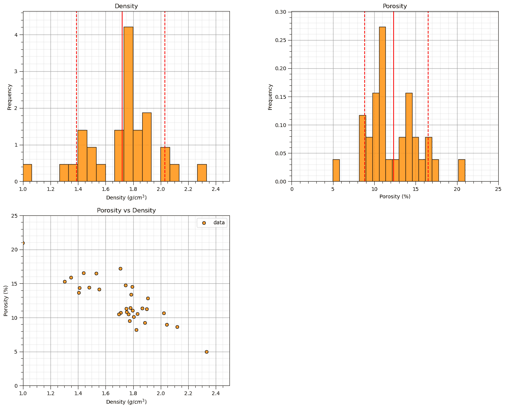
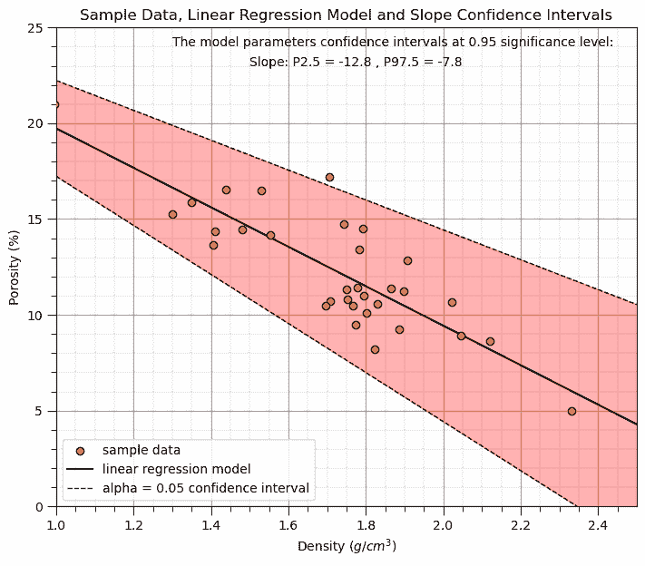
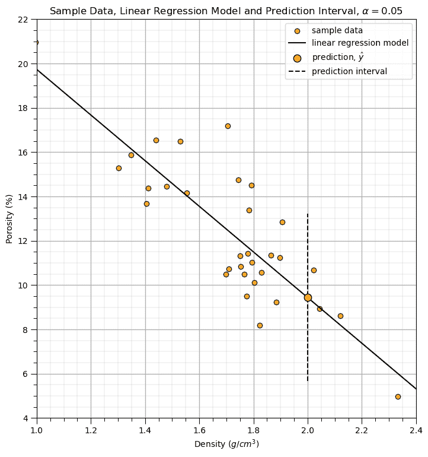
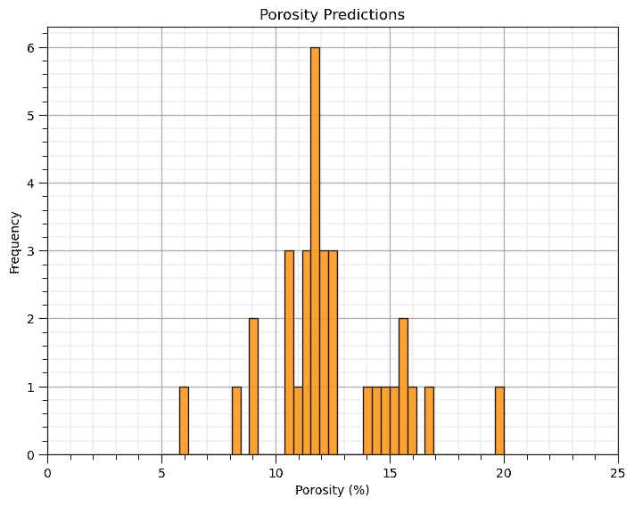
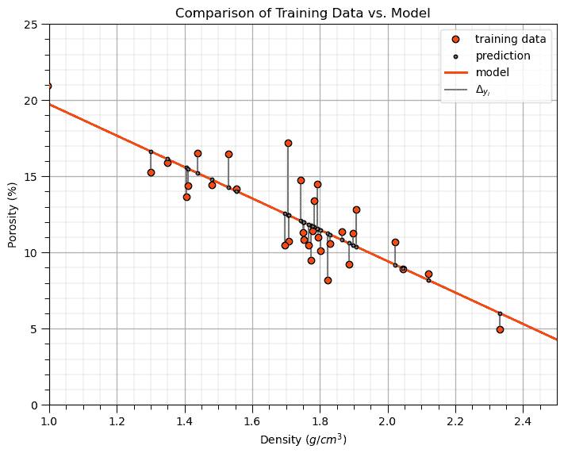
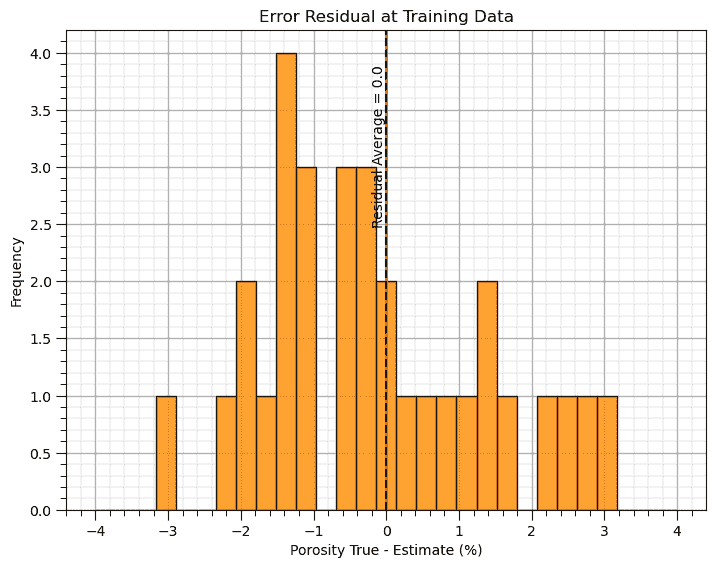
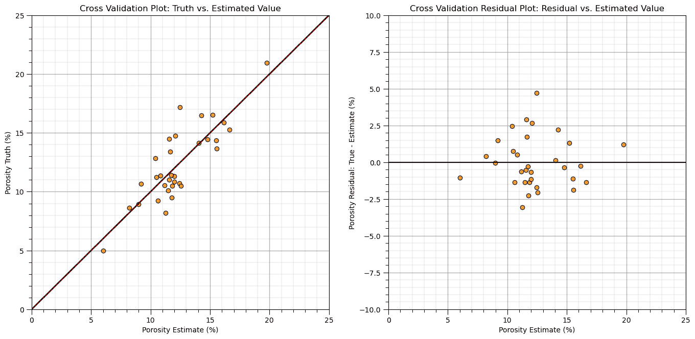
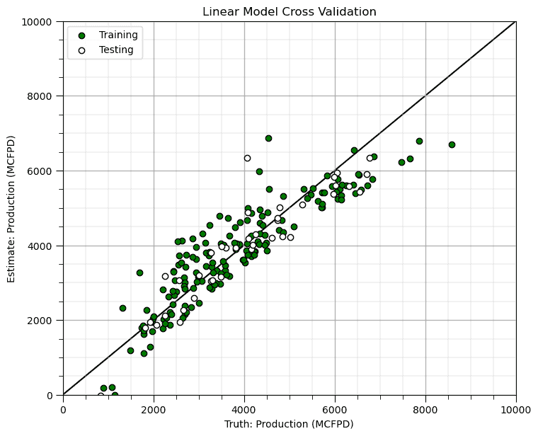

# 线性回归

> 原文：[`geostatsguy.github.io/MachineLearningDemos_Book/MachineLearning_linear_regression.html`](https://geostatsguy.github.io/MachineLearningDemos_Book/MachineLearning_linear_regression.html)

迈克尔·J·皮尔茨，教授，德克萨斯大学奥斯汀分校

[Twitter](https://twitter.com/geostatsguy) | [GitHub](https://github.com/GeostatsGuy) | [网站](http://michaelpyrcz.com) | [Google Scholar](https://scholar.google.com/citations?user=QVZ20eQAAAAJ&hl=en&oi=ao) | [地统计学书籍](https://www.amazon.com/Geostatistical-Reservoir-Modeling-Michael-Pyrcz/dp/0199731446) | [YouTube](https://www.youtube.com/channel/UCLqEr-xV-ceHdXXXrTId5ig) | [Python 中应用地统计学电子书](https://geostatsguy.github.io/GeostatsPyDemos_Book/intro.html) | [Python 中应用机器学习电子书](https://geostatsguy.github.io/MachineLearningDemos_Book/) | [LinkedIn](https://www.linkedin.com/in/michael-pyrcz-61a648a1)

电子书“Python 中应用机器学习：动手指南及代码”的章节。

请将此电子书引用如下：

Pyrcz, M.J., 2024, *Python 中应用机器学习：动手指南及代码* [电子书]. Zenodo. doi:10.5281/zenodo.15169138 

本书及更多工作流程在此处可用：

请将 MachineLearningDemos GitHub 仓库引用如下：

Pyrcz, M.J., 2024, *MachineLearningDemos: Python 机器学习演示工作流程存储库* (0.0.3) [软件]. Zenodo. DOI: 10.5281/zenodo.13835312\. GitHub 仓库: [GeostatsGuy/MachineLearningDemos](https://github.com/GeostatsGuy/MachineLearningDemos) 

作者：迈克尔·J·皮尔茨

© 版权所有 2024。

本章是关于**线性回归**的教程和演示。

**YouTube 讲座**：查看我在以下方面的讲座：

+   [机器学习简介](https://youtu.be/zOUM_AnI1DQ?si=wzWdJ35qJ9n8O6Bl)

+   [线性回归](https://youtu.be/0fzbyhWiP84)

+   [岭回归](https://youtu.be/pMGO40yXZ5Y?si=ygJAheyX-v2BmSiR)

+   [LASSO 回归](https://youtu.be/cVFYhlCCI_8?si=NbwIDaZj30vxezn2)

+   [规范](https://youtu.be/JmxGlrurQp0?si=vuF1TXDbZkyRC1j-)

这些讲座都是我 YouTube 上的 [机器学习课程](https://youtube.com/playlist?list=PLG19vXLQHvSC2ZKFIkgVpI9fCjkN38kwf&si=XonjO2wHdXffMpeI) 的一部分，其中包含有良好文档记录的 Python 工作流程和交互式仪表板。我的目标是分享易于获取、可操作和可重复的教育内容。如果您想了解我的动机，请查看 [迈克尔的故事](https://michaelpyrcz.com/my-story)。

## 线性回归的动机

这里有一个简单的流程，演示了基于机器学习的线性回归预测。为什么从线性回归开始？

+   线性回归是最简单的参数化预测机器学习模型

+   我们通过从训练 MSE 的导数计算出的解析解来学习训练机器学习模型。

+   让我们开始了解损失函数和范数概念

+   我们可以访问模型不确定性的置信区间分析表达式，以及参数显著性的假设检验

这里是关于线性回归的一些基本细节。

## 线性回归

用于预测的线性回归，让我们先看看一组数据拟合的线性模型。


示例线性回归模型。

让我们先定义一些术语，

+   **预测特征** - 预测模型的输入特征，鉴于我们只讨论线性回归而不讨论多元线性回归，我们只有一个预测特征 $x$。在我们的图表（包括上面的）中，预测特征位于 x 轴上。

+   **响应特征** - 预测模型的输出特征，在这种情况下，$y$。在我们的图表（包括上面的）中，响应特征位于 y 轴上。

现在，这里是线性回归的一些关键方面：

**参数模型**

这是一个参数预测机器学习模型，我们接受一个先验的线性假设，然后获得一个非常低的参数表示，这使得在没有大量数据的情况下易于训练。

+   适配模型是一个基于所有可用特征 $x_1,\ldots,x_m$ 的简单加权线性加性模型。

+   参数模型的形式为：

$$ y = \sum_{\alpha = 1}^m b_{\alpha} x_{\alpha} + b_0 $$

这里是线性模型参数的可视化，


线性模型参数。

**最小二乘法**

对于 L2 范数损失函数，模型参数 $b_1,\ldots,b_m,b_0$ 的解析解是可用的，误差是总和并平方的，即最小二乘法。

+   我们在训练数据上最小化误差，残差平方和（RSS）：

$$ RSS = \sum_{i=1}^n \left(y_i - (\sum_{\alpha = 1}^m b_{\alpha} x_{\alpha,i} + b_0) \right)² $$

其中 $y_i$ 是实际响应特征值，$\sum_{\alpha = 1}^m b_{\alpha} x_{\alpha,i} + b_0$ 是模型预测，在 $\alpha = 1,\ldots,n$ 的训练数据上。

这里是 L2 范数损失函数，均方误差（MSE）的可视化，


线性模型损失函数，均方误差。

+   这可以简化为训练数据上的平方误差总和，

\begin{equation} \sum_{i=1}^n (\Delta y_i)² \end{equation}

其中 $\Delta y_i$ 是实际响应特征观察 $y_i$ 减去模型预测 $\sum_{\alpha = 1}^m b_{\alpha} x_{\alpha} + b_0$，在 $i = 1,\ldots,n$ 的训练数据上。

**假设**

我们的线性回归模型有一些重要的假设，

+   **无误差** - 预测变量是无误差的，不是随机变量

+   **线性** - 响应是特征（s）的线性组合

+   **常数方差** - 响应误差在预测值上是恒定的

+   **误差独立性** - 响应误差之间不相关

+   **无多重共线性** - 没有特征与其他特征冗余

## 解析解

由于损失是 $L²$，我们可以访问一个非迭代、解析的解，即线性回归模型参数的优化。

+   我们正在寻找使损失函数最小化的模型参数

+   当我们有一个解析解时，我们可以使用损失函数的一阶和二阶导数，

$$ RSS = \sum_{i=1}^n \left(y_i - (\sum_{\alpha = 1}^m b_{\alpha} x_{\alpha,i} + b_0) \right)² $$

局部或全局损失最小值发生在，

+   损失函数的一阶导数为 0.0 - 零斜率表示局部最小值或最大值

$$ \frac{\partial L(y_{\alpha}, F(X_{\alpha}))}{\partial b_1} = 0 $$

+   损失函数的二阶导数大于 0.0 - 正曲率表示局部最小值而不是最大值

$$ \frac{\partial² L(y_{\alpha}, F(X_{\alpha}))}{\partial b_1²} > 0 $$

现在让我们使用这种方法推导线性回归的解。

## 线性回归训练

对于最小二乘法（L2）范数，线性回归模型参数可以通过具有解析解的训练数据进行训练。让我们推导出线性回归解析解的情况，其中只有一个预测特征。

为了计算斜率系数，$b_1$，我们首先从损失函数开始，

$$ RSS = \sum_{i=1}^n \left(y_i - \left( b_{1} x_{i} + b_0 \right) \right)² = \sum_{i=1}^n \left(y_i - b_{1} x_{i} - b_0 \right)² $$

现在我们对模型参数，$b_1$，求偏导数，

$$ \frac{\partial}{\partial b_1} \sum_{i=1}^n \left(y_i - b_{1} x_{i} - b_0 \right)² = \sum_{i=1}^n -2 \cdot x_i \left(y_i - b_0 -b_1 x_i \right) $$

为了优化，最小化损失，我们将关于模型参数的偏导数，$b_1$ 等于 0.0。

$$ 0 = \sum_{i=1}^n -2 \cdot x_i \left(y_i - b_0 -b_1 x_i \right) $$

我们可以简化（两边除以-2）并分配乘法以得到，

$$ 0 = \sum_{i=1}^n x_i \cdot y_i - b_0 \cdot x_i -b_1 x_i² $$

现在我们可以代入 $b_0 = \overline{y} - b_1 \cdot \overline{x}$,

$$ 0 = \sum_{i=1}^n x_i \cdot y_i - \left(\overline{y} - b_1 \cdot \overline{x} \right) \cdot x_i - b_1 x_i² $$

再次相乘得到，

$$ 0 = \sum_{i=1}^n x_i \cdot y_i - \overline{y} \cdot x_i + b_1 \cdot \overline{x} \cdot x_i - b_1 x_i² $$

我们分开求和，

$$ 0 = \sum_{i=1}^n x_i \cdot y_i - \overline{y} \cdot x_i + \sum_{i=1}^n b_1 \cdot \overline{x} \cdot x_i - b_1 x_i² $$

我们可以提取出 $b_1$ 常数，

$$ 0 = \sum_{i=1}^n x_i \cdot y_i - \overline{y} \cdot x_i + b_1 \sum_{i=1}^n \overline{x} \cdot x_i - x_i² $$

并稍作排序以得到，

$$ 0 = \sum_{i=1}^n x_i \cdot y_i - \overline{y} \cdot x_i - b_1 \sum_{i=1}^n x_i² - \overline{x} \cdot x_i $$

移到另一边，

$$ b_1 \sum_{i=1}^n x_i² - \overline{x} \cdot x_i = \sum_{i=1}^n x_i \cdot y_i - \overline{y} \cdot x_i $$

将两个尺寸除以 $\sum_{i=1}^n x_i² - \overline{x} \cdot x_i$,

$$ b_1 = \frac{\sum_{i=1}^n x_i \cdot y_i - \overline{y} \cdot x_i}{\sum_{i=1}^n x_i² - \overline{x} \cdot x_i} $$

我们现在得到了线性回归中 $b_1$ 斜率项的解析解。可以证明这等价于另一种形式，

$$ b_1 = \frac{\sum_{i=1}^n \left( x_i - \overline{x} \right) \cdot \left( y_i - \overline{y} \right)}{\sum_{i=1}^n \left( x_i - \overline{x} \right)²} $$

我更喜欢这种形式，因为它可以容易地解释为 $X$ 和 $Y$ 的协方差 $C_{x,y}$ 除以 $X$ 的方差 $\sigma_{x}²$。

现在计算截距项 $b_0$，我们回到损失函数，

$$ RSS = \sum_{i=1}^n \left(y_i - \left( b_{1} x_{i} + b_0 \right) \right)² = \sum_{i=1}^n \left(y_i - b_{1} x_{i} - b_0 \right)² $$

这次我们对 $b_0$ 求偏导数，

$$ \frac{\partial}{\partial b_0} \sum_{i=1}^n \left(y_i - b_{1} x_{i} - b_0 \right)² = \sum_{i=1}^n -2 \left(y_i - b_0 -b_1 x_i \right) $$

为了优化，最小化损失，我们将关于模型参数 $b_0$ 的偏导数设为 0.0。

$$ 0 = \sum_{i=1}^n -2 \left(y_i - b_0 -b_1 x_i \right) $$

我们将两边除以 -2，

$$ 0 = \sum_{i=1}^n y_i - b_0 -b_1 x_i $$

并将求和展开，

$$ 0 = \sum_{i=1}^n y_i - \sum_{i=1}^n b_0 - \sum_{i=1}^n b_1 x_i $$

将常数项简化，因为它是一个常数，$\sum_{i=1}^n b_0 = n \cdot b_0$，

$$ 0 = \sum_{i=1}^n y_i - n \cdot b_0 - \sum_{i=1}^n b_1 x_i $$

现在将 $b_0$ 项移到左边，

$$ n \cdot b_0 = \sum_{i=1}^n y_i - \sum_{i=1}^n b_1 x_i $$

从和中提取常数 $b_1$，

$$ n \cdot b_0 = \sum_{i=1}^n y_i - b_1 \sum_{i=1}^n x_i $$

两边同时除以 $n$，

$$ b_0 = \frac{\sum_{i=1}^n y_i}{n} - b_1 \frac{\sum_{i=1}^n x_i}{n} $$

这非常有趣，我们现在看到了两个算术平均值！

$$ \frac{\sum_{i=1}^n y_i}{n} = \overline{y} \quad \quad \frac{\sum_{i=1}^n x_i}{n} = \overline{x} $$

因此我们的解很简单，

$$ b_0 = \overline{y} - b_1 \cdot \overline{x} $$

## 检查模型

对于线性回归模型，我们有强大的指标来检查我们的模型，即确定系数，也称为“r-squared”，$r²$。

+   模型解释的方差比例

+   计算为解释方差 $SS_{reg}$ 除以总方差 $SS_{tot}$，

$$ SS_{reg} = \sum_{i=1}^n \left(\hat{y}_i - \overline{y} \right)² \quad \quad SS_{tot} = \sum_{i=1}^n \left(y_i - \overline{y} \right)² $$

其中 $\hat{y}_i$ 是第 $i$ 个训练数据的模型预测，$\overline{y}$ 是样本数据的平均值。

+   $r²$ 可以从相关系数计算得出，因此你可以在训练之前了解线性回归模型的好坏！

$$ r² = \left(\rho_{x,y} \right)² $$

注意，$r²$只能用于线性模型，其中，

$$ \sigma²_{tot} = \sigma²_{reg} + \sigma²_{res} $$

其中 $\sigma²_{tot}$ 是响应特征的总方差，$\sigma²_{reg}$ 是模型预测的方差，$\sigma²_{res}$ 是误差的方差，即残差，$\Delta y_i = y_i - \hat{y}_i$。

如何解释 $r²$？设定硬阈值是危险的，但我可以提供一些软性指导，

+   $r² \ge 0.98$ - 模型在作弊或者问题非常简单，线性，无噪声且采样良好

+   $0.0 \le r² \le 0.6$ - 模型工作得不好，检查数据和模型选择

+   $r² \lt 0.0$ - 模型走向错误！您最好通过全局均值，$\overline{y}$进行估计

## 模型不确定性

为了传达模型不确定性，我们依赖于模型参数 $b_1$ 和 $b_0$ 的置信区间。为了方便起见，让我们在这里定义置信区间，

**置信区间** - 以范围、下限和上限表示的总结统计量/模型/模型参数的不确定性，基于指定的概率区间，称为置信水平。

我们这样传达置信区间：

+   有 95%的概率（或者说 20 次中的 19 次）模型斜率在 0.5 和 0.7 之间。

我们在这里介绍分析方法，但我们也可以使用更灵活的 Bootstrap 方法。

这里就足够了，让我们加载数据，并在演示线性回归时进行解释。

## 加载所需的库

我们还需要一些标准包。这些包应该已经与 Anaconda 3 一起安装了。

```py
suppress_warnings = False                                     # select to suppress warnings
import os                                                     # to set current working directory 
import math                                                   # square root
import numpy as np                                            # arrays and matrix math
import scipy.stats as st                                      # statistical methods
import pandas as pd                                           # DataFrames
import matplotlib.pyplot as plt                               # for plotting
from matplotlib.ticker import (MultipleLocator, AutoMinorLocator) # control of axes ticks
from sklearn.preprocessing import MinMaxScaler                # min/max normalization
from sklearn.linear_model import LinearRegression             # linear regression
from sklearn.model_selection import train_test_split          # train and test split
cmap = plt.cm.inferno                                         # default color bar, no bias and friendly for color vision defeciency
plt.rc('axes', axisbelow=True)                                # grid behind plotting elements
if suppress_warnings == True:  
    import warnings                                           # suppress any warnings for this demonstration
    warnings.filterwarnings('ignore') 
```

如果您遇到包导入错误，您可能必须首先安装这些包中的一些。这通常可以通过在 Windows 上打开命令窗口然后输入‘python -m pip install [package-name]’来完成。有关相应包的文档，可以获得更多帮助。

## 声明函数

让我们定义一个函数来简化向我们的图表添加指定的百分位数和主次网格线。

```py
def weighted_percentile(data, weights, perc):                 # calculate weighted percentile, iambr on StackOverflow 
    ix = np.argsort(data)                                     # https://stackoverflow.com/questions/21844024/weighted-percentile-using-numpy/32216049
    data = data[ix] 
    weights = weights[ix] 
    cdf = (np.cumsum(weights) - 0.5 * weights) / np.sum(weights) 
    return np.interp(perc, cdf, data)

def histogram_bounds(values,weights,color):                   # add uncertainty bounds to a histogram 
    p10 = weighted_percentile(values,weights,0.1); avg = np.average(values,weights=weights); p90 = weighted_percentile(values,weights,0.9)
    plt.plot([p10,p10],[0.0,45],color = color,linestyle='dashed')
    plt.plot([avg,avg],[0.0,45],color = color)
    plt.plot([p90,p90],[0.0,45],color = color,linestyle='dashed')

def add_grid():
    plt.gca().grid(True, which='major',linewidth = 1.0); plt.gca().grid(True, which='minor',linewidth = 0.2) # add y grids
    plt.gca().tick_params(which='major',length=7); plt.gca().tick_params(which='minor', length=4)
    plt.gca().xaxis.set_minor_locator(AutoMinorLocator()); plt.gca().yaxis.set_minor_locator(AutoMinorLocator()) # turn on minor ticks 
```

## 设置工作目录

我总是喜欢这样做，这样我就不会丢失文件，并且可以简化后续的读取和写入（避免每次都包含完整地址）。此外，在这种情况下，请确保将所需的数据文件（见下文）放置在此工作目录中。

```py
#os.chdir("C:\PGE337")                                        # set the working directory 
```

您必须更新引号内的部分以包含您自己的工作目录，并且在 Mac 上格式不同（例如：“~/PGE”）。

## 加载表格数据

这是将我们的逗号分隔数据文件加载到 Pandas DataFrame 对象的命令。

让我们加载提供的多元、空间数据集‘unconv_MV.csv’。这个数据集包含来自 1,000 个非常规井的变量，包括：

+   密度 ($g/cm^{3}$)

+   孔隙率（体积%）

注意，数据集是合成的。

我们使用 pandas 的‘read_csv’函数将其加载到我们称为‘my_data’的 DataFrame 中，然后预览它以确保正确加载。

```py
add_error = False                                             # add random error to the response feature for testing
std_error = 1.0; seed = 71071

yname = 'Porosity'; xname = 'Density'                         # specify the predictor features (x2) and response feature (x1)
xmin = 1.0; xmax = 2.5                                        # set minimums and maximums for visualization 
ymin = 0.0; ymax = 25.0    
yunit = '%'; xunit = '$g/cm^{3}$'    
Xlabelunit = xname + ' (' + xunit + ')'
ylabelunit = yname + ' (' + yunit + ')'

#df = pd.read_csv("Density_Por_data.csv")                     # load the data from local current directory
df = pd.read_csv(r"https://raw.githubusercontent.com/GeostatsGuy/GeoDataSets/master/Density_Por_data.csv") # load the data from my github repo
df = df.sample(frac=.30, random_state = 73073); df = df.reset_index() # extract 30% random to reduce the number of data

if add_error == True:                                         # method to add error
    np.random.seed(seed=seed)                                 # set random number seed
    df[yname] = df[yname] + np.random.normal(loc = 0.0,scale=std_error,size=len(df)) # add noise
    values = df._get_numeric_data(); values[values < 0] = 0   # set negative to 0 in a shallow copy ndarray

dfy = pd.DataFrame(df[yname])                                 # extract selected features as X and y DataFrames
dfx = pd.DataFrame(df[xname])
df = pd.concat([dfx,dfy],axis=1)                              # make one DataFrame with both X and y (remove all other features)

y = df[yname].values.reshape(len(df))
x = df[xname].values.reshape(len(df))
dX = np.linspace(xmin,xmax,100)                               # values for plotting the model 
```

```py
df 
```

|  | 密度 | 孔隙率 |
| --- | --- | --- |
| 0 | 1.906634 | 12.845691 |
| 1 | 1.404932 | 13.668073 |
| 2 | 1.795190 | 11.015021 |
| 3 | 1.705466 | 17.185360 |
| 4 | 1.821963 | 8.190405 |
| 5 | 1.708322 | 10.728462 |
| 6 | 1.897087 | 11.245838 |
| 7 | 1.864561 | 11.357547 |
| 8 | 2.119652 | 8.614564 |
| 9 | 1.301057 | 15.280571 |
| 10 | 1.774021 | 9.489298 |
| 11 | 1.410996 | 14.371990 |
| 12 | 1.697005 | 10.495092 |
| 13 | 0.996736 | 20.964941 |
| 14 | 1.783736 | 13.393518 |
| 15 | 1.743519 | 14.758068 |
| 16 | 1.348847 | 15.877907 |
| 17 | 2.331653 | 4.968240 |
| 18 | 1.438900 | 16.529857 |
| 19 | 1.766823 | 10.485052 |
| 20 | 1.802992 | 10.120258 |
| 21 | 1.750352 | 11.325941 |
| 22 | 1.885087 | 9.242607 |
| 23 | 2.044451 | 8.936061 |
| 24 | 1.778580 | 11.426343 |
| 25 | 1.552689 | 14.157303 |
| 26 | 2.022877 | 10.672887 |
| 27 | 1.530699 | 16.476751 |
| 28 | 1.753578 | 10.826057 |
| 29 | 1.791432 | 14.506748 |
| 30 | 1.830085 | 10.561222 |
| 31 | 1.479878 | 14.443138 |

## 可视化 DataFrame

可视化 DataFrame 是数据的第一步检查。

+   许多事情可能会出错，例如，我们加载了错误的数据，所有特征都没有加载等。

我们可以通过使用‘head’ DataFrame 成员函数来预览（格式整洁，见下文）。

+   添加参数‘n=13’以查看数据集的前 13 行。

```py
df.head(n=13)                                                 # we could also use this command for a table preview 
```

|  | 密度 | 孔隙率 |
| --- | --- | --- |
| 0 | 1.906634 | 12.845691 |
| 1 | 1.404932 | 13.668073 |
| 2 | 1.795190 | 11.015021 |
| 3 | 1.705466 | 17.185360 |
| 4 | 1.821963 | 8.190405 |
| 5 | 1.708322 | 10.728462 |
| 6 | 1.897087 | 11.245838 |
| 7 | 1.864561 | 11.357547 |
| 8 | 2.119652 | 8.614564 |
| 9 | 1.301057 | 15.280571 |
| 10 | 1.774021 | 9.489298 |
| 11 | 1.410996 | 14.371990 |
| 12 | 1.697005 | 10.495092 |

## 表格数据的摘要统计

在 DataFrames 中，有许多高效的方法可以计算表格数据的摘要统计。describe 命令提供了计数、平均值、最小值、最大值和四分位数，全部在一个整洁的数据表中。

+   我们使用转置只是为了翻转表格，使得特征在行上，统计在列上。

```py
df.describe().transpose()                                     # summary statistics 
```

|  | count | mean | std | min | 25% | 50% | 75% | max |
| --- | --- | --- | --- | --- | --- | --- | --- | --- |
| 密度 | 32.0 | 1.719994 | 0.262314 | 0.996736 | 1.547192 | 1.770422 | 1.838704 | 2.331653 |
| 孔隙率 | 32.0 | 12.317525 | 3.224611 | 4.968240 | 10.492582 | 11.341744 | 14.459041 | 20.964941 |

## 数据可视化

我们也应该看看直方图。

+   获取每个特征的取值范围、众数、偏度、异常值等概念。

```py
nbins = 20                                                    # number of histogram bins

plt.subplot(221)
freq,_,_ = plt.hist(x=df[xname],weights=None,bins=nbins,alpha = 0.8,edgecolor='black',color='darkorange',density=True)
histogram_bounds(values=df[xname].values,weights=np.ones(len(df)),color='red')
plt.xlabel(xname + ' (' + xunit + ')'); plt.ylabel('Frequency'); plt.ylim([0.0,freq.max()*1.10]); plt.title('Density'); add_grid()  
plt.xlim([xmin,xmax])    

plt.subplot(222)
freq,_,_ = plt.hist(x=df[yname],weights=None,bins=nbins,alpha = 0.8,edgecolor='black',color='darkorange',density=True)
histogram_bounds(values=df[yname].values,weights=np.ones(len(df)),color='red')
plt.xlabel(yname + ' (' + yunit + ')'); plt.ylabel('Frequency'); plt.ylim([0.0,freq.max()*1.10]); plt.title('Porosity'); add_grid()  
plt.xlim([ymin,ymax])  

plt.subplot(223)                                              # plot the model
plt.scatter(df[xname],df[yname],marker='o',label='data',color = 'darkorange',alpha = 0.8,edgecolor = 'black',zorder=10)
plt.title('Porosity vs Density')
plt.xlabel(xname + ' (' + xunit + ')')
plt.ylabel(yname + ' (' + yunit + ')')
plt.legend(); add_grid(); plt.xlim([xmin,xmax]); plt.ylim([ymin,ymax])

plt.subplots_adjust(left=0.0, bottom=0.0, right=2.0, top=2.1, wspace=0.3, hspace=0.2)
#plt.savefig('Test.pdf', dpi=600, bbox_inches = 'tight',format='pdf') 
plt.show() 
```



## 线性回归模型

让我们首先使用 SciPy 包的 stats 模块训练一个线性回归模型到所有数据。

+   我们将在以后使用训练和测试数据分割来开发更复杂的交叉验证训练和调整方法。目前，所有数据都用于训练模型。

+   回想一下，我们上面将模块导入为‘st’

```py
import scipy.stats as st                                    # statistical methods 
```

我们在一行代码中实例化、训练线性回归模型，并获取用于置信区间和假设检验的模型诊断。

```py
slope, intercept, r_value, p_value, std_err = st.linregress(x,y) # instantiate and fit a linear regression model

print('The model parameters are, slope (b1) = ' + str(round(slope,2)) + ', and the intercept (b0) = ' + str(round(intercept,2))) 
```

```py
The model parameters are, slope (b1) = -10.3, and the intercept (b0) = 30.03 
```

注意，当我们实例化和拟合我们的模型时，我们有 5 个输出。

+   **斜率** - 我们线性模型的斜率，模型中的 $b_1$，$y = b_1 x + b_0$

+   **截距** - 我们线性模型的截距，模型中的 $b_0$，$y = b_1 x + b_0$

+   **r_value** - 皮尔逊相关系数，平方是 $r²$，解释的方差

+   **p_value** - 对零斜率模型的假设检验的 p 值

+   **stderr** - 斜率参数的标准误差，$SE_{b_1}$

让我们绘制数据和模型，为了得到我们的估计，我们将预测特征值代入我们的模型。

```py
x_values = np.linspace(xmin,xmax,100)                         # return an array of density values 
y_model = slope * x_values + intercept                        # apply our linear regression model to estimate at the training data values

plt.subplot(111)                                              # plot the model
plt.plot(x, y, 'o', label='data', color = 'darkorange', alpha = 0.8, markeredgecolor = 'black',zorder=10)
plt.plot(x_values, y_model, label='model', color = 'black',zorder=1)
plt.title('Linear Regression Model, Regression of ' + yname + ' on ' + xname)
plt.xlabel(xname + ' (' + xunit + ')')
plt.ylabel(yname + ' (' + yunit + ')')
plt.legend(); add_grid(); plt.xlim([xmin,xmax]); plt.ylim([ymin,ymax])

plt.annotate('Linear Regression Model',[1.25,5.7])
plt.annotate(r'    $\beta_1$ :' + str(round(slope,2)),[1.6,4.1])
plt.annotate(r'    $\beta_0$ :' + str(round(intercept,2)),[1.6,2.5])
plt.annotate(r'$N[\phi] = \beta_1 \times z + \beta_0$',[1.1,4.1])
plt.annotate(r'$N[\phi] = $' + str(round(slope,2)) + r' $\times$ $z$ + (' + str(round(intercept,2)) + ')',[1.1,2.5])
plt.subplots_adjust(left=0.0, bottom=0.0, right=1.0, top=1.0, wspace=0.2, hspace=0.2); plt.show() 
```


模型看起来是合理的。让我们超越肉眼检查。

## 使用 $r²$ 值进行模型检查

让我们先解释 $r²$，解释的方差比例。以下是模型解释的方差：

\begin{equation} 𝑠𝑠𝑟𝑒𝑔 = \sum_{𝑖=1}^{𝑛}\left(\hat{y}_i - \overline{y}\right)² \end{equation}

以及模型未解释的方差，

\begin{equation} 𝑠𝑠𝑟𝑒𝑠𝑖𝑑 = \sum_{𝑖=1}^{𝑛}\left(y_i - \hat{y}\right)² \end{equation}

现在，我们可以计算解释的方差，

\begin{equation} 𝑟² = \frac{𝑠𝑠_{𝑟𝑒𝑔}}{𝑠𝑠_{𝑟𝑒𝑔}+𝑠𝑠_{𝑟𝑒𝑠𝑖𝑑}} = \frac{\text{解释的方差}}{\text{总方差}} \end{equation}

这是对线性回归模型良好度的一个常见且直观的指标。

## 使用假设检验进行模型检查

让我们通过以下假设检验来测试斜率 $b_1$，

\begin{equation} H_0: b_{1} = 0.0 \end{equation}

\begin{equation} H_1: b_{1} \ne 0.0 \end{equation}

并看看我们是否可以拒绝这个假设，$H_{0}$ ，即斜率参数等于 0.0\. 如果我们拒绝这个零假设，我们表明斜率是有意义的，密度和孔隙率之间存在我们可以使用的线性关系。

幸运的是，来自 $stats$ 包的 $linregress$ 函数为我们提供了这个测试的双侧 p 值。

```py
print('Two-sided p-value for a hypothesis test whose null hypothesis is that the slope is zero = ' + str(p_value) + '.') 
```

```py
Two-sided p-value for a hypothesis test whose null hypothesis is that the slope is zero = 2.2197132981703346e-09. 
```

由于 p 值小于任何合理的 $\alpha$ 值，我们拒绝零假设并采用备择假设，$H_1$ ，即斜率不等于 0.0。

我们也可以通过计算来执行整个假设检验，

$$ t_{statistic} = \frac{b_1}{SE_{b_1}} $$

首先，我们需要 $t_{critical}$ 值，给定 $\alpha$ 和 $df = n-2$.

```py
alpha = 0.05
t_critical = st.t.ppf([alpha/2,1-alpha/2], df=len(x)-2)
print('The t-critical lower and upper values are ' + str(np.round(t_critical,2)))
print('and the t-statistic is ' + str(round(slope/std_err,2))) 
```

```py
The t-critical lower and upper values are [-2.04  2.04]
and the t-statistic is -8.4 
```

我们看到与之前的假设检验和 p 值一致的结果，因为 $t_{statistic}$ 落在 $t_{critical}$ 的上下区间之外，我们拒绝零假设，$h_0$ ，即斜率 $b_1$ 等于 0.0。

我们还可以观察相关系数，$r$ 值，以及表示我们模型描述的方差比例的 $r²$ 值。

```py
print('The correlation coefficient is = ' + str(round(r_value,2)) + ' and the r-squared value = ', str(round(r_value**2,2))) 
```

```py
The correlation coefficient is = -0.84 and the r-squared value =  0.7 
```

## 模型不确定性的置信区间

让我们计算模型斜率参数 $b_1$ 的 95%置信区间。我们只需要我们的 $t_{critical}$ 和斜率的标准误差 $SE_{b_1}$。

```py
print('The slope confidence interval is ' + str(round(slope,2)) + ' +/- ' + str(round(t_critical[1] * std_err,2)))
CI_slope = slope + t_critical*std_err
print('The slope P02.5 and P97.5 are ' + str(np.round(CI_slope,2))) 
```

```py
The slope confidence interval is -10.3 +/- 2.5
The slope P02.5 and P97.5 are [-12.8  -7.8] 
```

让我们通过斜率中的置信区间来可视化模型的不确定性。

```py
alpha = 0.05
tstat = st.t.ppf([alpha/2,1-alpha/2], len(x)-2)            # calculate t-stat for confidence interval
slope_lower,slope_upper = slope + tstat*std_err # calculate the lower and upper confidence interval for b1

plt.scatter(x, y, color = 'darkorange',edgecolor='black',alpha=0.8,label='sample data',zorder=10)
plt.plot(dX, intercept + slope*dX, 'black', label='linear regression model')
plt.plot(dX, intercept + slope_upper*dX, 'black',ls='--',lw=1,label=r'alpha = ' + str(alpha) + ' confidence interval')
plt.plot(dX, intercept + slope_lower*dX, 'black',ls='--',lw=1)
plt.annotate('The model parameters confidence intervals at ' + str(1-alpha) + ' significance level:',[1.3,24])
plt.annotate('Slope: P' + str(alpha/2*100) + ' = '+ str(round(slope_lower,2)) + ' , P' + str((1-alpha/2)*100) + ' = ' + str(round(slope_upper,2)),[1.5,23])
plt.fill_between(dX,intercept + slope_upper*dX,intercept + slope_lower*dX,color='red',alpha=0.3,zorder=1)
plt.title('Sample Data, Linear Regression Model and Slope Confidence Intervals'); plt.xlabel(r'Density ($g/cm³$)'); plt.ylabel('Porosity (%)')
plt.legend(loc='lower left'); add_grid(); plt.ylim([ymin,ymax]); plt.xlim([xmin,xmax])
plt.subplots_adjust(left=0.0, bottom=0.0, right=1.0, top=1.1, wspace=0.1, hspace=0.2); plt.show() 
```



## 模型预测区间

让我们计算预测区间。

\begin{equation} \hat{y}*{n+1} ± t*{(\frac{\alpha}{2},n-2)} \sqrt{MSE}\ \times \sqrt{1+\frac{1}{n}+\frac{(x_{n+1}-\overline{x})²}{\sum_{i=1}^{n}(x_{i}-\overline{x})²} } \end{equation}

注意，这是预测的标准误差，

\begin{equation} SE_{\hat{y}*{n+1}} = \sqrt{MSE}\ \times \sqrt{1+\frac{1}{n}+\frac{(x*{n+1}-\overline{x})²}{\sum_{i=1}^{n}(x_{i}-\overline{x})²} } \end{equation}

其中 MSE，模型均方误差，计算如下，

\begin{equation} MSE = \sum_{i=1}^n\frac{(y_i - \hat{y}*i)²}{n-2} = \sum*{i=1}^n \frac{\left(y_i - (b_1 x - b_0) \right)²}{n-2} \end{equation}

注意，这表明预测区间随着我们离预测特征值均值的估计越来越远而变宽。我们可以用模型 MSE，MSE 和估计标准误差 $SE_{\hat{y}_{n+1}}$ 替换最终形式，

\begin{equation} \hat{y}*{n+1} ± t*{(\frac{\alpha}{2},n-2)} \sqrt{\sum_{i=1}^n \frac{\left(y_i - (b_1 x - b_0) \right)²}{n-2}}\sqrt{1+\frac{1}{n}+\frac{(x_{n+1}-\overline{x})²}{\sum_{i=1}^{n}(x_{i}-\overline{x})²} } \end{equation}

现在，让我们演示一个预测区间。

+   选择一个 X 值，下面作为输入的新 _X，以及预测区间的 alpha 水平，即 alpha = 0.05 导致 P025 和 P975 结果来定义区间

```py
new_X = 2.00
alpha = 0.05

tstat = st.t.ppf([alpha/2,1-alpha/2], len(x)-2)

yhat = intercept + slope*x
MSE = np.sum(np.power(y-yhat,2))/(len(y)-2) # mean square error
est_stderr = math.sqrt(MSE) \
      *math.sqrt(1 + 1/len(y) + np.power(new_X - np.average(x),2)/ \
      np.sum(np.power(x-np.average(x),2)))

y_pred_lower, y_pred_upper = intercept + slope*new_X + tstat*est_stderr

plt.scatter(x, y, color = 'darkorange',edgecolor='black',alpha=0.8,label='sample data',zorder=1)
plt.plot(dX, intercept + slope*dX, 'black', label='linear regression model',zorder=1)
plt.scatter(new_X, intercept + slope*new_X,s=80,color='yellow',edgecolor='black',label=r'prediction, $\hat{y}$',zorder=2)
plt.plot([new_X,new_X],[y_pred_lower,y_pred_upper],color='black',linestyle='dashed',zorder=1,label='prediction interval')
plt.title(r'Sample Data, Linear Regression Model and Prediction Interval, $\alpha = $' + str(alpha)); plt.xlabel(r'Density ($g/cm³$)'); 
plt.ylabel('Porosity (%)')
plt.legend(); add_grid(); plt.ylim([4,22]); plt.xlim([1.0,2.4])
plt.subplots_adjust(left=0.0, bottom=0.0, right=1.0, top=1.4, wspace=0.1, hspace=0.2); plt.show() 
```



## 预测

现在，让我们使用这个模型在所有数据位置进行预测。

```py
y_hat = slope * x + intercept
plt.subplot(111)
plt.hist(y_hat, color = 'darkorange', alpha = 0.8, edgecolor = 'black', bins = np.linspace(5,20,40))
plt.xlabel(yname + ' (' + yunit + ')'); plt.ylabel('Frequency'); plt.title(yname + ' Predictions'); plt.xlim([ymin,ymax])
add_grid()
plt.subplots_adjust(left=0.0, bottom=0.0, right=1.0, top=1.0, wspace=0.2, hspace=0.2); plt.show() 
```



## 检查预测误差

将孔隙率的预测与训练孔隙率对密度散点图绘制出来是有用的。

+   从这个图中我们可以观察到我们模型的线性限制

+   并了解未解释的方差 $\frac{\sum_{i=1}^{n}(y_i - \hat{y}_i)²} {n-1}$

```py
plt.subplot(111)
plt.plot(x, y, 'o', label='training data',color = 'darkorange', alpha = 1.0, markeredgecolor = 'black',zorder=10)
plt.scatter(x, y_hat,s=10,marker='o',label='prediction',color = 'grey',edgecolor='black',alpha=1.0,zorder=10)
plt.plot(dX,dX*slope+intercept,color='red',lw=2,zorder=2,label='model')
for idata in range(0,len(x)):
    if idata == 0:
        plt.plot([x[idata],x[idata]],[y[idata],y_hat[idata]],color='grey',label=r'$\Delta_{y_i}$',zorder=1)
    else:  
        plt.plot([x[idata],x[idata]],[y[idata],y_hat[idata]],color='grey')
plt.title('Comparison of Training Data vs. Model')
plt.xlabel(xname + ' (' + xunit + ')')
plt.ylabel(yname + ' (' + yunit + ')')
plt.legend(); add_grid(); plt.xlim([xmin,xmax]); plt.ylim([ymin,ymax])
plt.subplots_adjust(left=0.0, bottom=0.0, right=1.0, top=1.0, wspace=0.2, hspace=0.2); plt.show() 
```



看看绘制的误差残差，

$$ \Delta y_i = y_i - \hat{y}_i $$

其中 $y_i$ 是真实响应值，$\hat{y}_i$ 是估计的响应值。

好好检查误差残差分布是有用的，

+   平均值接近 0.0

+   形状不是偏斜的

+   没有异常值

让我们看看误差残差分布。

```py
residual = y - y_hat

plt.subplot(111)
plt.hist(residual, color = 'darkorange', alpha = 0.8, edgecolor = 'black', bins = np.linspace(-4,4,30))
plt.title("Error Residual at Training Data"); plt.xlabel(yname + ' True - Estimate (%)');plt.ylabel('Frequency'); add_grid()
plt.vlines(0,0,4.2,color='red',lw=2,zorder=1); plt.vlines(np.average(residual),0,4.2,color='black',ls='--',zorder=10); plt.ylim([0,4.2])
plt.annotate('Residual Average = ' + str(np.round(np.average(residual),2)),[np.average(residual)-0.2,2.5],rotation=90.0)
plt.subplots_adjust(left=0.0, bottom=0.0, right=1.0, top=1.0, wspace=0.2, hspace=0.2); plt.show()

print('The average of the residuals is ' + str(round(np.mean(residual),2))) 
```



```py
The average of the residuals is 0.0 
```

接下来，我们将检查真实值与估计值的散点图，以及交叉验证残差图，残差与拟合值的关系。

+   通过这些图，我们检查误差是否在拟合值范围内一致

+   例如，我们可以使用这个图来识别特定拟合值范围内的更高误差或系统性的高估或低估

```py
slope_cross, intercept_cross, _, _, _ = st.linregress(y_hat,y) # check for conditional bias with a linear fit to the cross validation plot

plt.subplot(121)
plt.plot(y_hat, y, 'o', color = 'darkorange', alpha = 0.8, markeredgecolor = 'black')
plt.plot([ymin,ymax], [ymin,ymax], 'black',lw=2.0)
plt.plot(np.linspace(ymin,ymax,100), slope_cross*np.linspace(ymin,ymax,100)+intercept_cross, 
         alpha = 0.8, color = 'red',ls='--',lw=1.0)
plt.title('Cross Validation Plot: Truth vs. Estimated Value')
plt.xlabel(yname + ' Estimate (%)'); plt.ylabel(yname + ' Truth (%)'); add_grid(); plt.xlim([ymin,ymax]); plt.ylim([ymin,ymax])

plt.subplot(122)
plt.plot(y_hat, residual, 'o', color = 'darkorange', alpha = 0.8, markeredgecolor = 'black')
plt.plot([ymin,ymax], [0,0], 'black')
plt.title('Cross Validation Residual Plot: Residual vs. Estimated Value')
plt.xlabel(yname + ' Estimate (%)'); plt.ylabel(yname + ' Residual: True - Estimate (%)'); add_grid()
plt.xlim([ymin,ymax]); plt.ylim([-10,10])

plt.subplots_adjust(left=0.0, bottom=0.0, right=2.0, top=1.2, wspace=0.2, hspace=0.2); plt.show() 
```



对于演示案例，在值范围内估计没有明显的条件偏差。

## 在新数据集上的实践

好的，是时候开始工作了。让我们加载一个数据集并使用线性回归模型，

+   紧凑的代码

+   基本可视化

+   保存输出

您可以选择这些数据集之一，或修改代码并添加您自己的数据集来完成此操作。

### 数据集 0，非常规多元 v4

让我们加载提供的多元数据集 [unconv_MV.csv](https://github.com/GeostatsGuy/GeoDataSets/blob/master/unconv_MV_v4.csv)。这个数据集包括来自 1,000 口非常规井的变量，包括：

+   井平均孔隙率

+   渗透率的对数变换（以线性化与其他变量的关系）

+   声阻抗（kg/m³ x m/s x 10⁶）

+   剪切比（%）

+   总有机碳（%）

+   玻璃质反射率（%）

+   初始 90 天平均产量（MCFPD）。

### 数据集 1，十二，12

让我们加载提供的多元，二维空间数据集 [12_sample_data.csv](https://github.com/GeostatsGuy/GeoDataSets/blob/master/12_sample_data.csv)。这个数据集包括来自 480 口非常规井的变量，包括：

+   X（m），Y（m）位置坐标

+   相（0 - 砂岩，1 - 砂）

+   孔隙率（%）单位转换后

+   渗透率（mD）

+   声阻抗（kg/m³ x m/s x 10⁶）

### 数据集 2，储层 21

让我们加载提供的多元，三维空间数据集 [res21_wells.csv](https://github.com/GeostatsGuy/GeoDataSets/blob/master/res21_wells.csv)。这个数据集包括在 10,000m x 10,000m x 50 m 储层单元上的 73 口垂直井的变量：

+   井（ID）

+   X（m），Y（m），深度（m）位置坐标

+   单位转换后的孔隙率（%）

+   渗透率（mD）

+   声阻抗（kg/m2s*10⁶）单位转换后

+   相（分类） - 有序，从页岩、砂质页岩、页岩砂到砂岩。

+   密度（g/cm³）

+   可压缩速度（m/s）

+   杨氏模量（GPa）

+   剪切波速（m/s）

+   剪切模量（GPa）

+   3 年累计油产量（Mbbl）

我们使用 pandas 的‘read_csv’函数将表格数据加载到我们称为‘my_data’的 DataFrame 中，然后预览它以确保正确加载。

+   我们还用数据范围和标签填充列表，以便于绘图

加载数据并格式化，

+   删除响应特征

+   根据需要重新格式化特征

+   此外，我喜欢将元数据存储在列表中

```py
idata = 0                                                     # select the dataset

if idata == 0:
    df_new = pd.read_csv('https://raw.githubusercontent.com/GeostatsGuy/GeoDataSets/master/unconv_MV_v4.csv') # load data from Dr. Pyrcz's GitHub repository 
    df_new.drop(['Well'],axis=1,inplace=True)                 # remove well index and response feature

    features = df_new.columns.values.tolist()                 # store the names of the features

    xname = features[:-1]
    yname = [features[-1]]

    xmin_new = [6.0,0.0,1.0,10.0,0.0,0.9]; xmax_new = [24.0,10.0,5.0,85.0,2.2,2.9] # set the minimum and maximum values for plotting
    ymin_new = 0.0; ymax_new = 10000.0
    xlabel_new = ['Porosity (%)','Permeability (mD)','Acoustic Impedance (kg/m2s*10⁶)','Brittleness Ratio (%)', # set the names for plotting
             'Total Organic Carbon (%)','Vitrinite Reflectance (%)']

    ylabel_new = 'Production (MCFPD)'

    xtitle_new = ['Porosity','Permeability','Acoustic Impedance','Brittleness Ratio', # set the units for plotting
             'Total Organic Carbon','Vitrinite Reflectance']

    ytitle_new = 'Production'

    y = pd.DataFrame(df_new[yname])                              # extract selected features as X and y DataFrames 
    X = df_new[xname]

elif idata == 1:
    names = {'Porosity':'Por'}

    df_new = pd.read_csv('https://raw.githubusercontent.com/GeostatsGuy/GeoDataSets/master/12_sample_data.csv') # load data from Dr. Pyrcz's GitHub repository 
    df_new.drop(['X','Y','Unnamed: 0','Facies'],axis=1,inplace=True)   # remove response feature
    df_new = df_new.rename(columns=names)
    df_new['Por'] = df_new['Por'] * 100.0; df_new['AI'] = df_new['AI'] / 1000.0
    features = df_new.columns.values.tolist()                 # store the names of the features

    xname = features[:-1]
    yname = [features[-1]]

    xmin_new = [4.0,0.0]; xmax_new = [19.0,500.0] # set the minimum and maximum values for plotting

    ymin_new = 1.60; ymax_new = 6.20

    xlabel_new = ['Porosity (fraction)','Permeability (mD)'] # set the names for plotting

    ylabel_new = 'Acoustic Impedance (kg/m2s*10⁶)'

    xtitle_new = ['Porosity','Permeability']

    ytitle_new = 'Acoustic Impedance (kg/m2s*10⁶)'

    y = pd.DataFrame(df_new[yname])                              # extract selected features as X and y DataFrames 
    X = df_new[xname]

elif idata == 2:  
    df_new = pd.read_csv('https://raw.githubusercontent.com/GeostatsGuy/GeoDataSets/master/res21_2D_wells.csv') # load data from Dr. Pyrcz's GitHub repository 
    df_new.drop(['Well_ID','X','Y'],axis=1,inplace=True) # remove Well Index, X and Y coordinates, and response feature
    df_new = df_new.dropna(how='any',inplace=False)

    features = df_new.columns.values.tolist()                 # store the names of the features

    xname = features[:-1]
    yname = [features[-1]]

    xmin_new = [1,0.0,0.0,4.0,0.0,6.5,1.4,1600.0,10.0,1300.0,1.6]; xmax_new = [73,10000.0,10000.0,19.0,500.0,8.3,3.6,6200.0,50.0,2000.0,12.0] # set the minimum and maximum values for plotting

    ymin_new = 0.0; ymax_new = 1600.0

    xlabel_new = ['Well (ID)','X (m)','Y (m)','Depth (m)','Porosity (fraction)','Permeability (mD)','Acoustic Impedance (kg/m2s*10⁶)','Facies (categorical)',
              'Density (g/cm³)','Compressible velocity (m/s)','Youngs modulus (GPa)', 'Shear velocity (m/s)', 'Shear modulus (GPa)'] # set the names for plotting

    ylabel_new = 'Production (Mbbl)'

    xtitle_new = ['Well','X','Y','Depth','Porosity','Permeability','Acoustic Impedance','Facies',
              'Density','Compressible velocity','Youngs modulus', 'Shear velocity', 'Shear modulus']

    ytitle_new = 'Production'

    y = pd.DataFrame(df_new[yname])                              # extract selected features as X and y DataFrames 
    X = df_new[xname]

df_new.head(n=13) 
```

|  | 孔 | 渗 | AI | 剪 | TOC | VR | 产 |
| --- | --- | --- | --- | --- | --- | --- | --- |
| 0 | 12.08 | 2.92 | 2.80 | 81.40 | 1.16 | 2.31 | 1695.360819 |
| 1 | 12.38 | 3.53 | 3.22 | 46.17 | 0.89 | 1.88 | 3007.096063 |
| 2 | 14.02 | 2.59 | 4.01 | 72.80 | 0.89 | 2.72 | 2531.938259 |
| 3 | 17.67 | 6.75 | 2.63 | 39.81 | 1.08 | 1.88 | 5288.514854 |
| 4 | 17.52 | 4.57 | 3.18 | 10.94 | 1.51 | 1.90 | 2859.469624 |
| 5 | 14.53 | 4.81 | 2.69 | 53.60 | 0.94 | 1.67 | 4017.374438 |
| 6 | 13.49 | 3.60 | 2.93 | 63.71 | 0.80 | 1.85 | 2952.812773 |
| 7 | 11.58 | 3.03 | 3.25 | 53.00 | 0.69 | 1.93 | 2670.933846 |
| 8 | 12.52 | 2.72 | 2.43 | 65.77 | 0.95 | 1.98 | 2474.048178 |
| 9 | 13.25 | 3.94 | 3.71 | 66.20 | 1.14 | 2.65 | 2722.893266 |
| 10 | 15.04 | 4.39 | 2.22 | 61.11 | 1.08 | 1.77 | 3828.247174 |
| 11 | 16.19 | 6.30 | 2.29 | 49.10 | 1.53 | 1.86 | 5095.810104 |
| 12 | 16.82 | 5.42 | 2.80 | 66.65 | 1.17 | 1.98 | 4091.637316 |

```py
df_select = df_new.loc[:,['Por','Perm','AI']]
df_select 
```

|  | Por | Perm | AI |
| --- | --- | --- |
| 0 | 12.08 | 2.92 | 2.80 |
| 1 | 12.38 | 3.53 | 3.22 |
| 2 | 14.02 | 2.59 | 4.01 |
| 3 | 17.67 | 6.75 | 2.63 |
| 4 | 17.52 | 4.57 | 3.18 |
| ... | ... | ... | ... |
| 195 | 11.95 | 3.13 | 2.97 |
| 196 | 17.99 | 9.87 | 3.38 |
| 197 | 12.12 | 2.27 | 3.52 |
| 198 | 15.55 | 4.48 | 2.48 |
| 199 | 20.89 | 7.54 | 3.23 |

200 rows × 3 columns

### 构建和检查模型

```py
test_prop = 0.2
X_train, X_test, y_train, y_test = train_test_split(X, y, test_size=test_prop, random_state=seed) # train and test split
linear_model_new = LinearRegression().fit(X_train,y_train)    # instantiate and train linear regression model, no hyperparmeters

train_pred = linear_model_new.predict(X_train); test_pred = linear_model_new.predict(X_test) # predict at train and test samples 

plt.scatter(y_train,train_pred,color='green',edgecolor='black',label='Training') # cross validation plot
plt.scatter(y_test,test_pred,color='white',edgecolor='black',label='Testing')
plt.plot([ymin_new,ymax_new],[ymin_new,ymax_new],color='black',zorder=-1)
plt.xlim(ymin_new,ymax_new); plt.ylim(ymin_new,ymax_new); add_grid() 
plt.xlabel('Truth: ' + ylabel_new); plt.ylabel('Estimate: ' + ylabel_new)
plt.title('Linear Model Cross Validation'); plt.legend(loc='upper left')

plt.subplots_adjust(left=0.0, bottom=0.0, right=1.0, top=1.1, wspace=0.2, hspace=0.2); plt.show() 
```



```py
X_train 
```

|  | Por | Perm | AI | Brittle | TOC | VR |
| --- | --- | --- | --- | --- | --- | --- |
| 16 | 19.55 | 8.41 | 3.08 | 35.49 | 1.34 | 1.95 |
| 15 | 11.34 | 2.72 | 3.43 | 58.03 | 0.57 | 2.15 |
| 179 | 7.22 | 1.42 | 3.60 | 63.09 | -0.03 | 1.67 |
| 109 | 15.19 | 5.05 | 3.11 | 57.97 | 1.15 | 2.16 |
| 134 | 12.83 | 2.69 | 3.67 | 17.20 | 0.61 | 2.01 |
| ... | ... | ... | ... | ... | ... | ... |
| 32 | 12.55 | 3.22 | 3.43 | 56.93 | 0.79 | 2.27 |
| 182 | 9.88 | 2.72 | 3.64 | 55.19 | 0.52 | 2.16 |
| 71 | 14.17 | 3.94 | 2.92 | 59.30 | 0.91 | 1.91 |
| 112 | 18.24 | 4.31 | 2.85 | 44.53 | 1.39 | 2.06 |
| 163 | 11.60 | 1.73 | 2.18 | 53.54 | 0.60 | 1.50 |

160 rows × 6 columns

## 评论

这是对线性回归的基本处理。可以做和讨论的还有很多，我有很多更多的资源。查看我的[资源共享清单](https://michaelpyrcz.com/my-resources)以及本章开头带有资源链接的 YouTube 讲座链接。

我希望这会有所帮助，

*Michael*

## 关于作者


德克萨斯大学奥斯汀分校 40 英亩校园内，迈克尔·皮尔奇兹教授的办公室。

迈克尔·皮尔奇兹（Michael Pyrcz）是德克萨斯大学奥斯汀分校[Cockrell 工程学院](https://cockrell.utexas.edu/faculty-directory/alphabetical/p)和[Jackson 地球科学学院](https://www.jsg.utexas.edu/researcher/michael_pyrcz/)的教授，在那里他研究并教授地下、空间数据分析、地统计学和机器学习。迈克尔还是，

+   [能源分析](https://fri.cns.utexas.edu/energy-analytics)新生研究项目的首席研究员，德克萨斯大学奥斯汀分校自然科学院机器学习实验室的核心教员。

+   [计算机与地学](https://www.sciencedirect.com/journal/computers-and-geosciences/about/editorial-board)的副编辑，以及国际数学地学协会[数学地学](https://link.springer.com/journal/11004/editorial-board)的董事会成员。

迈克尔已经撰写了 70 多篇[同行评审的出版物](https://scholar.google.com/citations?user=QVZ20eQAAAAJ&hl=en)，一个用于空间数据分析的[Python 包](https://pypi.org/project/geostatspy/)，合著了一本关于空间数据分析的教科书[地统计学储层建模](https://www.amazon.com/Geostatistical-Reservoir-Modeling-Michael-Pyrcz/dp/0199731446)，并是两本最近发布的电子书的作者，[Python 应用地统计学：GeostatsPy 实践指南](https://geostatsguy.github.io/GeostatsPyDemos_Book/intro.html)和[Python 应用机器学习：带代码的实践指南](https://geostatsguy.github.io/MachineLearningDemos_Book/intro.html)。

迈克尔的所有大学讲座都可以在他的[YouTube 频道](https://www.youtube.com/@GeostatsGuyLectures)上找到，其中包含 100 多个 Python 交互式仪表板和 40 多个 GitHub 账户上的详细文档工作流程，以支持任何感兴趣的学生和在职专业人士，提供常青内容。想了解更多关于迈克尔的工作和共享教育资源，请访问他的网站。

## 想一起工作吗？

我希望这些内容对那些想了解更多关于地学建模、数据分析和机器学习的人有所帮助。学生和在职专业人士欢迎参加。

+   想邀请我到贵公司进行培训、辅导、项目审查、工作流程设计和/或咨询吗？我很乐意拜访并与您合作！

+   想要合作，支持我的研究生研究或我的地学数据分析和机器学习联盟（共同负责人是约翰·福斯特教授）吗？我的研究将数据分析、随机建模和机器学习理论与实践相结合，以开发新的方法和工作流程，增加价值。我们正在解决具有挑战性的地学问题！

+   您可以通过 mpyrcz@austin.utexas.edu 联系我。

我总是很高兴讨论，

*迈克尔*

迈克尔·皮尔奇，博士，工程师，德克萨斯大学奥斯汀分校 Cockrell 工程学院和 Jackson 地球科学学院教授

更多资源可在以下链接获取：[Twitter](https://twitter.com/geostatsguy) | [GitHub](https://github.com/GeostatsGuy) | [网站](http://michaelpyrcz.com) | [Google Scholar](https://scholar.google.com/citations?user=QVZ20eQAAAAJ&hl=en&oi=ao) | [地统计学书籍](https://www.amazon.com/Geostatistical-Reservoir-Modeling-Michael-Pyrcz/dp/0199731446) | [YouTube](https://www.youtube.com/channel/UCLqEr-xV-ceHdXXXrTId5ig) | [Python 中应用地统计学电子书](https://geostatsguy.github.io/GeostatsPyDemos_Book/intro.html) | [Python 中应用机器学习电子书](https://geostatsguy.github.io/MachineLearningDemos_Book/) | [LinkedIn](https://www.linkedin.com/in/michael-pyrcz-61a648a1)

## 线性回归的动机

这是一个简单的线性回归工作流程，用于基于机器学习的预测演示。为什么从线性回归开始？

+   线性回归是最简单的参数预测机器学习模型。

+   我们通过从训练均方误差的导数计算出的解析解来学习训练机器学习模型。

+   这使我们开始了损失函数和范数的概念。

+   我们可以访问模型不确定性的置信区间和参数显著性的假设检验的解析表达式。

这是关于线性回归的一些基本细节。

## 线性回归

预测的线性回归，让我们先看看一组数据拟合的线性模型。


举例说明线性回归模型。

让我们先定义一些术语，

+   **预测特征** - 预测模型的输入特征，鉴于我们只讨论线性回归而不是多元线性回归，我们只有一个预测特征，$x$。在我们的图表（包括上面的）中，预测特征位于 x 轴上。

+   **响应特征** - 预测模型的输出特征，在这种情况下，$y$。在我们的图表（包括上面的）中，响应特征位于 y 轴上。

现在，这里是线性回归的一些关键方面：

**参数模型**

这是一个参数预测机器学习模型，我们接受一个先验的线性假设，然后获得一个非常低的参数表示，这使得在没有大量数据的情况下也容易训练。

+   拟合模型是一个基于所有可用特征 $x_1,\ldots,x_m$ 的简单加权线性加性模型。

+   参数模型的形式如下：

$$ y = \sum_{\alpha = 1}^m b_{\alpha} x_{\alpha} + b_0 $$

这是线性模型参数的可视化。


线性模型参数。

**最小二乘法**

模型参数 $b_1,\ldots,b_m,b_0$ 的解析解对于 L2 范数损失函数是可用的，误差是累加并平方的，即最小二乘法。

+   我们最小化训练数据上的误差，即残差平方和（RSS）：

$$ RSS = \sum_{i=1}^n \left(y_i - (\sum_{\alpha = 1}^m b_{\alpha} x_{\alpha,i} + b_0) \right)² $$

其中 $y_i$ 是实际响应特征值，$\sum_{\alpha = 1}^m b_{\alpha} x_{\alpha} + b_0$ 是在 $\alpha = 1,\ldots,n$ 的训练数据上的模型预测，。

这是对 L2 范数损失函数，均方误差的可视化，


线性模型损失函数，均方误差。

+   这可以简化为训练数据上的平方误差之和，

$$ \sum_{i=1}^n (\Delta y_i)² $$

其中 $\Delta y_i$ 是实际响应特征观察 $y_i$ 减去模型预测 $\sum_{\alpha = 1}^m b_{\alpha} x_{\alpha} + b_0$，在 $i = 1,\ldots,n$ 的训练数据上。

**假设**

我们的线性回归模型有一些重要的假设，

+   **无误差** - 预测变量无误差，不是随机变量

+   **线性** - 响应是特征（s）的线性组合

+   **常数方差** - 响应中的误差在预测变量值上是常数

+   **误差独立性** - 响应中的误差彼此不相关

+   **无多重共线性** - 没有特征与其他特征冗余

## 解析解

由于损失是 $L²$，我们可以访问一个非迭代、解析的解决方案，即线性回归模型参数的优化。

+   我们正在寻找最小化损失函数的模型参数（s）

+   当我们有解析解时，我们可以使用损失函数的一阶和二阶导数，

$$ RSS = \sum_{i=1}^n \left(y_i - (\sum_{\alpha = 1}^m b_{\alpha} x_{\alpha,i} + b_0) \right)² $$

局部或全局损失最小值发生在以下位置，

+   损失函数的一阶导数为 0.0 - 零斜率表示局部最小值或最大值

$$ \frac{\partial L(y_{\alpha}, F(X_{\alpha}))}{\partial b_1} = 0 $$

+   损失函数的二阶导数大于 0.0 - 正曲率表示局部最小值而不是最大值

$$ \frac{\partial² L(y_{\alpha}, F(X_{\alpha}))}{\partial b_1²} > 0 $$

现在让我们使用这种方法来推导线性回归的解。

## 线性回归训练

对于最小二乘法（L2）范数，线性回归模型参数可以使用具有解析解的训练数据进行训练。让我们推导出具有 1 个预测特征情况的线性回归解析解。

为了计算斜率系数 $b_1$，我们从损失函数开始，

$$ RSS = \sum_{i=1}^n \left(y_i - \left( b_{1} x_{i} + b_0 \right) \right)² = \sum_{i=1}^n \left(y_i - b_{1} x_{i} - b_0 \right)² $$

现在我们对模型参数 $b_1$ 求偏导数，

$$ \frac{\partial}{\partial b_1} \sum_{i=1}^n \left(y_i - b_{1} x_{i} - b_0 \right)² = \sum_{i=1}^n -2 \cdot x_i \left(y_i - b_0 -b_1 x_i \right) $$

为了优化，最小化损失，我们将关于模型参数 $b_1$ 的偏导数设为 0.0。

$$ 0 = \sum_{i=1}^n -2 \cdot x_i \left(y_i - b_0 -b_1 x_i \right) $$

我们可以简化（两边都除以 -2）并分配乘法来得到，

$$ 0 = \sum_{i=1}^n x_i \cdot y_i - b_0 \cdot x_i -b_1 x_i² $$

现在我们可以代入 $b_0 = \overline{y} - b_1 \cdot \overline{x}$,

$$ 0 = \sum_{i=1}^n x_i \cdot y_i - \left(\overline{y} - b_1 \cdot \overline{x} \right) \cdot x_i - b_1 x_i² $$

再次乘以得到，

$$ 0 = \sum_{i=1}^n x_i \cdot y_i - \overline{y} \cdot x_i + b_1 \cdot \overline{x} \cdot x_i - b_1 x_i² $$

我们将求和分开，

$$ 0 = \sum_{i=1}^n x_i \cdot y_i - \overline{y} \cdot x_i + \sum_{i=1}^n b_1 \cdot \overline{x} \cdot x_i - b_1 x_i² $$

并可以提取 $b_1$ 常数，

$$ 0 = \sum_{i=1}^n x_i \cdot y_i - \overline{y} \cdot x_i + b_1 \sum_{i=1}^n \overline{x} \cdot x_i - x_i² $$

并稍作排序以得到，

$$ 0 = \sum_{i=1}^n x_i \cdot y_i - \overline{y} \cdot x_i - b_1 \sum_{i=1}^n x_i² - \overline{x} \cdot x_i $$

移到另一边，

$$ b_1 \sum_{i=1}^n x_i² - \overline{x} \cdot x_i = \sum_{i=1}^n x_i \cdot y_i - \overline{y} \cdot x_i $$

并将两边都除以 $\sum_{i=1}^n x_i² - \overline{x} \cdot x_i$,

$$ b_1 = \frac{\sum_{i=1}^n x_i \cdot y_i - \overline{y} \cdot x_i}{\sum_{i=1}^n x_i² - \overline{x} \cdot x_i} $$

我们现在有了线性回归中 $b_1$ 斜率项的解析解。可以证明这等价于另一种形式，

$$ b_1 = \frac{\sum_{i=1}^n \left( x_i - \overline{x} \right) \cdot \left( y_i - \overline{y} \right)}{\sum_{i=1}^n \left( x_i - \overline{x} \right)²} $$

我更喜欢这种形式，因为它可以很容易地解释为 $X$ 和 $Y$ 的协方差，$C_{x,y}$ 除以 $X$ 的方差，$\sigma_{x}²$。

现在对于截距项 $b_0$ 的计算，我们回到损失函数，

$$ RSS = \sum_{i=1}^n \left(y_i - \left( b_{1} x_{i} + b_0 \right) \right)² = \sum_{i=1}^n \left(y_i - b_{1} x_{i} - b_0 \right)² $$

这次我们对 $b_0$ 求偏导数，

$$ \frac{\partial}{\partial b_0} \sum_{i=1}^n \left(y_i - b_{1} x_{i} - b_0 \right)² = \sum_{i=1}^n -2 \left(y_i - b_0 -b_1 x_i \right) $$

为了优化，最小化损失，我们将模型参数 $b_0$ 的偏导数设为 0.0。

$$ 0 = \sum_{i=1}^n -2 \left(y_i - b_0 -b_1 x_i \right) $$

我们将两边都除以 -2，

$$ 0 = \sum_{i=1}^n y_i - b_0 -b_1 x_i $$

并拆分求和，

$$ 0 = \sum_{i=1}^n y_i - \sum_{i=1}^n b_0 - \sum_{i=1}^n b_1 x_i $$

简化简单项，因为它是一个常数，$\sum_{i=1}^n b_0 = n \cdot b_0$,

$$ 0 = \sum_{i=1}^n y_i - n \cdot b_0 - \sum_{i=1}^n b_1 x_i $$

现在将 $b_0$ 项移到左边，

$$ n \cdot b_0 = \sum_{i=1}^n y_i - \sum_{i=1}^n b_1 x_i $$

从求和中提取常数 $b_1$，

$$ n \cdot b_0 = \sum_{i=1}^n y_i - b_1 \sum_{i=1}^n x_i $$

两边都除以 $n$，

$$ b_0 = \frac{\sum_{i=1}^n y_i}{n} - b_1 \frac{\sum_{i=1}^n x_i}{n} $$

这非常有趣，我们现在看到了两个算术平均值！

$$ \frac{\sum_{i=1}^n y_i}{n} = \overline{y} \quad \quad \frac{\sum_{i=1}^n x_i}{n} = \overline{x} $$

因此，我们的解决方案很简单，

$$ b_0 = \overline{y} - b_1 \cdot \overline{x} $$

## 检查模型

对于线性回归模型，我们有强大的指标来检查我们的模型，即确定系数，也称为“r-squared”，$r²$。

+   模型解释的方差比例

+   计算为解释方差 $SS_{reg}$ 除以总方差 $SS_{tot}$，

$$ SS_{reg} = \sum_{i=1}^n \left(\hat{y}_i - \overline{y} \right)² \quad \quad SS_{tot} = \sum_{i=1}^n \left(y_i - \overline{y} \right)² $$

其中 $\hat{y}_i$ 是第 $i$ 个训练数据的模型预测，$\overline{y}$ 是样本数据的平均值。

+   $r²$ 可以从相关系数计算得出，因此你可以在训练模型之前了解线性回归模型的好坏！

$$ r² = \left(\rho_{x,y} \right)² $$

注意，$r²$只能用于线性模型，

$$ \sigma²_{tot} = \sigma²_{reg} + \sigma²_{res} $$

其中 $\sigma²_{tot}$ 是响应特征的总方差，$\sigma²_{reg}$ 是模型预测的方差，$\sigma²_{res}$ 是误差的方差，即残差，$\Delta y_i = y_i - \hat{y}_i$。

如何解释 $r²$？设定硬阈值是危险的，但我可以提供一些软性指导，

+   $r² \ge 0.98$ - 模型在作弊或者问题非常简单，线性，无噪声且采样良好

+   $0.0 \le r² \le 0.6$ - 模型工作得不好，检查数据和模型选择

+   $r² \lt 0.0$ - 模型走向错误的方向！你最好通过全局均值$\overline{y}$来估计

## 模型不确定性

为了传达模型不确定性，我们依赖于模型参数 $b_1$ 和 $b_0$ 的置信区间。为了方便起见，让我们在这里定义置信区间，

**置信区间** - 以范围、下限和上限表示的总结统计量/模型/模型参数的不确定性，基于指定的概率区间，即置信水平。

我们这样传达置信区间：

+   有 95%的概率（或者说 20 次中的 19 次）模型斜率在 0.5 和 0.7 之间。

我们在这里介绍分析方法，但我们也可以使用更灵活的 Bootstrap 方法。

这里就足够了，让我们加载数据，并在演示线性回归时进一步解释。

## 加载所需的库

我们还需要一些标准包。这些应该已经随着 Anaconda 3 一起安装了。

```py
suppress_warnings = False                                     # select to suppress warnings
import os                                                     # to set current working directory 
import math                                                   # square root
import numpy as np                                            # arrays and matrix math
import scipy.stats as st                                      # statistical methods
import pandas as pd                                           # DataFrames
import matplotlib.pyplot as plt                               # for plotting
from matplotlib.ticker import (MultipleLocator, AutoMinorLocator) # control of axes ticks
from sklearn.preprocessing import MinMaxScaler                # min/max normalization
from sklearn.linear_model import LinearRegression             # linear regression
from sklearn.model_selection import train_test_split          # train and test split
cmap = plt.cm.inferno                                         # default color bar, no bias and friendly for color vision defeciency
plt.rc('axes', axisbelow=True)                                # grid behind plotting elements
if suppress_warnings == True:  
    import warnings                                           # suppress any warnings for this demonstration
    warnings.filterwarnings('ignore') 
```

如果你遇到包导入错误，你可能需要首先安装这些包中的某些。这通常可以通过在 Windows 上打开命令窗口然后输入‘python -m pip install [package-name]’来完成。更多帮助可以在相应的包文档中找到。

## 声明函数

让我们定义一个函数来简化向我们的图表添加指定的百分位数和主次网格线。

```py
def weighted_percentile(data, weights, perc):                 # calculate weighted percentile, iambr on StackOverflow 
    ix = np.argsort(data)                                     # https://stackoverflow.com/questions/21844024/weighted-percentile-using-numpy/32216049
    data = data[ix] 
    weights = weights[ix] 
    cdf = (np.cumsum(weights) - 0.5 * weights) / np.sum(weights) 
    return np.interp(perc, cdf, data)

def histogram_bounds(values,weights,color):                   # add uncertainty bounds to a histogram 
    p10 = weighted_percentile(values,weights,0.1); avg = np.average(values,weights=weights); p90 = weighted_percentile(values,weights,0.9)
    plt.plot([p10,p10],[0.0,45],color = color,linestyle='dashed')
    plt.plot([avg,avg],[0.0,45],color = color)
    plt.plot([p90,p90],[0.0,45],color = color,linestyle='dashed')

def add_grid():
    plt.gca().grid(True, which='major',linewidth = 1.0); plt.gca().grid(True, which='minor',linewidth = 0.2) # add y grids
    plt.gca().tick_params(which='major',length=7); plt.gca().tick_params(which='minor', length=4)
    plt.gca().xaxis.set_minor_locator(AutoMinorLocator()); plt.gca().yaxis.set_minor_locator(AutoMinorLocator()) # turn on minor ticks 
```

## 设置工作目录

我总是喜欢这样做，这样我就不会丢失文件，并且可以简化后续的读取和写入（避免每次都包含完整的地址）。此外，在这种情况下，请确保将所需的数据文件（见下文）放置在此工作目录中。

```py
#os.chdir("C:\PGE337")                                        # set the working directory 
```

您需要将引号内的部分更新为您自己的工作目录，在 Mac 上格式不同（例如：“~/PGE”）。

## 加载表格数据

这是将我们的逗号分隔数据文件加载到 Pandas DataFrame 对象中的命令。

让我们加载提供的多元、空间数据集‘unconv_MV.csv’。此数据集包含来自 1,000 个非常规井的变量，包括：

+   密度（$g/cm^{3}$）

+   孔隙率（体积%）

注意，数据集是合成的。

我们使用 pandas 的‘read_csv’函数将其加载到名为‘my_data’的 DataFrame 中，然后预览以确保正确加载。

```py
add_error = False                                             # add random error to the response feature for testing
std_error = 1.0; seed = 71071

yname = 'Porosity'; xname = 'Density'                         # specify the predictor features (x2) and response feature (x1)
xmin = 1.0; xmax = 2.5                                        # set minimums and maximums for visualization 
ymin = 0.0; ymax = 25.0    
yunit = '%'; xunit = '$g/cm^{3}$'    
Xlabelunit = xname + ' (' + xunit + ')'
ylabelunit = yname + ' (' + yunit + ')'

#df = pd.read_csv("Density_Por_data.csv")                     # load the data from local current directory
df = pd.read_csv(r"https://raw.githubusercontent.com/GeostatsGuy/GeoDataSets/master/Density_Por_data.csv") # load the data from my github repo
df = df.sample(frac=.30, random_state = 73073); df = df.reset_index() # extract 30% random to reduce the number of data

if add_error == True:                                         # method to add error
    np.random.seed(seed=seed)                                 # set random number seed
    df[yname] = df[yname] + np.random.normal(loc = 0.0,scale=std_error,size=len(df)) # add noise
    values = df._get_numeric_data(); values[values < 0] = 0   # set negative to 0 in a shallow copy ndarray

dfy = pd.DataFrame(df[yname])                                 # extract selected features as X and y DataFrames
dfx = pd.DataFrame(df[xname])
df = pd.concat([dfx,dfy],axis=1)                              # make one DataFrame with both X and y (remove all other features)

y = df[yname].values.reshape(len(df))
x = df[xname].values.reshape(len(df))
dX = np.linspace(xmin,xmax,100)                               # values for plotting the model 
```

```py
df 
```

|  | 密度 | 孔隙率 |
| --- | --- | --- |
| 0 | 1.906634 | 12.845691 |
| 1 | 1.404932 | 13.668073 |
| 2 | 1.795190 | 11.015021 |
| 3 | 1.705466 | 17.185360 |
| 4 | 1.821963 | 8.190405 |
| 5 | 1.708322 | 10.728462 |
| 6 | 1.897087 | 11.245838 |
| 7 | 1.864561 | 11.357547 |
| 8 | 2.119652 | 8.614564 |
| 9 | 1.301057 | 15.280571 |
| 10 | 1.774021 | 9.489298 |
| 11 | 1.410996 | 14.371990 |
| 12 | 1.697005 | 10.495092 |
| 13 | 0.996736 | 20.964941 |
| 14 | 1.783736 | 13.393518 |
| 15 | 1.743519 | 14.758068 |
| 16 | 1.348847 | 15.877907 |
| 17 | 2.331653 | 4.968240 |
| 18 | 1.438900 | 16.529857 |
| 19 | 1.766823 | 10.485052 |
| 20 | 1.802992 | 10.120258 |
| 21 | 1.750352 | 11.325941 |
| 22 | 1.885087 | 9.242607 |
| 23 | 2.044451 | 8.936061 |
| 24 | 1.778580 | 11.426343 |
| 25 | 1.552689 | 14.157303 |
| 26 | 2.022877 | 10.672887 |
| 27 | 1.530699 | 16.476751 |
| 28 | 1.753578 | 10.826057 |
| 29 | 1.791432 | 14.506748 |
| 30 | 1.830085 | 10.561222 |
| 31 | 1.479878 | 14.443138 |

## 可视化 DataFrame

可视化 DataFrame 是检查数据的第一步。

+   许多事情可能会出错，例如，我们加载了错误的数据，所有特征都没有加载等。

我们可以通过使用‘head’ DataFrame 成员函数来预览（格式整洁，见下文）。

+   添加参数‘n=13’以查看数据集的前 13 行。

```py
df.head(n=13)                                                 # we could also use this command for a table preview 
```

|  | 密度 | 孔隙率 |
| --- | --- | --- |
| 0 | 1.906634 | 12.845691 |
| 1 | 1.404932 | 13.668073 |
| 2 | 1.795190 | 11.015021 |
| 3 | 1.705466 | 17.185360 |
| 4 | 1.821963 | 8.190405 |
| 5 | 1.708322 | 10.728462 |
| 6 | 1.897087 | 11.245838 |
| 7 | 1.864561 | 11.357547 |
| 8 | 2.119652 | 8.614564 |
| 9 | 1.301057 | 15.280571 |
| 10 | 1.774021 | 9.489298 |
| 11 | 1.410996 | 14.371990 |
| 12 | 1.697005 | 10.495092 |

## 表格数据的摘要统计信息

在 DataFrames 中，有许多高效的方法可以计算表格数据的摘要统计信息。describe 命令提供了计数、平均值、最小值、最大值和四分位数，全部在一个整洁的数据表中。

+   我们使用转置只是翻转表格，以便特征在行上，统计信息在列上。

```py
df.describe().transpose()                                     # summary statistics 
```

|  | count | mean | std | min | 25% | 50% | 75% | max |
| --- | --- | --- | --- | --- | --- | --- | --- | --- |
| 密度 | 32.0 | 1.719994 | 0.262314 | 0.996736 | 1.547192 | 1.770422 | 1.838704 | 2.331653 |
| 孔隙率 | 32.0 | 12.317525 | 3.224611 | 4.968240 | 10.492582 | 11.341744 | 14.459041 | 20.964941 |

## 数据可视化

我们还应该看看直方图。

+   获得每个特征的取值范围、众数、偏度、异常值等感觉

```py
nbins = 20                                                    # number of histogram bins

plt.subplot(221)
freq,_,_ = plt.hist(x=df[xname],weights=None,bins=nbins,alpha = 0.8,edgecolor='black',color='darkorange',density=True)
histogram_bounds(values=df[xname].values,weights=np.ones(len(df)),color='red')
plt.xlabel(xname + ' (' + xunit + ')'); plt.ylabel('Frequency'); plt.ylim([0.0,freq.max()*1.10]); plt.title('Density'); add_grid()  
plt.xlim([xmin,xmax])    

plt.subplot(222)
freq,_,_ = plt.hist(x=df[yname],weights=None,bins=nbins,alpha = 0.8,edgecolor='black',color='darkorange',density=True)
histogram_bounds(values=df[yname].values,weights=np.ones(len(df)),color='red')
plt.xlabel(yname + ' (' + yunit + ')'); plt.ylabel('Frequency'); plt.ylim([0.0,freq.max()*1.10]); plt.title('Porosity'); add_grid()  
plt.xlim([ymin,ymax])  

plt.subplot(223)                                              # plot the model
plt.scatter(df[xname],df[yname],marker='o',label='data',color = 'darkorange',alpha = 0.8,edgecolor = 'black',zorder=10)
plt.title('Porosity vs Density')
plt.xlabel(xname + ' (' + xunit + ')')
plt.ylabel(yname + ' (' + yunit + ')')
plt.legend(); add_grid(); plt.xlim([xmin,xmax]); plt.ylim([ymin,ymax])

plt.subplots_adjust(left=0.0, bottom=0.0, right=2.0, top=2.1, wspace=0.3, hspace=0.2)
#plt.savefig('Test.pdf', dpi=600, bbox_inches = 'tight',format='pdf') 
plt.show() 
```


## 线性回归模型

让我们先使用 SciPy 包的 stats 模块训练一个线性回归模型到所有我们的数据。

+   我们将在后续使用训练和测试数据分割来开发更复杂的交叉验证训练和调整方法。目前，所有数据都用于训练模型。

+   回想一下，我们上面将模块导入为‘st’

```py
import scipy.stats as st                                    # statistical methods 
```

我们可以在一行代码中实例化、训练线性回归模型，并获取模型诊断，包括置信区间和假设检验。

```py
slope, intercept, r_value, p_value, std_err = st.linregress(x,y) # instantiate and fit a linear regression model

print('The model parameters are, slope (b1) = ' + str(round(slope,2)) + ', and the intercept (b0) = ' + str(round(intercept,2))) 
```

```py
The model parameters are, slope (b1) = -10.3, and the intercept (b0) = 30.03 
```

注意，当我们实例化和拟合我们的模型时，我们有 5 个输出。

+   **slope** - 我们线性模型的斜率，模型中的 $b_1$，$y = b_1 x + b_0$

+   **intercept** - 我们线性模型的截距，模型中的 $b_0$，$y = b_1 x + b_0$

+   **r_value** - 皮尔逊相关系数，平方是 $r²$，解释的方差

+   **p_value** - 对模型斜率为零的假设检验的 p 值

+   **stderr** - 斜率参数的标准误差，$SE_{b_1}$

让我们绘制数据和模型，以获取我们的估计，我们将预测特征值代入我们的模型。

```py
x_values = np.linspace(xmin,xmax,100)                         # return an array of density values 
y_model = slope * x_values + intercept                        # apply our linear regression model to estimate at the training data values

plt.subplot(111)                                              # plot the model
plt.plot(x, y, 'o', label='data', color = 'darkorange', alpha = 0.8, markeredgecolor = 'black',zorder=10)
plt.plot(x_values, y_model, label='model', color = 'black',zorder=1)
plt.title('Linear Regression Model, Regression of ' + yname + ' on ' + xname)
plt.xlabel(xname + ' (' + xunit + ')')
plt.ylabel(yname + ' (' + yunit + ')')
plt.legend(); add_grid(); plt.xlim([xmin,xmax]); plt.ylim([ymin,ymax])

plt.annotate('Linear Regression Model',[1.25,5.7])
plt.annotate(r'    $\beta_1$ :' + str(round(slope,2)),[1.6,4.1])
plt.annotate(r'    $\beta_0$ :' + str(round(intercept,2)),[1.6,2.5])
plt.annotate(r'$N[\phi] = \beta_1 \times z + \beta_0$',[1.1,4.1])
plt.annotate(r'$N[\phi] = $' + str(round(slope,2)) + r' $\times$ $z$ + (' + str(round(intercept,2)) + ')',[1.1,2.5])
plt.subplots_adjust(left=0.0, bottom=0.0, right=1.0, top=1.0, wspace=0.2, hspace=0.2); plt.show() 
```


模型看起来是合理的。让我们超越直观检查。

## 使用 $r²$ 值进行模型检查

让我们先解释一下 $r²$，即解释的方差比例。以下是模型解释的方差：

\begin{equation} 𝑠𝑠𝑟𝑒𝑔 = \sum_{𝑖=1}^{𝑛}\left(\hat{y}_i - \overline{y}\right)² \end{equation}

以及模型未解释的方差，

\begin{equation} 𝑠𝑠𝑟𝑒sid = \sum_{𝑖=1}^{𝑛}\left(y_i - \hat{y}\right)² \end{equation}

现在，我们可以计算解释的方差，

\begin{equation} 𝑟² = \frac{𝑠𝑠_{𝑟𝑒𝑔}}{𝑠𝑠_{𝑟𝑒𝑔}+𝑠𝑠_{𝑟𝑒𝑠𝑖𝑑}} = \frac{\text{variance explained}}{\text{total variance}} \end{equation}

这是一种衡量线性回归模型好坏的常见且直观的指标。

## 使用假设检验进行模型检查

让我们用以下假设检验来测试斜率，$b_1$，

\begin{equation} H_0: b_{1} = 0.0 \end{equation}

\begin{equation} H_1: b_{1} \ne 0.0 \end{equation}

并看看我们是否可以拒绝这个假设，$H_{0}$，即斜率参数等于 0.0。如果我们拒绝这个零假设，我们表明斜率是有意义的，密度和孔隙率之间存在我们可以使用的线性关系。

幸运的是，`stats`包中的`linregress`函数为我们提供了这个测试的双侧 p 值。

```py
print('Two-sided p-value for a hypothesis test whose null hypothesis is that the slope is zero = ' + str(p_value) + '.') 
```

```py
Two-sided p-value for a hypothesis test whose null hypothesis is that the slope is zero = 2.2197132981703346e-09. 
```

由于 p 值小于任何合理的$\alpha$值，我们拒绝原假设，采用备择假设$H_1$，即斜率不等于 0.0。

我们也可以通过计算以下内容来执行整个假设检验，

$$ t_{statistic} = \frac{b_1}{SE_{b_1}} $$

首先，我们需要`t_{critical}`值，给定$\alpha$和$df = n-2$。

```py
alpha = 0.05
t_critical = st.t.ppf([alpha/2,1-alpha/2], df=len(x)-2)
print('The t-critical lower and upper values are ' + str(np.round(t_critical,2)))
print('and the t-statistic is ' + str(round(slope/std_err,2))) 
```

```py
The t-critical lower and upper values are [-2.04  2.04]
and the t-statistic is -8.4 
```

我们看到与之前的假设检验具有一致的结果，因为$t_{statistic}$位于`t_{critical}`的上下区间之外，我们拒绝原假设$h_0$，即斜率$b_1$等于 0.0。

我们还可以观察到相关系数$r$值和$r²$值，这表示模型描述的方差比例。

```py
print('The correlation coefficient is = ' + str(round(r_value,2)) + ' and the r-squared value = ', str(round(r_value**2,2))) 
```

```py
The correlation coefficient is = -0.84 and the r-squared value =  0.7 
```

## 模型不确定性的置信区间

让我们计算模型斜率参数$b_1$的 95%置信区间。我们只需要我们的`t_{critical}`和斜率的标准误差$SE_{b_1}$。

```py
print('The slope confidence interval is ' + str(round(slope,2)) + ' +/- ' + str(round(t_critical[1] * std_err,2)))
CI_slope = slope + t_critical*std_err
print('The slope P02.5 and P97.5 are ' + str(np.round(CI_slope,2))) 
```

```py
The slope confidence interval is -10.3 +/- 2.5
The slope P02.5 and P97.5 are [-12.8  -7.8] 
```

让我们通过斜率的置信区间来可视化模型的不确定性。

```py
alpha = 0.05
tstat = st.t.ppf([alpha/2,1-alpha/2], len(x)-2)            # calculate t-stat for confidence interval
slope_lower,slope_upper = slope + tstat*std_err # calculate the lower and upper confidence interval for b1

plt.scatter(x, y, color = 'darkorange',edgecolor='black',alpha=0.8,label='sample data',zorder=10)
plt.plot(dX, intercept + slope*dX, 'black', label='linear regression model')
plt.plot(dX, intercept + slope_upper*dX, 'black',ls='--',lw=1,label=r'alpha = ' + str(alpha) + ' confidence interval')
plt.plot(dX, intercept + slope_lower*dX, 'black',ls='--',lw=1)
plt.annotate('The model parameters confidence intervals at ' + str(1-alpha) + ' significance level:',[1.3,24])
plt.annotate('Slope: P' + str(alpha/2*100) + ' = '+ str(round(slope_lower,2)) + ' , P' + str((1-alpha/2)*100) + ' = ' + str(round(slope_upper,2)),[1.5,23])
plt.fill_between(dX,intercept + slope_upper*dX,intercept + slope_lower*dX,color='red',alpha=0.3,zorder=1)
plt.title('Sample Data, Linear Regression Model and Slope Confidence Intervals'); plt.xlabel(r'Density ($g/cm³$)'); plt.ylabel('Porosity (%)')
plt.legend(loc='lower left'); add_grid(); plt.ylim([ymin,ymax]); plt.xlim([xmin,xmax])
plt.subplots_adjust(left=0.0, bottom=0.0, right=1.0, top=1.1, wspace=0.1, hspace=0.2); plt.show() 
```


## 模型预测区间

让我们计算预测区间。

\begin{equation} \hat{y}*{n+1} ± t*{(\frac{\alpha}{2},n-2)} \sqrt{MSE}\ \times \sqrt{1+\frac{1}{n}+\frac{(x_{n+1}-\overline{x})²}{\sum_{i=1}^{n}(x_{i}-\overline{x})²} } \end{equation}

注意，这是预测的标准误差，

\begin{equation} SE_{\hat{y}*{n+1}} = \sqrt{MSE}\ \times \sqrt{1+\frac{1}{n}+\frac{(x*{n+1}-\overline{x})²}{\sum_{i=1}^{n}(x_{i}-\overline{x})²} } \end{equation}

其中 MSE，模型均方误差，计算如下，

\begin{equation} MSE = \sum_{i=1}^n\frac{(y_i - \hat{y}*i)²}{n-2} = \sum*{i=1}^n \frac{\left(y_i - (b_1 x - b_0) \right)²}{n-2} \end{equation}

注意，这表明预测区间随着我们离预测特征值均值的估计越来越远而变宽。我们可以用模型 MSE、MSE 和估计的标准误差$SE_{\hat{y}_{n+1}}$替换最终形式，

\begin{equation} \hat{y}*{n+1} ± t*{(\frac{\alpha}{2},n-2)} \sqrt{\sum_{i=1}^n \frac{\left(y_i - (b_1 x - b_0) \right)²}{n-2}}\sqrt{1+\frac{1}{n}+\frac{(x_{n+1}-\overline{x})²}{\sum_{i=1}^{n}(x_{i}-\overline{x})²} } \end{equation}

现在让我们演示一个预测区间。

+   选择一个 X 值，以下的新 _X 作为输入，以及预测区间的 alpha 水平，即 alpha = 0.05 会导致 P025 和 P975 结果来定义区间

```py
new_X = 2.00
alpha = 0.05

tstat = st.t.ppf([alpha/2,1-alpha/2], len(x)-2)

yhat = intercept + slope*x
MSE = np.sum(np.power(y-yhat,2))/(len(y)-2) # mean square error
est_stderr = math.sqrt(MSE) \
      *math.sqrt(1 + 1/len(y) + np.power(new_X - np.average(x),2)/ \
      np.sum(np.power(x-np.average(x),2)))

y_pred_lower, y_pred_upper = intercept + slope*new_X + tstat*est_stderr

plt.scatter(x, y, color = 'darkorange',edgecolor='black',alpha=0.8,label='sample data',zorder=1)
plt.plot(dX, intercept + slope*dX, 'black', label='linear regression model',zorder=1)
plt.scatter(new_X, intercept + slope*new_X,s=80,color='yellow',edgecolor='black',label=r'prediction, $\hat{y}$',zorder=2)
plt.plot([new_X,new_X],[y_pred_lower,y_pred_upper],color='black',linestyle='dashed',zorder=1,label='prediction interval')
plt.title(r'Sample Data, Linear Regression Model and Prediction Interval, $\alpha = $' + str(alpha)); plt.xlabel(r'Density ($g/cm³$)'); 
plt.ylabel('Porosity (%)')
plt.legend(); add_grid(); plt.ylim([4,22]); plt.xlim([1.0,2.4])
plt.subplots_adjust(left=0.0, bottom=0.0, right=1.0, top=1.4, wspace=0.1, hspace=0.2); plt.show() 
```


## 预测

现在，让我们使用这个模型在所有数据位置进行预测。

```py
y_hat = slope * x + intercept
plt.subplot(111)
plt.hist(y_hat, color = 'darkorange', alpha = 0.8, edgecolor = 'black', bins = np.linspace(5,20,40))
plt.xlabel(yname + ' (' + yunit + ')'); plt.ylabel('Frequency'); plt.title(yname + ' Predictions'); plt.xlim([ymin,ymax])
add_grid()
plt.subplots_adjust(left=0.0, bottom=0.0, right=1.0, top=1.0, wspace=0.2, hspace=0.2); plt.show() 
```


## 检查预测误差

将孔隙率的预测值与训练孔隙率与密度散点图绘制在一起是有用的。

+   从这个图中，我们可以观察到我们模型的线性限制

+   并了解未解释的方差 $\frac{\sum_{i=1}^{n}(y_i - \hat{y}_i)²} {n-1}$

```py
plt.subplot(111)
plt.plot(x, y, 'o', label='training data',color = 'darkorange', alpha = 1.0, markeredgecolor = 'black',zorder=10)
plt.scatter(x, y_hat,s=10,marker='o',label='prediction',color = 'grey',edgecolor='black',alpha=1.0,zorder=10)
plt.plot(dX,dX*slope+intercept,color='red',lw=2,zorder=2,label='model')
for idata in range(0,len(x)):
    if idata == 0:
        plt.plot([x[idata],x[idata]],[y[idata],y_hat[idata]],color='grey',label=r'$\Delta_{y_i}$',zorder=1)
    else:  
        plt.plot([x[idata],x[idata]],[y[idata],y_hat[idata]],color='grey')
plt.title('Comparison of Training Data vs. Model')
plt.xlabel(xname + ' (' + xunit + ')')
plt.ylabel(yname + ' (' + yunit + ')')
plt.legend(); add_grid(); plt.xlim([xmin,xmax]); plt.ylim([ymin,ymax])
plt.subplots_adjust(left=0.0, bottom=0.0, right=1.0, top=1.0, wspace=0.2, hspace=0.2); plt.show() 
```


看看绘制的误差残差，

$$ \Delta y_i = y_i - \hat{y}_i $$

其中 $y_i$ 是真实响应值，$\hat{y}_i$ 是估计的响应值。

检查误差残差分布是很有用的，

+   平均值接近 0.0

+   形状没有偏斜

+   没有异常值

让我们看看误差残差分布。

```py
residual = y - y_hat

plt.subplot(111)
plt.hist(residual, color = 'darkorange', alpha = 0.8, edgecolor = 'black', bins = np.linspace(-4,4,30))
plt.title("Error Residual at Training Data"); plt.xlabel(yname + ' True - Estimate (%)');plt.ylabel('Frequency'); add_grid()
plt.vlines(0,0,4.2,color='red',lw=2,zorder=1); plt.vlines(np.average(residual),0,4.2,color='black',ls='--',zorder=10); plt.ylim([0,4.2])
plt.annotate('Residual Average = ' + str(np.round(np.average(residual),2)),[np.average(residual)-0.2,2.5],rotation=90.0)
plt.subplots_adjust(left=0.0, bottom=0.0, right=1.0, top=1.0, wspace=0.2, hspace=0.2); plt.show()

print('The average of the residuals is ' + str(round(np.mean(residual),2))) 
```


```py
The average of the residuals is 0.0 
```

接下来，我们将检查真实值与估计值的散点图，以及交叉验证残差图，残差与拟合值的关系。

+   通过这些图，我们检查误差是否在拟合值范围内一致

+   例如，我们可以使用这个图来识别特定拟合值范围内的更高误差或系统性的高估或低估

```py
slope_cross, intercept_cross, _, _, _ = st.linregress(y_hat,y) # check for conditional bias with a linear fit to the cross validation plot

plt.subplot(121)
plt.plot(y_hat, y, 'o', color = 'darkorange', alpha = 0.8, markeredgecolor = 'black')
plt.plot([ymin,ymax], [ymin,ymax], 'black',lw=2.0)
plt.plot(np.linspace(ymin,ymax,100), slope_cross*np.linspace(ymin,ymax,100)+intercept_cross, 
         alpha = 0.8, color = 'red',ls='--',lw=1.0)
plt.title('Cross Validation Plot: Truth vs. Estimated Value')
plt.xlabel(yname + ' Estimate (%)'); plt.ylabel(yname + ' Truth (%)'); add_grid(); plt.xlim([ymin,ymax]); plt.ylim([ymin,ymax])

plt.subplot(122)
plt.plot(y_hat, residual, 'o', color = 'darkorange', alpha = 0.8, markeredgecolor = 'black')
plt.plot([ymin,ymax], [0,0], 'black')
plt.title('Cross Validation Residual Plot: Residual vs. Estimated Value')
plt.xlabel(yname + ' Estimate (%)'); plt.ylabel(yname + ' Residual: True - Estimate (%)'); add_grid()
plt.xlim([ymin,ymax]); plt.ylim([-10,10])

plt.subplots_adjust(left=0.0, bottom=0.0, right=2.0, top=1.2, wspace=0.2, hspace=0.2); plt.show() 
```


对于演示案例，估计值在值范围内的条件偏差不明显。

## 在新数据集上实践

好的，是时候开始工作了。让我们加载一个数据集并使用以下方法构建线性回归模型，

+   紧凑的代码

+   基本可视化

+   保存输出

您可以选择这些数据集之一或修改代码并添加您自己的数据集来完成此操作。

### 数据集 0，非常规多元 v4

让我们加载提供的多元数据集 [unconv_MV.csv](https://github.com/GeostatsGuy/GeoDataSets/blob/master/unconv_MV_v4.csv)。这个数据集包含来自 1000 口非常规井的变量，包括：

+   井平均孔隙率

+   渗透率的对数变换（以线性化与其他变量的关系）

+   声阻抗（kg/m³ x m/s x 10⁶）

+   岩性比（%）

+   总有机碳（%）

+   玻璃质反射率（%）

+   初始生产 90 天平均（MCFPD）。

### 数据集 1，十二，12

让我们加载提供的多元，二维空间数据集 [12_sample_data.csv](https://github.com/GeostatsGuy/GeoDataSets/blob/master/12_sample_data.csv)。这个数据集包含来自 480 口非常规井的变量，包括：

+   X (m), Y (m) 位置坐标

+   岩性（0 - 页岩，1 - 砂岩）

+   单位转换后的孔隙率（%）

+   渗透率（mD）

+   声阻抗（kg/m³ x m/s x 10⁶）

### 数据集 2，储层 21

让我们加载提供的多元、3D 空间数据集 [res21_wells.csv](https://github.com/GeostatsGuy/GeoDataSets/blob/master/res21_wells.csv)。此数据集包含 73 个垂直井在 10,000m x 10,000m x 50 m 储层单元的变量：

+   well (ID)

+   X (m), Y (m), Depth (m) 位置坐标

+   单位转换后的孔隙率 (%)

+   渗透率 (mD)

+   单位转换后的声阻抗 (kg/m2s*10⁶)

+   相（分类）- 有序，从页岩、沙质页岩、页岩砂到砂岩。

+   密度 (g/cm³)

+   可压缩速度 (m/s)

+   杨氏模量 (GPa)

+   剪切速度 (m/s)

+   剪切模量 (GPa)

+   3 年累计石油产量 (Mbbl)

我们使用 pandas 的 ‘read_csv’ 函数将表格数据加载到我们称为 ‘my_data’ 的 DataFrame 中，然后预览它以确保正确加载。

+   我们还用数据范围和标签填充列表，以便于绘图

加载数据并格式化，

+   删除响应特征

+   根据需要重新格式化特征

+   此外，我也喜欢将元数据存储在列表中

```py
idata = 0                                                     # select the dataset

if idata == 0:
    df_new = pd.read_csv('https://raw.githubusercontent.com/GeostatsGuy/GeoDataSets/master/unconv_MV_v4.csv') # load data from Dr. Pyrcz's GitHub repository 
    df_new.drop(['Well'],axis=1,inplace=True)                 # remove well index and response feature

    features = df_new.columns.values.tolist()                 # store the names of the features

    xname = features[:-1]
    yname = [features[-1]]

    xmin_new = [6.0,0.0,1.0,10.0,0.0,0.9]; xmax_new = [24.0,10.0,5.0,85.0,2.2,2.9] # set the minimum and maximum values for plotting
    ymin_new = 0.0; ymax_new = 10000.0
    xlabel_new = ['Porosity (%)','Permeability (mD)','Acoustic Impedance (kg/m2s*10⁶)','Brittleness Ratio (%)', # set the names for plotting
             'Total Organic Carbon (%)','Vitrinite Reflectance (%)']

    ylabel_new = 'Production (MCFPD)'

    xtitle_new = ['Porosity','Permeability','Acoustic Impedance','Brittleness Ratio', # set the units for plotting
             'Total Organic Carbon','Vitrinite Reflectance']

    ytitle_new = 'Production'

    y = pd.DataFrame(df_new[yname])                              # extract selected features as X and y DataFrames 
    X = df_new[xname]

elif idata == 1:
    names = {'Porosity':'Por'}

    df_new = pd.read_csv('https://raw.githubusercontent.com/GeostatsGuy/GeoDataSets/master/12_sample_data.csv') # load data from Dr. Pyrcz's GitHub repository 
    df_new.drop(['X','Y','Unnamed: 0','Facies'],axis=1,inplace=True)   # remove response feature
    df_new = df_new.rename(columns=names)
    df_new['Por'] = df_new['Por'] * 100.0; df_new['AI'] = df_new['AI'] / 1000.0
    features = df_new.columns.values.tolist()                 # store the names of the features

    xname = features[:-1]
    yname = [features[-1]]

    xmin_new = [4.0,0.0]; xmax_new = [19.0,500.0] # set the minimum and maximum values for plotting

    ymin_new = 1.60; ymax_new = 6.20

    xlabel_new = ['Porosity (fraction)','Permeability (mD)'] # set the names for plotting

    ylabel_new = 'Acoustic Impedance (kg/m2s*10⁶)'

    xtitle_new = ['Porosity','Permeability']

    ytitle_new = 'Acoustic Impedance (kg/m2s*10⁶)'

    y = pd.DataFrame(df_new[yname])                              # extract selected features as X and y DataFrames 
    X = df_new[xname]

elif idata == 2:  
    df_new = pd.read_csv('https://raw.githubusercontent.com/GeostatsGuy/GeoDataSets/master/res21_2D_wells.csv') # load data from Dr. Pyrcz's GitHub repository 
    df_new.drop(['Well_ID','X','Y'],axis=1,inplace=True) # remove Well Index, X and Y coordinates, and response feature
    df_new = df_new.dropna(how='any',inplace=False)

    features = df_new.columns.values.tolist()                 # store the names of the features

    xname = features[:-1]
    yname = [features[-1]]

    xmin_new = [1,0.0,0.0,4.0,0.0,6.5,1.4,1600.0,10.0,1300.0,1.6]; xmax_new = [73,10000.0,10000.0,19.0,500.0,8.3,3.6,6200.0,50.0,2000.0,12.0] # set the minimum and maximum values for plotting

    ymin_new = 0.0; ymax_new = 1600.0

    xlabel_new = ['Well (ID)','X (m)','Y (m)','Depth (m)','Porosity (fraction)','Permeability (mD)','Acoustic Impedance (kg/m2s*10⁶)','Facies (categorical)',
              'Density (g/cm³)','Compressible velocity (m/s)','Youngs modulus (GPa)', 'Shear velocity (m/s)', 'Shear modulus (GPa)'] # set the names for plotting

    ylabel_new = 'Production (Mbbl)'

    xtitle_new = ['Well','X','Y','Depth','Porosity','Permeability','Acoustic Impedance','Facies',
              'Density','Compressible velocity','Youngs modulus', 'Shear velocity', 'Shear modulus']

    ytitle_new = 'Production'

    y = pd.DataFrame(df_new[yname])                              # extract selected features as X and y DataFrames 
    X = df_new[xname]

df_new.head(n=13) 
```

|  | Por | Perm | AI | Brittle | TOC | VR | Prod |
| --- | --- | --- | --- | --- | --- | --- | --- |
| 0 | 12.08 | 2.92 | 2.80 | 81.40 | 1.16 | 2.31 | 1695.360819 |
| 1 | 12.38 | 3.53 | 3.22 | 46.17 | 0.89 | 1.88 | 3007.096063 |
| 2 | 14.02 | 2.59 | 4.01 | 72.80 | 0.89 | 2.72 | 2531.938259 |
| 3 | 17.67 | 6.75 | 2.63 | 39.81 | 1.08 | 1.88 | 5288.514854 |
| 4 | 17.52 | 4.57 | 3.18 | 10.94 | 1.51 | 1.90 | 2859.469624 |
| 5 | 14.53 | 4.81 | 2.69 | 53.60 | 0.94 | 1.67 | 4017.374438 |
| 6 | 13.49 | 3.60 | 2.93 | 63.71 | 0.80 | 1.85 | 2952.812773 |
| 7 | 11.58 | 3.03 | 3.25 | 53.00 | 0.69 | 1.93 | 2670.933846 |
| 8 | 12.52 | 2.72 | 2.43 | 65.77 | 0.95 | 1.98 | 2474.048178 |
| 9 | 13.25 | 3.94 | 3.71 | 66.20 | 1.14 | 2.65 | 2722.893266 |
| 10 | 15.04 | 4.39 | 2.22 | 61.11 | 1.08 | 1.77 | 3828.247174 |
| 11 | 16.19 | 6.30 | 2.29 | 49.10 | 1.53 | 1.86 | 5095.810104 |
| 12 | 16.82 | 5.42 | 2.80 | 66.65 | 1.17 | 1.98 | 4091.637316 |

```py
df_select = df_new.loc[:,['Por','Perm','AI']]
df_select 
```

|  | Por | Perm | AI |
| --- | --- | --- | --- |
| 0 | 12.08 | 2.92 | 2.80 |
| 1 | 12.38 | 3.53 | 3.22 |
| 2 | 14.02 | 2.59 | 4.01 |
| 3 | 17.67 | 6.75 | 2.63 |
| 4 | 17.52 | 4.57 | 3.18 |
| ... | ... | ... | ... |
| 195 | 11.95 | 3.13 | 2.97 |
| 196 | 17.99 | 9.87 | 3.38 |
| 197 | 12.12 | 2.27 | 3.52 |
| 198 | 15.55 | 4.48 | 2.48 |
| 199 | 20.89 | 7.54 | 3.23 |

200 行 × 3 列

### 构建和检查模型

```py
test_prop = 0.2
X_train, X_test, y_train, y_test = train_test_split(X, y, test_size=test_prop, random_state=seed) # train and test split
linear_model_new = LinearRegression().fit(X_train,y_train)    # instantiate and train linear regression model, no hyperparmeters

train_pred = linear_model_new.predict(X_train); test_pred = linear_model_new.predict(X_test) # predict at train and test samples 

plt.scatter(y_train,train_pred,color='green',edgecolor='black',label='Training') # cross validation plot
plt.scatter(y_test,test_pred,color='white',edgecolor='black',label='Testing')
plt.plot([ymin_new,ymax_new],[ymin_new,ymax_new],color='black',zorder=-1)
plt.xlim(ymin_new,ymax_new); plt.ylim(ymin_new,ymax_new); add_grid() 
plt.xlabel('Truth: ' + ylabel_new); plt.ylabel('Estimate: ' + ylabel_new)
plt.title('Linear Model Cross Validation'); plt.legend(loc='upper left')

plt.subplots_adjust(left=0.0, bottom=0.0, right=1.0, top=1.1, wspace=0.2, hspace=0.2); plt.show() 
```


```py
X_train 
```

|  | Por | Perm | AI | Brittle | TOC | VR |
| --- | --- | --- | --- | --- | --- | --- |
| 16 | 19.55 | 8.41 | 3.08 | 35.49 | 1.34 | 1.95 |
| 15 | 11.34 | 2.72 | 3.43 | 58.03 | 0.57 | 2.15 |
| 179 | 7.22 | 1.42 | 3.60 | 63.09 | -0.03 | 1.67 |
| 109 | 15.19 | 5.05 | 3.11 | 57.97 | 1.15 | 2.16 |
| 134 | 12.83 | 2.69 | 3.67 | 17.20 | 0.61 | 2.01 |
| ... | ... | ... | ... | ... | ... | ... |
| 32 | 12.55 | 3.22 | 3.43 | 56.93 | 0.79 | 2.27 |
| 182 | 9.88 | 2.72 | 3.64 | 55.19 | 0.52 | 2.16 |
| 71 | 14.17 | 3.94 | 2.92 | 59.30 | 0.91 | 1.91 |
| 112 | 18.24 | 4.31 | 2.85 | 44.53 | 1.39 | 2.06 |
| 163 | 11.60 | 1.73 | 2.18 | 53.54 | 0.60 | 1.50 |

160 行 × 6 列

### 数据集 0，非常规多元 v4

让我们加载提供的多元数据集 [unconv_MV.csv](https://github.com/GeostatsGuy/GeoDataSets/blob/master/unconv_MV_v4.csv)。这个数据集包含来自 1,000 个非常规井的变量，包括：

+   井平均孔隙率

+   渗透率的对数转换（以线性化与其他变量的关系）

+   声阻抗（kg/m³ x m/s x 10⁶）

+   剪切比（%）

+   总有机碳（%）

+   玻璃质反射率（%）

+   初始生产 90 天平均（MCFPD）。

### 数据集 1，十二，12

让我们加载提供的多元、2D 空间数据集 [12_sample_data.csv](https://github.com/GeostatsGuy/GeoDataSets/blob/master/12_sample_data.csv)。这个数据集包含来自 480 个非常规井的变量，包括：

+   X（m），Y（m）位置坐标

+   相（0 - 页岩，1 - 砂岩）

+   单位转换后的孔隙率（%）

+   渗透率（mD）

+   声阻抗（kg/m³ x m/s x 10⁶）

### 数据集 2，储层 21

让我们加载提供的多元、3D 空间数据集 [res21_wells.csv](https://github.com/GeostatsGuy/GeoDataSets/blob/master/res21_wells.csv)。这个数据集包含来自 10,000m x 10,000m x 50 m 储层单元的 73 口垂直井的变量：

+   井（ID）

+   X（m），Y（m），深度（m）位置坐标

+   单位转换后的孔隙率（%）

+   渗透率（mD）

+   单位转换后的声阻抗（kg/m2s*10⁶）

+   相（分类） - 从页岩、沙质页岩、页岩砂到砂岩的顺序。

+   密度（g/cm³）

+   可压缩速度（m/s）

+   杨氏模量（GPa）

+   剪切速度（m/s）

+   剪切模量（GPa）

+   3 年累计石油产量（Mbbl）

我们使用 pandas 的‘read_csv’函数将表格数据加载到名为‘my_data’的 DataFrame 中，然后预览以确保正确加载。

+   我们还用数据范围和标签填充列表，以便于绘图

加载数据并格式化，

+   删除响应特征

+   根据需要重新格式化特征

+   此外，我还喜欢将元数据存储在列表中

```py
idata = 0                                                     # select the dataset

if idata == 0:
    df_new = pd.read_csv('https://raw.githubusercontent.com/GeostatsGuy/GeoDataSets/master/unconv_MV_v4.csv') # load data from Dr. Pyrcz's GitHub repository 
    df_new.drop(['Well'],axis=1,inplace=True)                 # remove well index and response feature

    features = df_new.columns.values.tolist()                 # store the names of the features

    xname = features[:-1]
    yname = [features[-1]]

    xmin_new = [6.0,0.0,1.0,10.0,0.0,0.9]; xmax_new = [24.0,10.0,5.0,85.0,2.2,2.9] # set the minimum and maximum values for plotting
    ymin_new = 0.0; ymax_new = 10000.0
    xlabel_new = ['Porosity (%)','Permeability (mD)','Acoustic Impedance (kg/m2s*10⁶)','Brittleness Ratio (%)', # set the names for plotting
             'Total Organic Carbon (%)','Vitrinite Reflectance (%)']

    ylabel_new = 'Production (MCFPD)'

    xtitle_new = ['Porosity','Permeability','Acoustic Impedance','Brittleness Ratio', # set the units for plotting
             'Total Organic Carbon','Vitrinite Reflectance']

    ytitle_new = 'Production'

    y = pd.DataFrame(df_new[yname])                              # extract selected features as X and y DataFrames 
    X = df_new[xname]

elif idata == 1:
    names = {'Porosity':'Por'}

    df_new = pd.read_csv('https://raw.githubusercontent.com/GeostatsGuy/GeoDataSets/master/12_sample_data.csv') # load data from Dr. Pyrcz's GitHub repository 
    df_new.drop(['X','Y','Unnamed: 0','Facies'],axis=1,inplace=True)   # remove response feature
    df_new = df_new.rename(columns=names)
    df_new['Por'] = df_new['Por'] * 100.0; df_new['AI'] = df_new['AI'] / 1000.0
    features = df_new.columns.values.tolist()                 # store the names of the features

    xname = features[:-1]
    yname = [features[-1]]

    xmin_new = [4.0,0.0]; xmax_new = [19.0,500.0] # set the minimum and maximum values for plotting

    ymin_new = 1.60; ymax_new = 6.20

    xlabel_new = ['Porosity (fraction)','Permeability (mD)'] # set the names for plotting

    ylabel_new = 'Acoustic Impedance (kg/m2s*10⁶)'

    xtitle_new = ['Porosity','Permeability']

    ytitle_new = 'Acoustic Impedance (kg/m2s*10⁶)'

    y = pd.DataFrame(df_new[yname])                              # extract selected features as X and y DataFrames 
    X = df_new[xname]

elif idata == 2:  
    df_new = pd.read_csv('https://raw.githubusercontent.com/GeostatsGuy/GeoDataSets/master/res21_2D_wells.csv') # load data from Dr. Pyrcz's GitHub repository 
    df_new.drop(['Well_ID','X','Y'],axis=1,inplace=True) # remove Well Index, X and Y coordinates, and response feature
    df_new = df_new.dropna(how='any',inplace=False)

    features = df_new.columns.values.tolist()                 # store the names of the features

    xname = features[:-1]
    yname = [features[-1]]

    xmin_new = [1,0.0,0.0,4.0,0.0,6.5,1.4,1600.0,10.0,1300.0,1.6]; xmax_new = [73,10000.0,10000.0,19.0,500.0,8.3,3.6,6200.0,50.0,2000.0,12.0] # set the minimum and maximum values for plotting

    ymin_new = 0.0; ymax_new = 1600.0

    xlabel_new = ['Well (ID)','X (m)','Y (m)','Depth (m)','Porosity (fraction)','Permeability (mD)','Acoustic Impedance (kg/m2s*10⁶)','Facies (categorical)',
              'Density (g/cm³)','Compressible velocity (m/s)','Youngs modulus (GPa)', 'Shear velocity (m/s)', 'Shear modulus (GPa)'] # set the names for plotting

    ylabel_new = 'Production (Mbbl)'

    xtitle_new = ['Well','X','Y','Depth','Porosity','Permeability','Acoustic Impedance','Facies',
              'Density','Compressible velocity','Youngs modulus', 'Shear velocity', 'Shear modulus']

    ytitle_new = 'Production'

    y = pd.DataFrame(df_new[yname])                              # extract selected features as X and y DataFrames 
    X = df_new[xname]

df_new.head(n=13) 
```

|  | Por | Perm | AI | Brittle | TOC | VR | Prod |
| --- | --- | --- | --- | --- | --- | --- | --- |
| 0 | 12.08 | 2.92 | 2.80 | 81.40 | 1.16 | 2.31 | 1695.360819 |
| 1 | 12.38 | 3.53 | 3.22 | 46.17 | 0.89 | 1.88 | 3007.096063 |
| 2 | 14.02 | 2.59 | 4.01 | 72.80 | 0.89 | 2.72 | 2531.938259 |
| 3 | 17.67 | 6.75 | 2.63 | 39.81 | 1.08 | 1.88 | 5288.514854 |
| 4 | 17.52 | 4.57 | 3.18 | 10.94 | 1.51 | 1.90 | 2859.469624 |
| 5 | 14.53 | 4.81 | 2.69 | 53.60 | 0.94 | 1.67 | 4017.374438 |
| 6 | 13.49 | 3.60 | 2.93 | 63.71 | 0.80 | 1.85 | 2952.812773 |
| 7 | 11.58 | 3.03 | 3.25 | 53.00 | 0.69 | 1.93 | 2670.933846 |
| 8 | 12.52 | 2.72 | 2.43 | 65.77 | 0.95 | 1.98 | 2474.048178 |
| 9 | 13.25 | 3.94 | 3.71 | 66.20 | 1.14 | 2.65 | 2722.893266 |
| 10 | 15.04 | 4.39 | 2.22 | 61.11 | 1.08 | 1.77 | 3828.247174 |
| 11 | 16.19 | 6.30 | 2.29 | 49.10 | 1.53 | 1.86 | 5095.810104 |
| 12 | 16.82 | 5.42 | 2.80 | 66.65 | 1.17 | 1.98 | 4091.637316 |

```py
df_select = df_new.loc[:,['Por','Perm','AI']]
df_select 
```

|  | Por | Perm | AI |
| --- | --- | --- | --- |
| 0 | 12.08 | 2.92 | 2.80 |
| 1 | 12.38 | 3.53 | 3.22 |
| 2 | 14.02 | 2.59 | 4.01 |
| 3 | 17.67 | 6.75 | 2.63 |
| 4 | 17.52 | 4.57 | 3.18 |
| ... | ... | ... | ... | ... | ... | ... |
| 195 | 11.95 | 3.13 | 2.97 |
| 196 | 17.99 | 9.87 | 3.38 |
| 197 | 12.12 | 2.27 | 3.52 |
| 198 | 15.55 | 4.48 | 2.48 |
| 199 | 20.89 | 7.54 | 3.23 |

200 行 × 3 列

### 构建和检查模型

```py
test_prop = 0.2
X_train, X_test, y_train, y_test = train_test_split(X, y, test_size=test_prop, random_state=seed) # train and test split
linear_model_new = LinearRegression().fit(X_train,y_train)    # instantiate and train linear regression model, no hyperparmeters

train_pred = linear_model_new.predict(X_train); test_pred = linear_model_new.predict(X_test) # predict at train and test samples 

plt.scatter(y_train,train_pred,color='green',edgecolor='black',label='Training') # cross validation plot
plt.scatter(y_test,test_pred,color='white',edgecolor='black',label='Testing')
plt.plot([ymin_new,ymax_new],[ymin_new,ymax_new],color='black',zorder=-1)
plt.xlim(ymin_new,ymax_new); plt.ylim(ymin_new,ymax_new); add_grid() 
plt.xlabel('Truth: ' + ylabel_new); plt.ylabel('Estimate: ' + ylabel_new)
plt.title('Linear Model Cross Validation'); plt.legend(loc='upper left')

plt.subplots_adjust(left=0.0, bottom=0.0, right=1.0, top=1.1, wspace=0.2, hspace=0.2); plt.show() 
```


```py
X_train 
```

|  | Por | Perm | AI | Brittle | TOC | VR |
| --- | --- | --- | --- | --- | --- | --- |
| 16 | 19.55 | 8.41 | 3.08 | 35.49 | 1.34 | 1.95 |
| 15 | 11.34 | 2.72 | 3.43 | 58.03 | 0.57 | 2.15 |
| 179 | 7.22 | 1.42 | 3.60 | 63.09 | -0.03 | 1.67 |
| 109 | 15.19 | 5.05 | 3.11 | 57.97 | 1.15 | 2.16 |
| 134 | 12.83 | 2.69 | 3.67 | 17.20 | 0.61 | 2.01 |
| ... | ... | ... | ... | ... | ... | ... |
| 32 | 12.55 | 3.22 | 3.43 | 56.93 | 0.79 | 2.27 |
| 182 | 9.88 | 2.72 | 3.64 | 55.19 | 0.52 | 2.16 |
| 71 | 14.17 | 3.94 | 2.92 | 59.30 | 0.91 | 1.91 |
| 112 | 18.24 | 4.31 | 2.85 | 44.53 | 1.39 | 2.06 |
| 163 | 11.60 | 1.73 | 2.18 | 53.54 | 0.60 | 1.50 |

160 行 × 6 列

## 评论

这是对线性回归的基本处理。可以做和讨论的还有很多，我有很多更多的资源。查看我的[共享资源清单](https://michaelpyrcz.com/my-resources)以及本章开头带有资源链接的 YouTube 讲座链接。

我希望这有所帮助，

*迈克尔*

## 关于作者


德克萨斯大学奥斯汀分校 40 英亩校园内，迈克尔·皮尔奇教授的办公室。

迈克尔·皮尔奇是德克萨斯大学奥斯汀分校[科克雷尔工程学院](https://cockrell.utexas.edu/faculty-directory/alphabetical/p)和[杰克逊地球科学学院](https://www.jsg.utexas.edu/researcher/michael_pyrcz/)的教授，他在[德克萨斯大学奥斯汀分校](https://www.utexas.edu/)从事和教授地下、空间数据分析、地统计学和机器学习。迈克尔还是，

+   [能源分析](https://fri.cns.utexas.edu/energy-analytics)新生研究项目的首席研究员，以及德克萨斯大学奥斯汀分校自然科学学院机器学习实验室的核心教员

+   [计算机与地球科学](https://www.sciencedirect.com/journal/computers-and-geosciences/about/editorial-board)的副编辑，[数学地球科学](https://link.springer.com/journal/11004/editorial-board)国际协会的董事会成员。

迈克尔已经撰写了 70 多篇[同行评审的出版物](https://scholar.google.com/citations?user=QVZ20eQAAAAJ&hl=en)，一个用于空间数据分析的[Python 包](https://pypi.org/project/geostatspy/)，合著了一本关于空间数据分析的教科书[地统计学储层建模](https://www.amazon.com/Geostatistical-Reservoir-Modeling-Michael-Pyrcz/dp/0199731446)，并是两本新发布的电子书的作者，[Python 应用地统计学：GeostatsPy 实践指南](https://geostatsguy.github.io/GeostatsPyDemos_Book/intro.html)和[Python 应用机器学习：代码实践指南](https://geostatsguy.github.io/MachineLearningDemos_Book/intro.html)。

迈克尔的所有大学讲座都可以在他的[YouTube 频道](https://www.youtube.com/@GeostatsGuyLectures)上找到，其中包含 100 多个 Python 交互式仪表板和 40 多个 GitHub 账户上的详细文档工作流程，以支持任何感兴趣的学生和在职专业人士，提供常青内容。想了解更多关于迈克尔的工作和共享教育资源，请访问他的网站。

## 想一起工作吗？

我希望这些内容对那些想了解更多关于地下建模、数据分析和学习机器学习的人有所帮助。学生和在职专业人士欢迎参加。

+   想邀请我到贵公司进行培训、辅导、项目审查、工作流程设计和/或咨询吗？我很乐意拜访并与您合作！

+   感兴趣合作、支持我的研究生研究或我的地下数据分析与机器学习联盟（共同负责人是约翰·福斯特教授）吗？我的研究结合数据分析、随机建模和机器学习理论与实践，开发新颖的方法和工作流程以增加价值。我们正在解决具有挑战性的地下问题！

+   您可以通过 mpyrcz@austin.utexas.edu 联系我。

我总是很高兴讨论，

*迈克尔*

迈克尔·皮尔茨，博士，P.Eng.，教授，德克萨斯大学奥斯汀分校 Cockrell 工程学院和 Jackson 地球科学学院

更多资源请访问：[Twitter](https://twitter.com/geostatsguy) | [GitHub](https://github.com/GeostatsGuy) | [网站](http://michaelpyrcz.com) | [Google Scholar](https://scholar.google.com/citations?user=QVZ20eQAAAAJ&hl=en&oi=ao) | [地统计学书籍](https://www.amazon.com/Geostatistical-Reservoir-Modeling-Michael-Pyrcz/dp/0199731446) | [YouTube](https://www.youtube.com/channel/UCLqEr-xV-ceHdXXXrTId5ig) | [Python 应用地统计学电子书](https://geostatsguy.github.io/GeostatsPyDemos_Book/intro.html) | [Python 应用机器学习电子书](https://geostatsguy.github.io/MachineLearningDemos_Book/) | [LinkedIn](https://www.linkedin.com/in/michael-pyrcz-61a648a1)
