# 岭回归

> 原文：[`geostatsguy.github.io/MachineLearningDemos_Book/MachineLearning_ridge_regression.html`](https://geostatsguy.github.io/MachineLearningDemos_Book/MachineLearning_ridge_regression.html)

Michael J. Pyrcz，教授，德克萨斯大学奥斯汀分校

[Twitter](https://twitter.com/geostatsguy) | [GitHub](https://github.com/GeostatsGuy) | [网站](http://michaelpyrcz.com) | [Google Scholar](https://scholar.google.com/citations?user=QVZ20eQAAAAJ&hl=en&oi=ao) | [地统计学书籍](https://www.amazon.com/Geostatistical-Reservoir-Modeling-Michael-Pyrcz/dp/0199731446) | [YouTube](https://www.youtube.com/channel/UCLqEr-xV-ceHdXXXrTId5ig) | [Python 应用地统计学电子书](https://geostatsguy.github.io/GeostatsPyDemos_Book/intro.html) | [Python 应用机器学习电子书](https://geostatsguy.github.io/MachineLearningDemos_Book/) | [LinkedIn](https://www.linkedin.com/in/michael-pyrcz-61a648a1)

电子书“Python 应用机器学习：带代码的手册”的章节。

引用此电子书如下：

Pyrcz, M.J., 2024, *《Python 应用机器学习：带代码的手册》* [电子书]. Zenodo. doi:10.5281/zenodo.15169138 

本书中的工作流程以及更多内容均可在此处获得：

引用 MachineLearningDemos GitHub 存储库如下：

Pyrcz, M.J., 2024, *MachineLearningDemos: Python 机器学习演示工作流程存储库* (0.0.3) [软件]. Zenodo. DOI: 10.5281/zenodo.13835312\. GitHub 存储库: [GeostatsGuy/MachineLearningDemos](https://github.com/GeostatsGuy/MachineLearningDemos) 

作者：Michael J. Pyrcz

© 版权所有 2024.

本章是关于**岭回归**的教程和演示。

**YouTube 讲座**：查看我关于以下内容的讲座：

+   [机器学习简介](https://youtu.be/zOUM_AnI1DQ?si=wzWdJ35qJ9n8O6Bl)

+   [线性回归](https://youtu.be/0fzbyhWiP84)

+   [岭回归](https://youtu.be/pMGO40yXZ5Y?si=ygJAheyX-v2BmSiR)

+   [LASSO 回归](https://youtu.be/cVFYhlCCI_8?si=NbwIDaZj30vxezn2)

+   [范数](https://youtu.be/JmxGlrurQp0?si=vuF1TXDbZkyRC1j-)

这些讲座都是我 YouTube 上的[机器学习课程](https://youtube.com/playlist?list=PLG19vXLQHvSC2ZKFIkgVpI9fCjkN38kwf&si=XonjO2wHdXffMpeI)的一部分，其中包含链接良好的 Python 工作流程和交互式仪表板。我的目标是分享易于获取、可操作和可重复的教育内容。如果你想知道我的动机，请查看[Michael 的故事](https://michaelpyrcz.com/my-story)。

## 岭回归的动机

这里有一个简单的流程，演示了岭回归与线性回归在基于机器学习的预测中的比较。为什么从线性回归开始？

+   线性回归是最简单的参数化预测机器学习模型

+   我们通过从训练均方误差的导数计算出的解析解来学习训练机器学习模型

+   这使我们开始了损失函数和范数概念的学习

+   我们可以访问模型不确定性的置信区间和参数显著性的假设检验的解析表达式

为什么接下来要介绍岭回归？

+   有时线性回归并不足够简单，我们实际上需要一个更简单的模型！

+   介绍模型正则化和超参数调整的概念

这里有一些关于预测机器学习岭回归模型的基本细节，我们先从线性回归开始，然后过渡到岭回归：

## 线性回归

线性回归用于预测，让我们先看看一组数据拟合的线性模型。

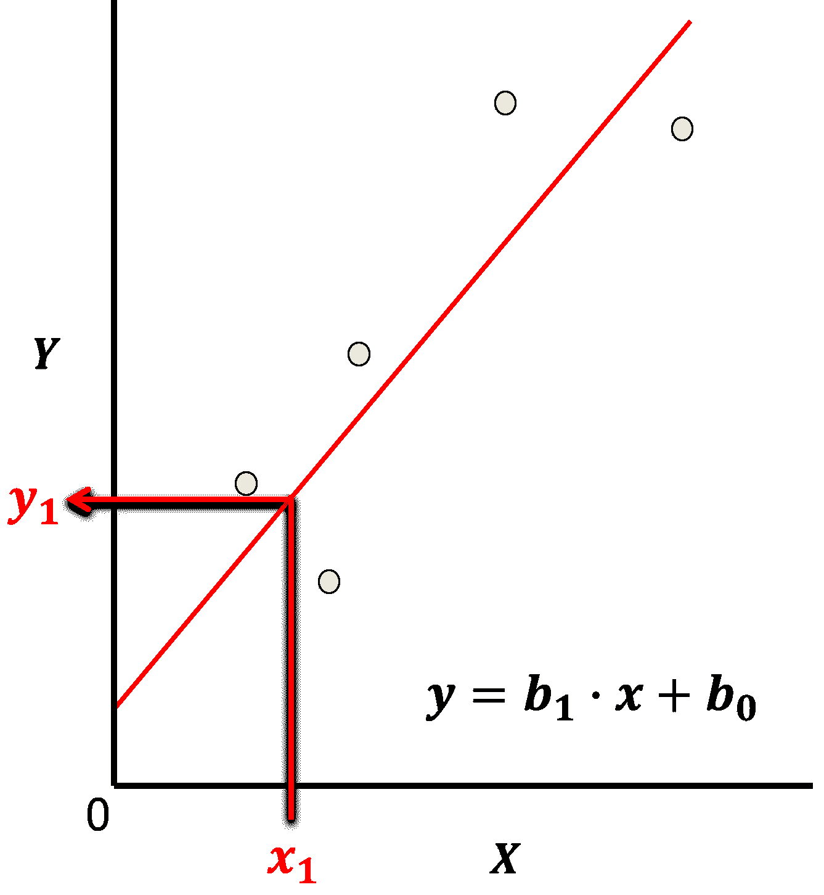

举例说明线性回归模型。

让我们先定义一些术语，

+   **预测特征** - 预测模型的输入特征，鉴于我们只讨论线性回归而不讨论多元线性回归，我们只有一个预测特征 $x$。在我们的图表（包括上面的）中，预测特征位于 x 轴上。

+   **响应特征** - 预测模型的输出特征，在这种情况下，$y$。在我们的图表（包括上面的）中，响应特征位于 y 轴上。

现在，以下是线性回归的一些关键方面：

**参数化模型**

这是一个参数化的预测机器学习模型，我们接受一个先验的线性假设，然后获得一个非常低的参数化表示，这使得在没有大量数据的情况下也容易训练。

+   拟合模型是一个基于所有可用特征 $x_1,\ldots,x_m$ 的简单加权线性加性模型。

+   参数化模型的形式为：

$$ y = \sum_{\alpha = 1}^m b_{\alpha} x_{\alpha} + b_0 $$

这是线性模型参数的可视化，

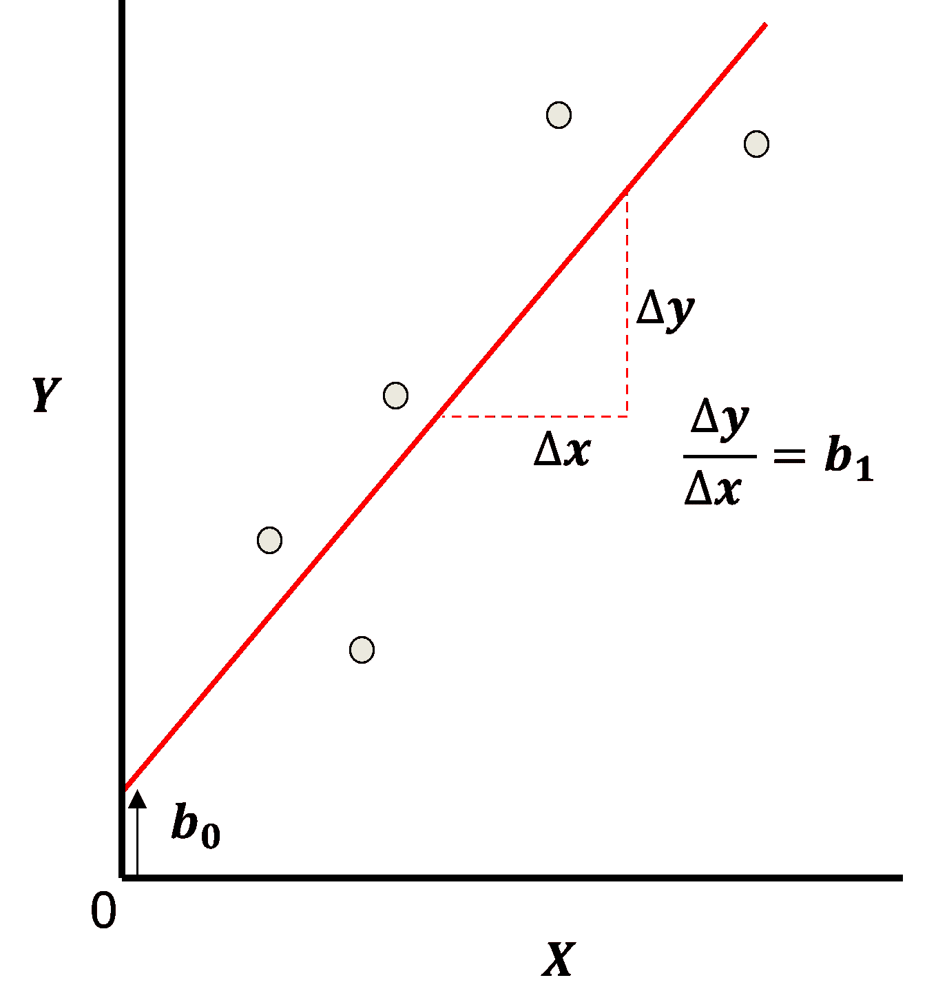

线性模型的参数。

**最小二乘法**

对于 L2 范数损失函数，模型参数 $b_1,\ldots,b_m,b_0$ 的解析解是可用的，误差被求和并平方，这被称为最小二乘法。

+   我们最小化训练数据上的误差，残差平方和（RSS）：

$$ RSS = \sum_{i=1}^n \left(y_i - (\sum_{\alpha = 1}^m b_{\alpha} x_{\alpha,i} + b_0) \right)² $$

其中 $y_i$ 是实际响应特征值，而 $\sum_{\alpha = 1}^m b_{\alpha} x_{\alpha} + b_0$ 是模型的预测值，这些预测值覆盖了 $\alpha = 1,\ldots,n$ 的训练数据。

这是 L2 范数损失函数（MSE）的可视化，


线性模型的损失函数，均方误差。

+   这可以简化为训练数据上的平方误差之和，

\begin{equation} \sum_{i=1}^n (\Delta y_i)² \end{equation}

其中 $\Delta y_i$ 是实际响应特征观察值 $y_i$ 减去模型预测 $\sum_{\alpha = 1}^m b_{\alpha} x_{\alpha} + b_0$，这些预测值覆盖了 $i = 1,\ldots,n$ 的训练数据。

**假设**

我们的线性回归模型有一些重要的假设，

+   **无误差** - 预测变量无误差，不是随机变量

+   **线性** - 响应是特征（s）的线性组合

+   **常数方差** - 响应误差在预测变量值上是常数

+   **误差独立性** - 响应误差之间不相关

+   **无多重共线性** - 没有特征与其他特征冗余

## 岭回归

在岭回归中，我们向最小化中添加了一个超参数 $\lambda$，以及一个收缩惩罚项，$\sum_{j=1}^m b_{\alpha}²$。

$$ \sum_{i=1}^n \left(y_i - \left(\sum_{\alpha = 1}^m b_{\alpha} x_{\alpha,i} + b_0 \right) \right)² + \lambda \sum_{j=1}^m b_{\alpha}² $$

因此，岭回归训练整合了两个经常是相互竞争的目标来找到模型参数，

+   找到模型参数，以最小化训练数据中的误差

+   最小化斜率参数趋向于零

注意：lambda 不包括截距，$b_0$。

$\lambda$ 是一个控制模型拟合程度的超参数，可能与模型的偏差-方差权衡有关。

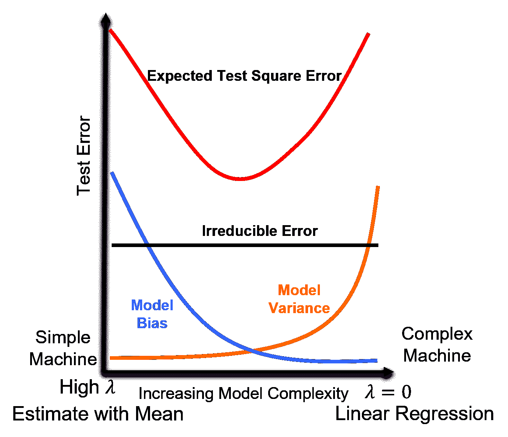

岭回归的测试误差分量和预期测试平方误差。

+   当 $\lambda \rightarrow 0$ 时，解趋近于线性回归，没有偏差（相对于线性模型拟合），但模型方差可能更高

+   随着 $\lambda$ 的增加，模型方差降低，模型偏差增加，模型变得简单

+   当 $\lambda \rightarrow \infty$ 时，模型参数 $b_1,\ldots,b_m$ 收缩到 0.0，模型预测趋近于训练数据响应特征均值

在下面的工作流程中，将计算各种 $\lamda$ 值的多种岭回归模型，

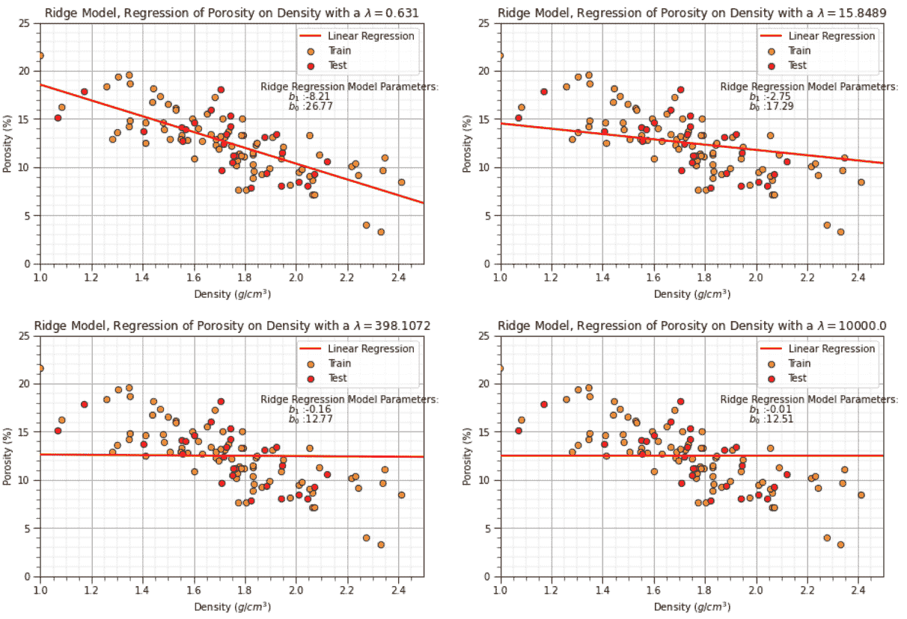

岭回归模型具有从低到高的 $\lambda$ 超参数值。

## 用于基于交叉验证的超参数调整的训练/测试数据分割

可用数据被分为训练集和测试集。

+   通常，15-30% 的数据被保留用于训练，作为测试数据

+   测试数据的选择应该是公平的，预测难度（偏移/与训练数据不同）相同 [公平训练-测试分割论文](https://www.sciencedirect.com/science/article/pii/S0920410521015023) (Salazar et al., 2022)。

+   还包括训练、验证和测试分割，以及 k 折交叉验证

基本上，所有这些方法都是通过使用训练数据训练模型，并在一系列超参数上测试模型在保留的测试数据上的准确性来进行的。然后选择最小化保留测试数据集错误的超参数，这就是超参数调整。

+   在超参数调整后，使用所有数据以及选定的超参数重新训练模型。

+   训练、验证和测试方法随后使用数据集的第二个保留子集来检查调优模型，这些数据既未用于模型训练也未用于模型调优。

在以下工作流程中，我们将使用训练和测试方法进行超参数调优。以下是更多细节和相关概念的总结。

## 模型参数训练

训练数据被应用于训练模型参数，使得模型最小化与训练数据的失配

+   通常使用**均方误差**（称为**L2 范数**）作为损失函数来总结模型失配

+   **最小化损失函数**对于简单模型，解析解可能是可用的，但对于大多数机器学习问题，这需要迭代优化方法来找到最佳模型参数

这里是解析解的推导过程，从带有最小二乘（左）和正则化（右）项的损失函数开始，

$$ \left( \text{RSS} + \text{shrinkage} \right) = \sum_{i=1}^n \left(y_i - \left(\sum_{\alpha = 1}^m b_{\alpha} x_{\alpha,i} + b_0 \right) \right)² + \lambda \sum_{j=1}^m b_{\alpha}² $$

让我们将这个表达式转换为矩阵表示以方便计算，

$$ \left( \text{RSS} + \text{shrinkage} \right) = (𝑦−𝑋\beta)^𝑇 (𝑦−𝑋\beta)+\lambda \beta^𝑇 \beta $$

其中 $\beta$ 是模型参数的向量，$y$ 是响应特征值的向量，$X$ 是预测特征值的矩阵，这些都是在训练数据上。

我们可以展开二次项，

$$ \left( \text{RSS} + \text{shrinkage} \right) = 𝑦−2𝑋^𝑇 𝑦\beta+(𝑋^𝑇 𝑋) \beta^𝑇 \beta+\lambda \beta^𝑇 \beta $$

我们对模型参数求偏导数，并将其设置为 0.0，

$$ \frac{\partial}{\partial \beta} \left( \text{RSS} + \text{shrinkage} \right) = -2X^T y + 2(X^T X) \beta + 2\lambda \beta = 0 $$

现在我们可以通过一些小的调整进一步简化。

$$ 2(𝑋^𝑇 𝑋) \beta + 2 \lambda \beta = 2𝑋^𝑇 𝑦 $$

两边同时除以 2，

$$ (𝑋^𝑇 𝑋) \beta + \lambda \beta = 𝑋^𝑇 𝑦 $$

将公共项分组，

$$ (𝑋^𝑇 𝑋+ \lambda I) \beta =𝑋^𝑇 𝑦 $$

其中 $I$ 是单位矩阵。现在我们可以求解岭回归参数，

$$ 𝛽=\left(𝑋^𝑇 𝑋+\lambda I \right)^{-1} 𝑋^𝑇 𝑦 $$

注意，$𝑋^𝑇 𝑋+\lambda I$ 通常是可以逆的，所以这是可解的。

这个过程在由超参数指定的模型复杂度范围内重复进行。

## 正则化的解释

岭回归的另一种解释和动机，

+   当 $𝑚 \ge 𝑛$ 时，线性回归是病态问题，即具有多于 1 个解的问题

+   对于病态问题，我们引入一些约束或正则化来限制解的范围

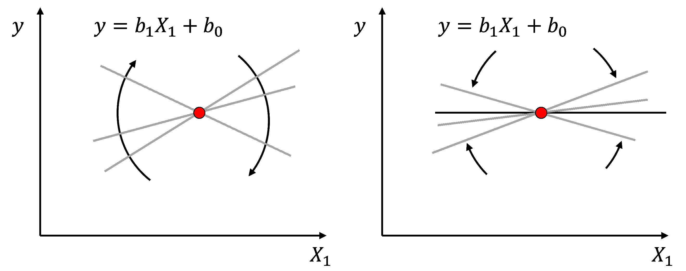

病态线性回归模型（左），以及具有额外收缩约束的良态岭回归（右）。

## 模型超参数调优

保留的测试数据被检索出来，并计算损失函数（通常是**L2 范数**）来总结测试数据上的误差

+   这是在指定的超参数范围内重复的。

+   选择最小化测试中损失函数/错误摘要的模型复杂度/超参数。

这就是众所周知的模型超参数调整。

## 模型过拟合

模型复杂度/灵活性超过可用数据、数据准确性、频率和覆盖范围可以证明的。

+   模型解释数据的“特性”，在模型中捕捉数据噪声/错误。

+   训练时精度高，但在测试/实际应用中远离训练数据案例时精度低 - 模型泛化能力差。

如果模型在测试中的错误在增加，而在训练中的错误在减少，这是过拟合模型的指标。

## 加载所需的库

我们还需要一些标准包。这些应该已经与 Anaconda 3 一起安装。

```py
%matplotlib inline                                         
suppress_warnings = False
import os                                                     # to set current working directory 
import os                                                     # to set current working directory 
import numpy as np                                            # ndarrays and matrix math
import scipy.stats as st                                      # statistical methods
import pandas as pd                                           # DataFrames
import matplotlib.pyplot as plt                               # for plotting
from matplotlib.ticker import (MultipleLocator, AutoMinorLocator) # control of axes ticks
from sklearn.metrics import mean_squared_error, r2_score      # specific measures to check our models
from sklearn import linear_model                              # linear regression
from sklearn.linear_model import Ridge                        # ridge regression implemented in scikit learn
from sklearn.model_selection import cross_val_score           # multi-processor K-fold crossvalidation
from sklearn.model_selection import train_test_split          # train and test split
from IPython.display import display, HTML                     # custom displays
cmap = plt.cm.inferno                                         # default color bar, no bias and friendly for color vision defeciency
plt.rc('axes', axisbelow=True)                                # grid behind plotting elements
if suppress_warnings == True:  
    import warnings                                           # supress any warnings for this demonstration
    warnings.filterwarnings('ignore') 
```

如果您遇到包导入错误，您可能必须首先安装这些包中的一些。这通常可以通过在 Windows 上打开命令窗口然后输入 ‘python -m pip install [package-name]’ 来完成。有关相应包的文档，还有更多帮助可用。

## 声明函数

让我们定义一个函数来简化向我们的图表添加指定的百分位数和主次网格线。

```py
def weighted_percentile(data, weights, perc):                 # calculate weighted percentile 
    ix = np.argsort(data)
    data = data[ix] 
    weights = weights[ix] 
    cdf = (np.cumsum(weights) - 0.5 * weights) / np.sum(weights) 
    return np.interp(perc, cdf, data)
# Function from iambr on StackOverflow @ https://stackoverflow.com/questions/21844024/weighted-percentile-using-numpy/32216049

def histogram_bounds(values,weights,color):                   # add uncertainty bounds to a histogram 
    p10 = weighted_percentile(values,weights,0.1); avg = np.average(values,weights=weights); p90 = weighted_percentile(values,weights,0.9)
    plt.plot([p10,p10],[0.0,45],color = color,linestyle='dashed')
    plt.plot([avg,avg],[0.0,45],color = color)
    plt.plot([p90,p90],[0.0,45],color = color,linestyle='dashed')

def add_grid():
    plt.gca().grid(True, which='major',linewidth = 1.0); plt.gca().grid(True, which='minor',linewidth = 0.2) # add y grids
    plt.gca().tick_params(which='major',length=7); plt.gca().tick_params(which='minor', length=4)
    plt.gca().xaxis.set_minor_locator(AutoMinorLocator()); plt.gca().yaxis.set_minor_locator(AutoMinorLocator()) # turn on minor ticks 

def display_sidebyside(*args):                                # display DataFrames side-by-side (ChatGPT 4.0 generated Spet, 2024)
    html_str = ''
    for df in args:
        html_str += df.head().to_html()  # Using .head() for the first few rows
    display(HTML(f'<div style="display: flex;">{html_str}</div>')) 
```

## 设置工作目录

我总是喜欢这样做，以免丢失文件并简化后续的读取和写入操作（避免每次都包含完整地址）。此外，在这种情况下，请确保将所需的数据文件（见下文）放置在此工作目录中。

```py
#os.chdir("C:\PGE337")                                        # set the working directory 
```

您将需要更新引号内的部分以包含您自己的工作目录，并且在 Mac 上格式不同（例如：“~/PGE”）。

## 加载表格数据

这是将我们的逗号分隔数据文件加载到 Pandas DataFrame 对象中的命令。

让我们加载提供的多元、空间数据集 ‘unconv_MV.csv’。这个数据集包含来自 1,000 个非常规井的变量，包括：

+   密度 ($g/cm^{3}$)

+   孔隙率（体积%）

注意，数据集是合成的。

我们使用 pandas 的 ‘read_csv’ 函数将其加载到我们称为 ‘my_data’ 的 DataFrame 中，然后预览它以确保正确加载。

```py
add_error = True                                              # add random error to the response feature
std_error = 1.0; seed = 71071

yname = 'Porosity'; xname = 'Density'                         # specify the predictor features (x2) and response feature (x1)
xmin = 1.0; xmax = 2.5                                        # set minimums and maximums for visualization 
ymin = 0.0; ymax = 25.0    
xlabel = 'Porosity'; ylabel = 'Density'                       # specify the feature labels for plotting
yunit = '%'; xunit = '$g/cm^{3}$'    
Xlabelunit = xlabel + ' (' + xunit + ')'
ylabelunit = ylabel + ' (' + yunit + ')'

#df = pd.read_csv("Density_Por_data.csv")                     # load the data from local current directory
df = pd.read_csv(r"https://raw.githubusercontent.com/GeostatsGuy/GeoDataSets/master/Density_Por_data.csv") # load the data from my github repo
df = df.sample(frac=1.0, random_state = 73073); df = df.reset_index() # extract 30% random to reduce the number of data

if add_error == True:                                         # method to add error
    np.random.seed(seed=seed)                                 # set random number seed
    df[yname] = df[yname] + np.random.normal(loc = 0.0,scale=std_error,size=len(df)) # add noise
    values = df._get_numeric_data(); values[values < 0] = 0   # set negative to 0 in a shallow copy ndarray 
```

## 训练-测试拆分

为了简单起见，我们使用 scikit-learn 包中的 train_test_split 函数应用随机训练-测试拆分。

```py
x_train, x_test, y_train, y_test = train_test_split(df[xname],df[yname],test_size=0.25,random_state=73073) # train and test split
# y_train = pd.DataFrame({yname:y_train.values}); y_test = pd.DataFrame({yname:y_test.values}) # optional to ensure response is a DataFrame

y = df[yname].values.reshape(len(df))                         # features as 1D vectors
x = df[xname].values.reshape(len(df))

df_train = pd.concat([x_train,y_train],axis=1)                # features as train and test DataFrames
df_test = pd.concat([x_test,y_test],axis=1) 
```

## 可视化 DataFrame

可视化 DataFrame 是检查数据的第一步。

+   许多事情可能出错，例如，我们加载了错误的数据，所有特征都没有加载等。

我们可以通过利用 ‘head’ DataFrame 成员函数来预览（格式整洁、美观，见下文）。

+   我们有一个自定义函数来并排预览训练和测试 DataFrame。

```py
print('   Training DataFrame      Testing DataFrame')
display_sidebyside(df_train,df_test) 
```

```py
 Training DataFrame      Testing DataFrame 
```

|  | 密度 | 孔隙率 |
| --- | --- | --- |
| 24 | 1.778580 | 11.426485 |
| 101 | 2.410560 | 8.488544 |
| 88 | 2.216014 | 10.133693 |
| 79 | 1.631896 | 12.712326 |
| 58 | 1.528019 | 16.129542 |
|  | 密度 | 孔隙率 |
| --- | --- | --- |
| 59 | 1.742534 | 15.380154 |
| 1 | 1.404932 | 13.710628 |
| 35 | 1.552713 | 14.131878 |
| 92 | 1.762359 | 11.154896 |
| 22 | 1.885087 | 9.403056 |

## Summary Statistics for Tabular Data

There are a lot of efficient methods to calculate summary statistics from tabular data in DataFrames. The describe command provides count, mean, minimum, maximum in a nice data table.

```py
print('     Training DataFrame         Testing DataFrame')
display_sidebyside(df_train.describe().loc[['count', 'mean', 'std', 'min', 'max']],df_test.describe().loc[['count', 'mean', 'std', 'min', 'max']]) 
```

```py
 Training DataFrame         Testing DataFrame 
```

|  | Density | Porosity |
| --- | --- | --- |
| count | 78.000000 | 78.000000 |
| mean | 1.739027 | 12.501465 |
| std | 0.302510 | 3.428260 |
| min | 0.996736 | 3.276449 |
| max | 2.410560 | 21.660179 |
|  | Density | Porosity |
| --- | --- | --- |
| count | 27.000000 | 27.000000 |
| mean | 1.734710 | 12.380796 |
| std | 0.247761 | 2.916045 |
| min | 1.067960 | 7.894595 |
| max | 2.119652 | 18.133771 |

## Visualize the Data

Let’s check the consistency and coverage of training and testing with histograms and scatter plots.

+   check to make sure the train and test data cover the range of possible feature combinations

+   ensure we are not extrapolating beyond the training data with the testing cases

```py
nbins = 20                                                    # number of histogram bins

plt.subplot(221)
freq1,_,_ = plt.hist(x=df_train[xname],weights=None,bins=np.linspace(xmin,xmax,nbins),alpha = 0.6,
                     edgecolor='black',color='darkorange',density=True,label='Train')
freq2,_,_ = plt.hist(x=df_test[xname],weights=None,bins=np.linspace(xmin,xmax,nbins),alpha = 0.6,
                     edgecolor='black',color='red',density=True,label='Test')
max_freq = max(freq1.max()*1.10,freq2.max()*1.10)
plt.xlabel(xname + ' (' + xunit + ')'); plt.ylabel('Frequency'); plt.ylim([0.0,max_freq]); plt.title('Density'); add_grid()  
plt.xlim([xmin,xmax]); plt.legend(loc='upper right')   

plt.subplot(222)
freq1,_,_ = plt.hist(x=df_train[yname],weights=None,bins=np.linspace(ymin,ymax,nbins),alpha = 0.6,
                     edgecolor='black',color='darkorange',density=True,label='Train')
freq2,_,_ = plt.hist(x=df_test[yname],weights=None,bins=np.linspace(ymin,ymax,nbins),alpha = 0.6,
                     edgecolor='black',color='red',density=True,label='Test')
max_freq = max(freq1.max()*1.10,freq2.max()*1.10)
plt.xlabel(yname + ' (' + yunit + ')'); plt.ylabel('Frequency'); plt.ylim([0.0,max_freq]); plt.title('Porosity'); add_grid()  
plt.xlim([ymin,ymax]); plt.legend(loc='upper right')   

plt.subplot(223)                                              # plot the model
plt.scatter(df_train[xname],df_train[yname],s=40,marker='o',color = 'darkorange',alpha = 0.8,edgecolor = 'black',zorder=10,label='Train')
plt.scatter(df_test[xname],df_test[yname],s=40,marker='o',color = 'red',alpha = 0.8,edgecolor = 'black',zorder=10,label='Test')
plt.title('Porosity vs Density')
plt.xlabel(xname + ' (' + xunit + ')')
plt.ylabel(yname + ' (' + yunit + ')')
plt.legend(); add_grid(); plt.xlim([xmin,xmax]); plt.ylim([ymin,ymax])

plt.subplots_adjust(left=0.0, bottom=0.0, right=2.0, top=2.1, wspace=0.2, hspace=0.2)
#plt.savefig('Test.pdf', dpi=600, bbox_inches = 'tight',format='pdf') 
plt.show() 
```

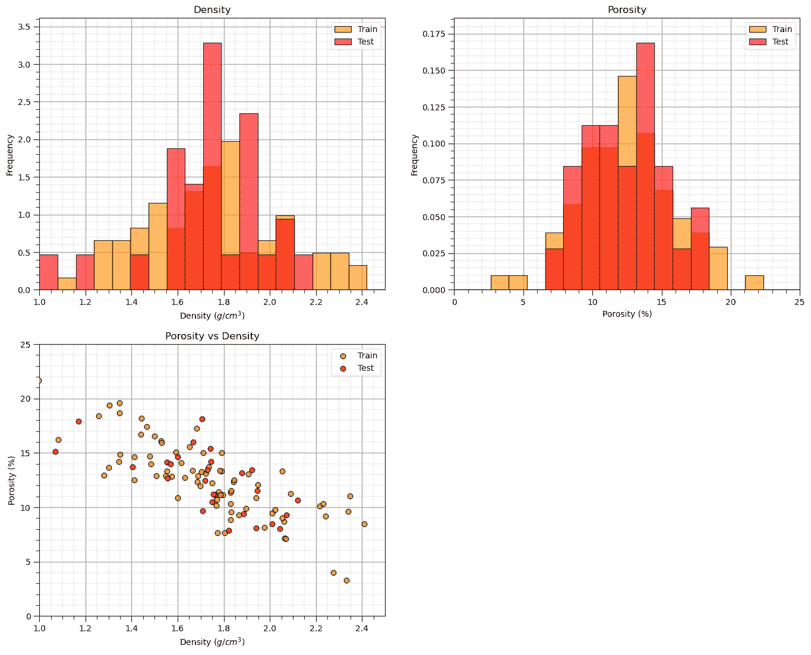

## Linear Regression Model

Let’s first calculate the linear regression model. We use scikit learn and then extend the same workflow to ridge regression.

+   we are building a model, $\phi = f(\rho)$, where $\phi$ is porosity and $\rho$ is density.

+   we could also say, we have “porosity regressed on density”.

Our model has this specific equation,

$$ \phi = b_1 \times \rho + b_0 $$

```py
linear_reg = linear_model.LinearRegression()                  # instantiate the model

linear_reg.fit(df_train[xname].values.reshape(len(df_train),1), df_train[yname]) # train the model parameters
x_model = np.linspace(xmin,xmax,10)
y_model_linear = linear_reg.predict(x_model.reshape(-1, 1))   # predict at the withheld test data 

plt.subplot(111)                                              # plot the data, model with model parameters
plt.plot(x_model,y_model_linear, color='red', linewidth=2,label='Linear Regression',zorder=100)
plt.scatter(df_train[xname],df_train[yname],s=40,marker='o',color = 'darkorange',alpha = 0.8,edgecolor = 'black',zorder=10,label='Train')
plt.scatter(df_test[xname],df_test[yname],s=40,marker='o',color = 'red',alpha = 0.8,edgecolor = 'black',zorder=10,label='Test')
plt.annotate('Linear Regression Model Parameters:',[1.86,18]) # add the model to the plot
plt.annotate(r'$b_1$ :' + str(np.round(linear_reg.coef_ [0],2)),[1.97,17])
plt.annotate(r'$b_0$ :' + str(np.round(linear_reg.intercept_,2)),[1.97,16])
plt.title('Linear Regression Model, Porosity = f(Density)')
plt.xlabel(xname + ' (' + xunit + ')')
plt.ylabel(yname + ' (' + yunit + ')')
plt.legend(loc='upper right'); add_grid(); plt.xlim([xmin,xmax]); plt.ylim([ymin,ymax])

plt.subplots_adjust(left=0.0, bottom=0.0, right=1.0, top=1.1, wspace=0.2, hspace=0.2); plt.show() 
```

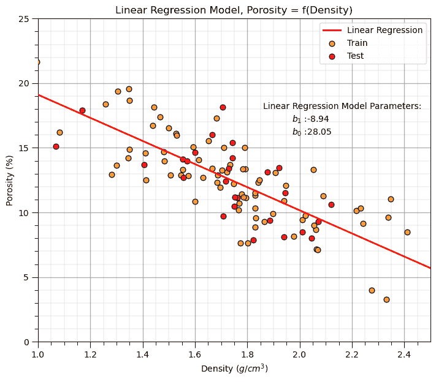

You may have noticed the additional reshape operation applied to the predictor feature in the predict function.

```py
y_linear_model = linear_reg.predict(x_model.reshape(-1, 1))   # predict at the withheld test data 
```

This is needed because scikit-learn assumes more than one predictor feature; therefore, expects a 2D array of samples (rows) and features (columns), but we have only a 1D vector.

+   the reshape operation turns the 1D vector into a 2D vector with only 1 column

## Linear Regression Model Checks

Let’s run some quick model checks. Much more could be done, but I limit this for brevity here.

+   see the Linear Regression chapter for more information and checks

```py
y_pred_linear = linear_reg.predict(df_test[xname].values.reshape(len(df_test),1)) # predict at test data
r_squared_linear = r2_score(df_test[yname].values, y_pred_linear)

plt.subplot(121)                                              # plot testing diagnostics 
plt.plot(x_model,y_model_linear, color='red', linewidth=2,label='Linear Regression',zorder=100)
plt.scatter(df_train[xname],df_train[yname],s=40,marker='o',color = 'darkorange',alpha = 0.8,edgecolor = 'black',zorder=10,label='Train')
plt.scatter(df_test[xname],df_test[yname],s=40,marker='o',color = 'red',alpha = 0.8,edgecolor = 'black',zorder=10,label='Test')
# plt.scatter(df_test[xname], y_pred,color='grey',edgecolor='black',s = 40, alpha = 1.0, label = 'predictions',zorder=100)
plt.scatter(df_test[xname], y_pred_linear,color='white',s=120,marker='o',linewidths=1.0, edgecolors="black",zorder=300)
plt.scatter(df_test[xname], y_pred_linear,color='red',s=90,marker='*',linewidths=0.5, edgecolors="black",zorder=320,label='Predictions')

for idata in range(0,len(df_test)):
    if idata == 0:
        plt.plot([df_test.iloc[idata][xname],df_test.iloc[idata][xname]],[df_test.iloc[idata][yname],
                        y_pred_linear[idata]],color='grey',label=r'test $\Delta_{y_i}$',zorder=1)
    else:  
        plt.plot([df_test.iloc[idata][xname],df_test.iloc[idata][xname]],[df_test.iloc[idata][yname],
                        y_pred_linear[idata]],color='grey',zorder=1)

plt.annotate('Linear Regression Model Parameters:',[1.86,18]) # add the model to the plot
plt.annotate(r'$b_1$ :' + str(np.round(linear_reg.coef_ [0],2)),[1.97,17])
plt.annotate(r'$b_0$ :' + str(np.round(linear_reg.intercept_,2)),[1.97,16])
plt.annotate(r'$r²$ :' + str(np.round(r_squared_linear,2)),[1.97,15])
plt.title('Linear Regression Model, Porosity = f(Density)')
plt.xlabel(xname + ' (' + xunit + ')')
plt.ylabel(yname + ' (' + yunit + ')')
plt.legend(loc='upper right'); add_grid(); plt.xlim([xmin,xmax]); plt.ylim([ymin,ymax])

y_res_linear = y_pred_linear - df_test['Porosity'].values     # calculate the test residual

plt.subplot(122)
plt.hist(y_res_linear, color = 'red', alpha = 0.8, edgecolor = 'black', bins = np.linspace(-5,5,20))
plt.title("Error Residual at Testing Data"); plt.xlabel(yname + ' True - Estimate (%)');plt.ylabel('Frequency')
plt.vlines(0,0,5.5,color='black',ls='--',lw=2)
plt.annotate('Test Error Residual:',[-4,4.7]) # add residual summary statistics
plt.annotate(r'$\overline{\Delta{y}}$: ' + str(round(np.average(y_res_linear),2)),[-4,4.4])
plt.annotate(r'$\sigma_{\Delta{y}}$: ' + str(np.round(np.std(y_res_linear),2)),[-4,4.1])
add_grid(); plt.xlim(-5,5); plt.ylim(0,5.5)

plt.subplots_adjust(left=0.0, bottom=0.0, right=2.0, top=1.2, wspace=0.2, hspace=0.2); plt.show() 
```

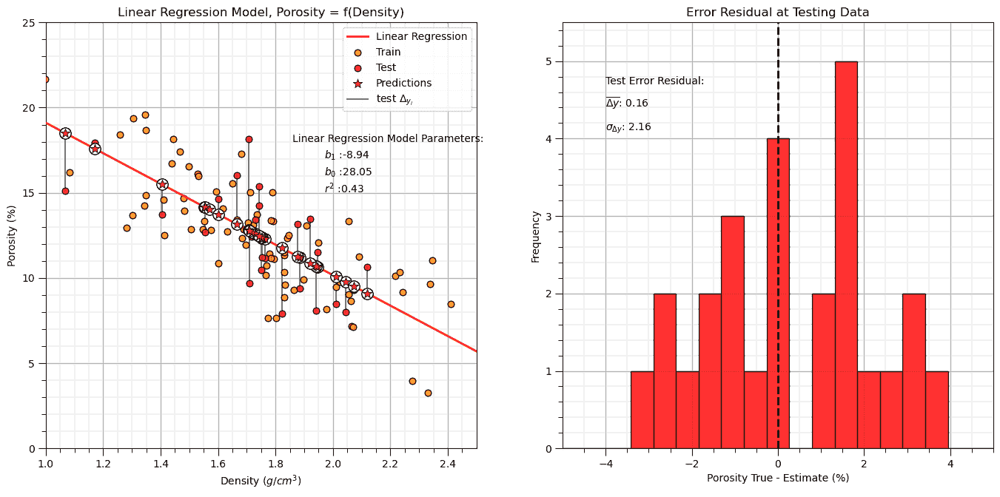

## Ridge Regression Model

Let’s replace the scikit-learn linear regression method with the scikit-learn ridge regression method.

+   note, we must now set the $\lambda$ hyperparameter.

+   in scikit-learn the hyperparameter(s) is(are) set with the instantiation of the model

```py
lam = 13.0                                                     # lambda hyperparameter

ridge_reg = Ridge(alpha=lam)                                  # instantiate the model

ridge_reg.fit(df_train[xname].values.reshape(len(df_train),1), df_train[yname]) # train the model parameters
x_model = np.linspace(xmin,xmax,10)
y_model_ridge = ridge_reg.predict(x_model.reshape(10,1))      # predict with the fit model

plt.subplot(111)                                              # plot the data, model with model parameters
plt.plot(x_model,y_model_ridge, color='red', linewidth=2,label='Linear Regression',zorder=100)
plt.scatter(df_train[xname],df_train[yname],s=40,marker='o',color = 'darkorange',alpha = 0.8,edgecolor = 'black',zorder=10,label='Train')
plt.scatter(df_test[xname],df_test[yname],s=40,marker='o',color = 'red',alpha = 0.8,edgecolor = 'black',zorder=10,label='Test')
plt.annotate('Ridge Regression Model Parameters:',[1.86,18]) # add the model to the plot
plt.annotate(r'$b_1$ :' + str(np.round(ridge_reg.coef_ [0],2)),[1.97,17])
plt.annotate(r'$b_0$ :' + str(np.round(ridge_reg.intercept_,2)),[1.97,16])
plt.title('Ridge Model, Regression of ' + yname + ' on ' + xname + r' with a $\lambda = $' + str(lam))
plt.xlabel(xname + ' (' + xunit + ')')
plt.ylabel(yname + ' (' + yunit + ')')
plt.legend(loc='upper right'); add_grid(); plt.xlim([xmin,xmax]); plt.ylim([ymin,ymax])

plt.subplots_adjust(left=0.0, bottom=0.0, right=1.0, top=1.1, wspace=0.2, hspace=0.2); plt.show() 
```

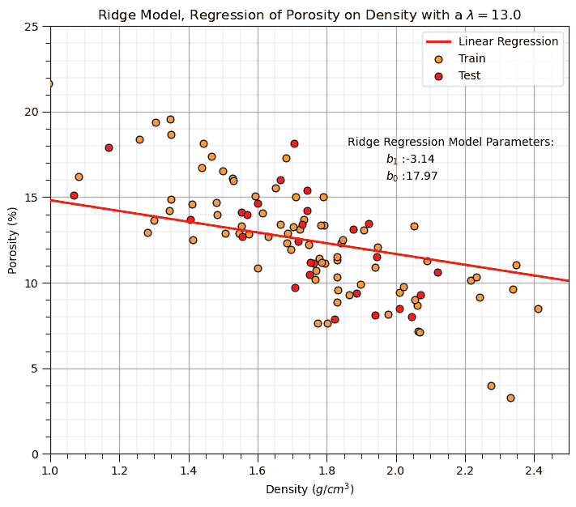

Let’s repeat the simple model checks that we applied with our linear regression model.

```py
y_pred_ridge = ridge_reg.predict(df_test[xname].values.reshape(len(df_test),1)) # predict at test data
r_squared = r2_score(df_test[yname].values, y_pred_ridge)

plt.subplot(121)                                              # plot testing diagnostics 
plt.plot(x_model,y_model_ridge, color='red', linewidth=2,label='Linear Regression',zorder=100)
plt.scatter(df_train[xname],df_train[yname],s=40,marker='o',color = 'darkorange',alpha = 0.8,edgecolor = 'black',zorder=10,label='train')
plt.scatter(df_test[xname],df_test[yname],s=40,marker='o',color = 'red',alpha = 0.8,edgecolor = 'black',zorder=10,label='test')
plt.scatter(df_test[xname], y_pred_ridge,color='white',s=120,marker='o',linewidths=1.0, edgecolors="black",zorder=300)
plt.scatter(df_test[xname], y_pred_ridge,color='red',s=90,marker='*',linewidths=0.5, edgecolors="black",zorder=320,label='predictions')

for idata in range(0,len(df_test)):
    if idata == 0:
        plt.plot([df_test.iloc[idata][xname],df_test.iloc[idata][xname]],[df_test.iloc[idata][yname],
                        y_pred_ridge[idata]],color='grey',label=r'test $\Delta_{y_i}$',zorder=1)
    else:  
        plt.plot([df_test.iloc[idata][xname],df_test.iloc[idata][xname]],[df_test.iloc[idata][yname],
                        y_pred_ridge[idata]],color='grey',zorder=1)

plt.annotate('Ridge Regression Model Parameters:',[1.81,18]) # add the model to the plot
plt.annotate(r'$b_1$ :' + str(np.round(ridge_reg.coef_ [0],2)),[1.97,17])
plt.annotate(r'$b_0$ :' + str(np.round(ridge_reg.intercept_,2)),[1.97,16])
plt.title('Ridge Model, Regression of ' + yname + ' on ' + xname + r' with a $\lambda = $' + str(lam))
plt.xlabel(xname + ' (' + xunit + ')')
plt.ylabel(yname + ' (' + yunit + ')')
plt.legend(loc='upper right'); add_grid(); plt.xlim([xmin,xmax]); plt.ylim([ymin,ymax])

y_res_ridge = y_pred_ridge - df_test['Porosity'].values       # calculate the test residual

plt.subplot(122)
plt.hist(y_res_ridge, color = 'red', alpha = 0.8, edgecolor = 'black', bins = np.linspace(-5,5,20))
plt.title("Error Residual at Testing Data"); plt.xlabel(yname + ' True - Estimate (%)');plt.ylabel('Frequency')
plt.vlines(0,0,5.5,color='red',lw=2,zorder=1); plt.vlines(np.average(y_res_ridge),0,5.5,color='black',ls='--',zorder=10)
plt.annotate('Residual Average = ' + str(np.round(np.average(y_res_ridge),2)),[np.average(y_res_ridge)+0.2,2.5],rotation=90.0)
plt.annotate('Test Error Residual:',[-4,4.7]) # add residual summary statistics
plt.annotate(r'$\overline{\Delta{y}}$: ' + str(round(np.average(y_res_ridge),2)),[-4,4.4])
plt.annotate(r'$\sigma_{\Delta{y}}$: ' + str(np.round(np.std(y_res_ridge),2)),[-4,4.1])
add_grid(); plt.xlim(-5,5); plt.ylim(0,5.5)

plt.subplots_adjust(left=0.0, bottom=0.0, right=2.0, top=1.1, wspace=0.2, hspace=0.2); plt.show() 
```

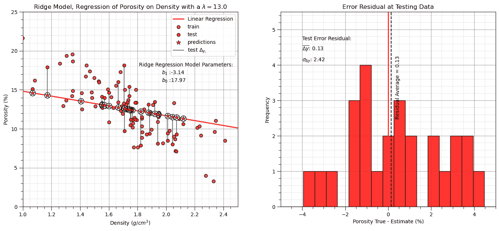

Interesting, we explained less variance and have a larger residual standard deviation (more error).

+   对于我们任意选择的超参数$\lambda$，岭回归实际上降低了测试中解释的方差和准确性

+   这并不令人惊讶，我们实际上并没有调整超参数以获得最佳模型！

## 调查 Lambda 超参数

让我们循环遍历多个 lambda 值 - 从 0 到 100，并观察以下变化：

+   训练和测试，均方误差（MSE）和解释的方差

```py
# Arrays to store the results
ncases = 6
lamd_mat = np.logspace(-3,4,ncases)
x_model = np.linspace(xmin,xmax,10)
var_explained_train = np.zeros(ncases); var_explained_test = np.zeros(ncases)
mse_train = np.zeros(ncases); mse_test = np.zeros(ncases)

for ilam in range(0,len(lamd_mat)):                           # Loop over all lambda values
    ridge_reg = Ridge(alpha=lamd_mat[ilam])
    ridge_reg.fit(df_train[xname].values.reshape(len(df_train),1), df_train[yname]) # fit model

    y_model = ridge_reg.predict(x_model.reshape(10,1))        # predict with the fit model 
    y_pred_train = ridge_reg.predict(df_train[xname].values.reshape(len(df_train),1)) # predict with the fit model 
    var_explained_train[ilam] = r2_score(df_train[yname].values, y_pred_train)
    mse_train[ilam] = mean_squared_error(df_train[yname].values, y_pred_train) 

    y_pred_test = ridge_reg.predict(df_test[xname].values.reshape(len(df_test),1))
    var_explained_test[ilam] = r2_score(df_test[yname].values, y_pred_test)
    mse_test[ilam] = mean_squared_error(df_test[yname].values, y_pred_test)    

    if ilam <= 7:
        plt.subplot(4,2,ilam+1)
        plt.plot(x_model,y_model, color='red', linewidth=2,label='Linear Regression',zorder=100)
        plt.scatter(df_train[xname],df_train[yname],s=40,marker='o',color = 'darkorange',alpha = 0.8,edgecolor = 'black',zorder=10,label='Train')
        plt.scatter(df_test[xname],df_test[yname],s=40,marker='o',color = 'red',alpha = 0.8,edgecolor = 'black',zorder=10,label='Test')
        plt.annotate('Ridge Regression Model Parameters:',[1.86,18]) # add the model to the plot
        plt.annotate(r'$b_1$ :' + str(np.round(ridge_reg.coef_ [0],2)),[1.97,17])
        plt.annotate(r'$b_0$ :' + str(np.round(ridge_reg.intercept_,2)),[1.97,16])
        plt.title('Ridge Model, Regression of ' + yname + ' on ' + xname + r' with a $\lambda = $' + str(round(lamd_mat[ilam],4)))
        plt.xlabel(xname + ' (' + xunit + ')')
        plt.ylabel(yname + ' (' + yunit + ')')
        plt.legend(loc='upper right'); add_grid(); plt.xlim([xmin,xmax]); plt.ylim([ymin,ymax])

plt.subplots_adjust(left=0.0, bottom=0.0, right=2.0, top=4.2, wspace=0.2, hspace=0.2); plt.show() 
```

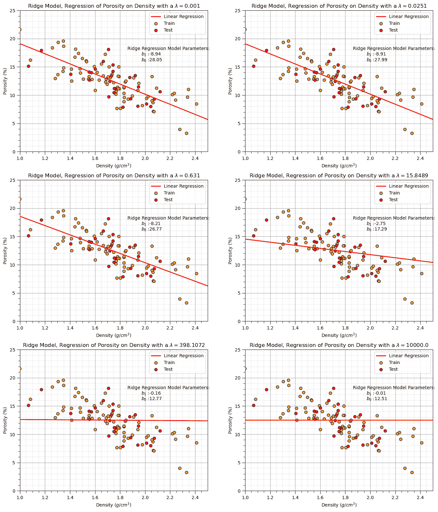

我们可以从训练的岭回归模型的上述前 8 个案例中观察到，增加$\lambda$超参数会降低线性拟合的斜率。

让我们在训练和测试数据集上绘制均方误差和解释的方差图。

回想一下，解释的方差，$R²$，由以下公式给出，

$$ R² = 1 - \frac{\text{SS}_{\text{residual}}}{\text{SS}_{\text{total}}} $$

其中$SS_{\text{residual}}$是残差（或误差）的平方和，$SS_{\text{total}}$是总平方和（观察数据的方差）。

均方误差（MSE）由以下公式给出，

$$ \text{MSE} = \frac{1}{n} \sum_{i=1}^{n} (y_i - \hat{y}_i)² $$

其中$y_i$是实际值，$\hat{y}_i$是预测值，$n$是数据点的数量。

```py
ncases = 100
lamd_mat = np.logspace(-3,4,ncases)
x_model = np.linspace(xmin,xmax,10)
var_explained_train = np.zeros(ncases); var_explained_test = np.zeros(ncases)
mse_train = np.zeros(ncases); mse_test = np.zeros(ncases)

for ilam in range(0,len(lamd_mat)):                           # Loop over all lambda values
    ridge_reg = Ridge(alpha=lamd_mat[ilam])
    ridge_reg.fit(df_train[xname].values.reshape(len(df_train),1), df_train[yname]) # fit model

    y_model = ridge_reg.predict(x_model.reshape(10,1))        # predict with the fit model 
    y_pred_train = ridge_reg.predict(df_train[xname].values.reshape(len(df_train),1)) # predict with the fit model 
    var_explained_train[ilam] = r2_score(df_train[yname].values, y_pred_train)
    mse_train[ilam] = mean_squared_error(df_train[yname].values, y_pred_train) 

    y_pred_test = ridge_reg.predict(df_test[xname].values.reshape(len(df_test),1))
    var_explained_test[ilam] = r2_score(df_test[yname].values, y_pred_test)
    mse_test[ilam] = mean_squared_error(df_test[yname].values, y_pred_test) 

plt.subplot(121)
plt.plot(lamd_mat, var_explained_train,  color='darkorange', linewidth = 2, label = 'Train')
plt.plot(lamd_mat, var_explained_test,  color='red', linewidth = 2, label = 'Test')
plt.title('Variance Explained vs. Lambda'); plt.xlabel('Lambda'); plt.ylabel('Variance Explained')
plt.xlim(0.001,10000.); plt.xscale('log'); plt.ylim(0,1.0); 
plt.grid(True); plt.minorticks_on(); plt.grid(which='minor', linestyle=':', linewidth=0.5); plt.legend()  

plt.subplot(122)
plt.plot(lamd_mat, mse_train,  color='darkorange', linewidth = 2, label = 'Train')
plt.plot(lamd_mat, mse_test,  color='red', linewidth = 2, label = 'Test')
plt.title('MSE vs. Lambda'); plt.xlabel('Lambda'); plt.ylabel('Mean Square Error')
plt.xlim(0.001,10000.); plt.xscale('log'); plt.ylim(0,15.0); plt.legend()
plt.grid(True); plt.minorticks_on(); plt.grid(which='minor', linestyle=':', linewidth=0.5); plt.legend()  

plt.subplots_adjust(left=0.0, bottom=0.0, right=2.0, top=1.2, wspace=0.2, hspace=0.3); plt.show() 
```

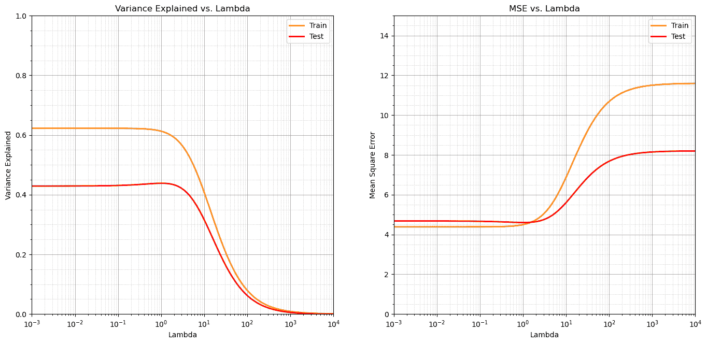

我们观察到，随着 lambda 参数的增加，解释的方差减少，均方误差增加。

+   这是有意义的，因为数据有一个一致的线性趋势，并且随着斜率‘缩小’到零，误差增加，解释的方差减少

+   可能还有其他情况，其中减少的斜率实际上在测试中表现更好。例如，对于稀疏和有噪声的数据。

## 模型方差

现在让我们探讨模型方差的概念，这是测试中机器学习准确性的重要部分。

+   模型对特定训练数据的敏感性

+   随着$\lambda$的增加，对训练数据的敏感性增加，模型方差减少

让我们通过以下工作流程来演示这一点：

+   循环遍历多个 lambda 值

    +   循环遍历数据的多重自助样本

        +   计算岭回归拟合（斜率）

    +   计算这些自助结果的方差

警告：这将需要几分钟才能运行

```py
L = 200                                                       # the number of bootstrap realizations 

nsamples = 20                                                 # the number of samples in each bootstrap realization
nlambda = 100                                                 # number of lambda values to evaluate

coef_mat = np.zeros(L)                                        # declare arrays to store the results
variance_coef = np.zeros(nlambda)

#lamd_mat = np.linspace(0.0,100.0,nlambda) 
lambda_mat = np.logspace(-2,5,nlambda)
for ilam in range(0,len(lambda_mat)):                         # loop over all lambda values 
    for l in range(0, L):                                     # loop over all bootstrap realizations
        df_sample = df.sample(n = nsamples)                   # random sample (1 bootstrap)
        ridge_reg = Ridge(alpha=lambda_mat[ilam])             # instantiate model
        ridge_reg.fit(df_sample[xname].values.reshape(nsamples,1), df_sample[yname]) # fit model
        coef_mat[l] = ridge_reg.coef_[0]                      # get the slope parameter
    variance_coef[ilam] = np.var(coef_mat)                    # calculate the variance of the slopes over the L bootstraps

plt.subplot(111)
plt.plot(lambda_mat, variance_coef,  color='black', linewidth = 3, label = 'Slope Variance')
plt.title('Model Variance vs. Lambda Hyperparameter'); plt.xlabel('Lambda'); plt.ylabel('Model Variance - Variance of the Slope Parameter, $b_1$')
plt.xlim(0.01,100000.); plt.ylim(0.0,5.0); plt.xscale('log')
plt.subplots_adjust(left=0.0, bottom=0.0, right=2.0, top=1.0, wspace=0.2, hspace=0.2)
plt.grid(which='both')
plt.subplots_adjust(left=0.0, bottom=0.0, right=2.0, top=1.0, wspace=0.2, hspace=0.2); plt.show() 
```

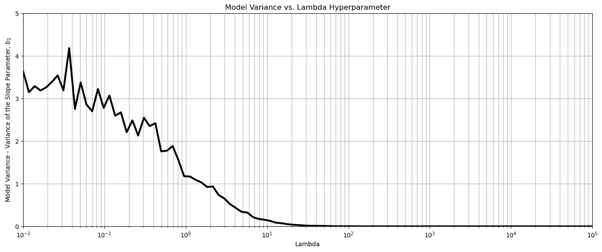

结果正如预期，随着$\lambda$超参数的增加，模型对训练数据的敏感性降低。

## k 折交叉验证

进行完整的 k 折验证以评估测试误差与超参数 lambda 之间的比较，以评估模型调优是有用的。

+   以下代码提供用于此目的

+   再次强调，对于单个预测特征，我们必须将其重塑为二维数组

我们循环遍历从 0.01 到 100,000 的 100 个$\lambda$值，

+   为 4 个 k 折中的每个获取负均方误差

+   然后我们取平均值并应用绝对值

为什么使用负均方误差？简单来说，为了使用 scikit-learn 中的优化功能，该功能通过最大化进行优化，并且与其他评分（如$r²$）保持一致性，其中较大的值更好。

+   我觉得负均方误差很令人困惑，所以在绘图时，我使用绝对值将值转换为严格正值。

```py
score = []                                                    # code modified from StackOverFlow by Dimosthenis

nlambda = 100
lambda_mat = np.logspace(-2,5,nlambda)
for ilam in range(0,nlambda):
    ridge_reg = Ridge(alpha=lambda_mat[ilam])
    scores = cross_val_score(estimator=ridge_reg, X= df['Density'].values.reshape(-1, 1), y=df['Porosity'].values, cv=10, n_jobs=4, scoring = "neg_mean_squared_error") # Perform 10-fold cross validation
    score.append(abs(scores.mean()))

plt.subplot(111)
plt.plot(lambda_mat, score,  color='black', linewidth = 3, label = 'Test MSA',zorder=10)
plt.title('Ridge Regression Test Mean Square Error vs. Lambda Hyperparameter'); plt.xlabel('Lambda'); plt.ylabel('Test Mean Square Error')
plt.xlim(1.0e-2,1.0e5); plt.ylim(0.001,20.0); plt.xscale('log')
plt.vlines(0.5,0,20,color='red',lw=2); plt.vlines(1000,0,20,color='red',lw=2,zorder=10)
plt.annotate('Linear Regression',[0.4,12.5],rotation=90.0,color='red',zorder=10)
plt.annotate('Mean',[1100,14.5],rotation=90.0,color='red',zorder=10)
plt.fill_between([0.01,0.5],[0,0],[20,20],color='grey',alpha=0.3,zorder=1)
plt.fill_between([1000,100000],[0,0],[20,20],color='grey',alpha=0.3,zorder=1)
plt.grid(which='both')
plt.subplots_adjust(left=0.0, bottom=0.0, right=2.0, top=1.0, wspace=0.2, hspace=0.2); plt.show() 
```

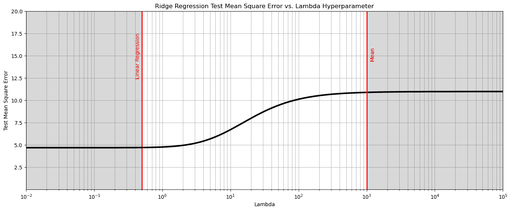

从上述内容中，我们观察到 3 个阶段，

+   左侧 - 测试均方误差达到最小值，模型收敛到线性回归。

+   右侧 - 测试均方误差达到最大值，模型收敛到预测特征均值，即模型参数斜率为 0.0。

+   中心 - 介于两种情况之间

在这种情况下，我们看到线性回归模型（$\lambda = 0.0$）是最佳模型！如果岭回归是最佳模型，则测试均方误差将在线性回归和均值之间最小化。

+   这通常发生在有噪声、数据稀缺和高维性问题的数据集中。

我们的模式与线性回归相同。

+   我们能否创造一个最佳模型不是线性回归的情况？即正则化有帮助的情况？

+   是的，我们可以。让我们删除大部分样本以创建数据稀缺性，并添加大量噪声！

诚然，我迭代了样本和噪声的随机种子以得到这个结果。

+   少量数据（低$n$）和高维性（高$m$）通常会导致 LASSO 优于线性回归

```py
df_sample = df.copy(deep=True).sample(n=10,random_state=11)
noise_stdev = 3.0
np.random.seed(seed=15)
df_sample['Porosity'] = df_sample['Porosity'] + np.random.normal(0.0, noise_stdev, size=len(df_sample))

score = []                                                    # code modified from StackOverFlow by Dimosthenis

nlambda = 100
lambda_mat = np.logspace(-4,3,nlambda)
for ilam in range(0,nlambda):
    ridge_reg = Ridge(alpha=lambda_mat[ilam])
    scores = cross_val_score(estimator=ridge_reg, X= df_sample['Density'].values.reshape(-1, 1), 
                             y=df_sample['Porosity'].values, cv=2, n_jobs=4, scoring = "neg_mean_squared_error") # Perform 10-fold cross validation
    score.append(abs(scores.mean()))

plt.subplot(111)
plt.plot(lambda_mat, score,  color='black', linewidth = 3, label = 'Test MSA',zorder=10)
plt.title('Ridge Regression Test Mean Square Error vs. Ridge Hyperparameter'); plt.xlabel('Lambda'); plt.ylabel('Test Mean Square Error')
plt.xlim(1.0e-4,1.0e3); plt.ylim(0.001,20.0); 
plt.xscale('log')
plt.vlines(0.001,0,20,color='red',lw=2); plt.vlines(10,0,20,color='red',lw=2,zorder=10); 
plt.vlines(0.07,0,20,color='red',lw=2,zorder=10);
plt.annotate('Linear Regression',[0.0007,12.5],rotation=90.0,color='red',zorder=10)
plt.annotate(r'Ridge Tuned $\lambda$',[0.055,12.5],rotation=90.0,color='red',zorder=10)
plt.annotate('Mean',[7.4,14.5],rotation=90.0,color='red',zorder=10)
plt.fill_between([0.0001,0.001],[0,0],[20,20],color='grey',alpha=0.3,zorder=1)
plt.fill_between([10,100000],[0,0],[20,20],color='grey',alpha=0.3,zorder=1)
plt.grid(which='both')
plt.subplots_adjust(left=0.0, bottom=0.0, right=2.0, top=1.0, wspace=0.2, hspace=0.2); plt.show() 
```

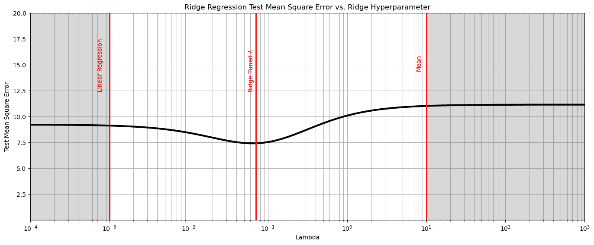

## 评论

这是对岭回归的基本处理。可以做和讨论的还有很多，我有很多更多的资源。查看我的[共享资源清单](https://michaelpyrcz.com/my-resources)以及本章开头的 YouTube 讲座链接，视频描述中包含资源链接。

希望这有所帮助，

*迈克尔*

## 关于作者


迈克尔·皮尔茨教授在德克萨斯大学奥斯汀分校 40 英亩校园的办公室。

迈克尔·皮尔茨是德克萨斯大学奥斯汀分校[科克雷尔工程学院](https://cockrell.utexas.edu/faculty-directory/alphabetical/p)和[杰克逊地球科学学院](https://www.jsg.utexas.edu/researcher/michael_pyrcz/)的教授，他在那里研究并教授地下、空间数据分析、地统计学和机器学习。迈克尔还是，

+   [能源分析](https://fri.cns.utexas.edu/energy-analytics)新生研究项目的首席研究员，德克萨斯大学奥斯汀分校自然科学院的机器学习实验室的核心教员。

+   [《计算机与地球科学》](https://www.sciencedirect.com/journal/computers-and-geosciences/about/editorial-board)的副编辑，以及国际数学地球科学协会 [《数学地球科学》](https://link.springer.com/journal/11004/editorial-board)的董事会成员。

迈克尔已撰写超过 70 篇 [同行评审出版物](https://scholar.google.com/citations?user=QVZ20eQAAAAJ&hl=en)，一个用于空间数据分析的 [Python 包](https://pypi.org/project/geostatspy/)，合著了一本关于空间数据分析的教科书 [《地球统计学储层建模》](https://www.amazon.com/Geostatistical-Reservoir-Modeling-Michael-Pyrcz/dp/0199731446)，并是两本最近发布的电子书的作者，分别是 [《Python 中的应用地球统计学：GeostatsPy 实战指南》](https://geostatsguy.github.io/GeostatsPyDemos_Book/intro.html) 和 [《Python 中的应用机器学习：带代码的实战指南》](https://geostatsguy.github.io/MachineLearningDemos_Book/intro.html)。

迈克尔的所有大学课程都可在他的 [YouTube 频道](https://www.youtube.com/@GeostatsGuyLectures)上找到，其中包含链接到 100 多个 Python 交互式仪表板和在他 [GitHub 账户](https://github.com/GeostatsGuy)上超过 40 个存储库中的详细文档工作流程，以支持任何感兴趣的学生和在职专业人士，提供常青内容。要了解更多关于迈克尔的工作和共享教育资源，请访问他的网站。

## 想要一起工作吗？

我希望这些内容对那些想了解更多关于地下建模、数据分析和学习机器学习的人有所帮助。学生和在职专业人士欢迎参加。

+   想邀请我到贵公司进行培训、辅导、项目审查、工作流程设计和/或咨询？我很乐意拜访并与您合作！

+   想要合作、支持我的研究生研究或我的地下数据分析与机器学习联盟（共同负责人是约翰·福斯特教授）吗？我的研究将数据分析、随机建模和机器学习理论与实践相结合，以开发新的方法和工作流程，增加价值。我们正在解决具有挑战性的地下问题！

+   您可以通过 mpyrcz@austin.utexas.edu 联系到我。

我总是很高兴讨论，

*迈克尔*

迈克尔·皮尔茨，博士，P.Eng. 教授，德克萨斯大学奥斯汀分校 Cockrell 工程学院和 Jackson 地球科学学院

更多资源可在以下链接获取：[Twitter](https://twitter.com/geostatsguy) | [GitHub](https://github.com/GeostatsGuy) | [网站](http://michaelpyrcz.com) | [Google Scholar](https://scholar.google.com/citations?user=QVZ20eQAAAAJ&hl=en&oi=ao) | [地统计学书籍](https://www.amazon.com/Geostatistical-Reservoir-Modeling-Michael-Pyrcz/dp/0199731446) | [YouTube](https://www.youtube.com/channel/UCLqEr-xV-ceHdXXXrTId5ig) | [Python 中应用地统计学电子书](https://geostatsguy.github.io/GeostatsPyDemos_Book/intro.html) | [Python 中应用机器学习电子书](https://geostatsguy.github.io/MachineLearningDemos_Book/) | [LinkedIn](https://www.linkedin.com/in/michael-pyrcz-61a648a1)

## 岭回归的动机

这里有一个简单的线性回归和岭回归演示的工作流程，以及与基于机器学习的预测的线性回归的比较。为什么从线性回归开始？

+   线性回归是最简单的参数化预测机器学习模型

+   我们通过从训练 MSE 的导数计算出的解析解来学习训练机器学习模型

+   让我们开始了解损失函数和范数的概念

+   我们可以访问模型不确定性的置信区间和参数显著性的假设检验的解析表达式

为什么接下来要介绍岭回归？

+   有时线性回归并不足够简单，我们实际上需要一个更简单的模型！

+   介绍模型正则化和超参数调整的概念

这里有一些关于预测机器学习岭回归模型的基本细节，让我们先从线性回归开始，然后过渡到岭回归：

## 线性回归

预测的线性回归，让我们先看看一组数据拟合的线性模型。


举例说明线性回归模型。

让我们先定义一些术语，

+   **预测特征** - 预测模型的输入特征，鉴于我们只讨论线性回归而不讨论多元线性回归，我们只有一个预测特征，$x$。在我们的图表（包括上面的）中，预测特征位于 x 轴上。

+   **响应特征** - 预测模型的输出特征，在这种情况下，$y$。在我们的图表（包括上面的）中，响应特征位于 y 轴上。

现在，让我们看看线性回归的一些关键方面：

**参数模型**

这是一个参数化的预测机器学习模型，我们接受一个先验的线性假设，然后获得一个非常低参数化的表示，这使得在没有大量数据的情况下容易训练。

+   适配模型是一个基于所有可用特征（$x_1,\ldots,x_m$）的简单加权线性加性模型。

+   参数模型的形式为：

$$ y = \sum_{\alpha = 1}^m b_{\alpha} x_{\alpha} + b_0 $$

这里是线性模型参数的可视化，


线性模型参数。

**最小二乘法**

对于 L2 范数损失函数，模型参数 $b_1,\ldots,b_m,b_0$ 的解析解是可用的，误差是总和并平方，已知为最小二乘法。

+   我们最小化训练数据上的误差，残差平方和 (RSS)：

$$ RSS = \sum_{i=1}^n \left(y_i - (\sum_{\alpha = 1}^m b_{\alpha} x_{\alpha,i} + b_0) \right)² $$

其中 $y_i$ 是实际响应特征值，$\sum_{\alpha = 1}^m b_{\alpha} x_{\alpha} + b_0$ 是模型预测，在 $\alpha = 1,\ldots,n$ 的训练数据上。

这是对 L2 范数损失函数，均方误差的视觉表示，


线性模型损失函数，均方误差。

+   这可以简化为训练数据上的平方误差之和，

\begin{equation} \sum_{i=1}^n (\Delta y_i)² \end{equation}

其中 $\Delta y_i$ 是实际响应特征观察 $y_i$ 减去模型预测 $\sum_{\alpha = 1}^m b_{\alpha} x_{\alpha} + b_0$，在 $i = 1,\ldots,n$ 的训练数据上。

**假设**

我们的线性回归模型有一些重要的假设，

+   **无误差** - 预测变量无误差，不是随机变量

+   **线性** - 响应是特征（的）线性组合

+   **恒定方差** - 响应误差在预测变量值上恒定

+   **误差独立性** - 响应误差之间相互不相关

+   **无多重共线性** - 没有特征与其他特征冗余

## 岭回归

在岭回归中，我们向最小化过程中添加一个超参数 $\lambda$，以及一个收缩惩罚项，$\sum_{j=1}^m b_{\alpha}²$。

$$ \sum_{i=1}^n \left(y_i - \left(\sum_{\alpha = 1}^m b_{\alpha} x_{\alpha,i} + b_0 \right) \right)² + \lambda \sum_{j=1}^m b_{\alpha}² $$

因此，岭回归训练将两个经常相互竞争的目标整合在一起，以找到模型参数，

+   找到模型参数，以最小化训练数据中的误差

+   最小化斜率参数趋向于零

注意：$\lambda$ 不包括截距，$b_0$。

$\lambda$ 是一个超参数，它控制模型的拟合程度，可能与模型的偏差-方差权衡有关。


岭回归的测试误差分量和预期测试平方误差。

+   当 $\lambda \rightarrow 0$ 时，解趋近于线性回归，没有偏差（相对于线性模型拟合），但模型方差可能更高

+   随着 $\lambda$ 的增加，模型方差减小，模型偏差增加，模型变得简单

+   当 $\lambda \rightarrow \infty$ 时，模型参数 $b_1,\ldots,b_m$ 收缩到 0.0，模型预测趋近于训练数据响应特征均值

下面将展示各种 $\lambda$ 值的岭回归模型，这些模型将在下面的工作流程中计算，


具有从低到高 $\lambda$ 超参数值的岭回归模型。

## 基于交叉验证的超参数调整的训练/测试数据分割

可用数据被分为训练集和测试集。

+   通常，15-30%的数据被保留作为测试数据

+   测试数据的选择应该是公平的，预测难度相同（与训练数据偏移/不同）[公平的训练-测试分割论文](https://www.sciencedirect.com/science/article/pii/S0920410521015023)（Salazar 等人，2022 年）。

+   还有其他各种方法，包括训练、验证和测试分割，以及 k 折交叉验证

基本上，所有这些方法都是通过使用训练数据训练模型，并在保留的测试数据上测试模型准确率来进行的，对于一系列超参数。然后选择最小化保留测试数据集错误的超参数，这就是超参数调整。

+   超参数调整后，使用所有数据以及选定的超参数重新训练模型。

+   然后，训练、验证和测试方法使用数据集的第二个保留子集来检查调整后的模型，这些数据既未用于模型训练也未用于模型调整。

在以下工作流程中，我们将使用训练和测试方法进行超参数调整。以下是更多细节和相关概念的总结。

## 模型参数训练

训练数据被用于训练模型参数，使得模型最小化与训练数据的不匹配

+   通常使用**均方误差**（也称为**L2 范数**）作为损失函数，总结模型不匹配

+   **最小化损失函数**对于简单模型，可能存在解析解，但对于大多数机器学习问题，这需要迭代优化方法来找到最佳模型参数

这里是解析解的推导过程，从包含最小二乘（左）和正则化（右）项的损失函数开始，

$$ \left( \text{RSS} + \text{shrinkage} \right) = \sum_{i=1}^n \left(y_i - \left(\sum_{\alpha = 1}^m b_{\alpha} x_{\alpha,i} + b_0 \right) \right)² + \lambda \sum_{j=1}^m b_{\alpha}² $$

让我们将此转换为矩阵表示以方便起见，

$$ \left( \text{RSS} + \text{shrinkage} \right) = (𝑦−𝑋\beta)^𝑇 (𝑦−𝑋\beta)+\lambda \beta^𝑇 \beta $$

其中 $\beta$ 是模型参数的向量，$y$ 是响应特征值的向量，$X$ 是预测特征值的矩阵，这些都是在训练数据上。

我们可以展开二次项，

$$ \left( \text{RSS} + \text{shrinkage} \right) = 𝑦−2𝑋^𝑇 𝑦\beta+(𝑋^𝑇 𝑋) \beta^𝑇 \beta+\lambda \beta^𝑇 \beta $$

我们对模型参数求偏导数，并将其设置为 0.0，

$$ \frac{\partial}{\partial \beta} \left( \text{RSS} + \text{shrinkage} \right) = -2X^T y + 2(X^T X) \beta + 2\lambda \beta = 0 $$

现在我们可以通过一些小的调整进一步简化。

$$ 2(𝑋^𝑇 𝑋) \beta + 2 \lambda \beta = 2𝑋^𝑇 𝑦 $$

两边同时除以 2，

$$ (𝑋^𝑇 𝑋) \beta + \lambda \beta = 𝑋^𝑇 𝑦 $$

合并公共项，

$$ (𝑋^𝑇 𝑋+ \lambda I) \beta =𝑋^𝑇 𝑦 $$

其中 $I$ 是一个单位矩阵。现在我们可以求解岭回归参数，

$$ 𝛽=\left(𝑋^𝑇 𝑋+\lambda I \right)^{-1} 𝑋^𝑇 𝑦 $$

注意，$𝑋^𝑇 𝑋+\lambda I$ 通常是可以逆的，所以这是可解的。

这个过程将在由超参数指定的模型复杂度范围内重复进行。

## 正则化的解释

另一种岭回归的解释和动机，

+   当 $𝑚 \ge 𝑛$ 时，线性回归是病态问题，即具有多个解的问题。

+   对于病态问题，我们引入一些约束或正则化来限制解的范围。


病态线性回归模型（左），以及具有额外收缩约束的良态岭回归（右）。

## 模型超参数调整

保留的测试数据被检索出来，并计算损失函数（通常是**L2 范数**）来总结测试数据中的错误。

+   这将在指定的超参数范围内重复进行。

+   选择模型复杂度/超参数，以最小化测试中的损失函数/错误摘要。

这就是所谓的模型超参数调整。

## 模型过拟合

模型复杂度/灵活性比可用数据、数据准确性、频率和覆盖范围所能证明的更多。

+   模型解释数据的“特殊性”，在模型中捕捉数据噪声/错误。

+   训练中的高精度，但在测试/实际应用中的低精度（远离训练数据案例）- 模型泛化能力差

如果测试中的模型误差在增加，而训练中的模型误差在减少，这是过度拟合模型的指标。

## 加载所需的库

我们还需要一些标准包。这些应该已经与 Anaconda 3 一起安装。

```py
%matplotlib inline                                         
suppress_warnings = False
import os                                                     # to set current working directory 
import os                                                     # to set current working directory 
import numpy as np                                            # ndarrays and matrix math
import scipy.stats as st                                      # statistical methods
import pandas as pd                                           # DataFrames
import matplotlib.pyplot as plt                               # for plotting
from matplotlib.ticker import (MultipleLocator, AutoMinorLocator) # control of axes ticks
from sklearn.metrics import mean_squared_error, r2_score      # specific measures to check our models
from sklearn import linear_model                              # linear regression
from sklearn.linear_model import Ridge                        # ridge regression implemented in scikit learn
from sklearn.model_selection import cross_val_score           # multi-processor K-fold crossvalidation
from sklearn.model_selection import train_test_split          # train and test split
from IPython.display import display, HTML                     # custom displays
cmap = plt.cm.inferno                                         # default color bar, no bias and friendly for color vision defeciency
plt.rc('axes', axisbelow=True)                                # grid behind plotting elements
if suppress_warnings == True:  
    import warnings                                           # supress any warnings for this demonstration
    warnings.filterwarnings('ignore') 
```

如果你遇到包导入错误，你可能需要首先安装这些包中的一些。这通常可以通过在 Windows 上打开命令窗口，然后输入‘python -m pip install [package-name]’来完成。更多帮助可以在相应的包文档中找到。

## 声明函数

让我们定义一个函数，以便将指定的百分位数和主次网格线添加到我们的图中。

```py
def weighted_percentile(data, weights, perc):                 # calculate weighted percentile 
    ix = np.argsort(data)
    data = data[ix] 
    weights = weights[ix] 
    cdf = (np.cumsum(weights) - 0.5 * weights) / np.sum(weights) 
    return np.interp(perc, cdf, data)
# Function from iambr on StackOverflow @ https://stackoverflow.com/questions/21844024/weighted-percentile-using-numpy/32216049

def histogram_bounds(values,weights,color):                   # add uncertainty bounds to a histogram 
    p10 = weighted_percentile(values,weights,0.1); avg = np.average(values,weights=weights); p90 = weighted_percentile(values,weights,0.9)
    plt.plot([p10,p10],[0.0,45],color = color,linestyle='dashed')
    plt.plot([avg,avg],[0.0,45],color = color)
    plt.plot([p90,p90],[0.0,45],color = color,linestyle='dashed')

def add_grid():
    plt.gca().grid(True, which='major',linewidth = 1.0); plt.gca().grid(True, which='minor',linewidth = 0.2) # add y grids
    plt.gca().tick_params(which='major',length=7); plt.gca().tick_params(which='minor', length=4)
    plt.gca().xaxis.set_minor_locator(AutoMinorLocator()); plt.gca().yaxis.set_minor_locator(AutoMinorLocator()) # turn on minor ticks 

def display_sidebyside(*args):                                # display DataFrames side-by-side (ChatGPT 4.0 generated Spet, 2024)
    html_str = ''
    for df in args:
        html_str += df.head().to_html()  # Using .head() for the first few rows
    display(HTML(f'<div style="display: flex;">{html_str}</div>')) 
```

## 设置工作目录

我总是喜欢这样做，这样我就不会丢失文件，并且可以简化后续的读取和写入（避免每次都包含完整地址）。此外，在这种情况下，请确保将所需的数据文件（见下文）放置在此工作目录中。

```py
#os.chdir("C:\PGE337")                                        # set the working directory 
```

你将不得不更新引号内的部分，以包含你自己的工作目录，并且格式在 Mac 上不同（例如，“~/PGE”）。

## 加载表格数据

这是将我们的逗号分隔数据文件加载到 Pandas DataFrame 对象的命令。

让我们加载提供的多元、空间数据集‘unconv_MV.csv’。这个数据集包括来自 1,000 个非常规井的变量：

+   密度（$g/cm^{3}$）

+   孔隙率（体积%）

注意，数据集是合成的。

我们使用 pandas 的‘read_csv’函数将其加载到我们称为‘my_data’的 DataFrame 中，然后预览以确保正确加载。

```py
add_error = True                                              # add random error to the response feature
std_error = 1.0; seed = 71071

yname = 'Porosity'; xname = 'Density'                         # specify the predictor features (x2) and response feature (x1)
xmin = 1.0; xmax = 2.5                                        # set minimums and maximums for visualization 
ymin = 0.0; ymax = 25.0    
xlabel = 'Porosity'; ylabel = 'Density'                       # specify the feature labels for plotting
yunit = '%'; xunit = '$g/cm^{3}$'    
Xlabelunit = xlabel + ' (' + xunit + ')'
ylabelunit = ylabel + ' (' + yunit + ')'

#df = pd.read_csv("Density_Por_data.csv")                     # load the data from local current directory
df = pd.read_csv(r"https://raw.githubusercontent.com/GeostatsGuy/GeoDataSets/master/Density_Por_data.csv") # load the data from my github repo
df = df.sample(frac=1.0, random_state = 73073); df = df.reset_index() # extract 30% random to reduce the number of data

if add_error == True:                                         # method to add error
    np.random.seed(seed=seed)                                 # set random number seed
    df[yname] = df[yname] + np.random.normal(loc = 0.0,scale=std_error,size=len(df)) # add noise
    values = df._get_numeric_data(); values[values < 0] = 0   # set negative to 0 in a shallow copy ndarray 
```

## 训练-测试分割

为了简单起见，我们使用 scikit-learn 包中的 model_selection 模块的 train_test_split 函数进行随机训练-测试分割。

```py
x_train, x_test, y_train, y_test = train_test_split(df[xname],df[yname],test_size=0.25,random_state=73073) # train and test split
# y_train = pd.DataFrame({yname:y_train.values}); y_test = pd.DataFrame({yname:y_test.values}) # optional to ensure response is a DataFrame

y = df[yname].values.reshape(len(df))                         # features as 1D vectors
x = df[xname].values.reshape(len(df))

df_train = pd.concat([x_train,y_train],axis=1)                # features as train and test DataFrames
df_test = pd.concat([x_test,y_test],axis=1) 
```

## 可视化 DataFrame

可视化 DataFrame 是数据的第一步检查。

+   许多事情可能出错，例如，我们加载了错误的数据，所有特征都没有加载等。

我们可以通过使用‘head’ DataFrame 成员函数（格式整洁、美观，见下文）来预览。

+   我们有一个自定义函数来并排预览训练和测试 DataFrame。

```py
print('   Training DataFrame      Testing DataFrame')
display_sidebyside(df_train,df_test) 
```

```py
 Training DataFrame      Testing DataFrame 
```

|  | 密度 | 孔隙率 |
| --- | --- | --- |
| 24 | 1.778580 | 11.426485 |
| 101 | 2.410560 | 8.488544 |
| 88 | 2.216014 | 10.133693 |
| 79 | 1.631896 | 12.712326 |
| 58 | 1.528019 | 16.129542 |
|  | 密度 | 孔隙率 |
| --- | --- | --- |
| 59 | 1.742534 | 15.380154 |
| 1 | 1.404932 | 13.710628 |
| 35 | 1.552713 | 14.131878 |
| 92 | 1.762359 | 11.154896 |
| 22 | 1.885087 | 9.403056 |

## 表格数据的汇总统计

在 DataFrames 中从表格数据计算汇总统计有很多高效的方法。describe 命令以一个美观的数据表形式提供计数、平均值、最小值、最大值。

```py
print('     Training DataFrame         Testing DataFrame')
display_sidebyside(df_train.describe().loc[['count', 'mean', 'std', 'min', 'max']],df_test.describe().loc[['count', 'mean', 'std', 'min', 'max']]) 
```

```py
 Training DataFrame         Testing DataFrame 
```

|  | 密度 | 孔隙率 |
| --- | --- | --- |
| count | 78.000000 | 78.000000 |
| mean | 1.739027 | 12.501465 |
| std | 0.302510 | 3.428260 |
| min | 0.996736 | 3.276449 |
| max | 2.410560 | 21.660179 |
|  | 密度 | 孔隙率 |
| --- | --- | --- |
| count | 27.000000 | 27.000000 |
| mean | 1.734710 | 12.380796 |
| std | 0.247761 | 2.916045 |
| min | 1.067960 | 7.894595 |
| max | 2.119652 | 18.133771 |

## 可视化数据

让我们通过直方图和散点图检查训练和测试的一致性和覆盖范围。

+   检查以确保训练数据和测试数据覆盖了可能的特征组合范围

+   确保测试案例不会超出训练数据的外推

```py
nbins = 20                                                    # number of histogram bins

plt.subplot(221)
freq1,_,_ = plt.hist(x=df_train[xname],weights=None,bins=np.linspace(xmin,xmax,nbins),alpha = 0.6,
                     edgecolor='black',color='darkorange',density=True,label='Train')
freq2,_,_ = plt.hist(x=df_test[xname],weights=None,bins=np.linspace(xmin,xmax,nbins),alpha = 0.6,
                     edgecolor='black',color='red',density=True,label='Test')
max_freq = max(freq1.max()*1.10,freq2.max()*1.10)
plt.xlabel(xname + ' (' + xunit + ')'); plt.ylabel('Frequency'); plt.ylim([0.0,max_freq]); plt.title('Density'); add_grid()  
plt.xlim([xmin,xmax]); plt.legend(loc='upper right')   

plt.subplot(222)
freq1,_,_ = plt.hist(x=df_train[yname],weights=None,bins=np.linspace(ymin,ymax,nbins),alpha = 0.6,
                     edgecolor='black',color='darkorange',density=True,label='Train')
freq2,_,_ = plt.hist(x=df_test[yname],weights=None,bins=np.linspace(ymin,ymax,nbins),alpha = 0.6,
                     edgecolor='black',color='red',density=True,label='Test')
max_freq = max(freq1.max()*1.10,freq2.max()*1.10)
plt.xlabel(yname + ' (' + yunit + ')'); plt.ylabel('Frequency'); plt.ylim([0.0,max_freq]); plt.title('Porosity'); add_grid()  
plt.xlim([ymin,ymax]); plt.legend(loc='upper right')   

plt.subplot(223)                                              # plot the model
plt.scatter(df_train[xname],df_train[yname],s=40,marker='o',color = 'darkorange',alpha = 0.8,edgecolor = 'black',zorder=10,label='Train')
plt.scatter(df_test[xname],df_test[yname],s=40,marker='o',color = 'red',alpha = 0.8,edgecolor = 'black',zorder=10,label='Test')
plt.title('Porosity vs Density')
plt.xlabel(xname + ' (' + xunit + ')')
plt.ylabel(yname + ' (' + yunit + ')')
plt.legend(); add_grid(); plt.xlim([xmin,xmax]); plt.ylim([ymin,ymax])

plt.subplots_adjust(left=0.0, bottom=0.0, right=2.0, top=2.1, wspace=0.2, hspace=0.2)
#plt.savefig('Test.pdf', dpi=600, bbox_inches = 'tight',format='pdf') 
plt.show() 
```


## 线性回归模型

让我们先计算线性回归模型。我们使用 scikit learn，然后将相同的流程扩展到岭回归。

+   我们正在构建一个模型，$\phi = f(\rho)$，其中$\phi$是孔隙率，$\rho$是密度。

+   我们也可以说，我们有“孔隙率对密度回归”。

我们模型有这个特定的方程，

$$ \phi = b_1 \times \rho + b_0 $$

```py
linear_reg = linear_model.LinearRegression()                  # instantiate the model

linear_reg.fit(df_train[xname].values.reshape(len(df_train),1), df_train[yname]) # train the model parameters
x_model = np.linspace(xmin,xmax,10)
y_model_linear = linear_reg.predict(x_model.reshape(-1, 1))   # predict at the withheld test data 

plt.subplot(111)                                              # plot the data, model with model parameters
plt.plot(x_model,y_model_linear, color='red', linewidth=2,label='Linear Regression',zorder=100)
plt.scatter(df_train[xname],df_train[yname],s=40,marker='o',color = 'darkorange',alpha = 0.8,edgecolor = 'black',zorder=10,label='Train')
plt.scatter(df_test[xname],df_test[yname],s=40,marker='o',color = 'red',alpha = 0.8,edgecolor = 'black',zorder=10,label='Test')
plt.annotate('Linear Regression Model Parameters:',[1.86,18]) # add the model to the plot
plt.annotate(r'$b_1$ :' + str(np.round(linear_reg.coef_ [0],2)),[1.97,17])
plt.annotate(r'$b_0$ :' + str(np.round(linear_reg.intercept_,2)),[1.97,16])
plt.title('Linear Regression Model, Porosity = f(Density)')
plt.xlabel(xname + ' (' + xunit + ')')
plt.ylabel(yname + ' (' + yunit + ')')
plt.legend(loc='upper right'); add_grid(); plt.xlim([xmin,xmax]); plt.ylim([ymin,ymax])

plt.subplots_adjust(left=0.0, bottom=0.0, right=1.0, top=1.1, wspace=0.2, hspace=0.2); plt.show() 
```


你可能已经注意到在预测函数中对预测特征应用了额外的重塑操作。

```py
y_linear_model = linear_reg.predict(x_model.reshape(-1, 1))   # predict at the withheld test data 
```

这是因为 scikit-learn 假设有多个预测特征；因此，期望一个包含样本（行）和特征（列）的二维数组，但我们只有一个一维向量。

+   重塑操作将 1D 向量转换为只有 1 列的 2D 向量

## 线性回归模型检查

让我们运行一些快速模型检查。可以做得更多，但为了简洁，我在这里限制了范围。

+   请参阅线性回归章节以获取更多信息和相关检查

```py
y_pred_linear = linear_reg.predict(df_test[xname].values.reshape(len(df_test),1)) # predict at test data
r_squared_linear = r2_score(df_test[yname].values, y_pred_linear)

plt.subplot(121)                                              # plot testing diagnostics 
plt.plot(x_model,y_model_linear, color='red', linewidth=2,label='Linear Regression',zorder=100)
plt.scatter(df_train[xname],df_train[yname],s=40,marker='o',color = 'darkorange',alpha = 0.8,edgecolor = 'black',zorder=10,label='Train')
plt.scatter(df_test[xname],df_test[yname],s=40,marker='o',color = 'red',alpha = 0.8,edgecolor = 'black',zorder=10,label='Test')
# plt.scatter(df_test[xname], y_pred,color='grey',edgecolor='black',s = 40, alpha = 1.0, label = 'predictions',zorder=100)
plt.scatter(df_test[xname], y_pred_linear,color='white',s=120,marker='o',linewidths=1.0, edgecolors="black",zorder=300)
plt.scatter(df_test[xname], y_pred_linear,color='red',s=90,marker='*',linewidths=0.5, edgecolors="black",zorder=320,label='Predictions')

for idata in range(0,len(df_test)):
    if idata == 0:
        plt.plot([df_test.iloc[idata][xname],df_test.iloc[idata][xname]],[df_test.iloc[idata][yname],
                        y_pred_linear[idata]],color='grey',label=r'test $\Delta_{y_i}$',zorder=1)
    else:  
        plt.plot([df_test.iloc[idata][xname],df_test.iloc[idata][xname]],[df_test.iloc[idata][yname],
                        y_pred_linear[idata]],color='grey',zorder=1)

plt.annotate('Linear Regression Model Parameters:',[1.86,18]) # add the model to the plot
plt.annotate(r'$b_1$ :' + str(np.round(linear_reg.coef_ [0],2)),[1.97,17])
plt.annotate(r'$b_0$ :' + str(np.round(linear_reg.intercept_,2)),[1.97,16])
plt.annotate(r'$r²$ :' + str(np.round(r_squared_linear,2)),[1.97,15])
plt.title('Linear Regression Model, Porosity = f(Density)')
plt.xlabel(xname + ' (' + xunit + ')')
plt.ylabel(yname + ' (' + yunit + ')')
plt.legend(loc='upper right'); add_grid(); plt.xlim([xmin,xmax]); plt.ylim([ymin,ymax])

y_res_linear = y_pred_linear - df_test['Porosity'].values     # calculate the test residual

plt.subplot(122)
plt.hist(y_res_linear, color = 'red', alpha = 0.8, edgecolor = 'black', bins = np.linspace(-5,5,20))
plt.title("Error Residual at Testing Data"); plt.xlabel(yname + ' True - Estimate (%)');plt.ylabel('Frequency')
plt.vlines(0,0,5.5,color='black',ls='--',lw=2)
plt.annotate('Test Error Residual:',[-4,4.7]) # add residual summary statistics
plt.annotate(r'$\overline{\Delta{y}}$: ' + str(round(np.average(y_res_linear),2)),[-4,4.4])
plt.annotate(r'$\sigma_{\Delta{y}}$: ' + str(np.round(np.std(y_res_linear),2)),[-4,4.1])
add_grid(); plt.xlim(-5,5); plt.ylim(0,5.5)

plt.subplots_adjust(left=0.0, bottom=0.0, right=2.0, top=1.2, wspace=0.2, hspace=0.2); plt.show() 
```


## 岭回归模型

让我们将 scikit-learn 的线性回归方法替换为 scikit-learn 的岭回归方法。

+   注意，我们现在必须设置$\lambda$超参数。

+   在 scikit-learn 中，超参数是通过模型的实例化来设置的

```py
lam = 13.0                                                     # lambda hyperparameter

ridge_reg = Ridge(alpha=lam)                                  # instantiate the model

ridge_reg.fit(df_train[xname].values.reshape(len(df_train),1), df_train[yname]) # train the model parameters
x_model = np.linspace(xmin,xmax,10)
y_model_ridge = ridge_reg.predict(x_model.reshape(10,1))      # predict with the fit model

plt.subplot(111)                                              # plot the data, model with model parameters
plt.plot(x_model,y_model_ridge, color='red', linewidth=2,label='Linear Regression',zorder=100)
plt.scatter(df_train[xname],df_train[yname],s=40,marker='o',color = 'darkorange',alpha = 0.8,edgecolor = 'black',zorder=10,label='Train')
plt.scatter(df_test[xname],df_test[yname],s=40,marker='o',color = 'red',alpha = 0.8,edgecolor = 'black',zorder=10,label='Test')
plt.annotate('Ridge Regression Model Parameters:',[1.86,18]) # add the model to the plot
plt.annotate(r'$b_1$ :' + str(np.round(ridge_reg.coef_ [0],2)),[1.97,17])
plt.annotate(r'$b_0$ :' + str(np.round(ridge_reg.intercept_,2)),[1.97,16])
plt.title('Ridge Model, Regression of ' + yname + ' on ' + xname + r' with a $\lambda = $' + str(lam))
plt.xlabel(xname + ' (' + xunit + ')')
plt.ylabel(yname + ' (' + yunit + ')')
plt.legend(loc='upper right'); add_grid(); plt.xlim([xmin,xmax]); plt.ylim([ymin,ymax])

plt.subplots_adjust(left=0.0, bottom=0.0, right=1.0, top=1.1, wspace=0.2, hspace=0.2); plt.show() 
```


让我们重复我们对线性回归模型应用的基本模型检查。

```py
y_pred_ridge = ridge_reg.predict(df_test[xname].values.reshape(len(df_test),1)) # predict at test data
r_squared = r2_score(df_test[yname].values, y_pred_ridge)

plt.subplot(121)                                              # plot testing diagnostics 
plt.plot(x_model,y_model_ridge, color='red', linewidth=2,label='Linear Regression',zorder=100)
plt.scatter(df_train[xname],df_train[yname],s=40,marker='o',color = 'darkorange',alpha = 0.8,edgecolor = 'black',zorder=10,label='train')
plt.scatter(df_test[xname],df_test[yname],s=40,marker='o',color = 'red',alpha = 0.8,edgecolor = 'black',zorder=10,label='test')
plt.scatter(df_test[xname], y_pred_ridge,color='white',s=120,marker='o',linewidths=1.0, edgecolors="black",zorder=300)
plt.scatter(df_test[xname], y_pred_ridge,color='red',s=90,marker='*',linewidths=0.5, edgecolors="black",zorder=320,label='predictions')

for idata in range(0,len(df_test)):
    if idata == 0:
        plt.plot([df_test.iloc[idata][xname],df_test.iloc[idata][xname]],[df_test.iloc[idata][yname],
                        y_pred_ridge[idata]],color='grey',label=r'test $\Delta_{y_i}$',zorder=1)
    else:  
        plt.plot([df_test.iloc[idata][xname],df_test.iloc[idata][xname]],[df_test.iloc[idata][yname],
                        y_pred_ridge[idata]],color='grey',zorder=1)

plt.annotate('Ridge Regression Model Parameters:',[1.81,18]) # add the model to the plot
plt.annotate(r'$b_1$ :' + str(np.round(ridge_reg.coef_ [0],2)),[1.97,17])
plt.annotate(r'$b_0$ :' + str(np.round(ridge_reg.intercept_,2)),[1.97,16])
plt.title('Ridge Model, Regression of ' + yname + ' on ' + xname + r' with a $\lambda = $' + str(lam))
plt.xlabel(xname + ' (' + xunit + ')')
plt.ylabel(yname + ' (' + yunit + ')')
plt.legend(loc='upper right'); add_grid(); plt.xlim([xmin,xmax]); plt.ylim([ymin,ymax])

y_res_ridge = y_pred_ridge - df_test['Porosity'].values       # calculate the test residual

plt.subplot(122)
plt.hist(y_res_ridge, color = 'red', alpha = 0.8, edgecolor = 'black', bins = np.linspace(-5,5,20))
plt.title("Error Residual at Testing Data"); plt.xlabel(yname + ' True - Estimate (%)');plt.ylabel('Frequency')
plt.vlines(0,0,5.5,color='red',lw=2,zorder=1); plt.vlines(np.average(y_res_ridge),0,5.5,color='black',ls='--',zorder=10)
plt.annotate('Residual Average = ' + str(np.round(np.average(y_res_ridge),2)),[np.average(y_res_ridge)+0.2,2.5],rotation=90.0)
plt.annotate('Test Error Residual:',[-4,4.7]) # add residual summary statistics
plt.annotate(r'$\overline{\Delta{y}}$: ' + str(round(np.average(y_res_ridge),2)),[-4,4.4])
plt.annotate(r'$\sigma_{\Delta{y}}$: ' + str(np.round(np.std(y_res_ridge),2)),[-4,4.1])
add_grid(); plt.xlim(-5,5); plt.ylim(0,5.5)

plt.subplots_adjust(left=0.0, bottom=0.0, right=2.0, top=1.1, wspace=0.2, hspace=0.2); plt.show() 
```


有趣的是，我们解释的方差更少，残差标准差（更多误差）更大。

+   对于我们任意选择的超参数$\lambda$，岭回归实际上减少了测试方差解释和准确性

+   这并不令人惊讶，我们实际上并没有调整超参数以获得最佳模型！

## 调查$\lambda$超参数

让我们遍历多个$\lambda$值 - 从 0 到 100，并观察以下变化：

+   训练和测试，均方误差（MSE）和解释的方差

```py
# Arrays to store the results
ncases = 6
lamd_mat = np.logspace(-3,4,ncases)
x_model = np.linspace(xmin,xmax,10)
var_explained_train = np.zeros(ncases); var_explained_test = np.zeros(ncases)
mse_train = np.zeros(ncases); mse_test = np.zeros(ncases)

for ilam in range(0,len(lamd_mat)):                           # Loop over all lambda values
    ridge_reg = Ridge(alpha=lamd_mat[ilam])
    ridge_reg.fit(df_train[xname].values.reshape(len(df_train),1), df_train[yname]) # fit model

    y_model = ridge_reg.predict(x_model.reshape(10,1))        # predict with the fit model 
    y_pred_train = ridge_reg.predict(df_train[xname].values.reshape(len(df_train),1)) # predict with the fit model 
    var_explained_train[ilam] = r2_score(df_train[yname].values, y_pred_train)
    mse_train[ilam] = mean_squared_error(df_train[yname].values, y_pred_train) 

    y_pred_test = ridge_reg.predict(df_test[xname].values.reshape(len(df_test),1))
    var_explained_test[ilam] = r2_score(df_test[yname].values, y_pred_test)
    mse_test[ilam] = mean_squared_error(df_test[yname].values, y_pred_test)    

    if ilam <= 7:
        plt.subplot(4,2,ilam+1)
        plt.plot(x_model,y_model, color='red', linewidth=2,label='Linear Regression',zorder=100)
        plt.scatter(df_train[xname],df_train[yname],s=40,marker='o',color = 'darkorange',alpha = 0.8,edgecolor = 'black',zorder=10,label='Train')
        plt.scatter(df_test[xname],df_test[yname],s=40,marker='o',color = 'red',alpha = 0.8,edgecolor = 'black',zorder=10,label='Test')
        plt.annotate('Ridge Regression Model Parameters:',[1.86,18]) # add the model to the plot
        plt.annotate(r'$b_1$ :' + str(np.round(ridge_reg.coef_ [0],2)),[1.97,17])
        plt.annotate(r'$b_0$ :' + str(np.round(ridge_reg.intercept_,2)),[1.97,16])
        plt.title('Ridge Model, Regression of ' + yname + ' on ' + xname + r' with a $\lambda = $' + str(round(lamd_mat[ilam],4)))
        plt.xlabel(xname + ' (' + xunit + ')')
        plt.ylabel(yname + ' (' + yunit + ')')
        plt.legend(loc='upper right'); add_grid(); plt.xlim([xmin,xmax]); plt.ylim([ymin,ymax])

plt.subplots_adjust(left=0.0, bottom=0.0, right=2.0, top=4.2, wspace=0.2, hspace=0.2); plt.show() 
```


我们可以从训练的岭回归模型的前 8 个案例中观察到，$\lambda$超参数的增加会降低线性拟合的斜率。

让我们绘制训练和测试数据集上的平均平方误差和解释的方差。

回想一下，解释的方差$R²$由以下公式给出，

$$ R² = 1 - \frac{\text{SS}_{\text{residual}}}{\text{SS}_{\text{total}}} $$

其中$SS_{\text{residual}}$是残差（或误差）的平方和，$SS_{\text{total}}$是总平方和（观察数据的方差）。

均方误差（MSE）由以下公式给出，

$$ \text{MSE} = \frac{1}{n} \sum_{i=1}^{n} (y_i - \hat{y}_i)² $$

其中$y_i$是实际值，$\hat{y}_i$是预测值，$n$是数据点的数量。

```py
ncases = 100
lamd_mat = np.logspace(-3,4,ncases)
x_model = np.linspace(xmin,xmax,10)
var_explained_train = np.zeros(ncases); var_explained_test = np.zeros(ncases)
mse_train = np.zeros(ncases); mse_test = np.zeros(ncases)

for ilam in range(0,len(lamd_mat)):                           # Loop over all lambda values
    ridge_reg = Ridge(alpha=lamd_mat[ilam])
    ridge_reg.fit(df_train[xname].values.reshape(len(df_train),1), df_train[yname]) # fit model

    y_model = ridge_reg.predict(x_model.reshape(10,1))        # predict with the fit model 
    y_pred_train = ridge_reg.predict(df_train[xname].values.reshape(len(df_train),1)) # predict with the fit model 
    var_explained_train[ilam] = r2_score(df_train[yname].values, y_pred_train)
    mse_train[ilam] = mean_squared_error(df_train[yname].values, y_pred_train) 

    y_pred_test = ridge_reg.predict(df_test[xname].values.reshape(len(df_test),1))
    var_explained_test[ilam] = r2_score(df_test[yname].values, y_pred_test)
    mse_test[ilam] = mean_squared_error(df_test[yname].values, y_pred_test) 

plt.subplot(121)
plt.plot(lamd_mat, var_explained_train,  color='darkorange', linewidth = 2, label = 'Train')
plt.plot(lamd_mat, var_explained_test,  color='red', linewidth = 2, label = 'Test')
plt.title('Variance Explained vs. Lambda'); plt.xlabel('Lambda'); plt.ylabel('Variance Explained')
plt.xlim(0.001,10000.); plt.xscale('log'); plt.ylim(0,1.0); 
plt.grid(True); plt.minorticks_on(); plt.grid(which='minor', linestyle=':', linewidth=0.5); plt.legend()  

plt.subplot(122)
plt.plot(lamd_mat, mse_train,  color='darkorange', linewidth = 2, label = 'Train')
plt.plot(lamd_mat, mse_test,  color='red', linewidth = 2, label = 'Test')
plt.title('MSE vs. Lambda'); plt.xlabel('Lambda'); plt.ylabel('Mean Square Error')
plt.xlim(0.001,10000.); plt.xscale('log'); plt.ylim(0,15.0); plt.legend()
plt.grid(True); plt.minorticks_on(); plt.grid(which='minor', linestyle=':', linewidth=0.5); plt.legend()  

plt.subplots_adjust(left=0.0, bottom=0.0, right=2.0, top=1.2, wspace=0.2, hspace=0.3); plt.show() 
```


我们观察到，随着我们增加$\lambda$参数，解释的方差减少，均方误差增加。

+   这是有意义的，因为数据具有一致的线性趋势，并且随着斜率“缩小”到零，误差增加，解释的方差减少

+   可能还有其他情况，其中减少的斜率在测试中实际上表现更好。例如，对于稀疏和有噪声的数据。

## 模型方差

现在让我们探讨模型方差的概念，这是测试中机器学习准确性的一个重要部分。

+   模型对特定训练数据的敏感性

+   随着 $\lambda$ 的增加，模型对训练数据的敏感性增加，模型方差减小

让我们通过以下工作流程来演示这一点：

+   遍历多个 $\lambda$ 值

    +   遍历多个数据自助样本

        +   计算岭回归拟合（斜率）

    +   计算这些自助结果的标准差

警告：这需要几分钟才能运行

```py
L = 200                                                       # the number of bootstrap realizations 

nsamples = 20                                                 # the number of samples in each bootstrap realization
nlambda = 100                                                 # number of lambda values to evaluate

coef_mat = np.zeros(L)                                        # declare arrays to store the results
variance_coef = np.zeros(nlambda)

#lamd_mat = np.linspace(0.0,100.0,nlambda) 
lambda_mat = np.logspace(-2,5,nlambda)
for ilam in range(0,len(lambda_mat)):                         # loop over all lambda values 
    for l in range(0, L):                                     # loop over all bootstrap realizations
        df_sample = df.sample(n = nsamples)                   # random sample (1 bootstrap)
        ridge_reg = Ridge(alpha=lambda_mat[ilam])             # instantiate model
        ridge_reg.fit(df_sample[xname].values.reshape(nsamples,1), df_sample[yname]) # fit model
        coef_mat[l] = ridge_reg.coef_[0]                      # get the slope parameter
    variance_coef[ilam] = np.var(coef_mat)                    # calculate the variance of the slopes over the L bootstraps

plt.subplot(111)
plt.plot(lambda_mat, variance_coef,  color='black', linewidth = 3, label = 'Slope Variance')
plt.title('Model Variance vs. Lambda Hyperparameter'); plt.xlabel('Lambda'); plt.ylabel('Model Variance - Variance of the Slope Parameter, $b_1$')
plt.xlim(0.01,100000.); plt.ylim(0.0,5.0); plt.xscale('log')
plt.subplots_adjust(left=0.0, bottom=0.0, right=2.0, top=1.0, wspace=0.2, hspace=0.2)
plt.grid(which='both')
plt.subplots_adjust(left=0.0, bottom=0.0, right=2.0, top=1.0, wspace=0.2, hspace=0.2); plt.show() 
```


结果正如预期，随着 $\lambda$ 超参数的增加，模型对训练数据的敏感性降低。

## k 折交叉验证

进行完整的 k 折验证以评估测试误差与模型调优的超参数 $\lambda$ 之间的关系将是有用的。

+   以下代码提供用于执行此操作

+   再次强调，对于单个预测特征，我们必须将其重塑为二维数组

我们遍历从 0.01 到 100,000 的 100 个 $\lambda$ 值，

+   获取每个 4 个 k 折的负均方误差

+   然后我们取平均值并应用绝对值

为什么使用负均方误差？简单来说，为了使用 scikit-learn 中的优化功能，该功能通过最大化进行优化，并且与其他评分（如 $r²$）保持一致性，其中较大的值更好。

+   我发现负均方误差很令人困惑，因此为了绘图，我使用绝对值将值转换为严格正值。

```py
score = []                                                    # code modified from StackOverFlow by Dimosthenis

nlambda = 100
lambda_mat = np.logspace(-2,5,nlambda)
for ilam in range(0,nlambda):
    ridge_reg = Ridge(alpha=lambda_mat[ilam])
    scores = cross_val_score(estimator=ridge_reg, X= df['Density'].values.reshape(-1, 1), y=df['Porosity'].values, cv=10, n_jobs=4, scoring = "neg_mean_squared_error") # Perform 10-fold cross validation
    score.append(abs(scores.mean()))

plt.subplot(111)
plt.plot(lambda_mat, score,  color='black', linewidth = 3, label = 'Test MSA',zorder=10)
plt.title('Ridge Regression Test Mean Square Error vs. Lambda Hyperparameter'); plt.xlabel('Lambda'); plt.ylabel('Test Mean Square Error')
plt.xlim(1.0e-2,1.0e5); plt.ylim(0.001,20.0); plt.xscale('log')
plt.vlines(0.5,0,20,color='red',lw=2); plt.vlines(1000,0,20,color='red',lw=2,zorder=10)
plt.annotate('Linear Regression',[0.4,12.5],rotation=90.0,color='red',zorder=10)
plt.annotate('Mean',[1100,14.5],rotation=90.0,color='red',zorder=10)
plt.fill_between([0.01,0.5],[0,0],[20,20],color='grey',alpha=0.3,zorder=1)
plt.fill_between([1000,100000],[0,0],[20,20],color='grey',alpha=0.3,zorder=1)
plt.grid(which='both')
plt.subplots_adjust(left=0.0, bottom=0.0, right=2.0, top=1.0, wspace=0.2, hspace=0.2); plt.show() 
```


从上述内容中，我们观察到 3 个阶段，

+   左 - 测试均方误差达到最小值，模型收敛到线性回归。

+   右 - 测试均方误差达到最大值，模型收敛到预测特征均值，即模型参数斜率为 0.0。

+   中心 - 两种情况之间的过渡

在这种情况下，我们看到线性回归模型（$\lambda = 0.0$）是最佳模型！如果岭回归是最佳模型，则测试均方误差将在线性回归和均值之间最小化。

+   这通常发生在具有噪声、数据稀少和高维数据问题的数据集上。

我们的模式与线性回归相同。

+   我们能否创造一个最佳模型不是线性回归的情况？即，正则化有帮助的情况？

+   是的，我们可以。让我们删除大部分样本以创建数据稀少，并添加大量噪声！

承认，我迭代了样本和噪声的随机种子以获得这个结果。

+   少量数据（低 $n$）和高维（高 $m$）通常会导致 LASSO 比线性回归表现更好

```py
df_sample = df.copy(deep=True).sample(n=10,random_state=11)
noise_stdev = 3.0
np.random.seed(seed=15)
df_sample['Porosity'] = df_sample['Porosity'] + np.random.normal(0.0, noise_stdev, size=len(df_sample))

score = []                                                    # code modified from StackOverFlow by Dimosthenis

nlambda = 100
lambda_mat = np.logspace(-4,3,nlambda)
for ilam in range(0,nlambda):
    ridge_reg = Ridge(alpha=lambda_mat[ilam])
    scores = cross_val_score(estimator=ridge_reg, X= df_sample['Density'].values.reshape(-1, 1), 
                             y=df_sample['Porosity'].values, cv=2, n_jobs=4, scoring = "neg_mean_squared_error") # Perform 10-fold cross validation
    score.append(abs(scores.mean()))

plt.subplot(111)
plt.plot(lambda_mat, score,  color='black', linewidth = 3, label = 'Test MSA',zorder=10)
plt.title('Ridge Regression Test Mean Square Error vs. Ridge Hyperparameter'); plt.xlabel('Lambda'); plt.ylabel('Test Mean Square Error')
plt.xlim(1.0e-4,1.0e3); plt.ylim(0.001,20.0); 
plt.xscale('log')
plt.vlines(0.001,0,20,color='red',lw=2); plt.vlines(10,0,20,color='red',lw=2,zorder=10); 
plt.vlines(0.07,0,20,color='red',lw=2,zorder=10);
plt.annotate('Linear Regression',[0.0007,12.5],rotation=90.0,color='red',zorder=10)
plt.annotate(r'Ridge Tuned $\lambda$',[0.055,12.5],rotation=90.0,color='red',zorder=10)
plt.annotate('Mean',[7.4,14.5],rotation=90.0,color='red',zorder=10)
plt.fill_between([0.0001,0.001],[0,0],[20,20],color='grey',alpha=0.3,zorder=1)
plt.fill_between([10,100000],[0,0],[20,20],color='grey',alpha=0.3,zorder=1)
plt.grid(which='both')
plt.subplots_adjust(left=0.0, bottom=0.0, right=2.0, top=1.0, wspace=0.2, hspace=0.2); plt.show() 
```


## 评论

这是对岭回归的基本处理。还有更多可以做的和讨论的，我有很多更多的资源。查看我的[共享资源清单](https://michaelpyrcz.com/my-resources)以及本章开头 YouTube 讲座链接中的资源链接，视频描述中包含资源链接。

希望这对你有所帮助，

*迈克尔*

## 关于作者


迈克尔·皮尔茨教授在德克萨斯大学奥斯汀分校 40 英亩校园的办公室。

迈克尔·皮尔茨是[ Cockrell 工程学院](https://cockrell.utexas.edu/faculty-directory/alphabetical/p)和[Jackson 地球科学学院](https://www.jsg.utexas.edu/researcher/michael_pyrcz/)的教授，在[德克萨斯大学奥斯汀分校](https://www.utexas.edu/)进行地下、空间数据分析、地统计学和机器学习的研究和教学。迈克尔还是，

+   [能源分析](https://fri.cns.utexas.edu/energy-analytics)新生研究项目的首席研究员，德克萨斯大学奥斯汀分校自然科学院机器学习实验室的核心教员。

+   [《计算机与地球科学》](https://www.sciencedirect.com/journal/computers-and-geosciences/about/editorial-board)的副编辑，以及[《数学地球科学》](https://link.springer.com/journal/11004/editorial-board)国际数学地球科学协会的董事会成员。

迈克尔已经撰写了超过 70 篇[同行评审的出版物](https://scholar.google.com/citations?user=QVZ20eQAAAAJ&hl=en)，一个用于空间数据分析的[Python 包](https://pypi.org/project/geostatspy/)，合著了一本关于空间数据分析的教科书《[地统计学储层建模](https://www.amazon.com/Geostatistical-Reservoir-Modeling-Michael-Pyrcz/dp/0199731446)》，并是两本近期发布的电子书的作者，分别是[《Python 应用地统计学：GeostatsPy 实践指南》(https://geostatsguy.github.io/GeostatsPyDemos_Book/intro.html)和《Python 应用机器学习：代码实践指南》(https://geostatsguy.github.io/MachineLearningDemos_Book/intro.html)】。

迈克尔的所有大学讲座都可在他的[YouTube 频道](https://www.youtube.com/@GeostatsGuyLectures)上找到，其中包含 100 多个 Python 交互式仪表板和 40 多个存储库中的详细工作流程，以支持任何感兴趣的学生和在职专业人士。要了解更多关于迈克尔的工作和共享教育资源，请访问他的网站。

## 想要一起工作吗？

我希望这些内容对那些想要了解更多关于地下建模、数据分析以及机器学习的人有所帮助。学生和在职专业人士都欢迎参与。

+   想邀请我到贵公司进行培训、辅导、项目审查、工作流程设计和/或咨询吗？我很乐意拜访并与您合作！

+   感兴趣合作、支持我的研究生研究或我的地下数据分析与机器学习联盟（共同负责人是约翰·福斯特教授）吗？我的研究将数据分析、随机建模和机器学习理论与实践相结合，以开发新的方法和工作流程，增加价值。我们正在解决具有挑战性的地下问题！

+   您可以通过 mpyrcz@austin.utexas.edu 联系我。

我总是很高兴讨论，

*迈克尔*

迈克尔·皮尔茨，博士，注册工程师，德克萨斯大学奥斯汀分校 Cockrell 工程学院和 Jackson 地球科学学院教授

更多资源请访问：[Twitter](https://twitter.com/geostatsguy) | [GitHub](https://github.com/GeostatsGuy) | [网站](http://michaelpyrcz.com) | [Google Scholar](https://scholar.google.com/citations?user=QVZ20eQAAAAJ&hl=en&oi=ao) | [地统计学书籍](https://www.amazon.com/Geostatistical-Reservoir-Modeling-Michael-Pyrcz/dp/0199731446) | [YouTube](https://www.youtube.com/channel/UCLqEr-xV-ceHdXXXrTId5ig) | [Python 中应用地统计学电子书](https://geostatsguy.github.io/GeostatsPyDemos_Book/intro.html) | [Python 中应用机器学习电子书](https://geostatsguy.github.io/MachineLearningDemos_Book/) | [LinkedIn](https://www.linkedin.com/in/michael-pyrcz-61a648a1)
