# LASSO 回归

> 原文：[`geostatsguy.github.io/MachineLearningDemos_Book/MachineLearning_LASSO_regression.html`](https://geostatsguy.github.io/MachineLearningDemos_Book/MachineLearning_LASSO_regression.html)

Michael J. Pyrcz，教授，德克萨斯大学奥斯汀分校

[Twitter](https://twitter.com/geostatsguy) | [GitHub](https://github.com/GeostatsGuy) | [网站](http://michaelpyrcz.com) | [Google Scholar](https://scholar.google.com/citations?user=QVZ20eQAAAAJ&hl=en&oi=ao) | [地统计学书籍](https://www.amazon.com/Geostatistical-Reservoir-Modeling-Michael-Pyrcz/dp/0199731446) | [YouTube](https://www.youtube.com/channel/UCLqEr-xV-ceHdXXXrTId5ig) | [Python 应用地统计学电子书](https://geostatsguy.github.io/GeostatsPyDemos_Book/intro.html) | [Python 应用机器学习电子书](https://geostatsguy.github.io/MachineLearningDemos_Book/) | [LinkedIn](https://www.linkedin.com/in/michael-pyrcz-61a648a1)

电子书“Python 应用机器学习：带代码的手册”的章节。

请将此电子书引用如下：

Pyrcz, M.J., 2024, *Python 应用机器学习：带代码的手册* [电子书]. Zenodo. doi:10.5281/zenodo.15169138 

本书中的工作流程以及更多内容在此处可用：

请将 MachineLearningDemos GitHub 仓库引用如下：

Pyrcz, M.J., 2024, *MachineLearningDemos: Python 机器学习演示工作流程仓库* (0.0.3) [软件]. Zenodo. DOI: 10.5281/zenodo.13835312\. GitHub 仓库：[GeostatsGuy/MachineLearningDemos](https://github.com/GeostatsGuy/MachineLearningDemos) 

由 Michael J. Pyrcz 撰写

© 版权所有 2024。

本章是关于**LASSO 回归**的教程和演示。

**YouTube 讲座**：查看我在以下主题上的讲座：

+   [机器学习简介](https://youtu.be/zOUM_AnI1DQ?si=wzWdJ35qJ9n8O6Bl)

+   [线性回归](https://youtu.be/0fzbyhWiP84)

+   [岭回归](https://youtu.be/pMGO40yXZ5Y?si=ygJAheyX-v2BmSiR)

+   [LASSO 回归](https://youtu.be/cVFYhlCCI_8?si=NbwIDaZj30vxezn2)

+   [规范](https://youtu.be/JmxGlrurQp0?si=vuF1TXDbZkyRC1j-)

这些讲座都是我 YouTube 上的[机器学习课程](https://youtube.com/playlist?list=PLG19vXLQHvSC2ZKFIkgVpI9fCjkN38kwf&si=XonjO2wHdXffMpeI)的一部分，其中包含有良好文档记录的 Python 工作流程和交互式仪表板。我的目标是分享易于获取、可操作和可重复的教育内容。如果你想知道我的动机，请查看[Michael 的故事](https://michaelpyrcz.com/my-story)。

## LASSO 回归的动机

这里有一个简单的流程，展示了岭回归的演示，并与基于机器学习的预测中的线性回归和岭回归进行了比较。为什么从线性回归开始？

+   线性回归是最简单的参数化预测机器学习模型

+   我们通过迭代方法学习训练机器学习模型，使用 LASSO 我们失去了线性回归和岭回归的解析解

+   让我们从损失函数和范数的概念开始

+   我们可以访问模型不确定性的置信区间和参数显著性的假设检验的统计分析表达式

为什么在 LASSO 回归之前还要介绍岭回归？

+   有时线性回归并不足够简单，我们实际上需要一个更简单的模型！

+   介绍模型正则化和超参数调整的概念

然后我们介绍 LASSO 回归，以了解损失函数范数选择对训练机器学习模型的影响。

+   在岭回归损失函数中，我们用 L1 正则化替换 L2 正则化项

+   因此，LASSO 逐个将模型参数缩小到 0.0，从而内置了特征选择！

这里是一些关于预测机器学习 LASSO 回归模型的基本细节，让我们从线性回归和岭回归开始，逐步过渡到岭回归：

## 线性回归

用于预测的线性回归，让我们先看看一组数据拟合的线性模型。


示例线性回归模型。

让我们先定义一些术语，

+   **预测特征** - 预测模型的输入特征，鉴于我们只讨论线性回归而不讨论多元线性回归，我们只有一个预测特征，$x$。在我们的图表中（包括上面的），预测特征位于 x 轴上。

+   **响应特征** - 预测模型的输出特征，在这种情况下，$y$。在我们的图表中（包括上面的），响应特征位于 y 轴上。

现在，以下是线性回归的一些关键方面：

**参数模型**

这是一个参数预测机器学习模型，我们接受一个先验假设的线性，然后获得一个非常低的参数表示，易于训练而无需大量数据。

+   适配模型是一个基于所有可用特征 $x_1,\ldots,x_m$ 的简单加权线性加性模型。

+   参数模型的形式如下：

$$ y = \sum_{\alpha = 1}^m b_{\alpha} x_{\alpha} + b_0 $$

这里是线性模型参数的可视化，


线性模型参数。

**最小二乘法**

对于 L2 范数损失函数，模型参数 $b_1,\ldots,b_m,b_0$ 的解析解是可用的，误差是求和并平方的，即最小二乘法。

+   我们在训练数据上最小化误差，即残差平方和（RSS）：

$$ RSS = \sum_{i=1}^n \left(y_i - (\sum_{\alpha = 1}^m b_{\alpha} x_{\alpha,i} + b_0) \right)² $$

其中 $y_i$ 是实际响应特征值，$\sum_{\alpha = 1}^m b_{\alpha} x_{\alpha} + b_0$ 是模型预测，在 $\alpha = 1,\ldots,n$ 的训练数据上。

这里是 L2 范数损失函数，均方误差（MSE）的可视化，


线性模型的损失函数，均方误差。

+   这可以简化为训练数据上的平方误差之和，

\begin{equation} \sum_{i=1}^n (\Delta y_i)² \end{equation}

其中 $\Delta y_i$ 是实际响应特征观测 $y_i$ 减去模型预测 $\sum_{\alpha = 1}^m b_{\alpha} x_{\alpha} + b_0$，在 $i = 1,\ldots,n$ 的训练数据上。

**假设**

我们的线性回归模型有一些重要的假设，

+   **无误差** - 预测变量无误差，不是随机变量

+   **线性** - 响应是特征（s）的线性组合

+   **恒定方差** - 响应误差在预测变量值上恒定

+   **误差独立性** - 响应误差之间相互不相关

+   **无多重共线性** - 没有特征与其他特征冗余

## 岭回归

在岭回归中，我们向最小化过程中添加一个超参数 $\lambda$，并带有收缩惩罚项 $\sum_{j=1}^m b_{\alpha}²$。

$$ \sum_{i=1}^n \left(y_i - \left(\sum_{\alpha = 1}^m b_{\alpha} x_{\alpha,i} + b_0 \right) \right)² + \lambda \sum_{j=1}^m b_{\alpha}² $$

因此，岭回归训练整合了两个经常是相互竞争的目标来寻找模型参数，

+   找到使训练数据误差最小的模型参数

+   将斜率参数最小化到零

注意：lambda 不包括截距，$b_0$。

$\lambda$ 是一个超参数，它控制着模型的拟合程度，可能与模型的偏差-方差权衡有关。

+   当 $\lambda \rightarrow 0$ 时，解趋近于线性回归，没有偏差（相对于线性模型拟合），但模型方差可能更高

+   随着 $\lambda$ 的增加，模型方差减小，模型偏差增加，模型变得简单

+   当 $\lambda \rightarrow \infty$ 时，模型参数 $b_1,\ldots,b_m$ 收缩到 0.0，模型预测趋近于训练数据响应特征的均值

## LASSO 回归

对于 LASSO，类似于岭回归，我们在最小化过程中添加一个超参数 $\lambda$，并带有收缩惩罚项，但我们使用 L1 范数而不是 L2（绝对值之和而不是平方之和）。

$$ \sum_{i=1}^n \left(y_i - \left(\sum_{\alpha = 1}^m b_{\alpha} x_{\alpha,i} + b_0 \right) \right)² + \lambda \sum_{j=1}^m |b_{\alpha}| $$

因此，LASSO 回归训练整合了两个经常是相互竞争的目标来寻找模型参数，

+   找到使训练数据误差最小的模型参数

+   将斜率参数最小化到零

再次强调，LASSO 和岭回归之间的唯一区别是：

+   对于 LASSO，收缩项被表示为一个 $\ell_1$ 惩罚，

$$ \lambda \sum_{\alpha=1}^m |b_{\alpha}| $$

+   对于岭回归，收缩项被表示为一个 $\ell_2$ 惩罚，

$$ \lambda \sum_{\alpha=1}^m \left(b_{\alpha}\right)² $$

当岭回归和 LASSO 都将模型参数 ($b_{\alpha}, \alpha = 1,\ldots,m$) 收缩到零时：

+   随着 $\lambda$，即超参数的增加，LASSO 参数以不同的速率达到每个预测特征为零。

+   因此，LASSO 提供了一种特征排序和选择的方法！

$\lambda$，即超参数，控制着模型的拟合程度，可能与模型偏差-方差权衡有关。

+   当 $\lambda \rightarrow 0$ 时，预测模型趋近于线性回归，模型偏差较低，但模型方差较高

+   随着 $\lambda$ 的增加，模型方差降低，模型偏差增加

+   当 $\lambda \rightarrow \infty$ 时，所有系数都变为 0.0，模型是训练数据响应特征的平均值

## **$L¹$ 与 $L²$ 范数**

这将是讨论 $L¹$ 和 $L²$ 范数选择的好时机。为了解释这一点，让我们比较在训练模型参数时 $L¹$ 和 $L²$ 范数在损失函数中的性能。

| 属性 | 最小绝对偏差（L1） | 最小二乘法（L2） |
| --- | --- | --- |
| **鲁棒性** | 鲁棒 | 不太鲁棒 |
| **解的稳定性** | 不稳定解 | 稳定解 |
| **解的数量** | 可能存在多个解 | 总是有一个解 |
| **特征选择** | 内置特征选择 | 无特征选择 |
| **输出稀疏性** | 稀疏输出 | 非稀疏输出 |
| **解析解** | 没有解析解 | 解析解 |

这里有一些专门针对 LASSO 回归的重要观点，

## 特征选择

让我们比较具有 $𝑳𝟐$ 正则化的岭回归和具有 $𝑳𝟏$ 正则化的 LASSO 的解。

+   对于相同的正则化成本，我们在模型参数空间中有不同的形状

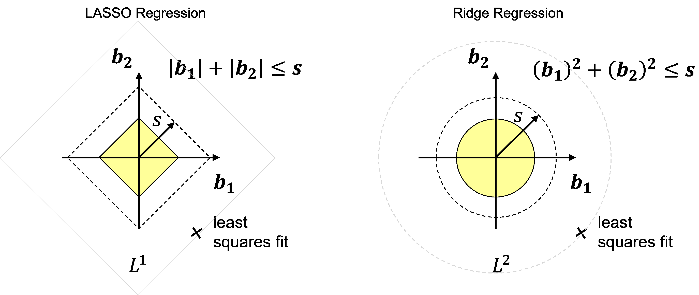

LASSO（左）和岭回归（右）的正则化损失等高线。

+   如果 $𝑠$ 足够大（$\lambda \rightarrow 0$），则选择最小二乘法拟合参数，它存在于空间 $𝑠$ 中！

现在考虑损失函数中的最小二乘估计项和正则化项，

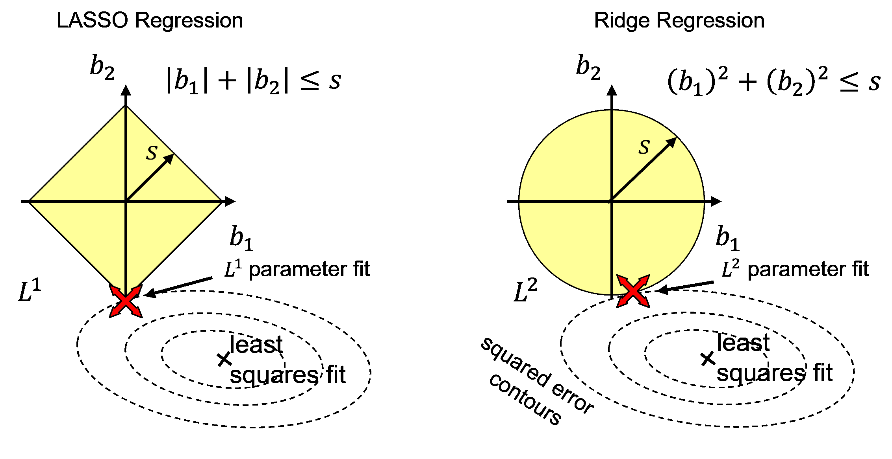

LASSO（左）和岭回归（右）的正则化损失和平方误差损失等高线。

+   我们可以看到，当我们平衡正则化和平方误差损失项时，随着 $\lambda$ 的增加，模型参数从最小二乘法遍历到 0，由于 LASSO 正则化项的形状，模型参数更有可能收缩到 0.0

为了帮助可视化随着 $\lambda$ 的变化，岭回归与 LASSO 回归训练模型参数的变化，我构建了一个交互式 Python [线性解仪表板](https://github.com/GeostatsGuy/DataScienceInteractivePython/blob/main/Interactive_Linear_Solutions.ipynb)。

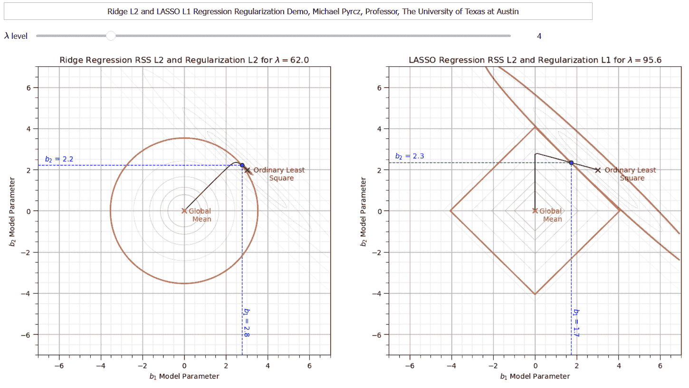

交互式仪表板以可视化平方误差和收缩损失。

我们可以看到 LASSO 在预测的同时进行特征选择。

## 数值解

$𝐿¹$ 范数没有解析解，因为它是一个非可微分的分段函数（包含绝对值）。

+   在 LASSO 中，我们必须使用数值解，例如，迭代梯度下降解而不是解析解，例如，线性回归和岭回归

+   Tibshirani (2012) 证明了在所有特征都是连续的情况下，对于任意数量的特征，𝑚，LASSO 解是唯一的。因此，损失函数具有全局最小值。

回忆一下 LASSO 损失函数，

$$ \sum_{i=1}^n \left(y_i - \left(\sum_{\alpha = 1}^m b_{\alpha} x_{\alpha,i} + b_0 \right) \right)² + \lambda \sum_{j=1}^m |b_{\alpha}| $$

我们可以用这个例子来说明模型参数 $b_1$ 的数值解，

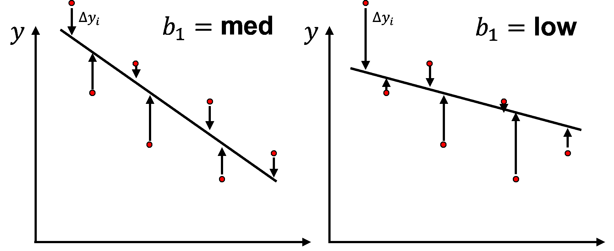

中等斜率（左侧）和低斜率（右侧）的训练误差。

现在我们计算许多 $b_1$ 的情况，并可视化损失与模型参数的对比图，

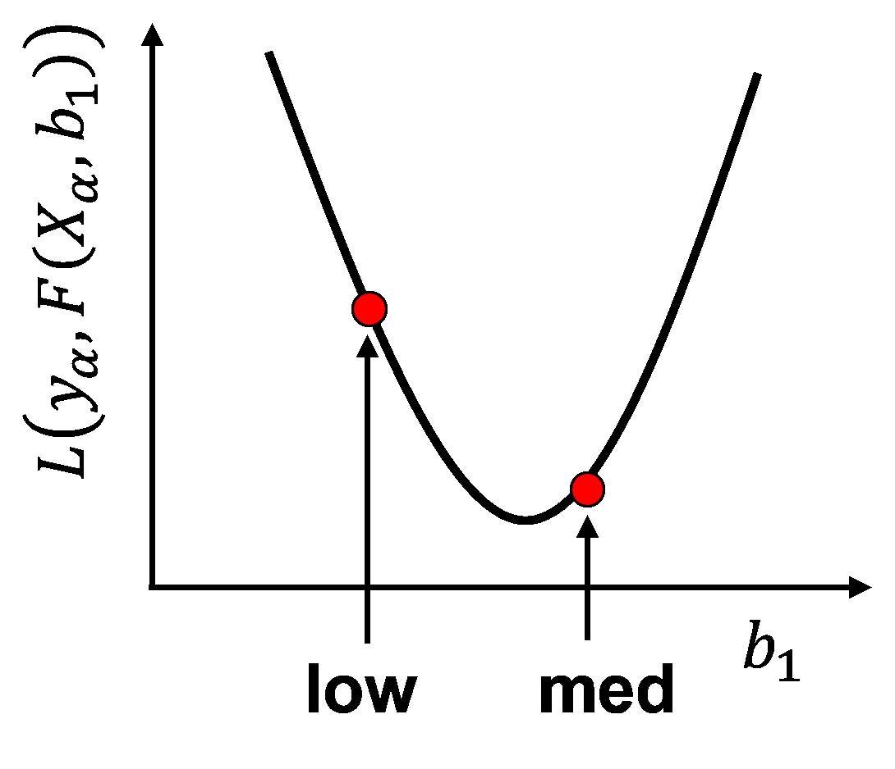

损失与 $b_1$ 模型参数的对比图，低和高情况突出显示。

找到使损失函数最小化的模型参数是数值优化。

+   因此，我们使用常见的数值优化方法来训练我们的机器学习模型

## 网格搜索，暴力优化

我们可以尝试所有模型参数的组合，通过足够的离散化，并保留使损失函数最小化的模型参数组合，

+   对于单个模型参数是可能的

+   由于可能的模型参数值组合很大，对于大多数机器来说不切实际

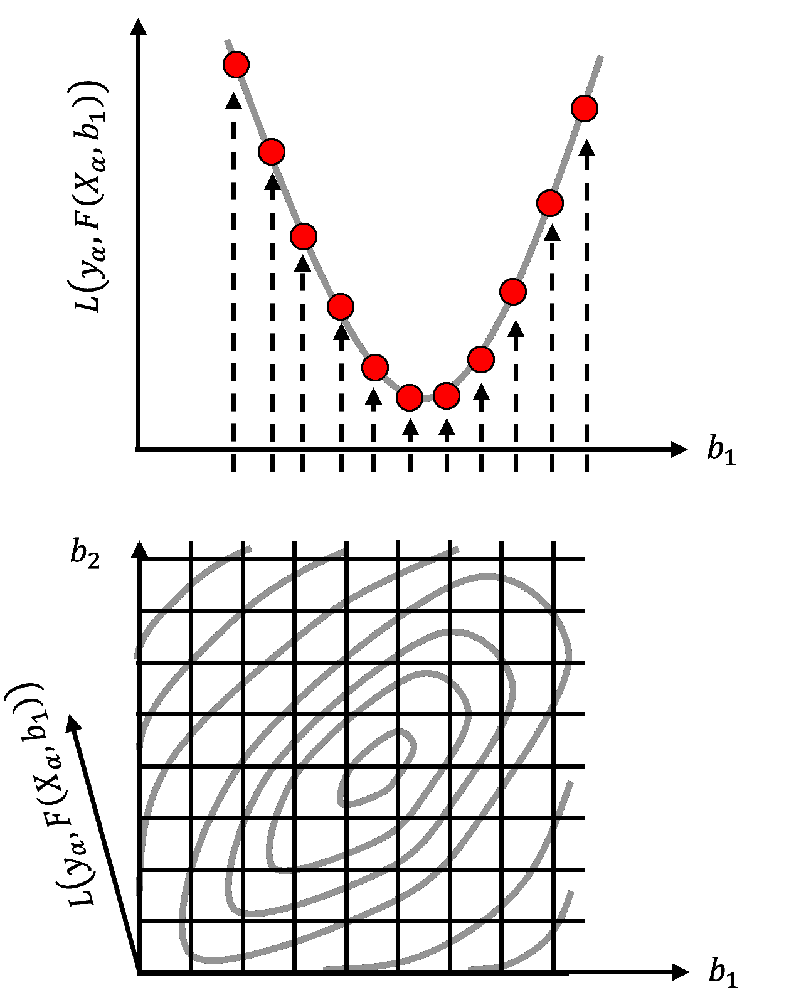

模型参数网格搜索，暴力优化，对 1 个模型参数（上方）和 2 个模型参数（下方）的损失函数进行规则采样。 .

模型参数的组合是，

$$ 𝑛_𝑐=𝑛_{𝑏𝑖𝑛𝑠}^{𝑛_𝑏} $$

其中 $𝑛_𝑏$ 是模型参数的数量，$𝑛_{𝑏𝑖𝑛𝑠}$ 是每个模型参数的离散化数量。

+   在贝叶斯方法中，模型参数由分布表示，空间的大小甚至更大。

## 梯度下降优化

数值解的梯度下降方法如下，

1.  从一个随机的模型参数开始

1.  计算损失函数

1.  计算损失函数的梯度，通常没有损失函数的方程，通过数值计算局部损失函数的导数进行采样。

$$ \nabla L(y_{\alpha}, F(X_{\alpha}, b_1)) = \frac{L(y_{\alpha}, F(X_{\alpha}, b_1 - \epsilon)) - L(y_{\alpha}, F(X_{\alpha}, b_1 + \epsilon))}{2\epsilon} $$

1.  通过沿着斜坡/梯度下降来更新参数估计

$$ \hat{b}_{1,t+1} = \hat{b}_{1,t} - r \nabla L(y_{\alpha}, F(X_{\alpha}, b_1)) $$

其中 $𝑟$ 是学习率/步长，$\hat{b}_{1,𝑡}$ 是当前的模型参数估计，$\hat{𝑏}_{1,𝑡+1}$ 是更新的参数估计。

梯度搜索收敛，

+   梯度下降优化将找到一个局部或全局最小值

梯度搜索步长，

+   $𝑟$ 太小，需要太长时间才能收敛到解

+   $𝑟$ 太大，解可能跳过/错过全局最小值或发散

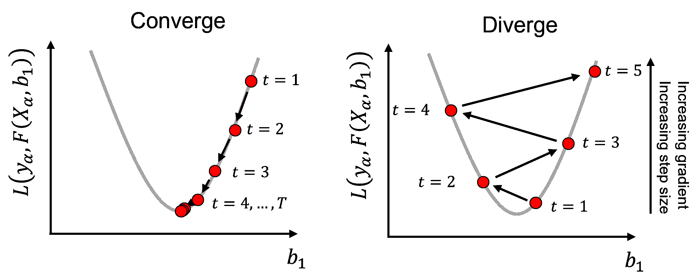

解的收敛（左）和发散（右）。

多变量优化，如果模型将具有超过 1 个模型参数，

+   计算并分解多个模型参数上的梯度，现在使用所有模型参数的梯度向量表示

+   例如，对于 2 个模型参数，

$$\begin{split} \nabla L(y_{\alpha}, F(X_{\alpha}, b_1, b_2)) = \left[ \begin{array}{c} \nabla L(y_{\alpha}, F(X_{\alpha}, b_1)) \\ \nabla L(y_{\alpha}, F(X_{\alpha}, b_2)) \end{array} \right] \end{split}$$

我们可以图形化地表示这一点，

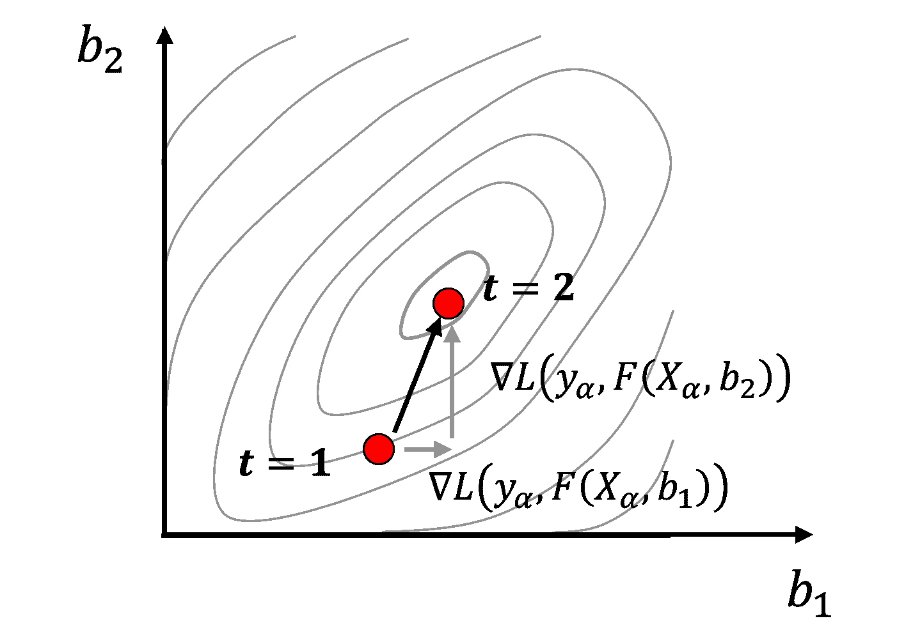

通过损失表示的向量对 2 个模型参数进行梯度下降。

+   训练机器学习模型的优化是探索高维模型参数空间

缓解局部最小值

1.  一种常见的方法是多次开始并取最佳结果。

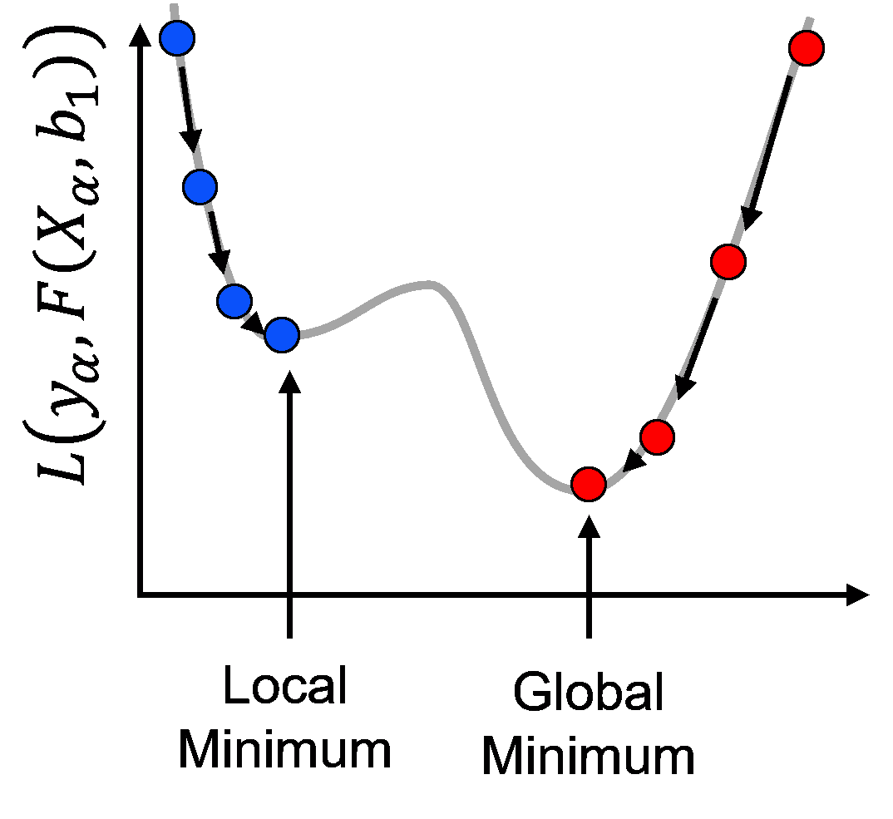

多次随机开始以提高全局最小值的识别。

1.  从较大的学习率、步长开始，随着 $𝑡=1,\dots,𝑇$ 的减少，进行搜索然后收敛。

+   使用步长计划/自适应步长进行迭代，例如，Adam 优化器常用于人工神经网络。

+   模拟退火有一个接受坏步骤的概率计划！早期接受更多坏步骤以进行探索，后期接受较少坏步骤以收敛。

1.  动量有助于提高解的稳定性

使用新的步长、动量、$\lambda$ 更新前一步，其中 $\lambda$ 是前一步的权重

$$ (r \cdot \nabla L)_{t-1}^m = \lambda \cdot (r \cdot \nabla L)_{t-2} + (1 - \lambda) \cdot (r \cdot \nabla L)_{t-1} $$

我们可以在这里可视化这一点，

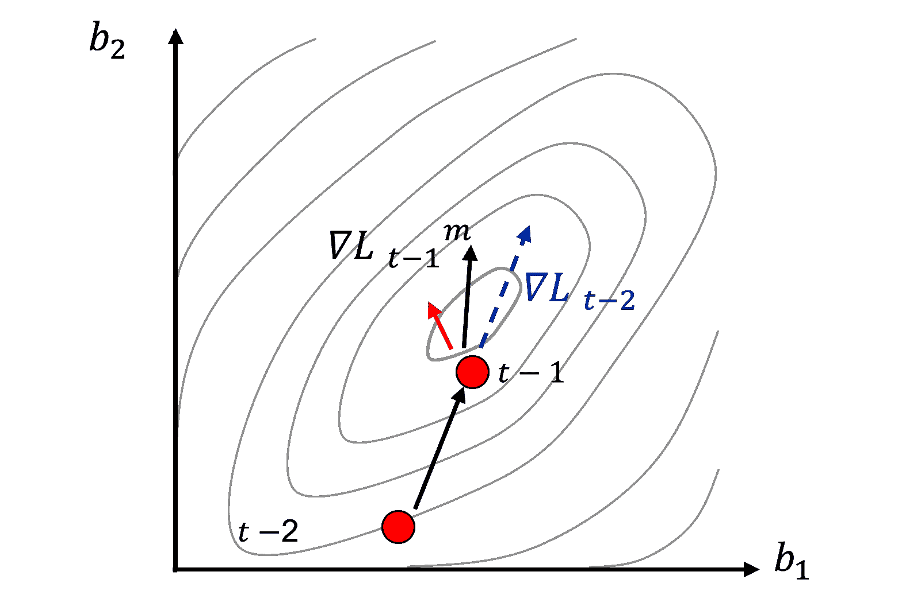

动量用于加权前一步并通过损失函数平滑路径。

+   从每个模型参数的损失函数偏导数计算出的梯度存在噪声。

+   动量平滑，减少这种噪声。

动量帮助解沿着损失函数的一般斜坡前进，而不是在局部山谷或凹槽中振荡。

## 随机梯度下降

我们可能有大量数据 $\rightarrow \nabla 𝐿_𝑡$，计算成本高昂。

+   我们可以用随机逼近替换梯度，$\nabla L_{𝑡^{\ell}}$ 通过保留训练数据的随机子集，在线（1 个数据）或小批量（>1 个数据，$𝑛_{𝑏𝑎𝑡𝑐ℎ}$），其中 $\ell$ 表示梯度的一个实现。

+   我们在梯度下降中降低精度，但加快计算速度，可以执行更多步骤，通常比梯度下降快

+   增加 $𝑛_{𝑏𝑎𝑡𝑐ℎ}$ 以提高梯度估计的准确性，并减少 $𝑛_{𝑏𝑎𝑡𝑐ℎ}$ 以加快步骤

根据 Robbins-Siegmund（1971）定理 - 对于凸损失函数收敛到全局最小值，对于非凸损失函数收敛到全局或局部最小值。

**稀疏性** - $𝐿¹$ 移除特征，内置特征选择，将模型参数缩小到正好为 0，提高模型参数的稀疏性。

## 加载所需的库

我们还需要一些标准包。这些应该已经与 Anaconda 3 一起安装。

```py
%matplotlib inline                                         
suppress_warnings = False
import os                                                     # to set current working directory 
import numpy as np                                            # arrays and matrix math
import scipy.stats as st                                      # statistical methods
import pandas as pd                                           # DataFrames
import matplotlib.pyplot as plt                               # for plotting
from matplotlib.ticker import (MultipleLocator, AutoMinorLocator) # control of axes ticks
from sklearn import metrics                                   # measures to check our models
from sklearn.preprocessing import StandardScaler              # standardize the features
from sklearn import linear_model                              # linear regression
from sklearn.linear_model import Ridge                        # ridge regression implemented in scikit-learn
from sklearn.linear_model import Lasso                        # LASSO regression implemented in scikit-learn
from sklearn.model_selection import cross_val_score           # multi-processor K-fold crossvalidation
from sklearn.model_selection import train_test_split          # train and test split
from IPython.display import display, HTML                     # custom displays
cmap = plt.cm.inferno                                         # default color bar, no bias and friendly for color vision defeciency
plt.rc('axes', axisbelow=True)                                # grid behind plotting elements
if suppress_warnings == True:  
    import warnings                                           # suppress any warnings for this demonstration
    warnings.filterwarnings('ignore') 
seed = 13                                                     # random number seed for workflow repeatability 
```

如果您遇到包导入错误，您可能首先需要安装这些包之一。这通常可以通过在 Windows 上打开命令窗口然后输入‘python -m pip install [package-name]’来完成。有关相应包的文档，还有更多帮助信息。

## 声明函数

让我们定义一个函数，以便将指定的百分位数和主次网格线添加到我们的图表中。

```py
def weighted_percentile(data, weights, perc):                 # calculate weighted percentile (iambr on StackOverflow @ https://stackoverflow.com/questions/21844024/weighted-percentile-using-numpy/32216049) 
    ix = np.argsort(data)
    data = data[ix] 
    weights = weights[ix] 
    cdf = (np.cumsum(weights) - 0.5 * weights) / np.sum(weights) 
    return np.interp(perc, cdf, data)

def histogram_bounds(values,weights,color):                   # add uncertainty bounds to a histogram 
    p10 = weighted_percentile(values,weights,0.1); avg = np.average(values,weights=weights); p90 = weighted_percentile(values,weights,0.9)
    plt.plot([p10,p10],[0.0,45],color = color,linestyle='dashed')
    plt.plot([avg,avg],[0.0,45],color = color)
    plt.plot([p90,p90],[0.0,45],color = color,linestyle='dashed')

def add_grid():
    plt.gca().grid(True, which='major',linewidth = 1.0); plt.gca().grid(True, which='minor',linewidth = 0.2) # add y grids
    plt.gca().tick_params(which='major',length=7); plt.gca().tick_params(which='minor', length=4)
    plt.gca().xaxis.set_minor_locator(AutoMinorLocator()); plt.gca().yaxis.set_minor_locator(AutoMinorLocator()) # turn on minor ticks 

def display_sidebyside(*args):                                # display DataFrames side-by-side (ChatGPT 4.0 generated Spet, 2024)
    html_str = ''
    for df in args:
        html_str += df.head().to_html()  # Using .head() for the first few rows
    display(HTML(f'<div style="display: flex;">{html_str}</div>')) 
```

## 设置工作目录

我总是喜欢这样做，这样我就不会丢失文件，并且可以简化后续的读取和写入（避免每次都包含完整地址）。此外，在这种情况下，请确保将所需的数据文件（见下文）放置在此工作目录中。

```py
#os.chdir("C:\PGE337")                                        # set the working directory 
```

您必须更新引号内的部分以包含您自己的工作目录，并且在 Mac 上格式不同（例如：“~/PGE”）。

## 加载表格数据

这是将我们的逗号分隔数据文件加载到 Pandas DataFrame 对象的命令。

让我们加载提供的多元、空间数据集‘unconv_MV.csv’。这个数据集包含来自 1,000 个非常规井的变量，包括：

+   密度 ($g/cm^{3}$)

+   孔隙率（体积百分比）

注意，数据集是合成的。

我们使用 pandas 的‘read_csv’函数将其加载到我们称为‘my_data’的 DataFrame 中，然后预览它以确保正确加载。

```py
add_error = True                                              # add random error to the response feature
std_error = 1.0; seed = 71071

yname = 'Porosity'; xname = 'Density'                         # specify the predictor features (x2) and response feature (x1)
xmin = 1.0; xmax = 2.5                                        # set minimums and maximums for visualization 
ymin = 0.0; ymax = 25.0    
xlabel = 'Porosity'; ylabel = 'Density'                       # specify the feature labels for plotting
yunit = '%'; xunit = '$g/cm^{3}$'    
Xlabelunit = xlabel + ' (' + xunit + ')'
ylabelunit = ylabel + ' (' + yunit + ')'

#df = pd.read_csv("Density_Por_data.csv")                     # load the data from local current directory
df = pd.read_csv(r"https://raw.githubusercontent.com/GeostatsGuy/GeoDataSets/master/Density_Por_data.csv") # load the data from my github repo
df = df.sample(frac=1.0, random_state = 73073); df = df.reset_index() # extract 30% random to reduce the number of data

if add_error == True:                                         # method to add error
    np.random.seed(seed=seed)                                 # set random number seed
    df[yname] = df[yname] + np.random.normal(loc = 0.0,scale=std_error,size=len(df)) # add noise
    values = df._get_numeric_data(); values[values < 0] = 0   # set negative to 0 in a shallow copy ndarray 
```

## 训练-测试分割

为了简单起见，我们使用 scikit-learn 包中的 model_selection 模块的 train_test_split 函数应用随机训练-测试分割。

```py
x_train, x_test, y_train, y_test = train_test_split(df[xname],df[yname],test_size=0.25,random_state=73073) # train and test split
# y_train = pd.DataFrame({yname:y_train.values}); y_test = pd.DataFrame({yname:y_test.values}) # optional to ensure response is a DataFrame

y = df[yname].values.reshape(len(df))                         # features as 1D vectors
x = df[xname].values.reshape(len(df))

df_train = pd.concat([x_train,y_train],axis=1)                # features as train and test DataFrames
df_test = pd.concat([x_test,y_test],axis=1) 
```

## 可视化 DataFrame

可视化 DataFrame 是检查数据的有用第一步。

+   许多事情可能会出错，例如，我们加载了错误的数据，所有特征都没有加载，等等。

我们可以通过使用‘head’DataFrame 成员函数来预览（格式整洁，见下文）。

+   我们有一个自定义函数来并排预览训练和测试 DataFrame。

```py
print('   Training DataFrame      Testing DataFrame')
display_sidebyside(df_train,df_test) 
```

```py
 Training DataFrame      Testing DataFrame 
```

|  | 密度 | 孔隙率 |
| --- | --- | --- |
| 24 | 1.778580 | 11.426485 |
| 101 | 2.410560 | 8.488544 |
| 88 | 2.216014 | 10.133693 |
| 79 | 1.631896 | 12.712326 |
| 58 | 1.528019 | 16.129542 |
|  | 密度 | 孔隙率 |
| --- | --- | --- |
| 59 | 1.742534 | 15.380154 |
| 1 | 1.404932 | 13.710628 |
| 35 | 1.552713 | 14.131878 |
| 92 | 1.762359 | 11.154896 |
| 22 | 1.885087 | 9.403056 |

## 表格数据的摘要统计信息

在 DataFrames 中，有许多高效的方法可以计算表格数据的摘要统计信息。describe 命令以一个整洁的数据表形式提供计数、平均值、最小值和最大值。

```py
print('     Training DataFrame         Testing DataFrame')
display_sidebyside(df_train.describe().loc[['count', 'mean', 'std', 'min', 'max']],df_test.describe().loc[['count', 'mean', 'std', 'min', 'max']]) 
```

```py
 Training DataFrame         Testing DataFrame 
```

|  | 密度 | 孔隙率 |
| --- | --- | --- |
| count | 78.000000 | 78.000000 |
| mean | 1.739027 | 12.501465 |
| std | 0.302510 | 3.428260 |
| min | 0.996736 | 3.276449 |
| max | 2.410560 | 21.660179 |
|  | 密度 | 孔隙率 |
| --- | --- | --- |
| count | 27.000000 | 27.000000 |
| mean | 1.734710 | 12.380796 |
| std | 0.247761 | 2.916045 |
| min | 1.067960 | 7.894595 |
| max | 2.119652 | 18.133771 |

## 可视化数据

让我们使用直方图和散点图检查训练和测试数据的一致性和覆盖范围。

+   检查以确保训练和测试数据覆盖了可能的预测特征组合的范围

+   确保测试案例不会超出训练数据范围

```py
nbins = 20                                                    # number of histogram bins

plt.subplot(221)
freq1,_,_ = plt.hist(x=df_train[xname],weights=None,bins=np.linspace(xmin,xmax,nbins),alpha = 0.6,
                     edgecolor='black',color='darkorange',density=True,label='Train')
freq2,_,_ = plt.hist(x=df_test[xname],weights=None,bins=np.linspace(xmin,xmax,nbins),alpha = 0.6,
                     edgecolor='black',color='red',density=True,label='Test')
max_freq = max(freq1.max()*1.10,freq2.max()*1.10)
plt.xlabel(xname + ' (' + xunit + ')'); plt.ylabel('Frequency'); plt.ylim([0.0,max_freq]); plt.title('Density'); add_grid()  
plt.xlim([xmin,xmax]); plt.legend(loc='upper right')   

plt.subplot(222)
freq1,_,_ = plt.hist(x=df_train[yname],weights=None,bins=np.linspace(ymin,ymax,nbins),alpha = 0.6,
                     edgecolor='black',color='darkorange',density=True,label='Train')
freq2,_,_ = plt.hist(x=df_test[yname],weights=None,bins=np.linspace(ymin,ymax,nbins),alpha = 0.6,
                     edgecolor='black',color='red',density=True,label='Test')
max_freq = max(freq1.max()*1.10,freq2.max()*1.10)
plt.xlabel(yname + ' (' + yunit + ')'); plt.ylabel('Frequency'); plt.ylim([0.0,max_freq]); plt.title('Porosity'); add_grid()  
plt.xlim([ymin,ymax]); plt.legend(loc='upper right')   

plt.subplot(223)                                              # plot the model
plt.scatter(df_train[xname],df_train[yname],s=40,marker='o',color = 'darkorange',alpha = 0.8,edgecolor = 'black',zorder=10,label='Train')
plt.scatter(df_test[xname],df_test[yname],s=40,marker='o',color = 'red',alpha = 0.8,edgecolor = 'black',zorder=10,label='Test')
plt.title('Porosity vs Density')
plt.xlabel(xname + ' (' + xunit + ')')
plt.ylabel(yname + ' (' + yunit + ')')
plt.legend(); add_grid(); plt.xlim([xmin,xmax]); plt.ylim([ymin,ymax])

plt.subplots_adjust(left=0.0, bottom=0.0, right=2.0, top=2.1, wspace=0.3, hspace=0.2)
#plt.savefig('Test.pdf', dpi=600, bbox_inches = 'tight',format='pdf') 
plt.show() 
```

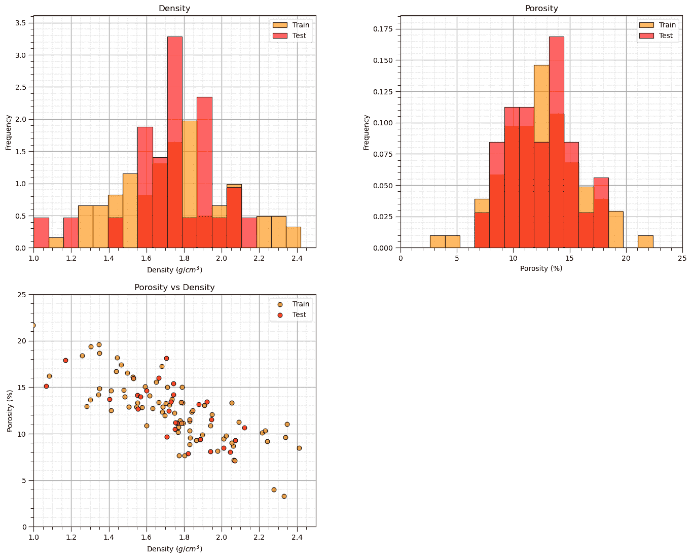

## Linear Regression Model

让我们先计算线性回归模型。我们使用 scikit learn，然后将相同的流程扩展到岭回归。

+   我们正在构建一个模型，$\phi = f(\rho)$，其中 $\phi$ 是孔隙率，$\rho$ 是密度。

+   我们也可以说，我们有“密度回归到孔隙率”。

我们模型具有这个特定的方程，

$$ \phi = b_1 \times \rho + b_0 $$

```py
linear_reg = linear_model.LinearRegression()                  # instantiate the model

linear_reg.fit(df_train[xname].values.reshape(len(df_train),1), df_train[yname]) # train the model parameters
x_model = np.linspace(xmin,xmax,10)
y_model_linear = linear_reg.predict(x_model.reshape(-1, 1))   # predict at the withheld test data 

plt.subplot(111)                                              # plot the data, model with model parameters
plt.plot(x_model,y_model_linear, color='red', linewidth=2,label='Linear Regression',zorder=100)
plt.scatter(df_train[xname],df_train[yname],s=40,marker='o',color = 'darkorange',alpha = 0.8,edgecolor = 'black',zorder=10,label='Train')
plt.scatter(df_test[xname],df_test[yname],s=40,marker='o',color = 'red',alpha = 0.8,edgecolor = 'black',zorder=10,label='Test')
plt.annotate('Linear Regression Model Parameters:',[1.86,18]) # add the model to the plot
plt.annotate(r'$b_1$ :' + str(np.round(linear_reg.coef_ [0],2)),[1.97,17])
plt.annotate(r'$b_0$ :' + str(np.round(linear_reg.intercept_,2)),[1.97,16])
plt.title('Linear Regression Model, Porosity = f(Density)')
plt.xlabel(xname + ' (' + xunit + ')')
plt.ylabel(yname + ' (' + yunit + ')')
plt.legend(loc='upper right'); add_grid(); plt.xlim([xmin,xmax]); plt.ylim([ymin,ymax])

plt.subplots_adjust(left=0.0, bottom=0.0, right=1.0, top=1.0, wspace=0.2, hspace=0.2); plt.show() 
```

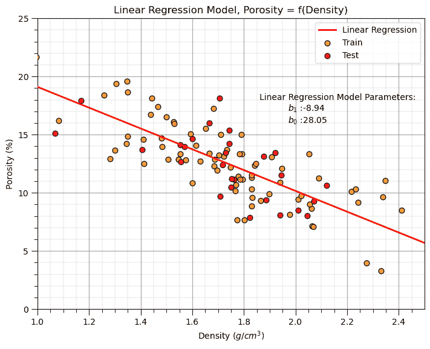

你可能已经注意到在预测函数中对预测特征应用了额外的重塑操作。

```py
y_linear_model = linear_reg.predict(x_model.reshape(-1, 1))   # predict at the withheld test data 
```

这是因为 scikit-learn 假设有多个预测特征；因此，期望一个二维数组，包含样本（行）和特征（列），但我们只有一维向量。

+   重塑操作将一维向量转换为一个只有一列的二维向量

## Linear Regression Model Checks

让我们进行一些快速模型检查。可以做得更多，但为了简洁，这里我限制了这个范围。

+   有关更多信息及检查，请参阅线性回归章节

```py
y_pred_linear = linear_reg.predict(df_test[xname].values.reshape(len(df_test),1)) # predict at test data
r_squared_linear = metrics.r2_score(df_test[yname].values, y_pred_linear)

plt.subplot(121)                                              # plot testing diagnostics 
plt.plot(x_model,y_model_linear, color='red', linewidth=2,label='Linear Regression',zorder=100)
plt.scatter(df_train[xname],df_train[yname],s=40,marker='o',color = 'darkorange',alpha = 0.8,edgecolor = 'black',zorder=10,label='Train')
plt.scatter(df_test[xname],df_test[yname],s=40,marker='o',color = 'red',alpha = 0.8,edgecolor = 'black',zorder=10,label='Test')
# plt.scatter(df_test[xname], y_pred,color='grey',edgecolor='black',s = 40, alpha = 1.0, label = 'predictions',zorder=100)
plt.scatter(df_test[xname], y_pred_linear,color='white',s=120,marker='o',linewidths=1.0, edgecolors="black",zorder=300)
plt.scatter(df_test[xname], y_pred_linear,color='red',s=90,marker='*',linewidths=0.5, edgecolors="black",zorder=320,label='Predictions')

plt.annotate('Linear Regression Model Parameters:',[1.86,18]) # add the model to the plot
plt.annotate(r'$b_1$ :' + str(np.round(linear_reg.coef_ [0],2)),[1.97,17])
plt.annotate(r'$b_0$ :' + str(np.round(linear_reg.intercept_,2)),[1.97,16])
plt.annotate(r'$r²$ :' + str(np.round(r_squared_linear,2)),[1.97,15])
plt.title('Linear Regression Model, Porosity = f(Density)')
plt.xlabel(xname + ' (' + xunit + ')')
plt.ylabel(yname + ' (' + yunit + ')')
plt.legend(loc='upper right'); add_grid(); plt.xlim([xmin,xmax]); plt.ylim([ymin,ymax])

y_res_linear = y_pred_linear - df_test['Porosity'].values     # calculate the test residual

plt.subplot(122)
plt.hist(y_res_linear, color = 'red', alpha = 0.8, edgecolor = 'black', bins = np.linspace(-5,5,20))
plt.title("Error Residual at Testing Data"); plt.xlabel(yname + ' True - Estimate (%)');plt.ylabel('Frequency')
plt.vlines(0,0,5.5,color='black',ls='--',lw=2)
plt.annotate('Test Error Residual:',[-4,4.7]) # add residual summary statistics
plt.annotate(r'$\overline{\Delta{y}}$: ' + str(round(np.average(y_res_linear),2)),[-4,4.4])
plt.annotate(r'$\sigma_{\Delta{y}}$: ' + str(np.round(np.std(y_res_linear),2)),[-4,4.1])
add_grid(); plt.xlim(-5,5); plt.ylim(0,5.5)

plt.subplots_adjust(left=0.0, bottom=0.0, right=2.2, top=1.2, wspace=0.2, hspace=0.2); plt.show() 
```

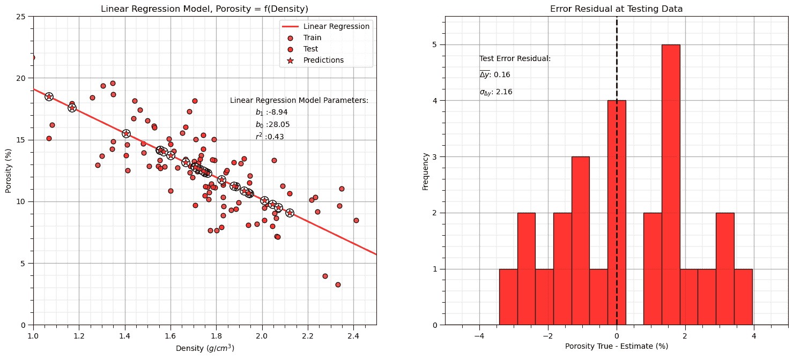

## Ridge Regression Model

让我们用 scikit-learn 的岭回归方法替换 scikit-learn 的线性回归方法。

+   注意，我们现在必须设置 $\lambda$ 超参数。

+   在 scikit-learn 中，超参数通过模型的实例化来设置

```py
lam = 1.0                                                     # lambda hyperparameter

ridge_reg = Ridge(alpha=lam)                                  # instantiate the model

ridge_reg.fit(df_train[xname].values.reshape(len(df_train),1), df_train[yname]) # train the model parameters
x_model = np.linspace(xmin,xmax,10)
y_model_ridge = ridge_reg.predict(x_model.reshape(10,1)) # predict with the fit model

plt.subplot(111)                                              # plot the data, model with model parameters
plt.plot(x_model,y_model_ridge, color='red', linewidth=2,label='Ridge Regression',zorder=100)
plt.scatter(df_train[xname],df_train[yname],s=40,marker='o',color = 'darkorange',alpha = 0.8,edgecolor = 'black',zorder=10,label='Train')
plt.scatter(df_test[xname],df_test[yname],s=40,marker='o',color = 'red',alpha = 0.8,edgecolor = 'black',zorder=10,label='Test')
plt.annotate('Ridge Regression Model Parameters:',[1.86,18]) # add the model to the plot
plt.annotate(r'$b_1$ :' + str(np.round(ridge_reg.coef_ [0],2)),[1.97,17])
plt.annotate(r'$b_0$ :' + str(np.round(ridge_reg.intercept_,2)),[1.97,16])
plt.title('Ridge Model, Regression of ' + yname + ' on ' + xname + r' with a $\lambda = $' + str(lam))
plt.xlabel(xname + ' (' + xunit + ')')
plt.ylabel(yname + ' (' + yunit + ')')
plt.legend(loc='upper right'); add_grid(); plt.xlim([xmin,xmax]); plt.ylim([ymin,ymax])

plt.subplots_adjust(left=0.0, bottom=0.0, right=1.0, top=1.0, wspace=0.2, hspace=0.2); plt.show() 
```

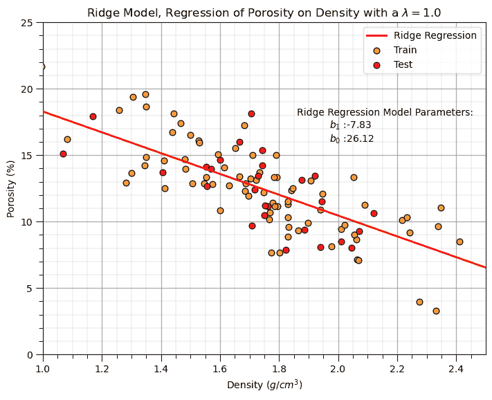

让我们重复使用线性回归模型所应用的简单模型检查。

```py
y_pred_ridge = ridge_reg.predict(df_test[xname].values.reshape(len(df_test),1)) # predict at test data
r_squared = metrics.r2_score(df_test[yname].values, y_pred_ridge)

plt.subplot(121)                                              # plot testing diagnostics 
plt.plot(x_model,y_model_ridge, color='red', linewidth=2,label='Ridge Regression',zorder=100)
plt.scatter(df_train[xname],df_train[yname],s=40,marker='o',color = 'darkorange',alpha = 0.8,edgecolor = 'black',zorder=10,label='Train')
plt.scatter(df_test[xname],df_test[yname],s=40,marker='o',color = 'red',alpha = 0.8,edgecolor = 'black',zorder=10,label='Test')
plt.scatter(df_test[xname], y_pred_ridge,color='white',s=120,marker='o',linewidths=1.0, edgecolors="black",zorder=300)
plt.scatter(df_test[xname], y_pred_ridge,color='red',s=90,marker='*',linewidths=0.5, edgecolors="black",zorder=320,label='Predictions')

plt.annotate('Ridge Regression Model Parameters:',[1.86,18]) # add the model to the plot
plt.annotate(r'$b_1$ :' + str(np.round(ridge_reg.coef_ [0],2)),[1.97,17])
plt.annotate(r'$b_0$ :' + str(np.round(ridge_reg.intercept_,2)),[1.97,16])
plt.title('Ridge Model, Regression of ' + yname + ' on ' + xname + r' with a $\lambda = $' + str(lam))
plt.xlabel(xname + ' (' + xunit + ')')
plt.ylabel(yname + ' (' + yunit + ')')
plt.legend(loc='upper right'); add_grid(); plt.xlim([xmin,xmax]); plt.ylim([ymin,ymax])

y_res_ridge = y_pred_ridge - df_test['Porosity'].values       # calculate the test residual

plt.subplot(122)
plt.hist(y_res_ridge, color = 'red', alpha = 0.8, edgecolor = 'black', bins = np.linspace(-5,5,20))
plt.title("Error Residual at Testing Data"); plt.xlabel(yname + ' True - Estimate (%)');plt.ylabel('Frequency')
plt.vlines(0,0,5.5,color='black',ls='--',lw=2)
plt.annotate('Test Error Residual:',[-4,4.7]) # add residual summary statistics
plt.annotate(r'$\overline{\Delta{y}}$: ' + str(round(np.average(y_res_ridge),2)),[-4,4.4])
plt.annotate(r'$\sigma_{\Delta{y}}$: ' + str(np.round(np.std(y_res_ridge),2)),[-4,4.1])
add_grid(); plt.xlim(-5,5); plt.ylim(0,5.5)

plt.subplots_adjust(left=0.0, bottom=0.0, right=2.2, top=1.2, wspace=0.2, hspace=0.2); plt.show() 
```

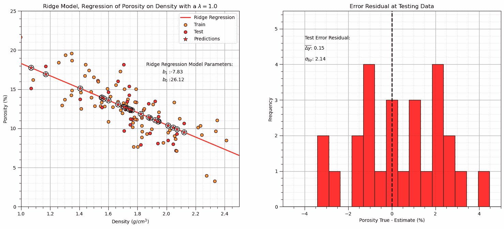

很有趣，我们解释的方差更少，并且残差标准差更大（更多误差）。

+   对于我们任意选择的超参数 $\lambda$，岭回归实际上减少了测试方差解释和准确度

+   这并不奇怪，我们实际上并没有调整超参数以获得最佳模型！

## LASSO Regression Model

让我们用 scikit learn 的 LASSO 回归方法替换 scikit learn 的线性回归和岭回归方法。注意，再次必须设置 lambda 超参数。

+   记住，lambda 超参数 $\lambda$ 是在模型实例化时设置的

```py
lam = 0.1                                                     # lambda hyperparameter

lasso_reg = Lasso(alpha=lam)                                  # instantiate the model

lasso_reg.fit(df_train[xname].values.reshape(len(df_train),1), df_train[yname]) # train the model parameters
x_model = np.linspace(xmin,xmax,10)
y_model_lasso = lasso_reg.predict(x_model.reshape(10,1))      # predict with the fit model

plt.subplot(111)                                              # plot the data, model with model parameters
plt.plot(x_model,y_model_lasso, color='red', linewidth=2,label='LASSO Regression',zorder=100)
plt.scatter(df_train[xname],df_train[yname],s=40,marker='o',color = 'darkorange',alpha = 0.8,edgecolor = 'black',zorder=10,label='Train')
plt.scatter(df_test[xname],df_test[yname],s=40,marker='o',color = 'red',alpha = 0.8,edgecolor = 'black',zorder=10,label='Test')
plt.annotate('LASSO Regression Model Parameters:',[1.86,18]) # add the model to the plot
plt.annotate(r'$b_1$ :' + str(np.round(lasso_reg.coef_ [0],2)),[1.97,17])
plt.annotate(r'$b_0$ :' + str(np.round(lasso_reg.intercept_,2)),[1.97,16])
plt.title('LASSO Model, Regression of ' + yname + ' on ' + xname + r' with a $\lambda = $' + str(lam))
plt.xlabel(xname + ' (' + xunit + ')')
plt.ylabel(yname + ' (' + yunit + ')')
plt.legend(loc='upper right'); add_grid(); plt.xlim([xmin,xmax]); plt.ylim([ymin,ymax])

plt.subplots_adjust(left=0.0, bottom=0.0, right=1.0, top=1.0, wspace=0.2, hspace=0.2); plt.show() 
```

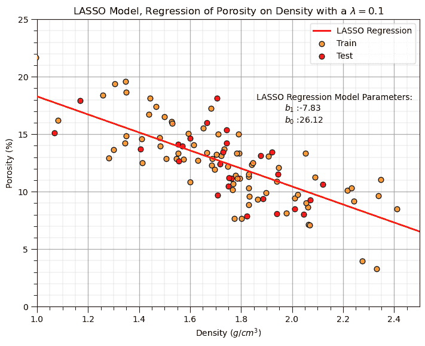

让我们重复使用线性回归模型所应用的简单模型检查。

## LASSO 超参数调整

在上面，我们只是任意选择了一个 $\lambda$ 超参数，现在让我们进行超参数调整。

+   在交叉验证中总结 MSE 并在广泛的 $\lambda$ 值上循环

记住，均方误差（MSE）由以下公式给出，

$$ \text{MSE} = \frac{1}{n} \sum_{i=1}^{n} (y_i - \hat{y}_i)² $$

其中 $y_i$ 是实际值，$\hat{y}_i$ 是预测值，$n$ 是数据点的数量。

```py
score = []                                                    # code modified from StackOverFlow by Dimosthenis

nlambda = 100
lambda_mat = np.logspace(-2,5,nlambda)
for ilam in range(0,nlambda):
    lasso_reg = Lasso(alpha=lambda_mat[ilam])
    scores = cross_val_score(estimator=lasso_reg, X= df['Density'].values.reshape(-1, 1), 
                             y=df['Porosity'].values, cv=10, n_jobs=4, scoring = "neg_mean_squared_error") # Perform 10-fold cross validation
    score.append(abs(scores.mean()))

plt.subplot(111)
plt.plot(lambda_mat, score,  color='black', linewidth = 3, label = 'Test MSA',zorder=10)
plt.title('LASSO Regression Test Mean Square Error vs. Lambda Hyperparameter'); plt.xlabel('Lambda'); plt.ylabel('Test Mean Square Error')
plt.xlim(1.0e-2,1.0e5); plt.ylim(0.001,20.0); plt.xscale('log')
plt.vlines(0.1,0,20,color='red',lw=2); plt.vlines(0.9,0,20,color='red',lw=2,zorder=10)
plt.annotate('Linear Regression',[0.075,12.5],rotation=90.0,color='red',zorder=10)
plt.annotate('Mean of Response Feature',[1.06,11.4],rotation=90.0,color='red',zorder=10)
plt.fill_between([0.01,0.1],[0,0],[20,20],color='grey',alpha=0.3,zorder=1)
plt.fill_between([0.9,100000],[0,0],[20,20],color='grey',alpha=0.3,zorder=1)
plt.grid(which='both')
plt.subplots_adjust(left=0.0, bottom=0.0, right=2.0, top=1.0, wspace=0.2, hspace=0.2); plt.show() 
```

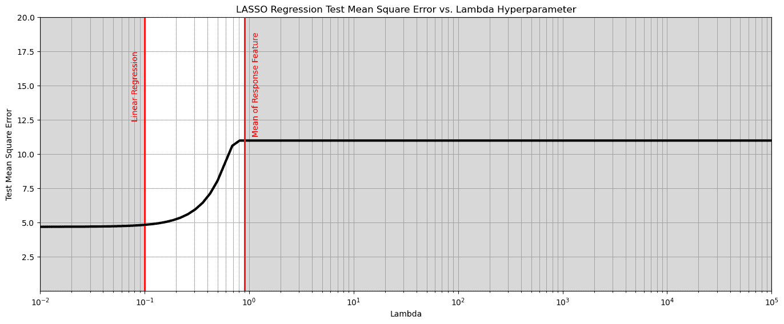

从上面我们可以观察到任何 $\lambda > 0.1$ 都会导致最小的测试均方误差。

+   阈值行为是由于以下事实：在这个正则化水平以下，模型的行为类似于线性回归。

现在让我们使用这个超参数在所有数据上训练一个模型。

```py
lam = 0.01                                                      # tuned hyperparameter
lasso_tuned = Lasso(alpha=lam)                                  # instantiate the model
lasso_tuned.fit(df[xname].values.reshape(len(df),1), df[yname]) # train the model parameters on all data

y_pred_lasso_tuned = lasso_tuned.predict(df_test[xname].values.reshape(len(df_test),1)) # predict at test data
r_squared = metrics.r2_score(df_test[yname].values, y_pred_lasso_tuned)

plt.subplot(121)                                              # plot testing diagnostics 
plt.plot(x_model,y_model_lasso, color='red', linewidth=2,label='LASSO Regression',zorder=100)
plt.scatter(df_train[xname],df_train[yname],s=40,marker='o',color = 'darkorange',alpha = 0.8,edgecolor = 'black',zorder=10,label='Train')
plt.scatter(df_test[xname],df_test[yname],s=40,marker='o',color = 'red',alpha = 0.8,edgecolor = 'black',zorder=10,label='Test')
plt.scatter(df_test[xname], y_pred_ridge,color='white',s=120,marker='o',linewidths=1.0, edgecolors="black",zorder=300)
plt.scatter(df_test[xname], y_pred_ridge,color='red',s=90,marker='*',linewidths=0.5, edgecolors="black",zorder=320,label='Predictions')

plt.annotate('LASSO Regression Model Parameters:',[1.86,18]) # add the model to the plot
plt.annotate(r'$b_1$ :' + str(np.round(ridge_reg.coef_ [0],2)),[1.97,17])
plt.annotate(r'$b_0$ :' + str(np.round(ridge_reg.intercept_,2)),[1.97,16])
plt.title('Tuned LASSO Model, Regression of ' + yname + ' on ' + xname + r' with a $\lambda = $' + str(lam))
plt.xlabel(xname + ' (' + xunit + ')')
plt.ylabel(yname + ' (' + yunit + ')')
plt.legend(loc='upper right'); add_grid(); plt.xlim([xmin,xmax]); plt.ylim([ymin,ymax])

y_res_ridge = y_pred_ridge - df_test['Porosity'].values       # calculate the test residual

plt.subplot(122)
plt.hist(y_res_ridge, color = 'red', alpha = 0.8, edgecolor = 'black', bins = np.linspace(-5,5,20))
plt.title("Error Residual at Testing Data"); plt.xlabel(yname + ' True - Estimate (%)');plt.ylabel('Frequency')
plt.vlines(0,0,5.5,color='black',ls='--',lw=2)
plt.annotate('Test Error Residual:',[-4,4.7]) # add residual summary statistics
plt.annotate(r'$\overline{\Delta{y}}$: ' + str(round(np.average(y_res_ridge),2)),[-4,4.4])
plt.annotate(r'$\sigma_{\Delta{y}}$: ' + str(np.round(np.std(y_res_ridge),2)),[-4,4.1])
add_grid(); plt.xlim(-5,5); plt.ylim(0,5.5)

plt.subplots_adjust(left=0.0, bottom=0.0, right=2.2, top=1.2, wspace=0.2, hspace=0.2); plt.show() 
```

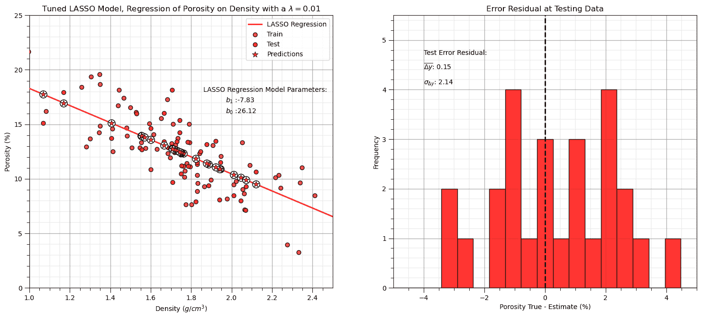

使用我们调整过的 $\lambda$ 超参数，

```py
lam = 0.01 
```

我们的模式与线性回归相同。

+   我们能否创造一个最佳模型不是线性回归的情况？即，正则化有帮助的情况？

+   是的，我们可以。让我们移除大部分样本以创建数据稀疏性，并添加大量噪声！

承认，我迭代了样本和噪声的随机种子以得到这个结果。

+   少量数据（低 $n$）和高维性（高 $m$）通常会导致 LASSO 比线性回归表现更好

```py
df_sample = df.copy(deep=True).sample(n=10,random_state=11)
noise_stdev = 3.0
np.random.seed(seed=15)
df_sample['Porosity'] = df_sample['Porosity'] + np.random.normal(0.0, noise_stdev, size=len(df_sample))

score = []                                                    # code modified from StackOverFlow by Dimosthenis

nlambda = 100
lambda_mat = np.logspace(-3,5,nlambda)
for ilam in range(0,nlambda):
    lasso_reg = Lasso(alpha=lambda_mat[ilam])
    scores = cross_val_score(estimator=lasso_reg, X= df_sample['Density'].values.reshape(-1, 1), 
                             y=df_sample['Porosity'].values, cv=2, n_jobs=4, scoring = "neg_mean_squared_error") # Perform 10-fold cross validation
    score.append(abs(scores.mean()))

plt.subplot(111)
plt.plot(lambda_mat, score,  color='black', linewidth = 3, label = 'Test MSA',zorder=10)
plt.title('LASSO Regression Test Mean Square Error vs. Lambda Hyperparameter'); plt.xlabel('Lambda'); plt.ylabel('Test Mean Square Error')
plt.xlim(1.0e-3,1.0e5); plt.ylim(0.001,20.0); 
plt.xscale('log')
plt.vlines(0.003,0,20,color='red',lw=2); plt.vlines(0.4,0,20,color='red',lw=2,zorder=10); plt.vlines(0.1,0,20,color='red',lw=2,zorder=10);
plt.annotate('Linear Regression',[0.0022,12.5],rotation=90.0,color='red',zorder=10)
plt.annotate(r'LASSO Tuned $\lambda$',[0.075,12.5],rotation=90.0,color='red',zorder=10)
plt.annotate('Mean of Response Feature',[0.46,11.7],rotation=90.0,color='red',zorder=10)
plt.fill_between([0.001,0.003],[0,0],[20,20],color='grey',alpha=0.3,zorder=1)
plt.fill_between([0.4,100000],[0,0],[20,20],color='grey',alpha=0.3,zorder=1)
plt.grid(which='both')
plt.subplots_adjust(left=0.0, bottom=0.0, right=2.0, top=1.0, wspace=0.2, hspace=0.2); plt.show() 
```

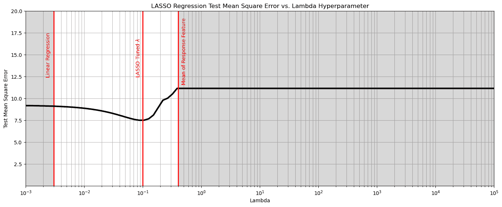

## 调查 Lambda 超参数对模型参数的影响

让我们看看我们已加载的多元数据集。这样我们可以观察模型在一系列特征和 lambda 超参数值范围内的行为。我们将执行一系列步骤来达到关键点！

+   加载一个多元数据集

+   计算汇总统计量

+   标准化特征

然后，我们将改变超参数并观察模型参数。

### 加载一个多元数据集

让我们加载一个包含更多变量的数据集来展示 LASSO 回归的特征排序，并比较超参数值下模型参数的行为。数据集‘unconv_MV_v5.csv’是一个基于 1,000 个非常规井的逗号分隔文件，包括特征，

+   好的平均孔隙率

+   渗透率的对数变换（以线性化与其他变量的关系）

+   声波阻抗（kg/m³ x m/s x 10⁶）

+   剪切比（%）

+   总有机碳（%）

+   玻璃质反射率（%）

+   初始生产 90 天平均（MCFPD）。

我们假设初始生产是响应特征，所有其他特征是预测特征。

此外，您还可以通过切换 mv_data 整数到 1 来尝试另一个类似的数据集。

```py
mv_data = 2

if mv_data == 1:
    df_mv = pd.read_csv(r"https://raw.githubusercontent.com/GeostatsGuy/GeoDataSets/master/unconv_MV.csv")
    df_mv = df_mv.drop('WellIndex',axis = 1)                  # remove the well index feature
elif mv_data == 2:
    df_mv = pd.read_csv(r"https://raw.githubusercontent.com/GeostatsGuy/GeoDataSets/master/unconv_MV_v5.csv")
    df_mv = df_mv.rename({'Prod':'Production'},axis=1)
    df_mv = df_mv.drop('Well',axis = 1)                       # remove the well index feature
df_mv.head()                                                  # load the comma delimited data file 
```

|  | Por | Perm | AI | Brittle | TOC | VR | Production |
| --- | --- | --- | --- | --- | --- | --- | --- |
| 0 | 12.08 | 2.92 | 2.80 | 81.40 | 1.16 | 2.31 | 4165.196191 |
| 1 | 12.38 | 3.53 | 3.22 | 46.17 | 0.89 | 1.88 | 3561.146205 |
| 2 | 14.02 | 2.59 | 4.01 | 72.80 | 0.89 | 2.72 | 4284.348574 |
| 3 | 17.67 | 6.75 | 2.63 | 39.81 | 1.08 | 1.88 | 5098.680869 |
| 4 | 17.52 | 4.57 | 3.18 | 10.94 | 1.51 | 1.90 | 3406.132832 |

### 计算摘要统计信息

让我们计算我们的多元数据的摘要统计信息。

```py
df_mv.describe().transpose() 
```

|  | count | mean | std | min | 25% | 50% | 75% | max |
| --- | --- | --- | --- | --- | --- | --- | --- | --- |
| Por | 200.0 | 14.991150 | 2.971176 | 6.550000 | 12.912500 | 15.070000 | 17.402500 | 23.550000 |
| Perm | 200.0 | 4.330750 | 1.731014 | 1.130000 | 3.122500 | 4.035000 | 5.287500 | 9.870000 |
| AI | 200.0 | 2.968850 | 0.566885 | 1.280000 | 2.547500 | 2.955000 | 3.345000 | 4.630000 |
| Brittle | 200.0 | 48.161950 | 14.129455 | 10.940000 | 37.755000 | 49.510000 | 58.262500 | 84.330000 |
| TOC | 200.0 | 0.990450 | 0.481588 | -0.190000 | 0.617500 | 1.030000 | 1.350000 | 2.180000 |
| VR | 200.0 | 1.964300 | 0.300827 | 0.930000 | 1.770000 | 1.960000 | 2.142500 | 2.870000 |
| Production | 200.0 | 4311.219852 | 992.038414 | 2107.139414 | 3618.064513 | 4284.687348 | 5086.089761 | 6662.622385 |

### 标准化特征

让我们将特征标准化，以便具有：

+   平均值 = 0.0

+   方差 = 标准差 = 1.0

我们这样做是为了使模型参数具有相似的范围，并且可以进行比较，即像特征排名中的 $\beta$ 与 $B$ 系数一样。

要做到这一点，我们：

1.  从 scikit learn 实例化 StandardScaler。我们将其命名为‘scaler’，这样我们就可以方便地反转转换，如果我们想这样做的话。我们需要这样做才能将我们的预测值转换回常规的生产单位。

```py
scaler = StandardScaler() 
```

1.  然后，我们从 DataFrame 中提取所有值并应用按列标准化。结果是 2D ndarray

```py
sfeatures = scaler.fit_transform(df_mv.values) 
```

1.  我们创建一个新的空 DataFrame

```py
df_nmv = pd.DataFrame() 
```

1.  然后我们将转换后的值添加到新的 DataFrame 中，同时保留旧 DataFrame 中的样本索引和特征名称

```py
df_nmv = pd.DataFrame(sfeatures, index=df_mv.index, columns=df_mv.columns) 
```

```py
scaler = StandardScaler()                                     # instantiate the scaler 

sfeatures = scaler.fit_transform(df_mv.values)                # standardize all the values extracted from the DataFrame 
df_nmv = pd.DataFrame()                                       # instantiate a new DataFrame
df_nmv = pd.DataFrame(sfeatures, index=df_mv.index, columns=df_mv.columns) # copy the standardized values into the new DataFrame
df_nmv.head()                                                 # preview the new DataFrame 
```

|  | Por | Perm | AI | Brittle | TOC | VR | Production |
| --- | --- | --- | --- | --- | --- | --- | --- |
| 0 | -0.982256 | -0.817030 | -0.298603 | 2.358297 | 0.352948 | 1.152048 | -0.147565 |
| 1 | -0.881032 | -0.463751 | 0.444147 | -0.141332 | -0.209104 | -0.280931 | -0.757991 |
| 2 | -0.327677 | -1.008148 | 1.841224 | 1.748113 | -0.209104 | 2.518377 | -0.027155 |
| 3 | 0.903875 | 1.401098 | -0.599240 | -0.592585 | 0.186414 | -0.280931 | 0.795773 |
| 4 | 0.853263 | 0.138561 | 0.373409 | -2.640962 | 1.081534 | -0.214280 | -0.914640 |

### 检查摘要统计

让我们检查摘要统计。

```py
df_nmv.describe().transpose()                                 # summary statistics from the new DataFrame 
```

|  | 数量 | 平均值 | 标准差 | 最小值 | 25% | 50% | 75% | 最大值 |
| --- | --- | --- | --- | --- | --- | --- | --- | --- |
| 孔隙率 | 200.0 | 2.486900e-16 | 1.002509 | -2.848142 | -0.701361 | 0.026605 | 0.813617 | 2.887855 |
| 永久 | 200.0 | -6.217249e-17 | 1.002509 | -1.853701 | -0.699753 | -0.171282 | 0.554098 | 3.208033 |
| 人工智能 | 200.0 | 4.130030e-16 | 1.002509 | -2.986650 | -0.745137 | -0.024493 | 0.665203 | 2.937664 |
| 岩脆 | 200.0 | 2.042810e-16 | 1.002509 | -2.640962 | -0.738391 | 0.095646 | 0.716652 | 2.566186 |
| 有机碳 | 200.0 | 3.375078e-16 | 1.002509 | -2.457313 | -0.776361 | 0.082330 | 0.748466 | 2.476256 |
| 反射率 | 200.0 | 9.081624e-16 | 1.002509 | -3.446814 | -0.647507 | -0.014330 | 0.593853 | 3.018254 |
| 生产 | 200.0 | 1.598721e-16 | 1.002509 | -2.227345 | -0.700472 | -0.026813 | 0.783049 | 2.376222 |

成功，我们已经标准化了所有特征。我们准备好构建我们的模型了。让我们提取训练集和测试集。

```py
X_train, X_test, y_train, y_test = train_test_split(df_nmv.iloc[:,:6], pd.DataFrame({'Production':df_nmv['Production']}), 
                                                    test_size=0.33, random_state=73073)
print('Number of training data = ' + str(len(X_train)) + ' and number of testing data = ' + str(len(X_test))) 
```

```py
Number of training data = 134 and number of testing data = 66 
```

### 改变超参数并观察模型参数

现在让我们观察一系列$\lambda$超参数值下的模型系数($b_{\alpha}, \alpha = 1,\ldots,m$)。

```py
nbins = 1000                                                # number of bins to explore the hyperparameter 
df_nmv.describe().transpose()                               # summary statistics from the new DataFrame 
lams = np.logspace(-3,1,nbins)                              # make a list of lambda values
coefs = np.ndarray((nbins,6))

index = 0
for lam in lams:
    lasso_reg = Lasso(alpha=lam)                            # instantiate the model
    lasso_reg.fit(X_train, y_train)                         # fit model
    coefs[index,:] = lasso_reg.coef_                        # retrieve the coefficients
    index = index + 1

color = ['black','blue','green','red','orange','grey']
plt.subplot(111)                                            # plot the results
for ifeature in range(0,6):
    plt.semilogx(lams,coefs[:,ifeature], label = df_mv.columns[ifeature], c = color[ifeature], linewidth = 3.0)

plt.title('Standardized Model Coefficients vs. Lambda Hyperparameter'); plt.xlabel('Lambda Hyperparameter'); plt.ylabel('Standardized Model Coefficients')
plt.xlim(1.0e-3,1.0e1); plt.ylim(-1.0,1.0); plt.grid(); plt.legend(loc = 'lower right')
plt.grid(True); plt.minorticks_on(); plt.grid(which='minor', linewidth=0.5)

plt.subplots_adjust(left=0.0, bottom=0.0, right=1.5, top=1., wspace=0.2, hspace=0.2); plt.show() 
```

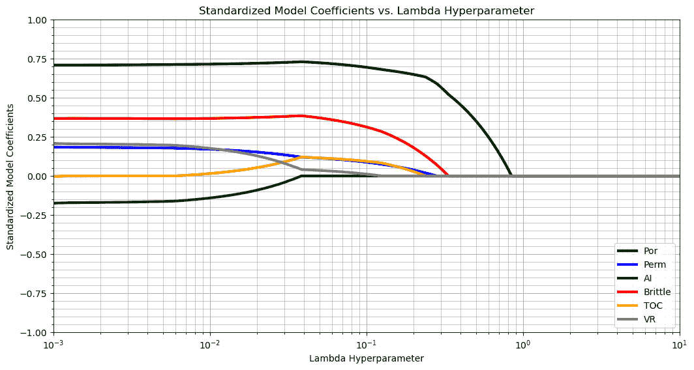

我们看到了什么？

+   对于非常低的 lambda 值，所有特征都被包含

+   随着 lambda 超参数的增加，总有机碳是第一个被移除的预测特征

+   然后是声阻抗、镜质体反射率、脆性、对数渗透率和最终孔隙率。

+   在$\lambda \ge 0.8$时，所有特征都被移除。

让我们重复这个工作流程，用岭回归进行比较。

```py
nbins = 1000                                                # number of bins to explore the hyperparameter 
lams = np.logspace(-2,5,nbins)       
ridge_coefs = np.ndarray((nbins,6))

index = 0
for lam in lams:
    ridge_reg = Ridge(alpha=lam)
    ridge_reg.fit(X_train, y_train) # fit model
    ridge_coefs[index,:] = ridge_reg.coef_
    index = index + 1

color = ['black','blue','green','red','orange','grey']
plt.subplot(111)
for ifeature in range(0,6):
    plt.semilogx(lams,ridge_coefs[:,ifeature], label = df_mv.columns[ifeature], c = color[ifeature], linewidth = 3.0)

plt.title('Standardized Model Coefficients vs. Lambda Hyperparameter'); plt.xlabel('Lambda Hyperparameter'); plt.ylabel('Standardized Model Coefficients')
plt.xlim(1.0e-2,1.0e5); plt.ylim(-1.0,1.0); plt.legend(loc = 'lower right')
plt.grid(True); plt.minorticks_on(); plt.grid(which='minor', linewidth=0.5)

plt.subplots_adjust(left=0.0, bottom=0.0, right=1.5, top=1., wspace=0.2, hspace=0.2); plt.show() 
```

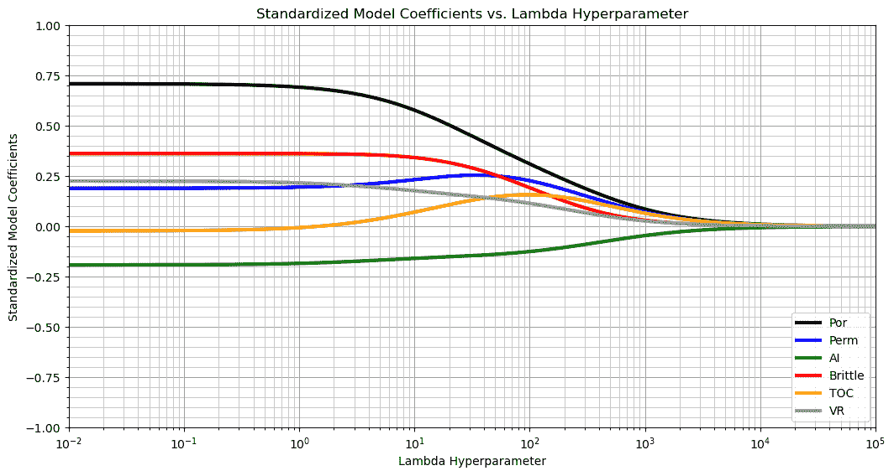

岭回归在预测特征对$\lambda$超参数变化响应方面相当不同。

+   随着 lambda 超参数的增加，没有选择性地移除预测特征

+   对于$\lambda \in [10¹, 10⁵]$，一个主要成分是所有系数向零的均匀收缩

## 展示解的不稳定性

让我们重复上述实验，并跟踪模型在超参数$\lambda$上的某些估计。

```py
nbins = 1000                                                # number of bins to explore the hyperparameter 
df_nmv.describe().transpose()                               # summary statistics from the new DataFrame 
lams = np.logspace(-4,6,nbins)                              # make a list of lambda values
coefs = np.ndarray((nbins,6))
estimates_ridge = np.zeros((nbins,len(X_test)))
estimates_lasso = np.zeros((nbins,len(X_test)))

index = 0
for lam in lams:
    lasso_reg = Lasso(alpha=lam)                            # instantiate the model
    lasso_reg.fit(X_train, y_train)                         # fit model
    ridge_reg = Ridge(alpha=lam)
    ridge_reg.fit(X_train, y_train) # fit model
    estimates_ridge[index] = ridge_reg.predict(X_test).flatten() # predict at test data
    estimates_lasso[index] = lasso_reg.predict(X_test).flatten() # predict at test data
    index = index + 1

color = ['black','blue','green','red','orange','grey']
plt.subplot(211)                                            # plot the results
for iest in range(0,6):
    plt.semilogx(lams,estimates_ridge[:,iest], label = 'Estimate #' + str(iest+1), c = color[iest], linewidth = 3.0)
plt.title('Ridge Regression - 6 Example Predictions vs. Lambda Hyperparameter'); plt.xlabel('Lambda Hyperparameter'); 
plt.ylabel(r'Predictions, $\hat{y}_i$')
plt.xlim(1.0e-4,1.0e6); plt.ylim(-1.0,1.5); plt.grid(); plt.legend(loc = 'lower right')
plt.grid(True); plt.minorticks_on(); plt.grid(which='minor', linewidth=0.5)
plt.vlines(0.001,-1,1.5,color='red',lw=2); plt.vlines(1.0e5,-0.1,1.5,color='red',lw=2,zorder=10)
plt.annotate('Linear Regression',[0.0007,0.6],rotation=90.0,color='red',zorder=10)
plt.annotate('Mean of Response Feature',[110000,0.4],rotation=90.0,color='red',zorder=10)
plt.fill_between([0.0001,0.001],[-1,-1],[1.5,1.5],color='grey',alpha=0.3,zorder=1)
plt.fill_between([1.0e5,1.0e7],[-1,-1],[1.5,1.5],color='grey',alpha=0.3,zorder=1)

plt.subplot(212)                                            # plot the results
for iest in range(0,6):
    plt.semilogx(lams,estimates_lasso[:,iest], label = 'Estimate #' + str(iest+1), c = color[iest], linewidth = 3.0)
plt.title('LASSO Regression - 6 Example Predictions vs. Lambda Hyperparameter'); plt.xlabel('Lambda Hyperparameter'); 
plt.ylabel(r'Predictions, $\hat{y}_i$')
plt.xlim(1.0e-4,1.0e6); plt.ylim(-1.0,1.5); plt.grid(); plt.legend(loc = 'lower right')
plt.grid(True); plt.minorticks_on(); plt.grid(which='minor', linewidth=0.5)
plt.vlines(0.001,-1,1.5,color='red',lw=2); plt.vlines(0.90,-1.0,1.5,color='red',lw=2,zorder=10)
plt.annotate('Linear Regression',[0.0007,0.6],rotation=90.0,color='red',zorder=10)
plt.annotate('Mean of Response Feature',[1.05,0.4],rotation=90.0,color='red',zorder=10)
plt.fill_between([0.0001,0.001],[-1,-1],[1.5,1.5],color='grey',alpha=0.3,zorder=1)
plt.fill_between([0.9,100000],[-1,-1],[1.5,1.5],color='grey',alpha=0.3,zorder=1)

plt.subplots_adjust(left=0.0, bottom=0.0, right=1.5, top=2.0, wspace=0.2, hspace=0.2); plt.show() 
```

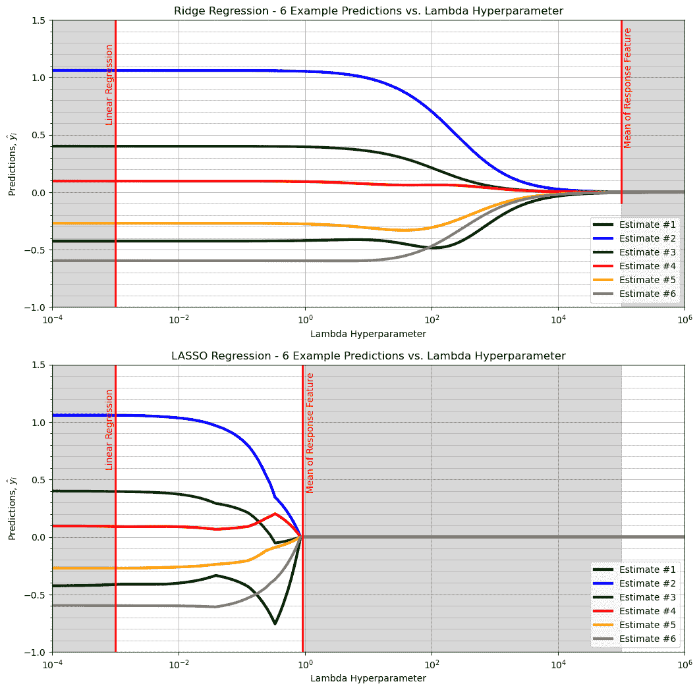

+   岭回归估计从线性回归平滑变化到响应特征的全球均值（稳定性）

+   LASSO 回归估计显示跳跃（不稳定性）

## 注释

这是对 LASSO 回归的基本处理。可以做和讨论的还有很多，我有很多更多的资源。查看我的[共享资源清单](https://michaelpyrcz.com/my-resources)以及本章开头 YouTube 讲座中的资源链接，视频描述中包含资源链接。

希望这有所帮助，

*迈克尔*

## 关于作者


迈克尔·皮尔奇教授在德克萨斯大学奥斯汀分校 40 英亩校园的办公室。

迈克尔·皮尔奇（Michael Pyrcz）是德克萨斯大学奥斯汀分校[Cockrell 工程学院](https://cockrell.utexas.edu/faculty-directory/alphabetical/p)和[杰克逊地球科学学院](https://www.jsg.utexas.edu/researcher/michael_pyrcz/)的教授，他在那里研究并教授地下、空间数据分析、地统计学和机器学习。迈克尔还，

+   [能源分析](https://fri.cns.utexas.edu/energy-analytics)新生研究项目的首席研究员，以及德克萨斯大学奥斯汀分校自然科学学院机器学习实验室的核心教员。

+   [《计算机与地球科学》](https://www.sciencedirect.com/journal/computers-and-geosciences/about/editorial-board)的副编辑，以及国际数学地球科学协会[《数学地球科学》](https://link.springer.com/journal/11004/editorial-board)的董事会成员。

迈克尔已经撰写了超过 70 篇[同行评审的出版物](https://scholar.google.com/citations?user=QVZ20eQAAAAJ&hl=en)，一个用于空间数据分析的[Python 包](https://pypi.org/project/geostatspy/)，合著了一本关于空间数据分析的教科书[《地统计学储层建模》](https://www.amazon.com/Geostatistical-Reservoir-Modeling-Michael-Pyrcz/dp/0199731446)，并是两本最近发布的电子书的作者，分别是[《Python 应用地统计学：GeostatsPy 实践指南》](https://geostatsguy.github.io/GeostatsPyDemos_Book/intro.html)和[《Python 应用机器学习：带代码的实践指南》](https://geostatsguy.github.io/MachineLearningDemos_Book/intro.html)。

迈克尔的所有大学讲座都可在他的[YouTube 频道](https://www.youtube.com/@GeostatsGuyLectures)上找到，其中包含 100 多个 Python 交互式仪表板和 40 多个 GitHub 仓库中的详细记录的工作流程链接，以支持任何感兴趣的学生和在职专业人士，提供持续更新的内容。要了解更多关于迈克尔的工作和共享教育资源，请访问他的网站。

## 想要一起工作吗？

希望这些内容对那些想了解更多关于地下建模、数据分析和机器学习的人有所帮助。学生和在职专业人士欢迎参加。

+   想邀请我到贵公司进行培训、辅导、项目审查、工作流程设计和/或咨询吗？我很乐意拜访并与您合作！

+   如果您有兴趣合作，支持我的研究生研究或我的地下数据分析与机器学习联盟（共同负责人是约翰·福斯特教授），我的研究将数据分析、随机建模和机器学习理论与实践相结合，以开发新的方法和工作流程，增加价值。我们正在解决具有挑战性的地下问题！

+   您可以通过 mpyrcz@austin.utexas.edu 联系到我。

我总是很高兴讨论，

*迈克尔*

迈克尔·皮尔茨，博士，P.Eng. 教授，德克萨斯大学奥斯汀分校 Cockrell 工程学院和 Jackson 地球科学学院

更多资源请访问：[Twitter](https://twitter.com/geostatsguy) | [GitHub](https://github.com/GeostatsGuy) | [网站](http://michaelpyrcz.com) | [Google Scholar](https://scholar.google.com/citations?user=QVZ20eQAAAAJ&hl=en&oi=ao) | [地统计学书籍](https://www.amazon.com/Geostatistical-Reservoir-Modeling-Michael-Pyrcz/dp/0199731446) | [YouTube](https://www.youtube.com/channel/UCLqEr-xV-ceHdXXXrTId5ig) | [Python 中应用地统计学电子书](https://geostatsguy.github.io/GeostatsPyDemos_Book/intro.html) | [Python 中应用机器学习电子书](https://geostatsguy.github.io/MachineLearningDemos_Book/) | [LinkedIn](https://www.linkedin.com/in/michael-pyrcz-61a648a1)

## LASSO 回归的动机

这是一个简单的流程，演示了岭回归，并将其与线性回归和岭回归在机器学习预测中的比较。为什么从线性回归开始？

+   线性回归是最简单的参数预测机器学习模型

+   我们通过迭代方法学习训练机器学习模型，使用 LASSO 我们失去了线性回归和岭回归的解析解

+   让我们从损失函数和范数概念开始

+   我们可以访问模型不确定性的置信区间和参数显著性的假设检验的解析表达式

为什么在 LASSO 回归之前还要介绍岭回归？

+   有时线性回归并不足够简单，我们实际上需要一个更简单的模型！

+   介绍模型正则化和超参数调整的概念

然后我们将介绍 LASSO 回归，以了解损失函数范数选择对训练机器学习模型的影响。

+   在 LASSO 回归中，我们用 L1 正则化替换岭回归损失函数中的 L2 正则化项

+   因此，LASSO 逐个将模型参数缩小到 0.0，从而内置了特征选择！

这里有一些关于预测机器学习 LASSO 回归模型的基本细节，让我们先从线性回归和岭回归开始，然后过渡到岭回归：

## 线性回归

用于预测的线性回归，让我们先看看一个拟合到数据集的线性模型。


举例说明线性回归模型。

让我们先定义一些术语，

+   **预测特征** - 预测模型的输入特征，鉴于我们只讨论线性回归而不是多元线性回归，我们只有一个预测特征，$x$。在我们的图表（包括上面的）中，预测特征在 x 轴上。

+   **响应特征** - 预测模型的输出特征，在这种情况下，$y$。在我们的图表（包括上面的）中，响应特征在 y 轴上。

现在，这里是线性回归的一些关键方面：

**参数模型**

这是一个参数预测机器学习模型，我们接受一个先验假设的线性，然后获得一个非常低的参数表示，易于训练而无需大量数据。

+   适合的模型是一个基于所有可用特征（$x_1,\ldots,x_m$）的简单加权线性加性模型。

+   参数模型的形式为：

$$ y = \sum_{\alpha = 1}^m b_{\alpha} x_{\alpha} + b_0 $$

这里是线性模型参数的可视化，


线性模型参数。

**最小二乘法**

对于 L2 范数损失函数，模型参数 $b_1,\ldots,b_m,b_0$ 的解析解是可用的，误差是总和并平方的，已知为最小二乘法。

+   我们最小化训练数据上的误差，即残差平方和 (RSS)：

$$ RSS = \sum_{i=1}^n \left(y_i - (\sum_{\alpha = 1}^m b_{\alpha} x_{\alpha,i} + b_0) \right)² $$

其中 $y_i$ 是实际响应特征值，$\sum_{\alpha = 1}^m b_{\alpha} x_{\alpha} + b_0$ 是模型预测，在 $\alpha = 1,\ldots,n$ 的训练数据上。

这里是 L2 范数损失函数（MSE）的可视化，


线性模型损失函数，均方误差。

+   这可以简化为训练数据上的平方误差总和，

$$ \sum_{i=1}^n (\Delta y_i)² $$

其中 $\Delta y_i$ 是实际响应特征观察值 $y_i$ 减去模型预测 $\sum_{\alpha = 1}^m b_{\alpha} x_{\alpha} + b_0$，在 $i = 1,\ldots,n$ 的训练数据上。

**假设**

我们的线性回归模型有一些重要的假设，

+   **无误差** - 预测变量无误差，不是随机变量

+   **线性** - 响应是特征（s）的线性组合

+   **常数方差** - 响应误差在预测值上是恒定的

+   **误差独立性** - 响应误差彼此不相关

+   **无多重共线性** - 没有特征与其他特征冗余

## 岭回归

使用岭回归，我们在最小化中添加一个超参数 $\lambda$，并添加一个收缩惩罚项，$\sum_{j=1}^m b_{\alpha}²$。

$$ \sum_{i=1}^n \left(y_i - \left(\sum_{\alpha = 1}^m b_{\alpha} x_{\alpha,i} + b_0 \right) \right)² + \lambda \sum_{j=1}^m b_{\alpha}² $$

因此，岭回归训练整合了两个经常竞争的目标来找到模型参数，

+   找到使训练数据误差最小的模型参数

+   将斜率参数最小化到零

注意：$\lambda$ 不包括截距，$b_0$。

$\lambda$ 是一个超参数，它控制着模型的拟合程度，可能与模型的偏差-方差权衡有关。

+   当 $\lambda \rightarrow 0$ 时，解趋近于线性回归，没有偏差（相对于线性模型拟合），但模型方差可能更高

+   随着 $\lambda$ 的增加，模型方差减小，模型偏差增加，模型变得简单

+   当 $\lambda \rightarrow \infty$ 时，模型参数 $b_1,\ldots,b_m$ 收缩到 0.0，模型预测趋近于训练数据响应特征的均值

## LASSO 回归

对于 LASSO，与岭回归类似，我们在最小化中添加了一个超参数 $\lambda$，并使用收缩惩罚项，但我们使用 L1 范数而不是 L2（绝对值之和而不是平方之和）。

$$ \sum_{i=1}^n \left(y_i - \left(\sum_{\alpha = 1}^m b_{\alpha} x_{\alpha,i} + b_0 \right) \right)² + \lambda \sum_{j=1}^m |b_{\alpha}| $$

因此，LASSO 回归训练集成了两个经常是相互竞争的目标，以找到模型参数，

+   找到使训练数据误差最小的模型参数

+   将斜率参数最小化到零

再次强调，LASSO 和岭回归之间的唯一区别是：

+   对于 LASSO，收缩项被表示为 $\ell_1$ 惩罚，

$$ \lambda \sum_{\alpha=1}^m |b_{\alpha}| $$

+   对于岭回归，收缩项被表示为 $\ell_2$ 惩罚，

$$ \lambda \sum_{\alpha=1}^m \left(b_{\alpha}\right)² $$

当岭回归和 LASSO 都将模型参数 ($b_{\alpha}, \alpha = 1,\ldots,m$) 收缩到零时：

+   随着超参数 $\lambda$ 的增加，LASSO 参数以不同的速率达到零，对于每个预测特征

+   因此，LASSO 提供了一种特征排序和选择的方法！

$\lambda$，即 $\lambda$ 超参数控制着模型的拟合程度，可能与模型的偏差-方差权衡有关。

+   当 $\lambda \rightarrow 0$ 时，预测模型趋近于线性回归，模型偏差较低，但模型方差较高

+   随着 $\lambda$ 的增加，模型方差减小，模型偏差增加

+   当 $\lambda \rightarrow \infty$ 时，所有系数都变为 0.0，模型是训练数据响应特征的均值

## **$L¹$ 与 $L²$ 范数**

这将是讨论 $L¹$ 和 $L²$ 范数选择的好时机。为了解释这一点，让我们比较在训练模型参数时 $L¹$ 和 $L²$ 范数在损失函数中的性能。

| 属性 | 最小绝对偏差（L1） | 最小二乘（L2） |
| --- | --- | --- |
| **鲁棒性** | 鲁棒 | 不太鲁棒 |
| **解的稳定性** | 不稳定解 | 稳定解 |
| **解的数量** | 可能存在多个解 | 总是只有一个解 |
| **特征选择** | 内置特征选择 | 无特征选择 |
| **输出稀疏性** | 稀疏输出 | 非稀疏输出 |
| **解析解** | 无解析解 | 解析解 |

这里有一些专门针对 LASSO 回归的重要观点，

## 特征选择

让我们比较岭回归的 $𝑳𝟐$ 和 LASSO 的 $𝑳𝟏$ 正则化下的解。

+   对于相同的正则化成本，我们在模型参数空间中有不同的形状


LASSO（左侧）和岭回归（右侧）的等正则化损失等高线。

+   如果 $𝑠$ 足够大（$\lambda \rightarrow 0$），则选择参数的最小二乘拟合，它存在于 $𝑠$ 空间中！

现在考虑损失函数中的最小二乘估计项和正则化项，


LASSO（左侧）和岭回归（右侧）的等平方误差和正则化损失等高线。

+   我们可以看到，当我们平衡正则化和平方误差损失项时，随着 $\lambda$ 的增加，模型参数从最小二乘法遍历到 0，由于 LASSO 正则项的形状，模型参数更有可能收缩到 0.0。

为了帮助可视化随着 $\lambda$ 变化，岭回归与 LASSO 回归训练模型参数的变化，我构建了一个交互式的 Python [线性解仪表板](https://github.com/GeostatsGuy/DataScienceInteractivePython/blob/main/Interactive_Linear_Solutions.ipynb)。


交互式仪表板以可视化平方误差和收缩损失。

我们可以看到 LASSO 在预测的同时进行特征选择。

## 数值解

$𝐿¹$ 范数没有解析解，因为它是一个非可微分的分段函数（包含绝对值）。

+   使用 LASSO 时，我们必须使用数值解，例如，迭代梯度下降解而不是解析解，例如，线性回归和岭回归

+   Tibshirani (2012) 证明了对于任何数量的特征 $𝑚$，给定所有特征都是连续的，LASSO 解是唯一的。因此，损失函数有一个全局最小值。

回忆一下 LASSO 损失函数，

$$ \sum_{i=1}^n \left(y_i - \left(\sum_{\alpha = 1}^m b_{\alpha} x_{\alpha,i} + b_0 \right) \right)² + \lambda \sum_{j=1}^m |b_{\alpha}| $$

我们可以用这个例子来说明模型参数 $b_1$ 的数值解，


对于中等斜率（左侧）和低斜率（右侧）的训练误差。

现在我们计算许多 $b_1$ 的情况，并可视化损失与模型参数的图，


低和中等情况的损失与 $b_1$ 模型参数的图。

找到使损失函数最小化的模型参数是数值优化。

+   因此我们使用常见的数值优化方法来训练我们的机器学习模型

## 网格搜索，暴力优化

我们可以尝试所有模型参数的组合，在足够的离散化下，并保留最小化损失函数的模型参数组合，

+   单个模型参数的情况

+   由于可能的模型参数值的组合很大，对于大多数机器来说不切实际。


模型参数网格搜索，暴力优化，对 1 个模型参数（上方）和 2 个模型参数（下方）的损失函数进行常规采样。

模型参数的组合数是，

$$ 𝑛_𝑐=𝑛_{𝑏𝑖𝑛𝑠}^{𝑛_𝑏} $$

其中 $𝑛_𝑏$ 是模型参数的数量，$𝑛_{𝑏𝑖𝑛𝑠}$ 是每个模型参数的离散化数量。

+   在贝叶斯方法中，模型参数由分布表示，空间的大小甚至更大。

## 梯度下降优化

数值解的梯度下降方法如下进行，

1.  从一个随机的模型参数开始

1.  计算损失函数

1.  计算损失函数的梯度，通常没有损失函数的方程，通过数值计算局部损失函数的导数进行采样。

$$ \nabla L(y_{\alpha}, F(X_{\alpha}, b_1)) = \frac{L(y_{\alpha}, F(X_{\alpha}, b_1 - \epsilon)) - L(y_{\alpha}, F(X_{\alpha}, b_1 + \epsilon))}{2\epsilon} $$

1.  通过向下步进/梯度来更新参数估计

$$ \hat{b}_{1,t+1} = \hat{b}_{1,t} - r \nabla L(y_{\alpha}, F(X_{\alpha}, b_1)) $$

其中 $𝑟$ 是学习率/步长，$\hat{b}_{1,𝑡}$ 是当前模型参数估计，$\hat{𝑏}_{1,𝑡+1}$ 是更新后的参数估计。

梯度搜索收敛，

+   梯度下降优化将找到局部或全局最小值

梯度搜索步长，

+   $𝑟$ 太小，需要太长时间才能收敛到解

+   $𝑟$ 太大，解可能跳过/错过全局最小值或发散


解的收敛（左侧）和发散（右侧）。

多变量优化，如果模型将具有超过 1 个模型参数，

+   计算并分解多个模型参数的梯度，现在使用所有模型参数的梯度向量表示

+   例如，对于 2 个模型参数，

$$\begin{split} \nabla L(y_{\alpha}, F(X_{\alpha}, b_1, b_2)) = \left[ \begin{array}{c} \nabla L(y_{\alpha}, F(X_{\alpha}, b_1)) \\ \nabla L(y_{\alpha}, F(X_{\alpha}, b_2)) \end{array} \right] \end{split}$$

我们可以将其图形化表示为，


通过损失表示的向量对 2 个模型参数进行梯度下降。

+   训练机器学习模型的优化是探索高维模型参数空间

局部最小值的缓解

1.  一种常见的方法是多次开始并取最佳结果。


多次随机起始以改善全局最小值的识别。

1.  从较大的学习率、步长开始，在 $𝑡=1,\dots,𝑇$ 上减少步数，以进行搜索然后收敛。

+   使用步长调度/自适应步长进行迭代，例如，Adam 优化器常用于人工神经网络。

+   模拟退火有一个接受坏步骤的概率调度！接受更多坏步骤以早期探索，并在后期接受较少的坏步骤以收敛。

1.  动量提高解的稳定性

使用新的步长、动量、$\lambda$ 更新前一步，$\lambda$ 是前一步的权重

$$ (r \cdot \nabla L)_{t-1}^m = \lambda \cdot (r \cdot \nabla L)_{t-2} + (1 - \lambda) \cdot (r \cdot \nabla L)_{t-1} $$

我们可以在这里可视化这一点，


动量对前一步进行加权并平滑通过损失函数的路径。

+   从每个模型参数的损失函数的偏导数计算出的梯度有噪声。

+   动量平滑，减少这种噪声。

动量帮助解沿着损失函数的一般斜率前进，而不是在局部峡谷或凹槽中振荡。

## 随机梯度下降

我们可能有大量数据 $\rightarrow \nabla 𝐿_𝑡$，计算成本很高。

+   我们可以用随机逼近替换梯度，保留训练数据的一个随机子集，在线（1 个数据）或小批量（>1 个数据，$𝑛_{𝑏𝑎𝑡𝑐ℎ}$），其中 $\ell$ 表示梯度的一个实现。

+   我们在梯度下降中降低精度，但加快计算速度，可以执行更多步骤，通常比梯度下降更快。

+   增加 $𝑛_{𝑏𝑎𝑡𝑐ℎ}$ 以提高梯度估计的准确性，并减少 $𝑛_{𝑏𝑎𝑡𝑐ℎ}$ 以加快步骤

通过 Robbins-Siegmund（1971）定理——对于凸损失函数收敛到全局最小值，对于非凸损失函数收敛到全局或局部最小值。

**稀疏性** - $𝐿¹$ 移除特征，内置特征选择，将模型参数缩小到正好为 0，提高模型参数的稀疏性。

## 加载所需的库

我们还需要一些标准包。这些应该已经与 Anaconda 3 一起安装。

```py
%matplotlib inline                                         
suppress_warnings = False
import os                                                     # to set current working directory 
import numpy as np                                            # arrays and matrix math
import scipy.stats as st                                      # statistical methods
import pandas as pd                                           # DataFrames
import matplotlib.pyplot as plt                               # for plotting
from matplotlib.ticker import (MultipleLocator, AutoMinorLocator) # control of axes ticks
from sklearn import metrics                                   # measures to check our models
from sklearn.preprocessing import StandardScaler              # standardize the features
from sklearn import linear_model                              # linear regression
from sklearn.linear_model import Ridge                        # ridge regression implemented in scikit-learn
from sklearn.linear_model import Lasso                        # LASSO regression implemented in scikit-learn
from sklearn.model_selection import cross_val_score           # multi-processor K-fold crossvalidation
from sklearn.model_selection import train_test_split          # train and test split
from IPython.display import display, HTML                     # custom displays
cmap = plt.cm.inferno                                         # default color bar, no bias and friendly for color vision defeciency
plt.rc('axes', axisbelow=True)                                # grid behind plotting elements
if suppress_warnings == True:  
    import warnings                                           # suppress any warnings for this demonstration
    warnings.filterwarnings('ignore') 
seed = 13                                                     # random number seed for workflow repeatability 
```

如果遇到包导入错误，你可能需要首先安装这些包中的一些。这通常可以通过在 Windows 上打开命令窗口然后输入‘python -m pip install [package-name]’来完成。有关相应包的文档，可以获得更多帮助。

## 声明函数

让我们定义一个函数，以简化向我们的图表添加指定的百分位数和主次网格线。

```py
def weighted_percentile(data, weights, perc):                 # calculate weighted percentile (iambr on StackOverflow @ https://stackoverflow.com/questions/21844024/weighted-percentile-using-numpy/32216049) 
    ix = np.argsort(data)
    data = data[ix] 
    weights = weights[ix] 
    cdf = (np.cumsum(weights) - 0.5 * weights) / np.sum(weights) 
    return np.interp(perc, cdf, data)

def histogram_bounds(values,weights,color):                   # add uncertainty bounds to a histogram 
    p10 = weighted_percentile(values,weights,0.1); avg = np.average(values,weights=weights); p90 = weighted_percentile(values,weights,0.9)
    plt.plot([p10,p10],[0.0,45],color = color,linestyle='dashed')
    plt.plot([avg,avg],[0.0,45],color = color)
    plt.plot([p90,p90],[0.0,45],color = color,linestyle='dashed')

def add_grid():
    plt.gca().grid(True, which='major',linewidth = 1.0); plt.gca().grid(True, which='minor',linewidth = 0.2) # add y grids
    plt.gca().tick_params(which='major',length=7); plt.gca().tick_params(which='minor', length=4)
    plt.gca().xaxis.set_minor_locator(AutoMinorLocator()); plt.gca().yaxis.set_minor_locator(AutoMinorLocator()) # turn on minor ticks 

def display_sidebyside(*args):                                # display DataFrames side-by-side (ChatGPT 4.0 generated Spet, 2024)
    html_str = ''
    for df in args:
        html_str += df.head().to_html()  # Using .head() for the first few rows
    display(HTML(f'<div style="display: flex;">{html_str}</div>')) 
```

## 设置工作目录

我总是喜欢这样做，以免丢失文件，并简化后续的读取和写入（每次避免包含完整地址）。此外，在这种情况下，请确保将所需的数据文件（见下文）放置在此工作目录中。

```py
#os.chdir("C:\PGE337")                                        # set the working directory 
```

您将需要更新引号内的部分为您的自己的工作目录，并且格式在 Mac 上不同（例如：“~/PGE”）。

## 加载表格数据

这是将我们的逗号分隔数据文件加载到 Pandas DataFrame 对象中的命令。

让我们加载提供的多元、空间数据集 ‘unconv_MV.csv’。此数据集包含来自 1,000 个非常规井的变量，包括：

+   密度 ($g/cm^{3}$)

+   孔隙率 (体积 %)

注意，数据集是合成的。

我们使用 pandas 的 ‘read_csv’ 函数将其加载到我们称为 ‘my_data’ 的 DataFrame 中，然后预览以确保正确加载。

```py
add_error = True                                              # add random error to the response feature
std_error = 1.0; seed = 71071

yname = 'Porosity'; xname = 'Density'                         # specify the predictor features (x2) and response feature (x1)
xmin = 1.0; xmax = 2.5                                        # set minimums and maximums for visualization 
ymin = 0.0; ymax = 25.0    
xlabel = 'Porosity'; ylabel = 'Density'                       # specify the feature labels for plotting
yunit = '%'; xunit = '$g/cm^{3}$'    
Xlabelunit = xlabel + ' (' + xunit + ')'
ylabelunit = ylabel + ' (' + yunit + ')'

#df = pd.read_csv("Density_Por_data.csv")                     # load the data from local current directory
df = pd.read_csv(r"https://raw.githubusercontent.com/GeostatsGuy/GeoDataSets/master/Density_Por_data.csv") # load the data from my github repo
df = df.sample(frac=1.0, random_state = 73073); df = df.reset_index() # extract 30% random to reduce the number of data

if add_error == True:                                         # method to add error
    np.random.seed(seed=seed)                                 # set random number seed
    df[yname] = df[yname] + np.random.normal(loc = 0.0,scale=std_error,size=len(df)) # add noise
    values = df._get_numeric_data(); values[values < 0] = 0   # set negative to 0 in a shallow copy ndarray 
```

## 训练-测试分割

为了简单起见，我们使用 scikit-learn 包中的 model_selection 模块的 train_test_split 函数应用随机训练-测试分割。

```py
x_train, x_test, y_train, y_test = train_test_split(df[xname],df[yname],test_size=0.25,random_state=73073) # train and test split
# y_train = pd.DataFrame({yname:y_train.values}); y_test = pd.DataFrame({yname:y_test.values}) # optional to ensure response is a DataFrame

y = df[yname].values.reshape(len(df))                         # features as 1D vectors
x = df[xname].values.reshape(len(df))

df_train = pd.concat([x_train,y_train],axis=1)                # features as train and test DataFrames
df_test = pd.concat([x_test,y_test],axis=1) 
```

## 可视化 DataFrame

可视化 DataFrame 是数据的第一步检查。

+   许多事情可能会出错，例如，我们加载了错误的数据，所有特征都没有加载等。

我们可以通过使用 ‘head’ DataFrame 成员函数来预览（格式整洁，见下文）。

+   我们有一个自定义函数来并排预览训练和测试 DataFrame。

```py
print('   Training DataFrame      Testing DataFrame')
display_sidebyside(df_train,df_test) 
```

```py
 Training DataFrame      Testing DataFrame 
```

|  | 密度 | 孔隙率 |
| --- | --- | --- |
| 24 | 1.778580 | 11.426485 |
| 101 | 2.410560 | 8.488544 |
| 88 | 2.216014 | 10.133693 |
| 79 | 1.631896 | 12.712326 |
| 58 | 1.528019 | 16.129542 |
|  | 密度 | 孔隙率 |
| --- | --- | --- |
| 59 | 1.742534 | 15.380154 |
| 1 | 1.404932 | 13.710628 |
| 35 | 1.552713 | 14.131878 |
| 92 | 1.762359 | 11.154896 |
| 22 | 1.885087 | 9.403056 |

## 表格数据的汇总统计

在 DataFrame 中从表格数据计算汇总统计有很多高效的方法。describe 命令以一个漂亮的数据表形式提供计数、平均值、最小值、最大值。

```py
print('     Training DataFrame         Testing DataFrame')
display_sidebyside(df_train.describe().loc[['count', 'mean', 'std', 'min', 'max']],df_test.describe().loc[['count', 'mean', 'std', 'min', 'max']]) 
```

```py
 Training DataFrame         Testing DataFrame 
```

|  | 密度 | 孔隙率 |
| --- | --- | --- |
| count | 78.000000 | 78.000000 |
| mean | 1.739027 | 12.501465 |
| std | 0.302510 | 3.428260 |
| min | 0.996736 | 3.276449 |
| max | 2.410560 | 21.660179 |
|  | 密度 | 孔隙率 |
| --- | --- | --- |
| count | 27.000000 | 27.000000 |
| mean | 1.734710 | 12.380796 |
| std | 0.247761 | 2.916045 |
| min | 1.067960 | 7.894595 |
| max | 2.119652 | 18.133771 |

## 可视化数据

让我们使用直方图和散点图检查训练和测试的一致性和覆盖率。

+   检查以确保训练和测试数据覆盖了可能的预测特征组合的范围。

+   确保测试用例不会超出训练数据的范围进行外推。

```py
nbins = 20                                                    # number of histogram bins

plt.subplot(221)
freq1,_,_ = plt.hist(x=df_train[xname],weights=None,bins=np.linspace(xmin,xmax,nbins),alpha = 0.6,
                     edgecolor='black',color='darkorange',density=True,label='Train')
freq2,_,_ = plt.hist(x=df_test[xname],weights=None,bins=np.linspace(xmin,xmax,nbins),alpha = 0.6,
                     edgecolor='black',color='red',density=True,label='Test')
max_freq = max(freq1.max()*1.10,freq2.max()*1.10)
plt.xlabel(xname + ' (' + xunit + ')'); plt.ylabel('Frequency'); plt.ylim([0.0,max_freq]); plt.title('Density'); add_grid()  
plt.xlim([xmin,xmax]); plt.legend(loc='upper right')   

plt.subplot(222)
freq1,_,_ = plt.hist(x=df_train[yname],weights=None,bins=np.linspace(ymin,ymax,nbins),alpha = 0.6,
                     edgecolor='black',color='darkorange',density=True,label='Train')
freq2,_,_ = plt.hist(x=df_test[yname],weights=None,bins=np.linspace(ymin,ymax,nbins),alpha = 0.6,
                     edgecolor='black',color='red',density=True,label='Test')
max_freq = max(freq1.max()*1.10,freq2.max()*1.10)
plt.xlabel(yname + ' (' + yunit + ')'); plt.ylabel('Frequency'); plt.ylim([0.0,max_freq]); plt.title('Porosity'); add_grid()  
plt.xlim([ymin,ymax]); plt.legend(loc='upper right')   

plt.subplot(223)                                              # plot the model
plt.scatter(df_train[xname],df_train[yname],s=40,marker='o',color = 'darkorange',alpha = 0.8,edgecolor = 'black',zorder=10,label='Train')
plt.scatter(df_test[xname],df_test[yname],s=40,marker='o',color = 'red',alpha = 0.8,edgecolor = 'black',zorder=10,label='Test')
plt.title('Porosity vs Density')
plt.xlabel(xname + ' (' + xunit + ')')
plt.ylabel(yname + ' (' + yunit + ')')
plt.legend(); add_grid(); plt.xlim([xmin,xmax]); plt.ylim([ymin,ymax])

plt.subplots_adjust(left=0.0, bottom=0.0, right=2.0, top=2.1, wspace=0.3, hspace=0.2)
#plt.savefig('Test.pdf', dpi=600, bbox_inches = 'tight',format='pdf') 
plt.show() 
```


## 线性回归模型

让我们先计算线性回归模型。我们使用 scikit learn，然后将相同的流程扩展到岭回归。

+   我们正在构建一个模型，$\phi = f(\rho)$，其中 $\phi$ 是孔隙率，$\rho$ 是密度。

+   我们也可以说，我们有“孔隙率对密度回归”。

我们模型具有这个特定的方程，

$$ \phi = b_1 \times \rho + b_0 $$

```py
linear_reg = linear_model.LinearRegression()                  # instantiate the model

linear_reg.fit(df_train[xname].values.reshape(len(df_train),1), df_train[yname]) # train the model parameters
x_model = np.linspace(xmin,xmax,10)
y_model_linear = linear_reg.predict(x_model.reshape(-1, 1))   # predict at the withheld test data 

plt.subplot(111)                                              # plot the data, model with model parameters
plt.plot(x_model,y_model_linear, color='red', linewidth=2,label='Linear Regression',zorder=100)
plt.scatter(df_train[xname],df_train[yname],s=40,marker='o',color = 'darkorange',alpha = 0.8,edgecolor = 'black',zorder=10,label='Train')
plt.scatter(df_test[xname],df_test[yname],s=40,marker='o',color = 'red',alpha = 0.8,edgecolor = 'black',zorder=10,label='Test')
plt.annotate('Linear Regression Model Parameters:',[1.86,18]) # add the model to the plot
plt.annotate(r'$b_1$ :' + str(np.round(linear_reg.coef_ [0],2)),[1.97,17])
plt.annotate(r'$b_0$ :' + str(np.round(linear_reg.intercept_,2)),[1.97,16])
plt.title('Linear Regression Model, Porosity = f(Density)')
plt.xlabel(xname + ' (' + xunit + ')')
plt.ylabel(yname + ' (' + yunit + ')')
plt.legend(loc='upper right'); add_grid(); plt.xlim([xmin,xmax]); plt.ylim([ymin,ymax])

plt.subplots_adjust(left=0.0, bottom=0.0, right=1.0, top=1.0, wspace=0.2, hspace=0.2); plt.show() 
```


你可能已经注意到在预测函数中对预测特征应用了额外的重塑操作。

```py
y_linear_model = linear_reg.predict(x_model.reshape(-1, 1))   # predict at the withheld test data 
```

这是因为 scikit-learn 假设有多个预测特征；因此，期望一个二维数组，包含样本（行）和特征（列），但我们只有一个一维向量。

+   重塑操作将一维向量转换为一个只有一列的二维向量

## 线性回归模型检查

让我们运行一些快速模型检查。可以做得更多，但为了简洁，我在这里限制了范围。

+   有关更多信息，请参阅线性回归章节。

```py
y_pred_linear = linear_reg.predict(df_test[xname].values.reshape(len(df_test),1)) # predict at test data
r_squared_linear = metrics.r2_score(df_test[yname].values, y_pred_linear)

plt.subplot(121)                                              # plot testing diagnostics 
plt.plot(x_model,y_model_linear, color='red', linewidth=2,label='Linear Regression',zorder=100)
plt.scatter(df_train[xname],df_train[yname],s=40,marker='o',color = 'darkorange',alpha = 0.8,edgecolor = 'black',zorder=10,label='Train')
plt.scatter(df_test[xname],df_test[yname],s=40,marker='o',color = 'red',alpha = 0.8,edgecolor = 'black',zorder=10,label='Test')
# plt.scatter(df_test[xname], y_pred,color='grey',edgecolor='black',s = 40, alpha = 1.0, label = 'predictions',zorder=100)
plt.scatter(df_test[xname], y_pred_linear,color='white',s=120,marker='o',linewidths=1.0, edgecolors="black",zorder=300)
plt.scatter(df_test[xname], y_pred_linear,color='red',s=90,marker='*',linewidths=0.5, edgecolors="black",zorder=320,label='Predictions')

plt.annotate('Linear Regression Model Parameters:',[1.86,18]) # add the model to the plot
plt.annotate(r'$b_1$ :' + str(np.round(linear_reg.coef_ [0],2)),[1.97,17])
plt.annotate(r'$b_0$ :' + str(np.round(linear_reg.intercept_,2)),[1.97,16])
plt.annotate(r'$r²$ :' + str(np.round(r_squared_linear,2)),[1.97,15])
plt.title('Linear Regression Model, Porosity = f(Density)')
plt.xlabel(xname + ' (' + xunit + ')')
plt.ylabel(yname + ' (' + yunit + ')')
plt.legend(loc='upper right'); add_grid(); plt.xlim([xmin,xmax]); plt.ylim([ymin,ymax])

y_res_linear = y_pred_linear - df_test['Porosity'].values     # calculate the test residual

plt.subplot(122)
plt.hist(y_res_linear, color = 'red', alpha = 0.8, edgecolor = 'black', bins = np.linspace(-5,5,20))
plt.title("Error Residual at Testing Data"); plt.xlabel(yname + ' True - Estimate (%)');plt.ylabel('Frequency')
plt.vlines(0,0,5.5,color='black',ls='--',lw=2)
plt.annotate('Test Error Residual:',[-4,4.7]) # add residual summary statistics
plt.annotate(r'$\overline{\Delta{y}}$: ' + str(round(np.average(y_res_linear),2)),[-4,4.4])
plt.annotate(r'$\sigma_{\Delta{y}}$: ' + str(np.round(np.std(y_res_linear),2)),[-4,4.1])
add_grid(); plt.xlim(-5,5); plt.ylim(0,5.5)

plt.subplots_adjust(left=0.0, bottom=0.0, right=2.2, top=1.2, wspace=0.2, hspace=0.2); plt.show() 
```


## 岭回归模型

让我们用 scikit-learn 的岭回归方法替换 scikit-learn 的线性回归方法。

+   注意，我们现在必须设置 $\lambda$ 超参数。

+   在 scikit-learn 中，超参数是在模型实例化时设置的

```py
lam = 1.0                                                     # lambda hyperparameter

ridge_reg = Ridge(alpha=lam)                                  # instantiate the model

ridge_reg.fit(df_train[xname].values.reshape(len(df_train),1), df_train[yname]) # train the model parameters
x_model = np.linspace(xmin,xmax,10)
y_model_ridge = ridge_reg.predict(x_model.reshape(10,1)) # predict with the fit model

plt.subplot(111)                                              # plot the data, model with model parameters
plt.plot(x_model,y_model_ridge, color='red', linewidth=2,label='Ridge Regression',zorder=100)
plt.scatter(df_train[xname],df_train[yname],s=40,marker='o',color = 'darkorange',alpha = 0.8,edgecolor = 'black',zorder=10,label='Train')
plt.scatter(df_test[xname],df_test[yname],s=40,marker='o',color = 'red',alpha = 0.8,edgecolor = 'black',zorder=10,label='Test')
plt.annotate('Ridge Regression Model Parameters:',[1.86,18]) # add the model to the plot
plt.annotate(r'$b_1$ :' + str(np.round(ridge_reg.coef_ [0],2)),[1.97,17])
plt.annotate(r'$b_0$ :' + str(np.round(ridge_reg.intercept_,2)),[1.97,16])
plt.title('Ridge Model, Regression of ' + yname + ' on ' + xname + r' with a $\lambda = $' + str(lam))
plt.xlabel(xname + ' (' + xunit + ')')
plt.ylabel(yname + ' (' + yunit + ')')
plt.legend(loc='upper right'); add_grid(); plt.xlim([xmin,xmax]); plt.ylim([ymin,ymax])

plt.subplots_adjust(left=0.0, bottom=0.0, right=1.0, top=1.0, wspace=0.2, hspace=0.2); plt.show() 
```


让我们重复使用线性回归模型进行的简单模型检查。

```py
y_pred_ridge = ridge_reg.predict(df_test[xname].values.reshape(len(df_test),1)) # predict at test data
r_squared = metrics.r2_score(df_test[yname].values, y_pred_ridge)

plt.subplot(121)                                              # plot testing diagnostics 
plt.plot(x_model,y_model_ridge, color='red', linewidth=2,label='Ridge Regression',zorder=100)
plt.scatter(df_train[xname],df_train[yname],s=40,marker='o',color = 'darkorange',alpha = 0.8,edgecolor = 'black',zorder=10,label='Train')
plt.scatter(df_test[xname],df_test[yname],s=40,marker='o',color = 'red',alpha = 0.8,edgecolor = 'black',zorder=10,label='Test')
plt.scatter(df_test[xname], y_pred_ridge,color='white',s=120,marker='o',linewidths=1.0, edgecolors="black",zorder=300)
plt.scatter(df_test[xname], y_pred_ridge,color='red',s=90,marker='*',linewidths=0.5, edgecolors="black",zorder=320,label='Predictions')

plt.annotate('Ridge Regression Model Parameters:',[1.86,18]) # add the model to the plot
plt.annotate(r'$b_1$ :' + str(np.round(ridge_reg.coef_ [0],2)),[1.97,17])
plt.annotate(r'$b_0$ :' + str(np.round(ridge_reg.intercept_,2)),[1.97,16])
plt.title('Ridge Model, Regression of ' + yname + ' on ' + xname + r' with a $\lambda = $' + str(lam))
plt.xlabel(xname + ' (' + xunit + ')')
plt.ylabel(yname + ' (' + yunit + ')')
plt.legend(loc='upper right'); add_grid(); plt.xlim([xmin,xmax]); plt.ylim([ymin,ymax])

y_res_ridge = y_pred_ridge - df_test['Porosity'].values       # calculate the test residual

plt.subplot(122)
plt.hist(y_res_ridge, color = 'red', alpha = 0.8, edgecolor = 'black', bins = np.linspace(-5,5,20))
plt.title("Error Residual at Testing Data"); plt.xlabel(yname + ' True - Estimate (%)');plt.ylabel('Frequency')
plt.vlines(0,0,5.5,color='black',ls='--',lw=2)
plt.annotate('Test Error Residual:',[-4,4.7]) # add residual summary statistics
plt.annotate(r'$\overline{\Delta{y}}$: ' + str(round(np.average(y_res_ridge),2)),[-4,4.4])
plt.annotate(r'$\sigma_{\Delta{y}}$: ' + str(np.round(np.std(y_res_ridge),2)),[-4,4.1])
add_grid(); plt.xlim(-5,5); plt.ylim(0,5.5)

plt.subplots_adjust(left=0.0, bottom=0.0, right=2.2, top=1.2, wspace=0.2, hspace=0.2); plt.show() 
```


有趣的是，我们解释的方差更少，并且残差标准差更大（错误更多）。

+   对于我们随意选择的超参数 $\lambda$，岭回归实际上减少了测试方差解释和准确度

+   这并不奇怪，我们实际上并没有调整超参数以获得最佳模型！

## LASSO 回归模型

让我们用 scikit-learn 的 LASSO 回归方法替换 scikit-learn 线性回归和岭回归方法。注意，再次必须现在设置 lambda 超参数。

+   回想一下，lambda 超参数 $\lambda$ 是在模型实例化时设置的

```py
lam = 0.1                                                     # lambda hyperparameter

lasso_reg = Lasso(alpha=lam)                                  # instantiate the model

lasso_reg.fit(df_train[xname].values.reshape(len(df_train),1), df_train[yname]) # train the model parameters
x_model = np.linspace(xmin,xmax,10)
y_model_lasso = lasso_reg.predict(x_model.reshape(10,1))      # predict with the fit model

plt.subplot(111)                                              # plot the data, model with model parameters
plt.plot(x_model,y_model_lasso, color='red', linewidth=2,label='LASSO Regression',zorder=100)
plt.scatter(df_train[xname],df_train[yname],s=40,marker='o',color = 'darkorange',alpha = 0.8,edgecolor = 'black',zorder=10,label='Train')
plt.scatter(df_test[xname],df_test[yname],s=40,marker='o',color = 'red',alpha = 0.8,edgecolor = 'black',zorder=10,label='Test')
plt.annotate('LASSO Regression Model Parameters:',[1.86,18]) # add the model to the plot
plt.annotate(r'$b_1$ :' + str(np.round(lasso_reg.coef_ [0],2)),[1.97,17])
plt.annotate(r'$b_0$ :' + str(np.round(lasso_reg.intercept_,2)),[1.97,16])
plt.title('LASSO Model, Regression of ' + yname + ' on ' + xname + r' with a $\lambda = $' + str(lam))
plt.xlabel(xname + ' (' + xunit + ')')
plt.ylabel(yname + ' (' + yunit + ')')
plt.legend(loc='upper right'); add_grid(); plt.xlim([xmin,xmax]); plt.ylim([ymin,ymax])

plt.subplots_adjust(left=0.0, bottom=0.0, right=1.0, top=1.0, wspace=0.2, hspace=0.2); plt.show() 
```


让我们重复使用线性回归模型进行的简单模型检查。

## LASSO 超参数调整

在上面，我们只是随意选择了一个超参数 $\lambda$，现在让我们进行超参数调整。

+   在交叉验证中循环遍历广泛的 $\lambda$ 值的同时总结 MSE

回想一下，均方误差（MSE）由以下公式给出，

$$ \text{MSE} = \frac{1}{n} \sum_{i=1}^{n} (y_i - \hat{y}_i)² $$

其中 $y_i$ 是实际值，$\hat{y}_i$ 是预测值，$n$ 是数据点的数量。

```py
score = []                                                    # code modified from StackOverFlow by Dimosthenis

nlambda = 100
lambda_mat = np.logspace(-2,5,nlambda)
for ilam in range(0,nlambda):
    lasso_reg = Lasso(alpha=lambda_mat[ilam])
    scores = cross_val_score(estimator=lasso_reg, X= df['Density'].values.reshape(-1, 1), 
                             y=df['Porosity'].values, cv=10, n_jobs=4, scoring = "neg_mean_squared_error") # Perform 10-fold cross validation
    score.append(abs(scores.mean()))

plt.subplot(111)
plt.plot(lambda_mat, score,  color='black', linewidth = 3, label = 'Test MSA',zorder=10)
plt.title('LASSO Regression Test Mean Square Error vs. Lambda Hyperparameter'); plt.xlabel('Lambda'); plt.ylabel('Test Mean Square Error')
plt.xlim(1.0e-2,1.0e5); plt.ylim(0.001,20.0); plt.xscale('log')
plt.vlines(0.1,0,20,color='red',lw=2); plt.vlines(0.9,0,20,color='red',lw=2,zorder=10)
plt.annotate('Linear Regression',[0.075,12.5],rotation=90.0,color='red',zorder=10)
plt.annotate('Mean of Response Feature',[1.06,11.4],rotation=90.0,color='red',zorder=10)
plt.fill_between([0.01,0.1],[0,0],[20,20],color='grey',alpha=0.3,zorder=1)
plt.fill_between([0.9,100000],[0,0],[20,20],color='grey',alpha=0.3,zorder=1)
plt.grid(which='both')
plt.subplots_adjust(left=0.0, bottom=0.0, right=2.0, top=1.0, wspace=0.2, hspace=0.2); plt.show() 
```


从上面的结果我们可以观察到，任何 $\lambda > 0.1$ 都会导致最小的测试均方误差。

+   阈值行为是由于以下事实：在这个正则化水平以下，模型的行为类似于线性回归。

现在让我们使用这个超参数在所有数据上训练一个模型。

```py
lam = 0.01                                                      # tuned hyperparameter
lasso_tuned = Lasso(alpha=lam)                                  # instantiate the model
lasso_tuned.fit(df[xname].values.reshape(len(df),1), df[yname]) # train the model parameters on all data

y_pred_lasso_tuned = lasso_tuned.predict(df_test[xname].values.reshape(len(df_test),1)) # predict at test data
r_squared = metrics.r2_score(df_test[yname].values, y_pred_lasso_tuned)

plt.subplot(121)                                              # plot testing diagnostics 
plt.plot(x_model,y_model_lasso, color='red', linewidth=2,label='LASSO Regression',zorder=100)
plt.scatter(df_train[xname],df_train[yname],s=40,marker='o',color = 'darkorange',alpha = 0.8,edgecolor = 'black',zorder=10,label='Train')
plt.scatter(df_test[xname],df_test[yname],s=40,marker='o',color = 'red',alpha = 0.8,edgecolor = 'black',zorder=10,label='Test')
plt.scatter(df_test[xname], y_pred_ridge,color='white',s=120,marker='o',linewidths=1.0, edgecolors="black",zorder=300)
plt.scatter(df_test[xname], y_pred_ridge,color='red',s=90,marker='*',linewidths=0.5, edgecolors="black",zorder=320,label='Predictions')

plt.annotate('LASSO Regression Model Parameters:',[1.86,18]) # add the model to the plot
plt.annotate(r'$b_1$ :' + str(np.round(ridge_reg.coef_ [0],2)),[1.97,17])
plt.annotate(r'$b_0$ :' + str(np.round(ridge_reg.intercept_,2)),[1.97,16])
plt.title('Tuned LASSO Model, Regression of ' + yname + ' on ' + xname + r' with a $\lambda = $' + str(lam))
plt.xlabel(xname + ' (' + xunit + ')')
plt.ylabel(yname + ' (' + yunit + ')')
plt.legend(loc='upper right'); add_grid(); plt.xlim([xmin,xmax]); plt.ylim([ymin,ymax])

y_res_ridge = y_pred_ridge - df_test['Porosity'].values       # calculate the test residual

plt.subplot(122)
plt.hist(y_res_ridge, color = 'red', alpha = 0.8, edgecolor = 'black', bins = np.linspace(-5,5,20))
plt.title("Error Residual at Testing Data"); plt.xlabel(yname + ' True - Estimate (%)');plt.ylabel('Frequency')
plt.vlines(0,0,5.5,color='black',ls='--',lw=2)
plt.annotate('Test Error Residual:',[-4,4.7]) # add residual summary statistics
plt.annotate(r'$\overline{\Delta{y}}$: ' + str(round(np.average(y_res_ridge),2)),[-4,4.4])
plt.annotate(r'$\sigma_{\Delta{y}}$: ' + str(np.round(np.std(y_res_ridge),2)),[-4,4.1])
add_grid(); plt.xlim(-5,5); plt.ylim(0,5.5)

plt.subplots_adjust(left=0.0, bottom=0.0, right=2.2, top=1.2, wspace=0.2, hspace=0.2); plt.show() 
```


使用我们调整的$\lambda$超参数，

```py
lam = 0.01 
```

我们的模式与线性回归相同。

+   我们能否创造一个最佳模型不是线性回归的情况？即，正则化是有帮助的？

+   是的，我们可以。让我们移除大部分样本以创建数据稀缺性并添加大量噪声！

实际上，我迭代了样本和噪声的随机种子以得到这个结果。

+   少量数据（低$n$）和高维性（高$m$）通常会导致 LASSO 优于线性回归

```py
df_sample = df.copy(deep=True).sample(n=10,random_state=11)
noise_stdev = 3.0
np.random.seed(seed=15)
df_sample['Porosity'] = df_sample['Porosity'] + np.random.normal(0.0, noise_stdev, size=len(df_sample))

score = []                                                    # code modified from StackOverFlow by Dimosthenis

nlambda = 100
lambda_mat = np.logspace(-3,5,nlambda)
for ilam in range(0,nlambda):
    lasso_reg = Lasso(alpha=lambda_mat[ilam])
    scores = cross_val_score(estimator=lasso_reg, X= df_sample['Density'].values.reshape(-1, 1), 
                             y=df_sample['Porosity'].values, cv=2, n_jobs=4, scoring = "neg_mean_squared_error") # Perform 10-fold cross validation
    score.append(abs(scores.mean()))

plt.subplot(111)
plt.plot(lambda_mat, score,  color='black', linewidth = 3, label = 'Test MSA',zorder=10)
plt.title('LASSO Regression Test Mean Square Error vs. Lambda Hyperparameter'); plt.xlabel('Lambda'); plt.ylabel('Test Mean Square Error')
plt.xlim(1.0e-3,1.0e5); plt.ylim(0.001,20.0); 
plt.xscale('log')
plt.vlines(0.003,0,20,color='red',lw=2); plt.vlines(0.4,0,20,color='red',lw=2,zorder=10); plt.vlines(0.1,0,20,color='red',lw=2,zorder=10);
plt.annotate('Linear Regression',[0.0022,12.5],rotation=90.0,color='red',zorder=10)
plt.annotate(r'LASSO Tuned $\lambda$',[0.075,12.5],rotation=90.0,color='red',zorder=10)
plt.annotate('Mean of Response Feature',[0.46,11.7],rotation=90.0,color='red',zorder=10)
plt.fill_between([0.001,0.003],[0,0],[20,20],color='grey',alpha=0.3,zorder=1)
plt.fill_between([0.4,100000],[0,0],[20,20],color='grey',alpha=0.3,zorder=1)
plt.grid(which='both')
plt.subplots_adjust(left=0.0, bottom=0.0, right=2.0, top=1.0, wspace=0.2, hspace=0.2); plt.show() 
```


## 调查 Lambda 超参数对模型参数的影响

让我们看看我们已经加载的多元数据集。这样我们可以观察在一系列特征和一系列 lambda 超参数值上的模型行为。我们将执行常规步骤以到达要点！

+   加载一个多元数据集

+   计算摘要统计

+   标准化特征

然后，我们将改变超参数并观察模型参数。

### 加载一个多元数据集

让我们加载一个包含更多变量的数据集来展示使用 LASSO 回归进行特征排序，并比较在超参数值上的模型参数的行为。数据集‘unconv_MV_v5.csv’是一个基于 1,000 个非常规井的逗号分隔文件，包括特征，

+   井平均孔隙率

+   渗透率的对数变换（以线性化与其他变量的关系）

+   声波阻抗（kg/m³ x m/s x 10⁶）

+   岩脆性比（%）

+   总有机碳（%）

+   玻璃质反射率（%）

+   初始产量 90 天平均（MCFPD）。

我们假设初始产量是响应特征，所有其他特征都是预测特征。

此外，您可以通过切换 mv_data 整数为 1 来尝试另一个类似的数据库。

```py
mv_data = 2

if mv_data == 1:
    df_mv = pd.read_csv(r"https://raw.githubusercontent.com/GeostatsGuy/GeoDataSets/master/unconv_MV.csv")
    df_mv = df_mv.drop('WellIndex',axis = 1)                  # remove the well index feature
elif mv_data == 2:
    df_mv = pd.read_csv(r"https://raw.githubusercontent.com/GeostatsGuy/GeoDataSets/master/unconv_MV_v5.csv")
    df_mv = df_mv.rename({'Prod':'Production'},axis=1)
    df_mv = df_mv.drop('Well',axis = 1)                       # remove the well index feature
df_mv.head()                                                  # load the comma delimited data file 
```

|  | Por | Perm | AI | Brittle | TOC | VR | Production |
| --- | --- | --- | --- | --- | --- | --- | --- |
| 0 | 12.08 | 2.92 | 2.80 | 81.40 | 1.16 | 2.31 | 4165.196191 |
| 1 | 12.38 | 3.53 | 3.22 | 46.17 | 0.89 | 1.88 | 3561.146205 |
| 2 | 14.02 | 2.59 | 4.01 | 72.80 | 0.89 | 2.72 | 4284.348574 |
| 3 | 17.67 | 6.75 | 2.63 | 39.81 | 1.08 | 1.88 | 5098.680869 |
| 4 | 17.52 | 4.57 | 3.18 | 10.94 | 1.51 | 1.90 | 3406.132832 |

### 计算摘要统计

让我们计算我们的多元数据的摘要统计。

```py
df_mv.describe().transpose() 
```

|  | count | mean | std | min | 25% | 50% | 75% | max |
| --- | --- | --- | --- | --- | --- | --- | --- | --- |
| Por | 200.0 | 14.991150 | 2.971176 | 6.550000 | 12.912500 | 15.070000 | 17.402500 | 23.550000 |
| Perm | 200.0 | 4.330750 | 1.731014 | 1.130000 | 3.122500 | 4.035000 | 5.287500 | 9.870000 |
| AI | 200.0 | 2.968850 | 0.566885 | 1.280000 | 2.547500 | 2.955000 | 3.345000 | 4.630000 |
| Brittle | 200.0 | 48.161950 | 14.129455 | 10.940000 | 37.755000 | 49.510000 | 58.262500 | 84.330000 |
| TOC | 200.0 | 0.990450 | 0.481588 | -0.190000 | 0.617500 | 1.030000 | 1.350000 | 2.180000 |
| VR | 200.0 | 1.964300 | 0.300827 | 0.930000 | 1.770000 | 1.960000 | 2.142500 | 2.870000 |
| Production | 200.0 | 4311.219852 | 992.038414 | 2107.139414 | 3618.064513 | 4284.687348 | 5086.089761 | 6662.622385 |

### 标准化特征

让我们将特征标准化为：

+   均值 = 0.0

+   方差 = 标准差 = 1.0

我们这样做是为了使模型参数处于相似的范围内，以便进行比较，即像特征排名中的$\beta$与$B$系数一样。

为了做到这一点，我们：

1.  从 scikit learn 中实例化 StandardScaler。我们将其命名为‘scaler’，这样我们就可以方便地反转转换，如果我们愿意的话。我们需要这样做才能将预测值转换回常规的生产单位。

```py
scaler = StandardScaler() 
```

1.  然后，我们从 DataFrame 中提取所有值并应用按列标准化。结果是二维 ndarray

```py
sfeatures = scaler.fit_transform(df_mv.values) 
```

1.  我们创建一个新的空 DataFrame

```py
df_nmv = pd.DataFrame() 
```

1.  然后我们将转换后的值添加到新的 DataFrame 中，同时保留旧 DataFrame 中的样本索引和特征名称

```py
df_nmv = pd.DataFrame(sfeatures, index=df_mv.index, columns=df_mv.columns) 
```

```py
scaler = StandardScaler()                                     # instantiate the scaler 

sfeatures = scaler.fit_transform(df_mv.values)                # standardize all the values extracted from the DataFrame 
df_nmv = pd.DataFrame()                                       # instantiate a new DataFrame
df_nmv = pd.DataFrame(sfeatures, index=df_mv.index, columns=df_mv.columns) # copy the standardized values into the new DataFrame
df_nmv.head()                                                 # preview the new DataFrame 
```

|  | Por | Perm | AI | Brittle | TOC | VR | Production |
| --- | --- | --- | --- | --- | --- | --- | --- |
| 0 | -0.982256 | -0.817030 | -0.298603 | 2.358297 | 0.352948 | 1.152048 | -0.147565 |
| 1 | -0.881032 | -0.463751 | 0.444147 | -0.141332 | -0.209104 | -0.280931 | -0.757991 |
| 2 | -0.327677 | -1.008148 | 1.841224 | 1.748113 | -0.209104 | 2.518377 | -0.027155 |
| 3 | 0.903875 | 1.401098 | -0.599240 | -0.592585 | 0.186414 | -0.280931 | 0.795773 |
| 4 | 0.853263 | 0.138561 | 0.373409 | -2.640962 | 1.081534 | -0.214280 | -0.914640 |

### 检查摘要统计信息

让我们检查摘要统计信息。

```py
df_nmv.describe().transpose()                                 # summary statistics from the new DataFrame 
```

|  | count | mean | std | min | 25% | 50% | 75% | max |
| --- | --- | --- | --- | --- | --- | --- | --- | --- |
| Por | 200.0 | 2.486900e-16 | 1.002509 | -2.848142 | -0.701361 | 0.026605 | 0.813617 | 2.887855 |
| Perm | 200.0 | -6.217249e-17 | 1.002509 | -1.853701 | -0.699753 | -0.171282 | 0.554098 | 3.208033 |
| AI | 200.0 | 4.130030e-16 | 1.002509 | -2.986650 | -0.745137 | -0.024493 | 0.665203 | 2.937664 |
| Brittle | 200.0 | 2.042810e-16 | 1.002509 | -2.640962 | -0.738391 | 0.095646 | 0.716652 | 2.566186 |
| TOC | 200.0 | 3.375078e-16 | 1.002509 | -2.457313 | -0.776361 | 0.082330 | 0.748466 | 2.476256 |
| VR | 200.0 | 9.081624e-16 | 1.002509 | -3.446814 | -0.647507 | -0.014330 | 0.593853 | 3.018254 |
| Production | 200.0 | 1.598721e-16 | 1.002509 | -2.227345 | -0.700472 | -0.026813 | 0.783049 | 2.376222 |

成功，我们已经将所有特征标准化。我们现在可以构建我们的模型了。让我们提取训练集和测试集。

```py
X_train, X_test, y_train, y_test = train_test_split(df_nmv.iloc[:,:6], pd.DataFrame({'Production':df_nmv['Production']}), 
                                                    test_size=0.33, random_state=73073)
print('Number of training data = ' + str(len(X_train)) + ' and number of testing data = ' + str(len(X_test))) 
```

```py
Number of training data = 134 and number of testing data = 66 
```

### 调整超参数并观察模型参数

现在，让我们观察一系列 $\lambda$ 超参数值下的模型系数 ($b_{\alpha}, \alpha = 1,\ldots,m$)。

```py
nbins = 1000                                                # number of bins to explore the hyperparameter 
df_nmv.describe().transpose()                               # summary statistics from the new DataFrame 
lams = np.logspace(-3,1,nbins)                              # make a list of lambda values
coefs = np.ndarray((nbins,6))

index = 0
for lam in lams:
    lasso_reg = Lasso(alpha=lam)                            # instantiate the model
    lasso_reg.fit(X_train, y_train)                         # fit model
    coefs[index,:] = lasso_reg.coef_                        # retrieve the coefficients
    index = index + 1

color = ['black','blue','green','red','orange','grey']
plt.subplot(111)                                            # plot the results
for ifeature in range(0,6):
    plt.semilogx(lams,coefs[:,ifeature], label = df_mv.columns[ifeature], c = color[ifeature], linewidth = 3.0)

plt.title('Standardized Model Coefficients vs. Lambda Hyperparameter'); plt.xlabel('Lambda Hyperparameter'); plt.ylabel('Standardized Model Coefficients')
plt.xlim(1.0e-3,1.0e1); plt.ylim(-1.0,1.0); plt.grid(); plt.legend(loc = 'lower right')
plt.grid(True); plt.minorticks_on(); plt.grid(which='minor', linewidth=0.5)

plt.subplots_adjust(left=0.0, bottom=0.0, right=1.5, top=1., wspace=0.2, hspace=0.2); plt.show() 
```


我们看到了什么？

+   对于非常低的 lambda 值，所有特征都包含在内

+   随着 lambda 超参数的增加，总有机碳是第一个被移除的预测特征

+   然后是声阻抗、镜质体反射率、脆性、对数渗透率和最终孔隙率。

+   当 $\lambda \ge 0.8$ 时，所有特征都被移除。

让我们重复这个工作流程，使用岭回归进行比较。

```py
nbins = 1000                                                # number of bins to explore the hyperparameter 
lams = np.logspace(-2,5,nbins)       
ridge_coefs = np.ndarray((nbins,6))

index = 0
for lam in lams:
    ridge_reg = Ridge(alpha=lam)
    ridge_reg.fit(X_train, y_train) # fit model
    ridge_coefs[index,:] = ridge_reg.coef_
    index = index + 1

color = ['black','blue','green','red','orange','grey']
plt.subplot(111)
for ifeature in range(0,6):
    plt.semilogx(lams,ridge_coefs[:,ifeature], label = df_mv.columns[ifeature], c = color[ifeature], linewidth = 3.0)

plt.title('Standardized Model Coefficients vs. Lambda Hyperparameter'); plt.xlabel('Lambda Hyperparameter'); plt.ylabel('Standardized Model Coefficients')
plt.xlim(1.0e-2,1.0e5); plt.ylim(-1.0,1.0); plt.legend(loc = 'lower right')
plt.grid(True); plt.minorticks_on(); plt.grid(which='minor', linewidth=0.5)

plt.subplots_adjust(left=0.0, bottom=0.0, right=1.5, top=1., wspace=0.2, hspace=0.2); plt.show() 
```


岭回归在预测特征对 $\lambda$ 超参数变化的响应上相当不同。

+   随着 lambda 超参数的增加，没有选择性地移除预测特征

+   一个主要成分是所有系数在 $\lambda \in [10¹, 10⁵]$ 范围内向零均匀收缩

### 加载一个多元数据集

让我们加载一个包含更多变量的数据集，以展示使用 LASSO 回归的特征排序，并比较超参数值下模型参数的行为。数据集‘unconv_MV_v5.csv’是一个基于 1,000 口非常规井的逗号分隔文件，包括特征，

+   井平均孔隙率

+   渗透率的对数变换（以线性化与其他变量的关系）

+   声阻抗（kg/m³ x m/s x 10⁶）

+   脆性比（%）

+   总有机碳（%）

+   镜质体反射率（%）

+   初始产量 90 天平均（MCFPD）。

我们假设初始产量是响应特征，所有其他特征是预测特征。

此外，您还可以通过切换 mv_data 整数到 1 来尝试另一个类似的数据库。

```py
mv_data = 2

if mv_data == 1:
    df_mv = pd.read_csv(r"https://raw.githubusercontent.com/GeostatsGuy/GeoDataSets/master/unconv_MV.csv")
    df_mv = df_mv.drop('WellIndex',axis = 1)                  # remove the well index feature
elif mv_data == 2:
    df_mv = pd.read_csv(r"https://raw.githubusercontent.com/GeostatsGuy/GeoDataSets/master/unconv_MV_v5.csv")
    df_mv = df_mv.rename({'Prod':'Production'},axis=1)
    df_mv = df_mv.drop('Well',axis = 1)                       # remove the well index feature
df_mv.head()                                                  # load the comma delimited data file 
```

|  | 孔 | 渗透率 | AI | 脆性 | TOC | VR | 生产 |
| --- | --- | --- | --- | --- | --- | --- | --- |
| 0 | 12.08 | 2.92 | 2.80 | 81.40 | 1.16 | 2.31 | 4165.196191 |
| 1 | 12.38 | 3.53 | 3.22 | 46.17 | 0.89 | 1.88 | 3561.146205 |
| 2 | 14.02 | 2.59 | 4.01 | 72.80 | 0.89 | 2.72 | 4284.348574 |
| 3 | 17.67 | 6.75 | 2.63 | 39.81 | 1.08 | 1.88 | 5098.680869 |
| 4 | 17.52 | 4.57 | 3.18 | 10.94 | 1.51 | 1.90 | 3406.132832 |

### 计算摘要统计量

让我们计算我们的多元数据的摘要统计量。

```py
df_mv.describe().transpose() 
```

|  | count | mean | std | min | 25% | 50% | 75% | max |
| --- | --- | --- | --- | --- | --- | --- | --- |
| 孔 | 200.0 | 14.991150 | 2.971176 | 6.550000 | 12.912500 | 15.070000 | 17.402500 | 23.550000 |
| 渗透率 | 200.0 | 4.330750 | 1.731014 | 1.130000 | 3.122500 | 4.035000 | 5.287500 | 9.870000 |
| AI | 200.0 | 2.968850 | 0.566885 | 1.280000 | 2.547500 | 2.955000 | 3.345000 | 4.630000 |
| 脆性 | 200.0 | 48.161950 | 14.129455 | 10.940000 | 37.755000 | 49.510000 | 58.262500 | 84.330000 |
| TOC | 200.0 | 0.990450 | 0.481588 | -0.190000 | 0.617500 | 1.030000 | 1.350000 | 2.180000 |
| VR | 200.0 | 1.964300 | 0.300827 | 0.930000 | 1.770000 | 1.960000 | 2.142500 | 2.870000 |
| 生产 | 200.0 | 4311.219852 | 992.038414 | 2107.139414 | 3618.064513 | 4284.687348 | 5086.089761 | 6662.622385 |

### 标准化特征

让我们将特征标准化为：

+   均值 = 0.0

+   方差 = 标准差 = 1.0

我们这样做是为了使模型参数具有相似的数值范围，以便进行比较，即像特征排名中的 $\beta$ 与 $B$ 系数一样。

要做到这一点，我们：

1.  从 scikit learn 中实例化 StandardScaler。我们将其命名为‘scaler’，这样我们就可以方便地反转转换，如果我们愿意的话。我们需要这样做才能将我们的预测值转换回常规的生产单位。

```py
scaler = StandardScaler() 
```

1.  我们首先从我们的 DataFrame 中提取所有值并应用按列标准化。结果是二维 ndarray

```py
sfeatures = scaler.fit_transform(df_mv.values) 
```

1.  我们创建一个新的空 DataFrame

```py
df_nmv = pd.DataFrame() 
```

1.  然后我们将转换后的值添加到新的 DataFrame 中，同时保留来自旧 DataFrame 的样本索引和特征名称

```py
df_nmv = pd.DataFrame(sfeatures, index=df_mv.index, columns=df_mv.columns) 
```

```py
scaler = StandardScaler()                                     # instantiate the scaler 

sfeatures = scaler.fit_transform(df_mv.values)                # standardize all the values extracted from the DataFrame 
df_nmv = pd.DataFrame()                                       # instantiate a new DataFrame
df_nmv = pd.DataFrame(sfeatures, index=df_mv.index, columns=df_mv.columns) # copy the standardized values into the new DataFrame
df_nmv.head()                                                 # preview the new DataFrame 
```

|  | Por | Perm | AI | Brittle | TOC | VR | 生产 |
| --- | --- | --- | --- | --- | --- | --- | --- |
| 0 | -0.982256 | -0.817030 | -0.298603 | 2.358297 | 0.352948 | 1.152048 | -0.147565 |
| 1 | -0.881032 | -0.463751 | 0.444147 | -0.141332 | -0.209104 | -0.280931 | -0.757991 |
| 2 | -0.327677 | -1.008148 | 1.841224 | 1.748113 | -0.209104 | 2.518377 | -0.027155 |
| 3 | 0.903875 | 1.401098 | -0.599240 | -0.592585 | 0.186414 | -0.280931 | 0.795773 |
| 4 | 0.853263 | 0.138561 | 0.373409 | -2.640962 | 1.081534 | -0.214280 | -0.914640 |

### 检查摘要统计

让我们检查摘要统计。

```py
df_nmv.describe().transpose()                                 # summary statistics from the new DataFrame 
```

|  | count | mean | std | min | 25% | 50% | 75% | max |
| --- | --- | --- | --- | --- | --- | --- | --- | --- |
| Por | 200.0 | 2.486900e-16 | 1.002509 | -2.848142 | -0.701361 | 0.026605 | 0.813617 | 2.887855 |
| Perm | 200.0 | -6.217249e-17 | 1.002509 | -1.853701 | -0.699753 | -0.171282 | 0.554098 | 3.208033 |
| AI | 200.0 | 4.130030e-16 | 1.002509 | -2.986650 | -0.745137 | -0.024493 | 0.665203 | 2.937664 |
| Brittle | 200.0 | 2.042810e-16 | 1.002509 | -2.640962 | -0.738391 | 0.095646 | 0.716652 | 2.566186 |
| TOC | 200.0 | 3.375078e-16 | 1.002509 | -2.457313 | -0.776361 | 0.082330 | 0.748466 | 2.476256 |
| VR | 200.0 | 9.081624e-16 | 1.002509 | -3.446814 | -0.647507 | -0.014330 | 0.593853 | 3.018254 |
| 生产 | 200.0 | 1.598721e-16 | 1.002509 | -2.227345 | -0.700472 | -0.026813 | 0.783049 | 2.376222 |

成功，我们已经对所有特征进行了标准化。我们现在可以构建我们的模型了。让我们提取训练集和测试集。

```py
X_train, X_test, y_train, y_test = train_test_split(df_nmv.iloc[:,:6], pd.DataFrame({'Production':df_nmv['Production']}), 
                                                    test_size=0.33, random_state=73073)
print('Number of training data = ' + str(len(X_train)) + ' and number of testing data = ' + str(len(X_test))) 
```

```py
Number of training data = 134 and number of testing data = 66 
```

### 调整超参数并观察模型参数

现在，让我们观察一系列 $\lambda$ 超参数值对应的模型系数 ($b_{\alpha}, \alpha = 1,\ldots,m$)。

```py
nbins = 1000                                                # number of bins to explore the hyperparameter 
df_nmv.describe().transpose()                               # summary statistics from the new DataFrame 
lams = np.logspace(-3,1,nbins)                              # make a list of lambda values
coefs = np.ndarray((nbins,6))

index = 0
for lam in lams:
    lasso_reg = Lasso(alpha=lam)                            # instantiate the model
    lasso_reg.fit(X_train, y_train)                         # fit model
    coefs[index,:] = lasso_reg.coef_                        # retrieve the coefficients
    index = index + 1

color = ['black','blue','green','red','orange','grey']
plt.subplot(111)                                            # plot the results
for ifeature in range(0,6):
    plt.semilogx(lams,coefs[:,ifeature], label = df_mv.columns[ifeature], c = color[ifeature], linewidth = 3.0)

plt.title('Standardized Model Coefficients vs. Lambda Hyperparameter'); plt.xlabel('Lambda Hyperparameter'); plt.ylabel('Standardized Model Coefficients')
plt.xlim(1.0e-3,1.0e1); plt.ylim(-1.0,1.0); plt.grid(); plt.legend(loc = 'lower right')
plt.grid(True); plt.minorticks_on(); plt.grid(which='minor', linewidth=0.5)

plt.subplots_adjust(left=0.0, bottom=0.0, right=1.5, top=1., wspace=0.2, hspace=0.2); plt.show() 
```


我们看到了什么？

+   对于非常低的 lambda 值，所有特征都被包含在内

+   随着 lambda 超参数的增加，总有机碳是第一个被移除的预测特征。

+   然后是声阻抗、镜质体反射率、脆性、对数渗透率和最终孔隙率。

+   当 $\lambda \ge 0.8$ 时，所有特征都被移除。

让我们用岭回归来重复这个工作流程进行比较。

```py
nbins = 1000                                                # number of bins to explore the hyperparameter 
lams = np.logspace(-2,5,nbins)       
ridge_coefs = np.ndarray((nbins,6))

index = 0
for lam in lams:
    ridge_reg = Ridge(alpha=lam)
    ridge_reg.fit(X_train, y_train) # fit model
    ridge_coefs[index,:] = ridge_reg.coef_
    index = index + 1

color = ['black','blue','green','red','orange','grey']
plt.subplot(111)
for ifeature in range(0,6):
    plt.semilogx(lams,ridge_coefs[:,ifeature], label = df_mv.columns[ifeature], c = color[ifeature], linewidth = 3.0)

plt.title('Standardized Model Coefficients vs. Lambda Hyperparameter'); plt.xlabel('Lambda Hyperparameter'); plt.ylabel('Standardized Model Coefficients')
plt.xlim(1.0e-2,1.0e5); plt.ylim(-1.0,1.0); plt.legend(loc = 'lower right')
plt.grid(True); plt.minorticks_on(); plt.grid(which='minor', linewidth=0.5)

plt.subplots_adjust(left=0.0, bottom=0.0, right=1.5, top=1., wspace=0.2, hspace=0.2); plt.show() 
```


岭回归在预测特征对$\lambda$超参数变化的响应上与线性回归有很大不同。

+   随着 lambda 超参数的增加，没有选择性移除预测特征。

+   主要成分是所有系数在 $\lambda \in [10¹, 10⁵]$ 范围内向零的均匀收缩。

## 展示解决方案的不稳定性

让我们重复上述实验，并跟踪模型在超参数$\lambda$上的某些估计。

```py
nbins = 1000                                                # number of bins to explore the hyperparameter 
df_nmv.describe().transpose()                               # summary statistics from the new DataFrame 
lams = np.logspace(-4,6,nbins)                              # make a list of lambda values
coefs = np.ndarray((nbins,6))
estimates_ridge = np.zeros((nbins,len(X_test)))
estimates_lasso = np.zeros((nbins,len(X_test)))

index = 0
for lam in lams:
    lasso_reg = Lasso(alpha=lam)                            # instantiate the model
    lasso_reg.fit(X_train, y_train)                         # fit model
    ridge_reg = Ridge(alpha=lam)
    ridge_reg.fit(X_train, y_train) # fit model
    estimates_ridge[index] = ridge_reg.predict(X_test).flatten() # predict at test data
    estimates_lasso[index] = lasso_reg.predict(X_test).flatten() # predict at test data
    index = index + 1

color = ['black','blue','green','red','orange','grey']
plt.subplot(211)                                            # plot the results
for iest in range(0,6):
    plt.semilogx(lams,estimates_ridge[:,iest], label = 'Estimate #' + str(iest+1), c = color[iest], linewidth = 3.0)
plt.title('Ridge Regression - 6 Example Predictions vs. Lambda Hyperparameter'); plt.xlabel('Lambda Hyperparameter'); 
plt.ylabel(r'Predictions, $\hat{y}_i$')
plt.xlim(1.0e-4,1.0e6); plt.ylim(-1.0,1.5); plt.grid(); plt.legend(loc = 'lower right')
plt.grid(True); plt.minorticks_on(); plt.grid(which='minor', linewidth=0.5)
plt.vlines(0.001,-1,1.5,color='red',lw=2); plt.vlines(1.0e5,-0.1,1.5,color='red',lw=2,zorder=10)
plt.annotate('Linear Regression',[0.0007,0.6],rotation=90.0,color='red',zorder=10)
plt.annotate('Mean of Response Feature',[110000,0.4],rotation=90.0,color='red',zorder=10)
plt.fill_between([0.0001,0.001],[-1,-1],[1.5,1.5],color='grey',alpha=0.3,zorder=1)
plt.fill_between([1.0e5,1.0e7],[-1,-1],[1.5,1.5],color='grey',alpha=0.3,zorder=1)

plt.subplot(212)                                            # plot the results
for iest in range(0,6):
    plt.semilogx(lams,estimates_lasso[:,iest], label = 'Estimate #' + str(iest+1), c = color[iest], linewidth = 3.0)
plt.title('LASSO Regression - 6 Example Predictions vs. Lambda Hyperparameter'); plt.xlabel('Lambda Hyperparameter'); 
plt.ylabel(r'Predictions, $\hat{y}_i$')
plt.xlim(1.0e-4,1.0e6); plt.ylim(-1.0,1.5); plt.grid(); plt.legend(loc = 'lower right')
plt.grid(True); plt.minorticks_on(); plt.grid(which='minor', linewidth=0.5)
plt.vlines(0.001,-1,1.5,color='red',lw=2); plt.vlines(0.90,-1.0,1.5,color='red',lw=2,zorder=10)
plt.annotate('Linear Regression',[0.0007,0.6],rotation=90.0,color='red',zorder=10)
plt.annotate('Mean of Response Feature',[1.05,0.4],rotation=90.0,color='red',zorder=10)
plt.fill_between([0.0001,0.001],[-1,-1],[1.5,1.5],color='grey',alpha=0.3,zorder=1)
plt.fill_between([0.9,100000],[-1,-1],[1.5,1.5],color='grey',alpha=0.3,zorder=1)

plt.subplots_adjust(left=0.0, bottom=0.0, right=1.5, top=2.0, wspace=0.2, hspace=0.2); plt.show() 
```


+   岭回归估计在从线性回归到响应特征的全球均值之间平稳变化（稳定性）。

+   LASSO 回归估计显示出跳跃（不稳定性）

## 评论

这是对 LASSO 回归的基本处理。可以做和讨论的还有很多，我有很多更多的资源。查看我的 [共享资源清单](https://michaelpyrcz.com/my-resources) 和本章开头带有资源链接的 YouTube 讲座链接。

希望这有所帮助，

*迈克尔*

## 关于作者


迈克尔·皮尔奇教授在德克萨斯大学奥斯汀分校 40 英亩校园的办公室。

迈克尔·皮尔奇（Michael Pyrcz）是德克萨斯大学奥斯汀分校 [Cockrell 工程学院](https://cockrell.utexas.edu/faculty-directory/alphabetical/p) 和 [Jackson 地球科学学院](https://www.jsg.utexas.edu/researcher/michael_pyrcz/) 的教授，他在 [德克萨斯大学奥斯汀分校](https://www.utexas.edu/) 研究和教授地下、空间数据分析、地统计学和机器学习。迈克尔还是，

+   [能源分析](https://fri.cns.utexas.edu/energy-analytics) 新生研究项目的首席研究员，以及德克萨斯大学奥斯汀分校自然科学院机器学习实验室的核心教员。

+   [计算机与地球科学](https://www.sciencedirect.com/journal/computers-and-geosciences/about/editorial-board) 的副编辑，以及国际数学地球科学协会 [数学地球科学](https://link.springer.com/journal/11004/editorial-board) 的董事会成员。

迈克尔已经撰写了超过 70 篇[同行评审的出版物](https://scholar.google.com/citations?user=QVZ20eQAAAAJ&hl=en)，一个用于空间数据分析的[Python 包](https://pypi.org/project/geostatspy/)，合著了一本关于空间数据分析的教科书《[地质统计学储层建模](https://www.amazon.com/Geostatistical-Reservoir-Modeling-Michael-Pyrcz/dp/0199731446)》，并是两本最近发布的电子书的作者，分别是《[Python 中的应用地质统计学：GeostatsPy 实践指南](https://geostatsguy.github.io/GeostatsPyDemos_Book/intro.html)》和《[Python 中的应用机器学习：带代码的实践指南](https://geostatsguy.github.io/MachineLearningDemos_Book/intro.html)》。

迈克尔的所有大学讲座都可在他的[YouTube 频道](https://www.youtube.com/@GeostatsGuyLectures)上找到，附有 100 多个 Python 交互式仪表板和 40 多个存储库中的详细记录工作流程的链接，这些存储库位于他的[GitHub 账户](https://github.com/GeostatsGuy)，以支持任何感兴趣的学生和在职专业人士。了解更多关于迈克尔的工作和共享教育资源，请访问他的网站。

## 想一起工作吗？

希望这个内容对那些想了解更多关于地下建模、数据分析和学习机器学习的人有所帮助。学生和在职专业人士都欢迎参加。

+   想邀请我到贵公司进行培训、辅导、项目审查、工作流程设计和/或咨询吗？我很乐意拜访并与您合作！

+   感兴趣合作、支持我的研究生研究或我的地下数据分析和机器学习联盟（共同负责人是约翰·福斯特教授）吗？我的研究将数据分析、随机建模和机器学习理论与实践相结合，以开发新的方法和工作流程，增加价值。我们正在解决具有挑战性的地下问题！

+   您可以通过 mpyrcz@austin.utexas.edu 联系到我。

我总是很高兴讨论，

*迈克尔*

迈克尔·皮尔茨，博士，P.Eng. 教授，德克萨斯大学奥斯汀分校 Cockrell 工程学院和 Jackson 地球科学学院

更多资源请访问：[Twitter](https://twitter.com/geostatsguy) | [GitHub](https://github.com/GeostatsGuy) | [网站](http://michaelpyrcz.com) | [Google Scholar](https://scholar.google.com/citations?user=QVZ20eQAAAAJ&hl=en&oi=ao) | [地质统计学书籍](https://www.amazon.com/Geostatistical-Reservoir-Modeling-Michael-Pyrcz/dp/0199731446) | [YouTube](https://www.youtube.com/channel/UCLqEr-xV-ceHdXXXrTId5ig) | [Python 中的应用地质统计学电子书](https://geostatsguy.github.io/GeostatsPyDemos_Book/intro.html) | [Python 中的应用机器学习电子书](https://geostatsguy.github.io/MachineLearningDemos_Book/) | [LinkedIn](https://www.linkedin.com/in/michael-pyrcz-61a648a1)
