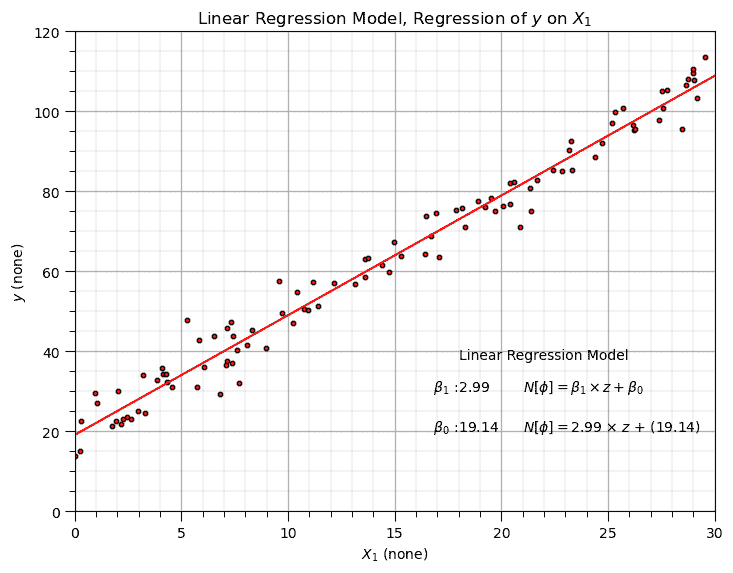
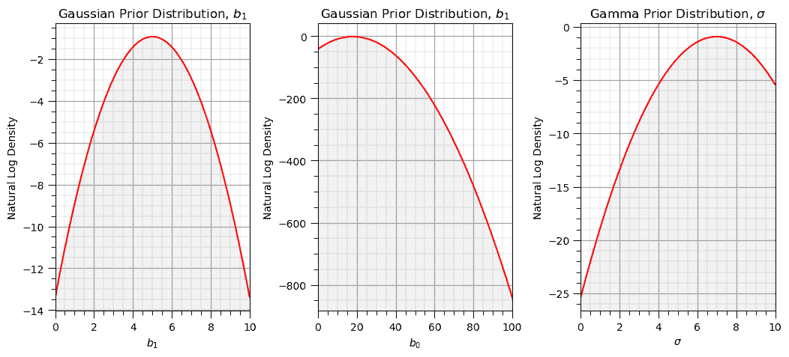
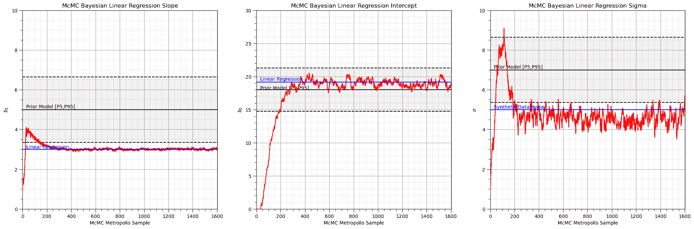
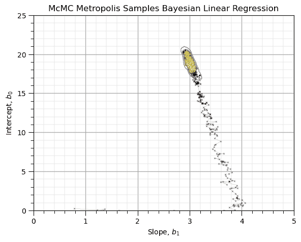

# 贝叶斯线性回归

> 原文：[`geostatsguy.github.io/MachineLearningDemos_Book/MachineLearning_Bayesian_linear_regression.html`](https://geostatsguy.github.io/MachineLearningDemos_Book/MachineLearning_Bayesian_linear_regression.html)

Michael J. Pyrcz，教授，德克萨斯大学奥斯汀分校

[Twitter](https://twitter.com/geostatsguy) | [GitHub](https://github.com/GeostatsGuy) | [网站](http://michaelpyrcz.com) | [Google Scholar](https://scholar.google.com/citations?user=QVZ20eQAAAAJ&hl=en&oi=ao) | [地统计学书籍](https://www.amazon.com/Geostatistical-Reservoir-Modeling-Michael-Pyrcz/dp/0199731446) | [YouTube](https://www.youtube.com/channel/UCLqEr-xV-ceHdXXXrTId5ig) | [Python 应用地统计学电子书](https://geostatsguy.github.io/GeostatsPyDemos_Book/intro.html) | [Python 应用机器学习电子书](https://geostatsguy.github.io/MachineLearningDemos_Book/) | [LinkedIn](https://www.linkedin.com/in/michael-pyrcz-61a648a1)

电子书“《Python 应用机器学习：带代码的手册》”的一章。

Cite this e-Book as:

Pyrcz, M.J., 2024, *《Python 应用机器学习：带代码的手册》* [电子书]. Zenodo. doi:10.5281/zenodo.15169138 

本书中的工作流程以及更多内容均可在此处找到：

Cite the MachineLearningDemos GitHub Repository as:

Pyrcz, M.J., 2024, *《MachineLearningDemos: Python 机器学习演示工作流程存储库》* (0.0.3) [软件]. Zenodo. DOI: 10.5281/zenodo.13835312\. GitHub 仓库：[GeostatsGuy/MachineLearningDemos](https://github.com/GeostatsGuy/MachineLearningDemos) 

作者：Michael J. Pyrcz

© 版权所有 2024。

本章是关于/演示**贝叶斯线性回归**的教程。

**YouTube 讲座**：查看以下讲座：

+   [机器学习简介](https://youtu.be/zOUM_AnI1DQ?si=wzWdJ35qJ9n8O6Bl)

+   [线性回归](https://youtu.be/0fzbyhWiP84)

+   [岭回归](https://youtu.be/pMGO40yXZ5Y?si=ygJAheyX-v2BmSiR)

+   [贝叶斯概率](https://www.youtube.com/watch?v=Ppwfr8H177M&list=PLG19vXLQHvSB-D4XKYieEku9GQMQyAzjJ&index=6)

+   [贝叶斯线性回归](https://youtu.be/LzZ5b3wdZQk?si=DkhYrgmDXzrPFQyr)

+   [朴素贝叶斯分类器](https://youtu.be/BDvyLrH3cLI?si=D6boOpoVpyo-6TqK)

这些讲座都是我 YouTube 上的[机器学习课程](https://youtube.com/playlist?list=PLG19vXLQHvSC2ZKFIkgVpI9fCjkN38kwf&si=XonjO2wHdXffMpeI)的一部分，其中包含有良好文档记录的 Python 工作流程和交互式仪表板。我的目标是分享易于获取、可操作和可重复的教育内容。如果你想知道我的动机，请查看[Michael 的故事](https://michaelpyrcz.com/my-story)。

## 贝叶斯线性回归的动机

贝叶斯机器学习方法应用概率来预测具有内在不确定性模型的预测。此外，贝叶斯方法整合了贝叶斯更新的概念，即使用数据中的似然模型更新先验模型来计算后验模型。

由于使用这些概率，模型训练存在额外的复杂性，这些复杂性由连续概率密度函数表示。由于由此产生的高复杂性，我们无法直接求解模型参数，而必须应用如马尔可夫链蒙特卡洛（MCMC）模拟这样的采样方法。

这是一个使用 MCMC Metropolis-Hastings 采样进行贝叶斯线性回归的简单、易于理解的演示。我的学生在这方面的概念上遇到了困难，所以我挑战自己从头开始构建一个工作流程，并清楚地解释所有细节。让我们从贝叶斯更新开始解释关键的前提条件。

## 线性回归

让我们先回顾一下用于预测的线性回归的显著要点，让我们先看看一组数据拟合的线性模型。


示例线性回归模型。

**参数模型**

这是一个参数预测机器学习模型，我们接受一个先验假设的线性，然后获得一个非常低的参数表示，这使得在没有大量数据的情况下易于训练。

+   拟合模型是一个基于所有可用特征 $x_1,\ldots,x_m$ 的简单加权线性加性模型。

+   参数模型的形式如下：

$$ y = \sum_{\alpha = 1}^m b_{\alpha} x_{\alpha} + b_0 $$

这是线性模型参数的可视化，


线性模型参数。

**最小二乘法**

对于 L2 范数损失函数，模型参数 $b_1,\ldots,b_m,b_0$ 的解析解是可用的，误差是求和并平方的，至少是平方的。

+   我们最小化训练数据上的误差，残差平方和（RSS）：

$$ RSS = \sum_{i=1}^n \left(y_i - (\sum_{\alpha = 1}^m b_{\alpha} x_{\alpha,i} + b_0) \right)² $$

其中 $y_i$ 是实际响应特征值，而 $\sum_{\alpha = 1}^m b_{\alpha} x_{\alpha} + b_0$ 是模型预测，这些预测是在 $\alpha = 1,\ldots,n$ 的训练数据上进行的。

这里是 L2 范数损失函数，均方误差（MSE）的可视化。


线性模型损失函数，均方误差。

+   这可以简化为训练数据上的平方误差之和，

$$ \sum_{i=1}^n (\Delta y_i)² $$

其中 $\Delta y_i$ 是实际响应特征观察 $y_i$ 减去模型预测 $\sum_{\alpha = 1}^m b_{\alpha} x_{\alpha} + b_0$，在 $i = 1,\ldots,n$ 的训练数据上。

**假设**

我们的线性回归模型有一些重要的假设，

+   **无误差** - 预测变量无误差，不是随机变量

+   **线性** - 响应是特征（们）的线性组合

+   **常数方差** - 响应中的误差在预测值上保持恒定

+   **误差独立性** - 响应中的误差彼此不相关

+   **无多重共线性** - 没有特征与其他特征冗余

现在，让我们回顾贝叶斯更新，然后更新我们的线性回归模型到贝叶斯线性回归。

## 贝叶斯更新

贝叶斯概率方法基于对事件信念（专家经验）的某种程度，随着新信息的出现而更新

+   这种概率方法非常强大，可以应用于解决我们无法用频率主义概率方法解决的问题

贝叶斯更新由贝叶斯定理表示，

$$ P(A|B) = \frac{P(B|A) \cdot P(A)}{P(B)} $$

其中 $P(A)$ 是先验，$P(B|A)$ 是似然，$P(B)$ 是负责概率封闭的证据项，$P(A|B)$ 是后验。

## 贝叶斯线性回归

线性回归模型的频率主义公式是，

$$ y = b_1 \times x + b_0 + \sigma $$

其中 $x$ 是预测特征，$b_1$ 是斜率参数，$b_0$ 是截距参数，$\sigma$ 是误差或噪声。存在一个解析形式，用于拟合可用数据，同时最小化数据误差向量的 L2 范数。

我们可以用矩阵符号表示多元线性回归模型，

$$ y = \beta^{T} X + \sigma $$

其中 $\beta$ 是模型参数的向量，$\beta_1,\ldots,\beta_m$。我们可以向向量中添加另一个项 $\beta_0$ 作为模型的截距。

+   当添加 $\beta_0$ 时，我们也在数据 $X$ 矩阵中添加一列 $1$s

对于线性回归的贝叶斯公式，我们将模型设定为响应分布 $Y$ 的预测，现在是一个随机变量：

$$ Y \sim N(\beta^{T}X, \sigma^{2} I) $$

我们通过贝叶斯更新来估计模型参数分布，从先验和训练数据中的似然推断模型参数。

$$ p(\beta | y, X) = \frac{p(y,X| \beta) p(\beta)}{p(y,X)} $$

让我们逐个讨论每个术语，

1.  先验，$𝑃(\beta)$ - 在新数据之前，基于预测特征对模型参数的初始推断，

+   专家知识

+   简单先验，在非信息性先验的情况下，似然将占主导地位

+   信息性先验，在低不确定性先验的情况下，先验将占主导地位

+   在整合训练数据之前，不能包括新的训练数据

1.  似然，$𝑃(𝑦,𝑋│\beta)$ - 在假设的模型参数基础上，给定训练数据的条件分布，

+   新数据，数据驱动

+   随着样本数据数量的增加，似然将超过先验分布

1.  证据，$P(y,X)$ - 归一化常数，以确保概率封闭，即有效的后验概率密度函数

+   与模型参数独立

+   通过对分子进行边缘化来解决，通过对所有可能的模型参数进行积分而简化

+   对于某些解决方案方法，例如 MCMC Metropolis-Hastings，证据项会抵消

1.  后验，$P(\beta│y,X)$ - 给定数据驱动的似然和基于专家知识和信念的先验的模型参数的条件分布

+   随着数据数量的增加，$𝑛 \rightarrow \infty$，模型参数 $\beta$ 会收敛到普通最小二乘线性回归，先验被数据所淹没。

通常对于连续特征，我们无法直接计算后验，我们必须使用抽样方法，如马尔可夫链蒙特卡洛（McMC）来抽样后验。

这里是一个 MCMC Metropolis Hastings 工作流程和更多细节。

## 马尔可夫链蒙特卡洛（MCMC）

是一套算法，用于从概率分布中进行抽样，使得样本匹配分布统计。

+   **马尔可夫** - 屏蔽假设，下一个样本只依赖于前一个样本

+   **链** - 样本形成一个序列，通常表明从烧毁链（具有不准确统计的链）到平衡链（具有准确统计的链）的转变

+   **蒙特卡洛** - 使用蒙特卡洛模拟，从统计分布中进行随机抽样

这有什么用？

+   我们通常没有目标分布，它是未知的

+   但我们可以通过其他形式的信息，如条件概率密度函数，以正确的频率进行抽样

## 基于 Metropolis-Hastings 抽样的贝叶斯线性回归

这里是 Metropolis-Hastings MCMC 抽样的基本步骤：

对于 $\ell = 1, \ldots, L$:

1.  为模型参数的初始样本分配随机值，$\beta(\ell = 1) = b_1(\ell = 1)$，$b_0(\ell = 1)$ 和 $\sigma²(\ell = 1)$。

1.  根据建议函数提出新的模型参数，$\beta^{\prime} = b_1$，$b_0$ 和 $\sigma²$。

1.  计算新建议的接受概率，即根据数据给出的新模型参数的后验概率与根据数据给出的前一个模型参数的概率的比值，乘以根据新步骤给出的旧步骤的概率除以根据旧步骤给出新步骤的概率。

$$ P(\beta \rightarrow \beta^{\prime}) = min\left(\frac{p(\beta^{\prime}|y,X) }{ p(\beta | y,X)} \cdot \frac{p(\beta^{\prime}|\beta) }{ p(\beta | \beta^{\prime})},1\right) $$

1.  应用蒙特卡洛模拟以条件接受建议，如果被接受，$\ell = \ell + 1$，并抽样 $\beta(\ell) = \beta^{\prime}$

1.  转到第二步。

让我们谈谈这个系统。首先看左边：

$$ \frac{p(\beta^{\prime}|y,X) }{ p(\beta | y,X)} $$

我们正在计算给定数据和先验模型的后验概率（似然乘以先验）与建议样本的后验概率之比。

+   正如您下面将看到的，计算这个比率是非常实用的。

+   如果提议的样本比当前样本的可能性高，我们将得到一个大于 1.0 的值，它将被截断为 1.0，并且我们接受提议的样本。

+   如果提议的样本比当前样本的可能性低，我们将得到一个小于 1.0 的值，然后我们将使用蒙特卡洛抽样以这个接受概率随机选择提议的样本。

这个程序允许我们在烧毁链之后，以当前速率遍历模型参数空间并采样参数。

现在，关于方程的这一部分呢？

$$ \frac{p(\beta^{\prime}|\beta) }{ p(\beta | \beta^{\prime})} $$

如果我们为模型参数使用非对称概率分布，这个程序将存在一个问题！

+   例如，如果我们使用正偏斜分布（例如，对数正态分布），那么我们更有可能因为这种分布而走向更大的值，而不是因为先验或似然。

+   这个项消除了这种偏差，因此我们得到了公平的样本！

你将在下面看到，我们通过假设模型参数分布对称来解决这个问题，尽管许多人使用非对称的伽马分布来表示 sigma，因为它不能有负值。

+   我的目的是进行尽可能简单的演示。

## 我们简化的 Metropolis 抽样演示

让我们进一步具体化这个工作流程，以供我们的简单演示使用。

+   我假设所有模型参数都遵循高斯对称分布，因此这个关系对所有可能的模型参数，包括当前的和提议的，都成立。

$$ \frac{p(\beta^{\prime}|\beta) }{ p(\beta | \beta^{\prime})} = 1.0 $$

因此，我们现在有了这个简化的提议接受概率，注意这被称为 Metropolis 抽样。

$$ P(\beta \rightarrow \beta^{\prime}) = min \left( \frac{p(\beta^{\prime}|y,X) }{ p(\beta | y,X)},1 \right) $$

现在，让我们将贝叶斯公式替换到我们的贝叶斯线性回归模型中。

$$ p(\beta^{\prime} | y, X) = \frac{p(y,X| \beta^{\prime}) p(\beta^{\prime})}{p(y,X)} \quad \text{ and } \quad p(\beta | y, X) = \frac{p(y,X| \beta) p(\beta)}{p(y,X)} $$

如果我们将这些值代入我们上面的接受概率中，我们得到这个结果。

$$ P(\beta \rightarrow \beta^{\prime}) = min \left( \frac{p(\beta^{\prime}|y,X) }{ p(\beta | y,X)},1 \right) = min \left( \frac{ \left( \frac{p(y,X| \beta_{new}) p(\beta_{new}) } {p(y,X)} \right) }{ \left( \frac{ p(y,X| \beta) p(\beta)}{p(y,X)} \right) },1 \right) $$

注意，证据项被抵消了。

$$ P(\beta \rightarrow \beta^{\prime}) = min \left( \frac{ p(y,X| \beta_{new}) p(\beta_{new}) }{ p(y,X| \beta) p(\beta)},1 \right) $$

由于我们处理的是似然比，我们可以使用密度而不是概率。

$$ P(\beta \rightarrow \beta^{\prime}) = min \left( \frac{ f(y,X| \beta_{new}) f(\beta_{new}) }{ f(y,X| \beta) f(\beta) } ,1 \right) $$

最后，为了提高解的稳定性，我们可以计算自然对数比：

$$ ln(P(\beta \rightarrow \beta^{\prime})) = min \left( ln \left[ \frac{ f(y,X| \beta_{new}) f(\beta_{new}) }{ f(y,X| \beta) f(\beta) } \right],0 \right) $$$$ = min \left( \left[ln(f(y,X| \beta_{new})) + ln(f(\beta_{new})) \right] - \left[ ln(f(y,X| \beta)) + ln(f(\beta)) \right],0 \right) $$

我们计算提议接受的概率，即上述公式的指数化。

我们如何计算似然密度？如果我们假设所有数据之间相互独立，我们可以取所有响应值（密度）在预测值和模型参数样本下的乘积和！给定响应特征的高斯假设，我们可以从高斯概率密度函数计算每个数据的密度。

$$ f_{y,X | \beta}(y) \sim N [ b_1 \cdot X + b_0, \sigma ] $$

在独立性的假设下，我们可以对所有训练数据进行乘积和。

$$ f(y,X| \beta) = \prod_{\alpha = 1}^{n} f_{y,X | \beta}(y_{\alpha}) $$

注意，此工作流程是在 Fortunato Nucera 的 Medium 文章[从头开始掌握贝叶斯线性回归：Python 中的 Metropolis-Hastings 实现](https://medium.com/@tinonucera/bayesian-linear-regression-from-scratch-a-metropolis-hastings-implementation-63526857f191)的帮助下开发的。我强烈推荐这篇易于理解的描述和演示。感谢，Fortunato。

## 加载所需的库

我们还需要一些标准包。这些应该已经与 Anaconda 3 一起安装。

```py
%matplotlib inline                                         
suppress_warnings = True
import os                                                     # to set current working directory 
import math                                                   # square root operator
import numpy as np                                            # arrays and matrix math
import scipy.stats as stats                                   # statistical methods
import pandas as pd                                           # DataFrames
import pandas.plotting as pd_plot
import matplotlib.pyplot as plt                               # for plotting
from matplotlib.patches import Rectangle                      # build a custom legend
from matplotlib.ticker import (MultipleLocator,AutoMinorLocator,FuncFormatter) # control of axes ticks
from matplotlib.colors import ListedColormap                  # custom color maps
import seaborn as sns                                         # for matrix scatter plots
from sklearn.linear_model import LinearRegression             # frequentist model for comparison
from IPython.display import display, HTML                     # custom displays
cmap = plt.cm.inferno                                         # default color bar, no bias and friendly for color vision defeciency
plt.rc('axes', axisbelow=True)                                # grid behind plotting elements
if suppress_warnings == True:  
    import warnings                                           # suppress any warnings for this demonstration
    warnings.filterwarnings('ignore') 
seed = 13                                                     # random number seed for workflow repeatability 
```

如果遇到包导入错误，你可能需要首先安装这些包中的几个。这通常可以通过在 Windows 上打开命令窗口，然后输入‘python -m pip install [package-name]’来完成。有关相应包的文档可以提供更多帮助。

## 声明函数

以下函数包括：

+   **下一个提议** - 从先前的模型参数中提议下一个模型参数，这是提议方法，由步长标准差和高斯分布参数化。

+   **似然密度** - 根据模型参数计算所有数据的密度乘积。由于我们处理的是对数密度，所以我们对所有数据进行求和。

+   **先验密度** - 根据先验模型计算所有模型参数的密度乘积。由于我们处理的是对数密度，所以我们对所有模型参数进行求和。这是一个独立性的假设。

+   **添加网格** - 改进的绘图网格。

```py
def next_proposal(prev_theta, step_stdev = 0.5):              # assuming a Gaussian distribution centered on previous theta and step stdev 
    out_theta = stats.multivariate_normal(mean=prev_theta,cov=np.eye(3)*step_stdev**2).rvs(1)
    return out_theta

def likelihood_density(x,y,theta):                            # likelihood - probability (density) of the data given the model
    density = np.sum(stats.norm.logpdf(y, loc=theta[0]*x+theta[1],scale=theta[2])) # assume independence, sum is product in log space
    return density

def prior_density(theta,prior):                               # prior - probability (density) of the model parameters given the prior 
    mean = np.array([prior[0,0],prior[1,0],prior[2,0]]); cov = np.zeros([3,3]); cov[0,0] = prior[0,1]; cov[1,1] = prior[1,1]; cov[2,2] = prior[2,1]
    prior_out = stats.multivariate_normal.logpdf(theta,mean=mean,cov=cov,allow_singular=True)
    return prior_out

def add_grid():
    plt.gca().grid(True, which='major',linewidth = 1.0); plt.gca().grid(True, which='minor',linewidth = 0.2) # add y grids
    plt.gca().tick_params(which='major',length=7); plt.gca().tick_params(which='minor', length=4)
    plt.gca().xaxis.set_minor_locator(AutoMinorLocator()); plt.gca().yaxis.set_minor_locator(AutoMinorLocator()) # turn on minor ticks 
```

## 设置工作目录

我总是喜欢这样做，以免丢失文件，并简化后续的读取和写入操作（每次避免包含完整地址）。

```py
#os.chdir("c:/PGE383")                                        # set the working directory 
```

## 使用已知的线性回归模型参数构建合成数据集

让我们构建一个简单的数据集，其中包含已知的线性回归模型参数，$b_1$是斜率参数，$b_0$是截距参数，$\sigma$是误差或噪声。

+   我们基于这些参数构建数据，然后训练一个线性回归模型，并展示我们得到了正确的斜率和截距模型参数。

```py
np.random.seed(seed = seed)                                   # set random number seed

data_b1 = 3; data_b0 = 20; data_sigma = 5; n = 100            # set data model parameters

X = np.random.rand(n)*30                                      # random x values
y = data_b1*X+data_b0 + np.random.normal(loc=0.0,scale=data_sigma,size=n) # y as a linear function of x + random noise 

Xname = [r'$X_1$']; yname = [r'$y$']                          # specify the predictor features (x2) and response feature (x1)
Xmin = 0.0; Xmax = 30; ymin = 0.0; ymax = 120                 # set minimums and maximums for visualization 
Xunit = ['none']; yunit = ['none'] 
Xlabelunit = Xname[0] + ' (' + Xunit[0] + ')'
ylabelunit = yname[0] + ' (' + yunit[0] + ')'

xhat = np.linspace(Xmin,Xmax,100)                             # set of x values to predict and visualize the model
linear_model = LinearRegression().fit(X.reshape(-1, 1),y)     # instantiate and train the frequentist linear regression model
yhat = linear_model.predict(xhat.reshape(-1, 1))              # make predictions for model plotting

slope = linear_model.coef_[0]
intercept = linear_model.intercept_

plt.subplot(111)                                              # plot the data and model
plt.scatter(X, y,c='red',s=10,edgecolor='black')
plt.plot(xhat,yhat,c='red'); add_grid()
plt.title('Linear Regression Model, Regression of ' + yname[0] + ' on ' + Xname[0])
plt.xlabel(Xlabelunit); plt.ylabel(ylabelunit)
add_grid(); plt.xlim([Xmin,Xmax]); plt.ylim([ymin,ymax])
plt.annotate('Linear Regression Model',[18.0,38])
plt.annotate(r'    $\beta_1$ :' + str(round(slope,2)),[16.0,30])
plt.annotate(r'    $\beta_0$ :' + str(round(intercept,2)),[16.0,20])
plt.annotate(r'$N[\phi] = \beta_1 \times z + \beta_0$',[21.0,30])
plt.annotate(r'$N[\phi] = $' + str(round(slope,2)) + r' $\times$ $z$ + (' + str(round(intercept,2)) + ')',[21.0,20])
plt.subplots_adjust(left=0.0, bottom=0.0, right=1.0, top=1.0, wspace=0.2, hspace=0.2); plt.show() 
```



线性回归模型参数非常接近用于生成合成数据的系数。现在让我们使用 MCMC 训练一个贝叶斯线性回归模型。

## 贝叶斯线性回归

所有这一切都始于一个先验模型，为此我们假设一个合理的先验模型。

### 假设先验模型

我们假设斜率和截距参数服从多元高斯分布，$f_{b_1,b_0,\sigma}(b_1,b_0,\sigma)$，其中$b_1$、$b_0$和$\sigma$之间相互独立。

+   对于一个朴素先验，假设一个非常大的标准差。我们将使用对数概率和对数密度来提高系统的稳定性。

+   我们希望避免许多接近零的值的乘积和，因为概率将因计算机浮点精度而消失。

+   在对数空间中，我们可以通过求和（而不是乘法）这些负值来计算独立事件的概率。

```py
prior = np.zeros([3,2])                                       # prior distributions
prior[0,:] = [5.0,1.0]                                        # Gaussian prior model for slope, mean and standard deviation
prior[1,:] = [18.0,2.0]                                       # Gaussian prior model for intercept, mean and standard deviation
prior[2,:] = [7.0,1.0]                                        # Gaussian prior model for sigma, k (shape) and phi (scale), recall mean = k x phi, var = k x phi² 

plt.subplot(131)                                              # slope prior distribution
plt.plot(np.arange(0,10,0.01),stats.norm.logpdf(np.arange(0,10,0.01),loc=prior[0,0],scale=prior[0,1]),c='red'); ylim = plt.gca().get_ylim() 
plt.fill_between(np.arange(0,10,0.01),np.full(1000,-1.0e20),stats.norm.logpdf(np.arange(0,10,0.01),loc=prior[0,0],scale=prior[0,1]),color='black',alpha=0.05,zorder=1)
plt.xlabel(r'$b_1$'); plt.ylabel('Natural Log Density'); plt.title("Gaussian Prior Distribution, $b_1$"); add_grid(); plt.xlim([0,10]); plt.ylim(ylim)

plt.subplot(132)                                              # intercept prior distribution
plt.plot(np.arange(0,100,0.01),stats.norm.logpdf(np.arange(0,100,0.01),loc=prior[1,0],scale=prior[1,1]),c='red'); ylim = plt.gca().get_ylim() 
plt.fill_between(np.arange(0,100,0.01),np.full(10000,-1.0e20),stats.norm.logpdf(np.arange(0,100,0.01),loc=prior[1,0],scale=prior[1,1]),color='black',alpha=0.05,zorder=1)
plt.xlabel(r'$b_0$'); plt.ylabel('Natural Log Density'); plt.title("Gaussian Prior Distribution, $b_1$"); add_grid(); plt.xlim([0,100]); plt.ylim(ylim)

plt.subplot(133)                                              # noise prior distribution
plt.plot(np.arange(0,10,0.01),stats.norm.logpdf(np.arange(0,10,0.01),loc=prior[2,0],scale=prior[2,1]),c='red'); ylim = plt.gca().get_ylim() 
plt.fill_between(np.arange(0,10,0.01),np.full(1000,-1.0e20),stats.norm.logpdf(np.arange(0,10,0.01),loc=prior[2,0],scale=prior[2,1]),color='black',alpha=0.05,zorder=1)
plt.xlabel(r'$\sigma$'); plt.ylabel('Natural Log Density'); plt.title("Gamma Prior Distribution, $\sigma$"); add_grid(); plt.xlim([0,10]); plt.ylim(ylim)

plt.subplots_adjust(left=0.0, bottom=0.0, right=1.5, top=0.8, wspace=0.35, hspace=0.5); plt.show() 
```



### 贝叶斯线性回归与 MCMC Metropolis-Hastings

贝叶斯线性回归与 MCMC Metropolis-Hastings 工作流程。

1.  分配一个随机的初始模型参数集。

1.  应用提议规则，根据前一个模型参数集分配一个新的模型参数集。

1.  计算新模型参数的似然比，给定数据相对于前一个模型参数。

1.  根据这个比率有条件地接受提议，即如果提议更接近接受，则根据比率计算的概率较小。

1.  返回到步骤 2。

```py
np.random.seed(seed = seed)
step_stdev = 0.2

thetas = np.random.rand(3).reshape(1,-1)                      # seed a random first step
accepted = 0

n = 10000                                                     # number of attempts, include accepted and rejected

for i in range(n):
    theta_new = next_proposal(thetas[-1,:],step_stdev=step_stdev) # next proposal

    log_like_new = likelihood_density(X,y,theta_new)          # new and prior likelihoods, log of density
    log_like = likelihood_density(X,y,thetas[-1,:])

    log_prior_new = prior_density(theta_new,prior)            # new and prior, log of density
    log_prior = prior_density(thetas[-1,:],prior)

    likelihood_prior_proposal_ratio = np.exp((log_like_new + log_prior_new) - (log_like + log_prior)) # calculate log ratio

    if likelihood_prior_proposal_ratio > np.random.rand(1):   # conditionally accept by likelihood ratio
        thetas = np.vstack((thetas,theta_new)); accepted += 1

print('Accepted ' + str(accepted) + ' samples of ' + str(n) + ' attempts')

df = pd.DataFrame(np.vstack([thetas[:,0],thetas[:,1],thetas[:,2]]).T, columns= ['Slope','Intercept','Sigma']) 
```

```py
Accepted 1603 samples of 10000 attempts 
```

### 可视化结果

让我们可视化每个模型参数的 MCMC Metropolis 抽样链。

+   注意烧录链和平衡链。

+   将斜率和截距模型参数与仅基于普通最小二乘解的频率主义线性回归解决方案进行比较，最小化所有样本数据错误向量的 L2 范数。

+   将噪声参数与添加到合成数据中的噪声进行比较。

```py
alpha = 0.1                                                   # alpha level for displayed confidence intervals 

plt.subplot(131)                                              # plot slope, b_1, samples
plt.plot(np.arange(0,accepted+1,1),thetas[:,0],c='red',zorder=100) 
plt.xlabel('McMC Metropolis Sample'); plt.ylabel(r'$b_1$'); plt.title("McMC Bayesian Linear Regression Slope"); add_grid()
plt.plot([0,accepted],[linear_model.coef_[0],linear_model.coef_[0]],c='blue',zorder=200)
plt.annotate('Linear Regression',[30,linear_model.coef_[0]+0.05],color='blue',zorder=200)
plt.plot([0,accepted],[prior[0,0],prior[0,0]],c='black',zorder=10)
plt.annotate('Prior Model [P' + str((int(alpha/2*100))) + ',P' + str((int((1.0-alpha/2)*100))) + ']',[30,prior[0,0]+0.07])
lower = stats.norm.ppf(alpha/2.0,loc=prior[0,0],scale=prior[0,1])
plt.plot([0,accepted],[lower,lower],c='black',ls='--',zorder=10)
upper = stats.norm.ppf(1-alpha/2.0,loc=prior[0,0],scale=prior[0,1])
plt.plot([0,accepted],[upper,upper],c='black',ls='--',zorder=10)
plt.fill_between([0,accepted],[lower,lower],[upper,upper],color='black',alpha=0.05,zorder=1)
plt.xlim([0,accepted]); plt.ylim([0,10])

plt.subplot(132)                                              # plot intercept, b_0, samples
plt.plot(np.arange(0,accepted+1,1),thetas[:,1],c='red',zorder=100) 
plt.xlabel('McMC Metropolis Sample'); plt.ylabel(r'$b_0$'); plt.title("McMC Bayesian Linear Regression Intercept"); add_grid()
plt.plot([0,accepted],[linear_model.intercept_,linear_model.intercept_],c='blue',zorder=200)
plt.annotate('Linear Regression',[30,linear_model.intercept_+0.25],color='blue',zorder=200)
plt.plot([0,accepted],[prior[1,0],prior[1,0]],c='black',zorder=10)
plt.annotate('Prior Model [P' + str((int(alpha/2*100))) + ',P' + str((int((1.0-alpha/2)*100))) + ']',[30,prior[1,0]+0.07])
lower = stats.norm.ppf(alpha/2.0,loc=prior[1,0],scale=prior[1,1])
plt.plot([0,accepted],[lower,lower],c='black',ls='--',zorder=10)
upper = stats.norm.ppf(1-alpha/2.0,loc=prior[1,0],scale=prior[1,1])
plt.plot([0,accepted],[upper,upper],c='black',ls='--',zorder=10)
plt.fill_between([0,accepted],[lower,lower],[upper,upper],color='black',alpha=0.05,zorder=1)
plt.xlim([0,accepted]); plt.ylim([0,30])

plt.subplot(133)                                              # plot noise, sigma, samples
plt.plot(np.arange(0,accepted+1,1),thetas[:,2],c='red',zorder=100) 
plt.xlabel('McMC Metropolis Sample'); plt.ylabel(r'$\sigma$'); plt.title("McMC Bayesian Linear Regression Sigma"); add_grid()
plt.plot([0,accepted],[data_sigma,data_sigma],color='blue',zorder=200)
plt.annotate('Synthetic Data Noise',[30,data_sigma+0.06],color='blue',zorder=200)
plt.plot([0,accepted],[prior[2,0],prior[2,0]],c='black',zorder=10)
plt.annotate('Prior Model [P' + str((int(alpha/2*100))) + ',P' + str((int((1.0-alpha/2)*100))) + ']',[30,prior[2,0]+0.07])
lower = stats.norm.ppf(alpha/2.0,loc=prior[2,0],scale=prior[2,1])
plt.plot([0,accepted],[lower,lower],c='black',ls='--',zorder=10)
upper = stats.norm.ppf(1-alpha/2.0,loc=prior[2,0],scale=prior[2,1])
plt.plot([0,accepted],[upper,upper],c='black',ls='--',zorder=10)
plt.fill_between([0,accepted],[lower,lower],[upper,upper],color='black',alpha=0.05,zorder=1)
plt.xlim([0,accepted]); plt.ylim([0,10])

plt.subplots_adjust(left=0.0, bottom=0.0, right=3.0, top=1.2, wspace=0.2, hspace=0.5); plt.show() 
```



### 在模型参数空间中可视化链

将烧录链设置为烧录链末端的接受样本，并观察 MCMC 抽样。

```py
burn_chain = 250
plt.scatter(thetas[:burn_chain,0],thetas[:burn_chain,1],s=5,marker = 'x',c='black',alpha=0.8,linewidth=0.3,cmap=plt.cm.inferno,zorder=10)
plt.scatter(thetas[burn_chain:,0],thetas[burn_chain:,1],s=5,c=np.arange(burn_chain,accepted+1,1),alpha=1.0,edgecolor='black',linewidth=0.1,cmap=plt.cm.inferno,zorder=10)
sns.kdeplot(data=df[burn_chain:],x='Slope',y='Intercept',color='grey',linewidths=1.00,alpha=0.9,levels=np.logspace(-4,-0,3),zorder=100)
plt.plot(thetas[:burn_chain,0],thetas[:burn_chain,1],color='black',linewidth=0.1,zorder=1)
add_grid(); plt.xlabel('Slope, $b_1$'); plt.ylabel('Intercept, $b_0$'); plt.title('McMC Metropolis Samples Bayesian Linear Regression') 
plt.xlim([0,5]); plt.ylim([0,25])
plt.subplots_adjust(left=0.0, bottom=0.0, right=0.8, top=0.8, wspace=0.2, hspace=0.5); plt.show() 
```



## 注释

这是对贝叶斯线性回归的基本处理。可以做和讨论的还有很多，我有很多更多的资源。查看我的[共享资源清单](https://michaelpyrcz.com/my-resources)以及本章开头 YouTube 讲座的链接，视频描述中包含资源链接。

希望这能有所帮助，

*迈克尔*

## 关于作者


迈克尔·皮尔茨教授在德克萨斯大学奥斯汀分校 40 英亩校园的办公室。

迈克尔·皮尔茨是德克萨斯大学奥斯汀分校[科克雷尔工程学院](https://cockrell.utexas.edu/faculty-directory/alphabetical/p)和[杰克逊地球科学学院](https://www.jsg.utexas.edu/researcher/michael_pyrcz/)的教授，在那里他研究并教授地下、空间数据分析、地统计学和机器学习。迈克尔还，

+   [能源分析](https://fri.cns.utexas.edu/energy-analytics)新生研究项目的首席研究员，以及德克萨斯大学奥斯汀分校自然科学院机器学习实验室的核心教员。

+   [《计算机与地学》](https://www.sciencedirect.com/journal/computers-and-geosciences/about/editorial-board)的副编辑，以及国际数学地学协会[《数学地学》](https://link.springer.com/journal/11004/editorial-board)的董事会成员。

迈克尔已经撰写了超过 70 篇[同行评审的出版物](https://scholar.google.com/citations?user=QVZ20eQAAAAJ&hl=en)，一个用于空间数据分析的[Python 包](https://pypi.org/project/geostatspy/)，合著了一本关于空间数据分析的教科书《[地统计学储层建模](https://www.amazon.com/Geostatistical-Reservoir-Modeling-Michael-Pyrcz/dp/0199731446)》，并且是两本最近发布的电子书的作者，分别是《[Python 中的应用地统计学：GeostatsPy 实践指南](https://geostatsguy.github.io/GeostatsPyDemos_Book/intro.html)》和《[Python 中的应用机器学习：带代码的实践指南](https://geostatsguy.github.io/MachineLearningDemos_Book/intro.html)》。

迈克尔在大学的所有讲座都可以在他的[YouTube 频道](https://www.youtube.com/@GeostatsGuyLectures)上找到，其中包含 100 多个 Python 交互式仪表板和 40 多个 GitHub 仓库中的详细工作流程链接，以支持任何感兴趣的学生和在职专业人士。要了解更多关于迈克尔的工作和共享教育资源，请访问他的网站。

## 想要一起工作吗？

希望这个内容对那些想了解更多关于地下建模、数据分析和机器学习的人有所帮助。学生和在职专业人士欢迎参加。

+   想邀请我到贵公司进行培训、辅导、项目审查、工作流程设计和/或咨询吗？我很乐意拜访并与您合作！

+   感兴趣合作、支持我的研究生研究或我的地下数据分析与机器学习联盟（共同负责人是约翰·福斯特教授）吗？我的研究将数据分析、随机建模和机器学习理论与实践相结合，以开发新的方法和工作流程，增加价值。我们正在解决具有挑战性的地下问题！

+   我可以通过 mpyrcz@austin.utexas.edu 联系到。

我总是很高兴讨论，

*迈克尔*

迈克尔·皮尔茨，博士，P.Eng. 教授，德克萨斯大学奥斯汀分校 Cockrell 工程学院和 Jackson 地球科学学院

更多资源请访问：[Twitter](https://twitter.com/geostatsguy) | [GitHub](https://github.com/GeostatsGuy) | [网站](http://michaelpyrcz.com) | [Google Scholar](https://scholar.google.com/citations?user=QVZ20eQAAAAJ&hl=en&oi=ao) | [地统计学书籍](https://www.amazon.com/Geostatistical-Reservoir-Modeling-Michael-Pyrcz/dp/0199731446) | [YouTube](https://www.youtube.com/channel/UCLqEr-xV-ceHdXXXrTId5ig) | [Python 中应用地统计学电子书](https://geostatsguy.github.io/GeostatsPyDemos_Book/intro.html) | [Python 中应用机器学习电子书](https://geostatsguy.github.io/MachineLearningDemos_Book/) | [LinkedIn](https://www.linkedin.com/in/michael-pyrcz-61a648a1)

## 贝叶斯线性回归的动机

贝叶斯机器学习方法将概率应用于具有内在不确定性模型的预测。此外，贝叶斯方法整合了贝叶斯更新的概念，即使用数据中的似然模型更新先验模型来计算后验模型。

由于使用这些概率（由连续概率密度函数表示）进行模型训练，存在额外的复杂性。由于由此产生的高复杂性，我们无法直接求解模型参数，而必须应用如马尔可夫链蒙特卡洛（MCMC）模拟这样的抽样方法。

这是一个简单、非常易于理解的贝叶斯线性回归与 McMC Metropolis-Hastings 抽样的演示。我的学生在这方面的概念上遇到了困难，所以我挑战自己从头开始构建一个工作流程，并清晰地解释所有细节。让我们解释关键的前提条件，从贝叶斯更新开始。

## 线性回归

让我们先回顾一下线性回归预测的要点，让我们先看看一个拟合到一组数据的线性模型。


示例线性回归模型。

**参数模型**

这是一个参数预测机器学习模型，我们接受一个先验假设的线性，然后获得一个非常低的参数表示，易于训练，无需大量数据。

+   适配模型是一个基于所有可用特征 $x_1,\ldots,x_m$ 的简单加权线性加性模型。

+   参数模型的形式为：

$$ y = \sum_{\alpha = 1}^m b_{\alpha} x_{\alpha} + b_0 $$

这里是线性模型参数的可视化，


线性模型参数。

**最小二乘法**

对于 L2 范数损失函数，模型参数 $b_1,\ldots,b_m,b_0$ 的解析解是可用的，误差是求和并平方的已知最小二乘法。

+   我们最小化训练数据上的误差，残差平方和（RSS）：

$$ RSS = \sum_{i=1}^n \left(y_i - (\sum_{\alpha = 1}^m b_{\alpha} x_{\alpha,i} + b_0) \right)² $$

其中 $y_i$ 是实际响应特征值，$\sum_{\alpha = 1}^m b_{\alpha} x_{\alpha} + b_0$ 是模型预测，在 $\alpha = 1,\ldots,n$ 的训练数据上。

这里是 L2 范数损失函数，均方误差（MSE）的可视化，


线性模型的损失函数，均方误差。

+   这可以简化为训练数据上平方误差的总和，

\begin{equation} \sum_{i=1}^n (\Delta y_i)² \end{equation}

其中 $\Delta y_i$ 是实际响应特征观察 $y_i$ 减去模型预测 $\sum_{\alpha = 1}^m b_{\alpha} x_{\alpha} + b_0$，在 $i = 1,\ldots,n$ 的训练数据上。

**假设**

我们的线性回归模型有一些重要的假设，

+   **无误差** - 预测变量无误差，不是随机变量

+   **线性** - 响应是特征（s）的线性组合

+   **常数方差** - 响应误差在预测值上是常数

+   **误差独立性** - 响应误差彼此不相关

+   **无多重共线性** - 没有特征与其他特征冗余

现在，让我们回顾贝叶斯更新，然后更新我们的线性回归模型到贝叶斯线性回归。

## 贝叶斯更新

贝叶斯概率方法基于对事件信念（专家经验）的度，随着新信息的出现而更新

+   这种处理概率的方法强大且可以应用于解决我们无法用频率主义概率方法解决的问题

贝叶斯更新由贝叶斯定理表示，

$$ P(A|B) = \frac{P(B|A) \cdot P(A)}{P(B)} $$

其中 $P(A)$ 是先验概率，$P(B|A)$ 是似然函数，$P(B)$ 是负责概率封闭的证词项，而 $P(A|B)$ 是后验概率。

## 贝叶斯线性回归

线性回归模型的频率主义公式为，

$$ y = b_1 \times x + b_0 + \sigma $$

其中 $x$ 是预测特征，$b_1$ 是斜率参数，$b_0$ 是截距参数，$\sigma$ 是误差或噪声。存在一个解析形式来拟合可用数据，同时最小化数据误差向量的 L2 范数。

我们可以用矩阵表示法表示多元线性回归模型，

$$ y = \beta^{T} X + \sigma $$

其中 $\beta$ 是模型参数的向量，$\beta_1,\ldots,\beta_m$。我们可以向向量中添加另一个项 $\beta_0$ 作为模型的截距。

+   当添加 $\beta_0$ 时，我们也在数据 $X$ 矩阵中添加一列 $1$s

对于线性回归的贝叶斯公式，我们将模型设定为对响应分布 $Y$ 的预测，现在是一个随机变量：

$$ Y \sim N(\beta^{T}X, \sigma^{2} I) $$

我们通过贝叶斯更新来估计模型参数分布，从先验和似然中推断模型参数，这些似然和先验来自训练数据。

$$ p(\beta | y, X) = \frac{p(y,X| \beta) p(\beta)}{p(y,X)} $$

让我们逐个讨论每个术语，

1.  先验，$𝑃(\beta)$ - 在新数据之前，基于预测特征对模型参数的先验推断，

+   专家知识

+   无信息先验，在非信息先验的情况下，似然将主导

+   信息先验，在低不确定性先验的情况下，先验将主导似然

+   在整合训练数据之前，不能包括新的训练数据

1.  似然，$𝑃(𝑦,𝑋│\beta)$ - 基于假设的模型参数，对训练数据的条件分布，

+   新数据，数据驱动

+   随着样本数据数量的增加，似然函数会压倒先验分布

1.  证据，$P(y,X)$ - 归一化常数，以确保概率封闭，即有效的后验概率密度函数

+   与模型参数无关

+   通过对分子进行边缘化来解决，通过对所有可能的模型参数进行积分而简化

+   对于某些解决方案，例如 MCMC Metropolis-Hastings，证据项会抵消

1.  后验，$P(\beta│y,X)$ - 给定数据驱动的似然和先验（基于专家知识和信念）的模型参数的条件分布

+   随着数据数量 $𝑛 \rightarrow \infty$ 的增加，模型参数 $\beta$ 收敛到普通最小二乘线性回归，先验被数据压倒。

通常对于连续特征，我们无法直接计算后验，我们必须使用采样方法，例如马尔可夫链蒙特卡洛（McMC）来采样后验。

这里有一个 McMC Metropolis Hastings 工作流程和更多细节。

## 马尔可夫链蒙特卡洛 (MCMC)

是一组算法，用于从概率分布中进行采样，使得样本匹配分布统计量。

+   **马尔可夫** - 屏蔽假设，下一个样本只依赖于前一个样本

+   **链** - 样本形成序列，通常表明从具有不准确统计量的烧毁链到具有准确统计量的平衡链的转换

+   **蒙特卡洛** - 使用蒙特卡洛模拟，从统计分布中进行随机采样

这有什么用？

+   我们通常没有目标分布，它是未知的

+   但我们可以通过其他形式的信息，如条件概率密度函数，以正确的频率进行采样

## 使用 Metropolis-Hastings 抽样器的贝叶斯线性回归

这里是 Metropolis-Hastings MCMC 抽样器的基本步骤：

对于 $\ell = 1, \ldots, L$:

1.  为模型参数的初始样本分配随机值，$\beta(\ell = 1) = b_1(\ell = 1)$，$b_0(\ell = 1)$ 和 $\sigma²(\ell = 1)$。

1.  根据提议函数提出新的模型参数，$\beta^{\prime} = b_1$，$b_0$ 和 $\sigma²$。

1.  计算新提议的接受概率，作为给定数据的后验概率与先前的模型参数的比，乘以给定新步骤的老步骤的概率除以给定旧步骤的新步骤的概率。

$$ P(\beta \rightarrow \beta^{\prime}) = min\left(\frac{p(\beta^{\prime}|y,X) }{ p(\beta | y,X)} \cdot \frac{p(\beta^{\prime}|\beta) }{ p(\beta | \beta^{\prime})},1\right) $$

1.  应用蒙特卡洛模拟以条件接受提议，如果接受，$\ell = \ell + 1$，并采样 $\beta(\ell) = \beta^{\prime}$

1.  转到步骤 2。

让我们讨论这个系统。首先，左边：

$$ \frac{p(\beta^{\prime}|y,X) }{ p(\beta | y,X)} $$

我们正在计算给定数据和先验模型的后验概率（似然乘以先验）的比率，对于提议样本和当前样本。

+   如您下面所见，计算这个比率是非常实用的。

+   如果提议的样本比当前样本更有可能，我们将得到一个大于 1.0 的值，它将被截断为 1.0，并且我们接受提议的样本。

+   如果提议的样本比当前样本不太可能，我们将得到一个小于 1.0 的值，然后我们将使用蒙特卡洛抽样以这个接受概率随机选择提议的样本。

这个程序使我们能够通过模型参数空间进行遍历，并在烧录链之后以当前速率采样参数。

那么，这个方程的部分是什么？

$$ \frac{p(\beta^{\prime}|\beta) }{ p(\beta | \beta^{\prime})} $$

如果我们为模型参数使用非对称概率分布，这个程序就会有问题！

+   例如，如果我们使用正偏斜分布（例如，对数正态分布），那么我们更有可能因为这种分布而走向更大的值，而不是因为先验或似然。

+   这个项消除了这种偏差，因此我们得到公平的样本！

您将在下面看到，我们通过假设对称模型参数分布来解决这个问题，尽管许多人使用非对称伽马分布来表示 sigma，因为它不能有负值。

+   我的目的是尽可能简单的演示。

## 我们的简化演示 Metropolis 抽样

让我们进一步具体说明这个工作流程，以供我们的简单演示。

+   我假设所有模型参数都遵循高斯、对称分布，因此这个关系对所有可能的模型参数，包括当前和提议的参数都成立。

$$ \frac{p(\beta^{\prime}|\beta) }{ p(\beta | \beta^{\prime})} = 1.0 $$

因此，我们现在有了这个简化的提议接受概率，注意这被称为 Metropolis 抽样。

$$ P(\beta \rightarrow \beta^{\prime}) = min \left( \frac{p(\beta^{\prime}|y,X) }{ p(\beta | y,X)},1 \right) $$

现在，让我们将贝叶斯公式代入我们的贝叶斯线性回归模型中。

$$ p(\beta^{\prime} | y, X) = \frac{p(y,X| \beta^{\prime}) p(\beta^{\prime})}{p(y,X)} \quad \text{和} \quad p(\beta | y, X) = \frac{p(y,X| \beta) p(\beta)}{p(y,X)} $$

如果我们将这些代入我们上面的接受概率中，我们得到这个结果。

$$ P(\beta \rightarrow \beta^{\prime}) = min \left( \frac{p(\beta^{\prime}|y,X) }{ p(\beta | y,X)},1 \right) = min \left( \frac{ \left( \frac{p(y,X| \beta_{new}) p(\beta_{new}) } {p(y,X)} \right) }{ \left( \frac{ p(y,X| \beta) p(\beta)}{p(y,X)} \right) },1 \right) $$

注意，证据项相互抵消。

$$ P(\beta \rightarrow \beta^{\prime}) = min \left( \frac{ p(y,X| \beta_{new}) p(\beta_{new}) }{ p(y,X| \beta) p(\beta)},1 \right) $$

由于我们处理的是似然比率，我们可以使用密度而不是概率。

$$ P(\beta \rightarrow \beta^{\prime}) = min \left( \frac{ f(y,X| \beta_{new}) f(\beta_{new}) }{ f(y,X| \beta) f(\beta) } ,1 \right) $$

最后，为了提高解的稳定性，我们可以计算自然对数比率：

$$ ln(P(\beta \rightarrow \beta^{\prime})) = min \left( ln \left[ \frac{ f(y,X| \beta_{new}) f(\beta_{new}) }{ f(y,X| \beta) f(\beta) } \right],0 \right) $$$$ = min \left( \left[ln(f(y,X| \beta_{new})) + ln(f(\beta_{new})) \right] - \left[ ln(f(y,X| \beta)) + ln(f(\beta)) \right],0 \right) $$

我们计算提议接受的概率，作为上面的指数。

我们如何计算似然密度？如果我们假设所有数据之间相互独立，我们可以取所有响应值给定预测器和模型参数样本的概率（密度）的乘积和！给定响应特征的高斯假设，我们可以从高斯概率密度函数中计算每个数据的密度。

$$ f_{y,X | \beta}(y) \sim N [ b_1 \cdot X + b_0, \sigma ] $$

在独立性的假设下，我们可以对所有训练数据进行乘积和。

$$ f(y,X| \beta) = \prod_{\alpha = 1}^{n} f_{y,X | \beta}(y_{\alpha}) $$

注意，这个工作流程是在 Fortunato Nucera 的 Medium 文章[从头开始掌握贝叶斯线性回归：Python 中的 Metropolis-Hastings 实现](https://medium.com/@tinonucera/bayesian-linear-regression-from-scratch-a-metropolis-hastings-implementation-63526857f191)的帮助下开发的。我强烈推荐这篇易于理解的描述和演示。谢谢，Fortunato。

## 加载所需的库

我们还需要一些标准包。这些应该已经与 Anaconda 3 一起安装。

```py
%matplotlib inline                                         
suppress_warnings = True
import os                                                     # to set current working directory 
import math                                                   # square root operator
import numpy as np                                            # arrays and matrix math
import scipy.stats as stats                                   # statistical methods
import pandas as pd                                           # DataFrames
import pandas.plotting as pd_plot
import matplotlib.pyplot as plt                               # for plotting
from matplotlib.patches import Rectangle                      # build a custom legend
from matplotlib.ticker import (MultipleLocator,AutoMinorLocator,FuncFormatter) # control of axes ticks
from matplotlib.colors import ListedColormap                  # custom color maps
import seaborn as sns                                         # for matrix scatter plots
from sklearn.linear_model import LinearRegression             # frequentist model for comparison
from IPython.display import display, HTML                     # custom displays
cmap = plt.cm.inferno                                         # default color bar, no bias and friendly for color vision defeciency
plt.rc('axes', axisbelow=True)                                # grid behind plotting elements
if suppress_warnings == True:  
    import warnings                                           # suppress any warnings for this demonstration
    warnings.filterwarnings('ignore') 
seed = 13                                                     # random number seed for workflow repeatability 
```

如果您遇到包导入错误，您可能需要首先安装这些包中的一些。这通常可以通过在 Windows 上打开命令窗口，然后输入‘python -m pip install [package-name]’来完成。有关相应包的文档中提供了更多帮助。

## 声明函数

以下函数包括：

+   **next_proposal** - 从先前模型参数提出下一个模型参数，这是提议方法，由步长标准差和高斯分布参数化。

+   **似然密度** - 根据模型参数计算所有数据的密度乘积。由于我们使用对数密度，所以我们对所有数据进行求和。

+   **先验密度** - 根据先验模型计算所有模型参数的密度乘积。由于我们使用对数密度，所以我们对所有模型参数进行求和。这是一个独立性的假设。

+   **add_grid** - 改进的绘图网格。

```py
def next_proposal(prev_theta, step_stdev = 0.5):              # assuming a Gaussian distribution centered on previous theta and step stdev 
    out_theta = stats.multivariate_normal(mean=prev_theta,cov=np.eye(3)*step_stdev**2).rvs(1)
    return out_theta

def likelihood_density(x,y,theta):                            # likelihood - probability (density) of the data given the model
    density = np.sum(stats.norm.logpdf(y, loc=theta[0]*x+theta[1],scale=theta[2])) # assume independence, sum is product in log space
    return density

def prior_density(theta,prior):                               # prior - probability (density) of the model parameters given the prior 
    mean = np.array([prior[0,0],prior[1,0],prior[2,0]]); cov = np.zeros([3,3]); cov[0,0] = prior[0,1]; cov[1,1] = prior[1,1]; cov[2,2] = prior[2,1]
    prior_out = stats.multivariate_normal.logpdf(theta,mean=mean,cov=cov,allow_singular=True)
    return prior_out

def add_grid():
    plt.gca().grid(True, which='major',linewidth = 1.0); plt.gca().grid(True, which='minor',linewidth = 0.2) # add y grids
    plt.gca().tick_params(which='major',length=7); plt.gca().tick_params(which='minor', length=4)
    plt.gca().xaxis.set_minor_locator(AutoMinorLocator()); plt.gca().yaxis.set_minor_locator(AutoMinorLocator()) # turn on minor ticks 
```

## 设置工作目录

我总是喜欢这样做，这样我就不会丢失文件，并且简化后续的读取和写入操作（每次都避免包含完整的地址）。

```py
#os.chdir("c:/PGE383")                                        # set the working directory 
```

## 使用已知的线性回归模型参数构建合成数据集

让我们构建一个简单的数据集，其中包含已知的线性回归模型参数，$b_1$ 是斜率参数，$b_0$ 是截距参数，$\sigma$ 是误差或噪声。

+   我们基于这些参数构建数据，然后训练一个线性回归模型，并展示我们得到了正确的斜率和截距模型参数。

```py
np.random.seed(seed = seed)                                   # set random number seed

data_b1 = 3; data_b0 = 20; data_sigma = 5; n = 100            # set data model parameters

X = np.random.rand(n)*30                                      # random x values
y = data_b1*X+data_b0 + np.random.normal(loc=0.0,scale=data_sigma,size=n) # y as a linear function of x + random noise 

Xname = [r'$X_1$']; yname = [r'$y$']                          # specify the predictor features (x2) and response feature (x1)
Xmin = 0.0; Xmax = 30; ymin = 0.0; ymax = 120                 # set minimums and maximums for visualization 
Xunit = ['none']; yunit = ['none'] 
Xlabelunit = Xname[0] + ' (' + Xunit[0] + ')'
ylabelunit = yname[0] + ' (' + yunit[0] + ')'

xhat = np.linspace(Xmin,Xmax,100)                             # set of x values to predict and visualize the model
linear_model = LinearRegression().fit(X.reshape(-1, 1),y)     # instantiate and train the frequentist linear regression model
yhat = linear_model.predict(xhat.reshape(-1, 1))              # make predictions for model plotting

slope = linear_model.coef_[0]
intercept = linear_model.intercept_

plt.subplot(111)                                              # plot the data and model
plt.scatter(X, y,c='red',s=10,edgecolor='black')
plt.plot(xhat,yhat,c='red'); add_grid()
plt.title('Linear Regression Model, Regression of ' + yname[0] + ' on ' + Xname[0])
plt.xlabel(Xlabelunit); plt.ylabel(ylabelunit)
add_grid(); plt.xlim([Xmin,Xmax]); plt.ylim([ymin,ymax])
plt.annotate('Linear Regression Model',[18.0,38])
plt.annotate(r'    $\beta_1$ :' + str(round(slope,2)),[16.0,30])
plt.annotate(r'    $\beta_0$ :' + str(round(intercept,2)),[16.0,20])
plt.annotate(r'$N[\phi] = \beta_1 \times z + \beta_0$',[21.0,30])
plt.annotate(r'$N[\phi] = $' + str(round(slope,2)) + r' $\times$ $z$ + (' + str(round(intercept,2)) + ')',[21.0,20])
plt.subplots_adjust(left=0.0, bottom=0.0, right=1.0, top=1.0, wspace=0.2, hspace=0.2); plt.show() 
```


线性回归模型参数非常接近用于生成合成数据的系数。现在让我们使用 MCMC 训练一个贝叶斯线性回归模型。

## 贝叶斯线性回归

所有这一切都始于一个先验模型，为此我们假设一个合理的先验模型。

### 假设先验模型

我们假设斜率和截距参数服从多元高斯分布，$f_{b_1,b_0,\sigma}(b_1,b_0,\sigma)$，其中 $b_1$、$b_0$ 和 $\sigma$ 之间相互独立。

+   对于一个朴素先验，假设一个非常大的标准差。我们将使用对数概率和对数密度来提高系统的稳定性。

+   我们想要避免接近零的多个值的乘积和，因为概率会由于计算机浮点精度而消失。

+   在对数空间中，我们可以通过求和（而不是乘法）这些负值来计算独立事件的概率

```py
prior = np.zeros([3,2])                                       # prior distributions
prior[0,:] = [5.0,1.0]                                        # Gaussian prior model for slope, mean and standard deviation
prior[1,:] = [18.0,2.0]                                       # Gaussian prior model for intercept, mean and standard deviation
prior[2,:] = [7.0,1.0]                                        # Gaussian prior model for sigma, k (shape) and phi (scale), recall mean = k x phi, var = k x phi² 

plt.subplot(131)                                              # slope prior distribution
plt.plot(np.arange(0,10,0.01),stats.norm.logpdf(np.arange(0,10,0.01),loc=prior[0,0],scale=prior[0,1]),c='red'); ylim = plt.gca().get_ylim() 
plt.fill_between(np.arange(0,10,0.01),np.full(1000,-1.0e20),stats.norm.logpdf(np.arange(0,10,0.01),loc=prior[0,0],scale=prior[0,1]),color='black',alpha=0.05,zorder=1)
plt.xlabel(r'$b_1$'); plt.ylabel('Natural Log Density'); plt.title("Gaussian Prior Distribution, $b_1$"); add_grid(); plt.xlim([0,10]); plt.ylim(ylim)

plt.subplot(132)                                              # intercept prior distribution
plt.plot(np.arange(0,100,0.01),stats.norm.logpdf(np.arange(0,100,0.01),loc=prior[1,0],scale=prior[1,1]),c='red'); ylim = plt.gca().get_ylim() 
plt.fill_between(np.arange(0,100,0.01),np.full(10000,-1.0e20),stats.norm.logpdf(np.arange(0,100,0.01),loc=prior[1,0],scale=prior[1,1]),color='black',alpha=0.05,zorder=1)
plt.xlabel(r'$b_0$'); plt.ylabel('Natural Log Density'); plt.title("Gaussian Prior Distribution, $b_1$"); add_grid(); plt.xlim([0,100]); plt.ylim(ylim)

plt.subplot(133)                                              # noise prior distribution
plt.plot(np.arange(0,10,0.01),stats.norm.logpdf(np.arange(0,10,0.01),loc=prior[2,0],scale=prior[2,1]),c='red'); ylim = plt.gca().get_ylim() 
plt.fill_between(np.arange(0,10,0.01),np.full(1000,-1.0e20),stats.norm.logpdf(np.arange(0,10,0.01),loc=prior[2,0],scale=prior[2,1]),color='black',alpha=0.05,zorder=1)
plt.xlabel(r'$\sigma$'); plt.ylabel('Natural Log Density'); plt.title("Gamma Prior Distribution, $\sigma$"); add_grid(); plt.xlim([0,10]); plt.ylim(ylim)

plt.subplots_adjust(left=0.0, bottom=0.0, right=1.5, top=0.8, wspace=0.35, hspace=0.5); plt.show() 
```


### 基于 MCMC Metropolis-Hastings 的贝叶斯线性回归

基于 MCMC Metropolis-Hastings 的贝叶斯线性回归工作流程。

1.  分配一个随机的初始模型参数集

1.  应用一个提议规则，根据先前的一组模型参数分配一组新的模型参数

1.  计算给定数据的新模型参数相对于先前模型参数的似然比

1.  根据这个比率有条件地接受提议，即如果提议更接近接受，则根据比率计算的概率较小。

1.  返回到步骤 2。

```py
np.random.seed(seed = seed)
step_stdev = 0.2

thetas = np.random.rand(3).reshape(1,-1)                      # seed a random first step
accepted = 0

n = 10000                                                     # number of attempts, include accepted and rejected

for i in range(n):
    theta_new = next_proposal(thetas[-1,:],step_stdev=step_stdev) # next proposal

    log_like_new = likelihood_density(X,y,theta_new)          # new and prior likelihoods, log of density
    log_like = likelihood_density(X,y,thetas[-1,:])

    log_prior_new = prior_density(theta_new,prior)            # new and prior, log of density
    log_prior = prior_density(thetas[-1,:],prior)

    likelihood_prior_proposal_ratio = np.exp((log_like_new + log_prior_new) - (log_like + log_prior)) # calculate log ratio

    if likelihood_prior_proposal_ratio > np.random.rand(1):   # conditionally accept by likelihood ratio
        thetas = np.vstack((thetas,theta_new)); accepted += 1

print('Accepted ' + str(accepted) + ' samples of ' + str(n) + ' attempts')

df = pd.DataFrame(np.vstack([thetas[:,0],thetas[:,1],thetas[:,2]]).T, columns= ['Slope','Intercept','Sigma']) 
```

```py
Accepted 1603 samples of 10000 attempts 
```

### 可视化结果

让我们可视化每个模型参数的 Metropolis 采样链。

+   注意到烧录和平衡链。

+   将斜率和截距模型参数与仅基于普通最小二乘解的频率主义线性回归解进行比较，最小化所有样本数据中误差向量的 L2 范数。

+   将噪声参数与添加到合成数据中的噪声进行比较。

```py
alpha = 0.1                                                   # alpha level for displayed confidence intervals 

plt.subplot(131)                                              # plot slope, b_1, samples
plt.plot(np.arange(0,accepted+1,1),thetas[:,0],c='red',zorder=100) 
plt.xlabel('McMC Metropolis Sample'); plt.ylabel(r'$b_1$'); plt.title("McMC Bayesian Linear Regression Slope"); add_grid()
plt.plot([0,accepted],[linear_model.coef_[0],linear_model.coef_[0]],c='blue',zorder=200)
plt.annotate('Linear Regression',[30,linear_model.coef_[0]+0.05],color='blue',zorder=200)
plt.plot([0,accepted],[prior[0,0],prior[0,0]],c='black',zorder=10)
plt.annotate('Prior Model [P' + str((int(alpha/2*100))) + ',P' + str((int((1.0-alpha/2)*100))) + ']',[30,prior[0,0]+0.07])
lower = stats.norm.ppf(alpha/2.0,loc=prior[0,0],scale=prior[0,1])
plt.plot([0,accepted],[lower,lower],c='black',ls='--',zorder=10)
upper = stats.norm.ppf(1-alpha/2.0,loc=prior[0,0],scale=prior[0,1])
plt.plot([0,accepted],[upper,upper],c='black',ls='--',zorder=10)
plt.fill_between([0,accepted],[lower,lower],[upper,upper],color='black',alpha=0.05,zorder=1)
plt.xlim([0,accepted]); plt.ylim([0,10])

plt.subplot(132)                                              # plot intercept, b_0, samples
plt.plot(np.arange(0,accepted+1,1),thetas[:,1],c='red',zorder=100) 
plt.xlabel('McMC Metropolis Sample'); plt.ylabel(r'$b_0$'); plt.title("McMC Bayesian Linear Regression Intercept"); add_grid()
plt.plot([0,accepted],[linear_model.intercept_,linear_model.intercept_],c='blue',zorder=200)
plt.annotate('Linear Regression',[30,linear_model.intercept_+0.25],color='blue',zorder=200)
plt.plot([0,accepted],[prior[1,0],prior[1,0]],c='black',zorder=10)
plt.annotate('Prior Model [P' + str((int(alpha/2*100))) + ',P' + str((int((1.0-alpha/2)*100))) + ']',[30,prior[1,0]+0.07])
lower = stats.norm.ppf(alpha/2.0,loc=prior[1,0],scale=prior[1,1])
plt.plot([0,accepted],[lower,lower],c='black',ls='--',zorder=10)
upper = stats.norm.ppf(1-alpha/2.0,loc=prior[1,0],scale=prior[1,1])
plt.plot([0,accepted],[upper,upper],c='black',ls='--',zorder=10)
plt.fill_between([0,accepted],[lower,lower],[upper,upper],color='black',alpha=0.05,zorder=1)
plt.xlim([0,accepted]); plt.ylim([0,30])

plt.subplot(133)                                              # plot noise, sigma, samples
plt.plot(np.arange(0,accepted+1,1),thetas[:,2],c='red',zorder=100) 
plt.xlabel('McMC Metropolis Sample'); plt.ylabel(r'$\sigma$'); plt.title("McMC Bayesian Linear Regression Sigma"); add_grid()
plt.plot([0,accepted],[data_sigma,data_sigma],color='blue',zorder=200)
plt.annotate('Synthetic Data Noise',[30,data_sigma+0.06],color='blue',zorder=200)
plt.plot([0,accepted],[prior[2,0],prior[2,0]],c='black',zorder=10)
plt.annotate('Prior Model [P' + str((int(alpha/2*100))) + ',P' + str((int((1.0-alpha/2)*100))) + ']',[30,prior[2,0]+0.07])
lower = stats.norm.ppf(alpha/2.0,loc=prior[2,0],scale=prior[2,1])
plt.plot([0,accepted],[lower,lower],c='black',ls='--',zorder=10)
upper = stats.norm.ppf(1-alpha/2.0,loc=prior[2,0],scale=prior[2,1])
plt.plot([0,accepted],[upper,upper],c='black',ls='--',zorder=10)
plt.fill_between([0,accepted],[lower,lower],[upper,upper],color='black',alpha=0.05,zorder=1)
plt.xlim([0,accepted]); plt.ylim([0,10])

plt.subplots_adjust(left=0.0, bottom=0.0, right=3.0, top=1.2, wspace=0.2, hspace=0.5); plt.show() 
```


### 在模型参数空间中可视化链

将烧录链的结束处的接受样本作为烧录链的接受样本，并观察 MCMC 采样。

```py
burn_chain = 250
plt.scatter(thetas[:burn_chain,0],thetas[:burn_chain,1],s=5,marker = 'x',c='black',alpha=0.8,linewidth=0.3,cmap=plt.cm.inferno,zorder=10)
plt.scatter(thetas[burn_chain:,0],thetas[burn_chain:,1],s=5,c=np.arange(burn_chain,accepted+1,1),alpha=1.0,edgecolor='black',linewidth=0.1,cmap=plt.cm.inferno,zorder=10)
sns.kdeplot(data=df[burn_chain:],x='Slope',y='Intercept',color='grey',linewidths=1.00,alpha=0.9,levels=np.logspace(-4,-0,3),zorder=100)
plt.plot(thetas[:burn_chain,0],thetas[:burn_chain,1],color='black',linewidth=0.1,zorder=1)
add_grid(); plt.xlabel('Slope, $b_1$'); plt.ylabel('Intercept, $b_0$'); plt.title('McMC Metropolis Samples Bayesian Linear Regression') 
plt.xlim([0,5]); plt.ylim([0,25])
plt.subplots_adjust(left=0.0, bottom=0.0, right=0.8, top=0.8, wspace=0.2, hspace=0.5); plt.show() 
```


### 假设先验模型

我们假设斜率和截距参数服从多元高斯分布，$f_{b_1,b_0,\sigma}(b_1,b_0,\sigma)$，其中$b_1$、$b_0$和$\sigma$之间相互独立。

+   对于一个朴素先验，假设一个非常大的标准差。我们将使用对数概率和对数密度来提高系统的稳定性。

+   我们希望避免接近零的多个值的乘积和，因为概率将因计算机浮点精度而消失。

+   在对数空间中，我们可以通过求和（而不是乘法）这些负值来计算独立事件的概率

```py
prior = np.zeros([3,2])                                       # prior distributions
prior[0,:] = [5.0,1.0]                                        # Gaussian prior model for slope, mean and standard deviation
prior[1,:] = [18.0,2.0]                                       # Gaussian prior model for intercept, mean and standard deviation
prior[2,:] = [7.0,1.0]                                        # Gaussian prior model for sigma, k (shape) and phi (scale), recall mean = k x phi, var = k x phi² 

plt.subplot(131)                                              # slope prior distribution
plt.plot(np.arange(0,10,0.01),stats.norm.logpdf(np.arange(0,10,0.01),loc=prior[0,0],scale=prior[0,1]),c='red'); ylim = plt.gca().get_ylim() 
plt.fill_between(np.arange(0,10,0.01),np.full(1000,-1.0e20),stats.norm.logpdf(np.arange(0,10,0.01),loc=prior[0,0],scale=prior[0,1]),color='black',alpha=0.05,zorder=1)
plt.xlabel(r'$b_1$'); plt.ylabel('Natural Log Density'); plt.title("Gaussian Prior Distribution, $b_1$"); add_grid(); plt.xlim([0,10]); plt.ylim(ylim)

plt.subplot(132)                                              # intercept prior distribution
plt.plot(np.arange(0,100,0.01),stats.norm.logpdf(np.arange(0,100,0.01),loc=prior[1,0],scale=prior[1,1]),c='red'); ylim = plt.gca().get_ylim() 
plt.fill_between(np.arange(0,100,0.01),np.full(10000,-1.0e20),stats.norm.logpdf(np.arange(0,100,0.01),loc=prior[1,0],scale=prior[1,1]),color='black',alpha=0.05,zorder=1)
plt.xlabel(r'$b_0$'); plt.ylabel('Natural Log Density'); plt.title("Gaussian Prior Distribution, $b_1$"); add_grid(); plt.xlim([0,100]); plt.ylim(ylim)

plt.subplot(133)                                              # noise prior distribution
plt.plot(np.arange(0,10,0.01),stats.norm.logpdf(np.arange(0,10,0.01),loc=prior[2,0],scale=prior[2,1]),c='red'); ylim = plt.gca().get_ylim() 
plt.fill_between(np.arange(0,10,0.01),np.full(1000,-1.0e20),stats.norm.logpdf(np.arange(0,10,0.01),loc=prior[2,0],scale=prior[2,1]),color='black',alpha=0.05,zorder=1)
plt.xlabel(r'$\sigma$'); plt.ylabel('Natural Log Density'); plt.title("Gamma Prior Distribution, $\sigma$"); add_grid(); plt.xlim([0,10]); plt.ylim(ylim)

plt.subplots_adjust(left=0.0, bottom=0.0, right=1.5, top=0.8, wspace=0.35, hspace=0.5); plt.show() 
```


### 贝叶斯线性回归与 MCMC Metropolis-Hastings

贝叶斯线性回归与 MCMC Metropolis-Hastings 工作流程。

1.  分配一个随机的初始模型参数集

1.  应用一个提议规则，根据先前的一组模型参数分配一组新的模型参数

1.  计算给定数据的新模型参数相对于先前模型参数的似然比

1.  根据这个比率有条件地接受提议，即如果提议更接近接受，则根据比率计算的概率较小。

1.  返回到步骤 2。

```py
np.random.seed(seed = seed)
step_stdev = 0.2

thetas = np.random.rand(3).reshape(1,-1)                      # seed a random first step
accepted = 0

n = 10000                                                     # number of attempts, include accepted and rejected

for i in range(n):
    theta_new = next_proposal(thetas[-1,:],step_stdev=step_stdev) # next proposal

    log_like_new = likelihood_density(X,y,theta_new)          # new and prior likelihoods, log of density
    log_like = likelihood_density(X,y,thetas[-1,:])

    log_prior_new = prior_density(theta_new,prior)            # new and prior, log of density
    log_prior = prior_density(thetas[-1,:],prior)

    likelihood_prior_proposal_ratio = np.exp((log_like_new + log_prior_new) - (log_like + log_prior)) # calculate log ratio

    if likelihood_prior_proposal_ratio > np.random.rand(1):   # conditionally accept by likelihood ratio
        thetas = np.vstack((thetas,theta_new)); accepted += 1

print('Accepted ' + str(accepted) + ' samples of ' + str(n) + ' attempts')

df = pd.DataFrame(np.vstack([thetas[:,0],thetas[:,1],thetas[:,2]]).T, columns= ['Slope','Intercept','Sigma']) 
```

```py
Accepted 1603 samples of 10000 attempts 
```

### 可视化结果

让我们可视化每个模型参数的 Metropolis 采样链。

+   注意到烧录和平衡链。

+   将斜率和截距模型参数与仅基于普通最小二乘解的频率主义线性回归解进行比较，最小化所有样本数据中误差向量的 L2 范数。

+   将噪声参数与添加到合成数据中的噪声进行比较。

```py
alpha = 0.1                                                   # alpha level for displayed confidence intervals 

plt.subplot(131)                                              # plot slope, b_1, samples
plt.plot(np.arange(0,accepted+1,1),thetas[:,0],c='red',zorder=100) 
plt.xlabel('McMC Metropolis Sample'); plt.ylabel(r'$b_1$'); plt.title("McMC Bayesian Linear Regression Slope"); add_grid()
plt.plot([0,accepted],[linear_model.coef_[0],linear_model.coef_[0]],c='blue',zorder=200)
plt.annotate('Linear Regression',[30,linear_model.coef_[0]+0.05],color='blue',zorder=200)
plt.plot([0,accepted],[prior[0,0],prior[0,0]],c='black',zorder=10)
plt.annotate('Prior Model [P' + str((int(alpha/2*100))) + ',P' + str((int((1.0-alpha/2)*100))) + ']',[30,prior[0,0]+0.07])
lower = stats.norm.ppf(alpha/2.0,loc=prior[0,0],scale=prior[0,1])
plt.plot([0,accepted],[lower,lower],c='black',ls='--',zorder=10)
upper = stats.norm.ppf(1-alpha/2.0,loc=prior[0,0],scale=prior[0,1])
plt.plot([0,accepted],[upper,upper],c='black',ls='--',zorder=10)
plt.fill_between([0,accepted],[lower,lower],[upper,upper],color='black',alpha=0.05,zorder=1)
plt.xlim([0,accepted]); plt.ylim([0,10])

plt.subplot(132)                                              # plot intercept, b_0, samples
plt.plot(np.arange(0,accepted+1,1),thetas[:,1],c='red',zorder=100) 
plt.xlabel('McMC Metropolis Sample'); plt.ylabel(r'$b_0$'); plt.title("McMC Bayesian Linear Regression Intercept"); add_grid()
plt.plot([0,accepted],[linear_model.intercept_,linear_model.intercept_],c='blue',zorder=200)
plt.annotate('Linear Regression',[30,linear_model.intercept_+0.25],color='blue',zorder=200)
plt.plot([0,accepted],[prior[1,0],prior[1,0]],c='black',zorder=10)
plt.annotate('Prior Model [P' + str((int(alpha/2*100))) + ',P' + str((int((1.0-alpha/2)*100))) + ']',[30,prior[1,0]+0.07])
lower = stats.norm.ppf(alpha/2.0,loc=prior[1,0],scale=prior[1,1])
plt.plot([0,accepted],[lower,lower],c='black',ls='--',zorder=10)
upper = stats.norm.ppf(1-alpha/2.0,loc=prior[1,0],scale=prior[1,1])
plt.plot([0,accepted],[upper,upper],c='black',ls='--',zorder=10)
plt.fill_between([0,accepted],[lower,lower],[upper,upper],color='black',alpha=0.05,zorder=1)
plt.xlim([0,accepted]); plt.ylim([0,30])

plt.subplot(133)                                              # plot noise, sigma, samples
plt.plot(np.arange(0,accepted+1,1),thetas[:,2],c='red',zorder=100) 
plt.xlabel('McMC Metropolis Sample'); plt.ylabel(r'$\sigma$'); plt.title("McMC Bayesian Linear Regression Sigma"); add_grid()
plt.plot([0,accepted],[data_sigma,data_sigma],color='blue',zorder=200)
plt.annotate('Synthetic Data Noise',[30,data_sigma+0.06],color='blue',zorder=200)
plt.plot([0,accepted],[prior[2,0],prior[2,0]],c='black',zorder=10)
plt.annotate('Prior Model [P' + str((int(alpha/2*100))) + ',P' + str((int((1.0-alpha/2)*100))) + ']',[30,prior[2,0]+0.07])
lower = stats.norm.ppf(alpha/2.0,loc=prior[2,0],scale=prior[2,1])
plt.plot([0,accepted],[lower,lower],c='black',ls='--',zorder=10)
upper = stats.norm.ppf(1-alpha/2.0,loc=prior[2,0],scale=prior[2,1])
plt.plot([0,accepted],[upper,upper],c='black',ls='--',zorder=10)
plt.fill_between([0,accepted],[lower,lower],[upper,upper],color='black',alpha=0.05,zorder=1)
plt.xlim([0,accepted]); plt.ylim([0,10])

plt.subplots_adjust(left=0.0, bottom=0.0, right=3.0, top=1.2, wspace=0.2, hspace=0.5); plt.show() 
```


### 在模型参数空间中可视化链

将烧链设置为烧链结束时的接受样本，并观察了 MCMC 抽样。

```py
burn_chain = 250
plt.scatter(thetas[:burn_chain,0],thetas[:burn_chain,1],s=5,marker = 'x',c='black',alpha=0.8,linewidth=0.3,cmap=plt.cm.inferno,zorder=10)
plt.scatter(thetas[burn_chain:,0],thetas[burn_chain:,1],s=5,c=np.arange(burn_chain,accepted+1,1),alpha=1.0,edgecolor='black',linewidth=0.1,cmap=plt.cm.inferno,zorder=10)
sns.kdeplot(data=df[burn_chain:],x='Slope',y='Intercept',color='grey',linewidths=1.00,alpha=0.9,levels=np.logspace(-4,-0,3),zorder=100)
plt.plot(thetas[:burn_chain,0],thetas[:burn_chain,1],color='black',linewidth=0.1,zorder=1)
add_grid(); plt.xlabel('Slope, $b_1$'); plt.ylabel('Intercept, $b_0$'); plt.title('McMC Metropolis Samples Bayesian Linear Regression') 
plt.xlim([0,5]); plt.ylim([0,25])
plt.subplots_adjust(left=0.0, bottom=0.0, right=0.8, top=0.8, wspace=0.2, hspace=0.5); plt.show() 
```


## 评论

这是对贝叶斯线性回归的基本处理。可以做和讨论的还有很多，我有很多更多的资源。查看我的[共享资源清单](https://michaelpyrcz.com/my-resources)以及本章开头带有资源链接的 YouTube 讲座链接。

希望这有所帮助，

*迈克尔*

## 关于作者


迈克尔·皮尔奇教授在德克萨斯大学奥斯汀分校 40 英亩校园的办公室。

迈克尔·皮尔奇是德克萨斯大学奥斯汀分校[科克雷尔工程学院](https://cockrell.utexas.edu/faculty-directory/alphabetical/p)和[杰克逊地球科学学院](https://www.jsg.utexas.edu/researcher/michael_pyrcz/)的教授，在那里他研究并教授地下、空间数据分析、地统计学和机器学习。迈克尔还是，

+   [能源分析](https://fri.cns.utexas.edu/energy-analytics)新生研究项目的负责人，德克萨斯大学奥斯汀分校自然科学院机器学习实验室的核心教员。

+   [计算机与地球科学](https://www.sciencedirect.com/journal/computers-and-geosciences/about/editorial-board)的副编辑，以及国际数学地球科学协会[数学地球科学](https://link.springer.com/journal/11004/editorial-board)的董事会成员。

迈克尔已经撰写了 70 多篇同行评审的出版物（[同行评审出版物](https://scholar.google.com/citations?user=QVZ20eQAAAAJ&hl=en)），一个用于空间数据分析的[Python 包](https://pypi.org/project/geostatspy/)，合著了一本关于空间数据分析的教科书[地统计学储层建模](https://www.amazon.com/Geostatistical-Reservoir-Modeling-Michael-Pyrcz/dp/0199731446)，并是两本最近发布的电子书的作者，[Python 中的应用地统计学：GeostatsPy 实践指南](https://geostatsguy.github.io/GeostatsPyDemos_Book/intro.html)和[Python 中的应用机器学习：实践指南与代码](https://geostatsguy.github.io/MachineLearningDemos_Book/intro.html)。

迈克尔的所有大学讲座都可以在他的[YouTube 频道](https://www.youtube.com/@GeostatsGuyLectures)上找到，其中包含 100 多个 Python 交互式仪表板和 40 多个 GitHub 仓库中的详细工作流程链接，这些仓库位于他的[GitHub 账户](https://github.com/GeostatsGuy)，以支持任何感兴趣的学生和在职专业人士，提供持续更新的内容。想了解更多关于迈克尔的工作和共享教育资源，请访问他的网站。

## 想要一起工作吗？

我希望这份内容对那些想要了解更多关于地下建模、数据分析以及机器学习的人有所帮助。学生和在职专业人士都欢迎参与。

+   想邀请我到贵公司进行培训、辅导、项目审查、工作流程设计和/或咨询？我很乐意拜访并与您合作！

+   感兴趣合作、支持我的研究生研究或我的地下数据分析与机器学习联盟（共同负责人是约翰·福斯特教授）吗？我的研究将数据分析、随机建模和机器学习理论与实践相结合，以开发新的方法和工作流程，增加价值。我们正在解决具有挑战性的地下问题！

+   您可以通过 mpyrcz@austin.utexas.edu 联系到我。

我总是乐于讨论，

*迈克尔*

迈克尔·皮尔茨，博士，注册工程师，德克萨斯大学奥斯汀分校 Cockrell 工程学院和 Jackson 地球科学学院教授

更多资源请访问：[Twitter](https://twitter.com/geostatsguy) | [GitHub](https://github.com/GeostatsGuy) | [网站](http://michaelpyrcz.com) | [Google Scholar](https://scholar.google.com/citations?user=QVZ20eQAAAAJ&hl=en&oi=ao) | [地统计学书籍](https://www.amazon.com/Geostatistical-Reservoir-Modeling-Michael-Pyrcz/dp/0199731446) | [YouTube](https://www.youtube.com/channel/UCLqEr-xV-ceHdXXXrTId5ig) | [Python 中应用地统计学电子书](https://geostatsguy.github.io/GeostatsPyDemos_Book/intro.html) | [Python 中应用机器学习电子书](https://geostatsguy.github.io/MachineLearningDemos_Book/) | [LinkedIn](https://www.linkedin.com/in/michael-pyrcz-61a648a1)
