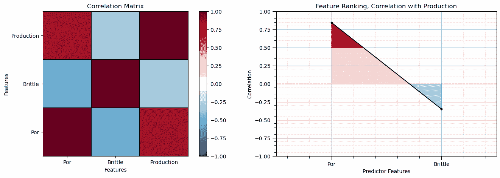
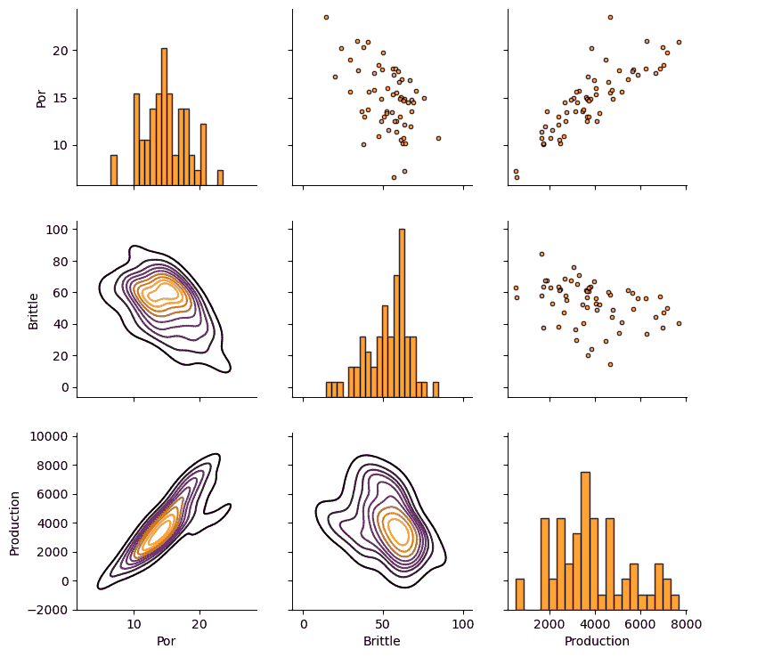
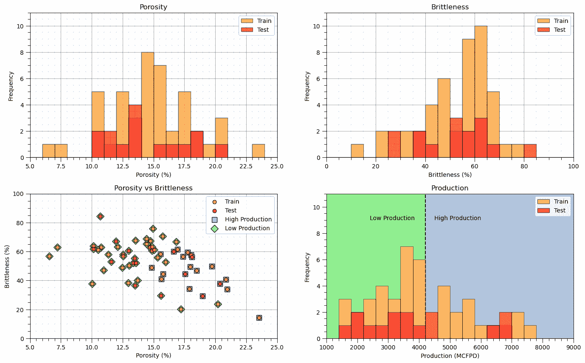
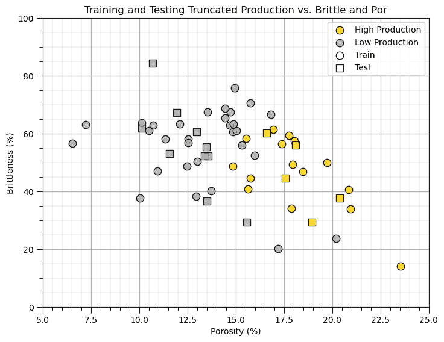
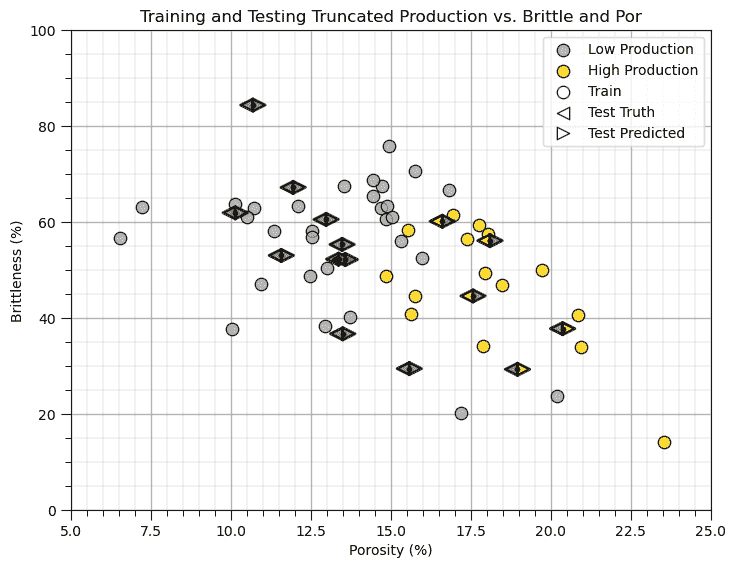
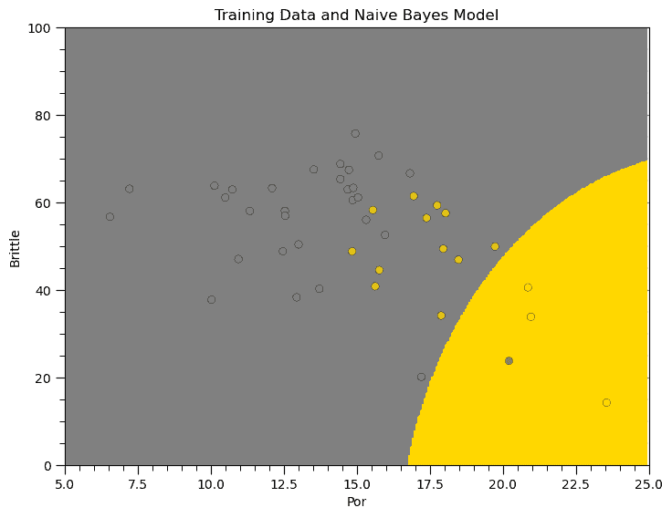
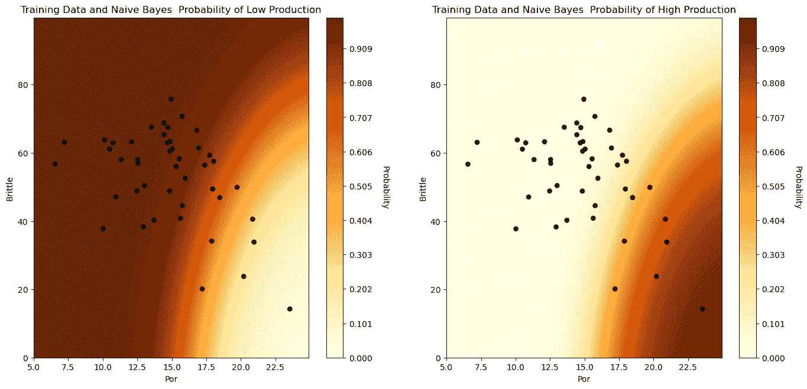

# 简单贝叶斯分类器

> 原文：[`geostatsguy.github.io/MachineLearningDemos_Book/MachineLearning_naive_Bayes.html`](https://geostatsguy.github.io/MachineLearningDemos_Book/MachineLearning_naive_Bayes.html)

Michael J. Pyrcz，教授，德克萨斯大学奥斯汀分校

[Twitter](https://twitter.com/geostatsguy) | [GitHub](https://github.com/GeostatsGuy) | [网站](http://michaelpyrcz.com) | [Google Scholar](https://scholar.google.com/citations?user=QVZ20eQAAAAJ&hl=en&oi=ao) | [地统计学书籍](https://www.amazon.com/Geostatistical-Reservoir-Modeling-Michael-Pyrcz/dp/0199731446) | [YouTube](https://www.youtube.com/channel/UCLqEr-xV-ceHdXXXrTId5ig) | [Python 应用地统计学电子书](https://geostatsguy.github.io/GeostatsPyDemos_Book/intro.html) | [Python 应用机器学习电子书](https://geostatsguy.github.io/MachineLearningDemos_Book/) | [LinkedIn](https://www.linkedin.com/in/michael-pyrcz-61a648a1)

电子书“Python 应用机器学习：带代码的手册”的一章。

请将此电子书引用如下：

Pyrcz, M.J., 2024, *《Python 应用机器学习：带代码的手册》* [电子书]. Zenodo. doi:10.5281/zenodo.15169138 

本书中的工作流程以及更多内容可在以下链接找到：

请将 MachineLearningDemos GitHub 仓库引用如下：

Pyrcz, M.J., 2024, *MachineLearningDemos: Python 机器学习演示工作流程仓库* (0.0.3) [软件]. Zenodo. DOI: 10.5281/zenodo.13835312\. GitHub 仓库：[GeostatsGuy/MachineLearningDemos](https://github.com/GeostatsGuy/MachineLearningDemos) 

作者：Michael J. Pyrcz

© 版权所有 2024。

本章是关于/演示**简单贝叶斯分类器**的教程。

**YouTube 讲座**：请查看我在以下主题上的讲座：

+   [机器学习简介](https://youtu.be/zOUM_AnI1DQ?si=wzWdJ35qJ9n8O6Bl)

+   [线性回归](https://youtu.be/0fzbyhWiP84)

+   [岭回归](https://youtu.be/pMGO40yXZ5Y?si=ygJAheyX-v2BmSiR)

+   [贝叶斯概率](https://www.youtube.com/watch?v=Ppwfr8H177M&list=PLG19vXLQHvSB-D4XKYieEku9GQMQyAzjJ&index=6)

+   [贝叶斯线性回归](https://youtu.be/LzZ5b3wdZQk?si=DkhYrgmDXzrPFQyr)

+   [简单贝叶斯分类器](https://youtu.be/BDvyLrH3cLI?si=D6boOpoVpyo-6TqK)

这些讲座都是我 YouTube 上的[机器学习课程](https://youtube.com/playlist?list=PLG19vXLQHvSC2ZKFIkgVpI9fCjkN38kwf&si=XonjO2wHdXffMpeI)的一部分，其中包含有良好文档记录的 Python 工作流程和交互式仪表板。我的目标是分享易于理解、可操作和可重复的教育内容。如果您想了解我的动机，请查看[Michael 的故事](https://michaelpyrcz.com/my-story)。

## 贝叶斯线性回归的动机

贝叶斯机器学习方法应用概率来预测，具有固有的不确定性模型。此外，贝叶斯方法结合了贝叶斯更新的概念，即使用数据中的似然模型更新先验模型来计算后验模型。

由于需要处理这些概率，模型训练存在额外的复杂性，这些复杂性由连续概率密度函数表示。由于由此产生的高度复杂性，我们必须做出条件独立性的假设，从而得到一个实用的分类模型。

这里有一个简单的流程，演示了用于地下建模流程的朴素贝叶斯分类。这应该有助于你开始构建基于多个信息来源的预测的地下模型。

这种方法很棒，因为它直接基于我们的贝叶斯统计知识，提供了一种简单但灵活的分类方法。

## 贝叶斯更新

贝叶斯概率方法基于对事件发生程度（专家经验）的信念，随着新信息的出现而更新。

+   这种概率方法非常强大，可以应用于解决我们无法用频率主义概率方法解决的问题

贝叶斯更新由贝叶斯定理表示，

$$ P(A|B) = \frac{P(B|A) \cdot P(A)}{P(B)} $$

其中 $P(A)$ 是先验概率，$P(B|A)$ 是似然函数，$P(B)$ 是负责概率封闭的证据项，而 $P(A|B)$ 是后验概率。

## 贝叶斯更新用于分类

朴素贝叶斯分类器基于给定 $n$ 个特征 $x_1, \dots , x_n$ 的类别 $k$ 的条件概率。

$$ p(C_k | x_1, \dots , x_n) $$

我们可以通过贝叶斯更新求解这个后验概率，

$$ p(C_k | x_1, \dots , x_n) = \frac{p(x_1, \dots , x_n | C_k) p(C_k)}{p(x_1, \dots , x_n)} $$

让我们先暂时将似然函数和先验概率结合起来，

$$ p(x_1, \dots , x_n | C_k) p(C_k) = p(x_1, \dots , x_n, C_k) $$

我们可以递归地展开完整的联合分布如下，

$$ p(x_1, \dots , x_n, C_k) $$

联合条件概率和先验概率的扩展，

$$ p(x_1 | x_2, \dots , x_n, C_k) p(x_2, \dots , x_n, C_k) $$

递归地继续扩展，

$$ p(x_1 | x_2, \dots , x_n, C_k) p(x_2 | x_3, \dots , x_n, C_k) p(x_3, \dots , x_n, C_k) $$

我们可以概括为，

$$ p(x_1 | x_2, \dots , x_n, C_k) p(x_2 | x_3, \dots , x_n, C_k) p(x_3 | x_4, \dots , x_n, C_k) \ldots (x_{n-1} | x_n, C_k) (x_{n} | C_k) p(C_k) $$

## 朴素贝叶斯方法

联合条件概率与条件概率的似然函数难以计算，很可能无法计算。它需要关于 $x_1, \dots , x_n$ 特征之间联合关系的信息。随着 $n$ 的增加，这需要大量数据来告知联合分布。

在朴素贝叶斯方法中，我们做出“朴素”的假设，即特征都是**条件独立的**。这包括，

$$ p(x_i | x_{i+1}, \ldots , x_n, C_k) = p(x_i | C_k) $$

对于所有 $i = 1, \ldots, n$ 个特征。

我们现在可以解出所需的条件概率如下：

$$ p(C_k | x_1, \dots , x_n) = \frac{p(C_k) \prod_{i=1}^{n} p(x_i | C_k)}{p(x_1, \dots , x_n)} $$

我们只需要先验概率 $p(C_k)$ 和一组条件概率 $p(x_i | C_k)$，对于所有预测特征 $i = 1,\ldots,n$ 和所有类别 $k = 1,\ldots,K$。

证据项，$p(x_1, \dots , x_n)$，仅基于特征 $x_1, \dots , x_n$；因此，在类别 $k = 1,\ldots,n$ 上是一个常数。

+   它确保了封闭性 - 所有类别的概率之和为 1

+   我们只是将分子标准化，使其在类别上的和为 1。

基于朴素贝叶斯的方法是：

+   简单易懂，建立在基本的贝叶斯统计基础之上

+   即使数据集很小，也是实用的，因为有了条件独立性，我们只需要估计简单的条件分布。

## 加载所需的库

我们还需要一些标准包。这些应该已经与 Anaconda 3 一起安装。

```py
%matplotlib inline                                         
suppress_warnings = True
import os                                                     # to set current working directory 
import math                                                   # square root operator
import numpy as np                                            # arrays and matrix math
import scipy.stats as stats                                   # statistical methods
import pandas as pd                                           # DataFrames
import matplotlib.pyplot as plt                               # for plotting
from matplotlib.ticker import (MultipleLocator,AutoMinorLocator,FuncFormatter,NullLocator) # control of axes ticks
from matplotlib.colors import ListedColormap                  # custom color maps
import seaborn as sns                                         # matrix scatter plots
from sklearn.model_selection import train_test_split          # train and test split
from sklearn.naive_bayes import GaussianNB                    # naive Bayes model and prediction
from sklearn import metrics                                   # measures to check our models
from sklearn.metrics import classification_report             # classification report
from sklearn.metrics import confusion_matrix                  # confusion matrix
from IPython.display import display, HTML                     # custom displays
cmap = plt.cm.inferno                                         # default color bar, no bias and friendly for color vision defeciency
binary_cmap = ListedColormap(['grey', 'gold'])                # custom binary categorical colormap
plt.rc('axes', axisbelow=True)                                # grid behind plotting elements
if suppress_warnings == True:  
    import warnings                                           # supress any warnings for this demonstration
    warnings.filterwarnings('ignore') 
seed = 13                                                     # random number seed for workflow repeatability 
```

如果你遇到包导入错误，你可能需要首先安装这些包中的几个。这通常可以通过在 Windows 上打开命令窗口然后输入‘python -m pip install [package-name]’来完成。有关相应包的文档可以提供更多帮助。

## 声明函数

让我们定义几个函数来简化相关矩阵的绘制和决策树回归模型的可视化。

```py
def comma_format(x, pos):
    return f'{int(x):,}'

def add_grid():
    plt.gca().grid(True, which='major',linewidth = 1.0); plt.gca().grid(True, which='minor',linewidth = 0.2) # add y grids
    plt.gca().tick_params(which='major',length=7); plt.gca().tick_params(which='minor', length=4)
    plt.gca().xaxis.set_minor_locator(AutoMinorLocator()); plt.gca().yaxis.set_minor_locator(AutoMinorLocator()) # turn on minor ticks 

def feature_rank_plot(pred,metric,mmin,mmax,nominal,title,ylabel,mask): # feature ranking plot
    mpred = len(pred); mask_low = nominal-mask*(nominal-mmin); mask_high = nominal+mask*(mmax-nominal); m = len(pred) + 1
    plt.plot(pred,metric,color='black',zorder=20)
    plt.scatter(pred,metric,marker='o',s=10,color='black',zorder=100)
    plt.plot([-0.5,m-1.5],[0.0,0.0],'r--',linewidth = 1.0,zorder=1)
    plt.fill_between(np.arange(0,mpred,1),np.zeros(mpred),metric,where=(metric < nominal),interpolate=True,color='dodgerblue',alpha=0.3)
    plt.fill_between(np.arange(0,mpred,1),np.zeros(mpred),metric,where=(metric > nominal),interpolate=True,color='lightcoral',alpha=0.3)
    plt.fill_between(np.arange(0,mpred,1),np.full(mpred,mask_low),metric,where=(metric < mask_low),
                     interpolate=True,color='blue',alpha=0.8,zorder=10)
    plt.fill_between(np.arange(0,mpred,1),np.full(mpred,mask_high),metric,where=(metric > mask_high),
                     interpolate=True,color='red',alpha=0.8,zorder=10)  
    plt.xlabel('Predictor Features'); plt.ylabel(ylabel); plt.title(title)
    plt.ylim(mmin,mmax); plt.xlim([-0.5,m-1.5]); add_grid();
    return

def plot_corr(corr_matrix,title,limits,mask):                 # plots a graphical correlation matrix 
    my_colormap = plt.get_cmap('RdBu_r', 256)          
    newcolors = my_colormap(np.linspace(0, 1, 256))
    white = np.array([256/256, 256/256, 256/256, 1])
    white_low = int(128 - mask*128); white_high = int(128+mask*128)
    newcolors[white_low:white_high, :] = white                # mask all correlations less than abs(0.8)
    newcmp = ListedColormap(newcolors)
    m = corr_matrix.shape[0]
    im = plt.matshow(corr_matrix,fignum=0,vmin = -1.0*limits, vmax = limits,cmap = newcmp)
    plt.xticks(range(len(corr_matrix.columns)), corr_matrix.columns); ax = plt.gca()
    ax.xaxis.set_label_position('bottom'); ax.xaxis.tick_bottom()
    plt.yticks(range(len(corr_matrix.columns)), corr_matrix.columns)
    plt.colorbar(im, orientation = 'vertical')
    plt.title(title)
    for i in range(0,m):
        plt.plot([i-0.5,i-0.5],[-0.5,m-0.5],color='black')
        plt.plot([-0.5,m-0.5],[i-0.5,i-0.5],color='black')
    plt.ylim([-0.5,m-0.5]); plt.xlim([-0.5,m-0.5])

def visualize_model(model,xfeature,x_min,x_max,yfeature,y_min,y_max,response,z_min,z_max,title,cat,label,cmap): 
    xplot_step = (x_max - x_min)/300.0; yplot_step = (y_max - y_min)/300.0 # resolution of the model visualization
    xx, yy = np.meshgrid(np.arange(x_min, x_max, xplot_step), # set up the mesh
                     np.arange(y_min, y_max, yplot_step))
    Z = model.predict(np.c_[xx.ravel(), yy.ravel()])          # predict with our trained model over the mesh
    Z = Z.reshape(xx.shape)
    cs = plt.contourf(xx, yy, Z, cmap=cmap,vmin=z_min, vmax=z_max, levels = 50) # plot the predictions
    for i in range(len(cat)):
        im = plt.scatter(xfeature[response==cat[i]],yfeature[response==cat[i]],s=None,c=response[response==cat[i]], 
                    marker=None, cmap=cmap, norm=None,vmin=z_min,vmax=z_max,alpha=0.8,linewidths=0.3, edgecolors="black",label=label[i])

    plt.title(title)                                          # add the labels
    plt.xlabel(xfeature.name); plt.ylabel(yfeature.name)
    plt.xlim([x_min,x_max]); plt.ylim([y_min,y_max]); add_grid()

def visualize_model_prob(model,xfeature,x_min,x_max,yfeature,y_min,y_max,response,title,):# plots the data points and the prediction probabilities 
    n_classes = 10
    cmap = plt.cm.inferno
    xplot_step = (x_max - x_min)/300.0; yplot_step = (y_max - y_min)/300.0 # resolution of the model visualization
    xx, yy = np.meshgrid(np.arange(x_min, x_max, xplot_step), # set up the mesh
                     np.arange(y_min, y_max, yplot_step))

    z_min = 0.0; z_max = 1.0
    Z = model.predict_proba(np.c_[xx.ravel(), yy.ravel()])
    Z1 = Z[:,0].reshape(xx.shape); Z2 = Z[:,1].reshape(xx.shape)

    plt.subplot(121)
    cs1 = plt.contourf(xx, yy, Z1, cmap=plt.cm.YlOrBr,vmin=z_min, vmax=z_max, levels=np.linspace(z_min, z_max, 100))
    im = plt.scatter(xfeature,yfeature,s=None,c=response,marker=None,cmap=plt.cm.Greys,norm=None,vmin=z_min,vmax=z_max,
                     alpha=0.8, linewidths=0.3, edgecolors="black")
    plt.title(title + ' Probability of Low Production')
    plt.xlabel(xfeature.name)
    plt.ylabel(yfeature.name)
    cbar = plt.colorbar(cs1, orientation = 'vertical')
    cbar.set_label('Probability', rotation=270, labelpad=20)

    plt.subplot(122)
    cs2 = plt.contourf(xx, yy, Z2, cmap=plt.cm.YlOrBr,vmin=z_min, vmax=z_max, levels=np.linspace(z_min, z_max, 100))
    im = plt.scatter(xfeature,yfeature,s=None,c=response,marker=None,cmap=plt.cm.Greys,norm=None,vmin=z_min,vmax=z_max,
                     alpha=0.8,linewidths=0.3, edgecolors="black")
    plt.title(title + ' Probability of High Production')
    plt.xlabel(xfeature.name)
    plt.ylabel(yfeature.name)
    cbar = plt.colorbar(cs2, orientation = 'vertical')
    cbar.set_label('Probability', rotation=270, labelpad=20)

def display_sidebyside(*args):                                # display DataFrames side-by-side (ChatGPT 4.0 generated Spet, 2024)
    html_str = ''
    for df in args:
        html_str += df.head().to_html()  # Using .head() for the first few rows
    display(HTML(f'<div style="display: flex;">{html_str}</div>')) 
```

## 设置工作目录

我总是喜欢这样做，这样我就不会丢失文件，并且可以简化后续的读取和写入（避免每次都包含完整地址）。

```py
#os.chdir(r"C:\Users\pm27995\Downloads")                      # set the working directory 
```

你将不得不更新引号内的部分以匹配你自己的工作目录，并且在 Mac 上格式不同（例如：“~/PGE”）。

## 加载数据

让我们加载提供的多元、空间数据集 [unconv_MV_v4.csv](https://raw.githubusercontent.com/GeostatsGuy/GeoDataSets/master/unconv_MV_v4.csv)，它在我的 GeoDataSet 仓库中可用。它是一个逗号分隔的文件，包含：

+   水井索引（整数）

+   孔隙率（%）

+   渗透率（$mD$）

+   声波阻抗（$\frac{kg}{m³} \cdot \frac{m}{s} \cdot 10⁶$）。

+   坚韧性（%）

+   总有机碳（%）

+   玻璃质反射率（%）

+   初始气产量（90 天平均）（MCFPD）

```py
add_error = True                                              # add random error to the response feature
std_error = 500                                               # standard deviation of random error, for demonstration only
idata = 1

if idata == 1:
    df_load = pd.read_csv(r"https://raw.githubusercontent.com/GeostatsGuy/GeoDataSets/master/unconv_MV_v4.csv") # load the data from my github repo
    df_load = df_load.sample(frac=.30, random_state = seed); df_load = df_load.reset_index() # extract 30% random to reduce the number of data
    df_load = df_load.rename(columns={"Prod": "Production"})   
elif idata == 2:
    df_load = pd.read_csv(r"https://raw.githubusercontent.com/GeostatsGuy/GeoDataSets/master/unconv_MV_v5.csv") # load the data 
    df_load = df_load.sample(frac=.70, random_state = seed); df_load = df_load.reset_index() # extract 30% random to reduce the number of data
    df_load = df_load.rename(columns={"Prod": "Production"})

yname = 'Production'; Xname = ['Por','Brittle']               # specify the predictor features (x2) and response feature (x1)
Xmin = [5.0,0.0]; Xmax = [25.0,100.0]                         # set minimums and maximums for visualization 
ymin = 1000.0; ymax = 9000.0
Xlabel = ['Porosity','Brittleness']; ylabel = 'Production'    # specify the feature labels for plotting
Xunit = ['%','%']; yunit = 'MCFPD'
Xlabelunit = [Xlabel[0] + ' (' + Xunit[0] + ')',Xlabel[1] + ' (' + Xunit[1] + ')']
ylabelunit = ylabel + ' (' + yunit + ')'
ycname = 'c' + yname

if add_error == True:                                         # method to add error
    np.random.seed(seed=seed)                                 # set random number seed
    df_load[yname] = df_load[yname] + np.random.normal(loc = 0.0,scale=std_error,size=len(df_load)) # add noise
    values = df_load._get_numeric_data(); values[values < 0] = 0   # set negative to 0 in a shallow copy ndarray

y = pd.DataFrame(df_load[yname])                              # extract selected features as X and y DataFrames
X = df_load[Xname]
df = pd.concat([X,y],axis=1)                                  # make one DataFrame with both X and y (remove all other features) 
```

让我们确保我们已经选择了合理的特征来构建模型。

+   2 个预测特征不是共线的，因为这会导致预测模型不稳定。

+   每个特征都与响应特征相关，预测特征通知响应。

## 计算相关矩阵和相关响应排名。

让我们从相关分析开始。我们可以使用这些命令计算并查看它。

+   相关分析基于线性关系的假设，但这是一个好的开始。

```py
corr_matrix = df.corr()
correlation = corr_matrix.iloc[:,-1].values[:-1]

plt.subplot(121)
plot_corr(corr_matrix,'Correlation Matrix',1.0,0.1)           # using our correlation matrix visualization function
plt.xlabel('Features'); plt.ylabel('Features')

plt.subplot(122)
feature_rank_plot(Xname,correlation,-1.0,1.0,0.0,'Feature Ranking, Correlation with ' + yname,'Correlation',0.5)

plt.subplots_adjust(left=0.0, bottom=0.0, right=2.0, top=0.8, wspace=0.2, hspace=0.3); plt.show() 
```



注意由于每个变量与其自身的相关性而产生的 1.0 对角线。

这看起来不错。相关性的大小混合。当然，相关系数仅限于线性相关程度。

+   让我们通过矩阵散点图查看特征之间的成对关系。

```py
pairgrid = sns.PairGrid(df,vars=Xname+[yname]) # matrix scatter plots
pairgrid = pairgrid.map_upper(plt.scatter, color = 'darkorange', edgecolor = 'black', alpha = 0.8, s = 10)
pairgrid = pairgrid.map_diag(plt.hist, bins = 20, color = 'darkorange',alpha = 0.8, edgecolor = 'k')# Map a density plot to the lower triangle
pairgrid = pairgrid.map_lower(sns.kdeplot, cmap = plt.cm.inferno, 
                              alpha = 1.0, n_levels = 10)
pairgrid.add_legend()
plt.subplots_adjust(left=0.0, bottom=0.0, right=0.9, top=0.9, wspace=0.2, hspace=0.2); plt.show() 
```



## 生产截断到分类特征

让我们根据 4,000 MCFPD 的阈值创建一个用于生产的分类变量。

+   高产量 > 4,000 MCFPD，cprod = 1

+   低产量 <= 4,000 MCFPD，cprod = 0

```py
prod_trunc = 4200                                             # criteria for low and high production truncation
y['cProduction'] = np.where(y['Production']>=prod_trunc, 1, 0) # conditional statement assign a new feature 
```

让我们可视化存储在 DataFrame 中的前几行数据，以确保我们成功加载了数据文件。

```py
y.head(n=5)                                                   # preview the first n rows of the DataFrame 
```

|  | 生产 | c 生产 |
| --- | --- | --- |
| 0 | 535.257367 | 0 |
| 1 | 3664.266856 | 0 |
| 2 | 1759.441362 | 0 |
| 3 | 6219.824427 | 1 |
| 4 | 5455.075177 | 1 |

## 训练和测试分割

为了方便和简单，我们使用 scikit-learn 的随机训练和测试分割。

```py
X_train, X_test, y_train, y_test = train_test_split(X,y,test_size=0.25,random_state=73073) # train and test split
df_train = pd.concat([X_train,y_train],axis=1)                # make one train DataFrame with both X and y (remove all other features)
df_test = pd.concat([X_test,y_test],axis=1)                   # make one testin DataFrame with both X and y (remove all other features) 
```

## 可视化数据框

在我们构建模型之前，可视化训练和测试 DataFrame 是一个有用的检查。

+   许多事情可能出错，例如，我们加载了错误的数据，所有特征都没有加载等。

我们可以通过使用 'head' DataFrame 成员函数来预览（格式整洁，见下文）。

```py
print('           Training DataFrame                      Testing DataFrame')
display_sidebyside(df_train,df_test)                          # custom function for side-by-side DataFrame display 
```

```py
 Training DataFrame                      Testing DataFrame 
```

|  | Por | Brittle | 生产 | c 生产 |
| --- | --- | --- | --- | --- |
| 21 | 17.21 | 20.12 | 3682.419578 | 0 |
| 17 | 18.04 | 57.53 | 6847.702464 | 1 |
| 22 | 18.48 | 46.89 | 7004.402103 | 1 |
| 29 | 13.53 | 67.51 | 1906.299667 | 0 |
| 7 | 14.95 | 75.73 | 3065.623539 | 0 |
|  | Por | Brittle | 生产 | c 生产 |
| --- | --- | --- | --- | --- |
| 24 | 18.96 | 29.28 | 4483.578476 | 1 |
| 3 | 18.10 | 56.09 | 6219.824427 | 1 |
| 28 | 13.37 | 52.23 | 4181.840761 | 0 |
| 13 | 13.58 | 52.16 | 3461.628938 | 0 |
| 27 | 16.61 | 60.13 | 4597.801586 | 1 |

我们检查了摘要统计量是件好事。

+   没有明显的错误

+   检查每个特征的值范围，以设置和调整绘图限制。见上图。

## 可视化训练和测试分割

让我们通过直方图和散点图检查训练和测试的一致性和覆盖范围。

+   检查以确保训练和测试数据集涵盖了可能的预测特征组合的范围

+   确保我们不会使用测试案例外推训练数据

```py
nbins = 21                                                    # number of histogram bins

plt.subplot(221)                                              # predictor feature #1 histogram
freq1,_,_ = plt.hist(x=df_train[Xname[0]],weights=None,bins=np.linspace(Xmin[0],Xmax[0],nbins),alpha = 0.6,
                     edgecolor='black',color='darkorange',density=False,label='Train')
freq2,_,_ = plt.hist(x=df_test[Xname[0]],weights=None,bins=np.linspace(Xmin[0],Xmax[0],nbins),alpha = 0.6,
                     edgecolor='black',color='red',density=False,label='Test')
max_freq = max(freq1.max()*1.10,freq2.max()*1.10)
plt.xlabel(Xlabelunit[0]); plt.ylabel('Frequency'); plt.ylim([0.0,max_freq]); plt.title(Xlabel[0]); add_grid()  
plt.xlim([Xmin[0],Xmax[0]]); plt.ylim([0,11]); plt.legend(loc='upper right')   

plt.subplot(222)                                              # predictor feature #2 histogram
freq1,_,_ = plt.hist(x=df_train[Xname[1]],weights=None,bins=np.linspace(Xmin[1],Xmax[1],nbins),alpha = 0.6,
                     edgecolor='black',color='darkorange',density=False,label='Train')
freq2,_,_ = plt.hist(x=df_test[Xname[1]],weights=None,bins=np.linspace(Xmin[1],Xmax[1],nbins),alpha = 0.6,
                     edgecolor='black',color='red',density=False,label='Test')
max_freq = max(freq1.max()*1.10,freq2.max()*1.10)
plt.xlabel(Xlabelunit[1]); plt.ylabel('Frequency'); plt.ylim([0.0,max_freq]); plt.title(Xlabel[1]); add_grid()  
plt.xlim([Xmin[1],Xmax[1]]); plt.ylim([0,11]); plt.legend(loc='upper right')   

plt.subplot(223)                                              # predictor features #1 and #2 scatter plot
plt.scatter(df_train[Xname[0]],df_train[Xname[1]],s=40,marker='o',color = 'darkorange',alpha = 0.8,edgecolor = 'black',zorder=10,label='Train')
plt.scatter(df_test[Xname[0]],df_test[Xname[1]],s=40,marker='o',color = 'red',alpha = 0.8,edgecolor = 'black',zorder=10,label='Test')
plt.scatter(df_train[df_train[yname]>prod_trunc][Xname[0]],df_train[df_train[yname]>prod_trunc][Xname[1]],s=80,
            marker='s',color = 'lightsteelblue',alpha = 0.8,edgecolor = 'black',zorder=1,label='High Production')
plt.scatter(df_train[df_train[yname]<prod_trunc][Xname[0]],df_train[df_train[yname]<prod_trunc][Xname[1]],s=80,
            marker='D',color = 'lightgreen',alpha = 0.8,edgecolor = 'black',zorder=1,label='Low Production')
plt.scatter(df_test[df_test[yname]>prod_trunc][Xname[0]],df_test[df_test[yname]>prod_trunc][Xname[1]],s=80,
            marker='s',color = 'lightsteelblue',alpha = 0.8,edgecolor = 'black',zorder=1)
plt.scatter(df_test[df_test[yname]<prod_trunc][Xname[0]],df_test[df_test[yname]<prod_trunc][Xname[1]],s=80,
            marker='D',color = 'lightgreen',alpha = 0.8,edgecolor = 'black',zorder=1)

plt.title(Xlabel[0] + ' vs ' +  Xlabel[1])
plt.xlabel(Xlabelunit[0]); plt.ylabel(Xlabelunit[1])
plt.legend(); add_grid(); plt.xlim([Xmin[0],Xmax[0]]); plt.ylim([Xmin[1],Xmax[1]])

plt.subplot(224)                                              # predictor feature #2 histogram
_,_,_ = plt.hist(x=df_train[yname],weights=None,bins=np.linspace(ymin,ymax,nbins),alpha = 1.0,
                     edgecolor='white',color='white',density=False,zorder=2)
freq1,_,_ = plt.hist(x=df_train[yname],weights=None,bins=np.linspace(ymin,ymax,nbins),alpha = 0.6,
                     edgecolor='black',color='darkorange',density=False,label='Train',zorder=10)
_,_,_ = plt.hist(x=df_test[yname],weights=None,bins=np.linspace(ymin,ymax,nbins),alpha = 1.0,
                     edgecolor='white',color='white',density=False,zorder=2)
freq2,_,_ = plt.hist(x=df_test[yname],weights=None,bins=np.linspace(ymin,ymax,nbins),alpha = 0.6,
                     edgecolor='black',color='red',density=False,label='Test',zorder=10)
max_freq = max(freq1.max()*1.10,freq2.max()*1.10)
plt.vlines(prod_trunc,0,100,color='black',ls='--')
plt.xlabel(ylabelunit); plt.ylabel('Frequency'); plt.ylim([0.0,max_freq]); add_grid(); plt.title(ylabel)
plt.xlim([ymin,ymax]); plt.ylim([0,11]); plt.legend(loc='upper right')  
plt.fill_between([ymin,prod_trunc],[0,0],[100,100],color='lightgreen',zorder=1)
plt.fill_between([prod_trunc,ymax],[0,0],[100,100],color='lightsteelblue',zorder=1)
plt.annotate('Low Production',[2400,9],color='black',zorder=100); plt.annotate('High Production',[4500,9],color='black',zorder=100)

plt.subplots_adjust(left=0.0, bottom=0.0, right=2.0, top=1.6, wspace=0.2, hspace=0.25)
#plt.savefig('Test.pdf', dpi=600, bbox_inches = 'tight',format='pdf') 
plt.show() 
```



这看起来不错，

+   分布表现良好，我们无法观察到明显的缺口、异常值或截断

+   测试和训练案例的覆盖范围相似

## 可视化预测特征空间

让我们构建一个简化的图表来可视化二维预测特征空间与训练和测试数据。

+   我们要问的问题是，我们能否对分类边界进行建模？数据重叠是否很多？边界简单（即，线性）还是更复杂？

```py
plt.subplot(111)
plt.scatter(df_train[df_train[yname]>prod_trunc][Xname[0]],df_train[df_train[yname]>prod_trunc][Xname[1]],s=80,
            marker='o',color = 'gold',alpha = 0.8,edgecolor = 'black',zorder=1,label='High Production')
plt.scatter(df_train[df_train[yname]<prod_trunc][Xname[0]],df_train[df_train[yname]<prod_trunc][Xname[1]],s=80,
            marker='o',color = 'darkgrey',alpha = 0.8,edgecolor = 'black',zorder=1,label='Low Production')

plt.scatter(df_test[df_test[yname]>prod_trunc][Xname[0]],df_test[df_test[yname]>prod_trunc][Xname[1]],s=80,
            marker='s',color = 'gold',alpha = 0.8,edgecolor = 'black',zorder=1,)
plt.scatter(df_test[df_test[yname]<prod_trunc][Xname[0]],df_test[df_test[yname]<prod_trunc][Xname[1]],s=80,
            marker='s',color = 'darkgrey',alpha = 0.8,edgecolor = 'black',zorder=1,)

plt.scatter([-999],[-999],s=80,marker='o',color = 'white',alpha = 0.8,edgecolor = 'black',zorder=1,label='Train')
plt.scatter([-999],[-999],s=80,marker='s',color = 'white',alpha = 0.8,edgecolor = 'black',zorder=1,label='Test')

plt.legend(loc = 'upper right')
plt.title('Training and Testing Truncated ' + yname + ' vs. ' + Xname[1] + ' and ' + Xname[0])
plt.xlabel(Xlabelunit[0]); plt.ylabel(Xlabelunit[1]); add_grid(); plt.xlim([Xmin[0],Xmax[0]]); plt.ylim([Xmin[1],Xmax[1]])

plt.subplots_adjust(left=0.0, bottom=0.0, right=1.0, top=1.0, wspace=0.2, hspace=0.2); plt.show() 
```



## 使用朴素贝叶斯实例化、拟合和预测

我们使用朴素贝叶斯分类器来计算分类，即每个响应特征类别的条件概率

$$ P(C_1|x_1,x_2) \propto P(x_1 | C_1) \cdot P(x_2 | C_1) \cdot P(C_1) $$$$ P(C_2|x_1,x_2) \propto P(x_1 | C_2) \cdot P(x_2 | C_2) \cdot P(C_2) $$

其中，

+   $x_1$ 是第一个预测特征（孔隙率）和 $x_2$ 是第二个预测特征（脆性）值

+   响应特征类别 $C_1$ 是低产量，$C_2$ 是高产量

+   $P(x_1 | C_1) \cdot P(x_2 | C_1)$ 是在条件独立假设下对似然项 $P(x_1,x_2 | C_1)$ 的近似

+   $P(C_1)$ 和 $P(C_2)$ 是在整合新数据之前每个类别的先验概率

+   由于概率封闭 $P(C_1|x_1,x_2) + P(C_2|x_1,x_2) = 1.0$

## 高斯朴素贝叶斯

我们选择高斯模型，因为它将推理问题简化为少量参数，即每个特征的条件均值和方差。

|  | $X_1$ |  | $X_2$ |  |
| --- | --- | --- | --- | --- |
|  | $C_1$ | $C_2$ | $C_1$ | $C_2$ |
| Mean | $\overline{X}_{1 | C_1}$ | $\overline{X}_{1 | C_2}$ |
| St. Dev. | $\sigma_{X_{1 | C_1}}$ | $\sigma_{X_{1 | C_2}}$ |

回想一下，我们可以为每个响应类别设置一个先验概率

+   我们不应该使用数据集中的比例！这将导致信息泄露，因为我们正在使用相同的数据来告知先验和似然

+   另一个选项是假设一个朴素、均匀的先验，替换以下内容：

```py
priors = (0.5,0.5)   # naive prior 
```

注意先验是一个元组，其顺序与预测特征 DataFrame 中的特征顺序相同。

```py
priors = (0.95,0.05)                                            # set the prior probabilities of low and high production 
```

让我们构建我们的高斯朴素贝叶斯模型。

+   使用先验概率实例化它

+   使用训练数据训练，我们使用标准的 fit 函数

```py
gnb = GaussianNB(priors = priors)                             # instantiate the Gaussian naive Bayes model
GaussianNB_fit = gnb.fit(X_train,y_train[ycname])             # train with the training data 
```

让我们使用我们的新模型在测试数据集上进行预测。

+   使用测试数据预测，我们使用标准的预测函数

```py
y_pred = GaussianNB_fit.predict(np.c_[X_test['Por'],X_test['Brittle']]) # predict over the testing data

plt.subplot(111)
high = plt.scatter(df_train[df_train[yname]>prod_trunc][Xname[0]],df_train[df_train[yname]>prod_trunc][Xname[1]],s=80,
            marker='o',color = 'gold',alpha = 0.8,edgecolor = 'black',zorder=1,label='High Production')
low = plt.scatter(df_train[df_train[yname]<prod_trunc][Xname[0]],df_train[df_train[yname]<prod_trunc][Xname[1]],s=80,
            marker='o',color = 'darkgrey',alpha = 0.8,edgecolor = 'black',zorder=1,label='Low Production')

plt.scatter(df_test[y_pred == 0][Xname[0]]-0.19,df_test[y_pred == 0][Xname[1]],s=80,lw=2,
             marker='<',c = df_test[y_pred == 0][ycname].values,alpha = 0.8,edgecolor = 'black',zorder=1,cmap=binary_cmap)
plt.scatter(df_test[y_pred == 1][Xname[0]]-0.19,df_test[y_pred == 1][Xname[1]],s=80,lw=2,
             marker='<',c = df_test[y_pred == 1][ycname].values,alpha = 0.8,edgecolor = 'black',zorder=1,cmap=binary_cmap)

plt.scatter(df_test[y_pred == 0][Xname[0]]+0.19,df_test[y_pred == 0][Xname[1]],s=80,lw=2,
             marker='>',c = y_pred[y_pred == 0],alpha = 0.8,edgecolor = 'black',zorder=1,cmap=binary_cmap,vmin=0,vmax=1)
plt.scatter(df_test[y_pred == 1][Xname[0]]+0.19,df_test[y_pred == 1][Xname[1]],s=80,lw=2,
             marker='>',c = y_pred[y_pred == 1],alpha = 0.8,edgecolor = 'black',zorder=1,cmap=binary_cmap,vmin=0,vmax=1)

plt.scatter(df_test[Xname[0]],df_test[Xname[1]],s=10,marker='o',c = 'black',alpha = 0.8,edgecolor = 'black',zorder=100)

train = plt.scatter([-999],[-999],s=80,marker='o',color = 'white',alpha = 0.8,edgecolor = 'black',zorder=1,label='Train') # for legend
truth = plt.scatter([-999],[-999],s=80,marker='<',color = 'white',alpha = 0.8,edgecolor = 'black',zorder=1,label='Truth')
predicted = plt.scatter([-999],[-999],s=80,marker='>',color = 'white',alpha = 0.8,edgecolor = 'black',zorder=1,label='Predicted')

plt.legend([low,high,train,truth,predicted],['Low Production','High Production','Train','Test Truth','Test Predicted'],loc = 'upper right')
plt.title('Training and Testing Truncated ' + yname + ' vs. ' + Xname[1] + ' and ' + Xname[0])
plt.xlabel(Xlabelunit[0]); plt.ylabel(Xlabelunit[1]); add_grid(); plt.xlim([Xmin[0],Xmax[0]]); plt.ylim([Xmin[1],Xmax[1]])

plt.subplots_adjust(left=0.0, bottom=0.0, right=1.0, top=1.0, wspace=0.2, hspace=0.2); plt.show() 
```



## 模型检查

让我们检查我们的模型。使用 scikit learn，我们有许多内置工具来评估我们的分类模型。让我们先尝试分类报告。

```py
classification_report(truth, predicted)                # build a classification report to check our classification model 
```

我们得到一个包含模型性能摘要指标的表格。这些指标包括，精确度、召回率和 f1 分数，

```py
* recall - the ratio of true positives divided by all cases of the category in the testing dataset

* precision - the ratio of true positives divided by all positives (true positives + false positives)

* f1-score - the harmonic mean of recall and precision

* support - the number of samples of each category in the testing data 
```

$$ Precision_k = \frac{ n_{k,\text{true positives}} }{ n_{k,\text{true positives}} + n_{k,\text{false positives}}} = \frac{ n_{k,\text{true positives}} }{ n_{k, \text{all positives}} } $$$$ Recall_k = \frac{ n_{k, \text{true positives}} }{n_k} $$$$ f1-score_k = \frac{2} { \frac{1}{Precision_k} + \frac{1}{Recall_k} } $$

看看混淆矩阵，对于真实标签和预测标签的组合频率也是有用的。

+   $\hat{y}_{\alpha}$ - x 轴是预测 - 类别 0 或 1

+   $y_{\alpha}$ - y 轴是真实类别 - 类别 0 或 1

让我们绘制一个图表，方便地可视化分类报告和混淆矩阵。

```py
report = classification_report(y_test[ycname].values, y_pred, labels=[0,1],output_dict=True)
precision = [report['0']['precision'],report['1']['precision']]
recall = [report['0']['recall'],report['1']['recall']]
f1score = [report['0']['f1-score'],report['1']['f1-score']]

plt.subplot(121)                                              # plot classification report
plt.bar([-0.125,0.875],precision,width=0.25,color=['darkgrey','gold'],edgecolor='black')
plt.bar([0.125,1.125],recall,width=0.25,color=['darkgrey','gold'],edgecolor='black')

plt.ylim([0.,1.0]); plt.xlim([-0.5,1.5]); add_grid() 
ax = plt.gca(); ax.xaxis.set_minor_locator(NullLocator())
plt.annotate('Precision',[-0.135,0.5],rotation=90.0); plt.annotate('Recall',[0.115,0.5],rotation=90.0)
plt.annotate('Precision',[0.865,0.5],rotation=90.0); plt.annotate('Recall',[1.115,0.5],rotation=90.0)
plt.plot([-0.125,0.125],[f1score[0],f1score[0]],color='black')
plt.annotate('f1-score',[-0.08,f1score[0]-0.035])
plt.plot([0.875,1.125],[f1score[1],f1score[1]],color='black')
plt.annotate('f1-score',[0.92,f1score[1]-0.035])
plt.ylabel('Classification Metric'); plt.title('Classification Report, ' + str(ylabel) + ' from ' + str(Xlabel[0]) + ' and ' + str(Xname[1]))
x_ticks = [0, 1]; x_labels = ['Low Production', 'High Production']; plt.xticks(x_ticks,x_labels)

confusion_mat = confusion_matrix(y_test[ycname].values, y_pred)

plt.subplot(122)                                              # plot confusion matrix
sns.heatmap(confusion_mat,annot=False,fmt="d",annot_kws={"color": "black","size":15},cbar=False,
            xticklabels=['Low Production','High Production'], yticklabels=['Low Production','High Production',],cmap=cmap)
plt.xlabel('Predicted Labels', fontsize=12)
plt.ylabel('True Labels', fontsize=12)
plt.title('Confusion Matrix, ' + str(ylabel) + ' from ' + str(Xlabel[0]) + ' and ' + str(Xname[1]), fontsize=14)
plt.annotate(str(round(confusion_mat[0,0]/len(df_test)*100,2)) + '%',[0.5,0.45],size=15,color='black',ha='center')
plt.annotate(str(round(confusion_mat[0,1]/len(df_test)*100,2)) + '%',[1.5,0.45],size=15,color='white',ha='center')
plt.annotate(str(round(confusion_mat[1,0]/len(df_test)*100,2)) + '%',[0.5,1.45],size=15,color='white',ha='center')
plt.annotate(str(round(confusion_mat[1,1]/len(df_test)*100,2)) + '%',[1.5,1.45],size=15,color='white',ha='center')
plt.annotate(str(confusion_mat[0,0]) + ' of ' + str(len(df_test)),[0.5,0.55],size=15,color='black',ha='center')
plt.annotate(str(confusion_mat[0,1]) + ' of ' + str(len(df_test)),[1.5,0.55],size=15,color='white',ha='center')
plt.annotate(str(confusion_mat[1,0]) + ' of ' + str(len(df_test)),[0.5,1.55],size=15,color='white',ha='center')
plt.annotate(str(confusion_mat[1,1]) + ' of ' + str(len(df_test)),[1.5,1.55],size=15,color='white',ha='center')
plt.plot([0,2,2,0,0],[0,0,2,2,0],color='black'); plt.plot([0,2],[1,1],color='black'); plt.plot([1,1],[0,2],color='black')

plt.subplots_adjust(left=0.0, bottom=0.0, right=2.0, top=1.0, wspace=0.2, hspace=0.2); plt.show() 
```


从上面我们可以观察到：

+   9 口低产量井被正确分类为低产量。

+   0 口高产量井被错误分类为低产量。

+   1 口低产量井被错误分类为高产量。

+   5 口高产量井被正确分类为高产量。

## 可视化分类模型

让我们在整个特征空间上可视化模型。

+   这里是包含整个预测特征范围分类的训练数据。

+   蓝色代表低产量，黄色代表高产量。

注意：朴素贝叶斯提供了高和低产量的后验概率。

+   以下分类基于最大先验选择（MAPS），选择概率最高的类别。

让我们在预测特征空间上可视化分类模型和训练数据（灰色 - 低产量，黄色 - 高产量）。

```py
visualize_model(GaussianNB_fit,X_train[Xname[0]],Xmin[0],Xmax[0],X_train[Xname[1]],Xmin[1],Xmax[1],y_train[ycname],0.0,1.0,
                'Training Data and Naive Bayes Model',[0,1],['Low Production','High Production'],binary_cmap)

plt.subplots_adjust(left=0.0, bottom=0.0, right=1.0, top=1.0, wspace=0.2, hspace=0.2); plt.show() 
```



我们也可以可视化低和高产量的后验概率。

+   这里是预测特征空间上低和高产量的后验概率。

```py
visualize_model_prob(GaussianNB_fit,X_train[Xname[0]],Xmin[0],Xmax[0],X_train[Xname[1]],Xmin[1],Xmax[1],y_train[yname],
                     'Training Data and Naive Bayes ')
plt.subplots_adjust(left=0.0, bottom=0.0, right=2.0, top=1.2, wspace=0.2, hspace=0.2); plt.show() 
```



我们有一个合理的模型可以预测非常规储层从孔隙率和脆性预测井产量。

## 评论

这是对朴素贝叶斯分类器的基本处理。可以做和讨论的还有很多，我有很多更多的资源。查看我的[共享资源清单](https://michaelpyrcz.com/my-resources)以及本章开头带有资源链接的 YouTube 讲座链接。

希望这有所帮助，

*迈克尔*

## 关于作者


在德克萨斯大学奥斯汀分校的 40 英亩校园内，迈克尔·皮尔茨教授的办公室。

迈克尔·皮尔茨是德克萨斯大学奥斯汀分校[科克雷尔工程学院](https://cockrell.utexas.edu/faculty-directory/alphabetical/p)和[杰克逊地球科学学院](https://www.jsg.utexas.edu/researcher/michael_pyrcz/)的教授，在那里他研究并教授地下、空间数据分析、地统计学和机器学习。迈克尔还是，

+   能源分析[新生研究计划](https://fri.cns.utexas.edu/energy-analytics)的首席研究员，德克萨斯大学奥斯汀分校自然科学院机器学习实验室的核心教员。

+   [《计算机与地球科学》](https://www.sciencedirect.com/journal/computers-and-geosciences/about/editorial-board)的副编辑，以及国际数学地球科学协会[《数学地球科学》](https://link.springer.com/journal/11004/editorial-board)的董事会成员。

迈克尔已经撰写了超过 70 篇[同行评审的出版物](https://scholar.google.com/citations?user=QVZ20eQAAAAJ&hl=en)，一个用于空间数据分析的[Python 包](https://pypi.org/project/geostatspy/)，合著了一本关于空间数据分析的教科书[《地球统计学储层建模》](https://www.amazon.com/Geostatistical-Reservoir-Modeling-Michael-Pyrcz/dp/0199731446)，并且是两本最近发布的电子书的作者，分别是[《Python 中的应用地球统计学：GeostatsPy 实践指南》](https://geostatsguy.github.io/GeostatsPyDemos_Book/intro.html)和[《Python 中的应用机器学习：带代码的实践指南》](https://geostatsguy.github.io/MachineLearningDemos_Book/intro.html)。

迈克尔的所有大学讲座都可以在他的[YouTube 频道](https://www.youtube.com/@GeostatsGuyLectures)上找到，其中包含 100 多个 Python 交互式仪表板和 40 多个 GitHub 仓库中的详细记录的工作流程，以支持任何感兴趣的学生和在职专业人士。要了解更多关于迈克尔的工作和共享教育资源，请访问他的网站。

## 想一起工作吗？

我希望这些内容对那些想了解更多关于地下建模、数据分析和学习机器学习的人来说是有帮助的。学生和在职专业人士都欢迎参加。

+   想邀请我到贵公司进行培训、辅导、项目审查、工作流程设计和/或咨询吗？我很乐意拜访并与您合作！

+   想要合作、支持我的研究生研究或我的地下数据分析与机器学习联盟（共同负责人是约翰·福斯特教授）吗？我的研究将数据分析、随机建模和机器学习理论与实践相结合，以开发新的方法和工作流程，增加价值。我们正在解决具有挑战性的地下问题！

+   我可以通过 mpyrcz@austin.utexas.edu 联系到。

我总是很高兴讨论，

*迈克尔*

迈克尔·皮尔奇，博士，注册工程师，德克萨斯大学奥斯汀分校 Cockrell 工程学院和 Jackson 地球科学学院教授

更多资源请访问：[Twitter](https://twitter.com/geostatsguy) | [GitHub](https://github.com/GeostatsGuy) | [网站](http://michaelpyrcz.com) | [Google Scholar](https://scholar.google.com/citations?user=QVZ20eQAAAAJ&hl=en&oi=ao) | [地统计学书籍](https://www.amazon.com/Geostatistical-Reservoir-Modeling-Michael-Pyrcz/dp/0199731446) | [YouTube](https://www.youtube.com/channel/UCLqEr-xV-ceHdXXXrTId5ig) | [Python 中应用地统计学电子书](https://geostatsguy.github.io/GeostatsPyDemos_Book/intro.html) | [Python 中应用机器学习电子书](https://geostatsguy.github.io/MachineLearningDemos_Book/) | [LinkedIn](https://www.linkedin.com/in/michael-pyrcz-61a648a1)

## 贝叶斯线性回归的动机

贝叶斯机器学习方法将概率应用于具有内在不确定性模型的预测。此外，贝叶斯方法结合了贝叶斯更新的概念，即使用数据中的似然模型更新先验模型来计算后验模型。

由于使用连续概率密度函数表示这些概率，模型训练存在额外的复杂性。由于由此产生的高度复杂性，我们必须做出条件独立性的假设，从而得到一个实用的分类模型。

这里有一个简单的流程，演示了用于地下建模流程的朴素贝叶斯分类。这应该有助于你开始构建基于多个信息来源的预测的地下模型。

这种方法很棒，因为它直接基于我们的贝叶斯统计知识，提供了一种简单但灵活的分类方法。

## 贝叶斯更新

贝叶斯方法对概率的处理基于对事件发生程度（专家经验）的信念，随着新信息的出现而更新

+   这种概率方法非常强大，可以应用于解决我们无法用频率主义概率方法解决的问题

贝叶斯更新由贝叶斯定理表示，

$$ P(A|B) = \frac{P(B|A) \cdot P(A)}{P(B)} $$

其中 $P(A)$ 是先验，$P(B|A)$ 是似然，$P(B)$ 是证据项，负责概率封闭，$P(A|B)$ 是后验。

## 贝叶斯更新用于分类

基于朴素贝叶斯分类器是基于给定 $n$ 个特征 $x_1, \dots , x_n$ 的类别 $k$ 的条件概率。

$$ p(C_k | x_1, \dots , x_n) $$

我们可以通过贝叶斯更新来求解这个后验概率，

$$ p(C_k | x_1, \dots , x_n) = \frac{p(x_1, \dots , x_n | C_k) p(C_k)}{p(x_1, \dots , x_n)} $$

让我们暂时结合似然和先验，

$$ p(x_1, \dots , x_n | C_k) p(C_k) = p(x_1, \dots , x_n, C_k) $$

我们可以递归地扩展完整的联合分布如下，

$$ p(x_1, \dots , x_n, C_k) $$

联合分布的条件和先验的扩展，

$$ p(x_1 | x_2, \dots , x_n, C_k) p(x_2, \dots , x_n, C_k) $$

递归地继续扩展，

$$ p(x_1 | x_2, \dots , x_n, C_k) p(x_2 | x_3, \dots , x_n, C_k) p(x_3, \dots , x_n, C_k) $$

我们可以将其推广为，

$$ p(x_1 | x_2, \dots , x_n, C_k) p(x_2 | x_3, \dots , x_n, C_k) p(x_3 | x_4, \dots , x_n, C_k) \ldots (x_{n-1} | x_n, C_k) (x_{n} | C_k) p(C_k) $$

## 简单贝叶斯方法

联合条件概率难以计算，可能不可能计算。它需要关于 $x_1, \dots , x_n$ 特征之间联合关系的信息。随着 $n$ 的增加，这需要大量数据来告知联合分布。

使用简单贝叶斯方法，我们做出“天真”的假设，即特征都是**条件独立**的。这包括，

$$ p(x_i | x_{i+1}, \ldots , x_n, C_k) = p(x_i | C_k) $$

对于所有 $i = 1, \ldots, n$ 特征。

我们现在可以解出所需的条件概率如下：

$$ p(C_k | x_1, \dots , x_n) = \frac{p(C_k) \prod_{i=1}^{n} p(x_i | C_k)}{p(x_1, \dots , x_n)} $$

我们只需要先验概率 $p(C_k)$ 和一组条件概率 $p(x_i | C_k)$，对于所有预测特征 $i = 1,\ldots,n$ 和所有类别 $k = 1,\ldots,K$。

证据项 $p(x_1, \dots , x_n)$ 仅基于特征 $x_1, \dots , x_n$；因此，在类别 $k = 1,\ldots,n$ 上是常数。

+   它确保了封闭性 - 所有类别的概率之和为 1

+   我们只需将分子标准化，使其在类别上求和为 1。

简单贝叶斯方法如下：

+   简单易懂，建立在基本的贝叶斯统计之上

+   即使对于小数据集也是实用的，因为有了条件独立性，我们只需要估计简单的条件分布

## 加载所需的库

我们还需要一些标准包。这些应该已经与 Anaconda 3 一起安装。

```py
%matplotlib inline                                         
suppress_warnings = True
import os                                                     # to set current working directory 
import math                                                   # square root operator
import numpy as np                                            # arrays and matrix math
import scipy.stats as stats                                   # statistical methods
import pandas as pd                                           # DataFrames
import matplotlib.pyplot as plt                               # for plotting
from matplotlib.ticker import (MultipleLocator,AutoMinorLocator,FuncFormatter,NullLocator) # control of axes ticks
from matplotlib.colors import ListedColormap                  # custom color maps
import seaborn as sns                                         # matrix scatter plots
from sklearn.model_selection import train_test_split          # train and test split
from sklearn.naive_bayes import GaussianNB                    # naive Bayes model and prediction
from sklearn import metrics                                   # measures to check our models
from sklearn.metrics import classification_report             # classification report
from sklearn.metrics import confusion_matrix                  # confusion matrix
from IPython.display import display, HTML                     # custom displays
cmap = plt.cm.inferno                                         # default color bar, no bias and friendly for color vision defeciency
binary_cmap = ListedColormap(['grey', 'gold'])                # custom binary categorical colormap
plt.rc('axes', axisbelow=True)                                # grid behind plotting elements
if suppress_warnings == True:  
    import warnings                                           # supress any warnings for this demonstration
    warnings.filterwarnings('ignore') 
seed = 13                                                     # random number seed for workflow repeatability 
```

如果遇到包导入错误，你可能需要首先安装这些包中的一些。这通常可以通过在 Windows 上打开命令窗口并输入‘python -m pip install [package-name]’来完成。更多帮助可以在相应包的文档中找到。

## 声明函数

让我们定义几个函数来简化相关矩阵的绘制和决策树回归模型的可视化。

```py
def comma_format(x, pos):
    return f'{int(x):,}'

def add_grid():
    plt.gca().grid(True, which='major',linewidth = 1.0); plt.gca().grid(True, which='minor',linewidth = 0.2) # add y grids
    plt.gca().tick_params(which='major',length=7); plt.gca().tick_params(which='minor', length=4)
    plt.gca().xaxis.set_minor_locator(AutoMinorLocator()); plt.gca().yaxis.set_minor_locator(AutoMinorLocator()) # turn on minor ticks 

def feature_rank_plot(pred,metric,mmin,mmax,nominal,title,ylabel,mask): # feature ranking plot
    mpred = len(pred); mask_low = nominal-mask*(nominal-mmin); mask_high = nominal+mask*(mmax-nominal); m = len(pred) + 1
    plt.plot(pred,metric,color='black',zorder=20)
    plt.scatter(pred,metric,marker='o',s=10,color='black',zorder=100)
    plt.plot([-0.5,m-1.5],[0.0,0.0],'r--',linewidth = 1.0,zorder=1)
    plt.fill_between(np.arange(0,mpred,1),np.zeros(mpred),metric,where=(metric < nominal),interpolate=True,color='dodgerblue',alpha=0.3)
    plt.fill_between(np.arange(0,mpred,1),np.zeros(mpred),metric,where=(metric > nominal),interpolate=True,color='lightcoral',alpha=0.3)
    plt.fill_between(np.arange(0,mpred,1),np.full(mpred,mask_low),metric,where=(metric < mask_low),
                     interpolate=True,color='blue',alpha=0.8,zorder=10)
    plt.fill_between(np.arange(0,mpred,1),np.full(mpred,mask_high),metric,where=(metric > mask_high),
                     interpolate=True,color='red',alpha=0.8,zorder=10)  
    plt.xlabel('Predictor Features'); plt.ylabel(ylabel); plt.title(title)
    plt.ylim(mmin,mmax); plt.xlim([-0.5,m-1.5]); add_grid();
    return

def plot_corr(corr_matrix,title,limits,mask):                 # plots a graphical correlation matrix 
    my_colormap = plt.get_cmap('RdBu_r', 256)          
    newcolors = my_colormap(np.linspace(0, 1, 256))
    white = np.array([256/256, 256/256, 256/256, 1])
    white_low = int(128 - mask*128); white_high = int(128+mask*128)
    newcolors[white_low:white_high, :] = white                # mask all correlations less than abs(0.8)
    newcmp = ListedColormap(newcolors)
    m = corr_matrix.shape[0]
    im = plt.matshow(corr_matrix,fignum=0,vmin = -1.0*limits, vmax = limits,cmap = newcmp)
    plt.xticks(range(len(corr_matrix.columns)), corr_matrix.columns); ax = plt.gca()
    ax.xaxis.set_label_position('bottom'); ax.xaxis.tick_bottom()
    plt.yticks(range(len(corr_matrix.columns)), corr_matrix.columns)
    plt.colorbar(im, orientation = 'vertical')
    plt.title(title)
    for i in range(0,m):
        plt.plot([i-0.5,i-0.5],[-0.5,m-0.5],color='black')
        plt.plot([-0.5,m-0.5],[i-0.5,i-0.5],color='black')
    plt.ylim([-0.5,m-0.5]); plt.xlim([-0.5,m-0.5])

def visualize_model(model,xfeature,x_min,x_max,yfeature,y_min,y_max,response,z_min,z_max,title,cat,label,cmap): 
    xplot_step = (x_max - x_min)/300.0; yplot_step = (y_max - y_min)/300.0 # resolution of the model visualization
    xx, yy = np.meshgrid(np.arange(x_min, x_max, xplot_step), # set up the mesh
                     np.arange(y_min, y_max, yplot_step))
    Z = model.predict(np.c_[xx.ravel(), yy.ravel()])          # predict with our trained model over the mesh
    Z = Z.reshape(xx.shape)
    cs = plt.contourf(xx, yy, Z, cmap=cmap,vmin=z_min, vmax=z_max, levels = 50) # plot the predictions
    for i in range(len(cat)):
        im = plt.scatter(xfeature[response==cat[i]],yfeature[response==cat[i]],s=None,c=response[response==cat[i]], 
                    marker=None, cmap=cmap, norm=None,vmin=z_min,vmax=z_max,alpha=0.8,linewidths=0.3, edgecolors="black",label=label[i])

    plt.title(title)                                          # add the labels
    plt.xlabel(xfeature.name); plt.ylabel(yfeature.name)
    plt.xlim([x_min,x_max]); plt.ylim([y_min,y_max]); add_grid()

def visualize_model_prob(model,xfeature,x_min,x_max,yfeature,y_min,y_max,response,title,):# plots the data points and the prediction probabilities 
    n_classes = 10
    cmap = plt.cm.inferno
    xplot_step = (x_max - x_min)/300.0; yplot_step = (y_max - y_min)/300.0 # resolution of the model visualization
    xx, yy = np.meshgrid(np.arange(x_min, x_max, xplot_step), # set up the mesh
                     np.arange(y_min, y_max, yplot_step))

    z_min = 0.0; z_max = 1.0
    Z = model.predict_proba(np.c_[xx.ravel(), yy.ravel()])
    Z1 = Z[:,0].reshape(xx.shape); Z2 = Z[:,1].reshape(xx.shape)

    plt.subplot(121)
    cs1 = plt.contourf(xx, yy, Z1, cmap=plt.cm.YlOrBr,vmin=z_min, vmax=z_max, levels=np.linspace(z_min, z_max, 100))
    im = plt.scatter(xfeature,yfeature,s=None,c=response,marker=None,cmap=plt.cm.Greys,norm=None,vmin=z_min,vmax=z_max,
                     alpha=0.8, linewidths=0.3, edgecolors="black")
    plt.title(title + ' Probability of Low Production')
    plt.xlabel(xfeature.name)
    plt.ylabel(yfeature.name)
    cbar = plt.colorbar(cs1, orientation = 'vertical')
    cbar.set_label('Probability', rotation=270, labelpad=20)

    plt.subplot(122)
    cs2 = plt.contourf(xx, yy, Z2, cmap=plt.cm.YlOrBr,vmin=z_min, vmax=z_max, levels=np.linspace(z_min, z_max, 100))
    im = plt.scatter(xfeature,yfeature,s=None,c=response,marker=None,cmap=plt.cm.Greys,norm=None,vmin=z_min,vmax=z_max,
                     alpha=0.8,linewidths=0.3, edgecolors="black")
    plt.title(title + ' Probability of High Production')
    plt.xlabel(xfeature.name)
    plt.ylabel(yfeature.name)
    cbar = plt.colorbar(cs2, orientation = 'vertical')
    cbar.set_label('Probability', rotation=270, labelpad=20)

def display_sidebyside(*args):                                # display DataFrames side-by-side (ChatGPT 4.0 generated Spet, 2024)
    html_str = ''
    for df in args:
        html_str += df.head().to_html()  # Using .head() for the first few rows
    display(HTML(f'<div style="display: flex;">{html_str}</div>')) 
```

## 设置工作目录

我总是喜欢这样做，这样我就不会丢失文件，并简化后续的读取和写入（避免每次都包含完整地址）。

```py
#os.chdir(r"C:\Users\pm27995\Downloads")                      # set the working directory 
```

你将不得不更新引号内的部分，以包含你自己的工作目录，并且在 Mac 上格式不同（例如：“~/PGE”）。

## 加载数据

让我们加载提供的多元、空间数据集 [unconv_MV_v4.csv](https://raw.githubusercontent.com/GeostatsGuy/GeoDataSets/master/unconv_MV_v4.csv)，它在我的 GeoDataSet 仓库中可用。它是一个逗号分隔的文件，包含：

+   井指数（整数）

+   孔隙率（%）

+   透水性 ($mD$)

+   声阻抗 ($\frac{kg}{m³} \cdot \frac{m}{s} \cdot 10⁶$)

+   岩脆性（%）

+   总有机碳（%）

+   玻璃光泽率（%）

+   初始气产量（90 天平均）（MCFPD）

```py
add_error = True                                              # add random error to the response feature
std_error = 500                                               # standard deviation of random error, for demonstration only
idata = 1

if idata == 1:
    df_load = pd.read_csv(r"https://raw.githubusercontent.com/GeostatsGuy/GeoDataSets/master/unconv_MV_v4.csv") # load the data from my github repo
    df_load = df_load.sample(frac=.30, random_state = seed); df_load = df_load.reset_index() # extract 30% random to reduce the number of data
    df_load = df_load.rename(columns={"Prod": "Production"})   
elif idata == 2:
    df_load = pd.read_csv(r"https://raw.githubusercontent.com/GeostatsGuy/GeoDataSets/master/unconv_MV_v5.csv") # load the data 
    df_load = df_load.sample(frac=.70, random_state = seed); df_load = df_load.reset_index() # extract 30% random to reduce the number of data
    df_load = df_load.rename(columns={"Prod": "Production"})

yname = 'Production'; Xname = ['Por','Brittle']               # specify the predictor features (x2) and response feature (x1)
Xmin = [5.0,0.0]; Xmax = [25.0,100.0]                         # set minimums and maximums for visualization 
ymin = 1000.0; ymax = 9000.0
Xlabel = ['Porosity','Brittleness']; ylabel = 'Production'    # specify the feature labels for plotting
Xunit = ['%','%']; yunit = 'MCFPD'
Xlabelunit = [Xlabel[0] + ' (' + Xunit[0] + ')',Xlabel[1] + ' (' + Xunit[1] + ')']
ylabelunit = ylabel + ' (' + yunit + ')'
ycname = 'c' + yname

if add_error == True:                                         # method to add error
    np.random.seed(seed=seed)                                 # set random number seed
    df_load[yname] = df_load[yname] + np.random.normal(loc = 0.0,scale=std_error,size=len(df_load)) # add noise
    values = df_load._get_numeric_data(); values[values < 0] = 0   # set negative to 0 in a shallow copy ndarray

y = pd.DataFrame(df_load[yname])                              # extract selected features as X and y DataFrames
X = df_load[Xname]
df = pd.concat([X,y],axis=1)                                  # make one DataFrame with both X and y (remove all other features) 
```

让我们确保我们已经选择了合理的特征来构建模型

+   2 个预测特征不共线，因为这会导致预测模型不稳定

+   每个特征都与响应特征相关，预测特征通知响应

## 计算相关矩阵和相关响应排名

让我们从相关性分析开始。我们可以计算它，并使用以下命令在控制台中查看。

+   相关性分析基于线性关系的假设，但这是一个良好的开端

```py
corr_matrix = df.corr()
correlation = corr_matrix.iloc[:,-1].values[:-1]

plt.subplot(121)
plot_corr(corr_matrix,'Correlation Matrix',1.0,0.1)           # using our correlation matrix visualization function
plt.xlabel('Features'); plt.ylabel('Features')

plt.subplot(122)
feature_rank_plot(Xname,correlation,-1.0,1.0,0.0,'Feature Ranking, Correlation with ' + yname,'Correlation',0.5)

plt.subplots_adjust(left=0.0, bottom=0.0, right=2.0, top=0.8, wspace=0.2, hspace=0.3); plt.show() 
```


注意由于每个变量与其自身的相关性而产生的 1.0 对角线。

这看起来不错。相关性大小混合。当然，相关系数限于线性相关程度。

+   让我们查看矩阵散点图，以了解特征之间的成对关系。

```py
pairgrid = sns.PairGrid(df,vars=Xname+[yname]) # matrix scatter plots
pairgrid = pairgrid.map_upper(plt.scatter, color = 'darkorange', edgecolor = 'black', alpha = 0.8, s = 10)
pairgrid = pairgrid.map_diag(plt.hist, bins = 20, color = 'darkorange',alpha = 0.8, edgecolor = 'k')# Map a density plot to the lower triangle
pairgrid = pairgrid.map_lower(sns.kdeplot, cmap = plt.cm.inferno, 
                              alpha = 1.0, n_levels = 10)
pairgrid.add_legend()
plt.subplots_adjust(left=0.0, bottom=0.0, right=0.9, top=0.9, wspace=0.2, hspace=0.2); plt.show() 
```


## 将生产截断为分类特征

让我们根据 4,000 MCFPD 的阈值创建一个用于生产的分类变量。

+   高生产 > 4,000 MCFPD，cprod = 1

+   低生产 <= 4,000 MCFPD，cprod = 0

```py
prod_trunc = 4200                                             # criteria for low and high production truncation
y['cProduction'] = np.where(y['Production']>=prod_trunc, 1, 0) # conditional statement assign a new feature 
```

让我们可视化 DataFrame 中存储的前几行数据，以确保我们成功加载了数据文件。

```py
y.head(n=5)                                                   # preview the first n rows of the DataFrame 
```

|  | 生产 | c 生产 |
| --- | --- | --- |
| 0 | 535.257367 | 0 |
| 1 | 3664.266856 | 0 |
| 2 | 1759.441362 | 0 |
| 3 | 6219.824427 | 1 |
| 4 | 5455.075177 | 1 |

## 训练和测试分割

为了方便和简单，我们使用 scikit-learn 的随机训练和测试分割。

```py
X_train, X_test, y_train, y_test = train_test_split(X,y,test_size=0.25,random_state=73073) # train and test split
df_train = pd.concat([X_train,y_train],axis=1)                # make one train DataFrame with both X and y (remove all other features)
df_test = pd.concat([X_test,y_test],axis=1)                   # make one testin DataFrame with both X and y (remove all other features) 
```

## 可视化 DataFrame

在我们构建模型之前，可视化训练和测试 DataFrame 是一个有用的检查。

+   许多事情可能出错，例如，我们加载了错误的数据，所有特征都没有加载等。

我们可以通过使用‘head’ DataFrame 成员函数来预览（格式整洁，见下文）。

```py
print('           Training DataFrame                      Testing DataFrame')
display_sidebyside(df_train,df_test)                          # custom function for side-by-side DataFrame display 
```

```py
 Training DataFrame                      Testing DataFrame 
```

|  | Por | Brittle | 生产 | c 生产 |
| --- | --- | --- | --- | --- |
| 21 | 17.21 | 20.12 | 3682.419578 | 0 |
| 17 | 18.04 | 57.53 | 6847.702464 | 1 |
| 22 | 18.48 | 46.89 | 7004.402103 | 1 |
| 29 | 13.53 | 67.51 | 1906.299667 | 0 |
| 7 | 14.95 | 75.73 | 3065.623539 | 0 |
|  | Por | Brittle | 生产 | c 生产 |
| --- | --- | --- | --- | --- |
| 24 | 18.96 | 29.28 | 4483.578476 | 1 |
| 3 | 18.10 | 56.09 | 6219.824427 | 1 |
| 28 | 13.37 | 52.23 | 4181.840761 | 0 |
| 13 | 13.58 | 52.16 | 3461.628938 | 0 |
| 27 | 16.61 | 60.13 | 4597.801586 | 1 |

我们检查了摘要统计量是件好事。

+   没有明显的错误

+   检查每个特征的值范围，以设置和调整绘图限制。见上文。

## 可视化训练和测试分割

让我们检查使用直方图和散点图训练和测试的一致性和覆盖率。

+   检查以确保训练和测试数据集覆盖了可能的预测特征组合范围

+   确保我们不会通过测试案例超出训练数据范围

```py
nbins = 21                                                    # number of histogram bins

plt.subplot(221)                                              # predictor feature #1 histogram
freq1,_,_ = plt.hist(x=df_train[Xname[0]],weights=None,bins=np.linspace(Xmin[0],Xmax[0],nbins),alpha = 0.6,
                     edgecolor='black',color='darkorange',density=False,label='Train')
freq2,_,_ = plt.hist(x=df_test[Xname[0]],weights=None,bins=np.linspace(Xmin[0],Xmax[0],nbins),alpha = 0.6,
                     edgecolor='black',color='red',density=False,label='Test')
max_freq = max(freq1.max()*1.10,freq2.max()*1.10)
plt.xlabel(Xlabelunit[0]); plt.ylabel('Frequency'); plt.ylim([0.0,max_freq]); plt.title(Xlabel[0]); add_grid()  
plt.xlim([Xmin[0],Xmax[0]]); plt.ylim([0,11]); plt.legend(loc='upper right')   

plt.subplot(222)                                              # predictor feature #2 histogram
freq1,_,_ = plt.hist(x=df_train[Xname[1]],weights=None,bins=np.linspace(Xmin[1],Xmax[1],nbins),alpha = 0.6,
                     edgecolor='black',color='darkorange',density=False,label='Train')
freq2,_,_ = plt.hist(x=df_test[Xname[1]],weights=None,bins=np.linspace(Xmin[1],Xmax[1],nbins),alpha = 0.6,
                     edgecolor='black',color='red',density=False,label='Test')
max_freq = max(freq1.max()*1.10,freq2.max()*1.10)
plt.xlabel(Xlabelunit[1]); plt.ylabel('Frequency'); plt.ylim([0.0,max_freq]); plt.title(Xlabel[1]); add_grid()  
plt.xlim([Xmin[1],Xmax[1]]); plt.ylim([0,11]); plt.legend(loc='upper right')   

plt.subplot(223)                                              # predictor features #1 and #2 scatter plot
plt.scatter(df_train[Xname[0]],df_train[Xname[1]],s=40,marker='o',color = 'darkorange',alpha = 0.8,edgecolor = 'black',zorder=10,label='Train')
plt.scatter(df_test[Xname[0]],df_test[Xname[1]],s=40,marker='o',color = 'red',alpha = 0.8,edgecolor = 'black',zorder=10,label='Test')
plt.scatter(df_train[df_train[yname]>prod_trunc][Xname[0]],df_train[df_train[yname]>prod_trunc][Xname[1]],s=80,
            marker='s',color = 'lightsteelblue',alpha = 0.8,edgecolor = 'black',zorder=1,label='High Production')
plt.scatter(df_train[df_train[yname]<prod_trunc][Xname[0]],df_train[df_train[yname]<prod_trunc][Xname[1]],s=80,
            marker='D',color = 'lightgreen',alpha = 0.8,edgecolor = 'black',zorder=1,label='Low Production')
plt.scatter(df_test[df_test[yname]>prod_trunc][Xname[0]],df_test[df_test[yname]>prod_trunc][Xname[1]],s=80,
            marker='s',color = 'lightsteelblue',alpha = 0.8,edgecolor = 'black',zorder=1)
plt.scatter(df_test[df_test[yname]<prod_trunc][Xname[0]],df_test[df_test[yname]<prod_trunc][Xname[1]],s=80,
            marker='D',color = 'lightgreen',alpha = 0.8,edgecolor = 'black',zorder=1)

plt.title(Xlabel[0] + ' vs ' +  Xlabel[1])
plt.xlabel(Xlabelunit[0]); plt.ylabel(Xlabelunit[1])
plt.legend(); add_grid(); plt.xlim([Xmin[0],Xmax[0]]); plt.ylim([Xmin[1],Xmax[1]])

plt.subplot(224)                                              # predictor feature #2 histogram
_,_,_ = plt.hist(x=df_train[yname],weights=None,bins=np.linspace(ymin,ymax,nbins),alpha = 1.0,
                     edgecolor='white',color='white',density=False,zorder=2)
freq1,_,_ = plt.hist(x=df_train[yname],weights=None,bins=np.linspace(ymin,ymax,nbins),alpha = 0.6,
                     edgecolor='black',color='darkorange',density=False,label='Train',zorder=10)
_,_,_ = plt.hist(x=df_test[yname],weights=None,bins=np.linspace(ymin,ymax,nbins),alpha = 1.0,
                     edgecolor='white',color='white',density=False,zorder=2)
freq2,_,_ = plt.hist(x=df_test[yname],weights=None,bins=np.linspace(ymin,ymax,nbins),alpha = 0.6,
                     edgecolor='black',color='red',density=False,label='Test',zorder=10)
max_freq = max(freq1.max()*1.10,freq2.max()*1.10)
plt.vlines(prod_trunc,0,100,color='black',ls='--')
plt.xlabel(ylabelunit); plt.ylabel('Frequency'); plt.ylim([0.0,max_freq]); add_grid(); plt.title(ylabel)
plt.xlim([ymin,ymax]); plt.ylim([0,11]); plt.legend(loc='upper right')  
plt.fill_between([ymin,prod_trunc],[0,0],[100,100],color='lightgreen',zorder=1)
plt.fill_between([prod_trunc,ymax],[0,0],[100,100],color='lightsteelblue',zorder=1)
plt.annotate('Low Production',[2400,9],color='black',zorder=100); plt.annotate('High Production',[4500,9],color='black',zorder=100)

plt.subplots_adjust(left=0.0, bottom=0.0, right=2.0, top=1.6, wspace=0.2, hspace=0.25)
#plt.savefig('Test.pdf', dpi=600, bbox_inches = 'tight',format='pdf') 
plt.show() 
```


这看起来不错，

+   分布表现良好，我们无法观察到明显的缺口、异常值或截断

+   测试和训练案例具有相似的覆盖率

## 可视化预测特征空间

让我们构建一个简化的图表来可视化 2D 预测特征空间，包括训练数据和测试数据。

+   我们提出问题，我们能否建模分类边界？数据重叠是否很多？边界是否简单（即线性）或更复杂？

```py
plt.subplot(111)
plt.scatter(df_train[df_train[yname]>prod_trunc][Xname[0]],df_train[df_train[yname]>prod_trunc][Xname[1]],s=80,
            marker='o',color = 'gold',alpha = 0.8,edgecolor = 'black',zorder=1,label='High Production')
plt.scatter(df_train[df_train[yname]<prod_trunc][Xname[0]],df_train[df_train[yname]<prod_trunc][Xname[1]],s=80,
            marker='o',color = 'darkgrey',alpha = 0.8,edgecolor = 'black',zorder=1,label='Low Production')

plt.scatter(df_test[df_test[yname]>prod_trunc][Xname[0]],df_test[df_test[yname]>prod_trunc][Xname[1]],s=80,
            marker='s',color = 'gold',alpha = 0.8,edgecolor = 'black',zorder=1,)
plt.scatter(df_test[df_test[yname]<prod_trunc][Xname[0]],df_test[df_test[yname]<prod_trunc][Xname[1]],s=80,
            marker='s',color = 'darkgrey',alpha = 0.8,edgecolor = 'black',zorder=1,)

plt.scatter([-999],[-999],s=80,marker='o',color = 'white',alpha = 0.8,edgecolor = 'black',zorder=1,label='Train')
plt.scatter([-999],[-999],s=80,marker='s',color = 'white',alpha = 0.8,edgecolor = 'black',zorder=1,label='Test')

plt.legend(loc = 'upper right')
plt.title('Training and Testing Truncated ' + yname + ' vs. ' + Xname[1] + ' and ' + Xname[0])
plt.xlabel(Xlabelunit[0]); plt.ylabel(Xlabelunit[1]); add_grid(); plt.xlim([Xmin[0],Xmax[0]]); plt.ylim([Xmin[1],Xmax[1]])

plt.subplots_adjust(left=0.0, bottom=0.0, right=1.0, top=1.0, wspace=0.2, hspace=0.2); plt.show() 
```


## 使用朴素贝叶斯实例化、拟合和预测

我们使用朴素贝叶斯分类器来计算每个响应特征类别的条件概率

$$ P(C_1|x_1,x_2) \propto P(x_1 | C_1) \cdot P(x_2 | C_1) \cdot P(C_1) $$$$ P(C_2|x_1,x_2) \propto P(x_1 | C_2) \cdot P(x_2 | C_2) \cdot P(C_2) $$

其中，

+   $x_1$ 是第一个预测特征（孔隙率）和 $x_2$ 是第二个预测特征（脆性）值

+   响应特征类别 $C_1$ 是低产量，$C_2$ 是高产量

+   $P(x_1 | C_1) \cdot P(x_2 | C_1)$ 是在条件独立性假设下对似然项 $P(x_1,x_2 | C_1)$ 的近似

+   $P(C_1)$ 和 $P(C_2)$ 是在整合新数据之前每个类别的先验概率，低产量和高产量

+   由于概率封闭 $P(C_1|x_1,x_2) + P(C_2|x_1,x_2) = 1.0$

## 高斯朴素贝叶斯

我们选择高斯模型，因为它将推理问题简化为少量参数，即每个特征的给定条件均值和方差。

|  | $X_1$ |  | $X_2$ |  |
| --- | --- | --- | --- | --- |
|  | $C_1$ | $C_2$ | $C_1$ | $C_2$ |
| 均值 | $\overline{X}_{1 | C_1}$ | $\overline{X}_{1 | C_2}$ |
| 标准差 | $\sigma_{X_{1 | C_1}}$ | $\sigma_{X_{1 | C_2}}$ |

回想一下，我们可以设置每个响应类别的先验概率

+   我们不应该使用数据集中的比例！这将是信息泄露，因为我们使用相同的数据来告知先验概率，就像我们使用似然概率一样

+   另一个选项是假设一个朴素、均匀的先验，替换以下内容：

```py
priors = (0.5,0.5)   # naive prior 
```

注意先验是以元组形式按预测特征 DataFrame 中特征的相同顺序排列的。

```py
priors = (0.95,0.05)                                            # set the prior probabilities of low and high production 
```

让我们构建我们的高斯朴素贝叶斯模型。

+   使用先验概率实例化它

+   使用训练数据训练，我们使用标准的拟合函数

```py
gnb = GaussianNB(priors = priors)                             # instantiate the Gaussian naive Bayes model
GaussianNB_fit = gnb.fit(X_train,y_train[ycname])             # train with the training data 
```

让我们使用我们的新模型在测试数据集上进行预测。

+   通过使用测试数据进行预测来测试，我们使用标准的预测函数

```py
y_pred = GaussianNB_fit.predict(np.c_[X_test['Por'],X_test['Brittle']]) # predict over the testing data

plt.subplot(111)
high = plt.scatter(df_train[df_train[yname]>prod_trunc][Xname[0]],df_train[df_train[yname]>prod_trunc][Xname[1]],s=80,
            marker='o',color = 'gold',alpha = 0.8,edgecolor = 'black',zorder=1,label='High Production')
low = plt.scatter(df_train[df_train[yname]<prod_trunc][Xname[0]],df_train[df_train[yname]<prod_trunc][Xname[1]],s=80,
            marker='o',color = 'darkgrey',alpha = 0.8,edgecolor = 'black',zorder=1,label='Low Production')

plt.scatter(df_test[y_pred == 0][Xname[0]]-0.19,df_test[y_pred == 0][Xname[1]],s=80,lw=2,
             marker='<',c = df_test[y_pred == 0][ycname].values,alpha = 0.8,edgecolor = 'black',zorder=1,cmap=binary_cmap)
plt.scatter(df_test[y_pred == 1][Xname[0]]-0.19,df_test[y_pred == 1][Xname[1]],s=80,lw=2,
             marker='<',c = df_test[y_pred == 1][ycname].values,alpha = 0.8,edgecolor = 'black',zorder=1,cmap=binary_cmap)

plt.scatter(df_test[y_pred == 0][Xname[0]]+0.19,df_test[y_pred == 0][Xname[1]],s=80,lw=2,
             marker='>',c = y_pred[y_pred == 0],alpha = 0.8,edgecolor = 'black',zorder=1,cmap=binary_cmap,vmin=0,vmax=1)
plt.scatter(df_test[y_pred == 1][Xname[0]]+0.19,df_test[y_pred == 1][Xname[1]],s=80,lw=2,
             marker='>',c = y_pred[y_pred == 1],alpha = 0.8,edgecolor = 'black',zorder=1,cmap=binary_cmap,vmin=0,vmax=1)

plt.scatter(df_test[Xname[0]],df_test[Xname[1]],s=10,marker='o',c = 'black',alpha = 0.8,edgecolor = 'black',zorder=100)

train = plt.scatter([-999],[-999],s=80,marker='o',color = 'white',alpha = 0.8,edgecolor = 'black',zorder=1,label='Train') # for legend
truth = plt.scatter([-999],[-999],s=80,marker='<',color = 'white',alpha = 0.8,edgecolor = 'black',zorder=1,label='Truth')
predicted = plt.scatter([-999],[-999],s=80,marker='>',color = 'white',alpha = 0.8,edgecolor = 'black',zorder=1,label='Predicted')

plt.legend([low,high,train,truth,predicted],['Low Production','High Production','Train','Test Truth','Test Predicted'],loc = 'upper right')
plt.title('Training and Testing Truncated ' + yname + ' vs. ' + Xname[1] + ' and ' + Xname[0])
plt.xlabel(Xlabelunit[0]); plt.ylabel(Xlabelunit[1]); add_grid(); plt.xlim([Xmin[0],Xmax[0]]); plt.ylim([Xmin[1],Xmax[1]])

plt.subplots_adjust(left=0.0, bottom=0.0, right=1.0, top=1.0, wspace=0.2, hspace=0.2); plt.show() 
```


## 模型检查

让我们检查我们的模型。使用 scikit learn，我们有很好的内置工具来评估我们的分类模型。让我们先尝试分类报告。

```py
classification_report(truth, predicted)                # build a classification report to check our classification model 
```

我们得到了一个包含模型性能摘要指标的表格。这些指标包括，精确度、召回率和 f1 分数，

```py
* recall - the ratio of true positives divided by all cases of the category in the testing dataset

* precision - the ratio of true positives divided by all positives (true positives + false positives)

* f1-score - the harmonic mean of recall and precision

* support - the number of samples of each category in the testing data 
```

$$ Precision_k = \frac{ n_{k,\text{true positives}} }{ n_{k,\text{true positives}} + n_{k,\text{false positives}}} = \frac{ n_{k,\text{true positives}} }{ n_{k, \text{all positives}} } $$$$ Recall_k = \frac{ n_{k, \text{true positives}} }{n_k} $$$$ f1-score_k = \frac{2} { \frac{1}{Precision_k} + \frac{1}{Recall_k} } $$

看看混淆矩阵也很有用，它显示了真实标签和预测标签组合的频率。

+   $\hat{y}_{\alpha}$ - x 轴是预测 - 类别 0 或 1

+   $y_{\alpha}$ - y 轴是真实值 - 类别 0 或 1

让我们绘制一个图表，方便地可视化分类报告和混淆矩阵。

```py
report = classification_report(y_test[ycname].values, y_pred, labels=[0,1],output_dict=True)
precision = [report['0']['precision'],report['1']['precision']]
recall = [report['0']['recall'],report['1']['recall']]
f1score = [report['0']['f1-score'],report['1']['f1-score']]

plt.subplot(121)                                              # plot classification report
plt.bar([-0.125,0.875],precision,width=0.25,color=['darkgrey','gold'],edgecolor='black')
plt.bar([0.125,1.125],recall,width=0.25,color=['darkgrey','gold'],edgecolor='black')

plt.ylim([0.,1.0]); plt.xlim([-0.5,1.5]); add_grid() 
ax = plt.gca(); ax.xaxis.set_minor_locator(NullLocator())
plt.annotate('Precision',[-0.135,0.5],rotation=90.0); plt.annotate('Recall',[0.115,0.5],rotation=90.0)
plt.annotate('Precision',[0.865,0.5],rotation=90.0); plt.annotate('Recall',[1.115,0.5],rotation=90.0)
plt.plot([-0.125,0.125],[f1score[0],f1score[0]],color='black')
plt.annotate('f1-score',[-0.08,f1score[0]-0.035])
plt.plot([0.875,1.125],[f1score[1],f1score[1]],color='black')
plt.annotate('f1-score',[0.92,f1score[1]-0.035])
plt.ylabel('Classification Metric'); plt.title('Classification Report, ' + str(ylabel) + ' from ' + str(Xlabel[0]) + ' and ' + str(Xname[1]))
x_ticks = [0, 1]; x_labels = ['Low Production', 'High Production']; plt.xticks(x_ticks,x_labels)

confusion_mat = confusion_matrix(y_test[ycname].values, y_pred)

plt.subplot(122)                                              # plot confusion matrix
sns.heatmap(confusion_mat,annot=False,fmt="d",annot_kws={"color": "black","size":15},cbar=False,
            xticklabels=['Low Production','High Production'], yticklabels=['Low Production','High Production',],cmap=cmap)
plt.xlabel('Predicted Labels', fontsize=12)
plt.ylabel('True Labels', fontsize=12)
plt.title('Confusion Matrix, ' + str(ylabel) + ' from ' + str(Xlabel[0]) + ' and ' + str(Xname[1]), fontsize=14)
plt.annotate(str(round(confusion_mat[0,0]/len(df_test)*100,2)) + '%',[0.5,0.45],size=15,color='black',ha='center')
plt.annotate(str(round(confusion_mat[0,1]/len(df_test)*100,2)) + '%',[1.5,0.45],size=15,color='white',ha='center')
plt.annotate(str(round(confusion_mat[1,0]/len(df_test)*100,2)) + '%',[0.5,1.45],size=15,color='white',ha='center')
plt.annotate(str(round(confusion_mat[1,1]/len(df_test)*100,2)) + '%',[1.5,1.45],size=15,color='white',ha='center')
plt.annotate(str(confusion_mat[0,0]) + ' of ' + str(len(df_test)),[0.5,0.55],size=15,color='black',ha='center')
plt.annotate(str(confusion_mat[0,1]) + ' of ' + str(len(df_test)),[1.5,0.55],size=15,color='white',ha='center')
plt.annotate(str(confusion_mat[1,0]) + ' of ' + str(len(df_test)),[0.5,1.55],size=15,color='white',ha='center')
plt.annotate(str(confusion_mat[1,1]) + ' of ' + str(len(df_test)),[1.5,1.55],size=15,color='white',ha='center')
plt.plot([0,2,2,0,0],[0,0,2,2,0],color='black'); plt.plot([0,2],[1,1],color='black'); plt.plot([1,1],[0,2],color='black')

plt.subplots_adjust(left=0.0, bottom=0.0, right=2.0, top=1.0, wspace=0.2, hspace=0.2); plt.show() 
```


从上面我们可以观察到：

+   9 口低产量井被正确分类为低产量

+   0 口高产量井被错误分类为低产量

+   1 口低产量井被错误分类为高产量

+   5 口高产量井被正确分类为高产量

## 可视化分类模型

让我们在整个特征空间中可视化模型。

+   这里是带有预测特征范围全范围的训练数据。

+   蓝色代表低产量，黄色代表高产量

注意：朴素贝叶斯提供高产量和低产量的后验概率

+   以下分类基于最大先验选择（MAPS），选择概率最高的类别

让我们在预测特征空间中可视化分类模型和训练数据（灰色 - 低产量，黄色 - 高产量）。

```py
visualize_model(GaussianNB_fit,X_train[Xname[0]],Xmin[0],Xmax[0],X_train[Xname[1]],Xmin[1],Xmax[1],y_train[ycname],0.0,1.0,
                'Training Data and Naive Bayes Model',[0,1],['Low Production','High Production'],binary_cmap)

plt.subplots_adjust(left=0.0, bottom=0.0, right=1.0, top=1.0, wspace=0.2, hspace=0.2); plt.show() 
```


我们还可以可视化低产量和高产量的后验概率。

+   这里是低产量和高产量在预测特征空间中的后验概率

```py
visualize_model_prob(GaussianNB_fit,X_train[Xname[0]],Xmin[0],Xmax[0],X_train[Xname[1]],Xmin[1],Xmax[1],y_train[yname],
                     'Training Data and Naive Bayes ')
plt.subplots_adjust(left=0.0, bottom=0.0, right=2.0, top=1.2, wspace=0.2, hspace=0.2); plt.show() 
```


我们有一个合理的模型，可以从孔隙率和脆性预测非常规储层的产量。

## 评论

这是对朴素贝叶斯分类器的基本处理。可以做得更多，也可以讨论更多，我有很多更多的资源。查看我的[共享资源清单](https://michaelpyrcz.com/my-resources)以及本章开头带有资源链接的视频讲座 YouTube 链接。

希望这有所帮助，

*Michael*

## 关于作者


迈克尔·皮尔茨教授在德克萨斯大学奥斯汀分校 40 英亩校园的办公室。

迈克尔·皮尔茨是德克萨斯大学奥斯汀分校[科克雷尔工程学院](https://cockrell.utexas.edu/faculty-directory/alphabetical/p)和[杰克逊地球科学学院](https://www.jsg.utexas.edu/researcher/michael_pyrcz/)的教授，他在那里研究并教授地下、空间数据分析、地统计学和机器学习。迈克尔还是，

+   [能源分析](https://fri.cns.utexas.edu/energy-analytics)新生研究项目的首席研究员，以及德克萨斯大学奥斯汀分校自然科学学院机器学习实验室的核心教员。

+   [《计算机与地球科学》](https://www.sciencedirect.com/journal/computers-and-geosciences/about/editorial-board)的副编辑，以及国际数学地球科学协会[《数学地球科学》](https://link.springer.com/journal/11004/editorial-board)的董事会成员。

迈克尔已经撰写了超过 70 篇[同行评审出版物](https://scholar.google.com/citations?user=QVZ20eQAAAAJ&hl=en)，一个用于空间数据分析的[Python 包](https://pypi.org/project/geostatspy/)，合著了一本关于空间数据分析的教科书[《地统计学储层建模》](https://www.amazon.com/Geostatistical-Reservoir-Modeling-Michael-Pyrcz/dp/0199731446)，并是两本最近发布的电子书的作者，分别是[《Python 应用地统计学：GeostatsPy 实践指南》](https://geostatsguy.github.io/GeostatsPyDemos_Book/intro.html)和[《Python 应用机器学习：代码实践指南》](https://geostatsguy.github.io/MachineLearningDemos_Book/intro.html)。

迈克尔的所有大学讲座都可在他的[YouTube 频道](https://www.youtube.com/@GeostatsGuyLectures)上找到，附有 100 多个 Python 交互式仪表板和 40 多个存储库中的详细工作流程链接，这些存储库位于他的[GitHub 账户](https://github.com/GeostatsGuy)，以支持任何有兴趣的学生和在职专业人士，提供持续更新的内容。要了解更多关于迈克尔的工作和共享教育资源，请访问他的网站。

## 想一起工作吗？

希望这些内容对那些想了解更多关于地下建模、数据分析和机器学习的人有所帮助。学生和在职专业人士欢迎参加。

+   想邀请我到贵公司进行培训、辅导、项目审查、工作流程设计和/或咨询吗？我很乐意拜访并与您合作！

+   感兴趣合作，支持我的研究生研究或我的地下数据分析与机器学习联盟（共同负责人是约翰·福斯特教授）吗？我的研究将数据分析、随机建模和机器学习理论与实践相结合，以开发新的方法和工作流程来增加价值。我们正在解决具有挑战性的地下问题！

+   您可以通过 mpyrcz@austin.utexas.edu 联系到我。

我总是乐于讨论，

*迈克尔*

迈克尔·皮尔茨，博士，P.Eng. 教授，德克萨斯大学奥斯汀分校 Cockrell 工程学院和 Jackson 地球科学学院

更多资源请访问：[Twitter](https://twitter.com/geostatsguy) | [GitHub](https://github.com/GeostatsGuy) | [网站](http://michaelpyrcz.com) | [Google Scholar](https://scholar.google.com/citations?user=QVZ20eQAAAAJ&hl=en&oi=ao) | [地统计学书籍](https://www.amazon.com/Geostatistical-Reservoir-Modeling-Michael-Pyrcz/dp/0199731446) | [YouTube](https://www.youtube.com/channel/UCLqEr-xV-ceHdXXXrTId5ig) | [Python 中应用地统计学电子书](https://geostatsguy.github.io/GeostatsPyDemos_Book/intro.html) | [Python 中应用机器学习电子书](https://geostatsguy.github.io/MachineLearningDemos_Book/) | [LinkedIn](https://www.linkedin.com/in/michael-pyrcz-61a648a1)
