# 多项式回归

> 原文：[`geostatsguy.github.io/MachineLearningDemos_Book/MachineLearning_polynomial_regression.html`](https://geostatsguy.github.io/MachineLearningDemos_Book/MachineLearning_polynomial_regression.html)

迈克尔·J·皮尔茨，教授，德克萨斯大学奥斯汀分校

[Twitter](https://twitter.com/geostatsguy) | [GitHub](https://github.com/GeostatsGuy) | [网站](http://michaelpyrcz.com) | [Google Scholar](https://scholar.google.com/citations?user=QVZ20eQAAAAJ&hl=en&oi=ao) | [地统计学书籍](https://www.amazon.com/Geostatistical-Reservoir-Modeling-Michael-Pyrcz/dp/0199731446) | [YouTube](https://www.youtube.com/channel/UCLqEr-xV-ceHdXXXrTId5ig) | [Python 应用地统计学电子书](https://geostatsguy.github.io/GeostatsPyDemos_Book/intro.html) | [Python 应用机器学习电子书](https://geostatsguy.github.io/MachineLearningDemos_Book/) | [LinkedIn](https://www.linkedin.com/in/michael-pyrcz-61a648a1)

电子书“Python 应用机器学习：带代码的手册”的章节。

请将此电子书引用如下：

皮尔茨，M.J.，2024，*Python 应用机器学习：带代码的手册* [电子书]. Zenodo. doi:10.5281/zenodo.15169138 

本书中的工作流程以及更多内容在此处可用：

请将 MachineLearningDemos GitHub 仓库引用如下：

皮尔茨，M.J.，2024，*MachineLearningDemos: Python 机器学习演示工作流程仓库* (0.0.3) [软件]. Zenodo. DOI: 10.5281/zenodo.13835312\. GitHub 仓库：[GeostatsGuy/MachineLearningDemos](https://github.com/GeostatsGuy/MachineLearningDemos) 

迈克尔·J·皮尔茨

© 版权所有 2024。

本章是关于/演示**多项式回归**的教程。

**YouTube 讲座**：查看我关于以下内容的讲座：

+   [机器学习简介](https://youtu.be/zOUM_AnI1DQ?si=wzWdJ35qJ9n8O6Bl)

+   [线性回归](https://youtu.be/0fzbyhWiP84?si=uRdmHOTzdnUvDPA9)

+   [多项式回归](https://youtu.be/z19Hs2HfO88?si=etUIb3LegiTigEio)

+   [数值优化](https://youtu.be/4nYz5j0sAQs?si=n_553YQdh5grTquV)

这些讲座都是我 YouTube 上的[机器学习课程](https://youtube.com/playlist?list=PLG19vXLQHvSC2ZKFIkgVpI9fCjkN38kwf&si=XonjO2wHdXffMpeI)的一部分，其中包含链接良好的 Python 工作流程和交互式仪表板。我的目标是分享易于获取、可操作和可重复的教育内容。如果你想了解我的动机，请查看[迈克尔的故事](https://michaelpyrcz.com/my-story)。

## 多项式回归的动机

通过从线性回归过渡到多项式回归，我们，

+   通过在数据中建模非线性来增加预测灵活性

+   建立在特征工程概念的特征扩展之上

同时，从线性回归训练模型参数的解析解中受益。

我们通过基函数展开完成所有这些，

+   我们将特征进行转换和展开 $\rightarrow$ 引入基函数展开！

+   我们可以通过引入非线性基函数来增加我们的预测模型复杂性和灵活性 $\rightarrow$ 非线性基！

+   我们可以通过消除多重共线性 $\rightarrow$ 正交基来提高模型的鲁棒性！

让我们从线性回归开始，然后逐步过渡到多项式回归。

## 线性回归

线性回归预测，让我们先看看一组数据拟合的线性模型。


线性回归模型示例。

让我们先定义一些术语，

+   **预测特征** - 预测模型的输入特征，鉴于我们只讨论线性回归而不是多元线性回归，我们只有一个预测特征，$x$。在我们的图表（包括上面的）中，预测特征位于 x 轴上。

+   **响应特征** - 预测模型的输出特征，在这种情况下，$y$。在我们的图表（包括上面的）中，响应特征位于 y 轴上。

现在，以下是线性回归的一些关键方面：

**参数模型**

这是一个参数预测机器学习模型，我们接受一个先验的线性假设，然后获得一个非常低的参数表示，易于训练，无需大量数据。

+   拟合模型是一个基于所有可用特征 $x_1,\ldots,x_m$ 的简单加权线性加性模型。

+   参数模型的形式为：

$$ y = \sum_{\alpha = 1}^m b_{\alpha} x_{\alpha} + b_0 $$

这是线性模型参数的可视化，


线性模型参数。

**最小二乘法**

对于 L2 范数损失函数，模型参数 $b_1,\ldots,b_m,b_0$ 的解析解是可用的，误差是求和并平方的，已知为最小二乘法。

+   我们在训练数据上最小化误差，残差平方和（RSS）：

$$ RSS = \sum_{i=1}^n \left(y_i - (\sum_{\alpha = 1}^m b_{\alpha} x_{\alpha,i} + b_0) \right)² $$

其中 $y_i$ 是实际响应特征值，$\sum_{\alpha = 1}^m b_{\alpha} x_{\alpha} + b_0$ 是模型预测，在 $\alpha = 1,\ldots,n$ 的训练数据上。

这是 L2 范数损失函数，MSE 的可视化，


线性模型的损失函数，均方误差。

+   这可以简化为训练数据上的平方误差之和，

$$ \sum_{i=1}^n (\Delta y_i)² $$

其中 $\Delta y_i$ 是实际响应特征观察 $y_i$ 减去模型预测 $\sum_{\alpha = 1}^m b_{\alpha} x_{\alpha} + b_0$，在 $i = 1,\ldots,n$ 的训练数据上。

**假设**

我们的线性回归模型有一些重要的假设，

+   **无误差** - 预测变量是无误差的，不是随机变量

+   **线性** - 响应是特征（s）的线性组合

+   **常数方差** - 响应误差在预测器（们）的值上保持恒定

+   **误差独立性** - 响应误差之间相互不相关

+   **无多重共线性** - 没有特征与其他特征冗余

## 预测器特征 / 基础扩展

我们可以通过应用基础扩展和应用于我们的预测器特征的基础函数来提高模型的灵活性和复杂性。基本思想是利用一套基础函数，$h_1, h_2, \ldots, h_k$，提供新的预测器特征。

$$ h(x_i) = (h_1(x_i),h_1(x_i),\ldots,h_k(x_i)) $$

我们从单个特征 $X$ 到扩展的 $k$ 个特征基，$X_1, X_2,\ldots, X_k$。

+   如果我们的数据表中具有 $m$ 个特征，我们现在有 $k \times m$ 个特征

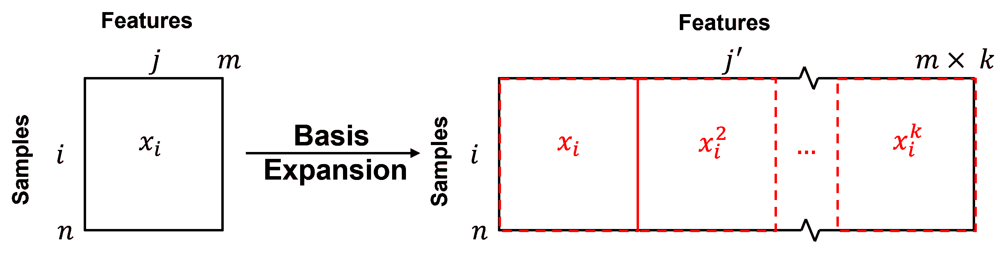

预测器 $m$ 个特征的基础扩展，使用 $k$ 个基础函数到 $m \times k$ 扩展特征。

## 多项式回归

可以证明多项式回归只是将线性回归应用于预测器特征的多项式扩展。

$$ X_{j} \rightarrow X_{j}, X_{j}², X_{j}³, \ldots X_{j}^k $$

其中我们拥有 $j = 1, \ldots, m$ 个原始特征。

我们现在有一个扩展的预测器特征集。

$$ h_{j,k}(X_j) = X_j^k $$

在这里我们有 $j = 1, \ldots, m$ 个原始特征和 $k = 1, \ldots, K$ 个多项式阶数。

我们现在可以将我们的模型表述为转换特征的线性回归。

$$ y = f(x) = \sum_{j=1}^{m} \sum_{k = 1}^{K} \beta_{j,k} h_{j,m}(X_j) + \beta_0 $$

经过 $h_l, l=1,\ldots,k$ 转换后，在 $j=1,\ldots,m$ 预测器特征上，我们有相同的线性方程和利用先前讨论的解析解的能力，参见线性回归章节。

我们假设在应用基础转换后是线性的。

+   现在模型系数，$\beta_{l,i}$，与初始预测器特征的转换版本相关，$h_l(X_i)$。

+   但我们失去了解释系数的能力，例如，$\phi⁴$ 在 $\phi$ 是孔隙率的情况下是什么？

例如，对于一个单一的预测器特征，$m = 1$，并且直到 $4^{th}$ 阶，模型是，

$$ y = \beta_{1,1}X_1 + \beta_{1,1}X_1² + \beta_{1,3}X_1³ + \beta_{1,4}X_1⁴ + \beta_0 $$

其中模型参数符号是 $\beta_{m,k}$，其中 $m$ 是特征，$k$ 是阶数。为了澄清，这里是对 $m = 2$ 的情况，

$$ y = \beta_{1,1}X_1 + \beta_{1,2}X_1² + \beta_{1,3}X_1³ + \beta_{1,4}X_1⁴ + \beta_{2,1}X_2 + \beta_{2,2}X_2² + \beta_{2,3}X_2³ + \beta_{2,4}X_2⁴ + \beta_0 $$

因此，我们的预测建模工作流程是：

+   应用多项式基础扩展

+   在多项式基础扩展上执行线性回归

## 多项式回归的优点和缺点

多项式回归相对于线性回归的优点包括，

+   提高灵活性以拟合非线性现象，使用线性分析和解析解来训练模型参数。

缺点

通常，模型方差显著更高！可能存在不稳定的插值和特别是外推。

对异常值敏感，特别是当 $ℎ_𝑘 \left(𝑥_{𝑖,𝑗}\right)=𝑥_{𝑖,𝑗}^𝑘$ 且 $𝑘$ 较大时。

我们失去了模型参数的可解释性，$𝛽_{𝑗,𝑘}$ 与 $ℎ_𝑘 \left(𝑋_j \right)$ 相关。

## 添加基本函数

多项式回归的另一种解释是通过添加基本函数来构建回归模型，即基函数。

让我们使用一个单预测特征和$K$基函数展开。

$$ y = \sum_{l=1}^{k} \beta_{1,k} h_k (X_j) $$

对于我们的简单单预测特征$X$的多项式问题，这是，

$$ y = \beta_{1,K} X^K + \beta_{1,K-1} X^{K-1} + \dots + \beta_{1,2} X² + \beta_{1,1} X + \beta_0 $$

让我们使用一个 4 阶多项式展开，$K=4$，来标准化深度。

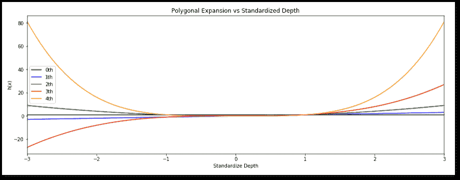

多项式基函数至$K=4$。

构建我们的函数时，我们正在移动、缩放和添加这些基本函数。让我们通过$k=2$基函数的例子，即抛物线，$h_2: 𝑦=𝑥²$，来回顾如何进行移动和缩放。考虑以下变化：

+   在 X 轴上平移。

+   在 Y 轴上平移

+   在 X 轴上翻转。

+   改变斜率

对于每一个，我都展示了变化的可视化，然后是它对多项式方程的影响。

+   在 X 轴上平移函数，

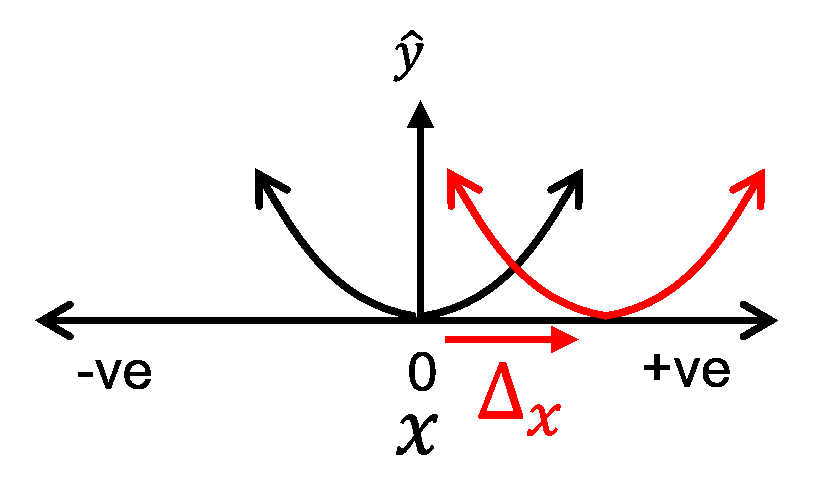

在 X 轴上平移二阶基本函数。

$$ y = (x - \Delta_x)² = x² - 2\Delta_x x + \Delta_x² $$

+   在 Y 轴上平移函数，


在 Y 轴上平移二阶基本函数。

$$ y = x² - \Delta_y $$

+   在 X 轴上翻转函数：

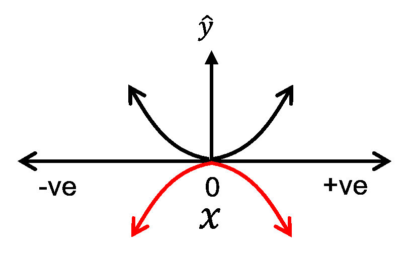

在 X 轴上翻转二阶基本函数。

$$ y = \pm \beta_2 x² $$

+   改变斜率：

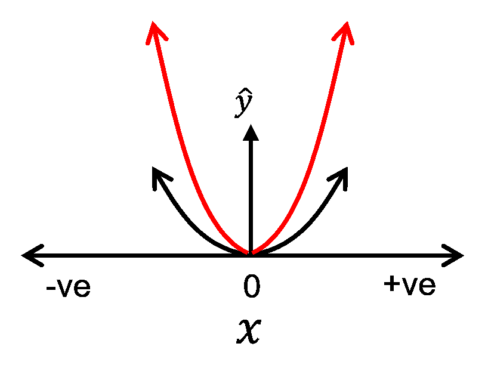

改变二阶基本函数的斜率。

$$ y = \downarrow \beta_2 x², \text{更宽/更浅} $$$$ y = \uparrow \beta_2 x², \text{更窄/更深} $$

让我们从上面观察一些内容，

+   在 Y 轴上平移只需要修改多项式方程中模型参数的常数项

+   在 X 轴上平移需要修改多项式方程中低阶模型参数

+   在 X 轴上翻转需要改变多项式方程中当前阶模型参数的符号

+   增加斜率需要增加多项式方程中当前阶模型参数

## 多项式回归的假设

我们的多项式回归模型有一些重要的假设，这些假设扩展了上述线性回归的假设，

+   **无误差** - 预测特征基函数展开是无误差的，不是随机变量

+   **常数方差** - 响应误差在预测值上是常数

+   **线性** - 响应是基特征的线性组合

+   **多项式** - X 和 Y 之间的关系是多项式

+   **误差独立性** - 响应误差之间相互不相关

+   **无共线性** - 基特征展开中的任何一个都不是其他特征的线性冗余

考虑上述多项式基展开，检查我们基之间的共线性。为了检查，我计算了下面演示中使用的基础展开的相关矩阵。

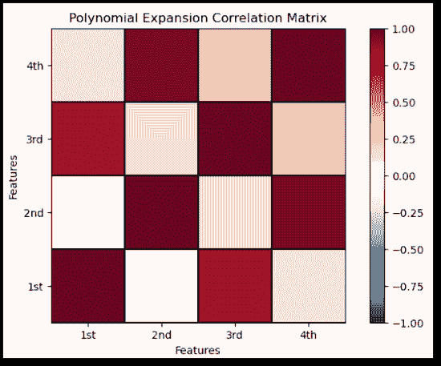

$K=4$ 的多项式基展开的相关矩阵。

$K=1$ 和 $K=3$ 的基与 $k=2$ 和 $k=4$ 的基之间存在强烈的共线性。

+   回想一下，共线性和多共线性可能会增加模型方差

为了消除这种共线性，我们可以应用厄米多项式。

## **厄米多项式**

是实数线上的正交多项式族。

| 阶数 | 厄米多项式 $H_e(x)$ |
| --- | --- |
| 零阶 | $H_{e_0}(x) = 1$ |
| 一阶 | $H_{e_1}(x) = x$ |
| 二阶 | $H_{e_2}(x) = x² - 1$ |
| 三阶 | $H_{e_3}(x) = x³ - 3x$ |
| 四阶 | $H_{e_4}(x) = x⁴ - 6x² + 3$ |

这些多项式相对于加权函数是正交的，

$$ 𝑤(𝑥)=𝑒^{−\frac{𝑥²}{2}} $$

这是标准高斯概率密度函数，不带标度，$\frac{1}{\sqrt{2\pi}}$。正交性的定义如下，

$$ \int_{-\infty}^{\infty} H_m(x) H_n(x) w(x) \, dx = 0 $$

厄米多项式在标准正态概率分布的区间 $[−\infty,\infty]$ 上是正交的。

通过在多项式回归中应用厄米多项式而不是常规多项式进行多项式基展开，我们消除了预测特征之间的共线性，

+   回想一下，预测特征独立性是多项式基展开在多项式回归中应用的线性系统的假设

## 加载所需的库

我们还需要一些标准包。这些应该已经与 Anaconda 3 一起安装。

```py
%matplotlib inline                                         
suppress_warnings = True
import os                                                     # to set current working directory 
import math                                                   # square root operator
import numpy as np                                            # arrays and matrix math
import scipy                                                  # Hermite polynomials
from scipy import stats                                       # statistical methods
import pandas as pd                                           # DataFrames
import pandas.plotting as pd_plot
import matplotlib.pyplot as plt                               # for plotting
from matplotlib.ticker import (MultipleLocator,AutoMinorLocator,FuncFormatter) # control of axes ticks
from matplotlib.colors import ListedColormap                  # custom color maps
import seaborn as sns                                         # for matrix scatter plots
from sklearn.linear_model import LinearRegression             # linear regression with scikit learn
from sklearn.preprocessing import PolynomialFeatures          # polynomial basis expansion
from sklearn import metrics                                   # measures to check our models
from sklearn.preprocessing import (StandardScaler,PolynomialFeatures) # standardize the features, polynomial basis expansion
from sklearn.model_selection import (cross_val_score,train_test_split,GridSearchCV,KFold) # model tuning
from sklearn.pipeline import (Pipeline,make_pipeline)         # machine learning modeling pipeline
from sklearn import metrics                                   # measures to check our models
from sklearn.model_selection import cross_val_score           # multi-processor K-fold crossvalidation
from sklearn.model_selection import train_test_split          # train and test split
from IPython.display import display, HTML                     # custom displays
cmap = plt.cm.inferno                                         # default color bar, no bias and friendly for color vision defeciency
plt.rc('axes', axisbelow=True)                                # grid behind plotting elements
if suppress_warnings == True:  
    import warnings                                           # supress any warnings for this demonstration
    warnings.filterwarnings('ignore') 
seed = 13                                                     # random number seed for workflow repeatability 
```

如果您遇到包导入错误，您可能首先需要安装这些包中的一些。这通常可以通过在 Windows 上打开命令窗口然后输入‘python -m pip install [package-name]’来完成。有关相应包的文档，还有更多帮助可用。

## 声明函数

让我们定义一个方便的函数来添加网格线到我们的图表，并绘制相关矩阵。

```py
def add_grid():
    plt.gca().grid(True, which='major',linewidth = 1.0); plt.gca().grid(True, which='minor',linewidth = 0.2) # add y grids
    plt.gca().tick_params(which='major',length=7); plt.gca().tick_params(which='minor', length=4)
    plt.gca().xaxis.set_minor_locator(AutoMinorLocator()); plt.gca().yaxis.set_minor_locator(AutoMinorLocator()) # turn on minor ticks

def plot_corr(corr_matrix,title,limits,mask):                 # plots a graphical correlation matrix 
    my_colormap = plt.get_cmap('RdBu_r', 256)          
    newcolors = my_colormap(np.linspace(0, 1, 256))
    white = np.array([256/256, 256/256, 256/256, 1])
    white_low = int(128 - mask*128); white_high = int(128+mask*128)
    newcolors[white_low:white_high, :] = white                # mask all correlations less than abs(0.8)
    newcmp = ListedColormap(newcolors)
    m = corr_matrix.shape[0]
    im = plt.matshow(corr_matrix,fignum=0,vmin = -1.0*limits, vmax = limits,cmap = newcmp)
    plt.xticks(range(len(corr_matrix.columns)), corr_matrix.columns); ax = plt.gca()
    ax.xaxis.set_label_position('bottom'); ax.xaxis.tick_bottom()
    plt.yticks(range(len(corr_matrix.columns)), corr_matrix.columns)
    plt.colorbar(im, orientation = 'vertical')
    plt.title(title)
    for i in range(0,m):
        plt.plot([i-0.5,i-0.5],[-0.5,m-0.5],color='black')
        plt.plot([-0.5,m-0.5],[i-0.5,i-0.5],color='black')
    plt.ylim([-0.5,m-0.5]); plt.xlim([-0.5,m-0.5]) 
```

## 设置工作目录

我总是喜欢这样做，这样我就不会丢失文件，并且可以简化后续的读取和写入（每次避免包含完整地址）。

```py
#os.chdir("c:/PGE383")                                        # set the working directory 
```

您将不得不更新引号内的部分以包含您自己的工作目录，并且格式在 Mac 上不同（例如，“~/PGE”）。

## 加载数据

让我们加载提供的二元、空间数据集[Density_Por_data.csv](https://raw.githubusercontent.com/GeostatsGuy/GeoDataSets/master/Density_Por_data.csv)，该数据集在我的 GeoDataSet 仓库中可用。它是一个逗号分隔的文件，包含：

+   深度（米）

+   高斯转换的孔隙率（%）

我们使用 pandas 的‘read_csv’函数将其加载到我们称为‘df’的数据帧中。

```py
df = pd.read_csv(r"https://raw.githubusercontent.com/GeostatsGuy/GeoDataSets/master/1D_Porosity.csv") # data from Dr. Pyrcz's github repository 
```

## 可视化数据帧

可视化训练集和测试集数据帧是在我们构建模型之前的一个有用的检查。

+   许多事情可能会出错，例如，我们加载了错误的数据，所有特征都没有加载等。

我们可以通过使用‘head’数据帧成员函数来预览（格式整洁、美观，见下文）。

```py
df.head(n=13)                                                 # preview the data 
```

|  | Depth | Nporosity |
| --- | --- | --- |
| 0 | 0.25 | -1.37 |
| 1 | 0.50 | -2.08 |
| 2 | 0.75 | -1.67 |
| 3 | 1.00 | -1.16 |
| 4 | 1.25 | -0.24 |
| 5 | 1.50 | -0.36 |
| 6 | 1.75 | 0.44 |
| 7 | 2.00 | 0.36 |
| 8 | 2.25 | -0.02 |
| 9 | 2.50 | -0.63 |
| 10 | 2.75 | -1.26 |
| 11 | 3.00 | -1.03 |
| 12 | 3.25 | 0.88 |

## 表格数据的汇总统计信息

在 DataFrames 中，有许多有效的方法可以计算表格数据的汇总统计信息。

+   describe 命令提供了一个美观的数据表，其中包括计数、平均值、标准差、百分位数、最小值和最大值。

+   我喜欢指定百分位数，否则默认为 P25、P50 和 P75 四分位数

```py
df.describe(percentiles=[0.1,0.9]).transpose()                # summary statistics 
```

|  | count | mean | std | min | 10% | 50% | 90% | max |
| --- | --- | --- | --- | --- | --- | --- | --- | --- |
| Depth | 40.0 | 5.12500 | 2.922613 | 0.25 | 1.225 | 5.125 | 9.025 | 10.00 |
| Nporosity | 40.0 | 0.02225 | 0.992111 | -2.08 | -1.271 | 0.140 | 1.220 | 2.35 |

在这里，我们将深度和高斯转换的孔隙率，Nporosity，从数据帧中提取到单独的 1D 数组中，分别称为‘depth’和‘NPor’，以便代码可读。

+   警告，这是一个浅拷贝，如果我们更改这些 1D 数组，更改将反映在原始数据帧中。

```py
Xname = ['Depth']; yname = ['Nporosity']                      # select the predictor and response feature

Xlabel = ['Depth']; ylabel = ['Gaussian Transformed Porosity'] # specify the feature labels for plotting
Xunit = ['m']; yunit = ['N[%]']
Xlabelunit = [Xlabel[0] + ' (' + Xunit[0] + ')']
ylabelunit = ylabel[0] + ' (' + yunit[0] + ')'

X = df[Xname[0]]                                              # extract the 1D ndarrays from the DataFrame
y = df[yname[0]]

Xmin = 0.0; Xmax = 10.0                                       # limits for plotting
ymin = -3.0; ymax = 3.0

X_values = np.linspace(Xmin,Xmax,100)                         # X intervals to visualize the model 
```

## 线性回归模型

让我们首先使用 scikit-learn 的 LinearRegression 类计算线性回归模型。步骤包括，

1.  **实例化** - 线性回归对象，注意没有超参数需要指定。

1.  **拟合** - 使用训练数据训练实例化的线性回归对象

1.  **预测** - 使用训练好的线性回归对象

这里是线性回归模型的实例化和拟合步骤。

+   注意，我们添加了 reshape 到我们的预测特征中，因为 scikit-learn 假设有多个预测特征，并期望一个二维数组。我们将我们的 1D 数组重塑为一个只有 1 列的二维数组。

在我们训练模型后，我们用数据绘制它以进行模型的可视化检查。

```py
lin = LinearRegression()                                      # instantiate linear regression object, note no hyperparameters 
lin.fit(X.values.reshape(-1, 1), y)                           # train linear regression model

slope = lin.coef_[0]                                          # get the model parameters
intercept = lin.intercept_

plt.subplot(111)                                              # plot the data and the model
plt.scatter(X,y,marker='o',label='data',color = 'darkorange',alpha = 0.8,edgecolor = 'black')
plt.plot(X_values,intercept + slope*X_values,label='model',color = 'black')
plt.title('Linear Regression Model, Regression of ' + yname[0] + ' on ' + Xname[0])
plt.xlabel(Xname[0] + ' (' + Xunit[0] + ')')
plt.ylabel(yname[0] + ' (' + yunit[0] + ')')
plt.legend(); add_grid(); plt.xlim([Xmin,Xmax]); plt.ylim([ymin,ymax])
plt.annotate('Linear Regression Model',[4.5,-1.8])
plt.annotate(r'    $\beta_1$ :' + str(round(slope,2)),[6.8,-2.3])
plt.annotate(r'    $\beta_0$ :' + str(round(intercept,2)),[6.8,-2.7])
plt.annotate(r'$N[\phi] = \beta_1 \times z + \beta_0$',[4.0,-2.3])
plt.annotate(r'$N[\phi] = $' + str(round(slope,2)) + r' $\times$ $z$ + (' + str(round(intercept,2)) + ')',[4.0,-2.7])

plt.subplots_adjust(left=0.0, bottom=0.0, right=1.4, top=0.8, wspace=0.2, hspace=0.2); plt.show() 
```

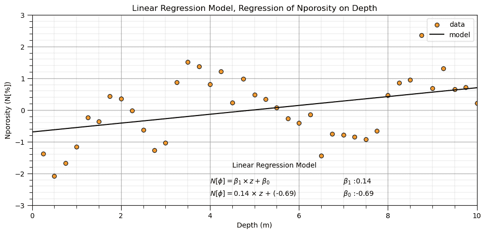

## 与非参数预测机器学习模型的比较

让我们运行几个非参数预测机器学习模型，以与线性参数模型和多项式参数模型进行对比。首先我们训练一个快速决策树模型，然后是一个随机森林模型。

+   我们获得了显著的灵活性来拟合数据中的任何模式

+   需要更多的推理，因为非参数实际上是参数丰富的！

更多细节，请参阅关于决策树和随机森林的章节。

```py
from sklearn import tree                                      # tree program from scikit learn 

my_tree = tree.DecisionTreeRegressor(min_samples_leaf=5, max_depth = 20) # instantiate the decision tree model with hyperparameters
my_tree = my_tree.fit(X.values.reshape(-1, 1),y)              # fit the decision tree to the training data (all the data in this case)
DT_y = my_tree.predict(X_values.reshape(-1,1))                # predict at high resolution over the range of depths

plt.subplot(111)                                              # plot the model and data
plt.scatter(X,y,marker='o',label='data',color = 'darkorange',alpha = 0.8,edgecolor = 'black')
plt.plot(X_values, DT_y, label='model', color = 'black')
plt.title('Decision Tree Model, ' + yname[0] + ' as a Function of ' + Xname[0])
plt.xlabel(Xname[0] + ' (' + Xunit[0] + ')')
plt.ylabel(yname[0] + ' (' + yunit[0] + ')')
plt.legend(); add_grid(); plt.xlim([Xmin,Xmax]); plt.ylim([ymin,ymax])
plt.subplots_adjust(left=0.0, bottom=0.0, right=1.4, top=0.8, wspace=0.2, hspace=0.2); plt.show() 
```

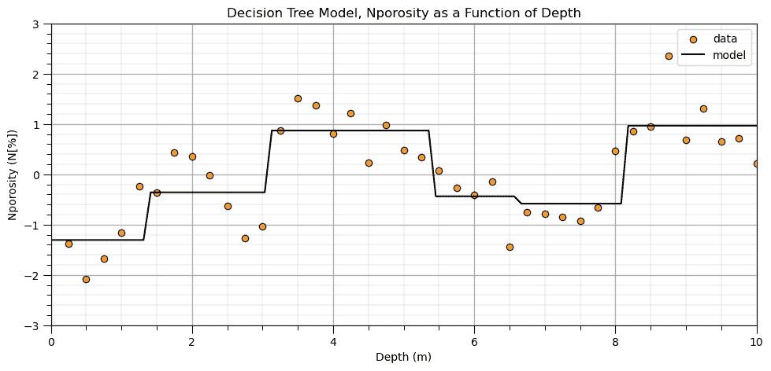

这里是一个随机森林模型：

```py
from sklearn.ensemble import RandomForestRegressor            # random forest method

max_depth = 5                                                 # set the random forest hyperparameters
num_tree = 1000
max_features = 1

my_forest = RandomForestRegressor(max_depth=max_depth,random_state=seed,n_estimators=num_tree,max_features=max_features)
my_forest.fit(X = X.values.reshape(-1, 1), y = y)  
RF_y = my_forest.predict(X_values.reshape(-1,1))
plt.subplot(111)
plt.scatter(X,y,marker='o',label='data',color = 'darkorange',alpha = 0.8,edgecolor = 'black')
plt.plot(X_values, RF_y, label='model', color = 'black')
plt.title('Random Forest Tree Model, ' + yname[0] + ' as a Function of ' + Xname[0])
plt.xlabel(Xname[0] + ' (' + Xunit[0] + ')')
plt.ylabel(yname[0] + ' (' + yunit[0] + ')')
plt.legend(); add_grid(); plt.xlim([Xmin,Xmax]); plt.ylim([ymin,ymax])
plt.subplots_adjust(left=0.0, bottom=0.0, right=2.0, top=1.0, wspace=0.2, hspace=0.2)
plt.show() 
```

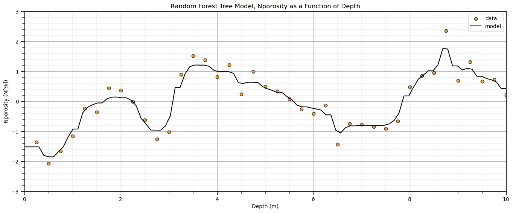

注意，没有对这些建模的超参数进行调整。我只是想展示非参数模型学习系统形状的巨大灵活性。

现在，我们回到我们的参数多项式模型。

+   让我们首先将数据转换成标准正态分布，高斯分布。

+   我们这样做是为了提高模型拟合度（处理异常值）并符合即将介绍的 Hermite 多项式的理论。

## 高斯畸变 \ 高斯变换

让我们将特征转换为标准正态分布，

+   高斯分布

+   均值为 0.0

+   标准差为 1.0

孔隙率特征之前已经被‘转换’成高斯分布，但有机会对其进行清理。

+   比较下面的原始和转换后的数据

+   注意，我使用了我从原始 GSLIB（Deutsch and Journel, 1997）移植的 GeostatsPy 高斯变换，因为 scikit-learn 的高斯变换会创建截断尖峰/异常值。

```py
import geostatspy.geostats as geostats                        # for Gaussian transform from GSLIB

df_ns = pd.DataFrame()   
df_ns[Xname[0]], tvPor, tnsPor = geostats.nscore(df, Xname[0]) # nscore transform for all facies porosity 
df_ns[yname[0]], tvdepth, tnsdepth = geostats.nscore(df, yname[0]) # nscore transform for all facies permeability
X_ns = df_ns[Xname[0]]; y_ns = df_ns[yname[0]]
X_ns_values = np.linspace(-3.0,3.0,1000)                      # values to predict at in standard normal space 
```

让我们绘制一些好的累积分布函数图来检查原始和转换后的变量。

+   结果看起来非常好

我们这样做是因为我们需要一个高斯分布的预测特征来进行正交性。更多内容将在后面介绍！

```py
plt.subplot(221)                                              # plot original sand and shale porosity histograms
plt.hist(df[Xname[0]], facecolor='red',bins=np.linspace(Xmin,Xmax,1000),histtype="stepfilled",alpha=0.2,density=True,
         cumulative=True,edgecolor='black',label='Original')
plt.xlim([0.0,10.0]); plt.ylim([0,1.0])
plt.xlabel(Xname[0] + ' (' + Xunit[0] + ')'); plt.ylabel('Frequency'); plt.title('Original Depth')
plt.legend(loc='upper left')
plt.grid(True)

plt.subplot(222)  
plt.hist(df_ns[Xname[0]], facecolor='blue',bins=np.linspace(-3.0,3.0,1000),histtype="stepfilled",alpha=0.2,density=True,
         cumulative=True,edgecolor='black',label = 'NS')
plt.xlim([-3.0,3.0]); plt.ylim([0,1.0])
plt.xlabel('NS: ' + Xname[0] + ' (' + Xunit[0] + ')'); plt.ylabel('Frequency'); plt.title('Nscore ' + Xname[0])
plt.legend(loc='upper left')
plt.grid(True)

plt.subplot(223)                                        # plot nscore transformed sand and shale histograms
plt.hist(df[yname[0]], facecolor='red',bins=np.linspace(ymin,ymax,1000),histtype="stepfilled",alpha=0.2,density=True,
         cumulative=True,edgecolor='black',label='Original')
plt.xlim([-3.0,3.0]); plt.ylim([0,1.0])
plt.xlabel(yname[0] + ' (' + yunit[0] + ')'); plt.ylabel('Frequency'); plt.title('Original Porosity')
plt.legend(loc='upper left')
plt.grid(True)

plt.subplot(224)                                        # plot nscore transformed sand and shale histograms
plt.hist(df_ns[yname[0]], facecolor='blue',bins=np.linspace(-3.0,3.0,1000),histtype="stepfilled",alpha=0.2,density=True,
         cumulative=True,edgecolor='black',label = 'NS')
plt.xlim([-3.0,3.0]); plt.ylim([0,1.0])
plt.xlabel('NS: ' + yname[0] + ' (' + yunit[0] + ')'); plt.ylabel('Frequency'); plt.title('Nscore ' + yname[0])
plt.legend(loc='upper left')
plt.grid(True)

plt.subplots_adjust(left=0.0, bottom=0.0, right=1.5, top=2.0, wspace=0.2, hspace=0.3); plt.show() 
```

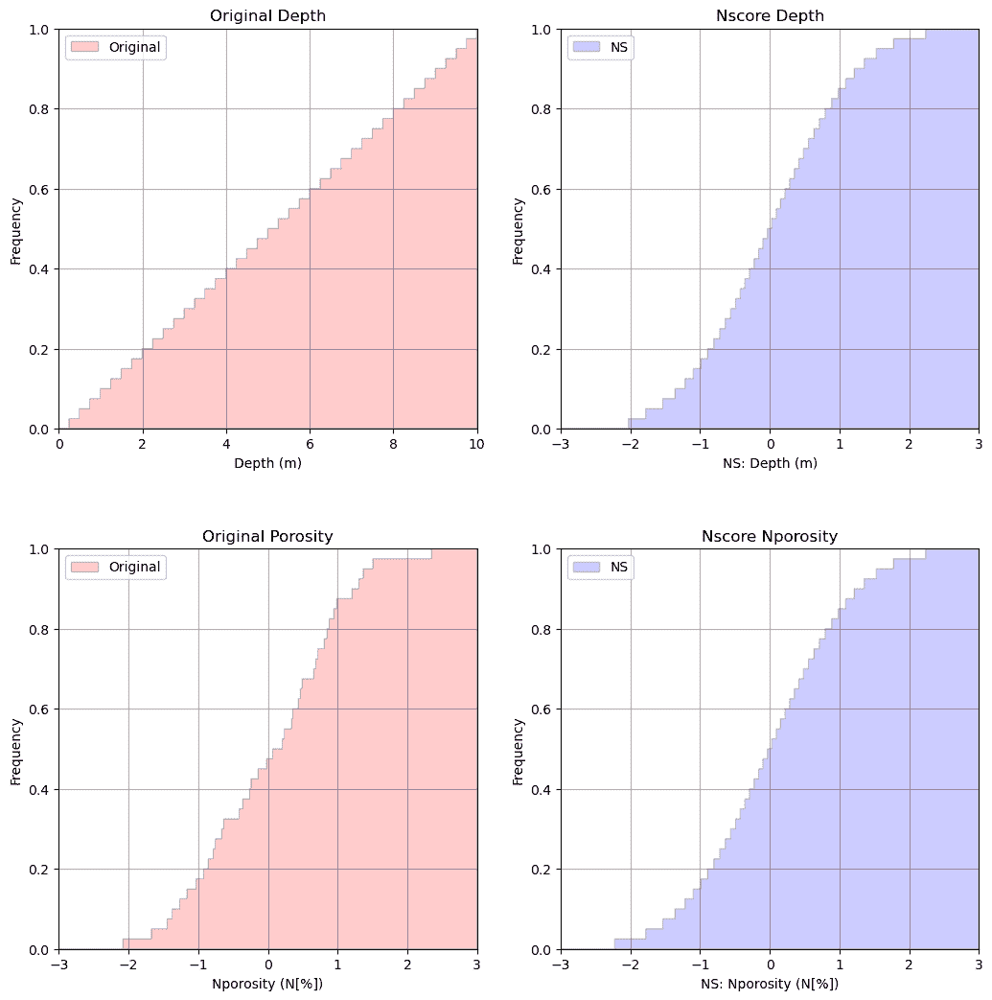

## 带有标准化特征的线性回归模型

让我们重复线性回归模型，这次使用标准化特征。

```py
lin_ns = LinearRegression()                                   # instantiate linear regression object, note no hyperparameters 
lin_ns.fit(X_ns.values.reshape(-1, 1), y_ns)                  # train linear regression model
slope_ns = lin_ns.coef_[0]                                    # get the model parameters
intercept_ns = lin_ns.intercept_

plt.subplot(111)                                              # plot the data and the model
plt.scatter(X_ns,y_ns,marker='o',label='data',color = 'darkorange',alpha = 0.8,edgecolor = 'black')
plt.plot(X_ns_values,intercept_ns + slope_ns*X_ns_values,label='model',color = 'black')
plt.title('Linear Regression Model, Regression of NS ' + yname[0] + ' on ' + Xname[0])
plt.xlabel('NS: ' + Xname[0] + ' (' + Xunit[0] + ')')
plt.ylabel('NS: ' + yname[0] + ' (' + yunit[0] + ')')
plt.legend(); add_grid(); plt.xlim([-3.0,3.0]); plt.ylim([ymin,ymax])
plt.annotate('Linear Regression Model',[0.8,-1.8])
plt.annotate(r'    $\beta_1$ :' + str(round(slope_ns,2)),[1.8,-2.3])
plt.annotate(r'    $\beta_0$ :' + str(round(intercept_ns,2)),[1.8,-2.7])
plt.annotate(r'$N[\phi] = \beta_1 \times z + \beta_0$',[0.5,-2.3])
plt.annotate(r'$N[\phi] = $' + str(round(slope_ns,2)) + r' $\times$ $z$ + (' + str(round(intercept_ns,2)) + ')',[0.5,-2.7])

plt.subplots_adjust(left=0.0, bottom=0.0, right=1.4, top=0.8, wspace=0.2, hspace=0.2); plt.show() 
```

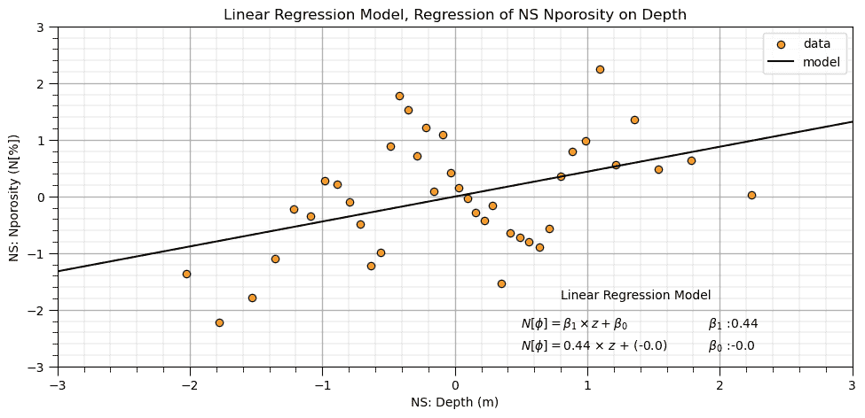

再次，拟合度不佳。让我们使用更复杂、更灵活的预测机器学习模型。

## 多项式回归

我们将通过手工进行多项式回归：

+   创建原始预测特征的多项式基展开

+   在多项式基展开上执行线性回归

### 多项式基展开

让我们从计算 1 个预测特征的多项式基展开开始。

```py
poly4 = PolynomialFeatures(degree = 4)                        # instantiate polynomial expansion 
X_ns_poly4 = poly4.fit_transform(X_ns.values.reshape(-1, 1))  # calculate the basis expansion for our dataset
df_X_ns_poly4 = pd.DataFrame({'Values':X_ns,'0th':X_ns_poly4[:,0],'1st':X_ns_poly4[:,1],'2nd':X_ns_poly4[:,2], 
                              '3rd':X_ns_poly4[:,3],'4th':X_ns_poly4[:,4]}) # make a new DataFrame from the vectors
df_X_ns_poly4 = pd.DataFrame({'Values':X_ns,'1st':X_ns_poly4[:,1],'2nd':X_ns_poly4[:,2], 
                              '3rd':X_ns_poly4[:,3],'4th':X_ns_poly4[:,4]}) # make a new DataFrame from the vectors
df_X_ns_poly4.head()                                          # preview the polynomial basis expansion with the original predictor feature 
```

|  | 值 | 第 1 | 第 2 | 第 3 | 第 4 |
| --- | --- | --- | --- | --- | --- |
| 0 | -2.026808 | -2.026808 | 4.107951 | -8.326029 | 16.875264 |
| 1 | -1.780464 | -1.780464 | 3.170053 | -5.644167 | 10.049238 |
| 2 | -1.534121 | -1.534121 | 2.353526 | -3.610592 | 5.539084 |
| 3 | -1.356312 | -1.356312 | 1.839582 | -2.495046 | 3.384060 |
| 4 | -1.213340 | -1.213340 | 1.472193 | -1.786270 | 2.167352 |

现在让我们检查原始预测特征数据的多项式基展开之间的相关性。

+   回想一下，预测特征之间高度的相关性会增加模型方差。

```py
corr_matrix = df_X_ns_poly4.iloc[:,1:].corr()                 # calculate the correlation matrix

plt.subplot(111)
plot_corr(corr_matrix,'Polynomial Expansion Correlation Matrix',1.0,0.1) # using our correlation matrix visualization function
plt.xlabel('Features'); plt.ylabel('Features')

plt.subplots_adjust(left=0.0, bottom=0.0, right=1.0, top=0.8, wspace=0.2, hspace=0.3); plt.show() 
```

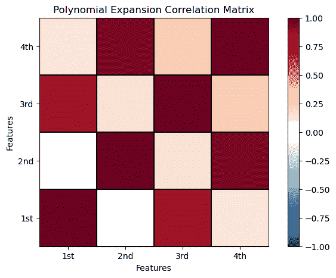

我们在 1 阶和 3 阶以及 2 阶和 4 阶之间存在高度相关性。

+   让我们用多项式基的矩阵散点图来检查。

## 可视化多项式展开特征的成对关系

```py
sns.pairplot(df_X_ns_poly4.iloc[:,1:],vars=['1st','2nd','3rd','4th'],markers='o', kind='reg',diag_kind='kde')
plt.subplots_adjust(left=0.0, bottom=0.0, right=1.0, top=1.0, wspace=0.2, hspace=0.2); plt.show() 
```

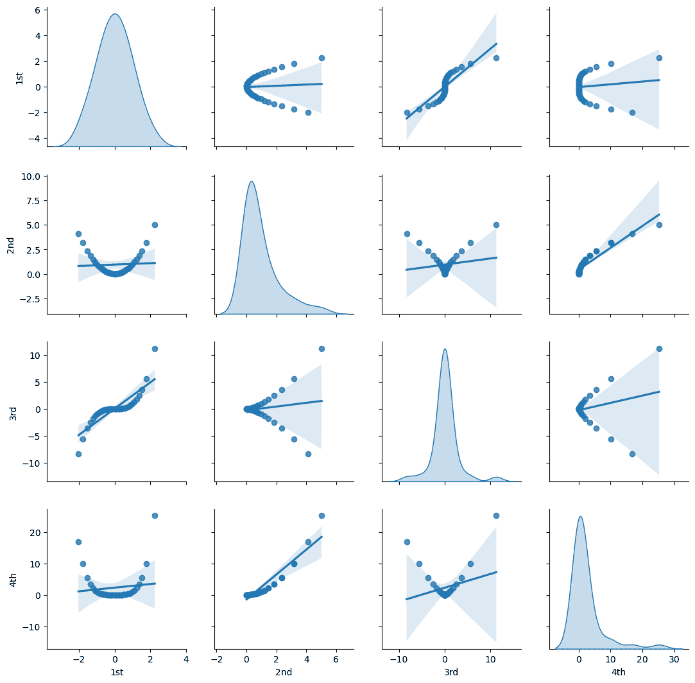

让我们可视化高斯变换深度上的多项式展开。

```py
plt.subplot(111)                                              # plot the polynomial basis expansion
plt.plot(X_ns_values,poly4.fit_transform(X_ns_values.reshape(-1, 1))[:,0],label='0th',color = 'black')
plt.plot(X_ns_values,poly4.fit_transform(X_ns_values.reshape(-1, 1))[:,1],label='1th',color = 'blue')
plt.plot(X_ns_values,poly4.fit_transform(X_ns_values.reshape(-1, 1))[:,2],label='2th',color = 'green')
plt.plot(X_ns_values,poly4.fit_transform(X_ns_values.reshape(-1, 1))[:,3],label='3th',color = 'red')
plt.plot(X_ns_values,poly4.fit_transform(X_ns_values.reshape(-1, 1))[:,4],label='4th',color = 'orange') 
plt.title('Polynomial Basis Expansion of ' + Xname[0])
plt.xlabel('NS: ' + Xname[0] + ' (' + Xunit[0] + ')')
plt.ylabel('h[ NS: ' + Xname[0] + ' (' + Xunit[0] + ') ]')
plt.legend(); plt.xlim(-3,3); add_grid()
plt.subplots_adjust(left=0.0, bottom=0.0, right=2.0, top=1.0, wspace=0.2, hspace=0.2); plt.show() 
```

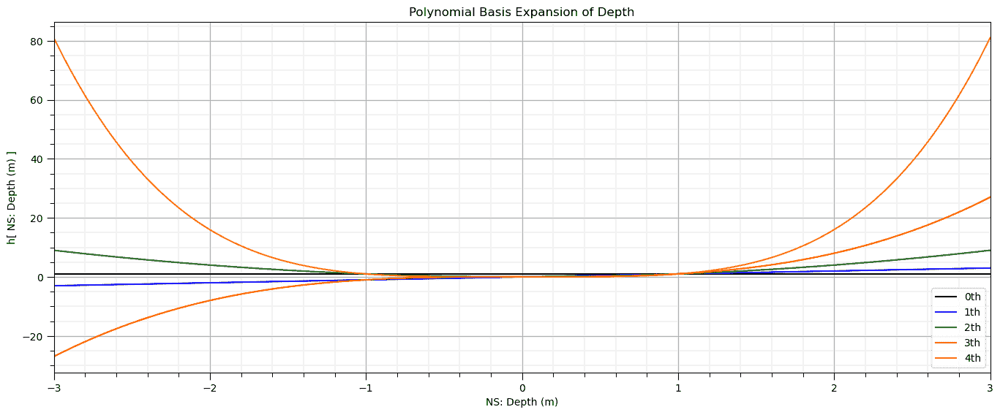

我们还可以检查每个多项式基展开的算术平均值。

```py
print('The averages of each basis expansion, 0 - 4th order = ' + str(stats.describe(X_ns_poly4)[2]) + '.') 
```

```py
The averages of each basis expansion, 0 - 4th order = [1\.         0.00536486 0.9458762  0.07336308 2.31077802]. 
```

让我们将线性回归模型拟合到多项式基展开。

+   注意：模型对拟合这种复杂/非线性数据相当灵活

```py
lin_poly4 = LinearRegression()                                # instantiate new linear model 
lin_poly4.fit(df_X_ns_poly4.iloc[:,1:], y_ns)                 # train linear model with polynomial expansion, polynomial regression
b1,b2,b3,b4 = np.round(lin_poly4.coef_,3)                     # retrieve the model parameters
b0 = lin_poly4.intercept_

plt.subplot(111)
plt.plot(X_ns_values,lin_poly4.predict(poly4.fit_transform(X_ns_values.reshape(-1, 1))[:,1:]),label='polynomial',color = 'red') 
plt.scatter(X_ns,y_ns,marker='o',label='data',color = 'darkorange',alpha = 0.8,edgecolor = 'black')
plt.title('Polynomial Regression Model, Regression of NS ' + yname[0] + ' on NS ' + Xname[0])
plt.xlabel('NS: ' + Xname[0] + ' (' + Xunit[0] + ')')
plt.ylabel('NS: ' + yname[0] + ' (' + yunit[0] + ')')
plt.legend(); add_grid(); plt.xlim([-3.0,3.0]); plt.ylim([ymin,ymax])
plt.annotate('Polynomial Regression Model',[-2.8,2.6])
plt.annotate(r'    $\beta_4$ :' + str(round(b4,3)),[-2.8,2.1])
plt.annotate(r'    $\beta_3$ :' + str(round(b3,3)),[-2.8,1.7])
plt.annotate(r'    $\beta_2$ :' + str(round(b2,3)),[-2.8,1.3])
plt.annotate(r'    $\beta_1$ :' + str(round(b1,3)),[-2.8,0.9])
plt.annotate(r'    $\beta_0$ :' + str(round(b0,2)),[-2.8,0.5])
plt.annotate(r'$N[\phi] = \beta_4 \times N[z]⁴ + \beta_3 \times N[z]³ + \beta_2 \times N[z]² + \beta_1 \times N[z] + \beta_0$',[-1.0,-2.0])
plt.annotate(r'$N[\phi] = $' + str(b4) + r' $\times N[z]⁴ +$ ' + str(b3) + r' $\times N[z]³ +$ ' + str(b2) + r' $\times N[z]² +$ ' + 
             str(b1) + r' $\times N[z]$ + ' + str(round(b0,2)),[-1.0,-2.5])

plt.subplots_adjust(left=0.0, bottom=0.0, right=1.4, top=0.8, wspace=0.2, hspace=0.2); plt.show() 
```

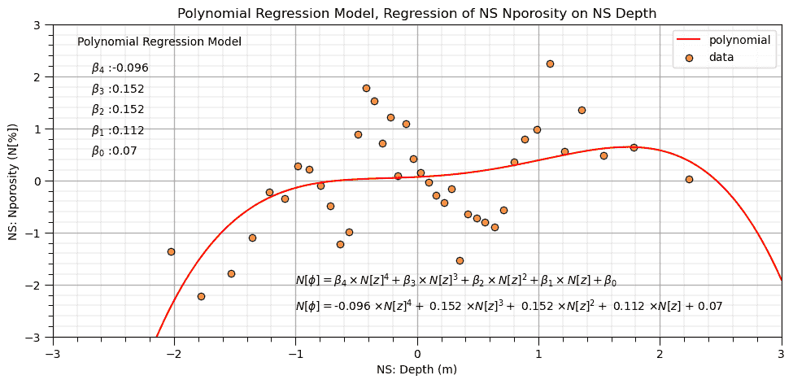

## 使用赫米特基展开的回归

我们可以使用赫米特多项式来减少基预测特征之间的相关性。

+   我们将预测特征、深度转换为标准正态分布，因为赫米特多项式展开在标准正态概率密度函数的假设下，在负无穷到正无穷的范围内实现独立性。

```py
orders4 = [1,2,3,4]                                           # specify the orders for Hermite basis expansion
X_ns_hermite4 = scipy.special.eval_hermitenorm(orders4,X_ns.values.reshape(-1, 1), out=None) # Hermite polynomials for X 
df_X_ns_hermite4 = pd.DataFrame({'value':X_ns.values,'1st':X_ns_hermite4[:,0],'2nd':X_ns_hermite4[:,1], 
                                     '3rd':X_ns_hermite4[:,2],'4th':X_ns_hermite4[:,3]}) # make a new DataFrame from the vectors
df_X_ns_hermite4.head() 
```

|  | 值 | 1 阶 | 2 阶 | 3 阶 | 4 阶 |
| --- | --- | --- | --- | --- | --- |
| 0 | -2.026808 | -2.026808 | 3.107951 | -2.245605 | -4.772444 |
| 1 | -1.780464 | -1.780464 | 2.170053 | -0.302774 | -5.971082 |
| 2 | -1.534121 | -1.534121 | 1.353526 | 0.991769 | -5.582071 |
| 3 | -1.356312 | -1.356312 | 0.839582 | 1.573889 | -4.653429 |
| 4 | -1.213340 | -1.213340 | 0.472193 | 1.853749 | -3.665806 |

注意：我已经省略了对于我们的数据集具有更高相关性的阶数。

让我们检查赫米特预测特征之间的相关性。有所改进。

```py
hermite_corr_matrix = df_X_ns_hermite4.iloc[:,1:].corr()      # calculate correlation matrix of Hermite basis expansion of X

plt.subplot(111)
plot_corr(hermite_corr_matrix,'Hermite Polynomial Correlation Matrix',1.0,0.1) # using our correlation matrix visualization function
plt.xlabel('Features'); plt.ylabel('Features')

plt.subplots_adjust(left=0.0, bottom=0.0, right=1.0, top=0.8, wspace=0.2, hspace=0.3); plt.show() 
```


与多项式基相比，成对线性相关性相当低。

让我们可视化赫米特基阶数的双变量关系。

```py
sns.pairplot(df_X_ns_hermite4.iloc[:,1:],vars=['1st','2nd','3rd','4th'],markers='o', kind='reg',diag_kind='kde')
plt.subplots_adjust(left=0.0, bottom=0.0, right=1.0, top=1.0, wspace=0.2, hspace=0.2); plt.show() 
```

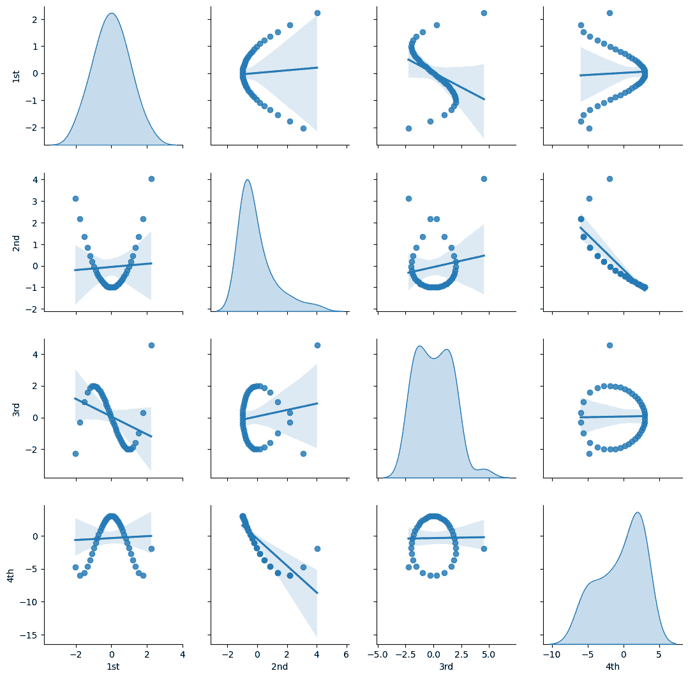

我们可以检查所有赫米特基展开的算术平均值。

```py
print('The means of each basis expansion, 1 - 4th order = ' + str(stats.describe(X_ns_hermite4)[2]) + '.') 
```

```py
The means of each basis expansion, 1 - 4th order = [ 0.00536486 -0.0541238   0.05726848 -0.36447919]. 
```

让我们可视化标准化深度范围内的赫米特多项式。

```py
plt.subplot(111)                                              # plot Hermite polynomials
plt.plot(X_ns_values,scipy.special.eval_hermite(orders4,X_ns_values.reshape(-1, 1))[:,0],label='1st',color = 'blue')
plt.plot(X_ns_values,scipy.special.eval_hermite(orders4,X_ns_values.reshape(-1, 1))[:,1],label='2nd',color = 'green')
plt.plot(X_ns_values,scipy.special.eval_hermite(orders4,X_ns_values.reshape(-1, 1))[:,2],label='3rd',color = 'red')
plt.plot(X_ns_values,scipy.special.eval_hermite(orders4,X_ns_values.reshape(-1, 1))[:,3],label='4th',color = 'orange')
plt.title('Hermite Polynomial Basis Expansion of ' + Xname[0])
plt.xlabel('NS: ' + Xname[0] + ' (' + Xunit[0] + ')')
plt.ylabel('h[ NS: ' + Xname[0] + ' (' + Xunit[0] + ') ]')
plt.legend(); plt.xlim(-3,3); add_grid()
plt.subplots_adjust(left=0.0, bottom=0.0, right=2.0, top=1.0, wspace=0.2, hspace=0.2); plt.show() 
```

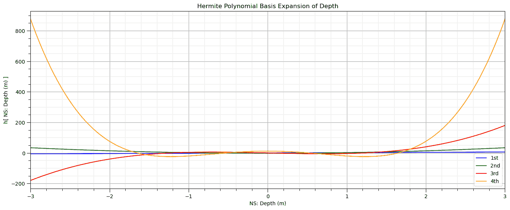

现在让我们拟合我们的赫米特基回归模型。

```py
lin_herm4 = LinearRegression()                                # instantiate model
lin_herm4.fit(df_X_ns_hermite4.iloc[:,1:], y_ns)              # fit Hermite polynomials 
hb1,hb2,hb3,hb4 = np.round(lin_herm4.coef_,3)                 # retrieve the model parameters
hb0 = lin_herm4.intercept_
plt.subplot(111)                                              # plot data and model
plt.plot(X_ns_values, lin_herm4.predict(scipy.special.eval_hermitenorm(orders4,X_ns_values.reshape(-1, 1), out=None)), 
         label='4th order',color = 'red') 
plt.scatter(X_ns,y_ns,marker='o',label='data',color = 'darkorange',alpha = 0.8,edgecolor = 'black')
plt.title('Hermite Polynomial Regression Model, Regression of NS ' + yname[0] + ' on NS ' + Xname[0])
plt.xlabel('NS: ' + Xname[0] + ' (' + Xunit[0] + ')')
plt.ylabel('NS: ' + yname[0] + ' (' + yunit[0] + ')')
plt.legend(); add_grid(); plt.xlim([-3.0,3.0]); plt.ylim([ymin,ymax])
plt.annotate('Hermite Polynomial Regression Model',[-2.8,2.6])
plt.annotate(r'    $\beta_4$ :' + str(round(hb4,3)),[-2.8,2.1])
plt.annotate(r'    $\beta_3$ :' + str(round(hb3,3)),[-2.8,1.7])
plt.annotate(r'    $\beta_2$ :' + str(round(hb2,3)),[-2.8,1.3])
plt.annotate(r'    $\beta_1$ :' + str(round(hb1,3)),[-2.8,0.9])
plt.annotate(r'    $\beta_0$ :' + str(round(hb0,2)),[-2.8,0.5])
plt.annotate(r'$N[\phi] = \beta_4 \times N[z]⁴ + \beta_3 \times N[z]³ + \beta_2 \times N[z]² + \beta_1 \times N[z] + \beta_0$',[-1.0,-2.0])
plt.annotate(r'$N[\phi] = $' + str(hb4) + r' $\times N[z]⁴ +$ ' + str(hb3) + r' $\times N[z]³ +$ ' + str(hb2) + r' $\times N[z]² +$ ' + 
             str(hb1) + r' $\times N[z]$ + ' + str(round(hb0,2)),[-1.0,-2.5])

plt.subplots_adjust(left=0.0, bottom=0.0, right=1.4, top=0.8, wspace=0.2, hspace=0.2); plt.show() 
```

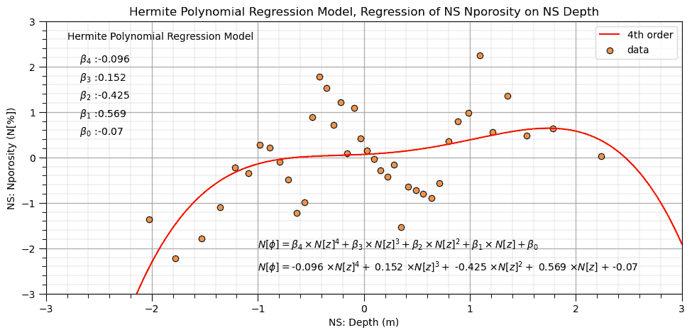

由于我们扩展的基特征之间的相关性较低，我们可以检查模型系数并解释每个阶数的独特重要性。

## 正交多项式

让我们尝试 Dave Moore 用 Python 重新实现的正交多项式基展开，他从 R 语言的 poly()函数中获取。

+   以下 fit 和 predict 函数直接来自 Dave 的[博客](http://davmre.github.io/blog/python/2013/12/15/orthogonal_poly)

+   在拟合训练数据时，计算了范数 2 和 alpha 模型参数

+   这些参数必须传递给每个后续预测以确保结果一致

```py
# functions taken (without modification) from http://davmre.github.io/blog/python/2013/12/15/orthogonal_poly
# appreciation to Dave Moore for the great blog post on titled 'Orthogonal polynomial regression in Python'
# functions are Dave's reimplementation of poly() from R

def ortho_poly_fit(x, degree = 1):
    n = degree + 1
    x = np.asarray(x).flatten()
    if(degree >= len(np.unique(x))):
            stop("'degree' must be less than number of unique points")
    xbar = np.mean(x)
    x = x - xbar
    X = np.fliplr(np.vander(x, n))
    q,r = np.linalg.qr(X)

    z = np.diag(np.diag(r))
    raw = np.dot(q, z)

    norm2 = np.sum(raw**2, axis=0)
    alpha = (np.sum((raw**2)*np.reshape(x,(-1,1)), axis=0)/norm2 + xbar)[:degree]
    Z = raw / np.sqrt(norm2)
    return Z, norm2, alpha

def ortho_poly_predict(x, alpha, norm2, degree = 1):
    x = np.asarray(x).flatten()
    n = degree + 1
    Z = np.empty((len(x), n))
    Z[:,0] = 1
    if degree > 0:
        Z[:, 1] = x - alpha[0]
    if degree > 1:
        for i in np.arange(1,degree):
             Z[:, i+1] = (x - alpha[i]) * Z[:, i] - (norm2[i] / norm2[i-1]) * Z[:, i-1]
    Z /= np.sqrt(norm2)
    return Z 
```

让我们试一试，并对我们的标准正态变换深度进行正交多项式展开。

```py
X_ns_ortho4, norm2, alpha = ortho_poly_fit(X_ns.values.reshape(-1, 1), degree = 4) # orthogonal polynomial expansion
df_X_ns_ortho4 = pd.DataFrame({'value':X_ns.values,'1st':X_ns_ortho4[:,1],'2nd':X_ns_ortho4[:,2],'3rd':X_ns_ortho4[:,3],
                               '4th':X_ns_ortho4[:,4]})       # make a new DataFrame from the vectors
df_X_ns_ortho4.head() 
```

|  | value | 1st | 2nd | 3rd | 4th |
| --- | --- | --- | --- | --- | --- |
| 0 | -2.026808 | -0.330385 | 0.440404 | -0.460160 | 0.420374 |
| 1 | -1.780464 | -0.290335 | 0.313201 | -0.207862 | 0.021278 |
| 2 | -1.534121 | -0.250285 | 0.202153 | -0.029761 | -0.172968 |
| 3 | -1.356312 | -0.221377 | 0.132038 | 0.058235 | -0.220834 |
| 4 | -1.213340 | -0.198133 | 0.081765 | 0.107183 | -0.219084 |

让我们检查正交多项式预测特征之间的相关性。我印象深刻！基特征阶数之间的相关性都是零！

```py
ortho_corr_matrix = df_X_ns_ortho4.iloc[:,1:].corr()          # calculate the correlation matrix

plt.subplot(111)
plot_corr(ortho_corr_matrix,'Orthogonal Polynomial Expansion Correlation Matrix',1.0,0.1) # using our correlation matrix visualization function
plt.xlabel('Features'); plt.ylabel('Features')

plt.subplots_adjust(left=0.0, bottom=0.0, right=1.0, top=0.8, wspace=0.2, hspace=0.3); plt.show() 
```

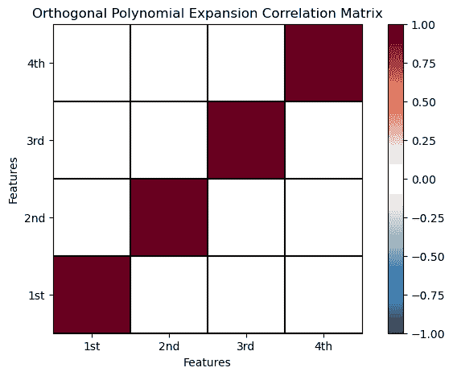

让我们可视化我们的正交多项式基阶数之间的二元关系。

```py
sns.pairplot(df_X_ns_ortho4.iloc[:,1:],vars=['1st','2nd','3rd','4th'],markers='o',kind='reg',diag_kind='kde') 
```

```py
<seaborn.axisgrid.PairGrid at 0x1ed608d8370> 
```

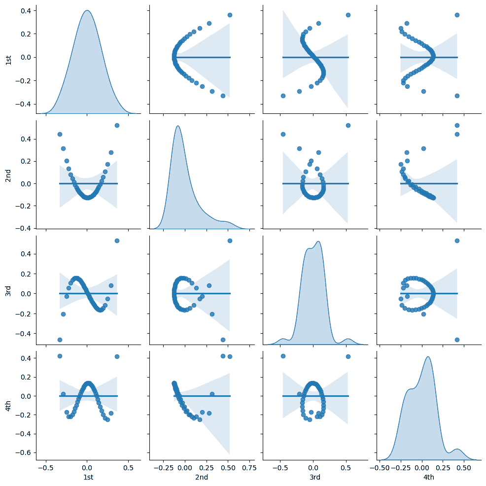

让我们可视化标准化深度范围内的正交多项式基阶数。

```py
ortho_poly_ns_values = ortho_poly_predict(X_ns_values.reshape(-1, 1), alpha, norm2, degree = 4)

plt.subplot(111)
plt.plot(X_ns_values, ortho_poly_ns_values[:,0], label='0th', color = 'black')
plt.plot(X_ns_values, ortho_poly_ns_values[:,1], label='1st', color = 'blue')
plt.plot(X_ns_values, ortho_poly_ns_values[:,2], label='2nd', color = 'green')
plt.plot(X_ns_values, ortho_poly_ns_values[:,3], label='3rd', color = 'red')
plt.plot(X_ns_values, ortho_poly_ns_values[:,4], label='4th', color = 'orange')
plt.title('Orthogonal Polynomial Basis Expansion of ' + Xname[0])
plt.xlabel('NS: ' + Xname[0] + ' (' + Xunit[0] + ')')
plt.ylabel('h[ NS: ' + Xname[0] + ' (' + Xunit[0] + ') ]')
plt.legend(); plt.xlim(-3,3); add_grid()
plt.subplots_adjust(left=0.0, bottom=0.0, right=2.0, top=1.0, wspace=0.2, hspace=0.2); plt.show() 
```

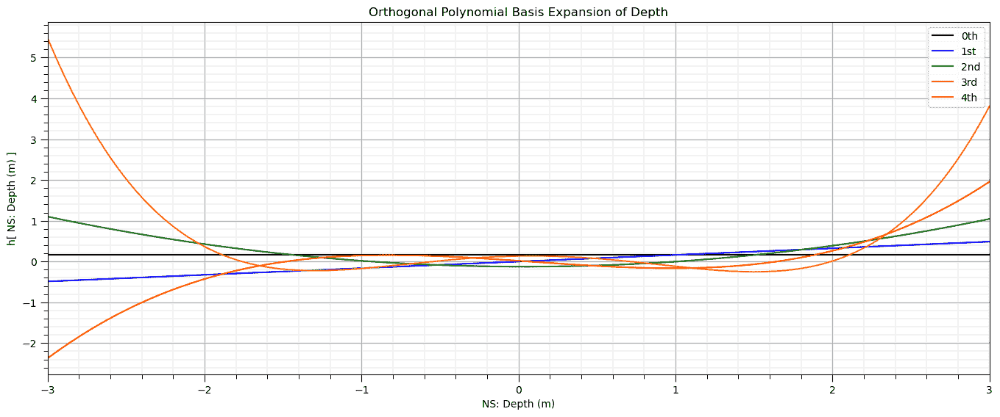

最后，让我们拟合我们的正交多项式基展开回归模型。

```py
lin_ortho4 = LinearRegression()                               # instantiate model
lin_ortho4.fit(df_X_ns_ortho4.iloc[:,1:], y_ns)               # fit Hermite polynomials 
ob1,ob2,ob3,ob4 = np.round(lin_ortho4.coef_,3)                # retrieve the model parameters
ob0 = lin_ortho4.intercept_

plt.subplot(111)
plt.plot(X_ns_values,lin_ortho4.predict(ortho_poly_ns_values[:,1:]),label='orthogonal polynomial',color = 'red') 
plt.scatter(X_ns,y_ns,marker='o',label='data',color = 'darkorange',alpha = 0.8,edgecolor = 'black')
plt.title('Orthogonal Polynomial Regression Model, Regression of NS ' + yname[0] + ' on NS ' + Xname[0])
plt.xlabel('NS: ' + Xname[0] + ' (' + Xunit[0] + ')')
plt.ylabel('NS: ' + yname[0] + ' (' + yunit[0] + ')')
plt.legend(); add_grid(); plt.xlim([-3.0,3.0]); plt.ylim([ymin,ymax])
plt.annotate('Orthogonal Polynomial Regression Model',[-2.8,2.6])
plt.annotate(r'    $\beta_4$ :' + str(round(ob4,3)),[-2.8,2.1])
plt.annotate(r'    $\beta_3$ :' + str(round(ob3,3)),[-2.8,1.7])
plt.annotate(r'    $\beta_2$ :' + str(round(ob2,3)),[-2.8,1.3])
plt.annotate(r'    $\beta_1$ :' + str(round(ob1,3)),[-2.8,0.9])
plt.annotate(r'    $\beta_0$ :' + str(round(ob0,2)),[-2.8,0.5])
plt.annotate(r'$N[\phi] = \beta_4 \times N[z]⁴ + \beta_3 \times N[z]³ + \beta_2 \times N[z]² + \beta_1 \times N[z] + \beta_0$',[-1.0,-2.0])
plt.annotate(r'$N[\phi] = $' + str(ob4) + r' $\times N[z]⁴ +$ ' + str(ob3) + r' $\times N[z]³ +$ ' + str(ob2) + r' $\times N[z]² +$ ' + 
             str(ob1) + r' $\times N[z]$ + ' + str(round(ob0,2)),[-1.0,-2.5])

plt.subplots_adjust(left=0.0, bottom=0.0, right=1.4, top=0.8, wspace=0.2, hspace=0.2); plt.show() 
```

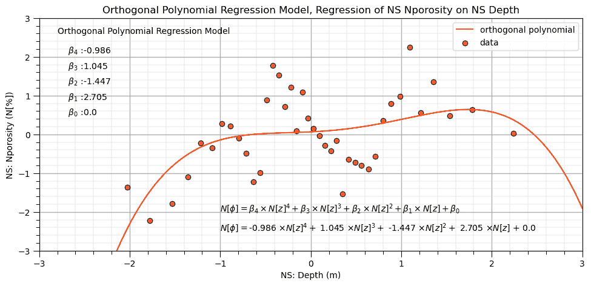

## 使用 Pipelines 的 scikit-learn 进行多项式回归

首先执行基展开然后训练结果（基变换后）的线性模型可能看起来有点复杂。

+   一种解决方案是使用 scikit-learn 的 Pipeline 对象。以下是关于 Pipeline 的一些亮点。

机器学习工作流程可能很复杂，包含各种步骤：

+   数据准备、特征工程转换

+   模型参数拟合

+   模型超参数调整

+   模型方法选择

+   在大量超参数组合中进行搜索

+   训练和测试模型运行

管道是 scikit-learn 中的一个类，允许封装一系列数据准备和建模步骤

+   然后我们可以将管道视为我们高度精简的工作流程中的一个对象

管道类允许我们：

+   提高代码可读性并保持一切井然有序

+   避免常见的流程问题，如数据泄露，测试数据告知模型参数训练

+   概括常见的机器学习建模，并专注于构建尽可能好的模型

基本哲学是将机器学习视为一种组合搜索，以找到最佳模型（AutoML）

```py
order=4                                                       # set the polynomial order

polyreg_pipe=make_pipeline(PolynomialFeatures(order),LinearRegression()) # make the modeling pipeline
polyreg_pipe.fit(X_ns.values.reshape(-1, 1), y_ns)            # fit the model to the data
y_hat = polyreg_pipe.predict(X_ns_values.reshape(-1, 1))      # predict with the modeling pipeline
poly_reg_model = polyreg_pipe.named_steps['linearregression'] # retrieve the model from the pipeline
pb0a,pb1,pb2,pb3,pb4 = np.round(poly_reg_model.coef_,3)       # retrieve the model parameters
pb0b = poly_reg_model.intercept_
pb0 = pb0a + pb0b

plt.subplot(111)                                              # plot the data and model
plt.plot(X_ns_values,y_hat, label='4th order',color = 'red') 
plt.scatter(X_ns,y_ns,marker='o',label='data',color = 'darkorange',alpha = 0.8,edgecolor = 'black')
plt.title(str(order) + r'$^{th}$ Polynomial Regression Model with Pipelines, Regression of NS ' + yname[0] + ' on NS ' + Xname[0])
plt.xlabel('NS: ' + Xname[0] + ' (' + Xunit[0] + ')')
plt.ylabel('NS: ' + yname[0] + ' (' + yunit[0] + ')')
plt.legend(); add_grid(); plt.xlim([-3.0,3.0]); plt.ylim([ymin,ymax])
plt.annotate('Orthogonal Polynomial Regression Model',[-2.8,2.6])
plt.annotate(r'    $\beta_4$ :' + str(round(pb4,3)),[-2.8,2.1])
plt.annotate(r'    $\beta_3$ :' + str(round(pb3,3)),[-2.8,1.7])
plt.annotate(r'    $\beta_2$ :' + str(round(pb2,3)),[-2.8,1.3])
plt.annotate(r'    $\beta_1$ :' + str(round(pb1,3)),[-2.8,0.9])
plt.annotate(r'    $\beta_0$ :' + str(round(pb0,2)),[-2.8,0.5])
plt.annotate(r'$N[\phi] = \beta_4 \times N[z]⁴ + \beta_3 \times N[z]³ + \beta_2 \times N[z]² + \beta_1 \times N[z] + \beta_0$',[-1.0,-2.0])
plt.annotate(r'$N[\phi] = $' + str(pb4) + r' $\times N[z]⁴ +$ ' + str(pb3) + r' $\times N[z]³ +$ ' + str(pb2) + r' $\times N[z]² +$ ' + 
             str(pb1) + r' $\times N[z]$ + ' + str(round(pb0,2)),[-1.0,-2.5])
plt.subplots_adjust(left=0.0, bottom=0.0, right=2.0, top=1.0, wspace=0.2, hspace=0.2); plt.show() 
```

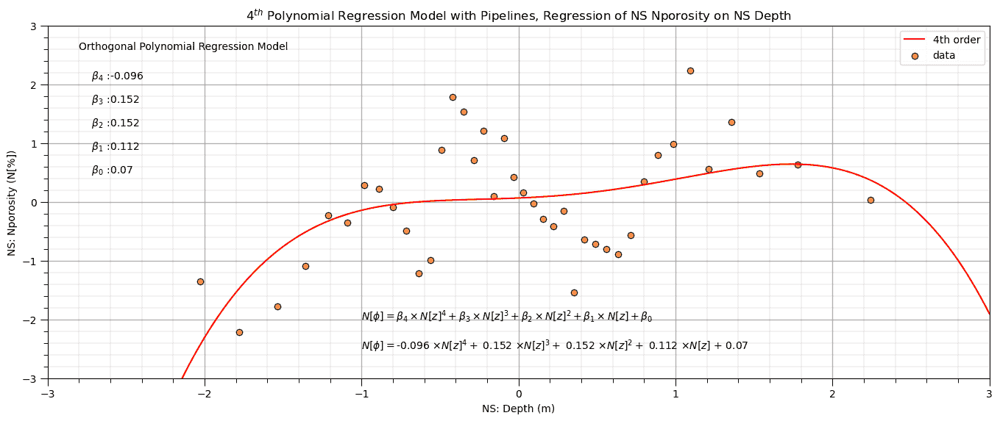

## 评论

这是对多项式回归的基本处理。可以做和讨论的还有很多，我有很多更多的资源。查看我的[共享资源清单](https://michaelpyrcz.com/my-resources)以及本章开头带有资源链接的视频讲座链接。

希望这有所帮助，

*迈克尔*

## 关于作者


迈克尔·皮尔奇教授在德克萨斯大学奥斯汀分校 40 英亩校园的办公室。

迈克尔·皮尔奇（Michael Pyrcz）是德克萨斯大学奥斯汀分校[科克雷尔工程学院](https://cockrell.utexas.edu/faculty-directory/alphabetical/p)和[杰克逊地球科学学院](https://www.jsg.utexas.edu/researcher/michael_pyrcz/)的教授，在那里他研究并教授地下、空间数据分析、地球统计学和机器学习。迈克尔还是，

+   [能源分析](https://fri.cns.utexas.edu/energy-analytics)新生研究项目的首席研究员，德克萨斯大学奥斯汀分校自然科学院机器学习实验室的核心教员

+   [《计算机与地球科学》](https://www.sciencedirect.com/journal/computers-and-geosciences/about/editorial-board)的副编辑，以及国际数学地球科学协会[《数学地球科学》](https://link.springer.com/journal/11004/editorial-board)的董事会成员。

迈克尔·皮尔奇（Michael Pyrcz）已撰写超过 70 篇[同行评审出版物](https://scholar.google.com/citations?user=QVZ20eQAAAAJ&hl=en)，一个用于空间数据分析的[Python 包](https://pypi.org/project/geostatspy/)，合著了一本关于空间数据分析的教科书[《地球统计学储层建模》](https://www.amazon.com/Geostatistical-Reservoir-Modeling-Michael-Pyrcz/dp/0199731446)，并是两本最近发布的电子书的作者，[《Python 应用地球统计学：GeostatsPy 实践指南》](https://geostatsguy.github.io/GeostatsPyDemos_Book/intro.html)和[《Python 应用机器学习：带代码的实践指南》](https://geostatsguy.github.io/MachineLearningDemos_Book/intro.html)。

迈克尔的所有大学讲座都可以在他的[YouTube 频道](https://www.youtube.com/@GeostatsGuyLectures)上找到，其中包含 100 多个 Python 交互式仪表板和 40 多个 GitHub 仓库中的详细记录的工作流程链接，以支持任何感兴趣的学生和在职专业人士。要了解更多关于迈克尔的工作和共享教育资源，请访问他的网站。

## 想一起工作吗？

我希望这些内容对那些想了解更多关于地下建模、数据分析与机器学习的人有所帮助。学生和在职专业人士都欢迎参与。

+   想邀请我到贵公司进行培训、辅导、项目审查、工作流程设计和/或咨询？我很乐意拜访并与您合作！

+   感兴趣合作、支持我的研究生研究或我的地下数据分析与机器学习联盟（共同负责人是约翰·福斯特教授）？我的研究将数据分析、随机建模和机器学习理论与实践相结合，以开发新的方法和工作流程，增加价值。我们正在解决具有挑战性的地下问题！

+   您可以通过 mpyrcz@austin.utexas.edu 联系我。

我总是很高兴讨论，

*迈克尔*

迈克尔·皮尔茨，博士，注册工程师，德克萨斯大学奥斯汀分校 Cockrell 工程学院和 Jackson 地球科学学院教授

更多资源请访问：[Twitter](https://twitter.com/geostatsguy) | [GitHub](https://github.com/GeostatsGuy) | [网站](http://michaelpyrcz.com) | [Google Scholar](https://scholar.google.com/citations?user=QVZ20eQAAAAJ&hl=en&oi=ao) | [地统计学书籍](https://www.amazon.com/Geostatistical-Reservoir-Modeling-Michael-Pyrcz/dp/0199731446) | [YouTube](https://www.youtube.com/channel/UCLqEr-xV-ceHdXXXrTId5ig) | [Python 中应用地统计学电子书](https://geostatsguy.github.io/GeostatsPyDemos_Book/intro.html) | [Python 中应用机器学习电子书](https://geostatsguy.github.io/MachineLearningDemos_Book/) | [LinkedIn](https://www.linkedin.com/in/michael-pyrcz-61a648a1)

## 多项式回归的动机

通过从线性回归到多项式回归的转变，我们，

+   通过模拟数据中的非线性来增加预测的灵活性

+   建立在特征工程概念的特征扩展之上

在从训练模型参数如线性回归的分析解中受益的同时。

我们通过基函数扩展完成所有这些，

+   我们将特征进行转换和扩展 $\rightarrow$ 引入基函数扩展！

+   我们可以增加我们的预测模型复杂性和灵活性 $\rightarrow$ 非线性基！

+   我们可以通过消除多重共线性来提高模型的鲁棒性 $\rightarrow$ 正交基！

让我们从线性回归开始，然后过渡到多项式回归。

## 线性回归

用于预测的线性回归，让我们先看看一组数据拟合的线性模型。


示例线性回归模型。

让我们先定义一些术语，

+   **预测特征** - 预测模型的输入特征，鉴于我们只讨论线性回归而不是多元线性回归，我们只有一个预测特征 $x$。在我们的图表（包括上面的）中，预测特征位于 x 轴上。

+   **响应特征** - 预测模型的输出特征，在这种情况下，$y$。在我们的图表（包括上面的）中，响应特征位于 y 轴上。

现在，以下是线性回归的一些关键方面：

**参数模型**

这是一个参数预测机器学习模型，我们接受一个先验的线性假设，然后获得一个非常低的参数表示，这使得在没有大量数据的情况下易于训练。

+   适合的模型是一个基于所有可用特征 $x_1,\ldots,x_m$ 的简单加权线性加性模型。

+   参数模型采取以下形式：

$$ y = \sum_{\alpha = 1}^m b_{\alpha} x_{\alpha} + b_0 $$

这里是线性模型参数的可视化，


线性模型参数。

**最小二乘法**

对于模型参数 $b_1,\ldots,b_m,b_0$ 的解析解在 L2 范数损失函数中是可用的，误差是累加并平方的，已知为最小二乘法。

+   我们在训练数据上最小化误差，残差平方和（RSS）：

$$ RSS = \sum_{i=1}^n \left(y_i - (\sum_{\alpha = 1}^m b_{\alpha} x_{\alpha,i} + b_0) \right)² $$

其中 $y_i$ 是实际响应特征值，而 $\sum_{\alpha = 1}^m b_{\alpha} x_{\alpha} + b_0$ 是模型预测值，这些预测值是基于 $\alpha = 1,\ldots,n$ 的训练数据。

这里是 L2 范数损失函数，均方误差的可视化，


线性模型损失函数，均方误差。

+   这可以简化为训练数据上的平方误差之和，

\begin{equation} \sum_{i=1}^n (\Delta y_i)² \end{equation}

其中 $\Delta y_i$ 是实际响应特征观察 $y_i$ 减去模型预测 $\sum_{\alpha = 1}^m b_{\alpha} x_{\alpha} + b_0$，在 $i = 1,\ldots,n$ 的训练数据上。

**假设**

我们的线性回归模型有一些重要的假设，

+   **无误差** - 预测变量是无误差的，不是随机变量

+   **线性** - 响应是特征（的）线性组合

+   **常数方差** - 响应误差在预测值上是恒定的

+   **误差独立性** - 响应误差彼此不相关

+   **无多重共线性** - 没有特征与其他特征冗余

## 预测特征 / 基础扩展

我们可以通过对预测特征应用基础函数来应用基础扩展，以增加模型灵活性和复杂性。基本思想是利用一套基础函数 $h_1, h_2, \ldots, h_k$，这些函数提供了新的预测特征。

$$ h(x_i) = (h_1(x_i),h_1(x_i),\ldots,h_k(x_i)) $$

从一个特征 $X$ 到 $k$ 个特征的扩展基 $X_1, X_2,\ldots, X_k$。

+   如果我们的数据表中具有 $m$ 个特征，我们现在有 $k \times m$ 个特征


将预测特征 $m$ 的基函数扩展到 $m \times k$ 个扩展特征。

## 多项式回归

可以证明多项式回归只是将线性回归应用于预测特征的多项式展开。

$$ X_{j} \rightarrow X_{j}, X_{j}², X_{j}³, \ldots X_{j}^k $$

其中我们具有 $j = 1, \ldots, m$ 个原始特征。

我们现在有一个扩展的预测特征集。

$$ h_{j,k}(X_j) = X_j^k $$

其中我们具有 $j = 1, \ldots, m$ 个原始特征和 $k = 1, \ldots, K$ 个多项式阶数。

我们现在可以将我们的模型表述为转换特征的线性回归。

$$ y = f(x) = \sum_{j=1}^{m} \sum_{k = 1}^{K} \beta_{j,k} h_{j,m}(X_j) + \beta_0 $$

经过 $h_l, l=1,\ldots,k$ 的转换后，对于 $j=1,\ldots,m$ 个预测特征，我们有相同的线性方程和利用先前讨论的解析解的能力，参见线性回归章节。

我们假设在应用基变换后线性成立。

+   现在模型系数 $\beta_{l,i}$ 与初始预测特征的转换版本相关，$h_l(X_i)$。

+   但我们失去了解释系数的能力，例如，$\phi⁴$ 中 $\phi$ 是孔隙率是什么？

例如，对于单个预测特征 $m = 1$，并且最高到 $4^{th}$ 阶，模型是，

$$ y = \beta_{1,1}X_1 + \beta_{1,1}X_1² + \beta_{1,3}X_1³ + \beta_{1,4}X_1⁴ + \beta_0 $$

其中模型参数的表示为 $\beta_{m,k}$，其中 $m$ 是特征，$k$ 是阶数。为了澄清，这里以 $m = 2$ 为例，

$$ y = \beta_{1,1}X_1 + \beta_{1,2}X_1² + \beta_{1,3}X_1³ + \beta_{1,4}X_1⁴ + \beta_{2,1}X_2 + \beta_{2,2}X_2² + \beta_{2,3}X_2³ + \beta_{2,4}X_2⁴ + \beta_0 $$

因此，我们的预测建模工作流程如下：

+   应用多项式基展开

+   在多项式基展开上执行线性回归

## 多项式回归的优点和缺点

多项式回归相对于线性回归的优点包括，

+   提高了拟合非线性现象的灵活性，通过线性分析和解析解来训练模型参数。

缺点

通常，模型方差显著更高！可能存在不稳定的插值和特别是外推。

对异常值敏感，特别是当 $ℎ_𝑘 \left(𝑥_{𝑖,𝑗}\right)=𝑥_{𝑖,𝑗}^𝑘$ 且 $𝑘$ 较大时

我们失去了模型参数的可解释性，$𝛽_{𝑗,𝑘}$ 与 $ℎ_𝑘 \left(𝑋_j \right)$ 相关。

## 添加基本函数

多项式回归的另一种解释是通过添加基本函数（即基函数）构建回归模型。

让我们用一个预测特征和 $K$ 个基展开来工作。

$$ y = \sum_{l=1}^{k} \beta_{1,k} h_k (X_j) $$

对于我们的简单单预测特征 X 的多项式问题，这是，

$$ y = \beta_{1,K} X^K + \beta_{1,K-1} X^{K-1} + \dots + \beta_{1,2} X² + \beta_{1,1} X + \beta_0 $$

让我们使用标准深度 4 阶多项式展开，$K=4$，进行工作。


多项式基至$K=4$。

为了构建我们的函数，我们正在移动、缩放和添加这些基本函数。让我们通过$k=2$基函数的例子，即抛物线$h_2: 𝑦=𝑥²$，回顾如何进行基本函数的移动和缩放。考虑以下变化：

+   在 X 轴上平移

+   在 Y 轴上平移

+   在 X 轴上翻转

+   改变斜率

对于每一个，我都展示了变化的可视化，然后是它对多项式方程的影响。

+   在 X 轴上平移函数，


在 X 轴上平移二阶基本函数。

$$ y = (x - \Delta_x)² = x² - 2\Delta_x x + \Delta_x² $$

+   在 Y 轴上平移函数，


在 Y 轴上平移二阶基本函数。

$$ y = x² - \Delta_y $$

+   在 X 轴上翻转函数：


在 X 轴上翻转二阶基本函数。

$$ y = \pm \beta_2 x² $$

+   改变斜率：


改变二阶基本函数的斜率。

$$ y = \downarrow \beta_2 x², \text{更宽/更浅} $$$$ y = \uparrow \beta_2 x², \text{更窄/更深} $$

让我们从上面的内容中做一些观察，

+   仅在 Y 轴上平移需要修改多项式方程中模型参数的常数项

+   在 X 轴上平移需要修改多项式方程中低阶模型参数

+   在 X 轴上翻转需要改变多项式方程中当前阶数模型参数的符号

+   增加斜率需要增加多项式方程中当前阶数模型参数

## 多项式回归的假设

我们的多项式回归模型有一些重要的假设，这些假设是从上述线性回归的假设中扩展出来的，

+   **无误差** - 预测特征基函数展开是无误差的，不是随机变量

+   **常数方差** - 响应误差在预测值上是恒定的

+   **线性** - 响应是基特征线性组合

+   **多项式** - X 和 Y 之间的关系是多项式

+   **误差独立性** - 响应误差之间相互不相关

+   **无多重共线性** - 基特征展开中没有任何一个与其他特征线性冗余

考虑上述多项式基展开，检查我们基之间的共线性。为了检查，我计算了以下演示中使用的基展开的相关矩阵。


$K=4$ 的多项式基展开的相关矩阵。

$K=1$ 和 $K=3$ 的基与 $k=2$ 和 $k=4$ 的基之间存在强烈的共线性。

+   回想一下，共线性可能增加模型方差

为了消除这种共线性，我们可以应用赫尔米特多项式。

## **赫尔米特多项式**

是实数线上正交多项式族。

| 阶数 | 赫尔米特多项式 $H_e(x)$ |
| --- | --- |
| 0 阶 | $H_{e_0}(x) = 1$ |
| 1 阶 | $H_{e_1}(x) = x$ |
| 2 阶 | $H_{e_2}(x) = x² - 1$ |
| 3 阶 | $H_{e_3}(x) = x³ - 3x$ |
| 4 阶 | $H_{e_4}(x) = x⁴ - 6x² + 3$ |

这些多项式相对于一个加权函数是正交的，

$$ 𝑤(𝑥)=𝑒^{−\frac{𝑥²}{2}} $$

这是标准高斯概率密度函数，没有缩放器，$\frac{1}{\sqrt{2\pi}}$。正交性的定义如下，

$$ \int_{-\infty}^{\infty} H_m(x) H_n(x) w(x) \, dx = 0 $$

赫尔米特多项式在标准正态概率分布的区间 $[−\infty,\infty]$ 上是正交的。

通过在多项式回归中用赫尔米特多项式代替常规多项式进行多项式基展开，我们消除了预测特征之间的多重共线性，

+   回想一下，预测特征的独立性是应用于多项式回归中多项式基展开的线性系统的一个假设

## 加载所需的库

我们还需要一些标准包。这些应该已经与 Anaconda 3 一起安装。

```py
%matplotlib inline                                         
suppress_warnings = True
import os                                                     # to set current working directory 
import math                                                   # square root operator
import numpy as np                                            # arrays and matrix math
import scipy                                                  # Hermite polynomials
from scipy import stats                                       # statistical methods
import pandas as pd                                           # DataFrames
import pandas.plotting as pd_plot
import matplotlib.pyplot as plt                               # for plotting
from matplotlib.ticker import (MultipleLocator,AutoMinorLocator,FuncFormatter) # control of axes ticks
from matplotlib.colors import ListedColormap                  # custom color maps
import seaborn as sns                                         # for matrix scatter plots
from sklearn.linear_model import LinearRegression             # linear regression with scikit learn
from sklearn.preprocessing import PolynomialFeatures          # polynomial basis expansion
from sklearn import metrics                                   # measures to check our models
from sklearn.preprocessing import (StandardScaler,PolynomialFeatures) # standardize the features, polynomial basis expansion
from sklearn.model_selection import (cross_val_score,train_test_split,GridSearchCV,KFold) # model tuning
from sklearn.pipeline import (Pipeline,make_pipeline)         # machine learning modeling pipeline
from sklearn import metrics                                   # measures to check our models
from sklearn.model_selection import cross_val_score           # multi-processor K-fold crossvalidation
from sklearn.model_selection import train_test_split          # train and test split
from IPython.display import display, HTML                     # custom displays
cmap = plt.cm.inferno                                         # default color bar, no bias and friendly for color vision defeciency
plt.rc('axes', axisbelow=True)                                # grid behind plotting elements
if suppress_warnings == True:  
    import warnings                                           # supress any warnings for this demonstration
    warnings.filterwarnings('ignore') 
seed = 13                                                     # random number seed for workflow repeatability 
```

如果您遇到包导入错误，您可能首先需要安装这些包中的一些。这通常可以通过在 Windows 上打开命令窗口然后输入 ‘python -m pip install [package-name]’ 来完成。有关相应包的文档，还有更多帮助。

## 声明函数

让我们定义一个方便的函数来为我们的图表添加网格线，并绘制相关矩阵。

```py
def add_grid():
    plt.gca().grid(True, which='major',linewidth = 1.0); plt.gca().grid(True, which='minor',linewidth = 0.2) # add y grids
    plt.gca().tick_params(which='major',length=7); plt.gca().tick_params(which='minor', length=4)
    plt.gca().xaxis.set_minor_locator(AutoMinorLocator()); plt.gca().yaxis.set_minor_locator(AutoMinorLocator()) # turn on minor ticks

def plot_corr(corr_matrix,title,limits,mask):                 # plots a graphical correlation matrix 
    my_colormap = plt.get_cmap('RdBu_r', 256)          
    newcolors = my_colormap(np.linspace(0, 1, 256))
    white = np.array([256/256, 256/256, 256/256, 1])
    white_low = int(128 - mask*128); white_high = int(128+mask*128)
    newcolors[white_low:white_high, :] = white                # mask all correlations less than abs(0.8)
    newcmp = ListedColormap(newcolors)
    m = corr_matrix.shape[0]
    im = plt.matshow(corr_matrix,fignum=0,vmin = -1.0*limits, vmax = limits,cmap = newcmp)
    plt.xticks(range(len(corr_matrix.columns)), corr_matrix.columns); ax = plt.gca()
    ax.xaxis.set_label_position('bottom'); ax.xaxis.tick_bottom()
    plt.yticks(range(len(corr_matrix.columns)), corr_matrix.columns)
    plt.colorbar(im, orientation = 'vertical')
    plt.title(title)
    for i in range(0,m):
        plt.plot([i-0.5,i-0.5],[-0.5,m-0.5],color='black')
        plt.plot([-0.5,m-0.5],[i-0.5,i-0.5],color='black')
    plt.ylim([-0.5,m-0.5]); plt.xlim([-0.5,m-0.5]) 
```

## 设置工作目录

我总是喜欢这样做，这样我就不会丢失文件，并且可以简化后续的读取和写入（避免每次都包含完整地址）。

```py
#os.chdir("c:/PGE383")                                        # set the working directory 
```

您将需要更新引号内的部分以使用您自己的工作目录，并且在 Mac 上格式不同（例如：“~/PGE”）。

## 加载数据

让我们加载提供的二元，空间数据集 [Density_Por_data.csv](https://raw.githubusercontent.com/GeostatsGuy/GeoDataSets/master/Density_Por_data.csv)，它在我的 GeoDataSet 仓库中可用。它是一个逗号分隔的文件，包含：

+   深度（米）

+   高斯转换孔隙率（%）

我们使用 pandas 的 ‘read_csv’ 函数将其加载到我们称为 ‘df’ 的数据框中。

```py
df = pd.read_csv(r"https://raw.githubusercontent.com/GeostatsGuy/GeoDataSets/master/1D_Porosity.csv") # data from Dr. Pyrcz's github repository 
```

## 可视化 DataFrame

可视化训练集和测试集的 DataFrame 是在我们构建模型之前的一个有用的检查。

+   许多事情可能会出错，例如，我们加载了错误的数据，所有特征都没有加载等。

我们可以通过利用 ‘head’ DataFrame 成员函数来预览（格式整洁，见下文）。

```py
df.head(n=13)                                                 # preview the data 
```

|  | 深度 | 孔隙率 |
| --- | --- | --- |
| 0 | 0.25 | -1.37 |
| 1 | 0.50 | -2.08 |
| 2 | 0.75 | -1.67 |
| 3 | 1.00 | -1.16 |
| 4 | 1.25 | -0.24 |
| 5 | 1.50 | -0.36 |
| 6 | 1.75 | 0.44 |
| 7 | 2.00 | 0.36 |
| 8 | 2.25 | -0.02 |
| 9 | 2.50 | -0.63 |
| 10 | 2.75 | -1.26 |
| 11 | 3.00 | -1.03 |
| 12 | 3.25 | 0.88 |

## 表格数据的汇总统计信息

在 DataFrames 中，有许多高效的方法可以计算表格数据的汇总统计信息。

+   describe 命令提供了一个计数、平均值、标准差、百分位数、最小值、最大值的数据表。

+   我喜欢指定百分位数，否则默认为 P25，P50 和 P75 四分位数

```py
df.describe(percentiles=[0.1,0.9]).transpose()                # summary statistics 
```

|  | count | mean | std | min | 10% | 50% | 90% | max |
| --- | --- | --- | --- | --- | --- | --- | --- | --- |
| Depth | 40.0 | 5.12500 | 2.922613 | 0.25 | 1.225 | 5.125 | 9.025 | 10.00 |
| Nporosity | 40.0 | 0.02225 | 0.992111 | -2.08 | -1.271 | 0.140 | 1.220 | 2.35 |

在这里，我们将深度和高斯变换的孔隙率 Nporosity 从 DataFrame 中提取到单独的一维数组中，分别称为'depth'和'NPor'，以便代码易于阅读。

+   警告，这是一个浅拷贝，如果我们更改这些一维数组，更改将反映在原始 DataFrame 中

```py
Xname = ['Depth']; yname = ['Nporosity']                      # select the predictor and response feature

Xlabel = ['Depth']; ylabel = ['Gaussian Transformed Porosity'] # specify the feature labels for plotting
Xunit = ['m']; yunit = ['N[%]']
Xlabelunit = [Xlabel[0] + ' (' + Xunit[0] + ')']
ylabelunit = ylabel[0] + ' (' + yunit[0] + ')'

X = df[Xname[0]]                                              # extract the 1D ndarrays from the DataFrame
y = df[yname[0]]

Xmin = 0.0; Xmax = 10.0                                       # limits for plotting
ymin = -3.0; ymax = 3.0

X_values = np.linspace(Xmin,Xmax,100)                         # X intervals to visualize the model 
```

## 线性回归模型

让我们首先使用 scikit-learn 的 LinearRegression 类计算线性回归模型。步骤包括，

1.  **instantiate** - 线性回归对象，注意这里没有需要指定的超参数。

1.  **fit** - 使用训练数据训练实例化的线性回归对象

1.  **predict** - 使用训练好的线性回归对象

这里是我们线性回归模型的实例化和拟合步骤。

+   注意，我们添加了 reshape 到我们的预测特征中，因为 scikit-learn 假设有多个预测特征，并期望一个二维数组。我们将一维 ndarray 重塑为一个只有一列的二维数组。

训练模型后，我们用数据绘制模型，以进行可视模型检查。

```py
lin = LinearRegression()                                      # instantiate linear regression object, note no hyperparameters 
lin.fit(X.values.reshape(-1, 1), y)                           # train linear regression model

slope = lin.coef_[0]                                          # get the model parameters
intercept = lin.intercept_

plt.subplot(111)                                              # plot the data and the model
plt.scatter(X,y,marker='o',label='data',color = 'darkorange',alpha = 0.8,edgecolor = 'black')
plt.plot(X_values,intercept + slope*X_values,label='model',color = 'black')
plt.title('Linear Regression Model, Regression of ' + yname[0] + ' on ' + Xname[0])
plt.xlabel(Xname[0] + ' (' + Xunit[0] + ')')
plt.ylabel(yname[0] + ' (' + yunit[0] + ')')
plt.legend(); add_grid(); plt.xlim([Xmin,Xmax]); plt.ylim([ymin,ymax])
plt.annotate('Linear Regression Model',[4.5,-1.8])
plt.annotate(r'    $\beta_1$ :' + str(round(slope,2)),[6.8,-2.3])
plt.annotate(r'    $\beta_0$ :' + str(round(intercept,2)),[6.8,-2.7])
plt.annotate(r'$N[\phi] = \beta_1 \times z + \beta_0$',[4.0,-2.3])
plt.annotate(r'$N[\phi] = $' + str(round(slope,2)) + r' $\times$ $z$ + (' + str(round(intercept,2)) + ')',[4.0,-2.7])

plt.subplots_adjust(left=0.0, bottom=0.0, right=1.4, top=0.8, wspace=0.2, hspace=0.2); plt.show() 
```


## 与非参数预测机器学习模型的比较

让我们运行几个非参数预测机器学习模型，以与线性参数模型和多项式参数模型进行对比。首先我们训练一个快速决策树模型，然后是一个随机森林模型。

+   我们获得了显著的灵活性，可以拟合数据中的任何模式

+   需要更多的推理，因为非参数实际上参数丰富！

更多细节，请参阅关于决策树和随机森林的章节。

```py
from sklearn import tree                                      # tree program from scikit learn 

my_tree = tree.DecisionTreeRegressor(min_samples_leaf=5, max_depth = 20) # instantiate the decision tree model with hyperparameters
my_tree = my_tree.fit(X.values.reshape(-1, 1),y)              # fit the decision tree to the training data (all the data in this case)
DT_y = my_tree.predict(X_values.reshape(-1,1))                # predict at high resolution over the range of depths

plt.subplot(111)                                              # plot the model and data
plt.scatter(X,y,marker='o',label='data',color = 'darkorange',alpha = 0.8,edgecolor = 'black')
plt.plot(X_values, DT_y, label='model', color = 'black')
plt.title('Decision Tree Model, ' + yname[0] + ' as a Function of ' + Xname[0])
plt.xlabel(Xname[0] + ' (' + Xunit[0] + ')')
plt.ylabel(yname[0] + ' (' + yunit[0] + ')')
plt.legend(); add_grid(); plt.xlim([Xmin,Xmax]); plt.ylim([ymin,ymax])
plt.subplots_adjust(left=0.0, bottom=0.0, right=1.4, top=0.8, wspace=0.2, hspace=0.2); plt.show() 
```


这里是一个随机森林模型：

```py
from sklearn.ensemble import RandomForestRegressor            # random forest method

max_depth = 5                                                 # set the random forest hyperparameters
num_tree = 1000
max_features = 1

my_forest = RandomForestRegressor(max_depth=max_depth,random_state=seed,n_estimators=num_tree,max_features=max_features)
my_forest.fit(X = X.values.reshape(-1, 1), y = y)  
RF_y = my_forest.predict(X_values.reshape(-1,1))
plt.subplot(111)
plt.scatter(X,y,marker='o',label='data',color = 'darkorange',alpha = 0.8,edgecolor = 'black')
plt.plot(X_values, RF_y, label='model', color = 'black')
plt.title('Random Forest Tree Model, ' + yname[0] + ' as a Function of ' + Xname[0])
plt.xlabel(Xname[0] + ' (' + Xunit[0] + ')')
plt.ylabel(yname[0] + ' (' + yunit[0] + ')')
plt.legend(); add_grid(); plt.xlim([Xmin,Xmax]); plt.ylim([ymin,ymax])
plt.subplots_adjust(left=0.0, bottom=0.0, right=2.0, top=1.0, wspace=0.2, hspace=0.2)
plt.show() 
```


注意，没有对这些建模的超参数进行调整。我只是想展示非参数模型学习系统形状的巨大灵活性。

现在，我们回到我们的参数多项式模型。

+   让我们首先将数据转换为标准正态分布，即高斯分布。

+   我们这样做是为了提高模型拟合度（处理异常值）并符合即将介绍的 Hermite 多项式理论。

## 高斯畸变 \ 高斯变换

让我们将特征转换为标准正态分布，

+   高斯分布

+   均值为 0.0

+   标准差为 1.0

孔隙率特征之前已经被“转换”为高斯分布，但有机会进行清理。

+   比较原始和转换后的结果

+   注意，我使用了我从原始 GSLIB (Deutsch and Journel, 1997) 端口移植的 GeostatsPy 高斯变换，因为 scikit-learn 的高斯变换会创建截断尖峰/异常值。

```py
import geostatspy.geostats as geostats                        # for Gaussian transform from GSLIB

df_ns = pd.DataFrame()   
df_ns[Xname[0]], tvPor, tnsPor = geostats.nscore(df, Xname[0]) # nscore transform for all facies porosity 
df_ns[yname[0]], tvdepth, tnsdepth = geostats.nscore(df, yname[0]) # nscore transform for all facies permeability
X_ns = df_ns[Xname[0]]; y_ns = df_ns[yname[0]]
X_ns_values = np.linspace(-3.0,3.0,1000)                      # values to predict at in standard normal space 
```

让我们绘制一些好的累积分布函数图来检查原始和转换后的变量。

+   结果看起来非常好

我们这样做是因为我们需要一个高斯分布的预测特征来实现正交性。更多内容稍后揭晓！

```py
plt.subplot(221)                                              # plot original sand and shale porosity histograms
plt.hist(df[Xname[0]], facecolor='red',bins=np.linspace(Xmin,Xmax,1000),histtype="stepfilled",alpha=0.2,density=True,
         cumulative=True,edgecolor='black',label='Original')
plt.xlim([0.0,10.0]); plt.ylim([0,1.0])
plt.xlabel(Xname[0] + ' (' + Xunit[0] + ')'); plt.ylabel('Frequency'); plt.title('Original Depth')
plt.legend(loc='upper left')
plt.grid(True)

plt.subplot(222)  
plt.hist(df_ns[Xname[0]], facecolor='blue',bins=np.linspace(-3.0,3.0,1000),histtype="stepfilled",alpha=0.2,density=True,
         cumulative=True,edgecolor='black',label = 'NS')
plt.xlim([-3.0,3.0]); plt.ylim([0,1.0])
plt.xlabel('NS: ' + Xname[0] + ' (' + Xunit[0] + ')'); plt.ylabel('Frequency'); plt.title('Nscore ' + Xname[0])
plt.legend(loc='upper left')
plt.grid(True)

plt.subplot(223)                                        # plot nscore transformed sand and shale histograms
plt.hist(df[yname[0]], facecolor='red',bins=np.linspace(ymin,ymax,1000),histtype="stepfilled",alpha=0.2,density=True,
         cumulative=True,edgecolor='black',label='Original')
plt.xlim([-3.0,3.0]); plt.ylim([0,1.0])
plt.xlabel(yname[0] + ' (' + yunit[0] + ')'); plt.ylabel('Frequency'); plt.title('Original Porosity')
plt.legend(loc='upper left')
plt.grid(True)

plt.subplot(224)                                        # plot nscore transformed sand and shale histograms
plt.hist(df_ns[yname[0]], facecolor='blue',bins=np.linspace(-3.0,3.0,1000),histtype="stepfilled",alpha=0.2,density=True,
         cumulative=True,edgecolor='black',label = 'NS')
plt.xlim([-3.0,3.0]); plt.ylim([0,1.0])
plt.xlabel('NS: ' + yname[0] + ' (' + yunit[0] + ')'); plt.ylabel('Frequency'); plt.title('Nscore ' + yname[0])
plt.legend(loc='upper left')
plt.grid(True)

plt.subplots_adjust(left=0.0, bottom=0.0, right=1.5, top=2.0, wspace=0.2, hspace=0.3); plt.show() 
```


## 带有标准化特征的线性回归模型

让我们重复线性回归模型，现在使用标准化特征。

```py
lin_ns = LinearRegression()                                   # instantiate linear regression object, note no hyperparameters 
lin_ns.fit(X_ns.values.reshape(-1, 1), y_ns)                  # train linear regression model
slope_ns = lin_ns.coef_[0]                                    # get the model parameters
intercept_ns = lin_ns.intercept_

plt.subplot(111)                                              # plot the data and the model
plt.scatter(X_ns,y_ns,marker='o',label='data',color = 'darkorange',alpha = 0.8,edgecolor = 'black')
plt.plot(X_ns_values,intercept_ns + slope_ns*X_ns_values,label='model',color = 'black')
plt.title('Linear Regression Model, Regression of NS ' + yname[0] + ' on ' + Xname[0])
plt.xlabel('NS: ' + Xname[0] + ' (' + Xunit[0] + ')')
plt.ylabel('NS: ' + yname[0] + ' (' + yunit[0] + ')')
plt.legend(); add_grid(); plt.xlim([-3.0,3.0]); plt.ylim([ymin,ymax])
plt.annotate('Linear Regression Model',[0.8,-1.8])
plt.annotate(r'    $\beta_1$ :' + str(round(slope_ns,2)),[1.8,-2.3])
plt.annotate(r'    $\beta_0$ :' + str(round(intercept_ns,2)),[1.8,-2.7])
plt.annotate(r'$N[\phi] = \beta_1 \times z + \beta_0$',[0.5,-2.3])
plt.annotate(r'$N[\phi] = $' + str(round(slope_ns,2)) + r' $\times$ $z$ + (' + str(round(intercept_ns,2)) + ')',[0.5,-2.7])

plt.subplots_adjust(left=0.0, bottom=0.0, right=1.4, top=0.8, wspace=0.2, hspace=0.2); plt.show() 
```


再次，拟合度不佳。让我们使用更复杂、更灵活的预测机器学习模型。

## 多项式回归

我们将手动进行多项式回归：

+   创建原始预测特征的多项式基展开

+   在多项式基展开上进行线性回归

### 多项式基展开

让我们从计算 1 个预测特征的多项式基展开开始。

```py
poly4 = PolynomialFeatures(degree = 4)                        # instantiate polynomial expansion 
X_ns_poly4 = poly4.fit_transform(X_ns.values.reshape(-1, 1))  # calculate the basis expansion for our dataset
df_X_ns_poly4 = pd.DataFrame({'Values':X_ns,'0th':X_ns_poly4[:,0],'1st':X_ns_poly4[:,1],'2nd':X_ns_poly4[:,2], 
                              '3rd':X_ns_poly4[:,3],'4th':X_ns_poly4[:,4]}) # make a new DataFrame from the vectors
df_X_ns_poly4 = pd.DataFrame({'Values':X_ns,'1st':X_ns_poly4[:,1],'2nd':X_ns_poly4[:,2], 
                              '3rd':X_ns_poly4[:,3],'4th':X_ns_poly4[:,4]}) # make a new DataFrame from the vectors
df_X_ns_poly4.head()                                          # preview the polynomial basis expansion with the original predictor feature 
```

|  | 值 | 第一 | 第二 | 第三 | 第四 |
| --- | --- | --- | --- | --- | --- |
| 0 | -2.026808 | -2.026808 | 4.107951 | -8.326029 | 16.875264 |
| 1 | -1.780464 | -1.780464 | 3.170053 | -5.644167 | 10.049238 |
| 2 | -1.534121 | -1.534121 | 2.353526 | -3.610592 | 5.539084 |
| 3 | -1.356312 | -1.356312 | 1.839582 | -2.495046 | 3.384060 |
| 4 | -1.213340 | -1.213340 | 1.472193 | -1.786270 | 2.167352 |

现在，让我们检查原始预测特征数据的多项式基展开之间的相关性。

+   回想一下，预测特征之间的高度相关性会增加模型方差。

```py
corr_matrix = df_X_ns_poly4.iloc[:,1:].corr()                 # calculate the correlation matrix

plt.subplot(111)
plot_corr(corr_matrix,'Polynomial Expansion Correlation Matrix',1.0,0.1) # using our correlation matrix visualization function
plt.xlabel('Features'); plt.ylabel('Features')

plt.subplots_adjust(left=0.0, bottom=0.0, right=1.0, top=0.8, wspace=0.2, hspace=0.3); plt.show() 
```


第一阶和第三阶以及第二阶和第四阶之间存在高度相关性。

+   让我们通过多项式基的矩阵散点图来检查这一点。

### 多项式基展开

让我们从计算 1 个预测特征的多项式基展开开始。

```py
poly4 = PolynomialFeatures(degree = 4)                        # instantiate polynomial expansion 
X_ns_poly4 = poly4.fit_transform(X_ns.values.reshape(-1, 1))  # calculate the basis expansion for our dataset
df_X_ns_poly4 = pd.DataFrame({'Values':X_ns,'0th':X_ns_poly4[:,0],'1st':X_ns_poly4[:,1],'2nd':X_ns_poly4[:,2], 
                              '3rd':X_ns_poly4[:,3],'4th':X_ns_poly4[:,4]}) # make a new DataFrame from the vectors
df_X_ns_poly4 = pd.DataFrame({'Values':X_ns,'1st':X_ns_poly4[:,1],'2nd':X_ns_poly4[:,2], 
                              '3rd':X_ns_poly4[:,3],'4th':X_ns_poly4[:,4]}) # make a new DataFrame from the vectors
df_X_ns_poly4.head()                                          # preview the polynomial basis expansion with the original predictor feature 
```

|  | 值 | 第一 | 第二 | 第三 | 第四 |
| --- | --- | --- | --- | --- | --- |
| 0 | -2.026808 | -2.026808 | 4.107951 | -8.326029 | 16.875264 |
| 1 | -1.780464 | -1.780464 | 3.170053 | -5.644167 | 10.049238 |
| 2 | -1.534121 | -1.534121 | 2.353526 | -3.610592 | 5.539084 |
| 3 | -1.356312 | -1.356312 | 1.839582 | -2.495046 | 3.384060 |
| 4 | -1.213340 | -1.213340 | 1.472193 | -1.786270 | 2.167352 |

现在，让我们检查原始预测特征数据的多项式基展开的相关性。

+   回想一下，预测特征之间高度的相关性会增加模型方差。

```py
corr_matrix = df_X_ns_poly4.iloc[:,1:].corr()                 # calculate the correlation matrix

plt.subplot(111)
plot_corr(corr_matrix,'Polynomial Expansion Correlation Matrix',1.0,0.1) # using our correlation matrix visualization function
plt.xlabel('Features'); plt.ylabel('Features')

plt.subplots_adjust(left=0.0, bottom=0.0, right=1.0, top=0.8, wspace=0.2, hspace=0.3); plt.show() 
```


我们在阶数 1 和 3 以及阶数 2 和 4 之间存在高度相关性。

+   让我们通过多项式基的矩阵散点图来验证这一点。

## 可视化多项式展开特征的成对关系

```py
sns.pairplot(df_X_ns_poly4.iloc[:,1:],vars=['1st','2nd','3rd','4th'],markers='o', kind='reg',diag_kind='kde')
plt.subplots_adjust(left=0.0, bottom=0.0, right=1.0, top=1.0, wspace=0.2, hspace=0.2); plt.show() 
```


让我们在高斯变换深度上可视化多项式展开。

```py
plt.subplot(111)                                              # plot the polynomial basis expansion
plt.plot(X_ns_values,poly4.fit_transform(X_ns_values.reshape(-1, 1))[:,0],label='0th',color = 'black')
plt.plot(X_ns_values,poly4.fit_transform(X_ns_values.reshape(-1, 1))[:,1],label='1th',color = 'blue')
plt.plot(X_ns_values,poly4.fit_transform(X_ns_values.reshape(-1, 1))[:,2],label='2th',color = 'green')
plt.plot(X_ns_values,poly4.fit_transform(X_ns_values.reshape(-1, 1))[:,3],label='3th',color = 'red')
plt.plot(X_ns_values,poly4.fit_transform(X_ns_values.reshape(-1, 1))[:,4],label='4th',color = 'orange') 
plt.title('Polynomial Basis Expansion of ' + Xname[0])
plt.xlabel('NS: ' + Xname[0] + ' (' + Xunit[0] + ')')
plt.ylabel('h[ NS: ' + Xname[0] + ' (' + Xunit[0] + ') ]')
plt.legend(); plt.xlim(-3,3); add_grid()
plt.subplots_adjust(left=0.0, bottom=0.0, right=2.0, top=1.0, wspace=0.2, hspace=0.2); plt.show() 
```


我们还可以检查每个多项式基展开的算术平均值。

```py
print('The averages of each basis expansion, 0 - 4th order = ' + str(stats.describe(X_ns_poly4)[2]) + '.') 
```

```py
The averages of each basis expansion, 0 - 4th order = [1\.         0.00536486 0.9458762  0.07336308 2.31077802]. 
```

让我们将线性回归模型拟合到多项式基展开。

+   注意，模型对这种复杂/非线性数据拟合得相当灵活

```py
lin_poly4 = LinearRegression()                                # instantiate new linear model 
lin_poly4.fit(df_X_ns_poly4.iloc[:,1:], y_ns)                 # train linear model with polynomial expansion, polynomial regression
b1,b2,b3,b4 = np.round(lin_poly4.coef_,3)                     # retrieve the model parameters
b0 = lin_poly4.intercept_

plt.subplot(111)
plt.plot(X_ns_values,lin_poly4.predict(poly4.fit_transform(X_ns_values.reshape(-1, 1))[:,1:]),label='polynomial',color = 'red') 
plt.scatter(X_ns,y_ns,marker='o',label='data',color = 'darkorange',alpha = 0.8,edgecolor = 'black')
plt.title('Polynomial Regression Model, Regression of NS ' + yname[0] + ' on NS ' + Xname[0])
plt.xlabel('NS: ' + Xname[0] + ' (' + Xunit[0] + ')')
plt.ylabel('NS: ' + yname[0] + ' (' + yunit[0] + ')')
plt.legend(); add_grid(); plt.xlim([-3.0,3.0]); plt.ylim([ymin,ymax])
plt.annotate('Polynomial Regression Model',[-2.8,2.6])
plt.annotate(r'    $\beta_4$ :' + str(round(b4,3)),[-2.8,2.1])
plt.annotate(r'    $\beta_3$ :' + str(round(b3,3)),[-2.8,1.7])
plt.annotate(r'    $\beta_2$ :' + str(round(b2,3)),[-2.8,1.3])
plt.annotate(r'    $\beta_1$ :' + str(round(b1,3)),[-2.8,0.9])
plt.annotate(r'    $\beta_0$ :' + str(round(b0,2)),[-2.8,0.5])
plt.annotate(r'$N[\phi] = \beta_4 \times N[z]⁴ + \beta_3 \times N[z]³ + \beta_2 \times N[z]² + \beta_1 \times N[z] + \beta_0$',[-1.0,-2.0])
plt.annotate(r'$N[\phi] = $' + str(b4) + r' $\times N[z]⁴ +$ ' + str(b3) + r' $\times N[z]³ +$ ' + str(b2) + r' $\times N[z]² +$ ' + 
             str(b1) + r' $\times N[z]$ + ' + str(round(b0,2)),[-1.0,-2.5])

plt.subplots_adjust(left=0.0, bottom=0.0, right=1.4, top=0.8, wspace=0.2, hspace=0.2); plt.show() 
```


## 基于厄米基展开的回归

我们可以使用厄米多项式来减少基预测特征之间的相关性。

+   我们将预测特征，深度，转换为标准正态分布，因为厄米多项式展开方法在假设标准正态概率密度函数的情况下，在负无穷到正无穷的范围内实现独立性。

```py
orders4 = [1,2,3,4]                                           # specify the orders for Hermite basis expansion
X_ns_hermite4 = scipy.special.eval_hermitenorm(orders4,X_ns.values.reshape(-1, 1), out=None) # Hermite polynomials for X 
df_X_ns_hermite4 = pd.DataFrame({'value':X_ns.values,'1st':X_ns_hermite4[:,0],'2nd':X_ns_hermite4[:,1], 
                                     '3rd':X_ns_hermite4[:,2],'4th':X_ns_hermite4[:,3]}) # make a new DataFrame from the vectors
df_X_ns_hermite4.head() 
```

|  | value | 1st | 2nd | 3rd | 4th |
| --- | --- | --- | --- | --- | --- |
| 0 | -2.026808 | -2.026808 | 3.107951 | -2.245605 | -4.772444 |
| 1 | -1.780464 | -1.780464 | 2.170053 | -0.302774 | -5.971082 |
| 2 | -1.534121 | -1.534121 | 1.353526 | 0.991769 | -5.582071 |
| 3 | -1.356312 | -1.356312 | 0.839582 | 1.573889 | -4.653429 |
| 4 | -1.213340 | -1.213340 | 0.472193 | 1.853749 | -3.665806 |

注意：我已经省略了与我们数据集具有更高相关性的阶数。

让我们检查厄米预测特征之间的相关性。有所改进。

```py
hermite_corr_matrix = df_X_ns_hermite4.iloc[:,1:].corr()      # calculate correlation matrix of Hermite basis expansion of X

plt.subplot(111)
plot_corr(hermite_corr_matrix,'Hermite Polynomial Correlation Matrix',1.0,0.1) # using our correlation matrix visualization function
plt.xlabel('Features'); plt.ylabel('Features')

plt.subplots_adjust(left=0.0, bottom=0.0, right=1.0, top=0.8, wspace=0.2, hspace=0.3); plt.show() 
```


与多项式基相比，成对线性相关性相当低。

让我们可视化我们厄米基阶数的双变量关系。

```py
sns.pairplot(df_X_ns_hermite4.iloc[:,1:],vars=['1st','2nd','3rd','4th'],markers='o', kind='reg',diag_kind='kde')
plt.subplots_adjust(left=0.0, bottom=0.0, right=1.0, top=1.0, wspace=0.2, hspace=0.2); plt.show() 
```


我们可以检查所有厄米基展开的算术平均值。

```py
print('The means of each basis expansion, 1 - 4th order = ' + str(stats.describe(X_ns_hermite4)[2]) + '.') 
```

```py
The means of each basis expansion, 1 - 4th order = [ 0.00536486 -0.0541238   0.05726848 -0.36447919]. 
```

让我们在标准化深度的范围内可视化厄米多项式。

```py
plt.subplot(111)                                              # plot Hermite polynomials
plt.plot(X_ns_values,scipy.special.eval_hermite(orders4,X_ns_values.reshape(-1, 1))[:,0],label='1st',color = 'blue')
plt.plot(X_ns_values,scipy.special.eval_hermite(orders4,X_ns_values.reshape(-1, 1))[:,1],label='2nd',color = 'green')
plt.plot(X_ns_values,scipy.special.eval_hermite(orders4,X_ns_values.reshape(-1, 1))[:,2],label='3rd',color = 'red')
plt.plot(X_ns_values,scipy.special.eval_hermite(orders4,X_ns_values.reshape(-1, 1))[:,3],label='4th',color = 'orange')
plt.title('Hermite Polynomial Basis Expansion of ' + Xname[0])
plt.xlabel('NS: ' + Xname[0] + ' (' + Xunit[0] + ')')
plt.ylabel('h[ NS: ' + Xname[0] + ' (' + Xunit[0] + ') ]')
plt.legend(); plt.xlim(-3,3); add_grid()
plt.subplots_adjust(left=0.0, bottom=0.0, right=2.0, top=1.0, wspace=0.2, hspace=0.2); plt.show() 
```


现在让我们拟合我们的 Hermite 基回归模型。

```py
lin_herm4 = LinearRegression()                                # instantiate model
lin_herm4.fit(df_X_ns_hermite4.iloc[:,1:], y_ns)              # fit Hermite polynomials 
hb1,hb2,hb3,hb4 = np.round(lin_herm4.coef_,3)                 # retrieve the model parameters
hb0 = lin_herm4.intercept_
plt.subplot(111)                                              # plot data and model
plt.plot(X_ns_values, lin_herm4.predict(scipy.special.eval_hermitenorm(orders4,X_ns_values.reshape(-1, 1), out=None)), 
         label='4th order',color = 'red') 
plt.scatter(X_ns,y_ns,marker='o',label='data',color = 'darkorange',alpha = 0.8,edgecolor = 'black')
plt.title('Hermite Polynomial Regression Model, Regression of NS ' + yname[0] + ' on NS ' + Xname[0])
plt.xlabel('NS: ' + Xname[0] + ' (' + Xunit[0] + ')')
plt.ylabel('NS: ' + yname[0] + ' (' + yunit[0] + ')')
plt.legend(); add_grid(); plt.xlim([-3.0,3.0]); plt.ylim([ymin,ymax])
plt.annotate('Hermite Polynomial Regression Model',[-2.8,2.6])
plt.annotate(r'    $\beta_4$ :' + str(round(hb4,3)),[-2.8,2.1])
plt.annotate(r'    $\beta_3$ :' + str(round(hb3,3)),[-2.8,1.7])
plt.annotate(r'    $\beta_2$ :' + str(round(hb2,3)),[-2.8,1.3])
plt.annotate(r'    $\beta_1$ :' + str(round(hb1,3)),[-2.8,0.9])
plt.annotate(r'    $\beta_0$ :' + str(round(hb0,2)),[-2.8,0.5])
plt.annotate(r'$N[\phi] = \beta_4 \times N[z]⁴ + \beta_3 \times N[z]³ + \beta_2 \times N[z]² + \beta_1 \times N[z] + \beta_0$',[-1.0,-2.0])
plt.annotate(r'$N[\phi] = $' + str(hb4) + r' $\times N[z]⁴ +$ ' + str(hb3) + r' $\times N[z]³ +$ ' + str(hb2) + r' $\times N[z]² +$ ' + 
             str(hb1) + r' $\times N[z]$ + ' + str(round(hb0,2)),[-1.0,-2.5])

plt.subplots_adjust(left=0.0, bottom=0.0, right=1.4, top=0.8, wspace=0.2, hspace=0.2); plt.show() 
```


由于我们展开的基特征之间的相关性较低，我们可以检查模型系数并解释每个顺序的独特重要性。

## 正交多项式

让我们尝试由 Dave Moore 在 Python 中重新实现的正交多项式基展开，他从 R 中的 poly()函数开始。

+   下面的 fit 和 predict 函数直接来自 Dave 的[博客](http://davmre.github.io/blog/python/2013/12/15/orthogonal_poly)

+   注意在拟合训练数据时，计算了 norm2 和 alpha 模型参数

+   这些参数必须传递给每个后续预测以确保结果一致

```py
# functions taken (without modification) from http://davmre.github.io/blog/python/2013/12/15/orthogonal_poly
# appreciation to Dave Moore for the great blog post on titled 'Orthogonal polynomial regression in Python'
# functions are Dave's reimplementation of poly() from R

def ortho_poly_fit(x, degree = 1):
    n = degree + 1
    x = np.asarray(x).flatten()
    if(degree >= len(np.unique(x))):
            stop("'degree' must be less than number of unique points")
    xbar = np.mean(x)
    x = x - xbar
    X = np.fliplr(np.vander(x, n))
    q,r = np.linalg.qr(X)

    z = np.diag(np.diag(r))
    raw = np.dot(q, z)

    norm2 = np.sum(raw**2, axis=0)
    alpha = (np.sum((raw**2)*np.reshape(x,(-1,1)), axis=0)/norm2 + xbar)[:degree]
    Z = raw / np.sqrt(norm2)
    return Z, norm2, alpha

def ortho_poly_predict(x, alpha, norm2, degree = 1):
    x = np.asarray(x).flatten()
    n = degree + 1
    Z = np.empty((len(x), n))
    Z[:,0] = 1
    if degree > 0:
        Z[:, 1] = x - alpha[0]
    if degree > 1:
        for i in np.arange(1,degree):
             Z[:, i+1] = (x - alpha[i]) * Z[:, i] - (norm2[i] / norm2[i-1]) * Z[:, i-1]
    Z /= np.sqrt(norm2)
    return Z 
```

让我们试一试，并执行我们标准正态变换深度的正交多项式展开。

```py
X_ns_ortho4, norm2, alpha = ortho_poly_fit(X_ns.values.reshape(-1, 1), degree = 4) # orthogonal polynomial expansion
df_X_ns_ortho4 = pd.DataFrame({'value':X_ns.values,'1st':X_ns_ortho4[:,1],'2nd':X_ns_ortho4[:,2],'3rd':X_ns_ortho4[:,3],
                               '4th':X_ns_ortho4[:,4]})       # make a new DataFrame from the vectors
df_X_ns_ortho4.head() 
```

|  | 值 | 1st | 2nd | 3rd | 4th |
| --- | --- | --- | --- | --- | --- |
| 0 | -2.026808 | -0.330385 | 0.440404 | -0.460160 | 0.420374 |
| 1 | -1.780464 | -0.290335 | 0.313201 | -0.207862 | 0.021278 |
| 2 | -1.534121 | -0.250285 | 0.202153 | -0.029761 | -0.172968 |
| 3 | -1.356312 | -0.221377 | 0.132038 | 0.058235 | -0.220834 |
| 4 | -1.213340 | -0.198133 | 0.081765 | 0.107183 | -0.219084 |

让我们检查正交多项式预测特征之间的相关性。我印象深刻！基础特征顺序之间的相关性都是零！

```py
ortho_corr_matrix = df_X_ns_ortho4.iloc[:,1:].corr()          # calculate the correlation matrix

plt.subplot(111)
plot_corr(ortho_corr_matrix,'Orthogonal Polynomial Expansion Correlation Matrix',1.0,0.1) # using our correlation matrix visualization function
plt.xlabel('Features'); plt.ylabel('Features')

plt.subplots_adjust(left=0.0, bottom=0.0, right=1.0, top=0.8, wspace=0.2, hspace=0.3); plt.show() 
```


让我们可视化我们的正交多项式基顺序之间的二元关系。

```py
sns.pairplot(df_X_ns_ortho4.iloc[:,1:],vars=['1st','2nd','3rd','4th'],markers='o',kind='reg',diag_kind='kde') 
```

```py
<seaborn.axisgrid.PairGrid at 0x1ed608d8370> 
```


让我们可视化标准化深度范围内的正交多项式基顺序。

```py
ortho_poly_ns_values = ortho_poly_predict(X_ns_values.reshape(-1, 1), alpha, norm2, degree = 4)

plt.subplot(111)
plt.plot(X_ns_values, ortho_poly_ns_values[:,0], label='0th', color = 'black')
plt.plot(X_ns_values, ortho_poly_ns_values[:,1], label='1st', color = 'blue')
plt.plot(X_ns_values, ortho_poly_ns_values[:,2], label='2nd', color = 'green')
plt.plot(X_ns_values, ortho_poly_ns_values[:,3], label='3rd', color = 'red')
plt.plot(X_ns_values, ortho_poly_ns_values[:,4], label='4th', color = 'orange')
plt.title('Orthogonal Polynomial Basis Expansion of ' + Xname[0])
plt.xlabel('NS: ' + Xname[0] + ' (' + Xunit[0] + ')')
plt.ylabel('h[ NS: ' + Xname[0] + ' (' + Xunit[0] + ') ]')
plt.legend(); plt.xlim(-3,3); add_grid()
plt.subplots_adjust(left=0.0, bottom=0.0, right=2.0, top=1.0, wspace=0.2, hspace=0.2); plt.show() 
```


最后，让我们拟合我们的正交多项式基展开回归模型。

```py
lin_ortho4 = LinearRegression()                               # instantiate model
lin_ortho4.fit(df_X_ns_ortho4.iloc[:,1:], y_ns)               # fit Hermite polynomials 
ob1,ob2,ob3,ob4 = np.round(lin_ortho4.coef_,3)                # retrieve the model parameters
ob0 = lin_ortho4.intercept_

plt.subplot(111)
plt.plot(X_ns_values,lin_ortho4.predict(ortho_poly_ns_values[:,1:]),label='orthogonal polynomial',color = 'red') 
plt.scatter(X_ns,y_ns,marker='o',label='data',color = 'darkorange',alpha = 0.8,edgecolor = 'black')
plt.title('Orthogonal Polynomial Regression Model, Regression of NS ' + yname[0] + ' on NS ' + Xname[0])
plt.xlabel('NS: ' + Xname[0] + ' (' + Xunit[0] + ')')
plt.ylabel('NS: ' + yname[0] + ' (' + yunit[0] + ')')
plt.legend(); add_grid(); plt.xlim([-3.0,3.0]); plt.ylim([ymin,ymax])
plt.annotate('Orthogonal Polynomial Regression Model',[-2.8,2.6])
plt.annotate(r'    $\beta_4$ :' + str(round(ob4,3)),[-2.8,2.1])
plt.annotate(r'    $\beta_3$ :' + str(round(ob3,3)),[-2.8,1.7])
plt.annotate(r'    $\beta_2$ :' + str(round(ob2,3)),[-2.8,1.3])
plt.annotate(r'    $\beta_1$ :' + str(round(ob1,3)),[-2.8,0.9])
plt.annotate(r'    $\beta_0$ :' + str(round(ob0,2)),[-2.8,0.5])
plt.annotate(r'$N[\phi] = \beta_4 \times N[z]⁴ + \beta_3 \times N[z]³ + \beta_2 \times N[z]² + \beta_1 \times N[z] + \beta_0$',[-1.0,-2.0])
plt.annotate(r'$N[\phi] = $' + str(ob4) + r' $\times N[z]⁴ +$ ' + str(ob3) + r' $\times N[z]³ +$ ' + str(ob2) + r' $\times N[z]² +$ ' + 
             str(ob1) + r' $\times N[z]$ + ' + str(round(ob0,2)),[-1.0,-2.5])

plt.subplots_adjust(left=0.0, bottom=0.0, right=1.4, top=0.8, wspace=0.2, hspace=0.2); plt.show() 
```


## 使用 Pipeline 在 scikit-learn 中进行多项式回归

首先执行基展开然后训练结果（在基变换后）的线性模型可能看起来有点复杂。

+   一个解决方案是使用 scikit-learn 中的 Pipeline 对象。以下是关于 Pipeline 的一些亮点。

机器学习工作流程可能很复杂，有各种步骤：

+   数据准备，特征工程转换

+   模型参数拟合

+   模型超参数调整

+   模型方法选择

+   在大量超参数组合中进行搜索

+   训练和测试模型运行

管道是 scikit-learn 中的一个类，允许封装一系列数据准备和建模步骤

+   然后我们可以将管道视为我们简化工作流程中的一个对象

管道课程使我们能够：

+   提高代码可读性并保持一切清晰

+   避免常见的流程问题，如数据泄露、测试数据影响模型参数训练

+   概述常见的机器学习建模并专注于构建最佳模型

基本哲学是将机器学习视为一种组合搜索，以找到最佳模型（AutoML）

```py
order=4                                                       # set the polynomial order

polyreg_pipe=make_pipeline(PolynomialFeatures(order),LinearRegression()) # make the modeling pipeline
polyreg_pipe.fit(X_ns.values.reshape(-1, 1), y_ns)            # fit the model to the data
y_hat = polyreg_pipe.predict(X_ns_values.reshape(-1, 1))      # predict with the modeling pipeline
poly_reg_model = polyreg_pipe.named_steps['linearregression'] # retrieve the model from the pipeline
pb0a,pb1,pb2,pb3,pb4 = np.round(poly_reg_model.coef_,3)       # retrieve the model parameters
pb0b = poly_reg_model.intercept_
pb0 = pb0a + pb0b

plt.subplot(111)                                              # plot the data and model
plt.plot(X_ns_values,y_hat, label='4th order',color = 'red') 
plt.scatter(X_ns,y_ns,marker='o',label='data',color = 'darkorange',alpha = 0.8,edgecolor = 'black')
plt.title(str(order) + r'$^{th}$ Polynomial Regression Model with Pipelines, Regression of NS ' + yname[0] + ' on NS ' + Xname[0])
plt.xlabel('NS: ' + Xname[0] + ' (' + Xunit[0] + ')')
plt.ylabel('NS: ' + yname[0] + ' (' + yunit[0] + ')')
plt.legend(); add_grid(); plt.xlim([-3.0,3.0]); plt.ylim([ymin,ymax])
plt.annotate('Orthogonal Polynomial Regression Model',[-2.8,2.6])
plt.annotate(r'    $\beta_4$ :' + str(round(pb4,3)),[-2.8,2.1])
plt.annotate(r'    $\beta_3$ :' + str(round(pb3,3)),[-2.8,1.7])
plt.annotate(r'    $\beta_2$ :' + str(round(pb2,3)),[-2.8,1.3])
plt.annotate(r'    $\beta_1$ :' + str(round(pb1,3)),[-2.8,0.9])
plt.annotate(r'    $\beta_0$ :' + str(round(pb0,2)),[-2.8,0.5])
plt.annotate(r'$N[\phi] = \beta_4 \times N[z]⁴ + \beta_3 \times N[z]³ + \beta_2 \times N[z]² + \beta_1 \times N[z] + \beta_0$',[-1.0,-2.0])
plt.annotate(r'$N[\phi] = $' + str(pb4) + r' $\times N[z]⁴ +$ ' + str(pb3) + r' $\times N[z]³ +$ ' + str(pb2) + r' $\times N[z]² +$ ' + 
             str(pb1) + r' $\times N[z]$ + ' + str(round(pb0,2)),[-1.0,-2.5])
plt.subplots_adjust(left=0.0, bottom=0.0, right=2.0, top=1.0, wspace=0.2, hspace=0.2); plt.show() 
```


## 评论

这是对多项式回归的基本处理。可以做和讨论的还有很多，我有很多更多的资源。查看我的[共享资源清单](https://michaelpyrcz.com/my-resources)以及本章开头带有资源链接的 YouTube 讲座链接。

希望这有所帮助，

*迈克尔*

## 关于作者


迈克尔·皮尔茨教授在德克萨斯大学奥斯汀分校 40 英亩校园的办公室。

迈克尔·皮尔茨是[科克雷尔工程学院](https://cockrell.utexas.edu/faculty-directory/alphabetical/p)和[杰克逊地球科学学院](https://www.jsg.utexas.edu/researcher/michael_pyrcz/)的教授，在[德克萨斯大学奥斯汀分校](https://www.utexas.edu/)进行地下、空间数据分析、地质统计学和机器学习的研究和教学。迈克尔还是，

+   [能源分析](https://fri.cns.utexas.edu/energy-analytics)新生研究项目的首席研究员，以及德克萨斯大学奥斯汀分校自然科学学院机器学习实验室的核心教员

+   [计算机与地球科学](https://www.sciencedirect.com/journal/computers-and-geosciences/about/editorial-board)的副编辑，以及国际数学地球科学协会[数学地球科学](https://link.springer.com/journal/11004/editorial-board)的董事会成员。

迈克尔已经撰写了超过 70 篇[同行评审出版物](https://scholar.google.com/citations?user=QVZ20eQAAAAJ&hl=en)，一个用于空间数据分析的[Python 包](https://pypi.org/project/geostatspy/)，合著了一本关于空间数据分析的教科书[地质统计学储层建模](https://www.amazon.com/Geostatistical-Reservoir-Modeling-Michael-Pyrcz/dp/0199731446)，并是两本最近发布的电子书的作者，[Python 应用地质统计学：GeostatsPy 实践指南](https://geostatsguy.github.io/GeostatsPyDemos_Book/intro.html)和[Python 应用机器学习：实践指南与代码](https://geostatsguy.github.io/MachineLearningDemos_Book/intro.html)。

迈克尔的所有大学课程都可在他的[YouTube 频道](https://www.youtube.com/@GeostatsGuyLectures)上找到，其中包含 100 多个 Python 交互式仪表板和 40 多个存储库中的详细记录工作流程，这些存储库可在他的[GitHub 账户](https://github.com/GeostatsGuy)上找到，以支持任何感兴趣的学生和在职专业人士，提供常青内容。了解更多关于迈克尔的工作和共享教育资源，请访问他的网站。

## 想一起工作吗？

我希望这份内容对那些想要了解更多关于地下建模、数据分析以及机器学习的人有所帮助。学生和在职专业人士都欢迎参与。

+   想邀请我到贵公司进行培训、辅导、项目审查、工作流程设计和/或咨询吗？我很乐意拜访并与您合作！

+   感兴趣合作，支持我的研究生研究或我的地下数据分析与机器学习联盟（共同负责人是约翰·福斯特教授）吗？我的研究将数据分析、随机建模和机器学习理论与实践相结合，以开发新的方法和工作流程，增加价值。我们正在解决具有挑战性的地下问题！

+   您可以通过 mpyrcz@austin.utexas.edu 联系我。

我总是乐于讨论，

*迈克尔*

迈克尔·皮尔奇，博士，注册工程师，德克萨斯大学奥斯汀分校 Cockrell 工程学院和 Jackson 地球科学学院教授

更多资源可在以下位置获取：[Twitter](https://twitter.com/geostatsguy) | [GitHub](https://github.com/GeostatsGuy) | [网站](http://michaelpyrcz.com) | [Google Scholar](https://scholar.google.com/citations?user=QVZ20eQAAAAJ&hl=en&oi=ao) | [地球统计学书籍](https://www.amazon.com/Geostatistical-Reservoir-Modeling-Michael-Pyrcz/dp/0199731446) | [YouTube](https://www.youtube.com/channel/UCLqEr-xV-ceHdXXXrTId5ig) | [Python 中应用地球统计学电子书](https://geostatsguy.github.io/GeostatsPyDemos_Book/intro.html) | [Python 中应用机器学习电子书](https://geostatsguy.github.io/MachineLearningDemos_Book/) | [LinkedIn](https://www.linkedin.com/in/michael-pyrcz-61a648a1)
