# k-最近邻

> 原文：[`geostatsguy.github.io/MachineLearningDemos_Book/MachineLearning_knearest_neighbours.html`](https://geostatsguy.github.io/MachineLearningDemos_Book/MachineLearning_knearest_neighbours.html)

Michael J. Pyrcz，教授，德克萨斯大学奥斯汀分校

[Twitter](https://twitter.com/geostatsguy) | [GitHub](https://github.com/GeostatsGuy) | [网站](http://michaelpyrcz.com) | [Google Scholar](https://scholar.google.com/citations?user=QVZ20eQAAAAJ&hl=en&oi=ao) | [地统计学书籍](https://www.amazon.com/Geostatistical-Reservoir-Modeling-Michael-Pyrcz/dp/0199731446) | [YouTube](https://www.youtube.com/channel/UCLqEr-xV-ceHdXXXrTId5ig) | [Python 中应用地统计学电子书](https://geostatsguy.github.io/GeostatsPyDemos_Book/intro.html) | [Python 中应用机器学习电子书](https://geostatsguy.github.io/MachineLearningDemos_Book/) | [LinkedIn](https://www.linkedin.com/in/michael-pyrcz-61a648a1)

电子书“Python 中的应用机器学习：带代码的手册”的一章。

请将此电子书引用如下：

Pyrcz, M.J., 2024, *Python 中的应用机器学习：带代码的手册* [电子书]. Zenodo. doi:10.5281/zenodo.15169138 

本书及更多工作流程在此处可用：

请将 MachineLearningDemos GitHub 仓库引用如下：

Pyrcz, M.J., 2024, *MachineLearningDemos: Python Machine Learning Demonstration Workflows Repository* (0.0.3) [软件]. Zenodo. DOI: 10.5281/zenodo.13835312\. GitHub 仓库：[GeostatsGuy/MachineLearningDemos](https://github.com/GeostatsGuy/MachineLearningDemos) 

作者：Michael J. Pyrcz

© 版权所有 2024。

这章是对**k-最近邻**的教程/演示。

**YouTube 讲座**：查看我关于以下内容的讲座：

+   [机器学习简介](https://youtu.be/zOUM_AnI1DQ?si=wzWdJ35qJ9n8O6Bl)

+   [k-最近邻回归](https://youtu.be/lzmeChSYvv8?si=nfcvGtkIAQ7rFkjo)

这些讲座都是我 YouTube 上的[机器学习课程](https://youtube.com/playlist?list=PLG19vXLQHvSC2ZKFIkgVpI9fCjkN38kwf&si=XonjO2wHdXffMpeI)的一部分，其中包含链接良好的 Python 工作流程和交互式仪表板。我的目标是分享易于理解、可操作和可重复的教育内容。如果你想知道我的动机，请查看[Michael 的故事](https://michaelpyrcz.com/my-story)。

## k-最近邻回归的动机

覆盖 k-最近邻回归有许多很好的理由。除了它是一个简单、可解释且灵活的预测机器学习模型之外，它还展示了重要的概念，

+   **非参数预测模型** - 从数据中学习关系的形状，即不对关系的形状做出先验假设

+   **基于实例的、懒惰学习** - 模型训练推迟到需要预测时，不需要预先计算模型。即预测需要访问数据

+   **超参数调整** - 通过可理解的超参数来控制模型拟合

+   **非常灵活、多功能的预测模型** - 在许多情况下表现良好

## 卷积

实际上，k 近邻类似于在局部邻域内通过加权平均进行空间估计。


在预测特征空间中对空间插值进行建模。

k 近邻方法类似于空间插值的卷积方法。卷积是两个函数的积分乘积，其中一个函数经过反转和平移$\tau$。

+   一种解释是使用加权函数，$𝑓(\Delta)$，对函数，$𝑔(x)$，进行加权平均计算，

$$ (f * g)(x) = \int_{-\infty}^{\infty} f(\tau) g(x - \tau) \, d\tau $$

这很容易扩展到多维

$$ (f * g)(x, y, z) = \int_{-\infty}^{\infty} \int_{-\infty}^{\infty} \int_{-\infty}^{\infty} f(\tau_x, \tau_y, \tau_z) g(x - \tau_x, y - \tau_y, z - \tau_z) \, d\tau_x \, d\tau_y \, d\tau_z $$

在积分之前选择哪个函数进行平移不会改变结果，卷积算子具有交换性，

$$ (f * g)(x) = \int_{-\infty}^{\infty} f(\tau) g(x - \tau) \, d\tau $$$$ (f * g)(x) = \int_{-\infty}^{\infty} f(x - \tau) g(\tau) \, d\tau $$

+   如果任一函数被反射，则卷积等同于互相关，它是两个信号作为位移函数相似度的度量。

为了演示使用详尽的$g(x)$和稀疏采样的$g(x)$进行卷积，我构建了一个[交互式 Python 卷积仪表板](https://github.com/GeostatsGuy/DataScienceInteractivePython/blob/main/Interactive_Convolution_kNearest.ipynb),


交互式 Python 仪表板用于演示卷积。

```py
import numpy as np                                            # arrays and matrix math
import pandas as pd                                           # DataFrames
import matplotlib.pyplot as plt                               # for plotting
from scipy.ndimage import convolve1d
seed = 73073                                                  # random number seed

kr = 5; kloc = 45                                             # kernel radius, kernel location for example point

df_denpor = pd.read_csv('https://raw.githubusercontent.com/GeostatsGuy/GeoDataSets/master/1D_por_perm_smooth.csv') # load data from Dr. Pyrcz's GitHub 

plt.subplot(121)                    
plt.plot(df_denpor['Por'],df_denpor['Depth'],color='black',label='f(x)'); plt.ylabel('Depth (m)'); plt.xlabel('Porosity (%)')
plt.ylim([100,0]); plt.xlim([2,22]); plt.title('Exhaustive Case: Original and Convolved Function'); plt.yticks(np.arange(100, -1, -5));

size = 2 * kr + 1                                             # make uniform kernel
kernel = np.ones(size) / size                                 # normalize kernel to sum to one for unbiasedness

convolved = np.convolve(df_denpor['Por'].values, kernel, mode='same') # convolution

k = len(kernel)
trim = k // 2  # how many values to trim from each edge
convolved_valid = convolved[trim:-trim] if trim > 0 else convolved
depth_valid = df_denpor['Depth'].values[trim:-trim] if trim > 0 else df_denpor['Depth'].values
convolved_pt = convolved_valid[np.abs(depth_valid - kloc).argmin()]; depth_pt = depth_valid[np.abs(depth_valid - kloc).argmin()]
plt.plot(convolved_valid,depth_valid,color='red',label=r'$(f * g)(x)$'); plt.ylabel('Depth (m)'); plt.xlabel('Porosity (%)'); 
plt.ylim([100,0]); plt.xlim([2,22]); plt.legend(loc='lower left'); plt.plot([2,22],[depth_pt,depth_pt],color='red',ls='--')
plt.scatter(convolved_pt,depth_pt,color='red',marker='o',edgecolor='black',zorder=10)

plt.subplot(122)
plt.plot(kernel,np.linspace(-1*kr+kloc,kr+kloc,2*kr+1),color='black',label=r'$g(\tau)$'); plt.xlim(0.35,0.0); plt.ylim([100,0]); 
plt.yticks(np.arange(100, -1, -5)); plt.plot([kernel[0],0.0],[-1*kr+kloc,-1*kr+kloc],color='black'); 
plt.plot([kernel[0],0.0],[kr+kloc,kr+kloc],color='black'); plt.legend(loc='lower left'); plt.title('Kernel')
plt.plot([0.35,0.0],[depth_pt,depth_pt],color='red',ls='--'); plt.ylabel('Depth (m)'); plt.xlabel('Weight (unitless)')

plt.subplots_adjust(left=0.0, bottom=0.0, right=1.5, top=1.2, wspace=0.2, hspace=0.2); plt.show() 
```

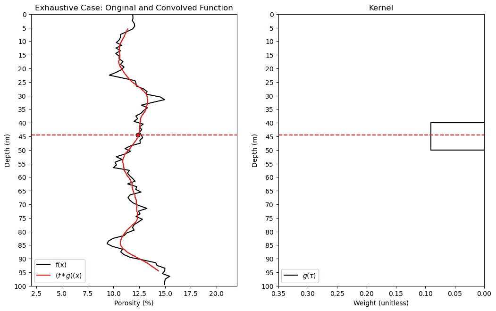

```py
import astropy.convolution.convolve as convolve               # sparse data convolution
frac = 0.2

df_denpor['Por_Sparse'] = df_denpor['Por'].copy()

np.random.seed(seed = seed)
nan_indices = np.random.choice(len(df_denpor), size=int(len(df_denpor)*(1.0-frac)), replace=False)
df_denpor.loc[nan_indices, 'Por_Sparse'] = np.nan

plt.subplot(121)                    
plt.scatter(df_denpor['Por_Sparse'],df_denpor['Depth'],color='black',label='f(x) Sparse'); plt.ylabel('Depth (m)'); plt.xlabel('Porosity (%)')
plt.plot(df_denpor['Por'],df_denpor['Depth'],color='black',alpha=0.3,label='f(x) Exhaustive');
plt.ylim([26,0]); plt.xlim([2,22]); plt.title('Sparse Case: Original and Convolved Function'); plt.yticks(np.arange(100, -1, -5));

size = 2 * kr + 1                                             # make uniform kernel
kernel = np.ones(size) / size                                 # normalize kernel to sum to one for unbiasedness

convolved = convolve(df_denpor['Por_Sparse'].values,kernel,boundary='extend',nan_treatment='interpolate',normalize_kernel=True) # convolve

k = len(kernel)
trim = k // 2  # how many values to trim from each edge
convolved_valid = convolved[trim:-trim] if trim > 0 else convolved
depth_valid = df_denpor['Depth'].values[trim:-trim] if trim > 0 else df_denpor['Depth'].values
convolved_pt = convolved_valid[np.abs(depth_valid - kloc).argmin()]; depth_pt = depth_valid[np.abs(depth_valid - kloc).argmin()]
plt.plot(convolved_valid,depth_valid,color='red',label=r'$(f * g)(x)$'); plt.ylabel('Depth (m)'); plt.xlabel('Porosity (%)'); 
plt.ylim([100,0]); plt.xlim([2,22]); plt.legend(loc='lower left'); plt.plot([2,22],[depth_pt,depth_pt],color='red',ls='--')
plt.scatter(convolved_pt,depth_pt,color='red',marker='o',edgecolor='black',zorder=10)

plt.subplot(122)
plt.plot(kernel,np.linspace(-1*kr+kloc,kr+kloc,2*kr+1),color='black',label=r'$g(\tau)$'); plt.xlim(0.35,0.0); plt.ylim([100,0]); 
plt.yticks(np.arange(100, -1, -5)); plt.plot([kernel[0],0.0],[-1*kr+kloc,-1*kr+kloc],color='black'); 
plt.plot([kernel[0],0.0],[kr+kloc,kr+kloc],color='black'); plt.legend(loc='lower left'); plt.title('Kernel')
plt.plot([0.35,0.0],[depth_pt,depth_pt],color='red',ls='--'); plt.ylabel('Depth (m)'); plt.xlabel('Weight (unitless)')

plt.subplots_adjust(left=0.0, bottom=0.0, right=1.5, top=1.2, wspace=0.2, hspace=0.2); plt.show() 
```

```py
WARNING: nan_treatment='interpolate', however, NaN values detected post convolution. A contiguous region of NaN values, larger than the kernel size, are present in the input array. Increase the kernel size to avoid this. [astropy.convolution.convolve] 
```

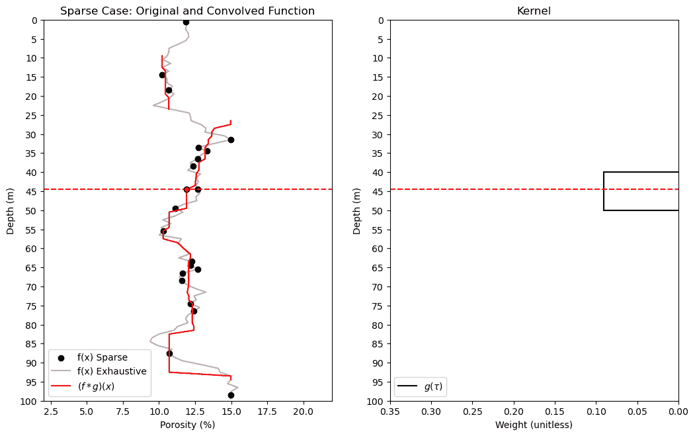

虽然回顾和讨论卷积很有用，但 k 近邻通过指定$k$个最近邻来包含在加权平均中，与卷积有所不同，

+   指定$k$会导致局部自适应窗口大小，局部邻域扩展足够远以找到$k$个训练数据

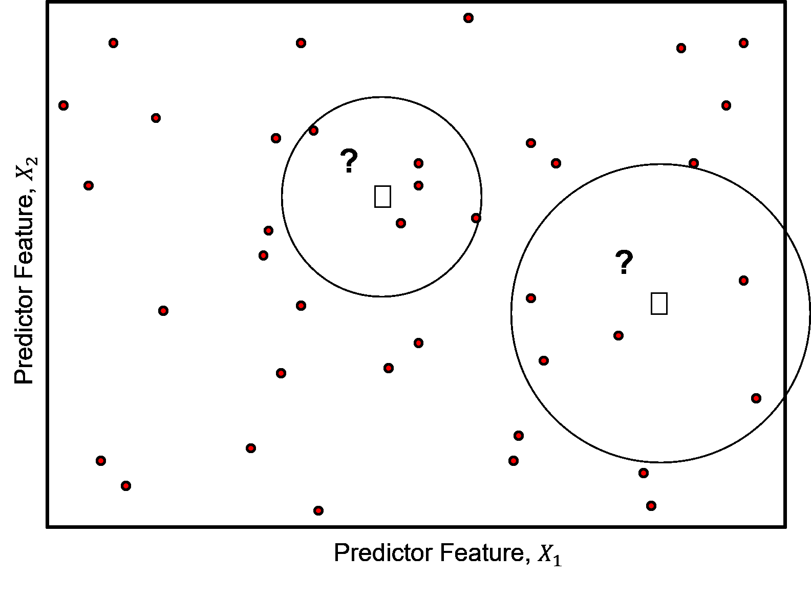

对于给定的$k$个最近邻，数据从预测特征空间的稀疏数据区域收集。

## k 近邻超参数

现在让我们讨论 k 近邻超参数。

1.  **k 个最近数据** - 用于预测

1.  **数据加权** - 例如，均匀加权（使用本地训练数据平均值），逆距离加权

注意，对于逆距离加权的情况，该方法类似于逆距离加权插值，通常应用于空间插值，并有一个常用的局部数据最大数量约束。逆距离在 GeostatsPy 中可用于空间映射。

1.  **距离度量** - 预测特征空间内的训练数据按距离排序，从近到远，可以应用多种距离度量，包括：

+   欧几里得距离

\begin{equation}

d_i = \sqrt{\sum_{\alpha = 1}^{m} \left(x_{\alpha,i} - x_{\alpha,0}\right)²} \end{equation}

+   Minkowski 距离 - 一种距离的推广形式，其中已知的曼哈顿和欧几里得距离是特殊情况，

$$ d_{(i,i')} = \left( \sum_{j=1}^{m} \left( x_{(j,i)} - x_{(j,i')} \right)^p \right)^{\frac{1}{p}} $$

+   当 $p=2$ 时，这变为欧几里得距离

+   当 $p=1$ 时，它变为曼哈顿距离

## 加载所需的库

我们还需要一些标准包。这些应该已经与 Anaconda 3 一起安装。

```py
%matplotlib inline                                         
suppress_warnings = True
import os                                                     # to set current working directory 
import math                                                   # square root operator
import numpy as np                                            # arrays and matrix math
import scipy.stats as st                                      # statistical methods
import pandas as pd                                           # DataFrames
import pandas.plotting as pd_plot
import matplotlib.pyplot as plt                               # for plotting
from matplotlib.ticker import (MultipleLocator,AutoMinorLocator,FuncFormatter) # control of axes ticks
from matplotlib.colors import ListedColormap                  # custom color maps
import seaborn as sns                                         # for matrix scatter plots
from sklearn import metrics                                   # measures to check our models
from sklearn.preprocessing import StandardScaler              # standardize the features
from sklearn.neighbors import KNeighborsRegressor             # for nearest k neighbours
from sklearn import metrics                                   # measures to check our models
from sklearn.model_selection import (cross_val_score,train_test_split,GridSearchCV,KFold) # model tuning
from sklearn.pipeline import (Pipeline,make_pipeline)         # machine learning modeling pipeline
from IPython.display import display, HTML                     # custom displays
cmap = plt.cm.inferno                                         # default color bar, no bias and friendly for color vision defeciency
plt.rc('axes', axisbelow=True)                                # grid behind plotting elements
if suppress_warnings == True:  
    import warnings                                           # suppress any warnings for this demonstration
    warnings.filterwarnings('ignore') 
seed = 13                                                     # random number seed for workflow repeatability 
```

如果您遇到包导入错误，您可能必须首先安装这些包中的一些。这通常可以通过在 Windows 上打开命令窗口并输入 'python -m pip install [package-name]' 来完成。有关相应包的文档，还有更多帮助可用。

## 声明函数

让我们定义几个函数来简化绘制相关矩阵、决策树回归模型的可视化，以及将指定的百分位数和主次网格线添加到我们的图表中。

```py
def comma_format(x, pos):
    return f'{int(x):,}'

def feature_rank_plot(pred,metric,mmin,mmax,nominal,title,ylabel,mask): # feature ranking plot
    mpred = len(pred); mask_low = nominal-mask*(nominal-mmin); mask_high = nominal+mask*(mmax-nominal); m = len(pred) + 1
    plt.plot(pred,metric,color='black',zorder=20)
    plt.scatter(pred,metric,marker='o',s=10,color='black',zorder=100)
    plt.plot([-0.5,m-1.5],[0.0,0.0],'r--',linewidth = 1.0,zorder=1)
    plt.fill_between(np.arange(0,mpred,1),np.zeros(mpred),metric,where=(metric < nominal),interpolate=True,color='dodgerblue',alpha=0.3)
    plt.fill_between(np.arange(0,mpred,1),np.zeros(mpred),metric,where=(metric > nominal),interpolate=True,color='lightcoral',alpha=0.3)
    plt.fill_between(np.arange(0,mpred,1),np.full(mpred,mask_low),metric,where=(metric < mask_low),interpolate=True,color='blue',alpha=0.8,zorder=10)
    plt.fill_between(np.arange(0,mpred,1),np.full(mpred,mask_high),metric,where=(metric > mask_high),interpolate=True,color='red',alpha=0.8,zorder=10)  
    plt.xlabel('Predictor Features'); plt.ylabel(ylabel); plt.title(title)
    plt.ylim(mmin,mmax); plt.xlim([-0.5,m-1.5]); add_grid();
    return

def plot_corr(corr_matrix,title,limits,mask):                 # plots a graphical correlation matrix 
    my_colormap = plt.get_cmap('RdBu_r', 256)          
    newcolors = my_colormap(np.linspace(0, 1, 256))
    white = np.array([256/256, 256/256, 256/256, 1])
    white_low = int(128 - mask*128); white_high = int(128+mask*128)
    newcolors[white_low:white_high, :] = white                # mask all correlations less than abs(0.8)
    newcmp = ListedColormap(newcolors)
    m = corr_matrix.shape[0]
    im = plt.matshow(corr_matrix,fignum=0,vmin = -1.0*limits, vmax = limits,cmap = newcmp)
    plt.xticks(range(len(corr_matrix.columns)), corr_matrix.columns); ax = plt.gca()
    ax.xaxis.set_label_position('bottom'); ax.xaxis.tick_bottom()
    plt.yticks(range(len(corr_matrix.columns)), corr_matrix.columns)
    cbar = plt.colorbar(im, orientation = 'vertical')
    cbar.ax.yaxis.set_major_formatter(FuncFormatter(comma_format))
    plt.title(title)
    for i in range(0,m):
        plt.plot([i-0.5,i-0.5],[-0.5,m-0.5],color='black')
        plt.plot([-0.5,m-0.5],[i-0.5,i-0.5],color='black')
    plt.ylim([-0.5,m-0.5]); plt.xlim([-0.5,m-0.5])

def visualize_model(model,xfeature,x_min,x_max,yfeature,y_min,y_max,response,z_min,z_max,title,axes_commas = True): # plots the data points and the decision tree prediction 
    n_classes = 10
    cmap_temp = plt.cm.inferno
    xplot_step = (x_max-x_min)/100; yplot_step = (y_max-y_min)/100
    xx, yy = np.meshgrid(np.arange(x_min, x_max, xplot_step),
                     np.arange(y_min, y_max, yplot_step))
    Z = model.predict(np.c_[xx.ravel(), yy.ravel()])
    Z = Z.reshape(xx.shape)
    cs = plt.contourf(xx, yy, Z, cmap=cmap_temp,vmin=z_min, vmax=z_max, levels=np.linspace(z_min, z_max, 100))

    im = plt.scatter(xfeature,yfeature,s=30, c=response, marker=None, cmap=cmap_temp, norm=None, vmin=z_min, vmax=z_max, 
                     alpha=1.0, linewidths=0.8, edgecolors="black",zorder=10)
    plt.scatter(xfeature,yfeature,s=60, c='white', marker=None, cmap=cmap_temp, norm=None, vmin=z_min, vmax=z_max, 
                     alpha=1.0, linewidths=0.8, edgecolors=None,zorder=8)
    plt.title(title); plt.xlabel(xfeature.name); plt.ylabel(yfeature.name)
    cbar = plt.colorbar(im, orientation = 'vertical'); cbar.set_label(response.name, rotation=270, labelpad=20)
    cbar.ax.yaxis.set_major_formatter(FuncFormatter(comma_format))
    if axes_commas == True:
        plt.gca().xaxis.set_major_formatter(FuncFormatter(comma_format))
        plt.gca().yaxis.set_major_formatter(FuncFormatter(comma_format))
    return Z

def visualize_tuned_model(k_tuned,k_mat,score_mat):
    plt.scatter(k_mat,score_mat,s=10.0, c="red", marker=None, cmap=None, norm=None, vmin=None, vmax=None, alpha=0.8, 
                linewidths=0.5, edgecolors="black")
    plt.plot([k_tuned,k_tuned],[0,10000000],color='black',linestyle=(6, (2,3)),label='tuned',zorder=1)
    plt.title('k-fold Cross Validation Error (MSE) vs. k Nearest Neighbours'); plt.xlabel('Number of Nearest Neighbours')
    plt.ylabel('Mean Square Error')
    plt.xlim(k_min,k_max); plt.ylim(0,np.max(score_mat))

def check_model(model,xtrain,ytrain,xtest,ytest,ymin,ymax,rtrain,rtest,title): # plots the estimated vs. the actual 
    predict_train = model.predict(np.c_[xtrain,ytrain])
    predict_test = model.predict(np.c_[xtest,ytest])
    plt.scatter(rtrain,predict_train,s=None, c='darkorange',marker=None, cmap=None, norm=None, vmin=None, vmax=None, 
                alpha=0.8, linewidths=0.8, edgecolors="black",label='Train')
    plt.scatter(rtest,predict_test,s=None, c='red',marker=None, cmap=None, norm=None, vmin=None, vmax=None, 
                alpha=0.8, linewidths=0.8, edgecolors="black",label='Test')
    plt.title(title); plt.xlabel('Actual Production (MCFPD)'); plt.ylabel('Estimated Production (MCFPD)')
    plt.xlim(ymin,ymax); plt.ylim(ymin,ymax)
    plt.arrow(ymin,ymin,ymax,ymax,width=0.02,color='black',head_length=0.0,head_width=0.0)
    MSE_train = metrics.mean_squared_error(rtrain,predict_train)
    Var_Explained_train = metrics.explained_variance_score(rtrain,predict_train)
    cor_train = math.sqrt(metrics.r2_score(rtrain,predict_train))
    MSE_test = metrics.mean_squared_error(rtest,predict_test)
    plt.gca().xaxis.set_major_formatter(FuncFormatter(comma_format))
    plt.gca().yaxis.set_major_formatter(FuncFormatter(comma_format))
    plt.annotate('Train MSE: ' + str(f'{(np.round(MSE_train,2)):,}'),[0.05*(ymax-ymin)+ymin,0.95*(ymax-ymin)+ymin]) 
    plt.annotate('Test MSE:  ' + str(f'{(np.round(MSE_test,2)):,}'),[0.05*(ymax-ymin)+ymin,0.90*(ymax-ymin)+ymin])
    add_grid(); plt.legend(loc='lower right')
    # print('Mean Squared Error on Training = ', round(MSE_test,2),', Variance Explained =', round(Var_Explained,2),'Cor =', round(cor,2))

def weighted_percentile(data, weights, perc):                 # calculate weighted percentile (iambr on StackOverflow @ https://stackoverflow.com/questions/21844024/weighted-percentile-using-numpy/32216049) 
    ix = np.argsort(data)
    data = data[ix] 
    weights = weights[ix] 
    cdf = (np.cumsum(weights) - 0.5 * weights) / np.sum(weights) 
    return np.interp(perc, cdf, data)

def histogram_bounds(values,weights,color):                   # add uncertainty bounds to a histogram 
    p10 = weighted_percentile(values,weights,0.1); avg = np.average(values,weights=weights); p90 = weighted_percentile(values,weights,0.9)
    plt.plot([p10,p10],[0.0,45],color = color,linestyle='dashed')
    plt.plot([avg,avg],[0.0,45],color = color)
    plt.plot([p90,p90],[0.0,45],color = color,linestyle='dashed')

def add_grid():
    plt.gca().grid(True, which='major',linewidth = 1.0); plt.gca().grid(True, which='minor',linewidth = 0.2) # add y grids
    plt.gca().tick_params(which='major',length=7); plt.gca().tick_params(which='minor', length=4)
    plt.gca().xaxis.set_minor_locator(AutoMinorLocator()); plt.gca().yaxis.set_minor_locator(AutoMinorLocator()) # turn on minor ticks 

def display_sidebyside(*args):                                # display DataFrames side-by-side (ChatGPT 4.0 generated Spet, 2024)
    html_str = ''
    for df in args:
        html_str += df.head().to_html()  # Using .head() for the first few rows
    display(HTML(f'<div style="display: flex;">{html_str}</div>')) 
```

## 设置工作目录

我总是喜欢这样做，这样我就不会丢失文件，并且可以简化后续的读取和写入（每次避免包含完整地址）。

```py
#os.chdir("c:/PGE383")                                        # set the working directory 
```

您必须更新引号内的部分以包含您自己的工作目录，并且格式在 Mac 上不同（例如：“~/PGE”）。

## 加载表格数据

这是将我们的逗号分隔数据文件加载到 Pandas DataFrame 对象中的命令。

让我们加载提供的多元、空间数据集 'unconv_MV.csv'。这个数据集包括来自 1,000 个非常规井的变量：

+   井平均孔隙率

+   渗透率的对数变换（以线性化与其他变量的关系）

+   声波阻抗（kg/m³ x m/s x 10⁶）

+   岩脆性比（%）

+   总有机碳（%）

+   玻璃质反射率（%）

+   初始生产 90 天平均（MCFPD）。

注意，这个数据集是合成的。

我们使用 pandas 的 'read_csv' 函数将其加载到我们称为 'my_data' 的 DataFrame 中，然后预览它以确保正确加载。

## 可选：向响应特征添加随机噪声

我们可以这样做来观察数据噪声对过拟合和超参数调整的影响。

+   这是为了经验学习，当然我们不会向我们的数据添加随机噪声

+   我们设置了随机数种子以确保可重复性

```py
df_load = pd.read_csv('https://raw.githubusercontent.com/GeostatsGuy/GeoDataSets/master/unconv_MV_v4.csv') # load data from Dr. Pyrcz's GitHub 
df_load = df_load.iloc[:,1:8]                                 # copy all rows and columns 1 through 8, note 0 column is removed

response = 'Prod'                                             # specify the response feature
add_noise = True                                              # set True to add noise to response feature to demonstrate overfit
noise_stdev = 500                                             # amount of noise to add to response feature to demonstrate overfit

np.random.seed(seed = seed)                                   # set the random number seed
if add_noise == True:
    df_load[response] = df_load[response] + np.random.normal(loc=0.0,scale=noise_stdev,size = len(df_load))

X = df_load.copy(deep = False)
X = X.drop([response],axis='columns')                         # make predictor and response DataFrames
y = df_load.loc[:,response]

features = X.columns.values.tolist() + [y.name]               # store the names of the features
pred = X.columns.values.tolist()
resp = [y.name]

Xmin = [6.0,0.0,1.0,10.0,0.0,0.9]; Xmax = [24.0,10.0,5.0,85.0,2.2,2.9] # set the minumum and maximum values for plotting
ymin = 1000.0; ymax = 9000.0

predlabel = ['Porosity (%)','Permeability (mD)','Acoustic Impedance (kg/m2s*10⁶)','Brittleness Ratio (%)', # set the names for plotting
             'Total Organic Carbon (%)','Vitrinite Reflectance (%)']
resplabel = 'Normalized Initial Production (MCFPD)'

predtitle = ['Porosity','Permeability','Acoustic Impedance','Brittleness Ratio', # set the units for plotting
             'Total Organic Carbon','Vitrinite Reflectance']
resptitle = 'Initial Production'

featurelabel = predlabel + [resplabel]                        # make feature labels and titles for concise code
featuretitle = predtitle + [resptitle]

m = len(pred) + 1
mpred = len(pred)

df = pd.concat([X,y],axis=1)                                  # make one DataFrame with both X and y (remove all other features) 
```

## 可视化 DataFrame

可视化 DataFrame 是数据的第一步检查。

+   许多事情可能会出错，例如，我们加载了错误的数据，所有特征都没有加载，等等。

我们可以通过使用 DataFrame 的‘head’成员函数（以整洁的格式预览，见下文）来预览。

+   添加参数‘n=13’以查看数据集的前 13 行。

```py
df.head(n=13) 
```

|  | Por | Perm | AI | Brittle | TOC | VR | Prod |
| --- | --- | --- | --- | --- | --- | --- | --- |
| 0 | 12.08 | 2.92 | 2.80 | 81.40 | 1.16 | 2.31 | 1339.165488 |
| 1 | 12.38 | 3.53 | 3.22 | 46.17 | 0.89 | 1.88 | 3383.979252 |
| 2 | 14.02 | 2.59 | 4.01 | 72.80 | 0.89 | 2.72 | 2509.686720 |
| 3 | 17.67 | 6.75 | 2.63 | 39.81 | 1.08 | 1.88 | 5514.421023 |
| 4 | 17.52 | 4.57 | 3.18 | 10.94 | 1.51 | 1.90 | 3532.020478 |
| 5 | 14.53 | 4.81 | 2.69 | 53.60 | 0.94 | 1.67 | 4283.543382 |
| 6 | 13.49 | 3.60 | 2.93 | 63.71 | 0.80 | 1.85 | 3627.906723 |
| 7 | 11.58 | 3.03 | 3.25 | 53.00 | 0.69 | 1.93 | 3101.539533 |
| 8 | 12.52 | 2.72 | 2.43 | 65.77 | 0.95 | 1.98 | 3213.391047 |
| 9 | 13.25 | 3.94 | 3.71 | 66.20 | 1.14 | 2.65 | 2200.204701 |
| 10 | 15.04 | 4.39 | 2.22 | 61.11 | 1.08 | 1.77 | 3433.752662 |
| 11 | 16.19 | 6.30 | 2.29 | 49.10 | 1.53 | 1.86 | 4465.007131 |
| 12 | 16.82 | 5.42 | 2.80 | 66.65 | 1.17 | 1.98 | 4373.060709 |

## 表格数据的摘要统计

在 DataFrames 中从表格数据计算摘要统计有很多高效的方法。describe 命令以整洁的数据表形式提供计数、平均值、最小值、最大值。

+   我们有一些负的 TOC 值！让我们检查分布情况。

```py
df.describe().transpose()                                     # calculate summary statistics for the data 
```

|  | 计数 | 平均值 | 标准差 | 最小值 | 25% | 50% | 75% | 最大值 |
| --- | --- | --- | --- | --- | --- | --- | --- | --- |
| Por | 200.0 | 14.991150 | 2.971176 | 6.550000 | 12.912500 | 15.070000 | 17.40250 | 23.550000 |
| Perm | 200.0 | 4.330750 | 1.731014 | 1.130000 | 3.122500 | 4.035000 | 5.28750 | 9.870000 |
| AI | 200.0 | 2.968850 | 0.566885 | 1.280000 | 2.547500 | 2.955000 | 3.34500 | 4.630000 |
| Brittle | 200.0 | 48.161950 | 14.129455 | 10.940000 | 37.755000 | 49.510000 | 58.26250 | 84.330000 |
| TOC | 200.0 | 0.990450 | 0.481588 | -0.190000 | 0.617500 | 1.030000 | 1.35000 | 2.180000 |
| VR | 200.0 | 1.964300 | 0.300827 | 0.930000 | 1.770000 | 1.960000 | 2.14250 | 2.870000 |
| Prod | 200.0 | 3842.630027 | 1594.301295 | 803.640483 | 2551.414599 | 3626.229052 | 4739.73408 | 9021.792491 |

+   只有一两个稍微负的值，我们只需将它们截断到零。我们可以使用下面的命令将 DataFrame 中所有小于 0.0 的 TOC 值设置为 0.0，否则保持原始的 TOC 值。

```py
num = df._get_numeric_data()                                  # get the numerical values
num[num < 0] = 0                                              # truncate negative values to 0.0
df.describe().transpose()                                     # calculate summary statistics for the data 
```

|  | 计数 | 平均值 | 标准差 | 最小值 | 25% | 50% | 75% | 最大值 |
| --- | --- | --- | --- | --- | --- | --- | --- | --- |
| Por | 200.0 | 14.991150 | 2.971176 | 6.550000 | 12.912500 | 15.070000 | 17.40250 | 23.550000 |
| Perm | 200.0 | 4.330750 | 1.731014 | 1.130000 | 3.122500 | 4.035000 | 5.28750 | 9.870000 |
| AI | 200.0 | 2.968850 | 0.566885 | 1.280000 | 2.547500 | 2.955000 | 3.34500 | 4.630000 |
| Brittle | 200.0 | 48.161950 | 14.129455 | 10.940000 | 37.755000 | 49.510000 | 58.26250 | 84.330000 |
| TOC | 200.0 | 0.991950 | 0.478264 | 0.000000 | 0.617500 | 1.030000 | 1.35000 | 2.180000 |
| VR | 200.0 | 1.964300 | 0.300827 | 0.930000 | 1.770000 | 1.960000 | 2.14250 | 2.870000 |
| Prod | 200.0 | 3842.630027 | 1594.301295 | 803.640483 | 2551.414599 | 3626.229052 | 4739.73408 | 9021.792491 |

检查总结统计量是好的。

+   没有明显的错误

+   检查每个特征值的范围，以设置和调整绘图限制。见上图。

## 计算相关矩阵和与响应排名的相关性

让我们进行相关性分析。我们可以使用之前声明的函数计算并查看相关矩阵以及与响应特征的关联。

+   相关性分析基于线性关系的假设，但这是一个好的开始

```py
corr_matrix = df.corr()
correlation = corr_matrix.iloc[:,-1].values[:-1]

plt.subplot(121)
plot_corr(corr_matrix,'Correlation Matrix',1.0,0.5)           # using our correlation matrix visualization function
plt.xlabel('Features'); plt.ylabel('Features')

plt.subplot(122)
feature_rank_plot(pred,correlation,-1.0,1.0,0.0,'Feature Ranking, Correlation with ' + resp[0],'Correlation',0.5)

plt.subplots_adjust(left=0.0, bottom=0.0, right=2.0, top=0.8, wspace=0.2, hspace=0.3); plt.show() 
```

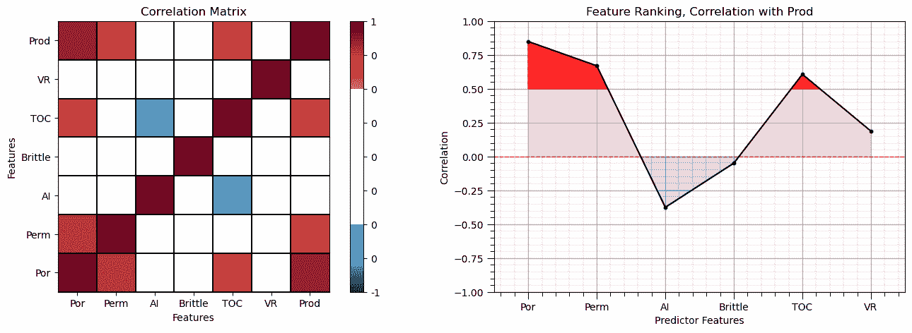

注意由于每个变量与其自身的相关性而产生的 1.0 对角线。

这看起来不错。存在不同大小的相关性。当然，相关系数限于线性相关程度的度量。

+   让我们查看矩阵散点图，以了解特征之间的成对关系。

```py
pairgrid = sns.PairGrid(df,vars=['Por','Perm','AI','Brittle','TOC','Prod']) # matrix scatter plots
pairgrid = pairgrid.map_upper(plt.scatter, color = 'darkorange', edgecolor = 'black', alpha = 0.8, s = 10)
pairgrid = pairgrid.map_diag(plt.hist, bins = 20, color = 'darkorange',alpha = 0.8, edgecolor = 'k')# Map a density plot to the lower triangle
pairgrid = pairgrid.map_lower(sns.kdeplot, cmap = plt.cm.inferno, 
                              alpha = 1.0, n_levels = 10)
pairgrid.add_legend()
plt.subplots_adjust(left=0.0, bottom=0.0, right=0.9, top=0.9, wspace=0.2, hspace=0.2); plt.show() 
```

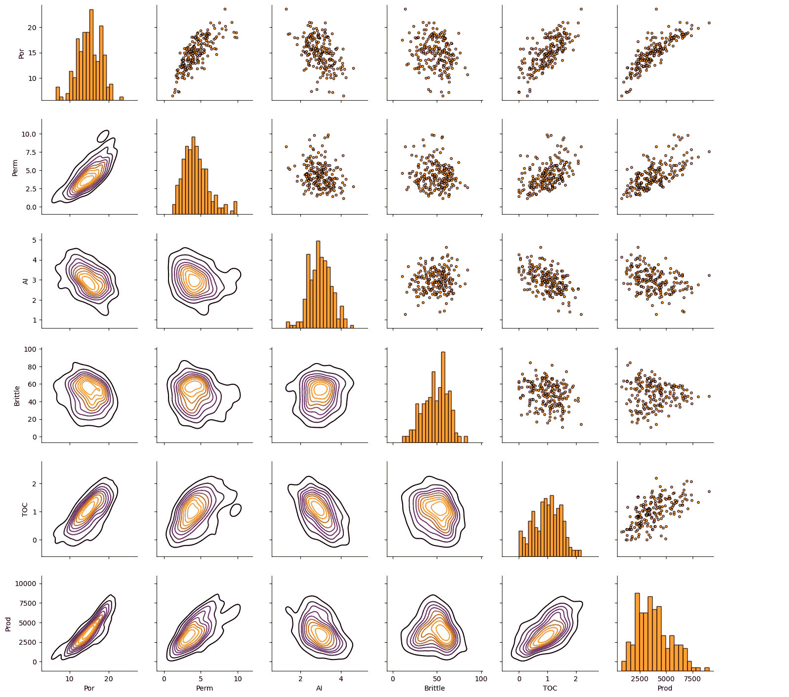

## 仅使用两个预测特征

让我们将问题简化为 2 个预测特征，即孔隙率和脆性，以预测生产率。通过仅使用 2 个特征，很容易可视化特征空间的分割（它只有 2 维，可以在单个图表上完全显示）。

## 标准化预测特征

k-近邻方法在特征空间中执行最近训练样本搜索（类似于 k-means 聚类）。为了消除方法中特征范围的影响，我们标准化了特征。

+   我们将标准化我们的预测特征，使其均值为零，方差为 1。

+   我们使用 scikit-learn 预处理模块来简化这一步骤，并提供一个方便且安全的反向转换。

```py
if1 = 0; if2 = 3                                              # selected predictor features

transform = StandardScaler();                                 # instantiate feature standardization method

sel_pred = [pred[if1],pred[if2]]
sel_features = pred + [resp]

spredlabel = ['Standardized ' + element for element in predlabel] # standardized predictors list

sel_spredlabel = [spredlabel[if1]] + [spredlabel[if2]] 

sel_spred = ['s' + element for element in sel_pred]           # standardized predictors list

df[sel_spred[0]] = transform.fit_transform(df.loc[:,sel_pred].values)[:,0] # standardize the data features to mean = 0, var = 1.0
df[sel_spred[1]] = transform.fit_transform(df.loc[:,sel_pred].values)[:,1] # standardize the data features to mean = 0, var = 1.0

print('Selected Predictor Features: ' + str(sel_pred))
print('Standardized Selected Predictor Features: ' + str(sel_spred))
print('Response Feature: ' + str([resp]))
df.head() 
```

```py
Selected Predictor Features: ['Por', 'Brittle']
Standardized Selected Predictor Features: ['sPor', 'sBrittle']
Response Feature: [['Prod']] 
```

|  | Por | Perm | AI | Brittle | TOC | VR | Prod | sPor | sBrittle |
| --- | --- | --- | --- | --- | --- | --- | --- | --- | --- |
| 0 | 12.08 | 2.92 | 2.80 | 81.40 | 1.16 | 2.31 | 1339.165488 | -0.982256 | 2.358297 |
| 1 | 12.38 | 3.53 | 3.22 | 46.17 | 0.89 | 1.88 | 3383.979252 | -0.881032 | -0.141332 |
| 2 | 14.02 | 2.59 | 4.01 | 72.80 | 0.89 | 2.72 | 2509.686720 | -0.327677 | 1.748113 |
| 3 | 17.67 | 6.75 | 2.63 | 39.81 | 1.08 | 1.88 | 5514.421023 | 0.903875 | -0.592585 |
| 4 | 17.52 | 4.57 | 3.18 | 10.94 | 1.51 | 1.90 | 3532.020478 | 0.853263 | -2.640962 |

让我们演示从标准化特征到原始特征的反向转换。

+   在我们的工作流程中我们不需要这个，因为我们只需要将预测特征前向转换以训练模型和做出预测

```py
print('Backtransformed: \n Por    Brittle')
transform.inverse_transform(df.loc[:,sel_spred])[:5,:]        # check the reverse standardization 
```

```py
Backtransformed: 
        Por    Brittle 
```

```py
array([[12.08, 81.4 ],
       [12.38, 46.17],
       [14.02, 72.8 ],
       [17.67, 39.81],
       [17.52, 10.94]]) 
```

我们可以将上面的输出与原始的孔隙率和脆性进行比较。反向转换是有效的！

+   当需要时，我们将使用此方法返回原始特征单位。

+   通常，对于预测特征，不需要进行反向转换，我们只对预测特征进行正向转换以预测响应特征。

+   在这个例子中，在构建我们的模型时，我们不需要转换响应特征。响应特征分布表现良好，k 最近邻理论中没有期望响应特征具有特定范围或分布份额。

## 特征范围

让我们设置一些绘图范围。注意，对于标准化的预测特征，我们将使用-3.5 到 3.5 作为限制。

```py
Xmin = [5.0, 0.0]; Xmax = [25.0,100.0]                        # selected predictor features min and max 
```

## 训练和测试分割

为了方便和简单，我们使用 scikit-learn 的随机训练和测试分割。

```py
X_train, X_test, y_train, y_test = train_test_split(df.loc[:,sel_spred],df.loc[:,resp],test_size=0.25,random_state=73073)
df_train = pd.concat([X_train,y_train],axis=1)                # make one train DataFrame with both X and y (remove all other features)
df_test = pd.concat([X_test,y_test],axis=1)                   # make one testin DataFrame with both X and y (remove all other features) 
```

让我们先检查孔隙率、脆性和生产的单变量统计。

```py
nbins = 20                                                    # number of histogram bins

plt.subplot(221)
plt.hist(X_train[sel_spred[0]],alpha = 0.8,color = 'darkorange',edgecolor = 'black',bins=np.linspace(-3,3,nbins),label='Train')
plt.hist(X_test[sel_spred[0]],alpha = 0.8,color = 'red',edgecolor = 'black',bins=np.linspace(-3,3,nbins),label='Test')
plt.title(sel_spred[0]); plt.xlim(-3,3); plt.xlabel(sel_spredlabel[0]); plt.ylabel('Frequency'); add_grid(); plt.legend(loc='upper right')

plt.subplot(222)
plt.hist(X_train[sel_spred[1]],alpha = 0.8,color = 'darkorange',edgecolor = 'black',bins=np.linspace(-3,3,nbins),label='Train')
plt.hist(X_test[sel_spred[1]],alpha = 0.8,color = 'red',edgecolor = 'black',bins=np.linspace(-3,3,nbins),label='Test')
plt.title(sel_spred[1]); plt.xlim(-3,3); plt.xlabel(sel_spredlabel[1]); plt.ylabel('Frequency'); add_grid(); plt.legend(loc='upper right')

plt.subplot(223)
plt.hist(y_train[resp],alpha = 0.8,color = 'darkorange',edgecolor = 'black',bins=np.linspace(ymin,ymax,nbins),label='Train')
plt.hist(y_test[resp],alpha = 0.8,color = 'red',edgecolor = 'black',bins=np.linspace(ymin,ymax,nbins),label='Test')
plt.legend(loc='upper right'); plt.title(resp[0]); plt.xlim(ymin,ymax) 
plt.gca().xaxis.set_major_formatter(FuncFormatter(comma_format))
plt.xlabel(resplabel); plt.ylabel('Frequency'); add_grid()

plt.subplots_adjust(left=0.0, bottom=0.0, right=2.0, top=2.1, wspace=0.2, hspace=0.2); plt.show() 
```

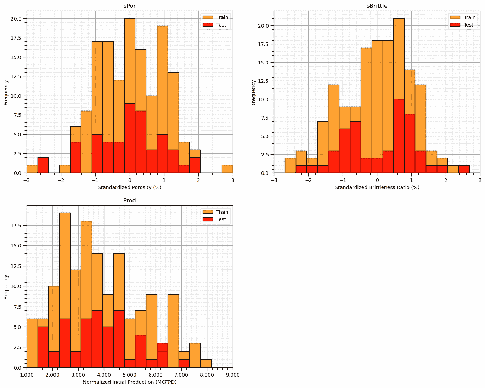

分布表现良好，

+   我们无法观察到明显的缺口或截断。

+   检查训练数据和测试数据的覆盖率

让我们看看孔隙率与脆性的散点图，点根据生产量着色。

```py
plt.subplot(121)                                              # train data plot
im = plt.scatter(X_train[sel_spred[0]],X_train[sel_spred[1]],s=None, c=y_train[resp[0]], marker=None, cmap=cmap, norm=None, vmin=ymin, 
                 vmax=ymax, alpha=0.8, linewidths=0.3, edgecolors="black")
plt.title('Train ' + resp[0] + ' vs. ' + sel_spred[1] + ' and ' + sel_spred[1]); plt.xlabel(sel_spredlabel[0]); plt.ylabel(sel_spredlabel[1])
plt.xlim(-3,3); plt.ylim(-3,3)
cbar = plt.colorbar(im, orientation = 'vertical')
cbar.set_label(resplabel, rotation=270, labelpad=20)
cbar.ax.yaxis.set_major_formatter(FuncFormatter(comma_format))
add_grid()

plt.subplot(122)                                               # test data plot
im = plt.scatter(X_test[sel_spred[0]],X_test[sel_spred[1]],s=None, c=y_test[resp[0]], marker=None, cmap=cmap, norm=None, vmin=ymin, 
                 vmax=ymax, alpha=0.8, linewidths=0.3, edgecolors="black")
plt.title('Test ' + resp[0] + ' vs. ' + sel_spred[1] + ' and ' + sel_spred[1]); plt.xlabel(sel_spredlabel[0]); plt.ylabel(sel_spredlabel[1])
plt.xlim(-3,3); plt.ylim(-3,3)
cbar = plt.colorbar(im, orientation = 'vertical')
cbar.set_label(resplabel, rotation=270, labelpad=20)
cbar.ax.yaxis.set_major_formatter(FuncFormatter(comma_format))
add_grid()

plt.subplots_adjust(left=0.0, bottom=0.0, right=2.0, top=1.2, wspace=0.2, hspace=0.2); plt.show() 
```


这个问题看起来是非线性的，不能用简单的线性回归来建模。

+   看起来，脆性和增加孔隙率都有一个最佳点，对生产总是有益的。

## 使用 k 最近邻实例化、拟合和预测

让我们实例化、拟合并使用 k 最近邻模型进行预测。

+   使用超参数和 k 最近邻实例化它

+   使用训练数据进行训练，我们使用 scikit-learn 的标准 fit 函数。

```py
n_neighbours = 1; p = 2; weights = 'uniform'                 # model hyperparameters
neigh = KNeighborsRegressor(weights = weights, n_neighbors=n_neighbours, p = p) # instantiate the prediction model 
```

我们已经设置了超参数：

+   weights = 根据最近邻居给出的预测的平均权重。‘uniform’是算术平均，而‘distance’是距离加权。

+   n_neighbours = 最大邻居数量。注意，我们通过限制到 5 个最近邻居来约束我们的预测。

+   p = 距离度量幂或 Minkowski 度量（1 = 曼哈顿距离，2 为欧几里得距离），用于寻找最近邻居。

现在我们已经准备好根据孔隙率和脆性来预测生产。

+   我们将使用上面定义的两个函数来可视化特征空间中的 k 最近邻预测以及训练数据中实际和估计生产的交叉图，以及来自 sklearn.metric 模块的三个模型度量。

```py
neigh_fit = neigh.fit(X_train,y_train)                        # train the model with the training data

plt.subplot(221)                                              # training data vs. the model predictions
Z = visualize_model(neigh_fit,X_train[sel_spred[0]],-3.5,3.5,X_train[sel_spred[1]],-3.5,3.5,y_train[resp[0]],ymin,ymax,
                    'Training Data and k Nearest Neighbours')
plt.annotate('Hyperparameters',[1.5,3.2],color='white'); plt.annotate('weights: ' + weights,[1.5,2.9],color='white')
plt.annotate('n neighbours: ' + str(n_neighbours),[1.5,2.6],color='white'); plt.annotate('distance norm: ' + str(p),[1.5,2.3],color='white')

plt.subplot(222)                                              # testing data vs. the model predictions
visualize_model(neigh_fit,X_test[sel_spred[0]],-3.5,3.5,X_test[sel_spred[1]],-3.5,3.5,y_test[resp[0]],ymin,ymax,
                'Testing Data and k Nearest Neighbours')
plt.annotate('Hyperparameters',[1.5,3.2],color='white'); plt.annotate('weights: ' + weights,[1.5,2.9],color='white')
plt.annotate('n neighbours: ' + str(n_neighbours),[1.5,2.6],color='white'); plt.annotate('distance norm: ' + str(p),[1.5,2.3],color='white')

# plt.subplot(223)                                              # model accuracy check
# check_model(neigh_fit,X_train[sel_spred[0]],X_train[sel_spred[1]],X_test[sel_spred[0]],X_test[sel_spred[1]],ymin,ymax,
#             y_train[resp[0]],y_test[resp[0]],'K Nearest Neighbour Regression Model Accuracy')

plt.subplots_adjust(left=0.0, bottom=0.0, right=2.0, top=2.1, wspace=0.25, hspace=0.2); plt.show() 
```

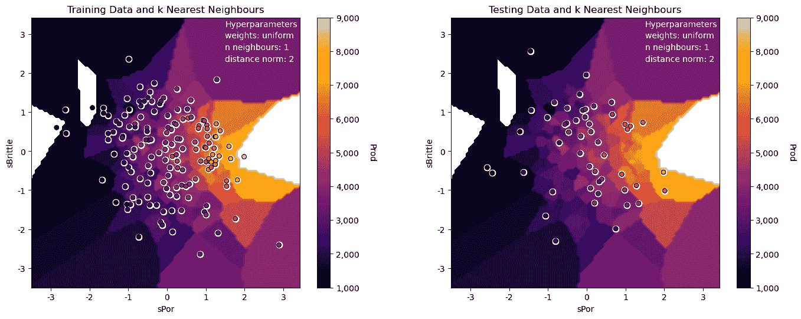

模型看起来不错：

+   非参数方法在拟合预测特征空间中的非线性响应模式方面非常灵活。

+   我们可以看到由于 k 最近邻数据有限和使用均匀加权而产生的搜索伪影。

+   我们对这个低维问题（只有 2 个预测特征）有密集的数据。

+   测试数据和训练数据在预测特征空间中一致且接近。

让我们尝试通过使用非常大的 k 超参数来过拟合模型。

```py
n_neighbours = 5; p = 2; weights = 'uniform'                # model hyperparameters
neigh = KNeighborsRegressor(weights = weights,n_neighbors=n_neighbours,p = p) # instantiate the prediction model

neigh_fit = neigh.fit(X_train,y_train)                        # train the model with the training data

plt.subplot(221)                                              # training data vs. the model predictions
Z = visualize_model(neigh_fit,X_train[sel_spred[0]],-3.5,3.5,X_train[sel_spred[1]],-3.5,3.5,y_train[resp[0]],ymin,ymax,
                    'Training Data and k Nearest Neighbours')
plt.annotate('Hyperparameters',[1.5,3.2],color='white'); plt.annotate('weights: ' + weights,[1.5,2.9],color='white')
plt.annotate('n neighbours: ' + str(n_neighbours),[1.5,2.6],color='white'); plt.annotate('distance norm: ' + str(p),[1.5,2.3],color='white')

plt.subplot(222)                                              # testing data vs. the model predictions
visualize_model(neigh_fit,X_test[sel_spred[0]],-3.5,3.5,X_test[sel_spred[1]],-3.5,3.5,y_test[resp[0]],ymin,ymax,
                'Testing Data and k Nearest Neighbours')
plt.annotate('Hyperparameters',[1.5,3.2],color='white'); plt.annotate('weights: ' + weights,[1.5,2.9],color='white')
plt.annotate('n neighbours: ' + str(n_neighbours),[1.5,2.6],color='white'); plt.annotate('distance norm: ' + str(p),[1.5,2.3],color='white')

plt.subplot(223)                                              # model accuracy check
check_model(neigh_fit,X_train[sel_spred[0]],X_train[sel_spred[1]],X_test[sel_spred[0]],X_test[sel_spred[1]],ymin,ymax,
            y_train[resp[0]],y_test[resp[0]],'K Nearest Neighbour Regression Model Accuracy')

plt.subplots_adjust(left=0.0, bottom=0.0, right=2.0, top=2.1, wspace=0.25, hspace=0.2); plt.show() 
```

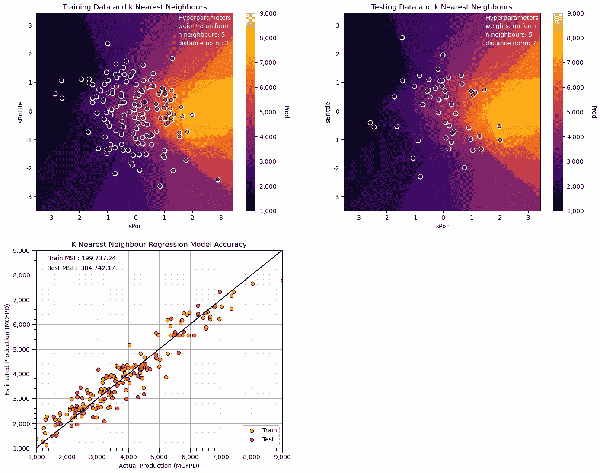

注意，这平滑了响应，预测正接近全局均值。

+   我们有一个欠拟合模型。

接下来，让我们为我们的 k-最近邻预测模型使用较小的 k 超参数。

```py
n_neighbours = 1; p = 2; weights = 'uniform'                  # model hyperparameters
neigh = KNeighborsRegressor(weights = weights,n_neighbors=n_neighbours,p = p) # instantiate the prediction model

neigh_fit = neigh.fit(X_train,y_train)                        # train the model with the training data

plt.subplot(221)                                              # training data vs. the model predictions
Z = visualize_model(neigh_fit,X_train[sel_spred[0]],-3.5,3.5,X_train[sel_spred[1]],-3.5,3.5,y_train[resp[0]],ymin,ymax,
                    'Training Data and k Nearest Neighbours')
plt.annotate('Hyperparameters',[1.5,3.2],color='white'); plt.annotate('weights: ' + weights,[1.5,2.9],color='white')
plt.annotate('n neighbours: ' + str(n_neighbours),[1.5,2.6],color='white'); plt.annotate('distance norm: ' + str(p),[1.5,2.3],color='white')

plt.subplot(222)                                              # testing data vs. the model predictions
visualize_model(neigh_fit,X_test[sel_spred[0]],-3.5,3.5,X_test[sel_spred[1]],-3.5,3.5,y_test[resp[0]],ymin,ymax,
                'Testing Data and k Nearest Neighbours')
plt.annotate('Hyperparameters',[1.5,3.2],color='white'); plt.annotate('weights: ' + weights,[1.5,2.9],color='white')
plt.annotate('n neighbours: ' + str(n_neighbours),[1.5,2.6],color='white'); plt.annotate('distance norm: ' + str(p),[1.5,2.3],color='white')

plt.subplot(223)                                              # model accuracy check
check_model(neigh_fit,X_train[sel_spred[0]],X_train[sel_spred[1]],X_test[sel_spred[0]],X_test[sel_spred[1]],ymin,ymax,
            y_train[resp[0]],y_test[resp[0]],'K Nearest Neighbour Regression Model Accuracy')

plt.subplots_adjust(left=0.0, bottom=0.0, right=2.0, top=2.1, wspace=0.25, hspace=0.2); plt.show() 
```

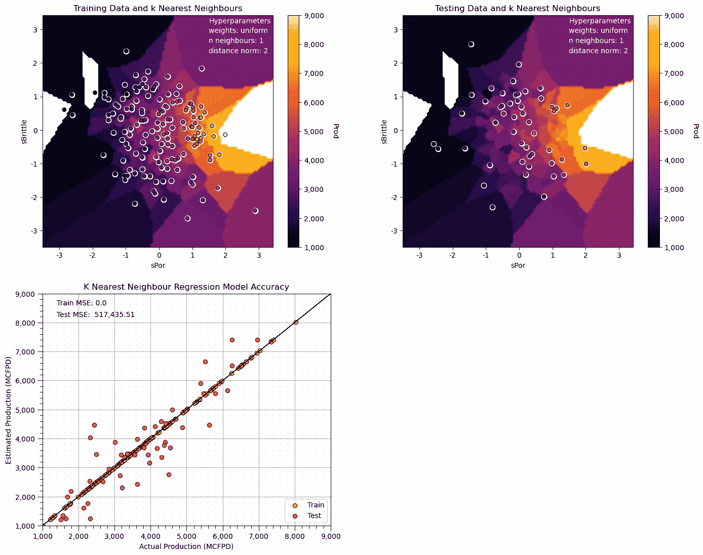

现在我们有一个极端过拟合模型。

+   训练均方误差为 0.0，而测试误差相当高。

+   注意，我们过拟合模型中的某些预测超出了绘图的最小和最大响应特征值。

让我们尝试使用 L1，曼哈顿距离来找到 k 个最近邻。

```py
n_neighbours = 10; p = 1; weights = 'uniform'                 # model hyperparameters
neigh = KNeighborsRegressor(weights = weights,n_neighbors=n_neighbours,p = p) # instantiate the prediction model

neigh_fit = neigh.fit(X_train,y_train)                        # train the model with the training data

plt.subplot(221)                                              # training data vs. the model predictions
Z = visualize_model(neigh_fit,X_train[sel_spred[0]],-3.5,3.5,X_train[sel_spred[1]],-3.5,3.5,y_train[resp[0]],ymin,ymax,
                    'Training Data and k Nearest Neighbours')
plt.annotate('Hyperparameters',[1.5,3.2],color='white'); plt.annotate('weights: ' + weights,[1.5,2.9],color='white')
plt.annotate('n neighbours: ' + str(n_neighbours),[1.5,2.6],color='white'); plt.annotate('distance norm: ' + str(p),[1.5,2.3],color='white')

plt.subplot(222)                                              # testing data vs. the model predictions
visualize_model(neigh_fit,X_test[sel_spred[0]],-3.5,3.5,X_test[sel_spred[1]],-3.5,3.5,y_test[resp[0]],ymin,ymax,
                'Testing Data and k Nearest Neighbours')
plt.annotate('Hyperparameters',[1.5,3.2],color='white'); plt.annotate('weights: ' + weights,[1.5,2.9],color='white')
plt.annotate('n neighbours: ' + str(n_neighbours),[1.5,2.6],color='white'); plt.annotate('distance norm: ' + str(p),[1.5,2.3],color='white')

plt.subplot(223)                                              # model accuracy check
check_model(neigh_fit,X_train[sel_spred[0]],X_train[sel_spred[1]],X_test[sel_spred[0]],X_test[sel_spred[1]],ymin,ymax,
            y_train[resp[0]],y_test[resp[0]],'K Nearest Neighbour Regression Model Accuracy')

plt.subplots_adjust(left=0.0, bottom=0.0, right=2.0, top=2.1, wspace=0.25, hspace=0.2); plt.show() 
```

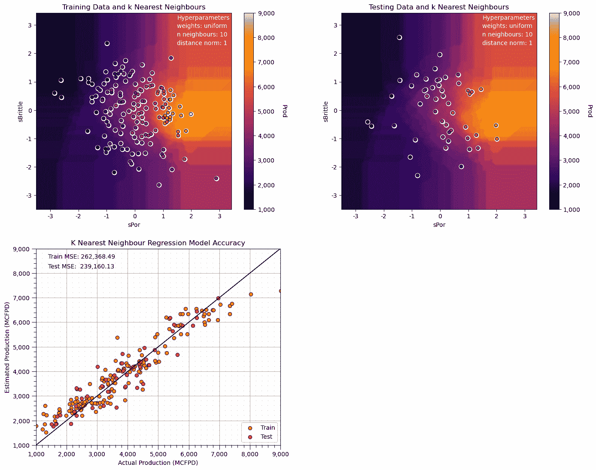

将这个预测模型与我们的第一个模型进行比较，我们唯一改变的是将 k 最近样本的距离搜索从欧几里得距离更改为曼哈顿距离。

+   搜索伪影现在与特征对齐（射线在 x 和 y 方向上定向）。

## k-最近邻的参数调整

让我们在调整超参数时检查这一点。

那么$k$的作用是什么？

+   小的$k$超参数导致在预测特征空间上的局部特定预测模型。

+   大的$k$超参数导致在预测特征空间上的更平滑、全局拟合的预测模型。

这与其他模型（如决策树）观察到的从低到高复杂度类似。

+   小的$k$复杂。

+   大的$k$简单。

我们需要调整复杂度以优化模型性能。

## 超参数调整

让我们遍历多个$k$最近邻，以平均和逆距离估计来访问与测试精度相关的最佳超参数。

```py
k = 1                                                         # set initial, lowest k hyperparameter
dist_error = []; unif_error = []; k_mat = []                  # make lists to store the results
while k <= 150:                                               # loop over the k hyperparameter
    neigh_dist = KNeighborsRegressor(weights = 'distance', n_neighbors=k, p = 2) # instantiate the model
    neigh_dist_fit = neigh_dist.fit(X_train,y_train)          # train the model with the training data
    y_pred = neigh_dist_fit.predict(X_test)                   # predict over the testing cases
    MSE = metrics.mean_squared_error(y_test,y_pred)           # calculate the MSE testing
    dist_error.append(MSE)                                    # add to the list of MSE

    neigh_unif = KNeighborsRegressor(weights = 'uniform', n_neighbors=k, p = 2)
    neigh_unif_fit = neigh_unif.fit(X_train,y_train)          # train the model with the training data
    y_pred = neigh_unif_fit.predict(X_test)                   # predict over the testing cases
    MSE = metrics.mean_squared_error(y_test,y_pred)           # calculate the MSE testing
    unif_error.append(MSE)                                    # add to the list of MSE

    k_mat.append(k)                                           # append k to an array for plotting
    k = k + 1 
```

现在让我们绘制结果。

```py
plt.subplot(111)
plt.scatter(k_mat,dist_error,s=None, c='red',label = 'inverse distance weighted', marker=None, cmap=None, norm=None, vmin=None, vmax=None, alpha=0.8, linewidths=0.3, edgecolors="black")
plt.scatter(k_mat,unif_error,s=None, c='blue',label = 'arithmetic average', marker=None, cmap=None, norm=None, vmin=None, vmax=None, alpha=0.8, linewidths=0.3, edgecolors="black")
plt.title('Testing Error vs. Number of Nearest Neighbours'); plt.xlabel('Number of Nearest Neighbours'); plt.ylabel('Mean Square Error')
plt.legend(); add_grid()
plt.xlim(0,50); plt.ylim([0,750000])
plt.subplots_adjust(left=0.0, bottom=0.0, right=0.8, top=0.8,wspace=0.15,hspace=0.2); plt.show() 
```

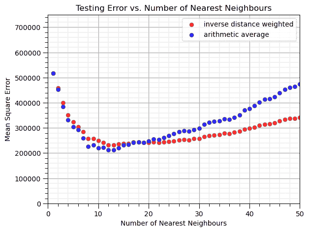

我们能从这个结果观察到什么？

+   在$k = 12$个最近邻时，我们最小化了测试中的均方误差。

+   与算术平均（在预测特征空间中对 k 个最近训练数据进行均匀加权）相比，逆距离加权有更好的性能。

我们模型的最佳特定性和复杂度是存在的。

+   1 个最近邻是一个非常局部特定的模型（过拟合）。

+   包含太多信息的许多最近邻过于泛化（欠拟合）。

我们正在观察$k$最近邻模型的精度与复杂度之间的权衡。

## k 折交叉验证

通过观察准确率与复杂性的权衡，评估我们模型的性能是有用的。

然而，我们真正想要做的是严格测试我们的模型性能。我们应该执行更严格的交叉验证，它能更好地评估不同的训练和测试数据集。scikit learn 有一个内置的交叉验证方法叫做 cross_val_score，我们可以用它来：

1.  应用 k 折方法，通过迭代分离训练和测试数据

1.  自动化模型构建，循环遍历折叠并平均感兴趣的指标

让我们在具有可变 $k$ 个最近邻的 k 近邻预测上试一试。注意交叉验证设置为使用 4 个处理器，但仍可能需要几分钟才能运行。

```py
score = []                                                  # code modified from StackOverFlow by Dimosthenis
k_mat = []
for k in range(1,150):
    neigh_dist = KNeighborsRegressor(weights = 'distance', n_neighbors=k, p = 1)
    scores = cross_val_score(estimator=neigh_dist, X= np.c_[df['sPor'],df['sBrittle']],y=df['Prod'], cv=4, n_jobs=4,
                             scoring = "neg_mean_squared_error") # Perform 7-fold cross validation
    score.append(abs(scores.mean()))
    k_mat.append(k) 
```

输出是一个数组，包含每个复杂度级别（$k$ 个最近邻的数量）的平均分数（均方误差），以及一个包含 $k$ 值的数组。

```py
plt.figure(figsize=(8,6))
plt.scatter(k_mat,score,s=None, c="red", marker=None, cmap=None, norm=None, vmin=None, vmax=None, alpha=0.8, linewidths=0.5, edgecolors="black")
plt.title('k-fold Cross Validation Error (MSE) vs. k Nearest Neighbours'); plt.xlabel('Number of Nearest Neighbours'); plt.ylabel('Mean Square Error')
plt.xlim(1,150); plt.ylim([0,1400000]); add_grid()
plt.subplots_adjust(left=0.0, bottom=0.0, right=0.8, top=0.8,wspace=0.15,hspace=0.2); plt.show() 
```

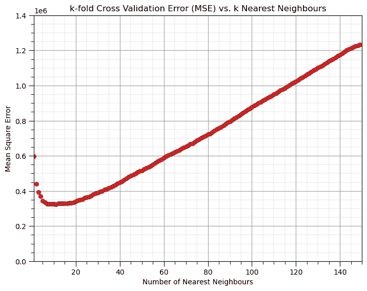

在 k 折交叉验证模型测试中，使用 10 个最近邻的参数我们得到了最高的准确率。

## 预测特征标准化

我们已经将预测特征标准化，以消除它们范围的影响。

+   如果我们使用原始预测特征会怎样呢？

让我们试一试。

+   我们首先使用原始特征进行训练和测试分割，而不进行标准化

```py
X_train_orig, X_test_orig, y_train_orig, y_test_orig = train_test_split(df.loc[:,sel_pred],df.loc[:,resp],test_size=0.25,random_state=73073)

neigh = KNeighborsRegressor(weights = 'distance', n_neighbors=15, p = 1)
neigh_fit = neigh.fit(X_train_orig,y_train_orig)                # train the model with the training data

plt.subplot(121)                                              # training data vs. the model predictions
Z = visualize_model(neigh_fit,X_train_orig[sel_pred[0]],Xmin[0],Xmax[0],X_train_orig[sel_pred[1]],Xmin[1],Xmax[1],y_train[resp[0]],ymin,ymax,
                    'Training Data and k Nearest Neighbours')
plt.annotate('Hyperparameters',[1.5,3.2],color='white'); plt.annotate('weights: ' + weights,[1.5,2.9],color='white')
plt.annotate('n neighbours: ' + str(n_neighbours),[1.5,2.6],color='white'); plt.annotate('distance norm: ' + str(p),[1.5,2.3],color='white')

plt.subplot(122)                                              # testing data vs. the model predictions
visualize_model(neigh_fit,X_test_orig[sel_pred[0]],Xmin[0],Xmax[0],X_test_orig[sel_pred[1]],Xmin[1],Xmax[1],y_test[resp[0]],ymin,ymax,
                'Testing Data and k Nearest Neighbours')
plt.annotate('Hyperparameters',[1.5,3.2],color='white'); plt.annotate('weights: ' + weights,[1.5,2.9],color='white')
plt.annotate('n neighbours: ' + str(n_neighbours),[1.5,2.6],color='white'); plt.annotate('distance norm: ' + str(p),[1.5,2.3],color='white')

plt.subplots_adjust(left=0.0, bottom=0.0, right=2.0, top=1.2, wspace=0.2, hspace=0.2); plt.show() 
```

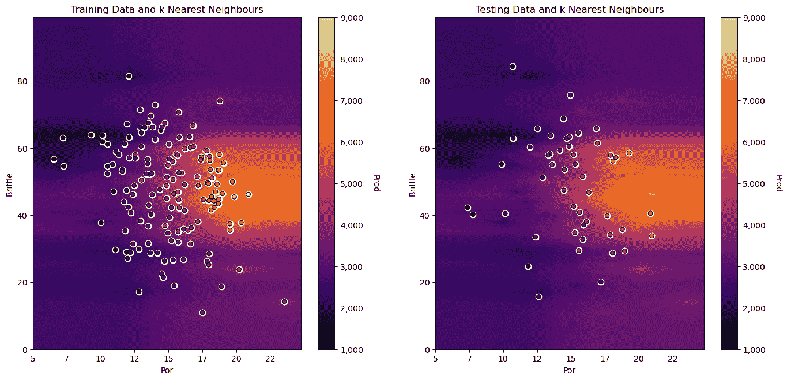

你能看到水平的条纹吗？脆性与孔隙率之间的大范围量级差异导致了这种条纹。

+   特征空间中的距离对脆性的相对变化比孔隙率更敏感

让我们将孔隙率转换为分数，并观察由于将孔隙率作为分数而不是百分比处理的任意决策，我们的预测指标发生了怎样的变化。

+   通过将所有孔隙率值乘以 $\frac{1}{100}$ 的系数。

```py
X_train_orig, X_test_orig, y_train_orig, y_test_orig = train_test_split(df.loc[:,sel_pred],df.loc[:,resp],test_size=0.25,random_state=73073)

X_train_orig['Por'] = X_train_orig['Por']/100.0
X_test_orig['Por'] = X_test_orig['Por']/100.0

neigh = KNeighborsRegressor(weights = 'distance', n_neighbors=15, p = 1)
neigh_fit = neigh.fit(X_train_orig,y_train_orig)                # train the model with the training data

plt.subplot(121)                                              # training data vs. the model predictions
Z = visualize_model(neigh_fit,X_train_orig[sel_pred[0]],Xmin[0]/100,Xmax[0]/100,X_train_orig[sel_pred[1]],Xmin[1],Xmax[1],y_train[resp[0]],ymin,ymax,
                    'Training Data and k Nearest Neighbours',False)
plt.annotate('Hyperparameters',[1.5,3.2],color='white'); plt.annotate('weights: ' + weights,[1.5,2.9],color='white')
plt.annotate('n neighbours: ' + str(n_neighbours),[1.5,2.6],color='white'); plt.annotate('distance norm: ' + str(p),[1.5,2.3],color='white')

plt.subplot(122)                                              # testing data vs. the model predictions
visualize_model(neigh_fit,X_test_orig[sel_pred[0]],Xmin[0]/100,Xmax[0]/100,X_test_orig[sel_pred[1]],Xmin[1],Xmax[1],y_test[resp[0]],ymin,ymax,
                'Testing Data and k Nearest Neighbours',False)
plt.annotate('Hyperparameters',[1.5,3.2],color='white'); plt.annotate('weights: ' + weights,[1.5,2.9],color='white')
plt.annotate('n neighbours: ' + str(n_neighbours),[1.5,2.6],color='white'); plt.annotate('distance norm: ' + str(p),[1.5,2.3],color='white')

plt.subplots_adjust(left=0.0, bottom=0.0, right=2.0, top=1.2, wspace=0.2, hspace=0.2); plt.show() 
```

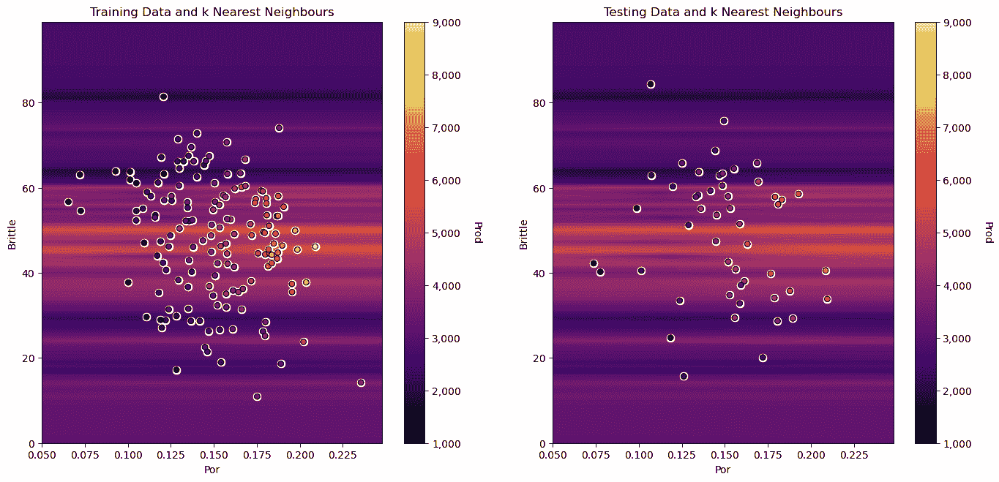

+   当我们将百分比孔隙率转换为分数孔隙率时，这种条纹效应变得更加严重，因为孔隙率中的距离看起来比脆性中的距离要近得多，这仅仅是因为特征范围的不同。

我们分配最近邻的距离度量对特征单位非常敏感。在我们使用它们来构建 $k$-近邻回归模型之前，我们应该始终对所有预测特征进行标准化（使它们处于平等地位）！

## scikit-learn 中的 k 近邻回归与管道

需要标准化特征、训练、调整并使用所有数据重新训练调整后的模型可能看起来要做很多工作！

+   一种解决方案是使用 scikit-learn 中的 Pipeline 对象。

这里有一些关于管道的亮点。

### 机器学习建模管道基础

机器学习工作流程可能很复杂，有各种步骤：

+   数据准备，特征工程转换

+   模型参数拟合

+   模型超参数调整

+   模型方法选择

+   在大量超参数组合中进行搜索

+   训练和测试模型运行

管道是 scikit-learn 类，允许封装一系列数据准备和建模步骤

+   然后，我们可以将管道视为我们高度精简的工作流程中的一个对象

管道类允许我们：

+   提高代码可读性，并保持一切井然有序

+   避免常见的流程问题，如数据泄露，测试数据告知模型参数训练

+   抽象常见的机器学习建模，并专注于构建最佳模型

基本哲学是将机器学习视为组合搜索，以自动化最佳模型的确定（AutoML）

### 使用管道的 k-Nearest Neighbours

这里是使用 scikit-learn 管道进行整个模型训练和调整过程的紧凑、安全代码

+   GridSearchCV 对象实际上变成了预测模型，调整过的超参数在所有数据上重新训练！

```py
import os                                                     # to set current working directory 

folds = 4                                                   # number of k folds
k_min = 1; k_max = 150                                       # range of k hyperparameter to consider

X_pipe = df.loc[:,sel_pred]                                 # all the samples for the original features
y_pipe = df.loc[:,resp[0]]                             # warning this becomes a series, 1D ndarray with label

pipe = Pipeline([                                           # the machine learning workflow as a pipeline object
    ('scaler', StandardScaler()),
    ('knear', KNeighborsRegressor())
])

params = {                                                  # the machine learning workflow method's parameters
    'scaler': [StandardScaler()],
    'knear__n_neighbors': np.arange(k_min,k_max,1,dtype = int),
    'knear__metric': ['euclidean'],
    'knear__p': [2],
    'knear__weights': ['distance']
}

grid_cv_tuned = GridSearchCV(pipe, params, scoring = 'neg_mean_squared_error', # grid search cross validation 
                             cv=KFold(n_splits=folds,shuffle=False),
                             refit = True)
grid_cv_tuned.fit(X_pipe,y_pipe)                                      # fit model with tuned hyperparameters

plt.subplot(121)
visualize_tuned_model(grid_cv_tuned.best_params_['knear__n_neighbors'], # visualize the error vs. k 
                      grid_cv_tuned.cv_results_['param_knear__n_neighbors'],
                      abs(grid_cv_tuned.cv_results_['mean_test_score']))              

plt.subplot(122)                                            # visualize the tuned model
visualize_model(grid_cv_tuned,X[sel_pred[0]],Xmin[0],Xmax[0],X[sel_pred[1]],Xmin[1],Xmax[1],df[resp[0]],ymin,ymax,
                'All Data and Tuned and Retrained k-Nearest Neighbours')

plt.subplots_adjust(left=0.0, bottom=0.0, right=2.0, top=1.2, wspace=0.2, hspace=0.2); plt.show() 
```

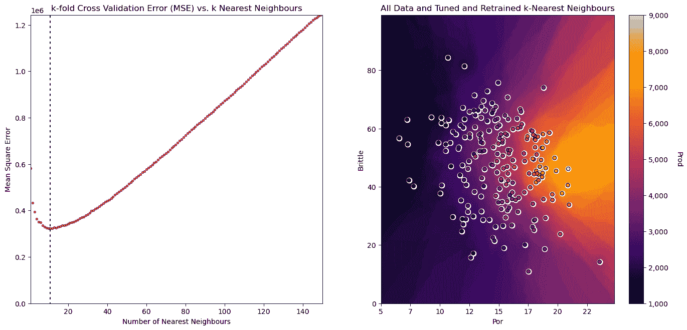

### 检查调整过的超参数

在 GridSearchCV 模型对象中，有一个内置的字典 best_params_，其中包含所有调整过的超参数。

+   注意，在 k 的范围内，选择的 k，n_neighbors

+   此外，还指定了其他超参数，但我们可以提供范围和场景，以便使用网格搜索方法进行探索

当调整超过 1 个超参数时，运行时间将随着超参数的组合以及结果模型损失函数（例如，cv_results_['mean_test_score']）的增加而增加，对所有超参数案例进行排序

```py
grid_cv_tuned.best_params_ 
```

```py
{'knear__metric': 'euclidean',
 'knear__n_neighbors': 11,
 'knear__p': 2,
 'knear__weights': 'distance',
 'scaler': StandardScaler()} 
```

也有助于查看整个模型对象以获取更多信息。包括：

+   超参数调整考虑的所有管道和案例。

```py
grid_cv_tuned 
```

```py
GridSearchCV(cv=KFold(n_splits=4, random_state=None, shuffle=False),
             estimator=Pipeline(steps=[('scaler', StandardScaler()),
                                       ('knear', KNeighborsRegressor())]),
             param_grid={'knear__metric': ['euclidean'],
                         'knear__n_neighbors': array([  1,   2,   3,   4,   5,   6,   7,   8,   9,  10,  11,  12,  13,
        14,  15,  16,  17,  18,  19,  20,  21,  22,  23,  24,  25,  26,
        27,  28,  29,  30,  31,  32,  33,  34,  35,  36,  37,  38,  39,
        40,  41,  42,  43,  44,  45,...
        79,  80,  81,  82,  83,  84,  85,  86,  87,  88,  89,  90,  91,
        92,  93,  94,  95,  96,  97,  98,  99, 100, 101, 102, 103, 104,
       105, 106, 107, 108, 109, 110, 111, 112, 113, 114, 115, 116, 117,
       118, 119, 120, 121, 122, 123, 124, 125, 126, 127, 128, 129, 130,
       131, 132, 133, 134, 135, 136, 137, 138, 139, 140, 141, 142, 143,
       144, 145, 146, 147, 148, 149]),
                         'knear__p': [2], 'knear__weights': ['distance'],
                         'scaler': [StandardScaler()]},
             scoring='neg_mean_squared_error')
```

**在 Jupyter 环境中，请重新运行此单元格以显示 HTML 表示形式，或者相信笔记本。**

在 GitHub 上，HTML 表示无法渲染，请尝试使用 nbviewer.org 加载此页面。**

```py
GridSearchCV(cv=KFold(n_splits=4, random_state=None, shuffle=False),
             estimator=Pipeline(steps=[('scaler', StandardScaler()),
                                       ('knear', KNeighborsRegressor())]),
             param_grid={'knear__metric': ['euclidean'],
                         'knear__n_neighbors': array([  1,   2,   3,   4,   5,   6,   7,   8,   9,  10,  11,  12,  13,
        14,  15,  16,  17,  18,  19,  20,  21,  22,  23,  24,  25,  26,
        27,  28,  29,  30,  31,  32,  33,  34,  35,  36,  37,  38,  39,
        40,  41,  42,  43,  44,  45,...
        79,  80,  81,  82,  83,  84,  85,  86,  87,  88,  89,  90,  91,
        92,  93,  94,  95,  96,  97,  98,  99, 100, 101, 102, 103, 104,
       105, 106, 107, 108, 109, 110, 111, 112, 113, 114, 115, 116, 117,
       118, 119, 120, 121, 122, 123, 124, 125, 126, 127, 128, 129, 130,
       131, 132, 133, 134, 135, 136, 137, 138, 139, 140, 141, 142, 143,
       144, 145, 146, 147, 148, 149]),
                         'knear__p': [2], 'knear__weights': ['distance'],
                         'scaler': [StandardScaler()]},
             scoring='neg_mean_squared_error')
```

```py
Pipeline(steps=[('scaler', StandardScaler()), ('knear', KNeighborsRegressor())])
```

```py
StandardScaler()
```

```py
KNeighborsRegressor()
```

## 评论

这是对 k-Nearest Neighbours 的基本处理。可以做和讨论的还有很多，我有很多其他资源。查看我的[共享资源清单](https://michaelpyrcz.com/my-resources)以及本章开头 YouTube 讲座链接中的资源链接。

希望这有所帮助，

*迈克尔*

## 关于作者


在德克萨斯大学奥斯汀分校的 40 英亩校园内，迈克尔·皮尔茨教授的办公室。

迈克尔·皮尔奇兹（Michael Pyrcz）是德克萨斯大学奥斯汀分校 [Cockrell 工程学院](https://cockrell.utexas.edu/faculty-directory/alphabetical/p) 和 [Jackson 地球科学学院](https://www.jsg.utexas.edu/researcher/michael_pyrcz/) 的教授，他在那里研究并教授地下、空间数据分析、地统计学和机器学习。迈克尔还，

+   [能源分析](https://fri.cns.utexas.edu/energy-analytics) 新生研究项目的首席研究员，以及德克萨斯大学奥斯汀分校自然科学院机器学习实验室的核心教员。

+   [计算机与地球科学](https://www.sciencedirect.com/journal/computers-and-geosciences/about/editorial-board) 的副编辑，以及国际数学地球科学协会 [数学地球科学](https://link.springer.com/journal/11004/editorial-board) 的董事会成员。

迈克尔已经撰写了超过 70 篇 [同行评审出版物](https://scholar.google.com/citations?user=QVZ20eQAAAAJ&hl=en)，一个用于空间数据分析的 [Python 包](https://pypi.org/project/geostatspy/)，合著了一本关于空间数据分析的教科书 [地统计学储层建模](https://www.amazon.com/Geostatistical-Reservoir-Modeling-Michael-Pyrcz/dp/0199731446)，并且是两本最近发布的电子书的作者，[Python 中的应用地统计学：GeostatsPy 实战指南](https://geostatsguy.github.io/GeostatsPyDemos_Book/intro.html) 和 [Python 中的应用机器学习：实战指南与代码](https://geostatsguy.github.io/MachineLearningDemos_Book/intro.html)。

迈克尔的所有大学讲座都可以在他的 [YouTube 频道](https://www.youtube.com/@GeostatsGuyLectures) 上找到，其中包含 100 多个 Python 交互式仪表板和 40 多个存储库中的详细工作流程链接，这些存储库位于他的 [GitHub 账户](https://github.com/GeostatsGuy)，以支持任何感兴趣的学生和在职专业人士，提供持续更新的内容。要了解更多关于迈克尔的工作和共享教育资源，请访问他的网站。

## 想一起工作吗？

我希望这个内容对那些想了解更多关于地下建模、数据分析和机器学习的人有所帮助。学生和在职专业人士欢迎参加。

+   想邀请我到贵公司进行培训、辅导、项目审查、工作流程设计和/或咨询吗？我很乐意拜访并与您合作！

+   感兴趣合作、支持我的研究生研究或我的地下数据分析与机器学习联盟（共同负责人是约翰·福斯特教授）吗？我的研究将数据分析、随机建模和机器学习理论与实践相结合，以开发新的方法和工作流程，增加价值。我们正在解决具有挑战性的地下问题！

+   我可以通过 mpyrcz@austin.utexas.edu 联系到。

我总是乐于讨论，

*迈克尔*

迈克尔·皮尔奇，博士，P.Eng. 教授，德克萨斯大学奥斯汀分校 Cockrell 工程学院和 Jackson 地球科学学院

## 更多资源请访问：[Twitter](https://twitter.com/geostatsguy) | [GitHub](https://github.com/GeostatsGuy) | [网站](http://michaelpyrcz.com) | [Google Scholar](https://scholar.google.com/citations?user=QVZ20eQAAAAJ&hl=en&oi=ao) | [书籍](https://www.amazon.com/Geostatistical-Reservoir-Modeling-Michael-Pyrcz/dp/0199731446) | [YouTube](https://www.youtube.com/channel/UCLqEr-xV-ceHdXXXrTId5ig) | [Python 中的应用地球统计学电子书](https://geostatsguy.github.io/GeostatsPyDemos_Book/intro.html) | [LinkedIn](https://www.linkedin.com/in/michael-pyrcz-61a648a1)

## k 近邻回归的动机

覆盖 k 近邻回归有许多很好的理由。除了它是一个简单、可解释且灵活的预测机器学习模型之外，它还展示了重要的概念，

+   **非参数预测模型** - 从数据中学习关系的形状，即不对关系的形状做出先验假设

+   **基于实例的、懒惰学习** - 模型训练推迟到需要预测时，不需要预先计算模型。即，预测需要访问数据

+   **超参数调整** - 使用可理解的超参数来控制模型拟合

+   **非常灵活、多功能的预测模型** - 在许多情况下表现良好

## 卷积

事实上，k 近邻类似于在局部邻域内通过加权平均进行空间估计。


在预测特征空间中对空间插值进行建模。

k 近邻方法类似于空间插值的卷积方法。卷积是两个函数的积分乘积，其中一个函数经过反转并沿$\tau$平移。

+   一种解释是使用加权函数$𝑓(\Delta)$对函数进行平滑，以计算函数$𝑔(x)$的加权平均值，

$$ (f * g)(x) = \int_{-\infty}^{\infty} f(\tau) g(x - \tau) \, d\tau $$

这很容易扩展到多维

$$ (f * g)(x, y, z) = \int_{-\infty}^{\infty} \int_{-\infty}^{\infty} \int_{-\infty}^{\infty} f(\tau_x, \tau_y, \tau_z) g(x - \tau_x, y - \tau_y, z - \tau_z) \, d\tau_x \, d\tau_y \, d\tau_z $$

在积分之前选择哪个函数进行平移不会改变结果，卷积算子具有交换性，

$$ (f * g)(x) = \int_{-\infty}^{\infty} f(\tau) g(x - \tau) \, d\tau $$$$ (f * g)(x) = \int_{-\infty}^{\infty} f(x - \tau) g(\tau) \, d\tau $$

+   如果任一函数被反射，则卷积等同于互相关，它是两个信号作为位移函数的相似度度量。

为了演示使用详尽的 $g(x)$ 和稀疏采样的 $g(x)$ 的卷积，我构建了一个 [交互式 Python 卷积仪表板](https://github.com/GeostatsGuy/DataScienceInteractivePython/blob/main/Interactive_Convolution_kNearest.ipynb)，


用于演示卷积的交互式 Python 仪表板。

```py
import numpy as np                                            # arrays and matrix math
import pandas as pd                                           # DataFrames
import matplotlib.pyplot as plt                               # for plotting
from scipy.ndimage import convolve1d
seed = 73073                                                  # random number seed

kr = 5; kloc = 45                                             # kernel radius, kernel location for example point

df_denpor = pd.read_csv('https://raw.githubusercontent.com/GeostatsGuy/GeoDataSets/master/1D_por_perm_smooth.csv') # load data from Dr. Pyrcz's GitHub 

plt.subplot(121)                    
plt.plot(df_denpor['Por'],df_denpor['Depth'],color='black',label='f(x)'); plt.ylabel('Depth (m)'); plt.xlabel('Porosity (%)')
plt.ylim([100,0]); plt.xlim([2,22]); plt.title('Exhaustive Case: Original and Convolved Function'); plt.yticks(np.arange(100, -1, -5));

size = 2 * kr + 1                                             # make uniform kernel
kernel = np.ones(size) / size                                 # normalize kernel to sum to one for unbiasedness

convolved = np.convolve(df_denpor['Por'].values, kernel, mode='same') # convolution

k = len(kernel)
trim = k // 2  # how many values to trim from each edge
convolved_valid = convolved[trim:-trim] if trim > 0 else convolved
depth_valid = df_denpor['Depth'].values[trim:-trim] if trim > 0 else df_denpor['Depth'].values
convolved_pt = convolved_valid[np.abs(depth_valid - kloc).argmin()]; depth_pt = depth_valid[np.abs(depth_valid - kloc).argmin()]
plt.plot(convolved_valid,depth_valid,color='red',label=r'$(f * g)(x)$'); plt.ylabel('Depth (m)'); plt.xlabel('Porosity (%)'); 
plt.ylim([100,0]); plt.xlim([2,22]); plt.legend(loc='lower left'); plt.plot([2,22],[depth_pt,depth_pt],color='red',ls='--')
plt.scatter(convolved_pt,depth_pt,color='red',marker='o',edgecolor='black',zorder=10)

plt.subplot(122)
plt.plot(kernel,np.linspace(-1*kr+kloc,kr+kloc,2*kr+1),color='black',label=r'$g(\tau)$'); plt.xlim(0.35,0.0); plt.ylim([100,0]); 
plt.yticks(np.arange(100, -1, -5)); plt.plot([kernel[0],0.0],[-1*kr+kloc,-1*kr+kloc],color='black'); 
plt.plot([kernel[0],0.0],[kr+kloc,kr+kloc],color='black'); plt.legend(loc='lower left'); plt.title('Kernel')
plt.plot([0.35,0.0],[depth_pt,depth_pt],color='red',ls='--'); plt.ylabel('Depth (m)'); plt.xlabel('Weight (unitless)')

plt.subplots_adjust(left=0.0, bottom=0.0, right=1.5, top=1.2, wspace=0.2, hspace=0.2); plt.show() 
```


```py
import astropy.convolution.convolve as convolve               # sparse data convolution
frac = 0.2

df_denpor['Por_Sparse'] = df_denpor['Por'].copy()

np.random.seed(seed = seed)
nan_indices = np.random.choice(len(df_denpor), size=int(len(df_denpor)*(1.0-frac)), replace=False)
df_denpor.loc[nan_indices, 'Por_Sparse'] = np.nan

plt.subplot(121)                    
plt.scatter(df_denpor['Por_Sparse'],df_denpor['Depth'],color='black',label='f(x) Sparse'); plt.ylabel('Depth (m)'); plt.xlabel('Porosity (%)')
plt.plot(df_denpor['Por'],df_denpor['Depth'],color='black',alpha=0.3,label='f(x) Exhaustive');
plt.ylim([26,0]); plt.xlim([2,22]); plt.title('Sparse Case: Original and Convolved Function'); plt.yticks(np.arange(100, -1, -5));

size = 2 * kr + 1                                             # make uniform kernel
kernel = np.ones(size) / size                                 # normalize kernel to sum to one for unbiasedness

convolved = convolve(df_denpor['Por_Sparse'].values,kernel,boundary='extend',nan_treatment='interpolate',normalize_kernel=True) # convolve

k = len(kernel)
trim = k // 2  # how many values to trim from each edge
convolved_valid = convolved[trim:-trim] if trim > 0 else convolved
depth_valid = df_denpor['Depth'].values[trim:-trim] if trim > 0 else df_denpor['Depth'].values
convolved_pt = convolved_valid[np.abs(depth_valid - kloc).argmin()]; depth_pt = depth_valid[np.abs(depth_valid - kloc).argmin()]
plt.plot(convolved_valid,depth_valid,color='red',label=r'$(f * g)(x)$'); plt.ylabel('Depth (m)'); plt.xlabel('Porosity (%)'); 
plt.ylim([100,0]); plt.xlim([2,22]); plt.legend(loc='lower left'); plt.plot([2,22],[depth_pt,depth_pt],color='red',ls='--')
plt.scatter(convolved_pt,depth_pt,color='red',marker='o',edgecolor='black',zorder=10)

plt.subplot(122)
plt.plot(kernel,np.linspace(-1*kr+kloc,kr+kloc,2*kr+1),color='black',label=r'$g(\tau)$'); plt.xlim(0.35,0.0); plt.ylim([100,0]); 
plt.yticks(np.arange(100, -1, -5)); plt.plot([kernel[0],0.0],[-1*kr+kloc,-1*kr+kloc],color='black'); 
plt.plot([kernel[0],0.0],[kr+kloc,kr+kloc],color='black'); plt.legend(loc='lower left'); plt.title('Kernel')
plt.plot([0.35,0.0],[depth_pt,depth_pt],color='red',ls='--'); plt.ylabel('Depth (m)'); plt.xlabel('Weight (unitless)')

plt.subplots_adjust(left=0.0, bottom=0.0, right=1.5, top=1.2, wspace=0.2, hspace=0.2); plt.show() 
```

```py
WARNING: nan_treatment='interpolate', however, NaN values detected post convolution. A contiguous region of NaN values, larger than the kernel size, are present in the input array. Increase the kernel size to avoid this. [astropy.convolution.convolve] 
```


虽然回顾和讨论卷积很有用，但 k 近邻与卷积不同，因为它指定了 $k$ 个最近邻以包含在加权平均值中，

+   指定 $k$ 导致局部自适应窗口大小，局部邻域扩展足够远以找到 $k$ 个训练数据


对于给定的 $k$ 个最近邻数据点，从预测特征空间的稀疏数据区域收集数据。

## k 近邻超参数

现在让我们讨论 k 近邻超参数。

1.  **k 个最近的数据点** - 用于预测

1.  **数据加权** - 例如均匀加权（使用局部训练数据平均值），倒数距离加权

注意，对于倒数距离加权的案例，该方法类似于倒数距离加权插值，通常应用于空间插值中的局部数据最大数量约束。倒数距离在 GeostatsPy 中可用于空间映射。

1.  **距离度量** - 在预测特征空间内的训练数据按距离排序，从最近到最远，可以应用多种距离度量，包括：

+   欧几里得距离

\begin{equation}

$d_i = \sqrt{\sum_{\alpha = 1}^{m} \left(x_{\alpha,i} - x_{\alpha,0}\right)²} \end{equation}$

+   米氏距离 - 一种距离的推广形式，其中已知的曼哈顿和欧几里得距离是特殊情况，

$$ d_{(i,i')} = \left( \sum_{j=1}^{m} \left( x_{(j,i)} - x_{(j,i')} \right)^p \right)^{\frac{1}{p}} $$

+   当 $p=2$ 时，这变为欧几里得距离

+   当 $p=1$ 时，它变为曼哈顿距离

## 加载所需的库

我们还需要一些标准包。这些应该已经与 Anaconda 3 一起安装。

```py
%matplotlib inline                                         
suppress_warnings = True
import os                                                     # to set current working directory 
import math                                                   # square root operator
import numpy as np                                            # arrays and matrix math
import scipy.stats as st                                      # statistical methods
import pandas as pd                                           # DataFrames
import pandas.plotting as pd_plot
import matplotlib.pyplot as plt                               # for plotting
from matplotlib.ticker import (MultipleLocator,AutoMinorLocator,FuncFormatter) # control of axes ticks
from matplotlib.colors import ListedColormap                  # custom color maps
import seaborn as sns                                         # for matrix scatter plots
from sklearn import metrics                                   # measures to check our models
from sklearn.preprocessing import StandardScaler              # standardize the features
from sklearn.neighbors import KNeighborsRegressor             # for nearest k neighbours
from sklearn import metrics                                   # measures to check our models
from sklearn.model_selection import (cross_val_score,train_test_split,GridSearchCV,KFold) # model tuning
from sklearn.pipeline import (Pipeline,make_pipeline)         # machine learning modeling pipeline
from IPython.display import display, HTML                     # custom displays
cmap = plt.cm.inferno                                         # default color bar, no bias and friendly for color vision defeciency
plt.rc('axes', axisbelow=True)                                # grid behind plotting elements
if suppress_warnings == True:  
    import warnings                                           # suppress any warnings for this demonstration
    warnings.filterwarnings('ignore') 
seed = 13                                                     # random number seed for workflow repeatability 
```

如果遇到包导入错误，您可能必须首先安装这些包中的某些。这通常可以通过在 Windows 上打开命令窗口并输入‘python -m pip install [package-name]’来完成。有关相应包的文档，可以获得更多帮助。

## 声明函数

让我们定义一些函数来简化绘制相关矩阵、决策树回归模型的可视化以及将指定的百分位数和主次网格线添加到我们的图表中。

```py
def comma_format(x, pos):
    return f'{int(x):,}'

def feature_rank_plot(pred,metric,mmin,mmax,nominal,title,ylabel,mask): # feature ranking plot
    mpred = len(pred); mask_low = nominal-mask*(nominal-mmin); mask_high = nominal+mask*(mmax-nominal); m = len(pred) + 1
    plt.plot(pred,metric,color='black',zorder=20)
    plt.scatter(pred,metric,marker='o',s=10,color='black',zorder=100)
    plt.plot([-0.5,m-1.5],[0.0,0.0],'r--',linewidth = 1.0,zorder=1)
    plt.fill_between(np.arange(0,mpred,1),np.zeros(mpred),metric,where=(metric < nominal),interpolate=True,color='dodgerblue',alpha=0.3)
    plt.fill_between(np.arange(0,mpred,1),np.zeros(mpred),metric,where=(metric > nominal),interpolate=True,color='lightcoral',alpha=0.3)
    plt.fill_between(np.arange(0,mpred,1),np.full(mpred,mask_low),metric,where=(metric < mask_low),interpolate=True,color='blue',alpha=0.8,zorder=10)
    plt.fill_between(np.arange(0,mpred,1),np.full(mpred,mask_high),metric,where=(metric > mask_high),interpolate=True,color='red',alpha=0.8,zorder=10)  
    plt.xlabel('Predictor Features'); plt.ylabel(ylabel); plt.title(title)
    plt.ylim(mmin,mmax); plt.xlim([-0.5,m-1.5]); add_grid();
    return

def plot_corr(corr_matrix,title,limits,mask):                 # plots a graphical correlation matrix 
    my_colormap = plt.get_cmap('RdBu_r', 256)          
    newcolors = my_colormap(np.linspace(0, 1, 256))
    white = np.array([256/256, 256/256, 256/256, 1])
    white_low = int(128 - mask*128); white_high = int(128+mask*128)
    newcolors[white_low:white_high, :] = white                # mask all correlations less than abs(0.8)
    newcmp = ListedColormap(newcolors)
    m = corr_matrix.shape[0]
    im = plt.matshow(corr_matrix,fignum=0,vmin = -1.0*limits, vmax = limits,cmap = newcmp)
    plt.xticks(range(len(corr_matrix.columns)), corr_matrix.columns); ax = plt.gca()
    ax.xaxis.set_label_position('bottom'); ax.xaxis.tick_bottom()
    plt.yticks(range(len(corr_matrix.columns)), corr_matrix.columns)
    cbar = plt.colorbar(im, orientation = 'vertical')
    cbar.ax.yaxis.set_major_formatter(FuncFormatter(comma_format))
    plt.title(title)
    for i in range(0,m):
        plt.plot([i-0.5,i-0.5],[-0.5,m-0.5],color='black')
        plt.plot([-0.5,m-0.5],[i-0.5,i-0.5],color='black')
    plt.ylim([-0.5,m-0.5]); plt.xlim([-0.5,m-0.5])

def visualize_model(model,xfeature,x_min,x_max,yfeature,y_min,y_max,response,z_min,z_max,title,axes_commas = True): # plots the data points and the decision tree prediction 
    n_classes = 10
    cmap_temp = plt.cm.inferno
    xplot_step = (x_max-x_min)/100; yplot_step = (y_max-y_min)/100
    xx, yy = np.meshgrid(np.arange(x_min, x_max, xplot_step),
                     np.arange(y_min, y_max, yplot_step))
    Z = model.predict(np.c_[xx.ravel(), yy.ravel()])
    Z = Z.reshape(xx.shape)
    cs = plt.contourf(xx, yy, Z, cmap=cmap_temp,vmin=z_min, vmax=z_max, levels=np.linspace(z_min, z_max, 100))

    im = plt.scatter(xfeature,yfeature,s=30, c=response, marker=None, cmap=cmap_temp, norm=None, vmin=z_min, vmax=z_max, 
                     alpha=1.0, linewidths=0.8, edgecolors="black",zorder=10)
    plt.scatter(xfeature,yfeature,s=60, c='white', marker=None, cmap=cmap_temp, norm=None, vmin=z_min, vmax=z_max, 
                     alpha=1.0, linewidths=0.8, edgecolors=None,zorder=8)
    plt.title(title); plt.xlabel(xfeature.name); plt.ylabel(yfeature.name)
    cbar = plt.colorbar(im, orientation = 'vertical'); cbar.set_label(response.name, rotation=270, labelpad=20)
    cbar.ax.yaxis.set_major_formatter(FuncFormatter(comma_format))
    if axes_commas == True:
        plt.gca().xaxis.set_major_formatter(FuncFormatter(comma_format))
        plt.gca().yaxis.set_major_formatter(FuncFormatter(comma_format))
    return Z

def visualize_tuned_model(k_tuned,k_mat,score_mat):
    plt.scatter(k_mat,score_mat,s=10.0, c="red", marker=None, cmap=None, norm=None, vmin=None, vmax=None, alpha=0.8, 
                linewidths=0.5, edgecolors="black")
    plt.plot([k_tuned,k_tuned],[0,10000000],color='black',linestyle=(6, (2,3)),label='tuned',zorder=1)
    plt.title('k-fold Cross Validation Error (MSE) vs. k Nearest Neighbours'); plt.xlabel('Number of Nearest Neighbours')
    plt.ylabel('Mean Square Error')
    plt.xlim(k_min,k_max); plt.ylim(0,np.max(score_mat))

def check_model(model,xtrain,ytrain,xtest,ytest,ymin,ymax,rtrain,rtest,title): # plots the estimated vs. the actual 
    predict_train = model.predict(np.c_[xtrain,ytrain])
    predict_test = model.predict(np.c_[xtest,ytest])
    plt.scatter(rtrain,predict_train,s=None, c='darkorange',marker=None, cmap=None, norm=None, vmin=None, vmax=None, 
                alpha=0.8, linewidths=0.8, edgecolors="black",label='Train')
    plt.scatter(rtest,predict_test,s=None, c='red',marker=None, cmap=None, norm=None, vmin=None, vmax=None, 
                alpha=0.8, linewidths=0.8, edgecolors="black",label='Test')
    plt.title(title); plt.xlabel('Actual Production (MCFPD)'); plt.ylabel('Estimated Production (MCFPD)')
    plt.xlim(ymin,ymax); plt.ylim(ymin,ymax)
    plt.arrow(ymin,ymin,ymax,ymax,width=0.02,color='black',head_length=0.0,head_width=0.0)
    MSE_train = metrics.mean_squared_error(rtrain,predict_train)
    Var_Explained_train = metrics.explained_variance_score(rtrain,predict_train)
    cor_train = math.sqrt(metrics.r2_score(rtrain,predict_train))
    MSE_test = metrics.mean_squared_error(rtest,predict_test)
    plt.gca().xaxis.set_major_formatter(FuncFormatter(comma_format))
    plt.gca().yaxis.set_major_formatter(FuncFormatter(comma_format))
    plt.annotate('Train MSE: ' + str(f'{(np.round(MSE_train,2)):,}'),[0.05*(ymax-ymin)+ymin,0.95*(ymax-ymin)+ymin]) 
    plt.annotate('Test MSE:  ' + str(f'{(np.round(MSE_test,2)):,}'),[0.05*(ymax-ymin)+ymin,0.90*(ymax-ymin)+ymin])
    add_grid(); plt.legend(loc='lower right')
    # print('Mean Squared Error on Training = ', round(MSE_test,2),', Variance Explained =', round(Var_Explained,2),'Cor =', round(cor,2))

def weighted_percentile(data, weights, perc):                 # calculate weighted percentile (iambr on StackOverflow @ https://stackoverflow.com/questions/21844024/weighted-percentile-using-numpy/32216049) 
    ix = np.argsort(data)
    data = data[ix] 
    weights = weights[ix] 
    cdf = (np.cumsum(weights) - 0.5 * weights) / np.sum(weights) 
    return np.interp(perc, cdf, data)

def histogram_bounds(values,weights,color):                   # add uncertainty bounds to a histogram 
    p10 = weighted_percentile(values,weights,0.1); avg = np.average(values,weights=weights); p90 = weighted_percentile(values,weights,0.9)
    plt.plot([p10,p10],[0.0,45],color = color,linestyle='dashed')
    plt.plot([avg,avg],[0.0,45],color = color)
    plt.plot([p90,p90],[0.0,45],color = color,linestyle='dashed')

def add_grid():
    plt.gca().grid(True, which='major',linewidth = 1.0); plt.gca().grid(True, which='minor',linewidth = 0.2) # add y grids
    plt.gca().tick_params(which='major',length=7); plt.gca().tick_params(which='minor', length=4)
    plt.gca().xaxis.set_minor_locator(AutoMinorLocator()); plt.gca().yaxis.set_minor_locator(AutoMinorLocator()) # turn on minor ticks 

def display_sidebyside(*args):                                # display DataFrames side-by-side (ChatGPT 4.0 generated Spet, 2024)
    html_str = ''
    for df in args:
        html_str += df.head().to_html()  # Using .head() for the first few rows
    display(HTML(f'<div style="display: flex;">{html_str}</div>')) 
```

## 设置工作目录

我总是喜欢这样做，这样我就不会丢失文件，并且可以简化后续的读取和写入（避免每次都包含完整地址）。

```py
#os.chdir("c:/PGE383")                                        # set the working directory 
```

您将需要更新引号内的部分为您的自己的工作目录，并且在 Mac 上格式不同（例如：“~/PGE”）。

## 加载表格数据

这是将我们的逗号分隔数据文件加载到 Pandas DataFrame 对象中的命令。

让我们加载提供的多元、空间数据集 ‘unconv_MV.csv’。这个数据集包含来自 1,000 个非常规井的变量，包括：

+   井平均孔隙度

+   渗透率的对数变换（以线性化与其他变量的关系）

+   声阻抗（kg/m³ x m/s x 10⁶）

+   剪切比（%）

+   总有机碳（%）

+   玻璃质反射率（%）

+   初始生产 90 天平均（MCFPD）。

注意，数据集是合成的。

我们使用 pandas 的 ‘read_csv’ 函数将其加载到我们称为 ‘my_data’ 的 DataFrame 中，然后预览以确保正确加载。

## 可选：向响应特征添加随机噪声

我们可以这样做来观察数据噪声对过拟合和超参数调整的影响。

+   这是为了经验学习，当然我们不会向我们的数据添加随机噪声

+   我们设置了随机数种子以确保可重复性

```py
df_load = pd.read_csv('https://raw.githubusercontent.com/GeostatsGuy/GeoDataSets/master/unconv_MV_v4.csv') # load data from Dr. Pyrcz's GitHub 
df_load = df_load.iloc[:,1:8]                                 # copy all rows and columns 1 through 8, note 0 column is removed

response = 'Prod'                                             # specify the response feature
add_noise = True                                              # set True to add noise to response feature to demonstrate overfit
noise_stdev = 500                                             # amount of noise to add to response feature to demonstrate overfit

np.random.seed(seed = seed)                                   # set the random number seed
if add_noise == True:
    df_load[response] = df_load[response] + np.random.normal(loc=0.0,scale=noise_stdev,size = len(df_load))

X = df_load.copy(deep = False)
X = X.drop([response],axis='columns')                         # make predictor and response DataFrames
y = df_load.loc[:,response]

features = X.columns.values.tolist() + [y.name]               # store the names of the features
pred = X.columns.values.tolist()
resp = [y.name]

Xmin = [6.0,0.0,1.0,10.0,0.0,0.9]; Xmax = [24.0,10.0,5.0,85.0,2.2,2.9] # set the minumum and maximum values for plotting
ymin = 1000.0; ymax = 9000.0

predlabel = ['Porosity (%)','Permeability (mD)','Acoustic Impedance (kg/m2s*10⁶)','Brittleness Ratio (%)', # set the names for plotting
             'Total Organic Carbon (%)','Vitrinite Reflectance (%)']
resplabel = 'Normalized Initial Production (MCFPD)'

predtitle = ['Porosity','Permeability','Acoustic Impedance','Brittleness Ratio', # set the units for plotting
             'Total Organic Carbon','Vitrinite Reflectance']
resptitle = 'Initial Production'

featurelabel = predlabel + [resplabel]                        # make feature labels and titles for concise code
featuretitle = predtitle + [resptitle]

m = len(pred) + 1
mpred = len(pred)

df = pd.concat([X,y],axis=1)                                  # make one DataFrame with both X and y (remove all other features) 
```

## 可视化 DataFrame

可视化 DataFrame 是检查数据的第一步。

+   许多事情可能会出错，例如，我们加载了错误的数据，所有特征都没有加载，等等。

我们可以通过利用 ‘head’ DataFrame 成员函数来预览（格式整洁、清晰，见下文）。

+   添加参数 ‘n=13’ 以查看数据集的前 13 行。

```py
df.head(n=13) 
```

|  | Por | Perm | AI | Brittle | TOC | VR | Prod |
| --- | --- | --- | --- | --- | --- | --- | --- |
| 0 | 12.08 | 2.92 | 2.80 | 81.40 | 1.16 | 2.31 | 1339.165488 |
| 1 | 12.38 | 3.53 | 3.22 | 46.17 | 0.89 | 1.88 | 3383.979252 |
| 2 | 14.02 | 2.59 | 4.01 | 72.80 | 0.89 | 2.72 | 2509.686720 |
| 3 | 17.67 | 6.75 | 2.63 | 39.81 | 1.08 | 1.88 | 5514.421023 |
| 4 | 17.52 | 4.57 | 3.18 | 10.94 | 1.51 | 1.90 | 3532.020478 |
| 5 | 14.53 | 4.81 | 2.69 | 53.60 | 0.94 | 1.67 | 4283.543382 |
| 6 | 13.49 | 3.60 | 2.93 | 63.71 | 0.80 | 1.85 | 3627.906723 |
| 7 | 11.58 | 3.03 | 3.25 | 53.00 | 0.69 | 1.93 | 3101.539533 |
| 8 | 12.52 | 2.72 | 2.43 | 65.77 | 0.95 | 1.98 | 3213.391047 |
| 9 | 13.25 | 3.94 | 3.71 | 66.20 | 1.14 | 2.65 | 2200.204701 |
| 10 | 15.04 | 4.39 | 2.22 | 61.11 | 1.08 | 1.77 | 3433.752662 |
| 11 | 16.19 | 6.30 | 2.29 | 49.10 | 1.53 | 1.86 | 4465.007131 |
| 12 | 16.82 | 5.42 | 2.80 | 66.65 | 1.17 | 1.98 | 4373.060709 |

## 表格数据的摘要统计信息

在 DataFrames 中，有许多高效的方法可以计算表格数据的摘要统计信息。describe 命令以一个漂亮的数据表形式提供计数、平均值、最小值、最大值。

+   我们有一些负 TOC 值！让我们检查分布。

```py
df.describe().transpose()                                     # calculate summary statistics for the data 
```

|  | count | mean | std | min | 25% | 50% | 75% | max |
| --- | --- | --- | --- | --- | --- | --- | --- | --- |
| Por | 200.0 | 14.991150 | 2.971176 | 6.550000 | 12.912500 | 15.070000 | 17.40250 | 23.550000 |
| Perm | 200.0 | 4.330750 | 1.731014 | 1.130000 | 3.122500 | 4.035000 | 5.28750 | 9.870000 |
| AI | 200.0 | 2.968850 | 0.566885 | 1.280000 | 2.547500 | 2.955000 | 3.34500 | 4.630000 |
| Brittle | 200.0 | 48.161950 | 14.129455 | 10.940000 | 37.755000 | 49.510000 | 58.26250 | 84.330000 |
| TOC | 200.0 | 0.990450 | 0.481588 | -0.190000 | 0.617500 | 1.030000 | 1.35000 | 2.180000 |
| VR | 200.0 | 1.964300 | 0.300827 | 0.930000 | 1.770000 | 1.960000 | 2.14250 | 2.870000 |
| Prod | 200.0 | 3842.630027 | 1594.301295 | 803.640483 | 2551.414599 | 3626.229052 | 4739.73408 | 9021.792491 |

+   只有一两个稍微负值，我们只需将它们截断到零。我们可以使用下面的命令将 DataFrame 中的所有 TOC 值设置为 0.0（如果小于 0.0），否则保持原始 TOC 值。

```py
num = df._get_numeric_data()                                  # get the numerical values
num[num < 0] = 0                                              # truncate negative values to 0.0
df.describe().transpose()                                     # calculate summary statistics for the data 
```

|  | count | mean | std | min | 25% | 50% | 75% | max |
| --- | --- | --- | --- | --- | --- | --- | --- | --- |
| Por | 200.0 | 14.991150 | 2.971176 | 6.550000 | 12.912500 | 15.070000 | 17.40250 | 23.550000 |
| Perm | 200.0 | 4.330750 | 1.731014 | 1.130000 | 3.122500 | 4.035000 | 5.28750 | 9.870000 |
| AI | 200.0 | 2.968850 | 0.566885 | 1.280000 | 2.547500 | 2.955000 | 3.34500 | 4.630000 |
| Brittle | 200.0 | 48.161950 | 14.129455 | 10.940000 | 37.755000 | 49.510000 | 58.26250 | 84.330000 |
| TOC | 200.0 | 0.991950 | 0.478264 | 0.000000 | 0.617500 | 1.030000 | 1.35000 | 2.180000 |
| VR | 200.0 | 1.964300 | 0.300827 | 0.930000 | 1.770000 | 1.960000 | 2.14250 | 2.870000 |
| Prod | 200.0 | 3842.630027 | 1594.301295 | 803.640483 | 2551.414599 | 3626.229052 | 4739.73408 | 9021.792491 |

我们检查了总结统计量是件好事。

+   没有明显的错误

+   检查每个特征值的范围，以设置和调整绘图限制。见上图。

## 计算相关矩阵和与响应排名的相关性

让我们进行相关性分析。我们可以使用之前声明的函数计算并查看相关矩阵以及与响应特征的相关性。

+   相关性分析基于线性关系的假设，但这是一个良好的开端

```py
corr_matrix = df.corr()
correlation = corr_matrix.iloc[:,-1].values[:-1]

plt.subplot(121)
plot_corr(corr_matrix,'Correlation Matrix',1.0,0.5)           # using our correlation matrix visualization function
plt.xlabel('Features'); plt.ylabel('Features')

plt.subplot(122)
feature_rank_plot(pred,correlation,-1.0,1.0,0.0,'Feature Ranking, Correlation with ' + resp[0],'Correlation',0.5)

plt.subplots_adjust(left=0.0, bottom=0.0, right=2.0, top=0.8, wspace=0.2, hspace=0.3); plt.show() 
```


注意由于每个变量与其自身的相关性而产生的 1.0 对角线。

这看起来不错。相关性大小有混合。当然，相关系数仅限于线性相关程度的度量。

+   让我们查看矩阵散点图，以了解特征之间的成对关系。

```py
pairgrid = sns.PairGrid(df,vars=['Por','Perm','AI','Brittle','TOC','Prod']) # matrix scatter plots
pairgrid = pairgrid.map_upper(plt.scatter, color = 'darkorange', edgecolor = 'black', alpha = 0.8, s = 10)
pairgrid = pairgrid.map_diag(plt.hist, bins = 20, color = 'darkorange',alpha = 0.8, edgecolor = 'k')# Map a density plot to the lower triangle
pairgrid = pairgrid.map_lower(sns.kdeplot, cmap = plt.cm.inferno, 
                              alpha = 1.0, n_levels = 10)
pairgrid.add_legend()
plt.subplots_adjust(left=0.0, bottom=0.0, right=0.9, top=0.9, wspace=0.2, hspace=0.2); plt.show() 
```


## 仅使用两个预测特征进行工作

让我们将问题简化为 2 个预测特征，孔隙率和脆性，以预测产量。通过只使用 2 个特征，可视化特征空间的分割变得非常容易（它只有 2 维，可以完全显示在一个图表上）。

## 标准化预测特征

k 最近邻方法在特征空间中使用最近训练样本搜索（类似于 k-means 聚类）。为了消除特征范围对方法的影响，我们标准化了特征。

+   我们将标准化我们的预测特征，使其均值为零，方差为 1。

+   我们使用 scikit-learn 的预处理模块来简化这一步，并提供方便且安全的反向转换。

```py
if1 = 0; if2 = 3                                              # selected predictor features

transform = StandardScaler();                                 # instantiate feature standardization method

sel_pred = [pred[if1],pred[if2]]
sel_features = pred + [resp]

spredlabel = ['Standardized ' + element for element in predlabel] # standardized predictors list

sel_spredlabel = [spredlabel[if1]] + [spredlabel[if2]] 

sel_spred = ['s' + element for element in sel_pred]           # standardized predictors list

df[sel_spred[0]] = transform.fit_transform(df.loc[:,sel_pred].values)[:,0] # standardize the data features to mean = 0, var = 1.0
df[sel_spred[1]] = transform.fit_transform(df.loc[:,sel_pred].values)[:,1] # standardize the data features to mean = 0, var = 1.0

print('Selected Predictor Features: ' + str(sel_pred))
print('Standardized Selected Predictor Features: ' + str(sel_spred))
print('Response Feature: ' + str([resp]))
df.head() 
```

```py
Selected Predictor Features: ['Por', 'Brittle']
Standardized Selected Predictor Features: ['sPor', 'sBrittle']
Response Feature: [['Prod']] 
```

|  | Por | Perm | AI | Brittle | TOC | VR | Prod | sPor | sBrittle |
| --- | --- | --- | --- | --- | --- | --- | --- | --- | --- |
| 0 | 12.08 | 2.92 | 2.80 | 81.40 | 1.16 | 2.31 | 1339.165488 | -0.982256 | 2.358297 |
| 1 | 12.38 | 3.53 | 3.22 | 46.17 | 0.89 | 1.88 | 3383.979252 | -0.881032 | -0.141332 |
| 2 | 14.02 | 2.59 | 4.01 | 72.80 | 0.89 | 2.72 | 2509.686720 | -0.327677 | 1.748113 |
| 3 | 17.67 | 6.75 | 2.63 | 39.81 | 1.08 | 1.88 | 5514.421023 | 0.903875 | -0.592585 |
| 4 | 17.52 | 4.57 | 3.18 | 10.94 | 1.51 | 1.90 | 3532.020478 | 0.853263 | -2.640962 |

让我们演示从标准化特征到原始特征的逆向转换。

+   在我们的工作流程中我们不需要这个，因为我们只需要将预测特征进行正向转换以训练模型和做出预测

```py
print('Backtransformed: \n Por    Brittle')
transform.inverse_transform(df.loc[:,sel_spred])[:5,:]        # check the reverse standardization 
```

```py
Backtransformed: 
        Por    Brittle 
```

```py
array([[12.08, 81.4 ],
       [12.38, 46.17],
       [14.02, 72.8 ],
       [17.67, 39.81],
       [17.52, 10.94]]) 
```

我们可以将上面的输出与原始的孔隙率和脆性进行比较。反向转换是有效的！

+   我们将使用此方法在需要时返回到原始特征单位。

+   通常，对于预测特征，我们不需要进行反向转换，我们只需将预测特征进行正向转换以预测响应特征。

+   在这个例子中，我们在构建模型时不需要转换响应特征。响应特征的分布表现良好，k 最近邻算法中并没有理论期望响应特征有特定的范围或分布份额。

## 特征范围

让我们设定一些绘图的范围。注意对于标准化的预测特征，我们将使用-3.5 到 3.5 作为限制。

```py
Xmin = [5.0, 0.0]; Xmax = [25.0,100.0]                        # selected predictor features min and max 
```

## 训练和测试分割

为了方便和简化，我们使用 scikit-learn 的随机训练和测试数据分割。

```py
X_train, X_test, y_train, y_test = train_test_split(df.loc[:,sel_spred],df.loc[:,resp],test_size=0.25,random_state=73073)
df_train = pd.concat([X_train,y_train],axis=1)                # make one train DataFrame with both X and y (remove all other features)
df_test = pd.concat([X_test,y_test],axis=1)                   # make one testin DataFrame with both X and y (remove all other features) 
```

让我们先检查孔隙率、脆性和产量的单变量统计。

```py
nbins = 20                                                    # number of histogram bins

plt.subplot(221)
plt.hist(X_train[sel_spred[0]],alpha = 0.8,color = 'darkorange',edgecolor = 'black',bins=np.linspace(-3,3,nbins),label='Train')
plt.hist(X_test[sel_spred[0]],alpha = 0.8,color = 'red',edgecolor = 'black',bins=np.linspace(-3,3,nbins),label='Test')
plt.title(sel_spred[0]); plt.xlim(-3,3); plt.xlabel(sel_spredlabel[0]); plt.ylabel('Frequency'); add_grid(); plt.legend(loc='upper right')

plt.subplot(222)
plt.hist(X_train[sel_spred[1]],alpha = 0.8,color = 'darkorange',edgecolor = 'black',bins=np.linspace(-3,3,nbins),label='Train')
plt.hist(X_test[sel_spred[1]],alpha = 0.8,color = 'red',edgecolor = 'black',bins=np.linspace(-3,3,nbins),label='Test')
plt.title(sel_spred[1]); plt.xlim(-3,3); plt.xlabel(sel_spredlabel[1]); plt.ylabel('Frequency'); add_grid(); plt.legend(loc='upper right')

plt.subplot(223)
plt.hist(y_train[resp],alpha = 0.8,color = 'darkorange',edgecolor = 'black',bins=np.linspace(ymin,ymax,nbins),label='Train')
plt.hist(y_test[resp],alpha = 0.8,color = 'red',edgecolor = 'black',bins=np.linspace(ymin,ymax,nbins),label='Test')
plt.legend(loc='upper right'); plt.title(resp[0]); plt.xlim(ymin,ymax) 
plt.gca().xaxis.set_major_formatter(FuncFormatter(comma_format))
plt.xlabel(resplabel); plt.ylabel('Frequency'); add_grid()

plt.subplots_adjust(left=0.0, bottom=0.0, right=2.0, top=2.1, wspace=0.2, hspace=0.2); plt.show() 
```


分布表现良好，

+   我们无法观察到明显的缺口或截断。

+   检查训练数据和测试数据的覆盖率

让我们看看孔隙率与脆性的散点图，点根据产量着色。

```py
plt.subplot(121)                                              # train data plot
im = plt.scatter(X_train[sel_spred[0]],X_train[sel_spred[1]],s=None, c=y_train[resp[0]], marker=None, cmap=cmap, norm=None, vmin=ymin, 
                 vmax=ymax, alpha=0.8, linewidths=0.3, edgecolors="black")
plt.title('Train ' + resp[0] + ' vs. ' + sel_spred[1] + ' and ' + sel_spred[1]); plt.xlabel(sel_spredlabel[0]); plt.ylabel(sel_spredlabel[1])
plt.xlim(-3,3); plt.ylim(-3,3)
cbar = plt.colorbar(im, orientation = 'vertical')
cbar.set_label(resplabel, rotation=270, labelpad=20)
cbar.ax.yaxis.set_major_formatter(FuncFormatter(comma_format))
add_grid()

plt.subplot(122)                                               # test data plot
im = plt.scatter(X_test[sel_spred[0]],X_test[sel_spred[1]],s=None, c=y_test[resp[0]], marker=None, cmap=cmap, norm=None, vmin=ymin, 
                 vmax=ymax, alpha=0.8, linewidths=0.3, edgecolors="black")
plt.title('Test ' + resp[0] + ' vs. ' + sel_spred[1] + ' and ' + sel_spred[1]); plt.xlabel(sel_spredlabel[0]); plt.ylabel(sel_spredlabel[1])
plt.xlim(-3,3); plt.ylim(-3,3)
cbar = plt.colorbar(im, orientation = 'vertical')
cbar.set_label(resplabel, rotation=270, labelpad=20)
cbar.ax.yaxis.set_major_formatter(FuncFormatter(comma_format))
add_grid()

plt.subplots_adjust(left=0.0, bottom=0.0, right=2.0, top=1.2, wspace=0.2, hspace=0.2); plt.show() 
```


这个问题看起来是非线性的，不能用简单的线性回归来建模。

+   看起来，在脆性和增加孔隙率方面有一个最佳点，对于生产来说，增加孔隙率总是有益的。

## 实例化、拟合和预测 k 最近邻模型。

让我们实例化、拟合和预测一个 k 最近邻模型。

+   使用超参数，实例化 k 最近邻。

+   使用训练数据进行训练，我们使用 scikit-learn 的标准 fit 函数。

```py
n_neighbours = 1; p = 2; weights = 'uniform'                 # model hyperparameters
neigh = KNeighborsRegressor(weights = weights, n_neighbors=n_neighbours, p = p) # instantiate the prediction model 
```

我们已经设置了超参数：

+   weights = 根据最近邻居给出的预测的平均权重。‘uniform’是算术平均，而‘distance’是逆距离加权。

+   n_neighbours = 最大邻居数。注意，我们通过限制到 5 个最近邻居来约束我们的预测。

+   p = 距离度量幂或 Minkowski 度量（1 = 曼哈顿距离，2 = 欧几里得距离），用于寻找最近邻居。

现在我们已经准备好根据孔隙率和脆性来拟合我们的生产预测模型。

+   我们将使用上面定义的两个函数来可视化特征空间中的 k 最近邻预测以及训练数据的实际和估计生产的交叉图，以及来自 sklearn.metrics 模块的三个模型度量。

```py
neigh_fit = neigh.fit(X_train,y_train)                        # train the model with the training data

plt.subplot(221)                                              # training data vs. the model predictions
Z = visualize_model(neigh_fit,X_train[sel_spred[0]],-3.5,3.5,X_train[sel_spred[1]],-3.5,3.5,y_train[resp[0]],ymin,ymax,
                    'Training Data and k Nearest Neighbours')
plt.annotate('Hyperparameters',[1.5,3.2],color='white'); plt.annotate('weights: ' + weights,[1.5,2.9],color='white')
plt.annotate('n neighbours: ' + str(n_neighbours),[1.5,2.6],color='white'); plt.annotate('distance norm: ' + str(p),[1.5,2.3],color='white')

plt.subplot(222)                                              # testing data vs. the model predictions
visualize_model(neigh_fit,X_test[sel_spred[0]],-3.5,3.5,X_test[sel_spred[1]],-3.5,3.5,y_test[resp[0]],ymin,ymax,
                'Testing Data and k Nearest Neighbours')
plt.annotate('Hyperparameters',[1.5,3.2],color='white'); plt.annotate('weights: ' + weights,[1.5,2.9],color='white')
plt.annotate('n neighbours: ' + str(n_neighbours),[1.5,2.6],color='white'); plt.annotate('distance norm: ' + str(p),[1.5,2.3],color='white')

# plt.subplot(223)                                              # model accuracy check
# check_model(neigh_fit,X_train[sel_spred[0]],X_train[sel_spred[1]],X_test[sel_spred[0]],X_test[sel_spred[1]],ymin,ymax,
#             y_train[resp[0]],y_test[resp[0]],'K Nearest Neighbour Regression Model Accuracy')

plt.subplots_adjust(left=0.0, bottom=0.0, right=2.0, top=2.1, wspace=0.25, hspace=0.2); plt.show() 
```


模型看起来不错：

+   非参数方法在拟合预测特征空间中的非线性响应模式方面非常灵活。

+   我们可以看到由于 k 最近数据有限和使用均匀加权而产生的搜索伪影。

+   对于这个低维问题（只有 2 个预测特征），我们拥有密集的数据。

+   测试数据和训练数据在预测特征空间中一致且接近。

让我们尝试使用一个非常大的 k 超参数来过拟合模型。

```py
n_neighbours = 5; p = 2; weights = 'uniform'                # model hyperparameters
neigh = KNeighborsRegressor(weights = weights,n_neighbors=n_neighbours,p = p) # instantiate the prediction model

neigh_fit = neigh.fit(X_train,y_train)                        # train the model with the training data

plt.subplot(221)                                              # training data vs. the model predictions
Z = visualize_model(neigh_fit,X_train[sel_spred[0]],-3.5,3.5,X_train[sel_spred[1]],-3.5,3.5,y_train[resp[0]],ymin,ymax,
                    'Training Data and k Nearest Neighbours')
plt.annotate('Hyperparameters',[1.5,3.2],color='white'); plt.annotate('weights: ' + weights,[1.5,2.9],color='white')
plt.annotate('n neighbours: ' + str(n_neighbours),[1.5,2.6],color='white'); plt.annotate('distance norm: ' + str(p),[1.5,2.3],color='white')

plt.subplot(222)                                              # testing data vs. the model predictions
visualize_model(neigh_fit,X_test[sel_spred[0]],-3.5,3.5,X_test[sel_spred[1]],-3.5,3.5,y_test[resp[0]],ymin,ymax,
                'Testing Data and k Nearest Neighbours')
plt.annotate('Hyperparameters',[1.5,3.2],color='white'); plt.annotate('weights: ' + weights,[1.5,2.9],color='white')
plt.annotate('n neighbours: ' + str(n_neighbours),[1.5,2.6],color='white'); plt.annotate('distance norm: ' + str(p),[1.5,2.3],color='white')

plt.subplot(223)                                              # model accuracy check
check_model(neigh_fit,X_train[sel_spred[0]],X_train[sel_spred[1]],X_test[sel_spred[0]],X_test[sel_spred[1]],ymin,ymax,
            y_train[resp[0]],y_test[resp[0]],'K Nearest Neighbour Regression Model Accuracy')

plt.subplots_adjust(left=0.0, bottom=0.0, right=2.0, top=2.1, wspace=0.25, hspace=0.2); plt.show() 
```


注意，这平滑了响应，预测正在接近全局平均值。

+   我们有一个欠拟合的模型。

接下来，让我们为我们的 k 最近邻预测模型使用较小的 k 超参数。

```py
n_neighbours = 1; p = 2; weights = 'uniform'                  # model hyperparameters
neigh = KNeighborsRegressor(weights = weights,n_neighbors=n_neighbours,p = p) # instantiate the prediction model

neigh_fit = neigh.fit(X_train,y_train)                        # train the model with the training data

plt.subplot(221)                                              # training data vs. the model predictions
Z = visualize_model(neigh_fit,X_train[sel_spred[0]],-3.5,3.5,X_train[sel_spred[1]],-3.5,3.5,y_train[resp[0]],ymin,ymax,
                    'Training Data and k Nearest Neighbours')
plt.annotate('Hyperparameters',[1.5,3.2],color='white'); plt.annotate('weights: ' + weights,[1.5,2.9],color='white')
plt.annotate('n neighbours: ' + str(n_neighbours),[1.5,2.6],color='white'); plt.annotate('distance norm: ' + str(p),[1.5,2.3],color='white')

plt.subplot(222)                                              # testing data vs. the model predictions
visualize_model(neigh_fit,X_test[sel_spred[0]],-3.5,3.5,X_test[sel_spred[1]],-3.5,3.5,y_test[resp[0]],ymin,ymax,
                'Testing Data and k Nearest Neighbours')
plt.annotate('Hyperparameters',[1.5,3.2],color='white'); plt.annotate('weights: ' + weights,[1.5,2.9],color='white')
plt.annotate('n neighbours: ' + str(n_neighbours),[1.5,2.6],color='white'); plt.annotate('distance norm: ' + str(p),[1.5,2.3],color='white')

plt.subplot(223)                                              # model accuracy check
check_model(neigh_fit,X_train[sel_spred[0]],X_train[sel_spred[1]],X_test[sel_spred[0]],X_test[sel_spred[1]],ymin,ymax,
            y_train[resp[0]],y_test[resp[0]],'K Nearest Neighbour Regression Model Accuracy')

plt.subplots_adjust(left=0.0, bottom=0.0, right=2.0, top=2.1, wspace=0.25, hspace=0.2); plt.show() 
```


现在我们有一个极端过拟合的模型。

+   训练均方误差为 0.0，测试误差相当高。

+   注意，我们过拟合模型中的某些预测超出了绘图的最小和最大响应特征值。

让我们尝试使用 L1，曼哈顿距离来找到 k 最近邻居。

```py
n_neighbours = 10; p = 1; weights = 'uniform'                 # model hyperparameters
neigh = KNeighborsRegressor(weights = weights,n_neighbors=n_neighbours,p = p) # instantiate the prediction model

neigh_fit = neigh.fit(X_train,y_train)                        # train the model with the training data

plt.subplot(221)                                              # training data vs. the model predictions
Z = visualize_model(neigh_fit,X_train[sel_spred[0]],-3.5,3.5,X_train[sel_spred[1]],-3.5,3.5,y_train[resp[0]],ymin,ymax,
                    'Training Data and k Nearest Neighbours')
plt.annotate('Hyperparameters',[1.5,3.2],color='white'); plt.annotate('weights: ' + weights,[1.5,2.9],color='white')
plt.annotate('n neighbours: ' + str(n_neighbours),[1.5,2.6],color='white'); plt.annotate('distance norm: ' + str(p),[1.5,2.3],color='white')

plt.subplot(222)                                              # testing data vs. the model predictions
visualize_model(neigh_fit,X_test[sel_spred[0]],-3.5,3.5,X_test[sel_spred[1]],-3.5,3.5,y_test[resp[0]],ymin,ymax,
                'Testing Data and k Nearest Neighbours')
plt.annotate('Hyperparameters',[1.5,3.2],color='white'); plt.annotate('weights: ' + weights,[1.5,2.9],color='white')
plt.annotate('n neighbours: ' + str(n_neighbours),[1.5,2.6],color='white'); plt.annotate('distance norm: ' + str(p),[1.5,2.3],color='white')

plt.subplot(223)                                              # model accuracy check
check_model(neigh_fit,X_train[sel_spred[0]],X_train[sel_spred[1]],X_test[sel_spred[0]],X_test[sel_spred[1]],ymin,ymax,
            y_train[resp[0]],y_test[resp[0]],'K Nearest Neighbour Regression Model Accuracy')

plt.subplots_adjust(left=0.0, bottom=0.0, right=2.0, top=2.1, wspace=0.25, hspace=0.2); plt.show() 
```


将这个预测模型与我们的第一个模型进行比较，我们唯一改变的是将 k 最近样本的距离搜索从欧几里得距离更改为曼哈顿距离。

+   搜索伪影现在与特征对齐（射线在 x 和 y 方向上定向）

## k-Nearest Neighbours 的超参数调整

让我们在调整超参数时检查这一点。

那么 $k$ 做了什么？

+   小的 $k$ 超参数导致在预测特征空间上产生一个局部的特定预测模型

+   大的 $k$ 超参数导致在预测特征空间上产生一个更平滑、全局拟合的预测模型

这与其他模型（如决策树）观察到的从低到高复杂度类似。

+   小的 $k$ 是复杂的

+   大的 $k$ 是简单的

我们需要调整复杂性以优化模型性能。

## 调整超参数

让我们循环遍历多个 $k$ 最近邻，对平均和倒数距离估计进行平均，以获取测试准确性的最佳超参数。

```py
k = 1                                                         # set initial, lowest k hyperparameter
dist_error = []; unif_error = []; k_mat = []                  # make lists to store the results
while k <= 150:                                               # loop over the k hyperparameter
    neigh_dist = KNeighborsRegressor(weights = 'distance', n_neighbors=k, p = 2) # instantiate the model
    neigh_dist_fit = neigh_dist.fit(X_train,y_train)          # train the model with the training data
    y_pred = neigh_dist_fit.predict(X_test)                   # predict over the testing cases
    MSE = metrics.mean_squared_error(y_test,y_pred)           # calculate the MSE testing
    dist_error.append(MSE)                                    # add to the list of MSE

    neigh_unif = KNeighborsRegressor(weights = 'uniform', n_neighbors=k, p = 2)
    neigh_unif_fit = neigh_unif.fit(X_train,y_train)          # train the model with the training data
    y_pred = neigh_unif_fit.predict(X_test)                   # predict over the testing cases
    MSE = metrics.mean_squared_error(y_test,y_pred)           # calculate the MSE testing
    unif_error.append(MSE)                                    # add to the list of MSE

    k_mat.append(k)                                           # append k to an array for plotting
    k = k + 1 
```

现在让我们绘制结果。

```py
plt.subplot(111)
plt.scatter(k_mat,dist_error,s=None, c='red',label = 'inverse distance weighted', marker=None, cmap=None, norm=None, vmin=None, vmax=None, alpha=0.8, linewidths=0.3, edgecolors="black")
plt.scatter(k_mat,unif_error,s=None, c='blue',label = 'arithmetic average', marker=None, cmap=None, norm=None, vmin=None, vmax=None, alpha=0.8, linewidths=0.3, edgecolors="black")
plt.title('Testing Error vs. Number of Nearest Neighbours'); plt.xlabel('Number of Nearest Neighbours'); plt.ylabel('Mean Square Error')
plt.legend(); add_grid()
plt.xlim(0,50); plt.ylim([0,750000])
plt.subplots_adjust(left=0.0, bottom=0.0, right=0.8, top=0.8,wspace=0.15,hspace=0.2); plt.show() 
```


我们可以从这个结果中观察到什么？

+   当 $k = 12$ 最近邻时，我们在测试中最小化均方误差

+   与算术平均（在预测特征空间中对 k 个最近训练数据均匀加权）相比，使用倒数距离加权我们有更好的性能

我们模型的最佳特定度/复杂度是存在的。

+   1 个最近邻是一个非常局部特定的模型（过拟合）

+   许多最近邻包含太多信息，过于泛化（欠拟合）

我们正在观察 $k$ 最近邻模型的准确性与复杂性的权衡。

## k 折交叉验证

通过观察准确性与复杂性的权衡来评估我们模型的性能是有用的。

然而，我们真正想要做的是严格测试我们的模型性能。我们应该执行更严格的交叉验证，以更好地评估不同的训练和测试数据集。scikit learn 有一个内置的交叉验证方法，称为 cross_val_score，我们可以使用它来：

1.  使用迭代分离训练和测试数据的方法应用 k 折法

1.  自动化模型构建，循环遍历折叠并平均感兴趣的指标

让我们在具有可变数量 $k$ 个最近邻的 k 最近邻预测上尝试一下。注意交叉验证设置为使用 4 个处理器，但仍可能需要几分钟才能运行。

```py
score = []                                                  # code modified from StackOverFlow by Dimosthenis
k_mat = []
for k in range(1,150):
    neigh_dist = KNeighborsRegressor(weights = 'distance', n_neighbors=k, p = 1)
    scores = cross_val_score(estimator=neigh_dist, X= np.c_[df['sPor'],df['sBrittle']],y=df['Prod'], cv=4, n_jobs=4,
                             scoring = "neg_mean_squared_error") # Perform 7-fold cross validation
    score.append(abs(scores.mean()))
    k_mat.append(k) 
```

输出是一个数组，包含每个复杂度级别（$k$ 个最近邻的数量）的平均分数（MSE），以及一个包含 $k$ 值的数组。

```py
plt.figure(figsize=(8,6))
plt.scatter(k_mat,score,s=None, c="red", marker=None, cmap=None, norm=None, vmin=None, vmax=None, alpha=0.8, linewidths=0.5, edgecolors="black")
plt.title('k-fold Cross Validation Error (MSE) vs. k Nearest Neighbours'); plt.xlabel('Number of Nearest Neighbours'); plt.ylabel('Mean Square Error')
plt.xlim(1,150); plt.ylim([0,1400000]); add_grid()
plt.subplots_adjust(left=0.0, bottom=0.0, right=0.8, top=0.8,wspace=0.15,hspace=0.2); plt.show() 
```


在 10 个最近邻的超参数下，我们在 k 折交叉验证模型测试中获得了最高的准确率。

## 预测特征标准化

我们已经标准化了预测特征，以消除它们范围的影响。

+   如果我们使用原始预测特征会怎样呢？

让我们试试看。

+   我们首先使用原始特征进行训练和测试分割，而不进行标准化

```py
X_train_orig, X_test_orig, y_train_orig, y_test_orig = train_test_split(df.loc[:,sel_pred],df.loc[:,resp],test_size=0.25,random_state=73073)

neigh = KNeighborsRegressor(weights = 'distance', n_neighbors=15, p = 1)
neigh_fit = neigh.fit(X_train_orig,y_train_orig)                # train the model with the training data

plt.subplot(121)                                              # training data vs. the model predictions
Z = visualize_model(neigh_fit,X_train_orig[sel_pred[0]],Xmin[0],Xmax[0],X_train_orig[sel_pred[1]],Xmin[1],Xmax[1],y_train[resp[0]],ymin,ymax,
                    'Training Data and k Nearest Neighbours')
plt.annotate('Hyperparameters',[1.5,3.2],color='white'); plt.annotate('weights: ' + weights,[1.5,2.9],color='white')
plt.annotate('n neighbours: ' + str(n_neighbours),[1.5,2.6],color='white'); plt.annotate('distance norm: ' + str(p),[1.5,2.3],color='white')

plt.subplot(122)                                              # testing data vs. the model predictions
visualize_model(neigh_fit,X_test_orig[sel_pred[0]],Xmin[0],Xmax[0],X_test_orig[sel_pred[1]],Xmin[1],Xmax[1],y_test[resp[0]],ymin,ymax,
                'Testing Data and k Nearest Neighbours')
plt.annotate('Hyperparameters',[1.5,3.2],color='white'); plt.annotate('weights: ' + weights,[1.5,2.9],color='white')
plt.annotate('n neighbours: ' + str(n_neighbours),[1.5,2.6],color='white'); plt.annotate('distance norm: ' + str(p),[1.5,2.3],color='white')

plt.subplots_adjust(left=0.0, bottom=0.0, right=2.0, top=1.2, wspace=0.2, hspace=0.2); plt.show() 
```


你看到水平带状了吗？脆性与孔隙率相比，幅度范围更大，导致了这种带状。

+   特征空间中的距离对脆性的相对变化比孔隙率更敏感

让我们将孔隙率转换为分数，并观察由于将孔隙率作为分数而不是百分比进行处理的任意决策，我们的预测因子的变化。

+   通过将所有孔隙率值乘以$\frac{1}{100}$因子。

```py
X_train_orig, X_test_orig, y_train_orig, y_test_orig = train_test_split(df.loc[:,sel_pred],df.loc[:,resp],test_size=0.25,random_state=73073)

X_train_orig['Por'] = X_train_orig['Por']/100.0
X_test_orig['Por'] = X_test_orig['Por']/100.0

neigh = KNeighborsRegressor(weights = 'distance', n_neighbors=15, p = 1)
neigh_fit = neigh.fit(X_train_orig,y_train_orig)                # train the model with the training data

plt.subplot(121)                                              # training data vs. the model predictions
Z = visualize_model(neigh_fit,X_train_orig[sel_pred[0]],Xmin[0]/100,Xmax[0]/100,X_train_orig[sel_pred[1]],Xmin[1],Xmax[1],y_train[resp[0]],ymin,ymax,
                    'Training Data and k Nearest Neighbours',False)
plt.annotate('Hyperparameters',[1.5,3.2],color='white'); plt.annotate('weights: ' + weights,[1.5,2.9],color='white')
plt.annotate('n neighbours: ' + str(n_neighbours),[1.5,2.6],color='white'); plt.annotate('distance norm: ' + str(p),[1.5,2.3],color='white')

plt.subplot(122)                                              # testing data vs. the model predictions
visualize_model(neigh_fit,X_test_orig[sel_pred[0]],Xmin[0]/100,Xmax[0]/100,X_test_orig[sel_pred[1]],Xmin[1],Xmax[1],y_test[resp[0]],ymin,ymax,
                'Testing Data and k Nearest Neighbours',False)
plt.annotate('Hyperparameters',[1.5,3.2],color='white'); plt.annotate('weights: ' + weights,[1.5,2.9],color='white')
plt.annotate('n neighbours: ' + str(n_neighbours),[1.5,2.6],color='white'); plt.annotate('distance norm: ' + str(p),[1.5,2.3],color='white')

plt.subplots_adjust(left=0.0, bottom=0.0, right=2.0, top=1.2, wspace=0.2, hspace=0.2); plt.show() 
```


+   当我们将百分比转换为分数孔隙率时，这种带状效应变得更加严重，因为孔隙率中的距离看起来比脆性中的距离要近得多，仅仅是因为特征范围的不同。

我们用于分配最近邻的距离度量对特征单位非常敏感。在使用它们构建我们的$k$最近邻回归模型之前，我们应该始终标准化所有预测特征（使它们处于平等地位）！

## 使用管道的 scikit-learn 中的 k 最近邻回归

需要标准化特征、训练、调整并使用所有数据重新训练调整后的模型可能看起来要做很多工作！

+   一种解决方案是使用 scikit-learn 中的 Pipeline 对象。

这里是关于管道的一些亮点。

### 机器学习建模管道基础

机器学习工作流程可能很复杂，有各种步骤：

+   数据准备、特征工程转换

+   模型参数拟合

+   模型超参数调整

+   建模方法选择

+   在大量超参数组合中进行搜索

+   训练和测试模型运行

管道（Pipelines）是 scikit-learn 中的一个类，允许封装一系列数据准备和建模步骤

+   然后，我们可以将管道视为我们大大简化的工作流程中的一个对象

管道类允许我们：

+   提高代码可读性并保持一切井然有序

+   避免常见的流程问题，如数据泄露、测试数据影响模型参数训练

+   抽象通用机器学习建模，并专注于构建尽可能好的模型

基本哲学是将机器学习视为组合搜索，以自动化最佳模型的确定（AutoML）

### 使用管道的 k-最近邻

这里是使用 scikit-learn 管道进行整个模型训练和调整过程的紧凑、安全代码

+   GridSearchCV 对象实际上变成了预测模型，调整后的超参数在所有数据上重新训练！

```py
import os                                                     # to set current working directory 

folds = 4                                                   # number of k folds
k_min = 1; k_max = 150                                       # range of k hyperparameter to consider

X_pipe = df.loc[:,sel_pred]                                 # all the samples for the original features
y_pipe = df.loc[:,resp[0]]                             # warning this becomes a series, 1D ndarray with label

pipe = Pipeline([                                           # the machine learning workflow as a pipeline object
    ('scaler', StandardScaler()),
    ('knear', KNeighborsRegressor())
])

params = {                                                  # the machine learning workflow method's parameters
    'scaler': [StandardScaler()],
    'knear__n_neighbors': np.arange(k_min,k_max,1,dtype = int),
    'knear__metric': ['euclidean'],
    'knear__p': [2],
    'knear__weights': ['distance']
}

grid_cv_tuned = GridSearchCV(pipe, params, scoring = 'neg_mean_squared_error', # grid search cross validation 
                             cv=KFold(n_splits=folds,shuffle=False),
                             refit = True)
grid_cv_tuned.fit(X_pipe,y_pipe)                                      # fit model with tuned hyperparameters

plt.subplot(121)
visualize_tuned_model(grid_cv_tuned.best_params_['knear__n_neighbors'], # visualize the error vs. k 
                      grid_cv_tuned.cv_results_['param_knear__n_neighbors'],
                      abs(grid_cv_tuned.cv_results_['mean_test_score']))              

plt.subplot(122)                                            # visualize the tuned model
visualize_model(grid_cv_tuned,X[sel_pred[0]],Xmin[0],Xmax[0],X[sel_pred[1]],Xmin[1],Xmax[1],df[resp[0]],ymin,ymax,
                'All Data and Tuned and Retrained k-Nearest Neighbours')

plt.subplots_adjust(left=0.0, bottom=0.0, right=2.0, top=1.2, wspace=0.2, hspace=0.2); plt.show() 
```


### 检查调整后的超参数

在 GridSearchCV 模型对象中，有一个内置的字典称为 best_params_，它包含所有调整过的超参数。

+   注意，在 k 的范围中选择的 k，n_neighbors。

+   此外，还指定了其他超参数，但我们本可以提供每个超参数的范围和场景，以便使用网格搜索方法进行探索。

当调整超过 1 个超参数时，运行时间将随着超参数的组合以及结果模型损失函数（例如，cv_results_['mean_test_score']）的增加而增加，该函数对所有超参数案例进行排序。

```py
grid_cv_tuned.best_params_ 
```

```py
{'knear__metric': 'euclidean',
 'knear__n_neighbors': 11,
 'knear__p': 2,
 'knear__weights': 'distance',
 'scaler': StandardScaler()} 
```

也有必要查看整个模型对象以获取更多信息。包括：

+   超参数调整考虑的所有管道和案例。

```py
grid_cv_tuned 
```

```py
GridSearchCV(cv=KFold(n_splits=4, random_state=None, shuffle=False),
             estimator=Pipeline(steps=[('scaler', StandardScaler()),
                                       ('knear', KNeighborsRegressor())]),
             param_grid={'knear__metric': ['euclidean'],
                         'knear__n_neighbors': array([  1,   2,   3,   4,   5,   6,   7,   8,   9,  10,  11,  12,  13,
        14,  15,  16,  17,  18,  19,  20,  21,  22,  23,  24,  25,  26,
        27,  28,  29,  30,  31,  32,  33,  34,  35,  36,  37,  38,  39,
        40,  41,  42,  43,  44,  45,...
        79,  80,  81,  82,  83,  84,  85,  86,  87,  88,  89,  90,  91,
        92,  93,  94,  95,  96,  97,  98,  99, 100, 101, 102, 103, 104,
       105, 106, 107, 108, 109, 110, 111, 112, 113, 114, 115, 116, 117,
       118, 119, 120, 121, 122, 123, 124, 125, 126, 127, 128, 129, 130,
       131, 132, 133, 134, 135, 136, 137, 138, 139, 140, 141, 142, 143,
       144, 145, 146, 147, 148, 149]),
                         'knear__p': [2], 'knear__weights': ['distance'],
                         'scaler': [StandardScaler()]},
             scoring='neg_mean_squared_error')
```

**在 Jupyter 环境中，请重新运行此单元以显示 HTML 表示或信任笔记本。**

在 GitHub 上，HTML 表示无法渲染，请尝试使用 nbviewer.org 加载此页面。**

```py
GridSearchCV(cv=KFold(n_splits=4, random_state=None, shuffle=False),
             estimator=Pipeline(steps=[('scaler', StandardScaler()),
                                       ('knear', KNeighborsRegressor())]),
             param_grid={'knear__metric': ['euclidean'],
                         'knear__n_neighbors': array([  1,   2,   3,   4,   5,   6,   7,   8,   9,  10,  11,  12,  13,
        14,  15,  16,  17,  18,  19,  20,  21,  22,  23,  24,  25,  26,
        27,  28,  29,  30,  31,  32,  33,  34,  35,  36,  37,  38,  39,
        40,  41,  42,  43,  44,  45,...
        79,  80,  81,  82,  83,  84,  85,  86,  87,  88,  89,  90,  91,
        92,  93,  94,  95,  96,  97,  98,  99, 100, 101, 102, 103, 104,
       105, 106, 107, 108, 109, 110, 111, 112, 113, 114, 115, 116, 117,
       118, 119, 120, 121, 122, 123, 124, 125, 126, 127, 128, 129, 130,
       131, 132, 133, 134, 135, 136, 137, 138, 139, 140, 141, 142, 143,
       144, 145, 146, 147, 148, 149]),
                         'knear__p': [2], 'knear__weights': ['distance'],
                         'scaler': [StandardScaler()]},
             scoring='neg_mean_squared_error')
```

```py
Pipeline(steps=[('scaler', StandardScaler()), ('knear', KNeighborsRegressor())])
```

```py
StandardScaler()
```

```py
KNeighborsRegressor()
```

### 机器学习建模管道基础。

机器学习工作流程可能很复杂，包含各种步骤：

+   数据准备、特征工程转换。

+   模型参数拟合。

+   模型超参数调整。

+   建模方法选择。

+   在大量超参数组合中进行搜索。

+   训练和测试模型运行。

管道是 scikit-learn 中的一个类，允许封装一系列数据准备和建模步骤。

+   然后，我们可以将管道视为我们高度精简的工作流程中的一个对象。

管道类允许我们：

+   提高代码可读性并保持一切清晰。

+   避免常见的流程问题，如数据泄露、测试数据影响模型参数训练。

+   抽象通用机器学习建模，专注于构建尽可能好的模型。

基本哲学是将机器学习视为组合搜索，以自动化最佳模型的确定（AutoML）。

### 使用管道的 k-最近邻。

这里是使用 scikit-learn 管道进行整个模型训练和调整过程的紧凑、安全代码。

+   GridSearchCV 对象实际上成为预测模型，调整过的超参数在所有数据上重新训练！

```py
import os                                                     # to set current working directory 

folds = 4                                                   # number of k folds
k_min = 1; k_max = 150                                       # range of k hyperparameter to consider

X_pipe = df.loc[:,sel_pred]                                 # all the samples for the original features
y_pipe = df.loc[:,resp[0]]                             # warning this becomes a series, 1D ndarray with label

pipe = Pipeline([                                           # the machine learning workflow as a pipeline object
    ('scaler', StandardScaler()),
    ('knear', KNeighborsRegressor())
])

params = {                                                  # the machine learning workflow method's parameters
    'scaler': [StandardScaler()],
    'knear__n_neighbors': np.arange(k_min,k_max,1,dtype = int),
    'knear__metric': ['euclidean'],
    'knear__p': [2],
    'knear__weights': ['distance']
}

grid_cv_tuned = GridSearchCV(pipe, params, scoring = 'neg_mean_squared_error', # grid search cross validation 
                             cv=KFold(n_splits=folds,shuffle=False),
                             refit = True)
grid_cv_tuned.fit(X_pipe,y_pipe)                                      # fit model with tuned hyperparameters

plt.subplot(121)
visualize_tuned_model(grid_cv_tuned.best_params_['knear__n_neighbors'], # visualize the error vs. k 
                      grid_cv_tuned.cv_results_['param_knear__n_neighbors'],
                      abs(grid_cv_tuned.cv_results_['mean_test_score']))              

plt.subplot(122)                                            # visualize the tuned model
visualize_model(grid_cv_tuned,X[sel_pred[0]],Xmin[0],Xmax[0],X[sel_pred[1]],Xmin[1],Xmax[1],df[resp[0]],ymin,ymax,
                'All Data and Tuned and Retrained k-Nearest Neighbours')

plt.subplots_adjust(left=0.0, bottom=0.0, right=2.0, top=1.2, wspace=0.2, hspace=0.2); plt.show() 
```


### 检查调整过的超参数。

在 GridSearchCV 模型对象中，有一个内置的字典称为 best_params_，它包含所有调整过的超参数。

+   注意，在 k 的范围中选择的 k，n_neighbors。

+   此外，还指定了其他超参数，但我们本可以提供每个超参数的范围和场景，以便使用网格搜索方法进行探索。

当调整超过 1 个超参数时，运行时间将随着超参数的组合以及结果模型损失函数（例如，cv_results_['mean_test_score']）的增加而增加，该函数对所有超参数案例进行排序。

```py
grid_cv_tuned.best_params_ 
```

```py
{'knear__metric': 'euclidean',
 'knear__n_neighbors': 11,
 'knear__p': 2,
 'knear__weights': 'distance',
 'scaler': StandardScaler()} 
```

也有必要查看整个模型对象以获取更多信息。包括：

+   超参数调整考虑的所有管道和案例。

```py
grid_cv_tuned 
```

```py
GridSearchCV(cv=KFold(n_splits=4, random_state=None, shuffle=False),
             estimator=Pipeline(steps=[('scaler', StandardScaler()),
                                       ('knear', KNeighborsRegressor())]),
             param_grid={'knear__metric': ['euclidean'],
                         'knear__n_neighbors': array([  1,   2,   3,   4,   5,   6,   7,   8,   9,  10,  11,  12,  13,
        14,  15,  16,  17,  18,  19,  20,  21,  22,  23,  24,  25,  26,
        27,  28,  29,  30,  31,  32,  33,  34,  35,  36,  37,  38,  39,
        40,  41,  42,  43,  44,  45,...
        79,  80,  81,  82,  83,  84,  85,  86,  87,  88,  89,  90,  91,
        92,  93,  94,  95,  96,  97,  98,  99, 100, 101, 102, 103, 104,
       105, 106, 107, 108, 109, 110, 111, 112, 113, 114, 115, 116, 117,
       118, 119, 120, 121, 122, 123, 124, 125, 126, 127, 128, 129, 130,
       131, 132, 133, 134, 135, 136, 137, 138, 139, 140, 141, 142, 143,
       144, 145, 146, 147, 148, 149]),
                         'knear__p': [2], 'knear__weights': ['distance'],
                         'scaler': [StandardScaler()]},
             scoring='neg_mean_squared_error')
```

**在 Jupyter 环境中，请重新运行此单元格以显示 HTML 表示形式或信任笔记本。**

在 GitHub 上，HTML 表示形式无法渲染，请尝试使用 nbviewer.org 加载此页面。**

```py
GridSearchCV(cv=KFold(n_splits=4, random_state=None, shuffle=False),
             estimator=Pipeline(steps=[('scaler', StandardScaler()),
                                       ('knear', KNeighborsRegressor())]),
             param_grid={'knear__metric': ['euclidean'],
                         'knear__n_neighbors': array([  1,   2,   3,   4,   5,   6,   7,   8,   9,  10,  11,  12,  13,
        14,  15,  16,  17,  18,  19,  20,  21,  22,  23,  24,  25,  26,
        27,  28,  29,  30,  31,  32,  33,  34,  35,  36,  37,  38,  39,
        40,  41,  42,  43,  44,  45,...
        79,  80,  81,  82,  83,  84,  85,  86,  87,  88,  89,  90,  91,
        92,  93,  94,  95,  96,  97,  98,  99, 100, 101, 102, 103, 104,
       105, 106, 107, 108, 109, 110, 111, 112, 113, 114, 115, 116, 117,
       118, 119, 120, 121, 122, 123, 124, 125, 126, 127, 128, 129, 130,
       131, 132, 133, 134, 135, 136, 137, 138, 139, 140, 141, 142, 143,
       144, 145, 146, 147, 148, 149]),
                         'knear__p': [2], 'knear__weights': ['distance'],
                         'scaler': [StandardScaler()]},
             scoring='neg_mean_squared_error')
```

```py
Pipeline(steps=[('scaler', StandardScaler()), ('knear', KNeighborsRegressor())])
```

```py
StandardScaler()
```

```py
KNeighborsRegressor()
```

## 评论

这是对 k 近邻算法的基本介绍。可以做和讨论的还有很多，我有很多更多的资源。查看我的[共享资源清单](https://michaelpyrcz.com/my-resources)以及本章开头 YouTube 讲座中的资源链接，视频描述中包含资源链接。

希望这有所帮助，

*迈克尔*

## 关于作者


德克萨斯大学奥斯汀分校的 40 英亩校园内，迈克尔·皮尔奇教授的办公室。

迈克尔·皮尔奇是德克萨斯大学奥斯汀分校[科克雷尔工程学院](https://cockrell.utexas.edu/faculty-directory/alphabetical/p)和[杰克逊地球科学学院](https://www.jsg.utexas.edu/researcher/michael_pyrcz/)的教授，他在该校研究并教授地下、空间数据分析、地统计学和机器学习。迈克尔还，

+   能源分析新生研究项目的首席研究员，以及德克萨斯大学奥斯汀分校自然科学院机器学习实验室的核心教师。

+   [《计算机与地球科学》](https://www.sciencedirect.com/journal/computers-and-geosciences/about/editorial-board)的副编辑，以及国际数学地球科学协会的[《数学地球科学》](https://link.springer.com/journal/11004/editorial-board)的董事会成员。

迈克尔已撰写超过 70 篇[同行评审出版物](https://scholar.google.com/citations?user=QVZ20eQAAAAJ&hl=en)，一个用于空间数据分析的[Python 包](https://pypi.org/project/geostatspy/)，合著了一本关于空间数据分析的教科书[《地统计学储层建模》](https://www.amazon.com/Geostatistical-Reservoir-Modeling-Michael-Pyrcz/dp/0199731446)，并是两本最近发布的电子书的作者，[《Python 中的应用地统计学：GeostatsPy 实战指南》](https://geostatsguy.github.io/GeostatsPyDemos_Book/intro.html)和[《Python 中的应用机器学习：实战指南与代码》](https://geostatsguy.github.io/MachineLearningDemos_Book/intro.html)。

迈克尔的所有大学讲座都可在他的[YouTube 频道](https://www.youtube.com/@GeostatsGuyLectures)上找到，其中包含 100 多个 Python 交互式仪表板和 40 多个存储库中的详细工作流程链接，这些存储库位于他的[GitHub 账户](https://github.com/GeostatsGuy)，以支持任何感兴趣的学生和专业人士，提供常青内容。要了解更多关于迈克尔的工作和共享教育资源，请访问他的网站。

## 想要一起工作吗？

希望这些内容对那些想了解更多关于地下建模、数据分析以及机器学习的人有所帮助。学生和在职专业人士都欢迎参与。

+   想邀请我到贵公司进行培训、辅导、项目审查、工作流程设计以及/或咨询吗？我很乐意拜访并与您合作！

+   想要合作、支持我的研究生研究或我的地下数据分析与机器学习联盟（共同负责人是约翰·福斯特教授）吗？我的研究将数据分析、随机建模和机器学习理论与实践相结合，以开发新的方法和工作流程，增加价值。我们正在解决具有挑战性的地下问题！

+   您可以通过 mpyrcz@austin.utexas.edu 联系我。

我总是很高兴讨论，

*迈克尔*

迈克尔·皮尔茨，博士，注册工程师，德克萨斯大学奥斯汀分校 Cockrell 工程学院和 Jackson 地球科学学院教授

## 更多资源可在以下链接获取：[Twitter](https://twitter.com/geostatsguy) | [GitHub](https://github.com/GeostatsGuy) | [网站](http://michaelpyrcz.com) | [Google Scholar](https://scholar.google.com/citations?user=QVZ20eQAAAAJ&hl=en&oi=ao) | [书籍](https://www.amazon.com/Geostatistical-Reservoir-Modeling-Michael-Pyrcz/dp/0199731446) | [YouTube](https://www.youtube.com/channel/UCLqEr-xV-ceHdXXXrTId5ig) | [Python 中应用地质统计学电子书](https://geostatsguy.github.io/GeostatsPyDemos_Book/intro.html) | [LinkedIn](https://www.linkedin.com/in/michael-pyrcz-61a648a1)
