# 决策树

> 原文：[`geostatsguy.github.io/MachineLearningDemos_Book/MachineLearning_decision_tree.html`](https://geostatsguy.github.io/MachineLearningDemos_Book/MachineLearning_decision_tree.html)

迈克尔·J·皮尔茨，教授，德克萨斯大学奥斯汀分校

[Twitter](https://twitter.com/geostatsguy) | [GitHub](https://github.com/GeostatsGuy) | [网站](http://michaelpyrcz.com) | [Google Scholar](https://scholar.google.com/citations?user=QVZ20eQAAAAJ&hl=en&oi=ao) | [地统计学书籍](https://www.amazon.com/Geostatistical-Reservoir-Modeling-Michael-Pyrcz/dp/0199731446) | [YouTube](https://www.youtube.com/channel/UCLqEr-xV-ceHdXXXrTId5ig) | [Python 地统计学应用电子书](https://geostatsguy.github.io/GeostatsPyDemos_Book/intro.html) | [Python 机器学习应用电子书](https://geostatsguy.github.io/MachineLearningDemos_Book/) | [LinkedIn](https://www.linkedin.com/in/michael-pyrcz-61a648a1)

电子书“Python 机器学习应用：带代码的手册”的一章。

将此电子书引用为：

Pyrcz, M.J., 2024, *Python 机器学习应用：带代码的手册* [电子书]. Zenodo. doi:10.5281/zenodo.15169138 

本书中的工作流程以及更多内容都可以在这里找到：

将 MachineLearningDemos GitHub 仓库引用为：

Pyrcz, M.J., 2024, *MachineLearningDemos: Python 机器学习演示工作流程存储库* (0.0.3) [软件]. Zenodo. DOI: 10.5281/zenodo.13835312\. GitHub 仓库: [GeostatsGuy/MachineLearningDemos](https://github.com/GeostatsGuy/MachineLearningDemos) 

作者：迈克尔·J·皮尔茨

© 版权所有 2024.

本章是关于**决策树**的教程和演示。

**YouTube 讲座**：查看我在以下主题上的讲座：

+   [机器学习简介](https://youtu.be/zOUM_AnI1DQ?si=wzWdJ35qJ9n8O6Bl)

+   [决策树](https://youtu.be/JUGo1Pu3QT4?si=ebQXv6Yglar0mYWp)

+   [随机森林](https://youtu.be/m5_wk310fho?si=up-mzVPHvniXsYE6)

+   [梯度提升](https://youtu.be/___T8_ixIwc?si=ozHR_eIuMF3SPTxJ)

这些讲座都是我 [Machine Learning Course](https://youtube.com/playlist?list=PLG19vXLQHvSC2ZKFIkgVpI9fCjkN38kwf&si=XonjO2wHdXffMpeI) 的一部分，YouTube 上的课程配有详细记录的 Python 工作流程和交互式仪表板。我的目标是分享易于理解、可操作和可重复的教育内容。如果你想知道我的动机，请查看 [Michael’s Story](https://michaelpyrcz.com/my-story)。

## 动机

决策树并不是机器学习中最为强大和前沿的方法，那么为什么还要介绍决策树？

+   最易于理解、可解释的预测机器学习模型之一

+   决策树通过随机森林、袋装和提升成为许多情况下最佳的机器学习预测模型之一


阿拉斯加北极森林中的一棵单独的傲然黑云杉树，类似于我家乡省份阿尔伯塔的北部地区。照片来源 https://www.britannica.com/plant/spruce#/media/1/561445/8933，访问日期 2025 年 5 月 1 日

让我们探讨决策树的一些关键方面。

## 模型公式

预测特征空间被划分为 $J$ 个互斥的、穷尽的区域 $R_1, R_2, \ldots, R_J$。对于给定的预测案例 $x_1,\ldots,x_m \in R_j$，预测如下：

**回归** - 该区域 $R_j$ 中训练数据的平均值

$$ \hat{y} = \frac{1}{|R_j|} \sum_{\mathbf{x}_i \in R_j} y_i $$

其中 $\hat{y}$ 是输入 $\mathbf{x}$ 的预测值，$R_j$ 是 $\mathbf{x}$ 落入的区域（叶节点），$|R_j|$ 是区域 $R_j$ 中训练样本的数量，$y_i$ 是 $R_j$ 中那些训练样本的实际目标值。

**分类** - 区域 $R_j$ 中训练案例数量最多的类别（最常见的情况）：

$$ \hat{y} = \arg\max_{c \in C} \left( \frac{1}{|R_j|} \sum_{\mathbf{x}_i \in R_j} \mathbb{1}(y_i = c) \right) $$

其中 $C$ 是所有可能类别的集合，$\mathbb{1}(y_i = c)$ 是指示变换，如果 $y_i = c$ 则为 1，否则为 0，$|R_j|$ 是区域 $R_j$ 中训练样本的数量，$\hat{y}$ 是预测的类别标签。

预测空间 $𝑋_1,\ldots,𝑋_𝑚$ 被分割成 $J$ 个互斥的、穷尽的区域 $R_j, j = 1,\ldots,J$，其中区域为，

+   **互斥** – 任何预测特征 $x_1,\ldots,x_𝑚$ 的组合只属于单个区域 $R_j$

+   **穷尽** – 所有预测特征值的组合属于一个区域 $R_j$，即所有区域 $R_j, j = 1,\ldots,J$ 覆盖整个预测特征空间

所有落在同一区域 $R_j$ 中的预测案例 $x_1,\ldots,x_m$ 都用相同的值进行估计。

+   预测模型在区域边界处本质上是不连续的

例如，考虑这个用于生产响应特征 $\hat{Y}$ 的决策树预测模型，从孔隙率 $X_1$ 预测特征，


四区域决策树，包含数据和预测，$\hat{Y}(R_j) = \overline{Y}(R_j)$ 按区域 $R_j, j=1,…,4$ 计算。例如，给定一个 13% 孔隙率的预测特征值，模型预测生产大约 2,000 MCFPD。

我们如何对预测特征空间进行分割？

看这个例子，使用孔隙率和脆性作为预测特征来预测生产响应特征。

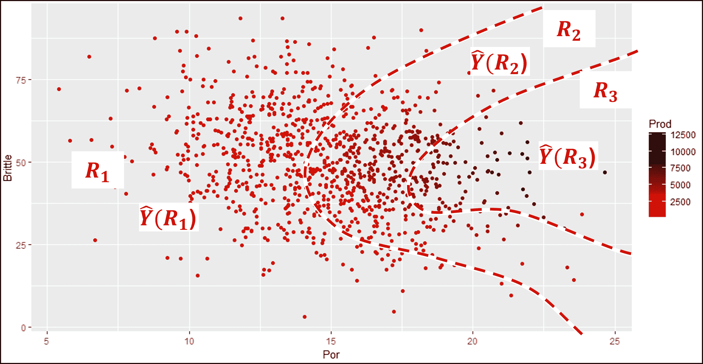

一个非常复杂的预测特征空间分割，有 3 个区域。

+   这些是非常有效的边界，可以捕捉到低、中、高产量

但是，这个模型将会相当复杂，

+   需要大量的模型参数

+   对于大量预测特征来说，训练难度较大，即高维性

如果我能说服你接受这些区域，那么你将拥有一个模型，

+   非常容易训练

+   具有非常少的参数

+   非常紧凑且可解释

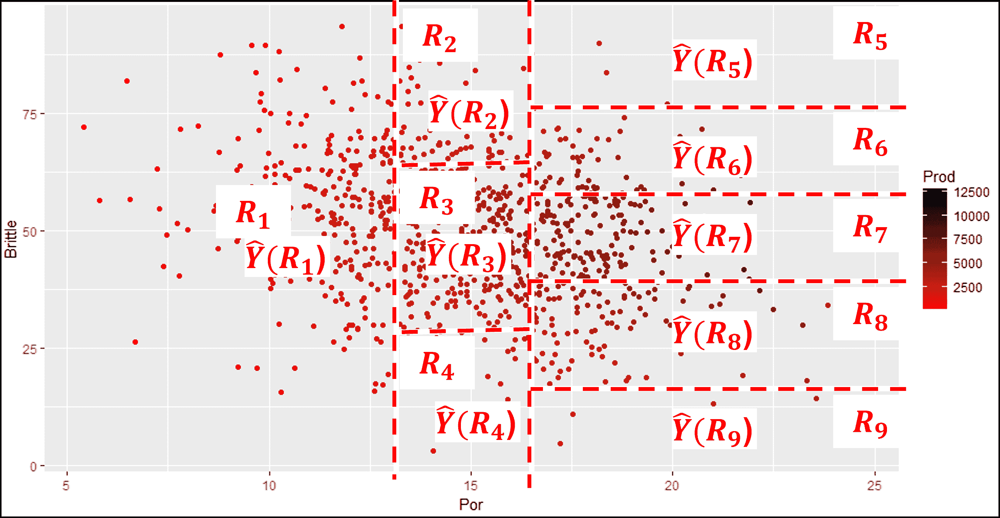

一个更简单的预测特征空间分割，有 9 个区域，但参数更少，且易于训练任何维度。

这是一个基于分层、二分分割的区域集合。让我们明确预测特征空间的概念，然后解释这种预测特征分割的形式。

## 预测特征空间

让我们退一步，建立预测特征空间的观念。我们将其定义为，

+   包含所有可能的估计问题的空间，即所有可能的预测特征值的组合，$x_1, x_2,\ldots,x_m$。

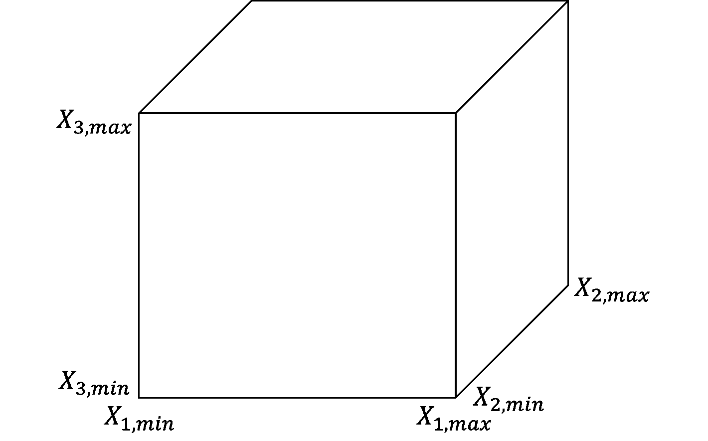

3 个预测特征且每个特征指定最小和最大值的情况下的预测特征空间示意图，结果是一个可能的预测矩形立方体，$x_1, x_2, x_3$。

通常这由可能值的范围定义，$x_{\alpha} \in \left[X_{\alpha,\text{𝑚𝑖𝑛}},𝑋_{\alpha,\text{max}} \right]$，从而得到，

+   1 个预测特征 $\rightarrow$ 线段

+   2 个预测特征 $\rightarrow$ 矩形

+   3 个预测特征 $\rightarrow$ 矩形立方体

+   $>$3 个预测特征 $\rightarrow$ 超矩形

当我们用预测特征的取值范围来定义预测特征空间时，我应该提供一条警告性说明。

决策树具有隐式外推模型

正如你下面将看到的，沿着外部的区域延伸到无穷大，实际上假设了一个常数外推模型。

## 树损失函数

对于回归树，我们最小化残差平方和，对于分类树，我们最小化加权平均 Gini 不纯度。

残差平方和（RSS）衡量回归树中实际值与预测值之间总平方差的度量，

$$ \text{RSS} = \sum_{j=1}^{J} \sum_{i \in R_j} (y_i - \hat{y}_{R_j})² $$

其中 $J$ 是树中的区域总数，$R_j$ 是第 $j$ 个区域，$y_i$ 是第 $i$ 个训练数据响应特征的真值，$\hat{y}_{R_j}$ 是区域 $R_j$ 的预测值，即 $y_i \; \forall \; i \in R_j$ 的平均值。

当父节点分裂成两个子节点（t_L）和（t_R）时，加权 Gini 不纯度为：

$$ \text{Gini}_{\text{total}} = \sum_{j=1}^{J} \frac{N_j}{N} \cdot \text{Gini}(j) $$

其中 $J$ 是树中的区域总数，$N$ 是数据集中的样本总数，$N_j$ 是叶节点 $j$ 中的样本数，$\text{Gini}(j)$ 是叶节点 $j$ 的 Gini 不纯度。

单个决策树节点的 Gini 不纯度计算如下，

$$ \text{Gini}(j) = 1 - \sum_{c=1}^{C} p_{j,c}² $$

其中 $p_{j,c}$ 是节点 $j$ 中类别 $c$ 样本的比例。

对于分类，我们的损失函数不比较预测值与真实值，就像我们的回归损失一样！

+   Gini 不纯度惩罚训练数据类别的混合！所有训练数据都是同一类别的区域将具有 0 的 Gini 不纯度，从而有助于整体损失。

注意，按区域计算的 Gini 不纯度是，

+   **加权** - 由每个区域中的训练数据数量决定，具有更多训练数据的区域对整体损失的影响更大

+   **平均** - 在所有区域上计算决策树的总 Gini 不纯度

这些损失是在计算期间计算的，

+   **树模型训练** - 根据训练数据来生长树

+   **树模型调优** - 根据保留的测试数据来选择最佳树复杂度。

首先让我们谈谈树模型训练，然后再讨论树模型调优。

## 训练树模型

我们如何计算这些互斥的、穷尽的区域？这是通过预测特征空间的分层二进制分割来实现的。

训练决策树模型既是，

1.  分配互斥的、穷尽的区域

1.  构建决策树时，每个区域都是一个终端节点，也称为叶节点

这些是同一件事！让我们列出步骤，然后通过训练一棵树来演示这一点。

1.  **将所有数据分配到单个区域** - 这个区域覆盖了整个预测特征空间

1.  **扫描所有可能的分割** - 在所有区域和所有特征上

1.  **选择最佳分割** - 这是一种贪婪优化，即最佳分割最小化所有训练数据 $y_i$ 在所有区域 $j = 1,\ldots,J$ 上的残差平方和。

1.  **迭代直到过度拟合** - 返回步骤 1 进行下一次分割，直到树非常过度拟合。

注意，这种训练决策树的方法是一种启发式解决方案，

+   没有努力同时优化所有分割，例如，选择一个次优分割以最大化后续分割的训练误差减少

此外，决策树是从上到下构建的。

+   我们从一个覆盖整个预测特征空间的单个区域开始，然后进行一系列的区域分割/树分支。

现在让我们用一个例子来说明这一点，使用 2 个预测特征来预测天然气生产响应特征，

+   孔隙率 - 影响孔隙体积和流动

+   易碎性 - 影响诱导和保持开放裂缝的能力

我们从一个包含所有预测特征空间的单个区域开始，将所有训练数据的平均值作为可能的唯一预测。

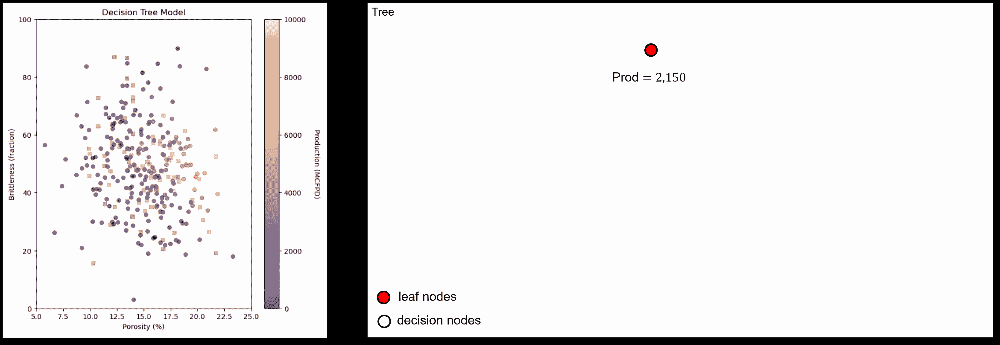

初始数据全部位于一个区域中，即 1 个叶节点的超参数数量，使用响应特征的全球均值进行预测。

接下来，我们扫描所有特征以找到第一个最佳分割，孔隙率为 16.7%。这个非常简单的决策树只有一个决策节点和 2 个区域或叶子节点，被称为树桩树，即最简单的决策树模型。

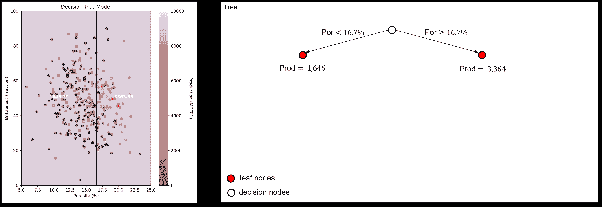

叶子节点的超参数数量为 2，第一个最佳分割导致树桩树。

现在我们扫描两个区域以及所有预测特征，以找到最佳下一个分割，在孔隙率大于或等于 16.7%的区域中，脆性为 36.1。

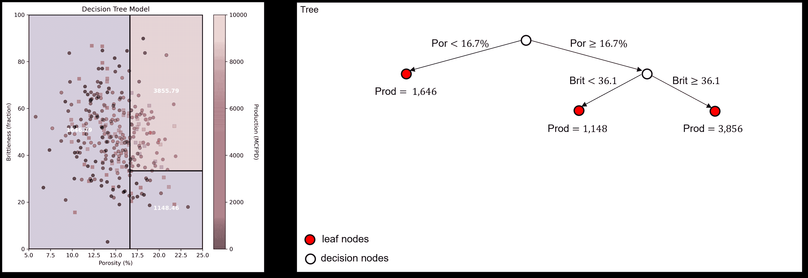

叶子节点的超参数数量为 3。

继续进行，我们在右上区域找到下一个分割，孔隙率为 18.5%。现在我们有 4 个区域。我们的决策树开始捕捉随着孔隙率的增加而增加的产量，以及低脆性的低产量。

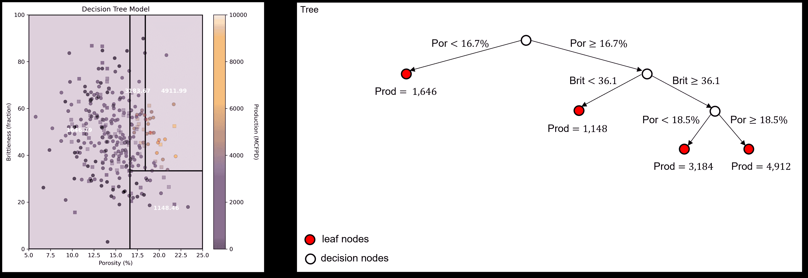

叶子节点的超参数数量为 4。

现在下一个最佳分割是在原始低孔隙率区域，来自孔隙率为 13.2%的树桩树。

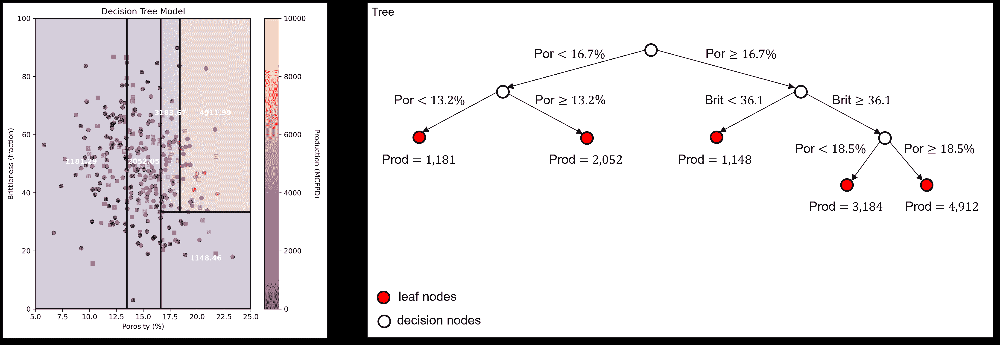

叶子节点的超参数数量为 5。

下一个最佳分割将孔隙率区域一分为二，捕捉了低脆性低产出的趋势，即使在高孔隙率下也是如此。

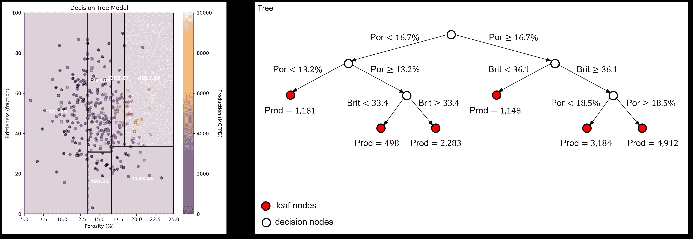

叶子节点的超参数数量为 6。

下一个分割捕捉了高脆性下的产量减少，即使在高孔隙率下也是如此，

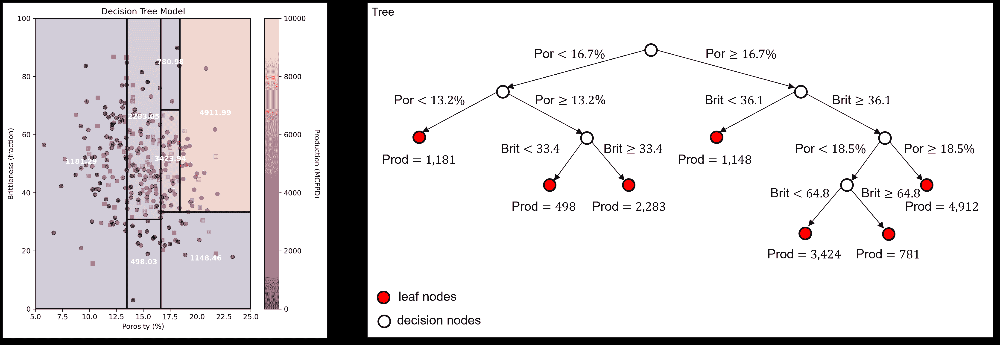

叶子节点的超参数数量为 7。

这个分割继续捕捉数据中的相同模式。

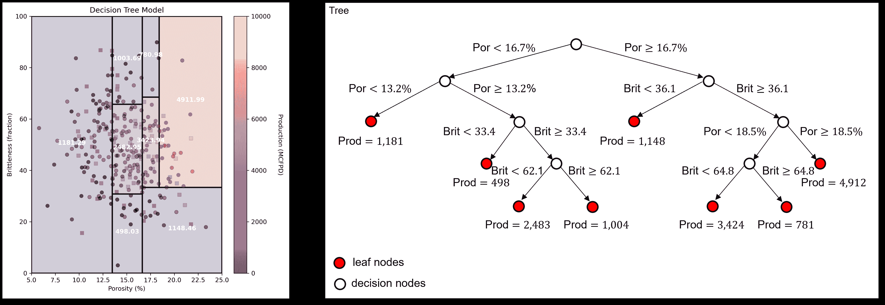

叶子节点的超参数数量为 8。

为了简洁起见，我们在这里停止，并做出以下观察，

+   层次二分法与顺序构建决策树相同，每次分割增加一个新的决策节点，并将叶子节点数量增加一个。

+   简单决策树是复杂决策树的一部分，即如果我们构建一个 8 个叶子节点的模型，我们通过顺序移除决策节点，以最后一个移除的顺序，得到 8、7、...、2 个叶子节点的模型。

+   最终过拟合模型是叶子节点数量等于训练数据数量。在这种情况下，训练误差为 0.0，因为每个训练数据都有一个区域，我们使用训练数据的响应特征值来估计所有训练数据案例。

## 使用新的分割更新损失函数

为了找到下一个最佳分割，我们必须扫描所有区域以及所有与区域相关的特征。这听起来可能需要大量的计算，但实际上非常高效。

+   我们只需要检查每个区域中每个特征的排序训练数据的中点，因为任何不会改变训练数据区域分配的分割都不会改变训练损失。

对于一个被分割成候选区域 $R_L$ 和 $R_R$ 的区域 $R$，分割后的均方残差（RSS）为：

$$ \text{RSS}_{\text{split}} = \sum_{i \in R_L} (y_i - \hat{y}_{R_L})² + \sum_{i \in R_R} (y_i - \hat{y}_{R_R})² $$

其中，$y_i$ 是训练数据观察 $i$ 的实际响应特征，而 $\hat{y}_{R_L}$，$\hat{y}_{R_R}$ 是候选区域 $R_L$ 和 $R_R$ 中训练数据响应特征的均值。

注意，我们将所有其他区域的 RSS 分量添加进来，以获得总模型 RSS，从而在整个区域中找到最佳分割，

+   选择具有最低 $\text{RSS}_{\text{split}}$ 的分割作为区域，并将其与其他区域的所有最佳分割进行比较，以找到下一个最佳分割，这是一种贪婪解法。

现在我们已经准备好调整决策树模型了。

## 调整树模型

为了调整决策树，我们采用非常过拟合的已训练树模型，

+   依次切割最后一个决策节点

+   即剪掉决策树的最后一个分支

因为简单的树在复杂的树内部！

我们可以在剪枝的同时计算测试错误，并选择具有最小测试错误的树。

我们对决策树模型进行了过拟合，拥有大量的叶子节点，然后我们在跟踪测试错误的同时减少了叶子节点的数量。

+   我们选择使测试错误最小化的叶子节点数量。

+   由于我们是依次移除最后一个分支以简化树，所以我们称模型调整为决策树的**剪枝**。

这里是一个具有许多叶子节点（100 个）的过拟合决策树。

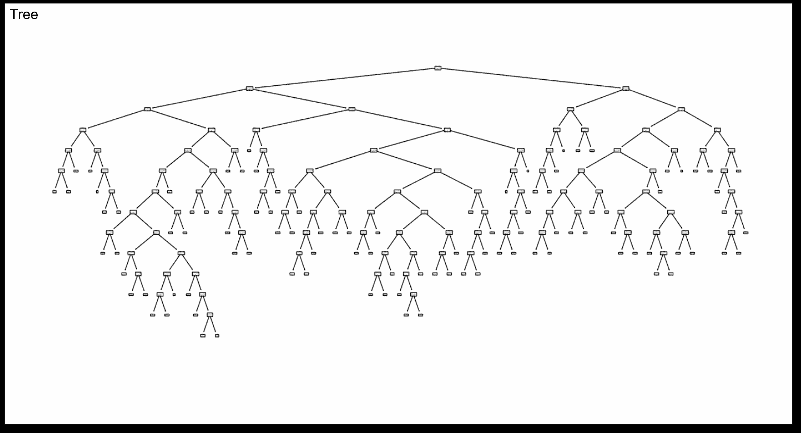

这是一个非常过拟合的决策树，叶子节点数量为 100（左），训练和测试交叉验证图（中心）以及训练和测试错误与叶子节点数量的关系（右）。

由于这棵树是用我的交互式 Python 仪表板计算的，所以我能够轻松地将区域数量从 $100, 99, 98, 96, 95, \ldots$ 减少并可视化树，以探索从复杂到简单的树。

+   通过这样做，我们可以证明简单的树在复杂的树中。

例如，这里是在过拟合的 100 个区域决策树中的 5 个区域决策树，

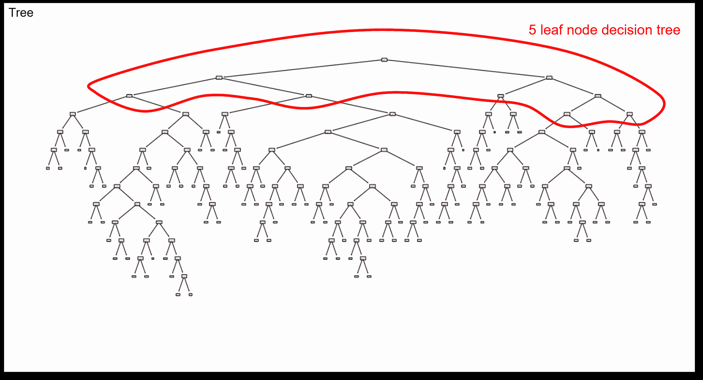

在非常过拟合的 100 个叶子节点树模型中的 5 个叶子节点树。

这里是在过拟合的 100 个区域决策树中的 10 个区域决策树，

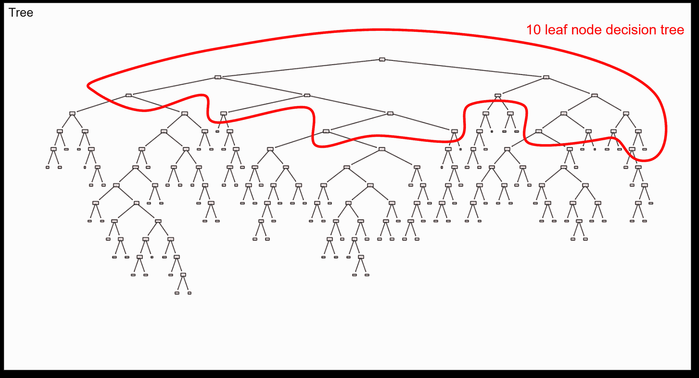

在非常过拟合的 100 个叶子节点树模型中的 10 个叶子节点树。

最后，这里是在过拟合的 100 个区域决策树中的 20 个区域决策树，

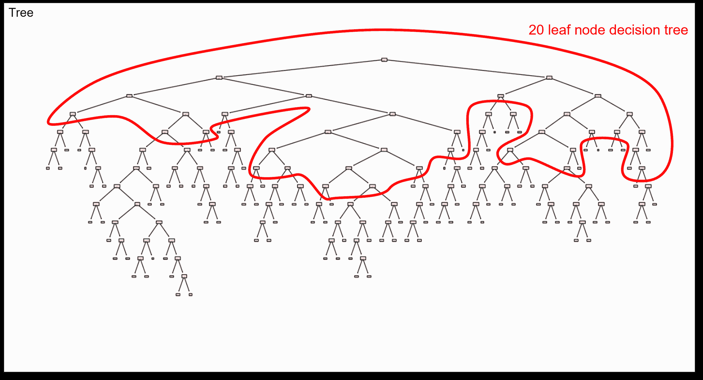

在非常过拟合的 100 个叶子节点树模型中的 20 个叶子节点树。

你可能会想知道，为什么我没有直接更新决策树图？scikit-learn 的决策树绘图函数会重新缩放图表，并且几何形状变化很大，这使得在复杂的树中可视化简单的树变得困难。

+   我认为这种通过可视化简单树和绘制多边形的可视化方法对于教育目的来说效果很好！

现在，让我们回到我们的过度拟合树，并通过树剪枝方法演示超参数调整，


过度拟合的决策树，训练和测试误差与模型复杂度（左）和决策树（右）的关系。

现在，我们识别出最后添加的分支并将其移除，以计算 99 区域决策树，这又是一个稍微简单的决策树，然后我们计算测试误差。

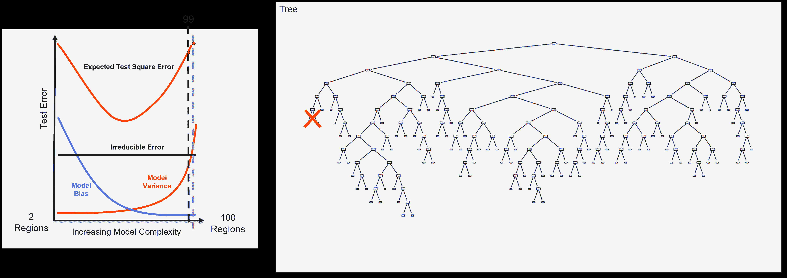

过度拟合的决策树，训练和测试误差与模型复杂度（左）和决策树（右）的关系。

我们再次识别出最后添加的分支并将其移除，以计算 98 区域决策树，这又是一个稍微简单的决策树，然后我们计算测试误差。

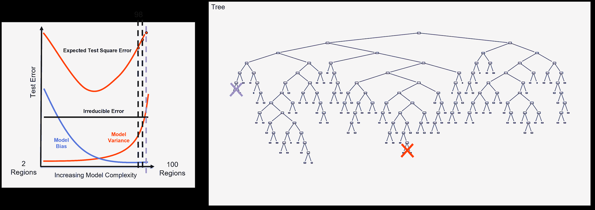

过度拟合的决策树，训练和测试误差与模型复杂度（左）和决策树（右）的关系。

我们再次识别出最后添加的分支并将其移除，以计算 97 区域决策树，这又是一个稍微简单的决策树，然后我们计算测试误差。

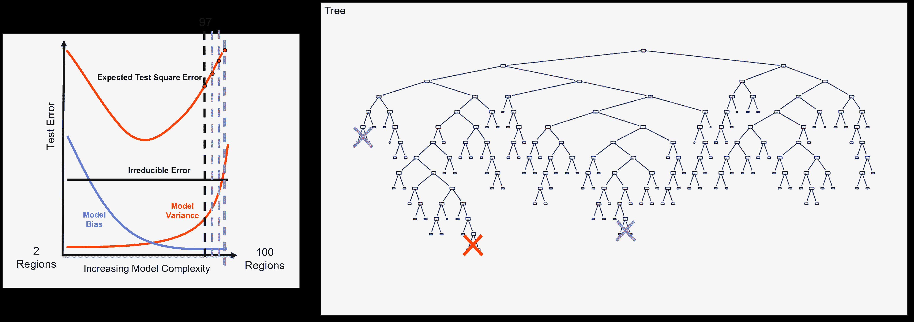

过度拟合的决策树，训练和测试误差与模型复杂度（左）和决策树（右）的关系。

我们再次识别出最后添加的分支并将其移除，以计算 96 区域决策树，这又是一个稍微简单的决策树，然后我们计算测试误差。

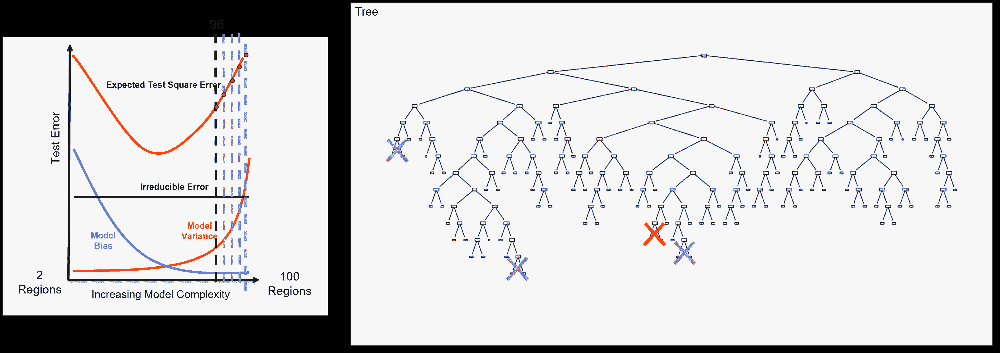

过度拟合的决策树，训练和测试误差与模型复杂度（左）和决策树（右）的关系。

我们再次识别出最后添加的分支并将其移除，以计算 95 区域决策树，这又是一个稍微简单的决策树，然后我们计算测试误差。

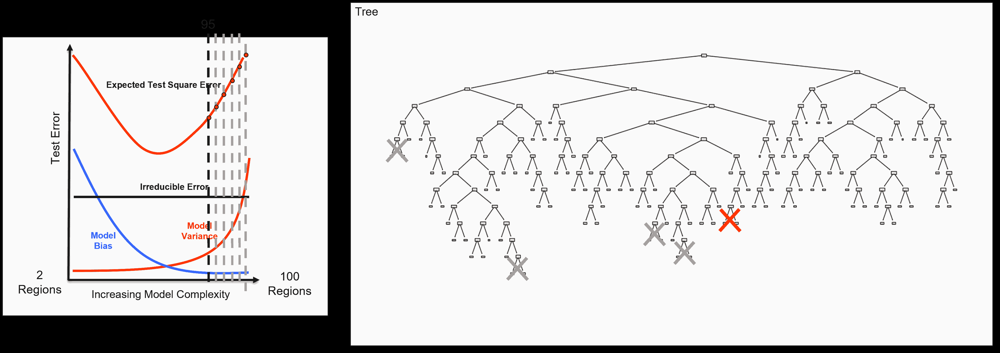

过度拟合的决策树，训练和测试误差与模型复杂度（左）和决策树（右）的关系。

我们再次识别出最后添加的分支并将其移除，以计算 94 区域决策树，这又是一个稍微简单的决策树，然后我们计算测试误差。

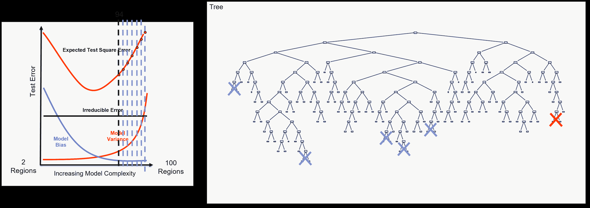

过度拟合的决策树，训练和测试误差与模型复杂度（左）和决策树（右）的关系。

现在，让我们回到这个过度拟合的模型，并在不同复杂度级别上添加更多信息。

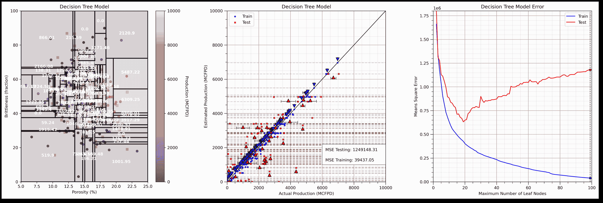

过度拟合的决策树，叶节点数量为 100（左），训练和测试交叉验证图（中心）以及训练和测试误差与叶节点数量的关系（右）。

我包括的，

+   训练和测试交叉验证图，对于 100 个叶节点的过度拟合决策树，几乎完美的训练预测和非常差的测试预测。

+   训练和测试误差与叶节点数量的关系。

这表明决策树模型确实非常过度拟合，例如，看到下降的训练误差和上升的测试误差。

现在我们修剪决策节点，直到我们获得在约 19 个叶节点处具有最小测试误差的模型。

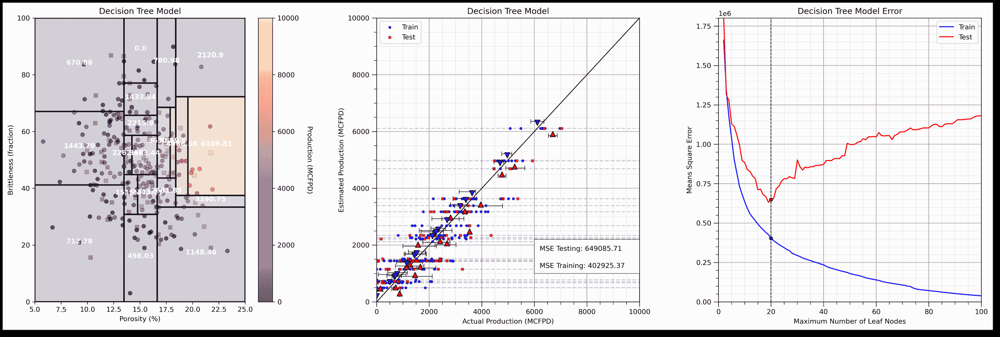

调整后的决策树，叶节点数量为 20（左），训练和测试交叉验证图（中心）以及训练和测试误差随叶节点数量的变化，表明测试误差最小化（右）。

为了完整性，我包括了一个欠拟合模型，即如果我们过度修剪我们的决策树，只有 8 个叶节点。

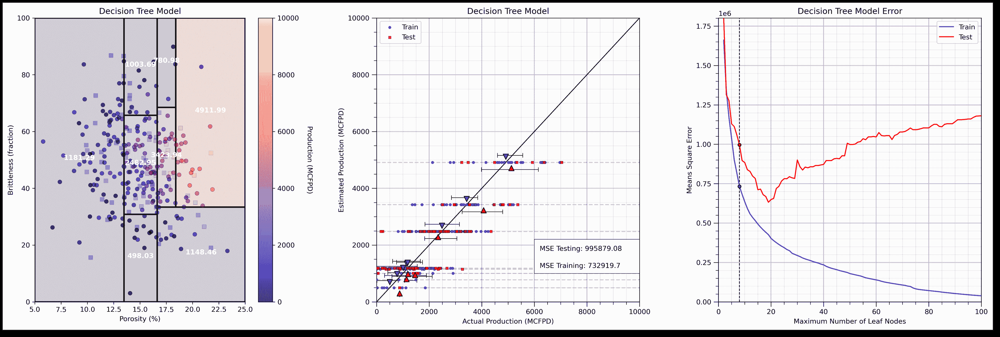

欠拟合决策树，叶节点数量为 8（左），训练和测试交叉验证图（中心）以及训练和测试误差随叶节点数量的变化，表明测试误差最小化（右）。

注意，训练误差和测试误差都非常高，这是欠拟合决策树的表现。

我更喜欢将叶节点数量作为我的决策树超参数，因为它提供了，

+   **连续、均匀的复杂性增加** - 复杂性增加的步骤相等，没有跳跃

+   **直观的复杂性控制** - 我们可以理解和关联$2, 3, \ldots, 100$个叶节点的决策树

+   **灵活的复杂性** - 树可以自由地以任何方式增长以减少训练误差，包括高度不对称的决策树

其他常见的决策树超参数包括，

+   **最小减少的 RSS** – 与增量增加复杂性必须由足够的训练误差减少来抵消的想法相关。这可能导致模型提前停止，例如，具有低训练误差减少的分割可能导致随后的分割具有更大的训练误差减少

+   **每个区域的最小训练数据量** – 与区域估计的准确性概念相关，即我们需要至少$n$个数据来获得可靠的均值和最常见类别

+   **最大层数** – 强制对称树，到达每个叶节点的分割数相似。模型复杂度随着超参数的变化而有很大变化。

## 预测模型

决策树预测模型表示为**嵌套的 if 语句**，例如：

```py
if porosity > 0.15:
    if brittleness < 20:
        initial_production = 1000
    else:
        initial_production = 7000
else:
    if brittleness < 40:
        initial_production = 500
    else:
        initial_production = 3000 
```

以及上述预测是以下之一，

+   回归 - 区域内训练数据的平均值

+   分类 - 区域内训练数据的多数类别

## 决策树中的 Shapley 值

回想一下，我们需要对一个单一模型进行估计，例如，$f(x_1,x_2,x_3,x_4)$，并对所有可能的特征子集组合进行估计，例如，

$$ f(x_1) \quad f(x_2,x_4) \quad f(x_1,x_2,x_3) $$

+   注意，计算 Shapley 值的朴素方法是对具有不同预测特征的模型的全组合进行训练，但如果我们目标是特征重要性以诊断我们的特定模型$f$，支持模型可解释性，我们不想创建新的模型。

一种解决方案是应用多种方法，类似于插补方法，包括，

+   用期望值，即全局平均值替换被排除的特征，

$$ f(x_1,x_2,x_3) = f(x_1,x_2,x_3,x_4=E[x_4]) $$

+   用中位数，即第 50 百分位数替换被排除的特征，

$$ f(x_1,x_2,x_3) = f(x_1,x_2,x_3,x_4=P50_{x_4}) $$

对于基于树的模型，有一个更准确、独特的方法，我们实际上可以在模型训练后移除任何特征对决策树的影响，例如，

+   移除所有$x_4$分支，然后模型不会使用$x_4$进行预测

当然，我们不可能只是移除分支，然后用“胶水”将树重新粘合在一起！

+   我们必须做出新的预测，这些预测不会引入偏差。

让我们通过几个预测案例来演示从决策树中移除特征的过程，

1.  这里是一个没有遇到被移除特征的预测案例，移除$x_2$后，

$$ x_1=25 $$

+   预测通常进行。

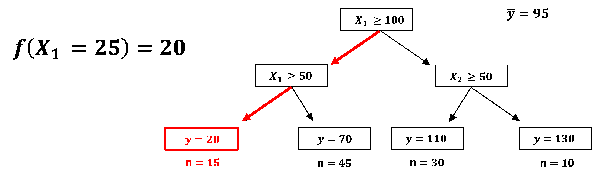

对于没有遇到被移除特征的预测案例，通常进行预测。

$$ f(x_1=25) = 20 $$

1.  一个遇到被移除特征$x_1$的预测案例，移除$x_1$后，

$$ x_2 = 60 $$

+   我们实际上通过加权，按训练数据数量加权，沿着两条路径都找到了解决方案！

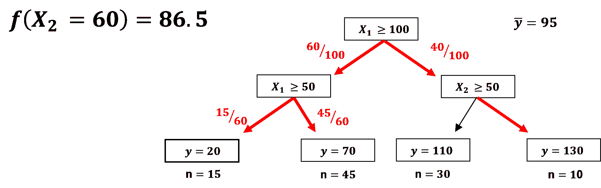

对于遇到被移除特征的预测案例，通过按训练数据数量加权两条路径来进行预测。

$$ f(x_2=60) = \frac{60}{100} \left[ \frac{15}{60} \times 20 + \frac{45}{60} \times 70 \right] + \frac{40}{100} \left[130\right] = 86.5 $$$$ f(x_2=60) = 86.5 $$

## 加载所需的库

我们还需要一些标准包。这些应该已经与 Anaconda 3 一起安装。

```py
%matplotlib inline                                         
suppress_warnings = True                                      # toggle to supress warnings
import os                                                     # to set current working directory 
import math                                                   # square root operator
import numpy as np                                            # arrays and matrix math
import scipy.stats as st                                      # statistical methods
import pandas as pd                                           # DataFrames
import matplotlib.pyplot as plt                               # for plotting
from matplotlib.ticker import (MultipleLocator,AutoMinorLocator,FuncFormatter) # control of axes ticks
from matplotlib.colors import ListedColormap                  # custom color maps
import seaborn as sns                                         # for matrix scatter plots
from sklearn import tree                                      # tree program from scikit learn (package for machine learning)
from sklearn.tree import _tree                                # for accessing tree information
from sklearn import metrics                                   # measures to check our models
from sklearn.preprocessing import StandardScaler              # standardize the features
from sklearn.tree import export_graphviz                      # graphical visualization of trees
from sklearn.model_selection import (cross_val_score,train_test_split,GridSearchCV,KFold) # model tuning
from sklearn.pipeline import (Pipeline,make_pipeline)         # machine learning modeling pipeline
from sklearn import metrics                                   # measures to check our models
from sklearn.model_selection import cross_val_score           # multi-processor K-fold crossvalidation
from sklearn.model_selection import train_test_split          # train and test split
from IPython.display import display, HTML                     # custom displays
cmap = plt.cm.inferno                                         # default color bar, no bias and friendly for color vision defeciency
plt.rc('axes', axisbelow=True)                                # grid behind plotting elements
if suppress_warnings == True:  
    import warnings                                           # supress any warnings for this demonstration
    warnings.filterwarnings('ignore') 
seed = 13                                                     # random number seed for workflow repeatability 
```

如果你遇到包导入错误，你可能需要首先安装这些包中的几个。这通常可以通过在 Windows 上打开命令窗口然后输入‘python -m pip install [package-name]’来完成。更多帮助可以在相应包的文档中找到。

## 声明函数

让我们定义几个函数来简化相关矩阵的绘制和决策树回归模型的可视化。

```py
def comma_format(x, pos):
    return f'{int(x):,}'

def feature_rank_plot(pred,metric,mmin,mmax,nominal,title,ylabel,mask): # feature ranking plot
    mpred = len(pred); mask_low = nominal-mask*(nominal-mmin); mask_high = nominal+mask*(mmax-nominal); m = len(pred) + 1
    plt.plot(pred,metric,color='black',zorder=20)
    plt.scatter(pred,metric,marker='o',s=10,color='black',zorder=100)
    plt.plot([-0.5,m-1.5],[0.0,0.0],'r--',linewidth = 1.0,zorder=1)
    plt.fill_between(np.arange(0,mpred,1),np.zeros(mpred),metric,where=(metric < nominal),interpolate=True,color='dodgerblue',alpha=0.3)
    plt.fill_between(np.arange(0,mpred,1),np.zeros(mpred),metric,where=(metric > nominal),interpolate=True,color='lightcoral',alpha=0.3)
    plt.fill_between(np.arange(0,mpred,1),np.full(mpred,mask_low),metric,where=(metric < mask_low),interpolate=True,color='blue',alpha=0.8,zorder=10)
    plt.fill_between(np.arange(0,mpred,1),np.full(mpred,mask_high),metric,where=(metric > mask_high),interpolate=True,color='red',alpha=0.8,zorder=10)  
    plt.xlabel('Predictor Features'); plt.ylabel(ylabel); plt.title(title)
    plt.ylim(mmin,mmax); plt.xlim([-0.5,m-1.5]); add_grid();
    return

def plot_corr(corr_matrix,title,limits,mask):                 # plots a graphical correlation matrix 
    my_colormap = plt.get_cmap('RdBu_r', 256)          
    newcolors = my_colormap(np.linspace(0, 1, 256))
    white = np.array([256/256, 256/256, 256/256, 1])
    white_low = int(128 - mask*128); white_high = int(128+mask*128)
    newcolors[white_low:white_high, :] = white                # mask all correlations less than abs(0.8)
    newcmp = ListedColormap(newcolors)
    m = corr_matrix.shape[0]
    im = plt.matshow(corr_matrix,fignum=0,vmin = -1.0*limits, vmax = limits,cmap = newcmp)
    plt.xticks(range(len(corr_matrix.columns)), corr_matrix.columns); ax = plt.gca()
    ax.xaxis.set_label_position('bottom'); ax.xaxis.tick_bottom()
    plt.yticks(range(len(corr_matrix.columns)), corr_matrix.columns)
    plt.colorbar(im, orientation = 'vertical')
    plt.title(title)
    for i in range(0,m):
        plt.plot([i-0.5,i-0.5],[-0.5,m-0.5],color='black')
        plt.plot([-0.5,m-0.5],[i-0.5,i-0.5],color='black')
    plt.ylim([-0.5,m-0.5]); plt.xlim([-0.5,m-0.5])

def add_grid():
    plt.gca().grid(True, which='major',linewidth = 1.0); plt.gca().grid(True, which='minor',linewidth = 0.2) # add y grids
    plt.gca().tick_params(which='major',length=7); plt.gca().tick_params(which='minor', length=4)
    plt.gca().xaxis.set_minor_locator(AutoMinorLocator()); plt.gca().yaxis.set_minor_locator(AutoMinorLocator()) # turn on minor ticks 

def plot_CDF(data,color,alpha=1.0,lw=1,ls='solid',label='none'):
    cumprob = (np.linspace(1,len(data),len(data)))/(len(data)+1)
    plt.scatter(np.sort(data),cumprob,c=color,alpha=alpha,edgecolor='black',lw=lw,ls=ls,label=label,zorder=10)
    plt.plot(np.sort(data),cumprob,c=color,alpha=alpha,lw=lw,ls=ls,zorder=8)

def extract_rules(tree_model, feature_names):                 # recursive method to extract rules, from paulkernfeld Stack Overflow (?)
    rules = []
    def traverse(node, depth, prev_rule):
        if tree_model.tree_.children_left[node] == -1:        # Leaf node
            class_label = np.argmax(tree_model.tree_.value[node])
            rule = f"{prev_rule} => Class {class_label}"
            rules.append(rule)
        else:  # Split node
            feature = feature_names[tree_model.tree_.feature[node]]
            threshold = tree_model.tree_.threshold[node]
            left_child = tree_model.tree_.children_left[node]
            right_child = tree_model.tree_.children_right[node]
            traverse(left_child, depth + 1, f"{prev_rule} & {feature} <= {threshold}") # Recursively traverse left and right subtrees
            traverse(right_child, depth + 1, f"{prev_rule} & {feature} > {threshold}")
    traverse(0, 0, "Root")
    return rules

def plot_decision_tree_regions(tree_model, feature_names,X_min,X_max,annotate=True):
    rules = extract_rules(tree_model, feature_names)
    for irule, ____ in enumerate(rules):
        rule = rules[irule].split()[2:]
        X_min = Xmin[0]; X_max = Xmax[0]; Y_min = Xmin[1]; Y_max = Xmax[1];
        index = [i for i,val in enumerate(rule) if val==feature_names[0]]
        for i in index:
            if rule[i+1] == '<=':
                X_max = min(float(rule[i+2]),X_max)
            else:
                X_min = max(float(rule[i+2]),X_min)
        index = [i for i,val in enumerate(rule) if val==feature_names[1]]
        for i in index:
            if rule[i+1] == '<=':
                Y_max = min(float(rule[i+2]),Y_max)
            else:
                Y_min = max(float(rule[i+2]),Y_min) 
        plt.gca().add_patch(plt.Rectangle((X_min,Y_min),X_max-X_min,Y_max-Y_min, lw=2,ec='black',fc="none"))
        cx = (X_min + X_max)*0.5; cy = (Y_min + Y_max)*0.5; loc = np.array((cx,cy)).reshape(1, -1)
        if annotate == True:
            plt.annotate(text = str(f'{np.round(tree_model.predict(loc)[0],2):,.0f}'),xy=(cx,cy),ha='center',
                         weight='bold',c='white',zorder=100)

def visualize_tree_model(model,X1_train,X1_test,X2_train,X2_test,Xmin,Xmax,y_train,y_test,ymin,
                         ymax,title,Xname,yname,Xlabel,ylabel,annotate=True):# plots the data points and the decision tree prediction 
    cmap = plt.cm.inferno
    X1plot_step = (Xmax[0] - Xmin[0])/300.0; X2plot_step = -1*(Xmax[1] - Xmin[1])/300.0 # resolution of the model visualization
    XX1, XX2 = np.meshgrid(np.arange(Xmin[0], Xmax[0], X1plot_step), # set up the mesh
                     np.arange(Xmax[1], Xmin[1], X2plot_step))
    y_hat = model.predict(np.c_[XX1.ravel(), XX2.ravel()])    # predict with our trained model over the mesh
    y_hat = y_hat.reshape(XX1.shape)

    plt.imshow(y_hat,interpolation=None, aspect="auto", extent=[Xmin[0],Xmax[0],Xmin[1],Xmax[1]], 
        vmin=ymin,vmax=ymax,alpha = 0.2,cmap=cmap,zorder=1)
    sp = plt.scatter(X1_train,X2_train,s=None, c=y_train, marker='o', cmap=cmap, 
        norm=None, vmin=ymin, vmax=ymax, alpha=0.6, linewidths=0.3, edgecolors="black", label = 'Train',zorder=10)
    plt.scatter(X1_test,X2_test,s=None, c=y_test, marker='s', cmap=cmap, 
        norm=None, vmin=ymin, vmax=ymax, alpha=0.3, linewidths=0.3, edgecolors="black", label = 'Test',zorder=10)

    plot_decision_tree_regions(model,Xname,Xmin,Xmax,annotate)
    plt.title(title); plt.xlabel(Xlabel[0]); plt.ylabel(Xlabel[1])
    plt.xlim([Xmin[0],Xmax[0]]); plt.ylim([Xmin[1],Xmax[1]])
    cbar = plt.colorbar(sp, orientation = 'vertical')         # add the color bar
    cbar.ax.yaxis.set_major_formatter(FuncFormatter(comma_format))
    plt.gca().xaxis.set_major_formatter(FuncFormatter(comma_format))
    plt.gca().yaxis.set_major_formatter(FuncFormatter(comma_format))
    cbar.set_label(ylabel, rotation=270, labelpad=20)
    return y_hat

def check_tree_model(model,X1_train,X1_test,X2_train,X2_test,Xmin,Xmax,y_train,y_test,ymin,ymax,title): # plots the estimated vs. the actual 
    y_hat_train = model.predict(np.c_[X1_train,X2_train]); y_hat_test = model.predict(np.c_[X1_test,X2_test])

    df_cross = pd.DataFrame(np.c_[y_test,y_hat_test],columns=['y_test','y_hat_test'])
    df_cross_train = pd.DataFrame(np.c_[y_train,y_hat_train],columns=['y_train','y_hat_train'])

    plt.scatter(y_train,y_hat_train,s=15, c='blue',marker='o', cmap=None, norm=None, vmin=None, vmax=None, alpha=0.7, 
                linewidths=0.3, edgecolors="black",label='Train',zorder=10)
    plt.scatter(y_test,y_hat_test,s=15, c='red',marker='s', cmap=None, norm=None, vmin=None, vmax=None, alpha=0.7, 
                linewidths=0.3, edgecolors="black",label='Test',zorder=10)

    unique_y_hat_all = set(np.concatenate([y_hat_test,y_hat_train]))
    for y_hat in unique_y_hat_all:
        plt.plot([ymin,ymax],[y_hat,y_hat],c='black',alpha=0.2,ls='--',zorder=1)

    unique_y_hat_test = set(y_hat_test)
    for y_hat in unique_y_hat_test:
        #plt.plot([ymin,ymax],[y_hat,y_hat],c='black',alpha=0.3,ls='--',zorder=1)
        cond_mean_y_hat = df_cross.loc[df_cross['y_hat_test'] == y_hat, 'y_test'].mean()
        cond_P75_y_hat = df_cross.loc[df_cross['y_hat_test'] == y_hat, 'y_test'].quantile(0.75)
        cond_P25_y_hat = df_cross.loc[df_cross['y_hat_test'] == y_hat, 'y_test'].quantile(0.25)
        plt.scatter(cond_mean_y_hat,y_hat-0.02*(ymax-ymin),color='red',edgecolor='black',s=60,marker='^',zorder=100)
        plt.plot([cond_P25_y_hat,cond_P75_y_hat],[y_hat-0.025*(ymax-ymin),y_hat-0.025*(ymax-ymin)],c='black',lw=0.7)
        plt.plot([cond_P25_y_hat,cond_P25_y_hat],[y_hat-0.032*(ymax-ymin),y_hat-0.018*(ymax-ymin)],c='black',lw=0.7)
        plt.plot([cond_P75_y_hat,cond_P75_y_hat],[y_hat-0.032*(ymax-ymin),y_hat-0.018*(ymax-ymin)],c='black',lw=0.7)

    unique_y_hat_train = set(y_hat_train)
    for y_hat in unique_y_hat_train:
        #plt.plot([ymin,ymax],[y_hat,y_hat],c='black',alpha=0.3,ls='--',zorder=1)
        cond_mean_y_hat = df_cross_train.loc[df_cross_train['y_hat_train'] == y_hat, 'y_train'].mean()
        cond_P75_y_hat = df_cross_train.loc[df_cross_train['y_hat_train'] == y_hat, 'y_train'].quantile(0.75)
        cond_P25_y_hat = df_cross_train.loc[df_cross_train['y_hat_train'] == y_hat, 'y_train'].quantile(0.25)
        plt.scatter(cond_mean_y_hat,y_hat+0.02*(ymax-ymin),color='blue',edgecolor='black',s=60,marker='v',zorder=100)
        plt.plot([cond_P25_y_hat,cond_P75_y_hat],[y_hat+0.025*(ymax-ymin),y_hat+0.025*(ymax-ymin)],c='black',lw=0.7)
        plt.plot([cond_P25_y_hat,cond_P25_y_hat],[y_hat+0.032*(ymax-ymin),y_hat+0.018*(ymax-ymin)],c='black',lw=0.7)
        plt.plot([cond_P75_y_hat,cond_P75_y_hat],[y_hat+0.032*(ymax-ymin),y_hat+0.018*(ymax-ymin)],c='black',lw=0.7)

    plt.title(title); plt.xlabel('Actual Production (MCFPD)'); plt.ylabel('Estimated Production (MCFPD)')
    plt.xlim([ymin,ymax]); plt.ylim([ymin,ymax]); plt.legend(loc='upper left')
    plt.gca().grid(True, which='major',linewidth = 1.0); plt.gca().grid(True, which='minor',linewidth = 0.2) # add y grids
    plt.gca().tick_params(which='major',length=7); plt.gca().tick_params(which='minor', length=4)
    plt.gca().xaxis.set_minor_locator(AutoMinorLocator()); plt.gca().yaxis.set_minor_locator(AutoMinorLocator()) # turn on minor ticks

    plt.arrow(ymin,ymin,ymax,ymax,width=0.02,color='black',head_length=0.0,head_width=0.0)
    MSE_train = metrics.mean_squared_error(y_train,y_hat_train); MSE_test = metrics.mean_squared_error(y_test,y_hat_test)
    plt.gca().add_patch(plt.Rectangle((ymin+0.6*(ymax-ymin),ymin+0.1*(ymax-ymin)),0.40*(ymax-ymin),0.12*(ymax-ymin),
        lw=0.5,ec='black',fc="white",zorder=100))
    plt.gca().xaxis.set_major_formatter(FuncFormatter(comma_format))
    plt.gca().yaxis.set_major_formatter(FuncFormatter(comma_format))
    plt.annotate('MSE Testing:  ' + str(f'{np.round(MSE_test,2):,.0f}'),(ymin+0.62*(ymax-ymin),ymin+0.18*(ymax-ymin)),zorder=1000)
    plt.annotate('MSE Training: ' + str(f'{np.round(MSE_train,2):,.0f}'),(ymin+0.62*(ymax-ymin),ymin+0.12*(ymax-ymin)),zorder=1000)

def tree_tuning(node_max,cnode,X1_train,X1_test,X2_train,X2_test,Xmin,Xmax,y_train,y_test,ymin,ymax,title,seed):
    MSE_test_mat = np.zeros(node_max-1); MSE_train_mat = np.zeros(node_max-1);

    for imax_leaf_node, max_leaf_node in enumerate(range(2,node_max+1)):
        np.random.seed(seed = seed)
        tree_temp = tree.DecisionTreeRegressor(max_leaf_nodes = max_leaf_node)
        tree_temp = tree_temp.fit(X_train.values, y_train.values)
        y_hat_train = tree_temp.predict(np.c_[X1_train,X2_train]); y_hat_test = tree_temp.predict(np.c_[X1_test,X2_test])  
        MSE_train_mat[imax_leaf_node] = metrics.mean_squared_error(y_train,y_hat_train)
        MSE_test_mat[imax_leaf_node] = metrics.mean_squared_error(y_test,y_hat_test)
        if max_leaf_node == cnode:
            plt.scatter(cnode,MSE_train_mat[imax_leaf_node],color='blue',edgecolor='black',s=20,marker='o',zorder=1000)
            plt.scatter(cnode,MSE_test_mat[imax_leaf_node],color='red',edgecolor='black',s=20,marker='o',zorder=1000)
    maxcheck = max(np.max(MSE_train_mat),np.max(MSE_test_mat))

    plt.vlines(cnode,0,maxcheck,color='black',ls='--',lw=1,zorder=1) 
    plt.plot(range(2,node_max+1),MSE_train_mat,color='blue',zorder=100,label='Train')
    plt.plot(range(2,node_max+1),MSE_test_mat,color='red',zorder=100,label='Test')

    plt.title(title); plt.xlabel('Maximum Number of Leaf Nodes'); plt.ylabel('Means Square Error')
    plt.xlim([0,node_max]); plt.ylim([0,maxcheck]); plt.legend(loc='upper right')
    plt.gca().grid(True, which='major',linewidth = 1.0); plt.gca().grid(True, which='minor',linewidth = 0.2) # add y grids
    plt.gca().tick_params(which='major',length=7); plt.gca().tick_params(which='minor', length=4)
    plt.gca().xaxis.set_minor_locator(AutoMinorLocator()); plt.gca().yaxis.set_minor_locator(AutoMinorLocator()) # turn on minor ticks 

def tree_to_code(tree, feature_names):                        # code from StackOverFlow by paulkernfeld
    tree_ = tree.tree_                                        # convert tree object to portable code to use anywhere
    feature_name = [
        feature_names[i] if i != _tree.TREE_UNDEFINED else "undefined!"
        for i in tree_.feature
    ]
    print("def tree({}):".format(", ".join(feature_names)))

    def recurse(node, depth):
        indent = "  " * depth
        if tree_.feature[node] != _tree.TREE_UNDEFINED:
            name = feature_name[node]
            threshold = tree_.threshold[node]
            print("{}if {} <= {}:".format(indent, name, threshold))
            recurse(tree_.children_left[node], depth + 1)
            print("{}elif {} > {}".format(indent, name, threshold))
            recurse(tree_.children_right[node], depth + 1)
        else:
            print("{}return {}".format(indent, tree_.value[node]))
    recurse(0, 1) 

def get_lineage(tree, feature_names):                         # code from StackOverFlow by Zelanzny7
    left      = tree.tree_.children_left                      # track the decision path for any set of inputs
    right     = tree.tree_.children_right
    threshold = tree.tree_.threshold
    features  = [feature_names[i] for i in tree.tree_.feature]
    # get ids of child nodes
    idx = np.argwhere(left == -1)[:,0]     
    def recurse(left, right, child, lineage=None):          
        if lineage is None:
            lineage = [child]
        if child in left:
            parent = np.where(left == child)[0].item()
            split = 'l'
        else:
            parent = np.where(right == child)[0].item()
            split = 'r'
        lineage.append((parent, split, threshold[parent], features[parent]))
        if parent == 0:
            lineage.reverse()
            return lineage
        else:
            return recurse(left, right, parent, lineage)
    for child in idx:
        for node in recurse(left, right, child):
            print(node) 

def display_sidebyside(*args):                                # display DataFrames side-by-side (ChatGPT 4.0 generated Spet, 2024)
    html_str = ''
    for df in args:
        html_str += df.head().to_html()  # Using .head() for the first few rows
    display(HTML(f'<div style="display: flex;">{html_str}</div>')) 
```

## 设置工作目录

我总是喜欢这样做，这样我就不会丢失文件，并且可以简化后续的读取和写入（每次都避免包含完整地址）。

```py
#os.chdir("c:/PGE383")                                        # set the working directory 
```

你将不得不更新引号内的部分以包含你自己的工作目录，并且在 Mac 上格式不同（例如，“~/PGE”）。

## 加载数据

让我们加载提供的多元、空间数据集[unconv_MV.csv](https://raw.githubusercontent.com/GeostatsGuy/GeoDataSets/master/unconv_MV.csv)，它在我的 GeoDataSet 仓库中可用。它是一个逗号分隔的文件，包含：

+   井指数（整数）

+   孔隙率 (%)

+   渗透率 ($mD$)

+   声波阻抗 ($\frac{kg}{m³} \cdot \frac{m}{s} \cdot 10⁶$)。

+   剪切率 (%) 

+   总有机碳含量 (%) 

+   玻璃光泽率 (%) 

+   初始气体产量（90 天平均）(MCFPD)

我们使用 pandas 的‘read_csv’函数将其加载到我们称为‘df’的数据框中，然后预览它以确保正确加载。

**Python 技巧：使用包中的函数**只需输入我们在开头声明的包的标签：

```py
import pandas as pd 
```

因此，我们可以使用以下命令访问 pandas 函数‘read_csv’：

```py
pd.read_csv() 
```

但读取 csv 文件需要输入参数。其中最重要的一个是文件名。对于我们的情况，所有其他默认参数都很好。如果您想查看此函数的所有可能参数，请访问[这里](https://pandas.pydata.org/pandas-docs/stable/reference/api/pandas.read_csv.html)的文档。

+   文档总是很有帮助。

+   Python 函数通常有很多灵活性，这可以通过使用各种输入参数来实现。

此外，程序有一个输出，一个从数据加载的 pandas DataFrame。因此，我们必须指定代表这个新对象的名字/变量。

```py
df = pd.read_csv("unconv_MV.csv") 
```

让我们运行这个命令来加载数据，然后运行这个命令来提取数据的一个随机子集。

```py
df = df.sample(frac=.30, random_state = 73073); 
df = df.reset_index() 
```

## 特征工程

让我们对数据进行一些修改以改进工作流程：

+   **选择预测特征（x2）和响应特征（x1）**，确保元数据也保持一致。

+   **元数据**编码，如每个特征的单位、标签和显示范围。

+   **减少数据数量**以方便可视化（如果图表上的点太多，则难以看清）。

+   **训练和测试数据分割**以演示和可视化简单的超参数调整。

+   **向数据添加随机噪声**以演示模型过拟合。原始数据无误差，不易展示过拟合。

如果设置正确，应该能够使用任何数据集和特征进行此演示。

+   为了简洁，我们这里没有展示任何特征选择。例如，前一章中提到的 k-最近邻算法包括一些特征选择方法，但更多可能的方法和特征选择代码请参阅特征选择章节。

## 可选：向响应特征添加随机噪声

我们可以通过观察数据噪声对过拟合和超参数调整的影响来做这件事。

+   这是为了经验学习，当然我们不会向数据中添加随机噪声。

+   我们设置了随机数种子以确保可重复性

```py
add_error = True                                              # add random error to the response feature
std_error = 500                                               # standard deviation of random error, for demonstration only
idata = 2

if idata == 1:
    df_load = pd.read_csv(r"https://raw.githubusercontent.com/GeostatsGuy/GeoDataSets/master/unconv_MV.csv") # load the data from my github repo
    df_load = df_load.sample(frac=.30, random_state = seed); df_load = df_load.reset_index() # extract 30% random to reduce the number of data

elif idata == 2:
    df_load = pd.read_csv(r"https://raw.githubusercontent.com/GeostatsGuy/GeoDataSets/master/unconv_MV_v5.csv") # load the data 
    df_load = df_load.sample(frac=.70, random_state = seed); df_load = df_load.reset_index() # extract 30% random to reduce the number of data
    df_load = df_load.rename(columns={"Prod": "Production"})

yname = 'Production'; Xname = ['Por','Brittle']               # specify the predictor features (x2) and response feature (x1)
Xmin = [5.0,0.0]; Xmax = [25.0,100.0]                         # set minimums and maximums for visualization 
ymin = 1000.0; ymax = 9000.0
Xlabel = ['Porosity','Brittleness']; ylabel = 'Production'    # specify the feature labels for plotting
Xunit = ['%','%']; yunit = 'MCFPD'
Xlabelunit = [Xlabel[0] + ' (' + Xunit[0] + ')',Xlabel[1] + ' (' + Xunit[1] + ')']
ylabelunit = ylabel + ' (' + yunit + ')'

if add_error == True:                                         # method to add error
    np.random.seed(seed=seed)                                 # set random number seed
    df_load[yname] = df_load[yname] + np.random.normal(loc = 0.0,scale=std_error,size=len(df_load)) # add noise
    values = df_load._get_numeric_data(); values[values < 0] = 0   # set negative to 0 in a shallow copy ndarray

y = pd.DataFrame(df_load[yname])                              # extract selected features as X and y DataFrames
X = df_load[Xname]
df = pd.concat([X,y],axis=1)                                  # make one DataFrame with both X and y (remove all other features) 
```

让我们确保我们已经选择了合理的特征来构建模型。

+   两个预测特征不共线，因为这会导致预测模型不稳定。

+   每个特征都与响应特征相关，预测特征告知响应。

## 计算相关矩阵和与响应排名的相关性

让我们从相关性分析开始。我们可以使用之前声明的函数计算并查看相关矩阵以及与响应特征的关联。

+   相关性分析基于线性关系的假设，但这是一个良好的开始

```py
corr_matrix = df.corr()
correlation = corr_matrix.iloc[:,-1].values[:-1]

plt.subplot(121)
plot_corr(corr_matrix,'Correlation Matrix',1.0,0.1)           # using our correlation matrix visualization function
plt.xlabel('Features'); plt.ylabel('Features')

plt.subplot(122)
feature_rank_plot(Xname,correlation,-1.0,1.0,0.0,'Feature Ranking, Correlation with ' + yname,'Correlation',0.5)

plt.subplots_adjust(left=0.0, bottom=0.0, right=2.0, top=0.8, wspace=0.2, hspace=0.3); plt.show() 
```


注意由于每个变量与其自身的相关性而产生的 1.0 对角线。

这看起来不错。存在多种相关性的大小。当然，相关系数仅限于线性相关性的程度。

+   让我们查看矩阵散点图，以查看特征之间的成对关系。

```py
pairgrid = sns.PairGrid(df,vars=Xname+[yname])                # matrix scatter plots
pairgrid = pairgrid.map_upper(plt.scatter, color = 'darkorange', edgecolor = 'black', alpha = 0.8, s = 10)
pairgrid = pairgrid.map_diag(plt.hist, bins = 20, color = 'darkorange',alpha = 0.8, edgecolor = 'k')# Map a density plot to the lower triangle
pairgrid = pairgrid.map_lower(sns.kdeplot, cmap = plt.cm.inferno, 
                              alpha = 1.0, n_levels = 10)
pairgrid.add_legend()
plt.subplots_adjust(left=0.0, bottom=0.0, right=0.9, top=0.9, wspace=0.2, hspace=0.2); plt.show() 
```


## Train and Test Split

为了方便和简单，我们使用 scikit-learn 的随机训练和测试数据分割。

```py
X_train, X_test, y_train, y_test = train_test_split(X,y,test_size=0.25,random_state=73073) # train and test split
df_train = pd.concat([X_train,y_train],axis=1)                # make one train DataFrame with both X and y (remove all other features)
df_test = pd.concat([X_test,y_test],axis=1)                   # make one testin DataFrame with both X and y (remove all other features) 
```

## 可视化 DataFrame

在我们构建模型之前，可视化训练和测试 DataFrame 是一个有用的检查。

+   许多事情可能会出错，例如，我们加载了错误的数据，所有特征都没有加载等。

我们可以通过利用 'head' DataFrame 成员函数来预览（格式整洁，见下文）。

```py
print('       Training DataFrame          Testing DataFrame')
display_sidebyside(df_train,df_test)                          # custom function for side-by-side DataFrame display 
```

```py
 Training DataFrame          Testing DataFrame 
```

|  | Por | Brittle | Production |
| --- | --- | --- | --- |
| 86 | 12.83 | 29.87 | 2089.258307 |
| 35 | 17.39 | 56.43 | 5803.596379 |
| 75 | 12.23 | 40.67 | 3511.348151 |
| 36 | 13.72 | 40.24 | 4004.849870 |
| 126 | 12.83 | 17.20 | 2712.836372 |
|  | Por | Brittle | Production |
| --- | --- | --- | --- |
| 5 | 15.55 | 58.25 | 5353.761093 |
| 46 | 20.21 | 23.78 | 4387.577571 |
| 96 | 15.07 | 39.39 | 4412.135054 |
| 45 | 12.10 | 63.24 | 3654.779704 |
| 105 | 19.54 | 37.40 | 5251.551624 |

## 表格数据的摘要统计

在 DataFrame 中，有许多高效的方法可以计算表格数据的摘要统计。

+   The describe command provides count, mean, minimum, maximum in a nice data table.

```py
print('            Training DataFrame                      Testing DataFrame')    # custom function for side-by-side summary statistics
display_sidebyside(df_train.describe().loc[['count', 'mean', 'std', 'min', 'max']],df_test.describe().loc[['count', 'mean', 'std', 'min', 'max']]) 
```

```py
 Training DataFrame                      Testing DataFrame 
```

|  | Por | Brittle | Production |
| --- | --- | --- | --- |
| count | 105.000000 | 105.000000 | 105.000000 |
| mean | 14.859238 | 48.861143 | 4238.554591 |
| std | 3.057228 | 14.432050 | 1087.707113 |
| min | 7.220000 | 10.940000 | 1517.373571 |
| max | 23.550000 | 84.330000 | 6907.632261 |
|  | Por | Brittle | Production |
| --- | --- | --- | --- |
| count | 35.000000 | 35.000000 | 35.000000 |
| mean | 15.011714 | 46.798286 | 4378.913131 |
| std | 3.574467 | 13.380910 | 1290.216113 |
| min | 6.550000 | 20.120000 | 1846.027145 |
| max | 20.860000 | 68.760000 | 6593.447893 |

我们检查了摘要统计是件好事。

+   没有明显的错误

+   检查每个特征的值范围，以设置和调整绘图限制。见上文。

## 可视化训练和测试数据分割

让我们使用直方图和散点图来检查训练和测试数据的一致性和覆盖率。

+   检查以确保训练和测试覆盖了可能的特征组合范围

+   确保测试用例不会超出训练数据范围进行外推

```py
nbins = 20                                                    # number of histogram bins

plt.subplot(221)                                              # predictor feature #1 histogram
freq1,_,_ = plt.hist(x=df_train[Xname[0]],weights=None,bins=np.linspace(Xmin[0],Xmax[0],nbins),alpha = 0.6,
                     edgecolor='black',color='darkorange',density=False,label='Train')
freq2,_,_ = plt.hist(x=df_test[Xname[0]],weights=None,bins=np.linspace(Xmin[0],Xmax[0],nbins),alpha = 0.6,
                     edgecolor='black',color='red',density=False,label='Test')
max_freq = max(freq1.max()*1.10,freq2.max()*1.10)
plt.xlabel(Xlabelunit[0]); plt.ylabel('Frequency'); plt.ylim([0.0,max_freq]); plt.title('Density'); add_grid()  
plt.xlim([Xmin[0],Xmax[0]]); plt.legend(loc='upper right')   

plt.subplot(222)                                              # predictor feature #2 histogram
freq1,_,_ = plt.hist(x=df_train[Xname[1]],weights=None,bins=np.linspace(Xmin[1],Xmax[1],nbins),alpha = 0.6,
                     edgecolor='black',color='darkorange',density=False,label='Train')
freq2,_,_ = plt.hist(x=df_test[Xname[1]],weights=None,bins=np.linspace(Xmin[1],Xmax[1],nbins),alpha = 0.6,
                     edgecolor='black',color='red',density=False,label='Test')
max_freq = max(freq1.max()*1.10,freq2.max()*1.10)
plt.xlabel(Xlabelunit[1]); plt.ylabel('Frequency'); plt.ylim([0.0,max_freq]); plt.title('Porosity'); add_grid()  
plt.xlim([Xmin[1],Xmax[1]]); plt.legend(loc='upper right')   

plt.subplot(223)                                              # predictor features #1 and #2 scatter plot
plt.scatter(df_train[Xname[0]],df_train[Xname[1]],s=40,marker='o',color = 'darkorange',alpha = 0.8,edgecolor = 'black',zorder=10,label='Train')
plt.scatter(df_test[Xname[0]],df_test[Xname[1]],s=40,marker='o',color = 'red',alpha = 0.8,edgecolor = 'black',zorder=10,label='Test')
plt.title(Xlabel[0] + ' vs ' +  Xlabel[1])
plt.xlabel(Xlabelunit[0]); plt.ylabel(Xlabelunit[1])
plt.legend(); add_grid(); plt.xlim([Xmin[0],Xmax[0]]); plt.ylim([Xmin[1],Xmax[1]])

plt.subplots_adjust(left=0.0, bottom=0.0, right=2.0, top=2.1, wspace=0.2, hspace=0.2)
#plt.savefig('Test.pdf', dpi=600, bbox_inches = 'tight',format='pdf') 
plt.show() 
```

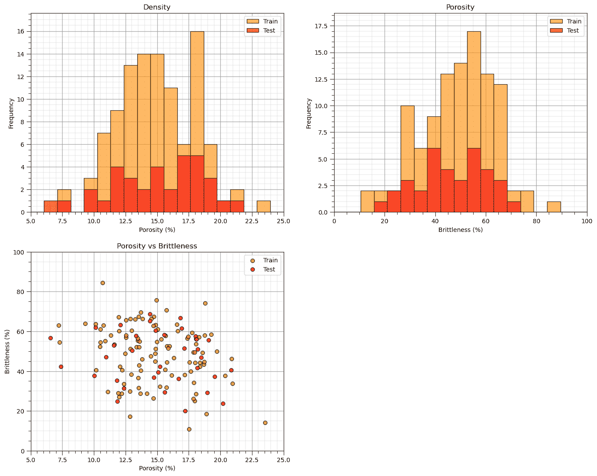

有时我发现通过查看 CDF 而不是直方图来比较分布更方便。

+   我们避免选择任意直方图分箱大小，因为累积分布函数（CDF）与数据分辨率一致。

```py
plt.subplot(221)                                              # predictor feature #1 CDF
plot_CDF(X_train[Xname[0]],'darkorange',alpha=0.6,lw=1,ls='solid',label='Train')
plot_CDF(X_test[Xname[0]],'red',alpha=0.6,lw=1,ls='solid',label='Test')
plt.xlabel(Xlabelunit[0]); plt.xlim(Xmin[0],Xmax[0]); plt.ylim([0,1]); add_grid(); plt.legend(loc='lower right')
plt.title(Xlabel[0] + ' Train and Test CDFs')

plt.subplot(222)                                              # predictor feature #2 CDF
plot_CDF(X_train[Xname[1]],'darkorange',alpha=0.6,lw=1,ls='solid',label='Train')
plot_CDF(X_test[Xname[1]],'red',alpha=0.6,lw=1,ls='solid',label='Test')
plt.xlabel(Xlabelunit[1]); plt.xlim(Xmin[1],Xmax[1]); plt.ylim([0,1]); add_grid(); plt.legend(loc='lower right')
plt.title(Xlabel[1] + ' Train and Test CDFs')

plt.subplot(223)                                              # response feature CDF
plot_CDF(y_train[yname],'darkorange',alpha=0.6,lw=1,ls='solid',label='Train')
plot_CDF(y_test[yname],'red',alpha=0.6,lw=1,ls='solid',label='Test')
plt.xlabel(ylabelunit); plt.xlim(ymin,ymax); plt.ylim([0,1]); add_grid(); plt.legend(loc='lower right')
plt.title(ylabel + ' Train and Test CDFs')

plt.subplots_adjust(left=0.0, bottom=0.0, right=2.0, top=2.1, wspace=0.2, hspace=0.2)
#plt.savefig('Test.pdf', dpi=600, bbox_inches = 'tight',format='pdf') 
plt.show() 
```


再次强调，分布表现良好，

+   我们无法观察到明显的间隙或截断。

+   检查训练和测试数据的覆盖率

让我们看看孔隙率与脆性之间的散点图，点根据产量着色。

```py
plt.subplot(111)                                              # visualize the train and test data in predictor feature space
im = plt.scatter(X_train[Xname[0]],X_train[Xname[1]],s=None, c=y_train[yname], marker='o', cmap=cmap, 
    norm=None, vmin=ymin, vmax=ymax, alpha=0.8, linewidths=0.3, edgecolors="black", label = 'Train')
plt.scatter(X_test[Xname[0]],X_test[Xname[1]],s=None, c=y_test[yname], marker='s', cmap=cmap, 
    norm=None, vmin=ymin, vmax=ymax, alpha=0.5, linewidths=0.3, edgecolors="black", label = 'Test')
plt.title('Training ' + ylabel + ' vs. ' + Xlabel[1] + ' and ' + Xlabel[0]); 
plt.xlabel(Xlabel[0] + ' (' + Xunit[0] + ')'); plt.ylabel(Xlabel[1] + ' (' + Xunit[1] + ')')
plt.xlim(Xmin[0],Xmax[0]); plt.ylim(Xmin[1],Xmax[1]); plt.legend(loc = 'upper right'); add_grid()
cbar = plt.colorbar(im, orientation = 'vertical')
cbar.set_label(ylabel + ' (' + yunit + ')', rotation=270, labelpad=20)
cbar.ax.yaxis.set_major_formatter(FuncFormatter(comma_format))

plt.subplots_adjust(left=0.0, bottom=0.0, right=1.0, top=1.0, wspace=0.2, hspace=0.2); plt.show() 
```

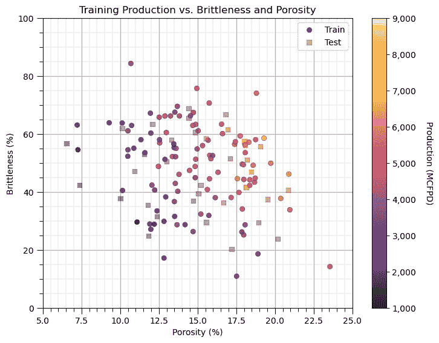

这个问题看起来很复杂，无法用简单的线性回归建模。似乎存在非线性。让我们使用一个简单的非参数模型，即决策树。

## Instantiate, Fit and Predict with scikit-learn

让我们通过实例化、拟合和预测来构建我们的预测机器学习模型，使用 scikit-learn。

+   **instantiate** 模型对象，使用超参数，k-最近邻

+   **fit** 通过用训练数据训练模型，我们使用 fit 成员函数

+   **predict** 使用训练好的模型。在 fit 运行后，predict 可用于进行预测

## 训练决策树（回归树）

现在我们已经准备好运行 DecisionTreeRegressor 命令来构建我们的回归树，以预测我们的响应特征，给定我们的两个预测特征（记住，我们在这里限制自己使用两个预测特征以简化可视化）。

+   我们将使用上面定义的两个函数来可视化决策树在特征空间中的预测，以及训练数据的实际产量和估计产量的交叉图，以及来自 sklearn.metrics 模块的三个模型度量。

**超参数** - 我们通过以下方式约束树复杂度：

+   *max_leaf_nodes* - 最大区域数，也称为决策树中的终端或引导节点

+   *max_depth* - 最大层数，例如，max_depth = 1 是一个只有 1 个决策和两个区域的树桩树

+   *min_samples_leaf* - 新区域中的最小数据量，这是一个很好的约束条件，以确保每个区域都有足够的数据来做出合理的估计

目前我们只尝试一些超参数。

### 欠拟合决策树模型

让我们使用太少的区域，设置 max_leaf_nodes 太小，看看结果决策树模型。

```py
max_leaf_nodes = 5; max_depth =99; min_samples_leaf = 1      # hyperparameters

tree_model = tree.DecisionTreeRegressor(max_leaf_nodes = max_leaf_nodes,max_depth = max_depth,min_samples_leaf = min_samples_leaf)
tree_model = tree_model.fit(X_train.values, y_train.values)

plt.subplot(121)                                              # visualize, data, and decision tree regions and predictions
visualize_tree_model(tree_model,X_train[Xname[0]],X_test[Xname[0]],X_train[Xname[1]],X_test[Xname[1]],Xmin,Xmax,
                    y_train[yname],y_test[yname],ymin,ymax,'Decision Tree Model',Xname,yname,Xlabelunit,ylabelunit) 

plt.subplot(122)                                              # cross validation with conditional statistics plot
check_tree_model(tree_model,X_train[Xname[0]],X_test[Xname[0]],X_train[Xname[1]],X_test[Xname[1]],Xmin,Xmax,
                    y_train[yname],y_test[yname],ymin,ymax,'Decision Tree Model Cross Validation Plot',)

plt.subplots_adjust(left=0.0, bottom=0.0, right=2.0, top=1.0, wspace=0.25, hspace=0.2); plt.show() 
```


这个模型非常欠拟合，它太简单了，无法拟合预测问题的形状。以下是关于图表的一些更多信息。

看看估计生产与实际生产（底部图表）的图中水平线？

+   这是可以预料的，因为回归树使用特征空间每个区域（终端节点）中的数据平均值进行估计。

+   为了进一步评估模型性能，我包括了每个终端节点、区域在训练和测试中的实际响应 P10、平均值和 P90。

+   低拟合预测机器学习模型在训练和测试中都有较差的准确度。

如果我们有一个更复杂的树，有更多的终端节点，那么就会有更多的线条。

### 过拟合决策树模型。

让我们使用太多的区域，设置 max_leaf_nodes 太大，看看结果决策树模型。

```py
max_leaf_nodes = 50; max_depth = 9; min_samples_leaf = 1     # hyperparameters

tree_model = tree.DecisionTreeRegressor(max_leaf_nodes = max_leaf_nodes,max_depth = max_depth,min_samples_leaf = min_samples_leaf)
tree_model = tree_model.fit(X_train.values, y_train.values)

plt.subplot(121)                                              # visualize, data, and decision tree regions and predictions
visualize_tree_model(tree_model,X_train[Xname[0]],X_test[Xname[0]],X_train[Xname[1]],X_test[Xname[1]],Xmin,Xmax,
                    y_train[yname],y_test[yname],ymin,ymax,'Decision Tree Model',Xname,yname,Xlabelunit,ylabelunit) 

plt.subplot(122)                                              # cross validation with conditional statistics plot
check_tree_model(tree_model,X_train[Xname[0]],X_test[Xname[0]],X_train[Xname[1]],X_test[Xname[1]],Xmin,Xmax,
                    y_train[yname],y_test[yname],ymin,ymax,'Decision Tree Model Cross Validation Plot',)

plt.subplots_adjust(left=0.0, bottom=0.0, right=2.0, top=1.0, wspace=0.25, hspace=0.2); plt.show() 
```

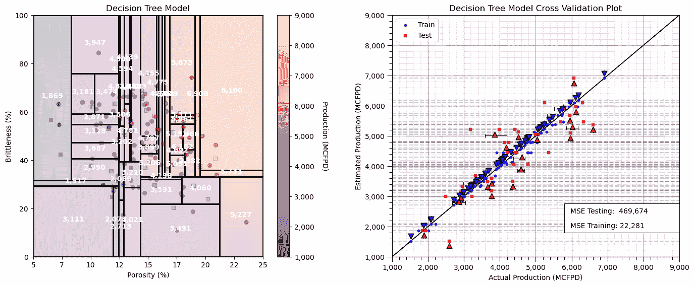

现在我们有一个过拟合的预测机器学习模型。

+   过多的复杂性和灵活性。

+   我们正在拟合数据中的噪声。

+   训练时准确度好，但测试时准确度差。

随着我们逐步添加终端节点，观察决策树模型在特征空间中的表现是有教育意义的。我们可以清楚地图形化地观察到分层二分分裂。

+   让我们从简单的复杂模型开始可视化。

```py
leaf_nodes_list = [2,3,4,10,20,100]

for inode,leaf_nodes in enumerate(leaf_nodes_list):

    tree_model = tree.DecisionTreeRegressor(max_leaf_nodes = leaf_nodes)
    tree_model = tree_model.fit(X_train.values, y_train.values)

    plt.subplot(3,2,inode+1)                                         # visualize, data, and decision tree regions and predictions
    visualize_tree_model(tree_model,X_train[Xname[0]],X_test[Xname[0]],X_train[Xname[1]],X_test[Xname[1]],Xmin,Xmax,
                    y_train[yname],y_test[yname],1000,9000,'Decision Tree Model, Number of Leaf Nodes: ' + str(leaf_nodes),Xname,yname,Xlabelunit,ylabelunit,annotate=False)   

plt.subplots_adjust(left=0.0, bottom=0.0, right=2.0, top=3.1, wspace=0.25, hspace=0.2); plt.show() 
```

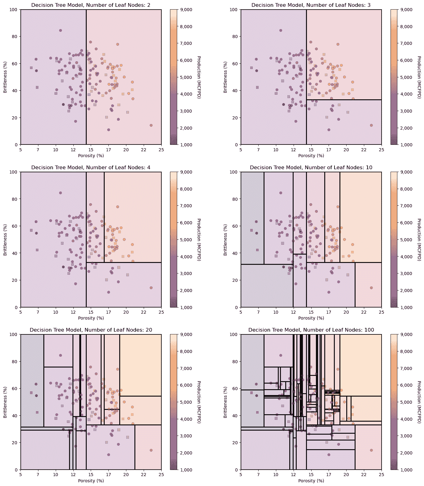

可能会有用的是并排查看决策树模型和相关的决策树。

```py
leaf_nodes_viz = 2

tree_model_viz = tree.DecisionTreeRegressor(max_leaf_nodes = leaf_nodes_viz).fit(X_train.values, y_train.values)

fig = plt.figure(figsize=(10, 6))
gs = fig.add_gridspec(1, 2, width_ratios=[1, 2])  # 1 row, 3 columns with 1:2 width ratio

ax1 = fig.add_subplot(gs[0])                         # visualize, data, and decision tree regions and predictions 
visualize_tree_model(tree_model_viz,X_train[Xname[0]],X_test[Xname[0]],X_train[Xname[1]],X_test[Xname[1]],Xmin,Xmax,
        y_train[yname],y_test[yname],1000,9000,'Decision Tree Model, Number of Leaf Nodes: ' + str(leaf_nodes),Xname,yname,
        Xlabelunit,ylabelunit,annotate=False)   

ax2 = fig.add_subplot(gs[1:])                                  # visualize, data, and decision tree regions and predictions
_ = tree.plot_tree(tree_model_viz,ax = ax2,feature_names=list(Xname),class_names=list(yname),filled=False,label='none',rounded=True,precision=0,
                  proportion=True,max_depth=4,fontsize=15)

plt.tight_layout()
plt.subplots_adjust(left=0.0, bottom=0.0, right=2.0, top=1.1, wspace=0.25, hspace=0.2); plt.show() 
```

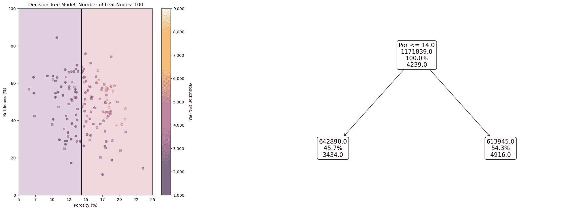

我们如何找到最佳超参数，以实现最佳复杂性和测试预测精度的最佳化？这就是超参数调整。

## 调整决策树（回归树）。

让我们进行超参数调整。为此，我们，

1.  看看可能的超参数值范围。

1.  遍历可能超参数值的范围。

    +   使用当前超参数值在训练数据上训练。

    +   在测试数据上预测。

    +   总结所有测试数据的错误。

1.  选择测试数据集上最小化误差的超参数。

当我把这个教给我的学生时，我建议这是一个模型彩排。我们通过为未用于训练模型的案例做出预测来增加价值。我们希望模型在未训练的案例上表现最好，因此我们正在模拟模型在现实世界中的使用！

现在，让我们手动进行超参数调整，通过改变决策树复杂性，找到最小化测试中均方误差的复杂性。

+   为了简单起见，下面的代码只遍历最大叶节点超参数。

+   我们将最小样本数设置为 1，最大深度设置为 9，以确保这些超参数不会产生任何影响（我们将它们设置得非常复杂，这样就不会限制模型复杂性）。

```py
trees = []; MSE_CV = []; node_CV = []

inode = 2
while inode < len(X_train):                                   # loop over the hyperparameter, train with training and test with testing
    tree_model = tree.DecisionTreeRegressor(min_samples_leaf=1,max_leaf_nodes=inode).fit(X_train.values, y_train.values)
    trees.append(tree_model)
    predict_train = tree_model.predict(np.c_[X_test[Xname[0]],X_test[Xname[1]]]) 
    MSE_CV.append(metrics.mean_squared_error(y_test[yname],predict_train))   
    all_nodes = tree_model.tree_.node_count             
    decision_nodes = len([x for x in tree_model.tree_.feature if x != _tree.TREE_UNDEFINED]); terminal_nodes = all_nodes - decision_nodes
    node_CV.append(terminal_nodes); inode+=1

plt.subplot(111)
plt.scatter(node_CV,MSE_CV,s=None,c='red',marker=None,cmap=None,norm=None,vmin=None,vmax=None,alpha=0.8,linewidths=0.3,
            edgecolors="black",zorder=20)
tuned_node = node_CV[np.argmin(MSE_CV)]; max_MSE_CV = np.max(MSE_CV)
plt.vlines(tuned_node,0,1.05*max_MSE_CV,lw=1.0,ls='--',color='red',zorder=10)
plt.annotate('Tuned Max Nodes = ' + str(tuned_node),(tuned_node-2,3.5e5),rotation=90,zorder=30)
plt.title('Decision Tree Cross Validation Testing Error vs. Complexity'); plt.xlabel('Number of Terminal Nodes'); plt.ylabel('Mean Square Error')
plt.xlim(0,len(X_train)); plt.ylim(0,1.05*max_MSE_CV); add_grid()
plt.gca().yaxis.set_major_formatter(FuncFormatter(comma_format))
plt.subplots_adjust(left=0.0, bottom=0.0, right=1.5, top=0.6, wspace=0.2, hspace=0.2); plt.show() 
```

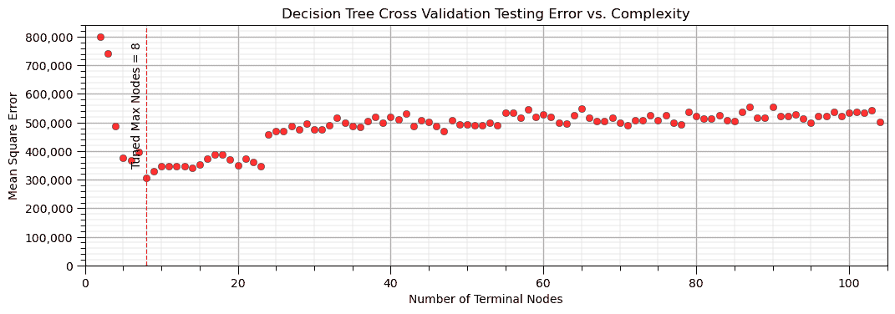

通过观察准确率与复杂度之间的关系，评估我们树的表现是有用的，最小值是由于模型方差和模型偏差之间的权衡。

为了得到更稳健的结果，让我们尝试 k 折交叉验证。sklearn 有一个内置的交叉验证方法，名为 cross_val_score，我们可以用它来：

1.  应用 k 折法，通过迭代分离训练数据和测试数据。

1.  当 k=5 时，每个折保留 20% 的数据用于测试。

1.  自动化模型构建，循环遍历折，并平均感兴趣的指标。

让我们在具有不同终端节点数量的树上尝试一下。注意，交叉验证设置为使用 4 个处理器，但仍可能需要几分钟才能运行。

```py
MSE_kF = []; node_kF = []                                     # k-fold iteration code modified from StackOverFlow by Dimosthenis

inode = 2
while inode < len(X_train):
    tree_model = tree.DecisionTreeRegressor(max_leaf_nodes=inode).fit(X_train.values, y_train.values)
    scores = cross_val_score(estimator=tree_model, X= np.c_[df[Xname[0]],df[Xname[1]]],y=df[yname], cv=5, n_jobs=4,
        scoring = "neg_mean_squared_error")                   # perform 4-fold cross validation
    MSE_kF.append(abs(scores.mean()))
    all_nodes = tree_model.tree_.node_count   
    decision_nodes = len([x for x in tree_model.tree_.feature if x != _tree.TREE_UNDEFINED]); terminal_nodes = all_nodes - decision_nodes
    node_kF.append(terminal_nodes); inode+=1

tuned_node_kF = node_kF[np.argmin(MSE_kF)]; max_MSE_kF = np.max(MSE_kF)  
plt.subplot(111)
plt.vlines(tuned_node_kF,0,1.05*max_MSE_kF,lw=1.0,ls='--',color='red',zorder=10)
plt.annotate('Tuned Max Nodes = ' + str(tuned_node_kF),(tuned_node_kF-2,3.5e5),rotation=90,zorder=30)
plt.scatter(node_kF,MSE_kF,s=None,c="red",marker=None,cmap=None,norm=None,vmin=None,vmax=None,alpha=0.8,
            linewidths=0.5, edgecolors="black",zorder=40,label='k-Fold')
plt.scatter(node_CV,MSE_CV,s=None,c='red',marker=None,cmap=None,norm=None,vmin=None,vmax=None,alpha=0.4,linewidths=0.3,
            edgecolors="black",zorder=20,label='Cross Validation')
plt.title('Decision Tree k-Fold Cross Validation Error (MSE) vs. Complexity'); plt.xlabel('Number of Terminal Nodes'); 
plt.ylabel('Mean Square Error'); plt.xlim(0,len(X_train)); plt.ylim(0,1.05*max_MSE_kF); add_grid()
plt.gca().yaxis.set_major_formatter(FuncFormatter(comma_format))
plt.legend(loc='upper right')
plt.subplots_adjust(left=0.0, bottom=0.0, right=1.5, top=0.6, wspace=0.2, hspace=0.2); plt.show() 
```

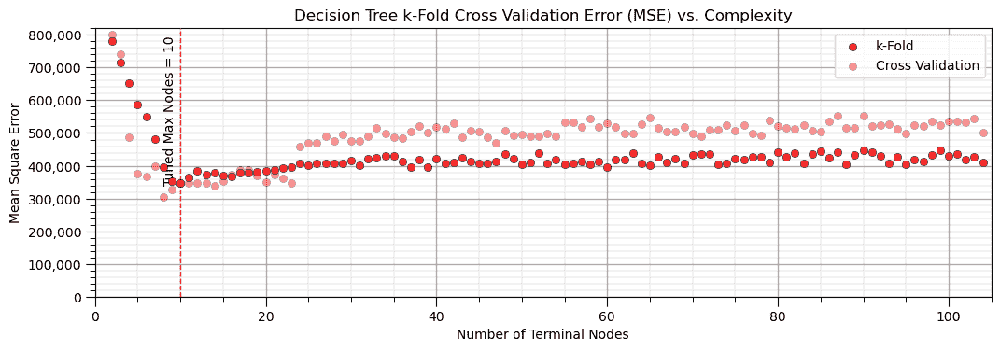

k 折交叉验证提供了 MSE 与超参数之间的更平滑的图表。

+   通过对所有折的平均 MSE 来减少该指标对特定训练和测试数据分配的敏感性。

+   我们进行的所有训练和测试交叉验证或 k 折交叉验证都是为了得到这个单一值，即模型的**超参数**。

## 构建最终模型。

现在，让我们用这个超参数在所有数据上训练，这是我们**最终模型**。

```py
pruned_tree_model = tree.DecisionTreeRegressor(max_leaf_nodes=tuned_node_kF)
pruned_tree_model = pruned_tree_model.fit(X, y)               # re-train

plt.subplot(121)                                              # visualize, data, and decision tree regions and predictions
visualize_tree_model(pruned_tree_model,X_train[Xname[0]],X_test[Xname[0]],X_train[Xname[1]],X_test[Xname[1]],Xmin,Xmax,
                    y_train[yname],y_test[yname],ymin,ymax,'Decision Tree Model, Tuned Leaf Nodes: ' + str(tuned_node_kF),Xname,yname,
                    Xlabelunit,ylabelunit) # plots the data points and the decision tree prediction 

plt.subplot(122)                                              # cross validation with conditional statistics plot
check_tree_model(pruned_tree_model,X_train[Xname[0]],X_test[Xname[0]],X_train[Xname[1]],X_test[Xname[1]],Xmin,Xmax,
                    y_train[yname],y_test[yname],ymin,ymax,'Decision Tree Model Cross Validation Plot, Tuned Leaf Nodes: ' + 
                    str(tuned_node_kF),)

plt.subplots_adjust(left=0.0, bottom=0.0, right=2.0, top=1.0, wspace=0.25, hspace=0.2); plt.show() 
```

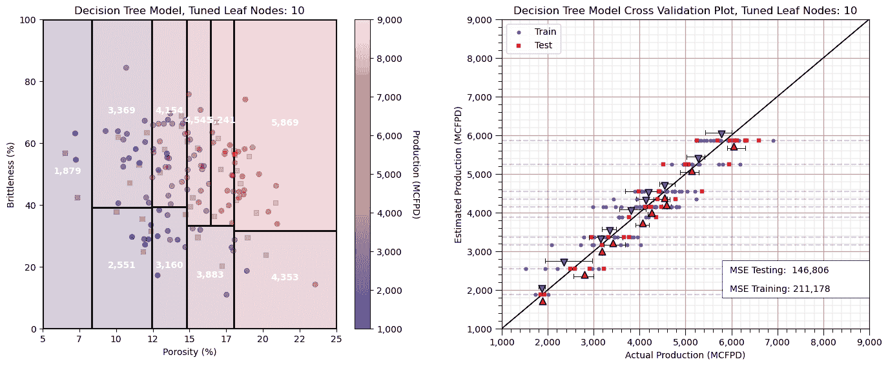

我们已经完成了我们的预测机器学习模型。现在让我们再讨论一些决策树的诊断。

## 查询决策树。

评估任何可能的特征组合，以及导致特定预测的决策节点顺序可能也很有用。以下函数提供了预测案例通过的节点列表。

```py
x1 = 7.0; x2 = 10.0                                          # the predictor feature values for the decision path

decision_path = pruned_tree_model.decision_path(np.c_[x1,x2])
print(decision_path) 
```

```py
 (0, 0)	1
  (0, 1)	1
  (0, 3)	1
  (0, 13)	1 
```

## 提取决策树预测模型作为函数。

此外，将决策树转换为代码，即嵌套的“if”语句集，可能也很有用。

+   这创建了一个可移植的模型，可以复制并作为独立函数应用。

此外，还可以方便地查询树的代码版本。

+   我们使用先前定义的函数来处理我们的剪枝树。

```py
tree_to_code(pruned_tree_model, list(Xname))                  # convert a decision tree to Python code, nested if statements 
```

```py
def tree(Por, Brittle):
  if Por <= 14.789999961853027:
    if Por <= 12.425000190734863:
      if Por <= 8.335000038146973:
        return [[1879.19091537]]
      elif Por > 8.335000038146973
        if Brittle <= 39.125:
          return [[2551.00021508]]
        elif Brittle > 39.125
          return [[3369.12903299]]
    elif Por > 12.425000190734863
      if Brittle <= 39.26500129699707:
        return [[3160.11022857]]
      elif Brittle > 39.26500129699707
        return [[4154.18334527]]
  elif Por > 14.789999961853027
    if Por <= 18.015000343322754:
      if Brittle <= 33.25:
        return [[3883.19381758]]
      elif Brittle > 33.25
        if Por <= 16.434999465942383:
          return [[4544.69777089]]
        elif Por > 16.434999465942383
          return [[5240.84146117]]
    elif Por > 18.015000343322754
      if Brittle <= 31.5600004196167:
        return [[4353.11874206]]
      elif Brittle > 31.5600004196167
        return [[5868.56369869]] 
```

## 基于决策树的特性重要性。

特性重要性是通过决策树计算得出的，通过总结包含每个特征时的平均平方误差来计算，并总结如下：

$$ FI(x) = \sum_{t \in T_f} \frac{N_t}{N} \Delta_{MSE_t} $$

$T_f$ 代表所有以特征 $x$ 作为分割点的节点，$N_t$ 是达到节点 $t$ 的训练样本数量，$N$ 是数据集中样本的总数，$\Delta_{MSE_t}$ 是 $t$ 分割点处 MSE 的减少量。

注意，特征重要性可以像上面的 MSE 一样计算，适用于具有**基尼不纯度**的分类树。

```py
plt.subplot(111)                                              # plot the feature importance 
plt.title("Decision Tree Feature Importance")
plt.bar(Xlabel, pruned_tree_model.feature_importances_,edgecolor = 'black',
       color="darkorange",alpha = 0.6, align="center")
plt.xlim([-0.5,len(Xname)-0.5]); plt.ylim([0.,1.0])
plt.gca().yaxis.grid(True, which='major',linewidth = 1.0); plt.gca().yaxis.grid(True, which='minor',linewidth = 0.2) # add y grids
plt.xlabel('Predictor Feature'); plt.ylabel('Feature Importance')
plt.subplots_adjust(left=0.0, bottom=0.0, right=1., top=0.8, wspace=0.2, hspace=0.5); plt.show() 
```

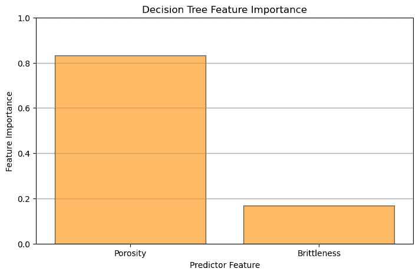

## 可视化模型。

让我们最后看看我们修剪后的树的图形表示。

```py
fig = plt.figure(figsize=(15,10))

_ = tree.plot_tree(pruned_tree_model,                         # plot the decision tree for model visualization
                   feature_names=list(Xname),  
                   class_names=list(yname),
                   filled=True) 
```

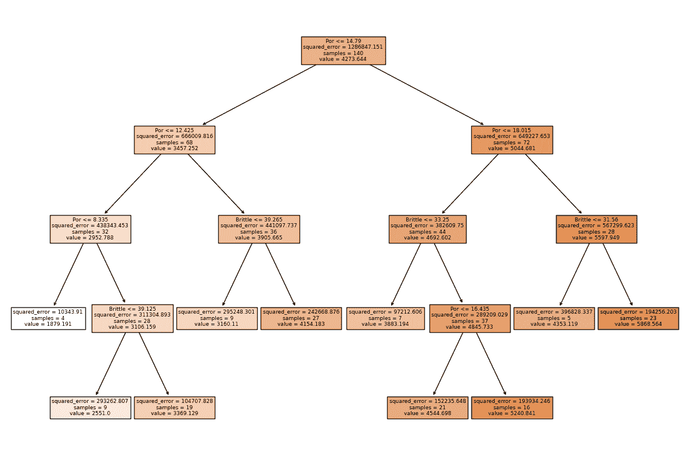

## 简单代码制作决策树机器并计算预测

为了支持那些刚开始的人，以下是一小段代码来：

+   加载用于决策树的 scikit-learn 包

+   加载数据

+   实例化一个具有超参数的决策树（未显示调整）

+   使用训练数据训练决策树

+   使用决策树进行预测

```py
from sklearn import tree                                      # import decision tree from scikit-learn
Xname = ['Por','Brittle']; yname='Production'                 # predictor features and response feature
x1 = 0.25; x2 = 0.3                                           # predictor values for the prediction
my_data = pd.read_csv(r"https://raw.githubusercontent.com/GeostatsGuy/GeoDataSets/master/unconv_MV.csv") # load subsurface data table
my_tree = tree.DecisionTreeRegressor(max_leaf_nodes=26)       # instantiate tree with hyperparameters
my_tree = my_tree.fit(X.values,y.values)                      # train tree with training data
estimate = my_tree.predict([[x1,x2]])[0]                      # make a prediction (no tuning shown)
print('Estimated ' + ylabel + ' for ' + Xlabel[0] + ' = ' + str(x1) + ' and ' + Xlabel[1] + ' = ' + str(x2)  + ' is ' + str(round(estimate,1)) + ' ' + yunit) # print results 
```

```py
Estimated Production for Porosity = 0.25 and Brittleness = 0.3 is 1879.2 MCFPD 
```

## 清洁、紧凑的机器学习代码的机器学习管道

管道是 scikit-learn 类，允许封装一系列数据准备和建模步骤

+   然后，我们可以将管道视为我们高度浓缩的工作流程中的一个对象

管道类允许我们：

+   提高代码可读性并保持一切井然有序

+   用很少的代码行构建完整的流程

+   避免常见的流程问题，如数据泄露、测试数据告知模型参数训练

+   抽象常见的机器学习建模，专注于构建尽可能好的模型

基本哲学是将机器学习视为组合搜索以找到最佳模型（AutoML）

更多信息请参阅我关于 [机器学习管道](https://www.youtube.com/watch?v=tYrPs8s1l9U&list=PLG19vXLQHvSAufDFgZEFAYQEwMJXklnQV&index=5) 的录音讲座和详细记录的演示 [机器学习管道工作流程](http://localhost:8892/notebooks/OneDrive%20-%20The%20University%20of%20Texas%20at%20Austin/Courses/Workflows/PythonDataBasics_Pipelines.ipynb)。

```py
pipe_tree = Pipeline([                                        # the machine learning workflow as a pipeline object

    ('tree', tree.DecisionTreeRegressor())
])

params = {                                                    # the machine learning workflow method's parameters to search
    'tree__max_leaf_nodes': np.arange(2,len(X),1,dtype = int),
}

KF_tuned_tree = GridSearchCV(pipe_tree,params,scoring = 'neg_mean_squared_error', # hyperparameter tuning w. grid search k-fold cross validation 
                             cv=KFold(n_splits=5,shuffle=False),refit = True)
KF_tuned_tree.fit(X,y)                                        # tune and train the model

print('Tuned hyperparameter: max_leaf_nodes = ' + str(KF_tuned_tree.best_params_))

estimate = KF_tuned_tree.predict([[x1,x2]])[0]                # make a prediction (no tuning shown)
print('Estimated ' + ylabel + ' for ' + Xlabel[0] + ' = ' + str(x1) + ' and ' + Xlabel[1] + ' = ' + str(x2)  + ' is ' + str(round(estimate,1)) + ' ' + yunit) # print results 
```

```py
Tuned hyperparameter: max_leaf_nodes = {'tree__max_leaf_nodes': 10}
Estimated Production for Porosity = 0.25 and Brittleness = 0.3 is 1879.2 MCFPD 
```

## 在新数据集上进行实践

好的，是时候开始工作了。让我们加载数据集并使用以下内容构建决策树预测模型，

+   紧凑的代码

+   基本可视化

+   保存输出

您可以选择这些数据集之一或修改代码并添加您自己的数据集来执行此操作。

### 数据集 0，非常规多元变量 v4

让我们加载提供的多元数据集 [unconv_MV.csv](https://github.com/GeostatsGuy/GeoDataSets/blob/master/unconv_MV_v4.csv)。此数据集包含来自 1,000 个非常规井的变量，包括：

+   井平均孔隙率

+   渗透率的对数变换（以线性化与其他变量的关系）

+   声阻抗（kg/m³ x m/s x 10⁶）

+   岩脆性比 (%)

+   总有机碳 (%)

+   玻璃光泽反射率 (%)

+   初始生产 90 天平均 (MCFPD)。

### 数据集 2，储层 21

让我们加载提供的多元，3D 空间数据集 [res21_wells.csv](https://github.com/GeostatsGuy/GeoDataSets/blob/master/res21_wells.csv)。此数据集包含来自 73 个垂直井在 10,000m x 10,000m x 50 m 储层单元的变量：

+   井（ID）

+   X (m), Y (m), 深度 (m) 位置坐标

+   单位转换后的孔隙率 (%)

+   渗透率 (mD)

+   声阻抗（kg/m2s*10⁶）单位转换后

+   岩性（分类） - 有序的，从页岩、砂质页岩、页岩砂到砂岩。

+   密度 (g/cm³)

+   可压缩速度（m/s）

+   Youngs 模量（GPa）

+   剪切速度（m/s）

+   剪切模量（GPa）

+   3 年累计油产量（百万桶）

我们使用 pandas 的‘read_csv’函数将表格数据加载到我们称为‘my_data’的 DataFrame 中，然后预览它以确保正确加载。

+   我们还用数据范围和标签填充列表，以便于绘图

加载数据并格式化，

+   删除响应特征

+   根据需要重新格式化特征

+   此外，我还喜欢将元数据存储在列表中

```py
idata = 2                                                    # select the dataset

if idata == 0:
    df_new = pd.read_csv('https://raw.githubusercontent.com/GeostatsGuy/GeoDataSets/master/unconv_MV_v4.csv') # load data from Dr. Pyrcz's GitHub repository 
    df_new.drop(['Well'],axis=1,inplace=True)                 # remove well index and response feature

    features = df_new.columns.values.tolist()                 # store the names of the features

    xname = features[:-1]
    yname = [features[-1]]

    xmin_new = [6.0,0.0,1.0,10.0,0.0,0.9]; xmax_new = [24.0,10.0,5.0,85.0,2.2,2.9] # set the minimum and maximum values for plotting
    ymin_new = 0.0; ymax_new = 10000.0
    xlabel_new = ['Porosity (%)','Permeability (mD)','Acoustic Impedance (kg/m2s*10⁶)','Brittleness Ratio (%)', # set the names for plotting
             'Total Organic Carbon (%)','Vitrinite Reflectance (%)']

    ylabel_new = 'Production (MCFPD)'

    xtitle_new = ['Porosity','Permeability','Acoustic Impedance','Brittleness Ratio', # set the units for plotting
             'Total Organic Carbon','Vitrinite Reflectance']

    ytitle_new = 'Production'

    y = pd.DataFrame(df_new[yname])                              # extract selected features as X and y DataFrames 
    X = df_new[xname]

elif idata == 1:
    names = {'Porosity':'Por'}

    df_new = pd.read_csv('https://raw.githubusercontent.com/GeostatsGuy/GeoDataSets/master/12_sample_data.csv') # load data from Dr. Pyrcz's GitHub repository 
    df_new.drop(['X','Y','Unnamed: 0','Facies'],axis=1,inplace=True)   # remove response feature
    df_new = df_new.rename(columns=names)
    df_new['Por'] = df_new['Por'] * 100.0; df_new['AI'] = df_new['AI'] / 1000.0
    features = df_new.columns.values.tolist()                 # store the names of the features

    xname = features[:-1]
    yname = [features[-1]]

    xmin_new = [4.0,0.0]; xmax_new = [19.0,500.0] # set the minimum and maximum values for plotting

    ymin_new = 1.60; ymax_new = 6.20

    xlabel_new = ['Porosity (fraction)','Permeability (mD)'] # set the names for plotting

    ylabel_new = 'Acoustic Impedance (kg/m2s*10⁶)'

    xtitle_new = ['Porosity','Permeability']

    ytitle_new = 'Acoustic Impedance (kg/m2s*10⁶)'

    y = pd.DataFrame(df_new[yname])                              # extract selected features as X and y DataFrames 
    X = df_new[xname]

elif idata == 2:  
    df_new = pd.read_csv('https://raw.githubusercontent.com/GeostatsGuy/GeoDataSets/master/res21_2D_wells.csv') # load data from Dr. Pyrcz's GitHub repository 
    df_new.drop(['Well_ID','X','Y'],axis=1,inplace=True) # remove Well Index, X and Y coordinates, and response feature
    df_new = df_new.dropna(how='any',inplace=False)

    features = df_new.columns.values.tolist()                 # store the names of the features

    xname = features[:-1]
    yname = [features[-1]]

    xmin_new = [1,0.0,0.0,4.0,0.0,6.5,1.4,1600.0,10.0,1300.0,1.6]; xmax_new = [73,10000.0,10000.0,19.0,500.0,8.3,3.6,6200.0,50.0,2000.0,12.0] # set the minimum and maximum values for plotting

    ymin_new = 0.0; ymax_new = 1600.0

    xlabel_new = ['Well (ID)','X (m)','Y (m)','Depth (m)','Porosity (fraction)','Permeability (mD)','Acoustic Impedance (kg/m2s*10⁶)','Facies (categorical)',
              'Density (g/cm³)','Compressible velocity (m/s)','Youngs modulus (GPa)', 'Shear velocity (m/s)', 'Shear modulus (GPa)'] # set the names for plotting

    ylabel_new = 'Production (Mbbl)'

    xtitle_new = ['Well','X','Y','Depth','Porosity','Permeability','Acoustic Impedance','Facies',
              'Density','Compressible velocity','Youngs modulus', 'Shear velocity', 'Shear modulus']

    ytitle_new = 'Production'

    y = pd.DataFrame(df_new[yname])                              # extract selected features as X and y DataFrames 
    X = df_new[xname]

df_new.head(n=13) 
```

|  | Por | Perm | AI | 密度 | PVel | Youngs | SVel | 剪切 | 累计油量 |
| --- | --- | --- | --- | --- | --- | --- | --- | --- | --- |
| 1 | 12.907730 | 133.910637 | 7.308846 | 2.146360 | 3563.549461 | 25.688560 | 1673.770439 | 6.429229 | 1201.20 |
| 7 | 12.647965 | 114.359667 | 7.343836 | 2.188597 | 3570.094553 | 25.444064 | 1670.043495 | 6.100984 | 683.92 |
| 10 | 12.998469 | 129.332122 | 7.282051 | 2.131121 | 3524.448615 | 25.985734 | 1681.960101 | 6.203527 | 978.14 |
| 15 | 12.426141 | 123.227677 | 7.351795 | 2.203026 | 3417.596818 | 25.976462 | 1675.355860 | 6.288040 | 608.09 |
| 16 | 13.507371 | 147.562087 | 7.300360 | 2.210916 | 3476.167397 | 24.817767 | 1656.890690 | 6.222528 | 1062.10 |
| 36 | 13.309477 | 122.818961 | 7.345220 | 2.178749 | 3346.347661 | 25.436579 | 1651.679529 | 6.334308 | 539.98 |
| 49 | 11.822910 | 98.168307 | 7.386212 | 2.301552 | 3250.020705 | 24.340656 | 1662.438742 | 6.617267 | 1095.30 |
| 51 | 13.986616 | 132.575456 | 7.194749 | 2.108986 | 3415.255945 | 26.253236 | 1712.017629 | 5.583251 | 805.49 |
| 61 | 14.735895 | 128.201000 | 7.172693 | 1.841786 | 3886.950307 | 28.289950 | 1672.370150 | 5.044439 | 1146.00 |

### 构建和检查模型

我们执行以下步骤，

1.  指定 K 折方法

1.  遍历叶节点数量，实例化、拟合并记录误差

1.  绘制测试误差与叶节点数量的关系图，选择最小化测试误差的超参数

1.  使用调整好的超参数和所有数据重新训练模型

```py
MSE_kF = []; node_kF = []                                     
kf = KFold(n_splits=5, shuffle=True, random_state=seed)       # k-fold specification 

inode = 2
while inode < len(X_train):
    tree_model = tree.DecisionTreeRegressor(max_leaf_nodes=inode,random_state=seed)
    scores = cross_val_score(estimator=tree_model,X=X,y=y,cv=kf,n_jobs=4,scoring = "neg_mean_squared_error") # perform 5-fold cross validation
    MSE_kF.append(abs(scores.mean()))
    node_kF.append(inode); inode+=1

tuned_node_kF = node_kF[np.argmin(MSE_kF)]
tuned_tree_model = tree.DecisionTreeRegressor(max_leaf_nodes=tuned_node_kF).fit(X.values, y.values) # retrain on all the data

plt.subplot(121)
plt.vlines(tuned_node_kF,0,1.05*max_MSE_kF,lw=1.0,ls='--',color='red',zorder=10)
plt.annotate('Tuned Max Nodes = ' + str(tuned_node_kF),(tuned_node_kF-2,3.5e5),rotation=90,zorder=30)
plt.scatter(node_kF,MSE_kF,s=None,c="red",marker=None,cmap=None,norm=None,vmin=None,vmax=None,alpha=0.8,
            linewidths=0.5, edgecolors="black",zorder=40,label='k-Fold')
plt.title('Decision Tree k-Fold Cross Validation Error (MSE) vs. Complexity'); plt.xlabel('Number of Terminal Nodes'); 
plt.ylabel('Mean Square Error'); plt.xlim(0,len(X_train)); plt.ylim(0,1.05*max_MSE_kF); add_grid()
plt.gca().yaxis.set_major_formatter(FuncFormatter(comma_format))
plt.legend(loc='upper right')

y_hat = tuned_tree_model.predict(X)

plt.subplot(122)
plt.scatter(y,y_hat,color='green',edgecolor='black') # cross validation plot
plt.plot([ymin_new,ymax_new],[ymin_new,ymax_new],color='black',zorder=-1)
plt.xlim(ymin_new,ymax_new); plt.ylim(ymin_new,ymax_new); add_grid() 
plt.xlabel('Truth: ' + ylabel_new); plt.ylabel('Estimate: ' + ylabel_new)
plt.title('Tuned Decision Tree, Cross Validation')

plt.subplots_adjust(left=0.0, bottom=0.0, right=2.0, top=1.0, wspace=0.2, hspace=0.2); plt.show() 
```

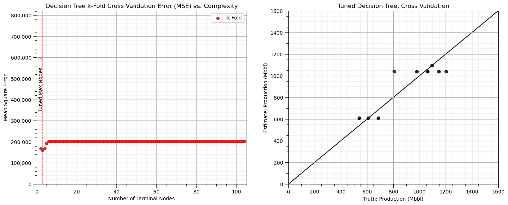

## 评论

这是对决策树的基本处理。可以做和讨论的还有很多，我有很多更多的资源。查看我的[共享资源清单](https://michaelpyrcz.com/my-resources)以及本章开头带有资源链接的视频讲座链接。

我希望这会有所帮助，

*Michael*

## 关于作者


德克萨斯大学奥斯汀分校校园内 40 英亩土地上，迈克尔·皮尔茨教授在他的办公室。

迈克尔·皮尔奇兹是德克萨斯大学奥斯汀分校[科克雷尔工程学院](https://cockrell.utexas.edu/faculty-directory/alphabetical/p)和[杰克逊地球科学学院](https://www.jsg.utexas.edu/researcher/michael_pyrcz/)的教授，他在[德克萨斯大学奥斯汀分校](https://www.utexas.edu/)从事和教授地下、空间数据分析、地统计学和机器学习。迈克尔还是，

+   该[能源分析](https://fri.cns.utexas.edu/energy-analytics)新生研究项目的负责人，以及德克萨斯大学奥斯汀分校自然科学院机器学习实验室的核心教员

+   [计算机与地球科学](https://www.sciencedirect.com/journal/computers-and-geosciences/about/editorial-board)的副编辑，以及国际数学地球科学协会[数学地球科学](https://link.springer.com/journal/11004/editorial-board)的董事会成员。

迈克尔已经撰写了超过 70 篇[同行评审的出版物](https://scholar.google.com/citations?user=QVZ20eQAAAAJ&hl=en)，一个用于空间数据分析的[Python 包](https://pypi.org/project/geostatspy/)，合著了一本关于空间数据分析的教科书《[地统计学储层建模](https://www.amazon.com/Geostatistical-Reservoir-Modeling-Michael-Pyrcz/dp/0199731446)》，并是两本近期发布的电子书的作者，分别是《[Python 应用地统计学：GeostatsPy 实践指南](https://geostatsguy.github.io/GeostatsPyDemos_Book/intro.html)》和《[Python 应用机器学习：代码实践指南](https://geostatsguy.github.io/MachineLearningDemos_Book/intro.html)》。

迈克尔的所有大学讲座都可在他的[YouTube 频道](https://www.youtube.com/@GeostatsGuyLectures)上找到，附有 100 多个 Python 交互式仪表板和 40 多个存储库中的详细工作流程链接，这些存储库位于他的[GitHub 账户](https://github.com/GeostatsGuy)，以支持任何有兴趣的学生和在职专业人士。想了解更多关于迈克尔的工作和共享教育资源，请访问他的网站。

## 想一起工作吗？

我希望这些内容对那些想了解更多关于地下建模、数据分析和机器学习的人有所帮助。学生和在职专业人士都欢迎参加。

+   想邀请我到贵公司进行培训、辅导、项目审查、工作流程设计和/或咨询吗？我很乐意拜访并与您合作！

+   愿意合作，支持我的研究生研究或我的地下数据分析与机器学习联盟（共同负责人是约翰·福斯特教授）吗？我的研究将数据分析、随机建模和机器学习理论与实践相结合，以开发新的方法和工作流程，增加价值。我们正在解决具有挑战性的地下问题！

+   您可以通过 mpyrcz@austin.utexas.edu 联系到我。

我总是很高兴讨论，

*迈克尔*

迈克尔·皮尔茨，博士，P.Eng. 教授，德克萨斯大学奥斯汀分校 Cockrell 工程学院和 Jackson 地质学院

更多资源请访问：[Twitter](https://twitter.com/geostatsguy) | [GitHub](https://github.com/GeostatsGuy) | [网站](http://michaelpyrcz.com) | [Google Scholar](https://scholar.google.com/citations?user=QVZ20eQAAAAJ&hl=en&oi=ao) | [地统计学书籍](https://www.amazon.com/Geostatistical-Reservoir-Modeling-Michael-Pyrcz/dp/0199731446) | [YouTube](https://www.youtube.com/channel/UCLqEr-xV-ceHdXXXrTId5ig) | [Python 中应用地统计学电子书](https://geostatsguy.github.io/GeostatsPyDemos_Book/intro.html) | [Python 中应用机器学习电子书](https://geostatsguy.github.io/MachineLearningDemos_Book/) | [LinkedIn](https://www.linkedin.com/in/michael-pyrcz-61a648a1)

## 动机

决策树不是机器学习中最为强大、最前沿的方法，那么为什么还要介绍决策树？

+   最易于理解、可解释的预测机器学习模型之一

+   决策树通过随机森林、袋装和提升被增强，成为许多情况下最佳的机器学习预测模型之一


阿拉斯加北部的针叶林中的一棵高傲的黑色云杉树，与我家乡阿尔伯塔省北部地区相似。照片来自 https://www.britannica.com/plant/spruce#/media/1/561445/8933，访问日期 2025 年 5 月 1 日。

让我们探讨决策树的一些关键方面。

## 模型公式

预测特征空间被分割成 $J$ 个穷尽、互斥的区域 $R_1, R_2, \ldots, R_J$。对于给定的预测案例 $x_1,\ldots,x_m \in R_j$，预测是：

**回归** - 区域 $R_j$ 中训练数据的平均值，$R_j$

$$ \hat{y} = \frac{1}{|R_j|} \sum_{\mathbf{x}_i \in R_j} y_i $$

其中 $\hat{y}$ 是输入 $\mathbf{x}$ 的预测值，$R_j$ 是 $\mathbf{x}$ 落入的区域（叶节点），$|R_j|$ 是区域 $R_j$ 中训练样本的数量，$y_i$ 是这些训练样本在 $R_j$ 中的实际目标值。

**分类** - 区域 $R_j$ 中训练案例数量最多的类别（最常见的情况）：

$$ \hat{y} = \arg\max_{c \in C} \left( \frac{1}{|R_j|} \sum_{\mathbf{x}_i \in R_j} \mathbb{1}(y_i = c) \right) $$

其中 $C$ 是所有可能类别的集合，$\mathbb{1}(y_i = c)$ 是指示变换，如果 $y_i = c$ 则为 1，否则为 0，$|R_j|$ 是区域 $R_j$ 中训练样本的数量，$\hat{y}$ 是预测的类别标签。

预测空间 $𝑋_1,\ldots,𝑋_𝑚$ 被分割成 $J$ 个互斥、穷尽的区域，$R_j, j = 1,\ldots,J$，其中区域是，

+   **互斥** – 任何预测特征组合 $x_1,\ldots,x_𝑚$ 只属于单个区域 $R_j$

+   **详尽无遗** – 所有预测特征值的组合都属于一个区域，$R_j$，即所有区域，$R_j, j = 1,\ldots,J$，覆盖整个预测特征空间

所有落在同一区域，$R_j$，的预测案例，$x_1,\ldots,x_m$，都使用相同的值进行估计。

+   预测模型在区域边界内在本质上是不连续的

例如，考虑这个用于生产响应特征，$\hat{Y}$的决策树预测模型，从孔隙率，$X_1$预测特征，


数据和预测的四区域决策树，$\hat{Y}(R_j) = \overline{Y}(R_j)$按区域，$R_j, j=1,…,4$。例如，给定 13%的孔隙率预测特征值，模型预测生产大约 2,000 MCFPD。

我们如何分割预测特征空间？

看这个例子，使用预测特征孔隙率和脆性来预测生产响应特征。


预测特征空间的一个非常复杂的 3 区域分割。

+   这些是非常高效的边界，可以捕捉低、中、高产量

但是，这个模型将会相当复杂，

+   需要大量的模型参数

+   对于大量预测特征，即高维度，难以训练。

如果我能说服你接受这些区域，那么你将有一个模型，

+   非常容易训练

+   参数非常少

+   非常紧凑且可解释


使用 9 个区域的更简单预测特征空间分割，但参数较少，且易于训练任何维度。

这是一个基于分层二分分割的区域集。让我们先明确预测特征空间的概念，然后解释这种预测特征分割形式。

## 预测特征空间

让我们回顾并建立预测特征空间的概念。我们将其定义为，

+   包含所有可能的估计问题，即所有可能的预测特征值的组合，$x_1, x_2,\ldots,x_m$。


3 个预测特征，每个特征有指定最小和最大值的情况下的预测特征空间示意图，结果是一个可能的预测矩形立方体，$x_1, x_2, x_3$。

通常这由可能值的范围定义，$x_{\alpha} \in \left[X_{\alpha,\text{𝑚𝑖𝑛}},𝑋_{\alpha,\text{max}} \right]$，结果为，

+   1 个预测特征 $\rightarrow$ 线段

+   2 个预测特征 $\rightarrow$ 矩形

+   3 个预测特征 $\rightarrow$ 矩形立方体

+   $>$3 个预测特征 $\rightarrow$ 超矩形

当我们使用预测特征的取值范围定义预测特征空间时，我应该提供一些注意事项。

决策树具有隐式外推模型

正如你下面将看到的，沿外部的区域延伸到无穷大，实际上假设了一个恒定的外推模型。

## 树损失函数

对于回归树，我们最小化残差平方和，对于分类树，我们最小化加权平均基尼不纯度。

残差平方和（RSS）衡量回归树中实际值与预测值之间的总平方差，

$$ \text{RSS} = \sum_{j=1}^{J} \sum_{i \in R_j} (y_i - \hat{y}_{R_j})² $$

其中 $J$ 是树中的区域总数，$R_j$ 是 $j$ 区域，$y_i$ 是第 $i$ 个训练数据响应特征的真值，$\hat{y}_{R_j}$ 是区域 $R_j$ 的预测值，即 $y_i \; \forall \; i \in R_j$ 的平均值。

当一个父节点分裂成两个子节点（t_L）和（t_R）时，加权基尼不纯度为：

$$ \text{Gini}_{\text{total}} = \sum_{j=1}^{J} \frac{N_j}{N} \cdot \text{Gini}(j) $$

其中 $J$ 是树中的区域总数，$N$ 是数据集中的样本总数，$N_j$ 是叶节点 $j$ 中的样本数量，$\text{Gini}(j)$ 是叶节点 $j$ 的基尼不纯度。

单个决策树节点的基尼不纯度计算如下，

$$ \text{Gini}(j) = 1 - \sum_{c=1}^{C} p_{j,c}² $$

其中 $p_{j,c}$ 是节点 $j$ 中类别 $c$ 样本的比例。

对于分类，我们的损失函数不比较预测值与真值，就像我们的回归损失一样！

+   基尼不纯度惩罚训练数据类别混合！所有训练数据为同一类别的区域将具有基尼不纯度为 0，从而对整体损失做出贡献。

注意，按区域计算的基尼不纯度是，

+   **加权** - 由每个区域的训练数据数量决定，训练数据较多的区域对整体损失的影响更大

+   **平均** - 在所有区域上计算决策树的总基尼不纯度

这些损失在以下过程中计算，

+   **树模型训练** - 根据训练数据来生长树

+   **树模型调整** - 根据保留的测试数据选择最佳树复杂度。

让我们先谈谈树模型训练，然后再谈树模型调整。

## 训练树模型

我们如何计算这些互斥且穷尽的区域？这是通过预测特征空间的分层二分分割来实现的。

训练决策树模型是既，

1.  分配互斥且穷尽的区域

1.  构建决策树时，每个区域都是一个终端节点，也称为叶节点

这些是同一件事！让我们列出步骤，然后通过训练一个树来演示这一点。

1.  **将所有数据分配到单个区域** - 这个区域覆盖了整个预测特征空间

1.  **扫描所有可能的分割** - 在所有区域和所有特征上

1.  **选择最佳分割** - 这是贪婪优化，即最佳分割最小化了所有训练数据 $y_i$ 在所有区域 $j = 1,\ldots,J$ 上的残差平方和。

1.  **迭代至过度拟合** - 返回步骤 1 进行下一个分割，直到树过度拟合。

注意，这种训练决策树的方法是一种启发式解决方案，

+   没有努力同时优化所有分割，例如，为了选择次优分割以最大化训练误差的减少，随后进行分割

此外，决策树是从上到下构建的。

+   我们从一个覆盖整个预测特征空间的单一区域开始，然后进行一系列的区域分割/树分支。

现在让我们用一个例子来说明这一点，使用 2 个预测特征预测天然气生产响应特征。

+   孔隙率 - 影响孔隙体积和流动

+   脆性 - 影响诱导和保持开放裂缝的能力

我们从所有预测特征空间的一个单一区域开始，唯一的预测是所有训练数据的平均值。


初始数据全部在 1 个区域，即叶节点数量的超参数为 1，使用响应特征的全球均值进行预测。

接下来，我们扫描所有特征以找到第一个最佳分割，孔隙率为 16.7%。这个只有一个决策节点和 2 个区域或叶节点的非常简单的决策树被称为单节点树，即最简单的决策树模型。


叶节点数量的超参数为 2，第一个最佳分割导致一个单节点树。

现在我们扫描两个区域以及所有预测特征，以找到最佳下一个分割，在孔隙率大于或等于 16.7%的区域，脆性为 36.1。


叶节点数量的超参数为 3。

继续进行，我们在右上区域找到下一个孔隙率为 18.5%的分割。我们现在有 4 个区域。我们的决策树开始捕捉随着孔隙率的增加而增加的生产量，以及低脆性时的低生产量。


叶节点数量的超参数为 4。

现在下一个最佳分割是在原始的低孔隙率区域，来自孔隙率为 13.2%的单节点树。


叶节点数量的超参数为 5。

下一个最佳分割将孔隙率中间的区域分割开，捕捉了低脆性低生产量的趋势，即使在高孔隙率的情况下。


叶节点数量的超参数为 6。

下一个分割捕捉了生产量因高脆性而减少的情况，即使在高孔隙率的情况下，


叶节点数量的超参数为 7。

并且这个分割继续捕捉数据中的相同模式。


叶子节点数量的超参数为 8。

为了简洁起见，我们在这里停止，并做出以下观察，

+   分层，二进制分割与顺序构建决策树相同，每次分割添加一个新的决策节点，并使叶子节点数量增加一个。

+   简单的决策树包含在复杂的决策树中，即，如果我们构建一个$8$叶子节点模型，我们通过依次移除决策节点，以最后一个移除的节点为顺序，可以得到$8, 7, \ldots, 2$叶子节点模型。

+   最终过度拟合的模型是叶子节点数量等于训练数据数量。在这种情况下，训练误差为 0.0，因为每个训练数据都有一个区域，我们使用训练数据响应特征值来估计所有训练数据案例。

## 使用新的分割更新损失函数

为了找到下一个最佳分割，我们必须扫描所有区域，以及所有具有区域的特征。这听起来可能需要大量的计算，但实际上非常高效。

+   对于每个区域中的每个特征，我们只需要检查排序后的训练数据的中点，因为任何不会改变训练数据区域分配的分割都不会改变训练损失。

对于分割成候选区域$R_L$和$R_R$的区域$R$，分割后的 RSS 为：

$$ \text{RSS}_{\text{split}} = \sum_{i \in R_L} (y_i - \hat{y}_{R_L})² + \sum_{i \in R_R} (y_i - \hat{y}_{R_R})² $$

其中，$y_i$是训练数据观察$i$的实际响应特征，而$\hat{y}_{R_L}$，$\hat{y}_{R_R}$是候选区域$R_L$和$R_R$中训练数据响应特征的均值。

注意，我们添加了所有其他区域的 RSS 成分，以获得所有区域的总体模型 RSS，以在所有区域中找到最佳分割，

+   具有最低$\text{RSS}_{\text{split}}$的分割被选为区域，并与其他区域的所有最佳分割进行比较，以找到下一个最佳分割，贪婪解法。

现在我们已经准备好调整决策树模型。

## 调整树模型

为了调整决策树，我们采用非常过度拟合的已训练树模型，

+   依次切割最后一个决策节点

+   即，修剪决策树的最末分支

由于简单的树在复杂的树内部！

我们可以在修剪和选择具有最小测试误差的树时计算测试误差

我们过度拟合了决策树模型，具有大量叶子节点，然后我们在跟踪测试误差的同时减少叶子节点数量。

+   我们选择最小化测试误差的叶子节点数量。

+   由于我们是依次移除最后一个分支以简化树，所以我们称模型调整**修剪**为决策树

这里是一个过度拟合的决策树，拥有许多，$100$，叶子节点。


极度过拟合的决策树，叶节点数为 100 的超参数（左），训练和测试交叉验证图（中心）和训练和测试误差与叶节点数的关系（右）。

由于这棵树是用我的交互式 Python 仪表板计算的，我能够轻松地将区域数从$100, 99, 98, 96, 95, \ldots$减少，并可视化树以探索从复杂到简单的树。

+   通过这样做，我们可以证明简单的树包含在复杂的树中。

例如，这里是过拟合的 100 区域决策树中的 5 区域决策树，


在极度过拟合的 100 叶节点树模型中，这是一个 5 叶节点的树。

这里是过拟合的 100 区域决策树中的 10 区域决策树，


在极度过拟合的 100 叶节点树模型中，这是一个 10 叶节点的树。

最后，这里是过拟合的 100 区域决策树中的 20 区域决策树，


在极度过拟合的 100 叶节点树模型中，这是一个 20 叶节点的树。

你可能会想知道，为什么我没有只是更新决策树图？scikit-learn 的决策树绘图函数重新缩放图表，几何形状变化很大，这使得在复杂树中可视化简单树变得困难。

+   我认为这种将简单树可视化并绘制多边形的做法在教育目的上效果很好！

现在，让我们回到我们的极度过拟合的树，并通过树剪枝方法演示超参数调整，


极度过拟合的决策树，训练和测试误差与模型复杂度（左）和决策树（右）。

现在，我们再次识别最后添加的分支并将其移除，以计算 99 区域的决策树，一个稍微简单的决策树，并计算测试误差。


极度过拟合的决策树，训练和测试误差与模型复杂度（左）和决策树（右）。

我们再次识别最后添加的分支并将其移除，以计算 98 区域的决策树，再次是一个稍微简单的决策树，并计算测试误差。


极度过拟合的决策树，训练和测试误差与模型复杂度（左）和决策树（右）。

我们再次识别最后添加的分支并将其移除，以计算 97 区域的决策树，再次是一个稍微简单的决策树，并计算测试误差。


极度过拟合的决策树，训练和测试误差与模型复杂度（左）和决策树（右）。

我们再次识别最后添加的分支并将其移除，以计算 96 区域的决策树，再次是一个稍微简单的决策树，并计算测试误差。


过度拟合的决策树，训练和测试误差与模型复杂度（左）和决策树（右）的关系。

我们再次识别出最后添加的分支并将其移除，以计算 95 个区域的决策树，这又是一个稍微简单的决策树，然后我们计算测试误差。


过度拟合的决策树，训练和测试误差与模型复杂度（左）和决策树（右）的关系。

我们再次识别出最后添加的分支并将其移除，以计算 94 个区域的决策树，这又是一个稍微简单的决策树，然后我们计算测试误差。


过度拟合的决策树，训练和测试误差与模型复杂度（左）和决策树（右）的关系。

现在让我们返回并查看过度拟合的模型，并在不同复杂度级别上添加一些更多信息。


过度拟合的决策树，叶节点数量的超参数为 100（左），训练和测试交叉验证图（中心）以及训练和测试误差与叶节点数量的关系（右）。

我包括的，

+   训练和测试交叉验证图，对于 100 个叶节点的过度拟合决策树，几乎完美的训练预测和非常差的测试预测

+   训练和测试误差与叶节点数量的关系。

这表明决策树模型确实非常过度拟合，例如，可以看到训练误差下降和测试误差上升。

现在我们修剪决策节点，直到我们获得大约 19 个叶节点的最小测试误差的模型。


调整后的决策树，叶节点数量的超参数为 20（左），训练和测试交叉验证图（中心）以及训练和测试误差与叶节点数量的关系，表明测试误差最小化（右）。

为了完整性，我包括了一个欠拟合模型，即如果我们过度修剪我们的决策树，只有 8 个叶节点。


欠拟合的决策树，叶节点数量的超参数为 8（左），训练和测试交叉验证图（中心）以及训练和测试误差与叶节点数量的关系，表明测试误差最小化（右）。

注意，在欠拟合的决策树中，训练和测试误差都非常高。

我更喜欢将叶节点数量作为我的决策树超参数，因为它提供了，

+   **连续、均匀的复杂度增加** - 复杂度增加的步骤相等，没有跳跃

+   **直观的复杂度控制** - 我们可以理解和关联$2, 3, \ldots, 100$个叶节点的决策树

+   **灵活的复杂度** - 树可以自由地以任何方式生长以减少训练误差，包括高度不对称的决策树

其他常见的决策树超参数包括，

+   **最小化 RSS 减少** – 与增量增加复杂性必须由足够的训练错误减少来抵消的想法相关。这可能导致模型提前停止，例如，训练错误减少较小的分割可能导致随后的分割有更大的训练错误减少

+   **每个区域的最小训练数据数量** – 与区域估计的准确性概念相关，即我们需要至少 $n$ 个数据来获得可靠的均值和最常见的类别

+   **最大层数** – 强制对称树，到达每个叶节点的分割数量相似。模型复杂度随着超参数的变化而大幅变化。

## 预测模型

决策树预测模型表示为**嵌套的 if 语句集合**，例如：

```py
if porosity > 0.15:
    if brittleness < 20:
        initial_production = 1000
    else:
        initial_production = 7000
else:
    if brittleness < 40:
        initial_production = 500
    else:
        initial_production = 3000 
```

以及上述预测要么是，

+   回归 - 该区域内训练数据的平均值

+   分类 - 该区域内训练数据的多数，最常见的类别

## 决策树中的 Shapley 值

回想，我们需要对单个模型，例如，$f(x_1,x_2,x_3,x_4)$，对所有可能的特征子集组合进行估计，例如，

$$ f(x_1) \quad f(x_2,x_4) \quad f(x_1,x_2,x_3) $$

+   注意，计算 Shapley 值的朴素方法是训练具有不同预测特征的完整组合模型，但如果我们目标是特征重要性以诊断我们的特定模型 $f$，以支持模型可解释性，我们不想创建新的模型。

一种解决方案是应用多种方法，类似于插补方法，包括，

+   将排除的特征替换为期望值，全局均值，

$$ f(x_1,x_2,x_3) = f(x_1,x_2,x_3,x_4=E[x_4]) $$

+   将排除的特征替换为中位数，即第 50 百分位数，

$$ f(x_1,x_2,x_3) = f(x_1,x_2,x_3,x_4=P50_{x_4}) $$

基于树模型的模型有更准确、独特的方法，我们实际上可以在模型训练后移除任何特征的影响，例如，

+   移除所有 $x_4$ 分支，然后模型不会使用 $x_4$ 进行预测

当然，我们不能只是移除分支，然后用“木胶”将树重新粘合在一起！

+   我们必须做出新的预测，这些预测不会引入偏差。

让我们通过几个预测案例来演示从决策树中移除特征的过程，

1.  这里是一个不遇到移除特征的预测情况，$x_2$ 被移除，

$$ x_1=25 $$

+   预测通常进行。


不遇到移除特征的预测情况，通常进行预测。

$$ f(x_1=25) = 20 $$

1.  遇到移除特征的预测情况，$x_1$ 被移除，

$$ x_2 = 60 $$

+   我们实际上通过加权，通过训练数据数量，在两条路径上都找到了解决方案！


预测案例遇到已删除特征时，通过加权训练数据数量来制作两个路径。

$$ f(x_2=60) = \frac{60}{100} \left[ \frac{15}{60} \times 20 + \frac{45}{60} \times 70 \right] + \frac{40}{100} \left[130\right] = 86.5 $$$$ f(x_2=60) = 86.5 $$

## 加载所需的库

我们还需要一些标准包。这些应该已经与 Anaconda 3 一起安装。

```py
%matplotlib inline                                         
suppress_warnings = True                                      # toggle to supress warnings
import os                                                     # to set current working directory 
import math                                                   # square root operator
import numpy as np                                            # arrays and matrix math
import scipy.stats as st                                      # statistical methods
import pandas as pd                                           # DataFrames
import matplotlib.pyplot as plt                               # for plotting
from matplotlib.ticker import (MultipleLocator,AutoMinorLocator,FuncFormatter) # control of axes ticks
from matplotlib.colors import ListedColormap                  # custom color maps
import seaborn as sns                                         # for matrix scatter plots
from sklearn import tree                                      # tree program from scikit learn (package for machine learning)
from sklearn.tree import _tree                                # for accessing tree information
from sklearn import metrics                                   # measures to check our models
from sklearn.preprocessing import StandardScaler              # standardize the features
from sklearn.tree import export_graphviz                      # graphical visualization of trees
from sklearn.model_selection import (cross_val_score,train_test_split,GridSearchCV,KFold) # model tuning
from sklearn.pipeline import (Pipeline,make_pipeline)         # machine learning modeling pipeline
from sklearn import metrics                                   # measures to check our models
from sklearn.model_selection import cross_val_score           # multi-processor K-fold crossvalidation
from sklearn.model_selection import train_test_split          # train and test split
from IPython.display import display, HTML                     # custom displays
cmap = plt.cm.inferno                                         # default color bar, no bias and friendly for color vision defeciency
plt.rc('axes', axisbelow=True)                                # grid behind plotting elements
if suppress_warnings == True:  
    import warnings                                           # supress any warnings for this demonstration
    warnings.filterwarnings('ignore') 
seed = 13                                                     # random number seed for workflow repeatability 
```

如果您遇到包导入错误，您可能必须首先安装这些包中的一些。这通常可以通过在 Windows 上打开命令窗口然后输入 ‘python -m pip install [package-name]’ 来完成。有关相应包的更多帮助，请参阅各自的包文档。

## 声明函数

让我们定义几个函数来简化绘制相关矩阵和决策树回归模型的可视化。

```py
def comma_format(x, pos):
    return f'{int(x):,}'

def feature_rank_plot(pred,metric,mmin,mmax,nominal,title,ylabel,mask): # feature ranking plot
    mpred = len(pred); mask_low = nominal-mask*(nominal-mmin); mask_high = nominal+mask*(mmax-nominal); m = len(pred) + 1
    plt.plot(pred,metric,color='black',zorder=20)
    plt.scatter(pred,metric,marker='o',s=10,color='black',zorder=100)
    plt.plot([-0.5,m-1.5],[0.0,0.0],'r--',linewidth = 1.0,zorder=1)
    plt.fill_between(np.arange(0,mpred,1),np.zeros(mpred),metric,where=(metric < nominal),interpolate=True,color='dodgerblue',alpha=0.3)
    plt.fill_between(np.arange(0,mpred,1),np.zeros(mpred),metric,where=(metric > nominal),interpolate=True,color='lightcoral',alpha=0.3)
    plt.fill_between(np.arange(0,mpred,1),np.full(mpred,mask_low),metric,where=(metric < mask_low),interpolate=True,color='blue',alpha=0.8,zorder=10)
    plt.fill_between(np.arange(0,mpred,1),np.full(mpred,mask_high),metric,where=(metric > mask_high),interpolate=True,color='red',alpha=0.8,zorder=10)  
    plt.xlabel('Predictor Features'); plt.ylabel(ylabel); plt.title(title)
    plt.ylim(mmin,mmax); plt.xlim([-0.5,m-1.5]); add_grid();
    return

def plot_corr(corr_matrix,title,limits,mask):                 # plots a graphical correlation matrix 
    my_colormap = plt.get_cmap('RdBu_r', 256)          
    newcolors = my_colormap(np.linspace(0, 1, 256))
    white = np.array([256/256, 256/256, 256/256, 1])
    white_low = int(128 - mask*128); white_high = int(128+mask*128)
    newcolors[white_low:white_high, :] = white                # mask all correlations less than abs(0.8)
    newcmp = ListedColormap(newcolors)
    m = corr_matrix.shape[0]
    im = plt.matshow(corr_matrix,fignum=0,vmin = -1.0*limits, vmax = limits,cmap = newcmp)
    plt.xticks(range(len(corr_matrix.columns)), corr_matrix.columns); ax = plt.gca()
    ax.xaxis.set_label_position('bottom'); ax.xaxis.tick_bottom()
    plt.yticks(range(len(corr_matrix.columns)), corr_matrix.columns)
    plt.colorbar(im, orientation = 'vertical')
    plt.title(title)
    for i in range(0,m):
        plt.plot([i-0.5,i-0.5],[-0.5,m-0.5],color='black')
        plt.plot([-0.5,m-0.5],[i-0.5,i-0.5],color='black')
    plt.ylim([-0.5,m-0.5]); plt.xlim([-0.5,m-0.5])

def add_grid():
    plt.gca().grid(True, which='major',linewidth = 1.0); plt.gca().grid(True, which='minor',linewidth = 0.2) # add y grids
    plt.gca().tick_params(which='major',length=7); plt.gca().tick_params(which='minor', length=4)
    plt.gca().xaxis.set_minor_locator(AutoMinorLocator()); plt.gca().yaxis.set_minor_locator(AutoMinorLocator()) # turn on minor ticks 

def plot_CDF(data,color,alpha=1.0,lw=1,ls='solid',label='none'):
    cumprob = (np.linspace(1,len(data),len(data)))/(len(data)+1)
    plt.scatter(np.sort(data),cumprob,c=color,alpha=alpha,edgecolor='black',lw=lw,ls=ls,label=label,zorder=10)
    plt.plot(np.sort(data),cumprob,c=color,alpha=alpha,lw=lw,ls=ls,zorder=8)

def extract_rules(tree_model, feature_names):                 # recursive method to extract rules, from paulkernfeld Stack Overflow (?)
    rules = []
    def traverse(node, depth, prev_rule):
        if tree_model.tree_.children_left[node] == -1:        # Leaf node
            class_label = np.argmax(tree_model.tree_.value[node])
            rule = f"{prev_rule} => Class {class_label}"
            rules.append(rule)
        else:  # Split node
            feature = feature_names[tree_model.tree_.feature[node]]
            threshold = tree_model.tree_.threshold[node]
            left_child = tree_model.tree_.children_left[node]
            right_child = tree_model.tree_.children_right[node]
            traverse(left_child, depth + 1, f"{prev_rule} & {feature} <= {threshold}") # Recursively traverse left and right subtrees
            traverse(right_child, depth + 1, f"{prev_rule} & {feature} > {threshold}")
    traverse(0, 0, "Root")
    return rules

def plot_decision_tree_regions(tree_model, feature_names,X_min,X_max,annotate=True):
    rules = extract_rules(tree_model, feature_names)
    for irule, ____ in enumerate(rules):
        rule = rules[irule].split()[2:]
        X_min = Xmin[0]; X_max = Xmax[0]; Y_min = Xmin[1]; Y_max = Xmax[1];
        index = [i for i,val in enumerate(rule) if val==feature_names[0]]
        for i in index:
            if rule[i+1] == '<=':
                X_max = min(float(rule[i+2]),X_max)
            else:
                X_min = max(float(rule[i+2]),X_min)
        index = [i for i,val in enumerate(rule) if val==feature_names[1]]
        for i in index:
            if rule[i+1] == '<=':
                Y_max = min(float(rule[i+2]),Y_max)
            else:
                Y_min = max(float(rule[i+2]),Y_min) 
        plt.gca().add_patch(plt.Rectangle((X_min,Y_min),X_max-X_min,Y_max-Y_min, lw=2,ec='black',fc="none"))
        cx = (X_min + X_max)*0.5; cy = (Y_min + Y_max)*0.5; loc = np.array((cx,cy)).reshape(1, -1)
        if annotate == True:
            plt.annotate(text = str(f'{np.round(tree_model.predict(loc)[0],2):,.0f}'),xy=(cx,cy),ha='center',
                         weight='bold',c='white',zorder=100)

def visualize_tree_model(model,X1_train,X1_test,X2_train,X2_test,Xmin,Xmax,y_train,y_test,ymin,
                         ymax,title,Xname,yname,Xlabel,ylabel,annotate=True):# plots the data points and the decision tree prediction 
    cmap = plt.cm.inferno
    X1plot_step = (Xmax[0] - Xmin[0])/300.0; X2plot_step = -1*(Xmax[1] - Xmin[1])/300.0 # resolution of the model visualization
    XX1, XX2 = np.meshgrid(np.arange(Xmin[0], Xmax[0], X1plot_step), # set up the mesh
                     np.arange(Xmax[1], Xmin[1], X2plot_step))
    y_hat = model.predict(np.c_[XX1.ravel(), XX2.ravel()])    # predict with our trained model over the mesh
    y_hat = y_hat.reshape(XX1.shape)

    plt.imshow(y_hat,interpolation=None, aspect="auto", extent=[Xmin[0],Xmax[0],Xmin[1],Xmax[1]], 
        vmin=ymin,vmax=ymax,alpha = 0.2,cmap=cmap,zorder=1)
    sp = plt.scatter(X1_train,X2_train,s=None, c=y_train, marker='o', cmap=cmap, 
        norm=None, vmin=ymin, vmax=ymax, alpha=0.6, linewidths=0.3, edgecolors="black", label = 'Train',zorder=10)
    plt.scatter(X1_test,X2_test,s=None, c=y_test, marker='s', cmap=cmap, 
        norm=None, vmin=ymin, vmax=ymax, alpha=0.3, linewidths=0.3, edgecolors="black", label = 'Test',zorder=10)

    plot_decision_tree_regions(model,Xname,Xmin,Xmax,annotate)
    plt.title(title); plt.xlabel(Xlabel[0]); plt.ylabel(Xlabel[1])
    plt.xlim([Xmin[0],Xmax[0]]); plt.ylim([Xmin[1],Xmax[1]])
    cbar = plt.colorbar(sp, orientation = 'vertical')         # add the color bar
    cbar.ax.yaxis.set_major_formatter(FuncFormatter(comma_format))
    plt.gca().xaxis.set_major_formatter(FuncFormatter(comma_format))
    plt.gca().yaxis.set_major_formatter(FuncFormatter(comma_format))
    cbar.set_label(ylabel, rotation=270, labelpad=20)
    return y_hat

def check_tree_model(model,X1_train,X1_test,X2_train,X2_test,Xmin,Xmax,y_train,y_test,ymin,ymax,title): # plots the estimated vs. the actual 
    y_hat_train = model.predict(np.c_[X1_train,X2_train]); y_hat_test = model.predict(np.c_[X1_test,X2_test])

    df_cross = pd.DataFrame(np.c_[y_test,y_hat_test],columns=['y_test','y_hat_test'])
    df_cross_train = pd.DataFrame(np.c_[y_train,y_hat_train],columns=['y_train','y_hat_train'])

    plt.scatter(y_train,y_hat_train,s=15, c='blue',marker='o', cmap=None, norm=None, vmin=None, vmax=None, alpha=0.7, 
                linewidths=0.3, edgecolors="black",label='Train',zorder=10)
    plt.scatter(y_test,y_hat_test,s=15, c='red',marker='s', cmap=None, norm=None, vmin=None, vmax=None, alpha=0.7, 
                linewidths=0.3, edgecolors="black",label='Test',zorder=10)

    unique_y_hat_all = set(np.concatenate([y_hat_test,y_hat_train]))
    for y_hat in unique_y_hat_all:
        plt.plot([ymin,ymax],[y_hat,y_hat],c='black',alpha=0.2,ls='--',zorder=1)

    unique_y_hat_test = set(y_hat_test)
    for y_hat in unique_y_hat_test:
        #plt.plot([ymin,ymax],[y_hat,y_hat],c='black',alpha=0.3,ls='--',zorder=1)
        cond_mean_y_hat = df_cross.loc[df_cross['y_hat_test'] == y_hat, 'y_test'].mean()
        cond_P75_y_hat = df_cross.loc[df_cross['y_hat_test'] == y_hat, 'y_test'].quantile(0.75)
        cond_P25_y_hat = df_cross.loc[df_cross['y_hat_test'] == y_hat, 'y_test'].quantile(0.25)
        plt.scatter(cond_mean_y_hat,y_hat-0.02*(ymax-ymin),color='red',edgecolor='black',s=60,marker='^',zorder=100)
        plt.plot([cond_P25_y_hat,cond_P75_y_hat],[y_hat-0.025*(ymax-ymin),y_hat-0.025*(ymax-ymin)],c='black',lw=0.7)
        plt.plot([cond_P25_y_hat,cond_P25_y_hat],[y_hat-0.032*(ymax-ymin),y_hat-0.018*(ymax-ymin)],c='black',lw=0.7)
        plt.plot([cond_P75_y_hat,cond_P75_y_hat],[y_hat-0.032*(ymax-ymin),y_hat-0.018*(ymax-ymin)],c='black',lw=0.7)

    unique_y_hat_train = set(y_hat_train)
    for y_hat in unique_y_hat_train:
        #plt.plot([ymin,ymax],[y_hat,y_hat],c='black',alpha=0.3,ls='--',zorder=1)
        cond_mean_y_hat = df_cross_train.loc[df_cross_train['y_hat_train'] == y_hat, 'y_train'].mean()
        cond_P75_y_hat = df_cross_train.loc[df_cross_train['y_hat_train'] == y_hat, 'y_train'].quantile(0.75)
        cond_P25_y_hat = df_cross_train.loc[df_cross_train['y_hat_train'] == y_hat, 'y_train'].quantile(0.25)
        plt.scatter(cond_mean_y_hat,y_hat+0.02*(ymax-ymin),color='blue',edgecolor='black',s=60,marker='v',zorder=100)
        plt.plot([cond_P25_y_hat,cond_P75_y_hat],[y_hat+0.025*(ymax-ymin),y_hat+0.025*(ymax-ymin)],c='black',lw=0.7)
        plt.plot([cond_P25_y_hat,cond_P25_y_hat],[y_hat+0.032*(ymax-ymin),y_hat+0.018*(ymax-ymin)],c='black',lw=0.7)
        plt.plot([cond_P75_y_hat,cond_P75_y_hat],[y_hat+0.032*(ymax-ymin),y_hat+0.018*(ymax-ymin)],c='black',lw=0.7)

    plt.title(title); plt.xlabel('Actual Production (MCFPD)'); plt.ylabel('Estimated Production (MCFPD)')
    plt.xlim([ymin,ymax]); plt.ylim([ymin,ymax]); plt.legend(loc='upper left')
    plt.gca().grid(True, which='major',linewidth = 1.0); plt.gca().grid(True, which='minor',linewidth = 0.2) # add y grids
    plt.gca().tick_params(which='major',length=7); plt.gca().tick_params(which='minor', length=4)
    plt.gca().xaxis.set_minor_locator(AutoMinorLocator()); plt.gca().yaxis.set_minor_locator(AutoMinorLocator()) # turn on minor ticks

    plt.arrow(ymin,ymin,ymax,ymax,width=0.02,color='black',head_length=0.0,head_width=0.0)
    MSE_train = metrics.mean_squared_error(y_train,y_hat_train); MSE_test = metrics.mean_squared_error(y_test,y_hat_test)
    plt.gca().add_patch(plt.Rectangle((ymin+0.6*(ymax-ymin),ymin+0.1*(ymax-ymin)),0.40*(ymax-ymin),0.12*(ymax-ymin),
        lw=0.5,ec='black',fc="white",zorder=100))
    plt.gca().xaxis.set_major_formatter(FuncFormatter(comma_format))
    plt.gca().yaxis.set_major_formatter(FuncFormatter(comma_format))
    plt.annotate('MSE Testing:  ' + str(f'{np.round(MSE_test,2):,.0f}'),(ymin+0.62*(ymax-ymin),ymin+0.18*(ymax-ymin)),zorder=1000)
    plt.annotate('MSE Training: ' + str(f'{np.round(MSE_train,2):,.0f}'),(ymin+0.62*(ymax-ymin),ymin+0.12*(ymax-ymin)),zorder=1000)

def tree_tuning(node_max,cnode,X1_train,X1_test,X2_train,X2_test,Xmin,Xmax,y_train,y_test,ymin,ymax,title,seed):
    MSE_test_mat = np.zeros(node_max-1); MSE_train_mat = np.zeros(node_max-1);

    for imax_leaf_node, max_leaf_node in enumerate(range(2,node_max+1)):
        np.random.seed(seed = seed)
        tree_temp = tree.DecisionTreeRegressor(max_leaf_nodes = max_leaf_node)
        tree_temp = tree_temp.fit(X_train.values, y_train.values)
        y_hat_train = tree_temp.predict(np.c_[X1_train,X2_train]); y_hat_test = tree_temp.predict(np.c_[X1_test,X2_test])  
        MSE_train_mat[imax_leaf_node] = metrics.mean_squared_error(y_train,y_hat_train)
        MSE_test_mat[imax_leaf_node] = metrics.mean_squared_error(y_test,y_hat_test)
        if max_leaf_node == cnode:
            plt.scatter(cnode,MSE_train_mat[imax_leaf_node],color='blue',edgecolor='black',s=20,marker='o',zorder=1000)
            plt.scatter(cnode,MSE_test_mat[imax_leaf_node],color='red',edgecolor='black',s=20,marker='o',zorder=1000)
    maxcheck = max(np.max(MSE_train_mat),np.max(MSE_test_mat))

    plt.vlines(cnode,0,maxcheck,color='black',ls='--',lw=1,zorder=1) 
    plt.plot(range(2,node_max+1),MSE_train_mat,color='blue',zorder=100,label='Train')
    plt.plot(range(2,node_max+1),MSE_test_mat,color='red',zorder=100,label='Test')

    plt.title(title); plt.xlabel('Maximum Number of Leaf Nodes'); plt.ylabel('Means Square Error')
    plt.xlim([0,node_max]); plt.ylim([0,maxcheck]); plt.legend(loc='upper right')
    plt.gca().grid(True, which='major',linewidth = 1.0); plt.gca().grid(True, which='minor',linewidth = 0.2) # add y grids
    plt.gca().tick_params(which='major',length=7); plt.gca().tick_params(which='minor', length=4)
    plt.gca().xaxis.set_minor_locator(AutoMinorLocator()); plt.gca().yaxis.set_minor_locator(AutoMinorLocator()) # turn on minor ticks 

def tree_to_code(tree, feature_names):                        # code from StackOverFlow by paulkernfeld
    tree_ = tree.tree_                                        # convert tree object to portable code to use anywhere
    feature_name = [
        feature_names[i] if i != _tree.TREE_UNDEFINED else "undefined!"
        for i in tree_.feature
    ]
    print("def tree({}):".format(", ".join(feature_names)))

    def recurse(node, depth):
        indent = "  " * depth
        if tree_.feature[node] != _tree.TREE_UNDEFINED:
            name = feature_name[node]
            threshold = tree_.threshold[node]
            print("{}if {} <= {}:".format(indent, name, threshold))
            recurse(tree_.children_left[node], depth + 1)
            print("{}elif {} > {}".format(indent, name, threshold))
            recurse(tree_.children_right[node], depth + 1)
        else:
            print("{}return {}".format(indent, tree_.value[node]))
    recurse(0, 1) 

def get_lineage(tree, feature_names):                         # code from StackOverFlow by Zelanzny7
    left      = tree.tree_.children_left                      # track the decision path for any set of inputs
    right     = tree.tree_.children_right
    threshold = tree.tree_.threshold
    features  = [feature_names[i] for i in tree.tree_.feature]
    # get ids of child nodes
    idx = np.argwhere(left == -1)[:,0]     
    def recurse(left, right, child, lineage=None):          
        if lineage is None:
            lineage = [child]
        if child in left:
            parent = np.where(left == child)[0].item()
            split = 'l'
        else:
            parent = np.where(right == child)[0].item()
            split = 'r'
        lineage.append((parent, split, threshold[parent], features[parent]))
        if parent == 0:
            lineage.reverse()
            return lineage
        else:
            return recurse(left, right, parent, lineage)
    for child in idx:
        for node in recurse(left, right, child):
            print(node) 

def display_sidebyside(*args):                                # display DataFrames side-by-side (ChatGPT 4.0 generated Spet, 2024)
    html_str = ''
    for df in args:
        html_str += df.head().to_html()  # Using .head() for the first few rows
    display(HTML(f'<div style="display: flex;">{html_str}</div>')) 
```

## 设置工作目录

我总是喜欢这样做，这样我就不会丢失文件，并且可以简化后续的读取和写入（每次都避免包含完整地址）。

```py
#os.chdir("c:/PGE383")                                        # set the working directory 
```

您将不得不更新引号中的部分以包含您自己的工作目录，并且格式在 Mac 上不同（例如，“~/PGE”）。

## 加载数据

让我们加载提供的多元、空间数据集 [unconv_MV.csv](https://raw.githubusercontent.com/GeostatsGuy/GeoDataSets/master/unconv_MV.csv)，它在我的 GeoDataSet 仓库中可用。它是一个逗号分隔的文件，包含：

+   井指数（整数）

+   孔隙率（%）

+   渗透率 ($mD$)

+   声波阻抗 ($\frac{kg}{m³} \cdot \frac{m}{s} \cdot 10⁶$)

+   岩脆性（%）

+   总有机碳（%）

+   玻璃质反射率（%）

+   初始气体产量（90 天平均）(MCFPD)

我们使用 pandas 的 ‘read_csv’ 函数将其加载到我们称为 ‘df’ 的数据框中，然后预览它以确保正确加载。

**Python 小贴士：使用包中的函数**只需输入我们在开头声明的包的标签：

```py
import pandas as pd 
```

因此，我们可以使用命令访问 pandas 函数 ‘read_csv’：

```py
pd.read_csv() 
```

但是，read csv 需要输入参数。最重要的是文件的名称。在我们的情况下，所有其他默认参数都很好。如果您想查看此函数的所有可能参数，请访问[此处](https://pandas.pydata.org/pandas-docs/stable/reference/api/pandas.read_csv.html)的文档。

+   文档总是很有帮助

+   Python 函数通常有很多灵活性，这得益于使用各种输入参数

此外，程序还有一个输出，一个从数据加载的 pandas DataFrame。因此，我们必须指定代表该新对象的名称/变量。

```py
df = pd.read_csv("unconv_MV.csv") 
```

让我们运行这个命令来加载数据，然后运行这个命令来提取数据的一个随机子集。

```py
df = df.sample(frac=.30, random_state = 73073); 
df = df.reset_index() 
```

## 特征工程

让我们对数据进行一些修改以改进工作流程：

+   **选择预测特征（x2）和响应特征（x1）**，确保元数据也一致。

+   **元数据**编码，例如每个特征的单位、标签和显示范围。

+   **减少数据数量**以方便可视化（如果图表上点太多，则难以看清）。

+   **训练和测试数据分割**以演示和可视化简单的超参数调整。

+   **向数据添加随机噪声**以演示模型过拟合。原始数据是无错误的，并且不能很好地展示过拟合。

给定这是正确设置的，应该能够使用任何数据集和特征进行此演示。

+   为了简洁起见，我们这里不展示任何特征选择。例如，前一章中的 k-最近邻包括一些特征选择方法，但请参阅特征选择章节，以了解许多可能的特征选择方法及其代码。

## 可选：向响应特征添加随机噪声

我们可以这样做来观察数据噪声对过拟合和超参数调整的影响。

+   这是为了经验学习，当然我们不会向我们的数据添加随机噪声

+   我们设置了随机数种子以确保可重复性

```py
add_error = True                                              # add random error to the response feature
std_error = 500                                               # standard deviation of random error, for demonstration only
idata = 2

if idata == 1:
    df_load = pd.read_csv(r"https://raw.githubusercontent.com/GeostatsGuy/GeoDataSets/master/unconv_MV.csv") # load the data from my github repo
    df_load = df_load.sample(frac=.30, random_state = seed); df_load = df_load.reset_index() # extract 30% random to reduce the number of data

elif idata == 2:
    df_load = pd.read_csv(r"https://raw.githubusercontent.com/GeostatsGuy/GeoDataSets/master/unconv_MV_v5.csv") # load the data 
    df_load = df_load.sample(frac=.70, random_state = seed); df_load = df_load.reset_index() # extract 30% random to reduce the number of data
    df_load = df_load.rename(columns={"Prod": "Production"})

yname = 'Production'; Xname = ['Por','Brittle']               # specify the predictor features (x2) and response feature (x1)
Xmin = [5.0,0.0]; Xmax = [25.0,100.0]                         # set minimums and maximums for visualization 
ymin = 1000.0; ymax = 9000.0
Xlabel = ['Porosity','Brittleness']; ylabel = 'Production'    # specify the feature labels for plotting
Xunit = ['%','%']; yunit = 'MCFPD'
Xlabelunit = [Xlabel[0] + ' (' + Xunit[0] + ')',Xlabel[1] + ' (' + Xunit[1] + ')']
ylabelunit = ylabel + ' (' + yunit + ')'

if add_error == True:                                         # method to add error
    np.random.seed(seed=seed)                                 # set random number seed
    df_load[yname] = df_load[yname] + np.random.normal(loc = 0.0,scale=std_error,size=len(df_load)) # add noise
    values = df_load._get_numeric_data(); values[values < 0] = 0   # set negative to 0 in a shallow copy ndarray

y = pd.DataFrame(df_load[yname])                              # extract selected features as X and y DataFrames
X = df_load[Xname]
df = pd.concat([X,y],axis=1)                                  # make one DataFrame with both X and y (remove all other features) 
```

让我们确保我们已选择了合理的特征来构建模型

+   两个预测特征不共线性，因为这会导致预测模型不稳定

+   每个特征都与响应特征相关，预测特征通知响应

## 计算相关矩阵和相关响应排名

让我们从相关性分析开始。我们可以使用之前声明的函数计算并查看相关矩阵和响应特征的相关性。

+   相关性分析基于线性关系的假设，但这是一个良好的起点

```py
corr_matrix = df.corr()
correlation = corr_matrix.iloc[:,-1].values[:-1]

plt.subplot(121)
plot_corr(corr_matrix,'Correlation Matrix',1.0,0.1)           # using our correlation matrix visualization function
plt.xlabel('Features'); plt.ylabel('Features')

plt.subplot(122)
feature_rank_plot(Xname,correlation,-1.0,1.0,0.0,'Feature Ranking, Correlation with ' + yname,'Correlation',0.5)

plt.subplots_adjust(left=0.0, bottom=0.0, right=2.0, top=0.8, wspace=0.2, hspace=0.3); plt.show() 
```


注意由于每个变量与其自身相关而产生的 1.0 对角线。

这看起来不错。存在不同程度的相关性。当然，相关系数仅限于线性相关程度。

+   让我们看看矩阵散点图，以了解特征之间的成对关系。

```py
pairgrid = sns.PairGrid(df,vars=Xname+[yname])                # matrix scatter plots
pairgrid = pairgrid.map_upper(plt.scatter, color = 'darkorange', edgecolor = 'black', alpha = 0.8, s = 10)
pairgrid = pairgrid.map_diag(plt.hist, bins = 20, color = 'darkorange',alpha = 0.8, edgecolor = 'k')# Map a density plot to the lower triangle
pairgrid = pairgrid.map_lower(sns.kdeplot, cmap = plt.cm.inferno, 
                              alpha = 1.0, n_levels = 10)
pairgrid.add_legend()
plt.subplots_adjust(left=0.0, bottom=0.0, right=0.9, top=0.9, wspace=0.2, hspace=0.2); plt.show() 
```


## 训练和测试分割

为了方便和简单，我们使用 scikit-learn 的随机训练和测试分割。

```py
X_train, X_test, y_train, y_test = train_test_split(X,y,test_size=0.25,random_state=73073) # train and test split
df_train = pd.concat([X_train,y_train],axis=1)                # make one train DataFrame with both X and y (remove all other features)
df_test = pd.concat([X_test,y_test],axis=1)                   # make one testin DataFrame with both X and y (remove all other features) 
```

## 可视化 DataFrame

在我们构建模型之前，可视化训练和测试 DataFrame 是有用的检查。

+   许多事情可能会出错，例如，我们加载了错误的数据，所有特征都没有加载等。

我们可以通过利用‘head’ DataFrame 成员函数（格式整洁、美观，见下文）来预览。

```py
print('       Training DataFrame          Testing DataFrame')
display_sidebyside(df_train,df_test)                          # custom function for side-by-side DataFrame display 
```

```py
 Training DataFrame          Testing DataFrame 
```

|  | Por | Brittle | Production |
| --- | --- | --- | --- |
| 86 | 12.83 | 29.87 | 2089.258307 |
| 35 | 17.39 | 56.43 | 5803.596379 |
| 75 | 12.23 | 40.67 | 3511.348151 |
| 36 | 13.72 | 40.24 | 4004.849870 |
| 126 | 12.83 | 17.20 | 2712.836372 |
|  | Por | Brittle | Production |
| --- | --- | --- | --- |
| 5 | 15.55 | 58.25 | 5353.761093 |
| 46 | 20.21 | 23.78 | 4387.577571 |
| 96 | 15.07 | 39.39 | 4412.135054 |
| 45 | 12.10 | 63.24 | 3654.779704 |
| 105 | 19.54 | 37.40 | 5251.551624 |

## 表格数据的摘要统计。

有很多有效的方法可以从 DataFrame 中的表格数据计算摘要统计。

+   describe 命令提供了一个美观的数据表，提供了计数、平均值、最小值和最大值。

```py
print('            Training DataFrame                      Testing DataFrame')    # custom function for side-by-side summary statistics
display_sidebyside(df_train.describe().loc[['count', 'mean', 'std', 'min', 'max']],df_test.describe().loc[['count', 'mean', 'std', 'min', 'max']]) 
```

```py
 Training DataFrame                      Testing DataFrame 
```

|  | Por | Brittle | Production |
| --- | --- | --- | --- |
| 计数 | 105.000000 | 105.000000 | 105.000000 |
| 平均值 | 14.859238 | 48.861143 | 4238.554591 |
| 标准差 | 3.057228 | 14.432050 | 1087.707113 |
| 最小值 | 7.220000 | 10.940000 | 1517.373571 |
| 最大值 | 23.550000 | 84.330000 | 6907.632261 |
|  | Por | Brittle | Production |
| --- | --- | --- | --- |
| 计数 | 35.000000 | 35.000000 | 35.000000 |
| 平均值 | 15.011714 | 46.798286 | 4378.913131 |
| 标准差 | 3.574467 | 13.380910 | 1290.216113 |
| 最小值 | 6.550000 | 20.120000 | 1846.027145 |
| 最大值 | 20.860000 | 68.760000 | 6593.447893 |

检查摘要统计是件好事。

+   没有明显的异常。

+   检查每个特征值的范围，以设置和调整绘图限制。见上文。

## 可视化训练和测试分割。

让我们通过直方图和散点图检查训练和测试的一致性和覆盖率。

+   检查以确保训练和测试涵盖了可能的特征组合范围。

+   确保测试案例不会超出训练数据的范围进行外推。

```py
nbins = 20                                                    # number of histogram bins

plt.subplot(221)                                              # predictor feature #1 histogram
freq1,_,_ = plt.hist(x=df_train[Xname[0]],weights=None,bins=np.linspace(Xmin[0],Xmax[0],nbins),alpha = 0.6,
                     edgecolor='black',color='darkorange',density=False,label='Train')
freq2,_,_ = plt.hist(x=df_test[Xname[0]],weights=None,bins=np.linspace(Xmin[0],Xmax[0],nbins),alpha = 0.6,
                     edgecolor='black',color='red',density=False,label='Test')
max_freq = max(freq1.max()*1.10,freq2.max()*1.10)
plt.xlabel(Xlabelunit[0]); plt.ylabel('Frequency'); plt.ylim([0.0,max_freq]); plt.title('Density'); add_grid()  
plt.xlim([Xmin[0],Xmax[0]]); plt.legend(loc='upper right')   

plt.subplot(222)                                              # predictor feature #2 histogram
freq1,_,_ = plt.hist(x=df_train[Xname[1]],weights=None,bins=np.linspace(Xmin[1],Xmax[1],nbins),alpha = 0.6,
                     edgecolor='black',color='darkorange',density=False,label='Train')
freq2,_,_ = plt.hist(x=df_test[Xname[1]],weights=None,bins=np.linspace(Xmin[1],Xmax[1],nbins),alpha = 0.6,
                     edgecolor='black',color='red',density=False,label='Test')
max_freq = max(freq1.max()*1.10,freq2.max()*1.10)
plt.xlabel(Xlabelunit[1]); plt.ylabel('Frequency'); plt.ylim([0.0,max_freq]); plt.title('Porosity'); add_grid()  
plt.xlim([Xmin[1],Xmax[1]]); plt.legend(loc='upper right')   

plt.subplot(223)                                              # predictor features #1 and #2 scatter plot
plt.scatter(df_train[Xname[0]],df_train[Xname[1]],s=40,marker='o',color = 'darkorange',alpha = 0.8,edgecolor = 'black',zorder=10,label='Train')
plt.scatter(df_test[Xname[0]],df_test[Xname[1]],s=40,marker='o',color = 'red',alpha = 0.8,edgecolor = 'black',zorder=10,label='Test')
plt.title(Xlabel[0] + ' vs ' +  Xlabel[1])
plt.xlabel(Xlabelunit[0]); plt.ylabel(Xlabelunit[1])
plt.legend(); add_grid(); plt.xlim([Xmin[0],Xmax[0]]); plt.ylim([Xmin[1],Xmax[1]])

plt.subplots_adjust(left=0.0, bottom=0.0, right=2.0, top=2.1, wspace=0.2, hspace=0.2)
#plt.savefig('Test.pdf', dpi=600, bbox_inches = 'tight',format='pdf') 
plt.show() 
```


有时我发现通过查看累积分布函数（CDF）而不是直方图来比较分布更方便。

+   我们避免选择直方图柱状大小的任意性，因为累积分布函数（CDF）与数据分辨率一致。

```py
plt.subplot(221)                                              # predictor feature #1 CDF
plot_CDF(X_train[Xname[0]],'darkorange',alpha=0.6,lw=1,ls='solid',label='Train')
plot_CDF(X_test[Xname[0]],'red',alpha=0.6,lw=1,ls='solid',label='Test')
plt.xlabel(Xlabelunit[0]); plt.xlim(Xmin[0],Xmax[0]); plt.ylim([0,1]); add_grid(); plt.legend(loc='lower right')
plt.title(Xlabel[0] + ' Train and Test CDFs')

plt.subplot(222)                                              # predictor feature #2 CDF
plot_CDF(X_train[Xname[1]],'darkorange',alpha=0.6,lw=1,ls='solid',label='Train')
plot_CDF(X_test[Xname[1]],'red',alpha=0.6,lw=1,ls='solid',label='Test')
plt.xlabel(Xlabelunit[1]); plt.xlim(Xmin[1],Xmax[1]); plt.ylim([0,1]); add_grid(); plt.legend(loc='lower right')
plt.title(Xlabel[1] + ' Train and Test CDFs')

plt.subplot(223)                                              # response feature CDF
plot_CDF(y_train[yname],'darkorange',alpha=0.6,lw=1,ls='solid',label='Train')
plot_CDF(y_test[yname],'red',alpha=0.6,lw=1,ls='solid',label='Test')
plt.xlabel(ylabelunit); plt.xlim(ymin,ymax); plt.ylim([0,1]); add_grid(); plt.legend(loc='lower right')
plt.title(ylabel + ' Train and Test CDFs')

plt.subplots_adjust(left=0.0, bottom=0.0, right=2.0, top=2.1, wspace=0.2, hspace=0.2)
#plt.savefig('Test.pdf', dpi=600, bbox_inches = 'tight',format='pdf') 
plt.show() 
```


再次强调，分布情况良好，

+   我们无法观察到明显的间隙或截断。

+   检查训练和测试数据的覆盖率。

让我们看看孔隙率与脆性之间的散点图，点根据生产量着色。

```py
plt.subplot(111)                                              # visualize the train and test data in predictor feature space
im = plt.scatter(X_train[Xname[0]],X_train[Xname[1]],s=None, c=y_train[yname], marker='o', cmap=cmap, 
    norm=None, vmin=ymin, vmax=ymax, alpha=0.8, linewidths=0.3, edgecolors="black", label = 'Train')
plt.scatter(X_test[Xname[0]],X_test[Xname[1]],s=None, c=y_test[yname], marker='s', cmap=cmap, 
    norm=None, vmin=ymin, vmax=ymax, alpha=0.5, linewidths=0.3, edgecolors="black", label = 'Test')
plt.title('Training ' + ylabel + ' vs. ' + Xlabel[1] + ' and ' + Xlabel[0]); 
plt.xlabel(Xlabel[0] + ' (' + Xunit[0] + ')'); plt.ylabel(Xlabel[1] + ' (' + Xunit[1] + ')')
plt.xlim(Xmin[0],Xmax[0]); plt.ylim(Xmin[1],Xmax[1]); plt.legend(loc = 'upper right'); add_grid()
cbar = plt.colorbar(im, orientation = 'vertical')
cbar.set_label(ylabel + ' (' + yunit + ')', rotation=270, labelpad=20)
cbar.ax.yaxis.set_major_formatter(FuncFormatter(comma_format))

plt.subplots_adjust(left=0.0, bottom=0.0, right=1.0, top=1.0, wspace=0.2, hspace=0.2); plt.show() 
```


这个问题看起来很复杂，无法用简单的线性回归建模。似乎存在非线性。让我们使用一个简单的非参数模型，决策树。

## 使用 scikit-learn 实例化、拟合和预测。

让我们通过实例化、拟合和预测来构建我们的预测机器学习模型，使用 scikit-learn。

+   **实例化**模型对象，使用超参数，k-最近邻。

+   **拟合**通过使用训练数据训练模型，我们使用成员函数 fit。

+   **预测**使用训练好的模型。运行 fit 后，predict 可用于进行预测。

## 训练决策树（回归树）。

现在我们已经准备好运行 DecisionTreeRegressor 命令来构建我们的回归树，以预测我们的响应特征，给定我们的 2 个预测特征（记住，我们在这里限制自己使用 2 个预测特征以简化可视化）。

+   我们将使用上面定义的两个函数来可视化决策树在特征空间中的预测以及训练数据的实际和估计生产的交叉图，以及来自 sklearn.metric 模块的三种模型度量。

**超参数** - 我们通过以下方式限制树的复杂性：

+   *max_leaf_nodes* - 最大区域数，也称为决策树中的终端或领先节点

+   *max_depth* - 最大层数，例如，max_depth = 1 是一个只有 1 个决策和两个区域的树桩树

+   *min_samples_leaf* - 新区域中的最小数据量，是确保每个区域有足够数据做出合理估计的良好约束

目前，让我们尝试一些超参数。

### 欠拟合决策树模型

让我们使用太少的区域，设置 max_leaf_nodes 太小，看看结果决策树模型。

```py
max_leaf_nodes = 5; max_depth =99; min_samples_leaf = 1      # hyperparameters

tree_model = tree.DecisionTreeRegressor(max_leaf_nodes = max_leaf_nodes,max_depth = max_depth,min_samples_leaf = min_samples_leaf)
tree_model = tree_model.fit(X_train.values, y_train.values)

plt.subplot(121)                                              # visualize, data, and decision tree regions and predictions
visualize_tree_model(tree_model,X_train[Xname[0]],X_test[Xname[0]],X_train[Xname[1]],X_test[Xname[1]],Xmin,Xmax,
                    y_train[yname],y_test[yname],ymin,ymax,'Decision Tree Model',Xname,yname,Xlabelunit,ylabelunit) 

plt.subplot(122)                                              # cross validation with conditional statistics plot
check_tree_model(tree_model,X_train[Xname[0]],X_test[Xname[0]],X_train[Xname[1]],X_test[Xname[1]],Xmin,Xmax,
                    y_train[yname],y_test[yname],ymin,ymax,'Decision Tree Model Cross Validation Plot',)

plt.subplots_adjust(left=0.0, bottom=0.0, right=2.0, top=1.0, wspace=0.25, hspace=0.2); plt.show() 
```


这个模型非常欠拟合，它太简单了，无法拟合预测问题的形状。以下是关于图表的一些更多信息。

请看估计生产与实际生产对比图（底部图表）上的水平线？

+   这是可以预料的，因为回归树使用特征空间每个区域（终端节点）的数据的平均值进行估计。

+   为了进一步评估模型性能，我包括了每个叶节点、区域的实际响应 P10、平均值和 P90，对于训练和测试数据。

+   欠拟合的预测机器学习模型在训练和测试中准确度都差。

如果我们有一个更复杂的树，有更多的终端节点，那么就会有更多的线。

### 过度拟合决策树模型

让我们使用太多的区域，设置 max_leaf_nodes 太大，看看结果决策树模型。

```py
max_leaf_nodes = 50; max_depth = 9; min_samples_leaf = 1     # hyperparameters

tree_model = tree.DecisionTreeRegressor(max_leaf_nodes = max_leaf_nodes,max_depth = max_depth,min_samples_leaf = min_samples_leaf)
tree_model = tree_model.fit(X_train.values, y_train.values)

plt.subplot(121)                                              # visualize, data, and decision tree regions and predictions
visualize_tree_model(tree_model,X_train[Xname[0]],X_test[Xname[0]],X_train[Xname[1]],X_test[Xname[1]],Xmin,Xmax,
                    y_train[yname],y_test[yname],ymin,ymax,'Decision Tree Model',Xname,yname,Xlabelunit,ylabelunit) 

plt.subplot(122)                                              # cross validation with conditional statistics plot
check_tree_model(tree_model,X_train[Xname[0]],X_test[Xname[0]],X_train[Xname[1]],X_test[Xname[1]],Xmin,Xmax,
                    y_train[yname],y_test[yname],ymin,ymax,'Decision Tree Model Cross Validation Plot',)

plt.subplots_adjust(left=0.0, bottom=0.0, right=2.0, top=1.0, wspace=0.25, hspace=0.2); plt.show() 
```


现在我们有一个欠拟合的预测机器学习模型。

+   过多的复杂性和灵活性

+   我们正在拟合数据中的噪声

+   训练时准确度良好，但测试时准确度差

随着我们逐步添加终端节点，观察决策树模型在特征空间中的表现是有教育意义的。我们可以清楚地图形化地观察到分层二分分割。

+   让我们从简单的复杂模型开始可视化。

```py
leaf_nodes_list = [2,3,4,10,20,100]

for inode,leaf_nodes in enumerate(leaf_nodes_list):

    tree_model = tree.DecisionTreeRegressor(max_leaf_nodes = leaf_nodes)
    tree_model = tree_model.fit(X_train.values, y_train.values)

    plt.subplot(3,2,inode+1)                                         # visualize, data, and decision tree regions and predictions
    visualize_tree_model(tree_model,X_train[Xname[0]],X_test[Xname[0]],X_train[Xname[1]],X_test[Xname[1]],Xmin,Xmax,
                    y_train[yname],y_test[yname],1000,9000,'Decision Tree Model, Number of Leaf Nodes: ' + str(leaf_nodes),Xname,yname,Xlabelunit,ylabelunit,annotate=False)   

plt.subplots_adjust(left=0.0, bottom=0.0, right=2.0, top=3.1, wspace=0.25, hspace=0.2); plt.show() 
```


可能有必要并排查看决策树模型和相关决策树。

```py
leaf_nodes_viz = 2

tree_model_viz = tree.DecisionTreeRegressor(max_leaf_nodes = leaf_nodes_viz).fit(X_train.values, y_train.values)

fig = plt.figure(figsize=(10, 6))
gs = fig.add_gridspec(1, 2, width_ratios=[1, 2])  # 1 row, 3 columns with 1:2 width ratio

ax1 = fig.add_subplot(gs[0])                         # visualize, data, and decision tree regions and predictions 
visualize_tree_model(tree_model_viz,X_train[Xname[0]],X_test[Xname[0]],X_train[Xname[1]],X_test[Xname[1]],Xmin,Xmax,
        y_train[yname],y_test[yname],1000,9000,'Decision Tree Model, Number of Leaf Nodes: ' + str(leaf_nodes),Xname,yname,
        Xlabelunit,ylabelunit,annotate=False)   

ax2 = fig.add_subplot(gs[1:])                                  # visualize, data, and decision tree regions and predictions
_ = tree.plot_tree(tree_model_viz,ax = ax2,feature_names=list(Xname),class_names=list(yname),filled=False,label='none',rounded=True,precision=0,
                  proportion=True,max_depth=4,fontsize=15)

plt.tight_layout()
plt.subplots_adjust(left=0.0, bottom=0.0, right=2.0, top=1.1, wspace=0.25, hspace=0.2); plt.show() 
```


我们如何找到最佳的超参数，以获得最佳复杂性和测试预测准确性的最佳值？这就是超参数调整。

### 欠拟合的决策树模型

让我们使用太少的区域，设置 max_leaf_nodes 太小，看看结果决策树模型。

```py
max_leaf_nodes = 5; max_depth =99; min_samples_leaf = 1      # hyperparameters

tree_model = tree.DecisionTreeRegressor(max_leaf_nodes = max_leaf_nodes,max_depth = max_depth,min_samples_leaf = min_samples_leaf)
tree_model = tree_model.fit(X_train.values, y_train.values)

plt.subplot(121)                                              # visualize, data, and decision tree regions and predictions
visualize_tree_model(tree_model,X_train[Xname[0]],X_test[Xname[0]],X_train[Xname[1]],X_test[Xname[1]],Xmin,Xmax,
                    y_train[yname],y_test[yname],ymin,ymax,'Decision Tree Model',Xname,yname,Xlabelunit,ylabelunit) 

plt.subplot(122)                                              # cross validation with conditional statistics plot
check_tree_model(tree_model,X_train[Xname[0]],X_test[Xname[0]],X_train[Xname[1]],X_test[Xname[1]],Xmin,Xmax,
                    y_train[yname],y_test[yname],ymin,ymax,'Decision Tree Model Cross Validation Plot',)

plt.subplots_adjust(left=0.0, bottom=0.0, right=2.0, top=1.0, wspace=0.25, hspace=0.2); plt.show() 
```


这个模型非常欠拟合，它太简单了，无法拟合预测问题的形状。以下是图表上的更多信息。

看看估计值与实际生产（底部图上的图）的对比图上的水平线？

+   这是预期的，因为回归树使用特征空间中每个区域的平均数据（终端节点）进行估计。

+   为了进一步评估模型性能，我包括了每个叶节点、区域在训练和测试中的实际响应 P10、平均值和 P90。

+   欠拟合的预测机器学习模型在训练和测试中准确性差。

如果我们有一个更复杂的树，有更多的终端节点，那么就会有更多的线。

### 过拟合的决策树模型

让我们使用太多的区域，设置 max_leaf_nodes 太大，看看结果决策树模型。

```py
max_leaf_nodes = 50; max_depth = 9; min_samples_leaf = 1     # hyperparameters

tree_model = tree.DecisionTreeRegressor(max_leaf_nodes = max_leaf_nodes,max_depth = max_depth,min_samples_leaf = min_samples_leaf)
tree_model = tree_model.fit(X_train.values, y_train.values)

plt.subplot(121)                                              # visualize, data, and decision tree regions and predictions
visualize_tree_model(tree_model,X_train[Xname[0]],X_test[Xname[0]],X_train[Xname[1]],X_test[Xname[1]],Xmin,Xmax,
                    y_train[yname],y_test[yname],ymin,ymax,'Decision Tree Model',Xname,yname,Xlabelunit,ylabelunit) 

plt.subplot(122)                                              # cross validation with conditional statistics plot
check_tree_model(tree_model,X_train[Xname[0]],X_test[Xname[0]],X_train[Xname[1]],X_test[Xname[1]],Xmin,Xmax,
                    y_train[yname],y_test[yname],ymin,ymax,'Decision Tree Model Cross Validation Plot',)

plt.subplots_adjust(left=0.0, bottom=0.0, right=2.0, top=1.0, wspace=0.25, hspace=0.2); plt.show() 
```


现在我们有一个过度拟合的预测机器学习模型。

+   过多的复杂性和灵活性

+   我们正在拟合数据中的噪声

+   训练时的准确性好，但测试时的准确性差

当我们逐步添加终端节点时，观察决策树模型在特征空间中的变化是有教育意义的。我们可以清楚地图形化地观察到分层二分分割。

+   让我们从简单的复杂模型开始可视化。

```py
leaf_nodes_list = [2,3,4,10,20,100]

for inode,leaf_nodes in enumerate(leaf_nodes_list):

    tree_model = tree.DecisionTreeRegressor(max_leaf_nodes = leaf_nodes)
    tree_model = tree_model.fit(X_train.values, y_train.values)

    plt.subplot(3,2,inode+1)                                         # visualize, data, and decision tree regions and predictions
    visualize_tree_model(tree_model,X_train[Xname[0]],X_test[Xname[0]],X_train[Xname[1]],X_test[Xname[1]],Xmin,Xmax,
                    y_train[yname],y_test[yname],1000,9000,'Decision Tree Model, Number of Leaf Nodes: ' + str(leaf_nodes),Xname,yname,Xlabelunit,ylabelunit,annotate=False)   

plt.subplots_adjust(left=0.0, bottom=0.0, right=2.0, top=3.1, wspace=0.25, hspace=0.2); plt.show() 
```


可能会有用，看看决策树模型和相关的决策树并排。

```py
leaf_nodes_viz = 2

tree_model_viz = tree.DecisionTreeRegressor(max_leaf_nodes = leaf_nodes_viz).fit(X_train.values, y_train.values)

fig = plt.figure(figsize=(10, 6))
gs = fig.add_gridspec(1, 2, width_ratios=[1, 2])  # 1 row, 3 columns with 1:2 width ratio

ax1 = fig.add_subplot(gs[0])                         # visualize, data, and decision tree regions and predictions 
visualize_tree_model(tree_model_viz,X_train[Xname[0]],X_test[Xname[0]],X_train[Xname[1]],X_test[Xname[1]],Xmin,Xmax,
        y_train[yname],y_test[yname],1000,9000,'Decision Tree Model, Number of Leaf Nodes: ' + str(leaf_nodes),Xname,yname,
        Xlabelunit,ylabelunit,annotate=False)   

ax2 = fig.add_subplot(gs[1:])                                  # visualize, data, and decision tree regions and predictions
_ = tree.plot_tree(tree_model_viz,ax = ax2,feature_names=list(Xname),class_names=list(yname),filled=False,label='none',rounded=True,precision=0,
                  proportion=True,max_depth=4,fontsize=15)

plt.tight_layout()
plt.subplots_adjust(left=0.0, bottom=0.0, right=2.0, top=1.1, wspace=0.25, hspace=0.2); plt.show() 
```


我们如何找到最佳的超参数，以获得最佳复杂性和测试预测准确性的最佳值？这就是超参数调整。

## 调整决策树（回归树）

让我们进行超参数调整。为此我们，

1.  看看可能的超参数值范围。

1.  在可能的超参数值范围内循环。

    +   使用当前超参数值在训练数据上训练。

    +   在测试数据上预测

    +   总结所有测试数据的错误

1.  选择最小化测试数据错误的超参数

当我向我的学生教授这个时，我建议这是一个模型彩排。我们通过为未用于训练模型的案例做出预测来增加价值。我们希望模型在未在训练中使用的案例中表现最佳，因此我们正在模拟模型的实际世界使用！

现在，让我们通过手动调整决策树复杂性来执行超参数调整，找到使测试中的 MSE 最小化的复杂性。

+   为了简单起见，下面的代码只遍历最大叶节点超参数

+   我们将样本的最小数量设置为 1，最大深度设置为 9，以确保这些超参数不会产生任何影响（我们将它们设置得非常复杂，这样它们就不会限制模型复杂性）

```py
trees = []; MSE_CV = []; node_CV = []

inode = 2
while inode < len(X_train):                                   # loop over the hyperparameter, train with training and test with testing
    tree_model = tree.DecisionTreeRegressor(min_samples_leaf=1,max_leaf_nodes=inode).fit(X_train.values, y_train.values)
    trees.append(tree_model)
    predict_train = tree_model.predict(np.c_[X_test[Xname[0]],X_test[Xname[1]]]) 
    MSE_CV.append(metrics.mean_squared_error(y_test[yname],predict_train))   
    all_nodes = tree_model.tree_.node_count             
    decision_nodes = len([x for x in tree_model.tree_.feature if x != _tree.TREE_UNDEFINED]); terminal_nodes = all_nodes - decision_nodes
    node_CV.append(terminal_nodes); inode+=1

plt.subplot(111)
plt.scatter(node_CV,MSE_CV,s=None,c='red',marker=None,cmap=None,norm=None,vmin=None,vmax=None,alpha=0.8,linewidths=0.3,
            edgecolors="black",zorder=20)
tuned_node = node_CV[np.argmin(MSE_CV)]; max_MSE_CV = np.max(MSE_CV)
plt.vlines(tuned_node,0,1.05*max_MSE_CV,lw=1.0,ls='--',color='red',zorder=10)
plt.annotate('Tuned Max Nodes = ' + str(tuned_node),(tuned_node-2,3.5e5),rotation=90,zorder=30)
plt.title('Decision Tree Cross Validation Testing Error vs. Complexity'); plt.xlabel('Number of Terminal Nodes'); plt.ylabel('Mean Square Error')
plt.xlim(0,len(X_train)); plt.ylim(0,1.05*max_MSE_CV); add_grid()
plt.gca().yaxis.set_major_formatter(FuncFormatter(comma_format))
plt.subplots_adjust(left=0.0, bottom=0.0, right=1.5, top=0.6, wspace=0.2, hspace=0.2); plt.show() 
```


通过观察准确性与复杂性的关系，评估我们树的表现是有用的，最小值是由于模型方差和模型偏差权衡。

为了得到更稳健的结果，让我们尝试 k 折交叉验证。sklearn 有一个内置的交叉验证方法，称为 cross_val_score，我们可以使用它来：

1.  应用 k 折方法，通过迭代分离训练数据和测试数据

1.  当 k=5 时，我们为每个折叠保留了 20%的数据用于测试。

1.  自动化模型构建，遍历折叠并平均感兴趣的指标

让我们在具有可变终端节点数量的树上尝试它。注意交叉验证设置为使用 4 个处理器，但仍可能需要几分钟才能运行。

```py
MSE_kF = []; node_kF = []                                     # k-fold iteration code modified from StackOverFlow by Dimosthenis

inode = 2
while inode < len(X_train):
    tree_model = tree.DecisionTreeRegressor(max_leaf_nodes=inode).fit(X_train.values, y_train.values)
    scores = cross_val_score(estimator=tree_model, X= np.c_[df[Xname[0]],df[Xname[1]]],y=df[yname], cv=5, n_jobs=4,
        scoring = "neg_mean_squared_error")                   # perform 4-fold cross validation
    MSE_kF.append(abs(scores.mean()))
    all_nodes = tree_model.tree_.node_count   
    decision_nodes = len([x for x in tree_model.tree_.feature if x != _tree.TREE_UNDEFINED]); terminal_nodes = all_nodes - decision_nodes
    node_kF.append(terminal_nodes); inode+=1

tuned_node_kF = node_kF[np.argmin(MSE_kF)]; max_MSE_kF = np.max(MSE_kF)  
plt.subplot(111)
plt.vlines(tuned_node_kF,0,1.05*max_MSE_kF,lw=1.0,ls='--',color='red',zorder=10)
plt.annotate('Tuned Max Nodes = ' + str(tuned_node_kF),(tuned_node_kF-2,3.5e5),rotation=90,zorder=30)
plt.scatter(node_kF,MSE_kF,s=None,c="red",marker=None,cmap=None,norm=None,vmin=None,vmax=None,alpha=0.8,
            linewidths=0.5, edgecolors="black",zorder=40,label='k-Fold')
plt.scatter(node_CV,MSE_CV,s=None,c='red',marker=None,cmap=None,norm=None,vmin=None,vmax=None,alpha=0.4,linewidths=0.3,
            edgecolors="black",zorder=20,label='Cross Validation')
plt.title('Decision Tree k-Fold Cross Validation Error (MSE) vs. Complexity'); plt.xlabel('Number of Terminal Nodes'); 
plt.ylabel('Mean Square Error'); plt.xlim(0,len(X_train)); plt.ylim(0,1.05*max_MSE_kF); add_grid()
plt.gca().yaxis.set_major_formatter(FuncFormatter(comma_format))
plt.legend(loc='upper right')
plt.subplots_adjust(left=0.0, bottom=0.0, right=1.5, top=0.6, wspace=0.2, hspace=0.2); plt.show() 
```


k 折交叉验证提供了 MSE 与超参数的更平滑的图表。

+   这是通过在所有折叠上平均 MSE 来完成的，以减少指标对特定训练和测试数据分配的敏感性。

+   我们所有的训练和测试交叉验证或 k 折交叉验证都是为了得到这个值，即模型的**超参数**

## 构建最终模型

现在，让我们用这个超参数在所有数据上训练，这是我们**最终模型**

```py
pruned_tree_model = tree.DecisionTreeRegressor(max_leaf_nodes=tuned_node_kF)
pruned_tree_model = pruned_tree_model.fit(X, y)               # re-train

plt.subplot(121)                                              # visualize, data, and decision tree regions and predictions
visualize_tree_model(pruned_tree_model,X_train[Xname[0]],X_test[Xname[0]],X_train[Xname[1]],X_test[Xname[1]],Xmin,Xmax,
                    y_train[yname],y_test[yname],ymin,ymax,'Decision Tree Model, Tuned Leaf Nodes: ' + str(tuned_node_kF),Xname,yname,
                    Xlabelunit,ylabelunit) # plots the data points and the decision tree prediction 

plt.subplot(122)                                              # cross validation with conditional statistics plot
check_tree_model(pruned_tree_model,X_train[Xname[0]],X_test[Xname[0]],X_train[Xname[1]],X_test[Xname[1]],Xmin,Xmax,
                    y_train[yname],y_test[yname],ymin,ymax,'Decision Tree Model Cross Validation Plot, Tuned Leaf Nodes: ' + 
                    str(tuned_node_kF),)

plt.subplots_adjust(left=0.0, bottom=0.0, right=2.0, top=1.0, wspace=0.25, hspace=0.2); plt.show() 
```


我们已经完成了我们的预测机器学习模型。现在让我们再介绍一些决策树诊断。

## 询问决策树

有必要评估任何可能的特征组合，以及导致特定预测的决策节点顺序。以下函数提供了预测案例通过的节点列表。

```py
x1 = 7.0; x2 = 10.0                                          # the predictor feature values for the decision path

decision_path = pruned_tree_model.decision_path(np.c_[x1,x2])
print(decision_path) 
```

```py
 (0, 0)	1
  (0, 1)	1
  (0, 3)	1
  (0, 13)	1 
```

## 将决策树预测模型提取为函数

此外，将决策树转换为代码，一个嵌套的“if”语句集合可能也很有用。

+   这创建了一个可移植的模型，可以复制并作为独立函数应用。

此外，还可以方便地询问树的代码版本。

+   我们使用之前定义的函数来对我们的剪枝树执行此操作。

```py
tree_to_code(pruned_tree_model, list(Xname))                  # convert a decision tree to Python code, nested if statements 
```

```py
def tree(Por, Brittle):
  if Por <= 14.789999961853027:
    if Por <= 12.425000190734863:
      if Por <= 8.335000038146973:
        return [[1879.19091537]]
      elif Por > 8.335000038146973
        if Brittle <= 39.125:
          return [[2551.00021508]]
        elif Brittle > 39.125
          return [[3369.12903299]]
    elif Por > 12.425000190734863
      if Brittle <= 39.26500129699707:
        return [[3160.11022857]]
      elif Brittle > 39.26500129699707
        return [[4154.18334527]]
  elif Por > 14.789999961853027
    if Por <= 18.015000343322754:
      if Brittle <= 33.25:
        return [[3883.19381758]]
      elif Brittle > 33.25
        if Por <= 16.434999465942383:
          return [[4544.69777089]]
        elif Por > 16.434999465942383
          return [[5240.84146117]]
    elif Por > 18.015000343322754
      if Brittle <= 31.5600004196167:
        return [[4353.11874206]]
      elif Brittle > 31.5600004196167
        return [[5868.56369869]] 
```

## 基于决策树的特征重要性

特征重要性是通过决策树计算的，通过包含每个特征来总结均方误差的减少，并总结如下：

$$ FI(x) = \sum_{t \in T_f} \frac{N_t}{N} \Delta_{MSE_t} $$

其中 $T_f$ 是所有以特征 $x$ 作为分割的节点，$N_t$ 是达到节点 $t$ 的训练样本数量，$N$ 是数据集中样本的总数，$\Delta_{MSE_t}$ 是 $t$ 分割带来的 MSE 减少量。

注意，对于具有 **Gini 不纯度**的分类树，特征重要性可以以类似于上述 MSE 的方式计算。

```py
plt.subplot(111)                                              # plot the feature importance 
plt.title("Decision Tree Feature Importance")
plt.bar(Xlabel, pruned_tree_model.feature_importances_,edgecolor = 'black',
       color="darkorange",alpha = 0.6, align="center")
plt.xlim([-0.5,len(Xname)-0.5]); plt.ylim([0.,1.0])
plt.gca().yaxis.grid(True, which='major',linewidth = 1.0); plt.gca().yaxis.grid(True, which='minor',linewidth = 0.2) # add y grids
plt.xlabel('Predictor Feature'); plt.ylabel('Feature Importance')
plt.subplots_adjust(left=0.0, bottom=0.0, right=1., top=0.8, wspace=0.2, hspace=0.5); plt.show() 
```


## 可视化模型

让我们最后看看我们修剪后的树的图形表示。

```py
fig = plt.figure(figsize=(15,10))

_ = tree.plot_tree(pruned_tree_model,                         # plot the decision tree for model visualization
                   feature_names=list(Xname),  
                   class_names=list(yname),
                   filled=True) 
```


## 简单代码创建决策树机器并计算预测

为了支持初学者，以下是一段最小化代码，以：

+   加载用于决策树的 scikit-learn 包

+   加载数据

+   使用超参数实例化一个决策树（未显示调整）

+   使用训练数据训练决策树

+   使用决策树进行预测

```py
from sklearn import tree                                      # import decision tree from scikit-learn
Xname = ['Por','Brittle']; yname='Production'                 # predictor features and response feature
x1 = 0.25; x2 = 0.3                                           # predictor values for the prediction
my_data = pd.read_csv(r"https://raw.githubusercontent.com/GeostatsGuy/GeoDataSets/master/unconv_MV.csv") # load subsurface data table
my_tree = tree.DecisionTreeRegressor(max_leaf_nodes=26)       # instantiate tree with hyperparameters
my_tree = my_tree.fit(X.values,y.values)                      # train tree with training data
estimate = my_tree.predict([[x1,x2]])[0]                      # make a prediction (no tuning shown)
print('Estimated ' + ylabel + ' for ' + Xlabel[0] + ' = ' + str(x1) + ' and ' + Xlabel[1] + ' = ' + str(x2)  + ' is ' + str(round(estimate,1)) + ' ' + yunit) # print results 
```

```py
Estimated Production for Porosity = 0.25 and Brittleness = 0.3 is 1879.2 MCFPD 
```

## 清洁、紧凑的机器学习代码的机器学习管道

管道是 scikit-learn 中的一个类，它允许封装一系列数据准备和建模步骤

+   然后，我们可以将管道作为我们高度精简的工作流程中的一个对象来处理

管道类允许我们：

+   提高代码可读性并保持一切井然有序

+   使用非常少的可读代码行构建完整的流程

+   避免常见的流程问题，如数据泄露、测试数据影响模型参数训练

+   抽象出常见的机器学习建模，专注于构建尽可能好的模型

基本哲学是将机器学习视为一种组合搜索，以找到最佳模型（AutoML）

更多信息请参阅我关于 [机器学习管道](https://www.youtube.com/watch?v=tYrPs8s1l9U&list=PLG19vXLQHvSAufDFgZEFAYQEwMJXklnQV&index=5) 的录音讲座和详细记录的演示 [机器学习管道工作流程](http://localhost:8892/notebooks/OneDrive%20-%20The%20University%20of%20Texas%20at%20Austin/Courses/Workflows/PythonDataBasics_Pipelines.ipynb)。

```py
pipe_tree = Pipeline([                                        # the machine learning workflow as a pipeline object

    ('tree', tree.DecisionTreeRegressor())
])

params = {                                                    # the machine learning workflow method's parameters to search
    'tree__max_leaf_nodes': np.arange(2,len(X),1,dtype = int),
}

KF_tuned_tree = GridSearchCV(pipe_tree,params,scoring = 'neg_mean_squared_error', # hyperparameter tuning w. grid search k-fold cross validation 
                             cv=KFold(n_splits=5,shuffle=False),refit = True)
KF_tuned_tree.fit(X,y)                                        # tune and train the model

print('Tuned hyperparameter: max_leaf_nodes = ' + str(KF_tuned_tree.best_params_))

estimate = KF_tuned_tree.predict([[x1,x2]])[0]                # make a prediction (no tuning shown)
print('Estimated ' + ylabel + ' for ' + Xlabel[0] + ' = ' + str(x1) + ' and ' + Xlabel[1] + ' = ' + str(x2)  + ' is ' + str(round(estimate,1)) + ' ' + yunit) # print results 
```

```py
Tuned hyperparameter: max_leaf_nodes = {'tree__max_leaf_nodes': 10}
Estimated Production for Porosity = 0.25 and Brittleness = 0.3 is 1879.2 MCFPD 
```

## 在新数据集上练习

好的，是时候开始工作了。让我们加载一个数据集并使用以下内容构建一个决策树预测模型，

+   紧凑的代码

+   基本可视化

+   保存输出

您可以选择这些数据集之一，或修改代码并添加您自己的内容来完成此操作。

### 数据集 0，非常规多元 v4

让我们加载提供的多元数据集 [unconv_MV.csv](https://github.com/GeostatsGuy/GeoDataSets/blob/master/unconv_MV_v4.csv)。此数据集包含来自 1,000 个非常规井的变量，包括：

+   井平均孔隙率

+   渗透率的对数变换（以线性化与其他变量的关系）

+   声波阻抗（kg/m³ x m/s x 10⁶）

+   剪切比（%）

+   总有机碳（%）

+   烃反射率（%）

+   初始生产 90 天平均（MCFPD）。

### 数据集 2，储层 21

让我们加载提供的多元，3D 空间数据集[res21_wells.csv](https://github.com/GeostatsGuy/GeoDataSets/blob/master/res21_wells.csv)。此数据集包含来自 73 口垂直井在一个 10,000m x 10,000m x 50 m 储层单元的变量：

+   井（ID）

+   X（m），Y（m），深度（m）位置坐标

+   单位转换后的孔隙率（%）

+   渗透率（mD）

+   单位转换后的声阻抗（kg/m2s*10⁶）

+   相（分类） - 有序，从页岩、沙质页岩、页岩砂到砂岩。

+   密度（g/cm³）

+   压缩速度（m/s）

+   杨氏模量（GPa）

+   剪切速度（m/s）

+   剪切模量（GPa）

+   3 年累计油产量（Mbbl）

我们使用 pandas 的‘read_csv’函数将表格数据加载到我们称为‘my_data’的 DataFrame 中，然后预览它以确保正确加载。

+   我们还用数据范围和标签填充列表，以便于绘图

加载数据并格式化，

+   删除响应特征

+   根据需要重新格式化特征

+   此外，我还喜欢将元数据存储在列表中

```py
idata = 2                                                    # select the dataset

if idata == 0:
    df_new = pd.read_csv('https://raw.githubusercontent.com/GeostatsGuy/GeoDataSets/master/unconv_MV_v4.csv') # load data from Dr. Pyrcz's GitHub repository 
    df_new.drop(['Well'],axis=1,inplace=True)                 # remove well index and response feature

    features = df_new.columns.values.tolist()                 # store the names of the features

    xname = features[:-1]
    yname = [features[-1]]

    xmin_new = [6.0,0.0,1.0,10.0,0.0,0.9]; xmax_new = [24.0,10.0,5.0,85.0,2.2,2.9] # set the minimum and maximum values for plotting
    ymin_new = 0.0; ymax_new = 10000.0
    xlabel_new = ['Porosity (%)','Permeability (mD)','Acoustic Impedance (kg/m2s*10⁶)','Brittleness Ratio (%)', # set the names for plotting
             'Total Organic Carbon (%)','Vitrinite Reflectance (%)']

    ylabel_new = 'Production (MCFPD)'

    xtitle_new = ['Porosity','Permeability','Acoustic Impedance','Brittleness Ratio', # set the units for plotting
             'Total Organic Carbon','Vitrinite Reflectance']

    ytitle_new = 'Production'

    y = pd.DataFrame(df_new[yname])                              # extract selected features as X and y DataFrames 
    X = df_new[xname]

elif idata == 1:
    names = {'Porosity':'Por'}

    df_new = pd.read_csv('https://raw.githubusercontent.com/GeostatsGuy/GeoDataSets/master/12_sample_data.csv') # load data from Dr. Pyrcz's GitHub repository 
    df_new.drop(['X','Y','Unnamed: 0','Facies'],axis=1,inplace=True)   # remove response feature
    df_new = df_new.rename(columns=names)
    df_new['Por'] = df_new['Por'] * 100.0; df_new['AI'] = df_new['AI'] / 1000.0
    features = df_new.columns.values.tolist()                 # store the names of the features

    xname = features[:-1]
    yname = [features[-1]]

    xmin_new = [4.0,0.0]; xmax_new = [19.0,500.0] # set the minimum and maximum values for plotting

    ymin_new = 1.60; ymax_new = 6.20

    xlabel_new = ['Porosity (fraction)','Permeability (mD)'] # set the names for plotting

    ylabel_new = 'Acoustic Impedance (kg/m2s*10⁶)'

    xtitle_new = ['Porosity','Permeability']

    ytitle_new = 'Acoustic Impedance (kg/m2s*10⁶)'

    y = pd.DataFrame(df_new[yname])                              # extract selected features as X and y DataFrames 
    X = df_new[xname]

elif idata == 2:  
    df_new = pd.read_csv('https://raw.githubusercontent.com/GeostatsGuy/GeoDataSets/master/res21_2D_wells.csv') # load data from Dr. Pyrcz's GitHub repository 
    df_new.drop(['Well_ID','X','Y'],axis=1,inplace=True) # remove Well Index, X and Y coordinates, and response feature
    df_new = df_new.dropna(how='any',inplace=False)

    features = df_new.columns.values.tolist()                 # store the names of the features

    xname = features[:-1]
    yname = [features[-1]]

    xmin_new = [1,0.0,0.0,4.0,0.0,6.5,1.4,1600.0,10.0,1300.0,1.6]; xmax_new = [73,10000.0,10000.0,19.0,500.0,8.3,3.6,6200.0,50.0,2000.0,12.0] # set the minimum and maximum values for plotting

    ymin_new = 0.0; ymax_new = 1600.0

    xlabel_new = ['Well (ID)','X (m)','Y (m)','Depth (m)','Porosity (fraction)','Permeability (mD)','Acoustic Impedance (kg/m2s*10⁶)','Facies (categorical)',
              'Density (g/cm³)','Compressible velocity (m/s)','Youngs modulus (GPa)', 'Shear velocity (m/s)', 'Shear modulus (GPa)'] # set the names for plotting

    ylabel_new = 'Production (Mbbl)'

    xtitle_new = ['Well','X','Y','Depth','Porosity','Permeability','Acoustic Impedance','Facies',
              'Density','Compressible velocity','Youngs modulus', 'Shear velocity', 'Shear modulus']

    ytitle_new = 'Production'

    y = pd.DataFrame(df_new[yname])                              # extract selected features as X and y DataFrames 
    X = df_new[xname]

df_new.head(n=13) 
```

|  | 孔隙率 | 渗透率 | AI | 密度 | PVel | Youngs | SVel | 剪切 | 累计油 |
| --- | --- | --- | --- | --- | --- | --- | --- | --- | --- |
| 1 | 12.907730 | 133.910637 | 7.308846 | 2.146360 | 3563.549461 | 25.688560 | 1673.770439 | 6.429229 | 1201.20 |
| 7 | 12.647965 | 114.359667 | 7.343836 | 2.188597 | 3570.094553 | 25.444064 | 1670.043495 | 6.100984 | 683.92 |
| 10 | 12.998469 | 129.332122 | 7.282051 | 2.131121 | 3524.448615 | 25.985734 | 1681.960101 | 6.203527 | 978.14 |
| 15 | 12.426141 | 123.227677 | 7.351795 | 2.203026 | 3417.596818 | 25.976462 | 1675.355860 | 6.288040 | 608.09 |
| 16 | 13.507371 | 147.562087 | 7.300360 | 2.210916 | 3476.167397 | 24.817767 | 1656.890690 | 6.222528 | 1062.10 |
| 36 | 13.309477 | 122.818961 | 7.345220 | 2.178749 | 3346.347661 | 25.436579 | 1651.679529 | 6.334308 | 539.98 |
| 49 | 11.822910 | 98.168307 | 7.386212 | 2.301552 | 3250.020705 | 24.340656 | 1662.438742 | 6.617267 | 1095.30 |
| 51 | 13.986616 | 132.575456 | 7.194749 | 2.108986 | 3415.255945 | 26.253236 | 1712.017629 | 5.583251 | 805.49 |
| 61 | 14.735895 | 128.201000 | 7.172693 | 1.841786 | 3886.950307 | 28.289950 | 1672.370150 | 5.044439 | 1146.00 |

### 构建和检查模型

我们应用以下步骤，

1.  指定 K 折方法

1.  遍历叶节点数，实例化、拟合并记录错误

1.  绘制测试误差与叶节点数的关系图，选择最小化测试误差的超参数

1.  使用调整后的超参数和所有数据重新训练模型

```py
MSE_kF = []; node_kF = []                                     
kf = KFold(n_splits=5, shuffle=True, random_state=seed)       # k-fold specification 

inode = 2
while inode < len(X_train):
    tree_model = tree.DecisionTreeRegressor(max_leaf_nodes=inode,random_state=seed)
    scores = cross_val_score(estimator=tree_model,X=X,y=y,cv=kf,n_jobs=4,scoring = "neg_mean_squared_error") # perform 5-fold cross validation
    MSE_kF.append(abs(scores.mean()))
    node_kF.append(inode); inode+=1

tuned_node_kF = node_kF[np.argmin(MSE_kF)]
tuned_tree_model = tree.DecisionTreeRegressor(max_leaf_nodes=tuned_node_kF).fit(X.values, y.values) # retrain on all the data

plt.subplot(121)
plt.vlines(tuned_node_kF,0,1.05*max_MSE_kF,lw=1.0,ls='--',color='red',zorder=10)
plt.annotate('Tuned Max Nodes = ' + str(tuned_node_kF),(tuned_node_kF-2,3.5e5),rotation=90,zorder=30)
plt.scatter(node_kF,MSE_kF,s=None,c="red",marker=None,cmap=None,norm=None,vmin=None,vmax=None,alpha=0.8,
            linewidths=0.5, edgecolors="black",zorder=40,label='k-Fold')
plt.title('Decision Tree k-Fold Cross Validation Error (MSE) vs. Complexity'); plt.xlabel('Number of Terminal Nodes'); 
plt.ylabel('Mean Square Error'); plt.xlim(0,len(X_train)); plt.ylim(0,1.05*max_MSE_kF); add_grid()
plt.gca().yaxis.set_major_formatter(FuncFormatter(comma_format))
plt.legend(loc='upper right')

y_hat = tuned_tree_model.predict(X)

plt.subplot(122)
plt.scatter(y,y_hat,color='green',edgecolor='black') # cross validation plot
plt.plot([ymin_new,ymax_new],[ymin_new,ymax_new],color='black',zorder=-1)
plt.xlim(ymin_new,ymax_new); plt.ylim(ymin_new,ymax_new); add_grid() 
plt.xlabel('Truth: ' + ylabel_new); plt.ylabel('Estimate: ' + ylabel_new)
plt.title('Tuned Decision Tree, Cross Validation')

plt.subplots_adjust(left=0.0, bottom=0.0, right=2.0, top=1.0, wspace=0.2, hspace=0.2); plt.show() 
```


### 数据集 0，非常规多元 v4

让我们加载提供的多元，3D 空间数据集[unconv_MV.csv](https://github.com/GeostatsGuy/GeoDataSets/blob/master/unconv_MV_v4.csv)。此数据集包含来自 1,000 个非常规井的变量：

+   井平均孔隙率

+   渗透率的对数变换（以线性化与其他变量的关系）

+   声阻抗 (kg/m³ x m/s x 10⁶)

+   剪切比 (%)

+   总有机碳 (%) 

+   玻璃光泽率 (%)

+   初始生产 90 天平均 (MCFPD)。

### 数据集 2，储层 21

让我们加载提供的多元、3D 空间数据集 [res21_wells.csv](https://github.com/GeostatsGuy/GeoDataSets/blob/master/res21_wells.csv)。此数据集包含来自 73 个垂直井在 10,000m x 10,000m x 50 m 储层单元的变量：

+   井 (ID)

+   X (m), Y (m), 深度 (m) 位置坐标

+   单位转换后的孔隙率 (%)

+   渗透率 (mD)

+   单位转换后的声阻抗 (kg/m2s*10⁶)

+   相 (分类) - 从页岩、砂质页岩、页岩砂到砂岩的顺序。

+   密度 (g/cm³)

+   可压缩速度 (m/s)

+   杨氏模量 (GPa)

+   剪切速度 (m/s)

+   剪切模量 (GPa)

+   3 年累计石油产量 (Mbbl)

我们使用 pandas 的 'read_csv' 函数将表格数据加载到我们称为 'my_data' 的 DataFrame 中，然后预览它以确保正确加载。

+   我们还用数据范围和标签填充列表，以便于绘图

加载数据并格式化，

+   删除响应特征

+   根据需要重新格式化特征

+   此外，我还喜欢将元数据存储在列表中

```py
idata = 2                                                    # select the dataset

if idata == 0:
    df_new = pd.read_csv('https://raw.githubusercontent.com/GeostatsGuy/GeoDataSets/master/unconv_MV_v4.csv') # load data from Dr. Pyrcz's GitHub repository 
    df_new.drop(['Well'],axis=1,inplace=True)                 # remove well index and response feature

    features = df_new.columns.values.tolist()                 # store the names of the features

    xname = features[:-1]
    yname = [features[-1]]

    xmin_new = [6.0,0.0,1.0,10.0,0.0,0.9]; xmax_new = [24.0,10.0,5.0,85.0,2.2,2.9] # set the minimum and maximum values for plotting
    ymin_new = 0.0; ymax_new = 10000.0
    xlabel_new = ['Porosity (%)','Permeability (mD)','Acoustic Impedance (kg/m2s*10⁶)','Brittleness Ratio (%)', # set the names for plotting
             'Total Organic Carbon (%)','Vitrinite Reflectance (%)']

    ylabel_new = 'Production (MCFPD)'

    xtitle_new = ['Porosity','Permeability','Acoustic Impedance','Brittleness Ratio', # set the units for plotting
             'Total Organic Carbon','Vitrinite Reflectance']

    ytitle_new = 'Production'

    y = pd.DataFrame(df_new[yname])                              # extract selected features as X and y DataFrames 
    X = df_new[xname]

elif idata == 1:
    names = {'Porosity':'Por'}

    df_new = pd.read_csv('https://raw.githubusercontent.com/GeostatsGuy/GeoDataSets/master/12_sample_data.csv') # load data from Dr. Pyrcz's GitHub repository 
    df_new.drop(['X','Y','Unnamed: 0','Facies'],axis=1,inplace=True)   # remove response feature
    df_new = df_new.rename(columns=names)
    df_new['Por'] = df_new['Por'] * 100.0; df_new['AI'] = df_new['AI'] / 1000.0
    features = df_new.columns.values.tolist()                 # store the names of the features

    xname = features[:-1]
    yname = [features[-1]]

    xmin_new = [4.0,0.0]; xmax_new = [19.0,500.0] # set the minimum and maximum values for plotting

    ymin_new = 1.60; ymax_new = 6.20

    xlabel_new = ['Porosity (fraction)','Permeability (mD)'] # set the names for plotting

    ylabel_new = 'Acoustic Impedance (kg/m2s*10⁶)'

    xtitle_new = ['Porosity','Permeability']

    ytitle_new = 'Acoustic Impedance (kg/m2s*10⁶)'

    y = pd.DataFrame(df_new[yname])                              # extract selected features as X and y DataFrames 
    X = df_new[xname]

elif idata == 2:  
    df_new = pd.read_csv('https://raw.githubusercontent.com/GeostatsGuy/GeoDataSets/master/res21_2D_wells.csv') # load data from Dr. Pyrcz's GitHub repository 
    df_new.drop(['Well_ID','X','Y'],axis=1,inplace=True) # remove Well Index, X and Y coordinates, and response feature
    df_new = df_new.dropna(how='any',inplace=False)

    features = df_new.columns.values.tolist()                 # store the names of the features

    xname = features[:-1]
    yname = [features[-1]]

    xmin_new = [1,0.0,0.0,4.0,0.0,6.5,1.4,1600.0,10.0,1300.0,1.6]; xmax_new = [73,10000.0,10000.0,19.0,500.0,8.3,3.6,6200.0,50.0,2000.0,12.0] # set the minimum and maximum values for plotting

    ymin_new = 0.0; ymax_new = 1600.0

    xlabel_new = ['Well (ID)','X (m)','Y (m)','Depth (m)','Porosity (fraction)','Permeability (mD)','Acoustic Impedance (kg/m2s*10⁶)','Facies (categorical)',
              'Density (g/cm³)','Compressible velocity (m/s)','Youngs modulus (GPa)', 'Shear velocity (m/s)', 'Shear modulus (GPa)'] # set the names for plotting

    ylabel_new = 'Production (Mbbl)'

    xtitle_new = ['Well','X','Y','Depth','Porosity','Permeability','Acoustic Impedance','Facies',
              'Density','Compressible velocity','Youngs modulus', 'Shear velocity', 'Shear modulus']

    ytitle_new = 'Production'

    y = pd.DataFrame(df_new[yname])                              # extract selected features as X and y DataFrames 
    X = df_new[xname]

df_new.head(n=13) 
```

|  | Por | Perm | AI | Density | PVel | Youngs | SVel | Shear | CumulativeOil |
| --- | --- | --- | --- | --- | --- | --- | --- | --- | --- |
| 1 | 12.907730 | 133.910637 | 7.308846 | 2.146360 | 3563.549461 | 25.688560 | 1673.770439 | 6.429229 | 1201.20 |
| 7 | 12.647965 | 114.359667 | 7.343836 | 2.188597 | 3570.094553 | 25.444064 | 1670.043495 | 6.100984 | 683.92 |
| 10 | 12.998469 | 129.332122 | 7.282051 | 2.131121 | 3524.448615 | 25.985734 | 1681.960101 | 6.203527 | 978.14 |
| 15 | 12.426141 | 123.227677 | 7.351795 | 2.203026 | 3417.596818 | 25.976462 | 1675.355860 | 6.288040 | 608.09 |
| 16 | 13.507371 | 147.562087 | 7.300360 | 2.210916 | 3476.167397 | 24.817767 | 1656.890690 | 6.222528 | 1062.10 |
| 36 | 13.309477 | 122.818961 | 7.345220 | 2.178749 | 3346.347661 | 25.436579 | 1651.679529 | 6.334308 | 539.98 |
| 49 | 11.822910 | 98.168307 | 7.386212 | 2.301552 | 3250.020705 | 24.340656 | 1662.438742 | 6.617267 | 1095.30 |
| 51 | 13.986616 | 132.575456 | 7.194749 | 2.108986 | 3415.255945 | 26.253236 | 1712.017629 | 5.583251 | 805.49 |
| 61 | 14.735895 | 128.201000 | 7.172693 | 1.841786 | 3886.950307 | 28.289950 | 1672.370150 | 5.044439 | 1146.00 |

### 构建和检查模型

我们应用以下步骤，

1.  指定 K 折叠方法

1.  循环遍历叶节点数量，实例化、拟合并记录误差

1.  绘制测试误差与叶节点数量的关系图，选择最小化测试误差的超参数

1.  使用调整好的超参数和所有数据重新训练模型

```py
MSE_kF = []; node_kF = []                                     
kf = KFold(n_splits=5, shuffle=True, random_state=seed)       # k-fold specification 

inode = 2
while inode < len(X_train):
    tree_model = tree.DecisionTreeRegressor(max_leaf_nodes=inode,random_state=seed)
    scores = cross_val_score(estimator=tree_model,X=X,y=y,cv=kf,n_jobs=4,scoring = "neg_mean_squared_error") # perform 5-fold cross validation
    MSE_kF.append(abs(scores.mean()))
    node_kF.append(inode); inode+=1

tuned_node_kF = node_kF[np.argmin(MSE_kF)]
tuned_tree_model = tree.DecisionTreeRegressor(max_leaf_nodes=tuned_node_kF).fit(X.values, y.values) # retrain on all the data

plt.subplot(121)
plt.vlines(tuned_node_kF,0,1.05*max_MSE_kF,lw=1.0,ls='--',color='red',zorder=10)
plt.annotate('Tuned Max Nodes = ' + str(tuned_node_kF),(tuned_node_kF-2,3.5e5),rotation=90,zorder=30)
plt.scatter(node_kF,MSE_kF,s=None,c="red",marker=None,cmap=None,norm=None,vmin=None,vmax=None,alpha=0.8,
            linewidths=0.5, edgecolors="black",zorder=40,label='k-Fold')
plt.title('Decision Tree k-Fold Cross Validation Error (MSE) vs. Complexity'); plt.xlabel('Number of Terminal Nodes'); 
plt.ylabel('Mean Square Error'); plt.xlim(0,len(X_train)); plt.ylim(0,1.05*max_MSE_kF); add_grid()
plt.gca().yaxis.set_major_formatter(FuncFormatter(comma_format))
plt.legend(loc='upper right')

y_hat = tuned_tree_model.predict(X)

plt.subplot(122)
plt.scatter(y,y_hat,color='green',edgecolor='black') # cross validation plot
plt.plot([ymin_new,ymax_new],[ymin_new,ymax_new],color='black',zorder=-1)
plt.xlim(ymin_new,ymax_new); plt.ylim(ymin_new,ymax_new); add_grid() 
plt.xlabel('Truth: ' + ylabel_new); plt.ylabel('Estimate: ' + ylabel_new)
plt.title('Tuned Decision Tree, Cross Validation')

plt.subplots_adjust(left=0.0, bottom=0.0, right=2.0, top=1.0, wspace=0.2, hspace=0.2); plt.show() 
```


## 注释

这是对决策树的基本处理。可以做和讨论的还有很多，我有很多更多的资源。查看我的[共享资源清单](https://michaelpyrcz.com/my-resources)以及本章开头 YouTube 讲座的链接，视频描述中包含资源链接。

希望这有所帮助，

*迈克尔*

## 关于作者


德克萨斯大学奥斯汀分校 40 英亩校园内，迈克尔·皮尔奇教授的办公室。

迈克尔·皮尔奇是德克萨斯大学奥斯汀分校[科克雷尔工程学院](https://cockrell.utexas.edu/faculty-directory/alphabetical/p)和[杰克逊地球科学学院](https://www.jsg.utexas.edu/researcher/michael_pyrcz/)的教授，在那里他研究并教授地下、空间数据分析、地统计学和机器学习。迈克尔还是，

+   [能源分析](https://fri.cns.utexas.edu/energy-analytics)新生研究项目的主要研究员，德克萨斯大学奥斯汀分校自然科学学院机器学习实验室的核心教员。

+   [计算机与地球科学](https://www.sciencedirect.com/journal/computers-and-geosciences/about/editorial-board)的副编辑，以及国际数学地球科学协会[数学地球科学](https://link.springer.com/journal/11004/editorial-board)的董事会成员。

迈克尔已经撰写了 70 多篇[同行评审出版物](https://scholar.google.com/citations?user=QVZ20eQAAAAJ&hl=en)，一个用于空间数据分析的[Python 包](https://pypi.org/project/geostatspy/)，合著了一本关于空间数据分析的教科书[地统计学储层建模](https://www.amazon.com/Geostatistical-Reservoir-Modeling-Michael-Pyrcz/dp/0199731446)，并是两本最近发布的电子书的作者，[Python 应用地统计学：GeostatsPy 实践指南](https://geostatsguy.github.io/GeostatsPyDemos_Book/intro.html)和[Python 应用机器学习：实践指南与代码](https://geostatsguy.github.io/MachineLearningDemos_Book/intro.html)。

迈克尔的所有大学讲座都可以在他的[YouTube 频道](https://www.youtube.com/@GeostatsGuyLectures)上找到，其中包含 100 多个 Python 交互式仪表板和 40 多个 GitHub 账户上的详细文档工作流程，以支持任何感兴趣的学生和在职专业人士，提供常青内容。想了解更多关于迈克尔的工作和共享教育资源，请访问他的网站。

## 想一起工作吗？

我希望这些内容对那些想了解更多关于地下建模、数据分析和学习的人来说有帮助。学生和在职专业人士欢迎参加。

+   想邀请我到贵公司进行培训、辅导、项目审查、工作流程设计和/或咨询吗？我很乐意拜访并与您合作！

+   感兴趣合作，支持我的研究生研究或我的地下数据分析与机器学习联盟（共同负责人是约翰·福斯特教授）吗？我的研究将数据分析、随机建模和机器学习理论与实践相结合，以开发新的方法和工作流程来增加价值。我们正在解决具有挑战性的地下问题！

+   您可以通过 mpyrcz@austin.utexas.edu 联系到我。

我总是很高兴讨论，

*迈克尔*

迈克尔·皮尔奇，博士，P.Eng. 教授，德克萨斯大学奥斯汀分校 Cockrell 工程学院和 Jackson 地球科学学院

更多资源请访问：[Twitter](https://twitter.com/geostatsguy) | [GitHub](https://github.com/GeostatsGuy) | [网站](http://michaelpyrcz.com) | [Google Scholar](https://scholar.google.com/citations?user=QVZ20eQAAAAJ&hl=en&oi=ao) | [地统计学书籍](https://www.amazon.com/Geostatistical-Reservoir-Modeling-Michael-Pyrcz/dp/0199731446) | [YouTube](https://www.youtube.com/channel/UCLqEr-xV-ceHdXXXrTId5ig) | [Python 中应用地统计学电子书](https://geostatsguy.github.io/GeostatsPyDemos_Book/intro.html) | [Python 中应用机器学习电子书](https://geostatsguy.github.io/MachineLearningDemos_Book/) | [LinkedIn](https://www.linkedin.com/in/michael-pyrcz-61a648a1)
