# Bagging 和随机森林

> 原文：[`geostatsguy.github.io/MachineLearningDemos_Book/MachineLearning_ensemble_trees.html`](https://geostatsguy.github.io/MachineLearningDemos_Book/MachineLearning_ensemble_trees.html)

迈克尔·J·皮尔茨，教授，德克萨斯大学奥斯汀分校

[Twitter](https://twitter.com/geostatsguy) | [GitHub](https://github.com/GeostatsGuy) | [网站](http://michaelpyrcz.com) | [Google Scholar](https://scholar.google.com/citations?user=QVZ20eQAAAAJ&hl=en&oi=ao) | [书籍](https://www.amazon.com/Geostatistical-Reservoir-Modeling-Michael-Pyrcz/dp/0199731446) | [YouTube](https://www.youtube.com/channel/UCLqEr-xV-ceHdXXXrTId5ig) | [Python 地统计学电子书](https://geostatsguy.github.io/GeostatsPyDemos_Book/intro.html) | [LinkedIn](https://www.linkedin.com/in/michael-pyrcz-61a648a1)

电子书“Python 应用机器学习：带代码的手册”的一章。

请将此电子书引用如下：

皮尔茨，M.J.，2024，*Python 应用机器学习：带代码的手册* [电子书]. Zenodo. doi:10.5281/zenodo.15169138 

本书中的工作流程以及其他工作流程都可以在这里找到：

请将 MachineLearningDemos GitHub 仓库引用如下：

皮尔茨，M.J.，2024，*MachineLearningDemos: Python 机器学习演示工作流程仓库*（0.0.3）[软件]. Zenodo. DOI: 10.5281/zenodo.13835312\. GitHub 仓库：[GeostatsGuy/MachineLearningDemos](https://github.com/GeostatsGuy/MachineLearningDemos) 

作者：迈克尔·J·皮尔茨

© 版权所有 2024。

本章是关于**Bagging 和随机森林**的教程和演示。

**YouTube 讲座**：查看我在以下方面的讲座：

+   [机器学习简介](https://youtu.be/zOUM_AnI1DQ?si=wzWdJ35qJ9n8O6Bl)

+   [决策树](https://youtu.be/JUGo1Pu3QT4?si=ebQXv6Yglar0mYWp)

+   [随机森林](https://youtu.be/m5_wk310fho?si=up-mzVPHvniXsYE6)

+   [梯度提升](https://youtu.be/___T8_ixIwc?si=ozHR_eIuMF3SPTxJ)

这些讲座都是我 YouTube 上的[机器学习课程](https://youtube.com/playlist?list=PLG19vXLQHvSC2ZKFIkgVpI9fCjkN38kwf&si=XonjO2wHdXffMpeI)的一部分，其中包含链接的详细记录的 Python 工作流程和交互式仪表板。我的目标是分享易于获取、可操作和可重复的教育内容。如果你想了解我的动机，请查看[迈克尔的故事](https://michaelpyrcz.com/my-story)。

## Bagging 和随机森林的动机

决策树不是机器学习中最强大、最前沿的方法，但，

+   最易于理解、可解释的预测机器学习建模之一


加拿大艾伯塔省希顿的孤独黑云杉树，图片来自 https://hikebiketravel.com/6-fun-things-to-do-in-hinton-alberta-in-winter.

+   决策树通过随机森林、袋装和提升被增强，在许多情况下成为最佳模型之一

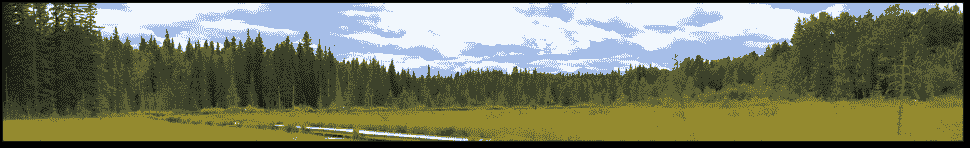

加拿大艾伯塔省 Hinton 附近的黑云杉森林，贾斯珀国家公园东部，图片来自 https://en.wikivoyage.org/wiki/Hinton。

现在我们来介绍基于决策树的集成树、树袋和随机森林构建。首先，我提供一些决策树和集成方法的基础概念。

+   如果你不太熟悉决策树，回顾一下[决策树章节](https://geostatsguy.github.io/MachineLearningDemos_Book/MachineLearning_decision_tree.html)可能是个好主意。

## 树模型公式

预测特征空间被分割成 $J$ 个穷尽且互斥的区域 $R_1, R_2, \ldots, R_J$。对于给定的预测案例 $x_1,\ldots,x_m \in R_j$，预测为：

**回归** – 区域 $R_j$ 中训练数据的平均值

$$ \hat{y} = \frac{1}{|R_j|} \sum_{\mathbf{x}_i \in R_j} y_i $$

其中 $\hat{y}$ 是输入 $\mathbf{x}$ 的预测值，$R_j$ 是 $\mathbf{x}$ 落入的区域（叶节点），$|R_j|$ 是区域 $R_j$ 中训练样本的数量，$y_i$ 是这些训练样本在 $R_j$ 中的实际目标值。

**分类** – 区域 $R_j$ 中训练案例多数（最常见案例）的类别：

$$ \hat{y} = \arg\max_{c \in C} \left( \frac{1}{|R_j|} \sum_{\mathbf{x}_i \in R_j} \mathbb{1}(y_i = c) \right) $$

其中 $C$ 是所有可能类别的集合，$\mathbb{1}(y_i = c)$ 是指示变换，若 $y_i = c$ 则为 1，否则为 0，$|R_j|$ 是区域 $R_j$ 中训练样本的数量，$\hat{y}$ 是预测的类别标签。

预测空间，$𝑋_1,\ldots,𝑋_𝑚$，被分割成$J$个互斥且穷尽的区域，$R_j, j = 1,\ldots,J$，其中区域为，

+   **互斥** – 任何预测特征 $x_1,\ldots,x_𝑚$ 的组合只属于单个区域 $R_j$

+   **穷尽** – 所有预测特征值的组合都属于一个区域，$R_j$，即所有区域，$R_j, j = 1,\ldots,J$，覆盖整个预测特征空间

所有落在同一区域 $R_j$ 中的预测案例 $x_1,\ldots,x_m$ 都用相同的值进行估计。

+   预测模型在区域边界处本质上是不连续的

例如，考虑这个决策树预测模型，用于从孔隙率 $X_1$ 预测生产响应特征 $\hat{Y}$，

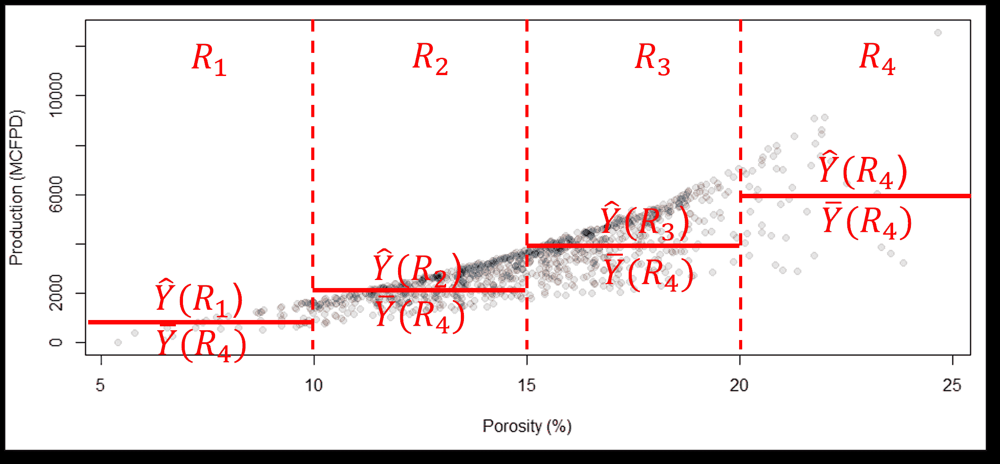

四区域决策树与数据和预测，$\hat{Y}(R_j) = \overline{Y}(R_j)$ 按区域 $R_j, j=1,…,4$ 计算。例如，给定一个孔隙率为 13% 的预测特征值，模型预测产量约为 2,000 MCFPD。

我们如何分割预测特征空间？

+   基于分层、二分分割的区域集合。

## 树损失函数

对于回归树，我们最小化残差平方和，对于分类树，我们最小化加权平均基尼不纯度。

剩余平方和（RSS）衡量回归树中实际值与预测值之间的总平方差，

$$ \text{RSS} = \sum_{j=1}^{J} \sum_{i \in R_j} (y_i - \hat{y}_{R_j})² $$

其中 $J$ 是树中区域的总数，$R_j$ 是 $j$ 区域，$y_i$ 是 $i$ 个训练数据中响应特征的真值，$\hat{y}_{R_j}$ 是区域 $R_j$ 的预测值，即 $y_i \; \forall \; i \in R_j$ 的平均值。

当一个父节点分裂成两个子节点（t_L）和（t_R）时，加权基尼不纯度为：

$$ \text{Gini}_{\text{total}} = \sum_{j=1}^{J} \frac{N_j}{N} \cdot \text{Gini}(j) $$

其中 $J$ 是树中区域的总数，$N$ 是数据集中样本的总数，$N_j$ 是叶子节点 $j$ 中的样本数，$\text{Gini}(j)$ 是叶子节点 $j$ 的基尼不纯度。

单个决策树节点的基尼不纯度计算如下，

$$ \text{Gini}(j) = 1 - \sum_{c=1}^{C} p_{j,c}² $$

其中 $p_{j,c}$ 是节点 $j$ 中类别 $c$ 样本的比例。

对于分类，我们的损失函数不比较预测值与真值，就像我们的回归损失一样！

+   基尼不纯度惩罚训练数据类别混合！所有类别为单一类别的训练数据区域将具有基尼不纯度为 0，以贡献整体损失。

注意，按区域计算的基尼不纯度是，

+   **加权** - 由每个区域中的训练数据数量决定，具有更多训练数据的区域对整体损失有更大的影响

+   **平均** - 在所有区域上计算决策树的总基尼不纯度

这些损失在以下过程中计算，

+   **树模型训练** - 与训练数据相关，用于生长树

+   **树模型调整** - 与保留的测试数据相关，以选择最佳树复杂度。

让我们先谈谈树模型训练，然后再谈树模型调整。

## 训练树模型

我们如何计算这些互斥、穷尽的区域？这是通过预测特征空间的分层二分分割来实现的。

训练决策树模型是，

1.  分配互斥、穷尽的区域

1.  构建决策树时，每个区域都是一个终端节点，也称为叶子节点

这些是同一件事！让我们列出步骤，然后通过训练一个树来演示这一点。

1.  **将所有数据分配到单个区域** - 这个区域覆盖了整个预测特征空间

1.  **扫描所有可能的分割** - 在所有区域和所有特征上

1.  **选择最佳分割** - 这是贪婪优化，即最佳分割最小化了所有训练数据 $y_i$ 在所有区域 $j = 1,\ldots,J$ 上的残差平方和。

1.  **迭代直到过度拟合** - 返回步骤 1 进行下一个分割，直到树过度拟合。

为了简洁，我们在这里停止，并做出以下观察，

+   层次化、二分分割与顺序构建决策树相同，每次分割都会添加一个新的决策节点，并将叶节点数量增加一个。

+   简单的决策树在复杂的决策树中，即如果我们构建一个$8$个叶节点的模型，我们通过顺序移除决策节点，以最后一个移除的顺序，得到$8, 7, \ldots, 2$个叶节点的模型。

+   最终过度拟合的模型是叶节点数等于训练数据数。在这种情况下，训练误差为 0.0，因为每个训练数据有一个区域，我们使用训练数据的响应特征值来估计所有这些训练数据案例。

## 调整树模型

为了调整决策树，我们采用非常过度拟合的树模型，

+   顺序地切割最后一个决策节点

+   即，剪枝决策树的最后一个分支。

因为简单的树在复杂的树内部！

我们可以在剪枝和选择具有最小测试误差的树时计算测试误差

我们过度拟合决策树模型，具有大量的叶节点，然后我们减少叶节点数，同时跟踪测试误差。

+   我们选择使测试误差最小的叶节点数。

+   由于我们是顺序地移除最后一个分支以简化树，所以我们称决策树的模型调整为**剪枝**。

让我们讨论决策树超参数。我更喜欢将叶节点数作为我的决策树超参数，因为它提供了，

+   **连续、均匀的复杂度增加** - 复杂度增加的步长相等，没有跳跃。

+   **直观的复杂度控制** - 我们可以理解和关联$2, 3, \ldots, 100$个叶节点的决策树。

+   **灵活的复杂度** - 树可以自由地以任何方式生长以减少训练误差，包括高度不对称的决策树

其他常见的决策树超参数包括，

+   **最小减少的 RSS** – 与增量增加复杂度必须通过足够的训练误差减少来抵消的想法相关。这可能导致模型提前停止，例如，训练误差减少较小的分割可能导致后续分割有更大的训练误差减少

+   **每个区域的最小训练数据数** – 与按区域估计的准确性概念相关，即我们需要至少$n$个数据来获得可靠的均值和最常见的类别。

+   **最大层数** – 强制对称树，到达每个叶节点的分割数相似。模型复杂度随着超参数的变化而大幅变化。

## 集成方法

我们的预测机器学习模型的测试准确率是多少？

回忆一下预期测试误差的方程有三个组成部分。

$$ \mathbb{E}\left[(y_0 - \hat{f}(x_1⁰, \ldots, x_m⁰))²\right] = \left(\mathbb{E}[\hat{f}(x_1⁰, \ldots, x_m⁰)] - f(x_1⁰, \ldots, x_m⁰)\right)² + \mathbb{E}\left[\left(\hat{f}(x_1⁰, \ldots, x_m⁰) - \mathbb{E}[\hat{f}(x_1⁰, \ldots, x_m⁰)]\right)²\right] + \sigma_\varepsilon² $$

可以标记为：

$$ \text{Expected Test Error} = \text{Model Bias}² + \text{Model Variance} + \text{Irreducible Error} $$

其中，

+   **模型方差** - 是由于对数据的敏感性导致的模型预测误差，即如果我们使用了不同的训练数据会怎样？

+   **模型偏差** - 是由于使用近似模型/模型过于简单导致的模型预测误差

+   **不可减少误差** - 是由于缺少特征和样本数量有限导致的模型预测误差，无法通过建模/整个特征空间未采样来修复

现在，我们可以将模型方差和偏差权衡可视化，

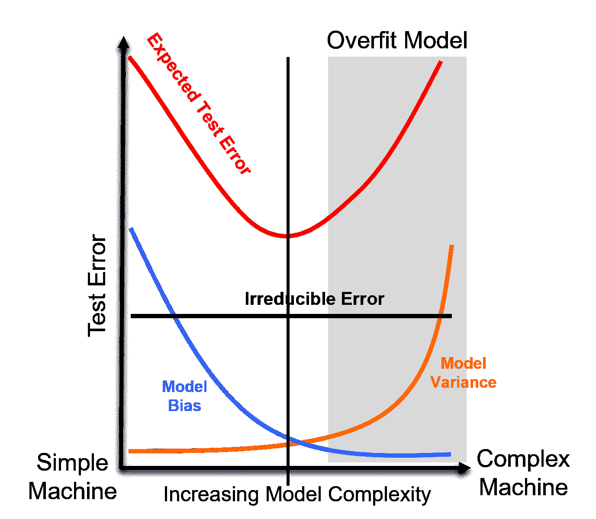

模型方差和偏差权衡，适用于从简单到复杂的预测机器学习模型。

模型方差限制了我们的模型复杂性和文本准确性。

**如何减少模型方差？** - 以便我们可以使用更复杂和更准确的模型。

通过平均标准误差，我们观察到通过平均来减少方差！

$$ \sigma_{\bar{x}}² = \frac{\sigma²_s}{n} $$

其中 $\sigma²_s$ 是样本方差，$n$ 是样本数量，$\sigma_{\bar{x}}²$ 是在独立同分布采样假设下的平均方差。

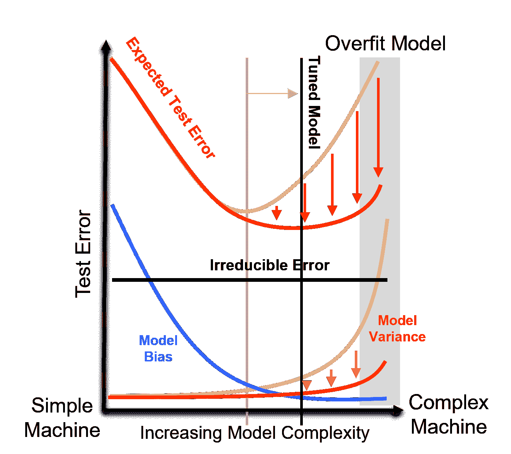

模型方差和偏差权衡，对于简单到复杂的预测机器学习模型，通过平均减少模型方差。

我们可以通过计算多个估计值并将它们平均在一起来减少模型方差。我们需要进行 $B$ 个估计，

$$ \hat{y}^{(b)} = \hat{f}^{(b)}(X_1, \ldots, X_m), \quad b = 1, \ldots, B $$

其中，

$\hat{y}^{(b)}$ 是集成中第 $b$ 个模型的预测，$\hat{f}^{(b)}$ 是第 $b$ 个估计量，$X_1, \ldots, X_m$ 是预测特征，$B$ 是估计量的总数（多个模型）。

然后我们的最终估计将是我们的估计的平均值（回归）或多数（分类），

+   回归集成估计，

$$ \hat{y} = \frac{1}{B} \sum_{b=1}^{B} \hat{y}^{(b)} $$

+   分类集成估计，

$$ \hat{y} = \arg\max_y \sum_{b=1}^{B} \mathbb{I}(\hat{y}^{(b)} = y) $$

这需要多个预测模型，$f^{b}, b = 1,\ldots, B$ 来进行 $B$ 个预测，

$$ \hat{y}^{(b)} = \hat{f}^{(b)}(X_1, \ldots, X_m), \quad b = 1, \ldots, B $$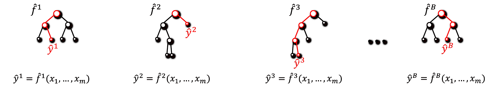

通过多个模型进行多个预测，通过在集成中平均来减少模型方差。

但我们只能访问单个数据集，$Y,X_1,\ldots,X_m$；因此，每个模型都将相同，

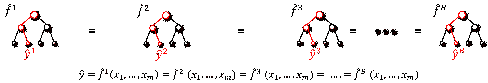

使用多个模型进行多次预测，通过在集成中平均来减少模型方差，使用相同的数据得到相同的模型和相同的预测。

我们的模式通常是确定性的，使用相同的数据和超参数进行训练，我们得到相同的估计。

## 自举

不确定性的一个来源是数据量不足。

+   这些 200 多个井是否提供了精确（和准确的估计）的均值？标准差？偏度？P13？

+   例如，孔隙率平均值的不确定性（例如，$20\% \pm 2\%$）有什么影响？

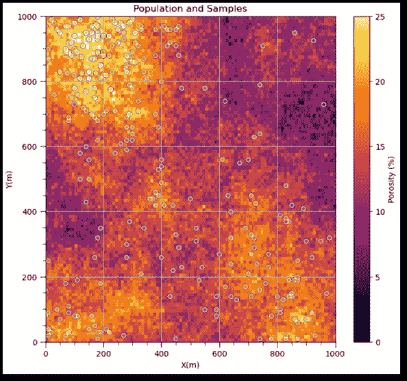

样本和总体，来自 Python 地球统计学电子书中的 Bootstrap 章节。

假设我们拥有 $L$ 个不同的数据集？$L$ 个平行宇宙，我们从无法触及的真相（总体）中收集 $n$ 个样本。

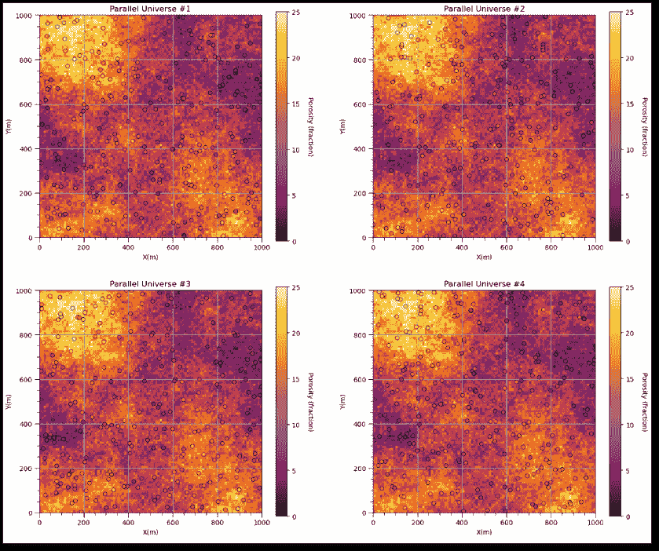

从 Bootstrap 章节的 Python 地球统计学电子书中的真实总体中获取的多个数据集实现。

+   但我们只存在于一个宇宙 $\rightarrow$ 这是不可能的。

我们不是从数据集中有放回地抽取 $n$ 次，而是

+   数据的自举实现

由于某些样本被遗漏而其他样本被多次抽取而有所不同。

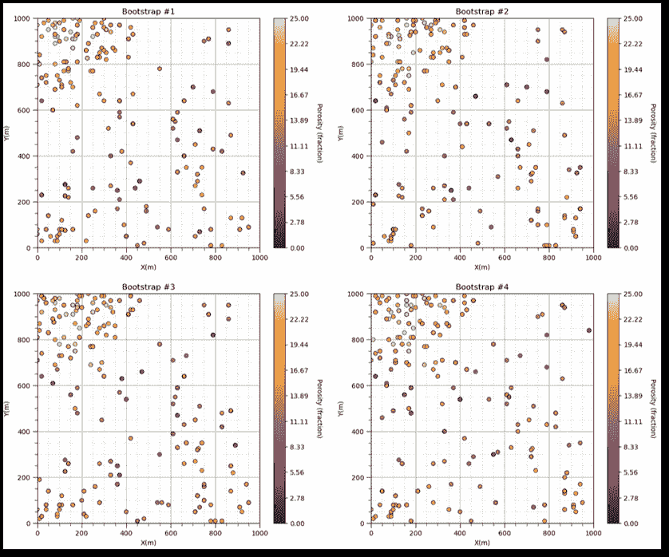

多个数据集的自举数据集。

现在，这里是一个自举的定义，

+   通过重复随机抽样（有放回模拟抽样过程以获取数据集实现）来评估样本统计量不确定性的方法

在这些假设下，

+   **足够的样本** - 有足够的数据来推断总体参数。自举不能弥补数据过少的问题！

+   **代表性抽样** - 样本中的偏差将传递到自举不确定性模型中，例如，如果样本中的均值有偏差，那么自举不确定性模型将基于样本中的偏差均值进行中心化。我们必须首先消除数据的偏差。

自举也有各种局限性，包括，

+   **平稳性** - 假设样本的统计量在模型空间中是恒定的

+   **仅一个不确定性来源** - 只考虑样本过少导致的不确定性，例如，不考虑数据变化导致的不确定性

+   **不考虑感兴趣的区域** - 模型区域较大或较小，自举不确定性不会改变。

+   **样本之间的独立性** - 不考虑样本之间的相关性，关系

+   **无局部条件** - 不考虑其他局部信息来源

我们可以将所有这些局限性总结为，自举不考虑数据的空间（或时间）背景。

+   存在一种自举形式，称为空间自举，它确实考虑了空间背景，[空间自举和集成机器学习的 bagging](https://www.sciencedirect.com/science/article/pii/S0098300424000414)。

让我们可视化使用 $n=10$ 个来自 10 口井的观测值计算样本均值估计的最终可采储量（EUR）的不确定性的自助法。

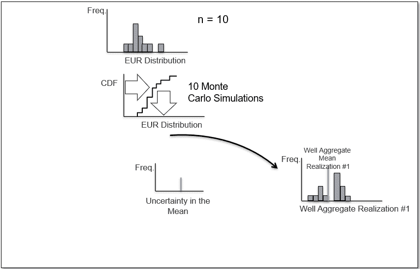

$n = 10$ 个有放回样本以计算样本均值的一个实现。

现在我们重复并计算样本均值的第二次实现，

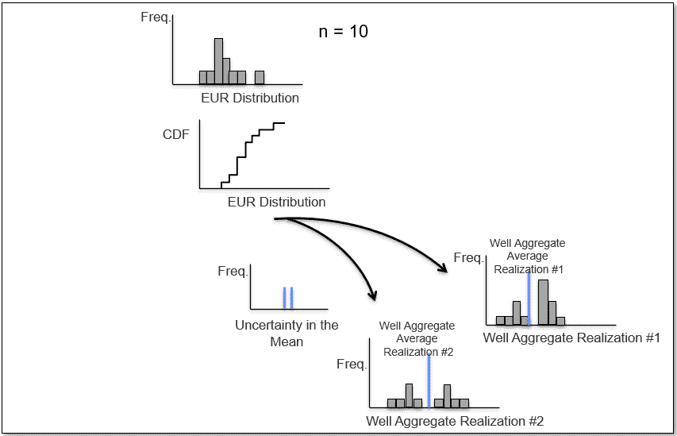

第二次重复 $n = 10$ 个有放回样本以计算样本均值的第二次实现。

并使用第三个数据实现来计算样本均值的第三次实现，

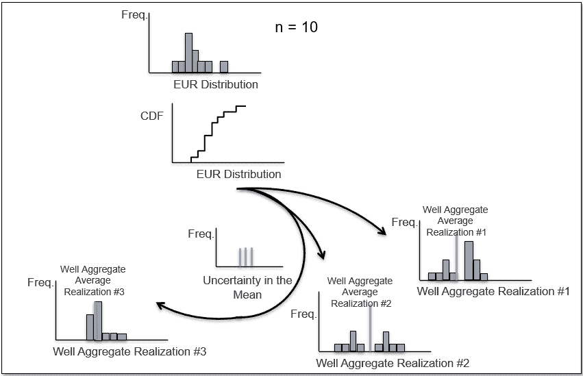

第三次重复 $n = 10$ 个有放回样本以计算样本均值的第三次实现。

如果我们重复 $L$ 次，我们将采样完整分布以计算样本均值的不确定性。

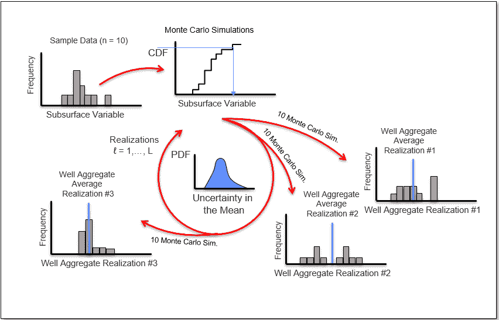

$L$ 个数据实现，以完全采样均值的不确定性。

让我们总结一下自助法，

+   由 [Efron, 1982](https://epubs.siam.org/doi/pdf/10.1137/1.9781611970319.fm) 开发

+   统计重采样过程，用于从数据本身计算计算统计的不确定性。

+   似乎是不可能的，但继续与标准误差等已知情况进行比较，你会发现它是有效的，

$$ \sigma_{\bar{x}}² = \frac{\sigma²_s}{n} $$

其中 $\sigma²_s$ 是样本方差，$n$ 是样本数量，$\sigma_{\bar{x}}²$ 是在独立、同分布采样假设下的平均方差。

+   可用于计算任何统计的不确定性，例如，第 $13$ 百分位数、偏度等。

+   高级形式考虑空间信息和策略（博弈论）。

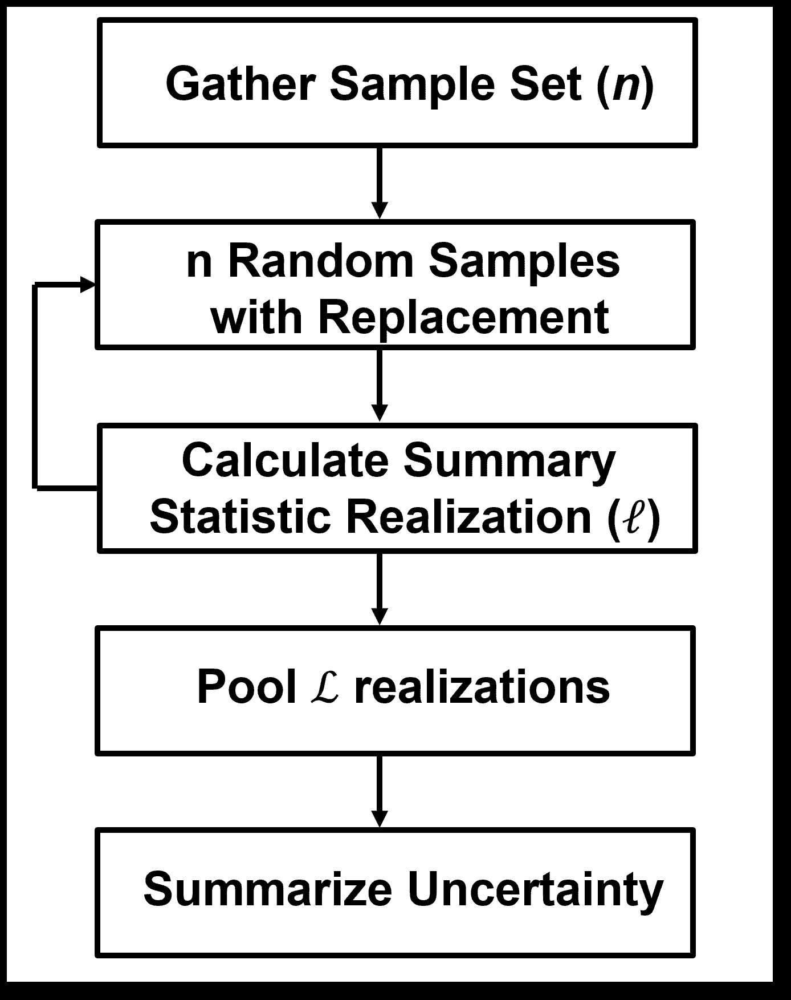

自助法的一般流程图。

## 自助法模型

机器学习中的自助法模型应用自助法，

+   计算数据的多个实现

+   训练模型的多个实现

+   计算估计的多个实现

+   平均估计以减少模型方差

这是自助法模型的流程图，

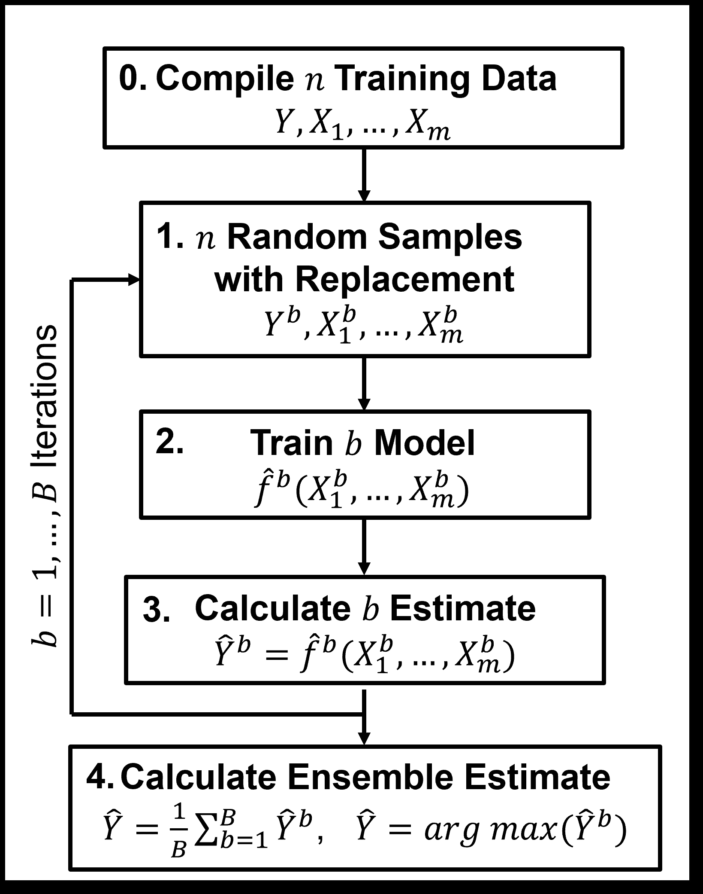

自助法机器学习模型流程图。

1.  应用统计自助法以获得数据的多个实现，

$$ Y^b, X_1^b, \dots, X_m^b,\quad b = 1, \dots, B $$

1.  为每个数据实现训练预测模型（估计器），

$$ \hat{f}^b(X_1^b, \dots, X_m^b) $$

1.  使用每个估计器进行预测，

$$ \hat{Y}^b = \hat{f}^b(X_1^b, \dots, X_m^b) $$

1.  对估计器的 $B$ 个预测进行聚合，

+   **回归** – 使用平均值聚合集成预测，

$$ \hat{Y} = \frac{1}{B} \sum_{b=1}^{B} \hat{Y}^b $$

+   **分类** – 使用多数规则、多数投票聚合集成预测，

$$ \hat{Y} = \arg\max(\hat{Y}^b) $$

我为[打包线性回归](https://github.com/GeostatsGuy/DataScienceInteractivePython/blob/main/Interactive_Bootstrap_Bagging.ipynb)构建了一个交互式的 Python 仪表板。

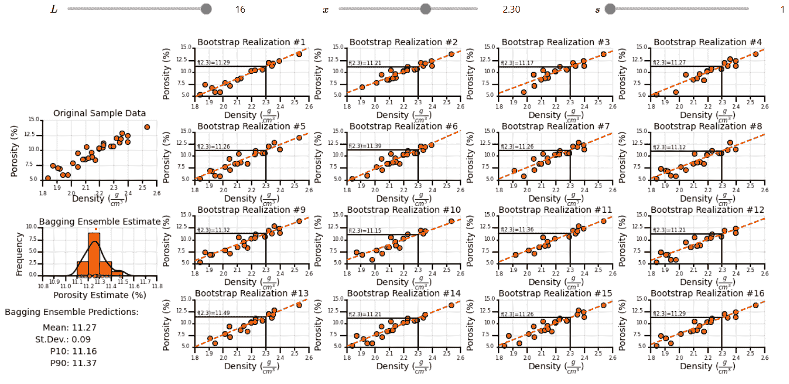

使用线性回归进行交互式机器学习打包，16 个数据自助法，通过平均聚合模型和预测实现。

## 打包模型的训练和调整

什么是打包回归模型？

每个模型都在不同的自助数据实现上训练，所有模型都具有相同的超参数（s）。

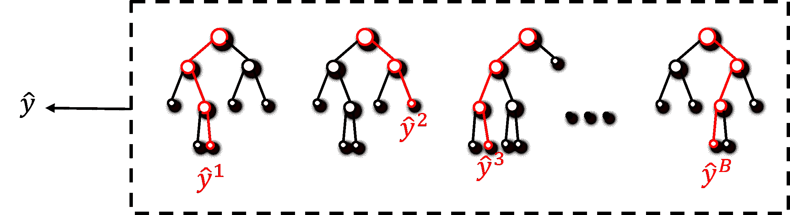

打包模型，我们分别训练，但我们调整的是集成。

打包预测，$\hat{y}$，单个估计器的总和，是这个模型的输出。

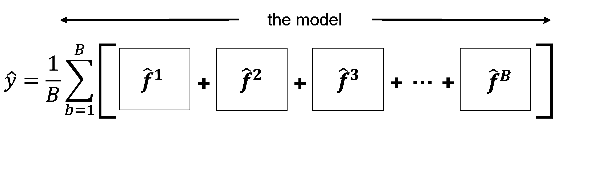

通过平均多个预测模型进行打包回归预测。

或者对于分类，


通过多数投票法对多个预测模型的分类预测进行打包。

每个模型，在模型集成的估计器中被称为估计器，在训练期间使用它们各自的靴层数据实现进行训练，在训练期间，每个模型都最小化单个估计器的靴层数据实现的训练误差，回归的残差平方和，

$$ \text{RSS} = \sum_{j=1}^{J} \sum_{i \in R_j} (y_i - \hat{y}_{R_j})² $$

以及分类的基尼不纯度，

$$ \text{Gini}_{\text{total}} = \sum_{j=1}^{J} \frac{N_j}{N} \cdot \text{Gini}(j) $$

每个估计器都是单独训练的，但它们共享相同的超参数。

这提供了构建最适合每个自助数据集的最佳模型的灵活性。

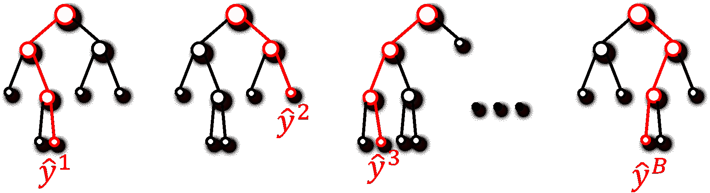

集成模型中的估计器是单独训练的，但共享相同的超参数（s）。

对于回归的情况，我们通过聚合估计集的估计值来调整我们的打包模型，以减少打包估计的错误，

$$ \text{MSE} = \sum_{i=1}^{n} (\hat{y}_i - y_i)² $$

其中预测值 $\hat{y}_i$ 由以下给出：

$$ \hat{y}_i = \frac{1}{B} \sum_{b=1}^{B} \hat{y}_i^{(b)} $$

我们对所有估计器联合调整集成，我们不考虑集成中单个模型估计器的误差，$\hat{y}_i^𝑏 - y_i$，在模型调整中。

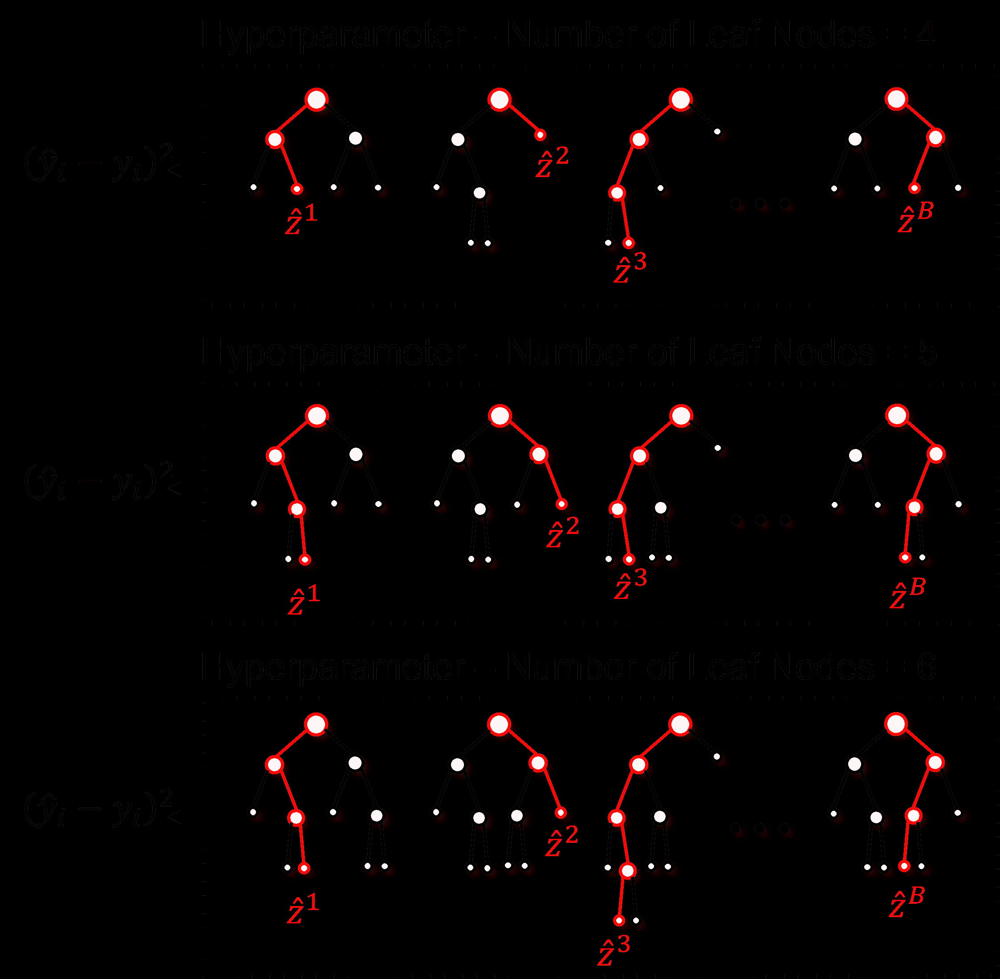

模型集成中的估计器共享相同数量的叶节点超参数。

结果是每个超参数设置的单个测试误差度量，对于上述叶节点数量的情况，我们得到这个结果，

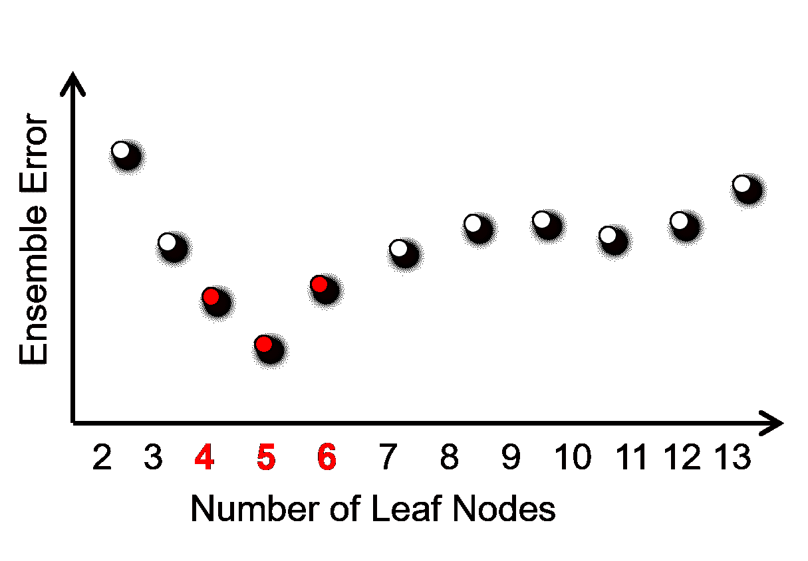

集成测试误差与叶节点超参数数量。

为了选择最小化测试误差的集成超参数。为了清晰起见，让我们将调整添加到我们之前的训练打包模型的工作流程中，

+   我们遍历超参数

+   最小化集成估计的测试误差

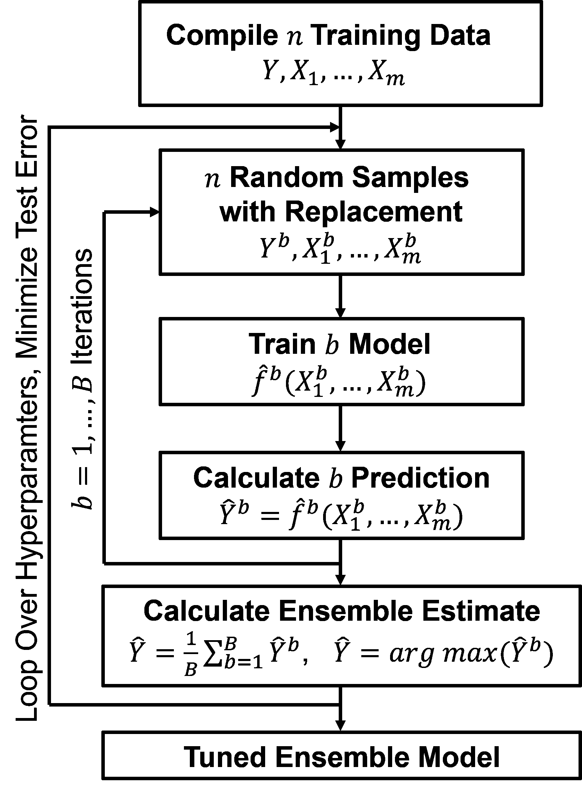

调整袋装模型的流程。

## 袋外交叉验证

在期望中，每次自举数据实现 $b^c$ 中有 $\frac{1}{3}$ 的训练数据被排除在外；因此，交叉验证是内置的。

1.  用替换法抽取训练数据的 $\frac{2}{3}$（在期望中），$Y^b, X_1^b, \dots, X_m^b$。

1.  使用 $\frac{2}{3}$ 的训练数据（在期望中）训练估计器。

1.  在袋外样本上进行预测，$X_1^{b^c}, \dots, X_m^{b^c}$，$\frac{1}{3}$ 的训练数据（在期望中）。

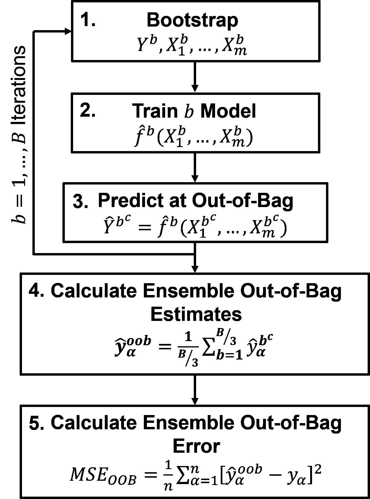

袋外错误计算工作流程，将其应用于超参数调整循环。

1.  将所有 $B$ 个模型中每个样本数据的 $\frac{B}{3}$ 预测（在期望中）汇总，并对回归进行袋外预测，

$$ \hat{y}_\alpha^{\text{oob}} = \frac{1}{\left(\frac{B}{3}\right)} \sum_{b=1}^{\frac{B}{3}} \hat{y}_\alpha^{(b^c)} $$

计算袋外错误以评估模型性能。

$$ \text{MSE}_{\text{OOB}} = \frac{1}{n} \sum_{\alpha=1}^{n} \left[\hat{y}_\alpha^{\text{oob}} - y_\alpha \right]² $$

## 估计器数量

估计器的数量是袋装模型的一个重要超参数

+   **更多估计器** – 在一定程度上提高泛化能力，增加树的数量通常可以提高性能并减少方差，因为预测是在更多模型上平均的。

+   **收益递减** - 超过某个点后，添加更多估计器只会带来很少或没有改进，并且只会增加计算成本。

+   **提高稳定性** - 更多的树减少了过度拟合到训练集中随机噪声的可能性。

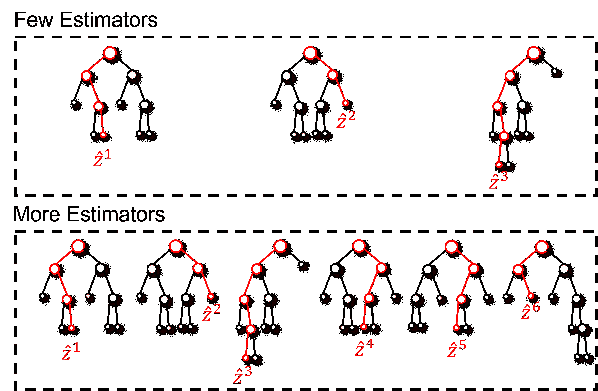

估计器数量，在集成模型中较少（上方）和较多（下方）。

## 估计器复杂性

估计器共享的超参数仍然作为重要的超参数。以下是一些关于树袋的指导，

+   **更复杂的模型** – 袋装可以降低模型方差，因此我们通常为集成训练更复杂的模型。

+   **过于简单的模型** – 可能不会从袋装中看到任何改进，因为对于简单模型来说，模型方差不是一个问题，也不需要降低。

+   **特征交互** – 更复杂的模型可以捕捉到更多特征之间的交互，例如，树深度为 $d$ 的树袋模型可以捕捉 $d$ 方特征交互

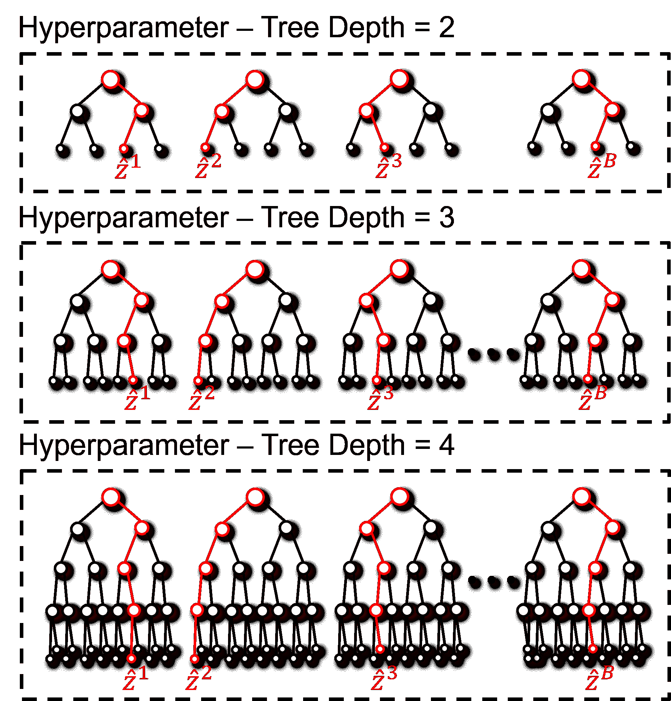

具有不同的树深度超参数的集成，2（上方），3（中间）和 4（下方）。

## 树袋

现在让我们总结一下这种方法，

+   使用数据的多个自举实现构建决策树集成。

并提供一些指导，

+   树估计器的集成降低了模型方差

+   在整个集成模型上超参数调整，即集成中的所有树都具有相同的超参数。

+   除了树估计量的复杂性之外，估计量数量是另一个重要的超参数。

+   在期望上，每棵树不使用 $ \frac{1}{3} $ 的数据，这提供了访问袋外样本进行交叉验证的机会，因此我们可以一次性构建模型并进行交叉验证，无需进行训练和测试分割。

+   由于在估计量上平均，过生长的树通常优于简单的树，因为模型方差减少。

揭示警报——我们希望树不相关，多样化以最大化模型方差的减少，这导致了随机森林。关于这一点稍后还会详细介绍。

为了可视化树袋装，这里有一个手动树袋装的例子，6 个估计量来自数据的自举实现，预测孔隙率和脆性，所有估计量的平均值作为袋装模型。

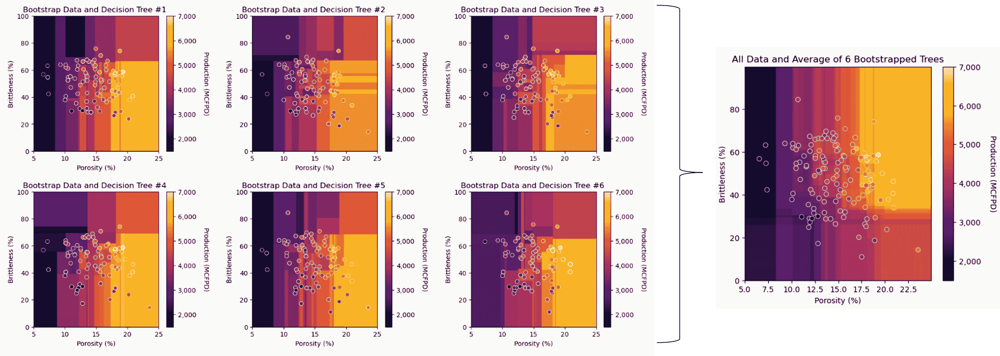

6 个自举的复杂决策树（左）和袋装模型，所有 6 个模型的平均值（右）。

观察随着树的数量增加对预测模型的影响——从非连续预测模型到连续预测模型的转变！

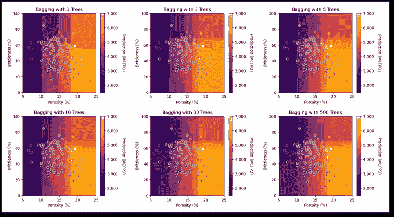

6 个树袋装预测模型和所有训练数据，随着估计量数量的增加，对于 1、3、5、10、30 和 500 棵树。

观察随着树的数量增加交叉验证中测试精度的提高，

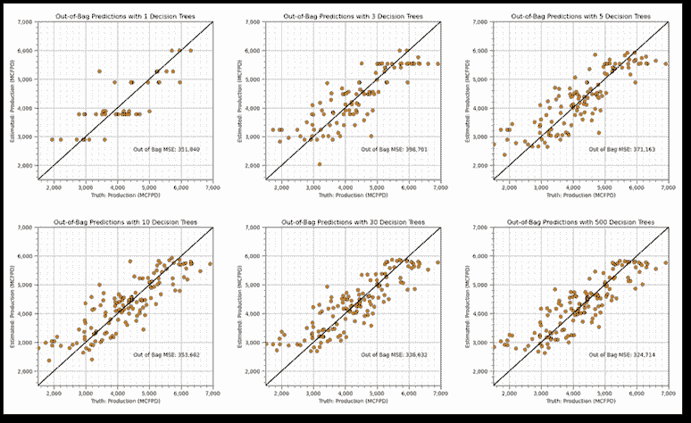

使用 6 个树袋装预测模型进行交叉验证，树的数量逐渐增加。

观察随着树的数量增加模型方差的减少，

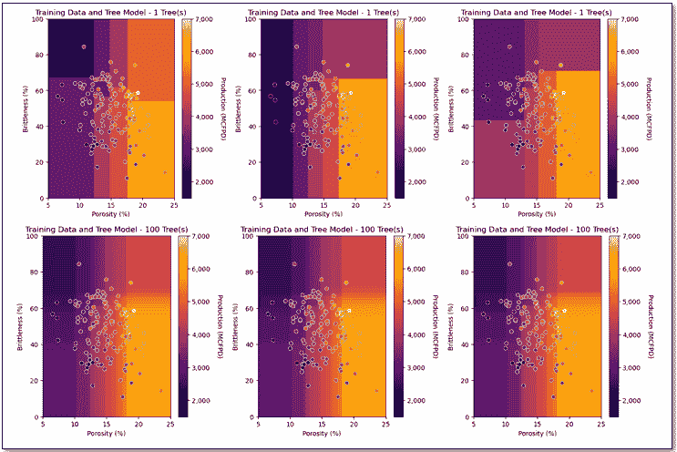

3 个模型，1 棵和 100 棵树，以展示随着集成聚合增加模型方差的减少。

## 随机森林

树袋装的一个局限性是单个树可能高度相关。

+   这发生在存在主导预测特征时，因为它将始终应用于顶部分割（s），结果是集成中的所有树都非常相似（即相关）

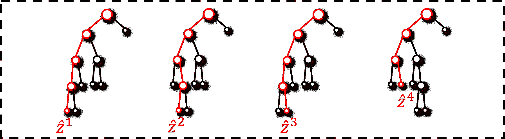

在树袋装集成模型中高度相关的树，具有相同初始分割的树导致非常相似的预测。

与高度相关的树相比，使用集成模型时模型方差减少的幅度显著较小，

+   考虑到平均标准误差假设样本 $𝑛$ 是独立的！

$$ \sigma_{\bar{x}}² = \frac{\sigma_s²}{n} $$

样本之间的相关性减少了 $𝑛$ 到 $𝑛$ 有效，随着相关性的增加，$n$ 有效减少。

随机森林是树袋装，但对于每个分割，只有 $𝑚$ 个可用预测因子中的子集 $𝑝$ 是分割的候选者（随机选择）。

$$ p \ll m $$

这迫使集成中的每棵树以不同的方式进化，

分类中 $𝑝$ 的常见默认值，

$$ p = \sqrt{m} \quad \text{或} \quad \log_2(p) $$

对于回归，

$$ p=\frac{m}{3} $$

较低的$p$值降低相关性，更好的泛化能力，较高的$p$值增加相关性，可能过拟合。注意，$p$值过低会导致欠拟合，模型偏差高

这里有一个用于先前预测问题的随机森林模型示例，

+   300 棵树，训练到最大深度为$7$，$𝑝=1$，即每个分割随机选择 1 个预测特征

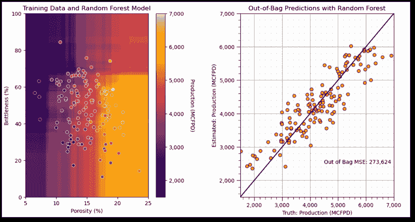

在树袋集成模型中高度相关的树，具有相同初始分割的树产生非常相似的预测。

现在我们准备演示树袋和随机森林。

## 加载所需的库

我们还需要一些标准包。这些应该已经与 Anaconda 3 一起安装。

```py
%matplotlib inline                                         
suppress_warnings = True
import os                                                     # to set current working directory 
import math                                                   # square root operator
import numpy as np                                            # arrays and matrix math
import scipy.stats as st                                      # statistical methods
import pandas as pd                                           # DataFrames
import matplotlib.pyplot as plt                               # for plotting
from matplotlib.ticker import (MultipleLocator,AutoMinorLocator,FuncFormatter) # control of axes ticks
from matplotlib.colors import ListedColormap                  # custom color maps
import seaborn as sns                                         # for matrix scatter plots
from sklearn.tree import DecisionTreeRegressor                # decision tree method
from sklearn.ensemble import BaggingRegressor                 # bagging tree method
from sklearn.ensemble import RandomForestRegressor            # random forest method
from sklearn.tree import _tree                                # for accessing tree information
from sklearn import metrics                                   # measures to check our models
from sklearn.preprocessing import StandardScaler              # standardize the features
from sklearn.tree import export_graphviz                      # graphical visualization of trees
from sklearn.model_selection import (cross_val_score,train_test_split,GridSearchCV,KFold) # model tuning
from sklearn.pipeline import (Pipeline,make_pipeline)         # machine learning modeling pipeline
from sklearn import metrics                                   # measures to check our models
from sklearn.model_selection import cross_val_score           # multi-processor K-fold crossvalidation
from sklearn.model_selection import train_test_split          # train and test split
from IPython.display import display, HTML                     # custom displays
cmap = plt.cm.inferno                                         # default color bar, no bias and friendly for color vision defeciency
plt.rc('axes', axisbelow=True)                                # grid behind plotting elements
if suppress_warnings == True:  
    import warnings                                           # suppress any warnings for this demonstration
    warnings.filterwarnings('ignore') 
seed = 13                                                     # random number seed for workflow repeatability 
```

如果您遇到包导入错误，您可能首先需要安装其中的一些包。这通常可以通过在 Windows 上打开命令窗口然后输入‘python -m pip install [package-name]’来完成。有关相应包的更多帮助，请参阅各自的包文档。

## 声明函数

让我们定义几个函数来简化相关矩阵的绘制和决策、提升树和随机森林回归模型的可视化。

```py
def comma_format(x, pos):
    return f'{int(x):,}'

def feature_rank_plot(pred,metric,mmin,mmax,nominal,title,ylabel,mask): # feature ranking plot
    mpred = len(pred); mask_low = nominal-mask*(nominal-mmin); mask_high = nominal+mask*(mmax-nominal); m = len(pred) + 1
    plt.plot(pred,metric,color='black',zorder=20)
    plt.scatter(pred,metric,marker='o',s=10,color='black',zorder=100)
    plt.plot([-0.5,m-1.5],[0.0,0.0],'r--',linewidth = 1.0,zorder=1)
    plt.fill_between(np.arange(0,mpred,1),np.zeros(mpred),metric,where=(metric < nominal),interpolate=True,color='dodgerblue',alpha=0.3)
    plt.fill_between(np.arange(0,mpred,1),np.zeros(mpred),metric,where=(metric > nominal),interpolate=True,color='lightcoral',alpha=0.3)
    plt.fill_between(np.arange(0,mpred,1),np.full(mpred,mask_low),metric,where=(metric < mask_low),interpolate=True,color='blue',alpha=0.8,zorder=10)
    plt.fill_between(np.arange(0,mpred,1),np.full(mpred,mask_high),metric,where=(metric > mask_high),interpolate=True,color='red',alpha=0.8,zorder=10)  
    plt.xlabel('Predictor Features'); plt.ylabel(ylabel); plt.title(title)
    plt.ylim(mmin,mmax); plt.xlim([-0.5,m-1.5]); add_grid();
    return

def plot_corr(corr_matrix,title,limits,mask):                 # plots a graphical correlation matrix 
    my_colormap = plt.get_cmap('RdBu_r', 256)          
    newcolors = my_colormap(np.linspace(0, 1, 256))
    white = np.array([256/256, 256/256, 256/256, 1])
    white_low = int(128 - mask*128); white_high = int(128+mask*128)
    newcolors[white_low:white_high, :] = white                # mask all correlations less than abs(0.8)
    newcmp = ListedColormap(newcolors)
    m = corr_matrix.shape[0]
    im = plt.matshow(corr_matrix,fignum=0,vmin = -1.0*limits, vmax = limits,cmap = newcmp)
    plt.xticks(range(len(corr_matrix.columns)), corr_matrix.columns); ax = plt.gca()
    ax.xaxis.set_label_position('bottom'); ax.xaxis.tick_bottom()
    plt.yticks(range(len(corr_matrix.columns)), corr_matrix.columns)
    plt.colorbar(im, orientation = 'vertical')
    plt.title(title)
    for i in range(0,m):
        plt.plot([i-0.5,i-0.5],[-0.5,m-0.5],color='black')
        plt.plot([-0.5,m-0.5],[i-0.5,i-0.5],color='black')
    plt.ylim([-0.5,m-0.5]); plt.xlim([-0.5,m-0.5])

def add_grid():
    plt.gca().grid(True, which='major',linewidth = 1.0); plt.gca().grid(True, which='minor',linewidth = 0.2) # add y grids
    plt.gca().tick_params(which='major',length=7); plt.gca().tick_params(which='minor', length=4)
    plt.gca().xaxis.set_minor_locator(AutoMinorLocator()); plt.gca().yaxis.set_minor_locator(AutoMinorLocator()) # turn on minor ticks 

def visualize_model(model,xfeature,x_min,x_max,yfeature,y_min,y_max,response,z_min,z_max,clabel,xlabel,ylabel,title):# plots the data points and model 
    xplot_step = (x_max - x_min)/300.0; yplot_step = (y_max - y_min)/300.0 # resolution of the model visualization
    xx, yy = np.meshgrid(np.arange(x_min, x_max, xplot_step), # set up the mesh
                     np.arange(y_min, y_max, yplot_step))
    Z = model.predict(np.c_[xx.ravel(), yy.ravel()])          # predict with our trained model over the mesh
    Z = Z.reshape(xx.shape)
    im = plt.imshow(Z,interpolation = None,aspect = "auto",extent = [x_min,x_max,y_min,y_max], vmin = z_min, vmax = z_max,cmap = cmap)
    if (type(xfeature) != str) & (type(yfeature) != str):
        plt.scatter(xfeature,yfeature,s=None, c=response, marker=None, cmap=cmap, norm=None, vmin=z_min, vmax=z_max, alpha=1.0, 
                    linewidths=0.6, edgecolors="white")
        plt.xlabel(xlabel); plt.ylabel(ylabel)
    else:
        plt.xlabel(xlabel); plt.ylabel(ylabel)
    plt.title(title)                                          # add the labels
    plt.xlim([x_min,x_max]); plt.ylim([y_min,y_max])
    cbar = plt.colorbar(im, orientation = 'vertical')         # add the color bar
    cbar.set_label(clabel, rotation=270, labelpad=20)
    cbar.ax.yaxis.set_major_formatter(FuncFormatter(comma_format))
    return Z

def visualize_grid(Z,xfeature,x_min,x_max,yfeature,y_min,y_max,response,z_min,z_max,clabel,xlabel,ylabel,title,):# plots the data points and the decision tree 
    n_classes = 10
    xplot_step = (x_max - x_min)/300.0; yplot_step = (y_max - y_min)/300.0 # resolution of the model visualization
    xx, yy = np.meshgrid(np.arange(x_min, x_max, xplot_step),
                     np.arange(y_min, y_max, yplot_step))
    cs = plt.contourf(xx, yy, Z, cmap=cmap,vmin=z_min, vmax=z_max, levels=np.linspace(z_min, z_max, 100))

    im = plt.scatter(xfeature,yfeature,s=None,c=response,marker=None,cmap=cmap,norm=None,vmin=z_min,vmax=z_max,alpha=1.0, 
                     linewidths=0.6, edgecolors="white")
    plt.title(title)
    plt.xlabel(xlabel)
    plt.ylabel(ylabel)
    cbar = plt.colorbar(im, orientation = 'vertical')
    cbar.set_label(clabel, rotation=270, labelpad=20)
    cbar.ax.yaxis.set_major_formatter(FuncFormatter(comma_format))

def check_model(model,y,ymin,ymax,ylabel,title): # get OOB MSE and cross plot a decision tree 
    oob_indices = np.setdiff1d(np.arange(len(y)), model.estimators_samples_)
    oob_y_hat = model.oob_prediction_[oob_indices]
    oob_y = y.values[oob_indices]
    MSE_oob = metrics.mean_squared_error(oob_y,oob_y_hat)
    plt.scatter(oob_y,oob_y_hat,s=None, c='darkorange',marker=None,cmap=cmap,norm=None,vmin=None,vmax=None,alpha=0.8, 
                linewidths=1.0, edgecolors="black")
    plt.title(title); plt.xlabel('Truth: ' + str(ylabel)); plt.ylabel('Estimated: ' + str(ylabel))
    plt.xlim(ymin,ymax); plt.ylim(ymin,ymax)
    plt.plot([ymin,ymax],[ymin,ymax],color='black'); add_grid()
    plt.annotate('Out of Bag MSE: ' + str(f'{(np.round(MSE_oob,2)):,.0f}'),[4500,2500])
    plt.gca().xaxis.set_major_formatter(FuncFormatter(comma_format))
    plt.gca().yaxis.set_major_formatter(FuncFormatter(comma_format))

def check_model_OOB_MSE(model,y,ymin,ymax,ylabel,title):      # OOB MSE and cross plot over multiple bagged trees, checks for unestimated 
    oob_y_hat = model.oob_prediction_
    oob_y = y[oob_y_hat > 0.0]; oob_y_hat = oob_y_hat[oob_y_hat > 0.0]; 
    MSE_oob = metrics.mean_squared_error(oob_y,oob_y_hat)
    plt.scatter(oob_y,oob_y_hat,s=None, c='darkorange',marker=None,cmap=cmap,norm=None,vmin=None,vmax=None,alpha=0.8, 
                linewidths=1.0, edgecolors="black")
    plt.title(title); plt.xlabel('Truth: ' + str(ylabel)); plt.ylabel('Estimated: ' + str(ylabel))
    plt.xlim(ymin,ymax); plt.ylim(ymin,ymax)
    plt.plot([ymin,ymax],[ymin,ymax],color='black'); add_grid()
    plt.annotate('Out of Bag MSE: ' + str(f'{(np.round(MSE_oob,2)):,.0f}'),[4500,2500])
    plt.gca().xaxis.set_major_formatter(FuncFormatter(comma_format))
    plt.gca().yaxis.set_major_formatter(FuncFormatter(comma_format))

def check_grid(grid,xmin,xmax,ymin,ymax,xfeature,yfeature,response,zmin,zmax,title): # plots the estimated vs. the actual 
    if grid.ndim != 2:
        raise ValueError("Prediction array must be 2D")
    ny, nx = grid.shape
    xstep = (xmax - xmin)/nx; ystep = (ymax-ymin)/ny 
    predict_train = feature_sample(grid, xmin, ymin, xstep, ystep, xfeature, yfeature, 'sample')
    MSE = metrics.mean_squared_error(response,predict_train)
    plt.scatter(response,predict_train,s=None, c='darkorange',marker=None,cmap=cmap,norm=None,vmin=None,vmax=None,alpha=0.8, 
                linewidths=1.0, edgecolors="black")
    plt.title(title); plt.xlabel('Truth: ' + str(ylabel)); plt.ylabel('Estimated: ' + str(ylabel))
    plt.xlim(zmin,zmax); plt.ylim(zmin,zmax)
    plt.plot([zmin,zmax],[zmin,zmax],color='black'); add_grid()
    plt.gca().xaxis.set_major_formatter(FuncFormatter(comma_format))
    plt.gca().yaxis.set_major_formatter(FuncFormatter(comma_format))
    # plt.annotate('Out of Bag MSE: ' + str(f'{(np.round(MSE_oob,2)):,.0f}'),[4500,2500]) # not technically OOB MSE

def feature_sample(array, xmin, ymin, xstep, ystep, df_x, df_y, name): # sampling predictions from a feature space grid 
    if array.ndim != 2:
        raise ValueError("Array must be 2D")
    if len(df_x) != len(df_y):
        raise ValueError("x and y feature arrays must have equal lengths")   
    ny, nx = array.shape
    df = pd.DataFrame()
    v = []
    nsamp = len(df_x)
    for isamp in range(nsamp):
        x = df_x.iloc[isamp]
        y = df_y.iloc[isamp]
        iy = min(ny - int((y - ymin) / ystep) - 1, ny - 1)
        ix = min(int((x - xmin) / xstep), nx - 1)
        v.append(array[iy, ix])
    df[name] = v
    return df    

def display_sidebyside(*args):                                # display DataFrames side-by-side (ChatGPT 4.0 generated Spet, 2024)
    html_str = ''
    for df in args:
        html_str += df.head().to_html()  # Using .head() for the first few rows
    display(HTML(f'<div style="display: flex;">{html_str}</div>')) 
```

## 设置工作目录

我总是喜欢这样做，这样我就不会丢失文件，并且可以简化后续的读取和写入（避免每次都包含完整地址）。

```py
#os.chdir("c:/PGE383")                                        # set the working directory 
```

您将需要更新引号内的部分以反映您自己的工作目录，并且在 Mac 上格式不同（例如：“~/PGE”）。

## 加载数据

让我们加载提供的多元、空间数据集 [unconv_MV.csv](https://raw.githubusercontent.com/GeostatsGuy/GeoDataSets/master/unconv_MV.csv)，它在我的 GeoDataSet 仓库中可用。它是一个逗号分隔的文件，包含：

+   井指数（整数）

+   孔隙率（%）

+   渗透率（$mD$）

+   声阻抗（$\frac{kg}{m³} \cdot \frac{m}{s} \cdot 10⁶$）

+   延展性（%）

+   总有机碳（%）

+   球粒反射率（%）

+   初始气产量（90 天平均）（MCFPD）

我们使用 pandas 的‘read_csv’函数将其加载到我们称为‘df’的数据框中，然后预览它以确保正确加载。

**Python 技巧：使用包中的函数**只需输入我们在开头声明的包的标签：

```py
import pandas as pd 
```

因此，我们可以使用命令访问 pandas 函数‘read_csv’：

```py
pd.read_csv() 
```

但是，read csv 需要输入参数。最重要的一个是文件名。在我们的情况下，所有其他默认参数都很好。如果您想查看此函数的所有可能参数，请参阅[此处](https://pandas.pydata.org/pandas-docs/stable/reference/api/pandas.read_csv.html)的文档。

+   文档总是很有帮助

+   Python 函数通常有很多灵活性，这可以通过使用各种输入参数来实现

此外，程序有一个输出，一个从数据加载的 pandas DataFrame。因此，我们必须指定代表该新对象的名字/变量。

```py
df = pd.read_csv("unconv_MV.csv") 
```

让我们运行此命令来加载数据，然后运行此命令来提取数据的一个随机子集。

```py
df = df.sample(frac=.30, random_state = 73073); 
df = df.reset_index() 
```

## 特征工程

让我们对数据进行一些修改以改进工作流程：

+   **选择预测特征（x2）和响应特征（x1）**，确保元数据也保持一致。

+   **元数据**编码，如每个特征的单位、标签和显示范围。

+   **减少数据数量**以方便可视化（如果图上点太多，则难以看清）。

+   **训练和测试数据分割**以展示和可视化简单的超参数调整。

+   **向数据添加随机噪声**以展示模型过拟合。原始数据无误差，并不容易展示过拟合。

由于设置得当，应该能够使用任何数据集和特征进行此演示。

+   为了简洁，这里我们不展示任何特征选择。前一章，例如 k-最近邻算法包括一些特征选择方法，但请参阅特征选择章节，以了解许多可能的特征选择方法及其代码。

## 可选：向响应特征添加随机噪声

我们可以这样做以观察数据噪声对过拟合和超参数调整的影响。

+   这是为了经验学习，当然我们不会向数据添加随机噪声。

+   我们设置了随机数种子以确保可重复性。

```py
add_error = True                                              # add random error to the response feature
std_error = 500                                               # standard deviation of random error, for demonstration only
idata = 2

if idata == 1:
    df_load = pd.read_csv(r"https://raw.githubusercontent.com/GeostatsGuy/GeoDataSets/master/unconv_MV.csv") # load the data from my github repo
    df_load = df_load.sample(frac=.30, random_state = seed); df_load = df_load.reset_index() # extract 30% random to reduce the number of data

elif idata == 2:
    df_load = pd.read_csv(r"https://raw.githubusercontent.com/GeostatsGuy/GeoDataSets/master/unconv_MV_v5.csv") # load the data 
    df_load = df_load.sample(frac=.70, random_state = seed); df_load = df_load.reset_index() # extract 30% random to reduce the number of data
    df_load = df_load.rename(columns={"Prod": "Production"})

yname = 'Production'; Xname = ['Por','Brittle']               # specify the predictor features (x2) and response feature (x1)
Xmin = [5.0,0.0]; Xmax = [25.0,100.0]                         # set minimums and maximums for visualization 
ymin = 1500.0; ymax = 7000.0
Xlabel = ['Porosity','Brittleness']; ylabel = 'Production'    # specify the feature labels for plotting
Xunit = ['%','%']; yunit = 'MCFPD'
Xlabelunit = [Xlabel[0] + ' (' + Xunit[0] + ')',Xlabel[1] + ' (' + Xunit[1] + ')']
ylabelunit = ylabel + ' (' + yunit + ')'

if add_error == True:                                         # method to add error
    np.random.seed(seed=seed)                                 # set random number seed
    df_load[yname] = df_load[yname] + np.random.normal(loc = 0.0,scale=std_error,size=len(df_load)) # add noise
    values = df_load._get_numeric_data(); values[values < 0] = 0   # set negative to 0 in a shallow copy ndarray

y = pd.DataFrame(df_load[yname])                              # extract selected features as X and y DataFrames
X = df_load[Xname]
df = pd.concat([X,y],axis=1)                                  # make one DataFrame with both X and y (remove all other features) 
```

让我们确保我们已经选择了合理的特征来构建模型。

+   两个预测特征不共线，因为这会导致预测模型不稳定。

+   每个特征都与响应特征相关，预测特征通知响应特征。

## 计算相关矩阵和与响应特征的相关性排名

让我们从相关性分析开始。我们可以使用之前声明的函数计算并查看相关矩阵以及与响应特征的相关性。

+   相关性分析基于线性关系的假设，但这是一个良好的起点。

```py
corr_matrix = df.corr()
correlation = corr_matrix.iloc[:,-1].values[:-1]

plt.subplot(121)
plot_corr(corr_matrix,'Correlation Matrix',1.0,0.1)           # using our correlation matrix visualization function
plt.xlabel('Features'); plt.ylabel('Features')

plt.subplot(122)
feature_rank_plot(Xname,correlation,-1.0,1.0,0.0,'Feature Ranking, Correlation with ' + yname,'Correlation',0.5)

plt.subplots_adjust(left=0.0, bottom=0.0, right=2.0, top=0.8, wspace=0.2, hspace=0.3); plt.show() 
```

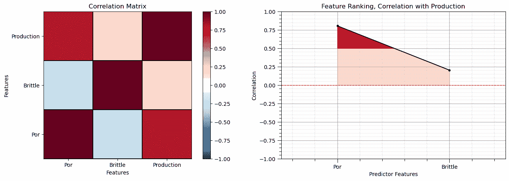

注意由于每个变量与其自身的相关性而产生的 1.0 对角线。

这看起来不错。存在多种相关性的大小。当然，相关系数仅限于线性相关性的程度。

+   让我们看一下矩阵散点图，以查看特征之间的成对关系。

```py
pairgrid = sns.PairGrid(df,vars=Xname+[yname])                # matrix scatter plots
pairgrid = pairgrid.map_upper(plt.scatter, color = 'darkorange', edgecolor = 'black', alpha = 0.8, s = 10)
pairgrid = pairgrid.map_diag(plt.hist, bins = 20, color = 'darkorange',alpha = 0.8, edgecolor = 'k')# Map a density plot to the lower triangle
pairgrid = pairgrid.map_lower(sns.kdeplot, cmap = plt.cm.inferno, 
                              alpha = 1.0, n_levels = 10)
pairgrid.add_legend()
plt.subplots_adjust(left=0.0, bottom=0.0, right=0.9, top=0.9, wspace=0.2, hspace=0.2); plt.show() 
```

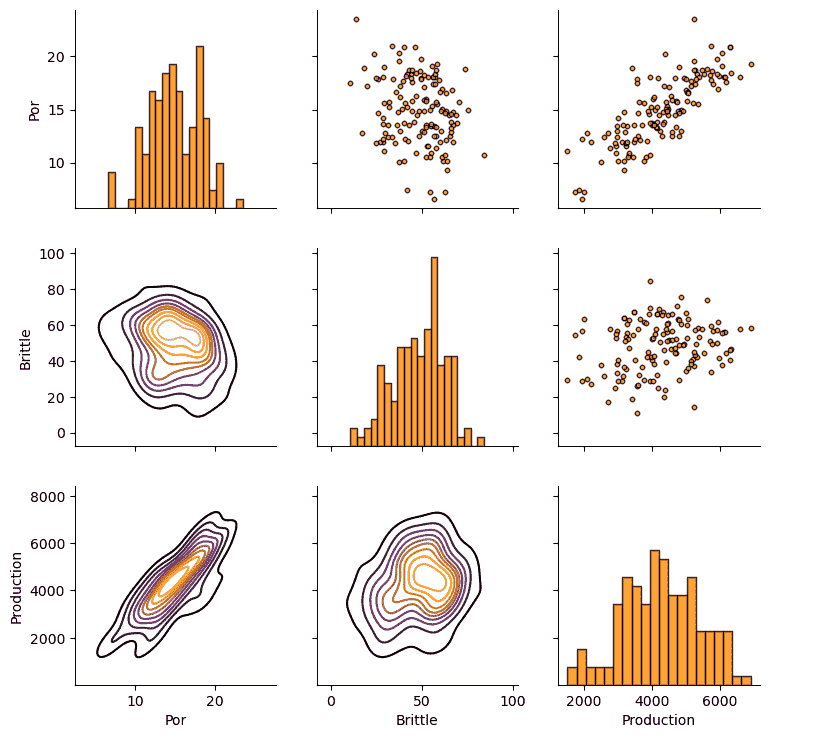

## 训练和测试分割

由于我们正在使用集成方法，因此训练和测试分割已内置到模型训练中，包括袋外样本。

+   我们将处理整个数据集。

+   注意，我们可以为训练、验证和测试方法分割一个测试数据集。为了简单起见，我在这些工作流程中只使用训练和测试。

## 可视化数据框

在我们构建模型之前，可视化训练和测试数据集是有用的检查。

+   许多事情可能会出错，例如，我们加载了错误的数据，所有特征都没有加载等。

我们可以通过使用‘head’DataFrame 成员函数来预览（格式整洁，见下文）。

```py
df.head(n=5)                                                  # check the loaded DataFrame 
```

|  | Por | Brittle | Production |
| --- | --- | --- | --- |
| 0 | 7.22 | 63.09 | 2006.074005 |
| 1 | 13.01 | 50.41 | 4244.321703 |
| 2 | 10.03 | 37.74 | 2493.189177 |
| 3 | 18.10 | 56.09 | 6124.075271 |
| 4 | 16.95 | 61.43 | 5951.336259 |

## 表格数据的汇总统计

在 DataFrames 中，有许多高效的方法可以计算表格数据的汇总统计。

+   describe 命令以数据表的形式提供计数、平均值、最小值、最大值、百分位数。

```py
df.describe(percentiles=[0.1,0.9])                            # check DataFrame summary statistics 
```

|  | Por | Brittle | Production |
| --- | --- | --- | --- |
| count | 140.000000 | 140.000000 | 140.000000 |
| mean | 14.897357 | 48.345429 | 4273.644226 |
| std | 3.181639 | 14.157619 | 1138.466092 |
| min | 6.550000 | 10.940000 | 1517.373571 |
| 10% | 10.866000 | 28.853000 | 2957.573690 |
| 50% | 14.855000 | 50.735000 | 4315.186629 |
| 90% | 18.723000 | 65.813000 | 5815.526968 |
| max | 23.550000 | 84.330000 | 6907.632261 |

我们检查汇总统计是件好事。

+   没有明显的错误

+   检查每个特征值的范围，以设置和调整绘图限制。见上文。

## 可视化分布

让我们检查预测特征的历史图和散点图。

+   检查数据是否覆盖了可能的预测特征组合范围

+   检查预测特征是否没有高度相关性，没有共线性，因为这会增加模型方差

```py
nbins = 20                                                    # number of histogram bins

plt.subplot(221)                                              # predictor feature #1 histogram
freq,_,_ = plt.hist(x=df[Xname[0]],weights=None,bins=np.linspace(Xmin[0],Xmax[0],nbins),alpha = 0.6,
                     edgecolor='black',color='darkorange',density=False,label='Train')
max_freq = max(freq)*1.10
plt.xlabel(Xlabelunit[0]); plt.ylabel('Frequency'); plt.ylim([0.0,max_freq]); plt.title('Density'); add_grid()  
plt.xlim([Xmin[0],Xmax[0]]); plt.legend(loc='upper right')   

plt.subplot(222)                                              # predictor feature #2 histogram
freq,_,_ = plt.hist(x=df[Xname[1]],weights=None,bins=np.linspace(Xmin[1],Xmax[1],nbins),alpha = 0.6,
                     edgecolor='black',color='darkorange',density=False,label='Train')
max_freq = max(freq)*1.10
plt.xlabel(Xlabelunit[1]); plt.ylabel('Frequency'); plt.ylim([0.0,max_freq]); plt.title('Porosity'); add_grid()  
plt.xlim([Xmin[1],Xmax[1]]); plt.legend(loc='upper right')   

plt.subplot(223)                                              # predictor features #1 and #2 scatter plot
plt.scatter(df[Xname[0]],df[Xname[1]],s=40,marker='o',color = 'darkorange',alpha = 0.8,edgecolor = 'black',zorder=10,label='Train')
plt.title(Xlabel[0] + ' vs ' +  Xlabel[1])
plt.xlabel(Xlabelunit[0]); plt.ylabel(Xlabelunit[1])
plt.legend(); add_grid(); plt.xlim([Xmin[0],Xmax[0]]); plt.ylim([Xmin[1],Xmax[1]])

plt.subplot(224)                                              # predictor feature #2 histogram
freq,_,_ = plt.hist(x=df[yname],weights=None,bins=np.linspace(ymin,ymax,nbins),alpha = 0.6,
                     edgecolor='black',color='darkorange',density=False,label='Train')
max_freq = max(freq)*1.10
plt.xlabel(ylabelunit); plt.ylabel('Frequency'); plt.ylim([0.0,max_freq]); plt.title('Porosity'); add_grid()  
plt.xlim([ymin,ymax]); plt.legend(loc='upper right') 

plt.subplots_adjust(left=0.0, bottom=0.0, right=1.6, top=1.6, wspace=0.3, hspace=0.25)
#plt.savefig('Test.pdf', dpi=600, bbox_inches = 'tight',format='pdf') 
plt.show() 
```

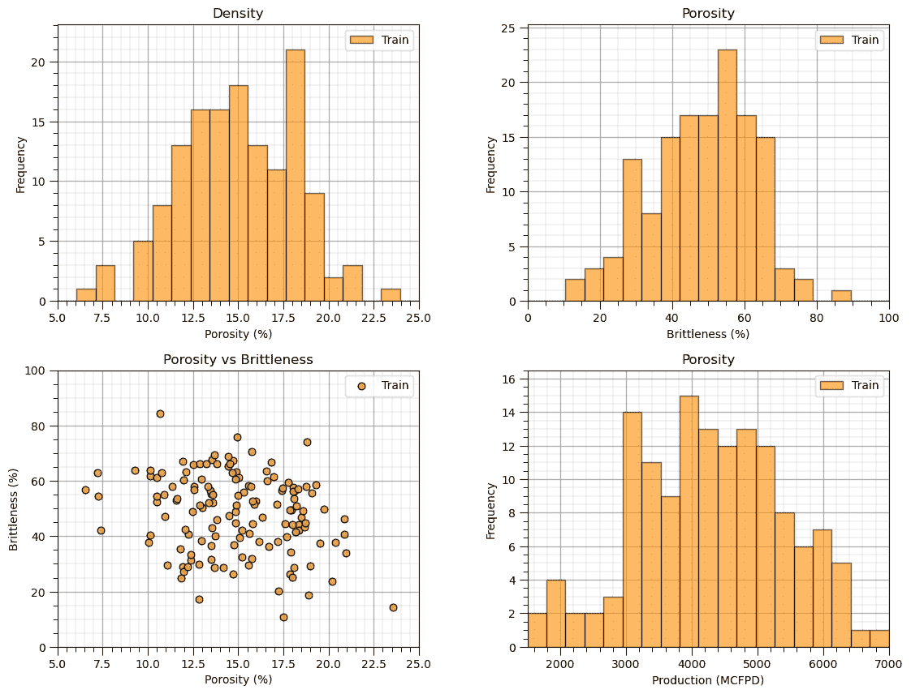

再次强调，分布表现良好，

+   我们无法观察到明显的间隙或截断。

+   预测特征之间没有高度相关性

让我们看看孔隙率与脆性之间的散点图，点根据产量着色。

+   可视化预测问题，即系统的形状

```py
plt.subplot(111)                                              # visualize the train and test data in predictor feature space
im = plt.scatter(X[Xname[0]],X[Xname[1]],s=None, c=y[yname], marker='o', cmap=cmap, 
    norm=None, vmin=ymin, vmax=ymax, alpha=0.8, linewidths=0.3, edgecolors="black", label = 'Train')
plt.title('Training ' + ylabel + ' vs. ' + Xlabel[1] + ' and ' + Xlabel[0]); 
plt.xlabel(Xlabel[0] + ' (' + Xunit[0] + ')'); plt.ylabel(Xlabel[1] + ' (' + Xunit[1] + ')')
plt.xlim(Xmin[0],Xmax[0]); plt.ylim(Xmin[1],Xmax[1]); plt.legend(loc = 'upper right'); add_grid()
cbar = plt.colorbar(im, orientation = 'vertical')
cbar.set_label(ylabel + ' (' + yunit + ')', rotation=270, labelpad=20)
cbar.ax.yaxis.set_major_formatter(FuncFormatter(comma_format))
plt.subplots_adjust(left=0.0, bottom=0.0, right=1.0, top=1.0, wspace=0.2, hspace=0.2); plt.show() 
```

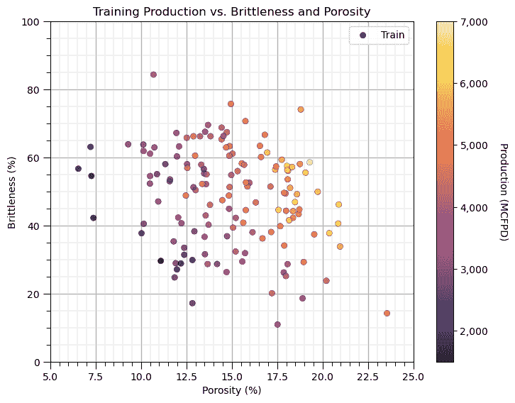

## 集成树方法 - 树袋回归

我们准备构建一个树袋模型。要执行树袋操作，我们：

1.  为单个树设置超参数

```py
seed = 73073
max_depth = 100
min_samples_leaf = 2 
```

1.  实例化单个回归树

```py
regressor = DecisionTreeRegressor(max_depth = max_depth, min_samples_leaf = min_samples_leaf) 
```

1.  设置袋装超参数

```py
num_trees = 100
seed = 73073 
```

1.  使用先前实例化的回归树（包装决策树）实例化袋装回归器

```py
bagging_model = BaggingRegressor(base_estimator=regressor, n_estimators=num_trees, random_state=seed) 
```

1.  训练袋装回归（包装决策树）

```py
bagging_model.fit(X = predictors, y = response) 
```

1.  在特征空间上可视化模型结果（由于我们只有两个预测特征，因此很容易做到）

## 手动袋装演示

为了手动演示树袋，我们将树的数量设置为 1，并运行 6 次树袋回归。

+   每个结果的都是一个复杂的单个决策树

+   注意，random_state 参数是袋装方法中自举的随机数种子

+   由于自助数据集对于每个随机数种子都会不同，因此树对于每个随机数种子都会有所不同

我们将遍历模型并将每个模型存储在一个模型列表中。

```py
max_depth = 100; min_samples_leaf = 2                         # set for a complicated tree

regressor = DecisionTreeRegressor(max_depth = max_depth, min_samples_leaf = min_samples_leaf) # instantiate a decision tree

num_tree = 1                                                  # use only a single tree for this demonstration
seeds = [73073, 73074, 73075, 73076, 73077, 73078]
bagging_models = []; oob_MSE = []; score = []; pred = []

index = 1
for seed in seeds:                                            # visualize models over random number seeds
    bagging_models.append(BaggingRegressor(base_estimator=regressor,n_estimators=num_tree,random_state=seed,oob_score = True,
                                           bootstrap=True,n_jobs = 4))
    bagging_models[index-1].fit(X = X, y = y)
    oob_MSE.append(bagging_models[index-1].oob_score_)
    plt.subplot(2,3,index)
    bag_X1 = X.iloc[np.asarray(bagging_models[index-1].estimators_samples_[0]),0]
    bag_X2 = X.iloc[np.asarray(bagging_models[index-1].estimators_samples_[0]),1]
    bag_y = y.iloc[np.asarray(bagging_models[index-1].estimators_samples_[0]),0]
    pred.append(visualize_model(bagging_models[index-1],bag_X1,Xmin[0],Xmax[0],bag_X2,Xmin[1],Xmax[1],bag_y,ymin,ymax,
                ylabelunit,Xlabelunit[0],Xlabelunit[1],'Bootstrap Data and Decision Tree #' + str(index) + ' '))
    index = index + 1

plt.subplots_adjust(left=0.0, bottom=0.0, right=2.0, top=1.4, wspace=0.4, hspace=0.3) 
```

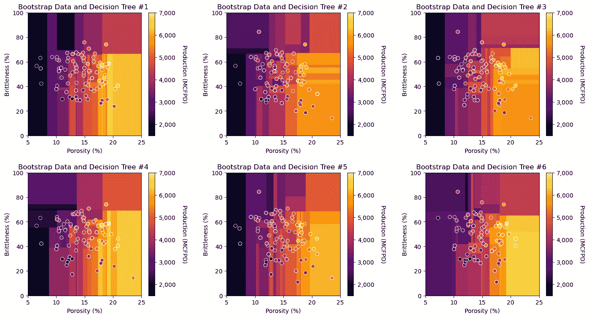

注意每个模型的数据变化，

+   我们对数据集进行了自助重采样，因此一些数据缺失，而其他数据被使用了 2 次或更多。

+   回想一下，在期望中，只有 2/3 的数据用于每棵树，1/3 是袋外数据。

让我们使用袋外数据来检查交叉验证的结果。

```py
index = 1
for index in range(0,len(seeds)):                             # check models over random number seeds
    plt.subplot(2,3,index+1)
    check_model(bagging_models[index],y,ymin,ymax,ylabelunit,'Out-of-Bag Predictions Decision Tree #' +  str(index+1))
    index = index + 1
plt.subplots_adjust(left=0.0, bottom=0.0, right=2.6, top=2.0, wspace=0.3, hspace=0.3) 
```

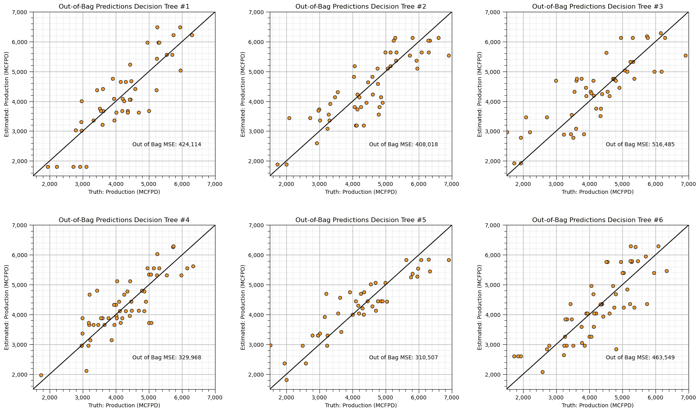

现在，让我们演示对 6 棵决策树的预测进行平均，我们手动执行袋装树预测以清楚地展示该方法。

+   我们在离散化的预测特征空间上平均预测响应特征（产量）。

+   我们可以利用广播方法对整个数组进行操作。

+   我们将应用相同的模型检查，但我们将使用一个修改后的函数来读取响应特征二维数组，而不是模型。

```py
Z = pred[0] 
index = 1
for seed in seeds:                                            # loop over random number seeds
    if index == 1:
        Z = pred[index-1]
    else:
        Z = Z + pred[index-1]                                 # calculate the average response over 3 trees
    index = index + 1

Z = Z / len(seeds)                                            # grid pixel-wise average of the 6 bootstrapped decision trees

plt.subplot(121)                                              # plot predictions over predictor feature space
visualize_grid(Z,df[Xname[0]],Xmin[0],Xmax[0],df[Xname[1]],Xmin[1],Xmax[1],df[yname],ymin,ymax,ylabelunit,
               Xlabelunit[0],Xlabelunit[1],'All Data and Average of 6 Bootstrapped Trees')

plt.subplot(122)                                              # check model predictions vs. testing dataset
check_grid(Z,Xmin[0],Xmax[0],Xmin[1],Xmax[1],df[Xname[0]],df[Xname[1]],df[yname],ymin,ymax,'Model Check - Average of 6 Bootstrapped Trees')

plt.subplots_adjust(left=0.0, bottom=0.0, right=1.5, top=0.8, wspace=0.3, hspace=0.2) 
```

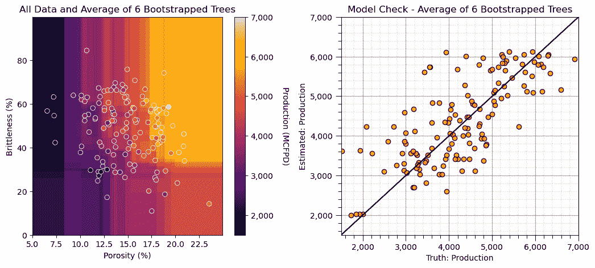

我们制作了 6 棵复杂的树，每棵树都使用原始数据的自助重采样进行训练，然后平均每棵树的预测结果。

+   结果更加平滑 - 模型方差更低。

+   结果更接近训练数据

## 增加树的数量进行袋装演示

为了演示，让我们构建 6 个具有增加数量的过度复杂（并且可能过拟合）树的袋装树回归模型进行平均。

+   使用 scikit learn 的袋装回归器，这可以通过‘num_tree’超参数自动完成。

我们将遍历模型并将每个模型再次存储在一个模型列表中！

```py
max_depth = 3; min_samples_leaf = 5                           # set for a complicated tree

regressor = DecisionTreeRegressor(max_depth = max_depth, min_samples_leaf = min_samples_leaf) # instantiate a decision tree

seed = 73073;
num_trees = [1,3,5,10,30,500]                                 # number of trees averaged for each estimator

bagging_models_ntrees = []; oob_MSE = []; pred = []

index = 1
for num_tree in num_trees:                                    # visualize the models over number of trees
    bagging_models_ntrees.append(BaggingRegressor(base_estimator=regressor,n_estimators=num_tree,random_state=seed,oob_score = True,n_jobs = 4))
    bagging_models_ntrees[index-1].fit(X = X, y = y)
    plt.subplot(2,3,index)
    pred.append(visualize_model(bagging_models_ntrees[index-1],df[Xname[0]],Xmin[0],Xmax[0],df[Xname[1]],Xmin[1],Xmax[1],df[yname],ymin,ymax,
                ylabelunit,Xlabelunit[0],Xlabelunit[1],'Bagging with ' + str(num_tree) + ' Trees'))
    index = index + 1

plt.subplots_adjust(left=0.0, bottom=0.0, right=2.0, top=1.4, wspace=0.4, hspace=0.3) 
```

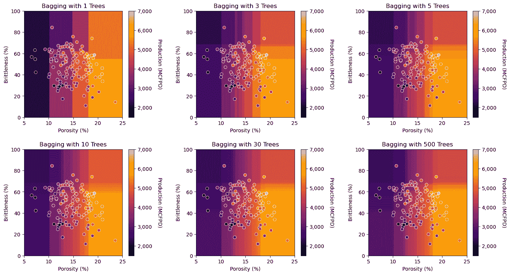

观察平均增加树的数量对平均的影响。

+   我们从断续的响应预测模型过渡到一个平滑的预测模型（跳跃被平滑处理了）

让我们使用保留的测试数据重复建模交叉验证步骤。

```py
index = 1
for num_tree in num_trees:                                    # check models over number of trees
    plt.subplot(2,3,index)
    check_model_OOB_MSE(bagging_models_ntrees[index-1],y,ymin,ymax,ylabelunit,'Out-of-Bag Predictions with ' + 
                        str(num_trees[index-1]) + ' Decision Trees')
    index = index + 1
plt.subplots_adjust(left=0.0, bottom=0.0, right=2.6, top=2.0, wspace=0.3, hspace=0.3) 
```

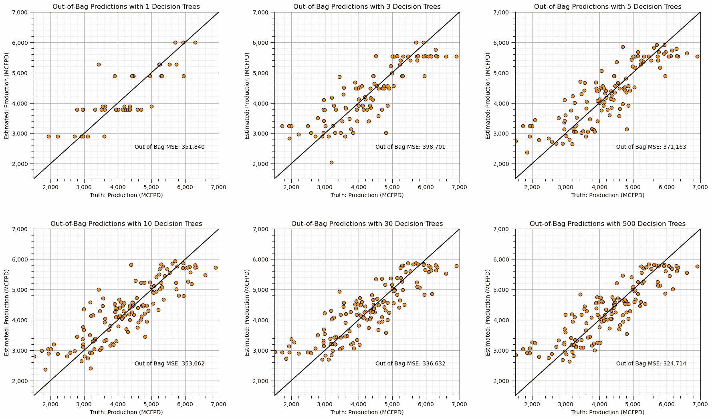

看看随着集成模型平均水平的增加，测试精度是否有改进？

让我们运行多个案例并检查精度与树的数量之间的关系。

```py
max_depth = 3; min_samples_leaf = 5                           # set for a complicated tree

regressor = DecisionTreeRegressor(max_depth = max_depth, min_samples_leaf = min_samples_leaf) # instantiate a decision tree
ntree_list = []; MSE_oob_list = []
for num_tree in np.arange(1,350,50):                          # check OOB MSE over number of trees
    bagg_tree = BaggingRegressor(base_estimator=regressor,n_estimators=num_tree,random_state=seed,oob_score = True,n_jobs = 4).fit(X = X, y = y)
    oob_y_hat = bagg_tree.oob_prediction_
    oob_y = y[oob_y_hat > 0.0]; oob_y_hat = oob_y_hat[oob_y_hat > 0.0]; # remove if not estimated
    MSE_oob_list.append(metrics.mean_squared_error(oob_y,oob_y_hat)); ntree_list.append(num_tree)

plt.scatter(ntree_list,MSE_oob_list,color='darkorange',edgecolor='black',alpha=0.8,s=30,zorder=10)
plt.plot(ntree_list,MSE_oob_list,color='black',ls='--',zorder=1)
plt.xlabel('Number of Bagged Trees'); plt.ylabel('Mean Square Error'); plt.title('Out-of-Bag Mean Square Error vs Number of Bagged Trees')
plt.gca().yaxis.set_major_formatter(FuncFormatter(comma_format)); add_grid()
plt.subplots_adjust(left=0.0, bottom=0.0, right=1.0, top=1.0, wspace=0.2, hspace=0.2); plt.show() 
```

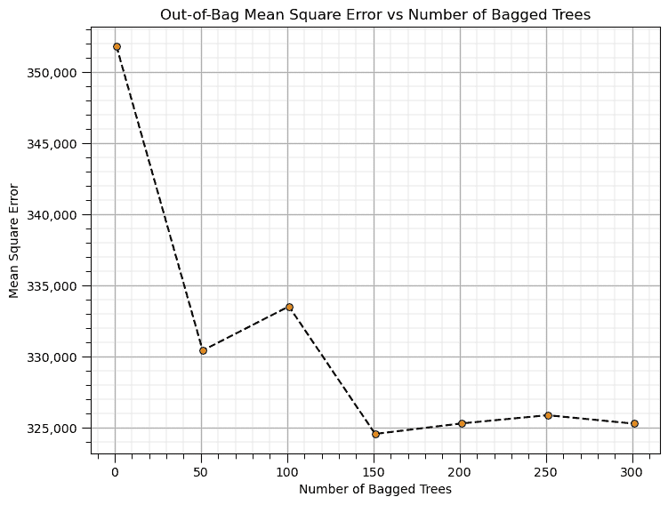

树的数量通过减少模型方差来提高模型精度。让我们通过实验实际观察模型方差的这种减少。

## 模型方差与集成模型平均

让我们看看通过模型平均模型方差的变化，我们将比较具有不同树数量平均的多个模型。

+   我们通过改变随机数种子来通过视觉比较不同的袋装建模

```py
max_depth = 3; min_samples_leaf = 5                           # set for a complicated tree

regressor = DecisionTreeRegressor(max_depth = max_depth, min_samples_leaf = min_samples_leaf) # instantiate a decision tree

seeds = [73083, 73084, 73085]                                 # number of random number seeds
num_trees = [1,5,30,100]                                      # number of trees averaged for each estimator
bagging_models_ntrees_seeds = []
MSE_oob_list = []; ntree_list = []

index = 1
for num_tree in num_trees:                                    # loop over number of trees
    for seed in seeds:                                        # loop over number of random number seeds
        bagg_tree = BaggingRegressor(base_estimator=regressor, n_estimators=num_tree, 
                                     random_state=seed, oob_score = True, n_jobs = 4).fit(X = X, y = y)
        oob_y_hat = bagg_tree.oob_prediction_
        oob_y = y[oob_y_hat > 0.0]; oob_y_hat = oob_y_hat[oob_y_hat > 0.0]; # remove if not estimated
        bagging_models_ntrees_seeds.append(bagg_tree)
        MSE_oob_list.append(metrics.mean_squared_error(oob_y,oob_y_hat)); ntree_list.append(num_tree)
        plt.subplot(4,3,index)
        visualize_model(bagging_models_ntrees_seeds[index-1],df[Xname[0]],Xmin[0],Xmax[0],df[Xname[1]],Xmin[1],Xmax[1],df[yname],ymin,ymax,
                ylabelunit,Xlabelunit[0],Xlabelunit[1],'Training Data and Tree Model - ' + str(num_tree) + ' Tree(s)')
        index = index + 1

plt.subplots_adjust(left=0.0, bottom=0.0, right=2.0, top=4.0, wspace=0.35, hspace=0.3); plt.show() 
```

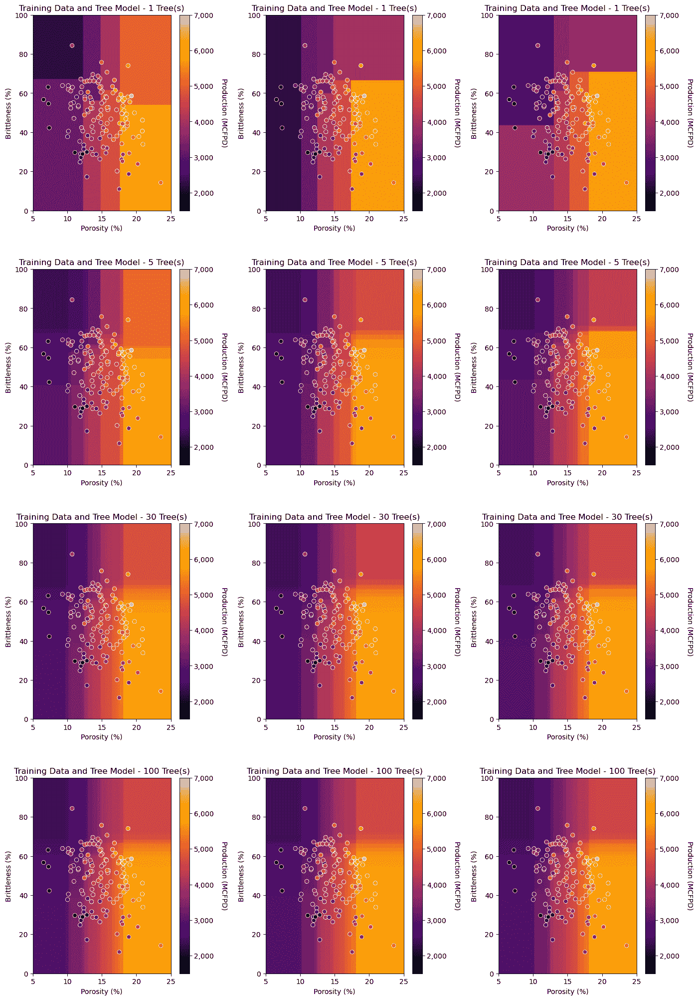

随着我们增加用于袋装树回归模型的平均决策树的数量：

+   再次强调，响应预测在预测特征空间上变得更加平滑

+   模型的多次实现开始收敛，这是较低的模型方差

## 随机森林

在随机森林中，我们限制了每个分割考虑的特征数量。注意，在 scikit learn 中默认是 $\frac{m}{3}$。使用此超参数将其设置为预测特征数的平方根。实践中另一个常见的替代方案是 $\sqrt{m}$。

```py
max_features = 'sqrt' 
```

这迫使树多样性/解相关树。

+   回忆一下，通过平均多个决策树来减少模型方差 $Y = \frac{1}{B} \sum_{b=1}^{B} Y^b(X_1^b,...,X_m^b)$

+   从[空间自助工作流程](https://github.com/GeostatsGuy/PythonNumericalDemos/blob/master/SubsurfaceDataAnalytics_Spatial_Bootstrap.ipynb)中回忆起，平均样本的相关性会减弱方差减少

让我们通过实验随机森林来展示这一点。

1.  设置超参数。

即使我只运行一个模型，我也会设置随机数种子以确保我有一个确定性的模型，一个每次重新运行都能得到相同结果的模型。如果未设置随机数种子，则它很可能是基于系统时间设置的。

```py
seed = 73073 
```

我们将过度拟合树，让它们变得过于复杂。再次强调，集成方法将减轻模型方差和过度拟合。

```py
max_depth = 5 
```

我们将使用大量树来减轻模型方差并从随机森林树的多样性中受益。

```py
num_tree = 300 
```

我们使用一个简单的 2 个预测特征示例来简化可视化。scikit learn 的随机森林默认情况下是随机选择 $\frac{m}{3}$ 个特征作为每个分割的考虑因素。

当 $m = 2$ 时，这没有太多意义，因为在我们的情况下，所以我们设置每个分割考虑的最大特征数为 1。

+   我们正在强制随机选择孔隙度或脆性作为每个分割的考虑因素，分层二进制分割。

```py
max_features = 1 
```

1.  使用我们的超参数实例化随机森林回归器

```py
my_first_forest = RandomForestRegressor(max_depth=max_depth, random_state=seed,n_estimators=num_tree, max_features=max_features) 
```

1.  训练随机森林回归

```py
my_first_forest.fit(X = predictors, y = response) 
```

1.  在特征空间上可视化模型结果（由于我们只有 2 个预测特征，这很容易做到）

让我们构建、可视化和交叉验证我们的第一个随机森林回归模型。

```py
seed = 73093                                                  # set the random forest hyperparameters
max_depth = 7
num_tree = 300
max_features = 1

my_first_forest = RandomForestRegressor(max_depth=max_depth,random_state=seed,n_estimators=num_tree,max_features=max_features,
                                       oob_score=True,bootstrap=True)

my_first_forest.fit(X = X, y = y)                             # train the model with training data 

plt.subplot(121)                                              # predict with the model over the predictor feature space and visualize
visualize_model(my_first_forest,df[Xname[0]],Xmin[0],Xmax[0],df[Xname[1]],Xmin[1],Xmax[1],df[yname],ymin,ymax,
                ylabelunit,Xlabelunit[0],Xlabelunit[1],'Training Data and Random Forest Model')

plt.subplot(122)                                              # perform cross validation with withheld testing data
check_model_OOB_MSE(my_first_forest,y,ymin,ymax,ylabelunit,'Out-of-Bag Predictions with Random Forest')

plt.subplots_adjust(left=0.0, bottom=0.0, right=1.5, top=1.0, wspace=0.4, hspace=0.2); plt.show() 
```

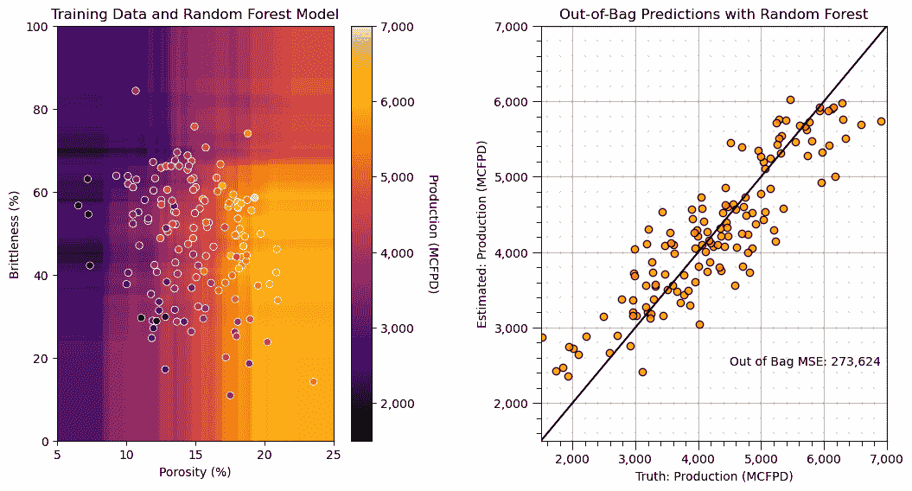

树的多样性力量！我们刚刚构建了迄今为止最好的模型。

+   条件偏差已经降低（我们的图有更接近 1:1 的斜率）

+   我们有较低的袋外平均分数误差

让我们运行一些测试以确保我们理解随机森林回归模型。

首先，让我们确认每个分割只考虑一个特征（随机选择）

+   限制最大深度为 1，只有一个分割

+   在每个森林中仅限于一棵树！

这样我们可以看到多个模型中第一次分割的多样性。

```py
max_depth = 1                                                 # set the random forest hyperparameters
num_tree = 1
max_features = 1
simple_forest = []

seeds = [73103,73104,73105,73106,73107,73108]                 # set the random number seeds

index = 1
for seed in seeds:                                            # loop over random number seeds
    simple_forest.append(RandomForestRegressor(max_depth=max_depth, random_state=seed,n_estimators=num_tree, max_features=max_features))
    simple_forest[index-1].fit(X = X, y = y)
    plt.subplot(2,3,index)                                    # predict with the model over the predictor feature space and visualize
    visualize_model(simple_forest[index-1],df[Xname[0]],Xmin[0],Xmax[0],df[Xname[1]],Xmin[1],Xmax[1],df[yname],ymin,ymax,
                ylabelunit,Xlabelunit[0],Xlabelunit[1],'Training Data and Random Forest Model')
    index = index + 1

plt.subplots_adjust(left=0.0, bottom=0.0, right=2.0, top=2.0, wspace=0.2, hspace=0.3) 
```

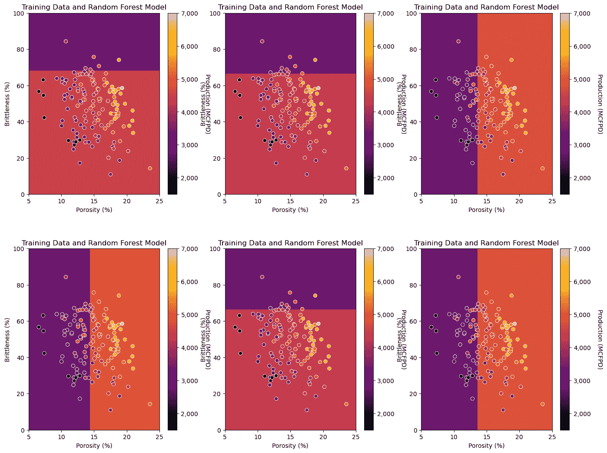

注意，最初的分割是 50/50 的孔隙率和脆性。

+   此外，对于我拟合到这个数据集的所有决策树，孔隙率总是被选为树的前 2-3 层中的特征。

+   通过限制第一次分割时考虑的预测特征，随机森林实现了模型多样性！

如果你不信任这个结果，让我们重新运行上面的代码，允许所有分割都使用两个预测因子。

```py
max_depth = 1                                                 # set the random forest hyperparameters
num_tree = 1
max_features = 2
simple_forest = []

seeds = [73103,73104,73105,73106,73107,73108]                 # random number seeds 

index = 1
for seed in seeds:                                            # loop over random number seeds
    simple_forest.append(RandomForestRegressor(max_depth=max_depth, random_state=seed,n_estimators=num_tree, max_features=max_features))
    simple_forest[index-1].fit(X = X, y = y)
    plt.subplot(2,3,index)                                    # predict with the model over the predictor feature space and visualize
    visualize_model(simple_forest[index-1],df[Xname[0]],Xmin[0],Xmax[0],df[Xname[1]],Xmin[1],Xmax[1],df[yname],ymin,ymax,
                ylabelunit,Xlabelunit[0],Xlabelunit[1],'Training Data and Random Forest Model')
    index = index + 1

plt.subplots_adjust(left=0.0, bottom=0.0, right=2.0, top=2.0, wspace=0.4, hspace=0.3) 
```

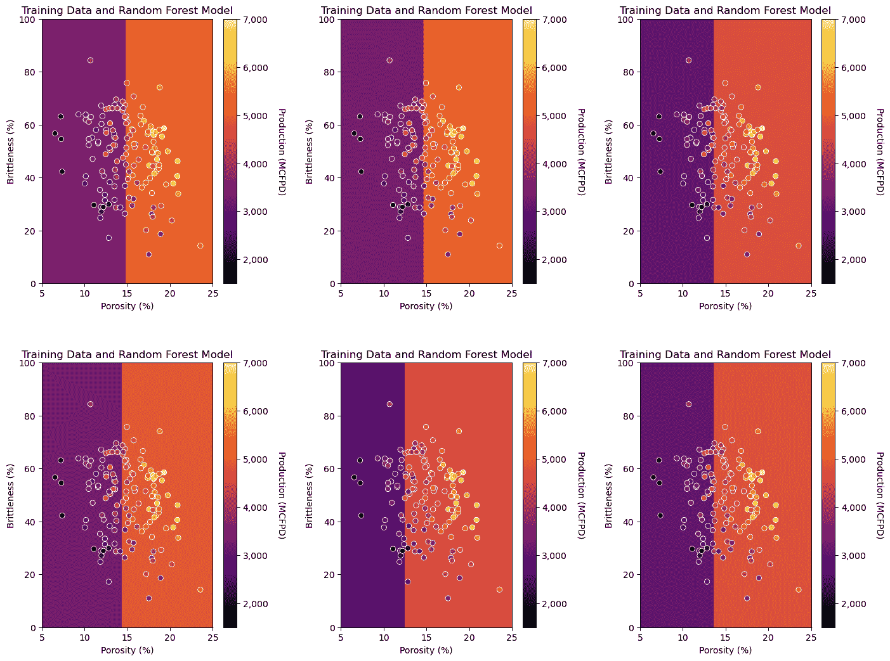

现在我们有一组第一次分割，这些分割因训练数据的自助抽样而变化，但都在孔隙率上。

## 袋外和特征重要性的模型性能

由于我们现在正在构建一个由大量树组成的更健壮的模型，让我们对模型检查更加认真。

+   我们将查看袋外均方误差。

+   我们将查看特征重要性。

让我们从一个非常大的森林开始，这可能会运行一段时间！

```py
seed = 73093                                                  # set the random forest hyperparameters
max_depth = 7
num_tree = 500
max_features = 1

big_forest = RandomForestRegressor(max_depth=max_depth, random_state=seed,n_estimators=num_tree, max_features=max_features,
                                   oob_score = True,bootstrap=True,n_jobs = 4)

big_forest.fit(X = X, y = y)

plt.subplot(121)                                              # predict with the model over the predictor feature space and visualize
visualize_model(big_forest,df[Xname[0]],Xmin[0],Xmax[0],df[Xname[1]],Xmin[1],Xmax[1],df[yname],ymin,ymax,
                ylabelunit,Xlabelunit[0],Xlabelunit[1],'Training Data and Random Forest Model')

plt.subplot(122)                                              # perform cross validation with withheld testing data
check_model_OOB_MSE(big_forest,y,ymin,ymax,ylabelunit,'Model Check Random Forest Model')

plt.subplots_adjust(left=0.0, bottom=0.0, right=1.5, top=1.0, wspace=0.4, hspace=0.2) 
```

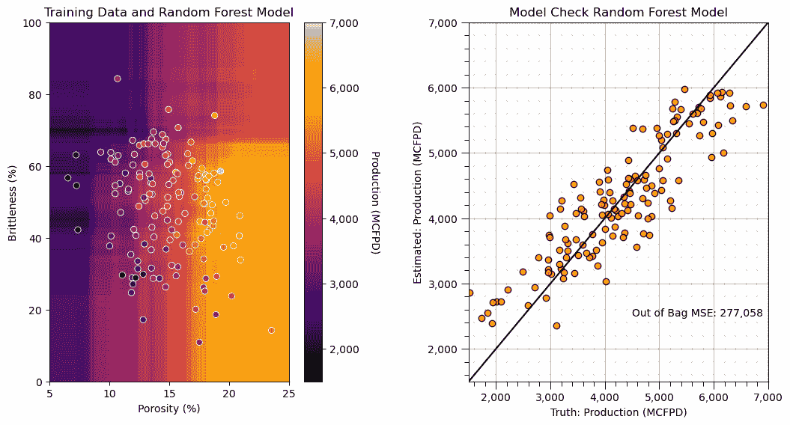

要获取特征重要性，我们只需访问模型的‘feature_importance_’成员。

+   我们必须在模型实例化时将 feature_importance 设置为 true 才能使其可用

+   这个度量标准化为总和为 1.0

+   与 2D 数组中预测特征相同的顺序，孔隙率然后是脆性

+   特征重要性是每个特征通过分割带来的总均方误差减少的比例。

+   我们可以访问森林中每棵树每个特征的重要性，或者在整个森林中每个特征的全球平均值。

我们通过这个随机森林回归模型成员获得特征重要性的全局平均值。

```py
importances = big_forest.feature_importances_ 
```

让我们绘制特征重要性图，并从集成中计算显著性。

+   当我们报告基于模型的特征重要性时，总是展示模型是一个好模型是个好主意。我喜欢在特征重要性结果旁边展示一个模型检查，在这种情况下是袋外交叉验证图和均方误差。

```py
importances = big_forest.feature_importances_                 # expected (global) importance over the forest fore each predictor feature
std = np.std([tree.feature_importances_ for tree in big_forest.estimators_],axis=0) # retrieve importance by tree
indices = np.argsort(importances)[::-1]                       # sort in descending feature importance
features = ['Porosity','Brittleness']                         # names or predictor features

plt.subplot(121)
plt.title("Random Forest Feature Importances")
plt.bar(features, importances[indices],color="darkorange", alpha = 0.8, edgecolor = 'black', yerr=std[indices], align="center")
plt.ylim(0,1), plt.xlabel('Predictor Features'); plt.ylabel('Feature Importance'); add_grid()

plt.subplot(122)                                              # perform cross validation with withheld testing data
check_model_OOB_MSE(big_forest,y,ymin,ymax,ylabelunit,'Model Check Random Forest Model for Feature Importance')

plt.subplots_adjust(left=0.0, bottom=0.0, right=1.6, top=0.8, wspace=0.2, hspace=0.2); plt.show() 
```

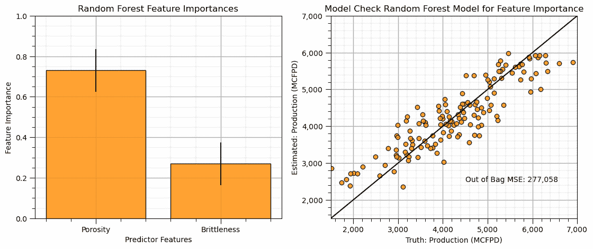

让我们尝试使用森林的袋外均方误差度量进行一些超参数训练。

让我们从森林中的树的数量开始。

```py
max_depth = 5                                                 # set the random forest hyperparameters
num_trees = np.arange(1,100,2)
max_features = 1
trained_forests = []
MSE_oob_list = []; ntree_list = []

index = 1
for num_tree in num_trees:                                     # loop over number of trees in our random forest
    trained_forest = RandomForestRegressor(max_depth=max_depth, random_state=seed,n_estimators=int(num_tree),
            oob_score = True,bootstrap=True,max_features=max_features).fit(X = X, y = y)
    trained_forests.append(trained_forest)
    oob_y_hat = trained_forest.oob_prediction_
    oob_y = y[oob_y_hat > 0.0]; oob_y_hat = oob_y_hat[oob_y_hat > 0.0]; # remove if not estimated
    MSE_oob_list.append(metrics.mean_squared_error(oob_y,oob_y_hat)); ntree_list.append(num_tree)
    index = index + 1

plt.subplot(121)
plt.scatter(ntree_list,MSE_oob_list,color='darkorange',edgecolor='black',alpha=0.8,s=30,zorder=10)
plt.plot(ntree_list,MSE_oob_list,color='black',ls='--',zorder=1)
plt.xlabel('Number of Random Forest Trees'); plt.ylabel('Mean Square Error'); plt.title('Out-of-Bag Mean Square Error vs Number of Random Forest Trees')
plt.gca().yaxis.set_major_formatter(FuncFormatter(comma_format)); add_grid(); plt.xlim([min(ntree_list),max(ntree_list)])
plt.subplots_adjust(left=0.0, bottom=0.0, right=2.0, top=0.8, wspace=0.2, hspace=0.2); plt.show() 
```

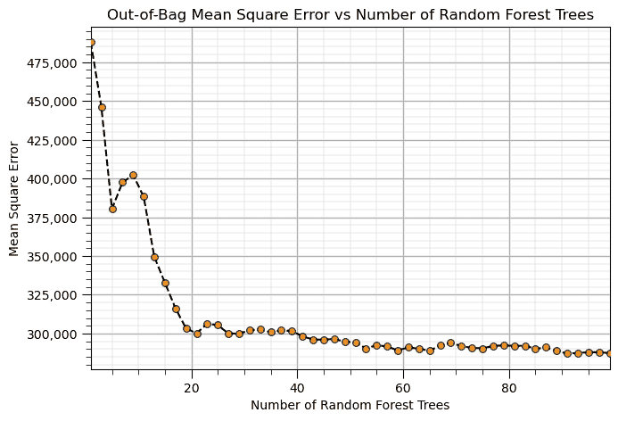

现在让我们尝试树的深度，根据上述确定的足够多的树（我们将使用 60 棵树）。

```py
max_depths = np.linspace(1,20,20)                             # set the tree maximum tree depths to consider

num_tree = 60                                                 # set the random forest hyperparameters
max_features = 1
trained_forests = []
MSE_oob_list = []; max_depth_list = []

index = 1
for max_depth in max_depths:                                  # loop over tree depths 
    trained_forest = RandomForestRegressor(max_depth=int(max_depth), random_state=seed,n_estimators=num_tree,
            oob_score = True,bootstrap=True,max_features=max_features).fit(X = X, y = y)
    trained_forests.append(trained_forest)
    oob_y_hat = trained_forest.oob_prediction_
    oob_y = y[oob_y_hat > 0.0]; oob_y_hat = oob_y_hat[oob_y_hat > 0.0]; # remove if not estimated
    MSE_oob_list.append(metrics.mean_squared_error(oob_y,oob_y_hat)); max_depth_list.append(max_depth)
    index = index + 1

plt.subplot(121)                                                # plot OOB MSE vs. maximum tree depth
plt.scatter(max_depth_list,MSE_oob_list,color='darkorange',edgecolor='black',alpha=0.8,s=30,zorder=10)
plt.plot(max_depth_list,MSE_oob_list,color='black',ls='--',zorder=1)
plt.xlabel('Tree Maximum Depth'); plt.ylabel('Mean Square Error'); plt.title('Out-of-Bag Mean Square Error vs Tree Maximum Depth')
plt.gca().yaxis.set_major_formatter(FuncFormatter(comma_format)); add_grid(); plt.xlim([min(max_depth_list),max(max_depth_list)])
plt.subplots_adjust(left=0.0, bottom=0.0, right=2.0, top=0.8, wspace=0.2, hspace=0.2); plt.show() 
```

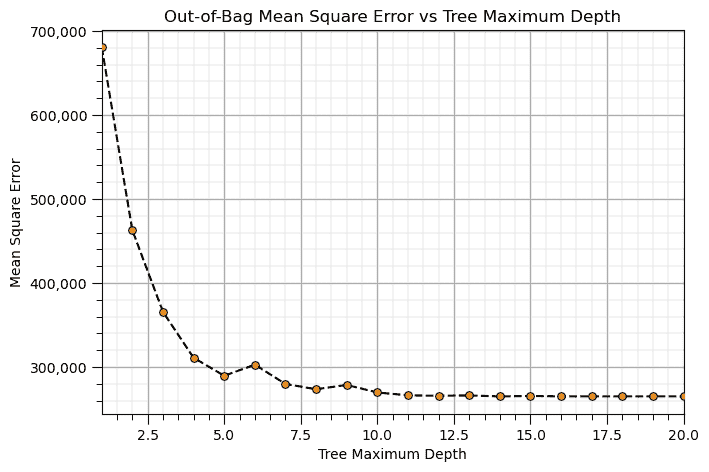

看起来我们需要至少 10 的最大树深度才能使我们的模型在袋外均方误差方面达到最佳性能。

+   注意，我们的模型具有鲁棒性，且对过拟合具有抵抗力，袋外性能评估接近单调递增。

## 清洁、紧凑的机器学习代码的机器学习管道

管道是 scikit-learn 类，允许封装一系列数据准备和建模步骤

+   然后，我们可以将管道视为我们高度简化的工作流程中的对象

管道类允许我们：

+   提高代码可读性并保持一切井然有序

+   使用非常少的可读代码构建完整的流程

+   避免常见的流程问题，如数据泄露、测试数据告知模型参数训练

+   抽象常见的机器学习建模，专注于构建尽可能好的模型

基本哲学是将机器学习视为组合搜索以找到最佳模型（AutoML）

更多信息请参阅我关于[机器学习管道](https://www.youtube.com/watch?v=tYrPs8s1l9U&list=PLG19vXLQHvSAufDFgZEFAYQEwMJXklnQV&index=5)的录音讲座和详细记录的演示[机器学习管道工作流程](http://localhost:8892/notebooks/OneDrive%20-%20The%20University%20of%20Texas%20at%20Austin/Courses/Workflows/PythonDataBasics_Pipelines.ipynb)。

```py
x1 = 0.25; x2 = 0.3                                           # predictor values for the prediction

pipe_forest = Pipeline([                                      # the machine learning workflow as a pipeline object
    ('forest', RandomForestRegressor())
])

params = {                                                    # the machine learning workflow method's parameters to search
    'forest__max_leaf_nodes': np.arange(2,100,2,dtype = int),
}

tuned_forest = GridSearchCV(pipe_forest,params,scoring = 'neg_mean_squared_error', # hyperparameter tuning w. grid search k-fold cross validation 
                             refit = True)
tuned_forest.fit(X,y)                                         # fit model with tuned hyperparameters to all the data

print('Tuned hyperparameter: max_leaf_nodes = ' + str(tuned_forest.best_params_))

estimate = tuned_forest.predict([[x1,x2]])[0]                 # make a prediction (no tuning shown)
print('Estimated ' + ylabel + ' for ' + Xlabel[0] + ' = ' + str(x1) + ' and ' + Xlabel[1] + ' = ' + str(x2)  + ' is ' + 
      str(round(estimate,1)) + ' ' + yunit) # print results 
```

```py
Tuned hyperparameter: max_leaf_nodes = {'forest__max_leaf_nodes': 64}
Estimated Production for Porosity = 0.25 and Brittleness = 0.3 is 2001.2 MCFPD 
```

## 在新的数据集上进行实践

好的，是时候开始工作了。让我们加载一个数据集并使用随机森林预测模型，

+   紧凑的代码

+   基本可视化

+   保存输出

您可以选择这些数据集之一，或修改代码并添加您自己的数据集来完成此操作。

### 数据集 0，非常规多元变量 v4

让我们加载提供的多元数据集[unconv_MV.csv](https://github.com/GeostatsGuy/GeoDataSets/blob/master/unconv_MV_v4.csv)。此数据集包含 1,000 口非常规井的变量，包括：

+   井平均孔隙率

+   渗透率的对数变换（以线性化与其他变量的关系）

+   声阻抗（kg/m³ x m/s x 10⁶）

+   剪切比（%）

+   总有机碳（%）

+   玻璃质反射率（%）

+   初始生产 90 天平均（MCFPD）。

### 数据集 2，储层 21

让我们加载提供的多元、3D 空间数据集[res21_wells.csv](https://github.com/GeostatsGuy/GeoDataSets/blob/master/res21_wells.csv)。此数据集包含来自 10,000m x 10,000m x 50 m 储层单元的 73 口垂直井的变量：

+   井（ID）

+   X（m），Y（m），深度（m）位置坐标

+   单位转换后的孔隙率（%）

+   渗透率（mD）

+   单位转换后的声阻抗（kg/m2s*10⁶）

+   相（分类）- 从页岩、砂质页岩、页岩砂到砂岩的顺序。

+   密度（g/cm³）

+   可压缩速度（m/s）

+   杨氏模量（GPa）

+   剪切速度（m/s）

+   剪切模量（GPa）

+   3 年累计石油产量（百万桶）

我们使用 pandas 的‘read_csv’函数将表格数据加载到我们称为‘my_data’的 DataFrame 中，然后预览它以确保正确加载。

+   我们也用数据范围和标签填充列表，以便于绘图

加载数据并格式化，

+   删除响应特征

+   根据需要重新格式化特征

+   此外，我也喜欢将元数据存储在列表中

```py
idata = 0                                                     # select the dataset

if idata == 0:
    df_new = pd.read_csv('https://raw.githubusercontent.com/GeostatsGuy/GeoDataSets/master/unconv_MV_v4.csv') # load data from Dr. Pyrcz's GitHub repository 
    df_new.drop(['Well'],axis=1,inplace=True)                 # remove well index and response feature

    features = df_new.columns.values.tolist()                 # store the names of the features

    xname = features[:-1]
    yname = [features[-1]]

    xmin_new = [6.0,0.0,1.0,10.0,0.0,0.9]; xmax_new = [24.0,10.0,5.0,85.0,2.2,2.9] # set the minimum and maximum values for plotting
    ymin_new = 0.0; ymax_new = 10000.0
    xlabel_new = ['Porosity (%)','Permeability (mD)','Acoustic Impedance (kg/m2s*10⁶)','Brittleness Ratio (%)', # set the names for plotting
             'Total Organic Carbon (%)','Vitrinite Reflectance (%)']

    ylabel_new = 'Production (MCFPD)'

    xtitle_new = ['Porosity','Permeability','Acoustic Impedance','Brittleness Ratio', # set the units for plotting
             'Total Organic Carbon','Vitrinite Reflectance']

    ytitle_new = 'Production'

    y = pd.DataFrame(df_new[yname])                              # extract selected features as X and y DataFrames 
    X = df_new[xname]

elif idata == 1:
    names = {'Porosity':'Por'}

    df_new = pd.read_csv('https://raw.githubusercontent.com/GeostatsGuy/GeoDataSets/master/12_sample_data.csv') # load data from Dr. Pyrcz's GitHub repository 
    df_new.drop(['X','Y','Unnamed: 0','Facies'],axis=1,inplace=True)   # remove response feature
    df_new = df_new.rename(columns=names)
    df_new['Por'] = df_new['Por'] * 100.0; df_new['AI'] = df_new['AI'] / 1000.0
    features = df_new.columns.values.tolist()                 # store the names of the features

    xname = features[:-1]
    yname = [features[-1]]

    xmin_new = [4.0,0.0]; xmax_new = [19.0,500.0] # set the minimum and maximum values for plotting

    ymin_new = 1.60; ymax_new = 6.20

    xlabel_new = ['Porosity (fraction)','Permeability (mD)'] # set the names for plotting

    ylabel_new = 'Acoustic Impedance (kg/m2s*10⁶)'

    xtitle_new = ['Porosity','Permeability']

    ytitle_new = 'Acoustic Impedance (kg/m2s*10⁶)'

    y = pd.DataFrame(df_new[yname])                              # extract selected features as X and y DataFrames 
    X = df_new[xname]

elif idata == 2:  
    df_new = pd.read_csv('https://raw.githubusercontent.com/GeostatsGuy/GeoDataSets/master/res21_2D_wells.csv') # load data from Dr. Pyrcz's GitHub repository 
    df_new.drop(['Well_ID','X','Y'],axis=1,inplace=True) # remove Well Index, X and Y coordinates, and response feature
    df_new = df_new.dropna(how='any',inplace=False)

    features = df_new.columns.values.tolist()                 # store the names of the features

    xname = features[:-1]
    yname = [features[-1]]

    xmin_new = [1,0.0,0.0,4.0,0.0,6.5,1.4,1600.0,10.0,1300.0,1.6]; xmax_new = [73,10000.0,10000.0,19.0,500.0,8.3,3.6,6200.0,50.0,2000.0,12.0] # set the minimum and maximum values for plotting

    ymin_new = 0.0; ymax_new = 1600.0

    xlabel_new = ['Well (ID)','X (m)','Y (m)','Depth (m)','Porosity (fraction)','Permeability (mD)','Acoustic Impedance (kg/m2s*10⁶)','Facies (categorical)',
              'Density (g/cm³)','Compressible velocity (m/s)','Youngs modulus (GPa)', 'Shear velocity (m/s)', 'Shear modulus (GPa)'] # set the names for plotting

    ylabel_new = 'Production (Mbbl)'

    xtitle_new = ['Well','X','Y','Depth','Porosity','Permeability','Acoustic Impedance','Facies',
              'Density','Compressible velocity','Youngs modulus', 'Shear velocity', 'Shear modulus']

    ytitle_new = 'Production'

    y = pd.DataFrame(df_new[yname])                              # extract selected features as X and y DataFrames 
    X = df_new[xname]

df_new.head(n=13) 
```

|  | Por | Perm | AI | Brittle | TOC | VR | Prod |
| --- | --- | --- | --- | --- | --- | --- | --- |
| 0 | 12.08 | 2.92 | 2.80 | 81.40 | 1.16 | 2.31 | 1695.360819 |
| 1 | 12.38 | 3.53 | 3.22 | 46.17 | 0.89 | 1.88 | 3007.096063 |
| 2 | 14.02 | 2.59 | 4.01 | 72.80 | 0.89 | 2.72 | 2531.938259 |
| 3 | 17.67 | 6.75 | 2.63 | 39.81 | 1.08 | 1.88 | 5288.514854 |
| 4 | 17.52 | 4.57 | 3.18 | 10.94 | 1.51 | 1.90 | 2859.469624 |
| 5 | 14.53 | 4.81 | 2.69 | 53.60 | 0.94 | 1.67 | 4017.374438 |
| 6 | 13.49 | 3.60 | 2.93 | 63.71 | 0.80 | 1.85 | 2952.812773 |
| 7 | 11.58 | 3.03 | 3.25 | 53.00 | 0.69 | 1.93 | 2670.933846 |
| 8 | 12.52 | 2.72 | 2.43 | 65.77 | 0.95 | 1.98 | 2474.048178 |
| 9 | 13.25 | 3.94 | 3.71 | 66.20 | 1.14 | 2.65 | 2722.893266 |
| 10 | 15.04 | 4.39 | 2.22 | 61.11 | 1.08 | 1.77 | 3828.247174 |
| 11 | 16.19 | 6.30 | 2.29 | 49.10 | 1.53 | 1.86 | 5095.810104 |
| 12 | 16.82 | 5.42 | 2.80 | 66.65 | 1.17 | 1.98 | 4091.637316 |

### 构建和检查模型

我们应用以下步骤，

1.  指定 K 折法

1.  遍历叶节点数，实例化、拟合并记录错误

1.  绘制测试误差与叶节点数的关系图，选择最小化测试误差的超参数

1.  使用调整好的超参数和所有数据重新训练模型

```py
max_leaf_nodes = 30                                           # set the random forest hyperparameters
num_trees = np.arange(1,100,2)
max_features = max(1,int(len(xname)/3.0))                     # use the m/3 for regression rule
trained_forests = []
MSE_oob_list = []; ntree_list = []

index = 1
for num_tree in num_trees:                                    # loop over number of trees in our random forest
    trained_forest = RandomForestRegressor(max_leaf_nodes=max_leaf_nodes, random_state=seed,n_estimators=int(num_tree),
            oob_score = True,bootstrap=True,max_features=max_features).fit(X = X, y = y)
    trained_forests.append(trained_forest)
    oob_y_hat = trained_forest.oob_prediction_
    oob_y = y[oob_y_hat > 0.0]; oob_y_hat = oob_y_hat[oob_y_hat > 0.0]; # remove if not estimated
    MSE_oob_list.append(metrics.mean_squared_error(oob_y,oob_y_hat)); ntree_list.append(num_tree)
    index = index + 1

tune_num_trees = ntree_list[np.argmin(MSE_oob_list)]          # get the number of trees that minimizes the OOB error

plt.subplot(121)
plt.scatter(ntree_list,MSE_oob_list,color='darkorange',edgecolor='black',alpha=0.8,s=30,zorder=10)
plt.plot(ntree_list,MSE_oob_list,color='black',ls='--',zorder=1)
plt.plot([tune_num_trees,tune_num_trees],[min(MSE_oob_list),max(MSE_oob_list)],color='red',ls='--')
plt.xlabel('Number of Random Forest Trees'); plt.ylabel('Mean Square Error'); plt.title('Out-of-Bag Mean Square Error vs Number of Random Forest Trees')
plt.gca().yaxis.set_major_formatter(FuncFormatter(comma_format)); add_grid(); plt.xlim([min(ntree_list),max(ntree_list)])

tuned_forest = RandomForestRegressor(max_leaf_nodes=max_leaf_nodes, random_state=seed,n_estimators=tune_num_trees,
            oob_score = False,bootstrap=True,max_features=max_features).fit(X = X, y = y)

y_hat = tuned_forest.predict(X)                               # predict over all samples

plt.subplot(122)
plt.scatter(y,y_hat,color='green',edgecolor='black') # cross validation plot
plt.plot([ymin_new,ymax_new],[ymin_new,ymax_new],color='black',zorder=-1)
plt.xlim(ymin_new,ymax_new); plt.ylim(ymin_new,ymax_new); add_grid() 
plt.xlabel('Truth: ' + ylabel_new); plt.ylabel('Estimate: ' + ylabel_new)
plt.title('Tuned Random Forest, Cross Validation')

plt.subplots_adjust(left=0.0, bottom=0.0, right=2.0, top=1.0, wspace=0.2, hspace=0.2); plt.show() 
```

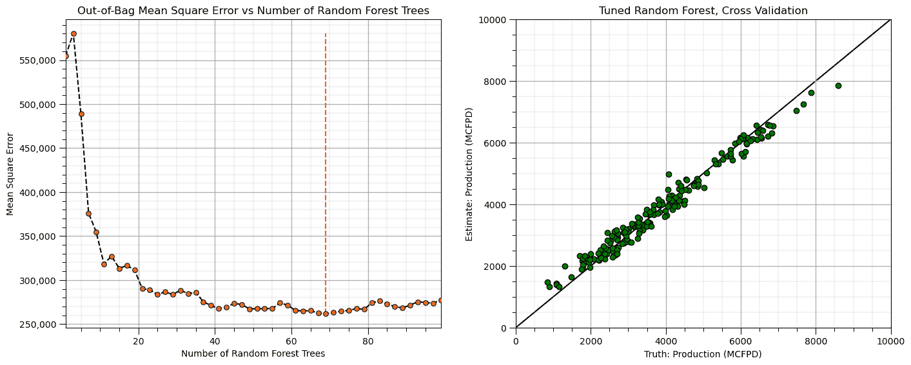

## 评论

希望您觉得这一章有用。还有很多可以做的和讨论的，我有很多更多的资源。查看我的[共享资源清单](https://michaelpyrcz.com/my-resources)，

*迈克尔*

## 关于作者


迈克尔·皮尔奇教授在德克萨斯大学奥斯汀分校 40 英亩校园的办公室。

迈克尔·皮尔奇（Michael Pyrcz）是德克萨斯大学奥斯汀分校[Cockrell 工程学院](https://cockrell.utexas.edu/faculty-directory/alphabetical/p)和[杰克逊地球科学学院](https://www.jsg.utexas.edu/researcher/michael_pyrcz/)的教授，他在[德克萨斯大学奥斯汀分校](https://www.utexas.edu/)从事和教授地下、空间数据分析、地统计学和机器学习。迈克尔还是，

+   [能源分析](https://fri.cns.utexas.edu/energy-analytics)新生研究项目的首席研究员，以及德克萨斯大学奥斯汀分校自然科学学院机器学习实验室的核心教员

+   [《计算机与地质学》](https://www.sciencedirect.com/journal/computers-and-geosciences/about/editorial-board)的副编辑，以及国际数学地质学协会[《数学地质学》](https://link.springer.com/journal/11004/editorial-board)的董事会成员。

迈克尔已经撰写了 70 多篇[同行评审的出版物](https://scholar.google.com/citations?user=QVZ20eQAAAAJ&hl=en)，一个用于空间数据分析的[Python 包](https://pypi.org/project/geostatspy/)，合著了一本关于空间数据分析的教科书《[地质统计学储层建模](https://www.amazon.com/Geostatistical-Reservoir-Modeling-Michael-Pyrcz/dp/0199731446)》，并是两本最近发布的电子书的作者，分别是《[Python 中的应用地质统计学：GeostatsPy 实践指南](https://geostatsguy.github.io/GeostatsPyDemos_Book/intro.html)》和《[Python 中的应用机器学习：带代码的实践指南](https://geostatsguy.github.io/MachineLearningDemos_Book/intro.html)》。

迈克尔的所有大学讲座都可以在他的[YouTube 频道](https://www.youtube.com/@GeostatsGuyLectures)上找到，附有 100 多个 Python 交互式仪表板和 40 多个存储库中的详细记录的工作流程，这些存储库在他的[GitHub 账户](https://github.com/GeostatsGuy)上，以支持任何感兴趣的学生和在职专业人士，提供持续更新的内容。要了解更多关于迈克尔的工作和共享教育资源，请访问他的网站。

## 想一起工作吗？

我希望这个内容对那些想了解更多关于地下建模、数据分析和学习机器学习的人有所帮助。学生和在职专业人士都欢迎参加。

+   想邀请我到贵公司进行培训、辅导、项目审查、工作流程设计和/或咨询吗？我很乐意拜访并与您合作！

+   感兴趣合作、支持我的研究生研究或我的地下数据分析与机器学习联盟（共同负责人是约翰·福斯特教授）吗？我的研究将数据分析、随机建模和机器学习理论与实践相结合，以开发新的方法和工作流程，增加价值。我们正在解决具有挑战性的地下问题！

+   您可以通过 mpyrcz@austin.utexas.edu 联系我。

我总是很高兴进行讨论，

*迈克尔*

迈克尔·皮尔茨，博士，P.Eng. 教授，德克萨斯大学奥斯汀分校 Cockrell 工程学院和 Jackson 地球科学学院

更多资源请访问：[Twitter](https://twitter.com/geostatsguy) | [GitHub](https://github.com/GeostatsGuy) | [网站](http://michaelpyrcz.com) | [Google Scholar](https://scholar.google.com/citations?user=QVZ20eQAAAAJ&hl=en&oi=ao) | [地统计学书籍](https://www.amazon.com/Geostatistical-Reservoir-Modeling-Michael-Pyrcz/dp/0199731446) | [YouTube](https://www.youtube.com/channel/UCLqEr-xV-ceHdXXXrTId5ig) | [Python 中应用地统计学电子书](https://geostatsguy.github.io/GeostatsPyDemos_Book/intro.html) | [Python 中应用机器学习电子书](https://geostatsguy.github.io/MachineLearningDemos_Book/) | [LinkedIn](https://www.linkedin.com/in/michael-pyrcz-61a648a1)

## 袋装和随机森林的动机

决策树不是机器学习中最强大、最前沿的方法，但，

+   最易于理解、可解释的预测机器学习建模之一


加拿大艾伯塔省 Hinton 的一棵孤独的黑云杉树，图片来自 https://hikebiketravel.com/6-fun-things-to-do-in-hinton-alberta-in-winter。

+   决策树通过随机森林、袋装和提升成为许多情况下的最佳模型之一


加拿大艾伯塔省 Hinton 附近的黑云杉森林，图片来自 https://en.wikivoyage.org/wiki/Hinton。

现在我们来介绍基于决策树的集成树、树袋和随机森林。首先，我提供一些决策树和集成方法的前提概念。

+   如果你不太熟悉决策树，回顾一下[决策树章节](https://geostatsguy.github.io/MachineLearningDemos_Book/MachineLearning_decision_tree.html)可能是个好主意。

## 树模型公式

预测特征空间被划分为 $J$ 个互斥的穷尽区域 $R_1, R_2, \ldots, R_J$。对于给定的预测案例 $x_1,\ldots,x_m \in R_j$，预测如下：

**回归** - 区域 $R_j$ 中训练数据的平均值

$$ \hat{y} = \frac{1}{|R_j|} \sum_{\mathbf{x}_i \in R_j} y_i $$

其中 $\hat{y}$ 是输入 $\mathbf{x}$ 的预测值，$R_j$ 是 $\mathbf{x}$ 落入的区域（叶节点），$|R_j|$ 是区域 $R_j$ 中训练样本的数量，$y_i$ 是 $R_j$ 中那些训练样本的实际目标值。

**分类** - 区域 $R_j$ 中训练案例数量最多的类别（最常见的情况）：

$$ \hat{y} = \arg\max_{c \in C} \left( \frac{1}{|R_j|} \sum_{\mathbf{x}_i \in R_j} \mathbb{1}(y_i = c) \right) $$

其中 $C$ 是所有可能类别的集合，$\mathbb{1}(y_i = c)$ 是指示变换，如果 $y_i = c$ 则为 1，否则为 0，$|R_j|$ 是区域 $R_j$ 中训练样本的数量，$\hat{y}$ 是预测的类别标签。

预测空间，$𝑋_1,\ldots,𝑋_𝑚$，被分割成 $J$ 个互斥、穷尽的区域，$R_j, j = 1,\ldots,J$，其中区域为，

+   **互斥** – 任何预测特征组合，$x_1,\ldots,x_𝑚$，只属于一个单一区域，$R_j$

+   **穷尽** – 所有预测特征值的组合属于一个区域，$R_j$，即所有区域，$R_j, j = 1,\ldots,J$，覆盖整个预测特征空间

所有落在同一区域，$R_j$，的预测案例，$x_1,\ldots,x_m$，都使用相同的值进行估计。

+   预测模型在区域边界处本质上是不连续的

例如，考虑这个决策树预测模型，从孔隙率，$X_1$，预测特征，


四个区域决策树与数据和预测，$\hat{Y}(R_j) = \overline{Y}(R_j)$ 按区域，$R_j, j=1,…,4$。例如，给定一个预测特征值为 13% 孔隙率的值，模型预测生产大约 2,000 MCFPD。

我们如何对预测特征空间进行分割？

+   基于分层、二进制分割的区域集。

## 树损失函数

对于回归树，我们最小化残差平方和，对于分类树，我们最小化加权平均基尼不纯度。

剩余平方和（RSS）衡量回归树中实际值与预测值之间总平方差的度量，

$$ \text{RSS} = \sum_{j=1}^{J} \sum_{i \in R_j} (y_i - \hat{y}_{R_j})² $$

其中 $J$ 是树中的区域总数，$R_j$ 是第 $j$ 个区域，$y_i$ 是第 $i$ 个训练数据响应特征的真值，$\hat{y}_{R_j}$ 是区域 $R_j$ 的预测值，$y_i \; \forall \; i \in R_j$ 的平均值。

当一个父节点分裂成两个子节点（t_L）和（t_R）时，加权基尼不纯度为：

$$ \text{Gini}_{\text{total}} = \sum_{j=1}^{J} \frac{N_j}{N} \cdot \text{Gini}(j) $$

其中 $J$ 是树中的区域总数，$N$ 是数据集中的样本总数，$N_j$ 是叶节点 $j$ 中的样本数，$\text{Gini}(j)$ 是叶节点 $j$ 的基尼不纯度。

单个决策树节点的基尼不纯度计算如下，

$$ \text{Gini}(j) = 1 - \sum_{c=1}^{C} p_{j,c}² $$

其中 $p_{j,c}$ 是节点 $j$ 中类别 $c$ 样本的比例。

对于分类，我们的损失函数不比较预测值与真值，就像我们的回归损失一样！

+   基尼不纯度惩罚训练数据类别混合！所有单一类别训练数据的区域将具有基尼不纯度为 0，以贡献整体损失。

注意，按区域计算的基尼不纯度为，

+   **加权** – 每个区域的训练数据数量，具有更多训练数据的区域对整体损失有更大的影响

+   **平均** - 所有区域以计算决策树的总基尼不纯度

这些损失在以下过程中计算，

+   **树模型训练** - 根据训练数据来生长树

+   **树模型调优** - 根据保留的测试数据来选择最佳的树复杂度。

让我们先谈谈树模型训练，然后再谈树模型调优。

## 训练树模型

我们如何计算这些互斥、穷尽的区域？这是通过预测特征空间的分层二进制分割来实现的。

训练决策树模型既是，

1.  分配互斥、穷尽的区域

1.  构建决策树时，每个区域都是一个终端节点，也称为叶子节点

这些是同一件事！让我们列出步骤，然后通过训练一个树来演示这一点。

1.  **将所有数据分配到单个区域** - 这个区域覆盖了整个预测特征空间

1.  **扫描所有可能的分割** - 在所有区域和所有特征上

1.  **选择最佳分割** - 这是贪婪优化，即最佳分割最小化了所有训练数据 $y_i$ 在所有区域 $j = 1,\ldots,J$ 上的残差平方和。

1.  **迭代至过度拟合** - 返回步骤 1 进行下一次分割，直到树非常过度拟合。

为了简洁，我们在这里停止，并做出以下观察，

+   分层、二进制分割与按顺序构建决策树相同，每次分割添加一个新的决策节点，并将叶子节点数量增加一个。

+   简单的决策树在复杂的决策树中，即如果我们构建一个 8 个叶子节点的模型，我们通过按顺序移除决策节点（最后一个移除的是第一个移除的）来得到 8、7、...、2 个叶子节点的模型。

+   最终过度拟合模型是叶子节点数量等于训练数据数量。在这种情况下，训练错误为 0.0，因为每个训练数据都有一个区域，我们使用训练数据响应特征值来估计所有训练数据案例。

## 调整树模型

为了调优决策树，我们采用过度拟合的已训练树模型，

+   按顺序剪掉最后一个决策节点

+   即剪掉决策树的最后一个分支

由于简单的树在复杂的树中！

我们可以在剪枝和选择具有最小测试错误的树时计算测试错误。

我们过度拟合了决策树模型，具有大量叶子节点，然后我们在跟踪测试错误的同时减少叶子节点的数量。

+   我们选择最小化测试错误的叶子节点数量。

+   由于我们是按顺序移除最后一个分支以简化树，所以我们称模型调优为决策树的**剪枝**。

让我们讨论决策树超参数。我更喜欢叶子节点数量作为我的决策树超参数，因为它提供，

+   **连续、均匀增加复杂度** - 在增加复杂度时没有跳跃

+   **直观控制复杂性** - 我们可以理解和关联 $2, 3, \ldots, 100$ 个叶节点的决策树

+   **灵活的复杂性** - 树可以自由生长以减少训练误差，包括高度不对称的决策树

其他常见的决策树超参数包括，

+   **最小减少 RSS** – 与增量增加复杂性必须通过足够的训练误差减少来抵消的想法相关。这可能导致模型提前停止，例如，训练误差减少很小的分割可能导致后续分割有更大的训练误差减少

+   **每个区域的训练数据的最小数量** – 与区域估计的准确率概念相关，即我们需要至少 $n$ 个数据来获得可靠的均值和最常见的类别

+   **最大层数** – 强制对称树，到达每个叶节点需要相似数量的分割。模型复杂度随着超参数的变化而大幅变化。

## 集成方法

我们的预测机器学习模型的测试准确率是多少？

回忆一下预期测试误差方程有三个组成部分。

$$ \mathbb{E}\left[(y_0 - \hat{f}(x_1⁰, \ldots, x_m⁰))²\right] = \left(\mathbb{E}[\hat{f}(x_1⁰, \ldots, x_m⁰)] - f(x_1⁰, \ldots, x_m⁰)\right)² + \mathbb{E}\left[\left(\hat{f}(x_1⁰, \ldots, x_m⁰) - \mathbb{E}[\hat{f}(x_1⁰, \ldots, x_m⁰)]\right)²\right] + \sigma_\varepsilon² $$

可以标记为：

$$ \text{Expected Test Error} = \text{Model Bias}² + \text{Model Variance} + \text{Irreducible Error} $$

其中，

+   **模型方差** - 是模型预测误差由于对数据的敏感性，即如果我们使用不同的训练数据会怎样？

+   **模型偏差** - 是由于使用近似模型/模型过于简单导致的模型预测误差

+   **不可减少误差** - 是由于缺少特征和样本有限导致的模型预测误差，无法通过建模/整个特征空间未采样来修复

现在我们可以将模型方差和偏差权衡可视化，


模型方差和偏差权衡，对于简单到复杂的预测机器学习模型。

模型方差限制了我们的模型复杂性和文本准确性。

**如何减少模型方差？** - 这样我们就可以使用更复杂和更精确的模型。

通过平均的标准误差，我们观察到通过平均来减少方差！

$$ \sigma_{\bar{x}}² = \frac{\sigma²_s}{n} $$

其中 $\sigma²_s$ 是样本方差，$n$ 是样本数量，$\sigma_{\bar{x}}²$ 是在独立同分布采样假设下的平均方差。


模型方差和偏差权衡，对于简单到复杂的预测机器学习模型，通过平均减少模型方差。

我们可以通过计算多个估计值并将它们平均在一起来减少模型方差。我们需要做出 $B$ 个估计，

$$ \hat{y}^{(b)} = \hat{f}^{(b)}(X_1, \ldots, X_m), \quad b = 1, \ldots, B $$

其中，

$\hat{y}^{(b)}$ 是集成中第 $b$ 个模型做出的预测，$\hat{f}^{(b)}$ 是第 $b$ 个估计量，$X_1, \ldots, X_m$ 是预测特征，$B$ 是估计量总数（多个模型）。

然后我们的最终估计将是我们的估计的平均值（回归）或多数（分类），

+   回归集成估计，

$$ \hat{y} = \frac{1}{B} \sum_{b=1}^{B} \hat{y}^{(b)} $$

+   分类集成估计，

$$ \hat{y} = \arg\max_y \sum_{b=1}^{B} \mathbb{I}(\hat{y}^{(b)} = y) $$

这需要多个预测模型，$f^{b}, b = 1,\ldots, B$ 来做出 $B$ 个预测，

$$ \hat{y}^{(b)} = \hat{f}^{(b)}(X_1, \ldots, X_m), \quad b = 1, \ldots, B $$

通过对集成进行平均来减少模型方差，使用多个模型进行多个预测。

但我们只能访问一个数据集，$Y,X_1,\ldots,X_m$；因此，每个模型都将相同，


使用相同的数据进行多个预测以减少模型方差，通过集成平均，相同的数据导致相同的模型和相同的预测。

我们的模式通常是确定性的，使用相同的数据和超参数进行训练，我们得到相同的估计。

## 自举

不确定性的一个来源是数据量不足。

+   这些大约 200 口井是否提供了对平均值的精确（和准确）估计？标准差？偏度？P13？

+   例如，平均孔隙率的不确定性对例如 $20\% \pm 2\%$ 有什么影响？


样本和总体，来自 Python 地球统计学电子书的应用地球统计学章节。

如果我们有 $L$ 个不同的数据集呢？$L$ 个平行宇宙，我们从不可及的真相（总体）中收集 $n$ 个样本。


来自真实总体的多个数据集实现，来自 Python 地球统计学电子书的应用地球统计学章节。

+   但我们只存在于一个宇宙中 $\rightarrow$ 这是不可能的。

相反，我们从数据集中替换 $n$ 次采样，

+   数据的自举实现

这些变化是由于一些样本被遗漏而其他样本被多次采样所引起的。


多个数据集的自举数据集。

现在，这是对自举（bootstrap）的一个定义，

+   通过重复随机抽样并替换来评估样本统计量不确定性的方法，模拟抽样过程以获取数据集实现。

在假设下，

+   **足够的样本** - 足够的数据来推断总体参数。自举不能弥补数据量过少的问题！

+   **代表性采样** - 样本中的偏差将传递到自举不确定性模型中，例如，如果样本中的均值有偏差，那么自举不确定性模型将基于样本中的偏差均值进行中心化。我们必须首先消除数据偏差。

自举也有各种局限性，包括，

+   **平稳性** - 假设样本中的统计量在模型空间中是恒定的

+   **只有一个不确定性来源** - 只考虑由于样本太少引起的不确定性，例如，不考虑数据变化引起的不确定性

+   **不考虑感兴趣的区域** - 较大的模型区域或较小的模型区域，自举不确定性不会改变。

+   **样本之间的独立性** - 不考虑样本之间的相关性，关系

+   **没有局部条件** - 不考虑其他局部信息来源

我们可以将所有这些限制总结为，自举不考虑数据的空间（或时间）上下文。

+   有一种形式的自举，称为空间自举，它确实考虑了空间上下文，[空间自举和集成机器学习的打包](https://www.sciencedirect.com/science/article/pii/S0098300424000414)。

让我们可视化使用 $n=10$ 个来自 10 个井的观测值来计算样本均值估计的最终可采储量（EUR）的不确定性时的自举过程。


$n = 10$ 个样本的重复采样来计算样本均值的单个实现。

现在我们重复并计算样本均值的第二次实现，


第二次重复 $n = 10$ 个样本的重复采样来计算样本均值的第二次实现。

并计算数据第三次实现以计算样本均值的第三次实现。


第三次重复 $n = 10$ 个样本的重复采样来计算样本均值的第三次实现。

如果我们重复 $L$ 次，我们将采样整个样本均值的不确定性分布。


对于 $L$ 次实现的数据，进行 $L$ 次实现以完全采样均值的不确定性。

让我们总结一下自举，

+   由 [Efron, 1982](https://epubs.siam.org/doi/pdf/10.1137/1.9781611970319.fm) 开发

+   统计重采样过程，用于从数据本身计算计算统计的不确定性。

+   这看起来似乎是不可能的，但继续比较已知案例，如标准误差，你就会看到它是有效的，

$$ \sigma_{\bar{x}}² = \frac{\sigma²_s}{n} $$

其中 $\sigma²_s$ 是样本方差，$n$ 是样本数量，$\sigma_{\bar{x}}²$ 是在独立、同分布采样假设下的平均方差。

+   可以应用于计算任何统计的不确定性，例如，第 $13$ 百分位数，偏度等。

+   高级形式考虑空间信息和策略（博弈论）。


自举的一般流程图。

## Bagging 模型

机器学习中的 Bagging 模型应用自举，

+   计算多个数据实现

+   训练多个模型实现

+   计算多个估计实现

+   平均估计值以减少模型方差

这是 Bagging 模型的流程图，


Bagging 机器学习模型流程图。

1.  应用统计自举以获得数据的多个实现，

$$ Y^b, X_1^b, \dots, X_m^b,\quad b = 1, \dots, B $$

1.  为每个数据实现训练一个预测模型（估计器），

$$ \hat{f}^b(X_1^b, \dots, X_m^b) $$

1.  使用每个估计器进行预测计算，

$$ \hat{Y}^b = \hat{f}^b(X_1^b, \dots, X_m^b) $$

1.  对估计器的 B 个预测进行聚合，

+   **回归** – 使用平均值聚合集成预测，

$$ \hat{Y} = \frac{1}{B} \sum_{b=1}^{B} \hat{Y}^b $$

+   **分类** – 使用多数规则、多数投票聚合集成预测，

$$ \hat{Y} = \arg\max(\hat{Y}^b) $$

我为[bagging 线性回归](https://github.com/GeostatsGuy/DataScienceInteractivePython/blob/main/Interactive_Bootstrap_Bagging.ipynb)构建了一个交互式 Python 仪表板。


通过线性回归进行交互式机器学习 Bagging，16 个数据自举，通过平均聚合模型和预测实现。

## 训练和调整 Bagging 模型

什么是 Bagging 回归模型？

每个模型都使用不同的自举数据实现进行训练，但都使用相同的超参数（s）。


我们单独训练 Bagging 模型，但调整集成。

Bagging 预测，$\hat{y}$，即单个估计器的总和，是该模型的输出。


通过平均多个预测模型进行 Bagging 回归预测。

或者对于分类，


通过多个预测模型的多数投票进行 Bagging 分类预测。

每个模型，在模型集成中被称为估计器，都是使用各自的 bootstrapped 数据实现进行训练的，在训练过程中，每个模型都最小化单个估计器的 bootstrapped 数据实现的训练误差，回归的残差平方和，

$$ \text{RSS} = \sum_{j=1}^{J} \sum_{i \in R_j} (y_i - \hat{y}_{R_j})² $$

以及用于分类的 Gini 不纯度，

$$ \text{Gini}_{\text{total}} = \sum_{j=1}^{J} \frac{N_j}{N} \cdot \text{Gini}(j) $$

每个估计器都是单独训练的，但它们都共享相同的超参数。

这提供了构建最适合每个自举数据集的最佳模型的灵活性。


集成模型中的估计器是单独训练的，但共享相同的超参数。

我们使用从集成估计的聚合中得到的袋装估计误差来调整我们的袋装模型，对于回归的情况，

$$ \text{MSE} = \sum_{i=1}^{n} (\hat{y}_i - y_i)² $$

其中预测值 $\hat{y}_i$ 由以下给出：

$$ \hat{y}_i = \frac{1}{B} \sum_{b=1}^{B} \hat{y}_i^{(b)} $$

我们对所有估计器联合调整我们的集成，我们不在集成中考虑单个模型估计器的误差，$\hat{y}_i^𝑏 - y_i$，以进行模型调整。


集成模型中的估计器共享相同数量的叶节点超参数。

结果是每个超参数设置的单个测试误差度量，对于上述叶节点数量的情况，我们得到这个结果，


集成测试误差与叶节点数量超参数的关系。

选择集成超参数以最小化测试误差。为了清晰起见，让我们将调整添加到我们之前的训练袋装模型工作流程中，

+   我们遍历超参数

+   最小化集成估计的测试误差


调整袋装模型的工作流程。

## 出袋交叉验证

在期望值上，每个自助数据实现中留下 $\frac{1}{3}$ 的训练数据，$b^c$；因此，交叉验证是内置的。

1.  用替换法从训练数据中抽取 $\frac{2}{3}$ 的样本（期望值），$Y^b, X_1^b, \dots, X_m^b$。

1.  使用 $\frac{2}{3}$ 的训练数据（期望值）训练估计器。

1.  在出袋样本 $X_1^{b^c}, \dots, X_m^{b^c}$，$\frac{1}{3}$ 的训练数据（期望值）上进行预测。


出袋错误计算工作流程，将其添加到超参数调整循环中。

1.  将来自所有 $\mathbf{B}$ 个模型的每个样本数据的 $\mathbf{B}/3$ 个预测（期望值）汇总，并做出出袋预测，对于回归，

$$ \hat{y}_\alpha^{\text{oob}} = \frac{1}{\left(\frac{B}{3}\right)} \sum_{b=1}^{\frac{B}{3}} \hat{y}_\alpha^{(b^c)} $$

计算出袋误差以评估模型性能。

$$ \text{MSE}_{\text{OOB}} = \frac{1}{n} \sum_{\alpha=1}^{n} \left[\hat{y}_\alpha^{\text{oob}} - y_\alpha \right]² $$

## 估计器数量

估计器数量是袋装模型的一个重要超参数

+   **更多估计器** – 在一定程度上提高泛化能力，增加树的数量通常可以提高性能并减少方差，因为预测是在更多模型上平均的。

+   **递减回报** - 超过一定点，添加更多估计器只会带来很少或没有改进，并且只会增加计算成本。

+   **提高稳定性** - 更多树减少了过度拟合到训练集中随机噪声的可能性。


集合模型中估计器的数量，少（上方）和多（下方）。

## 估计器复杂性

估计器共享的超参数仍然是重要的超参数。以下是一些关于树袋的指导，

+   **更复杂的模型** – 袋装减少了模型方差，因此我们通常为集成训练更复杂的模型。

+   **过于简单的模型** – 可能不会从袋装中看到任何改进，因为对于简单模型来说，模型方差不是一个问题，也不需要减少。

+   **特征交互** – 更复杂的模型可以捕捉更多特征之间的交互，例如，树袋模型中树深度为 𝑑 可以捕捉 𝑑 方特征交互。


具有不同的树深度超参数的集成，2（上方）、3（中间）和 4（下方）。

## 树袋

现在让我们总结一下方法，

+   使用数据的多个自助重采样构建决策树集成。

并提供一些指导，

+   树估计器的集成减少了模型方差。

+   在整个集成模型上调整超参数，即，集成中的所有树都有相同的超参数。

+   除了树估计器的复杂性之外，估计器的数量是一个额外的、重要的超参数。

+   在期望中，每棵树有 $\frac{1}{3}$ 的数据未被使用，这提供了访问袋外样本进行交叉验证的机会，因此我们可以一次性使用所有数据来构建模型并进行交叉验证，无需进行训练和测试分割。

+   由于估计器平均化导致的模型方差减少，过长的树通常优于简单的树。

揭示警报 - 我们希望树之间相互独立，多样化以最大化模型方差的减少，这导致了随机森林。关于这一点稍后还会详细介绍。

为了可视化树袋，这里有一个手动树袋的例子，从数据的自助重采样中得到的 6 个估计器，预测孔隙率和脆性，所有估计的平均值作为袋装模型。


6 个自助复制的复杂决策树（左侧）和袋装模型，所有 6 个模型的平均值（右侧）。

观察随着更多树的加入对预测模型的影响 – 从不连续预测模型过渡到连续预测模型！


6 个树袋预测模型和所有训练数据，随着估计器数量的增加，分别为 1、3、5、10、30 和 500 棵树。

观察随着树的数量增加，交叉验证中测试精度的提高，


使用 6 个树袋预测模型进行交叉验证，树的数量逐渐增加。

观察随着树的数量增加，模型方差减少的情况，


3 个模型，分别有 1 棵和 100 棵树，以展示随着集成聚合的增加，模型方差的减少。

## 随机森林

树袋的一个局限性是单个树可能高度相关。

+   当存在主导预测特征时会发生这种情况，因为它将始终应用于顶部分割（s），结果是集成中的所有树都非常相似（即，相关）


在树袋集成模型中高度相关的树，具有相同初始分割的树导致非常相似的预测。

在高度相关的树中，集成模型中的模型方差减少显著较少，

+   考虑到平均标准误差假设样本 𝑛 是独立的！

$$ \sigma_{\bar{x}}² = \frac{\sigma_s²}{n} $$

样本之间的相关性减少 $n$ 到有效 $n$，随着相关性的增加，有效 $n$ 减少。

随机森林是树袋，但对于每个分割，只有 $𝑚$ 个可用预测因子中的子集 $𝑝$ 是分割的候选（随机选择）。

$$ p \ll m $$

这迫使集成中的每一棵树以不同的方式进化，

分类中 $𝑝$ 的常见默认值，

$$ p = \sqrt{m} \quad \text{或} \quad \log_2(p) $$

对于回归，

$$ p=\frac{m}{3} $$

较低的 $p$ 表示相关性较低，泛化能力较好，较高的 $p$ 表示相关性较高，可能过拟合。注意，$p$ 过低会导致欠拟合，模型偏差较高

这里是一个用于先前预测问题的随机森林模型示例，

+   300 棵树，训练到最大深度为 $7$，$𝑝=1$，即每个分割随机选择 1 个预测特征


在树袋集成模型中高度相关的树，具有相同初始分割的树导致非常相似的预测。

现在，我们准备演示树袋和随机森林。

## 加载所需的库

我们还需要一些标准包。这些应该已经与 Anaconda 3 一起安装。

```py
%matplotlib inline                                         
suppress_warnings = True
import os                                                     # to set current working directory 
import math                                                   # square root operator
import numpy as np                                            # arrays and matrix math
import scipy.stats as st                                      # statistical methods
import pandas as pd                                           # DataFrames
import matplotlib.pyplot as plt                               # for plotting
from matplotlib.ticker import (MultipleLocator,AutoMinorLocator,FuncFormatter) # control of axes ticks
from matplotlib.colors import ListedColormap                  # custom color maps
import seaborn as sns                                         # for matrix scatter plots
from sklearn.tree import DecisionTreeRegressor                # decision tree method
from sklearn.ensemble import BaggingRegressor                 # bagging tree method
from sklearn.ensemble import RandomForestRegressor            # random forest method
from sklearn.tree import _tree                                # for accessing tree information
from sklearn import metrics                                   # measures to check our models
from sklearn.preprocessing import StandardScaler              # standardize the features
from sklearn.tree import export_graphviz                      # graphical visualization of trees
from sklearn.model_selection import (cross_val_score,train_test_split,GridSearchCV,KFold) # model tuning
from sklearn.pipeline import (Pipeline,make_pipeline)         # machine learning modeling pipeline
from sklearn import metrics                                   # measures to check our models
from sklearn.model_selection import cross_val_score           # multi-processor K-fold crossvalidation
from sklearn.model_selection import train_test_split          # train and test split
from IPython.display import display, HTML                     # custom displays
cmap = plt.cm.inferno                                         # default color bar, no bias and friendly for color vision defeciency
plt.rc('axes', axisbelow=True)                                # grid behind plotting elements
if suppress_warnings == True:  
    import warnings                                           # suppress any warnings for this demonstration
    warnings.filterwarnings('ignore') 
seed = 13                                                     # random number seed for workflow repeatability 
```

如果您遇到包导入错误，您可能必须首先安装这些包中的一些。这通常可以通过在 Windows 上打开命令窗口然后输入‘python -m pip install [package-name]’来完成。有关相应包的文档，可以获得更多帮助。

## 声明函数

让我们定义几个函数来简化绘制相关矩阵和决策、提升树和随机森林回归模型的可视化。

```py
def comma_format(x, pos):
    return f'{int(x):,}'

def feature_rank_plot(pred,metric,mmin,mmax,nominal,title,ylabel,mask): # feature ranking plot
    mpred = len(pred); mask_low = nominal-mask*(nominal-mmin); mask_high = nominal+mask*(mmax-nominal); m = len(pred) + 1
    plt.plot(pred,metric,color='black',zorder=20)
    plt.scatter(pred,metric,marker='o',s=10,color='black',zorder=100)
    plt.plot([-0.5,m-1.5],[0.0,0.0],'r--',linewidth = 1.0,zorder=1)
    plt.fill_between(np.arange(0,mpred,1),np.zeros(mpred),metric,where=(metric < nominal),interpolate=True,color='dodgerblue',alpha=0.3)
    plt.fill_between(np.arange(0,mpred,1),np.zeros(mpred),metric,where=(metric > nominal),interpolate=True,color='lightcoral',alpha=0.3)
    plt.fill_between(np.arange(0,mpred,1),np.full(mpred,mask_low),metric,where=(metric < mask_low),interpolate=True,color='blue',alpha=0.8,zorder=10)
    plt.fill_between(np.arange(0,mpred,1),np.full(mpred,mask_high),metric,where=(metric > mask_high),interpolate=True,color='red',alpha=0.8,zorder=10)  
    plt.xlabel('Predictor Features'); plt.ylabel(ylabel); plt.title(title)
    plt.ylim(mmin,mmax); plt.xlim([-0.5,m-1.5]); add_grid();
    return

def plot_corr(corr_matrix,title,limits,mask):                 # plots a graphical correlation matrix 
    my_colormap = plt.get_cmap('RdBu_r', 256)          
    newcolors = my_colormap(np.linspace(0, 1, 256))
    white = np.array([256/256, 256/256, 256/256, 1])
    white_low = int(128 - mask*128); white_high = int(128+mask*128)
    newcolors[white_low:white_high, :] = white                # mask all correlations less than abs(0.8)
    newcmp = ListedColormap(newcolors)
    m = corr_matrix.shape[0]
    im = plt.matshow(corr_matrix,fignum=0,vmin = -1.0*limits, vmax = limits,cmap = newcmp)
    plt.xticks(range(len(corr_matrix.columns)), corr_matrix.columns); ax = plt.gca()
    ax.xaxis.set_label_position('bottom'); ax.xaxis.tick_bottom()
    plt.yticks(range(len(corr_matrix.columns)), corr_matrix.columns)
    plt.colorbar(im, orientation = 'vertical')
    plt.title(title)
    for i in range(0,m):
        plt.plot([i-0.5,i-0.5],[-0.5,m-0.5],color='black')
        plt.plot([-0.5,m-0.5],[i-0.5,i-0.5],color='black')
    plt.ylim([-0.5,m-0.5]); plt.xlim([-0.5,m-0.5])

def add_grid():
    plt.gca().grid(True, which='major',linewidth = 1.0); plt.gca().grid(True, which='minor',linewidth = 0.2) # add y grids
    plt.gca().tick_params(which='major',length=7); plt.gca().tick_params(which='minor', length=4)
    plt.gca().xaxis.set_minor_locator(AutoMinorLocator()); plt.gca().yaxis.set_minor_locator(AutoMinorLocator()) # turn on minor ticks 

def visualize_model(model,xfeature,x_min,x_max,yfeature,y_min,y_max,response,z_min,z_max,clabel,xlabel,ylabel,title):# plots the data points and model 
    xplot_step = (x_max - x_min)/300.0; yplot_step = (y_max - y_min)/300.0 # resolution of the model visualization
    xx, yy = np.meshgrid(np.arange(x_min, x_max, xplot_step), # set up the mesh
                     np.arange(y_min, y_max, yplot_step))
    Z = model.predict(np.c_[xx.ravel(), yy.ravel()])          # predict with our trained model over the mesh
    Z = Z.reshape(xx.shape)
    im = plt.imshow(Z,interpolation = None,aspect = "auto",extent = [x_min,x_max,y_min,y_max], vmin = z_min, vmax = z_max,cmap = cmap)
    if (type(xfeature) != str) & (type(yfeature) != str):
        plt.scatter(xfeature,yfeature,s=None, c=response, marker=None, cmap=cmap, norm=None, vmin=z_min, vmax=z_max, alpha=1.0, 
                    linewidths=0.6, edgecolors="white")
        plt.xlabel(xlabel); plt.ylabel(ylabel)
    else:
        plt.xlabel(xlabel); plt.ylabel(ylabel)
    plt.title(title)                                          # add the labels
    plt.xlim([x_min,x_max]); plt.ylim([y_min,y_max])
    cbar = plt.colorbar(im, orientation = 'vertical')         # add the color bar
    cbar.set_label(clabel, rotation=270, labelpad=20)
    cbar.ax.yaxis.set_major_formatter(FuncFormatter(comma_format))
    return Z

def visualize_grid(Z,xfeature,x_min,x_max,yfeature,y_min,y_max,response,z_min,z_max,clabel,xlabel,ylabel,title,):# plots the data points and the decision tree 
    n_classes = 10
    xplot_step = (x_max - x_min)/300.0; yplot_step = (y_max - y_min)/300.0 # resolution of the model visualization
    xx, yy = np.meshgrid(np.arange(x_min, x_max, xplot_step),
                     np.arange(y_min, y_max, yplot_step))
    cs = plt.contourf(xx, yy, Z, cmap=cmap,vmin=z_min, vmax=z_max, levels=np.linspace(z_min, z_max, 100))

    im = plt.scatter(xfeature,yfeature,s=None,c=response,marker=None,cmap=cmap,norm=None,vmin=z_min,vmax=z_max,alpha=1.0, 
                     linewidths=0.6, edgecolors="white")
    plt.title(title)
    plt.xlabel(xlabel)
    plt.ylabel(ylabel)
    cbar = plt.colorbar(im, orientation = 'vertical')
    cbar.set_label(clabel, rotation=270, labelpad=20)
    cbar.ax.yaxis.set_major_formatter(FuncFormatter(comma_format))

def check_model(model,y,ymin,ymax,ylabel,title): # get OOB MSE and cross plot a decision tree 
    oob_indices = np.setdiff1d(np.arange(len(y)), model.estimators_samples_)
    oob_y_hat = model.oob_prediction_[oob_indices]
    oob_y = y.values[oob_indices]
    MSE_oob = metrics.mean_squared_error(oob_y,oob_y_hat)
    plt.scatter(oob_y,oob_y_hat,s=None, c='darkorange',marker=None,cmap=cmap,norm=None,vmin=None,vmax=None,alpha=0.8, 
                linewidths=1.0, edgecolors="black")
    plt.title(title); plt.xlabel('Truth: ' + str(ylabel)); plt.ylabel('Estimated: ' + str(ylabel))
    plt.xlim(ymin,ymax); plt.ylim(ymin,ymax)
    plt.plot([ymin,ymax],[ymin,ymax],color='black'); add_grid()
    plt.annotate('Out of Bag MSE: ' + str(f'{(np.round(MSE_oob,2)):,.0f}'),[4500,2500])
    plt.gca().xaxis.set_major_formatter(FuncFormatter(comma_format))
    plt.gca().yaxis.set_major_formatter(FuncFormatter(comma_format))

def check_model_OOB_MSE(model,y,ymin,ymax,ylabel,title):      # OOB MSE and cross plot over multiple bagged trees, checks for unestimated 
    oob_y_hat = model.oob_prediction_
    oob_y = y[oob_y_hat > 0.0]; oob_y_hat = oob_y_hat[oob_y_hat > 0.0]; 
    MSE_oob = metrics.mean_squared_error(oob_y,oob_y_hat)
    plt.scatter(oob_y,oob_y_hat,s=None, c='darkorange',marker=None,cmap=cmap,norm=None,vmin=None,vmax=None,alpha=0.8, 
                linewidths=1.0, edgecolors="black")
    plt.title(title); plt.xlabel('Truth: ' + str(ylabel)); plt.ylabel('Estimated: ' + str(ylabel))
    plt.xlim(ymin,ymax); plt.ylim(ymin,ymax)
    plt.plot([ymin,ymax],[ymin,ymax],color='black'); add_grid()
    plt.annotate('Out of Bag MSE: ' + str(f'{(np.round(MSE_oob,2)):,.0f}'),[4500,2500])
    plt.gca().xaxis.set_major_formatter(FuncFormatter(comma_format))
    plt.gca().yaxis.set_major_formatter(FuncFormatter(comma_format))

def check_grid(grid,xmin,xmax,ymin,ymax,xfeature,yfeature,response,zmin,zmax,title): # plots the estimated vs. the actual 
    if grid.ndim != 2:
        raise ValueError("Prediction array must be 2D")
    ny, nx = grid.shape
    xstep = (xmax - xmin)/nx; ystep = (ymax-ymin)/ny 
    predict_train = feature_sample(grid, xmin, ymin, xstep, ystep, xfeature, yfeature, 'sample')
    MSE = metrics.mean_squared_error(response,predict_train)
    plt.scatter(response,predict_train,s=None, c='darkorange',marker=None,cmap=cmap,norm=None,vmin=None,vmax=None,alpha=0.8, 
                linewidths=1.0, edgecolors="black")
    plt.title(title); plt.xlabel('Truth: ' + str(ylabel)); plt.ylabel('Estimated: ' + str(ylabel))
    plt.xlim(zmin,zmax); plt.ylim(zmin,zmax)
    plt.plot([zmin,zmax],[zmin,zmax],color='black'); add_grid()
    plt.gca().xaxis.set_major_formatter(FuncFormatter(comma_format))
    plt.gca().yaxis.set_major_formatter(FuncFormatter(comma_format))
    # plt.annotate('Out of Bag MSE: ' + str(f'{(np.round(MSE_oob,2)):,.0f}'),[4500,2500]) # not technically OOB MSE

def feature_sample(array, xmin, ymin, xstep, ystep, df_x, df_y, name): # sampling predictions from a feature space grid 
    if array.ndim != 2:
        raise ValueError("Array must be 2D")
    if len(df_x) != len(df_y):
        raise ValueError("x and y feature arrays must have equal lengths")   
    ny, nx = array.shape
    df = pd.DataFrame()
    v = []
    nsamp = len(df_x)
    for isamp in range(nsamp):
        x = df_x.iloc[isamp]
        y = df_y.iloc[isamp]
        iy = min(ny - int((y - ymin) / ystep) - 1, ny - 1)
        ix = min(int((x - xmin) / xstep), nx - 1)
        v.append(array[iy, ix])
    df[name] = v
    return df    

def display_sidebyside(*args):                                # display DataFrames side-by-side (ChatGPT 4.0 generated Spet, 2024)
    html_str = ''
    for df in args:
        html_str += df.head().to_html()  # Using .head() for the first few rows
    display(HTML(f'<div style="display: flex;">{html_str}</div>')) 
```

## 设置工作目录

我总是喜欢这样做，这样我就不会丢失文件，并且可以简化后续的读取和写入（每次都避免包含完整地址）。

```py
#os.chdir("c:/PGE383")                                        # set the working directory 
```

您将不得不更新引号内的部分以包含您自己的工作目录，并且在 Mac 上格式不同（例如：“~/PGE”）。

## 加载数据

让我们加载提供的多元、空间数据集 [unconv_MV.csv](https://raw.githubusercontent.com/GeostatsGuy/GeoDataSets/master/unconv_MV.csv)，它位于我的 GeoDataSet 仓库中。这是一个以逗号分隔的文件，包含：

+   井指数（整数）

+   孔隙率（%）

+   渗透率 ($mD$)

+   声阻抗 ($\frac{kg}{m³} \cdot \frac{m}{s} \cdot 10⁶$)

+   剪切率 (%)

+   总有机碳含量 (%)

+   煤岩反射率 (%)

+   初始气体产量（90 天平均）(MCFPD)

我们使用 pandas 的‘read_csv’函数将其加载到名为‘df’的数据框中，然后预览它以确保正确加载。

**Python 小贴士：使用包中的函数**只需输入我们在开头声明的包的标签：

```py
import pandas as pd 
```

因此，我们可以使用命令访问 pandas 函数‘read_csv’：

```py
pd.read_csv() 
```

但 read csv 需要输入参数。最重要的一个是文件名。对于我们的情况，所有其他默认参数都很好。如果您想查看此函数的所有可能参数，请参阅文档[此处](https://pandas.pydata.org/pandas-docs/stable/reference/api/pandas.read_csv.html)。

+   文档总是很有帮助

+   Python 函数通常有很多灵活性，这可以通过使用各种输入参数来实现。

此外，程序有一个输出，一个从数据加载的 pandas DataFrame。因此，我们必须指定代表该新对象的名字/变量。

```py
df = pd.read_csv("unconv_MV.csv") 
```

让我们运行此命令来加载数据，然后运行此命令来提取数据的随机子集。

```py
df = df.sample(frac=.30, random_state = 73073); 
df = df.reset_index() 
```

## 特征工程

让我们对数据进行一些更改以改进工作流程：

+   **选择预测特征（x2）和响应特征（x1）**，确保元数据也一致。

+   **元数据**编码，如每个特征的单位、标签和显示范围。

+   **减少数据数量**以方便可视化（如果图表上的点太多就难以看到）。

+   **训练和测试数据分割**以展示和可视化简单的超参数调整。

+   **向数据添加随机噪声**以展示模型过拟合。原始数据无误差且不易展示过拟合。

假设这已经正确设置，那么应该能够使用任何数据集和特征进行此演示。

+   为了简洁，我们这里不展示任何特征选择。例如，前一章中的 k-最近邻包括一些特征选择方法，但请参阅特征选择章节，以了解许多可能的带有特征选择代码的方法。

## 可选：向响应特征添加随机噪声

我们可以通过这样做来观察数据噪声对过拟合和超参数调整的影响。

+   这是为了经验学习，当然我们不会向我们的数据添加随机噪声

+   我们设置了随机数种子以确保可重复性

```py
add_error = True                                              # add random error to the response feature
std_error = 500                                               # standard deviation of random error, for demonstration only
idata = 2

if idata == 1:
    df_load = pd.read_csv(r"https://raw.githubusercontent.com/GeostatsGuy/GeoDataSets/master/unconv_MV.csv") # load the data from my github repo
    df_load = df_load.sample(frac=.30, random_state = seed); df_load = df_load.reset_index() # extract 30% random to reduce the number of data

elif idata == 2:
    df_load = pd.read_csv(r"https://raw.githubusercontent.com/GeostatsGuy/GeoDataSets/master/unconv_MV_v5.csv") # load the data 
    df_load = df_load.sample(frac=.70, random_state = seed); df_load = df_load.reset_index() # extract 30% random to reduce the number of data
    df_load = df_load.rename(columns={"Prod": "Production"})

yname = 'Production'; Xname = ['Por','Brittle']               # specify the predictor features (x2) and response feature (x1)
Xmin = [5.0,0.0]; Xmax = [25.0,100.0]                         # set minimums and maximums for visualization 
ymin = 1500.0; ymax = 7000.0
Xlabel = ['Porosity','Brittleness']; ylabel = 'Production'    # specify the feature labels for plotting
Xunit = ['%','%']; yunit = 'MCFPD'
Xlabelunit = [Xlabel[0] + ' (' + Xunit[0] + ')',Xlabel[1] + ' (' + Xunit[1] + ')']
ylabelunit = ylabel + ' (' + yunit + ')'

if add_error == True:                                         # method to add error
    np.random.seed(seed=seed)                                 # set random number seed
    df_load[yname] = df_load[yname] + np.random.normal(loc = 0.0,scale=std_error,size=len(df_load)) # add noise
    values = df_load._get_numeric_data(); values[values < 0] = 0   # set negative to 0 in a shallow copy ndarray

y = pd.DataFrame(df_load[yname])                              # extract selected features as X and y DataFrames
X = df_load[Xname]
df = pd.concat([X,y],axis=1)                                  # make one DataFrame with both X and y (remove all other features) 
```

让我们确保我们已经选择了合理的特征来构建模型

+   两个预测特征不共线性，因为这会导致预测模型不稳定

+   每个特征都与响应特征相关，预测特征向响应特征提供信息

## 计算相关矩阵和相关响应排名

让我们从相关性分析开始。我们可以使用之前声明的函数计算并查看相关矩阵和相关响应特征。

+   相关性分析基于线性关系的假设，但这是一个良好的开始

```py
corr_matrix = df.corr()
correlation = corr_matrix.iloc[:,-1].values[:-1]

plt.subplot(121)
plot_corr(corr_matrix,'Correlation Matrix',1.0,0.1)           # using our correlation matrix visualization function
plt.xlabel('Features'); plt.ylabel('Features')

plt.subplot(122)
feature_rank_plot(Xname,correlation,-1.0,1.0,0.0,'Feature Ranking, Correlation with ' + yname,'Correlation',0.5)

plt.subplots_adjust(left=0.0, bottom=0.0, right=2.0, top=0.8, wspace=0.2, hspace=0.3); plt.show() 
```


注意由于每个变量与其自身的相关性而产生的 1.0 对角线。

看起来不错。存在不同大小的相关性。当然，相关系数仅限于线性相关程度。

+   让我们查看矩阵散点图，以查看特征之间的成对关系。

```py
pairgrid = sns.PairGrid(df,vars=Xname+[yname])                # matrix scatter plots
pairgrid = pairgrid.map_upper(plt.scatter, color = 'darkorange', edgecolor = 'black', alpha = 0.8, s = 10)
pairgrid = pairgrid.map_diag(plt.hist, bins = 20, color = 'darkorange',alpha = 0.8, edgecolor = 'k')# Map a density plot to the lower triangle
pairgrid = pairgrid.map_lower(sns.kdeplot, cmap = plt.cm.inferno, 
                              alpha = 1.0, n_levels = 10)
pairgrid.add_legend()
plt.subplots_adjust(left=0.0, bottom=0.0, right=0.9, top=0.9, wspace=0.2, hspace=0.2); plt.show() 
```


## 训练和测试拆分

由于我们正在使用集成方法，因此训练和测试拆分已内置到模型训练中，使用袋外样本。

+   我们将处理整个数据集

+   注意，我们可以为训练、验证、测试方法拆分测试数据集。为了简单起见，我在这项工作流程中只使用训练和测试。

## 可视化 DataFrame

在我们构建模型之前，可视化训练和测试 DataFrame 是一个有用的检查。

+   许多事情可能会出错，例如，我们加载了错误的数据，所有特征都没有加载，等等。

我们可以通过利用 'head' DataFrame 成员函数（格式整洁、美观，见下文）来预览。

```py
df.head(n=5)                                                  # check the loaded DataFrame 
```

|  | Por | Brittle | Production |
| --- | --- | --- | --- |
| 0 | 7.22 | 63.09 | 2006.074005 |
| 1 | 13.01 | 50.41 | 4244.321703 |
| 2 | 10.03 | 37.74 | 2493.189177 |
| 3 | 18.10 | 56.09 | 6124.075271 |
| 4 | 16.95 | 61.43 | 5951.336259 |

## 表格数据的汇总统计

在 DataFrames 中从表格数据计算汇总统计有很多高效的方法。

+   describe 命令以数据表的形式提供计数、平均值、最小值、最大值、百分位数。

```py
df.describe(percentiles=[0.1,0.9])                            # check DataFrame summary statistics 
```

|  | Por | Brittle | Production |
| --- | --- | --- | --- |
| count | 140.000000 | 140.000000 | 140.000000 |
| mean | 14.897357 | 48.345429 | 4273.644226 |
| std | 3.181639 | 14.157619 | 1138.466092 |
| min | 6.550000 | 10.940000 | 1517.373571 |
| 10% | 10.866000 | 28.853000 | 2957.573690 |
| 50% | 14.855000 | 50.735000 | 4315.186629 |
| 90% | 18.723000 | 65.813000 | 5815.526968 |
| max | 23.550000 | 84.330000 | 6907.632261 |

我们检查了汇总统计是件好事。

+   没有明显的错误

+   检查每个特征值的范围，以设置和调整绘图限制。见上图。

## 可视化分布

让我们检查预测特征的直方图和散点图。

+   检查数据是否覆盖了可能的预测特征组合范围

+   检查预测特征不是高度相关、共线的，因为这会增加模型方差

```py
nbins = 20                                                    # number of histogram bins

plt.subplot(221)                                              # predictor feature #1 histogram
freq,_,_ = plt.hist(x=df[Xname[0]],weights=None,bins=np.linspace(Xmin[0],Xmax[0],nbins),alpha = 0.6,
                     edgecolor='black',color='darkorange',density=False,label='Train')
max_freq = max(freq)*1.10
plt.xlabel(Xlabelunit[0]); plt.ylabel('Frequency'); plt.ylim([0.0,max_freq]); plt.title('Density'); add_grid()  
plt.xlim([Xmin[0],Xmax[0]]); plt.legend(loc='upper right')   

plt.subplot(222)                                              # predictor feature #2 histogram
freq,_,_ = plt.hist(x=df[Xname[1]],weights=None,bins=np.linspace(Xmin[1],Xmax[1],nbins),alpha = 0.6,
                     edgecolor='black',color='darkorange',density=False,label='Train')
max_freq = max(freq)*1.10
plt.xlabel(Xlabelunit[1]); plt.ylabel('Frequency'); plt.ylim([0.0,max_freq]); plt.title('Porosity'); add_grid()  
plt.xlim([Xmin[1],Xmax[1]]); plt.legend(loc='upper right')   

plt.subplot(223)                                              # predictor features #1 and #2 scatter plot
plt.scatter(df[Xname[0]],df[Xname[1]],s=40,marker='o',color = 'darkorange',alpha = 0.8,edgecolor = 'black',zorder=10,label='Train')
plt.title(Xlabel[0] + ' vs ' +  Xlabel[1])
plt.xlabel(Xlabelunit[0]); plt.ylabel(Xlabelunit[1])
plt.legend(); add_grid(); plt.xlim([Xmin[0],Xmax[0]]); plt.ylim([Xmin[1],Xmax[1]])

plt.subplot(224)                                              # predictor feature #2 histogram
freq,_,_ = plt.hist(x=df[yname],weights=None,bins=np.linspace(ymin,ymax,nbins),alpha = 0.6,
                     edgecolor='black',color='darkorange',density=False,label='Train')
max_freq = max(freq)*1.10
plt.xlabel(ylabelunit); plt.ylabel('Frequency'); plt.ylim([0.0,max_freq]); plt.title('Porosity'); add_grid()  
plt.xlim([ymin,ymax]); plt.legend(loc='upper right') 

plt.subplots_adjust(left=0.0, bottom=0.0, right=1.6, top=1.6, wspace=0.3, hspace=0.25)
#plt.savefig('Test.pdf', dpi=600, bbox_inches = 'tight',format='pdf') 
plt.show() 
```


再次强调，分布表现良好，

+   我们无法观察到明显的缺口或截断。

+   预测特征之间没有高度相关性

让我们看看孔隙率与脆性相对于产量的散点图。

+   为了可视化预测问题，即系统的形状

```py
plt.subplot(111)                                              # visualize the train and test data in predictor feature space
im = plt.scatter(X[Xname[0]],X[Xname[1]],s=None, c=y[yname], marker='o', cmap=cmap, 
    norm=None, vmin=ymin, vmax=ymax, alpha=0.8, linewidths=0.3, edgecolors="black", label = 'Train')
plt.title('Training ' + ylabel + ' vs. ' + Xlabel[1] + ' and ' + Xlabel[0]); 
plt.xlabel(Xlabel[0] + ' (' + Xunit[0] + ')'); plt.ylabel(Xlabel[1] + ' (' + Xunit[1] + ')')
plt.xlim(Xmin[0],Xmax[0]); plt.ylim(Xmin[1],Xmax[1]); plt.legend(loc = 'upper right'); add_grid()
cbar = plt.colorbar(im, orientation = 'vertical')
cbar.set_label(ylabel + ' (' + yunit + ')', rotation=270, labelpad=20)
cbar.ax.yaxis.set_major_formatter(FuncFormatter(comma_format))
plt.subplots_adjust(left=0.0, bottom=0.0, right=1.0, top=1.0, wspace=0.2, hspace=0.2); plt.show() 
```


## 集成树方法 - 树袋装回归

我们准备好构建一个树袋装模型。要执行树袋装，我们：

1.  设置单个树的超参数

```py
seed = 73073
max_depth = 100
min_samples_leaf = 2 
```

1.  实例化一个单独的回归树

```py
regressor = DecisionTreeRegressor(max_depth = max_depth, min_samples_leaf = min_samples_leaf) 
```

1.  设置袋装超参数

```py
num_trees = 100
seed = 73073 
```

1.  使用先前实例化的回归树（包装决策树）实例化袋装回归器

```py
bagging_model = BaggingRegressor(base_estimator=regressor, n_estimators=num_trees, random_state=seed) 
```

1.  训练袋装回归（决策树的包装）

```py
bagging_model.fit(X = predictors, y = response) 
```

1.  可视化特征空间上的模型结果（由于我们只有 2 个预测特征，这很容易做到）

## 手动袋装演示

为了演示手动树袋装，让我们将树的数量设置为 1，并运行 6 次树袋装回归。

+   每个的结果是一棵单独的复杂决策树

+   注意，random_state 参数是袋装方法中自助采样的随机数种子

+   由于每个随机数种子都会生成不同的自助数据集，因此树会因每个随机数种子而异

我们将遍历模型并将每个模型存储在一个模型列表中。

```py
max_depth = 100; min_samples_leaf = 2                         # set for a complicated tree

regressor = DecisionTreeRegressor(max_depth = max_depth, min_samples_leaf = min_samples_leaf) # instantiate a decision tree

num_tree = 1                                                  # use only a single tree for this demonstration
seeds = [73073, 73074, 73075, 73076, 73077, 73078]
bagging_models = []; oob_MSE = []; score = []; pred = []

index = 1
for seed in seeds:                                            # visualize models over random number seeds
    bagging_models.append(BaggingRegressor(base_estimator=regressor,n_estimators=num_tree,random_state=seed,oob_score = True,
                                           bootstrap=True,n_jobs = 4))
    bagging_models[index-1].fit(X = X, y = y)
    oob_MSE.append(bagging_models[index-1].oob_score_)
    plt.subplot(2,3,index)
    bag_X1 = X.iloc[np.asarray(bagging_models[index-1].estimators_samples_[0]),0]
    bag_X2 = X.iloc[np.asarray(bagging_models[index-1].estimators_samples_[0]),1]
    bag_y = y.iloc[np.asarray(bagging_models[index-1].estimators_samples_[0]),0]
    pred.append(visualize_model(bagging_models[index-1],bag_X1,Xmin[0],Xmax[0],bag_X2,Xmin[1],Xmax[1],bag_y,ymin,ymax,
                ylabelunit,Xlabelunit[0],Xlabelunit[1],'Bootstrap Data and Decision Tree #' + str(index) + ' '))
    index = index + 1

plt.subplots_adjust(left=0.0, bottom=0.0, right=2.0, top=1.4, wspace=0.4, hspace=0.3) 
```


注意每个模型的数据变化，

+   我们已经对数据集进行了自助采样，因此一些数据丢失，其他数据被使用了 2 次或更多次

+   在期望中，只有 2/3 的数据用于每个树，1/3 是袋外数据

让我们检查带有袋外数据的交叉验证结果。

```py
index = 1
for index in range(0,len(seeds)):                             # check models over random number seeds
    plt.subplot(2,3,index+1)
    check_model(bagging_models[index],y,ymin,ymax,ylabelunit,'Out-of-Bag Predictions Decision Tree #' +  str(index+1))
    index = index + 1
plt.subplots_adjust(left=0.0, bottom=0.0, right=2.6, top=2.0, wspace=0.3, hspace=0.3) 
```


现在，让我们演示 6 个决策树的预测平均，我们手动执行袋装树预测以清楚地展示该方法。

+   我们在离散化预测特征空间上平均预测响应特征（产量）

+   我们可以利用广播方法对整个数组进行操作

+   我们将应用相同的模型检查，但我们将使用一个修改后的函数来读取响应特征 2D 数组，而不是模型

```py
Z = pred[0] 
index = 1
for seed in seeds:                                            # loop over random number seeds
    if index == 1:
        Z = pred[index-1]
    else:
        Z = Z + pred[index-1]                                 # calculate the average response over 3 trees
    index = index + 1

Z = Z / len(seeds)                                            # grid pixel-wise average of the 6 bootstrapped decision trees

plt.subplot(121)                                              # plot predictions over predictor feature space
visualize_grid(Z,df[Xname[0]],Xmin[0],Xmax[0],df[Xname[1]],Xmin[1],Xmax[1],df[yname],ymin,ymax,ylabelunit,
               Xlabelunit[0],Xlabelunit[1],'All Data and Average of 6 Bootstrapped Trees')

plt.subplot(122)                                              # check model predictions vs. testing dataset
check_grid(Z,Xmin[0],Xmax[0],Xmin[1],Xmax[1],df[Xname[0]],df[Xname[1]],df[yname],ymin,ymax,'Model Check - Average of 6 Bootstrapped Trees')

plt.subplots_adjust(left=0.0, bottom=0.0, right=1.5, top=0.8, wspace=0.3, hspace=0.2) 
```


我们制作了 6 个复杂的树，每个树都使用原始数据的自助样本进行训练，然后平均每个树的预测。

+   结果更加平滑 - 模型方差更低

+   结果更接近训练数据

## 增加树数量的袋装演示

为了演示，让我们构建 6 个袋装树回归模型，这些模型具有不断增加的过于复杂（并且可能过拟合）的树的平均值。

+   使用 scikit learn 的袋装回归器，这可以通过‘num_tree’超参数自动完成

我们将遍历模型并将它们存储在模型列表中！

```py
max_depth = 3; min_samples_leaf = 5                           # set for a complicated tree

regressor = DecisionTreeRegressor(max_depth = max_depth, min_samples_leaf = min_samples_leaf) # instantiate a decision tree

seed = 73073;
num_trees = [1,3,5,10,30,500]                                 # number of trees averaged for each estimator

bagging_models_ntrees = []; oob_MSE = []; pred = []

index = 1
for num_tree in num_trees:                                    # visualize the models over number of trees
    bagging_models_ntrees.append(BaggingRegressor(base_estimator=regressor,n_estimators=num_tree,random_state=seed,oob_score = True,n_jobs = 4))
    bagging_models_ntrees[index-1].fit(X = X, y = y)
    plt.subplot(2,3,index)
    pred.append(visualize_model(bagging_models_ntrees[index-1],df[Xname[0]],Xmin[0],Xmax[0],df[Xname[1]],Xmin[1],Xmax[1],df[yname],ymin,ymax,
                ylabelunit,Xlabelunit[0],Xlabelunit[1],'Bagging with ' + str(num_tree) + ' Trees'))
    index = index + 1

plt.subplots_adjust(left=0.0, bottom=0.0, right=2.0, top=1.4, wspace=0.4, hspace=0.3) 
```


观察平均增加的树的数量对模型的影响。

+   我们从断续的响应预测模型过渡到平滑的预测模型（跳跃被平滑了）

让我们使用保留的测试数据重复建模交叉验证步骤。

```py
index = 1
for num_tree in num_trees:                                    # check models over number of trees
    plt.subplot(2,3,index)
    check_model_OOB_MSE(bagging_models_ntrees[index-1],y,ymin,ymax,ylabelunit,'Out-of-Bag Predictions with ' + 
                        str(num_trees[index-1]) + ' Decision Trees')
    index = index + 1
plt.subplots_adjust(left=0.0, bottom=0.0, right=2.6, top=2.0, wspace=0.3, hspace=0.3) 
```


观察随着集成模型平均水平的增加，测试准确性的改进？

让我们运行许多案例并检查准确性与树的数量之间的关系。

```py
max_depth = 3; min_samples_leaf = 5                           # set for a complicated tree

regressor = DecisionTreeRegressor(max_depth = max_depth, min_samples_leaf = min_samples_leaf) # instantiate a decision tree
ntree_list = []; MSE_oob_list = []
for num_tree in np.arange(1,350,50):                          # check OOB MSE over number of trees
    bagg_tree = BaggingRegressor(base_estimator=regressor,n_estimators=num_tree,random_state=seed,oob_score = True,n_jobs = 4).fit(X = X, y = y)
    oob_y_hat = bagg_tree.oob_prediction_
    oob_y = y[oob_y_hat > 0.0]; oob_y_hat = oob_y_hat[oob_y_hat > 0.0]; # remove if not estimated
    MSE_oob_list.append(metrics.mean_squared_error(oob_y,oob_y_hat)); ntree_list.append(num_tree)

plt.scatter(ntree_list,MSE_oob_list,color='darkorange',edgecolor='black',alpha=0.8,s=30,zorder=10)
plt.plot(ntree_list,MSE_oob_list,color='black',ls='--',zorder=1)
plt.xlabel('Number of Bagged Trees'); plt.ylabel('Mean Square Error'); plt.title('Out-of-Bag Mean Square Error vs Number of Bagged Trees')
plt.gca().yaxis.set_major_formatter(FuncFormatter(comma_format)); add_grid()
plt.subplots_adjust(left=0.0, bottom=0.0, right=1.0, top=1.0, wspace=0.2, hspace=0.2); plt.show() 
```


树的数量通过减少模型方差来提高模型准确性。让我们通过实验实际观察这种模型方差减少。

## 模型方差与集成模型平均

让我们通过模型平均来查看模型方差的变化，我们将比较具有不同树平均数量的多个模型。

+   我们通过视觉比较来完成这一点，让我们通过改变随机数种子来查看不同的袋装建模

```py
max_depth = 3; min_samples_leaf = 5                           # set for a complicated tree

regressor = DecisionTreeRegressor(max_depth = max_depth, min_samples_leaf = min_samples_leaf) # instantiate a decision tree

seeds = [73083, 73084, 73085]                                 # number of random number seeds
num_trees = [1,5,30,100]                                      # number of trees averaged for each estimator
bagging_models_ntrees_seeds = []
MSE_oob_list = []; ntree_list = []

index = 1
for num_tree in num_trees:                                    # loop over number of trees
    for seed in seeds:                                        # loop over number of random number seeds
        bagg_tree = BaggingRegressor(base_estimator=regressor, n_estimators=num_tree, 
                                     random_state=seed, oob_score = True, n_jobs = 4).fit(X = X, y = y)
        oob_y_hat = bagg_tree.oob_prediction_
        oob_y = y[oob_y_hat > 0.0]; oob_y_hat = oob_y_hat[oob_y_hat > 0.0]; # remove if not estimated
        bagging_models_ntrees_seeds.append(bagg_tree)
        MSE_oob_list.append(metrics.mean_squared_error(oob_y,oob_y_hat)); ntree_list.append(num_tree)
        plt.subplot(4,3,index)
        visualize_model(bagging_models_ntrees_seeds[index-1],df[Xname[0]],Xmin[0],Xmax[0],df[Xname[1]],Xmin[1],Xmax[1],df[yname],ymin,ymax,
                ylabelunit,Xlabelunit[0],Xlabelunit[1],'Training Data and Tree Model - ' + str(num_tree) + ' Tree(s)')
        index = index + 1

plt.subplots_adjust(left=0.0, bottom=0.0, right=2.0, top=4.0, wspace=0.35, hspace=0.3); plt.show() 
```


随着我们增加用于袋装树回归模型的平均决策树的数量：

+   再次，响应预测在预测特征空间上变得更加平滑

+   模型的多种实现开始收敛，这是较低的模型方差

## 随机森林

在随机森林中，我们限制了每个分割考虑的特征数量。注意，在 scikit learn 中默认是 $\frac{m}{3}$。使用此超参数将其设置为预测特征数量的平方根。实践中另一个常见的替代方案 $\sqrt{m}$。

```py
max_features = 'sqrt' 
```

这迫使树多样化/去相关树。

+   回忆一下，通过在多个决策树上平均来减少模型方差 $Y = \frac{1}{B} \sum_{b=1}^{B} Y^b(X_1^b,...,X_m^b)$

+   从[空间自助工作流程](https://github.com/GeostatsGuy/PythonNumericalDemos/blob/master/SubsurfaceDataAnalytics_Spatial_Bootstrap.ipynb)中回忆，平均样本的相关性会减弱方差减少

让我们通过随机森林来演示这一点。

1.  设置超参数。

即使我只运行一个模型，我也会设置随机数种子以确保我有一个确定性的模型，一个每次重新运行都能得到相同结果的模型。如果没有设置随机数种子，那么它很可能是基于系统时间设置的。

```py
seed = 73073 
```

我们将过度拟合树，让它们变得过于复杂。再次，集成方法将减轻模型方差和过度拟合。

```py
max_depth = 5 
```

我们将使用大量树来减轻模型方差，并从随机森林树的多样性中受益。

```py
num_tree = 300 
```

我们使用一个简单的 2 个预测器特征示例来简化可视化。scikit learn 的随机森林默认情况下是随机选择 $\frac{m}{3}$ 个特征来考虑每个分割。

当 $m = 2$ 时，这没有太多意义，因为我们的情况就是这样，所以我们把每个分割考虑的最大特征数设置为 1。

+   我们正在强制为每个分割考虑孔隙率或脆性，进行分层二进制分割。

```py
max_features = 1 
```

1.  使用我们的超参数实例化随机森林回归器

```py
my_first_forest = RandomForestRegressor(max_depth=max_depth, random_state=seed,n_estimators=num_tree, max_features=max_features) 
```

1.  训练随机森林回归

```py
my_first_forest.fit(X = predictors, y = response) 
```

1.  可视化模型结果在特征空间上的结果（由于我们只有 2 个预测器特征，这很容易做到）

让我们构建、可视化和交叉验证我们的第一个随机森林回归模型。

```py
seed = 73093                                                  # set the random forest hyperparameters
max_depth = 7
num_tree = 300
max_features = 1

my_first_forest = RandomForestRegressor(max_depth=max_depth,random_state=seed,n_estimators=num_tree,max_features=max_features,
                                       oob_score=True,bootstrap=True)

my_first_forest.fit(X = X, y = y)                             # train the model with training data 

plt.subplot(121)                                              # predict with the model over the predictor feature space and visualize
visualize_model(my_first_forest,df[Xname[0]],Xmin[0],Xmax[0],df[Xname[1]],Xmin[1],Xmax[1],df[yname],ymin,ymax,
                ylabelunit,Xlabelunit[0],Xlabelunit[1],'Training Data and Random Forest Model')

plt.subplot(122)                                              # perform cross validation with withheld testing data
check_model_OOB_MSE(my_first_forest,y,ymin,ymax,ylabelunit,'Out-of-Bag Predictions with Random Forest')

plt.subplots_adjust(left=0.0, bottom=0.0, right=1.5, top=1.0, wspace=0.4, hspace=0.2); plt.show() 
```


树多样性的力量！我们刚刚构建了迄今为止最好的模型。

+   条件偏差已降低（我们的图表的斜率更接近 1:1）

+   我们有较低的袋外均方误差

让我们进行一些测试，以确保我们理解随机森林回归模型。

首先，让我们确认每个分割只考虑一个特征（随机）

+   将我们的深度限制为最大深度 = 1，仅进行一次分割

+   在每个森林中仅限制一棵树！

这样我们就可以看到多个模型在第一次分割中的多样性。

```py
max_depth = 1                                                 # set the random forest hyperparameters
num_tree = 1
max_features = 1
simple_forest = []

seeds = [73103,73104,73105,73106,73107,73108]                 # set the random number seeds

index = 1
for seed in seeds:                                            # loop over random number seeds
    simple_forest.append(RandomForestRegressor(max_depth=max_depth, random_state=seed,n_estimators=num_tree, max_features=max_features))
    simple_forest[index-1].fit(X = X, y = y)
    plt.subplot(2,3,index)                                    # predict with the model over the predictor feature space and visualize
    visualize_model(simple_forest[index-1],df[Xname[0]],Xmin[0],Xmax[0],df[Xname[1]],Xmin[1],Xmax[1],df[yname],ymin,ymax,
                ylabelunit,Xlabelunit[0],Xlabelunit[1],'Training Data and Random Forest Model')
    index = index + 1

plt.subplots_adjust(left=0.0, bottom=0.0, right=2.0, top=2.0, wspace=0.2, hspace=0.3) 
```


注意，第一次分割是 50/50 的孔隙率和脆性。

+   此外，对于我拟合到这个数据集的所有决策树，孔隙率总是被选为树的前 2-3 层的特征。

+   通过限制第一次分割时考虑的预测器特征，随机森林实现了模型多样性！

如果你不信任这个结果，让我们重新运行上面的代码，允许所有分割都使用两个预测器。

```py
max_depth = 1                                                 # set the random forest hyperparameters
num_tree = 1
max_features = 2
simple_forest = []

seeds = [73103,73104,73105,73106,73107,73108]                 # random number seeds 

index = 1
for seed in seeds:                                            # loop over random number seeds
    simple_forest.append(RandomForestRegressor(max_depth=max_depth, random_state=seed,n_estimators=num_tree, max_features=max_features))
    simple_forest[index-1].fit(X = X, y = y)
    plt.subplot(2,3,index)                                    # predict with the model over the predictor feature space and visualize
    visualize_model(simple_forest[index-1],df[Xname[0]],Xmin[0],Xmax[0],df[Xname[1]],Xmin[1],Xmax[1],df[yname],ymin,ymax,
                ylabelunit,Xlabelunit[0],Xlabelunit[1],'Training Data and Random Forest Model')
    index = index + 1

plt.subplots_adjust(left=0.0, bottom=0.0, right=2.0, top=2.0, wspace=0.4, hspace=0.3) 
```


现在，我们有一组第一次分割，这些分割因训练数据的自助采样而不同，但都在孔隙率上。

## 模型性能通过袋外和特征重要性

由于我们现在正在构建一个由大量树组成的更健壮的模型，让我们对模型检查更加认真。

+   我们将查看袋外均方误差

+   我们将查看特征重要性

让我们从一个非常大的森林开始，这可能会花费一些时间来运行！

```py
seed = 73093                                                  # set the random forest hyperparameters
max_depth = 7
num_tree = 500
max_features = 1

big_forest = RandomForestRegressor(max_depth=max_depth, random_state=seed,n_estimators=num_tree, max_features=max_features,
                                   oob_score = True,bootstrap=True,n_jobs = 4)

big_forest.fit(X = X, y = y)

plt.subplot(121)                                              # predict with the model over the predictor feature space and visualize
visualize_model(big_forest,df[Xname[0]],Xmin[0],Xmax[0],df[Xname[1]],Xmin[1],Xmax[1],df[yname],ymin,ymax,
                ylabelunit,Xlabelunit[0],Xlabelunit[1],'Training Data and Random Forest Model')

plt.subplot(122)                                              # perform cross validation with withheld testing data
check_model_OOB_MSE(big_forest,y,ymin,ymax,ylabelunit,'Model Check Random Forest Model')

plt.subplots_adjust(left=0.0, bottom=0.0, right=1.5, top=1.0, wspace=0.4, hspace=0.2) 
```


要获取特征重要性，我们只需访问模型成员‘feature_importance_’。

+   我们必须在模型实例化时将 feature_importance 设置为 true，才能使其可用

+   此度量标准化为总和为 1.0

+   与 2D 数组中预测特征相同的顺序，孔隙率然后是脆性

+   特征重要性是每个特征通过分割带来的总均方误差减少的比例

+   我们可以访问森林中每棵树或整个森林中每个特征的相对重要性

我们通过随机森林回归器模型的此成员获得特征重要性的全局平均值。

```py
importances = big_forest.feature_importances_ 
```

让我们绘制特征重要性图，该图是从集成中计算出的显著性。

+   当我们报告基于模型的特征重要性时，总是显示模型是一个好模型的好主意。我喜欢在特征重要性结果旁边显示模型检查，在这种情况下是袋外交叉验证图和均方误差。

```py
importances = big_forest.feature_importances_                 # expected (global) importance over the forest fore each predictor feature
std = np.std([tree.feature_importances_ for tree in big_forest.estimators_],axis=0) # retrieve importance by tree
indices = np.argsort(importances)[::-1]                       # sort in descending feature importance
features = ['Porosity','Brittleness']                         # names or predictor features

plt.subplot(121)
plt.title("Random Forest Feature Importances")
plt.bar(features, importances[indices],color="darkorange", alpha = 0.8, edgecolor = 'black', yerr=std[indices], align="center")
plt.ylim(0,1), plt.xlabel('Predictor Features'); plt.ylabel('Feature Importance'); add_grid()

plt.subplot(122)                                              # perform cross validation with withheld testing data
check_model_OOB_MSE(big_forest,y,ymin,ymax,ylabelunit,'Model Check Random Forest Model for Feature Importance')

plt.subplots_adjust(left=0.0, bottom=0.0, right=1.6, top=0.8, wspace=0.2, hspace=0.2); plt.show() 
```


让我们尝试使用森林的袋外均方误差度量进行一些超参数训练。

让我们从森林中的树的数量开始。

```py
max_depth = 5                                                 # set the random forest hyperparameters
num_trees = np.arange(1,100,2)
max_features = 1
trained_forests = []
MSE_oob_list = []; ntree_list = []

index = 1
for num_tree in num_trees:                                     # loop over number of trees in our random forest
    trained_forest = RandomForestRegressor(max_depth=max_depth, random_state=seed,n_estimators=int(num_tree),
            oob_score = True,bootstrap=True,max_features=max_features).fit(X = X, y = y)
    trained_forests.append(trained_forest)
    oob_y_hat = trained_forest.oob_prediction_
    oob_y = y[oob_y_hat > 0.0]; oob_y_hat = oob_y_hat[oob_y_hat > 0.0]; # remove if not estimated
    MSE_oob_list.append(metrics.mean_squared_error(oob_y,oob_y_hat)); ntree_list.append(num_tree)
    index = index + 1

plt.subplot(121)
plt.scatter(ntree_list,MSE_oob_list,color='darkorange',edgecolor='black',alpha=0.8,s=30,zorder=10)
plt.plot(ntree_list,MSE_oob_list,color='black',ls='--',zorder=1)
plt.xlabel('Number of Random Forest Trees'); plt.ylabel('Mean Square Error'); plt.title('Out-of-Bag Mean Square Error vs Number of Random Forest Trees')
plt.gca().yaxis.set_major_formatter(FuncFormatter(comma_format)); add_grid(); plt.xlim([min(ntree_list),max(ntree_list)])
plt.subplots_adjust(left=0.0, bottom=0.0, right=2.0, top=0.8, wspace=0.2, hspace=0.2); plt.show() 
```


现在，让我们尝试树的深度，给定足够的树（我们将使用 60 棵树）如上所述确定。

```py
max_depths = np.linspace(1,20,20)                             # set the tree maximum tree depths to consider

num_tree = 60                                                 # set the random forest hyperparameters
max_features = 1
trained_forests = []
MSE_oob_list = []; max_depth_list = []

index = 1
for max_depth in max_depths:                                  # loop over tree depths 
    trained_forest = RandomForestRegressor(max_depth=int(max_depth), random_state=seed,n_estimators=num_tree,
            oob_score = True,bootstrap=True,max_features=max_features).fit(X = X, y = y)
    trained_forests.append(trained_forest)
    oob_y_hat = trained_forest.oob_prediction_
    oob_y = y[oob_y_hat > 0.0]; oob_y_hat = oob_y_hat[oob_y_hat > 0.0]; # remove if not estimated
    MSE_oob_list.append(metrics.mean_squared_error(oob_y,oob_y_hat)); max_depth_list.append(max_depth)
    index = index + 1

plt.subplot(121)                                                # plot OOB MSE vs. maximum tree depth
plt.scatter(max_depth_list,MSE_oob_list,color='darkorange',edgecolor='black',alpha=0.8,s=30,zorder=10)
plt.plot(max_depth_list,MSE_oob_list,color='black',ls='--',zorder=1)
plt.xlabel('Tree Maximum Depth'); plt.ylabel('Mean Square Error'); plt.title('Out-of-Bag Mean Square Error vs Tree Maximum Depth')
plt.gca().yaxis.set_major_formatter(FuncFormatter(comma_format)); add_grid(); plt.xlim([min(max_depth_list),max(max_depth_list)])
plt.subplots_adjust(left=0.0, bottom=0.0, right=2.0, top=0.8, wspace=0.2, hspace=0.2); plt.show() 
```


看起来我们需要至少 10 的最大树深度才能使我们的模型在袋外均方误差方面表现最佳。

+   注意，我们的模型是健壮的，对过拟合有抵抗力，袋外性能评估接近单调递增。

## 清洁、紧凑的机器学习代码的机器学习管道

管道是 scikit-learn 类，允许封装一系列数据准备和建模步骤

+   然后，我们可以将管道视为我们高度精简的工作流程中的一个对象

管道类允许我们：

+   提高代码可读性并保持一切清晰

+   使用非常少的可读代码构建完整的流程

+   避免常见的流程问题，如数据泄露、测试数据影响模型参数训练

+   抽象常见的机器学习建模，专注于构建尽可能好的模型

基本哲学是将机器学习视为一种组合搜索，以找到最佳模型（AutoML）

更多信息请参阅我的关于[机器学习管道](https://www.youtube.com/watch?v=tYrPs8s1l9U&list=PLG19vXLQHvSAufDFgZEFAYQEwMJXklnQV&index=5)的录音讲座和一份良好的文档演示[机器学习管道工作流程](http://localhost:8892/notebooks/OneDrive%20-%20The%20University%20of%20Texas%20at%20Austin/Courses/Workflows/PythonDataBasics_Pipelines.ipynb)。

```py
x1 = 0.25; x2 = 0.3                                           # predictor values for the prediction

pipe_forest = Pipeline([                                      # the machine learning workflow as a pipeline object
    ('forest', RandomForestRegressor())
])

params = {                                                    # the machine learning workflow method's parameters to search
    'forest__max_leaf_nodes': np.arange(2,100,2,dtype = int),
}

tuned_forest = GridSearchCV(pipe_forest,params,scoring = 'neg_mean_squared_error', # hyperparameter tuning w. grid search k-fold cross validation 
                             refit = True)
tuned_forest.fit(X,y)                                         # fit model with tuned hyperparameters to all the data

print('Tuned hyperparameter: max_leaf_nodes = ' + str(tuned_forest.best_params_))

estimate = tuned_forest.predict([[x1,x2]])[0]                 # make a prediction (no tuning shown)
print('Estimated ' + ylabel + ' for ' + Xlabel[0] + ' = ' + str(x1) + ' and ' + Xlabel[1] + ' = ' + str(x2)  + ' is ' + 
      str(round(estimate,1)) + ' ' + yunit) # print results 
```

```py
Tuned hyperparameter: max_leaf_nodes = {'forest__max_leaf_nodes': 64}
Estimated Production for Porosity = 0.25 and Brittleness = 0.3 is 2001.2 MCFPD 
```

## 在新的数据集上进行实践

好了，是时候开始工作了。让我们加载数据集并使用以下内容构建随机森林预测模型，

+   紧凑的代码

+   基本可视化

+   保存输出

您可以选择这些数据集之一或修改代码并添加您自己的数据集来完成此操作。

### 数据集 0，非常规多元 v4

让我们加载提供的多元数据集 [unconv_MV.csv](https://github.com/GeostatsGuy/GeoDataSets/blob/master/unconv_MV_v4.csv)。此数据集包含来自 1,000 个非常规井的变量，包括：

+   井平均孔隙度

+   渗透率的对数变换（以线性化与其他变量的关系）

+   声阻抗 (kg/m³ x m/s x 10⁶)

+   剪切比 (%) 

+   总有机碳 (%) 

+   玻璃质反射率 (%) 

+   初始生产 90 天平均 (MCFPD)。

### 数据集 2，储层 21

让我们加载提供的多元 3D 空间数据集 [res21_wells.csv](https://github.com/GeostatsGuy/GeoDataSets/blob/master/res21_wells.csv)。此数据集包含 73 个垂直井在 10,000m x 10,000m x 50 m 储层单元的变量：

+   井 (ID)

+   X (m), Y (m), 深度 (m) 位置坐标

+   单位转换后的孔隙率 (%) 

+   渗透率 (mD)

+   声阻抗 (kg/m2s*10⁶) 单位转换后

+   地层 (分类) - 从页岩、砂质页岩、页岩砂到砂岩的顺序

+   密度 (g/cm³)

+   可压缩速度 (m/s)

+   杨氏模量 (GPa)

+   切变速度 (m/s)

+   切变模量 (GPa)

+   3 年累计石油产量 (Mbbl)

我们使用 pandas 的 'read_csv' 函数将表格数据加载到名为 'my_data' 的 DataFrame 中，然后预览以确保正确加载。

+   我们还用数据范围和标签填充列表，以便于绘图

加载数据并格式化，

+   删除响应特征

+   根据需要重新格式化特征

+   此外，我也喜欢将元数据存储在列表中

```py
idata = 0                                                     # select the dataset

if idata == 0:
    df_new = pd.read_csv('https://raw.githubusercontent.com/GeostatsGuy/GeoDataSets/master/unconv_MV_v4.csv') # load data from Dr. Pyrcz's GitHub repository 
    df_new.drop(['Well'],axis=1,inplace=True)                 # remove well index and response feature

    features = df_new.columns.values.tolist()                 # store the names of the features

    xname = features[:-1]
    yname = [features[-1]]

    xmin_new = [6.0,0.0,1.0,10.0,0.0,0.9]; xmax_new = [24.0,10.0,5.0,85.0,2.2,2.9] # set the minimum and maximum values for plotting
    ymin_new = 0.0; ymax_new = 10000.0
    xlabel_new = ['Porosity (%)','Permeability (mD)','Acoustic Impedance (kg/m2s*10⁶)','Brittleness Ratio (%)', # set the names for plotting
             'Total Organic Carbon (%)','Vitrinite Reflectance (%)']

    ylabel_new = 'Production (MCFPD)'

    xtitle_new = ['Porosity','Permeability','Acoustic Impedance','Brittleness Ratio', # set the units for plotting
             'Total Organic Carbon','Vitrinite Reflectance']

    ytitle_new = 'Production'

    y = pd.DataFrame(df_new[yname])                              # extract selected features as X and y DataFrames 
    X = df_new[xname]

elif idata == 1:
    names = {'Porosity':'Por'}

    df_new = pd.read_csv('https://raw.githubusercontent.com/GeostatsGuy/GeoDataSets/master/12_sample_data.csv') # load data from Dr. Pyrcz's GitHub repository 
    df_new.drop(['X','Y','Unnamed: 0','Facies'],axis=1,inplace=True)   # remove response feature
    df_new = df_new.rename(columns=names)
    df_new['Por'] = df_new['Por'] * 100.0; df_new['AI'] = df_new['AI'] / 1000.0
    features = df_new.columns.values.tolist()                 # store the names of the features

    xname = features[:-1]
    yname = [features[-1]]

    xmin_new = [4.0,0.0]; xmax_new = [19.0,500.0] # set the minimum and maximum values for plotting

    ymin_new = 1.60; ymax_new = 6.20

    xlabel_new = ['Porosity (fraction)','Permeability (mD)'] # set the names for plotting

    ylabel_new = 'Acoustic Impedance (kg/m2s*10⁶)'

    xtitle_new = ['Porosity','Permeability']

    ytitle_new = 'Acoustic Impedance (kg/m2s*10⁶)'

    y = pd.DataFrame(df_new[yname])                              # extract selected features as X and y DataFrames 
    X = df_new[xname]

elif idata == 2:  
    df_new = pd.read_csv('https://raw.githubusercontent.com/GeostatsGuy/GeoDataSets/master/res21_2D_wells.csv') # load data from Dr. Pyrcz's GitHub repository 
    df_new.drop(['Well_ID','X','Y'],axis=1,inplace=True) # remove Well Index, X and Y coordinates, and response feature
    df_new = df_new.dropna(how='any',inplace=False)

    features = df_new.columns.values.tolist()                 # store the names of the features

    xname = features[:-1]
    yname = [features[-1]]

    xmin_new = [1,0.0,0.0,4.0,0.0,6.5,1.4,1600.0,10.0,1300.0,1.6]; xmax_new = [73,10000.0,10000.0,19.0,500.0,8.3,3.6,6200.0,50.0,2000.0,12.0] # set the minimum and maximum values for plotting

    ymin_new = 0.0; ymax_new = 1600.0

    xlabel_new = ['Well (ID)','X (m)','Y (m)','Depth (m)','Porosity (fraction)','Permeability (mD)','Acoustic Impedance (kg/m2s*10⁶)','Facies (categorical)',
              'Density (g/cm³)','Compressible velocity (m/s)','Youngs modulus (GPa)', 'Shear velocity (m/s)', 'Shear modulus (GPa)'] # set the names for plotting

    ylabel_new = 'Production (Mbbl)'

    xtitle_new = ['Well','X','Y','Depth','Porosity','Permeability','Acoustic Impedance','Facies',
              'Density','Compressible velocity','Youngs modulus', 'Shear velocity', 'Shear modulus']

    ytitle_new = 'Production'

    y = pd.DataFrame(df_new[yname])                              # extract selected features as X and y DataFrames 
    X = df_new[xname]

df_new.head(n=13) 
```

|  | Por | Perm | AI | Brittle | TOC | VR | Prod |
| --- | --- | --- | --- | --- | --- | --- | --- |
| 0 | 12.08 | 2.92 | 2.80 | 81.40 | 1.16 | 2.31 | 1695.360819 |
| 1 | 12.38 | 3.53 | 3.22 | 46.17 | 0.89 | 1.88 | 3007.096063 |
| 2 | 14.02 | 2.59 | 4.01 | 72.80 | 0.89 | 2.72 | 2531.938259 |
| 3 | 17.67 | 6.75 | 2.63 | 39.81 | 1.08 | 1.88 | 5288.514854 |
| 4 | 17.52 | 4.57 | 3.18 | 10.94 | 1.51 | 1.90 | 2859.469624 |
| 5 | 14.53 | 4.81 | 2.69 | 53.60 | 0.94 | 1.67 | 4017.374438 |
| 6 | 13.49 | 3.60 | 2.93 | 63.71 | 0.80 | 1.85 | 2952.812773 |
| 7 | 11.58 | 3.03 | 3.25 | 53.00 | 0.69 | 1.93 | 2670.933846 |
| 8 | 12.52 | 2.72 | 2.43 | 65.77 | 0.95 | 1.98 | 2474.048178 |
| 9 | 13.25 | 3.94 | 3.71 | 66.20 | 1.14 | 2.65 | 2722.893266 |
| 10 | 15.04 | 4.39 | 2.22 | 61.11 | 1.08 | 1.77 | 3828.247174 |
| 11 | 16.19 | 6.30 | 2.29 | 49.10 | 1.53 | 1.86 | 5095.810104 |
| 12 | 16.82 | 5.42 | 2.80 | 66.65 | 1.17 | 1.98 | 4091.637316 |

### 构建和检查模型

我们应用以下步骤，

1.  指定 K 折方法

1.  遍历叶节点数量，实例化，拟合并记录错误

1.  绘制测试误差与叶节点数量的关系图，选择最小化测试误差的超参数

1.  使用调整过的超参数和所有数据重新训练模型

```py
max_leaf_nodes = 30                                           # set the random forest hyperparameters
num_trees = np.arange(1,100,2)
max_features = max(1,int(len(xname)/3.0))                     # use the m/3 for regression rule
trained_forests = []
MSE_oob_list = []; ntree_list = []

index = 1
for num_tree in num_trees:                                    # loop over number of trees in our random forest
    trained_forest = RandomForestRegressor(max_leaf_nodes=max_leaf_nodes, random_state=seed,n_estimators=int(num_tree),
            oob_score = True,bootstrap=True,max_features=max_features).fit(X = X, y = y)
    trained_forests.append(trained_forest)
    oob_y_hat = trained_forest.oob_prediction_
    oob_y = y[oob_y_hat > 0.0]; oob_y_hat = oob_y_hat[oob_y_hat > 0.0]; # remove if not estimated
    MSE_oob_list.append(metrics.mean_squared_error(oob_y,oob_y_hat)); ntree_list.append(num_tree)
    index = index + 1

tune_num_trees = ntree_list[np.argmin(MSE_oob_list)]          # get the number of trees that minimizes the OOB error

plt.subplot(121)
plt.scatter(ntree_list,MSE_oob_list,color='darkorange',edgecolor='black',alpha=0.8,s=30,zorder=10)
plt.plot(ntree_list,MSE_oob_list,color='black',ls='--',zorder=1)
plt.plot([tune_num_trees,tune_num_trees],[min(MSE_oob_list),max(MSE_oob_list)],color='red',ls='--')
plt.xlabel('Number of Random Forest Trees'); plt.ylabel('Mean Square Error'); plt.title('Out-of-Bag Mean Square Error vs Number of Random Forest Trees')
plt.gca().yaxis.set_major_formatter(FuncFormatter(comma_format)); add_grid(); plt.xlim([min(ntree_list),max(ntree_list)])

tuned_forest = RandomForestRegressor(max_leaf_nodes=max_leaf_nodes, random_state=seed,n_estimators=tune_num_trees,
            oob_score = False,bootstrap=True,max_features=max_features).fit(X = X, y = y)

y_hat = tuned_forest.predict(X)                               # predict over all samples

plt.subplot(122)
plt.scatter(y,y_hat,color='green',edgecolor='black') # cross validation plot
plt.plot([ymin_new,ymax_new],[ymin_new,ymax_new],color='black',zorder=-1)
plt.xlim(ymin_new,ymax_new); plt.ylim(ymin_new,ymax_new); add_grid() 
plt.xlabel('Truth: ' + ylabel_new); plt.ylabel('Estimate: ' + ylabel_new)
plt.title('Tuned Random Forest, Cross Validation')

plt.subplots_adjust(left=0.0, bottom=0.0, right=2.0, top=1.0, wspace=0.2, hspace=0.2); plt.show() 
```


### 数据集 0，非常规多元 v4

让我们加载提供的多元数据集 [unconv_MV.csv](https://github.com/GeostatsGuy/GeoDataSets/blob/master/unconv_MV_v4.csv)。这个数据集包含来自 1,000 个非常规井的变量，包括：

+   井平均孔隙率

+   渗透率的对数变换（以线性化与其他变量的关系）

+   声阻抗（kg/m³ x m/s x 10⁶）

+   剪切比（%）

+   总有机碳（%）

+   玻璃质反射率（%）

+   初始生产 90 天平均（MCFPD）。

### 数据集 2，水库 21

让我们加载提供的多元 3D 空间数据集 [res21_wells.csv](https://github.com/GeostatsGuy/GeoDataSets/blob/master/res21_wells.csv)。这个数据集包含来自 73 个垂直井在 10,000m x 10,000m x 50 m 水库单元的变量：

+   井（ID）

+   X（m），Y（m），深度（m）位置坐标

+   单位转换后的孔隙率（%）

+   渗透率（mD）

+   单位转换后的声阻抗（kg/m2s*10⁶）

+   相（分类） - 从页岩、砂质页岩、页岩砂到砂岩的顺序。

+   密度（g/cm³）

+   可压缩速度（m/s）

+   杨氏模量（GPa）

+   剪切速度（m/s）

+   剪切模量（GPa）

+   3 年累积石油产量（Mbbl）

我们使用 pandas 的 ‘read_csv’ 函数将表格数据加载到我们称为 ‘my_data’ 的 DataFrame 中，然后预览它以确保正确加载。

+   我们还用数据范围和标签填充列表，以便于绘图

加载数据并格式化，

+   删除响应特征

+   根据需要重新格式化特征

+   此外，我也喜欢将元数据存储在列表中

```py
idata = 0                                                     # select the dataset

if idata == 0:
    df_new = pd.read_csv('https://raw.githubusercontent.com/GeostatsGuy/GeoDataSets/master/unconv_MV_v4.csv') # load data from Dr. Pyrcz's GitHub repository 
    df_new.drop(['Well'],axis=1,inplace=True)                 # remove well index and response feature

    features = df_new.columns.values.tolist()                 # store the names of the features

    xname = features[:-1]
    yname = [features[-1]]

    xmin_new = [6.0,0.0,1.0,10.0,0.0,0.9]; xmax_new = [24.0,10.0,5.0,85.0,2.2,2.9] # set the minimum and maximum values for plotting
    ymin_new = 0.0; ymax_new = 10000.0
    xlabel_new = ['Porosity (%)','Permeability (mD)','Acoustic Impedance (kg/m2s*10⁶)','Brittleness Ratio (%)', # set the names for plotting
             'Total Organic Carbon (%)','Vitrinite Reflectance (%)']

    ylabel_new = 'Production (MCFPD)'

    xtitle_new = ['Porosity','Permeability','Acoustic Impedance','Brittleness Ratio', # set the units for plotting
             'Total Organic Carbon','Vitrinite Reflectance']

    ytitle_new = 'Production'

    y = pd.DataFrame(df_new[yname])                              # extract selected features as X and y DataFrames 
    X = df_new[xname]

elif idata == 1:
    names = {'Porosity':'Por'}

    df_new = pd.read_csv('https://raw.githubusercontent.com/GeostatsGuy/GeoDataSets/master/12_sample_data.csv') # load data from Dr. Pyrcz's GitHub repository 
    df_new.drop(['X','Y','Unnamed: 0','Facies'],axis=1,inplace=True)   # remove response feature
    df_new = df_new.rename(columns=names)
    df_new['Por'] = df_new['Por'] * 100.0; df_new['AI'] = df_new['AI'] / 1000.0
    features = df_new.columns.values.tolist()                 # store the names of the features

    xname = features[:-1]
    yname = [features[-1]]

    xmin_new = [4.0,0.0]; xmax_new = [19.0,500.0] # set the minimum and maximum values for plotting

    ymin_new = 1.60; ymax_new = 6.20

    xlabel_new = ['Porosity (fraction)','Permeability (mD)'] # set the names for plotting

    ylabel_new = 'Acoustic Impedance (kg/m2s*10⁶)'

    xtitle_new = ['Porosity','Permeability']

    ytitle_new = 'Acoustic Impedance (kg/m2s*10⁶)'

    y = pd.DataFrame(df_new[yname])                              # extract selected features as X and y DataFrames 
    X = df_new[xname]

elif idata == 2:  
    df_new = pd.read_csv('https://raw.githubusercontent.com/GeostatsGuy/GeoDataSets/master/res21_2D_wells.csv') # load data from Dr. Pyrcz's GitHub repository 
    df_new.drop(['Well_ID','X','Y'],axis=1,inplace=True) # remove Well Index, X and Y coordinates, and response feature
    df_new = df_new.dropna(how='any',inplace=False)

    features = df_new.columns.values.tolist()                 # store the names of the features

    xname = features[:-1]
    yname = [features[-1]]

    xmin_new = [1,0.0,0.0,4.0,0.0,6.5,1.4,1600.0,10.0,1300.0,1.6]; xmax_new = [73,10000.0,10000.0,19.0,500.0,8.3,3.6,6200.0,50.0,2000.0,12.0] # set the minimum and maximum values for plotting

    ymin_new = 0.0; ymax_new = 1600.0

    xlabel_new = ['Well (ID)','X (m)','Y (m)','Depth (m)','Porosity (fraction)','Permeability (mD)','Acoustic Impedance (kg/m2s*10⁶)','Facies (categorical)',
              'Density (g/cm³)','Compressible velocity (m/s)','Youngs modulus (GPa)', 'Shear velocity (m/s)', 'Shear modulus (GPa)'] # set the names for plotting

    ylabel_new = 'Production (Mbbl)'

    xtitle_new = ['Well','X','Y','Depth','Porosity','Permeability','Acoustic Impedance','Facies',
              'Density','Compressible velocity','Youngs modulus', 'Shear velocity', 'Shear modulus']

    ytitle_new = 'Production'

    y = pd.DataFrame(df_new[yname])                              # extract selected features as X and y DataFrames 
    X = df_new[xname]

df_new.head(n=13) 
```

|  | Por | Perm | AI | Brittle | TOC | VR | Prod |
| --- | --- | --- | --- | --- | --- | --- | --- |
| 0 | 12.08 | 2.92 | 2.80 | 81.40 | 1.16 | 2.31 | 1695.360819 |
| 1 | 12.38 | 3.53 | 3.22 | 46.17 | 0.89 | 1.88 | 3007.096063 |
| 2 | 14.02 | 2.59 | 4.01 | 72.80 | 0.89 | 2.72 | 2531.938259 |
| 3 | 17.67 | 6.75 | 2.63 | 39.81 | 1.08 | 1.88 | 5288.514854 |
| 4 | 17.52 | 4.57 | 3.18 | 10.94 | 1.51 | 1.90 | 2859.469624 |
| 5 | 14.53 | 4.81 | 2.69 | 53.60 | 0.94 | 1.67 | 4017.374438 |
| 6 | 13.49 | 3.60 | 2.93 | 63.71 | 0.80 | 1.85 | 2952.812773 |
| 7 | 11.58 | 3.03 | 3.25 | 53.00 | 0.69 | 1.93 | 2670.933846 |
| 8 | 12.52 | 2.72 | 2.43 | 65.77 | 0.95 | 1.98 | 2474.048178 |
| 9 | 13.25 | 3.94 | 3.71 | 66.20 | 1.14 | 2.65 | 2722.893266 |
| 10 | 15.04 | 4.39 | 2.22 | 61.11 | 1.08 | 1.77 | 3828.247174 |
| 11 | 16.19 | 6.30 | 2.29 | 49.10 | 1.53 | 1.86 | 5095.810104 |
| 12 | 16.82 | 5.42 | 2.80 | 66.65 | 1.17 | 1.98 | 4091.637316 |

### 构建和检查模型

我们应用以下步骤，

1.  指定 K 折法

1.  遍历叶节点数，实例化、拟合并记录错误

1.  绘制测试误差与叶节点数的关系图，选择最小化测试误差的超参数

1.  使用调整后的超参数和所有数据重新训练模型

```py
max_leaf_nodes = 30                                           # set the random forest hyperparameters
num_trees = np.arange(1,100,2)
max_features = max(1,int(len(xname)/3.0))                     # use the m/3 for regression rule
trained_forests = []
MSE_oob_list = []; ntree_list = []

index = 1
for num_tree in num_trees:                                    # loop over number of trees in our random forest
    trained_forest = RandomForestRegressor(max_leaf_nodes=max_leaf_nodes, random_state=seed,n_estimators=int(num_tree),
            oob_score = True,bootstrap=True,max_features=max_features).fit(X = X, y = y)
    trained_forests.append(trained_forest)
    oob_y_hat = trained_forest.oob_prediction_
    oob_y = y[oob_y_hat > 0.0]; oob_y_hat = oob_y_hat[oob_y_hat > 0.0]; # remove if not estimated
    MSE_oob_list.append(metrics.mean_squared_error(oob_y,oob_y_hat)); ntree_list.append(num_tree)
    index = index + 1

tune_num_trees = ntree_list[np.argmin(MSE_oob_list)]          # get the number of trees that minimizes the OOB error

plt.subplot(121)
plt.scatter(ntree_list,MSE_oob_list,color='darkorange',edgecolor='black',alpha=0.8,s=30,zorder=10)
plt.plot(ntree_list,MSE_oob_list,color='black',ls='--',zorder=1)
plt.plot([tune_num_trees,tune_num_trees],[min(MSE_oob_list),max(MSE_oob_list)],color='red',ls='--')
plt.xlabel('Number of Random Forest Trees'); plt.ylabel('Mean Square Error'); plt.title('Out-of-Bag Mean Square Error vs Number of Random Forest Trees')
plt.gca().yaxis.set_major_formatter(FuncFormatter(comma_format)); add_grid(); plt.xlim([min(ntree_list),max(ntree_list)])

tuned_forest = RandomForestRegressor(max_leaf_nodes=max_leaf_nodes, random_state=seed,n_estimators=tune_num_trees,
            oob_score = False,bootstrap=True,max_features=max_features).fit(X = X, y = y)

y_hat = tuned_forest.predict(X)                               # predict over all samples

plt.subplot(122)
plt.scatter(y,y_hat,color='green',edgecolor='black') # cross validation plot
plt.plot([ymin_new,ymax_new],[ymin_new,ymax_new],color='black',zorder=-1)
plt.xlim(ymin_new,ymax_new); plt.ylim(ymin_new,ymax_new); add_grid() 
plt.xlabel('Truth: ' + ylabel_new); plt.ylabel('Estimate: ' + ylabel_new)
plt.title('Tuned Random Forest, Cross Validation')

plt.subplots_adjust(left=0.0, bottom=0.0, right=2.0, top=1.0, wspace=0.2, hspace=0.2); plt.show() 
```


## 评论

希望您觉得这一章有帮助。还有更多可以做的和讨论的，我有很多更多的资源。查看我的[共享资源清单](https://michaelpyrcz.com/my-resources)，

*迈克尔*

## 关于作者


迈克尔·皮尔茨教授在德克萨斯大学奥斯汀分校 40 英亩校园的办公室。

迈克尔·皮尔茨是[ Cockrell 工程学院](https://cockrell.utexas.edu/faculty-directory/alphabetical/p)和[Jackson 地球科学学院](https://www.jsg.utexas.edu/researcher/michael_pyrcz/)的教授，在[德克萨斯大学奥斯汀分校](https://www.utexas.edu/)进行研究教学，研究内容包括地下、空间数据分析、地质统计学和机器学习。迈克尔还是，

+   [能源分析](https://fri.cns.utexas.edu/energy-analytics)新生研究项目的首席研究员，德克萨斯大学奥斯汀分校自然科学院机器学习实验室的核心教员。

+   [计算机与地质科学](https://www.sciencedirect.com/journal/computers-and-geosciences/about/editorial-board)的副编辑，以及[数学地质学](https://link.springer.com/journal/11004/editorial-board)国际数学地质学协会的董事会成员。

迈克尔已经撰写了超过 70 篇[同行评审的出版物](https://scholar.google.com/citations?user=QVZ20eQAAAAJ&hl=en)，一个用于空间数据分析的[Python 包](https://pypi.org/project/geostatspy/)，合著了一本关于空间数据分析的教科书《[地质统计学储层建模](https://www.amazon.com/Geostatistical-Reservoir-Modeling-Michael-Pyrcz/dp/0199731446)》，并且是两本最近发布的电子书的作者，分别是《[Python 中的应用地质统计学：GeostatsPy 实践指南](https://geostatsguy.github.io/GeostatsPyDemos_Book/intro.html)》和《[Python 中的应用机器学习：带代码的实践指南](https://geostatsguy.github.io/MachineLearningDemos_Book/intro.html)》。

迈克尔的所有大学讲座都可以在他的[YouTube 频道](https://www.youtube.com/@GeostatsGuyLectures)上找到，其中包含 100 多个 Python 交互式仪表板和 40 多个存储库中的详细工作流程链接，这些存储库位于他的[GitHub 账户](https://github.com/GeostatsGuy)，以支持任何感兴趣的学生和在职专业人士，提供持续更新的内容。要了解更多关于迈克尔的工作和共享教育资源，请访问他的网站。

## 想一起工作吗？

希望这个内容对那些想了解更多关于地下建模、数据分析和机器学习的人有帮助。学生和在职专业人士欢迎参加。

+   想邀请我到贵公司进行培训、辅导、项目审查、工作流程设计和/或咨询？我很乐意拜访并与您合作！

+   感兴趣合作、支持我的研究生研究或我的地下数据分析与机器学习联盟（共同负责人是约翰·福斯特教授）吗？我的研究结合数据分析、随机建模和机器学习理论及实践，以开发新的方法和工作流程来增加价值。我们正在解决具有挑战性的地下问题！

+   您可以通过 mpyrcz@austin.utexas.edu 联系到我。

我总是很高兴讨论，

*迈克尔*

迈克尔·皮尔茨，博士，注册工程师，德克萨斯大学奥斯汀分校 Cockrell 工程学院和 Jackson 地球科学学院教授

更多资源请访问：[Twitter](https://twitter.com/geostatsguy) | [GitHub](https://github.com/GeostatsGuy) | [网站](http://michaelpyrcz.com) | [Google Scholar](https://scholar.google.com/citations?user=QVZ20eQAAAAJ&hl=en&oi=ao) | [地统计学书籍](https://www.amazon.com/Geostatistical-Reservoir-Modeling-Michael-Pyrcz/dp/0199731446) | [YouTube](https://www.youtube.com/channel/UCLqEr-xV-ceHdXXXrTId5ig) | [Python 中应用地统计学电子书](https://geostatsguy.github.io/GeostatsPyDemos_Book/intro.html) | [Python 中应用机器学习电子书](https://geostatsguy.github.io/MachineLearningDemos_Book/) | [LinkedIn](https://www.linkedin.com/in/michael-pyrcz-61a648a1)
