# 梯度提升树

> 原文：[`geostatsguy.github.io/MachineLearningDemos_Book/MachineLearning_gradient_boosting.html`](https://geostatsguy.github.io/MachineLearningDemos_Book/MachineLearning_gradient_boosting.html)

Michael J. Pyrcz，教授，德克萨斯大学奥斯汀分校

[Twitter](https://twitter.com/geostatsguy) | [GitHub](https://github.com/GeostatsGuy) | [网站](http://michaelpyrcz.com) | [Google Scholar](https://scholar.google.com/citations?user=QVZ20eQAAAAJ&hl=en&oi=ao) | [书籍](https://www.amazon.com/Geostatistical-Reservoir-Modeling-Michael-Pyrcz/dp/0199731446) | [YouTube](https://www.youtube.com/channel/UCLqEr-xV-ceHdXXXrTId5ig) | [Python 应用地质统计学电子书](https://geostatsguy.github.io/GeostatsPyDemos_Book/intro.html) | [LinkedIn](https://www.linkedin.com/in/michael-pyrcz-61a648a1)

电子书“Python 应用机器学习：带代码的手册”的一章。

引用此电子书如下：

Pyrcz, M.J., 2024, *Python 应用机器学习：带代码的手册* [电子书]. Zenodo. doi:10.5281/zenodo.15169138 

本书中的工作流程以及更多内容可在以下链接找到：

引用 MachineLearningDemos GitHub 仓库如下：

Pyrcz, M.J., 2024, *MachineLearningDemos: Python 机器学习演示工作流程仓库* (0.0.3) [软件]. Zenodo. DOI: 10.5281/zenodo.13835312\. GitHub 仓库：[GeostatsGuy/MachineLearningDemos](https://github.com/GeostatsGuy/MachineLearningDemos) 

作者：Michael J. Pyrcz

© 版权所有 2024。

本章是关于 **梯度提升树** 的教程和演示。

**YouTube 讲座**：请查看我在以下主题上的讲座：

+   [机器学习简介](https://youtu.be/zOUM_AnI1DQ?si=wzWdJ35qJ9n8O6Bl)

+   [决策树](https://youtu.be/JUGo1Pu3QT4?si=ebQXv6Yglar0mYWp)

+   [随机森林](https://youtu.be/m5_wk310fho?si=up-mzVPHvniXsYE6)

+   [梯度提升](https://youtu.be/___T8_ixIwc?si=ozHR_eIuMF3SPTxJ)

这些讲座都是我 YouTube 上的 [机器学习课程](https://youtube.com/playlist?list=PLG19vXLQHvSC2ZKFIkgVpI9fCjkN38kwf&si=XonjO2wHdXffMpeI) 的一部分，其中包含有良好文档记录的 Python 工作流程和交互式仪表板。我的目标是分享易于理解、可操作和可重复的教育内容。如果您想了解我的动机，请查看 [Michael 的故事](https://michaelpyrcz.com/my-story)。

## 梯度提升树的动力

在我们能够理解梯度提升树之前，我们首先需要了解决策树。以下是决策树的关键概念。

### 决策树

**预测**

+   估计一个函数 $\hat{f}$，以便我们从一组预测特征 $X_1,\ldots,X_m$ 中预测响应特征 $Y$。

+   预测形式为 $\hat{Y} = \hat{f}(X_1,\ldots,X_m)$

**监督学习**

+   响应特征标签，$Y$，在训练和测试数据中都是可用的

**基于决策树集成**

这些是与决策树相关的概念。

**特征空间的分层、二分分割**

基本思想是将预测空间，$𝑋_1,\ldots,X_m$，划分为 $J$ 个互斥、穷尽的区域

+   **互斥性** – 任何预测因子的组合只属于一个单一的区域，$R_j$

+   **穷尽性** – 所有预测因子的组合都属于一个区域，$R_j$，这些区域覆盖整个特征空间（考虑的变量的范围）

对于区域 $R_j$ 中的每个观测值，我们使用相同的预测，$\hat{Y}(R_j)$

例如，从孔隙率，${X_1}$ 预测生产，$\hat{Y}$

+   给定一个 mD 特征空间内的数据，$X_1,\ldots,X_m$，找到边界最大化两个类别之间的差距

+   新案例根据它们相对于这个边界的相对位置进行分类

**树构建的步骤**

树是从上往下构建的。我们从一个覆盖整个特征空间的单一区域开始，然后进行一系列的分割。

+   **扫描所有可能的分割**覆盖所有区域和所有特征。

+   **贪婪优化**该方法通过找到任何特征中的第一个分割（分割）来最小化所有训练数据 $y_i$ 在所有区域 $j = 1,\ldots,J$ 上的残差平方和。

$$ RSS = \sum^{J}_{j=1} \sum_{i \in R_j} (y_i - \hat{y}_{R_j})² $$

+   **停止标准**通常是每个区域中训练数据的最小数量，以进行稳健估计，以及/或下一个分割的最小 RSS 减少量

现在我们可以介绍基于决策树概念的梯度提升树。

## 增强模型

增强通过添加多个弱学习器来构建一个更强的学习器。

+   弱学习器是指提供预测结果仅略好于随机选择的模型

我会用文字和方程式来解释这个方法。

+   构建一个误差率高的简单模型，模型可能非常不准确，但方向是正确的

+   计算模型的误差

+   将另一个模型拟合到误差上

+   计算第一个和第二个模型添加后的误差

+   重复直到达到所需的准确度或满足其他停止标准

从 $X_1,\ldots,X_m$ 预测 $Y$ 的一般工作流程是：

+   构建一个弱学习器来从 $X_1,\ldots,X_m$ 预测 $Y$，从训练数据 $x_{i,j}$ 预测 $\hat{F}_k(X)$。

+   遍历所需估计器的数量，$k = 1,\ldots,K$

    1.  计算训练数据中的残差，$h_k(x_{i}) = y_i - \hat{F}_k(x_{i})$

    1.  将另一个弱学习器拟合到从 $X_1,\ldots,X_m$ 预测 $h_k$，从训练数据 $x_{i,j}$ 预测 $\hat{F}_k(X)$。

我们有一个简单的 $K$ 模型层次结构。

+   每个模型都是基于前一个模型来提高准确性的

我们的回归估计量是 $K$ 个简单模型的和。

$$ \hat{Y} =\sum_{k=1}^{K} F_k(X_1,\ldots,X_m) $$

## 梯度提升方法

如果你看一下前面的方法，它就清楚可以映射到一个梯度下降问题

在每个步骤 $k$，都在拟合一个模型，然后计算误差，$h_k(X_1,\ldots,X_m)$。

我们可以分配一个损失函数

$$ L\left(y,F(X)\right) = \frac{\left(y - F(X)\right)²}{2} $$

因此，我们想要最小化 $\ell2$ 损失函数：

$$ J = \sum_{i=1}^{n} L\left(y_i, F_k(X) \right) $$

通过调整我们的模型结果来调整我们的训练数据 $F(x_1), F(x_2),\ldots,F(x_n)$。

我们可以计算误差相对于我们模型的偏导数。

$$ \frac{\partial J}{\partial F(x_i)} = F(x_i) - y_i $$

我们可以将残差解释为负梯度。

$$ y_i - F(x_i) = -1 \frac{\partial J}{\partial F(x_i)} $$

因此，我们现在有一个梯度下降问题：

$$ F_{k+1}(X_i) = F_k(X_i) + h(X_i) $$$$ F_{k+1}(X_i) = F_k(X_i) + y_i - F_k(X_i) $$$$ F_{k+1}(X_i) = F_k(X_i) - 1 \frac{\partial J}{\partial F_k(X_i)} $$

通用形式如下：

$$ \phi_{k+1} = \phi_k - \rho \frac{\partial J}{\partial \phi_k} $$

其中 $phi_k$ 是当前状态，$\rho$ 是学习率，$J$ 是损失函数，而 $\phi_{k+1}$ 是我们估计器的下一个状态。

如果我们将训练数据中的残差视为梯度，那么我们正在进行梯度下降。

+   对负梯度拟合一系列模型

通过将问题视为梯度下降问题，我们能够应用各种损失函数

+   $\ell2$ 是我们的 $\frac{\left(y - F(X)\right)²}{2}$ 是实用的，但对外部异常值不稳健

$$ - 1 \frac{\partial J}{\partial F_k(X_i)} = y_i - F_k(X_i) $$

+   $\ell1$ 是我们的 $|y - F(X)|$ 对外部异常值更稳健

$$ - 1 \frac{\partial J}{\partial F_k(X_i)} = sign(y_i - F_k(X_i)) $$

+   还有其他一些，如 Huber 损失

**可解释性**

与决策树相比，集成方法的可解释性较低。提高模型可解释性的一个工具是特征重要性。

我们通过计算以下平均来计算变量重要性：

+   对所有涉及每个预测特征的分隔进行残差平方和减少，以进行回归

+   对于所有涉及每个预测特征的分隔，降低 Gini 指数

这两个库都标准化为在特征上的和为 1.0。

## 分类

响应是可能的有限类别集合。

+   对于每个训练数据，真实值在观察类别中的概率为 100%，否则为 0%

+   使用决策树估计每个类别的概率

+   使用真实分布和估计分布之间的差异度作为损失函数来最小化

## 加载所需的库

我们还需要一些标准库。这些库应该已经与 Anaconda 3 一起安装。

```py
%matplotlib inline                                         
suppress_warnings = True
import os                                                     # to set current working directory 
import math                                                   # square root operator
import numpy as np                                            # arrays and matrix math
import scipy.stats as st                                      # statistical methods
import pandas as pd                                           # DataFrames
import matplotlib.pyplot as plt                               # for plotting
from matplotlib.ticker import (MultipleLocator,AutoMinorLocator,FuncFormatter) # control of axes ticks
from matplotlib.colors import ListedColormap                  # custom color maps
import seaborn as sns                                         # for matrix scatter plots
from sklearn.tree import DecisionTreeRegressor                # decision tree method
from sklearn.ensemble import GradientBoostingRegressor        # tree-based gradient boosting
from sklearn.tree import _tree                                # for accessing tree information
from sklearn import metrics                                   # measures to check our models
from sklearn.preprocessing import StandardScaler              # standardize the features
from sklearn.tree import export_graphviz                      # graphical visualization of trees
from sklearn.model_selection import (cross_val_score,train_test_split,GridSearchCV,KFold) # model tuning
from sklearn.pipeline import (Pipeline,make_pipeline)         # machine learning modeling pipeline
from sklearn import metrics                                   # measures to check our models
from sklearn.model_selection import cross_val_score           # multi-processor K-fold crossvalidation
from sklearn.model_selection import train_test_split          # train and test split
from IPython.display import display, HTML                     # custom displays
cmap = plt.cm.inferno                                         # default color bar, no bias and friendly for color vision defeciency
plt.rc('axes', axisbelow=True)                                # grid behind plotting elements
if suppress_warnings == True:  
    import warnings                                           # suppress any warnings for this demonstration
    warnings.filterwarnings('ignore') 
seed = 13                                                     # random number seed for workflow repeatability 
```

如果您遇到包导入错误，您可能首先需要安装这些包中的一些。这通常可以通过在 Windows 上打开命令窗口然后输入‘python -m pip install [package-name]’来完成。有关相应包的更多帮助，请参阅各自的包文档。

## 声明函数

让我们定义几个函数来简化绘制相关矩阵和决策树回归模型的可视化。

```py
def comma_format(x, pos):
    return f'{int(x):,}'

def feature_rank_plot(pred,metric,mmin,mmax,nominal,title,ylabel,mask): # feature ranking plot
    mpred = len(pred); mask_low = nominal-mask*(nominal-mmin); mask_high = nominal+mask*(mmax-nominal); m = len(pred) + 1
    plt.plot(pred,metric,color='black',zorder=20)
    plt.scatter(pred,metric,marker='o',s=10,color='black',zorder=100)
    plt.plot([-0.5,m-1.5],[0.0,0.0],'r--',linewidth = 1.0,zorder=1)
    plt.fill_between(np.arange(0,mpred,1),np.zeros(mpred),metric,where=(metric < nominal),interpolate=True,color='dodgerblue',alpha=0.3)
    plt.fill_between(np.arange(0,mpred,1),np.zeros(mpred),metric,where=(metric > nominal),interpolate=True,color='lightcoral',alpha=0.3)
    plt.fill_between(np.arange(0,mpred,1),np.full(mpred,mask_low),metric,where=(metric < mask_low),interpolate=True,color='blue',alpha=0.8,zorder=10)
    plt.fill_between(np.arange(0,mpred,1),np.full(mpred,mask_high),metric,where=(metric > mask_high),interpolate=True,color='red',alpha=0.8,zorder=10)  
    plt.xlabel('Predictor Features'); plt.ylabel(ylabel); plt.title(title)
    plt.ylim(mmin,mmax); plt.xlim([-0.5,m-1.5]); add_grid();
    return

def plot_corr(corr_matrix,title,limits,mask):                 # plots a graphical correlation matrix 
    my_colormap = plt.get_cmap('RdBu_r', 256)          
    newcolors = my_colormap(np.linspace(0, 1, 256))
    white = np.array([256/256, 256/256, 256/256, 1])
    white_low = int(128 - mask*128); white_high = int(128+mask*128)
    newcolors[white_low:white_high, :] = white                # mask all correlations less than abs(0.8)
    newcmp = ListedColormap(newcolors)
    m = corr_matrix.shape[0]
    im = plt.matshow(corr_matrix,fignum=0,vmin = -1.0*limits, vmax = limits,cmap = newcmp)
    plt.xticks(range(len(corr_matrix.columns)), corr_matrix.columns); ax = plt.gca()
    ax.xaxis.set_label_position('bottom'); ax.xaxis.tick_bottom()
    plt.yticks(range(len(corr_matrix.columns)), corr_matrix.columns)
    plt.colorbar(im, orientation = 'vertical')
    plt.title(title)
    for i in range(0,m):
        plt.plot([i-0.5,i-0.5],[-0.5,m-0.5],color='black')
        plt.plot([-0.5,m-0.5],[i-0.5,i-0.5],color='black')
    plt.ylim([-0.5,m-0.5]); plt.xlim([-0.5,m-0.5])

def add_grid():
    plt.gca().grid(True, which='major',linewidth = 1.0); plt.gca().grid(True, which='minor',linewidth = 0.2) # add y grids
    plt.gca().tick_params(which='major',length=7); plt.gca().tick_params(which='minor', length=4)
    plt.gca().xaxis.set_minor_locator(AutoMinorLocator()); plt.gca().yaxis.set_minor_locator(AutoMinorLocator()) # turn on minor ticks 

def plot_CDF(data,color,alpha=1.0,lw=1,ls='solid',label='none'):
    cumprob = (np.linspace(1,len(data),len(data)))/(len(data)+1)
    plt.scatter(np.sort(data),cumprob,c=color,alpha=alpha,edgecolor='black',lw=lw,ls=ls,label=label,zorder=10)
    plt.plot(np.sort(data),cumprob,c=color,alpha=alpha,lw=lw,ls=ls,zorder=8)

def visualize_model(model,X1_train,X1_test,X2_train,X2_test,Xmin,Xmax,y_train,y_test,ymin,
                         ymax,title,Xname,yname,Xlabel,ylabel,annotate=True):# plots the data points and the decision tree prediction 
    cmap = plt.cm.inferno
    X1plot_step = (Xmax[0] - Xmin[0])/300.0; X2plot_step = -1*(Xmax[1] - Xmin[1])/300.0 # resolution of the model visualization
    XX1, XX2 = np.meshgrid(np.arange(Xmin[0], Xmax[0], X1plot_step), # set up the mesh
                     np.arange(Xmax[1], Xmin[1], X2plot_step))
    y_hat = model.predict(np.c_[XX1.ravel(), XX2.ravel()])    # predict with our trained model over the mesh
    y_hat = y_hat.reshape(XX1.shape)

    plt.imshow(y_hat,interpolation=None, aspect="auto", extent=[Xmin[0],Xmax[0],Xmin[1],Xmax[1]], 
        vmin=ymin,vmax=ymax,alpha = 1.0,cmap=cmap,zorder=1)
    sp = plt.scatter(X1_train,X2_train,s=None, c=y_train, marker='o', cmap=cmap, 
        norm=None, vmin=ymin, vmax=ymax, alpha=0.6, linewidths=0.3, edgecolors="black", label = 'Train',zorder=10)
    plt.scatter(X1_test,X2_test,s=None, c=y_test, marker='s', cmap=cmap, 
        norm=None, vmin=ymin, vmax=ymax, alpha=0.3, linewidths=0.3, edgecolors="black", label = 'Test',zorder=10)
    plt.title(title); plt.xlabel(Xlabel[0]); plt.ylabel(Xlabel[1])
    plt.xlim([Xmin[0],Xmax[0]]); plt.ylim([Xmin[1],Xmax[1]])
    cbar = plt.colorbar(sp, orientation = 'vertical')         # add the color bar
    cbar.ax.yaxis.set_major_formatter(FuncFormatter(comma_format))
    plt.gca().xaxis.set_major_formatter(FuncFormatter(comma_format))
    plt.gca().yaxis.set_major_formatter(FuncFormatter(comma_format))
    cbar.set_label(ylabel, rotation=270, labelpad=20)
    return y_hat

def check_model(model,X,y,ymin,ymax,ylabel,title): # get OOB MSE and cross plot a decision tree 
    y_hat = model.predict(X)
    MSE_test = metrics.mean_squared_error(y,y_hat)
    plt.scatter(y,y_hat,s=None, c='darkorange',marker=None,cmap=cmap,norm=None,vmin=None,vmax=None,alpha=0.8, 
                linewidths=1.0, edgecolors="black")
    plt.title(title); plt.xlabel('Truth: ' + str(ylabel)); plt.ylabel('Estimated: ' + str(ylabel))
    plt.xlim(ymin,ymax); plt.ylim(ymin,ymax)
    plt.plot([ymin,ymax],[ymin,ymax],color='black'); add_grid()
    plt.annotate('Testing MSE: ' + str(f'{(np.round(MSE_test,2)):,.0f}'),[4200,2500])
    plt.gca().xaxis.set_major_formatter(FuncFormatter(comma_format))
    plt.gca().yaxis.set_major_formatter(FuncFormatter(comma_format))

def display_sidebyside(*args):                                # display DataFrames side-by-side (ChatGPT 4.0 generated Spet, 2024)
    html_str = ''
    for df in args:
        html_str += df.head().to_html()  # Using .head() for the first few rows
    display(HTML(f'<div style="display: flex;">{html_str}</div>')) 
```

## 设置工作目录

我总是这样做，这样我就不会丢失文件，并且可以简化后续的读取和写入（避免每次都包含完整地址）。

```py
#os.chdir("c:/PGE383")                                        # set the working directory 
```

您将不得不更新引号内的部分，以使用您自己的工作目录，并且在 Mac 上格式不同（例如：“~/PGE”）。

## 加载数据

让我们加载提供的多元、空间数据集 [unconv_MV.csv](https://raw.githubusercontent.com/GeostatsGuy/GeoDataSets/master/unconv_MV.csv)，它在我的 GeoDataSet 仓库中可用。它是一个逗号分隔的文件，包含：

+   井指数（整数）

+   孔隙率 (%)

+   渗透率 ($mD$)

+   声波阻抗 ($\frac{kg}{m³} \cdot \frac{m}{s} \cdot 10⁶$)。

+   岩脆性 (%)

+   总有机碳 (%)

+   玻璃光泽反射率 (%)

+   初始气产量（90 天平均）（MCFPD）

我们使用 pandas 的‘read_csv’函数将其加载到我们称为‘df’的数据框中，然后预览以确保正确加载。

**Python 技巧：使用包中的函数**只需输入我们在开头声明的包的标签：

```py
import pandas as pd 
```

因此，我们可以使用命令访问 pandas 函数‘read_csv’：

```py
pd.read_csv() 
```

但读取 csv 需要输入参数。最重要的是文件名。在我们的情况下，所有其他默认参数都很好。如果您想查看此函数的所有可能参数，请访问[此处](https://pandas.pydata.org/pandas-docs/stable/reference/api/pandas.read_csv.html)的文档。

+   文档总是很有帮助

+   对于 Python 函数，通常有很多灵活性，可以通过使用各种输入参数来实现。

此外，程序有一个输出，即从数据加载的 pandas DataFrame。因此，我们必须指定代表该新对象的名称/变量。

```py
df = pd.read_csv("unconv_MV.csv") 
```

让我们运行此命令来加载数据，然后运行此命令来提取数据的随机子集。

```py
df = df.sample(frac=.30, random_state = 73073); 
df = df.reset_index() 
```

## 特征工程

让我们对数据进行一些修改以改进工作流程：

+   **选择预测特征（x2）和响应特征（x1）**，确保元数据也是一致的。

+   **元数据编码**，如每个特征的单位、标签和显示范围。

+   **为了便于可视化减少数据数量**（如果图表上有太多点就难以看清）。

+   **训练和测试数据分割**以演示和可视化简单的超参数调整。

+   **向数据添加随机噪声**以演示模型过拟合。原始数据没有错误，并不容易展示过拟合。

假设这个设置是正确的，那么应该能够使用任何数据集和特征进行这个演示。

+   为了简洁起见，我们这里不展示任何特征选择。例如，前一章中的 k-最近邻包括一些特征选择方法，但请参阅特征选择章节，以了解许多可能的特征选择方法及其代码。

## 可选：向响应特征添加随机噪声

我们可以这样做来观察数据噪声对过拟合和超参数调整的影响。

+   这是为了经验学习，当然我们不会向我们的数据添加随机噪声

+   我们设置了随机数种子以确保可重复性

```py
add_error = True                                              # add random error to the response feature
std_error = 1000                                               # standard deviation of random error, for demonstration only
idata = 2

if idata == 1:
    df_load = pd.read_csv(r"https://raw.githubusercontent.com/GeostatsGuy/GeoDataSets/master/unconv_MV.csv") # load the data from my github repo
    df_load = df_load.sample(frac=.30, random_state = seed); df_load = df_load.reset_index() # extract 30% random to reduce the number of data

elif idata == 2:
    df_load = pd.read_csv(r"https://raw.githubusercontent.com/GeostatsGuy/GeoDataSets/master/unconv_MV_v5.csv") # load the data 
    df_load = df_load.sample(frac=.70, random_state = seed); df_load = df_load.reset_index() # extract 30% random to reduce the number of data
    df_load = df_load.rename(columns={"Prod": "Production"})

yname = 'Production'; Xname = ['Por','Brittle']               # specify the predictor features (x2) and response feature (x1)
Xmin = [5.0,0.0]; Xmax = [25.0,100.0]                         # set minimums and maximums for visualization 
ymin = 1500.0; ymax = 7000.0
Xlabel = ['Porosity','Brittleness']; ylabel = 'Production'    # specify the feature labels for plotting
Xunit = ['%','%']; yunit = 'MCFPD'
Xlabelunit = [Xlabel[0] + ' (' + Xunit[0] + ')',Xlabel[1] + ' (' + Xunit[1] + ')']
ylabelunit = ylabel + ' (' + yunit + ')'

if add_error == True:                                         # method to add error
    np.random.seed(seed=seed)                                 # set random number seed
    df_load[yname] = df_load[yname] + np.random.normal(loc = 0.0,scale=std_error,size=len(df_load)) # add noise
    values = df_load._get_numeric_data(); values[values < 0] = 0   # set negative to 0 in a shallow copy ndarray

y = pd.DataFrame(df_load[yname])                              # extract selected features as X and y DataFrames
X = df_load[Xname]
df = pd.concat([X,y],axis=1)                                  # make one DataFrame with both X and y (remove all other features) 
```

让我们确保我们已经选择了合理的特征来构建模型

+   两个预测特征不共线性，因为这会导致预测模型不稳定

+   每个特征都与响应特征相关，预测特征通知响应

## 计算相关性矩阵和与响应排名的相关性

让我们从相关性分析开始。我们可以使用之前声明的函数来计算和查看相关性矩阵以及与响应特征的关联。

+   相关性分析基于线性关系的假设，但这是一个良好的起点

```py
corr_matrix = df.corr()
correlation = corr_matrix.iloc[:,-1].values[:-1]

plt.subplot(121)
plot_corr(corr_matrix,'Correlation Matrix',1.0,0.1)           # using our correlation matrix visualization function
plt.xlabel('Features'); plt.ylabel('Features')

plt.subplot(122)
feature_rank_plot(Xname,correlation,-1.0,1.0,0.0,'Feature Ranking, Correlation with ' + yname,'Correlation',0.5)

plt.subplots_adjust(left=0.0, bottom=0.0, right=2.0, top=0.8, wspace=0.2, hspace=0.3); plt.show() 
```

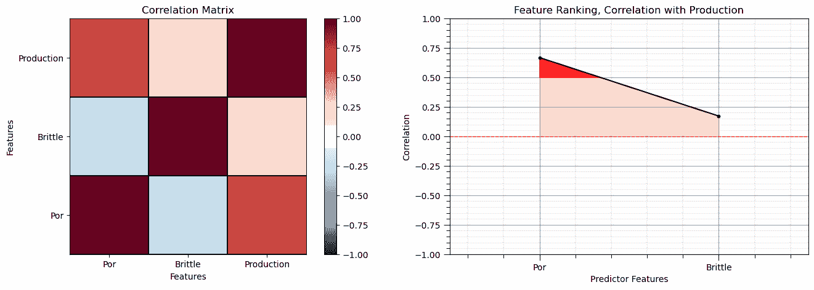

注意由于每个变量与其自身的相关性而产生的 1.0 对角线。

这看起来不错。存在不同大小的相关性。当然，相关系数限于线性相关程度。

+   让我们看看矩阵散点图，以了解特征之间的成对关系。

```py
pairgrid = sns.PairGrid(df,vars=Xname+[yname])                # matrix scatter plots
pairgrid = pairgrid.map_upper(plt.scatter, color = 'darkorange', edgecolor = 'black', alpha = 0.8, s = 10)
pairgrid = pairgrid.map_diag(plt.hist, bins = 20, color = 'darkorange',alpha = 0.8, edgecolor = 'k')# Map a density plot to the lower triangle
pairgrid = pairgrid.map_lower(sns.kdeplot, cmap = plt.cm.inferno, 
                              alpha = 1.0, n_levels = 10)
pairgrid.add_legend()
plt.subplots_adjust(left=0.0, bottom=0.0, right=0.9, top=0.9, wspace=0.2, hspace=0.2); plt.show() 
```


## 训练和测试分割

为了方便和简单，我们使用 scikit-learn 的随机训练和测试分割。

```py
X_train, X_test, y_train, y_test = train_test_split(X,y,test_size=0.25,random_state=73073) # train and test split
df_train = pd.concat([X_train,y_train],axis=1)                # make one train DataFrame with both X and y (remove all other features)
df_test = pd.concat([X_test,y_test],axis=1)                   # make one testin DataFrame with both X and y (remove all other features) 
```

## 可视化 DataFrame

可视化训练和测试 DataFrame 是在我们构建模型之前的一个有用的检查。

+   许多事情可能会出错，例如，我们加载了错误的数据，所有特征都没有加载等。

我们可以通过使用 DataFrame 的‘head’成员函数来预览（格式整洁，见下文）。

```py
print('       Training DataFrame          Testing DataFrame')
display_sidebyside(df_train,df_test)                          # custom function for side-by-side DataFrame display 
```

```py
 Training DataFrame          Testing DataFrame 
```

|  | Por | Brittle | Production |
| --- | --- | --- | --- |
| 86 | 12.83 | 29.87 | 995.700671 |
| 35 | 17.39 | 56.43 | 6060.760806 |
| 75 | 12.23 | 40.67 | 3744.177137 |
| 36 | 13.72 | 40.24 | 4203.470533 |
| 126 | 12.83 | 17.20 | 2917.165695 |
|  | Por | Brittle | Production |
| --- | --- | --- | --- |
| 5 | 15.55 | 58.25 | 5619.930037 |
| 46 | 20.21 | 23.78 | 3897.440411 |
| 96 | 15.07 | 39.39 | 4504.608029 |
| 45 | 12.10 | 63.24 | 3613.953926 |
| 105 | 19.54 | 37.40 | 5314.937997 |

## 表格数据的汇总统计

在 DataFrames 中，有许多高效的方法可以计算表格数据的汇总统计。

+   describe 命令以美观的数据表形式提供计数、平均值、最小值、最大值。

```py
print('            Training DataFrame                      Testing DataFrame')    # custom function for side-by-side summary statistics
display_sidebyside(df_train.describe().loc[['count', 'mean', 'std', 'min', 'max']],df_test.describe().loc[['count', 'mean', 'std', 'min', 'max']]) 
```

```py
 Training DataFrame                      Testing DataFrame 
```

|  | Por | Brittle | Production |
| --- | --- | --- | --- |
| count | 105.000000 | 105.000000 | 105.000000 |
| mean | 14.859238 | 48.861143 | 4192.479746 |
| std | 3.057228 | 14.432050 | 1347.391355 |
| min | 7.220000 | 10.940000 | 357.449794 |
| max | 23.550000 | 84.330000 | 7934.478879 |
|  | Por | Brittle | Production |
| --- | --- | --- | --- |
| count | 35.000000 | 35.000000 | 35.000000 |
| mean | 15.011714 | 46.798286 | 4431.830496 |
| std | 3.574467 | 13.380910 | 1487.184992 |
| min | 6.550000 | 20.120000 | 1572.738774 |
| max | 20.860000 | 68.760000 | 7668.639376 |

很好，我们已经检查了摘要统计。

+   没有明显的错误

+   检查每个特征的值范围，以设置和调整绘图限制。见上图。

## 可视化训练和测试分割

让我们检查使用直方图和散点图训练和测试的一致性和覆盖范围。

+   检查以确保训练和测试覆盖了可能的特征组合范围

+   确保测试案例不会超出训练数据的范围进行外推

```py
nbins = 20                                                    # number of histogram bins

plt.subplot(131)                                              # predictor feature #1 histogram
freq1,_,_ = plt.hist(x=df_train[Xname[0]],weights=None,bins=np.linspace(Xmin[0],Xmax[0],nbins),alpha = 0.6,
                     edgecolor='black',color='darkorange',density=False,label='Train')
freq2,_,_ = plt.hist(x=df_test[Xname[0]],weights=None,bins=np.linspace(Xmin[0],Xmax[0],nbins),alpha = 0.6,
                     edgecolor='black',color='red',density=False,label='Test')
max_freq = max(freq1.max()*1.10,freq2.max()*1.10)
plt.xlabel(Xlabelunit[0]); plt.ylabel('Frequency'); plt.ylim([0.0,max_freq]); plt.title(Xlabel[0]); add_grid()  
plt.xlim([Xmin[0],Xmax[0]]); plt.legend(loc='upper right')   

plt.subplot(132)                                              # predictor feature #2 histogram
freq1,_,_ = plt.hist(x=df_train[Xname[1]],weights=None,bins=np.linspace(Xmin[1],Xmax[1],nbins),alpha = 0.6,
                     edgecolor='black',color='darkorange',density=False,label='Train')
freq2,_,_ = plt.hist(x=df_test[Xname[1]],weights=None,bins=np.linspace(Xmin[1],Xmax[1],nbins),alpha = 0.6,
                     edgecolor='black',color='red',density=False,label='Test')
max_freq = max(freq1.max()*1.10,freq2.max()*1.10)
plt.xlabel(Xlabelunit[1]); plt.ylabel('Frequency'); plt.ylim([0.0,max_freq]); plt.title(Xlabel[1]); add_grid()  
plt.xlim([Xmin[1],Xmax[1]]); plt.legend(loc='upper right')   

plt.subplot(133)                                              # predictor features #1 and #2 scatter plot
plt.scatter(df_train[Xname[0]],df_train[Xname[1]],s=40,marker='o',color = 'darkorange',alpha = 0.8,edgecolor = 'black',zorder=10,label='Train')
plt.scatter(df_test[Xname[0]],df_test[Xname[1]],s=40,marker='o',color = 'red',alpha = 0.8,edgecolor = 'black',zorder=10,label='Test')
plt.title(Xlabel[1] + ' vs ' +  Xlabel[0])
plt.xlabel(Xlabelunit[0]); plt.ylabel(Xlabelunit[1])
plt.legend(); add_grid(); plt.xlim([Xmin[0],Xmax[0]]); plt.ylim([Xmin[1],Xmax[1]])

plt.subplots_adjust(left=0.0, bottom=0.0, right=2.5, top=0.8, wspace=0.3, hspace=0.2)
#plt.savefig('Test.pdf', dpi=600, bbox_inches = 'tight',format='pdf') 
plt.show() 
```

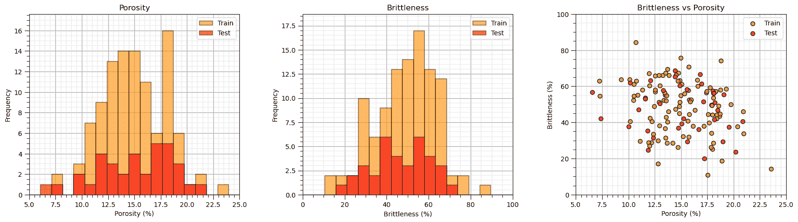

有时我发现通过查看累积分布函数（CDF）而不是直方图来比较分布更方便。

+   我们避免任意选择直方图柱状大小，因为累积分布函数（CDF）与数据分辨率一致。

```py
plt.subplot(131)                                              # predictor feature #1 CDF
plot_CDF(X_train[Xname[0]],'darkorange',alpha=0.6,lw=1,ls='solid',label='Train')
plot_CDF(X_test[Xname[0]],'red',alpha=0.6,lw=1,ls='solid',label='Test')
plt.xlabel(Xlabelunit[0]); plt.xlim(Xmin[0],Xmax[0]); plt.ylim([0,1]); add_grid(); plt.legend(loc='lower right')
plt.title(Xlabel[0] + ' Train and Test CDFs')

plt.subplot(132)                                              # predictor feature #2 CDF
plot_CDF(X_train[Xname[1]],'darkorange',alpha=0.6,lw=1,ls='solid',label='Train')
plot_CDF(X_test[Xname[1]],'red',alpha=0.6,lw=1,ls='solid',label='Test')
plt.xlabel(Xlabelunit[1]); plt.xlim(Xmin[1],Xmax[1]); plt.ylim([0,1]); add_grid(); plt.legend(loc='lower right')
plt.title(Xlabel[1] + ' Train and Test CDFs')

plt.subplot(133)                                              # response feature CDF
plot_CDF(y_train[yname],'darkorange',alpha=0.6,lw=1,ls='solid',label='Train')
plot_CDF(y_test[yname],'red',alpha=0.6,lw=1,ls='solid',label='Test')
plt.xlabel(ylabelunit); plt.xlim(ymin,ymax); plt.ylim([0,1]); add_grid(); plt.legend(loc='lower right')
plt.title(ylabel + ' Train and Test CDFs')

plt.subplots_adjust(left=0.0, bottom=0.0, right=2.5, top=0.8, wspace=0.3, hspace=0.2)
#plt.savefig('Test.pdf', dpi=600, bbox_inches = 'tight',format='pdf') 
plt.show() 
```

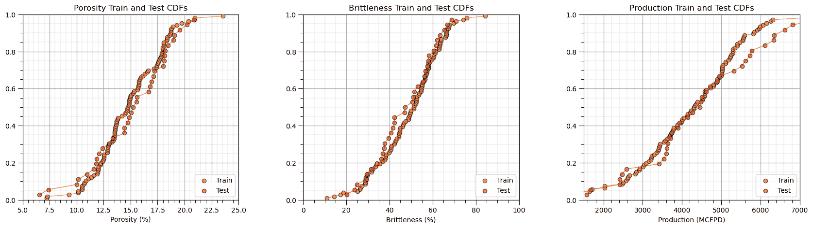

再次强调，分布表现良好，

+   我们无法观察到明显的间隙或截断。

+   检查训练和测试数据的覆盖范围

让我们看看孔隙率与脆性之间的散点图，点根据生产量着色。

```py
plt.subplot(111)                                              # visualize the train and test data in predictor feature space
im = plt.scatter(X_train[Xname[0]],X_train[Xname[1]],s=None, c=y_train[yname], marker='o', cmap=cmap, 
    norm=None, vmin=ymin, vmax=ymax, alpha=0.8, linewidths=0.3, edgecolors="black", label = 'Train')
plt.scatter(X_test[Xname[0]],X_test[Xname[1]],s=None, c=y_test[yname], marker='s', cmap=cmap, 
    norm=None, vmin=ymin, vmax=ymax, alpha=0.5, linewidths=0.3, edgecolors="black", label = 'Test')
plt.title('Training ' + ylabel + ' vs. ' + Xlabel[1] + ' and ' + Xlabel[0]); 
plt.xlabel(Xlabel[0] + ' (' + Xunit[0] + ')'); plt.ylabel(Xlabel[1] + ' (' + Xunit[1] + ')')
plt.xlim(Xmin[0],Xmax[0]); plt.ylim(Xmin[1],Xmax[1]); plt.legend(loc = 'upper right'); add_grid()
cbar = plt.colorbar(im, orientation = 'vertical')
cbar.set_label(ylabel + ' (' + yunit + ')', rotation=270, labelpad=20)
cbar.ax.yaxis.set_major_formatter(FuncFormatter(comma_format))

plt.subplots_adjust(left=0.0, bottom=0.0, right=1.0, top=1.0, wspace=0.2, hspace=0.2); plt.show() 
```

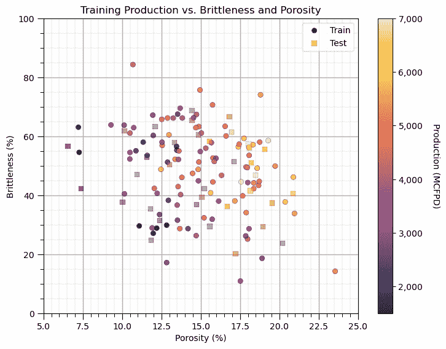

## 基于树的提升

要执行基于树的提升，梯度提升树回归，我们：

1.  设置我们模型的超参数

```py
params = {
    'loss': 'squared_error'                                 # L2 Norm - least squares
    'n_estimators': 1,                                      # number of trees
    'max_depth': 1,                                         # maximum depth per tree
    'learning_rate': 1,                                     
    'criterion': 'squared_error'                            # tree construction criterion
} 
```

1.  实例化模型

```py
boost_tree = GradientBoostingRegressor(**params) 
```

1.  训练模型

```py
boot_tree.fit(X = predictors, y = response) 
```

1.  可视化模型结果在特征空间上的结果（由于我们只有两个预测特征，这很容易做到）

## 提升演示

为了演示，我们将树的最大深度设置为 1 和 6 棵基于树的提升回归树。

+   每棵树只有一个分割，称为决策树桩。这将防止预测特征之间的交互，并且易于解释

你应该能够观察到树的累加性质，先看第一棵树，然后是第一棵加上第二棵，依此类推。

+   回想一下，估计是多个树的求和

+   由于我们在第一棵树之后拟合梯度，我们可以有负数和正数的估计

+   在这个例子中，我们可以看到一些实际上是负数的生产估计

```py
params = {
    'loss': 'squared_error',                                           # L2 Norm - least squares
    'max_depth': 1,                       
    'learning_rate': 1.0,
    'criterion': 'squared_error'                                      # tree construction criteria is mean square error over training
}

num_trees = np.linspace(1,6,6)                              # build a list of numbers of trees 
boosting_models = []; score = []; pred = []                 # arrays for storage of models and model summaries

index = 1
for num_tree in num_trees:                                  # loop over number of trees
    boosting_models.append(GradientBoostingRegressor(n_estimators=int(num_tree),**params))
    boosting_models[index-1].fit(X = X_train, y = y_train)
    score.append(boosting_models[index-1].score(X = X_test, y = y_test))
    plt.subplot(2,3,index)
    pred.append(visualize_model(boosting_models[index-1],X_train[Xname[0]],X_test[Xname[0]],X_train[Xname[1]],X_test[Xname[1]],Xmin,Xmax,
        y_train[yname],y_test[yname],ymin,ymax,'Gradient Boosting with ' + str(int(num_tree)) + ' Trees',Xname,yname,Xlabelunit,ylabelunit))
    index = index + 1

plt.subplots_adjust(left=0.0, bottom=0.0, right=2.0, top=2.0, wspace=0.4, hspace=0.3); plt.show() 
```

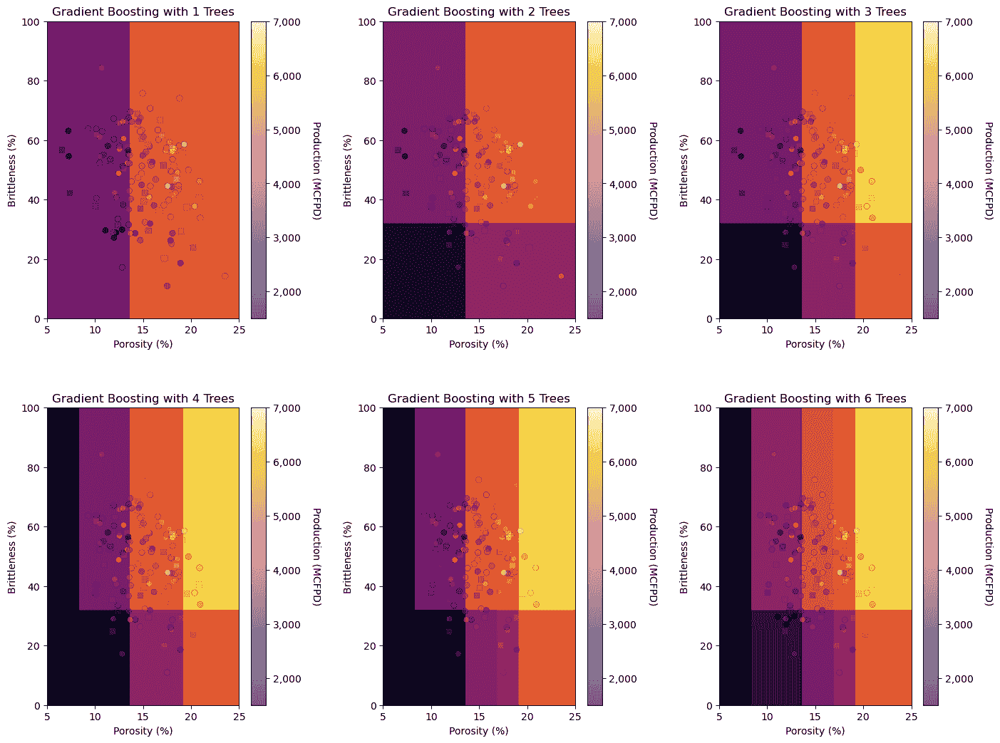

注意，与数据存在显著的失配

+   我们只使用了最多 6 个决策树桩（1 个决策树）

让我们检查保留的测试数据集的交叉验证结果。

```py
index = 1
for num_tree in num_trees:                                  # check over number of trees
    plt.subplot(2,3,index)
    check_model(boosting_models[index-1],X_test,y_test,ymin,ymax,ylabelunit,'Tree-Based Boosting with ' + str(int(num_tree)) + ' Trees')
    index = index + 1
plt.subplots_adjust(left=0.0, bottom=0.0, right=2.0, top=2.0, wspace=0.4, hspace=0.3) 
```

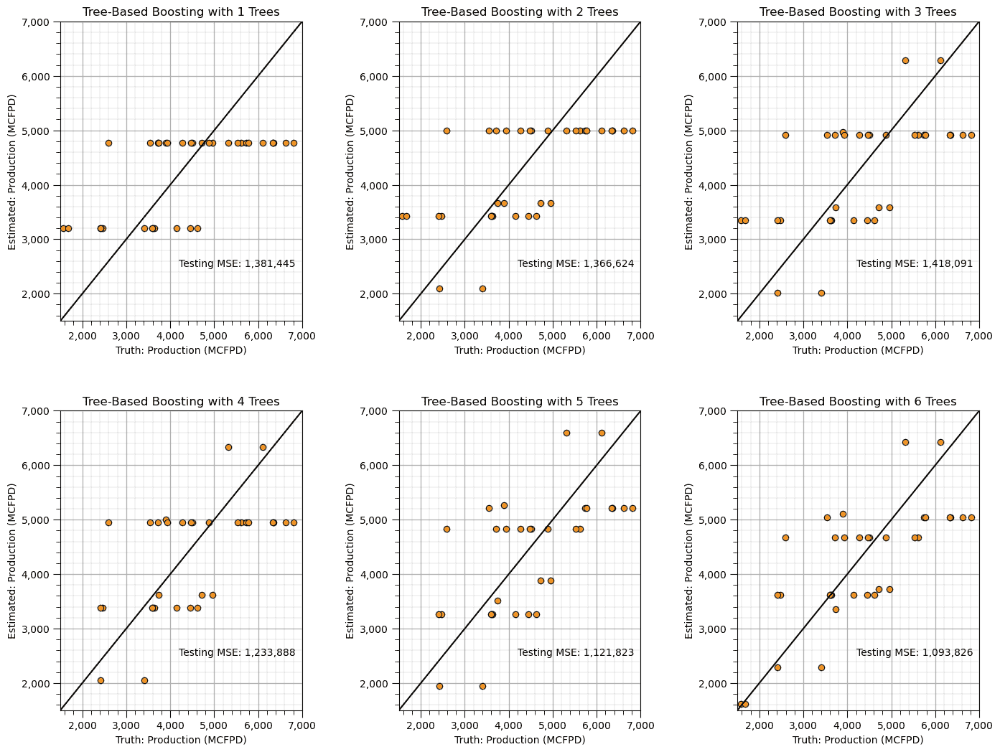

当然，用一棵树我们表现相当糟糕，但当我们达到 6 个树桩树时，我们几乎将均方误差减半。

## 是时候种植更多树木了

现在我们将展示在我们的基于树的提升模型中利用更多树木的结果。

+   我们仍然将与简单的决策树桩一起工作，不用担心，我们稍后会添加更多

```py
params = {
    'loss': 'squared_error',                                           # L2 Norm - least squares
    'max_depth': 1,                                         # maximum depth per tree
    'learning_rate': 1,
    'criterion': 'squared_error'                                      # tree construction criteria is mean square error over training
}

num_trees = [5,10,20,100,500,5000]                          # build a list of numbers of trees 
boosting_models = []; score = []; pred = []                 # arrays for storage of models and model summaries

index = 1
for num_tree in num_trees:                                  # loop over number of trees
    boosting_models.append(GradientBoostingRegressor(n_estimators=int(num_tree),**params))
    boosting_models[index-1].fit(X = X_train, y = y_train)
    score.append(boosting_models[index-1].score(X = X_test, y = y_test))
    plt.subplot(2,3,index)
    pred.append(visualize_model(boosting_models[index-1],X_train[Xname[0]],X_test[Xname[0]],X_train[Xname[1]],X_test[Xname[1]],Xmin,Xmax,
        y_train[yname],y_test[yname],ymin,ymax,'Gradient Boosting with ' + str(int(num_tree)) + ' Trees',Xname,yname,Xlabelunit,ylabelunit))
    index = index + 1

plt.subplots_adjust(left=0.0, bottom=0.0, right=2.0, top=2.0, wspace=0.4, hspace=0.3) 
```

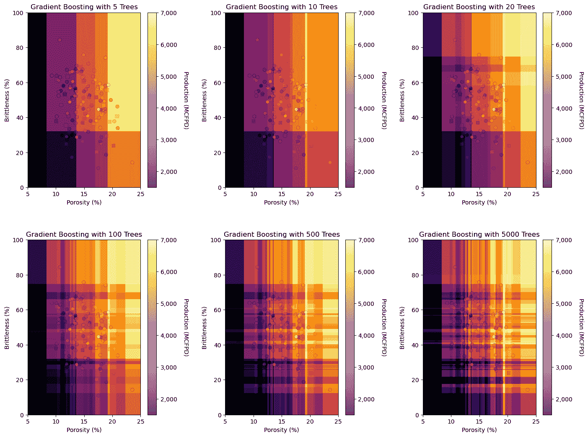

看到格子图案吗？这是由于使用了决策树桩，并且：

+   一个加性模型

+   所有模型都对所有预测有贡献

看到暗区和亮区了吗？

+   加性模型可能会超出数据范围外进行外推

让我们用我们的测试数据来交叉验证，看看我们的模型在更多树木的情况下如何改进。

```py
index = 1
for num_tree in num_trees:                                  # check over number of trees
    plt.subplot(2,3,index)
    check_model(boosting_models[index-1],X_test,y_test,ymin,ymax,ylabelunit,'Tree-Based Boosting with ' + str(int(num_tree)) + ' Trees')
    index = index + 1
plt.subplots_adjust(left=0.0, bottom=0.0, right=2.0, top=2.0, wspace=0.4, hspace=0.3) 
```

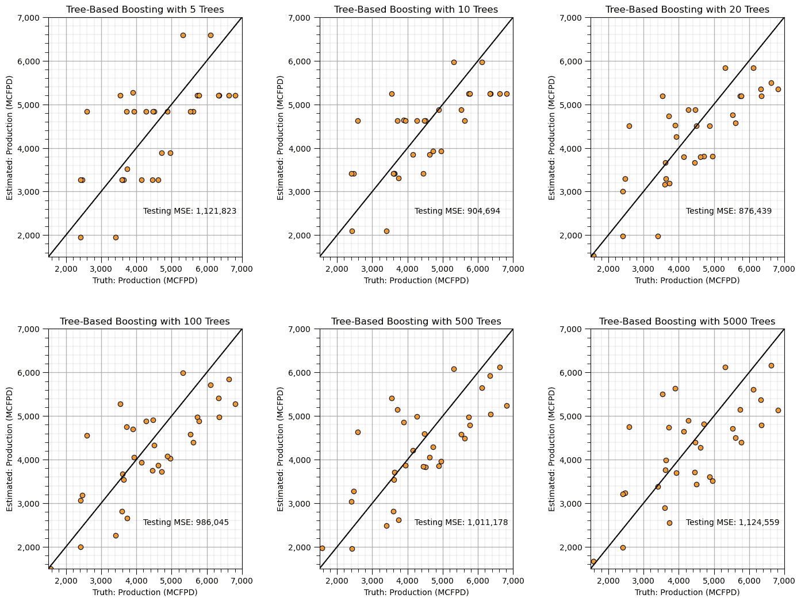

大约 20 棵树时，我们获得最佳性能，然后开始下降，我们可能开始过度拟合训练数据。

## 超越决策树桩

如前所述，使用决策树桩，我们防止了特征之间的交互。

让我们扩展到树深度为 2

+   两个嵌套决策导致 4 个终端节点

```py
params = {
    'loss': 'squared_error',                                           # L2 Norm - least squares
    'max_depth': 2,                                         # maximum depth per tree
    'learning_rate': 1,
    'criterion': 'squared_error'                                      # tree construction criteria is mean square error over training
}

num_trees = [5,10,20,100,500,5000]                          # build a list of numbers of trees 
boosting_models = []; score = []; pred = []                 # arrays for storage of models and model summaries

index = 1
for num_tree in num_trees:                                  # loop over number of trees
    boosting_models.append(GradientBoostingRegressor(n_estimators=int(num_tree),**params))
    boosting_models[index-1].fit(X = X_train, y = y_train)
    score.append(boosting_models[index-1].score(X = X_test, y = y_test))
    plt.subplot(2,3,index)
    pred.append(visualize_model(boosting_models[index-1],X_train[Xname[0]],X_test[Xname[0]],X_train[Xname[1]],X_test[Xname[1]],Xmin,Xmax,
        y_train[yname],y_test[yname],ymin,ymax,'Gradient Boosting with ' + str(int(num_tree)) + ' Trees',Xname,yname,Xlabelunit,ylabelunit))
    index = index + 1

plt.subplots_adjust(left=0.0, bottom=0.0, right=2.0, top=2.0, wspace=0.4, hspace=0.3) 
```

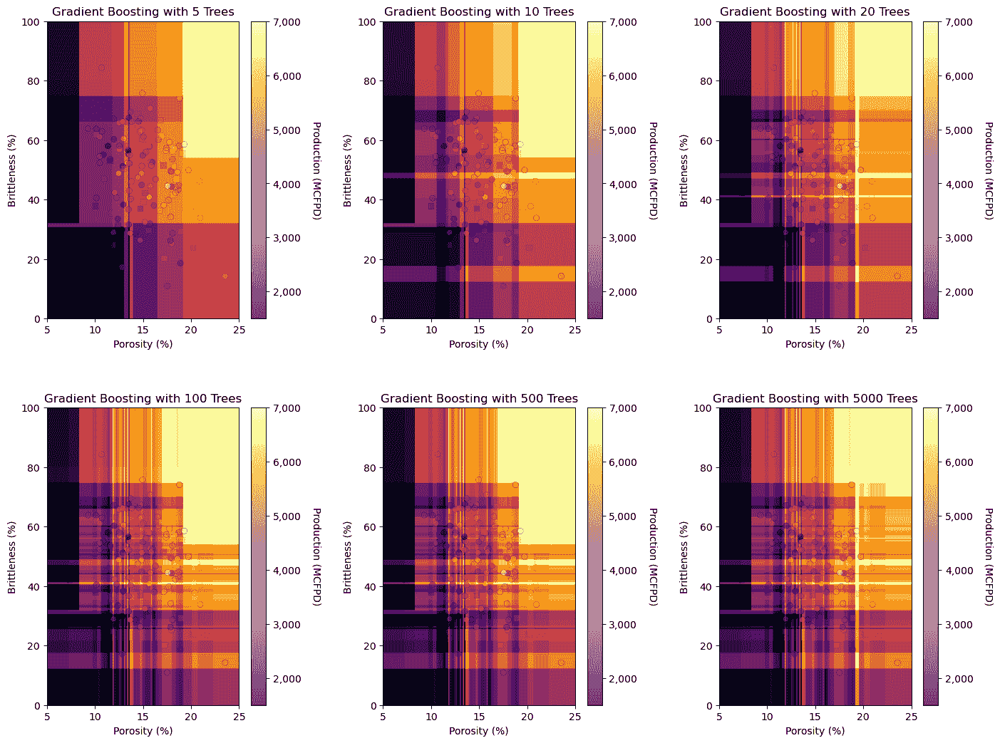

我们现在有更多的灵活性。

+   用一棵树我们有 4 个终端节点（区域）

+   仅用 6 棵树，我们已经捕捉到一些复杂特征

让我们再次增加树的深度。

```py
params = {
    'loss': 'squared_error',                                           # L2 Norm - least squares
    'max_depth': 3,                                         # maximum depth per tree
    'learning_rate': 1,
    'criterion': 'squared_error'                                      # tree construction criteria is mean square error over training
}

num_trees = [5,10,20,100,500,5000]                          # build a list of numbers of trees 
boosting_models = []; score = []; pred = []                 # arrays for storage of models and model summaries

index = 1
for num_tree in num_trees:                                  # loop over number of trees
    boosting_models.append(GradientBoostingRegressor(n_estimators=int(num_tree),**params))
    boosting_models[index-1].fit(X = X_train, y = y_train)
    score.append(boosting_models[index-1].score(X = X_test, y = y_test))
    plt.subplot(2,3,index)
    pred.append(visualize_model(boosting_models[index-1],X_train[Xname[0]],X_test[Xname[0]],X_train[Xname[1]],X_test[Xname[1]],Xmin,Xmax,
        y_train[yname],y_test[yname],ymin,ymax,'Gradient Boosting with ' + str(int(num_tree)) + ' Trees',Xname,yname,Xlabelunit,ylabelunit))
    index = index + 1

plt.subplots_adjust(left=0.0, bottom=0.0, right=2.0, top=2.0, wspace=0.4, hspace=0.3) 
```

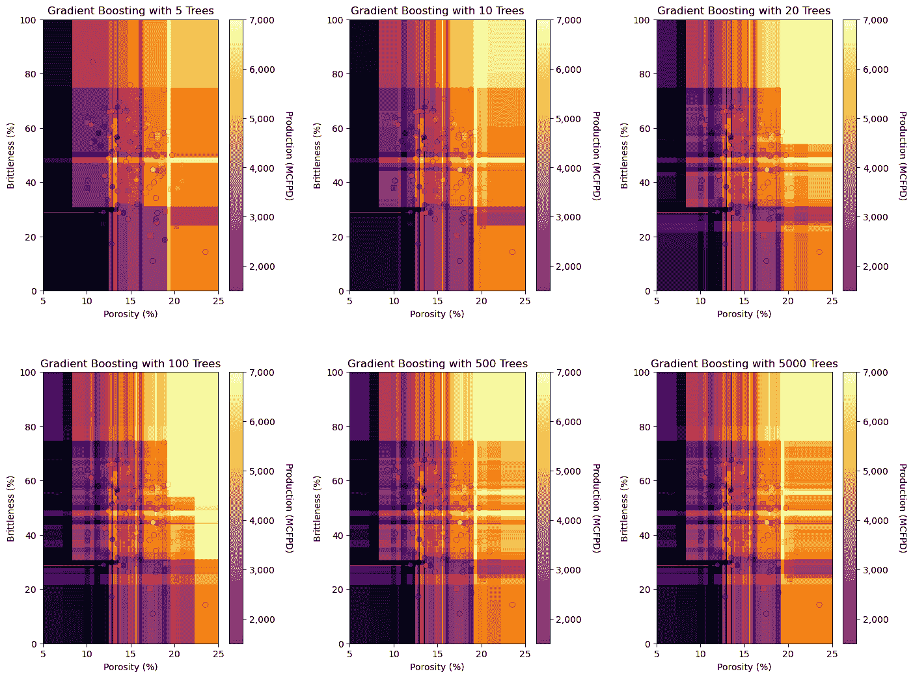

再来一次，使用深度为 4-8 的树很常见，所以让我们尝试 5。

```py
params = {
    'loss': 'squared_error',                                           # L2 Norm - least squares
    'max_depth': 5,                                         # maximum depth per tree
    'learning_rate': 1,
    'criterion': 'squared_error'                                      # tree construction criteria is mean square error over training
}

num_trees = [5,10,20,100,500,5000]                          # build a list of numbers of trees 
boosting_models = []; score = []; pred = []                 # arrays for storage of models and model summaries

index = 1
for num_tree in num_trees:                                  # loop over number of trees
    boosting_models.append(GradientBoostingRegressor(n_estimators=int(num_tree),**params))
    boosting_models[index-1].fit(X = X_train, y = y_train)
    score.append(boosting_models[index-1].score(X = X_test, y = y_test))
    plt.subplot(2,3,index)
    pred.append(visualize_model(boosting_models[index-1],X_train[Xname[0]],X_test[Xname[0]],X_train[Xname[1]],X_test[Xname[1]],Xmin,Xmax,
        y_train[yname],y_test[yname],ymin,ymax,'Gradient Boosting with ' + str(int(num_tree)) + ' Trees',Xname,yname,Xlabelunit,ylabelunit))
    index = index + 1

plt.subplots_adjust(left=0.0, bottom=0.0, right=2.0, top=2.0, wspace=0.4, hspace=0.3) 
```

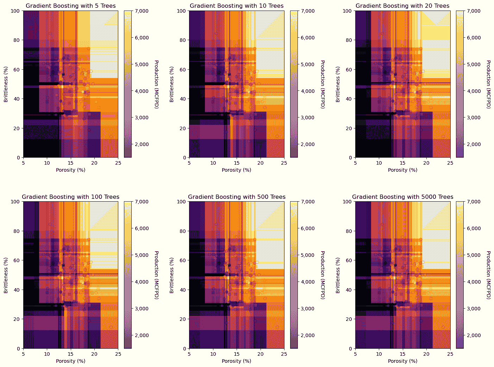

让我们用测试数据来交叉验证模型。

```py
index = 1
for num_tree in num_trees:                                  # check over number of trees
    plt.subplot(2,3,index)
    check_model(boosting_models[index-1],X_test,y_test,ymin,ymax,ylabelunit,'Tree-Based Boosting with ' + str(int(num_tree)) + ' Trees')
    index = index + 1
plt.subplots_adjust(left=0.0, bottom=0.0, right=2.0, top=2.0, wspace=0.4, hspace=0.3) 
```

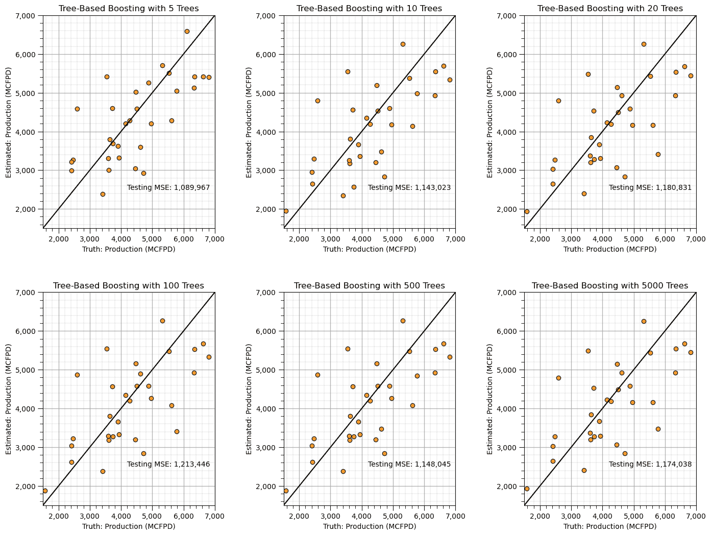

当树的最大深度为 5 时，我们的模型性能早期达到峰值，增加更多树木没有影响。

+   当然，这并不是一个彻底的分析

让我们尝试更彻底的方法

+   我们将使用 $1,\ldots,100$ 棵树进行交叉验证，最大树深度为 $1, 2, 3, 10$。

+   我们还降低了学习率，我之前提高了它以放大输出的差异以进行演示，但现在我们想看到最好的模型。

```py
num_trees = np.linspace(1,200,200)
max_features = 1
MSE1_list = []; MSE2_list = []; MSE3_list = []; MSE4_list = [] 

params1 = {
    'loss': 'squared_error',                                           # L2 Norm - least squares
    'max_depth': 1,                                         # maximum depth per tree
    'learning_rate': 0.2,
    'criterion': 'squared_error'                                      # tree construction criteria is mean square error over training
}

params2 = {
    'loss': 'squared_error',                                           # L2 Norm - least squares
    'max_depth': 2,                                         # maximum depth per tree
    'learning_rate': 0.2,
    'criterion': 'squared_error'                                      # tree construction criteria is mean square error over training
}

params3 = {
    'loss': 'squared_error',                                           # L2 Norm - least squares
    'max_depth': 3,                                         # maximum depth per tree
    'learning_rate': 0.2,
    'criterion': 'squared_error'                                      # tree construction criteria is mean square error over training
}

params4 = {
    'loss': 'squared_error',                                           # L2 Norm - least squares
    'max_depth': 10,                                        # maximum depth per tree
    'learning_rate': 0.2,
    'criterion': 'squared_error'                                      # tree construction criteria is mean square error over training
}

index = 1
for num_tree in num_trees:                                  # loop over number of trees in our random forest
    boosting_model1 = GradientBoostingRegressor(n_estimators=int(num_tree),**params1).fit(X = X_train, y = y_train)
    y_test1_hat = boosting_model1.predict(X_test); MSE1_list.append(metrics.mean_squared_error(y_test,y_test1_hat))

    boosting_model2 = GradientBoostingRegressor(n_estimators=int(num_tree),**params2).fit(X = X_train, y = y_train)
    y_test2_hat = boosting_model2.predict(X_test); MSE2_list.append(metrics.mean_squared_error(y_test,y_test2_hat))

    boosting_model3 = GradientBoostingRegressor(n_estimators=int(num_tree),**params3).fit(X = X_train, y = y_train)
    y_test3_hat = boosting_model3.predict(X_test); MSE3_list.append(metrics.mean_squared_error(y_test,y_test3_hat))

    boosting_model4 = GradientBoostingRegressor(n_estimators=int(num_tree),**params4).fit(X = X_train, y = y_train)
    y_test4_hat = boosting_model4.predict(X_test); MSE4_list.append(metrics.mean_squared_error(y_test,y_test4_hat))

    index = index + 1

plt.subplot(111)                                            # plot jackknife results for all cases
plt.scatter(num_trees,MSE1_list,s=None,c='red',marker=None,cmap=None,norm=None,vmin=None,vmax=None,alpha=0.6,
            linewidths=0.3,edgecolors="black",label = "Tree Depth = 1")
plt.scatter(num_trees,MSE2_list,s=None,c='blue',marker=None,cmap=None,norm=None,vmin=None,vmax=None,alpha=0.6,
            linewidths=0.3,edgecolors="black",label = "Tree Depth = 2")
plt.scatter(num_trees,MSE3_list,s=None,c='black',marker=None,cmap=None,norm=None,vmin=None,vmax=None,alpha=0.6,
            linewidths=0.3,edgecolors="black",label = "Tree Depth = 3")
plt.scatter(num_trees,MSE4_list,s=None,c='green',marker=None,cmap=None,norm=None,vmin=None,vmax=None,alpha=0.6,
            linewidths=0.3,edgecolors="black",label = "Tree Depth = 10")

plt.title('Testing Mean Square Error vs. Number of Trees'); plt.xlabel('Number of Trees'); plt.ylabel('Test Mean Square Error')
plt.xlim(0,200); plt.legend(loc='lower right'); add_grid()
plt.gca().yaxis.set_major_formatter(FuncFormatter(comma_format))

plt.subplots_adjust(left=0.0, bottom=0.0, right=2.0, top=1.1, wspace=0.2, hspace=0.2); plt.show() 
```

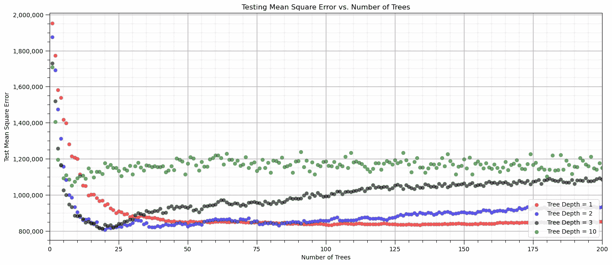

非常有趣：

+   随着树深度的增加，我们的模型可能会改进

+   更深的树深度需要更少的树来提高准确性

+   当树深度为 2 和 3 时，模型表现相同，在 10-15 棵树之后趋于平稳，它们对过度拟合有抵抗力

+   在树深度为 10 的情况下，树的数量对模型性能没有影响

## 梯度下降超参数

学习率按比例放大每个添加树对整体模型预测的附加影响。

+   较低的学习率将减慢收敛到解的速度

+   较低的学习率将帮助我们不会跳过最优解

我们不会在这个问题上花费太多时间，但让我们试着改变学习率。

```py
learning_rates = np.arange(0.01,1.0,0.01)
MSE1_list = []; MSE2_list = []; MSE3_list = []; MSE4_list = [] 

params1 = {
    'loss': 'squared_error',                                           # L2 Norm - least squares
    'max_depth': 5,                                         # maximum depth per tree
    'n_estimators': 40,
    'criterion': 'squared_error'                                      # tree construction criteria is mean square error over training
}

params2 = {
    'loss': 'squared_error',                                           # L2 Norm - least squares
    'max_depth': 5,                                         # maximum depth per tree
    'n_estimators': 40,
    'criterion': 'squared_error'                                      # tree construction criteria is mean square error over training
}

params3 = {
    'loss': 'squared_error',                                           # L2 Norm - least squares
    'max_depth': 5,                                         # maximum depth per tree
    'n_estimators': 40,
    'criterion': 'squared_error'                                      # tree construction criteria is mean square error over training
}

params4 = {
    'loss': 'squared_error',                                           # L2 Norm - least squares
    'max_depth': 5,                                        # maximum depth per tree
    'n_estimators': 40,
    'criterion': 'squared_error'                                      # tree construction criteria is mean square error over training
}

index = 1
for learning_rate in learning_rates:                                  # loop over number of trees in our random forest
    boosting_model1 = GradientBoostingRegressor(learning_rate = learning_rate,**params1).fit(X = X_train, y = y_train)
    y_test1_hat = boosting_model1.predict(X_test); MSE1_list.append(metrics.mean_squared_error(y_test,y_test1_hat))

    boosting_model2 = GradientBoostingRegressor(learning_rate = learning_rate,**params2).fit(X = X_train, y = y_train)
    y_test2_hat = boosting_model2.predict(X_test); MSE2_list.append(metrics.mean_squared_error(y_test,y_test2_hat))

    boosting_model3 = GradientBoostingRegressor(learning_rate = learning_rate,**params3).fit(X = X_train, y = y_train)
    y_test3_hat = boosting_model3.predict(X_test); MSE3_list.append(metrics.mean_squared_error(y_test,y_test3_hat))

    boosting_model4 = GradientBoostingRegressor(learning_rate = learning_rate,**params4).fit(X = X_train, y = y_train)
    y_test4_hat = boosting_model4.predict(X_test); MSE4_list.append(metrics.mean_squared_error(y_test,y_test4_hat))

    index = index + 1

plt.subplot(111)                                            # plot jackknife results for all cases
plt.scatter(learning_rates,MSE1_list,s=None,c='red',marker=None,cmap=None,norm=None,vmin=None,vmax=None,alpha=0.6,
            linewidths=0.3,edgecolors="black",label = "Tree Depth = 1")
plt.scatter(learning_rates,MSE2_list,s=None,c='blue',marker=None,cmap=None,norm=None,vmin=None,vmax=None,alpha=0.6,
            linewidths=0.3,edgecolors="black",label = "Tree Depth = 2")
plt.scatter(learning_rates,MSE3_list,s=None,c='black',marker=None,cmap=None,norm=None,vmin=None,vmax=None,alpha=0.6,
            linewidths=0.3,edgecolors="black",label = "Tree Depth = 3")
plt.scatter(learning_rates,MSE4_list,s=None,c='green',marker=None,cmap=None,norm=None,vmin=None,vmax=None,alpha=0.6,
            linewidths=0.3,edgecolors="black",label = "Tree Depth = 10")

plt.title('Testing Mean Square Error vs. Learning Rate'); plt.xlabel('Learning Rate'); plt.ylabel('Test Mean Square Error')
plt.xlim(0.0,1.0); plt.legend(loc='upper left'); add_grid()
plt.gca().yaxis.set_major_formatter(FuncFormatter(comma_format))

plt.subplots_adjust(left=0.0, bottom=0.0, right=2.0, top=1.1, wspace=0.2, hspace=0.2); plt.show() 
```

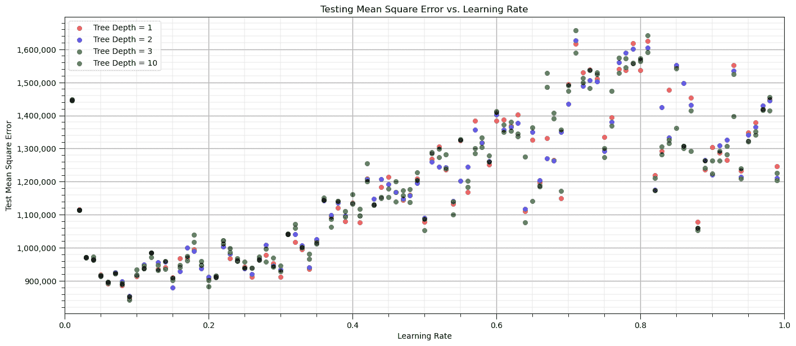

再次强调，这是一个非常有趣的结果。

+   无论树复杂度如何，缓慢学习总是更好的！

## 清洁、紧凑的机器学习代码的机器学习管道

管道是 scikit-learn 中的一个类，允许封装一系列数据准备和建模步骤

+   然后，我们可以将管道视为我们高度精简的工作流程中的一个对象

管道类允许我们：

+   提高代码可读性并保持一切井然有序

+   使用非常少的可读代码行构建完整的工作流程

+   避免常见的流程问题，如数据泄露、测试数据告知模型参数训练

+   抽象常见的机器学习建模，专注于构建尽可能好的模型

基本哲学是将机器学习视为一种组合搜索，以找到最佳模型（AutoML）

更多信息请参阅我关于[机器学习管道](https://www.youtube.com/watch?v=tYrPs8s1l9U&list=PLG19vXLQHvSAufDFgZEFAYQEwMJXklnQV&index=5)的录音讲座和一份详细记录的演示[机器学习管道工作流程](http://localhost:8892/notebooks/OneDrive%20-%20The%20University%20of%20Texas%20at%20Austin/Courses/Workflows/PythonDataBasics_Pipelines.ipynb)。

```py
x1 = 0.25; x2 = 0.3                                           # predictor values for the prediction

pipe_boosting = Pipeline([                                      # the machine learning workflow as a pipeline object
    ('boosting', GradientBoostingRegressor())
])

params = {                                                    # the machine learning workflow method's parameters to search
    'boosting__learning_rate': np.arange(0.1,2.0,0.2),
    'boosting__n_estimators': np.arange(2,40,4,dtype = int),
}

tuned_boosting = GridSearchCV(pipe_boosting,params,scoring = 'neg_mean_squared_error', # hyperparameter tuning w. grid search k-fold cross validation 
                             refit = True)
tuned_boosting.fit(X,y)                                         # tune the model with k-fold and then train the model will the data 

print('Tuned hyperparameter: ' + str(tuned_boosting.best_params_))

estimate = tuned_boosting.predict([[x1,x2]])[0]                 # make a prediction (no tuning shown)
print('Estimated ' + ylabel + ' for ' + Xlabel[0] + ' = ' + str(x1) + ' and ' + Xlabel[1] + ' = ' + str(x2)  + ' is ' + 
      str(round(estimate,1)) + ' ' + yunit)                     # print results 
```

```py
Tuned hyperparameter: {'boosting__learning_rate': 0.30000000000000004, 'boosting__n_estimators': 10}
Estimated Production for Porosity = 0.25 and Brittleness = 0.3 is 1979.7 MCFPD 
```

## 注释

希望您觉得这一章有帮助。还有更多可以做的和讨论的，我有很多资源。查看我的[共享资源清单](https://michaelpyrcz.com/my-resources)，

*迈克尔*

## 作者：

迈克尔·皮尔奇，教授，德克萨斯大学奥斯汀分校 *新颖的数据分析、地球统计学和机器学习地下解决方案*

迈克尔拥有超过 17 年的地下咨询、研究和开发经验，他因对教学的热情和对增强工程师和地球科学家在地下资源开发中影响的热情而重返学术界。

想了解更多关于迈克尔的信息，请查看以下链接：

[Twitter](https://twitter.com/geostatsguy) | [GitHub](https://github.com/GeostatsGuy) | [网站](http://michaelpyrcz.com) | [Google Scholar](https://scholar.google.com/citations?user=QVZ20eQAAAAJ&hl=en&oi=ao) | [书籍](https://www.amazon.com/Geostatistical-Reservoir-Modeling-Michael-Pyrcz/dp/0199731446) | [YouTube](https://www.youtube.com/channel/UCLqEr-xV-ceHdXXXrTId5ig) | [Python 中的应用地球统计学电子书](https://geostatsguy.github.io/GeostatsPyDemos_Book/intro.html) | [LinkedIn](https://www.linkedin.com/in/michael-pyrcz-61a648a1)

## 想一起工作吗？

我希望这些内容对那些想了解更多关于地下建模、数据分析和机器学习的人有所帮助。学生和在职专业人士都欢迎参加。

+   想邀请我到您的公司进行培训、辅导、项目审查、工作流程设计和/或咨询吗？我很乐意拜访并与您合作！

+   感兴趣合作、支持我的研究生研究或我的地下数据分析与机器学习联盟（共同负责人是约翰·福斯特教授）吗？我的研究将数据分析、随机建模和机器学习理论与实践相结合，以开发新的方法和工作流程来增加价值。我们正在解决具有挑战性的地下问题！

+   我可以通过 mpyrcz@austin.utexas.edu 联系到您。

我总是很高兴讨论，

*迈克尔*

迈克尔·皮尔奇，博士，P.Eng. 教授，德克萨斯大学奥斯汀分校 Cockrell 工程学院和 Jackson 地球科学学院

## 更多资源请访问：[Twitter](https://twitter.com/geostatsguy) | [GitHub](https://github.com/GeostatsGuy) | [网站](http://michaelpyrcz.com) | [Google Scholar](https://scholar.google.com/citations?user=QVZ20eQAAAAJ&hl=en&oi=ao) | [书籍](https://www.amazon.com/Geostatistical-Reservoir-Modeling-Michael-Pyrcz/dp/0199731446) | [YouTube](https://www.youtube.com/channel/UCLqEr-xV-ceHdXXXrTId5ig) | [Python 地统计学电子书](https://geostatsguy.github.io/GeostatsPyDemos_Book/intro.html) | [LinkedIn](https://www.linkedin.com/in/michael-pyrcz-61a648a1)

## 梯度提升树的动机

在我们能够理解梯度提升树之前，我们首先需要了解决策树。以下是决策树的关键概念。

### 决策树

**预测**

+   估计一个函数 $\hat{f}$，使得我们能从一组预测特征 $X_1,\ldots,X_m$ 中预测响应特征 $Y$。

+   预测的形式为 $\hat{Y} = \hat{f}(X_1,\ldots,X_m)$

**监督学习**

+   响应特征标签，$Y$，在训练和测试数据中都是可用的

**基于决策树集成**

这些是与决策树相关的概念。

**特征空间的分层二分分割**

基本思想是将预测空间，$𝑋_1,\ldots,X_m$，划分为 $J$ 个互斥、穷尽的区域

+   **互斥** – 任何预测特征的组合只属于单个区域，$R_j$

+   **穷尽** – 所有预测特征的组合都属于一个区域，$R_j$，区域覆盖整个特征空间（考虑的变量的范围）

对于区域 $R_j$ 中的每个观测值，我们使用相同的预测，$\hat{Y}(R_j)$

例如，从孔隙率，${X_1}$ 预测产量，$\hat{Y}$

+   在一个 mD 特征空间内的数据中，$X_1,\ldots,X_m$，找到最大化两个类别之间差距的边界

+   新案例根据它们相对于这个边界的相对位置进行分类

**树构建过程**

树是从上往下构建的。我们从一个覆盖整个特征空间的单一区域开始，然后进行一系列的分割。

+   **扫描所有可能的分割** 在所有区域和所有特征上。

+   **贪婪优化** 该方法通过在任意特征中找到第一个分割（分割），以最小化所有训练数据 $y_i$ 在所有区域 $j = 1,\ldots,J$ 上的残差平方和。

$$ RSS = \sum^{J}_{j=1} \sum_{i \in R_j} (y_i - \hat{y}_{R_j})² $$

+   **停止标准** 通常基于每个区域的最小训练数据量以进行稳健估计，以及/或下一个分割的最小 RSS 减少。

现在我们可以介绍基于决策树概念的梯度提升树。

### 决策树

**预测**

+   估计一个函数 $\hat{f}$，以便我们从一个预测特征集 $X_1,\ldots,X_m$ 中预测响应特征 $Y$。

+   预测形式为 $\hat{Y} = \hat{f}(X_1,\ldots,X_m)$。

**监督学习**

+   响应特征标签 $Y$ 在训练和测试数据中可用。

**基于决策树集成**

这些是与决策树相关的概念。

**特征空间的分层二分分割**

基本思想是将预测空间 $𝑋_1,\ldots,X_m$ 划分为 $J$ 个相互排斥、穷尽的区域。

+   **相互排斥** – 任何预测器的组合只属于单个区域 $R_j$。

+   **穷尽** – 所有预测器的组合属于一个区域 $R_j$，区域覆盖整个特征空间（考虑的变量的范围）。

对于区域 $R_j$ 中的每个观测值，我们使用相同的预测，$\hat{Y}(R_j)$。

例如，从孔隙率 ${X_1}$ 预测生产，$\hat{Y}$。

+   给定一个 mD 特征空间内的数据，$X_1,\ldots,X_m$，找到边界以最大化两个类别之间的差距。

+   新案例根据它们相对于这个边界的位置进行分类。

**树构建过程**

树是从上往下构建的。我们从一个覆盖整个特征空间的单一区域开始，然后进行一系列的分割。

+   **扫描所有可能的分割** 在所有区域和所有特征上。

+   **贪婪优化** 该方法通过在任意特征中找到第一个分割（分割），以最小化所有训练数据 $y_i$ 在所有区域 $j = 1,\ldots,J$ 上的残差平方和。

$$ RSS = \sum^{J}_{j=1} \sum_{i \in R_j} (y_i - \hat{y}_{R_j})² $$

+   **停止标准** 通常基于每个区域的最小训练数据量以进行稳健估计，以及/或下一个分割的最小 RSS 减少。

现在我们可以介绍基于决策树概念的梯度提升树。

## 增量模型

增量地将多个弱学习器应用于构建更强的学习器。

+   弱学习器是指仅提供略优于随机选择的预测的学习器。

我会用文字和方程来解释这个方法。

+   建立一个误差率高的简单模型，模型可能相当不准确，但会朝着正确的方向移动

+   计算模型的误差

+   拟合另一个模型来拟合误差

+   计算第一个和第二个模型组合的误差

+   重复直到达到所需的精度或某些其他停止标准

从 $X_1,\ldots,X_m$ 预测 $Y$ 的一般工作流程是：

+   建立一个弱学习者从 $X_1,\ldots,X_m$ 预测 $Y$，从训练数据 $x_{i,j}$ 预测 $\hat{F}_k(X)$。

+   循环遍历所需估计器的数量，$k = 1,\ldots,K$

    1.  计算训练数据中的残差，$h_k(x_{i}) = y_i - \hat{F}_k(x_{i})$

    1.  使用另一周的学习者从 $X_1,\ldots,X_m$ 预测 $h_k$，从训练数据 $x_{i,j}$ 预测 $\hat{F}_k(X)$。

我们有一个简单 $K$ 模型的层次结构。

+   每个模型都基于前一个模型来提高精度

我们的回归估计器是 $K$ 个简单模型的总和。

$$ \hat{Y} =\sum_{k=1}^{K} F_k(X_1,\ldots,X_m) $$

## 梯度提升方法

如果你看一下之前的方法，它很清楚地可以映射到一个梯度下降问题

在每个步骤 $k$，都在拟合一个模型，然后计算误差，$h_k(X_1,\ldots,X_m)$。

我们可以分配一个损失函数

$$ L\left(y,F(X)\right) = \frac{\left(y - F(X)\right)²}{2} $$

因此，我们希望最小化 $\ell2$ 损失函数：

$$ J = \sum_{i=1}^{n} L\left(y_i, F_k(X) \right) $$

通过调整我们的模型结果来覆盖我们的训练数据 $F(x_1), F(x_2),\ldots,F(x_n)$。

我们可以求误差相对于我们模型的偏导数。

$$ \frac{\partial J}{\partial F(x_i)} = F(x_i) - y_i $$

我们可以将残差解释为负梯度。

$$ y_i - F(x_i) = -1 \frac{\partial J}{\partial F(x_i)} $$

因此，我们现在有一个梯度下降问题：

$$ F_{k+1}(X_i) = F_k(X_i) + h(X_i) $$$$ F_{k+1}(X_i) = F_k(X_i) + y_i - F_k(X_i) $$$$ F_{k+1}(X_i) = F_k(X_i) - 1 \frac{\partial J}{\partial F_k(X_i)} $$

的一般形式：

$$ \phi_{k+1} = \phi_k - \rho \frac{\partial J}{\partial \phi_k} $$

其中 $\phi_k$ 是当前状态，$\rho$ 是学习率，$J$ 是损失函数，而 $\phi_{k+1}$ 是我们估计器的下一个状态。

如果我们把训练数据中的残差看作梯度，那么我们就是在执行梯度下降。

+   拟合一系列模型到负梯度

通过将问题视为梯度下降问题，我们能够应用各种损失函数

+   $\ell2$ 是我们的 $\frac{\left(y - F(X)\right)²}{2}$ 实际上很实用，但异常值鲁棒性不强

$$ - 1 \frac{\partial J}{\partial F_k(X_i)} = y_i - F_k(X_i) $$

+   $\ell1$ 是我们的 $|y - F(X)|$ 对异常值更鲁棒

$$ - 1 \frac{\partial J}{\partial F_k(X_i)} = sign(y_i - F_k(X_i)) $$

+   还有其他像 Huber Loss 这样的方法。

**可解释性**

与决策树相比，集成方法降低了可解释性。提高模型可解释性的一个工具是特征重要性。

我们通过计算平均来计算变量重要性：

+   对于所有涉及每个预测特征的分枝，回归的残差平方和减少

+   对于所有涉及每个预测特征的分枝，Gini 指数的降低

这两个都是标准化到特征总和为 1.0。

## 分类

响应是一个可能的有限类别集合。

+   对于每个训练数据，真实情况是该观察类别 100%的概率，否则为 0%

+   使用决策树估计每个类别的概率

+   使用真实和估计分布之间的差异度量作为损失函数来最小化

## 加载所需的库

我们还需要一些标准包。这些应该已经通过 Anaconda 3 安装。

```py
%matplotlib inline                                         
suppress_warnings = True
import os                                                     # to set current working directory 
import math                                                   # square root operator
import numpy as np                                            # arrays and matrix math
import scipy.stats as st                                      # statistical methods
import pandas as pd                                           # DataFrames
import matplotlib.pyplot as plt                               # for plotting
from matplotlib.ticker import (MultipleLocator,AutoMinorLocator,FuncFormatter) # control of axes ticks
from matplotlib.colors import ListedColormap                  # custom color maps
import seaborn as sns                                         # for matrix scatter plots
from sklearn.tree import DecisionTreeRegressor                # decision tree method
from sklearn.ensemble import GradientBoostingRegressor        # tree-based gradient boosting
from sklearn.tree import _tree                                # for accessing tree information
from sklearn import metrics                                   # measures to check our models
from sklearn.preprocessing import StandardScaler              # standardize the features
from sklearn.tree import export_graphviz                      # graphical visualization of trees
from sklearn.model_selection import (cross_val_score,train_test_split,GridSearchCV,KFold) # model tuning
from sklearn.pipeline import (Pipeline,make_pipeline)         # machine learning modeling pipeline
from sklearn import metrics                                   # measures to check our models
from sklearn.model_selection import cross_val_score           # multi-processor K-fold crossvalidation
from sklearn.model_selection import train_test_split          # train and test split
from IPython.display import display, HTML                     # custom displays
cmap = plt.cm.inferno                                         # default color bar, no bias and friendly for color vision defeciency
plt.rc('axes', axisbelow=True)                                # grid behind plotting elements
if suppress_warnings == True:  
    import warnings                                           # suppress any warnings for this demonstration
    warnings.filterwarnings('ignore') 
seed = 13                                                     # random number seed for workflow repeatability 
```

如果您遇到包导入错误，您可能必须首先安装这些包中的一些。这通常可以通过在 Windows 上打开命令窗口然后输入‘python -m pip install [package-name]’来完成。有关相应包的更多帮助，请参阅各自的包文档。

## 声明函数

让我们定义几个函数来简化绘制相关矩阵和决策树回归模型的可视化。

```py
def comma_format(x, pos):
    return f'{int(x):,}'

def feature_rank_plot(pred,metric,mmin,mmax,nominal,title,ylabel,mask): # feature ranking plot
    mpred = len(pred); mask_low = nominal-mask*(nominal-mmin); mask_high = nominal+mask*(mmax-nominal); m = len(pred) + 1
    plt.plot(pred,metric,color='black',zorder=20)
    plt.scatter(pred,metric,marker='o',s=10,color='black',zorder=100)
    plt.plot([-0.5,m-1.5],[0.0,0.0],'r--',linewidth = 1.0,zorder=1)
    plt.fill_between(np.arange(0,mpred,1),np.zeros(mpred),metric,where=(metric < nominal),interpolate=True,color='dodgerblue',alpha=0.3)
    plt.fill_between(np.arange(0,mpred,1),np.zeros(mpred),metric,where=(metric > nominal),interpolate=True,color='lightcoral',alpha=0.3)
    plt.fill_between(np.arange(0,mpred,1),np.full(mpred,mask_low),metric,where=(metric < mask_low),interpolate=True,color='blue',alpha=0.8,zorder=10)
    plt.fill_between(np.arange(0,mpred,1),np.full(mpred,mask_high),metric,where=(metric > mask_high),interpolate=True,color='red',alpha=0.8,zorder=10)  
    plt.xlabel('Predictor Features'); plt.ylabel(ylabel); plt.title(title)
    plt.ylim(mmin,mmax); plt.xlim([-0.5,m-1.5]); add_grid();
    return

def plot_corr(corr_matrix,title,limits,mask):                 # plots a graphical correlation matrix 
    my_colormap = plt.get_cmap('RdBu_r', 256)          
    newcolors = my_colormap(np.linspace(0, 1, 256))
    white = np.array([256/256, 256/256, 256/256, 1])
    white_low = int(128 - mask*128); white_high = int(128+mask*128)
    newcolors[white_low:white_high, :] = white                # mask all correlations less than abs(0.8)
    newcmp = ListedColormap(newcolors)
    m = corr_matrix.shape[0]
    im = plt.matshow(corr_matrix,fignum=0,vmin = -1.0*limits, vmax = limits,cmap = newcmp)
    plt.xticks(range(len(corr_matrix.columns)), corr_matrix.columns); ax = plt.gca()
    ax.xaxis.set_label_position('bottom'); ax.xaxis.tick_bottom()
    plt.yticks(range(len(corr_matrix.columns)), corr_matrix.columns)
    plt.colorbar(im, orientation = 'vertical')
    plt.title(title)
    for i in range(0,m):
        plt.plot([i-0.5,i-0.5],[-0.5,m-0.5],color='black')
        plt.plot([-0.5,m-0.5],[i-0.5,i-0.5],color='black')
    plt.ylim([-0.5,m-0.5]); plt.xlim([-0.5,m-0.5])

def add_grid():
    plt.gca().grid(True, which='major',linewidth = 1.0); plt.gca().grid(True, which='minor',linewidth = 0.2) # add y grids
    plt.gca().tick_params(which='major',length=7); plt.gca().tick_params(which='minor', length=4)
    plt.gca().xaxis.set_minor_locator(AutoMinorLocator()); plt.gca().yaxis.set_minor_locator(AutoMinorLocator()) # turn on minor ticks 

def plot_CDF(data,color,alpha=1.0,lw=1,ls='solid',label='none'):
    cumprob = (np.linspace(1,len(data),len(data)))/(len(data)+1)
    plt.scatter(np.sort(data),cumprob,c=color,alpha=alpha,edgecolor='black',lw=lw,ls=ls,label=label,zorder=10)
    plt.plot(np.sort(data),cumprob,c=color,alpha=alpha,lw=lw,ls=ls,zorder=8)

def visualize_model(model,X1_train,X1_test,X2_train,X2_test,Xmin,Xmax,y_train,y_test,ymin,
                         ymax,title,Xname,yname,Xlabel,ylabel,annotate=True):# plots the data points and the decision tree prediction 
    cmap = plt.cm.inferno
    X1plot_step = (Xmax[0] - Xmin[0])/300.0; X2plot_step = -1*(Xmax[1] - Xmin[1])/300.0 # resolution of the model visualization
    XX1, XX2 = np.meshgrid(np.arange(Xmin[0], Xmax[0], X1plot_step), # set up the mesh
                     np.arange(Xmax[1], Xmin[1], X2plot_step))
    y_hat = model.predict(np.c_[XX1.ravel(), XX2.ravel()])    # predict with our trained model over the mesh
    y_hat = y_hat.reshape(XX1.shape)

    plt.imshow(y_hat,interpolation=None, aspect="auto", extent=[Xmin[0],Xmax[0],Xmin[1],Xmax[1]], 
        vmin=ymin,vmax=ymax,alpha = 1.0,cmap=cmap,zorder=1)
    sp = plt.scatter(X1_train,X2_train,s=None, c=y_train, marker='o', cmap=cmap, 
        norm=None, vmin=ymin, vmax=ymax, alpha=0.6, linewidths=0.3, edgecolors="black", label = 'Train',zorder=10)
    plt.scatter(X1_test,X2_test,s=None, c=y_test, marker='s', cmap=cmap, 
        norm=None, vmin=ymin, vmax=ymax, alpha=0.3, linewidths=0.3, edgecolors="black", label = 'Test',zorder=10)
    plt.title(title); plt.xlabel(Xlabel[0]); plt.ylabel(Xlabel[1])
    plt.xlim([Xmin[0],Xmax[0]]); plt.ylim([Xmin[1],Xmax[1]])
    cbar = plt.colorbar(sp, orientation = 'vertical')         # add the color bar
    cbar.ax.yaxis.set_major_formatter(FuncFormatter(comma_format))
    plt.gca().xaxis.set_major_formatter(FuncFormatter(comma_format))
    plt.gca().yaxis.set_major_formatter(FuncFormatter(comma_format))
    cbar.set_label(ylabel, rotation=270, labelpad=20)
    return y_hat

def check_model(model,X,y,ymin,ymax,ylabel,title): # get OOB MSE and cross plot a decision tree 
    y_hat = model.predict(X)
    MSE_test = metrics.mean_squared_error(y,y_hat)
    plt.scatter(y,y_hat,s=None, c='darkorange',marker=None,cmap=cmap,norm=None,vmin=None,vmax=None,alpha=0.8, 
                linewidths=1.0, edgecolors="black")
    plt.title(title); plt.xlabel('Truth: ' + str(ylabel)); plt.ylabel('Estimated: ' + str(ylabel))
    plt.xlim(ymin,ymax); plt.ylim(ymin,ymax)
    plt.plot([ymin,ymax],[ymin,ymax],color='black'); add_grid()
    plt.annotate('Testing MSE: ' + str(f'{(np.round(MSE_test,2)):,.0f}'),[4200,2500])
    plt.gca().xaxis.set_major_formatter(FuncFormatter(comma_format))
    plt.gca().yaxis.set_major_formatter(FuncFormatter(comma_format))

def display_sidebyside(*args):                                # display DataFrames side-by-side (ChatGPT 4.0 generated Spet, 2024)
    html_str = ''
    for df in args:
        html_str += df.head().to_html()  # Using .head() for the first few rows
    display(HTML(f'<div style="display: flex;">{html_str}</div>')) 
```

## 设置工作目录

我总是喜欢这样做，这样我就不会丢失文件，并且可以简化后续的读取和写入（避免每次都包含完整地址）。

```py
#os.chdir("c:/PGE383")                                        # set the working directory 
```

您将需要更新引号内的部分为您的自己的工作目录，并且格式在 Mac 上不同（例如：“~/PGE”）。

## 加载数据

让我们加载提供的多元、空间数据集 [unconv_MV.csv](https://raw.githubusercontent.com/GeostatsGuy/GeoDataSets/master/unconv_MV.csv)，它在我的 GeoDataSet 仓库中可用。它是一个逗号分隔的文件，包含：

+   井指数（整数）

+   孔隙率 (%) 

+   渗透率 ($mD$)

+   声阻抗 ($\frac{kg}{m³} \cdot \frac{m}{s} \cdot 10⁶$)

+   剪切率 (%) 

+   总有机碳 (%) 

+   玻璃质反射率 (%) 

+   初始气产量（90 天平均）(MCFPD)

我们使用 pandas 的‘read_csv’函数将其加载到我们称为‘df’的数据框中，然后预览它以确保正确加载。

**Python 技巧：使用包中的函数**只需输入我们在开头声明的包的标签：

```py
import pandas as pd 
```

因此，我们可以使用命令访问 pandas 函数‘read_csv’：

```py
pd.read_csv() 
```

但是 read csv 需要输入参数。最重要的一个是文件名。对于我们的情况，所有其他默认参数都很好。如果您想查看此函数的所有可能参数，请访问[这里](https://pandas.pydata.org/pandas-docs/stable/reference/api/pandas.read_csv.html)的文档。

+   文档总是很有帮助

+   Python 函数通常有很多灵活性，这可以通过使用各种输入参数来实现

此外，程序有一个输出，一个从数据加载的 pandas DataFrame。因此，我们必须指定代表该新对象的名字/变量。

```py
df = pd.read_csv("unconv_MV.csv") 
```

让我们运行此命令来加载数据，然后运行此命令来提取数据的随机子集。

```py
df = df.sample(frac=.30, random_state = 73073); 
df = df.reset_index() 
```

## 特征工程

让我们对数据进行一些修改以改进工作流程：

+   **选择预测特征（x2）和响应特征（x1）**，确保元数据也一致。

+   **元数据**编码，如每个特征的单位、标签和显示范围。

+   **减少数据数量**以方便可视化（如果图表上有太多点就难以看到）。

+   **训练和测试数据分割**以演示和可视化简单的超参数调整。

+   **向数据添加随机噪声**以演示模型过拟合。原始数据是无错误的，并不容易展示过拟合。

假设这被正确设置，人们应该能够使用任何数据集和特征进行此演示。

+   为了简洁，我们在此不展示任何特征选择。例如，前一章中的 k 近邻包括一些特征选择方法，但请参阅特征选择章节，以了解许多可能的特征选择方法及其代码。

## 可选：向响应特征添加随机噪声

我们可以这样做来观察数据噪声对过拟合和超参数调整的影响。

+   这是为了经验学习，当然我们不会向我们的数据添加随机噪声

+   我们设置随机数种子以确保可重复性

```py
add_error = True                                              # add random error to the response feature
std_error = 1000                                               # standard deviation of random error, for demonstration only
idata = 2

if idata == 1:
    df_load = pd.read_csv(r"https://raw.githubusercontent.com/GeostatsGuy/GeoDataSets/master/unconv_MV.csv") # load the data from my github repo
    df_load = df_load.sample(frac=.30, random_state = seed); df_load = df_load.reset_index() # extract 30% random to reduce the number of data

elif idata == 2:
    df_load = pd.read_csv(r"https://raw.githubusercontent.com/GeostatsGuy/GeoDataSets/master/unconv_MV_v5.csv") # load the data 
    df_load = df_load.sample(frac=.70, random_state = seed); df_load = df_load.reset_index() # extract 30% random to reduce the number of data
    df_load = df_load.rename(columns={"Prod": "Production"})

yname = 'Production'; Xname = ['Por','Brittle']               # specify the predictor features (x2) and response feature (x1)
Xmin = [5.0,0.0]; Xmax = [25.0,100.0]                         # set minimums and maximums for visualization 
ymin = 1500.0; ymax = 7000.0
Xlabel = ['Porosity','Brittleness']; ylabel = 'Production'    # specify the feature labels for plotting
Xunit = ['%','%']; yunit = 'MCFPD'
Xlabelunit = [Xlabel[0] + ' (' + Xunit[0] + ')',Xlabel[1] + ' (' + Xunit[1] + ')']
ylabelunit = ylabel + ' (' + yunit + ')'

if add_error == True:                                         # method to add error
    np.random.seed(seed=seed)                                 # set random number seed
    df_load[yname] = df_load[yname] + np.random.normal(loc = 0.0,scale=std_error,size=len(df_load)) # add noise
    values = df_load._get_numeric_data(); values[values < 0] = 0   # set negative to 0 in a shallow copy ndarray

y = pd.DataFrame(df_load[yname])                              # extract selected features as X and y DataFrames
X = df_load[Xname]
df = pd.concat([X,y],axis=1)                                  # make one DataFrame with both X and y (remove all other features) 
```

让我们确保我们已选择了合理的特征来构建模型

+   两个预测特征不共线，因为这会导致预测模型不稳定

+   每个特征都与响应特征相关，预测特征向响应特征提供信息

## 计算相关性矩阵和与响应特征的相关性排名

让我们从相关性分析开始。我们可以使用之前声明的函数计算并查看相关性矩阵和与响应特征的相关性。

+   相关性分析基于线性关系的假设，但这是一个良好的开端

```py
corr_matrix = df.corr()
correlation = corr_matrix.iloc[:,-1].values[:-1]

plt.subplot(121)
plot_corr(corr_matrix,'Correlation Matrix',1.0,0.1)           # using our correlation matrix visualization function
plt.xlabel('Features'); plt.ylabel('Features')

plt.subplot(122)
feature_rank_plot(Xname,correlation,-1.0,1.0,0.0,'Feature Ranking, Correlation with ' + yname,'Correlation',0.5)

plt.subplots_adjust(left=0.0, bottom=0.0, right=2.0, top=0.8, wspace=0.2, hspace=0.3); plt.show() 
```


注意由于每个变量与其自身的相关性而产生的 1.0 对角线。

这看起来不错。存在不同程度的相关性。当然，相关系数仅限于线性相关程度。

+   让我们看看矩阵散点图，以了解特征之间的成对关系。

```py
pairgrid = sns.PairGrid(df,vars=Xname+[yname])                # matrix scatter plots
pairgrid = pairgrid.map_upper(plt.scatter, color = 'darkorange', edgecolor = 'black', alpha = 0.8, s = 10)
pairgrid = pairgrid.map_diag(plt.hist, bins = 20, color = 'darkorange',alpha = 0.8, edgecolor = 'k')# Map a density plot to the lower triangle
pairgrid = pairgrid.map_lower(sns.kdeplot, cmap = plt.cm.inferno, 
                              alpha = 1.0, n_levels = 10)
pairgrid.add_legend()
plt.subplots_adjust(left=0.0, bottom=0.0, right=0.9, top=0.9, wspace=0.2, hspace=0.2); plt.show() 
```


## 训练和测试分割

为了方便和简单，我们使用 scikit-learn 的随机训练和测试分割。

```py
X_train, X_test, y_train, y_test = train_test_split(X,y,test_size=0.25,random_state=73073) # train and test split
df_train = pd.concat([X_train,y_train],axis=1)                # make one train DataFrame with both X and y (remove all other features)
df_test = pd.concat([X_test,y_test],axis=1)                   # make one testin DataFrame with both X and y (remove all other features) 
```

## 可视化 DataFrame

在我们构建模型之前，可视化训练和测试 DataFrame 是一个有用的检查。

+   许多事情可能会出错，例如，我们加载了错误的数据，所有特征都没有加载等。

我们可以通过使用‘head’ DataFrame 成员函数来预览（格式整洁美观，见下文）。

```py
print('       Training DataFrame          Testing DataFrame')
display_sidebyside(df_train,df_test)                          # custom function for side-by-side DataFrame display 
```

```py
 Training DataFrame          Testing DataFrame 
```

|  | Por | Brittle | Production |
| --- | --- | --- | --- |
| 86 | 12.83 | 29.87 | 995.700671 |
| 35 | 17.39 | 56.43 | 6060.760806 |
| 75 | 12.23 | 40.67 | 3744.177137 |
| 36 | 13.72 | 40.24 | 4203.470533 |
| 126 | 12.83 | 17.20 | 2917.165695 |
|  | Por | Brittle | Production |
| --- | --- | --- | --- |
| 5 | 15.55 | 58.25 | 5619.930037 |
| 46 | 20.21 | 23.78 | 3897.440411 |
| 96 | 15.07 | 39.39 | 4504.608029 |
| 45 | 12.10 | 63.24 | 3613.953926 |
| 105 | 19.54 | 37.40 | 5314.937997 |

## 表格数据的摘要统计信息

在 DataFrame 中，有许多高效的方法可以计算表格数据的摘要统计信息。

+   `describe` 命令以一个美观的数据表形式提供计数、平均值、最小值、最大值。

```py
print('            Training DataFrame                      Testing DataFrame')    # custom function for side-by-side summary statistics
display_sidebyside(df_train.describe().loc[['count', 'mean', 'std', 'min', 'max']],df_test.describe().loc[['count', 'mean', 'std', 'min', 'max']]) 
```

```py
 Training DataFrame                      Testing DataFrame 
```

|  | Por | Brittle | Production |
| --- | --- | --- | --- |
| 计数 | 105.000000 | 105.000000 | 105.000000 |
| 平均值 | 14.859238 | 48.861143 | 4192.479746 |
| 标准差 | 3.057228 | 14.432050 | 1347.391355 |
| 最小值 | 7.220000 | 10.940000 | 357.449794 |
| 最大值 | 23.550000 | 84.330000 | 7934.478879 |
|  | Por | Brittle | Production |
| --- | --- | --- | --- |
| 计数 | 35.000000 | 35.000000 | 35.000000 |
| 平均值 | 15.011714 | 46.798286 | 4431.830496 |
| 标准差 | 3.574467 | 13.380910 | 1487.184992 |
| 最小值 | 6.550000 | 20.120000 | 1572.738774 |
| 最大值 | 20.860000 | 68.760000 | 7668.639376 |

很好，我们已经检查了摘要统计信息。

+   没有明显的明显问题

+   检查每个特征的值范围以设置和调整绘图限制。见上文。

## 可视化训练和测试分割

让我们检查使用直方图和散点图来检查训练和测试的一致性和覆盖率。

+   检查以确保训练和测试覆盖了可能的特征组合范围

+   确保我们不是通过测试案例外推训练数据

```py
nbins = 20                                                    # number of histogram bins

plt.subplot(131)                                              # predictor feature #1 histogram
freq1,_,_ = plt.hist(x=df_train[Xname[0]],weights=None,bins=np.linspace(Xmin[0],Xmax[0],nbins),alpha = 0.6,
                     edgecolor='black',color='darkorange',density=False,label='Train')
freq2,_,_ = plt.hist(x=df_test[Xname[0]],weights=None,bins=np.linspace(Xmin[0],Xmax[0],nbins),alpha = 0.6,
                     edgecolor='black',color='red',density=False,label='Test')
max_freq = max(freq1.max()*1.10,freq2.max()*1.10)
plt.xlabel(Xlabelunit[0]); plt.ylabel('Frequency'); plt.ylim([0.0,max_freq]); plt.title(Xlabel[0]); add_grid()  
plt.xlim([Xmin[0],Xmax[0]]); plt.legend(loc='upper right')   

plt.subplot(132)                                              # predictor feature #2 histogram
freq1,_,_ = plt.hist(x=df_train[Xname[1]],weights=None,bins=np.linspace(Xmin[1],Xmax[1],nbins),alpha = 0.6,
                     edgecolor='black',color='darkorange',density=False,label='Train')
freq2,_,_ = plt.hist(x=df_test[Xname[1]],weights=None,bins=np.linspace(Xmin[1],Xmax[1],nbins),alpha = 0.6,
                     edgecolor='black',color='red',density=False,label='Test')
max_freq = max(freq1.max()*1.10,freq2.max()*1.10)
plt.xlabel(Xlabelunit[1]); plt.ylabel('Frequency'); plt.ylim([0.0,max_freq]); plt.title(Xlabel[1]); add_grid()  
plt.xlim([Xmin[1],Xmax[1]]); plt.legend(loc='upper right')   

plt.subplot(133)                                              # predictor features #1 and #2 scatter plot
plt.scatter(df_train[Xname[0]],df_train[Xname[1]],s=40,marker='o',color = 'darkorange',alpha = 0.8,edgecolor = 'black',zorder=10,label='Train')
plt.scatter(df_test[Xname[0]],df_test[Xname[1]],s=40,marker='o',color = 'red',alpha = 0.8,edgecolor = 'black',zorder=10,label='Test')
plt.title(Xlabel[1] + ' vs ' +  Xlabel[0])
plt.xlabel(Xlabelunit[0]); plt.ylabel(Xlabelunit[1])
plt.legend(); add_grid(); plt.xlim([Xmin[0],Xmax[0]]); plt.ylim([Xmin[1],Xmax[1]])

plt.subplots_adjust(left=0.0, bottom=0.0, right=2.5, top=0.8, wspace=0.3, hspace=0.2)
#plt.savefig('Test.pdf', dpi=600, bbox_inches = 'tight',format='pdf') 
plt.show() 
```


有时我发现通过查看累积分布函数（CDF）而不是直方图来比较分布更方便。

+   我们避免了选择直方图 bin 大小的任意性，因为累积分布函数（CDF）与数据分辨率一致。

```py
plt.subplot(131)                                              # predictor feature #1 CDF
plot_CDF(X_train[Xname[0]],'darkorange',alpha=0.6,lw=1,ls='solid',label='Train')
plot_CDF(X_test[Xname[0]],'red',alpha=0.6,lw=1,ls='solid',label='Test')
plt.xlabel(Xlabelunit[0]); plt.xlim(Xmin[0],Xmax[0]); plt.ylim([0,1]); add_grid(); plt.legend(loc='lower right')
plt.title(Xlabel[0] + ' Train and Test CDFs')

plt.subplot(132)                                              # predictor feature #2 CDF
plot_CDF(X_train[Xname[1]],'darkorange',alpha=0.6,lw=1,ls='solid',label='Train')
plot_CDF(X_test[Xname[1]],'red',alpha=0.6,lw=1,ls='solid',label='Test')
plt.xlabel(Xlabelunit[1]); plt.xlim(Xmin[1],Xmax[1]); plt.ylim([0,1]); add_grid(); plt.legend(loc='lower right')
plt.title(Xlabel[1] + ' Train and Test CDFs')

plt.subplot(133)                                              # response feature CDF
plot_CDF(y_train[yname],'darkorange',alpha=0.6,lw=1,ls='solid',label='Train')
plot_CDF(y_test[yname],'red',alpha=0.6,lw=1,ls='solid',label='Test')
plt.xlabel(ylabelunit); plt.xlim(ymin,ymax); plt.ylim([0,1]); add_grid(); plt.legend(loc='lower right')
plt.title(ylabel + ' Train and Test CDFs')

plt.subplots_adjust(left=0.0, bottom=0.0, right=2.5, top=0.8, wspace=0.3, hspace=0.2)
#plt.savefig('Test.pdf', dpi=600, bbox_inches = 'tight',format='pdf') 
plt.show() 
```


一次又一次，分布表现得很好，

+   我们无法观察到明显的缺口或截断。

+   检查训练和测试数据的覆盖率

让我们看看孔隙率与脆性之间的散点图，点按生产量着色。

```py
plt.subplot(111)                                              # visualize the train and test data in predictor feature space
im = plt.scatter(X_train[Xname[0]],X_train[Xname[1]],s=None, c=y_train[yname], marker='o', cmap=cmap, 
    norm=None, vmin=ymin, vmax=ymax, alpha=0.8, linewidths=0.3, edgecolors="black", label = 'Train')
plt.scatter(X_test[Xname[0]],X_test[Xname[1]],s=None, c=y_test[yname], marker='s', cmap=cmap, 
    norm=None, vmin=ymin, vmax=ymax, alpha=0.5, linewidths=0.3, edgecolors="black", label = 'Test')
plt.title('Training ' + ylabel + ' vs. ' + Xlabel[1] + ' and ' + Xlabel[0]); 
plt.xlabel(Xlabel[0] + ' (' + Xunit[0] + ')'); plt.ylabel(Xlabel[1] + ' (' + Xunit[1] + ')')
plt.xlim(Xmin[0],Xmax[0]); plt.ylim(Xmin[1],Xmax[1]); plt.legend(loc = 'upper right'); add_grid()
cbar = plt.colorbar(im, orientation = 'vertical')
cbar.set_label(ylabel + ' (' + yunit + ')', rotation=270, labelpad=20)
cbar.ax.yaxis.set_major_formatter(FuncFormatter(comma_format))

plt.subplots_adjust(left=0.0, bottom=0.0, right=1.0, top=1.0, wspace=0.2, hspace=0.2); plt.show() 
```


## 基于树的增强学习

要执行基于树的增强学习，梯度提升树回归，我们：

1.  为我们的模型设置超参数

```py
params = {
    'loss': 'squared_error'                                 # L2 Norm - least squares
    'n_estimators': 1,                                      # number of trees
    'max_depth': 1,                                         # maximum depth per tree
    'learning_rate': 1,                                     
    'criterion': 'squared_error'                            # tree construction criterion
} 
```

1.  实例化模型

```py
boost_tree = GradientBoostingRegressor(**params) 
```

1.  训练模型

```py
boot_tree.fit(X = predictors, y = response) 
```

1.  可视化模型结果在特征空间上的结果（由于我们只有两个预测特征，这很容易做到）

## 增强学习演示

为了演示，让我们将树的最大深度设置为 1 和 6 个基于树的提升回归树。

+   每棵树只有一个分割，称为决策树桩。这将防止预测特征之间的交互，并且具有高度的可解释性

你应该能够观察到树的加性性质，看到第一棵树，然后是第一棵加上第二棵，以此类推。

+   回想一下，估计是多个树的加和

+   由于我们在第一棵树之后拟合梯度，我们可以有负的和正的估计

+   在这个例子中，我们可以看到一些实际上是负数的生产估计

```py
params = {
    'loss': 'squared_error',                                           # L2 Norm - least squares
    'max_depth': 1,                       
    'learning_rate': 1.0,
    'criterion': 'squared_error'                                      # tree construction criteria is mean square error over training
}

num_trees = np.linspace(1,6,6)                              # build a list of numbers of trees 
boosting_models = []; score = []; pred = []                 # arrays for storage of models and model summaries

index = 1
for num_tree in num_trees:                                  # loop over number of trees
    boosting_models.append(GradientBoostingRegressor(n_estimators=int(num_tree),**params))
    boosting_models[index-1].fit(X = X_train, y = y_train)
    score.append(boosting_models[index-1].score(X = X_test, y = y_test))
    plt.subplot(2,3,index)
    pred.append(visualize_model(boosting_models[index-1],X_train[Xname[0]],X_test[Xname[0]],X_train[Xname[1]],X_test[Xname[1]],Xmin,Xmax,
        y_train[yname],y_test[yname],ymin,ymax,'Gradient Boosting with ' + str(int(num_tree)) + ' Trees',Xname,yname,Xlabelunit,ylabelunit))
    index = index + 1

plt.subplots_adjust(left=0.0, bottom=0.0, right=2.0, top=2.0, wspace=0.4, hspace=0.3); plt.show() 
```


注意，与数据存在显著的偏差

+   我们只使用了最多 6 个决策树桩（1 个决策树）

让我们检查与保留的测试数据一起的交叉验证结果。

```py
index = 1
for num_tree in num_trees:                                  # check over number of trees
    plt.subplot(2,3,index)
    check_model(boosting_models[index-1],X_test,y_test,ymin,ymax,ylabelunit,'Tree-Based Boosting with ' + str(int(num_tree)) + ' Trees')
    index = index + 1
plt.subplots_adjust(left=0.0, bottom=0.0, right=2.0, top=2.0, wspace=0.4, hspace=0.3) 
```


当然，用一棵树我们做得相当差，但当我们达到 6 个树桩树时，我们将均方误差几乎减半。

## 建立更多树的时候到了

现在让我们演示在基于树的提升模型中使用更多树的结果。

+   我们仍然会使用简单的决策树桩，不用担心，我们稍后会添加更多

```py
params = {
    'loss': 'squared_error',                                           # L2 Norm - least squares
    'max_depth': 1,                                         # maximum depth per tree
    'learning_rate': 1,
    'criterion': 'squared_error'                                      # tree construction criteria is mean square error over training
}

num_trees = [5,10,20,100,500,5000]                          # build a list of numbers of trees 
boosting_models = []; score = []; pred = []                 # arrays for storage of models and model summaries

index = 1
for num_tree in num_trees:                                  # loop over number of trees
    boosting_models.append(GradientBoostingRegressor(n_estimators=int(num_tree),**params))
    boosting_models[index-1].fit(X = X_train, y = y_train)
    score.append(boosting_models[index-1].score(X = X_test, y = y_test))
    plt.subplot(2,3,index)
    pred.append(visualize_model(boosting_models[index-1],X_train[Xname[0]],X_test[Xname[0]],X_train[Xname[1]],X_test[Xname[1]],Xmin,Xmax,
        y_train[yname],y_test[yname],ymin,ymax,'Gradient Boosting with ' + str(int(num_tree)) + ' Trees',Xname,yname,Xlabelunit,ylabelunit))
    index = index + 1

plt.subplots_adjust(left=0.0, bottom=0.0, right=2.0, top=2.0, wspace=0.4, hspace=0.3) 
```


看到格子图案了吗？这是由于使用了决策树桩，并且：

+   一个加性模型

+   所有模型都对所有预测有贡献

看到暗和亮区域了吗？

+   加性模型可能会超出数据范围

让我们用测试数据交叉验证，看看我们的模型随着更多树的使用是如何改进的。

```py
index = 1
for num_tree in num_trees:                                  # check over number of trees
    plt.subplot(2,3,index)
    check_model(boosting_models[index-1],X_test,y_test,ymin,ymax,ylabelunit,'Tree-Based Boosting with ' + str(int(num_tree)) + ' Trees')
    index = index + 1
plt.subplots_adjust(left=0.0, bottom=0.0, right=2.0, top=2.0, wspace=0.4, hspace=0.3) 
```


大约 20 棵树时，我们达到最佳性能，然后开始下降，我们可能开始过度拟合训练数据。

## 超越决策树桩

如前所述，使用决策树桩我们可以防止特征之间的交互。

让我们扩展到树的深度为 2

+   两个嵌套决策导致 4 个终端节点

```py
params = {
    'loss': 'squared_error',                                           # L2 Norm - least squares
    'max_depth': 2,                                         # maximum depth per tree
    'learning_rate': 1,
    'criterion': 'squared_error'                                      # tree construction criteria is mean square error over training
}

num_trees = [5,10,20,100,500,5000]                          # build a list of numbers of trees 
boosting_models = []; score = []; pred = []                 # arrays for storage of models and model summaries

index = 1
for num_tree in num_trees:                                  # loop over number of trees
    boosting_models.append(GradientBoostingRegressor(n_estimators=int(num_tree),**params))
    boosting_models[index-1].fit(X = X_train, y = y_train)
    score.append(boosting_models[index-1].score(X = X_test, y = y_test))
    plt.subplot(2,3,index)
    pred.append(visualize_model(boosting_models[index-1],X_train[Xname[0]],X_test[Xname[0]],X_train[Xname[1]],X_test[Xname[1]],Xmin,Xmax,
        y_train[yname],y_test[yname],ymin,ymax,'Gradient Boosting with ' + str(int(num_tree)) + ' Trees',Xname,yname,Xlabelunit,ylabelunit))
    index = index + 1

plt.subplots_adjust(left=0.0, bottom=0.0, right=2.0, top=2.0, wspace=0.4, hspace=0.3) 
```


我们现在有更多的灵活性。

+   用一棵树我们有 4 个终端节点（区域）

+   只用 6 棵树，我们就能捕捉到一些复杂特征

让我们再次增加树的深度。

```py
params = {
    'loss': 'squared_error',                                           # L2 Norm - least squares
    'max_depth': 3,                                         # maximum depth per tree
    'learning_rate': 1,
    'criterion': 'squared_error'                                      # tree construction criteria is mean square error over training
}

num_trees = [5,10,20,100,500,5000]                          # build a list of numbers of trees 
boosting_models = []; score = []; pred = []                 # arrays for storage of models and model summaries

index = 1
for num_tree in num_trees:                                  # loop over number of trees
    boosting_models.append(GradientBoostingRegressor(n_estimators=int(num_tree),**params))
    boosting_models[index-1].fit(X = X_train, y = y_train)
    score.append(boosting_models[index-1].score(X = X_test, y = y_test))
    plt.subplot(2,3,index)
    pred.append(visualize_model(boosting_models[index-1],X_train[Xname[0]],X_test[Xname[0]],X_train[Xname[1]],X_test[Xname[1]],Xmin,Xmax,
        y_train[yname],y_test[yname],ymin,ymax,'Gradient Boosting with ' + str(int(num_tree)) + ' Trees',Xname,yname,Xlabelunit,ylabelunit))
    index = index + 1

plt.subplots_adjust(left=0.0, bottom=0.0, right=2.0, top=2.0, wspace=0.4, hspace=0.3) 
```


再一次，使用深度为 4-8 的树是常见的，所以让我们尝试 5。

```py
params = {
    'loss': 'squared_error',                                           # L2 Norm - least squares
    'max_depth': 5,                                         # maximum depth per tree
    'learning_rate': 1,
    'criterion': 'squared_error'                                      # tree construction criteria is mean square error over training
}

num_trees = [5,10,20,100,500,5000]                          # build a list of numbers of trees 
boosting_models = []; score = []; pred = []                 # arrays for storage of models and model summaries

index = 1
for num_tree in num_trees:                                  # loop over number of trees
    boosting_models.append(GradientBoostingRegressor(n_estimators=int(num_tree),**params))
    boosting_models[index-1].fit(X = X_train, y = y_train)
    score.append(boosting_models[index-1].score(X = X_test, y = y_test))
    plt.subplot(2,3,index)
    pred.append(visualize_model(boosting_models[index-1],X_train[Xname[0]],X_test[Xname[0]],X_train[Xname[1]],X_test[Xname[1]],Xmin,Xmax,
        y_train[yname],y_test[yname],ymin,ymax,'Gradient Boosting with ' + str(int(num_tree)) + ' Trees',Xname,yname,Xlabelunit,ylabelunit))
    index = index + 1

plt.subplots_adjust(left=0.0, bottom=0.0, right=2.0, top=2.0, wspace=0.4, hspace=0.3) 
```


让我们用测试数据交叉验证模型。

```py
index = 1
for num_tree in num_trees:                                  # check over number of trees
    plt.subplot(2,3,index)
    check_model(boosting_models[index-1],X_test,y_test,ymin,ymax,ylabelunit,'Tree-Based Boosting with ' + str(int(num_tree)) + ' Trees')
    index = index + 1
plt.subplots_adjust(left=0.0, bottom=0.0, right=2.0, top=2.0, wspace=0.4, hspace=0.3) 
```


当最大树深度为 5 时，我们的模型性能在早期达到峰值，增加更多树没有影响。

+   当然，这并不是一个彻底的分析。

让我们尝试更深入的东西。

+   我们将使用$1,\ldots,100$棵树进行交叉验证，最大树深度为$1, 2, 3, 10$。

+   我们还减慢了学习率，我之前提高了它以放大输出差异的演示，但现在我们想看到最佳可能的模型。

```py
num_trees = np.linspace(1,200,200)
max_features = 1
MSE1_list = []; MSE2_list = []; MSE3_list = []; MSE4_list = [] 

params1 = {
    'loss': 'squared_error',                                           # L2 Norm - least squares
    'max_depth': 1,                                         # maximum depth per tree
    'learning_rate': 0.2,
    'criterion': 'squared_error'                                      # tree construction criteria is mean square error over training
}

params2 = {
    'loss': 'squared_error',                                           # L2 Norm - least squares
    'max_depth': 2,                                         # maximum depth per tree
    'learning_rate': 0.2,
    'criterion': 'squared_error'                                      # tree construction criteria is mean square error over training
}

params3 = {
    'loss': 'squared_error',                                           # L2 Norm - least squares
    'max_depth': 3,                                         # maximum depth per tree
    'learning_rate': 0.2,
    'criterion': 'squared_error'                                      # tree construction criteria is mean square error over training
}

params4 = {
    'loss': 'squared_error',                                           # L2 Norm - least squares
    'max_depth': 10,                                        # maximum depth per tree
    'learning_rate': 0.2,
    'criterion': 'squared_error'                                      # tree construction criteria is mean square error over training
}

index = 1
for num_tree in num_trees:                                  # loop over number of trees in our random forest
    boosting_model1 = GradientBoostingRegressor(n_estimators=int(num_tree),**params1).fit(X = X_train, y = y_train)
    y_test1_hat = boosting_model1.predict(X_test); MSE1_list.append(metrics.mean_squared_error(y_test,y_test1_hat))

    boosting_model2 = GradientBoostingRegressor(n_estimators=int(num_tree),**params2).fit(X = X_train, y = y_train)
    y_test2_hat = boosting_model2.predict(X_test); MSE2_list.append(metrics.mean_squared_error(y_test,y_test2_hat))

    boosting_model3 = GradientBoostingRegressor(n_estimators=int(num_tree),**params3).fit(X = X_train, y = y_train)
    y_test3_hat = boosting_model3.predict(X_test); MSE3_list.append(metrics.mean_squared_error(y_test,y_test3_hat))

    boosting_model4 = GradientBoostingRegressor(n_estimators=int(num_tree),**params4).fit(X = X_train, y = y_train)
    y_test4_hat = boosting_model4.predict(X_test); MSE4_list.append(metrics.mean_squared_error(y_test,y_test4_hat))

    index = index + 1

plt.subplot(111)                                            # plot jackknife results for all cases
plt.scatter(num_trees,MSE1_list,s=None,c='red',marker=None,cmap=None,norm=None,vmin=None,vmax=None,alpha=0.6,
            linewidths=0.3,edgecolors="black",label = "Tree Depth = 1")
plt.scatter(num_trees,MSE2_list,s=None,c='blue',marker=None,cmap=None,norm=None,vmin=None,vmax=None,alpha=0.6,
            linewidths=0.3,edgecolors="black",label = "Tree Depth = 2")
plt.scatter(num_trees,MSE3_list,s=None,c='black',marker=None,cmap=None,norm=None,vmin=None,vmax=None,alpha=0.6,
            linewidths=0.3,edgecolors="black",label = "Tree Depth = 3")
plt.scatter(num_trees,MSE4_list,s=None,c='green',marker=None,cmap=None,norm=None,vmin=None,vmax=None,alpha=0.6,
            linewidths=0.3,edgecolors="black",label = "Tree Depth = 10")

plt.title('Testing Mean Square Error vs. Number of Trees'); plt.xlabel('Number of Trees'); plt.ylabel('Test Mean Square Error')
plt.xlim(0,200); plt.legend(loc='lower right'); add_grid()
plt.gca().yaxis.set_major_formatter(FuncFormatter(comma_format))

plt.subplots_adjust(left=0.0, bottom=0.0, right=2.0, top=1.1, wspace=0.2, hspace=0.2); plt.show() 
```


非常有趣：

+   随着树深度的增加，我们的模型可能会改进。

+   更深的树深度需要更少的树来提高准确性。

+   当树深度为 2 和 3 时，模型的行为相同，并且在 10-15 棵树之后趋于平稳，它们对过拟合具有抵抗力。

+   当树深度为 10 时，树的数量对模型性能没有影响。

## 梯度下降超参数

学习率调整每个添加树对整体模型预测的附加影响。

+   更低的 learning rate 将减慢收敛到解决方案的速度。

+   更低的 learning rate 将帮助我们不会跳过最佳解决方案。

我们不会在这个问题上花费太多时间，但让我们试着改变学习率。

```py
learning_rates = np.arange(0.01,1.0,0.01)
MSE1_list = []; MSE2_list = []; MSE3_list = []; MSE4_list = [] 

params1 = {
    'loss': 'squared_error',                                           # L2 Norm - least squares
    'max_depth': 5,                                         # maximum depth per tree
    'n_estimators': 40,
    'criterion': 'squared_error'                                      # tree construction criteria is mean square error over training
}

params2 = {
    'loss': 'squared_error',                                           # L2 Norm - least squares
    'max_depth': 5,                                         # maximum depth per tree
    'n_estimators': 40,
    'criterion': 'squared_error'                                      # tree construction criteria is mean square error over training
}

params3 = {
    'loss': 'squared_error',                                           # L2 Norm - least squares
    'max_depth': 5,                                         # maximum depth per tree
    'n_estimators': 40,
    'criterion': 'squared_error'                                      # tree construction criteria is mean square error over training
}

params4 = {
    'loss': 'squared_error',                                           # L2 Norm - least squares
    'max_depth': 5,                                        # maximum depth per tree
    'n_estimators': 40,
    'criterion': 'squared_error'                                      # tree construction criteria is mean square error over training
}

index = 1
for learning_rate in learning_rates:                                  # loop over number of trees in our random forest
    boosting_model1 = GradientBoostingRegressor(learning_rate = learning_rate,**params1).fit(X = X_train, y = y_train)
    y_test1_hat = boosting_model1.predict(X_test); MSE1_list.append(metrics.mean_squared_error(y_test,y_test1_hat))

    boosting_model2 = GradientBoostingRegressor(learning_rate = learning_rate,**params2).fit(X = X_train, y = y_train)
    y_test2_hat = boosting_model2.predict(X_test); MSE2_list.append(metrics.mean_squared_error(y_test,y_test2_hat))

    boosting_model3 = GradientBoostingRegressor(learning_rate = learning_rate,**params3).fit(X = X_train, y = y_train)
    y_test3_hat = boosting_model3.predict(X_test); MSE3_list.append(metrics.mean_squared_error(y_test,y_test3_hat))

    boosting_model4 = GradientBoostingRegressor(learning_rate = learning_rate,**params4).fit(X = X_train, y = y_train)
    y_test4_hat = boosting_model4.predict(X_test); MSE4_list.append(metrics.mean_squared_error(y_test,y_test4_hat))

    index = index + 1

plt.subplot(111)                                            # plot jackknife results for all cases
plt.scatter(learning_rates,MSE1_list,s=None,c='red',marker=None,cmap=None,norm=None,vmin=None,vmax=None,alpha=0.6,
            linewidths=0.3,edgecolors="black",label = "Tree Depth = 1")
plt.scatter(learning_rates,MSE2_list,s=None,c='blue',marker=None,cmap=None,norm=None,vmin=None,vmax=None,alpha=0.6,
            linewidths=0.3,edgecolors="black",label = "Tree Depth = 2")
plt.scatter(learning_rates,MSE3_list,s=None,c='black',marker=None,cmap=None,norm=None,vmin=None,vmax=None,alpha=0.6,
            linewidths=0.3,edgecolors="black",label = "Tree Depth = 3")
plt.scatter(learning_rates,MSE4_list,s=None,c='green',marker=None,cmap=None,norm=None,vmin=None,vmax=None,alpha=0.6,
            linewidths=0.3,edgecolors="black",label = "Tree Depth = 10")

plt.title('Testing Mean Square Error vs. Learning Rate'); plt.xlabel('Learning Rate'); plt.ylabel('Test Mean Square Error')
plt.xlim(0.0,1.0); plt.legend(loc='upper left'); add_grid()
plt.gca().yaxis.set_major_formatter(FuncFormatter(comma_format))

plt.subplots_adjust(left=0.0, bottom=0.0, right=2.0, top=1.1, wspace=0.2, hspace=0.2); plt.show() 
```


再次强调，这是一个非常有趣的结果。

+   无论树复杂度如何，缓慢学习总是更好的！

## 清洁、紧凑的机器学习代码的机器学习管道

管道是 scikit-learn 中的一个类，它允许封装一系列数据准备和建模步骤。

+   然后，我们可以将管道视为我们高度浓缩的工作流程中的一个对象。

管道类允许我们：

+   提高代码可读性，并保持一切井然有序。

+   用非常少的可读代码构建完整的流程。

+   避免常见的流程问题，如数据泄露，测试数据影响模型参数训练。

+   抽象常见的机器学习建模，专注于构建尽可能好的模型。

基本哲学是将机器学习视为组合搜索以找到最佳模型（AutoML）。

更多信息请参阅我关于[机器学习管道](https://www.youtube.com/watch?v=tYrPs8s1l9U&list=PLG19vXLQHvSAufDFgZEFAYQEwMJXklnQV&index=5)的录音讲座和一份详细记录的演示[机器学习管道工作流程](http://localhost:8892/notebooks/OneDrive%20-%20The%20University%20of%20Texas%20at%20Austin/Courses/Workflows/PythonDataBasics_Pipelines.ipynb)。

```py
x1 = 0.25; x2 = 0.3                                           # predictor values for the prediction

pipe_boosting = Pipeline([                                      # the machine learning workflow as a pipeline object
    ('boosting', GradientBoostingRegressor())
])

params = {                                                    # the machine learning workflow method's parameters to search
    'boosting__learning_rate': np.arange(0.1,2.0,0.2),
    'boosting__n_estimators': np.arange(2,40,4,dtype = int),
}

tuned_boosting = GridSearchCV(pipe_boosting,params,scoring = 'neg_mean_squared_error', # hyperparameter tuning w. grid search k-fold cross validation 
                             refit = True)
tuned_boosting.fit(X,y)                                         # tune the model with k-fold and then train the model will the data 

print('Tuned hyperparameter: ' + str(tuned_boosting.best_params_))

estimate = tuned_boosting.predict([[x1,x2]])[0]                 # make a prediction (no tuning shown)
print('Estimated ' + ylabel + ' for ' + Xlabel[0] + ' = ' + str(x1) + ' and ' + Xlabel[1] + ' = ' + str(x2)  + ' is ' + 
      str(round(estimate,1)) + ' ' + yunit)                     # print results 
```

```py
Tuned hyperparameter: {'boosting__learning_rate': 0.30000000000000004, 'boosting__n_estimators': 10}
Estimated Production for Porosity = 0.25 and Brittleness = 0.3 is 1979.7 MCFPD 
```

## 注释

希望你发现这一章很有帮助。还有很多可以做的和讨论的，我有很多更多的资源。查看我的[共享资源清单](https://michaelpyrcz.com/my-resources)，

*迈克尔*

## 作者：

迈克尔·皮尔奇，教授，德克萨斯大学奥斯汀分校 *新颖的数据分析、地球统计学和机器学习地下解决方案*

在地下咨询、研究和开发方面拥有超过 17 年的经验，迈克尔因他对教学的热情和对增强工程师和地球科学家在地下资源开发中影响的热情而重返学术界。

更多关于迈克尔的信息，请查看以下链接：

[Twitter](https://twitter.com/geostatsguy) | [GitHub](https://github.com/GeostatsGuy) | [网站](http://michaelpyrcz.com) | [Google Scholar](https://scholar.google.com/citations?user=QVZ20eQAAAAJ&hl=en&oi=ao) | [书籍](https://www.amazon.com/Geostatistical-Reservoir-Modeling-Michael-Pyrcz/dp/0199731446) | [YouTube](https://www.youtube.com/channel/UCLqEr-xV-ceHdXXXrTId5ig) | [Python 中的应用地球统计学电子书](https://geostatsguy.github.io/GeostatsPyDemos_Book/intro.html) | [LinkedIn](https://www.linkedin.com/in/michael-pyrcz-61a648a1)

## 想一起工作吗？

我希望这些内容对那些想了解更多关于地下建模、数据分析和机器学习的人有所帮助。学生和在职专业人士都欢迎参与。

+   想邀请我到贵公司进行培训、辅导、项目审查、工作流程设计和/或咨询吗？我很乐意拜访并与您合作！

+   感兴趣合作，支持我的研究生研究或我的地下数据分析与机器学习联盟（共同负责人是约翰·福斯特教授）吗？我的研究结合数据分析、随机建模和机器学习理论与实践，开发新的方法和工作流程以增加价值。我们正在解决具有挑战性的地下问题！

+   您可以通过 mpyrcz@austin.utexas.edu 联系我。

我总是很高兴讨论，

*迈克尔*

迈克尔·皮尔奇，博士，P.Eng. 教授，德克萨斯大学奥斯汀分校的科克雷尔工程学院和杰克逊地球科学学院

## 更多资源可在以下链接获取：[Twitter](https://twitter.com/geostatsguy) | [GitHub](https://github.com/GeostatsGuy) | [网站](http://michaelpyrcz.com) | [Google Scholar](https://scholar.google.com/citations?user=QVZ20eQAAAAJ&hl=en&oi=ao) | [书籍](https://www.amazon.com/Geostatistical-Reservoir-Modeling-Michael-Pyrcz/dp/0199731446) | [YouTube](https://www.youtube.com/channel/UCLqEr-xV-ceHdXXXrTId5ig) | [Python 中的应用地球统计学电子书](https://geostatsguy.github.io/GeostatsPyDemos_Book/intro.html) | [LinkedIn](https://www.linkedin.com/in/michael-pyrcz-61a648a1)
