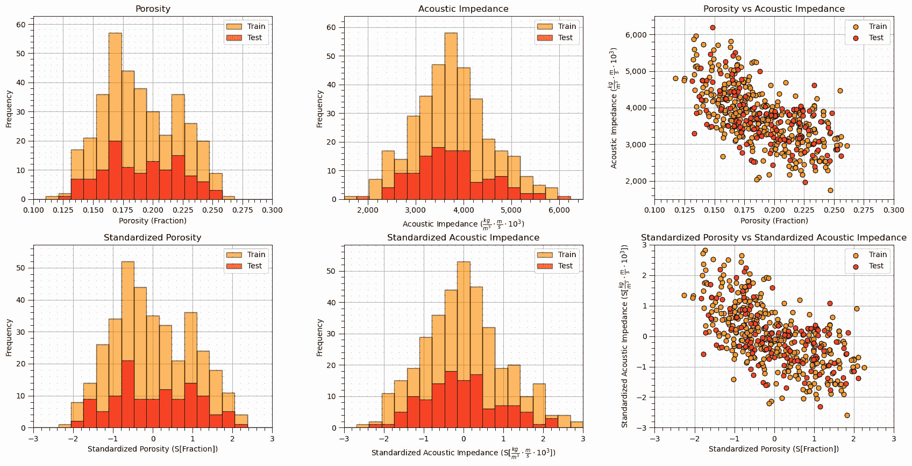
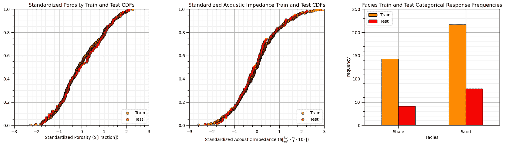
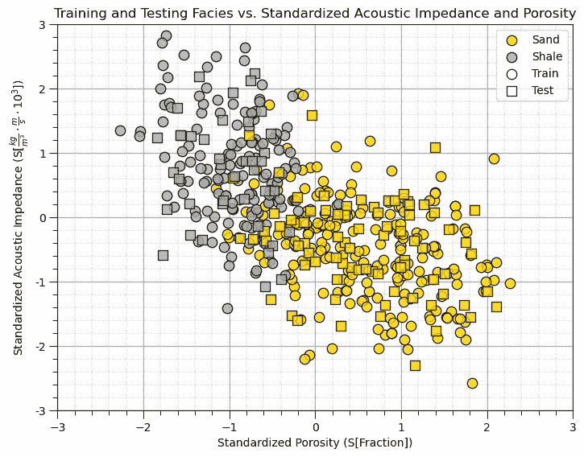
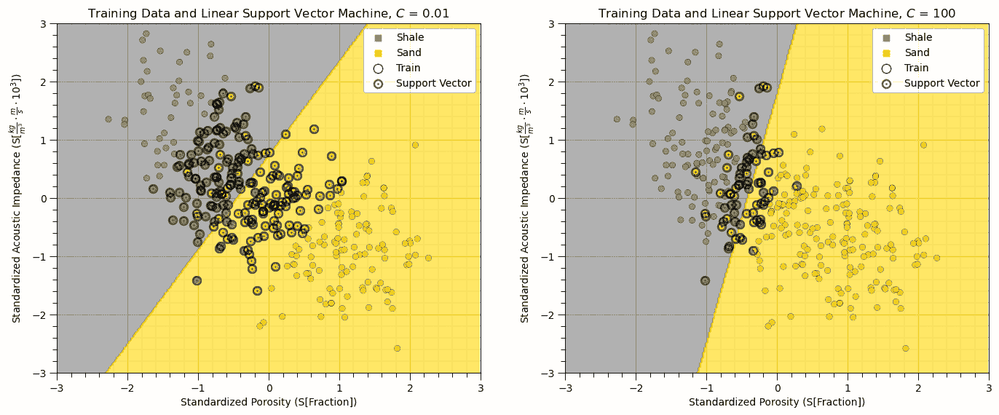
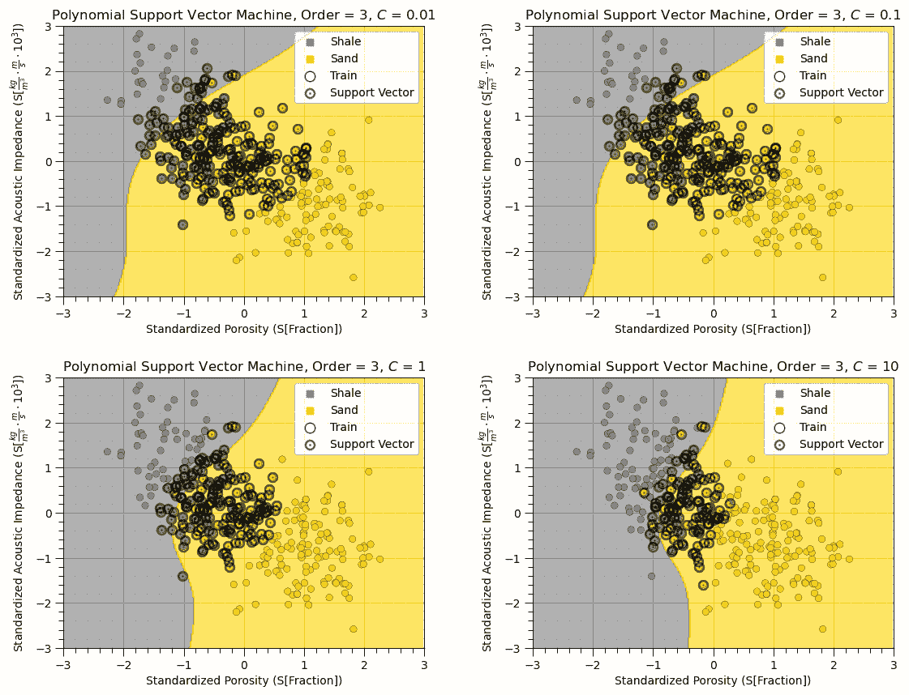
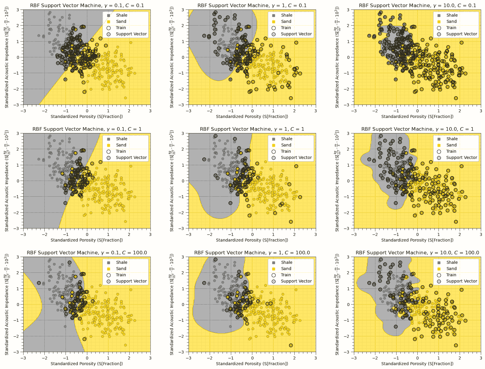
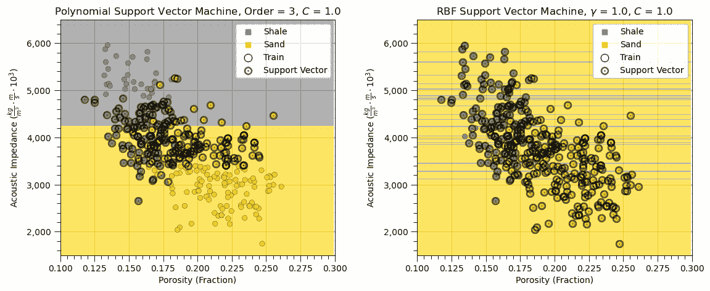
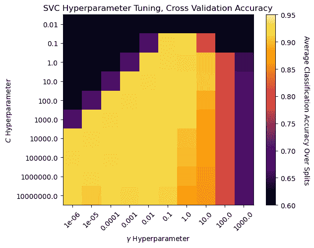
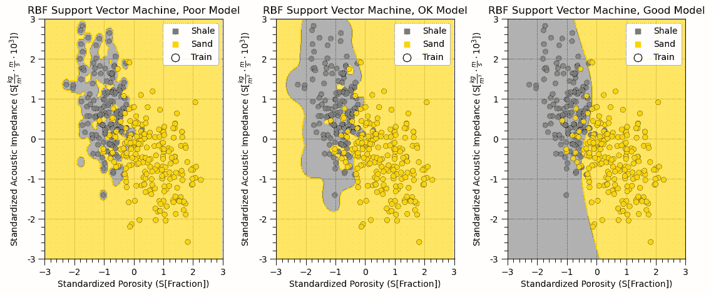

# 支持向量机

> 原文：[`geostatsguy.github.io/MachineLearningDemos_Book/MachineLearning_support_vector_machines.html`](https://geostatsguy.github.io/MachineLearningDemos_Book/MachineLearning_support_vector_machines.html)

迈克尔·J·皮尔奇，教授，德克萨斯大学奥斯汀分校

[Twitter](https://twitter.com/geostatsguy) | [GitHub](https://github.com/GeostatsGuy) | [网站](http://michaelpyrcz.com) | [Google Scholar](https://scholar.google.com/citations?user=QVZ20eQAAAAJ&hl=en&oi=ao) | [书籍](https://www.amazon.com/Geostatistical-Reservoir-Modeling-Michael-Pyrcz/dp/0199731446) | [YouTube](https://www.youtube.com/channel/UCLqEr-xV-ceHdXXXrTId5ig) | [Python 地统计学电子书](https://geostatsguy.github.io/GeostatsPyDemos_Book/intro.html) | [LinkedIn](https://www.linkedin.com/in/michael-pyrcz-61a648a1)

电子书“Python 应用机器学习：动手指南及代码”的章节。

请将此电子书引用如下：

Pyrcz, M. J., 2024, 《Python 应用机器学习：动手指南及代码》。GitHub 仓库。Zenodo。DOI：10.5281/zenodo.15169138 

本书中的工作流程以及更多内容在此处可用：

请将 MachineLearningDemos GitHub 仓库引用如下：

Pyrcz, M.J., 2024, MachineLearningDemos：Python 机器学习演示工作流程仓库（0.0.1）。Zenodo。DOI：10.5281/zenodo.13835312 

作者：迈克尔·J·皮尔奇

© 版权所有 2024。

本章是关于/演示 **支持向量机** 的教程。

**YouTube 讲座**：查看以下讲座：

+   [机器学习简介](https://youtu.be/zOUM_AnI1DQ?si=wzWdJ35qJ9n8O6Bl)

+   [多项式回归](https://youtu.be/z19Hs2HfO88?si=U2eAMJcMXRMwHG0C)

+   [支持向量机](https://youtu.be/UpN6TLMJiGg?si=-aevKAWNqk_sXxYO)

这些讲座都是我 YouTube 上的 [机器学习课程](https://youtube.com/playlist?list=PLG19vXLQHvSC2ZKFIkgVpI9fCjkN38kwf&si=XonjO2wHdXffMpeI) 的一部分，其中包含有良好文档记录的 Python 工作流程和交互式仪表板。我的目标是分享易于获取、可操作和可重复的教育内容。如果你想知道我的动机，请查看 [迈克尔的故事](https://michaelpyrcz.com/my-story)。

## 支持向量机的动机

一种二元分类机器学习方法，当组间分离不良时是一个好的分类方法。

+   将原始预测特征投影到更高维空间，然后应用线性、平面或超平面，

$$ 𝑓(𝑥) = 𝑥^𝑇 \beta +\beta_0 $$

其中 $\beta$ 是一个向量，与 $\beta$ 一起是超平面模型参数，而 $x$ 是预测特征矩阵，所有这些都在高维空间中。

+   $𝑓(𝑥)$ 与决策边界的符号距离成正比，而 $𝐺(𝑥)$ 是决策边界的两侧，$-$ 一侧和 $+$ 另一侧，$f(x) = 0$ 在决策边界上，

$$ 𝐺(𝑥)=\text{𝑠𝑖𝑔𝑛}\left( 𝑓(𝑥) \right) $$

我们通过以下方式表示约束，每个类别的所有数据都必须位于边界的正确一侧，

$$ y_i \left( x_i^T \beta + \beta_0 \right) \geq 0 $$

其中，如果类别 $y_i$ 是 -1 或 1，则成立。我们需要一个允许某些误分类的模型，

$$ y_i \left( x_i^T \beta + \beta_0 \right) \geq M - \xi_i $$

我们引入了间隔 $𝑀$ 和从间隔的距离的概念，即误差 $\xi_i$。现在我们可以将我们的损失函数表示为，

$$ \underset{\beta, \beta_0}{\text{min}} \left( \frac{1}{2M²} + C \sum_{i=1}^N \xi_i \right) $$

条件是，$\xi_i \geq 0, \quad y_i \left( x_i^T \beta + \beta_0 \right) \geq M - \xi_i$.

这是更高维空间中的支持向量机损失函数，其中 𝛽,𝛽_0 是多线性模型参数。

通过寻找最大化间隔 $M$ 的平面模型参数，同时最小化误差 $\sum_{i=1}^N \xi_i$ 来训练支持向量机

+   $𝑪$ 超参数加权误差总和 $xi_𝑖$，较高的 $𝐶$ 将导致间隔 $M$ 减少，并导致过拟合

+   较小的间隔，使用较少的数据来约束边界，称为支持向量

+   训练数据完全位于边界正确一侧的没有影响

这里是支持向量机的几个关键方面，

+   被称为支持向量机，而不是机器，因为使用新的核可以得到新的机器

+   有许多核可用，包括多项式和径向基函数

主要超参数是 $C$，即

超参数与核的选择有关，例如，

+   *多项式* - 多项式阶数

+   *径向基函数* - $\gamma$ 与训练数据的距离影响成反比

## **核技巧**

我们可以在我们的方法中包含基函数展开，而无需将训练数据转换到这个更高维空间，

$$ h(x) $$

我们只需要预测特征的内积，

$$ h(x) \left( h(x') \right)^T = \langle h(x), h(x') \rangle $$

我们只需要在变换空间中所有可用训练数据之间的“相似性”！

+   我们仅使用训练数据之间的相似性矩阵来训练支持向量机，这些数据将被投影到更高维的空间

+   我们实际上并不需要计算更高维空间中的训练数据值

## 加载所需的库

我们还需要一些标准包。这些应该已经与 Anaconda 3 一起安装。

```py
%matplotlib inline                                         
suppress_warnings = True
import os                                                     # to set current working directory 
import math                                                   # square root operator
import numpy as np                                            # arrays and matrix math
import scipy.stats as st                                      # statistical methods
import pandas as pd                                           # DataFrames
import matplotlib.pyplot as plt                               # for plotting
from matplotlib.ticker import (MultipleLocator,AutoMinorLocator,FuncFormatter,NullLocator) # control of axes ticks
from matplotlib.colors import ListedColormap                  # custom color maps
import seaborn as sns                                         # for matrix scatter plots
from sklearn.svm import SVC                                   # support vector machine methods
from sklearn import metrics                                   # measures to check our models
from sklearn.metrics import confusion_matrix                  # for summarizing model performance
from sklearn.preprocessing import StandardScaler              # standardize the features
from sklearn.model_selection import (cross_val_score,train_test_split,GridSearchCV,StratifiedShuffleSplit) # model tuning
from sklearn.pipeline import (Pipeline,make_pipeline)         # machine learning modeling pipeline
from sklearn import metrics                                   # measures to check our models
from sklearn.model_selection import cross_val_score           # multi-processor K-fold crossvalidation
from sklearn.model_selection import train_test_split          # train and test split
from IPython.display import display, HTML                     # custom displays
cmap = plt.cm.inferno                                         # default color bar, no bias
binary_cmap = ListedColormap(['grey', 'gold'])                # custom binary categorical colormap
plt.rc('axes', axisbelow=True)                                # grid behind plotting elements
if suppress_warnings == True:  
    import warnings                                           # suppress any warnings for this demonstration
    warnings.filterwarnings('ignore') 
seed = 13                                                     # random number seed for workflow repeatability 
```

如果你遇到包导入错误，你可能首先需要安装这些包中的一些。这通常可以通过在 Windows 上打开命令窗口然后输入‘python -m pip install [package-name]’来完成。更多帮助可以在相应包的文档中找到。

## 声明函数

让我们定义几个函数来简化相关矩阵的绘制和决策树回归模型的可视化。

```py
def comma_format(x, pos):
    return f'{int(x):,}'

def add_grid():
    plt.gca().grid(True, which='major',linewidth = 1.0); plt.gca().grid(True, which='minor',linewidth = 0.2) # add y grids
    plt.gca().tick_params(which='major',length=7); plt.gca().tick_params(which='minor', length=4)
    plt.gca().xaxis.set_minor_locator(AutoMinorLocator()); plt.gca().yaxis.set_minor_locator(AutoMinorLocator()) # turn on minor ticks 

def plot_CDF(data,color,alpha=1.0,lw=1,ls='solid',label='none'):
    cumprob = (np.linspace(1,len(data),len(data)))/(len(data)+1)
    plt.scatter(np.sort(data),cumprob,c=color,alpha=alpha,edgecolor='black',lw=lw,ls=ls,label=label,zorder=10)
    plt.plot(np.sort(data),cumprob,c=color,alpha=alpha,lw=lw,ls=ls,zorder=8)

def visualize_SVM(model,xfeature,x_min,x_max,yfeature,y_min,y_max,response,z_min,z_max,xlabel,ylabel,title,cat,label,cmap,plot_support): 
    xplot_step = (x_max - x_min)/300.0; yplot_step = (y_max - y_min)/300.0 # resolution of the model visualization
    xx, yy = np.meshgrid(np.arange(x_min, x_max, xplot_step), # set up the mesh
                     np.arange(y_min, y_max, yplot_step))
    Z = model.predict(np.c_[xx.ravel(), yy.ravel()])          # predict with our trained model over the mesh
    Z = Z.reshape(xx.shape)
    cs = plt.contourf(xx, yy,Z,cmap=cmap,vmin=z_min,vmax=z_max,levels = 50,alpha=0.6) # plot the predictions
    for i in range(len(cat)):
        im = plt.scatter(xfeature[response==cat[i]],yfeature[response==cat[i]],s=None,c=response[response==cat[i]], 
                    marker=None, cmap=cmap, norm=None,vmin=z_min,vmax=z_max,alpha=0.8,linewidths=0.3, edgecolors="black")
    plt.scatter(-9999,-9999,marker='s',c = cat[0],label=label[0],cmap=cmap,vmin=z_min,vmax=z_max) # custom legend
    plt.scatter(-9999,-9999,marker='s',c = cat[1],label=label[1],cmap=cmap,vmin=z_min,vmax=z_max)
    plt.scatter(-999,-999,s=80,marker='o',color = 'white',alpha = 0.8,edgecolor = 'black',zorder=1,label='Train')
    if plot_support:                                          # modified from Jake VanderPlas's Python Data Science Handbook 
        sv = model.support_vectors_                           # retrieve the support vectors
        plt.scatter(sv[:, 0],sv[:, 1],s=3,linewidth=8,alpha = 0.6,facecolors='black',label='Support Vector');
    plt.legend(loc='upper right'); plt.title(title)                    
    plt.xlabel(xlabel); plt.ylabel(ylabel)
    plt.xlim([x_min,x_max]); plt.ylim([y_min,y_max]); add_grid()

def display_sidebyside(*args):                                # display DataFrames side-by-side (ChatGPT 4.0 generated Spet, 2024)
    html_str = ''
    for df in args:
        html_str += df.head().to_html()                       # Using .head() for the first few rows
    display(HTML(f'<div style="display: flex;">{html_str}</div>')) 
```

## 设置工作目录

我总是喜欢这样做，这样我就不会丢失文件，并且可以简化后续的读取和写入（避免每次都包含完整地址）。

```py
#os.chdir("c:/PGE383")                                        # set the working directory 
```

## 加载数据

让我们加载提供的多元、空间数据集‘12_sample_data.csv’。它是一个以逗号分隔的文件，包含：

+   X 和 Y 坐标（$m$）

+   地层 0 和 1

+   孔隙率（分数）

+   渗透率（$mD$）

+   声波阻抗（$kg/m³ \cdot m/s \cdot 10³$）。

我们使用 pandas 的‘read_csv’函数将其加载到我们称为‘df’的数据框中，然后预览它以确保正确加载。

**Python 技巧：使用包中的函数**只需输入我们在开头声明的包的标签：

```py
import pandas as pd 
```

因此，我们可以使用以下命令访问 pandas 函数‘read_csv’：

```py
pd.read_csv() 
```

但是，read_csv 需要输入参数。最重要的一个是文件名。在我们的情况下，所有其他默认参数都很好。如果你想查看此函数的所有可能参数，请参阅[这里](https://pandas.pydata.org/pandas-docs/stable/reference/api/pandas.read_csv.html)的文档。

+   文档总是很有帮助

+   Python 函数通常有很多灵活性，这是通过使用各种输入参数实现的

此外，程序有一个输出，一个从数据加载的 pandas DataFrame。因此，我们必须指定代表该新对象的名字/变量。

```py
df = pd.read_csv("12_sample_data.csv") 
```

## 标准化预测特征

支持向量机最小化误差，即训练数据与边界的距离。因此，这种方法对预测特征的相对范围敏感。

+   如果一个预测特征的范围大得多，它将主导模型，模型将只在该特征上分离！结果是模型与该特征正交，即只在该特征上分割。

```py
df = pd.read_csv(r"https://raw.githubusercontent.com/GeostatsGuy/GeoDataSets/master/12_sample_data.csv")

yname = 'Facies'; Xname = ['Porosity','AI']                   # specify the predictor features (x2) and response feature (x1)
Xmin = [0.1,1500.0]; Xmax = [0.3,6500.0]                      # set minimums and maximums for visualization 
ymin = 0.0; ymax = 1.0
Xlabel = ['Porosity','Acoustic Impedance']; ylabel = 'Facies' # specify the feature labels for plotting
Xunit = ['Fraction',r'$\frac{kg}{m³} \cdot \frac{m}{s} \cdot 10³$']; yunit = 'MCFPD'
Xlabelunit = [Xlabel[0] + ' (' + Xunit[0] + ')',Xlabel[1] + ' (' + Xunit[1] + ')']
ylabelunit = ylabel + ' (' + yunit + ')'

y = pd.DataFrame(df[yname])                                   # extract selected features as X and y DataFrames
X = df[Xname]

ysname = 's' + yname; Xsname = ['s' + element for element in Xname] # standardized predictor names
Xsmin = [-3.0,-3.0]; Xsmax = [3.0,3.0]                        # set minimums and maximums for standardized features
Xslabel = ['Standardized ' + element for element in Xlabel]   # standardized predictor names
Xsunit = ['S[' + element + ']' for element in Xunit]          # standardized predictor names
Xslabelunit = [Xslabel[0] + ' (' + Xsunit[0] + ')',Xslabel[1] + ' (' + Xsunit[1] + ')']

transform = StandardScaler();                                 # instantiate feature standardization method
Xs = transform.fit_transform(X)                               # standardize the data features to mean = 0, var = 1.0
X[Xsname] = Xs                                                # add standardized features to the predictor feature DataFrame 
```

## 训练和测试分割

为了方便和简单，我们使用 scikit-learn 的随机训练和测试分割。

+   我们使用相同的 random_state 参数，因此原始特征和标准化特征上的训练和测试分割是相同的。

+   我本可以只反向转换标准化后的数据（剧透：我将展示不标准化对模型的影响）。

+   通常情况下，我们不需要对预测特征进行反向转换，对于我们的预测工作流程来说，预测特征是一次性旅程。

```py
X_train, X_test, y_train, y_test = train_test_split(X,y,test_size=0.25,random_state=73073) # train and test split
df_train = pd.concat([X_train,y_train],axis=1)                # make one train and test DataFrame with both X and y
df_test = pd.concat([X_test,y_test],axis=1) 
```

## 可视化 DataFrame

在我们构建模型之前，可视化训练和测试 DataFrame 是一个有用的检查。

+   许多事情可能会出错，例如，我们加载了错误的数据，所有特征都没有加载等。

我们可以通过使用 DataFrame 的‘head’成员函数来预览（格式整洁，见下文）。

```py
print('       Training DataFrame          Testing DataFrame')
display_sidebyside(df_train,df_test)                          # custom function for side-by-side DataFrame display 
```

```py
 Training DataFrame          Testing DataFrame 
```

|  | 孔隙度 | AI | s 孔隙度 | sAI | 相 |
| --- | --- | --- | --- | --- | --- |
| 340 | 0.204313 | 4373.187870 | 0.469659 | 0.788406 | 1 |
| 159 | 0.167316 | 3088.482947 | -0.698603 | -0.860390 | 0 |
| 315 | 0.219801 | 2983.326185 | 0.958720 | -0.995349 | 1 |
| 365 | 0.216819 | 2543.772663 | 0.864542 | -1.559474 | 1 |
| 385 | 0.191565 | 3670.457907 | 0.067120 | -0.113481 | 1 |
|  | 孔隙度 | AI | s 孔隙度 | sAI | 相 |
| --- | --- | --- | --- | --- | --- |
| 72 | 0.139637 | 4747.274043 | -1.572630 | 1.268510 | 0 |
| 153 | 0.170732 | 4535.625583 | -0.590742 | 0.996879 | 0 |
| 258 | 0.244345 | 2696.102930 | 1.733756 | -1.363972 | 1 |
| 56 | 0.167125 | 5500.997419 | -0.704644 | 2.235841 | 0 |
| 303 | 0.216253 | 3959.934912 | 0.846677 | 0.258035 | 1 |

## 表格数据的汇总统计

在 DataFrames 中，有许多高效的方法可以计算表格数据的汇总统计。

+   描述命令提供了一个很好的数据表，其中包括计数、平均值、最小值、最大值。

```py
print('            Training DataFrame                      Testing DataFrame') # custom function for side-by-side summary statistics
display_sidebyside(df_train.describe().loc[['count', 'mean', 'std', 'min', 'max']],df_test.describe().loc[['count', 'mean', 'std', 'min', 'max']]) 
```

```py
 Training DataFrame                      Testing DataFrame 
```

|  | 孔隙度 | AI | s 孔隙度 | sAI | 相 |
| --- | --- | --- | --- | --- | --- |
| count | 360.000000 | 360.000000 | 360.000000 | 360.000000 | 360.000000 |
| mean | 0.189150 | 3767.451286 | -0.009167 | 0.011001 | 0.602778 |
| std | 0.031636 | 786.394126 | 0.998983 | 1.009262 | 0.490004 |
| min | 0.117562 | 1746.387548 | -2.269691 | -2.582841 | 0.000000 |
| max | 0.261091 | 5957.162150 | 2.262519 | 2.821285 | 1.000000 |
|  | 孔隙度 | AI | s 孔隙度 | sAI | 相 |
| --- | --- | --- | --- | --- | --- |
| count | 120.000000 | 120.000000 | 120.000000 | 120.000000 | 120.000000 |
| mean | 0.190311 | 3733.164755 | 0.027500 | -0.033003 | 0.658333 |
| std | 0.032014 | 763.117871 | 1.010903 | 0.979389 | 0.476257 |
| min | 0.131230 | 1961.600397 | -1.838105 | -2.306636 | 0.000000 |
| max | 0.256172 | 6194.573653 | 2.107198 | 3.125980 | 1.000000 |

很好，我们已经检查了汇总统计。

+   没有明显的错误

+   检查每个特征的值范围，以设置和调整绘图限制。见上文。

## 可视化训练集和测试集的划分

让我们通过直方图和散点图检查训练集和测试集的一致性和覆盖率。

+   检查以确保训练集和测试集覆盖了可能的特征组合范围

+   确保我们使用测试案例不会超出训练数据范围进行外推

```py
nbins = 20                                                    # number of histogram bins

plt.subplot(231)                                              # predictor feature #1 histogram
freq1,_,_ = plt.hist(x=X_train[Xname[0]],weights=None,bins=np.linspace(Xmin[0],Xmax[0],nbins),alpha = 0.6,
                     edgecolor='black',color='darkorange',density=False,label='Train')
freq2,_,_ = plt.hist(x=X_test[Xname[0]],weights=None,bins=np.linspace(Xmin[0],Xmax[0],nbins),alpha = 0.6,
                     edgecolor='black',color='red',density=False,label='Test')
max_freq = max(freq1.max()*1.10,freq2.max()*1.10)
plt.xlabel(Xlabelunit[0]); plt.ylabel('Frequency'); plt.ylim([0.0,max_freq]); plt.title(Xlabel[0]); add_grid()  
plt.xlim([Xmin[0],Xmax[0]]); plt.legend(loc='upper right')   

plt.subplot(232)                                              # predictor feature #2 histogram
freq1,_,_ = plt.hist(x=X_train[Xname[1]],weights=None,bins=np.linspace(Xmin[1],Xmax[1],nbins),alpha = 0.6,
                     edgecolor='black',color='darkorange',density=False,label='Train')
freq2,_,_ = plt.hist(x=X_test[Xname[1]],weights=None,bins=np.linspace(Xmin[1],Xmax[1],nbins),alpha = 0.6,
                     edgecolor='black',color='red',density=False,label='Test')
max_freq = max(freq1.max()*1.10,freq2.max()*1.10)
plt.xlabel(Xlabelunit[1]); plt.ylabel('Frequency'); plt.ylim([0.0,max_freq]); plt.title(Xlabel[1]); add_grid()  
plt.gca().xaxis.set_major_formatter(FuncFormatter(comma_format))
plt.xlim([Xmin[1],Xmax[1]]); plt.legend(loc='upper right')   

plt.subplot(233)                                              # predictor features #1 and #2 scatter plot
plt.scatter(X_train[Xname[0]],X_train[Xname[1]],s=40,marker='o',color = 'darkorange',alpha = 0.8,edgecolor = 'black',zorder=10,label='Train')
plt.scatter(X_test[Xname[0]],X_test[Xname[1]],s=40,marker='o',color = 'red',alpha = 0.8,edgecolor = 'black',zorder=10,label='Test')
plt.title(Xlabel[0] + ' vs ' +  Xlabel[1])
plt.xlabel(Xlabelunit[0]); plt.ylabel(Xlabelunit[1])
plt.legend(); add_grid(); plt.xlim([Xmin[0],Xmax[0]]); plt.ylim([Xmin[1],Xmax[1]])
plt.gca().yaxis.set_major_formatter(FuncFormatter(comma_format))

plt.subplot(234)                                              # predictor feature #1 histogram
freq1,_,_ = plt.hist(x=X_train[Xsname[0]],weights=None,bins=np.linspace(Xsmin[0],Xsmax[0],nbins),alpha = 0.6,
                     edgecolor='black',color='darkorange',density=False,label='Train')
freq2,_,_ = plt.hist(x=X_test[Xsname[0]],weights=None,bins=np.linspace(Xsmin[0],Xsmax[0],nbins),alpha = 0.6,
                     edgecolor='black',color='red',density=False,label='Test')
max_freq = max(freq1.max()*1.10,freq2.max()*1.10)
plt.xlabel(Xslabelunit[0]); plt.ylabel('Frequency'); plt.ylim([0.0,max_freq]); plt.title(Xslabel[0]); add_grid()  
plt.xlim([Xsmin[0],Xsmax[0]]); plt.legend(loc='upper right')   

plt.subplot(235)                                              # predictor feature #2 histogram
freq1,_,_ = plt.hist(x=X_train[Xsname[1]],weights=None,bins=np.linspace(Xsmin[1],Xsmax[1],nbins),alpha = 0.6,
                     edgecolor='black',color='darkorange',density=False,label='Train')
freq2,_,_ = plt.hist(x=X_test[Xsname[1]],weights=None,bins=np.linspace(Xsmin[1],Xsmax[1],nbins),alpha = 0.6,
                     edgecolor='black',color='red',density=False,label='Test')
max_freq = max(freq1.max()*1.10,freq2.max()*1.10)
plt.xlabel(Xslabelunit[1]); plt.ylabel('Frequency'); plt.ylim([0.0,max_freq]); plt.title(Xslabel[1]); add_grid()  
plt.xlim([Xsmin[1],Xsmax[1]]); plt.legend(loc='upper right')   

plt.subplot(236)                                              # predictor features #1 and #2 scatter plot
plt.scatter(X_train[Xsname[0]],X_train[Xsname[1]],s=40,marker='o',color = 'darkorange',alpha = 0.8,edgecolor = 'black',zorder=10,label='Train')
plt.scatter(X_test[Xsname[0]],X_test[Xsname[1]],s=40,marker='o',color = 'red',alpha = 0.8,edgecolor = 'black',zorder=10,label='Test')
plt.title(Xslabel[0] + ' vs ' +  Xslabel[1])
plt.xlabel(Xslabelunit[0]); plt.ylabel(Xslabelunit[1])
plt.legend(); add_grid(); plt.xlim([Xsmin[0],Xsmax[0]]); plt.ylim([Xsmin[1],Xsmax[1]])

plt.subplots_adjust(left=0.0, bottom=0.0, right=2.5, top=1.6, wspace=0.3, hspace=0.25)
#plt.savefig('Test.pdf', dpi=600, bbox_inches = 'tight',format='pdf') 
plt.show() 
```



有时我发现通过查看 CDF 而不是直方图来比较分布更方便。

+   我们避免任意选择直方图柱状大小，因为 CDF 与数据分辨率一致。

```py
plt.subplot(131)                                              # predictor feature #1 CDF
plot_CDF(X_train[Xsname[0]],'darkorange',alpha=0.6,lw=1,ls='solid',label='Train')
plot_CDF(X_test[Xsname[0]],'red',alpha=0.6,lw=1,ls='solid',label='Test')
plt.xlabel(Xslabelunit[0]); plt.xlim(Xsmin[0],Xsmax[0]); plt.ylim([0,1]); add_grid(); plt.legend(loc='lower right')
plt.title(Xslabel[0] + ' Train and Test CDFs')

plt.subplot(132)                                              # predictor feature #2 CDF
plot_CDF(X_train[Xsname[1]],'darkorange',alpha=0.6,lw=1,ls='solid',label='Train')
plot_CDF(X_test[Xsname[1]],'red',alpha=0.6,lw=1,ls='solid',label='Test')
plt.xlabel(Xslabelunit[1]); plt.xlim(Xsmin[1],Xsmax[1]); plt.ylim([0,1]); add_grid(); plt.legend(loc='lower right')
plt.title(Xslabel[1] + ' Train and Test CDFs')

plt.subplot(133)                                              # categorical response feature grouped histogram
plt.bar([-0.125],len(y_train[yname][y_train[yname]==0]),width=0.25,color=['darkorange'],edgecolor='black',label='Train')
plt.bar([0.125],len(y_test[yname][y_test[yname]==0]),width=0.25,color=['red'],edgecolor='black',label='Test')
plt.bar([0.875],len(y_train[yname][y_train[yname]==1]),width=0.25,color=['darkorange'],edgecolor='black')
plt.bar([1.125],len(y_test[yname][y_test[yname]==1]),width=0.25,color=['red'],edgecolor='black')
x_ticks = [0, 1]; x_labels = ['Shale', 'Sand']; plt.xticks(x_ticks,x_labels)
plt.ylim([0.,250.0]); plt.xlim([-0.5,1.5]); add_grid(); plt.legend(loc='upper left')
ax = plt.gca(); ax.xaxis.set_minor_locator(NullLocator())
plt.title(ylabel + ' Train and Test Categorical Response Frequencies'); plt.xlabel('Facies'); plt.ylabel('Frequency')

plt.subplots_adjust(left=0.0, bottom=0.0, right=2.5, top=0.8, wspace=0.3, hspace=0.2)
#plt.savefig('Test.pdf', dpi=600, bbox_inches = 'tight',format='pdf') 
plt.show() 
```



这看起来不错，

+   分布表现良好，我们无法观察到明显的缺口、异常值或截断

+   测试和训练案例有类似的覆盖范围

+   在训练和测试数据集中，分类响应的相对频率相似，即，训练和测试平衡良好。

## 可视化预测特征空间

让我们构建一个简化的图表来可视化二维预测特征空间中的训练和测试数据。

+   我们提出问题，我们能否建模分类边界？数据重叠很多吗？边界简单（即，线性）还是更复杂？

```py
plt.subplot(111)                                              # plot train and test data in predictor feature space
plt.scatter(X_train[Xsname[0]][y_train[yname]==1],X_train[Xsname[1]][y_train[yname]==1],s=80,
            marker='o',color = 'gold',alpha = 0.8,edgecolor = 'black',zorder=1,label='Sand')
plt.scatter(X_train[Xsname[0]][y_train[yname]==0],X_train[Xsname[1]][y_train[yname]==0],s=80,
            marker='o',color = 'darkgrey',alpha = 0.8,edgecolor = 'black',zorder=1,label='Shale')

plt.scatter(X_test[Xsname[0]][y_test[yname]==1],X_test[Xsname[1]][y_test[yname]==1],s=80,
            marker='s',color = 'gold',alpha = 0.8,edgecolor = 'black',zorder=1,)
plt.scatter(X_test[Xsname[0]][y_test[yname]==0],X_test[Xsname[1]][y_test[yname]==0],s=80,
            marker='s',color = 'darkgrey',alpha = 0.8,edgecolor = 'black',zorder=1,)

plt.scatter([-999],[-999],s=80,marker='o',color = 'white',alpha = 0.8,edgecolor = 'black',zorder=1,label='Train')
plt.scatter([-999],[-999],s=80,marker='s',color = 'white',alpha = 0.8,edgecolor = 'black',zorder=1,label='Test')

plt.legend(loc = 'upper right')
plt.title('Training and Testing ' + ylabel + ' vs. ' + Xslabel[1] + ' and ' + Xlabel[0])
plt.xlabel(Xslabelunit[0]); plt.ylabel(Xslabelunit[1]); add_grid(); plt.xlim([Xsmin[0],Xsmax[0]]); plt.ylim([Xsmin[1],Xsmax[1]])
plt.gca().yaxis.set_major_formatter(FuncFormatter(comma_format))

plt.subplots_adjust(left=0.0, bottom=0.0, right=1.0, top=1.0, wspace=0.2, hspace=0.2); plt.show() 
```



这将是一个困难的分类，

+   当然有很多重叠

+   边界可能是非线性的。

但是，有好的消息，

+   总体而言，训练和测试覆盖范围看起来不错，注意有几个测试案例将测试模型外推。

+   支持向量机被设计用来处理这种重叠！

## 线性核支持向量机模型

让我们从简单开始，在我们的特征空间中训练并可视化线性支持向量机模型。

+   这将为 facies 0 和 1 提供一个基于 AI 和孔隙率的线性空间分类模型。

我们使用 scikit-learn 函数 $SVC$ 来证实支持向量机：

```py
svm_linear = SVC() 
```

参数包括：

+   **kernel** 应用到数据以将其投影到可能更高维空间中的核类型

+   **$C$** 误分类的惩罚

+   **random_state** 随机数用于随机打乱数据以进行概率估计

我们接着使用命令，

```py
svm_linear.fit() 
```

以训练数据集来训练模型。

fit 函数的输入包括：

+   **X** - 用于训练数据集的预测特征的 $n \times m$ 数组

+   **y** - 用于训练数据集的响应特征的 $n \times 1$ 数组

让我们尝试两个不同的 $C$ 惩罚超参数来可视化误分类惩罚的影响。

```py
C1_list = [0.01,100]                                          # set hyperparameters
SVM1_list = []

for C in C1_list:                                             # train the models
    SVM1_list.append(SVC(kernel = 'linear',C = C, random_state = seed).fit(X_train[Xsname],y_train)) # instantiate and train 
```

看起来运行得很好！让我们使用我们之前定义的方便的可视化函数来可视化结果。

```py
for iC, C in enumerate(C1_list):                              # visualize the training data and model
    plt.subplot(1,2,iC+1)
    visualize_SVM(SVM1_list[iC],X_train[Xsname[0]],Xsmin[0],Xsmax[0],X_train[Xsname[1]],Xsmin[1],Xsmax[1],y_train[yname],0.0,1.0,
                Xslabelunit[0],Xslabelunit[1],r'Training Data and Linear Support Vector Machine, $C$ = ' + str(C),[0,1],['Shale','Sand'],
                binary_cmap,True)
plt.subplots_adjust(left=0.0, bottom=0.0, right=2.0, top=1.0, wspace=0.2, hspace=0.2); plt.show() 
```



上图显示了线性核支持向量机分类模型，训练数据集以及用粗圆圈表示的结果支持向量。

+   线性核只提供一条直的决定边界。

+   调整模型以适应更复杂的情况是困难的。

注意，随着 C 值的增加，错误总和的加权，我们得到更小的边界。线性模型与更少的支持向量（边界内的训练数据）拟合。让我们总结一下关于简单和复杂模型、潜在欠拟合和过拟合以及模型偏差和方差权衡的该超参数的端成员。

+   **简单模型/欠拟合模型** - 当 C 值较小时，分类器对误分类的数据点更宽容（更高的模型偏差，更低的模型方差）。

+   **复杂模型 \ 过拟合模型** - 当 C 值较大时，分类器对误分类的数据点更敏感（模型偏差更低，模型方差更高）。

换句话说，$C$ 是一个正则化项，就像岭回归中的收缩项。让我们尝试一些具有不同核的更灵活的分类器，以便我们可以更好地看到这一点。

## 基于多项式核的支持向量机模型

多项式核定义为

\begin{equation} K(x,x’) = (x^Tx)^d, \end{equation}

其中 $d$ 是多项式的次数。

超参数 $degree$ 是多项式核函数的阶数。

如前所述，让我们尝试不同的 $C$，错误惩罚，使用单个多项式阶数观察结果。

```py
C2_list = [0.01,0.1,1,10]                                     # set hyperparameters
order = np.full((len(C2_list)),3)       
SVM2_list = []

for iC, C in enumerate(C2_list):                              # train the model and visualize the training data and model
    SVM2_list.append(SVC(kernel = 'poly',degree=order[iC],C = C,random_state = seed).fit(X_train[Xsname],y_train)) # instantiate and train
    plt.subplot(2,2,iC+1)
    visualize_SVM(SVM2_list[iC-1],X_train[Xsname[0]],Xsmin[0],Xsmax[0],X_train[Xsname[1]],Xsmin[1],Xsmax[1],y_train[yname],0.0,1.0,
                Xslabelunit[0],Xslabelunit[1],'Polynomial Support Vector Machine, Order = ' + str(order[iC]) + r', $C$ = ' + str(C),
                [0,1],['Shale','Sand'],binary_cmap,True)
plt.subplots_adjust(left=0.0, bottom=0.0, right=1.6, top=1.6, wspace=0.3, hspace=0.3); plt.show() 
```



随着 C 超参数的增加，间隔缩小，支持向量的数量减少，模型复杂度增加。

## 基于径向基函数核的支持向量机模型

径向基函数（RBF）是 SVC 中常用的另一个核函数：

\begin{equation} K(x,x’) = e^{- \gamma ||x-x’||²}, \end{equation}

其中 $||x-x'||²$ 是两个数据点 x 和 x’之间的欧几里得距离的平方。

高斯核是 RBF 的一个特例，其中：

\begin{equation} K(x,x’) = e^{- \frac {||x-x’||²} {2 \sigma²}}. \end{equation}

通过改变 $\gamma$ 和 C 的值，具有 RBF 核的分类器可以被调整。

$\gamma$ 可以被视为核的扩散。

+   当 $\gamma$ 较低时，决策边界的曲率较低，导致决策区域较宽（低方差，高偏差），低复杂度。

+   $\gamma$ 参数可以解释为模型选为支持向量的样本的影响半径的倒数，即低 gamma 值会整合更多数据以实现更平滑的模型。

```py
C3_list = [1e-1, 1, 1e2]                                      # set hyperparameters
gamma1_list = [1e-1, 1, 1e1]

index= 1
for C in C3_list:
    for gamma in gamma1_list:                                 # train the models, visualize the training data and models
        svc = SVC(kernel='rbf',gamma=gamma,C=C,random_state = seed).fit(X_train[Xsname],y_train) # instantiate and train
        plt.subplot(3,3,index)
        visualize_SVM(svc,X_train[Xsname[0]],Xsmin[0],Xsmax[0],X_train[Xsname[1]],Xsmin[1],Xsmax[1],y_train[yname],0.0,1.0,
                Xslabelunit[0],Xslabelunit[1],r'RBF Support Vector Machine, $\gamma$ = ' + str(gamma) + r', $C$ = ' + str(C),
                [0,1],['Shale','Sand'],binary_cmap,True)
        index = index + 1

plt.subplots_adjust(left=0.0, bottom=0.0, right=2.4, top=2.4, wspace=0.3, hspace=0.3); plt.show() 
```



在这种情况下，使用 C 超参数进行正则化的影响非常明显，

+   更高的 C 值，更小的间隔，更少的支持向量，倾向于过拟合。

+   更低的 C 值，更大的间隔，更多的支持向量，倾向于欠拟合。

在这种情况下，gamma 的影响也非常明显，

+   更高的 gamma 值导致更复杂、高曲率的决策边界。

+   更低的 gamma 值导致更简单、低曲率、平滑的决策边界。

尽管在某些情况下，两个岩相似乎被正确分类，但存在过拟合的风险，特别是对于高 gamma 和高 C 的例子。

## 未对预测特征进行标准化的支持向量机

如承诺的那样，让我们尝试一个未对预测特征进行标准化的模型。

+   这将是有说明性的，因为原始预测特征的范围差异很大！

```py
order = 3; C = 0.01                                           # set the hyperparameters
svc_test1 = SVC(kernel='poly',degree=order,C=C,random_state = seed).fit(X_train[Xname],y_train) # fit with original features, not standardized
gamma = 1.0; C = 1.0                                          # set the hyperparameters
svc_test2 = SVC(kernel='rbf',gamma=gamma,C=C,random_state = seed).fit(X_train[Xname],y_train) # fit with original features, not standardized

plt.subplot(121)                                              # visualize the training data and models
visualize_SVM(svc_test1,X_train[Xname[0]],Xmin[0],Xmax[0],X_train[Xname[1]],Xmin[1],Xmax[1],y_train[yname],0.0,1.0,
                Xlabelunit[0],Xlabelunit[1],'Polynomial Support Vector Machine, Order = ' + str(order) + r', $C$ = ' + str(C),
                [0,1],['Shale','Sand'],binary_cmap,True)
plt.gca().yaxis.set_major_formatter(FuncFormatter(comma_format))

plt.subplot(122)
visualize_SVM(svc_test2,X_train[Xname[0]],Xmin[0],Xmax[0],X_train[Xname[1]],Xmin[1],Xmax[1],y_train[yname],0.0,1.0,
                Xlabelunit[0],Xlabelunit[1],r'RBF Support Vector Machine, $\gamma$ = ' + str(gamma) + r', $C$ = ' + str(C),
                [0,1],['Shale','Sand'],binary_cmap,True)
plt.gca().yaxis.set_major_formatter(FuncFormatter(comma_format))

plt.subplots_adjust(left=0.0, bottom=0.0, right=1.6, top=0.8, wspace=0.3, hspace=0.3); plt.show() 
```



发生了什么？

+   具有多项式核的支持向量机在范围最大的特征上分割，即声阻抗。在范围非常小的特征（这里指孔隙率）上的差异对模型没有显著影响。

+   具有径向基函数的支持向量机在声阻抗上有薄页岩和砂岩层。

我们必须标准化我们的预测特征以应用支持向量机。

## 超参数调优

让我们使用带有分层洗牌拆分的暴力网格搜索来迭代多个超参数并找到最佳模型复杂度。

+   **网格搜索交叉验证** - 为所有超参数的组合构建模型

+   **分层洗牌拆分** - 确保在拆分中保持分类案例的平衡，并随机化拆分以确保模型每次都使用相同的数据顺序

+   警告：在普通 PC 上运行此操作将大约需要 2 分钟

```py
C_range = np.logspace(-2, 7, 10)                              # set hyperparameter cases
gamma_range = np.logspace(-6, 3, 10)
param_grid = dict(gamma=gamma_range, C=C_range)               # store hyperparameter cases in a dictionary
cv = StratifiedShuffleSplit(n_splits=5, test_size=0.3, random_state=seed) # instantiate the cross validation method
grid = GridSearchCV(SVC(), param_grid=param_grid, cv=cv,n_jobs=5).fit(X[Xsname],y) # brute force, full combinatorial search with cross validation 
scores = grid.cv_results_['mean_test_score'].reshape(len(C_range),len(gamma_range)) # retrieve average accuracy and shape as a 2D array for plot 
```

现在我们可以可视化所有超参数组合的交叉验证准确率。

+   注意，输出是所有分层洗牌拆分的平均准确率，其中准确率是，

$$ 准确率 = \frac{n_{\text{正确分类的}}}{n} $$

```py
plt.subplot(111)                                              # plot results of hyperparameter tuning 
im = plt.imshow(scores,vmin=0.6,vmax=0.95,cmap=cmap,alpha=1.0)
plt.xlabel(r'$\gamma$ Hyperparameter')
plt.ylabel(r'$C$ Hyperparameter')
cbar = plt.colorbar(im, orientation = 'vertical')
cbar.set_label('Average Classification Accuracy Over Splits', rotation=270, labelpad=20)
plt.xticks(np.arange(len(gamma_range)), gamma_range, rotation=45)
plt.yticks(np.arange(len(C_range)), C_range)
plt.title('SVC Hyperparameter Tuning, Cross Validation Accuracy');

plt.subplots_adjust(left=0.0, bottom=0.0, right=0.8, top=0.8, wspace=0.3, hspace=0.3); plt.show() 
```



我们可以观察到在 $C$ 为 100 和 $\gamma$ 为 0.1 的 $C$ 和 $\gamma$ 区域周围具有最佳模型交叉验证准确率。

## 可视化高、中、低性能模型

现在我们展示基于上述演示的验证准确率的高、中、低性能模型示例。

+   我们将使用上图中的参数组合，$C$ 和 $\gamma$，来选择并重新运行案例。

```py
cases = ['Poor','OK','Good']                                  # selected hyperparameter cases for visualization
C_list = [100,100,1e6]
gamma_list = [100,10,0.01]
model_cases = []

for icase, case in enumerate(cases):                          # visualize the training data and model
    model_cases.append(SVC(kernel='rbf',C=C_list[icase],gamma=gamma_list[icase]).fit(X[Xsname],y)) # train on all the data
    plt.subplot(1,3,icase+1)                                  # visualize model cases and all data
    visualize_SVM(model_cases[icase],X_train[Xsname[0]],Xsmin[0],Xsmax[0],X_train[Xsname[1]],Xsmin[1],Xsmax[1],y_train[yname],0.0,1.0,
        Xslabelunit[0],Xslabelunit[1],r'RBF Support Vector Machine, ' + str(cases[icase]) + ' Model',[0,1],['Shale','Sand'],binary_cmap,False)
    plt.gca().yaxis.set_major_formatter(FuncFormatter(comma_format))

plt.subplots_adjust(left=0.0, bottom=0.0, right=1.6, top=0.8, wspace=0.3, hspace=0.3); plt.show() 
```



通过从我们的超参数调优交叉验证准确率中选择低、中、高准确率超参数案例，我们获得了一个过度拟合到良好拟合模型的良好示例。

## 评论

希望您觉得这一章有帮助。还有很多可以做的和讨论的，我有很多资源。查看我的[共享资源清单](https://michaelpyrcz.com/my-resources)，

*迈克尔*

## 作者：

迈克尔·皮尔奇，教授，德克萨斯大学奥斯汀分校 *新型数据分析、地统计学和机器学习地下解决方案*

迈克尔在地下咨询、研究和开发方面拥有超过 17 年的经验，他回到学术界，受其教学热情和对增强工程师和地球科学家在地下资源开发中影响的热情所驱动。

更多关于迈克尔的信息，请查看以下链接：

[Twitter](https://twitter.com/geostatsguy) | [GitHub](https://github.com/GeostatsGuy) | [网站](http://michaelpyrcz.com) | [Google Scholar](https://scholar.google.com/citations?user=QVZ20eQAAAAJ&hl=en&oi=ao) | [地统计学书籍](https://www.amazon.com/Geostatistical-Reservoir-Modeling-Michael-Pyrcz/dp/0199731446) | [YouTube](https://www.youtube.com/channel/UCLqEr-xV-ceHdXXXrTId5ig) | [Python 地统计学应用电子书](https://geostatsguy.github.io/GeostatsPyDemos_Book/intro.html) | [Python 应用机器学习电子书](https://geostatsguy.github.io/MachineLearningDemos_Book/) | [LinkedIn](https://www.linkedin.com/in/michael-pyrcz-61a648a1)

## 想一起工作吗？

希望这些内容对那些想了解更多关于地下建模、数据分析和机器学习的人有所帮助。学生和在职专业人士都欢迎参加。

+   想邀请我到贵公司进行培训、辅导、项目审查、工作流程设计和/或咨询吗？我很乐意拜访并与您合作！

+   感兴趣合作、支持我的研究生研究或我的地下数据分析与机器学习联盟（共同负责人是约翰·福斯特教授）吗？我的研究结合数据分析、随机建模和机器学习理论及实践，开发新颖的方法和工作流程以增加价值。我们正在解决具有挑战性的地下问题！

+   您可以通过 mpyrcz@austin.utexas.edu 联系到我。

我总是很高兴讨论，

*迈克尔*

迈克尔·皮尔茨，博士，P.Eng. 教授，德克萨斯大学奥斯汀分校 Cockrell 工程学院和 Jackson 地质学院

## 更多资源请访问：[Twitter](https://twitter.com/geostatsguy) | [GitHub](https://github.com/GeostatsGuy) | [网站](http://michaelpyrcz.com) | [Google Scholar](https://scholar.google.com/citations?user=QVZ20eQAAAAJ&hl=en&oi=ao) | [地统计学书籍](https://www.amazon.com/Geostatistical-Reservoir-Modeling-Michael-Pyrcz/dp/0199731446) | [YouTube](https://www.youtube.com/channel/UCLqEr-xV-ceHdXXXrTId5ig) | [Python 地统计学应用电子书](https://geostatsguy.github.io/GeostatsPyDemos_Book/intro.html) | [Python 应用机器学习电子书](https://geostatsguy.github.io/MachineLearningDemos_Book/) | [LinkedIn](https://www.linkedin.com/in/michael-pyrcz-61a648a1)

## 支持向量机的动机

当组间分离不佳时，是一种良好的分类方法的二元分类机器学习方法。

+   将原始预测特征投影到更高维的空间，然后应用线性、平面或超平面，

$$ 𝑓(𝑥) = 𝑥^𝑇 \beta +\beta_0 $$

其中 $\beta$ 是一个向量，与 $\beta$ 一起是超平面模型参数，而 $x$ 是预测特征矩阵，所有这些都在高维空间中。

+   $𝑓(𝑥)$ 与决策边界的符号距离成正比，而 $𝐺(𝑥)$ 是决策边界的侧面，$−$ 表示一边，$+$ 表示另一边，$f(x) = 0$ 在决策边界上，

$$ 𝐺(𝑥)=\text{𝑠𝑖𝑔𝑛}\left( 𝑓(𝑥) \right) $$

我们通过以下方式表示约束，每个类别的所有数据都必须位于边界的正确一侧，

$$ y_i \left( x_i^T \beta + \beta_0 \right) \geq 0 $$

其中，如果类别 $y_i$ 为 -1 或 1，则此条件成立。我们需要一个允许某些误分类的模型，

$$ y_i \left( x_i^T \beta + \beta_0 \right) \geq M - \xi_i $$

我们引入了边距的概念，$𝑀$，以及边距的距离，误差为 $\xi_i$。现在我们可以将我们的损失函数表示为，

$$ \underset{\beta, \beta_0}{\text{min}} \left( \frac{1}{2M²} + C \sum_{i=1}^N \xi_i \right) $$

满足，$\xi_i \geq 0, \quad y_i \left( x_i^T \beta + \beta_0 \right) \geq M - \xi_i$.

这是更高维空间中的支持向量机损失函数，其中 𝛽,𝛽_0 是多线性模型参数。

通过找到最大化边距 $M$ 并最小化误差 $\sum_{i=1}^N \xi_i$ 的模型参数来训练支持向量机

+   $𝑪$ 超参数对误差总和 $xi_𝑖$ 进行加权，更高的 $𝐶$ 将导致边距 $M$ 减少，并导致过拟合

+   较小的边距，使用较少的数据来约束边界，称为支持向量

+   训练数据很好地位于边界的正确一侧没有影响

这里有一些支持向量机的关键方面，

+   被称为支持向量机，而不是机器，因为使用新的核可以得到新的机器

+   有许多核可用，包括多项式和径向基函数

主要超参数是 $C$，表示多项式的成本

超参数与核的选择有关，例如，

+   *多项式* - 多项式阶数

+   *径向基函数* - $\gamma$ 与训练数据的距离影响成反比

## **核技巧**

我们可以在我们的方法中包含基函数展开，而无需将训练数据转换为这个更高维的空间，

$$ h(x) $$

我们只需要预测特征的内积，

$$ h(x) \left( h(x') \right)^T = \langle h(x), h(x') \rangle $$

我们不需要变换空间中的实际值，我们只需要该变换空间中所有可用训练数据之间的“相似性”！

+   我们仅使用训练数据之间的相似性矩阵来训练支持向量机，这些数据将被投影到更高维的空间

+   我们实际上从未需要计算更高维空间中的训练数据值

## 加载所需的库

我们还需要一些标准包。这些应该已经与 Anaconda 3 一起安装。

```py
%matplotlib inline                                         
suppress_warnings = True
import os                                                     # to set current working directory 
import math                                                   # square root operator
import numpy as np                                            # arrays and matrix math
import scipy.stats as st                                      # statistical methods
import pandas as pd                                           # DataFrames
import matplotlib.pyplot as plt                               # for plotting
from matplotlib.ticker import (MultipleLocator,AutoMinorLocator,FuncFormatter,NullLocator) # control of axes ticks
from matplotlib.colors import ListedColormap                  # custom color maps
import seaborn as sns                                         # for matrix scatter plots
from sklearn.svm import SVC                                   # support vector machine methods
from sklearn import metrics                                   # measures to check our models
from sklearn.metrics import confusion_matrix                  # for summarizing model performance
from sklearn.preprocessing import StandardScaler              # standardize the features
from sklearn.model_selection import (cross_val_score,train_test_split,GridSearchCV,StratifiedShuffleSplit) # model tuning
from sklearn.pipeline import (Pipeline,make_pipeline)         # machine learning modeling pipeline
from sklearn import metrics                                   # measures to check our models
from sklearn.model_selection import cross_val_score           # multi-processor K-fold crossvalidation
from sklearn.model_selection import train_test_split          # train and test split
from IPython.display import display, HTML                     # custom displays
cmap = plt.cm.inferno                                         # default color bar, no bias
binary_cmap = ListedColormap(['grey', 'gold'])                # custom binary categorical colormap
plt.rc('axes', axisbelow=True)                                # grid behind plotting elements
if suppress_warnings == True:  
    import warnings                                           # suppress any warnings for this demonstration
    warnings.filterwarnings('ignore') 
seed = 13                                                     # random number seed for workflow repeatability 
```

如果你遇到包导入错误，你可能首先需要安装这些包中的一些。这通常可以通过在 Windows 上打开命令窗口，然后输入‘python -m pip install [package-name]’来完成。有关相应包的文档，可以获得更多帮助。

## 声明函数

让我们定义几个函数来简化绘制相关矩阵和决策树回归模型的可视化。

```py
def comma_format(x, pos):
    return f'{int(x):,}'

def add_grid():
    plt.gca().grid(True, which='major',linewidth = 1.0); plt.gca().grid(True, which='minor',linewidth = 0.2) # add y grids
    plt.gca().tick_params(which='major',length=7); plt.gca().tick_params(which='minor', length=4)
    plt.gca().xaxis.set_minor_locator(AutoMinorLocator()); plt.gca().yaxis.set_minor_locator(AutoMinorLocator()) # turn on minor ticks 

def plot_CDF(data,color,alpha=1.0,lw=1,ls='solid',label='none'):
    cumprob = (np.linspace(1,len(data),len(data)))/(len(data)+1)
    plt.scatter(np.sort(data),cumprob,c=color,alpha=alpha,edgecolor='black',lw=lw,ls=ls,label=label,zorder=10)
    plt.plot(np.sort(data),cumprob,c=color,alpha=alpha,lw=lw,ls=ls,zorder=8)

def visualize_SVM(model,xfeature,x_min,x_max,yfeature,y_min,y_max,response,z_min,z_max,xlabel,ylabel,title,cat,label,cmap,plot_support): 
    xplot_step = (x_max - x_min)/300.0; yplot_step = (y_max - y_min)/300.0 # resolution of the model visualization
    xx, yy = np.meshgrid(np.arange(x_min, x_max, xplot_step), # set up the mesh
                     np.arange(y_min, y_max, yplot_step))
    Z = model.predict(np.c_[xx.ravel(), yy.ravel()])          # predict with our trained model over the mesh
    Z = Z.reshape(xx.shape)
    cs = plt.contourf(xx, yy,Z,cmap=cmap,vmin=z_min,vmax=z_max,levels = 50,alpha=0.6) # plot the predictions
    for i in range(len(cat)):
        im = plt.scatter(xfeature[response==cat[i]],yfeature[response==cat[i]],s=None,c=response[response==cat[i]], 
                    marker=None, cmap=cmap, norm=None,vmin=z_min,vmax=z_max,alpha=0.8,linewidths=0.3, edgecolors="black")
    plt.scatter(-9999,-9999,marker='s',c = cat[0],label=label[0],cmap=cmap,vmin=z_min,vmax=z_max) # custom legend
    plt.scatter(-9999,-9999,marker='s',c = cat[1],label=label[1],cmap=cmap,vmin=z_min,vmax=z_max)
    plt.scatter(-999,-999,s=80,marker='o',color = 'white',alpha = 0.8,edgecolor = 'black',zorder=1,label='Train')
    if plot_support:                                          # modified from Jake VanderPlas's Python Data Science Handbook 
        sv = model.support_vectors_                           # retrieve the support vectors
        plt.scatter(sv[:, 0],sv[:, 1],s=3,linewidth=8,alpha = 0.6,facecolors='black',label='Support Vector');
    plt.legend(loc='upper right'); plt.title(title)                    
    plt.xlabel(xlabel); plt.ylabel(ylabel)
    plt.xlim([x_min,x_max]); plt.ylim([y_min,y_max]); add_grid()

def display_sidebyside(*args):                                # display DataFrames side-by-side (ChatGPT 4.0 generated Spet, 2024)
    html_str = ''
    for df in args:
        html_str += df.head().to_html()                       # Using .head() for the first few rows
    display(HTML(f'<div style="display: flex;">{html_str}</div>')) 
```

## 设置工作目录

我总是喜欢这样做，这样我就不会丢失文件，并且可以简化后续的读取和写入（避免每次都包含完整地址）。

```py
#os.chdir("c:/PGE383")                                        # set the working directory 
```

## 加载数据

让我们加载提供的多元、空间数据集‘12_sample_data.csv’。它是一个逗号分隔的文件，包含：

+   X 和 Y 坐标 ($m$)

+   地层 0 和 1

+   孔隙率（分数）

+   渗透率 ($mD$)

+   声阻抗 ($\frac{kg}{m³} \cdot \frac{m}{s} \cdot 10³$)

我们使用 pandas 的‘read_csv’函数将其加载到名为‘df’的数据框中，然后预览以确保正确加载。

**Python 小贴士：使用包中的函数**只需输入我们在开头声明的包的标签：

```py
import pandas as pd 
```

因此，我们可以使用命令访问 pandas 函数‘read_csv’：

```py
pd.read_csv() 
```

但是读取 csv 文件需要输入参数。其中最重要的是文件名。在我们的情况下，所有其他默认参数都很好。如果你想查看此函数的所有可能参数，请访问[这里](https://pandas.pydata.org/pandas-docs/stable/reference/api/pandas.read_csv.html)。

+   文档总是很有帮助

+   Python 函数通常有很多灵活性，这是通过使用各种输入参数实现的。

此外，程序还有一个输出，一个从数据加载的 pandas DataFrame。因此，我们必须指定代表该新对象的名称/变量。

```py
df = pd.read_csv("12_sample_data.csv") 
```

## 标准化预测特征

支持向量机最小化误差，即训练数据与边界的距离。因此，这种方法对预测特征的相对范围敏感。

+   如果一个预测特征的范围大得多，它将主导模型，模型将只在该特征上分离！结果是模型与该特征正交，即仅在特征上分割。

```py
df = pd.read_csv(r"https://raw.githubusercontent.com/GeostatsGuy/GeoDataSets/master/12_sample_data.csv")

yname = 'Facies'; Xname = ['Porosity','AI']                   # specify the predictor features (x2) and response feature (x1)
Xmin = [0.1,1500.0]; Xmax = [0.3,6500.0]                      # set minimums and maximums for visualization 
ymin = 0.0; ymax = 1.0
Xlabel = ['Porosity','Acoustic Impedance']; ylabel = 'Facies' # specify the feature labels for plotting
Xunit = ['Fraction',r'$\frac{kg}{m³} \cdot \frac{m}{s} \cdot 10³$']; yunit = 'MCFPD'
Xlabelunit = [Xlabel[0] + ' (' + Xunit[0] + ')',Xlabel[1] + ' (' + Xunit[1] + ')']
ylabelunit = ylabel + ' (' + yunit + ')'

y = pd.DataFrame(df[yname])                                   # extract selected features as X and y DataFrames
X = df[Xname]

ysname = 's' + yname; Xsname = ['s' + element for element in Xname] # standardized predictor names
Xsmin = [-3.0,-3.0]; Xsmax = [3.0,3.0]                        # set minimums and maximums for standardized features
Xslabel = ['Standardized ' + element for element in Xlabel]   # standardized predictor names
Xsunit = ['S[' + element + ']' for element in Xunit]          # standardized predictor names
Xslabelunit = [Xslabel[0] + ' (' + Xsunit[0] + ')',Xslabel[1] + ' (' + Xsunit[1] + ')']

transform = StandardScaler();                                 # instantiate feature standardization method
Xs = transform.fit_transform(X)                               # standardize the data features to mean = 0, var = 1.0
X[Xsname] = Xs                                                # add standardized features to the predictor feature DataFrame 
```

## 训练和测试分割

为了方便和简单，我们使用 scikit-learn 的随机训练和测试分割。

+   我们使用相同的 random_state 参数，以确保原始和标准化特征上的训练和测试分割相同。

+   我本可以只逆变换标准化后的数据（剧透警告，我将展示不标准化的模型影响）。

+   通常我们不需要对预测特征进行逆变换，对于我们的预测工作流程来说，预测特征是一次性的。

```py
X_train, X_test, y_train, y_test = train_test_split(X,y,test_size=0.25,random_state=73073) # train and test split
df_train = pd.concat([X_train,y_train],axis=1)                # make one train and test DataFrame with both X and y
df_test = pd.concat([X_test,y_test],axis=1) 
```

## 可视化 DataFrame

在我们构建模型之前，可视化训练和测试 DataFrame 是一个有用的检查。

+   许多事情可能会出错，例如，我们加载了错误的数据，所有特征都没有加载等。

我们可以通过利用‘head’ DataFrame 成员函数（格式整洁、美观，见下文）来预览。

```py
print('       Training DataFrame          Testing DataFrame')
display_sidebyside(df_train,df_test)                          # custom function for side-by-side DataFrame display 
```

```py
 Training DataFrame          Testing DataFrame 
```

|  | 孔隙率 | AI | s 孔隙率 | sAI | 岩性 |
| --- | --- | --- | --- | --- | --- |
| 340 | 0.204313 | 4373.187870 | 0.469659 | 0.788406 | 1 |
| 159 | 0.167316 | 3088.482947 | -0.698603 | -0.860390 | 0 |
| 315 | 0.219801 | 2983.326185 | 0.958720 | -0.995349 | 1 |
| 365 | 0.216819 | 2543.772663 | 0.864542 | -1.559474 | 1 |
| 385 | 0.191565 | 3670.457907 | 0.067120 | -0.113481 | 1 |
|  | 孔隙率 | AI | s 孔隙率 | sAI | 岩性 |
| --- | --- | --- | --- | --- | --- |
| 72 | 0.139637 | 4747.274043 | -1.572630 | 1.268510 | 0 |
| 153 | 0.170732 | 4535.625583 | -0.590742 | 0.996879 | 0 |
| 258 | 0.244345 | 2696.102930 | 1.733756 | -1.363972 | 1 |
| 56 | 0.167125 | 5500.997419 | -0.704644 | 2.235841 | 0 |
| 303 | 0.216253 | 3959.934912 | 0.846677 | 0.258035 | 1 |

## 表格数据的汇总统计

在 DataFrames 中，有许多高效的方法可以计算表格数据的汇总统计。

+   describe 命令以整洁的数据表形式提供计数、平均值、最小值、最大值。

```py
print('            Training DataFrame                      Testing DataFrame') # custom function for side-by-side summary statistics
display_sidebyside(df_train.describe().loc[['count', 'mean', 'std', 'min', 'max']],df_test.describe().loc[['count', 'mean', 'std', 'min', 'max']]) 
```

```py
 Training DataFrame                      Testing DataFrame 
```

|  | 孔隙率 | AI | s 孔隙率 | sAI | 岩性 |
| --- | --- | --- | --- | --- | --- |
| count | 360.000000 | 360.000000 | 360.000000 | 360.000000 | 360.000000 |
| mean | 0.189150 | 3767.451286 | -0.009167 | 0.011001 | 0.602778 |
| std | 0.031636 | 786.394126 | 0.998983 | 1.009262 | 0.490004 |
| min | 0.117562 | 1746.387548 | -2.269691 | -2.582841 | 0.000000 |
| max | 0.261091 | 5957.162150 | 2.262519 | 2.821285 | 1.000000 |
|  | 孔隙率 | AI | s 孔隙率 | sAI | 岩性 |
| --- | --- | --- | --- | --- | --- |
| count | 120.000000 | 120.000000 | 120.000000 | 120.000000 | 120.000000 |
| mean | 0.190311 | 3733.164755 | 0.027500 | -0.033003 | 0.658333 |
| std | 0.032014 | 763.117871 | 1.010903 | 0.979389 | 0.476257 |
| min | 0.131230 | 1961.600397 | -1.838105 | -2.306636 | 0.000000 |
| max | 0.256172 | 6194.573653 | 2.107198 | 3.125980 | 1.000000 |

检查汇总统计是件好事。

+   没有明显的错误

+   检查每个特征的值范围，以设置和调整绘图限制。见上文。

## 可视化训练和测试分割

让我们通过直方图和散点图检查训练和测试的一致性和覆盖率。

+   检查以确保训练和测试涵盖了可能的特征组合范围

+   确保测试案例不会超出训练数据范围进行外推

```py
nbins = 20                                                    # number of histogram bins

plt.subplot(231)                                              # predictor feature #1 histogram
freq1,_,_ = plt.hist(x=X_train[Xname[0]],weights=None,bins=np.linspace(Xmin[0],Xmax[0],nbins),alpha = 0.6,
                     edgecolor='black',color='darkorange',density=False,label='Train')
freq2,_,_ = plt.hist(x=X_test[Xname[0]],weights=None,bins=np.linspace(Xmin[0],Xmax[0],nbins),alpha = 0.6,
                     edgecolor='black',color='red',density=False,label='Test')
max_freq = max(freq1.max()*1.10,freq2.max()*1.10)
plt.xlabel(Xlabelunit[0]); plt.ylabel('Frequency'); plt.ylim([0.0,max_freq]); plt.title(Xlabel[0]); add_grid()  
plt.xlim([Xmin[0],Xmax[0]]); plt.legend(loc='upper right')   

plt.subplot(232)                                              # predictor feature #2 histogram
freq1,_,_ = plt.hist(x=X_train[Xname[1]],weights=None,bins=np.linspace(Xmin[1],Xmax[1],nbins),alpha = 0.6,
                     edgecolor='black',color='darkorange',density=False,label='Train')
freq2,_,_ = plt.hist(x=X_test[Xname[1]],weights=None,bins=np.linspace(Xmin[1],Xmax[1],nbins),alpha = 0.6,
                     edgecolor='black',color='red',density=False,label='Test')
max_freq = max(freq1.max()*1.10,freq2.max()*1.10)
plt.xlabel(Xlabelunit[1]); plt.ylabel('Frequency'); plt.ylim([0.0,max_freq]); plt.title(Xlabel[1]); add_grid()  
plt.gca().xaxis.set_major_formatter(FuncFormatter(comma_format))
plt.xlim([Xmin[1],Xmax[1]]); plt.legend(loc='upper right')   

plt.subplot(233)                                              # predictor features #1 and #2 scatter plot
plt.scatter(X_train[Xname[0]],X_train[Xname[1]],s=40,marker='o',color = 'darkorange',alpha = 0.8,edgecolor = 'black',zorder=10,label='Train')
plt.scatter(X_test[Xname[0]],X_test[Xname[1]],s=40,marker='o',color = 'red',alpha = 0.8,edgecolor = 'black',zorder=10,label='Test')
plt.title(Xlabel[0] + ' vs ' +  Xlabel[1])
plt.xlabel(Xlabelunit[0]); plt.ylabel(Xlabelunit[1])
plt.legend(); add_grid(); plt.xlim([Xmin[0],Xmax[0]]); plt.ylim([Xmin[1],Xmax[1]])
plt.gca().yaxis.set_major_formatter(FuncFormatter(comma_format))

plt.subplot(234)                                              # predictor feature #1 histogram
freq1,_,_ = plt.hist(x=X_train[Xsname[0]],weights=None,bins=np.linspace(Xsmin[0],Xsmax[0],nbins),alpha = 0.6,
                     edgecolor='black',color='darkorange',density=False,label='Train')
freq2,_,_ = plt.hist(x=X_test[Xsname[0]],weights=None,bins=np.linspace(Xsmin[0],Xsmax[0],nbins),alpha = 0.6,
                     edgecolor='black',color='red',density=False,label='Test')
max_freq = max(freq1.max()*1.10,freq2.max()*1.10)
plt.xlabel(Xslabelunit[0]); plt.ylabel('Frequency'); plt.ylim([0.0,max_freq]); plt.title(Xslabel[0]); add_grid()  
plt.xlim([Xsmin[0],Xsmax[0]]); plt.legend(loc='upper right')   

plt.subplot(235)                                              # predictor feature #2 histogram
freq1,_,_ = plt.hist(x=X_train[Xsname[1]],weights=None,bins=np.linspace(Xsmin[1],Xsmax[1],nbins),alpha = 0.6,
                     edgecolor='black',color='darkorange',density=False,label='Train')
freq2,_,_ = plt.hist(x=X_test[Xsname[1]],weights=None,bins=np.linspace(Xsmin[1],Xsmax[1],nbins),alpha = 0.6,
                     edgecolor='black',color='red',density=False,label='Test')
max_freq = max(freq1.max()*1.10,freq2.max()*1.10)
plt.xlabel(Xslabelunit[1]); plt.ylabel('Frequency'); plt.ylim([0.0,max_freq]); plt.title(Xslabel[1]); add_grid()  
plt.xlim([Xsmin[1],Xsmax[1]]); plt.legend(loc='upper right')   

plt.subplot(236)                                              # predictor features #1 and #2 scatter plot
plt.scatter(X_train[Xsname[0]],X_train[Xsname[1]],s=40,marker='o',color = 'darkorange',alpha = 0.8,edgecolor = 'black',zorder=10,label='Train')
plt.scatter(X_test[Xsname[0]],X_test[Xsname[1]],s=40,marker='o',color = 'red',alpha = 0.8,edgecolor = 'black',zorder=10,label='Test')
plt.title(Xslabel[0] + ' vs ' +  Xslabel[1])
plt.xlabel(Xslabelunit[0]); plt.ylabel(Xslabelunit[1])
plt.legend(); add_grid(); plt.xlim([Xsmin[0],Xsmax[0]]); plt.ylim([Xsmin[1],Xsmax[1]])

plt.subplots_adjust(left=0.0, bottom=0.0, right=2.5, top=1.6, wspace=0.3, hspace=0.25)
#plt.savefig('Test.pdf', dpi=600, bbox_inches = 'tight',format='pdf') 
plt.show() 
```


有时我发现通过查看累积分布函数（CDF）而不是直方图来比较分布更方便。

+   我们避免任意选择直方图柱状大小，因为累积分布函数（CDF）与数据分辨率一致。

```py
plt.subplot(131)                                              # predictor feature #1 CDF
plot_CDF(X_train[Xsname[0]],'darkorange',alpha=0.6,lw=1,ls='solid',label='Train')
plot_CDF(X_test[Xsname[0]],'red',alpha=0.6,lw=1,ls='solid',label='Test')
plt.xlabel(Xslabelunit[0]); plt.xlim(Xsmin[0],Xsmax[0]); plt.ylim([0,1]); add_grid(); plt.legend(loc='lower right')
plt.title(Xslabel[0] + ' Train and Test CDFs')

plt.subplot(132)                                              # predictor feature #2 CDF
plot_CDF(X_train[Xsname[1]],'darkorange',alpha=0.6,lw=1,ls='solid',label='Train')
plot_CDF(X_test[Xsname[1]],'red',alpha=0.6,lw=1,ls='solid',label='Test')
plt.xlabel(Xslabelunit[1]); plt.xlim(Xsmin[1],Xsmax[1]); plt.ylim([0,1]); add_grid(); plt.legend(loc='lower right')
plt.title(Xslabel[1] + ' Train and Test CDFs')

plt.subplot(133)                                              # categorical response feature grouped histogram
plt.bar([-0.125],len(y_train[yname][y_train[yname]==0]),width=0.25,color=['darkorange'],edgecolor='black',label='Train')
plt.bar([0.125],len(y_test[yname][y_test[yname]==0]),width=0.25,color=['red'],edgecolor='black',label='Test')
plt.bar([0.875],len(y_train[yname][y_train[yname]==1]),width=0.25,color=['darkorange'],edgecolor='black')
plt.bar([1.125],len(y_test[yname][y_test[yname]==1]),width=0.25,color=['red'],edgecolor='black')
x_ticks = [0, 1]; x_labels = ['Shale', 'Sand']; plt.xticks(x_ticks,x_labels)
plt.ylim([0.,250.0]); plt.xlim([-0.5,1.5]); add_grid(); plt.legend(loc='upper left')
ax = plt.gca(); ax.xaxis.set_minor_locator(NullLocator())
plt.title(ylabel + ' Train and Test Categorical Response Frequencies'); plt.xlabel('Facies'); plt.ylabel('Frequency')

plt.subplots_adjust(left=0.0, bottom=0.0, right=2.5, top=0.8, wspace=0.3, hspace=0.2)
#plt.savefig('Test.pdf', dpi=600, bbox_inches = 'tight',format='pdf') 
plt.show() 
```


这看起来不错，

+   分布表现良好，我们无法观察到明显的缺口、异常值或截断

+   测试和训练案例具有相似的覆盖范围

+   类别响应的相对频率在训练和测试数据集中相似，即，良好的训练和测试平衡。

## 可视化预测特征空间

让我们构建一个简化的图表来可视化 2D 预测特征空间中的训练和测试数据。

+   我们提出问题，我们能否对分类边界进行建模？数据重叠很多吗？边界简单（即，线性）还是更复杂？

```py
plt.subplot(111)                                              # plot train and test data in predictor feature space
plt.scatter(X_train[Xsname[0]][y_train[yname]==1],X_train[Xsname[1]][y_train[yname]==1],s=80,
            marker='o',color = 'gold',alpha = 0.8,edgecolor = 'black',zorder=1,label='Sand')
plt.scatter(X_train[Xsname[0]][y_train[yname]==0],X_train[Xsname[1]][y_train[yname]==0],s=80,
            marker='o',color = 'darkgrey',alpha = 0.8,edgecolor = 'black',zorder=1,label='Shale')

plt.scatter(X_test[Xsname[0]][y_test[yname]==1],X_test[Xsname[1]][y_test[yname]==1],s=80,
            marker='s',color = 'gold',alpha = 0.8,edgecolor = 'black',zorder=1,)
plt.scatter(X_test[Xsname[0]][y_test[yname]==0],X_test[Xsname[1]][y_test[yname]==0],s=80,
            marker='s',color = 'darkgrey',alpha = 0.8,edgecolor = 'black',zorder=1,)

plt.scatter([-999],[-999],s=80,marker='o',color = 'white',alpha = 0.8,edgecolor = 'black',zorder=1,label='Train')
plt.scatter([-999],[-999],s=80,marker='s',color = 'white',alpha = 0.8,edgecolor = 'black',zorder=1,label='Test')

plt.legend(loc = 'upper right')
plt.title('Training and Testing ' + ylabel + ' vs. ' + Xslabel[1] + ' and ' + Xlabel[0])
plt.xlabel(Xslabelunit[0]); plt.ylabel(Xslabelunit[1]); add_grid(); plt.xlim([Xsmin[0],Xsmax[0]]); plt.ylim([Xsmin[1],Xsmax[1]])
plt.gca().yaxis.set_major_formatter(FuncFormatter(comma_format))

plt.subplots_adjust(left=0.0, bottom=0.0, right=1.0, top=1.0, wspace=0.2, hspace=0.2); plt.show() 
```


这将是一个困难的分类，

+   当然有很多重叠

+   边界可能是非线性的。

但是，有好消息，

+   总体而言，训练和测试覆盖范围看起来不错，注意有几个测试案例将测试模型外推。

+   支持向量机被设计用来处理这种重叠！

## 线性核支持向量机模型

让我们从简单开始，在我们的特征空间上训练并可视化线性支持向量机模型。

+   这将为 0 和 1 相性提供一个线性空间分类模型，作为人工智能和孔隙率的函数。

我们使用 scikit-learn 函数 $SVC$ 来实现支持向量机：

```py
svm_linear = SVC() 
```

参数包括：

+   **核** 应用到数据以投影到可能更高维空间中的核类型

+   **$C$** 误分类惩罚

+   **random_state** 随机数用于随机洗牌数据以进行概率估计

然后，我们使用以下命令，

```py
svm_linear.fit() 
```

使用训练数据集来训练模型。

fit 函数的输入包括：

+   **X** - 训练数据集的预测特征 $n \times m$ 数组

+   **y** - 训练数据集的响应特征 $n \times 1$ 数组

让我们尝试使用 2 个不同的 $C$ 惩罚超参数来可视化误分类惩罚的影响。

```py
C1_list = [0.01,100]                                          # set hyperparameters
SVM1_list = []

for C in C1_list:                                             # train the models
    SVM1_list.append(SVC(kernel = 'linear',C = C, random_state = seed).fit(X_train[Xsname],y_train)) # instantiate and train 
```

看起来运行得很好！让我们使用我们之前定义的方便的可视化函数来可视化结果。

```py
for iC, C in enumerate(C1_list):                              # visualize the training data and model
    plt.subplot(1,2,iC+1)
    visualize_SVM(SVM1_list[iC],X_train[Xsname[0]],Xsmin[0],Xsmax[0],X_train[Xsname[1]],Xsmin[1],Xsmax[1],y_train[yname],0.0,1.0,
                Xslabelunit[0],Xslabelunit[1],r'Training Data and Linear Support Vector Machine, $C$ = ' + str(C),[0,1],['Shale','Sand'],
                binary_cmap,True)
plt.subplots_adjust(left=0.0, bottom=0.0, right=2.0, top=1.0, wspace=0.2, hspace=0.2); plt.show() 
```


上图显示了线性核支持向量机分类模型、训练数据集以及用粗圆圈表示的结果支持向量。

+   线性核仅提供直线决策边界。

+   调整模型以适应更复杂的情况是困难的。

注意，随着 C 值的增加，错误总和的加权，我们得到更小的间隔。线性模型使用较少的支持向量（训练数据在间隔内）。让我们总结一下关于简单和复杂模型、潜在欠拟合和过拟合以及模型偏差和方差权衡的该超参数的端成员。

+   **简单模型/欠拟合模型** - 当 C 值较小时，分类器对误分类的数据点更加宽容（更高的模型偏差，更低的模型方差）。

+   **复杂模型** > **过拟合模型** - 当 C 值较大时，分类器对误分类的数据点更敏感（模型偏差较低，模型方差较高）。

换句话说，$C$是一个正则化项，就像岭回归中的收缩项一样。让我们尝试一些具有不同核的更灵活的分类器，以便我们更好地观察这一点。

## 支持向量机模型（多项式核）

多项式核定义为

$$ K(x,x’) = (x^Tx)^d, $$

其中$d$是多项式的次数。

超参数$degree$是多项式核函数的阶数。

如前所述，让我们尝试不同的$C$，即误差惩罚，使用单个多项式阶数观察结果。

```py
C2_list = [0.01,0.1,1,10]                                     # set hyperparameters
order = np.full((len(C2_list)),3)       
SVM2_list = []

for iC, C in enumerate(C2_list):                              # train the model and visualize the training data and model
    SVM2_list.append(SVC(kernel = 'poly',degree=order[iC],C = C,random_state = seed).fit(X_train[Xsname],y_train)) # instantiate and train
    plt.subplot(2,2,iC+1)
    visualize_SVM(SVM2_list[iC-1],X_train[Xsname[0]],Xsmin[0],Xsmax[0],X_train[Xsname[1]],Xsmin[1],Xsmax[1],y_train[yname],0.0,1.0,
                Xslabelunit[0],Xslabelunit[1],'Polynomial Support Vector Machine, Order = ' + str(order[iC]) + r', $C$ = ' + str(C),
                [0,1],['Shale','Sand'],binary_cmap,True)
plt.subplots_adjust(left=0.0, bottom=0.0, right=1.6, top=1.6, wspace=0.3, hspace=0.3); plt.show() 
```


随着 C 超参数的增加，边界缩小，支持向量数量减少，模型复杂性增加。

## 支持向量机模型（径向基函数核）

径向基函数（RBF）是 SVC 中常用的另一个核：

$$ K(x,x’) = e^{- \gamma ||x-x’||²}, $$

其中$\||x-x’\|²$是两个数据点 x 和 x’之间的欧几里得距离的平方。

高斯核是 RBF 的一个特例，其中：

$$ K(x,x’) = e^{- \frac {||x-x’||²} {2 \sigma²}}. $$

通过改变$\gamma$和 C 的值，具有 RBF 核的分类器可以被调整。

$\gamma$可以被认为是核的扩散。

+   当$\gamma$较低时，决策边界的曲率较低，导致决策区域较宽（方差低，偏差高），复杂性低

+   $\gamma$参数可以解释为模型选定的支持向量的影响半径的倒数，即低伽马值使模型更平滑地整合更多数据。

```py
C3_list = [1e-1, 1, 1e2]                                      # set hyperparameters
gamma1_list = [1e-1, 1, 1e1]

index= 1
for C in C3_list:
    for gamma in gamma1_list:                                 # train the models, visualize the training data and models
        svc = SVC(kernel='rbf',gamma=gamma,C=C,random_state = seed).fit(X_train[Xsname],y_train) # instantiate and train
        plt.subplot(3,3,index)
        visualize_SVM(svc,X_train[Xsname[0]],Xsmin[0],Xsmax[0],X_train[Xsname[1]],Xsmin[1],Xsmax[1],y_train[yname],0.0,1.0,
                Xslabelunit[0],Xslabelunit[1],r'RBF Support Vector Machine, $\gamma$ = ' + str(gamma) + r', $C$ = ' + str(C),
                [0,1],['Shale','Sand'],binary_cmap,True)
        index = index + 1

plt.subplots_adjust(left=0.0, bottom=0.0, right=2.4, top=2.4, wspace=0.3, hspace=0.3); plt.show() 
```


在这种情况下，正则化与 C 超参数的影响非常明显，

+   较高的 C，较小的边界，较少的支持向量，倾向于过拟合

+   较低的 C，较大的边界，更多的支持向量，倾向于欠拟合

在这个情况下，$\gamma$的影响也非常明显，

+   高伽马值导致更复杂、高曲率的决策边界

+   低伽马值导致更简单、低曲率的平滑决策边界

尽管在某些情况下，两种岩相似乎被正确分类，但存在过拟合的风险，特别是对于高伽马和高 C 的例子。

## 支持向量机（未标准化预测特征）

如承诺的那样，让我们尝试一个没有标准化预测特征的模型。

+   这将很有说明性，因为原始预测特征的范围差异很大！

```py
order = 3; C = 0.01                                           # set the hyperparameters
svc_test1 = SVC(kernel='poly',degree=order,C=C,random_state = seed).fit(X_train[Xname],y_train) # fit with original features, not standardized
gamma = 1.0; C = 1.0                                          # set the hyperparameters
svc_test2 = SVC(kernel='rbf',gamma=gamma,C=C,random_state = seed).fit(X_train[Xname],y_train) # fit with original features, not standardized

plt.subplot(121)                                              # visualize the training data and models
visualize_SVM(svc_test1,X_train[Xname[0]],Xmin[0],Xmax[0],X_train[Xname[1]],Xmin[1],Xmax[1],y_train[yname],0.0,1.0,
                Xlabelunit[0],Xlabelunit[1],'Polynomial Support Vector Machine, Order = ' + str(order) + r', $C$ = ' + str(C),
                [0,1],['Shale','Sand'],binary_cmap,True)
plt.gca().yaxis.set_major_formatter(FuncFormatter(comma_format))

plt.subplot(122)
visualize_SVM(svc_test2,X_train[Xname[0]],Xmin[0],Xmax[0],X_train[Xname[1]],Xmin[1],Xmax[1],y_train[yname],0.0,1.0,
                Xlabelunit[0],Xlabelunit[1],r'RBF Support Vector Machine, $\gamma$ = ' + str(gamma) + r', $C$ = ' + str(C),
                [0,1],['Shale','Sand'],binary_cmap,True)
plt.gca().yaxis.set_major_formatter(FuncFormatter(comma_format))

plt.subplots_adjust(left=0.0, bottom=0.0, right=1.6, top=0.8, wspace=0.3, hspace=0.3); plt.show() 
```


发生了什么？

+   具有多项式核的支持向量机在具有最大范围的特性（声阻抗）上分割。非常小的范围特性（这里的孔隙率）的差异对模型没有显著影响。

+   基于径向基函数的支持向量机在声阻抗层上具有薄页岩和砂岩层。

我们必须标准化我们的预测特征才能应用支持向量机。

## 超参数调整

让我们使用穷举网格搜索和分层洗牌分割来迭代多个超参数，并找到最佳模型复杂度。

+   **网格搜索交叉验证** - 为超参数的完整组合构建模型

+   **分层洗牌分割** - 确保在分割中保留分类案例的平衡，并随机化分割以确保模型每次使用相同的数据顺序

+   警告：在普通 PC 上运行此操作将大约需要 2 分钟

```py
C_range = np.logspace(-2, 7, 10)                              # set hyperparameter cases
gamma_range = np.logspace(-6, 3, 10)
param_grid = dict(gamma=gamma_range, C=C_range)               # store hyperparameter cases in a dictionary
cv = StratifiedShuffleSplit(n_splits=5, test_size=0.3, random_state=seed) # instantiate the cross validation method
grid = GridSearchCV(SVC(), param_grid=param_grid, cv=cv,n_jobs=5).fit(X[Xsname],y) # brute force, full combinatorial search with cross validation 
scores = grid.cv_results_['mean_test_score'].reshape(len(C_range),len(gamma_range)) # retrieve average accuracy and shape as a 2D array for plot 
```

现在我们可以可视化所有超参数组合的交叉验证准确率。

+   注意，输出是所有分层洗牌分割的平均准确率，其中准确率是，

$$ 准确率 = \frac{\text{正确分类的样本数}}{\text{总样本数}} $$

```py
plt.subplot(111)                                              # plot results of hyperparameter tuning 
im = plt.imshow(scores,vmin=0.6,vmax=0.95,cmap=cmap,alpha=1.0)
plt.xlabel(r'$\gamma$ Hyperparameter')
plt.ylabel(r'$C$ Hyperparameter')
cbar = plt.colorbar(im, orientation = 'vertical')
cbar.set_label('Average Classification Accuracy Over Splits', rotation=270, labelpad=20)
plt.xticks(np.arange(len(gamma_range)), gamma_range, rotation=45)
plt.yticks(np.arange(len(C_range)), C_range)
plt.title('SVC Hyperparameter Tuning, Cross Validation Accuracy');

plt.subplots_adjust(left=0.0, bottom=0.0, right=0.8, top=0.8, wspace=0.3, hspace=0.3); plt.show() 
```


我们可以观察到 $C$ 大约为 100 和 $\gamma$ 大约为 0.1 的最佳模型交叉验证准确率区域。

## 可视化高、中、低性能模型

现在我们展示基于上述演示的验证准确率的高、中、低性能模型示例。

+   我们将使用上图中的参数组合 $C$ 和 $\gamma$ 来选择并重新运行案例。

```py
cases = ['Poor','OK','Good']                                  # selected hyperparameter cases for visualization
C_list = [100,100,1e6]
gamma_list = [100,10,0.01]
model_cases = []

for icase, case in enumerate(cases):                          # visualize the training data and model
    model_cases.append(SVC(kernel='rbf',C=C_list[icase],gamma=gamma_list[icase]).fit(X[Xsname],y)) # train on all the data
    plt.subplot(1,3,icase+1)                                  # visualize model cases and all data
    visualize_SVM(model_cases[icase],X_train[Xsname[0]],Xsmin[0],Xsmax[0],X_train[Xsname[1]],Xsmin[1],Xsmax[1],y_train[yname],0.0,1.0,
        Xslabelunit[0],Xslabelunit[1],r'RBF Support Vector Machine, ' + str(cases[icase]) + ' Model',[0,1],['Shale','Sand'],binary_cmap,False)
    plt.gca().yaxis.set_major_formatter(FuncFormatter(comma_format))

plt.subplots_adjust(left=0.0, bottom=0.0, right=1.6, top=0.8, wspace=0.3, hspace=0.3); plt.show() 
```


通过从我们的超参数调整交叉验证准确率中选择低、中、高准确率超参数案例，我们获得了过度拟合到良好拟合模型的良好示例。

## 评论

希望您觉得这一章有帮助。还有很多可以做的和讨论的，我有很多资源。查看我的[共享资源清单](https://michaelpyrcz.com/my-resources)，

*Michael*

## 作者：

Michael Pyrcz，教授，德克萨斯大学奥斯汀分校 *新型数据分析、地统计学和机器学习地下解决方案*

Michael 在地下咨询、研究和开发领域拥有超过 17 年的经验，他因对教学的热情和对增强工程师和地球科学家在地下资源开发中影响的热情而重返学术界。

想了解更多关于 Michael 的信息，请查看以下链接：

[Twitter](https://twitter.com/geostatsguy) | [GitHub](https://github.com/GeostatsGuy) | [网站](http://michaelpyrcz.com) | [Google Scholar](https://scholar.google.com/citations?user=QVZ20eQAAAAJ&hl=en&oi=ao) | [地统计学书籍](https://www.amazon.com/Geostatistical-Reservoir-Modeling-Michael-Pyrcz/dp/0199731446) | [YouTube](https://www.youtube.com/channel/UCLqEr-xV-ceHdXXXrTId5ig) | [Python 中应用地统计学电子书](https://geostatsguy.github.io/GeostatsPyDemos_Book/intro.html) | [Python 中应用机器学习电子书](https://geostatsguy.github.io/MachineLearningDemos_Book/) | [LinkedIn](https://www.linkedin.com/in/michael-pyrcz-61a648a1)

## 想要一起工作吗？

我希望这些内容对那些想要了解更多关于地下建模、数据分析以及机器学习的人有所帮助。学生和在职专业人士都欢迎参与。

+   想邀请我到贵公司进行培训、辅导、项目审查、工作流程设计和/或咨询吗？我很乐意拜访并与您合作！

+   想要合作，支持我的研究生研究或我的地下数据分析与机器学习联盟（共同负责人是约翰·福斯特教授）吗？我的研究将数据分析、随机建模和机器学习理论与实践相结合，以开发新的方法和工作流程，增加价值。我们正在解决具有挑战性的地下问题！

+   您可以通过 mpyrcz@austin.utexas.edu 联系到我。

我总是乐于讨论，

*迈克尔*

迈克尔·皮尔茨，博士，注册工程师，德克萨斯大学奥斯汀分校 Cockrell 工程学院和 Jackson 地球科学学院教授

## 更多资源可在以下链接找到：[Twitter](https://twitter.com/geostatsguy) | [GitHub](https://github.com/GeostatsGuy) | [网站](http://michaelpyrcz.com) | [Google Scholar](https://scholar.google.com/citations?user=QVZ20eQAAAAJ&hl=en&oi=ao) | [地统计学书籍](https://www.amazon.com/Geostatistical-Reservoir-Modeling-Michael-Pyrcz/dp/0199731446) | [YouTube](https://www.youtube.com/channel/UCLqEr-xV-ceHdXXXrTId5ig) | [Python 中应用地统计学电子书](https://geostatsguy.github.io/GeostatsPyDemos_Book/intro.html) | [Python 中应用机器学习电子书](https://geostatsguy.github.io/MachineLearningDemos_Book/) | [LinkedIn](https://www.linkedin.com/in/michael-pyrcz-61a648a1)
