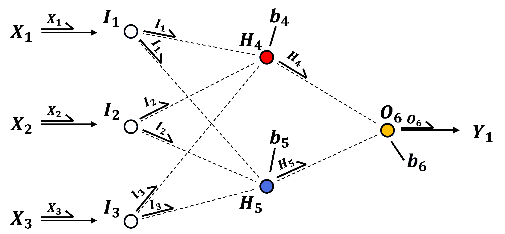
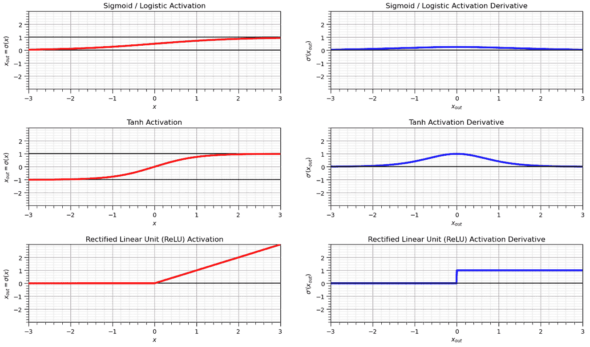
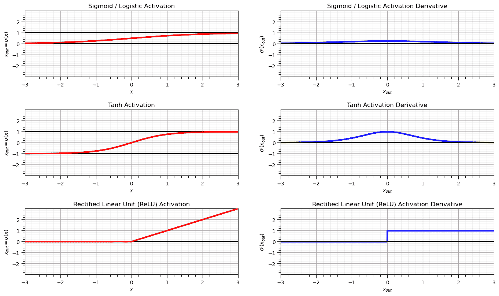
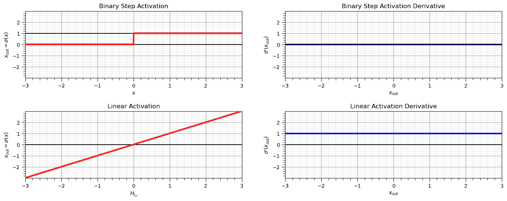

# 神经网络激活函数

> 原文：[`geostatsguy.github.io/MachineLearningDemos_Book/MachineLearning_activation_functions.html`](https://geostatsguy.github.io/MachineLearningDemos_Book/MachineLearning_activation_functions.html)

Michael J. Pyrcz，教授，德克萨斯大学奥斯汀分校

[Twitter](https://twitter.com/geostatsguy) | [GitHub](https://github.com/GeostatsGuy) | [网站](http://michaelpyrcz.com) | [Google Scholar](https://scholar.google.com/citations?user=QVZ20eQAAAAJ&hl=en&oi=ao) | [地统计学书籍](https://www.amazon.com/Geostatistical-Reservoir-Modeling-Michael-Pyrcz/dp/0199731446) | [YouTube](https://www.youtube.com/channel/UCLqEr-xV-ceHdXXXrTId5ig) | [Python 中应用地统计学电子书](https://geostatsguy.github.io/GeostatsPyDemos_Book/intro.html) | [Python 中应用机器学习电子书](https://geostatsguy.github.io/MachineLearningDemos_Book/) | [LinkedIn](https://www.linkedin.com/in/michael-pyrcz-61a648a1)

电子书“Applied Machine Learning in Python: a Hands-on Guide with Code”的章节。

引用此电子书如下：

Pyrcz, M.J., 2024, *Applied Machine Learning in Python: A Hands-on Guide with Code* [电子书]. Zenodo. doi:10.5281/zenodo.15169138 

本书及更多工作流程在此处可用：

引用 MachineLearningDemos GitHub 仓库如下：

Pyrcz, M.J., 2024, *MachineLearningDemos: Python Machine Learning Demonstration Workflows Repository* (0.0.3) [软件]. Zenodo. DOI: 10.5281/zenodo.13835312\. GitHub 仓库：[GeostatsGuy/MachineLearningDemos](https://github.com/GeostatsGuy/MachineLearningDemos) 

作者：Michael J. Pyrcz

© 版权所有 2024。

本章是关于/演示**神经网络激活函数**的教程。

**YouTube 讲座**：查看我在以下方面的讲座：

+   [人工神经网络](https://youtu.be/A9PiCMY_6nM?si=NxWSU_5RgQ4w55EL)

+   [卷积神经网络](https://youtu.be/za2my_XDoOs?si=LeHU6p2_fc9dX4Yt)

这些讲座都是我 [Machine Learning Course](https://youtube.com/playlist?list=PLG19vXLQHvSC2ZKFIkgVpI9fCjkN38kwf&si=XonjO2wHdXffMpeI) 在 YouTube 上的课程的一部分，其中包含有良好文档记录的 Python 工作流程和交互式仪表板。我的目标是分享易于获取、可操作和可重复的教育内容。如果您想了解我的动机，请查看 [Michael’s Story](https://michaelpyrcz.com/my-story)。

## 动机

激活函数是任何神经网络的关键组成部分。

+   我们在深度学习章节中应用了激活函数及其相关导数

因此，让我们可视化常见的激活函数及其导数。

## 激活函数

在神经网络中，激活函数是对加权节点输入的线性组合以及应用在网络节点中的节点偏置项的转换。一般来说，激活函数是非线性的，

+   向网络引入非线性特性

+   防止网络崩溃

没有非线性激活函数，我们会有线性回归，即整个系统简化为输入的线性组合！

为了证明这一点，让我们以我们的示例网络为例，移除激活函数，或者假设一个线性变换，



我们简单的具有连接和模型参数的人工神经网络。

现在我们可以忽略激活函数来计算预测，因为它是对称的或者是一个线性缩放，

$$ Y_1 = \lambda_{4,6} \cdot \left( \lambda_{1,4} \cdot X_1 + \lambda_{2,4} \cdot X_2 + \lambda_{3,4} \cdot X_3 + b_{H_4} \right) + \lambda_{5,6} \cdot \left( \lambda_{1,5} \cdot X_1 + \lambda_{2,5} \cdot X_2 + \lambda_{3,5} \cdot X_3 + b_{H_5} \right) $$

现在，我们可以将同类项分组，

$$ Y_1 = (\lambda_{4,6} \cdot \lambda_{1,4} + \lambda_{5,6} \cdot \lambda_{1,5}) \cdot X_1 + (\lambda_{4,6} \cdot \lambda_{2,4} + \lambda_{5,6} \cdot \lambda_{2,5}) \cdot X_2 + (\lambda_{4,6} \cdot \lambda_{3,4} + \lambda_{5,6} \cdot \lambda_{3,5}) \cdot X_3 + (\lambda_{4,6} \cdot b_{H_4} + \lambda_{5,6} \cdot b_{H_5}) $$

最后，我们可以将求和的模型参数分组并用可识别的系数替换它们，

$$ Y_1 = b_1 \cdot X_1 + b_2 \cdot X_2 + b_3 \cdot X_3 + b_0 $$

et voilà! 我们有了线性回归，一个没有激活的人工神经网络简化为线性回归。

既然我们已经证明了非线性激活的必要性，这里有一些常见的激活函数，



一些常见的激活函数。

注意上图中的符号，

+   对于激活函数，x 轴是激活前的值，$x_{in}$，y 轴是激活后的值，$x_{out}$。

+   对于激活函数的导数，x 轴是激活后的值，$x_{out}$，y 轴是相关的激活函数导数。

导数的定义和推导是这样的，以简化反向传播过程，即使用神经网络节点的输出反向传播到节点！

让我们列出并定义一些激活函数，以下是每个函数的方程和一些注释，

1.  **Sigmoid** - 也称为逻辑函数，具有以下表达式和导数。

$$ x_{out} = \alpha(x_{in}) = \frac{1}{1 + e^{-x_{in}}} $$$$ \alpha^{\prime}(x_{in}) = x_{out} \cdot (1 - x_{out}) $$

$\quad$ 注意，这是一个非常高效的导数，但不是零中心的，这可能会因为梯度震荡而减慢训练速度，当输入值远离 0 时（接近 0 或 1 时饱和）会遭受梯度消失的问题。

1.  **Tanh** – 双曲正切具有以下表达式和导数。

$$ x_{out} = \alpha(x_{\text{in}}) = \frac{e^{x_{\text{in}}} - e^{-x_{\text{in}}}}{e^{x_{\text{in}}} + e^{-{x_{\text{in}}}}} $$$$ \alpha^{\prime}(x_{\text{in}}) = 1 - x_{out}² $$

注意，Tanh 对于大输入值会遭受梯度消失的问题，就像 sigmoid 激活函数一样，但由于其中心输出，在实践中通常比 sigmoid 表现得更好。

1.  **ReLU** – 矩形线性单元具有以下表达式和导数。

$$ x_{out} = \alpha(x_{\text{in}}) = \max(0, x) $$$$\begin{split} \alpha^{\prime}(x_{\text{in}}) = \begin{cases} 1 & \text{if } x_{out} > 0 \\ 0 & \text{if } x_{out} \leq 0 \end{cases} \end{split}$$

注意，ReLU 鼓励稀疏激活，即只有一些神经元是激活的，但如果太多的激活是 0.0，则可能会遭受死亡 ReLU 问题。

1.  **线性** – 线性激活简单地返回输入

$$ x_{\text{out}} = \alpha(x_{\text{in}}) = x_{\text{in}} $$$$ \alpha^{\prime}(x_{\text{in}}) = 1 $$

注意，线性激活仅在输出层用于回归，它不能帮助捕捉非线性模式，如果只应用线性激活，则网络会退化到线性回归。

1.  **二值步长** – 根据输入的正负输出 0 或 1

$$\begin{split} x_{\text{out}} = \alpha(x_{\text{in}}) = \begin{cases} 1 & \text{if } x_{\text{in}} > 0 \\ 0 & \text{if } x_{\text{in}} \leq 0 \end{cases} \end{split}$$$$ \alpha^{\prime}(x_{\text{in}}) = 0 \quad \text{(undefined at } x_{\text{in}} = 0\text{)} $$

注意，二值步长不可微，不适合梯度下降，但历史上在感知器中被使用。

## 选择激活函数

我们如何选择我们的激活函数？考虑以下选择激活函数的标准，

+   **非线性** – 将非线性强加到预测模型中是必需的（例如，sigmoid、tanh 和 ReLU 是非线性的）。

+   **范围** – 对于基于梯度的学习更稳定，有限的范围，对于更高效的训练，范围无限，但需要较慢的学习率（例如，sigmoid $[0,\infty]$，tanh $[-1,1]$ 和 ReLU $[0,\infty]$）。

+   **连续可微** – 对于稳定的基于梯度的优化是必需的（例如，sigmoid、tanh 和 ReLU $\ne 0.0$）

+   **快速计算导数** - 导数计算具有低计算复杂度，适用于高效训练（例如，sigmoid 和 ReLU）

+   **具有单调导数的平滑函数** – 可能具有更好的泛化能力（例如，sigmoid、tanh 和 ReLU）

+   **单调** – 保证单层模型误差表面的凸性，损失函数的全局最小值（例如，sigmoid、tanh 和 ReLU）

+   **在原点近似恒等函数**， $(𝑓(0) = 0)$ – 使用小随机值初始化权重时学习效率高（例如，ReLU 和 tanh）

下面是一个表格，总结了所讨论的激活函数的这些标准，

| **属性** | **Sigmoid** | **Tanh** | **ReLU** | **Linear** | **Binary Step** |
| --- | --- | --- | --- | --- | --- |
| **非线性** | ✅ | ✅ | ✅ | ❌ | ✅ |
| **范围** | (0, 1) | (–1, 1) | [0, ∞) | (–∞, ∞) | {0, 1} |
| **连续可微** | ✅ | ✅ | ❌ (在 0 处不可微) | ✅ | ❌ (不连续) |
| **快速导数计算** | ✅ | ⚠️ (较慢) | ✅ | ✅ | ✅ (离散情况) |
| **单调导数平滑** | ✅ | ✅ | ⚠️ (不光滑) | ✅ | ❌ |
| **单调函数** | ✅ | ✅ | ✅ | ✅ | ✅ |
| **在原点近似恒等函数** | ✅ (≈0.5 斜率) | ✅ (斜率 ≈ 1) | ✅ (斜率 = 1) | ✅ | ❌ |

下面我们将可视化激活函数及其相关的导数。

## 导入所需包

我们还需要一些标准包。这些应该已经与 Anaconda 3 一起安装。

```py
import numpy as np
import pandas as pd
import matplotlib.pyplot as plt
from matplotlib.ticker import (MultipleLocator, AutoMinorLocator, AutoLocator) # control of axes ticks
plt.rc('axes', axisbelow=True)                            # set axes and grids in the background for all plots 
```

如果您遇到包导入错误，您可能必须首先安装这些包中的某些包。这通常可以通过在 Windows 上打开命令窗口然后输入‘python -m pip install [package-name]’来完成。有关相应包的文档，可以获得更多帮助。

## 声明函数

我刚刚添加了一个方便的函数来添加主网格线和副网格线。

```py
def add_grid():
    plt.gca().grid(True, which='major',linewidth = 1.0); plt.gca().grid(True, which='minor',linewidth = 0.2) # add y grids
    plt.gca().tick_params(which='major',length=7); plt.gca().tick_params(which='minor', length=4)
    plt.gca().xaxis.set_minor_locator(AutoMinorLocator()); plt.gca().yaxis.set_minor_locator(AutoMinorLocator()) # turn on minor ticks 
```

## 激活函数

以下计算和图表提供了以下激活函数的函数和导数：

+   Sigmoid / Logistic

+   Tanh

+   ReLU

```py
x = np.linspace(-3,3,1000)
y_sigmoid = 1.0/(1.0+np.exp(-1*x))
dy_sigmoid = y_sigmoid*(1.0-y_sigmoid)

y_tanh = (np.exp(x) - np.exp(-1*x))/(np.exp(x) + np.exp(-1*x))
dy_tanh = 1 - (np.exp(x) - np.exp(-1*x))**2.0/(np.exp(x) + np.exp(-1*x))**2.0

y_relu = np.clip(x, a_min = 0,a_max = None)
dy_relu = np.where(y_relu == 0,0,1.0)

major_ticks = np.array([-2,-1,0,1,2])

plt.subplot(321)
plt.plot(x,y_sigmoid,color='red',lw=3,label=r'$\alpha(x)$',zorder=10)
plt.gca().set_yticks(major_ticks); plt.title('Sigmoid / Logistic Activation'); plt.xlabel(r'$x$'); plt.ylabel(r'$x_{out} = \sigma(x)$')
plt.plot([-3,3],[0,0],color='black',zorder=1); plt.plot([-3,3],[1,1],color='black',zorder=1)
add_grid(); plt.xlim([-3,3]); plt.ylim([-3,3])

plt.subplot(322)
plt.plot(x,dy_sigmoid,color='blue',lw=3,label=r'$\frac{\partial \alpha}{\partial x}(x)$',zorder=1)
plt.gca().set_yticks(major_ticks); plt.title('Sigmoid / Logistic Activation Derivative')
plt.xlabel(r'$x_{out}$'); plt.ylabel(r'$\sigma^{\prime} \left(x_{out} \right)$')
plt.plot([-3,3],[0,0],color='black',zorder=1)
add_grid(); plt.xlim([-3,3]); plt.ylim([-3,3])

plt.subplot(323)
plt.plot(x,y_tanh,color='red',lw=3,label=r'$\alpha(x)$',zorder=10)
plt.gca().set_yticks(major_ticks); plt.title('Tanh Activation'); plt.xlabel(r'$x$'); plt.ylabel(r'$x_{out} = \sigma(x)$')
plt.plot([-3,3],[-1,-1],color='black',zorder=1); plt.plot([-3,3],[1,1],color='black',zorder=1)
add_grid(); plt.xlim([-3,3]); plt.ylim([-3,3])

plt.subplot(324)
plt.plot(x,dy_tanh,color='blue',lw=3,label=r'$\frac{\partial \alpha}{\partial x_{out}}(x_{out})$',zorder=1)
plt.gca().set_yticks(major_ticks); plt.title('Tanh Activation Derivative'); plt.xlabel(r'$x_{out}$') 
plt.ylabel(r'$\sigma^{\prime} \left(x_{out} \right)$')
plt.plot([-3,3],[0,0],color='black',zorder=1)
add_grid(); plt.xlim([-3,3]); plt.ylim([-3,3])

plt.subplot(325)
plt.plot(x,y_relu,color='red',lw=3,label=r'$\alpha(x)$',zorder=10); plt.xlabel(r'$x$'); plt.ylabel(r'$x_{out} = \sigma(x)$')
plt.gca().set_yticks(major_ticks); plt.title('Rectified Linear Unit (ReLU) Activation')
plt.plot([-3,3],[0,0],color='black',zorder=1)
add_grid(); plt.xlim([-3,3]); plt.ylim([-3,3])

plt.subplot(326)
plt.plot(x,dy_relu,color='blue',lw=3,label=r'$\frac{\partial \alpha}{\partial x_{out}}(x_{out})$',zorder=1)
plt.gca().set_yticks(major_ticks); plt.title('Rectified Linear Unit (ReLU) Activation Derivative'); plt.xlabel(r'$x_{out}$')
plt.ylabel(r'$\sigma^{\prime} \left(x_{out} \right)$')
plt.plot([-3,3],[0,0],color='black',zorder=1)
add_grid(); plt.xlim([-3,3]); plt.ylim([-3,3])

plt.subplots_adjust(left=0.0, bottom=0.0, right=2.0, top=1.5, wspace=0.2, hspace=0.5); plt.show() 
```



## 其他损失函数

以下计算和图表提供了以下激活函数的函数和导数：

+   二进制步进

```py
x = np.linspace(-3,3,1000)
y_binary = np.where(x <= 0,0.0,1.0)
dy_binary = np.zeros((len(y_binary)))

y_linear = np.copy(x)
dy_linear = np.ones((len(y_binary)))

major_ticks = np.array([-2,-1,0,1,2])

plt.subplot(321)
plt.plot(x,y_binary,color='red',lw=3,label=r'$\alpha(x)$',zorder=10)
plt.gca().set_yticks(major_ticks); plt.title('Binary Step Activation'); plt.xlabel(r'$x$'); plt.ylabel(r'$x_{out} = \sigma(x)$')
plt.plot([-3,3],[0,0],color='black',zorder=1); plt.plot([-3,3],[1,1],color='black',zorder=1)
add_grid(); plt.xlim([-3,3]); plt.ylim([-3,3])

plt.subplot(322)
plt.plot(x,dy_binary,color='blue',lw=3,label=r'$\frac{\partial \alpha}{\partial x_{out}}(x_{out})$',zorder=1)
plt.gca().set_yticks(major_ticks); plt.title('Binary Step Activation Derivative'); plt.xlabel(r'$x_{out}$')
plt.ylabel(r'$\sigma^{\prime} \left(x_{out} \right)$')
plt.plot([-3,3],[0,0],color='black',zorder=1)
add_grid(); plt.xlim([-3,3]); plt.ylim([-3,3])

plt.subplot(323)
plt.plot(x,y_linear,color='red',lw=3,label=r'$\alpha(x)$',zorder=10)
plt.gca().set_yticks(major_ticks); plt.title('Linear Activation'); plt.xlabel(r'$H_{j_{in}}$'); plt.ylabel(r'$x_{out} = \sigma(x)$')
plt.plot([-3,3],[0,0],color='black',zorder=1)
add_grid(); plt.xlim([-3,3]); plt.ylim([-3,3])

plt.subplot(324)
plt.plot(x,dy_linear,color='blue',lw=3,label=r'$\frac{\partial \alpha}{\partial x_{out}}(x_{out})$',zorder=1)
plt.gca().set_yticks(major_ticks); plt.title('Linear Activation Derivative'); plt.xlabel(r'$x_{out}$')
plt.ylabel(r'$\sigma^{\prime} \left(x_{out} \right)$')
plt.plot([-3,3],[0,0],color='black',zorder=1)
add_grid(); plt.xlim([-3,3]); plt.ylim([-3,3])

plt.subplots_adjust(left=0.0, bottom=0.0, right=2.0, top=1.5, wspace=0.2, hspace=0.5); plt.show() 
```



## 评论

这是对神经网络激活函数的基本处理。可以做和讨论的还有很多，我有很多更多的资源。查看我的[资源共享清单](https://michaelpyrcz.com/my-resources)以及本章开头带有资源链接的 YouTube 讲座链接。

希望这有所帮助，

*迈克尔*

## 关于作者


德克萨斯大学奥斯汀分校的 40 英亩校园内，迈克尔·皮尔奇教授的办公室。

迈克尔·皮尔奇是德克萨斯大学奥斯汀分校[科克雷尔工程学院](https://cockrell.utexas.edu/faculty-directory/alphabetical/p)和[杰克逊地球科学学院](https://www.jsg.utexas.edu/researcher/michael_pyrcz/)的教授，他在那里研究教学地学、空间数据分析、地统计学和机器学习。迈克尔还是，

+   能源分析[新生研究计划](https://fri.cns.utexas.edu/energy-analytics)的首席研究员，德克萨斯大学奥斯汀分校自然科学院机器学习实验室的核心教员

+   [Computers and Geosciences](https://www.sciencedirect.com/journal/computers-and-geosciences/about/editorial-board)的副编辑，以及国际数学地质学协会[Mathematical Geosciences](https://link.springer.com/journal/11004/editorial-board)的董事会成员。

迈克尔已经撰写了超过 70 篇[同行评审的出版物](https://scholar.google.com/citations?user=QVZ20eQAAAAJ&hl=en)，一个用于空间数据分析的[Python 包](https://pypi.org/project/geostatspy/)，合著了一本关于空间数据分析的教科书[Geostatistical Reservoir Modeling](https://www.amazon.com/Geostatistical-Reservoir-Modeling-Michael-Pyrcz/dp/0199731446)，并且是两本最近发布的电子书的作者，分别是[Applied Geostatistics in Python: a Hands-on Guide with GeostatsPy](https://geostatsguy.github.io/GeostatsPyDemos_Book/intro.html)和[Applied Machine Learning in Python: a Hands-on Guide with Code](https://geostatsguy.github.io/MachineLearningDemos_Book/intro.html)。

迈克尔的所有大学讲座都可以在他的[YouTube 频道](https://www.youtube.com/@GeostatsGuyLectures)上找到，其中包含 100 多个 Python 交互式仪表板和 40 多个 GitHub 仓库中的详细文档工作流程，以支持任何感兴趣的学生和在职专业人士，提供持续更新的内容。想了解更多关于迈克尔的工作和共享教育资源，请访问他的网站。

## 想一起工作吗？

我希望这份内容对那些想要了解更多关于地下建模、数据分析以及机器学习的人有所帮助。学生和在职专业人士都欢迎参与。

+   想邀请我到贵公司进行培训、辅导、项目审查、工作流程设计和/或咨询吗？我很乐意拜访并与您合作！

+   感兴趣合作、支持我的研究生研究或我的地下数据分析与机器学习联盟（共同负责人是约翰·福斯特教授）吗？我的研究将数据分析、随机建模和机器学习理论与实践相结合，以开发新的方法和工作流程，增加价值。我们正在解决具有挑战性的地下问题！

+   我可以通过 mpyrcz@austin.utexas.edu 联系到。

我总是很高兴讨论，

*迈克尔*

迈克尔·皮尔奇兹，博士，注册工程师，德克萨斯大学奥斯汀分校 Cockrell 工程学院和 Jackson 地球科学学院教授。

更多资源请访问：[Twitter](https://twitter.com/geostatsguy) | [GitHub](https://github.com/GeostatsGuy) | [网站](http://michaelpyrcz.com) | [Google Scholar](https://scholar.google.com/citations?user=QVZ20eQAAAAJ&hl=en&oi=ao) | [地统计学书籍](https://www.amazon.com/Geostatistical-Reservoir-Modeling-Michael-Pyrcz/dp/0199731446) | [YouTube](https://www.youtube.com/channel/UCLqEr-xV-ceHdXXXrTId5ig) | [Python 中应用地统计学电子书](https://geostatsguy.github.io/GeostatsPyDemos_Book/intro.html) | [Python 中应用机器学习电子书](https://geostatsguy.github.io/MachineLearningDemos_Book/) | [LinkedIn](https://www.linkedin.com/in/michael-pyrcz-61a648a1)

## 动机

激活函数是任何神经网络的关键组成部分。

+   我们在深度学习章节中应用了激活函数及其相关的导数

因此，让我们可视化常见的激活函数及其导数。

## 激活函数

在神经网络中，激活函数是对加权节点输入的线性组合以及在网络节点中应用的节点偏置项的转换。一般来说，激活是非线性的，

+   向网络引入非线性特性

+   防止网络崩溃

没有非线性激活函数，我们就会得到线性回归，即整个系统会崩溃成输入的线性组合！

为了演示这一点，让我们取我们的示例网络并移除激活函数，或者假设一个线性变换，


我们简单的具有连接和模型参数的人工神经网络。

现在，我们可以忽略激活来计算预测，因为它是对应恒等或线性缩放，

$$ Y_1 = \lambda_{4,6} \cdot \left( \lambda_{1,4} \cdot X_1 + \lambda_{2,4} \cdot X_2 + \lambda_{3,4} \cdot X_3 + b_{H_4} \right) + \lambda_{5,6} \cdot \left( \lambda_{1,5} \cdot X_1 + \lambda_{2,5} \cdot X_2 + \lambda_{3,5} \cdot X_3 + b_{H_5} \right) $$

现在，我们可以将同类项分组，

$$ Y_1 = (\lambda_{4,6} \cdot \lambda_{1,4} + \lambda_{5,6} \cdot \lambda_{1,5}) \cdot X_1 + (\lambda_{4,6} \cdot \lambda_{2,4} + \lambda_{5,6} \cdot \lambda_{2,5}) \cdot X_2 + (\lambda_{4,6} \cdot \lambda_{3,4} + \lambda_{5,6} \cdot \lambda_{3,5}) \cdot X_3 + (\lambda_{4,6} \cdot b_{H_4} + \lambda_{5,6} \cdot b_{H_5}) $$

最后，我们可以将求和的模型参数分组，并用可识别的系数替换它们，

$$ Y_1 = b_1 \cdot X_1 + b_2 \cdot X_2 + b_3 \cdot X_3 + b_0 $$

哇！我们得到了线性回归，没有激活的人工神经网络会崩溃成线性回归。

现在我们已经证明了非线性激活的必要性，以下是一些常见的激活函数，


一些常见的激活函数。

注意上图中的符号，

+   对于激活函数，x 轴是预激活值，$x_{in}$，y 轴是后激活值，$x_{out}$。

+   对于激活函数的导数，x 轴是后激活值，$x_{out}$，y 轴是相关的激活函数导数。

导数是这样定义和推导的，以简化反向传播过程，即使用神经网络节点的输出反向传播通过节点！

让我们列出并定义一些激活函数，以下是每个函数的方程和一些注释，

1.  **Sigmoid** - 也称为逻辑函数，具有以下表达式和导数。

$$ x_{out} = \alpha(x_{\text{in}}) = \frac{1}{1 + e^{-x_{\text{in}}}} $$$$ \alpha^{\prime}(x_{\text{in}}) = x_{out} \cdot (1 - x_{out}) $$

$\quad$ 注意，非常高效的导数，但不是零中心，这可能会因为梯度波动而减慢训练速度，并且当输入值远离 0 时（接近 0 或 1 时饱和）会遭受梯度消失的问题。

1.  **Tanh** – 双曲正切具有以下表达式和导数。

$$ x_{out} = \alpha(x_{\text{in}}) = \frac{e^{x_{\text{in}}} - e^{-x_{\text{in}}}}{e^{x_{\text{in}}} + e^{-{x_{\text{in}}}}} $$$$ \alpha^{\prime}(x_{\text{in}}) = 1 - x_{out}² $$

$\quad$ 注意，Tanh 对于大输入值会遭受梯度消失的问题，就像 sigmoid 激活一样，但由于其中心输出，在实践中通常比 sigmoid 表现得更好。

1.  **ReLU** – 矩形线性单元具有以下表达式和导数。

$$ x_{out} = \alpha(x_{\text{in}}) = \max(0, x) $$$$\begin{split} \alpha^{\prime}(x_{\text{in}}) = \begin{cases} 1 & \text{if } x_{out} > 0 \\ 0 & \text{if } x_{out} \leq 0 \end{cases} \end{split}$$

$\quad$ 注意，ReLU 鼓励稀疏激活，即只有一些神经元是激活的，但如果太多的激活是 0.0，可能会遭受“死亡 ReLU”问题。

1.  **线性** – 线性激活简单地返回输入

$$ x_{\text{out}} = \alpha(x_{\text{in}}) = x_{\text{in}} $$$$ \alpha^{\prime}(x_{\text{in}}) = 1 $$

$\quad$ 注意，线性激活仅在回归的输出层中使用，它不能帮助捕捉非线性模式，如果只应用线性激活，网络将退化为线性回归。

1.  **二进制步进** – 根据输入符号输出 0 或 1

$$\begin{split} x_{\text{out}} = \alpha(x_{\text{in}}) = \begin{cases} 1 & \text{if } x_{\text{in}} > 0 \\ 0 & \text{if } x_{\text{in}} \leq 0 \end{cases} \end{split}$$$$ \alpha^{\prime}(x_{\text{in}}) = 0 \quad \text{(undefined at } x_{\text{in}} = 0\text{)} $$

$\quad$ 注意，二进制步进是非可微分的，并且不适合梯度下降，但历史上在感知器中使用。

## 选择激活函数

我们如何选择我们的激活函数？考虑以下选择激活函数的标准，

+   **非线性** – 需要向预测模型中引入非线性（例如，sigmoid、tanh 和 ReLU 都是非线性的）。

+   **值域** – 对于更稳定的基于梯度的学习是有限的，对于更有效的训练是无限的，但需要较慢的学习率（例如，sigmoid $[0,\infty]$，tanh $[-1,1]$和 ReLU $[0,\infty]$）。

+   **连续可微** – 对于基于梯度的稳定优化是必需的（例如，sigmoid、tanh 和 ReLU $\ne 0.0$）

+   **快速计算导数** - 导数计算具有低计算复杂度，以实现高效训练（例如，sigmoid 和 ReLU）

+   **具有单调导数的平滑函数** – 可能具有更好的泛化能力（例如，sigmoid、tanh 和 ReLU）

+   **单调性** – 保证单层模型误差表面的凸性，损失函数的全局最小值（例如，sigmoid、tanh 和 ReLU）

+   **在原点近似恒等函数**，$(𝑓(0) = 0)$ – 使用小随机值初始化权重时可以高效学习（例如，ReLU 和 tanh）

这里是一个总结所讨论激活函数这些标准的表格，

| **属性** | **Sigmoid** | **Tanh** | **ReLU** | **线性** | **二元步进** |
| --- | --- | --- | --- | --- | --- |
| **非线性** | ✅ | ✅ | ✅ | ❌ | ✅ |
| **值域** | (0, 1) | (–1, 1) | [0, ∞) | (–∞, ∞) | {0, 1} |
| **连续可微** | ✅ | ✅ | ❌ (在 0 处不可微) | ✅ | ❌ (不连续) |
| **快速导数计算** | ✅ | ⚠️ (较慢) | ✅ | ✅ | ✅ (离散情况) |
| **具有单调导数的平滑函数** | ✅ | ✅ | ⚠️ (不光滑) | ✅ | ❌ |
| **单调函数** | ✅ | ✅ | ✅ | ✅ | ✅ |
| **在原点近似恒等函数** | ✅ (斜率≈0.5) | ✅ (斜率≈1) | ✅ (斜率=1) | ✅ | ❌ |

在下面，我们将可视化激活函数及其相关的导数。

## 导入所需包

我们还需要一些标准包。这些应该已经通过 Anaconda 3 安装。

```py
import numpy as np
import pandas as pd
import matplotlib.pyplot as plt
from matplotlib.ticker import (MultipleLocator, AutoMinorLocator, AutoLocator) # control of axes ticks
plt.rc('axes', axisbelow=True)                            # set axes and grids in the background for all plots 
```

如果您遇到包导入错误，您可能首先需要安装这些包中的一些。这通常可以通过在 Windows 上打开命令窗口然后输入‘python -m pip install [package-name]’来完成。有关相应包的文档，可以获得更多帮助。

## 声明函数

我刚刚添加了一个方便的函数来添加主网格线和副网格线。

```py
def add_grid():
    plt.gca().grid(True, which='major',linewidth = 1.0); plt.gca().grid(True, which='minor',linewidth = 0.2) # add y grids
    plt.gca().tick_params(which='major',length=7); plt.gca().tick_params(which='minor', length=4)
    plt.gca().xaxis.set_minor_locator(AutoMinorLocator()); plt.gca().yaxis.set_minor_locator(AutoMinorLocator()) # turn on minor ticks 
```

## 激活函数

以下计算和图表提供了以下激活函数的函数和导数：

+   Sigmoid / Logistic

+   Tanh

+   ReLU

```py
x = np.linspace(-3,3,1000)
y_sigmoid = 1.0/(1.0+np.exp(-1*x))
dy_sigmoid = y_sigmoid*(1.0-y_sigmoid)

y_tanh = (np.exp(x) - np.exp(-1*x))/(np.exp(x) + np.exp(-1*x))
dy_tanh = 1 - (np.exp(x) - np.exp(-1*x))**2.0/(np.exp(x) + np.exp(-1*x))**2.0

y_relu = np.clip(x, a_min = 0,a_max = None)
dy_relu = np.where(y_relu == 0,0,1.0)

major_ticks = np.array([-2,-1,0,1,2])

plt.subplot(321)
plt.plot(x,y_sigmoid,color='red',lw=3,label=r'$\alpha(x)$',zorder=10)
plt.gca().set_yticks(major_ticks); plt.title('Sigmoid / Logistic Activation'); plt.xlabel(r'$x$'); plt.ylabel(r'$x_{out} = \sigma(x)$')
plt.plot([-3,3],[0,0],color='black',zorder=1); plt.plot([-3,3],[1,1],color='black',zorder=1)
add_grid(); plt.xlim([-3,3]); plt.ylim([-3,3])

plt.subplot(322)
plt.plot(x,dy_sigmoid,color='blue',lw=3,label=r'$\frac{\partial \alpha}{\partial x}(x)$',zorder=1)
plt.gca().set_yticks(major_ticks); plt.title('Sigmoid / Logistic Activation Derivative')
plt.xlabel(r'$x_{out}$'); plt.ylabel(r'$\sigma^{\prime} \left(x_{out} \right)$')
plt.plot([-3,3],[0,0],color='black',zorder=1)
add_grid(); plt.xlim([-3,3]); plt.ylim([-3,3])

plt.subplot(323)
plt.plot(x,y_tanh,color='red',lw=3,label=r'$\alpha(x)$',zorder=10)
plt.gca().set_yticks(major_ticks); plt.title('Tanh Activation'); plt.xlabel(r'$x$'); plt.ylabel(r'$x_{out} = \sigma(x)$')
plt.plot([-3,3],[-1,-1],color='black',zorder=1); plt.plot([-3,3],[1,1],color='black',zorder=1)
add_grid(); plt.xlim([-3,3]); plt.ylim([-3,3])

plt.subplot(324)
plt.plot(x,dy_tanh,color='blue',lw=3,label=r'$\frac{\partial \alpha}{\partial x_{out}}(x_{out})$',zorder=1)
plt.gca().set_yticks(major_ticks); plt.title('Tanh Activation Derivative'); plt.xlabel(r'$x_{out}$') 
plt.ylabel(r'$\sigma^{\prime} \left(x_{out} \right)$')
plt.plot([-3,3],[0,0],color='black',zorder=1)
add_grid(); plt.xlim([-3,3]); plt.ylim([-3,3])

plt.subplot(325)
plt.plot(x,y_relu,color='red',lw=3,label=r'$\alpha(x)$',zorder=10); plt.xlabel(r'$x$'); plt.ylabel(r'$x_{out} = \sigma(x)$')
plt.gca().set_yticks(major_ticks); plt.title('Rectified Linear Unit (ReLU) Activation')
plt.plot([-3,3],[0,0],color='black',zorder=1)
add_grid(); plt.xlim([-3,3]); plt.ylim([-3,3])

plt.subplot(326)
plt.plot(x,dy_relu,color='blue',lw=3,label=r'$\frac{\partial \alpha}{\partial x_{out}}(x_{out})$',zorder=1)
plt.gca().set_yticks(major_ticks); plt.title('Rectified Linear Unit (ReLU) Activation Derivative'); plt.xlabel(r'$x_{out}$')
plt.ylabel(r'$\sigma^{\prime} \left(x_{out} \right)$')
plt.plot([-3,3],[0,0],color='black',zorder=1)
add_grid(); plt.xlim([-3,3]); plt.ylim([-3,3])

plt.subplots_adjust(left=0.0, bottom=0.0, right=2.0, top=1.5, wspace=0.2, hspace=0.5); plt.show() 
```


## 其他损失函数

以下计算和图表提供了以下激活函数的函数和导数：

+   二元步进

```py
x = np.linspace(-3,3,1000)
y_binary = np.where(x <= 0,0.0,1.0)
dy_binary = np.zeros((len(y_binary)))

y_linear = np.copy(x)
dy_linear = np.ones((len(y_binary)))

major_ticks = np.array([-2,-1,0,1,2])

plt.subplot(321)
plt.plot(x,y_binary,color='red',lw=3,label=r'$\alpha(x)$',zorder=10)
plt.gca().set_yticks(major_ticks); plt.title('Binary Step Activation'); plt.xlabel(r'$x$'); plt.ylabel(r'$x_{out} = \sigma(x)$')
plt.plot([-3,3],[0,0],color='black',zorder=1); plt.plot([-3,3],[1,1],color='black',zorder=1)
add_grid(); plt.xlim([-3,3]); plt.ylim([-3,3])

plt.subplot(322)
plt.plot(x,dy_binary,color='blue',lw=3,label=r'$\frac{\partial \alpha}{\partial x_{out}}(x_{out})$',zorder=1)
plt.gca().set_yticks(major_ticks); plt.title('Binary Step Activation Derivative'); plt.xlabel(r'$x_{out}$')
plt.ylabel(r'$\sigma^{\prime} \left(x_{out} \right)$')
plt.plot([-3,3],[0,0],color='black',zorder=1)
add_grid(); plt.xlim([-3,3]); plt.ylim([-3,3])

plt.subplot(323)
plt.plot(x,y_linear,color='red',lw=3,label=r'$\alpha(x)$',zorder=10)
plt.gca().set_yticks(major_ticks); plt.title('Linear Activation'); plt.xlabel(r'$H_{j_{in}}$'); plt.ylabel(r'$x_{out} = \sigma(x)$')
plt.plot([-3,3],[0,0],color='black',zorder=1)
add_grid(); plt.xlim([-3,3]); plt.ylim([-3,3])

plt.subplot(324)
plt.plot(x,dy_linear,color='blue',lw=3,label=r'$\frac{\partial \alpha}{\partial x_{out}}(x_{out})$',zorder=1)
plt.gca().set_yticks(major_ticks); plt.title('Linear Activation Derivative'); plt.xlabel(r'$x_{out}$')
plt.ylabel(r'$\sigma^{\prime} \left(x_{out} \right)$')
plt.plot([-3,3],[0,0],color='black',zorder=1)
add_grid(); plt.xlim([-3,3]); plt.ylim([-3,3])

plt.subplots_adjust(left=0.0, bottom=0.0, right=2.0, top=1.5, wspace=0.2, hspace=0.5); plt.show() 
```


## 评论

这是对神经网络激活函数的基本处理。还有更多可以做的和讨论的，我有很多更多的资源。查看我的[共享资源清单](https://michaelpyrcz.com/my-resources)以及本章开头 YouTube 讲座中的资源链接，视频描述中包含资源链接。

希望这有所帮助，

*迈克尔*

## 关于作者


迈克尔·皮尔茨教授在德克萨斯大学奥斯汀分校 40 英亩校园的办公室。

迈克尔·皮尔茨是德克萨斯大学奥斯汀分校[科克雷尔工程学院](https://cockrell.utexas.edu/faculty-directory/alphabetical/p)和[杰克逊地球科学学院](https://www.jsg.utexas.edu/researcher/michael_pyrcz/)的教授，在那里他研究并教授地下、空间数据分析、地统计学和机器学习。迈克尔还，

+   [能源分析](https://fri.cns.utexas.edu/energy-analytics)新生研究项目的首席研究员，以及德克萨斯大学奥斯汀分校自然科学院机器学习实验室的核心教员。

+   是[计算机与地球科学](https://www.sciencedirect.com/journal/computers-and-geosciences/about/editorial-board)的副编辑，以及国际数学地球科学协会[数学地球科学](https://link.springer.com/journal/11004/editorial-board)的董事会成员。

迈克尔已经撰写了超过 70 篇[同行评审出版物](https://scholar.google.com/citations?user=QVZ20eQAAAAJ&hl=en)，一个用于空间数据分析的[Python 包](https://pypi.org/project/geostatspy/)，合著了一本关于空间数据分析的教科书[地统计学储层建模](https://www.amazon.com/Geostatistical-Reservoir-Modeling-Michael-Pyrcz/dp/0199731446)，并且是两本最近发布的电子书的作者，[Python 中的应用地统计学：GeostatsPy 实践指南](https://geostatsguy.github.io/GeostatsPyDemos_Book/intro.html)和[Python 中的应用机器学习：带代码的实践指南](https://geostatsguy.github.io/MachineLearningDemos_Book/intro.html)。

迈克尔的所有大学讲座都可在他的[YouTube 频道](https://www.youtube.com/@GeostatsGuyLectures)上找到，其中包含 100 多个 Python 交互式仪表板和 40 多个 GitHub 仓库中的详细记录的工作流程，以支持任何感兴趣的学生和在职专业人士。要了解更多关于迈克尔的工作和共享教育资源，请访问他的网站。

## 想要一起工作？

我希望这个内容对那些想要了解更多关于地下建模、数据分析以及机器学习的人有所帮助。学生和在职专业人士都欢迎参与。

+   想邀请我到贵公司进行培训、辅导、项目审查、工作流程设计和/或咨询吗？我很乐意拜访并与您合作！

+   感兴趣于合作，支持我的研究生研究或我的地下数据分析与机器学习联盟（共同负责人是约翰·福斯特教授）吗？我的研究将数据分析、随机建模和机器学习理论与实践相结合，以开发新的方法和工作流程来增加价值。我们正在解决具有挑战性的地下问题！

+   您可以通过 mpyrcz@austin.utexas.edu 联系我。

我总是很高兴讨论，

*迈克尔*

迈克尔·皮尔茨，博士，P.Eng. 教授，德克萨斯大学奥斯汀分校 Cockrell 工程学院和 Jackson 地球科学学院

更多资源请访问：[Twitter](https://twitter.com/geostatsguy) | [GitHub](https://github.com/GeostatsGuy) | [网站](http://michaelpyrcz.com) | [Google Scholar](https://scholar.google.com/citations?user=QVZ20eQAAAAJ&hl=en&oi=ao) | [地统计学书籍](https://www.amazon.com/Geostatistical-Reservoir-Modeling-Michael-Pyrcz/dp/0199731446) | [YouTube](https://www.youtube.com/channel/UCLqEr-xV-ceHdXXXrTId5ig) | [Python 中应用地统计学电子书](https://geostatsguy.github.io/GeostatsPyDemos_Book/intro.html) | [Python 中应用机器学习电子书](https://geostatsguy.github.io/MachineLearningDemos_Book/) | [LinkedIn](https://www.linkedin.com/in/michael-pyrcz-61a648a1)
