# 人工神经网络测试

> 原文：[`geostatsguy.github.io/MachineLearningDemos_Book/MachineLearning_ANN.html`](https://geostatsguy.github.io/MachineLearningDemos_Book/MachineLearning_ANN.html)

迈克尔·J·皮尔奇，教授，德克萨斯大学奥斯汀分校

[Twitter](https://twitter.com/geostatsguy) | [GitHub](https://github.com/GeostatsGuy) | [网站](http://michaelpyrcz.com) | [Google Scholar](https://scholar.google.com/citations?user=QVZ20eQAAAAJ&hl=en&oi=ao) | [地统计学书籍](https://www.amazon.com/Geostatistical-Reservoir-Modeling-Michael-Pyrcz/dp/0199731446) | [YouTube](https://www.youtube.com/channel/UCLqEr-xV-ceHdXXXrTId5ig) | [Python 中应用地统计学电子书](https://geostatsguy.github.io/GeostatsPyDemos_Book/intro.html) | [Python 中应用机器学习电子书](https://geostatsguy.github.io/MachineLearningDemos_Book/) | [LinkedIn](https://www.linkedin.com/in/michael-pyrcz-61a648a1)

电子书“Python 中应用机器学习：带代码的实战指南”的章节。

引用此电子书如下：

皮尔奇，M.J.，2024，*Python 中应用机器学习：带代码的实战指南* [电子书]. Zenodo. doi:10.5281/zenodo.15169138 

本书中的工作流程以及更多内容在此处可用：

引用 MachineLearningDemos GitHub 仓库如下：

皮尔奇，M.J.，2024，*MachineLearningDemos: Python 机器学习演示工作流程存储库*（0.0.3）[软件]. Zenodo. DOI: 10.5281/zenodo.13835312\. GitHub 仓库：[GeostatsGuy/MachineLearningDemos](https://github.com/GeostatsGuy/MachineLearningDemos) 

作者：迈克尔·J·皮尔奇

© 版权 2024。

这章是关于/演示 **人工神经网络** 的教程。

**YouTube 讲座**：查看我在以下方面的讲座：

+   [人工神经网络](https://youtu.be/A9PiCMY_6nM?si=NxWSU_5RgQ4w55EL)

+   [卷积神经网络](https://youtu.be/za2my_XDoOs?si=LeHU6p2_fc9dX4Yt)

这些讲座都是我 YouTube 上的 [机器学习课程](https://youtube.com/playlist?list=PLG19vXLQHvSC2ZKFIkgVpI9fCjkN38kwf&si=XonjO2wHdXffMpeI) 的一部分，其中包含有良好文档记录的 Python 工作流程和交互式仪表板。我的目标是分享易于理解、可操作和可重复的教育内容。如果你想知道我的动机，请查看 [迈克尔的经历](https://michaelpyrcz.com/my-story)。

## 动机

人工神经网络非常强大，是基于大脑类比的自然启发计算

+   我认为它们就像爬行动物的脑，没有计划和高级推理

此外，人工神经网络是许多其他深度学习方法的基石，例如，

+   卷积神经网络

+   循环神经网络

+   生成对抗网络

+   自动编码器

自然启发计算正在寻找自然界的灵感来开发新的问题解决方法，

+   **人工神经网络**是受生物神经网络启发的

+   **节点** - 在我们的模型中是人工神经元，简单的处理器

+   **节点之间的连接**是人工突触

智能是从许多连接的简单处理器中产生的。在本章的剩余部分，我将使用节点和连接术语来描述我们的人工神经网络。

## 神经网络概念

这里有一些人工神经网络的关键方面，

**基本设计** - *“…一个由许多简单、高度互联的处理元素组成的计算系统，它们通过对外部输入的动态状态响应来处理信息。”* Caudill (1989)。

**仍然是一个预测模型** - 虽然这些模型可能非常复杂，甚至有数百万个可训练模型参数、权重和偏差，但它们仍然是一个将预测特征映射到响应特征的函数，

$$ Y=f(X)+\epsilon $$

**监督学习** – 我们提供带有预测特征，$X_1,\ldots,𝑋_𝑚$ 和响应特征（$𝑌_1,\ldots,𝑌_K$）的训练数据，期望模型预测误差，$\epsilon$。

**非线性** - 通过应用非线性激活函数来模型非线性关系，将非线性引入到系统中

**通用函数逼近器（通用逼近定理）** - ANNs 能够学习区间内 $f$ 的任何可能函数形状，对于任意宽（单隐藏层）由 Cybenko (1989) 提出，对于任意深度由 Lu 和其他人 (2017) 提出

## 一个简单的网络

要开始，让我们构建一个神经网络，单隐藏层，全连接，前馈神经网络，

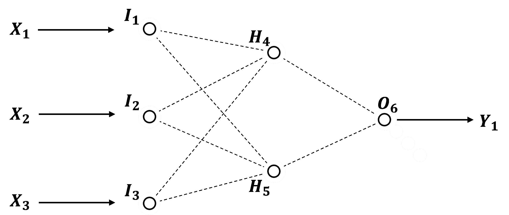

简单演示人工神经网络。

我们在下面的描述中使用这个示例人工神经网络，并将其作为我们将手动训练和预测的实际示例！

现在让我们标记我们网络的部分，

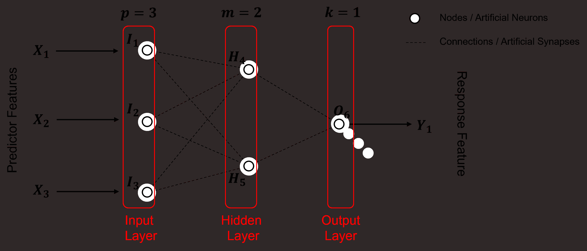

带有标记的简单演示人工神经网络，包括 3 个输入节点、2 个隐藏节点和 1 个输出节点完全连接。

我们的人工神经网络具有，

+   3 个预测特征，$X_1$、$X_2$ 和 $X_3$

+   3 个输入节点，$I_1$、$I_2$ 和 $I_3$

+   2 个隐藏层节点，$H_4$ 和 $H_5$

+   1 个输出节点，$O_6$

+   1 个响应特征，$Y_1$

其中所有节点都是完全连接的。注意，深度学习是一个具有超过 1 个隐藏层的神经网络，但为了简洁起见，我们继续使用我们的非深度学习人工神经网络。

## 网络命名法的评论

关于我的网络命名法的几点评论。我的目标是最大化简洁性和清晰度，

+   **网络节点和连接** - 我选择为所有节点使用唯一的数字，$I_1$, $I_2$, $I_3$, $H_4$, $H_5$ 和 $O_6$，而不是在每个层重复使用数字，例如 $I_1$, $I_2$, $I_3$, $H_1$, $H_2$ 和 $O_1$，以简化权重的表示；因此，当我说 $\lambda_{1,4}$ 时，你知道这个权重在网络的哪个位置应用，从节点 $I_1$ 到节点 $H_4$。

+   **节点输出** - 我使用节点标签来描述节点的输出，例如 $O_6$ 是输出节点，$O_6$，以及从节点 $O_6$ 输出的信号或值，

$$ O_6 = \sigma \left( \lambda_{4,6} \cdot H_4 + \lambda_{5,6} \cdot H_5 \right) $$

+   **预激活和后激活** - 在我们的节点 $H_4$, $H_5$ 和 $O_6$ 中，我们有节点激活前的输入和激活后的输出，我使用 $H_{4_{in}}$, $H_{5_{in}}$ 和 $O_{6_{in}}$ 来表示预激活输入，

$$ H_{4_{in}} = \lambda_{1,4} \cdot I_1 + \lambda_{2,4} \cdot I_2 + \lambda_{3,4} \cdot I_3 $$$$ H_{5_{in}} = \lambda_{1,5} \cdot I_1 + \lambda_{2,5} \cdot I_2 + \lambda_{2,5} \cdot I_3 $$$$ O_{6_{in}} = \lambda_{4,6} \cdot H_4 + \lambda_{5,6} \cdot H_5 $$

$\quad$ 以及 $H_4$, $H_5$ 和 $O_6$ 作为后激活节点的输出。

$$ H_{4} = \sigma \left( H_{4_{in}} \right) = \sigma \left( \lambda_{1,4} \cdot I_1 + \lambda_{2,4} \cdot I_2 + \lambda_{3,4} \cdot I_3 \right) $$$$ H_{5} = \sigma \left( H_{5_{in}} \right) = \sigma \left( \lambda_{1,5} \cdot I_1 + \lambda_{2,5} \cdot I_2 + \lambda_{2,5} \cdot I_3 \right) $$$$ O_6 = \sigma \left( O_{6_{in}} \right) = \sigma \left( \lambda_{4,6} \cdot H_4 + \lambda_{5,6} \cdot H_5 \right) $$

清晰、明确的符号很重要，因为在使用反向传播时，我们必须逐步通过节点，从后激活到预激活。

+   在神经网络文献中，通常使用像 $z$ 这样的变量进行预激活，但我认为这很模糊，可能会引起混淆，因为我们提供了一个螺丝钉和螺母的方法，明确描述每个方程，以精确描述神经网络是如何训练和预测的

## 网络方法描述

让我们谈谈网络，其组成部分以及信息是如何在网络中流动的。

**前馈** – 所有信息从左到右流动。每个节点沿着连接将相同的信号发送到下一层的所有节点，

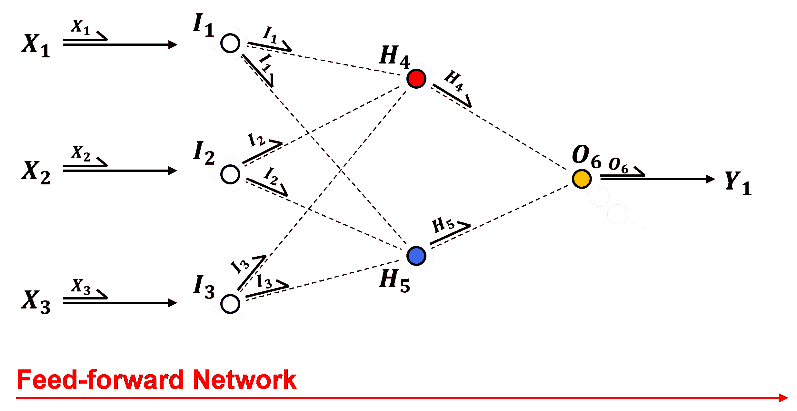

前馈，全连接，每个节点将相同的信号发送到下一层的所有节点。

**输入层** - 输入特征直接传递到输入节点，对于连续预测特征，每个特征有一个输入节点，并且特征是，

+   将最小/最大归一化到范围 $\left[ −1,1 \right]$ 或 $\left[ 0,1 \right]$ 以提高激活函数的敏感性，并消除预测特征中尺度差异的影响，以提高解决方案的稳定性，即，在训练过程中平滑减少训练损失

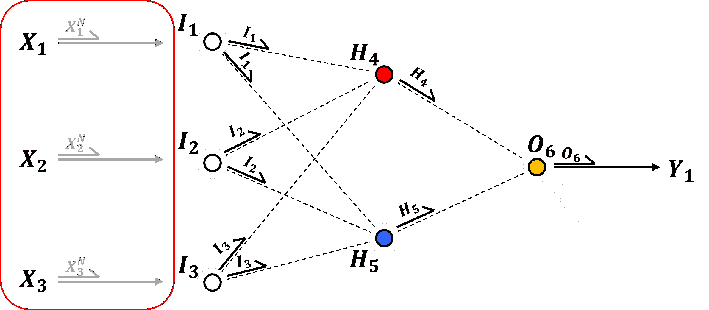

突出显示输入层，这是接收归一化预测特征的第一层。

对于分类预测特征，我们为每个预测特征中的每个类别有一个输入节点，即特征的一热编码后，每个编码都传递到一个单独的输入节点。

+   回忆一下一热编码，如果特定类别为 1，否则为 0，用长度等于类别数量的二进制向量替换分类特征。

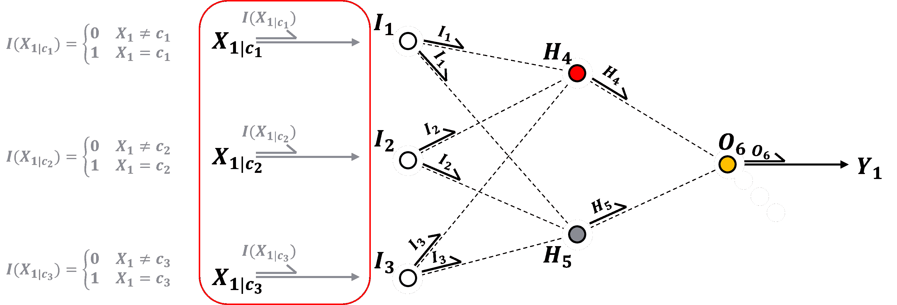

我们的人工神经网络中的输入层被突出显示。这是接收单个分类预测特征的一热编码的第一层。

+   我们也可以为每个分类预测特征使用单个输入节点，并为每个类别分配阈值，例如对于 3 个类别，可以是 $\left[ 0.0, 0.5, 1.0 \right]$，但这假设分类特征是顺序的。

**隐藏层** - 输入层值 $I_1, I_2, I_2$ 与可学习的权重相乘，

$$ \lambda_{1,4}, \lambda_{2,4}, \lambda_{3,4}, \lambda_{1,5}, \lambda_{2,5}, \lambda_{3,5} $$

+   在隐藏层节点中，加权输入层值，$\lambda_{1,4} \cdot I_1, \lambda_{2,4} \cdot I_2 \cdot I_2, \ldots, \lambda_{3,5} \cdot I_3$ 与每个节点中可训练的偏置项 $b_4$ 和 $b_5$ 相加。

$$ H_{4_{in}} = \lambda_{1,4} \cdot I_1 + \lambda_{2,4} \cdot I_2 + \lambda_{3,4} \cdot I_3 + b_4 $$$$ H_{5_{in}} = \lambda_{1,5} \cdot I_1 + \lambda_{2,5} \cdot I_2 + \lambda_{3,5} \cdot I_3 + b_5 $$

非线性激活函数被应用，

$$ H_{4} = \sigma \bigl( \lambda_{1,4} \cdot I_1 + \lambda_{2,4} \cdot I_2 + \lambda_{3,4} \cdot I_3 + b_4 \bigr) $$$$ H_{5} = \sigma \bigl( \lambda_{1,5} \cdot I_1 + \lambda_{2,5} \cdot I_2 + \lambda_{3,5} \cdot I_3 + b_5 \bigr) $$

+   输入层节点到所有隐藏层节点的输出是恒定的（再次强调，每个节点将相同的值发送到下一层的所有节点）


我们的人工神经网络中的隐藏层被突出显示。输入层节点的输出被加权并传递到隐藏层节点。隐藏层节点到所有输出层节点的输出是恒定的。

**输出层** - 对于连续响应特征，每个归一化响应特征有一个输出节点。再次计算输入的加权线性组合加上节点偏置，

$$ O_{6_{in}} = \lambda_{4,6} \cdot H_4 + \lambda_{5,6} \cdot H_5 + b_6 $$

然后应用激活函数，但对于连续响应特征，通常应用恒等（线性）变换，

$$ O_6 = \alpha \bigl( \lambda_{4,6} \cdot H_4 + \lambda_{5,6} \cdot H_5 + b_6 \bigr) = \lambda_{4,6} \cdot H_4 + \lambda_{5,6} \cdot H_5 + b_6 = O_{6_{in}} $$

+   从归一化到原始响应特征的反转换然后应用以恢复最终预测

+   就像连续预测特征一样，对连续响应特征应用最小/最大归一化，将其范围设置为[−1,1]或[0,1]，以提高激活函数的敏感性

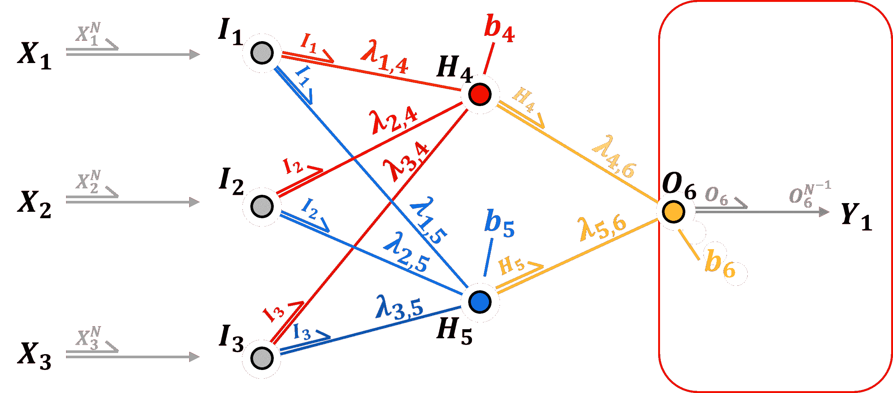

突出显示我们的人工神经网络的输出层。隐藏层节点的输出被加权并传递到输出层节点。隐藏层节点的输出是恒定的，但权重在隐藏层节点到输出层节点的连接中变化。

在分类响应特征的情况下，再次应用 one-hot 编码，因此，每个类别都有一个输出节点。

+   预测是每个类别的概率

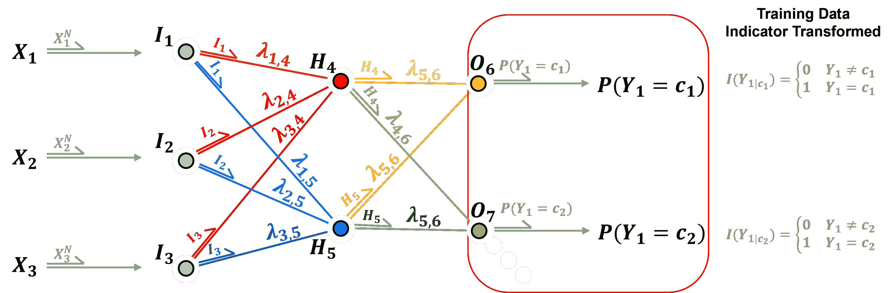

突出显示输入层，这是接收单个分类预测特征 one-hot 编码的第一层。

## 网络概述

现在我们已经准备好概述人工神经网络。

+   我们遵循单一路径来展示与使用人工神经网络进行预测相关的精确计算

下文将解释完整的正向传递。

**在输入层节点内部** - 输入层节点仅传递预测特征，

+   归一化的连续预测特征值

+   单个 one-hot 编码值[0 或 1]用于分类预测特征

将输入传递到隐藏层节点，使用通用向量表示，

$$ I = X $$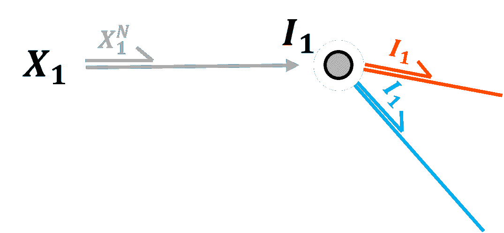

人工神经网络的概述，输入层节点接收单个分类预测特征的 one-hot 编码并将其传递给所有隐藏层节点。

我们可以用以下方式泛化所有输入层节点，

$$ H_j = H_{j_{in}} = X_j $$

**在隐藏层节点内部**

隐藏层节点是简单的处理器。它们对输入进行线性加权的组合，添加一个节点偏置项，然后将结果进行非线性转换，这种转换称为激活函数，$\alpha$。

+   确实，一个非常简单的处理器！

+   通过许多相互连接的节点，我们获得一个非常灵活的预测器，能够表征复杂、非线性的模式。

在激活之前，我们有，

$$ H_{4_{in}} = \sum_{i=1}^{3} \left( \lambda_{i,4} \cdot I_i \right) + b_4 $$

在激活之后，我们有，

$$ H_4 = \alpha \left(H_{4_{in}} \right) $$

我们可以用通用向量表示法在节点中表达这个简单的处理器，

$$ H_4 = \alpha \left(b_4 + \lambda_{j,4}^T I \right) $$

人工神经网络的概述，隐藏层线性加权输入来自每个输入层节点，添加一个节点偏置项，然后应用激活函数，并将其传递给下一层的所有节点，即我们的示例人工神经网络的输出层。

我们可以用以下方式推广所有隐藏层节点，

$$ H_{j_{in}} = \sum_{i=1}^{|I|} \left( \lambda_{i,j} \cdot I_i \right) + b_j $$

激活后，节点输出为，

$$ H_{j_{in}} = \sigma \bigl( \sum_{i=1}^{|I|} \left( \lambda_{i,j} \cdot I_i \right) + b_j \bigr) $$

**输出层节点内部**

输出层节点采用节点输入的线性加权组合，添加一个节点偏置项，然后使用与隐藏层节点相同的激活函数$\alpha$进行转换，

在激活之前，

$$ O_{6_{in}} = \sum_{i=4}^{5} \left( \lambda_{i,6} \cdot H_i \right) + b_6 $$

激活后，假设恒等激活，我们有，

$$ O_6 = \alpha \left(O_{6_{in}} \right) $$

我们可以用通用向量符号表示节点中的简单处理器，

$$ O_6 = \alpha\left(b_6 + \lambda_{j,6}^T H\right) $$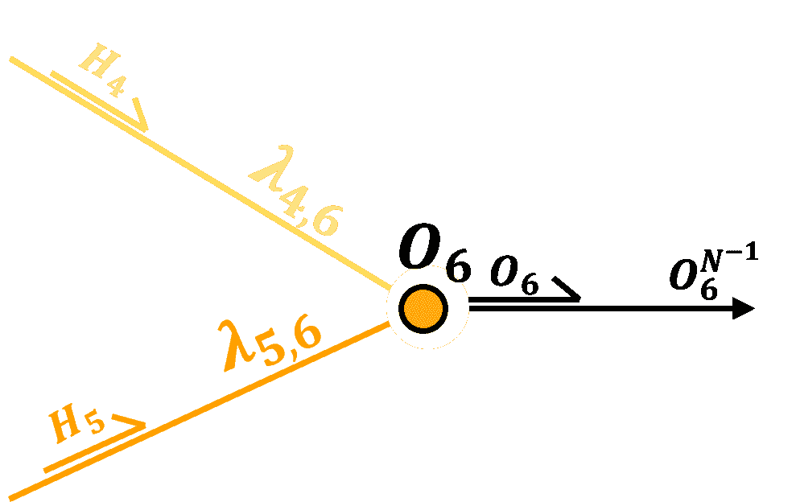

人工神经网络的概述，输出层线性加权输入来自每个隐藏层节点，添加一个节点偏置项，然后应用激活函数，通常对于连续响应特征是线性的，并将其作为输出传递。

对于分类响应特征，通常应用 softmax 激活，

$$ O_j = \alpha(O_{j_{in}}) = \frac{e^{O_{j_{in}}}}{\sum_{\iota=1}^{K} e^{O_{\iota_{in}}}} $$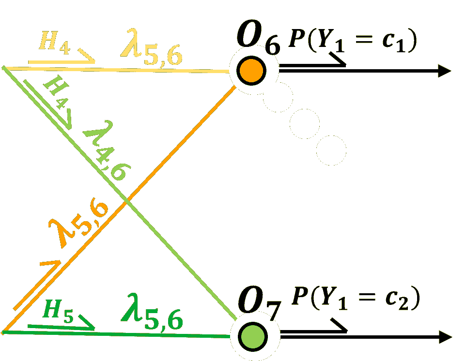

人工神经网络的概述，输出层线性加权输入来自每个隐藏层节点，添加一个节点偏置项，然后应用激活函数，通常对于连续响应特征是线性的，并将其作为输出传递。

softmax 激活确保所有输出层节点的输出都是有效的概率，包括，

+   **非负性** - 通过指数运算

+   **封闭** - 通过分母归一化结果，概率之和为 1.0

注意，对于所有未来的讨论和演示，我假设一个标准化的连续响应特征。

## 网络正向传递

现在我们已经完成了一条路径上网络的概述，让我们结合通过我们网络的全部路径来演示人工神经网络的一次完整正向传递。

+   这是进行预测所需的计算，不使用 out，

$$ O_6 = \sigma_{O_6} \bigl( \lambda_{4,6} \cdot \sigma_{H_4} \left( \lambda_{1,4} I_1 + \lambda_{2,4} I_2 + \lambda_{3,4} I_3 + b_4 \right) + \lambda_{5,6} \cdot \sigma_{H_5} \left( \lambda_{1,5} I_1 + \lambda_{2,5} I_2 + \lambda_{3,5} I_3 + b_5 \right) + b_6 \bigr) $$

其中激活函数 $\sigma_{H_4}$ = $\sigma_{H_5}$ = $\sigma$ 是 Sigmoid，而 $\sigma_{O_6}$ 是线性（恒等），因此我们可以简化前向传播为，

$$ O_6 = \lambda_{4,6} \cdot \sigma \left( \lambda_{1,4} I_1 + \lambda_{2,4} I_2 + \lambda_{3,4} I_3 + b_4 \right) + \lambda_{5,6} \cdot \sigma \left( \lambda_{1,5} I_1 + \lambda_{2,5} I_2 + \lambda_{3,5} I_3 + b_5 \right) + b_6 $$

这强调了我们的神经网络是一个嵌套的激活线性系统集合，即线性加权的平均值加上应用于激活函数的偏差项。

## 模型参数数量

通常情况下，人工神经网络中有许多模型参数，$theta$。首先，让我们明确这些定义来描述我们的人工神经网络，

+   **神经网络宽度** - 神经网络层的节点数

+   **神经网络深度** - 神经网络中的层数，通常输入层不包括在这个计算中

现在，让我们假设一个紧凑的表示法用于一个 3 层人工神经网络，输入、输出和 1 个隐藏层，每层的宽度为，

+   输入节点数 $p$

+   隐藏层节点数 $m$

+   和输出节点数 $k$

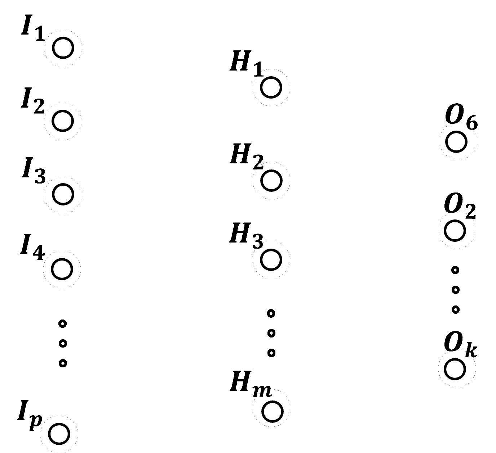

人工神经网络的宽度表示法，输入节点数 $p$，隐藏层节点数 $m$，和输出节点数 $k$。

全连接，因此对于每个连接都有一个权重，

$$ \lambda_{𝐼_{1,\ldots,𝑝},𝐻_{1,\ldots,𝑚} } \quad \text{和} \quad \lambda_{𝐻_{1,\ldots,𝑚},𝑂_{1,\ldots,𝑘} } $$

在全连接的情况下，权重的数量是

$$ 𝑝 \times 𝑚 \quad \text{和} \quad 𝑚 \times 𝑘 $$

并且在每个隐藏层节点都有一个偏差项，

$$ 𝑏_{H_{1,\ldots,m} } $$

并且在每个输出节点都有一个偏差项，

$$ 𝑏_{O_{1,\ldots,k} } $$

因此，模型参数的数量是，

$$ |\theta| = 𝑝 \times 𝑚 + 𝑚 \times 𝑘 + 𝑚 + 𝑘 $$

这假设每个隐藏层节点和输出层节点有一个唯一的偏差项，但在某些情况下，相同的偏差项可能应用于整个层。

对于我们的例子，$p = 3$，$m = 2$ 和 $k = 1$，那么模型参数的数量是，

$$ |\theta| = 𝑝 \times 𝑚 + 𝑚 \times 𝑘 + 𝑚 + 𝑘 $$

代入后我们得到，

$$ |\theta| = 3 \times 2 + 2 \times 1 + 2 + 1 = 11 $$

我选择这个作为可管理的参数数量，因此我们可以训练和可视化我们的模型，但通过增加我们人工神经网络的宽度，考虑一个更典型的模型大小，即 $p = 10$，$m = 20$ 和 $k = 3$，那么我们将有更多的模型参数，

$$ |\theta| = 10 \times 20 + 20 \times 3 + 20 + 3 = 283 $$

如果我们添加隐藏层，增加我们人工神经网络的深度，模型参数的数量将迅速增长。

+   我们可以推广这个计算到任何全连接的前馈神经网络，给定一个 $W$ 向量，包含节点的数量，即每层的宽度，

$$ \mathbf{L} = [l_0, l_1, l_2, \dots, l_n] $$

其中，

+   $l_0$ 是输入神经元的数量

+   $l_1, \dots, l_{n-1}$ 是隐藏层的宽度

+   $l_n$ 是输出神经元的数量

连接权重的总数是，

$$ |\theta_{weights}| = \sum_{i=1}^{n} l_i \cdot l_{i-1} $$

节点偏置的总数（输入层节点中没有偏置参数，$l_0$）是，

$$ |\theta_{biases}| = \sum_{i=1}^{n} l_i $$

可训练模型参数、连接权重和节点偏置的总数是，

$$ |\theta| = \sum_{i=1}^{n} \left( l_i \cdot l_{i-1} + l_i \right) = \sum_{i=1}^{n} l_i \cdot (l_{i-1} + 1) $$

以下是一个具有 4 个隐藏层的人工神经网络示例，网络宽度按层向量表示，

$$ \mathbf{L} = [10, 8, 6, 4, 2, 1] $$

连接权重的总数是，

$$ |\theta_{L_{weights}}| = \sum_{i=1}^{5} l_i \cdot l_{i-1} = (8 \cdot 10) + (6 \cdot 8) + (4 \cdot 6) + (2 \cdot 4) + (1 \cdot 2) = 80 + 48 + 24 + 8 + 2 = 162 $$

节点偏置的总数是，

$$ |\theta_{L_{biases}}| = \sum_{i=1}^{5} l_i = 8 + 6 + 4 + 2 + 1 = 21 $$

最后，可训练参数的总数是，

$$ |\theta_L| = \sum_{i=1}^{5} l_i \cdot (l_{i-1} + 1) = (8 \cdot 11) + (6 \cdot 9) + (4 \cdot 7) + (2 \cdot 5) + (1 \cdot 3) = 88 + 54 + 28 + 10 + 3 = 183 $$

## 激活函数

激活函数是加权节点输入的线性组合加上节点偏置项的转换。非线性激活，

+   引入网络的非线性属性和复杂性

+   防止网络崩溃

没有非线性激活函数，我们将得到线性回归，整个系统会崩溃。

关于激活函数的更多信息以及非线性激活缺失时导致的多线性回归崩溃的演示，请参阅本电子书的相关章节，[神经网络激活函数](https://geostatsguy.github.io/MachineLearningDemos_Book/MachineLearning_activation_functions.html)。

## 训练网络步骤

训练人工神经网络通过以下步骤迭代进行，

1.  初始化模型参数

1.  前向传递以进行预测

1.  根据预测和真实值在训练数据上计算误差导数

1.  通过人工神经网络反向传播误差导数，以计算所有模型权重和偏置参数的误差导数

1.  根据导数和学习率更新模型参数

1.  重复直到收敛。


训练人工神经网络的迭代步骤。

下面是每个步骤的详细信息，

1.  **初始化模型参数** - 通常使用接近零的小随机值初始化所有模型参数。以下是一些常见方法，

+   **Xavier 权重初始化** - 从由 $U[\text{min}, \text{max}]$ 指定的均匀分布中随机实现，

$$ \lambda_{i,j} = F_U^{-1} \left[ \frac{-1}{\sqrt{p}}, \frac{1}{\sqrt{p}} \right] (p^\ell) $$

其中 $F^{-1}_U$ 是 CDF 的逆，$p$ 是输入的数量，$p^{\ell}$ 是从均匀分布 $U[0,1]$ 中抽取的随机累积概率值。

+   **归一化 Xavier 权重初始化** - 从由 $U[\text{min}, \text{max}]$ 指定的均匀分布中随机取值，

$$ \lambda_{i,j} = F_U^{-1} \left[ \frac{-1}{\sqrt{p}+k}, \frac{1}{\sqrt{p}+k} \right] (p^\ell) $$

其中 $F^{-1}_U$ 是 CDF 的逆，$p$ 是输入的数量，$k$ 是输出的数量，$p^{\ell}$ 是从均匀分布 $U[0,1]$ 中抽取的随机累积概率值。

例如，如果我们回到我们的第一个隐藏层节点，


第一个隐藏层节点有 3 个输入，1 个输出。

我们有 $p = 3$ 和 $k = 1$，并从均匀分布中抽取，

$$ U \left[ \frac{-1}{\sqrt{p}+k}, \frac{1}{\sqrt{p}+k} \right] = U \left[ \frac{-1}{\sqrt{3}+1}, \frac{1}{\sqrt{3}+1} \right] $$

1.  **前向传播** - 进行预测，$\hat{y}$。初始预测在第一次迭代将是随机的，但会随着迭代次数的增加而改进。对于我们的模型，前向传播是，

$$ O_6 = \lambda_{4,6} \cdot \sigma \left( \lambda_{1,4} I_1 + \lambda_{2,4} I_2 + \lambda_{3,4} I_3 + b_4 \right) + \lambda_{5,6} \cdot \sigma \left( \lambda_{1,5} I_1 + \lambda_{2,5} I_2 + \lambda_{3,5} I_3 + b_5 \right) + b_6 $$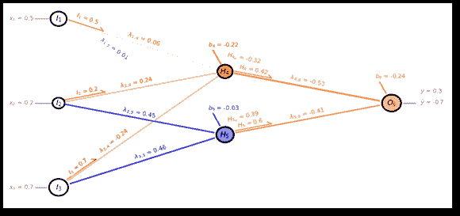

使用随机模型参数、权重和偏差初始化的人工神经网络进行预测。

1.  **计算误差导数** - 给定一个损失，

$$ L = \frac{1}{2} \left(\hat{y} - y \right)² $$

以及误差导数，即给定模型估计的变化，误差的变化率，

$$ \frac{\partial L}{\partial \hat{y}} = \hat{Y} - Y $$

现在，我们只考虑单个估计，稍后我们将讨论超过 1 个训练数据。

1.  **反向传播误差导数** - 我们通过人工神经网络反向计算所有模型权重和偏差参数的误差导数，例如，例如损失导数反向传播到节点 $H_4$ 的输出，

$$ \frac{\partial L}{\partial H_4} = \frac{\partial O_{6_{\text{in}}}}{\partial H_4} \cdot \frac{\partial O_6}{\partial O_{6_{\text{in}}}} \cdot \frac{\partial L}{\partial O_6} = \lambda_{4,6} \cdot \bigl( (1 - O_6) \cdot O_6 \bigr) \cdot (O_6 - y) $$

1.  **更新模型参数** - 根据导数 $\frac{\partial L}{\partial \lambda_{i,j}}$ 和学习率 $\eta$，如下所示，

$$ \lambda_{i,j}^{\ell} = \lambda_{i,j}^{\ell - 1} + \eta \cdot \frac{\partial L}{\partial \lambda_{i,j}} $$

1.  **重复直到收敛** - 返回步骤 1，直到误差 $L$ 降低到可接受的水平，即模型收敛是停止迭代的条件

这些是步骤，现在让我们深入到每个步骤的细节，但首先让我们从反向传播的数学框架——链式法则开始。

## 链式法则

反思后，很明显，通过我们的人工神经网络的前向传递涉及一系列嵌套操作，这些操作逐步将输入信号从输入节点传播到每一层，最终到达输出节点。

因此我们可以将此表示为一系列嵌套操作，

$$ f = f(x) \quad g = g(f) \quad y = h(g) $$

现在以这种形式强调操作的嵌套，

$$ y = h \bigl( g(f(x)) \bigr) $$

通过将链式法则应用于嵌套函数 $y = h \bigl( g(f(x)) \bigr)$，我们可以求解 $\frac{\partial y}{\partial x}$ 如下，

$$ \frac{\partial y}{\partial x} = \frac{\partial h}{\partial g} \cdot \frac{\partial g}{\partial f} \cdot \frac{\partial f}{\partial x} $$

其中我们将所有算子的偏导数链式相加，以求解给定输入 $x$ 的输出 $y$ 的导数。

+   我们可以在嵌套函数的任何中间点计算导数，例如，向后走一步，

$$ \frac{\partial f}{\partial x} $$

现在是两步，

$$ \frac{\partial g}{\partial x} = \frac{\partial g}{\partial f} \cdot \frac{\partial f}{\partial x} $$

并且一直用三个步骤，

$$ \frac{\partial y}{\partial x} = \frac{\partial h}{\partial g} \cdot \frac{\partial g}{\partial f} \cdot \frac{\partial f}{\partial x} $$

这就是我们通过反向传播所做的事情，但这可能过于抽象！让我们转向一个非常简单的只有这三个节点的正向传播神经网络，

+   $I_1$ - 输入节点

+   $H_2 = h(I_1)$ - 隐藏层节点，是 $I_1$ 的函数

+   $O_3 = o(H_2)$ - 输出节点，是 $H_2$ 的函数

+   这仍然是有意为之的抽象，即没有提及权重和偏差，以帮助您通过链式法则发展神经网络反向传播的心理框架，我们将在这次讨论之后立即深入细节。

输出 $O_3$ 通过这些嵌套函数依赖于输入 $I_1$：

$$ O_3 = o \bigl( h(I_1) \bigr) $$

使用**链式法则**，反向传播一步的输出梯度，

$$ \frac{\partial O_3}{\partial H_2} $$

以及反向传播两步，

$$ \frac{\partial O_3}{\partial I_1} = \frac{\partial H_2}{\partial I_1} \cdot \frac{\partial O_3}{\partial H_2} $$

这显示了梯度如何通过网络**反向传播**，

+   $\frac{\partial O_3}{\partial I_1}$ - 是隐藏节点的局部梯度

+   $\frac{\partial O_3}{\partial H_2}$ - 是输出节点的局部梯度

通过反向传播，我们可以计算相对于网络所有部分的导数，输入节点信号 $I_1$ 或隐藏节点信号 $H_2$ 如何影响输出 $O_3$，分别是 $\frac{\partial O_3}{\partial I_1}$ 和 $frac{\partial O_3}{\partial H_2}$。

+   更重要的是，输入 $I_1$ 或 $H_2$ 的变化如何影响模型损失的变化，分别是 $\frac{\partial L}{\partial I_1}$ 和 $frac{\partial L}{\partial H_2}$。

这一系列的偏导数，逐步反向通过神经网络层，是**反向传播**背后的基本机制。接下来我们将推导并演示反向传播的各个部分，然后最终将它们组合起来，展示整个网络的反向传播。

## 神经网络反向传播构建块

让我们讨论反向传播的数值构建块。一旦你理解了这些反向传播构建块，你将能够手动反向传播我们的简单网络，甚至任何复杂的人工神经网络，

1.  计算损失导数

1.  通过节点进行反向传播

1.  沿着连接进行反向传播

1.  考虑多条路径

1.  关于权重和偏置的损失导数

目前，我演示了单个训练数据样本 $y$ 的这个损失导数的反向传播。

+   我将在后面讨论多个样本，$y_i, i=1, \ldots, n$

让我们从计算损失导数开始。

### 计算损失导数

反向传播基于将损失导数分配或传播回神经网络的概念，

+   我们计算损失导数，然后按顺序从网络输出反向分布到网络输入

+   重要的是要知道我们正在处理导数，并且反向传播并不是在分配误差，尽管正如你将看到的，它可能看起来是这样！

我们首先定义损失，给定真实值 $𝑦$ 和我们的预测 $\hat{y} = O_6$，我们计算 $L²$ 损失如下，

$$ L = \frac{1}{2} \left( \hat{y} - y \right)² $$

我们选择的损失函数允许我们使用预测误差作为损失导数！我们计算损失导数作为损失相对于估计的偏导数，$\frac{\partial 𝐿}{\partial \hat{y}}$,

$$ \frac{\partial \mathcal{L}}{\partial \hat{y}} = \frac{\partial \frac{1}{2} \left( \hat{y} - y \right)² }{\partial \hat{y}} = \hat{y} - y $$

你明白我的意思，我们正在反向传播损失导数，但由于我们对 $L²$ 损失的公式化，我们只需要计算输出节点输出处的误差，但再次强调——它是损失导数。

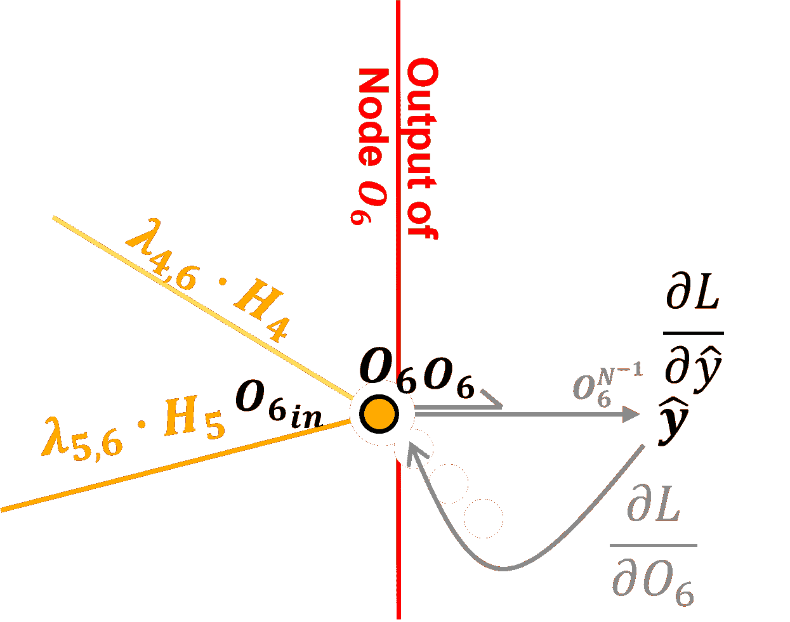

计算输出层节点 $O_6$ 的损失导数。

对于我们的简单人工神经网络，输出在节点 $O_6$，我们的损失导数是，

$$ \frac{\partial \mathcal{L}}{\partial O_6} = \frac{\partial \mathcal{L}}{\hat{y}} = \hat{y} - y = O_6 - y $$

因此，这是我们反向传播到输出节点的损失导数，我们现在准备通过我们的人工神经网络反向传播这个损失导数，让我们谈谈如何逐步通过节点和沿着连接。

### 具有恒等激活函数的输出节点 $O_6$ 的反向传播

让我们通过输出节点 $O_6$ 从后激活到前激活进行反向传播。为此，我们需要激活函数的偏导数。

+   由于这是一个具有回归人工神经网络的输出节点，我选择了恒等或线性激活函数。

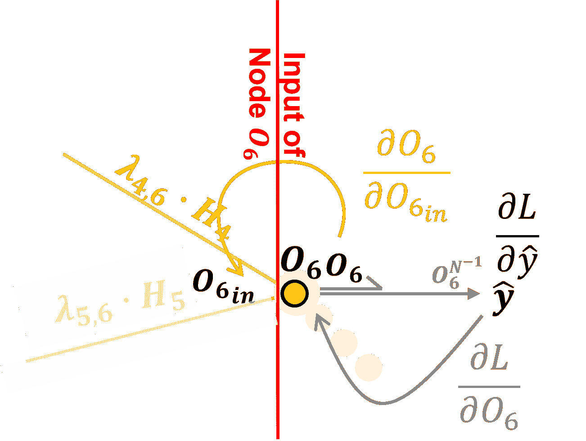

通过节点 $O_6$ 从 $O_6$ 后激活输出到 $O_{6_{in}}$ 前激活输入的反向传播损失导数。

输出节点 $O_6$ 处的恒等激活函数定义为：

$$ O_6 = \sigma(O_{6_{in}}) = O_6 $$

节点 $O_6$ 处的恒等激活函数的导数相对于其输入 $O_{6_{in}}$，即穿过节点 $O_6$，为，

$$ \frac{\partial O_6}{\partial O_{6_{in}}} = \frac{\partial \left(O_{6_{in}} \right)}{\partial O_{6_{in}}} = 1.0 $$

注意，我们只需要节点 $O_6$ 的输出信号。现在我们可以将这个信号添加到我们的链式法则中，以从节点输出相对于损失导数 $\frac{\partial \mathcal{L}}{\partial O_6}$ 反向传播，以及从节点输入相对于损失导数 $\frac{\partial \mathcal{L}}{\partial O_{6_{\text{in}}}}$ 反向传播，

$$ \frac{\partial \mathcal{L}}{\partial O_{6_{\text{in}}}} = \frac{\partial O_6}{\partial O_{6_{\text{in}}}} \cdot \frac{\partial \mathcal{L}}{\partial O_6} = 1.0 \cdot (O_6 - y) $$

既然我们已经通过输出节点进行了反向传播，那么让我们沿着隐藏层中从 $H_4$ 到 $O_6$ 的连接进行反向传播。

### 沿着连接的反向传播

现在，让我们沿着节点 $O_6$ 和 $H_4$ 之间的连接进行反向传播。

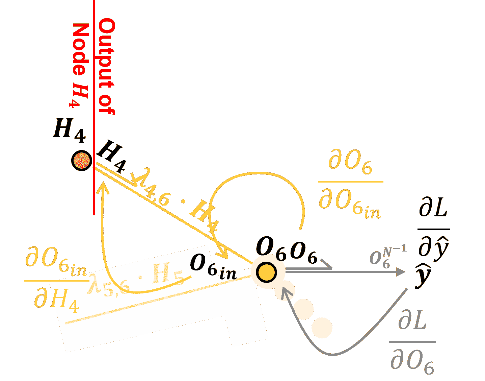

通过节点 $O_6$ 从 $O_6$ 后激活输出到 $O_{6_{in}}$ 前激活输入的反向传播损失导数，然后沿着连接到节点 $H_4$ 的输出。

在前激活阶段，节点 $𝑂_6$ 的输入计算如下，

$$ O_{6_{\text{in}}} = \lambda_{4,6} \cdot H_4 + \lambda_{5,6} \cdot H_5 + b_6 $$

我们计算连接上的导数如下，

$$ \frac{\partial O_{6_{\text{in}}}}{\partial H_4} = \frac{\partial}{\partial H_4} \left( \lambda_{4,6} \cdot H_4 + \lambda_{5,6} \cdot H_5 + b_6 \right) = \lambda_{4,6} $$

通过解决上述偏导数，我们发现通过应用连接权重来沿着连接进行反向传播。

$$ \frac{\partial O_{6_{\text{in}}}}{\partial H_4} = \lambda_{4,6} $$

注意，我们只需要当前的连接权重 $\lambda_{4,6}$。现在我们可以将其添加到我们的链式法则中，通过 $H_4$ 到 $O_6$ 的连接从损失相对于输出层节点输入的导数 $\frac{\partial \mathcal{L}}{\partial O_{6_{\text{in}}}}$ 反向传播到损失相对于隐藏层节点输出的导数 $\frac{\partial \mathcal{L}}{\partial H_4}$。

$$ \frac{\partial \mathcal{L}}{\partial H_4} = \frac{\partial O_{6_{\text{in}}}}{\partial H_4} \cdot \frac{\partial O_6}{\partial O_{6_{\text{in}}}} \cdot \frac{\partial \mathcal{L}}{\partial O_6} = \lambda_{4,6} \bigl( \cdot (1 - O_6) \cdot O_6 \bigr) \cdot (O_6 - y) $$

### 带有 sigmoid 激活的节点反向传播

让我们通过一个隐藏层节点 $H_4$ 从后激活到前激活进行反向传播。为此，我们需要激活函数的偏导数。

+   我们假设所有隐藏层节点使用 sigmoid 激活

+   对于超级清晰的逻辑，每个人都将激活导数作为输出而不是典型输入的函数来求解，

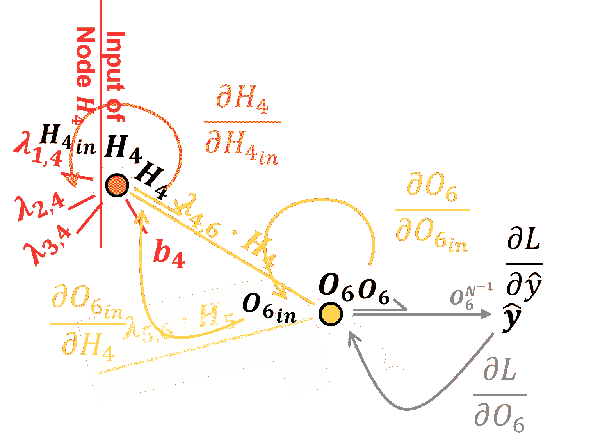

通过节点 $H_4$ 从 $H_4$ 后激活输出到 $H_{4_{in}}$ 前激活输入的反向传播损失导数。

输出节点 $H_4$ 的 sigmoid 激活定义为：

$$ H_4 = \sigma(H_{4_{in}}) = \frac{1}{1 + e^{-H_{4_{in}}}} $$

节点 $H_4$ 的 sigmoid 激活相对于其输入 $H_{4_{in}}$ 的导数，即穿越节点 $H_4$ 是，

$$ \frac{\partial H_4}{\partial H_{4_{in}}} = \frac{\partial}{\partial H_{4_{in}}} \left( \frac{1}{1 + e^{-H_{4_{in}}}} \right) $$

现在，为了紧凑的表示，我们设，

$$ u = e^{-H_{4_{in}}} $$

并代入我们得到，

$$ \frac{\partial H_4}{\partial H_{4_{in}}} = \frac{\partial}{\partial H_{4_{in}}} \left( \frac{1}{1 + u} \right) $$

通过链式法则，我们可以将其扩展为，

$$ \frac{\partial H_4}{\partial H_{4_{in}}} = \frac{\partial}{\partial H_{4_{in}}} \left( \frac{1}{1 + u} \right) = -\frac{u}{(1 + u)²} \cdot \frac{\partial u}{\partial H_{4_{in}}} $$

$u = e^{-H_{4_{in}}}$ 关于 $H_{4_{in}}$ 的导数是：

$$ \frac{\partial u}{\partial H_{4_{in}}} = -e^{-H_{4_{in}}} = -u $$

现在我们可以替换，

$$ \frac{\partial H_4}{\partial H_{4_{in}}} = -\frac{1}{(1+u)²} \cdot (-u) = \frac{u}{(1+u)²} $$

用节点 $H_4$ 的输出表示，$H_4 = \frac{1}{1 + u}$,

$$ \frac{\partial H_4}{\partial H_{4_{\text{in}}}} = \frac{\left(1 - H_4\right)/H_4}{\left(1/H_4\right)²} = \frac{1 - H_4}{H_4} \cdot H_4² = \left(1 - H_4\right) \cdot H_4 $$

因此，我们可以通过我们的节点 $H_4$ 从节点后激活输出 $H_4$ 到节点前激活输入 $H_{4_{in}}$ 进行反向传播，通过，

$$ \frac{\partial H_4}{\partial H_{4_{\text{in}}}} = \left(1 - H_4\right) \cdot H_4 $$

注意，我们只需要节点 $H_4$ 的输出信号 $H_4$。现在我们可以将这个信号添加到我们的链式法则中，以从损失导数反向传播到节点 $H_4$ 的输出以及节点 $H_4$ 的输入，

$$ \frac{\partial \mathcal{L}}{\partial H_{4_{\text{in}}}} = \frac{\partial H_4}{\partial H_{4_{\text{in}}}} \cdot \frac{\partial O_{6_{\text{in}}}}{\partial H_4} \cdot \frac{\partial O_6}{\partial O_{6_{\text{in}}}} \cdot \frac{\partial \mathcal{L}}{\partial O_6} = \bigl((1 - H_4) \cdot H_4 \bigr) \cdot \lambda_{4,6} \cdot 1.0 \cdot (O_6 - y) $$

现在我们可以处理网络中节点的所有反向传播情况。

### 沿另一条连接进行反向传播

为了连续性和完整性，让我们重复之前描述的方法，以沿连接 $I_1$ 到 $H_4$ 进行反向传播。

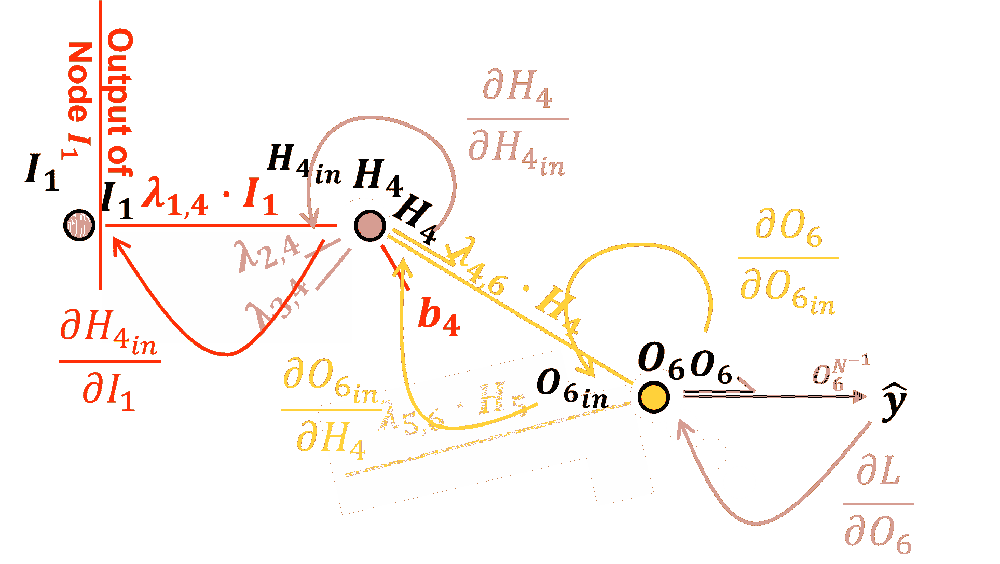

沿着从 $H_4$ 到 $I_1$ 的连接进行损失导数的反向传播。

再次，节点 $H_4$ 的输入的预激活计算如下，

$$ H_{4_{\text{in}}} = \lambda_{1,4} \cdot I_1 + \lambda_{2,4} \cdot I_2 + \lambda_{3,4} \cdot I_3 + b_4 $$

我们计算沿连接的导数如下，

$$ \frac{\partial H_{4_{\text{in}}}}{\partial I_1} = \frac{\partial \left(\lambda_{1,4} \cdot I_1 + \lambda_{2,4} \cdot I_2 + \lambda_{3,4} \cdot I_3 + b_4 \right)}{\partial I_1} = \lambda_{1,4} $$

通过求解上述偏导数，我们可以看到通过应用连接权重沿连接进行反向传播。

$$ \frac{\partial H_{4_{\text{in}}}}{\partial I_1} = \lambda_{4,6} $$

注意，我们只需要当前的连接权重 $\lambda_{4,6}$。现在我们可以将这个权重添加到我们的链式法则中，以从损失导数反向传播到输出层节点输入 $\frac{\partial \mathcal{L}}{\partial O_{6_{\text{in}}}}$，到隐藏层节点输出 $\frac{\partial \mathcal{L}}{\partial H_4}$ 的 $H_4$ 到 $O_6$ 连接，

$$ \frac{\partial \mathcal{L}}{\partial I_1} = \frac{\partial H_{4_{\text{in}}}}{\partial I_1} \cdot \frac{\partial H_4}{\partial H_{4_{\text{in}}}} \cdot \frac{\partial O_{6_{\text{in}}}}{\partial H_4} \cdot \frac{\partial O_6}{\partial O_{6_{\text{in}}}} \cdot \frac{\partial \mathcal{L}}{\partial O_6} = \lambda_{1,4} \cdot \bigl((1 - H_4) \cdot H_4 \bigr) \cdot \lambda_{4,6} \cdot 1.0 \cdot (O_6 - y) $$

### 考虑多条路径

我们关于节点输出 $I_1$ 的损失导数 $\frac{\partial \mathcal{L}}{\partial I_1}$ 是不正确的！

+   我们已经考虑了从 $O_6$ 到 $H_4$ 到 $I_1$ 的路径，但没有考虑从 $O_6$ 到 $H_5$ 到 $I_1$ 的路径

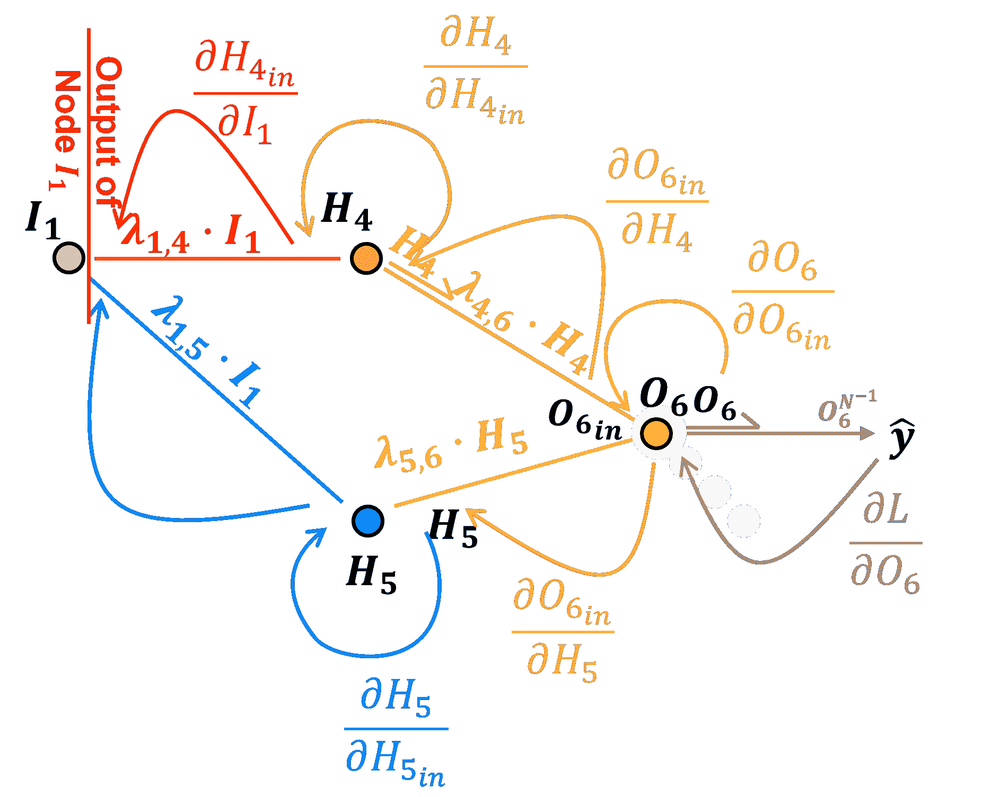

从输出节点 $O_6$ 到输入节点 $I_1$ 的反向传播存在多条路径。

为了考虑多条路径，我们只需要对所有路径进行求和。

$$ \frac{\partial \mathcal{L}}{\partial I_1} = \frac{\partial H_{4_{\text{in}}}}{\partial I_1} \cdot \frac{\partial H_4}{\partial H_{4_{\text{in}}}} \cdot \frac{\partial O_{6_{\text{in}}}}{\partial H_4} \cdot \frac{\partial O_6}{\partial O_{6_{\text{in}}}} \cdot \frac{\partial \mathcal{L}}{\partial O_6} + \frac{\partial H_{5_{\text{in}}}}{\partial I_1} \cdot \frac{\partial H_5}{\partial H_{5_{\text{in}}}} \cdot \frac{\partial O_{6_{\text{in}}}}{\partial H_5} \cdot \frac{\partial O_6}{\partial O_{6_{\text{in}}}} \cdot \frac{\partial \mathcal{L}}{\partial O_6} $$

我们可以评估为，

$$ \frac{\partial \mathcal{L}}{\partial I_1} = \lambda_{1,4} \cdot \bigl((1 - H_4) \cdot H_4 \bigr) \cdot \lambda_{4,6} \cdot 1.0 \cdot (O_6 - y) + \lambda_{1,5} \cdot \bigl((1 - H_5) \cdot H_5 \bigr) \cdot \lambda_{5,6} \cdot 1.0 \cdot (O_6 - y) $$

然后通过移除 1.0 值和分组项进行简化，

$$ \frac{\partial \mathcal{L}}{\partial I_1} = \left[ \frac{\partial H_{4_{\text{in}}}}{\partial I_1} \cdot \frac{\partial H_4}{\partial H_{4_{\text{in}}}} \cdot \frac{\partial O_{6_{\text{in}}}}{\partial H_4} + \frac{\partial H_{5_{\text{in}}}}{\partial I_1} \cdot \frac{\partial H_5}{\partial H_{5_{\text{in}}}} \cdot \frac{\partial O_{6_{\text{in}}}}{\partial H_5} \right] \cdot \frac{\partial \mathcal{L}}{\partial O_6} $$

现在我们可以评估这个简化的形式，

$$ \frac{\partial \mathcal{L}}{\partial I_1} = \left[ \lambda_{1,4} \cdot \bigl((1 - H_4) \cdot H_4 \bigr) \cdot \lambda_{4,6} + \lambda_{1,5} \cdot \bigl((1 - H_5) \cdot H_5 \bigr) \cdot \lambda_{5,6} \right] \cdot (O_6 - y) $$

### 通过输入节点进行恒等激活的逆传播

让我们通过输入节点 $I_1$ 从后激活到前激活进行逆传播。为此，我们需要激活函数的偏导数。

+   由于这是一个输入节点，我选择了恒等或线性激活函数。

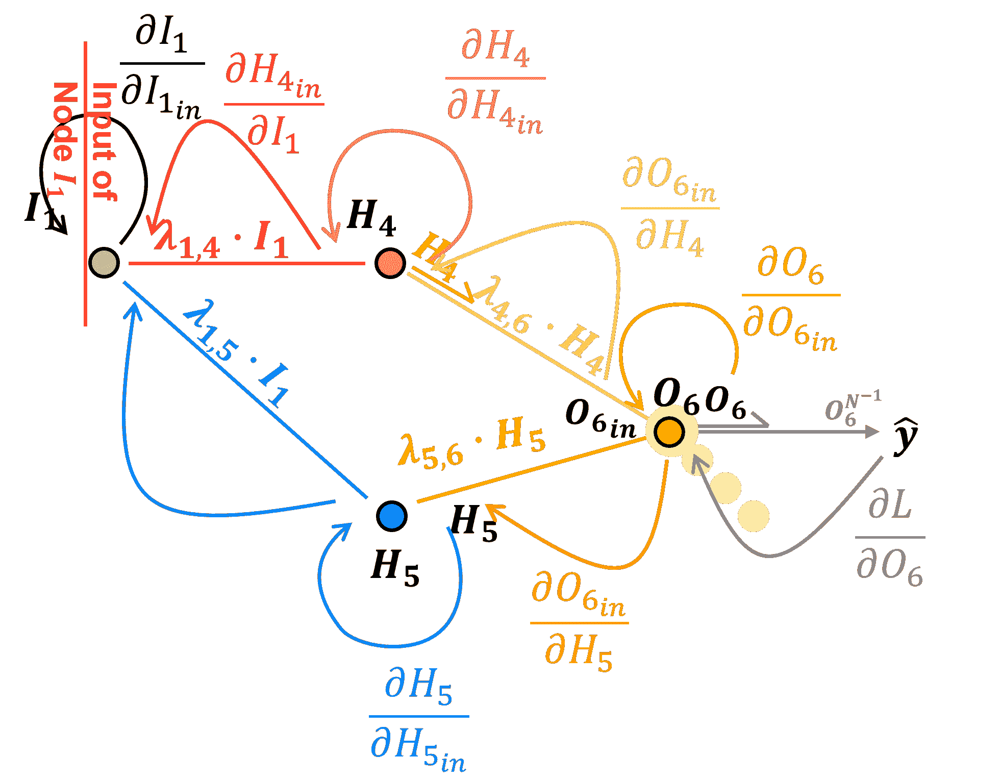

从节点 $I_1$ 的后激活输出到前激活输入的损失导数逆传播。

输出节点 $I_1$ 上的恒等激活定义为：

$$ I_1 = \sigma(I_{1_{in}}) = I_1 $$

节点 $I_1$ 上恒等激活相对于其输入 $I_{1_{in}}$ 的导数，即通过节点 $I_1$ 传递，是，

$$ \frac{\partial I_1}{\partial I_{1_{in}}} = \frac{\partial \left(I_{1_{in}} \right)}{\partial I_{1_{in}}} = 1.0 $$

注意，我们只需要 $I_1$，即从节点输出的信号。现在我们可以将这个值添加到我们的链式法则中，从节点输出相对于损失导数 $\frac{\partial \mathcal{L}}{\partial I_1}$ 逆传播到节点输入相对于损失导数 $\frac{\partial \mathcal{L}}{\partial I_{1_{\text{in}}}}$，

$$ \frac{\partial \mathcal{L}}{\partial I_{1_{in}}} = \frac{\partial I_1}{\partial I_{1_{in}}} \cdot \frac{\partial H_{4_{\text{in}}}}{\partial I_1} \cdot \frac{\partial H_4}{\partial H_{4_{\text{in}}}} \cdot \frac{\partial O_{6_{\text{in}}}}{\partial H_4} \cdot \frac{\partial O_6}{\partial O_{6_{\text{in}}}} \cdot \frac{\partial \mathcal{L}}{\partial O_6} + \frac{\partial I_1}{\partial I_{1_{in}}} \cdot \frac{\partial H_{5_{\text{in}}}}{\partial I_1} \cdot \frac{\partial H_5}{\partial H_{5_{\text{in}}}} \cdot \frac{\partial O_{6_{\text{in}}}}{\partial H_5} \cdot \frac{\partial O_6}{\partial O_{6_{\text{in}}}} \cdot \frac{\partial \mathcal{L}}{\partial O_6} $$

我们可以评估这个形式，

$$ \frac{\partial \mathcal{L}}{\partial I_{1_{in}}} = 1.0 \cdot \lambda_{1,4} \cdot \bigl((1 - H_4) \cdot H_4 \bigr) \cdot \lambda_{4,6} \cdot 1.0 \cdot (O_6 - y) + 1.0 \cdot \lambda_{1,5} \cdot \bigl((1 - H_5) \cdot H_5 \bigr) \cdot \lambda_{5,6} \cdot 1.0 \cdot (O_6 - y) $$

为了乐趣，我设计了这种表示法以实现最大清晰度，

$$ \frac{\partial L}{\partial I_{1_{\text{in}}}} = \overbrace{1.0}^{\textstyle \frac{\partial I_{1}}{\partial I_{1_{in}}}} \left[ \overbrace{\lambda_{1,4}}^{\textstyle \frac{\partial H_{4_{\text{in}}}}{\partial I_1}} \cdot \overbrace{(1 - H_4) \cdot H_4}^{\textstyle \frac{\partial H_4}{\partial H_{4_{\text{in}}}}} \cdot \overbrace{\lambda_{4,6}}^{\textstyle \frac{\partial O_{6_{\text{in}}}}{\partial H_4}} \cdot \overbrace{1.0}^{\textstyle \frac{\partial O_{6}}{\partial O_{6_{in}}}} \cdot \overbrace{(O_6 - Y_1^N)}^{\textstyle \frac{\partial L}{\partial O_{6}}} + \overbrace{\lambda_{1,5}}^{\textstyle \frac{\partial H_{5_{\text{in}}}}{\partial I_1}} \cdot \overbrace{(1 - H_5) \cdot H_5}^{\textstyle \frac{\partial H_5}{\partial H_{5_{\text{in}}}}} \cdot \overbrace{\lambda_{5,6}}^{\textstyle \frac{\partial O_{6_{\text{in}}}}{\partial H_5}} \cdot \overbrace{1.0}^{\textstyle \frac{\partial O_{6}}{\partial O_{6_{in}}}} \cdot \overbrace{(O_6 - Y_1^N)}^{\textstyle \frac{\partial L}{\partial O_{6}}} \right] $$

但这可以通过移除 1.0 值并组合项来简化，

$$ \frac{\partial \mathcal{L}}{\partial I_{1_{in}}} = \left[ \frac{\partial H_{4_{\text{in}}}}{\partial I_1} \cdot \frac{\partial H_4}{\partial H_{4_{\text{in}}}} \cdot \frac{\partial O_{6_{\text{in}}}}{\partial H_4} + \frac{\partial H_{5_{\text{in}}}}{\partial I_1} \cdot \frac{\partial H_5}{\partial H_{5_{\text{in}}}} \cdot \frac{\partial O_{6_{\text{in}}}}{\partial H_5} \right] \cdot \frac{\partial \mathcal{L}}{\partial O_6} $$

现在我们可以评估这个简化的形式，

$$ \frac{\partial \mathcal{L}}{\partial I_{1_{in}}} = \left[ \lambda_{1,4} \cdot \bigl((1 - H_4) \cdot H_4 \bigr) \cdot \lambda_{4,6} + \lambda_{1,5} \cdot \bigl((1 - H_5) \cdot H_5 \bigr) \cdot \lambda_{5,6} \right] \cdot (O_6 - y) $$

为了完整性，这里是其他输入节点的反向传播，这里是 $\frac{\partial \mathcal{L}}{\partial I_{2_{in}}}$，

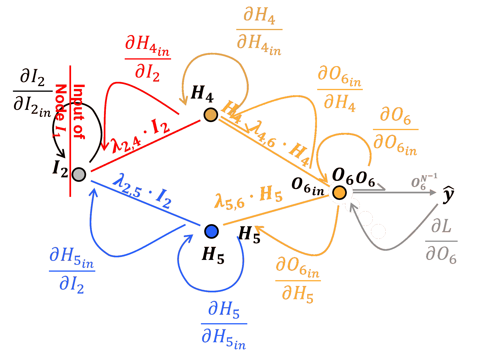

输入节点 2 的损失导数反向传播。

为了简洁，我已移除 1.0 并合并同类项，

$$ \frac{\partial \mathcal{L}}{\partial I_{2_{in}}} = \left[ \frac{\partial H_{4_{\text{in}}}}{\partial I_2} \cdot \frac{\partial H_4}{\partial H_{4_{\text{in}}}} \cdot \frac{\partial O_{6_{\text{in}}}}{\partial H_4} + \frac{\partial H_{5_{\text{in}}}}{\partial I_2} \cdot \frac{\partial H_5}{\partial H_{5_{\text{in}}}} \cdot \frac{\partial O_{6_{\text{in}}}}{\partial H_5} \right] \cdot \frac{\partial \mathcal{L}}{\partial O_6} $$

现在我们可以评估这个简化的形式，

$$ \frac{\partial \mathcal{L}}{\partial I_{2_{in}}} = \left[ \lambda_{2,4} \cdot \bigl((1 - H_4) \cdot H_4 \bigr) \cdot \lambda_{4,6} + \lambda_{2,5} \cdot \bigl((1 - H_5) \cdot H_5 \bigr) \cdot \lambda_{5,6} \right] \cdot (O_6 - y) $$

这里是 $\frac{\partial \mathcal{L}}{\partial I_{3_{in}}}$,

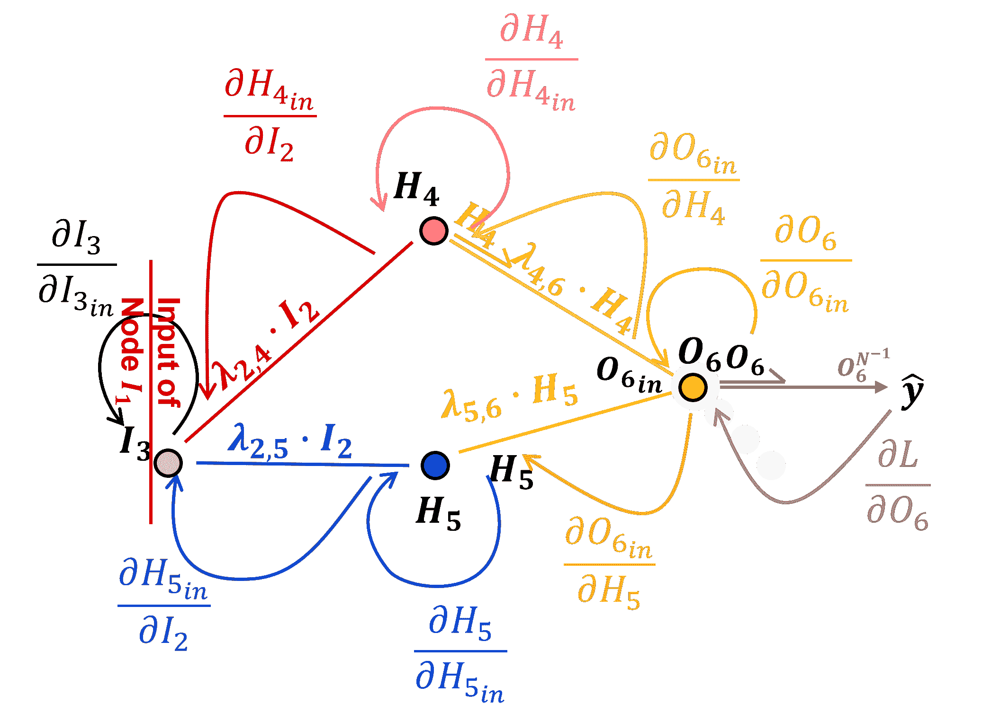

输入节点 3 的损失导数反向传播。

为了简洁，我已移除 1.0 并合并同类项，

$$ \frac{\partial \mathcal{L}}{\partial I_{3_{in}}} = \left[ \frac{\partial H_{4_{\text{in}}}}{\partial I_3} \cdot \frac{\partial H_4}{\partial H_{4_{\text{in}}}} \cdot \frac{\partial O_{6_{\text{in}}}}{\partial H_4} + \frac{\partial H_{5_{\text{in}}}}{\partial I_3} \cdot \frac{\partial H_5}{\partial H_{5_{\text{in}}}} \cdot \frac{\partial O_{6_{\text{in}}}}{\partial H_5} \right] \cdot \frac{\partial \mathcal{L}}{\partial O_6} $$

现在我们可以评估这个简化的形式，

$$ \frac{\partial \mathcal{L}}{\partial I_{3_{in}}} = \left[ \lambda_{3,4} \cdot \bigl((1 - H_4) \cdot H_4 \bigr) \cdot \lambda_{4,6} + \lambda_{3,5} \cdot \bigl((1 - H_5) \cdot H_5 \bigr) \cdot \lambda_{5,6} \right] \cdot (O_6 - y) $$

### 相对于权重和偏置的损失导数

现在我们已经通过我们的网络反向传播了损失导数。

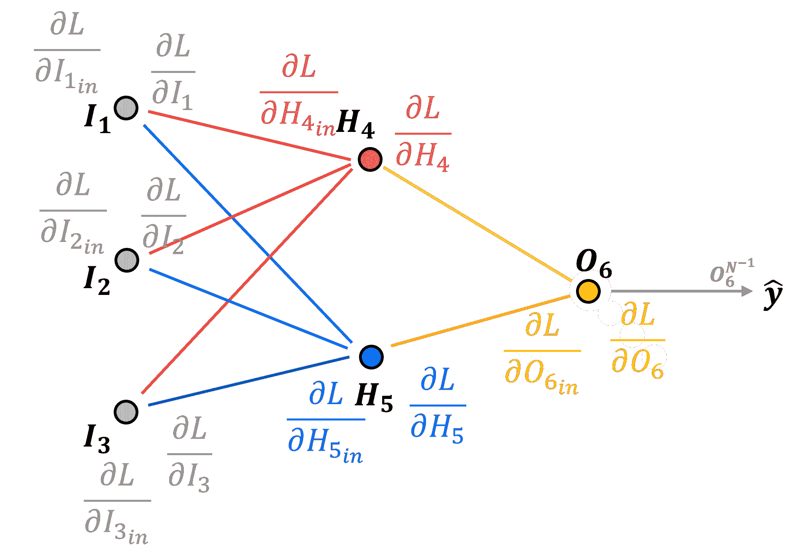

所有网络节点输入和输出的反向传播损失导数。

现在我们有了相对于网络中每个节点的输入和输出的损失导数，

$$ \frac{\partial \mathcal{L}}{\partial I_{1_{\text{in}}}},\quad \frac{\partial \mathcal{L}}{\partial I_1},\quad \frac{\partial \mathcal{L}}{\partial I_{2_{\text{in}}}},\quad \frac{\partial \mathcal{L}}{\partial I_2},\quad \frac{\partial \mathcal{L}}{\partial I_{3_{\text{in}}}},\quad \frac{\partial \mathcal{L}}{\partial I_3},\quad \frac{\partial \mathcal{L}}{\partial H_{4_{\text{in}}}},\quad \frac{\partial \mathcal{L}}{\partial H_4},\quad \frac{\partial \mathcal{L}}{\partial H_5},\quad \frac{\partial \mathcal{L}}{\partial H_5},\quad \frac{\partial \mathcal{L}}{\partial O_{6_{\text{in}}}},\quad \frac{\partial \mathcal{L}}{\partial O_6} $$

但我们实际上需要的是相对于每个连接权重的损失导数，

$$ \frac{\partial \mathcal{L}}{\partial \lambda_{1,4}},\quad \frac{\partial \mathcal{L}}{\partial \lambda_{2,4}},\quad \frac{\partial \mathcal{L}}{\partial \lambda_{3,4}},\quad \frac{\partial \mathcal{L}}{\partial \lambda_{1,5}},\quad \frac{\partial \mathcal{L}}{\partial \lambda_{2,5}},\quad \frac{\partial \mathcal{L}}{\partial \lambda_{3,5}},\quad \frac{\partial \mathcal{L}}{\partial \lambda_{4,6}},\quad \frac{\partial \mathcal{L}}{\partial \lambda_{5,6}} $$

以及节点偏差，

$$ \frac{\partial \mathcal{L}}{\partial b_4},\quad \frac{\partial \mathcal{L}}{\partial b_5},\quad \frac{\partial \mathcal{L}}{\partial b_6} $$

我们如何将损失导数反向传播到连接权重？让我们从 $H_4$ 到 $O_6$ 的连接开始。

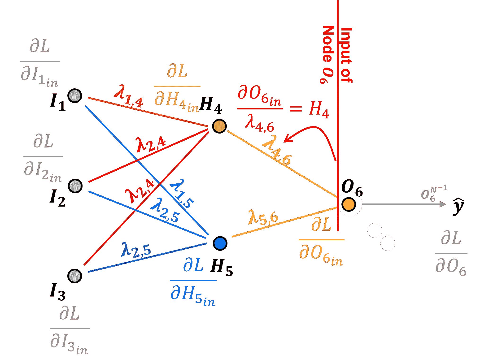

反向传播的连接权重相关的损失导数。

预激活，节点 $O_6$ 的输入为，

$$ O_{6_{\text{in}}} = \lambda_{4,6} \cdot H_4 + \lambda_{5,6} \cdot H_5 + b_6 $$

我们计算与连接权重相关的导数，

$$ \frac{\partial O_{6_{\text{in}}}}{\partial \lambda_{4,6}} = \frac{\partial \left( \lambda_{4,6} \cdot H_4 + \lambda_{5,6} \cdot H_5 + b_6 \right)}{\partial \lambda_{4,6}} = H_4 $$

我们需要将前一层节点的输出通过连接传递，以便反向传播到与连接权重相关的损失导数，

$$ \frac{\partial \mathcal{L}}{\partial \lambda_{4,6}} = \frac{\partial O_{6_{\text{in}}}}{\partial \lambda_{4,6}} \cdot \frac{\partial \mathcal{L}}{\partial O_{6_{\text{in}}}} = H_4 \cdot 1.0 \cdot (O_6 - y) $$

现在，为了完整性，这里列出了我们网络所有连接权重的方程。

$$ \frac{\partial \mathcal{L}}{\partial \lambda_{1,4}} = \frac{\partial H_{4_{\text{in}}}}{\partial \lambda_{1,4}} \cdot \frac{\partial \mathcal{L}}{\partial H_{4_{\text{in}}}} = I_1 \cdot \frac{\partial \mathcal{L}}{\partial H_{4_{\text{in}}}} $$$$ \frac{\partial \mathcal{L}}{\partial \lambda_{2,4}} = \frac{\partial H_{4_{\text{in}}}}{\partial \lambda_{2,4}} \cdot \frac{\partial \mathcal{L}}{\partial H_{4_{\text{in}}}} = I_2 \cdot \frac{\partial \mathcal{L}}{\partial H_{4_{\text{in}}}} $$$$ \frac{\partial \mathcal{L}}{\partial \lambda_{3,4}} = \frac{\partial H_{4_{\text{in}}}}{\partial \lambda_{3,4}} \cdot \frac{\partial \mathcal{L}}{\partial H_{4_{\text{in}}}} = I_3 \cdot \frac{\partial \mathcal{L}}{\partial H_{4_{\text{in}}}} $$$$ \frac{\partial \mathcal{L}}{\partial \lambda_{1,5}} = \frac{\partial H_{5_{\text{in}}}}{\partial \lambda_{1,5}} \cdot \frac{\partial \mathcal{L}}{\partial H_{5_{\text{in}}}} = I_1 \cdot \frac{\partial \mathcal{L}}{\partial H_{5_{\text{in}}}} $$$$ \frac{\partial \mathcal{L}}{\partial \lambda_{2,5}} = \frac{\partial H_{5_{\text{in}}}}{\partial \lambda_{2,5}} \cdot \frac{\partial \mathcal{L}}{\partial H_{5_{\text{in}}}} = I_2 \cdot \frac{\partial \mathcal{L}}{\partial H_{5_{\text{in}}}} $$$$ \frac{\partial \mathcal{L}}{\partial \lambda_{3,5}} = \frac{\partial H_{5_{\text{in}}}}{\partial \lambda_{3,5}} \cdot \frac{\partial \mathcal{L}}{\partial H_{5_{\text{in}}}} = I_3 \cdot \frac{\partial \mathcal{L}}{\partial H_{5_{\text{in}}}} $$$$ \frac{\partial \mathcal{L}}{\partial \lambda_{4,6}} = \frac{\partial O_{6_{\text{in}}}}{\partial \lambda_{4,6}} \cdot \frac{\partial \mathcal{L}}{\partial O_{6_{\text{in}}}} = H_4 \cdot \frac{\partial \mathcal{L}}{\partial O_{6_{\text{in}}}} $$$$ \frac{\partial \mathcal{L}}{\partial \lambda_{5,6}} = \frac{\partial O_{6_{\text{in}}}}{\partial \lambda_{5,6}} \cdot \frac{\partial \mathcal{L}}{\partial O_{6_{\text{in}}}} = H_5 \cdot \frac{\partial \mathcal{L}}{\partial O_{6_{\text{in}}}} $$

看看这个模式，关于连接权重的损失导数是，

$$ \text{连接信号} \times \text{下一节点输入的损失导数} $$

现在我们如何将损失导数反向传播到节点偏置？让我们从 $O_6$ 节点开始。

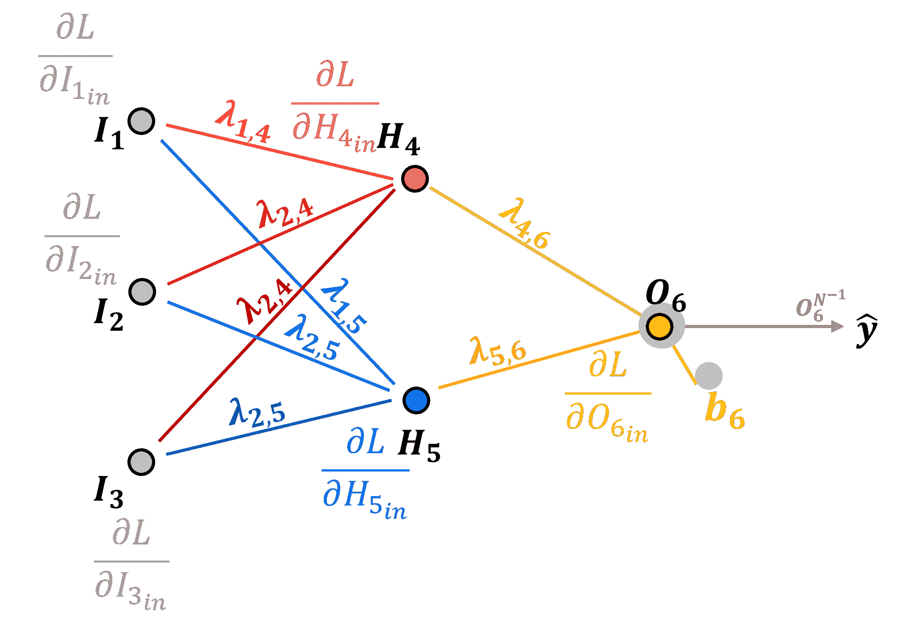

关于节点偏置的反向传播损失导数。

一次又一次，节点 $O_6$ 的预激活输入是，

$$ O_{6_{\text{in}}} = \lambda_{4,6} \cdot H_4 + \lambda_{5,6} \cdot H_5 + b_6 $$

我们计算连接权重的导数如下，

$$ \frac{\partial O_{6_{\text{in}}}}{\partial b_6} = \frac{\partial \left( \lambda_{4,6} \cdot H_4 + \lambda_{5,6} \cdot H_5 + b_6 \right)}{\partial b_6} = 1.0 $$

因此，我们的偏置损失导数等于节点输入损失导数，

$$ \frac{\partial \mathcal{L}}{\partial b_6} = \frac{\partial O_{6_{\text{in}}}}{\partial b_6} \cdot \frac{\partial \mathcal{L}}{\partial O_{6_{\text{in}}}} = 1.0 \cdot \frac{\partial \mathcal{L}}{\partial O_{6_{\text{in}}}} $$

为了完整性，这里列出了相对于节点偏差的所有损失导数，

$$ \frac{\partial \mathcal{L}}{\partial b_6} = \frac{\partial \mathcal{L}}{\partial O_{6_{\text{in}}}} $$$$ \frac{\partial \mathcal{L}}{\partial b_4} = \frac{\partial \mathcal{L}}{\partial H_{4_{\text{in}}}} $$$$ \frac{\partial \mathcal{L}}{\partial b_5} = \frac{\partial \mathcal{L}}{\partial H_{5_{\text{in}}}} $$

看看这个模式，相对于节点偏差的损失导数是，

$$ \text{节点输入的损失导数} $$

## 反向传播示例

让我们将上面解释的反向传播方法应用到我的交互式神经网络中。

+   这是我们的第一次训练周期仅有一个样本的结果，

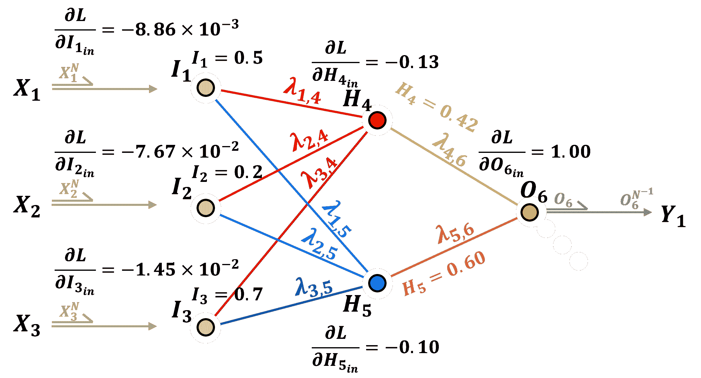

第一次迭代的反向传播结果。

我的交互式仪表板提供了每个节点相对于输入的所有损失导数以及每个节点的输出信号，例如，我们可以计算 $\frac{\partial L}{\partial \lambda_{4,6}}$ 如下，

$$ \frac{\partial L}{\partial \lambda_{4,6}} = \frac{\partial O_{6_{\text{in}}}}{\partial \lambda_{4,6}} \cdot \frac{\partial L}{\partial O_{6_{\text{in}}}} = H_4 \cdot \frac{\partial L}{\partial O_{6_{\text{in}}}} = 0.42 \cdot 1.00 = 0.42 $$

这是其他隐藏层到输出节点连接相对于连接权重的损失导数，

$$ \frac{\partial L}{\partial \lambda_{5,6}} = \frac{\partial O_{6_{\text{in}}}}{\partial \lambda_{5,6}} \cdot \frac{\partial L}{\partial O_{6_{\text{in}}}} = H_5 \cdot \frac{\partial L}{\partial O_{6_{\text{in}}}} = 0.60 \cdot 1.00 = 0.60 $$

现在让我们获取所有输入到隐藏层连接的数据，

$$ \frac{\partial L}{\partial \lambda_{1,4}} = \frac{\partial H_{4_{\text{in}}}}{\partial \lambda_{1,4}} \cdot \frac{\partial L}{\partial H_{4_{\text{in}}}} = I_1 \cdot \frac{\partial L}{\partial H_{4_{\text{in}}}} = 0.50 \cdot (-0.13) = -0.07 $$$$ \frac{\partial L}{\partial \lambda_{1,5}} = \frac{\partial H_{5_{\text{in}}}}{\partial \lambda_{1,5}} \cdot \frac{\partial L}{\partial H_{4_{\text{in}}}} = I_1 \cdot \frac{\partial L}{\partial H_{5_{\text{in}}}} = 0.50 \cdot (-0.10) = -0.05 $$$$ \frac{\partial L}{\partial \lambda_{2,4}} = \frac{\partial H_{4_{\text{in}}}}{\partial \lambda_{2,4}} \cdot \frac{\partial L}{\partial H_{4_{\text{in}}}} = I_2 \cdot \frac{\partial L}{\partial H_{4_{\text{in}}}} = 0.20 \cdot (-0.13) = -0.03 $$$$ \frac{\partial L}{\partial \lambda_{2,5}} = \frac{\partial H_{5_{\text{in}}}}{\partial \lambda_{2,5}} \cdot \frac{\partial L}{\partial H_{5_{\text{in}}}} = I_2 \cdot \frac{\partial L}{\partial H_{5_{\text{in}}}} = 0.20 \cdot (-0.10) = -0.02 $$$$ \frac{\partial L}{\partial \lambda_{3,4}} = \frac{\partial H_{4_{\text{in}}}}{\partial \lambda_{3,4}} \cdot \frac{\partial L}{\partial H_{4_{\text{in}}}} = I_3 \cdot \frac{\partial L}{\partial H_{4_{\text{in}}}} = 0.70 \cdot (-0.13) = -0.09 $$$$ \frac{\partial L}{\partial \lambda_{3,5}} = \frac{\partial H_{5_{\text{in}}}}{\partial \lambda_{3,5}} \cdot \frac{\partial L}{\partial H_{5_{\text{in}}}} = I_3 \cdot \frac{\partial L}{\partial H_{5_{\text{in}}}} = 0.70 \cdot (-0.10) = -0.07 $$

这处理了所有连接权重误差导数，现在我们来处理节点偏差误差导数。

+   节点偏差误差导数与节点激活误差导数相同。现在我们来计算隐藏层中的偏差项，

$$ \frac{\partial L}{\partial b_4} = \frac{\partial H_{4_{\text{in}}}}{\partial b_4} \cdot \frac{\partial L}{\partial H_{4_{\text{in}}}} = 1.0 \cdot (-0.13) = -0.13 $$$$ \frac{\partial L}{\partial b_5} = \frac{\partial H_{5_{\text{in}}}}{\partial b_5} \cdot \frac{\partial L}{\partial H_{5_{\text{in}}}} = 1.0 \cdot (-0.1) = -0.10 $$

## 更新模型参数

关于每个模型参数的损失导数是梯度，因此我们准备好使用梯度下降优化，并添加，

+   **学习率** - 为了缩放模型更新的变化率，我们分配一个学习率，$\eta$。对于上面我们的模型参数示例，

$$ \lambda_{4,6}^{\ell} = \lambda_{4,6}^{\ell - 1} + \eta \cdot \frac{\partial L}{\partial \lambda_{4,6}} $$$$ \lambda_{1,4}^{\ell} = \lambda_{1,4}^{\ell - 1} + \eta \cdot \frac{\partial L}{\partial \lambda_{1,4}} $$$$ b_j^{\ell} = b_j^{\ell - 1} + \eta \cdot \frac{\partial L}{\partial b_j} $$

+   记住，这个梯度计算和模型参数、权重和偏差更新的过程是迭代的，被称为梯度下降优化。

+   目标是探索损失超曲面，避免和逃离局部最小值，最终找到全局最小值。

+   学习率，也称为步长，通常设置在 0.0 和 1.0 之间，注意在 TensorFlow 的 Keras 模块中默认值为 0.01

+   **低学习率** – 更稳定，但解的速度较慢，可能会陷入局部最小值

+   **高学习率** – 可能不稳定，但可能是一个更快的解，可能会偏离全局最小值

一种策略是开始使用高学习率，然后在迭代过程中降低学习率

+   **学习率衰减** - 设置为 > 0 以避免减轻振荡，

$$ \eta^{\ell} = \eta^{\ell - 1} \cdot \left( \frac{1}{1 + \text{decay} \cdot \ell} \right) $$

其中 $\ell$ 是模型训练轮次

注意，模型参数更新是针对单个训练数据案例的？考虑这个单个模型参数，

我们计算批中所有样本的更新，并应用更新的平均值。

$$ \frac{\partial L}{\partial \lambda_{4,6}} = H_4 \cdot \frac{\partial L}{\partial O_{6_{\text{in}}}} = 0.42 \cdot 1.00 = 0.42 $$

应用于更新 $\lambda_{4,6}$ 参数，

$$ \lambda_{4,6}^{\ell} = \lambda_{4,6}^{\ell - 1} + \eta \cdot \frac{\partial L}{\partial \lambda_{4,6}} $$

依赖于 $H_4$ 节点输出和 $L$ 错误，这些是针对单个样本的，$𝑥_1,\ldots,𝑥_𝑚$ 和 $𝑦$；因此，我们不能计算所有 $1,\ldots,n$ 训练数据样本的单个参数更新。

+   而我们可以计算 $1,\ldots,n$ 次更新，然后将所有更新的平均值应用到我们的模型参数上，

$$ \lambda_{4,6}^{\ell} = \lambda_{4,6}^{\ell - 1} + \frac{1}{n_{batch}} \sum_{i=1}^{n_{batch}} \eta \cdot \frac{\partial L}{\partial \lambda_{4,6}} $$

+   由于学习率是一个常数，我们可以将其移出求和符号之外，现在我们正在平均梯度，

$$ \lambda_{4,6}^{\ell} = \lambda_{4,6}^{\ell - 1} + \eta \frac{1}{n_{batch}} \sum_{i=1}^{n_{batch}} \frac{\partial L}{\partial \lambda_{4,6}} $$

## 训练轮次

这正是讨论随机梯度下降优化的好时机，首先让我们定义一些常见术语，

+   **批量梯度下降** - 在通过所有数据后更新模型参数

+   **随机梯度下降** - 在每个样本数据上更新模型参数

+   **小批量梯度下降** - 在通过单个批次后更新模型参数

使用数据子集，称为批次，通过引入随机性来使用小批量梯度下降，

+   例如，如果我们把我们的 100 个样本分成 4 批次，那么我们将单独遍历每一批

+   我们加快了单个更新，更少的数据更快地计算，但引入了更多的错误

+   这通常有助于训练探索全局最小值，并避免陷入局部最小值和损失超曲面上的脊

最后，我们在这里定义的最后一个定义，

+   **轮次** - 是对全部数据的单次遍历，所以如果有 4 个小批量，那么更新模型参数的迭代次数将是 4 次

我还会添加许多其他考虑因素，包括，

+   动量

+   自适应优化

现在我们手动构建上述人工神经网络并可视化解决方案！

+   这是由手绘的，这样你可以看到每一个计算。我故意避免使用 TensorFlow 或 PyTorch。

## 交互式仪表板

我使用下面的代码构建了一个交互式 Python 仪表板，用于训练人工神经网络。你可以逐步通过训练迭代，并在训练时间步长中观察，

+   模型参数

+   前向传递预测

+   错误导数的反向传播

如果你想要看到人工神经网络的实际应用，请查看我的[ANN 交互式 Python 仪表板](https://github.com/GeostatsGuy/DataScienceInteractivePython/blob/main/Interactive_ANN.ipynb)，

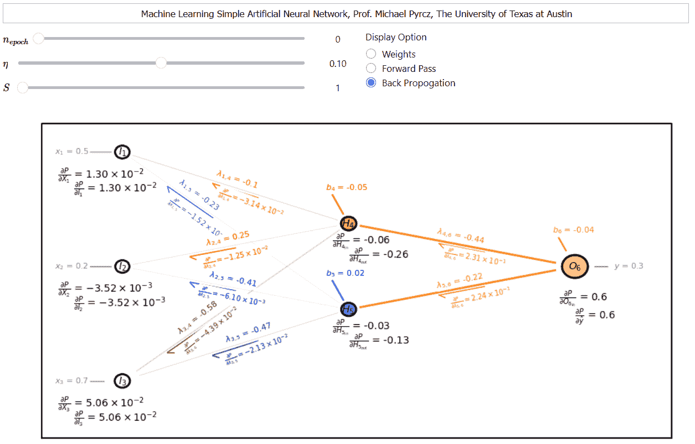

交互式人工神经网络训练 Python 仪表板。

## 导入所需的包

我们还需要一些标准包。这些应该已经与 Anaconda 3 一起安装。

```py
import numpy as np
import pandas as pd
import matplotlib.pyplot as plt
from matplotlib.ticker import (MultipleLocator, AutoMinorLocator, AutoLocator) # control of axes ticks
plt.rc('axes', axisbelow=True)                            # set axes and grids in the background for all plots
import math
seed = 13 
```

如果你遇到包导入错误，你可能需要首先安装这些包中的一些。这通常可以通过在 Windows 上打开命令窗口，然后输入‘python -m pip install [package-name]’来完成。更多帮助可以在相应包的文档中找到。

## 声明函数

这里是创建、训练和可视化我们的人工神经网络的函数。

```py
def add_grid():
    plt.gca().grid(True, which='major',linewidth = 1.0); plt.gca().grid(True, which='minor',linewidth = 0.2) # add y grids
    plt.gca().tick_params(which='major',length=7); plt.gca().tick_params(which='minor', length=4)
    plt.gca().xaxis.set_minor_locator(AutoMinorLocator()); plt.gca().yaxis.set_minor_locator(AutoMinorLocator()) # turn on minor ticks 

def calculate_angle_rads(x1, y1, x2, y2):
    dx = x2 - x1     # Calculate the differences
    dy = y2 - y1
    angle_rads = math.atan2(dy, dx)    # Calculate the angle in radians
    #angle_degrees = math.degrees(angle_radians)    # Convert the angle to degrees
    return angle_rads

def offset(pto, distance, angle_deg): # modified from ChatGPT 4.o generated
    angle_rads = math.radians(angle_deg) # Convert angle from degrees to radians
    x_new = pto[0] + distance * math.cos(angle_rads) # Calculate the new coordinates
    y_new = pto[1] + distance * math.sin(angle_rads)
    return np.array((x_new, y_new))

def offsetx(xo, distance, angle_deg): # modified from ChatGPT 4.o generated
    angle_rads = math.radians(angle_deg) # Convert angle from degrees to radians
    x_new = xo + distance * math.cos(angle_rads) # Calculate the new coordinates
    return np.array((xo, x_new))

def offset_arrx(xo, distance, angle_deg,size): # modified from ChatGPT 4.o generated
    angle_rads = math.radians(angle_deg) # Convert angle from degrees to radians
    x_new = xo + distance * math.cos(angle_rads) # Calculate the new coordinates
    x_arr = x_new + size * math.cos(angle_rads+2.48) # Calculate the new coordinates
    return np.array((x_new, x_arr))

def offsety(yo, distance, angle_deg): # modified from ChatGPT 4.o generated
    angle_rads = math.radians(angle_deg) # Convert angle from degrees to radians
    y_new = yo + distance * math.sin(angle_rads) # Calculate the new coordinates
    return np.array((yo, y_new))

def offset_arry(yo, distance, angle_deg,size): # modified from ChatGPT 4.o generated
    angle_rads = math.radians(angle_deg) # Convert angle from degrees to radians
    y_new = yo + distance * math.sin(angle_rads) # Calculate the new coordinates
    y_arr = y_new + size * math.sin(angle_rads+2.48) # Calculate the new coordinates
    return np.array((y_new, y_arr))

def lint(x1, y1, x2, y2, t):
    # Calculate the interpolated coordinates
    x = x1 + t * (x2 - x1)
    y = y1 + t * (y2 - y1)
    return np.array((x, y))

def lintx(x1, y1, x2, y2, t):
    # Calculate the interpolated coordinates
    x = x1 + t * (x2 - x1)
    return x

def linty(x1, y1, x2, y2, t):
    # Calculate the interpolated coordinates
    y = y1 + t * (y2 - y1)
    return y

def lint_intx(x1, y1, x2, y2, ts, te):
    # Calculate the interpolated coordinates
    xs = x1 + ts * (x2 - x1)
    xe = x1 + te * (x2 - x1)
    return np.array((xs,xe))

def lint_inty(x1, y1, x2, y2, ts, te):
    # Calculate the interpolated coordinates
    ys = y1 + ts * (y2 - y1)
    ye = y1 + te * (y2 - y1)
    return np.array((ys,ye))

def lint_int_arrx(x1, y1, x2, y2, ts, te, size):
    # Calculate the interpolated coordinates
    xe = x1 + te * (x2 - x1)
    line_angle_rads = calculate_angle_rads(x1, y1, x2, y2)
    x_arr = xe + size * math.cos(line_angle_rads+2.48) # Calculate the new coordinates
    return np.array((xe,x_arr))

def lint_int_arry(x1, y1, x2, y2, ts, te, size):
    # Calculate the interpolated coordinates
    ye = y1 + te * (y2 - y1)
    line_angle_rads = calculate_angle_rads(x1, y1, x2, y2)
    y_arr = ye + size * math.sin(line_angle_rads+2.48) # Calculate the new coordinates
    return np.array((ye,y_arr))

def as_si(x, ndp): # from xnx on StackOverflow https://stackoverflow.com/questions/31453422/displaying-numbers-with-x-instead-of-e-scientific-notation-in-matplotlib 
    s = '{x:0.{ndp:d}e}'.format(x=x, ndp=ndp)
    m, e = s.split('e')
    return r'{m:s}\times 10^{{{e:d}}}'.format(m=m, e=int(e)) 
```

## 简单 ANN

我编写了这段代码来指定一个简单的 ANN：

+   三个输入节点、2 个隐藏节点和 1 个输出节点

通过迭代执行前向计算和反向传播来训练 ANN。我计算：

+   错误然后传播到每个节点

+   求解误差对每个权重和偏差的偏导数

所有权重、偏差和所有时间步长的偏导数都记录在向量中以便绘图

```py
x1 = 0.5; x2 = 0.2; x3 = 0.7; y = 0.3 # training data
lr = 0.2 # learning rate

np.random.seed(seed=seed)

nepoch = 1000

y4 = np.zeros(nepoch); y5 = np.zeros(nepoch); y6 = np.zeros(nepoch)

w14 = np.zeros(nepoch); w24 = np.zeros(nepoch); w34 = np.zeros(nepoch)
w15 = np.zeros(nepoch); w25 = np.zeros(nepoch); w35 = np.zeros(nepoch)
w46 = np.zeros(nepoch); w56 = np.zeros(nepoch)

dw14 = np.zeros(nepoch); dw24 = np.zeros(nepoch); dw34 = np.zeros(nepoch)
dw15 = np.zeros(nepoch); dw25 = np.zeros(nepoch); dw35 = np.zeros(nepoch)
dw46 = np.zeros(nepoch); dw56 = np.zeros(nepoch)

db4 = np.zeros(nepoch); db5 = np.zeros(nepoch); db6 = np.zeros(nepoch)

b4 = np.zeros(nepoch); b5 = np.zeros(nepoch); b6 = np.zeros(nepoch)
y4 = np.zeros(nepoch); y5 = np.zeros(nepoch); y6 = np.zeros(nepoch)
d4 = np.zeros(nepoch); d5 = np.zeros(nepoch); d6 = np.zeros(nepoch)

# initialize the weights - Xavier Weight Initialization 
lower, upper = -(1.0 / np.sqrt(3.0)), (1.0 / np.sqrt(3.0)) # lower and upper bound for the weights, uses inputs to node
#lower, upper = -(sqrt(6.0) / sqrt(3.0 + 2.0)), (sqrt(6.0) / sqrt(3.0 + 2.0)) # Normalized Xavier weights, integrates ouputs also
w14[0] = lower + np.random.random() * (upper - lower); 
w24[0] = lower + np.random.random() * (upper - lower); 
w34[0] = lower + np.random.random() * (upper - lower);
w15[0] = lower + np.random.random() * (upper - lower); 
w25[0] = lower + np.random.random() * (upper - lower); 
w35[0] = lower + np.random.random() * (upper - lower);

lower, upper = -(1.0 / np.sqrt(2.0)), (1.0 / np.sqrt(2.0))
#lower, upper = -(sqrt(6.0) / sqrt(2.0 + 1.0)), (sqrt(6.0) / sqrt(2.0 + 1.0)) # Normalized Xavier weights, integrates ouputs also

w46[0] = lower + np.random.random() * (upper - lower); 
w56[0] = lower + np.random.random() * (upper - lower);     

#b4[0] = np.random.random(); b5[0] = np.random.random(); b6[0] = np.random.random()
b4[0] = (np.random.random()-0.5)*0.5; b5[0] = (np.random.random()-0.5)*0.5; b6[0] = (np.random.random()-0.5)*0.5; # small random value 

for i in range(0,nepoch):

# forward pass of model
    y4[i] = w14[i]*x1 + w24[i]*x2 + w34[i]*x3 + b4[i]; 
    y4[i] = 1.0/(1 + math.exp(-1*y4[i]))

    y5[i] = w15[i]*x1 + w25[i]*x2 + w35[i]*x3 + b5[i]
    y5[i] = 1.0/(1 + math.exp(-1*y5[i]))

    y6[i] = w46[i]*y4[i] + w56[i]*y5[i] + b6[i]
#    y6[i] = 1.0/(1 + math.exp(-1*y6[i])) # sgimoid / logistic activation at o6 

# back propagate the error through the nodes
#    d6[i] = y6[i]*(1-y6[i])*(y-y6[i]) # sgimoid / logistic activation at o6 
    d6[i] = (y-y6[i]) # identity activation o at o6
    d5[i] = y5[i]*(1-y5[i])*w56[i]*d6[i]; d4[i] = y4[i]*(1-y4[i])*w46[i]*d6[i]

# calculate the change in weights
    if i < nepoch - 1:
        dw14[i] = lr*d4[i]*x1; dw24[i] = lr*d4[i]*x2; dw34[i] = lr*d4[i]*x3
        dw15[i] = lr*d5[i]*x1; dw25[i] = lr*d5[i]*x2; dw35[i] = lr*d5[i]*x3
        dw46[i] = lr*d6[i]*y4[i]; dw56[i] = lr*d6[i]*y5[i] 

        db4[i] = lr*d4[i]; db5[i] = lr*d5[i]; db6[i] = lr*d6[i];

        w14[i+1] = w14[i] + dw14[i]; w24[i+1] = w24[i] + dw24[i]; w34[i+1] = w34[i] + dw34[i] 
        w15[i+1] = w15[i] + dw15[i]; w25[i+1] = w25[i] + dw25[i]; w35[i+1] = w35[i] + dw35[i] 
        w46[i+1] = w46[i] + dw46[i]; w56[i+1] = w56[i] + dw56[i]

        b4[i+1] = b4[i] + db4[i]; b5[i+1] = b5[i] + db5[i]; b6[i+1] = b6[i] + db6[i] 
```

## 现在可视化特定时间步长的网络

我下面写了一个自定义的网络可视化，选择 iepoch 并可视化特定时间步长的人工神经网络。

```py
iepoch = 1

dx = -0.19; dy = -0.09; edge = 1.0

o6x = 17; o6y =5; h5x = 10; h5y = 3.5; h4x = 10; h4y = 6.5
i1x = 3; i1y = 9.0; i2x = 3; i2y = 5; i3x = 3; i3y = 1.0; buffer = 0.5

plt.subplot(111)
plt.gca().set_axis_off()

circle_i1 = plt.Circle((i1x,i1y), 0.25, fill=False, edgecolor = 'black',lw=2,zorder=100); plt.annotate(r' $I_1$',(i1x+dx,i1y+dy),zorder=100); 
circle_i1b = plt.Circle((i1x,i1y), 0.40, fill=True, facecolor = 'white',edgecolor = None,lw=1,zorder=10);
plt.gca().add_patch(circle_i1); plt.gca().add_patch(circle_i1b)

circle_i2 = plt.Circle((i2x,i2y), 0.25, fill=False, edgecolor = 'black',lw=2,zorder=100); plt.annotate(r' $I_2$',(i2x+dx,i2y+dy),zorder=100); 
circle_i2b = plt.Circle((i2x,i2y), 0.40, fill=True, facecolor = 'white',edgecolor = None,lw=1,zorder=10);
plt.gca().add_patch(circle_i2); plt.gca().add_patch(circle_i2b)

circle_i3 = plt.Circle((i3x,i3y), 0.25, fill=False, edgecolor = 'black',lw=2,zorder=100); plt.annotate(r' $I_3$',(i3x+dx,i3y+dy),zorder=100); 
circle_i3b = plt.Circle((i3x,i3y), 0.40, fill=True, facecolor = 'white',edgecolor = None,lw=1,zorder=10);
plt.gca().add_patch(circle_i3); plt.gca().add_patch(circle_i3b)

circle_h4 = plt.Circle((h4x,h4y), 0.25, fill=False, edgecolor = 'black',lw=2,zorder=100); plt.annotate(r'$H_4$',(h4x+dx,h4y+dy),zorder=100); 
circle_h4b = plt.Circle((h4x,h4y), 0.40, fill=True, facecolor = 'white',edgecolor = None,lw=1,zorder=10);
plt.gca().add_patch(circle_h4); plt.gca().add_patch(circle_h4b)

circle_h5 = plt.Circle((h5x,h5y), 0.25, fill=False, edgecolor = 'black',lw=2,zorder=100); plt.annotate(r'$H_5$',(h5x+dx,h5y+dy),zorder=100); 
circle_h5b = plt.Circle((h5x,h5y), 0.40, fill=True, facecolor = 'white',edgecolor = None,lw=1,zorder=10);
plt.gca().add_patch(circle_h5); plt.gca().add_patch(circle_h5b)

circle_o6 = plt.Circle((o6x,o6y), 0.25, fill=False, edgecolor = 'black',lw=2,zorder=100); plt.annotate(r'$O_6$',(o6x+dx,o6y+dy),zorder=100); 
circle_o6b = plt.Circle((o6x,o6y), 0.40, fill=True, facecolor = 'white',edgecolor = None,lw=1,zorder=10);
plt.gca().add_patch(circle_o6); plt.gca().add_patch(circle_o6b)

plt.plot([i1x-edge,i1x],[i1y,i1y],color='grey',lw=1.0,zorder=1)
plt.plot([i2x-edge,i2x],[i2y,i2y],color='grey',lw=1.0,zorder=1)
plt.plot([i3x-edge,i3x],[i3y,i3y],color='grey',lw=1.0,zorder=1)

plt.annotate(r'$x_1$ = ' + str(np.round(x1,2)),(i1x-buffer-1.6,i1y-0.05),size=8,zorder=200,color='grey',
             bbox=dict(boxstyle="round,pad=0.0", edgecolor='white', facecolor='white', alpha=1.0),rotation=0) 
plt.annotate(r'$x_2$ = ' + str(np.round(x2,2)),(i2x-buffer-1.6,i2y-0.05),size=8,zorder=200,color='grey',
             bbox=dict(boxstyle="round,pad=0.0", edgecolor='white', facecolor='white', alpha=1.0),rotation=0) 
plt.annotate(r'$x_3$ = ' + str(np.round(x3,2)),(i3x-buffer-1.6,i3y-0.05),size=8,zorder=200,color='grey',
             bbox=dict(boxstyle="round,pad=0.0", edgecolor='white', facecolor='white', alpha=1.0),rotation=0) 

plt.plot([i1x,h4x],[i1y,h4y],color='lightcoral',lw=1.0,zorder=1)
plt.plot([i2x,h4x],[i2y,h4y],color='red',lw=1.0,zorder=1)
plt.plot([i3x,h4x],[i3y,h4y],color='darkred',lw=1.0,zorder=1)

plt.plot([i1x,h5x],[i1y,h5y],color='dodgerblue',lw=1.0,zorder=1)
plt.plot([i2x,h5x],[i2y,h5y],color='blue',lw=1.0,zorder=1)
plt.plot([i3x,h5x],[i3y,h5y],color='darkblue',lw=1.0,zorder=1)

plt.plot([h4x,o6x],[h4y,o6y],color='orange',lw=1.0,zorder=1)
plt.plot([h5x,o6x],[h5y,o6y],color='darkorange',lw=1.0,zorder=1)

plt.plot([o6x+edge,o6x],[o6y,o6y],color='grey',lw=1.0,zorder=1)
plt.annotate(r'$\hat{y}$ = ' + str(np.round(y6[iepoch],2)),(o6x+buffer+0.7,o6y-0.05),size=8,zorder=200,color='grey',
             bbox=dict(boxstyle="round,pad=0.0", edgecolor='white', facecolor='white', alpha=1.0),rotation=0) 

plt.plot(offsetx(h4x,2,-12),offsety(h4y,2,-12)+0.1,color='orange',lw=1.0,zorder=1)
plt.plot(offset_arrx(h4x,2,-12,0.2),offset_arry(h4y,2,-12,0.2)+0.1,color='orange',lw=1.0,zorder=1)
plt.annotate(r'$H_{4}$ = ' + str(np.round(y4[iepoch],2)),(lintx(h4x,h4y,o6x,o6y,0.08),linty(h4x,h4y,o6x,o6y,0.08)-0.0),size=8,zorder=200,color='orange',
             bbox=dict(boxstyle="round,pad=0.0", edgecolor='white', facecolor='white', alpha=1.0),rotation=-12)

plt.plot(offsetx(h5x,2,12),offsety(h5y,2,12)+0.1,color='darkorange',lw=1.0,zorder=1)
plt.plot(offset_arrx(h5x,2,12,0.2),offset_arry(h5y,2,12,0.2)+0.1,color='darkorange',lw=1.0,zorder=1)
plt.annotate(r'$H_{5}$ = ' + str(np.round(y5[iepoch],2)),(lintx(h5x,h5y,o6x,o6y,0.07),linty(h5x,h5y,o6x,o6y,0.07)+0.25),size=8,zorder=200,color='darkorange',
             bbox=dict(boxstyle="round,pad=0.0", edgecolor='white', facecolor='white', alpha=1.0),rotation=12)

plt.annotate(r'$\frac{\partial P}{\partial O_{6_{in}}}$ = ' + str(np.round(d6[iepoch],2)),(o6x-0.5,o6y-0.7),size=10)
plt.annotate(r'$\frac{\partial P}{\partial H_{4_{in}}}$ = ' + str(np.round(d4[iepoch],2)),(h4x-0.5,h4y-0.7),size=10)
plt.annotate(r'$\frac{\partial P}{\partial H_{5_{in}}}$ = ' + str(np.round(d5[iepoch],2)),(h5x-0.5,h5y-0.7),size=10)

plt.annotate(r'$\frac{\partial P}{\partial \hat{y}}$ = ' + str(np.round(d6[iepoch],2)),(o6x,o6y-1.2),size=10)
plt.annotate(r'$\frac{\partial P}{\partial H_{4_{out}}}$ = ' + str(np.round(w46[iepoch]*d6[iepoch],2)),(h4x,h4y-1.2),size=10)
plt.annotate(r'$\frac{\partial P}{\partial H_{5_{out}}}$ = ' + str(np.round(w56[iepoch]*d6[iepoch],2)),(h5x,h5y-1.2),size=10)

plt.plot(lint_intx(h4x, h4y, o6x, o6y,0.4,0.6),lint_inty(h4x,h4y,o6x,o6y,0.4,0.6)-0.1,color='orange',lw=1.0,zorder=1)
plt.plot(lint_int_arrx(o6x,o6y,h4x,h4y,0.4,0.6,0.2),lint_int_arry(o6x,o6y,h4x,h4y,0.4,0.6,0.2)-0.1,color='orange',lw=1.0,zorder=1)
plt.annotate(r'$\frac{\partial P}{\partial \lambda_{4,6}}$ = ' + str(np.round(dw46[iepoch]/lr,4)),(lintx(h4x,h4y,o6x,o6y,0.5)-0.6,linty(h4x,h4y,o6x,o6y,0.5)-0.72),size=10,zorder=200,color='orange',
              bbox=dict(boxstyle="round,pad=0.0", edgecolor='white', facecolor='white', alpha=1.0),rotation=-11)

plt.plot(lint_intx(h5x, h5y, o6x, o6y,0.4,0.6),lint_inty(h5x,h5y,o6x,o6y,0.4,0.6)-0.1,color='darkorange',lw=1.0,zorder=1)
plt.plot(lint_int_arrx(o6x,o6y,h5x,h5y,0.4,0.6,0.2),lint_int_arry(o6x,o6y,h5x,h5y,0.4,0.6,0.2)-0.1,color='darkorange',lw=1.0,zorder=1)
plt.annotate(r'$\frac{\partial P}{\partial \lambda_{5,6}}$ = ' + str(np.round(dw56[iepoch]/lr,4)),(lintx(h5x,h5y,o6x,o6y,0.5)-0.4,linty(h5x,h5y,o6x,o6y,0.5)-0.6),size=10,zorder=200,color='darkorange',
              bbox=dict(boxstyle="round,pad=0.0", edgecolor='white', facecolor='white', alpha=1.0),rotation=12)

plt.plot(offsetx(i1x,2,-20),offsety(i1y,2,-20)+0.1,color='lightcoral',lw=1.0,zorder=1)
plt.plot(offset_arrx(i1x,2,-20,0.2),offset_arry(i1y,2,-20,0.2)+0.1,color='lightcoral',lw=1.0,zorder=1)
plt.annotate(r'$I_{1}$ = ' + str(np.round(x1,2)),(lintx(i1x,i1y,h4x,h4y,0.1),linty(i1x,i1y,h4x,h4y,0.1)),size=8,zorder=200,color='lightcoral',
             bbox=dict(boxstyle="round,pad=0.0", edgecolor='white', facecolor='white', alpha=1.0),rotation=-20)

plt.plot(offsetx(i2x,2,12),offsety(i2y,2,12)+0.1,color='red',lw=1.0,zorder=1)
plt.plot(offset_arrx(i2x,2,12,0.2),offset_arry(i2y,2,12,0.2)+0.1,color='red',lw=1.0,zorder=1)
plt.annotate(r'$I_{2}$ = ' + str(np.round(x2,2)),(lintx(i2x,i2y,h4x,h4y,0.1),linty(i2x,i2y,h4x,h4y,0.1)+0.22),size=8,zorder=200,color='red',
             bbox=dict(boxstyle="round,pad=0.0", edgecolor='white', facecolor='white', alpha=1.0),rotation=12)

plt.plot(offsetx(i3x,2,38),offsety(i3y,2,38)+0.1,color='darkred',lw=1.0,zorder=1)
plt.plot(offset_arrx(i3x,2,38,0.2),offset_arry(i3y,2,38,0.2)+0.1,color='darkred',lw=1.0,zorder=1)
plt.annotate(r'$I_{3}$ = ' + str(np.round(x3,2)),(lintx(i3x,i3y,h4x,h4y,0.08)-0.2,linty(i3x,i3y,h4x,h4y,0.08)+0.2),size=8,zorder=200,color='darkred',
             bbox=dict(boxstyle="round,pad=0.0", edgecolor='white', facecolor='white', alpha=1.0),rotation=38)

plt.annotate(r'$\lambda_{1,4}$ = ' + str(np.round(w14[iepoch],2)),((i1x+h4x)*0.45,(i1y+h4y)*0.5-0.05),size=8,zorder=200,color='lightcoral',
             bbox=dict(boxstyle="round,pad=0.0", edgecolor='white', facecolor='white', alpha=1.0),rotation=-18) 
plt.annotate(r'$\lambda_{2,4}$ = ' + str(np.round(w24[iepoch],2)),((i2x+h4x)*0.45-0.3,(i2y+h4y)*0.5-0.03),size=8,zorder=200,color='red',
             bbox=dict(boxstyle="round,pad=0.0", edgecolor='white', facecolor='white', alpha=1.0),rotation=10) 
plt.annotate(r'$\lambda_{3,4}$ = ' + str(np.round(w34[iepoch],2)),((i3x+h4x)*0.45-1.2,(i3y+h4y)*0.5-1.1),size=8,zorder=200,color='darkred',
             bbox=dict(boxstyle="round,pad=0.0", edgecolor='white', facecolor='white', alpha=1.0),rotation=38) 

plt.annotate(r'$\lambda_{1,5}$ = ' + str(np.round(w15[iepoch],2)),((i1x+h5x)*0.55-2.5,(i1y+h5y)*0.5+0.9),size=8,zorder=200,color='dodgerblue',
    bbox=dict(boxstyle="round,pad=0.0", edgecolor='white', facecolor='white', alpha=1.0),rotation=-36) 
plt.annotate(r'$\lambda_{2,5}$ = ' + str(np.round(w25[iepoch],2)),((i2x+h5x)*0.55-1.5,(i2y+h5y)*0.5+0.05),size=8,zorder=200,color='blue',
             bbox=dict(boxstyle="round,pad=0.0", edgecolor='white', facecolor='white', alpha=1.0),rotation=-12) 
plt.annotate(r'$\lambda_{3,5}$ = ' + str(np.round(w35[iepoch],2)),((i3x+h5x)*0.55-1.0,(i3y+h5y)*0.5+0.1),size=8,zorder=200,color='darkblue',
             bbox=dict(boxstyle="round,pad=0.0", edgecolor='white', facecolor='white', alpha=1.0),rotation=20) 

plt.annotate(r'$\lambda_{4,6}$ = ' + str(np.round(w46[iepoch],2)),((h4x+o6x)*0.47,(h4y+o6y)*0.47+0.39),size=8,zorder=200,color='orange',
    bbox=dict(boxstyle="round,pad=0.0", edgecolor='white', facecolor='white', alpha=1.0),rotation=-12) 
plt.annotate(r'$\lambda_{5,6}$ = ' + str(np.round(w56[iepoch],2)),((h5x+o6x)*0.47,(h5y+o6y)*0.47+0.26),size=8,zorder=200,color='darkorange',
    bbox=dict(boxstyle="round,pad=0.0", edgecolor='white', facecolor='white', alpha=1.0),rotation=12) 

plt.plot(lint_intx(i1x, i1y, h4x, h4y,0.4,0.6),lint_inty(i1x,i1y,h4x,h4y,0.4,0.6)-0.1,color='lightcoral',lw=1.0,zorder=1)
plt.plot(lint_int_arrx(h4x,h4y,i1x,i1y,0.4,0.6,0.2),lint_int_arry(h4x,h4y,i1x,i1y,0.4,0.6,0.2)-0.1,color='lightcoral',lw=1.0,zorder=1)
plt.annotate(r'$\frac{\partial P}{\partial \lambda_{1,4}} =$' + r'${0:s}$'.format(as_si(dw14[iepoch]/lr,2)),(lintx(i1x,i1y,h4x,h4y,0.5)-0.6,linty(i1x,i1y,h4x,h4y,0.5)-1.0),size=8,zorder=200,color='lightcoral',
              bbox=dict(boxstyle="round,pad=0.0", edgecolor='white', facecolor='white', alpha=1.0),rotation=-20)

plt.plot(lint_intx(i2x, i2y, h4x, h4y,0.3,0.5),lint_inty(i2x,i2y,h4x,h4y,0.3,0.5)-0.1,color='red',lw=1.0,zorder=1)
plt.plot(lint_int_arrx(h4x,h4y,i2x,i2y,0.5,0.7,0.2),lint_int_arry(h4x,h4y,i2x,i2y,0.5,0.7,0.2)-0.12,color='red',lw=1.0,zorder=1)
plt.annotate(r'$\frac{\partial P}{\partial \lambda_{2,4}} =$' + r'${0:s}$'.format(as_si(dw24[iepoch]/lr,2)),(lintx(i2x,i2y,h4x,h4y,0.5)-1.05,linty(i2x,i2y,h4x,h4y,0.5)-0.7),size=8,zorder=200,color='red',
              bbox=dict(boxstyle="round,pad=0.0", edgecolor='white', facecolor='white', alpha=1.0),rotation=12)

plt.plot(lint_intx(i3x, i3y, h4x, h4y,0.2,0.4),lint_inty(i3x,i3y,h4x,h4y,0.2,0.4)-0.1,color='darkred',lw=1.0,zorder=1)
plt.plot(lint_int_arrx(h4x,h4y,i3x,i3y,0.5,0.8,0.2),lint_int_arry(h4x,h4y,i3x,i3y,0.5,0.8,0.2)-0.12,color='darkred',lw=1.0,zorder=1)
plt.annotate(r'$\frac{\partial P}{\partial \lambda_{3,4}} =$' + r'${0:s}$'.format(as_si(dw34[iepoch]/lr,2)),(lintx(i3x,i3y,h4x,h4y,0.5)-1.7,linty(i3x,i3y,h4x,h4y,0.5)-1.7),size=8,zorder=200,color='darkred',
              bbox=dict(boxstyle="round,pad=0.0", edgecolor='white', facecolor='white', alpha=1.0),rotation=38)

plt.plot(lint_intx(i3x, i3y, h5x, h5y,0.4,0.6),lint_inty(i3x,i3y,h5x,h5y,0.4,0.6)-0.1,color='darkblue',lw=1.0,zorder=1)
plt.plot(lint_int_arrx(h5x,h5y,i3x,i3y,0.4,0.6,0.2),lint_int_arry(h5x,h5y,i3x,i3y,0.4,0.6,0.2)-0.12,color='darkblue',lw=1.0,zorder=1)
plt.annotate(r'$\frac{\partial P}{\partial \lambda_{3,5}} =$' + r'${0:s}$'.format(as_si(dw35[iepoch]/lr,2)),(lintx(i3x,i3y,h5x,h5y,0.5)-0.4,linty(i3x,i3y,h5x,h5y,0.5)-0.6),size=8,zorder=200,color='darkblue',
              bbox=dict(boxstyle="round,pad=0.0", edgecolor='white', facecolor='white', alpha=1.0),rotation=20)

plt.plot(lint_intx(i2x, i2y, h5x, h5y,0.3,0.5),lint_inty(i2x,i2y,h5x,h5y,0.3,0.5)-0.1,color='blue',lw=1.0,zorder=1)
plt.plot(lint_int_arrx(h5x,h5y,i2x,i2y,0.3,0.7,0.2),lint_int_arry(h5x,h5y,i2x,i2y,0.3,0.7,0.2)-0.12,color='blue',lw=1.0,zorder=1)
plt.annotate(r'$\frac{\partial P}{\partial \lambda_{2,5}} =$' + r'${0:s}$'.format(as_si(dw25[iepoch]/lr,2)),(lintx(i2x,i2y,h5x,h5y,0.5)-1.2,linty(i2x,i2y,h5x,h5y,0.5)-0.65),size=8,zorder=200,color='blue',
              bbox=dict(boxstyle="round,pad=0.0", edgecolor='white', facecolor='white', alpha=1.0),rotation=-12)

plt.plot(lint_intx(i1x, i1y, h5x, h5y,0.2,0.4),lint_inty(i1x,i1y,h5x,h5y,0.2,0.4)-0.1,color='dodgerblue',lw=1.0,zorder=1)
plt.plot(lint_int_arrx(h5x,h5y,i1x,i1y,0.2,0.8,0.2),lint_int_arry(h5x,h5y,i1x,i1y,0.2,0.8,0.2)-0.12,color='dodgerblue',lw=1.0,zorder=1)
plt.annotate(r'$\frac{\partial P}{\partial \lambda_{1,5}} =$' + r'${0:s}$'.format(as_si(dw15[iepoch]/lr,2)),(lintx(i1x,i1y,h5x,h5y,0.5)-2.2,linty(i1x,i1y,h4x,h4y,0.5)-1.5),size=8,zorder=200,color='dodgerblue',
              bbox=dict(boxstyle="round,pad=0.0", edgecolor='white', facecolor='white', alpha=1.0),rotation=-36,xycoords = 'data')

plt.subplots_adjust(left=0.0, bottom=0.0, right=1.5, top=1.0, wspace=0.2, hspace=0.2); plt.show() 
```

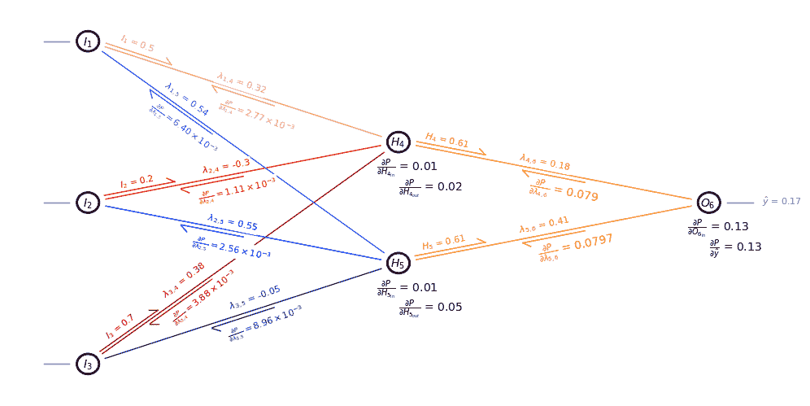

## 检查 ANN 收敛性

现在我们绘制权重、偏差和预测值随时间步长的变化，以检查训练的收敛性。

```py
plt.subplot(131)
plt.plot(np.arange(1,nepoch+1,1),y6,color='red',label=r'$\hat{y}$'); plt.xlim([1,nepoch]); plt.ylim([0,1])
plt.xlabel('Epochs'); plt.ylabel(r'$\hat{y}$'); plt.title('Simple Artificial Neural Network Prediction')
plt.plot([1,nepoch],[y,y],color='black',ls='--'); plt.vlines(400,-1.5,1.5,color='black')
add_grid(); plt.legend(loc='upper right'); plt.xscale('log')

plt.subplot(132)
plt.plot(np.arange(1,nepoch+1,1),w14,color='lightcoral',label = r'$\lambda_{1,4}$') 
plt.plot(np.arange(1,nepoch+1,1),w24,color='red',label = r'$\lambda_{2,4}$') 
plt.plot(np.arange(1,nepoch+1,1),w34,color='darkred',label = r'$\lambda_{3,4}$') 
plt.plot(np.arange(1,nepoch+1,1),w15,color='dodgerblue',label = r'$\lambda_{1,5}$') 
plt.plot(np.arange(1,nepoch+1,1),w25,color='blue',label = r'$\lambda_{2,5}$') 
plt.plot(np.arange(1,nepoch+1,1),w35,color='darkblue',label = r'$\lambda_{3,5}$')
plt.plot(np.arange(1,nepoch+1,1),w46,color='orange',label = r'$\lambda_{4,6}$')
plt.plot(np.arange(1,nepoch+1,1),w56,color='darkorange',label = r'$\lambda_{5,6}$')
plt.plot([1,nepoch],[0,0],color='black',ls='--')
plt.xlim([1,nepoch]); plt.ylim([-1.5,1.5]); plt.vlines(400,-1.5,1.5,color='black')
plt.xlabel('Epochs'); plt.ylabel(r'$\hat{y}$'); plt.title('Simple Artificial Neural Network Weights')
add_grid(); plt.legend(loc='upper right'); plt.xscale('log')

plt.subplot(133)
plt.plot(np.arange(1,nepoch+1,1),w14,color='lightgreen',label = r'$\phi_{4}$') 
plt.plot(np.arange(1,nepoch+1,1),w24,color='green',label = r'$\phi_{5}$') 
plt.plot(np.arange(1,nepoch+1,1),w34,color='darkgreen',label = r'$\phi_{6}$') 
plt.plot([1,nepoch],[0,0],color='black',ls='--')
plt.xlim([1,nepoch]); plt.ylim([-1.5,1.5]); plt.vlines(400,-1.5,1.5,color='black')
plt.xlabel('Epochs'); plt.ylabel(r'$\hat{y}$'); plt.title('Simple Artificial Neural Network Biases')
add_grid(); plt.legend(loc='upper right'); plt.xscale('log')

plt.subplots_adjust(left=0.0, bottom=0.0, right=3.0, top=1.0, wspace=0.2, hspace=0.2); plt.show() 
```

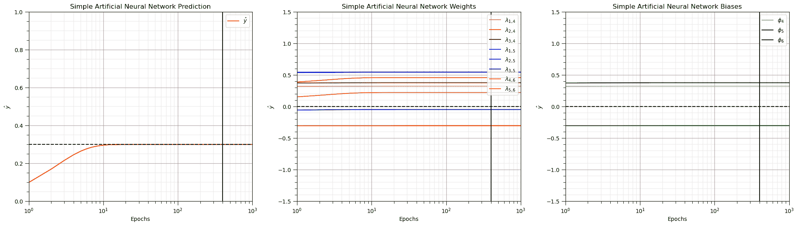

## 注释

这是对人工神经网络的基本处理。可以做和讨论的还有很多，我有很多其他资源。请查看我的[共享资源清单](https://michaelpyrcz.com/my-resources)以及本章开头带有资源链接的 YouTube 讲座链接。

希望这有所帮助，

*迈克尔*

## 关于作者


德克萨斯大学奥斯汀分校 40 英亩校园内，迈克尔·皮尔奇教授的办公室。

迈克尔·皮尔奇是德克萨斯大学奥斯汀分校[Cockrell 工程学院](https://cockrell.utexas.edu/faculty-directory/alphabetical/p)和[杰克逊地球科学学院](https://www.jsg.utexas.edu/researcher/michael_pyrcz/)的教授，在那里他从事和教授地下、空间数据分析、地统计学和机器学习。迈克尔还，

+   是[能源分析](https://fri.cns.utexas.edu/energy-analytics)新生研究项目的首席研究员，并在德克萨斯大学奥斯汀分校自然科学学院机器学习实验室担任核心教员

+   [计算机与地球科学](https://www.sciencedirect.com/journal/computers-and-geosciences/about/editorial-board)的副编辑，以及国际数学地球科学协会[数学地球科学](https://link.springer.com/journal/11004/editorial-board)的董事会成员。

迈克尔已经撰写了超过 70 篇[同行评审的出版物](https://scholar.google.com/citations?user=QVZ20eQAAAAJ&hl=en)，一个用于空间数据分析的[Python 包](https://pypi.org/project/geostatspy/)，合著了一本关于空间数据分析的教科书[地统计学储层建模](https://www.amazon.com/Geostatistical-Reservoir-Modeling-Michael-Pyrcz/dp/0199731446)，并是两本最近发布的电子书的作者，[Python 应用地统计学：GeostatsPy 实践指南](https://geostatsguy.github.io/GeostatsPyDemos_Book/intro.html)和[Python 应用机器学习：代码实践指南](https://geostatsguy.github.io/MachineLearningDemos_Book/intro.html)。

迈克尔的所有大学讲座都可以在他的[YouTube 频道](https://www.youtube.com/@GeostatsGuyLectures)上找到，其中包含 100 多个 Python 交互式仪表板和 40 多个 GitHub 仓库中的详细文档工作流程，以支持任何感兴趣的学生和在职专业人士。要了解更多关于迈克尔的工作和共享教育资源，请访问他的网站。

## 想要一起工作吗？

我希望这个内容对那些想了解更多关于地下建模、数据分析和机器学习的人有所帮助。学生和在职专业人士都欢迎参加。

+   想邀请我到贵公司进行培训、辅导、项目审查、工作流程设计和/或咨询？我很乐意拜访并与您合作！

+   感兴趣合作、支持我的研究生研究或我的地下数据分析与机器学习联盟（共同负责人是约翰·福斯特教授）？我的研究将数据分析、随机建模和机器学习理论与实践相结合，以开发新的方法和工作流程，增加价值。我们正在解决具有挑战性的地下问题！

+   我可以通过 mpyrcz@austin.utexas.edu 联系。

我总是很高兴讨论，

*迈克尔*

Michael Pyrcz，博士，P.Eng. 教授，德克萨斯大学奥斯汀分校 Cockrell 工程学院和 Jackson 地球科学学院

更多资源可在以下链接获取：[Twitter](https://twitter.com/geostatsguy) | [GitHub](https://github.com/GeostatsGuy) | [网站](http://michaelpyrcz.com) | [Google Scholar](https://scholar.google.com/citations?user=QVZ20eQAAAAJ&hl=en&oi=ao) | [地统计学书籍](https://www.amazon.com/Geostatistical-Reservoir-Modeling-Michael-Pyrcz/dp/0199731446) | [YouTube](https://www.youtube.com/channel/UCLqEr-xV-ceHdXXXrTId5ig) | [Python 中应用地统计学电子书](https://geostatsguy.github.io/GeostatsPyDemos_Book/intro.html) | [Python 中应用机器学习电子书](https://geostatsguy.github.io/MachineLearningDemos_Book/) | [LinkedIn](https://www.linkedin.com/in/michael-pyrcz-61a648a1)

## 动机

人工神经网络非常强大，是基于大脑类比的自然启发计算

+   我认为它们就像爬行动物的大脑，没有计划和高级推理

此外，人工神经网络是许多其他深度学习方法的基石，例如，

+   卷积神经网络

+   循环神经网络

+   生成对抗网络

+   自动编码器

自然启发计算正在寻找自然界中的灵感来开发新的问题解决方法，

+   **人工神经网络**是受生物神经网络启发的

+   **节点** - 在我们的模型中是人工神经元，简单的处理器

+   **节点之间的连接是人工突触**

智能是从许多连接的简单处理器中产生的。在本章的剩余部分，我将使用节点和连接这两个术语来描述我们的人工神经网络。

## 神经网络概念

这里是人工神经网络的一些关键方面，

**基本设计** - *“…一个由许多简单、高度互联的处理元素组成的计算系统，它们通过对外部输入的动态状态响应来处理信息。”* Caudill (1989)。

**仍然是一个预测模型** - 虽然这些模型可能非常复杂，甚至有数百万个可训练的模型参数、权重和偏差，但它们仍然是一个从预测特征映射到响应特征的函数，

$$ Y=f(X)+\epsilon $$

**监督学习** – 我们提供带有预测特征的数据集，$X_1,\ldots,𝑋_𝑚$ 和响应特征（s），$𝑌_1,\ldots,𝑌_K$，期望某种模型预测误差，$\epsilon$。

**非线性** - 通过应用非线性激活函数来模型非线性关系，将非线性引入系统

**通用函数逼近器（通用逼近定理）** - ANNs 能够学习在任意宽（单隐藏层）和任意深度（Lu 等人，2017）的区间内$f$的任何可能函数形状，由 Cybenko (1989) 和 Lu 及其同事提出

## 一个简单的网络

要开始，让我们构建一个神经网络，单隐藏层，全连接，前馈神经网络，


简单演示人工神经网络。

我们在下面的描述中使用这个示例人工神经网络，并将其作为一个我们将通过手工训练和预测的实际示例！

现在，让我们标注我们网络的部分，


标注了部分的简单演示人工神经网络，包括 3 个输入节点、2 个隐藏节点和 1 个完全连接的输出节点。

我们的人工神经网络具有，

+   3 个预测特征，$X_1$、$X_2$ 和 $X_3$

+   3 个输入节点，$I_1$、$I_2$ 和 $I_3$

+   2 个隐藏层节点，$H_4$ 和 $H_5$

+   1 个输出节点，$O_6$

+   1 个响应特征，$Y_1$

其中所有节点都是完全连接的。注意，深度学习是一个具有超过 1 个隐藏层的神经网络，但为了简洁起见，我们继续使用我们的非深度学习人工神经网络。

## 关于网络命名法的注释

关于我的网络命名法还有一些额外的注释。我的目标是最大化简洁性和清晰度，

+   **网络节点和连接** - 我选择为所有节点使用唯一的数字，$I_1$、$I_2$、$I_3$、$H_4$、$H_5$ 和 $O_6$，而不是在每个层中重复数字，$I_1$、$I_2$、$I_3$、$H_1$、$H_2$ 和 $O_1$，以简化权重的表示；因此，当我说 $\lambda_{1,4}$ 时，你知道这个权重在网络的哪个位置应用，从节点 $I_1$ 到节点 $H_4$。

+   **节点输出** - 我使用节点标签来描述节点的输出，例如 $O_6$ 是输出节点，$O_6$，以及从节点 $O_6$ 输出的信号或值，

$$ O_6 = \sigma \left( \lambda_{4,6} \cdot H_4 + \lambda_{5,6} \cdot H_5 \right) $$

+   **前激活和后激活** - 在我们的节点 $H_4$、$H_5$ 和 $O_6$ 上，我们有节点激活前的输入和激活后的输出，我使用 $H_{4_{in}}$、$H_{5_{in}}$ 和 $O_{6_{in}}$ 表示前激活输入，

$$ H_{4_{in}} = \lambda_{1,4} \cdot I_1 + \lambda_{2,4} \cdot I_2 + \lambda_{3,4} \cdot I_3 $$$$ H_{5_{in}} = \lambda_{1,5} \cdot I_1 + \lambda_{2,5} \cdot I_2 + \lambda_{2,5} \cdot I_3 $$$$ O_{6_{in}} = \lambda_{4,6} \cdot H_4 + \lambda_{5,6} \cdot H_5 $$

$\quad$ 以及 $H_4$、$H_5$ 和 $O_6$ 作为后激活节点的输出。

$$ H_{4} = \sigma \left( H_{4_{in}} \right) = \sigma \left( \lambda_{1,4} \cdot I_1 + \lambda_{2,4} \cdot I_2 + \lambda_{3,4} \cdot I_3 \right) $$$$ H_{5} = \sigma \left( H_{5_{in}} \right) = \sigma \left( \lambda_{1,5} \cdot I_1 + \lambda_{2,5} \cdot I_2 + \lambda_{2,5} \cdot I_3 \right) $$$$ O_6 = \sigma \left( O_{6_{in}} \right) = \sigma \left( \lambda_{4,6} \cdot H_4 + \lambda_{5,6} \cdot H_5 \right) $$

清晰、清晰的符号很重要，因为在使用反向传播时，我们必须遍历节点，从后激活到前激活。

+   在神经网络文献中，经常使用像 $z$ 这样的变量进行预激活，但我感觉这很模糊，可能会引起混淆，因为我们提供了一个螺丝钉和螺母的方法，明确描述每个方程，以精确描述神经网络是如何训练和预测的

## 网络方法描述

让我们谈谈网络，其组成部分以及信息如何通过网络流动。

**前馈** – 所有信息从左到右流动。每个节点通过连接将相同的信号发送到下一层的所有节点，


前馈，全连接，每个节点将相同的信号发送到下一层的所有节点。

**输入层** - 输入特征直接传递到输入节点，对于连续预测特征，每个特征有一个输入节点，特征是，

+   将最小/最大归一化到范围 $\left[ −1,1 \right]$ 或 $\left[ 0,1 \right]$ 以提高激活函数的敏感性，并消除预测特征中尺度差异的影响，以提高解决方案的稳定性，即，在训练过程中平滑减少训练损失


突出显示输入层，接收归一化预测特征的第一层。

对于分类预测特征，每个预测特征每个类别都有一个输入节点，即特征经过独热编码后，每个编码传递到一个单独的输入节点。

+   回忆一下独热编码，如果属于特定类别，则为 1，否则为 0，用长度等于类别数量的二进制向量替换分类特征。


我们的人工神经网络输入层被突出显示。接收单个分类预测特征独热编码的第一层。

+   我们也可以为每个分类预测特征使用单个输入节点，并为每个类别分配阈值，例如对于 3 个类别，$\left[ 0.0, 0.5, 1.0 \right]$，但这假设分类特征是有序的

**隐藏层** - 输入层值 $I_1, I_2, I_2$ 与可学习的权重相乘，

$$ \lambda_{1,4}, \lambda_{2,4}, \lambda_{3,4}, \lambda_{1,5}, \lambda_{2,5}, \lambda_{3,5} $$

+   在隐藏层节点中，加权输入层值 $\lambda_{1,4} \cdot I_1, \lambda_{2,4} \cdot I_2 \cdot I_2, \ldots, \lambda_{3,5} \cdot I_3$ 与每个节点中可训练偏置项的加和相加，$b_4$ 和 $b_5$。

$$ H_{4_{in}} = \lambda_{1,4} \cdot I_1 + \lambda_{2,4} \cdot I_2 + \lambda_{3,4} \cdot I_3 + b_4 $$$$ H_{5_{in}} = \lambda_{1,5} \cdot I_1 + \lambda_{2,5} \cdot I_2 + \lambda_{3,5} \cdot I_3 + b_5 $$

应用非线性激活，

$$ H_{4} = \sigma \bigl( \lambda_{1,4} \cdot I_1 + \lambda_{2,4} \cdot I_2 + \lambda_{3,4} \cdot I_3 + b_4 \bigr) $$$$ H_{5} = \sigma \bigl( \lambda_{1,5} \cdot I_1 + \lambda_{2,5} \cdot I_2 + \lambda_{3,5} \cdot I_3 + b_5 \bigr) $$

+   输入层节点到所有隐藏层节点的输出是恒定的（再次强调，每个节点将相同的值发送到下一层的所有节点）


我们的人工神经网络隐藏层被突出显示。输入层节点的输出被加权并传递到隐藏层节点。隐藏层节点到所有输出层节点的输出是恒定的。

**输出层** - 对于连续响应特征，每个归一化响应特征有一个输出节点。再次计算输入的加权线性组合加上节点偏置，

$$ O_{6_{in}} = \lambda_{4,6} \cdot H_4 + \lambda_{5,6} \cdot H_5 + b_6 $$

然后应用激活函数，但对于连续响应特征，通常应用恒等（线性）变换，

$$ O_6 = \alpha \bigl( \lambda_{4,6} \cdot H_4 + \lambda_{5,6} \cdot H_5 + b_6 \bigr) = \lambda_{4,6} \cdot H_4 + \lambda_{5,6} \cdot H_5 + b_6 = O_{6_{in}} $$

+   然后从归一化到原始响应特征的反转换被应用，以恢复最终的预测

+   与连续预测特征一样，对连续响应特征应用最小/最大归一化，将其范围调整为[−1,1]或[0,1]，以提高激活函数的敏感性


我们的人工神经网络输出层被突出显示。隐藏层节点的输出被加权并传递到输出层节点。隐藏层节点的输出是恒定的，但权重在隐藏层节点到输出层节点的连接中变化。

在分类响应特征的情况下，再次应用 one-hot 编码，因此，每个类别有一个输出节点。

+   预测是每个类别的概率


突出显示输入层，这是接收单个分类预测特征 one-hot 编码的第一层。

## 遍历网络

现在我们已经准备好遍历人工神经网络。

+   我们遵循单一路径来展示与使用人工神经网络进行预测相关的精确计算

下一个将解释完整的正向传播。

**输入层节点内部** - 输入层节点只是传递预测特征，

+   标准化的连续预测特征值

+   对于分类预测特征，有一个单独的 one-hot 编码值[0 或 1]

进入隐藏层节点，使用一般的向量表示，

$$ I = X $$

人工神经网络的工作原理，输入层节点接收单个分类预测特征的 one-hot 编码，并将其传递给所有隐藏层节点。

我们可以用以下方式对所有输入层节点进行泛化，

$$ H_j = H_{j_{in}} = X_j $$

**隐藏层节点内部**

隐藏层节点是简单的处理器。它们对输入进行线性加权组合，添加节点偏差项，然后非线性地转换结果，这种转换称为激活函数，$\alpha$。

+   确实，一个非常简单的处理器！

+   通过许多相互连接的节点，我们获得一个非常灵活的预测器，涌现出表征复杂、非线性模式的能力。

在激活之前，我们有，

$$ H_{4_{in}} = \sum_{i=1}^{3} \left( \lambda_{i,4} \cdot I_i \right) + b_4 $$

激活后，我们有，

$$ H_4 = \alpha \left(H_{4_{in}} \right) $$

我们可以用通用向量符号在节点中表示简单的处理器，如下所示，

$$ H_4 = \alpha \left(b_4 + \lambda_{j,4}^T I \right) $$

人工神经网络的概述，隐藏层线性地加权每个输入层节点的输入，添加节点偏差项，然后应用激活函数，并将此传递给下一层的所有节点，即我们的示例人工神经网络的输出层。

我们可以用以下方式对所有隐藏层节点进行泛化，

$$ H_{j_{in}} = \sum_{i=1}^{|I|} \left( \lambda_{i,j} \cdot I_i \right) + b_j $$

激活后，节点输出是，

$$ H_{j_{in}} = \sigma \bigl( \sum_{i=1}^{|I|} \left( \lambda_{i,j} \cdot I_i \right) + b_j \bigr) $$

**输出层节点内部**

输出层节点对节点的输入进行线性加权组合，添加节点偏差项，然后使用与隐藏层节点相同的激活函数，$\alpha$，进行转换，

在激活之前，我们有，

$$ O_{6_{in}} = \sum_{i=4}^{5} \left( \lambda_{i,6} \cdot H_i \right) + b_6 $$

激活后，假设使用恒等激活，我们有，

$$ O_6 = \alpha \left(O_{6_{in}} \right) $$

我们可以用通用向量符号在节点中表示简单的处理器，如下所示，

$$ O_6 = \alpha\left(b_6 + \lambda_{j,6}^T H\right) $$

人工神经网络的概述，输出层线性地加权每个隐藏层节点的输入，添加节点偏差项，然后应用激活函数，通常对于连续响应特征是线性的，并将此作为输出传递。

对于分类响应特征，通常应用 softmax 激活，

$$ O_j = \alpha(O_{j_{in}}) = \frac{e^{O_{j_{in}}}}{\sum_{\iota=1}^{K} e^{O_{\iota_{in}}}} $$

人工神经网络的概述，输出层线性地加权每个隐藏层节点的输入，添加节点偏差项，然后应用激活函数，通常对于连续响应特征是线性的，并将此作为输出传递。

softmax 激活确保所有输出层节点的输出都是有效的概率，包括，

+   **非负性** - 通过指数运算

+   **闭合** - 概率通过分母归一化后求和为 1.0

注意，在所有未来的讨论和演示中，我假设有一个标准化的连续响应特征。

## 网络前向传递

现在我们已经完成了一条路径上对网络的遍历，让我们结合网络中的所有路径来展示通过人工神经网络的一次完整前向传递。

+   这是进行预测所需的计算，

$$ O_6 = \sigma_{O_6} \bigl( \lambda_{4,6} \cdot \sigma_{H_4} \left( \lambda_{1,4} I_1 + \lambda_{2,4} I_2 + \lambda_{3,4} I_3 + b_4 \right) + \lambda_{5,6} \cdot \sigma_{H_5} \left( \lambda_{1,5} I_1 + \lambda_{2,5} I_2 + \lambda_{3,5} I_3 + b_5 \right) + b_6 \bigr) $$

其中激活函数$\sigma_{H_4}$ = $\sigma_{H_5}$ = $\sigma$是 Sigmoid 函数，而$\sigma_{O_6}$是线性（恒等）函数，因此我们可以简化前向传递为，

$$ O_6 = \lambda_{4,6} \cdot \sigma \left( \lambda_{1,4} I_1 + \lambda_{2,4} I_2 + \lambda_{3,4} I_3 + b_4 \right) + \lambda_{5,6} \cdot \sigma \left( \lambda_{1,5} I_1 + \lambda_{2,5} I_2 + \lambda_{3,5} I_3 + b_5 \right) + b_6 $$

这强调了我们的神经网络是一个嵌套的激活线性系统，即线性加权的平均值加上应用于激活函数的偏置项。

## 模型参数数量

通常，人工神经网络中有许多模型参数，$theta$。首先，让我们明确这些定义来描述我们的人工神经网络，

+   **神经网络宽度** - 神经网络层中的节点数

+   **神经网络深度** - 神经网络中的层数，通常输入层不包括在这个计算中

现在，让我们假设一个 3 层人工神经网络的紧凑表示法，包括输入、输出和 1 个隐藏层，每层的宽度如下，

+   输入节点数，$p$

+   隐藏层节点数，$m$

+   输出节点数，$k$


人工神经网络宽度、输入节点数、$p$、隐藏层节点数、$m$和输出节点数、$k$的表示法。

完全连接，因此对于每个连接都有一个权重，

$$ \lambda_{𝐼_{1,\ldots,𝑝},𝐻_{1,\ldots,𝑚} } \quad \text{和} \quad \lambda_{𝐻_{1,\ldots,𝑚},𝑂_{1,\ldots,𝑘} } $$

在全连接的情况下，权重的数量是

$$ 𝑝 \times 𝑚 \quad \text{和} \quad 𝑚 \times 𝑘 $$

在每个隐藏层节点都有一个偏置项，

$$ 𝑏_{H_{1,\ldots,m} } $$

在每个输出节点都有一个偏置项，

$$ 𝑏_{O_{1,\ldots,k} } $$

因此，模型参数的数量是，

$$ |\theta| = 𝑝 \times 𝑚 + 𝑚 \times 𝑘 + 𝑚 + 𝑘 $$

这假设每个隐藏层节点和输出层节点都有一个独特的偏置项，但在某些情况下，相同的偏置项可能应用于整个层。

对于我们的例子，当$p = 3$，$m = 2$和$k = 1$时，模型参数的数量是，

$$ |\theta| = 𝑝 \times 𝑚 + 𝑚 \times 𝑘 + 𝑚 + 𝑘 $$

代入后我们得到，

$$ |\theta| = 3 \times 2 + 2 \times 1 + 2 + 1 = 11 $$

我选择这个可管理的参数数量，以便我们可以训练和可视化我们的模型，但通过增加人工神经网络的宽度，以 $p = 10$，$m = 20$ 和 $k = 3$，我们会有更多的模型参数，

$$ |\theta| = 10 \times 20 + 20 \times 3 + 20 + 3 = 283 $$

如果我们增加隐藏层，增加人工神经网络的深度，模型参数的数量将迅速增长。

+   我们可以将这个计算推广到任何全连接、前馈神经网络，给定一个 $W$ 向量，包含节点数，即每层的宽度，

$$ \mathbf{L} = [l_0, l_1, l_2, \dots, l_n] $$

其中，

+   $l_0$ 是输入神经元的数量

+   $l_1, \dots, l_{n-1}$ 是隐藏层的宽度

+   $l_n$ 是输出神经元的数量

连接权重的总数是，

$$ |\theta_{weights}| = \sum_{i=1}^{n} l_i \cdot l_{i-1} $$

节点偏差的总数（输入层节点中没有偏差参数，$l_0$）是，

$$ |\theta_{biases}| = \sum_{i=1}^{n} l_i $$

可训练模型参数、连接权重和节点偏差的总数是，

$$ |\theta| = \sum_{i=1}^{n} \left( l_i \cdot l_{i-1} + l_i \right) = \sum_{i=1}^{n} l_i \cdot (l_{i-1} + 1) $$

让我们以一个有 4 个隐藏层的人工神经网络为例，网络宽度按层向量，

$$ \mathbf{L} = [10, 8, 6, 4, 2, 1] $$

连接权重的总数是，

$$ |\theta_{L_{weights}}| = \sum_{i=1}^{5} l_i \cdot l_{i-1} = (8 \cdot 10) + (6 \cdot 8) + (4 \cdot 6) + (2 \cdot 4) + (1 \cdot 2) = 80 + 48 + 24 + 8 + 2 = 162 $$

节点偏差的总数是，

$$ |\theta_{L_{biases}}| = \sum_{i=1}^{5} l_i = 8 + 6 + 4 + 2 + 1 = 21 $$

最后，可训练参数的总数是，

$$ |\theta_L| = \sum_{i=1}^{5} l_i \cdot (l_{i-1} + 1) = (8 \cdot 11) + (6 \cdot 9) + (4 \cdot 7) + (2 \cdot 5) + (1 \cdot 3) = 88 + 54 + 28 + 10 + 3 = 183 $$

## 激活函数

激活函数是加权节点输入的线性组合加上节点偏差项的转换。非线性激活，

+   引入了网络的非线性属性和复杂性

+   防止网络崩溃

没有非线性激活函数，我们会有线性回归，整个系统会崩溃。

更多关于激活函数和没有非线性激活到多元线性回归的演示信息，请参阅本电子书的相关章节，[神经网络激活函数](https://geostatsguy.github.io/MachineLearningDemos_Book/MachineLearning_activation_functions.html)。

## 训练网络步骤

通过这些步骤迭代地训练人工神经网络，

1.  初始化模型参数

1.  前向传递以进行预测

1.  根据训练数据中的预测和真实值计算误差导数

1.  通过人工神经网络反向传播误差导数，以计算所有模型权重和偏置参数的误差导数

1.  根据导数和学习率更新模型参数

1.  重复直到收敛。


训练人工神经网络的迭代步骤。

这里是每个步骤的一些细节，

1.  **初始化模型参数** - 通常使用接近零的小随机值初始化所有模型参数。这里有一些常见的方法，

+   **Xavier 权重初始化** - 从由 $U[\text{min}, \text{max}]$ 指定的均匀分布中随机实现，

$$ \lambda_{i,j} = F_U^{-1} \left[ \frac{-1}{\sqrt{p}}, \frac{1}{\sqrt{p}} \right] (p^\ell) $$

其中 $F^{-1}_U$ 是 CDF 的逆，$p$ 是输入的数量，$p^{\ell}$ 是从均匀分布 $U[0,1]$ 中抽取的随机累积概率值。

+   **归一化 Xavier 权重初始化** - 从由 $U[\text{min}, \text{max}]$ 指定的均匀分布中随机实现，

$$ \lambda_{i,j} = F_U^{-1} \left[ \frac{-1}{\sqrt{p}+k}, \frac{1}{\sqrt{p}+k} \right] (p^\ell) $$

其中 $F^{-1}_U$ 是 CDF 的逆，$p$ 是输入的数量，$k$ 是输出的数量，$p^{\ell}$ 是从均匀分布 $U[0,1]$ 中抽取的随机累积概率值。

例如，如果我们回到我们的第一个隐藏层节点，


第一个隐藏层节点有 3 个输入，1 个输出。

我们有 $p = 3$ 和 $k = 1$，并从均匀分布中抽取，

$$ U \left[ \frac{-1}{\sqrt{p}+k}, \frac{1}{\sqrt{p}+k} \right] = U \left[ \frac{-1}{\sqrt{3}+1}, \frac{1}{\sqrt{3}+1} \right] $$

1.  **正向传播** - 为了做出预测，$\hat{y}$。初始预测在第一次迭代将是随机的，但会随着迭代而改进。再次，对于我们的模型，正向传播是，

$$ O_6 = \lambda_{4,6} \cdot \sigma \left( \lambda_{1,4} I_1 + \lambda_{2,4} I_2 + \lambda_{3,4} I_3 + b_4 \right) + \lambda_{5,6} \cdot \sigma \left( \lambda_{1,5} I_1 + \lambda_{2,5} I_2 + \lambda_{3,5} I_3 + b_5 \right) + b_6 $$

使用随机初始化的模型参数、权重和偏置的人工神经网络进行预测。

1.  **计算误差导数** - 给定一个损失，

$$ L = \frac{1}{2} \left(\hat{y} - y \right)² $$

以及误差导数，即误差随模型估计变化的变化率，

$$ \frac{\partial L}{\partial \hat{y}} = \hat{Y} - Y $$

现在，让我们只考虑一个估计，稍后我们将解决超过 1 个训练数据。

1.  **反向传播误差导数** - 我们通过人工神经网络回退以计算所有模型权重和偏差参数的误差导数，例如，损失导数反向传播到节点 $H_4$ 的输出，

$$ \frac{\partial L}{\partial H_4} = \frac{\partial O_{6_{\text{in}}}}{\partial H_4} \cdot \frac{\partial O_6}{\partial O_{6_{\text{in}}}} \cdot \frac{\partial L}{\partial O_6} = \lambda_{4,6} \cdot \bigl( (1 - O_6) \cdot O_6 \bigr) \cdot (O_6 - y) $$

1.  **更新模型参数** - 基于导数 $\frac{\partial L}{\partial \lambda_{i,j}}$ 和学习率 $\eta$，如下所示，

$$ \lambda_{i,j}^{\ell} = \lambda_{i,j}^{\ell - 1} + \eta \cdot \frac{\partial L}{\partial \lambda_{i,j}} $$

1.  **重复直到收敛** - 返回到步骤 1，直到误差 $L$ 降低到可接受的水平，即模型收敛是停止迭代的条件

这些是步骤，现在让我们深入探讨每个步骤的细节，但首先让我们从反向传播的数学框架——链式法则开始。

## 链式法则

反思后，很明显，我们的人工神经网络的前向传播涉及一系列嵌套操作，这些操作逐步将输入信号从输入节点传播到每一层，最终到达输出节点。

因此，我们可以将此表示为一系列嵌套操作，

$$ f = f(x) \quad g = g(f) \quad y = h(g) $$

现在以这种形式强调操作的嵌套，

$$ y = h \bigl( g(f(x)) \bigr) $$

通过将链式法则应用于嵌套函数 $y = h \bigl( g(f(x)) \bigr)$，我们可以求解 $\frac{\partial y}{\partial x}$ 如下，

$$ \frac{\partial y}{\partial x} = \frac{\partial h}{\partial g} \cdot \frac{\partial g}{\partial f} \cdot \frac{\partial f}{\partial x} $$

其中，我们将所有算子的偏导数链式相加，以求解给定输入 $x$ 的输出 $y$ 的导数。

+   我们可以在嵌套函数的任何中间点计算导数，例如，向后回退一步，

$$ \frac{\partial f}{\partial x} $$

现在回退两步，

$$ \frac{\partial g}{\partial x} = \frac{\partial g}{\partial f} \cdot \frac{\partial f}{\partial x} $$

然后逐步回退三步，

$$ \frac{\partial y}{\partial x} = \frac{\partial h}{\partial g} \cdot \frac{\partial g}{\partial f} \cdot \frac{\partial f}{\partial x} $$

这就是我们通过反向传播所做的事情，但这可能过于抽象！让我们转向一个非常简单的前馈神经网络，它只有这三个节点，

+   $I_1$ - 输入节点

+   $H_2 = h(I_1)$ - 隐藏层节点，是 $I_1$ 的函数

+   $O_3 = o(H_2)$ - 输出节点，是 $H_2$ 的函数

+   这仍然是有意为之的抽象，即没有提及权重和偏差，以帮助您通过链式法则发展神经网络反向传播的心智框架，我们将在这次讨论之后立即深入细节。

输出 $O_3$ 通过这些嵌套函数依赖于输入 $I_1$：

$$ O_3 = o \bigl( h(I_1) \bigr) $$

使用 **链式法则**，输出相对于反向传播一步的梯度，

$$ \frac{\partial O_3}{\partial H_2} $$

以及关于反向传播两步的，

$$ \frac{\partial O_3}{\partial I_1} = \frac{\partial H_2}{\partial I_1} \cdot \frac{\partial O_3}{\partial H_2} $$

这显示了梯度是如何 **反向传播** 通过网络的，

+   $\frac{\partial O_3}{\partial I_1}$ - 是隐藏节点的局部梯度

+   $\frac{\partial O_3}{\partial H_2}$ - 是输出节点的局部梯度

通过反向传播，我们可以计算相对于网络所有部分的导数，如何输入节点信号 $I_1$ 或隐藏节点信号 $H_2$ 影响输出 $O_3$，分别是 $\frac{\partial O_3}{\partial I_1}$ 和 $frac{\partial O_3}{\partial H_2}$。

+   更重要的是，输入 $I_1$ 或 $H_2$ 的变化如何影响模型损失的变化，分别是 $\frac{\partial L}{\partial I_1}$ 和 $frac{\partial L}{\partial H_2}$。

这一系列的偏导数，通过逐步反向通过神经网络层，是反向传播背后的基本机制。接下来我们将推导并演示反向传播的各个部分，然后最终将它们组合起来，以展示整个网络的反向传播。

## 神经网络反向传播构建块

让我们介绍反向传播的数值构建块。一旦你理解了这些反向传播构建块，你将能够手动反向传播我们的简单网络，甚至任何复杂的人工神经网络，

1.  计算损失导数

1.  通过节点的反向传播

1.  沿着连接的反向传播

1.  考虑到多条路径

1.  关于权重和偏置的损失导数

目前我演示了单个训练数据样本 $y$ 的这个损失导数的反向传播。

+   我将在后面处理多个样本，$y_i, i=1, \ldots, n$

让我们从计算损失导数开始。

### 计算损失导数

反向传播基于将损失导数分配或传播回神经网络的概念，

+   我们计算损失导数，然后按顺序从网络输出反向分布到网络输入

+   重要的是要知道我们正在处理导数，并且反向传播不是分配错误，尽管正如你将看到的，它可能看起来是这样！

我们首先定义损失，给定真实值 $𝑦$ 和我们的预测 $\hat{y} = O_6$，我们计算我们的 $L²$ 损失为，

$$ L = \frac{1}{2} \left( \hat{y} - y \right)² $$

我们选择损失函数允许我们使用预测误差作为损失导数！我们计算损失导数为损失相对于估计的偏导数，$\frac{\partial 𝐿}{\partial \hat{y}}$,

$$ \frac{\partial \mathcal{L}}{\partial \hat{y}} = \frac{\partial \frac{1}{2} \left( \hat{y} - y \right)² }{\partial \hat{y}} = \hat{y} - y $$

你明白我的意思，我们正在反向传播损失导数，但由于我们对 $L²$ 损失的公式化，我们只需要计算输出节点的误差，但再次强调——它是损失导数。


计算输出层节点 $O_6$ 的损失导数。

对于我们简单的人工神经网络示例，输出在节点 $O_6$，我们的损失导数是，

$$ \frac{\partial \mathcal{L}}{\partial O_6} = \frac{\partial \mathcal{L}}{\hat{y}} = \hat{y} - y = O_6 - y $$

因此，这是我们的损失导数反向传播到输出节点，我们现在准备好通过人工神经网络反向传播这个损失导数，让我们谈谈如何逐步通过节点和沿着连接。

### 带有身份激活的输出节点反向传播

让我们通过输出节点 $O_6$ 从后激活到前激活反向传播。为此，我们需要激活函数的偏导数。

+   由于这是一个回归人工神经网络的输出节点，我选择了身份或线性激活函数。


通过节点 $O_6$ 反向传播损失导数，从 $O_6$ 后激活输出到 $O_{6_{in}}$ 前激活输入。

输出节点 $O_6$ 的身份激活定义为：

$$ O_6 = \sigma(O_{6_{in}}) = O_6 $$

节点 $O_6$ 的身份激活相对于其输入 $O_{6_{in}}$ 的导数，即穿过节点 $O_6$ 是，

$$ \frac{\partial O_6}{\partial O_{6_{in}}} = \frac{\partial \left(O_{6_{in}} \right)}{\partial O_{6_{in}}} = 1.0 $$

注意，我们只需要节点 $O_6$ 的输出信号。现在我们可以将这个信号添加到我们的链式法则中，从节点输出相对于损失导数 $\frac{\partial \mathcal{L}}{\partial O_6}$ 反向传播，到节点输入相对于损失导数 $\frac{\partial \mathcal{L}}{\partial O_{6_{\text{in}}}}$。

$$ \frac{\partial \mathcal{L}}{\partial O_{6_{\text{in}}}} = \frac{\partial O_6}{\partial O_{6_{\text{in}}}} \cdot \frac{\partial \mathcal{L}}{\partial O_6} = 1.0 \cdot (O_6 - y) $$

现在我们已经通过输出节点反向传播，让我们从隐藏层 $H_4$ 到 $O_6$ 连接反向传播。

### 沿着连接反向传播

现在让我们反向传播节点 $O_6$ 和 $H_4$ 之间的连接。


通过节点 $O_6$ 反向传播损失导数，从 $O_6$ 后激活输出到 $O_{6_{in}}$ 前激活输入，然后沿着连接到节点 $H_4$ 的输出。

前激活，节点 $O_6$ 的输入计算如下，

$$ O_{6_{\text{in}}} = \lambda_{4,6} \cdot H_4 + \lambda_{5,6} \cdot H_5 + b_6 $$

我们计算连接上的导数，

$$ \frac{\partial O_{6_{\text{in}}}}{\partial H_4} = \frac{\partial}{\partial H_4} \left( \lambda_{4,6} \cdot H_4 + \lambda_{5,6} \cdot H_5 + b_6 \right) = \lambda_{4,6} $$

通过解上述偏导数，我们看到通过应用连接权重进行连接的反向传播。

$$ \frac{\partial O_{6_{\text{in}}}}{\partial H_4} = \lambda_{4,6} $$

注意，我们只需要当前的连接权重 $\lambda_{4,6}$。现在我们可以将其添加到我们的链式法则中，沿着 $H_4$ 到 $O_6$ 的连接从输出层节点输入的损失导数 $\frac{\partial \mathcal{L}}{\partial O_{6_{\text{in}}}}$，到隐藏层节点输出的损失导数 $\frac{\partial \mathcal{L}}{\partial H_4}$ 进行反向传播。

$$ \frac{\partial \mathcal{L}}{\partial H_4} = \frac{\partial O_{6_{\text{in}}}}{\partial H_4} \cdot \frac{\partial O_6}{\partial O_{6_{\text{in}}}} \cdot \frac{\partial \mathcal{L}}{\partial O_6} = \lambda_{4,6} \bigl( \cdot (1 - O_6) \cdot O_6 \bigr) \cdot (O_6 - y) $$

### 通过具有 Sigmoid 激活的节点进行反向传播

让我们通过隐藏层节点 $H_4$ 从激活后到激活前进行反向传播。为此，我们需要激活函数的偏导数。

+   我们假设所有隐藏层节点都使用 sigmoid 激活

+   为了逻辑的清晰，每个人都将激活导数作为输出而不是典型输入的函数来解析，


从激活后的输出 $H_4$ 到激活前的输入 $H_{4_{in}}$ 的节点 $H_4$ 的损失导数进行反向传播。

输出节点 $H_4$ 的 sigmoid 激活定义为：

$$ H_4 = \sigma(H_{4_{in}}) = \frac{1}{1 + e^{-H_{4_{in}}}} $$

节点 $H_4$ 的 sigmoid 激活相对于其输入 $H_{4_{in}}$ 的导数，即穿越节点 $H_4$ 是，

$$ \frac{\partial H_4}{\partial H_{4_{in}}} = \frac{\partial}{\partial H_{4_{in}}} \left( \frac{1}{1 + e^{-H_{4_{in}}}} \right) $$

现在，为了简洁的表示，我们设，

$$ u = e^{-H_{4_{in}}} $$

替换后我们得到，

$$ \frac{\partial H_4}{\partial H_{4_{in}}} = \frac{\partial}{\partial H_{4_{in}}} \left( \frac{1}{1 + u} \right) $$

通过链式法则，我们可以扩展到，

$$ \frac{\partial H_4}{\partial H_{4_{in}}} = \frac{\partial}{\partial H_{4_{in}}} \left( \frac{1}{1 + u} \right) = -\frac{u}{(1 + u)²} \cdot \frac{\partial u}{\partial H_{4_{in}}} $$

$u = e^{-H_{4_{in}}}$ 关于 $H_{4_{in}}$ 的导数是：

$$ \frac{\partial u}{\partial H_{4_{in}}} = -e^{-H_{4_{in}}} = -u $$

现在我们可以替换，

$$ \frac{\partial H_4}{\partial H_{4_{in}}} = -\frac{1}{(1+u)²} \cdot (-u) = \frac{u}{(1+u)²} $$

用节点 $H_4$ 的输出表示，$H_4 = \frac{1}{1 + u}$，

$$ \frac{\partial H_4}{\partial H_{4_{\text{in}}}} = \frac{\left(1 - H_4\right)/H_4}{\left(1/H_4\right)²} = \frac{1 - H_4}{H_4} \cdot H_4² = \left(1 - H_4\right) \cdot H_4 $$

因此，我们可以通过以下方式通过节点 $H_4$ 从节点后激活输出 $H_4$ 反向传播到节点前激活输入 $H_{4_{\text{in}}}$，

$$ \frac{\partial H_4}{\partial H_{4_{\text{in}}}} = \left(1 - H_4\right) \cdot H_4 $$

注意，我们只需要节点 $H_4$ 的输出信号 $H_4$。现在我们可以将这个信号添加到我们的链式法则中，从损失导数反向传播到节点 $H_4$ 的输出以及节点 $H_4$ 的输入，

$$ \frac{\partial \mathcal{L}}{\partial H_{4_{\text{in}}}} = \frac{\partial H_4}{\partial H_{4_{\text{in}}}} \cdot \frac{\partial O_{6_{\text{in}}}}{\partial H_4} \cdot \frac{\partial O_6}{\partial O_{6_{\text{in}}}} \cdot \frac{\partial \mathcal{L}}{\partial O_6} = \bigl((1 - H_4) \cdot H_4 \bigr) \cdot \lambda_{4,6} \cdot 1.0 \cdot (O_6 - y) $$

现在我们可以处理网络中节点的所有反向传播情况。

### 沿着另一个连接反向传播

为了连续性和完整性，让我们重复之前描述的方法，沿着连接 $I_1$ 到 $H_4$ 反向传播。


沿着从 $H_4$ 到 $I_1$ 的连接反向传播损失导数。

再次，节点 $H_4$ 的前激活输入计算如下，

$$ H_{4_{\text{in}}} = \lambda_{1,4} \cdot I_1 + \lambda_{2,4} \cdot I_2 + \lambda_{3,4} \cdot I_3 + b_4 $$

我们沿着连接计算导数，

$$ \frac{\partial H_{4_{\text{in}}}}{\partial I_1} = \frac{\partial \left(\lambda_{1,4} \cdot I_1 + \lambda_{2,4} \cdot I_2 + \lambda_{3,4} \cdot I_3 + b_4 \right)}{\partial I_1} = \lambda_{1,4} $$

通过解决上述偏导数，我们看到通过应用连接权重进行连接的反向传播，

$$ \frac{\partial H_{4_{\text{in}}}}{\partial I_1} = \lambda_{4,6} $$

注意，我们只需要当前连接权重 $\lambda_{4,6}$。现在我们可以将这个权重添加到我们的链式法则中，从输出层节点输入的损失导数 $\frac{\partial \mathcal{L}}{\partial O_{6_{\text{in}}}}$ 反向传播到隐藏层节点输出的损失导数 $\frac{\partial \mathcal{L}}{\partial H_4}$，

$$ \frac{\partial \mathcal{L}}{\partial I_1} = \frac{\partial H_{4_{\text{in}}}}{\partial I_1} \cdot \frac{\partial H_4}{\partial H_{4_{\text{in}}}} \cdot \frac{\partial O_{6_{\text{in}}}}{\partial H_4} \cdot \frac{\partial O_6}{\partial O_{6_{\text{in}}}} \cdot \frac{\partial \mathcal{L}}{\partial O_6} = \lambda_{1,4} \cdot \bigl((1 - H_4) \cdot H_4 \bigr) \cdot \lambda_{4,6} \cdot 1.0 \cdot (O_6 - y) $$

### 考虑多条路径

我们关于节点输出 $I_1$ 的损失导数 $\frac{\partial \mathcal{L}}{\partial I_1}$ 是不正确的！

+   我们考虑了从 $O_6$ 到 $H_4$ 到 $I_1$ 的路径，但没有考虑从 $O_6$ 到 $H_5$ 到 $I_1$ 的路径


从输出节点 $O_6$ 到输入节点 $I_1$ 的反向传播路径。

为了考虑多条路径，我们只需要对所有路径进行求和。

$$ \frac{\partial \mathcal{L}}{\partial I_1} = \frac{\partial H_{4_{\text{in}}}}{\partial I_1} \cdot \frac{\partial H_4}{\partial H_{4_{\text{in}}}} \cdot \frac{\partial O_{6_{\text{in}}}}{\partial H_4} \cdot \frac{\partial O_6}{\partial O_{6_{\text{in}}}} \cdot \frac{\partial \mathcal{L}}{\partial O_6} + \frac{\partial H_{5_{\text{in}}}}{\partial I_1} \cdot \frac{\partial H_5}{\partial H_{5_{\text{in}}}} \cdot \frac{\partial O_{6_{\text{in}}}}{\partial H_5} \cdot \frac{\partial O_6}{\partial O_{6_{\text{in}}}} \cdot \frac{\partial \mathcal{L}}{\partial O_6} $$

我们可以将其评估为，

$$ \frac{\partial \mathcal{L}}{\partial I_1} = \lambda_{1,4} \cdot \bigl((1 - H_4) \cdot H_4 \bigr) \cdot \lambda_{4,6} \cdot 1.0 \cdot (O_6 - y) + \lambda_{1,5} \cdot \bigl((1 - H_5) \cdot H_5 \bigr) \cdot \lambda_{5,6} \cdot 1.0 \cdot (O_6 - y) $$

然后通过移除 1.0 值和合并项来简化，

$$ \frac{\partial \mathcal{L}}{\partial I_1} = \left[ \frac{\partial H_{4_{\text{in}}}}{\partial I_1} \cdot \frac{\partial H_4}{\partial H_{4_{\text{in}}}} \cdot \frac{\partial O_{6_{\text{in}}}}{\partial H_4} + \frac{\partial H_{5_{\text{in}}}}{\partial I_1} \cdot \frac{\partial H_5}{\partial H_{5_{\text{in}}}} \cdot \frac{\partial O_{6_{\text{in}}}}{\partial H_5} \right] \cdot \frac{\partial \mathcal{L}}{\partial O_6} $$

现在我们可以评估这个简化的形式，

$$ \frac{\partial \mathcal{L}}{\partial I_1} = \left[ \lambda_{1,4} \cdot \bigl((1 - H_4) \cdot H_4 \bigr) \cdot \lambda_{4,6} + \lambda_{1,5} \cdot \bigl((1 - H_5) \cdot H_5 \bigr) \cdot \lambda_{5,6} \right] \cdot (O_6 - y) $$

### 通过具有恒等激活的输入节点进行反向传播

让我们通过输入节点 $I_1$ 从后激活到前激活进行反向传播。为此，我们需要激活函数的偏导数。

+   由于这是一个输入节点，我选择了恒等或线性激活函数。


通过节点 $I_1$ 的损失导数反向传播，从 $I_1$ 的后激活输出到 $I_{1_{in}}$ 的前激活输入。

输出节点 $I_1$ 的恒等激活定义为：

$$ I_1 = \sigma(I_{1_{in}}) = I_1 $$

节点 $I_1$ 的恒等激活相对于其输入 $I_{1_{in}}$ 的导数，即通过节点 $I_1$ 传递，是：

$$ \frac{\partial I_1}{\partial I_{1_{in}}} = \frac{\partial \left(I_{1_{in}} \right)}{\partial I_{1_{in}}} = 1.0 $$

注意，我们只需要从节点输出的信号$I_1$。现在我们可以将这个添加到我们的链式法则中，从节点输出的损失导数$\frac{\partial \mathcal{L}}{\partial I_1}$反向传播到节点输入的损失导数$\frac{\partial \mathcal{L}}{\partial I_{1_{\text{in}}}}$，

$$ \frac{\partial \mathcal{L}}{\partial I_{1_{in}}} = \frac{\partial I_1}{\partial I_{1_{in}}} \cdot \frac{\partial H_{4_{\text{in}}}}{\partial I_1} \cdot \frac{\partial H_4}{\partial H_{4_{\text{in}}}} \cdot \frac{\partial O_{6_{\text{in}}}}{\partial H_4} \cdot \frac{\partial O_6}{\partial O_{6_{\text{in}}}} \cdot \frac{\partial \mathcal{L}}{\partial O_6} + \frac{\partial I_1}{\partial I_{1_{in}}} \cdot \frac{\partial H_{5_{\text{in}}}}{\partial I_1} \cdot \frac{\partial H_5}{\partial H_{5_{\text{in}}}} \cdot \frac{\partial O_{6_{\text{in}}}}{\partial H_5} \cdot \frac{\partial O_6}{\partial O_{6_{\text{in}}}} \cdot \frac{\partial \mathcal{L}}{\partial O_6} $$

我们可以评估为，

$$ \frac{\partial \mathcal{L}}{\partial I_{1_{in}}} = 1.0 \cdot \lambda_{1,4} \cdot \bigl((1 - H_4) \cdot H_4 \bigr) \cdot \lambda_{4,6} \cdot 1.0 \cdot (O_6 - y) + 1.0 \cdot \lambda_{1,5} \cdot \bigl((1 - H_5) \cdot H_5 \bigr) \cdot \lambda_{5,6} \cdot 1.0 \cdot (O_6 - y) $$

为了趣味性，我设计了这种表示法以实现最大清晰度，

$$ \frac{\partial L}{\partial I_{1_{\text{in}}}} = \overbrace{1.0}^{\textstyle \frac{\partial I_{1}}{\partial I_{1_{in}}}} \left[ \overbrace{\lambda_{1,4}}^{\textstyle \frac{\partial H_{4_{\text{in}}}}{\partial I_1}} \cdot \overbrace{(1 - H_4) \cdot H_4}^{\textstyle \frac{\partial H_4}{\partial H_{4_{\text{in}}}}} \cdot \overbrace{\lambda_{4,6}}^{\textstyle \frac{\partial O_{6_{\text{in}}}}{\partial H_4}} \cdot \overbrace{1.0}^{\textstyle \frac{\partial O_{6}}{\partial O_{6_{in}}}} \cdot \overbrace{(O_6 - Y_1^N)}^{\textstyle \frac{\partial L}{\partial O_{6}}} + \overbrace{\lambda_{1,5}}^{\textstyle \frac{\partial H_{5_{\text{in}}}}{\partial I_1}} \cdot \overbrace{(1 - H_5) \cdot H_5}^{\textstyle \frac{\partial H_5}{\partial H_{5_{\text{in}}}}} \cdot \overbrace{\lambda_{5,6}}^{\textstyle \frac{\partial O_{6_{\text{in}}}}{\partial H_5}} \cdot \overbrace{1.0}^{\textstyle \frac{\partial O_{6}}{\partial O_{6_{in}}}} \cdot \overbrace{(O_6 - Y_1^N)}^{\textstyle \frac{\partial L}{\partial O_{6}}} \right] $$

但这可以通过移除 1.0 值并组合项来简化，

$$ \frac{\partial \mathcal{L}}{\partial I_{1_{in}}} = \left[ \frac{\partial H_{4_{\text{in}}}}{\partial I_1} \cdot \frac{\partial H_4}{\partial H_{4_{\text{in}}}} \cdot \frac{\partial O_{6_{\text{in}}}}{\partial H_4} + \frac{\partial H_{5_{\text{in}}}}{\partial I_1} \cdot \frac{\partial H_5}{\partial H_{5_{\text{in}}}} \cdot \frac{\partial O_{6_{\text{in}}}}{\partial H_5} \right] \cdot \frac{\partial \mathcal{L}}{\partial O_6} $$

现在我们可以评估这个简化的形式，

$$ \frac{\partial \mathcal{L}}{\partial I_{1_{in}}} = \left[ \lambda_{1,4} \cdot \bigl((1 - H_4) \cdot H_4 \bigr) \cdot \lambda_{4,6} + \lambda_{1,5} \cdot \bigl((1 - H_5) \cdot H_5 \bigr) \cdot \lambda_{5,6} \right] \cdot (O_6 - y) $$

为了完整性，这里提供了其他输入节点的反向传播，这里是 $\frac{\partial \mathcal{L}}{\partial I_{2_{in}}}$，


输入节点 2 的损失导数的反向传播。

为了简洁，我已移除 1.0s 并将同类项分组，

$$ \frac{\partial \mathcal{L}}{\partial I_{2_{in}}} = \left[ \frac{\partial H_{4_{\text{in}}}}{\partial I_2} \cdot \frac{\partial H_4}{\partial H_{4_{\text{in}}}} \cdot \frac{\partial O_{6_{\text{in}}}}{\partial H_4} + \frac{\partial H_{5_{\text{in}}}}{\partial I_2} \cdot \frac{\partial H_5}{\partial H_{5_{\text{in}}}} \cdot \frac{\partial O_{6_{\text{in}}}}{\partial H_5} \right] \cdot \frac{\partial \mathcal{L}}{\partial O_6} $$

现在我们可以评估这个简化的形式，

$$ \frac{\partial \mathcal{L}}{\partial I_{2_{in}}} = \left[ \lambda_{2,4} \cdot \bigl((1 - H_4) \cdot H_4 \bigr) \cdot \lambda_{4,6} + \lambda_{2,5} \cdot \bigl((1 - H_5) \cdot H_5 \bigr) \cdot \lambda_{5,6} \right] \cdot (O_6 - y) $$

这里是 $\frac{\partial \mathcal{L}}{\partial I_{3_{in}}}$，


输入节点 3 的损失导数的反向传播。

为了简洁，我已移除 1.0s 并将同类项分组，

$$ \frac{\partial \mathcal{L}}{\partial I_{3_{in}}} = \left[ \frac{\partial H_{4_{\text{in}}}}{\partial I_3} \cdot \frac{\partial H_4}{\partial H_{4_{\text{in}}}} \cdot \frac{\partial O_{6_{\text{in}}}}{\partial H_4} + \frac{\partial H_{5_{\text{in}}}}{\partial I_3} \cdot \frac{\partial H_5}{\partial H_{5_{\text{in}}}} \cdot \frac{\partial O_{6_{\text{in}}}}{\partial H_5} \right] \cdot \frac{\partial \mathcal{L}}{\partial O_6} $$

现在我们可以评估这个简化的形式，

$$ \frac{\partial \mathcal{L}}{\partial I_{3_{in}}} = \left[ \lambda_{3,4} \cdot \bigl((1 - H_4) \cdot H_4 \bigr) \cdot \lambda_{4,6} + \lambda_{3,5} \cdot \bigl((1 - H_5) \cdot H_5 \bigr) \cdot \lambda_{5,6} \right] \cdot (O_6 - y) $$

### 关于权重和偏置的损失导数

现在我们已经通过我们的网络反向传播了损失导数。


关于所有网络节点输入和输出的损失导数的反向传播。

我们得到了网络中每个节点的输入和输出的损失导数。

$$ \frac{\partial \mathcal{L}}{\partial I_{1_{\text{in}}}},\quad \frac{\partial \mathcal{L}}{\partial I_1},\quad \frac{\partial \mathcal{L}}{\partial I_{2_{\text{in}}}},\quad \frac{\partial \mathcal{L}}{\partial I_2},\quad \frac{\partial \mathcal{L}}{\partial I_{3_{\text{in}}}},\quad \frac{\partial \mathcal{L}}{\partial I_3},\quad \frac{\partial \mathcal{L}}{\partial H_{4_{\text{in}}}},\quad \frac{\partial \mathcal{L}}{\partial H_4},\quad \frac{\partial \mathcal{L}}{\partial H_5},\quad \frac{\partial \mathcal{L}}{\partial H_5},\quad \frac{\partial \mathcal{L}}{\partial O_{6_{\text{in}}}},\quad \frac{\partial \mathcal{L}}{\partial O_6} $$

但我们实际上需要的是每个连接权重的损失导数，

$$ \frac{\partial \mathcal{L}}{\partial \lambda_{1,4}},\quad \frac{\partial \mathcal{L}}{\partial \lambda_{2,4}},\quad \frac{\partial \mathcal{L}}{\partial \lambda_{3,4}},\quad \frac{\partial \mathcal{L}}{\partial \lambda_{1,5}},\quad \frac{\partial \mathcal{L}}{\partial \lambda_{2,5}},\quad \frac{\partial \mathcal{L}}{\partial \lambda_{3,5}},\quad \frac{\partial \mathcal{L}}{\partial \lambda_{4,6}},\quad \frac{\partial \mathcal{L}}{\partial \lambda_{5,6}} $$

以及节点偏差，

$$ \frac{\partial \mathcal{L}}{\partial b_4},\quad \frac{\partial \mathcal{L}}{\partial b_5},\quad \frac{\partial \mathcal{L}}{\partial b_6} $$

我们如何将损失导数反向传播到连接权重？让我们从 $H_4$ 到 $O_6$ 的连接开始。


与连接权重相关的反向传播损失导数。

预激活，节点 $O_6$ 的输入为，

$$ O_{6_{\text{in}}} = \lambda_{4,6} \cdot H_4 + \lambda_{5,6} \cdot H_5 + b_6 $$

我们计算连接权重的导数如下，

$$ \frac{\partial O_{6_{\text{in}}}}{\partial \lambda_{4,6}} = \frac{\partial \left( \lambda_{4,6} \cdot H_4 + \lambda_{5,6} \cdot H_5 + b_6 \right)}{\partial \lambda_{4,6}} = H_4 $$

我们需要前一层节点通过连接传递的输出，以反向传播到连接权重相对于输入到下一个节点的损失导数，

$$ \frac{\partial \mathcal{L}}{\partial \lambda_{4,6}} = \frac{\partial O_{6_{\text{in}}}}{\partial \lambda_{4,6}} \cdot \frac{\partial \mathcal{L}}{\partial O_{6_{\text{in}}}} = H_4 \cdot 1.0 \cdot (O_6 - y) $$

现在，为了完整性，这里是我们网络所有连接权重的方程。

$$ \frac{\partial \mathcal{L}}{\partial \lambda_{1,4}} = \frac{\partial H_{4_{\text{in}}}}{\partial \lambda_{1,4}} \cdot \frac{\partial \mathcal{L}}{\partial H_{4_{\text{in}}}} = I_1 \cdot \frac{\partial \mathcal{L}}{\partial H_{4_{\text{in}}}} $$$$ \frac{\partial \mathcal{L}}{\partial \lambda_{2,4}} = \frac{\partial H_{4_{\text{in}}}}{\partial \lambda_{2,4}} \cdot \frac{\partial \mathcal{L}}{\partial H_{4_{\text{in}}}} = I_2 \cdot \frac{\partial \mathcal{L}}{\partial H_{4_{\text{in}}}} $$$$ \frac{\partial \mathcal{L}}{\partial \lambda_{3,4}} = \frac{\partial H_{4_{\text{in}}}}{\partial \lambda_{3,4}} \cdot \frac{\partial \mathcal{L}}{\partial H_{4_{\text{in}}}} = I_3 \cdot \frac{\partial \mathcal{L}}{\partial H_{4_{\text{in}}}} $$$$ \frac{\partial \mathcal{L}}{\partial \lambda_{1,5}} = \frac{\partial H_{5_{\text{in}}}}{\partial \lambda_{1,5}} \cdot \frac{\partial \mathcal{L}}{\partial H_{5_{\text{in}}}} = I_1 \cdot \frac{\partial \mathcal{L}}{\partial H_{5_{\text{in}}}} $$$$ \frac{\partial \mathcal{L}}{\partial \lambda_{2,5}} = \frac{\partial H_{5_{\text{in}}}}{\partial \lambda_{2,5}} \cdot \frac{\partial \mathcal{L}}{\partial H_{5_{\text{in}}}} = I_2 \cdot \frac{\partial \mathcal{L}}{\partial H_{5_{\text{in}}}} $$$$ \frac{\partial \mathcal{L}}{\partial \lambda_{3,5}} = \frac{\partial H_{5_{\text{in}}}}{\partial \lambda_{3,5}} \cdot \frac{\partial \mathcal{L}}{\partial H_{5_{\text{in}}}} = I_3 \cdot \frac{\partial \mathcal{L}}{\partial H_{5_{\text{in}}}} $$$$ \frac{\partial \mathcal{L}}{\partial \lambda_{4,6}} = \frac{\partial O_{6_{\text{in}}}}{\partial \lambda_{4,6}} \cdot \frac{\partial \mathcal{L}}{\partial O_{6_{\text{in}}}} = H_4 \cdot \frac{\partial \mathcal{L}}{\partial O_{6_{\text{in}}}} $$$$ \frac{\partial \mathcal{L}}{\partial \lambda_{5,6}} = \frac{\partial O_{6_{\text{in}}}}{\partial \lambda_{5,6}} \cdot \frac{\partial \mathcal{L}}{\partial O_{6_{\text{in}}}} = H_5 \cdot \frac{\partial \mathcal{L}}{\partial O_{6_{\text{in}}}} $$

看看这个模式，关于连接权重的损失导数是，

$$ \text{连接信号} \times \text{下一个节点输入的损失导数} $$

现在我们如何将损失导数逆向传播到节点偏差？让我们从 $O_6$ 节点开始。


关于节点偏差的逆向传播损失导数。

再次，节点 $O_6$ 的前激活输入是，

$$ O_{6_{\text{in}}} = \lambda_{4,6} \cdot H_4 + \lambda_{5,6} \cdot H_5 + b_6 $$

我们计算连接权重的导数如下，

$$ \frac{\partial O_{6_{\text{in}}}}{\partial b_6} = \frac{\partial \left( \lambda_{4,6} \cdot H_4 + \lambda_{5,6} \cdot H_5 + b_6 \right)}{\partial b_6} = 1.0 $$

因此，我们的偏差损失导数等于节点输入损失导数，

$$ \frac{\partial \mathcal{L}}{\partial b_6} = \frac{\partial O_{6_{\text{in}}}}{\partial b_6} \cdot \frac{\partial \mathcal{L}}{\partial O_{6_{\text{in}}}} = 1.0 \cdot \frac{\partial \mathcal{L}}{\partial O_{6_{\text{in}}}} $$

为了完整性，这里列出了所有关于节点偏置的损失导数，

$$ \frac{\partial \mathcal{L}}{\partial b_6} = \frac{\partial \mathcal{L}}{\partial O_{6_{\text{in}}}} $$$$ \frac{\partial \mathcal{L}}{\partial b_4} = \frac{\partial \mathcal{L}}{\partial H_{4_{\text{in}}}} $$$$ \frac{\partial \mathcal{L}}{\partial b_5} = \frac{\partial \mathcal{L}}{\partial H_{5_{\text{in}}}} $$

看看这个模式，关于节点偏置的损失导数是，

$$ \text{节点输入的损失导数} $$

### 计算损失导数

反向传播基于将损失导数向后分配或传播通过神经网络的概念，

+   我们计算损失导数，然后按顺序从网络输出反向分布到网络输入

+   重要的是要知道我们正在处理导数，并且反向传播不是分配错误，尽管如您所见，它可能看起来是这样！

我们首先定义损失，给定真实值 $𝑦$ 和我们的预测 $\hat{y} = O_6$，我们计算我们的 $L²$ 损失如下，

$$ L = \frac{1}{2} \left( \hat{y} - y \right)² $$

我们选择的损失函数允许我们使用预测误差作为损失导数！我们计算损失导数作为损失相对于估计的偏导数，$\frac{\partial 𝐿}{\partial \hat{y}}$，

$$ \frac{\partial \mathcal{L}}{\partial \hat{y}} = \frac{\partial \frac{1}{2} \left( \hat{y} - y \right)² }{\partial \hat{y}} = \hat{y} - y $$

您可以看到我的意思，我们正在反向传播损失导数，但由于我们 $L²$ 损失的公式，我们只需要计算输出节点的错误，但再次强调——它是损失导数。


在输出层节点 $O_6$ 处计算损失导数。

对于我们的简单人工神经网络示例，输出在节点 $O_6$，我们的损失导数是，

$$ \frac{\partial \mathcal{L}}{\partial O_6} = \frac{\partial \mathcal{L}}{\hat{y}} = \hat{y} - y = O_6 - y $$

因此，这是我们反向传播到输出节点，即输出节点，我们现在准备通过我们的人工神经网络反向传播这个损失导数，让我们谈谈我们如何逐步通过节点和连接。

### 通过具有恒等激活函数的输出节点进行反向传播

让我们通过输出节点 $O_6$ 从后激活到前激活进行反向传播。为此，我们需要激活函数的偏导数。

+   由于这是一个输出节点，并且我选择的是回归人工神经网络中的恒等或线性激活函数，


通过节点 $O_6$ 从后激活输出到预激活输入的反向传播损失导数。

输出节点 $O_6$ 的恒等激活定义为：

$$ O_6 = \sigma(O_{6_{in}}) = O_6 $$

节点 $O_6$ 的恒等激活相对于其输入 $O_{6_{in}}$ 的导数，即通过节点 $O_6$ 的交叉是，

$$ \frac{\partial O_6}{\partial O_{6_{in}}} = \frac{\partial \left(O_{6_{in}} \right)}{\partial O_{6_{in}}} = 1.0 $$

注意，我们只需要节点 $O_6$ 的输出信号。现在我们可以将这个信号添加到我们的链式法则中，以便从节点输出的损失导数 $\frac{\partial \mathcal{L}}{\partial O_6}$ 和节点输入的损失导数 $\frac{\partial \mathcal{L}}{\partial O_{6_{\text{in}}}}$ 进行反向传播，

$$ \frac{\partial \mathcal{L}}{\partial O_{6_{\text{in}}}} = \frac{\partial O_6}{\partial O_{6_{\text{in}}}} \cdot \frac{\partial \mathcal{L}}{\partial O_6} = 1.0 \cdot (O_6 - y) $$

现在我们已经通过一个输出节点进行了反向传播，接下来让我们沿着从隐藏层到 $H_4$ 到 $O_6$ 的连接进行反向传播。

### 沿着连接进行反向传播

现在让我们沿着节点 $O_6$ 和 $H_4$ 之间的连接进行反向传播。


通过节点 $O_6$ 从后激活输出到 $O_{6_{in}}$ 预激活输入的反向传播损失导数，然后沿着连接到节点 $H_4$ 的输出。

预激活，节点 $𝑂_6$ 的输入计算如下，

$$ O_{6_{\text{in}}} = \lambda_{4,6} \cdot H_4 + \lambda_{5,6} \cdot H_5 + b_6 $$

我们计算连接的导数如下，

$$ \frac{\partial O_{6_{\text{in}}}}{\partial H_4} = \frac{\partial}{\partial H_4} \left( \lambda_{4,6} \cdot H_4 + \lambda_{5,6} \cdot H_5 + b_6 \right) = \lambda_{4,6} $$

通过解上述偏导数，我们看到通过应用连接权重进行连接的反向传播。

$$ \frac{\partial O_{6_{\text{in}}}}{\partial H_4} = \lambda_{4,6} $$

注意，我们只需要当前的连接权重 $\lambda_{4,6}$。现在我们可以将这个权重添加到我们的链式法则中，以便沿着从损失对输出层节点输入的导数 $\frac{\partial \mathcal{L}}{\partial O_{6_{\text{in}}}}$ 到损失对隐藏层节点输出的导数 $\frac{\partial \mathcal{L}}{\partial H_4}$ 的 $H_4$ 到 $O_6$ 连接进行反向传播。

$$ \frac{\partial \mathcal{L}}{\partial H_4} = \frac{\partial O_{6_{\text{in}}}}{\partial H_4} \cdot \frac{\partial O_6}{\partial O_{6_{\text{in}}}} \cdot \frac{\partial \mathcal{L}}{\partial O_6} = \lambda_{4,6} \bigl( \cdot (1 - O_6) \cdot O_6 \bigr) \cdot (O_6 - y) $$

### 通过具有 Sigmoid 激活的节点进行反向传播

让我们从一个隐藏层节点 $H_4$ 从后激活到前激活进行反向传播。为此，我们需要激活函数的偏导数。

+   我们假设所有隐藏层节点使用 sigmoid 激活

+   为了逻辑上的清晰，每个人都将激活导数作为输出而不是典型输入的函数来解析，


通过节点 $H_4$ 从 $H_4$ 后激活输出到 $H_{4_{in}}$ 前激活输入的反向传播损失导数。

输出节点 $H_4$ 的 sigmoid 激活定义为：

$$ H_4 = \sigma(H_{4_{in}}) = \frac{1}{1 + e^{-H_{4_{in}}}} $$

节点 $H_4$ 的 sigmoid 激活相对于其输入 $H_{4_{in}}$ 的导数，即穿过节点 $H_4$ 是，

$$ \frac{\partial H_4}{\partial H_{4_{in}}} = \frac{\partial}{\partial H_{4_{in}}} \left( \frac{1}{1 + e^{-H_{4_{in}}}} \right) $$

现在，为了简洁的表示，我们设，

$$ u = e^{-H_{4_{in}}} $$

并代入我们得到，

$$ \frac{\partial H_4}{\partial H_{4_{in}}} = \frac{\partial}{\partial H_{4_{in}}} \left( \frac{1}{1 + u} \right) $$

通过链式法则，我们可以将其扩展为，

$$ \frac{\partial H_4}{\partial H_{4_{in}}} = \frac{\partial}{\partial H_{4_{in}}} \left( \frac{1}{1 + u} \right) = -\frac{u}{(1 + u)²} \cdot \frac{\partial u}{\partial H_{4_{in}}} $$

$u = e^{-H_{4_{in}}}$ 对 $H_{4_{in}}$ 的导数是：

$$ \frac{\partial u}{\partial H_{4_{in}}} = -e^{-H_{4_{in}}} = -u $$

现在我们可以代入，

$$ \frac{\partial H_4}{\partial H_{4_{in}}} = -\frac{1}{(1+u)²} \cdot (-u) = \frac{u}{(1+u)²} $$

用节点 $H_4$ 的输出表示，$H_4 = \frac{1}{1 + u}$，

$$ \frac{\partial H_4}{\partial H_{4_{\text{in}}}} = \frac{\left(1 - H_4\right)/H_4}{\left(1/H_4\right)²} = \frac{1 - H_4}{H_4} \cdot H_4² = \left(1 - H_4\right) \cdot H_4 $$

因此，我们可以通过我们的节点 $H_4$ 从节点后激活输出 $H_4$ 到节点前激活输入 $H_{4_{in}}$ 进行反向传播，

$$ \frac{\partial H_4}{\partial H_{4_{\text{in}}}} = \left(1 - H_4\right) \cdot H_4 $$

注意，我们只需要节点 $H_4$ 的输出信号。现在我们可以将其添加到我们的链式法则中，从损失导数反向传播到节点 $H_4$ 的输出和节点 $H_4$ 的输入，

$$ \frac{\partial \mathcal{L}}{\partial H_{4_{\text{in}}}} = \frac{\partial H_4}{\partial H_{4_{\text{in}}}} \cdot \frac{\partial O_{6_{\text{in}}}}{\partial H_4} \cdot \frac{\partial O_6}{\partial O_{6_{\text{in}}}} \cdot \frac{\partial \mathcal{L}}{\partial O_6} = \bigl((1 - H_4) \cdot H_4 \bigr) \cdot \lambda_{4,6} \cdot 1.0 \cdot (O_6 - y) $$

现在我们可以处理我们网络中节点的所有反向传播情况。

### 沿另一个连接进行反向传播

为了连续性和完整性，让我们重复之前描述的方法，通过连接 $I_1$ 到 $H_4$ 进行反向传播。


沿着从 $H_4$ 到 $I_1$ 的连接进行损失导数的反向传播。

再次，节点 $H_4$ 的前激活输入计算如下，

$$ H_{4_{\text{in}}} = \lambda_{1,4} \cdot I_1 + \lambda_{2,4} \cdot I_2 + \lambda_{3,4} \cdot I_3 + b_4 $$

我们计算沿连接的导数，

$$ \frac{\partial H_{4_{\text{in}}}}{\partial I_1} = \frac{\partial \left(\lambda_{1,4} \cdot I_1 + \lambda_{2,4} \cdot I_2 + \lambda_{3,4} \cdot I_3 + b_4 \right)}{\partial I_1} = \lambda_{1,4} $$

通过解决上述偏导数，我们可以看到通过应用连接权重沿连接进行反向传播。

$$ \frac{\partial H_{4_{\text{in}}}}{\partial I_1} = \lambda_{4,6} $$

注意，我们只需要当前的连接权重 $\lambda_{4,6}$。现在我们可以将其添加到我们的链式法则中，从输出层节点输入的损失导数 $\frac{\partial \mathcal{L}}{\partial O_{6_{\text{in}}}}$，到隐藏层节点输出的损失导数 $\frac{\partial \mathcal{L}}{\partial H_4}$ 沿 $H_4$ 到 $O_6$ 连接进行反向传播。

$$ \frac{\partial \mathcal{L}}{\partial I_1} = \frac{\partial H_{4_{\text{in}}}}{\partial I_1} \cdot \frac{\partial H_4}{\partial H_{4_{\text{in}}}} \cdot \frac{\partial O_{6_{\text{in}}}}{\partial H_4} \cdot \frac{\partial O_6}{\partial O_{6_{\text{in}}}} \cdot \frac{\partial \mathcal{L}}{\partial O_6} = \lambda_{1,4} \cdot \bigl((1 - H_4) \cdot H_4 \bigr) \cdot \lambda_{4,6} \cdot 1.0 \cdot (O_6 - y) $$

### 考虑多条路径

我们关于节点输出 $I_1$ 的损失导数 $\frac{\partial \mathcal{L}}{\partial I_1}$ 是不正确的！

+   我们已经考虑了从 $O_6$ 到 $H_4$ 到 $I_1$ 的路径，但没有考虑从 $O_6$ 到 $H_5$ 到 $I_1$ 的路径


从输出节点 $O_6$ 到输入节点 $I_1$ 的反向传播有多条路径。

为了考虑多条路径，我们只需要对所有路径进行求和。

$$ \frac{\partial \mathcal{L}}{\partial I_1} = \frac{\partial H_{4_{\text{in}}}}{\partial I_1} \cdot \frac{\partial H_4}{\partial H_{4_{\text{in}}}} \cdot \frac{\partial O_{6_{\text{in}}}}{\partial H_4} \cdot \frac{\partial O_6}{\partial O_{6_{\text{in}}}} \cdot \frac{\partial \mathcal{L}}{\partial O_6} + \frac{\partial H_{5_{\text{in}}}}{\partial I_1} \cdot \frac{\partial H_5}{\partial H_{5_{\text{in}}}} \cdot \frac{\partial O_{6_{\text{in}}}}{\partial H_5} \cdot \frac{\partial O_6}{\partial O_{6_{\text{in}}}} \cdot \frac{\partial \mathcal{L}}{\partial O_6} $$

我们可以将其评估为，

$$ \frac{\partial \mathcal{L}}{\partial I_1} = \lambda_{1,4} \cdot \bigl((1 - H_4) \cdot H_4 \bigr) \cdot \lambda_{4,6} \cdot 1.0 \cdot (O_6 - y) + \lambda_{1,5} \cdot \bigl((1 - H_5) \cdot H_5 \bigr) \cdot \lambda_{5,6} \cdot 1.0 \cdot (O_6 - y) $$

然后通过移除 1.0 值和分组项进行简化，

$$ \frac{\partial \mathcal{L}}{\partial I_1} = \left[ \frac{\partial H_{4_{\text{in}}}}{\partial I_1} \cdot \frac{\partial H_4}{\partial H_{4_{\text{in}}}} \cdot \frac{\partial O_{6_{\text{in}}}}{\partial H_4} + \frac{\partial H_{5_{\text{in}}}}{\partial I_1} \cdot \frac{\partial H_5}{\partial H_{5_{\text{in}}}} \cdot \frac{\partial O_{6_{\text{in}}}}{\partial H_5} \right] \cdot \frac{\partial \mathcal{L}}{\partial O_6} $$

现在我们可以评估这个简化的形式，

$$ \frac{\partial \mathcal{L}}{\partial I_1} = \left[ \lambda_{1,4} \cdot \bigl((1 - H_4) \cdot H_4 \bigr) \cdot \lambda_{4,6} + \lambda_{1,5} \cdot \bigl((1 - H_5) \cdot H_5 \bigr) \cdot \lambda_{5,6} \right] \cdot (O_6 - y) $$

### 通过具有恒等激活的输入节点进行反向传播

让我们通过我们的输入节点 $I_1$ 从后激活到前激活进行反向传播。为此，我们需要激活函数的偏导数。

+   由于这是一个输入节点，我选择了恒等或线性激活函数。


通过节点 $I_1$ 的损失导数反向传播，从 $I_1$ 的后激活输出到 $I_{1_{in}}$ 的前激活输入。

输出节点 $I_1$ 的恒等激活定义为：

$$ I_1 = \sigma(I_{1_{in}}) = I_1 $$

节点 $I_1$ 的恒等激活相对于其输入 $I_{1_{in}}$ 的导数，即通过节点 $I_1$ 的传递，是，

$$ \frac{\partial I_1}{\partial I_{1_{in}}} = \frac{\partial \left(I_{1_{in}} \right)}{\partial I_{1_{in}}} = 1.0 $$

注意，我们只需要 $I_1$，即从节点输出的信号。现在我们可以将这个添加到我们的链式法则中，从节点输出相对于损失导数 $\frac{\partial \mathcal{L}}{\partial I_1}$ 反向传播，到节点输入相对于损失导数 $\frac{\partial \mathcal{L}}{\partial I_{1_{\text{in}}}}$，

$$ \frac{\partial \mathcal{L}}{\partial I_{1_{in}}} = \frac{\partial I_1}{\partial I_{1_{in}}} \cdot \frac{\partial H_{4_{\text{in}}}}{\partial I_1} \cdot \frac{\partial H_4}{\partial H_{4_{\text{in}}}} \cdot \frac{\partial O_{6_{\text{in}}}}{\partial H_4} \cdot \frac{\partial O_6}{\partial O_{6_{\text{in}}}} \cdot \frac{\partial \mathcal{L}}{\partial O_6} + \frac{\partial I_1}{\partial I_{1_{in}}} \cdot \frac{\partial H_{5_{\text{in}}}}{\partial I_1} \cdot \frac{\partial H_5}{\partial H_{5_{\text{in}}}} \cdot \frac{\partial O_{6_{\text{in}}}}{\partial H_5} \cdot \frac{\partial O_6}{\partial O_{6_{\text{in}}}} \cdot \frac{\partial \mathcal{L}}{\partial O_6} $$

我们可以这样评估，

$$ \frac{\partial \mathcal{L}}{\partial I_{1_{in}}} = 1.0 \cdot \lambda_{1,4} \cdot \bigl((1 - H_4) \cdot H_4 \bigr) \cdot \lambda_{4,6} \cdot 1.0 \cdot (O_6 - y) + 1.0 \cdot \lambda_{1,5} \cdot \bigl((1 - H_5) \cdot H_5 \bigr) \cdot \lambda_{5,6} \cdot 1.0 \cdot (O_6 - y) $$

为了趣味性，我设计了这种符号以实现最大清晰度，

$$ \frac{\partial L}{\partial I_{1_{\text{in}}}} = \overbrace{1.0}^{\textstyle \frac{\partial I_{1}}{\partial I_{1_{in}}}} \left[ \overbrace{\lambda_{1,4}}^{\textstyle \frac{\partial H_{4_{\text{in}}}}{\partial I_1}} \cdot \overbrace{(1 - H_4) \cdot H_4}^{\textstyle \frac{\partial H_4}{\partial H_{4_{\text{in}}}}} \cdot \overbrace{\lambda_{4,6}}^{\textstyle \frac{\partial O_{6_{\text{in}}}}{\partial H_4}} \cdot \overbrace{1.0}^{\textstyle \frac{\partial O_{6}}{\partial O_{6_{in}}}} \cdot \overbrace{(O_6 - Y_1^N)}^{\textstyle \frac{\partial L}{\partial O_{6}}} + \overbrace{\lambda_{1,5}}^{\textstyle \frac{\partial H_{5_{\text{in}}}}{\partial I_1}} \cdot \overbrace{(1 - H_5) \cdot H_5}^{\textstyle \frac{\partial H_5}{\partial H_{5_{\text{in}}}}} \cdot \overbrace{\lambda_{5,6}}^{\textstyle \frac{\partial O_{6_{\text{in}}}}{\partial H_5}} \cdot \overbrace{1.0}^{\textstyle \frac{\partial O_{6}}{\partial O_{6_{in}}}} \cdot \overbrace{(O_6 - Y_1^N)}^{\textstyle \frac{\partial L}{\partial O_{6}}} \right] $$

但可以通过移除 1.0 值并合并同类项来简化，

$$ \frac{\partial \mathcal{L}}{\partial I_{1_{in}}} = \left[ \frac{\partial H_{4_{\text{in}}}}{\partial I_1} \cdot \frac{\partial H_4}{\partial H_{4_{\text{in}}}} \cdot \frac{\partial O_{6_{\text{in}}}}{\partial H_4} + \frac{\partial H_{5_{\text{in}}}}{\partial I_1} \cdot \frac{\partial H_5}{\partial H_{5_{\text{in}}}} \cdot \frac{\partial O_{6_{\text{in}}}}{\partial H_5} \right] \cdot \frac{\partial \mathcal{L}}{\partial O_6} $$

现在我们可以评估这个简化的形式了，

$$ \frac{\partial \mathcal{L}}{\partial I_{1_{in}}} = \left[ \lambda_{1,4} \cdot \bigl((1 - H_4) \cdot H_4 \bigr) \cdot \lambda_{4,6} + \lambda_{1,5} \cdot \bigl((1 - H_5) \cdot H_5 \bigr) \cdot \lambda_{5,6} \right] \cdot (O_6 - y) $$

为了完整性，这里提供了其他输入节点的反向传播，这里是 $\frac{\partial \mathcal{L}}{\partial I_{2_{in}}}$，


输入节点 2 的损失导数反向传播。

为了简洁起见，我已经移除了 1.0 并合并了同类项，

$$ \frac{\partial \mathcal{L}}{\partial I_{2_{in}}} = \left[ \frac{\partial H_{4_{\text{in}}}}{\partial I_2} \cdot \frac{\partial H_4}{\partial H_{4_{\text{in}}}} \cdot \frac{\partial O_{6_{\text{in}}}}{\partial H_4} + \frac{\partial H_{5_{\text{in}}}}{\partial I_2} \cdot \frac{\partial H_5}{\partial H_{5_{\text{in}}}} \cdot \frac{\partial O_{6_{\text{in}}}}{\partial H_5} \right] \cdot \frac{\partial \mathcal{L}}{\partial O_6} $$

现在我们可以评估这个简化的形式了，

$$ \frac{\partial \mathcal{L}}{\partial I_{2_{in}}} = \left[ \lambda_{2,4} \cdot \bigl((1 - H_4) \cdot H_4 \bigr) \cdot \lambda_{4,6} + \lambda_{2,5} \cdot \bigl((1 - H_5) \cdot H_5 \bigr) \cdot \lambda_{5,6} \right] \cdot (O_6 - y) $$

这里是 $\frac{\partial \mathcal{L}}{\partial I_{3_{in}}}$，


反向传播输入节点 3 的损失导数。

为了简洁起见，我已移除 1.0 并合并了同类项，

$$ \frac{\partial \mathcal{L}}{\partial I_{3_{in}}} = \left[ \frac{\partial H_{4_{\text{in}}}}{\partial I_3} \cdot \frac{\partial H_4}{\partial H_{4_{\text{in}}}} \cdot \frac{\partial O_{6_{\text{in}}}}{\partial H_4} + \frac{\partial H_{5_{\text{in}}}}{\partial I_3} \cdot \frac{\partial H_5}{\partial H_{5_{\text{in}}}} \cdot \frac{\partial O_{6_{\text{in}}}}{\partial H_5} \right] \cdot \frac{\partial \mathcal{L}}{\partial O_6} $$

现在我们可以评估这个简化的形式，

$$ \frac{\partial \mathcal{L}}{\partial I_{3_{in}}} = \left[ \lambda_{3,4} \cdot \bigl((1 - H_4) \cdot H_4 \bigr) \cdot \lambda_{4,6} + \lambda_{3,5} \cdot \bigl((1 - H_5) \cdot H_5 \bigr) \cdot \lambda_{5,6} \right] \cdot (O_6 - y) $$

### 关于权重和偏差的损失导数

现在我们已经通过我们的网络反向传播了损失导数。


反向传播所有网络节点输入和输出的损失导数。

我们得到了网络中每个节点输入和输出的损失导数，

$$ \frac{\partial \mathcal{L}}{\partial I_{1_{\text{in}}}},\quad \frac{\partial \mathcal{L}}{\partial I_1},\quad \frac{\partial \mathcal{L}}{\partial I_{2_{\text{in}}}},\quad \frac{\partial \mathcal{L}}{\partial I_2},\quad \frac{\partial \mathcal{L}}{\partial I_{3_{\text{in}}}},\quad \frac{\partial \mathcal{L}}{\partial I_3},\quad \frac{\partial \mathcal{L}}{\partial H_{4_{\text{in}}}},\quad \frac{\partial \mathcal{L}}{\partial H_4},\quad \frac{\partial \mathcal{L}}{\partial H_5},\quad \frac{\partial \mathcal{L}}{\partial H_5},\quad \frac{\partial \mathcal{L}}{\partial O_{6_{\text{in}}}},\quad \frac{\partial \mathcal{L}}{\partial O_6} $$

但我们实际上需要的是每个连接权重的损失导数，

$$ \frac{\partial \mathcal{L}}{\partial \lambda_{1,4}},\quad \frac{\partial \mathcal{L}}{\partial \lambda_{2,4}},\quad \frac{\partial \mathcal{L}}{\partial \lambda_{3,4}},\quad \frac{\partial \mathcal{L}}{\partial \lambda_{1,5}},\quad \frac{\partial \mathcal{L}}{\partial \lambda_{2,5}},\quad \frac{\partial \mathcal{L}}{\partial \lambda_{3,5}},\quad \frac{\partial \mathcal{L}}{\partial \lambda_{4,6}},\quad \frac{\partial \mathcal{L}}{\partial \lambda_{5,6}} $$

以及节点偏差，

$$ \frac{\partial \mathcal{L}}{\partial b_4},\quad \frac{\partial \mathcal{L}}{\partial b_5},\quad \frac{\partial \mathcal{L}}{\partial b_6} $$

我们如何将损失导数反向传播到连接权重？让我们从$H_4$到$O_6$的连接开始。


关于连接权重的反向传播损失导数。

预激活，节点$O_6$的输入，

$$ O_{6_{\text{in}}} = \lambda_{4,6} \cdot H_4 + \lambda_{5,6} \cdot H_5 + b_6 $$

我们计算关于连接权重的导数如下，

$$ \frac{\partial O_{6_{\text{in}}}}{\partial \lambda_{4,6}} = \frac{\partial \left( \lambda_{4,6} \cdot H_4 + \lambda_{5,6} \cdot H_5 + b_6 \right)}{\partial \lambda_{4,6}} = H_4 $$

我们需要将前一层节点的输出通过连接传递，以反向传播到连接权重相对于下一个节点输入的损失导数，

$$ \frac{\partial \mathcal{L}}{\partial \lambda_{4,6}} = \frac{\partial O_{6_{\text{in}}}}{\partial \lambda_{4,6}} \cdot \frac{\partial \mathcal{L}}{\partial O_{6_{\text{in}}}} = H_4 \cdot 1.0 \cdot (O_6 - y) $$

现在，为了完整性，这里是我们网络所有连接权重的方程。

$$ \frac{\partial \mathcal{L}}{\partial \lambda_{1,4}} = \frac{\partial H_{4_{\text{in}}}}{\partial \lambda_{1,4}} \cdot \frac{\partial \mathcal{L}}{\partial H_{4_{\text{in}}}} = I_1 \cdot \frac{\partial \mathcal{L}}{\partial H_{4_{\text{in}}}} $$$$ \frac{\partial \mathcal{L}}{\partial \lambda_{2,4}} = \frac{\partial H_{4_{\text{in}}}}{\partial \lambda_{2,4}} \cdot \frac{\partial \mathcal{L}}{\partial H_{4_{\text{in}}}} = I_2 \cdot \frac{\partial \mathcal{L}}{\partial H_{4_{\text{in}}}} $$$$ \frac{\partial \mathcal{L}}{\partial \lambda_{3,4}} = \frac{\partial H_{4_{\text{in}}}}{\partial \lambda_{3,4}} \cdot \frac{\partial \mathcal{L}}{\partial H_{4_{\text{in}}}} = I_3 \cdot \frac{\partial \mathcal{L}}{\partial H_{4_{\text{in}}}} $$$$ \frac{\partial \mathcal{L}}{\partial \lambda_{1,5}} = \frac{\partial H_{5_{\text{in}}}}{\partial \lambda_{1,5}} \cdot \frac{\partial \mathcal{L}}{\partial H_{5_{\text{in}}}} = I_1 \cdot \frac{\partial \mathcal{L}}{\partial H_{5_{\text{in}}}} $$$$ \frac{\partial \mathcal{L}}{\partial \lambda_{2,5}} = \frac{\partial H_{5_{\text{in}}}}{\partial \lambda_{2,5}} \cdot \frac{\partial \mathcal{L}}{\partial H_{5_{\text{in}}}} = I_2 \cdot \frac{\partial \mathcal{L}}{\partial H_{5_{\text{in}}}} $$$$ \frac{\partial \mathcal{L}}{\partial \lambda_{3,5}} = \frac{\partial H_{5_{\text{in}}}}{\partial \lambda_{3,5}} \cdot \frac{\partial \mathcal{L}}{\partial H_{5_{\text{in}}}} = I_3 \cdot \frac{\partial \mathcal{L}}{\partial H_{5_{\text{in}}}} $$$$ \frac{\partial \mathcal{L}}{\partial \lambda_{4,6}} = \frac{\partial O_{6_{\text{in}}}}{\partial \lambda_{4,6}} \cdot \frac{\partial \mathcal{L}}{\partial O_{6_{\text{in}}}} = H_4 \cdot \frac{\partial \mathcal{L}}{\partial O_{6_{\text{in}}}} $$$$ \frac{\partial \mathcal{L}}{\partial \lambda_{5,6}} = \frac{\partial O_{6_{\text{in}}}}{\partial \lambda_{5,6}} \cdot \frac{\partial \mathcal{L}}{\partial O_{6_{\text{in}}}} = H_5 \cdot \frac{\partial \mathcal{L}}{\partial O_{6_{\text{in}}}} $$

看到模式了，关于连接权重的损失导数是，

$$ \text{连接信号} \times \text{下一个节点输入的损失导数} $$

现在如何将损失导数反向传播到节点偏置？让我们从 $O_6$ 节点开始。


关于节点偏置的反向传播损失导数。

再次强调，预激活，节点 $O_6$ 的输入是，

$$ O_{6_{\text{in}}} = \lambda_{4,6} \cdot H_4 + \lambda_{5,6} \cdot H_5 + b_6 $$

我们计算连接权重的导数如下，

$$ \frac{\partial O_{6_{\text{in}}}}{\partial b_6} = \frac{\partial \left( \lambda_{4,6} \cdot H_4 + \lambda_{5,6} \cdot H_5 + b_6 \right)}{\partial b_6} = 1.0 $$

因此，我们的偏置损失导数等于节点输入损失导数，

$$ \frac{\partial \mathcal{L}}{\partial b_6} = \frac{\partial O_{6_{\text{in}}}}{\partial b_6} \cdot \frac{\partial \mathcal{L}}{\partial O_{6_{\text{in}}}} = 1.0 \cdot \frac{\partial \mathcal{L}}{\partial O_{6_{\text{in}}}} $$

为了完整性，这里列出了所有关于节点偏置的损失导数，

$$ \frac{\partial \mathcal{L}}{\partial b_6} = \frac{\partial \mathcal{L}}{\partial O_{6_{\text{in}}}} $$$$ \frac{\partial \mathcal{L}}{\partial b_4} = \frac{\partial \mathcal{L}}{\partial H_{4_{\text{in}}}} $$$$ \frac{\partial \mathcal{L}}{\partial b_5} = \frac{\partial \mathcal{L}}{\partial H_{5_{\text{in}}}} $$

看看这个模式，关于节点偏置的损失导数是，

$$ \text{节点输入的损失导数} $$

## 反向传播示例

让我们将上面解释的反向传播方法应用到我的交互式神经网络中。

+   这里是只有 1 个样本的第一轮训练的结果，


第一轮迭代的反向传播结果。

我的交互式仪表板提供了每个节点相对于输入的所有损失导数以及每个节点的输出信号，例如，我们可以计算 $\frac{\partial L}{\partial \lambda_{4,6}}$ 如下，

$$ \frac{\partial L}{\partial \lambda_{4,6}} = \frac{\partial O_{6_{\text{in}}}}{\partial \lambda_{4,6}} \cdot \frac{\partial L}{\partial O_{6_{\text{in}}}} = H_4 \cdot \frac{\partial L}{\partial O_{6_{\text{in}}}} = 0.42 \cdot 1.00 = 0.42 $$

这里是关于其他隐藏层到输出节点连接的损失导数，

$$ \frac{\partial L}{\partial \lambda_{5,6}} = \frac{\partial O_{6_{\text{in}}}}{\partial \lambda_{5,6}} \cdot \frac{\partial L}{\partial O_{6_{\text{in}}}} = H_5 \cdot \frac{\partial L}{\partial O_{6_{\text{in}}}} = 0.60 \cdot 1.00 = 0.60 $$

现在让我们获取所有输入到隐藏层连接，

$$ \frac{\partial L}{\partial \lambda_{1,4}} = \frac{\partial H_{4_{\text{in}}}}{\partial \lambda_{1,4}} \cdot \frac{\partial L}{\partial H_{4_{\text{in}}}} = I_1 \cdot \frac{\partial L}{\partial H_{4_{\text{in}}}} = 0.50 \cdot (-0.13) = -0.07 $$$$ \frac{\partial L}{\partial \lambda_{1,5}} = \frac{\partial H_{5_{\text{in}}}}{\partial \lambda_{1,5}} \cdot \frac{\partial L}{\partial H_{4_{\text{in}}}} = I_1 \cdot \frac{\partial L}{\partial H_{5_{\text{in}}}} = 0.50 \cdot (-0.10) = -0.05 $$$$ \frac{\partial L}{\partial \lambda_{2,4}} = \frac{\partial H_{4_{\text{in}}}}{\partial \lambda_{2,4}} \cdot \frac{\partial L}{\partial H_{4_{\text{in}}}} = I_2 \cdot \frac{\partial L}{\partial H_{4_{\text{in}}}} = 0.20 \cdot (-0.13) = -0.03 $$$$ \frac{\partial L}{\partial \lambda_{2,5}} = \frac{\partial H_{5_{\text{in}}}}{\partial \lambda_{2,5}} \cdot \frac{\partial L}{\partial H_{5_{\text{in}}}} = I_2 \cdot \frac{\partial L}{\partial H_{5_{\text{in}}}} = 0.20 \cdot (-0.10) = -0.02 $$$$ \frac{\partial L}{\partial \lambda_{3,4}} = \frac{\partial H_{4_{\text{in}}}}{\partial \lambda_{3,4}} \cdot \frac{\partial L}{\partial H_{4_{\text{in}}}} = I_3 \cdot \frac{\partial L}{\partial H_{4_{\text{in}}}} = 0.70 \cdot (-0.13) = -0.09 $$$$ \frac{\partial L}{\partial \lambda_{3,5}} = \frac{\partial H_{5_{\text{in}}}}{\partial \lambda_{3,5}} \cdot \frac{\partial L}{\partial H_{5_{\text{in}}}} = I_3 \cdot \frac{\partial L}{\partial H_{5_{\text{in}}}} = 0.70 \cdot (-0.10) = -0.07 $$

这处理了所有连接权重误差的导数，现在让我们处理节点偏置误差的导数。

+   节点偏置误差的导数与节点每个激活误差的导数相同。现在让我们计算隐藏层中的偏置项，

$$ \frac{\partial L}{\partial b_4} = \frac{\partial H_{4_{\text{in}}}}{\partial b_4} \cdot \frac{\partial L}{\partial H_{4_{\text{in}}}} = 1.0 \cdot (-0.13) = -0.13 $$$$ \frac{\partial L}{\partial b_5} = \frac{\partial H_{5_{\text{in}}}}{\partial b_5} \cdot \frac{\partial L}{\partial H_{5_{\text{in}}}} = 1.0 \cdot (-0.1) = -0.10 $$

## 更新模型参数

模型参数相对于每个参数的损失导数是梯度，因此我们准备使用梯度下降优化，并添加以下内容，

+   **学习率** - 为了缩放模型更新的变化率，我们分配一个学习率，$\eta$。对于上面提到的模型参数示例，

$$ \lambda_{4,6}^{\ell} = \lambda_{4,6}^{\ell - 1} + \eta \cdot \frac{\partial L}{\partial \lambda_{4,6}} $$$$ \lambda_{1,4}^{\ell} = \lambda_{1,4}^{\ell - 1} + \eta \cdot \frac{\partial L}{\partial \lambda_{1,4}} $$$$ b_j^{\ell} = b_j^{\ell - 1} + \eta \cdot \frac{\partial L}{\partial b_j} $$

+   回想一下，这个过程是梯度计算和模型参数、权重和偏置的更新，是迭代进行的，被称为梯度下降优化。

+   目标是探索损失超曲面，避免和逃离局部最小值，最终找到全局最小值。

+   学习率，也称为步长，通常设置在 0.0 和 1.0 之间，注意在 TensorFlow 的 Keras 模块中默认为 0.01

+   **低学习率** – 更稳定，但解的速度较慢，可能会陷入局部最小值

+   **高学习率** – 可能不稳定，但可能是一个更快的解，可能会发散出全局最小值

一种策略是开始使用高学习率，然后在迭代过程中降低学习率

+   **学习率衰减** - 设置为 > 0 以避免减轻振荡，

$$ \eta^{\ell} = \eta^{\ell - 1} \cdot \left( \frac{1}{1 + \text{decay} \cdot \ell} \right) $$

其中 $\ell$ 是模型训练周期

注意，模型参数更新是针对单个训练数据案例的？考虑这个单个模型参数，

我们计算批中所有样本的更新，并应用更新的平均值。

$$ \frac{\partial L}{\partial \lambda_{4,6}} = H_4 \cdot \frac{\partial L}{\partial O_{6_{\text{in}}}} = 0.42 \cdot 1.00 = 0.42 $$

应用以更新 $\lambda_{4,6}$ 参数，

$$ \lambda_{4,6}^{\ell} = \lambda_{4,6}^{\ell - 1} + \eta \cdot \frac{\partial L}{\partial \lambda_{4,6}} $$

它依赖于 $H_4$ 节点输出和 $L$ 错误，这些是针对单个样本 $𝑥_1,\ldots,𝑥_𝑚$ 和 $𝑦$ 的；因此，我们不能在所有 $1,\ldots,n$ 个训练数据样本上计算单个参数更新。

+   我们可以计算 $1,\ldots,n$ 次更新，然后将所有更新的平均值应用于我们的模型参数，

$$ \lambda_{4,6}^{\ell} = \lambda_{4,6}^{\ell - 1} + \frac{1}{n_{batch}} \sum_{i=1}^{n_{batch}} \eta \cdot \frac{\partial L}{\partial \lambda_{4,6}} $$

+   由于学习率是常数，我们可以将其移出求和符号，现在我们正在平均梯度，

$$ \lambda_{4,6}^{\ell} = \lambda_{4,6}^{\ell - 1} + \eta \frac{1}{n_{batch}} \sum_{i=1}^{n_{batch}} \frac{\partial L}{\partial \lambda_{4,6}} $$

## 训练周期

现在是讨论随机梯度下降优化的好时机，首先让我们定义一些常见术语，

+   **批量梯度下降** - 在通过所有数据后更新模型参数

+   **随机梯度下降** - 在每个样本数据上更新模型参数

+   **小批量梯度下降** - 在通过单个批后更新模型参数

使用小批量梯度下降时，通过使用数据子集（称为批次）引入随机性，

+   例如，如果我们把我们的 100 个样本分成 4 个批次，那么我们分别迭代每个批次

+   我们加快了单个更新的速度，更少的数据更快地计算，但引入了更多的错误

+   这通常有助于训练探索全局最小值，并避免陷入损失超曲面上的局部最小值和脊中

最后，我们在这里定义最后一个术语，

+   **周期** - 是对全部数据的单次遍历，因此如果有 4 个小批量，那么将进行 4 次更新模型参数的迭代

我还会添加许多其他考虑因素，包括，

+   动量

+   自适应优化

现在我们手动构建上述人工神经网络并可视化解决方案！

+   这是手动编写的，这样你可以看到每个计算。我故意避免使用 TensorFlow 或 PyTorch。

## 交互式仪表板

我使用以下代码构建了一个交互式 Python 仪表板，用于训练人工神经网络。你可以逐步通过训练迭代，并在训练时间步中观察，

+   模型参数

+   前向传递预测

+   错误导数的反向传播

如果你想看到人工神经网络的实际应用，请查看我的[ANN 交互式 Python 仪表板](https://github.com/GeostatsGuy/DataScienceInteractivePython/blob/main/Interactive_ANN.ipynb)，


交互式人工神经网络训练 Python 仪表板。

## 导入所需包

我们还需要一些标准包。这些应该已经与 Anaconda 3 一起安装。

```py
import numpy as np
import pandas as pd
import matplotlib.pyplot as plt
from matplotlib.ticker import (MultipleLocator, AutoMinorLocator, AutoLocator) # control of axes ticks
plt.rc('axes', axisbelow=True)                            # set axes and grids in the background for all plots
import math
seed = 13 
```

如果你遇到包导入错误，你可能首先需要安装其中的一些包。这通常可以通过在 Windows 上打开命令窗口然后输入‘python -m pip install [package-name]’来完成。有关相应包的文档中提供了更多帮助。

## 声明函数

这里是创建、训练和可视化我们的人工神经网络的函数。

```py
def add_grid():
    plt.gca().grid(True, which='major',linewidth = 1.0); plt.gca().grid(True, which='minor',linewidth = 0.2) # add y grids
    plt.gca().tick_params(which='major',length=7); plt.gca().tick_params(which='minor', length=4)
    plt.gca().xaxis.set_minor_locator(AutoMinorLocator()); plt.gca().yaxis.set_minor_locator(AutoMinorLocator()) # turn on minor ticks 

def calculate_angle_rads(x1, y1, x2, y2):
    dx = x2 - x1     # Calculate the differences
    dy = y2 - y1
    angle_rads = math.atan2(dy, dx)    # Calculate the angle in radians
    #angle_degrees = math.degrees(angle_radians)    # Convert the angle to degrees
    return angle_rads

def offset(pto, distance, angle_deg): # modified from ChatGPT 4.o generated
    angle_rads = math.radians(angle_deg) # Convert angle from degrees to radians
    x_new = pto[0] + distance * math.cos(angle_rads) # Calculate the new coordinates
    y_new = pto[1] + distance * math.sin(angle_rads)
    return np.array((x_new, y_new))

def offsetx(xo, distance, angle_deg): # modified from ChatGPT 4.o generated
    angle_rads = math.radians(angle_deg) # Convert angle from degrees to radians
    x_new = xo + distance * math.cos(angle_rads) # Calculate the new coordinates
    return np.array((xo, x_new))

def offset_arrx(xo, distance, angle_deg,size): # modified from ChatGPT 4.o generated
    angle_rads = math.radians(angle_deg) # Convert angle from degrees to radians
    x_new = xo + distance * math.cos(angle_rads) # Calculate the new coordinates
    x_arr = x_new + size * math.cos(angle_rads+2.48) # Calculate the new coordinates
    return np.array((x_new, x_arr))

def offsety(yo, distance, angle_deg): # modified from ChatGPT 4.o generated
    angle_rads = math.radians(angle_deg) # Convert angle from degrees to radians
    y_new = yo + distance * math.sin(angle_rads) # Calculate the new coordinates
    return np.array((yo, y_new))

def offset_arry(yo, distance, angle_deg,size): # modified from ChatGPT 4.o generated
    angle_rads = math.radians(angle_deg) # Convert angle from degrees to radians
    y_new = yo + distance * math.sin(angle_rads) # Calculate the new coordinates
    y_arr = y_new + size * math.sin(angle_rads+2.48) # Calculate the new coordinates
    return np.array((y_new, y_arr))

def lint(x1, y1, x2, y2, t):
    # Calculate the interpolated coordinates
    x = x1 + t * (x2 - x1)
    y = y1 + t * (y2 - y1)
    return np.array((x, y))

def lintx(x1, y1, x2, y2, t):
    # Calculate the interpolated coordinates
    x = x1 + t * (x2 - x1)
    return x

def linty(x1, y1, x2, y2, t):
    # Calculate the interpolated coordinates
    y = y1 + t * (y2 - y1)
    return y

def lint_intx(x1, y1, x2, y2, ts, te):
    # Calculate the interpolated coordinates
    xs = x1 + ts * (x2 - x1)
    xe = x1 + te * (x2 - x1)
    return np.array((xs,xe))

def lint_inty(x1, y1, x2, y2, ts, te):
    # Calculate the interpolated coordinates
    ys = y1 + ts * (y2 - y1)
    ye = y1 + te * (y2 - y1)
    return np.array((ys,ye))

def lint_int_arrx(x1, y1, x2, y2, ts, te, size):
    # Calculate the interpolated coordinates
    xe = x1 + te * (x2 - x1)
    line_angle_rads = calculate_angle_rads(x1, y1, x2, y2)
    x_arr = xe + size * math.cos(line_angle_rads+2.48) # Calculate the new coordinates
    return np.array((xe,x_arr))

def lint_int_arry(x1, y1, x2, y2, ts, te, size):
    # Calculate the interpolated coordinates
    ye = y1 + te * (y2 - y1)
    line_angle_rads = calculate_angle_rads(x1, y1, x2, y2)
    y_arr = ye + size * math.sin(line_angle_rads+2.48) # Calculate the new coordinates
    return np.array((ye,y_arr))

def as_si(x, ndp): # from xnx on StackOverflow https://stackoverflow.com/questions/31453422/displaying-numbers-with-x-instead-of-e-scientific-notation-in-matplotlib 
    s = '{x:0.{ndp:d}e}'.format(x=x, ndp=ndp)
    m, e = s.split('e')
    return r'{m:s}\times 10^{{{e:d}}}'.format(m=m, e=int(e)) 
```

## 简单 ANN

我编写了以下代码来指定一个简单的 ANN：

+   三个输入节点，2 个隐藏节点和 1 个输出节点

并且通过迭代执行前向计算和反向传播来训练 ANN。我计算：

+   错误以及将其传播到每个节点

+   求解误差相对于每个权重和偏差的偏导数

所有权重、偏差和所有时间步的偏导数都记录在向量中以便绘图

```py
x1 = 0.5; x2 = 0.2; x3 = 0.7; y = 0.3 # training data
lr = 0.2 # learning rate

np.random.seed(seed=seed)

nepoch = 1000

y4 = np.zeros(nepoch); y5 = np.zeros(nepoch); y6 = np.zeros(nepoch)

w14 = np.zeros(nepoch); w24 = np.zeros(nepoch); w34 = np.zeros(nepoch)
w15 = np.zeros(nepoch); w25 = np.zeros(nepoch); w35 = np.zeros(nepoch)
w46 = np.zeros(nepoch); w56 = np.zeros(nepoch)

dw14 = np.zeros(nepoch); dw24 = np.zeros(nepoch); dw34 = np.zeros(nepoch)
dw15 = np.zeros(nepoch); dw25 = np.zeros(nepoch); dw35 = np.zeros(nepoch)
dw46 = np.zeros(nepoch); dw56 = np.zeros(nepoch)

db4 = np.zeros(nepoch); db5 = np.zeros(nepoch); db6 = np.zeros(nepoch)

b4 = np.zeros(nepoch); b5 = np.zeros(nepoch); b6 = np.zeros(nepoch)
y4 = np.zeros(nepoch); y5 = np.zeros(nepoch); y6 = np.zeros(nepoch)
d4 = np.zeros(nepoch); d5 = np.zeros(nepoch); d6 = np.zeros(nepoch)

# initialize the weights - Xavier Weight Initialization 
lower, upper = -(1.0 / np.sqrt(3.0)), (1.0 / np.sqrt(3.0)) # lower and upper bound for the weights, uses inputs to node
#lower, upper = -(sqrt(6.0) / sqrt(3.0 + 2.0)), (sqrt(6.0) / sqrt(3.0 + 2.0)) # Normalized Xavier weights, integrates ouputs also
w14[0] = lower + np.random.random() * (upper - lower); 
w24[0] = lower + np.random.random() * (upper - lower); 
w34[0] = lower + np.random.random() * (upper - lower);
w15[0] = lower + np.random.random() * (upper - lower); 
w25[0] = lower + np.random.random() * (upper - lower); 
w35[0] = lower + np.random.random() * (upper - lower);

lower, upper = -(1.0 / np.sqrt(2.0)), (1.0 / np.sqrt(2.0))
#lower, upper = -(sqrt(6.0) / sqrt(2.0 + 1.0)), (sqrt(6.0) / sqrt(2.0 + 1.0)) # Normalized Xavier weights, integrates ouputs also

w46[0] = lower + np.random.random() * (upper - lower); 
w56[0] = lower + np.random.random() * (upper - lower);     

#b4[0] = np.random.random(); b5[0] = np.random.random(); b6[0] = np.random.random()
b4[0] = (np.random.random()-0.5)*0.5; b5[0] = (np.random.random()-0.5)*0.5; b6[0] = (np.random.random()-0.5)*0.5; # small random value 

for i in range(0,nepoch):

# forward pass of model
    y4[i] = w14[i]*x1 + w24[i]*x2 + w34[i]*x3 + b4[i]; 
    y4[i] = 1.0/(1 + math.exp(-1*y4[i]))

    y5[i] = w15[i]*x1 + w25[i]*x2 + w35[i]*x3 + b5[i]
    y5[i] = 1.0/(1 + math.exp(-1*y5[i]))

    y6[i] = w46[i]*y4[i] + w56[i]*y5[i] + b6[i]
#    y6[i] = 1.0/(1 + math.exp(-1*y6[i])) # sgimoid / logistic activation at o6 

# back propagate the error through the nodes
#    d6[i] = y6[i]*(1-y6[i])*(y-y6[i]) # sgimoid / logistic activation at o6 
    d6[i] = (y-y6[i]) # identity activation o at o6
    d5[i] = y5[i]*(1-y5[i])*w56[i]*d6[i]; d4[i] = y4[i]*(1-y4[i])*w46[i]*d6[i]

# calculate the change in weights
    if i < nepoch - 1:
        dw14[i] = lr*d4[i]*x1; dw24[i] = lr*d4[i]*x2; dw34[i] = lr*d4[i]*x3
        dw15[i] = lr*d5[i]*x1; dw25[i] = lr*d5[i]*x2; dw35[i] = lr*d5[i]*x3
        dw46[i] = lr*d6[i]*y4[i]; dw56[i] = lr*d6[i]*y5[i] 

        db4[i] = lr*d4[i]; db5[i] = lr*d5[i]; db6[i] = lr*d6[i];

        w14[i+1] = w14[i] + dw14[i]; w24[i+1] = w24[i] + dw24[i]; w34[i+1] = w34[i] + dw34[i] 
        w15[i+1] = w15[i] + dw15[i]; w25[i+1] = w25[i] + dw25[i]; w35[i+1] = w35[i] + dw35[i] 
        w46[i+1] = w46[i] + dw46[i]; w56[i+1] = w56[i] + dw56[i]

        b4[i+1] = b4[i] + db4[i]; b5[i+1] = b5[i] + db5[i]; b6[i+1] = b6[i] + db6[i] 
```

## 现在可视化特定时间步的网络

我在下面编写了一个自定义的网络可视化，选择 iepoch 并可视化特定时间步的人工神经网络。

```py
iepoch = 1

dx = -0.19; dy = -0.09; edge = 1.0

o6x = 17; o6y =5; h5x = 10; h5y = 3.5; h4x = 10; h4y = 6.5
i1x = 3; i1y = 9.0; i2x = 3; i2y = 5; i3x = 3; i3y = 1.0; buffer = 0.5

plt.subplot(111)
plt.gca().set_axis_off()

circle_i1 = plt.Circle((i1x,i1y), 0.25, fill=False, edgecolor = 'black',lw=2,zorder=100); plt.annotate(r' $I_1$',(i1x+dx,i1y+dy),zorder=100); 
circle_i1b = plt.Circle((i1x,i1y), 0.40, fill=True, facecolor = 'white',edgecolor = None,lw=1,zorder=10);
plt.gca().add_patch(circle_i1); plt.gca().add_patch(circle_i1b)

circle_i2 = plt.Circle((i2x,i2y), 0.25, fill=False, edgecolor = 'black',lw=2,zorder=100); plt.annotate(r' $I_2$',(i2x+dx,i2y+dy),zorder=100); 
circle_i2b = plt.Circle((i2x,i2y), 0.40, fill=True, facecolor = 'white',edgecolor = None,lw=1,zorder=10);
plt.gca().add_patch(circle_i2); plt.gca().add_patch(circle_i2b)

circle_i3 = plt.Circle((i3x,i3y), 0.25, fill=False, edgecolor = 'black',lw=2,zorder=100); plt.annotate(r' $I_3$',(i3x+dx,i3y+dy),zorder=100); 
circle_i3b = plt.Circle((i3x,i3y), 0.40, fill=True, facecolor = 'white',edgecolor = None,lw=1,zorder=10);
plt.gca().add_patch(circle_i3); plt.gca().add_patch(circle_i3b)

circle_h4 = plt.Circle((h4x,h4y), 0.25, fill=False, edgecolor = 'black',lw=2,zorder=100); plt.annotate(r'$H_4$',(h4x+dx,h4y+dy),zorder=100); 
circle_h4b = plt.Circle((h4x,h4y), 0.40, fill=True, facecolor = 'white',edgecolor = None,lw=1,zorder=10);
plt.gca().add_patch(circle_h4); plt.gca().add_patch(circle_h4b)

circle_h5 = plt.Circle((h5x,h5y), 0.25, fill=False, edgecolor = 'black',lw=2,zorder=100); plt.annotate(r'$H_5$',(h5x+dx,h5y+dy),zorder=100); 
circle_h5b = plt.Circle((h5x,h5y), 0.40, fill=True, facecolor = 'white',edgecolor = None,lw=1,zorder=10);
plt.gca().add_patch(circle_h5); plt.gca().add_patch(circle_h5b)

circle_o6 = plt.Circle((o6x,o6y), 0.25, fill=False, edgecolor = 'black',lw=2,zorder=100); plt.annotate(r'$O_6$',(o6x+dx,o6y+dy),zorder=100); 
circle_o6b = plt.Circle((o6x,o6y), 0.40, fill=True, facecolor = 'white',edgecolor = None,lw=1,zorder=10);
plt.gca().add_patch(circle_o6); plt.gca().add_patch(circle_o6b)

plt.plot([i1x-edge,i1x],[i1y,i1y],color='grey',lw=1.0,zorder=1)
plt.plot([i2x-edge,i2x],[i2y,i2y],color='grey',lw=1.0,zorder=1)
plt.plot([i3x-edge,i3x],[i3y,i3y],color='grey',lw=1.0,zorder=1)

plt.annotate(r'$x_1$ = ' + str(np.round(x1,2)),(i1x-buffer-1.6,i1y-0.05),size=8,zorder=200,color='grey',
             bbox=dict(boxstyle="round,pad=0.0", edgecolor='white', facecolor='white', alpha=1.0),rotation=0) 
plt.annotate(r'$x_2$ = ' + str(np.round(x2,2)),(i2x-buffer-1.6,i2y-0.05),size=8,zorder=200,color='grey',
             bbox=dict(boxstyle="round,pad=0.0", edgecolor='white', facecolor='white', alpha=1.0),rotation=0) 
plt.annotate(r'$x_3$ = ' + str(np.round(x3,2)),(i3x-buffer-1.6,i3y-0.05),size=8,zorder=200,color='grey',
             bbox=dict(boxstyle="round,pad=0.0", edgecolor='white', facecolor='white', alpha=1.0),rotation=0) 

plt.plot([i1x,h4x],[i1y,h4y],color='lightcoral',lw=1.0,zorder=1)
plt.plot([i2x,h4x],[i2y,h4y],color='red',lw=1.0,zorder=1)
plt.plot([i3x,h4x],[i3y,h4y],color='darkred',lw=1.0,zorder=1)

plt.plot([i1x,h5x],[i1y,h5y],color='dodgerblue',lw=1.0,zorder=1)
plt.plot([i2x,h5x],[i2y,h5y],color='blue',lw=1.0,zorder=1)
plt.plot([i3x,h5x],[i3y,h5y],color='darkblue',lw=1.0,zorder=1)

plt.plot([h4x,o6x],[h4y,o6y],color='orange',lw=1.0,zorder=1)
plt.plot([h5x,o6x],[h5y,o6y],color='darkorange',lw=1.0,zorder=1)

plt.plot([o6x+edge,o6x],[o6y,o6y],color='grey',lw=1.0,zorder=1)
plt.annotate(r'$\hat{y}$ = ' + str(np.round(y6[iepoch],2)),(o6x+buffer+0.7,o6y-0.05),size=8,zorder=200,color='grey',
             bbox=dict(boxstyle="round,pad=0.0", edgecolor='white', facecolor='white', alpha=1.0),rotation=0) 

plt.plot(offsetx(h4x,2,-12),offsety(h4y,2,-12)+0.1,color='orange',lw=1.0,zorder=1)
plt.plot(offset_arrx(h4x,2,-12,0.2),offset_arry(h4y,2,-12,0.2)+0.1,color='orange',lw=1.0,zorder=1)
plt.annotate(r'$H_{4}$ = ' + str(np.round(y4[iepoch],2)),(lintx(h4x,h4y,o6x,o6y,0.08),linty(h4x,h4y,o6x,o6y,0.08)-0.0),size=8,zorder=200,color='orange',
             bbox=dict(boxstyle="round,pad=0.0", edgecolor='white', facecolor='white', alpha=1.0),rotation=-12)

plt.plot(offsetx(h5x,2,12),offsety(h5y,2,12)+0.1,color='darkorange',lw=1.0,zorder=1)
plt.plot(offset_arrx(h5x,2,12,0.2),offset_arry(h5y,2,12,0.2)+0.1,color='darkorange',lw=1.0,zorder=1)
plt.annotate(r'$H_{5}$ = ' + str(np.round(y5[iepoch],2)),(lintx(h5x,h5y,o6x,o6y,0.07),linty(h5x,h5y,o6x,o6y,0.07)+0.25),size=8,zorder=200,color='darkorange',
             bbox=dict(boxstyle="round,pad=0.0", edgecolor='white', facecolor='white', alpha=1.0),rotation=12)

plt.annotate(r'$\frac{\partial P}{\partial O_{6_{in}}}$ = ' + str(np.round(d6[iepoch],2)),(o6x-0.5,o6y-0.7),size=10)
plt.annotate(r'$\frac{\partial P}{\partial H_{4_{in}}}$ = ' + str(np.round(d4[iepoch],2)),(h4x-0.5,h4y-0.7),size=10)
plt.annotate(r'$\frac{\partial P}{\partial H_{5_{in}}}$ = ' + str(np.round(d5[iepoch],2)),(h5x-0.5,h5y-0.7),size=10)

plt.annotate(r'$\frac{\partial P}{\partial \hat{y}}$ = ' + str(np.round(d6[iepoch],2)),(o6x,o6y-1.2),size=10)
plt.annotate(r'$\frac{\partial P}{\partial H_{4_{out}}}$ = ' + str(np.round(w46[iepoch]*d6[iepoch],2)),(h4x,h4y-1.2),size=10)
plt.annotate(r'$\frac{\partial P}{\partial H_{5_{out}}}$ = ' + str(np.round(w56[iepoch]*d6[iepoch],2)),(h5x,h5y-1.2),size=10)

plt.plot(lint_intx(h4x, h4y, o6x, o6y,0.4,0.6),lint_inty(h4x,h4y,o6x,o6y,0.4,0.6)-0.1,color='orange',lw=1.0,zorder=1)
plt.plot(lint_int_arrx(o6x,o6y,h4x,h4y,0.4,0.6,0.2),lint_int_arry(o6x,o6y,h4x,h4y,0.4,0.6,0.2)-0.1,color='orange',lw=1.0,zorder=1)
plt.annotate(r'$\frac{\partial P}{\partial \lambda_{4,6}}$ = ' + str(np.round(dw46[iepoch]/lr,4)),(lintx(h4x,h4y,o6x,o6y,0.5)-0.6,linty(h4x,h4y,o6x,o6y,0.5)-0.72),size=10,zorder=200,color='orange',
              bbox=dict(boxstyle="round,pad=0.0", edgecolor='white', facecolor='white', alpha=1.0),rotation=-11)

plt.plot(lint_intx(h5x, h5y, o6x, o6y,0.4,0.6),lint_inty(h5x,h5y,o6x,o6y,0.4,0.6)-0.1,color='darkorange',lw=1.0,zorder=1)
plt.plot(lint_int_arrx(o6x,o6y,h5x,h5y,0.4,0.6,0.2),lint_int_arry(o6x,o6y,h5x,h5y,0.4,0.6,0.2)-0.1,color='darkorange',lw=1.0,zorder=1)
plt.annotate(r'$\frac{\partial P}{\partial \lambda_{5,6}}$ = ' + str(np.round(dw56[iepoch]/lr,4)),(lintx(h5x,h5y,o6x,o6y,0.5)-0.4,linty(h5x,h5y,o6x,o6y,0.5)-0.6),size=10,zorder=200,color='darkorange',
              bbox=dict(boxstyle="round,pad=0.0", edgecolor='white', facecolor='white', alpha=1.0),rotation=12)

plt.plot(offsetx(i1x,2,-20),offsety(i1y,2,-20)+0.1,color='lightcoral',lw=1.0,zorder=1)
plt.plot(offset_arrx(i1x,2,-20,0.2),offset_arry(i1y,2,-20,0.2)+0.1,color='lightcoral',lw=1.0,zorder=1)
plt.annotate(r'$I_{1}$ = ' + str(np.round(x1,2)),(lintx(i1x,i1y,h4x,h4y,0.1),linty(i1x,i1y,h4x,h4y,0.1)),size=8,zorder=200,color='lightcoral',
             bbox=dict(boxstyle="round,pad=0.0", edgecolor='white', facecolor='white', alpha=1.0),rotation=-20)

plt.plot(offsetx(i2x,2,12),offsety(i2y,2,12)+0.1,color='red',lw=1.0,zorder=1)
plt.plot(offset_arrx(i2x,2,12,0.2),offset_arry(i2y,2,12,0.2)+0.1,color='red',lw=1.0,zorder=1)
plt.annotate(r'$I_{2}$ = ' + str(np.round(x2,2)),(lintx(i2x,i2y,h4x,h4y,0.1),linty(i2x,i2y,h4x,h4y,0.1)+0.22),size=8,zorder=200,color='red',
             bbox=dict(boxstyle="round,pad=0.0", edgecolor='white', facecolor='white', alpha=1.0),rotation=12)

plt.plot(offsetx(i3x,2,38),offsety(i3y,2,38)+0.1,color='darkred',lw=1.0,zorder=1)
plt.plot(offset_arrx(i3x,2,38,0.2),offset_arry(i3y,2,38,0.2)+0.1,color='darkred',lw=1.0,zorder=1)
plt.annotate(r'$I_{3}$ = ' + str(np.round(x3,2)),(lintx(i3x,i3y,h4x,h4y,0.08)-0.2,linty(i3x,i3y,h4x,h4y,0.08)+0.2),size=8,zorder=200,color='darkred',
             bbox=dict(boxstyle="round,pad=0.0", edgecolor='white', facecolor='white', alpha=1.0),rotation=38)

plt.annotate(r'$\lambda_{1,4}$ = ' + str(np.round(w14[iepoch],2)),((i1x+h4x)*0.45,(i1y+h4y)*0.5-0.05),size=8,zorder=200,color='lightcoral',
             bbox=dict(boxstyle="round,pad=0.0", edgecolor='white', facecolor='white', alpha=1.0),rotation=-18) 
plt.annotate(r'$\lambda_{2,4}$ = ' + str(np.round(w24[iepoch],2)),((i2x+h4x)*0.45-0.3,(i2y+h4y)*0.5-0.03),size=8,zorder=200,color='red',
             bbox=dict(boxstyle="round,pad=0.0", edgecolor='white', facecolor='white', alpha=1.0),rotation=10) 
plt.annotate(r'$\lambda_{3,4}$ = ' + str(np.round(w34[iepoch],2)),((i3x+h4x)*0.45-1.2,(i3y+h4y)*0.5-1.1),size=8,zorder=200,color='darkred',
             bbox=dict(boxstyle="round,pad=0.0", edgecolor='white', facecolor='white', alpha=1.0),rotation=38) 

plt.annotate(r'$\lambda_{1,5}$ = ' + str(np.round(w15[iepoch],2)),((i1x+h5x)*0.55-2.5,(i1y+h5y)*0.5+0.9),size=8,zorder=200,color='dodgerblue',
    bbox=dict(boxstyle="round,pad=0.0", edgecolor='white', facecolor='white', alpha=1.0),rotation=-36) 
plt.annotate(r'$\lambda_{2,5}$ = ' + str(np.round(w25[iepoch],2)),((i2x+h5x)*0.55-1.5,(i2y+h5y)*0.5+0.05),size=8,zorder=200,color='blue',
             bbox=dict(boxstyle="round,pad=0.0", edgecolor='white', facecolor='white', alpha=1.0),rotation=-12) 
plt.annotate(r'$\lambda_{3,5}$ = ' + str(np.round(w35[iepoch],2)),((i3x+h5x)*0.55-1.0,(i3y+h5y)*0.5+0.1),size=8,zorder=200,color='darkblue',
             bbox=dict(boxstyle="round,pad=0.0", edgecolor='white', facecolor='white', alpha=1.0),rotation=20) 

plt.annotate(r'$\lambda_{4,6}$ = ' + str(np.round(w46[iepoch],2)),((h4x+o6x)*0.47,(h4y+o6y)*0.47+0.39),size=8,zorder=200,color='orange',
    bbox=dict(boxstyle="round,pad=0.0", edgecolor='white', facecolor='white', alpha=1.0),rotation=-12) 
plt.annotate(r'$\lambda_{5,6}$ = ' + str(np.round(w56[iepoch],2)),((h5x+o6x)*0.47,(h5y+o6y)*0.47+0.26),size=8,zorder=200,color='darkorange',
    bbox=dict(boxstyle="round,pad=0.0", edgecolor='white', facecolor='white', alpha=1.0),rotation=12) 

plt.plot(lint_intx(i1x, i1y, h4x, h4y,0.4,0.6),lint_inty(i1x,i1y,h4x,h4y,0.4,0.6)-0.1,color='lightcoral',lw=1.0,zorder=1)
plt.plot(lint_int_arrx(h4x,h4y,i1x,i1y,0.4,0.6,0.2),lint_int_arry(h4x,h4y,i1x,i1y,0.4,0.6,0.2)-0.1,color='lightcoral',lw=1.0,zorder=1)
plt.annotate(r'$\frac{\partial P}{\partial \lambda_{1,4}} =$' + r'${0:s}$'.format(as_si(dw14[iepoch]/lr,2)),(lintx(i1x,i1y,h4x,h4y,0.5)-0.6,linty(i1x,i1y,h4x,h4y,0.5)-1.0),size=8,zorder=200,color='lightcoral',
              bbox=dict(boxstyle="round,pad=0.0", edgecolor='white', facecolor='white', alpha=1.0),rotation=-20)

plt.plot(lint_intx(i2x, i2y, h4x, h4y,0.3,0.5),lint_inty(i2x,i2y,h4x,h4y,0.3,0.5)-0.1,color='red',lw=1.0,zorder=1)
plt.plot(lint_int_arrx(h4x,h4y,i2x,i2y,0.5,0.7,0.2),lint_int_arry(h4x,h4y,i2x,i2y,0.5,0.7,0.2)-0.12,color='red',lw=1.0,zorder=1)
plt.annotate(r'$\frac{\partial P}{\partial \lambda_{2,4}} =$' + r'${0:s}$'.format(as_si(dw24[iepoch]/lr,2)),(lintx(i2x,i2y,h4x,h4y,0.5)-1.05,linty(i2x,i2y,h4x,h4y,0.5)-0.7),size=8,zorder=200,color='red',
              bbox=dict(boxstyle="round,pad=0.0", edgecolor='white', facecolor='white', alpha=1.0),rotation=12)

plt.plot(lint_intx(i3x, i3y, h4x, h4y,0.2,0.4),lint_inty(i3x,i3y,h4x,h4y,0.2,0.4)-0.1,color='darkred',lw=1.0,zorder=1)
plt.plot(lint_int_arrx(h4x,h4y,i3x,i3y,0.5,0.8,0.2),lint_int_arry(h4x,h4y,i3x,i3y,0.5,0.8,0.2)-0.12,color='darkred',lw=1.0,zorder=1)
plt.annotate(r'$\frac{\partial P}{\partial \lambda_{3,4}} =$' + r'${0:s}$'.format(as_si(dw34[iepoch]/lr,2)),(lintx(i3x,i3y,h4x,h4y,0.5)-1.7,linty(i3x,i3y,h4x,h4y,0.5)-1.7),size=8,zorder=200,color='darkred',
              bbox=dict(boxstyle="round,pad=0.0", edgecolor='white', facecolor='white', alpha=1.0),rotation=38)

plt.plot(lint_intx(i3x, i3y, h5x, h5y,0.4,0.6),lint_inty(i3x,i3y,h5x,h5y,0.4,0.6)-0.1,color='darkblue',lw=1.0,zorder=1)
plt.plot(lint_int_arrx(h5x,h5y,i3x,i3y,0.4,0.6,0.2),lint_int_arry(h5x,h5y,i3x,i3y,0.4,0.6,0.2)-0.12,color='darkblue',lw=1.0,zorder=1)
plt.annotate(r'$\frac{\partial P}{\partial \lambda_{3,5}} =$' + r'${0:s}$'.format(as_si(dw35[iepoch]/lr,2)),(lintx(i3x,i3y,h5x,h5y,0.5)-0.4,linty(i3x,i3y,h5x,h5y,0.5)-0.6),size=8,zorder=200,color='darkblue',
              bbox=dict(boxstyle="round,pad=0.0", edgecolor='white', facecolor='white', alpha=1.0),rotation=20)

plt.plot(lint_intx(i2x, i2y, h5x, h5y,0.3,0.5),lint_inty(i2x,i2y,h5x,h5y,0.3,0.5)-0.1,color='blue',lw=1.0,zorder=1)
plt.plot(lint_int_arrx(h5x,h5y,i2x,i2y,0.3,0.7,0.2),lint_int_arry(h5x,h5y,i2x,i2y,0.3,0.7,0.2)-0.12,color='blue',lw=1.0,zorder=1)
plt.annotate(r'$\frac{\partial P}{\partial \lambda_{2,5}} =$' + r'${0:s}$'.format(as_si(dw25[iepoch]/lr,2)),(lintx(i2x,i2y,h5x,h5y,0.5)-1.2,linty(i2x,i2y,h5x,h5y,0.5)-0.65),size=8,zorder=200,color='blue',
              bbox=dict(boxstyle="round,pad=0.0", edgecolor='white', facecolor='white', alpha=1.0),rotation=-12)

plt.plot(lint_intx(i1x, i1y, h5x, h5y,0.2,0.4),lint_inty(i1x,i1y,h5x,h5y,0.2,0.4)-0.1,color='dodgerblue',lw=1.0,zorder=1)
plt.plot(lint_int_arrx(h5x,h5y,i1x,i1y,0.2,0.8,0.2),lint_int_arry(h5x,h5y,i1x,i1y,0.2,0.8,0.2)-0.12,color='dodgerblue',lw=1.0,zorder=1)
plt.annotate(r'$\frac{\partial P}{\partial \lambda_{1,5}} =$' + r'${0:s}$'.format(as_si(dw15[iepoch]/lr,2)),(lintx(i1x,i1y,h5x,h5y,0.5)-2.2,linty(i1x,i1y,h4x,h4y,0.5)-1.5),size=8,zorder=200,color='dodgerblue',
              bbox=dict(boxstyle="round,pad=0.0", edgecolor='white', facecolor='white', alpha=1.0),rotation=-36,xycoords = 'data')

plt.subplots_adjust(left=0.0, bottom=0.0, right=1.5, top=1.0, wspace=0.2, hspace=0.2); plt.show() 
```


## 检查 ANN 收敛性

现在我们绘制权重、偏差和预测随时间的变化，以检查训练收敛性。

```py
plt.subplot(131)
plt.plot(np.arange(1,nepoch+1,1),y6,color='red',label=r'$\hat{y}$'); plt.xlim([1,nepoch]); plt.ylim([0,1])
plt.xlabel('Epochs'); plt.ylabel(r'$\hat{y}$'); plt.title('Simple Artificial Neural Network Prediction')
plt.plot([1,nepoch],[y,y],color='black',ls='--'); plt.vlines(400,-1.5,1.5,color='black')
add_grid(); plt.legend(loc='upper right'); plt.xscale('log')

plt.subplot(132)
plt.plot(np.arange(1,nepoch+1,1),w14,color='lightcoral',label = r'$\lambda_{1,4}$') 
plt.plot(np.arange(1,nepoch+1,1),w24,color='red',label = r'$\lambda_{2,4}$') 
plt.plot(np.arange(1,nepoch+1,1),w34,color='darkred',label = r'$\lambda_{3,4}$') 
plt.plot(np.arange(1,nepoch+1,1),w15,color='dodgerblue',label = r'$\lambda_{1,5}$') 
plt.plot(np.arange(1,nepoch+1,1),w25,color='blue',label = r'$\lambda_{2,5}$') 
plt.plot(np.arange(1,nepoch+1,1),w35,color='darkblue',label = r'$\lambda_{3,5}$')
plt.plot(np.arange(1,nepoch+1,1),w46,color='orange',label = r'$\lambda_{4,6}$')
plt.plot(np.arange(1,nepoch+1,1),w56,color='darkorange',label = r'$\lambda_{5,6}$')
plt.plot([1,nepoch],[0,0],color='black',ls='--')
plt.xlim([1,nepoch]); plt.ylim([-1.5,1.5]); plt.vlines(400,-1.5,1.5,color='black')
plt.xlabel('Epochs'); plt.ylabel(r'$\hat{y}$'); plt.title('Simple Artificial Neural Network Weights')
add_grid(); plt.legend(loc='upper right'); plt.xscale('log')

plt.subplot(133)
plt.plot(np.arange(1,nepoch+1,1),w14,color='lightgreen',label = r'$\phi_{4}$') 
plt.plot(np.arange(1,nepoch+1,1),w24,color='green',label = r'$\phi_{5}$') 
plt.plot(np.arange(1,nepoch+1,1),w34,color='darkgreen',label = r'$\phi_{6}$') 
plt.plot([1,nepoch],[0,0],color='black',ls='--')
plt.xlim([1,nepoch]); plt.ylim([-1.5,1.5]); plt.vlines(400,-1.5,1.5,color='black')
plt.xlabel('Epochs'); plt.ylabel(r'$\hat{y}$'); plt.title('Simple Artificial Neural Network Biases')
add_grid(); plt.legend(loc='upper right'); plt.xscale('log')

plt.subplots_adjust(left=0.0, bottom=0.0, right=3.0, top=1.0, wspace=0.2, hspace=0.2); plt.show() 
```


## 评论

这是对人工神经网络的基本介绍。可以做和讨论的还有很多，我有很多更多的资源。查看我的[共享资源清单](https://michaelpyrcz.com/my-resources)以及本章开头带有资源链接的视频讲座 YouTube 链接。

希望这有所帮助，

*迈克尔*

## 关于作者


德克萨斯大学奥斯汀分校 40 英亩校园内，迈克尔·皮尔奇教授的办公室。

迈克尔·皮尔奇是德克萨斯大学奥斯汀分校[Cockrell 工程学院](https://cockrell.utexas.edu/faculty-directory/alphabetical/p)和[杰克逊地球科学学院](https://www.jsg.utexas.edu/researcher/michael_pyrcz/)的教授，在那里他从事和教授地下、空间数据分析、地统计学和机器学习。迈克尔还，

+   是[能源分析](https://fri.cns.utexas.edu/energy-analytics)新生研究项目的首席研究员，并在德克萨斯大学奥斯汀分校自然科学学院机器学习实验室担任核心教员

+   还是[计算机与地球科学](https://www.sciencedirect.com/journal/computers-and-geosciences/about/editorial-board)的副编辑，以及国际数学地球科学协会[数学地球科学](https://link.springer.com/journal/11004/editorial-board)的董事会成员。

迈克尔已经撰写了 70 多篇[同行评审出版物](https://scholar.google.com/citations?user=QVZ20eQAAAAJ&hl=en)，一个用于空间数据分析的[Python 包](https://pypi.org/project/geostatspy/)，合著了一本关于空间数据分析的教科书[地统计学储层建模](https://www.amazon.com/Geostatistical-Reservoir-Modeling-Michael-Pyrcz/dp/0199731446)，并是两本最近发布的电子书的作者，[Python 应用地统计学：GeostatsPy 动手指南](https://geostatsguy.github.io/GeostatsPyDemos_Book/intro.html)和[Python 应用机器学习：带代码的动手指南](https://geostatsguy.github.io/MachineLearningDemos_Book/intro.html)。

迈克尔的所有大学讲座都可以在他的[YouTube 频道](https://www.youtube.com/@GeostatsGuyLectures)上找到，附有 100 多个 Python 交互式仪表板和 40 多个 GitHub 仓库中的详细文档工作流程链接，以支持任何感兴趣的学生和在职专业人士。想了解更多关于迈克尔的工作和共享教育资源，请访问他的网站。

## 想一起工作吗？

我希望这些内容对那些想了解更多关于地下建模、数据分析和机器学习的人有所帮助。学生和在职专业人士都欢迎参加。

+   想邀请我到贵公司进行培训、辅导、项目审查、工作流程设计和/或咨询？我很乐意拜访并与您合作！

+   想要合作、支持我的研究生研究或我的地下数据分析与机器学习联盟（共同负责人是约翰·福斯特教授）吗？我的研究将数据分析、随机建模和机器学习理论与实践相结合，以开发新的方法和工作流程，增加价值。我们正在解决具有挑战性的地下问题！

+   您可以通过 mpyrcz@austin.utexas.edu 联系我。

我总是很高兴讨论，

*迈克尔*

迈克尔·皮尔奇兹，博士，注册工程师，德克萨斯大学奥斯汀分校 Cockrell 工程学院和 Jackson 地球科学学院教授

更多资源可在以下链接获取：[Twitter](https://twitter.com/geostatsguy) | [GitHub](https://github.com/GeostatsGuy) | [网站](http://michaelpyrcz.com) | [Google Scholar](https://scholar.google.com/citations?user=QVZ20eQAAAAJ&hl=en&oi=ao) | [地统计学书籍](https://www.amazon.com/Geostatistical-Reservoir-Modeling-Michael-Pyrcz/dp/0199731446) | [YouTube](https://www.youtube.com/channel/UCLqEr-xV-ceHdXXXrTId5ig) | [Python 中应用地统计学电子书](https://geostatsguy.github.io/GeostatsPyDemos_Book/intro.html) | [Python 中应用机器学习电子书](https://geostatsguy.github.io/MachineLearningDemos_Book/) | [LinkedIn](https://www.linkedin.com/in/michael-pyrcz-61a648a1)
