# 卷积神经网络

> 原文：[`geostatsguy.github.io/MachineLearningDemos_Book/MachineLearning_CNN.html`](https://geostatsguy.github.io/MachineLearningDemos_Book/MachineLearning_CNN.html)

Michael J. Pyrcz，教授，德克萨斯大学奥斯汀分校

[Twitter](https://twitter.com/geostatsguy) | [GitHub](https://github.com/GeostatsGuy) | [网站](http://michaelpyrcz.com) | [Google Scholar](https://scholar.google.com/citations?user=QVZ20eQAAAAJ&hl=en&oi=ao) | [地统计学书籍](https://www.amazon.com/Geostatistical-Reservoir-Modeling-Michael-Pyrcz/dp/0199731446) | [YouTube](https://www.youtube.com/channel/UCLqEr-xV-ceHdXXXrTId5ig) | [Python 中应用地统计学电子书](https://geostatsguy.github.io/GeostatsPyDemos_Book/intro.html) | [Python 中应用机器学习电子书](https://geostatsguy.github.io/MachineLearningDemos_Book/) | [LinkedIn](https://www.linkedin.com/in/michael-pyrcz-61a648a1)

电子书“Python 中的应用机器学习：带代码的手动指南”的章节。

将此电子书引用如下：

Pyrcz, M.J., 2024, *Python 中的应用机器学习：带代码的手动指南* [电子书]. Zenodo. doi:10.5281/zenodo.15169138 

本书中的工作流程以及更多内容可在以下链接找到：

将 MachineLearningDemos GitHub 仓库引用如下：

Pyrcz, M.J., 2024, *MachineLearningDemos: Python 机器学习演示工作流程仓库* (0.0.3) [软件]. Zenodo. DOI: 10.5281/zenodo.13835312\. GitHub 仓库：[GeostatsGuy/MachineLearningDemos](https://github.com/GeostatsGuy/MachineLearningDemos) 

作者：Michael J. Pyrcz

© 版权所有 2024。

本章是关于/演示**卷积神经网络**的教程。

**YouTube 讲座**：查看我关于以下内容的讲座：

+   [人工神经网络](https://youtu.be/A9PiCMY_6nM?si=NxWSU_5RgQ4w55EL)

+   [卷积神经网络](https://youtu.be/za2my_XDoOs?si=LeHU6p2_fc9dX4Yt)

这些讲座都是我 YouTube 上的 [机器学习课程](https://youtube.com/playlist?list=PLG19vXLQHvSC2ZKFIkgVpI9fCjkN38kwf&si=XonjO2wHdXffMpeI) 的一部分，其中包含有良好文档记录的 Python 工作流程和交互式仪表板。我的目标是分享易于理解、可操作和可重复的教育内容。如果你想知道我的动机，请查看 [Michael 的故事](https://michaelpyrcz.com/my-story)。

## 动机

卷积神经网络是一种非常强大的、受自然启发的基于视觉皮层类比的计算深度学习方法，它扩展了我们人工神经网络的图像处理能力。

自然启发的计算正在寻找自然界的灵感来开发新的问题解决方法，

+   **人工神经网络**受生物神经网络的启发

+   **节点**在我们的模型中是人工神经元，简单的处理器

+   **节点之间的连接**是人工突触。

+   **感知场**正则化以提高泛化能力和效率。

智能是从许多连接的简单处理器中产生的。在本章的剩余部分，我将使用节点和连接术语来描述我们的卷积神经网络。

## 与人工神经网络共有的概念。

这里有一些人工神经网络（ANNs）的关键方面，

**基本设计** - *“……一个由许多简单、高度互联的处理元素组成的计算系统，它们通过对外部输入的动态状态响应来处理信息。”* Caudill (1989)。

**仍然是一个预测模型** - 虽然这些模型可能非常复杂，甚至有数百万个可训练模型参数、权重和偏差，但它们仍然是一个将预测特征映射到响应特征的函数，

$$ Y=f(X)+\epsilon $$

**监督学习** – 我们提供带有预测特征$X_1,\ldots,𝑋_𝑚$和响应特征（$𝑌_1,\ldots,𝑌_K$）的训练数据，期望某种模型预测误差$\epsilon$。

**非线性** - 通过应用非线性激活函数来模型非线性关系，将非线性引入到系统中。

**通用函数逼近器（通用逼近定理）** - 人工神经网络具有通过 Cybenko (1989)提出的任意宽（单隐藏层）和 Lu 等人（2017）提出的任意深度学习区间内任何可能的函数形状$f$的能力。

为了简洁起见，我将不会重复人工神经网络章节的所有基本概念。

+   在开始这一章之前回顾那章可能是个好主意。

## 卷积神经网络概念。

**正则化** - 人工神经网络容易过拟合；因此，我们需要一种正则化形式来防止这种情况。

+   例如，岭回归和 LASSO 通过收缩项将正则化集成到损失函数中，以减少过拟合。

在卷积神经网络中，我们采取了不同的正则化方法，

+   使用图像数据时，我们有隐含的层次/邻近性和像素的相对位置，将我们的二维图像展平为 1D 向量以通过多个全连接人工神经网络层会破坏这些信息。

+   因此，我们移除，正则化到 0.0，所有感知场外的连接，以保持像素信息之间的邻近性和相对位置，同时避免过拟合。

+   这些感知场通过从图像中提取较小的像素子集和更简单的模式来进行正则化。

注意，我们还包括 dropout（随机移除连接）作为另一种正则化的形式。

## 使用人工神经网络的图像数据。

我们可以使用图像数据与我们的人工神经网络。

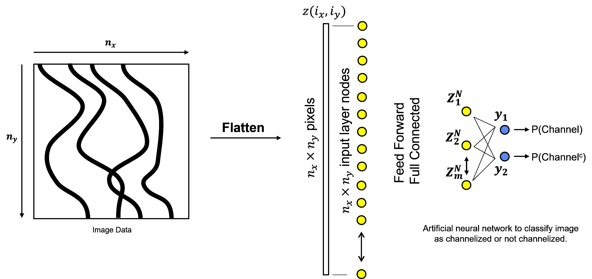

人工神经网络分类图像的示意图。

这种方法有什么问题？

1.  **模型参数数量巨大** - 模型可能难以训练且容易过拟合。

1.  **对位置非常敏感** - 我们希望从具有位置不变性的图像中学习，即，对于上面的例子，通道的位置不应重要。

1.  **将图像展平为向量** - 这是人工神经网络所必需的，但如果我们首先将图像展平为向量，我们就会丢失关于像素模式、顺序、相邻性等重要信息。

总结来说，人工神经网络在图像处理上非常低效，容易过拟合且泛化能力差！相反，让我们从我们的视觉皮层中汲取灵感，我们的视觉不会感知到所有‘像素’，而是将视野分割成感受野。

+   我们从重叠的感受野中提取感兴趣的特征，在层次结构（未显示）中重组整个图像，我们的感知。

+   我们不会感知到所有‘像素’，这对我们的大脑来说会非常累，相反，我们的视觉皮层会解释和总结模式。

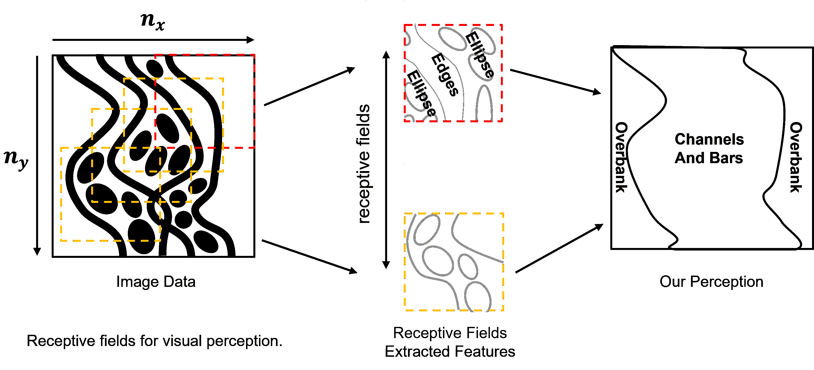

将重叠的感受野用于分割视野，总结每一部分并重新组合成我们的感知。

现在让我们用感受野的概念来比较人工神经网络和卷积神经网络。

全连接、前馈人工神经网络

+   下一层的节点连接到前一层的所有节点

+   空间信息丢失，图像数据立即展平为 1D 向量，相邻性和顺序信息丢失

使用感受野卷积神经网络进行正则化

+   下一层的节点映射到前一层特定的区域，即图像或特征图

+   空间信息得到保留，数据在每个层中保留了原始图像的 2D 或 3D 维度性，称为特征图。

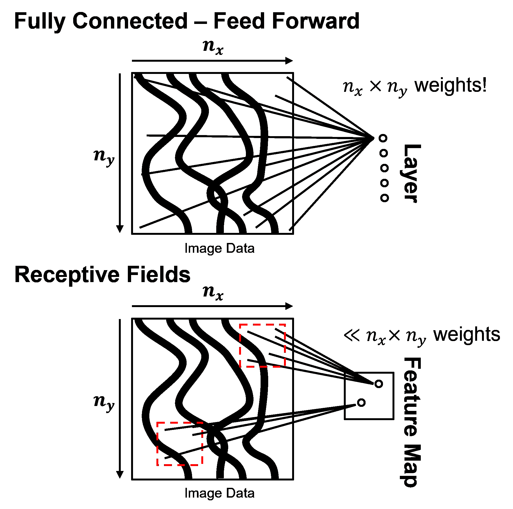

将重叠的感受野用于分割视野，总结每一部分并重新组合成我们的感知。

## CNN 的正则化

让我们快速回顾一下预测机器学习模型中正则化的概念，

**正则化** - 一种约束，以减少模型对数据的敏感性，即，减少模型方差

**使用感受野进行正则化** - 感受野的使用是一种正则化形式，导致，

+   连接、权重/模型参数的大量减少

+   有效地将这些潜在权重缩小到零

同时整合/关注像素模式！

**使用 Dropout 进行正则化** - 在训练周期中，随机忽略或“丢弃”一部分节点。每个训练周期都会看到网络的不同版本/子集

+   CNN 的一种额外正则化形式，以防止特定节点主导模型

+   模拟训练多个模型并平均，类似于集成学习。注意，通常不可行并行训练多个网络以应用集成来计算预测（如随机森林），并且在训练后所有节点都被使用。

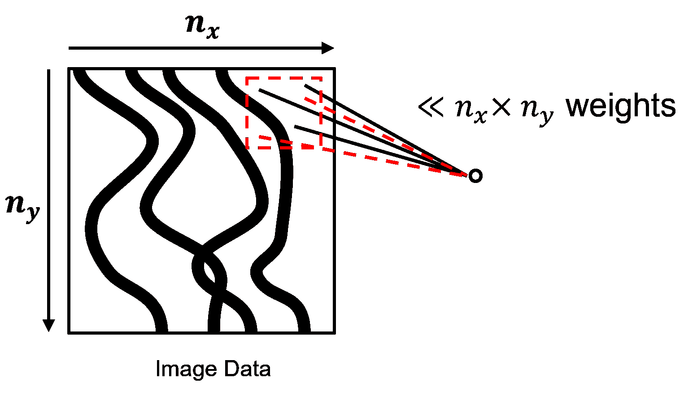

从感受野到特征图中的节点的随机连接的 dropout 示意图。

**批量归一化** - 在层上标准化节点的输入/权重，以中心化和缩放（均值为 0，方差为 1），以优化激活函数的敏感性和模型参数训练。

$$ \hat{x}_i \leftarrow \frac{x_i - \mu_B}{\sqrt{\sigma_B² + \epsilon}} $$

然后我们添加 2 个模型参数，层标准差，$\gamma$，和均值，$\beta$，以增加控制，提高下一层训练单个权重的最优性。

$$ y_i \leftarrow \gamma \hat{x}_i + \beta $$

## CNN 的构建模块

我们有各种算子可以在我们的卷积神经网络中从一层移动到另一层（特征图到特征图）。常见的算子包括，

+   **卷积** – 一个加权窗口，核/滤波器，用于提取空间信息

+   **池化** – 维度降低，增加局部平移不变性

+   **深度池化，下采样** – 1x1 滤波器，将通道/特征图组合起来，以在多个核上学习

+   **激活** – 使用激活函数对系统应用非线性变换，以赋予系统非线性，并防止系统简化为简单的线性模型

+   **全连接，前馈** – 参见之前关于人工神经网络的讲座

现在我们将描述、解释和演示这些算子。

## 卷积

卷积是两个函数的积分乘积，其中一个函数被反转并沿 $\Delta$ 平移。

+   一种解释是使用加权函数，$𝑓(\Delta)$，对函数进行平滑，以计算函数，$𝑔(x)$，的加权平均值，

$$ (f * g)(x) = \int_{-\infty}^{\infty} f(\Delta) g(x - \Delta) \, d\Delta $$

这很容易扩展到任何维度，例如 2D 用于图像，

$$ (f * g)(x, y) = \int_{-\infty}^{\infty} \int_{-\infty}^{\infty} f(\Delta_x, \Delta_y) g(x - \Delta_x, y - \Delta_y) \, d\Delta_x \, d\Delta_y $$

在积分之前选择哪个函数先平移，不会改变结果，卷积算子具有交换性，

$$ (f * g)(x) = \int_{-\infty}^{\infty} f(\Delta) g(x - \Delta) \, d\Delta $$$$ (f * g)(x) = \int_{-\infty}^{\infty} f(x - \Delta) g(\Delta) \, d\Delta $$

+   如果任一函数被反射，卷积就等同于交叉相关，它是两个信号作为位移函数相似度的度量。

为了演示使用详尽的 $g(x)$ 和稀疏采样的 $g(x)$ 的卷积，我构建了一个[交互式 Python 卷积仪表板](https://github.com/GeostatsGuy/DataScienceInteractivePython/blob/main/Interactive_Convolution_kNearest.ipynb)，

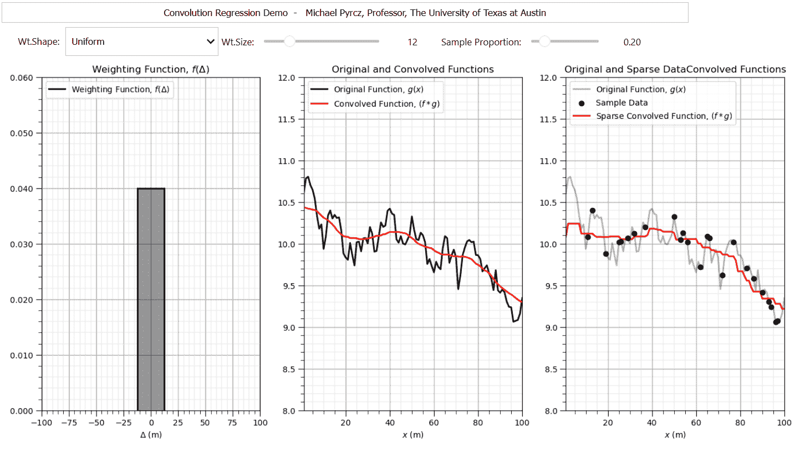

交互式 Python 仪表板用于演示卷积。

在模型训练过程中，学习一个可训练的加权函数 $g(\Tau)$ 用于卷积操作。

**滤波器/核** – 在卷积窗口中分配的权重，用于计算下一个特征图。通过训练权重，滤波器可以提取特定的空间特征。

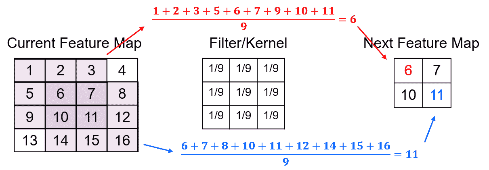

卷积计算的两种示例。

让我们看看一个特定的核形式，即模糊滤波器。

+   下一个特征图接收先前特征图或图像上的局部平均值。

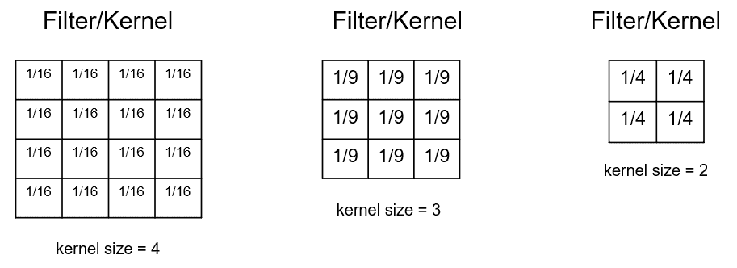

示例滤波器，模糊/局部平均滤波器。

关于滤波器的一些观察，

+   滤波器的大小与我们提取的特征的尺度相关

+   较大的核增加了连接数、模型权重，最终增加了计算复杂度

+   对于核大小使用奇数以避免扭曲，可能使用非对称核

+   求和为 1 可以防止偏差（从一幅图像或特征图到另一幅特征图的均值偏移）

**填充** - 我们的下一个特征图在所有边缘上减少了 1，以避免特征图外部的重叠，即无填充，而填充将扩展到特征图或图像外部，防止下一个特征图大小的减少。

+   存在多种填充方法，包括假设零、常数值和特征图中的最近值。

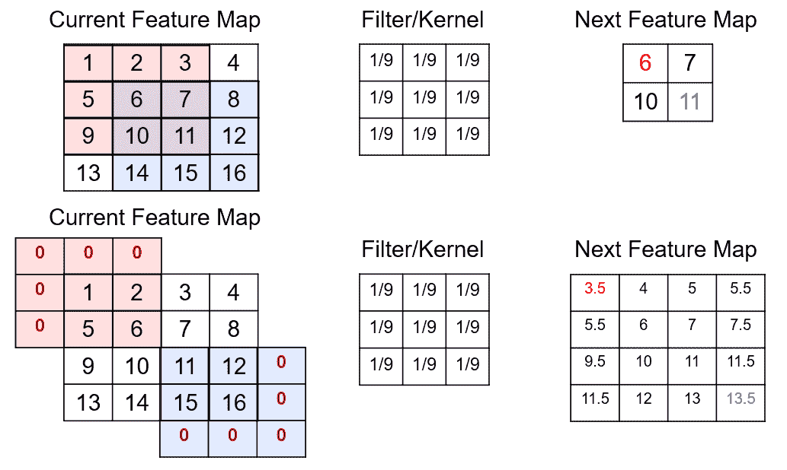

无填充的卷积导致特征图大小减少（上方）和有填充的卷积（假设特征图外部为 0）以避免特征图外部的重叠，即无填充，而填充将扩展到特征图或图像外部，防止下一个特征图大小的减少。

**步长** - 卷积滤波器/核在先前特征图上的步进。

+   对于步长为 1，特征图大小没有隐式减少。

+   对于步长大于 2，特征图大小会减少。

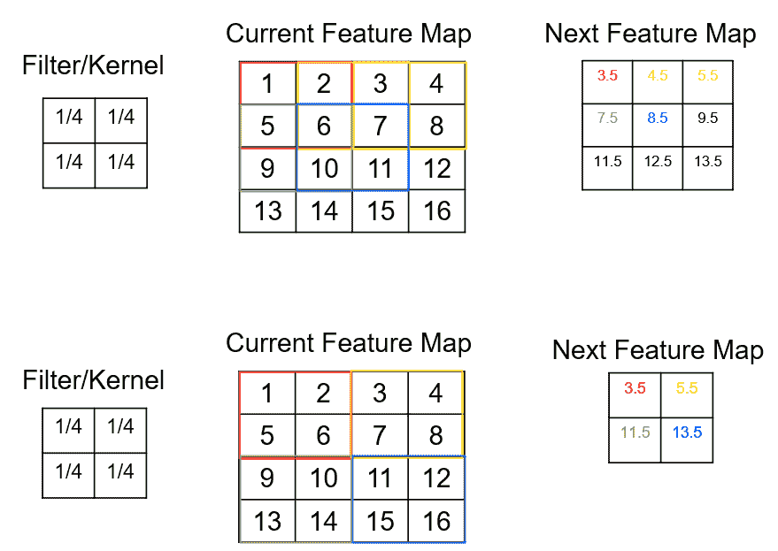

步长为 1 的卷积（上方）和步长为 2 的卷积（下方）导致特征图大小减少。

**下一个特征图的大小** - 下一个特征图的大小由超参数、先前特征图大小 $n_{in}$、卷积核大小 $k$、卷积填充大小 $p$ 和卷积步长大小 $s$ 决定，通过此方程，

$$ n_{\text{out}} = \left\lfloor \frac{n_{\text{in}} + 2p - k}{s} \right\rfloor + 1 $$

例如，

+   $n_{in} = 4$

+   $k = 2$

+   $p = 0$

+   $s = 1$

然后我们可以将此代入方程中，

$$ n_{\text{out}} = \left\lfloor \frac{4 + 2(0) - 2}{1} \right\rfloor + 1 = 3 $$

现在将此与该示例的视觉表示进行比较，

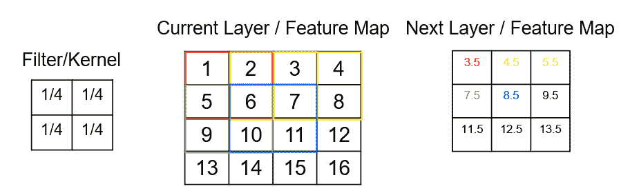

上述示例的示例核、输入和输出特征图。

我们计算下一个特征图大小如下：

$$ n_{\text{out}} = \left\lfloor \frac{4 + 2(0) - 2}{1} \right\rfloor + 1 = 3 $$

**滤波器/核设计** – 通过训练权重，滤波器可以提取特定的特征。考虑以下示例滤波器类型，以及输入和输出特征‘图’的简单 1D 示例。

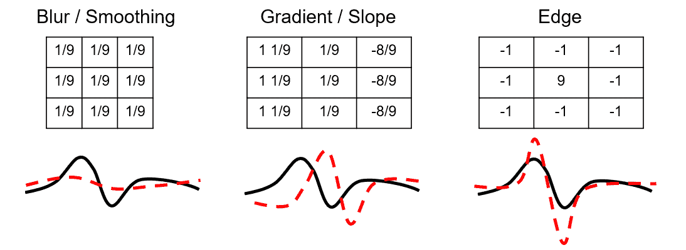

滤波器（上面，以及卷积的 1D 示意图，原始函数（黑色）和卷积（红色）下面）。

**多个滤波器/核** - 通常在每个卷积层上训练多个滤波器，$n_k$，以从图像中提取不同的结构。

+   这增加了特征图的深度或通道数，$n_k$

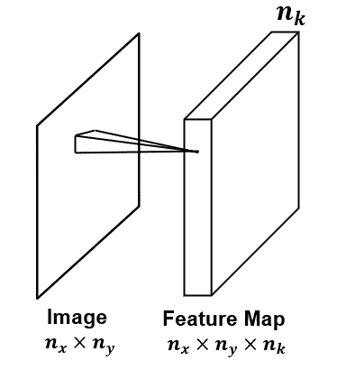

由于应用了多个滤波器到前一个图像或特征图，特征图具有深度，也称为通道数，$n_k$。

+   注意，原始图像可能具有多个通道，深度>1，例如，具有 3 个通道的 RGB 图像，每个通道分别对应红色、蓝色和绿色。

最后，这里有一些卷积滤波器应用于德克萨斯大学奥斯汀分校的砖墙图像的示例，代码可在[SubsurfaceDataAnalytics_Convolution_Operators.ipynb.](https://github.com/GeostatsGuy/PythonNumericalDemos/blob/master/SubsurfaceDataAnalytics_Convolution_Operators.ipynb)找到。

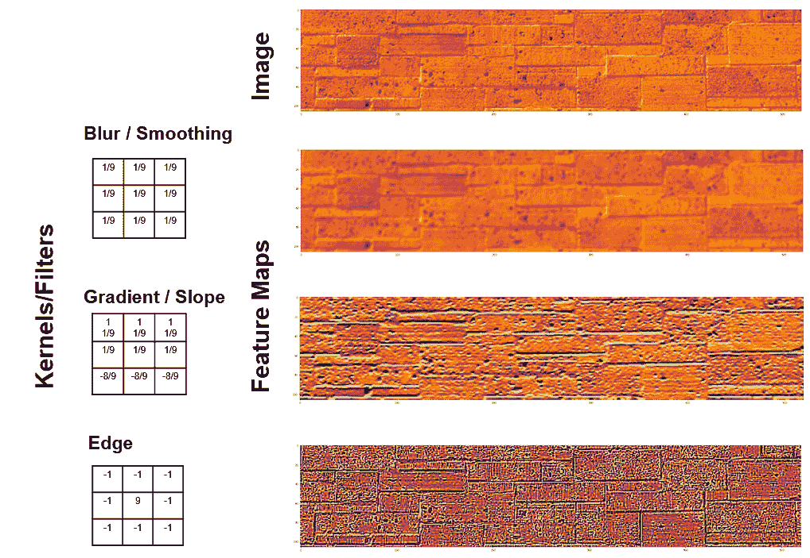

来自德克萨斯大学奥斯汀分校校园中砖墙的卷积示例。

## 激活函数

请参阅人工神经网络章节以获取更多详细信息，但为了提醒选择激活函数的考虑因素，

+   **非线性** – 将非线性强加到预测器中。如果至少有 1 个隐藏层（Cybenko，1989 年），已被证明是通用的函数逼近器。

+   **范围** – 对于更稳定的基于梯度的学习是有限的，对于更有效的训练是无限的（但需要较慢的学习率）

+   **连续可微** – 对于稳定的基于梯度的优化是必需的

+   **具有单调导数的平滑函数** – 可能具有更好的泛化能力

+   **单调** – 保证单层模型误差表面的凸性（损失函数的全局最小值）

+   **在原点近似恒等** – 使用小随机值初始化权重时，可以有效地学习

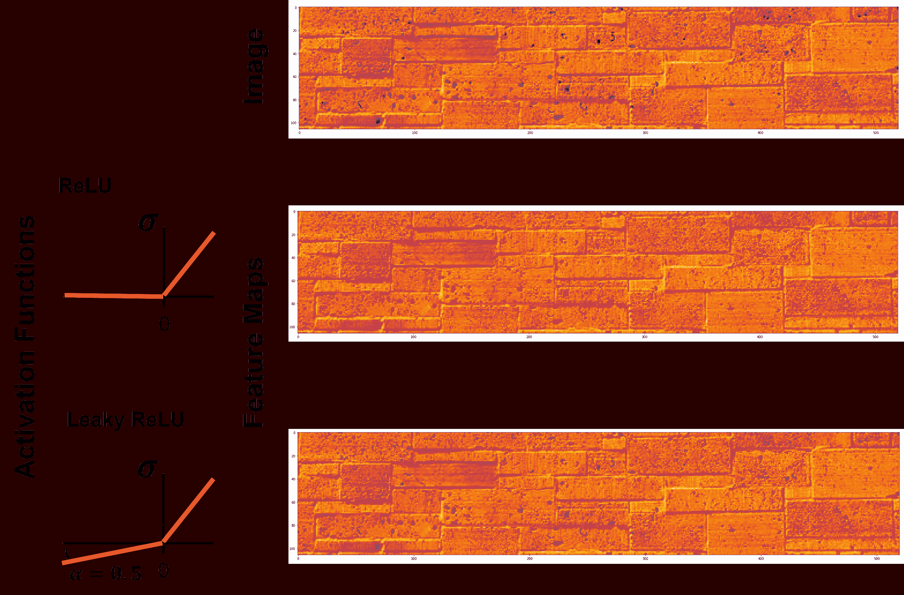

来自德克萨斯大学奥斯汀分校校园中砖墙的卷积示例。

## 池化

对单个值进行滤波器/核的汇总。池化的影响包括，

+   下采样特征图中特征检测

+   减少了特征图的维度

+   整合平移不变性，对位置不敏感的模式检测

两种常见的池化方法是平均池化和最大池化。

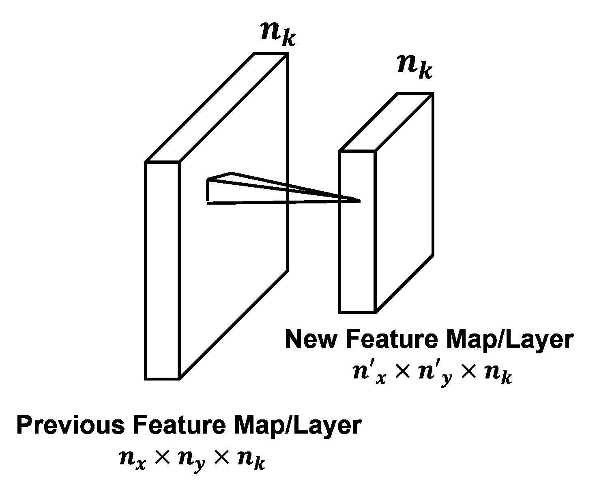

池化操作的示意图。

这里有一个使用 2x2 滤波器和步长为 2 的池化示例。

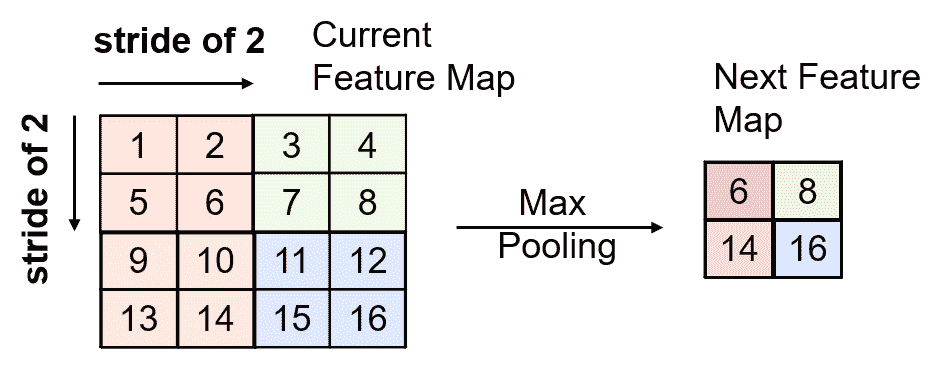

池化操作的示例，用于减少特征图的尺寸。

+   使用 2 x 2 滤波器，步长为 2，每个轴的维度减少一半，对于 2D 图像为四分之一。

+   例如，16 的值在滤波器内是位置无关的。这引入了平移不变性。

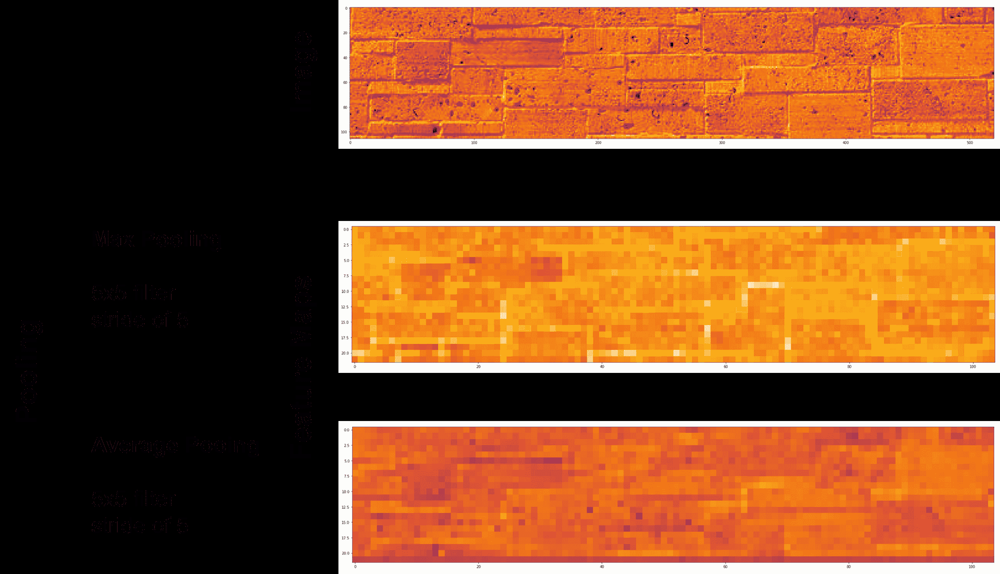

来自德克萨斯大学奥斯汀分校校园砖墙的最大池化和平均池化示例。

## 深度池化

使用单个值对特征图进行总结。

+   在特征图上对检测进行下采样

+   结合来自多个核的信息

+   减少了特征图的深度，下一层

两种常见的池化方法是平均池化和最大池化。

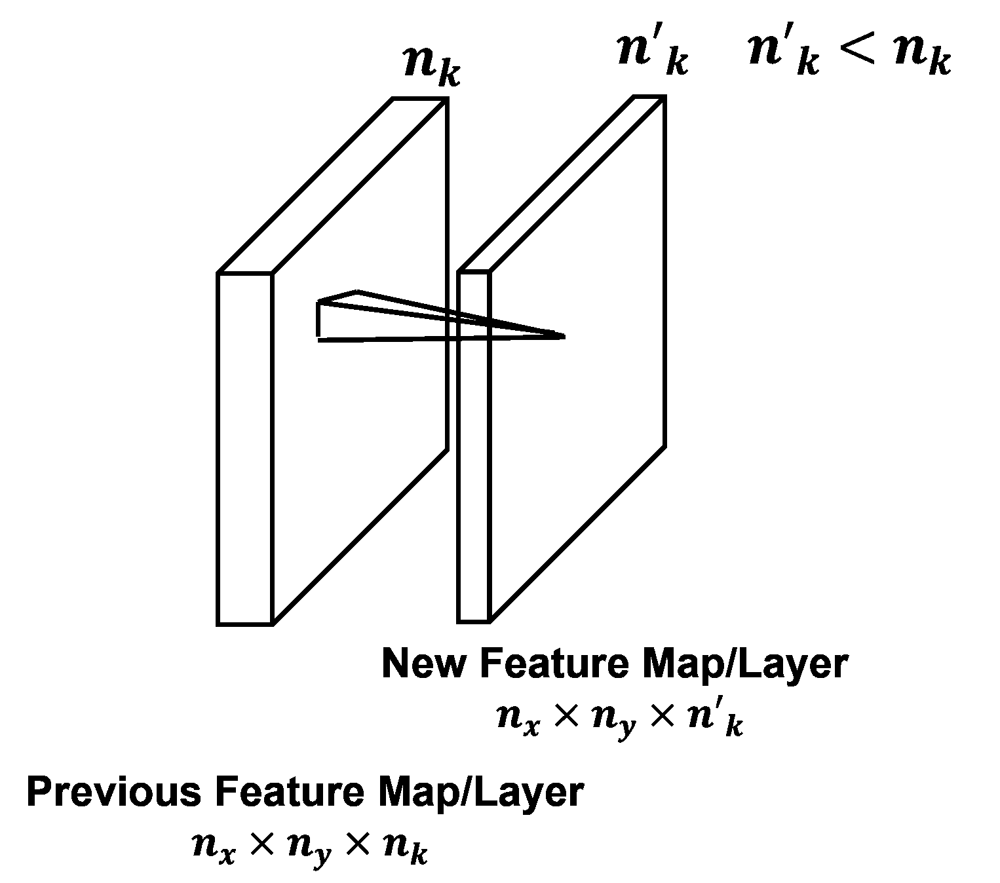

深度池化操作的示意图。

## 常见的 CNN 架构

以下是一个卷积神经网络的常见工作流程，

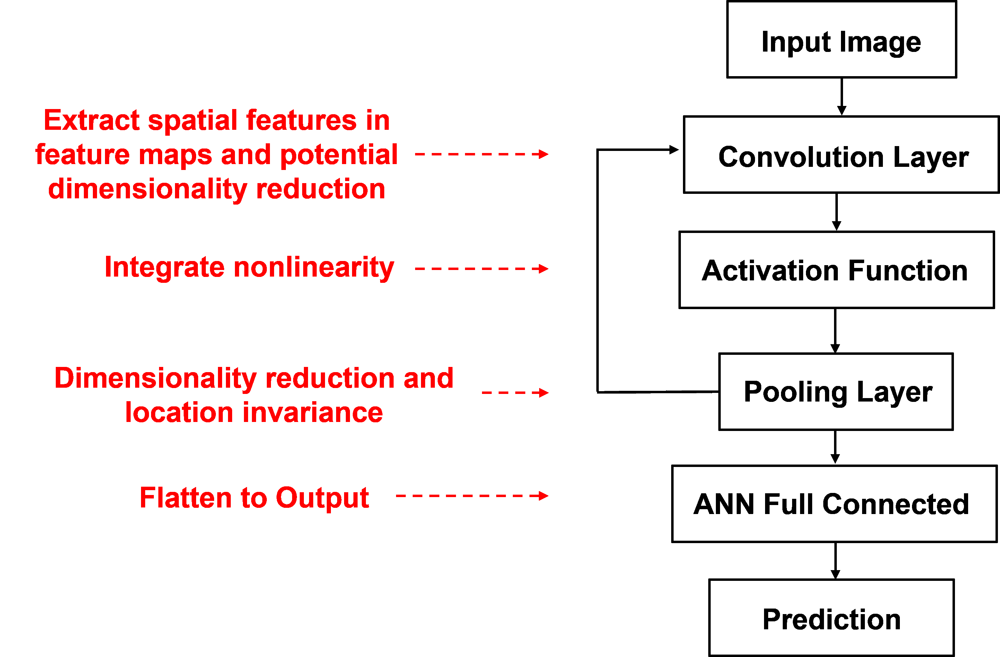

常见的 CNN 工作流程。

我们可以用常见架构的示意图来表示这个常见的工作流程。

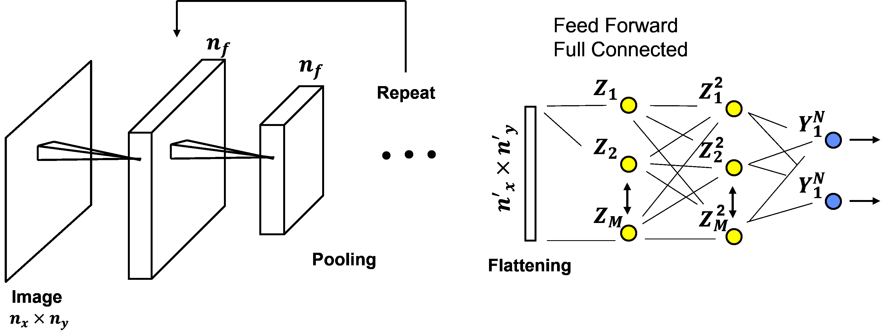

常见的 CNN 架构。

## 手工卷积神经网络架构

就像人工神经网络章节一样，我通过手工制作了一个简单的卷积神经网络。

为了简洁和简洁，我做出了以下架构选择，

+   高度为 5 的 1D 图像

+   1 个卷积层，大小为 3 的 1 个核

+   使用 sigmoid 激活

+   步长为 1 且无填充，因此特征图的大小为 3

+   从特征图直接到输出节点，具有线性激活的人工神经网络

这种简约架构展示了卷积神经网络中的许多显著概念，同时非常易于可视化且训练速度快。

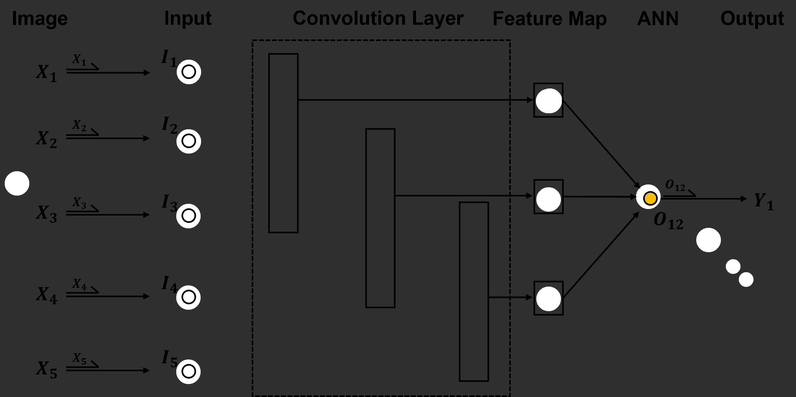

我们手工制作的卷积神经网络的示意图。

现在，我们将我们手工制作的卷积神经网络的示意图转换为实际节点的图。

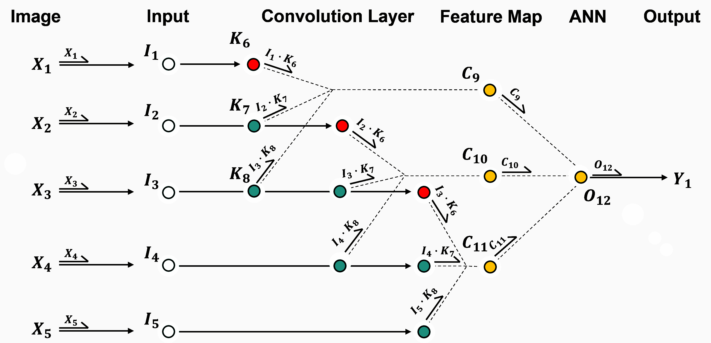

我们手工制作的卷积神经网络架构。

为了展示使用此架构的实用性，让我们添加模型参数的标签，

+   核权重，$\lambda_6$，$\lambda_7$，和 $\lambda_8$

+   核偏置，$b_{conv}$

+   人工神经网络权重，$\lambda_{9,12}$，$\lambda_{10,12}$，和 $\lambda_{11,12}$

+   人工神经网络偏差，$b_{12}$

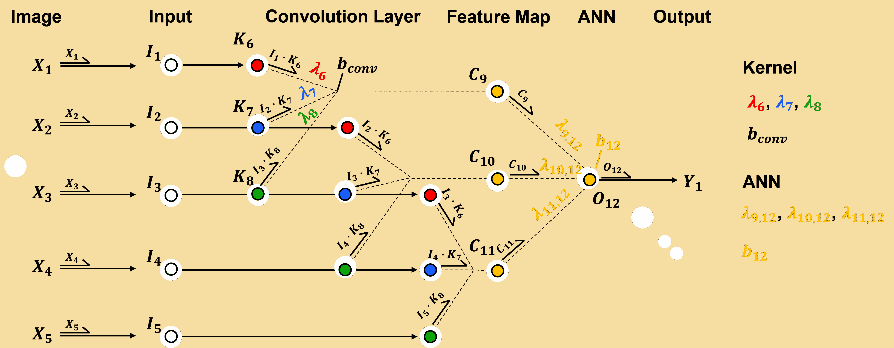

包含所有可训练模型参数的我们手工制作的卷积神经网络架构。注意，仅显示了第一个核位置中的核权重以避免杂乱。

## 训练模型参数

训练卷积神经网络通过以下步骤迭代进行，与人工神经网络章节中讨论的相同。


训练人工神经网络通过迭代进行，1. 前向传播进行预测，2. 根据训练数据中的预测和真实值计算误差导数，3. 通过人工神经网络反向传播误差导数以计算所有模型权重和偏置参数的误差导数，4. 根据导数和学习率更新模型参数，5. 重复直到收敛。

这里是每个步骤的详细信息，重点关注与人工神经网络的差异，更多细节请参阅人工神经网络章节。

1.  **初始化模型参数** - 通常使用接近零的小随机值初始化所有模型参数。这里有一些常见的方法，

+   **Xavier Glorot 均匀初始化** - 对于 Tanh 和 sigmoid 激活函数，从由 $U[\text{min}, \text{max}]$ 指定的均匀分布中随机取值，

$$ \lambda_i = F_U\left[-\sqrt{\frac{6}{n_{\text{in}} + n_{\text{out}}}},\ \sqrt{\frac{6}{n_{\text{in}} + n_{\text{out}}}}\right]^{-1}(p^\ell) $$

+   其中 $F^{-1}_U$ 是累积分布函数的逆，$p$ 是输入数量，$p^{\ell}$ 是从均匀分布 $U[0,1]$ 中抽取的随机累积概率值。

例如，给定一个输入通道为 1，输出通道为 9 的 $3 \times 3$ 卷积核，

$$ n_{in} = k \times k \times C = 3 \times 3 \times 1 $$$$ n_out = k \times k \times C = 3 \times 3 \times 9 $$

+   **He Kaiming 权重初始化** - 对于 ReLU 和 leaky ReLU 激活函数，从由 $U[\text{min}, \text{max}]$ 指定的均匀分布中随机取值，

$$ \lambda_i = F_U\left[-\sqrt{\frac{6}{n_{\text{in}}}},\ \sqrt{\frac{6}{n_{\text{in}}}}\right]^{-1}(p^\ell) $$

+   其中 $F^{-1}_U$ 是累积分布函数的逆，$p$ 是输入数量，$k$ 是输出数量，$p^{\ell}$ 是从均匀分布 $U[0,1]$ 中抽取的随机累积概率值。

1.  **前向传播** - 进行预测，$\hat{y}$。初始预测在第一次迭代将是随机的，但会改进。


使用随机初始化的模型参数、权重和偏置的人工神经网络进行预测。

1.  **计算误差导数** - 给定损失 $P = \frac{1}{2} \left(\hat{y} - y \right)²$，误差导数，即误差随模型估计变化的变化率是 $\frac{\partial P}{\partial \hat{y}} = \hat{Y} - Y$。

+   目前，我们只考虑单个估计值，稍后我们将讨论超过 1 个训练数据。

1.  **反向传播误差导数** - 我们通过人工神经网络反向传播以计算所有模型权重和偏置参数的误差导数，为此我们使用链式法则，

$$ \frac{\partial}{\partial x} f(g(h(x))) = \frac{\partial f}{\partial g} \cdot \frac{\partial g}{\partial h} \cdot \frac{\partial h}{\partial x} $$

1.  **更新模型参数** - 基于导数，$\frac{\partial P}{\partial \lambda_{i,j}}$ 和学习率，$\eta$，如下所示，

$$ \lambda_{i,j}^{\ell} = \lambda_{i,j}^{\ell - 1} + \eta \cdot \frac{\partial P}{\partial \lambda_{i,j}} $$

1.  **重复直到收敛** - 返回步骤 1，直到误差，$P$，降低到可接受的水平，即模型收敛是停止迭代的条件

## 反向传播

为了简洁起见，我建议您参考人工神经网络章节，了解通过神经网络反向传播误差梯度的过程。

## 更新模型参数

每个模型参数的导数是误差梯度，因此我们准备好使用梯度下降优化，并添加，

+   **学习率** - 为了缩放模型更新的变化率，我们分配一个学习率，$\eta$。对于我们上面的模型参数示例，

$$ \lambda_{9,12}^{\ell} = \lambda_{9,12}^{\ell - 1} - \eta \cdot \frac{\partial P}{\partial \lambda_{9,12}} $$$$ \lambda_{10,12}^{\ell} = \lambda_{10,12}^{\ell - 1} - \eta \cdot \frac{\partial P}{\partial \lambda_{10,12}} $$$$ b_{12}^{\ell} = b_{12}^{\ell - 1} + \eta \cdot \frac{\partial P}{\partial b_{12}} $$

+   回想一下，这个过程是梯度计算和模型参数、权重和偏置的更新，迭代并被称为梯度下降优化。

+   目标是探索损失超曲面，避免并逃离局部最小值，最终找到全局最小值。

+   学习率，也称为步长，通常设置在 0.0 到 1.0 之间，注意在 TensorFlow 的 Keras 模块中默认为 0.01

+   **低学习率** – 更稳定，但解的速度较慢，可能会陷入局部最小值

+   **高学习率** – 可能不稳定，但可能是一个更快的解决方案，可能会发散到全局最小值之外

一种策略是从一个高的学习率开始，然后在迭代过程中逐渐降低学习率

+   **学习率衰减** - 设置为> 0 以避免减轻振荡，

## 训练周期

现在是讨论随机梯度下降优化的好时机，首先让我们定义一些常见术语，

+   **批量梯度下降** - 在通过所有数据后更新模型参数

+   **随机梯度下降** - 在每个样本数据上更新模型参数

+   **小批量梯度下降** - 在通过单个批次后更新模型参数

在小批量梯度下降中，通过使用数据子集，称为批次，引入了随机性，

+   例如，如果我们把我们的 100 个样本分成 4 个批次，那么我们分别迭代每个批次

+   我们加快了单个更新的速度，数据更少，计算更快，但我们也引入了更多的误差

+   这通常有助于训练探索全局最小值，并避免陷入局部最小值和损失超曲面上的脊

最后，我们在这里定义的最后一个术语，

+   **epoch** - 是遍历所有数据的一次，因此如果有 4 个 mini-batches，那么模型参数的更新将会进行 4 次迭代。

还有许多其他考虑因素，我将在以后添加，包括，

+   动量

+   自适应优化

现在让我们手动构建上述人工神经网络并可视化解决方案！

+   这是手动操作，这样你可以看到每一个计算。我故意避免使用 TensorFlow 或 PyTorch。

## 使用多个训练图像进行训练

反向传播基于单个样本，即训练图像和配对的响应特征值；因此，要训练多个图像，我们必须循环遍历它们，

+   前向传播

+   计算误差导数

+   反向传播

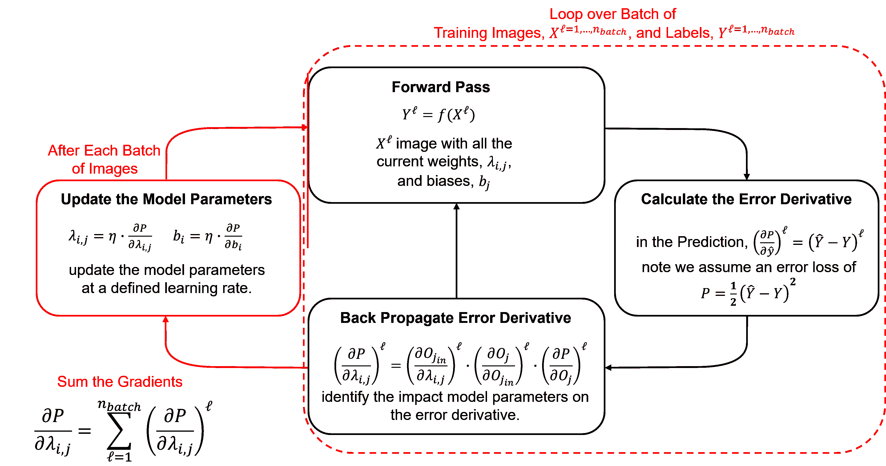

批量训练过程。

对于每个图像，存储权重和偏置的梯度。然后，在批次的图像上对梯度进行求和，并将这个和与学习率一起应用以更新权重和偏置。

## 前向传播

为了清晰起见，让我们从图像输入开始遍历卷积神经网络。

输入节点接收从图像到卷积层的输入，

+   保留节点顺序以保留从图像中获取的空间、位置信息。

对于连续特征图像，

+   连续预测特征值被归一化到 [0,1] 或 [-1,1]，以改善特定激活函数的灵敏度。

+   对于彩色图像，RGB 通道可能每个都被归一化并作为 3 个输入通道包含在内。

对于分类特征图像，

+   对于二元，基数为 2 的情况，值可以通过指示变换重新分配为 0 或 1

+   对于基数大于 2 的情况，可能应用 one-hot-encoding，从而产生 $k$ 个输入通道。

有关这些变换的更多详细信息，请参阅特征变换章节。

现在我们通过一个卷积层，包括卷积和激活，得到一个新的特征图。

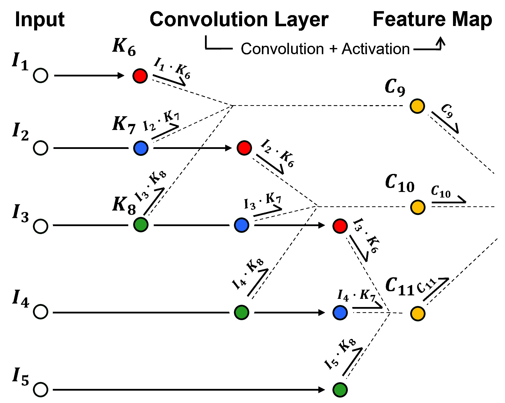

通过手动卷积神经网络（convolutional neural network）的遍历，通过卷积层。

+   根据输入图像或前一个特征图的核（kernel）进行线性加权的组合，添加一个偏置项，然后对结果进行非线性变换，这种变换称为激活函数，$\alpha$。

$$ C_{j_{\text{in}}} = \sum_{i=1}^{n} \left( K_{i+5} \cdot I_{j-8} \right) + b_{conv} $$

其中，$K_6$、$K_7$ 和 $K_8$ 是核权重，$b_{conv}$ 是核偏置，$I$ 是输入节点。

请原谅方程中的奇怪索引，我喜欢为每个节点使用唯一的节点整数，以避免在笔记和代码中混淆节点，但这确实使索引分配复杂化。

$$ C_{9_{\text{in}}} = I_1 \cdot K_6 + I_2 \cdot K_7 + I_3 \cdot K_8 + b_{\text{conv}} $$$$ C_{10_{\text{in}}} = I_2 \cdot K_6 + I_3 \cdot K_7 + I_4 \cdot K_8 + b_{\text{conv}} $$$$ C_{11_{\text{in}}} = I_3 \cdot K_6 + I_4 \cdot K_7 + I_5 \cdot K_8 + b_{\text{conv}} $$

然后对每个节点应用非线性激活，

$$ C_j = \alpha \left( C_{j_{in}} \right) \quad j = 9, \ldots 11 $$

现在我们从特征图通过人工神经网络到输出。

这只是一个标准的具有展平特征图并将其移动到输出的简单人工神经网络。

+   在这个例子中，为了简洁起见，我们展示了最简单的可能的人工神经网络，即特征图之后的下一层是输出。更复杂的具有隐藏层的架构通常被应用。

+   此外，由于我们的图像是 1D 的，我们不需要进行展平步骤

输出节点是人工神经网络的标准输出节点，

+   输入是前一层节点的线性组合，并添加了一个偏置项。

$$ O_{j_{\text{in}}} = \sum_{j=1}^{m} \left( \lambda_{i,j} \cdot H_i \right) + b_j $$

然后应用一个激活函数，

$$ O_j = \alpha \left( O_{j_{in}} \right) $$

对于回归模型的情况，具有连续响应特征，应用线性或恒等激活函数，

$$ O_j = \alpha \left( O_{j_{in}} \right) = O_{j_{in}} $$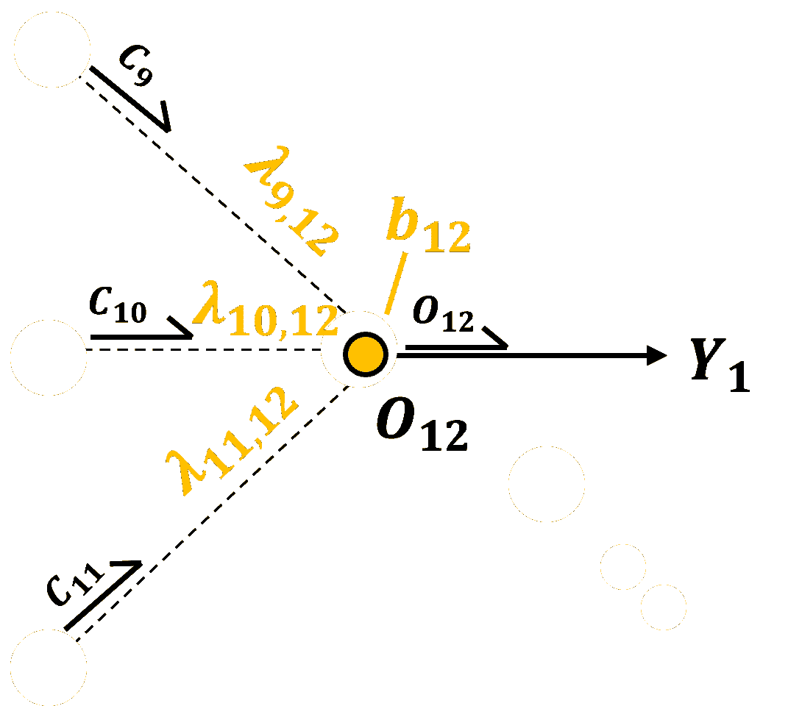

我们的卷积神经网络的手动实现过程，从特征图到输出，用于连续输出。

对于分类模型的情况，具有分类响应特征，在等于响应特征基数$K$的节点上应用 softmax 激活函数。

+   输出是每个类别的概率，符合非负性和闭合约束

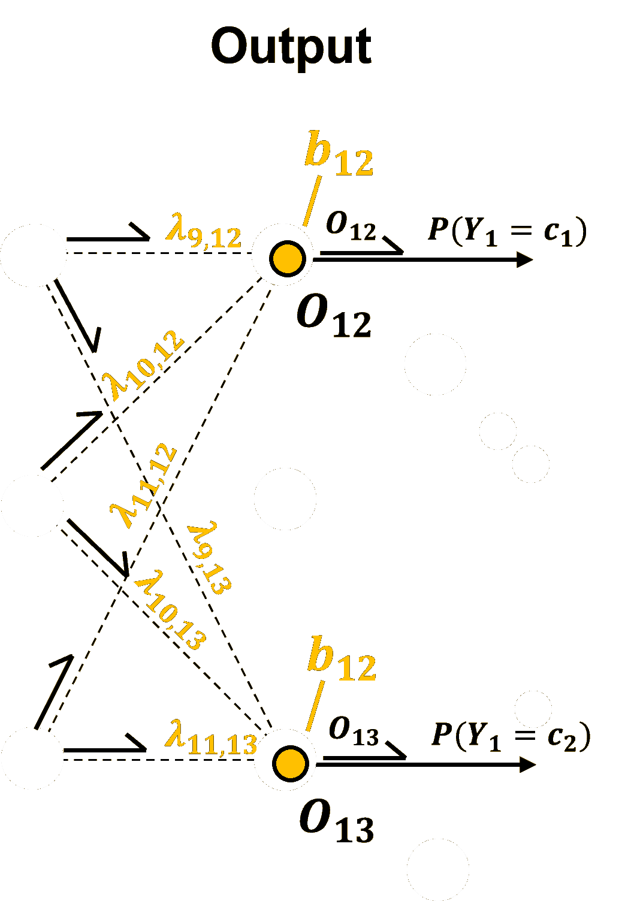

我们的卷积神经网络的手动实现过程，从特征图到输出，用于分类输出。

$$ O_j = g_k(O_{j_{\text{in}}}) = \frac{e^{O_{j_{\text{in}}}}}{\sum_{\iota=1}^{K} e^{O_{\iota_{\text{in}}}}} $$

## 导入所需的包

我们还需要一些标准包。这些应该已经与 Anaconda 3 一起安装。

+   记住我们的目标是手动构建一个卷积神经网络，只使用基本的数学和数组操作，因此我们只需要 NumPy 以及 matplotlib 进行绘图。

```py
import numpy as np
import pandas as pd
import matplotlib.pyplot as plt
from matplotlib.ticker import (MultipleLocator, AutoMinorLocator, AutoLocator) # control of axes ticks
plt.rc('axes', axisbelow=True)                            # set axes and grids in the background for all plots
import math
seed = 13 
```

如果您遇到包导入错误，您可能需要首先安装这些包中的一些。这通常可以通过在 Windows 上打开命令窗口然后输入‘python -m pip install [package-name]’来完成。更多帮助可以在相应包的文档中找到。

## 声明函数

这里是创建、训练和可视化我们的卷积神经网络的函数。

```py
def add_grid():
    plt.gca().grid(True, which='major',linewidth = 1.0); plt.gca().grid(True, which='minor',linewidth = 0.2) # add y grids
    plt.gca().tick_params(which='major',length=7); plt.gca().tick_params(which='minor', length=4)
    plt.gca().xaxis.set_minor_locator(AutoMinorLocator()); plt.gca().yaxis.set_minor_locator(AutoMinorLocator()) # turn on minor ticks 

def calculate_angle_rads(x1, y1, x2, y2):
    dx = x2 - x1     # Calculate the differences
    dy = y2 - y1
    angle_rads = math.atan2(dy, dx)    # Calculate the angle in radians
    #angle_degrees = math.degrees(angle_radians)    # Convert the angle to degrees
    return angle_rads

def offset(pto, distance, angle_deg): # modified from ChatGPT 4.o generated
    angle_rads = math.radians(angle_deg) # Convert angle from degrees to radians
    x_new = pto[0] + distance * math.cos(angle_rads) # Calculate the new coordinates
    y_new = pto[1] + distance * math.sin(angle_rads)
    return np.array((x_new, y_new))

def offsetx(xo, distance, angle_deg): # modified from ChatGPT 4.o generated
    angle_rads = math.radians(angle_deg) # Convert angle from degrees to radians
    x_new = xo + distance * math.cos(angle_rads) # Calculate the new coordinates
    return np.array((xo, x_new))

def offset_arrx(xo, distance, angle_deg,size): # modified from ChatGPT 4.o generated
    angle_rads = math.radians(angle_deg) # Convert angle from degrees to radians
    x_new = xo + distance * math.cos(angle_rads) # Calculate the new coordinates
    x_arr = x_new + size * math.cos(angle_rads+2.48) # Calculate the new coordinates
    return np.array((x_new, x_arr))

def offsety(yo, distance, angle_deg): # modified from ChatGPT 4.o generated
    angle_rads = math.radians(angle_deg) # Convert angle from degrees to radians
    y_new = yo + distance * math.sin(angle_rads) # Calculate the new coordinates
    return np.array((yo, y_new))

def offset_arry(yo, distance, angle_deg,size): # modified from ChatGPT 4.o generated
    angle_rads = math.radians(angle_deg) # Convert angle from degrees to radians
    y_new = yo + distance * math.sin(angle_rads) # Calculate the new coordinates
    y_arr = y_new + size * math.sin(angle_rads+2.48) # Calculate the new coordinates
    return np.array((y_new, y_arr))

def lint(x1, y1, x2, y2, t):
    # Calculate the interpolated coordinates
    x = x1 + t * (x2 - x1)
    y = y1 + t * (y2 - y1)
    return np.array((x, y))

def lintx(x1, y1, x2, y2, t):
    # Calculate the interpolated coordinates
    x = x1 + t * (x2 - x1)
    return x

def linty(x1, y1, x2, y2, t):
    # Calculate the interpolated coordinates
    y = y1 + t * (y2 - y1)
    return y

def lint_intx(x1, y1, x2, y2, ts, te):
    # Calculate the interpolated coordinates
    xs = x1 + ts * (x2 - x1)
    xe = x1 + te * (x2 - x1)
    return np.array((xs,xe))

def lint_inty(x1, y1, x2, y2, ts, te):
    # Calculate the interpolated coordinates
    ys = y1 + ts * (y2 - y1)
    ye = y1 + te * (y2 - y1)
    return np.array((ys,ye))

def lint_int_arrx(x1, y1, x2, y2, ts, te, size):
    # Calculate the interpolated coordinates
    xe = x1 + te * (x2 - x1)
    line_angle_rads = calculate_angle_rads(x1, y1, x2, y2)
    x_arr = xe + size * math.cos(line_angle_rads+2.48) # Calculate the new coordinates
    return np.array((xe,x_arr))

def lint_int_arry(x1, y1, x2, y2, ts, te, size):
    # Calculate the interpolated coordinates
    ye = y1 + te * (y2 - y1)
    line_angle_rads = calculate_angle_rads(x1, y1, x2, y2)
    y_arr = ye + size * math.sin(line_angle_rads+2.48) # Calculate the new coordinates
    return np.array((ye,y_arr))

def as_si(x, ndp): # from xnx on StackOverflow https://stackoverflow.com/questions/31453422/displaying-numbers-with-x-instead-of-e-scientific-notation-in-matplotlib 
    s = '{x:0.{ndp:d}e}'.format(x=x, ndp=ndp)
    m, e = s.split('e')
    return r'{m:s}\times 10^{{{e:d}}}'.format(m=m, e=int(e)) 
```

## 简单的手动 CNN

我编写了这段代码来指定一个简单的 CNN，

+   五个输入节点，1 个具有 3 个核的卷积层，在特征图中产生 3 个节点和 1 个输出节点

并通过迭代执行前向计算和反向传播来训练 CNN。我计算：

+   然后传播错误到每个节点

+   求解误差相对于每个权重和偏置的偏导数

所有权重、偏置和所有 epoch 的偏导数都记录在向量中以便绘图

```py
# initial CNN trains on one sample
x1 = 0.1; x2 = 0.2; x3 = 0.3; x4 = 0.4; x5 = 0.5; y = 0.1 # training data
lr = 0.2 # learning rate

np.random.seed(seed=seed)

nepoch = 1000

w6 = np.zeros(nepoch); w7 = np.zeros(nepoch); w8 = np.zeros(nepoch)
w9 = np.zeros(nepoch); w10 = np.zeros(nepoch); w11 = np.zeros(nepoch)
bconv = np.zeros(nepoch); b12 = np.zeros(nepoch)

k6i1 = np.zeros(nepoch); k6i2 = np.zeros(nepoch); k6i3 = np.zeros(nepoch)
k7i2 = np.zeros(nepoch); k7i3 = np.zeros(nepoch); k7i4 = np.zeros(nepoch)
k8i3 = np.zeros(nepoch); k8i4 = np.zeros(nepoch); k8i5 = np.zeros(nepoch)

dk6i1 = np.zeros(nepoch); dk6i2 = np.zeros(nepoch); dk6i3 = np.zeros(nepoch)
dk7i2 = np.zeros(nepoch); dk7i3 = np.zeros(nepoch); dk7i4 = np.zeros(nepoch)
dk8i3 = np.zeros(nepoch); dk8i4 = np.zeros(nepoch); dk8i5 = np.zeros(nepoch)

c9 = np.zeros(nepoch); c10 = np.zeros(nepoch); c11 = np.zeros(nepoch)
d9 = np.zeros(nepoch); d10 = np.zeros(nepoch); d11 = np.zeros(nepoch)

o12 = np.zeros(nepoch)

dw6 = np.zeros(nepoch); dw7 = np.zeros(nepoch); dw8 = np.zeros(nepoch)
dw9 = np.zeros(nepoch); dw10 = np.zeros(nepoch); dw11 = np.zeros(nepoch)
dbconv = np.zeros(nepoch); db12 = np.zeros(nepoch)

d6 = np.zeros(nepoch); d7 = np.zeros(nepoch); d8 = np.zeros(nepoch); 
d19 = np.zeros(nepoch); d10 = np.zeros(nepoch); d11 = np.zeros(nepoch); d12 = np.zeros(nepoch); 

# initialize the weights - Xavier Weight Initialization 
lower, upper = -(1.0 / np.sqrt(3.0)), (1.0 / np.sqrt(3.0)) # lower and upper bound for the weights, uses inputs to node
#lower, upper = -(sqrt(6.0) / sqrt(3.0 + 2.0)), (sqrt(6.0) / sqrt(3.0 + 2.0)) # Normalized Xavier weights, integrates ouputs also
w6[0] = lower + np.random.random() * (upper - lower); 
w7[0] = lower + np.random.random() * (upper - lower); 
w8[0] = lower + np.random.random() * (upper - lower);

lower, upper = -(1.0 / np.sqrt(2.0)), (1.0 / np.sqrt(2.0))
#lower, upper = -(sqrt(6.0) / sqrt(2.0 + 1.0)), (sqrt(6.0) / sqrt(2.0 + 1.0)) # Normalized Xavier weights, integrates ouputs also

w9[0] = lower + np.random.random() * (upper - lower); 
w10[0] = lower + np.random.random() * (upper - lower);     
w11[0] = lower + np.random.random() * (upper - lower);     

#b4[0] = np.random.random(); b5[0] = np.random.random(); b6[0] = np.random.random()
bconv[0] = (np.random.random()-0.5)*0.5
b12[0] = (np.random.random()-0.5)*0.5; # small random value 

for i in range(0,nepoch):

# forward pass of model
    c9[i] = w6[i]*x1 + w7[i]*x2 + w8[i]*x3 + bconv[i]; 
    c9[i] = 1.0/(1 + math.exp(-1*c9[i]))

    c10[i] = w6[i]*x2 + w7[i]*x3 + w8[i]*x4 + bconv[i]; 
    c10[i] = 1.0/(1 + math.exp(-1*c10[i]))

    c11[i] = w6[i]*x3 + w7[i]*x4 + w8[i]*x5 + bconv[i]; 
    c11[i] = 1.0/(1 + math.exp(-1*c11[i]))

    o12[i] = w9[i]*c9[i] + w10[i]*c10[i] + w11[i]*c11[i] + b12[i]

# back propagate the error through the nodes
    d12[i] = (o12[i]-y) # identity activation o at o12 - switched substraction on May 27, 2025
    d9[i] =  c9[i]*(1-c9[i])*w9[i]*d12[i]   # propagate to the front feature map layer
    d10[i] = c10[i]*(1-c10[i])*w10[i]*d12[i]
    d11[i] = c11[i]*(1-c11[i])*w11[i]*d12[i]

    dk6i1 = x1*d9[i]; dk7i2 = x2*d9[i]; dk8i3 = x3*d9[i] 
    dk6i2 = x2*d10[i]; dk7i3 = x3*d10[i]; dk8i4 = x4*d10[i] 
    dk6i3 = x3*d11[i]; dk7i4 = x4*d11[i]; dk8i5 = x5*d11[i] 

    d6[i] = dk6i1 + dk6i2 + dk6i3
    d7[i] = dk7i2 + dk7i3 + dk7i4
    d8[i] = dk8i3 + dk8i4 + dk8i5

# calculate the change in weights
    if i < nepoch - 1:
        dw6[i] = lr*d6[i]; dw7[i] = lr*d7[i]; dw8[i] = lr*d8[i]
        dw9[i] = lr*c9[i]*d12[i]; dw10[i] = lr*c10[i]*d12[i]; dw11[i] = lr*c11[i]*d12[i];
        dbconv[i] = lr*(d9[i] + d10[i] + d11[i]); db12[i] = lr*d12[i]

        w6[i+1] = w6[i] - dw6[i]; w7[i+1] = w7[i] - dw7[i]; w8[i+1] = w8[i] - dw8[i]
        w9[i+1] = w9[i] - dw9[i]; w10[i+1] = w10[i] - dw10[i]; w11[i+1] = w11[i] - dw11[i]
        bconv[i+1] = bconv[i] - dbconv[i]; b12[i+1] = b12[i] - db12[i] 
```

## 手动可视化 CNN

让我们可视化我们的卷积神经网络。

+   注意，我将在以后使用此代码制作交互式仪表板。

```py
xin = 0.1; yin_range = 0.7
nin = 5

kcolors = ['red','blue','green']
xin = np.array([0.1,0.2,0.3,0.4,0.5])
yout = np.array([y])
cin = np.array([0.1,0.2,0.3])
kx = 0.6

plt.subplot(111)
#plt.gca().set_axis_off()

for i, (xi) in enumerate(zip(xin), start=1):
    eq1 = r"$X_{{{}}}$".format(i)
    eq2 = r"$X_{{{}}} = {}$".format(i, xi[0])
    eq3 = r"$I_{{{}}}$".format(i)
    xpos = 0.4; ypos = yin_range - ((i-1)/nin) * yin_range 
    circle_i1 = plt.Circle((xpos,ypos), 0.015, fill=False, edgecolor = 'black',lw=1,zorder=100); 
    circle_i1b = plt.Circle((xpos,ypos), 0.025, fill=True, facecolor = 'white',edgecolor = None,lw=0.5,zorder=10);
    plt.gca().add_patch(circle_i1); plt.gca().add_patch(circle_i1b)
    plt.annotate(eq1, (xpos-0.2, ypos), textcoords="offset points", xytext=(-12, -3), ha='center',size=15)
    plt.annotate(eq2, (xpos, ypos), textcoords="offset points", xytext=(-70, 9), ha='center')
    plt.plot([xpos-0.2,xpos],[ypos,ypos],color='black',lw=2); plt.plot([xpos-0.2,xpos-0.07],[ypos+0.01,ypos+0.01],color='black',lw=2)
    plt.plot([xpos-0.07,xpos-0.08],[ypos+0.01,ypos+0.02],color='black',lw=2)
    plt.annotate(eq3, (xpos,ypos), textcoords="offset points", xytext=(-15, 15), ha='center',size = 15)

for iconv in range(0,3):  
    xpos = kx+iconv*0.2;
    ytop = yin_range - (iconv/nin)*yin_range - ((1-1)/nin) * yin_range
    ybot = yin_range - (iconv/nin)*yin_range - ((3-1)/nin) * yin_range  
    plt.plot([xpos+0.12,xpos+0.12],[ytop+0.005,ybot+0.005],color='red',lw=1,ls='--',zorder=80)
    for ik, (ki) in enumerate(zip(np.arange(1,4,1)), start=1):
        eq4 = r"$K_{{{}}}$".format(ik+5)
        ypos = yin_range - (iconv/nin)*yin_range - ((ik-1)/nin) * yin_range
        circle_i1 = plt.Circle((xpos,ypos), 0.015, fill=True, facecolor = kcolors[ik-1],edgecolor = 'black',lw=1,zorder=200);
        circle_i1b = plt.Circle((xpos,ypos), 0.025, fill=True, facecolor='white',edgecolor = None,lw=0.5,zorder=190);
        plt.gca().add_patch(circle_i1); plt.gca().add_patch(circle_i1b)
        plt.annotate(eq4, (xpos,ypos), textcoords="offset points", xytext=(-15, 15), ha='center',size = 15)
        plt.plot([0.4,xpos],[ypos,ypos],color='black',lw=1,zorder=1)
        plt.plot([xpos,xpos+0.12],[ypos+0.005,ypos+0.005],color='red',lw=1,ls='--',zorder=80)
        eq8 = r"$I_{{{}}} \cdot K_{{{}}}$".format((iconv)+ik,ik+5)        
        plt.annotate(eq8, (xpos+0.12, ypos), textcoords="offset points", xytext=(-25, 5), ha='center',size = 10)

for ic, (ci) in enumerate(zip(np.arange(1,4,1)), start=1):
    eq5 = r"$C_{{{}}}$".format(ic+8)
    xpos = 1.2; ypos = yin_range - ((ic-1)/4) * yin_range - 0.07
    circle_i1 = plt.Circle((xpos,ypos), 0.015, fill=True, facecolor = 'gold',edgecolor = 'black',lw=1,zorder=200);
    circle_i1b = plt.Circle((xpos,ypos), 0.025, fill=True, facecolor='white',edgecolor = None,lw=0.5,zorder=190);
    plt.gca().add_patch(circle_i1); plt.gca().add_patch(circle_i1b)
    plt.annotate(eq5, (xpos,ypos), textcoords="offset points", xytext=(-15, 15), ha='center',size = 15)
    #plt.plot([0.4,x],[y,y],color='black',lw=1,zorder=1)
    plt.plot([xpos,1.5],[ypos,yin_range - ((2-1)/4) * yin_range - 0.07],color='black',lw=1)
    plt.plot([kx+(ic-1)*0.2+0.12,xpos],[ypos,ypos],color='red',lw=1,ls='--',zorder=80)

eq6 = r"$O_{{{}}}$".format(12)
eq7 = r"$Y_{{{}}} = {}$".format(i, np.round(yout[0],2))
xpos = 1.5; ypos = yin_range - ((2-1)/4) * yin_range - 0.07
circle_i1 = plt.Circle((xpos,ypos), 0.015, fill=True, facecolor = 'gold',edgecolor = 'black',lw=1,zorder=200);
circle_i1b = plt.Circle((xpos,ypos), 0.025, fill=True, facecolor='white',edgecolor = None,lw=0.5,zorder=190);
plt.gca().add_patch(circle_i1); plt.gca().add_patch(circle_i1b)
plt.annotate(eq6, (xpos, ypos), textcoords="offset points", xytext=(-15, 15), ha='center',size = 15)
plt.annotate(eq7, (xpos, ypos), textcoords="offset points", xytext=(130,-4), ha='center',size = 15)
plt.plot([xpos,xpos+0.2],[ypos,ypos],color='black',lw=2); plt.plot([xpos,xpos+0.13],[ypos+0.01,ypos+0.01],color='black',lw=2)
plt.plot([xpos+0.13,xpos+0.12],[ypos+0.01,ypos+0.02],color='black',lw=2)
plt.annotate(eq6, (xpos, ypos), textcoords="offset points", xytext=(20, 10), ha='center')

plt.xlim([0.,2.]); plt.ylim([0,1])

plt.subplots_adjust(left=0.0, bottom=0.0, right=2.0, top=1.3, wspace=0.2, hspace=0.2); plt.show() 
```

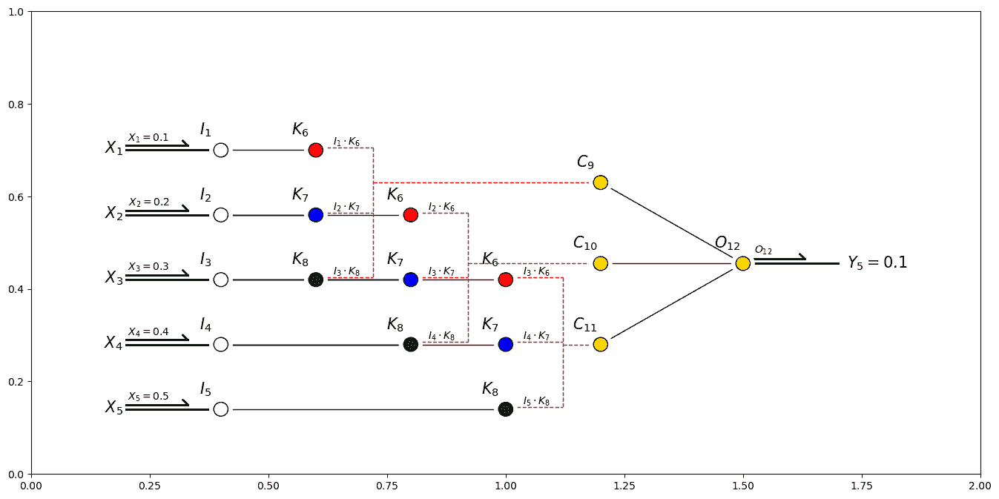

现在我们可以可视化模型训练结果，包括，

+   权重和偏差与训练轮数

+   CNN 预测与训练轮数

```py
plt.subplot(221)
plt.plot(np.arange(1,nepoch+1,1),o12,color='red',label=r'$\hat{y}$'); plt.xlim([1,nepoch]); plt.ylim([0,1])
plt.xlabel('Epochs'); plt.ylabel(r'$\hat{y}$'); plt.title('CNN - Prediction')
plt.plot([1,nepoch],[y,y],color='black',ls='--'); plt.vlines(400,-1.5,1.5,color='black')
add_grid(); plt.legend(loc='upper right'); plt.xscale('log')

plt.subplot(222)
plt.plot(np.arange(1,nepoch+1,1),w6,color='lightcoral',label = r'$k_6$') 
plt.plot(np.arange(1,nepoch+1,1),w7,color='red',label = r'$k_7$') 
plt.plot(np.arange(1,nepoch+1,1),w8,color='darkred',label = r'$k_8$') 
plt.plot(np.arange(1,nepoch+1,1),bconv,color='dodgerblue',label = r'$b_0$') 
# plt.plot(np.arange(1,nepoch+1,1),w25,color='blue',label = r'$\lambda_{2,5}$') 
# plt.plot(np.arange(1,nepoch+1,1),w35,color='darkblue',label = r'$\lambda_{3,5}$')
# plt.plot(np.arange(1,nepoch+1,1),w46,color='orange',label = r'$\lambda_{4,6}$')
# plt.plot(np.arange(1,nepoch+1,1),w56,color='darkorange',label = r'$\lambda_{5,6}$')
plt.plot([1,nepoch],[0,0],color='black',ls='--')
plt.xlim([1,nepoch]); plt.ylim([-1.5,1.5]); plt.vlines(400,-1.5,1.5,color='black')
plt.xlabel('Epochs'); plt.ylabel(r'$\hat{y}$'); plt.title('CNN - Kernel')
add_grid(); plt.legend(loc='upper right'); plt.xscale('log')

plt.subplot(223)
plt.plot(np.arange(1,nepoch+1,1),w9,color='lightgreen',label = r'$\lambda_{9}$') 
plt.plot(np.arange(1,nepoch+1,1),w10,color='green',label = r'$\lambda_{10}$') 
plt.plot(np.arange(1,nepoch+1,1),w11,color='darkgreen',label = r'$\lambda_{11}$') 
plt.plot(np.arange(1,nepoch+1,1),b12,color='darkgreen',label = r'$b_{12}$') 
plt.plot([1,nepoch],[0,0],color='black',ls='--')
plt.xlim([1,nepoch]); plt.ylim([-1.5,1.5]); plt.vlines(400,-1.5,1.5,color='black')
plt.xlabel('Epochs'); plt.ylabel(r'$\hat{y}$'); plt.title('CNN - ANN Weights')
add_grid(); plt.legend(loc='upper right'); plt.xscale('log')

plt.subplots_adjust(left=0.0, bottom=0.0, right=2.0, top=2.1, wspace=0.2, hspace=0.2); plt.show() 
```

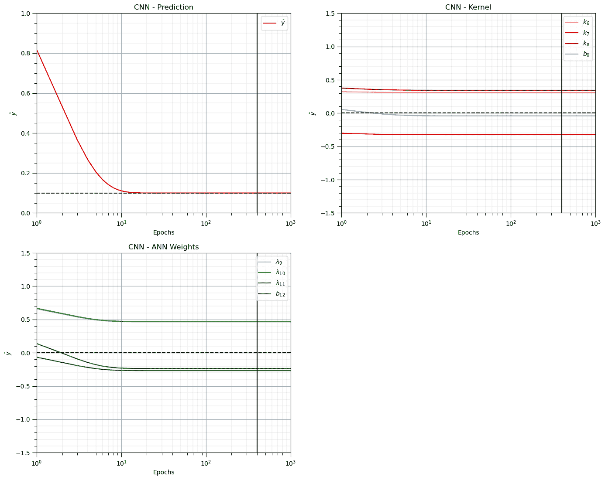

当然，上述结果并不非常实用，实际上我们需要我们的卷积神经网络通过学习许多图像来泛化，而不仅仅是上面演示的 1 个。让我们，

+   制作一系列带有标签的合成图像数据

+   将批量训练方法应用于训练这个训练图像集合。

## 制作带有标签的合成训练图像

以下代码生成具有可变斜率和加性噪声的 5 个点的随机配置，然后保留数据的斜率线性回归模型作为标签。

工作流程包括以下步骤，

1.  画一个随机斜率，$m^{\ell} \sim U\left[-2.0,2.0\right]$

1.  在值的中间采样 5 个值

$$ Z^{\ell} = \left(x-2.5\right)*m^{\ell} $$

1.  向值添加随机误差，$\epsilon \sim U\left[-\Delta,\Delta\right]$

\ Z_{\epsilon}^{\ell} = \left(x-2.5\right)*m^{\ell} + U^{-1}\left[-\Delta,\Delta\right \]

1.  计算线性回归模型斜率以保留作为响应特征

$$ m = \frac{<Z_{\epsilon}^{\ell} \cdot x>}{<x \cdot x>} $$

```py
np.random.seed(seed = seed+1)
nsample = 10; nnodes = 5; delta = 0.3
ymat = np.zeros(nsample); x = np.arange(1,nnodes+1,1); Xmat = np.zeros([nsample,nnodes])
for isample in range(0,nsample):
    m = np.random.uniform(low = -2.0, high = 2.0)
    Xmat[isample] = (x-3.0)*m+ np.random.uniform(low=-delta,high=delta,size=nnodes)
    ymat[isample] = np.dot(x, Xmat[isample]) / np.dot(x, x)

isample = 9
plt.subplot(111)
for isample in range(0,nsample):
    plt.scatter(x,Xmat[isample],edgecolor='black',lw=1,zorder=10)
    plt.plot(x,Xmat[isample],lw=1,zorder=1)
    custom_positions = [1,2,3,4,5,5.2]
    custom_labels = ['1','2','3','4','5','Y']
    plt.annotate(np.round(ymat[isample],2),[5.2,Xmat[isample][-1]],size=8,color='black',ha='left')
    plt.gca().set_xticks(custom_positions); plt.gca().set_xticklabels(custom_labels)
    plt.xlim([0.5,5.5]); plt.ylim([-4.5,4.5]); plt.xlabel('index'); plt.ylabel('z'); add_grid(); plt.title('Synthetic 1D Images and Labels')

plt.subplots_adjust(left=0.0, bottom=0.0, right=1.0, top=1.1, wspace=0.2, hspace=0.2); plt.show() 
```

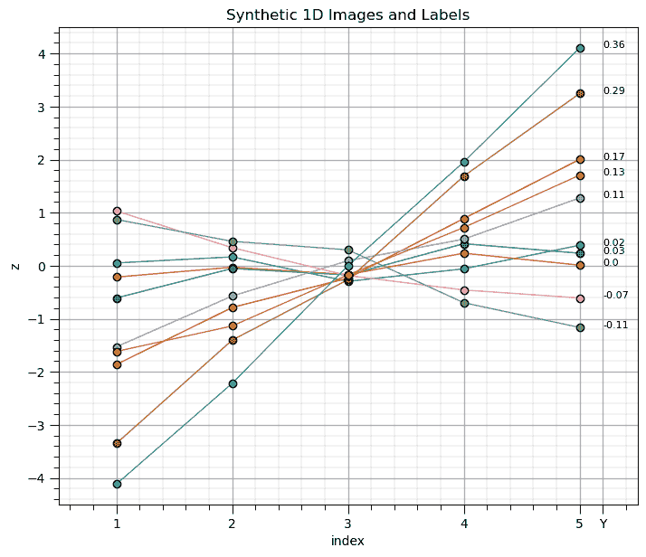

## 在许多训练图像上训练简单的 CNN

我修改了上面的代码，使其在训练图像批次上循环，累加误差梯度，并在每个训练轮数更新所有权重和偏差。

```py
np.random.seed(seed=seed)                                     # CNN trains over multiple samples

lr = 0.2                                                 # learning rate
nepoch = 1000                                    # number of training epochs

w6 = np.zeros(nepoch); w7 = np.zeros(nepoch); w8 = np.zeros(nepoch)  # initialize the CNN weights
w9 = np.zeros(nepoch); w10 = np.zeros(nepoch); w11 = np.zeros(nepoch)
bconv = np.zeros(nepoch); b12 = np.zeros(nepoch)

k6i1 = np.zeros(nepoch); k6i2 = np.zeros(nepoch); k6i3 = np.zeros(nepoch)
k7i2 = np.zeros(nepoch); k7i3 = np.zeros(nepoch); k7i4 = np.zeros(nepoch)
k8i3 = np.zeros(nepoch); k8i4 = np.zeros(nepoch); k8i5 = np.zeros(nepoch)

dk6i1 = np.zeros(nepoch); dk6i2 = np.zeros(nepoch); dk6i3 = np.zeros(nepoch)
dk7i2 = np.zeros(nepoch); dk7i3 = np.zeros(nepoch); dk7i4 = np.zeros(nepoch)
dk8i3 = np.zeros(nepoch); dk8i4 = np.zeros(nepoch); dk8i5 = np.zeros(nepoch)

c9 = np.zeros(nepoch); c10 = np.zeros(nepoch); c11 = np.zeros(nepoch)
d9 = np.zeros(nepoch); d10 = np.zeros(nepoch); d11 = np.zeros(nepoch)

o12 = np.zeros(nepoch); yhat = np.zeros((nepoch,nsample))

dw6 = np.zeros((nepoch,nsample)); dw7 = np.zeros((nepoch,nsample)); dw8 = np.zeros((nepoch,nsample))
dw9 = np.zeros((nepoch,nsample)); dw10 = np.zeros((nepoch,nsample)); dw11 = np.zeros((nepoch,nsample))
dbconv = np.zeros((nepoch,nsample)); db12 = np.zeros((nepoch,nsample))

d6 = np.zeros(nepoch); d7 = np.zeros(nepoch); d8 = np.zeros(nepoch); 
d19 = np.zeros(nepoch); d10 = np.zeros(nepoch); d11 = np.zeros(nepoch); d12 = np.zeros(nepoch); 

# initialize the weights - Xavier Weight Initialization 
lower, upper = -(1.0 / np.sqrt(3.0)), (1.0 / np.sqrt(3.0)) # lower and upper bound for the weights, uses inputs to node
#lower, upper = -(sqrt(6.0) / sqrt(3.0 + 2.0)), (sqrt(6.0) / sqrt(3.0 + 2.0)) # Normalized Xavier weights, integrates ouputs also
w6[0] = lower + np.random.random() * (upper - lower); 
w7[0] = lower + np.random.random() * (upper - lower); 
w8[0] = lower + np.random.random() * (upper - lower);

lower, upper = -(1.0 / np.sqrt(2.0)), (1.0 / np.sqrt(2.0))
#lower, upper = -(sqrt(6.0) / sqrt(2.0 + 1.0)), (sqrt(6.0) / sqrt(2.0 + 1.0)) # Normalized Xavier weights, integrates ouputs also

w9[0] = lower + np.random.random() * (upper - lower); 
w10[0] = lower + np.random.random() * (upper - lower);     
w11[0] = lower + np.random.random() * (upper - lower);     

#b4[0] = np.random.random(); b5[0] = np.random.random(); b6[0] = np.random.random()
bconv[0] = (np.random.random()-0.5)*0.5
b12[0] = (np.random.random()-0.5)*0.5; # small random value 

for i in range(0,nepoch):
    for isample in range(0,nsample):
        x1, x2, x3, x4, x5 = Xmat[isample]; y = ymat[isample]

        # forward pass of model
        c9[i] = w6[i]*x1 + w7[i]*x2 + w8[i]*x3 + bconv[i]; 
        c9[i] = 1.0/(1 + math.exp(-1*c9[i]))

        c10[i] = w6[i]*x2 + w7[i]*x3 + w8[i]*x4 + bconv[i]; 
        c10[i] = 1.0/(1 + math.exp(-1*c10[i]))

        c11[i] = w6[i]*x3 + w7[i]*x4 + w8[i]*x5 + bconv[i]; 
        c11[i] = 1.0/(1 + math.exp(-1*c11[i]))

        o12[i] = w9[i]*c9[i] + w10[i]*c10[i] + w11[i]*c11[i] + b12[i]
        yhat[i,isample] = o12[i]

# back propagate the error through the nodes
        d12[i] = (o12[i]-y) # identity activation o at o12 - switched substraction on May 27, 2025
        d9[i] =  c9[i]*(1-c9[i])*w9[i]*d12[i]   # propagate to the front feature map layer
        d10[i] = c10[i]*(1-c10[i])*w10[i]*d12[i]
        d11[i] = c11[i]*(1-c11[i])*w11[i]*d12[i]

        dk6i1 = x1*d9[i]; dk7i2 = x2*d9[i]; dk8i3 = x3*d9[i] 
        dk6i2 = x2*d10[i]; dk7i3 = x3*d10[i]; dk8i4 = x4*d10[i] 
        dk6i3 = x3*d11[i]; dk7i4 = x4*d11[i]; dk8i5 = x5*d11[i] 

        d6[i] = dk6i1 + dk6i2 + dk6i3
        d7[i] = dk7i2 + dk7i3 + dk7i4
        d8[i] = dk8i3 + dk8i4 + dk8i5

# calculate the change in weights
        if i < nepoch - 1:
            dw6[i,isample] = lr*d6[i]; dw7[i,isample] = lr*d7[i]; dw8[i,isample] = lr*d8[i]
            dw9[i,isample] = lr*c9[i]*d12[i]; dw10[i,isample] = lr*c10[i]*d12[i]; dw11[i,isample] = lr*c11[i]*d12[i];
            dbconv[i,isample] = lr*(d9[i] + d10[i] + d11[i]); db12[i,isample] = lr*d12[i]
    if i < nepoch - 1:
        w6[i+1] = w6[i] - np.average(dw6[i]); w7[i+1] = w7[i] - np.average(dw7[i]); w8[i+1] = w8[i] - np.average(dw8[i])
        w9[i+1] = w9[i] - np.average(dw9[i]); w10[i+1] = w10[i] - np.average(dw10[i]); w11[i+1] = w11[i] - np.average(dw11[i])
        bconv[i+1] = bconv[i] - np.average(dbconv[i]); b12[i+1] = b12[i] - np.average(db12[i]) 
```

现在我们可以再次可视化模型性能，

+   所有训练图像的预测与训练轮数

+   模型权重和偏差与训练轮数

```py
plt.subplot(221)
for isample in range(0,nsample):
    plt.plot(np.arange(1,nepoch+1,1),yhat[:,isample],color=plt.cm.inferno(isample/nsample),label=r'y' + str(isample))
    plt.plot([0,nepoch],[ymat[isample],ymat[isample]],color=plt.cm.inferno(isample/nsample),ls='--')
plt.xlim([1,nepoch]); plt.ylim([-1,1])
plt.xlabel('Epochs'); plt.ylabel(r'$\hat{y}$'); plt.title('CNN - Prediction')
plt.vlines(400,-1.5,1.5,color='black')
add_grid(); plt.legend(loc='upper right'); plt.xscale('log')

plt.subplot(222)
plt.plot(np.arange(1,nepoch+1,1),w6,color='lightcoral',label = r'$k_6$') 
plt.plot(np.arange(1,nepoch+1,1),w7,color='red',label = r'$k_7$') 
plt.plot(np.arange(1,nepoch+1,1),w8,color='darkred',label = r'$k_8$') 
plt.plot(np.arange(1,nepoch+1,1),bconv,color='dodgerblue',label = r'$b_0$') 
plt.plot([1,nepoch],[0,0],color='black',ls='--')
plt.xlim([1,nepoch]); plt.ylim([-1.5,1.5]); plt.vlines(400,-1.5,1.5,color='black')
plt.xlabel('Epochs'); plt.ylabel(r'$\hat{y}$'); plt.title('CNN - Kernel')
add_grid(); plt.legend(loc='upper right'); plt.xscale('log')

plt.subplot(223)
plt.plot(np.arange(1,nepoch+1,1),w9,color='lightgreen',label = r'$\lambda_{9}$') 
plt.plot(np.arange(1,nepoch+1,1),w10,color='green',label = r'$\lambda_{10}$') 
plt.plot(np.arange(1,nepoch+1,1),w11,color='darkgreen',label = r'$\lambda_{11}$') 
plt.plot(np.arange(1,nepoch+1,1),b12,color='darkgreen',label = r'$b_{12}$') 
plt.plot([1,nepoch],[0,0],color='black',ls='--')
plt.xlim([1,nepoch]); plt.ylim([-1.5,1.5]); plt.vlines(400,-1.5,1.5,color='black')
plt.xlabel('Epochs'); plt.ylabel(r'$\hat{y}$'); plt.title('CNN - ANN Weights')
add_grid(); plt.legend(loc='upper right'); plt.xscale('log')

plt.subplots_adjust(left=0.0, bottom=0.0, right=2.0, top=2.1, wspace=0.2, hspace=0.2); plt.show() 
```

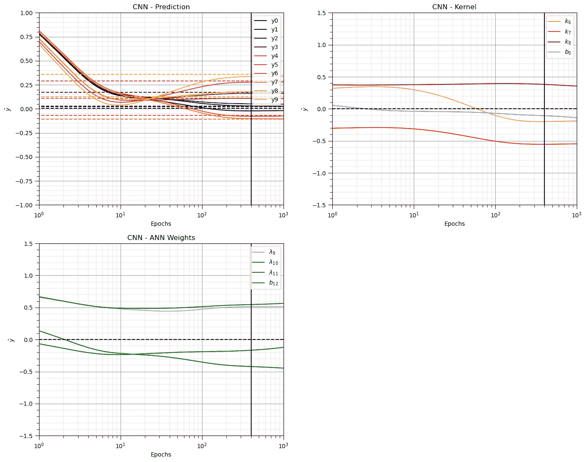

## 注释

这是对卷积神经网络的基本处理。可以做和讨论的还有很多，我有很多更多的资源。查看我的[共享资源清单](https://michaelpyrcz.com/my-resources)以及本章开头的 YouTube 讲座链接，视频描述中包含资源链接。

我希望这有所帮助，

*迈克尔*

## 关于作者


德克萨斯大学奥斯汀分校 40 英亩校园内迈克尔·皮尔茨教授的办公室。

迈克尔·皮尔奇兹是[德克萨斯大学奥斯汀分校的 Cockrell 工程学院](https://cockrell.utexas.edu/faculty-directory/alphabetical/p)和[杰克逊地球科学学院](https://www.jsg.utexas.edu/researcher/michael_pyrcz/)的教授，他在[德克萨斯大学奥斯汀分校](https://www.utexas.edu/)研究并教授地下、空间数据分析、地统计学和机器学习。迈克尔还是，

+   [能源分析](https://fri.cns.utexas.edu/energy-analytics)新生研究项目的首席研究员，以及德克萨斯大学奥斯汀分校自然科学院机器学习实验室的核心教员。

+   [《计算机与地球科学》](https://www.sciencedirect.com/journal/computers-and-geosciences/about/editorial-board)的副编辑，以及国际数学地球科学协会[《数学地球科学》](https://link.springer.com/journal/11004/editorial-board)的董事会成员。

迈克尔已经撰写了超过 70 篇[同行评审的出版物](https://scholar.google.com/citations?user=QVZ20eQAAAAJ&hl=en)，一个用于空间数据分析的[Python 包](https://pypi.org/project/geostatspy/)，合著了一本关于空间数据分析的教科书《[地统计学储层建模](https://www.amazon.com/Geostatistical-Reservoir-Modeling-Michael-Pyrcz/dp/0199731446)》，并且是两本近期发布的电子书的作者，分别是《[Python 应用地统计学：GeostatsPy 实践指南](https://geostatsguy.github.io/GeostatsPyDemos_Book/intro.html)》和《[Python 应用机器学习：代码实践指南](https://geostatsguy.github.io/MachineLearningDemos_Book/intro.html)》。

迈克尔的所有大学讲座都可以在他的[YouTube 频道](https://www.youtube.com/@GeostatsGuyLectures)上找到，附有 100 多个 Python 交互式仪表板和 40 多个存储库中的详细记录工作流程的链接，这些存储库位于他的[GitHub 账户](https://github.com/GeostatsGuy)，以支持任何感兴趣的学生和在职专业人士。要了解更多关于迈克尔的工作和共享教育资源，请访问他的网站。

## 想要一起工作吗？

我希望这些内容对那些想要了解更多关于地下建模、数据分析和学习机器学习的人来说是有帮助的。学生和在职专业人士都欢迎参加。

+   想邀请我到贵公司进行培训、辅导、项目审查、工作流程设计和/或咨询？我很乐意拜访并与您合作！

+   感兴趣合作、支持我的研究生研究或我的地下数据分析与机器学习联盟（共同负责人是约翰·福斯特教授）吗？我的研究将数据分析、随机建模和机器学习理论与实践相结合，以开发新的方法和工作流程，增加价值。我们正在解决具有挑战性的地下问题！

+   我可以通过 mpyrcz@austin.utexas.edu 联系到我。

我总是很高兴讨论，

*迈克尔*

Michael Pyrcz，博士，P.Eng. 教授，德克萨斯大学奥斯汀分校 Cockrell 工程学院和 Jackson 地球科学学院

更多资源可在以下链接获取：[Twitter](https://twitter.com/geostatsguy) | [GitHub](https://github.com/GeostatsGuy) | [网站](http://michaelpyrcz.com) | [Google Scholar](https://scholar.google.com/citations?user=QVZ20eQAAAAJ&hl=en&oi=ao) | [地球统计学书籍](https://www.amazon.com/Geostatistical-Reservoir-Modeling-Michael-Pyrcz/dp/0199731446) | [YouTube](https://www.youtube.com/channel/UCLqEr-xV-ceHdXXXrTId5ig) | [Python 中应用地球统计学电子书](https://geostatsguy.github.io/GeostatsPyDemos_Book/intro.html) | [Python 中应用机器学习电子书](https://geostatsguy.github.io/MachineLearningDemos_Book/) | [LinkedIn](https://www.linkedin.com/in/michael-pyrcz-61a648a1)

## 动机

卷积神经网络是一种非常强大的基于视觉皮层类比的自然启发计算深度学习方法，它扩展了我们的人工神经网络在处理图像方面的能力。

自然启发计算正在寻找自然界的灵感来开发新的问题解决方法，

+   **人工神经网络**受到生物神经网络的启发

+   **节点**在我们的模型中是人工神经元，简单的处理器

+   **节点之间的连接是人工突触**

+   **感知域正则化**用于提高泛化能力和效率

智能是从许多相互连接的简单处理器中产生的。在本章的剩余部分，我将使用节点和连接这两个术语来描述我们的卷积神经网络。

## 与人工神经网络共有的概念

这里有一些人工神经网络（ANNs）的关键方面，

**基本设计** - *“……一个由许多简单、高度互连的处理元素组成的计算系统，这些处理元素通过其对外部输入的动态状态响应来处理信息。”* Caudill (1989)。

**仍然是一个预测模型** - 虽然这些模型可能非常复杂，甚至有数百万个可训练的模型参数、权重和偏差，但它们仍然是一个从预测特征映射到响应特征的函数，

$$ Y=f(X)+\epsilon $$

**监督学习** – 我们提供带有预测特征 $X_1,\ldots,𝑋_𝑚$ 和响应特征 $𝑌_1,\ldots,𝑌_K$ 的训练数据，期望模型预测误差 $\epsilon$。

**非线性** - 通过应用非线性激活函数来模型非线性关系，将非线性引入到系统中

**通用函数逼近器（通用逼近定理）** - 人工神经网络具有学习 $f$ 在任意宽（单隐藏层）区间内任何可能函数形状的能力，由 Cybenko (1989) 提出，并由 Lu 和其他人 (2017) 提出任意深度

为了简洁起见，我将不会重复人工神经网络章节中的所有基本概念。

+   在开始这一章之前回顾一下那一章可能是个好主意。

## 卷积神经网络概念

**正则化** - 人工神经网络容易过拟合；因此，我们需要一种正则化形式来防止这种情况。

+   例如，岭回归和 LASSO 通过收缩项将正则化集成到损失函数中，以减少过拟合。

使用卷积神经网络，我们对正则化采取了不同的方法。

+   使用图像数据时，我们有一个像素的隐式层次/邻近性和相对位置，将我们的二维图像展平成一维向量以通过多个全连接人工神经网络层会破坏这些信息。

+   因此，我们移除，正则化到 0.0，感知域之外的所有连接，以保留像素的邻近性和相对位置信息，同时避免过拟合。

+   这些感知域是通过从图像中提取较小的像素子集和更简单的模式来进行正则化的。

注意，我们还包括 dropout（随机移除连接），作为另一种正则化形式。

## 使用人工神经网络处理图像数据

我们可以使用图像数据来训练我们的人工神经网络。


人工神经网络用于分类图像的示意图。

这种方法有什么问题？

1.  **大量模型参数** - 模型可能难以训练并且容易过拟合。

1.  **对位置非常敏感** - 我们希望从具有位置不变性的图像中学习，即对于上面的例子，通道的位置不应很重要。

1.  **将图像展平为向量** - 这是人工神经网络所必需的，但如果我们首先将图像展平为向量，我们就会失去关于像素模式、顺序、相邻性等重要信息。

总结来说，人工神经网络在处理图像时非常低效，容易过拟合，并且泛化能力不好！相反，让我们从我们的视觉皮层中汲取灵感，我们的视觉并不感知所有“像素”，而是将视野分割成感知域。

+   我们从重叠的感知域中提取感兴趣的特征，在一个层次结构（未显示）中，然后重新组合整个图像，即我们的感知。

+   我们不会感知所有“像素”，这对我们的大脑来说会非常累，相反，我们的视觉皮层解释并总结模式。


重叠感知域的示意图，用于分割视野，总结每个部分，然后重新组合到我们的感知中。

现在让我们用这个感知域的概念来比较人工神经网络和卷积神经网络。

全连接、前馈人工神经网络

+   下一层的节点连接到前一层的所有节点。

+   空间信息丢失，图像数据立即展平为 1D 向量，相邻/顺序信息丢失。

基于感受野正则化的卷积神经网络

+   下一个层中的节点映射到前一个层的特定区域，一个图像或特征图

+   空间信息得到保留，数据在每个层中保留了原始图像的 2D 或 3D 维数，称为特征图。


展示了重叠的感受野来分割视野，总结每个部分并将它们重新组合到我们的感知中。

## CNN 的正则化

让我们快速回顾一下预测机器学习模型正则化的概念，

**正则化** - 一种约束，用于减少模型对数据的敏感性，即减少模型方差

**基于感受野的正则化** - 使用感受野是一种正则化形式，导致，

+   连接、权重/模型参数的大量减少

+   有效地将这些潜在权重缩小到零

同时关注像素模式！

**基于 dropout 的正则化** - 在训练周期中，随机忽略或“dropout”一部分节点。每个训练周期看到网络的不同版本/子集

+   CNN 的另一种正则化形式，用于防止特定节点主导模型

+   模拟训练多个模型并平均，类似于集成学习。注意，通常不可能并行训练多个网络以应用集成来计算预测（如随机森林），并且在训练后所有节点都被使用。


展示了 dropout 如何从感受野到特征图节点中移除随机连接。

**批量归一化** - 在层上标准化节点的输入/权重，以居中和缩放（均值为 0，方差为 1），以优化激活函数的敏感性和模型参数训练。

$$ \hat{x}_i \leftarrow \frac{x_i - \mu_B}{\sqrt{\sigma_B² + \epsilon}} $$

然后我们添加 2 个模型参数，层标准差，$\gamma$，和均值，$\beta$，以增加控制，提高下一层训练单个权重的最优性。

$$ y_i \leftarrow \gamma \hat{x}_i + \beta $$

## CNN 的构建模块

我们有多种算子可以在卷积神经网络中从一层移动到另一层（特征图到特征图）。常见的算子包括，

+   **卷积** – 一个加权窗口，核/滤波器，用于提取空间信息

+   **池化** – 维度减少，增加局部平移不变性

+   **深度池化，下采样** – 1x1 滤波器，将通道/特征图组合到多个核上学习

+   **激活** – 使用激活函数对系统应用非线性变换，赋予系统非线性，并防止系统简化为简单的线性模型

+   **全连接，前馈** – 参见之前关于人工神经网络的讲座

现在我们将描述、解释并演示这些算子。

## 卷积

卷积是两个函数的积分乘积，其中一个函数被反转并平移 $\Delta$。

+   一种解释是将加权函数 $𝑓(\Delta)$ 应用于平滑函数，以计算函数 $𝑔(x)$ 的加权平均值，

$$ (f * g)(x) = \int_{-\infty}^{\infty} f(\Delta) g(x - \Delta) \, d\Delta $$

这很容易扩展到任何维度，例如对于图像是 2D，

$$ (f * g)(x, y) = \int_{-\infty}^{\infty} \int_{-\infty}^{\infty} f(\Delta_x, \Delta_y) g(x - \Delta_x, y - \Delta_y) \, d\Delta_x \, d\Delta_y $$

在积分之前选择哪个函数被平移，不会改变结果，卷积算子具有交换性，

$$ (f * g)(x) = \int_{-\infty}^{\infty} f(\Delta) g(x - \Delta) \, d\Delta $$$$ (f * g)(x) = \int_{-\infty}^{\infty} f(x - \Delta) g(\Delta) \, d\Delta $$

+   如果任一函数被反射，则卷积等同于相关卷积，它是两个信号相似度的度量，作为位移的函数。

为了演示使用详尽 $g(x)$ 和稀疏采样 $g(x)$ 的卷积，我构建了一个[交互式 Python 卷积仪表板](https://github.com/GeostatsGuy/DataScienceInteractivePython/blob/main/Interactive_Convolution_kNearest.ipynb)，


交互式 Python 仪表板用于演示卷积。

对于卷积操作，在模型训练期间学习了一个可训练的加权函数 $g(\Tau)$。

**滤波器/核** – 在卷积窗口上分配的权重，用于计算下一个特征图。通过训练这些权重，滤波器可以提取特定的空间特征。


两个卷积计算的示例。

让我们看看一个特定的核形式，即模糊滤波器。

+   下一个特征图接收前一个特征图或图像上的局部平均值。


示例滤波器，模糊/局部平均滤波器。

关于滤波器的一些观察，

+   滤波器的大小与我们提取的特征的尺度相关

+   较大的核增加了连接数、模型权重，最终增加了计算复杂度

+   核大小使用奇数以避免失真，可能存在非对称核

+   累加到 1 可以防止偏差（从一幅图像或特征图到另一幅特征图的均值平移）

**填充** - 我们下一个特征图的所有边缘都减少了 1 的大小，以避免特征图外的重叠，即没有填充，而填充将超出特征图或图像，防止下一个特征图的大小减少。

+   填充方法有很多种，包括在特征图上假设零值、常数值和最近值。


无填充的卷积，导致特征图大小减小（上方）和填充卷积（假设特征图外部为 0）以无特征图大小减小（下方）。

**步长** - 卷积滤波器/核通过前一个特征图的步数。

+   对于步长为 1 的情况，没有隐式减少特征图大小。

+   对于步长大于 2 的情况，特征图大小会减小。


步长为 1 的卷积（上方）和步长为 2 的卷积（下方）以及特征图大小的减小。

**下一个特征图的大小** - 下一个特征图的大小由超参数、前一个特征图大小 $n_{in}$、卷积核大小 $k$、卷积填充大小 $p$ 和卷积步长大小 $s$ 决定，通过此方程，

$$ n_{\text{out}} = \left\lfloor \frac{n_{\text{in}} + 2p - k}{s} \right\rfloor + 1 $$

例如，如果，

+   $n_{in} = 4$

+   $k = 2$

+   $p = 0$

+   $s = 1$

然后我们可以将它们代入方程中，

$$ n_{\text{out}} = \left\lfloor \frac{4 + 2(0) - 2}{1} \right\rfloor + 1 = 3 $$

现在将此与该示例的可视化进行比较，


上述示例的示例内核、输入和输出特征图。

我们计算下一个特征图大小如下：

$$ n_{\text{out}} = \left\lfloor \frac{4 + 2(0) - 2}{1} \right\rfloor + 1 = 3 $$

**滤波器/核设计** – 通过训练权重，滤波器可以提取特定的特征。考虑以下示例滤波器类型，以及输入和输出特征‘图’的简单 1D 示例。


滤波器（上方，以及卷积的 1D 示意图，原始函数（黑色）和卷积（红色）（下方）。

**多个滤波器/核** - 通常在每个卷积层上训练多个滤波器 $n_k$，以从图像中提取各种结构。

+   这增加了特征图深度或通道数，$n_k$


由于应用了多个滤波器到前一个图像或特征图，特征图具有深度，也称为通道数，$n_k$。

+   注意，原始图像可能具有多个通道，深度大于 1，例如，一个 RGB 图像具有 3 个通道，每个通道分别对应红色、蓝色和绿色。

最后，这里有一些将卷积滤波器应用于德克萨斯大学奥斯汀分校的砖墙图像的示例，代码可在[SubsurfaceDataAnalytics_Convolution_Operators.ipynb](https://github.com/GeostatsGuy/PythonNumericalDemos/blob/master/SubsurfaceDataAnalytics_Convolution_Operators.ipynb)找到。


来自德克萨斯大学奥斯汀分校校园砖墙的卷积示例。

## 激活函数

请参阅人工神经网络章节以获取更多详细信息，但为了提醒选择激活函数的考虑因素，

+   **非线性** – 需要向预测器施加非线性。如果至少有 1 个隐藏层（Cybenko，1989 年），已被证明是通用的函数逼近器。

+   **范围** – 对于更稳定的基于梯度的学习是有限的，对于更有效的训练是无限的（但需要较慢的学习率）

+   **连续可微** – 对于基于梯度的优化是必需的

+   **具有单调导数的平滑函数** – 可能具有更好的泛化能力

+   **单调性** – 保证单层模型误差表面的凸性（损失函数的全局最小值）

+   **在原点近似为单位矩阵** – 使用小随机值初始化权重可以有效地学习


来自德克萨斯大学奥斯汀分校校园砖墙的卷积示例。

## 池化

对单个值进行滤波器/核的汇总。池化的影响包括，

+   在特征图中对特征检测进行下采样

+   减少了特征图的维度

+   整合平移不变性，对位置不敏感的模式检测

两种常见的池化方法是平均池化和最大池化。


池化操作的示意图。

这里有一个使用 2x2 滤波器和步长为 2 的池化示例。


减少特征图范围的池化操作示例。

+   使用 2x2 滤波器，步长为 2，每个轴的维度减少一半，对于 2D 图像为四分之一。

+   例如，16 的值在滤波器内是位置无关的。这引入了平移不变性。


来自德克萨斯大学奥斯汀分校校园砖墙的最大池化和平均池化示例。

## 深度池化

使用单个值对特征图进行汇总。

+   在特征图上对检测进行下采样。

+   结合从多个核学习到的信息

+   减少了特征图的深度，下一层。

两种常见的池化方法是平均池化和最大池化。


深度池化操作的示意图。

## 常见的卷积神经网络架构

以下是一个常见的卷积神经网络工作流程。


常见的卷积神经网络工作流程。

我们可以通过常见架构的示意图来展示这个常见的工作流程。


常见的卷积神经网络架构。

## 手动构建卷积神经网络架构

就像人工神经网络章节一样，我手动构建了一个简单的卷积神经网络。

为了简单和简洁，我做出了以下架构选择，

+   高度为 5 的一维图像

+   1 个卷积层，1 个大小为 3 的核

+   使用 sigmoid 激活

+   步长为 1 且没有填充，因此特征图的大小为 3。

+   从特征图直接到输出节点的人工神经网络，具有线性激活

这种简约架构展示了卷积神经网络中的许多关键概念，同时非常易于可视化，且训练速度非常快。


我们手动构建的 CNN 的示意图。

现在，我们将我们手动构建的 CNN 的示意图转换为实际节点的图。


我们手动构建的 CNN 架构。

为了展示使用此架构的实用性，让我们添加模型参数的标签，

+   核权重，$\lambda_6$，$\lambda_7$，和 $\lambda_8$

+   卷积核偏置，$b_{conv}$

+   人工神经网络权重，$\lambda_{9,12}$，$\lambda_{10,12}$，和 $\lambda_{11,12}$

+   人工神经网络偏置，$b_{12}$


我们手动构建的 CNN 架构，包含所有可训练的模型参数。注意，核权重仅显示在第一个核位置，以避免混乱。

## 训练模型参数

训练卷积神经网络通过以下步骤迭代进行，与人工神经网络章节中讨论的相同。


训练人工神经网络通过以下步骤迭代进行，1. 前向传播以进行预测，2. 根据预测和训练数据中的真实值计算误差导数，3. 通过人工神经网络反向传播误差导数，以计算所有模型权重和偏置参数的误差导数，4. 根据导数和学习率更新模型参数，5. 重复直到收敛。

下面是每个步骤的详细信息，重点关注与人工神经网络的差异，更多细节请参阅人工神经网络章节。

1.  **初始化模型参数** - 通常使用接近零的小随机值初始化所有模型参数。以下是一些常见方法，

+   **Xavier Glorot 均匀初始化** - 对于 Tanh 和 sigmoid 激活函数，从由 $U[\text{min}, \text{max}]$ 指定的均匀分布中随机生成，

$$ \lambda_i = F_U\left[-\sqrt{\frac{6}{n_{\text{in}} + n_{\text{out}}}},\ \sqrt{\frac{6}{n_{\text{in}} + n_{\text{out}}}}\right]^{-1}(p^\ell) $$

+   其中 $F^{-1}_U$ 是 CDF 的逆，$p$ 是输入数量，$p^{\ell}$ 是从均匀分布 $U[0,1]$ 中抽取的随机累积概率值。

例如，给定一个输入通道为 1，输出通道为 9 的 $3 \times 3$ 卷积核，

$$ n_{in} = k \times k \times C = 3 \times 3 \times 1 $$$$ n_out = k \times k \times C = 3 \times 3 \times 9 $$

+   **He Kaiming 权重初始化** - 对于 ReLU 和 leaky ReLU 激活函数，从由 $U[\text{min}, \text{max}]$ 指定的均匀分布中随机生成，

$$ \lambda_i = F_U\left[-\sqrt{\frac{6}{n_{\text{in}}}},\ \sqrt{\frac{6}{n_{\text{in}}}}\right]^{-1}(p^\ell) $$

+   其中 $F^{-1}_U$ 是累积分布函数的逆，$p$ 是输入的数量，$k$ 是输出的数量，而 $p^{\ell}$ 是从均匀分布 $U[0,1]$ 中抽取的随机累积概率值。

1.  **正向传播** - 进行预测，$\hat{y}$。初始预测在第一次迭代将是随机的，但会逐渐改进。


使用随机初始化的模型参数、权重和偏置的人工神经网络进行预测。

1.  **计算误差导数** - 给定损失 $P = \frac{1}{2} \left(\hat{y} - y \right)²$，误差导数，即误差随模型估计变化的变化率是 $\frac{\partial P}{\partial \hat{y}} = \hat{Y} - Y$。

+   现在，让我们只考虑一个估计值，稍后我们将解决超过 1 个训练数据。

1.  **反向传播误差导数** - 我们通过人工神经网络反向移动以计算所有模型权重和偏置参数的误差导数，为此我们使用链式法则，

$$ \frac{\partial}{\partial x} f(g(h(x))) = \frac{\partial f}{\partial g} \cdot \frac{\partial g}{\partial h} \cdot \frac{\partial h}{\partial x} $$

1.  **更新模型参数** - 根据导数，$\frac{\partial P}{\partial \lambda_{i,j}}$ 和学习率 $\eta$，如下所示，

$$ \lambda_{i,j}^{\ell} = \lambda_{i,j}^{\ell - 1} + \eta \cdot \frac{\partial P}{\partial \lambda_{i,j}} $$

1.  **重复直到收敛** - 返回步骤 1，直到误差 $P$ 降低到可接受的水平，即模型收敛是停止迭代的条件

## 反向传播

为了简洁起见，我建议您参考人工神经网络章节，了解通过神经网络反向传播误差梯度的过程。

## 更新模型参数

模型参数的导数是误差梯度，因此我们准备使用梯度下降优化，并添加，

+   **学习率** - 为了缩放模型更新的变化率，我们分配一个学习率 $\eta$。对于上面提到的模型参数示例，

$$ \lambda_{9,12}^{\ell} = \lambda_{9,12}^{\ell - 1} - \eta \cdot \frac{\partial P}{\partial \lambda_{9,12}} $$$$ \lambda_{10,12}^{\ell} = \lambda_{10,12}^{\ell - 1} - \eta \cdot \frac{\partial P}{\partial \lambda_{10,12}} $$$$ b_{12}^{\ell} = b_{12}^{\ell - 1} + \eta \cdot \frac{\partial P}{\partial b_{12}} $$

+   回想，这个梯度计算和模型参数、权重和偏置更新过程是迭代的，被称为梯度下降优化。

+   目标是探索损失超曲面，避免和逃离局部最小值，最终找到全局最小值。

+   学习率，也称为步长，通常设置在 0.0 和 1.0 之间，注意在 TensorFlow 的 Keras 模块中默认值为 0.01

+   **低学习率** – 更稳定，但解的速度较慢，可能会陷入局部最小值

+   **高学习率** – 可能不稳定，但可能是一个更快的解决方案，可能会偏离全局最小值

一种策略是开始使用高学习率，然后在迭代过程中逐渐降低学习率

+   **学习率衰减** - 设置为>0 以避免减轻振荡，

## 训练 epoch

这正是讨论随机梯度下降优化的好时机，首先让我们定义一些常见术语，

+   **批量梯度下降** - 在通过所有数据后更新模型参数

+   **随机梯度下降** - 在每个样本数据上更新模型参数

+   **迷你批次梯度下降** - 在通过单个批次后更新模型参数

使用迷你批次梯度下降，通过使用数据子集（称为批次）引入了随机性，

+   例如，如果我们将我们的 100 个样本分成 4 个批次，那么我们将单独迭代每个批次

+   我们通过加快单个更新来加速，较少的数据计算得更快，但引入了更多的错误

+   这通常有助于训练探索全局最小值，并避免陷入局部最小值以及损失超曲面上的脊

最后，我们在这里定义最后一个术语，

+   **epoch** - 是对所有数据的单次遍历，因此如果有 4 个迷你批次，那么将会有 4 次更新模型参数的迭代

我将在以后添加许多其他考虑因素，包括，

+   动量

+   自适应优化

现在，让我们手动构建上述人工神经网络并可视化解决方案！

+   这是为了手动操作，以便你可以看到每个计算。我故意避免了使用 TensorFlow 或 PyTorch。

## 使用多个训练图像进行训练

反向传播基于单个样本，即训练图像和配对的响应特征值；因此，为了在多个图像上训练，我们必须循环遍历，

+   前向传播

+   计算误差导数

+   反向传播


批量训练过程。

对于每张图像，存储权重和偏差梯度。然后，将梯度在批次中的图像上求和，并将此总和应用于学习率以更新权重和偏差。

## 前向传播

为了清晰起见，让我们从图像输入开始，逐步讲解卷积神经网络。

输入节点接收图像输入到卷积层的输入，

+   保留节点顺序以保留从图像中获取的空间、位置信息

对于连续特征图像，

+   连续预测器的特征值被归一化到[0,1]或[-1,1]的最小/最大值，以提高特定激活函数的敏感性

+   对于彩色图像，RGB 通道可以分别归一化并作为 3 个输入通道包含

对于分类特征图像，

+   对于二进制，基数 2，值可以通过指示变换重新分配为 0 或 1

+   对于基数大于 2 的情况，可能应用 one-hot 编码，从而产生$k$个输入通道

有关这些转换的更多详细信息，请参阅特征转换章节。

现在我们通过一个卷积层，包含卷积和激活操作，得到一个新的特征图。


我们手动实现的卷积神经网络的讲解，通过卷积层。

+   根据输入图像或前一个特征图的核进行线性加权组合，添加一个偏置项，然后对结果进行非线性变换，这种变换称为激活函数 $\alpha$。

$$ C_{j_{\text{in}}} = \sum_{i=1}^{n} \left( K_{i+5} \cdot I_{j-8} \right) + b_{conv} $$

其中，$K_6$、$K_7$ 和 $K_8$ 是核权重，$b_{conv}$ 是核偏置，$I$ 是输入节点。

请原谅方程中奇怪的索引，我喜欢为每个节点使用唯一的节点整数，以避免在我的笔记和代码中混淆节点，但这确实使索引分配变得复杂。

$$ C_{9_{\text{in}}} = I_1 \cdot K_6 + I_2 \cdot K_7 + I_3 \cdot K_8 + b_{\text{conv}} $$$$ C_{10_{\text{in}}} = I_2 \cdot K_6 + I_3 \cdot K_7 + I_4 \cdot K_8 + b_{\text{conv}} $$$$ C_{11_{\text{in}}} = I_3 \cdot K_6 + I_4 \cdot K_7 + I_5 \cdot K_8 + b_{\text{conv}} $$

然后对每个应用非线性激活函数，

$$ C_j = \alpha \left( C_{j_{in}} \right) \quad j = 9, \ldots 11 $$

现在我们从特征图开始，通过人工神经网络到输出层。

这只是一个标准的人工神经网络，它将展平的特征图移动到输出层。

+   在本例中为了简洁，我们展示了最简单的可能的人工神经网络，即特征图之后的下一层就是输出层。更复杂的架构，通常包含隐藏层。

+   此外，由于我们的图像是 1 维的，我们不需要进行展平步骤

输出节点是人工神经网络的标准输出节点，

+   输入是前一层节点的线性组合，并添加一个偏置项。

$$ O_{j_{\text{in}}} = \sum_{j=1}^{m} \left( \lambda_{i,j} \cdot H_i \right) + b_j $$

然后应用激活函数，

$$ O_j = \alpha \left( O_{j_{in}} \right) $$

对于回归模型的情况，具有连续响应特征，应用线性或恒等激活函数，

$$ O_j = \alpha \left( O_{j_{in}} \right) = O_{j_{in}} $$

我们手动实现的卷积神经网络的讲解，从特征图到连续输出的输出层。

对于分类模型的情况，具有分类响应特征，在等于响应特征基数 $K$ 的 $K$ 个节点上应用 softmax 激活函数，

+   输出是每个类别的概率，符合非负性和闭合约束


我们手动实现的卷积神经网络的讲解，从特征图到分类输出的输出层。

$$ O_j = g_k(O_{j_{\text{in}}}) = \frac{e^{O_{j_{\text{in}}}}}{\sum_{\iota=1}^{K} e^{O_{\iota_{\text{in}}}}} $$

## 导入所需的包

我们还需要一些标准包。这些应该已经与 Anaconda 3 一起安装。

+   记住，我们的目标是手动构建一个卷积神经网络，只使用基本的数学和数组运算，因此我们只需要 NumPy 以及 matplotlib 进行绘图。

```py
import numpy as np
import pandas as pd
import matplotlib.pyplot as plt
from matplotlib.ticker import (MultipleLocator, AutoMinorLocator, AutoLocator) # control of axes ticks
plt.rc('axes', axisbelow=True)                            # set axes and grids in the background for all plots
import math
seed = 13 
```

如果你遇到包导入错误，你可能需要首先安装这些包中的某些。这通常可以通过在 Windows 上打开命令窗口然后输入‘python -m pip install [package-name]’来完成。有关相应包的文档可以提供更多帮助。

## 声明函数

这里是创建、训练和可视化我们的卷积神经网络的函数。

```py
def add_grid():
    plt.gca().grid(True, which='major',linewidth = 1.0); plt.gca().grid(True, which='minor',linewidth = 0.2) # add y grids
    plt.gca().tick_params(which='major',length=7); plt.gca().tick_params(which='minor', length=4)
    plt.gca().xaxis.set_minor_locator(AutoMinorLocator()); plt.gca().yaxis.set_minor_locator(AutoMinorLocator()) # turn on minor ticks 

def calculate_angle_rads(x1, y1, x2, y2):
    dx = x2 - x1     # Calculate the differences
    dy = y2 - y1
    angle_rads = math.atan2(dy, dx)    # Calculate the angle in radians
    #angle_degrees = math.degrees(angle_radians)    # Convert the angle to degrees
    return angle_rads

def offset(pto, distance, angle_deg): # modified from ChatGPT 4.o generated
    angle_rads = math.radians(angle_deg) # Convert angle from degrees to radians
    x_new = pto[0] + distance * math.cos(angle_rads) # Calculate the new coordinates
    y_new = pto[1] + distance * math.sin(angle_rads)
    return np.array((x_new, y_new))

def offsetx(xo, distance, angle_deg): # modified from ChatGPT 4.o generated
    angle_rads = math.radians(angle_deg) # Convert angle from degrees to radians
    x_new = xo + distance * math.cos(angle_rads) # Calculate the new coordinates
    return np.array((xo, x_new))

def offset_arrx(xo, distance, angle_deg,size): # modified from ChatGPT 4.o generated
    angle_rads = math.radians(angle_deg) # Convert angle from degrees to radians
    x_new = xo + distance * math.cos(angle_rads) # Calculate the new coordinates
    x_arr = x_new + size * math.cos(angle_rads+2.48) # Calculate the new coordinates
    return np.array((x_new, x_arr))

def offsety(yo, distance, angle_deg): # modified from ChatGPT 4.o generated
    angle_rads = math.radians(angle_deg) # Convert angle from degrees to radians
    y_new = yo + distance * math.sin(angle_rads) # Calculate the new coordinates
    return np.array((yo, y_new))

def offset_arry(yo, distance, angle_deg,size): # modified from ChatGPT 4.o generated
    angle_rads = math.radians(angle_deg) # Convert angle from degrees to radians
    y_new = yo + distance * math.sin(angle_rads) # Calculate the new coordinates
    y_arr = y_new + size * math.sin(angle_rads+2.48) # Calculate the new coordinates
    return np.array((y_new, y_arr))

def lint(x1, y1, x2, y2, t):
    # Calculate the interpolated coordinates
    x = x1 + t * (x2 - x1)
    y = y1 + t * (y2 - y1)
    return np.array((x, y))

def lintx(x1, y1, x2, y2, t):
    # Calculate the interpolated coordinates
    x = x1 + t * (x2 - x1)
    return x

def linty(x1, y1, x2, y2, t):
    # Calculate the interpolated coordinates
    y = y1 + t * (y2 - y1)
    return y

def lint_intx(x1, y1, x2, y2, ts, te):
    # Calculate the interpolated coordinates
    xs = x1 + ts * (x2 - x1)
    xe = x1 + te * (x2 - x1)
    return np.array((xs,xe))

def lint_inty(x1, y1, x2, y2, ts, te):
    # Calculate the interpolated coordinates
    ys = y1 + ts * (y2 - y1)
    ye = y1 + te * (y2 - y1)
    return np.array((ys,ye))

def lint_int_arrx(x1, y1, x2, y2, ts, te, size):
    # Calculate the interpolated coordinates
    xe = x1 + te * (x2 - x1)
    line_angle_rads = calculate_angle_rads(x1, y1, x2, y2)
    x_arr = xe + size * math.cos(line_angle_rads+2.48) # Calculate the new coordinates
    return np.array((xe,x_arr))

def lint_int_arry(x1, y1, x2, y2, ts, te, size):
    # Calculate the interpolated coordinates
    ye = y1 + te * (y2 - y1)
    line_angle_rads = calculate_angle_rads(x1, y1, x2, y2)
    y_arr = ye + size * math.sin(line_angle_rads+2.48) # Calculate the new coordinates
    return np.array((ye,y_arr))

def as_si(x, ndp): # from xnx on StackOverflow https://stackoverflow.com/questions/31453422/displaying-numbers-with-x-instead-of-e-scientific-notation-in-matplotlib 
    s = '{x:0.{ndp:d}e}'.format(x=x, ndp=ndp)
    m, e = s.split('e')
    return r'{m:s}\times 10^{{{e:d}}}'.format(m=m, e=int(e)) 
```

## 简单的手动 CNN

我编写了这段代码来指定一个简单的 CNN，

+   五个输入节点，1 个具有 3 个核的卷积层，在特征图中有 3 个节点，1 个输出节点

并且通过迭代执行前向计算和反向传播来训练 CNN。我计算：

+   然后将它传播到每个节点

+   求解误差相对于每个权重和偏差的偏导数

所有权重、偏差和所有 epoch 的偏导数都记录在向量中以进行绘图。

```py
# initial CNN trains on one sample
x1 = 0.1; x2 = 0.2; x3 = 0.3; x4 = 0.4; x5 = 0.5; y = 0.1 # training data
lr = 0.2 # learning rate

np.random.seed(seed=seed)

nepoch = 1000

w6 = np.zeros(nepoch); w7 = np.zeros(nepoch); w8 = np.zeros(nepoch)
w9 = np.zeros(nepoch); w10 = np.zeros(nepoch); w11 = np.zeros(nepoch)
bconv = np.zeros(nepoch); b12 = np.zeros(nepoch)

k6i1 = np.zeros(nepoch); k6i2 = np.zeros(nepoch); k6i3 = np.zeros(nepoch)
k7i2 = np.zeros(nepoch); k7i3 = np.zeros(nepoch); k7i4 = np.zeros(nepoch)
k8i3 = np.zeros(nepoch); k8i4 = np.zeros(nepoch); k8i5 = np.zeros(nepoch)

dk6i1 = np.zeros(nepoch); dk6i2 = np.zeros(nepoch); dk6i3 = np.zeros(nepoch)
dk7i2 = np.zeros(nepoch); dk7i3 = np.zeros(nepoch); dk7i4 = np.zeros(nepoch)
dk8i3 = np.zeros(nepoch); dk8i4 = np.zeros(nepoch); dk8i5 = np.zeros(nepoch)

c9 = np.zeros(nepoch); c10 = np.zeros(nepoch); c11 = np.zeros(nepoch)
d9 = np.zeros(nepoch); d10 = np.zeros(nepoch); d11 = np.zeros(nepoch)

o12 = np.zeros(nepoch)

dw6 = np.zeros(nepoch); dw7 = np.zeros(nepoch); dw8 = np.zeros(nepoch)
dw9 = np.zeros(nepoch); dw10 = np.zeros(nepoch); dw11 = np.zeros(nepoch)
dbconv = np.zeros(nepoch); db12 = np.zeros(nepoch)

d6 = np.zeros(nepoch); d7 = np.zeros(nepoch); d8 = np.zeros(nepoch); 
d19 = np.zeros(nepoch); d10 = np.zeros(nepoch); d11 = np.zeros(nepoch); d12 = np.zeros(nepoch); 

# initialize the weights - Xavier Weight Initialization 
lower, upper = -(1.0 / np.sqrt(3.0)), (1.0 / np.sqrt(3.0)) # lower and upper bound for the weights, uses inputs to node
#lower, upper = -(sqrt(6.0) / sqrt(3.0 + 2.0)), (sqrt(6.0) / sqrt(3.0 + 2.0)) # Normalized Xavier weights, integrates ouputs also
w6[0] = lower + np.random.random() * (upper - lower); 
w7[0] = lower + np.random.random() * (upper - lower); 
w8[0] = lower + np.random.random() * (upper - lower);

lower, upper = -(1.0 / np.sqrt(2.0)), (1.0 / np.sqrt(2.0))
#lower, upper = -(sqrt(6.0) / sqrt(2.0 + 1.0)), (sqrt(6.0) / sqrt(2.0 + 1.0)) # Normalized Xavier weights, integrates ouputs also

w9[0] = lower + np.random.random() * (upper - lower); 
w10[0] = lower + np.random.random() * (upper - lower);     
w11[0] = lower + np.random.random() * (upper - lower);     

#b4[0] = np.random.random(); b5[0] = np.random.random(); b6[0] = np.random.random()
bconv[0] = (np.random.random()-0.5)*0.5
b12[0] = (np.random.random()-0.5)*0.5; # small random value 

for i in range(0,nepoch):

# forward pass of model
    c9[i] = w6[i]*x1 + w7[i]*x2 + w8[i]*x3 + bconv[i]; 
    c9[i] = 1.0/(1 + math.exp(-1*c9[i]))

    c10[i] = w6[i]*x2 + w7[i]*x3 + w8[i]*x4 + bconv[i]; 
    c10[i] = 1.0/(1 + math.exp(-1*c10[i]))

    c11[i] = w6[i]*x3 + w7[i]*x4 + w8[i]*x5 + bconv[i]; 
    c11[i] = 1.0/(1 + math.exp(-1*c11[i]))

    o12[i] = w9[i]*c9[i] + w10[i]*c10[i] + w11[i]*c11[i] + b12[i]

# back propagate the error through the nodes
    d12[i] = (o12[i]-y) # identity activation o at o12 - switched substraction on May 27, 2025
    d9[i] =  c9[i]*(1-c9[i])*w9[i]*d12[i]   # propagate to the front feature map layer
    d10[i] = c10[i]*(1-c10[i])*w10[i]*d12[i]
    d11[i] = c11[i]*(1-c11[i])*w11[i]*d12[i]

    dk6i1 = x1*d9[i]; dk7i2 = x2*d9[i]; dk8i3 = x3*d9[i] 
    dk6i2 = x2*d10[i]; dk7i3 = x3*d10[i]; dk8i4 = x4*d10[i] 
    dk6i3 = x3*d11[i]; dk7i4 = x4*d11[i]; dk8i5 = x5*d11[i] 

    d6[i] = dk6i1 + dk6i2 + dk6i3
    d7[i] = dk7i2 + dk7i3 + dk7i4
    d8[i] = dk8i3 + dk8i4 + dk8i5

# calculate the change in weights
    if i < nepoch - 1:
        dw6[i] = lr*d6[i]; dw7[i] = lr*d7[i]; dw8[i] = lr*d8[i]
        dw9[i] = lr*c9[i]*d12[i]; dw10[i] = lr*c10[i]*d12[i]; dw11[i] = lr*c11[i]*d12[i];
        dbconv[i] = lr*(d9[i] + d10[i] + d11[i]); db12[i] = lr*d12[i]

        w6[i+1] = w6[i] - dw6[i]; w7[i+1] = w7[i] - dw7[i]; w8[i+1] = w8[i] - dw8[i]
        w9[i+1] = w9[i] - dw9[i]; w10[i+1] = w10[i] - dw10[i]; w11[i+1] = w11[i] - dw11[i]
        bconv[i+1] = bconv[i] - dbconv[i]; b12[i+1] = b12[i] - db12[i] 
```

## 手动可视化 CNN

让我们可视化我们的卷积神经网络。

+   注意，我将在以后使用此代码创建交互式仪表板。

```py
xin = 0.1; yin_range = 0.7
nin = 5

kcolors = ['red','blue','green']
xin = np.array([0.1,0.2,0.3,0.4,0.5])
yout = np.array([y])
cin = np.array([0.1,0.2,0.3])
kx = 0.6

plt.subplot(111)
#plt.gca().set_axis_off()

for i, (xi) in enumerate(zip(xin), start=1):
    eq1 = r"$X_{{{}}}$".format(i)
    eq2 = r"$X_{{{}}} = {}$".format(i, xi[0])
    eq3 = r"$I_{{{}}}$".format(i)
    xpos = 0.4; ypos = yin_range - ((i-1)/nin) * yin_range 
    circle_i1 = plt.Circle((xpos,ypos), 0.015, fill=False, edgecolor = 'black',lw=1,zorder=100); 
    circle_i1b = plt.Circle((xpos,ypos), 0.025, fill=True, facecolor = 'white',edgecolor = None,lw=0.5,zorder=10);
    plt.gca().add_patch(circle_i1); plt.gca().add_patch(circle_i1b)
    plt.annotate(eq1, (xpos-0.2, ypos), textcoords="offset points", xytext=(-12, -3), ha='center',size=15)
    plt.annotate(eq2, (xpos, ypos), textcoords="offset points", xytext=(-70, 9), ha='center')
    plt.plot([xpos-0.2,xpos],[ypos,ypos],color='black',lw=2); plt.plot([xpos-0.2,xpos-0.07],[ypos+0.01,ypos+0.01],color='black',lw=2)
    plt.plot([xpos-0.07,xpos-0.08],[ypos+0.01,ypos+0.02],color='black',lw=2)
    plt.annotate(eq3, (xpos,ypos), textcoords="offset points", xytext=(-15, 15), ha='center',size = 15)

for iconv in range(0,3):  
    xpos = kx+iconv*0.2;
    ytop = yin_range - (iconv/nin)*yin_range - ((1-1)/nin) * yin_range
    ybot = yin_range - (iconv/nin)*yin_range - ((3-1)/nin) * yin_range  
    plt.plot([xpos+0.12,xpos+0.12],[ytop+0.005,ybot+0.005],color='red',lw=1,ls='--',zorder=80)
    for ik, (ki) in enumerate(zip(np.arange(1,4,1)), start=1):
        eq4 = r"$K_{{{}}}$".format(ik+5)
        ypos = yin_range - (iconv/nin)*yin_range - ((ik-1)/nin) * yin_range
        circle_i1 = plt.Circle((xpos,ypos), 0.015, fill=True, facecolor = kcolors[ik-1],edgecolor = 'black',lw=1,zorder=200);
        circle_i1b = plt.Circle((xpos,ypos), 0.025, fill=True, facecolor='white',edgecolor = None,lw=0.5,zorder=190);
        plt.gca().add_patch(circle_i1); plt.gca().add_patch(circle_i1b)
        plt.annotate(eq4, (xpos,ypos), textcoords="offset points", xytext=(-15, 15), ha='center',size = 15)
        plt.plot([0.4,xpos],[ypos,ypos],color='black',lw=1,zorder=1)
        plt.plot([xpos,xpos+0.12],[ypos+0.005,ypos+0.005],color='red',lw=1,ls='--',zorder=80)
        eq8 = r"$I_{{{}}} \cdot K_{{{}}}$".format((iconv)+ik,ik+5)        
        plt.annotate(eq8, (xpos+0.12, ypos), textcoords="offset points", xytext=(-25, 5), ha='center',size = 10)

for ic, (ci) in enumerate(zip(np.arange(1,4,1)), start=1):
    eq5 = r"$C_{{{}}}$".format(ic+8)
    xpos = 1.2; ypos = yin_range - ((ic-1)/4) * yin_range - 0.07
    circle_i1 = plt.Circle((xpos,ypos), 0.015, fill=True, facecolor = 'gold',edgecolor = 'black',lw=1,zorder=200);
    circle_i1b = plt.Circle((xpos,ypos), 0.025, fill=True, facecolor='white',edgecolor = None,lw=0.5,zorder=190);
    plt.gca().add_patch(circle_i1); plt.gca().add_patch(circle_i1b)
    plt.annotate(eq5, (xpos,ypos), textcoords="offset points", xytext=(-15, 15), ha='center',size = 15)
    #plt.plot([0.4,x],[y,y],color='black',lw=1,zorder=1)
    plt.plot([xpos,1.5],[ypos,yin_range - ((2-1)/4) * yin_range - 0.07],color='black',lw=1)
    plt.plot([kx+(ic-1)*0.2+0.12,xpos],[ypos,ypos],color='red',lw=1,ls='--',zorder=80)

eq6 = r"$O_{{{}}}$".format(12)
eq7 = r"$Y_{{{}}} = {}$".format(i, np.round(yout[0],2))
xpos = 1.5; ypos = yin_range - ((2-1)/4) * yin_range - 0.07
circle_i1 = plt.Circle((xpos,ypos), 0.015, fill=True, facecolor = 'gold',edgecolor = 'black',lw=1,zorder=200);
circle_i1b = plt.Circle((xpos,ypos), 0.025, fill=True, facecolor='white',edgecolor = None,lw=0.5,zorder=190);
plt.gca().add_patch(circle_i1); plt.gca().add_patch(circle_i1b)
plt.annotate(eq6, (xpos, ypos), textcoords="offset points", xytext=(-15, 15), ha='center',size = 15)
plt.annotate(eq7, (xpos, ypos), textcoords="offset points", xytext=(130,-4), ha='center',size = 15)
plt.plot([xpos,xpos+0.2],[ypos,ypos],color='black',lw=2); plt.plot([xpos,xpos+0.13],[ypos+0.01,ypos+0.01],color='black',lw=2)
plt.plot([xpos+0.13,xpos+0.12],[ypos+0.01,ypos+0.02],color='black',lw=2)
plt.annotate(eq6, (xpos, ypos), textcoords="offset points", xytext=(20, 10), ha='center')

plt.xlim([0.,2.]); plt.ylim([0,1])

plt.subplots_adjust(left=0.0, bottom=0.0, right=2.0, top=1.3, wspace=0.2, hspace=0.2); plt.show() 
```


现在我们可以可视化模型训练结果，包括，

+   权重和偏差与训练 epoch 的关系

+   CNN 预测与训练 epoch 的关系

```py
plt.subplot(221)
plt.plot(np.arange(1,nepoch+1,1),o12,color='red',label=r'$\hat{y}$'); plt.xlim([1,nepoch]); plt.ylim([0,1])
plt.xlabel('Epochs'); plt.ylabel(r'$\hat{y}$'); plt.title('CNN - Prediction')
plt.plot([1,nepoch],[y,y],color='black',ls='--'); plt.vlines(400,-1.5,1.5,color='black')
add_grid(); plt.legend(loc='upper right'); plt.xscale('log')

plt.subplot(222)
plt.plot(np.arange(1,nepoch+1,1),w6,color='lightcoral',label = r'$k_6$') 
plt.plot(np.arange(1,nepoch+1,1),w7,color='red',label = r'$k_7$') 
plt.plot(np.arange(1,nepoch+1,1),w8,color='darkred',label = r'$k_8$') 
plt.plot(np.arange(1,nepoch+1,1),bconv,color='dodgerblue',label = r'$b_0$') 
# plt.plot(np.arange(1,nepoch+1,1),w25,color='blue',label = r'$\lambda_{2,5}$') 
# plt.plot(np.arange(1,nepoch+1,1),w35,color='darkblue',label = r'$\lambda_{3,5}$')
# plt.plot(np.arange(1,nepoch+1,1),w46,color='orange',label = r'$\lambda_{4,6}$')
# plt.plot(np.arange(1,nepoch+1,1),w56,color='darkorange',label = r'$\lambda_{5,6}$')
plt.plot([1,nepoch],[0,0],color='black',ls='--')
plt.xlim([1,nepoch]); plt.ylim([-1.5,1.5]); plt.vlines(400,-1.5,1.5,color='black')
plt.xlabel('Epochs'); plt.ylabel(r'$\hat{y}$'); plt.title('CNN - Kernel')
add_grid(); plt.legend(loc='upper right'); plt.xscale('log')

plt.subplot(223)
plt.plot(np.arange(1,nepoch+1,1),w9,color='lightgreen',label = r'$\lambda_{9}$') 
plt.plot(np.arange(1,nepoch+1,1),w10,color='green',label = r'$\lambda_{10}$') 
plt.plot(np.arange(1,nepoch+1,1),w11,color='darkgreen',label = r'$\lambda_{11}$') 
plt.plot(np.arange(1,nepoch+1,1),b12,color='darkgreen',label = r'$b_{12}$') 
plt.plot([1,nepoch],[0,0],color='black',ls='--')
plt.xlim([1,nepoch]); plt.ylim([-1.5,1.5]); plt.vlines(400,-1.5,1.5,color='black')
plt.xlabel('Epochs'); plt.ylabel(r'$\hat{y}$'); plt.title('CNN - ANN Weights')
add_grid(); plt.legend(loc='upper right'); plt.xscale('log')

plt.subplots_adjust(left=0.0, bottom=0.0, right=2.0, top=2.1, wspace=0.2, hspace=0.2); plt.show() 
```


当然，上述结果并不非常实用，实际上我们需要我们的卷积神经网络通过学习许多图像来泛化，而不仅仅是上面演示的 1 个。让我们，

+   创建一个带有标签的合成图像数据集

+   将批量训练方法应用于训练这些训练图像集合。

## 创建带有标签的合成训练图像

以下代码创建具有可变斜率和加性噪声的 5 个点的随机配置，然后保留数据的斜率线性回归模型作为标签。

工作流程包括以下步骤，

1.  绘制一个随机的斜率，$m^{\ell} \sim U\left[-2.0,2.0\right]$

1.  在此斜率的中间值处采样 5 个值

$$ Z^{\ell} = \left(x-2.5\right)*m^{\ell} $$

1.  在值的中值处添加随机误差，$\epsilon \sim U\left[-\Delta,\Delta\right]$

\ Z_{\epsilon}^{\ell} = \left(x-2.5\right)*m^{\ell} + U^{-1}\left[-\Delta,\Delta\right \]

1.  计算线性回归模型的斜率，将其作为响应特征保留。

$$ m = \frac{<Z_{\epsilon}^{\ell} \cdot x>}{<x \cdot x>} $$

```py
np.random.seed(seed = seed+1)
nsample = 10; nnodes = 5; delta = 0.3
ymat = np.zeros(nsample); x = np.arange(1,nnodes+1,1); Xmat = np.zeros([nsample,nnodes])
for isample in range(0,nsample):
    m = np.random.uniform(low = -2.0, high = 2.0)
    Xmat[isample] = (x-3.0)*m+ np.random.uniform(low=-delta,high=delta,size=nnodes)
    ymat[isample] = np.dot(x, Xmat[isample]) / np.dot(x, x)

isample = 9
plt.subplot(111)
for isample in range(0,nsample):
    plt.scatter(x,Xmat[isample],edgecolor='black',lw=1,zorder=10)
    plt.plot(x,Xmat[isample],lw=1,zorder=1)
    custom_positions = [1,2,3,4,5,5.2]
    custom_labels = ['1','2','3','4','5','Y']
    plt.annotate(np.round(ymat[isample],2),[5.2,Xmat[isample][-1]],size=8,color='black',ha='left')
    plt.gca().set_xticks(custom_positions); plt.gca().set_xticklabels(custom_labels)
    plt.xlim([0.5,5.5]); plt.ylim([-4.5,4.5]); plt.xlabel('index'); plt.ylabel('z'); add_grid(); plt.title('Synthetic 1D Images and Labels')

plt.subplots_adjust(left=0.0, bottom=0.0, right=1.0, top=1.1, wspace=0.2, hspace=0.2); plt.show() 
```


## 在许多训练图像上训练简单的 CNN

我修改了上面的代码，使其循环遍历训练图像批次，累加误差梯度，并在每个训练周期更新所有权重和偏置。

```py
np.random.seed(seed=seed)                                     # CNN trains over multiple samples

lr = 0.2                                                 # learning rate
nepoch = 1000                                    # number of training epochs

w6 = np.zeros(nepoch); w7 = np.zeros(nepoch); w8 = np.zeros(nepoch)  # initialize the CNN weights
w9 = np.zeros(nepoch); w10 = np.zeros(nepoch); w11 = np.zeros(nepoch)
bconv = np.zeros(nepoch); b12 = np.zeros(nepoch)

k6i1 = np.zeros(nepoch); k6i2 = np.zeros(nepoch); k6i3 = np.zeros(nepoch)
k7i2 = np.zeros(nepoch); k7i3 = np.zeros(nepoch); k7i4 = np.zeros(nepoch)
k8i3 = np.zeros(nepoch); k8i4 = np.zeros(nepoch); k8i5 = np.zeros(nepoch)

dk6i1 = np.zeros(nepoch); dk6i2 = np.zeros(nepoch); dk6i3 = np.zeros(nepoch)
dk7i2 = np.zeros(nepoch); dk7i3 = np.zeros(nepoch); dk7i4 = np.zeros(nepoch)
dk8i3 = np.zeros(nepoch); dk8i4 = np.zeros(nepoch); dk8i5 = np.zeros(nepoch)

c9 = np.zeros(nepoch); c10 = np.zeros(nepoch); c11 = np.zeros(nepoch)
d9 = np.zeros(nepoch); d10 = np.zeros(nepoch); d11 = np.zeros(nepoch)

o12 = np.zeros(nepoch); yhat = np.zeros((nepoch,nsample))

dw6 = np.zeros((nepoch,nsample)); dw7 = np.zeros((nepoch,nsample)); dw8 = np.zeros((nepoch,nsample))
dw9 = np.zeros((nepoch,nsample)); dw10 = np.zeros((nepoch,nsample)); dw11 = np.zeros((nepoch,nsample))
dbconv = np.zeros((nepoch,nsample)); db12 = np.zeros((nepoch,nsample))

d6 = np.zeros(nepoch); d7 = np.zeros(nepoch); d8 = np.zeros(nepoch); 
d19 = np.zeros(nepoch); d10 = np.zeros(nepoch); d11 = np.zeros(nepoch); d12 = np.zeros(nepoch); 

# initialize the weights - Xavier Weight Initialization 
lower, upper = -(1.0 / np.sqrt(3.0)), (1.0 / np.sqrt(3.0)) # lower and upper bound for the weights, uses inputs to node
#lower, upper = -(sqrt(6.0) / sqrt(3.0 + 2.0)), (sqrt(6.0) / sqrt(3.0 + 2.0)) # Normalized Xavier weights, integrates ouputs also
w6[0] = lower + np.random.random() * (upper - lower); 
w7[0] = lower + np.random.random() * (upper - lower); 
w8[0] = lower + np.random.random() * (upper - lower);

lower, upper = -(1.0 / np.sqrt(2.0)), (1.0 / np.sqrt(2.0))
#lower, upper = -(sqrt(6.0) / sqrt(2.0 + 1.0)), (sqrt(6.0) / sqrt(2.0 + 1.0)) # Normalized Xavier weights, integrates ouputs also

w9[0] = lower + np.random.random() * (upper - lower); 
w10[0] = lower + np.random.random() * (upper - lower);     
w11[0] = lower + np.random.random() * (upper - lower);     

#b4[0] = np.random.random(); b5[0] = np.random.random(); b6[0] = np.random.random()
bconv[0] = (np.random.random()-0.5)*0.5
b12[0] = (np.random.random()-0.5)*0.5; # small random value 

for i in range(0,nepoch):
    for isample in range(0,nsample):
        x1, x2, x3, x4, x5 = Xmat[isample]; y = ymat[isample]

        # forward pass of model
        c9[i] = w6[i]*x1 + w7[i]*x2 + w8[i]*x3 + bconv[i]; 
        c9[i] = 1.0/(1 + math.exp(-1*c9[i]))

        c10[i] = w6[i]*x2 + w7[i]*x3 + w8[i]*x4 + bconv[i]; 
        c10[i] = 1.0/(1 + math.exp(-1*c10[i]))

        c11[i] = w6[i]*x3 + w7[i]*x4 + w8[i]*x5 + bconv[i]; 
        c11[i] = 1.0/(1 + math.exp(-1*c11[i]))

        o12[i] = w9[i]*c9[i] + w10[i]*c10[i] + w11[i]*c11[i] + b12[i]
        yhat[i,isample] = o12[i]

# back propagate the error through the nodes
        d12[i] = (o12[i]-y) # identity activation o at o12 - switched substraction on May 27, 2025
        d9[i] =  c9[i]*(1-c9[i])*w9[i]*d12[i]   # propagate to the front feature map layer
        d10[i] = c10[i]*(1-c10[i])*w10[i]*d12[i]
        d11[i] = c11[i]*(1-c11[i])*w11[i]*d12[i]

        dk6i1 = x1*d9[i]; dk7i2 = x2*d9[i]; dk8i3 = x3*d9[i] 
        dk6i2 = x2*d10[i]; dk7i3 = x3*d10[i]; dk8i4 = x4*d10[i] 
        dk6i3 = x3*d11[i]; dk7i4 = x4*d11[i]; dk8i5 = x5*d11[i] 

        d6[i] = dk6i1 + dk6i2 + dk6i3
        d7[i] = dk7i2 + dk7i3 + dk7i4
        d8[i] = dk8i3 + dk8i4 + dk8i5

# calculate the change in weights
        if i < nepoch - 1:
            dw6[i,isample] = lr*d6[i]; dw7[i,isample] = lr*d7[i]; dw8[i,isample] = lr*d8[i]
            dw9[i,isample] = lr*c9[i]*d12[i]; dw10[i,isample] = lr*c10[i]*d12[i]; dw11[i,isample] = lr*c11[i]*d12[i];
            dbconv[i,isample] = lr*(d9[i] + d10[i] + d11[i]); db12[i,isample] = lr*d12[i]
    if i < nepoch - 1:
        w6[i+1] = w6[i] - np.average(dw6[i]); w7[i+1] = w7[i] - np.average(dw7[i]); w8[i+1] = w8[i] - np.average(dw8[i])
        w9[i+1] = w9[i] - np.average(dw9[i]); w10[i+1] = w10[i] - np.average(dw10[i]); w11[i+1] = w11[i] - np.average(dw11[i])
        bconv[i+1] = bconv[i] - np.average(dbconv[i]); b12[i+1] = b12[i] - np.average(db12[i]) 
```

现在，我们再次可以可视化模型性能，

+   所有训练图像的预测与训练周期

+   模型权重和偏置与训练周期

```py
plt.subplot(221)
for isample in range(0,nsample):
    plt.plot(np.arange(1,nepoch+1,1),yhat[:,isample],color=plt.cm.inferno(isample/nsample),label=r'y' + str(isample))
    plt.plot([0,nepoch],[ymat[isample],ymat[isample]],color=plt.cm.inferno(isample/nsample),ls='--')
plt.xlim([1,nepoch]); plt.ylim([-1,1])
plt.xlabel('Epochs'); plt.ylabel(r'$\hat{y}$'); plt.title('CNN - Prediction')
plt.vlines(400,-1.5,1.5,color='black')
add_grid(); plt.legend(loc='upper right'); plt.xscale('log')

plt.subplot(222)
plt.plot(np.arange(1,nepoch+1,1),w6,color='lightcoral',label = r'$k_6$') 
plt.plot(np.arange(1,nepoch+1,1),w7,color='red',label = r'$k_7$') 
plt.plot(np.arange(1,nepoch+1,1),w8,color='darkred',label = r'$k_8$') 
plt.plot(np.arange(1,nepoch+1,1),bconv,color='dodgerblue',label = r'$b_0$') 
plt.plot([1,nepoch],[0,0],color='black',ls='--')
plt.xlim([1,nepoch]); plt.ylim([-1.5,1.5]); plt.vlines(400,-1.5,1.5,color='black')
plt.xlabel('Epochs'); plt.ylabel(r'$\hat{y}$'); plt.title('CNN - Kernel')
add_grid(); plt.legend(loc='upper right'); plt.xscale('log')

plt.subplot(223)
plt.plot(np.arange(1,nepoch+1,1),w9,color='lightgreen',label = r'$\lambda_{9}$') 
plt.plot(np.arange(1,nepoch+1,1),w10,color='green',label = r'$\lambda_{10}$') 
plt.plot(np.arange(1,nepoch+1,1),w11,color='darkgreen',label = r'$\lambda_{11}$') 
plt.plot(np.arange(1,nepoch+1,1),b12,color='darkgreen',label = r'$b_{12}$') 
plt.plot([1,nepoch],[0,0],color='black',ls='--')
plt.xlim([1,nepoch]); plt.ylim([-1.5,1.5]); plt.vlines(400,-1.5,1.5,color='black')
plt.xlabel('Epochs'); plt.ylabel(r'$\hat{y}$'); plt.title('CNN - ANN Weights')
add_grid(); plt.legend(loc='upper right'); plt.xscale('log')

plt.subplots_adjust(left=0.0, bottom=0.0, right=2.0, top=2.1, wspace=0.2, hspace=0.2); plt.show() 
```


## 评论

这是对卷积神经网络的基本处理。可以做和讨论的还有很多，我有很多更多的资源。查看我的[共享资源清单](https://michaelpyrcz.com/my-resources)以及本章开头带有资源链接的 YouTube 讲座链接，视频描述中包含资源链接。

希望这有所帮助，

*迈克尔*

## 关于作者


在德克萨斯大学奥斯汀分校 40 英亩校园内，迈克尔·皮尔奇教授的办公室。

迈克尔·皮尔奇是德克萨斯大学奥斯汀分校[科克雷尔工程学院](https://cockrell.utexas.edu/faculty-directory/alphabetical/p)和[杰克逊地球科学学院](https://www.jsg.utexas.edu/researcher/michael_pyrcz/)的教授，他在那里研究并教授地下、空间数据分析、地统计学和机器学习。迈克尔还是，

+   [能源分析](https://fri.cns.utexas.edu/energy-analytics)新生研究项目的首席研究员，德克萨斯大学奥斯汀分校自然科学院机器学习实验室的核心教员。

+   [《计算机与地球科学》](https://www.sciencedirect.com/journal/computers-and-geosciences/about/editorial-board)的副编辑，以及国际数学地球科学协会[《数学地球科学》](https://link.springer.com/journal/11004/editorial-board)的董事会成员。

迈克尔已经撰写了 70 多篇[同行评审出版物](https://scholar.google.com/citations?user=QVZ20eQAAAAJ&hl=en)，一个用于空间数据分析的[Python 包](https://pypi.org/project/geostatspy/)，合著了一本关于空间数据分析的教科书[《地统计学储层建模》](https://www.amazon.com/Geostatistical-Reservoir-Modeling-Michael-Pyrcz/dp/0199731446)，并是两本最近发布的电子书的作者，[《Python 中的应用地统计学：GeostatsPy 实践指南》](https://geostatsguy.github.io/GeostatsPyDemos_Book/intro.html)和[《Python 中的应用机器学习：实践指南与代码》](https://geostatsguy.github.io/MachineLearningDemos_Book/intro.html)。

迈克尔的所有大学讲座都可以在他的[YouTube 频道](https://www.youtube.com/@GeostatsGuyLectures)上找到，其中包含 100 多个 Python 交互式仪表板和 40 多个存储库中的详细工作流程链接，这些存储库位于他的[GitHub 账户](https://github.com/GeostatsGuy)，以支持任何感兴趣的学生和在职专业人士，提供常青内容。要了解更多关于迈克尔的工作和共享教育资源，请访问他的网站。

## 想一起工作吗？

我希望这些内容对那些想了解更多关于地下建模、数据分析和机器学习的人有所帮助。学生和在职专业人士欢迎参加。

+   想邀请我到贵公司进行培训、辅导、项目审查、工作流程设计和/或咨询？我很乐意拜访并与您合作！

+   感兴趣与我合作、支持我的研究生研究或我的地下数据分析与机器学习联盟（共同负责人是约翰·福斯特教授）吗？我的研究将数据分析、随机建模和机器学习理论与实践相结合，以开发新的方法和工作流程，增加价值。我们正在解决具有挑战性的地下问题！

+   您可以通过 mpyrcz@austin.utexas.edu 联系到我。

我总是很高兴讨论，

*迈克尔*

迈克尔·皮尔奇，博士，注册工程师，德克萨斯大学奥斯汀分校 Cockrell 工程学院和 Jackson 地球科学学院教授

更多资源可在以下位置获取：[Twitter](https://twitter.com/geostatsguy) | [GitHub](https://github.com/GeostatsGuy) | [网站](http://michaelpyrcz.com) | [Google Scholar](https://scholar.google.com/citations?user=QVZ20eQAAAAJ&hl=en&oi=ao) | [地球统计学书籍](https://www.amazon.com/Geostatistical-Reservoir-Modeling-Michael-Pyrcz/dp/0199731446) | [YouTube](https://www.youtube.com/channel/UCLqEr-xV-ceHdXXXrTId5ig) | [Python 中应用地球统计学电子书](https://geostatsguy.github.io/GeostatsPyDemos_Book/intro.html) | [Python 中应用机器学习电子书](https://geostatsguy.github.io/MachineLearningDemos_Book/) | [LinkedIn](https://www.linkedin.com/in/michael-pyrcz-61a648a1)
