# 自编码器

> 原文：[`geostatsguy.github.io/MachineLearningDemos_Book/MachineLearning_autoencoder.html`](https://geostatsguy.github.io/MachineLearningDemos_Book/MachineLearning_autoencoder.html)

Michael J. Pyrcz，德克萨斯大学奥斯汀分校教授

[Twitter](https://twitter.com/geostatsguy) | [GitHub](https://github.com/GeostatsGuy) | [网站](http://michaelpyrcz.com) | [Google Scholar](https://scholar.google.com/citations?user=QVZ20eQAAAAJ&hl=en&oi=ao) | [地统计学书籍](https://www.amazon.com/Geostatistical-Reservoir-Modeling-Michael-Pyrcz/dp/0199731446) | [YouTube](https://www.youtube.com/channel/UCLqEr-xV-ceHdXXXrTId5ig) | [Python 应用地统计学电子书](https://geostatsguy.github.io/GeostatsPyDemos_Book/intro.html) | [Python 应用机器学习电子书](https://geostatsguy.github.io/MachineLearningDemos_Book/) | [LinkedIn](https://www.linkedin.com/in/michael-pyrcz-61a648a1)

电子书“Python 应用机器学习：带代码的手册”的章节。

请将此电子书引用如下：

Pyrcz, M.J., 2024, *《Python 应用机器学习：带代码的手册》* [电子书]. Zenodo. doi:10.5281/zenodo.15169138 

本书中的工作流程以及更多内容均可在此处找到：

请将 MachineLearningDemos GitHub 仓库引用如下：

Pyrcz, M.J., 2024, *《MachineLearningDemos: Python 机器学习演示工作流程存储库》* (0.0.3) [软件]. Zenodo. DOI: 10.5281/zenodo.13835312\. GitHub 仓库：[GeostatsGuy/MachineLearningDemos](https://github.com/GeostatsGuy/MachineLearningDemos) 

由 Michael J. Pyrcz 编写

© 版权所有 2024。

本章是关于/演示**自编码器**的教程。

**YouTube 讲座**：查看我在以下主题上的讲座：

+   [人工神经网络](https://youtu.be/A9PiCMY_6nM?si=NxWSU_5RgQ4w55EL)

+   [卷积神经网络](https://youtu.be/za2my_XDoOs?si=LeHU6p2_fc9dX4Yt)

这些讲座都是我[机器学习课程](https://youtube.com/playlist?list=PLG19vXLQHvSC2ZKFIkgVpI9fCjkN38kwf&si=XonjO2wHdXffMpeI)的一部分，在 YouTube 上提供了有良好文档记录的 Python 工作流程和交互式仪表板。我的目标是分享易于理解、可操作和可重复的教育内容。如果您想了解我的动机，请查看[Michael 的故事](https://michaelpyrcz.com/my-story)。

## 动机

自编码器是一种非常强大、灵活的深度学习方法，用于压缩信息，

+   将训练数据映射到潜在空间

+   将高维数据降维到更低的维度

+   非线性、通用方法

## 自编码器架构

这里是我们的简单自编码器，

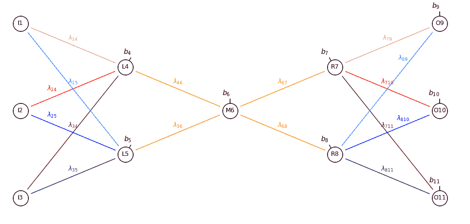

简单演示自编码器。

这实际上是[人工神经网络](https://geostatsguy.github.io/MachineLearningDemos_Book/MachineLearning_ANN.html)的镜像。

我不讨论通过网络的正向传递，如果你不熟悉这个过程，例如，

+   在节点上应用激活到线性加权和偏差，

然后，请查阅人工神经网络章节。

我决定为每个节点使用独特的数值索引以简洁地表示连接权重，例如 $\lambda_{1,4}$，以及偏差，例如 $b_4$，$I$ 用于输入节点，$L$ 用于编码器隐藏层（“左”），$M$ 用于潜在节点（“中”），$R$ 用于解码器隐藏层（“右”），最后 $O$ 用于输出节点。

自动编码器的部分如下所示，

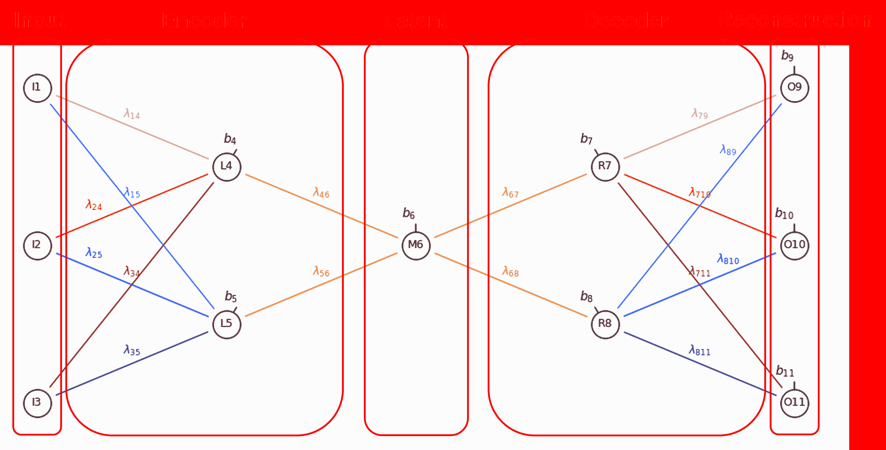

带有标签部分的简单演示自动编码器。

通过自动编码器传递的信号及其表示包括，

+   **输入** – 训练样本，

$$ z $$

+   **编码器** – 学习将训练样本压缩到潜在空间，

$$ x = f_{\theta} (z) $$

+   **潜在空间** – 瓶颈总结了训练数据中的模式，

$$ 𝑥 $$

+   **解码器** – 学习对潜在空间进行解压缩以重建原始训练数据，

$$ \hat{z} = g_{\phi} (x) = g_{\phi} (f_{\theta}(z) ) $$

+   **重建** – 尝试重现输入，

$$ \hat{z} \sim z $$

## 训练模型参数

训练自动编码器通过以下步骤迭代进行。

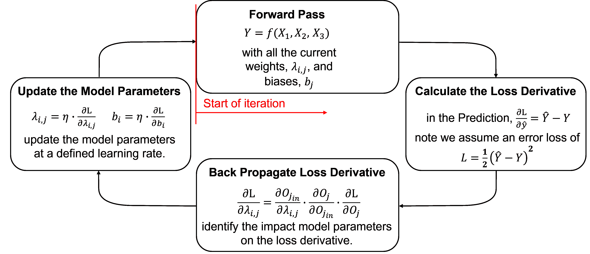

训练人工神经网络通过以下迭代过程进行，1. 正向传递进行预测，2. 根据预测和训练数据中的真实值计算误差导数，3. 将误差导数反向传播通过人工神经网络以计算所有模型权重和偏差参数的误差导数，4. 根据导数和学习率更新模型参数，5. 重复直到收敛。

下面是每个步骤的详细信息，

1.  **初始化模型参数** - 通常使用接近零的小随机值初始化所有模型参数。以下是一些常见方法，

+   **Xavier 权重初始化** - 从由 $U[\text{min}, \text{max}]$ 指定的均匀分布中抽取的随机实现，

$$ \lambda_{i,j} = F_U^{-1} \left[ \frac{-1}{\sqrt{p}}, \frac{1}{\sqrt{p}} \right] (p^\ell) $$

+   其中 $F^{-1}_U$ 是 CDF 的逆，$p$ 是输入数量，$p^{\ell}$ 是从均匀分布 $U[0,1]$ 中抽取的随机累积概率值。

+   **归一化 Xavier 权重初始化** - 从由 $U[\text{min}, \text{max}]$ 指定的均匀分布中抽取的随机实现，

$$ \lambda_{i,j} = F_U^{-1} \left[ \frac{-1}{\sqrt{p}+k}, \frac{1}{\sqrt{p}+k} \right] (p^\ell) $$

+   其中 $F^{-1}_U$ 是累积分布函数的逆，$p$ 是输入数量，$k$ 是输出数量，而 $p^{\ell}$ 是从均匀分布 $U[0,1]$ 中抽取的随机累积概率值。

+   例如，如果我们回到我们的第一个隐藏层节点，

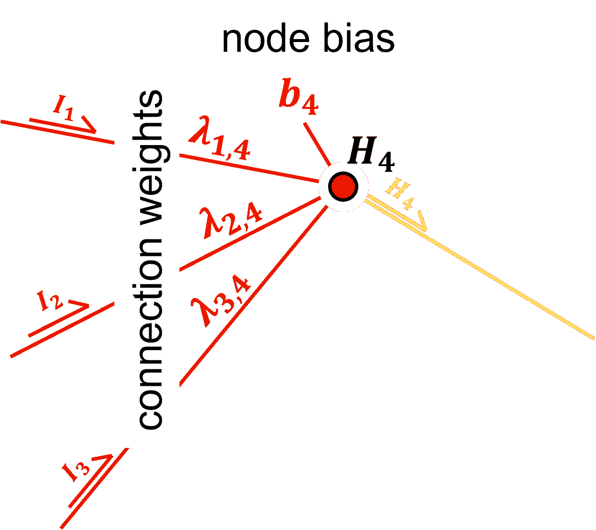

第一个隐藏层节点有 3 个输入和 1 个输出。

+   我们有 $p = 3$ 和 $k = 1$，并且我们从均匀分布中抽取，

$$ U \left[ \frac{-1}{\sqrt{p}+k}, \frac{1}{\sqrt{p}+k} \right] = U \left[ \frac{-1}{\sqrt{3}+1}, \frac{1}{\sqrt{3}+1} \right] $$

1.  **正向传递** - 将训练样本 $z$ 传递过去，计算重建 $\hat{z}$。初始预测在第一次迭代将是随机的，但会改进。

1.  **计算误差导数** - 基于输入训练样本 $z$ 和重建 $\hat{z}$ 之间的不匹配。

1.  **反向传播误差导数** - 我们通过人工神经网络反向移动以计算所有模型权重和偏置参数的误差导数，为此我们使用链式法则，

$$ \frac{\partial}{\partial x} f(g(h(x))) = \frac{\partial f}{\partial g} \cdot \frac{\partial g}{\partial h} \cdot \frac{\partial h}{\partial x} $$

1.  **在批次中循环并平均误差导数** - 对批次中的所有训练数据进行步骤 1，然后计算误差导数的平均值，例如，

1.  **更新模型参数** - 基于导数 $\frac{\partial P}{\partial \lambda_{i,j}}$ 和学习率 $\eta$，如下所示，

$$ \lambda_{1,4}^{\ell} = \lambda_{1,4}^{\ell-1} - \eta \cdot \frac{1}{B} \sum_{i=1}^{B} \frac{\partial \mathcal{L}^{(i)}}{\partial \lambda_{1,4}} $$

1.  **重复直到收敛** - 返回步骤 1，直到误差 $P$ 降低到可接受的水平，即模型收敛是停止迭代的条件

## 自动编码器损失

在每个输出-输入节点对中都有一个损失和损失梯度。误差损失函数，

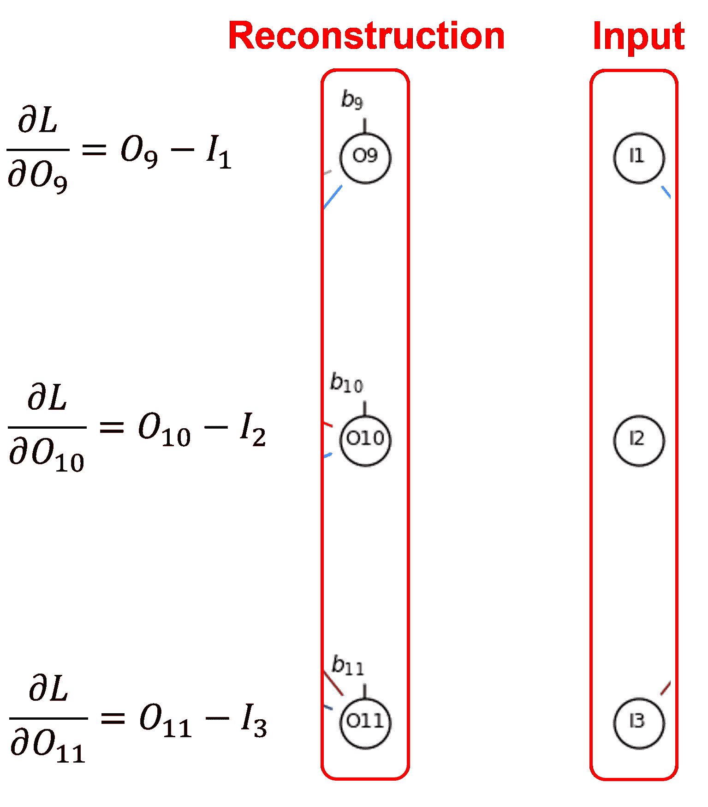

每个输出节点的自动编码器损失，目标是使输出与输入匹配。

我们可以概括为，

$$ L = \frac{1}{2} \sum_{i=1}³ \left(O_{i+8} - I_i \right)² $$

注意，不规则的索引是由于我选择在每个节点使用唯一的节点索引。

每个节点的误差导数是，

$$ \frac{\partial \mathcal{L}}{\partial O_9} = O_9 - I_1 $$$$ \frac{\partial \mathcal{L}}{\partial O_{10}} = O_{10} - I_2 $$$$ \frac{\partial \mathcal{L}}{\partial O_{11}} = O_{11} - I_3 $$

## 自动编码器反向传播

让我们通过我们的自动编码器的反向传播来逐步分析，让我们从一个输出节点的偏置开始，$\frac{\partial \mathcal{L}}{\partial b_{9}}$。

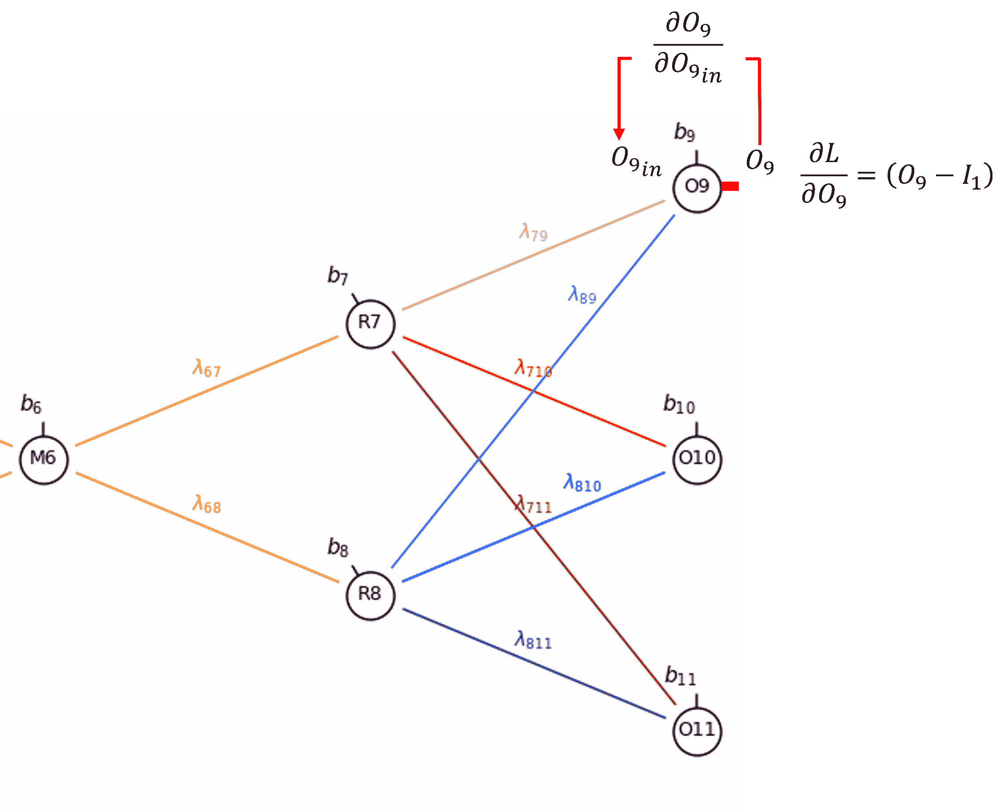

反向传播到隐藏解码节点 $𝑂_9$ 中的偏置 $𝑏_9$。

通过链式法则我们得到，

$$ \frac{\partial \mathcal{L}}{\partial b_9} = \frac{\partial O_{9_{\mathrm{in}}}}{\partial b_9} \cdot \frac{\partial O_9}{\partial O_{9_{\mathrm{in}}}} \cdot \frac{\partial \mathcal{L}}{\partial O_9} = 1 \cdot 1 \cdot (O_9 - I_1) $$

让我们解释每一部分。我们从一个输出梯度 $\frac{\partial \mathcal{L}}{\partial O_9}$ 开始，并跨过输出节点 $O_9$，因为输出节点应用了线性激活，

$$ \frac{\partial O_9}{\partial O_{9_{\mathrm{in}}}} = 1.0 $$

现在我们可以计算偏置 $b_9$ 关于节点输入的导数，

$$ \frac{\partial 0_{9_{\mathrm{in}}}}{\partial b_9} = \frac{\partial}{\partial b_9} \left( \lambda_{7,9} R_7 + \lambda_{8,9} R_8 + b_9 \right) = 1 $$

现在我们可以继续到连接权重，𝜆_7,9。

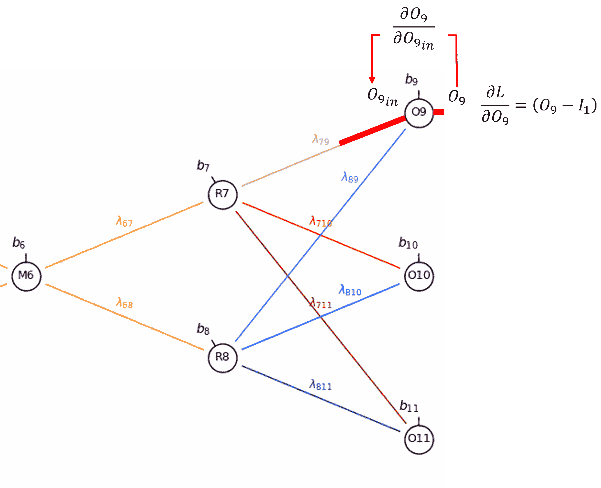

反向传播到连接权重，$\lambda_{7,9}$。

通过链式法则我们得到，

$$ \frac{\partial \mathcal{L}}{\partial \lambda_{7,9}} = \frac{\partial O_{9_{\mathrm{in}}}}{\partial \lambda_{7,9}} \cdot \frac{\partial O_9}{\partial O_{9_{\mathrm{in}}}} \cdot \frac{\partial \mathcal{L}}{\partial O_9} = R_7 \cdot 1 \cdot (O_9 - I_1) $$

再次，由于输出节点应用了线性激活，

$$ \frac{\partial O_9}{\partial O_{9_{in}}} = 1.0 $$

并且 $\frac{\partial O^{\text{in}}_9}{\partial \lambda_{7,9}}$ 简单地是 $𝑅_7$ 的输出，

$$ \frac{\partial O^{\text{in}}_9}{\partial \lambda_{7,9}} = \frac{\partial}{\partial \lambda_{7,9}} \left( \lambda_{7,9} R_7 + \lambda_{8,9} R_8 + b_9 \right) = R_7 $$

让我们继续从 $\partial \lambda_{7,9}$ 到解码器隐藏节点 $𝑅_7$ 的输出，

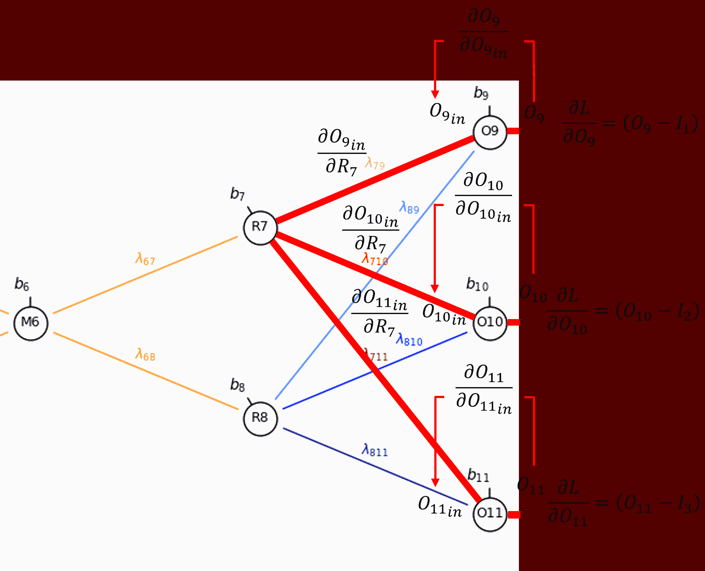

反向传播到解码器隐藏层节点 $R_7$ 的输出。

通过链式法则我们得到，

$$ \frac{\partial \mathcal{L}}{\partial R_7} = \frac{\partial O_{9_{\mathrm{in}}}}{\partial R_7} \cdot \frac{\partial O_9}{\partial O_{9_{\mathrm{in}}}} \cdot \frac{\partial \mathcal{L}}{\partial O_9} + \frac{\partial O_{10_{\mathrm{in}}}}{\partial R_7} \cdot \frac{\partial O_{10}}{\partial O_{10_{\mathrm{in}}}} \cdot \frac{\partial \mathcal{L}}{\partial O_{10}} + \frac{\partial O_{11_{\mathrm{in}}}}{\partial R_7} \cdot \frac{\partial O_{11}}{\partial O_{11_{\mathrm{in}}}} \cdot \frac{\partial \mathcal{L}}{\partial O_{11}} $$

我们可以评估为，

$$ \frac{\partial \mathcal{L}}{\partial R_7} = \lambda_{7,9} \cdot 1 \cdot (O_9 - I_1) + \lambda_{7,10} \cdot 1 \cdot (O_{10} - I_2) + \lambda_{7,11} \cdot 1 \cdot (O_{11} - I_3) $$

我们将每个连接的导数相加。由于 $𝑂_{9}$，$𝑂_{10}$ 和 $𝑂_{11}$ 处应用了线性激活，

$$ \frac{\partial O_9}{\partial O_{9_{\mathrm{in}}}} = 1, \quad \frac{\partial O_{10}}{\partial O_{10_{\mathrm{in}}}} = 1, \quad \frac{\partial O_{11}}{\partial O_{11_{\mathrm{in}}}} = 1 $$

此外，沿着连接，导数简单地是权重，

$$ \frac{\partial O_{9_{\mathrm{in}}}}{\partial R_7} = \lambda_{7,9}, \quad \frac{\partial O_{10_{\mathrm{in}}}}{\partial R_7} = \lambda_{7,10}, \quad \frac{\partial O_{11_{\mathrm{in}}}}{\partial R_7} = \lambda_{7,11} $$

例如，我们可以为 $\frac{\partial O_{9_{\mathrm{in}}}}{\partial R_7}$ 展示这一点，

$$ \frac{\partial O_{9_{\mathrm{in}}}}{\partial R_7} = \frac{\partial}{\partial R_7} \left( \lambda_{7,9} R_7 + \lambda_{8,9} R_8 + b_9 \right) = \lambda_{7,9} $$

让我们从我们的解码器隐藏层节点，$𝑅_7$，的输出继续计算节点偏置 $b_7$ 的导数。

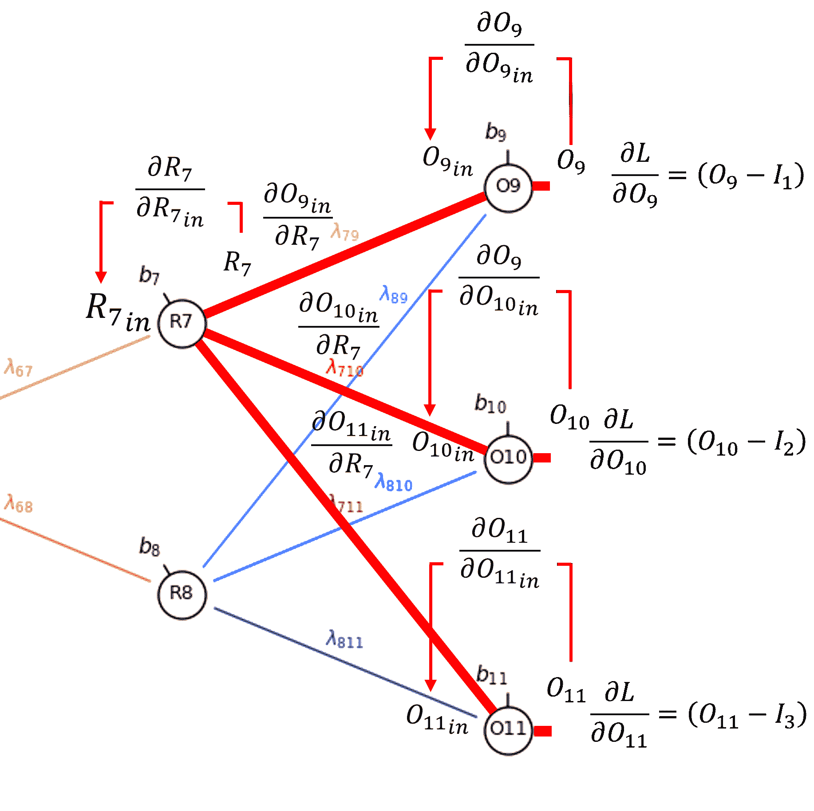

反向传播到隐藏解码器节点 $R_7$ 中的偏置，$b_7$。

从链式法则我们得到，

$$ \frac{\partial \mathcal{L}}{\partial b_7} = \frac{\partial R_{7_{\mathrm{in}}}}{\partial b_7} \cdot \frac{\partial R_7}{\partial R_{7_{\mathrm{in}}}} \cdot \frac{\partial \mathcal{L}}{\partial R_7} $$

由于在 $R_7$ 处的 sigmoid 激活，要跨过节点，

$$ \frac{\partial R_7}{\partial R_{7_{\mathrm{in}}}} = \sigma' (R_7) = R_7 (1 - R_7) $$

以及对于给定偏置的节点输入的偏导数，

$$ \frac{R_{7_{\mathrm{in}}}}{\partial b_7} = \frac{\partial}{\partial b_7} \left( \lambda_{6,7} M_6 + b_7 \right) = 1 $$

因此现在我们有，

$$ \frac{\partial \mathcal{L}}{\partial b_7} = 1 \cdot R_7 (1 - R_7) \cdot \overbrace{ \left[ \lambda_{7,9} \cdot 1 \cdot (O_9 - I_1) + \lambda_{7,10} \cdot 1 \cdot (O_{10} - I_2) + \lambda_{7,11} \cdot 1 \cdot (O_{11} - I_3) \right] }^{\frac{\partial L}{\partial R_7}} $$

现在我们可以继续到连接权重，$\lambda_{6,7}$。

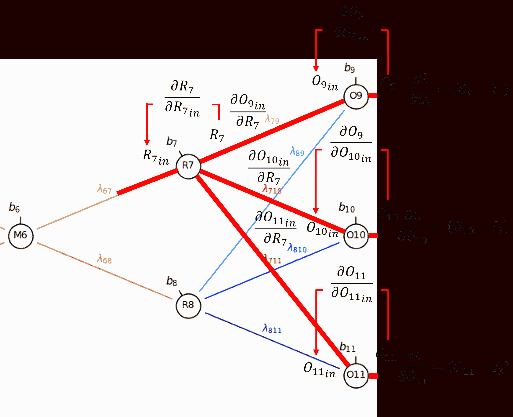

反向传播到连接权重，$\lambda_{6,7}$。

通过链式法则我们得到，

$$ \frac{\partial \mathcal{L}}{\partial \lambda_{6,7}} = \frac{\partial R_{7_{\mathrm{in}}}}{\partial \lambda_{6,7}} \cdot \frac{\partial R_7}{\partial R_{7_{\mathrm{in}}}} \cdot \frac{\partial \mathcal{L}}{\partial R_7} $$

再次，由于在隐藏层节点中应用了 sigmoid 激活，

$$ \frac{\partial R_7}{\partial R_{7_{in}}} = 1.0 $$

并且 $\frac{\partial R_{7_{\mathrm{in}}}}{\partial \lambda_{6,7}}$ 简单地是 $M_6$ 的输出，

$$ \frac{\partial R_{7_{\mathrm{in}}}}{\partial \lambda_{6,7}} = \frac{\partial}{\partial \lambda_{6,7}} \left( \lambda_{6,7} M_6 + b_6 \right) = M_6 $$

因此现在我们有，

$$ \frac{\partial \mathcal{L}}{\partial b_7} = M_6 \cdot R_7 (1 - R_7) \cdot \overbrace{ \left[ \lambda_{7,9} \cdot 1 \cdot (O_9 - I_1) + \lambda_{7,10} \cdot 1 \cdot (O_{10} - I_2) + \lambda_{7,11} \cdot 1 \cdot (O_{11} - I_3) \right] }^{\frac{\partial \mathcal{L}}{\partial R_7}} $$

让我们继续从我们的潜在节点，𝑀_6，输出。

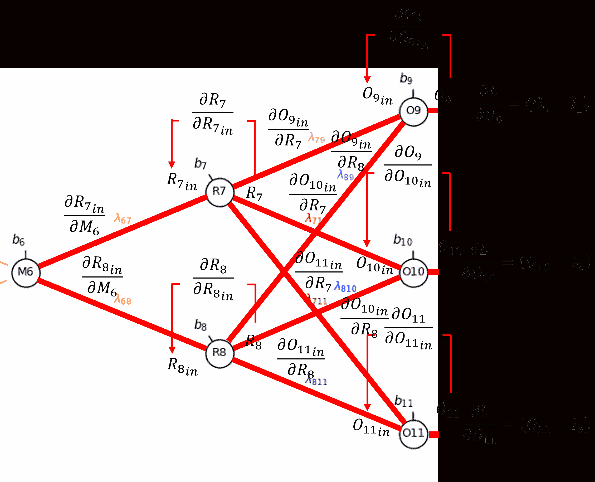

反向传播到潜在节点的输出，$M_6$。

通过链式法则我们得到，

$$ \frac{\partial \mathcal{L}}{\partial M_6} = \frac{\partial R_{7_{\mathrm{in}}}}{\partial M_6} \cdot \frac{\partial R_7}{\partial R_{7_{\mathrm{in}}}} \cdot \frac{\partial \mathcal{L}}{\partial R_7} + \frac{\partial R_{8_{\mathrm{in}}}}{\partial M_6} \cdot \frac{\partial R_8}{\partial R_{8_{\mathrm{in}}}} \cdot \frac{\partial \mathcal{L}}{\partial R_8} $$

我们可以将其表示为，

$$ \frac{\partial \mathcal{L}}{\partial M_6} = \lambda_{6,7} \cdot R_7 (1 - R_7) \cdot \frac{\partial \mathcal{L}}{\partial R_7} + \lambda_{6,8} \cdot R_8 (1 - R_8) \cdot \frac{\partial \mathcal{L}}{\partial R_8} $$

一次又一次，由于使用了 sigmoid 激活函数，

$$ \frac{\partial R_7}{\partial R_{7_{\mathrm{in}}}} = R_7 (1 - R_7), \quad \frac{\partial R_8}{\partial R_{8_{\mathrm{in}}}} = R_8 (1 - R_8) $$

并且沿着连接，

$$\begin{split} \begin{aligned} \frac{\partial R_{7_{\mathrm{in}}}}{\partial M_6} &= \frac{\partial}{\partial M_6} \left( \lambda_{6,7} M_6 + b_7 \right) = \lambda_{6,7} \\ \frac{\partial R_{8_{\mathrm{in}}}}{\partial M_6} &= \frac{\partial}{\partial M_6} \left( \lambda_{6,8} M_6 + b_8 \right) = \lambda_{6,8} \end{aligned} \end{split}$$

让我们从潜在节点$M_6$的输出继续计算节点偏置$b_6$的导数。

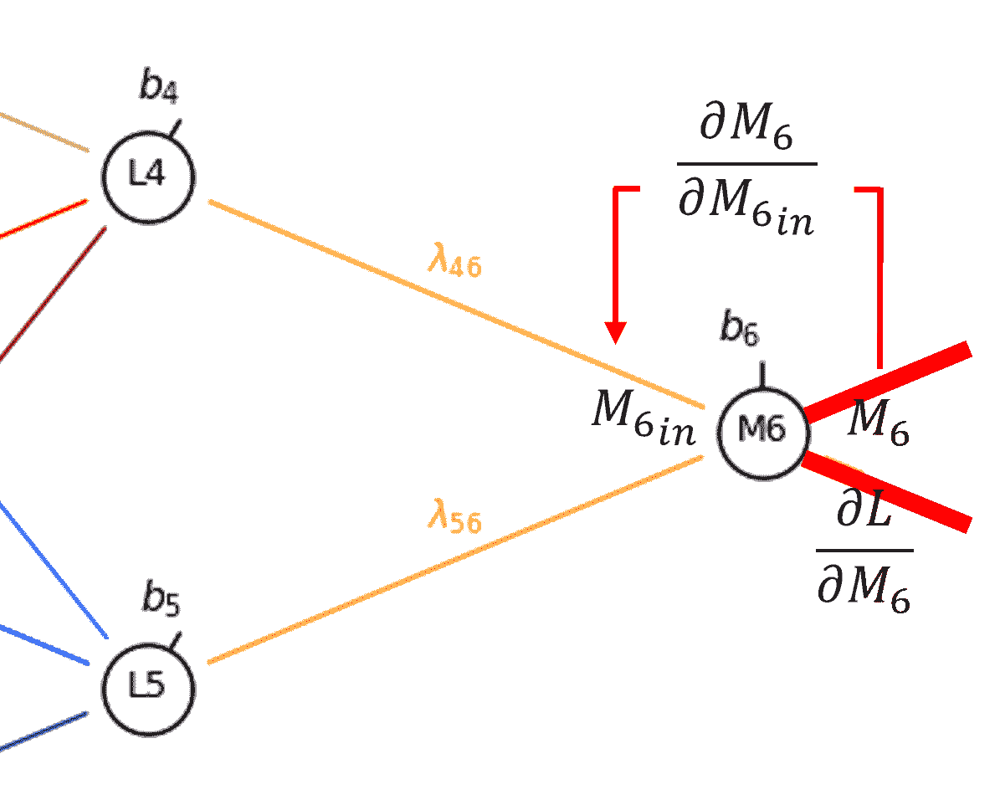

在潜在节点$M_6$中的偏置$b_6$的反向传播，注意图像已移动以腾出空间。

通过链式法则我们得到，

$$ \frac{\partial \mathcal{L}}{\partial b_6} = \frac{\partial M_{6_{\mathrm{in}}}}{\partial b_6} \cdot \frac{\partial M_6}{\partial M_{6_{\mathrm{in}}}} \cdot \frac{\partial \mathcal{L}}{\partial M_6} $$

由于在$M_6$处应用了 sigmoid 激活函数，以跨过节点，

$$ \frac{\partial M_6}{\partial M_{6_{\mathrm{in}}}} = \sigma' (M_6) = M_6 \cdot (1 - M_6) $$

并且对于给定偏置的节点输入的偏导数，

$$ \frac{\partial M_{6_{\mathrm{in}}}}{\partial b_6} = \frac{\partial}{\partial b_6} \left( \lambda_{4,6} L_4 + b_6 \right) = 1 $$

所以现在我们有，

$$ \frac{\partial \mathcal{L}}{\partial b_6} = 1 \cdot M_6 (1 - M_6) \cdot \overbrace{ \left[ \lambda_{6,7} \cdot R_7 (1 - R_7) \cdot \frac{\partial \mathcal{L}}{\partial R_7} + \lambda_{6,8} \cdot R_8 (1 - R_8) \cdot \frac{\partial \mathcal{L}}{\partial R_8} \right] }^{\frac{\partial \mathcal{L}}{\partial M_6}} $$

现在我们可以继续到连接权重，$\lambda_{4,6}$。

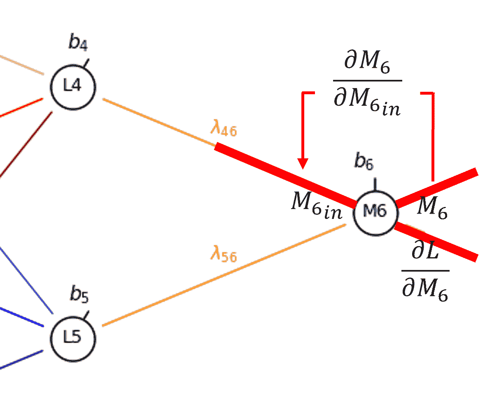

将反向传播到连接权重$\lambda_{4,6}$。

通过链式法则我们得到，

$$ \frac{\partial \mathcal{L}}{\partial \lambda_{4,6}} = \frac{\partial M_{6_{\mathrm{in}}}}{\partial \lambda_{4,6}} \cdot \frac{\partial M_6}{\partial M_{6_{\mathrm{in}}}} \cdot \frac{\partial \mathcal{L}}{\partial M_6} $$

一次又一次，由于在隐藏层节点中应用了 sigmoid 激活函数，

$$ \frac{\partial M_6}{\partial M_{6_{in}}} = M_6 \cdot (1 - M_6) $$

并且 $\frac{\partial M_{6_{\mathrm{in}}}}{\partial \lambda_{4,6}}$ 简单地是 $L_4$ 的输出，

$$ \frac{\partial M_{6_{\mathrm{in}}}}{\partial \lambda_{4,6}} = \frac{\partial}{\partial \lambda_{4,6}} \left( \lambda_{4,6} L_4 + \lambda_{5,6} L_5 + b_6 \right) = L_4 $$

因此现在我们有，

$$ \frac{\partial \mathcal{L}}{\partial \lambda_{4,6}} = L_4 \cdot M_6 (1 - M_6) \cdot \overbrace{ \left[ \lambda_{6,7} \cdot R_7 (1 - R_7) \cdot \frac{\partial \mathcal{L}}{\partial R_7} + \lambda_{6,8} \cdot R_8 (1 - R_8) \cdot \frac{\partial \mathcal{L}}{\partial R_8} \right] }^{\frac{\partial \mathcal{L}}{\partial M_6}} $$

现在我们可以继续到编码器隐藏层节点的输出，$L_4$。

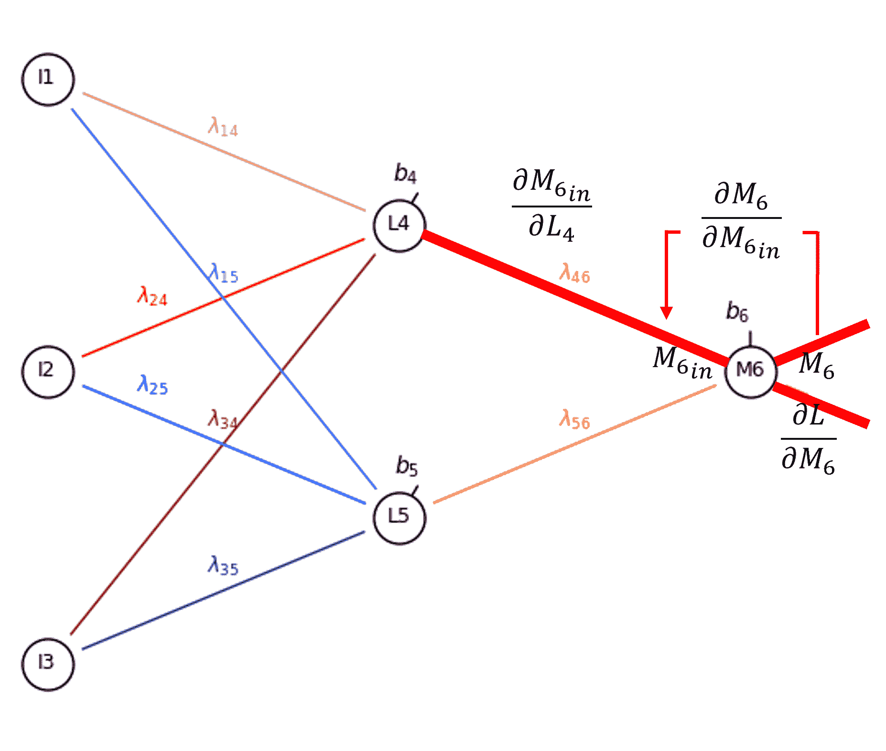

向编码器隐藏节点的输出进行反向传播，$𝐿_4$。

通过链式法则我们得到这个并对其进行评估，

$$ \frac{\partial \mathcal{L}}{\partial L_4} = \frac{\partial M_{6_{\mathrm{in}}}}{\partial L_4} \cdot \frac{\partial M_6}{\partial M_{6_{\mathrm{in}}}} \cdot \frac{\partial \mathcal{L}}{\partial M_6} = \lambda_{4,6} \cdot M_6 (1 - M_6) \cdot \frac{\partial \mathcal{L}}{\partial M_6} $$

再次，由于在潜在节点中应用了 sigmoid 激活，

$$ \frac{\partial M_6}{\partial M_{6_{\mathrm{in}}}} = M_6 (1 - M_6) $$

并且 $\frac{\partial M_{6_{\mathrm{in}}}}{\partial L_4}$ 简单地是权重，$\lambda_{4,6}$，

$$ \frac{\partial M_{6_{\mathrm{in}}}}{\partial L_4} = \frac{\partial}{\partial L_4} \left( \lambda_{4,6} L_4 + b_6 \right) = \lambda_{4,6} $$

让我们从编码器隐藏层节点的输出 $L_4$ 开始，计算节点中偏置 $b_4$ 的导数。

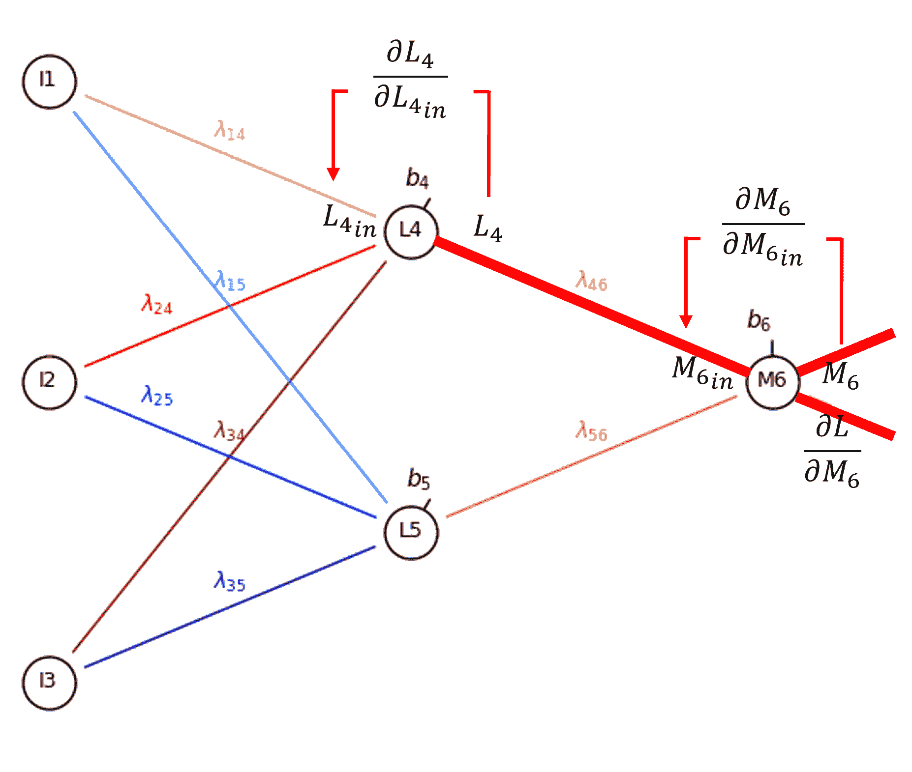

向编码器隐藏层节点 $L_4$ 中的偏置 $b_4$ 进行反向传播。

通过链式法则我们得到，

$$ \frac{\partial \mathcal{L}}{\partial b_4} = \frac{\partial L_{4_{\mathrm{in}}}}{\partial b_4} \cdot \frac{\partial L_4}{\partial L_{4_{\mathrm{in}}}} \cdot \frac{\partial \mathcal{L}}{\partial L_4} = 1 \cdot L_4 (1 - L_4) \cdot \frac{\partial \mathcal{L}}{\partial L_4} $$

由于 $M_6$ 处的 sigmoid 激活，要穿过节点，

$$ \frac{\partial M_6}{\partial M_{6_{\mathrm{in}}}} = \sigma' (M_6) = M_6 \cdot (1 - M_6) $$

对于给定偏置的节点输入的偏导数，

$$ \frac{\partial M_{6_{\mathrm{in}}}}{\partial b_6} = \frac{\partial}{\partial b_6} \left( \lambda_{4,6} L_4 + b_6 \right) = 1 $$

因此现在我们有，

$$ \frac{\partial \mathcal{L}}{\partial b_6} = 1 \cdot M_6 (1 - M_6) \cdot \overbrace{ \left[ \lambda_{6,7} \cdot R_7 (1 - R_7) \cdot \frac{\partial \mathcal{L}}{\partial R_7} + \lambda_{6,8} \cdot R_8 (1 - R_8) \cdot \frac{\partial \mathcal{L}}{\partial R_8} \right] }^{\frac{\partial \mathcal{L}}{\partial M_6}} $$

最后，我们继续到连接权重，$\lambda_{1,4}$。

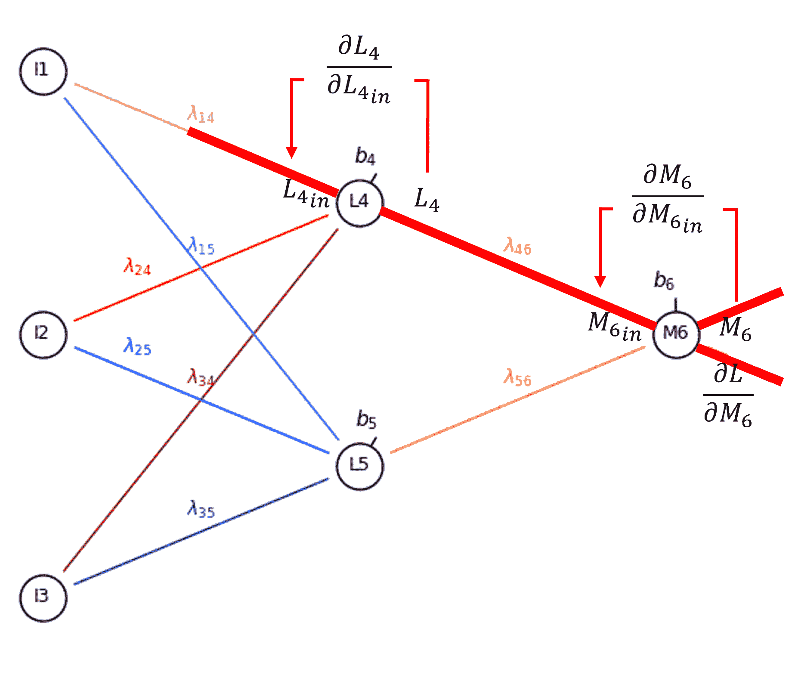

向连接权重 $\lambda_{1,4}$ 进行反向传播。

通过链式法则我们得到，

$$ \frac{\partial \mathcal{L}}{\partial \lambda_{1,4}} = \frac{\partial L^{\text{in}}_4}{\partial \lambda_{1,4}} \cdot \frac{\partial L_4}{\partial L^{\text{in}}_4} \cdot \frac{\partial \mathcal{L}}{\partial L_4} $$

再次强调，由于在隐藏层节点中应用了 sigmoid 激活函数，

$$ \frac{\partial L_4}{\partial L_{4_{in}}} = L_4 \cdot (1 - L_4) $$

并且 $\frac{\partial L^{\text{in}}_4}{\partial \lambda_{1,4}}$ 简单地是 $I_1$ 的输出，

$$ \frac{\partial L^{\text{in}}_4}{\partial \lambda_{1,4}} = \frac{\partial}{\partial \lambda_{1,4}} \left( \lambda_{1,4} I_1 + \lambda_{2,4} I_2 + \lambda_{3,4} I_3 + b_4 \right) = I_1 $$

因此，我们现在有，

$$ \frac{\partial L}{\partial \lambda_{1,4}} = I_1 \cdot L_4 (1 - L_4) \cdot \underbrace{\left[ \lambda_{4,6} \cdot M_6 (1 - M_6) \cdot \frac{\partial L}{\partial M_6} \right]}_{\frac{\partial L}{\partial L_4}} $$

现在，我们将仅使用 NumPy Python 包和 Python 内置数据结构字典从头开始构建这个自动编码器。

## 导入所需的包

我们还需要一些标准包。这些应该已经通过 Anaconda 3 安装。

```py
ignore_warnings = True                                        # ignore warnings?
import numpy as np
import matplotlib.pyplot as plt
from matplotlib.ticker import (MultipleLocator, AutoMinorLocator, AutoLocator) # control of axes ticks
plt.rc('axes', axisbelow=True)                                # set axes and grids in the background for all plots
from scipy.stats import rankdata                              # to assist with plot label placement
from sklearn.linear_model import LinearRegression             # fit the relationship between latent and training data slope 
seed = 13                                                     # random number seed
cmap = plt.cm.tab20                                           # default colormap
plt.rc('axes', axisbelow=True)                                # plot all grids below the plot elements
if ignore_warnings == True:                                   
    import warnings
    warnings.filterwarnings('ignore') 
```

如果遇到包导入错误，你可能需要首先安装这些包中的一些。这通常可以通过在 Windows 上打开命令窗口并输入‘python -m pip install [package-name]’来完成。更多帮助可以在相应包的文档中找到。

## 声明函数

这里提供了训练和可视化我们的自动编码器的函数。

```py
def add_grid():
    plt.gca().grid(True, which='major',linewidth = 1.0); plt.gca().grid(True, which='minor',linewidth = 0.2) # add y grids
    plt.gca().tick_params(which='major',length=7); plt.gca().tick_params(which='minor', length=4)
    plt.gca().xaxis.set_minor_locator(AutoMinorLocator()); plt.gca().yaxis.set_minor_locator(AutoMinorLocator()) # turn on minor ticks 

def xavier(n_in, n_out):                                      # Xavier initializer function
    limit = np.sqrt(6 / (n_in + n_out))
    return np.random.uniform(-limit, limit)

def sigmoid(x):                                               # sigmoid activation
    return 1 / (1 + np.exp(-x))

def initialize_parameters():                                  # initialize all weights and biases and build dictionaries of both
    weights = {                            
        'w14': xavier(3, 2),
        'w24': xavier(3, 2),
        'w34': xavier(3, 2),
        'w15': xavier(3, 2),
        'w25': xavier(3, 2),
        'w35': xavier(3, 2),
        'w46': xavier(2, 1),
        'w56': xavier(2, 1),
        'w67': xavier(1, 2),
        'w68': xavier(1, 2),
        'w79': xavier(2, 3),
        'w89': xavier(2, 3),
        'w710': xavier(2, 3),
        'w810': xavier(2, 3),
        'w711': xavier(2, 3),
        'w811': xavier(2, 3),
    }
    biases = {                                                # biases (one per neuron, excluding input)
        'b4': 0.0,
        'b5': 0.0,
        'b6': 0.0,
        'b7': 0.0,
        'b8': 0.0,
        'b9': 0.0,
        'b10': 0.0,
        'b11': 0.0
    }
    return weights, biases 

def forward_pass(input_vec, weights, biases):                 # forward pass of the autoencoder
    I1, I2, I3 = input_vec.flatten()                               # input nodes (I1, I2, I3)
    z4 = weights['w14'] * I1 + weights['w24'] * I2 + weights['w34'] * I3 + biases['b4'] # encoder
    a4 = sigmoid(z4)

    z5 = weights['w15'] * I1 + weights['w25'] * I2 + weights['w35'] * I3 + biases['b5']
    a5 = sigmoid(z5)

    z6 = weights['w46'] * a4 + weights['w56'] * a5 + biases['b6'] # bottlekneck
    a6 = sigmoid(z6)

    z7 = weights['w67'] * a6 + biases['b7']                   # decoder
    a7 = sigmoid(z7)

    z8 = weights['w68'] * a6 + biases['b8']
    a8 = sigmoid(z8)

    z9 = weights['w79'] * a7 + weights['w89'] * a8 + biases['b9']
    a9 = z9  

    z10 = weights['w710'] * a7 + weights['w810'] * a8 + biases['b10']
    a10 = z10  # linear

    z11 = weights['w711'] * a7 + weights['w811'] * a8 + biases['b11']
    a11 = z11  # linear

    return {                                                  # return all activations as a dictionary
        'I1': I1, 'I2': I2, 'I3': I3,
        'L4': a4, 'L5': a5,
        'M6': a6,
        'R7': a7, 'R8': a8,
        'O9': a9, 'O10': a10, 'O11': a11
    }

def mse_loss_and_derivative(output_vec, input_vec):           # MSE loss and error derivative given output and input
    diff = output_vec - input_vec
    loss = np.mean(diff**2)
    dloss_dout = (2/3) * diff  # shape (3,1)
    return loss, dloss_dout

def sigmoid_derivative(x):                                    # derivative of sigmoid activation
    return x * (1 - x)

def backpropagate(activations, weights, biases, dloss_dout):  # backpropagate the error derivatives
    I1, I2, I3 = activations['I1'], activations['I2'], activations['I3']
    a4, a5 = activations['L4'], activations['L5']
    a6 = activations['M6']
    a7, a8 = activations['R7'], activations['R8']
    O9, O10, O11 = activations['O9'], activations['O10'], activations['O11']

    delta9 = dloss_dout[0, 0]                                 # error terms (delta) for output nodes = dLoss/dOutput
    delta10 = dloss_dout[1, 0]
    delta11 = dloss_dout[2, 0]

    grad_weights = {}                                         # gradients for weights from R7, R8 to O9, O10, O11
    grad_biases = {}

    grad_weights['w79'] = delta9 * a7
    grad_weights['w89'] = delta9 * a8
    grad_weights['w710'] = delta10 * a7
    grad_weights['w810'] = delta10 * a8
    grad_weights['w711'] = delta11 * a7
    grad_weights['w811'] = delta11 * a8

    grad_biases['b9'] = delta9
    grad_biases['b10'] = delta10
    grad_biases['b11'] = delta11

    delta_r7 = (delta9 * weights['w79'] + delta10 * weights['w710'] + delta11 * weights['w711']) * sigmoid_derivative(a7) # gradients for R7 and R8
    delta_r8 = (delta9 * weights['w89'] + delta10 * weights['w810'] + delta11 * weights['w811']) * sigmoid_derivative(a8)

    grad_weights['w67'] = delta_r7 * a6                       # gradients for weights from M6 to R7, R8
    grad_weights['w68'] = delta_r8 * a6

    grad_biases['b7'] = delta_r7
    grad_biases['b8'] = delta_r8

    delta_m6 = (delta_r7 * weights['w67'] + delta_r8 * weights['w68']) * sigmoid_derivative(a6) # backpropagate delta to M6 (sigmoid)

    grad_weights['w46'] = delta_m6 * a4                       # gradients for weights from L4, L5 to M6
    grad_weights['w56'] = delta_m6 * a5

    grad_biases['b6'] = delta_m6

    delta_l4 = delta_m6 * weights['w46'] * sigmoid_derivative(a4) # backpropagate delta to L4, L5 (sigmoid)
    delta_l5 = delta_m6 * weights['w56'] * sigmoid_derivative(a5)

    grad_weights['w14'] = delta_l4 * I1                       # gradients for weights from I1, I2, I3 to L4
    grad_weights['w24'] = delta_l4 * I2
    grad_weights['w34'] = delta_l4 * I3

    grad_biases['b4'] = delta_l4

    grad_weights['w15'] = delta_l5 * I1                       # gradients for weights from I1, I2, I3 to L5
    grad_weights['w25'] = delta_l5 * I2
    grad_weights['w35'] = delta_l5 * I3

    grad_biases['b5'] = delta_l5
    return grad_weights, grad_biases

def update_parameters(weights, biases, grad_weights, grad_biases, learning_rate): # update the weights and biased by derivatives and learning rate
    for key in grad_weights:                                  # update weights
        weights[key] -= learning_rate * grad_weights[key]
    for key in grad_biases:                                   # update biases
        biases[key] -= learning_rate * grad_biases[key]
    return weights, biases 
```

## 可视化自动编码器网络

在这里，我们指定自动编码器的标签、位置、连接和颜色，然后绘制自动编码器。

+   虽然这个代码是通用的，但实际的自动编码器代码并没有推广到与其他架构一起工作，例如改变网络的深度或宽度

+   仅更改显示参数，但不要更改自动编码器架构

```py
positions = {                                                 # node positions
    'I1': (0, 2), 'I2': (0, 1), 'I3': (0, 0),
    'L4': (1, 1.5), 'L5': (1, 0.5),
    'M6': (2, 1),
    'R7': (3, 1.5), 'R8': (3, 0.5),
    'O9': (4, 2), 'O10': (4, 1), 'O11': (4, 0),
}

node_colors = {                                               # node colors
    'I1': 'white', 'I2': 'white', 'I3': 'white',
    'L4': 'white', 'L5': 'white',
    'M6': 'white',
    'R7': 'white', 'R8': 'white',
    'O9': 'white', 'O10': 'white', 'O11': 'white',
}

edges = [                                                     # edges and weight labels
    ('I1', 'L4', 'lightcoral'), ('I2', 'L4', 'red'), ('I3', 'L4', 'darkred'),
    ('I1', 'L5', 'dodgerblue'), ('I2', 'L5', 'blue'), ('I3', 'L5', 'darkblue'),
    ('L4', 'M6', 'orange'), ('L5', 'M6', 'darkorange'),
    ('M6', 'R7', 'orange'), ('M6', 'R8', 'darkorange'),
    ('R7', 'O9', 'lightcoral'), ('R7', 'O10', 'red'), ('R7', 'O11', 'darkred'),
    ('R8', 'O9', 'dodgerblue'), ('R8', 'O10', 'blue'), ('R8', 'O11', 'darkblue'),
]

weight_labels = { (src, dst,): f"$\\lambda_{{{src[1]}{dst[1:]}}}$" for (src, dst, color) in edges }

bias_offsets = {                                              # bias vector offsets
    'L4': (0.06, 0.12), 'L5': (0.06, 0.12),
    'M6': (0.0, 0.15),
    'R7': (-0.06, 0.12), 'R8': (-0.06, 0.12),
    'O9': (0.0, 0.15), 'O10': (0.0, 0.15), 'O11': (0.0, 0.15),
}

bias_labels = { node: f"$b_{{{node[1:]}}}$" for node in bias_offsets.keys() }
# Plot
fig, ax = plt.subplots(figsize=(11, 6))

custom_weight_offsets = {                                     # custom label offsets for select overlapping weights
    ('I2', 'L4'): (-0.20, 0.0),
    ('I2', 'L5'): (-0.2, 0.20),
    ('R8', 'O9'): (0.15, 0.35),
    ('R8', 'O10'): (0.15, 0.16),
}

for (src, dst, color) in edges:                               # plot edges and weight labels
    x0, y0 = positions[src]
    x1, y1 = positions[dst]
    ax.plot([x0, x1], [y0, y1], color=color, linewidth=1, zorder=1)
    xm, ym = (x0 + x1) / 2, (y0 + y1) / 2
    dx, dy = custom_weight_offsets.get((src, dst), (0, 0.08))
    ax.text(xm + dx, ym + dy, weight_labels[(src, dst)],
            fontsize=9, ha='center', va='center', color = color, zorder=5)

for node, (x, y) in positions.items():                        # white back circles
    ax.scatter(x, y, s=1000, color='white', zorder=2)

for node, (x, y) in positions.items():                        # node circles and labels
    ax.scatter(x, y, s=500, color=node_colors[node], edgecolors='black', zorder=3)
    ax.text(x, y, node, ha='center', va='center', fontsize=9, zorder=4)

for node, (dx, dy) in bias_offsets.items():                   # bias arrows and tighter label placement
    nx, ny = positions[node]
    bx, by = nx + dx, ny + dy
    ax.annotate("", xy=(nx, ny), xytext=(bx, by),
                arrowprops=dict(arrowstyle="->", color='black'), zorder=2)
    ax.text(bx, by, bias_labels[node], ha='right', va='bottom', fontsize=10)

# Final formatting
ax.set_xlim(-0.5, 4.5)
ax.set_ylim(-0.5, 2.7)
ax.axis('off'); plt.tight_layout(); plt.show() 
```

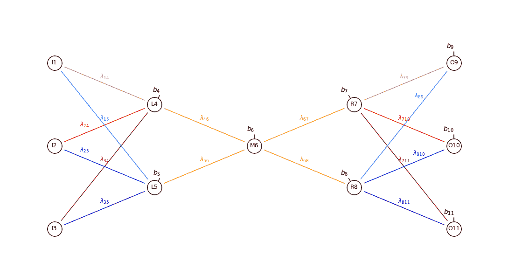

## 创建一个有趣的合成数据集

生成一个 1D 长度为 3 向量的随机数据集，其模式可以被我们的自动编码器总结。

+   如果我们生成长度为 3 的随机 1D 向量，我们的自动编码器将无法总结，即，无法从原始的 3 个值中压缩信息

+   我们必须包括一个可以被自动编码器学习的模式，以通过潜在节点观察通过良好的数据重建实现的降维

为了做到这一点，我已经将数据集作为一个混合模型计算，线性加小的随机残差。数据生成步骤包括，

1.  绘制一个随机斜率 $\sim N\left[-2.0, 2.0 \right]$

1.  在位置 $\left[-1, 0, 1 \right]$, $f(\left[-1, 0, 1 \right])$ 计算三个点

1.  向每个位置添加随机、独立的残差，$f(\left[-1, 0, 1 \right]) + N\left[0.0,\sigma \right]$，其中 sigma 是残差标准差

注意，斜率被保留作为一个标签，将用于与潜在节点 $M_6$ 输出进行比较，以检查，我们的自动编码器学到了什么？

+   我们的假设是，自动编码器将学习一个值，该值直接映射到斜率以描述这个数据集。

+   注意，虽然这个标签用于展示自动编码器学习的能力，但它并没有用于训练模型！

```py
np.random.seed(seed = seed+1)                                 # set random seed
nbatch = 12; nnodes = 3; sigma = 0.1                          # set number of data (total number of data), number of nodes (must be 3), error st.dev.
ymat = np.zeros(nbatch); x = np.arange(1,nnodes+1,1); Xmat = np.zeros([nbatch,nnodes])
data = []
for ibatch in range(0,nbatch):                                # loop over synthetic data
    m = np.random.uniform(low = -2.0, high = 2.0)
    Xmat[ibatch] = (x-2.0)*m + np.random.normal(loc = 0.0, scale=sigma,size=nnodes)
    ymat[ibatch] = np.dot(x, Xmat[ibatch]) / np.dot(x, x)
    data.append(Xmat[ibatch].reshape(3,1))

rank = rankdata(Xmat[:,-1])                                   # rank data to improve (alternate) adjacent labels' locations
plt.subplot(111)                                              # plot the synthetic data
for ibatch in range(0,nbatch):                                
    plt.scatter(Xmat[ibatch],x,color=cmap(ibatch/(nbatch)),edgecolor='black',lw=1,zorder=10)
    plt.plot(Xmat[ibatch],x,color=cmap(ibatch/(nbatch)),lw=2,zorder=1)
    custom_positions = [1,2,3,3.2]
    custom_labels = ['I1','I2','I3','Y']
    if rank[ibatch] % 2 == 0:
        plt.annotate(np.round(ymat[ibatch],2),[Xmat[ibatch][-1],3.18],size=9,color='black',ha='center')
    else:
        plt.annotate(np.round(ymat[ibatch],2),[Xmat[ibatch][-1],3.25],size=9,color='black',ha='center') 
    plt.annotate(ibatch+1,[Xmat[ibatch][0],0.9],size=9,color='black',ha='center')
    plt.gca().set_yticks(custom_positions); plt.gca().set_yticklabels(custom_labels)
    plt.ylim([3.4,0.8]); plt.xlim([-1.5,1.5]); plt.ylabel('Input Nodes'); plt.xlabel('z'); add_grid(); plt.title('Synthetic 1D Data and Labels')
plt.annotate('Data Index: ',[-1.4,0.9])

plt.subplots_adjust(left=0.0, bottom=0.0, right=2.0, top=1.1, wspace=0.2, hspace=0.2); plt.show() 
```

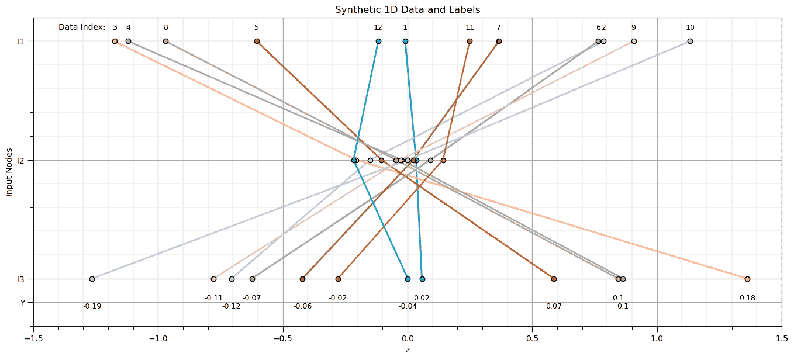

## 训练自动编码器

我们之前已经定义了我们自动编码器所需的所有基本函数，因此我们可以使用以下函数来组合我们的自动编码器训练步骤，

1.  **初始化参数** - 初始化权重和偏差

1.  **前向传递** - 通过我们的自动编码器进行前向传递以计算节点输出和数据重建

1.  **均方误差损失和导数** - 计算每个输出节点的 L2 损失和相关误差导数，这些节点来自训练数据和重建

1.  **反向传播** - 根据误差导数和节点输出，通过网络反向传播误差导数，然后在每个权重和偏差上平均梯度

1.  **更新参数** - 使用批次的平均梯度和学习率更新权重和偏差

1.  进行到 2 直到收敛，在这种情况下是一个固定的训练周期数

```py
epochs = 10000                                                # set hyperparameters
batch_size = nbatch
learning_rate = 0.1
seed = 13
np.random.seed(seed=seed)

output_mat = np.zeros((batch_size,epochs,3)); loss_mat = np.zeros((epochs)); M6_mat = np.zeros((batch_size,epochs))

weights, biases = initialize_parameters()                     # initialize weights and biases

for epoch in range(epochs):
    sum_grad_w = {k: 0 for k in weights.keys()}               # initialize zero dictionary to average backpropogated gradients
    sum_grad_b = {k: 0 for k in biases.keys()}
    epoch_loss = 0
    for idata,input_vec in enumerate(data):
        activations = forward_pass(input_vec, weights, biases) # forward pass
        M6_mat[idata,epoch] = activations['M6']
        output_vec = np.array([[activations['O9']], [activations['O10']], [activations['O11']]])
        output_mat[idata,epoch,:] = output_vec.reshape(3)
        loss, dloss_dout = mse_loss_and_derivative(output_vec, input_vec) # compute loss and derivative
        epoch_loss += loss
        grad_w, grad_b = backpropagate(activations, weights, biases, dloss_dout) # backpropagation the derivative
        for k in grad_w:                                      # accumulate gradients
            sum_grad_w[k] += grad_w[k]
        for k in grad_b:
            sum_grad_b[k] += grad_b[k]
    avg_grad_w = {k: v / batch_size for k, v in sum_grad_w.items()} # average gradients over batch
    avg_grad_b = {k: v / batch_size for k, v in sum_grad_b.items()}
    epoch_loss /= batch_size
    loss_mat[epoch] = epoch_loss
    weights, biases = update_parameters(weights, biases, avg_grad_w, avg_grad_b, learning_rate) # update parameters
    # if epoch % 500 == 0:                                    # print loss every 100 training epochs
    #     print(f"Epoch {epoch}, Loss: {epoch_loss:.6f}")

plt.subplot(111)                                              # plot training error vs. training epoch
plt.plot(np.arange(0,epoch+1,1),loss_mat,color='red',label=r'MSE'); plt.xlim([1,epoch]); plt.ylim([0,1])
plt.xlabel('Epochs'); plt.ylabel(r'Mean Square Error (L2 loss)'); plt.title('Autoencoder Average Batch L2 Loss vs. Training Epoch')
add_grid(); plt.legend(loc='upper right'); plt.xscale('linear')

plt.subplots_adjust(left=0.0, bottom=0.0, right=1.0, top=1.1, wspace=0.2, hspace=0.2); plt.show() 
```

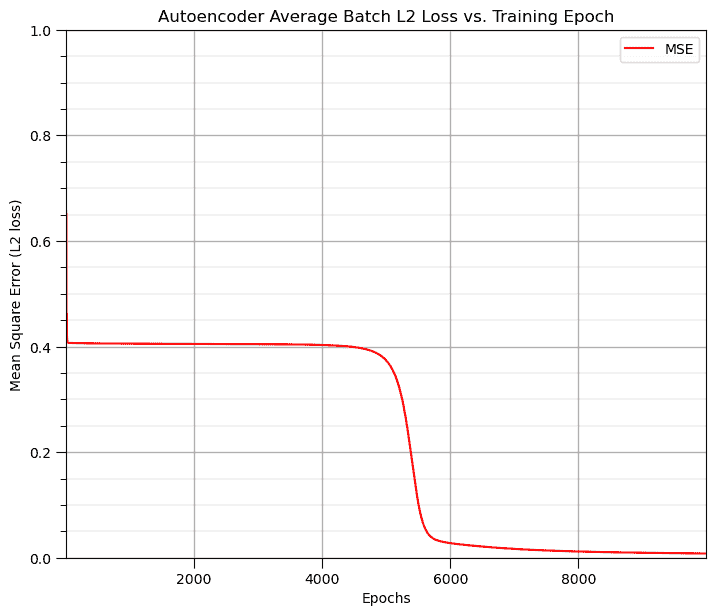

平均 L2 损失与训练周期曲线看起来非常好。

+   我们看到学习暂停，然后突然训练误差快速减少，然后缓慢收敛

+   我为了效率停在了 10,000 个训练周期处

## 评估我们的自动编码器网络

让我们看看网络瓶颈处的潜在节点输出，即节点 M6 的输出。

+   注意，我们记录了所有训练周期和所有数据的 M6 输出（称为节点激活）。

+   让我们查看最终训练好的网络，最后一个训练周期，并遍历所有数据

这里是最终训练周期 M6 输出与样本斜率的对比图，

```py
linear_model = LinearRegression().fit(ymat.reshape(-1, 1), M6_mat[:,-1]) # fit linear model to regress latent on training data slope

plt.subplot(111)                                              # plot latent vs. training data slope
plt.plot(np.linspace(-0.4,0.4,100),linear_model.predict(np.linspace(-0.4,0.4,100).reshape(-1,1)),color='red',zorder=-1)
for ibatch,input_vec in enumerate(data):                      # plot and label training data
    plt.scatter(ymat[ibatch],M6_mat[ibatch,-1],color=cmap(ibatch/(nbatch)),edgecolor='black',marker='o',s=30,zorder=10)
    plt.annotate(ibatch+1,[ymat[ibatch]-0.01,M6_mat[ibatch,-1]+0.01],size=9,color='black',ha='center',zorder=100) 
plt.ylabel('M6 Output'); plt.xlabel(r'Sample Slope, $m_i$'); plt.title('Latent Node Output vs. Sample Slope')
plt.ylim([0.1,0.8]); plt.xlim([-0.4,0.4]); add_grid()
plt.subplots_adjust(left=0.0, bottom=0.0, right=1.0, top=1.1, wspace=0.2, hspace=0.2); plt.show() 
```

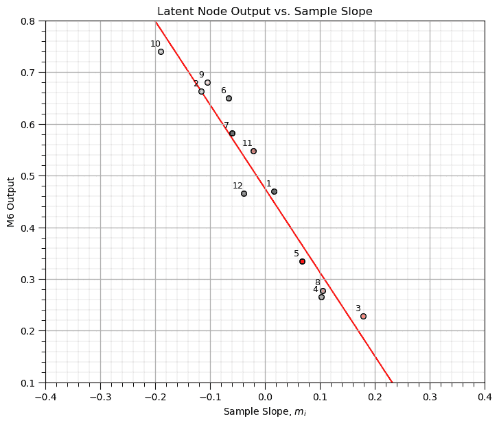

如预期，我们的网络瓶颈处的潜在节点输出与用于生成数据的样本斜率之间存在良好的关系！

+   我们的自动编码器已经学习了一个值来表示数据集中 3 个值的向量！

+   这是对信息压缩的绝佳展示，3:1！

## 检查训练数据重建

让我们可视化使用我们的自动编码器网络重建的 1D 数据，编码后再解码。

+   对于所有训练数据，我包括原始数据和重建数据，即由我们训练好的自动编码器编码和解码的数据

+   对于每个数据训练样本，我包括样本斜率以供参考，但这个标签在训练中、编码器或解码器中都没有使用

```py
for idata,input_vec in enumerate(data):                       # plot training data and reconstructions 
    plt.subplot(4,3,idata+1)
    plt.scatter(Xmat[idata],x,color=cmap(idata/(nbatch+2)),edgecolor='black',lw=1,zorder=10)
    plt.plot(Xmat[idata],x,lw=1,zorder=1,color=cmap(idata/(nbatch+2)),label='data')
    custom_positions = [1,2,3,3.2]
    custom_labels = ['I1','I2','I3','Y']
    plt.annotate(np.round(ymat[idata],2),[Xmat[idata][-1],3.25],size=9,color='black',ha='center')  
    plt.scatter(output_mat[idata,-1,:],x,lw=1,color=cmap(idata/(nbatch+2)))
    plt.plot(output_mat[idata,-1,:],x,lw=1,ls='--',color=cmap(idata/(nbatch+2)),label='reconstruction')
    plt.legend(loc='upper left')
    plt.gca().set_yticks(custom_positions); plt.gca().set_yticklabels(custom_labels)
    plt.ylim([3.5,0.8]); plt.xlim([-2.5,2.5]); plt.ylabel('index'); plt.xlabel('z'); add_grid(); plt.title('Synthetic 1D Training Data #' + str(idata+1))

plt.subplots_adjust(left=0.0, bottom=0.0, right=3.0, top=4.1, wspace=0.2, hspace=0.2); plt.show() 
```

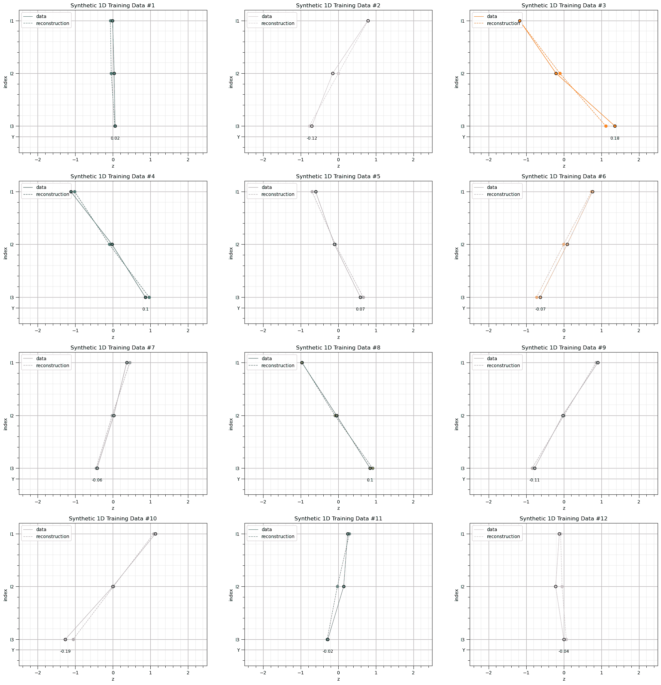

训练数据重建相当不错！

+   我们的自编码器已经学会了编码和解码训练数据

+   展示了从 3 维到 1 维的良好降维效果！

## 检查测试数据重建

让我们生成更多数据并测试重建效果。

+   使用未用于训练自编码器的数据进行性能检查，这被称为模型泛化

```py
np.random.seed(seed = seed+7)
nbatch_test = 12; nnodes = 3; sigma = 0.1
ymat_test = np.zeros(nbatch); x = np.arange(1,nnodes+1,1); Xmat_test = np.zeros([nbatch,nnodes])
data_test = []
for ibatch in range(0,nbatch):
    m = np.random.uniform(low = -2.0, high = 2.0)
    Xmat_test[ibatch] = (x-2.0)*m + np.random.normal(loc = 0.0, scale=sigma,size=nnodes)
    ymat_test[ibatch] = np.dot(x, Xmat_test[ibatch]) / np.dot(x, x)
    data_test.append(Xmat_test[ibatch].reshape(3,1))

rank = rankdata(Xmat_test[:,-1])
plt.subplot(111)
for ibatch in range(0,nbatch_test):
    plt.scatter(Xmat_test[ibatch],x,color=cmap(ibatch/(nbatch)),edgecolor='black',lw=1,zorder=10)
    plt.plot(Xmat_test[ibatch],x,color=cmap(ibatch/(nbatch)),lw=2,zorder=1)
    custom_positions = [1,2,3,3.2]
    custom_labels = ['I1','I2','I3','Y']
    if rank[ibatch] % 2 == 0:
        plt.annotate(np.round(ymat_test[ibatch],2),[Xmat_test[ibatch][-1],3.18],size=9,color='black',ha='center')
    else:
        plt.annotate(np.round(ymat_test[ibatch],2),[Xmat_test[ibatch][-1],3.25],size=9,color='black',ha='center') 
    plt.annotate(ibatch+13,[Xmat_test[ibatch][0],0.9],size=9,color='black',ha='center')
    plt.gca().set_yticks(custom_positions); plt.gca().set_yticklabels(custom_labels)
    plt.ylim([3.4,0.8]); plt.xlim([-1.5,1.5]); plt.ylabel('Input Nodes'); plt.xlabel('z'); add_grid(); plt.title('Synthetic 1D Data and Labels')
plt.annotate('Test Data Index: ',[-1.45,0.9])

plt.subplots_adjust(left=0.0, bottom=0.0, right=2.0, top=1.1, wspace=0.2, hspace=0.2); plt.show() 
```

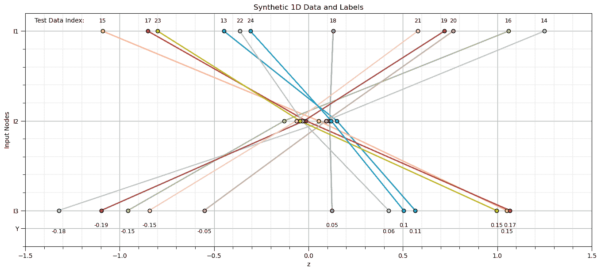

将训练好的自编码器应用于重建测试数据。

```py
output_vec_test = np.zeros((len(data_test),3))
for idata_test,input_vec_test in enumerate(data_test):
    activations = forward_pass(input_vec_test, weights, biases)                                                    # forward pass
    output_vec_test[idata_test,:] = np.array([[activations['O9']], [activations['O10']], [activations['O11']]]).reshape(-1) 
```

现在可视化测试数据重建，

```py
for idata,input_vec_test in enumerate(data_test):
    plt.subplot(4,3,idata+1)
    plt.scatter(input_vec_test,x,color=cmap(idata/(nbatch)),edgecolor='black',lw=1,zorder=10)
    plt.plot(input_vec_test,x,lw=1,zorder=1,color=cmap(idata/(nbatch)),label='data')
    custom_positions = [1,2,3,3.2]
    custom_labels = ['I1','I2','I3','Y']
    # plt.annotate(np.round(ymat[idata],2),[Xmat[idata][-1],3.25],size=8,color='black',ha='center') 
    plt.scatter(output_vec_test[idata,:],x,lw=1,color=cmap(idata/(nbatch)))
    plt.plot(output_vec_test[idata,:],x,lw=1,ls='--',color=cmap(idata/(nbatch)),label='reconstruction')
    plt.legend(loc='upper left'); plt.gca().set_yticks(custom_positions); plt.gca().set_yticklabels(custom_labels)
    plt.ylim([3.5,0.8]); plt.xlim([-1.5,1.5]); plt.ylabel('index'); plt.xlabel('z'); add_grid(); plt.title('Synthetic 1D Test Image #' + str(idata+13))

plt.subplots_adjust(left=0.0, bottom=0.0, right=3.0, top=4.1, wspace=0.2, hspace=0.2); plt.show() 
```

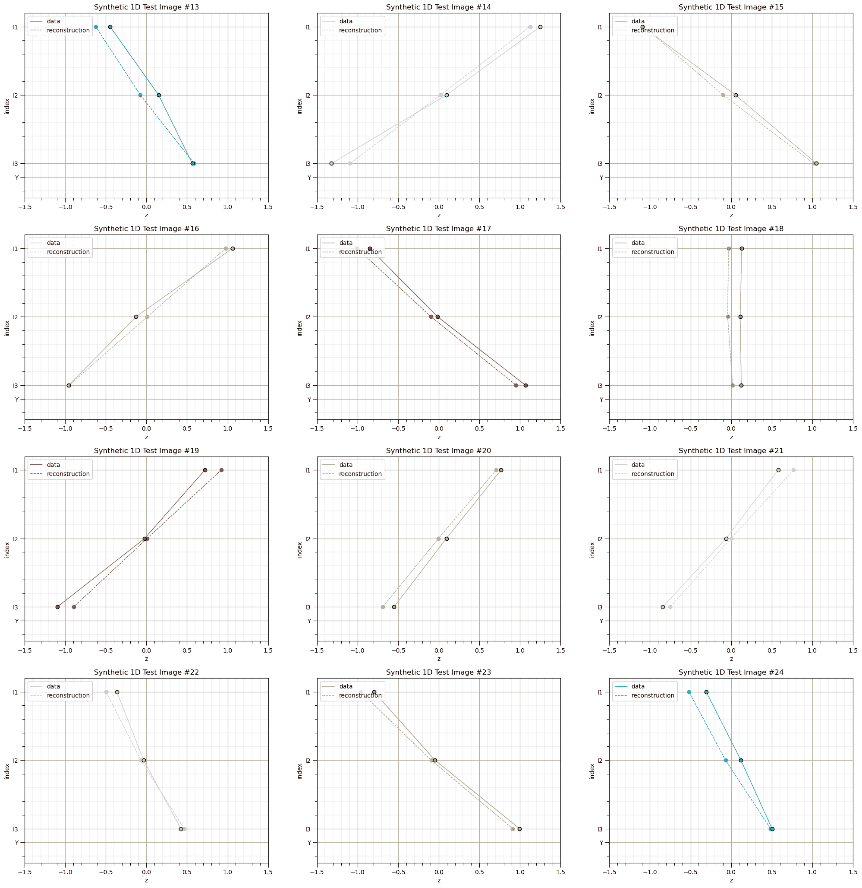

我们训练好的自编码器似乎泛化得很好，在重建训练数据和保留的测试案例方面表现优异。

+   为了更完整的流程，我们将在训练周期内并行评估训练和测试错误，以检查模型过拟合。

+   我将这些组件分开，以便在演示中更简洁、更清晰

## 评论

这是对自编码器深度学习网络的基本处理。可以做和讨论的还有很多，我有很多更多的资源。查看我的[资源共享清单](https://michaelpyrcz.com/my-resources)以及本章开头带有资源链接的 YouTube 讲座链接。

希望这有所帮助，

*迈克尔*

## 关于作者


在德克萨斯大学奥斯汀分校的 40 英亩校园内，迈克尔·皮尔奇教授的办公室。

迈克尔·皮尔奇是德克萨斯大学奥斯汀分校[科克雷尔工程学院](https://cockrell.utexas.edu/faculty-directory/alphabetical/p)和[杰克逊地球科学学院](https://www.jsg.utexas.edu/researcher/michael_pyrcz/)的教授，他在[德克萨斯大学奥斯汀分校](https://www.utexas.edu/)从事和教授地下、空间数据分析、地统计学和机器学习。迈克尔还是，

+   [能源分析](https://fri.cns.utexas.edu/energy-analytics)新生研究项目的首席研究员，以及德克萨斯大学奥斯汀分校自然科学学院机器学习实验室的核心教员。

+   [计算机与地球科学](https://www.sciencedirect.com/journal/computers-and-geosciences/about/editorial-board)的副编辑，以及国际数学地球科学协会[数学地球科学](https://link.springer.com/journal/11004/editorial-board)的董事会成员。

迈克尔已经撰写了 70 多篇[同行评审的出版物](https://scholar.google.com/citations?user=QVZ20eQAAAAJ&hl=en)，一个用于空间数据分析的[Python 包](https://pypi.org/project/geostatspy/)，合著了一本关于空间数据分析的教科书[地球统计学储层建模](https://www.amazon.com/Geostatistical-Reservoir-Modeling-Michael-Pyrcz/dp/0199731446)，并是两本新发布的电子书的作者，[Python 中应用地球统计学：GeostatsPy 实践指南](https://geostatsguy.github.io/GeostatsPyDemos_Book/intro.html)和[Python 中应用机器学习：代码实践指南](https://geostatsguy.github.io/MachineLearningDemos_Book/intro.html)。

迈克尔的所有大学讲座都可以在他的[YouTube 频道](https://www.youtube.com/@GeostatsGuyLectures)上找到，附有 100 多个 Python 交互式仪表板和 40 多个存储库中的详细工作流程链接，这些存储库位于他的[GitHub 账户](https://github.com/GeostatsGuy)，以支持任何感兴趣的学生和在职专业人士，提供常青内容。了解更多关于迈克尔的工作和共享教育资源，请访问他的网站。

## 想一起工作吗？

我希望这个内容对那些想要了解更多关于地下建模、数据分析以及机器学习的人有所帮助。学生和在职专业人士都欢迎参与。

+   想邀请我到贵公司进行培训、辅导、项目审查、工作流程设计和/或咨询吗？我很乐意拜访并与您合作！

+   感兴趣合作、支持我的研究生研究或我的地下数据分析与机器学习联盟（共同负责人是约翰·福斯特教授）吗？我的研究将数据分析、随机建模和机器学习理论与实践相结合，以开发新的方法和工作流程，增加价值。我们正在解决具有挑战性的地下问题！

+   您可以通过 mpyrcz@austin.utexas.edu 联系我。

我总是很高兴讨论，

*迈克尔*

迈克尔·皮尔茨，博士，P.Eng. 教授，德克萨斯大学奥斯汀分校 Cockrell 工程学院和 Jackson 地球科学学院

更多资源可在以下位置获取：[Twitter](https://twitter.com/geostatsguy) | [GitHub](https://github.com/GeostatsGuy) | [网站](http://michaelpyrcz.com) | [Google Scholar](https://scholar.google.com/citations?user=QVZ20eQAAAAJ&hl=en&oi=ao) | [地球统计学书籍](https://www.amazon.com/Geostatistical-Reservoir-Modeling-Michael-Pyrcz/dp/0199731446) | [Python 中应用地球统计学电子书](https://geostatsguy.github.io/GeostatsPyDemos_Book/intro.html) | [Python 中应用机器学习电子书](https://geostatsguy.github.io/MachineLearningDemos_Book/) | [LinkedIn](https://www.linkedin.com/in/michael-pyrcz-61a648a1)

## 动机

自动编码器是一种非常强大、灵活的深度学习方法，用于压缩信息，

+   将训练数据映射到潜在空间

+   将高维数据降维到更低的维度

+   非线性，通用方法

## 自动编码器架构

这里是我们的简单自动编码器，


简单演示自动编码器。

这实际上是来自 [人工神经网络](https://geostatsguy.github.io/MachineLearningDemos_Book/MachineLearning_ANN.html) 的镜像。

我不会讨论通过网络的正向传递，如果你不熟悉这个过程，例如，

+   应用到节点线性加权和偏置上的激活函数

然后请回顾人工神经网络章节。

我决定为每个节点使用独特的数值索引，以便于简洁地表示连接权重，例如 $\lambda_{1,4}$，以及偏置，例如 $b_4$，$I$ 用于输入节点，$L$ 用于编码器隐藏层（‘左’），$M$ 用于潜在节点（‘中间’），$R$ 用于解码器隐藏层（‘右’），最后 $O$ 用于输出节点。

自动编码器的各个部分如下所示，


带有部分标签的简单演示自动编码器。

通过自动编码器传递的信号及其表示包括，

+   **输入** – 训练样本，

$$ z $$

+   **编码器** – 将训练样本压缩到潜在空间的学习压缩，

$$ x = f_{\theta} (z) $$

+   **潜在空间** – 窄颈部分总结了训练数据中的模式，

$$ 𝑥 $$

+   **解码器** – 将潜在空间解压缩为原始训练数据的重建，

$$ \hat{z} = g_{\phi} (x) = g_{\phi} (f_{\theta}(z) ) $$

+   重建 – 尝试重现输入，

$$ \hat{z} \sim z $$

## 训练模型参数

训练自动编码器通过以下步骤迭代进行。


训练人工神经网络通过以下迭代过程进行，1. 前向传递以进行预测，2. 根据预测和训练数据中的真实值计算误差导数，3. 将误差导数反向传播通过人工神经网络以计算所有模型权重和偏置参数的误差导数，4. 根据导数和学习率更新模型参数，5. 重复直到收敛。

这里是每个步骤的一些细节，

1.  **初始化模型参数** - 通常使用接近零的小随机值初始化所有模型参数。以下是一些常见方法，

+   **Xavier 权重初始化** - 由 $U[\text{min}, \text{max}]$ 指定的均匀分布的随机实现，

$$ \lambda_{i,j} = F_U^{-1} \left[ \frac{-1}{\sqrt{p}}, \frac{1}{\sqrt{p}} \right] (p^\ell) $$

+   其中 $F^{-1}_U$ 是累积分布函数的逆，$p$ 是输入的数量，而 $p^{\ell}$ 是从均匀分布 $U[0,1]$ 中抽取的随机累积概率值。

+   **归一化 Xavier 权重初始化** - 从由 $U[\text{min}, \text{max}]$ 指定的均匀分布中随机实现，

$$ \lambda_{i,j} = F_U^{-1} \left[ \frac{-1}{\sqrt{p}+k}, \frac{1}{\sqrt{p}+k} \right] (p^\ell) $$

+   其中 $F^{-1}_U$ 是 CDF 的逆，$p$ 是输入数量，$k$ 是输出数量，$p^{\ell}$ 是从均匀分布 $U[0,1]$ 中抽取的随机累积概率值。

+   例如，如果我们回到我们的第一个隐藏层节点，


第一个隐藏层节点有 3 个输入，1 个输出。

+   我们有 $p = 3$ 和 $k = 1$，并从均匀分布中抽取，

$$ U \left[ \frac{-1}{\sqrt{p}+k}, \frac{1}{\sqrt{p}+k} \right] = U \left[ \frac{-1}{\sqrt{3}+1}, \frac{1}{\sqrt{3}+1} \right] $$

1.  **正向传播** - 将训练样本 $z$ 传递过去，计算重建 $\hat{z}$。初始预测在第一次迭代将是随机的，但会改进。

1.  **计算误差导数** - 基于输入训练样本 $z$ 和重建 $\hat{z}$ 之间的不匹配。

1.  **反向传播误差导数** - 我们通过人工神经网络回溯以计算所有模型权重和偏差参数的误差导数，为此我们使用链式法则，

$$ \frac{\partial}{\partial x} f(g(h(x))) = \frac{\partial f}{\partial g} \cdot \frac{\partial g}{\partial h} \cdot \frac{\partial h}{\partial x} $$

1.  **遍历批量并平均误差导数** - 对批量中的所有训练数据进行步骤 1，然后计算误差导数的平均值，例如，

1.  **根据导数和学习率更新模型参数** - 如此，

$$ \lambda_{1,4}^{\ell} = \lambda_{1,4}^{\ell-1} - \eta \cdot \frac{1}{B} \sum_{i=1}^{B} \frac{\partial \mathcal{L}^{(i)}}{\partial \lambda_{1,4}} $$

1.  **重复直到收敛** - 返回步骤 1，直到误差 $P$ 降低到可接受的水平，即模型收敛是停止迭代的条件

## 自编码器损失

在每个输出-输入节点对中都有一个损失和损失梯度。误差损失函数，


每个输出节点的自编码器损失，目标是使输出与输入匹配。

我们可以概括为，

$$ L = \frac{1}{2} \sum_{i=1}³ \left(O_{i+8} - I_i \right)² $$

注意，不规则的索引是由于我选择在每个节点使用唯一的节点索引。

每个节点的误差导数是，

$$ \frac{\partial \mathcal{L}}{\partial O_9} = O_9 - I_1 $$$$ \frac{\partial \mathcal{L}}{\partial O_{10}} = O_{10} - I_2 $$$$ \frac{\partial \mathcal{L}}{\partial O_{11}} = O_{11} - I_3 $$

## 自编码器反向传播

让我们回顾一下我们的自编码器的反向传播，让我们从一个输出节点的偏差开始，$\frac{\partial \mathcal{L}}{\partial b_{9}}$。


向隐藏解码节点 $𝑂_9$ 中的偏差 $𝑏_9$ 反向传播。

通过链式法则，我们得到，

$$ \frac{\partial \mathcal{L}}{\partial b_9} = \frac{\partial O_{9_{\mathrm{in}}}}{\partial b_9} \cdot \frac{\partial O_9}{\partial O_{9_{\mathrm{in}}}} \cdot \frac{\partial \mathcal{L}}{\partial O_9} = 1 \cdot 1 \cdot (O_9 - I_1) $$

让我们解释每个部分。我们首先从输出梯度 $\frac{\partial \mathcal{L}}{\partial O_9}$ 开始，并跨过输出节点 $O_9$，因为输出节点应用了线性激活，

$$ \frac{\partial O_9}{\partial O_{9_{in}}} = 1.0 $$

现在我们可以计算偏差 $b_9$ 关于节点输入的导数，

$$ \frac{\partial 0_{9_{\mathrm{in}}}}{\partial b_9} = \frac{\partial}{\partial b_9} \left( \lambda_{7,9} R_7 + \lambda_{8,9} R_8 + b_9 \right) = 1 $$

现在我们可以继续到连接权重 $𝜆_7,9$。


向连接权重 $\lambda_{7,9}$ 反向传播。

通过链式法则，我们得到，

$$ \frac{\partial \mathcal{L}}{\partial \lambda_{7,9}} = \frac{\partial O_{9_{\mathrm{in}}}}{\partial \lambda_{7,9}} \cdot \frac{\partial O_9}{\partial O_{9_{\mathrm{in}}}} \cdot \frac{\partial \mathcal{L}}{\partial O_9} = R_7 \cdot 1 \cdot (O_9 - I_1) $$

再次强调，由于输出节点应用了线性激活，

$$ \frac{\partial O_9}{\partial O_{9_{in}}} = 1.0 $$

并且 $\frac{\partial O^{\text{in}}_9}{\partial \lambda_{7,9}}$ 简单地是 $𝑅_7$ 的输出，

$$ \frac{\partial O^{\text{in}}_9}{\partial \lambda_{7,9}} = \frac{\partial}{\partial \lambda_{7,9}} \left( \lambda_{7,9} R_7 + \lambda_{8,9} R_8 + b_9 \right) = R_7 $$

让我们继续到 $\partial \lambda_{7,9}$ 并到达解码隐藏节点 $𝑅_7$ 的输出


向解码隐藏层节点 $R_7$ 的输出反向传播。

通过链式法则，我们得到，

$$ \frac{\partial \mathcal{L}}{\partial R_7} = \frac{\partial O_{9_{\mathrm{in}}}}{\partial R_7} \cdot \frac{\partial O_9}{\partial O_{9_{\mathrm{in}}}} \cdot \frac{\partial \mathcal{L}}{\partial O_9} + \frac{\partial O_{10_{\mathrm{in}}}}{\partial R_7} \cdot \frac{\partial O_{10}}{\partial O_{10_{\mathrm{in}}}} \cdot \frac{\partial \mathcal{L}}{\partial O_{10}} + \frac{\partial O_{11_{\mathrm{in}}}}{\partial R_7} \cdot \frac{\partial O_{11}}{\partial O_{11_{\mathrm{in}}}} \cdot \frac{\partial \mathcal{L}}{\partial O_{11}} $$

我们可以将其评估为，

$$ \frac{\partial \mathcal{L}}{\partial R_7} = \lambda_{7,9} \cdot 1 \cdot (O_9 - I_1) + \lambda_{7,10} \cdot 1 \cdot (O_{10} - I_2) + \lambda_{7,11} \cdot 1 \cdot (O_{11} - I_3) $$

我们将每个连接的导数相加。再次强调，由于 $𝑂_{9}$，$𝑂_{10}$ 和 $𝑂_{11}$ 处的线性激活，

$$ \frac{\partial O_9}{\partial O_{9_{\mathrm{in}}}} = 1, \quad \frac{\partial O_{10}}{\partial O_{10_{\mathrm{in}}}} = 1, \quad \frac{\partial O_{11}}{\partial O_{11_{\mathrm{in}}}} = 1 $$

此外，沿着连接，导数就是权重，

$$ \frac{\partial O_{9_{\mathrm{in}}}}{\partial R_7} = \lambda_{7,9}, \quad \frac{\partial O_{10_{\mathrm{in}}}}{\partial R_7} = \lambda_{7,10}, \quad \frac{\partial O_{11_{\mathrm{in}}}}{\partial R_7} = \lambda_{7,11} $$

例如，我们可以演示 $\frac{\partial O_{9_{\mathrm{in}}}}{\partial R_7}$ 的导数，

$$ \frac{\partial O_{9_{\mathrm{in}}}}{\partial R_7} = \frac{\partial}{\partial R_7} \left( \lambda_{7,9} R_7 + \lambda_{8,9} R_8 + b_9 \right) = \lambda_{7,9} $$

从我们解码器隐藏层节点 $𝑅_7$ 的输出继续计算节点偏置 $b_7$ 的导数。


反向传播到隐藏解码节点 $R_7$ 中的偏置 $b_7$。

通过链式法则我们得到，

$$ \frac{\partial \mathcal{L}}{\partial b_7} = \frac{\partial R_{7_{\mathrm{in}}}}{\partial b_7} \cdot \frac{\partial R_7}{\partial R_{7_{\mathrm{in}}}} \cdot \frac{\partial \mathcal{L}}{\partial R_7} $$

由于在 $R_7$ 处应用了 sigmoid 激活函数，为了跨过节点，

$$ \frac{\partial R_7}{\partial R_{7_{\mathrm{in}}}} = \sigma' (R_7) = R_7 (1 - R_7) $$

对于给定偏置的节点输入的偏导数，

$$ \frac{R_{7_{\mathrm{in}}}}{\partial b_7} = \frac{\partial}{\partial b_7} \left( \lambda_{6,7} M_6 + b_7 \right) = 1 $$

因此现在我们有，

$$ \frac{\partial \mathcal{L}}{\partial b_7} = 1 \cdot R_7 (1 - R_7) \cdot \overbrace{ \left[ \lambda_{7,9} \cdot 1 \cdot (O_9 - I_1) + \lambda_{7,10} \cdot 1 \cdot (O_{10} - I_2) + \lambda_{7,11} \cdot 1 \cdot (O_{11} - I_3) \right] }^{\frac{\partial L}{\partial R_7}} $$

现在我们可以继续到连接权重 $\lambda_{6,7}$。


反向传播到连接权重 $\lambda_{6,7}$。

通过链式法则我们得到，

$$ \frac{\partial \mathcal{L}}{\partial \lambda_{6,7}} = \frac{\partial R_{7_{\mathrm{in}}}}{\partial \lambda_{6,7}} \cdot \frac{\partial R_7}{\partial R_{7_{\mathrm{in}}}} \cdot \frac{\partial \mathcal{L}}{\partial R_7} $$

再次，由于在隐藏层节点中应用了 sigmoid 激活函数，

$$ \frac{\partial R_7}{\partial R_{7_{in}}} = 1.0 $$

并且 $\frac{\partial R_{7_{\mathrm{in}}}}{\partial \lambda_{6,7}}$ 简单地是 $M_6$ 的输出，

$$ \frac{\partial R_{7_{\mathrm{in}}}}{\partial \lambda_{6,7}} = \frac{\partial}{\partial \lambda_{6,7}} \left( \lambda_{6,7} M_6 + b_6 \right) = M_6 $$

因此现在我们有，

$$ \frac{\partial \mathcal{L}}{\partial b_7} = M_6 \cdot R_7 (1 - R_7) \cdot \overbrace{ \left[ \lambda_{7,9} \cdot 1 \cdot (O_9 - I_1) + \lambda_{7,10} \cdot 1 \cdot (O_{10} - I_2) + \lambda_{7,11} \cdot 1 \cdot (O_{11} - I_3) \right] }^{\frac{\partial \mathcal{L}}{\partial R_7}} $$

让我们继续从我们的潜在节点 $M_6$ 的输出开始。


向潜在节点输出 $M_6$ 反向传播。

通过链式法则我们得到，

$$ \frac{\partial \mathcal{L}}{\partial M_6} = \frac{\partial R_{7_{\mathrm{in}}}}{\partial M_6} \cdot \frac{\partial R_7}{\partial R_{7_{\mathrm{in}}}} \cdot \frac{\partial \mathcal{L}}{\partial R_7} + \frac{\partial R_{8_{\mathrm{in}}}}{\partial M_6} \cdot \frac{\partial R_8}{\partial R_{8_{\mathrm{in}}}} \cdot \frac{\partial \mathcal{L}}{\partial R_8} $$

我们可以将其解析为，

$$ \frac{\partial \mathcal{L}}{\partial M_6} = \lambda_{6,7} \cdot R_7 (1 - R_7) \cdot \frac{\partial \mathcal{L}}{\partial R_7} + \lambda_{6,8} \cdot R_8 (1 - R_8) \cdot \frac{\partial \mathcal{L}}{\partial R_8} $$

再次，由于 sigmoid 激活，

$$ \frac{\partial R_7}{\partial R_{7_{\mathrm{in}}}} = R_7 (1 - R_7), \quad \frac{\partial R_8}{\partial R_{8_{\mathrm{in}}}} = R_8 (1 - R_8) $$

并沿着连接，

$$\begin{split} \begin{aligned} \frac{\partial R_{7_{\mathrm{in}}}}{\partial M_6} &= \frac{\partial}{\partial M_6} \left( \lambda_{6,7} M_6 + b_7 \right) = \lambda_{6,7} \\ \frac{\partial R_{8_{\mathrm{in}}}}{\partial M_6} &= \frac{\partial}{\partial M_6} \left( \lambda_{6,8} M_6 + b_8 \right) = \lambda_{6,8} \end{aligned} \end{split}$$

让我们从潜在节点 $M_6$ 的输出继续计算节点 $b_6$ 的偏导数。


向潜在节点 $M_6$ 中的偏置 $b_6$ 反向传播。注意图像已移动以腾出空间。

通过链式法则我们得到，

$$ \frac{\partial \mathcal{L}}{\partial b_6} = \frac{\partial M_{6_{\mathrm{in}}}}{\partial b_6} \cdot \frac{\partial M_6}{\partial M_{6_{\mathrm{in}}}} \cdot \frac{\partial \mathcal{L}}{\partial M_6} $$

由于 $M_6$ 处的 sigmoid 激活，要穿过节点，

$$ \frac{\partial M_6}{\partial M_{6_{\mathrm{in}}}} = \sigma' (M_6) = M_6 \cdot (1 - M_6) $$

以及对于给定偏置的节点输入的偏导数，

$$ \frac{\partial M_{6_{\mathrm{in}}}}{\partial b_6} = \frac{\partial}{\partial b_6} \left( \lambda_{4,6} L_4 + b_6 \right) = 1 $$

因此现在我们有，

$$ \frac{\partial \mathcal{L}}{\partial b_6} = 1 \cdot M_6 (1 - M_6) \cdot \overbrace{ \left[ \lambda_{6,7} \cdot R_7 (1 - R_7) \cdot \frac{\partial \mathcal{L}}{\partial R_7} + \lambda_{6,8} \cdot R_8 (1 - R_8) \cdot \frac{\partial \mathcal{L}}{\partial R_8} \right] }^{\frac{\partial \mathcal{L}}{\partial M_6}} $$

现在我们可以继续到连接权重，$\lambda_{4,6}$。


向连接权重反向传播，$\lambda_{4,6}$。

通过链式法则我们得到，

$$ \frac{\partial \mathcal{L}}{\partial \lambda_{4,6}} = \frac{\partial M_{6_{\mathrm{in}}}}{\partial \lambda_{4,6}} \cdot \frac{\partial M_6}{\partial M_{6_{\mathrm{in}}}} \cdot \frac{\partial \mathcal{L}}{\partial M_6} $$

再次强调，由于在隐藏层节点中应用了 Sigmoid 激活函数，

$$ \frac{\partial M_6}{\partial M_{6_{in}}} = M_6 \cdot (1 - M_6) $$

并且 $\frac{\partial M_{6_{\mathrm{in}}}}{\partial \lambda_{4,6}}$ 简单地是 $L_4$ 的输出，

$$ \frac{\partial M_{6_{\mathrm{in}}}}{\partial \lambda_{4,6}} = \frac{\partial}{\partial \lambda_{4,6}} \left( \lambda_{4,6} L_4 + \lambda_{5,6} L_5 + b_6 \right) = L_4 $$

因此现在我们有，

$$ \frac{\partial \mathcal{L}}{\partial \lambda_{4,6}} = L_4 \cdot M_6 (1 - M_6) \cdot \overbrace{ \left[ \lambda_{6,7} \cdot R_7 (1 - R_7) \cdot \frac{\partial \mathcal{L}}{\partial R_7} + \lambda_{6,8} \cdot R_8 (1 - R_8) \cdot \frac{\partial \mathcal{L}}{\partial R_8} \right] }^{\frac{\partial \mathcal{L}}{\partial M_6}} $$

现在我们可以继续到编码器隐藏层节点的输出 $L_4$。


向后传播到编码器隐藏节点的输出 $𝐿_4$。

通过链式法则我们得到这个结果并评估它，

$$ \frac{\partial \mathcal{L}}{\partial L_4} = \frac{\partial M_{6_{\mathrm{in}}}}{\partial L_4} \cdot \frac{\partial M_6}{\partial M_{6_{\mathrm{in}}}} \cdot \frac{\partial \mathcal{L}}{\partial M_6} = \lambda_{4,6} \cdot M_6 (1 - M_6) \cdot \frac{\partial \mathcal{L}}{\partial M_6} $$

再次强调，由于在潜在节点中应用了 Sigmoid 激活函数，

$$ \frac{\partial M_6}{\partial M_{6_{\mathrm{in}}}} = M_6 (1 - M_6) $$

并且 $\frac{\partial M_{6_{\mathrm{in}}}}{\partial L_4}$ 简单地是权重，$\lambda_{4,6}$，

$$ \frac{\partial M_{6_{\mathrm{in}}}}{\partial L_4} = \frac{\partial}{\partial L_4} \left( \lambda_{4,6} L_4 + b_6 \right) = \lambda_{4,6} $$

让我们从编码器隐藏层节点的输出 $L_4$ 开始，计算节点偏置 $b_4$ 的导数。


向后传播到编码器隐藏层节点 $L_4$ 中的偏置 $b_4$。

通过链式法则我们得到，

$$ \frac{\partial \mathcal{L}}{\partial b_4} = \frac{\partial L_{4_{\mathrm{in}}}}{\partial b_4} \cdot \frac{\partial L_4}{\partial L_{4_{\mathrm{in}}}} \cdot \frac{\partial \mathcal{L}}{\partial L_4} = 1 \cdot L_4 (1 - L_4) \cdot \frac{\partial \mathcal{L}}{\partial L_4} $$

由于 $M_6$ 处的 Sigmoid 激活函数，要穿过节点，

$$ \frac{\partial M_6}{\partial M_{6_{\mathrm{in}}}} = \sigma' (M_6) = M_6 \cdot (1 - M_6) $$

以及对于给定偏置的节点输入的偏导数，

$$ \frac{\partial M_{6_{\mathrm{in}}}}{\partial b_6} = \frac{\partial}{\partial b_6} \left( \lambda_{4,6} L_4 + b_6 \right) = 1 $$

因此现在我们有，

$$ \frac{\partial \mathcal{L}}{\partial b_6} = 1 \cdot M_6 (1 - M_6) \cdot \overbrace{ \left[ \lambda_{6,7} \cdot R_7 (1 - R_7) \cdot \frac{\partial \mathcal{L}}{\partial R_7} + \lambda_{6,8} \cdot R_8 (1 - R_8) \cdot \frac{\partial \mathcal{L}}{\partial R_8} \right] }^{\frac{\partial \mathcal{L}}{\partial M_6}} $$

最后，我们继续到连接权重，$\lambda_{1,4}$。


反向传播到连接权重，$\lambda_{1,4}$。

通过链式法则，我们得到，

$$ \frac{\partial \mathcal{L}}{\partial \lambda_{1,4}} = \frac{\partial L^{\text{in}}_4}{\partial \lambda_{1,4}} \cdot \frac{\partial L_4}{\partial L^{\text{in}}_4} \cdot \frac{\partial \mathcal{L}}{\partial L_4} $$

再次强调，由于在隐藏层节点中应用了 sigmoid 激活函数，

$$ \frac{\partial L_4}{\partial L_{4_{in}}} = L_4 \cdot (1 - L_4) $$

并且 $\frac{\partial L^{\text{in}}_4}{\partial \lambda_{1,4}}$ 简单地是 $I_1$ 的输出，

$$ \frac{\partial L^{\text{in}}_4}{\partial \lambda_{1,4}} = \frac{\partial}{\partial \lambda_{1,4}} \left( \lambda_{1,4} I_1 + \lambda_{2,4} I_2 + \lambda_{3,4} I_3 + b_4 \right) = I_1 $$

因此，我们现在有，

$$ \frac{\partial L}{\partial \lambda_{1,4}} = I_1 \cdot L_4 (1 - L_4) \cdot \underbrace{\left[ \lambda_{4,6} \cdot M_6 (1 - M_6) \cdot \frac{\partial L}{\partial M_6} \right]}_{\frac{\partial L}{\partial L_4}} $$

现在，我们将仅使用 NumPy Python 包和 Python 内置数据结构字典从头开始构建这个自动编码器。

## 导入所需的包

我们还需要一些标准包。这些应该已经与 Anaconda 3 一起安装。

```py
ignore_warnings = True                                        # ignore warnings?
import numpy as np
import matplotlib.pyplot as plt
from matplotlib.ticker import (MultipleLocator, AutoMinorLocator, AutoLocator) # control of axes ticks
plt.rc('axes', axisbelow=True)                                # set axes and grids in the background for all plots
from scipy.stats import rankdata                              # to assist with plot label placement
from sklearn.linear_model import LinearRegression             # fit the relationship between latent and training data slope 
seed = 13                                                     # random number seed
cmap = plt.cm.tab20                                           # default colormap
plt.rc('axes', axisbelow=True)                                # plot all grids below the plot elements
if ignore_warnings == True:                                   
    import warnings
    warnings.filterwarnings('ignore') 
```

如果您遇到包导入错误，您可能必须首先安装这些包中的一些。这通常可以通过在 Windows 上打开命令窗口并输入‘python -m pip install [package-name]’来完成。有关相应包的文档中提供了更多帮助。

## 声明函数

这里是训练和可视化我们的自动编码器的函数。

```py
def add_grid():
    plt.gca().grid(True, which='major',linewidth = 1.0); plt.gca().grid(True, which='minor',linewidth = 0.2) # add y grids
    plt.gca().tick_params(which='major',length=7); plt.gca().tick_params(which='minor', length=4)
    plt.gca().xaxis.set_minor_locator(AutoMinorLocator()); plt.gca().yaxis.set_minor_locator(AutoMinorLocator()) # turn on minor ticks 

def xavier(n_in, n_out):                                      # Xavier initializer function
    limit = np.sqrt(6 / (n_in + n_out))
    return np.random.uniform(-limit, limit)

def sigmoid(x):                                               # sigmoid activation
    return 1 / (1 + np.exp(-x))

def initialize_parameters():                                  # initialize all weights and biases and build dictionaries of both
    weights = {                            
        'w14': xavier(3, 2),
        'w24': xavier(3, 2),
        'w34': xavier(3, 2),
        'w15': xavier(3, 2),
        'w25': xavier(3, 2),
        'w35': xavier(3, 2),
        'w46': xavier(2, 1),
        'w56': xavier(2, 1),
        'w67': xavier(1, 2),
        'w68': xavier(1, 2),
        'w79': xavier(2, 3),
        'w89': xavier(2, 3),
        'w710': xavier(2, 3),
        'w810': xavier(2, 3),
        'w711': xavier(2, 3),
        'w811': xavier(2, 3),
    }
    biases = {                                                # biases (one per neuron, excluding input)
        'b4': 0.0,
        'b5': 0.0,
        'b6': 0.0,
        'b7': 0.0,
        'b8': 0.0,
        'b9': 0.0,
        'b10': 0.0,
        'b11': 0.0
    }
    return weights, biases 

def forward_pass(input_vec, weights, biases):                 # forward pass of the autoencoder
    I1, I2, I3 = input_vec.flatten()                               # input nodes (I1, I2, I3)
    z4 = weights['w14'] * I1 + weights['w24'] * I2 + weights['w34'] * I3 + biases['b4'] # encoder
    a4 = sigmoid(z4)

    z5 = weights['w15'] * I1 + weights['w25'] * I2 + weights['w35'] * I3 + biases['b5']
    a5 = sigmoid(z5)

    z6 = weights['w46'] * a4 + weights['w56'] * a5 + biases['b6'] # bottlekneck
    a6 = sigmoid(z6)

    z7 = weights['w67'] * a6 + biases['b7']                   # decoder
    a7 = sigmoid(z7)

    z8 = weights['w68'] * a6 + biases['b8']
    a8 = sigmoid(z8)

    z9 = weights['w79'] * a7 + weights['w89'] * a8 + biases['b9']
    a9 = z9  

    z10 = weights['w710'] * a7 + weights['w810'] * a8 + biases['b10']
    a10 = z10  # linear

    z11 = weights['w711'] * a7 + weights['w811'] * a8 + biases['b11']
    a11 = z11  # linear

    return {                                                  # return all activations as a dictionary
        'I1': I1, 'I2': I2, 'I3': I3,
        'L4': a4, 'L5': a5,
        'M6': a6,
        'R7': a7, 'R8': a8,
        'O9': a9, 'O10': a10, 'O11': a11
    }

def mse_loss_and_derivative(output_vec, input_vec):           # MSE loss and error derivative given output and input
    diff = output_vec - input_vec
    loss = np.mean(diff**2)
    dloss_dout = (2/3) * diff  # shape (3,1)
    return loss, dloss_dout

def sigmoid_derivative(x):                                    # derivative of sigmoid activation
    return x * (1 - x)

def backpropagate(activations, weights, biases, dloss_dout):  # backpropagate the error derivatives
    I1, I2, I3 = activations['I1'], activations['I2'], activations['I3']
    a4, a5 = activations['L4'], activations['L5']
    a6 = activations['M6']
    a7, a8 = activations['R7'], activations['R8']
    O9, O10, O11 = activations['O9'], activations['O10'], activations['O11']

    delta9 = dloss_dout[0, 0]                                 # error terms (delta) for output nodes = dLoss/dOutput
    delta10 = dloss_dout[1, 0]
    delta11 = dloss_dout[2, 0]

    grad_weights = {}                                         # gradients for weights from R7, R8 to O9, O10, O11
    grad_biases = {}

    grad_weights['w79'] = delta9 * a7
    grad_weights['w89'] = delta9 * a8
    grad_weights['w710'] = delta10 * a7
    grad_weights['w810'] = delta10 * a8
    grad_weights['w711'] = delta11 * a7
    grad_weights['w811'] = delta11 * a8

    grad_biases['b9'] = delta9
    grad_biases['b10'] = delta10
    grad_biases['b11'] = delta11

    delta_r7 = (delta9 * weights['w79'] + delta10 * weights['w710'] + delta11 * weights['w711']) * sigmoid_derivative(a7) # gradients for R7 and R8
    delta_r8 = (delta9 * weights['w89'] + delta10 * weights['w810'] + delta11 * weights['w811']) * sigmoid_derivative(a8)

    grad_weights['w67'] = delta_r7 * a6                       # gradients for weights from M6 to R7, R8
    grad_weights['w68'] = delta_r8 * a6

    grad_biases['b7'] = delta_r7
    grad_biases['b8'] = delta_r8

    delta_m6 = (delta_r7 * weights['w67'] + delta_r8 * weights['w68']) * sigmoid_derivative(a6) # backpropagate delta to M6 (sigmoid)

    grad_weights['w46'] = delta_m6 * a4                       # gradients for weights from L4, L5 to M6
    grad_weights['w56'] = delta_m6 * a5

    grad_biases['b6'] = delta_m6

    delta_l4 = delta_m6 * weights['w46'] * sigmoid_derivative(a4) # backpropagate delta to L4, L5 (sigmoid)
    delta_l5 = delta_m6 * weights['w56'] * sigmoid_derivative(a5)

    grad_weights['w14'] = delta_l4 * I1                       # gradients for weights from I1, I2, I3 to L4
    grad_weights['w24'] = delta_l4 * I2
    grad_weights['w34'] = delta_l4 * I3

    grad_biases['b4'] = delta_l4

    grad_weights['w15'] = delta_l5 * I1                       # gradients for weights from I1, I2, I3 to L5
    grad_weights['w25'] = delta_l5 * I2
    grad_weights['w35'] = delta_l5 * I3

    grad_biases['b5'] = delta_l5
    return grad_weights, grad_biases

def update_parameters(weights, biases, grad_weights, grad_biases, learning_rate): # update the weights and biased by derivatives and learning rate
    for key in grad_weights:                                  # update weights
        weights[key] -= learning_rate * grad_weights[key]
    for key in grad_biases:                                   # update biases
        biases[key] -= learning_rate * grad_biases[key]
    return weights, biases 
```

## 可视化自动编码器网络

在这里，我们指定自动编码器的标签、位置、连接和颜色，然后绘制自动编码器。

+   虽然此代码是通用的，但实际的自动编码器代码并没有推广到与其他架构一起工作，例如改变网络的深度或宽度

+   改变显示参数，但不改变自动编码器架构

```py
positions = {                                                 # node positions
    'I1': (0, 2), 'I2': (0, 1), 'I3': (0, 0),
    'L4': (1, 1.5), 'L5': (1, 0.5),
    'M6': (2, 1),
    'R7': (3, 1.5), 'R8': (3, 0.5),
    'O9': (4, 2), 'O10': (4, 1), 'O11': (4, 0),
}

node_colors = {                                               # node colors
    'I1': 'white', 'I2': 'white', 'I3': 'white',
    'L4': 'white', 'L5': 'white',
    'M6': 'white',
    'R7': 'white', 'R8': 'white',
    'O9': 'white', 'O10': 'white', 'O11': 'white',
}

edges = [                                                     # edges and weight labels
    ('I1', 'L4', 'lightcoral'), ('I2', 'L4', 'red'), ('I3', 'L4', 'darkred'),
    ('I1', 'L5', 'dodgerblue'), ('I2', 'L5', 'blue'), ('I3', 'L5', 'darkblue'),
    ('L4', 'M6', 'orange'), ('L5', 'M6', 'darkorange'),
    ('M6', 'R7', 'orange'), ('M6', 'R8', 'darkorange'),
    ('R7', 'O9', 'lightcoral'), ('R7', 'O10', 'red'), ('R7', 'O11', 'darkred'),
    ('R8', 'O9', 'dodgerblue'), ('R8', 'O10', 'blue'), ('R8', 'O11', 'darkblue'),
]

weight_labels = { (src, dst,): f"$\\lambda_{{{src[1]}{dst[1:]}}}$" for (src, dst, color) in edges }

bias_offsets = {                                              # bias vector offsets
    'L4': (0.06, 0.12), 'L5': (0.06, 0.12),
    'M6': (0.0, 0.15),
    'R7': (-0.06, 0.12), 'R8': (-0.06, 0.12),
    'O9': (0.0, 0.15), 'O10': (0.0, 0.15), 'O11': (0.0, 0.15),
}

bias_labels = { node: f"$b_{{{node[1:]}}}$" for node in bias_offsets.keys() }
# Plot
fig, ax = plt.subplots(figsize=(11, 6))

custom_weight_offsets = {                                     # custom label offsets for select overlapping weights
    ('I2', 'L4'): (-0.20, 0.0),
    ('I2', 'L5'): (-0.2, 0.20),
    ('R8', 'O9'): (0.15, 0.35),
    ('R8', 'O10'): (0.15, 0.16),
}

for (src, dst, color) in edges:                               # plot edges and weight labels
    x0, y0 = positions[src]
    x1, y1 = positions[dst]
    ax.plot([x0, x1], [y0, y1], color=color, linewidth=1, zorder=1)
    xm, ym = (x0 + x1) / 2, (y0 + y1) / 2
    dx, dy = custom_weight_offsets.get((src, dst), (0, 0.08))
    ax.text(xm + dx, ym + dy, weight_labels[(src, dst)],
            fontsize=9, ha='center', va='center', color = color, zorder=5)

for node, (x, y) in positions.items():                        # white back circles
    ax.scatter(x, y, s=1000, color='white', zorder=2)

for node, (x, y) in positions.items():                        # node circles and labels
    ax.scatter(x, y, s=500, color=node_colors[node], edgecolors='black', zorder=3)
    ax.text(x, y, node, ha='center', va='center', fontsize=9, zorder=4)

for node, (dx, dy) in bias_offsets.items():                   # bias arrows and tighter label placement
    nx, ny = positions[node]
    bx, by = nx + dx, ny + dy
    ax.annotate("", xy=(nx, ny), xytext=(bx, by),
                arrowprops=dict(arrowstyle="->", color='black'), zorder=2)
    ax.text(bx, by, bias_labels[node], ha='right', va='bottom', fontsize=10)

# Final formatting
ax.set_xlim(-0.5, 4.5)
ax.set_ylim(-0.5, 2.7)
ax.axis('off'); plt.tight_layout(); plt.show() 
```


## 制作一个有趣的合成数据集

生成一个具有 3 个向量 1D 长度的随机数据集，该模式可以通过我们的自动编码器总结。

+   如果我们生成长度为 3 的随机 1D 向量，我们的自动编码器将无法总结，即，无法从原始 3 个值中压缩信息

+   我们必须包括一个自动编码器可以学习的模式，通过潜在节点观察通过良好的数据重建进行降维

要做到这一点，我已经将数据集计算为一个混合模型，线性加小随机残差。数据生成步骤包括，

1.  生成一个随机斜率 $\sim N\left[-2.0, 2.0 \right]$

1.  在位置 $\left[-1, 0, 1 \right]$ 上计算 3 个点，$f(\left[-1, 0, 1 \right])$

1.  为每个位置添加随机的、独立的残差，$f(\left[-1, 0, 1 \right]) + N\left[0.0,\sigma \right]$，其中 sigma 是残差标准差

注意，斜率被保留作为标签，将用于与潜在节点$M_6$输出进行比较，以检查我们的自动编码器学到了什么？

+   我们的假设是自动编码器将学会一个值，该值直接映射到斜率以描述这个数据集。

+   注意，虽然这个标签用于展示自动编码器学习的能力，但它并没有用于训练模型！

```py
np.random.seed(seed = seed+1)                                 # set random seed
nbatch = 12; nnodes = 3; sigma = 0.1                          # set number of data (total number of data), number of nodes (must be 3), error st.dev.
ymat = np.zeros(nbatch); x = np.arange(1,nnodes+1,1); Xmat = np.zeros([nbatch,nnodes])
data = []
for ibatch in range(0,nbatch):                                # loop over synthetic data
    m = np.random.uniform(low = -2.0, high = 2.0)
    Xmat[ibatch] = (x-2.0)*m + np.random.normal(loc = 0.0, scale=sigma,size=nnodes)
    ymat[ibatch] = np.dot(x, Xmat[ibatch]) / np.dot(x, x)
    data.append(Xmat[ibatch].reshape(3,1))

rank = rankdata(Xmat[:,-1])                                   # rank data to improve (alternate) adjacent labels' locations
plt.subplot(111)                                              # plot the synthetic data
for ibatch in range(0,nbatch):                                
    plt.scatter(Xmat[ibatch],x,color=cmap(ibatch/(nbatch)),edgecolor='black',lw=1,zorder=10)
    plt.plot(Xmat[ibatch],x,color=cmap(ibatch/(nbatch)),lw=2,zorder=1)
    custom_positions = [1,2,3,3.2]
    custom_labels = ['I1','I2','I3','Y']
    if rank[ibatch] % 2 == 0:
        plt.annotate(np.round(ymat[ibatch],2),[Xmat[ibatch][-1],3.18],size=9,color='black',ha='center')
    else:
        plt.annotate(np.round(ymat[ibatch],2),[Xmat[ibatch][-1],3.25],size=9,color='black',ha='center') 
    plt.annotate(ibatch+1,[Xmat[ibatch][0],0.9],size=9,color='black',ha='center')
    plt.gca().set_yticks(custom_positions); plt.gca().set_yticklabels(custom_labels)
    plt.ylim([3.4,0.8]); plt.xlim([-1.5,1.5]); plt.ylabel('Input Nodes'); plt.xlabel('z'); add_grid(); plt.title('Synthetic 1D Data and Labels')
plt.annotate('Data Index: ',[-1.4,0.9])

plt.subplots_adjust(left=0.0, bottom=0.0, right=2.0, top=1.1, wspace=0.2, hspace=0.2); plt.show() 
```


## 训练自动编码器

我们已经为我们的自动编码器定义了所有基本函数，因此我们可以使用以下函数组合我们的自动编码器训练步骤，

1.  **initialize_parameters** - 初始化权重和偏置

1.  **forward_pass** - 通过我们的自动编码器进行前向传递以计算节点输出和数据重建

1.  **mse_loss_and_derivative** - 计算训练数据和重建数据中每个输出节点的 L2 损失和相关误差导数

1.  **backpropagate** - 根据误差导数和节点输出通过网络反向传播误差导数，然后在每个权重和偏置上平均批次的梯度

1.  **update_parameters** - 使用批次的平均梯度和学习率更新权重和偏置

1.  进行到收敛，在训练 epoch 达到一定数量时

```py
epochs = 10000                                                # set hyperparameters
batch_size = nbatch
learning_rate = 0.1
seed = 13
np.random.seed(seed=seed)

output_mat = np.zeros((batch_size,epochs,3)); loss_mat = np.zeros((epochs)); M6_mat = np.zeros((batch_size,epochs))

weights, biases = initialize_parameters()                     # initialize weights and biases

for epoch in range(epochs):
    sum_grad_w = {k: 0 for k in weights.keys()}               # initialize zero dictionary to average backpropogated gradients
    sum_grad_b = {k: 0 for k in biases.keys()}
    epoch_loss = 0
    for idata,input_vec in enumerate(data):
        activations = forward_pass(input_vec, weights, biases) # forward pass
        M6_mat[idata,epoch] = activations['M6']
        output_vec = np.array([[activations['O9']], [activations['O10']], [activations['O11']]])
        output_mat[idata,epoch,:] = output_vec.reshape(3)
        loss, dloss_dout = mse_loss_and_derivative(output_vec, input_vec) # compute loss and derivative
        epoch_loss += loss
        grad_w, grad_b = backpropagate(activations, weights, biases, dloss_dout) # backpropagation the derivative
        for k in grad_w:                                      # accumulate gradients
            sum_grad_w[k] += grad_w[k]
        for k in grad_b:
            sum_grad_b[k] += grad_b[k]
    avg_grad_w = {k: v / batch_size for k, v in sum_grad_w.items()} # average gradients over batch
    avg_grad_b = {k: v / batch_size for k, v in sum_grad_b.items()}
    epoch_loss /= batch_size
    loss_mat[epoch] = epoch_loss
    weights, biases = update_parameters(weights, biases, avg_grad_w, avg_grad_b, learning_rate) # update parameters
    # if epoch % 500 == 0:                                    # print loss every 100 training epochs
    #     print(f"Epoch {epoch}, Loss: {epoch_loss:.6f}")

plt.subplot(111)                                              # plot training error vs. training epoch
plt.plot(np.arange(0,epoch+1,1),loss_mat,color='red',label=r'MSE'); plt.xlim([1,epoch]); plt.ylim([0,1])
plt.xlabel('Epochs'); plt.ylabel(r'Mean Square Error (L2 loss)'); plt.title('Autoencoder Average Batch L2 Loss vs. Training Epoch')
add_grid(); plt.legend(loc='upper right'); plt.xscale('linear')

plt.subplots_adjust(left=0.0, bottom=0.0, right=1.0, top=1.1, wspace=0.2, hspace=0.2); plt.show() 
```


平均 L2 损失与训练 epoch 曲线看起来非常好。

+   我们看到学习暂停，然后突然训练错误快速减少，然后缓慢收敛

+   为了效率，我停止在 10,000 个 epoch

## 评估我们的自动编码器网络

让我们看看网络瓶颈处的潜在节点输出，即节点 M6 的输出。

+   注意，我们记录了所有训练 epoch 和所有数据的 M6 输出（称为节点激活）。

+   让我们看看最终训练的网络，最后一个 epoch，并遍历所有数据

这里是最终 epoch M6 输出与样本斜率的对比图，

```py
linear_model = LinearRegression().fit(ymat.reshape(-1, 1), M6_mat[:,-1]) # fit linear model to regress latent on training data slope

plt.subplot(111)                                              # plot latent vs. training data slope
plt.plot(np.linspace(-0.4,0.4,100),linear_model.predict(np.linspace(-0.4,0.4,100).reshape(-1,1)),color='red',zorder=-1)
for ibatch,input_vec in enumerate(data):                      # plot and label training data
    plt.scatter(ymat[ibatch],M6_mat[ibatch,-1],color=cmap(ibatch/(nbatch)),edgecolor='black',marker='o',s=30,zorder=10)
    plt.annotate(ibatch+1,[ymat[ibatch]-0.01,M6_mat[ibatch,-1]+0.01],size=9,color='black',ha='center',zorder=100) 
plt.ylabel('M6 Output'); plt.xlabel(r'Sample Slope, $m_i$'); plt.title('Latent Node Output vs. Sample Slope')
plt.ylim([0.1,0.8]); plt.xlim([-0.4,0.4]); add_grid()
plt.subplots_adjust(left=0.0, bottom=0.0, right=1.0, top=1.1, wspace=0.2, hspace=0.2); plt.show() 
```


如预期的那样，网络瓶颈处的潜在节点输出与用于生成数据的样本斜率之间存在良好的关系！

+   我们的自动编码器已经学会了 1 个值来表示数据集中 3 个值的向量！

+   这是一个很好的信息压缩演示，3:1！

## 检查训练数据重建

让我们可视化使用我们的自动编码器网络重构的 1D 数据，编码然后解码。

+   对于所有训练数据，我包括原始数据和重建数据，即由我们训练的自动编码器编码和解码的数据

+   对于每个数据训练样本，我包括样本斜率以供参考，但这个标签在训练中、编码器或解码器中都没有使用

```py
for idata,input_vec in enumerate(data):                       # plot training data and reconstructions 
    plt.subplot(4,3,idata+1)
    plt.scatter(Xmat[idata],x,color=cmap(idata/(nbatch+2)),edgecolor='black',lw=1,zorder=10)
    plt.plot(Xmat[idata],x,lw=1,zorder=1,color=cmap(idata/(nbatch+2)),label='data')
    custom_positions = [1,2,3,3.2]
    custom_labels = ['I1','I2','I3','Y']
    plt.annotate(np.round(ymat[idata],2),[Xmat[idata][-1],3.25],size=9,color='black',ha='center')  
    plt.scatter(output_mat[idata,-1,:],x,lw=1,color=cmap(idata/(nbatch+2)))
    plt.plot(output_mat[idata,-1,:],x,lw=1,ls='--',color=cmap(idata/(nbatch+2)),label='reconstruction')
    plt.legend(loc='upper left')
    plt.gca().set_yticks(custom_positions); plt.gca().set_yticklabels(custom_labels)
    plt.ylim([3.5,0.8]); plt.xlim([-2.5,2.5]); plt.ylabel('index'); plt.xlabel('z'); add_grid(); plt.title('Synthetic 1D Training Data #' + str(idata+1))

plt.subplots_adjust(left=0.0, bottom=0.0, right=3.0, top=4.1, wspace=0.2, hspace=0.2); plt.show() 
```


训练数据重建相当不错！

+   我们的自编码器已经学会了编码和解码训练数据

+   从 3 维到 1 维展示了良好的降维效果！

## 检查测试数据重建

让我们生成更多数据并测试重建。

+   检查我们训练的自动编码器在未用于训练自动编码器的数据上的性能，这被称为模型泛化

```py
np.random.seed(seed = seed+7)
nbatch_test = 12; nnodes = 3; sigma = 0.1
ymat_test = np.zeros(nbatch); x = np.arange(1,nnodes+1,1); Xmat_test = np.zeros([nbatch,nnodes])
data_test = []
for ibatch in range(0,nbatch):
    m = np.random.uniform(low = -2.0, high = 2.0)
    Xmat_test[ibatch] = (x-2.0)*m + np.random.normal(loc = 0.0, scale=sigma,size=nnodes)
    ymat_test[ibatch] = np.dot(x, Xmat_test[ibatch]) / np.dot(x, x)
    data_test.append(Xmat_test[ibatch].reshape(3,1))

rank = rankdata(Xmat_test[:,-1])
plt.subplot(111)
for ibatch in range(0,nbatch_test):
    plt.scatter(Xmat_test[ibatch],x,color=cmap(ibatch/(nbatch)),edgecolor='black',lw=1,zorder=10)
    plt.plot(Xmat_test[ibatch],x,color=cmap(ibatch/(nbatch)),lw=2,zorder=1)
    custom_positions = [1,2,3,3.2]
    custom_labels = ['I1','I2','I3','Y']
    if rank[ibatch] % 2 == 0:
        plt.annotate(np.round(ymat_test[ibatch],2),[Xmat_test[ibatch][-1],3.18],size=9,color='black',ha='center')
    else:
        plt.annotate(np.round(ymat_test[ibatch],2),[Xmat_test[ibatch][-1],3.25],size=9,color='black',ha='center') 
    plt.annotate(ibatch+13,[Xmat_test[ibatch][0],0.9],size=9,color='black',ha='center')
    plt.gca().set_yticks(custom_positions); plt.gca().set_yticklabels(custom_labels)
    plt.ylim([3.4,0.8]); plt.xlim([-1.5,1.5]); plt.ylabel('Input Nodes'); plt.xlabel('z'); add_grid(); plt.title('Synthetic 1D Data and Labels')
plt.annotate('Test Data Index: ',[-1.45,0.9])

plt.subplots_adjust(left=0.0, bottom=0.0, right=2.0, top=1.1, wspace=0.2, hspace=0.2); plt.show() 
```


将训练好的自动编码器应用于重建测试数据。

```py
output_vec_test = np.zeros((len(data_test),3))
for idata_test,input_vec_test in enumerate(data_test):
    activations = forward_pass(input_vec_test, weights, biases)                                                    # forward pass
    output_vec_test[idata_test,:] = np.array([[activations['O9']], [activations['O10']], [activations['O11']]]).reshape(-1) 
```

现在可视化测试数据的重建，

```py
for idata,input_vec_test in enumerate(data_test):
    plt.subplot(4,3,idata+1)
    plt.scatter(input_vec_test,x,color=cmap(idata/(nbatch)),edgecolor='black',lw=1,zorder=10)
    plt.plot(input_vec_test,x,lw=1,zorder=1,color=cmap(idata/(nbatch)),label='data')
    custom_positions = [1,2,3,3.2]
    custom_labels = ['I1','I2','I3','Y']
    # plt.annotate(np.round(ymat[idata],2),[Xmat[idata][-1],3.25],size=8,color='black',ha='center') 
    plt.scatter(output_vec_test[idata,:],x,lw=1,color=cmap(idata/(nbatch)))
    plt.plot(output_vec_test[idata,:],x,lw=1,ls='--',color=cmap(idata/(nbatch)),label='reconstruction')
    plt.legend(loc='upper left'); plt.gca().set_yticks(custom_positions); plt.gca().set_yticklabels(custom_labels)
    plt.ylim([3.5,0.8]); plt.xlim([-1.5,1.5]); plt.ylabel('index'); plt.xlabel('z'); add_grid(); plt.title('Synthetic 1D Test Image #' + str(idata+13))

plt.subplots_adjust(left=0.0, bottom=0.0, right=3.0, top=4.1, wspace=0.2, hspace=0.2); plt.show() 
```


我们的训练好的自动编码器似乎泛化得很好，在重建训练数据和保留的测试案例方面表现优异。

+   为了更完整的流程，我们将在训练周期内并行评估训练和测试错误，以检查模型过拟合。

+   我将这些组件分开，以在演示中保持简洁和清晰

## 评论

这是对自动编码器深度学习网络的基本处理。可以做和讨论的还有很多，我有很多更多的资源。查看我的[共享资源清单](https://michaelpyrcz.com/my-resources)以及本章开头带有资源链接的 YouTube 讲座链接。

希望这有所帮助，

*迈克尔*

## 关于作者


迈克尔·皮尔茨教授在德克萨斯大学奥斯汀分校 40 英亩校园的办公室。

迈克尔·皮尔茨是[科克雷尔工程学院](https://cockrell.utexas.edu/faculty-directory/alphabetical/p)和[杰克逊地球科学学院](https://www.jsg.utexas.edu/researcher/michael_pyrcz/)的教授，在[德克萨斯大学奥斯汀分校](https://www.utexas.edu/)，在那里他研究并教授地下、空间数据分析、地统计学和机器学习。迈克尔还是，

+   [能源分析](https://fri.cns.utexas.edu/energy-analytics)新生研究项目的首席研究员，以及德克萨斯大学奥斯汀分校自然科学学院机器学习实验室的核心教员。

+   [计算机与地球科学](https://www.sciencedirect.com/journal/computers-and-geosciences/about/editorial-board)的副编辑，以及国际数学地球科学协会[数学地球科学](https://link.springer.com/journal/11004/editorial-board)的董事会成员。

迈克尔已经撰写了超过 70 篇[同行评审的出版物](https://scholar.google.com/citations?user=QVZ20eQAAAAJ&hl=en)，一个用于空间数据分析的[Python 包](https://pypi.org/project/geostatspy/)，合著了一本关于空间数据分析的教科书《[地质统计学储层建模](https://www.amazon.com/Geostatistical-Reservoir-Modeling-Michael-Pyrcz/dp/0199731446)》，并是两本最近发布的电子书的作者，分别是《[Python 中的应用地质统计学：GeostatsPy 实践指南](https://geostatsguy.github.io/GeostatsPyDemos_Book/intro.html)》和《[Python 中的应用机器学习：带代码的实践指南](https://geostatsguy.github.io/MachineLearningDemos_Book/intro.html)》。

迈克尔的所有大学讲座都可在他的[YouTube 频道](https://www.youtube.com/@GeostatsGuyLectures)上找到，附有 100 多个 Python 交互式仪表板和 40 多个存储库中的详细记录工作流程，这些存储库位于他的[GitHub 账户](https://github.com/GeostatsGuy)，以支持任何有兴趣的学生和在职专业人士，提供持续更新的内容。想了解更多关于迈克尔的工作和共享教育资源，请访问他的网站。

## 想一起工作吗？

我希望这些内容对那些想了解更多关于地下建模、数据分析和机器学习的人有所帮助。学生和在职专业人士都欢迎参与。

+   想邀请我到贵公司进行培训、辅导、项目审查、工作流程设计和/或咨询吗？我很乐意拜访并与您合作！

+   感兴趣合作，支持我的研究生研究或我的地下数据分析与机器学习联盟（共同负责人是约翰·福斯特教授）吗？我的研究结合数据分析、随机建模和机器学习理论与实践，开发新颖的方法和工作流程以增加价值。我们正在解决具有挑战性的地下问题！

+   您可以通过 mpyrcz@austin.utexas.edu 联系我。

我总是很高兴讨论，

*迈克尔*

迈克尔·皮尔茨，博士，P.Eng. 教授，德克萨斯大学奥斯汀分校 Cockrell 工程学院和 Jackson 地球科学学院

更多资源可在以下链接找到：[Twitter](https://twitter.com/geostatsguy) | [GitHub](https://github.com/GeostatsGuy) | [网站](http://michaelpyrcz.com) | [Google Scholar](https://scholar.google.com/citations?user=QVZ20eQAAAAJ&hl=en&oi=ao) | [地质统计学书籍](https://www.amazon.com/Geostatistical-Reservoir-Modeling-Michael-Pyrcz/dp/0199731446) | [YouTube](https://www.youtube.com/channel/UCLqEr-xV-ceHdXXXrTId5ig) | [Python 应用地质统计学电子书](https://geostatsguy.github.io/GeostatsPyDemos_Book/intro.html) | [Python 应用机器学习电子书](https://geostatsguy.github.io/MachineLearningDemos_Book/) | [LinkedIn](https://www.linkedin.com/in/michael-pyrcz-61a648a1)
