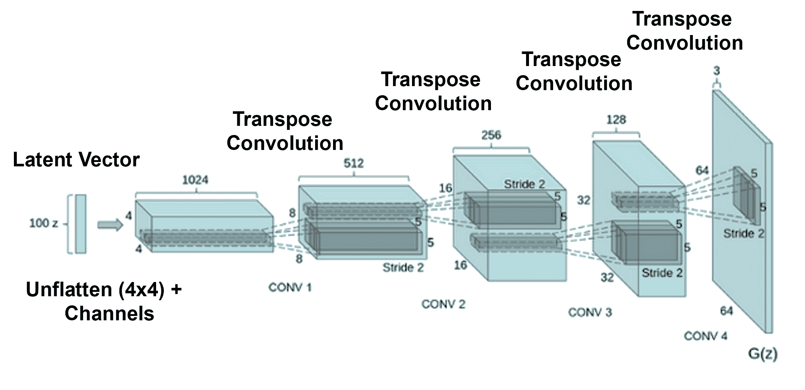
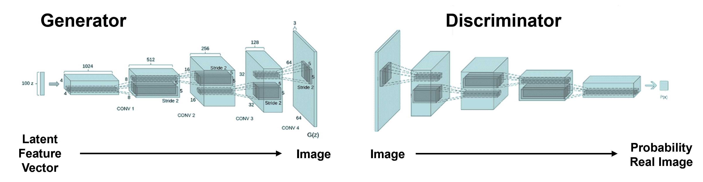
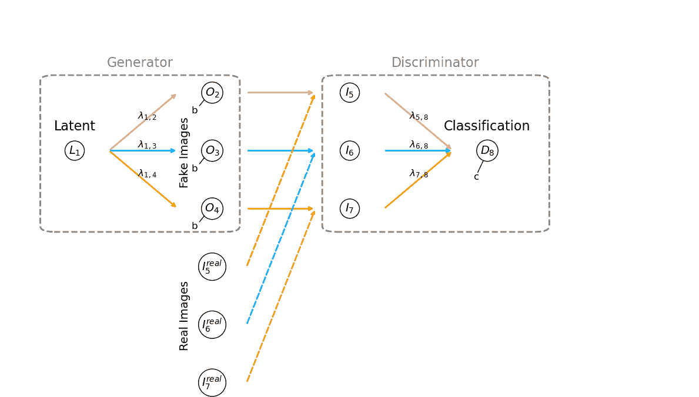
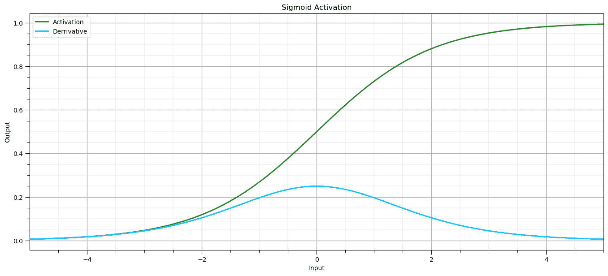
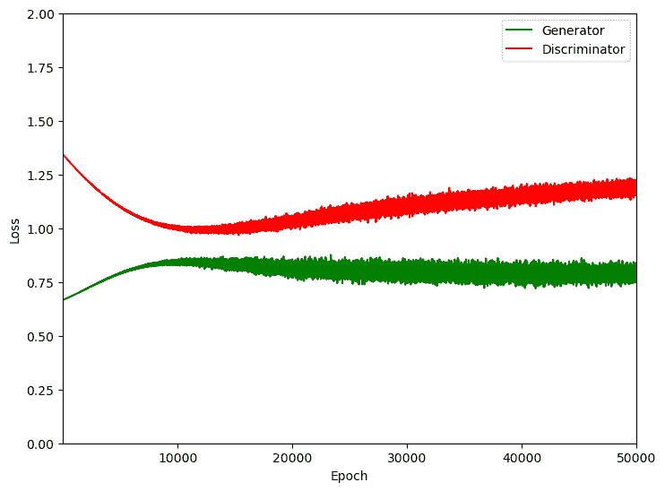
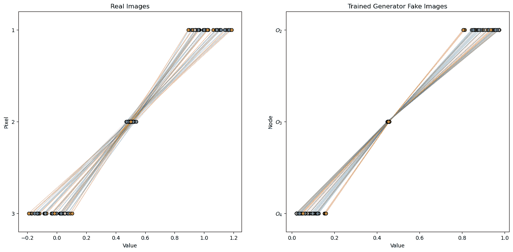
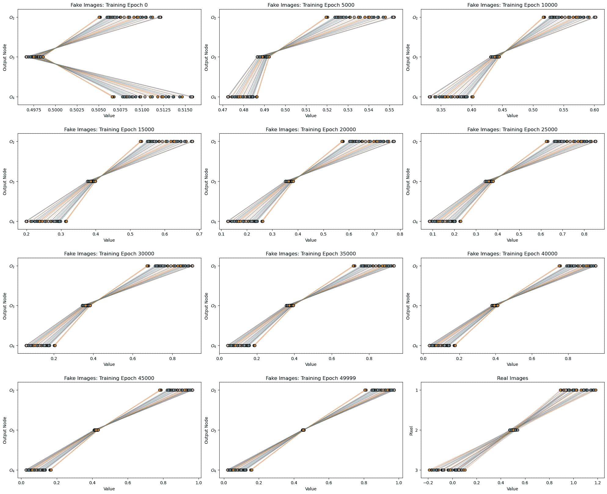

# 生成对抗网络

> 原文：[`geostatsguy.github.io/MachineLearningDemos_Book/MachineLearning_GAN.html`](https://geostatsguy.github.io/MachineLearningDemos_Book/MachineLearning_GAN.html)

Michael J. Pyrcz，教授，德克萨斯大学奥斯汀分校

[Twitter](https://twitter.com/geostatsguy) | [GitHub](https://github.com/GeostatsGuy) | [网站](http://michaelpyrcz.com) | [Google Scholar](https://scholar.google.com/citations?user=QVZ20eQAAAAJ&hl=en&oi=ao) | [地统计学书籍](https://www.amazon.com/Geostatistical-Reservoir-Modeling-Michael-Pyrcz/dp/0199731446) | [YouTube](https://www.youtube.com/channel/UCLqEr-xV-ceHdXXXrTId5ig) | [Python 应用地统计学电子书](https://geostatsguy.github.io/GeostatsPyDemos_Book/intro.html) | [Python 应用机器学习电子书](https://geostatsguy.github.io/MachineLearningDemos_Book/) | [LinkedIn](https://www.linkedin.com/in/michael-pyrcz-61a648a1)

电子书“Python 应用机器学习：带代码的手动指南”的一章。

请将此电子书引用如下：

Pyrcz, M.J., 2024, *Python 应用机器学习：带代码的手动指南* [电子书]. Zenodo. doi:10.5281/zenodo.15169138 

本书中的工作流程以及更多内容在此处可用：

请将 MachineLearningDemos GitHub 仓库引用如下：

Pyrcz, M.J., 2024, *MachineLearningDemos: Python Machine Learning Demonstration Workflows Repository* (0.0.3) [软件]. Zenodo. DOI: 10.5281/zenodo.13835312\. GitHub 仓库：[GeostatsGuy/MachineLearningDemos](https://github.com/GeostatsGuy/MachineLearningDemos) 

作者：Michael J. Pyrcz

© 版权所有 2024。

本章是关于/演示**生成对抗网络**的教程。

**YouTube 讲座**：查看我在以下主题上的讲座：

+   [人工神经网络](https://youtu.be/A9PiCMY_6nM?si=NxWSU_5RgQ4w55EL)

+   [卷积神经网络](https://youtu.be/za2my_XDoOs?si=LeHU6p2_fc9dX4Yt)

+   生成对抗网络（待定）

这些讲座都是我 YouTube 上的[机器学习课程](https://youtube.com/playlist?list=PLG19vXLQHvSC2ZKFIkgVpI9fCjkN38kwf&si=XonjO2wHdXffMpeI)的一部分，其中包含有良好文档记录的 Python 工作流程和交互式仪表板。我的目标是分享易于理解、可操作和可重复的教育内容。如果您想了解我的动机，请查看[Michael 的故事](https://michaelpyrcz.com/my-story)。

## 动机

如果我们将机器组合在一起，以竞争、对抗的方式工作呢？

+   我们能否制作出一个更强大的机器学习模型，该模型能够学习自己的损失函数！

+   我们能否制作出不完全复制训练集中图像的图像？

生成型神经网络非常强大，这是一种受自然界启发的深度学习方法，通过卷积神经网络的应用来制作逼真的图像，类似于视觉皮层的类比，从而扩展了我们的人工神经网络处理图像的能力。

受自然界启发的计算正在寻找自然界中的灵感来开发新的问题解决方法，

+   **人工神经网络**受生物神经网络的启发

+   我们模型中的**节点**是人工神经元，简单的处理器

+   节点之间的**连接**是人工突触

+   **感知野**正则化以改善泛化能力和效率

智能是从许多连接的简单处理器中产生的。在本章的剩余部分，我将使用节点和连接这两个术语来描述我们的卷积神经网络。

## 人工神经网络和卷积神经网络

如果您还没有，请利用这个机会回顾电子书中的前几章，

[人工神经网络](https://geostatsguy.github.io/MachineLearningDemos_Book/MachineLearning_ANN.html)

我关于人工神经网络章节的主要收获如下，

+   **神经网络架构**，包括其基本组件、节点（神经元）以及它们之间的加权连接。

+   **正向传播**计算通过网络，其中每个节点计算其输入的加权和（包括偏差项），然后应用非线性激活函数。

+   **误差导数的计算**，然后通过链式法则反向传播通过网络，以确定损失函数相对于每个权重和偏差的梯度。

+   在训练批次的所有样本上**聚合这些梯度**，通常通过平均来更新模型参数。

+   **迭代训练过程**，模型在多个批次和多个 epoch（遍历所有数据）上训练，以不断细化权重和偏差，直到模型在测试数据上达到可接受的错误率。

[卷积神经网络](https://geostatsguy.github.io/MachineLearningDemos_Book/MachineLearning_CNN.html)

我关于卷积神经网络章节的主要收获如下，

+   使用感受野对图像数据进行**正则化**以保留空间信息并避免过拟合。

+   带有可学习权重的**卷积核**从图像中提取信息。

对于这两个章节，我都包括了链接到我的录音讲座以及仅使用 NumPy 从头构建的神经网络！

## 生成对抗网络

如果我们从卷积神经网络开始，并将其翻转，即反转操作顺序，

+   我们有一个将值的一维向量映射到图像的机器，即我们可以通过随机分配潜在值来生成假图像

+   为了实现这一点，我们不是使用带有激活的卷积操作，而是使用带有激活的转置卷积操作来移动到下一个特征图

+   回想一下，我们还在每个特征图上执行非线性激活，以防止网络崩溃



一个翻转的卷积神经网络，将卷积替换为转置卷积，从 1D 随机潜在向量生成随机图像。

但我们如何训练这个翻转卷积神经网络以生成好的图像呢？

+   我们可以用训练图像和评分我们生成的假图像之间的差异，例如，使用像素级的平方误差（L2 范数）

+   但如果我们这样做，我们的机器学习模型只会学习如何生成这个图像或有限的训练图像集合，这将没有用

我们想要生成一组多样化的图像实现，它们看起来和行为都是正确的。这是地统计学核心的模拟范式，

+   要了解更多关于来自地统计学的模拟范式，请参阅我的免费在线电子书[《Python 中的应用地统计学》](https://geostatsguy.github.io/GeostatsPyDemos_Book)中的[模拟章节](https://geostatsguy.github.io/GeostatsPyDemos_Book/GeostatsPy_simulation.html)。

我们没有使用典型的损失函数，而是应用了一个分类卷积神经网络，将图像映射到真实图像的概率，即，我们的损失函数实际上是一个在学习过程中学习评分损失的神经网络。

在我们的 GAN 中，我们有 2 个神经网络，

+   **生成器** - 生成随机假图像的翻转卷积神经网络

+   **判别器** - 一个用于计算图像是否为真实的概率的分类卷积神经网络



一个翻转的卷积神经网络，将卷积替换为转置卷积，从 1D 随机潜在向量生成随机图像。

## 间接，对抗学习

我们如何训练这两个耦合的网络？我们将每个网络称为代理，并且我们以竞争的方式训练它们，例如，它们在学习的竞争中！

+   代理 1，生成器，没有被训练来最小化与训练数据（训练图像）相关的损失函数，没有 MSE！

+   相反，代理 1，生成器，被训练来欺骗代理 2，判别器

+   代理 2，判别器，同时学习区分真实训练图像和代理 1，生成器产生的假图像

每个代理都有自己的竞争目标，

+   生成器 – 生成判别器分类为真实的假图像

+   判别器 – 正确分类假图像和真实图像

注意，生成器从未看到真实图像，但通过学习欺骗判别器，它学会了生成类似于真实训练图像的图像。

GAN 的损失函数表述为，

$$ \min_{\theta_G} \, \max_{\theta_D} \; \mathbb{E}_{\mathbf{y} \sim p_{\text{data}}} \left[ \log D_{\theta_D}(\mathbf{y}) \right] + \mathbb{E}_{\mathbf{x} \sim p_{\mathbf{x}}} \left[ \log \left( 1 - D_{\theta_D}(G_{\theta_G}(\mathbf{x})) \right) \right] $$

其中，

+   $\theta_D$ - **判别器**的参数（权重，偏差）

+   $\theta_G$ - **生成器**的参数

+   $D_{\theta_D}(\cdot)$ - 给定判别器参数 $\theta_D$ 的判别器输出（输入是真实的概率）

+   $G_{\theta_G}(\mathbf{x})$ - 给定潜在输入 $\mathbf{x}$ 的生成器输出

+   $\mathbf{y} \sim p_{\text{data}}$ - 来自**真实图像集**的训练图像

+   $\mathbf{x} \sim p_{\mathbf{x}}$ - 从已知先验（例如均匀分布或正态分布）采样的潜在输入

+   $\mathbb{E}[\cdot]$ - 对数据的期望（即对所有样本的平均）

+   $\log D(\cdot)$ - 判别器将输入分配为真实的对数似然

+   $\log(1 - D(G(\cdot)))$ - 判别器将伪造分配给生成器输出的对数似然

判别器想要**最大化**，

$$ \log D(\mathbf{y}) + \log(1 - D(G(\mathbf{x}))) $$

+   尝试**正确预测真实**训练图像为真实，$\log D(\mathbf{y}) \rightarrow 0.0$

+   并且正确预测生成的伪造训练图像不是真实，$\log(1 - D(G(\mathbf{x}))) \rightarrow 0.0$

生成器想要**最小化**，

$$ \log(1 - D(G(\mathbf{x}))) $$

+   尝试**欺骗判别器**，判别器将伪造训练图像分类为真实，$\log(1 - D(G(\mathbf{x}))) \rightarrow -\infty$

为了帮助理解 GAN 损失函数和竞争代理系统，考虑这些极端情况，

1.  **完美判别器** - 如果判别器是完美的，

+   所有真实训练图像都被分类为真实，$D(\mathbf{y}) = 1$

+   生成器产生的所有伪造图像都被分类为真实，$D(G(\mathbf{x})) = 0$

$\quad$ 然后判别器损失是，

$$ \log(1) + \log(1 - 0) = 0 + \log(1) = 0 $$

$\quad$ 这听起来像是好消息，即生成器将提高以赶上判别器，但实际上发生的是，

+   生成器接收**没有损失梯度**，因为生成器的梯度，

$$ \frac{\partial \log(1 - D(G(z)))}{\partial \theta_G} $$

$\quad$ 如果 $D(G(z)) \to 0$，这个导数变为**零**，因此训练停滞，**生成器不学习**，

+   这实际上是通过用**非饱和生成器损失**替换生成器来解决的，

$$ L_G = -\mathbb{E}_{z \sim p_z}[\log D(G(z))] $$

$\quad$ 如果 $D(G(z)) \to 0$，那么 $\log D(G(z)) \to -\infty$，因此梯度变得**很大**，给生成器一个强烈的信号。

1.  **完美生成器** - 如果生成器是完美的，

+   所有伪造图像的分布与真实训练图像相同，$G(\mathbf{x}) \sim p_{\text{data}}$

+   判别器所能做到的最佳分类是，对所有伪造和真实训练图像分配一个平均分类，$D(\cdot) = 0.5$

$\quad$ 然后，损失是，

$$ \log(0.5) + \log(1 - 0.5) = \log(0.5) + \log(0.5) = -\log 4 $$

+   判别器处于**最大困惑**状态

+   这是对 GAN 的一个**纳什均衡**，因为没有任何玩家可以通过单方面改变他们的策略来改善他们的结果，假设其他玩家的策略保持不变，生成器已经制作出完美的图像，判别器只能天真地猜测，50/50 的真实和伪造。

## 导入所需的包

我们还需要一些标准包。这些应该已经与 Anaconda 3 一起安装。

+   回想我们的目标是手动构建卷积神经网络，只使用基本的数学和数组操作，所以我们只需要 NumPy 以及 matplotlib 用于绘图。

```py
%matplotlib inline                                         
suppress_warnings = True                                      # toggle to supress warnings
import os                                                     # set working directory
import numpy as np                                            # arrays and matrix math
import matplotlib.pyplot as plt                               # for plotting
import matplotlib.patches as patches                          # fancy box around agents
from matplotlib.ticker import (MultipleLocator, AutoMinorLocator) # control of axes ticks
from matplotlib.ticker import FuncFormatter
import copy                                                   # deep copy dictionaries
import math
seed = 42
cmap = plt.cm.inferno                                         # default color bar, no bias and friendly for color vision defeciency
plt.rc('axes', axisbelow=True)                                # grid behind plotting elements
if suppress_warnings == True:  
    import warnings                                           # supress any warnings for this demonstration
    warnings.filterwarnings('ignore') 
seed = 42                                                     # random number seed for workflow repeatability 
```

如果您遇到包导入错误，您可能首先需要安装这些包中的一些。这通常可以通过在 Windows 上打开命令窗口然后输入‘python -m pip install [package-name]’来完成。更多帮助可以在相应的包文档中找到。

## 声明函数

这里是制作、训练和可视化我们的生成对抗网络的函数，包括步骤，

+   制作一组简单的合成数据

+   初始化生成器和判别器的权重

+   应用我们的生成器和判别器

+   计算误差导数并更新生成器和判别器的权重和偏差

这里是函数列表，

1.  **generate_real_data** - 合成数据生成器

1.  **initialize_generator_weights** - 为生成器分配小的随机权重和偏差

1.  **initialize_discriminator_weights** - 为判别器分配小的随机权重和偏差

1.  **generator_forward** - 根据给定的一组潜在值、当前权重和偏差，使用生成器计算一组伪造数据

1.  **discriminator_forward** - 计算一组图像中真实图像的概率并返回一个 1D 索引数组

1.  **sigmoid** - 在生成器和判别器中应用的激活函数

1.  **generator_gradients** - 计算生成器梯度，平均分布在批次上

1.  **discriminator_gradients** - 计算生成器梯度，平均分布在批次上

这里是函数列表。

```py
def sigmoid(x):                                               # sigmoid activation function
    return 1 / (1 + np.exp(-x))

def generate_real_data(batch_size, slope_range=(-0.4, -0.7), residual_std=0.02): # make a synthetic training image set
  """
 Generate real 3-node images with decreasing linear trend plus noise.
 Standardize each to have mean 0.5.
 Returns shape (batch_size, 3)
 """
    slopes = np.random.uniform(slope_range[0], slope_range[1], size=batch_size)
    base = np.array([1, 2, 3])  # node positions for linear trend
    data = np.zeros((batch_size, 3))
    for i in range(batch_size):
        trend = slopes[i] * base
        residual = np.random.normal(0, residual_std, size=3)
        sample = trend + residual
        sample += 0.5 - np.mean(sample)                       # standardize to mean 0.5
        data[i] = sample
    return data

def initialize_generator_weights():                           # initialize the generator weights and return as a dictionary
    # Small random weights and bias for generator
    return {
        'lambda_12': np.random.randn() * 0.1,
        'lambda_13': np.random.randn() * 0.1,
        'lambda_14': np.random.randn() * 0.1,
        'b': 0.0
    }

def generator_forward(L1_latent, weights,return_pre_activation=False): # given latent vector and generator weights return a set of fake images
  """
 L1_latent: ndarray shape (batch_size,)
 weights: dict with keys 'lambda_1_2', 'lambda_1_3', 'lambda_1_4', 'b'
 Returns output ndarray shape (batch_size, 3)
 """
    O2in = weights['lambda_12'] * L1_latent + weights['b']
    O3in = weights['lambda_13'] * L1_latent + weights['b']
    O4in = weights['lambda_14'] * L1_latent + weights['b']

    O2 = sigmoid(O2in)
    O3 = sigmoid(O3in)
    O4 = sigmoid(O4in)

    Oin = np.vstack([O2in, O3in, O4in]).T; O = np.vstack([O2, O3, O4]).T; 

    if return_pre_activation: 
        return np.vstack([O2in, O3in, O4in]).T, np.vstack([O2, O3, O4]).T # shape (batch_size, 3)
    else:
        return np.vstack([O2, O3, O4]).T # shape (batch_size, 3)

def initialize_discriminator_weights():                       # initialize the discriminator weights and return as a dictionary 
    return {
        'lambda_58': np.random.randn() * 0.1,
        'lambda_68': np.random.randn() * 0.1,
        'lambda_78': np.random.randn() * 0.1,
        'c': 0.0
    }

def discriminator_forward(I5, I6, I7, weights):               # given a set of images return the discriminator probability of real image
  """
 Inputs: I5, I6, I7 shape (batch_size,)
 weights: dict with keys 'lambda_58', 'lambda_68', 'lambda_78', 'c'
 Returns probability ndarray shape (batch_size,)
 """
    dO8in = (weights['lambda_58'] * I5 + 
         weights['lambda_68'] * I6 + 
         weights['lambda_78'] * I7 + 
         weights['c'])
    dO8 = sigmoid(dO8in)
    return dO8, dO8in

def discriminator_gradients(I5, I6, I7, y_true, weights):     # given set of images, true labels, and discriminator weights return the gradients
  """
 Compute discriminator gradients averaged over batch.
 y_true: labels (1 for real, 0 for fake), shape (batch_size,)
 """
    batch_size = y_true.shape[0]
    y_pred, z = discriminator_forward(I5, I6, I7, weights)
    dO8in = (y_pred - y_true)                                  # shape (batch_size,), note this solution integrates the sigmoid activation at O8

    grad_lambda_58 = np.mean(dO8in * I5)
    grad_lambda_68 = np.mean(dO8in * I6)
    grad_lambda_78 = np.mean(dO8in * I7)
    grad_c = np.mean(dO8in)

    return {
        'lambda_58': grad_lambda_58,
        'lambda_68': grad_lambda_68,
        'lambda_78': grad_lambda_78,
        'c': grad_c
    }

def generator_gradients(L1_latent, weights_g, weights_d):     # given latent vector, generator and discriminator weights return the gradients
  """
 Compute gradients of generator weights using discriminator feedback.
 L1_latent: shape (batch_size,)
 weights_g: generator weights dict
 weights_d: discriminator weights dict
 """
    batch_size = L1_latent.shape[0]

    #O = generator_forward(L1_latent, weights_g)               # generator outputs, shape (batch_size, 3)
    O_in, O = generator_forward(L1_latent, weights_g, return_pre_activation=True)

    O2_in, O3_in, O4_in = O_in[:, 0], O_in[:, 1], O_in[:, 2]
    O2, O3, O4 = O[:,0], O[:,1], O[:,2]
    I5, I6, I7 = O[:,0], O[:,1], O[:,2]

    y_pred, z = discriminator_forward(I5, I6, I7, weights_d)  # discriminator forward pass

    dO8in = y_pred - 1                                           # gradient of loss w.r.t discriminator logit for generator loss, shape (batch_size,)

    dO2 = dO8in * weights_d['lambda_58']                         # gradients w.r.t generator outputs
    dO3 = dO8in * weights_d['lambda_68']
    dO4 = dO8in * weights_d['lambda_78']

    dO2in = dO2 * O2 * (1 - O2)                                  # Backprop through generator sigmoid activation
    dO3in = dO3 * O3 * (1 - O3)
    dO4in = dO4 * O4 * (1 - O4)

    grad_lambda_12 = np.mean(dO2in * L1_latent)                 # gradients w.r.t generator weights and bias
    grad_lambda_13 = np.mean(dO3in * L1_latent)
    grad_lambda_14 = np.mean(dO4in * L1_latent)
    grad_b = np.mean(dO2in + dO3in + dO4in)

    return {
        'lambda_12': grad_lambda_12,
        'lambda_13': grad_lambda_13,
        'lambda_14': grad_lambda_14,
        'b': grad_b
    }

def fancybox(ax, xy, width, height, label="", edgecolor="black", text_color=None): # a dashed fancy box for the GAN plot
  """
 Draws a dashed, rounded rectangle on a given axes.

 Parameters:
 - ax: The matplotlib axes to draw on
 - xy: (x, y) tuple for bottom-left corner of the box
 - width: Width of the box
 - height: Height of the box
 - label: Optional label text to display centered above the box
 - edgecolor: Border color of the box
 - text_color: Color of the label text (defaults to edgecolor)
 """
    if text_color is None:
        text_color = edgecolor

    box = patches.FancyBboxPatch(                             # draw box
        xy,
        width,
        height,
        boxstyle="round,pad=0.02",
        linewidth=2,
        edgecolor=edgecolor,
        facecolor="none",
        linestyle='--'
    )
    ax.add_patch(box)

    x_center = xy[0] + width / 2                              # add label text above the box
    y_top = xy[1] + height + 0.02
    ax.text(x_center, y_top + 0.02, label, ha='center', va='bottom', fontsize=16, color=text_color)

def add_grid2():                                              # add grid lines
    plt.gca().grid(True, which='major',linewidth = 1.0); plt.gca().grid(True, which='minor',linewidth = 0.2) # add y grids
    plt.gca().tick_params(which='major',length=7); plt.gca().tick_params(which='minor', length=4)
    plt.gca().xaxis.set_minor_locator(AutoMinorLocator()); plt.gca().yaxis.set_minor_locator(AutoMinorLocator()) # turn on minor ticks 
```

## 设置工作目录

我总是喜欢这样做，这样我就不会丢失文件，并且可以简化后续的读取和写入（避免每次都包含完整地址）。

```py
#os.chdir("c:/PGE383")                                        # set the working directory 
```

## 可视化生成对抗网络

我们正在实现一个最小的生成对抗网络（GAN），包含 2 个智能体，

+   **生成器** - 从单个潜在输入产生 3 个节点输出（如微小的 1D 图像）

+   **判别器** - 评估这些输出以区分**真实**和**伪造**样本。

现在让我们定义**生成器**的部分，

+   **潜在节点** - $L_1$，一个具有均匀分布的单个随机值，$U[0.4,1.0]$。注意我们设定最小值为 0.4 以避免 0.0 或负值，因为这些值会移除斜率或翻转伪造的斜率。

+   **生成器权重** - $\lambda_{1,2}$, $\lambda_{1,3}$ 和 $\lambda_{1,4}$ 用于从潜在节点到每个输出节点的连接。这是可能的最简单的转置卷积，内核大小为 3，输出节点为 3，潜在节点为 1，因此内核不进行平移。我这样做是为了极大地简化账目记录，但概念可以扩展到更现实的卷积/转置卷积架构，以解决更现实的图像尺寸问题。

+   **生成器偏差** - $b$，在输出层（输出图像）的单一、常数偏差，节点 $O_2$, $O_3$, 和 $O_4$。

+   **生成器输出节点** - $O_2$, $O_3$, 和 $O_4$，这是我们非常简单的生成器中的单个和最后一个特征图；因此，输出一个包含 3 个节点或像素的 1D 图像，这些节点或像素被传递到**判别器**输入节点 $I_5$, $I_6$, 和 $I_7$。

+   **判别器输入节点** - $I_5$, $I_6$, 和 $I_7$，它们接收来自生成器输出节点 $O_2$, $O_3$, 和 $O_4$ 的真实图像或假图像。

+   **判别器权重** - $\lambda_{5,8}$, $\lambda_{6,8}$, 和 $\lambda_{7,8}$ 用于从输入节点（输入图像）到输出（决策）节点 $D_8$ 的连接。

+   **判别器偏差** - $c$，在输出（决策）节点 $D_8$ 应用偏差。

现在我们来可视化这个非常简单的生成对抗网络。

```py
colors = ['darksalmon','deepskyblue','gold']                  # line colors for latent to fake to probability flow
colors_real = ['orangered','dodgerblue','goldenrod']          # line colors for real image to probability flow

def draw_gan_architecture_full():                             # function to draw the GAN demonstrated in this workflow
    fig, ax = plt.subplots(figsize=(12, 7))

    ax.text(0.1, 0.5, r"$L_1$", fontsize=14, ha='center', va='center', # generator latent node
            bbox=dict(boxstyle="circle", fc="white", ec="black"))

    gen_outputs = [                                           # generator output nodes locations and labels
        (0.3, 0.7, r"$O_2$", r"$\lambda_{1,2}$"),
        (0.3, 0.5, r"$O_3$", r"$\lambda_{1,3}$"),
        (0.3, 0.3, r"$O_4$", r"$\lambda_{1,4}$")
    ]
    for i, (x, y, label, weight) in enumerate(gen_outputs):   # generator output node labels
        ax.text(x, y, label, fontsize=14, ha='center', va='center',
                bbox=dict(boxstyle="circle", fc="white", ec="black"))
        ax.annotate("", xy=(x - 0.05, y), xytext=(0.15, 0.5),   # generator output node connections
                    arrowprops=dict(arrowstyle="->", lw=2, color=colors[i]))
        ax.text((x + 0.11) / 2, (y + 0.5) / 2, weight, fontsize=12, ha='center', va='bottom')

    disc_inputs = [                                           # discriminator input nodes locations and labels
        (0.5, 0.7, r"$I_5$", r"$\lambda_{5,8}$"),
        (0.5, 0.5, r"$I_6$", r"$\lambda_{6,8}$"),
        (0.5, 0.3, r"$I_7$", r"$\lambda_{7,8}$")
    ]
    for i, (x, y, label, _) in enumerate(disc_inputs):        # discriminator input node labels
        ax.text(x, y, label, fontsize=14, ha='center', va='center',
                bbox=dict(boxstyle="circle", fc="white", ec="black"))
        ax.annotate("", xy=(x - 0.05, y), xytext=(0.35, gen_outputs[i][1]), # discriminator input node connections
                    arrowprops=dict(arrowstyle="->", lw=2, color=colors[i]))

    ax.text(0.7, 0.5, r"$D_8$", fontsize=14, ha='center', va='center', # discriminator decision node label
            bbox=dict(boxstyle="circle", fc="white", ec="black"))
    for i, (x, y, _, weight) in enumerate(disc_inputs):
        ax.annotate("",xy=(0.65, 0.5), xytext=(x + 0.05, y),  # discriminator output node connections
                    arrowprops=dict(arrowstyle="->", lw=2, color=colors[i]))
        ax.text((x + 0.7) / 2, (y + 0.5) / 2, weight, fontsize=12, ha='center', va='bottom')

    real_inputs = [                                           # real data path below generator
        (0.3, 0.1, r"$I_5^{real}$"),
        (0.3, -0.1, r"$I_6^{real}$"),
        (0.3, -0.3, r"$I_7^{real}$")
    ]
    for i, (x, y, label) in enumerate(real_inputs):
        ax.text(x, y, label, fontsize=14, ha='center', va='center', # label real data node labels
                bbox=dict(boxstyle="circle", fc="white", ec="black"))
        ax.annotate("",                                       # arrow to discriminator inputs
                    xy=(disc_inputs[i][0] - 0.05, disc_inputs[i][1]), 
                    xytext=(x + 0.05, y),
                    arrowprops=dict(arrowstyle="->", lw=2, color=colors_real[i], linestyle="--"))

    ax.text(0.1, 0.57, "Latent", fontsize=16, ha='center')    # GAN part labels
    ax.text(0.7, 0.57, "Classification", fontsize=16, ha='center')
    ax.text(0.26, -0.18, "Real Images", fontsize=14, ha='center', color="black",rotation=90.0)
    ax.text(0.26, 0.38, "Fake Images", fontsize=14, ha='center', color="black",rotation=90.0)

    fancybox(ax, xy=(0.07, 0.24), width=0.25, height=0.5, label="Generator", edgecolor="grey") # fancy boxes around generator and discriminator
    fancybox(ax, xy=(0.48, 0.24), width=0.29, height=0.5, label="Discriminator", edgecolor="grey")

    ax.text(0.68,0.4,'c',fontsize=12,color='black')           # draw the biases in O2, O3, O4 and D8
    ax.annotate("", xy=(0.695, 0.47), xytext=(0.685, 0.42),arrowprops=dict(arrowstyle="-", color="black", lw=1))
    ax.text(0.27,0.63,'b',fontsize=12,color='black')
    ax.annotate("", xy=(0.28, 0.65), xytext=(0.29, 0.68),arrowprops=dict(arrowstyle="-", color="black", lw=1))
    ax.text(0.27,0.43,'b',fontsize=12,color='black')
    ax.annotate("", xy=(0.28, 0.45), xytext=(0.29, 0.48),arrowprops=dict(arrowstyle="-", color="black", lw=1))
    ax.text(0.27,0.23,'b',fontsize=12,color='black')
    ax.annotate("", xy=(0.28, 0.25), xytext=(0.29, 0.28),arrowprops=dict(arrowstyle="-", color="black", lw=1))
    ax.axis('off')
    plt.tight_layout()
    plt.show()

draw_gan_architecture_full()                                  # draw the GAN 
```



关于我的网络命名约定还有一些额外的注释。我的目标是最大化简洁性和清晰度，

## **网络命名约定**注释

+   **网络节点和连接** - 我选择为所有节点使用唯一的数字，$L_1$, $O_2$, $O_3$, $\ldots$ 而不是 $L_1$, $O_1$, $O_2$, $\ldots$ 以简化权重的符号；因此，当我说 $\lambda_{5,8}$ 时，你知道这个权重在网络的哪个位置应用。

+   **节点输出** - 我使用节点标签来描述节点的输出，例如 $O_2$ 是生成器输出层中的一个节点，也是从该节点输出的信号或值。

+   **前激活和后激活** - 在我们的节点 $O_2$, $O_3$, $O_4$, 和 $D_8$ 上，我们有节点激活前的输入和激活后的节点输出，我使用符号 $O_{2_{in}}$, $O_{3_{in}}$, $O_{4_{in}}$ 和 $D_{8_{in}}$ 表示前激活输入，以及 $O_2$, $O_3$, $O_4$ 和 $D_8$ 表示后激活节点输出。这很重要，因为在反向传播中，我们必须逐步通过节点，从后激活到前激活。

+   **潜在** - 虽然出版物通常使用 $z$ 符号表示潜在值，为了与上面的概念保持一致，我使用 $L_1$ 表示潜在值，即我的潜在节点 $L_1$ 的输出。

现在我们来逐一介绍我们示例生成对抗网络（GAN）的所有部分，并展示所有的数学公式。

## Sigmoid 激活

为了参考，让我们可视化 sigmoid 激活函数，

+   **激活** - 非线性变换，这是 sigmoid 激活

$$ x_{out} = \sigma(x_{in}) = \dfrac{1}{1 + e^{-x_{in}}} $$

+   **激活导数** - 对于反向传播是必不可少的

$$ \sigma'(x_{in}) = \sigma(x_{out})(1 - \sigma(x_{out})) $$

注意，为了方便起见，sigmoid 激活函数相对于输入的导数是针对输出给出的。

+   当我们反向传播通过激活函数时，我们可以使用输出逐步通过激活的网络节点

```py
amin = -5.0; amax = 5.0

input = np.linspace(amin,amax,100); output = 1.0/(1.0 + np.exp(-1*np.linspace(amin,amax,100))); derriv = output * (1 - output)

plt.subplot(111)
plt.plot(input,output,color='forestgreen',lw=2,label='Activation'); add_grid2(); plt.xlabel('Input'); plt.ylabel('Output')
plt.plot(input,derriv,color='deepskyblue',lw=2,label='Derrivative'); add_grid2(); plt.xlabel('Input'); plt.ylabel('Output') 
plt.title('Sigmoid Activation'); plt.legend(loc='upper left'); plt.xlim([amin,amax])

plt.subplots_adjust(left=0.0, bottom=0.0, right=2.0, top=1.1, wspace=0.2, hspace=0.2); plt.show() 
```



让我们观察一下 sigmoid 激活及其导数，

+   **sigmoid 输出** - 被限制在 (0,1) 范围内，渐进地接近两个极限

+   **梯度消失** - 随着

## 生成器正向传播

首先，让我们逐步分析生成器，从潜在值到伪造图像。生成器接受一个潜在输入，

$$ L_1 \sim \mathcal{U}(0.4, 1) $$

+   回想一下，我们的简单生成器只有一个层 $L1$，只有 3 个输出，$O_2$、$O_3$ 和 $O_4$，代表伪造的图像。

然后，潜在值 $L_1$ 通过转置卷积核传递到输出，

+   我们的反转卷积核大小为 3，与我们的输出大小相同，因此我们看不到它转换，从而大大简化了账目！

+   转置卷积核权重是 $\lambda_{1,2}$、$\lambda_{1,3}$ 和 $\lambda_{1,4}$

我们在每个输出节点应用 sigmoid 激活

每个输出都是通过应用线性变换后跟一个 **sigmoid** 激活，$\sigma$，

$$ O_2 = \sigma(\lambda_{1,2} \cdot z + b) $$$$ O_3 = \sigma(\lambda_{1,3} \cdot z + b) $$$$ O_4 = \sigma(\lambda_{1,4} \cdot z + b) $$

其中，

+   **$\lambda_{1,j}$** - 是转置卷积核的权重

+   **$b$** - 是共享偏差，输出层的单个偏差项

我们也可以用矩阵符号写出生成器的正向传播，

$$\begin{split} \begin{bmatrix} O_2 \\ O_3 \\ O_4 \end{bmatrix} = \sigma\left( \begin{bmatrix} \lambda_{1,2} \\ \lambda_{1,3} \\ \lambda_{1,4} \end{bmatrix} z + \begin{bmatrix} b \\ b \\ b \end{bmatrix} \right) \end{split}$$

其中应用了逐元素 sigmoid 激活。

## 判别器正向传播

现在，让我们逐步分析判别器，从图像（真实或伪造）到真实概率。判别器接收图像，通过 3 个输入节点，$I_5$、$I_6$ 和 $I_7$。在伪造图像的情况下，

$$\begin{split} \begin{bmatrix} I_5 \\ I_6 \\ I_7 \end{bmatrix} = \begin{bmatrix} O_2 \\ O_3 \\ O_4 \end{bmatrix} \end{split}$$

在真实图像的情况下，

$$\begin{split} \begin{bmatrix} I_5 \\ I_6 \\ I_7 \end{bmatrix} = \begin{bmatrix} I_5^{real} \\ I_6^{real} \\ I_7^{real} \end{bmatrix} \end{split}$$

由于我们只有一层，卷积核是 3，输入也是 3，所以没有平移！

+   我们只取输入图像，$I_5$，$I_6$，和$I_7$，并应用卷积核权重，$\lambda_{5,8}$，$\lambda_{6,8}$，和$\lambda_{7,8}$，然后加上偏置项，$c$，

$$ D_8 = \sigma\left( \lambda_{5,8} \cdot I_5 + \lambda_{6,8} \cdot I_6 + \lambda_{7,8} \cdot I_7 + c \right) $$

其中，

+   $\lambda_{i,8}$是从输入图像到下一个特征图的卷积核权重，只有一个值，我们的输出概率

+   $c$是偏置项

+   $\sigma(x) = \dfrac{1}{1 + e^{-x}}$是 sigmoid 激活函数

$D_8 \in [0, 1]$表示判别器分配给输入是**真实**（即不是生成器的假图像）的概率。

我们也可以将判别器前向传递写成矩阵形式，

$$\begin{split} D_8 = \sigma\left( \begin{bmatrix} \lambda_{5,8} & \lambda_{6,8} & \lambda_{7,8} \end{bmatrix} \cdot \begin{bmatrix} I_5 \\ I_6 \\ I_7 \end{bmatrix} + c \right) \end{split}$$

其中，

+   $\lambda_{5,8}, \lambda_{6,8}, \lambda_{7,8}$是标量权重

+   $I_5, I_6, I_7$是输入值（即生成器的输出，$O_2, O_3, O_4$）

+   $c$是偏置项

+   $\sigma(x) = \dfrac{1}{1 + e^{-x}}$是 sigmoid 函数

## 判别器损失

二元交叉熵是一种用于二元分类任务的损失函数，其中输出是一个介于 0 和 1 之间的概率，目标标签是 0 或 1。

+   **预测**（模型输出）- $\hat{y} \in (0, 1)$，$D_8$的输出，判别器的分类，图像为真实的概率

$$ \hat{y} = D_8 $$

+   **真实标签**（地面实况）- $y \in \{0, 1\}$，如果图像来自生成器，则为假，如果图像来自真实训练数据，则为 1

现在我们可以定义**二元交叉熵损失**，

$$ \mathcal{L}_{\text{BCE}}(y, \hat{y}) = - \left[ y \cdot \log(\hat{y}) + (1 - y) \cdot \log(1 - \hat{y}) \right] $$

现在我们可以进一步指定，

+   $\log(\hat{y})$是正预测的对数似然

+   $log(1 - \hat{y})$是负预测的对数似然

二元交叉熵是如何表现的？

+   如果$y = 1$（真实图像），那么：

$$ \mathcal{L} = -\log(\hat{y}) \quad \text{(我们希望 } \hat{y} \to 1) $$

+   如果$y = 0$（生成器的假图像），那么：

$$ \mathcal{L} = -\log(1 - \hat{y}) \quad \text{(我们希望 } \hat{y} \to 0) $$

我们可以总结为，

+   当模型的预测$\hat{y}$接近真实标签时，损失是**低**的，对于假图像的真实概率低，对于真实图像的真实概率高

+   如果模型**自信且错误**，损失会变得**非常大**，由于对数，即对于真实图像的真实概率非常低，对于假图像的真实概率非常高

+   sigmoid 激活确保输出，$\hat{y}$是一个有效的概率

## 判别器损失导数

要执行反向传播，我们需要计算损失导数。让我们以激活函数的输入作为输出节点 $D_8$，来计算这个导数。

$$ \frac{d\mathcal{L}}{dz} $$

+   定义 $z$ 为 sigmoid 激活函数的输出节点 $D_8$ 的输入。

+   正如你所见，我们这样做是因为它产生了一个非常简单、高效的结果。

+   回想一下，sigmoid 函数，

$$ \hat{y} = \sigma(z) = \frac{1}{1 + e^{-z}} $$

我们将使用链式法则，所以我们只需要解决部分，

$$ \frac{d\mathcal{L}}{dz} = \frac{d\mathcal{L}}{d\hat{y}} \cdot \frac{d\hat{y}}{dz} $$

+   $\frac{d\mathcal{L}}{d\hat{y}}$ - 给定判别器输出 $\hat{y}$ ($D_8$) 的二元交叉熵损失的偏导数

+   $\frac{d\hat{y}}{dz}$ - 给定 sigmoid 激活输入的判别器输出 $\hat{y}$ ($D_8$) 的偏导数

现在我们可以解决第一部分，损失相对于判别器输出 $\hat{y}$ 的偏导数

$$ \frac{d\mathcal{L}}{d\hat{y}} = -\left( \frac{y}{\hat{y}} - \frac{1 - y}{1 - \hat{y}} \right) $$

现在我们可以解决第二部分，给定 sigmoid 激活输入的判别器输出 $\hat{y}$ ($D_8$) 的偏导数，它就是 sigmoid 的导数，

$$ \frac{d\hat{y}}{dz} = \hat{y}(1 - \hat{y}) $$

我们可以通过链式法则将它们结合起来，

$$ \frac{d\mathcal{L}}{dz} = -\left( \frac{y}{\hat{y}} - \frac{1 - y}{1 - \hat{y}} \right) \cdot \hat{y}(1 - \hat{y}) $$

我们几乎完成了，我们只需要简化结果，首先我们分配，$\hat{y}(1 - \hat{y})$，

$$ \frac{d\mathcal{L}}{dz} = -\left[ y(1 - \hat{y}) - (1 - y)\hat{y} \right] $$

然后进一步简化它，

$$ \frac{d\mathcal{L}}{dz} = -\left[ y - y\hat{y} - \hat{y} + y\hat{y} \right] = -\left[ y - \hat{y} \right] = \hat{y} - y $$

我说这会变得简单！我们关于输出节点 sigmoid 激活函数输入的损失的部分导数是，

$$ \frac{d\mathcal{L}}{dz} = \hat{y} - y $$

这个结果表明梯度仅仅是**误差**——预测值和真实值之间的差异。

现在我们可以进行这个简单的解释，

+   如果 $\hat{y} > y$，模型高估了 $\rightarrow$ 导数是正的 $\rightarrow$ 通过向负梯度方向移动来降低预测

+   如果 $\hat{y} < y$，模型低估了 $\rightarrow$ 导数是负的 $\rightarrow$ 通过向负梯度方向移动来增加预测

我知道这个标题是“判别器损失导数”，但请原谅我进行一点反向传播（到 sigmoid 激活之前）。

+   接下来，我们继续反向传播到判别器的权重和偏置

## 判别器反向传播

为了紧凑的表示，让我们使用矩阵表示法，并定义 $D_8$ 激活的输入 $z$，

$$ z = \mathbf{w}^\top \mathbf{x} + c \quad \Rightarrow \quad \frac{dz}{d\mathbf{w}} = \mathbf{x} $$

现在我们可以扩展我们对链式法则的使用，

$$ \frac{d\mathcal{L}}{d\mathbf{w}} = \frac{d\mathcal{L}}{dz} \cdot \frac{dz}{d\mathbf{w}} = (\hat{y} - y) \cdot \mathbf{x} $$

因此，对于我们的每个判别器权重，$\lambda_{5,8}$，$\lambda_{6,8}$，和 $\lambda_{7,8}$，我们都有，

$$ \frac{d\mathcal{L}}{d\lambda_{5,8}} = (\hat{y} - y) \cdot I_5 $$$$ \frac{d\mathcal{L}}{d\lambda_{6,8}} = (\hat{y} - y) \cdot I_6 $$$$ \frac{d\mathcal{L}}{d\lambda_{7,8}} = (\hat{y} - y) \cdot I_7 $$

对于偏置 $c$，我们计算链式法则的下一个组件，

$$ \frac{dz}{dc} = 1 $$

因此，我们有，

$$ \frac{d\mathcal{L}}{dc} = \frac{d\mathcal{L}}{dz} \cdot \frac{dz}{dc} = (\hat{y} - y) \cdot 1 = \hat{y} - y $$

我们非常简单的判别器的反向传播相当简单，我们可以总结权重，

$$ \frac{d\mathcal{L}}{d\mathbf{w}} = (\hat{y} - y) \cdot \mathbf{x} $$

对于偏置，

$$ \frac{d\mathcal{L}}{dc} = \hat{y} - y $$

让我们为所有判别器参数写出这些，$$ \begin{aligned} \frac{d\mathcal{L}}{d\lambda_{5,8}} &= (\hat{y} - y) \cdot I_5 \\ \frac{d\mathcal{L}}{d\lambda_{6,8}} &= (\hat{y} - y) \cdot I_6 \\ \frac{d\mathcal{L}}{d\lambda_{7,8}} &= (\hat{y} - y) \cdot I_7 \\ \frac{d\mathcal{L}}{dc} &= \hat{y} - y \end{aligned} $$

## 生成器损失导数和通过判别器的反向传播

回想一下，生成器的目标是使判别器分配给假图像的高概率为真实图像，即，欺骗判别器

+   生成器生成一个假图像，

$$ \tilde{\mathbf{x}} = G(z) $$

$\quad$ 其中 ( z ) 是一个潜在向量（例如，从 Uniform[0.4, 1] 中采样）。

+   判别器评估这个假样本并返回：

$$ \hat{y} = D(\tilde{\mathbf{x}}) \in (0, 1) $$

现在我们可以计算生成器的二进制交叉熵，

$$ \mathcal{L}_G = -\log(\hat{y}) $$

其中，

+   $\hat{y} = D(G(z))$，判别器对生成器假图像 $z$ 的评估

+   $\hat{y}$ 是判别器分配给假图像为真实的概率

这相当于具有**目标标签 $y = 1$** 的交叉熵，注意这里我们玩了一个小花招，从生成器的角度来看，它的图像是真实的，所以我们使用 $y=1$，即，对于假图像使用真实图像！

如果你看到上面的原始 GAN 损失，这被称为非饱和生成器损失。

| 损失类型 | 表达式 | 注释 |
| --- | --- | --- |
| **原始 GAN** | $\mathbb{E}[\log(1 - D(G(z)))]$ | 理论上，可能导致梯度消失 |
| **非饱和** | $-\mathbb{E}[\log(D(G(z)))]$ | 实际应用，更强的梯度，常用 |

+   因此，我们不是最小化原始生成器损失，而是最大化非饱和生成器损失。

让我们展示如何使用链式法则通过整个判别器进行反向传播。

+   我们希望得到生成器损失相对于生成器输出的梯度，

给定 $\tilde{\mathbf{x}} = G(z)$，我们的假图像，我们希望得到给定我们的假图像的损失函数的偏导数，

$$ \frac{d\mathcal{L}_G}{d\tilde{\mathbf{x}}} $$

通过链式法则，

$$ \frac{d\mathcal{L}_G}{d\tilde{\mathbf{x}}} = \frac{d\mathcal{L}_G}{d\hat{y}} \cdot \frac{d\hat{y}}{d\tilde{\mathbf{x}}} $$

这就是判别器关于“伪造性”的信念 $\hat{y}$ 随伪造图像 $\tilde{\mathbf{x}}$ 的变化而变化的方式。

现在我们准备通过判别器反向传播生成器损失，让我们从上面的生成器损失开始，

$$ \mathcal{L}_G = -\log(\hat{y}) $$

当我们进行偏导数运算时，

$$ \frac{d\mathcal{L}_G}{d\hat{y}} = -\frac{1}{\hat{y}} $$

现在，回忆判别器的正向传播是，

$$ \hat{y} = \sigma(\mathbf{w}^\top \tilde{\mathbf{x}} + c) $$

因此，我们可以计算判别器输出相对于生成器伪造图像的偏导数，

$$ \frac{d\hat{y}}{d\tilde{\mathbf{x}}} = \hat{y}(1 - \hat{y}) \cdot \mathbf{w} $$

现在我们将这些与链式法则结合起来，

$$ \frac{d\mathcal{L}_G}{d\tilde{\mathbf{x}}} = \left( -\frac{1}{\hat{y}} \right) \cdot \left( \hat{y}(1 - \hat{y}) \cdot \mathbf{w} \right) = -(1 - \hat{y}) \cdot \mathbf{w} $$

生成器损失相对于输出图像 $\tilde{\mathbf{x}}$ 的梯度是，

$$ \frac{d\mathcal{L}_G}{d\tilde{\mathbf{x}}} = -(1 - \hat{y}) \cdot \mathbf{w} $$

我们可以对这个结果进行一些解释，

+   当 $\hat{y}$ 接近 0 $\rightarrow$ 判别器容易发现伪造 $\rightarrow$ 大梯度 $\rightarrow$ 生成器更新更多。

+   当 $\hat{y}$ 接近 1 $\rightarrow$ 生成器欺骗判别器 $\rightarrow$ 梯度较小。

这指导生成器调整其输出以增加 $\hat{y}$ — 即欺骗判别器。

为了进一步阐明，以我们的例子为例，让我们计算判别器的输出 $\hat{y}$ 如何随生成器输出 $O_5, O_6, O_7$ 变化，而不是上面使用的 $w$ 向量表示法。

+   如果我们应用链式法则，我们得到，

$$ \frac{d\hat{y}}{dO_i} = \frac{d\hat{y}}{dz} \cdot \frac{dz}{dO_i} $$

$\quad$ 对于每个组成部分，我们有，

$$ \frac{d\hat{y}}{dz} = \hat{y}(1 - \hat{y}) $$$$ \frac{dz}{dO_5} = \lambda_{5,8} $$$$ \frac{dz}{dO_6} = \lambda_{6,8} $$$$ \frac{dz}{dO_7} = \lambda_{7,8} $$

$\quad$ 代入链式法则，我们得到，

$$ \frac{d\hat{y}}{dO_5} = \hat{y}(1 - \hat{y}) \cdot \lambda_{5,8} $$$$ \frac{d\hat{y}}{dO_6} = \hat{y}(1 - \hat{y}) \cdot \lambda_{6,8} $$$$ \frac{d\hat{y}}{dO_7} = \hat{y}(1 - \hat{y}) \cdot \lambda_{7,8} $$

## 通过生成器反向传播权重和偏差

我们现在通过每个输出节点的生成器 sigmoid 激活传播，

$$ \frac{dO_i}{dz_i} = O_i (1 - O_i) $$

+   $O_i = \sigma(z_i)$，其中 $z_i$ 是输出节点的输入，预激活，而 $O_i$ 是输出节点的输出，后激活

我们应用链式法则，

$$ \frac{d\mathcal{L}_G}{dz_i} = \frac{d\mathcal{L}_G}{dO_i} \cdot \frac{dO_i}{dz_i} = \frac{d\mathcal{L}_G}{dO_i} \cdot O_i (1 - O_i) $$

回忆，

$$ z_i = \lambda_{1,i} \cdot L_1 + b $$

因此，我们可以计算生成器权重的偏导数，

$$ \frac{dz_i}{d\lambda_{1,i}} = L_1 $$

以及生成器偏差的偏导数，

$$ \frac{dz_i}{db} = 1 $$

现在，我们可以使用链式法则，将生成器损失相对于生成器权重的偏导数放在一起，

$$ \frac{d\mathcal{L}_G}{d\lambda_{1,i}} = \frac{d\mathcal{L}_G}{dz_i} \cdot \frac{dz_i}{d\lambda_{1,i}} = \left( \frac{d\mathcal{L}_G}{dO_i} \cdot O_i (1 - O_i) \right) \cdot L_1 $$

以及生成器损失相对于生成器偏差的偏导数，

$$ \frac{d\mathcal{L}_G}{db} = \sum_{i=5}⁷ \frac{d\mathcal{L}_G}{dz_i} \cdot \frac{dz_i}{db} = \sum_{i=5}⁷ \left( \frac{d\mathcal{L}_G}{dO_i} \cdot O_i (1 - O_i) \right) $$

为了清晰起见，让我们为我们的生成器每个权重写出这些内容，

$$ \frac{d\mathcal{L}_G}{d\lambda_{1,2}} = -(1 - \hat{y}) \cdot \lambda_{5,8} \cdot O_5 (1 - O_5) \cdot L_1 $$$$ \frac{d\mathcal{L}_G}{d\lambda_{1,3}} = -(1 - \hat{y}) \cdot \lambda_{6,8} \cdot O_6 (1 - O_6) \cdot L_1 $$$$ \frac{d\mathcal{L}_G}{d\lambda_{1,4}} = -(1 - \hat{y}) \cdot \lambda_{7,8} \cdot O_7 (1 - O_7) \cdot L_1 $$

对于我们的生成器偏差，

$$ \frac{d\mathcal{L}_G}{db} = -(1 - \hat{y}) \cdot \left[ \lambda_{5,8} \cdot O_5(1 - O_5) + \lambda_{6,8} \cdot O_6(1 - O_6) + \lambda_{7,8} \cdot O_7(1 - O_7) \right] $$

让我们进行一些解释，

+   生成器的权重和偏差梯度与判别器被欺骗的程度（$1 - \hat{y}$）成比例

+   生成器学习调整 $\lambda_{1,i}$ 和 $b$，以推动假图像 $O_5$、$O_6$ 和 $O_7$ 的方向，从而增加 $\hat{y}$

+   这种错误流给生成器一个信号，使其能够更有效地**欺骗判别器**，而无需看到任何真实图像！

## 简单 GAN 训练流程

我们从初始化生成器和判别器的权重和偏差以及设置训练超参数开始。

1.  生成用于训练的合成“真实图像”

+   样本 $N$ 个真实 3 节点，1D 图像 $\mathbf{I} = \{(I_{5,i}, I_{6,i}, I_{7,i})\}_{i=1}^N$

+   使用合成训练数据函数：

$$ \text{Real images} \sim \text{linear decreasing trend} + \text{noise} $$

1.  **初始化生成器权重和偏差** - 权重，

$$ \{\lambda_{1,2}, \lambda_{1,3}, \lambda_{1,4}, b\} \leftarrow \text{small random values} $$

$\quad$ 以及偏差，

$$ b \leftarrow 0.0 $$

1.  **初始化判别器权重和偏差** - 权重，

$$ \{\lambda_{5,8}, \lambda_{6,8}, \lambda_{7,8}, c\} \leftarrow \text{small random values} $$

$\quad$ 以及偏差，

$$ c \leftarrow 0.0 $$

1.  **设置模型训练超参数** - 这包括，

+   学习率 - 对于生成器，$\eta_G$，和判别器，$\eta_D$

+   批量大小 - 在这个例子中，我们假设批量大小等于真实图像的数量

+   轮次 - 训练迭代次数

1.  **训练判别器**

+   将真实和假输入合并成一个大小为 $2N$ 的批次，并包括标签 $y_i = 1$ 表示真实，$y_i = 0$ 表示假

+   计算判别器的输出 $\hat{y}_i = D(I_{5,i}, I_{6,i}, I_{7,i})$

+   使用以下方法计算判别器损失和梯度：

$$ \frac{\partial \mathcal{L}}{\partial \lambda_{j,8}}, \quad \frac{\partial \mathcal{L}}{\partial c} $$

+   更新判别器的权重和偏差：

$$ \lambda_{j,8} \leftarrow \lambda_{j,8} - \eta_D \times \frac{\partial \mathcal{L}}{\partial \lambda_{j,8}}, \quad c \leftarrow c - \eta_D \times \frac{\partial \mathcal{L}}{\partial c} $$

1.  **训练生成器**

+   计算生成器的输出假图像并将其传递给判别器以评估这些假图像的输出，$D_8$ 与 $y$ 相同

+   使用以下方法计算生成器损失梯度，

$$ \frac{\partial \mathcal{L}_G}{\partial \lambda_{1,j}}, \quad \frac{\partial \mathcal{L}_G}{\partial b} $$

+   更新生成器的权重和偏差，

$$ \lambda_{1,j} \leftarrow \lambda_{1,j} - \eta_G \times \frac{\partial \mathcal{L}_G}{\partial \lambda_{1,j}}, \quad b \leftarrow b - \eta_G \times \frac{\partial \mathcal{L}_G}{\partial b} $$

1.  **重复直到收敛** - 或者满足停止条件，例如最大训练轮数，返回到步骤 5。

这里是对训练循环的总结，

1.  生成真实数据批次

1.  生成假数据批次

1.  更新判别器以更好地区分真实/假

1.  更新生成器以欺骗判别器

1.  重复

这个对抗性训练循环让生成器学会创建模仿真实分布的数据，并让判别器在识别假图像方面得到改进。

```py
def train_gan(epochs=1000,batch_size=32,lr_g=0.1,lr_d=0.1,verbose=True): # function for training the GAN
    weights_epoch_list = []; weights_g_list = []
    # Initialize weights
    weights_g = initialize_generator_weights()
    weights_d = initialize_discriminator_weights()

    # Tracking losses
    generator_losses = []
    discriminator_losses = []

    real_images = generate_real_data(batch_size) # one set of images
    for epoch in range(epochs):
        # Step 1: Generate real data

        I5_real, I6_real, I7_real = real_images[:,0], real_images[:,1], real_images[:,2]
        y_real = np.ones(batch_size)

        # Step 2: Generate fake data
        L1_fake = np.random.uniform(0.4, 1, batch_size)
        fake_images = generator_forward(L1_fake, weights_g,return_pre_activation=False)
        I5_fake, I6_fake, I7_fake = fake_images[:,0], fake_images[:,1], fake_images[:,2]
        y_fake = np.zeros(batch_size)

        # Combine for discriminator training
        I5_combined = np.concatenate([I5_real, I5_fake])
        I6_combined = np.concatenate([I6_real, I6_fake])
        I7_combined = np.concatenate([I7_real, I7_fake])
        y_combined = np.concatenate([y_real, y_fake])

        # Step 3: Train discriminator
        grads_d = discriminator_gradients(I5_combined, I6_combined, I7_combined, y_combined, weights_d)
        for key in weights_d:
            weights_d[key] -= lr_d * grads_d[key]

        # Step 4: Train generator
        L1_gen = np.random.uniform(0.4, 1, batch_size)
        grads_g = generator_gradients(L1_gen, weights_g, weights_d)
        for key in weights_g:
            weights_g[key] -= lr_g * grads_g[key]
        # if epoch in [1000,2500,5000]: # save the weights to visualize model improvement over epochs
            # weights_g_list.append(weights_g)

        # Step 5: Calculate and store losses
        y_pred_real, _ = discriminator_forward(I5_real, I6_real, I7_real, weights_d)
        y_pred_fake, _ = discriminator_forward(I5_fake, I6_fake, I7_fake, weights_d)
        loss_d_real = -np.mean(np.log(y_pred_real + 1e-8))
        loss_d_fake = -np.mean(np.log(1 - y_pred_fake + 1e-8))
        loss_d = loss_d_real + loss_d_fake
        discriminator_losses.append(loss_d)

        y_pred_gen, _ = discriminator_forward(*generator_forward(L1_gen, weights_g).T, weights_d)
        loss_g = -np.mean(np.log(y_pred_gen + 1e-8))
        generator_losses.append(loss_g)

        # Print progress
        if verbose and (epoch % 5000 == 0 or epoch == epochs - 1):
            weights_epoch_list.append(epoch)
            weights_g_list.append(copy.deepcopy(weights_g))
            print(f"Epoch {epoch}: D_loss = {loss_d:.4f}, G_loss = {loss_g:.4f}")

    # # Final output
    # print("\nTraining complete.\nFinal Generator Weights:")
    # for k, v in weights_g.items():
    #     print(f"  {k}: {v:.4f}")

    # print("\nFinal Discriminator Weights:")
    # for k, v in weights_d.items():
    #     print(f"  {k}: {v:.4f}")

    return weights_g, weights_d, generator_losses, discriminator_losses, real_images, weights_g_list, weights_epoch_list

np.random.seed(seed=seed)
epochs = 50000
batch_size = 32
final_weights_g, final_weights_d, loss_g, loss_d, real_images, weights_g_list, weights_epoch_list = train_gan(epochs=epochs, batch_size=batch_size, lr_g=0.001, lr_d=0.001)

plt.plot(np.arange(1,epochs+1,1),loss_g,color='green',label='Generator')
plt.plot(np.arange(1,epochs+1,1),loss_d,color='red',label='Discriminator')
plt.xlim(1,epochs); plt.ylim(0,2.0); plt.ylabel('Loss'); plt.xlabel('Epoch'); plt.legend(loc='upper right')

plt.subplots_adjust(left=0.0, bottom=0.0, right=1.0, top=1.0, wspace=0.2, hspace=0.2); plt.show() 
```

```py
Epoch 0: D_loss = 1.3433, G_loss = 0.6666 
```

```py
Epoch 5000: D_loss = 1.0994, G_loss = 0.7903 
```

```py
Epoch 10000: D_loss = 1.0035, G_loss = 0.8478 
```

```py
Epoch 15000: D_loss = 0.9899, G_loss = 0.8271 
```

```py
Epoch 20000: D_loss = 1.0441, G_loss = 0.8124 
```

```py
Epoch 25000: D_loss = 1.0621, G_loss = 0.8129 
```

```py
Epoch 30000: D_loss = 1.1218, G_loss = 0.8277 
```

```py
Epoch 35000: D_loss = 1.1224, G_loss = 0.8411 
```

```py
Epoch 40000: D_loss = 1.1631, G_loss = 0.7914 
```

```py
Epoch 45000: D_loss = 1.1779, G_loss = 0.7685 
```

```py
Epoch 49999: D_loss = 1.1607, G_loss = 0.7617 
```



## 可视化真实图像和训练好的生成器生成的假图像

让我们检查一组从训练好的生成器生成的假图像与真实图像的对比。

+   回想一下，生成器从未见过这些图像，判别器看到了真实和假图像，并告诉生成器生成器的假图像有多好或有多坏。

```py
L1_test = np.random.uniform(0.4, 1, batch_size) 
trained_fake = generator_forward(L1_test, weights_g_list[-1])
untrained_fake = generator_forward(L1_test, weights_g_list[0])

plt.subplot(121)
for i in range(0,batch_size):
    plt.plot(real_images[i],np.arange(1,4,1),alpha=0.3)
    plt.scatter(real_images[i],np.arange(1,4,1),edgecolor='black',zorder=10)
    plt.title('Real Images'); plt.xlabel('Value'); plt.ylabel('Node')
    plt.ylabel('Pixel'); plt.yticks([1, 2, 3]); plt.ylim([3.2,0.8])

plt.subplot(122)
for i in range(0,batch_size):
    plt.plot(trained_fake[i],np.arange(1,4,1),alpha=0.3)
    plt.scatter(trained_fake[i],np.arange(1,4,1),edgecolor='black',zorder=10)
    plt.title('Trained Generator Fake Images'); plt.xlabel('Value'); plt.ylabel('Node')
    plt.yticks([1, 2, 3], [r'$O_2$', r'$O_3$', r'$O_4$']); plt.ylim([3.2,0.8])

plt.subplots_adjust(left=0.0, bottom=0.0, right=2.0, top=1.2, wspace=0.2, hspace=0.2); plt.show() 
```



## 在训练轮次上可视化真实图像和生成器生成的假图像

看看我们的生成器生成的假图像在训练轮次上的演变过程是非常有趣的。

+   由于生成器权重和偏差的随机初始化，最初的假图像是随机的

+   随着训练的进行，生成器学会改进假图像。

我在最后包括了真实图像以供比较。

```py
for i,weights_g in enumerate(weights_g_list):
    fake = generator_forward(L1_test, weights_g_list[i])
    plt.subplot(4,3,i+1)
    for j in range(0,batch_size):
        plt.plot(fake[j],np.arange(1,4,1),alpha=0.3)
        plt.scatter(fake[j],np.arange(1,4,1),edgecolor='black',zorder=10)
    plt.title('Fake Images: Training Epoch ' + str(weights_epoch_list[i])); plt.xlabel('Value'); plt.ylabel('Output Node')
    plt.yticks([1, 2, 3], [r'$O_2$', r'$O_3$', r'$O_4$']); plt.ylim([3.2,0.8])

plt.subplot(4,3,12)
for i in range(0,batch_size):
    plt.plot(real_images[i],np.arange(1,4,1),alpha=0.3)
    plt.scatter(real_images[i],np.arange(1,4,1),edgecolor='black',zorder=10)
    plt.title('Real Images'); plt.xlabel('Value'); plt.ylabel('Pixel'); plt.yticks([1, 2, 3]); plt.ylim([3.2,0.8])

plt.subplots_adjust(left=0.0, bottom=0.0, right=3.0, top=3.2, wspace=0.1, hspace=0.3); plt.show() 
```



## 注释

这是对生成对抗网络的基本介绍。还有更多可以做的和讨论的，我有很多更多的资源。查看我的[共享资源清单](https://michaelpyrcz.com/my-resources)以及本章开头 YouTube 讲座中的资源链接，视频描述中包含资源链接。

希望这能有所帮助，

*迈克尔*

## 关于作者


迈克尔·皮尔奇教授在德克萨斯大学奥斯汀分校 40 英亩校园的办公室。

迈克尔·皮尔奇是德克萨斯大学奥斯汀分校[ Cockrell 工程学院](https://cockrell.utexas.edu/faculty-directory/alphabetical/p)和[杰克逊地球科学学院](https://www.jsg.utexas.edu/researcher/michael_pyrcz/)的教授，在那里他研究并教授地下、空间数据分析、地统计学和机器学习。迈克尔还是，

+   [能源分析](https://fri.cns.utexas.edu/energy-analytics)新生研究项目的负责人，德克萨斯大学奥斯汀分校自然科学院机器学习实验室的核心教员

+   [计算机与地球科学](https://www.sciencedirect.com/journal/computers-and-geosciences/about/editorial-board)的副编辑，以及国际数学地球科学协会[数学地球科学](https://link.springer.com/journal/11004/editorial-board)的董事会成员。

迈克尔已经撰写了超过 70 篇[同行评审的出版物](https://scholar.google.com/citations?user=QVZ20eQAAAAJ&hl=en)，一个用于空间数据分析的[Python 包](https://pypi.org/project/geostatspy/)，合著了一本关于空间数据分析的教科书《[地统计学储层建模](https://www.amazon.com/Geostatistical-Reservoir-Modeling-Michael-Pyrcz/dp/0199731446)》，并且是两本近期发布的电子书的作者，分别是《[Python 应用地统计学：GeostatsPy 实践指南](https://geostatsguy.github.io/GeostatsPyDemos_Book/intro.html)》和《[Python 应用机器学习：代码实践指南](https://geostatsguy.github.io/MachineLearningDemos_Book/intro.html)》。

迈克尔的所有大学讲座都可以在他的[YouTube 频道](https://www.youtube.com/@GeostatsGuyLectures)上找到，其中包含 100 多个 Python 交互式仪表板和 40 多个存储库中的详细工作流程链接，这些存储库位于他的[GitHub 账户](https://github.com/GeostatsGuy)，以支持任何感兴趣的学生和在职专业人士。要了解更多关于迈克尔的工作和共享教育资源，请访问他的网站。

## 想要一起工作吗？

希望这些内容对那些想了解更多关于地下建模、数据分析和学习机器的人来说有帮助。学生和在职专业人士都欢迎参与。

+   想邀请我到贵公司进行培训、辅导、项目审查、工作流程设计和/或咨询？我很乐意拜访并与您合作！

+   感兴趣合作、支持我的研究生研究或我的地下数据分析与机器学习联盟（共同负责人是约翰·福斯特教授）吗？我的研究结合了数据分析、随机建模和机器学习理论与实践，以开发新的方法和工作流程，增加价值。我们正在解决具有挑战性的地下问题！

+   我可以通过 mpyrcz@austin.utexas.edu 联系我。

我总是很高兴讨论，

*迈克尔*

迈克尔·皮尔茨，博士，P.Eng. 教授，德克萨斯大学奥斯汀分校 Cockrell 工程学院和 Jackson 地球科学学院

更多资源可在以下链接获取：[Twitter](https://twitter.com/geostatsguy) | [GitHub](https://github.com/GeostatsGuy) | [网站](http://michaelpyrcz.com) | [Google Scholar](https://scholar.google.com/citations?user=QVZ20eQAAAAJ&hl=en&oi=ao) | [地统计学书籍](https://www.amazon.com/Geostatistical-Reservoir-Modeling-Michael-Pyrcz/dp/0199731446) | [YouTube](https://www.youtube.com/channel/UCLqEr-xV-ceHdXXXrTId5ig) | [Python 中应用地统计学电子书](https://geostatsguy.github.io/GeostatsPyDemos_Book/intro.html) | [Python 中应用机器学习电子书](https://geostatsguy.github.io/MachineLearningDemos_Book/) | [LinkedIn](https://www.linkedin.com/in/michael-pyrcz-61a648a1)

## 动机

如果我们将机器组合在一起呢？以竞争、对抗的方式工作？

+   我们能否创建一个更强大的机器学习模型，该模型能够学习自己的损失函数！

+   我们能否制作出不会退化到训练集中图像精确复制的图像？

生成性神经网络非常强大，自然启发计算深度学习方法通过应用卷积神经网络，模拟视觉皮层，扩展了我们人工神经网络的图像处理能力，从而制作出逼真的图像。

自然启发计算正在从自然界中寻找灵感，以开发新的问题解决方法，

+   **人工神经网络**是受生物神经网络启发的

+   我们模型中的**节点**是人工神经元，简单的处理器

+   节点之间的**连接**是人工突触

+   **感知域**正则化以提高泛化能力和效率

智能是从许多连接的简单处理器中产生的。在本章的剩余部分，我将使用节点和连接这两个术语来描述我们的卷积神经网络。

## 人工和卷积神经网络

如果您还没有，请利用这个机会回顾电子书中的前几章，

[人工神经网络](https://geostatsguy.github.io/MachineLearningDemos_Book/MachineLearning_ANN.html)

我的人工神经网络章节的主要收获如下，

+   **神经网络架构**，包括其基本组件，节点（神经元）以及它们之间的加权连接。

+   **正向传播**计算通过网络，其中每个节点计算其输入的加权和（包括偏差项），然后应用非线性激活函数。

+   **计算误差导数**，然后通过链式法则通过网络反向传播，以确定损失函数相对于每个权重和偏差的梯度。

+   **聚合**这些梯度，通常通过平均，来更新模型参数。

+   **迭代训练过程**，其中模型在多个批次和多个 epoch（遍历所有数据）中训练，以不断细化权重和偏差，直到模型在测试数据上达到可接受的错误率。

[卷积神经网络](https://geostatsguy.github.io/MachineLearningDemos_Book/MachineLearning_CNN.html)

我卷积神经网络章节的主要收获如下，

+   使用感受野对图像数据进行**正则化**以保留空间信息并避免过拟合。

+   **卷积核**带有可学习的权重，用于从图像中提取信息。

对于这两个章节，我都包括了链接到我的录音讲座以及仅使用 NumPy 从头构建的神经网络！

## 生成对抗网络

如果我们从卷积神经网络开始，并将其翻转，即反转操作顺序，

+   我们有一个将值的一维向量映射到图像的机器，即我们可以通过随机分配潜在值来生成假图像

+   为了实现这一点，我们使用带有激活的转置卷积操作，而不是带有激活的卷积操作，以移动到下一个特征图

+   回想一下，我们还在每个特征图上执行非线性激活，以防止网络崩溃


一个翻转的卷积神经网络，将卷积替换为转置卷积，从一维随机潜在向量到随机图像。

但我们如何训练这个翻转的卷积神经网络以制作出好的图像呢？

+   我们可以取训练图像并评估我们生成的假图像之间的差异，例如，使用像素级的平方误差（L2 范数）

+   但如果我们这样做，我们的机器学习模型将只会学习如何制作这个图像或有限的训练图像集，这不会很有用

我们想要制作一组多样化的图像实现，它们看起来和行为都是正确的。这是地统计学核心的模拟范式，

+   要了解更多关于地统计学模拟范式的信息，请参阅我的免费在线电子书[《Python 应用地统计学》](https://geostatsguy.github.io/GeostatsPyDemos_Book)中的[模拟章节](https://geostatsguy.github.io/GeostatsPyDemos_Book/GeostatsPy_simulation.html)。

而不是通常的损失函数，我们应用一个分类卷积神经网络来将图像映射到真实图像的概率，即，我们的损失函数实际上是一个在学习过程中学习评分损失的神经网络。

我们在 GAN 中有 2 个神经网络，

+   **生成器** - 翻转卷积神经网络，生成随机的假图像

+   **判别器** - 计算图像是否为真实的分类卷积神经网络


一个卷积神经网络翻转，并将卷积替换为转置卷积，从 1D 随机潜在向量到随机图像。

## 间接，对抗学习

我们如何训练这两个耦合的网络？我们将每个网络称为一个代理，并且以竞争的方式训练它们，例如，它们在学习时相互竞争！

+   代理 1，生成器，没有被训练来最小化与训练数据（训练图像）相关的损失函数（MSE！）

+   而代理 1，生成器，被训练来欺骗代理 2，判别器

+   代理 2，判别器，同时学习区分真实训练图像和代理 1，生成器产生的假图像

每个代理都有自己的竞争目标，

+   生成器 – 制作判别器分类为真实的假图像

+   判别器 – 正确分类假图像和真实图像

注意，生成器从未见过真实图像，但通过学习欺骗判别器，学会了制作类似于真实训练图像的图像。

GAN 损失函数表述为，

$$ \min_{\theta_G} \, \max_{\theta_D} \; \mathbb{E}_{\mathbf{y} \sim p_{\text{data}}} \left[ \log D_{\theta_D}(\mathbf{y}) \right] + \mathbb{E}_{\mathbf{x} \sim p_{\mathbf{x}}} \left[ \log \left( 1 - D_{\theta_D}(G_{\theta_G}(\mathbf{x})) \right) \right] $$

其中，

+   $\theta_D$ - 判别器的参数（权重，偏差）

+   $\theta_G$ - 生成器的参数

+   $D_{\theta_D}(\cdot)$ - 判别器输出，给定判别器参数 $\theta_D$（概率输入是真实的）

+   $G_{\theta_G}(\mathbf{x})$ - 生成器输出，给定潜在输入 $\mathbf{x}$

+   $\mathbf{y} \sim p_{\text{data}}$ - 来自真实图像集的训练图像

+   $\mathbf{x} \sim p_{\mathbf{x}}$ - 从已知先验（例如均匀分布或正态分布）采样的潜在输入

+   $\mathbb{E}[\cdot]$ - 对数据的期望（即，对所有样本的平均）

+   $\log D(\cdot)$ - 判别器分配给输入的似然为真实的对数

+   $\log(1 - D(G(\cdot)))$ - 判别器将假图像分配给生成器输出的似然为真实的对数

判别器想要**最大化**，

$$ \log D(\mathbf{y}) + \log(1 - D(G(\mathbf{x}))) $$

+   尝试**正确预测**真实训练图像为真实，$\log D(\mathbf{y}) \rightarrow 0.0$

+   并且正确预测生成的假训练图像为非真实，$\log(1 - D(G(\mathbf{x}))) \rightarrow 0.0$

生成器想要**最小化**，

$$ \log(1 - D(G(\mathbf{x}))) $$

+   尝试**欺骗判别器**，判别器将伪造训练图像分类为真实，$\log(1 - D(G(\mathbf{x}))) \rightarrow -\infty$

为了帮助理解 GAN 损失函数和竞争代理系统，考虑这些极端情况，

1.  **完美判别器** - 如果判别器是完美的，

+   所有真实训练图像都被分类为真实，$D(\mathbf{y}) = 1$

+   所有来自生成器的伪造图像都被分类为真实，$D(G(\mathbf{x})) = 0$

$\quad$ 然后，判别器的损失是，

$$ \log(1) + \log(1 - 0) = 0 + \log(1) = 0 $$

$\quad$ 这听起来是个好消息，即生成器将随后提高以赶上判别器，但实际上发生的是，

+   生成器接收**没有损失梯度**，因为生成器的梯度，

$$ \frac{\partial \log(1 - D(G(z)))}{\partial \theta_G} $$

$\quad$ 如果 $D(G(z)) \to 0$，这个导数变为**零**，因此训练停滞，**生成器没有学习**，

+   这实际上是通过用**非饱和生成器损失**替换生成器来解决的，

$$ L_G = -\mathbb{E}_{z \sim p_z}[\log D(G(z))] $$

$\quad$ 如果 $D(G(z)) \to 0$，则 $\log D(G(z)) \to -\infty$，因此梯度变得**很大**，给生成器一个强烈的信号。

1.  **完美生成器** - 如果生成器是完美的，

+   所有伪造的图像与真实训练图像具有相同的分布，$G(\mathbf{x}) \sim p_{\text{data}}$

+   判别器能做的最好的事情是分配一个**平均分类**，$D(\cdot) = 0.5$，对所有伪造和真实训练图像

$\quad$ 然后，损失是，

$$ \log(0.5) + \log(1 - 0.5) = \log(0.5) + \log(0.5) = -\log 4 $$

+   判别器处于**最大困惑**状态

+   这是对 GAN 的**纳什均衡**，因为没有任何玩家可以通过单方面改变策略来改善他们的结果，假设其他玩家的策略保持不变，生成器已经制作出完美的图像，判别器只能天真地猜测，50/50 真实和伪造。

## 导入所需的包

我们还需要一些标准包。这些应该已经与 Anaconda 3 一起安装。

+   回想我们的目标是手动构建卷积神经网络，只使用基本的数学和数组运算，所以我们只需要 NumPy 以及 matplotlib 进行绘图。

```py
%matplotlib inline                                         
suppress_warnings = True                                      # toggle to supress warnings
import os                                                     # set working directory
import numpy as np                                            # arrays and matrix math
import matplotlib.pyplot as plt                               # for plotting
import matplotlib.patches as patches                          # fancy box around agents
from matplotlib.ticker import (MultipleLocator, AutoMinorLocator) # control of axes ticks
from matplotlib.ticker import FuncFormatter
import copy                                                   # deep copy dictionaries
import math
seed = 42
cmap = plt.cm.inferno                                         # default color bar, no bias and friendly for color vision defeciency
plt.rc('axes', axisbelow=True)                                # grid behind plotting elements
if suppress_warnings == True:  
    import warnings                                           # supress any warnings for this demonstration
    warnings.filterwarnings('ignore') 
seed = 42                                                     # random number seed for workflow repeatability 
```

如果您遇到包导入错误，您可能必须首先安装这些包中的一些。这通常可以通过在 Windows 上打开命令窗口然后输入‘python -m pip install [package-name]’来完成。更多帮助可以在相应包的文档中找到。

## 声明函数

这里是制作、训练和可视化我们的生成对抗网络的函数，包括步骤，

+   制作一组简单的合成数据

+   初始化生成器和判别器中的权重

+   应用我们的生成器和判别器

+   计算误差导数并更新生成器和判别器的权重和偏差

这里是一个函数列表，

1.  **generate_real_data** - 生成合成数据

1.  **initialize_generator_weights** - 为生成器分配小的随机权重和偏差

1.  **initialize_discriminator_weights** - 为判别器分配小的随机权重和偏差

1.  **generator_forward** - 根据一组潜在值和当前的权重和偏差，使用生成器计算一组伪造数据

1.  **discriminator_forward** - 计算一组图像中真实图像的概率，并返回一个包含概率的 1D ndarray

1.  **sigmoid** - 在生成器和判别器中应用的激活函数

1.  **generator_gradients** - 计算批次的生成器梯度

1.  **discriminator_gradients** - 计算批次的生成器梯度

这里是这些函数。

```py
def sigmoid(x):                                               # sigmoid activation function
    return 1 / (1 + np.exp(-x))

def generate_real_data(batch_size, slope_range=(-0.4, -0.7), residual_std=0.02): # make a synthetic training image set
  """
 Generate real 3-node images with decreasing linear trend plus noise.
 Standardize each to have mean 0.5.
 Returns shape (batch_size, 3)
 """
    slopes = np.random.uniform(slope_range[0], slope_range[1], size=batch_size)
    base = np.array([1, 2, 3])  # node positions for linear trend
    data = np.zeros((batch_size, 3))
    for i in range(batch_size):
        trend = slopes[i] * base
        residual = np.random.normal(0, residual_std, size=3)
        sample = trend + residual
        sample += 0.5 - np.mean(sample)                       # standardize to mean 0.5
        data[i] = sample
    return data

def initialize_generator_weights():                           # initialize the generator weights and return as a dictionary
    # Small random weights and bias for generator
    return {
        'lambda_12': np.random.randn() * 0.1,
        'lambda_13': np.random.randn() * 0.1,
        'lambda_14': np.random.randn() * 0.1,
        'b': 0.0
    }

def generator_forward(L1_latent, weights,return_pre_activation=False): # given latent vector and generator weights return a set of fake images
  """
 L1_latent: ndarray shape (batch_size,)
 weights: dict with keys 'lambda_1_2', 'lambda_1_3', 'lambda_1_4', 'b'
 Returns output ndarray shape (batch_size, 3)
 """
    O2in = weights['lambda_12'] * L1_latent + weights['b']
    O3in = weights['lambda_13'] * L1_latent + weights['b']
    O4in = weights['lambda_14'] * L1_latent + weights['b']

    O2 = sigmoid(O2in)
    O3 = sigmoid(O3in)
    O4 = sigmoid(O4in)

    Oin = np.vstack([O2in, O3in, O4in]).T; O = np.vstack([O2, O3, O4]).T; 

    if return_pre_activation: 
        return np.vstack([O2in, O3in, O4in]).T, np.vstack([O2, O3, O4]).T # shape (batch_size, 3)
    else:
        return np.vstack([O2, O3, O4]).T # shape (batch_size, 3)

def initialize_discriminator_weights():                       # initialize the discriminator weights and return as a dictionary 
    return {
        'lambda_58': np.random.randn() * 0.1,
        'lambda_68': np.random.randn() * 0.1,
        'lambda_78': np.random.randn() * 0.1,
        'c': 0.0
    }

def discriminator_forward(I5, I6, I7, weights):               # given a set of images return the discriminator probability of real image
  """
 Inputs: I5, I6, I7 shape (batch_size,)
 weights: dict with keys 'lambda_58', 'lambda_68', 'lambda_78', 'c'
 Returns probability ndarray shape (batch_size,)
 """
    dO8in = (weights['lambda_58'] * I5 + 
         weights['lambda_68'] * I6 + 
         weights['lambda_78'] * I7 + 
         weights['c'])
    dO8 = sigmoid(dO8in)
    return dO8, dO8in

def discriminator_gradients(I5, I6, I7, y_true, weights):     # given set of images, true labels, and discriminator weights return the gradients
  """
 Compute discriminator gradients averaged over batch.
 y_true: labels (1 for real, 0 for fake), shape (batch_size,)
 """
    batch_size = y_true.shape[0]
    y_pred, z = discriminator_forward(I5, I6, I7, weights)
    dO8in = (y_pred - y_true)                                  # shape (batch_size,), note this solution integrates the sigmoid activation at O8

    grad_lambda_58 = np.mean(dO8in * I5)
    grad_lambda_68 = np.mean(dO8in * I6)
    grad_lambda_78 = np.mean(dO8in * I7)
    grad_c = np.mean(dO8in)

    return {
        'lambda_58': grad_lambda_58,
        'lambda_68': grad_lambda_68,
        'lambda_78': grad_lambda_78,
        'c': grad_c
    }

def generator_gradients(L1_latent, weights_g, weights_d):     # given latent vector, generator and discriminator weights return the gradients
  """
 Compute gradients of generator weights using discriminator feedback.
 L1_latent: shape (batch_size,)
 weights_g: generator weights dict
 weights_d: discriminator weights dict
 """
    batch_size = L1_latent.shape[0]

    #O = generator_forward(L1_latent, weights_g)               # generator outputs, shape (batch_size, 3)
    O_in, O = generator_forward(L1_latent, weights_g, return_pre_activation=True)

    O2_in, O3_in, O4_in = O_in[:, 0], O_in[:, 1], O_in[:, 2]
    O2, O3, O4 = O[:,0], O[:,1], O[:,2]
    I5, I6, I7 = O[:,0], O[:,1], O[:,2]

    y_pred, z = discriminator_forward(I5, I6, I7, weights_d)  # discriminator forward pass

    dO8in = y_pred - 1                                           # gradient of loss w.r.t discriminator logit for generator loss, shape (batch_size,)

    dO2 = dO8in * weights_d['lambda_58']                         # gradients w.r.t generator outputs
    dO3 = dO8in * weights_d['lambda_68']
    dO4 = dO8in * weights_d['lambda_78']

    dO2in = dO2 * O2 * (1 - O2)                                  # Backprop through generator sigmoid activation
    dO3in = dO3 * O3 * (1 - O3)
    dO4in = dO4 * O4 * (1 - O4)

    grad_lambda_12 = np.mean(dO2in * L1_latent)                 # gradients w.r.t generator weights and bias
    grad_lambda_13 = np.mean(dO3in * L1_latent)
    grad_lambda_14 = np.mean(dO4in * L1_latent)
    grad_b = np.mean(dO2in + dO3in + dO4in)

    return {
        'lambda_12': grad_lambda_12,
        'lambda_13': grad_lambda_13,
        'lambda_14': grad_lambda_14,
        'b': grad_b
    }

def fancybox(ax, xy, width, height, label="", edgecolor="black", text_color=None): # a dashed fancy box for the GAN plot
  """
 Draws a dashed, rounded rectangle on a given axes.

 Parameters:
 - ax: The matplotlib axes to draw on
 - xy: (x, y) tuple for bottom-left corner of the box
 - width: Width of the box
 - height: Height of the box
 - label: Optional label text to display centered above the box
 - edgecolor: Border color of the box
 - text_color: Color of the label text (defaults to edgecolor)
 """
    if text_color is None:
        text_color = edgecolor

    box = patches.FancyBboxPatch(                             # draw box
        xy,
        width,
        height,
        boxstyle="round,pad=0.02",
        linewidth=2,
        edgecolor=edgecolor,
        facecolor="none",
        linestyle='--'
    )
    ax.add_patch(box)

    x_center = xy[0] + width / 2                              # add label text above the box
    y_top = xy[1] + height + 0.02
    ax.text(x_center, y_top + 0.02, label, ha='center', va='bottom', fontsize=16, color=text_color)

def add_grid2():                                              # add grid lines
    plt.gca().grid(True, which='major',linewidth = 1.0); plt.gca().grid(True, which='minor',linewidth = 0.2) # add y grids
    plt.gca().tick_params(which='major',length=7); plt.gca().tick_params(which='minor', length=4)
    plt.gca().xaxis.set_minor_locator(AutoMinorLocator()); plt.gca().yaxis.set_minor_locator(AutoMinorLocator()) # turn on minor ticks 
```

## 设置工作目录

我总是喜欢这样做，这样我就不会丢失文件，并且简化后续的读取和写入（避免每次都包含完整地址）。

```py
#os.chdir("c:/PGE383")                                        # set the working directory 
```

## 可视化生成对抗网络

我们正在实现一个最小化的生成对抗网络（GAN），包含 2 个智能体，

+   **Generator** - 从单个潜在输入产生 3 节点输出（如微小的 1D 图像）

+   **Discriminator** - 评估这些输出以区分**真实**和**伪造**样本。

现在让我们定义**生成器**的部分，

+   **Latent Node** - $L_1$，一个具有均匀分布的单个随机值，$U[0.4,1.0]$。注意我们设置最小值为 0.4，以避免 0.0 或负值，因为这些值会移除斜率或翻转伪造的斜率。

+   **Generator Weights** - $\lambda_{1,2}$, $\lambda_{1,3}$ 和 $\lambda_{1,4}$ 用于从潜在节点到每个输出节点的连接。这是最简单的转置卷积，内核大小为 3，输出节点为 3，潜在节点为 1，因此内核不进行平移。我这样做是为了极大地简化账目记录，但概念可以扩展到更现实的卷积/转置卷积架构，以解决更现实的图像尺寸问题。

+   **Generator Bias** - $b$，输出层（输出图像）上的单个、常数偏差，节点，$O_2$, $O_3$, 和 $O_4$

+   **Generator Output Nodes** - $O_2$, $O_3$, 和 $O_4$，我们非常简单的生成器中的单个和最后一个特征图；因此，输出一个包含 3 个节点或像素的 1D 图像，这些节点或像素传递到**判别器**输入节点，$I_5$, $I_6$, 和 $I_7$

+   **Discriminator Input Nodes** - $I_5$, $I_6$, 和 $I_7$，接收来自生成器输出节点，$O_2$, $O_3$, 和 $O_4$的真实图像或伪造图像

+   **Discriminator Weights** - $\lambda_{5,8}$, $\lambda_{6,8}$, 和 $\lambda_{7,8}$ 用于从输入节点（输入图像）到输出（决策）节点，$D_8$的连接

+   **Discriminator Bias** - $c$，在输出（决策）节点，$D_8$上应用的偏差

现在让我们可视化这个非常简单的生成对抗网络。

```py
colors = ['darksalmon','deepskyblue','gold']                  # line colors for latent to fake to probability flow
colors_real = ['orangered','dodgerblue','goldenrod']          # line colors for real image to probability flow

def draw_gan_architecture_full():                             # function to draw the GAN demonstrated in this workflow
    fig, ax = plt.subplots(figsize=(12, 7))

    ax.text(0.1, 0.5, r"$L_1$", fontsize=14, ha='center', va='center', # generator latent node
            bbox=dict(boxstyle="circle", fc="white", ec="black"))

    gen_outputs = [                                           # generator output nodes locations and labels
        (0.3, 0.7, r"$O_2$", r"$\lambda_{1,2}$"),
        (0.3, 0.5, r"$O_3$", r"$\lambda_{1,3}$"),
        (0.3, 0.3, r"$O_4$", r"$\lambda_{1,4}$")
    ]
    for i, (x, y, label, weight) in enumerate(gen_outputs):   # generator output node labels
        ax.text(x, y, label, fontsize=14, ha='center', va='center',
                bbox=dict(boxstyle="circle", fc="white", ec="black"))
        ax.annotate("", xy=(x - 0.05, y), xytext=(0.15, 0.5),   # generator output node connections
                    arrowprops=dict(arrowstyle="->", lw=2, color=colors[i]))
        ax.text((x + 0.11) / 2, (y + 0.5) / 2, weight, fontsize=12, ha='center', va='bottom')

    disc_inputs = [                                           # discriminator input nodes locations and labels
        (0.5, 0.7, r"$I_5$", r"$\lambda_{5,8}$"),
        (0.5, 0.5, r"$I_6$", r"$\lambda_{6,8}$"),
        (0.5, 0.3, r"$I_7$", r"$\lambda_{7,8}$")
    ]
    for i, (x, y, label, _) in enumerate(disc_inputs):        # discriminator input node labels
        ax.text(x, y, label, fontsize=14, ha='center', va='center',
                bbox=dict(boxstyle="circle", fc="white", ec="black"))
        ax.annotate("", xy=(x - 0.05, y), xytext=(0.35, gen_outputs[i][1]), # discriminator input node connections
                    arrowprops=dict(arrowstyle="->", lw=2, color=colors[i]))

    ax.text(0.7, 0.5, r"$D_8$", fontsize=14, ha='center', va='center', # discriminator decision node label
            bbox=dict(boxstyle="circle", fc="white", ec="black"))
    for i, (x, y, _, weight) in enumerate(disc_inputs):
        ax.annotate("",xy=(0.65, 0.5), xytext=(x + 0.05, y),  # discriminator output node connections
                    arrowprops=dict(arrowstyle="->", lw=2, color=colors[i]))
        ax.text((x + 0.7) / 2, (y + 0.5) / 2, weight, fontsize=12, ha='center', va='bottom')

    real_inputs = [                                           # real data path below generator
        (0.3, 0.1, r"$I_5^{real}$"),
        (0.3, -0.1, r"$I_6^{real}$"),
        (0.3, -0.3, r"$I_7^{real}$")
    ]
    for i, (x, y, label) in enumerate(real_inputs):
        ax.text(x, y, label, fontsize=14, ha='center', va='center', # label real data node labels
                bbox=dict(boxstyle="circle", fc="white", ec="black"))
        ax.annotate("",                                       # arrow to discriminator inputs
                    xy=(disc_inputs[i][0] - 0.05, disc_inputs[i][1]), 
                    xytext=(x + 0.05, y),
                    arrowprops=dict(arrowstyle="->", lw=2, color=colors_real[i], linestyle="--"))

    ax.text(0.1, 0.57, "Latent", fontsize=16, ha='center')    # GAN part labels
    ax.text(0.7, 0.57, "Classification", fontsize=16, ha='center')
    ax.text(0.26, -0.18, "Real Images", fontsize=14, ha='center', color="black",rotation=90.0)
    ax.text(0.26, 0.38, "Fake Images", fontsize=14, ha='center', color="black",rotation=90.0)

    fancybox(ax, xy=(0.07, 0.24), width=0.25, height=0.5, label="Generator", edgecolor="grey") # fancy boxes around generator and discriminator
    fancybox(ax, xy=(0.48, 0.24), width=0.29, height=0.5, label="Discriminator", edgecolor="grey")

    ax.text(0.68,0.4,'c',fontsize=12,color='black')           # draw the biases in O2, O3, O4 and D8
    ax.annotate("", xy=(0.695, 0.47), xytext=(0.685, 0.42),arrowprops=dict(arrowstyle="-", color="black", lw=1))
    ax.text(0.27,0.63,'b',fontsize=12,color='black')
    ax.annotate("", xy=(0.28, 0.65), xytext=(0.29, 0.68),arrowprops=dict(arrowstyle="-", color="black", lw=1))
    ax.text(0.27,0.43,'b',fontsize=12,color='black')
    ax.annotate("", xy=(0.28, 0.45), xytext=(0.29, 0.48),arrowprops=dict(arrowstyle="-", color="black", lw=1))
    ax.text(0.27,0.23,'b',fontsize=12,color='black')
    ax.annotate("", xy=(0.28, 0.25), xytext=(0.29, 0.28),arrowprops=dict(arrowstyle="-", color="black", lw=1))
    ax.axis('off')
    plt.tight_layout()
    plt.show()

draw_gan_architecture_full()                                  # draw the GAN 
```


关于我的网络命名约定，我追求的是最大程度的简洁和清晰，

## 关于网络命名的注释

+   **网络节点和连接** - 我选择为所有节点使用唯一的数字，$L_1$、$O_2$、$O_3$、…… 而不是 $L_1$、$O_1$、$O_2$、…… 以简化权重的表示；因此，当我说 $\lambda_{5,8}$ 时，你知道这个权重在网络的哪个位置被应用。

+   **节点输出** - 我使用节点标签来描述节点输出的内容，例如 $O_2$ 是发电机输出层中的一个节点，同时也是从该节点输出的信号或值。

+   **前激活和后激活** - 在我们的节点 $O_2$、$O_3$、$O_4$ 和 $D_8$ 上，我们有激活前的节点输入和激活后的节点输出，我使用 $O_{2_{in}}$、$O_{3_{in}}$、$O_{4_{in}}$ 和 $D_{8_{in}}$ 表示激活前的输入，$O_2$、$O_3$、$O_4$ 和 $D_8$ 表示激活后的节点输出。这很重要，因为在反向传播中，我们必须逐步通过节点，从激活后的节点到激活前的节点。

+   **潜在** - 虽然出版物通常使用 $z$ 符号表示潜在值，为了与上面的概念保持一致，我使用 $L_1$ 表示潜在值，即我的潜在节点 $L_1$ 的输出。

现在，让我们逐一介绍我们示例 GAN 的各个部分，并展示所有的数学公式。

## Sigmoid 激活函数

为了参考，让我们可视化 sigmoid 激活函数，

+   **激活** - 非线性变换，这是 sigmoid 激活函数

$$ x_{out} = \sigma(x_{in}) = \dfrac{1}{1 + e^{-x_{in}}} $$

+   **激活导数** - 对于反向传播至关重要

$$ \sigma'(x_{in}) = \sigma(x_{out})(1 - \sigma(x_{out})) $$

注意，为了方便起见，sigmoid 激活函数关于输入的导数是以输出为基准给出的。

+   在我们反向传播激活函数时，我们可以使用输出逐步通过激活网络节点

```py
amin = -5.0; amax = 5.0

input = np.linspace(amin,amax,100); output = 1.0/(1.0 + np.exp(-1*np.linspace(amin,amax,100))); derriv = output * (1 - output)

plt.subplot(111)
plt.plot(input,output,color='forestgreen',lw=2,label='Activation'); add_grid2(); plt.xlabel('Input'); plt.ylabel('Output')
plt.plot(input,derriv,color='deepskyblue',lw=2,label='Derrivative'); add_grid2(); plt.xlabel('Input'); plt.ylabel('Output') 
plt.title('Sigmoid Activation'); plt.legend(loc='upper left'); plt.xlim([amin,amax])

plt.subplots_adjust(left=0.0, bottom=0.0, right=2.0, top=1.1, wspace=0.2, hspace=0.2); plt.show() 
```


让我们对 sigmoid 激活函数及其导数进行一些观察，

+   **sigmoid 输出** - 被限制在 (0,1) 范围内，并逐渐接近两个极限。

+   **梯度消失** - 随着

## 生成器正向传播

首先，让我们从潜在值到伪造图像的生成器过程进行概述。生成器接受一个潜在输入，

$$ L_1 \sim \mathcal{U}(0.4, 1) $$

+   回想一下，我们简单的生成器只有一个层 $L1$，只有 3 个输出，$O_2$、$O_3$ 和 $O_4$，代表伪造的图像。

然后，潜在值 $L_1$ 通过反转卷积核传递到输出，

+   我们的反转卷积核大小为 3，与我们的输出大小相同，因此我们看不到它进行转换，从而大大简化了账目管理！

+   反转卷积核的权重是 $\lambda_{1,2}$、$\lambda_{1,3}$ 和 $\lambda_{1,4}$

我们在每个输出节点应用 sigmoid 激活

每个输出都是通过应用线性变换后跟一个 **sigmoid** 激活，$\sigma$，

$$ O_2 = \sigma(\lambda_{1,2} \cdot z + b) $$$$ O_3 = \sigma(\lambda_{1,3} \cdot z + b) $$$$ O_4 = \sigma(\lambda_{1,4} \cdot z + b) $$

其中，

+   **$\lambda_{1,j}$** - 是转置卷积核权重

+   **$b$** - 是共享偏置，输出层的单个偏置项

我们也可以用矩阵符号来表示生成器的正向传播，

$$\begin{split} \begin{bmatrix} O_2 \\ O_3 \\ O_4 \end{bmatrix} = \sigma\left( \begin{bmatrix} \lambda_{1,2} \\ \lambda_{1,3} \\ \lambda_{1,4} \end{bmatrix} z + \begin{bmatrix} b \\ b \\ b \end{bmatrix} \right) \end{split}$$

其中 sigmoid 激活是逐元素应用的。

## 判别器正向传播

现在我们来逐步分析判别器，从图像（真实或假）到真实概率。判别器接收图像，通过 3 个输入节点，$I_5$，$I_6$，和 $I_7$。在假图像的情况下，

$$\begin{split} \begin{bmatrix} I_5 \\ I_6 \\ I_7 \end{bmatrix} = \begin{bmatrix} O_2 \\ O_3 \\ O_4 \end{bmatrix} \end{split}$$

在真实图像的情况下，

$$\begin{split} \begin{bmatrix} I_5 \\ I_6 \\ I_7 \end{bmatrix} = \begin{bmatrix} I_5^{real} \\ I_6^{real} \\ I_7^{real} \end{bmatrix} \end{split}$$

由于我们只有 1 层，卷积核是 3，输入也是 3，因此没有平移！

+   我们只取输入图像，$I_5$，$I_6$，和 $I_7$，并应用卷积核权重，$\lambda_{5,8}$，$\lambda_{6,8}$，和 $\lambda_{7,8}$，并加上偏置项，$c$，

$$ D_8 = \sigma\left( \lambda_{5,8} \cdot I_5 + \lambda_{6,8} \cdot I_6 + \lambda_{7,8} \cdot I_7 + c \right) $$

其中，

+   $\lambda_{i,8}$ 是从输入图像到下一个特征图的卷积核权重，只有一个值，我们的输出概率

+   $c$ 是偏置项

+   $\sigma(x) = \dfrac{1}{1 + e^{-x}}$ 是 sigmoid 激活函数

$D_8 \in [0, 1]$ 代表判别器分配给输入为 **真实**（即不是生成器生成的假图像）的概率。

我们也可以用矩阵符号来表示判别器的正向传播，

$$\begin{split} D_8 = \sigma\left( \begin{bmatrix} \lambda_{5,8} & \lambda_{6,8} & \lambda_{7,8} \end{bmatrix} \cdot \begin{bmatrix} I_5 \\ I_6 \\ I_7 \end{bmatrix} + c \right) \end{split}$$

其中，

+   $\lambda_{5,8}, \lambda_{6,8}, \lambda_{7,8}$ 是标量权重

+   $I_5, I_6, I_7$ 是输入值（即生成器的输出，$O_2, O_3, O_4$）

+   $c$ 是偏置项

+   $\sigma(x) = \dfrac{1}{1 + e^{-x}}$ 是 sigmoid 函数

## 判别器损失

二元交叉熵损失函数用于二元分类任务，其中输出是 0 到 1 之间的概率，目标标签是 0 或 1。

+   **预测**（模型输出）- $\hat{y} \in (0, 1)$，$D_8$ 的输出，判别器的分类，图像为真实的概率

$$ \hat{y} = D_8 $$

+   **真实标签**（地面实况）- $y \in \{0, 1\}$，如果图像来自生成器，则为假，如果图像来自真实训练数据，则为 1

现在我们可以定义**二元交叉熵损失**如下，

$$ \mathcal{L}_{\text{BCE}}(y, \hat{y}) = - \left[ y \cdot \log(\hat{y}) + (1 - y) \cdot \log(1 - \hat{y}) \right] $$

现在我们可以进一步具体化，

+   $\log(\hat{y})$ 是正预测的对数似然

+   $log(1 - \hat{y})$ 是负预测的对数似然

二元交叉熵是如何表现的？

+   如果 $y = 1$（真实图像），则：

$$ \mathcal{L} = -\log(\hat{y}) \quad \text{(我们希望 } \hat{y} \to 1) $$

+   如果 $y = 0$（生成器的假图像），则：

$$ \mathcal{L} = -\log(1 - \hat{y}) \quad \text{(我们希望 } \hat{y} \to 0) $$

我们可以总结如下，

+   当模型的预测 $\hat{y}$ **接近真实标签**时，损失是**低**的，对于假图像的真实概率低，对于真实图像的真实概率高

+   如果模型**自信且错误**，损失会变得**非常大**，由于对数，即对于真实图像非常低的概率或对于假图像非常高的概率

+   sigmoid 激活确保输出 $\hat{y}$ 是一个有效的概率

## 判别器损失导数

为了执行反向传播，我们需要计算损失导数。让我们以激活函数的输入作为我们的输出节点 $D_8$ 来做这个计算，

$$ \frac{d\mathcal{L}}{dz} $$

+   定义 $z$ 为 sigmoid 激活作为输出节点 $D_8$ 的输入。

+   正如你所见，我们这样做是因为它产生了一个非常简单、高效的结果。

+   回想，sigmoid 函数，

$$ \hat{y} = \sigma(z) = \frac{1}{1 + e^{-z}} $$

我们将使用链式法则，所以我们只需要解决部分，

$$ \frac{d\mathcal{L}}{dz} = \frac{d\mathcal{L}}{d\hat{y}} \cdot \frac{d\hat{y}}{dz} $$

+   $\frac{d\mathcal{L}}{d\hat{y}}$ - 给定判别器输出 $\hat{y}$ ($D_8$) 的二元交叉熵损失的偏导数

+   $\frac{d\hat{y}}{dz}$ - 给定 sigmoid 激活输入的判别器输出 $\hat{y}$ ($D_8$) 的偏导数

现在我们可以解决第一部分，损失相对于判别器输出 $\hat{y}$ 的偏导数

$$ \frac{d\mathcal{L}}{d\hat{y}} = -\left( \frac{y}{\hat{y}} - \frac{1 - y}{1 - \hat{y}} \right) $$

现在我们可以解决第二部分，给定 sigmoid 激活输入的判别器输出 $\hat{y}$ ($D_8$) 的偏导数，它就是 sigmoid 的导数，

$$ \frac{d\hat{y}}{dz} = \hat{y}(1 - \hat{y}) $$

我们可以通过链式法则将这些结合起来，

$$ \frac{d\mathcal{L}}{dz} = -\left( \frac{y}{\hat{y}} - \frac{1 - y}{1 - \hat{y}} \right) \cdot \hat{y}(1 - \hat{y}) $$

我们几乎完成了，我们只需要简化结果，首先我们分配 $\hat{y}(1 - \hat{y})$，

$$ \frac{d\mathcal{L}}{dz} = -\left[ y(1 - \hat{y}) - (1 - y)\hat{y} \right] $$

并进一步简化它，

$$ \frac{d\mathcal{L}}{dz} = -\left[ y - y\hat{y} - \hat{y} + y\hat{y} \right] = -\left[ y - \hat{y} \right] = \hat{y} - y $$

我说过这会变得简单！我们关于输出节点 sigmoid 激活函数输入 $z$ 的损失函数的偏导数是，

$$ \frac{d\mathcal{L}}{dz} = \hat{y} - y $$

这个结果表明梯度仅仅是**误差**——预测值和真实值之间的差异。

现在我们可以进行这个简单的解释，

+   如果 $\hat{y} > y$，模型高估了 $\rightarrow$ 梯度是正的 $\rightarrow$ 通过在负梯度方向上移动来降低预测

+   如果 $\hat{y} < y$，模型低估了 $\rightarrow$ 梯度是负的 $\rightarrow$ 通过在负梯度方向上移动来增加预测

我知道这个标题是“判别器损失导数”，但请原谅我进行一点反向传播（到 sigmoid 激活之前）。

+   接下来，我们继续对判别器权重和偏置进行反向传播

## 判别器反向传播

为了简洁起见，让我们使用矩阵符号，并定义 $D_8$ 激活函数的输入 $z$ 为，

$$ z = \mathbf{w}^\top \mathbf{x} + c \quad \Rightarrow \quad \frac{dz}{d\mathbf{w}} = \mathbf{x} $$

现在我们可以将链式法则的用法扩展到，

$$ \frac{d\mathcal{L}}{d\mathbf{w}} = \frac{d\mathcal{L}}{dz} \cdot \frac{dz}{d\mathbf{w}} = (\hat{y} - y) \cdot \mathbf{x} $$

因此，对于我们的每个判别器权重 $\lambda_{5,8}$，$\lambda_{6,8}$，和 $\lambda_{7,8}$，我们有，

$$ \frac{d\mathcal{L}}{d\lambda_{5,8}} = (\hat{y} - y) \cdot I_5 $$$$ \frac{d\mathcal{L}}{d\lambda_{6,8}} = (\hat{y} - y) \cdot I_6 $$$$ \frac{d\mathcal{L}}{d\lambda_{7,8}} = (\hat{y} - y) \cdot I_7 $$

对于偏置 $c$，我们计算链式法则的下一个组成部分，

$$ \frac{dz}{dc} = 1 $$

因此我们有，

$$ \frac{d\mathcal{L}}{dc} = \frac{d\mathcal{L}}{dz} \cdot \frac{dz}{dc} = (\hat{y} - y) \cdot 1 = \hat{y} - y $$

对于我们非常简单的判别器，反向传播相当简单，我们可以总结权重，

$$ \frac{d\mathcal{L}}{d\mathbf{w}} = (\hat{y} - y) \cdot \mathbf{x} $$

对于偏置，

$$ \frac{d\mathcal{L}}{dc} = \hat{y} - y $$

让我们将这些写出来，针对我们判别器参数的所有参数，$ \begin{aligned} \frac{d\mathcal{L}}{d\lambda_{5,8}} &= (\hat{y} - y) \cdot I_5 \\ \frac{d\mathcal{L}}{d\lambda_{6,8}} &= (\hat{y} - y) \cdot I_6 \\ \frac{d\mathcal{L}}{d\lambda_{7,8}} &= (\hat{y} - y) \cdot I_7 \\ \frac{d\mathcal{L}}{dc} &= \hat{y} - y \end{aligned} $$

## 生成器损失导数和通过判别器的反向传播

回想一下，生成器的目标是生成假图像，使得判别器将其分配为具有高概率的真实图像，即欺骗判别器

+   生成器生成一个假图像，

$$ \tilde{\mathbf{x}} = G(z) $$

$\quad$ 其中 $z$ 是一个潜在向量（例如，从 Uniform[0.4, 1] 中采样）。

+   判别器评估这个伪造样本并返回：

$$ \hat{y} = D(\tilde{\mathbf{x}}) \in (0, 1) $$

现在我们可以计算生成器的二元交叉熵，

$$ \mathcal{L}_G = -\log(\hat{y}) $$

其中，

+   $\hat{y} = D(G(z))$，判别器对生成器伪造图像 $z$ 的评估

+   $\hat{y}$ 是判别器分配给伪造图像为真实的概率

这相当于具有**目标标签 $y = 1$** 的交叉熵，注意这里我们玩了一个小花招，从生成器的角度来看，它的图像是真实的，所以我们使用 $y=1$，即对于伪造图像使用真实图像！

如果你查看上面的原始 GAN 损失，这被称为非饱和生成器损失。

| 损失类型 | 表达式 | 注释 |
| --- | --- | --- |
| **原始 GAN** | $\mathbb{E}[\log(1 - D(G(z)))]$ | 理论，可能引起梯度消失 |
| **非饱和** | $-\mathbb{E}[\log(D(G(z)))]$ | 实用，更强的梯度，常用 |

+   因此，我们不是最小化原始生成器损失，而是最大化非饱和生成器损失。

让我们展示如何使用链式法则通过整个判别器反向传播。

+   我们想要生成器损失相对于生成器输出的梯度，

给定 $\tilde{\mathbf{x}} = G(z)$，我们的伪造图像，我们想要给定伪造图像的损失的部分导数，

$$ \frac{d\mathcal{L}_G}{d\tilde{\mathbf{x}}} $$

根据链式法则，

$$ \frac{d\mathcal{L}_G}{d\tilde{\mathbf{x}}} = \frac{d\mathcal{L}_G}{d\hat{y}} \cdot \frac{d\hat{y}}{d\tilde{\mathbf{x}}} $$

这就是判别器对“伪造性”的信念 $\hat{y}$ 随着伪造图像 $\tilde{\mathbf{x}}$ 的变化而变化的方式。

现在我们准备通过判别器反向传播生成器损失，让我们从上面的生成器损失开始，

$$ \mathcal{L}_G = -\log(\hat{y}) $$

当我们进行偏导数，

$$ \frac{d\mathcal{L}_G}{d\hat{y}} = -\frac{1}{\hat{y}} $$

现在，回想一下判别器的正向传递是，

$$ \hat{y} = \sigma(\mathbf{w}^\top \tilde{\mathbf{x}} + c) $$

因此，我们可以计算判别器输出相对于生成器伪造图像的偏导数，

$$ \frac{d\hat{y}}{d\tilde{\mathbf{x}}} = \hat{y}(1 - \hat{y}) \cdot \mathbf{w} $$

现在我们将这些与链式法则结合起来，

$$ \frac{d\mathcal{L}_G}{d\tilde{\mathbf{x}}} = \left( -\frac{1}{\hat{y}} \right) \cdot \left( \hat{y}(1 - \hat{y}) \cdot \mathbf{w} \right) = -(1 - \hat{y}) \cdot \mathbf{w} $$

生成器损失相对于输出图像 $\tilde{\mathbf{x}}$ 的梯度是，

$$ \frac{d\mathcal{L}_G}{d\tilde{\mathbf{x}}} = -(1 - \hat{y}) \cdot \mathbf{w} $$

我们可以对这个结果进行一些解释，

+   当 $\hat{y}$ 接近 0 $\rightarrow$ 判别器容易识别出伪造 $\rightarrow$ 大梯度 $\rightarrow$ 生成器更新更多。

+   当 $\hat{y}$ 接近 1 $\rightarrow$ 生成器欺骗判别器 $\rightarrow$ 梯度很小。

这指导生成器调整其输出以增加 $\hat{y}$ — 即，欺骗判别器。

为了进一步阐明，让我们以我们的例子来计算判别器的输出 $\hat{y}$ 如何相对于生成器输出 $O_5, O_6, O_7$ 发生变化，而不是上面使用的 $w$ 向量表示法。

+   如果我们应用链式法则，我们得到，

$$ \frac{d\hat{y}}{dO_i} = \frac{d\hat{y}}{dz} \cdot \frac{dz}{dO_i} $$

$\quad$ 对于每个组成部分，我们有，

$$ \frac{d\hat{y}}{dz} = \hat{y}(1 - \hat{y}) $$$$ \frac{dz}{dO_5} = \lambda_{5,8} $$$$ \frac{dz}{dO_6} = \lambda_{6,8} $$$$ \frac{dz}{dO_7} = \lambda_{7,8} $$

$\quad$ 代入链式法则，我们有，

$$ \frac{d\hat{y}}{dO_5} = \hat{y}(1 - \hat{y}) \cdot \lambda_{5,8} $$$$ \frac{d\hat{y}}{dO_6} = \hat{y}(1 - \hat{y}) \cdot \lambda_{6,8} $$$$ \frac{d\hat{y}}{dO_7} = \hat{y}(1 - \hat{y}) \cdot \lambda_{7,8} $$

## 通过生成器反向传播到权重和偏差

现在，我们通过每个输出节点中的生成器的 sigmoid 激活函数传播，

$$ \frac{dO_i}{dz_i} = O_i (1 - O_i) $$

+   $O_i = \sigma(z_i)$，其中 $z_i$ 是输出节点的输入，预激活，而 $O_i$ 是输出节点的输出，后激活

我们应用链式法则，

$$ \frac{d\mathcal{L}_G}{dz_i} = \frac{d\mathcal{L}_G}{dO_i} \cdot \frac{dO_i}{dz_i} = \frac{d\mathcal{L}_G}{dO_i} \cdot O_i (1 - O_i) $$

回想，

$$ z_i = \lambda_{1,i} \cdot L_1 + b $$

因此，我们可以计算生成器权重的偏导数，

$$ \frac{dz_i}{d\lambda_{1,i}} = L_1 $$

以及生成器偏差的偏导数是，

$$ \frac{dz_i}{db} = 1 $$

现在，我们可以将所有这些与链式法则结合起来，生成器损失相对于生成器权重的偏导数是，

$$ \frac{d\mathcal{L}_G}{d\lambda_{1,i}} = \frac{d\mathcal{L}_G}{dz_i} \cdot \frac{dz_i}{d\lambda_{1,i}} = \left( \frac{d\mathcal{L}_G}{dO_i} \cdot O_i (1 - O_i) \right) \cdot L_1 $$

以及生成器损失相对于生成器偏差的偏导数是，

$$ \frac{d\mathcal{L}_G}{db} = \sum_{i=5}⁷ \frac{d\mathcal{L}_G}{dz_i} \cdot \frac{dz_i}{db} = \sum_{i=5}⁷ \left( \frac{d\mathcal{L}_G}{dO_i} \cdot O_i (1 - O_i) \right) $$

为了清晰起见，让我们为我们的生成器权重中的每一个写出这个，

$$ \frac{d\mathcal{L}_G}{d\lambda_{1,2}} = -(1 - \hat{y}) \cdot \lambda_{5,8} \cdot O_5 (1 - O_5) \cdot L_1 $$$$ \frac{d\mathcal{L}_G}{d\lambda_{1,3}} = -(1 - \hat{y}) \cdot \lambda_{6,8} \cdot O_6 (1 - O_6) \cdot L_1 $$$$ \frac{d\mathcal{L}_G}{d\lambda_{1,4}} = -(1 - \hat{y}) \cdot \lambda_{7,8} \cdot O_7 (1 - O_7) \cdot L_1 $$

以及对于我们的生成器偏差，

$$ \frac{d\mathcal{L}_G}{db} = -(1 - \hat{y}) \cdot \left[ \lambda_{5,8} \cdot O_5(1 - O_5) + \lambda_{6,8} \cdot O_6(1 - O_6) + \lambda_{7,8} \cdot O_7(1 - O_7) \right] $$

让我们做一些解释，

+   生成器的权重和偏差梯度与判别器被欺骗的程度成正比（$1 - \hat{y}$）

+   生成器学习调整 $\lambda_{1,i}$ 和 $b$，以推动假图像 $O_5$、$O_6$ 和 $O_7$ 的方向，从而增加 $\hat{y}$

+   这种错误流为生成器提供了信号，使其能够**更有效地欺骗判别器**，而无需看到任何真实图像！

## 简单 GAN 训练工作流程

我们从初始化生成器和判别器的权重和偏差以及设置训练超参数开始。

1.  生成用于训练的合成“真实图像”

+   采样 $N$ 个真实 3 节点，1D 图像 $\mathbf{I} = \{(I_{5,i}, I_{6,i}, I_{7,i})\}_{i=1}^N$

+   使用合成训练数据函数：

$$ \text{Real images} \sim \text{linear decreasing trend} + \text{noise} $$

1.  **初始化生成器的权重和偏差** - 权重，

$$ \{\lambda_{1,2}, \lambda_{1,3}, \lambda_{1,4}, b\} \leftarrow \text{small random values} $$

$\quad$ 以及偏差，

$$ b \leftarrow 0.0 $$

1.  **初始化判别器的权重和偏差** - 权重，

$$ \{\lambda_{5,8}, \lambda_{6,8}, \lambda_{7,8}, c\} \leftarrow \text{small random values} $$

$\quad$ 以及偏差，

$$ c \leftarrow 0.0 $$

1.  **设置模型训练超参数** - 这包括，

+   学习率 - 对于生成器，$\eta_G$，和判别器，$\eta_D$

+   批量大小 - 在这个例子中，我们假设批量大小等于真实图像的数量

+   轮次 - 训练迭代的次数

1.  **训练判别器**

+   将真实和假输入合并为大小为 $2N$ 的批量，并包括标签 $y_i = 1$ 表示真实，$y_i = 0$ 表示假

+   计算判别器的输出 $\hat{y}_i = D(I_{5,i}, I_{6,i}, I_{7,i})$

+   使用以下方法计算判别器损失和梯度：

$$ \frac{\partial \mathcal{L}}{\partial \lambda_{j,8}}, \quad \frac{\partial \mathcal{L}}{\partial c} $$

+   更新判别器的权重和偏差：

$$ \lambda_{j,8} \leftarrow \lambda_{j,8} - \eta_D \times \frac{\partial \mathcal{L}}{\partial \lambda_{j,8}}, \quad c \leftarrow c - \eta_D \times \frac{\partial \mathcal{L}}{\partial c} $$

1.  **训练生成器**

+   计算生成器的输出假图像并将其传递给判别器以评估这些假图像的输出，$D_8$ 与 $y$ 相同

+   使用以下方法计算生成器损失梯度，

$$ \frac{\partial \mathcal{L}_G}{\partial \lambda_{1,j}}, \quad \frac{\partial \mathcal{L}_G}{\partial b} $$

+   更新生成器的权重和偏差，

$$ \lambda_{1,j} \leftarrow \lambda_{1,j} - \eta_G \times \frac{\partial \mathcal{L}_G}{\partial \lambda_{1,j}}, \quad b \leftarrow b - \eta_G \times \frac{\partial \mathcal{L}_G}{\partial b} $$

1.  **重复直到收敛** - 或者满足停止条件，例如最大训练轮数，返回步骤 5。

这里是训练循环的摘要，

1.  生成真实数据批量

1.  生成假数据批量

1.  更新判别器以更好地区分真实/假

1.  更新生成器以欺骗判别器

1.  重复

这个对抗性训练循环让生成器学会创建模仿真实分布的数据，并让判别器在识别假图像方面得到提升。

```py
def train_gan(epochs=1000,batch_size=32,lr_g=0.1,lr_d=0.1,verbose=True): # function for training the GAN
    weights_epoch_list = []; weights_g_list = []
    # Initialize weights
    weights_g = initialize_generator_weights()
    weights_d = initialize_discriminator_weights()

    # Tracking losses
    generator_losses = []
    discriminator_losses = []

    real_images = generate_real_data(batch_size) # one set of images
    for epoch in range(epochs):
        # Step 1: Generate real data

        I5_real, I6_real, I7_real = real_images[:,0], real_images[:,1], real_images[:,2]
        y_real = np.ones(batch_size)

        # Step 2: Generate fake data
        L1_fake = np.random.uniform(0.4, 1, batch_size)
        fake_images = generator_forward(L1_fake, weights_g,return_pre_activation=False)
        I5_fake, I6_fake, I7_fake = fake_images[:,0], fake_images[:,1], fake_images[:,2]
        y_fake = np.zeros(batch_size)

        # Combine for discriminator training
        I5_combined = np.concatenate([I5_real, I5_fake])
        I6_combined = np.concatenate([I6_real, I6_fake])
        I7_combined = np.concatenate([I7_real, I7_fake])
        y_combined = np.concatenate([y_real, y_fake])

        # Step 3: Train discriminator
        grads_d = discriminator_gradients(I5_combined, I6_combined, I7_combined, y_combined, weights_d)
        for key in weights_d:
            weights_d[key] -= lr_d * grads_d[key]

        # Step 4: Train generator
        L1_gen = np.random.uniform(0.4, 1, batch_size)
        grads_g = generator_gradients(L1_gen, weights_g, weights_d)
        for key in weights_g:
            weights_g[key] -= lr_g * grads_g[key]
        # if epoch in [1000,2500,5000]: # save the weights to visualize model improvement over epochs
            # weights_g_list.append(weights_g)

        # Step 5: Calculate and store losses
        y_pred_real, _ = discriminator_forward(I5_real, I6_real, I7_real, weights_d)
        y_pred_fake, _ = discriminator_forward(I5_fake, I6_fake, I7_fake, weights_d)
        loss_d_real = -np.mean(np.log(y_pred_real + 1e-8))
        loss_d_fake = -np.mean(np.log(1 - y_pred_fake + 1e-8))
        loss_d = loss_d_real + loss_d_fake
        discriminator_losses.append(loss_d)

        y_pred_gen, _ = discriminator_forward(*generator_forward(L1_gen, weights_g).T, weights_d)
        loss_g = -np.mean(np.log(y_pred_gen + 1e-8))
        generator_losses.append(loss_g)

        # Print progress
        if verbose and (epoch % 5000 == 0 or epoch == epochs - 1):
            weights_epoch_list.append(epoch)
            weights_g_list.append(copy.deepcopy(weights_g))
            print(f"Epoch {epoch}: D_loss = {loss_d:.4f}, G_loss = {loss_g:.4f}")

    # # Final output
    # print("\nTraining complete.\nFinal Generator Weights:")
    # for k, v in weights_g.items():
    #     print(f"  {k}: {v:.4f}")

    # print("\nFinal Discriminator Weights:")
    # for k, v in weights_d.items():
    #     print(f"  {k}: {v:.4f}")

    return weights_g, weights_d, generator_losses, discriminator_losses, real_images, weights_g_list, weights_epoch_list

np.random.seed(seed=seed)
epochs = 50000
batch_size = 32
final_weights_g, final_weights_d, loss_g, loss_d, real_images, weights_g_list, weights_epoch_list = train_gan(epochs=epochs, batch_size=batch_size, lr_g=0.001, lr_d=0.001)

plt.plot(np.arange(1,epochs+1,1),loss_g,color='green',label='Generator')
plt.plot(np.arange(1,epochs+1,1),loss_d,color='red',label='Discriminator')
plt.xlim(1,epochs); plt.ylim(0,2.0); plt.ylabel('Loss'); plt.xlabel('Epoch'); plt.legend(loc='upper right')

plt.subplots_adjust(left=0.0, bottom=0.0, right=1.0, top=1.0, wspace=0.2, hspace=0.2); plt.show() 
```

```py
Epoch 0: D_loss = 1.3433, G_loss = 0.6666 
```

```py
Epoch 5000: D_loss = 1.0994, G_loss = 0.7903 
```

```py
Epoch 10000: D_loss = 1.0035, G_loss = 0.8478 
```

```py
Epoch 15000: D_loss = 0.9899, G_loss = 0.8271 
```

```py
Epoch 20000: D_loss = 1.0441, G_loss = 0.8124 
```

```py
Epoch 25000: D_loss = 1.0621, G_loss = 0.8129 
```

```py
Epoch 30000: D_loss = 1.1218, G_loss = 0.8277 
```

```py
Epoch 35000: D_loss = 1.1224, G_loss = 0.8411 
```

```py
Epoch 40000: D_loss = 1.1631, G_loss = 0.7914 
```

```py
Epoch 45000: D_loss = 1.1779, G_loss = 0.7685 
```

```py
Epoch 49999: D_loss = 1.1607, G_loss = 0.7617 
```


## 可视化真实图像和训练后的生成器假图像

让我们检查一下从我们的训练生成器中生成的一组假图像与真实图像的对比。

+   回想一下，生成器从未见过这些图像，判别器看到了真实和假图像，并告诉生成器生成器的假图像有多好或有多坏。

```py
L1_test = np.random.uniform(0.4, 1, batch_size) 
trained_fake = generator_forward(L1_test, weights_g_list[-1])
untrained_fake = generator_forward(L1_test, weights_g_list[0])

plt.subplot(121)
for i in range(0,batch_size):
    plt.plot(real_images[i],np.arange(1,4,1),alpha=0.3)
    plt.scatter(real_images[i],np.arange(1,4,1),edgecolor='black',zorder=10)
    plt.title('Real Images'); plt.xlabel('Value'); plt.ylabel('Node')
    plt.ylabel('Pixel'); plt.yticks([1, 2, 3]); plt.ylim([3.2,0.8])

plt.subplot(122)
for i in range(0,batch_size):
    plt.plot(trained_fake[i],np.arange(1,4,1),alpha=0.3)
    plt.scatter(trained_fake[i],np.arange(1,4,1),edgecolor='black',zorder=10)
    plt.title('Trained Generator Fake Images'); plt.xlabel('Value'); plt.ylabel('Node')
    plt.yticks([1, 2, 3], [r'$O_2$', r'$O_3$', r'$O_4$']); plt.ylim([3.2,0.8])

plt.subplots_adjust(left=0.0, bottom=0.0, right=2.0, top=1.2, wspace=0.2, hspace=0.2); plt.show() 
```


## 可视化训练周期内的真实图像和生成器假图像

看看我们的生成器假图像在训练周期中的演变过程，这很有趣。

+   由于生成器权重的随机初始化和偏差的随机初始化，最初的假图像是随机的

+   随着训练的进行，生成器学会改进生成的假图像。

我在最后包括了真实图像以供比较。

```py
for i,weights_g in enumerate(weights_g_list):
    fake = generator_forward(L1_test, weights_g_list[i])
    plt.subplot(4,3,i+1)
    for j in range(0,batch_size):
        plt.plot(fake[j],np.arange(1,4,1),alpha=0.3)
        plt.scatter(fake[j],np.arange(1,4,1),edgecolor='black',zorder=10)
    plt.title('Fake Images: Training Epoch ' + str(weights_epoch_list[i])); plt.xlabel('Value'); plt.ylabel('Output Node')
    plt.yticks([1, 2, 3], [r'$O_2$', r'$O_3$', r'$O_4$']); plt.ylim([3.2,0.8])

plt.subplot(4,3,12)
for i in range(0,batch_size):
    plt.plot(real_images[i],np.arange(1,4,1),alpha=0.3)
    plt.scatter(real_images[i],np.arange(1,4,1),edgecolor='black',zorder=10)
    plt.title('Real Images'); plt.xlabel('Value'); plt.ylabel('Pixel'); plt.yticks([1, 2, 3]); plt.ylim([3.2,0.8])

plt.subplots_adjust(left=0.0, bottom=0.0, right=3.0, top=3.2, wspace=0.1, hspace=0.3); plt.show() 
```


## 评论

这是对生成对抗网络的基本处理。可以做和讨论的还有很多，我有很多更多的资源。查看我的[共享资源清单](https://michaelpyrcz.com/my-resources)以及本章开头带有资源链接的 YouTube 讲座链接。

希望这有所帮助，

*迈克尔*

## 关于作者


迈克尔·皮尔茨教授在德克萨斯大学奥斯汀分校 40 英亩校园的办公室。

迈克尔·皮尔茨是德克萨斯大学奥斯汀分校[科克雷尔工程学院](https://cockrell.utexas.edu/faculty-directory/alphabetical/p)和[杰克逊地球科学学院](https://www.jsg.utexas.edu/researcher/michael_pyrcz/)的教授，他在那里研究教学地下、空间数据分析、地统计学和机器学习。迈克尔还是，

+   [能源分析](https://fri.cns.utexas.edu/energy-analytics)新生研究项目的首席研究员，以及德克萨斯大学奥斯汀分校自然科学院机器学习实验室的核心教员

+   [计算机与地球科学](https://www.sciencedirect.com/journal/computers-and-geosciences/about/editorial-board)的副编辑，以及国际数学地球科学协会[数学地球科学](https://link.springer.com/journal/11004/editorial-board)的董事会成员。

迈克尔已经撰写了 70 多篇[同行评审的出版物](https://scholar.google.com/citations?user=QVZ20eQAAAAJ&hl=en)，一个用于空间数据分析的[Python 包](https://pypi.org/project/geostatspy/)，合著了一本关于空间数据分析的教科书《地球统计学储层建模》（[Geostatistical Reservoir Modeling](https://www.amazon.com/Geostatistical-Reservoir-Modeling-Michael-Pyrcz/dp/0199731446)），并是两本新发布的电子书的作者，分别是《Python 中应用地球统计学：GeostatsPy 实践指南》（[Applied Geostatistics in Python: a Hands-on Guide with GeostatsPy](https://geostatsguy.github.io/GeostatsPyDemos_Book/intro.html)）和《Python 中应用机器学习：带代码的实践指南》（[Applied Machine Learning in Python: a Hands-on Guide with Code](https://geostatsguy.github.io/MachineLearningDemos_Book/intro.html)）。

迈克尔的所有大学讲座都可以在他的[YouTube 频道](https://www.youtube.com/@GeostatsGuyLectures)上找到，其中包含 100 多个 Python 交互式仪表板和 40 多个 GitHub 账户上的详细工作流程，这些工作流程分布在 40 多个存储库中，旨在支持任何感兴趣的学生和在职专业人士，提供常青内容。想了解更多关于迈克尔的工作和共享教育资源，请访问他的网站。

## 想一起工作吗？

我希望这个内容对那些想了解更多关于地下建模、数据分析和机器学习的人有所帮助。学生和在职专业人士欢迎参加。

+   想邀请我到贵公司进行培训、辅导、项目审查、工作流程设计和/或咨询吗？我很乐意拜访并与您合作！

+   想要合作，支持我的研究生研究或我的地下数据分析与机器学习联盟（共同负责人是约翰·福斯特教授）吗？我的研究将数据分析、随机建模和机器学习理论与实践相结合，以开发新的方法和工作流程，增加价值。我们正在解决具有挑战性的地下问题！

+   您可以通过 mpyrcz@austin.utexas.edu 联系到我。

我总是很高兴讨论，

*迈克尔*

迈克尔·皮尔茨，博士，工程师，德克萨斯大学奥斯汀分校 Cockrell 工程学院和 Jackson 地球科学学院教授

更多资源可在以下链接找到：[Twitter](https://twitter.com/geostatsguy) | [GitHub](https://github.com/GeostatsGuy) | [网站](http://michaelpyrcz.com) | [Google Scholar](https://scholar.google.com/citations?user=QVZ20eQAAAAJ&hl=en&oi=ao) | [地球统计学书籍](https://www.amazon.com/Geostatistical-Reservoir-Modeling-Michael-Pyrcz/dp/0199731446) | [YouTube](https://www.youtube.com/channel/UCLqEr-xV-ceHdXXXrTId5ig) | [Python 中应用地球统计学电子书](https://geostatsguy.github.io/GeostatsPyDemos_Book/intro.html) | [Python 中应用机器学习电子书](https://geostatsguy.github.io/MachineLearningDemos_Book/) | [LinkedIn](https://www.linkedin.com/in/michael-pyrcz-61a648a1)
