# 时间序列分析和建模

> 原文：[`geostatsguy.github.io/MachineLearningDemos_Book/MachineLearning_time_series.html`](https://geostatsguy.github.io/MachineLearningDemos_Book/MachineLearning_time_series.html)

迈克尔·J·皮尔奇，教授，德克萨斯大学奥斯汀分校

[Twitter](https://twitter.com/geostatsguy) | [GitHub](https://github.com/GeostatsGuy) | [网站](http://michaelpyrcz.com) | [Google Scholar](https://scholar.google.com/citations?user=QVZ20eQAAAAJ&hl=en&oi=ao) | [书籍](https://www.amazon.com/Geostatistical-Reservoir-Modeling-Michael-Pyrcz/dp/0199731446) | [YouTube](https://www.youtube.com/channel/UCLqEr-xV-ceHdXXXrTId5ig) | [Python 应用地质统计学电子书](https://geostatsguy.github.io/GeostatsPyDemos_Book/intro.html) | [LinkedIn](https://www.linkedin.com/in/michael-pyrcz-61a648a1)

本书章节：“Python 应用机器学习：带代码的手册”。

引用此电子书：

Pyrcz, M.J., 2024, *Python 应用机器学习：带代码的手册* [电子书]. Zenodo. doi:10.5281/zenodo.15169138 

本书中的工作流程以及更多内容可在以下位置找到：

引用 MachineLearningDemos GitHub 仓库：

Pyrcz, M.J., 2024, *MachineLearningDemos: Python Machine Learning Demonstration Workflows Repository* (0.0.3) [软件]. Zenodo. DOI: 10.5281/zenodo.13835312\. GitHub 仓库：[GeostatsGuy/MachineLearningDemos](https://github.com/GeostatsGuy/MachineLearningDemos) 

作者：迈克尔·J·皮尔奇

© 版权所有 2024。

本章是关于**时间序列分析和建模**的教程和演示。

**YouTube 讲座**：查看我在以下方面的讲座：

+   [机器学习简介](https://youtu.be/zOUM_AnI1DQ?si=wzWdJ35qJ9n8O6Bl)

+   [时间序列分析](https://youtu.be/nxY1HS3SrQ4?si=VSYYO2bqBd_ftb4u)

这些讲座都是我 YouTube 上的[机器学习课程](https://youtube.com/playlist?list=PLG19vXLQHvSC2ZKFIkgVpI9fCjkN38kwf&si=XonjO2wHdXffMpeI)的一部分，其中包含了链接良好的 Python 工作流程和交互式仪表板。我的目标是分享易于获取、可操作和可重复的教育内容。如果你想知道我的动机，请查看[迈克尔的故事](https://michaelpyrcz.com/my-story)。

## 时间序列分析和建模的动机

时间序列数据通常是时间上的 1D 数据。这些数据可能是单变量、双变量或多变量的。那么为什么不在 1D 上应用常规机器学习方法呢？时间序列分析和建模有许多独特的方面，这使得这一点成为不可能：

+   时间序列现象通常是非平稳的，具有趋势和周期性

+   时间序列模型通常专注于预测，即重要的外推

+   在观察的时间间隔内，数据通常很密集，并且通常与训练模型中应用的采样率相同

因此，我们需要一套独特的工具、分析和模型来解决时间序列现象。

## 时间序列分析和建模

时间序列分析用于从时间序列数据中学习。以下是时间序列分析和建模的一些关键方面。

**一维**

+   而空间数据通常是 2 或 3 维，多元数据可能在特征空间中具有任何维度，时间序列数据本质上是一个 1 维数据集，具有对 $y(\bf{t_{\alpha}})$ 的度量，对于 $\alpha = 1, \dots, n$ 样本通常以恒定速率观察。

**组成**

+   时间序列数据通常可以分解为单独的加法或乘法趋势、季节性和残差成分。

+   任何模型都需要考虑这些组成部分中的每一个

**自相关**

+   自相关通常用于量化在时间间隔内共享的信息程度。

+   注意，自相关在地质统计学中被称为相关图，其原理、计算和建模程序是相同的。

**非平稳**

+   时间序列数据通常是非平稳的，通常使用移动窗口统计来表征和建模随时间的变化

+   移动窗口大小的选择与 k 最近邻模型的 k 超参数类似（尽管并不完全相同）。

## 时间序列分析的示例

时间序列分析有许多众所周知、重要的示例：

1.  应用于模型和预测气候变化的局部和全球二氧化碳排放量

1.  以从计划进料中提取矿物的回收率来衡量磨矿效率，以预测矿物产量

1.  特定储层中井的天然气产量率，以确定满足当地能源需求所需的井数

此外，还有许多具有混合多元时间序列现象的系统。对于上述内容，

1.  包含人口、GDP 和效率指标以改善二氧化碳排放预测

1.  包含矿物等级、采矿计划和工厂停机时间以改善磨矿矿物产量预测

1.  包含局部岩性、孔隙度和渗透率模型，以改善井天然气产量预测。

虽然多元很重要，但为了简洁，我这里只涵盖单变量时间序列分析和建模。

## 我会涵盖哪些内容？

对于时间序列分析、建模和预测，以下内容包含在内：

+   格式化时间序列数据集

+   基本时间序列可视化

+   自相关分析

+   趋势建模和差分以去趋势

+   使用 ARIMA 建模和预测的时间序列分解

## 加载所需的库

我们还需要一些标准包。这些应该已经与 Anaconda 3 一起安装。

```py
import geostatspy.GSLIB as GSLIB                              # GSLIB utilities, visualization and wrapper
import geostatspy.geostats as geostats                        # GSLIB methods convert to Python 
import geostatspy
print('GeostatsPy version: ' + str(geostatspy.__version__)) 
```

```py
GeostatsPy version: 0.0.71 
```

我们还需要一些标准包。这些应该已经与 Anaconda 3 一起安装。

```py
ignore_warnings = True                                        # ignore warnings?

from tqdm import tqdm                                         # suppress the status bar
from functools import partialmethod
tqdm.__init__ = partialmethod(tqdm.__init__, disable=True)

import numpy as np                                            # ndarrays for gridded data
import pandas as pd                                           # DataFrames for tabular data
import os                                                     # set working directory, run executables
import matplotlib.pyplot as plt                               # for plotting
from matplotlib.ticker import (MultipleLocator, AutoMinorLocator,FuncFormatter) # control of axes ticks
import matplotlib.dates as mdates                             # manually format date display
from statsmodels.tsa.stattools import acf, pacf               # autocorrelation and partical autocorrelation
from scipy import stats                                       # summary statistics
import math                                                   # trig etc.
from statsmodels.tsa.stattools import acf, pacf               # autocorrelation and partial autocorrelation
from statsmodels.tsa.stattools import adfuller                # Dickey-Fulley test for stationarity
from statsmodels.tsa.seasonal import seasonal_decompose       # decomposition time series model
from statsmodels.tsa.arima.model import ARIMA                 # ARIMA time series model
import pmdarima as pm                                         # autotune for ARIMA
plt.rc('axes', axisbelow=True)                                # plot all grids below the plot elements
if ignore_warnings == True:                                   
    import warnings
    warnings.filterwarnings('ignore')
cmap = plt.cm.inferno                                         # color map 
```

```py
---------------------------------------------------------------------------
ModuleNotFoundError  Traceback (most recent call last)
Cell In[2], line 20
  18 from statsmodels.tsa.seasonal import seasonal_decompose       # decomposition time series model
  19 from statsmodels.tsa.arima.model import ARIMA                 # ARIMA time series model
---> 20 import pmdarima as pm                                         # autotune for ARIMA
  21 plt.rc('axes', axisbelow=True)                                # plot all grids below the plot elements
  22 if ignore_warnings == True:                                   

ModuleNotFoundError: No module named 'pmdarima' 
```

如果你遇到包导入错误，你可能首先需要安装这些包中的一些。这通常可以通过在 Windows 上打开命令窗口，然后输入‘python -m pip install [package-name]’来完成。有关相应包的文档中提供了更多帮助。

## 声明函数

让我们定义一些函数来简化绘制相关矩阵和决策树回归模型的可视化。

```py
def comma_format(x, pos):
    return f'{int(x):,}'

def add_grid():
    plt.gca().grid(True, which='major',linewidth = 1.0); plt.gca().grid(True, which='minor',linewidth = 0.2) # add y grids
    plt.gca().tick_params(which='major',length=7); plt.gca().tick_params(which='minor', length=4)
    plt.gca().xaxis.set_minor_locator(AutoMinorLocator()); plt.gca().yaxis.set_minor_locator(AutoMinorLocator()) # turn on minor ticks 
```

## 设置工作目录

我总是喜欢这样做，这样我就不会丢失文件，并简化后续的读取和写入（避免每次都包含完整地址）。

```py
#os.chdir("c:/PGE383")                                        # set the working directory 
```

## 生成合成时间序列

我们将构建一个简单的代表假设锂（Li）矿生产的时间序列，其中我们每天测量锂的回收量，单位为每天吨。

+   我们将使用具有趋势、周期和随机噪声（短期连续性）特征的加性模型

+   我在这里留下了合成数据生成的工作流程，而不是仅仅将结果数据集放在 GitHub 上，这样你可以更改合成数据集，并实验以下时间序列分析和建模工作流程

```py
%%capture --no-display    

target_mean = 100.0; target_stdev = 20.0                      # target mean and standard deviation of the synthetic dataset

prop_trend = 0.3; prop_cycle = 0.5; prop_noise = 1 - (prop_trend + prop_cycle)
trend_mean = target_mean; cycle_mean = 0.0; noise_mean = 0.0
noise_stdev = math.sqrt(prop_noise*(target_stdev**2.0))
trend_stdev = math.sqrt(prop_trend*(target_stdev**2.0)); cycle_stdev = math.sqrt(prop_cycle*(target_stdev**2.0))
noise_stdev = math.sqrt(prop_noise*(target_stdev**2.0))

nx = 1000; ny = 1; xsiz = 1.0; ysiz = 10.0; xmn = 5.0; ymn = 5.0; nxdis = 1; nydis = 1 # model window
xmin = 0.0; xmax = nx*xsiz; ymin = 0.0; ymax = ny*ysiz; cmap = plt.cm.inferno

ndmin = 0; ndmax = 30; radius = 1000; ktype = 0; skmean = 0; tmin = -999; tmax = 999 # geostatistical simulation parameters

x_value = np.linspace(1,nx,nx)                                # array with the days for the observations

vario_noise = GSLIB.make_variogram(nug=0.0,nst=1,it1=3,cc1=1.0,azi1=90.0,hmaj1=10,hmin1=1) # assumed spatial continuity models 

x = np.ones(10)*-9999; y = np.ones(10)*-9999; value = np.random.normal(10) # reference data for forward and back transformation
df_null = pd.DataFrame({'x': x, 'y': y, 'value':value})           # make a new DataFrame from the vectors
series_noise = geostats.sgsim(df_null,'x','y','value',wcol=-1,scol=-1,tmin=tmin,tmax=tmax,itrans=0,ismooth=0,dftrans=0,tcol=0, # noise component
            twtcol=0,zmin=0.0,zmax=0.3,ltail=1,ltpar=0.0,utail=1,utpar=0.3,nsim=1,
            nx=nx,xmn=xmn,xsiz=xsiz,ny=ny,ymn=ymn,ysiz=ysiz,seed=75053,
            ndmin=ndmin,ndmax=ndmax,nodmax=20,mults=1,nmult=3,noct=-1,ktype=ktype,colocorr=0.0,sec_map=0,vario=vario_noise)[0][0]
series_noise = GSLIB.affine(series_noise,noise_mean,noise_stdev)  # correct the mean and variance of the noise field

series_cycle = np.sin(np.linspace(0,nx*xsiz,nx)/20)           # calculate a cyclic component
series_cycle = GSLIB.affine(series_cycle,cycle_mean,cycle_stdev) # correct the cyclic component mean and variance

series_trend = x_value; series_trend = GSLIB.affine(series_trend,trend_mean,trend_stdev) # trend component

series_total = series_trend + series_cycle + series_noise; series_total = GSLIB.affine(series_total,target_mean,target_stdev)

plt.subplot(211)
plt.plot(x_value,series_noise,color='green',linewidth=3,label = 'Noise Residual')
plt.plot(x_value,series_cycle,color='red',linewidth=3,label = 'Cyclic Residual')
plt.plot(x_value,series_trend,color='blue',linewidth=3,label = 'Trend'); plt.plot([xmin,xmax],[0,0],color='black',ls='--')
plt.legend(loc='best'); plt.xlabel('Time (Days)'); plt.ylabel('Lithium Production (tonnes / day)'); 
plt.title('Additive Components for Synthetic Production Time Series')
plt.gca().xaxis.set_major_formatter(FuncFormatter(comma_format)); add_grid()
plt.xlim([np.min(x_value),np.max(x_value)]); plt.ylim([-40,140])

plt.subplot(212)
plt.plot(x_value,series_total,color='black',linewidth=3, label = 'Lithium Production')
plt.legend(loc='best'); plt.xlabel('Time (Days)'); plt.ylabel('Lithium Production (Li tonnes / day)'); 
plt.title('Synthetic Lithium Production Time Series')
plt.xlim([np.min(x_value),np.max(x_value)]); plt.ylim([0.0,160]); add_grid()
plt.gca().xaxis.set_major_formatter(FuncFormatter(comma_format)); add_grid()
plt.subplots_adjust(left=0.0, bottom=0.0, right=2.0, top=2.0, wspace=0.2, hspace=0.2); plt.show() 
```

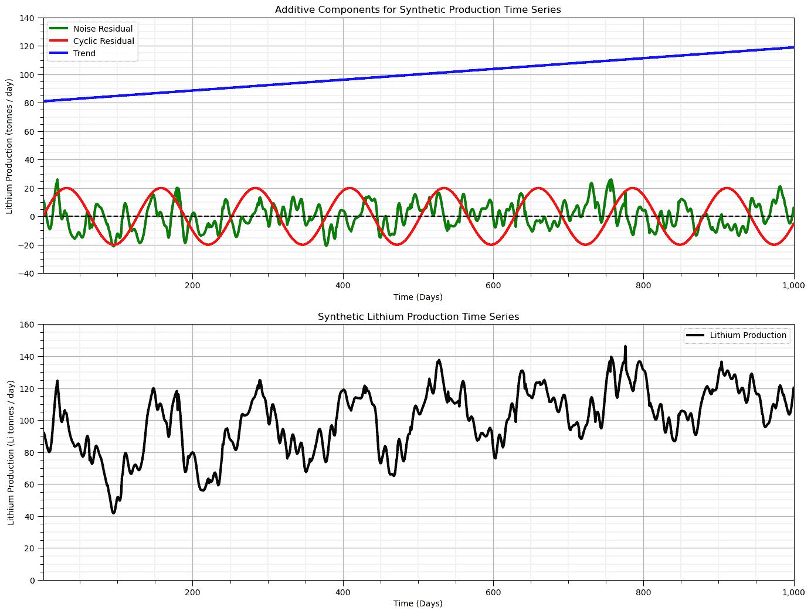

## 时间序列 DataFrame

让我们创建一个以生产日期为索引的锂生产数据的 pandas DataFrame。我们利用 Pandas DataFrame 的有用功能来处理时间序列数据，这包括：

+   能够使用各种时间格式进行显示

+   进行时间计算，例如在年、月和月份的日之间计算天数，即 Pandas 知道日历！

要做到这一点，我们创建一个以起始日期为参数的日期索引，周期数（模型中上面的值数，nx）和表示每日的采样频率‘D’。

+   我们将其设置为 DataFrame 的数据字段，并将其设置为 DataFrame 的索引。

```py
start_date = '2016-01-01'; periods = nx
date = pd.date_range(start_date,periods=periods,freq='D')     # make a list of dates for DataFrame index and plotting

df = pd.DataFrame({'date':date[:],'production':series_total[:]}) # make time DataFrame
df = df.set_index(['date']); df.head()
date_list = date.tolist() 
```

我们可以利用利用 pandas DataFrame 容易处理和绘制时间序列数据的能力。

+   我们添加了一些改进的格式，包括自定义日期间隔和 x 轴上的标签

```py
ax = df['production'].plot(color='black',lw=3)
ax.grid(which='major', axis='x', linestyle='--')              # customize major gridlines
ax.xaxis.set_major_locator(mdates.WeekdayLocator(interval=4)) # major tick every 2 weeks
ax.xaxis.set_major_formatter(mdates.DateFormatter('%Y-%m-%d')) # set the date format for the major ticks
plt.xticks(rotation=45); add_grid()                           # rotate date labels for better readability
plt.xlabel('Time (Days)'); plt.ylabel('Lithium Production (tonnes / day)'); plt.title('Synthetic Lithium Production Time Series')
plt.subplots_adjust(left=0.0, bottom=0.0, right=2.0, top=1.0, wspace=0.2, hspace=0.2); plt.show() 
```

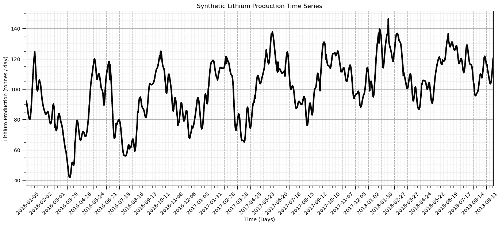

这是一个很好的时间序列数据图。现在让我们开始用我们的锂生产数据进行分析。

## 自相关

自相关在时间序列分析中用于检测时间滞后中的关系。自相关是地统计学中常用的一种相关图（标准化协方差函数），应用于一维时间序列数据。

此外，对于预测模型的计算，我们经常检查误差残差值之间是否存在自相关。

+   我们将使用我们的残差的自相关和部分自相关

部分自相关提供了在移除先前滞后中观察到的差异后的相关度度量

+   滞后 $ = n$ 的相关度量，在移除滞后 $ 1, \ldots, n-1$ 的效应后。

```py
nlag = 499                                                    # number of lags for autocorrelation analysis 

lag_acf = acf(df['production'], nlags=nlag)                   # calculate autocorrelation and partial autocorrelation functions
lag_pacf = pacf(df['production'], nlags=nlag, method='ols')
lags = np.linspace(0,(nlag+1)*xsiz,nlag+1)

#Plot ACF: 
plt.subplot(121)                                              # plot autocorrelation function
plt.plot(lags,lag_acf,color='red',lw=3,zorder=10)
plt.axhline(y=0,linewidth = 2,color='black')
plt.axhline(y=-1.96/np.sqrt(len(series_noise)),linestyle='--',color='gray')
plt.axhline(y=1.96/np.sqrt(len(series_noise)),linestyle='--',color='gray')
plt.fill_between(lags,-1.96/np.sqrt(len(series_noise)),1.96/np.sqrt(len(series_noise)),color='grey',alpha=0.4,zorder=1)
plt.title('Autocorrelation Function'); plt.xlabel('Lags (Days)'); plt.ylabel('Autocorrelation')
add_grid(); plt.xlim([0,nlag+1]); plt.ylim([-1.0,1.0])

plt.subplot(122)                                              # plot partial autocorrelation function
plt.plot(lags,lag_pacf,color='red',lw=3)
plt.axhline(y=0,linewidth = 2,color='black')
plt.axhline(y=-1.96/np.sqrt(len(series_noise)),linestyle='--',color='gray')
plt.axhline(y=1.96/np.sqrt(len(series_noise)),linestyle='--',color='gray')
plt.fill_between(lags,-1.96/np.sqrt(len(series_noise)),1.96/np.sqrt(len(series_noise)),color='grey',alpha=0.4,zorder=1)
plt.title('Partial Autocorrelation Function'); plt.title('Autocorrelation Function'); plt.xlabel('Lags (Days)'); plt.ylabel('Autocorrelation')
add_grid(); plt.xlim([0,nlag+1]); plt.ylim([-1.0,1.0])
plt.tight_layout()

plt.subplots_adjust(left=0.0, bottom=0.0, right=2.0, top=1.0, wspace=0.2, hspace=0.2); plt.show() 
```

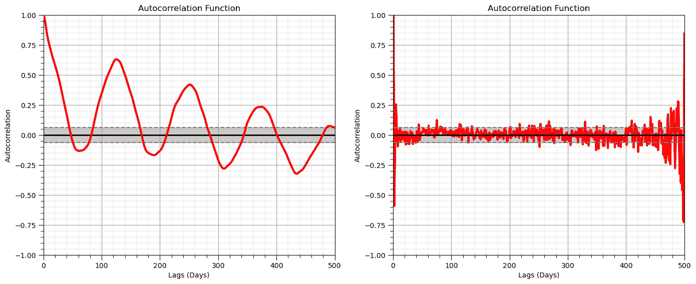

## 平稳性检验

这个数据集是平稳的吗？均值是否在局部发生变化？我们使用迪基-富勒检验来检验时间序列的平稳性，以下为假设：

+   $H_0 =$ 时间序列是非平稳的

+   $H_1 =$ 时间序列是平稳的

如果**检验统计量**小于在 alpha 水平（1 - 显著性水平）下的**临界值**，则我们拒绝零假设，并声明时间序列是平稳的。

```py
print('Dickey-Fuller Test Results:')
dftest = adfuller(df['production'], autolag='AIC')            # perfrom the Dickey-Fuller test for non-stationarity
dfoutput = pd.Series(dftest[0:4], index=['Test Statistic','p-value','#Lags Used','Number of Observations Used'])
for key,value in dftest[4].items():
    dfoutput['Critical Value (%s)'%key] = value
print(dfoutput[0:7]) 
```

```py
Dickey-Fuller Test Results:
Test Statistic                  -3.639408
p-value                          0.005051
#Lags Used                       8.000000
Number of Observations Used    991.000000
Critical Value (1%)             -3.436966
Critical Value (5%)             -2.864461
Critical Value (10%)            -2.568325
dtype: float64 
```

由于检验统计量在临界值区间（5%）内，且 p 值大于 5%，我们无法拒绝数据集平稳性的零假设，我们假设它是非平稳的。

+   我们应该如何处理我们的非平稳时间序列数据？

## 时间序列的平稳性转换

大多数时间序列模型（如空间模型）需要平稳性假设。

为了将时间序列转换为平稳性，我们必须建模并移除：

+   趋势 - 时间序列域内的局部可变均值

+   季节性 - 具有特定波长的重复周期

## 滚动、移动窗口统计

我们计算移动窗口统计量以评估这些统计量的局部变化。

+   在时间序列上连续观察局部变化

+   可以在广泛的统计量上计算

我们评估 20 天窗口内的移动窗口平均值和样本标准差。

+   假设统计量的均匀加权

+   可以考虑使用三角形和高斯加权模板以获得更平滑的结果

```py
window_size = 50                                              # assume window size of 10 days
alpha = 0.40                                                  # alpha for percentiles, symmetric probability interval = 1 - alpha

df['rolling_mean'] = df['production'].rolling(window = window_size, center = True).mean() # moving window statistics
df['rolling_std'] = df['production'].rolling(window = window_size, center = True).std()
df['rolling_lower'] = df['production'].rolling(window = window_size, center = True).quantile(alpha/2.0)
df['rolling_upper'] = df['production'].rolling(window = window_size, center = True).quantile(1-alpha/2.0)

plt.subplot(211)                                              # plot rolling statistics:
ax = df['production'].plot(color='black',lw=2,ls='--',zorder=50)
df['rolling_mean'].plot(color='red',lw=3,label='Rolling Mean',zorder=20)
df['rolling_lower'].plot(color='red',lw=1,label='Rolling P' + str(int(alpha*100/2)),zorder=20)
df['rolling_upper'].plot(color='red',lw=1,label='Rolling P' + str(int(100-alpha*100/2)),zorder=20)
plt.fill_between(date,df['rolling_lower'],df['rolling_upper'],color='red',alpha=0.4)
ax.xaxis.set_major_locator(mdates.WeekdayLocator(interval=4)) # major tick every 2 weeks
ax.xaxis.set_major_formatter(mdates.DateFormatter('%Y-%m-%d')) # set the date format for the major ticks
plt.xticks(rotation=45); add_grid(); plt.legend(loc='lower right') # rotate date labels for better readability
plt.xlabel('Time (Days)'); plt.ylabel('Lithium Production (Li tonnes / day)')
plt.title('Synthetic Lithium Production and Rolling Mean and Percentiles')

plt.subplot(212)
ax = df['rolling_std'].plot(color='red',lw=3,label='Rolling Standard Deviation')
plt.legend(loc='best'); plt.title('Rolling Standard Deviation')
plt.xlim([date[0],date[-1]]); plt.ylim([0,30]); add_grid()
ax.xaxis.set_major_locator(mdates.WeekdayLocator(interval=4)) # major tick every 2 weeks
ax.xaxis.set_major_formatter(mdates.DateFormatter('%Y-%m-%d')) # set the date format for the major ticks
plt.xticks(rotation=45); add_grid()                           # rotate date labels for better readability
plt.xlabel('Time (Days)'); plt.ylabel('Rolling St. Dev. Lithium Production (Li tonnes / day)')
plt.title('Rolling Standard Deviation of Synthetic Lithium Production')

plt.subplots_adjust(left=0.0, bottom=0.0, right=2.0, top=2.0, wspace=0.2, hspace=0.35); plt.show() 
```


## 处理残差

让我们从原始的生产时间序列中移除（减去）移动窗口平均值，并计算残差。

```py
df['residual'] = df['production'].values - df['rolling_mean'].values # calculate residual
df.head(n=13) 
```

|  | 生产 | 滚动均值 | 滚动标准差 | 滚动下限 | 滚动上限 | 残差 |
| --- | --- | --- | --- | --- | --- | --- |
| 日期 |  |  |  |  |  |  |
| --- | --- | --- | --- | --- | --- | --- |
| 2016-01-01 | 92.256458 | NaN | NaN | NaN | NaN | NaN |
| 2016-01-02 | 92.126548 | NaN | NaN | NaN | NaN | NaN |
| 2016-01-03 | 90.593619 | NaN | NaN | NaN | NaN | NaN |
| 2016-01-04 | 88.403908 | NaN | NaN | NaN | NaN | NaN |
| 2016-01-05 | 86.129658 | NaN | NaN | NaN | NaN | NaN |
| 2016-01-06 | 84.041801 | NaN | NaN | NaN | NaN | NaN |
| 2016-01-07 | 82.224334 | NaN | NaN | NaN | NaN | NaN |
| 2016-01-08 | 80.794563 | NaN | NaN | NaN | NaN | NaN |
| 2016-01-09 | 80.045364 | NaN | NaN | NaN | NaN | NaN |
| 2016-01-10 | 80.389419 | NaN | NaN | NaN | NaN | NaN |
| 2016-01-11 | 82.188769 | NaN | NaN | NaN | NaN | NaN |
| 2016-01-12 | 85.573237 | NaN | NaN | NaN | NaN | NaN |
| 2016-01-13 | 90.404332 | NaN | NaN | NaN | NaN | NaN |

由于移动窗口在窗口与数据边缘重叠时不计算值，因此我们有一些“NaN”，缺失值。

+   我们将在以下工作流程中处理这些问题。

现在让我们绘制并可视化残差。

+   它应该更平稳

```py
nlag = 499                                                    # number of lags for autocorrelation analysis 

ax = df['residual'].plot(color='red',lw=3,label='Rolling Standard Deviation')
plt.legend(loc='best'); plt.title('Rolling Standard Deviation')
plt.xlim([date[0],date[-1]]); plt.ylim([-30,30])
plt.plot([date[0],date[-1]],[0,0],color='black',ls='--')
ax.xaxis.set_major_locator(mdates.WeekdayLocator(interval=4)) # major tick every 2 weeks
ax.xaxis.set_major_formatter(mdates.DateFormatter('%Y-%m-%d')) # set the date format for the major ticks
plt.xticks(rotation=45); add_grid()                           # rotate date labels for better readability
plt.xlabel('Time (Days)'); plt.ylabel('Rolling Residual Lithium Production (Li tonnes / day)')
plt.title('Rolling Residual (Data - Mean) Lithium Production')
plt.subplots_adjust(left=0.0, bottom=0.0, right=2.0, top=1.0, wspace=0.2, hspace=0.2); plt.show() 
```

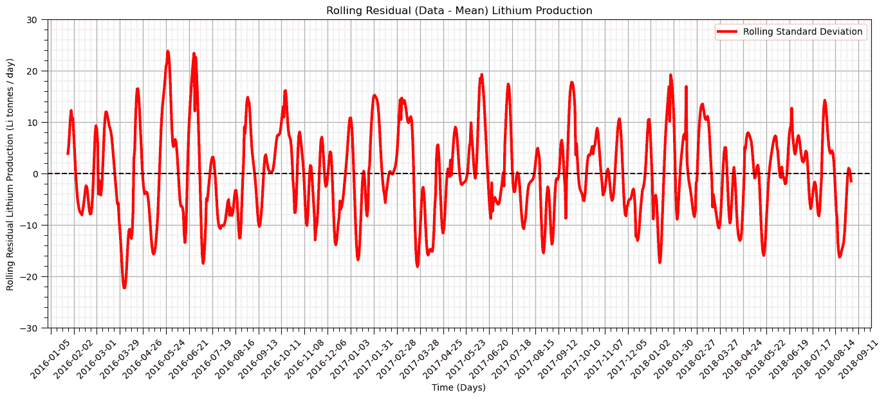

移除趋势后的残差比预期的更平稳。

让我们尝试不同的窗口大小。

+   20 天

+   40 天

+   100 天

```py
windows = [20,40,100]                                         # specify 3 moving window sizes

for iwin,window in enumerate(windows):                        # calculate rolling window mean and residual
    df['rolling_mean_'+str(window)] = df['production'].rolling(window = window, center = True).mean()
    df['rolling_res_'+str(window)] = df['rolling_mean_'+str(window)] - df['production']

    plt.subplot(3,2,iwin*2+1)                                 # plot rolling mean
    ax = df['rolling_mean_'+str(window)].plot(color='red',lw=3,label='Lithium Production',zorder=20)
    ax.xaxis.set_major_locator(mdates.WeekdayLocator(interval=8))  # major tick every 2 weeks
    ax.xaxis.set_major_formatter(mdates.DateFormatter('%Y-%m-%d')) # set the date format for the major ticks
    plt.xticks(rotation=45); add_grid(); plt.xlim([date[0],date[-1]]); plt.ylim([0,140])  # rotate date labels for better readability
    plt.xlabel('Time (Days)'); plt.title('Rolling Mean Lithium Production (Window = ' + str(window) + ')')
    plt.ylabel('Lithium Production (tonnes / day)')

    plt.subplot(3,2,iwin*2+2)                                 # plot detrended residual
    ax = df['rolling_res_'+str(window)].plot(color='red',lw=3,label='Lithium Production',zorder=20)
    plt.plot([date[0],date[-1]],[0,0],color='black',ls='--',zorder=50)
    ax.xaxis.set_major_locator(mdates.WeekdayLocator(interval=8)) # major tick every 2 weeks
    ax.xaxis.set_major_formatter(mdates.DateFormatter('%Y-%m-%d')) # set the date format for the major ticks
    plt.xticks(rotation=45); add_grid(); plt.xlim([date[0],date[-1]]); plt.ylim([-40,40])  # rotate date labels for better readability
    plt.xlabel('Time (Days)'); plt.title('Detrended Lithium Production (Data - Rolling Mean) (Window = ' + str(window) + ')')
    plt.ylabel('Lithium Production Residual (tonnes / day)') 

plt.subplots_adjust(left=0.0, bottom=0.0, right=2.0, top=3.0, wspace=0.2, hspace=0.4); plt.show() 
```

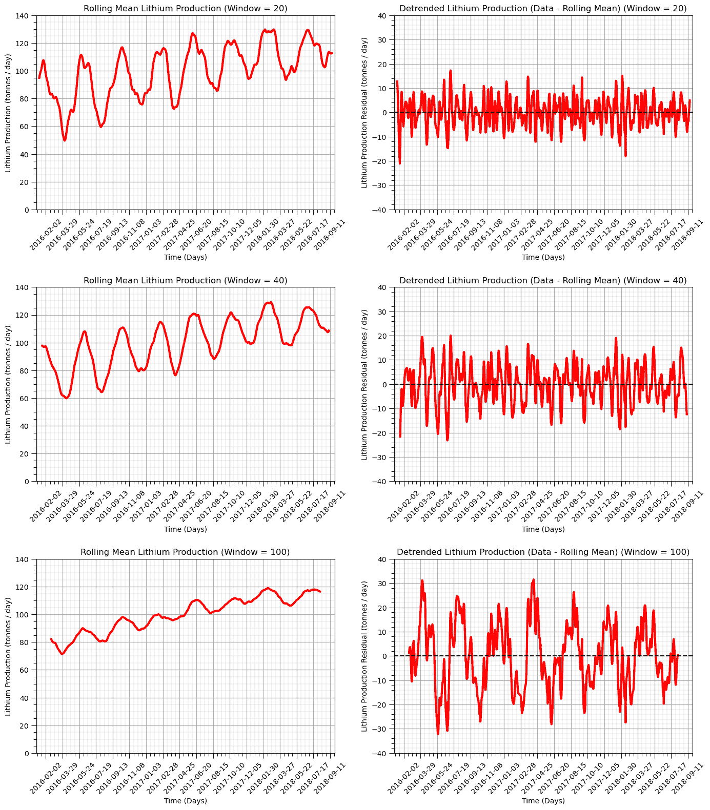

## 方差趋势和残差成分的加性以及残差分布检查

当我们处理趋势和残差模型时，我们将时间现象分解为：

1.  确定性趋势 - 已知

1.  随机残差 - 未知

我们将计算趋势和残差中的方差比例。这包括以下步骤：

+   计算原始数据的代表性加权标准差，转换为方差，$\sigma$

+   计算趋势模型的方差，转换为方差，$\sigma_t$

+   计算数据位置处的残差方差，$\sigma_r$

+   从以下关系式反推协方差：

$$ \sigma² = \sigma²_t + \sigma²_r + 2 \times C_{tr} $$

我们还检查残差的单变量分布。我们正在检查：

+   残差均值接近零

+   极端值的最大和最小残差

+   单峰，对称分布形状

```py
variance = np.var(df['production'])

for iwin,window in enumerate(windows):                        # calculate rolling window mean and residual
    variance_trend = df['rolling_mean_'+str(window)].var()
    variance_residual = df['rolling_res_'+str(window)].var()

    prop_trend = variance_trend/variance
    prop_resid = variance_residual/variance
    prop_cov = 1 - prop_trend - prop_resid

    variance_prop = [prop_trend, prop_resid, prop_cov]
    labels = 'Trend', 'Residual', '2 x Covariance'
    colors = 'orange', 'red', 'green'
    explode = (0.1, 0.1,0.1)

    plt.subplot(3,3,iwin*3+1)                                 # plot rolling mean 
    ax = df['rolling_mean_'+str(window)].plot(color='red',lw=3,label='Lithium Production',zorder=20)
    df['production'].plot(color='black',lw=2,zorder=10)
    ax.xaxis.set_major_locator(mdates.WeekdayLocator(interval=8))  # major tick every 2 weeks
    ax.xaxis.set_major_formatter(mdates.DateFormatter('%Y-%m-%d')) # set the date format for the major ticks
    plt.xticks(rotation=45); add_grid(); plt.xlim([date[0],date[-1]]); plt.ylim([0,140])  # rotate date labels for better readability
    plt.xlabel('Time (Days)'); plt.title('Rolling Mean Lithium Production (Window = ' + str(window) + ')')
    plt.ylabel('Lithium Production (tonnes / day)')

    plt.subplot(3,3,iwin*3+2)                                 # plot rolling mean residual distribution
    plt.hist(df['rolling_res_'+str(window)],bins=np.linspace(-40,40,41),color='red',edgecolor='black',alpha=1.0,zorder=10)
    plt.xlim([-40,40]); plt.ylim([0,300]); add_grid()
    plt.vlines(0,0,300,color='black',ls='--',zorder=30)
    plt.xlabel('Residual Lithium Production (tonnes/day)'); plt.ylabel('Frequency')
    plt.title('Detrended Residual Lithium Production (Window = ' + str(window) + ')')
    plt.annotate('Residual:',[18,260])
    plt.annotate('Mean = ' + str(round((df['rolling_res_'+str(window)]).mean(),2)),[20,240])
    plt.annotate('Min = ' + str(round((df['rolling_res_'+str(window)]).min(),2)),[20,220])
    plt.annotate('Max = ' + str(round((df['rolling_res_'+str(window)]).max(),2)),[20,200])

    plt.subplot(3,3,iwin*3+3)                                 # plot rolling mean
    plt.pie(variance_prop, explode=explode, colors = colors, labels=labels, autopct='%1.1f%%',
            shadow=True, startangle=90)
    plt.title('Lithium Production Variance Components (Window = ' + str(window) + ')')
    plt.gca().axis('equal')                                   # equal aspect ratio ensures that pie plot is drawn as a circle

plt.subplots_adjust(left=0.0, bottom=0.0, right=3.0, top=3.0, wspace=0.2, hspace=0.4); plt.show() 
```

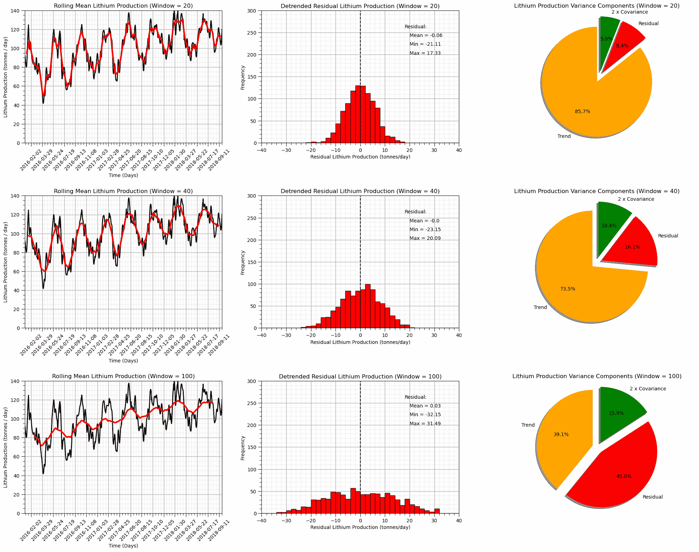

## 在去趋势时间序列上测试平稳性

我们使用 Dickey-Fuller 测试来测试我们去趋势时间序列的平稳性

+   $H_0 =$ 时间序列是非平稳的

+   $H_1 =$ 时间序列是平稳的

如果**检验统计量**小于在 alpha 水平（1 - 显著性水平）下的**临界值**，则我们拒绝零假设并声明时间序列是平稳的。

```py
print('Dickey-Fuller Test Results:')
residual = df['residual'] 
residual = residual[~pd.isnull(residual)]                     # remove null values
dftest = adfuller(residual, autolag='AIC')                    # perform Dickey-Fuller test for stationarity
dfoutput = pd.Series(dftest[0:4], index=['Test Statistic','p-value','#Lags Used','Number of Observations Used'])
for key,value in dftest[4].items():
    dfoutput['Critical Value (%s)'%key] = value
print(dfoutput[0:7]) 
```

```py
Dickey-Fuller Test Results:
Test Statistic                -9.362547e+00
p-value                        7.753045e-16
#Lags Used                     8.000000e+00
Number of Observations Used    9.420000e+02
Critical Value (1%)           -3.437311e+00
Critical Value (5%)           -2.864613e+00
Critical Value (10%)          -2.568406e+00
dtype: float64 
```

现在我们拒绝零假设 $H_0$，并声明去趋势的时间序列是平稳的。

## 用于去除非平稳性的差分

差分是应用于时间序列以去除非平稳性的常见方法。差分过程如下：

$y(\bf{u_i}) = z(\bf{u}_{i+1}) - z(\bf{u}_i)$

其中 $z(\bf{u}_{i+1}) - z(\bf{u}_i)$ 是时间序列中当前值与下一个值之间的差。

NumPy 有一个用于差分 ndarrays 的函数。

```py
np.diff(df[0].values) 
```

关于差分的注释：

+   如果序列已经是平稳的，那么就没有必要应用差分

+   差分的阶数是按顺序应用的差分操作的次数。

    +   一阶差分是 $y_1(\bf{u_i}) = z(\bf{u_{i+1}}) - z(\bf{u_i})$

    +   二阶差分是 $y_2(\bf{u_i}) = y_1(\bf{u_{i+1}}) - y_1(\bf{u_i})$

    +   三阶差分是 $y_3(\bf{u_i}) = y_2(\bf{u_{i+1}}) - y_2(\bf{u_i})$

我们在我们的生产数据集上演示了差分。

我们将绘制结果的自相关图来证明我们已经移除了趋势。

+   自相关中的趋势结构是滞后距离向下的线性位移，趋向于 0.0 以及更低的负值。

```py
diff1 = np.diff(df['production'].values)
diff1 = np.append(diff1,diff1[diff1.size-1])                  # double the last value to keep the length the same
df['first_difference'] = diff1

diff2 = np.diff(df['first_difference'].values)
diff2 = np.append(diff2,diff2[diff2.size-1])                  # double the last value to keep the length the same
df['second_difference'] = diff2
df.head() 
```

|  | 生产 | 滚动均值 | 滚动标准差 | 滚动下限 | 滚动上限 | 残差 | 滚动均值 _20 | 滚动残差 _20 | 滚动均值 _40 | 滚动残差 _40 | 滚动均值 _100 | 滚动残差 _100 | 第一次差分 | 第二次差分 |
| --- | --- | --- | --- | --- | --- | --- | --- | --- | --- | --- | --- | --- | --- | --- |
| 日期 |  |  |  |  |  |  |  |  |  |  |  |  |  |  |
| --- | --- | --- | --- | --- | --- | --- | --- | --- | --- | --- | --- | --- | --- | --- |
| 2016-01-01 | 92.256458 | NaN | NaN | NaN | NaN | NaN | NaN | NaN | NaN | NaN | NaN | NaN | -0.129910 | -1.403020 |
| 2016-01-02 | 92.126548 | NaN | NaN | NaN | NaN | NaN | NaN | NaN | NaN | NaN | NaN | NaN | -1.532930 | -0.656781 |
| 2016-01-03 | 90.593619 | NaN | NaN | NaN | NaN | NaN | NaN | NaN | NaN | NaN | NaN | NaN | -2.189710 | -0.084540 |
| 2016-01-04 | 88.403908 | NaN | NaN | NaN | NaN | NaN | NaN | NaN | NaN | NaN | NaN | NaN | -2.274251 | 0.186395 |
| 2016-01-05 | 86.129658 | NaN | NaN | NaN | NaN | NaN | NaN | NaN | NaN | NaN | NaN | NaN | -2.087856 | 0.270389 |

现在，让我们绘制：

+   原始

+   一阶

+   二阶

```py
cases = ['production','first_difference','second_difference'] # differencing cases

nlag = 200
lags = np.linspace(0,(nlag+1)*xsiz,nlag+1); prod_lag_acf = []

for icase, case in enumerate(cases):
    prod_lag_acf.append(acf(df[case], nlags=nlag))

    plt.subplot(3,2,icase*2+1)                                # plot values 
    ax = df[case].plot(color='black',lw=3)
    ax.grid(which='major', axis='x', linestyle='--')          # customize major gridlines
    ax.xaxis.set_major_locator(mdates.WeekdayLocator(interval=8)) # major tick every 2 weeks
    ax.xaxis.set_major_formatter(mdates.DateFormatter('%Y-%m-%d')) # set the date format for the major ticks
    plt.xticks(rotation=45); add_grid()                       # rotate date labels for better readability
    plt.xlabel('Time (Days)'); plt.ylabel('Lithium Production (tonnes / day)'); plt.title(case + ' Lithium Production Time Series')

    plt.subplot(3,2,icase*2+2)                                # plot autocorrelation
    plt.plot(lags,prod_lag_acf[icase],color='red')
    plt.axhline(y=0,linewidth = 2,color='black')
    plt.axhline(y=-1.96/np.sqrt(len(series_noise)),linestyle='--',color='gray')
    plt.axhline(y=1.96/np.sqrt(len(series_noise)),linestyle='--',color='gray')
    plt.fill_between(lags,-1.96/np.sqrt(len(series_noise)),1.96/np.sqrt(len(series_noise)),color='grey',alpha=0.4,zorder=1)
    plt.title(case + ' Autocorrelation Function'); plt.xlabel('Lags (Days)'); plt.ylabel('Autocorrelation')
    add_grid(); plt.xlim([0,nlag+1]); plt.ylim([-1.0,1.0])

plt.subplots_adjust(left=0.0, bottom=0.0, right=2.0, top=3.0, wspace=0.2, hspace=0.4); plt.show() 
```

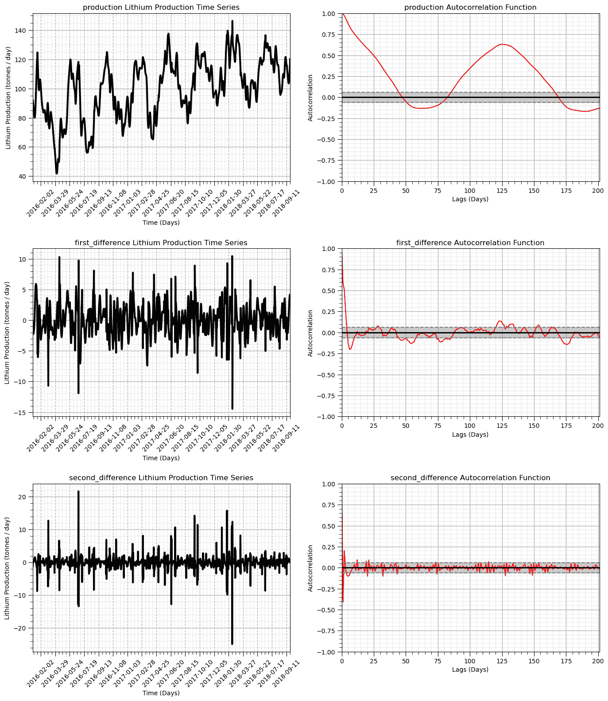

观察到，当我们从原始生产数据移动到第一次差分，然后到第二次差分时，结果变得更加平稳。

自相关表明时间相关性也被移除了。

## 对第一和第二次差分时间序列进行平稳性检验

我们使用迪基-富勒检验来检验我们生产时间序列的第一和第二次差分的平稳性

+   $H_0 =$ 时间序列是非平稳的

+   $H_1 =$ 时间序列是平稳的

如果**检验统计量**小于在 alpha 水平（1 - 显著性水平）下的**临界值**，则我们拒绝原假设，并声明时间序列是平稳的。

```py
print('Dickey-Fuller Test Results - First Differenced Production:')
residual = df['first_difference'] 
residual = residual[~pd.isnull(residual)]                     # remove null values
dftest = adfuller(residual, autolag='AIC')                    # perform Dickey-Fuller test
dfoutput = pd.Series(dftest[0:4], index=['Test Statistic','p-value','#Lags Used','Number of Observations Used'])
for key,value in dftest[4].items():
    dfoutput['Critical Value (%s)'%key] = value
print(dfoutput[0:7])

print('Dickey-Fuller Test Results - Second Differenced Production:')
residual = df['second_difference'] 
residual = residual[~pd.isnull(residual)]                     # remove null values
dftest = adfuller(residual, autolag='AIC')                    # perform Dickey-Fuller test
dfoutput = pd.Series(dftest[0:4], index=['Test Statistic','p-value','#Lags Used','Number of Observations Used'])
for key,value in dftest[4].items():
    dfoutput['Critical Value (%s)'%key] = value
print(dfoutput[0:7]) 
```

```py
Dickey-Fuller Test Results - First Differenced Production:
Test Statistic                -1.022681e+01
p-value                        5.151322e-18
#Lags Used                     1.000000e+01
Number of Observations Used    9.890000e+02
Critical Value (1%)           -3.436979e+00
Critical Value (5%)           -2.864467e+00
Critical Value (10%)          -2.568328e+00
dtype: float64
Dickey-Fuller Test Results - Second Differenced Production:
Test Statistic                -1.266754e+01
p-value                        1.265190e-23
#Lags Used                     1.900000e+01
Number of Observations Used    9.800000e+02
Critical Value (1%)           -3.437040e+00
Critical Value (5%)           -2.864494e+00
Critical Value (10%)          -2.568343e+00
dtype: float64 
```

两种方法，即局部移动窗口和差分方法，都证明了它们能够移除生产均值中的趋势，并提供一个平稳的数据集。

通常，任何预测模型都将：

+   需要一个平稳的时间序列数据集（假设平稳性）

+   第一个模型，移除非平稳成分，然后与平稳残差或转换一起工作

## 时间序列分解

让我们演示一种自动化的方法来将时间序列分解成多个组成部分。通过时间序列分解，我们将时间序列分解成以下组成部分。

+   趋势

+   季节性

+   噪音/残差

我们将使用[StatsModels](https://www.statsmodels.org/stable/index.html)包在 Python 中进行统计建模。

```py
decomposition = seasonal_decompose(df['production'], model='additive',extrapolate_trend=1,period=110,filt=np.ones(20)/20,two_sided = True)
decomp_trend = decomposition.trend; decomp_seasonal = decomposition.seasonal; decomp_residual = decomposition.resid
fig = decomposition.plot()
plt.subplots_adjust(left=0.0, bottom=0.0, right=2.0, top=1.0, wspace=0.2, hspace=0.2); plt.show() 
```

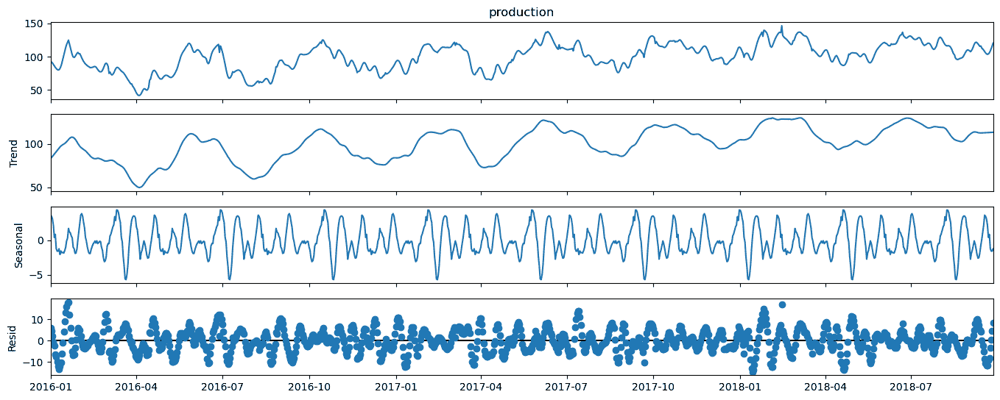

让我们也检查方差成分，其中 $t$ 是趋势，$s$ 是季节性，$r$ 是残差。

$$ \sigma² = \sigma²_{t} + \sigma²_{s} + \sigma²_{r} + 2 \times C_{t,s} + 2 \times C_{s,r} + 2 \times C_{t,r} $$

由于协方差项，我们不能假设三个分解成分的方差之和将是原始方差。

+   为了简单起见，我们将忽略协方差项，并绘制趋势、季节性和残差成分的方差总和的比例。

```py
var_decomp_trend = np.var(decomp_trend.values); var_decomp_seasonal = np.var(decomp_seasonal.values) # calculate variance components
var_decomp_residual = np.var(decomp_residual.values); var_total = np.var(df['production'])

variance_prop = [var_decomp_trend, var_decomp_seasonal, var_decomp_residual]
labels = ['Trend', 'Seasonal', 'Residual']; colors = ['orange','cyan','red']; explode = [0.1,0.1,0.1]

plt.subplot(111)                                              # plot the decompositional model variance components
plt.pie(variance_prop, explode=explode, colors = colors, labels=labels, autopct='%1.1f%%',
        shadow=True, startangle=90)
plt.title('Lithium Production Decomposition Model Variance Components')
plt.gca().axis('equal')                                       # equal aspect ratio ensures that pie is drawn as a circle.
plt.subplots_adjust(left=0.0, bottom=0.0, right=2.0, top=1.0, wspace=0.2, hspace=0.2) 
```

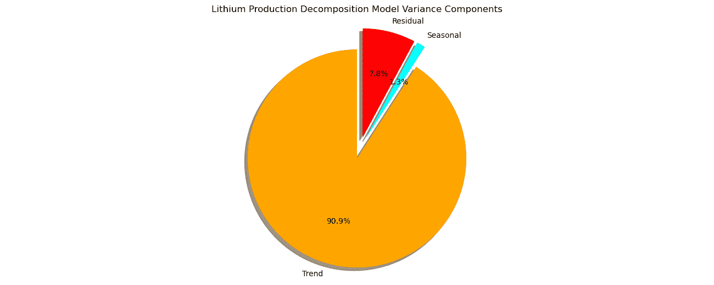

注意，我们的模型将我们添加到合成数据中的周期性视为趋势成分，并发现更高频率、更低幅度的周期性作为季节性成分，而剩余的噪声残差成分的振幅大约是季节性的两倍，大约是趋势振幅的五分之一。

让我们检查上面分解的残差成分的平稳性。我们这样做是为了确认我们已经通过去除季节性和趋势成分来消除了非平稳性。

```py
print('Dickey-Fuller Test Results:')
decomp_residual = decomp_residual[~pd.isnull(decomp_residual)]  # remove null values
df['decomp_res'] = decomp_residual
dftest = adfuller(decomp_residual, autolag='AIC')             # perform Dickey-Fuller test
dfoutput = pd.Series(dftest[0:4], index=['Test Statistic','p-value','#Lags Used','Number of Observations Used'])
for key,value in dftest[4].items():
    dfoutput['Critical Value (%s)'%key] = value
print(dfoutput[0:7]) 
```

```py
Dickey-Fuller Test Results:
Test Statistic                -9.629883e+00
p-value                        1.622897e-16
#Lags Used                     2.100000e+01
Number of Observations Used    9.780000e+02
Critical Value (1%)           -3.437054e+00
Critical Value (5%)           -2.864500e+00
Critical Value (10%)          -2.568346e+00
dtype: float64 
```

再次，我们拒绝零假设 $H_0$，并声明去趋势的时间序列是平稳的。

+   时间序列分解方法已成功消除了时间序列均值中的非平稳性

让我们通过自相关来确认趋势已被去除。

```py
nlags = 200                                                   # number of autocorrelation lags
lag_acf_decomp_resid = acf(decomp_residual, nlags=nlags)      # autocorrelation
lags = np.linspace(0,(nlags+1)*xsiz,nlags+1)

plt.subplot(121)                                              # plot decomposition model residual
ax = df['decomp_res'].plot(color='black',lw=3)
ax.xaxis.set_major_locator(mdates.WeekdayLocator(interval=8))  # major tick every 2 weeks
ax.xaxis.set_major_formatter(mdates.DateFormatter('%Y-%m-%d')) # set the date format for the major ticks
plt.xticks(rotation=45); add_grid(); plt.xlim([date[0],date[-1]]); plt.ylim([-40,40]) # rotate date labels for better readability
plt.xlabel('Time (Days)'); plt.title('Decomposition Time Series Model Residual')
plt.ylabel('Lithium Production (tonnes / day)')

plt.subplot(122)                                              # plot autocorrelation of decomposition residual
plt.plot(lags,lag_acf_decomp_resid,color='red')
plt.axhline(y=0,linewidth = 2,color='black')
plt.axhline(y=-1.96/np.sqrt(len(series_noise)),linestyle='--',color='gray')
plt.axhline(y=1.96/np.sqrt(len(series_noise)),linestyle='--',color='gray')
plt.fill_between(lags,-1.96/np.sqrt(len(series_noise)),1.96/np.sqrt(len(series_noise)),color='grey',alpha=0.4,zorder=1)
plt.title('Time Series Decomposition Model Residual Autocorrelation Function'); plt.xlabel('Lags (Days)'); plt.ylabel('Autocorrelation')
add_grid(); plt.xlim([0,nlag+1]); plt.ylim([-1.0,1.0])

plt.subplots_adjust(left=0.0, bottom=0.0, right=2.0, top=1.0, wspace=0.2, hspace=0.2); plt.show() 
```

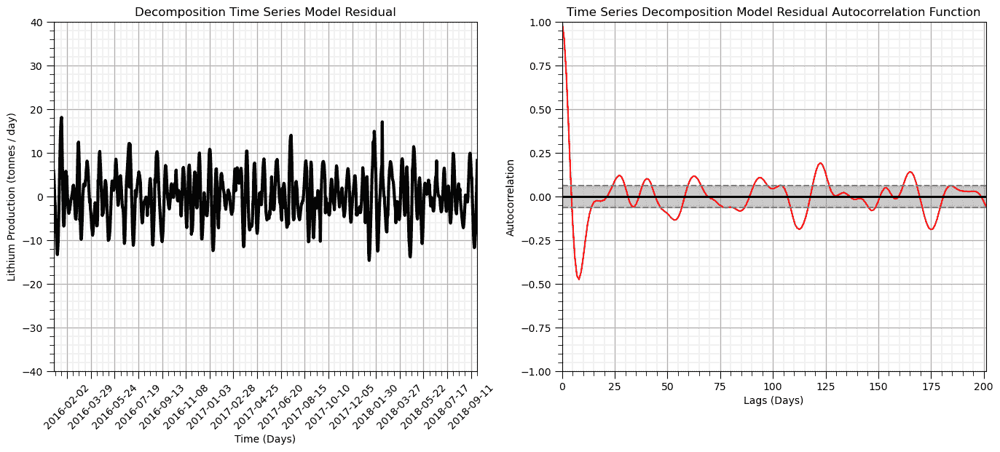

从这些图中我们可以确定，在任何滞后上都没有自相关或部分自相关

+   图像在滞后 = 1 处穿过零自相关的上置信区间

到目前为止，我们对我们生产数据学到了什么？

+   存在一个可以通过移动窗口或第一次差分去除的显著趋势

+   没有显著的自相关

## 训练和测试分割

让我们用训练和测试数据分割数据，并尝试时间序列预测。

```py
train_frac = 0.8; split_index = int(len(df)*train_frac)       # specify train and test split

train = df['production'][:split_index]                        # perform split
test = df['production'][split_index:]
train_date_list = pd.date_range(start=date[0], end=date[split_index-1]).tolist() # date ranges for train and test for plotting
test_date_list = pd.date_range(start=date[split_index],end=date[len(df)-1]).tolist()

print('Train samples = ' + str(len(train)) + ', Test samples = ' + str(len(test))) # check train and test counts
print('Train samples dates = ' + str(len(train_date_list)) + ', Test samples dates = ' + str(len(test_date_list))) 
```

```py
Train samples = 800, Test samples = 200
Train samples dates = 800, Test samples dates = 200 
```

## 时间序列的 ARIMA（自回归积分移动平均）模型

ARIMA 模型基于以下参数：

+   自回归项数（p）是自相关的滞后数——我们从部分自相关中的显著滞后数中找到这个值。只有一个滞后（见上面）。$p=1$

+   移动平均项数（q）是需要进行差分以去除趋势的差分数量。从上面我们可以看到，在第一次差分之后，我们得到了一个平稳的数据集，但在第二次差分之后，我们改进了对周期的去除，让我们使用第二次差分。$q = 2$

+   非季节性差分数（d）是季节性效应，我们上面的分解中没有显示出任何显著的季节性周期性，所以我们将其设置为 1。$d=1$

```py
p = 1; d = 0; q = 2                                           # set ARIMA parameters

sP = 1; sD = 1; sQ = 2; s = 5                                 # seasonal orders

ARIMA_model = ARIMA(train, order=(p, d, q),trend='t',seasonal_order=(sP,sD,sQ,s)) # instantiate ARIMA model
ARIMA_model_fit = ARIMA_model.fit()                           # fit ARIM model

print(ARIMA_model_fit.summary())                              # print diagnostics from ARIMA model 
```

```py
 SARIMAX Results                                    
=======================================================================================
Dep. Variable:                      production   No. Observations:                  800
Model:             ARIMA(1, 0, 2)x(1, 1, 2, 5)   Log Likelihood               -1782.678
Date:                         Tue, 08 Oct 2024   AIC                           3581.357
Time:                                 11:06:15   BIC                           3618.784
Sample:                             01-01-2016   HQIC                          3595.739
                                  - 03-10-2018                                         
Covariance Type:                           opg                                         
==============================================================================
                 coef    std err          z      P>|z|      [0.025      0.975]
------------------------------------------------------------------------------
x1             0.0497      0.026      1.943      0.052      -0.000       0.100
ar.L1          0.9844      0.009    109.383      0.000       0.967       1.002
ma.L1          0.2957      0.023     13.071      0.000       0.251       0.340
ma.L2          0.4662      0.020     23.536      0.000       0.427       0.505
ar.S.L5        0.1298      0.249      0.521      0.602      -0.358       0.618
ma.S.L5       -1.3116      0.234     -5.597      0.000      -1.771      -0.852
ma.S.L10       0.3133      0.240      1.308      0.191      -0.156       0.783
sigma2         5.0306      0.337     14.947      0.000       4.371       5.690
===================================================================================
Ljung-Box (L1) (Q):                  12.96   Jarque-Bera (JB):              2704.23
Prob(Q):                              0.00   Prob(JB):                         0.00
Heteroskedasticity (H):               1.22   Skew:                             0.02
Prob(H) (two-sided):                  0.11   Kurtosis:                        12.04
===================================================================================

Warnings:
[1] Covariance matrix calculated using the outer product of gradients (complex-step). 
```

以下是我们可以从上述内容中解读的内容。

+   AR.1、MA.1 和 MA.2 的系数都是显著的，基于趋势和自相关的模型是显著的

+   常数与零没有显著差异

注意 AIC 是赤池信息准则（AIC），它量化：

1.  良好的拟合度

1.  简单/简约性

AIC 越低越好。

让我们绘制我们模型的残差图，以检查是否存在恒定的均值（接近零）和方差。

```py
residuals = pd.DataFrame(ARIMA_model_fit.resid)               # add ARIMA residuals to DataFrame

plt.subplot(121)                                              # plot ARIMA residuals
orig = plt.plot(residuals, color='red',linewidth = 3, label='Residual')
plt.plot([date[0],date[-1]],[0,0],color='black')
plt.title('ARIMA Model Residual'); plt.legend(loc='best'); plt.ylim(-10,10); plt.xlim([date[0],date[-1]])

plt.subplot(122)                                               # plot histogram of ARIMA residuals
plt.hist(residuals[0].values,bins = np.linspace(-10,10,30),color = 'red',alpha = 1.0,edgecolor = 'black')
plt.xlabel('Residual'); plt.ylabel('Frequency'); plt.title('ARIMA Model Residual'), plt.xlim(-10,10)

plt.subplots_adjust(left=0.0, bottom=0.0, right=3.0, top=1.0, wspace=0.2, hspace=0.2); plt.show() 
```

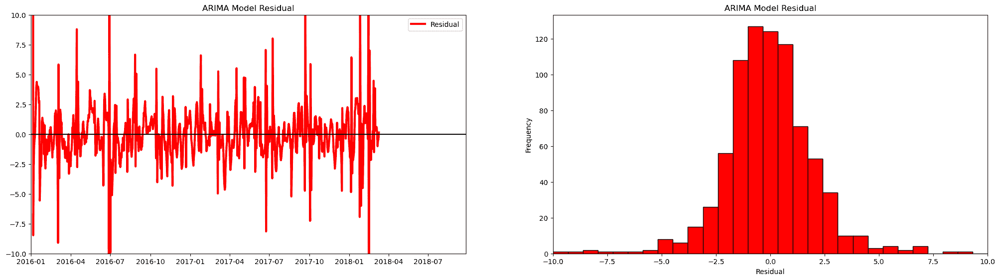

让我们看看我们模型的预测结果。

+   如果我们用 $y(\bf{u_{\alpha}})$，对于 $\alpha = 1, \dots, i-1$ 来预测 $y(\bf{u_i})$，这是我们的模型会做出的预测

```py
forecast_steps = 200                                          # number of forecast steps

forecast = ARIMA_model_fit.forecast(steps=forecast_steps)
forecast_date_list = pd.date_range(start=test_date_list[0], end=test_date_list[0] + pd.Timedelta(days=forecast_steps-1)).tolist()

plt.subplot(111)                                              # plot data, train and test and ARIMA forecast
plt.plot(date_list,df['production'],color='black',label='Actual Data',zorder=10) # plot data
plt.plot(train_date_list,train.values,lw=3,color='lightgreen',label='Train Data',zorder=1) # plot data
plt.plot(test_date_list,test.values,lw=3,color='lightblue',label='Test Data',zorder=1) # plot data
plt.plot(forecast_date_list,forecast.values, label='ARIMA Forecast', color='red') # plot forecast
ax.xaxis.set_major_locator(mdates.WeekdayLocator(interval=4))  # major tick every 2 weeks
ax.xaxis.set_major_formatter(mdates.DateFormatter('%Y-%m-%d')) # set the date format for the major ticks
plt.xticks(rotation=45); add_grid(); plt.ylim([0,160])  # rotate date labels for better readability
plt.xlabel('Time (Days)'); plt.title('Decomposition Time Series Model Residual')
plt.ylabel('Lithium Production (tonnes / day)'); plt.xlim(date_list[0],date_list[-1])
plt.plot([test_date_list[0],test_date_list[0]],[-40,160],color='black',ls='--') # vertical line at end of train time period
plt.title('ARIMA Model Forecasts'); plt.ylabel('Lithium Production (tonnes / day)'); plt.xlabel('Time (Days)')
plt.legend(loc='lower left')
plt.subplots_adjust(left=0.0, bottom=0.0, right=1.0, top=1.0, wspace=0.2, hspace=0.2); plt.show() 
```

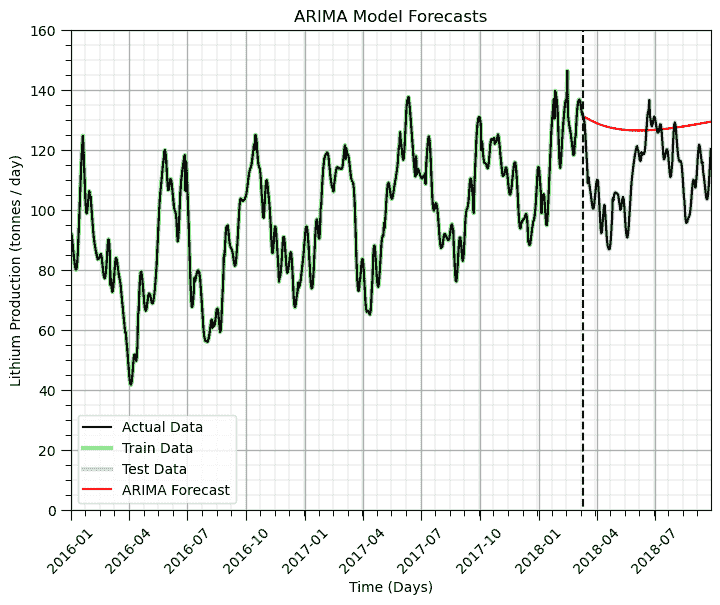

关于我们预测能力的几点观察：

+   模型捕捉了随着产量增加的总体线性趋势

+   短期预测相当好，但未能捕捉到周期，我们可以增加季节中的周期数，但这会显著增加运行时间，并且在这个电子书中不切实际。

我们可以通过手动去除趋势和周期并建模残差来提高模型性能。此外，还可以使用 Python 包来自动调整 ARIMA 模型（例如，pmdarima 包）进行更多操作。

## 时间序列分析与建模总结

这里有一些观察结果：

+   我们需要检查时间序列数据是否平稳

+   如果时间序列是非平稳的，我们应该通过趋势消除或差分来减轻这一点

+   我们可以通过自相关来测量时间相关性的程度，并看到非平稳性或趋势结构

+   ARIMA 模型使我们能够在单个模型中同时捕捉趋势、季节性和残差成分

## 评论

可以做和讨论的还有很多，我有很多更多的资源。查看我的[共享资源清单](https://michaelpyrcz.com/my-resources)。

希望这有所帮助，

*迈克尔*

## 作者：

迈克尔·皮尔奇，教授，德克萨斯大学奥斯汀分校 *新颖数据分析、地统计学和机器学习地下解决方案*

在地下咨询、研究和开发方面拥有超过 17 年的经验后，迈克尔因他对教学的热情和对增强工程师和地球科学家在地下资源开发中影响的热情而重返学术界。

更多关于迈克尔的信息，请查看以下链接：

[Twitter](https://twitter.com/geostatsguy) | [GitHub](https://github.com/GeostatsGuy) | [网站](http://michaelpyrcz.com) | [Google Scholar](https://scholar.google.com/citations?user=QVZ20eQAAAAJ&hl=en&oi=ao) | [地统计学书籍](https://www.amazon.com/Geostatistical-Reservoir-Modeling-Michael-Pyrcz/dp/0199731446) | [YouTube](https://www.youtube.com/channel/UCLqEr-xV-ceHdXXXrTId5ig) | [Python 中应用地统计学电子书](https://geostatsguy.github.io/GeostatsPyDemos_Book/intro.html) | [Python 中应用机器学习电子书](https://geostatsguy.github.io/MachineLearningDemos_Book/) | [LinkedIn](https://www.linkedin.com/in/michael-pyrcz-61a648a1)

## 想一起工作吗？

我希望这些内容对那些想了解更多关于地下建模、数据分析和机器学习的人有所帮助。学生和在职专业人士都欢迎参加。

+   想邀请我到贵公司进行培训、辅导、项目审查、工作流程设计和/或咨询吗？我很乐意拜访并与您合作！

+   想要合作、支持我的研究生研究或我的地下数据分析与机器学习联盟（共同负责人是约翰·福斯特教授）吗？我的研究将数据分析、随机建模和机器学习理论与实践相结合，以开发新的方法和工作流程，增加价值。我们正在解决具有挑战性的地下问题！

+   您可以通过 mpyrcz@austin.utexas.edu 联系到我。

我总是很高兴讨论，

*迈克尔*

迈克尔·皮尔茨，博士，P.Eng. 教授，德克萨斯大学奥斯汀分校 Cockrell 工程学院和 Jackson 地球科学学院

## 更多资源请访问：[Twitter](https://twitter.com/geostatsguy) | [GitHub](https://github.com/GeostatsGuy) | [网站](http://michaelpyrcz.com) | [Google Scholar](https://scholar.google.com/citations?user=QVZ20eQAAAAJ&hl=en&oi=ao) | [地统计学书籍](https://www.amazon.com/Geostatistical-Reservoir-Modeling-Michael-Pyrcz/dp/0199731446) | [YouTube](https://www.youtube.com/channel/UCLqEr-xV-ceHdXXXrTId5ig) | [Python 中应用地统计学电子书](https://geostatsguy.github.io/GeostatsPyDemos_Book/intro.html) | [Python 中应用机器学习电子书](https://geostatsguy.github.io/MachineLearningDemos_Book/) | [LinkedIn](https://www.linkedin.com/in/michael-pyrcz-61a648a1)

## 时间序列分析与建模的动机

时间序列数据通常是时间上的 1D。这些数据可能是单变量的、双变量的或多变量的。那么为什么不在 1D 上应用常规的机器学习方法呢？时间序列分析和建模有许多独特的方面，这阻止了这一点：

+   时间序列现象通常是非平稳的，具有趋势和周期性

+   时间序列模型通常侧重于预测，即重要的外推

+   在观察的时间间隔内，数据通常很密集，并且通常与训练模型中应用的采样率相同

因此，我们需要一套独特的工具、分析和模型来解决时间序列现象。

## 时间序列分析和建模

时间序列分析用于从时间序列数据中学习。以下是时间序列分析和建模的一些关键方面。

**一维**

+   而空间数据通常是 2 或 3 维，多变量数据可能在特征空间中具有任何维度，时间序列数据在本质上是一个 1 维数据集，具有对 $y(\bf{t_{\alpha}})$ 的度量，对于 $\alpha = 1, \dots, n$ 样本通常以恒定速率观察。

**组成**

+   时间序列数据可能经常分解为单独的加法或乘法趋势、季节和残差成分。

+   任何模型都需要考虑这些组成部分

**自相关**

+   自相关通常用于量化在时间间隔内共享的信息程度。

+   注意，自相关在地质统计学中被称为自相关图，其原理、计算和建模程序是相同的。

**非平稳**

+   时间序列数据通常是非平稳的，通常使用移动窗口统计来评估和建模随时间的变化

+   移动窗口大小的选择类似于（尽管不是完全等价）k-最近邻模型的 k 超参数。

## 时间序列分析的示例

时间序列分析有许多众所周知且重要的示例：

1.  应用于模型和预测的局部和全球二氧化碳排放

1.  以从工厂进料中提取矿物的回收率来衡量磨矿效率，以预测矿物生产

1.  确定特定储层中一口井的天然气生产率，以确定满足当地能源需求所需井的数量

此外，还有许多具有混合多变量时间序列现象的系统。对于上述内容，

1.  包含人口、GDP 和效率指标以改善二氧化碳排放预测

1.  包含矿物等级、采矿计划和工厂停机时间，以改善磨矿矿物生产预测

1.  包含局部模型的地层、孔隙率和渗透率模型以改善井天然气生产预测。

虽然多变量很重要，但为了简洁起见，我在这里只涵盖单变量时间序列分析和建模。

## 我会涵盖哪些内容？

对于时间序列分析、建模和预测，以下内容包括：

+   格式化时间序列数据集

+   基本时间序列可视化

+   自相关分析

+   趋势建模和差分以去趋势

+   使用 ARIMA 模型进行时间序列分解和预测

## 加载所需的库

我们还需要一些标准包。这些应该已经与 Anaconda 3 一起安装。

```py
import geostatspy.GSLIB as GSLIB                              # GSLIB utilities, visualization and wrapper
import geostatspy.geostats as geostats                        # GSLIB methods convert to Python 
import geostatspy
print('GeostatsPy version: ' + str(geostatspy.__version__)) 
```

```py
GeostatsPy version: 0.0.71 
```

我们还需要一些标准包。这些应该已经与 Anaconda 3 一起安装。

```py
ignore_warnings = True                                        # ignore warnings?

from tqdm import tqdm                                         # suppress the status bar
from functools import partialmethod
tqdm.__init__ = partialmethod(tqdm.__init__, disable=True)

import numpy as np                                            # ndarrays for gridded data
import pandas as pd                                           # DataFrames for tabular data
import os                                                     # set working directory, run executables
import matplotlib.pyplot as plt                               # for plotting
from matplotlib.ticker import (MultipleLocator, AutoMinorLocator,FuncFormatter) # control of axes ticks
import matplotlib.dates as mdates                             # manually format date display
from statsmodels.tsa.stattools import acf, pacf               # autocorrelation and partical autocorrelation
from scipy import stats                                       # summary statistics
import math                                                   # trig etc.
from statsmodels.tsa.stattools import acf, pacf               # autocorrelation and partial autocorrelation
from statsmodels.tsa.stattools import adfuller                # Dickey-Fulley test for stationarity
from statsmodels.tsa.seasonal import seasonal_decompose       # decomposition time series model
from statsmodels.tsa.arima.model import ARIMA                 # ARIMA time series model
import pmdarima as pm                                         # autotune for ARIMA
plt.rc('axes', axisbelow=True)                                # plot all grids below the plot elements
if ignore_warnings == True:                                   
    import warnings
    warnings.filterwarnings('ignore')
cmap = plt.cm.inferno                                         # color map 
```

```py
---------------------------------------------------------------------------
ModuleNotFoundError  Traceback (most recent call last)
Cell In[2], line 20
  18 from statsmodels.tsa.seasonal import seasonal_decompose       # decomposition time series model
  19 from statsmodels.tsa.arima.model import ARIMA                 # ARIMA time series model
---> 20 import pmdarima as pm                                         # autotune for ARIMA
  21 plt.rc('axes', axisbelow=True)                                # plot all grids below the plot elements
  22 if ignore_warnings == True:                                   

ModuleNotFoundError: No module named 'pmdarima' 
```

如果你遇到包导入错误，你可能首先需要安装这些包中的一些。这通常可以通过在 Windows 上打开命令窗口，然后输入‘python -m pip install [package-name]’来完成。有关相应包的文档中提供了更多帮助。

## 声明函数

让我们定义几个函数来简化相关矩阵的绘制和决策树回归模型的可视化。

```py
def comma_format(x, pos):
    return f'{int(x):,}'

def add_grid():
    plt.gca().grid(True, which='major',linewidth = 1.0); plt.gca().grid(True, which='minor',linewidth = 0.2) # add y grids
    plt.gca().tick_params(which='major',length=7); plt.gca().tick_params(which='minor', length=4)
    plt.gca().xaxis.set_minor_locator(AutoMinorLocator()); plt.gca().yaxis.set_minor_locator(AutoMinorLocator()) # turn on minor ticks 
```

## 设置工作目录

我总是喜欢这样做，这样我就不会丢失文件，并且可以简化后续的读取和写入（避免每次都包含完整地址）。

```py
#os.chdir("c:/PGE383")                                        # set the working directory 
```

## 生成合成时间序列

我们将构建一个简单的代表假设锂（Li）矿生产的时间序列，其中我们每天测量锂回收量，以吨/天为单位。

+   我们将使用具有趋势、周期和随机噪声（短期连续性）特征的加性模型

+   我在这里留下了合成数据生成工作流程，而不是仅仅将结果数据集放在 GitHub 上，这样你可以更改合成数据集，并实验以下时间序列分析和建模工作流程。

```py
%%capture --no-display    

target_mean = 100.0; target_stdev = 20.0                      # target mean and standard deviation of the synthetic dataset

prop_trend = 0.3; prop_cycle = 0.5; prop_noise = 1 - (prop_trend + prop_cycle)
trend_mean = target_mean; cycle_mean = 0.0; noise_mean = 0.0
noise_stdev = math.sqrt(prop_noise*(target_stdev**2.0))
trend_stdev = math.sqrt(prop_trend*(target_stdev**2.0)); cycle_stdev = math.sqrt(prop_cycle*(target_stdev**2.0))
noise_stdev = math.sqrt(prop_noise*(target_stdev**2.0))

nx = 1000; ny = 1; xsiz = 1.0; ysiz = 10.0; xmn = 5.0; ymn = 5.0; nxdis = 1; nydis = 1 # model window
xmin = 0.0; xmax = nx*xsiz; ymin = 0.0; ymax = ny*ysiz; cmap = plt.cm.inferno

ndmin = 0; ndmax = 30; radius = 1000; ktype = 0; skmean = 0; tmin = -999; tmax = 999 # geostatistical simulation parameters

x_value = np.linspace(1,nx,nx)                                # array with the days for the observations

vario_noise = GSLIB.make_variogram(nug=0.0,nst=1,it1=3,cc1=1.0,azi1=90.0,hmaj1=10,hmin1=1) # assumed spatial continuity models 

x = np.ones(10)*-9999; y = np.ones(10)*-9999; value = np.random.normal(10) # reference data for forward and back transformation
df_null = pd.DataFrame({'x': x, 'y': y, 'value':value})           # make a new DataFrame from the vectors
series_noise = geostats.sgsim(df_null,'x','y','value',wcol=-1,scol=-1,tmin=tmin,tmax=tmax,itrans=0,ismooth=0,dftrans=0,tcol=0, # noise component
            twtcol=0,zmin=0.0,zmax=0.3,ltail=1,ltpar=0.0,utail=1,utpar=0.3,nsim=1,
            nx=nx,xmn=xmn,xsiz=xsiz,ny=ny,ymn=ymn,ysiz=ysiz,seed=75053,
            ndmin=ndmin,ndmax=ndmax,nodmax=20,mults=1,nmult=3,noct=-1,ktype=ktype,colocorr=0.0,sec_map=0,vario=vario_noise)[0][0]
series_noise = GSLIB.affine(series_noise,noise_mean,noise_stdev)  # correct the mean and variance of the noise field

series_cycle = np.sin(np.linspace(0,nx*xsiz,nx)/20)           # calculate a cyclic component
series_cycle = GSLIB.affine(series_cycle,cycle_mean,cycle_stdev) # correct the cyclic component mean and variance

series_trend = x_value; series_trend = GSLIB.affine(series_trend,trend_mean,trend_stdev) # trend component

series_total = series_trend + series_cycle + series_noise; series_total = GSLIB.affine(series_total,target_mean,target_stdev)

plt.subplot(211)
plt.plot(x_value,series_noise,color='green',linewidth=3,label = 'Noise Residual')
plt.plot(x_value,series_cycle,color='red',linewidth=3,label = 'Cyclic Residual')
plt.plot(x_value,series_trend,color='blue',linewidth=3,label = 'Trend'); plt.plot([xmin,xmax],[0,0],color='black',ls='--')
plt.legend(loc='best'); plt.xlabel('Time (Days)'); plt.ylabel('Lithium Production (tonnes / day)'); 
plt.title('Additive Components for Synthetic Production Time Series')
plt.gca().xaxis.set_major_formatter(FuncFormatter(comma_format)); add_grid()
plt.xlim([np.min(x_value),np.max(x_value)]); plt.ylim([-40,140])

plt.subplot(212)
plt.plot(x_value,series_total,color='black',linewidth=3, label = 'Lithium Production')
plt.legend(loc='best'); plt.xlabel('Time (Days)'); plt.ylabel('Lithium Production (Li tonnes / day)'); 
plt.title('Synthetic Lithium Production Time Series')
plt.xlim([np.min(x_value),np.max(x_value)]); plt.ylim([0.0,160]); add_grid()
plt.gca().xaxis.set_major_formatter(FuncFormatter(comma_format)); add_grid()
plt.subplots_adjust(left=0.0, bottom=0.0, right=2.0, top=2.0, wspace=0.2, hspace=0.2); plt.show() 
```


## 时间序列 DataFrame

让我们创建一个以生产日期为索引的锂生产数据的 pandas DataFrame。我们利用 Pandas DataFrame 的有用功能来处理时间序列数据，这包括：

+   能够使用各种时间格式进行显示

+   进行时间计算，例如在年、月和月日之间计算两个日期之间的天数，即 Pandas 知道日历！

要做到这一点，我们创建一个由起始日期、周期数（模型中上述值的数量，nx）和采样频率‘D’（表示每日）参数化的日期索引。

+   我们将此作为 DataFrame 的数据字段，并将其设置为 DataFrame 的索引。

```py
start_date = '2016-01-01'; periods = nx
date = pd.date_range(start_date,periods=periods,freq='D')     # make a list of dates for DataFrame index and plotting

df = pd.DataFrame({'date':date[:],'production':series_total[:]}) # make time DataFrame
df = df.set_index(['date']); df.head()
date_list = date.tolist() 
```

我们可以利用利用 pandas DataFrame 轻松处理和绘制时间序列数据的能力。

+   我们添加了一些改进的格式化，包括自定义日期间隔和 x 轴上的标签

```py
ax = df['production'].plot(color='black',lw=3)
ax.grid(which='major', axis='x', linestyle='--')              # customize major gridlines
ax.xaxis.set_major_locator(mdates.WeekdayLocator(interval=4)) # major tick every 2 weeks
ax.xaxis.set_major_formatter(mdates.DateFormatter('%Y-%m-%d')) # set the date format for the major ticks
plt.xticks(rotation=45); add_grid()                           # rotate date labels for better readability
plt.xlabel('Time (Days)'); plt.ylabel('Lithium Production (tonnes / day)'); plt.title('Synthetic Lithium Production Time Series')
plt.subplots_adjust(left=0.0, bottom=0.0, right=2.0, top=1.0, wspace=0.2, hspace=0.2); plt.show() 
```


这是一个很好的时间序列数据图表。现在让我们开始用我们的锂生产数据进行分析。

## 自相关

自相关在时间序列分析中应用于检测时间滞后中的关系。自相关是地统计学中常用的相关图（标准化协方差函数），应用于一维时间序列数据。

此外，在计算预测模型时，我们经常检查误差残差值之间是否存在自相关。

+   我们将使用我们的残差的自相关和部分自相关

部分自相关提供了在去除先前滞后中观察到的差异后的相关性的度量

+   滞后 $ = n$ 的相关度度量，在移除滞后 $1, \ldots, n-1$ 的效应后。

```py
nlag = 499                                                    # number of lags for autocorrelation analysis 

lag_acf = acf(df['production'], nlags=nlag)                   # calculate autocorrelation and partial autocorrelation functions
lag_pacf = pacf(df['production'], nlags=nlag, method='ols')
lags = np.linspace(0,(nlag+1)*xsiz,nlag+1)

#Plot ACF: 
plt.subplot(121)                                              # plot autocorrelation function
plt.plot(lags,lag_acf,color='red',lw=3,zorder=10)
plt.axhline(y=0,linewidth = 2,color='black')
plt.axhline(y=-1.96/np.sqrt(len(series_noise)),linestyle='--',color='gray')
plt.axhline(y=1.96/np.sqrt(len(series_noise)),linestyle='--',color='gray')
plt.fill_between(lags,-1.96/np.sqrt(len(series_noise)),1.96/np.sqrt(len(series_noise)),color='grey',alpha=0.4,zorder=1)
plt.title('Autocorrelation Function'); plt.xlabel('Lags (Days)'); plt.ylabel('Autocorrelation')
add_grid(); plt.xlim([0,nlag+1]); plt.ylim([-1.0,1.0])

plt.subplot(122)                                              # plot partial autocorrelation function
plt.plot(lags,lag_pacf,color='red',lw=3)
plt.axhline(y=0,linewidth = 2,color='black')
plt.axhline(y=-1.96/np.sqrt(len(series_noise)),linestyle='--',color='gray')
plt.axhline(y=1.96/np.sqrt(len(series_noise)),linestyle='--',color='gray')
plt.fill_between(lags,-1.96/np.sqrt(len(series_noise)),1.96/np.sqrt(len(series_noise)),color='grey',alpha=0.4,zorder=1)
plt.title('Partial Autocorrelation Function'); plt.title('Autocorrelation Function'); plt.xlabel('Lags (Days)'); plt.ylabel('Autocorrelation')
add_grid(); plt.xlim([0,nlag+1]); plt.ylim([-1.0,1.0])
plt.tight_layout()

plt.subplots_adjust(left=0.0, bottom=0.0, right=2.0, top=1.0, wspace=0.2, hspace=0.2); plt.show() 
```


## 平稳性检验

这个数据集是平稳的吗？均值是否在局部发生变化？我们使用 Dickey-Fuller 检验来测试我们时间序列的平稳性，以下是我们提出的假设：

+   $H_0 =$ 时间序列是非平稳的

+   $H_1 =$ 时间序列是平稳的

如果**检验统计量**小于在 alpha 水平（1 - 显著性水平）下的**临界值**，则我们拒绝零假设，并声明时间序列是平稳的。

```py
print('Dickey-Fuller Test Results:')
dftest = adfuller(df['production'], autolag='AIC')            # perfrom the Dickey-Fuller test for non-stationarity
dfoutput = pd.Series(dftest[0:4], index=['Test Statistic','p-value','#Lags Used','Number of Observations Used'])
for key,value in dftest[4].items():
    dfoutput['Critical Value (%s)'%key] = value
print(dfoutput[0:7]) 
```

```py
Dickey-Fuller Test Results:
Test Statistic                  -3.639408
p-value                          0.005051
#Lags Used                       8.000000
Number of Observations Used    991.000000
Critical Value (1%)             -3.436966
Critical Value (5%)             -2.864461
Critical Value (10%)            -2.568325
dtype: float64 
```

由于检验统计量在临界值区间（5%）内，且 p 值大于 5%，我们无法拒绝数据集是平稳的零假设，我们假设它是非平稳的。

+   我们需要对我们非平稳的时间序列数据做些什么？

## 时间序列的平稳性转换

大多数时间序列模型（如空间模型）都需要平稳性假设。

为了将时间序列转换为平稳序列，我们必须建模并去除：

+   趋势 - 时间序列域内的局部变量均值

+   季节性 - 具有特定波长的重复周期

## 滚动，移动窗口统计

我们计算移动窗口统计量以评估这些统计量的局部变化。

+   在时间序列上连续观察局部变化

+   可以在广泛的统计量上计算

我们在 20 天的窗口上评估移动窗口平均值和样本标准差。

+   假设统计量的均匀加权

+   可以考虑使用三角形和高斯加权模板以获得更平滑的结果

```py
window_size = 50                                              # assume window size of 10 days
alpha = 0.40                                                  # alpha for percentiles, symmetric probability interval = 1 - alpha

df['rolling_mean'] = df['production'].rolling(window = window_size, center = True).mean() # moving window statistics
df['rolling_std'] = df['production'].rolling(window = window_size, center = True).std()
df['rolling_lower'] = df['production'].rolling(window = window_size, center = True).quantile(alpha/2.0)
df['rolling_upper'] = df['production'].rolling(window = window_size, center = True).quantile(1-alpha/2.0)

plt.subplot(211)                                              # plot rolling statistics:
ax = df['production'].plot(color='black',lw=2,ls='--',zorder=50)
df['rolling_mean'].plot(color='red',lw=3,label='Rolling Mean',zorder=20)
df['rolling_lower'].plot(color='red',lw=1,label='Rolling P' + str(int(alpha*100/2)),zorder=20)
df['rolling_upper'].plot(color='red',lw=1,label='Rolling P' + str(int(100-alpha*100/2)),zorder=20)
plt.fill_between(date,df['rolling_lower'],df['rolling_upper'],color='red',alpha=0.4)
ax.xaxis.set_major_locator(mdates.WeekdayLocator(interval=4)) # major tick every 2 weeks
ax.xaxis.set_major_formatter(mdates.DateFormatter('%Y-%m-%d')) # set the date format for the major ticks
plt.xticks(rotation=45); add_grid(); plt.legend(loc='lower right') # rotate date labels for better readability
plt.xlabel('Time (Days)'); plt.ylabel('Lithium Production (Li tonnes / day)')
plt.title('Synthetic Lithium Production and Rolling Mean and Percentiles')

plt.subplot(212)
ax = df['rolling_std'].plot(color='red',lw=3,label='Rolling Standard Deviation')
plt.legend(loc='best'); plt.title('Rolling Standard Deviation')
plt.xlim([date[0],date[-1]]); plt.ylim([0,30]); add_grid()
ax.xaxis.set_major_locator(mdates.WeekdayLocator(interval=4)) # major tick every 2 weeks
ax.xaxis.set_major_formatter(mdates.DateFormatter('%Y-%m-%d')) # set the date format for the major ticks
plt.xticks(rotation=45); add_grid()                           # rotate date labels for better readability
plt.xlabel('Time (Days)'); plt.ylabel('Rolling St. Dev. Lithium Production (Li tonnes / day)')
plt.title('Rolling Standard Deviation of Synthetic Lithium Production')

plt.subplots_adjust(left=0.0, bottom=0.0, right=2.0, top=2.0, wspace=0.2, hspace=0.35); plt.show() 
```


## 处理残差

让我们从原始生产时间序列中移除（减去）移动窗口平均值，并计算残差。

```py
df['residual'] = df['production'].values - df['rolling_mean'].values # calculate residual
df.head(n=13) 
```

|  | 生产 | 滚动平均值 | 滚动标准差 | 滚动下限 | 滚动上限 | 残差 |
| --- | --- | --- | --- | --- | --- | --- |
| 日期 |  |  |  |  |  |  |
| --- | --- | --- | --- | --- | --- | --- |
| 2016-01-01 | 92.256458 | NaN | NaN | NaN | NaN | NaN |
| 2016-01-02 | 92.126548 | NaN | NaN | NaN | NaN | NaN |
| 2016-01-03 | 90.593619 | NaN | NaN | NaN | NaN | NaN |
| 2016-01-04 | 88.403908 | NaN | NaN | NaN | NaN | NaN |
| 2016-01-05 | 86.129658 | NaN | NaN | NaN | NaN | NaN |
| 2016-01-06 | 84.041801 | NaN | NaN | NaN | NaN | NaN |
| 2016-01-07 | 82.224334 | NaN | NaN | NaN | NaN | NaN |
| 2016-01-08 | 80.794563 | NaN | NaN | NaN | NaN | NaN |
| 2016-01-09 | 80.045364 | NaN | NaN | NaN | NaN | NaN |
| 2016-01-10 | 80.389419 | NaN | NaN | NaN | NaN | NaN |
| 2016-01-11 | 82.188769 | NaN | NaN | NaN | NaN | NaN |
| 2016-01-12 | 85.573237 | NaN | NaN | NaN | NaN | NaN |
| 2016-01-13 | 90.404332 | NaN | NaN | NaN | NaN | NaN |

我们有一些“NaN”，缺失值，因为移动窗口在窗口与数据边缘重叠时不计算值。

+   我们将在以下工作流程中处理这些问题。

现在我们来绘制和可视化残差。

+   它应该更加平稳

```py
nlag = 499                                                    # number of lags for autocorrelation analysis 

ax = df['residual'].plot(color='red',lw=3,label='Rolling Standard Deviation')
plt.legend(loc='best'); plt.title('Rolling Standard Deviation')
plt.xlim([date[0],date[-1]]); plt.ylim([-30,30])
plt.plot([date[0],date[-1]],[0,0],color='black',ls='--')
ax.xaxis.set_major_locator(mdates.WeekdayLocator(interval=4)) # major tick every 2 weeks
ax.xaxis.set_major_formatter(mdates.DateFormatter('%Y-%m-%d')) # set the date format for the major ticks
plt.xticks(rotation=45); add_grid()                           # rotate date labels for better readability
plt.xlabel('Time (Days)'); plt.ylabel('Rolling Residual Lithium Production (Li tonnes / day)')
plt.title('Rolling Residual (Data - Mean) Lithium Production')
plt.subplots_adjust(left=0.0, bottom=0.0, right=2.0, top=1.0, wspace=0.2, hspace=0.2); plt.show() 
```


移除趋势后的残差比预期的更加平稳。

让我们尝试不同的窗口大小。

+   20 天

+   40 天

+   100 天

```py
windows = [20,40,100]                                         # specify 3 moving window sizes

for iwin,window in enumerate(windows):                        # calculate rolling window mean and residual
    df['rolling_mean_'+str(window)] = df['production'].rolling(window = window, center = True).mean()
    df['rolling_res_'+str(window)] = df['rolling_mean_'+str(window)] - df['production']

    plt.subplot(3,2,iwin*2+1)                                 # plot rolling mean
    ax = df['rolling_mean_'+str(window)].plot(color='red',lw=3,label='Lithium Production',zorder=20)
    ax.xaxis.set_major_locator(mdates.WeekdayLocator(interval=8))  # major tick every 2 weeks
    ax.xaxis.set_major_formatter(mdates.DateFormatter('%Y-%m-%d')) # set the date format for the major ticks
    plt.xticks(rotation=45); add_grid(); plt.xlim([date[0],date[-1]]); plt.ylim([0,140])  # rotate date labels for better readability
    plt.xlabel('Time (Days)'); plt.title('Rolling Mean Lithium Production (Window = ' + str(window) + ')')
    plt.ylabel('Lithium Production (tonnes / day)')

    plt.subplot(3,2,iwin*2+2)                                 # plot detrended residual
    ax = df['rolling_res_'+str(window)].plot(color='red',lw=3,label='Lithium Production',zorder=20)
    plt.plot([date[0],date[-1]],[0,0],color='black',ls='--',zorder=50)
    ax.xaxis.set_major_locator(mdates.WeekdayLocator(interval=8)) # major tick every 2 weeks
    ax.xaxis.set_major_formatter(mdates.DateFormatter('%Y-%m-%d')) # set the date format for the major ticks
    plt.xticks(rotation=45); add_grid(); plt.xlim([date[0],date[-1]]); plt.ylim([-40,40])  # rotate date labels for better readability
    plt.xlabel('Time (Days)'); plt.title('Detrended Lithium Production (Data - Rolling Mean) (Window = ' + str(window) + ')')
    plt.ylabel('Lithium Production Residual (tonnes / day)') 

plt.subplots_adjust(left=0.0, bottom=0.0, right=2.0, top=3.0, wspace=0.2, hspace=0.4); plt.show() 
```


## 添加方差趋势和残差成分以及残差分布检查

当我们处理趋势和残差模型时，我们将时间现象分解为：

1.  确定性趋势 - 已知

1.  随机残差 - 未知

我们将计算趋势和残差中的方差比例。这包括以下步骤：

+   计算原始数据的代表性加权标准差，转换为方差，$\sigma$

+   计算趋势模型的方差，转换为方差，$\sigma_t$

+   计算数据位置处的残差方差，$\sigma_r$

+   从关系式反向计算协方差：

$$ \sigma² = \sigma²_t + \sigma²_r + 2 \times C_{tr} $$

我们还检查残差的单变量分布。我们正在检查：

+   残差均值接近零

+   极端值的最小和最大残差

+   单峰，对称分布形状

```py
variance = np.var(df['production'])

for iwin,window in enumerate(windows):                        # calculate rolling window mean and residual
    variance_trend = df['rolling_mean_'+str(window)].var()
    variance_residual = df['rolling_res_'+str(window)].var()

    prop_trend = variance_trend/variance
    prop_resid = variance_residual/variance
    prop_cov = 1 - prop_trend - prop_resid

    variance_prop = [prop_trend, prop_resid, prop_cov]
    labels = 'Trend', 'Residual', '2 x Covariance'
    colors = 'orange', 'red', 'green'
    explode = (0.1, 0.1,0.1)

    plt.subplot(3,3,iwin*3+1)                                 # plot rolling mean 
    ax = df['rolling_mean_'+str(window)].plot(color='red',lw=3,label='Lithium Production',zorder=20)
    df['production'].plot(color='black',lw=2,zorder=10)
    ax.xaxis.set_major_locator(mdates.WeekdayLocator(interval=8))  # major tick every 2 weeks
    ax.xaxis.set_major_formatter(mdates.DateFormatter('%Y-%m-%d')) # set the date format for the major ticks
    plt.xticks(rotation=45); add_grid(); plt.xlim([date[0],date[-1]]); plt.ylim([0,140])  # rotate date labels for better readability
    plt.xlabel('Time (Days)'); plt.title('Rolling Mean Lithium Production (Window = ' + str(window) + ')')
    plt.ylabel('Lithium Production (tonnes / day)')

    plt.subplot(3,3,iwin*3+2)                                 # plot rolling mean residual distribution
    plt.hist(df['rolling_res_'+str(window)],bins=np.linspace(-40,40,41),color='red',edgecolor='black',alpha=1.0,zorder=10)
    plt.xlim([-40,40]); plt.ylim([0,300]); add_grid()
    plt.vlines(0,0,300,color='black',ls='--',zorder=30)
    plt.xlabel('Residual Lithium Production (tonnes/day)'); plt.ylabel('Frequency')
    plt.title('Detrended Residual Lithium Production (Window = ' + str(window) + ')')
    plt.annotate('Residual:',[18,260])
    plt.annotate('Mean = ' + str(round((df['rolling_res_'+str(window)]).mean(),2)),[20,240])
    plt.annotate('Min = ' + str(round((df['rolling_res_'+str(window)]).min(),2)),[20,220])
    plt.annotate('Max = ' + str(round((df['rolling_res_'+str(window)]).max(),2)),[20,200])

    plt.subplot(3,3,iwin*3+3)                                 # plot rolling mean
    plt.pie(variance_prop, explode=explode, colors = colors, labels=labels, autopct='%1.1f%%',
            shadow=True, startangle=90)
    plt.title('Lithium Production Variance Components (Window = ' + str(window) + ')')
    plt.gca().axis('equal')                                   # equal aspect ratio ensures that pie plot is drawn as a circle

plt.subplots_adjust(left=0.0, bottom=0.0, right=3.0, top=3.0, wspace=0.2, hspace=0.4); plt.show() 
```


## 对去趋势时间序列进行平稳性测试

我们使用 Dickey-Fuller 测试来测试去趋势时间序列的平稳性

+   $H_0 =$ 时间序列是非平稳的

+   $H_1 =$ 时间序列是平稳的

如果**检验统计量**小于在 alpha 水平（1 - 显著性水平）下的**临界值**，则我们拒绝零假设，并声明时间序列是平稳的。

```py
print('Dickey-Fuller Test Results:')
residual = df['residual'] 
residual = residual[~pd.isnull(residual)]                     # remove null values
dftest = adfuller(residual, autolag='AIC')                    # perform Dickey-Fuller test for stationarity
dfoutput = pd.Series(dftest[0:4], index=['Test Statistic','p-value','#Lags Used','Number of Observations Used'])
for key,value in dftest[4].items():
    dfoutput['Critical Value (%s)'%key] = value
print(dfoutput[0:7]) 
```

```py
Dickey-Fuller Test Results:
Test Statistic                -9.362547e+00
p-value                        7.753045e-16
#Lags Used                     8.000000e+00
Number of Observations Used    9.420000e+02
Critical Value (1%)           -3.437311e+00
Critical Value (5%)           -2.864613e+00
Critical Value (10%)          -2.568406e+00
dtype: float64 
```

现在我们拒绝零假设，$H_0$，并声明去趋势的时间序列是平稳的。

## 去除非平稳性的差分

差分是应用于时间序列以去除非平稳性的常见方法。差分过程如下：

$y(\bf{u_i}) = z(\bf{u}_{i+1}) - z(\bf{u}_i)$

其中 $z(\bf{u}_{i+1}) - z(\bf{u}_i)$ 是时间序列中当前值与下一个值之间的差。

NumPy 有一个用于差分 ndarrays 的函数。

```py
np.diff(df[0].values) 
```

差分的注释：

+   如果序列已经是平稳的，则不需要应用差分

+   差分阶数是指按顺序应用差分操作的次数。

    +   一阶是 $y_1(\bf{u_i}) = z(\bf{u_{i+1}}) - z(\bf{u_i})$

    +   二阶是 $y_2(\bf{u_i}) = y_1(\bf{u_{i+1}}) - y_1(\bf{u_i})$

    +   三阶是 $y_3(\bf{u_i}) = y_2(\bf{u_{i+1}}) - y_2(\bf{u_i})$

我们在我们的生产数据集上展示了差分操作。

我们将绘制结果的自相关图来证明我们已经移除了趋势。

+   自相关中的趋势结构是随滞后距离线性向下移动，趋向于 0.0 以及更低的负值。

```py
diff1 = np.diff(df['production'].values)
diff1 = np.append(diff1,diff1[diff1.size-1])                  # double the last value to keep the length the same
df['first_difference'] = diff1

diff2 = np.diff(df['first_difference'].values)
diff2 = np.append(diff2,diff2[diff2.size-1])                  # double the last value to keep the length the same
df['second_difference'] = diff2
df.head() 
```

|  | 生产 | 滚动平均 | 滚动标准差 | 滚动下限 | 滚动上限 | 残差 | 滚动平均 _20 | 滚动残差 _20 | 滚动平均 _40 | 滚动残差 _40 | 滚动平均 _100 | 滚动残差 _100 | 一阶差分 | 二阶差分 |
| --- | --- | --- | --- | --- | --- | --- | --- | --- | --- | --- | --- | --- | --- | --- |
| 日期 |  |  |  |  |  |  |  |  |  |  |  |  |  |  |
| --- | --- | --- | --- | --- | --- | --- | --- | --- | --- | --- | --- | --- | --- | --- |
| 2016-01-01 | 92.256458 | NaN | NaN | NaN | NaN | NaN | NaN | NaN | NaN | NaN | NaN | NaN | -0.129910 | -1.403020 |
| 2016-01-02 | 92.126548 | NaN | NaN | NaN | NaN | NaN | NaN | NaN | NaN | NaN | NaN | NaN | -1.532930 | -0.656781 |
| 2016-01-03 | 90.593619 | NaN | NaN | NaN | NaN | NaN | NaN | NaN | NaN | NaN | NaN | NaN | -2.189710 | -0.084540 |
| 2016-01-04 | 88.403908 | NaN | NaN | NaN | NaN | NaN | NaN | NaN | NaN | NaN | NaN | NaN | -2.274251 | 0.186395 |
| 2016-01-05 | 86.129658 | NaN | NaN | NaN | NaN | NaN | NaN | NaN | NaN | NaN | NaN | NaN | -2.087856 | 0.270389 |

现在让我们绘制：

+   原始

+   一阶

+   二阶

```py
cases = ['production','first_difference','second_difference'] # differencing cases

nlag = 200
lags = np.linspace(0,(nlag+1)*xsiz,nlag+1); prod_lag_acf = []

for icase, case in enumerate(cases):
    prod_lag_acf.append(acf(df[case], nlags=nlag))

    plt.subplot(3,2,icase*2+1)                                # plot values 
    ax = df[case].plot(color='black',lw=3)
    ax.grid(which='major', axis='x', linestyle='--')          # customize major gridlines
    ax.xaxis.set_major_locator(mdates.WeekdayLocator(interval=8)) # major tick every 2 weeks
    ax.xaxis.set_major_formatter(mdates.DateFormatter('%Y-%m-%d')) # set the date format for the major ticks
    plt.xticks(rotation=45); add_grid()                       # rotate date labels for better readability
    plt.xlabel('Time (Days)'); plt.ylabel('Lithium Production (tonnes / day)'); plt.title(case + ' Lithium Production Time Series')

    plt.subplot(3,2,icase*2+2)                                # plot autocorrelation
    plt.plot(lags,prod_lag_acf[icase],color='red')
    plt.axhline(y=0,linewidth = 2,color='black')
    plt.axhline(y=-1.96/np.sqrt(len(series_noise)),linestyle='--',color='gray')
    plt.axhline(y=1.96/np.sqrt(len(series_noise)),linestyle='--',color='gray')
    plt.fill_between(lags,-1.96/np.sqrt(len(series_noise)),1.96/np.sqrt(len(series_noise)),color='grey',alpha=0.4,zorder=1)
    plt.title(case + ' Autocorrelation Function'); plt.xlabel('Lags (Days)'); plt.ylabel('Autocorrelation')
    add_grid(); plt.xlim([0,nlag+1]); plt.ylim([-1.0,1.0])

plt.subplots_adjust(left=0.0, bottom=0.0, right=2.0, top=3.0, wspace=0.2, hspace=0.4); plt.show() 
```


观察到，随着我们从原始生产数据移动到一阶差分，然后到二阶差分，结果变得更加平稳。

自相关系数表明时间相关性也被移除了。

## 在一阶和二阶差分时间序列上进行平稳性检验

我们使用 Dickey-Fuller 测试来检验我们生产时间序列的一阶和二阶差分的平稳性

+   $H_0 =$ 时间序列是非平稳的

+   $H_1 =$ 时间序列是平稳的

如果**检验统计量**小于在 alpha 水平（1 - 显著性水平）下的**临界值**，则我们拒绝原假设，并声明时间序列是平稳的。

```py
print('Dickey-Fuller Test Results - First Differenced Production:')
residual = df['first_difference'] 
residual = residual[~pd.isnull(residual)]                     # remove null values
dftest = adfuller(residual, autolag='AIC')                    # perform Dickey-Fuller test
dfoutput = pd.Series(dftest[0:4], index=['Test Statistic','p-value','#Lags Used','Number of Observations Used'])
for key,value in dftest[4].items():
    dfoutput['Critical Value (%s)'%key] = value
print(dfoutput[0:7])

print('Dickey-Fuller Test Results - Second Differenced Production:')
residual = df['second_difference'] 
residual = residual[~pd.isnull(residual)]                     # remove null values
dftest = adfuller(residual, autolag='AIC')                    # perform Dickey-Fuller test
dfoutput = pd.Series(dftest[0:4], index=['Test Statistic','p-value','#Lags Used','Number of Observations Used'])
for key,value in dftest[4].items():
    dfoutput['Critical Value (%s)'%key] = value
print(dfoutput[0:7]) 
```

```py
Dickey-Fuller Test Results - First Differenced Production:
Test Statistic                -1.022681e+01
p-value                        5.151322e-18
#Lags Used                     1.000000e+01
Number of Observations Used    9.890000e+02
Critical Value (1%)           -3.436979e+00
Critical Value (5%)           -2.864467e+00
Critical Value (10%)          -2.568328e+00
dtype: float64
Dickey-Fuller Test Results - Second Differenced Production:
Test Statistic                -1.266754e+01
p-value                        1.265190e-23
#Lags Used                     1.900000e+01
Number of Observations Used    9.800000e+02
Critical Value (1%)           -3.437040e+00
Critical Value (5%)           -2.864494e+00
Critical Value (10%)          -2.568343e+00
dtype: float64 
```

无论是局部移动窗口方法还是差分方法，都证明了它们能够去除生产平均数中的趋势，并提供一个平稳的数据集。

通常，任何预测模型都将：

+   需要一个平稳的时间序列数据集（假设平稳性）

+   首先使用第一个模型去除非平稳成分，然后处理平稳残差或进行转换

## 时间序列分解

让我们演示一种自动化的方法来将时间序列分解成多个成分。通过时间序列分解，我们将时间序列分解成以下成分。

+   趋势

+   季节性

+   噪声 / 残差

我们将使用[StatsModels](https://www.statsmodels.org/stable/index.html)包在 Python 中进行统计建模。

```py
decomposition = seasonal_decompose(df['production'], model='additive',extrapolate_trend=1,period=110,filt=np.ones(20)/20,two_sided = True)
decomp_trend = decomposition.trend; decomp_seasonal = decomposition.seasonal; decomp_residual = decomposition.resid
fig = decomposition.plot()
plt.subplots_adjust(left=0.0, bottom=0.0, right=2.0, top=1.0, wspace=0.2, hspace=0.2); plt.show() 
```


让我们也检查方差成分，其中 $t$ 是趋势，$s$ 是季节，$r$ 是残差。

$$ \sigma² = \sigma²_{t} + \sigma²_{s} + \sigma²_{r} + 2 \times C_{t,s} + 2 \times C_{s,r} + 2 \times C_{t,r} $$

由于协方差项，我们不能假设 3 个分解成分的方差之和将是原始方差。

+   为了简化，我们将忽略协方差项，并绘制趋势、季节和残差成分的方差总和的比例。

```py
var_decomp_trend = np.var(decomp_trend.values); var_decomp_seasonal = np.var(decomp_seasonal.values) # calculate variance components
var_decomp_residual = np.var(decomp_residual.values); var_total = np.var(df['production'])

variance_prop = [var_decomp_trend, var_decomp_seasonal, var_decomp_residual]
labels = ['Trend', 'Seasonal', 'Residual']; colors = ['orange','cyan','red']; explode = [0.1,0.1,0.1]

plt.subplot(111)                                              # plot the decompositional model variance components
plt.pie(variance_prop, explode=explode, colors = colors, labels=labels, autopct='%1.1f%%',
        shadow=True, startangle=90)
plt.title('Lithium Production Decomposition Model Variance Components')
plt.gca().axis('equal')                                       # equal aspect ratio ensures that pie is drawn as a circle.
plt.subplots_adjust(left=0.0, bottom=0.0, right=2.0, top=1.0, wspace=0.2, hspace=0.2) 
```


注意，我们的模型将我们添加到合成数据中的周期性视为趋势成分，并找到了更高频率、更低幅度的周期性作为季节成分，而剩余的噪声残差成分的振幅大约是季节振幅的两倍，大约是趋势振幅的五分之一。

让我们检查上述分解中残差成分的平稳性。我们这样做是为了确认我们已经通过去除季节和趋势成分来消除了非平稳性。

```py
print('Dickey-Fuller Test Results:')
decomp_residual = decomp_residual[~pd.isnull(decomp_residual)]  # remove null values
df['decomp_res'] = decomp_residual
dftest = adfuller(decomp_residual, autolag='AIC')             # perform Dickey-Fuller test
dfoutput = pd.Series(dftest[0:4], index=['Test Statistic','p-value','#Lags Used','Number of Observations Used'])
for key,value in dftest[4].items():
    dfoutput['Critical Value (%s)'%key] = value
print(dfoutput[0:7]) 
```

```py
Dickey-Fuller Test Results:
Test Statistic                -9.629883e+00
p-value                        1.622897e-16
#Lags Used                     2.100000e+01
Number of Observations Used    9.780000e+02
Critical Value (1%)           -3.437054e+00
Critical Value (5%)           -2.864500e+00
Critical Value (10%)          -2.568346e+00
dtype: float64 
```

再次，我们拒绝了零假设 $H_0$，并声明去趋势的时间序列是平稳的。

+   时间序列分解方法已成功消除了时间序列均值中的非平稳性

让我们通过自相关来确认趋势已经被去除。

```py
nlags = 200                                                   # number of autocorrelation lags
lag_acf_decomp_resid = acf(decomp_residual, nlags=nlags)      # autocorrelation
lags = np.linspace(0,(nlags+1)*xsiz,nlags+1)

plt.subplot(121)                                              # plot decomposition model residual
ax = df['decomp_res'].plot(color='black',lw=3)
ax.xaxis.set_major_locator(mdates.WeekdayLocator(interval=8))  # major tick every 2 weeks
ax.xaxis.set_major_formatter(mdates.DateFormatter('%Y-%m-%d')) # set the date format for the major ticks
plt.xticks(rotation=45); add_grid(); plt.xlim([date[0],date[-1]]); plt.ylim([-40,40]) # rotate date labels for better readability
plt.xlabel('Time (Days)'); plt.title('Decomposition Time Series Model Residual')
plt.ylabel('Lithium Production (tonnes / day)')

plt.subplot(122)                                              # plot autocorrelation of decomposition residual
plt.plot(lags,lag_acf_decomp_resid,color='red')
plt.axhline(y=0,linewidth = 2,color='black')
plt.axhline(y=-1.96/np.sqrt(len(series_noise)),linestyle='--',color='gray')
plt.axhline(y=1.96/np.sqrt(len(series_noise)),linestyle='--',color='gray')
plt.fill_between(lags,-1.96/np.sqrt(len(series_noise)),1.96/np.sqrt(len(series_noise)),color='grey',alpha=0.4,zorder=1)
plt.title('Time Series Decomposition Model Residual Autocorrelation Function'); plt.xlabel('Lags (Days)'); plt.ylabel('Autocorrelation')
add_grid(); plt.xlim([0,nlag+1]); plt.ylim([-1.0,1.0])

plt.subplots_adjust(left=0.0, bottom=0.0, right=2.0, top=1.0, wspace=0.2, hspace=0.2); plt.show() 
```


从这些图中我们可以确定，在任何滞后上都没有自相关或部分自相关

+   图像在滞后 = 1 处穿过零自相关性的上置信区间

到目前为止，我们对我们生产数据学到了什么？

+   存在一个可以通过移动窗口或一阶差分去除的显著趋势

+   没有显著的自相关

## 训练和测试分割

让我们用训练和测试数据分割数据，并尝试时间序列预测。

```py
train_frac = 0.8; split_index = int(len(df)*train_frac)       # specify train and test split

train = df['production'][:split_index]                        # perform split
test = df['production'][split_index:]
train_date_list = pd.date_range(start=date[0], end=date[split_index-1]).tolist() # date ranges for train and test for plotting
test_date_list = pd.date_range(start=date[split_index],end=date[len(df)-1]).tolist()

print('Train samples = ' + str(len(train)) + ', Test samples = ' + str(len(test))) # check train and test counts
print('Train samples dates = ' + str(len(train_date_list)) + ', Test samples dates = ' + str(len(test_date_list))) 
```

```py
Train samples = 800, Test samples = 200
Train samples dates = 800, Test samples dates = 200 
```

## 时间序列的 ARIMA（自回归积分移动平均）模型

ARIMA 模型基于以下参数：

+   自回归项的数量（p）是自相关滞后数 - 我们从部分自相关中的显著滞后数中找到这个值。只有一个滞后（见上面）。 $p=1$

+   移动平均项的数量（q）是去除趋势所需的差分次数。从上面我们可以看出，在第一次差分后我们得到了一个平稳的数据集，但在第二次差分后我们提高了周期去除的效果，让我们使用第二次差分。 $q = 2$

+   非季节性差异的数量（d）是季节效应，上述分解中我们的数据集没有显示出任何显著的季节性周期性，因此我们将它设为 1。 $d=1$

```py
p = 1; d = 0; q = 2                                           # set ARIMA parameters

sP = 1; sD = 1; sQ = 2; s = 5                                 # seasonal orders

ARIMA_model = ARIMA(train, order=(p, d, q),trend='t',seasonal_order=(sP,sD,sQ,s)) # instantiate ARIMA model
ARIMA_model_fit = ARIMA_model.fit()                           # fit ARIM model

print(ARIMA_model_fit.summary())                              # print diagnostics from ARIMA model 
```

```py
 SARIMAX Results                                    
=======================================================================================
Dep. Variable:                      production   No. Observations:                  800
Model:             ARIMA(1, 0, 2)x(1, 1, 2, 5)   Log Likelihood               -1782.678
Date:                         Tue, 08 Oct 2024   AIC                           3581.357
Time:                                 11:06:15   BIC                           3618.784
Sample:                             01-01-2016   HQIC                          3595.739
                                  - 03-10-2018                                         
Covariance Type:                           opg                                         
==============================================================================
                 coef    std err          z      P>|z|      [0.025      0.975]
------------------------------------------------------------------------------
x1             0.0497      0.026      1.943      0.052      -0.000       0.100
ar.L1          0.9844      0.009    109.383      0.000       0.967       1.002
ma.L1          0.2957      0.023     13.071      0.000       0.251       0.340
ma.L2          0.4662      0.020     23.536      0.000       0.427       0.505
ar.S.L5        0.1298      0.249      0.521      0.602      -0.358       0.618
ma.S.L5       -1.3116      0.234     -5.597      0.000      -1.771      -0.852
ma.S.L10       0.3133      0.240      1.308      0.191      -0.156       0.783
sigma2         5.0306      0.337     14.947      0.000       4.371       5.690
===================================================================================
Ljung-Box (L1) (Q):                  12.96   Jarque-Bera (JB):              2704.23
Prob(Q):                              0.00   Prob(JB):                         0.00
Heteroskedasticity (H):               1.22   Skew:                             0.02
Prob(H) (two-sided):                  0.11   Kurtosis:                        12.04
===================================================================================

Warnings:
[1] Covariance matrix calculated using the outer product of gradients (complex-step). 
```

以下是我们可以从上述内容中解读的信息。

+   AR.1，MA.1 和 MA.2 的系数都显著，基于趋势和自相关的模型是显著的

+   常数与零没有显著差异

注意 AIC 是赤池信息准则（AIC），它量化了：

1.  良好的拟合度

1.  简单性/简约性

AIC 越低越好。

让我们绘制我们模型的残差图，以检查是否存在恒定的均值（接近零）和方差。

```py
residuals = pd.DataFrame(ARIMA_model_fit.resid)               # add ARIMA residuals to DataFrame

plt.subplot(121)                                              # plot ARIMA residuals
orig = plt.plot(residuals, color='red',linewidth = 3, label='Residual')
plt.plot([date[0],date[-1]],[0,0],color='black')
plt.title('ARIMA Model Residual'); plt.legend(loc='best'); plt.ylim(-10,10); plt.xlim([date[0],date[-1]])

plt.subplot(122)                                               # plot histogram of ARIMA residuals
plt.hist(residuals[0].values,bins = np.linspace(-10,10,30),color = 'red',alpha = 1.0,edgecolor = 'black')
plt.xlabel('Residual'); plt.ylabel('Frequency'); plt.title('ARIMA Model Residual'), plt.xlim(-10,10)

plt.subplots_adjust(left=0.0, bottom=0.0, right=3.0, top=1.0, wspace=0.2, hspace=0.2); plt.show() 
```


让我们看看我们模型的预测结果。

+   这是我们模型在用$y(\bf{u_{\alpha}})$进行训练，对于$\alpha = 1, \dots, i-1$，预测$y(\bf{u_i})$时所做的预测

```py
forecast_steps = 200                                          # number of forecast steps

forecast = ARIMA_model_fit.forecast(steps=forecast_steps)
forecast_date_list = pd.date_range(start=test_date_list[0], end=test_date_list[0] + pd.Timedelta(days=forecast_steps-1)).tolist()

plt.subplot(111)                                              # plot data, train and test and ARIMA forecast
plt.plot(date_list,df['production'],color='black',label='Actual Data',zorder=10) # plot data
plt.plot(train_date_list,train.values,lw=3,color='lightgreen',label='Train Data',zorder=1) # plot data
plt.plot(test_date_list,test.values,lw=3,color='lightblue',label='Test Data',zorder=1) # plot data
plt.plot(forecast_date_list,forecast.values, label='ARIMA Forecast', color='red') # plot forecast
ax.xaxis.set_major_locator(mdates.WeekdayLocator(interval=4))  # major tick every 2 weeks
ax.xaxis.set_major_formatter(mdates.DateFormatter('%Y-%m-%d')) # set the date format for the major ticks
plt.xticks(rotation=45); add_grid(); plt.ylim([0,160])  # rotate date labels for better readability
plt.xlabel('Time (Days)'); plt.title('Decomposition Time Series Model Residual')
plt.ylabel('Lithium Production (tonnes / day)'); plt.xlim(date_list[0],date_list[-1])
plt.plot([test_date_list[0],test_date_list[0]],[-40,160],color='black',ls='--') # vertical line at end of train time period
plt.title('ARIMA Model Forecasts'); plt.ylabel('Lithium Production (tonnes / day)'); plt.xlabel('Time (Days)')
plt.legend(loc='lower left')
plt.subplots_adjust(left=0.0, bottom=0.0, right=1.0, top=1.0, wspace=0.2, hspace=0.2); plt.show() 
```


关于我们预测能力的几点观察：

+   模型捕捉了随着生产增加的总体线性趋势

+   短期预测相当好，但未能捕捉到周期，我们可以增加季节中的周期数，但这会大大增加运行时间，并且在这个电子书中不切实际。

我们可以通过手动移除趋势和周期并建模残差来提高模型性能。此外，还可以使用 Python 包来自动调整 ARIMA 模型（例如，pmdarima 包）进行更多操作。

## 时间序列分析和建模总结

以下是一些观察结果：

+   我们需要检查时间序列数据是否具有平稳性

+   如果时间序列是非平稳的，我们应该通过趋势移除或差分来减轻这种情况

+   我们可以测量时间相关性的程度，并使用自相关查看非平稳性或趋势结构。

+   ARIMA 模型使我们能够在单个模型中同时捕捉趋势、季节性和残差成分

## 评论

可以做和讨论的还有很多，我有很多更多的资源。查看我的[共享资源清单](https://michaelpyrcz.com/my-resources)。

我希望这有所帮助，

*迈克尔*

## 作者：

迈克尔·皮尔奇，教授，德克萨斯大学奥斯汀分校 *新颖数据分析、地统计学和机器学习地下解决方案*

迈克尔拥有超过 17 年的地下咨询、研究和开发经验，他因对教学的热情和对增强工程师和地球科学家在地下资源开发中影响的热情而重返学术界。

更多关于迈克尔的信息，请查看以下链接：

[Twitter](https://twitter.com/geostatsguy) | [GitHub](https://github.com/GeostatsGuy) | [网站](http://michaelpyrcz.com) | [Google Scholar](https://scholar.google.com/citations?user=QVZ20eQAAAAJ&hl=en&oi=ao) | [地统计学书籍](https://www.amazon.com/Geostatistical-Reservoir-Modeling-Michael-Pyrcz/dp/0199731446) | [YouTube](https://www.youtube.com/channel/UCLqEr-xV-ceHdXXXrTId5ig) | [Python 地统计学应用电子书](https://geostatsguy.github.io/GeostatsPyDemos_Book/intro.html) | [Python 应用机器学习电子书](https://geostatsguy.github.io/MachineLearningDemos_Book/) | [LinkedIn](https://www.linkedin.com/in/michael-pyrcz-61a648a1)

## 想要一起工作吗？

我希望这些内容对那些想要了解更多关于地下建模、数据分析和机器学习的人有所帮助。学生和在职专业人士都欢迎参与。

+   想邀请我到贵公司进行培训、辅导、项目审查、工作流程设计和/或咨询吗？我很乐意拜访并与您合作！

+   想要合作，支持我的研究生研究或我的地下数据分析与机器学习联盟（共同负责人是约翰·福斯特教授）吗？我的研究将数据分析、随机建模和机器学习理论与实践相结合，以开发新的方法和工作流程来增加价值。我们正在解决具有挑战性的地下问题！

+   您可以通过 mpyrcz@austin.utexas.edu 联系到我。

我总是乐于讨论，

*迈克尔*

迈克尔·皮尔茨，博士，P.Eng. 教授，德克萨斯大学奥斯汀分校 Cockrell 工程学院和 Jackson 地球科学学院

## 更多资源可在以下链接获取：[Twitter](https://twitter.com/geostatsguy) | [GitHub](https://github.com/GeostatsGuy) | [网站](http://michaelpyrcz.com) | [Google Scholar](https://scholar.google.com/citations?user=QVZ20eQAAAAJ&hl=en&oi=ao) | [地统计学书籍](https://www.amazon.com/Geostatistical-Reservoir-Modeling-Michael-Pyrcz/dp/0199731446) | [YouTube](https://www.youtube.com/channel/UCLqEr-xV-ceHdXXXrTId5ig) | [Python 地统计学应用电子书](https://geostatsguy.github.io/GeostatsPyDemos_Book/intro.html) | [Python 应用机器学习电子书](https://geostatsguy.github.io/MachineLearningDemos_Book/) | [LinkedIn](https://www.linkedin.com/in/michael-pyrcz-61a648a1)
