# 机器学习 Python 代码片段

> 原文：[`geostatsguy.github.io/MachineLearningDemos_Book/MachineLearning_python.html`](https://geostatsguy.github.io/MachineLearningDemos_Book/MachineLearning_python.html)

迈克尔·J·皮尔茨，教授，德克萨斯大学奥斯汀分校

[Twitter](https://twitter.com/geostatsguy) | [GitHub](https://github.com/GeostatsGuy) | [网站](http://michaelpyrcz.com) | [Google Scholar](https://scholar.google.com/citations?user=QVZ20eQAAAAJ&hl=en&oi=ao) | [地统计学书籍](https://www.amazon.com/Geostatistical-Reservoir-Modeling-Michael-Pyrcz/dp/0199731446) | [YouTube](https://www.youtube.com/channel/UCLqEr-xV-ceHdXXXrTId5ig) | [Python 应用地统计学电子书](https://geostatsguy.github.io/GeostatsPyDemos_Book/intro.html) | [Python 应用机器学习电子书](https://geostatsguy.github.io/MachineLearningDemos_Book/) | [LinkedIn](https://www.linkedin.com/in/michael-pyrcz-61a648a1)

电子书“Python 应用机器学习：动手实践指南及代码”的章节。

请将此电子书引用如下：

皮尔茨，M.J.，2024，*Python 应用机器学习：动手实践指南及代码* [电子书]. Zenodo. doi:10.5281/zenodo.15169138 

本书中的工作流程以及更多内容可在以下链接找到：

请将 MachineLearningDemos GitHub 仓库引用如下：

皮尔茨，M.J.，2024，*MachineLearningDemos: Python 机器学习演示工作流程仓库* (0.0.3) [软件]. Zenodo. DOI: 10.5281/zenodo.13835312\. GitHub 仓库：[GeostatsGuy/MachineLearningDemos](https://github.com/GeostatsGuy/MachineLearningDemos) 

迈克尔·J·皮尔茨

© 版权所有 2024。

本章是一系列**机器学习 Python 代码片段**，旨在帮助人们构建 Python 中的机器学习工作流程。

**YouTube 讲座**：在我的 Python 数据科学基础播放列表中查看我的现场代码演示：

+   [Python 数据科学基础播放列表](https://youtube.com/playlist?list=PLG19vXLQHvSAufDFgZEFAYQEwMJXklnQV&si=z9BF45XAod6brI8Z)

这些教程支持我的课程，

+   [机器学习课程](https://youtube.com/playlist?list=PLG19vXLQHvSC2ZKFIkgVpI9fCjkN38kwf&si=XonjO2wHdXffMpeI)

+   [数据分析与地统计学课程](https://youtube.com/playlist?list=PLG19vXLQHvSB-D4XKYieEku9GQMQyAzjJ&si=XobEAdz3dp870)

在 YouTube 上，通过链接详细记录的 Python 工作流程和交互式仪表板。我的目标是分享易于获取、可操作和可重复的教育内容。如果您想了解我的动机，请查看[迈克尔的故事](https://michaelpyrcz.com/my-story)。

## 动机

我曾与来自德克萨斯州及以外地区的高中生一起举办了一场黑客马拉松，并觉得他们需要一些额外的资源，例如**代码片段**，以帮助他们克服完成第一个 Python 数据科学工作流程的障碍。

记住代码片段的定义是，

+   一个小型的、可重用的代码段，程序员可以快速将其插入到更大的代码库中

我的目的是，

+   **提供一组最小、简单的代码片段**以完成基本的数据科学建模构建步骤

+   **避免复杂的添加**，如针对特定问题设置而特定的自动诊断和绘图，这些在新数据中可能会出错

因此，高度推荐提供诊断输出和图表的改进和添加。

## 结构

这不是一个工作流程！

这些是按字母顺序排列的代码片段，而不是完整的工作流程。请勿尝试按顺序运行此章节。

为了运行这些代码片段，我们首先需要，

1.  导入一些 Python 包

1.  声明一些便利函数

1.  加载一些数据以展示代码片段

在我们加载数据后，剩余的代码将以字母顺序而不是任何逻辑工作流程顺序排列，以便于搜索和检索。

## 导入所需的包

我们需要一些标准包。这些应该已经与 Anaconda 3 一起安装。

```py
import numpy as np                                            # arrays
import pandas as pd                                           # dataframes
import matplotlib.pyplot as plt                               # plotting
from matplotlib.ticker import (MultipleLocator, AutoMinorLocator, AutoLocator) # control of axes ticks
from statsmodels.stats.outliers_influence import variance_inflation_factor # variance inflation factor
from sklearn.impute import SimpleImputer                      # basic imputation method
from sklearn.experimental import enable_iterative_imputer     # required for MICE imputation
from sklearn.impute import IterativeImputer                   # MICE imputation
from sklearn.impute import KNNImputer                         # k-nearest neighbour imputation method
from sklearn.model_selection import train_test_split          # train and test split
from sklearn.linear_model import LinearRegression             # linear regression
from sklearn.preprocessing import StandardScaler              # standardize the features
from sklearn.preprocessing import MinMaxScaler                # min and max normalization
from sklearn.preprocessing import KBinsDiscretizer            # k-bin discretizer
from sklearn.neighbors import KNeighborsRegressor             # K-nearest neighbours
from sklearn.ensemble import RandomForestRegressor            # random forest method
from sklearn.feature_selection import mutual_info_regression  # mutual information
from sklearn.metrics import mean_absolute_error               # mean absolute error
from sklearn.metrics import normalized_mutual_info_score      # normalized mutual information
from sklearn import tree                                      # decision tree
from sklearn.tree import DecisionTreeRegressor                # regression tree
from sklearn.tree import plot_tree                            # plot the decision tree
from sklearn import metrics                                   # measures to check our models
import shap                                                   # Shapley values for feature ranking
plt.rc('axes', axisbelow=True)                                # set axes and grids in the background for all plots
import math                                                  
seed = 13
cmap = plt.cm.inferno                                         # a good colormap for folks with color perception issues
utcolor = '#BF5700'                                           # burnt orange, Hook'em! 
```

```py
IProgress not found. Please update jupyter and ipywidgets. See https://ipywidgets.readthedocs.io/en/stable/user_install.html 
```

如果您遇到包导入错误，您可能首先需要安装这些包中的一些。这通常可以通过在 Windows 上打开命令窗口并输入‘python -m pip install [package-name]’来完成。有关相应包的文档，还有更多帮助可用。

## 声明函数

这里有一些函数可以提高代码的可读性。

```py
def add_grid():                                               # add grid lines
    plt.gca().grid(True, which='major',linewidth = 1.0); plt.gca().grid(True, which='minor',linewidth = 0.2) # add y grids
    plt.gca().tick_params(which='major',length=7); plt.gca().tick_params(which='minor', length=4)
    plt.gca().xaxis.set_minor_locator(AutoMinorLocator()); plt.gca().yaxis.set_minor_locator(AutoMinorLocator()) # turn on minor ticks 
```

## 加载一些数据集

我们加载了一些数据集，

1.  df - 一个详尽的数据表，作为 pandas DataFrame

1.  df_missing - 一个包含一些缺失数据的数据表，作为 pandas DataFrame

1.  ndarray_2D - 一个作为 NumPy 数组的二维数组映射

展示下面的方法。

```py
df = pd.read_csv(r"https://raw.githubusercontent.com/GeostatsGuy/GeoDataSets/master/unconv_MV_v4.csv") # load the data from my github repo
df_missing = pd.read_csv(r"https://raw.githubusercontent.com/GeostatsGuy/GeoDataSets/master/unconv_MV_missing.csv") 
df_spatial = pd.read_csv(r"https://raw.githubusercontent.com/GeostatsGuy/GeoDataSets/master/12_sample_data.csv") 
ndarray_2D = np.loadtxt("https://raw.githubusercontent.com/GeostatsGuy/GeoDataSets/master/12_AI.csv", 
                     delimiter=",")
np.random.seed(seed=seed+7)                                     # set random number seed for reproducibility
df['Prod'] = df['Prod'] + np.random.normal(loc=0.0,scale=600.0,size=len(df)) # add noise to demonstrate overfit and hyperparameter tuning 
```

## 完成一些基本操作

在这里，我完成了一些基本操作，以确保下面按字母顺序排列的代码片段有输入以避免错误。

```py
X = df.iloc[:,1:-1]; y = df.iloc[:,[-1]]                      # separate predictor and response, assumes response is the last features
X_missing = df_missing.iloc[:,1:-1]; y_missing = df_missing.iloc[:,[-1]] # separate predictor and response, assumes response is the last features
X_train, X_test, y_train, y_test = train_test_split(X, y, 
                test_size=0.2, random_state=seed)             # train and test split
linear_model = LinearRegression().fit(X_train,y_train)        # instantiate and train linear regression model, no hyperparmeters
y_hat_train = linear_model.predict(X_train)                   # predict over the training data
y_hat_test = linear_model.predict(X_test)                     # predict over the training data
linear_1pred_model = LinearRegression().fit(X_train[['Por']].values,y_train) # linear regression model with only 1 predictor feature
linear_2pred_model = LinearRegression().fit(X_train[['Por','Brittle']].values,y_train) # linear regression model with only 1 predictor feature 
```

好的，现在我们准备好遍历我们的按字母顺序排列的代码片段。

## 贝塔，$\beta$，系数

基于归一化特征的多元回归系数的特征重要性。

```py
normalizer = MinMaxScaler()                                   # instantiate the min/max normalizer
norm_array = normalizer.fit_transform(X)                      # normalize the predictor features 
X_norm = pd.DataFrame(norm_array, columns=X.columns)          # convert output to a DataFrame
beta_linear_model = LinearRegression().fit(X_norm,y)   # instantiate and train linear regression model, no hyperparmeters
beta_coef_df = pd.DataFrame({'Feature': list(X.columns),'Beta Coefficient': list(np.abs(linear_model.coef_.ravel()))})
beta_coef_df.plot(color=utcolor,style='o'); plt.xlabel('Predictor Features'); plt.ylabel('Beta Coefficient (normalized)'); plt.ylim(0,1000)
plt.title('Feature Ranking: Beta Coefficients'); add_grid(); plt.show() 
```

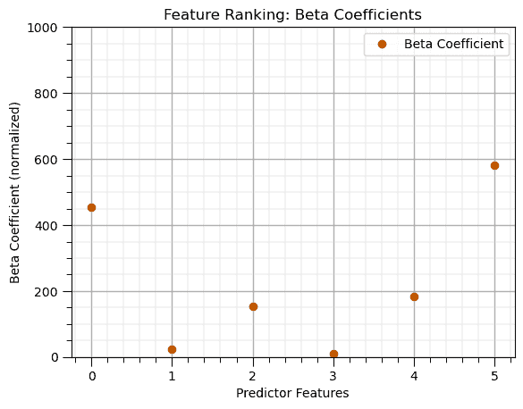

## 相关系数（皮尔逊积矩）

```py
correlations = df.corr().loc[X.columns, y.columns[0]]         # calculate correlation matrix and extract the pred. rows for the response column
correlations.plot(color=utcolor,style='o'); plt.xlabel('Predictor Features'); plt.ylabel('Correlation Coefficient'); plt.ylim(-1,1);
plt.title('Feature Ranking: Correlation Coefficients'); plt.axhline(y=0.0, color='black', linestyle='--'); add_grid(); plt.show() 
```

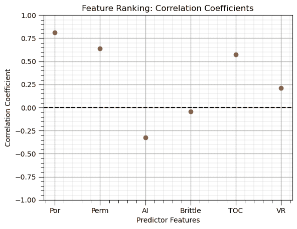

## 相关系数（斯皮尔曼秩）

```py
rank_correlations = df.corr(method='spearman').loc[X.columns, y.columns[0]] # calculate Spearman correlation with same method as Pearson above
rank_correlations.plot(color=utcolor,style='o'); plt.xlabel('Predictor Features'); plt.ylabel('Rank Correlation Coefficient'); plt.ylim(-1,1); 
plt.title('Feature Ranking: Rank Correlation Coefficients'); plt.axhline(y=0.0, color='black', linestyle='--'); add_grid(); plt.show() 
```

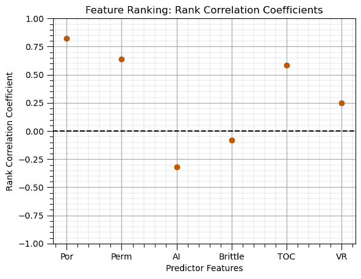

## 交叉验证图（训练和测试）

```py
plt.scatter(y_train,y_hat_train,color='orange',edgecolor='black',label=r'Training Data',zorder=10) # scatter plot
plt.scatter(y_test,y_hat_test,color=utcolor,edgecolor='black',label=r'Testing Data',zorder=10)
plt.ylabel('Estimated Production (MCFPD)'); plt.xlabel('Truth Production (MCFPD)'); plt.title('Cross Validation Plot'); plt.legend(loc = 'upper left')
plt.plot([0,8000],[0,8000],color='red'); plt.xlim(0,8000,); plt.ylim(0,8000); add_grid(); 
```

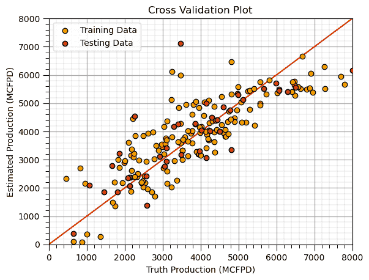

## 交叉验证图（测试）

```py
plt.scatter(y_test,y_hat_test,color=utcolor,edgecolor='black',label=r'Testing Data',zorder=10) # scatter plot
plt.ylabel('Estimated Production (MCFPD)'); plt.xlabel('Truth Production (MCFPD)'); plt.title('Cross Validation Plot'); plt.legend(loc = 'upper left')
plt.plot([0,8000],[0,8000],color='red'); plt.xlim(0,8000,); plt.ylim(0,8000); add_grid() 
```


## 交叉验证图（训练）

```py
plt.scatter(y_train,y_hat_train,color=utcolor,edgecolor='black',label=r'Training Data',zorder=10) # scatter plot
plt.ylabel('Estimated Production (MCFPD)'); plt.xlabel('Truth Production (MCFPD)'); plt.title('Cross Validation Plot'); plt.legend(loc = 'upper left')
plt.plot([0,8000],[0,8000],color='red'); plt.xlim(0,8000,); plt.ylim(0,8000); add_grid(); 
```


## DataFrame (add noise to a feature)

我这样做是为了进行实验和制作教育内容，例如，向响应特征添加噪声以演示过拟合。

```py
df_temp = df.copy(deep=True)                                  # make a deep copy of the DataFrame
np.random.seed(seed=seed)                                     # set random seed for repeatability
df_temp['Prod'] = df_temp['Prod'] + np.random.normal(loc=0.0,scale=100.0,size=len(df_temp)) # add a feature of ones called 'Ones'
df_temp.head() 
```

|  | Well | Por | Perm | AI | Brittle | TOC | VR | Prod |
| --- | --- | --- | --- | --- | --- | --- | --- | --- |
| 0 | 1 | 12.08 | 2.92 | 2.80 | 81.40 | 1.16 | 2.31 | 2154.457620 |
| 1 | 2 | 12.38 | 3.53 | 3.22 | 46.17 | 0.89 | 1.88 | 3199.991714 |
| 2 | 3 | 14.02 | 2.59 | 4.01 | 72.80 | 0.89 | 2.72 | 2742.009861 |
| 3 | 4 | 17.67 | 6.75 | 2.63 | 39.81 | 1.08 | 1.88 | 3927.738944 |
| 4 | 5 | 17.52 | 4.57 | 3.18 | 10.94 | 1.51 | 1.90 | 2343.080242 |

## DataFrame (add a new feature/column)

```py
df_temp = df.copy(deep=True)                                  # make a deep copy of the DataFrame
df_temp['Ones'] = np.ones((len(df_temp)))                     # add a feature of ones called 'Ones'
df_temp.head() 
```

|  | Well | Por | Perm | AI | Brittle | TOC | VR | Prod | Ones |
| --- | --- | --- | --- | --- | --- | --- | --- | --- | --- |
| 0 | 1 | 12.08 | 2.92 | 2.80 | 81.40 | 1.16 | 2.31 | 2225.696687 | 1.0 |
| 1 | 2 | 12.38 | 3.53 | 3.22 | 46.17 | 0.89 | 1.88 | 3124.615076 | 1.0 |
| 2 | 3 | 14.02 | 2.59 | 4.01 | 72.80 | 0.89 | 2.72 | 2746.460169 | 1.0 |
| 3 | 4 | 17.67 | 6.75 | 2.63 | 39.81 | 1.08 | 1.88 | 3882.557711 | 1.0 |
| 4 | 5 | 17.52 | 4.57 | 3.18 | 10.94 | 1.51 | 1.90 | 2208.570072 | 1.0 |

## DataFrame (make new)

```py
df_new = pd.DataFrame({'Ones':np.ones((100)),'Zeros':np.zeros((100))}) # make new DataFrame
df_new.head() 
```

|  | Ones | Zeros |
| --- | --- | --- |
| 0 | 1.0 | 0.0 |
| 1 | 1.0 | 0.0 |
| 2 | 1.0 | 0.0 |
| 3 | 1.0 | 0.0 |
| 4 | 1.0 | 0.0 |

## DataFrame (preview)

Display the first ‘n’ rows of the DataFrame

```py
df.head(n=13)                                                 # display the first n rows of the DataFrame 
```

|  | Well | Por | Perm | AI | Brittle | TOC | VR | Prod |
| --- | --- | --- | --- | --- | --- | --- | --- | --- |
| 0 | 1 | 12.08 | 2.92 | 2.80 | 81.40 | 1.16 | 2.31 | 2225.696687 |
| 1 | 2 | 12.38 | 3.53 | 3.22 | 46.17 | 0.89 | 1.88 | 3124.615076 |
| 2 | 3 | 14.02 | 2.59 | 4.01 | 72.80 | 0.89 | 2.72 | 2746.460169 |
| 3 | 4 | 17.67 | 6.75 | 2.63 | 39.81 | 1.08 | 1.88 | 3882.557711 |
| 4 | 5 | 17.52 | 4.57 | 3.18 | 10.94 | 1.51 | 1.90 | 2208.570072 |
| 5 | 6 | 14.53 | 4.81 | 2.69 | 53.60 | 0.94 | 1.67 | 4353.192212 |
| 6 | 7 | 13.49 | 3.60 | 2.93 | 63.71 | 0.80 | 1.85 | 3516.494383 |
| 7 | 8 | 11.58 | 3.03 | 3.25 | 53.00 | 0.69 | 1.93 | 2083.845221 |
| 8 | 9 | 12.52 | 2.72 | 2.43 | 65.77 | 0.95 | 1.98 | 2775.906282 |
| 9 | 10 | 13.25 | 3.94 | 3.71 | 66.20 | 1.14 | 2.65 | 2966.741947 |
| 10 | 11 | 15.04 | 4.39 | 2.22 | 61.11 | 1.08 | 1.77 | 4022.323780 |
| 11 | 12 | 16.19 | 6.30 | 2.29 | 49.10 | 1.53 | 1.86 | 4799.763575 |
| 12 | 13 | 16.82 | 5.42 | 2.80 | 66.65 | 1.17 | 1.98 | 3616.427242 |

## DataFrame (rename a feature/column)

```py
df_temp = df.copy(deep=True)                                  # make a deep copy of the DataFrame
df_temp.rename(columns={'Por':'Porosity (%)'},inplace=True)   # rename 'Por' features as 'Porosity'
df_temp.head() 
```

|  | Well | Porosity (%) | Perm | AI | Brittle | TOC | VR | Prod |
| --- | --- | --- | --- | --- | --- | --- | --- | --- |
| 0 | 1 | 12.08 | 2.92 | 2.80 | 81.40 | 1.16 | 2.31 | 2225.696687 |
| 1 | 2 | 12.38 | 3.53 | 3.22 | 46.17 | 0.89 | 1.88 | 3124.615076 |
| 2 | 3 | 14.02 | 2.59 | 4.01 | 72.80 | 0.89 | 2.72 | 2746.460169 |
| 3 | 4 | 17.67 | 6.75 | 2.63 | 39.81 | 1.08 | 1.88 | 3882.557711 |
| 4 | 5 | 17.52 | 4.57 | 3.18 | 10.94 | 1.51 | 1.90 | 2208.570072 |

## DataFrame (remove features/columns)

```py
df_temp = df.copy(deep=True)                                  # make a deep copy of the DataFrame
df_temp.drop(columns=['Well','Por','AI'],inplace=True)        # remove features 'Well','Por' and 'AI'
df_temp.head() 
```

|  | Perm | Brittle | TOC | VR | Prod |
| --- | --- | --- | --- | --- | --- |
| 0 | 2.92 | 81.40 | 1.16 | 2.31 | 2225.696687 |
| 1 | 3.53 | 46.17 | 0.89 | 1.88 | 3124.615076 |
| 2 | 2.59 | 72.80 | 0.89 | 2.72 | 2746.460169 |
| 3 | 6.75 | 39.81 | 1.08 | 1.88 | 3882.557711 |
| 4 | 4.57 | 10.94 | 1.51 | 1.90 | 2208.570072 |

## DataFrame（移除样本/行）

```py
df_temp = df.copy(deep=True)                                  # make a deep copy of the DataFrame
df_temp = df_temp.drop(df.index[[0, 2, 4]])                   # removes samples 0, 2 and 4
df_temp.head() 
```

|  | 好 | 井 | 永久 | 人工智能 | 易碎 | TOC | VR | 产品 |
| --- | --- | --- | --- | --- | --- | --- | --- | --- |
| 1 | 2 | 12.38 | 3.53 | 3.22 | 46.17 | 0.89 | 1.88 | 3124.615076 |
| 3 | 4 | 17.67 | 6.75 | 2.63 | 39.81 | 1.08 | 1.88 | 3882.557711 |
| 5 | 6 | 14.53 | 4.81 | 2.69 | 53.60 | 0.94 | 1.67 | 4353.192212 |
| 6 | 7 | 13.49 | 3.60 | 2.93 | 63.71 | 0.80 | 1.85 | 3516.494383 |
| 7 | 8 | 11.58 | 3.03 | 3.25 | 53.00 | 0.69 | 1.93 | 2083.845221 |

## DataFrame（按条件移除样本/行）

```py
df_temp = df.copy(deep=True)                                  # make a deep copy of the DataFrame
df_temp = df_temp[df_temp['Por'] > 13.0]                      # remove all samples with 'Por' <= 13%
df_temp.head() 
```

|  | 好 | 井 | 永久 | 人工智能 | 易碎 | TOC | VR | 产品 |
| --- | --- | --- | --- | --- | --- | --- | --- | --- |
| 2 | 3 | 14.02 | 2.59 | 4.01 | 72.80 | 0.89 | 2.72 | 2746.460169 |
| 3 | 4 | 17.67 | 6.75 | 2.63 | 39.81 | 1.08 | 1.88 | 3882.557711 |
| 4 | 5 | 17.52 | 4.57 | 3.18 | 10.94 | 1.51 | 1.90 | 2208.570072 |
| 5 | 6 | 14.53 | 4.81 | 2.69 | 53.60 | 0.94 | 1.67 | 4353.192212 |
| 6 | 7 | 13.49 | 3.60 | 2.93 | 63.71 | 0.80 | 1.85 | 3516.494383 |

## 决策树（特征重要性）

```py
leaf_node = 5                                                 # decision tree model hyperparameters
tree_model = tree.DecisionTreeRegressor(max_leaf_nodes=leaf_node).fit(X_train,y_train) # instantiate the prediction model

beta_coef_df = pd.DataFrame({'Feature': list(X.columns),'Tree-based Feature Importance': list(tree_model.feature_importances_.ravel())})
beta_coef_df.plot(color=utcolor,style='o'); plt.xlabel('Predictor Features'); plt.ylabel('Feature Importance'); plt.ylim(0,1)
plt.title('Feature Ranking: Decision Tree Feature Importance'); add_grid(); plt.show() 
```

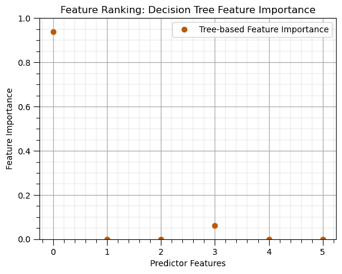

## 决策树（在测试数据上的预测）

将我们的模型应用于预测保留的测试数据。

```py
leaf_node = 5                                                 # decision tree model hyperparameters
tree_model = tree.DecisionTreeRegressor(max_leaf_nodes=leaf_node).fit(X_train,y_train) # instantiate the prediction model
y_test_temp = y_test.copy(deep=True)
y_test_temp['Estimated Prod'] = tree_model.predict(X_test)    # predict over the training data
y_test_temp.head() 
```

|  | 产品 | 估计产品 |
| --- | --- | --- |
| 179 | 656.507448 | 2218.196237 |
| 155 | 3110.245382 | 2218.196237 |
| 23 | 2581.359826 | 2218.196237 |
| 159 | 6498.151446 | 6482.917835 |
| 96 | 4148.822923 | 4297.451039 |

## 决策树（在训练数据上的预测）

将我们的模型应用于预测保留的训练数据。

```py
leaf_node = 5                                                 # decision tree model hyperparameters
tree_model = tree.DecisionTreeRegressor(max_leaf_nodes=leaf_node).fit(X_train,y_train) # instantiate the prediction model
y_train_temp = y_train.copy(deep=True)
y_train_temp['Estimated Prod'] = tree_model.predict(X_train)  # predict over the training data
y_train_temp.head() 
```

|  | 产品 | 估计产品 |
| --- | --- | --- |
| 125 | 3750.106623 | 4297.451039 |
| 68 | 4644.717576 | 4297.451039 |
| 69 | 1991.991593 | 2218.196237 |
| 108 | 6688.360827 | 6482.917835 |
| 131 | 5076.638358 | 4297.451039 |

## 决策树（训练）

在具有指定模型超参数的训练数据上训练模型参数

+   让我们通过可视化训练好的决策树来查看训练好的模型参数。

```py
leaf_node = 5                                                 # decision tree model hyperparameters
tree_model = tree.DecisionTreeRegressor(max_leaf_nodes=leaf_node).fit(X_train,y_train) # instantiate the prediction model
plot_tree(tree_model, feature_names=X_train.columns, filled=True); plt.show() # plot the decision tree 
```

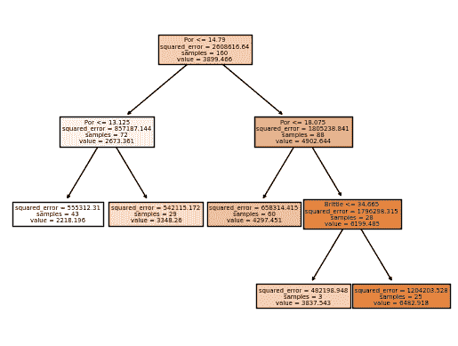

## 决策树（重新训练调整模型）

应用调整的超参数，并使用所有数据重新训练模型。

+   这是我们将用于未来预测、实际应用的模型

```py
tuned_leaf_node = 15;                                         # decision tree model hyperparameters
tuned_tree_model = tree.DecisionTreeRegressor(max_leaf_nodes=tuned_leaf_node).fit(X,y) # instantiate the prediction model
y_hat = tuned_tree_model.predict(X)                           # predict over the testing cases
plt.scatter(y,y_hat,color=utcolor,edgecolor='black',label=r'All Data',zorder=10) # scatter plot
plt.ylabel('Estimated'); plt.xlabel('Truth'); plt.title('Cross Validation Plot'); plt.legend(loc = 'upper left')
plt.plot([0,8000],[0,8000],color='red'); plt.xlim(0,8000,); plt.ylim(0,8000) 
add_grid(); 
```

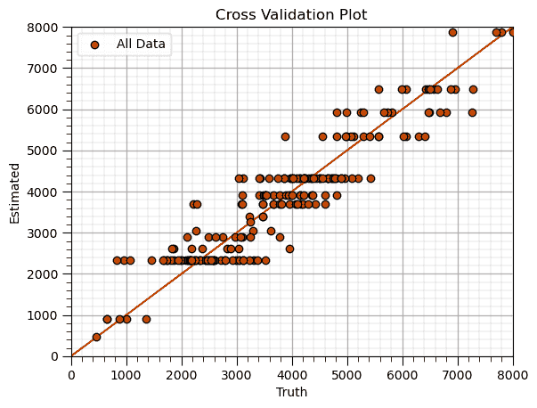

## 决策树（调整/剪枝）

在具有一系列模型超参数的训练数据上训练模型参数，选择在保留的测试数据上误差最小的模型超参数

这需要以下步骤，

遍历超参数（的）值，

1.  使用保留的训练数据训练模型

1.  在保留的测试数据上预测

1.  计算测试误差

选择最小化测试错误的超参数

```py
leaf_node = 2                                                 # set initial hyperparameter
MSE_tree_list = []; leaf_node_list = []                       # make lists to store the results
while leaf_node <= 100:                                       # loop over the number of leaf nodes hyperparameter
    tree_model = tree.DecisionTreeRegressor(max_leaf_nodes=leaf_node).fit(X_train,y_train) # instandiate and train the model
    y_hat_test = tree_model.predict(X_test)                   # predict over the testing cases
    MSE_tree = metrics.mean_squared_error(y_test,y_hat_test)  # calculate the MSE testing
    MSE_tree_list.append(MSE_tree)                            # add to the list of MSE
    leaf_node_list.append(leaf_node)                          # append leaf node to an array for plotting
    leaf_node = leaf_node + 1

tuned_leaf_nodes = leaf_node_list[np.argmin(MSE_tree_list)]           # get the k that minimizes the testing MSE

plt.subplot(111)
plt.scatter(leaf_node_list,MSE_tree_list,s=None, c=utcolor, alpha=1.0, linewidths=0.3, edgecolors="black") # plot testing MSE vs. hyperparameter
plt.axvline(x=tuned_leaf_nodes, color='red', linestyle='--') 
plt.annotate('Tuned Leaf Nodes = ' + str(tuned_leaf_nodes),[tuned_leaf_nodes+1,0.8e6],color='red',rotation= 90)
plt.title('Tree: Withheld Testing Error vs. Number of Leaf Nodes'); plt.xlabel('Number of Leaf Nodes'); plt.ylabel('Test Mean Square Error')
add_grid() 
```

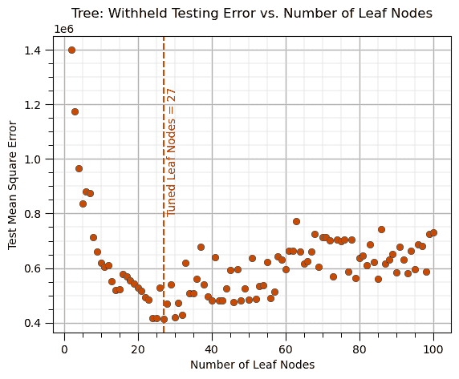

## 特征提取（按名称）

建立一个新的数据框，只包含选定的预测特征和响应特征

1.  指定选定的预测特征

1.  指定响应特征

1.  使用两者构建一个列表

1.  创建一个新的数据框，首先包含预测特征，然后将响应特征作为最后一列

```py
selected_predictor_features = ['Por','Perm','AI','Brittle']   # set the selected predictor features
response_feature = ['Prod']                                   # set the response feature
features = selected_predictor_features + response_feature     # build a list of selected predictor and response features
df_selected = df.loc[:,features]                              # slice the DataFrame
df_selected.head() 
```

|  | Por | Perm | AI | Brittle | Prod |
| --- | --- | --- | --- | --- | --- |
| 0 | 12.08 | 2.92 | 2.80 | 81.40 | 2225.696687 |
| 1 | 12.38 | 3.53 | 3.22 | 46.17 | 3124.615076 |
| 2 | 14.02 | 2.59 | 4.01 | 72.80 | 2746.460169 |
| 3 | 17.67 | 6.75 | 2.63 | 39.81 | 3882.557711 |
| 4 | 17.52 | 4.57 | 3.18 | 10.94 | 2208.570072 |

## 特征提取（按数量）

建立一个新的数据框，只包含选定的预测特征。

1.  指定选定的预测特征

1.  指定响应特征

1.  使用两者构建一个列表

1.  创建一个新的数据框，首先包含预测特征，然后将响应特征作为最后一列

```py
selected_predictor_features = [1,2,3,4,7]                     # set the selected predictor features
df_selected_predictor = df.iloc[:,selected_predictor_features] # slice the DataFrame
df_selected_predictor.head() 
```

|  | Por | Perm | AI | Brittle | Prod |
| --- | --- | --- | --- | --- | --- |
| 0 | 12.08 | 2.92 | 2.80 | 81.40 | 2225.696687 |
| 1 | 12.38 | 3.53 | 3.22 | 46.17 | 3124.615076 |
| 2 | 14.02 | 2.59 | 4.01 | 72.80 | 2746.460169 |
| 3 | 17.67 | 6.75 | 2.63 | 39.81 | 3882.557711 |
| 4 | 17.52 | 4.57 | 3.18 | 10.94 | 2208.570072 |

## 特征提取（创建 X 和 y 数据框）

建立两个新的数据框，一个只包含选定的预测特征，另一个包含响应特征，

+   假设最后一个特征是响应特征

```py
X = df.loc[:,['Por','AI','VR']]                               # extract the list the predictor feature by name
y = df.loc[:,['Prod']]                                        # extract the response feature
print('Predictor features: ' + str(X.columns.tolist()) + '\nResponse feature: ' + y.columns[0]) 
```

```py
Predictor features: ['Por', 'AI', 'VR']
Response feature: Prod 
```

## 特征提取（创建 X 和 y 数据框假设特征顺序）

建立两个新的数据框，一个只包含选定的预测特征，另一个包含响应特征，

+   假设最后一个特征是响应特征

```py
X = df.iloc[:,1:-1]; y = df.iloc[:,[-1]]                      # extract by assuming 2nd to 2nd last are predictors and last is response feature
print('Predictor features: ' + str(X.columns.tolist()) + '\nResponse feature: ' + y.columns[0]) 
```

```py
Predictor features: ['Por', 'Perm', 'AI', 'Brittle', 'TOC', 'VR']
Response feature: Prod 
```

## 直方图

简单直方图，

+   你可以通过指定确切的小数位数来设置直方图限制，例如，np.linspace(min,max,n)

```py
plt.hist(df['Por'],color='darkorange',edgecolor='black',bins=20); plt.xlabel('Porosity (%)'); plt.ylabel('Frequency') # histogram
plt.title('Porosity Distribution'); add_grid(); plt.show() 
```

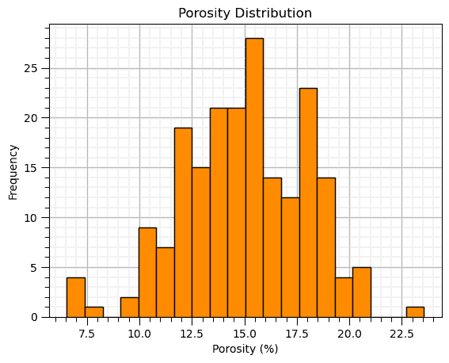

## 直方图（归一化）

一个直方图，y 轴上的概率，所有柱子的总和为 1，即概率封闭。

```py
plt.hist(df['Por'],color='darkorange',edgecolor='black',weights = np.ones(len(df))/len(df),bins=20) # normalized histogram
plt.title('Porosity Distribution'); plt.xlabel('Porosity (%)'); plt.ylabel('Probability'); add_grid(); plt.show() 
```

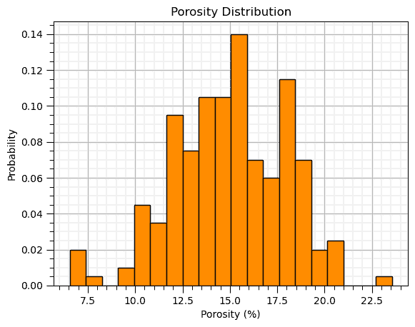

## 图像绘制

```py
im = plt.imshow(ndarray_2D,extent = [0,10000,0,10000],vmin=1500,vmax=6500,cmap = cmap) # plot of 2D ndarray, image or map feature
cbar = plt.colorbar(im, orientation="vertical", ticks=np.linspace(2500, 7500, 10)); plt.xlabel('X (m)'); plt.ylabel('Y (m)')
cbar.set_label(r'Acoustic Impedence ($\frac{kg}{m³} \cdot \frac{m}{s} \cdot 10³$)', rotation=270, labelpad=20)
plt.title('Acoustic Impedance'); plt.show() 
```

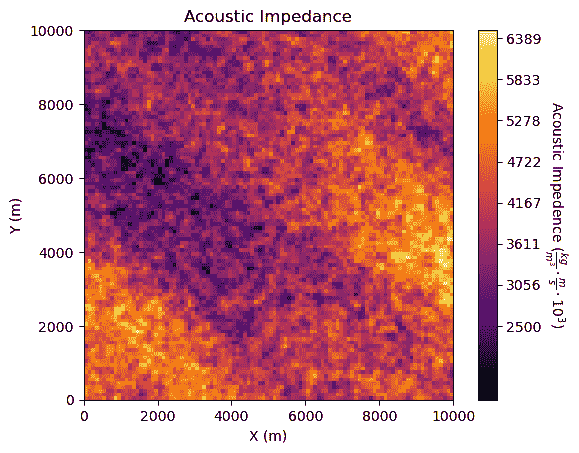

## 图像绘制（与位置图结合）

将多个图叠加在一起，

+   使用 'zorder' 将对象放置在其他对象之前，数字越大越在前

+   确保所有对象都在同一绘图空间中

```py
im = plt.imshow(ndarray_2D,extent = [0,10000,0,10000],vmin=1500,vmax=6500,cmap = cmap,alpha=0.8,zorder=-1) # plot of 2D ndarray, image or map feature
sc = plt.scatter(df_spatial['X'],df_spatial['Y'],c=df_spatial['AI'],s=20,edgecolor='black',vmin=1500,vmax=6500,cmap = cmap,zorder=10)
cbar = plt.colorbar(im, orientation="vertical", ticks=np.linspace(2500, 7500, 10)); plt.xlabel('X (m)'); plt.ylabel('Y (m)')
cbar.set_label(r'Acoustic Impedence ($\frac{kg}{m³} \cdot \frac{m}{s} \cdot 10³$)', rotation=270, labelpad=20)
plt.title('Acoustic Impedance Image and Samples at Wells'); plt.show() 
```

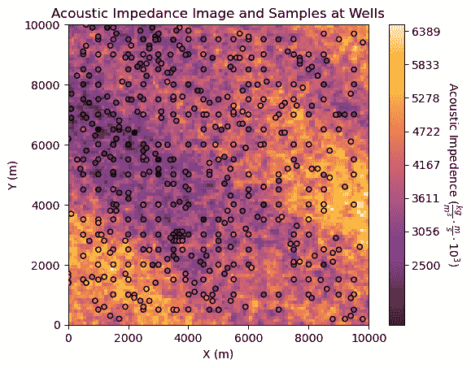

## K-最近邻（特征填充）

通过估计缺失特征与最近邻来填充特征，

+   距离是通过具有所有特征的样本以及具有缺失特征的样本中的所有样本来访问的

+   只应用了一次遍历，没有迭代

+   由于存在大量缺失数据，MICE 方法不如鲁棒，它不会学习特征之间的结构来填充缺失数据

```py
knn_imputer = KNNImputer(n_neighbors=2, weights="uniform")    # instantiate Multiple Imputation by Chained Equations (MICE) imputer
X_imputed = knn_imputer.fit_transform(X_missing)              # train and apply MICE to impute the missing data
X_imputed = pd.DataFrame(X_imputed, columns=X_missing.columns,index=X_missing.index) # make imputed results into a DataFrame with same columns as X
X_imputed.describe()                                          # preview the DataFrame 
```

|  | Por | LogPerm | AI | Brittle | TOC | VR |
| --- | --- | --- | --- | --- | --- | --- |
| count | 1000.000000 | 1000.000000 | 1000.000000 | 1000.000000 | 1000.000000 | 1000.000000 |
| mean | 14.924820 | 1.375450 | 2.982915 | 49.227565 | 1.014950 | 1.997420 |
| std | 2.999168 | 0.367557 | 0.557240 | 13.755077 | 0.480852 | 0.284183 |
| min | 5.400000 | 0.120000 | 0.960000 | -1.500000 | -0.250000 | 0.900000 |
| 25% | 12.846250 | 1.145000 | 2.590000 | 40.640000 | 0.700000 | 1.830000 |
| 50% | 15.035000 | 1.360000 | 3.010000 | 49.477500 | 1.007500 | 2.000000 |
| 75% | 17.012500 | 1.610000 | 3.330000 | 58.055000 | 1.370000 | 2.165000 |
| max | 24.650000 | 2.580000 | 4.700000 | 93.470000 | 2.710000 | 2.900000 |

## K-最近邻（在测试数据上的预测）

将我们的模型应用于预测保留的测试数据。

```py
n_neighbours = 10; p = 2; weights = 'uniform'                 # KNN model hyperparameters
knn_model = KNeighborsRegressor(weights = weights, n_neighbors=n_neighbours, p = p).fit(X_train,y_train) # instantiate the prediction model
y_test_temp = y_test.copy(deep=True)
y_test_temp['Estimated Prod'] = knn_model.predict(X_test)     # predict over the training data
y_test_temp.head() 
```

|  | 产量 | 估计产量 |
| --- | --- | --- |
| 179 | 656.507448 | 2303.626455 |
| 155 | 3110.245382 | 3774.108284 |
| 23 | 2581.359826 | 2321.644376 |
| 159 | 6498.151446 | 5713.166746 |
| 96 | 4148.822923 | 4108.942362 |

## K-最近邻（在训练数据上的预测）

将我们的模型应用于预测保留的训练数据。

```py
n_neighbours = 10; p = 2; weights = 'uniform'                 # KNN model hyperparameters
knn_model = KNeighborsRegressor(weights = weights, n_neighbors=n_neighbours, p = p).fit(X_train,y_train) # instantiate the prediction model
y_train_temp = y_train.copy(deep=True)
y_train_temp['Estimated Prod'] = knn_model.predict(X_train)   # predict over the training data
y_train_temp.head() 
```

|  | 产量 | 估计产量 |
| --- | --- | --- |
| 125 | 3750.106623 | 3974.087763 |
| 68 | 4644.717576 | 4226.039680 |
| 69 | 1991.991593 | 3165.041802 |
| 108 | 6688.360827 | 6336.236197 |
| 131 | 5076.638358 | 5332.676914 |

## K-最近邻（训练）

在具有指定模型超参数的训练数据上训练模型参数

+   由于 K-最近邻是一种懒惰学习模型，没有训练好的模型参数可以显示

+   我们查看交叉验证图

```py
k = 1; p = 2; weights = 'uniform'                             # KNN model hyperparameters
neigh = KNeighborsRegressor(weights = weights, n_neighbors=k, p = p) # instantiate the prediction model
knn_model = neigh.fit(X_train,y_train)                        # train the model with the training data
y_train_hat = knn_model.predict(X_train)                      # predict over the testing cases
y_test_hat = knn_model.predict(X_test)                        # predict over the testing cases
plt.scatter(y_train,y_train_hat,color='orange',edgecolor='black',label=r'Training Data',zorder=10) # scatter plot
plt.scatter(y_test,y_test_hat,color=utcolor,edgecolor='black',label=r'Testing Data',zorder=10) # scatter plot
plt.ylabel('Estimated'); plt.xlabel('Truth'); plt.title('Cross Validation Plot'); plt.legend(loc = 'upper left')
plt.plot([0,8000],[0,8000],color='red'); plt.xlim(0,8000,); plt.ylim(0,8000) 
add_grid() 
```

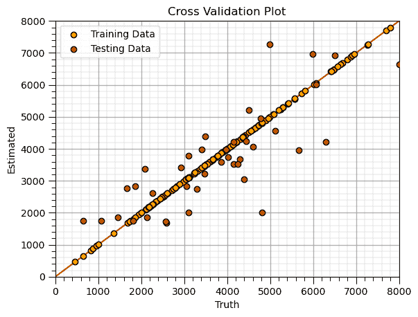

## K-最近邻（重新训练调整后的模型）

应用调整后的超参数并使用所有数据重新训练模型。

+   这是我们将用于未来预测和实际应用的模型

```py
tuned_k = 15; p = 2; weights = 'uniform'                      # KNN model hyperparameters
knn_tuned_model = KNeighborsRegressor(weights = weights, n_neighbors=tuned_k, p = 2).fit(X,y) # retrain the tuned model with all data
y_hat = knn_tuned_model.predict(X)                            # predict over the testing cases
plt.scatter(y,y_hat,color=utcolor,edgecolor='black',label=r'All Data',zorder=10) # scatter plot
plt.ylabel('Estimated'); plt.xlabel('Truth'); plt.title('Cross Validation Plot'); plt.legend(loc = 'upper left')
plt.plot([0,8000],[0,8000],color='red'); plt.xlim(0,8000,); plt.ylim(0,8000); add_grid() 
```

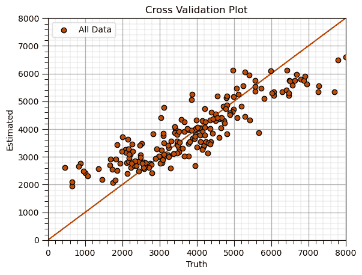

## K-最近邻（调整）

在具有一系列模型超参数的训练数据上训练模型参数，选择在保留的测试数据上误差最小的模型超参数

这需要以下步骤，

遍历超参数值，

1.  使用保留的训练数据训练模型

1.  在保留的测试数据上预测

1.  计算测试误差

选择使测试误差最小化的超参数

```py
k = 1; weights = 'uniform'                                    # set initial, lowest k hyperparameter
MSE_knn_list = []; k_list = []                                # make lists to store the results
while k <= 150:                                               # loop over the k hyperparameter
    knn_model = KNeighborsRegressor(weights = weights, n_neighbors=k, p = 2).fit(X_train,y_train) # instandiate and train the model
    y_test_hat = knn_model.predict(X_test)                    # predict over the testing cases
    MSE = metrics.mean_squared_error(y_test,y_test_hat)       # calculate the MSE testing
    MSE_knn_list.append(MSE)                                  # add to the list of MSE
    k_list.append(k)                                          # append k to an array for plotting
    k = k + 1

tuned_k = k_list[np.argmin(MSE_knn_list)]                     # get the k that minimizes the testing MSE

plt.subplot(111)                                              # plot the testing error vs. hyperparameter
plt.scatter(k_list,MSE_knn_list,s=None, c=utcolor, alpha=0.8, linewidths=0.3, edgecolors="black") 
plt.axvline(x=tuned_k, color='red', linestyle='--'); plt.annotate('Tuned k = ' + str(tuned_k),[tuned_k+3,2.0e6],color='red',rotation= 90)
plt.title('KNN: Testing Error vs. Number of Nearest Neighbours'); plt.xlabel('Number of Nearest Neighbours'); plt.ylabel('Testing Mean Square Error')
add_grid() 
```

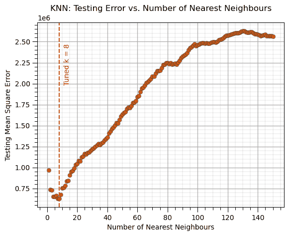

## 线性回归模型（模型参数）

获取模型参数。

```py
coef_df = pd.DataFrame({'Feature': ['Intercept'] + list(X.columns),'Coefficient': list(linear_model.intercept_) + list(linear_model.coef_.ravel())})
coef_df 
```

|  | 特征 | 系数 |
| --- | --- | --- |
| 0 | 截距 | -4053.511325 |
| 1 | Por | 453.607135 |
| 2 | Perm | 24.707076 |
| 3 | AI | -154.448203 |
| 4 | Brittle | 11.173989 |
| 5 | TOC | -183.938586 |
| 6 | VR | 580.078458 |

## 线性回归模型（预测测试）

```py
y_test_temp = y_test.copy(deep=True)                          # make a deep copy of the y test DataFrame
y_test_temp['Estimated Prod'] = linear_model.predict(X_test)  # predict over the training data
y_test_temp.head() 
```

|  | Prod | 估计产 |
| --- | --- | --- |
| 179 | 656.507448 | 379.818856 |
| 155 | 3110.245382 | 2943.388125 |
| 23 | 2581.359826 | 1372.426014 |
| 159 | 6498.151446 | 5563.914978 |
| 96 | 4148.822923 | 4987.375301 |

## 线性回归模型（预测训练）

```py
y_train_temp = y_train.copy(deep=True)                        # make a deep copy of the y train DataFrame
y_train_temp['Estimated Prod'] = linear_model.predict(X_train)# predict over the training data
y_train_temp.head() 
```

|  | Prod | 估计产 |
| --- | --- | --- |
| 125 | 3750.106623 | 3938.246048 |
| 68 | 4644.717576 | 3824.308392 |
| 69 | 1991.991593 | 2906.015510 |
| 108 | 6688.360827 | 6653.961261 |
| 131 | 5076.638358 | 5048.864286 |

## 线性回归模型（训练）

在训练数据上训练模型参数，无超参数

```py
linear_model = LinearRegression().fit(X_train,y_train)        # instantiate and train linear regression model, no hyperparmeters
coef_df = pd.DataFrame({'Feature': ['Intercept'] + list(X.columns),'Coefficient': list(linear_model.intercept_) + list(linear_model.coef_.ravel())})
coef_df 
```

|  | 特征 | 系数 |
| --- | --- | --- |
| 0 | 截距 | -4053.511325 |
| 1 | Por | 453.607135 |
| 2 | Perm | 24.707076 |
| 3 | AI | -154.448203 |
| 4 | Brittle | 11.173989 |
| 5 | TOC | -183.938586 |
| 6 | VR | 580.078458 |

## 列表删除

删除所有缺失样本和特征。

+   避免特征插补的“大锤”方法

+   不推荐，通常删除太多数据

```py
df_listwise = df_missing.dropna(how='any',inplace=False)      # listwise deletion
df_listwise.describe() 
```

|  | WellIndex | Por | LogPerm | AI | Brittle | TOC | VR | 生产 |
| --- | --- | --- | --- | --- | --- | --- | --- | --- |
| 计数 | 210.000000 | 210.000000 | 210.000000 | 210.000000 | 210.000000 | 210.000000 | 210.000000 | 210.000000 |
| 平均值 | 485.680952 | 14.976381 | 1.407238 | 2.999857 | 49.406143 | 1.005524 | 2.001524 | 2373.025529 |
| 标准差 | 292.292307 | 3.072786 | 0.422033 | 0.584267 | 14.311860 | 0.521783 | 0.306854 | 1661.542253 |
| 最小值 | 3.000000 | 6.480000 | 0.360000 | 1.330000 | 17.200000 | -0.230000 | 0.900000 | 75.215188 |
| 25% | 206.250000 | 12.682500 | 1.110000 | 2.612500 | 39.117500 | 0.640000 | 1.800000 | 1154.774039 |
| 50% | 477.500000 | 15.035000 | 1.415000 | 3.055000 | 48.320000 | 0.980000 | 2.010000 | 2029.697410 |
| 75% | 729.500000 | 17.085000 | 1.680000 | 3.360000 | 58.547500 | 1.347500 | 2.220000 | 3223.502405 |
| 最大值 | 1000.000000 | 24.650000 | 2.480000 | 4.500000 | 86.800000 | 2.560000 | 2.820000 | 12568.644130 |

## 位置图

用于绘制稀疏采样的特征与 X 和 Y 样本位置，以检查空间结构。

```py
xmin=0; xmax=10000; ymin=0; ymax=10000; vmin=0.1; vmax=0.27   # set plot limits and feature limits
sc = plt.scatter(df_spatial['X'],df_spatial['Y'],c=df_spatial['Porosity'],s=20,edgecolor='black',vmin=vmin,vmax=vmax,cmap = cmap)
cbar = plt.colorbar(sc, orientation="vertical", ticks=np.linspace(vmin,vmax,10)); plt.xlabel('X (m)'); plt.ylabel('Y (m)')
cbar.set_label(r'Porosity (fraction)', rotation=270, labelpad=20); plt.xlim(0,10000); plt.ylim(0,10000); add_grid()
plt.title('Location Map: Porosity'); plt.show() 
```

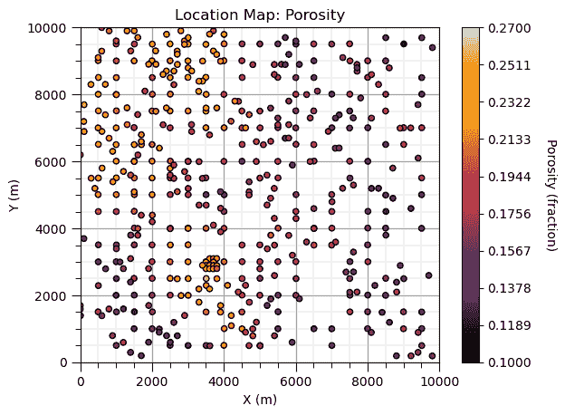

## 均值（插补）

一种非常简单的特征插补方法，用特征的均值替换缺失值，

+   不会在均值上引入偏差，但会在标准差和方差上引入偏差

+   可能会降低预测变量和响应特征之间的相关性

```py
mean_imputer = SimpleImputer(strategy='mean')                 # instantiate mean imputor
X_imputed = mean_imputer.fit_transform(X_missing)             # train and apply MICE to impute the missing data
X_imputed = pd.DataFrame(X_imputed, columns=X_missing.columns,index=X_missing.index) # make imputed results into a DataFrame with same columns as X
X_imputed.describe()                                          # preview the DataFrame 
```

|  | Por | LogPerm | AI | Brittle | TOC | VR |
| --- | --- | --- | --- | --- | --- | --- |
| 数量 | 1000.000000 | 1000.000000 | 1000.000000 | 1000.000000 | 1000.000000 | 1000.000000 |
| 平均值 | 14.898708 | 1.383061 | 2.984200 | 49.607696 | 0.999551 | 1.996173 |
| 标准差 | 2.933199 | 0.344835 | 0.544243 | 12.532978 | 0.431517 | 0.265394 |
| 最小值 | 5.400000 | 0.120000 | 0.960000 | -1.500000 | -0.250000 | 0.900000 |
| 25% | 12.940000 | 1.217500 | 2.630000 | 43.937500 | 0.800000 | 1.897500 |
| 50% | 14.898708 | 1.383061 | 2.984200 | 49.607696 | 0.999551 | 1.996173 |
| 75% | 16.840000 | 1.530000 | 3.302500 | 55.515000 | 1.210000 | 2.110000 |
| 最大值 | 24.650000 | 2.580000 | 4.700000 | 93.470000 | 2.710000 | 2.900000 |

## 最小值和最大值（数据框）

```py
print('Dataframe Minimum:'); print(df.min())                  # using pandas DataFrame's min and max member functions
print('\nDataframe Maximum:'); print(df.max()) 
```

```py
Dataframe Minimum:
Well         1.000000
Por          6.550000
Perm         1.130000
AI           1.280000
Brittle     10.940000
TOC         -0.190000
VR           0.930000
Prod       463.579973
dtype: float64

Dataframe Maximum:
Well        200.000000
Por          23.550000
Perm          9.870000
AI            4.630000
Brittle      84.330000
TOC           2.180000
VR            2.870000
Prod       8428.187903
dtype: float64 
```

## 最小值和最大值（ndarray）

```py
print('2D ndarray Minimum:'); print(np.min(ndarray_2D))       # using NumPy's min and max functions that flatten internally
print('\n2D ndarray Maximum:'); print(np.max(ndarray_2D)) 
```

```py
2D ndarray Minimum:
1516.949331702811

2D ndarray Maximum:
6735.039007281679 
```

## 模型图（线性 1D）

我们使用以下步骤，

1.  制作一个预测特征值的等间距值数组

1.  在所有这些预测值上进行预测

1.  将预测值与预测值进行交叉绘图

```py
x_values = np.linspace(5,25,100).reshape(-1,1)                # array of equally space values in the predictor feature
y_hat_linear_1pred = linear_1pred_model.predict(x_values)     # predict over the predictor feature values
plt.plot(np.linspace(5,25,100),y_hat_linear_1pred,color='red',lw=2) # plot the predictions vs. the predictor values
plt.xlabel('Porosity (%)'); plt.ylabel('Production (MCFPD)'); add_grid(); plt.xlim(5,25); plt.show() 
```

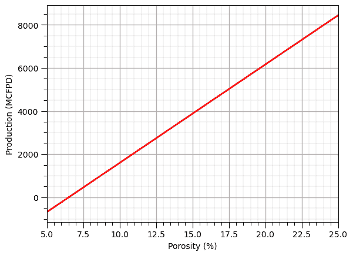

## 模型图（线性 2D）

我们使用以下步骤，

1.  制作一个预测特征值的等间距值网格数组

1.  在所有这些预测值上进行预测

1.  将所有网格展平到 1D

1.  用带有方形标记（s）的彩色散点图进行绘图，标记按比例填充绘图

我更喜欢这种方法，因为 plt.imshow 通常在作为子图添加时与其他绘图不一致

```py
XX1, XX2 = np.meshgrid(np.arange(5,25.5,0.5),np.arange(0,102.5,2.5)) # get a regular grid of response feature values
y_hat = linear_2pred_model.predict(np.c_[XX1.ravel(), XX2.ravel()]).reshape(-1)   # predict over grid and convert to a 1D vector
sc = plt.scatter(XX1.ravel(),XX2.ravel(),c=y_hat,marker='s',s=50,vmin=0,vmax=10000,cmap=cmap) # convert XX1/2 to 1D vectors use for scatter plot
cbar = plt.colorbar(sc, orientation="vertical", ticks=np.linspace(0, 10000, 13)); cbar.set_label(r'Production (MCFPD)', rotation=270, labelpad=20)
plt.xlabel('Porosity (%)'); plt.ylabel('Brittleness (%)'); plt.xlim(5,25); plt.ylim(0,100); plt.show() 
```

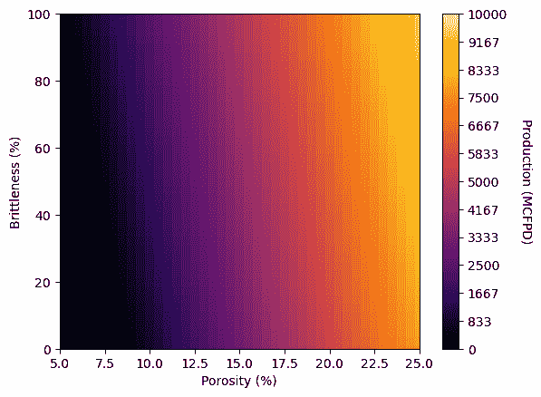

## 模型平均绝对误差（测试）

```py
MSE_test = metrics.mean_absolute_error(y_test,y_hat_test)     # calculate the training MSE
print('Model Training MAE: ' + str(MSE_test))                 # print the training MSE 
```

```py
Model Training MAE: 679.7220485741077 
```

## 模型平均绝对误差（训练）

```py
MSE_train = metrics.mean_absolute_error(y_train,y_hat_train)  # calculate the training MSE
print('Model Training MAE: ' + str(MSE_train))                # print the training MSE 
```

```py
Model Training MAE: 713.4026730760603 
```

## 模型均方误差（测试）

```py
MSE_test = metrics.mean_squared_error(y_test,y_hat_test)      # calculate the training MSE
print('Model Training MSE: ' + str(MSE_test))                 # print the training MSE 
```

```py
Model Training MSE: 731861.1594257785 
```

## 模型均方误差（训练）

```py
MSE_train = metrics.mean_squared_error(y_train,y_hat_train)   # calculate the training MSE
print('Model Training MSE: ' + str(MSE_train))                # print the training MSE 
```

```py
Model Training MSE: 805986.6842431575 
```

## 通过链式方程进行多重插补

通过迭代应用 K 近邻来执行特征值插补，

+   通过多次遍历，学习数据结构以改进插补

+   对缺失特征值有显著比例的稳健性

```py
mice_imputer = IterativeImputer(random_state = seed,max_iter=100) # instantiate Multiple Imputation by Chained Equations (MICE) imputer
X_imputed = mice_imputer.fit_transform(X_missing)             # train and apply MICE to impute the missing data
X_imputed = pd.DataFrame(X_imputed, columns=X_missing.columns,index=X_missing.index) # make imputed results into a DataFrame with same columns as X
X_imputed.describe()                                          # preview the DataFrame 
```

|  | Por | LogPerm | AI | Brittle | TOC | VR |
| --- | --- | --- | --- | --- | --- | --- |
| 数量 | 1000.000000 | 1000.000000 | 1000.000000 | 1000.000000 | 1000.000000 | 1000.000000 |
| 平均值 | 14.944723 | 1.404668 | 2.980626 | 49.817322 | 1.005436 | 1.990035 |
| 标准差 | 3.030406 | 0.397241 | 0.565985 | 14.029791 | 0.492149 | 0.302019 |
| 最小值 | 5.400000 | 0.120000 | 0.960000 | -5.422936 | -0.306453 | 0.900000 |
| 25% | 12.850000 | 1.142772 | 2.580000 | 41.384356 | 0.660000 | 1.810000 |
| 50% | 14.950000 | 1.395805 | 3.010000 | 50.077539 | 1.010000 | 1.985885 |
| 75% | 17.052500 | 1.670000 | 3.350314 | 57.951806 | 1.358028 | 2.170000 |
| 最大值 | 24.650000 | 2.580000 | 4.700000 | 100.043660 | 2.710000 | 2.927459 |

## 互信息

预测变量和响应特征之间共享的信息度量，

+   在非线性和异方差性存在的情况下稳健，

| MI 值范围 | 解释 |
| --- | --- |
| 接近 0 | 变量几乎相互独立 |
| 低（小的正数） | 弱依赖或共享信息少 |
| 中等 | 一定的相关依赖 |
| 高 | 强依赖；变量共享大量信息 |
| 非常高 | 几乎确定性的关系 |

```py
mi = mutual_info_regression(X, y.values.ravel(),random_state=0) # calculuate mutual information
mi_series = pd.Series(mi, index=X.columns)                    # convert ndarray to pandas series (column of a DataFrame) for ease of plotting
mi_series.plot(color=utcolor,style='o'); 
plt.xlabel('Predictor Features'); plt.ylabel('Mutual Information'); plt.ylim(0,1.5); plt.title('Feature Ranking: Mutual Information')
add_grid(); plt.show() 
```

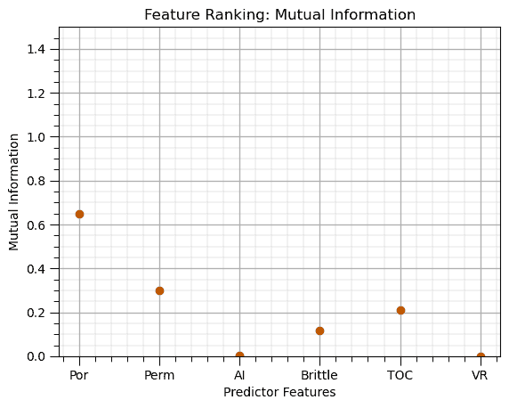

## 互信息（归一化）

预测变量与响应特征之间共享信息的度量，

+   在非线性和异方差性存在的情况下具有鲁棒性

+   通过边际熵归一化，使最大值为 1.0，0.0 = 无信息，1.0 = 完美信息

这里是帮助解释的常见经验法则，

| NMI 值范围 | 解释 |
| --- | --- |
| 0.0 – 0.2 | 非常弱或可忽略的关系 |
| 0.2 – 0.4 | 弱关系 |
| 0.4 – 0.6 | 中等关系 |
| 0.6 – 0.8 | 强关系 |
| 0.8 – 1.0 | 非常强或几乎完美 |

```py
kbd = KBinsDiscretizer(n_bins=10, encode='ordinal', strategy='quantile') # instantiate dicretizer
X_binned = pd.DataFrame(kbd.fit_transform(X), columns=X.columns) # discretize the predictor features
y_bins = pd.qcut(y.values.ravel(), q=10, labels=False, duplicates='drop') # discretize the response features
nmi_scores = []
for col in X_binned.columns:                                  # loop over predictor features 
    nmi = normalized_mutual_info_score(X_binned[col], y_bins) # calculate normalize mutual information
    nmi_scores.append(nmi)
nmi_series = pd.Series(nmi_scores, index=X.columns)
nmi_series.plot(color=utcolor,style='o'); plt.xlabel('Predictor Features'); plt.ylabel('Normalized Mutual Information'); plt.ylim(0,1)
plt.title('Feature Ranking: Normalized Mutual Information')
for yvalue in np.arange(0.2,1.0,0.2):
    plt.axhline(y=yvalue, color='black', linestyle='--')      # add interpretation lines
add_grid(); plt.show() 
```

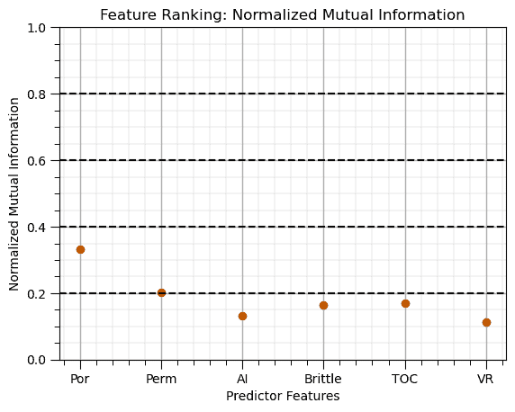

## 归一化预测特征

归一化预测特征以消除对特征范围或方差的敏感性，例如，

+   将所有特征在距离计算中置于同等地位

最小/最大归一化将最小值强制设为 0.0，最大值设为 1.0

```py
normalizer = MinMaxScaler()                                   # instantiate min / max normalizer 
norm_array = normalizer.fit_transform(X)                      # normalize the predictor features 
X_norm = pd.DataFrame(norm_array, columns=X.columns)          # convert output to a DataFrame
X_norm.describe()                                             # preview the DataFrame 
```

|  | Por | Perm | AI | Brittle | TOC | VR |
| --- | --- | --- | --- | --- | --- | --- |
| count | 200.000000 | 200.000000 | 200.000000 | 200.000000 | 200.000000 | 200.000000 |
| mean | 0.496538 | 0.366219 | 0.504134 | 0.507180 | 0.498080 | 0.533144 |
| std | 0.174775 | 0.198057 | 0.169220 | 0.192526 | 0.203202 | 0.155066 |
| min | 0.000000 | 0.000000 | 0.000000 | 0.000000 | 0.000000 | 0.000000 |
| 25% | 0.374265 | 0.227975 | 0.378358 | 0.365377 | 0.340717 | 0.432990 |
| 50% | 0.501176 | 0.332380 | 0.500000 | 0.525548 | 0.514768 | 0.530928 |
| 75% | 0.638382 | 0.475686 | 0.616418 | 0.644809 | 0.649789 | 0.625000 |
| max | 1.000000 | 1.000000 | 1.000000 | 1.000000 | 1.000000 | 1.000000 |

## 随机森林（重新训练调整后的模型）

应用调整后的超参数并重新训练模型。

+   这是我们将用于未来预测和实际应用的模型

```py
max_leaf_node_tuned = 40; num_tree = 20; max_features = 2                # random forest model hyperparameters
random_forest = RandomForestRegressor(max_leaf_nodes=max_leaf_node_tuned,random_state=seed,n_estimators=num_tree,max_features=max_features,
                                       oob_score=True,bootstrap=True)
random_forest.fit(X,y.values.ravel())
y_rf_hat = random_forest.predict(X)                      # predict over the testing cases
plt.scatter(y,y_rf_hat,color='orange',edgecolor='black',label=r'All Data',zorder=10) # scatter plot
plt.ylabel('Estimated'); plt.xlabel('Truth'); plt.title('Tuned Random Forest: Cross Validation Plot'); plt.legend(loc = 'upper left')
plt.plot([0,8000],[0,8000],color='red'); plt.xlim(0,8000,); plt.ylim(0,8000) 
add_grid() 
```

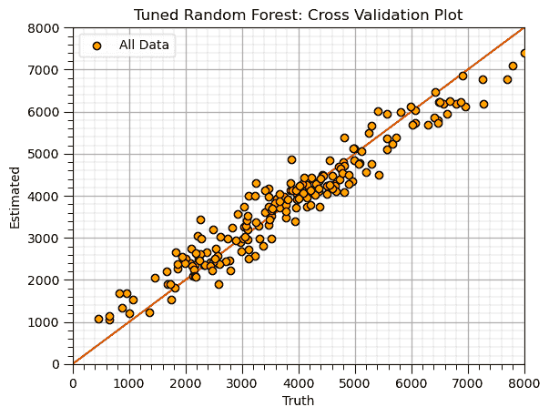

## 随机森林（训练）

```py
max_leaf_node = 5; num_tree = 20; max_features = 2                # random forest model hyperparameters
random_forest = RandomForestRegressor(max_leaf_nodes=max_leaf_node,random_state=seed,n_estimators=num_tree,max_features=max_features,
                                       oob_score=True,bootstrap=True)
random_forest.fit(X,y.values.ravel())
y_rf_hat = random_forest.predict(X)                      # predict over the testing cases
plt.scatter(y,y_rf_hat,color='orange',edgecolor='black',label=r'All Data',zorder=10) # scatter plot
plt.ylabel('Estimated'); plt.xlabel('Truth'); plt.title('Random Forest: Cross Validation Plot'); plt.legend(loc = 'upper left')
plt.plot([0,8000],[0,8000],color='red'); plt.xlim(0,8000,); plt.ylim(0,8000) 
add_grid() 
```


## 随机森林（调整）

```py
max_leaf_node_mat = np.arange(2,100,2)                        # set the random forest hyperparameters
max_features = 1
trained_forests = []
MSE_oob_list = []; node_list = []

index = 1
for max_leaf_node in max_leaf_node_mat:                       # loop over number of trees in our random forest
    trained_forest = RandomForestRegressor(max_leaf_nodes=max_leaf_node, random_state=seed,n_estimators=num_tree,
            oob_score = True,bootstrap=True,max_features=max_features).fit(X = X, y = y.values.ravel())
    trained_forests.append(trained_forest)
    oob_y_hat = trained_forest.oob_prediction_
    oob_y = y[oob_y_hat > 0.0]; oob_y_hat = oob_y_hat[oob_y_hat > 0.0]; # remove if not estimated
    MSE_oob_list.append(metrics.mean_squared_error(oob_y,oob_y_hat)); node_list.append(max_leaf_node)
    index = index + 1

tuned_node = node_list[np.argmin(MSE_oob_list)]               # get the k that minimizes the testing MSE

plt.subplot(121)
plt.scatter(node_list,MSE_oob_list,color='darkorange',edgecolor='black',alpha=0.8,s=30,zorder=10)
plt.plot(node_list,MSE_oob_list,color='black',ls='--',zorder=1)
plt.axvline(x=tuned_node, color='red', linestyle='--')
plt.annotate('Tuned Max Leaf Nodes = ' + str(tuned_node),[tuned_node+1,1.2e6],color='red',rotation= 90)
plt.xlabel('Number of Leaf Nodes'); plt.ylabel('Mean Square Error')
plt.title('Out-of-Bag Mean Square Error vs Maximum Number of Leaf Nodes')
add_grid(); plt.xlim(0,100)
plt.subplots_adjust(left=0.0, bottom=0.0, right=2.0, top=0.8, wspace=0.2, hspace=0.2); plt.show() 
```

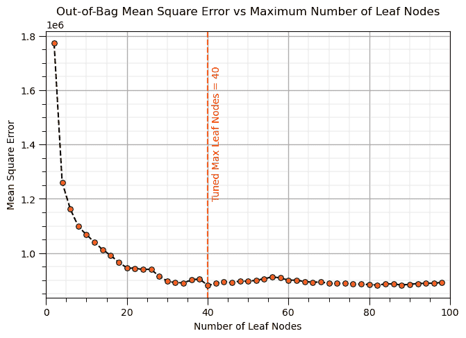

## 散点图

```py
plt.scatter(X['Por'],y['Prod'],color='darkorange',edgecolor='black',s=20); plt.xlabel('Porosity (%)'); plt.ylabel('Permeability (mD)')
add_grid(); plt.title('Permeability vs. Porosity'); plt.show(); 
```

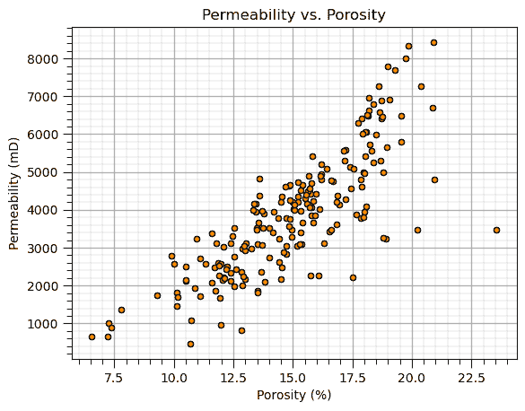

## 标准化预测特征

标准化预测特征以消除对特征范围或方差的敏感性，例如，

+   将所有特征在距离计算中置于同等地位

标准化使得平均值变为 0.0，标准差变为 1.0

```py
scaler = StandardScaler()                                     # instantiate standardizer 
standard_array = scaler.fit_transform(X)                      # standardize the predictor features 
X_stand = pd.DataFrame(standard_array, columns=X.columns)     # convert output to a DataFrame
X_stand.describe()                                            # preview the DataFrame 
```

|  | Por | Perm | AI | Brittle | TOC | VR |
| --- | --- | --- | --- | --- | --- | --- |
| count | 2.000000e+02 | 2.000000e+02 | 2.000000e+02 | 2.000000e+02 | 2.000000e+02 | 2.000000e+02 |
| mean | 2.486900e-16 | -6.217249e-17 | 4.130030e-16 | 2.042810e-16 | 3.375078e-16 | 9.081624e-16 |
| std | 1.002509e+00 | 1.002509e+00 | 1.002509e+00 | 1.002509e+00 | 1.002509e+00 | 1.002509e+00 |
| min | -2.848142e+00 | -1.853701e+00 | -2.986650e+00 | -2.640962e+00 | -2.457313e+00 | -3.446814e+00 |
| 25% | -7.013606e-01 | -6.997528e-01 | -7.451372e-01 | -7.383912e-01 | -7.763606e-01 | -6.475066e-01 |
| 50% | 2.660490e-02 | -1.712823e-01 | -2.449306e-02 | 9.564649e-02 | 8.233024e-02 | -1.432979e-02 |
| 75% | 8.136175e-01 | 5.540977e-01 | 6.652032e-01 | 7.166516e-01 | 7.484661e-01 | 5.938532e-01 |
| max | 2.887855e+00 | 3.208033e+00 | 2.937664e+00 | 2.566186e+00 | 2.476256e+00 | 3.018254e+00 |

## Shapley Values (特征排名)

```py
max_leaf_nodes = 20
tree_shap_model = DecisionTreeRegressor(max_leaf_nodes = max_leaf_nodes).fit(X, y)
explainer = shap.Explainer(tree_shap_model, X)                          # Explain the model with SHAP
shap_values = explainer.shap_values(X)
shap_avg = np.average(np.abs(shap_values),axis = 0)
shap_df = pd.DataFrame({'Feature': list(X.columns),'Shapley Values': list(shap_avg)}); shap_df.set_index('Feature',inplace=True)
shap_df.plot(color=utcolor,style='o'); plt.xlabel('Predictor Features'); plt.ylabel('Shapley Values (average, absolute)'); plt.ylim(0,2000)
plt.title('Feature Ranking: Global Shapley Values'); add_grid(); plt.show() 
```

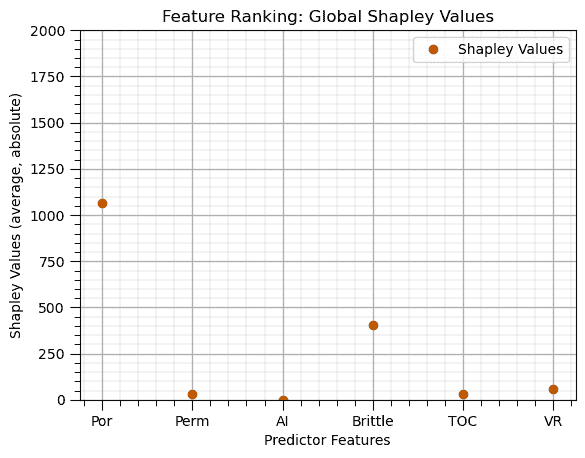

## 概率统计 (DataFrame)

```py
df.describe()                                                 # calculate the summary statistics of each feature 
```

|  | Well | Por | Perm | AI | Brittle | TOC | VR | Prod |
| --- | --- | --- | --- | --- | --- | --- | --- | --- |
| count | 200.000000 | 200.000000 | 200.000000 | 200.000000 | 200.000000 | 200.000000 | 200.000000 | 200.000000 |
| mean | 100.500000 | 14.991150 | 4.330750 | 2.968850 | 48.161950 | 0.990450 | 1.964300 | 3874.056957 |
| std | 57.879185 | 2.971176 | 1.731014 | 0.566885 | 14.129455 | 0.481588 | 0.300827 | 1615.551334 |
| min | 1.000000 | 6.550000 | 1.130000 | 1.280000 | 10.940000 | -0.190000 | 0.930000 | 463.579973 |
| 25% | 50.750000 | 12.912500 | 3.122500 | 2.547500 | 37.755000 | 0.617500 | 1.770000 | 2616.522434 |
| 50% | 100.500000 | 15.070000 | 4.035000 | 2.955000 | 49.510000 | 1.030000 | 1.960000 | 3801.156899 |
| 75% | 150.250000 | 17.402500 | 5.287500 | 3.345000 | 58.262500 | 1.350000 | 2.142500 | 4786.375831 |
| max | 200.000000 | 23.550000 | 9.870000 | 4.630000 | 84.330000 | 2.180000 | 2.870000 | 8428.187903 |

## 训练集和测试集分割

随机将数据分割为训练集和测试集

```py
test_proportion = 0.2                                         # set the proportion of withheld testing data
X_train, X_test, y_train, y_test = train_test_split(X, y, test_size=test_proportion, random_state=seed) # train and test split 
```

## 方差膨胀因子

仅考虑预测特征之间线性冗余的特征排名方法

+   与响应特征的关联性不考虑

+   通常用作在更全面的特征排名之前移除特征的筛选方法

```py
vif_data = pd.Series(                                         # loop over predictor features and store result in pandas series for ease of plotting
    [variance_inflation_factor(X.values, i) for i in range(X.values.shape[1])],
    index=X.columns)
vif_data.plot(color=utcolor,style='o'); plt.xlabel('Predictor Features'); plt.ylabel('Variance Inflation Factor (unitless)'); plt.ylim(0,100)
plt.axhline(y=1, color='black', linestyle='--'); plt.axhline(y=10, color='black', linestyle='--');
add_grid(); plt.title('Feature Ranking: Variance Inflation Factor'); plt.show() 
```


## 备注

这些是用于 Python 中预测机器学习的一些基本代码片段。可以做和讨论的还有很多，我有很多更多的资源。查看我的[共享资源清单](https://michaelpyrcz.com/my-resources)以及本章开头带有资源链接的 YouTube 讲座链接。

希望这有助于您，

*Michael*

## 关于作者


迈克尔·皮尔奇教授在德克萨斯大学奥斯汀分校 40 英亩校园的办公室。

迈克尔·皮尔奇（Michael Pyrcz）是德克萨斯大学奥斯汀分校[Cockrell 工程学院](https://cockrell.utexas.edu/faculty-directory/alphabetical/p)和[杰克逊地球科学学院](https://www.jsg.utexas.edu/researcher/michael_pyrcz/)的教授，他在德克萨斯大学奥斯汀分校进行研究与教学，研究内容包括地下、空间数据分析、地统计学和机器学习。迈克尔还是，

+   [能源分析](https://fri.cns.utexas.edu/energy-analytics)新生研究项目的首席研究员，以及德克萨斯大学奥斯汀分校自然科学院机器学习实验室的核心教员。

+   《计算机与地球科学》（[Computers and Geosciences](https://www.sciencedirect.com/journal/computers-and-geosciences/about/editorial-board)）的副编辑，以及国际数学地球科学协会《数学地球科学》（[Mathematical Geosciences](https://link.springer.com/journal/11004/editorial-board)）的董事会成员。

迈克尔已经撰写了 70 多篇同行评审的出版物（[`scholar.google.com/citations?user=QVZ20eQAAAAJ&hl=en`](https://scholar.google.com/citations?user=QVZ20eQAAAAJ&hl=en)），一个用于空间数据分析的[Python 包](https://pypi.org/project/geostatspy/)，合著了一本关于空间数据分析的教科书《地统计学储层建模》（[Geostatistical Reservoir Modeling](https://www.amazon.com/Geostatistical-Reservoir-Modeling-Michael-Pyrcz/dp/0199731446)），并且是两本新发布的电子书的作者，分别是《Python 应用地统计学：GeostatsPy 实践指南》（[Applied Geostatistics in Python: a Hands-on Guide with GeostatsPy](https://geostatsguy.github.io/GeostatsPyDemos_Book/intro.html)）和《Python 应用机器学习：带代码的实践指南》（[Applied Machine Learning in Python: a Hands-on Guide with Code](https://geostatsguy.github.io/MachineLearningDemos_Book/intro.html)）。

迈克尔的所有大学讲座都可以在他的[YouTube 频道](https://www.youtube.com/@GeostatsGuyLectures)上找到，其中包含 100 多个 Python 交互式仪表板和 40 多个 GitHub 仓库中的详细工作流程链接，这些仓库位于他的[GitHub 账户](https://github.com/GeostatsGuy)，以支持任何感兴趣的学生和在职专业人士，提供持久的内容。想了解更多关于迈克尔的工作和共享教育资源，请访问他的网站。

## 想一起工作吗？

我希望这份内容对那些想要了解更多关于地下建模、数据分析以及机器学习的人有所帮助。学生和在职专业人士都欢迎参与。

+   想邀请我到贵公司进行培训、辅导、项目审查、工作流程设计和/或咨询吗？我很乐意拜访并与您合作！

+   感兴趣合作、支持我的研究生研究或我的地下数据分析与机器学习联盟（共同负责人是约翰·福斯特教授）？我的研究将数据分析、随机建模和机器学习理论与实践相结合，以开发新的方法和工作流程，增加价值。我们正在解决具有挑战性的地下问题！

+   我可以通过 mpyrcz@austin.utexas.edu 联系到。

我总是很高兴讨论，

*迈克尔*

迈克尔·皮尔茨，博士，P.Eng. 教授，德克萨斯大学奥斯汀分校的科克雷尔工程学院和杰克逊地球科学学院

更多资源请访问：[Twitter](https://twitter.com/geostatsguy) | [GitHub](https://github.com/GeostatsGuy) | [网站](http://michaelpyrcz.com) | [Google Scholar](https://scholar.google.com/citations?user=QVZ20eQAAAAJ&hl=en&oi=ao) | [地统计学书籍](https://www.amazon.com/Geostatistical-Reservoir-Modeling-Michael-Pyrcz/dp/0199731446) | [YouTube](https://www.youtube.com/channel/UCLqEr-xV-ceHdXXXrTId5ig) | [Python 中应用地统计学电子书](https://geostatsguy.github.io/GeostatsPyDemos_Book/intro.html) | [Python 中应用机器学习电子书](https://geostatsguy.github.io/MachineLearningDemos_Book/) | [LinkedIn](https://www.linkedin.com/in/michael-pyrcz-61a648a1)

## 动机

我曾与来自德克萨斯州以及更远地方的优秀高中生一起举办了一场黑客马拉松，我觉得他们需要一些额外的资源，以代码片段的形式帮助他们克服完成第一个 Python 数据科学工作流程的障碍。

记住代码片段的定义是，

+   程序员可以快速将其插入到更大的代码库中的一个小型、可重用的代码段

我的目标是，

+   **提供一组最小化、简单的代码片段**以完成基本的数据科学建模构建步骤

+   **避免花哨的添加**，如针对特定问题设置的自动诊断和绘图，这些在新数据中可能会中断

因此，提供诊断输出和图表的改进和添加是非常推荐的。

## 结构

这不是一个工作流程！

这些是按字母顺序排列的代码片段，而不是完整的工作流程。请勿尝试按顺序运行此章节。

为了运行这些片段，我们首先需要，

1.  导入一些 Python 包

1.  声明几个便利函数

1.  加载一些数据以演示代码片段

在我们加载数据后，剩余的代码将以字母顺序排列，而不是任何逻辑工作流程顺序，以便于搜索和检索。

## 导入所需包

我们需要一些标准包。这些应该已经与 Anaconda 3 一起安装。

```py
import numpy as np                                            # arrays
import pandas as pd                                           # dataframes
import matplotlib.pyplot as plt                               # plotting
from matplotlib.ticker import (MultipleLocator, AutoMinorLocator, AutoLocator) # control of axes ticks
from statsmodels.stats.outliers_influence import variance_inflation_factor # variance inflation factor
from sklearn.impute import SimpleImputer                      # basic imputation method
from sklearn.experimental import enable_iterative_imputer     # required for MICE imputation
from sklearn.impute import IterativeImputer                   # MICE imputation
from sklearn.impute import KNNImputer                         # k-nearest neighbour imputation method
from sklearn.model_selection import train_test_split          # train and test split
from sklearn.linear_model import LinearRegression             # linear regression
from sklearn.preprocessing import StandardScaler              # standardize the features
from sklearn.preprocessing import MinMaxScaler                # min and max normalization
from sklearn.preprocessing import KBinsDiscretizer            # k-bin discretizer
from sklearn.neighbors import KNeighborsRegressor             # K-nearest neighbours
from sklearn.ensemble import RandomForestRegressor            # random forest method
from sklearn.feature_selection import mutual_info_regression  # mutual information
from sklearn.metrics import mean_absolute_error               # mean absolute error
from sklearn.metrics import normalized_mutual_info_score      # normalized mutual information
from sklearn import tree                                      # decision tree
from sklearn.tree import DecisionTreeRegressor                # regression tree
from sklearn.tree import plot_tree                            # plot the decision tree
from sklearn import metrics                                   # measures to check our models
import shap                                                   # Shapley values for feature ranking
plt.rc('axes', axisbelow=True)                                # set axes and grids in the background for all plots
import math                                                  
seed = 13
cmap = plt.cm.inferno                                         # a good colormap for folks with color perception issues
utcolor = '#BF5700'                                           # burnt orange, Hook'em! 
```

```py
IProgress not found. Please update jupyter and ipywidgets. See https://ipywidgets.readthedocs.io/en/stable/user_install.html 
```

如果您遇到包导入错误，您可能首先需要安装这些包中的一些。这通常可以通过在 Windows 上打开命令窗口然后输入‘python -m pip install [package-name]’来完成。有关相应包的文档，还有更多帮助。

## 声明函数

这里是提高代码可读性的函数。

```py
def add_grid():                                               # add grid lines
    plt.gca().grid(True, which='major',linewidth = 1.0); plt.gca().grid(True, which='minor',linewidth = 0.2) # add y grids
    plt.gca().tick_params(which='major',length=7); plt.gca().tick_params(which='minor', length=4)
    plt.gca().xaxis.set_minor_locator(AutoMinorLocator()); plt.gca().yaxis.set_minor_locator(AutoMinorLocator()) # turn on minor ticks 
```

## 加载一些数据集

我们加载了一些数据集，

1.  df - 一个详尽的数据表，作为 pandas DataFrame

1.  df_missing - 包含一些缺失数据的数据表，作为 pandas DataFrame

1.  ndarray_2D - 一个 2D 数组映射，作为 NumPy ndarray

为了展示下面的方法。

```py
df = pd.read_csv(r"https://raw.githubusercontent.com/GeostatsGuy/GeoDataSets/master/unconv_MV_v4.csv") # load the data from my github repo
df_missing = pd.read_csv(r"https://raw.githubusercontent.com/GeostatsGuy/GeoDataSets/master/unconv_MV_missing.csv") 
df_spatial = pd.read_csv(r"https://raw.githubusercontent.com/GeostatsGuy/GeoDataSets/master/12_sample_data.csv") 
ndarray_2D = np.loadtxt("https://raw.githubusercontent.com/GeostatsGuy/GeoDataSets/master/12_AI.csv", 
                     delimiter=",")
np.random.seed(seed=seed+7)                                     # set random number seed for reproducibility
df['Prod'] = df['Prod'] + np.random.normal(loc=0.0,scale=600.0,size=len(df)) # add noise to demonstrate overfit and hyperparameter tuning 
```

## 完成一些基本操作

在这里，我完成了一些基本操作，以确保以下按字母顺序排列的代码片段有输入以避免错误。

```py
X = df.iloc[:,1:-1]; y = df.iloc[:,[-1]]                      # separate predictor and response, assumes response is the last features
X_missing = df_missing.iloc[:,1:-1]; y_missing = df_missing.iloc[:,[-1]] # separate predictor and response, assumes response is the last features
X_train, X_test, y_train, y_test = train_test_split(X, y, 
                test_size=0.2, random_state=seed)             # train and test split
linear_model = LinearRegression().fit(X_train,y_train)        # instantiate and train linear regression model, no hyperparmeters
y_hat_train = linear_model.predict(X_train)                   # predict over the training data
y_hat_test = linear_model.predict(X_test)                     # predict over the training data
linear_1pred_model = LinearRegression().fit(X_train[['Por']].values,y_train) # linear regression model with only 1 predictor feature
linear_2pred_model = LinearRegression().fit(X_train[['Por','Brittle']].values,y_train) # linear regression model with only 1 predictor feature 
```

好的，现在我们准备好遍历我们的按字母顺序排列的代码片段了。

## 贝塔，$\beta$，系数

基于归一化特征的多元回归系数的特征重要性。

```py
normalizer = MinMaxScaler()                                   # instantiate the min/max normalizer
norm_array = normalizer.fit_transform(X)                      # normalize the predictor features 
X_norm = pd.DataFrame(norm_array, columns=X.columns)          # convert output to a DataFrame
beta_linear_model = LinearRegression().fit(X_norm,y)   # instantiate and train linear regression model, no hyperparmeters
beta_coef_df = pd.DataFrame({'Feature': list(X.columns),'Beta Coefficient': list(np.abs(linear_model.coef_.ravel()))})
beta_coef_df.plot(color=utcolor,style='o'); plt.xlabel('Predictor Features'); plt.ylabel('Beta Coefficient (normalized)'); plt.ylim(0,1000)
plt.title('Feature Ranking: Beta Coefficients'); add_grid(); plt.show() 
```


## 相关系数（皮尔逊乘积矩）

```py
correlations = df.corr().loc[X.columns, y.columns[0]]         # calculate correlation matrix and extract the pred. rows for the response column
correlations.plot(color=utcolor,style='o'); plt.xlabel('Predictor Features'); plt.ylabel('Correlation Coefficient'); plt.ylim(-1,1);
plt.title('Feature Ranking: Correlation Coefficients'); plt.axhline(y=0.0, color='black', linestyle='--'); add_grid(); plt.show() 
```


## 相关系数（斯皮尔曼秩）

```py
rank_correlations = df.corr(method='spearman').loc[X.columns, y.columns[0]] # calculate Spearman correlation with same method as Pearson above
rank_correlations.plot(color=utcolor,style='o'); plt.xlabel('Predictor Features'); plt.ylabel('Rank Correlation Coefficient'); plt.ylim(-1,1); 
plt.title('Feature Ranking: Rank Correlation Coefficients'); plt.axhline(y=0.0, color='black', linestyle='--'); add_grid(); plt.show() 
```


## 交叉验证图（训练和测试）

```py
plt.scatter(y_train,y_hat_train,color='orange',edgecolor='black',label=r'Training Data',zorder=10) # scatter plot
plt.scatter(y_test,y_hat_test,color=utcolor,edgecolor='black',label=r'Testing Data',zorder=10)
plt.ylabel('Estimated Production (MCFPD)'); plt.xlabel('Truth Production (MCFPD)'); plt.title('Cross Validation Plot'); plt.legend(loc = 'upper left')
plt.plot([0,8000],[0,8000],color='red'); plt.xlim(0,8000,); plt.ylim(0,8000); add_grid(); 
```


## 交叉验证图（测试）

```py
plt.scatter(y_test,y_hat_test,color=utcolor,edgecolor='black',label=r'Testing Data',zorder=10) # scatter plot
plt.ylabel('Estimated Production (MCFPD)'); plt.xlabel('Truth Production (MCFPD)'); plt.title('Cross Validation Plot'); plt.legend(loc = 'upper left')
plt.plot([0,8000],[0,8000],color='red'); plt.xlim(0,8000,); plt.ylim(0,8000); add_grid() 
```


## 交叉验证图（训练）

```py
plt.scatter(y_train,y_hat_train,color=utcolor,edgecolor='black',label=r'Training Data',zorder=10) # scatter plot
plt.ylabel('Estimated Production (MCFPD)'); plt.xlabel('Truth Production (MCFPD)'); plt.title('Cross Validation Plot'); plt.legend(loc = 'upper left')
plt.plot([0,8000],[0,8000],color='red'); plt.xlim(0,8000,); plt.ylim(0,8000); add_grid(); 
```


## DataFrame（向一个特征添加噪声）

我这样做是为了进行实验和制作教育内容，例如，向响应特征添加噪声以演示过拟合。

```py
df_temp = df.copy(deep=True)                                  # make a deep copy of the DataFrame
np.random.seed(seed=seed)                                     # set random seed for repeatability
df_temp['Prod'] = df_temp['Prod'] + np.random.normal(loc=0.0,scale=100.0,size=len(df_temp)) # add a feature of ones called 'Ones'
df_temp.head() 
```

|  | Well | Por | Perm | AI | Brittle | TOC | VR | Prod |
| --- | --- | --- | --- | --- | --- | --- | --- | --- |
| 0 | 1 | 12.08 | 2.92 | 2.80 | 81.40 | 1.16 | 2.31 | 2154.457620 |
| 1 | 2 | 12.38 | 3.53 | 3.22 | 46.17 | 0.89 | 1.88 | 3199.991714 |
| 2 | 3 | 14.02 | 2.59 | 4.01 | 72.80 | 0.89 | 2.72 | 2742.009861 |
| 3 | 4 | 17.67 | 6.75 | 2.63 | 39.81 | 1.08 | 1.88 | 3927.738944 |
| 4 | 5 | 17.52 | 4.57 | 3.18 | 10.94 | 1.51 | 1.90 | 2343.080242 |

## DataFrame（添加新特征/列）

```py
df_temp = df.copy(deep=True)                                  # make a deep copy of the DataFrame
df_temp['Ones'] = np.ones((len(df_temp)))                     # add a feature of ones called 'Ones'
df_temp.head() 
```

|  | Well | Por | Perm | AI | Brittle | TOC | VR | Prod | Ones |
| --- | --- | --- | --- | --- | --- | --- | --- | --- | --- |
| 0 | 1 | 12.08 | 2.92 | 2.80 | 81.40 | 1.16 | 2.31 | 2225.696687 | 1.0 |
| 1 | 2 | 12.38 | 3.53 | 3.22 | 46.17 | 0.89 | 1.88 | 3124.615076 | 1.0 |
| 2 | 3 | 14.02 | 2.59 | 4.01 | 72.80 | 0.89 | 2.72 | 2746.460169 | 1.0 |
| 3 | 4 | 17.67 | 6.75 | 2.63 | 39.81 | 1.08 | 1.88 | 3882.557711 | 1.0 |
| 4 | 5 | 17.52 | 4.57 | 3.18 | 10.94 | 1.51 | 1.90 | 2208.570072 | 1.0 |

## DataFrame（创建新）

```py
df_new = pd.DataFrame({'Ones':np.ones((100)),'Zeros':np.zeros((100))}) # make new DataFrame
df_new.head() 
```

|  | Ones | Zeros |
| --- | --- | --- |
| --- | --- | --- |
| 0 | 1.0 | 0.0 |
| 1 | 1.0 | 0.0 |
| 2 | 1.0 | 0.0 |
| 3 | 1.0 | 0.0 |
| 4 | 1.0 | 0.0 |

## DataFrame（预览）

显示 DataFrame 的前 n 行

```py
df.head(n=13)                                                 # display the first n rows of the DataFrame 
```

|  | Well | Por | Perm | AI | Brittle | TOC | VR | Prod |
| --- | --- | --- | --- | --- | --- | --- | --- | --- |
| 0 | 1 | 12.08 | 2.92 | 2.80 | 81.40 | 1.16 | 2.31 | 2225.696687 |
| 1 | 2 | 12.38 | 3.53 | 3.22 | 46.17 | 0.89 | 1.88 | 3124.615076 |
| 2 | 3 | 14.02 | 2.59 | 4.01 | 72.80 | 0.89 | 2.72 | 2746.460169 |
| 3 | 4 | 17.67 | 6.75 | 2.63 | 39.81 | 1.08 | 1.88 | 3882.557711 |
| 4 | 5 | 17.52 | 4.57 | 3.18 | 10.94 | 1.51 | 1.90 | 2208.570072 |
| 5 | 6 | 14.53 | 4.81 | 2.69 | 53.60 | 0.94 | 1.67 | 4353.192212 |
| 6 | 7 | 13.49 | 3.60 | 2.93 | 63.71 | 0.80 | 1.85 | 3516.494383 |
| 7 | 8 | 11.58 | 3.03 | 3.25 | 53.00 | 0.69 | 1.93 | 2083.845221 |
| 8 | 9 | 12.52 | 2.72 | 2.43 | 65.77 | 0.95 | 1.98 | 2775.906282 |
| 9 | 10 | 13.25 | 3.94 | 3.71 | 66.20 | 1.14 | 2.65 | 2966.741947 |
| 10 | 11 | 15.04 | 4.39 | 2.22 | 61.11 | 1.08 | 1.77 | 4022.323780 |
| 11 | 12 | 16.19 | 6.30 | 2.29 | 49.10 | 1.53 | 1.86 | 4799.763575 |
| 12 | 13 | 16.82 | 5.42 | 2.80 | 66.65 | 1.17 | 1.98 | 3616.427242 |

## DataFrame（重命名特征/列）

```py
df_temp = df.copy(deep=True)                                  # make a deep copy of the DataFrame
df_temp.rename(columns={'Por':'Porosity (%)'},inplace=True)   # rename 'Por' features as 'Porosity'
df_temp.head() 
```

|  | Well | 孔隙度（%） | Perm | AI | Brittle | TOC | VR | Prod |
| --- | --- | --- | --- | --- | --- | --- | --- | --- |
| 0 | 1 | 12.08 | 2.92 | 2.80 | 81.40 | 1.16 | 2.31 | 2225.696687 |
| 1 | 2 | 12.38 | 3.53 | 3.22 | 46.17 | 0.89 | 1.88 | 3124.615076 |
| 2 | 3 | 14.02 | 2.59 | 4.01 | 72.80 | 0.89 | 2.72 | 2746.460169 |
| 3 | 4 | 17.67 | 6.75 | 2.63 | 39.81 | 1.08 | 1.88 | 3882.557711 |
| 4 | 5 | 17.52 | 4.57 | 3.18 | 10.94 | 1.51 | 1.90 | 2208.570072 |

## DataFrame（移除特征/列）

```py
df_temp = df.copy(deep=True)                                  # make a deep copy of the DataFrame
df_temp.drop(columns=['Well','Por','AI'],inplace=True)        # remove features 'Well','Por' and 'AI'
df_temp.head() 
```

|  | Perm | Brittle | TOC | VR | Prod |
| --- | --- | --- | --- | --- | --- |
| 0 | 2.92 | 81.40 | 1.16 | 2.31 | 2225.696687 |
| 1 | 3.53 | 46.17 | 0.89 | 1.88 | 3124.615076 |
| 2 | 2.59 | 72.80 | 0.89 | 2.72 | 2746.460169 |
| 3 | 6.75 | 39.81 | 1.08 | 1.88 | 3882.557711 |
| 4 | 4.57 | 10.94 | 1.51 | 1.90 | 2208.570072 |

## DataFrame（移除样本/行）

```py
df_temp = df.copy(deep=True)                                  # make a deep copy of the DataFrame
df_temp = df_temp.drop(df.index[[0, 2, 4]])                   # removes samples 0, 2 and 4
df_temp.head() 
```

|  | Well | Por | Perm | AI | Brittle | TOC | VR | Prod |
| --- | --- | --- | --- | --- | --- | --- | --- | --- |
| 1 | 2 | 12.38 | 3.53 | 3.22 | 46.17 | 0.89 | 1.88 | 3124.615076 |
| 3 | 4 | 17.67 | 6.75 | 2.63 | 39.81 | 1.08 | 1.88 | 3882.557711 |
| 5 | 6 | 14.53 | 4.81 | 2.69 | 53.60 | 0.94 | 1.67 | 4353.192212 |
| 6 | 7 | 13.49 | 3.60 | 2.93 | 63.71 | 0.80 | 1.85 | 3516.494383 |
| 7 | 8 | 11.58 | 3.03 | 3.25 | 53.00 | 0.69 | 1.93 | 2083.845221 |

## DataFrame（按条件移除样本/行）

```py
df_temp = df.copy(deep=True)                                  # make a deep copy of the DataFrame
df_temp = df_temp[df_temp['Por'] > 13.0]                      # remove all samples with 'Por' <= 13%
df_temp.head() 
```

|  | Well | Por | Perm | AI | Brittle | TOC | VR | Prod |
| --- | --- | --- | --- | --- | --- | --- | --- | --- |
| 2 | 3 | 14.02 | 2.59 | 4.01 | 72.80 | 0.89 | 2.72 | 2746.460169 |
| 3 | 4 | 17.67 | 6.75 | 2.63 | 39.81 | 1.08 | 1.88 | 3882.557711 |
| 4 | 5 | 17.52 | 4.57 | 3.18 | 10.94 | 1.51 | 1.90 | 2208.570072 |
| 5 | 6 | 14.53 | 4.81 | 2.69 | 53.60 | 0.94 | 1.67 | 4353.192212 |
| 6 | 7 | 13.49 | 3.60 | 2.93 | 63.71 | 0.80 | 1.85 | 3516.494383 |

## 决策树（特征重要性）

```py
leaf_node = 5                                                 # decision tree model hyperparameters
tree_model = tree.DecisionTreeRegressor(max_leaf_nodes=leaf_node).fit(X_train,y_train) # instantiate the prediction model

beta_coef_df = pd.DataFrame({'Feature': list(X.columns),'Tree-based Feature Importance': list(tree_model.feature_importances_.ravel())})
beta_coef_df.plot(color=utcolor,style='o'); plt.xlabel('Predictor Features'); plt.ylabel('Feature Importance'); plt.ylim(0,1)
plt.title('Feature Ranking: Decision Tree Feature Importance'); add_grid(); plt.show() 
```


## 决策树（在测试数据上的预测）

将我们的模型应用于预测保留的测试数据。

```py
leaf_node = 5                                                 # decision tree model hyperparameters
tree_model = tree.DecisionTreeRegressor(max_leaf_nodes=leaf_node).fit(X_train,y_train) # instantiate the prediction model
y_test_temp = y_test.copy(deep=True)
y_test_temp['Estimated Prod'] = tree_model.predict(X_test)    # predict over the training data
y_test_temp.head() 
```

|  | Prod | 估计产量 |
| --- | --- | --- |
| 179 | 656.507448 | 2218.196237 |
| 155 | 3110.245382 | 2218.196237 |
| 23 | 2581.359826 | 2218.196237 |
| 159 | 6498.151446 | 6482.917835 |
| 96 | 4148.822923 | 4297.451039 |

## 决策树（在训练数据上的预测）

将我们的模型应用于预测保留的训练数据。

```py
leaf_node = 5                                                 # decision tree model hyperparameters
tree_model = tree.DecisionTreeRegressor(max_leaf_nodes=leaf_node).fit(X_train,y_train) # instantiate the prediction model
y_train_temp = y_train.copy(deep=True)
y_train_temp['Estimated Prod'] = tree_model.predict(X_train)  # predict over the training data
y_train_temp.head() 
```

|  | Prod | 估计产量 |
| --- | --- | --- |
| 125 | 3750.106623 | 4297.451039 |
| 68 | 4644.717576 | 4297.451039 |
| 69 | 1991.991593 | 2218.196237 |
| 108 | 6688.360827 | 6482.917835 |
| 131 | 5076.638358 | 4297.451039 |

## 决策树（训练）

在具有指定模型超参数的训练数据上训练模型参数

+   让我们通过可视化训练好的决策树来查看训练好的模型参数。

```py
leaf_node = 5                                                 # decision tree model hyperparameters
tree_model = tree.DecisionTreeRegressor(max_leaf_nodes=leaf_node).fit(X_train,y_train) # instantiate the prediction model
plot_tree(tree_model, feature_names=X_train.columns, filled=True); plt.show() # plot the decision tree 
```


## 决策树（重新训练调整后的模型）

应用调整后的超参数，并使用所有数据重新训练模型。

+   这是我们将用于未来预测和实际应用的模型

```py
tuned_leaf_node = 15;                                         # decision tree model hyperparameters
tuned_tree_model = tree.DecisionTreeRegressor(max_leaf_nodes=tuned_leaf_node).fit(X,y) # instantiate the prediction model
y_hat = tuned_tree_model.predict(X)                           # predict over the testing cases
plt.scatter(y,y_hat,color=utcolor,edgecolor='black',label=r'All Data',zorder=10) # scatter plot
plt.ylabel('Estimated'); plt.xlabel('Truth'); plt.title('Cross Validation Plot'); plt.legend(loc = 'upper left')
plt.plot([0,8000],[0,8000],color='red'); plt.xlim(0,8000,); plt.ylim(0,8000) 
add_grid(); 
```


## 决策树（调整/剪枝）

在具有一系列模型超参数的训练数据上训练模型参数，选择在保留的测试数据上误差最小的模型超参数

这需要以下步骤，

遍历超参数（s）的值，

1.  使用保留的训练数据训练模型

1.  在保留的测试数据上进行预测

1.  计算测试误差

选择最小化测试误差的超参数

```py
leaf_node = 2                                                 # set initial hyperparameter
MSE_tree_list = []; leaf_node_list = []                       # make lists to store the results
while leaf_node <= 100:                                       # loop over the number of leaf nodes hyperparameter
    tree_model = tree.DecisionTreeRegressor(max_leaf_nodes=leaf_node).fit(X_train,y_train) # instandiate and train the model
    y_hat_test = tree_model.predict(X_test)                   # predict over the testing cases
    MSE_tree = metrics.mean_squared_error(y_test,y_hat_test)  # calculate the MSE testing
    MSE_tree_list.append(MSE_tree)                            # add to the list of MSE
    leaf_node_list.append(leaf_node)                          # append leaf node to an array for plotting
    leaf_node = leaf_node + 1

tuned_leaf_nodes = leaf_node_list[np.argmin(MSE_tree_list)]           # get the k that minimizes the testing MSE

plt.subplot(111)
plt.scatter(leaf_node_list,MSE_tree_list,s=None, c=utcolor, alpha=1.0, linewidths=0.3, edgecolors="black") # plot testing MSE vs. hyperparameter
plt.axvline(x=tuned_leaf_nodes, color='red', linestyle='--') 
plt.annotate('Tuned Leaf Nodes = ' + str(tuned_leaf_nodes),[tuned_leaf_nodes+1,0.8e6],color='red',rotation= 90)
plt.title('Tree: Withheld Testing Error vs. Number of Leaf Nodes'); plt.xlabel('Number of Leaf Nodes'); plt.ylabel('Test Mean Square Error')
add_grid() 
```


## 特征提取（按名称）

仅包含所选预测特征和响应特征的新的 DataFrame

1.  指定选定的预测特征

1.  指定响应特征

1.  创建一个包含两者的列表

1.  创建一个新的 DataFrame，首先包含预测特征，然后将响应特征作为最后一列

```py
selected_predictor_features = ['Por','Perm','AI','Brittle']   # set the selected predictor features
response_feature = ['Prod']                                   # set the response feature
features = selected_predictor_features + response_feature     # build a list of selected predictor and response features
df_selected = df.loc[:,features]                              # slice the DataFrame
df_selected.head() 
```

|  | Por | Perm | AI | Brittle | Prod |
| --- | --- | --- | --- | --- | --- |
| 0 | 12.08 | 2.92 | 2.80 | 81.40 | 2225.696687 |
| 1 | 12.38 | 3.53 | 3.22 | 46.17 | 3124.615076 |
| 2 | 14.02 | 2.59 | 4.01 | 72.80 | 2746.460169 |
| 3 | 17.67 | 6.75 | 2.63 | 39.81 | 3882.557711 |
| 4 | 17.52 | 4.57 | 3.18 | 10.94 | 2208.570072 |

## 特征提取（按编号）

仅包含所选预测特征的新的 DataFrame。

1.  指定选定的预测特征

1.  指定响应特征

1.  创建一个包含两者的列表

1.  创建一个新的 DataFrame，首先包含预测特征，然后将响应特征作为最后一列

```py
selected_predictor_features = [1,2,3,4,7]                     # set the selected predictor features
df_selected_predictor = df.iloc[:,selected_predictor_features] # slice the DataFrame
df_selected_predictor.head() 
```

|  | Por | Perm | AI | Brittle | Prod |
| --- | --- | --- | --- | --- | --- |
| 0 | 12.08 | 2.92 | 2.80 | 81.40 | 2225.696687 |
| 1 | 12.38 | 3.53 | 3.22 | 46.17 | 3124.615076 |
| 2 | 14.02 | 2.59 | 4.01 | 72.80 | 2746.460169 |
| 3 | 17.67 | 6.75 | 2.63 | 39.81 | 3882.557711 |
| 4 | 17.52 | 4.57 | 3.18 | 10.94 | 2208.570072 |

## 特征提取（创建 X 和 y 数据框）

建立两个新的数据框，一个只包含选定的预测特征，另一个包含响应特征，

+   假设最后一个特征是响应特征

```py
X = df.loc[:,['Por','AI','VR']]                               # extract the list the predictor feature by name
y = df.loc[:,['Prod']]                                        # extract the response feature
print('Predictor features: ' + str(X.columns.tolist()) + '\nResponse feature: ' + y.columns[0]) 
```

```py
Predictor features: ['Por', 'AI', 'VR']
Response feature: Prod 
```

## 特征提取（创建 X 和 y 数据框，假设特征顺序）

建立两个新的数据框，一个只包含选定的预测特征，另一个包含响应特征，

+   假设最后一个特征是响应特征

```py
X = df.iloc[:,1:-1]; y = df.iloc[:,[-1]]                      # extract by assuming 2nd to 2nd last are predictors and last is response feature
print('Predictor features: ' + str(X.columns.tolist()) + '\nResponse feature: ' + y.columns[0]) 
```

```py
Predictor features: ['Por', 'Perm', 'AI', 'Brittle', 'TOC', 'VR']
Response feature: Prod 
```

## 直方图

简单直方图，

+   您可以通过指定确切的小区间（例如，np.linspace(min,max,n)）来设置直方图限制

```py
plt.hist(df['Por'],color='darkorange',edgecolor='black',bins=20); plt.xlabel('Porosity (%)'); plt.ylabel('Frequency') # histogram
plt.title('Porosity Distribution'); add_grid(); plt.show() 
```


## 直方图（归一化）

一个直方图，y 轴上的概率，所有柱子的总和为 1，即概率封闭。

```py
plt.hist(df['Por'],color='darkorange',edgecolor='black',weights = np.ones(len(df))/len(df),bins=20) # normalized histogram
plt.title('Porosity Distribution'); plt.xlabel('Porosity (%)'); plt.ylabel('Probability'); add_grid(); plt.show() 
```


## 图像绘图

```py
im = plt.imshow(ndarray_2D,extent = [0,10000,0,10000],vmin=1500,vmax=6500,cmap = cmap) # plot of 2D ndarray, image or map feature
cbar = plt.colorbar(im, orientation="vertical", ticks=np.linspace(2500, 7500, 10)); plt.xlabel('X (m)'); plt.ylabel('Y (m)')
cbar.set_label(r'Acoustic Impedence ($\frac{kg}{m³} \cdot \frac{m}{s} \cdot 10³$)', rotation=270, labelpad=20)
plt.title('Acoustic Impedance'); plt.show() 
```


## 图像绘图（与位置图结合）

将多个绘图叠加在一起，

+   使用‘zorder’将对象放置在其他对象之前，数字越大越靠前

+   确保所有对象都在相同的绘图空间中

```py
im = plt.imshow(ndarray_2D,extent = [0,10000,0,10000],vmin=1500,vmax=6500,cmap = cmap,alpha=0.8,zorder=-1) # plot of 2D ndarray, image or map feature
sc = plt.scatter(df_spatial['X'],df_spatial['Y'],c=df_spatial['AI'],s=20,edgecolor='black',vmin=1500,vmax=6500,cmap = cmap,zorder=10)
cbar = plt.colorbar(im, orientation="vertical", ticks=np.linspace(2500, 7500, 10)); plt.xlabel('X (m)'); plt.ylabel('Y (m)')
cbar.set_label(r'Acoustic Impedence ($\frac{kg}{m³} \cdot \frac{m}{s} \cdot 10³$)', rotation=270, labelpad=20)
plt.title('Acoustic Impedance Image and Samples at Wells'); plt.show() 
```


## K-最近邻（特征插补）

通过估计缺失特征的最邻近邻居来执行特征插补，

+   使用具有所有特征的样本中所有特征都存在的所有样本来访问距离

+   只应用了一次遍历，没有迭代

+   如果有大量缺失数据，它不如 MICE 鲁棒，因为它不会学习特征之间的结构来填充缺失数据

```py
knn_imputer = KNNImputer(n_neighbors=2, weights="uniform")    # instantiate Multiple Imputation by Chained Equations (MICE) imputer
X_imputed = knn_imputer.fit_transform(X_missing)              # train and apply MICE to impute the missing data
X_imputed = pd.DataFrame(X_imputed, columns=X_missing.columns,index=X_missing.index) # make imputed results into a DataFrame with same columns as X
X_imputed.describe()                                          # preview the DataFrame 
```

|  | Por | LogPerm | AI | Brittle | TOC | VR |
| --- | --- | --- | --- | --- | --- | --- |
| 计数 | 1000.000000 | 1000.000000 | 1000.000000 | 1000.000000 | 1000.000000 | 1000.000000 |
| 平均值 | 14.924820 | 1.375450 | 2.982915 | 49.227565 | 1.014950 | 1.997420 |
| 标准差 | 2.999168 | 0.367557 | 0.557240 | 13.755077 | 0.480852 | 0.284183 |
| 最小值 | 5.400000 | 0.120000 | 0.960000 | -1.500000 | -0.250000 | 0.900000 |
| 25% | 12.846250 | 1.145000 | 2.590000 | 40.640000 | 0.700000 | 1.830000 |
| 50% | 15.035000 | 1.360000 | 3.010000 | 49.477500 | 1.007500 | 2.000000 |
| 75% | 17.012500 | 1.610000 | 3.330000 | 58.055000 | 1.370000 | 2.165000 |
| 最大值 | 24.650000 | 2.580000 | 4.700000 | 93.470000 | 2.710000 | 2.900000 |

## K-最近邻（在测试数据上的预测）

将我们的模型应用于预测保留的测试数据。

```py
n_neighbours = 10; p = 2; weights = 'uniform'                 # KNN model hyperparameters
knn_model = KNeighborsRegressor(weights = weights, n_neighbors=n_neighbours, p = p).fit(X_train,y_train) # instantiate the prediction model
y_test_temp = y_test.copy(deep=True)
y_test_temp['Estimated Prod'] = knn_model.predict(X_test)     # predict over the training data
y_test_temp.head() 
```

|  | 产量 | 估计产量 |
| --- | --- | --- |
| 179 | 656.507448 | 2303.626455 |
| 155 | 3110.245382 | 3774.108284 |
| 23 | 2581.359826 | 2321.644376 |
| 159 | 6498.151446 | 5713.166746 |
| 96 | 4148.822923 | 4108.942362 |

## K-最近邻（在训练数据上的预测）

将我们的模型应用于预测保留的训练数据。

```py
n_neighbours = 10; p = 2; weights = 'uniform'                 # KNN model hyperparameters
knn_model = KNeighborsRegressor(weights = weights, n_neighbors=n_neighbours, p = p).fit(X_train,y_train) # instantiate the prediction model
y_train_temp = y_train.copy(deep=True)
y_train_temp['Estimated Prod'] = knn_model.predict(X_train)   # predict over the training data
y_train_temp.head() 
```

|  | 产 | 估计产 |
| --- | --- | --- |
| 125 | 3750.106623 | 3974.087763 |
| 68 | 4644.717576 | 4226.039680 |
| 69 | 1991.991593 | 3165.041802 |
| 108 | 6688.360827 | 6336.236197 |
| 131 | 5076.638358 | 5332.676914 |

## K-最近邻（训练）

在具有指定模型超参数的训练数据上训练模型参数

+   由于 K-最近邻是一种懒惰学习模型，因此没有训练好的模型参数可以显示

+   我们查看交叉验证图

```py
k = 1; p = 2; weights = 'uniform'                             # KNN model hyperparameters
neigh = KNeighborsRegressor(weights = weights, n_neighbors=k, p = p) # instantiate the prediction model
knn_model = neigh.fit(X_train,y_train)                        # train the model with the training data
y_train_hat = knn_model.predict(X_train)                      # predict over the testing cases
y_test_hat = knn_model.predict(X_test)                        # predict over the testing cases
plt.scatter(y_train,y_train_hat,color='orange',edgecolor='black',label=r'Training Data',zorder=10) # scatter plot
plt.scatter(y_test,y_test_hat,color=utcolor,edgecolor='black',label=r'Testing Data',zorder=10) # scatter plot
plt.ylabel('Estimated'); plt.xlabel('Truth'); plt.title('Cross Validation Plot'); plt.legend(loc = 'upper left')
plt.plot([0,8000],[0,8000],color='red'); plt.xlim(0,8000,); plt.ylim(0,8000) 
add_grid() 
```


## K-最近邻（重新训练调整模型）

应用调整好的超参数，并使用所有数据重新训练模型。

+   这是我们将用于未来预测和实际应用的模型

```py
tuned_k = 15; p = 2; weights = 'uniform'                      # KNN model hyperparameters
knn_tuned_model = KNeighborsRegressor(weights = weights, n_neighbors=tuned_k, p = 2).fit(X,y) # retrain the tuned model with all data
y_hat = knn_tuned_model.predict(X)                            # predict over the testing cases
plt.scatter(y,y_hat,color=utcolor,edgecolor='black',label=r'All Data',zorder=10) # scatter plot
plt.ylabel('Estimated'); plt.xlabel('Truth'); plt.title('Cross Validation Plot'); plt.legend(loc = 'upper left')
plt.plot([0,8000],[0,8000],color='red'); plt.xlim(0,8000,); plt.ylim(0,8000); add_grid() 
```


## K-最近邻（调整）

在具有一系列模型超参数的训练数据上训练模型参数，选择在保留的测试数据上误差最小的模型超参数

这需要以下步骤，

遍历超参数值，

1.  使用保留的训练数据训练模型

1.  在保留的测试数据上预测

1.  计算测试误差

选择最小化测试误差的超参数

```py
k = 1; weights = 'uniform'                                    # set initial, lowest k hyperparameter
MSE_knn_list = []; k_list = []                                # make lists to store the results
while k <= 150:                                               # loop over the k hyperparameter
    knn_model = KNeighborsRegressor(weights = weights, n_neighbors=k, p = 2).fit(X_train,y_train) # instandiate and train the model
    y_test_hat = knn_model.predict(X_test)                    # predict over the testing cases
    MSE = metrics.mean_squared_error(y_test,y_test_hat)       # calculate the MSE testing
    MSE_knn_list.append(MSE)                                  # add to the list of MSE
    k_list.append(k)                                          # append k to an array for plotting
    k = k + 1

tuned_k = k_list[np.argmin(MSE_knn_list)]                     # get the k that minimizes the testing MSE

plt.subplot(111)                                              # plot the testing error vs. hyperparameter
plt.scatter(k_list,MSE_knn_list,s=None, c=utcolor, alpha=0.8, linewidths=0.3, edgecolors="black") 
plt.axvline(x=tuned_k, color='red', linestyle='--'); plt.annotate('Tuned k = ' + str(tuned_k),[tuned_k+3,2.0e6],color='red',rotation= 90)
plt.title('KNN: Testing Error vs. Number of Nearest Neighbours'); plt.xlabel('Number of Nearest Neighbours'); plt.ylabel('Testing Mean Square Error')
add_grid() 
```


## 线性回归模型（模型参数）

获取模型参数。

```py
coef_df = pd.DataFrame({'Feature': ['Intercept'] + list(X.columns),'Coefficient': list(linear_model.intercept_) + list(linear_model.coef_.ravel())})
coef_df 
```

|  | 特征 | 系数 |
| --- | --- | --- |
| 0 | 截距 | -4053.511325 |
| 1 | Por | 453.607135 |
| 2 | Perm | 24.707076 |
| 3 | AI | -154.448203 |
| 4 | Brittle | 11.173989 |
| 5 | TOC | -183.938586 |
| 6 | VR | 580.078458 |

## 线性回归模型（预测测试）

```py
y_test_temp = y_test.copy(deep=True)                          # make a deep copy of the y test DataFrame
y_test_temp['Estimated Prod'] = linear_model.predict(X_test)  # predict over the training data
y_test_temp.head() 
```

|  | 产 | 估计产 |
| --- | --- | --- |
| 179 | 656.507448 | 379.818856 |
| 155 | 3110.245382 | 2943.388125 |
| 23 | 2581.359826 | 1372.426014 |
| 159 | 6498.151446 | 5563.914978 |
| 96 | 4148.822923 | 4987.375301 |

## 线性回归模型（预测训练）

```py
y_train_temp = y_train.copy(deep=True)                        # make a deep copy of the y train DataFrame
y_train_temp['Estimated Prod'] = linear_model.predict(X_train)# predict over the training data
y_train_temp.head() 
```

|  | 产 | 估计产 |
| --- | --- | --- |
| 125 | 3750.106623 | 3938.246048 |
| 68 | 4644.717576 | 3824.308392 |
| 69 | 1991.991593 | 2906.015510 |
| 108 | 6688.360827 | 6653.961261 |
| 131 | 5076.638358 | 5048.864286 |

## 线性回归模型（训练）

在没有超参数的情况下，在训练数据上训练模型参数

```py
linear_model = LinearRegression().fit(X_train,y_train)        # instantiate and train linear regression model, no hyperparmeters
coef_df = pd.DataFrame({'Feature': ['Intercept'] + list(X.columns),'Coefficient': list(linear_model.intercept_) + list(linear_model.coef_.ravel())})
coef_df 
```

|  | 特征 | 系数 |
| --- | --- | --- |
| 0 | 截距 | -4053.511325 |
| 1 | Por | 453.607135 |
| 2 | Perm | 24.707076 |
| 3 | AI | -154.448203 |
| 4 | Brittle | 11.173989 |
| 5 | TOC | -183.938586 |
| 6 | VR | 580.078458 |

## 列表删除

删除所有缺失样本和特征。

+   避免特征插值的“大锤”方法

+   不推荐，通常删除太多数据

```py
df_listwise = df_missing.dropna(how='any',inplace=False)      # listwise deletion
df_listwise.describe() 
```

|  | WellIndex | Por | LogPerm | AI | Brittle | TOC | VR | 生产 |
| --- | --- | --- | --- | --- | --- | --- | --- | --- |
| count | 210.000000 | 210.000000 | 210.000000 | 210.000000 | 210.000000 | 210.000000 | 210.000000 | 210.000000 |
| mean | 485.680952 | 14.976381 | 1.407238 | 2.999857 | 49.406143 | 1.005524 | 2.001524 | 2373.025529 |
| std | 292.292307 | 3.072786 | 0.422033 | 0.584267 | 14.311860 | 0.521783 | 0.306854 | 1661.542253 |
| min | 3.000000 | 6.480000 | 0.360000 | 1.330000 | 17.200000 | -0.230000 | 0.900000 | 75.215188 |
| 25% | 206.250000 | 12.682500 | 1.110000 | 2.612500 | 39.117500 | 0.640000 | 1.800000 | 1154.774039 |
| 50% | 477.500000 | 15.035000 | 1.415000 | 3.055000 | 48.320000 | 0.980000 | 2.010000 | 2029.697410 |
| 75% | 729.500000 | 17.085000 | 1.680000 | 3.360000 | 58.547500 | 1.347500 | 2.220000 | 3223.502405 |
| max | 1000.000000 | 24.650000 | 2.480000 | 4.500000 | 86.800000 | 2.560000 | 2.820000 | 12568.644130 |

## 位置图

用于绘制稀疏采样的特征与 X 和 Y 样本位置，以检查空间结构。

```py
xmin=0; xmax=10000; ymin=0; ymax=10000; vmin=0.1; vmax=0.27   # set plot limits and feature limits
sc = plt.scatter(df_spatial['X'],df_spatial['Y'],c=df_spatial['Porosity'],s=20,edgecolor='black',vmin=vmin,vmax=vmax,cmap = cmap)
cbar = plt.colorbar(sc, orientation="vertical", ticks=np.linspace(vmin,vmax,10)); plt.xlabel('X (m)'); plt.ylabel('Y (m)')
cbar.set_label(r'Porosity (fraction)', rotation=270, labelpad=20); plt.xlim(0,10000); plt.ylim(0,10000); add_grid()
plt.title('Location Map: Porosity'); plt.show() 
```


## 均值（插补）

一种非常简单的特征插补方法，用特征的均值替换缺失值，

+   不会在均值上引入偏差，但会在标准差和方差上引入偏差

+   很可能降低预测特征和响应特征之间的相关性

```py
mean_imputer = SimpleImputer(strategy='mean')                 # instantiate mean imputor
X_imputed = mean_imputer.fit_transform(X_missing)             # train and apply MICE to impute the missing data
X_imputed = pd.DataFrame(X_imputed, columns=X_missing.columns,index=X_missing.index) # make imputed results into a DataFrame with same columns as X
X_imputed.describe()                                          # preview the DataFrame 
```

|  | Por | LogPerm | AI | Brittle | TOC | VR |
| --- | --- | --- | --- | --- | --- | --- |
| count | 1000.000000 | 1000.000000 | 1000.000000 | 1000.000000 | 1000.000000 | 1000.000000 |
| mean | 14.898708 | 1.383061 | 2.984200 | 49.607696 | 0.999551 | 1.996173 |
| std | 2.933199 | 0.344835 | 0.544243 | 12.532978 | 0.431517 | 0.265394 |
| min | 5.400000 | 0.120000 | 0.960000 | -1.500000 | -0.250000 | 0.900000 |
| 25% | 12.940000 | 1.217500 | 2.630000 | 43.937500 | 0.800000 | 1.897500 |
| 50% | 14.898708 | 1.383061 | 2.984200 | 49.607696 | 0.999551 | 1.996173 |
| 75% | 16.840000 | 1.530000 | 3.302500 | 55.515000 | 1.210000 | 2.110000 |
| max | 24.650000 | 2.580000 | 4.700000 | 93.470000 | 2.710000 | 2.900000 |

## 最小值和最大值（数据框）

```py
print('Dataframe Minimum:'); print(df.min())                  # using pandas DataFrame's min and max member functions
print('\nDataframe Maximum:'); print(df.max()) 
```

```py
Dataframe Minimum:
Well         1.000000
Por          6.550000
Perm         1.130000
AI           1.280000
Brittle     10.940000
TOC         -0.190000
VR           0.930000
Prod       463.579973
dtype: float64

Dataframe Maximum:
Well        200.000000
Por          23.550000
Perm          9.870000
AI            4.630000
Brittle      84.330000
TOC           2.180000
VR            2.870000
Prod       8428.187903
dtype: float64 
```

## 最小值和最大值（ndarray）

```py
print('2D ndarray Minimum:'); print(np.min(ndarray_2D))       # using NumPy's min and max functions that flatten internally
print('\n2D ndarray Maximum:'); print(np.max(ndarray_2D)) 
```

```py
2D ndarray Minimum:
1516.949331702811

2D ndarray Maximum:
6735.039007281679 
```

## 模型图（线性 1D）

我们使用以下步骤，

1.  创建一个预测特征（s）的等间距值数组

1.  在所有这些预测值上进行预测

1.  将预测值与预测值进行交叉绘图

```py
x_values = np.linspace(5,25,100).reshape(-1,1)                # array of equally space values in the predictor feature
y_hat_linear_1pred = linear_1pred_model.predict(x_values)     # predict over the predictor feature values
plt.plot(np.linspace(5,25,100),y_hat_linear_1pred,color='red',lw=2) # plot the predictions vs. the predictor values
plt.xlabel('Porosity (%)'); plt.ylabel('Production (MCFPD)'); add_grid(); plt.xlim(5,25); plt.show() 
```


## 模型图（线性 2D）

我们使用以下步骤，

1.  创建一个预测特征（s）的等间距值网格数组

1.  在所有这些预测值上进行预测

1.  将所有网格展平到 1D

1.  以彩色散点图和方形标记（s）绘制，按比例填充图表

我更喜欢这种方法，因为 plt.imshow 经常与其他图表不一致，当作为子图添加时

```py
XX1, XX2 = np.meshgrid(np.arange(5,25.5,0.5),np.arange(0,102.5,2.5)) # get a regular grid of response feature values
y_hat = linear_2pred_model.predict(np.c_[XX1.ravel(), XX2.ravel()]).reshape(-1)   # predict over grid and convert to a 1D vector
sc = plt.scatter(XX1.ravel(),XX2.ravel(),c=y_hat,marker='s',s=50,vmin=0,vmax=10000,cmap=cmap) # convert XX1/2 to 1D vectors use for scatter plot
cbar = plt.colorbar(sc, orientation="vertical", ticks=np.linspace(0, 10000, 13)); cbar.set_label(r'Production (MCFPD)', rotation=270, labelpad=20)
plt.xlabel('Porosity (%)'); plt.ylabel('Brittleness (%)'); plt.xlim(5,25); plt.ylim(0,100); plt.show() 
```


## 模型平均绝对误差（测试）

```py
MSE_test = metrics.mean_absolute_error(y_test,y_hat_test)     # calculate the training MSE
print('Model Training MAE: ' + str(MSE_test))                 # print the training MSE 
```

```py
Model Training MAE: 679.7220485741077 
```

## 模型平均绝对误差（训练）

```py
MSE_train = metrics.mean_absolute_error(y_train,y_hat_train)  # calculate the training MSE
print('Model Training MAE: ' + str(MSE_train))                # print the training MSE 
```

```py
Model Training MAE: 713.4026730760603 
```

## 模型均方误差（测试）

```py
MSE_test = metrics.mean_squared_error(y_test,y_hat_test)      # calculate the training MSE
print('Model Training MSE: ' + str(MSE_test))                 # print the training MSE 
```

```py
Model Training MSE: 731861.1594257785 
```

## 模型均方误差（训练）

```py
MSE_train = metrics.mean_squared_error(y_train,y_hat_train)   # calculate the training MSE
print('Model Training MSE: ' + str(MSE_train))                # print the training MSE 
```

```py
Model Training MSE: 805986.6842431575 
```

## 通过链式方程进行多重插补

通过迭代应用 K 近邻进行特征插补，

+   通过多次遍历完成，学习数据结构以改进插补

+   在存在大量缺失特征值的情况下具有鲁棒性

```py
mice_imputer = IterativeImputer(random_state = seed,max_iter=100) # instantiate Multiple Imputation by Chained Equations (MICE) imputer
X_imputed = mice_imputer.fit_transform(X_missing)             # train and apply MICE to impute the missing data
X_imputed = pd.DataFrame(X_imputed, columns=X_missing.columns,index=X_missing.index) # make imputed results into a DataFrame with same columns as X
X_imputed.describe()                                          # preview the DataFrame 
```

|  | Por | LogPerm | AI | Brittle | TOC | VR |
| --- | --- | --- | --- | --- | --- |
| count | 1000.000000 | 1000.000000 | 1000.000000 | 1000.000000 | 1000.000000 | 1000.000000 |
| mean | 14.944723 | 1.404668 | 2.980626 | 49.817322 | 1.005436 | 1.990035 |
| std | 3.030406 | 0.397241 | 0.565985 | 14.029791 | 0.492149 | 0.302019 |
| min | 5.400000 | 0.120000 | 0.960000 | -5.422936 | -0.306453 | 0.900000 |
| 25% | 12.850000 | 1.142772 | 2.580000 | 41.384356 | 0.660000 | 1.810000 |
| 50% | 14.950000 | 1.395805 | 3.010000 | 50.077539 | 1.010000 | 1.985885 |
| 75% | 17.052500 | 1.670000 | 3.350314 | 57.951806 | 1.358028 | 2.170000 |
| max | 24.650000 | 2.580000 | 4.700000 | 100.043660 | 2.710000 | 2.927459 |

## 互信息

预测变量与响应特征之间共享信息的度量，

+   在非线性和异方差性存在的情况下具有鲁棒性，

| MI 值范围 | 解释 |
| --- | --- |
| 接近 0 | 变量几乎独立 |
| 低（小正数） | 弱依赖或少量共享信息 |
| 中等 | 一些有意义的依赖 |
| 高 | 强依赖；变量共享大量信息 |
| 非常高 | 几乎确定性的关系 |

```py
mi = mutual_info_regression(X, y.values.ravel(),random_state=0) # calculuate mutual information
mi_series = pd.Series(mi, index=X.columns)                    # convert ndarray to pandas series (column of a DataFrame) for ease of plotting
mi_series.plot(color=utcolor,style='o'); 
plt.xlabel('Predictor Features'); plt.ylabel('Mutual Information'); plt.ylim(0,1.5); plt.title('Feature Ranking: Mutual Information')
add_grid(); plt.show() 
```


## 互信息（归一化）

预测变量与响应特征之间共享信息的度量，

+   在非线性和异方差性存在的情况下具有鲁棒性

+   通过边缘熵归一化，最大值为 1.0，0.0 = 无信息，1.0 = 完美信息

这里是常见的经验法则，以帮助解释，

| NMI 值范围 | 解释 |
| --- | --- |
| 0.0 – 0.2 | 非常弱或可忽略的关系 |
| 0.2 – 0.4 | 弱关系 |
| 0.4 – 0.6 | 中等关系 |
| 0.6 – 0.8 | 强关系 |
| 0.8 – 1.0 | 非常强或几乎完美 |

```py
kbd = KBinsDiscretizer(n_bins=10, encode='ordinal', strategy='quantile') # instantiate dicretizer
X_binned = pd.DataFrame(kbd.fit_transform(X), columns=X.columns) # discretize the predictor features
y_bins = pd.qcut(y.values.ravel(), q=10, labels=False, duplicates='drop') # discretize the response features
nmi_scores = []
for col in X_binned.columns:                                  # loop over predictor features 
    nmi = normalized_mutual_info_score(X_binned[col], y_bins) # calculate normalize mutual information
    nmi_scores.append(nmi)
nmi_series = pd.Series(nmi_scores, index=X.columns)
nmi_series.plot(color=utcolor,style='o'); plt.xlabel('Predictor Features'); plt.ylabel('Normalized Mutual Information'); plt.ylim(0,1)
plt.title('Feature Ranking: Normalized Mutual Information')
for yvalue in np.arange(0.2,1.0,0.2):
    plt.axhline(y=yvalue, color='black', linestyle='--')      # add interpretation lines
add_grid(); plt.show() 
```


## 标准化预测特征

标准化预测特征以消除对特征范围或方差的敏感性，例如，

+   将特征都放在平等的基础上进行距离计算

最小/最大归一化使得最小值变为 0.0，最大值变为 1.0

```py
normalizer = MinMaxScaler()                                   # instantiate min / max normalizer 
norm_array = normalizer.fit_transform(X)                      # normalize the predictor features 
X_norm = pd.DataFrame(norm_array, columns=X.columns)          # convert output to a DataFrame
X_norm.describe()                                             # preview the DataFrame 
```

|  | Por | Perm | AI | Brittle | TOC | VR |
| --- | --- | --- | --- | --- | --- | --- | --- | --- |
| count | 200.000000 | 200.000000 | 200.000000 | 200.000000 | 200.000000 | 200.000000 |
| mean | 0.496538 | 0.366219 | 0.504134 | 0.507180 | 0.498080 | 0.533144 |
| std | 0.174775 | 0.198057 | 0.169220 | 0.192526 | 0.203202 | 0.155066 |
| min | 0.000000 | 0.000000 | 0.000000 | 0.000000 | 0.000000 | 0.000000 |
| 25% | 0.374265 | 0.227975 | 0.378358 | 0.365377 | 0.340717 | 0.432990 |
| 50% | 0.501176 | 0.332380 | 0.500000 | 0.525548 | 0.514768 | 0.530928 |
| 75% | 0.638382 | 0.475686 | 0.616418 | 0.644809 | 0.649789 | 0.625000 |
| max | 1.000000 | 1.000000 | 1.000000 | 1.000000 | 1.000000 | 1.000000 |

## 随机森林（重新训练调整模型）

应用调整的超参数并重新训练模型。

+   这是我们将用于未来预测和实际应用的模型

```py
max_leaf_node_tuned = 40; num_tree = 20; max_features = 2                # random forest model hyperparameters
random_forest = RandomForestRegressor(max_leaf_nodes=max_leaf_node_tuned,random_state=seed,n_estimators=num_tree,max_features=max_features,
                                       oob_score=True,bootstrap=True)
random_forest.fit(X,y.values.ravel())
y_rf_hat = random_forest.predict(X)                      # predict over the testing cases
plt.scatter(y,y_rf_hat,color='orange',edgecolor='black',label=r'All Data',zorder=10) # scatter plot
plt.ylabel('Estimated'); plt.xlabel('Truth'); plt.title('Tuned Random Forest: Cross Validation Plot'); plt.legend(loc = 'upper left')
plt.plot([0,8000],[0,8000],color='red'); plt.xlim(0,8000,); plt.ylim(0,8000) 
add_grid() 
```


## 随机森林（训练）

```py
max_leaf_node = 5; num_tree = 20; max_features = 2                # random forest model hyperparameters
random_forest = RandomForestRegressor(max_leaf_nodes=max_leaf_node,random_state=seed,n_estimators=num_tree,max_features=max_features,
                                       oob_score=True,bootstrap=True)
random_forest.fit(X,y.values.ravel())
y_rf_hat = random_forest.predict(X)                      # predict over the testing cases
plt.scatter(y,y_rf_hat,color='orange',edgecolor='black',label=r'All Data',zorder=10) # scatter plot
plt.ylabel('Estimated'); plt.xlabel('Truth'); plt.title('Random Forest: Cross Validation Plot'); plt.legend(loc = 'upper left')
plt.plot([0,8000],[0,8000],color='red'); plt.xlim(0,8000,); plt.ylim(0,8000) 
add_grid() 
```


## 随机森林（调整）

```py
max_leaf_node_mat = np.arange(2,100,2)                        # set the random forest hyperparameters
max_features = 1
trained_forests = []
MSE_oob_list = []; node_list = []

index = 1
for max_leaf_node in max_leaf_node_mat:                       # loop over number of trees in our random forest
    trained_forest = RandomForestRegressor(max_leaf_nodes=max_leaf_node, random_state=seed,n_estimators=num_tree,
            oob_score = True,bootstrap=True,max_features=max_features).fit(X = X, y = y.values.ravel())
    trained_forests.append(trained_forest)
    oob_y_hat = trained_forest.oob_prediction_
    oob_y = y[oob_y_hat > 0.0]; oob_y_hat = oob_y_hat[oob_y_hat > 0.0]; # remove if not estimated
    MSE_oob_list.append(metrics.mean_squared_error(oob_y,oob_y_hat)); node_list.append(max_leaf_node)
    index = index + 1

tuned_node = node_list[np.argmin(MSE_oob_list)]               # get the k that minimizes the testing MSE

plt.subplot(121)
plt.scatter(node_list,MSE_oob_list,color='darkorange',edgecolor='black',alpha=0.8,s=30,zorder=10)
plt.plot(node_list,MSE_oob_list,color='black',ls='--',zorder=1)
plt.axvline(x=tuned_node, color='red', linestyle='--')
plt.annotate('Tuned Max Leaf Nodes = ' + str(tuned_node),[tuned_node+1,1.2e6],color='red',rotation= 90)
plt.xlabel('Number of Leaf Nodes'); plt.ylabel('Mean Square Error')
plt.title('Out-of-Bag Mean Square Error vs Maximum Number of Leaf Nodes')
add_grid(); plt.xlim(0,100)
plt.subplots_adjust(left=0.0, bottom=0.0, right=2.0, top=0.8, wspace=0.2, hspace=0.2); plt.show() 
```


## 散点图

```py
plt.scatter(X['Por'],y['Prod'],color='darkorange',edgecolor='black',s=20); plt.xlabel('Porosity (%)'); plt.ylabel('Permeability (mD)')
add_grid(); plt.title('Permeability vs. Porosity'); plt.show(); 
```


## 标准化预测特征

标准化预测特征以消除对特征范围或方差的敏感性，例如，

+   将所有特征放在同等的位置进行距离计算

标准化使得平均值变为 0.0，标准差变为 1.0

```py
scaler = StandardScaler()                                     # instantiate standardizer 
standard_array = scaler.fit_transform(X)                      # standardize the predictor features 
X_stand = pd.DataFrame(standard_array, columns=X.columns)     # convert output to a DataFrame
X_stand.describe()                                            # preview the DataFrame 
```

|  | Por | Perm | AI | Brittle | TOC | VR |
| --- | --- | --- | --- | --- | --- | --- |
| count | 2.000000e+02 | 2.000000e+02 | 2.000000e+02 | 2.000000e+02 | 2.000000e+02 | 2.000000e+02 |
| mean | 2.486900e-16 | -6.217249e-17 | 4.130030e-16 | 2.042810e-16 | 3.375078e-16 | 9.081624e-16 |
| std | 1.002509e+00 | 1.002509e+00 | 1.002509e+00 | 1.002509e+00 | 1.002509e+00 | 1.002509e+00 |
| min | -2.848142e+00 | -1.853701e+00 | -2.986650e+00 | -2.640962e+00 | -2.457313e+00 | -3.446814e+00 |
| 25% | -7.013606e-01 | -6.997528e-01 | -7.451372e-01 | -7.383912e-01 | -7.763606e-01 | -6.475066e-01 |
| 50% | 2.660490e-02 | -1.712823e-01 | -2.449306e-02 | 9.564649e-02 | 8.233024e-02 | -1.432979e-02 |
| 75% | 8.136175e-01 | 5.540977e-01 | 6.652032e-01 | 7.166516e-01 | 7.484661e-01 | 5.938532e-01 |
| max | 2.887855e+00 | 3.208033e+00 | 2.937664e+00 | 2.566186e+00 | 2.476256e+00 | 3.018254e+00 |

## Shapley 值（特征排名）

```py
max_leaf_nodes = 20
tree_shap_model = DecisionTreeRegressor(max_leaf_nodes = max_leaf_nodes).fit(X, y)
explainer = shap.Explainer(tree_shap_model, X)                          # Explain the model with SHAP
shap_values = explainer.shap_values(X)
shap_avg = np.average(np.abs(shap_values),axis = 0)
shap_df = pd.DataFrame({'Feature': list(X.columns),'Shapley Values': list(shap_avg)}); shap_df.set_index('Feature',inplace=True)
shap_df.plot(color=utcolor,style='o'); plt.xlabel('Predictor Features'); plt.ylabel('Shapley Values (average, absolute)'); plt.ylim(0,2000)
plt.title('Feature Ranking: Global Shapley Values'); add_grid(); plt.show() 
```


## 摘要统计（DataFrame）

```py
df.describe()                                                 # calculate the summary statistics of each feature 
```

|  | Well | Por | Perm | AI | Brittle | TOC | VR | Prod |
| --- | --- | --- | --- | --- | --- | --- | --- | --- |
| count | 200.000000 | 200.000000 | 200.000000 | 200.000000 | 200.000000 | 200.000000 | 200.000000 | 200.000000 |
| mean | 100.500000 | 14.991150 | 4.330750 | 2.968850 | 48.161950 | 0.990450 | 1.964300 | 3874.056957 |
| std | 57.879185 | 2.971176 | 1.731014 | 0.566885 | 14.129455 | 0.481588 | 0.300827 | 1615.551334 |
| min | 1.000000 | 6.550000 | 1.130000 | 1.280000 | 10.940000 | -0.190000 | 0.930000 | 463.579973 |
| 25% | 50.750000 | 12.912500 | 3.122500 | 2.547500 | 37.755000 | 0.617500 | 1.770000 | 2616.522434 |
| 50% | 100.500000 | 15.070000 | 4.035000 | 2.955000 | 49.510000 | 1.030000 | 1.960000 | 3801.156899 |
| 75% | 150.250000 | 17.402500 | 5.287500 | 3.345000 | 58.262500 | 1.350000 | 2.142500 | 4786.375831 |
| max | 200.000000 | 23.550000 | 9.870000 | 4.630000 | 84.330000 | 2.180000 | 2.870000 | 8428.187903 |

## 训练集和测试集分割

数据随机分割为训练集和测试集

```py
test_proportion = 0.2                                         # set the proportion of withheld testing data
X_train, X_test, y_train, y_test = train_test_split(X, y, test_size=test_proportion, random_state=seed) # train and test split 
```

## 方差膨胀因子

仅考虑预测特征之间线性冗余的特征排名方法

+   与响应特征的关联性，不考虑相关性

+   通常用作在更全面的特征排名之前移除特征的筛选方法

```py
vif_data = pd.Series(                                         # loop over predictor features and store result in pandas series for ease of plotting
    [variance_inflation_factor(X.values, i) for i in range(X.values.shape[1])],
    index=X.columns)
vif_data.plot(color=utcolor,style='o'); plt.xlabel('Predictor Features'); plt.ylabel('Variance Inflation Factor (unitless)'); plt.ylim(0,100)
plt.axhline(y=1, color='black', linestyle='--'); plt.axhline(y=10, color='black', linestyle='--');
add_grid(); plt.title('Feature Ranking: Variance Inflation Factor'); plt.show() 
```


## 评论

这些是 Python 中预测机器学习的一些基本代码片段。可以做和讨论的还有很多，我有很多资源。查看我的[共享资源清单](https://michaelpyrcz.com/my-resources)以及本章开头带有资源链接的 YouTube 讲座链接。

希望这有所帮助，

*迈克尔*

## 关于作者


迈克尔·皮尔奇兹教授在德克萨斯大学奥斯汀分校 40 英亩校园的办公室。

迈克尔·皮尔奇兹是德克萨斯大学奥斯汀分校[科克雷尔工程学院](https://cockrell.utexas.edu/faculty-directory/alphabetical/p)和[杰克逊地球科学学院](https://www.jsg.utexas.edu/researcher/michael_pyrcz/)的教授，他在那里研究并教授地下、空间数据分析、地统计学和机器学习。迈克尔还是，

+   [能源分析](https://fri.cns.utexas.edu/energy-analytics)新生研究项目的首席研究员，以及德克萨斯大学奥斯汀分校自然科学院机器学习实验室的核心教员

+   担任[《计算机与地球科学》](https://www.sciencedirect.com/journal/computers-and-geosciences/about/editorial-board)的副编辑，以及国际数学地球科学协会[《数学地球科学》](https://link.springer.com/journal/11004/editorial-board)的董事会成员。

迈克尔已撰写超过 70 篇 [同行评审出版物](https://scholar.google.com/citations?user=QVZ20eQAAAAJ&hl=en)，一个用于空间数据分析的 [Python 包](https://pypi.org/project/geostatspy/)，合著了一本关于空间数据分析的教科书 [Geostatistical Reservoir Modeling](https://www.amazon.com/Geostatistical-Reservoir-Modeling-Michael-Pyrcz/dp/0199731446)，并是两本近期发布的电子书的作者，[Applied Geostatistics in Python: a Hands-on Guide with GeostatsPy](https://geostatsguy.github.io/GeostatsPyDemos_Book/intro.html) 和 [Applied Machine Learning in Python: a Hands-on Guide with Code](https://geostatsguy.github.io/MachineLearningDemos_Book/intro.html)。

迈克尔的所有大学讲座都可在他的 [YouTube 频道](https://www.youtube.com/@GeostatsGuyLectures)上找到，其中包含 100 多个 Python 交互式仪表板和 40 多个存储库中的详细记录工作流程，这些存储库位于他的 [GitHub 账户](https://github.com/GeostatsGuy)，以支持任何有兴趣的学生和在职专业人士，提供持续更新的内容。要了解更多关于迈克尔的工作和共享教育资源，请访问他的网站。

## 想一起工作吗？

我希望这个内容对那些想了解更多关于地下建模、数据分析和机器学习的人有所帮助。学生和在职专业人士都欢迎参加。

+   想邀请我到贵公司进行培训、辅导、项目审查、工作流程设计和/或咨询吗？我很乐意拜访并与您合作！

+   感兴趣合作，支持我的研究生研究或我的地下数据分析与机器学习联盟（共同负责人是约翰·福斯特教授）吗？我的研究将数据分析、随机建模和机器学习理论与实践相结合，以开发新的方法和工作流程，增加价值。我们正在解决具有挑战性的地下问题！

+   您可以通过 mpyrcz@austin.utexas.edu 联系到我。

我总是很高兴讨论，

*迈克尔*

迈克尔·皮尔茨，博士，P.Eng. 教授，德克萨斯大学奥斯汀分校 Cockrell 工程学院和 Jackson 地球科学学院

更多资源可在以下链接找到：[Twitter](https://twitter.com/geostatsguy) | [GitHub](https://github.com/GeostatsGuy) | [网站](http://michaelpyrcz.com) | [Google Scholar](https://scholar.google.com/citations?user=QVZ20eQAAAAJ&hl=en&oi=ao) | [地统计学书籍](https://www.amazon.com/Geostatistical-Reservoir-Modeling-Michael-Pyrcz/dp/0199731446) | [YouTube](https://www.youtube.com/channel/UCLqEr-xV-ceHdXXXrTId5ig) | [Python 地统计学应用电子书](https://geostatsguy.github.io/GeostatsPyDemos_Book/intro.html) | [Python 机器学习应用电子书](https://geostatsguy.github.io/MachineLearningDemos_Book/) | [LinkedIn](https://www.linkedin.com/in/michael-pyrcz-61a648a1)
