# 合成数据集

> 原文：[`geostatsguy.github.io/MachineLearningDemos_Book/MachineLearning_datasets.html`](https://geostatsguy.github.io/MachineLearningDemos_Book/MachineLearning_datasets.html)

迈克尔·J·皮尔奇，教授，德克萨斯大学奥斯汀分校

[Twitter](https://twitter.com/geostatsguy) | [GitHub](https://github.com/GeostatsGuy) | [网站](http://michaelpyrcz.com) | [Google Scholar](https://scholar.google.com/citations?user=QVZ20eQAAAAJ&hl=en&oi=ao) | [地统计学书籍](https://www.amazon.com/Geostatistical-Reservoir-Modeling-Michael-Pyrcz/dp/0199731446) | [YouTube](https://www.youtube.com/channel/UCLqEr-xV-ceHdXXXrTId5ig) | [Python 中应用地统计学电子书](https://geostatsguy.github.io/GeostatsPyDemos_Book/intro.html) | [Python 中应用机器学习电子书](https://geostatsguy.github.io/MachineLearningDemos_Book/) | [LinkedIn](https://www.linkedin.com/in/michael-pyrcz-61a648a1)

电子书“Python 应用机器学习：带代码的手动指南”的章节。

引用此电子书如下：

Pyrcz, M.J., 2024, *《Python 应用机器学习：带代码的手动指南》* [电子书]. Zenodo. doi:10.5281/zenodo.15169138 

本书中的工作流程以及更多内容均可在以下链接找到：

将 MachineLearningDemos GitHub 仓库引用如下：

Pyrcz, M.J., 2024, *MachineLearningDemos: Python 机器学习演示工作流程仓库* (0.0.3) [软件]. Zenodo. DOI: 10.5281/zenodo.13835312\. GitHub 仓库：[GeostatsGuy/MachineLearningDemos](https://github.com/GeostatsGuy/MachineLearningDemos) 

作者：迈克尔·J·皮尔奇

© 版权所有 2024。

本章是对我构建的每个合成 **数据集** 的总结，这些数据集旨在，

+   用于本书中的演示

+   任何人都可以学习数据科学工作流程

+   为他人数据科学工作流程提供的基准和测试示例

## 伪造数据的动机

让我从一项坦白开始，

+   我制作了大量的伪造数据！

我经常这样做。事实上，我还创建了工作流程来生成伪造数据，这样我就可以快速制作出各种适合特定模型测试和教育内容的新数据集。但我发现，我经常需要用以下方式来为我的伪造数据生成习惯进行辩护，

+   渴望解决真实数据问题的学生

+   对伪造数据持怀疑态度的审稿人

为什么我在研究和教育内容中如此频繁地使用伪造数据？

1.  **避免推断问题** - 当我们处理真实数据时，我们往往无法知道真相。我们的地下数据通常非常有限！也许我们可以倒回时钟并使用最新数据来测试，或者屏蔽一个区域来测试我们估计空间数据的能力。但是，我们永远无法完全避免推断问题，即我们的模型表现不佳是因为我们使用了错误的数据或做出了错误的选择？

1.  **在预期值中工作** - 有可能运气好，在一个数据集上运行一个提出的方法，与现有方法相比看到巨大的改进，然后在下一个运行时使用新的数据集看到恶化！数据科学家的工作基于概率和统计学；因此，我们知道我们需要许多重复。我们可以生成一系列数据集案例，然后以预期值的形式总结模型性能，以增加严谨性。

1.  **测试广泛的条件** - 你的模型如何处理数据噪声？冗余特征？特征之间关系的非线性？稀疏数据？要精心制作足够数量的数据集以测试潜在的广泛建模条件是非常困难的。使用假数据，你可以调整旋钮，评估任何组合和严重程度对模型的影响，甚至像“神话破坏者”那样测试你的模型至失败。

1.  **调整数据难度** - 这一点是从上一个点延续下来的，但它与调整建模难度有关。使用假数据，你可以给自己提供完美理想的数据，没有任何偏差，没有错误，覆盖面广，甚至低维度。事实上，我的假数据生成算法通常从这里开始，然后执行操作以施加偏差采样，添加测量误差，减少覆盖范围，甚至添加额外的特征。记住，轻易地毁掉完美数据很容易，但通常很难改善糟糕的数据。

1.  **开放教育内容** - 我保证，我也使用了很多真实数据，但其中大部分数据不在公共领域。我感谢并尊重那些花时间为我学生和我获取使用他们真实数据的批准的工作专业人士，但不可能在我的免费在线教育内容中使用这些数据。为了支持我的开放教育努力，我需要可重复的课程笔记；因此，我需要能够自由地共享数据集。

我一直说“假数据”，主要是为了效果，因为说“我制作假数据”听起来很戏剧化。从现在开始，我将使用更正式的术语，“合成数据集”。

+   请放心，作为一名地球物理学家，我实际上非常擅长制作具有现实分布、关系和采样的合成数据集。

## 关于合成数据集的一般评论

现在，我将就我分享的合成数据集发表一些评论。然而，在做出这些陈述的同时，我不会限制未来添加的合成数据集的类型。

+   如果你有建议，我会很乐意制作一些新的数据，记住，我喜欢制作合成数据！

## 二维空间数据集

在现代三维空间算法和可视化的时代，我仍在处理二维空间数据可能会令人惊讶。为什么不只是在 NumPy ndarray 对象中包含一个‘z’（*‘zed’* - 向我的加拿大同胞致敬）或一个 iz 轴呢？

+   实际上，这很容易做到。实际上，我写的 GeostatsPy 包中大部分都有三维空间方法。

问题在于计算复杂度、数据和模型的可视化，

+   许多空间数据分析和地统计学方法具有 $n_z$ 项的计算复杂度，即通过添加最少数量的 $z$ 层，如 10 层，我们将运行时间增加了一个数量级。当然，我非常喜欢酷炫的硬件，但为了在教室和世界各地进行教育，我更愿意选择非常容易运行、计算复杂度非常低、运行速度非常快的方案。

+   我曾在工业 VR 设施中工作，并且我在家里拥有一台 HTC Vive Pro。在《上古卷轴》中漫步从 Whiterun 到 Solitude 的道路（《上古卷轴 6》什么时候会发布？）真是太神奇了。我知道 3D 可视化的潜力是惊人的和有效的。然而，使用标准的 Anaconda 包进行 3D 模型和数据可视化有点受限，缺乏与显示、旋转、切片和缩放的灵活交互。

考虑到这些因素，我更倾向于使用二维空间数据集来制作我的教育内容。

## 混合随机和确定性模型

我的原始数据科学学科是地统计学，我已审查了世界各地的地统计学地下模型，它们都是混合随机和确定性模型，

+   确定性趋势结构以在空间或特征之间的关系中引入非平稳性

+   随机残留结构以整合异质性和噪声

我的合成数据集使用地统计学模拟方法来包括所有这些组件，

+   通过显式分配随机数种子，数据集生成过程是可重复的

## 高斯分布

我已经使用了假设高斯分布的标准地统计学模拟方法，例如，

+   顺序高斯模拟

+   基于同址共克里金模拟

+   截断高斯模拟

通过全局分布或截断的反变换，我们可以实现非高斯的全局分布，

+   我构建了混合模型，将多个高斯模型结合以处理更复杂的分布和关系。

+   我将单个特征进行缩放以改善偏斜和非线性

因此，虽然我可能使用高斯方法来生成合成数据，但我的合成数据并不限于高斯分布。

## 关于图像呢？

是的，我也为深度学习和多点模拟地统计学制作了许多训练图像。这些图像可在以下位置找到，

+   [MLTrainingImages](https://github.com/GeostatsGuy/MLTrainingImages)

您可以引用我们的合成训练图像库如下：

Pyrcz, Michael J. 和 Morales, Misael M. (2023). 机器学习训练图像库（1.0.0）。Zenodo。[`doi.org/10.5281/zenodo.7702128`](https://doi.org/10.5281/zenodo.7702128) 

## 数据集的可用性

我所有的合成数据集都可在我的 GitHub 仓库中找到，

+   [GeoDataSets](https://github.com/GeostatsGuy/GeoDataSets)

在我的 GitHub 账户中，

+   [GeostatsGuy](https://github.com/GeostatsGuy)

您可以引用我的合成数据仓库如下：

Pyrcz, M.J., 2024, *GeoDataSets: Synthetic Subsurface Data Repository*. Zenodo. doi:10.5281/zenodo.15169133 

星标仓库以帮助您再次找到它，并继续检查，因为我将继续更新合成数据集。

+   我很高兴能帮助您使用有趣的和有用的合成数据。

## 可用的合成数据集

下面是可用的数据集列表，如下简要总结，

+   **十二 / 12** - 稠密采样，具有两个岩相，有偏采样和详尽的次级数据。

+   **密度和孔隙度井** - 简单的 1D，2 个特征数据集，具有一般线性关系。

+   **空间非线性多变量砂岩仅岩相 v5** - 孔隙度真值模型用于测试，适合软数据偏差方法的分布缺失组件。

+   **非常规多变量 v5** - 大量潜在特征用于特征选择、特征工程和预测机器学习模型构建。

## 合成数据摘要

下面我提供了每个数据集的摘要。这包括，

+   **名称和链接**：访问我 GitHub 账户上的数据集

+   **方法**：生成数据的链接

+   **基本**数据展示仪表板，针对每个数据集定制

## 加载所需的库

以下代码加载所需的库。

```py
import geostatspy.GSLIB as GSLIB                              # GSLIB utilies, visualization and wrapper
import geostatspy.geostats as geostats                        # GSLIB methods convert to Python 
```

我们还需要一些标准包。这些应该已经与 Anaconda 3 一起安装。

```py
ignore_warnings = True                                        # ignore warnings?
import numpy as np                                            # ndarrys for gridded data
import pandas as pd                                           # DataFrames for tabular data
import os                                                     # set working directory, run executables
import matplotlib.pyplot as plt                               # for plotting
import matplotlib as mpl                                      # custom colorbar
import matplotlib.ticker as ticker                            # custom axes
from matplotlib.gridspec import GridSpec                      # custom layout
from matplotlib.ticker import (MultipleLocator, AutoMinorLocator) # control of axes ticks
from matplotlib.ticker import FuncFormatter
import seaborn as sns                                         # advanced plotting
from scipy.interpolate import Rbf                             # countours that extrapolate
from scipy import stats                                       # summary statistics
from scipy.signal import convolve2d                           # convolution
from scipy.interpolate import griddata
from scipy.ndimage import gaussian_filter
import requests
from io import BytesIO
import math                                                   # trig etc.
import random
cmap = plt.cm.inferno

plt.rc('axes', axisbelow=True)                                # plot all grids below the plot elements
if ignore_warnings == True:                                   
    import warnings
    warnings.filterwarnings('ignore')
seed = 13                                                     # set ramdon number seed
cmap = plt.cm.inferno                                         # default colormap 
```

如果您遇到包导入错误，您可能首先需要安装这些包中的一些。这通常可以通过在 Windows 上打开命令窗口然后输入‘python -m pip install [package-name]’来完成。更多帮助可在相应包的文档中找到。

## 声明函数

这些是我们工作流程中更易读的代码的一些便利函数。

+   添加主副网格线

+   砂岩和页岩岩相的定制位置图

+   定制砂岩和页岩岩相的直方图

```py
def add_grid2():
    plt.gca().grid(True, which='major',linewidth = 1.0); plt.gca().grid(True, which='minor',linewidth = 0.2) # add y grids
    plt.gca().tick_params(which='major',length=7); plt.gca().tick_params(which='minor', length=4)
    plt.gca().xaxis.set_minor_locator(AutoMinorLocator()); plt.gca().yaxis.set_minor_locator(AutoMinorLocator()) # turn on minor ticks 

def add_grid(sub_plot):
    sub_plot.grid(True, which='major',linewidth = 1.0); sub_plot.grid(True, which='minor',linewidth = 0.2) # add y grids
    sub_plot.tick_params(which='major',length=7); sub_plot.tick_params(which='minor', length=4)
    sub_plot.xaxis.set_minor_locator(AutoMinorLocator()); sub_plot.yaxis.set_minor_locator(AutoMinorLocator()) # turn on minor ticks

def locmap_facies(df,xcol,ycol,vcol,xmin,xmax,ymin,ymax,vmin,vmax,title,xlabel,ylabel,vlabel,cmap):
    im = plt.scatter(df[xcol],df[ycol],s=None,c=df[vcol],marker=None,cmap=cmap,norm=None,
                     vmin=vmin,vmax=vmax,alpha=0.8,linewidths=0.8,edgecolors="black",)
    plt.title(title); plt.xlim(xmin,xmax); plt.ylim(ymin,ymax); plt.xlabel(xlabel); plt.ylabel(ylabel)
    plt.gca().xaxis.set_major_formatter(ticker.FuncFormatter(lambda x, _: f'{x:,.0f}'))
    plt.gca().yaxis.set_major_formatter(ticker.FuncFormatter(lambda x, _: f'{x:,.0f}'))
    cbar = plt.colorbar(im, orientation="vertical")
    cbar.set_label(vlabel, rotation=270, labelpad=20)
    cbar.set_ticks([0, 1]); cbar.set_ticklabels(['Shale', 'Sand'])

def hist_sand_shale(df,vcol,title):
    n, bins, patches = plt.hist(df[vcol], bins=[-0.5, 0.5, 1.5], rwidth=0.8,edgecolor='black')
    patches[0].set_facecolor('grey'); patches[1].set_facecolor('gold') # Set custom colors for each bar
    plt.xticks([0, 1], ['Shalestone', 'Sandstone'])
    plt.ylabel('Frequency'); plt.title(title)
    plt.gca().yaxis.set_minor_locator(ticker.AutoMinorLocator()); 
    plt.grid(axis='y', which='major',lw=1,linestyle='-',alpha=0.7); plt.grid(axis='y', which='minor',lw=0.5,linestyle='-',alpha=0.4)

def get_formatter(x,type):
    if type == 'small':
        return ticker.FuncFormatter(lambda x, _: f'{x:.2f}')
    if type == 'large':
        return ticker.FuncFormatter(lambda x, _: f'{x:,.0f}')
    if type == 'int':
        return ticker.FuncFormatter(lambda x, _: f'{int(x)}')
    if type == 'one':
        return ticker.FuncFormatter(lambda x, _: f'{x:.1f}') 
```

## 制作自定义颜色条

我们制作这个颜色条来显示我们的分类、砂和页岩岩相。

```py
cmap_facies = mpl.colors.ListedColormap(['grey','gold'])
cmap_facies.set_over('white'); cmap_facies.set_under('white') 
```

## 数据集：十二 / 12

十二（12）是一个密集采样的、多变量的、空间常规烃类数据集，具有大量的砂岩和页岩岩相，以及岩相之间的连续孔隙度、渗透率和声阻抗。

**亮点** - 稠密采样，具有两个岩相，有偏采样和详尽的次级数据。

‘12’是一个空间多变量数据集，

+   多变量稀疏样本数据，

| 全名 | 名称 | 单位 | 描述 |
| --- | --- | --- | --- |
| X | X | $m$ | x 坐标 |
| Y | Y | $m$ | y 坐标 |
| 岩相 | 岩相 | 指标 | 0 = 页岩，1 = 砂岩 |
| 孔隙度 | 孔隙度 | 比率 | 有效孔隙度 |
| 渗透率 | Perm | $ mD $ | 各向同性，水平 |
| 声波阻抗 | AI | $ \frac{kg}{m² \cdot s} $ | 由地震数据插值得到 |

+   2D 规则网格图，

| 全名 | 名称 | 单位 | 描述 |
| --- | --- | --- | --- |
| 声波阻抗 | AI | $ \frac{kg}{m² \cdot s} $ | 由地震数据反演得到 |

### 沉积环境

一个单层地层单元（平均厚度为 20 米）的弱约束深水叶状体，可能包括一个 2 叶状体复合体内的 7 个叶状体元素。叶状体堆积包括逆行和补偿驱动断层的成分，可能代表海平面上升和相关沉积物供应减少。在叶状体元素内部，存在孔隙度和渗透率随叶状体元素边缘向侧向和远端减少的岩性趋势。河漫滩、叶状体成分是来自泥质成分流剥离的浊流和一般半深海沉积的低能细粒页岩。

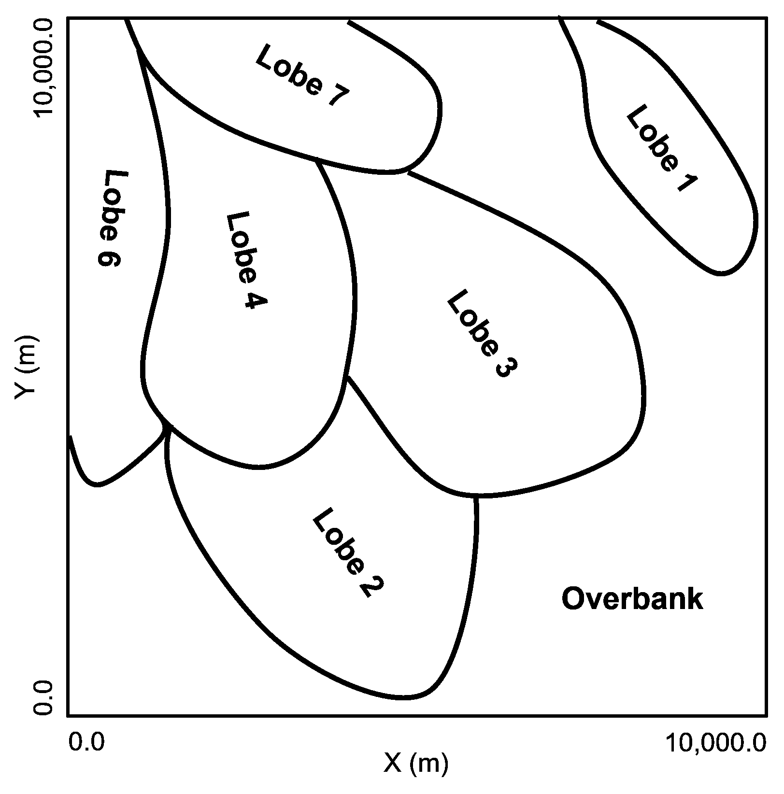

从 1 到 7 解释的深水叶状体元素序列。叶状体 2 到 7 被解释为一个单一的逆行叶状体复合体。

### 合成数据生成方法

通过在 10 米 x10 米网格的全面网格上进行地质统计模拟，进行真值模型/人群模拟，

+   使用序列高斯模拟进行连续孔隙率模拟，变异距范围约为数据范围的 1/3

+   将孔隙率模拟截断以计算砂和页岩相，以实现相边界孔隙率连续性

+   连续，与孔隙率实现相关的位置协同克里金马尔可夫-贝叶斯模拟的渗透率协同模拟

+   根据孔隙率实现进行位置协同克里金马尔可夫-贝叶斯模拟的声波阻抗的连续协同模拟

通过以下方式采样，

+   定期和随机采样的组合，使用拒绝采样器以促进高样本偏差（声波阻抗低）来计算二维井位

+   具有误差成分分配到二维点集的网格单元值

### 加载数据集

```py
df_12 = pd.read_csv(r"https://raw.githubusercontent.com/GeostatsGuy/GeoDataSets/master/12_sample_data.csv") # load the data from Dr. Pyrcz's GitHub repository
AI_12 = np.loadtxt(r'https://raw.githubusercontent.com/GeostatsGuy/GeoDataSets/master/12_AI.csv', delimiter=',')

xmin = 0.0; xmax = 10000.0; ymin = 0.0; ymax = 10000.0; nbin = 30         # set the data extents and number of bins for histograms 
```

### 数据集字典

这里有一个包含此数据集中每个特征所有信息的字典。

```py
twelve = {
    "Facies": {
        "min": 0,
        "max": 1,
        "colormap": "cmap_facies",         
        "name": "Facies","fname": "Facies",
        "units": "Sand - 1, Shale - 0",
        "map": None,'format': 'int'
    },
    "Porosity": {
        "min": 0.1,
        "max": 0.3,
        "colormap": "inferno",       
        "name": "Porosity","fname": "Porosity",
        "units": "fraction",
        "map": None,'format': 'small'
    },
    "Perm": {
        "min": 0.01,
        "max": 2000,
        "colormap": "inferno",       
        "name": "Permeability","fname": "Perm",
        "units": "mD",
        "map": None,'format': 'large'
    },
    "AI": {
        "min": 1500,
        "max": 6500,
        "colormap": "inferno",
        "name": "Acoustic Impedance","fname": "AI",
        "units": r"$\frac{kg}{m² \cdot s} \times 10³$",
        "map": AI_12,'format': 'large'
    },
} 
```

### 可视化数据集

现在我们可以加载和可视化合成数据集。

```py
for ifeature, feature in enumerate(twelve):                   # loop over features
    plt.subplot(len(twelve),2,(ifeature)*2+1)
    if feature == 'Facies':
        locmap_facies(df_12,'X','Y',twelve[feature]["fname"],xmin,xmax,ymin,ymax,twelve[feature]["min"],twelve[feature]["max"],
              'Twelve: ' + twelve[feature]["fname"] + ' Well Data Location Map','X (m)','Y (m)',twelve[feature]["name"] + ' (' + twelve[feature]["units"] + ')',
              cmap_facies)
    else:
        sc = GSLIB.locmap_st(df_12,'X','Y',twelve[feature]["fname"],xmin,xmax,ymin,ymax,twelve[feature]["min"],twelve[feature]["max"],
                'Twelve: ' + twelve[feature]["name"] + ' Well Data Location Map','X(m)','Y(m)',
                             twelve[feature]["name"] + ' (' + twelve[feature]["units"] + ')',twelve[feature]["colormap"]); add_grid2()
        if twelve[feature]["map"] is not None:
            im = plt.imshow(AI_12,interpolation = None,extent = [xmin,xmax,ymax,ymin],vmin=twelve[feature]["min"],vmax=twelve[feature]["max"],
                            origin='lower',aspect='auto',cmap=twelve[feature]["colormap"])
            plt.title('Twelve: ' + twelve[feature]['name'] + ' Well Data Location Map and Grid')
        fformatter = get_formatter(np.linspace(xmin,xmax,10),'large')
        plt.gca().xaxis.set_major_formatter(fformatter)
        plt.gca().yaxis.set_major_formatter(fformatter)

    plt.subplot(len(twelve),2,(ifeature)*2+2)
    if feature == 'Facies':         
        hist_sand_shale(df_12,twelve[feature]["fname"],'Twelve: Facies Well Data Distribution')
    else:
        plt.hist(df_12[feature],bins=np.linspace(twelve[feature]["min"],twelve[feature]["max"],nbin),color='darkorange',edgecolor='black',
                 density=True,label='Well Data')
        plt.annotate('Average: ' + str(np.round(np.average(df_12[feature].values),2)),[0.78,0.82],xycoords='axes fraction')
        plt.annotate('St.Dev.: ' + str(np.round(np.std(df_12[feature].values),2)),[0.78,0.77],xycoords='axes fraction')
        plt.annotate('P10:     ' + str(np.round(np.percentile(df_12[feature].values,10),2)),[0.78,0.72],xycoords='axes fraction')
        plt.annotate('P90:     ' + str(np.round(np.percentile(df_12[feature].values,90),2)),[0.78,0.67],xycoords='axes fraction')
        plt.annotate('n:       ' + str(np.count_nonzero(~np.isnan(df_12[feature].values))),[0.78,0.62],xycoords='axes fraction')
        fformatter = get_formatter(df_12[feature].values,twelve[feature]["format"])
        plt.gca().xaxis.set_major_formatter(fformatter)
        plt.xlabel(twelve[feature]["name"] + ' (' + twelve[feature]["units"] + ')'); plt.xlim(twelve[feature]["min"],twelve[feature]["max"])
        plt.ylabel('Density')
        plt.title('Twelve: ' + twelve[feature]["name"] +  ' Well Data Distribution'); add_grid2()
        if twelve[feature]["map"] is not None: 
            plt.hist(twelve[feature]["map"].flatten(),bins=np.linspace(twelve[feature]["min"],twelve[feature]["max"],nbin),
                     color='red',edgecolor='black',alpha=0.3,zorder=10,density=True,label='Seismic')
        plt.legend(loc='upper right')
plt.subplots_adjust(left=0.0, bottom=0.0, right=2.0, top=4.1, wspace=0.2, hspace=0.2); plt.show() 
```

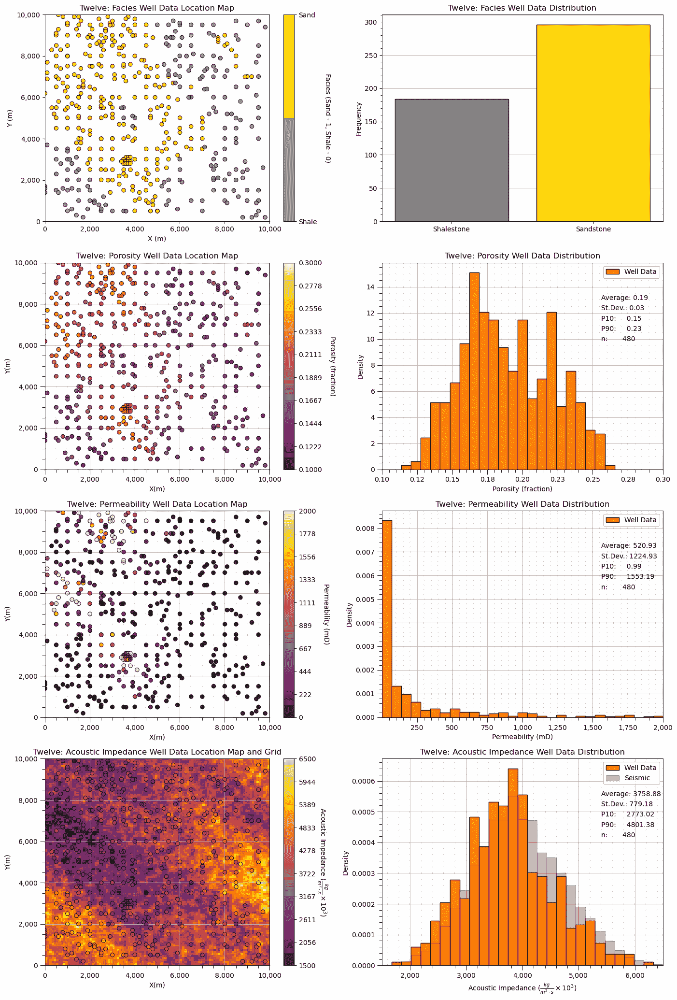

## 数据集：密度和孔隙度井

密度和孔隙度井是一个单根垂直井段，从 RHOB 井日志中全面采样密度，从沿井 0.25 米间隔连续采样的井核中采样孔隙度。所有样本都在单个储层地层和单个相内。

**亮点** - 简单的 1D，2 个特征数据集，具有一般线性关系

密度和孔隙度井包括这些特征，

| 全名 | 名称 | 单位 | 描述 |
| --- | --- | --- | --- |
| 密度 | 密度 | $ \frac{g}{cm³} $ | RHOB |
| 孔隙度 | 孔隙度 | $ \% $ | 核分析得到 |

### 沉积环境

将单个地层单元解释为由 1 到 9 个河道元素组成的复合河道，河道元素相互切割，大大减少了明显元素厚度，并移除了河道元素填充和河漫滩的低孔隙率顶部，这是由于河道改道造成的。由于缺乏边缘和河漫滩沉积岩相，河道可能被限制，井日志似乎只包括堆叠河道元素的河道轴成分。

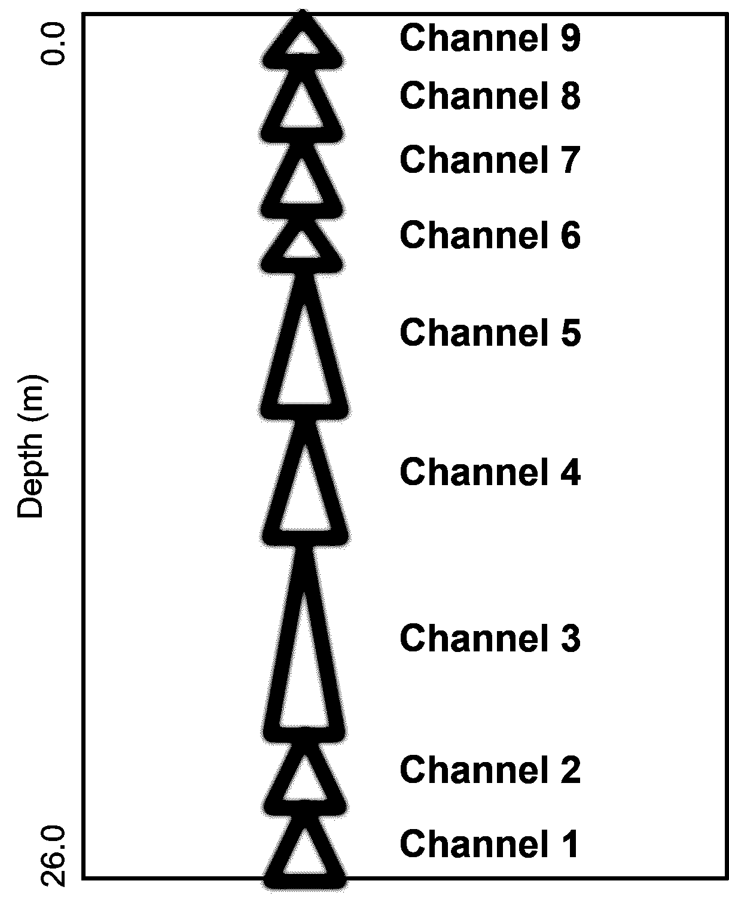

从 1 到 9 解释堆叠的河流河道元素序列。河道元素相互切割，大大减少了明显厚度，并移除了河道元素填充和所有河漫滩的低孔隙率顶部，这是由于改道造成的。

### 合成数据生成方法

密度测井，

+   将随机高斯值向量应用于卷积以施加空间连续性

孔隙率测井，

+   将孔隙率模拟截断以计算砂岩和页岩岩相，以实现岩相边界处的孔隙率连续性

+   连续的、与位置协同的克里金马尔可夫-贝叶斯模拟渗透率，给定孔隙率实现

+   连续的、与位置协同的克里金马尔可夫-贝叶斯模拟声阻抗，给定孔隙率实现

样本化方式，

+   结合规则和随机采样以及拒绝采样器，以促进高样本偏差（对于声阻抗而言为低）来计算二维井位

+   分配给二维点集的误差成分的协同网格单元值

### 加载数据集

```py
df_denpor = pd.read_csv(r"https://raw.githubusercontent.com/GeostatsGuy/GeoDataSets/master/Density_Por_data.csv") # load the data from Dr. Pyrcz's GitHub repository
xmin = 0.0; xmax = 10000.0; ymin = 0.0; ymax = 10000.0; nbin = 30         # set the data extents and number of bins for histograms 
```

### 数据集字典

这里有一个包含此数据集中每个特征所有信息的字典。

```py
denpor = {
    "Depth": {
        "min": 0.0,
        "max": 26.0,
        "colormap": "inferno",         
        "name": "Depth","fname": "Depth",
        "units": r"$m$",
        "map": None,'format': 'small'
    },
    "Density": {
        "min": 1.0,
        "max": 2.4,
        "colormap": "inferno",         
        "name": "Density","fname": "Density",
        "units": r"$\frac{g}{cm³}$",
        "map": None,'format': 'one'
    },
    "Porosity": {
        "min": 0.0,
        "max": 25.0,
        "colormap": "viridis",       
        "name": "Porosity","fname": "Porosity",
        "units": r"$\%$",
        "map": None,'format': 'one'
    },
} 
```

### 可视化数据集

现在我们可以加载并可视化合成数据集。

```py
import matplotlib.pyplot as plt
from matplotlib.gridspec import GridSpec

feature_list = ['Density','Porosity']   # early Python does not preserve dictionary list, this is safer than looping over dictionary

fig = plt.figure(figsize=(5, 6))  # Adjust for comfortable aspect
gs = GridSpec(3, 2, height_ratios=[1.3, 0.7, 1.0], figure=fig)
ax1 = fig.add_subplot(gs[0, 0])
ax2 = fig.add_subplot(gs[0, 1])
ax3 = fig.add_subplot(gs[1, 0])
ax4 = fig.add_subplot(gs[1, 1])
ax5 = fig.add_subplot(gs[2, :])  # Spans both columns

mid_axes = [ax3,ax4]; top_axes = [ax1,ax2]

for iax, ax in enumerate(top_axes):
    feature = feature_list[iax]
    ax.plot(df_denpor[feature],df_denpor['Depth'],color='black',lw=2)
    ax.set_ylabel(denpor['Depth']["name"] + ' (' + denpor['Depth']["units"] + ')')
    ax.set_ylim(denpor['Depth']["max"],denpor['Depth']["min"]); add_grid(ax)
    ax.set_xlim(denpor[feature]["min"],denpor[feature]["max"])
    ax.set_xlabel(denpor[feature]["name"] + ' (' + denpor[feature]["units"] + ')')
    ax.set_title('Density and Porosity Well: ' + denpor[feature]["name"] + ' Well Log')
    fformatter = get_formatter(df_denpor[feature].values,denpor[feature]["format"])
    ax.xaxis.set_major_formatter(fformatter)

for iax, ax in enumerate(mid_axes):
    feature = feature_list[iax]
    ax.hist(df_denpor[feature],bins=np.linspace(denpor[feature]["min"],denpor[feature]["max"],nbin),color='darkorange',edgecolor='black',
          density=True,label='Well Data')
    ax.annotate('Average: ' + str(np.round(np.average(df_denpor[feature].values),2)),[0.75,0.90],xycoords='axes fraction')
    ax.annotate('St.Dev.: ' + str(np.round(np.std(df_denpor[feature].values),2)),[0.75,0.85],xycoords='axes fraction')
    ax.annotate('P10:     ' + str(np.round(np.percentile(df_denpor[feature].values,10),2)),[0.75,0.80],xycoords='axes fraction')
    ax.annotate('P90:     ' + str(np.round(np.percentile(df_denpor[feature].values,90),2)),[0.75,0.75],xycoords='axes fraction')
    ax.annotate('n:       ' + str(np.count_nonzero(~np.isnan(df_denpor[feature].values))),[0.75,0.70],xycoords='axes fraction')
    fformatter = get_formatter(df_denpor[feature].values,denpor[feature]["format"])
    ax.xaxis.set_major_formatter(fformatter)
    ax.set_xlabel(denpor[feature]["name"] + ' (' + denpor[feature]["units"] + ')'); ax.set_xlim(denpor[feature]["min"],denpor[feature]["max"])
    ax.set_ylabel('Density')
    ax.set_title('Density and Porosity Well: ' + denpor[feature]["name"] +  ' Well Data Distribution'); add_grid(ax)

ax5.scatter(df_denpor['Density'],df_denpor['Porosity'],color='darkorange',edgecolor='black',s=40,marker='o')
ax5.set_ylabel(denpor['Porosity']["name"] + ' (' + denpor['Porosity']["units"] + ')')
ax5.set_ylim(denpor['Porosity']["min"],denpor['Porosity']["max"]); add_grid(ax5)
ax5.set_xlabel(denpor['Density']["name"] + ' (' + denpor['Density']["units"] + ')')
ax5.set_title('Density and Porosity Well: ' + denpor['Porosity']["name"] + ' vs. ' + denpor['Density']["name"] + ' Well Log')

plt.subplots_adjust(left=0.0, bottom=0.0, right=2.0, top=2.5, wspace=0.3, hspace=0.2); plt.show() 
```

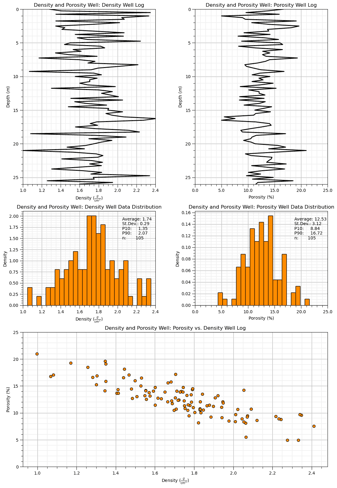

## 数据集：空间非线性多变量砂岩仅岩相 v5

空间非线性多变量砂岩仅岩相 v5 (SNMSv5) 是一个密集采样的、多变量、空间传统烃类数据集，具有单个砂岩岩相。

**链接** - 数据集可在[此处](https://github.com/GeostatsGuy/GeoDataSets/blob/master/spatial_nonlinear_MV_facies_v5_sand_only.csv)找到，声阻抗图在[此处](https://github.com/GeostatsGuy/GeoDataSets/blob/master/spatial_nonlinear_MV_facies_v5_sand_only_truth_AI.csv)，孔隙率真值模型在[此处](https://github.com/GeostatsGuy/GeoDataSets/blob/master/spatial_nonlinear_MV_facies_v5_sand_only_truth_por.csv)。

**亮点** - 用于测试的孔隙率真值模型，适合软数据去偏方法的分布缺失成分

+   多变量稀疏样本数据，

| 全名 | 名称 | 单位 | 描述 |
| --- | --- | --- | --- |
| X | X | $m$ | x 坐标 |
| Y | Y | $m$ | y 坐标 |
| 岩相 | 岩相 | 指示符 | 0 =页岩岩，1 =砂岩 |
| 孔隙率 | 孔隙率 | 比率 | 有效孔隙率 |
| 渗透率 | Perm | $ mD $ | 各向同性，水平 |
| 声阻抗 | AI | $ \frac{kg}{m² \cdot s} $ | 从地震数据插值得到 |

+   2D 规则网格真模型和地图，

| 全名 | 名称 | 单位 | 描述 |
| --- | --- | --- | --- |
| 孔隙率 | 孔隙率 | 比率 | 测试的真模型 |
| 声阻抗 | AI | $ \frac{kg}{m² \cdot s} $ | 从地震数据反演得到 |

### 沉积环境

将单个地层单元解释为以河流作用为主的混合沉积三角洲，具有 2 个突出的次级三角洲。在每个三角洲和次级三角洲内部，存在分支古水流，导致多个古水流方向，以及从内部到外部三角洲孔隙率和渗透率的一般降低。

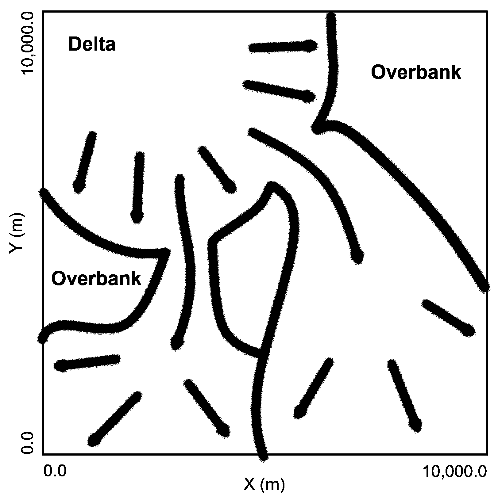

解释的以河流作用为主的混合沉积三角洲。

### 合成数据生成方法

通过在 10 m x 10 m 单元格的详尽网格上进行的地质统计模拟，进行真模型/种群，

+   连续孔隙率模拟，使用顺序高斯模拟，变异范围约为数据范围的 1/3

+   孔隙率模拟截断以计算砂和页岩相，确保相边界孔隙率的连续性

+   连续，与位置匹配的克立格化马氏-贝叶斯模拟，给定孔隙率实现渗透率

+   连续，与位置匹配的克立格化马氏-贝叶斯模拟，给定孔隙率实现声阻抗

采样方式，

+   定期和随机采样的组合，使用拒绝采样器以促进高样本偏差（声阻抗低）来计算 2D 井位

+   分配到 2D 点集的错误成分的网格单元格值

### 加载数据集和真模型

```py
df_snms5 = pd.read_csv(r"https://raw.githubusercontent.com/GeostatsGuy/GeoDataSets/master/spatial_nonlinear_MV_facies_v5_sand_only.csv") # load the data from Dr. Pyrcz's GitHub repository
AI_snms5 = np.loadtxt(r'https://raw.githubusercontent.com/GeostatsGuy/GeoDataSets/master/spatial_nonlinear_MV_facies_v5_sand_only_truth_AI.csv', delimiter=',')
Por_snms5 = np.loadtxt(r'https://raw.githubusercontent.com/GeostatsGuy/GeoDataSets/master/spatial_nonlinear_MV_facies_v5_sand_only_truth_por.csv', delimiter=',')

xmin = 0.0; xmax = 10000.0; ymin = 0.0; ymax = 10000.0; nbin = 30         # set the data extents and number of bins for histograms 
```

### 数据集字典

这里有一个字典，包含了该数据集中每个特征的全部信息。

```py
snms5 = {
    "Porosity": {
        "min": 0.0,
        "max": 30.0,
        "colormap": "inferno",       
        "name": "Porosity","fname": "Por",
        "units": "fraction",
        "map": Por_snms5,'format': 'small'
    },
    "Perm": {
        "min": 0.01,
        "max": 2000,
        "colormap": "inferno",       
        "name": "Permeability","fname": "Perm",
        "units": "mD",
        "map": None,'format': 'large'
    },
    "AI": {
        "min": 3000,
        "max": 5500,
        "colormap": "inferno",
        "name": "Acoustic Impedance","fname": "AI",
        "units": r"$\frac{kg}{m² \cdot s} \times 10³$",
        "map": AI_snms5,'format': 'large'
    },
} 
```

### 可视化数据集

现在我们可以加载数据集并可视化。

```py
for ifeature, feature in enumerate(snms5):
    plt.subplot(len(snms5),2,(ifeature)*2+1)
    if feature == 'Facies':
        locmap_facies(df_snms5,'X','Y',snms5[feature]["fname"],xmin,xmax,ymin,ymax,twelve[feature]["min"],snms5[feature]["max"],
              'SNMS5: ' + snms5[feature]["fname"] + ' Well Data Location Map','X (m)','Y (m)',snms5[feature]["name"] + ' (' + snms5[feature]["units"] + ')',
              cmap_facies)
    else:
        sc = GSLIB.locmap_st(df_snms5,'X','Y',snms5[feature]["fname"],xmin,xmax,ymin,ymax,snms5[feature]["min"],snms5[feature]["max"],
                'SNMS5: ' + snms5[feature]["name"] + ' Well Data Location Map','X(m)','Y(m)',
                             snms5[feature]["name"] + ' (' + snms5[feature]["units"] + ')',snms5[feature]["colormap"]); add_grid2()
        if snms5[feature]["map"] is not None:
            im = plt.imshow(snms5[feature]["map"],interpolation = None,extent = [xmin,xmax,ymax,ymin],vmin=snms5[feature]["min"],vmax=snms5[feature]["max"],
                            origin='lower',aspect='auto',cmap=snms5[feature]["colormap"])
            plt.title('SNMS5: ' + snms5[feature]['name'] + ' Well Data Location Map and Grid')
        fformatter = get_formatter(np.linspace(xmin,xmax,10),'large')
        plt.gca().xaxis.set_major_formatter(fformatter)
        plt.gca().yaxis.set_major_formatter(fformatter)

    plt.subplot(len(snms5),2,(ifeature)*2+2)
    if feature == 'Facies':         
        hist_sand_shale(df_snms5[feature]["map"],snms5[feature]["fname"],'Twelve: Facies Well Data Distribution')
    else:
        plt.hist(df_snms5[snms5[feature]["fname"]],bins=np.linspace(snms5[feature]["min"],snms5[feature]["max"],nbin),color='darkorange',edgecolor='black',
                 density=True,label='Well Data')
        plt.annotate('Average: ' + str(np.round(np.average(df_snms5[snms5[feature]["fname"]].values),2)),[0.78,0.82],xycoords='axes fraction')
        plt.annotate('St.Dev.: ' + str(np.round(np.std(df_snms5[snms5[feature]["fname"]].values),2)),[0.78,0.77],xycoords='axes fraction')
        plt.annotate('P10:     ' + str(np.round(np.percentile(df_snms5[snms5[feature]["fname"]].values,10),2)),[0.78,0.72],xycoords='axes fraction')
        plt.annotate('P90:     ' + str(np.round(np.percentile(df_snms5[snms5[feature]["fname"]].values,90),2)),[0.78,0.67],xycoords='axes fraction')
        plt.annotate('n:       ' + str(np.count_nonzero(~np.isnan(df_snms5[snms5[feature]["fname"]].values))),[0.78,0.62],xycoords='axes fraction')
        fformatter = get_formatter(df_snms5[snms5[feature]["fname"]].values,snms5[feature]["format"])
        plt.gca().xaxis.set_major_formatter(fformatter)
        plt.xlabel(snms5[feature]["name"] + ' (' + snms5[feature]["units"] + ')'); plt.xlim(snms5[feature]["min"],snms5[feature]["max"])
        plt.ylabel('Density')
        plt.title('SNMS5: ' + snms5[feature]["name"] +  ' Well Data Distribution'); add_grid2()
        if snms5[feature]["map"] is not None: 
            plt.hist(snms5[feature]["map"].flatten(),bins=np.linspace(snms5[feature]["min"],snms5[feature]["max"],nbin),
                     color='red',edgecolor='black',alpha=0.3,zorder=10,density=True,label='Seismic')
        plt.legend(loc='upper right')
plt.subplots_adjust(left=0.0, bottom=0.0, right=2.0, top=3.1, wspace=0.2, hspace=0.2); plt.show() 
```

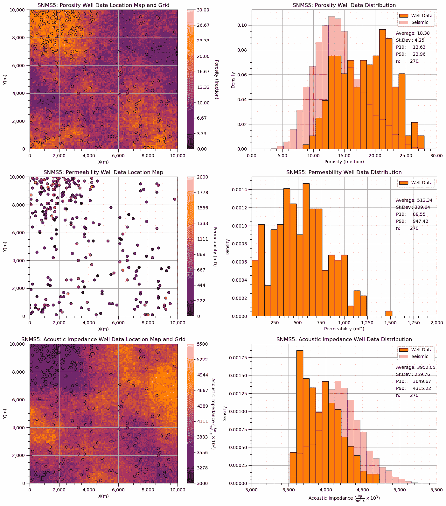

## 数据集：非常规多变量 v5

非常规多变量 v5（UNMV5）是一个密集采样的、多变量的非常规烃数据集，具有单一的砂岩相。

**链接** - 数据集可在[此处](https://github.com/GeostatsGuy/GeoDataSets/blob/master/unconv_MV_v5.csv)找到。

**亮点** - 大量潜在特征用于特征选择、特征工程和预测机器学习模型构建

+   多变量稀疏样本数据，

| 全名 | 名称 | 单位 | 描述 |
| --- | --- | --- | --- |
| 孔隙率 | 孔隙率 | 比率 | 有效孔隙率 |
| 渗透率 | Perm | $ mD $ | 各向同性，水平 |
| 声阻抗 | AI | $ \frac{kg}{m² \cdot s} $ | 从地震反演插值得到 |
| 坚韧性指数 | 脆性 | 比率 | 基于弹性模量的方法 |
| 总有机碳 | TOC | $ \% $ | LECO 分析仪 |
| 玻璃质反射率 | VR | $ \% $ | 平均随机反射率 |

### 沉积环境

混合碳酸盐和碎屑岩非常规天然气储层，孔隙率良好，但渗透率差。为了提高生产潜力预测，收集了各种特征，包括总有机碳、脆性和镜煤反射率。由于复杂的恢复机制，以及自然裂缝系统与人工裂缝的相互作用，以及通常有限的基质流速，非常规储层预测可能相当具有挑战性。

### 合成数据生成方法

从多元分布中抽取的样本，

+   从一个大的$M$多元高斯分布中采样，相关系数由一个具有强和弱、正和负相关性的协方差矩阵定义

+   将特征计算为$M$个特征的各种变换的组合，以施加非线性关系

+   将边缘分布转换为施加非高斯单变量分布

### 加载数据集和真值模型

```py
df_unmv5 = pd.read_csv(r"https://raw.githubusercontent.com/GeostatsGuy/GeoDataSets/master/unconv_MV_v5.csv") # load the data from Dr. Pyrcz's GitHub repository

nbin = 30                                # set the data extents and number of bins for histograms 
```

### 数据集字典

这里有一个包含该数据集中每个特征所有信息的字典。

```py
unmv5 = {
    "Porosity": {
        "min": 0.0,
        "max": 30.0,
        "colormap": "inferno",       
        "name": "Porosity","fname": "Por",
        "units": "fraction",
        "map": None,'format': 'small'
    },
    "Perm": {
        "min": 0.0,
        "max": 15.0,
        "colormap": "inferno",       
        "name": "Permeability","fname": "Perm",
        "units": "mD",
        "map": None,'format': 'large'
    },
    "AI": {
        "min": 0.0,
        "max": 6.0,
        "colormap": "inferno",
        "name": "Acoustic Impedance","fname": "AI",
        "units": r"$\frac{kg}{m² \cdot s} \times 10³$",
        "map": None,'format': 'small'
    },
    "Brittle": {
        "min": 0.0,
        "max": 100,
        "colormap": "inferno",
        "name": "Brittleness","fname": "Brittle",
        "units": r"unitless",
        "map": None,'format': 'small'
    },
    "TOC": {
        "min": 0.0,
        "max": 3.0,
        "colormap": "inferno",
        "name": "Total Organic Carbon","fname": "TOC",
        "units": r"$\%$",
        "map": None,'format': 'small'
    },
    "VR": {
        "min": 0.0,
        "max": 4.0,
        "colormap": "inferno",
        "name": "Vitrinite Reflectance","fname": "VR",
        "units": r"$\%$",
        "map": None,'format': 'small'
    },
    "Prod": {
        "min": 0.0,
        "max": 10000.0,
        "colormap": "inferno",
        "name": "Production","fname": "Prod",
        "units": r"$MCFPD$",
        "map": None,'format': 'large'
    }
} 
```

### 可视化数据集

现在我们可以加载并可视化合成的数据集。

```py
features = [item['fname'] for item in unmv5.values()]
keys = list(unmv5.keys())
labels = [item['name'] + ' (' + item['units'] + ')' for item in unmv5.values()]
pp_unmv5 = sns.PairGrid(df_unmv5,vars=features)
pp_unmv5 = pp_unmv5.map_upper(plt.scatter, color = 'darkorange', edgecolor = 'black', alpha = 0.8, s = 10)
pp_unmv5 = pp_unmv5.map_diag(plt.hist, bins = 20, color = 'darkorange',alpha = 0.8, edgecolor = 'k')# Map a density plot to the lower triangle
pp_unmv5 = pp_unmv5.map_lower(sns.kdeplot, cmap = plt.cm.inferno, 
                              shade = False, shade_lowest = False, alpha = 1.0, n_levels = 10)

# pp_unmv5.map(sns.scatterplot)

# Draw everything first so axes exist and are not overridden
plt.draw()

for i, ax in enumerate(pp_unmv5.axes[:, 0]):  # First column => leftmost Y axes
    ax.set_ylabel(labels[i])
for i, ax in enumerate(pp_unmv5.axes[-1, :]):  # First column => leftmost Y axes
    ax.set_xlabel(labels[i])
for i in range(len(pp_unmv5.axes)):
    for j in range(len(pp_unmv5.axes)):
        # print(i,j)
        ax = pp_unmv5.axes[i, j]
        ax.set_xlim(unmv5[keys[j]]["min"],unmv5[keys[j]]["max"])
        ax.set_ylim(unmv5[keys[i]]["min"],unmv5[keys[i]]["max"])
        add_grid(ax)

plt.subplots_adjust(left=0.0, bottom=0.0, right=0.9, top=0.9, wspace=0.2, hspace=0.2); plt.show() 
```

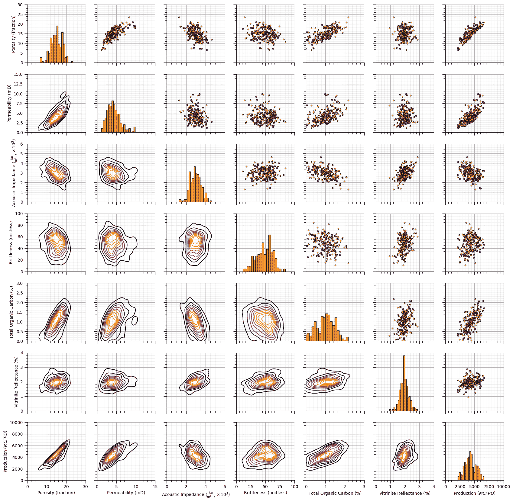

## 数据集：储层 21

储层 21 是一个大型、孤立、孔隙率和渗透率良好的储层单元。

### 沉积环境

储层沉积物是由海底浊流运输并沉积成岩化的浊积岩。浊积岩被分为 4 个顺序相，

1.  页岩岩

1.  砂质页岩

1.  砂质页岩

1.  砂岩

随着岩石质量、孔隙率和渗透率的增加，上述指示的分类从最差=1（页岩岩）到最佳=4（砂岩）。沉积后，浊积岩的孔隙空间被迁移的烃类物质填充，这些烃类物质被位于单元上方的厚页岩所捕获。

浊积岩的运输和沉积机制在维基百科的浊积岩文章中解释，浊积岩储层建模的概述可在 McHarge 等人，2011 年的文章中找到。

浊积岩的运输和沉积的示意图可在维基百科浊积岩文章中找到（图 1）。

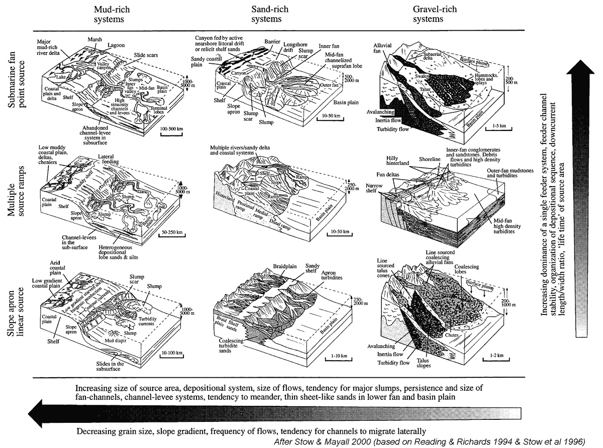

沉积物源类型和沉积物以及由此产生的浊积岩沉积类型（图片来自 Stow 和 Mayall，2000 年）。

一个好的模型是海底滑坡，即浊流，从大陆架边缘沿斜坡流向深海盆地

+   驱动力是由于水和颗粒的混合导致的密度明显增加

+   斜率的梯度通常在 1 到 2 度之间（1% - 4%梯度）

+   这些浊流可以旅行 100s 到 1,500 km（比斯开湾到大西洋深渊）

+   常见速度为 5 - 20 m/s（20 - 70 km/h）

+   要在实验室中可视化这一点，请看这个简短的[Turbidity Current YouTube 视频](https://youtu.be/y7BbYg1sDnU?si=wUjMEh5xSxfQFM_L)。

浊流导致在深水环境中形成广泛的孔隙率高、渗透率适中的储层。

这里有一些关于这个数据集的重要细节，

+   **感兴趣体积**：具有 10 km x 10 km x 50 m（厚度）范围的碎屑深水浊积岩储层单元。

+   **流体**：初始油水接触深度为 3067.4 米，平均连生水饱和度约为 20.3%

+   **结构**：具有主要垂直断层穿过储层的背斜结构（见下面的图像中的位置和方程）。是否在断层处有位移（不连续性）尚不清楚。

+   **网格**：二维地图符合标准的 Python 约定，原点在左上角（见下面的图像）。

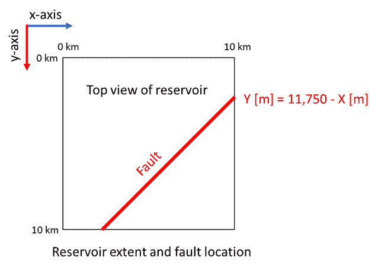

储层 21 的平面图。

**图 2**：储层 21 的平面图。

+   **井**：在储层中钻探并完成了 83 口垂直井，覆盖整个储层单元。由于现场管理限制，只有 73 口井在前三年被用于产油，而剩余的 10 口井保持关闭。到第三年结束时，剩余的 10 口未生产的井计划开启。

### 井日志

73 口井的井日志可在以下位置获取，

+   [res21_well.csv](https://github.com/GeostatsGuy/GeoDataSets/blob/master/res21_wells.csv)

相关的 1 年、2 年和 3 年累积油水产量可在以下位置获取，

+   [res21_production_history.csv](https://github.com/GeostatsGuy/GeoDataSets/blob/master/res21_production_history.csv)

而新的 10 口井（在产油之前）的井日志可在以下位置获取，

+   [res21_new_wells.csv](https://github.com/GeostatsGuy/GeoDataSets/blob/master/res21_new_wells.csv)

备注：

+   所有井名都被屏蔽（用 1 到 83 的简单索引替换）并且坐标转换到感兴趣区域以隐藏实际的储层。

+   可用的岩石物理和地质力学性质已列出。

+   文件中的空白条目表示那些位置的缺失数据。

预测特征：

| 特征 | 单位 | 描述 |
| --- | --- | --- |
| 井 ID | 整数 | 唯一的井标识符，匿名化，随机整数 |
| X, Y | $m$ | 在感兴趣区域内的井位置（X 和 Y 为 0 - 10,000） |
| 相 | 序数类别 | 1 = 砂岩，2 = 砂质砂岩，3 = 砂质砂岩，4 = 砂岩。 |
| 孔隙率 | % | 材料中空隙空间的度量，以百分比表示。 |
| 渗透率 | $mD$ | 材料允许流体通过其孔隙空间的程度，以毫达西表示。 |
| 声波阻抗 | $kg/m² \cdot s x 10⁶$ | 材料密度和声速的乘积，影响波的行为。 |
| 岩石密度 | $g/cm³$ | 单位体积的岩石质量。 |
| P 波速度 | $\frac{m}{s}$ | 压缩地震波通过材料的速度。 |
| S 波速度 | $\frac{m}{s}$ | 材料中剪切地震波的速度。 |
| 杨氏模量 | $GPa$ | 弹性区域内应力和应变的比率；以吉帕为单位测量刚度。 |
| 剪切模量 | $GPa$ | 剪切应力和剪切应变的比率；以吉帕为单位测量剪切阻力。 |

响应特征：

| 特征 | 单位 | 描述 |
| --- | --- | --- |
| 一年内累积油量 | Mbbls | 井在一年内生产的总油量，以千桶为单位 |
| 两年内累积油量 | Mbbls | 井在两年内生产的总油量，以千桶为单位 |
| 三年内累积油量 | Mbbls | 井在三年内生产的总油量，以千桶为单位 |
| 一年内累积水量 | Mbbls | 井在一年内生产的总水量，以千桶为单位 |
| 两年内累积水量 | Mbbls | 井在两年内生产的总水量，以千桶为单位 |
| 三年内累积水量 | Mbbls | 井在三年内生产的总水量，以千桶为单位 |

### 地图数据

以下地图数据可用，

从地球物理振幅和解释中反演出的声阻抗（AI），

+   [**res21_ai_map.npy**](https://github.com/GeostatsGuy/GeoDataSets/blob/master/res21_ai_map.npy)

相地层的比例，砂岩、泥质砂岩、砂质页岩和页岩，可在以下位置找到，

+   [res21_2d_sand_prop_map.npy](https://github.com/GeostatsGuy/GeoDataSets/blob/master/res21_2d_sand_prop_map.npy)

+   [res21_shaly_sand_prop_map.npy](https://github.com/GeostatsGuy/GeoDataSets/blob/master/res21_shaly_sand_prop_map.npy)

+   [res21_sandy_shale_prop_map.npy](https://github.com/GeostatsGuy/GeoDataSets/blob/master/res21_sandy_shale_prop_map.npy)

+   [res21_shale_prop_map.npy](https://github.com/GeostatsGuy/GeoDataSets/blob/master/res21_shale_prop_map.npy)

注意，地层的比例是通过一个经过良好校准的模型计算的，该模型使用井数据和声阻抗，并且 4 个比例之和为 1.0（遵守概率封闭）。地层图顶部的数据可在以下位置找到，

+   [res21_top_depth_map.npy](https://github.com/GeostatsGuy/GeoDataSets/blob/master/res21_top_depth_map.npy)

对 2D 地图、网格数据格式的评论，

+   2D 地图是 200x200 的规则网格，单元格范围为 50m x 50m，覆盖整个储层

+   值表示垂直平均属性，垂直分辨率为整个储层单元

+   索引遵循标准的 Python 约定，原始数据为左上角，索引从 0 开始，为 0, 1, …, n-1，第一个索引是行（从顶部开始），第二个索引是从左边的列

+   例如，要选择 x（列）的第 5 个网格单元格和 y（行）的第 10 个网格单元格，在 Python 中使用 ndarray[9,4]（顺便说一句，在 Matlab 中使用 array[10,5]）

+   2D 数据的原点（例如，array[0,0]）是左上角单元格的中心，沿 y 和 x 方向各 25m（参见图表上方）

### 2D 垂直平均数据

为了简化工作流程测试，通过以下方式制作了数据集的垂直平均 2D 变体，

+   在整个储层单元上平均所有连续的井日志特征

+   将单个响应特征（3 年累计石油产量）与预测特征相结合

+   移除岩相以避免向上扩展分类序数特征的问题

这两个文件包含预测特征、井日志数据，对所有 73 个井在整个井筒上平均，即每个特征每个井一个值，以及一个响应特征，3 年累计石油产量，

+   [**res21_2D_wells.csv**](https://github.com/GeostatsGuy/GeoDataSets/blob/master/res21_2D_wells.csv) - 前生产井的 2D 平均井数据和 3 年累计石油产量，井索引从 1 到 73

以及所有 10 个测试井在整个井筒上平均的井日志数据，

+   [**res21_2D_wells_test.csv**](https://github.com/GeostatsGuy/GeoDataSets/blob/master/res21_2D_wells_test.csv) - 剩余、预生产井的 2D 平均井数据，井索引从 74 到 83

```py
res21 = {
    "X": {
        "min": 0.0,
        "max": 10000.0,
        "colormap": "inferno",       
        "name": "X","fname": "X",
        "units": "m",
        "map": None,'format': 'small'
    },
    "Y": {
        "min": 0.0,
        "max": 10000.0,
        "colormap": "inferno",       
        "name": "Y","fname": "Y",
        "units": "m",
        "map": None,'format': 'small'
    }, 
    "Por": {
        "min": 10.0,
        "max": 17.0,
        "colormap": "inferno",       
        "name": "Porosity","fname": "Por",
        "units": "%",
        "map": None,'format': 'small'
    },
    "Perm": {
        "min": 70.0,
        "max": 200.0,
        "colormap": "inferno",       
        "name": "Permeability","fname": "Perm",
        "units": "mD",
        "map": None,'format': 'large'
    },
    "AI": {
        "min": 6.9,
        "max": 7.6,
        "colormap": "inferno",
        "name": "Acoustic Impedance","fname": "AI",
        "units": r"$\frac{kg}{m² \cdot s} \times 10³$",
        "map": None,'format': 'small'
    },
    "Density": {
        "min": 1.6,
        "max": 2.6,
        "colormap": "inferno",
        "name": "Density","fname": "Density",
        "units": r"\frac{g}{cm²}",
        "map": None,'format': 'small'
    },
    "PVel": {
        "min": 3200.0,
        "max": 4500.0,
        "colormap": "inferno",
        "name": "P-wave Velocity","fname": "PVel",
        "units": r"$\frac{m}{s}$",
        "map": None,'format': 'small'
    },
    "Youngs": {
        "min": 22.0,
        "max": 32.0,
        "colormap": "inferno",
        "name": "Youngs Modulas","fname": "Youngs",
        "units": r"$GPA$",
        "map": None,'format': 'small'
    }, 
    "SVel": {
        "min": 1600.0,
        "max": 1750.0,
        "colormap": "inferno",
        "name": "S-wave Velocity","fname": "SVel",
        "units": r"$\frac{m}{s}$",
        "map": None,'format': 'small'
    },    
    "Shear": {
        "min": 4.5,
        "max": 7.0,
        "colormap": "inferno",
        "name": "Shear Modulus","fname": "Shear",
        "units": r"$GPA$",
        "map": None,'format': 'small'
    },
    "CumulativeOil": {
        "min": 0.0,
        "max": 3000.0,
        "colormap": "inferno",
        "name": "Cumulative Oil Production","fname": "CumulativeOil",
        "units": r"$Mbbls$",
        "map": None,'format': 'large'
    }
} 
```

### 加载数据集和真实模型

让我们加载 2D 数据集并可视化它。

```py
df_res21_2D = pd.read_csv(r"https://raw.githubusercontent.com/GeostatsGuy/GeoDataSets/refs/heads/master/res21_2D_wells.csv", index_col='Well_ID') # load the data from Dr. Pyrcz's GitHub repository
df_res21_2D_test = pd.read_csv(r"https://raw.githubusercontent.com/GeostatsGuy/GeoDataSets/refs/heads/master/res21_2D_wells_test.csv", index_col='Well_ID') # load the data from Dr. Pyrcz's GitHub repository
#df_res21_2D.head()                                           # vizualize dataframe with 73 wells without production 
#df_res21_2D_test.head()                                      # visualize dataframe with 10 wells with production
df_res21_2D.describe().transpose()                            # check summary statistics 
```

|  | count | mean | std | min | 25% | 50% | 75% | max |
| --- | --- | --- | --- | --- | --- | --- | --- | --- |
| X | 73.0 | 4188.698630 | 1783.143687 | 1175.000000 | 2925.000000 | 3875.000000 | 5325.000000 | 7975.000000 |
| Y | 73.0 | 5770.890411 | 2405.487844 | 775.000000 | 3825.000000 | 6125.000000 | 7625.000000 | 9775.000000 |
| Por | 69.0 | 12.822361 | 1.069242 | 10.449132 | 12.122789 | 12.842228 | 13.532038 | 15.837603 |
| Perm | 53.0 | 119.292589 | 23.003770 | 85.457752 | 101.821216 | 116.341824 | 130.554974 | 184.753428 |
| AI | 69.0 | 7.319194 | 0.096761 | 7.062172 | 7.280405 | 7.333877 | 7.379185 | 7.499137 |
| 密度 | 70.0 | 2.043288 | 0.138222 | 1.793870 | 1.921390 | 2.039170 | 2.162651 | 2.301552 |
| PVel | 69.0 | 3696.762373 | 276.382117 | 3229.902892 | 3463.035301 | 3688.453880 | 3897.219799 | 4327.857887 |
| Youngs | 49.0 | 27.173417 | 2.164984 | 23.516002 | 25.378138 | 26.801655 | 28.641350 | 31.463424 |
| SVel | 65.0 | 1676.908144 | 19.277228 | 1637.806458 | 1662.280505 | 1676.458624 | 1688.682882 | 1721.987891 |
| Shear | 48.0 | 5.793693 | 0.474087 | 4.937921 | 5.397281 | 5.769809 | 6.208277 | 6.714150 |
| CumulativeOil | 73.0 | 940.976027 | 429.622150 | 307.120000 | 643.140000 | 819.490000 | 1185.400000 | 2514.500000 |

现在让我们加载两个 2D 地图，

+   平均砂含量

+   声波阻抗

```py
sand_prop_map_url = requests.get('https://raw.githubusercontent.com/GeostatsGuy/GeoDataSets/refs/heads/master/res21_2d_sand_prop_map.npy')
sand_prop_map_url.raise_for_status()                          # Raise an error if the download fails
sand_prop_map = np.load(BytesIO(sand_prop_map_url.content))   # load the .npy file from the downloaded bytes

AI_map_url = requests.get('https://raw.githubusercontent.com/GeostatsGuy/GeoDataSets/refs/heads/master/res21_ai_map.npy')
AI_map_url.raise_for_status()                                 # Raise an error if the download fails
AI_map = np.load(BytesIO(AI_map_url.content))                 # load the .npy file from the downloaded bytes
AI_map = AI_map/1000000.0 
```

### 计算每个特征的直方图

让我们使用上面的字典为每个特征制作直方图。

```py
for ifeat,feature in enumerate(df_res21_2D.columns):          # loop over all features in the dataframe with 73 wells with production
    plt.subplot(4,3,ifeat+1)                                  # subplot
    plt.hist(df_res21_2D[res21[feature]['fname']],bins=np.linspace(res21[feature]['min'],res21[feature]['max'],nbin), # histogram
             color='darkorange',edgecolor='black')
    plt.xlabel(res21[feature]['name'] + ' (' + res21[feature]['units'] +')'); plt.ylabel('Frequency'); plt.title(feature + ' Histogram') # labels 
    add_grid2()                                               # major and minor gridlines function

plt.subplots_adjust(left=0.0, bottom=0.0, right=3.0, top=3.1, wspace=0.2, hspace=0.25); plt.show() 
```

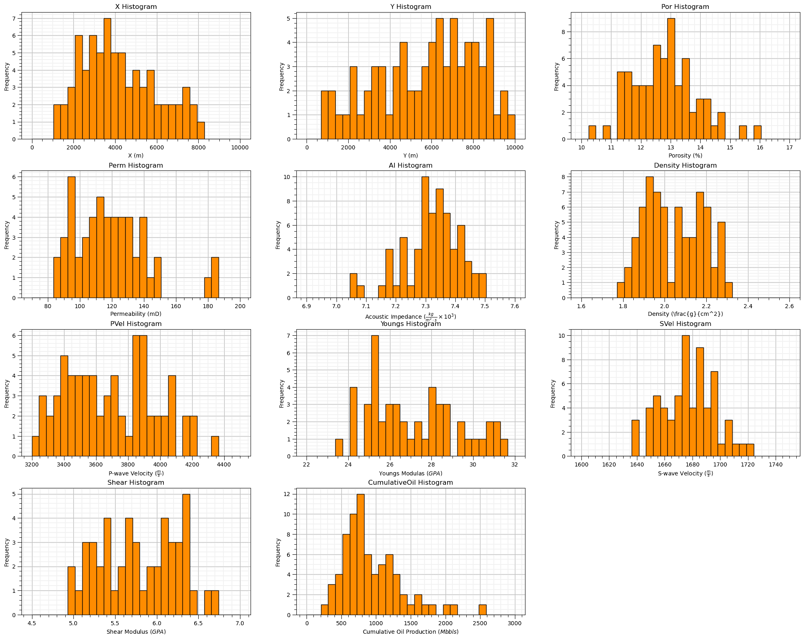

### 可视化数据集

现在我们可以可视化合成数据集。

```py
ifeat = 4                                                    # select feature for scatter plot, 0 - 10
feature =  list(res21)[ifeat]

plt.subplot(121)
im = plt.imshow(sand_prop_map,extent=[0,10000,10000,0],vmin=0,vmax=0.50,cmap=cmap) # 2D map
cb1 = plt.colorbar(im, fraction=0.036, pad=0.18)                         # colorbar for 2D map
cb1.set_label("Proportion of Sand (fraction)")                           # colorbar label for 2D map

sc = plt.scatter(df_res21_2D['X'],df_res21_2D['Y'],c=df_res21_2D[res21[feature]['fname']],s=30,edgecolor='black',
            vmin=res21[feature]['min'],vmax=res21[feature]['max'],cmap=cmap,label='current wells')       # wells with production scatter plot
cb2 = plt.colorbar(sc, fraction=0.046, pad=0.02)                         # colorbar for scatter plot
cb2.set_label(res21[feature]['name'] + ' (' + res21[feature]['units'] +')') # colorbar label for scatter plot

plt.scatter(df_res21_2D_test['X'],df_res21_2D_test['Y'],color='white',s=30,edgecolor='black',label='new wells') # wells without production
plt.xlabel('X (m)'); plt.ylabel('Y (m)'); plt.title(res21[feature]['name'] + ' and Sand Proportion Map') # labels for axes and title
plt.tight_layout(); plt.legend(loc='upper right')

plt.subplot(122)
im = plt.imshow(AI_map,extent=[0,10000,10000,0],vmin=res21['AI']['min'],vmax=res21['AI']['max'],cmap=cmap) # 2D map
cb1 = plt.colorbar(im, fraction=0.036, pad=0.18)                         # colorbar for 2D map
cb1.set_label(res21['AI']['name'] + ' (' + res21['AI']['units'] +')')                           # colorbar label for 2D map

sc = plt.scatter(df_res21_2D['X'],df_res21_2D['Y'],c=df_res21_2D[res21[feature]['fname']],s=30,edgecolor='black',
            vmin=res21[feature]['min'],vmax=res21[feature]['max'],cmap=cmap,label='current wells') # wells with production scatter plot
cb2 = plt.colorbar(sc, fraction=0.046, pad=0.02)                         # colorbar for scatter plot
cb2.set_label(res21[feature]['name'] + ' (' + res21[feature]['units'] +')') # colorbar label for scatter plot

plt.scatter(df_res21_2D_test['X'],df_res21_2D_test['Y'],color='white',s=30,edgecolor='black',label='new wells') # wells without production
plt.xlabel('X (m)'); plt.ylabel('Y (m)'); plt.title(res21[feature]['name'] + ' and Acoustic Impedance Map') # labels for axes and title
plt.tight_layout(); plt.legend(loc='upper right')

plt.subplots_adjust(left=0.0, bottom=0.0, right=2.0, top=1.1, wspace=0.3, hspace=0.25); plt.show() 
```

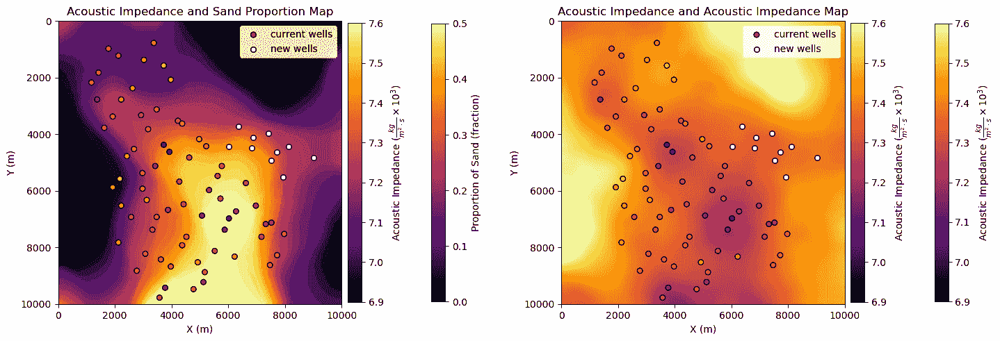

## 散点图

让我们检查特征之间的关系。

```py
features = [item['fname'] for item in res21.values()]
keys = list(res21.keys())
labels = [item['name'] + ' (' + item['units'] + ')' for item in res21.values()]
pp_res21 = sns.PairGrid(df_res21_2D,vars=features)
pp_res21 = pp_res21.map_upper(plt.scatter, color = 'darkorange', edgecolor = 'black', alpha = 0.8, s = 10)
pp_res21 = pp_res21.map_diag(plt.hist, bins = 20, color = 'darkorange',alpha = 0.8, edgecolor = 'k')# Map a density plot to the lower triangle
pp_res21 = pp_res21.map_lower(sns.kdeplot, cmap = plt.cm.inferno, 
                              shade = False, shade_lowest = False, alpha = 1.0, n_levels = 10)

# Draw everything first so axes exist and are not overridden
plt.draw()

for i, ax in enumerate(pp_res21.axes[:, 0]):  # First column => leftmost Y axes
    ax.set_ylabel(labels[i])
for i, ax in enumerate(pp_res21.axes[-1, :]):  # First column => leftmost Y axes
    ax.set_xlabel(labels[i])
for i in range(len(pp_res21.axes)):
    for j in range(len(pp_res21.axes)):
        # print(i,j)
        ax = pp_res21.axes[i, j]
        ax.set_xlim(res21[keys[j]]["min"],res21[keys[j]]["max"])
        ax.set_ylim(res21[keys[i]]["min"],res21[keys[i]]["max"])
        add_grid(ax)

plt.subplots_adjust(left=0.0, bottom=0.0, right=0.9, top=0.9, wspace=0.2, hspace=0.2); plt.show() 
```

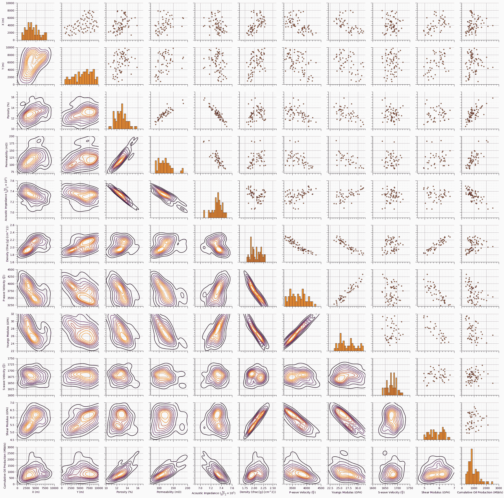

## 评论

这是对我在电子书和其他课程内容中的演示所生成的合成数据集的总结。我希望这，

+   帮助您更好地理解本书中使用的数据集

+   为您提供了一些其他数据集以测试您的知识并评估您的工作流程

我希望这有所帮助，

*迈克尔*

## 关于作者


迈克尔·皮尔奇教授在德克萨斯大学奥斯汀分校 40 英亩校园的办公室。

迈克尔·皮尔奇（Michael Pyrcz）是德克萨斯大学奥斯汀分校[Cockrell 工程学院](https://cockrell.utexas.edu/faculty-directory/alphabetical/p)和[杰克逊地球科学学院](https://www.jsg.utexas.edu/researcher/michael_pyrcz/)的教授，他在[德克萨斯大学奥斯汀分校](https://www.utexas.edu/)从事地下、空间数据分析、地统计学和机器学习的研究与教学。迈克尔还，

+   [能源分析](https://fri.cns.utexas.edu/energy-analytics)新生研究项目的首席研究员，以及德克萨斯大学奥斯汀分校自然科学院机器学习实验室的核心教员

+   [计算机与地球科学](https://www.sciencedirect.com/journal/computers-and-geosciences/about/editorial-board)的副编辑，以及国际数学地球科学协会[数学地球科学](https://link.springer.com/journal/11004/editorial-board)的董事会成员。

迈克尔已经撰写了超过 70 篇[同行评审出版物](https://scholar.google.com/citations?user=QVZ20eQAAAAJ&hl=en)，一个用于空间数据分析的[Python 包](https://pypi.org/project/geostatspy/)，合著了一本关于空间数据分析的教科书《地统计学储层建模》（[Geostatistical Reservoir Modeling](https://www.amazon.com/Geostatistical-Reservoir-Modeling-Michael-Pyrcz/dp/0199731446)），并是两本近期发布的电子书的作者，分别是《Python 应用地统计学：GeostatsPy 实践指南》（[Applied Geostatistics in Python: a Hands-on Guide with GeostatsPy](https://geostatsguy.github.io/GeostatsPyDemos_Book/intro.html)）和《Python 应用机器学习：带代码的实践指南》（[Applied Machine Learning in Python: a Hands-on Guide with Code](https://geostatsguy.github.io/MachineLearningDemos_Book/intro.html)）。

迈克尔的所有大学讲座都可以在他的[YouTube 频道](https://www.youtube.com/@GeostatsGuyLectures)上找到，其中包含 100 多个 Python 交互式仪表板和 40 多个 GitHub 仓库中的详细工作流程，以支持任何感兴趣的学生和在职专业人士。要了解更多关于迈克尔的工作和共享教育资源，请访问他的网站。

## 想要一起工作吗？

我希望这份内容对那些想要了解更多关于地下建模、数据分析以及机器学习的人有所帮助。学生和在职专业人士都欢迎参与。

+   想邀请我到贵公司进行培训、辅导、项目审查、工作流程设计和/或咨询吗？我很乐意拜访并与您合作！

+   想要合作，支持我的研究生研究或我的地下数据分析与机器学习联盟（共同负责人是约翰·福斯特教授）吗？我的研究将数据分析、随机建模和机器学习理论与实践相结合，以开发新的方法和工作流程，增加价值。我们正在解决具有挑战性的地下问题！

+   您可以通过 mpyrcz@austin.utexas.edu 联系到我。

我总是很高兴讨论，

*迈克尔*

迈克尔·皮尔奇兹，博士，P.Eng. 教授，德克萨斯大学奥斯汀分校 Cockrell 工程学院和 Jackson 地球科学学院

更多资源可在以下链接获取：[Twitter](https://twitter.com/geostatsguy) | [GitHub](https://github.com/GeostatsGuy) | [网站](http://michaelpyrcz.com) | [Google Scholar](https://scholar.google.com/citations?user=QVZ20eQAAAAJ&hl=en&oi=ao) | [地统计学书籍](https://www.amazon.com/Geostatistical-Reservoir-Modeling-Michael-Pyrcz/dp/0199731446) | [YouTube](https://www.youtube.com/channel/UCLqEr-xV-ceHdXXXrTId5ig) | [Python 中应用地统计学电子书](https://geostatsguy.github.io/GeostatsPyDemos_Book/intro.html) | [Python 中应用机器学习电子书](https://geostatsguy.github.io/MachineLearningDemos_Book/) | [LinkedIn](https://www.linkedin.com/in/michael-pyrcz-61a648a1)

## 使用假数据的动机

让我先从一项坦白开始，

+   我制作了大量的假数据！

我总是这么做。事实上，我甚至还会创建工作流程来生成假数据，这样我就可以快速制作出各种适合特定模型测试和教育内容的新数据集。但我也发现，我经常需要用以下理由来为自己生成假数据的习惯进行辩护，

+   渴望解决真实数据问题的学生

+   对假数据持怀疑态度的审稿人

为什么我在研究和教育内容中那么频繁地使用假数据？

1.  **避免推断问题** - 当我们处理真实数据时，我们往往无法知道真相。我们的地下数据通常非常有限！也许我们可以倒回时钟，用最新数据来测试，或者屏蔽一个区域来测试我们估计空间数据的能力。但是，我们永远无法完全避免推断问题，即我们的模型表现不佳是因为我们使用了错误的数据或做出了错误的选择？

1.  **在预期值中工作** - 有可能运气好，在一个数据集上运行一个提出的方法，与现有方法相比看到巨大的改进，然后在下一个运行中使用新的数据集看到恶化！数据科学家的工作基于概率和统计学；因此，我们知道我们需要许多重复。我们可以生成数据集案例的集合，然后以预期值的形式总结模型性能，以增加严谨性。

1.  **测试广泛的条件** - 你的模型如何处理数据噪声？冗余特征？特征之间关系的非线性？稀疏数据？要精心制作足够数量的数据集以测试可能广泛的建模条件是非常困难的。使用假数据，你可以调整旋钮并评估任何组合和严重程度条件对模型的影响，甚至可以像“神话破坏者”那样测试你的模型是否失效。

1.  **调整数据难度** - 这是从上一个点延续下来的，但它与调整建模难度有关。使用假数据，你可以给自己提供完美理想的数据，没有任何偏差，没有错误，覆盖范围良好，甚至低维度。实际上，我的假数据生成算法通常从这里开始，然后执行操作以施加偏差采样，添加测量误差，减少覆盖范围，甚至添加额外的特征。记住，很容易将完美数据破坏，但通常很难将差数据改进。

1.  **开放教育内容** - 我保证，我也使用了大量真实数据，但其中大部分数据并不在公有领域。我非常感激并尊重那些花时间为我及其学生获取使用其真实数据的批准的在职专业人士，但将这些数据用于我的免费在线教育内容是不可能的。为了支持我的开放教育努力，我需要可重复的课程笔记；因此，我需要能够自由地共享数据集。

我一直说“假数据”，主要是因为效果，因为说“我制作假数据”听起来很戏剧化。从现在开始，我将使用更正式的术语，“合成数据集”。

+   请放心，作为一名地球静态学家，我实际上非常擅长制作具有真实分布、关系和采样的合成数据集。

## 关于合成数据集的一般评论

现在，我将就我分享的合成数据集发表一些评论。然而，在做出这些陈述时，我不会限制未来我将添加的合成数据集的类型。

+   如果你有建议，我会很可能制作一些新的数据，回想一下，我喜欢制作合成数据！

## 2D 空间数据集

在现代三维空间算法和可视化的时代，我仍在处理二维空间数据可能会令人惊讶。为什么不只是在 NumPy ndarray 对象中包含一个‘z’（*‘zed’* - 向我的加拿大同胞致敬）或 iz 轴呢？

+   做这件事很容易。实际上，我写的 GeostatsPy 包中大部分都有 3D 空间方法可用。

问题在于计算复杂性，以及数据和模型的可视化。

+   许多空间数据分析和地统计方法具有包含 $n_z$ 项的计算复杂度，即通过添加最少数量的 $z$ 层，例如 10 层，我们可以将运行时间增加一个数量级。当然，我非常喜欢酷炫的硬件，但为了在教室和世界各地进行教育，我更愿意选择非常易于运行、计算复杂度非常低、运行速度非常快的方案。

+   我曾在工业 VR 设施中工作，并在家里拥有一台 HTC Vive Pro。在《上古卷轴》中漫步从 Whiterun 到 Solitude 的道路上（《上古卷轴 6》什么时候会发布？）是非常令人惊叹的。我知道 3D 可视化的潜力是惊人的和有效的。然而，使用标准的 Anaconda 包进行 3D 模型和数据可视化有点受限，缺乏与显示、旋转、切片和缩放的灵活交互。

考虑到这些因素，我更倾向于使用二维空间数据集来制作我的教育内容。

## 混合随机和确定性模型

我的原始数据科学专业是地统计，我已审查了世界各地的地统计地下模型，它们都是混合随机和确定性模型，具有，

+   确定性趋势结构以在空间或特征之间引入非平稳性

+   随机残留结构以整合异质性和噪声

我的合成数据集使用地统计模拟方法来包含所有这些组成部分，

+   通过显式分配随机数种子，数据集生成过程是可重复的

## 高斯分布

我已经使用了假设高斯分布的标准地统计模拟方法，例如，

+   序列高斯模拟

+   基于共定位克立格的模拟

+   截断高斯模拟

通过全局分布的反变换或截断，我们可以实现非高斯的全局分布，同样，

+   我构建了混合模型，结合多个高斯模型以处理更复杂的分布和关系。

+   我将单个特征进行缩放以改善偏斜和非线性

因此，虽然我可能使用高斯方法来生成合成数据，但我的合成数据并不仅限于高斯分布。

## 关于图像的问题？

是的，我也为深度学习和多点模拟地统计制作了许多训练图像。这些图像可在以下网址找到，

+   [MLTrainingImages](https://github.com/GeostatsGuy/MLTrainingImages)

您可以引用我们的合成训练图像仓库如下：

Pyrcz, Michael J. and Morales, Misael M. (2023). Machine Learning Training Images Repository (1.0.0). Zenodo. [`doi.org/10.5281/zenodo.7702128`](https://doi.org/10.5281/zenodo.7702128) 

## 数据集的可用性

我所有的合成数据集都可在我的 GitHub 仓库中找到，

+   [GeoDataSets](https://github.com/GeostatsGuy/GeoDataSets)

在我的 GitHub 账户中，

+   [GeostatsGuy](https://github.com/GeostatsGuy)

您可以引用我的合成数据仓库如下：

Pyrcz, M.J., 2024, *GeoDataSets: 合成地下数据仓库*. Zenodo. doi:10.5281/zenodo.15169133 

星标仓库以帮助您再次找到它，并在我继续更新合成数据集时定期检查。

+   我很高兴能帮助您使用有趣和有用的合成数据。

## 可用的合成数据集

这里是可用数据集的列表，以下为摘要，

+   **十二 / 12** - 密集采样，空间双岩性，有偏采样和详尽次级数据。

+   **密度和孔隙度井** - 简单的 1D，2 个特征数据集，具有一般线性关系。

+   **空间非线性多变量砂岩仅岩性 v5** - 孔隙度真值模型用于测试，适合软数据偏差方法的分布缺失组件。

+   **非常规多变量 v5** - 大量潜在特征用于特征选择、特征工程和预测机器学习模型构建。

## 合成数据摘要

下面我提供了每个数据集的总结。这包括，

+   **名称和链接**以访问我的 GitHub 账户上的数据集

+   **方法**生成数据，附有链接

+   **基本**数据展示仪表板，为每个数据集定制

## 加载所需的库

以下代码加载所需的库。

```py
import geostatspy.GSLIB as GSLIB                              # GSLIB utilies, visualization and wrapper
import geostatspy.geostats as geostats                        # GSLIB methods convert to Python 
```

我们还需要一些标准包。这些应该已经与 Anaconda 3 一起安装。

```py
ignore_warnings = True                                        # ignore warnings?
import numpy as np                                            # ndarrys for gridded data
import pandas as pd                                           # DataFrames for tabular data
import os                                                     # set working directory, run executables
import matplotlib.pyplot as plt                               # for plotting
import matplotlib as mpl                                      # custom colorbar
import matplotlib.ticker as ticker                            # custom axes
from matplotlib.gridspec import GridSpec                      # custom layout
from matplotlib.ticker import (MultipleLocator, AutoMinorLocator) # control of axes ticks
from matplotlib.ticker import FuncFormatter
import seaborn as sns                                         # advanced plotting
from scipy.interpolate import Rbf                             # countours that extrapolate
from scipy import stats                                       # summary statistics
from scipy.signal import convolve2d                           # convolution
from scipy.interpolate import griddata
from scipy.ndimage import gaussian_filter
import requests
from io import BytesIO
import math                                                   # trig etc.
import random
cmap = plt.cm.inferno

plt.rc('axes', axisbelow=True)                                # plot all grids below the plot elements
if ignore_warnings == True:                                   
    import warnings
    warnings.filterwarnings('ignore')
seed = 13                                                     # set ramdon number seed
cmap = plt.cm.inferno                                         # default colormap 
```

如果您遇到包导入错误，您可能必须首先安装这些包中的一些。这通常可以通过在 Windows 上打开命令窗口然后输入‘python -m pip install [package-name]’来完成。有关相应包的文档，可以获得更多帮助。

## 声明函数

这些是我们工作流程中更易读代码的一些便利函数。

+   添加主网格线和副网格线

+   砂岩和页岩岩性自定义位置图

+   砂岩和页岩岩性自定义直方图

```py
def add_grid2():
    plt.gca().grid(True, which='major',linewidth = 1.0); plt.gca().grid(True, which='minor',linewidth = 0.2) # add y grids
    plt.gca().tick_params(which='major',length=7); plt.gca().tick_params(which='minor', length=4)
    plt.gca().xaxis.set_minor_locator(AutoMinorLocator()); plt.gca().yaxis.set_minor_locator(AutoMinorLocator()) # turn on minor ticks 

def add_grid(sub_plot):
    sub_plot.grid(True, which='major',linewidth = 1.0); sub_plot.grid(True, which='minor',linewidth = 0.2) # add y grids
    sub_plot.tick_params(which='major',length=7); sub_plot.tick_params(which='minor', length=4)
    sub_plot.xaxis.set_minor_locator(AutoMinorLocator()); sub_plot.yaxis.set_minor_locator(AutoMinorLocator()) # turn on minor ticks

def locmap_facies(df,xcol,ycol,vcol,xmin,xmax,ymin,ymax,vmin,vmax,title,xlabel,ylabel,vlabel,cmap):
    im = plt.scatter(df[xcol],df[ycol],s=None,c=df[vcol],marker=None,cmap=cmap,norm=None,
                     vmin=vmin,vmax=vmax,alpha=0.8,linewidths=0.8,edgecolors="black",)
    plt.title(title); plt.xlim(xmin,xmax); plt.ylim(ymin,ymax); plt.xlabel(xlabel); plt.ylabel(ylabel)
    plt.gca().xaxis.set_major_formatter(ticker.FuncFormatter(lambda x, _: f'{x:,.0f}'))
    plt.gca().yaxis.set_major_formatter(ticker.FuncFormatter(lambda x, _: f'{x:,.0f}'))
    cbar = plt.colorbar(im, orientation="vertical")
    cbar.set_label(vlabel, rotation=270, labelpad=20)
    cbar.set_ticks([0, 1]); cbar.set_ticklabels(['Shale', 'Sand'])

def hist_sand_shale(df,vcol,title):
    n, bins, patches = plt.hist(df[vcol], bins=[-0.5, 0.5, 1.5], rwidth=0.8,edgecolor='black')
    patches[0].set_facecolor('grey'); patches[1].set_facecolor('gold') # Set custom colors for each bar
    plt.xticks([0, 1], ['Shalestone', 'Sandstone'])
    plt.ylabel('Frequency'); plt.title(title)
    plt.gca().yaxis.set_minor_locator(ticker.AutoMinorLocator()); 
    plt.grid(axis='y', which='major',lw=1,linestyle='-',alpha=0.7); plt.grid(axis='y', which='minor',lw=0.5,linestyle='-',alpha=0.4)

def get_formatter(x,type):
    if type == 'small':
        return ticker.FuncFormatter(lambda x, _: f'{x:.2f}')
    if type == 'large':
        return ticker.FuncFormatter(lambda x, _: f'{x:,.0f}')
    if type == 'int':
        return ticker.FuncFormatter(lambda x, _: f'{int(x)}')
    if type == 'one':
        return ticker.FuncFormatter(lambda x, _: f'{x:.1f}') 
```

## 制作自定义颜色条

我们制作了这个颜色条来显示我们的分类、砂和页岩岩性。

```py
cmap_facies = mpl.colors.ListedColormap(['grey','gold'])
cmap_facies.set_over('white'); cmap_facies.set_under('white') 
```

## 数据集：十二 / 12

十二（12）是一个密集采样的、空间上的双岩性、有偏采样和详尽次级数据的多变量常规烃类数据集，具有大型砂岩和页岩岩性以及岩性之间的连续孔隙度、渗透率和声波阻抗。

**亮点** - 密集采样，空间双岩性，有偏采样和详尽次级数据。

‘12’是一个空间多变量数据集，具有，

+   多变量稀疏样本数据，

| 全名 | 名称 | 单位 | 描述 |
| --- | --- | --- | --- |
| X | X | $m$ | x 坐标 |
| Y | Y | $m$ | y 坐标 |
| 岩性 | 岩性 | 指示符 | 0 = 页岩，1 = 砂岩 |
| 孔隙度 | 孔隙度 | 比率 | 有效孔隙度 |
| 渗透率 | Perm | $mD$ | 各向同性，水平 |
| 声波阻抗 | AI | $\frac{kg}{m² \cdot s}$ | 来自地震的插值 |

+   2D 规则网格图，

| 全名 | 名称 | 单位 | 描述 |
| --- | --- | --- | --- |
| 声阻抗 | AI | $\frac{kg}{m² \cdot s}$ | 从地震数据反演而来 |

### 沉积环境

一个单层地层单元（平均厚度为 20 米）的弱约束深水叶状体，可能包括一个 2 叶状体复合体内的 7 个叶状体元素。叶状体堆积包括逆行和补偿驱动侵蚀的成分，可能代表海平面上升和相关沉积物供应减少。在叶状体元素内部，存在孔隙率和渗透率随叶状体元素边缘向侧向和远端减少的岩石物理趋势。河漫滩、叶状体之间的成分是低能量的细粒页岩，来源于从浊流和一般半深海沉积中剥离的泥质成分流。


从 1 到 7 的解释深水叶状体元素序列。叶状体 2 到 7 被解释为一个单一的逆行叶状体复合体。

### 生成合成数据的方法

通过在 10 m x 10 m 单元格的详尽网格上进行的地质统计模拟，建立真实模型/种群，

+   连续孔隙率模拟，使用顺序高斯模拟，变异函数范围为数据范围的 1/3

+   孔隙率模拟截断以计算砂质和页岩相，以实现相边界孔隙率连续性

+   连续的，与位置匹配的克立格化马克夫-贝叶斯模拟渗透率，给定孔隙率实现

+   连续的，与位置匹配的克立格化马克夫-贝叶斯模拟声阻抗，给定孔隙率实现

通过以下方式采样，

+   定期和随机采样与拒绝采样器相结合，以促进高样本偏差（声阻抗低）的计算 2D 井位

+   将误差分量分配到二维点集的网格单元值

### 加载数据集

```py
df_12 = pd.read_csv(r"https://raw.githubusercontent.com/GeostatsGuy/GeoDataSets/master/12_sample_data.csv") # load the data from Dr. Pyrcz's GitHub repository
AI_12 = np.loadtxt(r'https://raw.githubusercontent.com/GeostatsGuy/GeoDataSets/master/12_AI.csv', delimiter=',')

xmin = 0.0; xmax = 10000.0; ymin = 0.0; ymax = 10000.0; nbin = 30         # set the data extents and number of bins for histograms 
```

### 数据集字典

这里有一个包含此数据集中每个特征所有信息的字典。

```py
twelve = {
    "Facies": {
        "min": 0,
        "max": 1,
        "colormap": "cmap_facies",         
        "name": "Facies","fname": "Facies",
        "units": "Sand - 1, Shale - 0",
        "map": None,'format': 'int'
    },
    "Porosity": {
        "min": 0.1,
        "max": 0.3,
        "colormap": "inferno",       
        "name": "Porosity","fname": "Porosity",
        "units": "fraction",
        "map": None,'format': 'small'
    },
    "Perm": {
        "min": 0.01,
        "max": 2000,
        "colormap": "inferno",       
        "name": "Permeability","fname": "Perm",
        "units": "mD",
        "map": None,'format': 'large'
    },
    "AI": {
        "min": 1500,
        "max": 6500,
        "colormap": "inferno",
        "name": "Acoustic Impedance","fname": "AI",
        "units": r"$\frac{kg}{m² \cdot s} \times 10³$",
        "map": AI_12,'format': 'large'
    },
} 
```

### 可视化数据集

现在我们可以加载并可视化合成数据集。

```py
for ifeature, feature in enumerate(twelve):                   # loop over features
    plt.subplot(len(twelve),2,(ifeature)*2+1)
    if feature == 'Facies':
        locmap_facies(df_12,'X','Y',twelve[feature]["fname"],xmin,xmax,ymin,ymax,twelve[feature]["min"],twelve[feature]["max"],
              'Twelve: ' + twelve[feature]["fname"] + ' Well Data Location Map','X (m)','Y (m)',twelve[feature]["name"] + ' (' + twelve[feature]["units"] + ')',
              cmap_facies)
    else:
        sc = GSLIB.locmap_st(df_12,'X','Y',twelve[feature]["fname"],xmin,xmax,ymin,ymax,twelve[feature]["min"],twelve[feature]["max"],
                'Twelve: ' + twelve[feature]["name"] + ' Well Data Location Map','X(m)','Y(m)',
                             twelve[feature]["name"] + ' (' + twelve[feature]["units"] + ')',twelve[feature]["colormap"]); add_grid2()
        if twelve[feature]["map"] is not None:
            im = plt.imshow(AI_12,interpolation = None,extent = [xmin,xmax,ymax,ymin],vmin=twelve[feature]["min"],vmax=twelve[feature]["max"],
                            origin='lower',aspect='auto',cmap=twelve[feature]["colormap"])
            plt.title('Twelve: ' + twelve[feature]['name'] + ' Well Data Location Map and Grid')
        fformatter = get_formatter(np.linspace(xmin,xmax,10),'large')
        plt.gca().xaxis.set_major_formatter(fformatter)
        plt.gca().yaxis.set_major_formatter(fformatter)

    plt.subplot(len(twelve),2,(ifeature)*2+2)
    if feature == 'Facies':         
        hist_sand_shale(df_12,twelve[feature]["fname"],'Twelve: Facies Well Data Distribution')
    else:
        plt.hist(df_12[feature],bins=np.linspace(twelve[feature]["min"],twelve[feature]["max"],nbin),color='darkorange',edgecolor='black',
                 density=True,label='Well Data')
        plt.annotate('Average: ' + str(np.round(np.average(df_12[feature].values),2)),[0.78,0.82],xycoords='axes fraction')
        plt.annotate('St.Dev.: ' + str(np.round(np.std(df_12[feature].values),2)),[0.78,0.77],xycoords='axes fraction')
        plt.annotate('P10:     ' + str(np.round(np.percentile(df_12[feature].values,10),2)),[0.78,0.72],xycoords='axes fraction')
        plt.annotate('P90:     ' + str(np.round(np.percentile(df_12[feature].values,90),2)),[0.78,0.67],xycoords='axes fraction')
        plt.annotate('n:       ' + str(np.count_nonzero(~np.isnan(df_12[feature].values))),[0.78,0.62],xycoords='axes fraction')
        fformatter = get_formatter(df_12[feature].values,twelve[feature]["format"])
        plt.gca().xaxis.set_major_formatter(fformatter)
        plt.xlabel(twelve[feature]["name"] + ' (' + twelve[feature]["units"] + ')'); plt.xlim(twelve[feature]["min"],twelve[feature]["max"])
        plt.ylabel('Density')
        plt.title('Twelve: ' + twelve[feature]["name"] +  ' Well Data Distribution'); add_grid2()
        if twelve[feature]["map"] is not None: 
            plt.hist(twelve[feature]["map"].flatten(),bins=np.linspace(twelve[feature]["min"],twelve[feature]["max"],nbin),
                     color='red',edgecolor='black',alpha=0.3,zorder=10,density=True,label='Seismic')
        plt.legend(loc='upper right')
plt.subplots_adjust(left=0.0, bottom=0.0, right=2.0, top=4.1, wspace=0.2, hspace=0.2); plt.show() 
```


### 沉积环境

一个单层地层单元（平均厚度为 20 米）的弱约束深水叶状体，可能包括一个 2 叶状体复合体内的 7 个叶状体元素。叶状体堆积包括逆行和补偿驱动侵蚀的成分，可能代表海平面上升和相关沉积物供应减少。在叶状体元素内部，存在孔隙率和渗透率随叶状体元素边缘向侧向和远端减少的岩石物理趋势。河漫滩、叶状体之间的成分是低能量的细粒页岩，来源于从浊流和一般半深海沉积中剥离的泥质成分流。


从 1 到 7 的深水叶状体元素序列的解释。叶状体 2 到 7 被解释为一个单一的逆行叶状体复合体。

### 生成合成数据的方法

通过在 10 m x 10 m 单元格的详尽网格上进行地质统计模拟，以真模型/种群，

+   使用关于 1/3 数据范围的变异函数范围进行顺序高斯模拟的连续孔隙率模拟

+   将孔隙率模拟截断以计算砂和页岩相，以实现相边界孔隙率的连续性

+   连续的，与位置匹配的克立格马克夫-贝叶斯模拟的孔隙率给定孔隙率实现进行协同模拟

+   连续的，与位置匹配的克立格马克夫-贝叶斯模拟的声阻抗给定孔隙率实现

通过以下方式采样，

+   结合常规和随机采样以及拒绝采样器，以促进高样本偏差（声阻抗低）来计算二维井位

+   将误差分量分配到与二维点集重合的网格单元的值

### 加载数据集

```py
df_12 = pd.read_csv(r"https://raw.githubusercontent.com/GeostatsGuy/GeoDataSets/master/12_sample_data.csv") # load the data from Dr. Pyrcz's GitHub repository
AI_12 = np.loadtxt(r'https://raw.githubusercontent.com/GeostatsGuy/GeoDataSets/master/12_AI.csv', delimiter=',')

xmin = 0.0; xmax = 10000.0; ymin = 0.0; ymax = 10000.0; nbin = 30         # set the data extents and number of bins for histograms 
```

### 数据集字典

这是一个包含此数据集中每个特征所有信息的字典。

```py
twelve = {
    "Facies": {
        "min": 0,
        "max": 1,
        "colormap": "cmap_facies",         
        "name": "Facies","fname": "Facies",
        "units": "Sand - 1, Shale - 0",
        "map": None,'format': 'int'
    },
    "Porosity": {
        "min": 0.1,
        "max": 0.3,
        "colormap": "inferno",       
        "name": "Porosity","fname": "Porosity",
        "units": "fraction",
        "map": None,'format': 'small'
    },
    "Perm": {
        "min": 0.01,
        "max": 2000,
        "colormap": "inferno",       
        "name": "Permeability","fname": "Perm",
        "units": "mD",
        "map": None,'format': 'large'
    },
    "AI": {
        "min": 1500,
        "max": 6500,
        "colormap": "inferno",
        "name": "Acoustic Impedance","fname": "AI",
        "units": r"$\frac{kg}{m² \cdot s} \times 10³$",
        "map": AI_12,'format': 'large'
    },
} 
```

### 可视化数据集

现在我们可以加载并可视化合成数据集。

```py
for ifeature, feature in enumerate(twelve):                   # loop over features
    plt.subplot(len(twelve),2,(ifeature)*2+1)
    if feature == 'Facies':
        locmap_facies(df_12,'X','Y',twelve[feature]["fname"],xmin,xmax,ymin,ymax,twelve[feature]["min"],twelve[feature]["max"],
              'Twelve: ' + twelve[feature]["fname"] + ' Well Data Location Map','X (m)','Y (m)',twelve[feature]["name"] + ' (' + twelve[feature]["units"] + ')',
              cmap_facies)
    else:
        sc = GSLIB.locmap_st(df_12,'X','Y',twelve[feature]["fname"],xmin,xmax,ymin,ymax,twelve[feature]["min"],twelve[feature]["max"],
                'Twelve: ' + twelve[feature]["name"] + ' Well Data Location Map','X(m)','Y(m)',
                             twelve[feature]["name"] + ' (' + twelve[feature]["units"] + ')',twelve[feature]["colormap"]); add_grid2()
        if twelve[feature]["map"] is not None:
            im = plt.imshow(AI_12,interpolation = None,extent = [xmin,xmax,ymax,ymin],vmin=twelve[feature]["min"],vmax=twelve[feature]["max"],
                            origin='lower',aspect='auto',cmap=twelve[feature]["colormap"])
            plt.title('Twelve: ' + twelve[feature]['name'] + ' Well Data Location Map and Grid')
        fformatter = get_formatter(np.linspace(xmin,xmax,10),'large')
        plt.gca().xaxis.set_major_formatter(fformatter)
        plt.gca().yaxis.set_major_formatter(fformatter)

    plt.subplot(len(twelve),2,(ifeature)*2+2)
    if feature == 'Facies':         
        hist_sand_shale(df_12,twelve[feature]["fname"],'Twelve: Facies Well Data Distribution')
    else:
        plt.hist(df_12[feature],bins=np.linspace(twelve[feature]["min"],twelve[feature]["max"],nbin),color='darkorange',edgecolor='black',
                 density=True,label='Well Data')
        plt.annotate('Average: ' + str(np.round(np.average(df_12[feature].values),2)),[0.78,0.82],xycoords='axes fraction')
        plt.annotate('St.Dev.: ' + str(np.round(np.std(df_12[feature].values),2)),[0.78,0.77],xycoords='axes fraction')
        plt.annotate('P10:     ' + str(np.round(np.percentile(df_12[feature].values,10),2)),[0.78,0.72],xycoords='axes fraction')
        plt.annotate('P90:     ' + str(np.round(np.percentile(df_12[feature].values,90),2)),[0.78,0.67],xycoords='axes fraction')
        plt.annotate('n:       ' + str(np.count_nonzero(~np.isnan(df_12[feature].values))),[0.78,0.62],xycoords='axes fraction')
        fformatter = get_formatter(df_12[feature].values,twelve[feature]["format"])
        plt.gca().xaxis.set_major_formatter(fformatter)
        plt.xlabel(twelve[feature]["name"] + ' (' + twelve[feature]["units"] + ')'); plt.xlim(twelve[feature]["min"],twelve[feature]["max"])
        plt.ylabel('Density')
        plt.title('Twelve: ' + twelve[feature]["name"] +  ' Well Data Distribution'); add_grid2()
        if twelve[feature]["map"] is not None: 
            plt.hist(twelve[feature]["map"].flatten(),bins=np.linspace(twelve[feature]["min"],twelve[feature]["max"],nbin),
                     color='red',edgecolor='black',alpha=0.3,zorder=10,density=True,label='Seismic')
        plt.legend(loc='upper right')
plt.subplots_adjust(left=0.0, bottom=0.0, right=2.0, top=4.1, wspace=0.2, hspace=0.2); plt.show() 
```


## 数据集：密度和孔隙率井

密度和孔隙率井是一个单井垂直井段，从 RHOB 测井中详尽地采样密度，从沿井 0.25 $m$间隔的连续井芯中采样孔隙率。所有样本都在单个储层和单一相中。

**亮点** - 简单的 1D，2 个特征数据集，具有一般线性关系

密度和孔隙率井包括以下特性，

| 全名 | 名称 | 单位 | 描述 |
| --- | --- | --- | --- |
| 密度 | 密度 | $\frac{g}{cm³}$ | RHOB |
| 孔隙率 | 孔隙率 | $\%$ | 核分析 |

### 沉积环境

将单个地层单元解释为从 1 到 9 的层叠河流相通道复合体，通道元素从 1 到 9。通道元素相互切割，大大减少了明显的元素厚度，并去除了通道元素填充的低孔隙率顶部以及由于河道决口而形成的全河漫滩。由于缺乏边缘和河漫滩沉积相，通道可能受到限制，测井似乎只包括层叠通道元素的通道轴成分。


从 1 到 9 的河流相通道元素序列的层序解释。通道元素相互切割，大大减少了明显的厚度，并去除了通道元素填充的低孔隙率顶部以及由于决口而形成的全河漫滩。

### 生成合成数据的方法

密度测井由，

+   将卷积应用于随机高斯值向量，以强制空间连续性

孔隙率测井由，

+   将孔隙率模拟截断以计算砂和页岩相，以实现相边界孔隙率的连续性

+   连续的，与共定位克立格的马尔可夫-贝叶斯模拟渗透率，给定孔隙率实现

+   连续的，与共定位克立格的马尔可夫-贝叶斯模拟声阻抗，给定孔隙率实现

样本化方式，

+   定期和随机采样组合，使用拒绝采样器以促进高样本偏差（声阻抗低）来计算二维井位

+   将误差分量分配到二维点集的共定位网格单元的值

### 加载数据集

```py
df_denpor = pd.read_csv(r"https://raw.githubusercontent.com/GeostatsGuy/GeoDataSets/master/Density_Por_data.csv") # load the data from Dr. Pyrcz's GitHub repository
xmin = 0.0; xmax = 10000.0; ymin = 0.0; ymax = 10000.0; nbin = 30         # set the data extents and number of bins for histograms 
```

### 数据集字典

这里有一个包含此数据集中每个特征所有信息的字典。

```py
denpor = {
    "Depth": {
        "min": 0.0,
        "max": 26.0,
        "colormap": "inferno",         
        "name": "Depth","fname": "Depth",
        "units": r"$m$",
        "map": None,'format': 'small'
    },
    "Density": {
        "min": 1.0,
        "max": 2.4,
        "colormap": "inferno",         
        "name": "Density","fname": "Density",
        "units": r"$\frac{g}{cm³}$",
        "map": None,'format': 'one'
    },
    "Porosity": {
        "min": 0.0,
        "max": 25.0,
        "colormap": "viridis",       
        "name": "Porosity","fname": "Porosity",
        "units": r"$\%$",
        "map": None,'format': 'one'
    },
} 
```

### 可视化数据集

现在我们可以加载并可视化合成数据集。

```py
import matplotlib.pyplot as plt
from matplotlib.gridspec import GridSpec

feature_list = ['Density','Porosity']   # early Python does not preserve dictionary list, this is safer than looping over dictionary

fig = plt.figure(figsize=(5, 6))  # Adjust for comfortable aspect
gs = GridSpec(3, 2, height_ratios=[1.3, 0.7, 1.0], figure=fig)
ax1 = fig.add_subplot(gs[0, 0])
ax2 = fig.add_subplot(gs[0, 1])
ax3 = fig.add_subplot(gs[1, 0])
ax4 = fig.add_subplot(gs[1, 1])
ax5 = fig.add_subplot(gs[2, :])  # Spans both columns

mid_axes = [ax3,ax4]; top_axes = [ax1,ax2]

for iax, ax in enumerate(top_axes):
    feature = feature_list[iax]
    ax.plot(df_denpor[feature],df_denpor['Depth'],color='black',lw=2)
    ax.set_ylabel(denpor['Depth']["name"] + ' (' + denpor['Depth']["units"] + ')')
    ax.set_ylim(denpor['Depth']["max"],denpor['Depth']["min"]); add_grid(ax)
    ax.set_xlim(denpor[feature]["min"],denpor[feature]["max"])
    ax.set_xlabel(denpor[feature]["name"] + ' (' + denpor[feature]["units"] + ')')
    ax.set_title('Density and Porosity Well: ' + denpor[feature]["name"] + ' Well Log')
    fformatter = get_formatter(df_denpor[feature].values,denpor[feature]["format"])
    ax.xaxis.set_major_formatter(fformatter)

for iax, ax in enumerate(mid_axes):
    feature = feature_list[iax]
    ax.hist(df_denpor[feature],bins=np.linspace(denpor[feature]["min"],denpor[feature]["max"],nbin),color='darkorange',edgecolor='black',
          density=True,label='Well Data')
    ax.annotate('Average: ' + str(np.round(np.average(df_denpor[feature].values),2)),[0.75,0.90],xycoords='axes fraction')
    ax.annotate('St.Dev.: ' + str(np.round(np.std(df_denpor[feature].values),2)),[0.75,0.85],xycoords='axes fraction')
    ax.annotate('P10:     ' + str(np.round(np.percentile(df_denpor[feature].values,10),2)),[0.75,0.80],xycoords='axes fraction')
    ax.annotate('P90:     ' + str(np.round(np.percentile(df_denpor[feature].values,90),2)),[0.75,0.75],xycoords='axes fraction')
    ax.annotate('n:       ' + str(np.count_nonzero(~np.isnan(df_denpor[feature].values))),[0.75,0.70],xycoords='axes fraction')
    fformatter = get_formatter(df_denpor[feature].values,denpor[feature]["format"])
    ax.xaxis.set_major_formatter(fformatter)
    ax.set_xlabel(denpor[feature]["name"] + ' (' + denpor[feature]["units"] + ')'); ax.set_xlim(denpor[feature]["min"],denpor[feature]["max"])
    ax.set_ylabel('Density')
    ax.set_title('Density and Porosity Well: ' + denpor[feature]["name"] +  ' Well Data Distribution'); add_grid(ax)

ax5.scatter(df_denpor['Density'],df_denpor['Porosity'],color='darkorange',edgecolor='black',s=40,marker='o')
ax5.set_ylabel(denpor['Porosity']["name"] + ' (' + denpor['Porosity']["units"] + ')')
ax5.set_ylim(denpor['Porosity']["min"],denpor['Porosity']["max"]); add_grid(ax5)
ax5.set_xlabel(denpor['Density']["name"] + ' (' + denpor['Density']["units"] + ')')
ax5.set_title('Density and Porosity Well: ' + denpor['Porosity']["name"] + ' vs. ' + denpor['Density']["name"] + ' Well Log')

plt.subplots_adjust(left=0.0, bottom=0.0, right=2.0, top=2.5, wspace=0.3, hspace=0.2); plt.show() 
```


### 沉积环境

将单个地层单元解释为由 1 到 9 个河道元素组成的叠置河道复合体。河道元素相互切割，大大减少了明显的元素厚度，并由于河道改道而移除了河道元素填充和河漫滩的低孔隙率顶部。河道可能由于缺乏边缘和河漫滩沉积相而受限，测井似乎只包括叠置河道元素的河道轴成分。


从 1 到 9 解释的叠置河道元素序列。河道元素相互切割，大大减少了明显的厚度，并由于改道而移除了河道元素填充和所有河漫滩。

### 合成数据生成方法

密度测井方式，

+   将随机高斯值向量应用于卷积以施加空间连续性

孔隙率测井方式，

+   孔隙率模拟截断以计算砂岩和页岩相，以实现相边界孔隙率的连续性

+   连续的，与共定位克立格的马尔可夫-贝叶斯模拟渗透率，给定孔隙率实现

+   连续的，与共定位克立格的马尔可夫-贝叶斯模拟声阻抗，给定孔隙率实现

样本化方式，

+   定期和随机采样组合，使用拒绝采样器以促进高样本偏差（声阻抗低）来计算二维井位

+   将误差分量分配到二维点集的共定位网格单元的值

### 加载数据集

```py
df_denpor = pd.read_csv(r"https://raw.githubusercontent.com/GeostatsGuy/GeoDataSets/master/Density_Por_data.csv") # load the data from Dr. Pyrcz's GitHub repository
xmin = 0.0; xmax = 10000.0; ymin = 0.0; ymax = 10000.0; nbin = 30         # set the data extents and number of bins for histograms 
```

### 数据集字典

这里有一个包含此数据集中每个特征所有信息的字典。

```py
denpor = {
    "Depth": {
        "min": 0.0,
        "max": 26.0,
        "colormap": "inferno",         
        "name": "Depth","fname": "Depth",
        "units": r"$m$",
        "map": None,'format': 'small'
    },
    "Density": {
        "min": 1.0,
        "max": 2.4,
        "colormap": "inferno",         
        "name": "Density","fname": "Density",
        "units": r"$\frac{g}{cm³}$",
        "map": None,'format': 'one'
    },
    "Porosity": {
        "min": 0.0,
        "max": 25.0,
        "colormap": "viridis",       
        "name": "Porosity","fname": "Porosity",
        "units": r"$\%$",
        "map": None,'format': 'one'
    },
} 
```

### 可视化数据集

现在我们可以加载并可视化合成数据集。

```py
import matplotlib.pyplot as plt
from matplotlib.gridspec import GridSpec

feature_list = ['Density','Porosity']   # early Python does not preserve dictionary list, this is safer than looping over dictionary

fig = plt.figure(figsize=(5, 6))  # Adjust for comfortable aspect
gs = GridSpec(3, 2, height_ratios=[1.3, 0.7, 1.0], figure=fig)
ax1 = fig.add_subplot(gs[0, 0])
ax2 = fig.add_subplot(gs[0, 1])
ax3 = fig.add_subplot(gs[1, 0])
ax4 = fig.add_subplot(gs[1, 1])
ax5 = fig.add_subplot(gs[2, :])  # Spans both columns

mid_axes = [ax3,ax4]; top_axes = [ax1,ax2]

for iax, ax in enumerate(top_axes):
    feature = feature_list[iax]
    ax.plot(df_denpor[feature],df_denpor['Depth'],color='black',lw=2)
    ax.set_ylabel(denpor['Depth']["name"] + ' (' + denpor['Depth']["units"] + ')')
    ax.set_ylim(denpor['Depth']["max"],denpor['Depth']["min"]); add_grid(ax)
    ax.set_xlim(denpor[feature]["min"],denpor[feature]["max"])
    ax.set_xlabel(denpor[feature]["name"] + ' (' + denpor[feature]["units"] + ')')
    ax.set_title('Density and Porosity Well: ' + denpor[feature]["name"] + ' Well Log')
    fformatter = get_formatter(df_denpor[feature].values,denpor[feature]["format"])
    ax.xaxis.set_major_formatter(fformatter)

for iax, ax in enumerate(mid_axes):
    feature = feature_list[iax]
    ax.hist(df_denpor[feature],bins=np.linspace(denpor[feature]["min"],denpor[feature]["max"],nbin),color='darkorange',edgecolor='black',
          density=True,label='Well Data')
    ax.annotate('Average: ' + str(np.round(np.average(df_denpor[feature].values),2)),[0.75,0.90],xycoords='axes fraction')
    ax.annotate('St.Dev.: ' + str(np.round(np.std(df_denpor[feature].values),2)),[0.75,0.85],xycoords='axes fraction')
    ax.annotate('P10:     ' + str(np.round(np.percentile(df_denpor[feature].values,10),2)),[0.75,0.80],xycoords='axes fraction')
    ax.annotate('P90:     ' + str(np.round(np.percentile(df_denpor[feature].values,90),2)),[0.75,0.75],xycoords='axes fraction')
    ax.annotate('n:       ' + str(np.count_nonzero(~np.isnan(df_denpor[feature].values))),[0.75,0.70],xycoords='axes fraction')
    fformatter = get_formatter(df_denpor[feature].values,denpor[feature]["format"])
    ax.xaxis.set_major_formatter(fformatter)
    ax.set_xlabel(denpor[feature]["name"] + ' (' + denpor[feature]["units"] + ')'); ax.set_xlim(denpor[feature]["min"],denpor[feature]["max"])
    ax.set_ylabel('Density')
    ax.set_title('Density and Porosity Well: ' + denpor[feature]["name"] +  ' Well Data Distribution'); add_grid(ax)

ax5.scatter(df_denpor['Density'],df_denpor['Porosity'],color='darkorange',edgecolor='black',s=40,marker='o')
ax5.set_ylabel(denpor['Porosity']["name"] + ' (' + denpor['Porosity']["units"] + ')')
ax5.set_ylim(denpor['Porosity']["min"],denpor['Porosity']["max"]); add_grid(ax5)
ax5.set_xlabel(denpor['Density']["name"] + ' (' + denpor['Density']["units"] + ')')
ax5.set_title('Density and Porosity Well: ' + denpor['Porosity']["name"] + ' vs. ' + denpor['Density']["name"] + ' Well Log')

plt.subplots_adjust(left=0.0, bottom=0.0, right=2.0, top=2.5, wspace=0.3, hspace=0.2); plt.show() 
```


## 数据集：空间非线性多元砂岩仅相 v5

空间非线性多元砂岩仅相 v5 (SNMSv5) 是一个密集采样、多元、空间常规烃类数据集，具有单一的砂岩相。

**链接** - 数据集可在[这里](https://github.com/GeostatsGuy/GeoDataSets/blob/master/spatial_nonlinear_MV_facies_v5_sand_only.csv)找到，声阻抗地图在[这里](https://github.com/GeostatsGuy/GeoDataSets/blob/master/spatial_nonlinear_MV_facies_v5_sand_only_truth_AI.csv)，孔隙率真模型在[这里](https://github.com/GeostatsGuy/GeoDataSets/blob/master/spatial_nonlinear_MV_facies_v5_sand_only_truth_por.csv)。

**亮点**- 测试用的孔隙率真模型，分布中缺失的成分适合软数据去偏方法

+   多变量稀疏样本数据，

| 全名 | 名称 | 单位 | 描述 |
| --- | --- | --- | --- |
| X | X | $m$ | x 坐标 |
| Y | Y | $m$ | y 坐标 |
| 地层 | 地层 | 指示器 | 0 = 砾岩，1 = 砂岩 |
| 孔隙率 | 孔隙率 | 比率 | 有效孔隙率 |
| 渗透率 | 渗透率 | $mD$ | 各向同性，水平 |
| 声阻抗 | AI | $\frac{kg}{m² \cdot s}$ | 从地震数据插值得到 |

+   2D 正规网格真模型和地图，

| 全名 | 名称 | 单位 | 描述 |
| --- | --- | --- | --- |
| 孔隙率 | 孔隙率 | 比率 | 测试用的真模型 |
| 声阻抗 | AI | $\frac{kg}{m² \cdot s}$ | 从地震数据反演得到 |

### 沉积环境

解释为以河流为主的混合沉积三角洲，具有两个突出的次级三角洲。在每个三角洲和次级三角洲内部，有分支古河流，导致多个古河流方向，以及孔隙率和渗透率从内部到外部三角洲的总体减少。


解释为以河流为主的混合沉积三角洲。

### 生成合成数据的方法

通过在 10 m x 10 m 单元格的详尽网格上进行的地质统计学模拟，真模型/种群，

+   连续孔隙率模拟，使用顺序高斯模拟，变异函数范围为数据范围的约 1/3

+   孔隙率模拟截断以计算砂岩和页岩地层，确保地层边界孔隙率的连续性

+   连续的，与位置匹配的克立金马尔可夫-贝叶斯渗透率模拟，给定孔隙率实现值

+   连续的，与位置匹配的克立金马尔可夫-贝叶斯声阻抗模拟，给定孔隙率实现值

通过以下方式采样，

+   定期和随机采样的组合，使用拒绝采样器以促进高样本偏差（声阻抗低）来计算二维井位

+   位置匹配的网格单元值，带有分配给二维点集的错误成分

### 加载数据集和真模型

```py
df_snms5 = pd.read_csv(r"https://raw.githubusercontent.com/GeostatsGuy/GeoDataSets/master/spatial_nonlinear_MV_facies_v5_sand_only.csv") # load the data from Dr. Pyrcz's GitHub repository
AI_snms5 = np.loadtxt(r'https://raw.githubusercontent.com/GeostatsGuy/GeoDataSets/master/spatial_nonlinear_MV_facies_v5_sand_only_truth_AI.csv', delimiter=',')
Por_snms5 = np.loadtxt(r'https://raw.githubusercontent.com/GeostatsGuy/GeoDataSets/master/spatial_nonlinear_MV_facies_v5_sand_only_truth_por.csv', delimiter=',')

xmin = 0.0; xmax = 10000.0; ymin = 0.0; ymax = 10000.0; nbin = 30         # set the data extents and number of bins for histograms 
```

### 数据集字典

这是一个包含此数据集中每个特征信息的字典。

```py
snms5 = {
    "Porosity": {
        "min": 0.0,
        "max": 30.0,
        "colormap": "inferno",       
        "name": "Porosity","fname": "Por",
        "units": "fraction",
        "map": Por_snms5,'format': 'small'
    },
    "Perm": {
        "min": 0.01,
        "max": 2000,
        "colormap": "inferno",       
        "name": "Permeability","fname": "Perm",
        "units": "mD",
        "map": None,'format': 'large'
    },
    "AI": {
        "min": 3000,
        "max": 5500,
        "colormap": "inferno",
        "name": "Acoustic Impedance","fname": "AI",
        "units": r"$\frac{kg}{m² \cdot s} \times 10³$",
        "map": AI_snms5,'format': 'large'
    },
} 
```

### 可视化数据集

现在我们可以加载数据集并进行可视化。

```py
for ifeature, feature in enumerate(snms5):
    plt.subplot(len(snms5),2,(ifeature)*2+1)
    if feature == 'Facies':
        locmap_facies(df_snms5,'X','Y',snms5[feature]["fname"],xmin,xmax,ymin,ymax,twelve[feature]["min"],snms5[feature]["max"],
              'SNMS5: ' + snms5[feature]["fname"] + ' Well Data Location Map','X (m)','Y (m)',snms5[feature]["name"] + ' (' + snms5[feature]["units"] + ')',
              cmap_facies)
    else:
        sc = GSLIB.locmap_st(df_snms5,'X','Y',snms5[feature]["fname"],xmin,xmax,ymin,ymax,snms5[feature]["min"],snms5[feature]["max"],
                'SNMS5: ' + snms5[feature]["name"] + ' Well Data Location Map','X(m)','Y(m)',
                             snms5[feature]["name"] + ' (' + snms5[feature]["units"] + ')',snms5[feature]["colormap"]); add_grid2()
        if snms5[feature]["map"] is not None:
            im = plt.imshow(snms5[feature]["map"],interpolation = None,extent = [xmin,xmax,ymax,ymin],vmin=snms5[feature]["min"],vmax=snms5[feature]["max"],
                            origin='lower',aspect='auto',cmap=snms5[feature]["colormap"])
            plt.title('SNMS5: ' + snms5[feature]['name'] + ' Well Data Location Map and Grid')
        fformatter = get_formatter(np.linspace(xmin,xmax,10),'large')
        plt.gca().xaxis.set_major_formatter(fformatter)
        plt.gca().yaxis.set_major_formatter(fformatter)

    plt.subplot(len(snms5),2,(ifeature)*2+2)
    if feature == 'Facies':         
        hist_sand_shale(df_snms5[feature]["map"],snms5[feature]["fname"],'Twelve: Facies Well Data Distribution')
    else:
        plt.hist(df_snms5[snms5[feature]["fname"]],bins=np.linspace(snms5[feature]["min"],snms5[feature]["max"],nbin),color='darkorange',edgecolor='black',
                 density=True,label='Well Data')
        plt.annotate('Average: ' + str(np.round(np.average(df_snms5[snms5[feature]["fname"]].values),2)),[0.78,0.82],xycoords='axes fraction')
        plt.annotate('St.Dev.: ' + str(np.round(np.std(df_snms5[snms5[feature]["fname"]].values),2)),[0.78,0.77],xycoords='axes fraction')
        plt.annotate('P10:     ' + str(np.round(np.percentile(df_snms5[snms5[feature]["fname"]].values,10),2)),[0.78,0.72],xycoords='axes fraction')
        plt.annotate('P90:     ' + str(np.round(np.percentile(df_snms5[snms5[feature]["fname"]].values,90),2)),[0.78,0.67],xycoords='axes fraction')
        plt.annotate('n:       ' + str(np.count_nonzero(~np.isnan(df_snms5[snms5[feature]["fname"]].values))),[0.78,0.62],xycoords='axes fraction')
        fformatter = get_formatter(df_snms5[snms5[feature]["fname"]].values,snms5[feature]["format"])
        plt.gca().xaxis.set_major_formatter(fformatter)
        plt.xlabel(snms5[feature]["name"] + ' (' + snms5[feature]["units"] + ')'); plt.xlim(snms5[feature]["min"],snms5[feature]["max"])
        plt.ylabel('Density')
        plt.title('SNMS5: ' + snms5[feature]["name"] +  ' Well Data Distribution'); add_grid2()
        if snms5[feature]["map"] is not None: 
            plt.hist(snms5[feature]["map"].flatten(),bins=np.linspace(snms5[feature]["min"],snms5[feature]["max"],nbin),
                     color='red',edgecolor='black',alpha=0.3,zorder=10,density=True,label='Seismic')
        plt.legend(loc='upper right')
plt.subplots_adjust(left=0.0, bottom=0.0, right=2.0, top=3.1, wspace=0.2, hspace=0.2); plt.show() 
```


### 沉积环境

将单个地层单元解释为以河流为主的混合沉积三角洲，具有两个突出的亚三角洲。在每个三角洲和亚三角洲内部，有分支古水流，导致多个古水流方向，以及从内到外三角洲孔隙度和渗透率的总体降低。


解释为以河流为主的混合沉积三角洲。

### 合成数据生成方法

通过在 10 m x 10 m 单元格的详尽网格上进行地质统计模拟，以真模型/总体，

+   连续孔隙率模拟，使用顺序高斯模拟，变异函数范围为数据范围的 1/3

+   截断孔隙率模拟以计算砂和页岩相，以计算相边界孔隙率的连续性

+   连续，与孔隙率实现相关的同位模拟，使用位置相关的克立格马尔可夫-贝叶斯模拟渗透率

+   连续，与孔隙率实现相关的同位模拟，使用位置相关的克立格马尔可夫-贝叶斯模拟声阻抗

通过以下方式采样，

+   结合常规和随机采样以及拒绝采样器，以促进高样本偏差（声阻抗低）来计算二维井位

+   具有误差成分分配到二维点集的网格单元值

### 加载数据集和真模型

```py
df_snms5 = pd.read_csv(r"https://raw.githubusercontent.com/GeostatsGuy/GeoDataSets/master/spatial_nonlinear_MV_facies_v5_sand_only.csv") # load the data from Dr. Pyrcz's GitHub repository
AI_snms5 = np.loadtxt(r'https://raw.githubusercontent.com/GeostatsGuy/GeoDataSets/master/spatial_nonlinear_MV_facies_v5_sand_only_truth_AI.csv', delimiter=',')
Por_snms5 = np.loadtxt(r'https://raw.githubusercontent.com/GeostatsGuy/GeoDataSets/master/spatial_nonlinear_MV_facies_v5_sand_only_truth_por.csv', delimiter=',')

xmin = 0.0; xmax = 10000.0; ymin = 0.0; ymax = 10000.0; nbin = 30         # set the data extents and number of bins for histograms 
```

### 数据集字典

这里有一个包含此数据集中每个特征所有信息的字典。

```py
snms5 = {
    "Porosity": {
        "min": 0.0,
        "max": 30.0,
        "colormap": "inferno",       
        "name": "Porosity","fname": "Por",
        "units": "fraction",
        "map": Por_snms5,'format': 'small'
    },
    "Perm": {
        "min": 0.01,
        "max": 2000,
        "colormap": "inferno",       
        "name": "Permeability","fname": "Perm",
        "units": "mD",
        "map": None,'format': 'large'
    },
    "AI": {
        "min": 3000,
        "max": 5500,
        "colormap": "inferno",
        "name": "Acoustic Impedance","fname": "AI",
        "units": r"$\frac{kg}{m² \cdot s} \times 10³$",
        "map": AI_snms5,'format': 'large'
    },
} 
```

### 可视化数据集

现在我们可以加载并可视化合成数据集。

```py
for ifeature, feature in enumerate(snms5):
    plt.subplot(len(snms5),2,(ifeature)*2+1)
    if feature == 'Facies':
        locmap_facies(df_snms5,'X','Y',snms5[feature]["fname"],xmin,xmax,ymin,ymax,twelve[feature]["min"],snms5[feature]["max"],
              'SNMS5: ' + snms5[feature]["fname"] + ' Well Data Location Map','X (m)','Y (m)',snms5[feature]["name"] + ' (' + snms5[feature]["units"] + ')',
              cmap_facies)
    else:
        sc = GSLIB.locmap_st(df_snms5,'X','Y',snms5[feature]["fname"],xmin,xmax,ymin,ymax,snms5[feature]["min"],snms5[feature]["max"],
                'SNMS5: ' + snms5[feature]["name"] + ' Well Data Location Map','X(m)','Y(m)',
                             snms5[feature]["name"] + ' (' + snms5[feature]["units"] + ')',snms5[feature]["colormap"]); add_grid2()
        if snms5[feature]["map"] is not None:
            im = plt.imshow(snms5[feature]["map"],interpolation = None,extent = [xmin,xmax,ymax,ymin],vmin=snms5[feature]["min"],vmax=snms5[feature]["max"],
                            origin='lower',aspect='auto',cmap=snms5[feature]["colormap"])
            plt.title('SNMS5: ' + snms5[feature]['name'] + ' Well Data Location Map and Grid')
        fformatter = get_formatter(np.linspace(xmin,xmax,10),'large')
        plt.gca().xaxis.set_major_formatter(fformatter)
        plt.gca().yaxis.set_major_formatter(fformatter)

    plt.subplot(len(snms5),2,(ifeature)*2+2)
    if feature == 'Facies':         
        hist_sand_shale(df_snms5[feature]["map"],snms5[feature]["fname"],'Twelve: Facies Well Data Distribution')
    else:
        plt.hist(df_snms5[snms5[feature]["fname"]],bins=np.linspace(snms5[feature]["min"],snms5[feature]["max"],nbin),color='darkorange',edgecolor='black',
                 density=True,label='Well Data')
        plt.annotate('Average: ' + str(np.round(np.average(df_snms5[snms5[feature]["fname"]].values),2)),[0.78,0.82],xycoords='axes fraction')
        plt.annotate('St.Dev.: ' + str(np.round(np.std(df_snms5[snms5[feature]["fname"]].values),2)),[0.78,0.77],xycoords='axes fraction')
        plt.annotate('P10:     ' + str(np.round(np.percentile(df_snms5[snms5[feature]["fname"]].values,10),2)),[0.78,0.72],xycoords='axes fraction')
        plt.annotate('P90:     ' + str(np.round(np.percentile(df_snms5[snms5[feature]["fname"]].values,90),2)),[0.78,0.67],xycoords='axes fraction')
        plt.annotate('n:       ' + str(np.count_nonzero(~np.isnan(df_snms5[snms5[feature]["fname"]].values))),[0.78,0.62],xycoords='axes fraction')
        fformatter = get_formatter(df_snms5[snms5[feature]["fname"]].values,snms5[feature]["format"])
        plt.gca().xaxis.set_major_formatter(fformatter)
        plt.xlabel(snms5[feature]["name"] + ' (' + snms5[feature]["units"] + ')'); plt.xlim(snms5[feature]["min"],snms5[feature]["max"])
        plt.ylabel('Density')
        plt.title('SNMS5: ' + snms5[feature]["name"] +  ' Well Data Distribution'); add_grid2()
        if snms5[feature]["map"] is not None: 
            plt.hist(snms5[feature]["map"].flatten(),bins=np.linspace(snms5[feature]["min"],snms5[feature]["max"],nbin),
                     color='red',edgecolor='black',alpha=0.3,zorder=10,density=True,label='Seismic')
        plt.legend(loc='upper right')
plt.subplots_adjust(left=0.0, bottom=0.0, right=2.0, top=3.1, wspace=0.2, hspace=0.2); plt.show() 
```


## 数据集：非常规多变量 v5

非常规多变量 v5（UNMV5）是一个密集采样、多变量、非常规烃数据集，具有单一的砂岩相。

**链接** - 数据集可在[此处](https://github.com/GeostatsGuy/GeoDataSets/blob/master/unconv_MV_v5.csv)找到。

**亮点** - 大量潜在特征用于特征选择、特征工程和预测机器学习模型构建

+   多变量稀疏样本数据，

| 全名 | 名称 | 单位 | 描述 |
| --- | --- | --- | --- |
| 孔隙率 | 孔隙率 | 比率 | 有效孔隙率 |
| 渗透率 | Perm | $mD$ | 各向同性，水平 |
| 声阻抗 | AI | $ \frac{kg}{m² \cdot s} $ | 从地震反演中插值得到 |
| 剪切模量指数 | Brittle | 比率 | 基于剪切模量的方法 |
| 总有机碳 | TOC | $ \%\$ | LECO 分析仪 |
| 玻璃质反射率 | VR | $ \%\$ | 平均随机反射率 |

### 沉积环境

混合碳酸盐和碎屑岩非常规天然气储层，孔隙度良好，但渗透率差。为了提高生产潜力预测，收集了各种特征，包括总有机碳、脆性和镜煤反射率。由于复杂的恢复机制，以及自然裂缝系统与人工裂缝的相互作用，以及通常有限的基质流速等因素的叠加，非常规储层预测可以相当具有挑战性。

### 合成数据生成方法

从多元分布中抽取的样本，

+   从一个大的 $M$ 维高斯分布中采样，其相关性由一个具有强和弱、正和负相关性的协方差矩阵定义

+   将特征计算为 $M$ 个特征与各种变换的组合，以施加非线性关系

+   将边缘分布转换为非高斯单变量分布

### 加载数据集和真实模型

```py
df_unmv5 = pd.read_csv(r"https://raw.githubusercontent.com/GeostatsGuy/GeoDataSets/master/unconv_MV_v5.csv") # load the data from Dr. Pyrcz's GitHub repository

nbin = 30                                # set the data extents and number of bins for histograms 
```

### 数据集字典

这里有一个包含此数据集中每个特征信息的字典。

```py
unmv5 = {
    "Porosity": {
        "min": 0.0,
        "max": 30.0,
        "colormap": "inferno",       
        "name": "Porosity","fname": "Por",
        "units": "fraction",
        "map": None,'format': 'small'
    },
    "Perm": {
        "min": 0.0,
        "max": 15.0,
        "colormap": "inferno",       
        "name": "Permeability","fname": "Perm",
        "units": "mD",
        "map": None,'format': 'large'
    },
    "AI": {
        "min": 0.0,
        "max": 6.0,
        "colormap": "inferno",
        "name": "Acoustic Impedance","fname": "AI",
        "units": r"$\frac{kg}{m² \cdot s} \times 10³$",
        "map": None,'format': 'small'
    },
    "Brittle": {
        "min": 0.0,
        "max": 100,
        "colormap": "inferno",
        "name": "Brittleness","fname": "Brittle",
        "units": r"unitless",
        "map": None,'format': 'small'
    },
    "TOC": {
        "min": 0.0,
        "max": 3.0,
        "colormap": "inferno",
        "name": "Total Organic Carbon","fname": "TOC",
        "units": r"$\%$",
        "map": None,'format': 'small'
    },
    "VR": {
        "min": 0.0,
        "max": 4.0,
        "colormap": "inferno",
        "name": "Vitrinite Reflectance","fname": "VR",
        "units": r"$\%$",
        "map": None,'format': 'small'
    },
    "Prod": {
        "min": 0.0,
        "max": 10000.0,
        "colormap": "inferno",
        "name": "Production","fname": "Prod",
        "units": r"$MCFPD$",
        "map": None,'format': 'large'
    }
} 
```

### 可视化数据集

现在我们可以加载并可视化合成数据集。

```py
features = [item['fname'] for item in unmv5.values()]
keys = list(unmv5.keys())
labels = [item['name'] + ' (' + item['units'] + ')' for item in unmv5.values()]
pp_unmv5 = sns.PairGrid(df_unmv5,vars=features)
pp_unmv5 = pp_unmv5.map_upper(plt.scatter, color = 'darkorange', edgecolor = 'black', alpha = 0.8, s = 10)
pp_unmv5 = pp_unmv5.map_diag(plt.hist, bins = 20, color = 'darkorange',alpha = 0.8, edgecolor = 'k')# Map a density plot to the lower triangle
pp_unmv5 = pp_unmv5.map_lower(sns.kdeplot, cmap = plt.cm.inferno, 
                              shade = False, shade_lowest = False, alpha = 1.0, n_levels = 10)

# pp_unmv5.map(sns.scatterplot)

# Draw everything first so axes exist and are not overridden
plt.draw()

for i, ax in enumerate(pp_unmv5.axes[:, 0]):  # First column => leftmost Y axes
    ax.set_ylabel(labels[i])
for i, ax in enumerate(pp_unmv5.axes[-1, :]):  # First column => leftmost Y axes
    ax.set_xlabel(labels[i])
for i in range(len(pp_unmv5.axes)):
    for j in range(len(pp_unmv5.axes)):
        # print(i,j)
        ax = pp_unmv5.axes[i, j]
        ax.set_xlim(unmv5[keys[j]]["min"],unmv5[keys[j]]["max"])
        ax.set_ylim(unmv5[keys[i]]["min"],unmv5[keys[i]]["max"])
        add_grid(ax)

plt.subplots_adjust(left=0.0, bottom=0.0, right=0.9, top=0.9, wspace=0.2, hspace=0.2); plt.show() 
```


### 沉积环境

混合碳酸盐和碎屑岩非常规天然气储层，孔隙度良好，但渗透率差。为了提高生产潜力预测，收集了各种特征，包括总有机碳、脆性和镜煤反射率。由于复杂的恢复机制，以及自然裂缝系统与人工裂缝的相互作用，以及通常有限的基质流速等因素的叠加，非常规储层预测可以相当具有挑战性。

### 合成数据生成方法

从多元分布中抽取的样本，

+   从一个大的 $M$ 维高斯分布中采样，其相关性由一个具有强和弱、正和负相关性的协方差矩阵定义

+   将特征计算为 $M$ 个特征与各种变换的组合，以施加非线性关系

+   将边缘分布转换为非高斯单变量分布

### 加载数据集和真实模型

```py
df_unmv5 = pd.read_csv(r"https://raw.githubusercontent.com/GeostatsGuy/GeoDataSets/master/unconv_MV_v5.csv") # load the data from Dr. Pyrcz's GitHub repository

nbin = 30                                # set the data extents and number of bins for histograms 
```

### 数据集字典

这里有一个包含此数据集中每个特征信息的字典。

```py
unmv5 = {
    "Porosity": {
        "min": 0.0,
        "max": 30.0,
        "colormap": "inferno",       
        "name": "Porosity","fname": "Por",
        "units": "fraction",
        "map": None,'format': 'small'
    },
    "Perm": {
        "min": 0.0,
        "max": 15.0,
        "colormap": "inferno",       
        "name": "Permeability","fname": "Perm",
        "units": "mD",
        "map": None,'format': 'large'
    },
    "AI": {
        "min": 0.0,
        "max": 6.0,
        "colormap": "inferno",
        "name": "Acoustic Impedance","fname": "AI",
        "units": r"$\frac{kg}{m² \cdot s} \times 10³$",
        "map": None,'format': 'small'
    },
    "Brittle": {
        "min": 0.0,
        "max": 100,
        "colormap": "inferno",
        "name": "Brittleness","fname": "Brittle",
        "units": r"unitless",
        "map": None,'format': 'small'
    },
    "TOC": {
        "min": 0.0,
        "max": 3.0,
        "colormap": "inferno",
        "name": "Total Organic Carbon","fname": "TOC",
        "units": r"$\%$",
        "map": None,'format': 'small'
    },
    "VR": {
        "min": 0.0,
        "max": 4.0,
        "colormap": "inferno",
        "name": "Vitrinite Reflectance","fname": "VR",
        "units": r"$\%$",
        "map": None,'format': 'small'
    },
    "Prod": {
        "min": 0.0,
        "max": 10000.0,
        "colormap": "inferno",
        "name": "Production","fname": "Prod",
        "units": r"$MCFPD$",
        "map": None,'format': 'large'
    }
} 
```

### 可视化数据集

现在我们可以加载并可视化合成数据集。

```py
features = [item['fname'] for item in unmv5.values()]
keys = list(unmv5.keys())
labels = [item['name'] + ' (' + item['units'] + ')' for item in unmv5.values()]
pp_unmv5 = sns.PairGrid(df_unmv5,vars=features)
pp_unmv5 = pp_unmv5.map_upper(plt.scatter, color = 'darkorange', edgecolor = 'black', alpha = 0.8, s = 10)
pp_unmv5 = pp_unmv5.map_diag(plt.hist, bins = 20, color = 'darkorange',alpha = 0.8, edgecolor = 'k')# Map a density plot to the lower triangle
pp_unmv5 = pp_unmv5.map_lower(sns.kdeplot, cmap = plt.cm.inferno, 
                              shade = False, shade_lowest = False, alpha = 1.0, n_levels = 10)

# pp_unmv5.map(sns.scatterplot)

# Draw everything first so axes exist and are not overridden
plt.draw()

for i, ax in enumerate(pp_unmv5.axes[:, 0]):  # First column => leftmost Y axes
    ax.set_ylabel(labels[i])
for i, ax in enumerate(pp_unmv5.axes[-1, :]):  # First column => leftmost Y axes
    ax.set_xlabel(labels[i])
for i in range(len(pp_unmv5.axes)):
    for j in range(len(pp_unmv5.axes)):
        # print(i,j)
        ax = pp_unmv5.axes[i, j]
        ax.set_xlim(unmv5[keys[j]]["min"],unmv5[keys[j]]["max"])
        ax.set_ylim(unmv5[keys[i]]["min"],unmv5[keys[i]]["max"])
        add_grid(ax)

plt.subplots_adjust(left=0.0, bottom=0.0, right=0.9, top=0.9, wspace=0.2, hspace=0.2); plt.show() 
```


## 数据集：储层 21

储层 21 是一个大型、孤立的储层单元，具有良好的孔隙度和渗透率。

### 沉积环境

储层沉积物是由海底浊流运输并沉积成岩化浊积岩。浊积岩被分为 4 个顺序相，

1.  砂质页岩

1.  砂质页岩

1.  砂质砂岩

1.  砂岩

随着岩石质量、孔隙率和渗透率从上述类别中的最差=1（页岩岩）到最佳=4（砂岩）的增加。沉积后，浊积岩的孔隙空间被迁移的烃类物质填充，这些烃类物质被位于单元上方的厚页岩所捕获。

浊积岩的运输和沉积机制在[维基百科的浊积岩文章](https://en.wikipedia.org/wiki/Turbidite)中解释，浊积岩储层建模的概述可在[McHarge 等人，2011](https://en.wikipedia.org/wiki/Turbidite)中找到。

浊积岩的运输和沉积示意图可在维基百科的浊积岩文章中找到（图 1）。


沉积物源类型和沉积物以及由此产生的浊积岩沉积类型（图片来自 Stow 和 Mayall，2000）。

一个好的模型是海底滑坡，被称为浊流，从大陆架边缘沿斜坡向下至深海洋盆。

+   驱动力是由于水和颗粒混合导致的密度明显增加。

+   斜坡的梯度通常在 1 到 2 度之间（1% - 4%梯度）

+   这些浊流可以旅行 100s 到 1,500 km（比斯开湾到大西洋深渊平原）

+   常见速度为 5 - 20 m/s（20 - 70 km/h）。

+   在实验室中可视化这一点，请参阅这个简短的[Turbidity Current YouTube 视频](https://youtu.be/y7BbYg1sDnU?si=wUjMEh5xSxfQFM_L)。

浊流在深水环境中导致形成广泛的孔隙度高、渗透率适中的储层。

关于这个数据集的更多重要细节，

+   **感兴趣体积**：具有 10 km x 10 km x 50 m（厚度）范围的碎屑深水浊积岩储层单元。

+   **流体**：初始油水接触深度为 3067.4 米，平均连结水饱和度约为 20.3%。

+   **结构**：反倾结构，主要垂直断层穿过储层（见下图中位置和方程）。断层处是否存在位移（不连续性）尚不清楚。

+   **网格**：2D 地图符合标准的 Python 约定，原点在左上角（见下图中）。


储层 21 的平面图。

**图 2**：储层 21 的平面图。

+   **井**：在储层中钻了 83 口垂直井，并完成了整个储层单元。由于油田管理限制，前三年只有 73 口井用于产油，而其余 10 口井保持关闭。到第三年结束时，剩余的 10 口未生产的井计划开放。

### 井日志

73 口井的井日志可在以下位置找到，

+   [res21_well.csv](https://github.com/GeostatsGuy/GeoDataSets/blob/master/res21_wells.csv)

以及相关的 1 年、2 年和 3 年累积油水产量可在以下位置找到，

+   [res21_production_history.csv](https://github.com/GeostatsGuy/GeoDataSets/blob/master/res21_production_history.csv)

当新的 10 口井（在生产之前）的井日志可用时，

+   [res21_new_wells.csv](https://github.com/GeostatsGuy/GeoDataSets/blob/master/res21_new_wells.csv)

注释：

+   所有井名都被屏蔽（用 1 到 83 的简单索引替换）并且坐标转换到感兴趣区域以隐藏实际储层。

+   可用的岩石物理和地球力学性质列于下。

+   文件中的空白条目表示那些位置的缺失数据。

预测特征：

| 特征 | 单位 | 描述 |
| --- | --- | --- |
| 井 ID | 整数 | 唯一的井标识符，匿名化，随机整数 |
| X, Y | $m$ | 在感兴趣区域内的井位（X 和 Y 的取值范围是 0 - 10,000） |
| 相 | 序数类别 | 1 = 页岩，2 = 砂质页岩，3 = 泥质砂岩，4 = 砂岩。 |
| 孔隙率 | % | 材料中空隙空间的度量，以百分比表示。 |
| 渗透率 | $mD$ | 材料允许流体通过其孔隙空间的能力，以毫达西表示。 |
| 声阻抗 | $kg/m² \cdot s x 10⁶$ | 材料密度和声速的乘积，影响波的行为。 |
| 岩石密度 | $g/cm³$ | 单位体积岩石的质量。 |
| P 波速度 | $\frac{m}{s}$ | 材料中压缩地震波的速度。 |
| S 波速度 | $\frac{m}{s}$ | 材料中剪切地震波的速度。 |
| 杨氏模量 | $GPa$ | 弹性区域内应力和应变的比率；以吉帕为单位测量刚度。 |
| 剪切模量 | $GPa$ | 剪切应力和剪切应变的比率；以吉帕为单位测量剪切阻力。 |

响应特征：

| 特征 | 单位 | 描述 |
| --- | --- | --- |
| 累计油 1 年 | Mbbls | 井在一年内生产的总油量，以千桶为单位 |
| 累计油 2 年 | Mbbls | 井在两年内生产的总油量，以千桶为单位 |
| 累计油 3 年 | Mbbls | 井在三年内生产的总油量，以千桶为单位 |
| 累计水 1 年 | Mbbls | 井在一年内生产的总水量，以千桶为单位 |
| 累计水 2 年 | Mbbls | 井在两年内生产的总水量，以千桶为单位 |
| 累计油 3 年 | Mbbls | 井在三年内生产的总油量，以千桶为单位 |

### 地图数据

以下地图数据可用，

从地球物理振幅和解释中反演出的声阻抗（AI），

+   [**res21_ai_map.npy**](https://github.com/GeostatsGuy/GeoDataSets/blob/master/res21_ai_map.npy)

相比例，砂岩、泥质砂岩、砂质页岩和页岩的可用性，

+   [res21_2d_sand_prop_map.npy](https://github.com/GeostatsGuy/GeoDataSets/blob/master/res21_2d_sand_prop_map.npy)

+   [res21_shaly_sand_prop_map.npy](https://github.com/GeostatsGuy/GeoDataSets/blob/master/res21_shaly_sand_prop_map.npy)

+   [res21_sandy_shale_prop_map.npy](https://github.com/GeostatsGuy/GeoDataSets/blob/master/res21_sandy_shale_prop_map.npy)

+   [res21_shale_prop_map.npy](https://github.com/GeostatsGuy/GeoDataSets/blob/master/res21_shale_prop_map.npy)

注意，岩相比例是通过一个经过良好校准的模型计算得出的，该模型使用测井数据和声波阻抗以及 4 个比例之和为 1.0（遵守概率封闭），构造图层的顶部可在以下位置找到，

+   [res21_top_depth_map.npy](https://github.com/GeostatsGuy/GeoDataSets/blob/master/res21_top_depth_map.npy)

关于 2D 地图的注释，网格数据格式，

+   2D 地图是 200x200 单元的规则网格，单元格范围是 50m x 50m，覆盖整个储层

+   值表示垂直平均属性，垂直分辨率为整个储层单元

+   索引遵循标准的 Python 规范，原始数据是左上角，索引从 0, 1, …, n-1 开始，第一个索引是行（从顶部开始）和第二个索引是从左边的列

+   例如，要选择 x（列）中的第 5 个网格单元和 y（行）中的第 10 个网格单元，在 Python 中使用 ndarray[9,4]，在 Matlab 中则为 array[10,5]

+   2D 数据的起点（例如，array[0,0]）是左上角单元格的中心，沿 y 和 x 方向各 25m

### 2D 垂直平均数据

为了简化工作流程测试，制作了数据集的垂直平均 2D 变体，

+   对整个储层单元的所有连续测井特征进行平均

+   将单个响应特征（3 年累计石油产量）与预测特征相结合

+   移除岩相以避免向上扩展分类序数特征的问题

这两个文件包含预测特征、测井数据，对所有 73 口井在整个井筒内进行平均，即每个特征每口井一个值，以及一个响应特征，3 年累计石油产量，

+   [**res21_2D_wells.csv**](https://github.com/GeostatsGuy/GeoDataSets/blob/master/res21_2D_wells.csv) - 前生产井的 2D 平均井数据和 3 年累计石油产量，井索引从 1 到 73

以及对所有 10 个测试井在整个井筒内进行平均的测井数据，

+   [**res21_2D_wells_test.csv**](https://github.com/GeostatsGuy/GeoDataSets/blob/master/res21_2D_wells_test.csv) - 剩余预生产井的 2D 平均井数据，井索引从 74 到 83

```py
res21 = {
    "X": {
        "min": 0.0,
        "max": 10000.0,
        "colormap": "inferno",       
        "name": "X","fname": "X",
        "units": "m",
        "map": None,'format': 'small'
    },
    "Y": {
        "min": 0.0,
        "max": 10000.0,
        "colormap": "inferno",       
        "name": "Y","fname": "Y",
        "units": "m",
        "map": None,'format': 'small'
    }, 
    "Por": {
        "min": 10.0,
        "max": 17.0,
        "colormap": "inferno",       
        "name": "Porosity","fname": "Por",
        "units": "%",
        "map": None,'format': 'small'
    },
    "Perm": {
        "min": 70.0,
        "max": 200.0,
        "colormap": "inferno",       
        "name": "Permeability","fname": "Perm",
        "units": "mD",
        "map": None,'format': 'large'
    },
    "AI": {
        "min": 6.9,
        "max": 7.6,
        "colormap": "inferno",
        "name": "Acoustic Impedance","fname": "AI",
        "units": r"$\frac{kg}{m² \cdot s} \times 10³$",
        "map": None,'format': 'small'
    },
    "Density": {
        "min": 1.6,
        "max": 2.6,
        "colormap": "inferno",
        "name": "Density","fname": "Density",
        "units": r"\frac{g}{cm²}",
        "map": None,'format': 'small'
    },
    "PVel": {
        "min": 3200.0,
        "max": 4500.0,
        "colormap": "inferno",
        "name": "P-wave Velocity","fname": "PVel",
        "units": r"$\frac{m}{s}$",
        "map": None,'format': 'small'
    },
    "Youngs": {
        "min": 22.0,
        "max": 32.0,
        "colormap": "inferno",
        "name": "Youngs Modulas","fname": "Youngs",
        "units": r"$GPA$",
        "map": None,'format': 'small'
    }, 
    "SVel": {
        "min": 1600.0,
        "max": 1750.0,
        "colormap": "inferno",
        "name": "S-wave Velocity","fname": "SVel",
        "units": r"$\frac{m}{s}$",
        "map": None,'format': 'small'
    },    
    "Shear": {
        "min": 4.5,
        "max": 7.0,
        "colormap": "inferno",
        "name": "Shear Modulus","fname": "Shear",
        "units": r"$GPA$",
        "map": None,'format': 'small'
    },
    "CumulativeOil": {
        "min": 0.0,
        "max": 3000.0,
        "colormap": "inferno",
        "name": "Cumulative Oil Production","fname": "CumulativeOil",
        "units": r"$Mbbls$",
        "map": None,'format': 'large'
    }
} 
```

### 加载数据集和真实模型

让我们加载数据集并可视化它。

```py
df_res21_2D = pd.read_csv(r"https://raw.githubusercontent.com/GeostatsGuy/GeoDataSets/refs/heads/master/res21_2D_wells.csv", index_col='Well_ID') # load the data from Dr. Pyrcz's GitHub repository
df_res21_2D_test = pd.read_csv(r"https://raw.githubusercontent.com/GeostatsGuy/GeoDataSets/refs/heads/master/res21_2D_wells_test.csv", index_col='Well_ID') # load the data from Dr. Pyrcz's GitHub repository
#df_res21_2D.head()                                           # vizualize dataframe with 73 wells without production 
#df_res21_2D_test.head()                                      # visualize dataframe with 10 wells with production
df_res21_2D.describe().transpose()                            # check summary statistics 
```

|  | count | mean | std | min | 25% | 50% | 75% | max |
| --- | --- | --- | --- | --- | --- | --- | --- | --- |
| X | 73.0 | 4188.698630 | 1783.143687 | 1175.000000 | 2925.000000 | 3875.000000 | 5325.000000 | 7975.000000 |
| Y | 73.0 | 5770.890411 | 2405.487844 | 775.000000 | 3825.000000 | 6125.000000 | 7625.000000 | 9775.000000 |
| Por | 69.0 | 12.822361 | 1.069242 | 10.449132 | 12.122789 | 12.842228 | 13.532038 | 15.837603 |
| Perm | 53.0 | 119.292589 | 23.003770 | 85.457752 | 101.821216 | 116.341824 | 130.554974 | 184.753428 |
| AI | 69.0 | 7.319194 | 0.096761 | 7.062172 | 7.280405 | 7.333877 | 7.379185 | 7.499137 |
| 密度 | 70.0 | 2.043288 | 0.138222 | 1.793870 | 1.921390 | 2.039170 | 2.162651 | 2.301552 |
| PVel | 69.0 | 3696.762373 | 276.382117 | 3229.902892 | 3463.035301 | 3688.453880 | 3897.219799 | 4327.857887 |
| Youngs | 49.0 | 27.173417 | 2.164984 | 23.516002 | 25.378138 | 26.801655 | 28.641350 | 31.463424 |
| SVel | 65.0 | 1676.908144 | 19.277228 | 1637.806458 | 1662.280505 | 1676.458624 | 1688.682882 | 1721.987891 |
| Shear | 48.0 | 5.793693 | 0.474087 | 4.937921 | 5.397281 | 5.769809 | 6.208277 | 6.714150 |
| CumulativeOil | 73.0 | 940.976027 | 429.622150 | 307.120000 | 643.140000 | 819.490000 | 1185.400000 | 2514.500000 |

现在，让我们加载两个 2D 地图，

+   平均砂含量

+   声阻抗

```py
sand_prop_map_url = requests.get('https://raw.githubusercontent.com/GeostatsGuy/GeoDataSets/refs/heads/master/res21_2d_sand_prop_map.npy')
sand_prop_map_url.raise_for_status()                          # Raise an error if the download fails
sand_prop_map = np.load(BytesIO(sand_prop_map_url.content))   # load the .npy file from the downloaded bytes

AI_map_url = requests.get('https://raw.githubusercontent.com/GeostatsGuy/GeoDataSets/refs/heads/master/res21_ai_map.npy')
AI_map_url.raise_for_status()                                 # Raise an error if the download fails
AI_map = np.load(BytesIO(AI_map_url.content))                 # load the .npy file from the downloaded bytes
AI_map = AI_map/1000000.0 
```

### 为每个特征计算直方图

让我们使用上面的字典为每个特征制作直方图。

```py
for ifeat,feature in enumerate(df_res21_2D.columns):          # loop over all features in the dataframe with 73 wells with production
    plt.subplot(4,3,ifeat+1)                                  # subplot
    plt.hist(df_res21_2D[res21[feature]['fname']],bins=np.linspace(res21[feature]['min'],res21[feature]['max'],nbin), # histogram
             color='darkorange',edgecolor='black')
    plt.xlabel(res21[feature]['name'] + ' (' + res21[feature]['units'] +')'); plt.ylabel('Frequency'); plt.title(feature + ' Histogram') # labels 
    add_grid2()                                               # major and minor gridlines function

plt.subplots_adjust(left=0.0, bottom=0.0, right=3.0, top=3.1, wspace=0.2, hspace=0.25); plt.show() 
```


### 可视化数据集

现在，我们可以可视化合成的数据集。

```py
ifeat = 4                                                    # select feature for scatter plot, 0 - 10
feature =  list(res21)[ifeat]

plt.subplot(121)
im = plt.imshow(sand_prop_map,extent=[0,10000,10000,0],vmin=0,vmax=0.50,cmap=cmap) # 2D map
cb1 = plt.colorbar(im, fraction=0.036, pad=0.18)                         # colorbar for 2D map
cb1.set_label("Proportion of Sand (fraction)")                           # colorbar label for 2D map

sc = plt.scatter(df_res21_2D['X'],df_res21_2D['Y'],c=df_res21_2D[res21[feature]['fname']],s=30,edgecolor='black',
            vmin=res21[feature]['min'],vmax=res21[feature]['max'],cmap=cmap,label='current wells')       # wells with production scatter plot
cb2 = plt.colorbar(sc, fraction=0.046, pad=0.02)                         # colorbar for scatter plot
cb2.set_label(res21[feature]['name'] + ' (' + res21[feature]['units'] +')') # colorbar label for scatter plot

plt.scatter(df_res21_2D_test['X'],df_res21_2D_test['Y'],color='white',s=30,edgecolor='black',label='new wells') # wells without production
plt.xlabel('X (m)'); plt.ylabel('Y (m)'); plt.title(res21[feature]['name'] + ' and Sand Proportion Map') # labels for axes and title
plt.tight_layout(); plt.legend(loc='upper right')

plt.subplot(122)
im = plt.imshow(AI_map,extent=[0,10000,10000,0],vmin=res21['AI']['min'],vmax=res21['AI']['max'],cmap=cmap) # 2D map
cb1 = plt.colorbar(im, fraction=0.036, pad=0.18)                         # colorbar for 2D map
cb1.set_label(res21['AI']['name'] + ' (' + res21['AI']['units'] +')')                           # colorbar label for 2D map

sc = plt.scatter(df_res21_2D['X'],df_res21_2D['Y'],c=df_res21_2D[res21[feature]['fname']],s=30,edgecolor='black',
            vmin=res21[feature]['min'],vmax=res21[feature]['max'],cmap=cmap,label='current wells') # wells with production scatter plot
cb2 = plt.colorbar(sc, fraction=0.046, pad=0.02)                         # colorbar for scatter plot
cb2.set_label(res21[feature]['name'] + ' (' + res21[feature]['units'] +')') # colorbar label for scatter plot

plt.scatter(df_res21_2D_test['X'],df_res21_2D_test['Y'],color='white',s=30,edgecolor='black',label='new wells') # wells without production
plt.xlabel('X (m)'); plt.ylabel('Y (m)'); plt.title(res21[feature]['name'] + ' and Acoustic Impedance Map') # labels for axes and title
plt.tight_layout(); plt.legend(loc='upper right')

plt.subplots_adjust(left=0.0, bottom=0.0, right=2.0, top=1.1, wspace=0.3, hspace=0.25); plt.show() 
```


### 沉积环境

储层沉积物是由海底浊流运输并沉积成岩化浊流。浊流被分为 4 个顺序相，

1.  页岩石

1.  sandy-shalestone

1.  砂质页岩

1.  砂岩

随着岩石质量、孔隙率和渗透率超过上述指示类别从最差=1（页岩石）到最佳=4（砂岩）的增加。沉积后，浊流形成的孔隙空间被迁移的烃类物质填充，这些烃类物质被位于单元上方的厚页岩所捕获。

浊流的运输和沉积机制在[维基百科的浊流文章](https://en.wikipedia.org/wiki/Turbidite)中解释，浊流储层的建模概述可在[McHarge 等人，2011](https://en.wikipedia.org/wiki/Turbidite)中找到。

在维基百科的浊流文章（图 1）中可以找到浊流运输和沉积的示意图。


沉积物源类型和沉积物以及由此产生的浊流沉积类型（图片来自 Stow 和 Mayall，2000）。

一个好的模型是海底滑坡，被称为浊流，从大陆架边缘向深海盆地流动

+   驱动力是由于水和颗粒混合导致的密度明显增加

+   斜坡的梯度通常在 1 到 2 度之间（1% - 4%梯度）

+   这些浊流可以旅行 100s 到 1,500 km（比斯开湾到大西洋深渊）

+   常见的速度为 5 - 20 m/s（20 - 70 km/h）

+   要在实验室中可视化这一点，请参阅这个简短的[浊流 YouTube 视频](https://youtu.be/y7BbYg1sDnU?si=wUjMEh5xSxfQFM_L)。

浊流在深水环境中导致形成广泛的孔隙度高和渗透率适中的储层。

这里有一些关于这个数据集的重要细节，

+   **感兴趣体积**：具有 10 km x 10 km x 50 m（厚度）范围的碎屑深水浊积岩储层单元

+   **流体**：初始油水界面在深度 3067.4 米，平均含水量饱和度约为 20.3%

+   **结构**：反倾结构，主要垂直断层穿过储层（见下方的图像中的位置和方程）。是否在断层处有位移（不连续性）尚不清楚。

+   **网格**：二维地图符合标准的 Python 约定，原点在左上角（见下方的图像）。


储层 21 的平面图。

**图 2**：储层 21 的平面图。

+   **井**：在储层中钻了 83 口垂直井，并完成了整个储层单元的钻井作业。由于现场管理限制，只有 73 口井在前三年被用于产油，而剩余的 10 口井保持关闭。到第三年结束时，剩余的 10 口未生产的井计划开放。

### 井日志

73 口井的井日志可在以下位置获取，

+   [res21_well.csv](https://github.com/GeostatsGuy/GeoDataSets/blob/master/res21_wells.csv) a

以及相关的 1 年、2 年和 3 年的累计油水和产量数据可在以下位置获取，

+   [res21_production_history.csv](https://github.com/GeostatsGuy/GeoDataSets/blob/master/res21_production_history.csv) a

而新的 10 口井（在生产之前）的井日志可在以下位置获取，

+   [res21_new_wells.csv](https://github.com/GeostatsGuy/GeoDataSets/blob/master/res21_new_wells.csv)

注释：

+   所有井的名称都被屏蔽（用 1 到 83 的简单索引替换）并且坐标转换为感兴趣区域以隐藏实际储层。

+   可用的岩石物理和地质力学性质已列出。

+   文件中的空白条目表示那些位置的缺失数据。

预测特征：

| 特征 | 单位 | 描述 |
| --- | --- | --- |
| 井号 | 整数 | 唯一的井标识符，匿名，随机整数 |
| X, Y | $m$ | 在感兴趣区域内的井位（X 和 Y 为 0 - 10,000） |
| 地层 | 序数类别 | 1 = 砂岩，2 = 砂质砂岩，3 = 砂质砂岩，4 = 砂岩。 |
| 孔隙率 | % | 材料中空隙空间的度量，以百分比表示。 |
| 渗透率 | $mD$ | 材料允许流体通过其孔隙空间的能力，以毫达西为单位。 |
| 声阻抗 | $kg/m² \cdot s x 10⁶$ | 材料密度和声速的乘积，影响波的行为。 |
| 岩石密度 | $g/cm³$ | 单位体积岩石的质量。 |
| P 波速度 | $\frac{m}{s}$ | 压缩地震波通过材料的速度。 |
| S 波速度 | $\frac{m}{s}$ | 切变地震波通过材料的速度。 |
| 杨氏模量 | $GPa$ | 弹性区域内应力和应变的比率；以吉帕为单位测量刚度。 |
| 剪切模量 | $GPa$ | 剪切应力和剪切应变的比率；以吉帕为单位测量剪切阻力。 |

响应特征：

| 特征 | 单位 | 描述 |
| --- | --- | --- |
| 1 年累计油量 | Mbbls | 1 年内井产油总量，以千桶为单位 |
| 2 年累计油量 | Mbbls | 2 年内井产油总量，以千桶为单位 |
| 3 年累计油量 | Mbbls | 3 年内井产油总量，以千桶为单位 |
| 1 年累计水量 | Mbbls | 1 年内井产水量，以千桶为单位 |
| 2 年累计水量 | Mbbls | 2 年内井产水量，以千桶为单位 |
| 3 年累计水量 | Mbbls | 3 年内井产水量，以千桶为单位 |

### 地图数据

以下地图数据可用，

从地球物理振幅和解释中反演的声阻抗（AI），

+   [**res21_ai_map.npy**](https://github.com/GeostatsGuy/GeoDataSets/blob/master/res21_ai_map.npy)

岩性比例，砂岩、泥质砂岩、沙质页岩和页岩的比例可在以下位置找到，

+   [res21_2d_sand_prop_map.npy](https://github.com/GeostatsGuy/GeoDataSets/blob/master/res21_2d_sand_prop_map.npy)

+   [res21_shaly_sand_prop_map.npy](https://github.com/GeostatsGuy/GeoDataSets/blob/master/res21_shaly_sand_prop_map.npy)

+   [res21_sandy_shale_prop_map.npy](https://github.com/GeostatsGuy/GeoDataSets/blob/master/res21_sandy_shale_prop_map.npy)

+   [res21_shale_prop_map.npy](https://github.com/GeostatsGuy/GeoDataSets/blob/master/res21_shale_prop_map.npy)

注意，岩性比例是通过一个经过良好校准的模型计算的，该模型使用井数据和声阻抗以及 4 个比例之和为 1.0（符合概率封闭）。形成图顶部的数据可在以下位置找到，

+   [res21_top_depth_map.npy](https://github.com/GeostatsGuy/GeoDataSets/blob/master/res21_top_depth_map.npy)

关于 2D 地图、网格数据格式的注释，

+   2D 地图是 200x200 个单元格的规则网格，单元格范围是 50m x 50m，覆盖整个储层

+   值表示垂直平均属性，垂直分辨率为整个储层单元

+   索引遵循标准的 Python 约定，原始数据是左上角，索引从 0 开始，1, 2, …, n-1，第一个索引是行（从顶部开始），第二个索引是从左边的列

+   例如，要选择 x（列）的第 5 个网格单元和 y（行）的第 10 个网格单元，在 Python 中使用 ndarray[9,4]（在 Matlab 中为 array[10,5]）

+   2D 数据的原点（例如，array[0,0]）是左上角单元格的中心，沿 y 和 x 方向各 25m（参见图表上方）

### 2D 垂直平均数据

为了简化工作流程测试，通过以下方式制作了数据集的垂直平均 2D 变体，

+   对整个储层单元的所有连续测井特征进行平均

+   将单个响应特征（3 年累计石油产量）与预测特征相结合

+   移除岩性以避免向上扩展分类序数特征的问题

这两个文件包含预测特征、井日志数据，这些数据是针对所有 73 口井在整个井筒上平均的，即每个特征每口井一个值，以及一个响应特征，3 年累计石油产量，

+   [**res21_2D_wells.csv**](https://github.com/GeostatsGuy/GeoDataSets/blob/master/res21_2D_wells.csv) - 前生产井的 2D 平均井数据和 3 年累计石油产量，井索引从 1 到 73

以及所有 10 个测试井在整个井筒上的平均测井数据，

+   [**res21_2D_wells_test.csv**](https://github.com/GeostatsGuy/GeoDataSets/blob/master/res21_2D_wells_test.csv) - 剩余、预生产井的 2D 平均井数据，井索引从 74 到 83

```py
res21 = {
    "X": {
        "min": 0.0,
        "max": 10000.0,
        "colormap": "inferno",       
        "name": "X","fname": "X",
        "units": "m",
        "map": None,'format': 'small'
    },
    "Y": {
        "min": 0.0,
        "max": 10000.0,
        "colormap": "inferno",       
        "name": "Y","fname": "Y",
        "units": "m",
        "map": None,'format': 'small'
    }, 
    "Por": {
        "min": 10.0,
        "max": 17.0,
        "colormap": "inferno",       
        "name": "Porosity","fname": "Por",
        "units": "%",
        "map": None,'format': 'small'
    },
    "Perm": {
        "min": 70.0,
        "max": 200.0,
        "colormap": "inferno",       
        "name": "Permeability","fname": "Perm",
        "units": "mD",
        "map": None,'format': 'large'
    },
    "AI": {
        "min": 6.9,
        "max": 7.6,
        "colormap": "inferno",
        "name": "Acoustic Impedance","fname": "AI",
        "units": r"$\frac{kg}{m² \cdot s} \times 10³$",
        "map": None,'format': 'small'
    },
    "Density": {
        "min": 1.6,
        "max": 2.6,
        "colormap": "inferno",
        "name": "Density","fname": "Density",
        "units": r"\frac{g}{cm²}",
        "map": None,'format': 'small'
    },
    "PVel": {
        "min": 3200.0,
        "max": 4500.0,
        "colormap": "inferno",
        "name": "P-wave Velocity","fname": "PVel",
        "units": r"$\frac{m}{s}$",
        "map": None,'format': 'small'
    },
    "Youngs": {
        "min": 22.0,
        "max": 32.0,
        "colormap": "inferno",
        "name": "Youngs Modulas","fname": "Youngs",
        "units": r"$GPA$",
        "map": None,'format': 'small'
    }, 
    "SVel": {
        "min": 1600.0,
        "max": 1750.0,
        "colormap": "inferno",
        "name": "S-wave Velocity","fname": "SVel",
        "units": r"$\frac{m}{s}$",
        "map": None,'format': 'small'
    },    
    "Shear": {
        "min": 4.5,
        "max": 7.0,
        "colormap": "inferno",
        "name": "Shear Modulus","fname": "Shear",
        "units": r"$GPA$",
        "map": None,'format': 'small'
    },
    "CumulativeOil": {
        "min": 0.0,
        "max": 3000.0,
        "colormap": "inferno",
        "name": "Cumulative Oil Production","fname": "CumulativeOil",
        "units": r"$Mbbls$",
        "map": None,'format': 'large'
    }
} 
```

### 加载数据集和真实模型

让我们加载 2D 数据集并可视化它。

```py
df_res21_2D = pd.read_csv(r"https://raw.githubusercontent.com/GeostatsGuy/GeoDataSets/refs/heads/master/res21_2D_wells.csv", index_col='Well_ID') # load the data from Dr. Pyrcz's GitHub repository
df_res21_2D_test = pd.read_csv(r"https://raw.githubusercontent.com/GeostatsGuy/GeoDataSets/refs/heads/master/res21_2D_wells_test.csv", index_col='Well_ID') # load the data from Dr. Pyrcz's GitHub repository
#df_res21_2D.head()                                           # vizualize dataframe with 73 wells without production 
#df_res21_2D_test.head()                                      # visualize dataframe with 10 wells with production
df_res21_2D.describe().transpose()                            # check summary statistics 
```

|  | count | mean | std | min | 25% | 50% | 75% | max |
| --- | --- | --- | --- | --- | --- | --- | --- | --- |
| X | 73.0 | 4188.698630 | 1783.143687 | 1175.000000 | 2925.000000 | 3875.000000 | 5325.000000 | 7975.000000 |
| Y | 73.0 | 5770.890411 | 2405.487844 | 775.000000 | 3825.000000 | 6125.000000 | 7625.000000 | 9775.000000 |
| 渗透率 | 69.0 | 12.822361 | 1.069242 | 10.449132 | 12.122789 | 12.842228 | 13.532038 | 15.837603 |
| 孔隙率 | 53.0 | 119.292589 | 23.003770 | 85.457752 | 101.821216 | 116.341824 | 130.554974 | 184.753428 |
| AI | 69.0 | 7.319194 | 0.096761 | 7.062172 | 7.280405 | 7.333877 | 7.379185 | 7.499137 |
| 密度 | 70.0 | 2.043288 | 0.138222 | 1.793870 | 1.921390 | 2.039170 | 2.162651 | 2.301552 |
| PVel | 69.0 | 3696.762373 | 276.382117 | 3229.902892 | 3463.035301 | 3688.453880 | 3897.219799 | 4327.857887 |
| 杨氏模量 | 49.0 | 27.173417 | 2.164984 | 23.516002 | 25.378138 | 26.801655 | 28.641350 | 31.463424 |
| SVel | 65.0 | 1676.908144 | 19.277228 | 1637.806458 | 1662.280505 | 1676.458624 | 1688.682882 | 1721.987891 |
| 剪切 | 48.0 | 5.793693 | 0.474087 | 4.937921 | 5.397281 | 5.769809 | 6.208277 | 6.714150 |
| 累计石油 | 73.0 | 940.976027 | 429.622150 | 307.120000 | 643.140000 | 819.490000 | 1185.400000 | 2514.500000 |

现在让我们加载两个 2D 地图，

+   平均砂含量

+   声波阻抗

```py
sand_prop_map_url = requests.get('https://raw.githubusercontent.com/GeostatsGuy/GeoDataSets/refs/heads/master/res21_2d_sand_prop_map.npy')
sand_prop_map_url.raise_for_status()                          # Raise an error if the download fails
sand_prop_map = np.load(BytesIO(sand_prop_map_url.content))   # load the .npy file from the downloaded bytes

AI_map_url = requests.get('https://raw.githubusercontent.com/GeostatsGuy/GeoDataSets/refs/heads/master/res21_ai_map.npy')
AI_map_url.raise_for_status()                                 # Raise an error if the download fails
AI_map = np.load(BytesIO(AI_map_url.content))                 # load the .npy file from the downloaded bytes
AI_map = AI_map/1000000.0 
```

### 为每个特征计算直方图

让我们使用上面的字典为每个特征制作直方图。

```py
for ifeat,feature in enumerate(df_res21_2D.columns):          # loop over all features in the dataframe with 73 wells with production
    plt.subplot(4,3,ifeat+1)                                  # subplot
    plt.hist(df_res21_2D[res21[feature]['fname']],bins=np.linspace(res21[feature]['min'],res21[feature]['max'],nbin), # histogram
             color='darkorange',edgecolor='black')
    plt.xlabel(res21[feature]['name'] + ' (' + res21[feature]['units'] +')'); plt.ylabel('Frequency'); plt.title(feature + ' Histogram') # labels 
    add_grid2()                                               # major and minor gridlines function

plt.subplots_adjust(left=0.0, bottom=0.0, right=3.0, top=3.1, wspace=0.2, hspace=0.25); plt.show() 
```


### 可视化数据集

现在我们可以可视化合成数据集。

```py
ifeat = 4                                                    # select feature for scatter plot, 0 - 10
feature =  list(res21)[ifeat]

plt.subplot(121)
im = plt.imshow(sand_prop_map,extent=[0,10000,10000,0],vmin=0,vmax=0.50,cmap=cmap) # 2D map
cb1 = plt.colorbar(im, fraction=0.036, pad=0.18)                         # colorbar for 2D map
cb1.set_label("Proportion of Sand (fraction)")                           # colorbar label for 2D map

sc = plt.scatter(df_res21_2D['X'],df_res21_2D['Y'],c=df_res21_2D[res21[feature]['fname']],s=30,edgecolor='black',
            vmin=res21[feature]['min'],vmax=res21[feature]['max'],cmap=cmap,label='current wells')       # wells with production scatter plot
cb2 = plt.colorbar(sc, fraction=0.046, pad=0.02)                         # colorbar for scatter plot
cb2.set_label(res21[feature]['name'] + ' (' + res21[feature]['units'] +')') # colorbar label for scatter plot

plt.scatter(df_res21_2D_test['X'],df_res21_2D_test['Y'],color='white',s=30,edgecolor='black',label='new wells') # wells without production
plt.xlabel('X (m)'); plt.ylabel('Y (m)'); plt.title(res21[feature]['name'] + ' and Sand Proportion Map') # labels for axes and title
plt.tight_layout(); plt.legend(loc='upper right')

plt.subplot(122)
im = plt.imshow(AI_map,extent=[0,10000,10000,0],vmin=res21['AI']['min'],vmax=res21['AI']['max'],cmap=cmap) # 2D map
cb1 = plt.colorbar(im, fraction=0.036, pad=0.18)                         # colorbar for 2D map
cb1.set_label(res21['AI']['name'] + ' (' + res21['AI']['units'] +')')                           # colorbar label for 2D map

sc = plt.scatter(df_res21_2D['X'],df_res21_2D['Y'],c=df_res21_2D[res21[feature]['fname']],s=30,edgecolor='black',
            vmin=res21[feature]['min'],vmax=res21[feature]['max'],cmap=cmap,label='current wells') # wells with production scatter plot
cb2 = plt.colorbar(sc, fraction=0.046, pad=0.02)                         # colorbar for scatter plot
cb2.set_label(res21[feature]['name'] + ' (' + res21[feature]['units'] +')') # colorbar label for scatter plot

plt.scatter(df_res21_2D_test['X'],df_res21_2D_test['Y'],color='white',s=30,edgecolor='black',label='new wells') # wells without production
plt.xlabel('X (m)'); plt.ylabel('Y (m)'); plt.title(res21[feature]['name'] + ' and Acoustic Impedance Map') # labels for axes and title
plt.tight_layout(); plt.legend(loc='upper right')

plt.subplots_adjust(left=0.0, bottom=0.0, right=2.0, top=1.1, wspace=0.3, hspace=0.25); plt.show() 
```


## 散点图

让我们检查特征之间的关系。

```py
features = [item['fname'] for item in res21.values()]
keys = list(res21.keys())
labels = [item['name'] + ' (' + item['units'] + ')' for item in res21.values()]
pp_res21 = sns.PairGrid(df_res21_2D,vars=features)
pp_res21 = pp_res21.map_upper(plt.scatter, color = 'darkorange', edgecolor = 'black', alpha = 0.8, s = 10)
pp_res21 = pp_res21.map_diag(plt.hist, bins = 20, color = 'darkorange',alpha = 0.8, edgecolor = 'k')# Map a density plot to the lower triangle
pp_res21 = pp_res21.map_lower(sns.kdeplot, cmap = plt.cm.inferno, 
                              shade = False, shade_lowest = False, alpha = 1.0, n_levels = 10)

# Draw everything first so axes exist and are not overridden
plt.draw()

for i, ax in enumerate(pp_res21.axes[:, 0]):  # First column => leftmost Y axes
    ax.set_ylabel(labels[i])
for i, ax in enumerate(pp_res21.axes[-1, :]):  # First column => leftmost Y axes
    ax.set_xlabel(labels[i])
for i in range(len(pp_res21.axes)):
    for j in range(len(pp_res21.axes)):
        # print(i,j)
        ax = pp_res21.axes[i, j]
        ax.set_xlim(res21[keys[j]]["min"],res21[keys[j]]["max"])
        ax.set_ylim(res21[keys[i]]["min"],res21[keys[i]]["max"])
        add_grid(ax)

plt.subplots_adjust(left=0.0, bottom=0.0, right=0.9, top=0.9, wspace=0.2, hspace=0.2); plt.show() 
```


## 注释

这是关于我在电子书和其他课程内容中的演示中生成的合成数据集的总结。我希望这样，

+   帮助您更好地理解本书中使用的数据集

+   为您提供了一些其他数据集以测试您的知识并基准测试您的流程

希望这有所帮助，

*迈克尔*

## 关于作者


迈克尔·皮尔奇教授在德克萨斯大学奥斯汀分校 40 英亩校园的办公室。

迈克尔·皮尔奇是德克萨斯大学奥斯汀分校[科克雷尔工程学院](https://cockrell.utexas.edu/faculty-directory/alphabetical/p)和[杰克逊地球科学学院](https://www.jsg.utexas.edu/researcher/michael_pyrcz/)的教授，他在那里研究并教授地下、空间数据分析、地统计学和机器学习。迈克尔还，

+   [能源分析](https://fri.cns.utexas.edu/energy-analytics)新生研究项目的首席研究员，德克萨斯大学奥斯汀分校自然科学院机器学习实验室的核心教员

+   [计算机与地球科学](https://www.sciencedirect.com/journal/computers-and-geosciences/about/editorial-board)的副编辑，以及[数学地球科学](https://link.springer.com/journal/11004/editorial-board)国际数学地球科学协会的董事会成员。

迈克尔已经撰写了 70 多篇[同行评审的出版物](https://scholar.google.com/citations?user=QVZ20eQAAAAJ&hl=en)，一个用于空间数据分析的[Python 包](https://pypi.org/project/geostatspy/)，合著了一本关于空间数据分析的教科书[地统计学储层建模](https://www.amazon.com/Geostatistical-Reservoir-Modeling-Michael-Pyrcz/dp/0199731446)，并是两本最近发布的电子书的作者，[Python 中的应用地统计学：GeostatsPy 动手指南](https://geostatsguy.github.io/GeostatsPyDemos_Book/intro.html)和[Python 中的应用机器学习：带代码的动手指南](https://geostatsguy.github.io/MachineLearningDemos_Book/intro.html)。

迈克尔的所有大学讲座都可以在他的[YouTube 频道](https://www.youtube.com/@GeostatsGuyLectures)上找到，其中包含 100 多个 Python 交互式仪表板和 40 多个 GitHub 账户上的详细文档工作流程链接，这些账户位于他的[GitHub 账户](https://github.com/GeostatsGuy)，以支持任何感兴趣的学生和在职专业人士，提供持续更新的内容。要了解更多关于迈克尔的工作和共享教育资源，请访问他的网站。

## 想一起工作吗？

希望这些内容对那些想了解更多关于地下建模、数据分析和学习机器的人来说有帮助。学生和在职专业人士都欢迎参与。

+   想邀请我到贵公司进行培训、辅导、项目审查、工作流程设计和/或咨询吗？我很乐意拜访并与您合作！

+   感兴趣于合作，支持我的研究生研究或我的地下数据分析与机器学习联盟（共同负责人是约翰·福斯特教授）吗？我的研究将数据分析、随机建模和机器学习理论与实践相结合，以开发新的方法和工作流程来增加价值。我们正在解决具有挑战性的地下问题！

+   您可以通过 mpyrcz@austin.utexas.edu 联系我。

我总是很高兴讨论，

*迈克尔*

迈克尔·皮尔奇，博士，工程师，德克萨斯大学奥斯汀分校 Cockrell 工程学院和 Jackson 地球科学学院教授

更多资源可在以下链接获取：[Twitter](https://twitter.com/geostatsguy) | [GitHub](https://github.com/GeostatsGuy) | [网站](http://michaelpyrcz.com) | [Google Scholar](https://scholar.google.com/citations?user=QVZ20eQAAAAJ&hl=en&oi=ao) | [地统计学书籍](https://www.amazon.com/Geostatistical-Reservoir-Modeling-Michael-Pyrcz/dp/0199731446) | [YouTube](https://www.youtube.com/channel/UCLqEr-xV-ceHdXXXrTId5ig) | [Python 中应用地统计学电子书](https://geostatsguy.github.io/GeostatsPyDemos_Book/intro.html) | [Python 中应用机器学习电子书](https://geostatsguy.github.io/MachineLearningDemos_Book/) | [LinkedIn](https://www.linkedin.com/in/michael-pyrcz-61a648a1)
