# 面向工程师的应用机器学习与人工智能

解决无法通过算法解决的商业问题

杰夫·普罗西斯

亚当·普罗西斯 作序

# **《面向工程师的应用机器学习与人工智能》** 一书广受赞誉

> 这本书是机器学习和AI算法的绝佳指南。它既简洁又全面，具体的示例和可运行的代码展示了如何将理论付诸实践。

—马克·鲁西诺维奇，微软Azure首席技术官兼技术院士

> 当杰夫·普罗西斯对某件事充满热情时（无论是技术、他心爱的黄颈亚马逊鹦鹉“鹰眼”，还是他组装和驾驶遥控喷气式飞机的爱好），你绝对值得倾听。他将这种热情与清晰的解释能力相结合，使他能够比任何我认识的人都更好地沟通和教授复杂主题。他带领你踏上个人学习和理解的旅程。现在，杰夫将这些技能带入当前持续不断的“技术海啸”（正如他所说）——机器学习和AI领域。在这本新书中，他从基础开始构建你的理解，始终强调直觉方法，并将概念和解决方案与现实世界联系起来。如果你想了解AI和ML在底层是如何真正工作的，以及这些技术是如何演变和发展的，请阅读这本书。

—托德·芬，Atmosera首席战略官

> 杰夫将多年从事AI/ML工作的知识提炼成一本实用且易于理解的指南，适合所有水平的从业者。

—肯·穆斯，4次Azure MVP，GitHub高级DevOps架构师

> 《面向工程师的应用机器学习与人工智能》正是我初次接触机器学习时希望拥有的那本书。对于ML新手工程师来说，它是一本极好的入门书；对于更有经验的人来说，它也是一本很棒的参考书。现在，它已成为我刷新和增强对各种ML技术及其适用性理解的首选资料。我喜欢杰夫使用真实世界的示例和数据集来演示每种工具集和方法。就像神经网络一样，我不知道杰夫是如何构思出这些材料的，但它同样非常有用。

—布伦特·雷克特，亚马逊首席技术项目经理；Wise Owl Consulting, LLC、Wise Owl Aviation Services, LLC 和 Rector Aviation Law PC 创始人

> 我认识杰夫几十年了，他一直拥有清晰解释复杂概念的能力。在《面向工程师的应用机器学习与人工智能》中，他再次做到了这一点。示例、类比和彩色图表使得这些材料对于从初学者到更高级的读者来说都真正易于理解。

—杰弗里·里克特，微软软件架构师

> 这本书填补了工程师和科学家们的一个极其重要的空白，他们希望将AI的力量应用于最具挑战性的数据分析问题。它在技术深度和实际应用之间取得了恰到好处的平衡，提供了工具和许多实践示例，使读者能够在自己的应用领域（包括商业、科学和其他数据密集型领域）成为有效的AI实践者。

—肖恩·S·格里森博士，橡树岭国家实验室网络弹性与情报主任

> 《面向工程师的应用机器学习与人工智能》有望成为ML和AI爱好者的首选。这本书与众不同之处在于，在当今科技界快速采用机器学习的背景下，其问题陈述具有高度的相关性。无论是新手还是专业人士，都值得一读！

—利皮·迪帕克希·帕特奈克，Zeta Suite软件开发工程师

> 杰夫总是能够围绕深刻的技术概念编织精彩的故事，使学习变得显著更容易。这可能是他迄今为止最好的一本书，也可能是他最相关的主题。阅读这本书会让你想要去构建一些东西。

—道格·特纳，微软Azure专家

> 《面向工程师的应用机器学习与人工智能》是一本构建实用机器学习系统的实用手册。它提供了关于如何应用尖端AI算法解决当代商业问题的易懂指导。

—布莱恩·斯皮尔林，Metis数据科学讲师

> 这本书是工程师和软件开发人员进入机器学习领域的完美起点。它涵盖了ML的良好基础，并能让你快速上手解决各种由数据而非算法驱动的问题。

—曼吉特·达希亚博士，Ecom Express副总裁兼AI与机器学习负责人

> 无论你是应用ML的新手，还是寻求参考的资深开发者，这本书都是必备的、最新的、全面的指南，涵盖了所有主要类别的机器学习算法（并附有清晰的代码实现，以真正巩固你的理解）。

—Goku Mohandas，Made With ML创始人

> 《面向工程师的应用机器学习与人工智能》是AI/ML领域从初级到中级读者的绝佳入门读物。这本书从传统ML到深度学习构建了一个舒适的流程，并附带了在云端实现AI的宝贵补充，使其成为任何热心读者或专业从业者的完整端到端指南。

—萨蒂亚斯·普拉文，劳伦斯伯克利国家实验室计算科学工程师

> 杰夫·普罗西斯是我遇到过的最好的老师之一，无论平台如何（课堂、博客、杂志文章、网络研讨会、书籍等），他都有一种特殊的才能，能够将复杂主题变得易于我们其他人理解。在这本书中，杰夫不仅提供了对支撑机器学习的基本概念的清晰理解，还提供了易于遵循的示例，在当前环境中演示这些概念。他对机器学习领域的各种主题进行了出色的介绍/概述，并清晰地指导了如何（以及应该）使用每一个主题。杰夫是极少数能够将这个复杂主题转化为易于吸收和应用的形式的人之一。对于希望利用机器学习增强技能集的工程师和其他问题解决者来说，这本书是必读之作。

—拉里·克莱门特，加州浸会大学计算、软件与数据科学助理教授，前系主任。曾任波音公司C-17项目高级工程师-科学家。

> 《面向工程师的应用机器学习与人工智能》融入了作者杰夫·普罗西斯标志性的教学风格，这种风格多年来帮助了数千名开发者，它围绕复杂主题构建了上下文，并提供了易于理解的示例和教程。强烈推荐给希望将机器学习概念和技能纳入其技能库的工程师。

—瓦尼·曼达瓦，华盛顿大学eScience研究所科学软件工程中心工程主管

# 面向工程师的应用机器学习与人工智能

解决无法通过算法解决的商业问题

杰夫·普罗西斯

亚当·普罗西斯 作序

# 面向工程师的应用机器学习与人工智能

作者：杰夫·普罗西斯

版权所有 © 2023 杰夫·普罗西斯。保留所有权利。

印刷于美国。

由O'Reilly Media, Inc.出版，地址：1005 Gravenstein Highway North, Sebastopol, CA 95472。

O'Reilly书籍可用于教育、商业或销售推广用途。大多数书籍也提供在线版本（[http://oreilly.com](http://oreilly.com)）。欲了解更多信息，请联系我们的企业/机构销售部门：800-998-9938 或 *corporate@oreilly.com*。

组稿编辑：妮可·巴特菲尔德

开发编辑：吉尔·伦纳德

制作编辑：格雷戈里·海曼

文字编辑：奥黛丽·多伊尔

校对：Piper Editorial Consulting, LLC

索引编制：Potomac Indexing, LLC

内页设计师：大卫·富塔托

封面设计师：凯伦·蒙哥马利

插图画家：凯特·杜利亚

2022年11月：第一版

# 第一版修订历史

- 2022-11-10：首次发布

有关发布详情，请参见 [http://oreilly.com/catalog/errata.csp?isbn=9781492098058](http://oreilly.com/catalog/errata.csp?isbn=9781492098058)。

O'Reilly 标志是 O'Reilly Media, Inc. 的注册商标。《面向工程师的应用机器学习与人工智能》、封面图片及相关商业外观是 O'Reilly Media, Inc. 的商标。

本书所表达的观点均为作者个人观点，不代表出版商的观点。虽然出版商和作者已尽最大努力确保本书所含信息和说明的准确性，但出版商和作者对任何错误或遗漏不承担任何责任，包括但不限于因使用或依赖本书而造成的损害责任。使用本书所含信息和说明的风险由您自行承担。如果本书包含或描述的任何代码示例或其他技术受开源许可或他人知识产权的约束，您有责任确保您的使用其符合此类许可和/或权利。

978-1-492-09805-8

[LSI]

# 献词

献给我过去和现在的 Wintellect 家人

# 前言

当你的父亲对你所学的东西充满无尽的好奇时，家就不再是安全的港湾。

我于2018年获得了分析学硕士学位。在研究生学习期间，我的同学们学会了如何利用机器学习、人工智能和分析学为企业创造价值，并为现实世界的挑战开发解决方案。我对这些充满热情——这种热情与我的父亲杰夫·普罗西斯共享。事实上，我数不清他有多少次问我是否可以和我一起去上课（我没开玩笑），或者在我逃离父母家的苦读时，在厨房里连珠炮似地问我们正在学什么。

如果你曾经在飞机上遭遇气流颠簸，而你旁边的人通过开始谈论现代喷气式客机是多么了不起的工程奇迹（因为它们没有单点故障）来应对，那么你就能完全理解我的感受。

我们对数据和分析的热爱，逐渐演变为对它所提供的价值的共同热爱。运用本书概述的工具和技术，人们可以在不确定性面前获得确定性。数据科学让你能够发现潜在的真相——揭示真正发生了什么，以及它如何驱动行为和结果。在我们的信息经济中，能够通过分析而非直觉来窥探幕后，是一项不断增值的技能，对于在现代不确定性中航行的个人和机构都至关重要。

同样重要的是，在对底层技术有深刻理解的同时，能够有效地向非技术受众传达这些发现。这种水平的沟通是无法伪装的（我在与父亲的那些厨房讨论中尝试过一两次）。

分析学、人工智能和机器学习并不存在无法克服的技术或部署问题。相反，理解到底发生了什么以及它们如何运作的挑战和可及性才是障碍，因为这种理解常常被技术术语和行业行话所笼罩。这些准入壁垒起到了限制原则的作用，阻碍了数据科学用于解决问题和回答问题。

这正是本书试图改变的：它揭开了面纱和术语的障碍，使这些工具和资源变得触手可及。

而且，坦白说，我父亲非常擅长以一种让学习几乎毫不费力的方式撰写和教授那些令人生畏的技术主题，他一生都是如此。他让从DOS到当今商业世界风云人物所需理解的各种主题变得通俗易懂。他让那些我坦率地说无法理解的主题，在过去几十年里对一代又一代的程序员变得可以理解。简而言之，他是最棒的。

秘诀在于：他教授一个主题的理念，核心在于“如果我从未听说过这个主题但很感兴趣，我希望它如何被解释？”鉴于数据科学带来的独特挑战以及该领域专业人士来自的无数视角，他的方法提供了在许多其他地方找不到的可及性。

相信我：在穿越机器学习和人工智能的复杂性时，你找不到比他更好的向导了。如果你已经熟悉，那么这本书将磨练你的理解，就像它对我所做的那样。（看着你呢，[第13章](https://example.com/chapter13)。）如果你对机器学习、人工智能、分析学以及它们为人类带来的价值感兴趣，那么你来对地方了。

无论你属于哪个阵营，你都将对他所概述的主题有更深入的了解，从而能够使用这些工具，然后讲述你的发现。

通常我会以“希望你喜欢这本书并学到一些东西”来结束这样的文字，但在这种情况下，那不是事实。我不*希望*——我*知道*。我知道你会像我一样，从我父亲那里学习，并与他并肩学习。

我一生中从未试图比杰夫·普罗西斯更像他，我无比兴奋能与你分享他的这一面。也许——只是也许——它会点燃你对这些东西的热情，就像它点燃了我一样。

最后，我想对你说。我会对你说他在我出生那天抱着我时（据传）对我说的话：“欢迎来到这场演出，孩子。”

**亚当·普罗西斯**
*达美航空流程与创新专家*

# 前言

我一生中见证了三次伟大的技术革命：首先是个人电脑，然后是互联网，最后是智能手机。机器学习（ML）和人工智能（AI）与这三者同样具有根本性的重要性，并将对我们的生活产生同样深远的影响。

我对机器学习的兴趣始于我的信用卡公司打电话来确认我是否试图购买一条价值700美元的项链的那一天。我并没有，但我很好奇：他们是怎么知道不是我的？我在世界各地使用我的卡，而且说实话，我*确实*会时不时给我妻子买些好东西。信用卡公司从未拒绝过一次合法的购买，但有几次他们正确地标记了欺诈性购买，最近的一次是有人在巴西试图用我的卡购买机票。这次不同：珠宝店离我家只有2英里。我试图想象一个能在销售点如此可靠地检测信用卡欺诈的算法。没过多久我就意识到，起作用的不仅仅是算法。

事实证明，信用卡公司通过一个复杂的机器学习模型处理每一笔交易，该模型极其擅长检测欺诈。那一刻改变了我的生活。这是机器学习和人工智能如何让世界变得更美好的一个绝佳例子。此外，理解机器学习如何实时分析信用卡交易，在允许合法交易通过的同时挑出不良交易，成为我必须攀登的一座高山。

## 谁应该读这本书

最近，我接到了一家制造公司工程主管的电话。他这样开始了对话：“直到上周，我还不知道ML和AI代表什么。现在我的CEO交给我一个任务，要弄清楚它们如何改进我们的业务，并且要在竞争对手超过我们之前完成。我正从零开始。你能帮忙吗？”

下一个电话来自一家政府承包公司，他们有兴趣使用机器学习来检测税务欺诈和洗钱。那里的团队对机器学习理论相当精通，但想知道如何最好地构建他们所需的模型。

各地的专业人士都意识到，机器学习和人工智能代表着一场技术海啸，他们正试图在海啸席卷他们之前驾驭浪潮。这本书就是为他们准备的：工程师、软件开发人员、IT经理以及其他目标是建立对机器学习和人工智能的实践理解，并将这些知识用于解决以前困难甚至棘手的问题的人。它旨在传授一种*直觉*的理解，只在必要时才诉诸方程式。尽管你可能听说过，但你不必成为微积分或线性代数专家，就能构建识别照片中物体、将英语翻译成法语或揭露毒贩和逃税者的系统。

## 我为什么写这本书

每个作者内心都有一个小精灵，告诉他们可以用别人没有的方式讲述故事。我写第一本计算机书是在30多年前，最后一本是在20多年前，我本不打算再写一本。但现在我有一个故事要讲。这是一个重要的故事——每个工程师和软件开发人员都应该听到的故事。我对别人讲述它的方式并不完全满意，所以我写了这本我希望在我学习这门手艺时能拥有的书。它从基础开始，引领你踏上通往机器学习和人工智能高峰的旅程。到最后，你将理解信用卡公司如何检测欺诈，飞机公司如何使用机器学习对喷气发动机进行预测性维护，自动驾驶汽车如何看到周围的世界，谷歌翻译如何在语言之间翻译文本，以及人脸识别系统如何工作。此外，你将能够自己构建类似的系统，或者使用现有的系统将人工智能注入你编写的应用程序中。

当今最先进的机器学习模型是在配备图形处理单元（GPU）或张量处理单元（TPU）的计算机上训练的，通常需要大量的时间和费用。本书的一个重点是展示可以在没有GPU的典型PC或笔记本电脑上构建的示例。当我们处理识别照片中物体的计算机视觉模型时，我将描述这些模型如何工作以及如何在GPU集群上用数百万张图像进行训练。但随后我会向你展示如何使用一种称为*迁移学习*的技术，将现有模型重新用于解决特定领域的问题，并在普通笔记本电脑上进行训练。

本书大量借鉴了我在世界各地公司和研究机构教授的课程和研讨会。我喜欢教学，因为我喜欢看到灯泡亮起的时刻。我经常在机器学习和人工智能课程开始时说，我不是来教书的；我是来改变你的生活的。希望你的生活会比读这本书之前有一点点不同，一点点更好。

# 运行本书的代码示例

工程师通过*实践*学习效果最好，而不仅仅是阅读。本书包含大量代码示例，你可以运行它们来巩固每章提出的概念。大多数是用Python编写的，并使用流行的开源库，如Scikit-Learn、Keras和TensorFlow。所有代码都可在[公共GitHub仓库](https://github.com)中找到。它是代码示例的唯一真实来源，因为我可以随时更新它。

有些机器学习平台允许你无需编写代码即可构建和训练模型。但理解这些平台做什么以及如何做的最佳方式是编写代码。Python是一种简单的编程语言。它易于学习。当今的工程师必须能够熟练编写代码。你可以通过学习本书中的示例来边做边学Python，如果你已经熟悉Python（以及一般的编程），那么你就领先一步了。

要在你的PC或笔记本电脑上运行我的示例，你需要64位版本的Python 3.7或更高版本。你可以从[Python.org](https://www.python.org)下载Python运行时，或者安装Python发行版，如[Anaconda](https://www.anaconda.com)。你还需要确保安装了以下软件包及其依赖项：

- Scikit-Learn和TensorFlow用于构建机器学习模型
- Pandas、Matplotlib和Seaborn用于数据整理和可视化
- OpenCV和Pillow用于处理图像

## 导读本书

本书分为两部分：

- 第一部分（第1至7章）教授机器学习的基础知识，并介绍逻辑回归和梯度提升等流行的学习算法。
- 第二部分（第8至14章）涵盖深度学习，这在当今与人工智能同义，并使用深度神经网络将数学模型拟合到数据。

我强烈建议你在阅读本书时完成练习。你将对材料有更深入的理解，并且无疑会想到修改我的示例以对代码进行“假设”分析的方法。

## 本书使用的约定

本书使用以下排版约定：

*斜体*
表示新术语、URL、电子邮件地址、文件名和文件扩展名。

*等宽字体*
用于程序清单，以及在段落中引用程序元素，如变量或函数名、数据库、数据类型、环境变量、语句和关键字。

***等宽粗体***
显示用户应按原样输入的命令或其他文本。

> **提示**
此元素表示提示或建议。

> **注意**
此元素表示一般性说明。

> **警告**
此元素表示警告或注意事项。

## 使用代码示例

如前所述，补充材料（代码示例、练习等）可从 [https://oreil.ly/applied-machine-learning-code](https://oreil.ly/applied-machine-learning-code) 下载。

如果你在使用代码示例时遇到技术问题或问题，请发送电子邮件至 bookquestions@oreilly.com。

本书旨在帮助你完成工作。通常，如果本书提供了示例代码，你可以在程序和文档中使用它。除非你复制了大部分代码，否则无需联系我们获取许可。例如，编写一个使用本书中多个代码块的程序不需要许可。销售或分发 O'Reilly 图书中的示例则需要许可。通过引用本书和引用示例代码来回答问题不需要许可。将本书中大量的示例代码纳入产品文档则需要许可。

我们感谢但通常不要求署名。署名通常包括书名、作者、出版商和 ISBN。例如：“*Applied Machine Learning and AI for Engineers* by Jeff Prosise (O’Reilly). Copyright 2023 Jeff Prosise, 978-1-492-09805-8.”

如果你觉得你对代码示例的使用超出了合理使用或上述许可的范围，请随时通过 permissions@oreilly.com 联系我们。

## O'Reilly 在线学习

> **注意**

40多年来，*O'Reilly Media* 一直提供技术和商业培训、知识和见解，以帮助公司取得成功。

我们独特的专家和创新者网络通过书籍、文章和我们的在线学习平台分享他们的知识和专业知识。O'Reilly 的在线学习平台为你提供按需访问的实时培训课程、深入的学习路径、交互式编码环境以及来自 O'Reilly 和 200 多家其他出版商的大量文本和视频。更多信息，请访问 https://oreilly.com。

## 如何联系我们

请将有关本书的评论和问题寄给出版商：

- O’Reilly Media, Inc.
- 1005 Gravenstein Highway North
- Sebastopol, CA 95472
- 800-998-9938（美国或加拿大）
- 707-829-0515（国际或本地）
- 707-829-0104（传真）

我们有一个本书的网页，上面列出了勘误、示例和任何其他信息。你可以通过 [https://oreil.ly/applied-machine-learning](https://oreil.ly/applied-machine-learning) 访问此页面。

发送电子邮件至 [bookquestions@oreilly.com](mailto:bookquestions@oreilly.com) 评论或提出有关本书的技术问题。

有关我们书籍和课程的新闻和信息，请访问 [https://oreilly.com](https://oreilly.com)。

在 LinkedIn 上找到我们：[https://linkedin.com/company/oreilly-media](https://linkedin.com/company/oreilly-media)

在 Twitter 上关注我们：[https://twitter.com/oreillymedia](https://twitter.com/oreillymedia)

在 YouTube 上观看我们：[https://youtube.com/oreillymedia](https://youtube.com/oreillymedia)

## 致谢

写书和出书是团队合作的成果。它始于作者，但在上架之前，要经过审稿人、策划编辑、文字编辑、美术设计和制作人员。

我要感谢几位朋友和家人在我写作过程中审阅章节并提供建设性的反馈。他们是工程师、数学家、数据分析师和教授，他们恰好是我认识的最聪明的人：Larry Clement, Manjeet Dahiya, Tom Marshall, Don Meyer, Goku Mohandas, Ken Muse, Lipi Deepaakshi Patnaik, Charles Petzold, Abby Prosise, Adam Prosise, Jeffrey Richter, Bruce Schecter, Vishwesh Ravi Shrimali, Brian Spiering, 和 Ron Sumida。

也要非常感谢 O'Reilly 的团队，他们将我的文字变成了散文，将我的草图变成了艺术。这包括 Jill Leonard, Audrey Doyle, Gregory Hyman, David Futato, Karen Montgomery, 和 Nicole Butterfield。特别感谢 Jon Hassell，他听到了我对这本书的构想并说：“我们来做吧。”多年来，我有幸与一些优秀的出版团队合作过。没有一个比这个团队更好。


最后，献给 Lori——我的妻子、旅行伴侣和过去40年的共犯。没有你，我无法完成这一切。我*保证*这将是我写的最后一本书！

# 第一部分 使用Scikit-Learn进行机器学习

## 第1章 机器学习

机器学习通过让计算机解决几年前还难以处理的问题，拓展了可能性的边界。从欺诈检测、医疗诊断到产品推荐和能够“看见”前方事物的汽车，机器学习每天都在影响着我们的生活。当你阅读本文时，科学家们正利用机器学习来解开人类基因组的秘密。当我们有朝一日治愈癌症时，我们将感谢机器学习使之成为可能。

机器学习之所以具有革命性，是因为它为算法问题解决提供了一种替代方案。给定一个配方或*算法*，编写一个对密码进行哈希处理或计算每月抵押贷款还款额的应用程序并不困难。你编写算法代码，输入数据，然后获得输出。而编写代码来确定一张照片中包含的是猫还是狗，则完全是另一回事。你可以尝试用算法来实现，但一旦你成功了，你就会遇到一张打破算法的猫或狗的图片。

机器学习采用不同的方法将输入转化为输出。它不是依赖你来实现一个算法，而是检查一个包含输入和输出的数据集，并在一个称为*训练*的过程中学习如何自行生成输出。在底层，称为*学习算法*的特殊算法将数学模型拟合到数据上，并将输入数据与输出数据之间的关系编码化。一旦训练完成，模型就可以接受新的输入，并生成与训练数据中的输出一致的输出。

要使用机器学习来区分猫和狗，你不需要编写一个猫狗分类算法。相反，你使用猫和狗的照片来训练一个机器学习模型。成功与否取决于所使用的学习算法以及训练数据的质量和数量。

成为机器学习工程师的一部分工作是熟悉各种学习算法，并培养在何时使用一种算法而非另一种的直觉。这种直觉来自于经验，也来自于对机器学习如何将数学模型拟合到数据的理解。本章代表了这段旅程的第一步。它首先概述了机器学习和最常见的机器学习模型类型，最后介绍了两种流行的学习算法，并使用它们构建简单但功能齐全的模型。

### 什么是机器学习？

从存在层面讲，机器学习（ML）是一种在数字中寻找模式并利用这些模式进行预测的方法。ML使得用由1和0组成的行或序列来训练模型成为可能，并从数据中*学习*，以便在给定一个新序列时，模型可以预测结果是什么。*学习*是ML寻找可用于预测未来输出的模式的过程，这也是“机器学习”中“学习”一词的由来。

例如，考虑图1-1中描绘的由1和0组成的表格。第四列中的每个数字都以某种方式基于同一行中前三个数字。缺失的数字是什么？

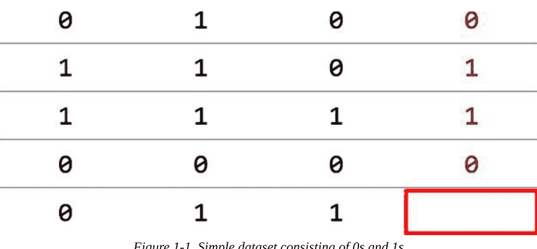

一种可能的解决方案是：对于给定的行，如果前三列包含的0多于1，则第四列为0。如果前三列包含的1多于0，则答案为1。根据这个逻辑，空框应包含1。数据科学家将包含答案的列（图中的红色列）称为*标签列*。其余列是*特征列*。预测模型的目标是在特征列的行中找到模式，从而使其能够预测标签是什么。

如果所有数据集都这么简单，你就不需要机器学习了。但现实世界的数据集更大、更复杂。如果数据集包含数百万行和数千列，这在机器学习中很常见，那该怎么办？更进一步，如果数据集类似于图1-2中的那个呢？

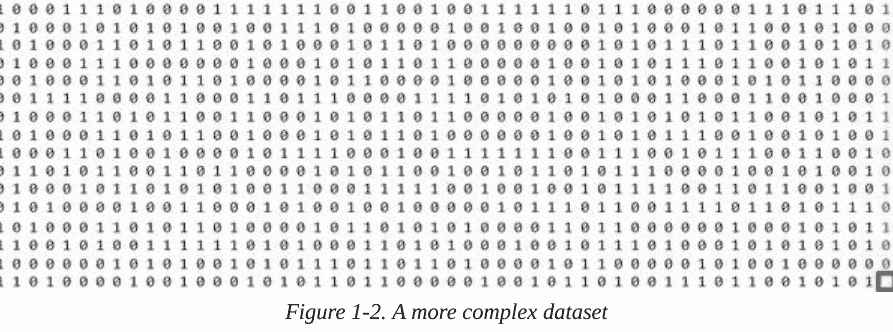

任何人类都很难检查这个数据集并提出一套规则来预测红色框中应该包含0还是1。（而且，这并不像数1和0那么简单。）想象一下，如果数据集真的*有*数百万行和数千列，那会困难多少倍。

这就是机器学习的全部意义所在：在海量数字数据集中寻找模式。无论有100行还是1,000,000行，这并不重要。在许多情况下，数据越多越好，因为100行可能无法提供足够的样本来辨别模式。

说机器学习通过数学建模数字集合中的模式来解决问题，并非过度简化。几乎任何问题都可以简化为一组数字。例如，当今ML的常见应用之一是*情感分析*：查看文本样本（如电影评论或网站上的评论），并为其分配0表示负面情感（例如，“食物平淡无奇，服务糟糕透顶。”）或1表示正面情感（“食物和服务都棒极了。迫不及待想再次光临！”）。有些评论可能是混合的——例如，“汉堡很棒，但薯条软塌塌的”——因此我们使用标签为1的*概率*作为情感得分。一个非常负面的评论可能得分为0.1，而一个非常正面的评论可能得分为0.9，即有90%的概率表达正面情感。

情感分析器和其他处理文本的模型通常在类似图1-3的数据集上进行训练，该数据集为每个文本样本包含一行，为文本语料库（数据集中的所有单词）中的每个单词包含一列。像这样的典型数据集可能包含数百万行和20,000或更多列。每一行在标签列中包含一个0表示负面情感，或一个1表示正面情感。每一行内是单词计数——给定单词在单个样本中出现的次数。该数据集是稀疏的，意味着它大部分是0，偶尔夹杂着非零数字。但机器学习并不关心数字的构成。如果存在可以利用的模式来确定下一个样本表达的是正面还是负面情感，它就会找到它们。垃圾邮件过滤器使用类似的数据集，其中标签列中的1和0分别表示垃圾邮件和非垃圾邮件消息。这使得现代垃圾邮件过滤器能够达到惊人的准确度。此外，随着用越来越多的电子邮件进行训练，这些模型会变得越来越智能。

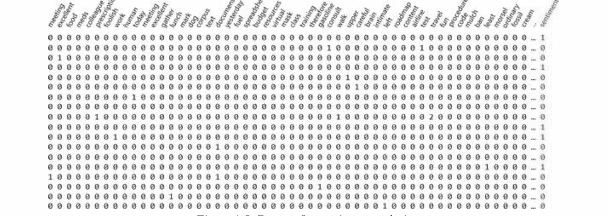

情感分析是*文本分类*任务的一个例子：分析文本样本并将其分类为正面或负面。机器学习在*图像分类*方面也已证明非常擅长。图像分类的一个简单例子是查看猫和狗的照片，并将每张照片分类为猫图片（0）或狗图片（1）。图像分类的实际用途包括标记从装配线上下来的有缺陷的零件、识别自动驾驶汽车视野中的物体以及识别照片中的人脸。

图像分类模型使用类似图1-4的数据集进行训练，其中每一行代表一张图像，每一列包含一个像素值。一个包含1,000,000张200像素宽、200像素高的图像的数据集包含1,000,000行和40,000列。总共是400亿个数字，如果是彩色图像而非灰度图像，则是1200亿个数字。（在彩色图像中，像素值由三个数字而非一个组成。）标签列包含一个数字，代表相应图像所属的类别或类别——在本例中，是照片中出现的人脸：0代表格哈德·施罗德，1代表乔治·W·布什，依此类推。

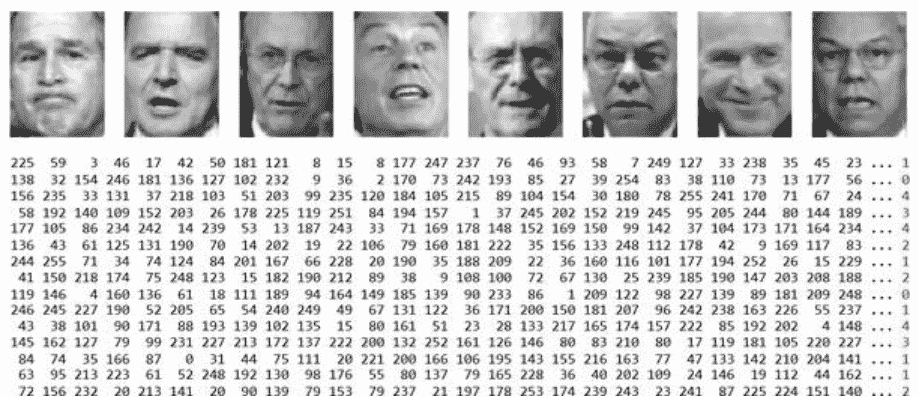

这些面部图像来自一个著名的公共数据集，称为[野外标记人脸](https://en.wikipedia.org/wiki/Labeled_Faces_in_the_Wild)，简称LFW。它是无数标记数据集之一，这些数据集在各种地方发布供公众使用。当你有标记数据集可供使用时——这些数据集是其他人（通常是研究生）辛苦花费数小时用1和0标记出来的——机器学习并不难。在现实世界中，工程师有时会花费大部分时间来生成这些数据集。一个更受欢迎的公共数据集存储库是[Kaggle.com](https://www.kaggle.com/)，它提供了许多有用的数据集，并举办竞赛，让新兴的ML从业者测试他们的技能。

### 机器学习与人工智能

如今，*机器学习*和*人工智能*（AI）这两个术语几乎可以互换使用，但实际上，每个术语都有特定的含义，如[图1-5](https://example.com/figure1-5)所示。

从技术上讲，机器学习是AI的一个子集，AI不仅包括机器学习模型，还包括其他类型的模型，如*专家系统*（基于你定义的规则做出决策的系统）和*强化学习系统*，后者通过奖励积极结果同时惩罚消极结果来学习行为。强化学习系统的一个例子是[AlphaGo](https://deepmind.com/research/case-studies/alphago)，它是第一个击败职业人类围棋选手的计算机程序。它在已经进行过的游戏中进行训练，并自行学习获胜策略。

实际上，大多数人今天所说的AI实际上是深度学习，它是机器学习的一个子集。*深度学习*是使用神经网络进行的机器学习。（存在不涉及神经网络的深度学习形式——深度玻尔兹曼机就是一个例子——但当今绝大多数深度学习都涉及神经网络。）因此，ML模型可以分为使用学习算法对数据中的模式进行建模的传统模型，以及使用神经网络执行相同操作的深度学习模型。

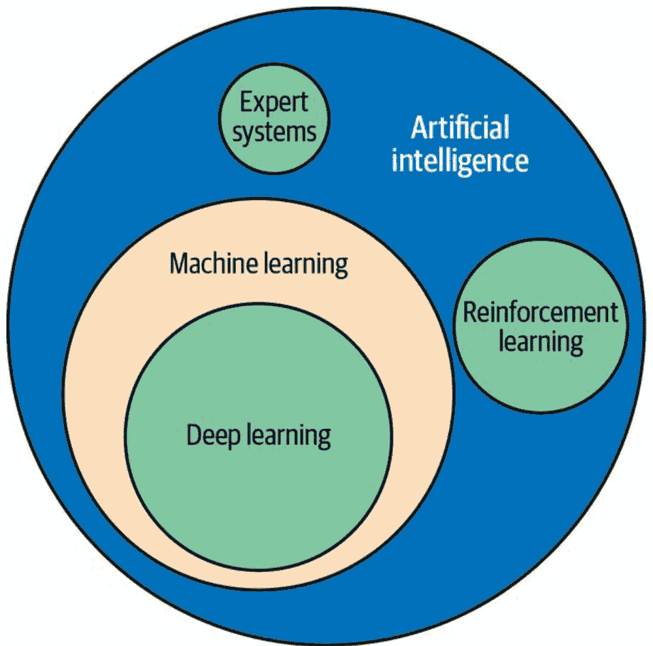

图 1-5. 机器学习、深度学习与人工智能的关系

### 人工智能简史

近年来，机器学习和人工智能的热度急剧上升。人工智能在20世纪80年代曾备受瞩目，当时人们普遍相信计算机很快就能模仿人类思维。但这种热情逐渐消退，在长达数十年的时间里——直到2010年左右——人工智能很少成为新闻焦点。随后，一件奇特的事情发生了。

得益于NVIDIA等公司提供的[图形处理单元（GPU）](https://example.com)，研究人员终于获得了训练先进神经网络所需的计算能力。这推动了技术前沿的进步，进而引发了新的热情，吸引了更多资金投入，从而加速了进一步的发展，人工智能突然间再次成为焦点。神经网络自20世纪50年代就已存在（至少在理论上），但研究人员缺乏在大型数据集上训练它们的计算能力。如今，任何人都可以购买GPU或在云端启动GPU集群。人工智能的发展速度比以往任何时候都快，随着这一进步，工程师们得以实现仅在十年前还只能梦想的软件功能。

随着时间的推移，数据科学家们设计出了专门擅长特定任务的特殊类型神经网络，包括涉及计算机视觉的任务——例如从图像中提取信息——以及涉及人类语言的任务，如将英语翻译成法语。我们将从[第8章](Chapter 8)开始深入探讨神经网络，你将具体了解深度学习如何将机器学习提升到新的高度。

### 监督学习与无监督学习

大多数机器学习模型属于两大类之一：*监督学习*模型和*无监督学习*模型。监督学习模型的目的是进行预测。你使用带标签的数据来训练它们，以便它们能够接收未来的输入并预测相应的标签。目前使用的大多数机器学习模型都是监督学习模型。一个很好的例子是美国邮政服务使用的模型，它将手写邮政编码转换为计算机可以识别的数字，以便对邮件进行分拣。另一个例子是你的信用卡公司用于授权交易的模型。

相比之下，无监督学习模型不需要带标签的数据。它们的目的是提供对现有数据的洞察，或将数据分组归类，并相应地对未来的输入进行分类。无监督学习的一个经典例子是检查有关客户购买产品及其购买者的记录，以确定哪些客户可能对你即将推出的新产品最感兴趣，然后针对这些客户制定营销活动。

垃圾邮件过滤器是一个监督学习模型。它需要带标签的数据。一个根据收入、信用评分和购买历史对客户进行细分的模型是一个无监督学习模型，它所使用的数据不必带标签。为了帮助阐明两者的区别，本章的剩余部分将更详细地探讨监督学习和无监督学习。

### 使用k-Means聚类进行无监督学习

无监督学习经常使用一种称为*聚类*的技术。聚类的目的是根据相似性对数据进行分组。最流行的聚类算法是[k-means聚类](k-means聚类)，它接收*n*个数据样本并将它们分成*m*个簇，其中*m*是你指定的数字。

分组是通过一个迭代过程完成的，该过程为每个簇计算一个质心，并根据样本与簇质心的接近程度将样本分配给相应的簇。如果某个样本到簇1质心的距离是2.0，而到簇2质心的距离是3.0，那么该样本将被分配给簇1。在[图1-6](图1-6)中，200个样本大致排列成三个簇。左侧的图显示了原始的、未分组的样本。右侧的图显示了簇质心（红点），样本按簇着色。

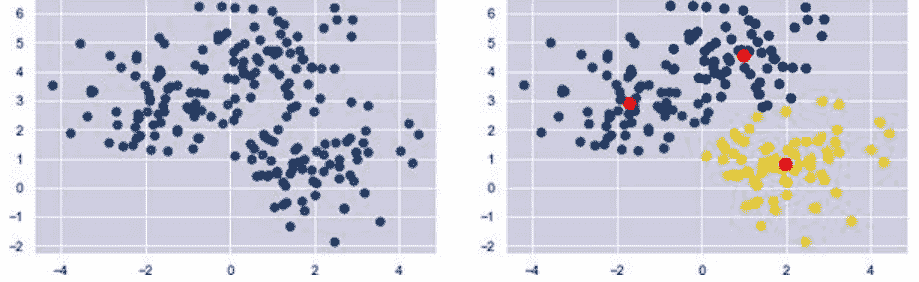

如何编写一个实现*k*-means聚类的无监督学习模型？最简单的方法是使用世界上最流行的机器学习库：[Scikit-Learn](https://scikit-learn.org/)。它是免费的、开源的，并且用Python编写。文档非常完善，如果你有问题，很可能通过谷歌搜索找到答案。在本书的前半部分，我将使用Scikit来编写大部分示例。本书的前言描述了如何安装Scikit并配置你的计算机以运行我的示例（或使用Docker容器来完成同样的操作），所以如果你还没有这样做，现在正是设置环境的好时机。

要开始体验*k*-means聚类，首先创建一个新的Jupyter notebook，并将以下语句粘贴到第一个单元格中：

```python
%matplotlib inline
import matplotlib.pyplot as plt
import seaborn as sns
sns.set()
```

运行该单元格，然后在下一个单元格中运行以下代码，以生成一组半随机的*x*和*y*坐标对。此代码使用Scikit的[`make_blobs`函数](https://scikit-learn.org/stable/modules/generated/sklearn.datasets.make_blobs.html)生成坐标对，并使用Matplotlib的[`scatter`函数](https://matplotlib.org/stable/api/_as_gen/matplotlib.pyplot.scatter.html)绘制它们：

```python
from sklearn.datasets import make_blobs

points, cluster_indexes = make_blobs(n_samples=300, centers=4,
                                    cluster_std=0.8, random_state=0)

x = points[:, 0]
y = points[:, 1]

plt.scatter(x, y, s=50, alpha=0.7)
```

由于`random_state`参数为`make_blobs`内部使用的随机数生成器设置了种子，你的输出应该与我的完全相同：

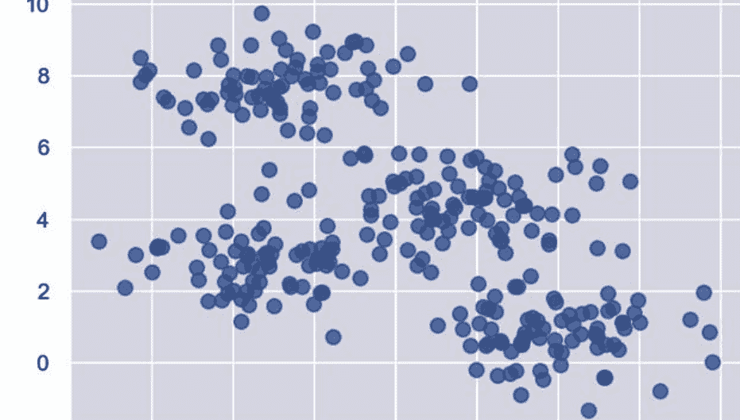

接下来，使用*k*-means聚类将坐标对分成四组。然后将簇质心渲染为红色，并根据簇对数据点进行颜色编码。Scikit的`KMeans`类负责繁重的工作，一旦它拟合到坐标对，你就可以从`KMeans`的`cluster_centers_`属性获取质心的位置：

```python
from sklearn.cluster import KMeans

kmeans = KMeans(n_clusters=4, random_state=0)
kmeans.fit(points)
predicted_cluster_indexes = kmeans.predict(points)

plt.scatter(x, y, c=predicted_cluster_indexes, s=50, alpha=0.7, cmap='viridis')

centers = kmeans.cluster_centers_
plt.scatter(centers[:, 0], centers[:, 1], c='red', s=100)
```

结果如下：

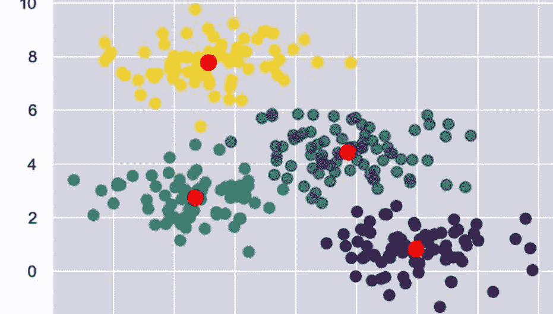

尝试将`n_clusters`设置为其他值，例如3和5，看看在不同的簇数量下点是如何分组的。这就引出了一个问题：如何知道*正确*的簇数量是多少？答案并不总是能从图中明显看出，而且如果数据有超过三个维度，你根本无法绘制它。

一种选择正确数量的方法是肘部法则，它绘制*惯性*（数据点到最近簇中心的距离平方和，通过`KMeans.inertia_`获得）作为簇数量的函数。以这种方式绘制惯性，并寻找曲线中最明显的拐点：

```python
inertias = []

for i in range(1, 10):
    kmeans = KMeans(n_clusters=i, random_state=0)
    kmeans.fit(points)
    inertias.append(kmeans.inertia_)

plt.plot(range(1, 10), inertias)
plt.xlabel('Number of clusters')
plt.ylabel('Inertia')
```

在这个例子中，4似乎是正确的簇数量：

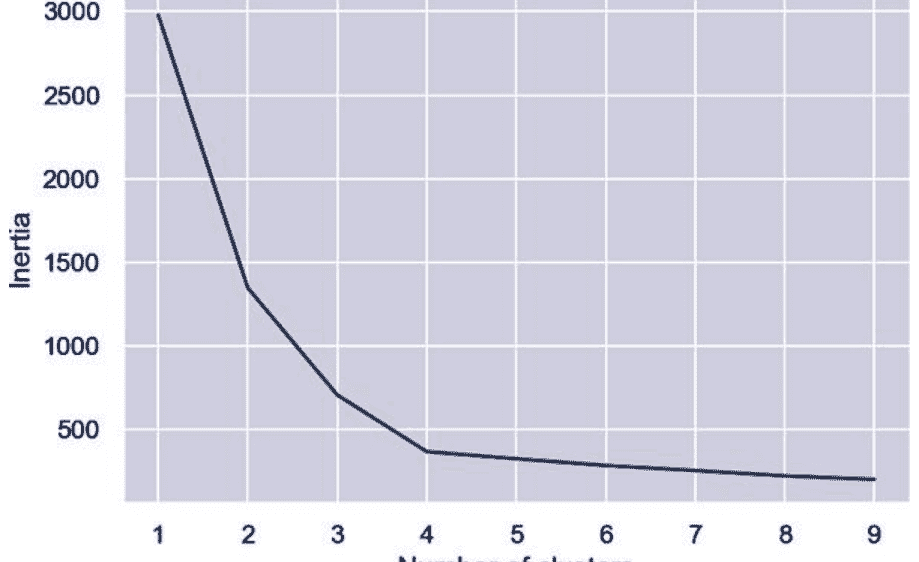

在现实生活中，拐点可能不那么明显。这没关系，因为通过以不同的方式对数据进行聚类，你有时会获得其他方式无法获得的洞察。

### 将k-Means聚类应用于客户数据

让我们使用*k*-means聚类来解决一个实际问题：细分客户，以确定哪些客户可以作为促销活动的目标，从而提高他们的购买活跃度。你将使用的数据集是一个名为*customers.csv*的示例客户细分数据集。首先，在你的notebook所在的文件夹中创建一个名为*Data*的子目录，下载*customers.csv*，并将其复制到*Data*子目录中。然后使用以下代码将数据集加载到Pandas DataFrame中并显示前五行：

```python
import pandas as pd

customers = pd.read_csv('Data/customers.csv')
customers.head()
```

从输出中，你可以了解到该数据集包含五列，其中两列描述了客户的年收入和消费评分。后者是一个0到100之间的值。数字越高，表示该客户过去在你公司的消费越多：

| CustomerID | Gender | Age | Annual Income (k$) | Spending Score (1-100) |
| :--- | :--- | :--- | :--- | :--- |
| 0 | 1 | Male | 19 | 15 | 39 |
| 1 | 2 | Male | 21 | 15 | 81 |
| 2 | 3 | Female | 20 | 16 | 6 |
| 3 | 4 | Female | 23 | 16 | 77 |
| 4 | 5 | Female | 31 | 17 | 40 |

现在使用以下代码绘制年收入和消费分数：

```python
%matplotlib inline
import matplotlib.pyplot as plt
import seaborn as sns
sns.set()

points = customers.iloc[:, 3:5].values
x = points[:, 0]
y = points[:, 1]

plt.scatter(x, y, s=50, alpha=0.7)
plt.xlabel('Annual Income (k$)')
plt.ylabel('Spending Score')
```

从结果来看，数据点似乎大致分为五个簇：

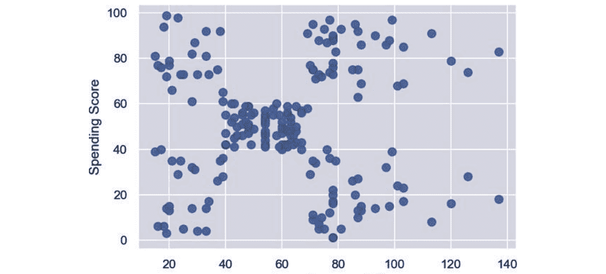

使用以下代码将客户分为五个簇并突出显示这些簇：

```python
from sklearn.cluster import KMeans

kmeans = KMeans(n_clusters=5, random_state=0)
kmeans.fit(points)
predicted_cluster_indexes = kmeans.predict(points)

plt.scatter(x, y, c=predicted_cluster_indexes, s=50, alpha=0.7, cmap='viridis')
plt.xlabel('Annual Income (k$)')
plt.ylabel('Spending Score')

centers = kmeans.cluster_centers_
plt.scatter(centers[:, 0], centers[:, 1], c='red', s=100)
```

结果如下：

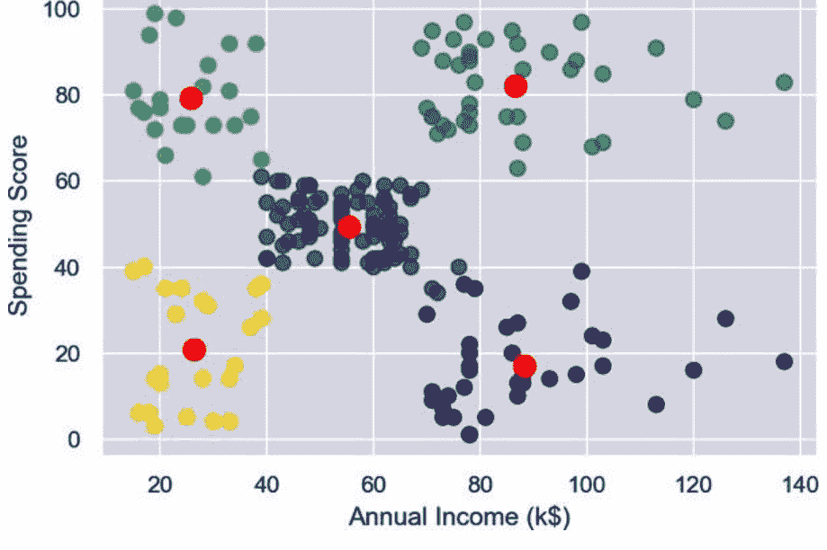

图表右下象限的客户可能是通过促销活动来增加其消费的良好目标。为什么？因为他们收入高但消费分数低。使用以下语句创建一个DataFrame副本，并添加一个名为Cluster的列，其中包含簇索引：

```python
df = customers.copy()
df['Cluster'] = kmeans.predict(points)
df.head()
```

输出如下：

| CustomerID | Gender | Age | Annual Income (k$) | Spending Score (1-100) | Cluster |
| :--- | :--- | :--- | :--- | :--- | :--- |
| 0 | 1 | Male | 19 | 15 | 39 | 4 |
| 1 | 2 | Male | 21 | 15 | 81 | 3 |
| 2 | 3 | Female | 20 | 16 | 6 | 4 |
| 3 | 4 | Female | 23 | 16 | 77 | 3 |
| 4 | 5 | Female | 31 | 17 | 40 | 4 |

现在使用以下代码输出收入高但消费分数低的客户ID：

```python
import numpy as np

# Get the cluster index for a customer with a high income and low spending score
cluster = kmeans.predict(np.array([[120, 20]]))[0]

# Filter the DataFrame to include only customers in that cluster
clustered_df = df[df['Cluster'] == cluster]

# Show the customer IDs
clustered_df['CustomerID'].values
```

你可以轻松使用生成的客户ID从客户数据库中提取姓名和电子邮件地址：

```
array([125, 129, 131, 135, 137, 139, 141, 145, 147, 149, 151, 153, 155,
       157, 159, 161, 163, 165, 167, 169, 171, 173, 175, 177, 179, 181,
       183, 185, 187, 189, 191, 193, 195, 197, 199], dtype=int64)
```

这里的关键是你使用了聚类来按年收入和消费分数对客户进行分组。一旦客户以这种方式分组，列举每个簇中的客户就变得很简单了。

### 使用两个以上维度对客户进行细分

前面的例子很简单，因为你只使用了两个变量：年收入和消费分数。你本可以在没有机器学习帮助的情况下完成同样的事情。但现在让我们再次细分客户，这次使用除客户ID之外的所有信息。首先，将Gender列中的字符串“Male”和“Female”替换为1和0，这个过程称为*标签编码*。这是必要的，因为机器学习只能处理数值数据：

```python
from sklearn.preprocessing import LabelEncoder

df = customers.copy()
encoder = LabelEncoder()
df['Gender'] = encoder.fit_transform(df['Gender'])
df.head()
```

Gender列现在包含1和0：

| CustomerID | Gender | Age | Annual Income (k$) | Spending Score (1-100) |
| :--- | :--- | :--- | :--- | :--- |
| 0 | 1 | 1 | 19 | 15 | 39 |
| 1 | 2 | 1 | 21 | 15 | 81 |
| 2 | 3 | 0 | 20 | 16 | 6 |
| 3 | 4 | 0 | 23 | 16 | 77 |
| 4 | 5 | 0 | 31 | 17 | 40 |

提取性别、年龄、年收入和消费分数列。然后使用肘部法则根据这些特征确定最佳簇数：

```python
points = df.iloc[:, 1:5].values
inertias = []

for i in range(1, 10):
    kmeans = KMeans(n_clusters=i, random_state=0)
    kmeans.fit(points)
    inertias.append(kmeans.inertia_)

plt.plot(range(1, 10), inertias)
plt.xlabel('Number of Clusters')
plt.ylabel('Inertia')
```

这次肘部不太明显，但5似乎是一个合理的数字：

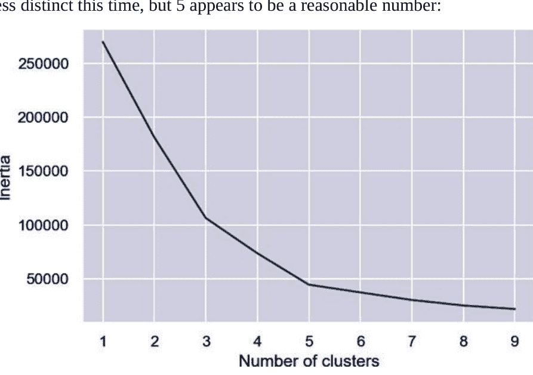

将客户分为五个簇，并添加一个名为Cluster的列，其中包含分配给客户的簇索引（0-4）：

```python
kmeans = KMeans(n_clusters=5, random_state=0)
kmeans.fit(points)

df['Cluster'] = kmeans.predict(points)
df.head()
```

输出如下：

| CustomerID | Gender | Age | Annual Income (k$) | Spending Score (1-100) | Cluster |
| :--- | :--- | :--- | :--- | :--- | :--- |
| 0 | 1 | 1 | 19 | 15 | 39 | 0 |
| 1 | 2 | 1 | 21 | 15 | 81 | 4 |
| 2 | 3 | 0 | 20 | 16 | 6 | 0 |
| 3 | 4 | 0 | 23 | 16 | 77 | 4 |
| 4 | 5 | 0 | 31 | 17 | 40 | 0 |

你有了每个客户的簇编号，但这意味着什么？你无法像在前面的例子中绘制年收入和消费分数那样，在二维图表中绘制性别、年龄、年收入和消费分数。但你*可以*从簇质心获取每个簇这些值的平均值。创建一个新的DataFrame，包含平均年龄、平均收入等列，然后在表格中显示结果：

```python
results = pd.DataFrame(columns = ['Cluster', 'Average Age', 'Average Income',
                                'Average Spending Index', 'Number of Females',
                                'Number of Males'])

for i, center in enumerate(kmeans.cluster_centers_):
    age = center[1]    # Average age for current cluster
    income = center[2] # Average income for current cluster
    spend = center[3]  # Average spending score for current cluster

    gdf = df[df['Cluster'] == i]
    females = gdf[gdf['Gender'] == 0].shape[0]
    males = gdf[gdf['Gender'] == 1].shape[0]

    results.loc[i] = ([i, age, income, spend, females, males])

results.head()
```

输出如下：

| Cluster | Average Age | Average Income | Average Spending Index | Number of Females | Number of Males |
| :--- | :--- | :--- | :--- | :--- | :--- |
| 0 | 45.217391 | 26.304348 | 20.913043 | 14.0 | 9.0 |
| 1 | 32.692308 | 86.538462 | 82.128205 | 21.0 | 18.0 |
| 2 | 43.088608 | 55.291139 | 49.569620 | 46.0 | 33.0 |
| 3 | 40.666667 | 87.750000 | 17.583333 | 17.0 | 19.0 |
| 4 | 25.521739 | 26.304348 | 78.565217 | 14.0 | 9.0 |

基于此，如果你打算针对收入高但消费分数低的客户进行促销，你会选择哪一组客户（哪个簇）？针对男性还是女性会有影响吗？同样，如果你的目标是创建一个奖励高消费分数客户的忠诚度计划，但你想优先考虑可能长期忠诚的年轻客户，那么你会针对哪个簇？

聚类揭示的一些更有趣的见解是，一些最大的消费者是收入适中的年轻人（平均年龄=25.5）。这些客户更可能是女性而非男性。如果你正在发展公司并希望更好地了解你所服务的人口统计数据，所有这些信息都很有用。

> **注意**

*k*-means可能是最常用的聚类算法，但它不是唯一的。其他算法包括[凝聚聚类](https://scikit-learn.org/stable/modules/clustering.html#hierarchical-clustering)，它以层次方式对数据点进行聚类，以及[DBSCAN](https://scikit-learn.org/stable/modules/clustering.html#dbscan)，它代表*基于密度的带噪声应用空间聚类*。DBSCAN不需要预先指定簇数。它还可以识别不属于其识别的簇的点，这对于检测*异常值*——不符合其他数据点的异常数据点——很有用。Scikit-Learn在其[AgglomerativeClustering](https://scikit-learn.org/stable/modules/generated/sklearn.cluster.AgglomerativeClustering.html)和[DBSCAN](https://scikit-learn.org/stable/modules/generated/sklearn.cluster.DBSCAN.html)类中提供了这两种算法的实现。

真正的公司会使用聚类从客户数据中提取见解吗？他们确实会。我儿子现在是达美航空的数据分析师，他在研究生院期间曾在一家宠物用品公司实习。他使用*k*-means聚类确定，通过公司网站流量未能转化为销售的原因在于，从潜在客户出现到销售首次联系客户之间的时间间隔过长。因此，他的雇主在销售工作流程中引入了额外的自动化，以确保潜在客户得到快速处理。这就是无监督学习在实际中的应用。这也是一个公司利用机器学习改进业务流程的绝佳例子。

### 监督学习

无监督学习是机器学习的一个重要分支，但当大多数人听到*机器学习*这个词时，他们想到的是监督学习。回想一下，监督学习模型会进行预测。例如，它们预测信用卡交易是否欺诈，或者航班是否会准时到达。它们也是用带标签的数据进行训练的。

监督学习模型有两种：*回归模型*和*分类模型*。回归模型的目的是预测一个数值结果，比如房屋的售价或照片中人物的年龄。相比之下，分类模型从训练数据中定义的有限类别集合中预测一个*类别*或类别。例子包括信用卡交易是合法还是欺诈，以及手写数字代表什么数字。前者是一个*二元分类*模型，因为只有两种可能的结果：交易合法或不合法。后者是*多类别分类*的一个例子。因为在西方阿拉伯数字系统中有10个数字（0-9），所以手写数字可能代表10个可能的类别。

图1-7展示了两种监督学习模型。左边，目标是输入一个*x*并预测*y*会是什么。右边，目标是输入一个*x*和一个*y*，并预测该点对应哪个类别：三角形还是椭圆形。在这两种情况下，将机器学习应用于该问题的目的都是构建一个用于预测的模型。你不需要自己构建该模型，而是用带标签的数据训练一个机器学习模型，并让它为你设计一个数学模型。

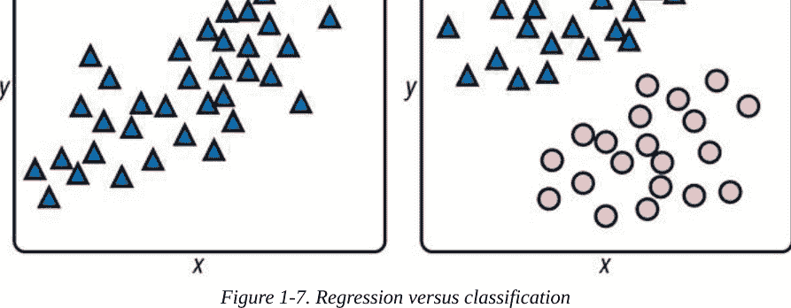

对于这些数据集，你可以轻松地构建数学模型，而无需借助机器学习。对于回归模型，你可以画一条穿过数据点的线，并使用该线的方程在给定*x*的情况下预测*y*（图1-8）。对于分类模型，你可以画一条线，将三角形和椭圆形清晰地分开——数据科学家称之为*分类边界*——并通过确定新点位于该线的上方还是下方来预测它属于哪个类别。刚好在线上方的点将是三角形，而刚好在线下方的点将被分类为椭圆形。

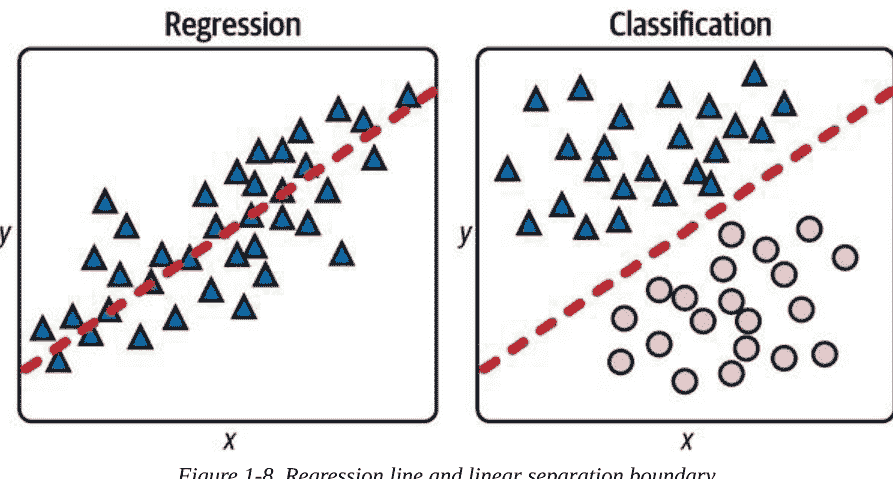

在现实世界中，数据集很少如此有序。它们通常看起来更像图1-9中的那些，在左边，你无法画出一条单一的线来关联x和y值；在右边，你也无法清晰地将类别分开。因此，目标是构建你能构建的最佳模型。这意味着选择能产生最准确模型的学习算法。

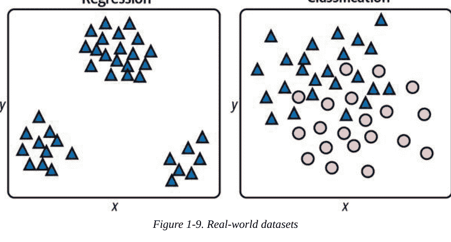

有许多监督学习算法。它们的名字包括线性回归、随机森林、梯度提升机（GBMs）和支持向量机（SVMs）。许多（但不是全部）可以用于回归*和*分类。即使是经验丰富的数据科学家也经常进行实验，以确定哪种学习算法能产生最准确的模型。这些以及其他学习算法将在后续章节中介绍。

### k-近邻算法

最简单的监督学习算法之一是*k-近邻算法*。其前提是，给定一组数据点，你可以通过检查离新点最近的点来预测其标签。对于一个简单的回归问题，其中每个数据点由$x$和$y$坐标表征，这意味着给定一个$x$，你可以通过找到$x$值最接近的$n$个点并对其$y$值取平均来预测$y$。对于分类问题，你找到离你想预测其类别的点最近的$n$个点，并选择出现次数最多的类别。如果$n = 5$，且五个最近邻中有三个三角形和两个椭圆形，那么答案就是三角形，如图1-10所示。

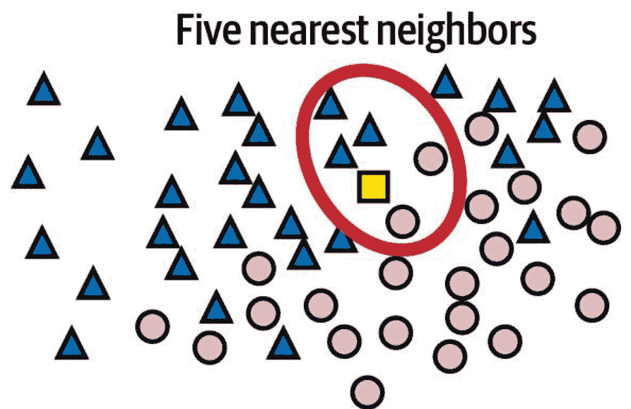

*图1-10. 使用k-近邻进行分类*

这里有一个涉及回归的例子。假设你有20个数据点，描述程序员根据经验年限每年的收入。图1-11将经验年限绘制在x轴上，年收入绘制在y轴上。你的目标是预测一个有10年经验的人应该赚多少钱。在这个例子中，$x = 10$，你想预测$y$应该是什么。

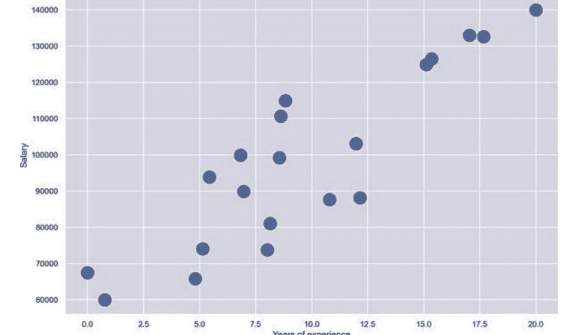

应用*n* = 10的*k*-近邻算法，将图1-12中橙色高亮显示的点识别为最近邻——即10个*x*坐标最接近*x* = 10的点。这些点的*y*坐标的平均值是94,838。因此，*n* = 10的*k*-近邻算法预测一个有10年经验的程序员将赚取$94,838，如红点所示。

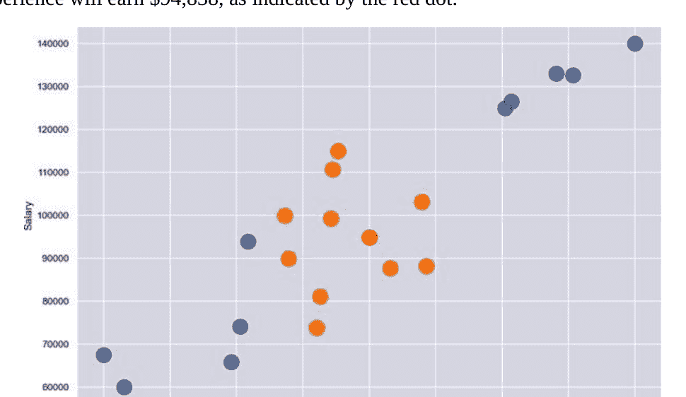

在*k*-近邻算法中使用的*n*值通常会影响结果。图1-13显示了*n* = 5时的相同解决方案。这次答案略有不同，因为五个最近邻的平均*y*值是98,713。

在现实生活中，情况会更复杂一些，因为虽然数据集只有一个标签列，但它可能有多个*特征列*——不仅仅是$x$，还有$x_1$、$x_2$、$x_3$等等。你可以很容易地在$n$维空间中计算距离，但有几种方法可以测量距离以识别一个点的最近邻，包括欧几里得距离、曼哈顿距离和闵可夫斯基距离。你甚至可以使用权重，使附近的点比远处的点对结果贡献更大。而且，你不必找到$n$个最近邻，你可以选择给定半径内的所有邻居，这种技术称为*半径邻居*。尽管如此，无论数据集的维度数量、用于测量距离的方法，还是你选择$n$个最近邻还是指定半径内的所有邻居，其原理都是相同的：找到与目标点相似的数据点，并使用它们来回归或分类目标。

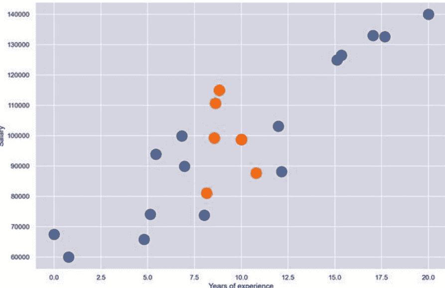

*图1-13. 使用k-近邻进行回归，n = 5*

### 使用k-近邻算法对花卉进行分类

Scikit-Learn包含名为`KNeighborsRegressor`和`KNeighborsClassifier`的类，帮助你使用$k$-近邻学习算法训练回归和分类模型。它还包含名为`RadiusNeighborsRegressor`和`RadiusNeighborsClassifier`的类，它们接受一个半径而不是邻居数量。让我们看一个使用`KNeighborsClassifier`对著名的鸢尾花数据集进行花卉分类的例子。该数据集包含150个样本，每个样本代表三种鸢尾花中的一种。每行包含四个测量值——花萼长度、花萼宽度、花瓣长度和花瓣宽度，均以厘米为单位——以及一个标签：0代表山鸢尾，1代表变色鸢尾，2代表维吉尼亚鸢尾。图1-14展示了每种物种的一个例子，并说明了花瓣和花萼之间的区别。

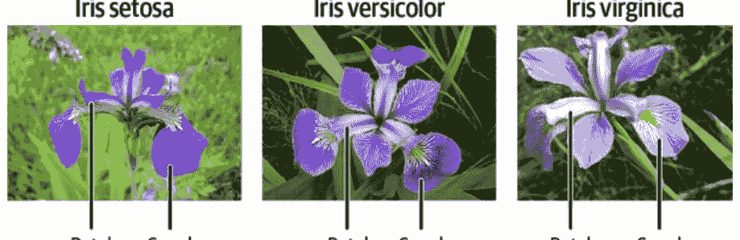

*图1-14. 鸢尾花数据集（中间面板："Blue Flag Flower Close-Up [Iris Versicolor]" by Danielle Langlois is licensed under CC BY-SA 2.5, https://creativecommons.org/licenses/by-sa/2.5/deed.en；最右侧面板："Image of Iris Virginica Shrevei BLUE FLAG" by Frank Mayfield is licensed under CC BY-SA 2.0, https://creativecommons.org/licenses/by-sa/2.0/deed.en）*

要训练一个机器学习模型，根据花萼和花瓣测量值来区分鸢尾花物种，请首先在Jupyter笔记本中运行以下代码来加载数据集，添加一个包含类别名称的列，并显示前五行：

```python
import pandas as pd
from sklearn.datasets import load_iris

iris = load_iris()
df = pd.DataFrame(iris.data, columns=iris.feature_names)
df['class'] = iris.target
df['class name'] = iris.target_names[iris['target']]
df.head()
```

鸢尾花数据集是Scikit附带的几个示例数据集之一。这就是为什么你可以通过调用Scikit的`load_iris`函数来加载它，而不是从外部文件读取。以下是代码的输出：

| | sepal length (cm) | sepal width (cm) | petal length (cm) | petal width (cm) | class | class name |
|---|---|---|---|---|---|---|
| 0 | 5.1 | 3.5 | 1.4 | 0.2 | 0 | setosa |
| 1 | 4.9 | 3.0 | 1.4 | 0.2 | 0 | setosa |
| 2 | 4.7 | 3.2 | 1.3 | 0.2 | 0 | setosa |
| 3 | 4.6 | 3.1 | 1.5 | 0.2 | 0 | setosa |
| 4 | 5.0 | 3.6 | 1.4 | 0.2 | 0 | setosa |

在从数据训练机器学习模型之前，你需要将数据集分成两个数据集：一个用于训练，一个用于测试。这很重要，因为如果你不使用模型未见过的数据（即未用于训练的数据）来测试它，你就无法知道它在预测方面的准确性。

幸运的是，Scikit的`train_test_split`函数使得使用你指定的比例分割数据集变得容易。使用以下语句执行80/20分割，其中80%的行用于训练，20%用于测试：

```python
from sklearn.model_selection import train_test_split
```

x_train, x_test, y_train, y_test = train_test_split(
    iris.data, iris.target, test_size=0.2, random_state=0)

现在，x_train 和 y_train 包含 120 行随机选取的测量值和标签，而 x_test 和 y_test 包含剩余的 30 行。虽然对于像这样的小数据集，80/20 的划分是惯例，但并没有规定你*必须*按 80/20 划分。你用越多的数据进行训练，模型就越准确。（这并非绝对正确，但一般来说，你总是希望获得尽可能多的训练数据。）你用越多的数据进行测试，你对模型准确度的测量就越有信心。对于一个小数据集，80/20 是一个合理的起点。

下一步是训练一个机器学习模型。得益于 Scikit，这只需要几行代码：

```python
from sklearn.neighbors import KNeighborsClassifier

model = KNeighborsClassifier()
model.fit(x_train, y_train)
```

在 Scikit 中，你通过实例化封装了你所选学习算法的类来创建一个机器学习模型——在这个例子中是 KNeighborsClassifier。然后你调用模型的 `fit` 方法，通过将其拟合到训练数据来训练它。仅用 120 行训练数据，训练过程非常快。

最后一步是使用从原始数据集中划分出来的 30 行测试数据来衡量模型的准确度。在 Scikit 中，这是通过调用模型的 `score` 方法来完成的：

```python
model.score(x_test, y_test)
```

在这个例子中，`score` 返回 0.966667，这意味着当模型使用 x_test 中的特征进行预测，并将预测标签与 y_test 中的实际标签进行比较时，其正确率约为 97%。

当然，训练预测模型的全部目的是用它来进行预测。在 Scikit 中，你通过调用模型的 `predict` 方法来进行预测。使用以下语句来预测类别——0 代表山鸢尾，1 代表变色鸢尾，2 代表维吉尼亚鸢尾——识别一朵花萼长度为 5.6 厘米、花萼宽度为 4.4 厘米、花瓣长度为 1.2 厘米、花瓣宽度为 0.4 厘米的鸢尾花的物种：

```python
model.predict([[5.6, 4.4, 1.2, 0.4]])
```

`predict` 方法可以在一次调用中进行多次预测。这就是为什么你传递给它的是一个列表的列表，而不仅仅是一个列表。它返回的列表长度等于你传入的列表数量。由于你只传递了一个列表给 `predict`，所以返回值是一个包含一个值的列表。在这个例子中，预测的类别是 0，这意味着模型预测一朵花萼长度为 5.6 厘米、花萼宽度为 4.4 厘米、花瓣长度为 1.2 厘米、花瓣宽度为 0.4 厘米的鸢尾花最有可能是山鸢尾。

当你创建一个 KNeighborsClassifier 而没有指定邻居数量时，它默认为 5。你可以这样指定邻居数量：

```python
model = KNeighborsClassifier(n_neighbors=10)
```

尝试使用 `n_neighbors=10` 再次拟合（训练）和评分模型。模型的得分还一样吗？`predict` 还是预测类别 0 吗？请随意尝试其他 `n_neighbors` 值，以感受它们对结果的影响。

#### KNEIGHBORSCLASSIFIER 内部原理

*k* 近邻算法有时被称为*懒惰*学习算法，因为大部分工作是在调用 `predict` 时完成的，而不是在调用 `fit` 时。事实上，从技术上讲，训练除了为调用 `predict` 时复制训练数据外，不必做任何事情。那么，`KNeighborsClassifier` 的 `fit` 方法内部发生了什么？

在大多数情况下，`fit` 在内存中构建一个二叉树，通过防止 `predict` 必须对邻近样本进行暴力搜索来使其更快。如果它确定二叉树没有帮助，`KNeighborsClassifier` 在进行预测时会采用暴力搜索。这通常发生在训练数据稀疏的情况下——即大部分为零，只有少数非零值散布其中。

Scikit-Learn 的一个美妙之处在于它是开源的。如果你想知道某个特定类或方法是如何工作的，你可以直接去 GitHub 上查看源代码。你会在 [GitHub](https://github.com) 上找到 `KNeighborsClassifier` 和 `RadiusNeighborsClassifier` 的源代码。

这里使用的过程——加载数据、划分数据、创建分类器或回归器、调用 `fit` 将其拟合到训练数据、调用 `score` 使用测试数据评估模型的准确度，最后调用 `predict` 进行预测——是你在使用 Scikit 时会反复使用的过程。在现实世界中，数据在用于训练和测试之前通常需要清理。例如，你可能需要删除包含缺失值的行或对数据进行去重以消除冗余行。你稍后会看到很多这样的例子，但在这个例子中，数据开箱即用就是完整且结构良好的，因此不需要进一步的准备。

### 总结

机器学习为工程师和软件开发人员提供了一种解决问题的替代方法。机器学习不使用传统的计算机算法将输入转换为输出，而是依赖学习算法从训练数据中构建数学模型。然后，它使用这些模型将未来的输入转换为输出。

大多数机器学习模型属于两类之一。无监督学习模型广泛用于通过突出相似性和差异性来分析数据集。它们不需要标记数据。监督学习模型从标记数据中学习以进行预测——例如，预测信用卡交易是否合法。监督学习可用于解决回归问题或分类问题。回归模型预测数值结果，而分类模型预测类别（类别）。

*k* 均值聚类是一种流行的无监督学习算法，而 *k* 近邻是一种简单但有效的监督学习算法。许多（但不是全部）监督学习算法可用于回归*和*分类。例如，Scikit-Learn 的 `KNeighborsRegressor` 类将 *k* 近邻应用于回归问题，而 `KNeighborsClassifier` 将相同的算法应用于分类问题。

教育工作者经常使用 *k* 近邻来介绍监督学习，因为它易于理解，并且在各种问题领域中表现相当好。掌握了 *k* 近邻之后，通往机器熟练掌握机器学习的下一步是了解其他监督学习算法。这是[第 2 章](第 2 章)的重点，该章在回归建模的背景下介绍了几种流行的学习算法。

## 第 2 章. 回归模型

你在[第 1 章](第 1 章)中了解到，监督学习模型有两种：回归模型和分类模型。你还了解到回归模型预测数值结果，例如房屋的售价或网站将吸引的访问者数量。回归建模是机器学习中一个至关重要且有时被低估的方面。零售商使用它来[预测需求](预测需求)。银行使用它来筛选贷款申请，考虑信用评分、债务收入比和贷款价值比等变量。保险公司使用它来设定保费。每当你需要数值预测时，回归建模就是完成这项工作的正确工具。

在构建回归模型时，你做出的第一个也是最重要的决定是使用哪种学习算法。[第 1 章](第 1 章)介绍了一个简单的三类分类模型，该模型使用 *k* 近邻学习算法，根据花朵的花萼和花瓣测量值来识别鸢尾花的物种。*k* 近邻也可用于回归，但它只是你可以选择用于数值预测的众多算法之一。其他学习算法通常能产生更准确的模型。

本章介绍了常见的回归算法，其中许多也可用于分类，并指导你完成构建一个回归模型的过程，该模型使用纽约市出租车和豪华轿车委员会发布的数据预测出租车费用。它还描述了评估回归模型准确度的各种方法，并介绍了一种称为交叉验证的重要准确度测量技术。

### 线性回归

除了 *k* 近邻，线性回归可能是所有学习算法中最简单的一种。它最适合处理相对线性的数据——即数据点大致沿一条线分布。回想一下高中数学课，你会记得二维空间中直线的方程是：

$$y = mx + b$$

其中 *m* 是直线的斜率，*b* 是直线与 y 轴的交点。[图 1-11](图 1-11) 中的收入与工作年限数据集非常适合线性回归。[图 2-1](图 2-1) 显示了拟合到数据点的回归线。预测一个有 10 年经验的程序员的收入，就像找到直线上 *x* = 10 的点一样简单。直线的方程是 *y* = 3,984*x* + 60,040。将 10 代入该方程中的 *x*，预测的收入为 99,880 美元。

训练线性回归模型的目标是找到使预测最准确的 $m$ 和 $b$ 值。这通常通过一个迭代过程来完成：从假设的 $m$ 和 $b$ 值开始，不断重复直到收敛到合适的值。

将直线拟合到一组点的最常用技术是*普通最小二乘回归*，简称 OLS。它的工作原理是：计算每个点与回归线在 $y$ 方向上的距离的平方，将这些平方值求和，然后除以点的数量，从而计算出*均方误差*，即 MSE。（对每个距离进行平方处理，可以防止负距离抵消正距离。）接着，它会调整 $m$ 和 $b$，以便在下一次迭代中降低 MSE，并重复此过程，直到 MSE 足够低。我不会详细说明它如何确定调整 $m$ 和 $b$ 的方向（这并不难，但涉及一点微积分——具体来说，是使用 MSE 函数的*偏导数*来确定在下一次迭代中是增加还是减少 $m$ 和 $b$），但 OLS 通常只需十几次或更少的迭代，就能将一条直线拟合到一组点上。

Scikit-Learn 提供了多个类来帮助你构建线性回归模型，包括体现 OLS 的 `LinearRegression` 类，以及将多项式曲线（而非直线）拟合到训练数据的 `PolynomialFeatures` 类。训练一个线性回归模型可以像这样简单：

```python
model = LinearRegression()
model.fit(x, y)
```

Scikit 还有其他线性回归类，例如 `Ridge` 和 `Lasso`。它们在一种情况下很有用，即训练数据包含异常值。回想一下第 1 章的内容，异常值是不符合其余数据的数据点。异常值会使模型产生偏差或降低其准确性。`Ridge` 和 `Lasso` 添加了*正则化*，通过在训练过程中调整系数时减轻异常值对结果的影响，从而缓解其作用。处理异常值的另一种方法是完全移除它们，这正是本章末尾出租车费用示例中将要做的。

## 注意

Lasso 回归还有一个次要好处。如果训练数据存在多重共线性——即两个或多个输入变量线性相关，以至于其中一个可以以相当高的精度从另一个预测出来——Lasso 会有效地忽略冗余数据。

多重共线性的一个经典例子是，当一个数据集包含一列指定房屋房间数，另一列指定房屋面积时。房间更多通常意味着面积更大，因此这两个变量在某种程度上是相关的。

线性回归不限于二维（$x$ 和 $y$ 值）；它适用于任意维度。具有一个自变量（$x$）的线性回归称为*简单线性回归*，而具有两个或更多自变量（例如 $x_1$、$x_2$、$x_3$ 等）的线性回归称为*多元线性回归*。如果数据集是二维的，那么绘制数据以确定其形状就很简单。你也可以绘制三维数据，但绘制具有四维或五维的数据集更具挑战性，而具有数百或数千维的数据集则无法可视化。

如何确定一个高维数据集是否适合线性回归？一种方法是使用[主成分分析 (PCA)](https://en.wikipedia.org/wiki/Principal_component_analysis) 和 [$t$-分布随机邻域嵌入 ($t$-SNE)](https://en.wikipedia.org/wiki/T-distributed_stochastic_neighbor_embedding) 等技术将 $n$ 维降至两维或三维，以便可以绘制它们。这些技术将在[第 6 章](#)中介绍。它们都能在不造成相应信息损失的情况下降低数据集的维度。例如，使用 PCA，将维度减少 90% 同时保留原始数据集中 90% 的信息并不少见。这听起来可能像魔法，但并非如此。这是数学。

如果维度数量相对较小，一种更简单的可视化高维数据集的技术是*成对图*，它在传统的二维图表中绘制维度对。[图 2-2](#) 展示了一个成对图，绘制了[第 1 章](#)介绍的[鸢尾花数据集](https://en.wikipedia.org/wiki/Iris_flower_data_set)的花萼长度与花瓣长度、花萼宽度与花瓣宽度以及其他参数对。

Seaborn 的 [`pairplot` 函数](https://seaborn.pydata.org/generated/seaborn.pairplot.html) 使得创建成对图变得容易。[图 2-2](#) 中的图表是用一行代码生成的：

```python
sns.pairplot(df)
```

成对图不仅帮助你可视化数据集中的关系，而且在这个例子中，右下角的直方图还显示了数据集是平衡的。所有三个类别的样本数量相等，并且出于你将在[第 3 章](#)学到的原因，你总是倾向于使用平衡的数据集来训练分类模型。

线性回归是一种*参数化*学习算法，这意味着它的目的是检查数据集并找到方程中参数的最佳值——例如 $m$ 和 $b$。相比之下，$k$-近邻是一种*非参数化*学习算法，因为它不将数据拟合到方程。学习算法是参数化还是非参数化，这有什么关系？因为用于训练参数化模型的数据集通常需要*归一化*。最简单的归一化意味着确保所有列中的所有值具有一致的范围。我将在第 5 章介绍归一化，但现在要认识到，使用未归一化的数据（例如，一个数据集在一列中包含 0 到 1 的值，在另一列中包含 0 到 1,000,000 的值）来训练参数化模型，可能会使这些模型的准确性降低，或者完全阻止它们收敛到解决方案。这在支持向量机和神经网络中尤其如此，但也适用于其他参数化模型。即使是 *k*-近邻模型，在使用归一化数据时效果也最好，因为虽然学习算法是非参数化的，但它内部使用基于距离的计算。

### 决策树

即使你从未上过计算机科学课程，你可能也知道[二叉树](binary_tree)是什么。在机器学习中，*决策树*是一种通过回答一系列问题来预测结果的树结构。大多数决策树都是二叉树，在这种情况下，问题需要简单的“是”或“否”答案。

图 2-3 展示了 Scikit 从第 1 章介绍的收入与经验数据集构建的决策树。这棵树很简单，因为数据集只有一个特征列（经验年限），并且我将树的深度限制为 3，但该技术可以扩展到任意大小和复杂度的树。在这个例子中，预测一个有 10 年经验的程序员的薪水只需要三个是/否决策，如红色箭头所示。答案约为 $100K，这与 *k*-近邻和线性回归应用于同一数据集时的预测结果非常接近。

*图 2-3. 决策树*

决策树可用于回归和分类。对于回归器，叶节点（没有子节点的节点）代表回归值。对于分类器，它们代表类别。决策树回归器的输出不是连续的。输出始终是分配给叶节点的值之一，并且叶节点的数量是有限的。相比之下，线性回归模型的输出是连续的。它可以取拟合到训练数据的直线上的任何值。在前面的例子中，如果你要求树预测一个有 10 年经验的人和一个有 13 年经验的人的薪水，你会得到相同的答案。然而，如果将经验年限增加到 14，预测的薪水会跳升至 $125K（*图 2-4*）。如果你允许树生长得更深，答案会变得更精细。但允许它生长得*太*深可能会导致大问题，原因我们稍后会讨论。

一旦决策树模型训练完成——即树构建完成——预测就会很快做出。但你如何决定在每个节点做出什么决策？例如，为什么 *图 2-3* 中根节点代表的年数是 13.634？为什么不是 10.000 或 8.742 或其他数字？同样，如果数据集有多个特征列，你如何决定在每个决策节点上按哪一列进行拆分？

### 决策树

决策树是通过递归地分割训练数据构建的。分割算法在向树中添加节点时做出的基本决策是：1) 该节点将分割哪一列，以及 2) 分割所依据的值是什么。在每次迭代中，目标是选择一个列和分割值，以最大程度地减少分类问题中剩余数据的“不纯度”，或回归问题中剩余数据的方差。分类器常用的不纯度度量是基尼系数，它大致量化了分割值会错误分类的样本百分比。对于回归器，通常使用平方误差或绝对误差的总和，其中“误差”是分割值与分割两侧值之间的差异。

树构建过程从根节点开始，递归地向下进行，直到树完全长满叶子，或者外部约束（如最大深度限制）阻止其进一步增长。

Scikit 的 `DecisionTreeRegressor` 类和 `DecisionTreeClassifier` 类使得构建决策树变得简单。每个类都实现了著名的 CART 算法来构建二叉树，并且每个类都允许你从少数几个用于衡量不纯度或方差的标准中进行选择。每个类还支持诸如 `max_depth`、`min_samples_split` 和 `min_samples_leaf` 等参数，这些参数允许你约束决策树的增长。如果你接受默认值，构建决策树可以像这样简单：

```
model = DecisionTreeRegressor()
model.fit(x, y)
```

决策树是非参数的。训练决策树模型涉及构建一棵二叉树，而不是将方程拟合到数据集。这意味着用于构建决策树的数据不必进行归一化。

决策树有一个很大的优点：它们处理非线性数据的效果与处理线性数据一样好。事实上，它们在很大程度上不关心数据的形状。但也有一个缺点。这是一个很大的缺点，也是独立决策树在机器学习中很少被使用的原因之一。这个原因就是过拟合。

决策树非常容易过拟合。如果允许其生长得足够大，决策树本质上可以记住训练数据。它可能*看起来*很准确，但如果它与训练数据拟合得太紧密，它可能无法很好地*泛化*。这意味着当它被要求对未见过的数据进行预测时，其准确性会降低。图 2-5 显示了一个对收入与经验数据集拟合的决策树，没有深度限制。红线穿过所有点时所遵循的锯齿状路径是过拟合的明显标志。过拟合是数据科学家的噩梦。唯一比模型不准确更糟糕的是，模型看起来准确但实际上并非如此。

在使用决策树时，防止过拟合的一种方法是约束其增长，使其*无法*记住训练数据。另一种方法是使用称为*随机森林*的决策树集合。

### 随机森林

*随机森林*是决策树的集合（通常有数百棵），每棵树都在相同的数据上以不同的方式进行训练，如图 2-6 所示。通常，每棵树都在数据集中随机选择的行上进行训练，并且分支基于在每次分割时随机选择的列。模型无法与训练数据拟合得太紧密，因为每棵树都在数据的不同子集上进行训练。这些树是独立构建的，当模型进行预测时，它会将输入通过所有决策树并平均结果。由于这些树是独立构建的，训练可以在支持并行化的硬件上进行。

这是一个简单的概念，并且在实践中效果良好。随机森林可用于回归和分类，Scikit 提供了诸如 `RandomForestRegressor` 和 `RandomForestClassifier` 等类来提供帮助。它们具有许多可调参数，包括 `n_estimators`（指定随机森林中树的数量，默认值 = 100）、`max_depth`（限制每棵树的深度）和 `max_samples`（指定用于构建单个树的训练数据行的比例）。图 2-7 显示了 `RandomForestRegressor` 在 `max_depth=3` 和 `max_samples=0.5` 的情况下如何拟合收入与经验数据集，这意味着没有一棵树看到超过数据集中 50% 的行。

由于决策树是非参数的，随机森林也是非参数的。即使图 2-7 显示了随机森林如何拟合线性数据集，随机森林也完全能够建模非线性数据集。

### 梯度提升机

随机森林证明了这样一个假设：你可以将许多*弱学习器*——本身不是强预测器的模型——组合起来形成准确的模型。随机森林中的任何单棵树都无法以很高的准确性预测结果。但是将所有树放在一起并平均结果，它们通常优于其他模型。数据科学家将此称为*集成建模*或*集成学习*。

利用集成建模的另一种方式是**梯度提升**。使用它的模型称为*梯度提升机*，或 GBMs。大多数 GBMs 使用决策树，有时被称为*梯度提升决策树*（GBDTs）。与随机森林一样，GBDTs 由决策树集合组成。但 GBDTs 不是从数据的随机子集构建独立的决策树，而是构建*依赖*的决策树，一棵接一棵地构建，每棵树都使用上一棵树的输出进行训练。第一棵决策树对数据集进行建模。第二棵决策树对第一棵树输出的误差进行建模，第三棵对第二棵树输出的误差进行建模，依此类推。为了进行预测，GBDT 将输入通过每棵决策树，并将所有输出相加得到结果。随着每次添加，结果变得稍微更准确，从而产生了*加性建模*这个术语。这就像将高尔夫球击向球道，然后连续击打越来越短的击球，直到最终到达球洞。

GBDT 模型中的每棵决策树都是一个弱学习器。事实上，GBDTs 通常使用*决策树桩*，即深度为 1（一个根节点和两个子节点）的决策树，如**图 2-8** 所示。在训练过程中，你首先取训练数据中所有目标值的平均值，作为预测的基线。然后，你从目标值中减去平均值，生成一组新的目标值或*残差*，供第一棵树预测。训练完第一棵树后，你将输入通过它以生成一组预测。然后，你将预测添加到之前的预测集中，通过从原始（实际）目标值中减去总和来生成一组新的残差，并训练第二棵树来预测这些残差。对 *n* 棵树重复此过程（其中 *n* 通常为 100 或更多）会产生一个集成模型。为了帮助确保每棵决策树都是一个弱学习器，GBDT 模型将每棵决策树的输出乘以一个*学习率*，以减少它们对结果的影响。学习率通常是一个小数字，例如 0.1，这是在使用实现 GBMs 的类时可以指定的一个参数。

Scikit 包含名为 `GradientBoostingRegressor` 和 `GradientBoostingClassifier` 的类，以帮助你构建 GBDTs。但如果你真的想了解 GBDTs 的工作原理，你可以使用 Scikit 的 `DecisionTreeRegressor` 类自己构建一个。**示例 2-1** 中的代码实现了一个包含 100 个决策树桩的 GBDT，并预测了一位拥有 10 年经验的程序员的年收入。

经验。

### 示例 2-1. 梯度提升决策树实现

```python
learning_rate = 0.1 # 学习率
n_trees = 100 # 决策树的数量
trees = [] # 构成模型的树

# 计算所有目标值的均值
y_pred = np.array([y.mean()] * len(y))
baseline = y_pred

# 创建 n_trees 棵树，并使用前一棵树输出的误差来训练每一棵树
for i in range(n_trees):
    error = y - y_pred
    tree = DecisionTreeRegressor(max_depth=1, random_state=0)
    tree.fit(x, error)
    predictions = tree.predict(x)
    y_pred = y_pred + (learning_rate * predictions)
    trees.append(tree)

# 预测 x=10 时的 y 值
y_pred = np.array([baseline[0]] * len(x))

for tree in trees:
    y_pred = y_pred + (learning_rate * tree.predict([[10.0]]))

y_pred[0]
```

图 2-9 左侧的图表显示了应用于收入与经验数据集的单个决策树桩的输出。该模型是一个如此弱的学习器，以至于它只能预测两种不同的收入水平。右侧的图表显示了示例 2-1 中模型的输出。弱学习器的叠加效应产生了一个强学习器，它预测一位拥有 10 年经验的程序员的年薪应为 99,082 美元，这与其他模型的预测结果一致。

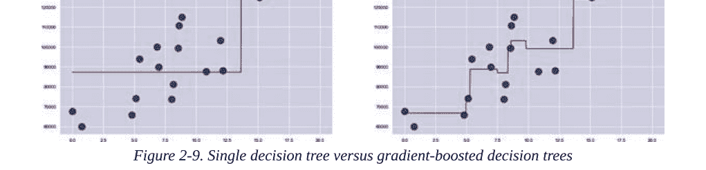

GBDT 可用于回归和分类，并且它们是非参数模型。除了神经网络和支持向量机之外，GBDT 通常是数据科学家认为最适合对复杂数据集建模的模型。

与线性回归模型和随机森林不同，GBDT 容易过拟合。在使用 `GradientBoostingRegressor` 和 `GradientBoostingClassifier` 时，缓解过拟合的一种方法是使用 `subsample` 参数，以防止单个树看到整个数据集，类似于 `max_samples` 对随机森林的作用。另一种方法是使用 `learning_rate` 参数降低学习率，其默认值为 0.1。

### 支持向量机

我将在[第 5 章](#)中全面介绍支持向量机（SVM），但与 GBM 一样，它们代表了统计机器学习的前沿。它们通常能够拟合其他学习算法无法处理的高度非线性数据集。它们如此重要，以至于值得与其他所有算法分开讨论。它们通过一种称为*核技巧*的数学工具来模拟向数据添加维度的效果。其思想是，在 *m* 维中不可分的数据在 *n* 维中可能是可分的。这里有一个简单的例子。

[图 2-10](#) 左侧二维数据集中的类别无法用一条直线分开。但是，如果你添加第三个维度，使得靠近中心的点具有更高的 *z* 值，而远离中心的点具有更低的 *z* 值，如右侧所示，你可以在红色点和紫色点之间插入一个平面，从而实现类别 100% 的分离。这就是 SVM 工作的原理。当推广到处理任意数据集时，它在数学上很复杂，但它是一种极其强大的技术，并且通过 Scikit 得到了极大的简化。

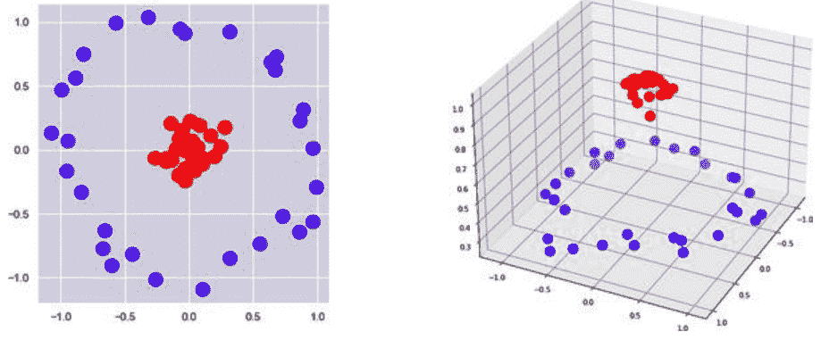

SVM 主要用于分类，但也可用于回归。Scikit 包含用于这两者的类，包括用于分类问题的 `SVC` 和用于回归问题的 `SVR`。你将在[第 5 章](#)中全面了解这些类。目前，在你参加的下一次机器学习聚会上抛出*支持向量机*这个术语，你将立即成为聚会的焦点。

### 回归模型的准确度度量

正如你在[第 1 章](#)中所学，你需要一组数据来训练模型，另一组数据来测试它，并且你可以通过将测试数据传递给模型的 `score` 方法来评估模型的准确度。测试量化了模型在进行预测时的准确程度。使用与训练数据不同的数据集来测试模型极其重要，因为它可能对训练数据学习得相当好，但这并不意味着它能很好地泛化——即做出准确的预测。如果你不测试模型，你就不知道它有多准确。

工程师经常使用 Scikit 的 `train_test_split` 函数将数据集拆分为训练数据集和测试数据集。但是，当你以这种方式拆分一个小数据集时，你不一定能信任模型 `score` 方法返回的分数。那么，这个分数到底意味着什么呢？对于回归模型和分类模型，答案是不同的。虽然评估回归模型的方法有几种，但评估分类模型的方法有很多。让我们花点时间理解 `score` 为回归模型返回的数字，以及你可以做些什么来更信任这个数字。

为了说明为什么在处理小数据集时需要对 `score` 返回的值持一定的怀疑态度，请尝试一个简单的实验。使用以下代码加载 Scikit 的[加利福尼亚住房数据集](https://scikit-learn.org/stable/modules/generated/sklearn.datasets.fetch_california_housing.html)，打乱行顺序，并提取前 1,000 行：

```python
from sklearn.utils import shuffle
from sklearn.datasets import fetch_california_housing

df = fetch_california_housing(as_frame=True).frame
df = shuffle(df, random_state=0)
df = df.head(1000)
df.head()
```

该数据集包含名为 `MedInc`（收入中位数）和 `MedHouseVal`（房屋价值中位数）等列，如下图所示。目前细节并不重要。重要的是，你将构建一个模型，使用所有其他列中的值来预测 `MedHouseVal` 值：

| | MedInc | HouseAge | AveRooms | AveBedrms | Population | AveOccup | Latitude | Longitude | MedHouseVal |
|---|---|---|---|---|---|---|---|---|---|
| 14740 | 4.1518 | 22.0 | 5.663073 | 1.075472 | 1551.0 | 4.180593 | 32.58 | -117.05 | 1.369 |
| 10101 | 5.7796 | 32.0 | 6.107226 | 0.927739 | 1296.0 | 3.020979 | 33.92 | -117.97 | 2.413 |
| 20566 | 4.3487 | 29.0 | 5.930712 | 1.026217 | 1554.0 | 2.910112 | 38.65 | -121.84 | 2.007 |
| 2670 | 2.4511 | 37.0 | 4.992958 | 1.316901 | 390.0 | 2.746479 | 33.20 | -115.60 | 0.725 |
| 15709 | 5.0049 | 25.0 | 4.319261 | 1.039578 | 649.0 | 1.712401 | 37.79 | -122.43 | 4.600 |

使用以下代码将数据按 80/20 的比例拆分，使用 80% 的数据训练一个线性回归模型来预测房屋价格，并使用拆分出的 20% 数据来评估模型：

```python
from sklearn.linear_model import LinearRegression
from sklearn.model_selection import train_test_split

x = df.drop(['MedHouseVal'], axis=1)
y = df['MedHouseVal']
x_train, x_test, y_train, y_test = train_test_split(x, y, test_size=0.2,
                                                    random_state=0)

model = LinearRegression()
model.fit(x_train, y_train)
model.score(x_test, y_test)
```

在这个例子中，`score` 返回 0.5863，表面上表明该模型使用测试数据中的特征进行预测的准确率约为 59%。到目前为止，一切顺利。

现在，将传递给 `train_test_split` 的 `random_state` 值从 0 改为 1，并再次运行代码：

```python
x_train, x_test, y_train, y_test = train_test_split(x, y, test_size=0.2,
                                                    random_state=1)

model = LinearRegression()
model.fit(x_train, y_train)
model.score(x_test, y_test)
```

这一次，`score` 返回 0.6255。那么到底是哪个？模型预测的准确率是 59% 还是 63%？为什么 `score` 返回了两个不同的值？

当 `train_test_split` 拆分数据集时，它会随机选择行用于训练数据集和测试数据集。`random_state` 参数为用于选择的随机数生成器设定种子。通过指定两个不同的种子值，你使用两个不同的数据集训练模型，也使用两个不同的数据集进行测试。当然，它们之间存在重叠。但事实是，你为 `train_test_split` 的随机数生成器设定的种子值会影响结果。数据集越小，这种影响可能越大。

解决方案是*交叉验证*。要交叉验证模型，你需要将数据集划分为*折*，如图 2-11 所示。使用五折很常见，但你可以使用任意数量的折。然后你训练模型五次——每次使用不同的 80% 数据集进行训练，不同的 20% 数据集进行测试——并对分数取平均值以生成交叉验证分数。该分数比 `score` 返回的分数更可靠，因为它对数据拆分方式的敏感性较低。这个过程被称为*k 折交叉验证*。

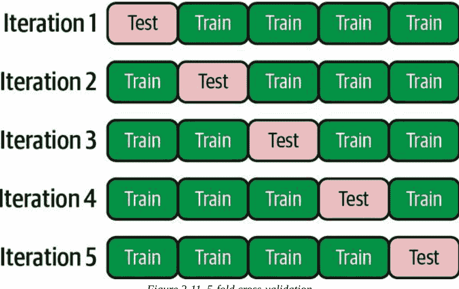

交叉验证的缺点是它需要更长的时间。使用 5 折交叉验证，你需要训练模型五次。好消息是，交叉验证通常只应用于小数据集，而如果数据集很小，模型可能训练得很快。

你可以自己编写代码来进行交叉验证，但你不必这样做，因为 Scikit 已经为你完成了。

### 使用回归预测出租车费用

假设你为一家出租车公司工作，而客户最大的抱怨之一是，他们在行程结束前不知道要花多少钱。这是因为距离并不是决定费用的唯一变量。你决定采取行动，开发一款移动应用，让乘客上车后就能估算车费。为了给应用提供智能支持，你打算利用公司多年来收集的大量费用数据来构建一个机器学习模型。

让我们训练一个回归模型，根据一天中的时间、星期几以及上车和下车地点来预测车费。首先，下载[包含数据集的CSV文件](https://example.com)，并将其复制到你的Jupyter笔记本所在的*Data*子目录中。然后使用以下代码将数据集加载到笔记本中。该数据集包含约55,000行数据，是Kaggle [纽约市出租车费用预测竞赛](https://example.com)中使用的更大数据集的一个子集。数据在使用前需要进行大量的预处理工作——这在机器学习中并不少见。数据科学家们常常发现，收集和准备数据占用了他们90%甚至更多的时间：

```python
import pandas as pd

df = pd.read_csv('Data/taxi-fares.csv', parse_dates=['pickup_datetime'])
df.head()
```

注意这里使用了`read_csv`函数的`parse_dates`参数，将`pickup_datetime`列中的字符串解析为Python的`datetime`对象。以下是代码的输出：

| key | fare_amount | pickup_datetime | pickup_longitude | pickup_latitude | dropoff_longitude | dropoff_latitude | passenger_count |
|---|---|---|---|---|---|---|---|
| 2014-06-15 17:11:00.000000107 | 7.0 | 2014-06-15 17:11:00+00:00 | -73.995420 | 40.759662 | -73.987607 | 40.751247 | 1 |
| 2011-03-14 22:43:00.000000995 | 4.9 | 2011-03-14 22:43:00+00:00 | -73.993552 | 40.731110 | -73.998497 | 40.737200 | 5 |
| 2011-02-14 15:14:00.00000067 | 6.1 | 2011-02-14 15:14:00+00:00 | -73.972380 | 40.749527 | -73.990638 | 40.745328 | 1 |
| 2009-10-29 11:29:00.00000040 | 6.9 | 2009-10-29 11:29:00+00:00 | -73.973703 | 40.763542 | -73.984253 | 40.758603 | 5 |
| 2011-07-02 10:38:00.00000028 | 10.5 | 2011-07-02 10:38:00+00:00 | -73.921262 | 40.743615 | -73.967383 | 40.765162 | 1 |

每一行代表一次出租车行程，包含费用金额、上车和下车地点（以经纬度表示）以及乘客数量等信息。我们想要预测的是费用金额。使用以下代码绘制一个直方图，显示有多少行乘客数量为1，有多少行为2，依此类推：

```python
%matplotlib inline
import matplotlib.pyplot as plt
import seaborn as sns
sns.set()

sns.countplot(x=df['passenger_count'])
```

输出如下：

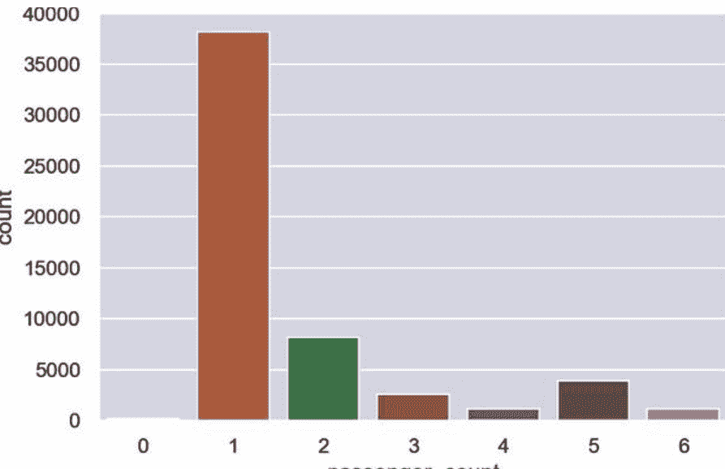

数据集中的大多数行乘客数量为1。由于我们只对预测单个乘客的费用感兴趣，使用以下代码移除所有乘客数量大于1的行，并从数据集中删除`key`列，因为该列不需要——换句话说，它不是我们试图用来预测的特征之一：

```python
df = df[df['passenger_count'] == 1]
df = df.drop(['key', 'passenger_count'], axis=1)
df.head()
```

这样数据集中就剩下了38,233行，你可以通过以下语句自行查看：

```python
df.shape
```

现在使用Pandas的`corr`方法来找出输入变量（如经纬度）对`fare_amount`列值的影响程度：

```python
corr_matrix = df.corr()
corr_matrix['fare_amount'].sort_values(ascending=False)
```

输出如下：

```
fare_amount         1.000000
dropoff_longitude   0.020438
pickup_longitude    0.015742
pickup_latitude    -0.015915
dropoff_latitude   -0.021711
Name: fare_amount, dtype: float64
```

这些数字看起来并不太乐观。经纬度与费用金额关系不大，至少以它们目前的形式来看是这样。然而，从直觉上讲，它们应该与费用金额*有很大*关系，因为它们指定了起点和终点，而更长的行程会产生更高的费用。

现在到了有趣的部分：创建全新的数据列，这些列对结果有更大的影响——它们的值是从其他列的值计算出来的。添加指定星期几（0=星期一，1=星期日，等等）、乘客上车时间（0-23点）以及行程距离（直线距离，非街道距离，单位为英里）的列。为了计算距离，这段代码假设大多数行程都很短，因此可以安全地忽略地球曲率：

```python
from math import sqrt

for i, row in df.iterrows():
    dt = row['pickup_datetime']
    df.at[i, 'day_of_week'] = dt.weekday()
    df.at[i, 'pickup_time'] = dt.hour
    x = (row['dropoff_longitude'] - row['pickup_longitude']) * 54.6
    y = (row['dropoff_latitude'] - row['pickup_latitude']) * 69.0
    distance = sqrt(x**2 + y**2)
    df.at[i, 'distance'] = distance

df.head()
```

你不再需要所有列，因此使用以下语句删除那些不会用到的列：

```python
df.drop(columns=['pickup_datetime', 'pickup_longitude', 'pickup_latitude',
                 'dropoff_longitude', 'dropoff_latitude'], inplace=True)
df.head()
```

让我们再次检查相关性：

```python
corr_matrix = df.corr()
corr_matrix['fare_amount'].sort_values(ascending=False)
```

行驶距离和费用金额之间仍然没有很强的相关性。也许这能解释原因：

```python
df.describe()
```

输出如下：

---

你。交叉验证模型只需要一行代码：

```python
cross_val_score(model, x, y, cv=5).mean()
```

本例中的交叉验证得分应该在0.61左右，介于模型`score`方法生成的两个值之间。它比其他两个分数更能准确地衡量模型的准确性。

你不必在交叉验证之前训练模型，因为`cross_val_score`会为你训练。但是，`cross_val_score`训练的是模型的*副本*，而不是模型本身，因此一旦你使用交叉验证来评估模型的准确性，你仍然需要在进行预测之前调用`fit`：

```python
model.fit(x, y)
```

注意，你将整个数据集传递给`fit`，而不是用于训练的子集。这是交叉验证的另一个好处：你使用*所有*数据来训练模型，如果数据集本身很小，这一点就非常重要。不再有必须留出部分数据进行测试的硬性要求。然而，即使使用了交叉验证，如果有专门保留用于测试的数据，用它来评估模型仍然很有用。请记住：*只有当你知道模型对未训练数据的反应时，你才能真正了解它的准确性*。

> **提示**

根据经验，你应该将交叉验证用于小型数据集，而对大型数据集使用训练/测试分割。数据集越大，它对数据分割方式的敏感度就越低。

这就引出了一个问题：当你对模型进行评分或交叉验证时，返回的值究竟代表什么？对于回归模型，它是*决定系数*，也称为*R平方*分数或简称*R²*。决定系数通常是一个0到1之间的值（“通常”是因为在某些情况下它可能为负），它量化了输出中的方差中可以由输入变量解释的部分。一个简单的理解方式是，*R²*分数为0.8意味着模型在预测时平均准确率约为80%，或者说答案在20%的误差范围内。*R²*分数越高，模型越准确。还有其他方法可以衡量回归模型的准确性，包括均方误差（MSE）和平均绝对误差（MAE）。这些数字只有在输出值范围的上下文中才有意义，而*R²*给你一个独立于范围的简单数字。你可以在[Scikit文档](https://scikit-learn.org/stable/modules/model_evaluation.html)中阅读更多关于回归指标及其获取方法的内容。

对于分类模型，其`score`方法返回的值完全不同。我将在[第3章](https://github.com/ageron/handson-ml2/blob/master/03_classification.ipynb)中讨论量化分类模型准确性的各种方法。

| | 车费金额 | 星期几 | 上车时间 | 距离 |
|---|---|---|---|---|
| **计数** | 38233.000000 | 38233.000000 | 38233.000000 | 38233.000000 |
| **均值** | 11.214115 | 2.951534 | 13.387989 | 12.018397 |
| **标准差** | 9.703149 | 1.932809 | 6.446519 | 217.357022 |
| **最小值** | -22.100000 | 0.000000 | 0.000000 | 0.000000 |
| **25%分位数** | 6.000000 | 1.000000 | 9.000000 | 0.762116 |
| **50%分位数** | 8.500000 | 3.000000 | 14.000000 | 1.331326 |
| **75%分位数** | 12.500000 | 5.000000 | 19.000000 | 2.402226 |
| **最大值** | 256.000000 | 6.000000 | 23.000000 | 4923.837280 |

数据集包含异常值，而异常值常常会扭曲机器学习模型的结果。通过剔除负车费金额，并对车费和距离设置合理的限制来过滤数据集，然后再次运行相关性分析：

```
df = df[(df['distance'] > 1.0) & (df['distance'] < 10.0)]
df = df[(df['fare_amount'] > 0.0) & (df['fare_amount'] < 50.0)]

corr_matrix = df.corr()
corr_matrix['fare_amount'].sort_values(ascending=False)
```

再次查看输出结果：

```
fare_amount    1.000000
distance       0.851913
day_of_week   -0.003570
pickup_time   -0.023085
Name: fare_amount, dtype: float64
```

这样看起来好多了！车费金额中约85%的方差可以由行驶距离来解释。星期几、一天中的小时数与车费金额之间的相关性仍然很弱，但这并不奇怪，因为行驶距离是决定出租车费用的主要因素。我们保留这些列，因为在高峰时段从A点到B点可能需要更长时间，或者周五下午5点的交通状况可能与周六下午5点不同，这都是合理的。

现在是时候训练一个回归模型了。让我们尝试三种不同的学习算法，以确定哪一种能产生最准确的拟合，并使用交叉验证来评估准确性。首先从线性回归模型开始：

```
from sklearn.linear_model import LinearRegression
from sklearn.model_selection import cross_val_score

x = df.drop(['fare_amount'], axis=1)
y = df['fare_amount']

model = LinearRegression()
cross_val_score(model, x, y, cv=5).mean()
```

尝试使用相同的数据集训练一个随机森林回归器（RandomForestRegressor），看看其准确性如何。请记住，随机森林模型在数据上训练多个决策树，并对所有树的结果取平均值来进行预测：

```
from sklearn.ensemble import RandomForestRegressor

model = RandomForestRegressor(random_state=0)
cross_val_score(model, x, y, cv=5).mean()
```

最后，尝试梯度提升回归器（GradientBoostingRegressor）。梯度提升机使用多个决策树，每棵树都经过训练以补偿前一棵树输出的误差：

```
from sklearn.ensemble import GradientBoostingRegressor

model = GradientBoostingRegressor(random_state=0)
cross_val_score(model, x, y, cv=5).mean()
```

假设梯度提升回归器产生了最高的交叉验证决定系数，那么使用整个数据集对其进行训练：

```
model.fit(x, y)
```

最后，使用训练好的模型进行一对预测。首先，估算在周五下午5点雇佣一辆出租车行驶2英里的费用。因为你将包含列名的DataFrame传递给了fit方法，所以如果你将列表或NumPy数组传递给predict方法，较新版本的Scikit会显示警告。因此，请改用DataFrame作为输入：

```
model.predict(pd.DataFrame({ 'day_of_week': [4], 'pickup_time': [17],
                            'distance': [2.0] }))
```

现在预测一天后（周六）下午5点行驶2英里的车费金额：

```
model.predict(pd.DataFrame({ 'day_of_week': [5], 'pickup_time': [17],
                            'distance': [2.0] }))
```

模型预测的周六下午同一行程的车费金额是更高还是更低？考虑到数据来自纽约市的出租车，这些答案是否合理？请思考一下，周五下午的高峰时段交通可能比周六下午更拥堵。

### 总结

回归模型是监督学习模型，用于预测数值结果，例如出租车费用。用于回归的著名学习算法包括以下几种：

- **线性回归**：通过将训练数据拟合到直线方程来建模。
- **决策树**：使用二叉树，通过回答一系列“是/否”问题来预测结果。
- **随机森林**：使用多个独立的决策树对数据进行建模，并且能抵抗过拟合。
- **梯度提升机**：使用多个*相互依赖*的决策树，每棵树都对上一棵树输出的误差进行建模。
- **支持向量机**：采用完全不同的方法对数据进行建模，它通过增加维度来假设在原始问题空间中线性不可分的数据在更高维度空间中可能是线性可分的。

Scikit在诸如`LinearRegression`、`RandomForestRegressor`和`GradientBoostingRegressor`等类中提供了这些及其他学习算法的便捷实现。

量化回归模型准确性的常用指标是$R^2$分数，也称为决定系数。它通常是一个0到1之间的值，数值越高表示准确性越高。从技术上讲，它是输出方差中可由输入值解释的度量。对于小型数据集，$k$折交叉验证比简单地将数据拆分为一次训练和测试能让你对$R^2$分数更有信心。$k$折交叉验证会训练模型$k$次，每次使用不同的数据集划分。

现实世界的数据集往往比较杂乱，通常需要进一步处理才能用于机器学习。正如出租车费用示例所展示的，训练数据中的异常值会影响模型的准确性，甚至使模型完全无法使用。一种解决方案是在训练模型之前识别并移除异常值。另一种是采用支持正则化的学习算法，如岭回归或lasso回归。

回归模型在机器学习中很常见，但分类模型更为普遍。[第3章](Chapter 3)将直接探讨分类模型，介绍另一种名为逻辑回归的主要学习算法，并在本章所学内容的基础上进行拓展。

## 第3章 分类模型

上一章介绍的机器学习模型使用了各种形式的回归，根据行驶距离、星期几和一天中的时间来预测出租车费用。回归模型预测数值结果，在工业界被广泛用于预测销售额、价格、需求以及其他驱动商业决策的数字。同样重要的是分类模型，它预测分类结果，例如一笔信用卡交易是否欺诈，或者一个手写字符代表字母表中的哪个字母。

大多数分类模型分为两类：*二元分类模型*，只有两种可能的结果；以及*多类分类模型*，有超过两种可能的结果。在这两种情况下，模型都会为输入分配一个单一的类别或*类别标签*。较少见的是*多标签分类模型*，它可以将单个输入分类为属于多个类别——例如，预测一份文档既是机器学习论文又是基因组学论文。有些模型甚至可以预测输入不属于任何可能的类别。

你对回归模型的大部分了解也适用于分类模型。例如，许多驱动回归模型的学习算法同样适用于分类模型。回归和分类之间的一个实质性区别在于如何衡量模型的准确性。分类模型没有$R^2$分数这样的指标。取而代之的是大量的度量标准，例如精确率、召回率、特异性、敏感性和F1分数，仅举几例。掌握分类模型的关键之一是熟悉各种准确性指标，更重要的是，根据模型的预期应用理解应该使用哪一个（或哪几个）指标。

你在[第1章](#)的鸢尾花教程中已经见过一个多类分类的例子。现在是时候深入探讨机器学习分类器了，从最经典、最可靠的学习算法之一开始，它*仅*适用于分类模型：逻辑回归。

### 逻辑回归

存在许多用于分类问题的学习算法。在[第2章](#)中，你学习了决策树、随机森林和梯度提升机如何将回归模型拟合到训练数据。这些算法也可以用于分类，Scikit通过提供`DecisionTreeClassifier`、`RandomForestClassifier`和`GradientBoostingClassifier`等类来提供帮助。在[第1章](#)中，你使用了Scikit的`KNeighborsClassifier`类，以*k*近邻作为学习算法构建了一个三类分类模型。

这些都是重要的学习算法，在许多现代机器学习模型中都有应用。但最流行的分类算法之一是*逻辑回归*，它分析数据分布，并拟合一个方程来定义给定样本属于两个可能类别中每一个的概率。例如，它可能确定样本中的值有10%的概率对应类别0，有90%的概率对应类别1。在这种情况下，逻辑

### 逻辑回归

逻辑回归会预测样本属于类别1。尽管名称如此，逻辑回归是一种*分类*算法，而非回归算法。其目的并非创建回归模型，而是量化概率以对输入样本进行分类。

以图3-1中的数据点为例，这些点属于两个类别：0（蓝色）和1（红色）。假设x轴表示一个人为考试学习的小时数，y轴表示他们是否通过（1）或未通过（0）。蓝色点分布在$x = 0$到$x = 10$的范围内，而红色点分布在$x = 5$到$x = 15$的范围内。你无法找到一个$x$值来完全分隔这两个类别，因为两者在$x = 5$到$x = 10$之间都有取值。（试着画一条垂直线，使得一侧只有红色点，另一侧只有蓝色点。）但你*可以*画一条曲线，对于给定的$x$，显示具有该$x$值的点属于类别1的概率。随着$x$增加，该点代表类别1（通过）而非类别0（未通过）的可能性也随之增加。从曲线可以看出，如果$x = 2$，该点属于类别1的概率低于5%。但如果$x = 10$，则有大约76%的概率属于类别1。如果要求将该点分类为红色或蓝色，你会得出它是红色的结论，因为它更可能是红色而非蓝色。

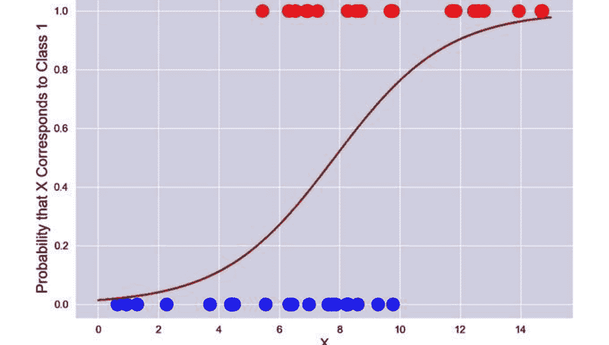

图3-1中的曲线是一条*S形曲线*。它描绘了一个被称为*逻辑函数*（也称为*logit函数*）的函数，该函数在统计学中已使用了数十年。对于逻辑回归，该函数定义如下，其中$x$是输入值，$m$和$b$是训练过程中学习到的参数：

$$y = \frac{1}{1+e^{-(mx+b)}}$$

这个方程揭示了为什么逻辑回归被称为逻辑*回归*，尽管它实际上是一种分类算法。$e$的指数恰好是线性回归的方程。

逻辑回归学习算法将逻辑函数拟合到数据分布上，并使用得到的$y$值作为概率来对数据点进行分类。它适用于任意数量的特征（不仅仅是$x$，还包括$x_1$、$x_2$、$x_3$等），并且它是一种参数化学习算法，因为它使用训练数据来寻找$m$和$b$的最优值。它*如何*找到最优值是一个实现细节，Scikit-Learn等库会为你处理。Scikit默认使用一种称为*有限内存Broyden–Fletcher–Goldfarb–Shanno*（L-BFGS）的数值优化算法，但也支持其他优化方法。顺便说一句，这也是Scikit在机器学习社区如此受欢迎的原因之一。从训练数据计算线性回归模型的$m$和$b$并不困难，但对于逻辑回归模型来说则更难，更不用说像支持向量机这样更复杂的参数化模型了。

Scikit的`LogisticRegression`类是开箱即用的逻辑回归。使用它，训练逻辑回归模型可以像这样简单：

```python
model = LogisticRegression()
model.fit(x, y)
```

模型训练完成后，你可以调用其`predict`方法来预测输入属于哪个类别，或者调用其`predict_proba`方法来获取每个类别的计算概率。如果你将`LogisticRegression`模型拟合到图3-1的数据集，以下语句预测$x = 10$对应于类别0还是类别1：

```python
predicted_class = model.predict([[10.0]])[0]
print(predicted_class) # 输出 1
```

而这些语句显示为每个类别计算的概率：

```python
predicted_probabilities = model.predict_proba([[10.0]])[0]
print(f'类别 0: {predicted_probabilities[0]}') # 0.23508543966167028
print(f'类别 1: {predicted_probabilities[1]}') # 0.7649145603383297
```

Scikit还包括`LogisticRegressionCV`类，用于训练带有内置交叉验证的逻辑回归模型。（如果你需要复习，交叉验证在第2章中介绍过。）以额外的训练时间为代价，以下语句使用五折交叉验证训练一个逻辑回归模型：

```python
model = LogisticRegressionCV(cv=5)
model.fit(x, y)
```

逻辑回归在技术上是一种二元分类算法，但它也可以用于多类分类。我将在本章末尾对此进行更多说明。目前，将逻辑回归视为一种使用著名的逻辑函数来量化输入对应于两个类别中每一个的概率的机器学习算法，你就能对逻辑回归是什么有一个准确的概念理解。

### 分类模型的准确度度量

你可以像评估回归模型一样量化分类模型的准确度：通过调用模型的score方法。对于分类器，score返回真正例和真负例之和除以样本总数。如果测试数据包含10个正例（类别1的样本）和10个负例（类别0的样本），并且模型正确识别了8个正例和7个负例，那么分数是(8 + 7) / 20，即0.75。这有时被称为模型的*准确度分数*。

评估分类模型的方法还有很多，哪种方法“正确”通常取决于模型的使用方式。数据科学家有时不计算准确度分数，而是衡量分类模型的*精确率和召回率*：

*精确率*

通过将真正例数除以真正例与假正例之和来计算。

*召回率*

通过将真正例数除以真正例与假负例之和来计算。

实际上，精确率对假正例（模型错误预测为1的实例）施加了惩罚，而召回率则通过降低模型错误预测为0时的分数来惩罚假负例。

图3-2说明了这种区别。假设你训练了一个模型来区分北极熊图像和海象图像，并且为了测试它，你提交了三张北极熊图像和三张海象图像。此外，假设模型正确分类了两张北极熊图像，但错误地将两张海象图像分类为北极熊图像，如红框所示。在这种情况下，模型识别北极熊的精确率为50%，因为模型分类为北极熊的四张图像中只有两张确实是北极熊。但召回率为67%，因为模型正确识别了三张北极熊图像中的两张。这就是精确率和召回率的要点。前者量化了你可以相信一个正预测是准确的程度，而后者量化了模型准确识别正样本的能力。两者可以使用一个简单的公式组合成一个分数，称为*F1分数（也称为F分数）*。

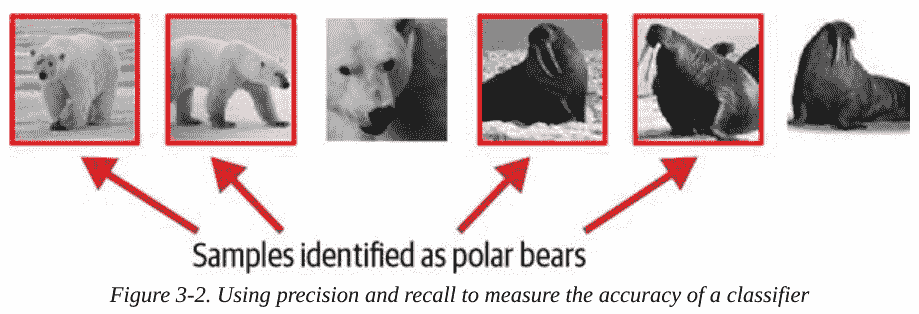

Scikit提供了有用的函数，如`precision_score`、`recall_score`和`f1_score`，用于获取分类指标。你更倾向于精确率还是召回率取决于哪个更高：假正例的成本还是假负例的成本。当假正例的成本很高时使用精确率——例如，当“正”表示电子邮件是垃圾邮件时。你宁愿垃圾邮件过滤器将一些垃圾邮件发送到你的收件箱，也不愿将一封合法（且可能重要）的电子邮件路由到你的垃圾邮件文件夹。相比之下，如果假负例的成本很高，则使用召回率。一个很好的例子是使用机器学习在X光片和MRI扫描中发现肿瘤。你宁愿因为假阳性而错误地将患者送往医生那里，也不愿在患者确实有肿瘤时告诉他们没有肿瘤。

### 在野外发现北极熊

北极熊与海象的例子取自我为微软编写的一个教程，该教程以以下介绍开始：

> *你是一群气候科学家的领导者，他们对北极熊数量的减少感到担忧。为了解决这个问题，你的团队在整个地区战略性的位置放置了数百个运动感应相机。你的挑战不是手动检查每张拍摄的照片以确定是否包含北极熊，而是设计一个自动化系统，实时处理这些相机的数据，并在其中一台相机拍摄到北极熊时在地图上显示警报。你需要一个使用人工智能（AI）以高度准确性的解决方案来确定照片是否包含北极熊。而且你需要它很快，因为气候变化不会等待。*

该教程结合了几个Azure服务来形成一个端到端的解决方案，并使用微软的Power BI进行可视化。如果你感兴趣，可以在线查看[在线](https://example.com)。

准确度分数、精确率、召回率和F1分数适用于二元分类*和*多类分类模型。另一个仅适用于二元分类的指标是*受试者工作特征（ROC）曲线*，它在不同概率阈值下绘制真阳性率（TPR）与假阳性率（FPR）的关系。图3-3显示了一个示例ROC曲线。一条从左下角延伸到右上角的直线将表明模型只有50%的时间是正确的，这对于二元分类器来说并不比猜测好。曲线向左上角弯曲得越多，模型就越准确。数据科学家经常使用曲线下面积（AUC，或ROC AUC）作为准确度的总体度量。Scikit提供了一个名为`RocCurveDisplay`的类来绘制ROC曲线，以及一个名为`roc_auc_score`的函数来获取ROC AUC分数。此函数返回的分数是从0.0到1.0的值。分数越高，模型越准确。

评估分类模型准确度的另一种方法是绘制如图3-4所示的*混淆矩阵*。它适用于二元和多类分类，并显示每个类别在测试期间模型的表现。在这个例子中，模型被要求区分包含戴口罩面孔的图像和包含未戴口罩面孔的图像。在呈现戴口罩的人的图片时，它在85次中有78次是正确的；在呈现未戴口罩的人的图片时，它在58次中有41次是正确的。Scikit提供了一个`confusion_matrix`函数来计算混淆矩阵，以及一个`ConfusionMatrixDisplay`类，该类具有名为`from_estimator`和`from_predictions`的方法来绘制混淆矩阵。

### 分类数据

机器学习从数字中寻找规律。它*仅*处理数字。然而，许多数据集包含字符串值的列，例如“male”和“female”或“red”、“green”和“blue”。数据科学家将这些称为*分类值*，包含它们的列称为*分类列*。机器学习无法直接处理分类值。要在模型中使用它们，必须将其转换为数字。

有两种常用技术可将分类值转换为数值。一种是*标签编码*，你在第1章的*k*-均值聚类示例中已简要见过。标签编码用整数替换分类值。如果一列中有三个唯一值，标签编码会将它们替换为0、1和2。为演示，请在Jupyter笔记本中运行以下代码：

```python
import pandas as pd
from sklearn.preprocessing import LabelEncoder

data = [[10, 'red'], [20, 'blue'], [12, 'red'], [16, 'green'], [22, 'blue']]
df = pd.DataFrame(data, columns=['Length', 'Color'])

encoder = LabelEncoder()
df['Color'] = encoder.fit_transform(df['Color'])
df.head()
```

此代码创建一个DataFrame，包含一个名为Length的数值列和一个名为Color的分类列，后者包含三个不同的分类值。编码前的数据集如下所示：

| Length | Color |
|---|---|
| 10 | red |
| 20 | blue |
| 12 | red |
| 16 | green |
| 22 | blue |

使用Scikit的LabelEncoder类对Color列的值进行标签编码后，数据集如下所示：

| Length | Color |
|---|---|
| 10 | 2 |
| 20 | 0 |
| 12 | 2 |
| 16 | 1 |
| 22 | 0 |

编码后的数据集可用于训练机器学习模型，而未编码的数据集则不能。你可以从编码器的`classes_`属性获取已编码类别的有序列表。

另一种更常见的将分类值转换为数值的方法是*独热编码*，它为分类列中的每个唯一值添加一列，并用1和0填充编码列。独热编码可通过Scikit的`OneHotEncoder`类或在Pandas DataFrame上调用`get_dummies`来执行。以下是使用后者对数据集进行编码的方法：

```python
data = [[10, 'red'], [20, 'blue'], [12, 'red'], [16, 'green'], [22, 'blue']]
df = pd.DataFrame(data, columns=['Length', 'Color'])
df = pd.get_dummies(df, columns=['Color'])
df.head()
```

结果如下：

| | Length | Color_blue | Color_green | Color_red |
|---|---|---|---|---|
| 0 | 10 | 0 | 0 | 1 |
| 1 | 20 | 1 | 0 | 0 |
| 2 | 12 | 0 | 0 | 1 |
| 3 | 16 | 0 | 1 | 0 |
| 4 | 22 | 1 | 0 | 0 |

标签编码和独热编码均用于回归问题和分类问题。一个显而易见的问题是：应该使用哪种方法？一般来说，数据科学家更倾向于独热编码而非标签编码。前者为每个唯一值赋予相等权重，而后者则暗示某些值可能比其他值更重要——例如，“red”（2）比“blue”（0）更重要。另一方面，标签编码更节省内存。编码前后的列数相同，而独热编码会为每个唯一值添加一列。对于分类列中有数千个唯一值的超大数据集，标签编码所需的内存要少得多。

机器学习模型的准确性很少受所选编码方法的影响。如果不确定，使用独热编码通常不会出错。若想确保万无一失，可以同时用两种方式编码数据，并在训练机器学习模型后比较结果。

### 二元分类

二元分类器是使用带标签数据训练的监督学习模型：0表示负类，1表示正类。它们的预测结果也是0和1。它们还会提供每个类别的概率，你可以将其纳入结论中。例如，信用卡公司可能决定，只有当模型以至少99%的确定性预测交易为欺诈时，才会拒绝该交易。在这种情况下，模型计算出的概率比其原始预测更重要。

为了帮助理解关于二元分类的所有内容，让我们使用Scikit构建两个模型：首先是一个简单的模型来演示核心原理，然后是一个解决实际业务问题的模型。

### 对泰坦尼克号乘客进行分类

机器学习中一个著名的公共数据集是[泰坦尼克号数据集](https://www.kaggle.com/c/titanic)，它包含关于数百名乘客在*RMS泰坦尼克号*不幸航行中的信息，包括哪些乘客幸存，哪些乘客遇难。让我们使用逻辑回归从该数据集构建一个二元分类模型，看看我们是否能根据乘客的性别、年龄和票价等级（他们乘坐的是一等舱、二等舱还是三等舱）来预测其幸存几率。

第一步是[下载数据集](https://github.com/peterbraden/jeff-prog/blob/master/Data/titanic.csv)并将其复制到托管Jupyter笔记本的目录的*Data*子目录中。然后在笔记本中运行以下代码以加载数据集并了解其内容：

```python
import pandas as pd

df = pd.read_csv('Data/titanic.csv')
df.head()
```

输出如下：

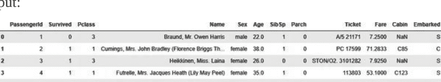

该数据集包含891行和12列。其中一些列，如`PassengerId`和`Name`，与机器学习模型无关。其他列则非常相关。我们将重点关注的列是：

- **Survived**：表示乘客是否在航行中幸存（1）或未幸存（0）
- **Pclass**：表示乘客乘坐的是一等舱（1）、二等舱（2）还是三等舱（3）
- **Sex**：表示乘客的性别
- **Age**：表示乘客的年龄

`Survived`列是标签列——我们将尝试预测的那一列。其他列之所以相关，是因为一等舱乘客[更有可能在沉船中幸存](https://www.kaggle.com/c/titanic)，因为他们的船舱更靠近船的上层甲板，也更靠近救生艇。此外，妇女和儿童更有可能在救生艇上获得空间。

现在使用以下语句查看数据集是否缺少任何值：`df.info()`

以下是输出结果：

```
<class 'pandas.core.frame.DataFrame'>
RangeIndex: 891 entries, 0 to 890
Data columns (total 12 columns):
 #   Column        Non-Null Count  Dtype  
---  ------        --------------  -----  
 0   PassengerId   891 non-null    int64  
 1   Survived      891 non-null    int64  
 2   Pclass        891 non-null    int64  
 3   Name          891 non-null    object 
 4   Sex           891 non-null    object 
 5   Age           714 non-null    float64
 6   SibSp         891 non-null    int64  
 7   Parch         891 non-null    int64  
 8   Ticket        891 non-null    object 
 9   Fare          891 non-null    float64
 10  Cabin         204 non-null    object 
 11  Embarked      889 non-null    object 
dtypes: float64(2), int64(5), object(5)
memory usage: 83.7+ KB
```

Cabin 列缺失了很多值，但我们并不关心，因为我们不会使用该列。我们将使用 Age 列，而该列也缺失了一些值。我们可以用所有其他年龄的平均值来替换缺失值——数据科学家将这种方法称为*填补*缺失值——但我们将采用更简单的方法，即删除包含缺失值的行。使用以下语句来删除不需要的列、删除包含缺失值的行，并对 Sex 和 Pclass 列的值进行独热编码：

```
df = df[['Survived', 'Age', 'Sex', 'Pclass']]
df = pd.get_dummies(df, columns=['Sex', 'Pclass'])
df.dropna(inplace=True)
df.head()
```

以下是生成的数据集：

| | Survived | Age | Sex_female | Sex_male | Pclass_1 | Pclass_2 | Pclass_3 |
|---|---|---|---|---|---|---|---|
| 0 | 0 | 22.0 | 0 | 1 | 0 | 0 | 1 |
| 1 | 1 | 38.0 | 1 | 0 | 1 | 0 | 0 |
| 2 | 1 | 26.0 | 1 | 0 | 0 | 0 | 1 |
| 3 | 1 | 35.0 | 1 | 0 | 1 | 0 | 0 |
| 4 | 0 | 35.0 | 0 | 1 | 0 | 0 | 1 |

下一个任务是将数据集拆分为训练集和测试集：

```
from sklearn.model_selection import train_test_split

x = df.drop('Survived', axis=1)
y = df['Survived']

x_train, x_test, y_train, y_test = train_test_split(x, y, test_size=0.2,
                                                    stratify=y, random_state=0)
```

注意传递给 `train_test_split` 的 `stratify=y` 参数。这很重要，因为在删除包含缺失值的行后，剩余的 714 个样本中，有 290 个代表幸存的乘客，424 个代表未幸存的乘客。我们希望训练数据集和测试数据集包含相似比例的两个类别，而 `stratify=y` 正是实现了这一点。如果不进行分层，模型的准确度可能会显得比实际更高或更低。

现在创建一个逻辑回归模型，用拆分出的训练数据进行训练，并用测试数据进行评分：

```
from sklearn.linear_model import LogisticRegression

model = LogisticRegression(random_state=0)
model.fit(x_train, y_train)
model.score(x_test, y_test)
```

使用交叉验证再次对模型进行评分，以便对分数更有信心。请记住，这是通过将真阳性和真阴性相加，然后除以样本总数计算得出的*准确率分数*：

```
from sklearn.model_selection import cross_val_score

cross_val_score(model, x, y, cv=5).mean()
```

使用以下语句显示一个混淆矩阵，以精确展示模型在测试期间的表现：

```
%matplotlib inline
from sklearn.metrics import ConfusionMatrixDisplay as cmd

cmd.from_estimator(model, x_test, y_test,
                   display_labels=['Perished', 'Survived'],
                   cmap='Blues', xticks_rotation='vertical')
```

观察到模型在预测乘客*不会*幸存时比预测他们会幸存时更准确。这是因为用于训练模型的数据集中，遇难乘客的示例多于幸存乘客的示例。你总是倾向于使用一个完全平衡的数据集（包含相等数量的正负样本）来训练二元分类模型，但如果在评估模型准确度时考虑了不平衡性，那么使用不平衡的数据集进行训练也是可以接受的。

现在使用 Scikit 的 `precision_score` 和 `recall_score` 函数来计算模型的精确率、召回率、敏感度和特异度：

```
from sklearn.metrics import precision_score, recall_score

y_pred = model.predict(x_test)
precision = precision_score(y_test, y_pred)
recall = recall_score(y_test, y_pred)
sensitivity = recall
specificity = recall_score(y_test, y_pred, pos_label=0)

print(f'Precision: {precision}')
print(f'Recall: {recall}')
print(f'Sensitivity: {sensitivity}')
print(f'Specificity: {specificity}')
```

高特异度分数是否与模型更擅长识别不会幸存的乘客而非会幸存的乘客这一观察结果一致？你将如何解释相对较低的召回率和敏感度分数？

现在让我们使用训练好的模型进行一些预测。首先，了解一位乘坐头等舱的 30 岁女性是否有可能在这次航行中幸存。由于模型是用包含列名的 DataFrame 训练的，我们将使用相同的列名来构建输入：

```
female = pd.DataFrame({ 'Age': [30], 'Sex_female': [1], 'Sex_male': [0],
                       'Pclass_1': [1], 'Pclass_2': [0], 'Pclass_3': [0] })

model.predict(female)[0]
```

模型预测她会幸存，但她幸存的*几率*是多少？

```
probability = model.predict_proba(female)[0][1]
print(f'Probability of survival: {probability:.1%}')
```

一位乘坐头等舱的 30 岁女性有超过 90% 的可能性在这次航行中幸存，那么一位乘坐三等舱的 60 岁男性呢？

```
male = pd.DataFrame({ 'Age': [60], 'Sex_female': [0], 'Sex_male': [1],
                     'Pclass_1': [0], 'Pclass_2': [0], 'Pclass_3': [1] })

probability = model.predict_proba(male)[0][1]
print(f'Probability of survival: {probability:.1%}')
```

请随意尝试其他输入，看看模型会怎么说。例如，一位乘坐二等舱的 12 岁男孩在 *泰坦尼克号* 沉没中幸存的可能性有多大？

### 检测信用卡欺诈

当今机器学习最引人注目的用途之一是识别欺诈性金融交易。信用卡公司在销售点应用机器学习来决定是否接受或拒绝单笔交易。虽然这些公司可以理解地不愿公布其操作细节或用于训练模型的数据，但至少有一个这样的数据集已公开发布供公众使用。其中的数据使用一种称为*主成分分析*（PCA）的技术进行了匿名化处理，我将在[第 6 章](https://example.com/chapter6)中介绍该技术。

该数据集如图 3-5 所示。数据来自 2013 年 9 月欧洲信用卡持有人的真实交易。大多数列的名称没有信息量，例如 V1 和 V2，包含的值同样不透明。三列——Time、Amount 和 Class——具有真实的名称和未更改的值，揭示了交易发生的时间、交易金额以及交易是合法的（Class=0）还是欺诈性的（Class=1）。

| Time | V1 | V2 | V3 | ... | V27 | V28 | Amount | Class |
|---|---|---|---|---|---|---|---|---|
| 0 | 0.0 | -1.359807 | -0.072781 | 2.536347 | ... | 0.133558 | -0.021053 | 149.62 | 0 |
| 1 | 0.0 | 1.191857 | 0.266151 | 0.166480 | ... | -0.008983 | 0.014724 | 2.69 | 0 |
| 2 | 1.0 | -1.358354 | -1.340163 | 1.773209 | ... | -0.055353 | -0.059752 | 378.66 | 0 |
| 3 | 1.0 | -0.966272 | -0.185226 | 1.792993 | ... | 0.062723 | 0.061458 | 123.50 | 0 |
| 4 | 2.0 | -1.158233 | 0.877737 | 1.548718 | ... | 0.219422 | 0.215153 | 69.99 | 0 |
| 5 | 2.0 | -0.425966 | 0.960523 | 1.141109 | ... | 0.253844 | 0.081080 | 3.67 | 0 |
| 6 | 4.0 | 1.229658 | 0.141004 | 0.045371 | ... | 0.034507 | 0.005168 | 4.99 | 0 |
| 7 | 7.0 | -0.644269 | 1.417964 | 1.074380 | ... | -1.206921 | -1.085339 | 40.80 | 0 |
| 8 | 7.0 | -0.894286 | 0.286157 | -0.113192 | ... | 0.011747 | 0.142404 | 93.20 | 0 |
| 9 | 9.0 | -0.338262 | 1.119593 | 1.044367 | ... | 0.246219 | 0.083076 | 3.68 | 0 |

图 3-5. 欺诈检测数据集

每一行代表一笔交易。在数据集的 284,807 笔交易中，只有 492 笔是欺诈性的。该数据集高度不平衡，因此你会预期在其上训练的机器学习模型在分类合法交易方面会比欺诈性交易好得多。这不一定是问题，因为信用卡公司宁愿错误分类欺诈性交易并让其中 100 笔溜走，也不愿错误分类一笔合法交易并惹恼客户。

首先下载包含数据集的 ZIP 文件。将 creditcard.csv 从 ZIP 文件复制到你的笔记本的 Data 子目录中，然后在 Jupyter 笔记本中运行以下代码来加载数据集并显示前几行：

```
import pandas as pd

df = pd.read_csv('Data/creditcard.csv')
df.head()
```

了解数据集包含多少行，以及这些行中是否有任何缺失值：

```
df.info()
```

该数据集包含 284,807 行，且没有缺失值。将数据拆分为训练集和测试集，并使用 train_test_split 的 stratify 参数来确保训练数据集和测试数据集中合法交易与欺诈交易的比例一致：

```
from sklearn.model_selection import train_test_split

x = df.drop(['Time', 'Class'], axis=1)
```

y = df['Class']

x_train, x_test, y_train, y_test = train_test_split(x, y, test_size=0.2,
                                                    stratify=y, random_state=0)

训练一个逻辑回归模型来区分不同类别：

```python
from sklearn.linear_model import LogisticRegression

lr_model = LogisticRegression(random_state=0, max_iter=5000)
lr_model.fit(x_train, y_train)
```

注意传递给 `LogisticRegression` 函数的 `max_iter=5000` 参数。`max_iter` 指定了在将逻辑函数拟合到数据集时，为收敛到解所允许的最大迭代次数。默认值是100，在这个例子中不够用。将限制提高到5000，为内部求解器提供了找到解所需的空间。

由于数据集非常不平衡，通过将真阳性和真阴性之和除以测试样本数来计算的典型准确率分数并没有太大帮助。欺诈性交易占所有样本的比例不到0.2%，这意味着模型可以简单地猜测每笔交易都是合法的，并且大约99.8%的时间都是正确的。使用混淆矩阵来可视化模型在测试期间的表现：

```python
%matplotlib inline
from sklearn.metrics import ConfusionMatrixDisplay as cmd

labels = ['Legitimate', 'Fraudulent']
cmd.from_estimator(lr_model, x_test, y_test, display_labels=labels,
                   cmap='Blues', xticks_rotation='vertical')
```

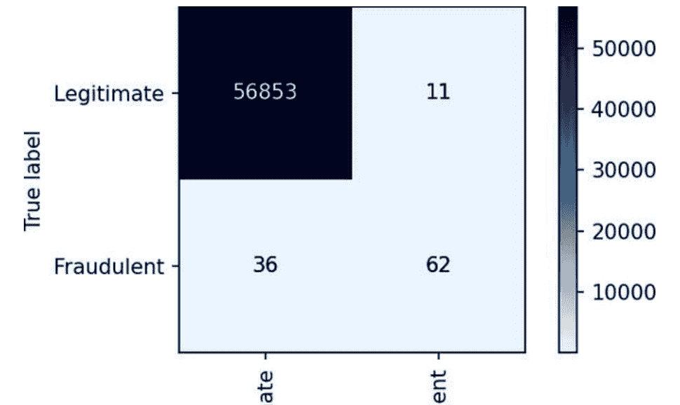

逻辑回归模型正确识别了56,853笔交易为合法，同时仅将11笔合法交易错误分类为欺诈。我们希望最小化后一个数字，因为我们不想因为拒绝合法交易而惹恼客户。让我们看看随机森林分类器是否能做得更好：

```python
from sklearn.ensemble import RandomForestClassifier

rf_model = RandomForestClassifier(random_state=0)
rf_model.fit(x_train, y_train)

cmd.from_estimator(rf_model, x_test, y_test, display_labels=labels,
                   cmap='Blues', xticks_rotation='vertical')
```

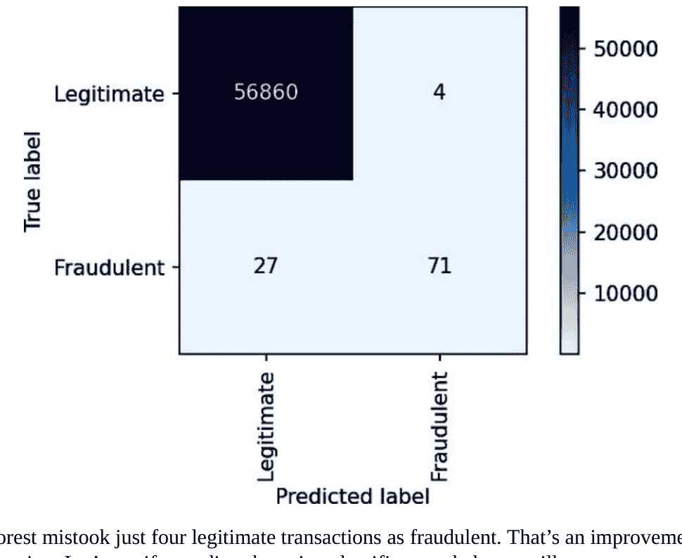

随机森林仅将四笔合法交易误判为欺诈。这比逻辑回归有所改进。让我们看看梯度提升分类器是否能做得更好：

```python
from sklearn.ensemble import GradientBoostingClassifier

gbm_model = GradientBoostingClassifier(random_state=0)
gbm_model.fit(x_train, y_train)

cmd.from_estimator(gbm_model, x_test, y_test, display_labels=labels,
                   cmap='Blues', xticks_rotation='vertical')
```

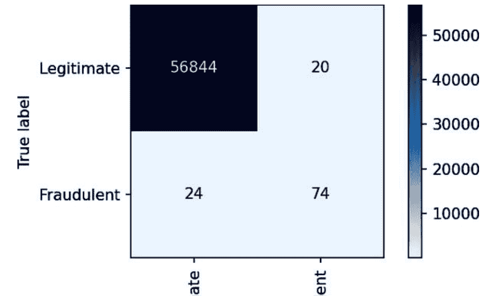

GBM错误分类的合法交易比随机森林多，所以我们坚持使用随机森林。在56,864笔合法交易中，随机森林正确分类了56,860笔。这意味着合法交易被正确分类的比例超过99.99%。同时，该模型捕获了大约75%的欺诈交易。

使用以下语句来衡量随机森林分类器的精确率、召回率、敏感性和特异性：

```python
from sklearn.metrics import precision_score, recall_score

y_pred = rf_model.predict(x_test)
precision = precision_score(y_test, y_pred)
recall = recall_score(y_test, y_pred)
sensitivity = recall
specificity = recall_score(y_test, y_pred, pos_label=0)

print(f'Precision: {precision}')
print(f'Recall: {recall}')
print(f'Sensitivity: {sensitivity}')
print(f'Specificity: {specificity}')
```

以下是输出：

```
Precision: 0.9466666666666667
Recall: 0.7244897959183674
Sensitivity: 0.7244897959183674
Specificity: 0.9999296567248172
```

考虑到信用卡公司希望让客户满意并继续消费，你认为他们最关心这些指标中的哪一个？如果你回答特异性，你就答对了。特异性衡量的是测试在*不*错误地将阴性样本分类为阳性方面的可靠性——在这个例子中，就是不将合法交易分类为欺诈。

不幸的是，你无法使用这个模型进行预测，因为你不知道V1到V28列中数字的含义，而且你无法从新交易中生成列值，因为你没有对原始数据集应用转换。你甚至不知道原始数据集是什么样子的。很可能每一行都包含有关持卡人的信息——例如，年收入、信用评分、年龄、居住国家以及去年在该卡上的消费金额——以及有关所购买产品和购买地点的信息。机器学习的特征工程方面——找出哪些数据与你试图构建的模型相关——与数据准备和选择学习算法一样具有挑战性，甚至更具挑战性。

在现实生活中，信用卡公司用来检测欺诈的模型比这个更复杂，而且它们通常包含多个模型，因为没有一个模型是100%准确的。例如，一家公司可能会构建三个模型，并让它们投票决定一笔给定的交易是否合法。无论如何，你已经证明了这样一个原则：给定正确的特征，你可以构建一个在检测信用卡欺诈方面相当准确的分类模型。而且你亲眼目睹了Scikit让尝试不同的学习算法以确定哪个产生最有用的模型是多么容易。

### 多类别分类

现在是时候处理多类别分类了，其中有*n*个可能的结果，而不仅仅是两个。多类别分类的一个很好的例子是执行光学字符识别：检查手写数字并预测它对应于0到9中的哪个数字。另一个例子是查看一张面部照片，并通过运行一个经过训练以识别数百人的模型来识别照片中的人。

你学到的关于二元分类的所有内容也适用于多类别分类。在Scikit中，任何适用于二元分类的分类器也适用于多类别分类模型。这一点的重要性怎么强调都不为过。一些学习算法，如逻辑回归，仅在二元分类场景中工作。许多机器学习库要求你编写显式代码来扩展逻辑回归以执行多类别分类——或者完全使用不同形式的逻辑回归。Scikit不是这样。相反，它确保像 `LogisticRegression` 这样的分类器在任何场景下都能工作，并在必要时在幕后进行额外的工作以实现这一点。

对于逻辑回归，Scikit使用两种策略之一来扩展算法以在多类别场景中工作。（你可以使用 `LogisticRegression` 类的 `multi_class` 参数指定使用哪种策略，或者接受默认值 'auto' 并让Scikit选择。）一种是*多项式逻辑回归*，它用[softmax函数](https://en.wikipedia.org/wiki/Softmax_function)替换逻辑函数，该函数产生多个概率——每个类别一个。另一种是*一对多*，也称为*一对所有*，它训练*n*个二元分类模型，其中*n*是模型可以预测的类别数。这*n*个模型中的每一个都将一个类别与所有其他类别配对，当要求模型进行预测时，它会将输入运行通过所有*n*个模型，并使用产生最高概率的那个模型的输出。这种策略如图3-6所示。

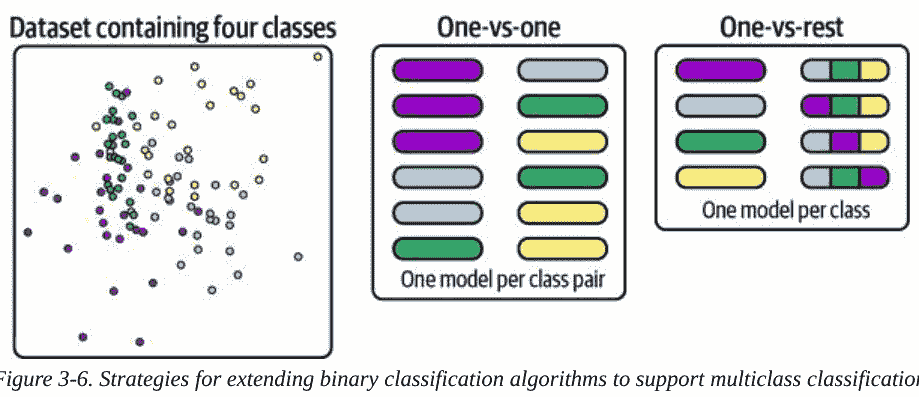

一对多方法对逻辑回归很有效，但对于一些仅支持二元分类的算法，Scikit使用*一对一*方法。例如，当你使用Scikit的SVC类（一个支持向量机分类器，你将在第5章中学习）执行多类别分类时，Scikit为每对类别构建一个模型。如果模型包含四个可能的类别，Scikit在底层构建不少于七个模型。

你不需要知道这些来构建多类别分类模型。但这确实解释了为什么一些多类别分类模型比其他模型需要更多内存并且训练更慢。一些分类算法，如随机森林和GBM，原生支持多类别分类。对于不支持的算法，Scikit会支持你。它填补了空白，并尽可能透明地做到这一点。

重申一下：所有Scikit分类器都能够执行二元分类和多类别分类。这简化了你编写的代码，让你专注于构建和训练模型，而不是理解算法的底层机制。

### 构建数字识别模型

想亲身体验多类别分类吗？一个检查扫描的手写数字并预测它们对应于0-9中哪个数字的模型怎么样？美国邮政服务多年前就构建了一个类似的模型来识别手写邮政编码，作为自动化邮件分拣工作的一部分。我们将使用Scikit内置的一个示例数据集：加州大学欧文分校的[手写数字光学识别数据集](https://archive.ics.uci.edu/ml/datasets/Optical+Recognition+of+Handwritten+Digits)，其中包含近1,800个手写数字。每个数字由一个8×8的数字数组表示，数字范围从0到16，数字越大表示像素越暗。我们将使用逻辑回归从数据中进行预测。图3-7显示了数据集中的前50个数字。

## 第3章 分类（续）

图3-7. 手写数字光学识别数据集中的前50个数字

首先创建一个Jupyter笔记本，并在第一个单元格中执行以下语句：

```python
from sklearn import datasets

digits = datasets.load_digits()
print('digits.images: ' + str(digits.images.shape))
print('digits.target: ' + str(digits.target.shape))
```

以下是第一个数字的数值形式：

```python
digits.images[0]
```

这是它肉眼可见的样子：

```python
%matplotlib inline
import matplotlib.pyplot as plt

plt.tick_params(axis='both', which='both', bottom=False, top=False, left=False,
                right=False, labelbottom=False, labelleft=False)
plt.imshow(digits.images[0], cmap=plt.cm.gray_r)
```

它显然是一个0，但你可以从它的标签中确认这一点：

```python
digits.target[0]
```

绘制前50个图像并显示相应的标签：

```python
fig, axes = plt.subplots(5, 10, figsize=(12, 7),
                         subplot_kw={'xticks': [], 'yticks': []})

for i, ax in enumerate(axes.flat):
    ax.imshow(digits.images[i], cmap=plt.cm.gray_r)
    ax.text(0.45, 1.05, str(digits.target[i]), transform=ax.transAxes)
```

分类模型在平衡的数据集上表现最佳。使用以下语句绘制样本分布：

```python
plt.xticks([])
plt.hist(digits.target, rwidth=0.9)
```

以下是输出结果：

该数据集几乎完全平衡，因此让我们将其拆分并训练一个逻辑回归模型：

```python
from sklearn.linear_model import LogisticRegression
from sklearn.model_selection import train_test_split

x_train, x_test, y_train, y_test = train_test_split(
    digits.data, digits.target, test_size=0.2, random_state=0)

model = LogisticRegression(max_iter=5000)
model.fit(x_train, y_train)
```

使用score方法量化模型的准确性：

```python
model.score(x_test, y_test)
```

使用混淆矩阵查看模型在测试数据集上的表现：

```python
%matplotlib inline
import matplotlib.pyplot as plt
from sklearn.metrics import ConfusionMatrixDisplay as cmd
import seaborn as sns
sns.set()

fig, ax = plt.subplots(figsize=(8, 8))
ax.grid(False)
cmd.from_estimator(model, x_test, y_test, cmap='Blues', colorbar=False, ax=ax)
```

生成的输出描绘了一幅令人鼓舞的图景：对角线上是大数字和深色，对角线外是小数字和浅色。一个完美的模型在对角线外应该全是零，但当然，完美的模型并不存在：

从数据集中选择一个数字并绘制它，看看它的样子：

```python
sns.reset_orig() # 撤销 sns.set()
plt.tick_params(axis='both', which='both', bottom=False, top=False, left=False,
                right=False, labelbottom=False, labelleft=False)
plt.imshow(digits.images[100], cmap=plt.cm.gray_r)
```

将其传递给模型，看看模型预测它是哪个数字：

```python
model.predict([digits.data[100]])[0]
```

模型对每个可能数字的预测概率是多少？

```python
model.predict_proba([digits.data[100]])
```

该数字是4的概率是多少？

```python
model.predict_proba([digits.data[100]])[0][4]
```

当用于二元分类时，`predict_proba`返回两个概率：一个用于负类，一个用于正类。对于多类分类，`predict_proba`返回每个可能类别的概率。这允许你评估模型对`predict`返回的预测的置信度。毫不奇怪，`predict`返回被分配最高概率的类别。

### 总结

分类模型在工业中被广泛用于预测分类结果，例如信用卡交易应该被接受还是拒绝。二元分类模型预测两种结果之一，而多类分类模型预测两种以上结果。分类模型最广泛使用的学习算法之一是逻辑回归，它将一个方程拟合到训练数据，并通过计算每个结果是正确结果的可能性并选择概率最高的结果来预测结果。

评估分类模型的方法有很多。哪种方法正确取决于你打算如何使用模型。例如，当假阳性的成本很高时，使用精确率来评估模型的准确性。精确率是通过将真阳性的数量除以真阳性和假阳性的总和来计算的。另一方面，如果假阴性的成本很高，则使用召回率。召回率是通过将真阳性的数量除以真阳性和假阴性的总和来计算的。与精确率和召回率密切相关的是敏感性和特异性。敏感性与召回率相同，而特异性是负类的召回率，而不是正类的召回率。混淆矩阵提供了一种便捷的方式来可视化模型在测试数据上的表现，而无需将准确性简化为一个数字。

一些学习算法仅适用于二元分类，但Scikit在底层进行了一些魔法处理，以确保*任何*学习算法都可以用于二元或多类分类。并非所有机器学习库都是如此。有些将其学习算法限制在特定场景，或者要求你编写额外的代码才能在多类模型中使用二元分类算法。

本章中的所有模型都是用数值数据训练的，即使一些数据集包含分类值——这些值是字符串而不是数字——必须使用独热编码转换为数字。你可能想知道如何构建一个*仅*处理文本的分类模型——例如，一个为餐厅评论打分情感或对电子邮件进行垃圾邮件分类的模型。这是一个完全合理的问题。而这恰好是第4章的主题。

## 第4章 文本分类

二元分类的一个更新颖的用途是情感分析，它检查一段文本样本，如产品评论、推文或网站上的评论，并在0.0到1.0的范围内为其打分，其中0.0代表负面情绪，1.0代表正面情绪。像“物美价廉”这样的评论可能得分为0.9，而“价格过高且几乎无法使用的产品”可能得分为0.1。该分数是文本表达正面情绪的概率。情感分析模型在算法上很难构建，但使用机器学习相对容易制作。有关当今商业中情感分析应用示例，请参阅Nicholas Bianchi的文章“8 Sentiment Analysis Real-World Use Cases”。

情感分析是涉及对文本数据而非数值数据进行分类的任务的一个例子。因为机器学习处理的是数字，所以在训练情感分析模型、识别垃圾邮件的模型或任何其他对文本进行分类的模型之前，你必须将文本转换为数字。一种常见的方法是构建一个称为*词袋*的词频表。Scikit-Learn提供了类来帮助。它还包括对文本进行规范化支持，例如，这样“awesome”和“Awesome”就不会被计为两个不同的词。

本章首先描述如何为分类模型准备文本。在构建情感分析模型之后，你将了解另一种流行的学习算法，称为朴素贝叶斯，它特别适用于文本，并使用它构建一个区分合法电子邮件和垃圾邮件的模型。最后，你将了解一种用于测量两个文本样本相似性的数学技术，并使用它构建一个基于你喜欢的其他电影推荐电影的应用程序。

### 为分类准备文本

在训练模型对文本进行分类之前，你必须将文本转换为数字，这个过程称为*向量化*。第1章介绍了图4-1中复制的插图，它演示了一种常见的文本向量化技术。每一行代表一个文本样本，如推文或电影评论，每一列代表训练文本中的一个单词。行中的数字是词数，每行的最后一个数字是标签：0表示负面，1表示正面。

文本在向量化之前通常需要进行*清洗*。清洗的示例包括将字符转换为小写（例如，"Excellent" 等同于 "excellent"）、移除标点符号，以及可选地移除*停用词*——像 *the* 和 *and* 这样对结果影响可能很小的常见词汇。清洗完成后，句子被分割成单个单词（*分词*），这些单词被用来生成如**图 4-1**所示的数据集。

Scikit-Learn 有三个类处理了文本清洗和向量化的大部分工作：

*CountVectorizer*

从训练文本的语料库中创建一个字典（*词汇表*），并生成一个如**图 4-1**所示的单词计数矩阵。

*HashingVectorizer*

使用单词哈希值而非内存中的词汇表来生成单词计数，因此内存效率更高。

*TfidfVectorizer*

从提供给它的单词创建一个字典，并生成一个类似于**图 4-1**的矩阵，但该矩阵包含的不是整数单词计数，而是介于 0.0 和 1.0 之间的**词频-逆文档频率（TFIDF）**值，反映了单个单词的相对重要性。

这三个类都能够将文本转换为小写、移除标点符号、移除停用词、将句子分割成单个单词等等。它们还支持 *n-grams*，即两个或更多连续单词的组合（你指定数字 *n*），这些组合应被视为一个单词。其理念是，像 *credit* 和 *score* 这样的单词，如果在句子中相邻出现，可能比它们相隔很远时更有意义。如果不使用 *n-grams*，单词的相对邻近性就会被忽略。使用 *n-grams* 的缺点是它会增加内存消耗和训练时间。然而，如果使用得当，它可以使文本分类模型更准确。

> **注意**

神经网络有其他更强大的方法来考虑词序，这些方法不需要相关单词彼此相邻出现。传统的机器学习模型无法将句子 "I like blue, for it is the color of the sky" 中的单词 *blue* 和 *sky* 联系起来，但神经网络可以。我将在[第 13 章](#)中对此进行更多阐述。

以下是一个示例，演示了 `CountVectorizer` 的功能及其使用方法：

```python
import pandas as pd
from sklearn.feature_extraction.text import CountVectorizer

lines = [
    'Four score and 7 years ago our fathers brought forth,',
    '... a new NATION, conceived in liberty $$$,',
    'and dedicated to the PrOpOsItIoN that all men are created equal',
    'One nation\'s freedom equals #freedom for another $nation!'
]

# Vectorize the lines
vectorizer = CountVectorizer(stop_words='english')
word_matrix = vectorizer.fit_transform(lines)

# Show the resulting word matrix
feature_names = vectorizer.get_feature_names_out()
line_names = [f'Line {(i + 1):d}' for i, _ in enumerate(word_matrix)]

df = pd.DataFrame(data=word_matrix.toarray(), index=line_names,
                  columns=feature_names)

df.head()
```

以下是输出结果：

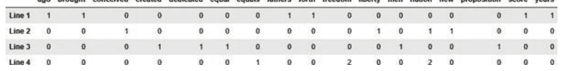

本例中的文本语料库是 Python 列表中的四个字符串。`CountVectorizer` 将字符串分割成单词，移除了停用词和符号，并将所有剩余单词转换为小写。这些单词构成了数据集的列，而行中的数字显示了给定单词在每个字符串中出现的次数。`stop_words='english'` 参数告诉 `CountVectorizer` 使用一个包含 300 多个英语停用词的内置字典来移除停用词。如果你愿意，可以在一个 Python 列表中提供自己的停用词列表。（或者你可以保留停用词；这通常无关紧要。）如果你使用另一种语言编写的文本进行训练，可以从其他 Python 库（如 [Natural Language Toolkit (NLTK)](#) 和 [Stop-words](#)）获取多语言停用词列表。

从输出中观察到，`equal` 和 `equals` 被视为不同的单词，尽管它们具有相似的含义。数据科学家在为机器学习准备文本时，有时会更进一步，对单词进行*词干提取*或*词形还原*。如果对前面的文本进行词干提取，所有出现的 `equals` 都将被转换为 equal。Scikit 缺乏对词干提取和词形还原的支持，但你可以从其他库（如 NLTK）中获得这些功能。

CountVectorizer 移除标点符号，但不移除数字。它忽略了第 1 行中的 7，因为它忽略单个字符。但如果你将 7 改为 777，术语 777 将会出现在词汇表中。解决这个问题的一种方法是定义一个移除数字的函数，并通过 preprocessor 参数将其传递给 CountVectorizer：

```python
import re

def preprocess_text(text):
    return re.sub(r'\d+', '', text).lower()

vectorizer = CountVectorizer(stop_words='english', preprocessor=preprocess_text)
word_matrix = vectorizer.fit_transform(lines)
```

注意调用了 lower 来将文本转换为小写。如果你提供了一个预处理函数，CountVectorizer 不会将文本转换为小写，因此预处理函数必须自己进行转换。不过，它仍然会移除标点字符。

CountVectorizer 的另一个有用参数是 min_df，它会忽略出现次数少于指定次数的单词。它可以是一个整数，指定最小计数（例如，忽略在训练文本中出现少于五次的单词，即 min_df=5），或者它也可以是一个介于 0.0 到 1.0 之间的浮点值，指定单词必须出现的最小样本百分比——例如，忽略在少于 10% 的样本中出现的单词（min_df=0.1）。它非常适合过滤掉那些可能本来就没有意义的单词，并且通过减少词汇表的大小来降低内存消耗和训练时间。CountVectorizer 还支持 max_df 参数，用于消除出现过于频繁的单词。

前面的示例使用了 CountVectorizer，这可能会让你想知道何时（以及为什么）使用 HashingVectorizer 或 TfidfVectorizer。HashingVectorizer 在处理大型数据集时很有用。它不是将单词存储在内存中，而是对每个单词进行哈希处理，并使用哈希值作为单词计数数组的索引。因此，它可以用更少的内存做更多的事情，并且在序列化向量化器以便稍后恢复时非常有用——这个话题我将在第 7 章中进一步讨论。HashingVectorizer 的缺点是它不允许你从向量化文本反向追溯到原始文本。CountVectorizer 可以，并且它为此提供了一个 inverse_transform 方法。

TfidfVectorizer 经常用于执行关键词提取：检查一个文档或一组文档，并提取表征其内容的关键词。它为单词分配反映其重要性的数值权重，并使用两个因素来确定权重：一个单词在单个文档中出现的频率，以及它在整个文档集中出现的频率。在单个文档中出现更频繁但在较少文档中出现的单词会获得更高的权重。我不会在这里进一步展开，但如果你好奇想了解更多，本书的 GitHub 仓库包含一个使用 TfidfVectorizer 从第 1 章手稿中提取关键词的笔记本。

### 情感分析

要训练情感分析模型，你需要一个带标签的数据集。公共领域中有[几个这样的数据集](https://example.com)。其中之一是 [IMDB 电影评论数据集](https://example.com)，它包含 25,000 条负面评论样本和 25,000 条正面评论样本，这些评论发布在 [Internet Movie Database 网站](https://example.com)上。每条评论都经过精心标注，0 表示负面情绪，1 表示正面情绪。为了演示情感分析的工作原理，让我们构建一个二元分类模型，并使用这个数据集进行训练。我们将使用逻辑回归作为学习算法。该模型产生的情感分析分数仅仅是输入表达正面情绪的概率，这可以通过调用 `LogisticRegression` 的 `predict_proba` 方法轻松获取。

首先[下载数据集](https://example.com)并将其复制到托管你的 Jupyter 笔记本的目录的 *Data* 子目录中。然后在笔记本中运行以下代码来加载数据集并显示前五行：

```python
import pandas as pd

df = pd.read_csv('Data/reviews.csv', encoding='ISO-8859-1')
df.head()
```

`encoding` 属性是必要的，因为 CSV 文件使用 ISO-8859-1 字符编码而不是 UTF-8。输出如下：

| | Text | Sentiment |
|---|---|---|
| 0 | Once again Mr. Costner has dragged out a movie... | 0 |
| 1 | This is an example of why the majority of acti... | 0 |
| 2 | First of all I hate those moronic rappers, who... | 0 |
| 3 | Not even the Beatles could write songs everyon... | 0 |
| 4 | Brass pictures (movies is not a fitting word f... | 0 |

查看数据集包含多少行，并确认没有缺失值：

```python
df.info()
```

使用以下语句查看每个类别（0 表示负面，1 表示正面）有多少个实例：

```python
df.groupby('Sentiment').describe()
```

以下是输出结果：

文本

| 情感 | 数量 | 唯一值 | 最常见词 | 频率 |
| :--- | :--- | :--- | :--- | :--- |
| 0 | 25000 | 24697 | Nickelodeon has gone down the toilet. They hav... | 3 |
| 1 | 25000 | 24884 | Loved today's show!!! It was a variety and not... | 5 |

正负样本数量相等，但在每种情况下，唯一样本的数量都少于该类别的样本数量。这意味着数据集存在重复行，而重复行可能会使机器学习模型产生偏差。使用以下语句删除重复行并再次检查平衡性：

```python
df = df.drop_duplicates()
df.groupby('Sentiment').describe()
```

现在没有重复行了，正负样本的数量大致相等。接下来，使用CountVectorizer准备并矢量化Text列中的文本。将min_df设置为20，以忽略训练文本中出现频率较低的单词。这可以减少内存不足错误的可能性，并且可能使模型更准确。同时使用ngram_range参数，让CountVectorizer不仅包含单个单词，还包含单词对：

```python
from sklearn.feature_extraction.text import CountVectorizer

vectorizer = CountVectorizer(ngram_range=(1, 2), stop_words='english',
                            min_df=20)

x = vectorizer.fit_transform(df['Text'])
y = df['Sentiment']
```

现在将数据集拆分为训练集和测试集。由于总共有近50,000个样本，我们将使用50/50的拆分比例：

```python
from sklearn.model_selection import train_test_split

x_train, x_test, y_train, y_test = train_test_split(x, y, test_size=0.5,
                                                    random_state=0)
```

下一步是训练分类器。我们将使用Scikit的LogisticRegression类，它使用逻辑回归来拟合数据模型：

```python
from sklearn.linear_model import LogisticRegression

model = LogisticRegression(max_iter=1000, random_state=0)
model.fit(x_train, y_train)
```

使用预留用于测试的50%数据集验证训练好的模型，并在混淆矩阵中显示结果：

```python
%matplotlib inline
from sklearn.metrics import ConfusionMatrixDisplay as cmd
cmd.from_estimator(model, x_test, y_test,
                   display_labels=['Negative', 'Positive'],
                   cmap='Blues', xticks_rotation='vertical')
```

混淆矩阵显示，模型正确识别了10,795条负面评论，同时错误分类了1,574条。它正确识别了10,966条正面评论，错误分类了1,456条：

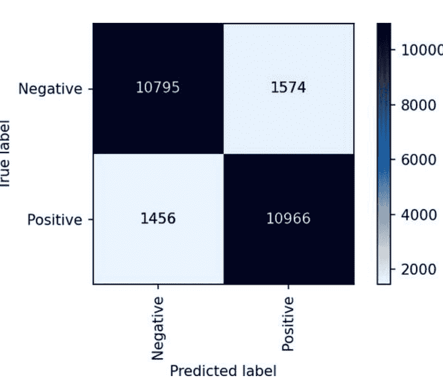

现在到了有趣的部分：分析文本的情感。使用以下语句为句子“The long lines and poor customer service really turned me off”生成情感分数：

```python
text = 'The long lines and poor customer service really turned me off'
model.predict_proba(vectorizer.transform([text]))[0][1]
```

输出如下：

```
0.09183447847778639
```

现在对“The food was great and the service was excellent!”做同样的操作：

```python
text = 'The food was great and the service was excellent!'
model.predict_proba(vectorizer.transform([text]))[0][1]
```

如果你期望这个句子的分数更高，你不会失望的：

请随意尝试你自己的句子，看看你是否同意模型预测的情感分数。它并不完美，但已经足够好，如果你将数百条评论或评价输入其中，你应该能得到文本所表达情感的可靠指示。

> **注意**

有时CountVectorizer内置的停用词列表会*降低*模型的准确性，因为该列表过于宽泛。作为实验，从CountVectorizer中移除`stop_words='english'`并再次运行代码。检查混淆矩阵。准确性是提高了还是降低了？也请随意调整其他参数，如`min_df`和`ngram_range`。在现实世界中，数据科学家经常尝试许多不同的参数组合，以确定哪种组合能产生最佳结果。

### 朴素贝叶斯

逻辑回归是分类模型的首选算法，在文本分类方面通常非常有效。但在涉及文本分类的场景中，数据科学家经常转向另一种称为*朴素贝叶斯*的学习算法。这是一种基于*贝叶斯定理*的分类算法，它提供了一种计算条件概率的方法。从数学上讲，贝叶斯定理表述如下：

$$P(A|B) = \frac{P(B|A) \cdot P(A)}{P(B)}$$

这表示在B为真的条件下A为真的概率，等于在A为真的条件下B为真的概率乘以A为真的概率，再除以B为真的概率。这说起来很拗口，虽然准确，但它没有解释为什么朴素贝叶斯在文本分类中如此有用——或者你如何将其应用于例如一组电子邮件以确定哪些是垃圾邮件。

让我们从一个简单的例子开始。假设你收到的所有邮件中有10%是垃圾邮件。这就是$P(A)$。分析显示，你收到的垃圾邮件中有5%包含*congratulations*这个词，但只有1%的*所有*邮件包含这个词。因此，$P(B|A)$是0.05，$P(B)$是0.01。如果一封邮件包含*congratulations*这个词，它是垃圾邮件的概率$P(A|B)$是(0.05 x 0.10) / 0.01，即0.50。

当然，垃圾邮件过滤器必须考虑邮件中的所有单词，而不仅仅是一个。事实证明，如果你做一些简单（朴素）的假设——邮件中单词的顺序无关紧要，并且每个单词的权重相等——你可以这样编写垃圾邮件分类器的贝叶斯方程：

$$P(S|message) = P(S) \cdot P(word_1|S) \cdot P(word_2|S)...P(word_n|S)$$

用简单的英语来说，一条消息是垃圾邮件的概率与以下各项的乘积成正比：

- 数据集中任何消息是垃圾邮件的概率，即$P(S)$
- 消息中每个单词出现在垃圾邮件中的概率，即$P(word|S)$

$P(S)$可以很容易地计算出来：它就是数据集中垃圾邮件所占的比例。如果你用1,000条消息训练一个机器学习模型，其中500条是垃圾邮件，那么$P(S) = 0.5$。对于给定的单词，$P(word|S)$就是该单词在垃圾邮件中出现的次数除以所有垃圾邮件中的单词总数。整个问题简化为单词计数。你可以进行类似的计算来计算消息*不是*垃圾邮件的概率，然后使用两个概率中较高的一个进行预测。

这里有一个涉及四个示例邮件的例子。邮件如下：

| 文本 | 垃圾邮件 |
|---|---|
| Raise your credit score in minutes | 1 |
| Here are the minutes from yesterday’s meeting | 0 |
| Meeting tomorrow to review yesterday’s scores | 0 |
| Score tomorrow’s meds at yesterday’s prices | 1 |

如果你移除停用词，将字符转换为小写，并对单词进行词干提取，使得*tomorrow's*变成*tomorrow*，你会得到：

| 文本 | 垃圾邮件 |
|---|---|
| raise credit score minute | 1 |
| minute yesterday meeting | 0 |
| meeting tomorrow review yesterday score | 0 |
| score tomorrow med yesterday price | 1 |

因为四条消息中有两条是垃圾邮件，两条不是，所以任何消息是垃圾邮件的概率（$P(S)$）是0.5。任何消息不是垃圾邮件的概率（$P(N) = 0.5$）也是如此。此外，垃圾邮件包含九个唯一单词，而非垃圾邮件总共包含八个唯一单词。

下一步是构建以下单词频率表。以单词*yesterday*为例。它在一条标记为垃圾邮件的消息中出现一次，所以$P(yesterday|S)$是1/9，即0.111。它在非垃圾邮件中出现两次，所以$P(yesterday|N)$是2/8，即0.250：

| 单词 | $P(word|S)$ | $P(word|N)$ |
|---|---|---|
| raise | 1/9 = 0.111 | 0/8 = 0.000 |
| credit | 1/9 = 0.111 | 0/8 = 0.000 |
| score | 2/9 = 0.222 | 1/8 = 0.125 |
| minute | 1/9 = 0.111 | 1/8 = 0.125 |
| yesterday | 1/9 = 0.111 | 2/8 = 0.250 |
| meeting | 0/9 = 0.000 | 2/8 = 0.250 |
| tomorrow | 1/9 = 0.111 | 1/8 = 0.125 |
| review | 0/9 = 0.000 | 1/8 = 0.125 |
| med | 1/9 = 0.111 | 0/8 = 0.000 |
| price | 1/9 = 0.111 | 0/8 = 0.000 |

这种方法在一定程度上是有效的，但表格中的零值是个问题。假设你想判断“分数必须在明天前审核”是否为垃圾邮件。去掉停用词后，剩下“分数 审核 明天”。你可以这样计算该邮件是垃圾邮件的概率：

$P(S|score\ review\ tomorrow) = P(S) \cdot P(score|S) \cdot P(review|S) \cdot P(tomorrow|S)$
$P(S|score\ review\ tomorrow) = 0.5 \cdot 0.222 \cdot 0.0 \cdot 0.111 = 0$
$P(S|score\ review\ tomorrow) = 0$

结果为0，因为*review*一词未出现在垃圾邮件中，而0乘以任何数都是0。该算法根本无法为“分数必须在明天前审核”分配一个垃圾邮件概率。

解决此问题的常用方法是应用*拉普拉斯平滑*，也称为*加性平滑*。通常，这涉及将每个分子加1，并将数据集中唯一单词的数量（本例中为10）加到每个分母上。现在，$P(review|S)$ 的计算结果为 (0 + 1) / (9 + 10)，等于0.053。虽然不多，但总比没有（字面意思）要好。以下是使用拉普拉斯平滑修正后的词频表：

| 单词 | $P(word|S)$ | $P(word|N)$ |
| :--- | :--- | :--- |
| raise | (1 + 1) / (9 + 10) = 0.105 | (0 + 1) / (8 + 10) = 0.056 |
| credit | (1 + 1) / (9 + 10) = 0.105 | (0 + 1) / (8 + 10) = 0.056 |
| score | (2 + 1) / (9 + 10) = 0.158 | (1 + 1) / (8 + 10) = 0.111 |
| minute | (1 + 1) / (9 + 10) = 0.105 | (1 + 1) / (8 + 10) = 0.111 |
| yesterday | (1 + 1) / (9 + 10) = 0.105 | (2 + 1) / (8 + 10) = 0.167 |
| meeting | (0 + 1) / (9 + 10) = 0.053 | (2 + 1) / (8 + 10) = 0.167 |
| tomorrow | (1 + 1) / (9 + 10) = 0.105 | (1 + 1) / (8 + 10) = 0.111 |
| review | (0 + 1) / (9 + 10) = 0.053 | (1 + 1) / (8 + 10) = 0.111 |
| med | (1 + 1) / (9 + 10) = 0.105 | (0 + 1) / (8 + 10) = 0.056 |
| price | (1 + 1) / (9 + 10) = 0.105 | (0 + 1) / (8 + 10) = 0.056 |

现在，你可以通过两个简单的计算来判断“分数必须在明天前审核”是否为垃圾邮件：

$P(S|score\ review\ tomorrow) = 0.5 \cdot 0.158 \cdot 0.053 \cdot 0.105 = 0.000440$
$P(N|score\ review\ tomorrow) = 0.5 \cdot 0.111 \cdot 0.111 \cdot 0.111 = 0.000684$

根据此衡量标准，“分数必须在明天前审核”很可能不是垃圾邮件。这些概率是相对的，但你可以对它们进行归一化处理，并得出结论：基于模型训练所用的电子邮件，该邮件是垃圾邮件的概率约为40%，不是垃圾邮件的概率约为60%。

幸运的是，你不必手动进行这些计算。Scikit-Learn提供了几个类来帮助完成这项工作，包括*MultinomialNB类*，它与CountVectorizer生成的词频表配合使用效果极佳。

### 垃圾邮件过滤

现代垃圾邮件过滤器在识别垃圾邮件方面表现出色，这并非巧合。几乎所有过滤器都依赖于机器学习。这类模型很难通过算法实现，因为使用*credit*和*score*等关键词来判断邮件是否为垃圾邮件的算法很容易被欺骗。相比之下，机器学习会查看大量电子邮件，并利用所学知识对下一封邮件进行分类。这类模型通常能达到99%以上的准确率。而且随着训练邮件越来越多，它们会变得越来越智能。

前面的例子使用逻辑回归来预测输入的文本表达的是积极还是消极情绪。它使用文本表达积极情绪的概率作为情感分数，你看到像“排长队和糟糕的客户服务真的让我很反感”这样的表达得分接近0.0，而像“食物很棒，服务非常出色”这样的表达得分接近1.0。现在，让我们构建一个二元分类模型，将电子邮件分类为垃圾邮件或非垃圾邮件，并使用朴素贝叶斯将模型拟合到训练数据。

公共领域有几个可用的垃圾邮件分类数据集。每个数据集都包含一组电子邮件，其中样本被标记为1（表示垃圾邮件）和0（表示非垃圾邮件）。我们将使用一个包含1,000个样本的相对较小的数据集。首先[下载数据集](https://example.com)并将其复制到你的笔记本的*Data*子目录中。然后加载数据并显示前五行：

```python
import pandas as pd

df = pd.read_csv('Data/ham-spam.csv')
df.head()
```

现在检查数据集中的重复行：

```python
df.groupby('IsSpam').describe()
```

数据集包含一个重复行。让我们将其移除并检查平衡性：

```python
df = df.drop_duplicates()
df.groupby('IsSpam').describe()
```

数据集现在包含499个非垃圾邮件样本和500个垃圾邮件样本。下一步是使用`CountVectorizer`对电子邮件进行向量化。我们将再次允许`CountVectorizer`考虑词对以及单个单词，并使用Scikit内置的英语停用词词典移除停用词：

```python
from sklearn.feature_extraction.text import CountVectorizer

vectorizer = CountVectorizer(ngram_range=(1, 2), stop_words='english')
x = vectorizer.fit_transform(df['Text'])
y = df['IsSpam']
```

划分数据集，使80%可用于训练，20%可用于测试：

```python
from sklearn.model_selection import train_test_split

x_train, x_test, y_train, y_test = train_test_split(x, y, test_size=0.2,
                                                    random_state=0)
```

下一步是使用Scikit的**MultinomialNB**类训练一个朴素贝叶斯分类器：

```python
from sklearn.naive_bayes import MultinomialNB

model = MultinomialNB()
model.fit(x_train, y_train)
```

使用为测试预留的20%数据集，通过混淆矩阵验证训练好的模型：

```python
%matplotlib inline
from sklearn.metrics import ConfusionMatrixDisplay as cmd

cmd.from_estimator(model, x_test, y_test,
                   display_labels=['Not Spam', 'Spam'],
                   cmap='Blues', xticks_rotation='vertical')
```

该模型正确识别了102封合法邮件中的101封为非垃圾邮件，98封垃圾邮件中的95封为垃圾邮件：

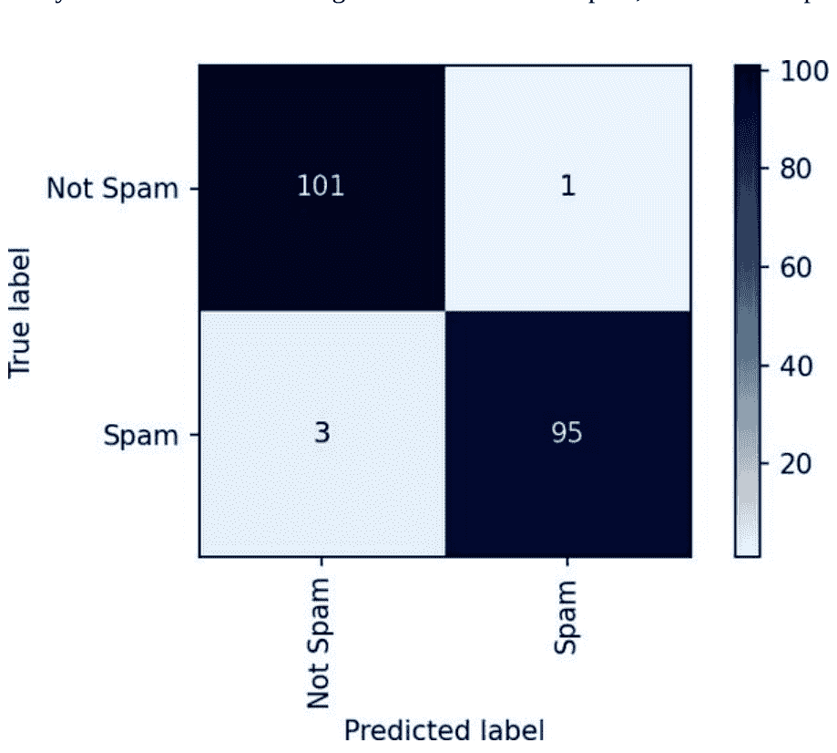

使用score方法粗略衡量模型的准确性：

```python
model.score(x_test, y_test)
```

现在使用Scikit的RocCurveDisplay类可视化ROC曲线：

```python
from sklearn.metrics import RocCurveDisplay as rcd
import seaborn as sns
sns.set()

rcd.from_estimator(model, x_test, y_test)
```

结果令人鼓舞。仅用999个样本训练，ROC曲线下的面积（AUC）表明该模型在将电子邮件分类为垃圾邮件或非垃圾邮件方面的准确率超过99.9%：

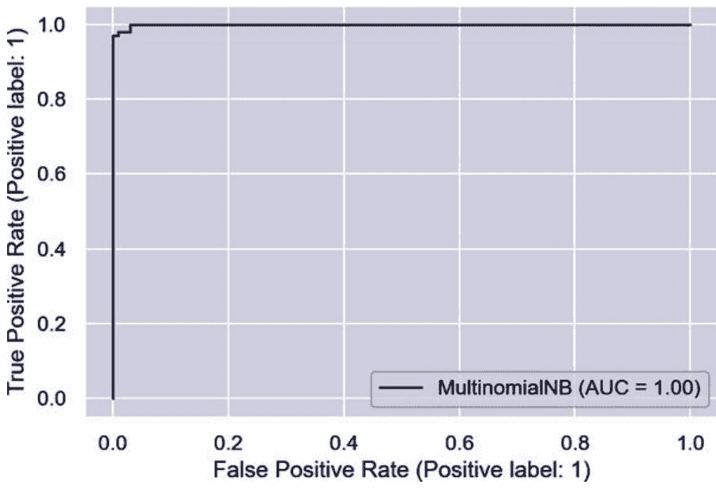

让我们看看模型如何对几封它以前未见过的电子邮件进行分类，首先是一封非垃圾邮件。模型的`predict`方法预测一个类别——0表示非垃圾邮件，1表示垃圾邮件：

```python
msg = 'Can you attend a code review on Tuesday to make sure the logic is solid?'
input = vectorizer.transform([msg])
model.predict(input)[0]
```

模型说这封邮件不是垃圾邮件，但它不是垃圾邮件的概率是多少？你可以从`predict_proba`获得，它返回一个包含两个值的数组：预测类别为0的概率，以及预测类别为1的概率，按此顺序排列：

```python
model.predict_proba(input)[0][0]
```

模型似乎非常确定这封邮件是合法的：

```
0.9999497111473539
```

现在用一封垃圾邮件测试模型：

```python
msg = 'Why pay more for expensive meds when you can order them online ' \
      'and save $$$?'

input = vectorizer.transform([msg])
model.predict(input)[0]
```

该邮件不是垃圾邮件的概率是多少？

```python
model.predict_proba(input)[0][0]
```

答案是：

```
0.00021423891260677753
```

该邮件*是*垃圾邮件的概率是多少？

```python
model.predict_proba(input)[0][1]
```

答案是：

```
0.9997857610873945
```

请注意，`predict`和`predict_proba`接受一个输入列表。基于此，你能否通过一次调用任一方法来对整批电子邮件进行分类？你将如何获取每封邮件的结果？

### 推荐系统

近年来，机器学习的另一个分支证明了其价值，那就是*推荐系统*——向客户推荐产品或服务的系统。据报道，亚马逊的推荐系统[推动了其35%的销售额](https://www.mckinsey.com/industries/retail/our-insights/how-retailers-can-keep-up-with-consumers)。好消息是，你不必成为亚马逊才能从推荐系统中受益，也不必拥有亚马逊的资源来构建一个。一旦你了解了一些基本原则，它们就相对容易创建。

推荐系统有多种形式。*基于流行度的系统*根据当时流行的产品和服务向客户提供选项——例如，“这是本周的畅销书”。*协同系统*根据其他人的选择进行推荐，就像“购买这本书的人也购买了这些书”。这两种系统都不需要机器学习。

相比之下，*基于内容的系统*从机器学习中获益匪浅。基于内容系统的一个例子是“如果你买了这本书，你可能也会喜欢这些书”。这些系统需要一种量化项目间相似性的方法。如果你喜欢电影*虎胆龙威*，你可能喜欢也可能不喜欢*巨蟒与圣杯*。如果你喜欢*玩具总动员*，你可能也会喜欢*虫虫危机*。但如何通过算法做出这种判断呢？

基于内容的推荐器需要两个要素：一种将表征服务或属性的特征*向量化*——转换为数字——的方法，以及一种计算项目间相似性的方法。

得到的向量。第一个很简单。`CountVectorizer` 将文本转换为词频表。你只需要一种衡量词频表行之间相似度的方法，就能构建一个推荐系统。而最简单、最有效的方法之一就是一种称为*余弦相似度*的技术。

### 余弦相似度

**余弦相似度**是一种计算向量对（或被视为向量的数字行）之间相似度的数学方法。其基本思想是：取样本中的每个值——例如，向量化文本中一行的词频——并将其用作向量的端点坐标，另一个端点位于坐标系的原点。对两个样本都这样做，然后计算*m*维空间中向量之间的余弦值，其中*m*是每个样本中的值的数量。因为0度的余弦值是1，所以两个完全相同的向量的相似度为1。向量越不相似，余弦值就越接近0。

这里有一个二维空间的例子来说明。假设你有三行，每行包含两个值：

| 1 | 2 |
|---|---|
| 2 | 3 |
| 3 | 1 |

你想确定第2行与第1行还是第3行更相似。仅凭数字很难判断，而在现实生活中，数字要*多得多*。如果你简单地将每行的数字相加并比较总和，你会得出第2行与第3行更相似的结论。但如果你将每行视为一个向量，如**图4-2**所示呢？

- 第1行：(0, 0) → (1, 2)
- 第2行：(0, 0) → (2, 3)
- 第3行：(0, 0) → (3, 1)

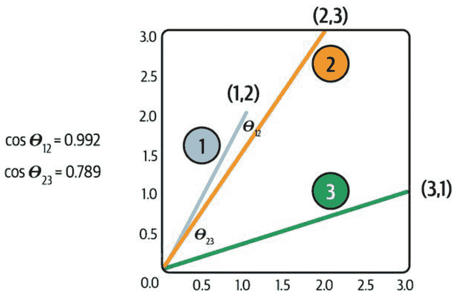

现在你可以将每一行绘制为一个向量，计算1和2之间以及2和3之间形成的角度的余弦值，并确定第2行更像第1行而不是第3行。这就是余弦相似度的精髓。

余弦相似度不限于二维；它在高维空间中同样适用。为了帮助计算任意维度的余弦相似度，Scikit 提供了 `cosine_similarity` 函数。以下代码计算了前面示例中三个样本的余弦相似度：

```python
data = [[1, 2], [2, 3], [3, 1]]
cosine_similarity(data)
```

返回值是一个*相似度矩阵*，包含每对向量的余弦值。矩阵的宽度和高度等于样本数量：

```python
array([[1.        , 0.99227788, 0.70710678],
       [0.99227788, 1.        , 0.78935222],
       [0.70710678, 0.78935222, 1.        ]])
```

由此可以看出，第1行和第2行的相似度是0.992，而第2行和第3行的相似度是0.789。换句话说，第2行与第1行比与第3行更相似。第2行和第3行之间的相似度（0.789）也高于第1行和第3行之间的相似度（0.707）。

### 构建电影推荐系统

让我们将余弦相似度付诸实践，为电影构建一个基于内容的推荐系统。首先[下载数据集](https://www.kaggle.com)，这是 Kaggle.com 上提供的几个电影数据集之一。这个数据集包含约4,800部电影的信息，包括标题、预算、类型、关键词、演员阵容等。将 CSV 文件放入你的 Jupyter notebooks 的 *Data* 子目录中。然后加载数据集并浏览其内容：

```python
import pandas as pd

df = pd.read_csv('Data/movies.csv')
df.head()
```

该数据集包含24列，其中只有少数几列用于描述电影。使用以下语句提取关键列，如 `title` 和 `genres`，并用空字符串填充缺失值：

```python
df = df[['title', 'genres', 'keywords', 'cast', 'director']]
df = df.fillna('') # 用空字符串填充缺失值
df.head()
```

接下来，添加一个名为 `features` 的列，该列组合了其他列中的所有单词：

```python
df['features'] = df['title'] + ' ' + df['genres'] + ' ' + \
                  df['keywords'] + ' ' + df['cast'] + ' ' + \
                  df['director']
```

使用 CountVectorizer 对 `features` 列中的文本进行向量化：

```python
from sklearn.feature_extraction.text import CountVectorizer

vectorizer = CountVectorizer(stop_words='english', min_df=20)
word_matrix = vectorizer.fit_transform(df['features'])
word_matrix.shape
```

词频表包含4,803行——每部电影一行——和918列。下一个任务是计算每对行之间的余弦相似度：

```python
from sklearn.metrics.pairwise import cosine_similarity

sim = cosine_similarity(word_matrix)
```

最终，这个系统的目标是输入一个电影标题，并找出与该电影最相似的$n$部电影。为此，定义一个名为 `get_recommendations` 的函数，它接受一个电影标题、一个包含所有电影信息的 DataFrame、一个相似度矩阵以及要返回的电影标题数量：

```python
def get_recommendations(title, df, sim, count=10):
    # 在 DataFrame 中获取指定标题的行索引
    index = df.index[df['title'].str.lower() == title.lower()]

    # 如果没有指定标题的条目，则返回空列表
    if (len(index) == 0):
        return []

    # 在相似度矩阵中获取对应的行
    similarities = list(enumerate(sim[index[0]]))

    # 按降序对该行中的相似度分数进行排序
    recommendations = sorted(similarities, key=lambda x: x[1], reverse=True)

    # 获取前 n 个推荐，忽略列表中的第一个条目，因为它对应于标题本身（因此相似度为 1.0）
    top_recs = recommendations[1:count + 1]

    # 从 top_recs 中的索引生成标题列表
    titles = []

    for i in range(len(top_recs)):
        title = df.iloc[top_recs[i][0]]['title']
        titles.append(title)

    return titles
```

此函数按降序对余弦相似度进行排序，以找出与标题参数指定的电影最相似的 count 部电影。然后返回这些电影的标题。

现在使用 `get_recommendations` 在数据库中搜索相似的电影。首先请求与詹姆斯·邦德惊悚片《天幕坠落》最相似的10部电影：

```python
get_recommendations('Skyfall', df, sim)
```

输出如下：

```python
['Spectre',
 'Quantum of Solace',
 'Johnny English Reborn',
 'Clash of the Titans',
 'Die Another Day',
 'Diamonds Are Forever',
 'Wrath of the Titans',
 'I Spy',
 'Sanctum',
 'Blackthorn']
```

再次调用 `get_recommendations` 来列出与《花木兰》相似的电影：

```python
get_recommendations('Mulan', df, sim)
```

你也可以尝试其他电影。请注意，你只能输入数据集中的电影标题。使用以下语句打印完整的标题列表：

```python
pd.set_option('display.max_rows', None)
print(df['title'])
```

我想你会同意，这个系统在挑选相似电影方面做得相当不错。对于大约20行代码来说，这已经很不错了！

### 总结

用于分类文本的机器学习模型很常见，在工业和日常生活中有多种用途。例如，哪个理性的人不希望有一根能根除所有垃圾邮件的魔杖呢？

用于训练文本分类模型的文本必须在训练前进行准备和向量化。准备包括将字符转换为小写并移除标点符号，可能还包括移除停用词、移除数字以及词干提取或词形还原。准备完成后，通过将文本转换为词频表来进行向量化。Scikit 的 `CountVectorizer` 类使向量化过程变得轻而易举，并处理一些准备工作。

一旦文本转换为数字形式，就可以使用逻辑回归和其他流行的分类算法对其进行分类。然而，对于文本分类任务，朴素贝叶斯学习算法通常优于其他算法。通过做出一些“朴素”的假设，例如文本样本中单词出现的顺序无关紧要，朴素贝叶斯简化为一个单词计数过程。Scikit 的 `MultinomialNB` 类提供了一个方便的朴素贝叶斯实现。

余弦相似度是计算两行数字之间相似度的数学方法。它的一个用途是构建基于客户已购买的其他产品或服务来推荐产品或服务的系统。由 `CountVectorizer` 从文本描述生成的词频表可以与余弦相似度结合，创建旨在提升公司利润的智能推荐系统。

请随意使用本章的示例作为你自己的实验起点。例如，看看你是否可以调整任何示例中传递给 `CountVectorizer` 的参数，并提高所得模型的准确性。数据科学家将寻找最佳参数组合称为*超参数调优*，这是你将在下一章学习的主题。

## 第五章 支持向量机

支持向量机（SVM）代表了机器学习的前沿技术。它们最常用于解决分类问题，但也可用于回归。由于其将数学模型拟合到数据的独特方式，SVM 往往能在其他模型失败时成功找到类别间的分隔。从技术上讲，SVM 仅执行二分类，但 Scikit-Learn 使其能够使用[第3章](Chapter 3)讨论的技术进行多分类。

Scikit-Learn 通过诸如用于分类模型的 **SVC（支持向量分类器的缩写）** 和用于回归模型的 **SVR（支持向量回归器）** 等类，使得构建 SVM 变得简单。你可以使用这些类而无需理解 SVM 的工作原理，但如果你*确实*理解了它们的工作原理，你将能更好地利用它们。了解如何为特定数据集调整 SVM 以及如何在训练模型前准备数据也很重要。在本章末尾，我们将构建一个执行人脸识别的 SVM。但首先，让我们深入幕后，探究为什么 SVM 常常是建模现实世界数据集的首选机制。

### 支持向量机的工作原理

首先，为什么它们被称为支持向量机？SVM 分类器的目的与其他任何分类器相同：找到一个能清晰分隔类别的决策边界。SVM 通过在二维空间中找到一条线、在三维空间中找到一个平面，或在更高维空间中找到一个超平面来实现这一点，从而以尽可能大的确定性区分不同类别。在[图5-1](Figure 5-1)的示例中，你可以画出无数条线来分隔这两个类别，但最佳的线是产生最宽间隔的那条（即右侧所示的那条）。间隔的宽度是沿垂直于边界的线，每个类别中离边界最近的点之间的距离。这些点被称为*支持向量*，并用红色圆圈标出。

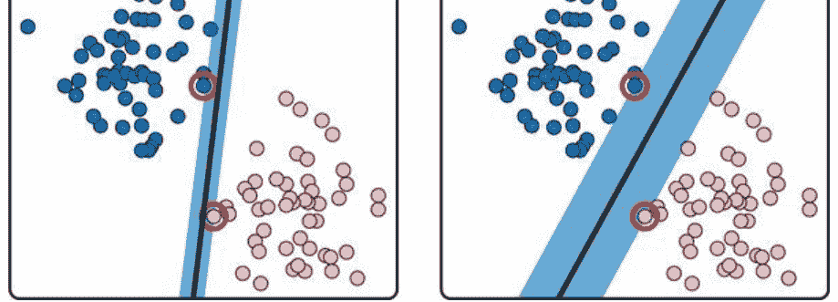

当然，现实数据很少能如此清晰地分离。类别间的重叠不可避免地阻碍了完美拟合。为了适应这种情况，SVM 支持一个通常称为 C 的正则化参数，可以调整以放松或收紧拟合。较低的 C 值会产生更宽的间隔，决策边界两侧的错误更多，如图5-2所示。较高的 C 值则对训练数据拟合更紧密，间隔相应更薄，错误更少。如果 C 值*过高*，模型可能泛化能力不佳。最佳值因数据集而异。数据科学家通常会尝试不同的 C 值，以确定哪个在测试数据上表现最佳。

以上所述都是正确的，但都没有解释为什么 SVM 在其擅长的领域如此出色。SVM 并非唯一在数学上寻找分隔类别边界的模型。使 SVM 特别之处在于*核函数*，其中一些核函数通过增加数据维度来找到在低维度中不存在的边界。考虑图5-3。你无法画出一条线将红点与紫点完全分开。但如果你添加第三维度，如右侧所示——一个 z 维度，其值基于点到中心的距离——那么你就可以在紫色和红色之间插入一个平面，实现100%的分离。在这个例子中，在二维中线性不可分的数据在三维中变得线性可分。其工作原理是 Cover 定理，该定理指出，如果使用非线性变换将数据投影到更高维空间，那么线性不可分的数据可能变得线性可分。

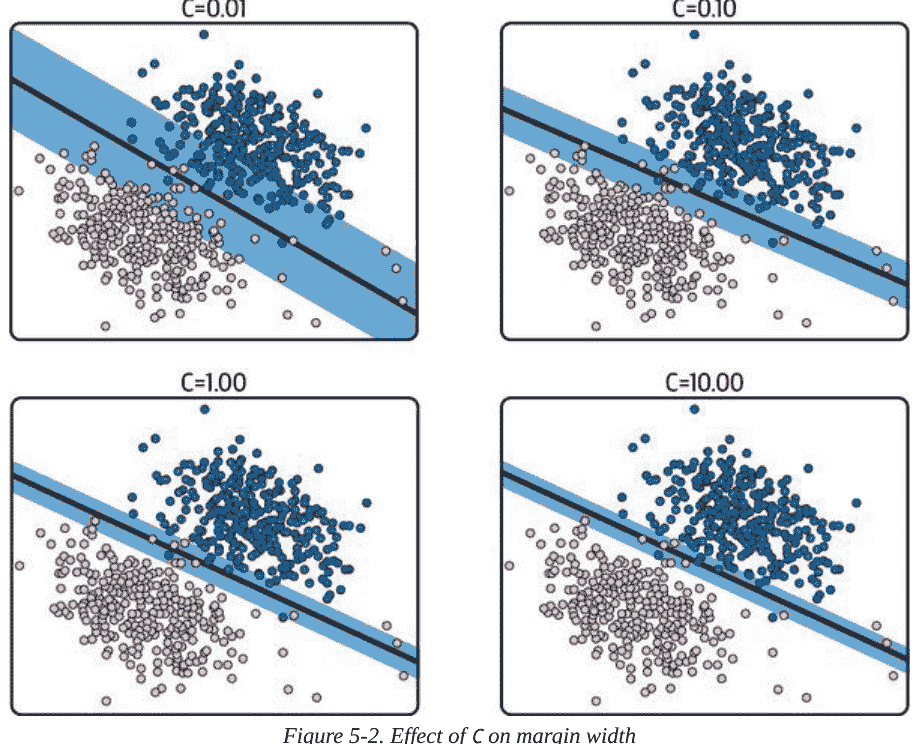

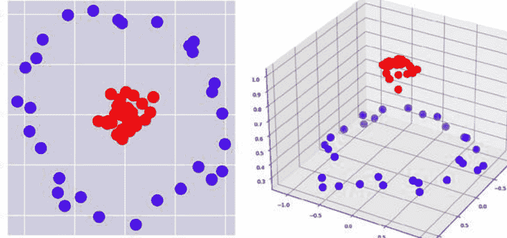

图5-3. 添加维度以实现线性可分性

此示例中使用的核变换，通过为每个 x 和 y 添加一个 z 将二维数据投影到三维，对于这个特定数据集效果很好。但要使 SVM 广泛有用，你需要一个不依赖于特定数据集形状的核函数。

### 核函数

Scikit-Learn 内置了几个通用核函数，包括线性核、RBF 核¹、多项式核和 Sigmoid 核。线性核不添加维度。它对于开箱即用的线性可分数据效果很好，但对于非线性可分数据表现不佳。将其应用于图5-3的问题会产生图5-4左侧的决策边界。将 RBF 核应用于相同数据会产生右侧的决策边界。RBF 核将 x 和 y 值投影到更高维空间，并找到一个能清晰分隔紫色和红色的超平面。当投影回二维时，决策边界大致形成一个圆形。通过适当调整多项式核也可以在这个数据集上获得类似结果，但一般来说，RBF 核可以在非线性数据中找到多项式核无法找到的决策边界。这就是为什么如果你不指定其他类型，RBF 是 Scikit 中的默认核类型。

一个合乎逻辑的问题是，RBF 核是否为每个 x 和 y 添加了一个 z？简短的回答是：没有。它实际上将数据点投影到一个具有*无限*个维度的空间中。关键词是*实际上*。核函数使用称为*核技巧*的数学捷径来衡量添加新维度的效果，而无需实际计算它们的值。这就是 SVM 数学变得复杂的地方。核函数经过精心设计，可以计算 m 维空间中两个 n 维向量的点积（其中 m 大于 n，甚至可以是无限），而无需生成所有这些新维度，最终，点积是 SVM 计算决策边界所需的全部。这在数学上等同于鱼与熊掌兼得，也是使 SVM 如此出色的秘密武器。SVM 在大型数据集上训练可能需要很长时间，但 SVM 的一个好处是，它在行数或样本较少的较小数据集上往往比其他学习算法表现更好。

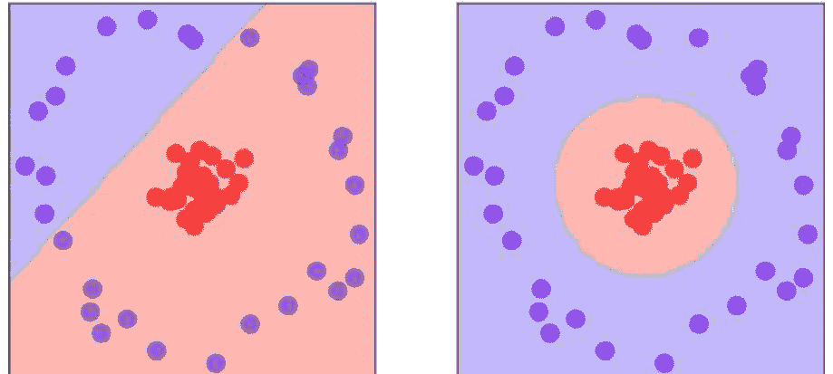

图5-4. 线性核与 RBF 核

### 核技巧

想看看如何使用核技巧在高维空间中计算点积而无需计算新维度值的例子吗？以下解释完全是可选的。但如果你像我一样，从具体例子中学习效果更好，那么你可能会发现本节很有帮助。

让我们从前面介绍的二维圆形数据集开始，但这次让我们用以下方程将其投影到三维空间：

$x\hat{a} = x^2$
$y\hat{a} = y^2$
$z = x \cdot y \cdot \sqrt{2}$

换句话说，我们将通过平方二维空间中的 $x$ 和 $y$ 来计算三维空间中的 $x$ 和 $y$（$x'$ 和 $y'$），并添加一个 $z$，它是原始 $x$ 和 $y$ 与 2 的平方根的乘积。以这种方式投影数据会产生紫色和红色之间的清晰分离，如图5-5所示。

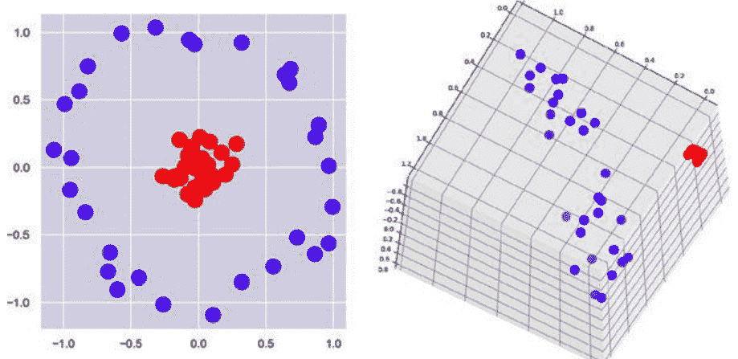

图5-5. 将二维点投影到三维以分离两个类别

SVM 的有效性取决于它们在更高维空间中计算两个向量（或点，可视为向量）的点积的能力，而无需将它们投影到该空间——即仅使用原始空间中的值。让我们构造几个点来处理：

$a = (3, 7)$
$b = (2, 4)$

我们可以这样计算这两个点的点积：
$(3 \cdot 2) + (7 \cdot 4) = 34$

当然，二维中的点积用处不大。SVM 需要这些点在三维空间中的点积。让我们使用前面的方程将 $a$ 和 $b$ 投影到三维，然后计算结果的点积：

$a = (3^2, 7^2, 3 \cdot 7 \cdot \sqrt{2}) = (9, 49, 29.6984)$
$b = (2^2, 4^2, 2 \cdot 4 \cdot \sqrt{2}) = (4, 16, 11.3137)$
$(9 \cdot 4) + (49 \cdot 16) + (29.6984 \cdot 11.3137) = 1,156$

我们现在得到了一对二维点在三维空间中的点积，但我们必须生成三维空间中的坐标才能得到它。有趣的地方来了。以下函数，或*核技巧*，使用*仅原始二维空间中的值*产生了相同的结果：

$K(a, b) = \langle a, b \rangle^2$

$\langle a, b \rangle$ 只是 $a$ 和 $b$ 的点积，所以 $\langle a, b \rangle^2$ 是 $a$ 和 $b$ 点积的平方。我们已经知道如何计算 $a$ 和 $b$ 的点积。因此：

$K((3, 7), (2, 4)) = ((3 \cdot 2) + (7 \cdot 4))^2 = 34^2 = 1,156$

这与通过显式投影点计算的结果一致，但*无需投影*。这就是核技巧的精髓。它在从二维到三维时节省了时间和内存。想象一下投影到无限维度时节省的资源——你将会回想一下，这正是RBF核函数所做的。
这里使用的核技巧并非凭空捏造。它恰好是2次多项式核函数所使用的技巧。使用Scikit，你可以这样将SVM分类器与2次多项式核函数拟合到数据集：

```python
model = SVC(kernel='poly', degree=2)
model.fit(x, y)
```

如果你将此应用于前面的圆形数据集并绘制决策边界（图5-6，右），结果与RBF核函数生成的结果几乎相同。有趣的是，1次多项式核函数（图5-6，左）产生的决策边界与线性核函数相同，因为直线本身就是一次多项式。
核技巧是特殊的。每一种核技巧都旨在模拟特定的向高维空间的投影。Scikit为你提供了几种可用的核函数，但也有一些Scikit未内置的核函数。你可以用自定义的核函数扩展Scikit，但它提供的核函数对于绝大多数用例来说已经足够。

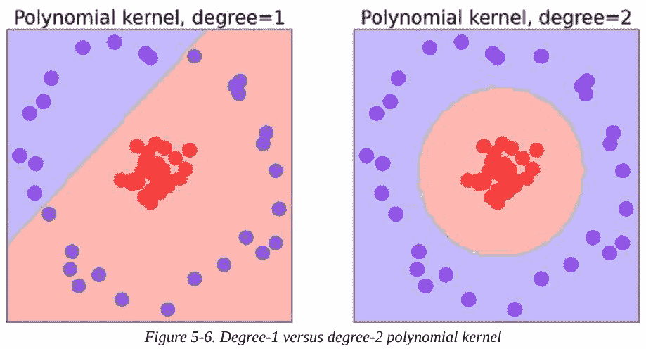

### 超参数调优

一开始，很难知道哪种内置核函数能产生最精确的模型。同样也很难知道C的合适值是多少——即那个能在训练数据的欠拟合和过拟合之间提供最佳平衡，并在模型使用测试数据运行时产生最佳结果的值。对于RBF和多项式核函数，还有第三个影响准确性的值，称为gamma。而对于多项式核函数，degree参数会影响模型从训练数据中学习的能力。
C参数控制模型拟合训练数据的激进程度。值越高，拟合越紧密，过拟合的风险也越高。图5-7展示了RBF核函数在不同C值下如何将模型拟合到包含三个类别的训练数据集。Scikit中的默认值是C=1，但你可以指定不同的值来调整拟合。你可以在右下角的图中看到过拟合的危险。一个位于最右侧的点会被分类为蓝色，即使它可能属于黄色或棕色类别。欠拟合也是一个问题。在左上角的示例中，几乎任何非棕色的数据点都会被分类为蓝色。

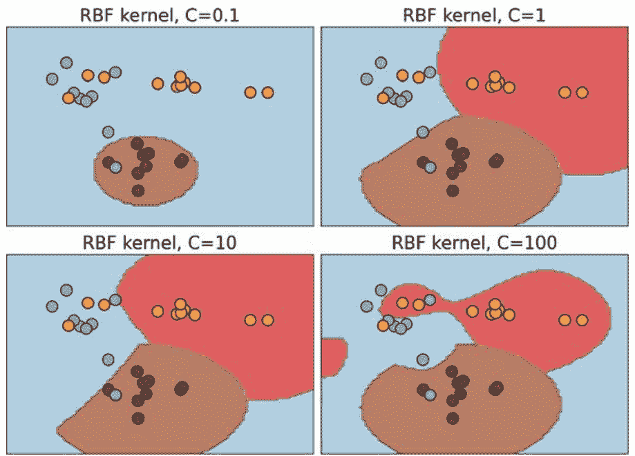

使用RBF核函数的SVM只有在`gamma`值也正确时才算得到了适当的调优。`gamma`控制单个数据点的影响范围在计算决策边界时能延伸多远。较低的值使用更多的点，产生更平滑的决策边界；较高的值涉及更少的点，并且更紧密地拟合训练数据。图5-8说明了这一点，其中在保持C不变的情况下增加`gamma`，会使决策边界更紧密地围绕类别簇。`gamma`可以是任何非零正值，但0到1之间的值最为常见。Scikit不会硬编码`gamma`的默认值，如果你没有指定，它会通过算法选择一个默认值。

在实践中，数据科学家会尝试不同的核函数和不同的参数值，以找到能产生最精确模型的组合，这个过程被称为*超参数调优*。超参数调优的效用并非SVM独有，但你几乎总是可以通过找到核类型、C和`gamma`（对于多项式核函数，还包括degree）的最佳组合来使SVM更精确。

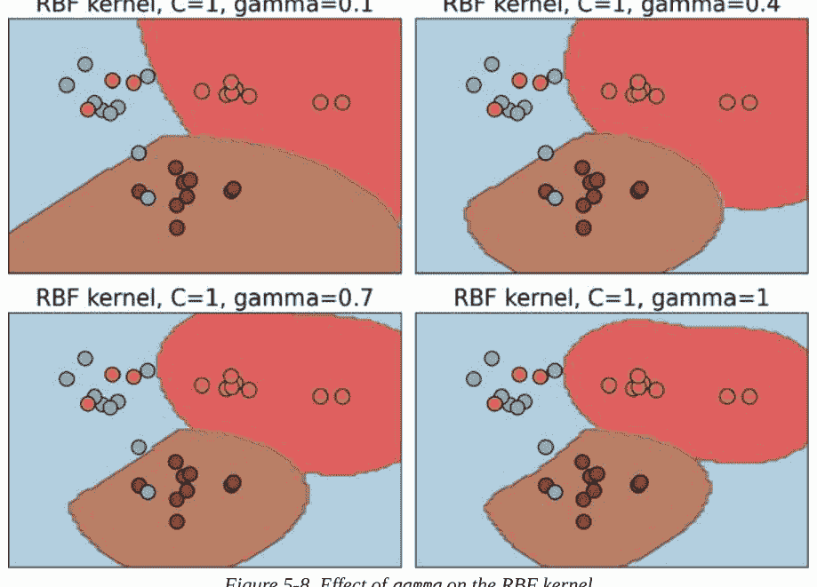

为了辅助超参数调优过程，Scikit提供了一系列优化器，其中包括GridSearchCV，它尝试指定参数值的所有组合，并使用内置的交叉验证来确定哪种组合能产生最精确的模型。这些优化器使你不必编写代码来使用所有唯一的参数值组合进行暴力搜索。需要明确的是，它们本身通过多次训练模型来进行暴力搜索，每次使用不同的值组合。最后，你可以从`best_estimator_`属性中检索最精确的模型，从`best_params_`属性中获取产生最精确模型的参数值，以及从`best_score_`属性中获取最佳分数。

这是一个使用Scikit的SVC类实现SVM分类器的示例。首先，你可以用两行代码创建一个使用默认参数值的SVM分类器并将其拟合到数据集：

```python
model = SVC()
model.fit(x, y)
```

这使用了RBF核函数，C=1。你可以这样指定核类型以及C和gamma的值：

```python
model = SVC(kernel='poly', C=10, gamma=0.1)
model.fit(x, y)
```

假设你想尝试两种不同的核函数，以及C和gamma各五个值，看看哪种组合能产生最佳结果。与其编写嵌套的for循环，你可以这样做：

```python
model = SVC()

grid = {
    'C': [0.01, 0.1, 1, 10, 100],
    'gamma': [0.01, 0.25, 0.5, 0.75, 1.0],
    'kernel': ['rbf', 'poly']
}

grid_search = GridSearchCV(estimator=model, param_grid=grid, cv=5, verbose=2)
grid_search.fit(x, y) # 使用不同的参数组合训练模型
```

调用`fit`后不会立即返回结果。它会训练模型*250次*，因为有50种不同的核、C和gamma组合，而cv=5表示使用五折交叉验证来评估结果。训练完成后，你可以这样检索最佳模型：

```python
best_model = grid_search.best_estimator_
```

多次运行这样的搜索过程并不罕见——第一次使用较粗的参数值，之后每次使用以`best_params_`获得的值为中心的更窄的值范围。前期更多的训练时间是获得精确模型所付出的代价。重申一下，你几乎总是可以通过找到参数的最佳组合来使SVM更精确。无论好坏，暴力搜索是识别最佳组合最有效的方法。

> **注意**

关于SVC类，需要注意的一个细微之处是它默认不计算概率。如果你想在SVC实例上调用`predict_proba`，必须在创建实例时将`probability`设置为True：

```python
model = SVC(probability=True)
```

模型训练会变慢，但你将能够获取概率以及预测结果。此外，Scikit文档警告说“`predict_proba`可能与`predict`不一致”。更多信息，请参阅[文档中的第1.4.1.2节](https://scikit-learn.org/stable/modules/svm.html#scores-and-probabilities)。

### 数据归一化

在[第2章](https://example.com)中，我提到过一些学习算法在归一化数据上表现更好。未归一化的数据包含范围差异巨大的数字列——例如，一列的值从0到1，另一列从0到1,000,000。SVM是一种参数学习算法。使用归一化数据进行训练很重要，因为SVM使用距离来计算间隔。如果一个维度的跨度*远大于*另一个维度，用于寻找最大间隔的内部算法可能难以收敛到一个解。

使用归一化数据训练机器学习模型的重要性不仅限于SVM。决策树以及依赖于决策树的学习算法，如随机森林和梯度提升决策树，是非参数的，因此它们在归一化和未归一化数据上同样有效。然而，它们是例外。大多数其他学习算法在不同程度上受益于归一化数据。这包括*k*近邻算法，尽管它是非参数的，但内部使用基于距离的计算来区分不同类别。

Scikit提供了几个用于数据归一化的类。最常用的是`MinMaxScaler`和`StandardScaler`。前者通过按比例将每列的值缩减到0.0到1.0之间的值来归一化数据。从数学上讲，这很简单。对于数据集中的每一列，`MinMaxScaler`从该列的所有值中减去该列的最小值，然后将每个值除以最小值和最大值之间的差值。在结果列中，最小值为0.0，最大值为1.0。

为了演示，我从Scikit内置的乳腺癌数据集中提取了两个范围差异巨大的列的子集。每列包含100个值。以下是前10行：

```
[[1.001e+03 3.001e-01]
 [1.326e+03 8.690e-02]
 [1.203e+03 1.974e-01]
 [3.861e+02 2.414e-01]
 [1.297e+03 1.980e-01]
 [4.771e+02 1.578e-01]
 [1.040e+03 1.127e-01]
 [5.779e+02 9.366e-02]
 [5.198e+02 1.859e-01]
 [4.759e+02 2.273e-01]]
```

第一列的值范围从201.9到1,878.0；第二列的值范围从0.000692到0.3754。图5-9显示了当x轴和y轴等比例缩放时数据的外观。由于第一列的值远大于第二列的值，数据点似乎形成了一条直线。如果你调整坐标轴的比例以匹配每列的值范围，你会得到一个完全不同的图像（图5-10）。

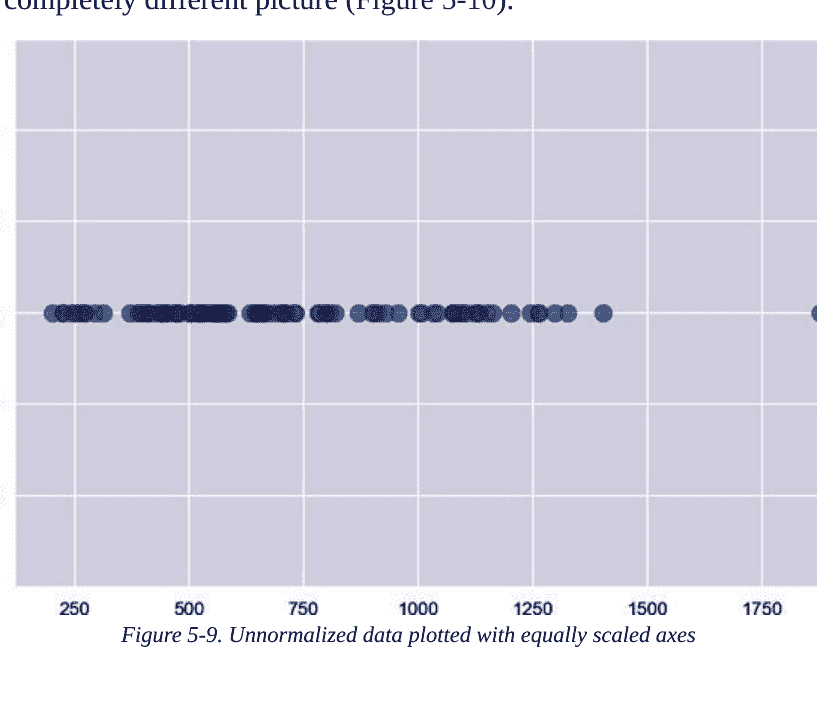

### 流水线处理

如果你在训练机器学习模型时对数值进行了归一化或标准化处理，那么在将数值输入模型的`predict`方法时，必须应用相同的转换。换句话说，如果你这样训练模型：

```python
model = SVC()
scaler = StandardScaler()
x = scaler.fit_transform(x)
model.fit(x, y)
```

那么你也必须这样进行预测：

```python
input = [0, 1, 2, 3, 4]
model.predict([scaler.transform([input])])
```

否则，你将得到无意义的预测结果。
为了简化代码，并避免忘记对训练数据和预测数据应用相同的转换，Scikit 提供了`make_pipeline`函数。`make_pipeline`允许你将预测模型（Scikit 称之为*估计器*，即 SVC 等类的实例）与应用于这些模型输入数据的转换结合起来。以下是如何使用`make_pipeline`确保输入模型的任何数据都经过`StandardScaler`转换：

```python
# 训练模型
pipe = make_pipeline(StandardScaler(), SVC())
pipe.fit(x, y)

# 使用模型进行预测
input = [0, 1, 2, 3, 4]
pipe.predict([input])
```

现在，用于训练模型的数据已经应用了`StandardScaler`，而用于预测的数据也以相同的方式进行了转换。
如果你想使用`GridSearchCV`来寻找结合了数据转换和估计器的流水线的最佳参数集，该怎么办？这并不难，但有一个技巧你需要知道。它涉及在传递给`GridSearchCV`的`param_grid`字典中使用以双下划线为前缀的类名。以下是一个示例：

```python
pipe = make_pipeline(StandardScaler(), SVC())

grid = {
    'svc__C': [0.01, 0.1, 1, 10, 100],
    'svc__gamma': [0.01, 0.25, 0.5, 0.75, 1.0],
    'svc__kernel': ['rbf', 'poly']
}

grid_search = GridSearchCV(estimator=pipe, param_grid=grid, cv=5, verbose=2)
grid_search.fit(x, y) # 使用不同的参数组合训练模型
```

这个示例训练了模型 250 次，以找到流水线中 SVC 实例的最佳`kernel`、`C`和`gamma`组合。注意“svc__”命名法，它对应于传递给`make_pipeline`函数的 SVC 实例。

### 使用 SVM 进行人脸识别

现代人脸识别通常通过神经网络实现，但支持向量机也能完成得相当出色。让我们通过构建一个识别人脸的模型来演示。我们将使用的数据集是[野外标记人脸（LFW）数据集](https://scikit-learn.org/stable/modules/generated/sklearn.datasets.fetch_lfw_people.html)，它包含从网络上收集的超过 13,000 张名人面部图像，并作为示例数据集内置于 Scikit 中。在数据集代表的 5,000 多人中，有 1,680 人拥有两张或更多面部图像，而只有五人拥有 100 张或更多。我们将设置每人最少面部图像数为 100，这意味着将导入对应五位名人的五组面部图像。每张面部图像都标有其所属人的姓名。

首先，创建一个新的 Jupyter notebook，并使用以下语句加载数据集：

```python
import numpy as np
import pandas as pd
from sklearn.datasets import fetch_lfw_people

faces = fetch_lfw_people(min_faces_per_person=100)
print(faces.target_names)
print(faces.images.shape)
```

总共加载了 1,140 张面部图像。每张图像尺寸为 47 × 62 像素，每张图像共有 2,914 个像素。这意味着数据集包含 2,914 个特征。使用以下代码显示数据集中的前 24 张图像及其所属人：

```python
%matplotlib inline
import matplotlib.pyplot as plt

fig, ax = plt.subplots(3, 8, figsize=(18, 10))
for i, axi in enumerate(ax.flat):
    axi.imshow(faces.images[i], cmap='gist_gray')
    axi.set(xticks=[], yticks=[], xlabel=faces.target_names[faces.target[i]])
```

输出如下：

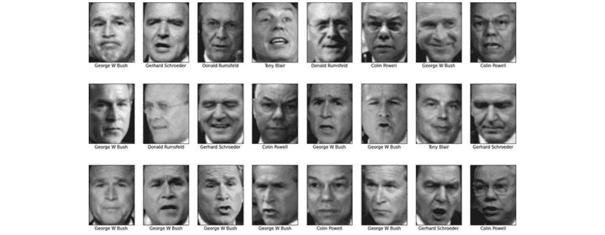

通过生成直方图检查数据集的平衡性，显示为每个人导入了多少张面部图像：

```python
import seaborn as sns
sns.set()

from collections import Counter
counts = Counter(faces.target)
names = {}

for key in counts.keys():
    names[faces.target_names[key]] = counts[key]
```

```python
df = pd.DataFrame.from_dict(names, orient='index')
df.plot(kind='bar')
```

输出显示，数据集中乔治·W·布什的图像数量远多于其他人：

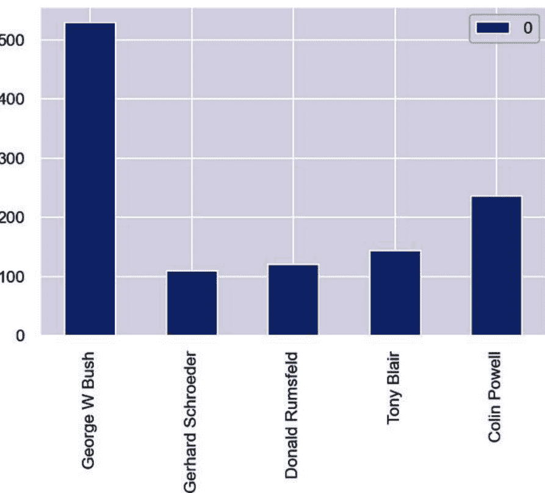

分类模型最好在平衡的数据集上训练。使用以下代码将数据集减少到每人 100 张图像：

```python
mask = np.zeros(faces.target.shape, dtype=bool)

for target in np.unique(faces.target):
    mask[np.where(faces.target == target)[0][:100]] = 1

x = faces.data[mask]
y = faces.target[mask]
x.shape
```

注意，*x* 包含 500 张面部图像，*y* 包含对应的标签：0 代表科林·鲍威尔，1 代表唐纳德·拉姆斯菲尔德，依此类推。现在让我们看看 SVM 能否理解这些数据。我们将训练三个不同的模型：一个使用线性核，一个使用多项式核，一个使用 RBF 核。在每种情况下，我们都将使用 GridSearchCV 来优化超参数。从线性模型和四个不同的 C 值开始：

```python
from sklearn.svm import SVC
from sklearn.model_selection import GridSearchCV
```

svc = SVC(kernel='linear')

grid = {
    'C': [0.1, 1, 10, 100]
}

grid_search = GridSearchCV(estimator=svc, param_grid=grid, cv=5, verbose=2)
grid_search.fit(x, y) # 使用不同参数训练模型
grid_search.best_score_

该模型实现了84.4%的交叉验证准确率。通过标准化图像数据，准确率有可能得到提升。再次运行相同的网格搜索，但这次使用`StandardScaler`对所有像素值应用单位方差：

from sklearn.pipeline import make_pipeline
from sklearn.preprocessing import StandardScaler

scaler = StandardScaler()
svc = SVC(kernel='linear')
pipe = make_pipeline(scaler, svc)

grid = {
    'svc__C': [0.1, 1, 10, 100]
}

grid_search = GridSearchCV(estimator=pipe, param_grid=grid, cv=5, verbose=2)
grid_search.fit(x, y)
grid_search.best_score_

数据标准化带来了准确率的微小提升。是哪个C值产生了这个准确率？

grid_search.best_params_

多项式核是否可能优于线性核？有一个简单的方法可以找出答案。注意参数网格中引入了`gamma`和`degree`参数。这些参数与`C`一起，会极大地影响多项式核拟合训练数据的能力：

scaler = StandardScaler()
svc = SVC(kernel='poly')
pipe = make_pipeline(scaler, svc)

grid = {
    'svc__C': [0.1, 1, 10, 100],
    'svc__gamma': [0.01, 0.25, 0.5, 0.75, 1],
    'svc__degree': [1, 2, 3, 4, 5]
}

grid_search = GridSearchCV(estimator=pipe, param_grid=grid, cv=5, verbose=2)
grid_search.fit(x, y) # 使用不同参数组合训练模型
grid_search.best_score_

多项式核达到了与线性核相同的准确率。是哪些参数值导致了这个结果？

grid_search.best_params_

`best_params_`属性显示，`degree`的最佳值是1，这意味着多项式核表现得像一个线性核。因此，它达到相同的准确率也就不足为奇了。RBF核能做得更好吗？

scaler = StandardScaler()
svc = SVC(kernel='rbf')
pipe = make_pipeline(scaler, svc)

grid = {
    'svc__C': [0.1, 1, 10, 100],
    'svc__gamma': [0.01, 0.25, 0.5, 0.75, 1.0]
}

grid_search = GridSearchCV(estimator=pipe, param_grid=grid, cv=5, verbose=2)
grid_search.fit(x, y)
grid_search.best_score_

RBF核的表现不如线性核和多项式核。这里有一个教训。RBF核通常比其他核更好地拟合非线性数据，但并非总是如此。这就是为什么使用SVM的最佳策略是尝试不同的核和不同的参数值。最佳组合会因数据集而异。对于LFW数据集，线性核似乎是最佳选择。这很方便，因为线性核是Scikit提供的所有核中最快的。

> **注意**

除了`SVC`类，Scikit-Learn还包括名为`LinearSVC`和`NuSVC`的SVM分类器。后者支持与`SVC`类相同的核组合，但它用一个名为`nu`的正则化参数替代了`C`，该参数以不同的方式控制拟合的紧密度。`NuSVC`在处理大型数据集时的扩展性不如`SVC`，根据我的经验，它很少被使用。`LinearSVC`仅实现线性核，但它使用不同的优化算法，训练速度更快。如果使用`SVC`训练速度较慢，并且你确定线性核能产生最佳模型，可以考虑将`SVC`替换为`LinearSVC`。即使对于中等规模的数据集，如果你使用`GridSearchCV`来训练模型数百次，更快的训练时间也会产生影响。关于这两个类之间功能差异的精彩总结，请参阅Angela Shi的文章“SVM with Scikit-Learn: What You Should Know”。

混淆矩阵是可视化模型准确率的好方法。让我们拆分数据集，用80%的图像训练一个优化的线性模型，用剩下的20%进行测试，并在混淆矩阵中显示结果。

第一步是拆分数据集。注意`stratify=y`参数，它确保训练数据集和测试数据集中每个类别的样本比例与原始数据集相同。在这个例子中，训练数据集将包含五个人中每个人的20个样本：

from sklearn.model_selection import train_test_split

x_train, x_test, y_train, y_test = train_test_split(x, y, train_size=0.8,
stratify=y, random_state=0)

现在使用网格搜索揭示的最佳C值训练一个线性SVM：

scaler = StandardScaler()
svc = SVC(kernel='linear', C=0.1)
pipe = make_pipeline(scaler, svc)
pipe.fit(x_train, y_train)

交叉验证模型以确认其准确率：

from sklearn.model_selection import cross_val_score

cross_val_score(pipe, x, y, cv=5).mean()

使用混淆矩阵查看模型在测试数据上的表现：

from sklearn.metrics import ConfusionMatrixDisplay as cmd

fig, ax = plt.subplots(figsize=(6, 6))
ax.grid(False)
cmd.from_estimator(pipe, x_test, y_test, display_labels=faces.target_names,
                   cmap='Blues', xticks_rotation='vertical', ax=ax)

以下是输出：

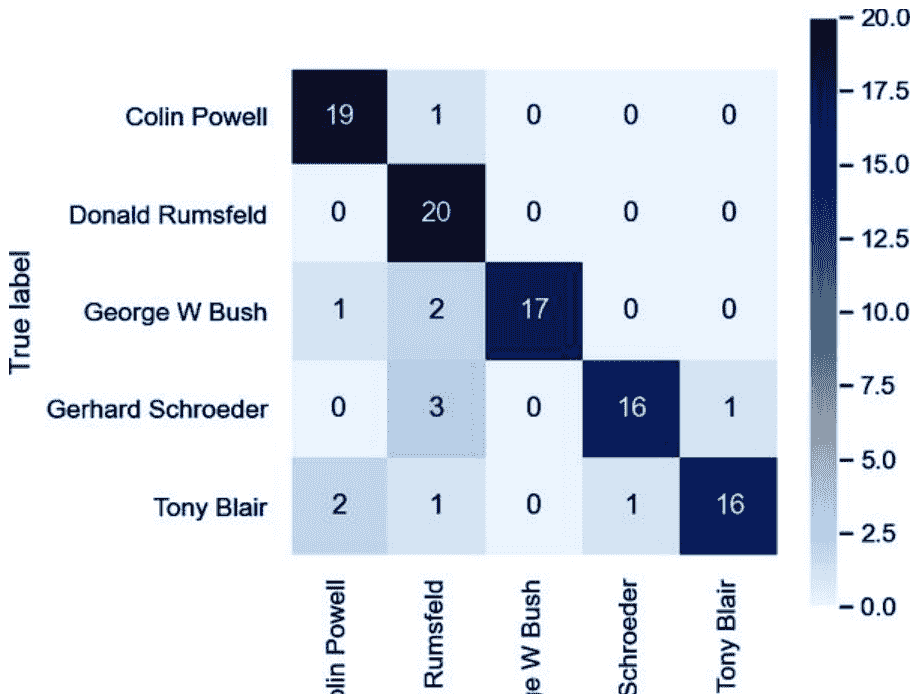

该模型在20次中正确识别了Colin Powell 19次，Donald Rumsfeld 20次，等等。这还不错。这是支持向量机工作的一个很好的例子。

### 总结

支持向量机（SVM）通常比其他学习算法更好地拟合数据集。SVM是最大间隔分类器，使用核技巧来模拟向数据添加维度。其理论是，在$m$维中线性不可分的数据，如果$n$高于$m$，则在$n$维中可能是可分的。SVM最常用于分类，但也可以执行回归。作为实验，尝试在第2章的出租车费用示例中用`SVR`替换`GradientBoostingRegressor`，并使用`GridSearchCV`来优化模型的超参数。哪个模型产生了最高的交叉验证决定系数？

SVM通常在数据被标准化为单位方差时训练得更好。即使所有列中的值范围相似，情况也是如此，但如果它们*不*具有相似的范围，则尤其如此。Scikit的`StandardScaler`类对数据应用单位方差。单位方差是通过将列中的所有值除以该列所有值的平均值，再除以标准差来实现的。Scikit的`make_pipeline`函数使你能够将`StandardScaler`等转换器和`SVC`等分类器组合成一个逻辑单元，以确保传递给`fit`、`predict`和`predict_proba`的数据经历相同的转换。

SVM需要调优以达到最佳准确率。调优意味着为C、gamma和kernel等参数找到合适的值，这需要尝试不同的参数组合并评估结果。Scikit提供了`GridSearchCV`等类来提供帮助，但它们会为每个唯一的参数值组合训练一次模型，从而增加训练时间。

SVM在将数学模型拟合到复杂数据集方面的能力似乎很神奇。但在我看来，这种神奇性次于主成分分析（PCA）所执行的数值运算，PCA解决了机器学习中经常遇到的各种问题。我经常通过告诉听众PCA是机器学习中保守得最好的秘密来介绍它。在[第6章](https://example.com)之后，它将不再是秘密。

> 1 RBF是[径向基函数](https://example.com)的缩写。

## 第6章 主成分分析

主成分分析（PCA）是机器学习中的一个小奇迹。它是一种降维技术，可以在不牺牲相应信息量的情况下减少数据集中的维度数量。虽然这表面上看起来可能并不令人印象深刻，但它对致力于从数据构建预测模型的工程师和软件开发者具有深远的影响。

如果我告诉你，你可以取一个有1000列的数据集，使用PCA将其减少到100列，并保留原始数据集中90%或更多的信息，你会怎么想？信不信由你，这相对常见。它适用于各种实际用途，包括：

- 将高维数据减少到两维或三维，以便进行绘图和探索
- 减少数据集中的维度数量，然后恢复原始维度数量，这在异常检测和噪声过滤中有应用
- 匿名化数据集，以便可以与他人共享而不泄露数据的性质或含义

不仅如此。将PCA应用于数据集的一个副作用是，不太重要的特征——与预测模型结果相关性较低的数据列——被移除，同时列之间的依赖关系被消除。在样本（行）与特征（列）比例较低的数据集上，PCA可用于提高该比例。根据经验法则，用于机器学习的数据集通常需要*至少*有五倍于列数的行数。如果你不能增加行数，另一种选择是使用PCA来削减列数。

一旦你了解了PCA，你会想知道没有它你是如何生活的。让我们花点时间来理解它是什么以及它是如何工作的。然后我们将看一些例子，展示为什么它是一个如此不可或缺的工具。

### 理解主成分分析

理解PCA的一种方法是看它如何将一个二维数据集减少到一维。图6-1描绘了一个由一些随机的*x*和*y*值集合组成的2D数据集。如果你通过简单地删除*x*列或*y*列将这个数据集减少到一维，你将得到一条与原始数据集几乎没有相似之处的水平或垂直线。

图6-2添加了表示数据集两个主成分的箭头。本质上，坐标系已被转换，使得其中一个轴（两个箭头中较长的那个）捕获了数据集中的大部分方差。这就是数据集的*第一主成分*。另一个轴包含的值范围较窄，代表第二主成分。主成分的数量等于数据集中的维度数量，因此在这个例子中，有两个主成分。

为了将二维数据集降为一维，PCA会找到两个主成分，并消除方差较小的那个。这有效地将数据点投影到第一主成分轴上，如图6-3所示。红色的数据点并未保留原始数据集中的所有信息，但包含了大部分信息。在这个例子中，经过PCA处理的数据集保留了原始数据集中超过95%的信息。PCA将维度数量减少了50%，但它只牺牲了数据集中不到5%的有意义信息。这就是PCA的精髓：在不造成相应信息损失的情况下减少维度数量。

在底层，PCA通过构建一个协方差矩阵来施展其魔力，该矩阵量化了每个维度相对于其他维度的方差，并从该矩阵中计算出特征向量和特征值，以识别数据集的主成分。如果你想深入了解，我建议阅读Zakaria Jaadi的《主成分分析（PCA）分步解释》。好消息是，你不需要理解数学原理就能使用PCA，因为Scikit-Learn的PCA类会为你处理数学运算。以下语句将数据集$x$降为五维，无论它最初包含多少维度：

```
pca = PCA(n_components=5)
x = pca.fit_transform(x)
```

你也可以反转PCA变换以恢复原始维度数量：

```
x = pca.inverse_transform(x)
```

`inverse_transform`方法将数据集恢复到其原始维度数量，但它不会恢复原始数据集。应用PCA变换时丢弃的信息将不会出现在恢复后的数据集中。

你可以使用第5章介绍的“野外标记人脸”（LFW）数据集来可视化应用PCA变换然后反转时的信息损失。为了演示，启动一个Jupyter笔记本并运行以下代码：

```
%matplotlib inline
import matplotlib.pyplot as plt
from sklearn.datasets import fetch_lfw_people

faces = fetch_lfw_people(min_faces_per_person=100)
fig, ax = plt.subplots(3, 8, figsize=(18, 10))

for i, axi in enumerate(ax.flat):
    axi.imshow(faces.images[i], cmap='gist_gray')
    axi.set(xticks=[], yticks=[], xlabel=faces.target_names[faces.target[i]])
```

输出显示了数据集中的前24张图像：

每张图像尺寸为47 × 62像素，每张图像总计2,914像素。这意味着数据集有2,914个维度。现在使用以下代码将维度数量减少到150（大约是原始数量的5%），恢复原始的2,914个维度，并绘制恢复后的图像：

```
from sklearn.decomposition import PCA

pca = PCA(n_components=150, random_state=0)
pca_faces = pca.fit_transform(faces.data)
unpca_faces = pca.inverse_transform(pca_faces).reshape(1140, 62, 47)

fig, ax = plt.subplots(3, 8, figsize=(18, 10))

for i, axi in enumerate(ax.flat):
    axi.imshow(unpca_faces[i], cmap='gist_gray')
    axi.set(xticks=[], yticks=[], xlabel=faces.target_names[faces.target[i]])
```

尽管你移除了数据集中近95%的维度，但几乎没有丢弃有意义的信息。恢复后的图像比原始图像略显模糊，但人脸仍然可以识别：

重申一下，你将维度数量从2,914减少到150，但由于PCA找到了2,914个主成分并移除了最不重要的那些（方差最小的那些），你保留了原始数据集中的大部分信息。这就引出了一个问题：究竟保留了多少原始信息？

在PCA对象拟合到数据集后，你可以从`explained_variance_ratio_`属性中找出每个主成分编码了多少方差。它是一个数组，每个元素对应转换后数据集中的一个主成分。以下是LFW数据集降维到150维后的样子：

```
array([0.18075283, 0.15304269, 0.07271618, 0.05843799, 0.05164209,
       0.03046084, 0.02518216, 0.02159553, 0.02021552, 0.01913318,
       0.01555639, 0.01456686, 0.01256744, 0.01084539, 0.00984127,
       0.0093953 , 0.00916603, 0.00868945, 0.00813571, 0.00727695,
       0.00677768, 0.00641177, 0.00598251, 0.00584093, 0.00560558,
       0.00510269, 0.00502014, 0.00471686, 0.00459556, 0.00417527,
       0.00388964, 0.00382498, 0.00369323, 0.00351382, 0.00336695,
       0.00334725, 0.00322673, 0.00311035, 0.00296509, 0.00291989,
       0.00284639, 0.00269707, 0.00258668, 0.00250783, 0.00242382,
       0.0024114 , 0.00238748, 0.00231979, 0.00227626, 0.00220951,
       0.00208082, 0.00205139, 0.0020204 , 0.00193762, 0.00190936,
       0.00187478, 0.00181047, 0.00179518, 0.0017543 , 0.0017069 ,
       0.00167668, 0.00163358, 0.00161024, 0.00157452, 0.00153261,
       0.00149059, 0.00147311, 0.00146492, 0.00144425, 0.00141883,
       0.00138223, 0.00134285, 0.00131313, 0.00129011, 0.00125677,
       0.00124584, 0.00123509, 0.00120691, 0.00118097, 0.00116907,
       0.00114366, 0.00114065, 0.00112442, 0.00109727, 0.00107732,
       0.0010587 , 0.00103661, 0.0010168 , 0.00101077, 0.00099613,
       0.00095741, 0.00094375, 0.00093824, 0.00091516, 0.00089966,
       0.00089489, 0.00088575, 0.00086848, 0.00085914, 0.00085092,
       0.00081995, 0.00081599, 0.00080637, 0.00077363, 0.00076949,
       0.00075849, 0.00074882, 0.00073402, 0.00073062, 0.00071469,
       0.00070963, 0.00070081, 0.00069565, 0.00068256, 0.00066753,
       0.00065527, 0.00065092, 0.00063932, 0.00062695, 0.00062127,
       0.00060888, 0.0006006 , 0.00058937, 0.00058177, 0.00057769,
       0.00056761, 0.00056366, 0.00055619, 0.00054269, 0.00053866,
       0.00052962, 0.00052751, 0.00051337, 0.00050697, 0.00050601,
       0.00049807, 0.00049578, 0.00048296, 0.00047389, 0.0004729 ,
       0.00046955, 0.00046098, 0.00045423, 0.00044775, 0.0004431 ,
       0.00043341, 0.00042795, 0.00042292, 0.00041978, 0.00041305],
      dtype=float32)
```

这表明数据集中18%的方差由第一主成分解释，15%由第二主成分解释，依此类推。观察数字随着索引增加而减小。根据定义，PCA处理后的数据集中的每个主成分都比其后的主成分包含更多信息。在这个例子中，被丢弃的2,764个主成分包含的信息如此之少，以至于在变换反转时，它们的损失几乎难以察觉。事实上，前面例子中150个数字的总和是0.9480211。这意味着将数据集从2,914维减少到150维，保留了原始数据集中94.8%的信息。换句话说，你将维度数量减少了近95%，却保留了数据集中近95%的信息。如果这还不算厉害，我不知道什么才算。

一个合乎逻辑的问题是，什么是“正确”的成分数？换句话说，什么数量的成分能在减少数据集维度数量和保留大部分信息之间取得最佳平衡？找到这个数字的一种方法是使用*碎石图*，它绘制每个维度的解释方差比例。以下代码为用于人脸图像的PCA变换生成一个碎石图：

```
import seaborn as sns
sns.set()

plt.plot(pca.explained_variance_ratio_)
plt.xlabel('Principal Component')
plt.ylabel('Explained Variance')
```

以下是输出：

另一种看待它的方式是绘制方差的累积和作为成分数量的函数

计数：

```python
import numpy as np

plt.plot(np.cumsum(pca.explained_variance_ratio_))
plt.xlabel('Number of Components')
plt.ylabel('Cumulative Explained Variance');
```

以下是输出结果：

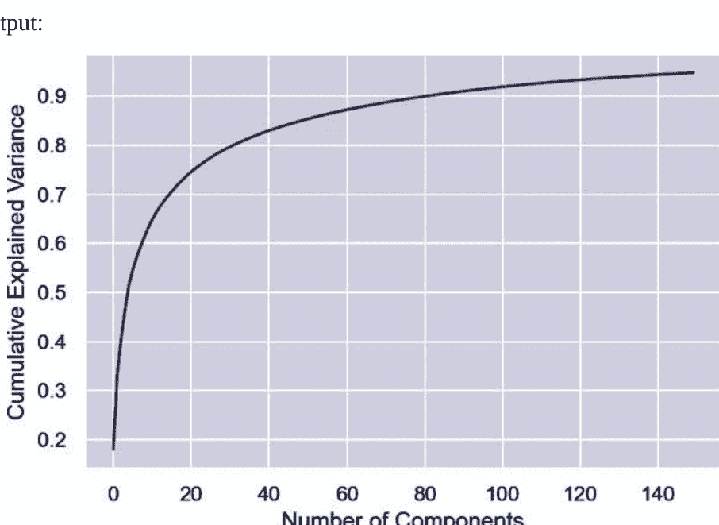

无论从哪个角度看，大部分信息都包含在前50到100个维度中。基于这些图表，如果你将维度从150减少到50，你是否预期恢复的面部图像会有显著不同？如果不确定，可以尝试一下看看。

### 过滤噪声

PCA的一个非常实际的用途是从数据中过滤噪声。*噪声*是随机的、损坏的或无意义的数据，当数据来自压力传感器或加速度计等物理设备时尤其容易出现。使用PCA进行降噪的基本方法是：对数据进行PCA变换，然后进行逆变换，将数据集从*m*维减少到*n*维，再恢复到*m*维。因为PCA在降维时会丢弃最不重要的信息，而噪声往往信息价值很小或没有，所以理想情况下这能消除大部分噪声，同时保留大部分有意义的数据。

你可以用LFW数据集来验证这个假设。使用以下语句，通过随机数生成器向面部图像添加噪声，并绘制前24张图像：

```python
%matplotlib inline
import matplotlib.pyplot as plt
from sklearn.datasets import fetch_lfw_people
import numpy as np

faces = fetch_lfw_people(min_faces_per_person=100)

np.random.seed(0)
noisy_faces = np.random.normal(faces.data, 20)

fig, ax = plt.subplots(3, 8, figsize=(18, 10))

for i, axi in enumerate(ax.flat):
    axi.imshow(noisy_faces[i].reshape(62, 47), cmap='gist_gray')
    axi.set(xticks=[], yticks=[], xlabel=faces.target_names[faces.target[i]])
```

生成的面部图像类似于1960年代有静电干扰的电视屏幕：

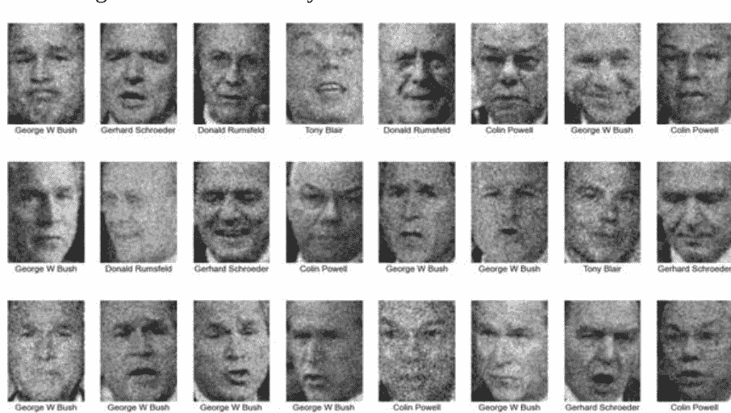

现在使用PCA来减少维度数量。我们不指定维度（成分）的数量，而是指定我们希望将数据集的信息量减少到80%。我们将让Scikit决定保留多少维度，然后显示计数：

```python
from sklearn.decomposition import PCA

pca = PCA(0.8, random_state=0)
pca_faces = pca.fit_transform(noisy_faces)
pca.n_components_
```

PCA将维度从2,914减少到179，但剩余的维度包含了原始2,914个维度中80%的信息。现在从经过PCA处理的面部图像重建面部图像并显示结果：

```python
unpca_faces = pca.inverse_transform(pca_faces)

fig, ax = plt.subplots(3, 8, figsize=(18, 10))

for i, axi in enumerate(ax.flat):
    axi.imshow(unpca_faces[i].reshape(62, 47), cmap='gist_gray')
    axi.set(xticks=[], yticks=[], xlabel=faces.target_names[faces.target[i]])
```

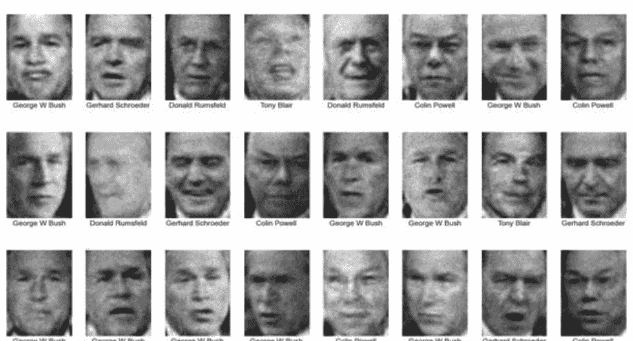

重建的数据集不如原始数据集干净，但已经足够清晰，你可以辨认出照片中的面孔。

### 数据匿名化

第3章演示了如何使用各种学习算法构建一个二元分类模型来检测信用卡欺诈。示例中使用的数据集包含真实的信用卡数据，这些数据已经过匿名化处理以保护持卡人（以及信用卡公司的知识产权）。该数据集的前10行如图6-4所示。

| Time | V1 | V2 | V3 | ... | V27 | V28 | Amount | Class |
|---|---|---|---|---|---|---|---|---|
| 0 | 0.0 | -1.359807 | -0.072781 | 2.536347 | ... | 0.133558 | -0.021053 | 149.62 | 0 |
| 1 | 0.0 | 1.191857 | 0.266151 | 0.166480 | ... | -0.008983 | 0.014724 | 2.69 | 0 |
| 2 | 1.0 | -1.358354 | -1.340163 | 1.773209 | ... | -0.055353 | -0.059752 | 378.66 | 0 |
| 3 | 1.0 | -0.966272 | -0.185226 | 1.792993 | ... | 0.062723 | 0.061458 | 123.50 | 0 |
| 4 | 2.0 | -1.158233 | 0.877737 | 1.548718 | ... | 0.219422 | 0.215153 | 69.99 | 0 |
| 5 | 2.0 | -0.425966 | 0.960523 | 1.141109 | ... | 0.253844 | 0.081080 | 3.67 | 0 |
| 6 | 4.0 | 1.229658 | 0.141004 | 0.045371 | ... | 0.034507 | 0.005168 | 4.99 | 0 |
| 7 | 7.0 | -0.644269 | 1.417964 | 1.074380 | ... | -1.206921 | -1.085339 | 40.80 | 0 |
| 8 | 7.0 | -0.894286 | 0.286157 | -0.113192 | ... | 0.011747 | 0.142404 | 93.20 | 0 |
| 9 | 9.0 | -0.338262 | 1.119593 | 1.044367 | ... | 0.246219 | 0.083076 | 3.68 | 0 |

图6-4. 匿名化的欺诈检测数据集

PCA的另一个实际用途是以这种方式对数据进行匿名化。这通常是一个两步过程：

1.  使用PCA将数据集从$m$维“减少”到$m$维，其中$m$是原始维度数（也是“减少”后的维度数）。
2.  对数据进行归一化，使其具有单位方差。

第二步不是必需的，但它确实能使值的范围更加统一。以这种方式匿名化的数据仍然可以用于训练机器学习模型，但无法推断其原始含义。

用你自己的数据集试试。首先，使用以下代码加载Scikit的乳腺癌数据集并显示前五行：

```python
import pandas as pd
from sklearn.datasets import load_breast_cancer

data = load_breast_cancer()
df = pd.DataFrame(data=data.data, columns=data.feature_names)
pd.set_option('display.max_columns', 6)
df.head()
```

输出如下：

| | mean radius | mean texture | mean perimeter | ... | worst concave points | worst symmetry | worst fractal dimension |
|---|---|---|---|---|---|---|---|
| 0 | 17.99 | 10.38 | 122.80 | ... | 0.2654 | 0.4601 | 0.11890 |
| 1 | 20.57 | 17.77 | 132.90 | ... | 0.1860 | 0.2750 | 0.08902 |
| 2 | 19.69 | 21.25 | 130.00 | ... | 0.2430 | 0.3613 | 0.08758 |
| 3 | 11.42 | 20.38 | 77.58 | ... | 0.2575 | 0.6638 | 0.17300 |
| 4 | 20.29 | 14.34 | 135.10 | ... | 0.1625 | 0.2364 | 0.07678 |

5 行 × 30 列

该数据集包含30列，不包括标签列。现在使用以下语句找到30个主成分，并对转换后的数据应用StandardScaler：

```python
from sklearn.decomposition import PCA
from sklearn.preprocessing import StandardScaler

pca = PCA(n_components=30, random_state=0)
pca_data = pca.fit_transform(df)

scaler = StandardScaler()
anon_df = pd.DataFrame(scaler.fit_transform(pca_data))
pd.set_option('display.max_columns', 8)
anon_df.head()
```

结果如下：

| | 0 | 1 | 2 | 3 | ... | 26 | 27 | 28 | 29 |
|---|---|---|---|---|---|---|---|---|---|
| 0 | 1.743043 | -3.440692 | 1.832695 | -1.179529 | ... | -1.033900 | 0.767070 | 1.406020 | 0.841434 |
| 1 | 1.906779 | 0.182972 | -1.335313 | 2.418269 | ... | -0.043492 | -0.798802 | 0.484854 | -1.267746 |
| 2 | 1.496120 | 0.458381 | -0.064503 | 0.568556 | ... | 0.092680 | 0.010964 | -0.547972 | 0.484234 |
| 3 | -0.611764 | -0.788775 | 0.327197 | -1.592188 | ... | 0.008095 | 0.811865 | -1.511794 | -1.978890 |
| 4 | 1.397781 | 2.216483 | 0.051866 | 1.150718 | ... | 1.716566 | 0.161769 | 1.260500 | 0.390467 |

5 行 × 30 列

经过PCA变换后，数据集变得无法识别。没有变换，就不可能反向推导并重建原始数据。然而，`explained_variance_ratio_`值的总和是1.0，这意味着没有信息丢失。你可以这样证明：

```python
import numpy as np

np.sum(pca.explained_variance_ratio_)
```

经过PCA处理的数据集与原始数据集一样对机器学习有用。此外，如果你想与他人共享数据集，让他们训练自己的模型，也不会有泄露敏感或专有信息的风险。

### 可视化高维数据

PCA的另一个用途是将数据集减少到两维或三维，以便可以使用Matplotlib等库进行绘制。你无法绘制一个有1000列的数据集。你*可以*绘制一个有两列或三列的数据集。PCA能够将高维数据减少到两维或三维，同时保留大部分原始信息，这使其成为探索数据和可视化类别之间关系的绝佳工具。

假设你正在构建一个分类模型，并想预先评估类别之间是否有足够的分离度来支持这样的模型。以Scikit内置的[手写数字光学识别数据集](https://scikit-learn.org/stable/modules/generated/sklearn.datasets.load_digits.html)为例。数据集中的每个数字由一个8×8的像素值数组表示，这意味着数据集有64个维度。如果你能绘制一个64维的图表，你或许可以检查数据集并寻找类别之间的分离。但64个维度对大多数人来说多了61个。

这就需要PCA了。以下代码加载数据集，使用PCA将其减少到二维，并绘制结果，不同的颜色代表不同的类别（数字）：

```python
from sklearn.decomposition import PCA
from sklearn.datasets import load_digits
import matplotlib.pyplot as plt
%matplotlib inline

digits = load_digits()
pca = PCA(n_components=2, random_state=0)
pca_digits = pca.fit_transform(digits.data)

plt.figure(figsize=(12, 8))
plt.scatter(pca_digits[:, 0], pca_digits[:, 1], c=digits.target,
            cmap=plt.cm.get_cmap('Paired', 10))
plt.colorbar(ticks=range(10))
plt.clim(-0.5, 9.5)
```

生成的图表提供了一个令人鼓舞的迹象，表明你可能能够用这些数据训练一个分类器。虽然类别之间显然存在一些重叠，但不同的类别形成了相当明显的簇。红色（数字4）和浅紫色（数字6）之间有显著重叠，这表明模型可能在区分4和6时会有些困难。然而，0和1位于顶部而3和4则分别位于最左侧和最右侧。模型应该能够熟练地区分这些数字：

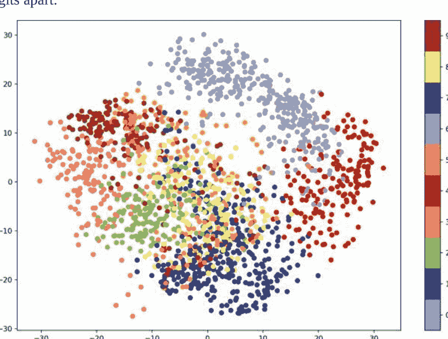

你可以通过3D图更好地可视化类别之间的关系。以下代码使用PCA将数据集降至三维，并使用Mplot3D生成交互式图表。请注意，如果你在Jupyter Lab中运行此代码，可能需要将第一行改为`%matplotlib widget`：

```python
%matplotlib notebook
from mpl_toolkits.mplot3d import Axes3D

digits = load_digits()
pca = PCA(n_components=3, random_state=0)
pca_digits = pca.fit_transform(digits.data)

ax = plt.figure(figsize=(12, 8)).add_subplot(111, projection='3d')
ax.scatter(xs = pca_digits[:, 0], ys = pca_digits[:, 1], zs = pca_digits[:, 2],
           c=digits.target, cmap=plt.cm.get_cmap('Paired', 10))
```

你可以旋转生成的3D图，从不同角度观察。这里我们可以看到，4和6之间的分离度比在二维中更为明显：

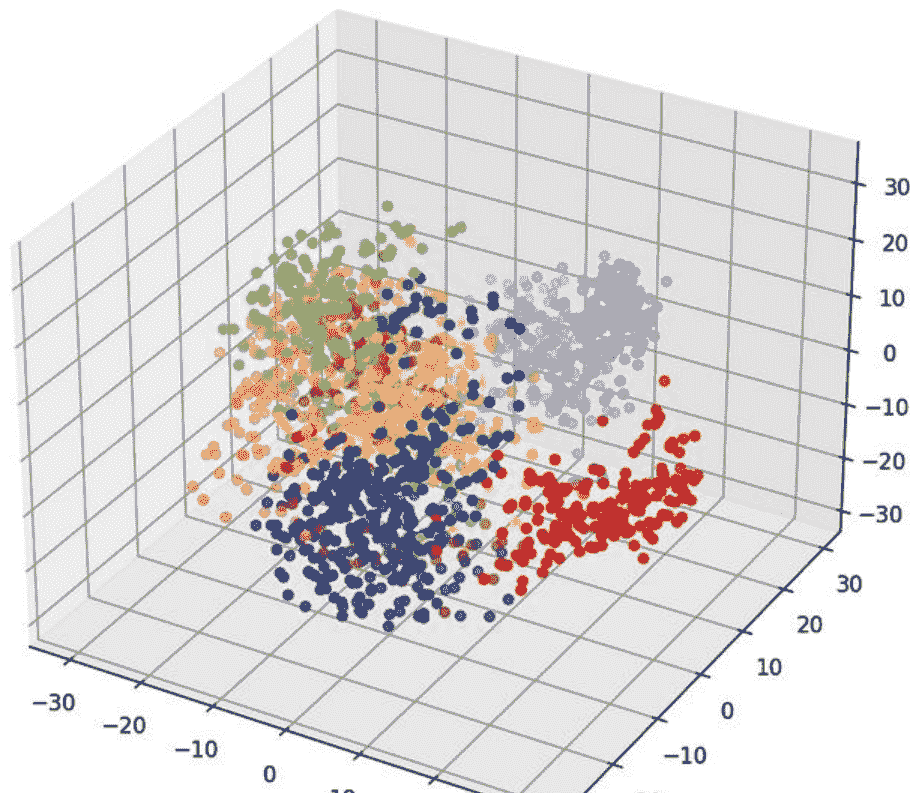

PCA并非将数据集降至二维或三维进行绘图的唯一方法。你也可以使用Scikit的Isomap类或TSNE类。TSNE实现了t-分布随机邻域嵌入，简称t-SNE。t-SNE是一种降维算法，几乎专门用于可视化高维数据。PCA使用线性函数转换数据，而t-SNE使用非线性转换，通过在低维空间中保持相似数据点靠近来增强类别间的分离度。（相比之下，PCA侧重于保持不相似的点远离。）以下是使用t-SNE将数据集降至二维后绘制数字数据集的示例：

```python
%matplotlib inline
from sklearn.manifold import TSNE

digits = load_digits()
tsne = TSNE(n_components=2, init='pca', learning_rate='auto',
            random_state=0)
tsne_digits = tsne.fit_transform(digits.data)

plt.figure(figsize=(12, 8))
plt.scatter(tsne_digits[:, 0], tsne_digits[:, 1], c=digits.target,
            cmap=plt.cm.get_cmap('Paired', 10))
plt.colorbar(ticks=range(10))
plt.clim(-0.5, 9.5)
```

输出结果如下：

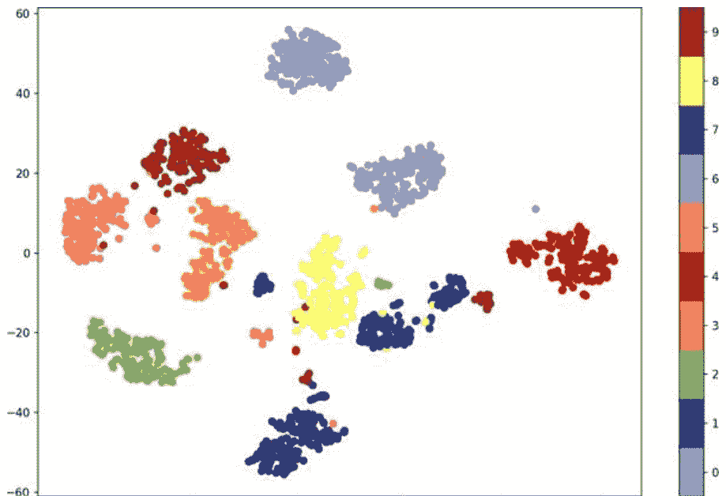

t-SNE在将数字分组为簇方面做得更好，表明数据中存在机器学习可以利用的模式。主要缺点是t-SNE计算密集，这意味着在大型数据集上运行可能耗时过长。一种缓解方法是在数据行的子集上运行t-SNE，而不是整个数据集。另一种策略是先使用PCA降低维度，然后对PCA处理后的数据集应用t-SNE。

### 异常检测

异常检测是机器学习的一个分支，旨在识别数据集或数据流中的异常。空客公司用它来预测喷气发动机故障，并检测从国际空间站传回的遥测数据中的异常。信用卡公司用它来检测信用卡欺诈。异常检测的目标是识别数据中的异常值——与其他样本相比“不正常”的样本。在信用卡欺诈的情况下，假设是如果交易经过异常检测算法处理，欺诈性交易将显示为异常，而合法交易则不会。

执行异常检测的方法有很多。它们被称为隔离森林、单类SVM和局部异常因子等。大多数依赖于无监督学习方法，因此不需要标记数据。它们只需查看一组样本，并确定哪些是异常的。无监督异常检测特别有趣，因为它不需要事先知道什么构成异常，也不需要对未标记的数据集进行细致标记。

最流行的异常检测形式之一依赖于主成分分析。你已经知道PCA可以用于将数据从m维降至n维，并且PCA转换可以反转以恢复原始的m维。你还知道反转转换并不能恢复应用转换时丢失的数据。基于PCA的异常检测的要点是，异常样本应该比正常样本表现出更多的损失或*重建误差*（原始数据与应用PCA转换并反转后的相同数据之间的差异）。换句话说，异常样本经过PCA处理和反转后产生的损失应高于对正常样本应用相同操作产生的损失。让我们看看这个假设在现实世界中是否成立。

### 使用PCA检测信用卡欺诈

监督学习并非检测信用卡欺诈的唯一选择。以下是使用基于PCA的异常检测来识别欺诈交易的替代方法。首先加载数据集，按类别将样本分为代表合法交易的数据集和代表欺诈交易的数据集，并删除Time和Class列。如果你在第3章没有下载数据集，现在可以从ZIP文件中获取。

```python
import pandas as pd

df = pd.read_csv('Data/creditcard.csv')
df.head()

# 按类别分离样本
legit = df[df['Class'] == 0]
fraud = df[df['Class'] == 1]

# 删除"Time"和"Class"列
legit = legit.drop(['Time', 'Class'], axis=1)
fraud = fraud.drop(['Time', 'Class'], axis=1)
```

使用PCA将两个数据集从29维降至26维，然后反转转换以将每个数据集恢复到29维。转换仅针对合法交易进行拟合，因为我们需要一个重建误差的基线值，以便区分合法和欺诈交易。然而，它被应用于两个数据集：

```python
from sklearn.decomposition import PCA

pca = PCA(n_components=26, random_state=0)
legit_pca = pd.DataFrame(pca.fit_transform(legit), index=legit.index)
fraud_pca = pd.DataFrame(pca.transform(fraud), index=fraud.index)

legit_restored = pd.DataFrame(pca.inverse_transform(legit_pca),
                              index=legit_pca.index)

fraud_restored = pd.DataFrame(pca.inverse_transform(fraud_pca),
                              index=fraud_pca.index)
```

在过渡过程中丢失了一些信息。希望欺诈交易比合法交易产生了更多的损失，我们可以利用这一点来区分它们。下一步是通过计算原始行和恢复行中值之间差的平方和，来计算两个数据集中每一行的损失：

```python
import numpy as np

def get_anomaly_scores(df_original, df_restored):
    loss = np.sum((np.array(df_original) - np.array(df_restored)) ** 2, axis=1)
    loss = pd.Series(data=loss, index=df_original.index)
    return loss

legit_scores = get_anomaly_scores(legit, legit_restored)
fraud_scores = get_anomaly_scores(fraud, fraud_restored)
```

现在绘制合法交易转换和恢复时产生的损失：

```python
%matplotlib inline
import matplotlib.pyplot as plt
import seaborn as sns
sns.set()

legit_scores.plot(figsize = (12, 6))
```

结果如下：

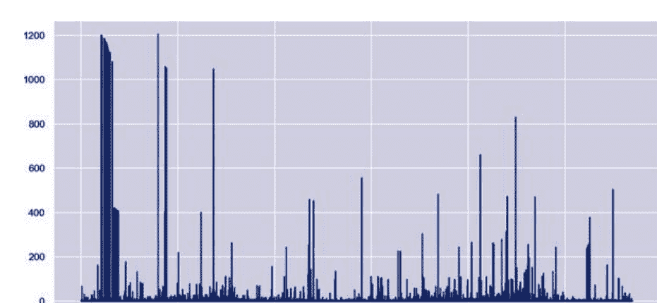

接下来，绘制欺诈交易的损失：

```python
fraud_scores.plot(figsize = (12, 6))
```

结果如下：

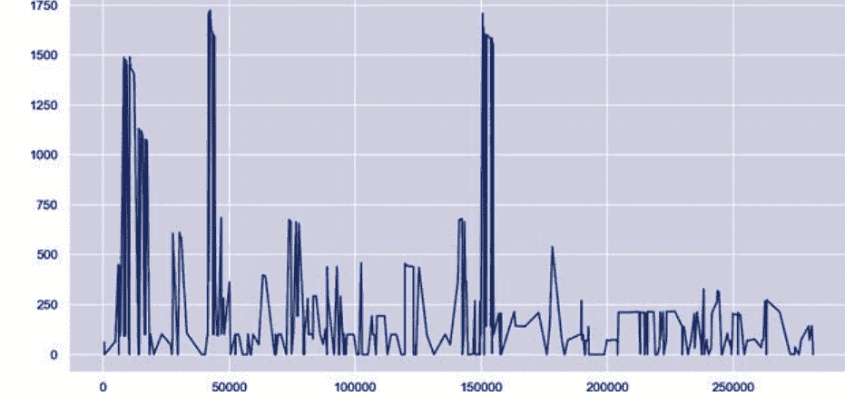

图表显示，代表合法交易的数据集中，大多数行的损失小于200，而代表欺诈交易的数据集中，许多行的损失大于200。根据这一点分离行——将损失小于200的交易分类为合法，损失更高的交易分类为欺诈——并使用混淆矩阵可视化结果：

```python
threshold = 200

true_neg = legit_scores[legit_scores < threshold].count()
false_pos = legit_scores[legit_scores >= threshold].count()
true_pos = fraud_scores[fraud_scores >= threshold].count()
false_neg = fraud_scores[fraud_scores < threshold].count()

labels = ['Legitimate', 'Fraudulent']
mat = [[true_neg, false_pos], [false_neg, true_pos]]

sns.heatmap(mat, square=True, annot=True, fmt='d', cbar=False, cmap='Blues',
            xticklabels=labels, yticklabels=labels)

plt.xlabel('Predicted label')
plt.ylabel('True label')
```

结果如下：结果虽然不如随机森林模型那么好，但该模型仍然捕获了约50%的欺诈交易，同时仅将284,315笔合法交易中的76笔错误标记。这意味着合法交易的错误率低于0.03%，而监督学习模型的错误率为0.007%。

该模型中有两个参数影响错误率：数据集降维后的维度数（26），以及用于区分合法与欺诈交易的阈值（200）。你可以通过尝试不同的值来调整准确性。我进行了一些非正式测试，并得出结论：这是一个合理的组合。选择较低的阈值可以提高模型识别欺诈交易的能力，但代价是会错误分类更多的合法交易。最终，你必须决定你能接受的错误率是多少，同时要记住，拒绝一笔合法的信用卡购买很可能会激怒客户。

### 使用PCA预测轴承故障

异常检测的经典应用之一是预测旋转机械的故障。让我们将基于PCA的异常检测应用于[NASA发布的一个数据集](https://www.nasa.gov/content/prognostics-center-of-excellence-data-set-repository)的子集，以预测轴承故障。该数据集包含四个支撑旋转轴的轴承的振动数据，轴上施加了6,000磅的径向载荷。轴承运行至失效，并由高灵敏度石英加速度计定期采集振动数据，直至故障发生。

首先，[下载CSV文件](https://github.com/benhamner/IEEE-CIS-Fraud-Detection/blob/master/data/transaction_data.csv)，其中包含我从更大的NASA数据集中筛选出的子集。然后创建一个Jupyter notebook并加载数据：

```python
import pandas as pd

df = pd.read_csv('Data/bearings.csv', index_col=0, parse_dates=[0])
df.head()
```

以下是数据集的前五行：

| | Bearing 1 | Bearing 2 | Bearing 3 | Bearing 4 |
|---|---|---|---|---|
| 2004-02-12 10:32:39 | 0.058333 | 0.071832 | 0.083242 | 0.043067 |
| 2004-02-12 10:42:39 | 0.058995 | 0.074006 | 0.084435 | 0.044541 |
| 2004-02-12 10:52:39 | 0.060236 | 0.074227 | 0.083926 | 0.044443 |
| 2004-02-12 11:02:39 | 0.061455 | 0.073844 | 0.084457 | 0.045081 |
| 2004-02-12 11:12:39 | 0.061361 | 0.075609 | 0.082837 | 0.045118 |

该数据集包含984个样本。每个样本包含四个轴承的振动数据，样本间隔为10分钟。将所有四个轴承的振动数据绘制为时间序列图：

```python
%matplotlib inline
import matplotlib.pyplot as plt
import seaborn as sns
sns.set()

df.plot(figsize = (12, 6))
```

输出如下：

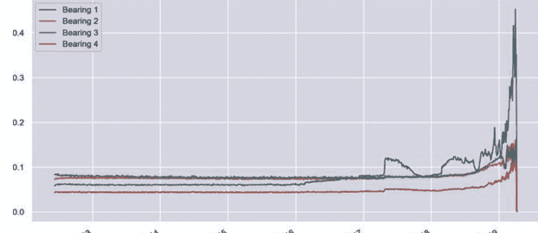

测试进行到大约四天时，轴承1的振动开始增加。一天后振动激增，又过了大约两天，轴承1发生了灾难性故障。我们的目标是建立一个模型，能够识别任何轴承振动的增加作为即将发生故障的迹象，并且做到这一点*无需*使用带标签的数据集。

下一步是从数据集中提取代表“正常”运行的样本（以下代码中的x_train），并使用PCA将四个维度降至一个维度——本质上是将所有四个轴承的数据合并。然后对数据集的其余部分（x_test）应用相同的PCA变换，合并两个部分数据集，并绘制结果：

```python
from sklearn.decomposition import PCA

x_train = df['2004-02-12 10:32:39':'2004-02-13 23:42:39']
x_test = df['2004-02-13 23:52:39':]

pca = PCA(n_components=1, random_state=0)
x_train_pca = pd.DataFrame(pca.fit_transform(x_train))
x_train_pca.index = x_train.index

x_test_pca = pd.DataFrame(pca.transform(x_test))
x_test_pca.index = x_test.index

df_pca = pd.concat([x_train_pca, x_test_pca])
df_pca.plot(figsize = (12, 6))
plt.legend().remove()
```

输出如下：

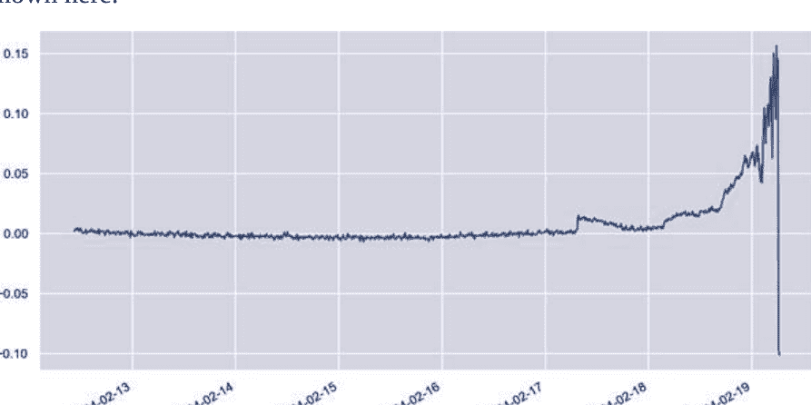

现在反转PCA变换并绘制“恢复”后的数据集：

```python
df_restored = pd.DataFrame(pca.inverse_transform(df_pca), index=df_pca.index)
df_restored.plot(figsize = (12, 6))
```

结果如下：

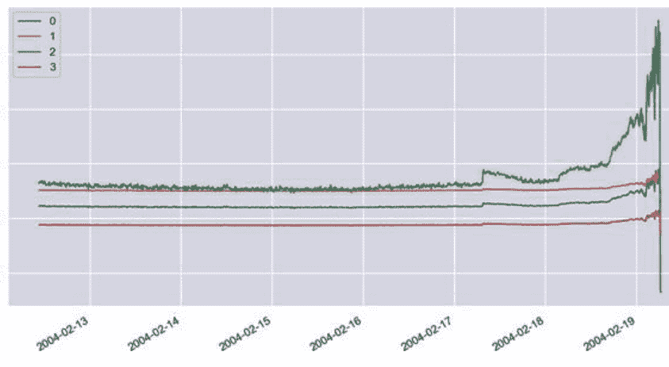

很明显，应用并反转变换导致了信息损失。让我们定义一个函数来计算一系列样本中的损失，然后将该函数应用于原始数据集和恢复数据集中的所有样本，并绘制随时间变化的差异：

```python
import numpy as np

def get_anomaly_scores(df_original, df_restored):
    loss = np.sum((np.array(df_original) - np.array(df_restored)) ** 2, axis=1)
    loss = pd.Series(data=loss, index=df_original.index)
    return loss

scores = get_anomaly_scores(df, df_restored)
scores.plot(figsize = (12, 6))
```

输出如下：

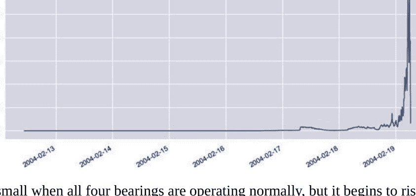

当所有四个轴承正常运行时，损失非常小，但当一个或多个轴承表现出异常振动时，损失开始上升。从图表中可以明显看出，当损失上升到大约0.002的阈值以上时，就表明轴承可能发生故障。

既然你已经选择了一个初步的损失阈值，就可以用它来检测轴承的异常行为。首先定义一个函数，该函数接受一个样本，并通过应用和反转PCA变换、测量每个轴承的损失并将其与指定的损失阈值进行比较，来返回True或False，指示该样本是否异常：

```python
def is_anomaly(row, pca, threshold):
    pca_row = pca.transform(row)
    restored_row = pca.inverse_transform(pca_row)
    losses = np.sum((row - restored_row) ** 2)

    for loss in losses:
        if loss > threshold:
            return True;

    return False
```

将该函数应用于时间序列早期代表正常行为的一行，并确认其返回False：

```python
x = df.loc[['2004-02-16 22:52:39']]
is_anomaly(x, pca, 0.002)
```

将该函数应用于时间序列后期代表异常行为的一行，并确认其返回True：

```python
x = df.loc[['2004-02-18 22:52:39']]
is_anomaly(x, pca, 0.002)
```

现在将该函数应用于数据集中的所有样本，并将异常样本标记为红色，以便可视化异常行为被检测到的时间：

```python
df.plot(figsize = (12, 6))

for index, row in df.iterrows():
    if is_anomaly(pd.DataFrame([row]), pca, 0.002):
        plt.axvline(row.name, color='r', alpha=0.2)
```

输出如下：

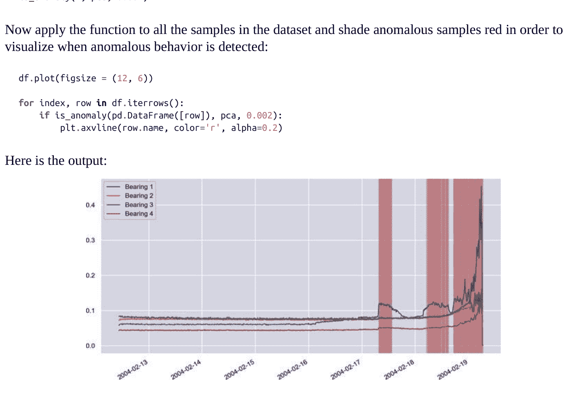

重复此过程，但这次使用0.0002而不是0.002作为损失阈值：

```python
df.plot(figsize = (12, 6))

for index, row in df.iterrows():
    if is_anomaly(pd.DataFrame([row]), pca, 0.0002):
        plt.axvline(row.name, color='r', alpha=0.2)
```

输出如下：

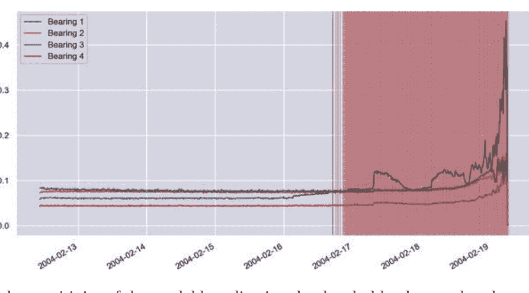

你可以通过调整用于检测异常的阈值值来调整模型的灵敏度。使用0.002的损失阈值可以在轴承故障发生前约两天预测到，而使用0.0002的损失阈值则可以提前约三天预测到。通常，你需要选择一个尽可能早地预测故障而不引起误报的损失阈值。

### 多变量异常检测

在前面的例子中，我们能否通过简单地监控单个轴承来预测故障？也许可以。但是，如果即将发生的故障是由*两个*轴承的振动略微升高而不是仅仅一个轴承来指示的呢？工程师们经常发现，预示即将发生问题的不是单个传感器的读数，而是多个传感器读数的组合。这些读数可能来自不同类型的传感器：例如，在汽车和[航空航天应用](https://example.com)中的温度传感器和压力表，或者在[医疗保健应用](https://example.com)中的心脏监护仪和血压监护仪。使用PCA将维度降至一维，是为了捕捉来自单个传感器的数据之间的关系并系统地处理读数，这种技术被称为*多变量异常检测*。

使用PCA检测多变量系统异常的一个局限性在于，由于它使用线性变换，PCA在建模变量之间的线性关系方面比非线性关系更好。相比之下，神经网络擅长建模非线性数据。这就是当今最先进的多变量异常检测通常依赖深度学习的主要原因。

随着变量数量的增加，建模它们之间相互依赖关系的挑战也随之增加。整体系统健康状况由数十个其他方面决定的情况并不少见自变量。2020年9月，微软和北京大学的一个研究团队发表了一篇题为“基于图注意力网络的多元时间序列异常检测”的论文，提出了一种新颖的多元异常检测架构。该架构结合了两种深度学习模型：一种依赖于预测误差，另一种依赖于重建误差。微软在其Azure多元异常检测器服务中使用了这一架构，该服务可以对多达300个独立数据源之间的依赖关系进行建模，并被空客和西门子等公司用于检测空间站遥测数据中的异常，以及在医疗设备上市前对其进行测试。Azure多元异常检测器服务是Azure认知服务的一部分，该服务将在第14章中介绍。

### 总结

主成分分析是一种在不造成相应信息损失的情况下减少数据集维度的技术。它在机器学习中有多种用途，包括可视化高维数据、数据匿名化、降低噪声以及通过减少维度来增加行与列的比例。它还可用于执行异常检测，方法是测量应用PCA变换然后反转时所造成的损失。异常样本往往会造成更大的损失。

当我授课时，我经常将PCA介绍为“机器学习中保守得最好的秘密”。它不应该继续成为一个秘密，因为它是机器学习工程师手中不可或缺的工具。既然你已经了解了它，我几乎可以保证你会找到方法来应用它。

## 第7章 机器学习模型的部署

本书到目前为止介绍的所有机器学习模型都是用Python编写的。模型不一定非要用Python编写，但许多模型是，这部分归功于众多世界级的Python库，包括[Pandas](https://pandas.pydata.org/)和[Scikit-Learn](https://scikit-learn.org/)。用Python编写的ML模型很容易在Python应用程序中使用。从C++、Java和C#等其他语言调用它们需要多做一些工作。你不能像调用C++函数那样简单地从C++调用Python函数。那么，如何从用其他语言编写的应用程序中调用用Python编写的模型呢？换句话说，如何*部署*Python模型，使其可以在任何平台上用任何编程语言编写的任何应用程序中使用？

[图7-1](#figure-7-1)左侧的图表展示了一种策略：将模型包装在Web服务中，并通过[REST API](https://en.wikipedia.org/wiki/Representational_state_transfer)暴露其功能。然后，任何能生成HTTP(S)请求的客户端都可以调用该模型。借助[Flask](https://flask.palletsprojects.com/)等Python框架，进行包装相对容易。Web服务可以托管在本地或云端，并且可以使用[Docker](https://www.docker.com/)等工具进行容器化，以便于部署。

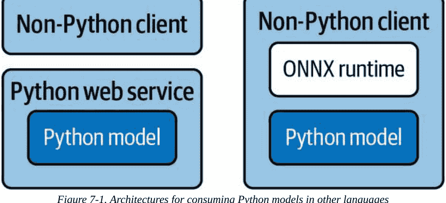

右侧的图表展示了另一种策略——一种相对较新但迅速普及的策略。它涉及将Python模型导出为一种与平台无关的格式，称为ONNX，即[开放神经网络交换](https://onnx.ai/)的缩写，然后使用ONNX运行时在Java、C++、C#和其他编程语言中加载模型。一旦加载，模型就可以通过ONNX运行时进行调用。

当然，如果客户端应用程序和模型是用同一种语言编写的，你既不需要Web服务也不需要ONNX。在本章中，我将引导你了解几种场景：

- 如何保存训练好的Python模型并从Python客户端调用它
- 如何使用Web服务从非Python客户端调用Python模型
- 如何将Python模型（和Web服务）容器化以便于部署
- 如何使用ONNX从其他编程语言调用Python模型
- 如何用C#而不是Python编写机器学习模型

最后，我将演示一种新颖的方法，通过Microsoft Excel暴露其功能来部署机器学习模型。内容很多，让我们开始吧。

### 从Python客户端使用Python模型

表面上看，从Python客户端调用Python模型很简单：只需在模型上调用`predict`（或者对于分类器，调用`predict_proba`）。当然，你不想每次使用模型时都重新训练它。你希望训练一次，然后让客户端应用程序能够在训练好的状态下重新创建模型。为此，Python程序员使用Python的`pickle`模块。

为了演示，以下代码构建并训练了第3章中介绍的泰坦尼克号模型。然而，它没有使用模型进行预测，而是在最后一行调用`pickle.dump`将模型保存到.pkl文件中（它“腌制”了模型）：

```python
import pickle
import pandas as pd
from sklearn.linear_model import LogisticRegression

df = pd.read_csv('Data/titanic.csv')
df = df[['Survived', 'Age', 'Sex', 'Pclass']]
df = pd.get_dummies(df, columns=['Sex', 'Pclass'])
df.dropna(inplace=True)

x = df.drop('Survived', axis=1)
y = df['Survived']

model = LogisticRegression(random_state=0)
model.fit(x, y)

pickle.dump(model, open('titanic.pkl', 'wb'))
```

要调用模型，Python客户端使用`pickle.load`从.pkl文件中反序列化模型，*在训练好的状态下重新创建模型*，并调用`predict_proba`来计算乘客的生存几率：

```python
import pickle
import pandas as pd

model = pickle.load(open('titanic.pkl', 'rb'))

female = pd.DataFrame({ 'Age': [30], 'Sex_female': [1], 'Sex_male': [0],
                        'Pclass_1': [1], 'Pclass_2': [0], 'Pclass_3': [0] })

probability = model.predict_proba(female)[0][1]
print(f'Probability of survival: {probability:.1%}')
```

现在客户端可以使用模型进行预测，而无需重新训练它。一旦模型加载，它可以在客户端的整个生命周期内持续存在，并在需要时随时调用进行预测。

第5章介绍了Scikit的`make_pipeline`函数，它允许估计器（进行预测的对象）和转换器（将数据输入转换为模型的对象）组合成一个单元，或称为*管道*。pickle模块也可以用于序列化和反序列化管道。示例7-1将第4章中介绍的情感分析模型重新设计，使用`make_pipeline`将用于文本向量化的`CountVectorizer`与用于文本分类的`LogisticRegression`对象组合在一起。调用`pickle.dump`保存模型，包括CountVectorizer和所有内容。

### 示例7-1. 训练和保存情感分析管道

```python
import pickle
import pandas as pd
from sklearn.feature_extraction.text import CountVectorizer
from sklearn.linear_model import LogisticRegression
from sklearn.pipeline import make_pipeline
df = pd.read_csv('Data/reviews.csv', encoding="ISO-8859-1")
df = df.drop_duplicates()
x = df['Text']
y = df['Sentiment']
vectorizer = CountVectorizer(ngram_range=(1, 2), stop_words='english',
                            min_df=20)
model = LogisticRegression(max_iter=1000, random_state=0)
pipe = make_pipeline(vectorizer, model)
pipe.fit(x, y)
pickle.dump(pipe, open('sentiment.pkl', 'wb'))
```

Python客户端可以用几行简单的代码反序列化管道并调用`predict_proba`来为一行文本的情感打分：

```python
import pickle
pipe = pickle.load(open('sentiment.pkl', 'rb'))
score = pipe.predict_proba(['Great food and excellent service!'])[0][1]
print(score)
```

以这种方式腌制不仅适用于CountVectorizer，也适用于其他转换器，如StandardScaler。

> **注意**

腌制包含CountVectorizer的管道可能会产生一个很大的.pkl文件。在本例中，sentiment.pkl的大小为50 MB，因为它包含了CountVectorizer从训练文本中构建的整个词汇表。移除min_df=20参数后，文件大小膨胀到近90 MB。

解决方案是用HashingVectorizer替换CountVectorizer，后者不创建词汇表，而是使用词哈希来索引词频表。这将sentiment.pkl的大小减少到8 MB——即使没有min_df参数（HashingVectorizer本身也不支持该参数）。

如果你想编写一个执行情感分析的独立Python客户端，请在Jupyter notebook中运行示例7-1中的代码以生成sentiment.pkl。你可以选择将CountVectorizer更改为HashingVectorizer并移除min_df参数以减小.pkl文件的大小。然后创建一个名为sentiment.py的Python脚本，包含以下代码：

```python
import pickle, sys

# Get the text to analyze
if len(sys.argv) > 1:
    text = sys.argv[1]
else:
    text = input('Text to analyze: ')

# Load the pipeline containing the model and the vectorizer
pipe = pickle.load(open('sentiment.pkl', 'rb'))

# Pass the input text to the pipeline and print the result
score = pipe.predict_proba([text])[0][1]
print(score)
```

将sentiment.pkl复制到与sentiment.py相同的目录中，然后切换到命令行并运行脚本：

```
python sentiment.py "Great food and excellent service!"
```

输出应该类似于这样，这证明你成功地在训练好的状态下重新创建了模型，并调用它来分析输入文本的情感：

请注意，如果将 `CountVectorizer` 替换为 `HashingVectorizer`，情感得分会略有不同，部分原因是省略了 `min_df` 参数。

### 版本化 Pickle 文件

通常，使用某个版本的 Scikit 序列化（保存）的模型无法用另一个版本反序列化。有时结果是警告消息；有时则完全无法工作。请确保使用与部署模型时相同版本的 Scikit 来保存模型。从工程角度来看，这需要一些规划，因为如果您将序列化模型存储在集中式仓库中，并更新了应用程序中使用的 Scikit 版本，那么您也需要更新已保存的模型。

这引发了一些有趣的问题：如何为机器学习模型设置仓库？如何将模型从仓库部署到托管它们的设备？此外，如何对模型以及训练它们的数据集进行*版本控制*？

答案来自一个新兴领域，称为 *MLOps*，即 *ML operations*（机器学习运维）的缩写。本书不涵盖 MLOps，因为它是一个内容丰富的主题，本身就足以成书。如果您想了解更多，我推荐阅读 Noah Gift 和 Alfredo Deza 所著的《Practical MLOps: Operationalizing Machine Learning Models》（O'Reilly 出版）。

### 从 C# 客户端使用 Python 模型

假设您想从用另一种语言（比如 C#）编写的应用程序中调用上一节的情感分析模型。您无法直接从 C# 调用 Python 函数，但*可以*将 Python 模型包装在 Web 服务中，并通过 REST API 暴露其 `predict`（或 `predict_proba`）方法。一种编写 Web 服务的方法是使用 Flask，这是一个在 Python 中构建网站和 Web 服务的流行框架。

要亲自尝试，请确保您的计算机上安装了 Flask。然后创建一个名为 `app.py` 的文件，并粘贴以下代码。此代码使用 Flask 实现了一个监听端口 5000 的 Python Web 服务：

```python
import pickle
from flask import Flask, request

app = Flask(__name__)
pipe = pickle.load(open('sentiment.pkl', 'rb'))

@app.route('/analyze', methods=['GET'])
def analyze():
    if 'text' in request.args:
        text = request.args.get('text')
    else:
        return 'No string to analyze'

    score = pipe.predict_proba([text])[0][1]
    return str(score)

if __name__ == '__main__':
    app.run(debug=True, port=5000, host='0.0.0.0')
```

启动时，该服务会反序列化包含在 *sentiment.pkl* 中的情感分析模型管道。装饰 `analyze` 函数的 `@app.route` 语句告诉 Flask，当服务的 `analyze` 方法被调用时，调用该函数。如果服务托管在本地，以下请求将调用 `analyze` 并返回一个包含查询字符串中文本情感得分的字符串：

```
http://localhost:5000/analyze?text=Great food and excellent service!
```

要进行演示，请转到 *app.py* 所在的目录（确保 *sentiment.pkl* 也在那里），然后通过输入以下命令启动 Flask：

```
flask run
```

然后转到另一个命令提示符，使用 `curl` 命令向该 URL 发送请求：

```
curl -G -w "\n" http://localhost:5000/analyze --data-urlencode "text=Great food and excellent service!"
```

以下是输出：

如果您在计算机上安装了 Visual Studio 或 Visual Studio Code，并且已设置为编译和运行 C# 应用程序，则可以在 C# 控制台应用程序中使用以下代码来调用 Web 服务并对文本字符串进行情感评分。当然，您不仅限于从 C# 调用 Web 服务（进而调用模型）。任何语言都可以，因为几乎所有现代编程语言都提供了发送 HTTP 请求的方法。

```csharp
using System;
using System.Net.Http;
using System.Threading.Tasks;

class Program
{
    static async Task Main(string[] args)
    {
        string text;

        // 获取要分析的文本
        if (args.Length > 0)
        {
            text = args[0];
        }
        else
        {
            Console.Write("Text to analyze: ");
            text = Console.ReadLine();
        }

        // 将文本传递给 Web 服务
        var client = new HttpClient();
        var url = $"http://localhost:5000/analyze?text={text}";
        var response = await client.GetAsync(url);
        var score = await response.Content.ReadAsStringAsync();

        // 显示情感得分
        Console.WriteLine(score);
    }
}
```

这个 Web 服务是一个简单的服务，它从查询字符串读取输入并返回一个字符串。对于更复杂的输入和输出，您可以将输入序列化为 JSON 并在 HTTP POST 的主体中传输，并且可以在响应中返回 JSON 负载。有关如何在 Python 中实现的教程，请参阅文章“Python Post JSON Using Requests Library”。

### 容器化机器学习模型

将机器学习模型包装在 Web 服务中并在本地运行的一个缺点是，客户端计算机必须安装 Python 以及模型和 Web 服务所需的所有包。另一种选择是将 Web 服务托管在云端，通过互联网进行调用。前往 Azure 或 AWS，启动一台虚拟机（VM）并在那里安装软件并不难。但有一个更好的方法。这个更好的方法就是容器。

容器彻底改变了软件的构建和部署方式。容器包括一个应用程序以及该应用程序运行所需的一切，包括运行时（例如 Python）、应用程序依赖的包，甚至是一个虚拟文件系统。如果您不熟悉容器，可以将它们视为轻量级的 VM，启动速度快且消耗的内存少得多。Docker 是世界上最流行的容器平台，尽管它正迅速被 Kubernetes 取代。

容器是从*容器镜像*创建的，容器镜像作为容器的蓝图，就像面向对象编程语言中的类构成对象的蓝图一样。创建包含情感分析模型和 Web 服务的 Docker 容器镜像的第一步是在与 *app.py* 和 *sentiment.pkl* 相同的目录中创建一个名为 *Dockerfile*（无文件扩展名）的文件，然后将以下语句粘贴到其中：

```
FROM python:3.8
RUN pip install flask numpy scipy scikit-learn && \
    mkdir /app
COPY app.py /app
COPY sentiment.pkl /app
WORKDIR /app
EXPOSE 5000
ENTRYPOINT ["python"]
CMD ["app.py"]
```

*Dockerfile* 包含构建容器镜像的指令。这个文件创建了一个容器镜像，其中包含 Python 运行时、几个 Python 包（如 Flask 和 Scikit-Learn）以及 *app.py* 和 *sentiment.pkl*。它还指示托管容器的 Docker 运行时打开端口 5000 以处理 HTTP 请求，并在容器启动时执行 *app.py*。

有几种方法可以从 *Dockerfile* 构建容器镜像。如果您的计算机上安装了 Docker，可以使用 `docker build` 命令：

```
docker build -t sentiment-server .
```

或者，您可以将 *Dockerfile* 上传到 Microsoft Azure 等云平台并在那里构建。这样您就不必在本地机器上安装 Docker，并且可以轻松地将生成的容器镜像存储在云端。容器镜像存储在*容器注册表*中，现代云平台既托管容器注册表也托管容器。如果您在 Azure 中启动一个容器实例，容器中的 Web 服务可以通过类似以下的 URL 调用：

```
http://wintellect.northcentralus.azurecontainer.io:5000/analyze?text=Great food and excellent service!
```

在云端托管容器实例的好处之一是，它可以从运行在任何机器和任何操作系统上的任何客户端应用程序访问，并且托管应用程序的计算机不需要安装任何特殊的东西。即使您在本地而不是在云端托管 Web 服务，容器也可能有益。只要您将容器栈（如 Docker 运行时）部署到本地机器，就不必安装 Python 和 Web 服务所需的所有包。您只需启动一个容器实例，并通过 localhost 将 HTTP 请求定向到它。

### 使用 ONNX 弥合语言鸿沟

是否可以在不使用 Web 服务作为中间人的情况下，弥合 C# 客户端和 Python ML 模型之间的鸿沟？简而言之，可以！解决方案在于一个四个字母的缩写：*ONNX*。如前所述，ONNX 代表开放神经网络交换格式，它最初是为了允许使用一种框架（例如 TensorFlow）编写的深度学习模型能够被其他框架（如 PyTorch）使用而设计的。但如今它也可以与 Scikit 模型一起使用。我将在[第 12 章](#)中更详细地介绍 ONNX，但现在，让我们用它来*直接*从用 C# 编写的应用程序中调用 Python 模型——无需 Web 服务。

使用 ONNX 弥合语言鸿沟的第一步是在您的 Python 环境中安装 [Skl2onnx](#)。然后使用该包的 `convert_sklearn` 方法将训练好的 Scikit 模型保存为 `.onnx` 文件。以下是一个简短的代码片段，它将[示例 7-1](#)中的情感分析模型保存到名为 *sentiment.onnx* 的文件中。`initial_types` 参数指定模型期望一个输入值：一个包含要进行情感评分的文本的字符串：

```python
from skl2onnx import convert_sklearn
from skl2onnx.common.data_types import StringTensorType

initial_type = [('string_input', StringTensorType([None, 1]))]
onnx = convert_sklearn(pipe, initial_types=initial_type)

with open('sentiment.onnx', 'wb') as f:
    f.write(onnx.SerializeToString())
```

如果您希望从 Python 中使用该模型，首先需要安装一个名为 [Onnxruntime](#) 的 Python 包，其中包含 ONNX 运行时，也称为 ORT。这提供了加载和运行 ONNX 模型的支持。然后，您使用运行时的 `InferenceSession` 方法并传入 `.onnx` 文件的路径来反序列化模型，并在返回的会话对象上调用 `run` 来调用模型的 `predict` 或 `predict_proba` 方法。代码如下所示：

```python
import numpy as np
import onnxruntime as rt

session = rt.InferenceSession('sentiment.onnx')
```

### 使用 ML.NET 在 C# 中构建机器学习模型

Scikit-Learn 可以说是世界上最流行的机器学习框架。该库的有效性、配套文档以及围绕它的广泛认知度，是大多数机器学习模型使用 Python 编写而非其他语言的主要原因。但 Scikit 并非唯一的机器学习框架。其他语言也有各自的框架，如果你能用与消费模型的客户端相同的编程语言来编写机器学习模型，就可以避免在模型部署过程中大费周章。

[ML.NET](https://dotnet.microsoft.com/apps/machinelearning-ai/ml-dotnet) 是微软为 .NET 开发者提供的免费、开源、跨平台的机器学习库。它具备 Scikit 的大部分功能，并且还有一些 Scikit 没有的功能。当涉及到用 C# 编写机器学习/人工智能解决方案时，没有比它更合适的工具了。

ML.NET 源自微软内部开发的一个库——该库已在微软产品中使用了十多年。它实现的机器学习算法经过了现实世界的反复检验和调试，以优化性能和准确性。由于 ML.NET 是从 C# 调用的，因此你可以获得编译型编程语言的所有好处，包括类型安全和快速执行。

微软 ML.NET 团队在 2019 年发表的一篇[论文](https://arxiv.org/abs/1905.09272)讨论了 ML.NET 背后的动机和设计目标。它还将 ML.NET 的准确性和性能与 Scikit-Learn 以及另一个名为 [H2O](https://www.h2o.ai/) 的机器学习框架进行了比较。使用一个 9 GB 的亚马逊评论数据集，ML.NET 训练出一个准确率达到 95% 的情感分析模型。由于数据集规模过大，Scikit 和 H2O 都无法处理。当三个框架都在该数据集的 10% 上进行训练时，ML.NET 达到了最高的准确率，并且训练速度比 Scikit 快六倍，比 H2O 快近十倍。

ML.NET 兼容 Windows、Linux 和 macOS。得益于一种名为 IDataView 的创新技术，它几乎可以处理任意大小的数据集。虽然它不能用于从头构建神经网络，但它确实能够加载现有的神经网络，并使用一种称为*迁移学习*的技术来重新利用这些网络解决特定领域的问题。（迁移学习将在第 10 章介绍。）它还内置了 ONNX 支持，允许加载以 ONNX 格式存储的复杂模型，包括深度学习模型。最后，它可以在 Python 中使用，甚至可以通过一组名为 NimbusML 的 Python 绑定与 Scikit-Learn 结合使用。

如果你是一位对机器学习感兴趣的 .NET 开发者，现在正是熟悉 ML.NET 的最佳时机。本节并非旨在全面介绍 ML.NET，而是对其进行引入，展示使用它构建机器学习模型的基础知识，并希望激发你的兴趣，促使你进一步学习。网上有大量优秀的资源，包括官方的 ML.NET 文档、包含 ML.NET 示例的 GitHub 仓库以及 ML.NET 食谱。

### 使用 ML.NET 进行情感分析

以下 C# 代码使用 ML.NET 构建并训练一个情感分析模型。它等同于示例 7-1 中的 Python 实现：

```csharp
var context = new MLContext(seed: 0);

// Load the data
var data = context.Data.LoadFromTextFile<Input>("reviews.csv",
    hasHeader: true, separatorChar: ',', allowQuoting: true);

// Split the data into a training set and a test set
var trainTestData = context.Data.TrainTestSplit(data,
    testFraction: 0.2, seed: 0);
var trainData = trainTestData.TrainSet;
var testData = trainTestData.TestSet;

// Build and train the model
var pipeline = context.Transforms.Text.FeaturizeText
    (outputColumnName: "Features", inputColumnName: "Text")
    .Append(context.BinaryClassification.Trainers.SdcaLogisticRegression());

var model = pipeline.Fit(trainData);

// Evaluate the model
var predictions = model.Transform(testData);
var metrics = context.BinaryClassification.Evaluate(predictions);
Console.WriteLine($"AUC: {metrics.AreaUnderPrecisionRecallCurve:P2}");

// Score a line of text for sentiment
var predictor = context.Model.CreatePredictionEngine<Input, Output>(model);
var input = new Input { Text = "Among the best movies I have ever seen"};
var prediction = predictor.Predict(input);

// Show the score
Console.WriteLine($"Sentiment score: {prediction.Probability}");
```

每个 ML.NET 应用程序都始于创建 MLContext 类的一个实例。可选的 seed 参数初始化 ML.NET 使用的随机数生成器，以便在不同运行之间获得可重复的结果。MLContext 通过多个属性暴露了 ML.NET API 的大部分功能。例如，调用 LoadFromTextFile 就是通过 MLContext 的 Data 属性访问的 DataOperationsCatalog 方法。

当然，整个讨论的重点是从 C# 而不是 Python 调用模型。这也不难，这要归功于微软的一个名为 Microsoft.ML.OnnxRuntime 的 NuGet 包。你可以从命令行或使用 Visual Studio 等集成开发环境安装它。然后，编写一个 C# 控制台应用程序，从 .onnx 文件重新创建训练好的情感分析模型并调用它来对文本字符串进行评分，就相对简单了：

```csharp
using System;
using Microsoft.ML.OnnxRuntime;
using Microsoft.ML.OnnxRuntime.Tensors;
using System.Collections.Generic;
using System.Linq;

class Program
{
    static void Main(string[] args)
    {
        string text;

        // Get the text to analyze
        if (args.Length > 0)
        {
            text = args[0];
        }
        else
        {
            Console.Write("Text to analyze: ");
            text = Console.ReadLine();
        }

        // Create the model and pass the text to it
        var tensor = new DenseTensor<string>(new string[]
            { text }, new int[] { 1, 1 });

        var input = new List<NamedOnnxValue>
        {
            NamedOnnxValue.CreateFromTensor<string>("string_input", tensor)
        };

        var session = new InferenceSession("sentiment.onnx");
        var output = session.Run(input)
            .ToList().Last().AsEnumerable<NamedOnnxValue>();

        var score = output.First().AsDictionary<Int64, float>()[1];

        // Show the sentiment score
        Console.WriteLine(score);
    }
}
```

这段代码假设 *sentiment.onnx* 文件存在于当前目录中。实例化 InferenceSession 对象会创建模型，而调用该对象的 Run 方法则会调用模型。在底层，Run 调用模型的 `predict` 和 `predict_proba` 方法，并使两者的结果都可用。将 C# 类型转换为 ONNX 类型以及反向转换需要一些工作，但一旦你掌握了窍门，能够直接从 C# 调用用 Python 编写的机器学习模型，这确实非常了不起。

这里是另一个例子。假设你想在 C# 中使用第 2 章的出租车费用回归模型。回想一下，该模型接受三个浮点值作为输入——星期几（0-6）、一天中的小时（0-23）和行驶距离（英里）——并返回预测的出租车费用。以下 Python 代码将训练好的模型保存为 ONNX 文件：

```python
from skl2onnx import convert_sklearn
from skl2onnx.common.data_types import FloatTensorType

initial_type = [('float_input', FloatTensorType([None, 3]))]
onnx = convert_sklearn(model, initial_types=initial_type)

with open('taxi.onnx', 'wb') as f:
    f.write(onnx.SerializeToString())
```

以下 C# 代码加载模型并进行预测。这与前一个示例的主要区别在于，你传递给模型的是一个包含三个浮点值的数组，而不是一个字符串：

```csharp
// Package the input
var input = new float[] {
    4.0f,  // Day of week
    17.0f, // Pickup time (hour of day)
    2.0f   // Distance to travel
};

var tensor = new DenseTensor<float>(input, new int[] { 1, 3 });

// Create the model and pass the input to it
var session = new InferenceSession("taxi.onnx");

var output = session.Run(new List<NamedOnnxValue>
{
    NamedOnnxValue.CreateFromTensor("float_input", tensor)
});

var score = output.First().AsTensor<float>().First();

// Show the predicted fare
Console.WriteLine($"{score:#.00}");
```

那么，哪种方式更快？是调用包装在 Web 服务中的机器学习模型，还是使用 ONNX 调用同一个模型？我编写了一个简单的测试工具来回答这个问题。在我的计算机上，调用在本地运行的 Flask Web 服务中的情感分析模型，每次往返需要略多于 2 秒。通过 Python ONNX 运行时调用同一个模型，平均只需 0.001 秒。这是超过三个数量级的差异。如果 Web 服务托管在远程服务器上，你还会遇到额外的延迟。

值得注意的是，ONNX 不仅限于 C# 和 Python。ONNX 运行时可用于 Python、C、C++、C#、Java、JavaScript 和 Objective-C，并且可以在 Windows、Linux、macOS、Android 和 iOS 上运行。当涉及到将用 Python 编写的机器学习模型投影到其他平台和语言时，ONNX 是一个改变游戏规则的技术。欲了解更多信息，请查看 [ONNX 运行时网站](https://onnxruntime.ai/)。

`LoadFromTextFile` 是 ML.NET 提供的多种从文本文件、数据库和其他数据源加载数据的方法之一。它返回一个*数据视图*，这是一个实现了 IDataView 接口的对象。ML.NET 中的数据视图类似于 Pandas 中的 DataFrame，但有一个重要区别：DataFrame 必须完全加载到内存中，而数据视图则不需要。在内部，数据视图使用类似 SQL 的游标来访问数据。这意味着它们可以封装理论上无限量的数据。这就是为什么 ML.NET 能够处理整个 9 GB 的 Amazon 数据集，而 Scikit 和 H2O 却无法做到。

在加载数据并将其拆分为训练集和测试集之后，前面的代码创建了一个包含 `TextFeaturizingEstimator` 对象（通过 `FeaturizeText` 方法创建）和 `SdcaLogisticRegressionBinaryTrainer` 对象（通过 `SdcaLogisticRegression` 方法创建）的管道。这类似于在 Scikit 中创建一个包含用于向量化输入文本的 `CountVectorizer` 对象和用于拟合数据模型的 `LogisticRegression` 对象的管道。在管道上调用 `Fit` 来训练模型，就像在 Scikit 中调用 `fit` 一样。ML.NET 采用与 Scikit 相同的一些模式并非巧合。这样做是为了让使用 Scikit 的程序员感到熟悉。

通过计算精确率-召回率曲线下的面积来评估模型的准确率后，调用 `ModelOperationsCatalog.CreatePredictionEngine` 会创建一个预测引擎，其 `Predict` 方法用于进行预测。与 Scikit 让你在估计器本身上调用 `predict` 不同，ML.NET 将预测功能封装在一个单独的对象中，部分原因是为了在高流量场景中创建多个预测引擎以实现可扩展性。

在此示例中，`Predict` 接受一个 `Input` 对象作为输入，并返回一个 `Output` 对象。使用 ML.NET 构建模型的好处之一是强类型。`LoadFromTextFile` 是一个泛型方法，接受一个类名作为类型参数——在本例中是 `Input`。同样，`CreatePredictionEngine` 使用类型参数来指定输入和输出的模式。`Input` 和 `Output` 类是特定于应用程序的，在本例中定义如下：

```
public class Input
{
    [LoadColumn(0)]
    public string Text;

    [LoadColumn(1), ColumnName("Label")]
    public bool Sentiment;
}

public class Output
{
    [ColumnName("PredictedLabel")]
    public bool Prediction { get; set; }

    public float Probability { get; set; }
}
```

`LoadColumn` 属性将数据文件中的列映射到 `Input` 类中的属性。在这里，它们告诉 ML.NET，`Text` 字段的值来自输入文件的第 0 列，而 `Sentiment`（表示文本中表达的情感是正面还是负面的 1 和 0）的值来自第 1 列。`ColumnName("Label")` 属性将第二列标识为标签列——即包含模型将尝试预测的值的列。

`Output` 类定义了输出模式。在此示例中，它包含名为 `Prediction` 和 `Probability` 的属性，在预测之后，它们分别保存预测的标签（0 或 1）以及样本属于正类的概率，该概率也兼作情感分数。`ColumnName("PredictedLabel")` 属性将 `Predict` 返回的值映射到 `Output` 对象的 `Prediction` 属性。

> **注意**

类名 `Input` 和 `Output` 并没有什么神奇之处。你可以将它们命名为 `SentimentData` 和 `SentimentPrediction`，代码同样可以正常工作。

### 保存和加载 ML.NET 模型

之前，你学习了如何使用 Python 的 pickle 模块来保存和加载训练好的模型。在 ML.NET 中，你可以通过 MLContext 对象的 `Model` 属性调用 `ModelOperationsCatalog.Save` 和 `ModelOperationsCatalog.Load` 来完成同样的操作：

```
csharp
// 将训练好的模型保存到 zip 文件
context.Model.Save(model, data.Schema, "model.zip");

// 从 zip 文件加载训练好的模型
var model = context.Model.Load("model.zip", out DataViewSchema schema);
```

这使得客户端能够重新创建处于训练状态的模型，并使用它进行预测，而无需反复训练模型。

### 为 Excel 添加机器学习功能

想看看一种将机器学习模型投入运营的新颖方法吗？假设你是一家互联网度假租赁公司的软件开发人员。公司的传播部门要求你创建一个电子表格，让他们可以分析文本的情感。他们的想法是，如果社交媒体上对公司的舆论转向负面，传播团队可以提前应对。

你已经知道如何使用 Scikit 在 Python 中构建、训练和保存情感分析模型。Excel 支持[用户定义函数 (UDF)](https://support.microsoft.com/en-us/office/overview-of-user-defined-functions-udfs-in-excel-2f061dc4-581c-4b39-a052-8d6097d2485c)，它允许用户编写自定义函数，其调用方式与 SUM()、AVG() 和其他 Excel 内置函数相同。但 UDF 是用 [Visual Basic for Applications (VBA)](https://docs.microsoft.com/en-us/office/vba/api/overview/language-reference) 编写的，而不是 Python。要将 Scikit 与 Excel 结合使用，你需要用 Python 编写 UDF。

幸运的是，有一些库可以让你做到这一点。其中之一是 [Xlwings](https://www.xlwings.org/)，这是一个开源库，它将 Excel 的强大功能与 Python 的多功能性结合在一起。借助它，你可以编写 Python 代码来加载或创建 Excel 电子表格并操作其内容，编写由 Excel 中按钮点击触发的 Python 宏，从 Jupyter notebook 访问 Excel 电子表格等等。你还可以使用 Xlwings 为 Windows 版 Excel 编写 Python UDF。

构建传播团队所需电子表格的第一步是配置 Excel 以信任 VBA 加载项。启动 Microsoft Excel，使用“文件”→“选项”命令打开“Excel 选项”对话框。单击左侧菜单中的“信任中心”，然后单击“信任中心设置”按钮。单击左侧的“宏设置”，并选中“信任对 VBA 工程对象模型的访问”框，如图 7-2 所示。然后单击“确定”关闭“信任中心”对话框，再单击“确定”关闭“Excel 选项”对话框。

下一步是使用 `pip install xlwings` 命令或适用于你的 Python 环境的等效命令在你的计算机上安装 Xlwings。之后，转到命令行并使用以下命令在 Excel 中安装 Xlwings 加载项：

```
xlwings addin install
```

现在在你的计算机上创建一个项目目录并切换到该目录。然后执行以下命令：

```
xlwings quickstart sentiment
```

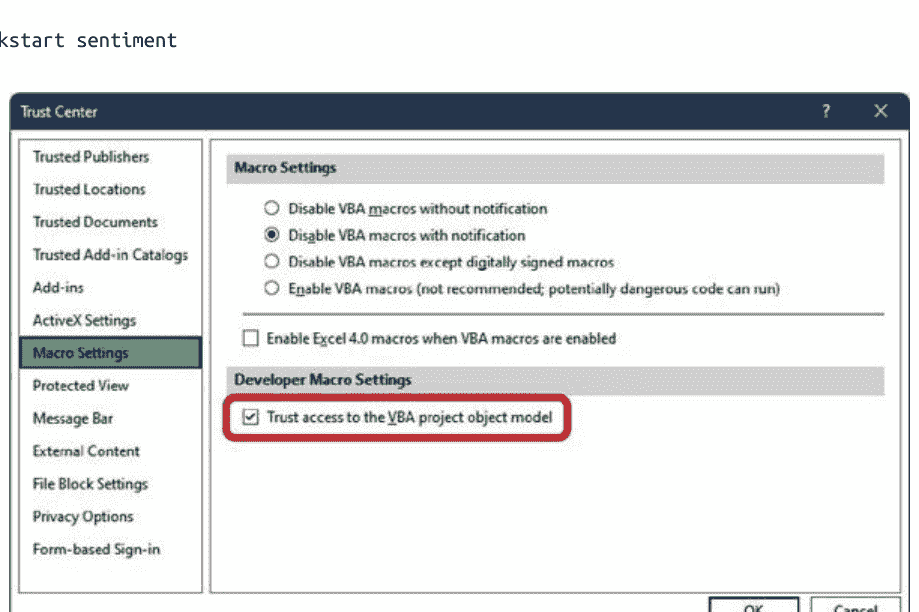

此命令在当前目录中创建一个名为 *sentiment* 的子目录，并用一对文件初始化它：一个名为 *sentiment.xlsm* 的电子表格和一个名为 *sentiment.py* 的 Python 文件。你将在后者中编写一个用于分析文本情感的 UDF。

接下来，将 *sentiment.pkl* 复制到 *sentiment* 目录中。（如果你之前没有生成该文件，请在 Jupyter notebook 中运行示例 7-1 中的代码来生成它。）然后在你喜欢的文本编辑器中打开 *sentiment.py*，并将其内容替换为以下代码。此代码从 *.pkl* 文件加载情感分析模型，并将模型的引用存储在名为 `model` 的变量中。然后它定义了一个名为 `analyze_text` 的 UDF，可以从 Excel 中调用。`analyze_text` 将传递给它的文本向量化，并将其输入到模型的 `predict_proba` 方法中。该方法返回一个从 0.0 到 1.0 的数字，其中 0.0 代表负面情感，1.0 代表正面情感。完成后，将更改保存到 *sentiment.py*。UDF 就编写完成了。现在是时候从 Excel 中调用它了。

```
python
import pickle, os
import xlwings as xw

# 加载模型和词汇表，并创建一个 CountVectorizer
model_path = os.path.abspath(os.path.join(os.path.dirname(__file__),
                                          'sentiment.pkl'))

model = pickle.load(open(model_path, 'rb'))

@xw.func
def analyze_text(text):
    score = model.predict_proba([text])[0][1]
    return score
```

Xlwings 的优雅之处在于，一旦你编写了像 `analyze_text` 这样的 UDF，你就可以像调用 Excel 内置函数一样调用它。但首先你必须导入 UDF。为此，在 Excel 中打开 *sentiment.xlsm*。转到“xlwings”选项卡，单击“Import Functions”以导入 `analyze_text` 函数，如图 7-3 所示。Excel 不会告诉你导入是否成功，但如果导入失败——例如，你忘记将 *sentiment.pkl* 复制到存储 *sentiment.py* 的目录中——它会通知你。

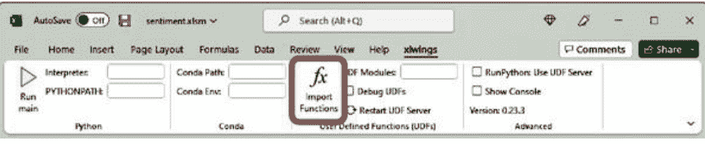

在单元格 A1 中输入 **Great food and excellent service**（图 7-4）。


在单元格 B1 中输入以下表达式，以将单元格 A1 中的文本传递给从 *sentiment.py* 导入的 `analyze_text` 函数：

### 总结

编写一个调用Python机器学习模型的Python客户端，几乎只需要额外一行代码来从.pkl文件反序列化模型。非Python客户端调用Python模型的一种方式是将模型包装在Python Web服务中，并通过REST API调用该模型。该Web服务可以托管在本地或云端，而将Web服务（及模型）容器化可以简化部署并提高软件的可移植性。

另一种方法是使用ONNX来弥合语言鸿沟。通过ONNX，你可以将Scikit模型保存为.onnx文件，并从多种编程语言（包括C、C++、C#、Java和JavaScript）加载该模型。一旦加载，调用模型的方式与从Python调用时完全相同。

从非Python客户端调用机器学习模型的另一个选项是使用与客户端相同的语言编写模型。微软的ML.NET（免费、跨平台且开源）是C#开发者的绝佳选择。其他库包括面向Java开发者的[Java-ML](https://java-ml.sourceforge.net/)，以及面向R开发者的[Caret](https://topepo.github.io/caret/)和[Tidymodels](https://www.tidymodels.org/)。这些库支持的API与Scikit中的API不同，但它们所体现的原理是相同的。

# 第二部分：使用Keras和TensorFlow进行深度学习

## 第8章 深度学习

本书第一部分中的每个模型都使用了构成机器学习核心的经典算法：逻辑回归、随机森林等。这类模型通常被称为*传统*机器学习模型，以区别于深度学习模型。回顾第1章，深度学习是机器学习的一个子集，主要依赖神经网络，而当今被认为是人工智能的大部分成就都是通过深度学习实现的。从识别照片中的物体到实时语音翻译，再到使用计算机生成艺术、音乐、诗歌和逼真的人脸，深度学习使计算机能够执行传统机器学习无法完成的任务。

我经常通过挑战软件开发者设计一种算法来判断照片中是否包含狗，以此向他们介绍深度学习。如果他们提出解决方案，我会用一张能破解该算法的狗图片来反驳。传统机器学习模型可以部分解决这个问题，但在识别图像中的物体方面，深度学习代表了最先进的技术。训练神经网络来识别狗的图片并不太难，有时甚至比人类更准确。一旦你学会了如何做到这一点，那么识别生产线上有缺陷的零件或识别自动驾驶汽车前经过的自行车就只是小小的一步了。

神经网络已经存在了几十年，但直到过去十年左右，才有足够的计算能力来训练复杂的网络。最先进的神经网络在图形处理单元（GPU）和张量处理单元（TPU）上进行训练，这些单元通常连接到高性能计算集群。GPU非常适合游戏，因为它们能提供高性能图形处理。它们也是高效的并行处理机器，使数据科学家能够在普通CPU所需时间的一小部分内训练神经网络。如今，任何有信用卡的研究人员都可以购买NVIDIA GPU，或在Azure或AWS中启动GPU，从而获得20年前的研究人员只能梦想的计算能力。这一点，比其他任何因素都更能推动人工智能的复兴，并促使最先进技术不断进步。

本章是专注于深度学习的几章中的第一章。在本章中，你将学习：

-   什么是神经网络，以及深度学习中的“深度”从何而来
-   神经网络如何使用简单的数学运算将输入转换为输出
-   神经网络训练时会发生什么，以及训练带来的挑战

你暂时还不会开始构建和训练神经网络；那将从第9章开始。在建造房屋之前，你需要一个地基。这个地基现在就开始。

### 理解神经网络

神经网络有多种类型。例如，卷积神经网络（CNN）擅长计算机视觉任务，如图像分类。循环神经网络（RNN）应用于手写识别和自然语言处理（NLP），而生成对抗网络（GAN）使计算机能够创作艺术、音乐和其他内容。但理解深度学习的第一步是了解神经网络是什么以及它如何工作。

最简单的神经网络类型是*多层感知机*。它由排列成层的节点或*神经元*组成。网络的深度是层数；宽度是每层的神经元数量，每层可以不同。最先进的神经网络有时包含100层或更多，单个层中包含数千个神经元。*深度神经网络*是指包含许多层的网络，这也是*深度学习*一词的由来。

图8-1中的多层感知机包含三层：一个包含两个神经元的输入层，一个包含三个神经元的中间层（也称为*隐藏层*），以及一个包含一个神经元的输出层。由于计算层数时常忽略输入层，有些人会认为这个网络包含*两*层，而不是三层。无论如何，该网络的工作是接收两个浮点值作为输入，并产生一个浮点数作为输出。神经网络处理浮点数。它们*只*处理浮点数。与传统机器学习模型一样，神经网络只能处理非数字数据——例如文本字符串——前提是数据首先被转换为数字。

*图8-1. 多层感知机*

图8-1中的橙色箭头表示神经元之间的连接。每一层中的每个神经元都与下一层中的每个神经元相连，这产生了*全连接层*这一术语。每个连接被分配一个*权重*，通常是一个小的浮点数。此外，输入层之外的每个神经元被分配一个*偏置*，这也是一个小的浮点数。图8-2显示了一组权重和偏置，使网络能够对两个输入求和（例如，将2和2相加）。标记为“ReLU”的方块代表*激活函数*，它们对通过网络传播的值应用简单的非线性变换。最常用的激活函数是*修正线性单元（ReLU）函数*，它将正数原样传递，同时将负数转换为0。没有激活函数，神经网络将难以建模非线性数据。而众所周知，现实世界的数据往往是非线性的。

图8-2. 权重和偏置

神经元对其输入的数据执行简单的线性变换。对于一个具有单个输入 $x$ 的神经元，其值 $y$ 通过将 $x$ 乘以分配给该输入的权重 $m$ 并加上神经元的偏置 $b$ 来计算：

看起来很熟悉？这就是线性回归的方程。Scikit-Learn有一个[感知机类](https://scikit-learn.org/stable/modules/generated/sklearn.linear_model.Perceptron.html)来模拟这种行为，可用于构建神经线性回归模型。它甚至提供了名为[MLPRegressor](https://scikit-learn.org/stable/modules/generated/sklearn.neural_network.MLPRegressor.html)和[MLPClassifier](https://scikit-learn.org/stable/modules/generated/sklearn.neural_network.MLPClassifier.html)的类，用于构建简单的多层感知机。然而，Scikit不是一个深度学习库。真正的深度学习库为支持高级神经网络做了更多工作。

> **注意**

执行线性变换的神经元与应用非线性变换的激活函数的结合，体现了[通用近似定理](https://en.wikipedia.org/wiki/Universal_approximation_theorem)，该定理指出，你可以通过求和线性函数的输出并用非线性函数对其进行变换来近似任何函数 $f$。教科书常说激活函数为神经网络“增加了非线性”。现在你知道为什么了。

为了将输入转换为输出，神经网络将输入值分配给输入层中的神经元。然后，它将输入神经元的值乘以连接它们到下一层神经元的权重，对每个神经元的输入求和，并加上偏置。它重复此过程，将值从左到右一直传播到输出层。图8-3显示了图8-2中的网络在将2和2相加时，前两层发生的情况。

值从隐藏层传播到输出层的方式相同，但有一个例外：它们在乘以权重之前会经过激活函数的转换。请记住，ReLU激活函数会将负数转换为0。在图8-4中，为隐藏层中间神经元计算出的-1.83在转发到输出层时被转换为0，从而有效地消除了该神经元对输出的贡献。

给定一组权重和偏置，手动编写神经网络代码并不困难。以下Python代码模拟了图8-2中的网络：

```
# Weights
w0 = 0.9907079
w1 = 1.0264927
w2 = 0.01417504
w3 = -0.8950311
w4 = 0.88046944
w5 = 0.7524377
w6 = 0.794296
w7 = 1.1687347
w8 = 0.2406084

# Biases
b0 = -0.00070612
b1 = -0.06846002
b2 = -0.00055442
b3 = -0.00000929

def relu(x):
    return max(0, x)

def predict(x1, x2):
    h1 = (x1 * w0) + (x2 * w1) + b0
    h2 = (x1 * w2) + (x2 * w3) + b1
    h3 = (x1 * w4) + (x2 * w5) + b2
    y = (relu(h1) * w6) + (relu(h2) * w7) + (relu(h3) * w8) + b3
    return y
```

如果你想亲自验证，可以将代码粘贴到Jupyter notebook中，并使用输入值2和2调用`predict`函数。结果应该非常接近2加2的实际和。

对于给定的问题，存在*无限多种权重和偏置的组合*可以产生期望的结果。**图8-5**展示了使用完全不同的一组权重和偏置的相同网络。然而，如果你将这些值代入前面的代码（或手动通过网络传播值），你会发现该网络同样能够计算2加2——或者其他小数值的加法。

给定一组权重和偏置，使用神经网络进行预测非常简单。它不过是乘法和加法。但要找出一组初始的权重和偏置却是一个挑战。这就是为什么神经网络必须被*训练*。

### 训练神经网络

训练传统的机器学习模型是将其拟合到数据集。神经网络也需要训练，正是在训练过程中计算出权重和偏置。权重通常用小的随机数初始化。偏置通常用0初始化。在未训练状态下，神经网络除了生成随机输出外几乎做不了什么。一旦训练完成，权重和偏置使网络能够区分狗和猫、将书评翻译成另一种语言，或执行其设计的任何其他任务。

当神经网络被训练时会发生什么？从高层次来看，训练样本被输入网络，使用*损失函数*计算误差（计算输出与正确输出之间的差异），然后*反向传播算法*反向遍历网络，调整权重和偏置（图8-6）。这个过程会重复进行，直到误差足够小。每次迭代，权重和偏置都会逐步变得更加精确，误差也相应地减小。

反向传播方案中最关键的组件是*优化器*，它在每次反向传播时决定调整权重和偏置的幅度和方向（正向或负向）。数据科学家不断努力寻找更好、更高效的优化器，以更准确、更快速地训练网络。

搜索“神经网络”，你会发现很多包含复杂数学的文章。大部分数学与优化有关。由于权重和偏置数量庞大，优化器不能仅仅*猜测*如何调整它们。一个包含两个隐藏层、每层1000个神经元的神经网络，层之间有1,000,000个连接，因此有1,000,000个权重需要调整。如果优化策略只是随机猜测，训练将永远无法完成。优化器必须足够智能，才能做出在每次连续迭代中减少误差的调整。

数据科学家使用类似图8-7中的图表来可视化优化器的工作。该图称为*损失景观*。为了可视化，它被简化为三维，但实际上它包含*许多*维度——有时是数百万个维度。彩色的等高线图绘制了不同权重和偏置组合的误差。优化器的目标是遍历等高线，找到产生最小误差的组合，这对应于损失景观中的最低点，或*全局最小值*。

图8-7. 损失景观（来源：Alexander Amini, Ava Soleimany, Sertac Karaman, and Daniela Rus, “Spatial Uncertainty Sampling for End-to-End Control,” NeurIPS Bayesian Deep Learning [2017], https://arxiv.org/pdf/1805.04829）

优化器的工作并不轻松。它涉及偏导数（计算等高线相对于每个权重和偏置的斜率）、梯度下降（调整权重和偏置以*向下*斜坡移动，而不是向上或横向移动）以及*学习率*，它驱动每次反向传播中对权重和偏置进行的微小调整。如果学习率太大，优化器可能会错过全局最小值。如果太小，网络训练将花费很长时间。现代优化器使用*自适应学习率*，当接近最小值（斜率为0）时采取更小的步长。更复杂的是，优化器必须避免陷入局部最小值，以便继续遍历等高线，朝向误差最小的全局最小值前进。它还必须警惕“鞍点”，即在一个方向上斜率增加，但在垂直方向上斜率下降的点。

> **注意**
>
> 如果你研究梯度下降，会遇到诸如*随机梯度下降（SGD）*和*小批量梯度下降（MBGD）*等术语。通过梯度下降进行优化是一个迭代过程，其中样本被前向输入网络，计算梯度，然后梯度与学习率结合以更新权重和偏置。在每个样本前向输入网络后更新权重和偏置计算成本很高，因此训练通常涉及运行一批（可能是30到40个样本）通过网络，平均误差，*然后*执行一次反向传播。这就是MBGD。它加速了训练，并帮助优化器绕过局部最小值。更多信息，以及关于训练神经网络固有挑战的非常易读的介绍，请参阅文章“神经网络是如何训练的”。

神经网络本质上很简单。训练它们在数学上很复杂。幸运的是，你不必理解训练过程中发生的一切就能构建它们。像[Keras](https://keras.io/)和[TensorFlow](https://www.tensorflow.org/)这样的深度学习库将你与数学隔离开来，并提供最先进的优化器来完成繁重的工作。但现在，当你使用这些库之一并被要求选择损失函数和优化器时，你会理解它要求的是什么以及为什么。

### 总结

深度学习是机器学习的一个子集，依赖于深度神经网络，它是现代人工智能的根基。这就是计算机识别图像中的物体、将文本和语音翻译成其他语言、生成艺术作品和音乐，以及执行几年前几乎不可能完成的任务的方式。

多层感知器是一种简单的神经网络，由神经元层组成。每个神经元使用简单的数学公式将输入转换为输出。激活函数通过在数据层间传递时引入非线性，进一步转换数据，使神经网络能够拟合各种数据集。输入层和输出层之间的隐藏层执行大部分计算工作，具有许多隐藏层的多层感知器被称为深度神经网络。

训练神经网络通过迭代调整权重和偏置——连接相邻层神经元的权重和分配给神经元本身的偏置——来将其拟合到数据集，以产生期望的结果。调整权重和偏置的反向传播过程是训练方案的核心。负责进行调整的组件是优化器；其最终目标是以尽可能少的反向传播次数找到权重和偏置的最佳组合。

既然你理解了神经网络的工作原理，下一步就是学习如何构建和训练它们。为此，数据科学家依赖于像Keras和TensorFlow这样的框架。[第9章](https://example.com/chapter9)将开始深入探讨这两者。

## 第9章 神经网络

当你拥有一个经过适当工程处理的数据集时，机器学习并不难。它之所以不难，*原因*在于像 Scikit-Learn 和 ML.NET 这样的库，它们将复杂的学习算法简化为几行代码。深度学习也不困难，这要归功于像 [Microsoft Cognitive Toolkit (CNTK)](https://docs.microsoft.com/en-us/cognitive-toolkit/)、[Theano](https://github.com/Theano/Theano) 和 [PyTorch](https://pytorch.org/) 这样的库。但世界上大多数人在构建神经网络时选择的库是 [TensorFlow](https://www.tensorflow.org/)，这是一个由 Google 创建的开源框架，于 2015 年在 Apache License 2.0 下发布。

TensorFlow 不仅限于构建神经网络。它是一个使用 *张量*（即广义数组）执行大规模快速数学运算的框架。张量可以表示标量值（0维张量）、向量（1D张量）、矩阵（2D张量）等等。神经网络本质上是一个转换张量的工作流。[第8章](https://github.com/dotnet/docs/blob/main/docs/machine-learning/tutorials/mlnet-cli.md) 中介绍的三层感知器接受一个包含两个值的1D张量作为输入，将其转换为一个包含三个值的1D张量，并产生一个0D张量作为输出。TensorFlow 允许你定义有向图，这些图反过来定义了张量的计算方式。而且与 Scikit 不同，它支持 GPU。

TensorFlow 的学习曲线相当陡峭。另一个名为 [Keras](https://keras.io/) 的库为 TensorFlow 提供了一个简化的 Python 接口，并已成为深度学习领域的 Scikit。Keras 完全专注于神经网络。它最初是 2015 年的一个独立项目，但在 2019 年被集成到 TensorFlow 中。你使用 TensorFlow 内置的 Keras 模块编写的任何代码最终都在 TensorFlow 中执行（并针对其进行优化）。即使是 Google 也推荐使用 Keras API。

Keras 提供了两个用于构建神经网络的 API：一个 [顺序 API](https://keras.io/guides/sequential_model/) 和一个 [函数式 API](https://keras.io/guides/functional_api/)。前者更简单，对于大多数神经网络来说已经足够。后者在更高级的场景中很有用，例如具有多个输入或输出的网络——例如，一个分类输出和一个回归输出，这在执行目标检测的神经网络中很常见——或者共享层。本书中的大多数示例都使用顺序 API。如果好奇心驱使你想了解更多关于函数式 API 的知识，请参阅 Jason Brownlee 的 [“如何使用 Keras 函数式 API 进行深度学习”](https://machinelearningmastery.com/keras-functional-api-deep-learning/)，这是一篇非常易读的入门文章。

### 使用 Keras 和 TensorFlow 构建神经网络

使用 Keras 的顺序 API 创建神经网络很简单。你首先创建一个 [Sequential 类](https://www.tensorflow.org/api_docs/python/tf/keras/Sequential) 的实例。然后你在 `Sequential` 对象上调用 `add` 来添加层。这些层是诸如 [Dense](https://www.tensorflow.org/api_docs/python/tf/keras/layers/Dense) 之类的类的实例，它代表一个具有指定数量神经元的全连接层。以下语句创建了 [第8章](https://github.com/dotnet/docs/blob/main/docs/machine-learning/tutorials/mlnet-cli.md) 中介绍的三层网络：

```python
from tensorflow.keras.models import Sequential
from tensorflow.keras.layers import Dense

model = Sequential()
model.add(Dense(3, activation='relu', input_dim=2))
model.add(Dense(1))
```

这个网络包含一个具有两个神经元的输入层、一个具有三个神经元的隐藏层和一个具有一个神经元的输出层。从隐藏层传递到输出层的值经过修正线性单元（ReLU）激活函数的转换，你可能还记得，它将负数转换为 0，并帮助模型拟合非线性数据集。请注意，你不必显式添加输入层。第一个隐藏层中的 `input_dim=2` 参数隐式地创建了一个具有两个神经元的输入层。

> **注意**

`relu` 是 Keras 中包含的几种激活函数之一。其他包括 `tanh`、`sigmoid` 和 `softmax`。在隐藏层中，你很少（如果有的话）会使用除 `relu` 以外的任何函数。在本章后面，你将看到为什么像 `sigmoid` 和 `softmax` 这样的函数在执行分类而非回归的网络的输出层中很有用。

一旦所有层都添加完毕，下一步就是调用 `compile` 并指定训练期间使用哪个优化器和损失函数等重要属性。以下是一个示例：

```python
model.compile(optimizer='adam', loss='mae', metrics=['mae'])
```

让我们逐一介绍这些参数：

`optimizer='adam'`

告诉 Keras 使用 Adam 优化器在训练期间的每次反向传播过程中调整权重和偏差。Adam 是 Keras 内置的八种优化器之一，也是最先进的优化器之一。它采用自适应学习率，在没有令人信服的理由的情况下，我总是从它开始。

`loss='mae'`

告诉 Keras 使用平均绝对误差（MAE）来衡量损失。这对于旨在解决回归问题的神经网络来说很常见。回归模型的另一个常用选项是 `loss='mse'`，即均方误差（MSE）。

`metrics=['mae']`

告诉 Keras 在训练网络时捕获 MAE 值。此信息在训练完成后用于判断训练的有效性。

像 'adam' 和 'mae' 这样的字符串值是 Keras 内置函数的快捷方式。例如，`optimizer='adam'` 等同于 `optimizer=Adam()`。长形式对于使用非默认参数值调用函数很有用——例如，`optimizer=Adam(learning_rate=2e-5)` 以创建具有自定义学习率的 Adam 优化器。你将在第 13 章中看到一个这样的例子，届时我们将通过使用低学习率训练模型来微调它。

在 compile 方法内部，Keras 创建一个 TensorFlow 对象图以加速执行。一旦网络编译完成，你就可以通过调用 `fit` 来训练它：

```python
hist = model.fit(x, y, epochs=100, batch_size=100, validation_split=0.2)
```

`fit` 方法接受许多参数。以下是本示例中使用的参数：

**x**

数据集的特征列。

**y**

数据集的标签列——包含网络将尝试预测的值的那一列。

**epochs=100**

告诉 Keras 训练网络 100 次迭代，或 *周期*。在每个周期中，所有训练数据都会通过网络一次。

**batch_size=100**

告诉 Keras 在进行反向传播以调整权重和偏差之前，先将 100 个训练样本传递给网络。如果批量大小较大，训练时间会减少，但准确性可能会受到影响。你通常需要尝试不同的批量大小，以找到训练时间和准确性之间的适当平衡。*不要*假设降低批量大小会提高准确性。它经常如此，但有时并非如此。

**validation_split=0.2**

告诉 Keras 在每个周期中，它应该使用数据集中 80% 的行进行训练，并使用剩余的 20% 来验证网络的准确性。如果你愿意，你可以自己拆分数据集，并使用 `validation_data` 参数将验证数据传递给 `fit`。Keras 没有提供用于拆分数据集的显式函数，但你可以使用 Scikit 的 `train_test_split` 函数来完成。`train_test_split` 和 `validation_split` 之间的一个区别是，前者随机拆分数据，并提供执行分层拆分的选项。相比之下，`validation_split` 只是将数据集分成两个部分，不尝试打乱或分层。不要在未先打乱数据的情况下对有序数据使用 `validation_split`。

你可能会惊讶地发现，如果你在相同的数据集上多次训练同一个网络，每次的结果都会不同。默认情况下，权重是用随机值初始化的，不同的起点会产生不同的结果。训练过程中内置的额外随机性意味着即使使用相同的随机权重初始化，网络的训练方式也会不同。这并非

### 调整神经网络的规模

神经网络的特征在于其层数（网络的*深度*）、每层神经元的数量（各层的*宽度*）、层的类型（在此示例中，是全连接神经元的`Dense`层）以及所使用的激活函数。还有[其他层类型](https://example.com)，我将在后续章节中介绍其中许多。例如，[Dropout层](https://example.com)可以通过在权重更新期间随机丢弃层间连接来提高网络的泛化能力，而[Conv2D层](https://example.com)则使我们能够构建擅长图像处理的卷积神经网络（CNN）。

在设计网络时，如何为每层选择合适的层数和神经元数量？简短的回答是，“合适”的宽度和深度取决于你要解决的问题、你用于训练的数据集以及你期望的准确度。作为一条规则，你需要*达到该准确度所需的最小宽度和深度*，并通过直觉和实验相结合来实现。话虽如此，这里有一些需要记住的指导原则：

- 更大的宽度和深度赋予网络更多的“学习”能力，使其能更紧密地拟合训练数据。但它们也增加了过拟合的可能性。重要的是验证结果，有时放宽对训练数据的拟合反而能让网络更好地泛化。放宽拟合最简单的方法是减少神经元数量。
- 一般来说，你更倾向于选择更大的宽度而非更大的深度，部分原因是为了避免[梯度消失问题](https://example.com)，该问题会削弱增加层的影响。ReLU激活函数提供了一些防止梯度消失的保护，但这种保护并非绝对。有关解释，请参阅“[如何使用ReLU修复梯度消失问题](https://example.com)”。此外，一个在某一层有100个神经元的网络，比一个有五层、每层20个神经元的网络训练得更快，因为前者的权重更少。想一想：同一层内的神经元之间没有连接，但五层各含20个神经元的网络之间却有1,600个连接（20² × 4）。
- 更少的神经元意味着更短的训练时间。使用大型数据集训练的最先进神经网络，有时在高端GPU上需要数天或数周才能完成训练，因此训练时间很重要。

在现实生活中，数据科学家会尝试不同的宽度和深度，以在训练时间、准确度和网络泛化能力之间找到合适的平衡。对于多层感知机，你很少需要超过两个隐藏层，通常一个就足够了。一个拥有一或两个隐藏层的网络，其能力足以解决即使是复杂的非线性问题。例如，两层各128个神经元，就给你提供了16,384（128²）个可调整的权重，外加256个偏置。这是相当大的拟合能力。我通常从一或最多两层、每层512个神经元开始，然后将宽度或深度减半，直到验证准确度降至可接受的阈值以下。

### 使用神经网络预测出租车费用

让我们将这些知识付诸实践，构建并训练一个神经网络。我们将要解决的问题与第2章中提出的问题相同：使用纽约市出租车和豪华轿车委员会的数据来预测出租车费用。我们将使用神经网络作为回归模型来进行预测。

如果你在第2章中没有下载数据集，请下载包含该数据集的CSV文件，并将其复制到托管你的Jupyter笔记本的*Data*目录中。然后使用以下代码加载数据集并显示前五行。它包含约55,000行数据，是最近在Kaggle纽约市出租车费用预测竞赛中使用的更大数据集的一个子集：

```python
import pandas as pd

df = pd.read_csv('Data/taxi-fares.csv', parse_dates=['pickup_datetime'])
df.head()
```

数据在可用之前需要大量的准备工作——这在机器学习和深度学习中都很常见。使用以下语句将原始数据集转换为适合训练的数据集，并参考第2章中的出租车费用示例，了解所应用转换的逐步解释：

```python
from math import sqrt

df = df[df['passenger_count'] == 1]
df = df.drop(['key', 'passenger_count'], axis=1)

for i, row in df.iterrows():
    dt = row['pickup_datetime']
    df.at[i, 'day_of_week'] = dt.weekday()
    df.at[i, 'pickup_time'] = dt.hour
    x = (row['dropoff_longitude'] - row['pickup_longitude']) * 54.6
    y = (row['dropoff_latitude'] - row['pickup_latitude']) * 69.0
    distance = sqrt(x**2 + y**2)
    df.at[i, 'distance'] = distance

df.drop(['pickup_datetime', 'pickup_longitude', 'pickup_latitude',
         'dropoff_longitude', 'dropoff_latitude'], axis=1, inplace=True)

df = df[(df['distance'] > 1.0) & (df['distance'] < 10.0)]
df = df[(df['fare_amount'] > 0.0) & (df['fare_amount'] < 50.0)]
df.head()
```

生成的数据集包含星期几（0–6，其中0对应星期一）、一天中的小时（0–23）和行驶距离（英里）的列，并且已移除异常值：

| fare_amount | day_of_week | pickup_time | distance |
|---|---|---|---|
| 2 | 6.1 | 0.0 | 15.0 | 1.038136 |
| 4 | 10.5 | 5.0 | 10.0 | 2.924341 |
| 5 | 15.3 | 4.0 | 20.0 | 4.862893 |
| 8 | 7.7 | 5.0 | 1.0 | 2.603493 |
| 9 | 8.9 | 3.0 | 16.0 | 1.365739 |

下一步是创建神经网络。使用以下语句创建一个网络，该网络有一个接受三个值（日期、时间和距离）的输入层，两个各有512个神经元的隐藏层，以及一个只有一个神经元（预测的费用金额）的输出层：

```python
from tensorflow.keras.models import Sequential
from tensorflow.keras.layers import Dense

model = Sequential()
model.add(Dense(512, activation='relu', input_dim=3))
model.add(Dense(512, activation='relu'))
model.add(Dense(1))
model.compile(optimizer='adam', loss='mae', metrics=['mae'])
model.summary()
```

最后一条语句中对`summary`的调用生成了网络拓扑的简明摘要，包括*可训练参数*的数量——这些是权重和偏置，可以调整以使网络拟合数据集（图9-2）。对于给定层，参数数量是该层神经元数量与前一层神经元数量（连接两层神经元的权重数量）的乘积，再加上该层神经元的数量（与这些神经元相关的偏置）。这个网络相对简单，但它拥有超过四分之一百万个可以调整的旋钮和拨盘，以使其拟合数据集。

现在，将特征列与标签列分开，并使用它们来训练网络。将`validation_split`设置为0.2，以使用20%的训练数据来验证网络。训练100个周期，批量大小为100。鉴于数据集包含超过38,000个样本，这意味着每个周期将执行大约380次反向传播：

```python
x = df.drop('fare_amount', axis=1)
y = df['fare_amount']

hist = model.fit(x, y, validation_split=0.2, epochs=100, batch_size=100)
```

与其对抗它，数据科学家学会了“拥抱随机性”。如果你完成下一节的教程，你的结果将与我的不同。它们不应该相差太多，但*会*有所不同。

> **注意**

分配给神经元之间连接的随机权重并非完全随机。Keras包含大约十几个初始化器，每个都以不同的方式初始化参数。默认情况下，Dense层使用Zeroes初始化器初始化偏置，使用GlorotUniform初始化器初始化权重。后者生成的随机数落在均匀分布内，其界限根据网络拓扑计算得出。

你通过检查`fit`方法返回的信息来判断训练的有效性。`fit`返回一个历史对象，其中包含在传递给`compile`方法的`metrics`参数中指定的训练和验证指标。例如，`metrics=['mae']`在每个周期结束时捕获MAE。绘制这些指标可以让你确定是否训练了正确的周期数。它还能让你知道网络是欠拟合还是过拟合。图9-1绘制了30个训练周期内的MAE。

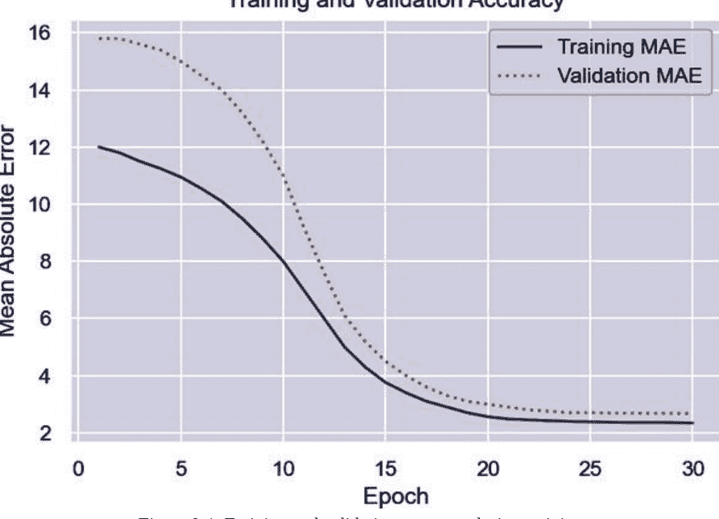

图9-1中的蓝色曲线揭示了网络如何拟合训练数据。橙色曲线显示了它在验证数据上的测试情况。大部分学习是在前20个周期内完成的，但随着训练的进行，MAE持续下降。验证MAE在结束时几乎与训练MAE持平，这表明网络没有过拟合。你通常不关心网络对训练数据的拟合程度。你关心的是对验证数据的拟合，因为这表明网络在处理未见过的数据时的表现。训练准确度和验证准确度之间的差距越大，网络过拟合的可能性就越大。

一旦神经网络训练完成，你调用其`predict`方法进行预测：

```python
prediction = model.predict(np.array([[2, 2]]))
```

在这个例子中，网络接受两个浮点值作为输入，并返回一个浮点值作为输出。`predict`返回的值就是该输出。

### 训练神经网络检测信用卡欺诈

让我们训练一个神经网络来检测信用卡欺诈。首先，如果你还没有下载数据集，请[下载一个ZIP文件](http://example.com)，并将`creditcard.csv`从ZIP文件复制到你的笔记本的`Data`子目录中。这与第3章和第6章中使用的数据集相同。它包含284,808笔信用卡交易的信息，包括每笔交易的金额和一个标签：0代表合法交易，1代表欺诈交易。它还包含28个名为V1到V28的列，其含义已通过主成分分析进行了混淆。该数据集高度不平衡，欺诈交易的样本少于500个。

使用`fit`返回的history对象来绘制每个epoch的训练和验证准确率：

```python
%matplotlib inline
import matplotlib.pyplot as plt
import seaborn as sns
sns.set()

err = hist.history['mae']
val_err = hist.history['val_mae']
epochs = range(1, len(err) + 1)

plt.plot(epochs, err, '-', label='Training MAE')
plt.plot(epochs, val_err, ':', label='Validation MAE')
plt.title('Training and Validation Accuracy')
plt.xlabel('Epoch')
plt.ylabel('Mean Absolute Error')
plt.legend(loc='upper right')
plt.plot()
```

你的结果会与我的略有不同，但应该看起来像这样：

最终的验证MAE约为2.25，这意味着平均而言，该网络预测的出租车费用应准确到约2.25美元以内。

回顾第2章，回归模型的一个常用准确度度量是决定系数，或$R^2$分数。Keras没有计算$R^2$分数的函数，但Scikit有。为此，使用以下语句计算网络的$R^2$：

```python
from sklearn.metrics import r2_score

r2_score(y, model.predict(x))
```

同样，你的结果会与我的不同，但可能在0.75左右。

最后，使用该模型预测在周五下午5点雇佣一辆出租车行驶2英里的费用：

```python
import numpy as np

model.predict(np.array([[4, 17, 2.0]]))
```

现在预测一天后（周六）下午5点行驶2英里的费用：

```python
model.predict(np.array([[5, 17, 2.0]]))
```

模型预测周六下午相同行程的费用是更高还是更低？考虑到数据来自纽约市出租车，结果是否合理？

在关闭此笔记本之前，将其作为进一步实验的基础。以下是一些你可以尝试的事情，以进一步了解神经网络：

- 从头到尾运行笔记本几次，并注意$R^2$分数以及MAE曲线的差异。请记住，神经网络每次创建时都以随机权重初始化，训练过程中的额外随机性进一步确保了每次运行的结果会有所不同。
- 改变隐藏层的宽度。我在每层使用了512个神经元，并发现这样做产生了可接受的结果。每层使用128、256或1,024个神经元会提高准确率吗？试一试就知道了。由于每次运行的结果会略有不同，因此在每种配置下训练网络几次并平均结果可能很有用。
- 改变批处理大小。这对训练时间有什么影响，为什么？对准确率有什么影响？

最后，尝试将网络简化为*一个隐藏层*，仅包含16个神经元。再次训练它并检查$R^2$分数。结果是否让你惊讶？这个网络包含多少个可训练参数？

# 使用神经网络进行二元分类

机器学习的常见用途之一是二元分类，它查看输入并预测它属于两个可能类别中的哪一个。实际应用包括情感分析、垃圾邮件过滤和欺诈检测。此类模型使用标记为1和0的数据集进行训练，代表两个类别，采用流行的学习算法，如逻辑回归和朴素贝叶斯，并且通常使用Scikit-Learn等库构建。

深度学习也可用于二元分类。事实上，构建一个充当二元分类器的神经网络与构建一个充当回归器的神经网络没有太大区别。在上一节中，你构建了一个解决回归问题的神经网络。该网络有一个输入层，接受三个值——行驶距离、一天中的小时和星期几——并输出预测的出租车费用。构建执行二元分类的神经网络涉及两个简单的更改：

- 在输出层添加一个激活函数——具体来说，是`sigmoid`激活函数。`sigmoid`产生一个从0.0到1.0的值，表示输入属于正类的概率。要回顾sigmoid函数的作用，请参阅第3章中关于逻辑回归的讨论。
- 将损失函数更改为`binary_crossentropy`，这是专门为二元分类器设计的。相应地，将`metrics`更改为'[accuracy]'，以便损失函数计算的准确率被捕获在`fit`返回的history对象中。

这是一个设计用于执行二元分类而非回归的网络：

```python
from tensorflow.keras.models import Sequential
from tensorflow.keras.layers import Dense

model = Sequential()
model.add(Dense(512, activation='relu', input_dim=3))
model.add(Dense(512, activation='relu'))
model.add(Dense(1, activation='sigmoid'))
model.compile(optimizer='adam', loss='binary_crossentropy', metrics=['accuracy'])
```

就是这样。这就是创建一个充当二元分类器的神经网络所需的全部。你仍然调用`fit`来训练网络，并使用返回的history对象来绘制训练和验证准确率，以确定你是否训练了足够的epoch，并查看网络对数据的拟合程度。

> **注意**

什么是二元交叉熵，它如何帮助二元分类器收敛到一个解决方案？在训练期间，交叉熵损失函数指数级地增加对错误输出的惩罚，以更积极地将权重和偏差推向正确的方向。

假设一个样本属于正类（其标签为1），并且网络预测其为1的概率为0.9。交叉熵损失，也称为*对数损失*，是-log(0.9)，即0.04。但如果网络对同一样本输出的概率为0.1，则误差为-log(0.1)，等于1。重要的是，如果预测概率*真的*错了，惩罚会高得多。如果样本是1，而网络说它是1的概率仅为0.0001，则交叉熵损失为-log(0.0001)，即4。交叉熵损失基本上在优化器接近正确答案时拍拍它的背，在它不接近时打它的手。预测越差，打得越重。

总而言之，你通过在输出层包含一个具有`sigmoid`激活的单个神经元并指定`binary_crossentropy`作为损失函数来构建执行二元分类的神经网络。网络的输出是一个从0.0到1.0的概率，表示输入属于正类。没有比这更简单的了！

# 进行预测

神经网络的好处之一是它可以轻松拟合非线性数据集。你不必像使用传统机器学习模型那样尝试不同的学习算法；网络*就是*学习算法。例如，考虑图9-3中的数据集，其中每个数据点由一个*x*–*y*坐标对组成，并属于两个类别之一。

以下代码训练一个神经网络，根据点的x和y坐标预测类别：

```python
from tensorflow.keras.models import Sequential
from tensorflow.keras.layers import Dense

model = Sequential()
model.add(Dense(128, activation='relu', input_dim=2))
model.add(Dense(1, activation='sigmoid'))
model.compile(optimizer='adam', loss='binary_crossentropy', metrics=['accuracy'])
hist = model.fit(x, y, epochs=40, batch_size=10, validation_split=0.2)
```

这个网络只有一个包含128个神经元的隐藏层，但训练和验证准确率的图表显示它在分离类别方面非常成功：

一旦二元分类器训练完成，你通过调用其`predict`方法进行预测。由于`sigmoid`激活函数，`predict`返回一个从0.0到1.0的数字，表示输入属于正类的概率。在这个例子中，紫色数据点代表负类（0），而红色数据点代表正类（1）。这里要求网络预测位于(-0.5, 0.0)的数据点属于红色类的概率：

```python
model.predict(np.array([[-0.5, 0.0]]))
```

答案是0.57，这表明(-0.5, 0.0)更可能是红色而不是紫色。如果你只想知道该点属于哪个类别，可以这样做：

```python
(model.predict(np.array([[-0.5, 0.0]])) > 0.5).astype('int32')
```

答案是1，对应于红色。旧版本的Keras包含一个`predict_classes`方法，无需`astype`转换即可执行相同操作，但该方法最近已被弃用并移除。

现在加载数据集：

```python
import pandas as pd

df = pd.read_csv('Data/creditcard.csv')
df.head(10)
```

使用以下语句删除 Time 列，将数据集划分为特征 x 和标签 y，并将数据集拆分为两个子集：一个用于训练，一个用于测试。我们不使用 Keras 自动拆分，而是手动操作，以便后续能将测试数据输入网络，并使用混淆矩阵分析结果：

```python
from sklearn.model_selection import train_test_split

x = df.drop(['Time', 'Class'], axis=1)
y = df['Class']

x_train, x_test, y_train, y_test = train_test_split(
    x, y, test_size=0.2, stratify=y, random_state=0)
```

创建一个用于二分类的神经网络：

```python
from tensorflow.keras.models import Sequential
from tensorflow.keras.layers import Dense

model = Sequential()
model.add(Dense(128, activation='relu', input_dim=29))
model.add(Dense(1, activation='sigmoid'))
model.compile(loss='binary_crossentropy', optimizer='adam', metrics=['accuracy'])
model.summary()
```

下一步是训练模型。注意传递给 `fit` 的 `validation_data` 参数，它使用从主数据集中划分出的测试数据，在训练过程中评估模型的准确率：

```python
hist = model.fit(x_train, y_train, validation_data=(x_test, y_test),
                  epochs=10, batch_size=100)
```

现在使用 history 对象中每个 epoch 的值来绘制训练和验证准确率曲线：

```python
%matplotlib inline
import matplotlib.pyplot as plt
import seaborn as sns
sns.set()

acc = hist.history['accuracy']
val = hist.history['val_accuracy']
epochs = range(1, len(acc) + 1)

plt.plot(epochs, acc, '-', label='Training accuracy')
plt.plot(epochs, val, ':', label='Validation accuracy')
plt.title('Training and Validation Accuracy')
plt.xlabel('Epoch')
plt.ylabel('Accuracy')
plt.legend(loc='lower right')
plt.plot()
```

我得到的结果如下所示。请记住，由于神经网络训练固有的随机性，你的结果会有所不同：

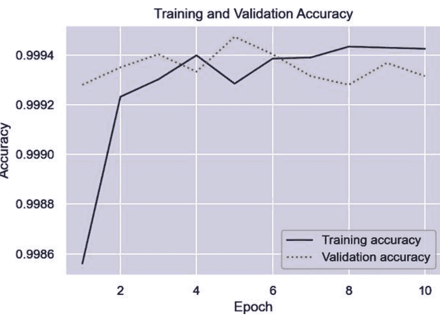

表面上看，验证准确率（约 0.9994）似乎非常高。但请记住，该数据集是不平衡的。欺诈性交易占所有样本的比例不到 0.2%，这意味着模型只需简单地猜测每笔交易都是合法的，就能在约 99.8% 的情况下猜对。使用混淆矩阵来可视化模型在使用未训练数据进行测试时的表现：

```python
from sklearn.metrics import ConfusionMatrixDisplay as cmd

sns.reset_orig()
y_predicted = model.predict(x_test) > 0.5
labels = ['Legitimate', 'Fraudulent']

cmd.from_predictions(y_test, y_predicted, display_labels=labels,
                    cmap='Blues', xticks_rotation='vertical')
```

这是我得到的结果：

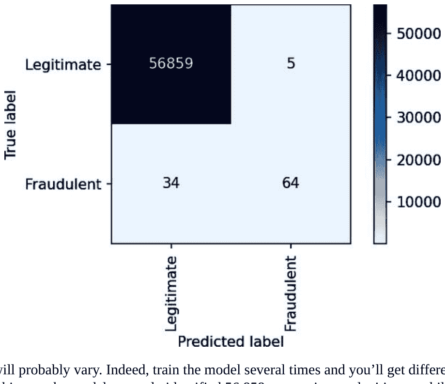

你的结果可能会有所不同。实际上，多次训练模型，每次都会得到不同的结果。在这次运行中，模型正确识别了 56,858 笔合法交易，而将合法交易错误分类的次数仅为六次。这意味着合法交易的分类正确率约为 99.99%。与此同时，模型捕获了超过 73% 的欺诈性交易。这是可以接受的，因为信用卡公司宁愿放过 100 笔欺诈交易，也不愿拒绝一笔合法交易。

> **注意**

数据科学家通常使用 *三个* 数据集（而非两个）来训练和评估神经网络的准确率：一个训练集用于训练，一个验证集在训练过程中用于验证网络（并评估其进展），以及一个测试集在训练完成后评估网络的准确率。

前面的示例使用了相同的数据集进行验证和测试——即通过 `train_test_split` 从原始数据集中划分出的 20% 数据。这表面上没问题，因为验证数据在训练过程中 *不* 用于调整网络的权重和偏置。然而，如果你真的想对网络的准确率有信心，使用一个未用于训练或验证的第三个数据集进行测试总是一个好主意。在现实世界中，深度学习模型准确性的最终检验标准是它在面对从未见过的数据时的表现。

关于此示例的最后一点说明，涉及一个可以传递给 `fit` 方法的额外参数，该参数在处理不平衡数据集时特别有用。作为实验，尝试用以下语句替换对 `fit` 的调用：

```python
hist = model.fit(x_train, y_train, validation_data=(x_test, y_test), epochs=10,
                batch_size=100, class_weight={ 0: 1.0, 1: 0.01 })
```

然后从头到尾重新运行笔记本。很可能，生成的混淆矩阵将显示零（或最多一两个）被错误分类的合法交易，但正确识别的欺诈交易百分比也会下降。此示例中的 `class_weight` 参数告诉模型，你 *更* 关心正确分类合法样本，而不是正确识别欺诈样本。你可以尝试为两个类别设置不同的权重，找到最符合你构建模型初衷的业务需求的平衡点。

### 使用神经网络进行多分类

这里再次展示一个简单的二分类器，它接受两个输入，有一个包含 128 个神经元的隐藏层，并输出一个从 0.0 到 1.0 的值，表示输入属于正类的概率：

```python
from tensorflow.keras.models import Sequential
from tensorflow.keras.layers import Dense

model = Sequential()
model.add(Dense(128, activation='relu', input_dim=2))
model.add(Dense(1, activation='sigmoid'))
model.compile(optimizer='adam', loss='binary_crossentropy',
              metrics=['accuracy'])
```

关键元素包括一个分配了 `sigmoid` 激活函数的单神经元输出层，以及 `binary_crossentropy` 作为损失函数。三个简单的修改就可以将此网络重新用于多分类任务：

```python
from tensorflow.keras.models import Sequential
from tensorflow.keras.layers import Dense

model = Sequential()
model.add(Dense(128, activation='relu', input_dim=2))
model.add(Dense(4, activation='softmax'))
model.compile(optimizer='adam', loss='sparse_categorical_crossentropy',
              metrics=['accuracy'])
```

修改如下：

-   输出层包含 *每个类别一个神经元*，而不仅仅是一个神经元。如果数据集包含四个类别，则输出层有四个神经元。如果数据集包含 10 个类别，则输出层有 10 个神经元。每个神经元对应一个类别。
-   输出层使用 `softmax` 激活函数，而不是 `sigmoid` 激活函数。输出层中的每个神经元为对应的类别产生一个概率，并且由于 `softmax` 函数，所有概率之和为 1.0。
-   损失函数是 `sparse_categorical_crossentropy`。在训练过程中，此损失函数会指数级地惩罚多分类器预测概率中的误差，就像 `binary_crossentropy` 对二分类器所做的那样。

定义网络后，你调用 `fit` 进行训练，调用 `predict` 进行预测。由于一个例子胜过千言万语，让我们将神经网络拟合到一个包含四个类别的二维数据集（图 9-4）。

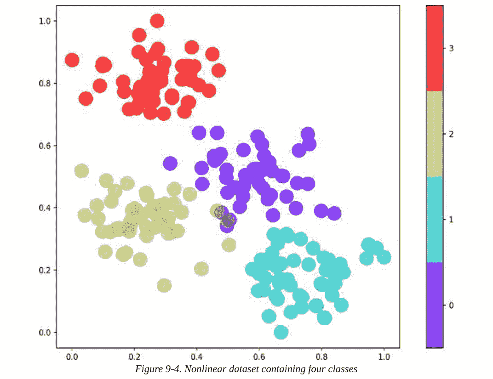

以下代码训练一个神经网络，根据点的 x 和 y 坐标预测其类别：

```python
from tensorflow.keras.models import Sequential
from tensorflow.keras.layers import Dense

model = Sequential()
model.add(Dense(128, activation='relu', input_dim=2))
model.add(Dense(4, activation='softmax'))
model.compile(optimizer='adam', loss='sparse_categorical_crossentropy',
              metrics=['accuracy'])

hist = model.fit(x, y, epochs=40, batch_size=10, validation_split=0.2)
```

训练和验证准确率的图表显示，网络在区分这些类别时几乎没有遇到困难：

### 训练与验证准确率

通过调用分类器的 `predict` 方法来进行预测。对于每个输入，`predict` 会返回一个概率数组——每个类别对应一个概率。预测的类别是被赋予最高概率的那个。在此示例中，紫色数据点代表类别 0，浅蓝色代表类别 1，灰褐色代表类别 2，红色代表类别 3。现在要求网络对位于 (0.2, 0.8) 的点进行分类：

```
model.predict(np.array([[0.2, 0.8]]))
```

答案是一个包含四个概率的数组，按顺序对应类别 0、1、2 和 3：

```
[2.1877741e-02, 5.3804164e-05, 5.0240371e-02, 9.2782807e-01]
```

网络预测 (0.2, 0.8) 对应类别 0 的概率为 2%，对应类别 1 的概率为 0%，对应类别 2 的概率为 5%，对应类别 3 的概率为 93%。从图上看，这似乎是一个合理的答案。

如果你只想知道该点属于哪个类别，可以这样做：

```
np.argmax(model.predict(np.array([[0.2, 0.8]])), axis=1)
```

答案是 3，对应红色。Keras 的旧版本包含一个 `predict_classes` 方法，无需调用 `argmax` 即可完成相同操作，但该方法已被弃用并移除。

> **注意**

Keras 还包含一个名为 `categorical_crossentropy` 的损失函数，常用于多类别分类。它的工作方式类似于 `sparse_categorical_crossentropy`，但要求标签是独热编码的。例如，你不是向 `fit` 传递一个包含 0 到 3 值的标签列，而是传递四个包含 0 和 1 的列。Keras 提供了一个名为 `to_categorical` 的实用函数来进行编码。但是，如果你使用 `sparse_categorical_crossentropy`，则可以直接使用标签列。

### 训练神经网络识别人脸

第 5 章记录了训练支持向量机识别人脸的步骤。现在让我们训练一个神经网络来完成同样的任务。我们将使用与之前相同的数据集：Labeled Faces in the Wild (LFW) 数据集，它包含超过 13,000 张名人的面部图像，并作为示例数据集内置于 Scikit 中。回想一下，在数据集代表的 5,000 多人中，有 1,680 人拥有两张或更多面部图像，而只有 5 人拥有 100 张或更多。我们将设置每人最少面部图像数为 100，这意味着将导入对应五位名人的五组面部图像。

首先创建一个新的 Jupyter notebook，并使用以下语句加载数据集：

```
import pandas as pd
from sklearn.datasets import fetch_lfw_people

faces = fetch_lfw_people(min_faces_per_person=100)
image_count = faces.images.shape[0]
image_height = faces.images.shape[1]
image_width = faces.images.shape[2]
class_count = len(faces.target_names)

faces = fetch_lfw_people(min_faces_per_person=100)
print(faces.target_names)
print(faces.images.shape)
```

总共加载了 1,140 张面部图像。每张图像尺寸为 47 × 62 像素。使用以下代码显示数据集中的前 24 张图像以及这些面部所属的人物：

```
%matplotlib inline
import matplotlib.pyplot as plt

fig, ax = plt.subplots(3, 8, figsize=(18, 10))
for i, axi in enumerate(ax.flat):
    axi.imshow(faces.images[i], cmap='gist_gray')
    axi.set(xticks=[], yticks=[], xlabel=faces.target_names[faces.target[i]])
```

通过生成直方图检查数据集的平衡性，显示为每个人导入了多少张面部图像：

```
from collections import Counter
import seaborn as sns
sns.set()

counts = Counter(faces.target)
names = {}

for key in counts.keys():
    names[faces.target_names[key]] = counts[key]

df = pd.DataFrame.from_dict(names, orient='index')
df.plot(kind='bar')
```

数据集中乔治·W·布什的图像数量远多于其他人。分类模型最好在平衡的数据集上进行训练。使用以下代码将数据集缩减为每人 100 张图像：

```
import numpy as np

mask = np.zeros(faces.target.shape, dtype=bool)

for target in np.unique(faces.target):
    mask[np.where(faces.target == target)[0][:100]] = 1

x_faces = faces.data[mask]
y_faces = faces.target[mask]
x_faces.shape
```

x_faces 包含 500 张面部图像，y_faces 包含对应的标签：0 代表科林·鲍威尔，1 代表唐纳德·拉姆斯菲尔德，依此类推。

下一步是将像素值除以 255。之后，将数据分为训练集和测试集。我们将留出 20% 的数据用于测试，让 Keras 在训练期间用它来验证模型，之后再用它通过混淆矩阵评估结果：

```
from sklearn.model_selection import train_test_split

face_images = x_faces / 255
x_train, x_test, y_train, y_test = train_test_split(face_images, y_faces,
                                                    train_size=0.8,
                                                    stratify=y_faces,
                                                    random_state=0)
```

> **注意**

为什么要将像素值除以 255？神经网络通常在归一化数据上训练得更好，而除以 255 是一种简单的像素值归一化方法。使用 Scikit 的 `StandardScaler` 类来应用单位方差也很常见，有时网络那样训练效果更好。唯一的办法就是尝试。在这个例子中，我两种方法都试过，发现结果大致相同。

创建一个包含一个隐藏层（512 个神经元）的神经网络。由于这是一个多类别分类任务，使用 `sparse_categorical_crossentropy` 作为损失函数，并在输出层使用 `softmax` 作为激活函数：

```
from tensorflow.keras.layers import Dense
from tensorflow.keras.models import Sequential

model = Sequential()
model.add(Dense(512, activation='relu',
                input_shape=(image_width * image_height,)))
model.add(Dense(class_count, activation='softmax'))
model.compile(optimizer='adam', loss='sparse_categorical_crossentropy',
              metrics=['accuracy'])
model.summary()
```

现在训练网络：

```
hist = model.fit(x_train, y_train, validation_data=(x_test, y_test),
                  epochs=100, batch_size=20)
```

绘制训练和验证准确率：

```
acc = hist.history['accuracy']
val_acc = hist.history['val_accuracy']
epochs = range(1, len(acc) + 1)

plt.plot(epochs, acc, '-', label='Training Accuracy')
plt.plot(epochs, val_acc, ':', label='Validation Accuracy')
plt.title('Training and Validation Accuracy')
plt.xlabel('Epoch')
plt.ylabel('Accuracy')
plt.legend(loc='lower right')
plt.plot()
```

最后，使用混淆矩阵可视化网络在测试数据上的表现：

```
from sklearn.metrics import ConfusionMatrixDisplay as cmd

sns.reset_orig()
y_pred = model.predict(x_test)
fig, ax = plt.subplots(figsize=(5, 5))
ax.grid(False)

cmd.from_predictions(y_test, y_pred.argmax(axis=1),
                      display_labels=faces.target_names, colorbar=False,
                      cmap='Blues', xticks_rotation='vertical', ax=ax)
```

模型正确识别乔治·W·布什多少次？有多少次将他识别为其他人？如果隐藏层使用 128 个神经元，网络的准确率会和使用 512 个神经元时一样高吗？

### Dropout

任何机器学习模型的目标都是做出准确的预测。在理想情况下，训练神经网络后期，训练准确率和验证准确率之间的差距应接近 0。但在现实中，这种情况很少发生。上一节中模型的训练准确率接近 100%，但验证准确率可能在 80% 到 85% 之间达到峰值。这意味着模型的泛化能力不如你期望的那样好。它很好地学习了训练数据，但当遇到未见过的数据（验证数据）时，表现不佳。这可能是模型过拟合的迹象。最终，重要的不是训练准确率，而是模型对新数据的响应准确度。

对抗过拟合的一种方法是减少网络的深度、单个层的宽度，或两者兼有。更少的神经元意味着更少的可训练参数，更少的参数使得网络更难过度拟合训练数据。

另一种防止过拟合的方法是在网络中引入 *dropout*。Dropout 在训练过程中随机丢弃层之间的连接，以防止网络过度学习训练数据。这就像读一本书但跳过每隔一页，希望你能学到高级概念而不被细节困住。Dropout 在 2014 年一篇题为“Dropout: A Simple Way to Prevent Neural Networks from Overfitting”的论文中被提出。

Keras 的 Dropout 类使得向网络添加 dropout 变得极其简单。为了演示，回到上一节的示例，这样重新定义网络：

```
from tensorflow.keras.layers import Dense, Dropout
from tensorflow.keras.models import Sequential

model = Sequential()
model.add(Dense(512, activation='relu',
                input_shape=(image_width * image_height,)))
model.add(Dropout(0.2))
model.add(Dense(class_count, activation='softmax'))
model.compile(optimizer='adam', loss='sparse_categorical_crossentropy',
              metrics=['accuracy'])
```

现在再次训练网络并绘制训练和验证准确率。以下是我的结果：

差距并没有缩小多少（如果有的话），但有时以这种方式添加dropout *确实*会提高验证准确率。本例中的关键语句是 `model.add(Dropout(0.2))`，它添加了一个Dropout层，该层在每次反向传播过程中随机丢弃（忽略）隐藏层神经元与输出层神经元之间20%的连接。你可以更激进地丢弃更多连接——例如将0.2增加到0.4——但你也可能达到收益递减的临界点。请注意，如果你对dropout率设置得过于激进（例如0.5），你可能需要训练更多的轮次。让学习变得更困难也意味着学习需要更长的时间。

实际上，要知道dropout是否会提高模型的泛化能力，唯一的办法就是尝试它。除了尝试不同的dropout百分比，你还可以尝试在两个或更多层之间引入dropout，希望能找到一个有效的组合。

### 保存和加载模型

在第7章中，你学习了如何序列化（保存）一个训练好的Scikit模型，并在客户端应用中加载它。同样的需求也适用于神经网络：你需要一种方法来保存训练好的网络，并在之后加载它以使其投入实用。

你可以使用Keras的 `get_weights` 方法从模型中获取权重和偏置，并使用 `set_weights` 来恢复它们。但要保存一个训练好的模型以便稍后重新创建它，还需要一个额外的步骤。具体来说，你必须保存网络架构：层数和类型、每层的神经元数量、每层使用的激活函数等等。幸运的是，所有这些只需要一行代码。这行代码根据你希望模型保存的两种格式之一而有所不同：

```
model.save('my_model.h5') # 将模型保存为Keras的H5格式
model.save('my_model')     # 将模型保存为TensorFlow的原生格式
```

加载保存的模型同样简单：

```
from tensorflow.keras.models import load_model

model = load_model('my_model.h5') # 加载以H5格式保存的模型
model = load_model('my_model')     # 加载以TensorFlow格式保存的模型
```

将模型保存为H5格式会生成一个单独的.h5文件，其中封装了整个模型。将其保存为TensorFlow的原生格式，也称为 *SavedModel格式*，则会生成一系列包含序列化模型的文件和子目录。Google推荐使用后者，尽管Keras的H5格式仍然很常见。两者在功能上没有区别，但.h5文件只能由用Python编写的Keras应用读取，而以SavedModel格式保存的模型可以被其他框架加载。例如，用C#和Microsoft的ML.NET编写的应用程序可以加载以SavedModel格式保存的模型，无论模型是用哪种编程语言创建的。

> **注意**

H5格式最初是为了让Keras模型能够以独立于所用后端深度学习框架的方式保存而设计的。Keras仍然有一个独立版本，支持除TensorFlow以外的后端（具体来说是CNTK和Theano），但这些框架已被弃用——它们不再被开发——并且除了在遗留模型中，现在很少使用。内置于TensorFlow的Keras版本*仅*支持TensorFlow后端。

一旦加载了保存的模型，它的行为与原始模型完全相同。例如，它所做的预测与原始模型所做的预测完全相同。你甚至可以通过向其输入额外的训练样本来进一步训练模型。这突显了神经网络与用Scikit构建的传统机器学习模型之间的一个主要区别。由于网络的状态由其权重和偏置定义，而加载模型会恢复权重和偏置，因此神经网络本质上支持增量训练，也称为 *持续学习*，从而可以随着时间的推移变得更聪明。大多数Scikit模型不支持这一点，因为序列化模型不会保存训练过程中积累的内部状态。

总结一下：你可以向神经网络输入一百万个训练样本，保存它，加载它，然后再输入一百万个训练样本，网络会从上次中断的地方继续。结果与一开始就向网络输入200万个训练样本基本相同，除了由于训练中固有的随机性导致的微小差异。

### Keras回调

当你训练一个神经网络并达到峰值验证准确率时，这个峰值很难捕捉。验证准确率在后续轮次中可能不会平稳地趋于稳定，而是可能下降或在峰值和谷值之间振荡。考虑到神经网络的随机（随机）特性，如果你标记达到最大验证准确率的轮次，并恰好训练那么多轮次，第二次你不会得到相同的结果。如何训练 *恰好* 正确的轮次以产生最佳（最准确）的网络呢？

一个优雅的解决方案是Keras的 *回调API*，它允许你编写在训练过程中的不同点（例如，在每个轮次结束时）被调用的回调函数，并且这些函数有能力改变甚至停止训练过程。下面是一个例子，创建了一个名为StopCallback的子类，它继承自Keras的Callback类。该子类实现了on_epoch_end函数，该函数在每个训练轮次结束时被调用，如果验证准确率达到95%，则停止训练：

```
from tensorflow.keras.callbacks import Callback

class StopCallback(Callback):
    accuracy_threshold = None

    def __init__(self, threshold):
        self.accuracy_threshold = threshold

    def on_epoch_end(self, epoch, logs=None):
        if (logs.get('val_accuracy') >= self.accuracy_threshold):
            self.model.stop_training = True

callback = StopCallback(0.95)
model.fit(x, y, validation_split=0.2, epochs=100, batch_size=20,
          callbacks=[callback])
model.save('best_model.h5')
```

注意传递给StopCallback构造函数的验证准确率阈值（0.95）。对 *fit* 的调用表面上训练网络100个轮次，但如果验证准确率在那之前达到0.95，训练就会立即停止。最后一条语句保存了达到该准确率的模型。

on_epoch_end是你可以在继承自Callback的类中实现的几个函数之一，以便在训练过程中达到预定检查点时接收回调。其他函数包括on_epoch_begin、on_train_begin、on_train_end、on_train_batch_begin和on_train_batch_end。你可以在Keras文档的“编写你自己的回调”中找到完整的列表和示例。

除了提供一个你可以用来创建自己的回调类的基类Callback之外，Keras还提供了几个自己的回调类。其中之一是EarlyStopping类，它允许你根据指定的标准（如验证准确率下降或训练损失增加）停止训练，而无需编写大量代码。在下面的例子中，如果验证准确率连续五个轮次没有提高（patience=5），训练就会提前停止。当训练停止时，网络的权重和偏置会自动恢复到验证准确率在最后五个轮次中达到峰值时的状态（restore_best_weights=True）：

```
from tensorflow.keras.callbacks import EarlyStopping

callback = EarlyStopping(monitor='val_accuracy', patience=5,
                         restore_best_weights=True)
model.fit(x, y, validation_split=0.2, epochs=100, batch_size=20,
          callbacks=[callback])
```

基于训练损失上升而非每个轮次结束时验证准确率下降来停止训练过程，只需要对代码进行微小的更改：

```
from tensorflow.keras.callbacks import EarlyStopping

callback = EarlyStopping(monitor='loss', patience=5, restore_best_weights=True)
model.fit(x, y, validation_split=0.2, epochs=100, batch_size=20,
          callbacks=[callback])
```

使用频率可能超过任何其他回调的是 `ModelCheckpoint`，它在训练期间按指定间隔保存模型，或者如果你将 `save_best_only` 设置为True，则保存最准确的模型。下一个例子训练一个模型100个轮次，并将显示最高验证准确率的模型保存在 *best_model.h5* 中：

```
from tensorflow.keras.callbacks import ModelCheckpoint

callback = ModelCheckpoint(filepath='best_model.h5', monitor='val_accuracy',
                           save_best_only=True)
model.fit(x, y, validation_split=0.2, epochs=100, batch_size=20,
          callbacks=[callback])
```

另一个常用的回调是 `TensorBoard`，它在模型训练时将各种信息记录到文件系统的指定位置。以下示例记录到当前目录的 *logs* 子目录：

```
from tensorflow.keras.callbacks import TensorBoard

callback = TensorBoard(log_dir='logs', histogram_freq=1)
model.fit(x_train, y_train, validation_split=0.2, epochs=100, batch_size=20,
          callbacks=[callback])
```

你可以使用一个名为TensorBoard的工具来监控准确率和损失、模型权重和偏置的变化等，无论是在训练进行时还是训练完成后。你可以从Jupyter notebook启动TensorBoard，并使用如下命令将其指向 *logs* 子目录：

```
%tensorboard --logdir logs
```

或者你可以从命令提示符执行相同的命令（不带百分号）来启动它。然后将你的浏览器指向 http://localhost:6006 以打开TensorBoard控制台（图9-5）。TensorFlow文档中的“TensorBoard入门”包含一个关于TensorBoard基础知识的有用教程。它是专业人士手中不可或缺的工具，尤其是在训练需要数小时、数天甚至数周才能完全训练好的复杂模型时。

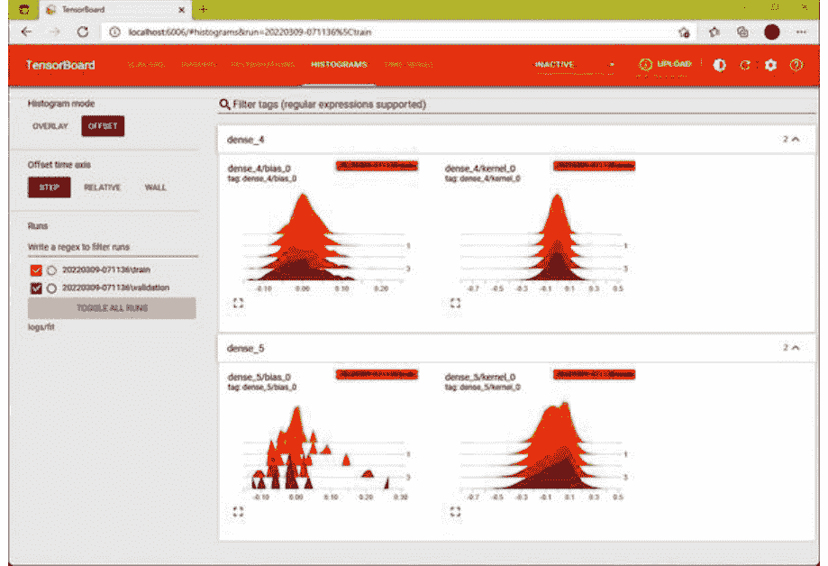

图 9-5. TensorBoard 显示神经网络训练结果

其他 Keras 回调类包括 [LearningRateScheduler](LearningRateScheduler)，用于在每个训练周期开始时调整学习率；以及 [CSVLogger](CSVLogger)，用于将每个训练周期的结果记录到 CSV 文件中。完整的回调列表请参阅 [callbacks API 文档](callbacks API documentation)。此外，请注意 `fit` 方法的 `callbacks` 参数是一个 Python 列表，这意味着在训练模型时可以指定多个回调。例如，你可以使用一个回调在满足特定条件时停止训练，再使用另一个回调将训练指标记录到 CSV 文件中。

### 总结

Keras 和 TensorFlow 是广泛使用的开源框架，它们简化了神经网络的构建、训练、保存、加载和使用（进行预测）过程。你可以使用原生 TensorFlow API 通过多种编程语言构建神经网络，但 Keras 对这些 API 进行了抽象，使深度学习变得更加易于上手。Keras 应用程序使用 Python 编写。

神经网络与传统机器学习模型一样，可用于解决回归问题和分类问题。执行回归任务的网络在输出层有一个神经元，且不使用激活函数；网络的输出是一个浮点数。执行二元分类的网络在输出层也有一个神经元，但 `sigmoid` 激活函数确保输出值在 0.0 到 1.0 之间，表示输入属于正类的概率。对于多分类任务，输出层的神经元数量等于网络可以预测的类别数量。`softmax` 激活函数将分配给输出神经元的原始值转换为每个类别的概率数组。

当你发现神经网络对训练数据拟合过于紧密时，一种对抗过拟合并提高网络泛化能力的方法是降低网络的复杂度：减少层数、减少单个层中的神经元数量，或两者都减少。另一种方法是向网络中添加 dropout。Dropout 通过在更新权重和偏置时随机忽略层之间的部分连接，故意阻碍网络学习训练数据的能力。

Keras 的回调 API 允许你自定义训练过程。例如，通过处理每个训练周期结束时发生的回调，你可以检查模型的准确率，并在达到可接受水平时停止训练。Keras 还包含一个简单易用的 API，用于保存和加载训练好的模型。这对于将训练好的模型投入实际应用至关重要——将它们部署到生产环境中，并利用训练过程中获得的预测能力。

本章中的面部识别模型在验证集上的准确率超过了 80%，但现代深度学习模型在相同数据集上通常能达到 99% 的准确率。了解到深度学习远不止多层感知机，你不会感到惊讶。我们将在[第 11 章](Chapter 11)深入探讨面部识别，但首先我们将探索另一种类型的神经网络——一种特别擅长解决计算机视觉问题的网络。它被称为*卷积神经网络*，是[第 10 章](Chapter 10)的主题。

## 第 10 章. 使用卷积神经网络进行图像分类

[计算机视觉](https://en.wikipedia.org/wiki/Computer_vision)是深度学习的一个分支，计算机从图像中提取信息。实际应用包括识别照片中的物体、从社交媒体网站中移除不当图像、统计收费站排队的车辆以及识别照片中的人脸。计算机视觉模型甚至可以与自然语言处理模型结合，为照片添加说明文字。我在度假时拍了一张照片，并让 Azure 的[计算机视觉服务](https://azure.microsoft.com/en-us/services/cognitive-services/computer-vision/)为其添加说明文字。结果如[图 10-1](#figure-10-1)所示。考虑到无需人工干预，这相当了不起。


*图 10-1. “一片水域，背景中有一个码头和一栋建筑”——Azure AI*

近年来，计算机视觉领域发展迅速，这主要归功于*卷积神经网络*，也称为 CNN 或 *ConvNets*。2012 年，一个名为 [AlexNet](https://en.wikipedia.org/wiki/AlexNet) 的八层 CNN 在年度 [ImageNet 大规模视觉识别挑战赛 (ILSVRC)](https://en.wikipedia.org/wiki/ImageNet#History_of_the_ImageNet_Large_Scale_Visual_Recognition_Challenge) 中，以 15.3% 的物体识别错误率超越了参赛的传统机器学习模型。2015 年，拥有惊人 152 层的 [ResNet-152](https://en.wikipedia.org/wiki/Residual_neural_network) 以仅 3.5% 的错误率赢得了挑战，这一成绩超越了人类在比赛中对图像进行分类的能力。

CNN 之所以神奇，是因为它们将图像视为*图像*，而不仅仅是像素值的数组。它们使用一种已有数十年历史的技术——[卷积核](https://en.wikipedia.org/wiki/Kernel_(image_processing))——从图像中提取“特征”，使它们能够识别猫头的形状或狗尾巴的轮廓。此外，使用 Keras 和 TensorFlow 构建 CNN 非常容易。

像 ResNet-152 这样的最先进 CNN 需要使用数百万张图像在 GPU 上进行昂贵的训练，但使用普通 CPU 也能完成很多工作。在本章中，你将了解 CNN 是什么以及它们如何工作，并将构建和训练几个自己的 CNN。你还将学习如何利用 Google 和 Microsoft 等公司发布的公开高级 CNN，以及如何使用一种称为*迁移学习*的技术，将这些 CNN 重新用于解决特定领域的问题。

### 理解 CNN

图 10-2 展示了一个基本 CNN 的拓扑结构。它以一组或多组*卷积层*和*池化层*开始。卷积层从图像中提取特征，生成通常称为*特征图*的变换图像，因为它们突出了形状和轮廓等区分性特征。池化层将特征图的大小减半，以便可以在不同分辨率下提取特征，并且对位置的微小变化不那么敏感。最后一个池化层的输出被展平为一维，并输入到一个或多个全连接层进行分类。卷积层和池化层被称为*瓶颈层*，因为它们降低了输入图像的维度。它们也占据了训练过程中大部分的计算时间。

卷积层通过将卷积核在图像上滑动来提取特征——这与图像编辑工具用于模糊、锐化和浮雕图像的技术相同。卷积核只是一个值矩阵。它通常是 3 × 3，但也可以更大。要处理图像，你将卷积核放在图像的左上角，将卷积核的值与下方的像素值相乘，并通过求和乘积来计算中心像素的新值，如图 10-3 所示。然后你将卷积核向右移动一个像素并重复该过程，逐行逐列继续，直到处理完整个图像。

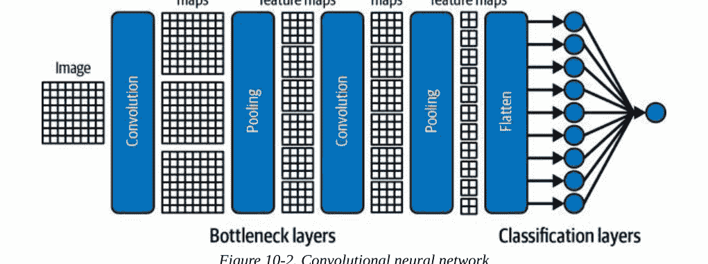

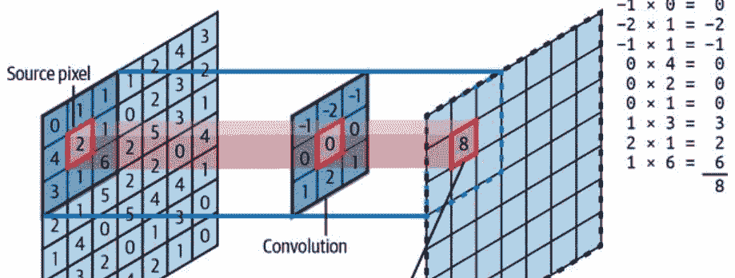

图 10-4 展示了将 3 × 3 卷积核应用于热狗图像时发生的情况。这个特定的卷积核称为*底部 Sobel 卷积核*，它旨在通过突出显示边缘（就像从底部照射光线一样）来进行边缘检测。CNN 的卷积层使用像这样的卷积核来提取有助于区分不同类别的特征。

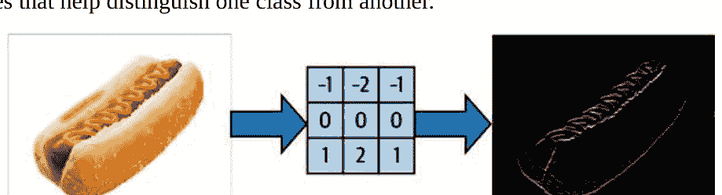

一个卷积层不只使用一个卷积核来处理图像。它使用很多——有时是 100 个或更多。卷积核的值不是预先确定的。它们用随机值初始化，然后在 CNN 训练过程中学习（调整），就像全连接层中连接神经元的权重一样。每个卷积核也有一个与之关联的偏置，就像全连接层中的神经元一样。图 10-5 中的图像是由训练好的 CNN 中的第一个卷积层生成的。你可以看到不同的卷积核如何让网络以不同的方式查看同一张热狗图像，以及某些特征（如面包的形状和顶部的芥末条）是如何被突出显示的。

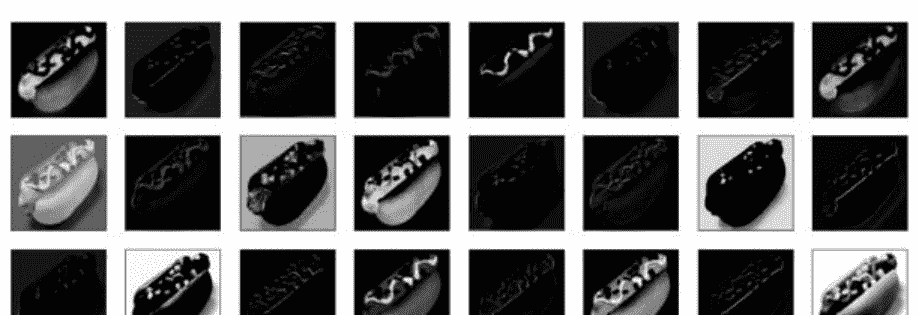

### 池化层

池化层通过下采样来减小图像尺寸。最常见的调整尺寸技术是*最大池化*，它将图像划分为2×2的像素块，并选取每个块中的四个值中的最大值。另一种选择是*平均池化*，它计算每个块中值的平均值。

图10-6展示了图像在通过连续池化层时如何收缩。第一行来自第一个池化层，第二行来自第二个池化层，依此类推。

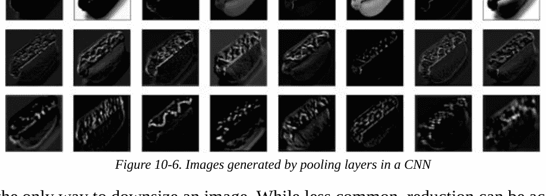

池化并非缩小图像尺寸的唯一方法。虽然不那么常见，但可以通过将卷积层的步幅设置为2来在不使用池化层的情况下实现尺寸缩减。*步幅*是卷积核在图像上移动时经过的像素数。默认值为1，但将其设置为2会通过忽略每隔一行和一列的像素来将图像尺寸减半。

网络末端的全连接层对从瓶颈层提取的特征进行分类，被称为CNN的*分类层*。它们与第9章介绍的多层感知器并无不同。对于二元分类，输出层包含一个神经元并使用`sigmoid`激活函数。对于多分类，输出层包含每个类别一个神经元，并使用`softmax`激活函数。

> **注意**

没有法律规定瓶颈层*必须*与分类层配对。你可以取瓶颈层输出的特征图，并使用支持向量机而非多层感知器进行分类。这并非听起来那么牵强。在第12章，我将介绍一个著名的模型正是这样做的。

### 使用Keras和TensorFlow构建CNN

为了简化构建用于图像分类的CNN，Keras提供了`Conv2D`类（用于建模卷积层）和`MaxPooling2D`类（用于实现最大池化层）。以下语句创建了一个包含两对卷积和池化层的CNN，一个展平层（用于将输出重塑为一维数组以输入全连接层），一个用于对从瓶颈层提取的特征进行分类的全连接层，以及一个用于分类的softmax输出层：

```python
from tensorflow.keras.models import Sequential
from tensorflow.keras.layers import Conv2D, MaxPooling2D, Flatten, Dense

model = Sequential()
model.add(Conv2D(32, (3, 3), activation='relu', input_shape=(28, 28, 1)))
model.add(MaxPooling2D((2, 2)))
model.add(Conv2D(64, (3, 3), activation='relu'))
model.add(MaxPooling2D((2, 2)))
model.add(Flatten())
model.add(Dense(128, activation='relu'))
model.add(Dense(10, activation='softmax'))
```

传递给Conv2D函数的第一个参数是层中包含的卷积核数量。更多的卷积核意味着更强的拟合能力，类似于全连接层中的神经元数量。第二个参数是每个卷积核的尺寸。使用5×5的卷积核有时能获得更高的精度，但这种尺寸的卷积核会增加训练时间，因为每个像素需要25次乘法运算，而3×3的卷积核只需9次。第一层中的input_shape参数指定了输入到CNN的图像尺寸：在本例中，是单通道（灰度）的28×28图像。用于训练CNN的所有图像必须具有相同的尺寸。

> **注意**
Conv2D处理的是二维图像。Keras还提供了用于处理一维数据的Conv1D类和用于处理三维数据的Conv3D类。前者常用于处理文本和时间序列数据。Conv3D的典型用例包括分析视频和三维医学图像。

给定一组类别间分离度相对较高的图像，在典型的笔记本电脑或PC上训练CNN来对这些图像进行分类是完全可行的。一个很好的例子是MNIST数据集，它包含60,000张扫描的手写数字训练图像（每张28×28像素），以及10,000张测试图像。图10-7显示了训练集中的前50张扫描图像。

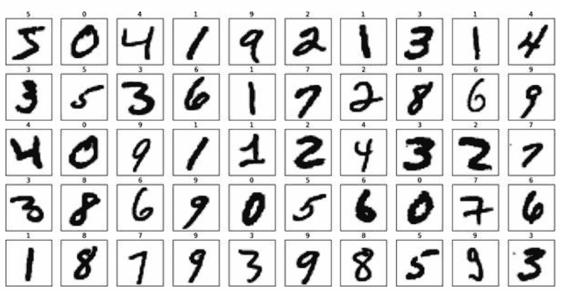

让我们训练一个CNN来识别MNIST数据集中的数字，该数据集恰好是Keras内置的几个示例数据集之一。首先创建一个新的Jupyter notebook，并使用以下语句加载数据集，将28×28的图像重塑为28×28×1的数组（包含单个颜色通道的28×28图像），并将像素值除以255作为简单的归一化形式：

```python
from tensorflow.keras.datasets import mnist

(train_images, y_train), (test_images, y_test) = mnist.load_data()
x_train = train_images.reshape(60000, 28, 28, 1) / 255
x_test = test_images.reshape(10000, 28, 28, 1) / 255
```

接下来，定义一个CNN，它接受28×28×1的像素值数组作为输入，包含两对卷积和池化层，并有一个包含10个神经元的softmax输出层（因为数据集包含10个不同数字的扫描图像）：

```python
from tensorflow.keras.layers import Conv2D, MaxPooling2D, Dense, Flatten
from tensorflow.keras.models import Sequential

model = Sequential()
model.add(Conv2D(32, (3, 3), activation='relu', input_shape=(28, 28, 1)))
model.add(MaxPooling2D(2, 2))
model.add(Conv2D(64, (3, 3), activation='relu'))
model.add(MaxPooling2D(2, 2))
model.add(Flatten())
model.add(Dense(128, activation='relu'))
model.add(Dense(10, activation='softmax'))
model.compile(optimizer='adam', loss='sparse_categorical_crossentropy',
              metrics=['accuracy'])
model.summary(line_length=80)
```

图10-8显示了最后一行调用summary的输出。该摘要揭示了此CNN处理图像的许多细节。每个池化层将图像尺寸减半，而每个卷积层将图像的高度和宽度各减少两个像素。为什么是这样？默认情况下，卷积核的中心单元格并不从图像左上角的像素开始；而是其左上角与图像的左上角对齐。对于3×3的卷积核，边缘周围有1像素宽的边界在卷积后无法保留。（对于5×5的卷积核，无法保留的边界宽度为2像素。）这个术语称为填充，如果你愿意，可以覆盖默认行为，将卷积核的中心单元格推到图像的边缘。在Keras中，这可以通过在调用Conv2D时包含`padding='same'`参数来实现。

| 层（类型） | 输出形状 | 参数数量 |
| :--- | :--- | :--- |
| conv2d (Conv2D) | (None, 26, 26, 32) | 320 |
| max_pooling2d (MaxPooling2D) | (None, 13, 13, 32) | 0 |
| conv2d_1 (Conv2D) | (None, 11, 11, 64) | 18496 |
| max_pooling2d_1 (MaxPooling2D) | (None, 5, 5, 64) | 0 |
| flatten (Flatten) | (None, 1600) | 0 |
| dense (Dense) | (None, 128) | 204928 |
| dense_1 (Dense) | (None, 10) | 1290 |
| **总参数:** | **225,034** | |
| **可训练参数:** | **225,034** | |
| **不可训练参数:** | **0** | |

图10-8. summary方法的输出

另一个要点是，每张28×28的图像在通过第一个卷积层后，会变成一个尺寸为26×26×32的三维数组或*张量*：每个卷积核对应一个26×26的特征图。经过最大池化后，张量缩减为13×13×32，并输入到第二个卷积层，其中另外64个卷积核从三十二个13×13的特征图中过滤特征，并将它们组合以产生64个新的特征图（一个尺寸为11×11×64的张量）。最后的池化层将其缩减为5×5×64。这些值被展平成一个包含1,600个值的一维张量，并输入到全连接层进行分类。

> **注意**

这里的宏观图景是，CNN将每张包含784个像素值的28×28图像转换为一个包含1,600个浮点数的数组，该数组（希望）比普通像素值能更清晰地区分图像内容。这就是瓶颈层的作用：它们将*整数像素值矩阵*转换为*浮点数张量*，从而更好地表征输入到它们的图像。正如你将在第13章看到的，NLP网络使用*词嵌入*来创建文档中单词的密集向量表示。*密集向量表示*是你在深度学习中会经常遇到的术语。它不过是浮点数数组，比输入数据本身更能表征输入。

如果输入到网络的图像是三通道彩色图像而非单通道灰度图像，summary的输出看起来将完全相同。将具有*n*个卷积核的卷积层应用于图像，无论图像深度如何，都会产生*n*个特征图，正如将具有*n*个卷积核的卷积层应用于前几层输出的特征图，无论输入深度如何，都会产生*n*个新的特征图。在内部，CNN使用*张量点积*从三维特征图生成二维特征图。Python的NumPy库包含一个名为tensordot的函数，用于快速计算张量点积。

现在训练网络并绘制训练和验证准确率：

```python
%matplotlib inline
import matplotlib.pyplot as plt
import seaborn as sns
```

sns.set()

hist = model.fit(x_train, y_train,
                validation_data=(x_test, y_test),
                epochs=10, batch_size=50)
acc = hist.history['accuracy']
val_acc = hist.history['val_accuracy']
epochs = range(1, len(acc) + 1)

plt.plot(epochs, acc, '-', label='Training Accuracy')
plt.plot(epochs, val_acc, ':', label='Validation Accuracy')
plt.title('Training and Validation Accuracy')
plt.xlabel('Epoch')
plt.ylabel('Accuracy')
plt.legend(loc='lower right')

训练完成后，这个简单的CNN在手写数字分类任务上可以达到99%的准确率：

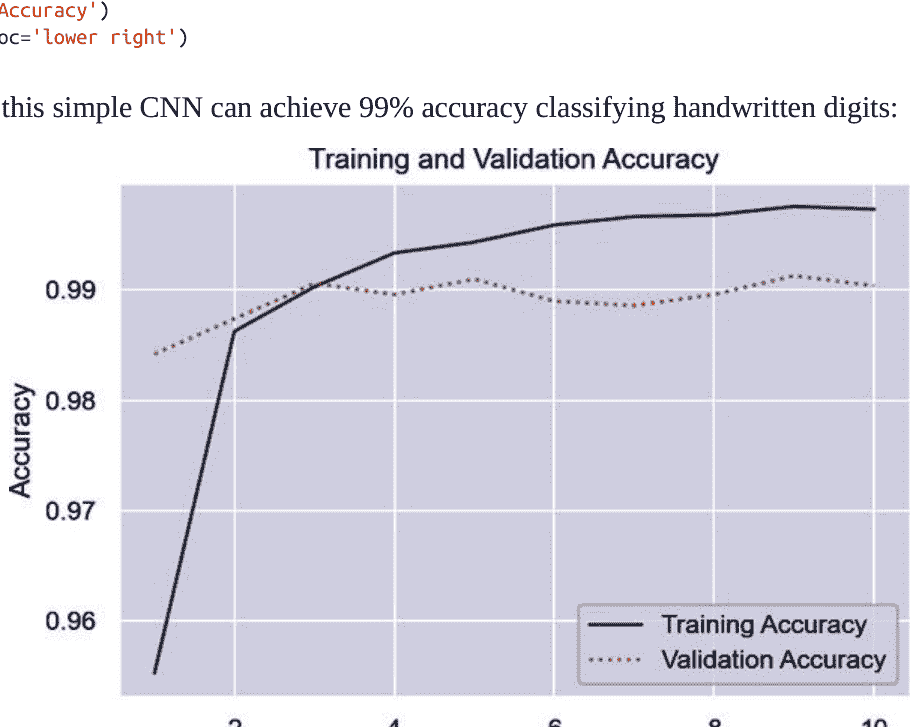

它能达到如此高准确率的一个原因是训练样本的数量——每个类别大约有6000个样本。（作为测试，我仅用每个类别100个样本训练网络，就获得了92%的准确率。）另一个因素是数字2和数字8看起来非常不同。如果一个人能相当容易地区分两者，那么CNN也能做到。

### 训练CNN识别北极野生动物

一个基础的CNN在MNIST数据集上可以轻松达到99%的准确率。但当问题更具感知性时——例如，目标是判断一张照片中包含的是狗还是猫——就没那么容易了。一个原因是大多数数字8看起来非常相似，而狗和猫则有多种品种。另一个因素是MNIST数据集中的每个数字都被精心裁剪以精确填充画面，而狗和猫可以出现在画面的任何位置，并且可以从无数个角度以不同的姿势拍摄。

为了演示，让我们训练一个CNN来区分北极狐、北极熊和海象。作为背景，假设你被要求创建一个系统，该系统使用AI来检查部署在北极的运动感应摄像头拍摄的照片，以记录北极熊的活动。

首先，[下载一个ZIP文件](downloading a ZIP file)，其中包含用于训练和测试CNN的图像。解压ZIP文件，并将其内容放置在你的Jupyter笔记本所在目录下的一个名为*Wildlife*的子目录中。ZIP文件包含名为*train*、*test*和*samples*的文件夹。每个文件夹内都有名为*arctic_fox*、*polar_bear*和*walrus*的子文件夹。训练文件夹各包含100张图像，而测试文件夹各包含40张图像。[图10-9](Figure 10-9)展示了一些北极熊的训练图像。这些是从互联网下载的公共图像，并被裁剪和调整为224 × 224像素。

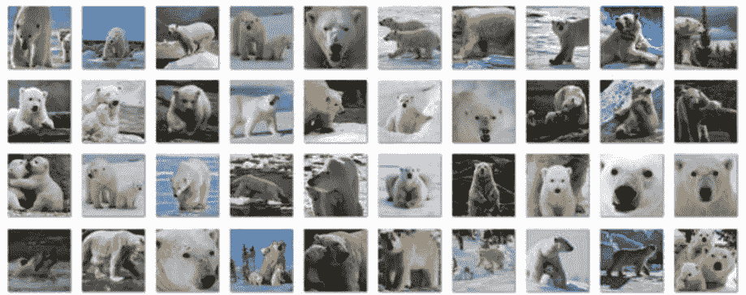

现在创建一个Jupyter笔记本，并使用以下代码定义一对辅助函数——一个用于从文件系统的指定位置加载一批图像并为其分配标签，另一个用于显示一批图像中的前八张：

```python
import os
from tensorflow.keras.preprocessing import image
import matplotlib.pyplot as plt
%matplotlib inline

def load_images_from_path(path, label):
    images, labels = [], []

    for file in os.listdir(path):
        img = image.load_img(os.path.join(path, file), target_size=(224, 224, 3))
        images.append(image.img_to_array(img))
        labels.append((label))

    return images, labels

def show_images(images):
    fig, axes = plt.subplots(1, 8, figsize=(20, 20),
                           subplot_kw={'xticks': [], 'yticks': []})

    for i, ax in enumerate(axes.flat):
        ax.imshow(images[i] / 255)

x_train, y_train, x_test, y_test = [], [], [], []
```

使用以下语句加载100张北极狐训练图像并绘制其中一部分：

```python
images, labels = load_images_from_path('Wildlife/train/arctic_fox', 0)
show_images(images)

x_train += images
y_train += labels
```

同样地，加载并标记北极熊训练图像：

```python
images, labels = load_images_from_path('Wildlife/train/polar_bear', 1)
show_images(images)

x_train += images
y_train += labels
```

然后是海象训练图像：

```python
images, labels = load_images_from_path('Wildlife/train/walrus', 2)
show_images(images)

x_train += images
y_train += labels
```

你还需要加载用于验证CNN的图像。首先是40张北极狐测试图像：

```python
images, labels = load_images_from_path('Wildlife/test/arctic_fox', 0)
show_images(images)

x_test += images
y_test += labels
```

然后是北极熊测试图像：

```python
images, labels = load_images_from_path('Wildlife/test/polar_bear', 1)
show_images(images)

x_test += images
y_test += labels
```

最后是海象测试图像：

```python
images, labels = load_images_from_path('Wildlife/test/walrus', 2)
show_images(images)

x_test += images
y_test += labels
```

下一步是通过将像素值除以255来归一化训练和测试图像：

```python
import numpy as np
x_train = np.array(x_train) / 255
x_test = np.array(x_test) / 255

y_train = np.array(y_train)
y_test = np.array(y_test)
```

现在是时候构建CNN了。由于图像尺寸为224 × 224，并且我们希望最终的特征图能将尽可能多的信息压缩到一个小空间中，我们将使用五对卷积和池化层，以五种分辨率（224 × 224、111 × 111、54 × 54、26 × 26和12 × 12）从训练图像中提取特征。之后，我们将连接一个全连接层和一个包含三个神经元的softmax输出层——每个神经元对应三个类别中的一个：

```python
from tensorflow.keras.models import Sequential
from tensorflow.keras.layers import Conv2D, MaxPooling2D, Flatten, Dense

model = Sequential()
model.add(Conv2D(32, (3, 3), activation='relu', input_shape=(224, 224, 3)))
model.add(MaxPooling2D(2, 2))
model.add(Conv2D(64, (3, 3), activation='relu'))
model.add(MaxPooling2D(2, 2))
model.add(Conv2D(64, (3, 3), activation='relu'))
model.add(MaxPooling2D(2, 2))
model.add(Conv2D(128, (3, 3), activation='relu'))
model.add(MaxPooling2D(2, 2))
model.add(Conv2D(128, (3, 3), activation='relu'))
model.add(MaxPooling2D(2, 2))
model.add(Flatten())
model.add(Dense(1024, activation='relu'))
model.add(Dense(3, activation='softmax'))
model.compile(optimizer='adam', loss='sparse_categorical_crossentropy',
              metrics=['accuracy'])
model.summary(line_length=80)
```

调用`fit`来训练模型：

```python
hist = model.fit(x_train, y_train,
                 validation_data=(x_test, y_test),
                 batch_size=10, epochs=20)
```

如果你在CPU上训练模型，每个epoch的训练可能需要10到20秒。（想象一下所有那些像素计算在所有那些图像上、使用所有那些卷积核进行的过程。）训练完成后，使用以下语句绘制训练和验证准确率：

```python
import seaborn as sns
sns.set()

acc = hist.history['accuracy']
val_acc = hist.history['val_accuracy']
epochs = range(1, len(acc) + 1)

plt.plot(epochs, acc, '-', label='Training Accuracy')
plt.plot(epochs, val_acc, ':', label='Validation Accuracy')
plt.title('Training and Validation Accuracy')
plt.xlabel('Epoch')
plt.ylabel('Accuracy')
plt.legend(loc='lower right')
plt.plot()
```

以下是输出结果：

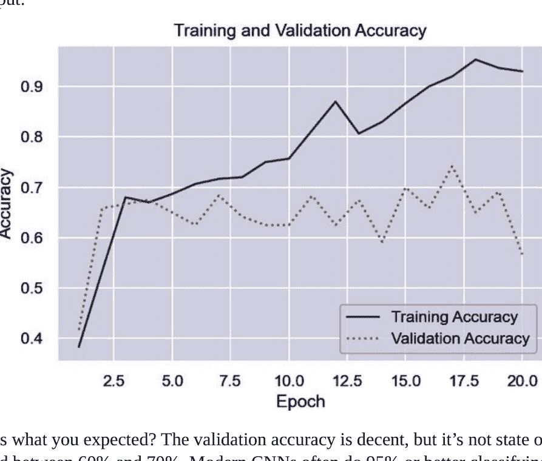

结果符合你的预期吗？验证准确率还不错，但并非顶尖水平。它可能介于60%到70%之间。现代CNN在对这类图像进行分类时，通常能达到95%或更高的准确率。你或许可以通过堆叠卷积层或增加卷积核数量来从这个模型中挤出更多性能，也可能通过引入dropout层使其泛化能力略有提升。但仅凭这个网络和这个数据集，你无法达到95%。

现代CNN能够如此精确地进行图像分类的原因之一是，它们是用数百万张图像训练的。你不需要每个类别都有数百万个样本，但你可能需要比这里使用的300个样本多*至少*一个数量级——甚至*两个*数量级。你可以在互联网上搜集更多图像，但更多图像意味着更长的训练时间。如果目标是达到95%或更高的准确率，你很快就会发现CNN训练时间过长——或者发现自己开始考虑购买NVIDIA GPU。

这并不意味着CNN不适用于解决商业问题。这只是意味着还有更多东西需要学习。下一节是理解如何在不从头训练CNN的情况下达到高准确率的第一步。

### 预训练CNN

微软、谷歌和其他科技公司使用[ImageNet数据集的一个子集](https://www.image-net.org/)（包含超过100万张图像）来训练最先进的CNN，以识别数百种物体，包括北极狐以及北极熊。然后，它们将这些模型提供给公众使用。这些被称为*预训练CNN*，其复杂程度远超你自己可能训练出的任何模型。如果这还不够令人惊叹，Keras将加载预训练CNN的过程简化到了一行代码。

Keras提供了封装了二十多种流行预训练CNN的类。完整列表记录在[Keras网站](https://keras.io/)上。这些CNN大多在学术论文中有记载，例如《Deep Residual Learning for Image Recognition》和《EfficientNet: Rethinking Model Scaling for Convolutional Neural Networks》。其中一些赢得了ImageNet大规模视觉识别挑战赛和[COCO检测挑战赛](https://cocodataset.org/)等著名竞赛。最著名的包括微软的ResNet系列网络和谷歌的Inception网络。同样值得注意的是[MobileNet](https://ai.googleblog.com/2017/06/mobilenets-open-source-models-for.html)，它以精度换取了更小的体积，因其内存占用小而非常适合移动设备。你可以在[谷歌AI博客](https://ai.googleblog.com/2017/06/mobilenets-open-source-models-for.html)上了解更多相关信息。

### 预训练CNN架构

预训练CNN之所以能达到令人印象深刻的准确度，不仅是因为它们使用了数百万张图像进行训练，还因为它们比迄今为止介绍的CNN更深、架构更先进。例如，它们使用连续的卷积层来进一步提炼从每张图像中提取的特征，并且许多网络使用*批归一化*来标准化（标准化为单位方差）训练过程中层间传播的值。

但预训练CNN的复杂性还有其他原因。例如，ResNets开创了一种称为*残差层*的概念，它将输入添加到输出中。这一简单的创新有助于缓解梯度消失问题——该问题会导致优化器在反向传播更新权重和偏置时，更新量变得越来越小——并使得构建更深的网络成为可能。

然后是Inception系列的CNN，其主要创新是使用1×1卷积核，通过减少输入到它们的特征图的深度来最小化更大卷积核的计算开销。Inception的最新版本也融入了ResNets的特性，而一个名为Xception的衍生架构通过引入*深度可分离卷积*对Inception进行了改进。如果你想了解更多，请查看《A Simple Guide to the Versions of the Inception Network》和《Xception: Deep Learning with Depthwise Separable Convolutions》。

以下语句实例化了Keras的`MobileNetV2`类，并使用网络在ImageNet数据集上训练时得到的权重、偏置和核值对其进行初始化：

```python
from tensorflow.keras.applications import MobileNetV2

model = MobileNetV2(weights='imagenet')
```

`weights='imagenet'`参数告诉Keras加载哪些参数以在其训练状态重新创建网络。你也可以传递一个包含自定义权重的文件路径，但`imagenet`是目前唯一支持的预定义权重集。

在将图像提交给预训练CNN进行分类之前，必须将其调整为CNN期望的尺寸——通常是224×224——并进行预处理。不同的CNN期望以不同的方式预处理图像，因此Keras为每个预训练CNN提供了一个`preprocess_input`函数。它还包括用于加载和调整图像大小的实用函数。以下语句从文件系统加载一张图像，并为输入到MobileNetV2网络进行预处理：

```python
import numpy as np
from tensorflow.keras.applications.mobilenet import preprocess_input
from tensorflow.keras.preprocessing import image

x = image.load_img('arctic_fox.jpg', target_size=(224, 224))
x = image.img_to_array(x)
x = np.expand_dims(x, axis=0)
x = preprocess_input(x)
```

在大多数情况下，`preprocess_input`完成了所有必要的工作，这通常涉及对像素值应用单位方差并将RGB图像转换为BGR格式。然而，在某些情况下，你仍然需要将像素值除以255。[ResNet50V2](https://keras.io/api/applications/resnet/#resnet50v2-function)就是一个例子：

```python
import numpy as np
from tensorflow.keras.applications.resnet50 import preprocess_input
from tensorflow.keras.preprocessing import image

x = image.load_img('arctic_fox.jpg', target_size=(224, 224))
x = image.img_to_array(x)
x = np.expand_dims(x, axis=0)
x = preprocess_input(x) / 255
```

一旦图像被预处理，进行预测就和调用网络的`predict`方法一样简单：

```python
y = model.predict(x)
```

为了帮助你解释输出，Keras还提供了一个特定于网络的`decode_predictions`方法。图10-10显示了该方法对提交给ResNet50V2的照片返回的结果。

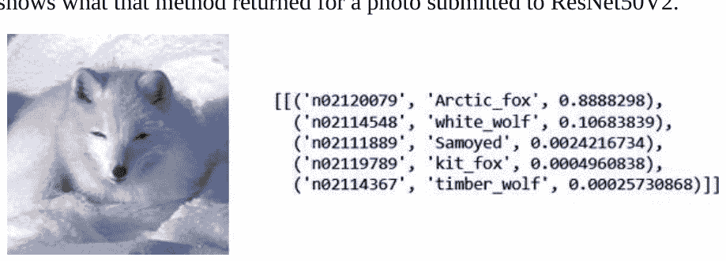

ResNet50V2有89%的把握认为照片中包含一只北极狐——而事实也确实如此。MobileNetV2以92%的确定性预测照片中包含一只北极狐。两个网络都在相同的数据集上训练过，但不同的预训练CNN对图像的分类略有不同。

### 使用ResNet50V2对图像进行分类

让我们使用Keras加载一个预训练CNN并对一对图像进行分类。启动一个notebook，并使用以下语句加载ResNet50V2：

```python
from tensorflow.keras.applications import ResNet50V2

model = ResNet50V2(weights='imagenet')
model.summary()
```

接下来，加载一张北极狐图像并在notebook中显示：

```python
%matplotlib inline
import matplotlib.pyplot as plt
from tensorflow.keras.preprocessing import image

x = image.load_img('Wildlife/samples/arctic_fox/arctic_fox_140.jpeg',
                   target_size=(224, 224))
plt.xticks([])
plt.yticks([])
plt.imshow(x)
```

现在预处理图像（记住，对于ResNet50V2，在调用Keras的`preprocess_input`方法后，你还必须将所有像素值除以255）并将其传递给CNN进行分类：

```python
import numpy as np
from tensorflow.keras.applications.resnet50 import preprocess_input
from tensorflow.keras.applications.resnet50 import decode_predictions

x = image.img_to_array(x)
x = np.expand_dims(x, axis=0)
x = preprocess_input(x) / 255

y = model.predict(x)
decode_predictions(y)
```

输出应如下所示：

```python
[[('n02120079', 'Arctic_fox', 0.9999944),
  ('n02114548', 'white_wolf', 4.760021e-06),
  ('n02119789', 'kit_fox', 2.3306782e-07),
  ('n02442845', 'mink', 1.2460312e-07),
  ('n02111889', 'Samoyed', 1.1914468e-07)]]
```

ResNet50V2几乎可以肯定图像中包含一只北极狐。但现在加载一张海象图像：

```python
x = image.load_img('Wildlife/samples/walrus/walrus_143.png',
                   target_size=(224, 224))
plt.xticks([])
plt.yticks([])
plt.imshow(x)
```

让ResNet50V2对其进行分类：

```python
x = image.img_to_array(x)
x = np.expand_dims(x, axis=0)
x = preprocess_input(x) / 255

y = model.predict(x)
decode_predictions(y)
```

以下是输出：

```python
[[('n02454379', 'armadillo', 0.63758147),
  ('n01704323', 'triceratops', 0.16057032),
  ('n02113978', 'Mexican_hairless', 0.07795086),
  ('n02398521', 'hippopotamus', 0.022284042),
  ('n01817953', 'African_grey', 0.016944142)]]
```

ResNet50V2认为图像最可能是一只犰狳，但它对此甚至也不是很确定。你能猜到为什么吗？

ResNet50V2是用近130万张图像训练的。然而，其中没有一张包含海象。[ImageNet 1000类列表](https://...)显示了它*被*训练识别的完整类别列表。当你需要预训练CNN使用其训练过的类别对图像进行分类时，它非常出色，但它无法处理它未被训练过的特定领域任务。

但并非没有希望。一种称为*迁移学习*的技术使预训练CNN能够被重新用于解决特定领域的问题。这种重新利用可以在普通的CPU上完成；不需要GPU。迁移学习有时仅用几百张训练图像就能达到95%的准确率。一旦你了解了它，你对使用CNN解决业务问题的效率将会有完全不同的看法。

### 迁移学习

之前，你使用了一个包含北极狐、北极熊和海象照片的数据集来训练一个CNN以识别北极野生动物。使用300张图像（每个类别100张）进行训练后，该CNN达到了约60%的准确率。这对于大多数目的来说是不够的。

一个解决方案是使用数万张照片来训练CNN。一个更好的解决方案——一个可以利用你拥有的300张照片达到世界级准确率且不需要昂贵硬件的方案——就是迁移学习。在软件开发人员和工程师手中，迁移学习使CNN成为解决各种计算机视觉问题的实用解决方案。而且它所需的时间和计算能力比从头训练的CNN少几个数量级。让我们花点时间来理解什么是迁移学习以及它是如何工作的——然后将其用于识别北极野生动物。

在ImageNet数据集上训练的预训练CNN可以识别北极狐和北极熊，但它们无法识别海象，因为它们没有用海象图像进行训练。迁移学习让你能够重新利用预训练CNN来识别它们最初未被训练识别的对象。它利用了预训练CNN中内置的智能，但将其重新用于解决新问题。

回想一下，CNN有两组层：瓶颈层包含卷积层和池化层，用于从不同分辨率的图像中提取特征；以及分类层，用于分类瓶颈层输出的特征被识别为北极狐、北极熊或其他事物。卷积层使用卷积核提取特征，卷积核中的值在训练过程中学习得到。这种学习占据了训练时间的大部分。当复杂的卷积神经网络使用数百万张图像进行训练时，卷积核在提取特征方面变得非常高效。但这种效率是有代价的。

迁移学习的前提如图10-11所示。你加载预训练卷积神经网络的瓶颈层，但*不*加载分类层。相反，你提供自己的分类层，其训练速度比整个卷积神经网络快几个数量级。然后，你将训练图像通过瓶颈层进行特征提取，并在得到的特征上训练分类层。预训练的卷积神经网络可能被训练用于从苹果和橙子的图片中提取特征，但这些相同的层可能也擅长从狗和猫的照片中提取特征。通过使用预训练的瓶颈层提取特征，然后使用这些特征训练你自己的分类层，你可以教会模型，从图像中提取的某个特征可能表明是狗而不是苹果。

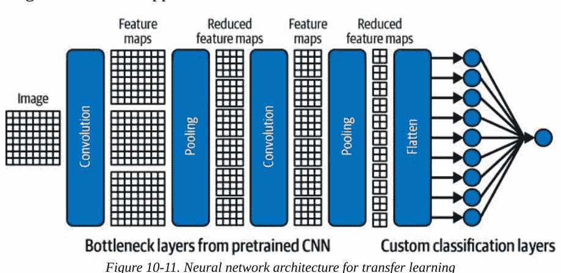

使用Keras和TensorFlow实现迁移学习相对简单。回想一下，以下语句加载ResNet50V2并使用网络在ImageNet数据集子集上训练时得到的权重（包括核值）和偏置进行初始化：

```
base_model = ResNet50V2(weights='imagenet')
```

要加载ResNet50V2（或Keras支持的任何其他预训练卷积神经网络）而不包含分类层，你只需添加`include_top=False`属性：

```
base_model = ResNet50V2(weights='imagenet', include_top=False)
```

从那时起，有两种方法可以进行迁移学习。第一种方法涉及将分类层附加到基础模型的瓶颈层，并将每个基础层的`trainable`属性设置为`False`，以便在训练网络时不会更新权重、偏置和卷积核：

```
for layer in base_model.layers:
    layer.trainable = False

model = Sequential()
model.add(base_model)
model.add(Flatten())
model.add(Dense(1024, activation='relu'))
model.add(Dense(3, activation='softmax'))
model.compile(optimizer='adam', loss='sparse_categorical_crossentropy',
              metrics=['accuracy'])

model.fit(x, y, validation_split=0.2, epochs=10, batch_size=10)
```

第二种技术是将所有训练图像通过基础模型进行特征提取，然后将特征通过包含你的分类层的单独网络：

```
features = base_model.predict(x)

model = Sequential()
model.add(Flatten())
model.add(Dense(128, activation='relu'))
model.add(Dense(3, activation='softmax'))
model.compile(optimizer='adam', loss='sparse_categorical_crossentropy',
              metrics=['accuracy'])

model.fit(features, y, validation_split=0.2, epochs=10, batch_size=10)
```

哪种技术更好？第二种更快，因为训练图像只需通过瓶颈层进行一次特征提取，而不是每个训练周期一次。在没有令人信服的理由的情况下，你应该使用这种技术。第一种技术稍慢，但它适用于*微调*，即在训练完成后解冻一个或多个瓶颈层，并以非常低的学习率再训练几个周期。它还便于*数据增强*，我将在下一节介绍。

> **注意**

微调通常在训练完成后应用于迁移学习模型，以努力提高一两个百分点的准确率。我们将在第13章中使用微调来提高利用预训练神经网络的自然语言处理模型的准确率。

如果你使用第一种技术实现迁移学习，你通过预处理图像并将其传递给模型的`predict`方法来进行预测。对于第二种技术，进行预测是一个两步过程。预处理图像后，你将它们传递给基础模型的`predict`方法，然后将该方法的输出传递给你的模型的`predict`方法：

```
x = image.img_to_array(x)
x = np.expand_dims(x, axis=0)
x = preprocess_input(x) / 255

features = base_model.predict(x)
predictions = model.predict(features)
```

至此，迁移学习完成。剩下的就是将其付诸实践。

### 使用迁移学习识别北极野生动物

让我们使用迁移学习来解决我们之前尝试用从头构建的卷积神经网络解决的同一个问题：构建一个模型来确定照片中包含的是北极狐、北极熊还是海象。

创建一个Jupyter笔记本，并使用你之前使用的相同代码来加载训练和测试图像并为其分配标签：0代表北极狐，1代表北极熊，2代表海象。完成后，下一步是预处理图像。我们将使用ResNet50V2作为我们的预训练卷积神经网络，因此使用ResNet版本的`preprocess_input`来预处理像素。然后将像素值除以255：

```
import numpy as np
from tensorflow.keras.applications.resnet50 import preprocess_input

x_train = preprocess_input(np.array(x_train)) / 255
x_test = preprocess_input(np.array(x_test)) / 255

y_train = np.array(y_train)
y_test = np.array(y_test)
```

下一步是加载ResNet50V2，注意加载瓶颈层但*不*加载分类层，并使用它从训练和测试图像中提取特征：

```
from tensorflow.keras.applications import ResNet50V2

base_model = ResNet50V2(weights='imagenet', include_top=False)

x_train = base_model.predict(x_train)
x_test = base_model.predict(x_test)
```

现在训练一个神经网络来对从训练图像中提取的特征进行分类：

```
from tensorflow.keras.models import Sequential
from tensorflow.keras.layers import Flatten, Dense

model = Sequential()
model.add(Flatten())
model.add(Dense(1024, activation='relu'))
model.add(Dense(3, activation='softmax'))
model.compile(optimizer='adam', loss='sparse_categorical_crossentropy',
              metrics=['accuracy'])

hist = model.fit(x_train, y_train,
                 validation_data=(x_test, y_test),
                 batch_size=10, epochs=10)
```

网络训练得如何？绘制每个训练周期的训练准确率和验证准确率：

```
import seaborn as sns
sns.set()

acc = hist.history['accuracy']
val_acc = hist.history['val_accuracy']
epochs = range(1, len(acc) + 1)

plt.plot(epochs, acc, '-', label='Training Accuracy')
plt.plot(epochs, val_acc, ':', label='Validation Accuracy')
plt.title('Training and Validation Accuracy')
plt.xlabel('Epoch')
plt.ylabel('Accuracy')
plt.legend(loc='lower right')
plt.plot()
```

你的结果会与我的不同，但我得到了大约97%的准确率。如果你没有达到这个水平，尝试再次训练网络：

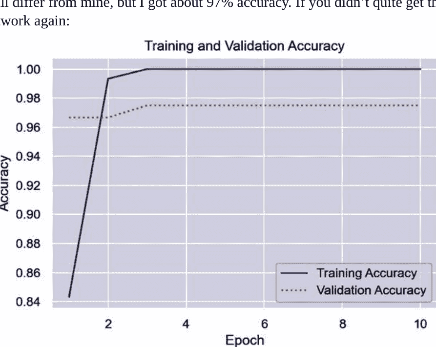

最后，使用混淆矩阵可视化网络区分不同类别的效果：

```
from sklearn.metrics import ConfusionMatrixDisplay as cmd

sns.reset_orig()
fig, ax = plt.subplots(figsize=(4, 4))
ax.grid(False)

y_pred = model.predict(x_test)
class_labels = ['arctic fox', 'polar bear', 'walrus']

cmd.from_predictions(y_test, y_pred.argmax(axis=1),
                     display_labels=class_labels, colorbar=False,
                     cmap='Blues', xticks_rotation='vertical', ax=ax)
```

以下是我的结果：

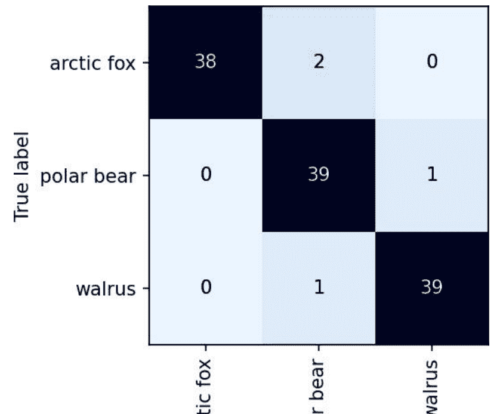

要查看迁移学习的实际效果，从*samples*文件夹加载一张北极狐图像。该文件夹包含模型既未训练也未验证过的野生动物图像：

```
python
x = image.load_img('Wildlife/samples/arctic_fox/arctic_fox_140.jpeg',
                   target_size=(224, 224))
plt.xticks([])
plt.yticks([])
plt.imshow(x)
```

现在预处理图像，将其通过ResNet50V2的特征提取层，然后将输出通过新训练的分类层：

```
python
x = image.img_to_array(x)
x = np.expand_dims(x, axis=0)
x = preprocess_input(x) / 255

y = base_model.predict(x)
predictions = model.predict(y)

for i, label in enumerate(class_labels):
    print(f'{label}: {predictions[0][i]}')
```

对我来说，网络以接近100%的置信度预测该图像包含北极狐：

```
arctic fox: 1.0
polar bear: 0.0
```

海象：0.0

这或许并不令人意外，因为ResNet50V2是使用北极狐图像训练的。但现在让我们加载一张海象图像，你可能还记得，ResNet50V2无法对其进行分类：

```python
x = image.load_img('Wildlife/samples/walrus/walrus_143.png',
                  target_size=(224, 224))
plt.xticks([])
plt.yticks([])
plt.imshow(x)
```

预处理图像并进行预测：

```python
x = image.img_to_array(x)
x = np.expand_dims(x, axis=0)
x = preprocess_input(x) / 255

y = base_model.predict(x)
predictions = model.predict(y)

for i, label in enumerate(class_labels):
    print(f'{label}: {predictions[0][i]}')
```

这次的结果如下：

```
arctic fox: 0.0
polar bear: 0.0
walrus: 1.0
```

ResNet50V2并未经过训练来识别海象，但你的网络做到了。这就是迁移学习的精髓。它相当于深度学习领域的“鱼与熊掌兼得”。这也是让卷积神经网络（CNN）成为任何拥有笔记本电脑和几百张训练图像的人都能使用的可行工具的秘诀。

这并不是说迁移学习*总是*能让你用每类100张图像就达到97%的准确率。它做不到。如果数据集缺乏实现那种分离度的信息，无论是从头构建的CNN还是迁移学习都无法神奇地实现这一点。这在机器学习和人工智能领域始终是真理。你无法从石头里榨出水，也无法从不支持它的数据中构建出精确的模型。

### 数据增强

前面的例子演示了如何使用迁移学习构建一个模型，仅用300张训练图像就能以97%的准确率对三种不同类型的北极野生动物照片进行分类。迁移学习的好处之一是它能用更少的图像做更多的事。然而，这个特性也是一个缺陷。每类只有大约100个样本，图像之间的多样性就很少。如果熊的头部在照片中完美居中，模型或许能识别出北极熊。但如果训练图像不包括头部位置不同或倾斜角度不同的照片，模型可能就难以对该照片进行分类。

一个解决方案是*数据增强*。与其费力寻找更多训练图像，不如对现有的图像进行旋转、平移和缩放。它并不*总是*能提高CNN的准确率，但经常可以，尤其是在数据集较小的情况下。Keras使得随机变换提供给网络的训练图像变得容易。图像在每个训练周期（epoch）中都会被不同地变换，因此如果你训练10个周期，网络就会看到每张训练图像的10种不同变体。这可以提高模型的泛化能力，而对训练时间影响很小。图10-12展示了对一张热狗图像应用随机变换的效果。你可以明白为什么以不同方式向模型呈现同一张图像，可能会使模型更擅长识别热狗，无论热狗是如何构图的。

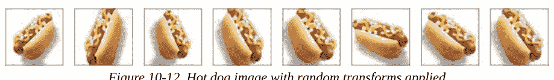

Keras内置了对图像数据增强的支持。让我们看看几种应用图像增强的方法，然后将其应用于北极野生动物模型。

### 使用ImageDataGenerator进行图像增强

在训练模型时应用图像增强的一种方法是使用Keras的`ImageDataGenerator`类。`ImageDataGenerator`可以动态生成训练图像批次，这些图像可以来自你加载的图像（例如，使用Keras的`load_img`函数），也可以来自文件系统中的指定位置。后者在使用数百万张图像训练CNN时特别有用，因为它将图像分批加载到内存中，而不是一次性全部加载。然而，无论图像来自哪里，`ImageDataGenerator`在提供图像时都乐意应用变换。

这里有一个你可以自己尝试的简单例子。使用以下代码从文件系统加载一张图像，用`ImageDataGenerator`包装它，并生成该图像的24个版本：

```python
import numpy as np
from tensorflow.keras.preprocessing import image
from tensorflow.keras.preprocessing.image import ImageDataGenerator
import matplotlib.pyplot as plt
%matplotlib inline

# Load an image
x = image.load_img('Wildlife/train/polar_bear/polar_bear_010.jpeg')
x = image.img_to_array(x)
x = np.expand_dims(x, axis=0)

# Wrap an ImageDataGenerator around it
idg = ImageDataGenerator(rescale=1./255,
                        horizontal_flip=True,
                        rotation_range=30,
                        width_shift_range=0.2,
                        height_shift_range=0.2,
                        zoom_range=0.2)
idg.fit(x)

# Generate 24 versions of the image
generator = idg.flow(x, [0], batch_size=1, seed=0)
fig, axes = plt.subplots(3, 8, figsize=(16, 6),
                        subplot_kw={'xticks': [], 'yticks': []})
for i, ax in enumerate(axes.flat):
    img, label = generator.next()
    ax.imshow(img[0])
```

结果如下：

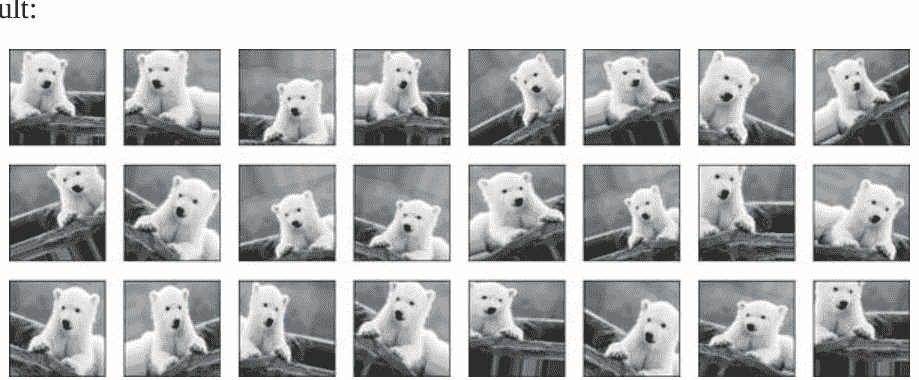

传递给`ImageDataGenerator`的参数告诉它如何变换它提供的每张图像：

- `rescale=1./255`：将每个像素值除以255
- `horizontal_flip=True`：随机水平翻转图像（绕垂直轴）
- `rotation_range=30`：随机将图像旋转-30到30度
- `width_shift_range=0.2`和`height_shift_range=0.2`：随机将图像平移-20%到20%
- `zoom_range=0.2`：随机将图像缩放-20%到20%

还有其他参数可以使用，例如`vertical_flip`、`shear_range`和`brightness_range`，但你已经明白了。本例中使用的`flow`方法从你传递给`fit`的图像生成图像。相关的`flow_from_directory`方法从文件系统加载图像，并可选地根据它们所在的子目录进行标记。

`flow`返回的生成器可以直接传递给模型的`fit`方法，在训练过程中为模型提供随机变换的图像。假设`x_train`和`y_train`保存了一组训练图像和标签。以下代码用`ImageDataGenerator`包装它们，并使用它们来训练模型：

```python
idg = ImageDataGenerator(rescale=1./255,
                        horizontal_flip=True,
                        rotation_range=30,
                        width_shift_range=0.2,
                        height_shift_range=0.2,
                        zoom_range=0.2)

idg.fit(x_train)
image_batch_size = 10
generator = idg.flow(x_train, y_train, batch_size=image_batch_size, seed=0)

model.fit(generator,
          steps_per_epoch=len(x_train) // image_batch_size,
          validation_data=(x_test, y_test),
          batch_size=20,
          epochs=10)
```

`steps_per_epoch`参数是关键，因为`ImageDataGenerator`可以为每张图像提供无限数量的版本。在这个例子中，传递给`flow`的`batch_size`参数告诉生成器在每个批次中创建10张图像。将图像数量除以图像批次大小来计算`steps_per_epoch`，可以确保在每个训练周期中，模型都能获得数据集中每张图像的一个变换版本。

> **注意**

Keras 2.1之前的版本不允许将生成器传递给`fit`方法。相反，它们提供了一个名为`fit_generator`的单独方法。该方法已弃用，并将在未来版本中移除。

请注意，对`fit`的调用包含一个`validation_data`参数，指定了用于在训练期间验证网络的单独图像和标签集。通常，你*不*希望对验证图像进行增强，因此在将生成器传递给`fit`时，应避免使用`validation_split`。

### 使用增强层进行图像增强

你可以使用`ImageDataGenerator`为模型提供变换后的图像，但最近版本的Keras提供了另一种选择，即[图像预处理层](https://keras.io/api/layers/preprocessing_layers/)和[图像增强层](https://keras.io/api/layers/preprocessing_layers/image_augmentation/)。你不必单独变换训练图像，而是可以将变换直接集成到模型中。以下是一个例子：

```python
from tensorflow.keras.models import Sequential
from tensorflow.keras.layers import Conv2D, MaxPooling2D, Flatten, Dense
from tensorflow.keras.layers import Rescaling, RandomFlip, RandomRotation
from tensorflow.keras.layers import RandomTranslation, RandomZoom

model = Sequential()
model.add(Rescaling(1./255))
model.add(RandomFlip(mode='horizontal'))
model.add(RandomTranslation(0.2, 0.2))
model.add(RandomRotation(0.2))
model.add(RandomZoom(0.2))
model.add(Conv2D(32, (3, 3), activation='relu', input_shape=(224, 224, 3)))
```

model.add(MaxPooling2D(2, 2))
model.add(Conv2D(128, (3, 3), activation='relu'))
model.add(MaxPooling2D(2, 2))
model.add(Flatten())
model.add(Dense(128, activation='relu'))
model.add(Dense(3, activation='softmax'))

用于训练CNN的每张图像，其像素值都会除以255，然后进行随机翻转、平移、旋转和缩放。重要的是，`RandomFlip`、`RandomTranslation`、`RandomRotation`和`RandomZoom`层仅在训练图像时起作用。当网络进行验证或预测时，它们处于非活动状态。因此，在训练包含图像增强层的模型时，使用`validation_split`是没问题的。`Rescaling`层始终处于活动状态，这意味着你不再需要记住在训练模型或提交图像进行分类之前将像素值除以255。

### 将图像增强应用于北极野生动物

图像增强能否使迁移学习效果更好？有一个方法可以找出答案。

创建一个Jupyter笔记本，并复制迁移学习示例中加载训练和测试图像的代码。然后使用以下语句来准备数据。注意，这次不需要除以255，因为`Rescaling`层会处理这一点：

```
import numpy as np
from tensorflow.keras.applications.resnet50 import preprocess_input

x_train = preprocess_input(np.array(x_train))
x_test = preprocess_input(np.array(x_test))

y_train = np.array(y_train)
y_test = np.array(y_test)
```

现在加载不包含分类层的ResNet50V2，并使用ImageNet权重进行初始化。这里的一个关键要素是，在训练网络时，通过将瓶颈层的`trainable`属性设置为`False`来阻止其训练，从而有效地冻结这些层。我们不是将每个单独层的`trainable`属性设置为`False`，而是将模型本身的`trainable`设置为`False`，并允许该设置被各个层“继承”：

```
from tensorflow.keras.applications import ResNet50V2

base_model = ResNet50V2(weights='imagenet', include_top=False)
base_model.trainable = False
```

定义一个网络，该网络包含缩放层、增强层、ResNet50V2的瓶颈层以及用于分类的密集层。然后训练网络：

```
from tensorflow.keras.models import Sequential
from tensorflow.keras.layers import Flatten, Dense, Rescaling, RandomFlip
from tensorflow.keras.layers import RandomRotation, RandomTranslation, RandomZoom

model = Sequential()
model.add(Rescaling(1./255))
model.add(RandomFlip(mode='horizontal'))
model.add(RandomTranslation(0.2, 0.2))
model.add(RandomRotation(0.2))
model.add(RandomZoom(0.2))
model.add(base_model)
model.add(Flatten())
model.add(Dense(1024, activation='relu'))
model.add(Dense(3, activation='softmax'))
model.compile(optimizer='adam', loss='sparse_categorical_crossentropy',
              metrics=['accuracy'])

hist = model.fit(x_train, y_train,
                 validation_data=(x_test, y_test),
                 batch_size=10, epochs=10)
```

网络训练得如何？绘制每个epoch的训练准确率和验证准确率：

```
import seaborn as sns
sns.set()

acc = hist.history['accuracy']
val_acc = hist.history['val_accuracy']
epochs = range(1, len(acc) + 1)

plt.plot(epochs, acc, '-', label='Training Accuracy')
plt.plot(epochs, val_acc, ':', label='Validation Accuracy')
plt.title('Training and Validation Accuracy')
plt.xlabel('Epoch')
plt.ylabel('Accuracy')
plt.legend(loc='lower right')
plt.plot()
```

如果运气好，准确率会略高于未经数据增强训练的模型：

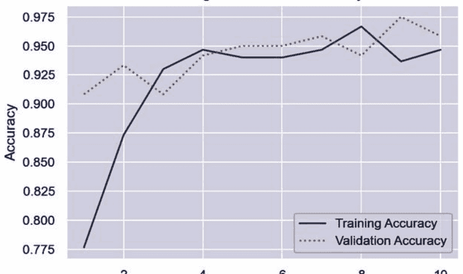

> **注意**

你可能会发现，使用数据增强的模型版本比不使用的版本准确率*更低*。为确保准确，我将每个版本训练了10次并取平均值。我发现，数据增强版本平均比缺乏增强的版本高出约0.5%的准确率。这虽然不多，但数据科学家们经常不遗余力地只为提高零点几个百分点的准确率。

使用混淆矩阵来可视化网络在测试期间的表现：

```
from sklearn.metrics import ConfusionMatrixDisplay as cmd

sns.reset_orig()
fig, ax = plt.subplots(figsize=(4, 4))
ax.grid(False)

y_pred = model.predict(x_test)
class_labels = ['arctic fox', 'polar bear', 'walrus']

cmd.from_predictions(y_test, y_pred.argmax(axis=1),
                     display_labels=class_labels, colorbar=False,
                     cmap='Blues', xticks_rotation='vertical', ax=ax)
```

以下是我的结果：

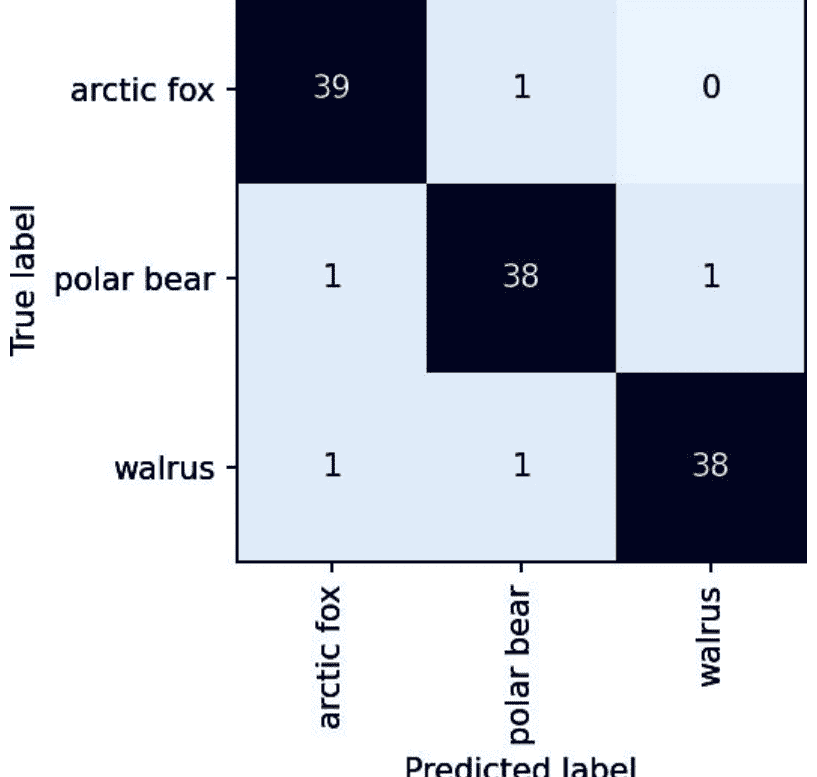

数据科学家有时即使在从头训练CNN而非使用迁移学习时，也会采用数据增强，尤其是在数据集相对较小的情况下。这是一个值得了解的有用工具，当你试图从深度学习模型中榨取每一丝准确率时，它可能会产生影响。

### 全局池化

在CNN中包含Flatten层的目的是将包含最终特征图的3D张量重塑为适合输入到Dense层的1D张量。但Flatten并不是唯一的方法。Flatten有时会通过向分类层提供过多信息而导致过拟合。

对抗过拟合的一种方法是引入Dropout层。另一种策略是减少Dense层的宽度。第三种选择是用GlobalMaxPooling2D层或GlobalAveragePooling2D层替换Flatten层。它们也输出1D张量，但它们生成张量的方式不同。而这种方式不太容易导致过拟合。

为了演示，修改本章前面的MNIST数据集示例，使用GlobalMaxPooling2D层而不是Flatten层：

```
from tensorflow.keras.models import Sequential
from tensorflow.keras.layers import Conv2D, MaxPooling2D, GlobalMaxPooling2D, Dense

model = Sequential()
model.add(Conv2D(32, (3, 3), activation='relu', input_shape=(28, 28, 1)))
model.add(MaxPooling2D((2, 2)))
model.add(Conv2D(64, (3, 3), activation='relu'))
model.add(MaxPooling2D((2, 2)))
model.add(GlobalMaxPooling2D()) # 代替 Flatten()
model.add(Dense(128, activation='relu'))
model.add(Dense(10, activation='softmax'))
model.compile(optimizer='adam', loss='sparse_categorical_crossentropy',
              metrics=['accuracy'])
model.summary(line_length=120)
```

摘要（图10-13）显示，GlobalMaxPooling2D层的输出是一个包含64个值的张量——每个值对应最终MaxPooling2D层发出的一个特征图——而不是像Flatten层那样是5 × 5 × 64，即1,600个值。每个值是每个5 × 5特征图中25个值的最大值。如果你使用GlobalAveragePooling2D，每个值将是每个特征图中25个值的平均值。

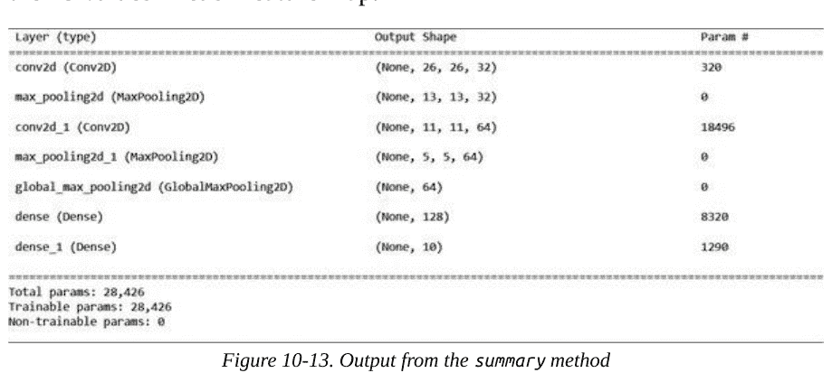

全局池化有时会提高CNN的泛化能力，有时则不会。对于MNIST数据集，它略微降低了准确率。正如机器学习中经常发生的那样，唯一的方法就是尝试。并且由于训练神经网络固有的随机性，在得出结论之前，最好在每种配置下训练网络多次并取平均值。

### 使用CNN进行音频分类

想象一下，你是一群关注地球日益减少的雨林的气候科学家的负责人。世界每年损失多达1000万英亩的原始雨林，其中大部分是由于非法伐木造成的。你的团队计划将数千部废弃的智能手机改装成太阳能供电的监听设备，并将它们部署在整个亚马逊地区，以响应电锯和卡车引擎的声音发出警报。你需要一款使用AI实时识别此类声音的软件。而且你需要尽快，因为气候变化不会等待。

执行音频分类的一种有效方法是将音频流转换为频谱图图像，频谱图提供了频率随时间变化的视觉表示，然后使用CNN对频谱图进行分类。图10-14中的频谱图是由包含电锯声音的WAV文件生成的。让我们使用迁移学习来创建一个能够识别这种特征性

### 识别雨林中的非法伐木声音

本节教程的灵感来源于雨林连接项目，该项目使用回收的Android手机来监测雨林中的非法活动声音。一个托管在云端的TensorFlow卷积神经网络分析来自这些手机的音频，未来可能借助TensorFlow Lite（一个专为移动、嵌入式和边缘设备设计的TensorFlow精简版）直接在手机上运行。更多信息，请参阅Google AI博客中的“用TensorFlow对抗非法砍伐森林”。这只是AI让世界变得更美好的一个例子。

首先，下载一个包含雨林声音数据集的ZIP文件。（警告：文件大小为666 MB。）在你的笔记本电脑所在的目录下创建一个名为 *Sounds* 的子目录，并将ZIP文件的内容复制到该子目录中。*Sounds* 现在包含名为 *background*、*chainsaw*、*engine* 和 *storm* 的子目录。每个子目录包含100个WAV文件。*background* 目录中的WAV文件仅包含雨林背景噪音，而其他子目录中的文件则包含叠加在背景噪音上的电锯声、发动机声和雷暴声。我使用名为Scaper的声音景观合成包，将公共UrbanSound8K数据集中的声音与雨林声音结合，生成了这些文件。在你的电脑上播放几个WAV文件，感受一下它们包含的声音。

现在创建一个Jupyter笔记本，并将以下代码粘贴到第一个单元格中：

```python
import numpy as np
import librosa.display, os
import matplotlib.pyplot as plt
%matplotlib inline

def create_spectrogram(audio_file, image_file):
    fig = plt.figure()
    ax = fig.add_subplot(1, 1, 1)
    fig.subplots_adjust(left=0, right=1, bottom=0, top=1)

    y, sr = librosa.load(audio_file)
    ms = librosa.feature.melspectrogram(y=y, sr=sr)
    log_ms = librosa.power_to_db(ms, ref=np.max)
    librosa.display.specshow(log_ms, sr=sr)

    fig.savefig(image_file)
    plt.close(fig)

def create_pngs_from_wavs(input_path, output_path):
    if not os.path.exists(output_path):
        os.makedirs(output_path)

    dir = os.listdir(input_path)
    for i, file in enumerate(dir):
        input_file = os.path.join(input_path, file)
        output_file = os.path.join(output_path, file.replace('.wav', '.png'))
        create_spectrogram(input_file, output_file)
```

这段代码定义了一对函数，用于将WAV文件转换为频谱图图像。`create_spectrogram` 使用名为Librosa的Python包从WAV文件创建频谱图图像。`create_pngs_from_wavs` 将指定目录中的所有WAV文件转换为频谱图图像。如果尚未安装Librosa，你需要安装它。

使用以下语句从 *Sounds* 目录的子目录中的所有WAV文件创建包含频谱图的PNG文件：

```python
create_pngs_from_wavs('Sounds/background', 'Spectrograms/background')
create_pngs_from_wavs('Sounds/chainsaw', 'Spectrograms/chainsaw')
create_pngs_from_wavs('Sounds/engine', 'Spectrograms/engine')
create_pngs_from_wavs('Sounds/storm', 'Spectrograms/storm')
```

检查 *Spectrograms* 目录，确认其中包含频谱图的子目录，并且每个子目录包含100个PNG文件。然后使用以下代码定义两个新的辅助函数，用于加载和显示频谱图，并声明两个Python列表——一个用于存储频谱图图像，另一个用于存储类别标签：

```python
from tensorflow.keras.preprocessing import image

def load_images_from_path(path, label):
    images, labels = [], []

    for file in os.listdir(path):
        images.append(image.img_to_array(image.load_img(os.path.join(path, file),
                                                       target_size=(224, 224, 3))))
        labels.append((label))

    return images, labels

def show_images(images):
    fig, axes = plt.subplots(1, 8, figsize=(20, 20),
                            subplot_kw={'xticks': [], 'yticks': []})

    for i, ax in enumerate(axes.flat):
        ax.imshow(images[i] / 255)

x, y = [], []
```

使用以下语句加载背景频谱图图像，将它们添加到名为x的列表中，并用0标记它们：

```python
images, labels = load_images_from_path('Spectrograms/background', 0)
show_images(images)

x += images
y += labels
```

重复此过程，从 *Spectrograms/chainsaw* 目录加载电锯频谱图，从 *Spectrograms/engine* 目录加载发动机频谱图，从 *Spectrograms/storm* 目录加载雷暴频谱图。用电锯频谱图标记为1，发动机频谱图标记为2，雷暴频谱图标记为3。以下是四类图像的标签：

| 频谱图类型 | 标签 |
|---|---|
| 背景 | 0 |
| 电锯 | 1 |
| 发动机 | 2 |
| 雷暴 | 3 |

由于这个模型未来可能在手机上运行，我们将使用MobileNetV2作为基础网络。使用以下代码预处理像素，并将图像和标签分成两个数据集——一个用于训练，一个用于测试：

```python
from sklearn.model_selection import train_test_split
from tensorflow.keras.applications.mobilenet import preprocess_input

x = preprocess_input(np.array(x))
y = np.array(y)

x_train, x_test, y_train, y_test = train_test_split(x, y, stratify=y,
                                                    test_size=0.3,
                                                    random_state=0)
```

调用Keras的 `MobileNetV2` 函数实例化不包含分类层的MobileNetV2。然后将训练数据和测试数据通过MobileNetV2，从频谱图图像中提取特征：

```python
from tensorflow.keras.applications import MobileNetV2

base_model = MobileNetV2(weights='imagenet', include_top=False,
                        input_shape=(224, 224, 3))

train_features = base_model.predict(x_train)
test_features = base_model.predict(x_test)
```

定义一个神经网络来对MobileNetV2提取的特征进行分类：

```python
from tensorflow.keras.models import Sequential
from tensorflow.keras.layers import Dense, Flatten

model = Sequential()
model.add(Flatten())
model.add(Dense(512, activation='relu'))
model.add(Dense(4, activation='softmax'))
model.compile(optimizer='adam', loss='sparse_categorical_crossentropy',
              metrics=['accuracy'])
```

> **注意**

作为一个实验，我将Flatten层替换为GlobalAveragePooling2D层。验证准确率略有提高，但当使用从纪录片视频中提取的音频进行测试时，模型的泛化能力变差了。这强调了第9章的一个重要观点：只有当模型用它从未见过的数据进行测试时——最好是来自不同来源的数据——你才能完全信任和确信该模型。

使用特征训练网络：

```python
hist = model.fit(train_features, y_train,
                 validation_data=(test_features, y_test),
                 batch_size=10, epochs=10)
```

绘制训练和验证准确率：

```python
import seaborn as sns
sns.set()

acc = hist.history['accuracy']
val_acc = hist.history['val_accuracy']
epochs = range(1, len(acc) + 1)

plt.plot(epochs, acc, '-', label='Training Accuracy')
plt.plot(epochs, val_acc, ':', label='Validation Accuracy')
plt.title('Training and Validation Accuracy')
plt.xlabel('Epoch')
plt.ylabel('Accuracy')
plt.legend(loc='lower right')
plt.plot()
```

验证准确率应达到95%或更高：

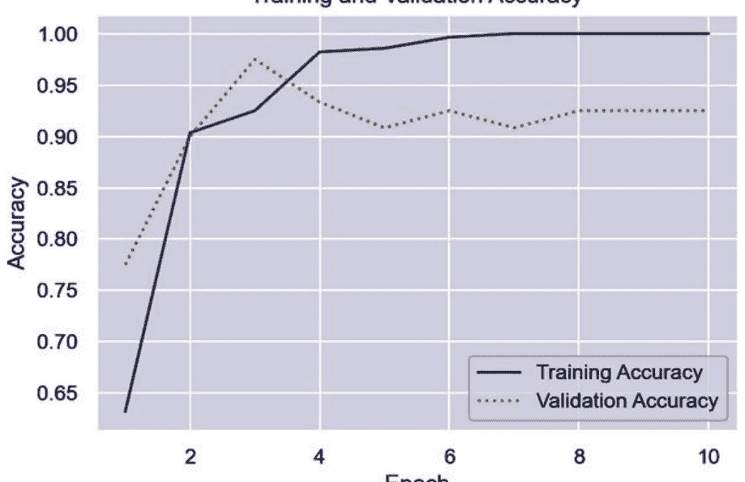

将测试图像输入网络，并使用混淆矩阵评估结果：

```python
from sklearn.metrics import ConfusionMatrixDisplay as cmd

sns.reset_orig()
fig, ax = plt.subplots(figsize=(4, 4))
ax.grid(False)

y_pred = model.predict(test_features)
class_labels = ['background', 'chainsaw', 'engine', 'storm']

cmd.from_predictions(y_test, y_pred.argmax(axis=1),
                     display_labels=class_labels, colorbar=False,
                     cmap='Blues', xticks_rotation='vertical', ax=ax)
```

该网络在识别不包含电锯或发动机声音的片段方面相当擅长。它有时会混淆电锯声和发动机声。这没关系，因为这两种声音中的任何一种都可能表明雨林中存在非法活动：

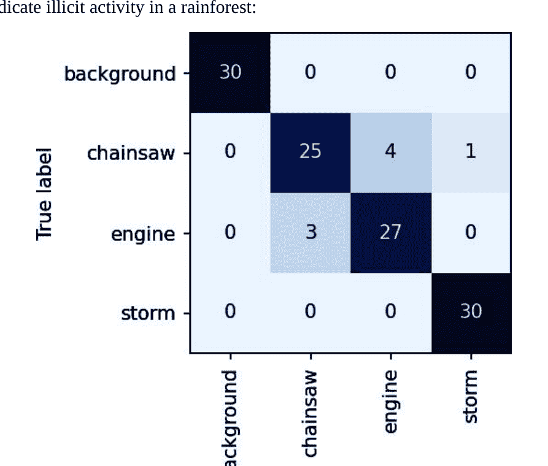

*Sounds* 目录中有一个名为 *samples* 的子目录，其中包含CNN既未训练也未验证过的WAV文件。这些WAV文件与用于训练和测试的样本无关；它们来自一个记录巴西打击非法砍伐森林努力的YouTube视频。让我们使用你刚刚训练的模型来分析这些文件中的伐木活动声音。

首先，从第一个样本WAV文件创建一个频谱图，该文件包含伐木者在亚马逊砍伐树木的音频：

create_spectrogram('Sounds/samples/sample1.wav', 'Spectrograms/sample1.png')

x = image.load_img('Spectrograms/sample1.png', target_size=(224, 224))
plt.xticks([])
plt.yticks([])
plt.imshow(x)

预处理频谱图图像，将其传递给 MobileNetV2 进行特征提取，并对特征进行分类：

x = image.img_to_array(x)
x = np.expand_dims(x, axis=0)
x = preprocess_input(x)

y = base_model.predict(x)
predictions = model.predict(y)

for i, label in enumerate(class_labels):
    print(f'{label}: {predictions[0][i]}')

现在，从一个包含伐木卡车在雨林中轰鸣声的 WAV 文件创建频谱图：

create_spectrogram('Sounds/samples/sample2.wav', 'Spectrograms/sample2.png')

x = image.load_img('Spectrograms/sample2.png', target_size=(224, 224))
plt.xticks([])
plt.yticks([])
plt.imshow(x)

预处理图像，将其传递给 MobileNetV2 进行特征提取，并对特征进行分类：

x = image.img_to_array(x)
x = np.expand_dims(x, axis=0)
x = preprocess_input(x)

y = base_model.predict(x)
predictions = model.predict(y)

for i, label in enumerate(class_labels):
    print(f'{label}: {predictions[0][i]}')

如果网络对任何一个样本分类错误，请尝试重新训练它。请记住，神经网络每次训练的结果都会有所不同，部分原因是 Keras 使用小的随机值来初始化权重。在现实世界中，数据科学家通常会多次训练神经网络并取平均结果，以量化其准确性。

### 总结

卷积神经网络在图像分类方面表现出色，因为它们使用卷积核从不同分辨率的图像中提取特征——这些特征旨在突出类别之间的差异。卷积层使用卷积核提取特征，池化层则减小卷积层输出的特征图的大小。这些层的输出被输入到全连接层进行分类。Keras 在 `Conv2D` 和 `MaxPooling2D` 等类中提供了卷积层和池化层的实现。

当类别之间存在相对较高的分离度时——例如 MNIST 数据集——从头开始训练 CNN 在普通的笔记本电脑或 PC 上是可行的。训练 CNN 来解决更具感知性的问题则需要更多的训练图像和相应的更多计算能力。迁移学习是训练 CNN 的一种实用替代方案。它利用预训练 CNN 瓶颈层中已有的智能来从图像中提取特征，然后使用自己的分类层来解释结果。

数据增强可以提高使用相对较少图像训练的 CNN 的准确性，并且在迁移学习中尤其有用。增强涉及对训练图像应用随机变换，如平移和旋转。你可以使用 Keras 的 `ImageDataGenerator` 类在将图像输入网络之前对其进行变换，也可以通过 `RandomRotation` 和 `RandomTranslation` 等层将变换构建到网络中。变换图像的层在训练时是活跃的，但在网络进行预测时则不活跃。

CNN 适用于各种计算机视觉问题，并且在过去十年中该领域的快速进步几乎完全归功于它们。它们在现代人脸识别系统中也扮演着重要角色。想了解更多吗？检测和识别照片中的人脸是下一章的主题。

## 第 11 章 人脸检测与识别

不久前，我登上了一趟飞往欧洲的航班，惊讶地发现我不需要出示护照。我走过一个摄像头前，很快就收到了登机欢迎。这是达美航空 [推进人脸识别](https://example.com) 并提供从路边到登机口的无接触旅行体验的早期试点项目的一部分。

人脸识别无处不在。它是 AI 最常见、有时也最具争议的应用之一。Meta（前身为 Facebook）使用它在照片中标记朋友——至少在它 [因隐私问题而取消该功能](https://example.com) 之前是这样。Apple 使用它 [允许用户解锁 iPhone](https://example.com)，而 Microsoft 使用它来解锁 Windows PC。Uber 使用它来 [确认其司机的身份](https://example.com)。如果使用得当，人脸识别在让世界变得更美好、更安全、更可靠方面具有巨大潜力。

假设你想构建一个系统来识别照片或视频帧中的人。也许它是 [限制大学宿舍进入权限](https://example.com) 的安全系统的一部分，只允许授权的学生和工作人员进入。或者你正在编写一个应用程序，在你的硬盘上搜索你认识的人的照片。（“给我看所有我和我女儿的照片。”）构建这样的系统需要能够执行以下操作的算法或模型：

- 在照片或视频帧中寻找人脸，这个过程称为 *人脸检测*
- 识别检测到的人脸，这个过程称为 *人脸识别* 或 *人脸身份识别*

存在许多著名的算法用于在照片中寻找和识别人脸。有些依赖于深度学习——特别是卷积神经网络——而有些则不依赖。毕竟，人脸识别在深度学习爆发之前几十年就已经存在了。但深度学习极大地推动了人脸识别科学的发展，使其比以往任何时候都更加实用。

本章首先介绍两种流行的人脸检测方法。然后转向人脸识别，并介绍迁移学习作为识别人脸的一种手段。最后通过一个教程，你将把这些部分组合起来，构建自己的人脸识别系统。听起来很有趣？那么让我们开始吧。

### 人脸检测

接下来的章节将介绍两种广泛使用的人脸检测算法——一种依赖于机器学习，另一种使用深度学习——以及实现它们的库。目标是能够找到像 [图 11-1](https://example.com) 中那样的照片或视频帧中的所有人脸。之后，我将提供一个易于使用的函数，你可以调用它来从照片中提取所有人脸图像，并将其保存到磁盘或提交给人脸识别模型。

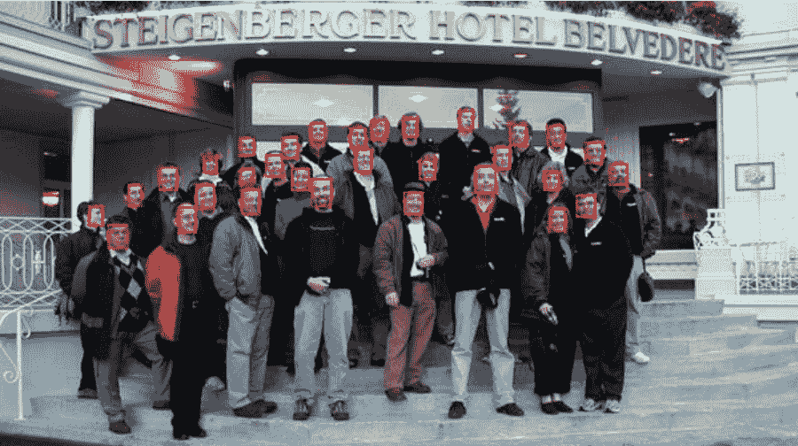

### 使用 Viola-Jones 进行人脸检测

用于检测照片中人脸的最快、最流行的算法之一源于 2001 年发表的一篇题为“使用简单特征的增强级联进行快速目标检测”的论文。该算法有时被称为 Viola-Jones（论文作者的名字），它基于相邻像素块的相对强度。例如，眼睛周围矩形区域的平均像素强度通常比该区域正下方矩形区域的平均像素强度要暗。同样，鼻梁通常比眼睛周围的区域要亮，因此两个暗矩形中间夹一个亮矩形可能代表两只眼睛和一个鼻子。在帧中正确位置存在许多这样的类 Haar 特征，表明该帧包含人脸（图 11-2）。

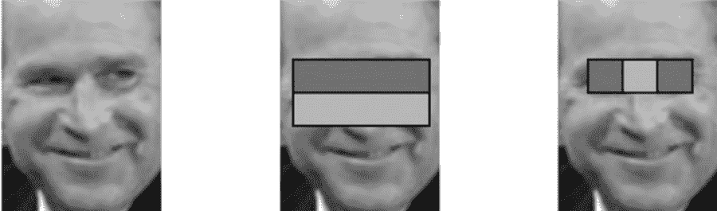

Viola-Jones 的工作原理是将各种大小的窗口在图像上滑动，寻找在正确位置具有类 Haar 特征的帧。在每个停留点，窗口中的像素被缩放到指定大小（通常是 24 × 24），提取特征并输入到一个二元分类器中，该分类器返回正数表示帧包含人脸，返回负数表示不包含。然后窗口滑动到下一个位置，检测过程重新开始。

Viola-Jones 性能的关键在于二元分类器。一个 24 像素宽、24 像素高的帧包含超过 160,000 个矩形组合，这些矩形代表潜在的类 Haar特征。Viola-Jones算法并非为每种特征组合都计算值，而是仅计算分类器所需的那些特征。此外，分类器所需特征的数量取决于图像帧的内容。分类器实际上是由多个二元分类器按阶段排列而成。第一阶段可能仅需一个特征，第二阶段可能需要10个，第三阶段可能需要20个，依此类推。只有当第 *n-1* 阶段返回正结果时，才会提取特征并传递给第 *n* 阶段，由此产生了 *级联分类器* 这一术语。

图11-3展示了一个三级级联分类器。每个阶段都经过精心调校，即使误报率较高，也能使用有限数量的特征实现100%的检测率。在第一阶段，一个特征即可判断图像帧是否包含人脸。正响应意味着该帧 *可能* 包含人脸；负响应则意味着几乎可以肯定不包含人脸，此时不会进行进一步检查。然而，如果第一阶段返回正结果，则会提取另外10个特征并传递给第二阶段。只有当 *所有* 阶段都返回正结果时，才会判定该帧包含人脸，从而使累积误报率接近于零。在机器学习中，这是一种被称为 *高召回率优先，再追求精确率* 的设计模式，因为虽然单个阶段被调校为高召回率，但累积效果却实现了高精确率。

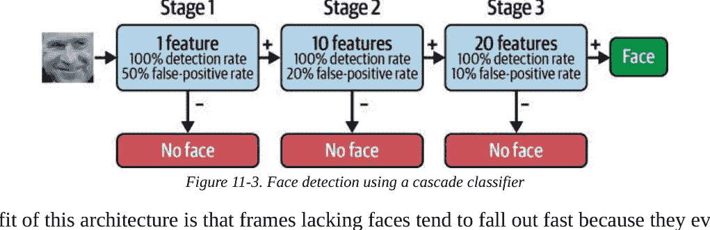

这种架构的一个好处是，不包含人脸的图像帧往往会很快被排除，因为它们在级联的早期阶段就会引发负响应。由于大多数帧 *不* 包含人脸，算法运行速度非常快，直到遇到包含人脸的帧。在使用一个基于4,916张人脸图像训练的、包含6,061个特征的38级分类器进行测试时，Viola和Jones发现，平均每个帧仅需提取10个特征。

Viola-Jones算法的有效性依赖于级联分类器，这本质上是一个使用人脸和非人脸图像训练的机器学习模型。训练过程缓慢，但预测速度很快。在某些方面，Viola-Jones的作用类似于一个手工设计的卷积神经网络，旨在提取判断图像帧是否包含人脸所需的最少特征。为了加速特征提取，Viola-Jones使用了一种名为 *积分图* 的巧妙数学技巧，以快速计算两个像素块之间的强度差异。其结果是一个能够以相对较高的准确度识别图像中人脸周围边界框的系统，并且其速度足以在实时视频帧中检测人脸。

### 使用OpenCV实现Viola-Jones

OpenCV是一个流行的开源计算机视觉库，可免费用于商业用途。它在其 `CascadeClassifier` 类中提供了Viola-Jones的实现，以及一个包含用于检测人脸的级联分类器的XML文件。以下语句在Jupyter notebook中使用 `CascadeClassifier` 来检测图像中的人脸并绘制矩形框。你可以使用自己的图像，或从GitHub [下载我示例中使用的图像](https://github.com)：

```python
import cv2
from cv2 import CascadeClassifier
from matplotlib.patches import Rectangle
import matplotlib.pyplot as plt
%matplotlib inline

image = plt.imread('Data/Amsterdam.jpg')
fig, ax = plt.subplots(figsize=(12, 8), subplot_kw={'xticks': [], 'yticks': []})
ax.imshow(image)

model = CascadeClassifier(cv2.data.haarcascades +
                          'haarcascade_frontalface_default.xml')
faces = model.detectMultiScale(image)

for face in faces:
    x, y, w, h = face
    rect = Rectangle((x, y), w, h, color='red', fill=False, lw=2)
    ax.add_patch(rect)
```

以下是使用一张几年前在阿姆斯特丹拍摄的母女照片得到的输出结果：

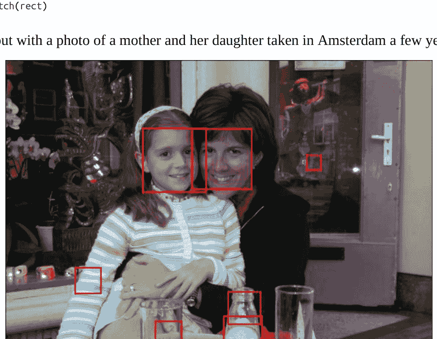

`CascadeClassifier` 检测到了照片中的两张人脸，但也出现了一些误报。一种缓解方法是使用 `minNeighbors` 参数。其默认值为3，但更高的值会使 `CascadeClassifier` 更具选择性。设置 `minNeighbors=20` 后，`detectMultiScale` 仅找到了这两个人的人脸：

```python
faces = model.detectMultiScale(image, minNeighbors=20)
```

输出结果如下：

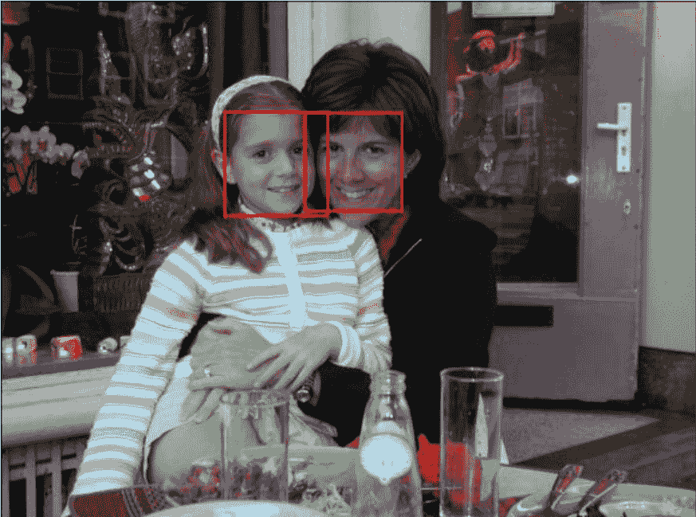

当 `detectMultiScale` 分析图像时，它通常会多次检测到同一张人脸，每次检测都由一个对齐方式略有不同的边界框定义。`minNeighbors` 参数指定了必须检测到人脸的最小次数才会将其报告为人脸。更高的值能带来更高的精确率（更少的误报），但代价是召回率降低，这意味着某些人脸可能无法被检测到。

`CascadeClassifier` 通常需要以这种方式进行调校，以在找到过多人脸和过少人脸之间取得平衡。考虑到这一点，它是目前最快的人脸检测算法之一。通过加载包含其他预训练分类器的XML文件，它也可用于检测人脸以外的物体。在 [OpenCV的GitHub仓库](https://github.com/opencv/opencv) 中，你可以找到使用Haar-like特征检测银器和其他物体的XML文件，以及使用一种名为 [局部二值模式](https://en.wikipedia.org/wiki/Local_binary_patterns) 的不同判别器检测物体的XML文件。

### 使用卷积神经网络进行人脸检测

虽然计算成本更高，但深度学习方法在检测图像中人脸方面通常比Viola-Jones做得更好。特别是 *多任务级联卷积神经网络*（MTCNN）已被证明在各种基准测试中擅长人脸检测。它们还能识别人脸关键点，如眼睛、鼻子和嘴巴。

[图11-4](https://example.com/figure11-4) 改编自2016年提出MTCNN的论文“[使用多任务级联卷积网络进行联合人脸检测与对齐](https://arxiv.org/abs/1604.02878)”中的示意图。MTCNN使用三个串联的卷积神经网络来检测人脸。第一个网络称为 *候选网络*（P-Net），是一个浅层CNN，它以多种分辨率搜索图像，寻找指示人脸的特征。P-Net识别出的矩形被组合形成候选人脸矩形，并输入到 *精炼网络*（R-Net），这是一个更深的CNN，它更仔细地检查每个矩形并拒绝那些不包含人脸的矩形。最后，R-Net的输出被输入到 *输出网络*（O-Net），它进一步过滤候选矩形并识别人脸关键点。MTCNN是多任务CNN，因为它们各自产生三个输出——一个分类输出，表示矩形包含人脸的置信度；以及两个回归输出，定位人脸和人脸关键点——而不仅仅是一个输出。并且它们像Viola-Jones分类器一样是级联的，可以快速排除不包含人脸的帧。

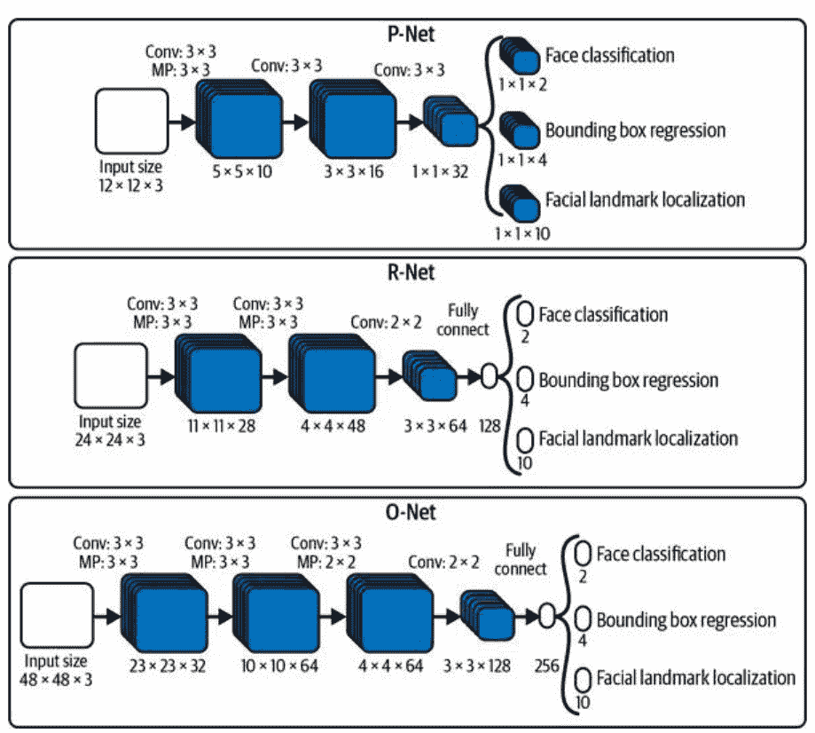

一个方便的MTCNN实现可在名为MTCNN的Python包中找到。以下语句使用它来检测与前面示例中相同照片里的人脸：

```python
import matplotlib.pyplot as plt
from matplotlib.patches import Rectangle
from mtcnn.mtcnn import MTCNN
%matplotlib inline

image = plt.imread('Data/Amsterdam.jpg')
fig, ax = plt.subplots(figsize=(12, 8), subplot_kw={'xticks': [], 'yticks': []})
ax.imshow(image)

detector = MTCNN()
faces = detector.detect_faces(image)

for face in faces:
    x, y, w, h = face['box']
    rect = Rectangle((x, y), w, h, color='red', fill=False, lw=2)
    ax.add_patch(rect)
```

结果如下：

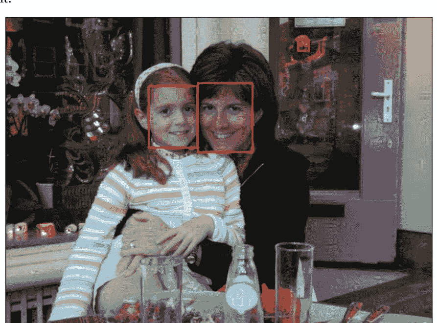

MTCNN不仅检测到了这两个人的人脸，还检测到了他们身后门上反射的一座雕像的脸。以下是 `detect_faces` 实际返回的内容——一个包含三个字典的列表，每个字典对应照片中的一张人脸：

```python
[
  {
    'box': [723, 248, 204, 258],
    'confidence': 0.9997798800468445,
    'keypoints': {
      'left_eye': (765, 341),
      'right_eye': (858, 343),
      'nose': (800, 408),
      'mouth_left': (770, 432),
      'mouth_right': (864, 433)
    }
  },
  {
    'box': [538, 258, 183, 232],
    'confidence': 0.9997591376304626,
    'keypoints': {
      'left_eye': (601, 353),
      'right_eye': (685, 344),
      'nose': (662, 394),
      'mouth_left': (614, 433),
      'mouth_right': (689, 424)
    }
  },
  {
    'box': [1099, 84, 40, 41],
    'confidence': 0.8863282203674316,
    'keypoints': {
```

'left_eye': (1108, 101),
    'right_eye': (1123, 96),
    'nose': (1116, 102),
    'mouth_left': (1114, 115),
    'mouth_right': (1127, 111)
  }
}
]
```

你可以通过以下两种方式之一来消除反射中的人脸：忽略置信度低于某个阈值的人脸，或者向 MTCNN 函数传递一个 `min_face_size` 参数，使 `detect_faces` 忽略小于指定尺寸的人脸。下面是一个采用前一种方法的修改后的 for 循环：

```
for face in faces:
    if face['confidence'] > 0.9:
        x, y, w, h = face['box']
        rect = Rectangle((x, y), w, h, color='red', fill=False, lw=2)
        ax.add_patch(rect)
```

结果如下：

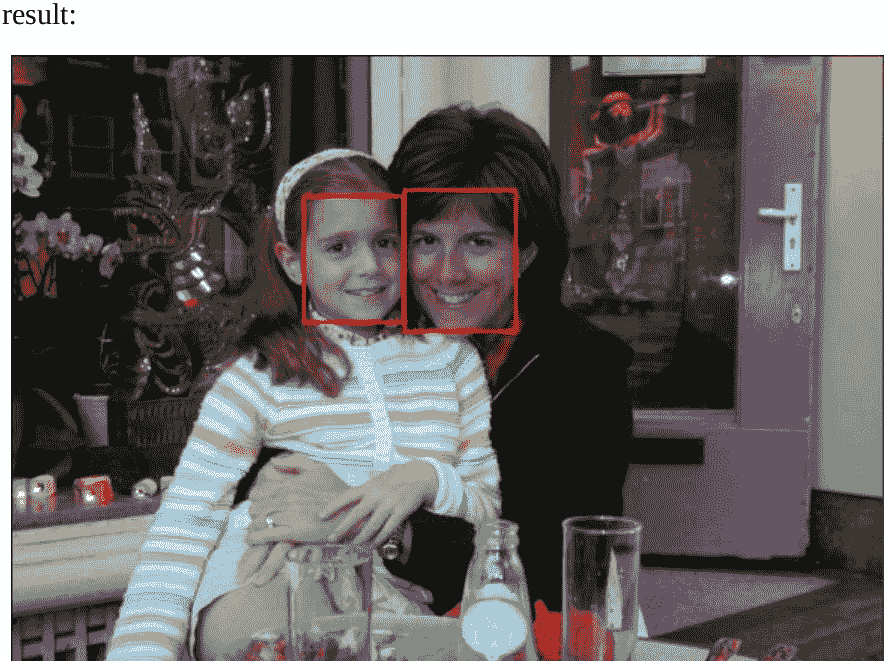

图 11-1 中的人脸矩形框是使用 MTCNN 的默认设置生成的——即没有基于置信度或人脸尺寸进行任何过滤。一般来说，它在开箱即用的情况下，检测人脸的效果比 `CascadeClassifier` 更好。

### 从照片中提取人脸

一旦你知道如何在照片中找到人脸，提取人脸图像就很简单了，无论是为了训练模型，还是将它们提交给已训练的模型进行识别。示例 11-1 展示了一个 Python 函数，它接受一个图像文件路径并返回一个人脸图像列表。默认情况下，它会裁剪人脸图像使其为正方形（非常适合传递给 CNN），但你可以通过传递 `crop=False` 参数来禁用裁剪。你还可以通过 `min_confidence` 参数指定最低置信度，其默认值为 0.9。

### 示例 11-1. 从照片中提取人脸图像的函数

```
import numpy as np
from PIL import Image, ImageOps
from mtcnn.mtcnn import MTCNN

def extract_faces(input_file, min_confidence=0.9, crop=True):
    # Load the image and orient it correctly
    pil_image = Image.open(input_file)
    exif = pil_image.getexif()

    for k in exif.keys():
        if k != 0x0112:
            exif[k] = None
            del exif[k]

    pil_image.info["exif"] = exif.tobytes()
    pil_image = ImageOps.exif_transpose(pil_image)
    image = np.array(pil_image)

    # Find the faces in the image
    detector = MTCNN()
    faces = detector.detect_faces(image)
    faces = [face for face in faces if face['confidence'] >= min_confidence]
    results = []

    for face in faces:
        x1, y1, w, h = face['box']

        if (crop):
            # Compute crop coordinates
            if w > h:
                x1 = x1 + ((w - h) // 2)
                w = h
            elif h > w:
                y1 = y1 + ((h - w) // 2)
                h = w

        # Extract the facial image and add it to the list
        x2 = x1 + w
        y2 = y1 + h
        results.append(Image.fromarray(image[y1:y2, x1:x2]))

    # Return all the facial images
    return results
```

我将图 11-5 中的照片传递给该函数，它返回了下面的人脸。`extract_faces` 返回的项目是 Python Imaging Library (PIL) 图像，因此你可以用一行代码调整它们的大小或保存到磁盘。下面是一个代码片段，它从一张照片中提取所有人脸，将它们调整为 224 × 224 像素，并保存调整后的图像：

```
faces = extract_faces('PATH_TO_IMAGE_FILE')

for i, face in enumerate(faces):
    face.resize((224, 224)).save(f'face{i}.jpg')
```

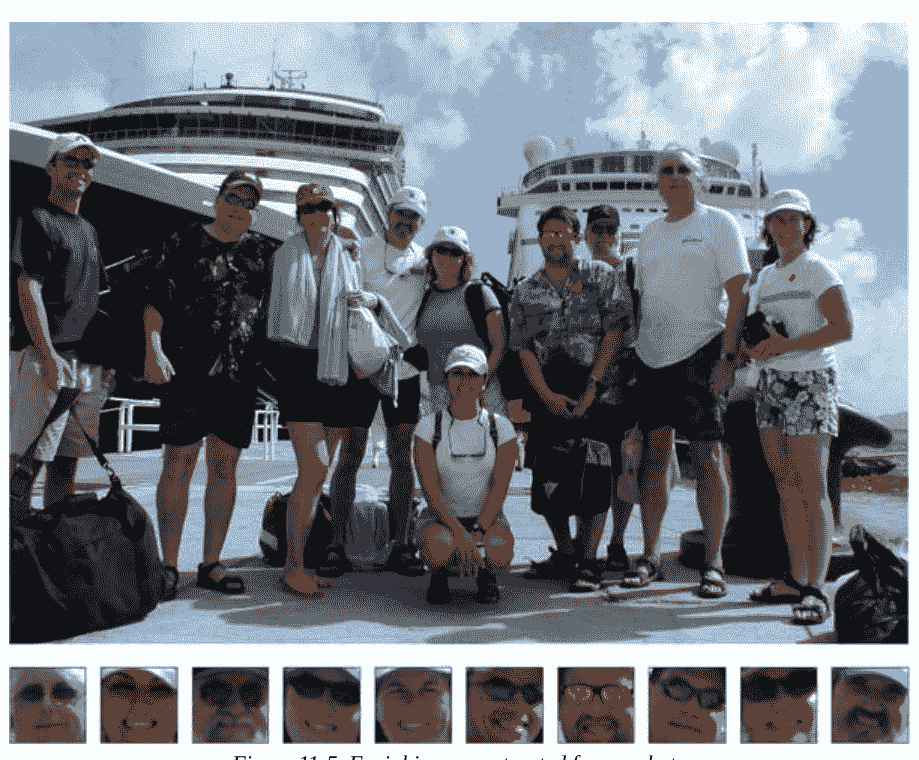

有了 `extract_faces` 的帮助，从硬盘上的一批照片中生成一组用于训练 CNN 的人脸图像，或者从一张照片中提取人脸并将其提交给 CNN 进行识别，就变得相对简单了。

### 人脸识别

既然你知道了如何在照片中检测人脸，下一步就是学习如何识别它们。多年来，已经开发了几种[在照片中识别人脸](https://example.com)的算法。一些算法依赖于生物特征，例如眼睛之间的距离或皮肤纹理，而另一些则采取更整体的方法，将人脸识别视为一个模式识别问题。当今最先进的模型通常依赖于深度卷积神经网络。人脸识别模型的主要基准之一是[野外标记人脸 (LFW) 数据集](https://example.com)，如图 11-6 所示，该数据集包含从网络收集的 5,000 多人的 13,000 多张人脸图像。像 MobiFace 和 FaceNet 这样的深度学习模型在该数据集上通常能达到 99% 以上的准确率。这等于或超过了[人类在 LFW 照片中识别人脸](https://example.com)的能力。

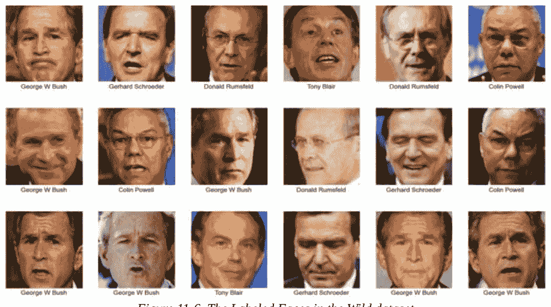

第 5 章介绍了一个支持向量机 (SVM)，它使用数据集的一个子集（五位名人各 100 张，共 500 张图像）达到了 85% 的准确率。第 9 章用神经网络解决了同样的问题，结果相似。这些模型仅仅触及了现代人脸识别能力的皮毛。让我们将 CNN 和迁移学习应用于相同的 LFW 子集，看看它们在识别人脸方面是否能做得更好。在此过程中，你将学到关于预训练 CNN 以及这些 CNN 训练时生成的权重特异性的重要一课。

### 将迁移学习应用于人脸识别

探索基于 CNN 的人脸识别的第一步是加载 LFW 数据集。这一次，我们将加载全尺寸彩色图像并将其裁剪为 128 × 128 像素。代码如下：

```python
import pandas as pd
from sklearn.datasets import fetch_lfw_people

faces = fetch_lfw_people(min_faces_per_person=100, resize=1.0,
                         slice_=(slice(60, 188), slice(60, 188)), color=True)
class_count = len(faces.target_names)

print(faces.target_names)
print(faces.images.shape)
```

因为我们设置 min_faces_per_person 为 100，所以总共加载了对应五个人的 1,140 张人脸图像。使用以下语句显示前几张图像及其对应的标签：

```python
import matplotlib.pyplot as plt
%matplotlib inline

fig, ax = plt.subplots(3, 6, figsize=(18, 10))

for i, axi in enumerate(ax.flat):
    axi.imshow(faces.images[i] / 255)
    axi.set(xticks=[], yticks=[], xlabel=faces.target_names[faces.target[i]])
```

该数据集不平衡，其中乔治·W·布什的照片数量几乎与其他所有人加起来一样多。使用以下代码将数据集减少到每人 100 张图像，总共 500 张人脸图像：

```python
import numpy as np

mask = np.zeros(faces.target.shape, dtype=bool)

for target in np.unique(faces.target):
    mask[np.where(faces.target == target)[0][:100]] = 1

x_faces = faces.data[mask]
y_faces = faces.target[mask]
x_faces = np.reshape(x_faces, (x_faces.shape[0], faces.images.shape[1],
                               faces.images.shape[2], faces.images.shape[3]))

x_faces.shape
```

现在，为输入预训练的 ResNet50 CNN 预处理像素值，并使用 Scikit-Learn 的 `train_test_split` 函数分割数据集，得到 400 个训练样本和 100 个测试样本：

```python
from sklearn.model_selection import train_test_split
from tensorflow.keras.applications.resnet50 import preprocess_input

face_images = preprocess_input(np.array(x_faces))

x_train, x_test, y_train, y_test = train_test_split(
    face_images, y_faces, train_size=0.8, stratify=y_faces,
    random_state=0)
```

如果你愿意，你可以将预处理后的像素值除以 255，并立即用这些数据从头开始训练一个 CNN。以下是你可能会采取的方法（以防你想尝试一下）：

```python
from tensorflow.keras.models import Sequential
from tensorflow.keras.layers import Dense, Flatten, Conv2D, MaxPooling2D

model = Sequential()
model.add(Conv2D(32, (3, 3), activation='relu', input_shape=(x_train.shape[1:])))
model.add(MaxPooling2D((2, 2)))
model.add(Conv2D(64, (3, 3), activation='relu'))
model.add(MaxPooling2D((2, 2)))
model.add(Conv2D(64, (3, 3), activation='relu'))
model.add(MaxPooling2D((2, 2)))
model.add(Flatten())
model.add(Dense(1024, activation='relu'))
model.add(Dense(class_count, activation='softmax'))
model.compile(optimizer='adam', loss='sparse_categorical_crossentropy',
              metrics=['accuracy'])

model.fit(x_train / 255, y_train, validation_data=(x_test / 255, y_test),
          epochs=20, batch_size=10)
```

我这样做了，然后绘制了训练和验证准确率：

验证准确率优于支持向量机或传统神经网络，但远不及现代卷积神经网络在LFW数据集上的表现。显然存在更优的方法。

这个更优的方法当然是我们在第10章介绍的迁移学习。ResNet50基于ImageNet数据集中超过100万张图像训练而成，因此它应该擅长从照片中提取特征——比用400张图像训练的手工设计卷积神经网络更出色。让我们验证这一点。使用以下语句加载ResNet50的特征提取层，用ImageNet权重初始化，并冻结它们以确保训练过程中权重不会调整：

```python
from tensorflow.keras.applications import ResNet50

base_model = ResNet50(weights='imagenet', include_top=False)
base_model.trainable = False
```

现在为基础模型添加分类层，并包含一个调整层，将输入网络的图像尺寸调整为ResNet50所需的大小：

```python
from tensorflow.keras.models import Sequential
from tensorflow.keras.layers import Flatten, Dense, Resizing

model = Sequential()
model.add(Resizing(224, 224))
model.add(base_model)
model.add(Flatten())
model.add(Dense(1024, activation='relu'))
model.add(Dense(class_count, activation='softmax'))
model.compile(optimizer='adam', loss='sparse_categorical_crossentropy',
              metrics=['accuracy'])
```

训练模型并绘制训练和验证准确率曲线：

```python
import seaborn as sns
sns.set()

hist = model.fit(x_train, y_train, validation_data=(x_test, y_test),
                 batch_size=10, epochs=10)

acc = hist.history['accuracy']
val_acc = hist.history['val_accuracy']
epochs = range(1, len(acc) + 1)

plt.plot(epochs, acc, '-', label='Training Accuracy')
plt.plot(epochs, val_acc, ':', label='Validation Accuracy')
plt.title('Training and Validation Accuracy')
plt.xlabel('Epoch')
plt.ylabel('Accuracy')
plt.legend(loc='lower right')
plt.plot()
```

结果会有所不同，但我的运行结果显示验证准确率约为94%：

这比从头训练的卷积神经网络有所提升，表明ResNet50在从人脸图像中提取特征方面表现更优。但这仍未达到最先进水平。是否有可能做得更好？

### 通过任务特定权重增强迁移学习

使用ImageNet权重初始化的ResNet50在特征提取方面表现可靠。这些权重是在ResNet50用超过100万张从篮球到蝴蝶等各类物体的照片训练时获得的。然而，它并未使用人脸图像进行训练。如果使用人脸图像进行*训练*，它在提取人脸特征方面是否会更出色？

2017年，牛津大学视觉几何组的一组研究人员发表了一篇题为“VGGFace2：一个跨姿态和年龄的人脸识别数据集”的论文。在收集了包含数百万张人脸图像的数据集后，他们用它训练了两个ResNet50变体并公布了结果。他们还发布了权重，这些权重被封装在一个名为Keras-vggface的便捷Python库中。该库包含一个名为VGGFace的类，它封装了与TensorFlow兼容权重的ResNet50。开箱即用的VGGFace模型能够识别从布丽·拉尔森到詹妮弗·安妮斯顿等数千名名人的面孔。但其真正价值在于利用迁移学习将其重新用于识别它以前未训练识别的面孔。

为简化操作，我安装了Keras-vggface，创建了一个不包含分类层的VGGFace实例，初始化了权重，并将模型保存到名为vggface.h5的H5文件中。[下载该文件](https://example.com)并将其放入您笔记本的*Data*子目录。然后使用以下代码创建一个基于ResNet50构建的VGGFace实例，并添加自定义分类层：

```python
from tensorflow.keras.models import load_model

base_model = load_model('Data/vggface.h5')
base_model.trainable = False

model = Sequential()
model.add(Resizing(224, 224))
model.add(base_model)
model.add(Flatten())
model.add(Dense(1024, activation='relu'))
model.add(Dense(class_count, activation='softmax'))
model.compile(optimizer='adam', loss='sparse_categorical_crossentropy',
              metrics=['accuracy'])
```

接下来，训练模型并绘制训练和验证准确率曲线：

```python
hist = model.fit(x_train, y_train, validation_data=(x_test, y_test),
                 batch_size=10, epochs=10)

acc = hist.history['accuracy']
val_acc = hist.history['val_accuracy']
epochs = range(1, len(acc) + 1)

plt.plot(epochs, acc, '-', label='Training Accuracy')
plt.plot(epochs, val_acc, ':', label='Validation Accuracy')
plt.title('Training and Validation Accuracy')
plt.xlabel('Epoch')
plt.ylabel('Accuracy')
plt.legend(loc='lower right')
plt.plot()
```

结果非常出色：

为确保结果，将测试数据输入网络，并使用混淆矩阵评估结果：

```python
from sklearn.metrics import ConfusionMatrixDisplay as cmd

sns.reset_orig()
y_pred = model.predict(x_test)
fig, ax = plt.subplots(figsize=(5, 5))
ax.grid(False)

cmd.from_predictions(y_test, y_pred.argmax(axis=1),
                     display_labels=faces.target_names, colorbar=False,
                     cmap='Blues', xticks_rotation='vertical', ax=ax)
```

由于VGGFace经过调整以从人脸图像中提取特征，它在100张测试图像上获得了满分。这并不是说它永远不会识别失败。这确实表明，在您训练它的数据集上，它非常擅长从人脸图像中提取特征：

这里蕴含着一个重要教训。以任务特定方式训练的卷积神经网络通常比以更通用方式训练的卷积神经网络提供更好的迁移学习基础。如果目标是进行人脸识别，使用人脸图像训练的卷积神经网络几乎总是比使用数千张不相似物体照片训练的卷积神经网络表现更好。对于神经网络来说，关键在于权重。

### ArcFace

VGGFace并非唯一擅长从人脸图像中提取特征的预训练卷积神经网络。另一个是ArcFace，它在2019年一篇题为“ArcFace：用于深度人脸识别的加性角度间隔损失”的论文中提出。一个便捷的实现可在名为Arcface的Python包中找到。

提交给ArcFace的每张人脸图像都被转换为一个包含512个值的密集向量，称为*人脸嵌入*。创建嵌入的代码很简单：

```python
from arcface import ArcFace

af = ArcFace.ArcFace()
embedding = af.calc_emb(image)
```

ArcFace通常比传统卷积神经网络生成的嵌入更能捕捉人脸的独特性。

ArcFace创建的嵌入的另一个用途是*人脸验证*，它比较两张人脸图像并计算它们代表同一个人的概率。以下语句为两张人脸图像生成嵌入，并使用第4章介绍的`cosine_similarity`函数量化两者之间的相似度：

```python
af = ArcFace.ArcFace()
face_emb1 = af.calc_emb(image1)
face_emb2 = af.calc_emb(image2)
sim = cosine_similarity([face_emb1, face_emb2])[0][1]
```

结果是一个介于0.0到1.0之间的值，值越高表示人脸之间的相似度越大。

### 综合应用：在照片中检测和识别面孔

每当模型在测试中获得满分时，您都应该持怀疑态度。没有模型是完美的，即使它在测试数据集上达到100%的准确率，它在实际应用中也不会复制这一结果。鉴于VGGFace是使用LFW数据集中一些相同名人的图像训练的，它是否可能对这些人存在偏见？如果使用普通人的图像进行训练，使用VGGFace的迁移学习效果是否会不佳？如果只有少量训练图像，它的表现会如何？

为回答这些问题，让我们构建一个笔记本，训练一个基于VGGFace的人脸识别模型，使用MTCNN检测照片中的人脸，并使用模型识别检测到的人脸。您将使用的数据集包含三个普通人的各八张图片，姿势略有不同，年龄跨度达20年，有戴眼镜和不戴眼镜的情况（图11-7）。这些图像是使用示例11-1中的`extract_faces`函数从照片中提取的，并调整为224 × 224。

首先下载包含人脸图像的ZIP文件，并将ZIP文件的内容复制到托管笔记本的名为*Faces*的子目录中。ZIP文件包含四个文件夹：一个名为*Jeff*，一个名为*Lori*，一个名为*Abby*，以及一个名为*Samples*的文件夹，其中包含用于测试的未裁剪照片。

现在创建一个新笔记本，并在第一个单元格中运行以下代码以定义辅助函数

### 处理未知人脸：闭集分类与开集分类

现在说点坏消息。VGGFace人脸识别模型擅长识别它训练过的人脸，但当遇到它*未*训练过的人脸时，它就不知道该怎么办了。试试看：输入一张你自己的照片。模型很可能会将你识别为Jeff、Lori或Abby，并且可能以很高的置信度这样做。它真的不知道自己不知道什么。当数据集较小且网络存在过拟合空间时，尤其如此。

原因与VGGFace无关，而完全在于一个事实：具有softmax输出层的神经网络是一个*闭集分类器*，这意味着它将呈现给它的任何用于预测的样本都分类为它训练过的类别之一。（请记住，softmax确保所有类别的概率之和为1.0。）另一种选择是*开集分类器*（图11-8），它能够说“这个样本不属于我训练过的任何类别”。

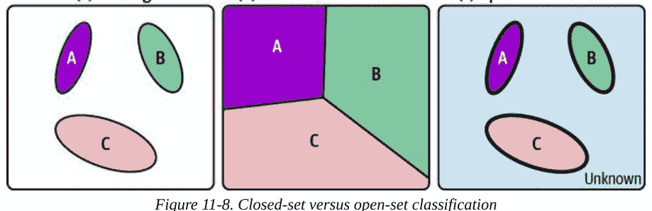

在当今的深度学习领域，构建开集分类器没有一个放之四海而皆准的解决方案。2016年一篇题为“Towards Open Set Deep Networks”的论文提出了一种解决方案，即*openmax*输出层，它取代softmax输出层并“估计输入来自未知类别的概率”。本质上，如果网络用10个类别进行训练，openmax输出层会添加第11个输出，代表未知类别。它的工作原理是获取最终分类层的激活值，并使用韦布尔分布进行调整，而不是像softmax那样对概率进行归一化。

科罗拉多大学的研究人员在2018年一篇题为“Reducing Network Agnostophobia”的论文中提出了另一个潜在解决方案。它提出用一种称为*熵开集损失*的新损失函数取代交叉熵损失，该损失函数将未知类别的softmax分数推向均匀概率分布。使用这种技术，你可以更可靠地使用概率阈值结合传统的softmax输出层来检测属于未知类别的样本。关于深度学习中开集分类带来的问题以及openmax和熵开集损失的概述，请参阅Tivadar Danka的“Does a Neural Network Know When It Doesn’t Know?”。

从你复制到的子目录加载并显示人脸图像，并声明一对Python列表来保存图像和标签：

```python
import os
from tensorflow.keras.preprocessing import image
import matplotlib.pyplot as plt
%matplotlib inline

def load_images_from_path(path, label):
    images, labels = [], []

    for file in os.listdir(path):
        images.append(image.img_to_array(image.load_img(os.path.join(path, file),
                                target_size=(224, 224, 3))))
        labels.append((label))

    return images, labels

def show_images(images):
    fig, axes = plt.subplots(1, 8, figsize=(20, 20),
                             subplot_kw={'xticks': [], 'yticks': []})

    for i, ax in enumerate(axes.flat):
        ax.imshow(images[i] / 255)

x, y = [], []
```

接下来，加载Jeff的图像并将其标签设为0：

```python
images, labels = load_images_from_path('Faces/Jeff', 0)
show_images(images)

x += images
y += labels
```

加载Lori的图像并将其标签设为1：

```python
images, labels = load_images_from_path('Faces/Lori', 1)
show_images(images)

x += images
y += labels
```

加载Abby的图像并将其标签设为2：

```python
images, labels = load_images_from_path('Faces/Abby', 2)
show_images(images)

x += images
y += labels
```

最后，为VGGFace的ResNet50版本预处理像素，并将数据五五分，以便网络用每个人随机选择的四张图像进行训练，并用相同数量的图像进行验证：

```python
import numpy as np
from sklearn.model_selection import train_test_split
from tensorflow.keras.applications.resnet50 import preprocess_input

faces = preprocess_input(np.array(x))
labels = np.array(y)

x_train, x_test, y_train, y_test = train_test_split(
    faces, labels, train_size=0.5, stratify=labels,
    random_state=0)
```

下一步是加载保存的VGGFace模型并冻结瓶颈层。如果你之前没有下载vggface.h5，现在就下载它并放入你notebook的Data子目录。然后执行以下代码：

```python
from tensorflow.keras.models import load_model

base_model = load_model('Data/vggface.h5')
base_model.trainable = False
```

现在定义一个使用VGGFace进行迁移学习以识别人脸的网络。Resizing层确保每张图像的尺寸恰好为224 × 224像素。Dense层仅包含八个神经元，因为训练数据集很小，我们不希望网络对其拟合过紧：

```python
from tensorflow.keras.models import Sequential
from tensorflow.keras.layers import Flatten, Dense, Resizing

model = Sequential()
model.add(Resizing(224, 224))
model.add(base_model)
model.add(Flatten())
model.add(Dense(8, activation='relu'))
model.add(Dense(3, activation='softmax'))
model.compile(optimizer='adam', loss='sparse_categorical_crossentropy',
              metrics=['accuracy'])
```

训练模型：

```python
hist = model.fit(x_train, y_train, validation_data=(x_test, y_test),
                 batch_size=2, epochs=10)
```

绘制训练和验证准确率：

```python
import seaborn as sns
sns.set()

acc = hist.history['accuracy']
val_acc = hist.history['val_accuracy']
epochs = range(1, len(acc) + 1)

plt.plot(epochs, acc, '-', label='Training Accuracy')
plt.plot(epochs, val_acc, ':', label='Validation Accuracy')
plt.title('Training and Validation Accuracy')
plt.xlabel('Epoch')
plt.ylabel('Accuracy')
plt.legend(loc='lower right')
plt.plot()
```

希望你得到类似这样的结果：

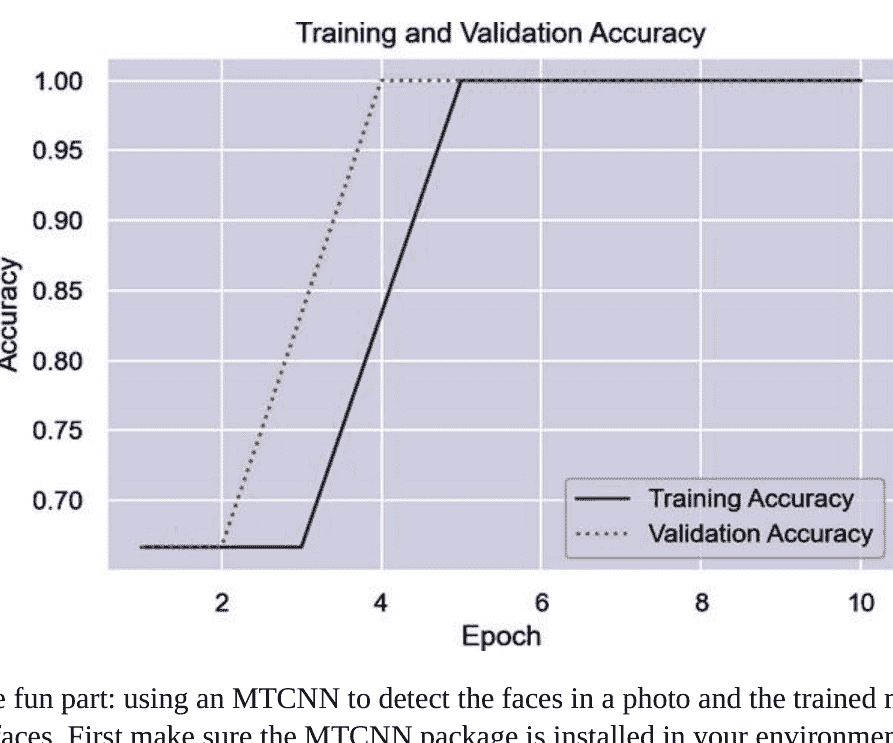

现在是有趣的部分：使用MTCNN检测照片中的人脸，并使用训练好的模型来识别人脸。首先确保你的环境中安装了MTCNN包。然后定义一对辅助函数——一个从图像的指定位置获取人脸（`get_face`），另一个加载照片并在照片中用名字和置信度标注人脸（`label_faces`）：

```python
from mtcnn.mtcnn import MTCNN
from PIL import Image, ImageOps
from tensorflow.keras.preprocessing import image
from matplotlib.patches import Rectangle

def get_face(image, face):
    x1, y1, w, h = face['box']

    if w > h:
        x1 = x1 + ((w - h) // 2)
        w = h
    elif h > w:
        y1 = y1 + ((h - w) // 2)
        h = w

    x2 = x1 + h
    y2 = y1 + w

    return image[y1:y2, x1:x2]

def label_faces(path, model, names, face_threshold=0.9, prediction_threshold=0.9,
                show_outline=True, size=(12, 8)):
    # Load the image and orient it correctly
    pil_image = Image.open(path)
    exif = pil_image.getexif()

    for k in exif.keys():
        if k != 0x0112:
            exif[k] = None
            del exif[k]

    pil_image.info["exif"] = exif.tobytes()
    pil_image = ImageOps.exif_transpose(pil_image)
    np_image = np.array(pil_image)

    fig, ax = plt.subplots(figsize=size, subplot_kw={'xticks': [], 'yticks': []})
    ax.imshow(np_image)

    detector = MTCNN()
    faces = detector.detect_faces(np_image)
    faces = [face for face in faces if face['confidence'] > face_threshold]

    for face in faces:
        x, y, w, h = face['box']

        # Use the model to identify the face
        face_image = get_face(np_image, face)
        face_image = image.array_to_img(face_image)
        face_image = preprocess_input(np.array(face_image))
        predictions = model.predict(np.expand_dims(face_image, axis=0))
        confidence = np.max(predictions)

        if (confidence > prediction_threshold):
            # Optionally draw a box around the face
            if show_outline:
                rect = Rectangle((x, y), w, h, color='red', fill=False, lw=2)
                ax.add_patch(rect)

            # Label the face
            index = int(np.argmax(predictions))
            text = f'{names[index]} ({confidence:.1%})'
            ax.text(x + (w / 2), y, text, color='white', backgroundcolor='red',
                    ha='center', va='bottom', fontweight='bold',
                    bbox=dict(color='red'))
```

现在将*Samples*文件夹中的第一张示例图像传递给`label_faces`：

```python
labels = ['Jeff', 'Lori', 'Abby']
label_faces('Faces/Samples/Sample-1.jpg', model, labels)
```

输出应如下所示，尽管你的百分比可能不同：


再试一次，但这次用一张不同的照片：

```python
label_faces('Faces/Samples/Sample-2.jpg', model, labels)
```

输出如下：

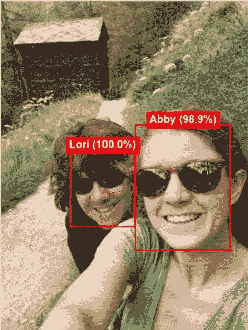

最后，提交一张包含模型训练过的所有三个人的照片：

```python
label_faces('Faces/Samples/Sample-3.jpg', model, labels)
```

仅用12张人脸图像——每人四张——进行训练，该模型在识别人脸方面做得相当不错。当然，你可以通过将朋友和家人的照片传递给示例11-1中的函数，并用生成的图像训练模型，来生成自己的数据集。

另一种解决方案是使用ArcFace来验证模型识别的每张人脸，方法是将从该人脸生成的嵌入向量与同一人的参考嵌入向量进行比较。如果余弦相似度低于预定阈值，你可以拒绝模型的结论。

一种更简单的方法是防止网络过度学习训练数据，希望未知类别会产生较低的softmax概率。这就是为什么我在前面的例子中只在分类层包含了八个神经元。（你可以更进一步，引入一个dropout层。）这种方法在一定程度上有效，但并不完美。`label_faces`函数有一个默认的预测阈值0.9，这意味着只有当模型以至少90%的置信度对人脸进行分类时，它才会标记该人脸。你可以将`prediction_threshold`设置为0.99以排除更多未知人脸，但代价是无法识别更多已知人脸。通过这种调整来在识别已知人脸和忽略未知人脸之间找到恰当的平衡，是为人脸识别模型投入生产所不可避免的一部分。

### 总结

构建一个端到端的人脸识别系统，既需要检测照片中人脸的方法，也需要对这些人脸进行分类（识别）的方法。一种检测人脸的方法是Viola-Jones算法，OpenCV库为其提供了便捷的实现。另一种依赖深度学习的方法是多任务级联卷积神经网络，即MTCNN。名为MTCNN的Python包包含了一个现成的MTCNN实现。Viola-Jones更快，更适合实时应用（例如，在实时网络摄像头流中识别人脸），但MTCNN通常更准确，且产生的误报更少。

深度学习可以通过使用卷积神经网络应用于人脸识别任务。使用预训练的CNN（如ResNet50）进行迁移学习可以以相对较高的准确度识别人脸，但使用在数百万张人脸图像上训练的CNN进行迁移学习则能提供无与伦比的准确度。主要原因是CNN的瓶颈层经过优化，专门用于从人脸图像中提取特征。

拥有一组高度优化的权重，神经网络几乎可以做任何事情。当没有更好的选择时，通用权重就足够了，但如果有一组针对特定任务的权重作为起点，通过迁移学习进行人脸识别可以达到类似人类的准确度。

## 第12章 目标检测

上一章介绍了两种流行的人脸检测算法：依赖机器学习的Viola-Jones和依赖深度学习的MTCNN。人脸检测是*目标检测*的一个特例，即计算机在图像中检测并识别物体。识别物体是一个图像分类问题，这是CNN擅长的领域。但找到需要识别的物体则带来了不同的挑战。

目标检测具有挑战性，因为物体并不像图像分类任务中那样被假定为完美裁剪和对齐的。它们也不限于每张图像一个。图12-1展示了一辆自动驾驶汽车在扫描来自前向摄像头的视频帧时可能看到的内容。一个使用精心准备的训练图像进行传统图像分类训练的CNN对此无能为力。它或许能将图像分类为城市街道之一，但它无法确定图像中包含汽车、行人和交通信号灯，更不用说精确定位它们的位置了。

近年来，目标检测在速度和准确度上都有所提升，最先进的方法依赖于深度学习。特别是，它们采用了第10章介绍的CNN。让我们讨论一下CNN如何进行目标检测和识别，并尝试使用前沿的目标检测模型来实践。

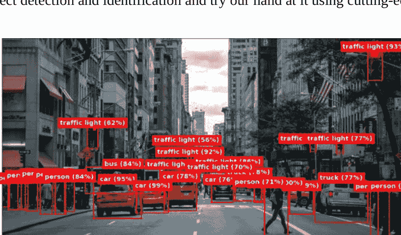

*图12-1. 检测并识别场景中的物体*

### R-CNNs

将深度学习应用于目标检测任务的一种方法是使用*基于区域的CNN*，也称为*区域*CNN或简称*R-CNN*。第一个R-CNN在2014年一篇题为“Rich Feature Hierarchies for Accurate Object Detection and Semantic Segmentation”的论文中提出。论文中描述的模型包含三个阶段。第一阶段扫描图像并识别多达2000个边界框，这些框代表感兴趣的区域——*可能*包含物体的区域。第二阶段是一个深度CNN，用于从感兴趣的区域提取特征。第三阶段是一个支持向量机，用于对特征进行分类。输出是一组带有类别标签和置信度分数的边界框。一种称为*非极大值抑制*（NMS）的算法对输出进行过滤，并为每个物体选择最佳的边界框。

NMS是几乎所有现代目标检测系统的关键要素。检测器不可避免地会为每个物体输出多个边界框。如果一张照片包含一个给定类别的实例——例如一匹斑马——NMS会选择置信度分数最高的边界框。如果照片包含两匹斑马（图12-2），NMS会将边界框分成两组，并在每组中选择置信度分数最高的框。它根据框之间的重叠程度进行分组。重叠度通过将两个框的交集面积除以两个框的并集面积来计算。如果得到的*交并比*（IoU）分数大于预定阈值（通常为0.5），NMS会将这些框分配到同一组。否则，它会将它们分配到不同的组。

当两个同类别的物体重叠很少或没有重叠时，NMS可以轻松地将它们分开。当两个同类别的实例显著重叠时（想象一匹斑马站在另一匹后面），可能需要调整IoU阈值以实现分离。IoU阈值是一个超参数，可以调整以在过度分离重叠物体和分离不足之间找到恰当的平衡。

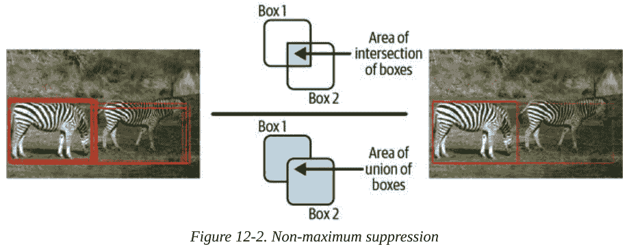

大多数R-CNN实现的第一阶段使用一种称为*选择性搜索*的算法，通过关注颜色、纹理、形状和大小的相似性来识别感兴趣的区域。图12-3显示了当OpenCV的选择性搜索实现检查一张图像时生成的前500个边界框。将目标区域列表提交给CNN比暴力滑动窗口方法更快，后者在每个位置都将窗口内容输入CNN。


即使选择性搜索缩小了输入到第二阶段的候选区域列表，R-CNN也无法实时进行目标检测。为什么？因为CNN会单独处理第一阶段识别出的约2000个感兴趣的区域。这些区域不可避免地会重叠，因此CNN会多次处理相同的像素。

2015年一篇题为“Fast R-CNN”的论文通过提出一种改进的架构解决了这个问题，其中整个图像只通过CNN一次（图12-4）。选择性搜索或类似算法在图像中识别感兴趣的区域，这些区域被投影到CNN生成的特征图上。然后，一个*感兴趣区域（ROI）池化层*使用一种最大池化形式，将每个感兴趣区域中的特征缩减为固定长度的向量，与区域的大小和形状无关。（相比之下，R-CNN在将每个区域提交给CNN之前，会将其缩放到预定大小的图像，这比ROI池化成本高得多。）特征向量的分类由全连接层而非SVM执行，输出被拆分为包含softmax分类器和边界框回归器。NMS过滤边界框，只保留重要的那些。结果是一个训练速度比R-CNN快一个数量级、预测速度快两个数量级，并且比R-CNN略准确的系统。

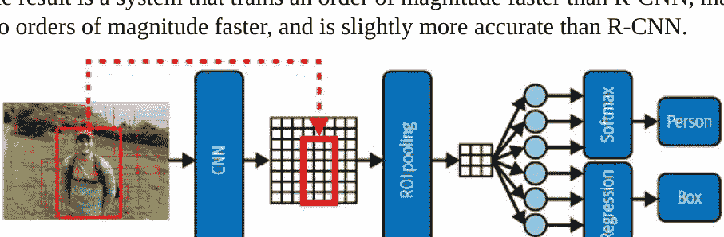

### ROI 池化

ROI 池化将任何感兴趣区域缩减为指定大小的特征向量，无论该区域的高度和宽度如何。假设你有一个 8 × 16 的特征图区域，并希望将其缩减为 4 × 4。你可以将 8 × 16 的区域划分为一个 4 × 4 的网格，网格中每个单元格的大小为 2 × 4。然后，你可以取每个单元格中八个值的最大值，并将它们填入 4 × 4 的网格中。这就是 ROI 池化。它简单、快速且有效，并且适用于任何大小和宽高比的区域。

2016 年一篇题为“Faster R-CNN：通过区域提议网络实现实时目标检测”的论文通过用*区域提议网络*（RPN）取代选择性搜索，进一步提升了性能。RPN 是一个浅层 CNN，它与主 CNN 共享层（图 12-5）。为了生成区域提议，它在最后一个共享层生成的特征图上滑动一个窗口。在窗口移动的每个位置，RPN 评估 *n* 个称为*锚框*或*锚点*的候选区域，并根据与真实框的 IoU 分数计算每个候选区域的*目标性分数*。目标性分数和锚框被输入全连接层进行分类（锚框是否包含目标？如果包含，是什么类型？）以及回归。这些层的输出最终确定了投影到主 CNN 生成的特征图上并转发到 ROI 池化层的感兴趣区域。

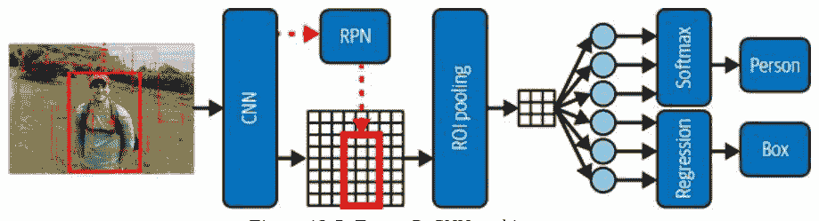

Faster R-CNN 的速度可以比 Fast R-CNN 快 10 倍，并且能够近乎实时地进行目标检测。由于 RPN 在识别候选区域方面具有优越的能力，它通常也比 Fast R-CNN 更准确。选择性搜索是静态的，但 RPN 会随着网络的训练而变得更智能。RPN 还与主 CNN 并行执行，这意味着区域提议对性能的影响很小。

### Mask R-CNN

R-CNN 故事的下一章出现在 2017 年一篇题为“Mask R-CNN”的论文中。Mask R-CNN 通过添加*实例分割*扩展了 Faster R-CNN，实例分割使用如图 12-6 所示的*分割掩码*来识别图像中检测到的目标的形状。性能影响很小，因为实例分割与区域评估并行执行。Mask R-CNN 的好处在于它们提供了关于检测到的目标的更多细节。例如，你可以判断一个人的手臂是否伸展——这是从简单的边界框中无法分辨的。它们也比 Faster R-CNN 稍微准确一些，因为它们用 *ROI 对齐*取代了 ROI 池化，ROI 对齐在生成边界与其所代表区域的边界不完全对齐的特征向量时，丢弃的信息更少。

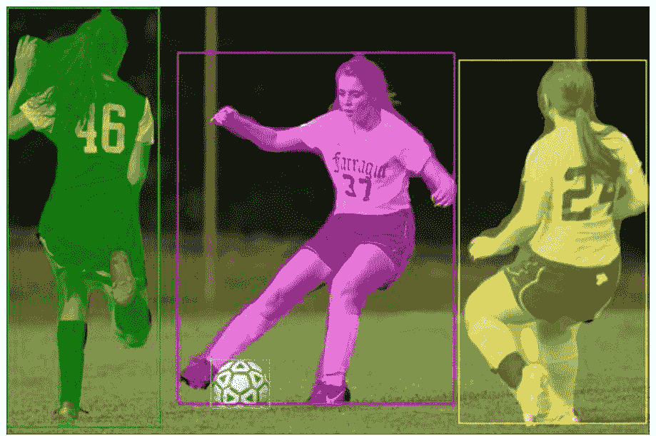

Zoom 使用实例分割在视频流中为你显示自定义背景。实例分割还为基于 AI 的图像编辑工具提供支持，这些工具可以从前景中裁剪人物并将其放置在不同的背景上。让我们使用一个预训练的 Mask R-CNN 来演示。

首先，[下载一个 ZIP 文件](https://example.com)，其中包含本练习所需的文件。这些文件是：

- *adam.jpg*
    一个背着背包的年轻人的照片
- *maui.jpg*
    在夏威夷泳池边拍摄的照片
- *mask.py*
    包含在将图像输入 Mask R-CNN 之前进行预处理的辅助函数，以及用于解释结果的后处理函数
- *MaskRCNN-12-int8.onnx*
    包含以 ONNX 格式保存的预训练 Mask R-CNN

将 *mask.py* 放在你的 Jupyter notebook 所在的目录中，其余文件放在 notebook 的 *Data* 子目录中。

这个组合中的关键文件是 *MaskRCNN-12-int8.onnx*。[第 7 章](https://example.com)介绍了[开放神经网络交换格式（ONNX）](https://example.com)，作为一种加载用 Python 编写的 Scikit-Learn 模型并在其他语言中使用它们的方法。但 ONNX 的作用远不止弥合与 Scikit 之间的语言鸿沟。它是一种中立格式，允许用一种深度学习框架编写的神经网络导出到其他框架。例如，你可以将 PyTorch 模型保存为 .onnx 文件，然后将 .onnx 文件转换为 TensorFlow 模型，并像从一开始就用 TensorFlow 编写一样使用它。或者，你可以安装一个 ONNX 运行时，加载并调用模型，而无需将其转换为 TensorFlow。第 7 章演示了如何将 Scikit 模型保存为 ONNX 格式，并使用 Python ONNX 运行时加载模型并从 Python 调用它。它还使用了 .NET ONNX 运行时来加载模型并从 C# 调用它。如第 7 章所述，ONNX 运行时可用于多种平台和编程语言。

MaskRCNN-12-int8.onnx 包含来自 Facebook Research 的一个复杂的 Mask R-CNN 实现。它使用 ResNet50 骨干网络从输入的图像中提取特征，并包含一个与边界框计算并行计算实例分割掩码的分支。它使用来自 COCO 数据集的超过 200,000 张图像进行训练。这些图像包含超过 150 万个对象，分为 80 个类别，从猫和狗到人、自行车和汽车。由于训练好的模型已发布在 GitHub 的 ONNX 模型库中，你只需几行代码就可以加载它并传递图像。

在 Python 中使用该模型的第一步是确保你的环境中安装了 Python ONNX 运行时。对于本练习，还要确保安装了 OpenCV。然后创建一个 Jupyter notebook，并在第一个单元格中运行以下代码以加载并显示 adam.jpg：

```python
import matplotlib.pyplot as plt
from PIL import Image
%matplotlib inline

image = Image.open('Data/adam.jpg')
fig, ax = plt.subplots(figsize=(12, 8), subplot_kw={'xticks': [], 'yticks': []})
ax.imshow(image)
```

以下是输出：


目标是将此图像通过 Mask R-CNN 运行，检测其中的对象，并相应地标注图像。为此，使用以下代码按照模型期望的方式预处理图像像素，从 ONNX 文件加载 Mask R-CNN，并将预处理后的图像提交给它：

```python
from mask import *
import onnxruntime as rt

image_data = preprocess(image)
session = rt.InferenceSession('Data/MaskRCNN-12-int8.onnx')
input_name = session.get_inputs()[0].name
result = session.run(None, { input_name: image_data })
```

run 方法返回的值是一个包含四个数组的数组。第一个数组包含图像中检测到的对象的边界框。在此示例中，它总共检测到 13 个对象：

```python
array([[ 377.50537,  174.36874,  801.177  ,  787.7125 ],
       [ 428.15994,  344.70105,  699.99097,  599.8499 ],
       [ 757.1859 ,  529.4938 ,  814.2776 ,  658.8041 ],
       [ 432.57123,  351.229  ,  672.2242 ,  484.63702],
       [ 435.53653,  357.34235,  494.73557,  516.4939 ],
       [ 672.56714,  516.2991 ,  822.82153,  663.68726],
       [ 608.1904 ,  361.0429 ,  686.1207 ,  552.70105],
       [ 629.84894,  355.3375 ,  799.4963 ,  718.9458 ],
       [ 437.99078,  331.19318,  709.4969 ,  748.2785 ],
       [ 438.44028,  348.14404,  579.8056 ,  546.0588 ],
       [1152.0518 ,  203.89978, 1163.7583 ,  223.2485 ],
       [1151.8087 ,  132.45256, 1164.0013 ,  150.6876 ],
       [1151.8087 ,  404.0875 ,  1164.0013 ,  423.058  ],
       [ 416.03802,  396.8123 ,  694.8975 ,  511.93896],
       [ 683.35236,  765.0078 ,  701.3403 ,  784.47546]], dtype=float32)
```

第二个数组是与 COCO 数据集中类别对应的整数类别标识符数组：1 代表人，2 代表自行车，依此类推。这些标识了图像中的对象：

```python
array([ 1, 25, 27, 25, 25, 27, 25, 27, 27, 25, 1, 1, 1, 25, 75],
      dtype=int64)
```

第三个数组包含 13 个对象的置信度分数。它们的范围从图像中人物的 99.9% 高分到他帽子上标志的 5.5% 低分，模型认为该标志可能是一个时钟。请注意，只有两个对象的置信度水平达到或超过 70%：

```python
array([0.99911565, 0.8009716 , 0.4624603 , 0.19400069, 0.17042953,
       0.11972303, 0.11626374, 0.10352837, 0.08243025, 0.08089489,
       0.07266886, 0.07266886, 0.07266886, 0.06278796, 0.0549276 ],
      dtype=float32)
```

最后，第四个数组包含每个对象的分割掩码。每个掩码是一个 28 × 28 的浮点值数组，由于边缘柔和，有时被称为*软掩码*。图 12-7 显示了图像中检测到的人物的掩码。当映射回图像的原始大小和宽高比时，它在定义哪些像素对应于该人物方面做得相当好。

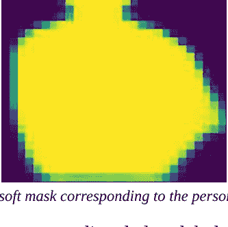

下一步是获取边界框、预测的类别标签、置信度分数和分割掩码，并将它们传递给 `annotate_image` 函数以可视化结果：

```python
boxes = result[0]  # 边界框
labels = result[1] # 类别标签
scores = result[2] # 置信度分数
masks = result[3]  # 分割掩码

annotate_image(image, boxes, labels, scores, masks)
```

以下是结果：

默认情况下，`annotate_image` 会忽略置信度低于 70% 的识别对象。您可以通过在调用中包含 `min_confidence` 参数来覆盖此设置。模型在图像中检测到两个置信度等于或超过 70% 的对象：一个人和一个背包。`annotate_image` 绘制边界框，并用类别名称和置信度进行标注。它还通过叠加部分透明像素来为对象着色。这些是 `run` 返回的分割掩码。

`annotate_image` 是 `mask.py` 中几个辅助函数之一。另一个是 `preprocess`，它按照 Mask R-CNN 的要求对每张图像进行预处理，包括调整图像大小、确保宽度和高度是 32 的倍数、将图像转换为 BGR 格式以及归一化像素值。我从模型的 [GitHub 页面](https://github.com) 上获取了这两个函数，并做了一些小的修改。由于 Mask R-CNN 经常用于从图像中裁剪对象，我还添加了一个 `change_background` 函数，该函数提取图像中所有以指定置信度（默认 = 0.7）检测到的对象，并将它们合成到新的背景上。要亲自查看效果，请在笔记本的下一个单元格中运行以下语句：

```python
fg_image = Image.open('Data/adam.jpg')
bg_image = Image.open('Data/maui.jpg')

change_background(session, fg_image, bg_image)
```

输出应如下所示：

`change_background` 将前景图像（传递给函数第二个参数的图像）提交给模型，并将分割掩码内的所有像素复制到背景图像上。当前景和背景图像大小相同时效果最佳，但如果需要，它会调整背景图像的大小以匹配前景图像。如果背景的宽高比与前景图像不同，背景将会变形。

Mask R-CNN 产生的分割掩码仅为 28 × 28，这解释了从前景图像复制的像素周围出现的“撕裂”现象：掩码的分辨率低于照片中人物的分辨率。您可以修改 Mask R-CNN 以使用更高分辨率的掩码，但您必须从头开始重新训练模型。对于像这样复杂的模型和像 COCO 这样大的数据集，即使您在 GPU 上进行训练，这也是一项耗时的工作。

### YOLO

虽然 R-CNN 系列目标检测系统提供了无与伦比的准确性，但在实时目标检测方面（例如自动驾驶汽车所需的类型）仍有不足。2015 年发表的一篇题为“You Only Look Once: Unified, Real-Time Object Detection”的论文提出了一种替代 R-CNN 的方法，称为 YOLO（You Only Look Once），它彻底改变了工程师对目标检测的思考方式。论文引言中写道：

> 人类瞥一眼图像，就能立即知道图像中有什么物体、它们在哪里以及它们如何互动。人类的视觉系统快速而准确，使我们能够在几乎无意识的情况下执行驾驶等复杂任务。快速、准确的目标检测算法将使计算机能够在没有专用传感器的情况下驾驶汽车，使辅助设备能够向人类用户传达实时场景信息，并释放通用、响应式机器人系统的潜力。

当前的检测系统重新利用分类器来执行检测。为了检测一个对象，这些系统使用该对象的分类器，并在测试图像的各种位置和尺度上对其进行评估。像可变形部件模型（DPM）这样的系统使用滑动窗口方法，分类器在整个图像上均匀间隔的位置运行。

像 R-CNN 这样更新近的方法使用区域提议方法首先在图像中生成潜在的边界框，然后在这些提议的框上运行分类器。分类后，使用后处理来优化边界框、消除重复检测，并根据场景中的其他对象重新评分边界框。这些复杂的流程很慢且难以优化，因为每个单独的组件都必须单独训练。

我们将目标检测重新定义为一个单一的回归问题，直接从图像像素到边界框坐标和类别概率。使用我们的系统，您只需查看一次（YOLO）图像即可预测存在哪些对象以及它们的位置。

YOLO 系统的特点是其性能：

我们的基础网络在 Titan X GPU 上以每秒 45 帧的速度运行，没有批处理，快速版本以超过 150 fps 的速度运行。这意味着我们可以以低于 25 毫秒的延迟实时处理流式视频。此外，YOLO 的平均精度均值是其他实时系统的两倍以上。

从高层次来看，YOLO 通过将特征图划分为单元格网格并评估每个单元格是否存在对象来工作，如图 12-8 所示。使用从 Faster R-CNN 借用的锚框概念，YOLO 分析每个单元格周围各种形状和大小的边界框，并为这些框分配类别和概率。一个 CNN 处理所有事情，包括特征提取、分类和指定边界框大小和位置的回归，图像只通过 CNN 一次。最后，NMS 将边界框的数量减少到每个对象一个，每个边界框都归因于一个类别以及一个置信度水平——该框实际包含指定类别对象的概率。

目前有七个版本的 YOLO，称为 YOLOv1 到 YOLOv7。每个新版本都在准确性和性能方面对前一版本进行了改进。还有像 PP-YOLO 和 YOLO9000 这样的变体。YOLOv3 是 YOLO 创始人 Joseph Redmon 参与的最后一个版本，被认为是一种参考实现。通过从 CNN 的某些层提取特征图，YOLOv3 使用 13 × 13 网格、26 × 26 网格和 52 × 52 网格分析图像，以检测各种大小的对象。它使用锚点为每个单元格预测九个边界框。YOLO 的主要弱点是它难以检测彼此靠近的非常小的对象，尽管 YOLOv3 在这方面比 YOLOv1 和 YOLOv2 有所改进。有关 YOLO 的更多信息，请访问其[创建者的网站](https://www.example.com)。另一篇题为“Digging Deep into YOLO V3”的文章深入探讨了 YOLOv3 架构。

### YOLOv3 和 Keras

YOLO 最初是使用名为 [Darknet](https://www.example.com) 的深度学习框架编写的，但它也可以用其他框架实现。GitHub 上的 [keras-yolo3 项目](https://www.example.com) 包含 YOLOv3 的 Keras 实现，可以从头开始训练，也可以使用预定义的权重进行初始化并用于推理——即进行预测。此版本接受 416 × 416 图像。为了简化使用，我创建了一个名为 *yolov3.py* 的文件，其中包含辅助类和辅助函数。它是 keras-yolo3 项目中可用的[文件](https://www.example.com)的修改版本。我删除了预测不需要的元素，重写了一些代码以提高实用性和性能，并添加了一些我自己的代码，但大部分功劳归功于 Huynh Ngoc Anh，他的 GitHub ID 是 [experiencor](https://www.example.com)。借助 *yolov3.py* 和一组权重，您只需几行代码即可加载 YOLOv3 并进行预测。

要查看 YOLOv3 的实际应用，首先[下载一个 ZIP 文件](https://www.example.com)，其中包含您需要的文件。打开 ZIP 文件，将 *yolov3.py* 放在包含笔记本的目录中。将其他文件放在笔记本的 *Data* 子目录中。接下来，下载 *yolov3.weights*，其中包含 YOLOv3 在 COCO 数据集上训练时获得的权重，并将其也放在 *Data* 子目录中。

现在创建一个新的 Jupyter 笔记本，并将以下代码粘贴到第一个单元格中：

```python
from yolov3 import *

model = make_yolov3_model()
weight_reader = WeightReader('Data/yolov3.weights')
weight_reader.load_weights(model)
model.summary()
```

运行代码以导入 *yolov3.py* 中的辅助类和函数，创建模型，并使用 COCO 权重初始化它。然后使用以下语句加载一张夫妇在中国西安城墙骑行的照片：

```python
import matplotlib.pyplot as plt
%matplotlib inline

image = plt.imread('Data/xian.jpg')
width, height = image.shape[1], image.shape[0]
fig, ax = plt.subplots(figsize=(12, 8), subplot_kw={'xticks': [], 'yticks': []})
ax.imshow(image)
```

现在让我们看看 YOLOv3 是否能检测到图像中的对象。使用以下代码再次加载图像，将其调整为 416 × 416，预处理像素，并将生成的图像提交给模型进行预测：

```python
import numpy as np
```

from tensorflow.keras.preprocessing.image import load_img, img_to_array

x = load_img('Data/xian.jpg', target_size=(YOLO3.width, YOLO3.height))
x = img_to_array(x) / 255
x = np.expand_dims(x, axis=0)
y = model.predict(x)

`predict` 返回的数组包含在三个分辨率（即网格单元大小为 8、16 和 32 像素平方）下检测到的图像中物体的信息，但这些数组需要被解码为边界框，并使用 NMS 进行过滤。为此，`yolov3.py` 包含一个名为 `decode_predictions` 的函数（灵感来源于 Keras 的 `decode_predictions` 函数）来执行后处理。`decode_predictions` 需要原始图像的宽度和高度作为输入，以便它可以缩放边界框以匹配原始图像的尺寸。返回值是一个 `BoundingBox` 对象列表，每个对象包含围绕场景中检测到的物体的框的像素坐标，以及一个标识物体的标签和一个从 0.0 到 1.0 的置信度值。

因此，下一步是将 `predict` 返回的预测结果传递给 `decode_predictions` 并列出边界框：

```
boxes = decode_predictions(y, width, height)

for box in boxes:
    print(f'({box.xmin}, {box.ymin}), ({box.xmax}, {box.ymax}), ' +
          f'{box.label}, {box.score}')
```

输出如下：

```
(692, 232), (1303, 1490), person, 0.9970048069953918
(1314, 327), (1920, 1496), person, 0.9957388639450073
(716, 786), (1277, 1634), bicycle, 0.9924144744873047
(1210, 845), (2397, 1600), bicycle, 0.9957170486450195
```

模型在图像中检测到四个物体：两个人和两辆自行车。标签来自 COCO 数据集。总共有 80 个标签，它们被内置在 `yolov3.py` 的 `YOLO3` 类中。使用以下命令列出它们，查看模型可以检测到的所有不同类型的物体：

```
YOLO3.labels
```

`yolov3.py` 还包含一个名为 `annotate_image` 的辅助函数，它从文件系统加载图像，并绘制 `decode_predictions` 返回的边界框以及标签和置信度值。使用以下语句可视化模型在图像中发现的内容：

```
annotate_image('Data/xian.jpg', boxes)
```

输出应如下所示：

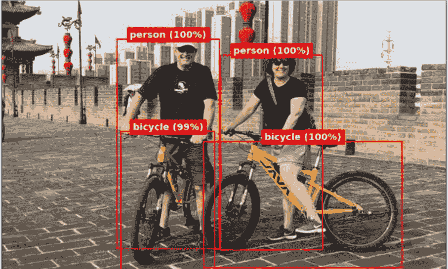

现在让我们尝试另一张图像——这次是一张年轻女子和家庭宠物的照片。首先显示图像并保存其宽度和高度：

```
image = plt.imread('Data/abby-lady.jpg')
width, height = image.shape[1], image.shape[0]
fig, ax = plt.subplots(figsize=(12, 8), subplot_kw={'xticks': [], 'yticks': []})
ax.imshow(image)
```

预处理图像并将其传递给模型的 `predict` 方法：

```
x = load_img('Data/abby-lady.jpg', target_size=(YOLO3.width, YOLO3.height))
x = img_to_array(x) / 255
x = np.expand_dims(x, axis=0)
y = model.predict(x)
```

再次显示图像，这次标注上检测到的物体：

```
boxes = decode_predictions(y, width, height)
annotate_image('Data/abby-lady.jpg', boxes)
```

输出如下：

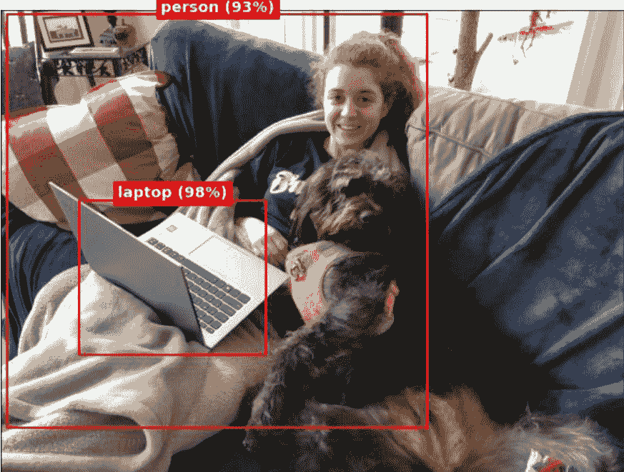

模型检测到了女孩和她的笔记本电脑，但没有检测到狗，尽管 COCO 训练图像中包含了狗。在底层，它*确实*检测到了狗，但置信度低于 90%。模型的 `predict` 方法通常返回关于数千个边界框的信息，其中大部分可以忽略，因为置信度非常低。默认情况下，`decode_predictions` 会忽略置信度分数低于 0.9 的边界框，但你可以通过在调用中包含 `min_score` 参数来覆盖此设置。使用以下语句再次解码预测并可视化，这次设置最低置信度为 55%：

```
boxes = decode_predictions(y, width, height, min_score=0.55)
annotate_image('Data/abby-lady.jpg', boxes)
```

将置信度阈值降低到 0.55 后，模型不仅检测到了狗，还检测到了沙发：

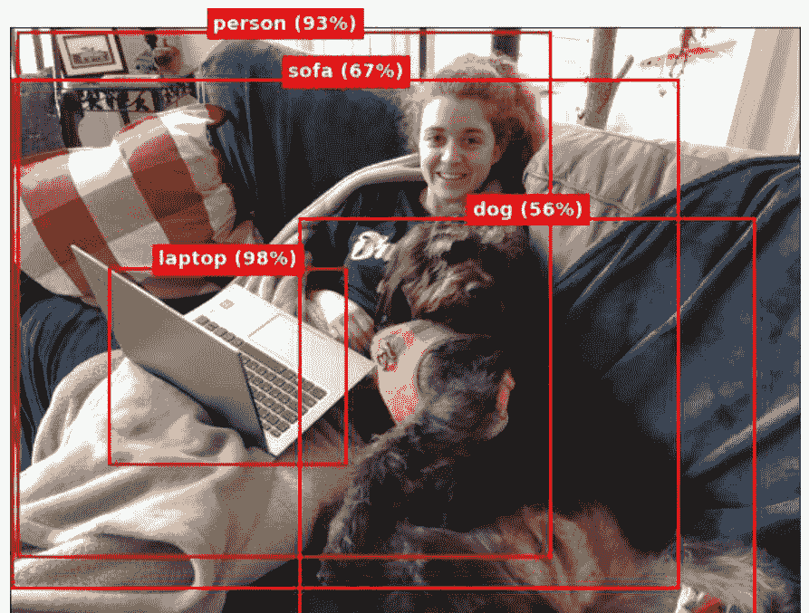

因为模型是在 COCO 数据集上训练的，所以它也可以检测许多其他物体，包括交通灯、停车标志、各种类型的食物和动物，甚至瓶子和酒杯。尝试使用你自己的图像来体验最先进的物体检测。

### 自定义物体检测

在 COCO 数据集上训练的物体检测模型可以轻松检测和识别 80 种不同类型的物体。但如果你需要一个识别其他物体的物体检测模型怎么办？例如，如果你需要一个检测汽车车牌、放在前廊的包裹或组织样本中癌细胞的模型怎么办？所有这些都是当今工业中应用物体检测的方式。而且它们都不依赖于仅使用 COCO 图像训练的模型。

从头开始训练一个物体检测模型，即使对于微软、Facebook 和谷歌的研究人员来说也是一项艰巨的任务。你可以通过从 COCO 权重开始，并用新类别增量训练网络来稍微简化这个过程，但即便如此，这也需要大量的计算和时间。

有一个更简单的方法。本书的整个前提是，你是一名软件开发人员或工程师，而不是拥有博士学位的数据科学家。你想使用机器学习（或深度学习）为你的业务增加价值。你想要结果，而不是黑板上的方程式。你可能拥有也可能不拥有 GPU，但你有一项工作要做，在这种情况下，这项工作涉及自定义物体检测。

这个“更简单的方法”是 [Azure 认知服务](https://azure.microsoft.com/en-us/services/cognitive-services/)——具体来说，是认知服务家族中名为 [自定义视觉服务](https://customvision.ai/) 的成员。我将在[第 14 章](#chapter-14)正式介绍 Azure 认知服务，但如果你的目标是构建自定义物体检测器，那么现在正是你首次涉足 AI 服务世界的合适时机。在我看来，没有什么比自定义视觉服务更容易构建自定义物体检测模型了。几乎不需要专业知识，最终你会得到一个训练好的模型，你可以轻松地在 Python、C# 或其他编程语言（如 Swift）中使用它。

Azure 的自定义视觉服务是 AI 领域最保守的秘密之一。让我们用它来训练一个自定义物体检测模型——然后戴上我们的海洋生物学家帽子，让模型投入工作。

### 使用自定义视觉服务训练自定义物体检测模型

自定义视觉服务是构成 Azure 认知服务的 20 多个服务和 API 之一。认知服务使你能够在不需要机器学习和 AI 深度专业知识的情况下将智能构建到应用程序中。自定义视觉服务允许你构建图像分类模型和物体检测模型，并在云端 GPU 上训练它们。训练完成后，你可以将模型部署为 Web 服务并使用 REST API 调用它们，或者以各种格式（包括 TensorFlow 和 Core ML）下载它们并在本地使用。下载中包含示例源代码文件，演示如何使用该模型。

要使用自定义视觉服务，你需要一个 Microsoft 帐户和一个 Azure 订阅。如果你没有 Microsoft 帐户，可以免费创建一个。如果你没有 Azure 订阅，可以创建一个免费试用订阅。你需要提供信用卡或借记卡，但你会获得 200 美元的免费信用额度，可在 30 天内使用，并且可以访问许多免费服务层。即使你拥有付费订阅或让你的免费试用转为付费订阅，使用自定义视觉服务也不一定会产生任何费用——特别是如果你导出创建的模型。

> 注意
如果你不想创建 Azure 订阅，可以跳过本节的剩余部分，并在下一节继续，我们将使用训练好的模型来检测物体。你需要的所有文件都存在于本书 GitHub 仓库的第 12 章文件夹中。

准备好构建自定义物体检测模型了吗？比如一个能在野外发现海龟的模型？首先下载一个海龟图像数据集。我使用 Bing 图像搜索找到了这些照片，并将搜索限制为可免费共享和商业使用的图像。将图像从 ZIP 文件复制到硬盘上的方便位置。

接下来，在浏览器中导航到自定义视觉门户，并使用你的 Microsoft 帐户登录。单击“+ 新建项目”，在“创建新项目”对话框中，单击“创建新”为项目创建一个新的 Azure 资源（图 12-9）。为资源输入一个名称，例如“turtle-detector”，并选择你的 Azure 订阅，如图 12-10 所示。为新资源选择一个现有的 Azure 资源组，或点击“创建新组”来新建一个。确保选择了 CognitiveServices 作为资源类型，并接受默认的 Azure 位置或选择一个离你更近的位置。最后，如果可用，选择 F0 作为定价层，否则选择 S1。（F0 是免费层，通常每个 Azure 订阅限用一个。）然后点击“创建资源”按钮。

> **注意**

在 Azure 中，*资源组* 是一组相关资源的集合，这些资源服务于一个共同的目的并共享一个共同的生命周期。删除一个资源组会删除该组中的所有资源。此外，你可以轻松地获取整个组的计费信息，而不是将各个资源的成本相加。

在“创建新项目”对话框中，为项目输入一个名称，并选择你刚刚创建的资源（图 12-11）。选择“对象检测”作为项目类型，“通用（紧凑）”作为领域。如果目标是训练一个可以导出并在本地使用的模型，选择一个“紧凑”领域至关重要。确保在导出功能下选择了“基本平台”，然后点击“创建项目”。

### 创建新项目

名称*

对象检测（海龟）

描述

输入项目描述

资源*

创建新组

turtle-detector [S0]

管理资源权限

项目类型 ⓘ

- ○ 分类
- ● 对象检测

领域：

- ○ 通用 [A1]
- ○ 通用
- ○ 标志
- ○ 货架上的产品
- ○ 通用（紧凑） [S1]
- ● 通用（紧凑）

选择最接近你场景的领域。紧凑领域是轻量级模型，可以导出到 iOS/Android 和其他平台。了解更多

导出功能： ⓘ

- ● 基本平台（Tensorflow, CoreML, ONNX, ...）
- ○ Vision AI 开发套件

取消

创建项目

图 12-11. 创建一个包含对象检测器的项目

现在 Custom Vision 项目已经创建，下一步是上传你将用于训练模型的图像，并用类名和边界框对它们进行标注。首先，点击“添加图像”。然后导航到存储海龟图像的文件夹，上传全部 50 张。上传完成后，点击第一张图像，在图像详细信息编辑器中打开它。使用鼠标在海龟周围画一个框，如图 12-12 所示。然后在弹出的标签编辑器中输入 **sea-turtle**，并点击其右侧的加号。现在点击最右边的右箭头转到下一张图像，并对剩余的训练图像重复此过程。你不必再次输入标签名称；只需从现有标签列表中选择它即可。此外，你通常也不必在海龟周围画框。将光标悬停在海龟上，编辑器会使用其自身的小智能来建议一个边界框。

图 12-12. 在训练图像中识别海龟

> **注意**

训练自定义对象检测模型最繁琐的部分是在所有训练图像中识别对象和边界框。Custom Vision 服务通过提供一个智能编辑器来帮助减少所需的点击和拖动量。尽管如此，想象一下为成千上万张图像做这件事！

如果一张照片包含两只或更多海龟，请务必为它们都打上标签，如图 12-13 所示。边界框重叠也没关系。毕竟，在现实世界中，对象经常重叠。数据科学家将重叠的边界框称为 *遮挡*。

图 12-13. 具有重叠边界框的海龟

在你为所有 50 张训练图像打上标签后，点击页面右上角的绿色“训练”按钮。当被要求选择训练类型时（图 12-14），选择“快速训练”以节省时间和金钱，然后点击对话框右下角的“训练”按钮开始训练。“高级训练”选项通常会产生更准确的模型，但它耗时更长，并且会根据你预算的小时数收费。如果你在创建模型时选择了免费的 F0 层，高级训练可能不是一个选项。F0 每月提供一小时的免费训练。

*图 12-14. 选择训练选项*

快速训练通常需要 5 到 10 分钟。训练完成后，你会看到如图 12-15 所示的摘要。你已经知道精确率和召回率是什么。第三个指标，*平均精度均值 (mAP)*，是衡量对象检测模型准确性的常用指标。它反映了模型对对象进行分类*并*识别对象边界框的能力。百分比越高越好。如果数字不够高，那么你有两个选择：使用更多图像进行训练，或者尝试高级训练而不是快速训练（或两者兼而有之）。最先进的对象检测模型通常使用每个类别的数千个示例进行训练。

### 迭代 1

使用 **通用（紧凑）** 领域于 **2022/3/26, 下午 4:13:12** 完成训练
迭代 ID： **ba09379b-eca2-4766-b909-23cd4a718edb**

### 按标签的性能

| 标签 | 精确率 | 召回率 | 平均精度 | 图像数量 |
|---|---|---|---|---|
| sea-turtle | 81.8% | 81.8% | 84.0% | 50 |

*图 12-15. 训练结果*

> **注意**

作为一个实验，我使用高级训练选项训练了相同的模型，并预算了一小时的训练时间。训练耗时不到 30 分钟，mAP 达到了 97.2%。在撰写本文时，高级训练每小时收费 10 美元，因此我的 Azure 订阅费用不到 5 美元。[Custom Vision 定价页面](https://customvision.ai/pricing) 有更多关于定价的信息。

你可以通过点击页面顶部的“快速测试”按钮，并选择一两张模型未训练过的照片来测试模型的准确性。或者，你可以点击页面左上角的“发布”，将模型部署为 Web 服务。但我们的目标是下载模型并在本地运行。为此，点击页面顶部的“导出”。选择 TensorFlow 作为导出类型，然后点击“导出”按钮。等待导出准备就绪，然后点击“下载”按钮（图 12-16）。

### 选择你的平台

TensorFlow

TensorFlow

下载

### 如何使用？

导出和下载后，可以在 zip 文件中找到示例代码

图 12-16. 下载训练好的 TensorFlow 模型

下载完成后，打开下载的 ZIP 文件。将以下文件从 ZIP 文件复制到你的 Jupyter notebook 所在的目录：

- labels.txt
  包含你在标注图像时创建的标签（sea-turtle）。
- model.pb
  包含训练和序列化后的 TensorFlow 模型。
- object_detection.py
  位于 ZIP 文件的 python 文件夹中，此文件包含在 Python 应用中使用模型的辅助函数。

一旦这些文件下载完毕，除非你想通过使用更多图像（或给予更多训练时间）来训练模型以改进模型，否则请在 Custom Vision 门户中删除该项目。为确保不会产生额外的 Azure 订阅费用，请删除包含该模型的 Azure 资源组。你可以通过 Azure 门户删除资源组。

请注意，在使用 Custom Vision 服务准备模型时，你并不局限于一类对象。你可以上传包含数十个不同类别的图像，并在图像详细信息编辑器中相应地标记它们。在这种情况下，labels.txt 将包含所有标签，而不仅仅是一个。

### 使用导出的模型

现在你已准备好让模型发挥作用。首先创建一个新的 Jupyter notebook，并将以下代码粘贴到第一个单元格中。这些语句定义了一个名为 SeaTurtleDetector 的类，它代表一个 TensorFlow 模型，以及一个名为 annotate_image 的函数，该函数用于标注图像以显示模型检测到的内容。`SeaTurtleDetector`类是*object_detection.py*中实现的`ObjectDetection`类的子类。它有一个`predict`方法，你可以调用它来检测图像中的对象：

```python
import sys
import tensorflow as tf
import matplotlib.pyplot as plt
from matplotlib.patches import Rectangle
from object_detection import ObjectDetection
from PIL import Image
import numpy as np

class SeaTurtleDetector(ObjectDetection):
    def __init__(self, graph_def, labels):
        super(SeaTurtleDetector, self).__init__(labels)
        self.graph = tf.compat.v1.Graph()
        with self.graph.as_default():
            input_data = tf.compat.v1.placeholder(
                tf.float32, [1, None, None, 3], name='Placeholder')
            tf.import_graph_def(graph_def,
                                input_map={'Placeholder:0': input_data},
                                name='')

    def predict(self, preprocessed_image):
        inputs = np.array(preprocessed_image, dtype=float)[:, :, (2, 1, 0)]

        with tf.compat.v1.Session(graph=self.graph) as sess:
            output_tensor = sess.graph.get_tensor_by_name('model_outputs:0')
            outputs = sess.run(output_tensor,
                               {'Placeholder:0': inputs[np.newaxis, ...]})
            return outputs[0]

def annotate_image(image, predictions, min_score=0.7, figsize=(12, 8)):
    fig, ax = plt.subplots(figsize=figsize,
                           subplot_kw={'xticks': [], 'yticks': []})
    img_width, img_height = image.size
    ax.imshow(image)

    for p in predictions:
        score = p['probability']

        if score >= min_score:
            x1 = p['boundingBox']['left'] * img_width
            y1 = p['boundingBox']['top'] * img_height
            width = p['boundingBox']['width'] * img_width
            height = p['boundingBox']['height'] * img_height
            label = p['tagName']

            rect = Rectangle((x1, y1), width, height, fill=False,
                              color='red', lw=2)
            ax.add_patch(rect)
            label = f'{label} ({score:.0%})'
            ax.text(x1 + (width / 2), y1, label, color='white',
                    backgroundcolor='red', ha='center', va='bottom',
                    fontweight='bold', bbox=dict(color='red'))
```

接下来，使用以下语句加载*model.pb*中的序列化模型和*labels.txt*中的标签，并初始化一个目标检测模型：

```python
# 加载序列化的模型图
graph_def = tf.compat.v1.GraphDef()
with tf.io.gfile.GFile('model.pb', 'rb') as f:
    graph_def.ParseFromString(f.read())

# 加载标签
with open('labels.txt', 'r') as f:
    labels = [l.strip() for l in f.readlines()]

# 创建模型
model = SeaTurtleDetector(graph_def, labels)
```

最后，去互联网上下载一张海龟的照片。然后将照片加载到你的笔记本中，看看模型是否检测到了其中的海龟：

```python
%matplotlib inline

image = Image.open('PATH_TO_IMAGE_FILE')
predictions = model.predict_image(image)
annotate_image(image, predictions)
```

模型检测对了吗？对我来说是对的：

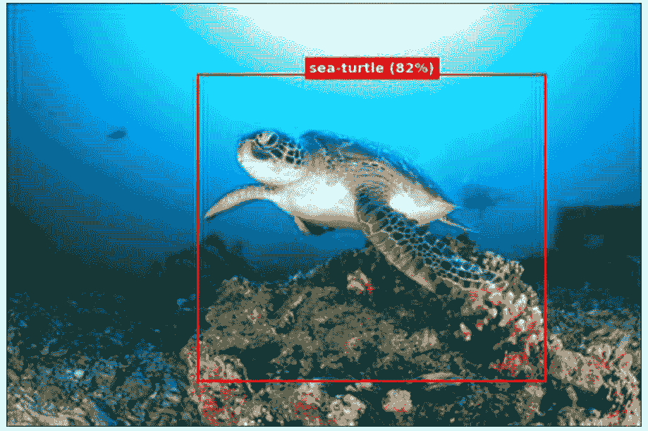

请记住，目标检测的最先进精度是使用*大量*带标签图像进行训练的结果。你在这里用50张图像训练是一个良好的开端，但要训练一个模型达到足以用于现实世界的精度水平，你可能至少需要10倍于此的图像。好消息是，一旦你收集了图像，Custom Vision服务会使标记图像和训练模型的过程变得相对简单。

### 总结

目标检测代表了计算机视觉领域的尖端技术。它是自动驾驶汽车“看到”前方物体的方式，也是众多现实应用背后的技术。最先进的目标检测是通过使用专门设计的CNN（卷积神经网络）的深度学习来实现的，这些CNN的功能远不止简单的图像分类。你可以使用预训练模型（如YOLO和Mask R-CNN）来检测图像和视频帧中的对象。使用Mask R-CNN，你甚至可以生成分割掩码，揭示关于这些对象的额外信息。

自定义目标检测要求你使用自己精心标注的图像（标注对象和边界框）来训练这样的模型。Azure的Custom Vision服务简化了训练自定义目标检测模型的过程，并允许你训练的模型托管在云中，通过REST API调用，或下载并在本地使用。它是构成Azure认知服务的几项服务之一，当任务需要检测预训练模型未训练检测的对象时，它是完成这项工作的合适工具。

## 第13章 自然语言处理

使用Scikit-Learn构建分析文本情感、识别垃圾邮件以及以其他方式分类文本的机器学习模型并不困难。但如今，最先进的文本分类通常由神经网络执行。你已经知道如何构建接受数字和图像作为输入的神经网络。让我们在此基础上学习如何构建处理文本的深度学习模型——深度学习的一个分支，称为*自然语言处理*，简称NLP。

NLP涵盖多种活动，包括文本分类、命名实体识别、关键词提取、问答和语言翻译。近年来，NLP模型的准确性有所提高，原因多种多样，其中不乏将单词和句子转换为包含语义的密集向量表示的更新更好的方法，以及一种相对较新的神经网络架构——*Transformer*，它可以聚焦于最有意义的单词，甚至区分同一单词的不同含义。

几乎所有处理文本的神经网络都有一个共同元素：*嵌入层*，它使用*词嵌入*将表示单词的标量值数组（或*序列*）转换为称为*词向量*的浮点数数组。这些向量编码了关于单词含义及其之间关系的信息。嵌入层的输出可以输入到分类层，也可以输入到其他类型的神经网络层，以在进一步处理之前从中提取更多含义。

Transformer？嵌入层？词向量？这里有很多内容需要理解，但一旦你掌握了几个基本概念，处理语言的神经网络就是纯粹的魔法。让我们深入探讨。我们将从学习如何为深度学习模型处理文本做准备以及如何创建词嵌入开始。然后，我们将运用这些知识构建神经网络来分类文本、将文本从一种语言翻译成另一种语言等等——这些都是NLP的经典应用。

### 文本准备

第4章介绍了Scikit-Learn的`CountVectorizer`类，它将文本行转换为机器学习模型可以处理的单词计数行。`CountVectorizer`还将字符转换为小写，移除数字和标点符号，并可选地移除停用词——像*and*和*the*这样可能对结果影响很小的常见词。

在使用文本训练神经网络之前，文本也必须经过清理和向量化，但向量化通常以不同的方式进行。你不是创建一个单词计数表，而是创建一个包含表示单个单词的*标记*的序列表。标记通常是基于数据集中单词语料库构建的字典或*词汇表*的索引。为了帮助实现这一点，Keras提供了`Tokenizer`类，你可以将其视为`CountVectorizer`的深度学习等价物。以下是一个使用`Tokenizer`从四行文本创建序列的示例：

```python
from tensorflow.keras.preprocessing.text import Tokenizer
```

### 词嵌入

文本经过分词并转换为填充序列后，就为训练神经网络做好了准备。但仅在原始填充序列上训练，可能效果有限。

处理文本的神经网络的一个关键要素是`嵌入层`，其作用是将填充的词元序列转换为`词向量`数组。词向量用浮点数数组（向量）而非单个整数来表示每个词。输入文本中的每个词在嵌入层中都由一个向量表示。随着网络的训练，代表各个词的向量会被调整，以反映它们之间的关系。如果你正在构建一个情感分析模型，而*优秀*和*惊人*这类词具有相似的含义，那么在嵌入空间中代表这些词的向量应该相对接近，这样“优质服务”和“惊人服务”这样的短语得分就会相似。

手动实现嵌入层是一项复杂的任务（尤其是训练部分），因此Keras提供了`Embedding`类。使用Keras，创建一个可训练的嵌入层只需一行代码：

```python
Embedding(input_dim=10000, output_dim=32, input_length=100)
```

传递给`Embedding`函数的三个参数依次是：

- 词汇表大小，即`Tokenizer`构建的词汇表中的词数
- 嵌入空间的维度*m*
- 每个填充序列的长度*n*

你选择维度数*m*，每个词在嵌入空间中被编码为一个*m*维向量。更多的维度提供更强的拟合能力，但也增加了训练时间。实践中，*m*通常是32到512之间的数字。

嵌入层中代表各个词的向量是在训练过程中学习到的，就像连接相邻密集层神经元的权重一样。如果训练样本数量足够多，训练网络通常能为所有词创建有效的向量表示。然而，如果你只有几百个训练样本，嵌入层可能没有足够的信息来正确地将文本语料库向量化。

在这种情况下，你可以选择用*预训练词嵌入*来初始化嵌入层，而不是依赖它自己学习词嵌入。公共领域存在几种流行的预训练词嵌入，包括斯坦福大学开发的[GloVe词向量](https://nlp.stanford.edu/projects/glove/)和谷歌自己的[Word2Vec](https://code.google.com/archive/p/word2vec/)。预训练嵌入倾向于建模词之间的语义关系，例如，认识到*国王*和*女王*是相关术语，而*楼梯*和*斑马*则不是。虽然这可能有益，但当词嵌入是从训练数据中学习时，用于文本分类的网络通常表现更好，因为这样的嵌入是针对特定任务的。有关如何使用预训练嵌入的示例，请参阅Keras作者的“使用预训练词嵌入”。

### 文本分类

图13-1展示了一个用于文本分类的神经网络的基线架构。分词后的文本序列被输入到嵌入层。嵌入层的输出是一个*m*乘*n*的浮点值二维矩阵，其中*m*是嵌入空间的维度，*n*是序列长度。嵌入层之后的展平层将二维输出“展平”为适合输入到密集层的一维数组，密集层对展平层输出的值进行分类。你可以尝试嵌入层的不同维度和密集层的不同宽度以最大化准确率。如果需要，也可以添加更多的密集层。

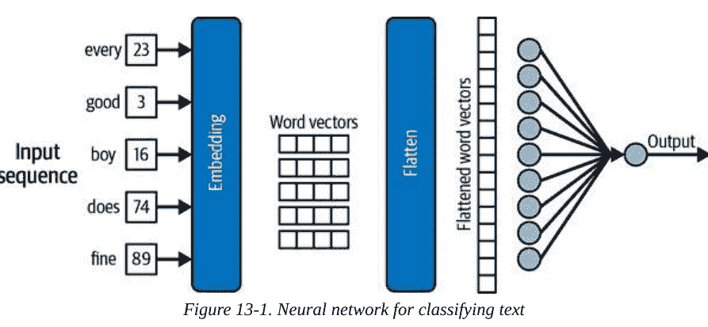

像图13-1这样的神经网络可以这样实现：

```python
from tensorflow.keras.models import Sequential
from tensorflow.keras.layers import Dense, Flatten, Embedding

model = Sequential()
model.add(Embedding(10000, 32, input_length=100))
```

model.add(Flatten())
model.add(Dense(128, activation='relu'))
model.add(Dense(1, activation='sigmoid'))
model.compile(optimizer='adam', loss='binary_crossentropy', metrics=['accuracy'])

一个用于文本分类的神经网络应用是垃圾邮件过滤。第4章演示了如何使用Scikit构建一个将垃圾邮件与正常邮件分开的机器学习模型。现在，让我们用Keras和TensorFlow构建一个等效的深度学习模型。我们将使用之前用过的同一个数据集：包含1000封邮件，其中一半是垃圾邮件（在标签列中用1表示），另一半不是（在标签列中用0表示）。

首先，下载数据集并将其复制到你的Jupyter笔记本所在的*Data*子目录中。然后使用以下语句加载数据集并打乱行顺序，以将正负样本均匀分布。打乱顺序很重要，因为我们将使用fit的`validation_split`参数，而不是使用`train_test_split`来创建验证集。它不像`train_test_split`那样打乱数据：

```python
import pandas as pd

df = pd.read_csv('Data/ham-spam.csv')
df = df.sample(frac=1, random_state=0)
df.head()
```

使用以下语句从数据集中删除任何重复的行并检查平衡性：

```python
df = df.drop_duplicates()
df.groupby('IsSpam').describe()
```

接下来，从DataFrame的Text列中提取邮件内容，从IsSpam列中提取标签。然后使用Keras的Tokenizer类对文本进行分词并将其转换为序列，再使用pad_sequences生成等长的序列。无需移除停用词，因为这样做不会影响结果：

```python
from tensorflow.keras.preprocessing.text import Tokenizer
from tensorflow.keras.preprocessing.sequence import pad_sequences

x = df['Text']
y = df['IsSpam']

max_words = 10000 # 将词汇量限制在最常见的10,000个词
max_length = 500

tokenizer = Tokenizer(num_words=max_words)
tokenizer.fit_on_texts(x)
sequences = tokenizer.texts_to_sequences(x)
x = pad_sequences(sequences, maxlen=max_length)
```

定义一个二元分类模型，该模型包含一个32维的嵌入层、一个用于展平嵌入层输出的展平层、一个用于分类的密集层，以及一个具有单个神经元和sigmoid激活函数的输出层：

```python
from tensorflow.keras.models import Sequential
from tensorflow.keras.layers import Dense, Flatten, Embedding

model = Sequential()
model.add(Embedding(max_words, 32, input_length=max_length))
model.add(Flatten())
model.add(Dense(128, activation='relu'))
model.add(Dense(1, activation='sigmoid'))
model.compile(loss='binary_crossentropy', optimizer='adam', metrics=['accuracy'])
model.summary()
```

训练网络，并允许Keras使用20%的训练样本进行验证：

```python
hist = model.fit(x, y, validation_split=0.2, epochs=5, batch_size=20)
```

使用`fit`返回的history对象绘制每个epoch的训练和验证准确率：

```python
import seaborn as sns
import matplotlib.pyplot as plt
%matplotlib inline
sns.set()

acc = hist.history['accuracy']
val = hist.history['val_accuracy']
epochs = range(1, len(acc) + 1)

plt.plot(epochs, acc, '-', label='Training accuracy')
plt.plot(epochs, val, ':', label='Validation accuracy')
plt.title('Training and Validation Accuracy')
plt.xlabel('Epoch')
plt.ylabel('Accuracy')
plt.legend(loc='lower right')
plt.plot()
```

希望网络的验证准确率超过了95%。如果没有，请再次训练。以下是我的训练结果：

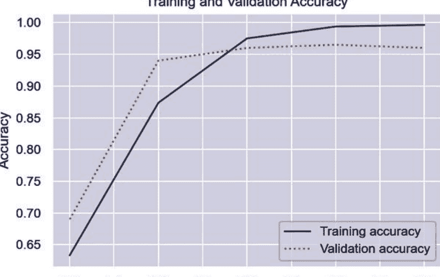

一旦你对准确率感到满意，使用以下语句计算一封关于代码审查的邮件是垃圾邮件的概率：

```python
text = 'Can you attend a code review on Tuesday? ' \
      'Need to make sure the logic is rock solid.'

sequence = tokenizer.texts_to_sequences([text])
padded_sequence = pad_sequences(sequence, maxlen=max_length)
model.predict(padded_sequence)[0][0]
```

然后对另一封邮件做同样的操作：

```python
text = 'Why pay more for expensive meds when ' \
      'you can order them online and save $$$?'

sequence = tokenizer.texts_to_sequences([text])
padded_sequence = pad_sequences(sequence, maxlen=max_length)
model.predict(padded_sequence)[0][0]
```

网络对第一封邮件的预测是什么？第二封呢？你同意这些预测吗？请记住，接近0.0的数字表示邮件不是垃圾邮件，而接近1.0的数字表示它是垃圾邮件。

### 自动化文本向量化

你可以用TextVectorization层来替代手动运行Tokenizer和pad_sequences。以下是一个示例：

```python
from tensorflow.keras.models import Sequential
from tensorflow.keras.layers import Dense, Flatten, Embedding
from tensorflow.keras.layers import TextVectorization, InputLayer
import tensorflow as tf

model = Sequential()
model.add(InputLayer(input_shape=(1,), dtype=tf.string))
model.add(TextVectorization(max_tokens=max_words,
                           output_sequence_length=max_length))
model.add(Embedding(max_words, 32, input_length=max_length))
model.add(Flatten())
model.add(Dense(128, activation='relu'))
model.add(Dense(1, activation='sigmoid'))
model.compile(loss='binary_crossentropy', optimizer='adam',
              metrics=['accuracy'])
model.summary()
```

请注意，输入层（`InputLayer`的一个实例）现在被明确定义，并配置为接受字符串输入。此外，在训练模型之前，必须通过调用`adapt`将`TextVectorization`层适配到输入数据：

```python
model.layers[0].adapt(x)
```

现在你不再需要预处理训练文本，可以直接将原始文本字符串传递给`predict`：

```python
text = 'Why pay more for expensive meds when ' \
      'you can order them online and save $$$?'
model.predict([text])[0][0]
```

`TextVectorization`不会移除停用词，因此如果你想移除它们，可以单独处理，或者使用`TextVectorization`函数的`standardize`参数来指定一个回调函数为你完成此操作。

### 在情感分析模型中使用TextVectorization

为了演示`TextVectorization`层如何简化文本处理，让我们用它来构建一个执行情感分析的二元分类器。我们将使用第4章中使用的同一个数据集：[IMDB评论数据集](https://ai.stanford.edu/~amaas/data/sentiment/)，包含25,000条正面评论和25,000条负面评论。

如果还没有下载数据集，请下载并将其放入你的Jupyter笔记本的`Data`子目录中。然后创建一个新笔记本，并使用以下语句加载和打乱数据集：

```python
import pandas as pd

df = pd.read_csv('Data/reviews.csv', encoding="ISO-8859-1")
df = df.sample(frac=1, random_state=0)
df.head()
```

删除重复行并检查平衡性：

```python
df = df.drop_duplicates()
df.groupby('Sentiment').describe()
```

现在创建模型，并包含一个TextVectorization层来预处理输入文本：

```python
from tensorflow.keras.models import Sequential
from tensorflow.keras.layers import TextVectorization, InputLayer
from tensorflow.keras.layers import Dense, Flatten, Embedding
import tensorflow as tf

max_words = 20000
max_length = 500

model = Sequential()
model.add(InputLayer(input_shape=(1,), dtype=tf.string))
model.add(TextVectorization(max_tokens=max_words,
                            output_sequence_length=max_length))
model.add(Embedding(max_words, 32, input_length=max_length))
model.add(Flatten())
model.add(Dense(128, activation='relu'))
model.add(Dense(1, activation='sigmoid'))
model.compile(loss='binary_crossentropy', optimizer='adam',
              metrics=['accuracy'])
model.summary()
```

从DataFrame的Text列中提取评论，从Sentiment列中提取标签（0表示负面情感，1表示正面情感），并使用前者将TextVectorization层适配到文本。然后训练模型：

```python
x = df['Text']
y = df['Sentiment']
model.layers[0].adapt(x)

hist = model.fit(x, y, validation_split=0.5, epochs=5, batch_size=250)
```

训练完成后，绘制训练和验证准确率：

```python
import seaborn as sns
import matplotlib.pyplot as plt
%matplotlib inline
sns.set()

acc = hist.history['accuracy']
val = hist.history['val_accuracy']
epochs = range(1, len(acc) + 1)

plt.plot(epochs, acc, '-', label='Training accuracy')
plt.plot(epochs, val, ':', label='Validation accuracy')
plt.title('Training and Validation Accuracy')
plt.xlabel('Epoch')
plt.ylabel('Accuracy')
plt.legend(loc='lower right')
plt.plot()
```

模型对训练文本的拟合非常好，但验证准确率通常在85%到90%之间达到峰值：

使用模型为一条正面评论进行情感评分：

```python
text = 'Excellent food and fantastic service!'
model.predict([text])[0][0]
```

现在为一条负面评论做同样的操作：

```python
text = 'The long lines and poor customer service really turned me off.'
model.predict([text])[0][0]
```

观察代码变得多么简单。模型的部署也更简单了，因为你不再需要一个在训练数据上拟合过的分词器来为模型预测准备提交的文本。但请注意，包含`TextVectorization`层的模型无法保存为Keras的H5格式。它*可以*保存为TensorFlow的SavedModel格式。以下语句将模型保存到当前目录的*saved_model*子目录中：

```python
model.save('saved_model')
```

一旦模型重新加载，你就可以直接将文本传递给它进行预测。

### 将词序纳入预测

你刚刚构建的两个模型都是*词袋*模型，它们忽略了词序。这类模型很常见，并且通常比其他类型的模型更准确。但情况并非总是如此。句子中词语的相对位置有时具有意义。*Credit*和*card*这两个词，如果它们在句子中相距较远，可能会以一种方式影响垃圾邮件分类器；如果它们紧挨在一起，则可能以另一种方式影响分类器。

改进——或者至少*尝试*改进——简单词袋模型的一种方法是使用第4章描述的*n*-gram。*n*-gram是连续出现的*n*个词的集合。Keras的`TextVectorization`类具有一个`ngrams`参数，使得应用*n*-gram变得容易。以下语句创建了一个`TextVectorization`层，它同时考虑词对和单个词：

```python
model.add(TextVectorization(max_tokens=max_words,
                           output_sequence_length=max_length,
                           ngrams=2))
```

*n*-gram的一个局限性是它们只考虑彼此直接相邻的词。一种稍微更稳健的方法是将词位信息纳入分类任务，即用`Conv1D`和`MaxPooling1D`层替换全连接层，将网络转变为卷积神经网络。CNN最常用于图像分类，但一维卷积层与文本序列配合得很好。以下是前一个示例中的网络改造为CNN后的样子：

```python
from tensorflow.keras.models import Sequential
from tensorflow.keras.layers import Conv1D, MaxPooling1D, GlobalMaxPooling1D
from tensorflow.keras.layers import TextVectorization, InputLayer
from tensorflow.keras.layers import Dense, Embedding
import tensorflow as tf

model = Sequential()
model.add(InputLayer(input_shape=(1,), dtype=tf.string))
model.add(TextVectorization(max_tokens=max_words,
                           output_sequence_length=max_length))
model.add(Embedding(max_words, 32, input_length=max_length))
model.add(Conv1D(32, 7, activation='relu'))
model.add(MaxPooling1D(5))
model.add(Conv1D(32, 7, activation='relu'))
model.add(GlobalMaxPooling1D())
model.add(Dense(1, activation='sigmoid'))
model.compile(loss='binary_crossentropy', optimizer='adam',
              metrics=['accuracy'])
```

在这个示例中，`Conv1D`层不是处理单个词，而是从代表词的向量组中提取特征（第一层是七个向量，第二层又是七个），就像`Conv2D`层从像素块中提取特征一样。`MaxPooling1D`层压缩第一个`Conv1D`层的输出，以揭示输入序列中更高层次的结构，类似于降低图像分辨率往往能突出宏观特征（如人的身体形状），同时最小化或完全过滤掉次要特征（如人的眼睛形状）。像这样的简单CNN有时比词袋模型更准确地分类文本，有时则不然。正如机器学习中经常发生的那样，唯一的办法就是尝试。

### 循环神经网络（RNN）

将词位信息纳入分类器的另一种方法是在网络中包含循环层。循环层最初是为了处理时间序列数据而发明的——例如，查看过去五天的天气数据并预测明天的最高温度。如果你只是取这五天的所有天气数据并将每一天独立对待，数据中明显的趋势就会丢失。然而，循环层可以检测到这些趋势并将其纳入输出。嵌入层输出的一系列向量符合时间序列的定义，因为短语中的词是按顺序排列的，并且短语中早期使用的词可以为后续出现的词的解释提供信息。

图13-2说明了循环层如何将词嵌入转换为受词序影响的向量。在这个示例中，序列被输入到嵌入层，该层将序列中的每个词（标记）转换为一个浮点数向量。这些词嵌入被输入到循环层，产生另一个输出向量。为了计算该向量，循环层中的单元会循环遍历构成序列的嵌入。循环第*n* + 1次迭代的输入是当前的嵌入向量*以及*第*n*次迭代的输出——即所谓的*隐藏状态*。循环层的输出是循环最后一次迭代的输出。其结果与每个嵌入向量被独立处理时不同，因为每次迭代都使用前一次迭代的信息来计算输出。序列中早期词的上下文可以传递到后面出现的词。

手动构建一个非常简单的循环层并不困难，它对于短序列（比如四五个词）效果相当好，但较长的序列会受到梯度消失效应的影响，这意味着相距较远的词彼此影响很小。一个解决方案是由*长短期记忆*（LSTM）单元组成的循环层，该单元在1997年一篇题为“Long Short-Term Memory”的论文中被引入，这个标题恰如其分。

LSTM单元本身就是微型神经网络。当单元循环遍历序列中的词时，它们会学习（就像全连接层中连接神经元的权重被学习一样）哪些词是重要的，并在后续的循环迭代中赋予这些信息优先权。全连接层无法识别短语“I like blue, for on a clear and sunny day, it is the color of the sky.”中*blue*和*sky*之间的联系。LSTM层可以识别，并能将其纳入输出。然而，随着词之间的距离变远，其能力会减弱。

Keras在其`LSTM`类中提供了LSTM层的便捷实现。它还提供了一个`GRU`类，实现了门控循环单元（GRU）层，这是LSTM层的简化版本，训练更快，并且通常产生与LSTM层相当或更好的结果。以下是我们的垃圾邮件分类器如果修改为使用LSTM后的样子：

```python
from tensorflow.keras.models import Sequential
from tensorflow.keras.layers import TextVectorization, InputLayer
from tensorflow.keras.layers import Dense, Embedding, LSTM
import tensorflow as tf

model = Sequential()
model.add(InputLayer(input_shape=(1,), dtype=tf.string))
model.add(TextVectorization(max_tokens=max_words,
                           output_sequence_length=max_length))
model.add(Embedding(max_words, 32, input_length=max_length))
model.add(LSTM(32))
model.add(Dense(1, activation='sigmoid'))
model.compile(loss='binary_crossentropy', optimizer='adam',
              metrics=['accuracy'])
```

LSTM计算密集，尤其是在处理长序列时。如果你尝试这段代码，你会发现模型训练时间*长得多*。你还会发现验证准确率即使有提高也微乎其微。这又回到了词袋模型虽然简单，但在文本分类方面往往有效的事实上。

LSTM层可以像全连接层一样堆叠。技巧是在除最后一层之外的所有LSTM层中包含`return_sequences=True`属性，这样前面的层会返回生成的所有向量（所有隐藏状态），而不仅仅是最后一个向量。谷歌翻译曾经使用两个八层深的LSTM堆栈来将一种语言的短语编码并解码为另一种语言。

### 使用预训练模型进行文本分类

如果你自己训练的情感分析模型达不到所需的准确率，你总是可以求助于预训练模型。就像有使用数百万张标记图像训练的预训练计算机视觉模型一样，也有使用数百万个标记文本样本训练的预训练情感分析模型可用。Keras没有像为预训练CNN提供便捷包装器那样为这些模型提供，但它们仍然相对容易使用。

许多此类模型可从[Hugging Face](https://huggingface.co/)获得，这是一家专注于AI的公司，其目标是推进和普及AI。Hugging Face最初专注于NLP模型，但此后已将其库扩展到包括其他类型的模型，例如[图像分类模型](https://huggingface.co/models?pipeline_tag=image-classification)和[目标检测模型](https://huggingface.co/models?pipeline_tag=object-detection)。目前，Hugging Face托管了超过[400个情感分析模型](https://huggingface.co/models?pipeline_tag=sentiment-analysis)，这些模型在不同类型的输入上训练，范围从推文到各种语言的产品评论。它甚至提供分析文本中的喜悦、愤怒、惊讶和其他情绪的模型。

所有这些模型都可以免费使用。想试试吗？首先在你的Python环境中安装Hugging Face的[Transformers包](https://huggingface.co/transformers/)（例如，`pip install transformers`）。然后启动一个Jupyter notebook，使用以下代码加载Hugging Face的默认情感分析模型：

```python
from transformers import pipeline

model = pipeline('sentiment-analysis')
```

首次下载模型时会有短暂的延迟。一旦下载

### 神经机器翻译

在自然语言处理的领域中，文本分类是一项相对简单的任务。而与之相对的另一端是*神经机器翻译*（NMT），它利用深度学习将文本从一种语言翻译成另一种语言。NMT已被证明优于在深度学习爆发之前出现的[基于规则的机器翻译（RBMT）](https://en.wikipedia.org/wiki/Rule-based_machine_translation)和[统计机器翻译（SMT）](https://en.wikipedia.org/wiki/Statistical_machine_translation)系统，如今它几乎是所有最先进文本翻译服务的基础。

文本分类的要点在于，你将输入序列转换为一个表征该序列的向量，然后将该向量输入到分类器中。生成该向量有多种方法。你可以将嵌入层的二维输出重塑为一维向量，或者你可以将该输出馈送到循环层或卷积层，以期生成一个更具上下文感知能力的向量。无论你选择哪条路径，目标都很简单：将一串文本转换为一个唯一描述它的浮点数数组，并使用sigmoid或softmax输出层对其进行分类。

NMT基本上是文本分类的扩展。你首先将文本序列转换为向量。但与其对向量进行分类，你使用它来生成一个新的序列。一种方法是使用LSTM编码器-解码器。

### LSTM编码器-解码器

直到几年前，大多数NMT模型，包括支撑谷歌翻译的那个模型，都是基于LSTM的序列到序列模型，类似于图13-3中的模型。在这样的模型中，一个或多个LSTM层将代表待翻译短语的、经过分词的输入序列编码为一个向量。第二组循环层使用该向量作为输入，并将其解码为另一种语言中的分词短语。该模型接受序列作为输入并返回序列作为输出，因此得名序列到序列模型。末端的softmax输出层为输出序列中的每个词元输出一组概率。例如，如果支持的最大输出短语长度是20个词元，而输出语言的词汇表包含20,000个单词，那么输出就是20组（每组对应一个词元）20,000个概率。为每个输出词元选择的单词是被分配了最高概率的那个单词。

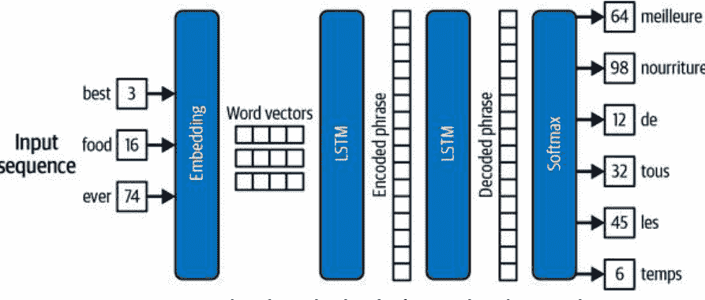

基于LSTM的序列到序列模型相对容易使用Keras和TensorFlow构建。本书的GitHub仓库包含一个notebook，它使用50,000个样本来训练一个LSTM模型，将英语翻译成法语。该模型定义如下：

```python
model = Sequential()
model.add(Embedding(en_vocab_size, 256, input_length=en_max_len, mask_zero=True))
model.add(LSTM(256))
model.add(RepeatVector(fr_max_len))
model.add(LSTM(256, return_sequences=True))
model.add(Dropout(0.4))
model.add(TimeDistributed(Dense(fr_vocab_size, activation='softmax')))
model.compile(loss='sparse_categorical_crossentropy', optimizer='adam',
              metrics=['accuracy'])
model.summary(line_length=100)
```

第一层是嵌入层，它将单词词元转换为包含256个浮点值的向量。`mask_zero=True`参数表示输入序列中的零表示填充，以便下一层可以忽略它们。（毕竟，这些词元不需要翻译。）接下来是一个LSTM层，它将输入到模型的英语短语进行编码。第二个LSTM层将这些短语解码为代表法语对应词的稠密向量。中间是一个`RepeatVector`层，它通过将第一个LSTM层的输出重复指定次数来重塑其输出，以便输入到第二个LSTM层。最后一层是softmax分类层，它为法语词汇表中的每个单词输出概率。`TimeDistributed`包装器确保模型为输出序列中的每个词元输出一组概率，而不是仅为整个序列输出一组。

经过34个epoch的训练后，该模型以如下方式翻译了10个测试短语：

```
its fall now => cest maintenant maintenant
im losing => je suis en train
it was quite funny => cetai fut amusant amusant
thats not unusual => ce nest pas inhabituel
i think ill do that => je pense que je le
tom looks different => tom a lair different
its worth a try => ca vaut le coup
fortune smiled on him => la la lui a souri
lets hit the road => taillons la
i love winning => jadore gagner
```

该模型并不完美，部分原因是训练集的规模有限。真正的NMT模型是用数亿甚至数十亿个短语进行训练的。但这个模型是否真正代表了用于最先进文本翻译的模型呢？图13-4改编自谷歌工程师在2016年撰写的一篇论文中的图片，该论文记录了谷歌翻译的架构。该架构与刚刚介绍的模型非常相似。它更深，在编码器中有八个LSTM层，在解码器中也有八个。它还在层之间采用了残差连接，以支持网络更深的结构。

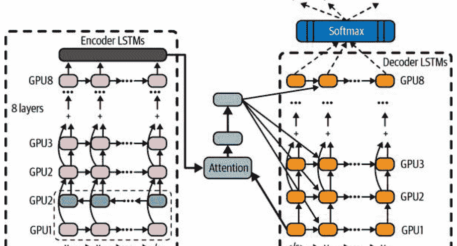

我们的模型与论文中描述的模型之间的一个区别是编码器和解码器之间标有“注意力”的模块。在深度学习中，*注意力*是一种让模型关注短语中最重要的部分的机制，它认识到一个词在不同的上下文中可能有不同的含义，并且一个词的含义有时取决于其周围的词。

注意力机制是在2014年一篇题为“通过联合学习对齐和翻译的神经机器翻译”的开创性论文中引入深度学习的，但直到几年后，注意力才作为*替代*LSTM层（而非补充它们）的方式成为焦点。这或许是迄今为止对NMT领域乃至整个NLP领域最重要的贡献：Transformer模型。

### Transformer编码器-解码器

2017年一篇题为“Attention Is All You Need”的里程碑式论文改变了数据科学家处理NMT和其他神经文本处理任务的方式。它提出了一种更好的执行序列到序列处理的方法，该方法基于*Transformer模型*，摒弃了循环层，并使用注意力机制来建模单词使用的上下文。如今，Transformer模型几乎完全取代了基于LSTM的模型。

图13-5改编自上述论文中的一张图片。左侧是编码器，它接受文本序列作为输入，并生成这些序列的稠密向量表示。右侧是解码器，它将输入序列的稠密向量表示转换为输出序列。从高层次来看，Transformer模型使用与基于LSTM的模型相同的编码器-解码器架构。区别在于它如何进行编码和解码。

### 构建基于Transformer的NMT模型

Transformer模型引入的主要创新是使用多头注意力（MHA）层来替代LSTM层。MHA层体现了*自注意力*的概念，它使模型能够分析输入序列，并关注最重要的词语以及这些词语使用的上下文。例如，在句子“We took a walk in the park”中，单词*park*的含义与“Where did you park the car?”中的不同。嵌入层为*park*存储一个向量表示，但在Transformer模型中，MHA层会修改嵌入层的向量输出，使得*park*在两个句子中由两个不同的向量表示。毫不奇怪，用于使嵌入向量感知上下文的值是在训练过程中学习到的。

> **注意**

自注意力是如何工作的？其要点是MHA层使用点积来计算序列中每对词语的相似度得分。在对得分进行归一化后，它使用这些得分来计算序列中每个词语嵌入的加权版本。然后，它再次使用训练过程中学习到的权重对其进行修改。

*多头注意力*中的“多”表示MHA层学习的是多组权重，而不仅仅是一组，这与CNN中的卷积层类似。这使得MHA能够辨别长序列中的上下文，在这些序列中，词语之间可能存在多种关系。

MHA还提供了关于指代其他词语的词语的额外上下文。嵌入层用单个向量表示代词*it*，但MHA层帮助模型理解，在句子“I love my car because it is fast”中，*it*指代的是汽车。它还为单词*fast*增加了权重，因为它对句子的含义至关重要。没有它，就不清楚你*为什么*喜欢你的车。

与LSTM层不同，MHA层对输入序列中词语之间关系建模的能力与序列长度无关。MHA层还支持并行工作负载，因此在多个GPU上训练速度更快。然而，它们不编码关于短语中词语位置的信息。为了补偿这一点，Transformer使用简单的向量加法，将表示词语在序列中位置的信息添加到嵌入层的每个向量输出中。这被称为*位置编码*或*位置嵌入*。它在[图13-5](Figure 13-5)中由标记为“Positional encoding”的加号表示。

Transformer不仅限于神经机器翻译；如今它们几乎应用于自然语言处理的所有方面。Transformer的编码器部分输出其输入序列的密集向量表示。可以通过使用Transformer而不是独立的嵌入层来编码输入序列，从而执行文本分类。采用这种架构的模型通常优于词袋模型，特别是当样本与样本长度的比率（训练样本数量除以每个样本的平均长度）超过1,500时。这个所谓的“黄金常数”是由谷歌的一个研究团队发现的，并记录在[关于文本分类的教程](tutorial on text classification)中。

Keras提供了一些，但不是全部的，构建端到端Transformer所需的构建块。例如，它在其[MultiHeadAttention类](MultiHeadAttention class)中提供了自注意力层的便捷实现，但它没有实现位置嵌入。然而，一个名为[KerasNLP](KerasNLP)的独立包实现了这一点。除了其他功能外，它还包括以下表示基于Transformer网络中的层的类：

- *TransformerEncoder*：表示一个Transformer编码器
- *TransformerDecoder*：表示一个Transformer解码器
- *TokenAndPositionEmbedding*：实现一个支持位置嵌入的嵌入层

有了这些类，构建基于Transformer的NMT模型就相对容易了。你可以通过构建一个英法翻译器来演示。如果尚未安装，请先安装KerasNLP。然后下载*en-fr.txt*，这是一个包含50,000个英语短语及其法语对应短语的数据文件，并将其放入托管Jupyter笔记本的*Data*子目录中。文件*en-fr.txt*是一个[更大文件](https://www.kaggle.com/datasets/mateuszbuda/en-fr-parallel-corpus)的子集，该更大文件包含超过190,000个短语及其对应的翻译，是作为[Tatoeba项目](https://tatoeba.org/eng)的一部分汇编的。该文件是制表符分隔的。每行包含一个英语短语、对应的法语短语以及标识翻译来源的归属信息。我们不需要归属信息，因此将数据集加载到DataFrame中，删除归属列，并打乱和重新索引行：

```python
import pandas as pd

df = pd.read_csv('Data/en-fr.txt', names=['en', 'fr', 'attr'],
                 usecols=['en', 'fr'], sep='\t')
df = df.sample(frac=1, random_state=42)
df = df.reset_index(drop=True)
df.head()
```

以下是输出：

| | en | fr |
|---|---|---|
| 0 | You're very clever. | Vous êtes fort ingénieuse. |
| 1 | Are there kids? | Y a-t-il des enfants ? |
| 2 | Come in. | Entrez ! |
| 3 | Where's Boston? | Où est Boston ? |
| 4 | You see what I mean? | Vous voyez ce que je veux dire ? |

数据集在用于训练模型之前需要进行清理。使用以下语句删除数字和标点符号，将带有Unicode字符（如*où*）的单词转换为其ASCII等效形式（*ou*），将字符转换为小写，并在每个法语短语的开头和结尾插入[start]和[end]标记：

```python
import re
from unicodedata import normalize

def clean_text(text):
    text = normalize('NFD', text.lower())
    text = re.sub('[^A-Za-z ]+', '', text)
    return text

def clean_and_prepare_text(text):
    text = '[start] ' + clean_text(text) + ' [end]'
    return text

df['en'] = df['en'].apply(lambda row: clean_text(row))
df['fr'] = df['fr'].apply(lambda row: clean_and_prepare_text(row))
df.head()
```

之后的输出看起来更整洁一些：

| en | fr |
|---|---|
| youre very clever | [start] vous etes fort ingenieuse [end] |
| are there kids | [start] y atil des enfants [end] |
| come in | [start] entez [end] |
| wheres boston | [start] ou est boston [end] |
| you see what i mean | [start] vous voyez ce que je veux dire [end] |

下一步是扫描数据集并确定英语短语和法语短语的最大长度。这些长度将决定输入和输出模型的序列长度：

```python
en = df['en']
fr = df['fr']

en_max_len = max(len(line.split()) for line in en)
fr_max_len = max(len(line.split()) for line in fr)
sequence_len = max(en_max_len, fr_max_len)

print(f'Max phrase length (English): {en_max_len}')
print(f'Max phrase length (French): {fr_max_len}')
print(f'Sequence length: {sequence_len}')
```

在这个例子中，最长的英语短语包含七个单词，而最长的法语短语包含16个单词（包括[start]和[end]标记）。该模型将能够将最长七个单词的英语短语翻译成最长14个单词的法语短语。

现在，为英语短语拟合一个Tokenizer，为它们的法语对应短语拟合另一个Tokenizer，并从所有短语生成填充序列。注意传递给法语分词器的filters参数。它配置分词器移除所有它通常移除的标点符号，除了用于分隔[start]和[end]标记的方括号：

```python
from tensorflow.keras.preprocessing.text import Tokenizer
from tensorflow.keras.preprocessing.sequence import pad_sequences

en_tokenizer = Tokenizer()
en_tokenizer.fit_on_texts(en)
en_sequences = en_tokenizer.texts_to_sequences(en)
en_x = pad_sequences(en_sequences, maxlen=sequence_len, padding='post')
```

```
fr_tokenizer = Tokenizer(filters='!"#$%&()*+,-./:;<=>?@[\]^_`{|}~\t\n')
fr_tokenizer.fit_on_texts(fr)
fr_sequences = fr_tokenizer.texts_to_sequences(fr)
fr_y = pad_sequences(fr_sequences, maxlen=sequence_len + 1, padding='post')
```

接下来，从Tokenizer实例中计算每种语言的词汇表大小：

```
en_vocab_size = len(en_tokenizer.word_index) + 1
fr_vocab_size = len(fr_tokenizer.word_index) + 1

print(f'Vocabulary size (English): {en_vocab_size}')
print(f'Vocabulary size (French): {fr_vocab_size}')
```

输出显示，英语词汇表包含6,033个单词，而法语词汇表包含12,197个单词。这些值将用于确定模型两个嵌入层的大小。后者还将用于确定输出层的大小。

最后，创建模型训练所需的特征和标签。特征是填充后的英语序列和填充后的法语序列（减去[结束]标记）。标签是填充后的法语序列（减去[开始]标记）。将特征打包到一个字典中，以便可以输入到接受多个输入的模型中：

```
inputs = { 'encoder_input': en_x, 'decoder_input': fr_y[:, :-1] }
outputs = fr_y[:, 1:]
```

现在让我们定义一个模型。这次，我们将使用Keras的函数式API，而不是其序列式API。这是必要的，因为这个模型有两个输入：一个接受标记化的英语短语，另一个接受标记化的法语短语。我们还将为Keras和TensorFlow使用的随机数生成器设置种子，以获得可重复的结果，至少在CPU上是这样。这与本书中的所有其他示例不同，但它确保了当你训练模型时，你会得到与我相同的结果。代码如下：

```
import numpy as np
import tensorflow as tf
from tensorflow.keras import Model
from tensorflow.keras.layers import Input, Dense, Dropout
from keras_nlp.layers import TokenAndPositionEmbedding, TransformerEncoder
from keras_nlp.layers import TransformerDecoder

np.random.seed(42)
tf.random.set_seed(42)

num_heads = 8
embed_dim = 256

encoder_input = Input(shape=(None,), dtype='int64', name='encoder_input')
x = TokenAndPositionEmbedding(en_vocab_size, sequence_len,
                               embed_dim)(encoder_input)
encoder_output = TransformerEncoder(embed_dim, num_heads)(x)
encoded_seq_input = Input(shape=(None, embed_dim))

decoder_input = Input(shape=(None,), dtype='int64', name='decoder_input')
x = TokenAndPositionEmbedding(fr_vocab_size, sequence_len, embed_dim,
                               mask_zero=True)(decoder_input)
x = TransformerDecoder(embed_dim, num_heads)(x, encoded_seq_input)
x = Dropout(0.4)(x)

decoder_output = Dense(fr_vocab_size, activation='softmax')(x)
decoder = Model([decoder_input, encoded_seq_input], decoder_output)
decoder_output = decoder([decoder_input, encoder_output])

model = Model([encoder_input, decoder_input], decoder_output)
model.compile(optimizer='adam', loss='sparse_categorical_crossentropy',
              metrics=['accuracy'])
model.summary(line_length=100)
```

### KERAS函数式API

函数式API是Keras序列式API的一个更丰富的版本。除其他功能外，它允许你创建具有多个输入或输出的模型，以及具有共享层的模型，例如Faster R-CNN区域提议网络中的模型。以下是使用序列式API定义的一个简单的二元分类器：

```
model = Sequential()
model.add(Dense(128, activation='relu', input_dim=3))
model.add(Dense(1, activation='sigmoid'))
```

以下是使用函数式API创建的相同网络：

```
input = Input(shape=(3,))
hidden = Dense(128, activation='relu')(input)
output = Dense(1, activation='sigmoid')(hidden)
model = Model(inputs=input, outputs=output)
```

当你创建模型时，你指定了输入和输出，由于`inputs`和`outputs`参数接受Python列表，因此创建具有多个输入和输出的模型非常简单。有关函数式API的简要介绍以及展示高级用法（包括多个输入和输出以及共享层）的示例，请参阅Jason Brownlee的《如何使用Keras函数式API进行深度学习》。

该模型被设计为迭代操作。要翻译文本，你首先将英语短语传递给英语输入，将单词“[开始]”传递给法语输入。然后，你将模型预测的下一个法语单词附加到之前的法语输入中，并再次调用模型，你重复此过程，直到整个短语被翻译完成——即，直到模型预测的下一个单词是“[结束]”。

图13-6展示了模型的架构。该模型包含两个嵌入层：一个用于英语序列，一个用于法语序列。两者都将单词标记转换为每个256个浮点值的向量，并且两者都是KerasNLP的`TokenAndPositionEmbedding`类的实例，该类向词嵌入添加位置信息。英语嵌入层的输出通过编码器（`TransformerEncoder`的一个实例）后，与法语嵌入层的输出一起输入到解码器（`TransformerDecoder`的一个实例）。解码器输出一个表示翻译下一步的向量，softmax输出层将该向量转换为一组概率——每个法语词汇表中的单词对应一个概率——以识别下一个标记。在训练期间，传递给法语嵌入层的`mask_zero=True`参数限制模型仅基于被预测标记之前的标记进行预测。换句话说，给定一组编号为0到$n$的法语标记，模型被训练来预测标记$n + 1$是什么，而不会在训练文本中偷看$n + 1$。

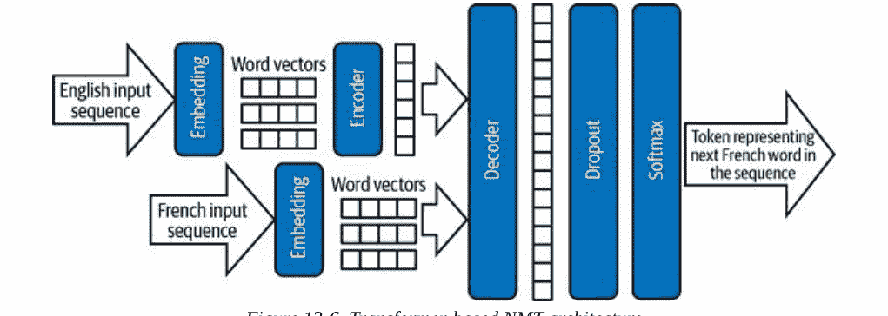

现在调用`fit`来训练模型，并使用`EarlyStopping`回调在验证准确率连续三个epoch没有提高时结束训练：

```
python
from tensorflow.keras.callbacks import EarlyStopping

callback = EarlyStopping(monitor='val_accuracy', patience=3,
                         restore_best_weights=True)

hist = model.fit(inputs, outputs, epochs=50, validation_split=0.2,
                 callbacks=[callback])
```

在CPU上训练通常每个epoch需要两到三分钟。如果你没有GPU并且训练太慢，我建议在[Google Colab](https://colab.research.google.com/)中运行代码。（请务必转到“编辑”菜单中的“笔记本设置”，并选择GPU作为硬件加速器。）训练完成后，绘制每个epoch的训练和验证准确率，并观察后者如何稳步上升直到趋于平稳：

```
python
import seaborn as sns
import matplotlib.pyplot as plt
%matplotlib inline
sns.set()

acc = hist.history['accuracy']
val = hist.history['val_accuracy']
epochs = range(1, len(acc) + 1)

plt.plot(epochs, acc, '-', label='Training accuracy')
plt.plot(epochs, val, ':', label='Validation accuracy')
plt.title('Training and Validation Accuracy')
plt.xlabel('Epoch')
plt.ylabel('Accuracy')
plt.legend(loc='lower right')
plt.plot()
```

### 训练和验证准确率

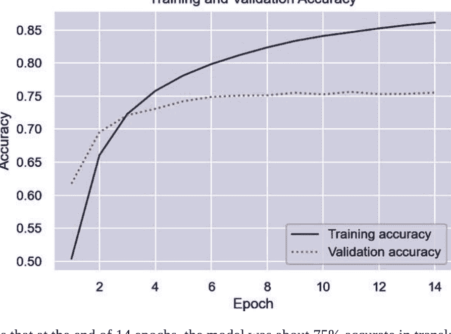

该图显示，在14个epoch结束时，模型在将验证数据中的英语样本翻译成法语时的准确率约为75%。这不是一个非常可靠的准确率衡量标准，因为它实际上将预测文本中的每个单词与目标文本中的每个单词进行比较，并忽略了缺失或错位的冠词（如*le*，法语中的*the*）并不一定意味着翻译质量差这一事实。神经机器翻译模型的准确率通常使用*双语评估替代*（BLEU）分数来衡量。训练完成后，使用NLTK等包可以很容易地计算BLEU分数，但在训练期间，验证准确率是判断何时停止训练的合理指标。

模型真的能将英语翻译成法语吗？使用以下代码定义一个函数，该函数接受一个英语短语并返回一个法语短语。然后在训练期间用于验证模型的10个短语上调用它，亲眼看看。请注意，一次调用`translate_text`会触发多次调用模型。例如，要翻译“hello world”，`translate_text`会使用输入“hello world”和“[开始]”调用模型。假设模型预测*salut*是下一个单词，`translate_text`会再次使用输入“hello world”和“[开始] salut”调用它。它会重复这个循环，直到模型预测的下一个单词是“[结束]”，表示翻译结束。

```
python
def translate_text(text, model, en_tokenizer, fr_tokenizer, fr_index_lookup,
                   sequence_len):
    input_sequence = en_tokenizer.texts_to_sequences([text])
    padded_input_sequence = pad_sequences(input_sequence, maxlen=sequence_len,
                                         padding='post')

    decoded_text = '[start]'

    for i in range(sequence_len):
        target_sequence = fr_tokenizer.texts_to_sequences([decoded_text])
        padded_target_sequence = pad_sequences(
            target_sequence, maxlen=sequence_len, padding='post')[:, :-1]
```

prediction = model([padded_input_sequence, padded_target_sequence])

idx = np.argmax(prediction[0, i, :]) - 1
token = fr_index_lookup[idx]
decoded_text += ' ' + token

if token == '[end]':
    break

return decoded_text[8:-6] # 移除 [start] 和 [end] 标记

fr_vocab = fr_tokenizer.word_index
fr_index_lookup = dict(zip(range(len(fr_vocab)), fr_vocab))
texts = en[40000:40010].values

for text in texts:
    translated = translate_text(text, model, en_tokenizer, fr_tokenizer,
                                fr_index_lookup, sequence_len)
    print(f'{text} => {translated}')

以下是输出结果：

```
its fall now => cest desormais tombe
im losing => je suis en train de perdre
it was quite funny => ce fut assez amusant
thats not unusual => ce nest pas inhabituel
i think ill do that => je pense que je ferai ca
tom looks different => tom a lair different
its worth a try => ca vaut le coup dessayer
fortune smiled on him => la chance lui souri
lets hit the road => cassonsnous
i love winning => jadore gagner
```

如果你不懂法语，可以使用谷歌翻译将一些法语短语翻译成英语。例如，根据谷歌翻译，“la chance lui souri”翻译为“Luck smiled on him”，而“ce nest pas inhabituel”翻译为“it’s not unusual”。这个模型并不完美，但也不差。你使用的词汇量很小，所以不能随意输入任何短语并期望模型进行翻译。但是，使用训练文本中词汇的简单短语翻译得相当好。

最后，使用 `translate_text` 函数看看模型如何将“Hello world”翻译成法语：

```
translate_text('Hello world', model, en_tokenizer, fr_tokenizer,
                fr_index_lookup, sequence_len)
```

我从高中起就没上过法语课，但即使我也知道“Salut le monde”是“Hello world”的合理翻译。

### 使用预训练模型翻译文本

微软、谷歌和Facebook的工程师们有资源收集数百万个文本翻译样本，并有硬件来训练复杂的Transformer模型，但你和我没有。好消息是，这并不妨碍我们编写将文本从一种语言翻译成另一种语言的软件。Hugging Face发布了几个预训练的Transformer模型，它们在文本翻译方面表现出色。在Python中利用这些模型非常简单。

以下是一个将英语翻译成法语的示例：

```
from transformers import pipeline

translator = pipeline('translation_en_to_fr')
translation = translator('Programming is fun!')[0]['translation_text']
print(translation)
```

同样的语法也可以用于将英语翻译成德语和罗马尼亚语。只需在创建管道时将 `translation_en_to_fr` 替换为 `translation_en_to_de` 或 `translation_en_to_ro`。

对于其他语言，你需要使用稍微冗长的语法来加载Transformer和相应的分词器。以下示例将荷兰语翻译成英语：

```
from transformers import AutoTokenizer, AutoModelForSeq2SeqLM

# 初始化分词器
tokenizer = AutoTokenizer.from_pretrained('Helsinki-NLP/opus-mt-nl-en')

# 初始化模型
model = AutoModelForSeq2SeqLM.from_pretrained('Helsinki-NLP/opus-mt-nl-en')

# 对输入文本进行分词
text = 'Hallo vrienden, hoe gaat het vandaag?'
tokenized_text = tokenizer.prepare_seq2seq_batch([text], return_tensors='pt')

# 执行翻译并解码输出
translation = model.generate(**tokenized_text)
translated_text = tokenizer.batch_decode(
    translation, skip_special_tokens=True)[0]
print(translated_text)
```

你可以在该组织的[网站](https://huggingface.co/models)上找到Hugging Face翻译器和分词器的详尽列表。有数百个模型，涵盖数十种语言。

### 双向编码器表示来自Transformer (BERT)

2017年Transformer的引入为NLP领域的另一项里程碑式创新奠定了基础：双向编码器表示来自Transformer，简称BERT。谷歌研究人员在2018年的一篇题为“BERT：用于语言理解的深度双向Transformer预训练”的论文中介绍了BERT，它通过提供可以针对各种NLP任务进行微调的预训练Transformer，推进了最先进的技术水平。

BERT通过使用来自维基百科文章的超过25亿个单词和来自Google Books的8亿个单词进行训练，从而获得了语言理解能力。训练需要在64个张量处理单元（TPU）上运行四天。微调是通过使用特定任务的样本和降低的学习率对预训练模型进行进一步训练来完成的（图13-7）。例如，微调BERT以执行情感分析并在准确性上超越词袋模型相对简单。BERT的价值在于它对其训练所用的语言具有天生的理解力，并且可以被优化以执行特定领域的任务。

除了使用大量样本进行训练外，BERT理解人类语言的关键是一项称为*掩码语言建模*（简称MLM）的创新。MLM背后的大思想是，模型在预测短语“Every good ____ does fine”中空白处应填入哪个单词时，比预测短语“Every good ____”中的下一个单词有更好的机会。答案可能是*boy*，如“Every good boy does fine”，也可能是*turn*，如“Every good turn deserves another”。单向模型查看左侧或右侧的文本，并尝试预测下一个单词应该是什么。另一方面，MLM使用左侧*和*右侧的文本为其决策提供信息。这就是为什么BERT是一个“双向”Transformer。

当BERT模型进行预训练时，每个序列中指定百分比的单词标记（通常为15%）被随机移除或“掩码”，以便模型可以从周围的单词中学习预测它们。此外，BERT模型通常被预训练以进行下一句预测，这使它们更擅长某些NLP任务，如问答。

BERT被称为NLP的“瑞士军刀”。谷歌使用它来[改进搜索结果](https://example.com)，并在你输入Gmail或Google文档时预测文本。已经发布了数十种变体，包括[DistilBERT](https://example.com)，它保留了原始模型97%的准确性，同时重量减轻了40%，运行速度提高了60%。还有已经针对特定任务（如问答）进行微调的BERT变体。这些模型可以使用特定领域的数据集进一步优化，也可以直接使用。

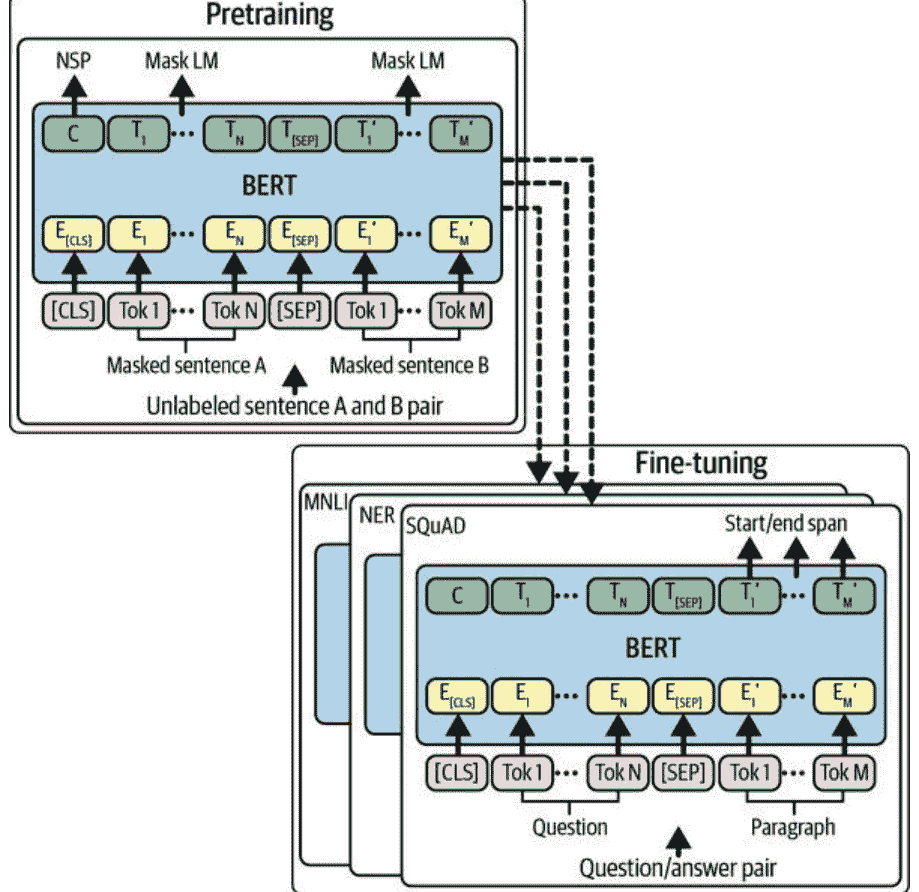

### 构建基于BERT的问答系统

Hugging Face的transformers包包含几个已经针对特定任务进行微调的预训练BERT模型。一个例子是[minilm-uncased-squad2模型](minilm-uncased-squad2 model)，它使用斯坦福的[SQuAD 2.0数据集](SQuAD 2.0 dataset)进行训练，通过从文档中提取文本来回答问题。为了了解这类模型能完成什么，让我们用它来构建一个简单的问答系统。

首先，一些背景。当你向谷歌提出如[图13-8](Figure 13-8)所示的问题时，它会查询一个包含数十亿网页的数据库，以识别可能包含答案的网页。然后，它使用基于BERT的NLP模型从它识别的页面中提取答案，并根据置信度对它们进行排名。


让我们加载一个已经针对问答进行微调的预训练BERT模型，并使用它从本书的文本段落中提取答案。我们将使用的模型是MiniLM模型的一个版本，该模型在2020年的一篇题为“MiniLM：用于预训练Transformer任务无关压缩的深度自注意力蒸馏”的论文中介绍。这个版本在SQuAD 2.0上进行了微调，该数据集包含超过10万个由人类生成的问题，这些问题与从维基百科文章中提取的答案配对，外加5万个没有答案的问题。MiniLM架构使得从一个数据集获得的阅读理解能力可以应用于其他数据集，而几乎不需要重新训练。

> 注意
我的八年级历史老师艾尔德先生在20世纪20年代初的一个夏天曾与查尔斯·林德伯格同住。显然，这位世界上最著名的飞行员在大学里是个冒险家，我永远不会忘记艾尔德先生关于他的一句话。“1927年，当我得知查尔斯独自飞越大西洋时，我并不惊讶。我从未见过比查尔斯·林德伯格更不顾自己生命的人。”😊

首先，创建一个新的Jupyter笔记本，并使用以下语句从Hugging Face中心加载一个预训练的MiniLM模型和一个分词器，用于对模型的文本输入进行分词。（BERT使用一种称为WordPiece的特殊分词格式，与Keras的Tokenizer类和TextVectorization层使用的格式略有不同。幸运的是，Hugging Face也有解决方案。）然后用它们组成一个管道。第一次运行此代码时，你会经历一个短暂的延迟，同时下载预训练权重。之后，权重将被缓存，加载速度会很快：

```
from transformers import AutoTokenizer, TFAutoModelForQuestionAnswering, pipeline

id = 'deepset/minilm-uncased-squad2'
tokenizer = AutoTokenizer.from_pretrained(id)
model = TFAutoModelForQuestionAnswering.from_pretrained(id, from_pt=True)
pipe = pipeline('question-answering', model=model, tokenizer=tokenizer)
```

Hugging Face将此特定模型的权重以PyTorch格式存储。from_pt=True参数将权重转换为TensorFlow格式。将神经网络权重从一种格式转换为另一种格式并非易事格式转换，但 Hugging Face 库将其简化为一个简单的函数参数。
现在使用管道通过从段落中提取文本来回答问题：

```
question = 'What does NLP stand for?'

context = 'Natural Language Processing, or NLP, encompasses a variety of ' \
           'activities, including text classification, keyword and topic ' \
           'extraction, text summarization, and language translation. The ' \
           'accuracy of NLP models has improved in recent years for a variety ' \
           'of reasons, not the least of which are newer and better ways of ' \
           'converting words and sentences into dense vector representations ' \
           'that incorporate context, and a relatively new neural network ' \
           'architecture called the transformer that can zero in on the most ' \
           'meaningful words and even differentiate between multiple meanings ' \
           'of the same word.'

pipe(question=question, context=context)
```

答案准确吗？人类可以轻松阅读段落并得出相同的答案，但深度学习模型能够做到这一点，表明该模型展现了一定程度的阅读理解能力。请注意，输出包含问题的答案、置信度分数以及答案在段落中的起始和结束索引：

```
{'score': 0.9793193340301514,
 'start': 0,
 'end': 27,
 'answer': 'Natural Language Processing'}
```

现在用不同的问题和上下文再试一次：

```
question = 'When was TensorFlow released?'

context = 'Machine learning isn\'t hard when you have a properly ' \
           'engineered dataset to work with. The reason it\'s not ' \
           'hard is libraries such as Scikit-Learn and ML.NET, which ' \
           'reduce complex learning algorithms to a few lines of code. ' \
           'Deep learning isn\'t difficult, either, thanks to libraries ' \
           'such as the Microsoft Cognitive Toolkit (CNTK), Theano, and ' \
           'PyTorch. But the library that most of the world has settled ' \
           'on for building neural networks is TensorFlow, an open source ' \
           'framework created by Google that was released under the ' \
           'Apache License 2.0 in 2015.'

pipe(question=question, context=context)['answer']
```

这次，输出是模型提供的答案，而不是包含答案的字典。同样，答案合理吗？
用另一个问题和上下文重复此过程以提取答案：

```
question = 'Is Keras part of TensorFlow?'

context = 'The learning curve for TensorFlow is rather steep. ' \
           'Another library, named Keras, provides a simplified ' \
           'Python interface to TensorFlow and has emerged as the ' \
           'Scikit of deep learning. Keras is all about neural networks. ' \
           'It began life as a standalone project in 2015 but was ' \
           'integrated into TensorFlow in 2019. Any code that you write ' \
           'using TensorFlow\'s built-in Keras module ultimately executes ' \
           'in (and is optimized for) TensorFlow. Even Google recommends ' \
           'using the Keras API.'

pipe(question=question, context=context)['answer']
```

使用与之前相同的上下文但不同的问题进行最后一次测试：

```
question = 'Is it better to use Keras or TensorFlow to build neural networks?'
pipe(question=question, context=context)['answer']
```

这里提出的问题是精心挑选的，以突出模型的能力。提出模型无法回答的问题并不困难。尽管如此，你已经证明了这样一个原理：一个在 SQuAD 2.0 上微调过的预训练 BERT 模型，可以回答向其呈现的文本段落中的直接问题。

复杂的问答系统采用检索器-阅读器架构，其中检索器在数据存储中搜索相关文档——这些文档可能包含问题的答案——然后阅读器从文档中提取答案。阅读器通常是一个类似于前面所示的 BERT 实例。检索器可以是来自 [Deepset](https://deepset.ai/)（一家专注于 NLP 解决方案的德国公司）发布的开源 [Haystack 库](https://github.com/deepset-ai/haystack) 的一个。Haystack 检索器与各种文档存储（包括高度可扩展的 [Elasticsearch 存储](https://www.elastic.co/)）进行接口。如果你想了解更多或构建自己的检索器-阅读器系统，我推荐阅读 Lewis Tunstall、Leandro von Werra 和 Thomas Wolf 所著的 *Natural Language Processing with Transformers*（O’Reilly）的第 7 章。

### 微调 BERT 进行情感分析

通过在情感分析数据集上微调预训练的 BERT 模型，可以实现最先进的情感分析。让我们微调 BERT，看看我们是否能创建一个比本章前面介绍的词袋模型更准确的情感分析模型。如果你的计算机没有配备 GPU，我*强烈*建议在 Google Colab 中运行此示例。即使在 GPU 上，运行也可能需要一个小时左右。

如果你在本地运行此代码，请确保已安装 Hugging Face 的 [Datasets 包](https://huggingface.co/docs/datasets/)。然后创建一个新的 Jupyter notebook。如果你改用 Colab，请创建一个新的 notebook 并在第一个单元格中运行以下命令，以在 Colab 环境中安装必要的包：

```
!pip install transformers
!pip install datasets
```

接下来，使用以下语句从 Datasets 包加载 IMDB 数据集。这是从 CSV 文件加载的替代方法。既然我们使用 Hugging Face 模型，我们也可以从 Hugging Face 加载数据。此外，如果你使用的是 Colab，这可以避免你必须将 CSV 上传到 Colab 环境。请注意，数据集第一次加载可能需要几分钟时间：

```
from datasets import load_dataset

imdb = load_dataset('imdb')
imdb
```

load_dataset 返回的值是一个包含三个 Hugging Face 数据集的字典。以下是最后一条语句的输出：

```
DatasetDict({
    train: Dataset({
        features: ['text', 'label'],
        num_rows: 25000
    })
    test: Dataset({
        features: ['text', 'label'],
        num_rows: 25000
    })
    unsupervised: Dataset({
        features: ['text', 'label'],
        num_rows: 50000
    })
})
```

imdb['train'] 包含 25,000 个训练样本，而 imdb['test'] 包含 25,000 个测试样本。电影评论存储在每个数据集的 text 列中。标签存储在 label 列中。

接下来是使用 BERT WordPiece 分词器对输入进行分词：

```
from transformers import AutoTokenizer

tokenizer = AutoTokenizer.from_pretrained('distilbert-base-uncased')

def tokenize(samples):
    return tokenizer(samples['text'], truncation=True)

tokenized_imdb = imdb.map(tokenize, batched=True)
```

现在评论已经分词，需要使用 Hugging Face 的 Dataset.to_tf_dataset 方法将它们转换为 TensorFlow 数据集。传递给该方法的整理函数会动态填充序列，使它们长度相同。你也可以要求分词器进行填充，但以这种方式执行的填充是静态的，需要更多内存：

```
from transformers import DataCollatorWithPadding

data_collator = DataCollatorWithPadding(tokenizer=tokenizer, return_tensors='tf')

train_data = tokenized_imdb['train'].to_tf_dataset(
    columns=['attention_mask', 'input_ids', 'label'],
    shuffle=True, batch_size=16, collate_fn=data_collator
)

validation_data = tokenized_imdb['test'].to_tf_dataset(
    columns=['attention_mask', 'input_ids', 'label'],
    shuffle=False, batch_size=16, collate_fn=data_collator
)
```

现在你已准备好进行微调。像往常一样在模型上调用 `fit`，但将优化器的学习率（在反向传播期间用于调整权重和偏置的乘数）设置为 0.00002，这是 Adam 默认学习率 0.001 的一小部分：

```
from tensorflow.keras.optimizers import Adam
from transformers import TFAutoModelForSequenceClassification

model = TFAutoModelForSequenceClassification.from_pretrained(
    'distilbert-base-uncased', num_labels=2)
model.compile(Adam(learning_rate=2e-5), metrics=['accuracy'])
hist = model.fit(train_data, validation_data=validation_data, epochs=3)
```

绘制训练和验证准确率，以查看验证准确率在何处达到峰值：

```
import seaborn as sns
import matplotlib.pyplot as plt
%matplotlib inline
sns.set()

acc = hist.history['accuracy']
val = hist.history['val_accuracy']
epochs = range(1, len(acc) + 1)

plt.plot(epochs, acc, '-', label='Training accuracy')
plt.plot(epochs, val, ':', label='Validation accuracy')
plt.title('Training and Validation Accuracy')
plt.xlabel('Epoch')
plt.ylabel('Accuracy')
plt.legend(loc='lower right')
plt.plot()
```

以下是我的结果：

运气好的话，验证准确率能达到93%左右——比同等的词袋模型高出几个百分点。想象一下，如果你用超过25,000条评论来训练模型，效果会如何。Hugging Face的一个预训练情感分析模型——twitter-roberta-base模型——就是用5800万条推文训练的。毫不奇怪，它在文本情感评分方面表现出色。

最后，定义一个`analyze_text`函数来返回情感分数，并用它来对一条正面评论进行情感评分。模型返回一个包含未归一化情感分数（一个负向，一个正向）的张量对象，但你可以使用TensorFlow的`softmax`函数将它们归一化到0.0到1.0的值：

```python
import tensorflow as tf

def analyze_text(text, tokenizer, model):
    tokenized_text = tokenizer(text, padding=True, truncation=True,
                               return_tensors='tf')
    prediction = model(tokenized_text)
    return tf.nn.softmax(prediction[0]).numpy()[0][1]

analyze_text('Great food and excellent service!', tokenizer, model)
```

再用一条负面评论试试：

```python
analyze_text('The long lines and poor customer service really turned me off.',
             tokenizer, model)
```

微调并不便宜，但远不如从头训练一个复杂的Transformer模型那么昂贵。你能在大约一小时的GPU时间内训练出如此精确的情感分析模型，这证明了预训练BERT模型的强大，也证明了创造它们的Google工程师们的卓越能力。

### 总结

自然语言处理（NLP）是深度学习的一个领域，涵盖文本分类、问答、文本翻译以及其他需要计算机处理文本数据的任务。每个NLP模型的一个关键元素是嵌入层，它用浮点数数组表示单词，这些数组模拟了单词之间的关系。例如，在嵌入空间中，*excellent*和*amazing*的向量彼此接近，而*butterfly*和*basketball*的向量则相距甚远，因为这两个词没有语义关系。词嵌入是在模型训练过程中学习到的。

输入到嵌入层的文本必须首先被分词并转换为等长的序列。Keras的`Tokenizer`类完成了大部分工作。你不必单独进行分词和序列化，而是可以在模型中包含一个`TextVectorization`层来自动完成分词和填充。

一种分类文本的方法是使用传统的全连接层对嵌入层输出的向量进行分类。另一种方法是使用卷积层或循环层从嵌入向量中提取有关单词位置的信息，并对这些层的输出进行分类。

使用深度学习将文本翻译成其他语言被称为神经机器翻译（NMT）。直到最近，最先进的NMT还是使用基于LSTM的编码器-解码器模型。如今，这些模型已基本让位于使用神经注意力机制的Transformer模型，这些模型专注于短语中最有意义的单词并建模单词上下文。Transformer知道*train*这个词在“meet me at the train station”和“it’s time to train a model”中具有不同的含义，并且它在计算中考虑了词序。

BERT是一个复杂的Transformer模型，Google工程师在用数十亿个单词训练它时赋予了它语言理解能力。它可以针对特定任务（如问答和情感分析）进行微调，并且已经发布了几个微调版本供公众使用。这些模型有时可以直接使用。其他时候，它们可以进一步优化并适应特定领域的任务。由于微调所需的数据和计算能力比从头训练BERT少几个数量级，因此预训练（和预微调）的BERT模型已被证明是NLP的一大福音。

复杂的NLP模型需要用数百万个单词或短语进行训练，这需要在数据收集和训练硬件上进行大量投资。Hugging Face等公司发布的预训练模型可以在你的代码中使用。这是人工智能领域的一个增长趋势：发布已经训练好以解决常见问题的模型。你仍然需要构建模型来解决特定领域的问题，但许多任务——尤其是涉及NLP的任务——并不局限于特定领域。

下载预训练模型并不是利用复杂人工智能解决业务问题的唯一途径。微软和亚马逊等公司训练自己的深度学习模型，并通过REST API公开提供。微软将其API套件称为Azure Cognitive Services。你将在[第14章](Chapter 14)中全面了解它们。

## 第14章 Azure Cognitive Services

在20世纪60年代长大的我，曾将阿波罗宇航员视为偶像。他们大摇大摆地走向发射台，乘坐喷火的火箭进入太空，是我的超级英雄。但我真正想效仿的群体——我想*成为*的人——是任务控制中心的工程师们。他们穿着白衬衫、打着黑领带，坐在CRT屏幕前，与宇航员交谈，并在出现第一个麻烦迹象时随时准备采取行动，他们是酷的化身。他们使用比当今智能手机功能弱得多的计算机将人类送上了月球——这是一项至今无与伦比的科学成就。

得益于深度学习，今天的计算机可以完成任务控制中心的工程师们只能梦想的壮举。它们可以识别图像中的物体，将文本和语音翻译成其他语言，在视频流中识别人，将艺术转化为文字，将文字转化为艺术，等等。但是，最先进的深度学习模型对于普通工程师或软件开发人员来说过于复杂——也过于昂贵。据报道，微软在训练赢得2015年ImageNet大规模视觉识别挑战赛的ResNet模型上花费了数十万美元。创建该模型需要大量的专业知识、大量的GPU时间和数百万张图像。

当今人工智能领域一个可喜的趋势是*人工智能即服务*。微软、亚马逊、谷歌和其他科技巨头雇佣专业的数据科学家来构建复杂的深度学习模型。他们自费训练这些模型，并通过[REST API](https://docs.microsoft.com/en-us/rest/api/)将其提供给任何希望使用它们的人。如果你能编写代码通过互联网发送HTTP请求，你就可以利用这些API将人工智能融入你的应用程序，而无需放下日常工作去攻读深度学习博士学位。

微软将其AI服务套件称为[Azure Cognitive Services](https://azure.microsoft.com/en-us/services/cognitive-services/)。亚马逊使用[AWS AI Services](https://aws.amazon.com/machine-learning/)这个名称。两者都提供丰富的API，后端由深度学习模型提供支持——这些模型不断优化，因此会随着时间的推移变得更智能。需要为上传到网站的照片添加说明吗？微软的[计算机视觉服务](https://azure.microsoft.com/en-us/services/cognitive-services/computer-vision/)可以做到；亚马逊的[Rekognition服务](https://aws.amazon.com/rekognition/)也可以。如何构建一个具有逼真人声的屏幕阅读器来帮助听障人士？[Amazon Polly](https://aws.amazon.com/polly/)可以处理，Azure Cognitive Services的[语音服务](https://azure.microsoft.com/en-us/services/cognitive-services/speech-services/)和谷歌的[文本转语音API](https://cloud.google.com/text-to-speech)也可以。这些只是认知服务可以执行的操作的几个例子，通常只需几行代码。

你在[第12章](https://docs.microsoft.com/en-us/learn/)中已经见识了Azure Cognitive Services的实际应用，当时你使用了[自定义视觉服务](https://azure.microsoft.com/en-us/services/cognitive-services/custom-vision-service/)来训练自定义对象检测模型。它是构成认知服务家族的几项服务之一。本章将介绍其他服务，并演示如何使用它们以及如何用它们构建解决方案。重点介绍Azure Cognitive Services并不意味着它们比亚马逊和谷歌的同类产品更好。我只是更熟悉它们，因为二十多年来我一直与微软密切合作。一旦你学会了如何调用Azure Cognitive Services API，将这些知识应用到其他供应商的认知服务上就很简单了。

准备好施展一些魔法了吗？让我们开始吧。

### 介绍Azure Cognitive Services

构成 Azure 认知服务的服务阵容会不时变化，新的服务被添加，旧的服务则被弃用或并入其他 Microsoft 产品线。图 14-1 展示了当前提供的服务，并将其分为四类：视觉、语言、语音和决策。

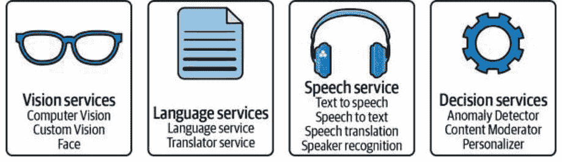

视觉服务将深度神经网络应用于计算机视觉问题。自定义视觉服务允许你构建自定义的图像分类和对象检测模型。面部服务支持最先进的面部识别系统，Uber 使用它来验证司机的身份。计算机视觉服务提供了一个丰富的 API，包含大量分析图像和从中提取信息的方法。其应用之一是为照片添加说明文字并生成描述其内容的关键词。图 14-2 展示了我构建的一个名为 Intellipix 的 Web 应用。Intellipix 为用户上传的图像添加说明文字，并将描述它们的关键词存储在数据库中，这样用户就可以轻松地检索出所有包含城堡的图像，或者前景或背景中有水的照片。


语言类别包括由经过训练以执行自然语言处理（NLP）的深度学习模型支持的服务。语言服务提供用于情感分析、命名实体识别、问答、关键短语提取、语言理解等的 API。其众多用途之一是构建聊天机器人，以智能地回应有关公司产品或服务的查询。还有一个 [Translator 服务](https://learn.microsoft.com/en-us/azure/ai-services/translator/)，可以在 100 多种语言和方言之间翻译文本。大众汽车使用它来[翻译汽车屏幕上的说明](https://learn.microsoft.com/en-us/azure/ai-services/translator/customer-stories/volkswagen-translator)，以匹配车主手册中的语言，并确保他们以 40 多种语言制作的文档质量。

> **注意**

语言服务是一项统一的服务，它包含了几个旧服务的功能，包括文本分析服务、语言理解服务和 QnA Maker。Microsoft 将在一段时间内继续支持旧服务，但新的开发应针对语言服务。

[语音服务](https://learn.microsoft.com/en-us/azure/ai-services/speech-service/)提供用于将[文本转换为语音](https://learn.microsoft.com/en-us/azure/ai-services/speech-service/text-to-speech)和[语音转换为文本](https://learn.microsoft.com/en-us/azure/ai-services/speech-service/speech-to-text)的 API。毕马威使用后者来[转录录制的通话](https://learn.microsoft.com/en-us/azure/ai-services/speech-service/customer-stories/kpmg-speech-to-text)，并声称这样做为其客户节省了数百万美元的合规成本。空客使用它来构建用于飞行员培训的语音启用应用程序。语音服务还包括一个[说话人识别 API](https://learn.microsoft.com/en-us/azure/ai-services/speech-service/speaker-recognition-overview)，可以识别人的声音，以及一个[语音翻译 API](https://learn.microsoft.com/en-us/azure/ai-services/speech-service/speech-translation)，可以实时将语音翻译成数十种其他语言。

决策服务包括 [Anomaly Detector](https://learn.microsoft.com/en-us/azure/ai-services/anomaly-detector/)，它可以在实时或录制的数据流中识别异常，并可以聚合来自数百个不同来源（如温度传感器和压力计）的输入，并对它们之间的关系进行建模。（有关异常检测的介绍，请参阅[第 6 章](https://learn.microsoft.com/en-us/azure/ai-services/anomaly-detector/)。）空客使用 Anomaly Detector 来[分析飞机的应力和应变](https://learn.microsoft.com/en-us/azure/ai-services/anomaly-detector/customer-stories/airbus-anomaly-detector)；西门子使用它在生产的最后一步[测试医疗设备](https://learn.microsoft.com/en-us/azure/ai-services/anomaly-detector/customer-stories/siemens-anomaly-detector)是否存在缺陷。[内容审核器服务](https://learn.microsoft.com/en-us/azure/ai-services/content-moderator/)使用 AI（可选择性地辅以人工干预）来标记图像和视频中的攻击性内容、亵渎性文本以及其他不适当（且可能诽谤性）的内容。最后但同样重要的是 [Personalizer 服务](https://learn.microsoft.com/en-us/azure/ai-services/personalizer/)，它或许可以被描述为一个功能强大的推荐系统，为最终用户提供个性化的内容和体验。

### 密钥和终结点

Azure 认知服务通过互联网传输 HTTPS 请求来调用 REST API。这些 API 是语言无关的：可以从任何能够发起网络调用的编程语言中调用它们。这包括 Python、Java、C#、C、C++、JavaScript、Swift、Go 以及几乎所有其他现代编程语言。也可以使用 [Postman](https://www.postman.com/) 等工具和 Linux `curl` 命令发起调用。

大多数 Azure 认知服务在一定限度内是免费的，但并非完全免费。例如，你可以每月向语言服务提交 5,000 个文本样本进行情感分析，而无需支付任何费用。但是，超过这个数量，Azure 就需要知道向哪个 Azure 订阅收费。因此，在调用 Azure 认知服务之前，你需要：

- 服务的终结点——调用的目标 URL
- 服务的订阅密钥，或其他用于验证调用身份的方式

你可以从 [Azure 门户](https://portal.azure.com/)获取这两者。例如，假设你希望对一组推文进行情感分析。你首先在浏览器中打开 Azure 门户，并使用你的 Microsoft 帐户登录。然后，你创建一个认知服务语言资源，并指定 Azure 订阅费用应向谁收取、服务应位于哪个 Azure 区域以及定价层，如图 14-3 所示。如果同一订阅下的同一服务尚未提供免费层，通常可以使用免费层。

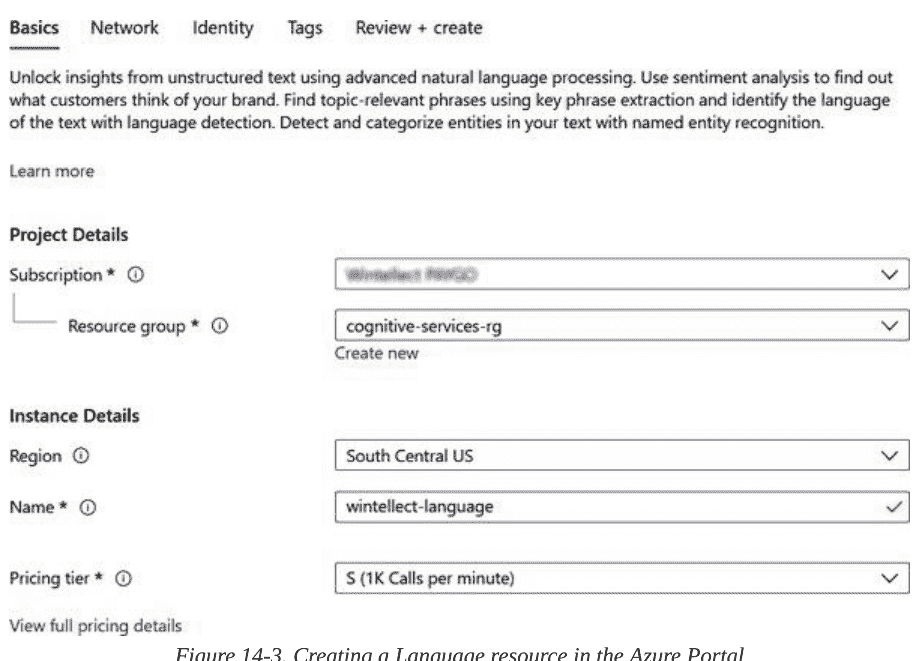

创建语言资源后，你在 Azure 门户中打开它，然后单击页面左侧菜单中的“密钥和终结点”。从那里，你可以检索服务的订阅密钥和终结点（图 14-4）。密钥是一串字母和数字，用于唯一标识一个 Azure 订阅。请妥善保管它，因为如果泄露，可能会产生费用。最佳做法是定期轮换密钥（用新密钥替换），以防落入他人之手。这就是为什么门户包含“重新生成密钥”按钮。为什么门户提供两个密钥？这样在重新生成另一个密钥后，你还有一个有效的密钥可以使用。如果只有一个密钥，你必须重新生成它，然后争分夺秒地修改任何使用它的应用程序，并且会有一个死区期，期间这些应用程序发起的调用将会失败。

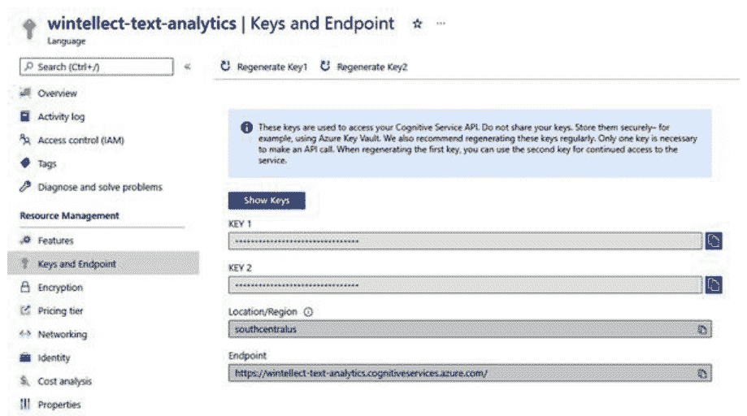

图 14-4. 检索 Azure 认知服务资源的密钥和终结点

此示例中的订阅密钥是*单服务*订阅密钥，因为它仅适用于你创建的语言资源。如果你创建另一个认知服务资源——例如，用于计算机视觉服务的资源——你会得到一个单独的密钥。为了避免管理多个服务的多个密钥，大多数 Azure 认知服务支持*多服务密钥*，这些密钥可与一系列服务一起使用。要获取多服务密钥，只需创建一个认知服务资源（而不是特定于服务的资源），并使用门户提供的密钥和终结点。

订阅密钥并非验证对 Azure 认知服务调用的唯一方式。大多数认知服务支持 Azure Active Directory (AAD) 身份验证，它通过将 AAD 身份与基于角色的访问控制 (RBAC) 相结合来增强安全性。AAD 身份验证对于依赖认知服务 API 且本身托管在 Azure 中的应用程序尤其具有吸引力。有关更多信息，请参阅文章“向 Azure 认证服务验证请求”。

### 调用 Azure 认知服务 API

一旦你拥有了订阅密钥和终结点，就可以开始使用了。以下是一段 Python 代码片段，它使用语言服务来评估“Programming is fun, but the hours are long”这句话的情感。KEY 是语言资源订阅密钥的占位符，而 ENDPOINT 是相应终结点的占位符。`import` 语句导入了 Python 的 [Requests 包](https://pypi.org/project/requests/)，它简化了 HTTP 请求-响应协议：

```python
import requests

input = { 'documents': [
    { 'id': '1000', 'text': 'Programming is fun, but the hours are long' }]
}

headers = {
    'Ocp-Apim-Subscription-Key': KEY,
    'Content-type': 'application/json'
}
```

uri = ENDPOINT + 'text/analytics/v3.0/sentiment'
response = requests.post(uri, headers=headers, json=input)
results = response.json()

for result in results['documents']:
    print(result['confidenceScores'])

结果如下：

{'positive': 0.94, 'neutral': 0.05, 'negative': 0.01}

该服务返回三个分数：一个用于积极情绪，一个用于中性情绪，一个用于消极情绪。请注意，你可以在一次 API 调用中提交多个文本样本，因为传递给调用的字典中的 *documents* 项是一个 Python 列表。

从代码中可能不太明显，但 `input` 必须是 JSON 编码的，并且在请求体中发送。输出也以 JSON 格式返回。`Requests` 包简化了 JSON 的编码和解码。`requests.post` 对输入进行编码，并向指定端点发送 POST 请求，而 `response.json` 将响应中返回的 JSON 转换为 Python 字典。

为了简化操作，并使你免受底层 API 随时间演变而带来的变化影响，微软为大多数认知服务提供了免费的软件开发工具包（SDK）。名为 `Azure-ai-textanalytics` 的 Python 包是用于情感分析和其他文本分析的 Python SDK，正式名称为 Azure 认知服务文本分析 Python 客户端库。它可以像任何其他 Python 包一样安装——例如，使用 `pip install` 命令。以下是使用 SDK 重写的先前示例：

from azure.core.credentials import AzureKeyCredential
from azure.ai.textanalytics import TextAnalyticsClient

client = TextAnalyticsClient(ENDPOINT, AzureKeyCredential(KEY))
input = [{'id': '1000', 'text': 'Programming is fun, but the hours are long' }]
response = client.analyze_sentiment(input)

for result in response:
    print(result.confidence_scores)

输出完全相同，但 JSON 被隐藏了，你也不必知道要附加到端点的魔法字符串是什么，因为 `analyze_sentiment` 会为你处理。该方法属于 SDK 的 `TextAnalyticsClient` 类，它是用于分析文本的几种可用方法之一。

使用 SDK 的另一个好处是更健壮的错误处理。调用可能会失败，有时确实会失败，编写良好的应用程序会优雅地应对此类故障。当对 Azure 认知服务的调用失败时，SDK 中的代码会抛出一个异常，你可以在代码中捕获它。以下示例通过打印异常对象中包含的错误消息来响应错误：

from azure.core.credentials import AzureKeyCredential
from azure.ai.textanalytics import TextAnalyticsClient
from azure.core.exceptions import AzureError

try:
    client = TextAnalyticsClient(ENDPOINT, AzureKeyCredential(KEY))
    input = [{ 'id': '1000',
               'text': 'Programming is fun, but the hours are long' }]
    response = client.analyze_sentiment(input)

    for result in response:
        print(result.confidence_scores)

except AzureError as e:
    print(e.message)

`AzureError` 定义在 `Azure-core` 中，这是一个所有 Azure 认知服务 Python SDK 共享的库。它是对应于特定错误的其他异常类的父类。例如，如果你传递了一个无效的订阅密钥（可能是因为相应的订阅不再活跃或付款逾期），则会发生 `ClientAuthenticationError` 异常。你可以包含任意数量的异常处理程序来响应特定类型的错误。前面的示例使用 `AzureError` 作为通用处理程序。

认知服务 SDK 提供多种编程语言版本，包括 Python、Java 和 C#。以下是使用 Azure 认知服务 .NET 文本分析客户端库（以名为 `Azure.AI.TextAnalytics` 的 NuGet 包形式提供）编写的相同 C# 示例：

using Azure;
using Azure.AI.TextAnalytics;
using System;

try
{
    var client = new TextAnalyticsClient(
        new Uri(ENDPOINT),
        new AzureKeyCredential(KEY)
    );

    var response =
        client.AnalyzeSentiment("Programming is fun, but the hours are long");

    var sentiment = response.Value.ConfidenceScores.Positive;
    Console.WriteLine(sentiment);
}

catch (Exception ex)
{
    Console.WriteLine(ex.Message);
}

该代码的输出是 0.94，与 Python 示例输出的积极情绪分数相同。不同的语言，不同的 SDK，但结果相同，而且都毫不费力。这就是 Azure 认知服务的全部意义。

### Azure 认知服务容器

认知服务极大地简化了将 AI 融入你编写的应用程序的过程，并降低了技能门槛。但它们也有缺点：

-   因为 Azure 认知服务在云中运行，使用它们的应用程序需要互联网连接。
-   通过互联网进行的调用比本地执行的调用具有更高的延迟。
-   Azure 认知服务 API 随时间演变，有时会引入破坏性更改，这意味着昨天运行良好的代码今天可能表现不同或无法运行。
-   后端的深度学习模型不断被完善和改进，结果是“编程很有趣，但工作时间很长”的情感分数今天可能是 0.94，明天可能是 0.85。

API 的更改很少是突然的。微软通常在对 API 进行破坏性更改之前提前数月警告其客户，并且在许多情况下，你可以指定要使用的服务或 API 版本，从而免受未来更改的影响。这些问题对小公司来说可能不是什么大事，但对于将稳定性和可靠性置于首位的企业来说，它们可能是致命的。

微软通过使大多数 Azure 认知服务在 Docker 容器中可用来解决这些问题。容器化服务可以在本地或云中运行，它锁定了 API 版本及其背后的模型。除非你更新容器镜像或用更新的版本替换它，否则不会发生任何更改。你可以在“什么是 Azure 认知服务容器？”中了解更多信息并查看以容器化形式提供的最新服务列表。容器化服务也是满足要求数据保留在本地的安全和隐私策略的解决方案。微软不会存储传递给认知服务的数据，但数据确实会离开你公司的域。

容器化服务*不是*绕过计费部门并免费使用 Azure 认知服务的方法。根据文档：

> 认知服务容器需要提交计量信息以用于计费目的。未能允许认知服务容器依赖的各种网络通道将导致容器无法工作。

容器通过端口 443 将加密的使用信息发送回 Microsoft，Microsoft 使用该信息向 Azure 订阅计费。因此，即使容器托管在本地，也必须连接到互联网。

有一个例外。如果你想在因技术或合规性原因无法连接到互联网的应用程序中使用 Azure 认知服务，*断开连接的容器*可以在没有互联网连接的情况下运行，并且它们不会向 Microsoft 传输计量信息。但并非任何人都可以使用它们。你必须向 Microsoft 提交申请以获得批准，其中一个要求是你的组织必须与 Microsoft 签订企业协议（EA）。有关更多信息以及可在断开连接场景中使用的 Azure 认知服务的最新列表，请参阅“在断开连接的环境中使用 Docker 容器”。

### 计算机视觉服务

到现在，你可能已经准备好停止*谈论* Azure 认知服务并编写一些代码了。我也是。让我们从可能是所有认知服务中功能最丰富的服务开始。计算机视觉服务是 Azure 认知服务中的三个视觉服务之一。它公开了一组支持各种任务的 API，包括：

-   为图像添加说明
-   生成描述图像内容的标签
-   识别图像中的对象（及其边界框）
-   检测图像中的敏感或不当内容
-   从图像中提取文本
-   检测图像中的人脸（人脸服务的一个子集）
-   通过使用 AI 识别照片的主题并创建以该主题为中心的缩略图版本来生成“智能缩略图”图像
-   对视频流执行空间分析

空间分析是计算机视觉服务的最新功能。除其他功能外，它还可以跟踪实时视频源中的人，实时测量他们之间的距离，并确定谁戴着口罩（谁没有），如图 14-5 所示。它目前处于公开预览阶段，你可以在“什么是空间分析？”中阅读所有相关信息。

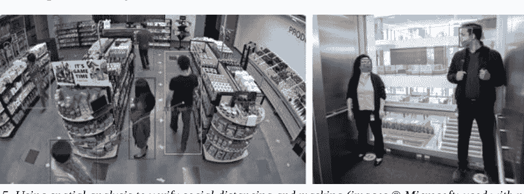

熟悉计算机视觉服务的最佳方法是调用其一些 API。首先安装 [Azure 认知服务计算机视觉 Python SDK](https://pypi.org/project/azure-cognitiveservices-vision-computervision/)。（它在一个名为 [Azure-cognitiveservices-vision-computervision](https://pypi.org/project/azure-cognitiveservices-vision-computervision/) 的 Python 包中。）接下来，[下载一个 ZIP 文件](https://github.com/Azure-Samples/cognitive-services-python-sdk-samples/raw/master/samples/computervision.zip)，其中包含一些示例图像，并将图像复制到托管 Jupyter 笔记本的 *Data* 子目录中。使用 Azure 门户创建计算机视觉资源并获取密钥和端点。然后创建一个新的笔记本，并在第一个单元格中运行以下代码，将 KEY 替换为密钥，将 ENDPOINT 替换为端点：

```python
from azure.cognitiveservices.vision.computervision import ComputerVisionClient
from msrest.authentication import CognitiveServicesCredentials

client = ComputerVisionClient(ENDPOINT, CognitiveServicesCredentials(KEY))
```

`ComputerVisionClient` 类实现了多个可供调用以调用计算机视觉 API 的方法。这些方法大多提供两个版本：一个接受图像 URL，另一个接受实际图像。例如，`describe_image` 方法接受图像 URL，而 `describe_image_in_stream` 方法接受包含图像的流。我的示例使用了 `in_stream` 方法，但你可以轻松修改它们以传递图像 URL 而非图像。

现在，加载你从 ZIP 文件中复制的其中一个示例图像，并使用 `describe_image_in_stream` 为其添加说明：

```python
%matplotlib inline
import matplotlib.pyplot as plt

image = plt.imread('Data/dubai.jpg')
fig, ax = plt.subplots(figsize=(12, 8), subplot_kw={'xticks': [], 'yticks': []})
ax.imshow(image)

with open('Data/dubai.jpg', mode='rb') as image:
    result = client.describe_image_in_stream(image)

    for caption in result.captions:
        print(f'{caption.text} ({caption.confidence:.1%})')
```

确认输出如下：

一名男子骑着沙丘 (53.8%)


`describe_image_in_stream` 返回零个或多个说明，每个说明都带有一个分数，反映了计算机视觉服务对该说明准确性的置信度。在此示例中，它只返回了一个说明，置信度为 53.8%。

除了为图像添加说明外，计算机视觉服务还可以生成描述图像内容的关键词（“标签”）列表。此类标签的一个用途是使图像数据库可搜索。使用 `tag_image_in_stream` 方法为上一个示例中添加了说明的图像打标签：

```python
with open('Data/dubai.jpg', mode='rb') as image:
    result = client.tag_image_in_stream(image)

    for tag in result.tags:
        print(f'{tag.name} ({tag.confidence:.1%})')
```

以下是标签及其分配的置信度：

- dune (99.5%)
- sky (99.2%)
- outdoor (98.7%)
- clothing (98.2%)
- desert (98.1%)
- sand (97.9%)
- aeolian landform (96.9%)
- person (96.1%)
- singing sand (95.8%)
- erg (94.0%)
- sahara (93.6%)
- nature (93.4%)
- footwear (90.9%)
- landscape (88.0%)
- sand dune (83.5%)
- ground (77.5%)

计算机视觉服务还可以检测图像中的对象。以下语句加载一张图像并显示所有检测到的对象，以及边界框和置信度分数：

```python
from matplotlib.patches import Rectangle

def annotate_object(name, confidence, bbox, min_confidence=0.5):
    if (confidence > min_confidence):
        x, y, w, h = bbox.x, bbox.y, bbox.w, bbox.h
        rect = Rectangle((x, y), w, h, color='red', fill=False, lw=2)
        ax.add_patch(rect)
        text = f'{name} ({confidence:.1%})'
        ax.text(x + (w / 2), y, text, color='white', backgroundcolor='red',
                ha='center', va='bottom', fontweight='bold',
                bbox=dict(color='red'))

image = plt.imread('Data/xian.jpg')
fig, ax = plt.subplots(figsize=(12, 8),
                      subplot_kw={'xticks': [], 'yticks': []})
ax.imshow(image)

with open('Data/xian.jpg', mode='rb') as image:
    result = client.detect_objects_in_stream(image)

    for object in result.objects:
        annotate_object(object.object_property, object.confidence,
                        object.rectangle)
```

`detect_objects_in_stream` 检测到了照片中的人和自行车，以及其他一些物品：

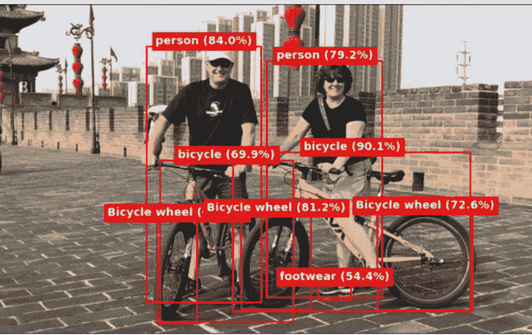

计算机视觉服务也能检测照片中的面孔吗？当然可以。它还能提供关于年龄和性别的信息。以下示例在照片中标注了人脸，并用标签标明了年龄和性别。`ComputerVisionClient` 类缺少专门用于检测人脸的方法，但你可以调用通用的 `analyze_image_in_stream` 方法，并通过 `visual_features` 参数请求人脸信息：

```python
from azure.cognitiveservices.vision.computervision.models import VisualFeatureTypes

def annotate_face(face):
    x, y = face.face_rectangle.left, face.face_rectangle.top
    w, h = face.face_rectangle.width, face.face_rectangle.height
    rect = Rectangle((x, y), w, h, color='red', fill=False, lw=2)
    ax.add_patch(rect)
    text = f'{face.gender} ({face.age})'
    ax.text(x + (w / 2), y, text, color='white', backgroundcolor='red',
            ha='center', va='bottom', fontweight='bold',
            bbox=dict(color='red'))

image = plt.imread('Data/amsterdam.jpg')
fig, ax = plt.subplots(figsize=(12, 8), subplot_kw={'xticks': [], 'yticks': []})
ax.imshow(image)

with open('Data/amsterdam.jpg', mode='rb') as image:
    result = client.analyze_image_in_stream(
        image, visual_features=[VisualFeatureTypes.faces])

    for face in result.faces:
        annotate_face(face)
```

以下是输出：

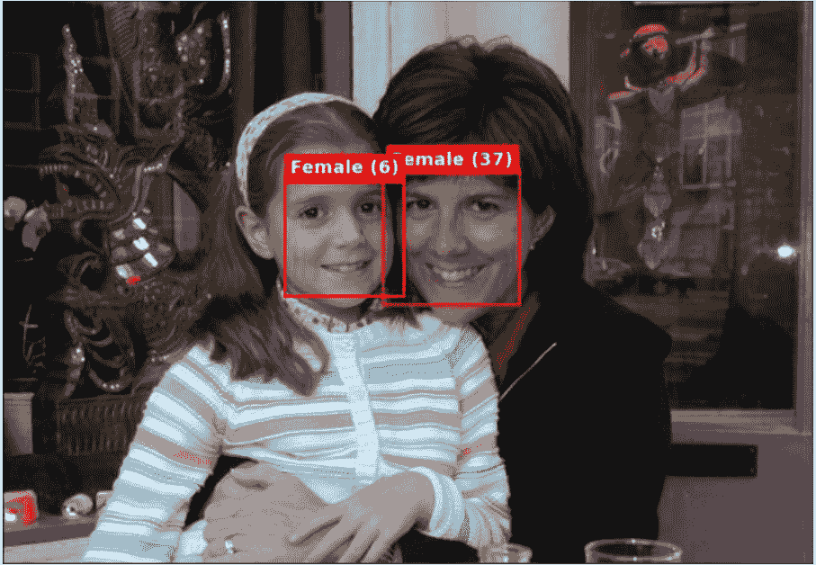

> **注意**

人脸服务可以检测人脸，并识别年龄、性别、情绪、面部特征点等。它还提供了用于比较人脸图像、识别人脸和构建人脸识别系统的方法。其 API 是计算机视觉服务人脸 API 的超集。然而，由于微软的[负责任 AI 倡议](https://learn.microsoft.com/en-us/azure/responsible-ai/)，人脸服务已不再向公众开放。有关人脸服务以及如何申请访问权限的更多信息，请参阅“[什么是 Azure 人脸服务？](https://learn.microsoft.com/en-us/azure/ai-services/computer-vision/face-api)”。

假设你是一个公共网站的所有者，该网站接受照片上传，而你希望拒绝包含不当内容的照片。`analyze_image_in_stream` 按如下方式调用时，会对照片的成人内容（照片是否包含裸露？）、色情内容（是否包含裸露皮肤？）和血腥内容（是否包含血液和血腥场面？）进行评分，评分范围为 0.0 到 1.0。以下是它对一张年轻女孩穿着泳衣在夏威夷悬崖跳水的照片的响应：

```python
image = plt.imread('Data/maui.jpg')
fig, ax = plt.subplots(figsize=(12, 8), subplot_kw={'xticks': [], 'yticks': []})
ax.imshow(image)

with open('Data/maui.jpg', mode='rb') as image:
    result = client.analyze_image_in_stream(image,
                                            visual_features=[VisualFeatureTypes.adult])

print(f'Adultness: {result.adult.adult_score}')
print(f'Raciness: {result.adult.racy_score}')
print(f'Goriness: {result.adult.gore_score}')

print(f'Is adult: {result.adult.is_adult_content}')
print(f'Is racy: {result.adult.is_racy_content}')
print(f'Is gory: {result.adult.is_gory_content}')
```

以下是输出：

```
Adultness: 0.02214685082435608
Raciness: 0.4205135107040405
Goriness: 0.0016634463099762797
Is adult: False
Is racy: False
Is gory: False
```


照片中的比基尼导致了中等程度的色情分数，但该分数低于 `is_racy_content` 为 True 所需的 0.5 阈值。根据它返回的其他分数，计算机视觉服务认为该照片既非“成人”内容，也非血腥内容。

计算机视觉服务为应用开发者提供的另一项能力是使用 AI 从照片中提取文本。它非常适合将印刷文档数字化。以下是一个示例：

```python
def draw_box(bbox):
    vals = bbox.split(',')
    x = int(vals[0])
    y = int(vals[1])
    w = int(vals[2])
    h = int(vals[3])
    rect = Rectangle((x, y), w, h, color='red', fill=False, lw=2)
    ax.add_patch(rect)

image = plt.imread('Data/1040-es.jpg')
fig, ax = plt.subplots(figsize=(12, 8), subplot_kw={'xticks': [], 'yticks': []})
ax.imshow(image)

with open('Data/1040-es.jpg', mode='rb') as image:
    result = client.recognize_printed_text_in_stream(image)

    for region in result.regions:
        for line in region.lines:
            text = ' '.join([word.text for word in line.words])
            draw_box(line.bounding_box)
            print(text)
```

以下是输出，不包括 print 语句输出的所有文本行：

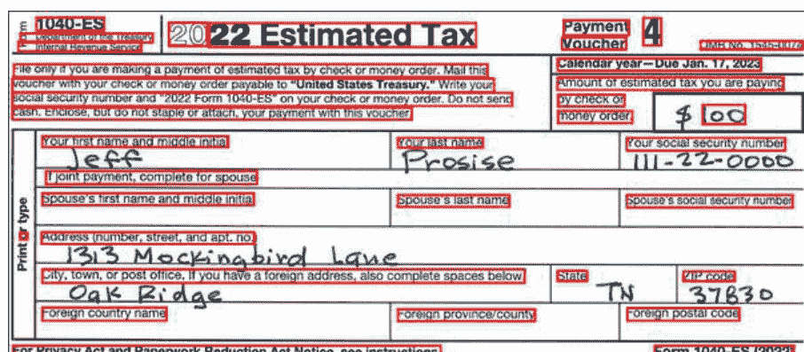

`recognize_printed_text_in_stream` 方法仅识别印刷文本。一个名为 `read_in_stream` 的相关方法也能识别手写文本。让我们看看它在同一个扫描文档上的表现：

```python
import time
from azure.cognitiveservices.vision.computervision.models import OperationStatusCodes

def draw_box(bbox):
    x, y  = bbox[0], bbox[1]
    w = bbox[4] - x
    h = bbox[5] - y
    rect = Rectangle((x, y), w, h, color='red', fill=False, lw=2)
    ax.add_patch(rect)

image = plt.imread('Data/1040-es.jpg')
fig, ax = plt.subplots(figsize=(12, 8), subplot_kw={'xticks': [], 'yticks': []})
ax.imshow(image)

with open('Data/1040-es.jpg', mode='rb') as image:
    response = client.read_in_stream(image, raw=True)

    location = response.headers["Operation-Location"]
    opid = location[len(location) - 36:]
    results = client.get_read_result(opid)

    while results.status == OperationStatusCodes.running:
        results = client.get_read_result(opid)
        time.sleep(1)

    if results.status == OperationStatusCodes.succeeded:
        for result in results.analyze_result.read_results:
            for line in result.lines:
                draw_box(line.bounding_box)
                print(line.text)
```

这个示例稍微复杂一些，因为 `read_in_stream` 在调用完成之前就返回了。因此，我们需要循环直到调用完成，然后检索结果。在 `while` 循环的每次迭代中调用 `sleep`，可以让用户界面在等待调用完成时保持响应。结果值得等待：

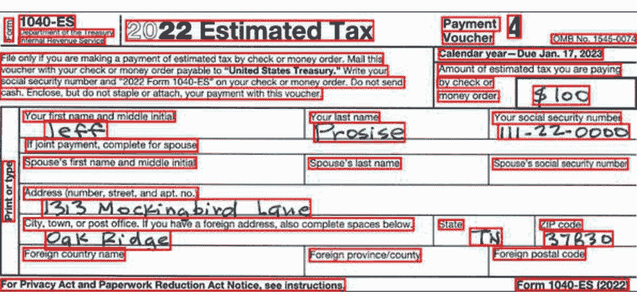

也许你更希望从文档中*仅*提取手写文本。这也是可以做到的，因为对于它检测到的每一行文本，`read_in_stream` 都包含一个 `style` 属性，对于手写文本，该属性等于“handwriting”。为了演示，请将前面示例中的最后两行替换为以下内容：

```python
if (line.appearance.style.name == 'handwriting'):
    draw_box(line.bounding_box)
    print(line.text)
```

这一次，只有手写文本被高亮显示：

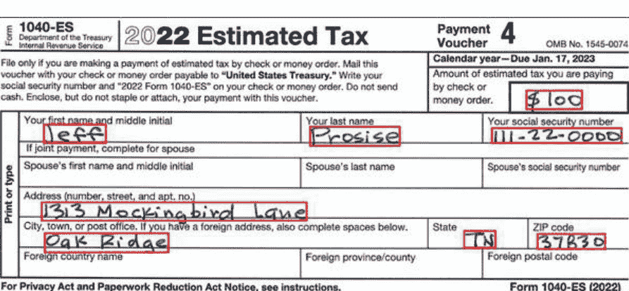

`read_in_stream` 在将手写文本转换为 Python 字符串方面也做得非常出色：

- $ 100
- Jeff
- Prosise
- 111-22-0000
- 1313 Mockingbird Lane
- Oak Ridge
- TN

关于计算机视觉服务的最后一点说明是，它不接受大于 4 MB 的图像。任何更大的图像都会产生 `ComputerVisionErrorResponseException`。你可以捕获这些异常（或更高级别的 `AzureError` 异常）并优雅地恢复，或者你可以在提交图像之前检查其大小，并在必要时缩小它。

### 语言服务

计算机视觉服务采用的深度学习模型与你在第 10、11 和 12 章学到的模型类似。语言和翻译服务使用的模型类似于第 13 章中的模型。后两项服务体现了自然语言处理：情感分析、神经机器翻译、问答等。Python 文本分析 SDK 中的 `TextAnalyticsClient` 类为语言服务的许多功能提供了便捷的接口。你已经看到它用于情感分析。这是另一个示例，它通过一次往返语言服务对多个文本样本应用情感分析：

```python
from azure.core.credentials import AzureKeyCredential
from azure.ai.textanalytics import TextAnalyticsClient

client = TextAnalyticsClient(ENDPOINT, AzureKeyCredential(KEY))

input = [
    { 'id': '1000', 'text': 'Programming is fun, but the hours are long' },
    { 'id': '1001', 'text': 'Great food and excellent service' },
    { 'id': '1002', 'text': 'The product worked as advertised but is ' \n                       'overpriced' },
    { 'id': '1003', 'text': 'Moving to the cloud was the best decision ' \n                       'we ever made' },
    { 'id': '1004', 'text': 'Programming is so fun I\'d do it for free. ' \n                       'Don\'t tell my boss!' }
]
response = client.analyze_sentiment(input)

for result in response:
    text = ''.join([x.text for x in result.sentences])
    print(f'{text} => {result.confidence_scores.positive}')
```

以下是输出：

```
Programming is fun, but the hours are long => 0.94
Great food and excellent service => 1.0
The product worked as advertised but is overpriced => 0.0
Moving to the cloud was the best decision we ever made => 1.0
Programming is so fun I'd do it for free. Don't tell my boss! => 1.0
```

假设你正在编写一个应用程序，收集提及你公司的推文并分析其情感。其理念是，如果情感变得负面，你可以给营销部门提个醒。向 Azure 认知服务发起一次调用并分析 100 条推文，比发起 100 次调用一次分析一条推文更快、更高效。

情感分析是 `TextAnalyticsClient` 类支持的几种操作之一。另一种是命名实体识别。假设你正在构建一个系统，用于对收到的支持工单进行分类和优先级排序。`recognize_entities` 方法从输入文本中提取实体，例如人员、地点、组织、日期和时间以及数量。它还会揭示实体类型：

```python
documents = [
    'My printer isn\'t working. Can someone from IT come to my office ' \n    'and have a look?'
]

results = client.recognize_entities(documents)

for result in results:
    for entity in result.entities:
        print(f'{entity.text} ({entity.category})')
```

此示例的输出如下：

```
printer (Product)
IT (Skill)
office (Location)
```

一个相关的方法 `recognize_pii_entities` 从文本输入中提取个人身份信息（PII）实体，例如银行账户信息、社会安全号码和信用卡号码，而 `extract_key_phrases` 方法提取关键短语：

```python
documents = [
    'Natural Language Processing, or NLP, encompasses a variety of ' \n    'activities including text classification, keyword extraction,' \n    'named-entity recognition, question answering, and language ' \n    'translation.'
]

results = client.extract_key_phrases(documents)

for result in results:
    for phrase in result.key_phrases:
        print(phrase)
```

以下是输出：

```
Natural Language Processing
language translation
text classification
keyword extraction
question answering
NLP
variety
activities
recognition
```

鉴于文本如此简短，这个示例很简单，但你可以传入数百个大型文档，并使用结果来获取每个文档内容的快照，或对包含相似关键词的文档进行分组。

`TextAnalyticsClient` 为文本分析 API 提供了一个包装器。其他 Python SDK 解锁了语言服务的附加功能。例如，问答 SDK 提供了 API，用于从你提供的手册、常见问题解答、博客文章和其他文档中回答问题。有关更多信息，并查看语言服务的这一方面，请参阅题为“Azure 认知语言服务 Python 问答客户端库”的文章。

### 翻译服务

翻译服务使用最先进的神经机器翻译在数十种语言之间翻译文本。它还可以识别书面语言。假设你的目标是将通过公司网站提交的其他语言的问题翻译成英语。首先，你需要确定源语言是否为英语。如果不是，你希望将其翻译，以便你可以响应客户的请求。

以下代码分析一个文本样本并显示其书写语言。Microsoft 目前不提供翻译服务的 Python SDK，但你可以使用 Python 的 Requests 包来简化调用。为了演示，请在 Azure 门户中创建一个翻译资源，并获取订阅密钥（标记为“文本翻译”的那个）、端点和区域。然后运行以下代码，将 KEY 和 ENDPOINT 替换为密钥和端点，将 REGION 替换为你选择的 Azure 区域（例如 southcentralus）：

```python
import requests

input = [{ 'text': 'Quand votre nouveau livre sera-t-il disponible?' }]

headers = {
    'Ocp-Apim-Subscription-Key': KEY,
    'Ocp-Apim-Subscription-Region': REGION,
    'Content-type': 'application/json'
}

uri = ENDPOINT + 'detect?api-version=3.0&to=en'
response = requests.post(uri, headers=headers, json=input)
results = response.json()

print(results[0]['language'])
```

输出是 fr，代表法语。既然你已经确定源语言不是英语，你可以这样翻译它：

```python
uri = ENDPOINT + 'translate?api-version=3.0&from=fr&to=en'
response = requests.post(uri, headers=headers, json=input)
results = response.json()

print(results[0]['translations'][0]['text'])
```

翻译后的文本是：

When will your new book be available?

你可以从 URL 中省略 `from=fr`，并允许翻译服务为你检测语言。你也可以通过一次调用检测语言并翻译文本。如果你调用 `translate` 端点时没有 `from` 参数，返回值会包含一个 `detectedLanguage` 项，用于标识源文本中的语言：

```json
[{'detectedLanguage': {'language': 'fr', 'score': 1.0}, 'translations': [{'text': 'When will your new book be available?', 'to': 'en'}]}]
```

如果传入包含多个文本样本的列表，翻译服务将在一次调用中翻译所有文本。它还支持*音译*：将文本翻译成其他字母表。你可以自己尝试，使用 Google 翻译将“When will your new book be available”翻译成泰语或印地语。然后将泰语或印地语文本粘贴到前面示例中的法语文本上，再次运行。请务必将 `from=fr` 更改为 `from=th` 或 `from=hi`，或者干脆完全删除 `from` 参数。

> **提示**

创建翻译资源时，你可以选择创建全局资源或与特定 Azure 区域绑定的资源。前面的示例假设你将其创建为区域资源。如果你创建的是全局翻译资源，则可以将 `Ocp-Apim-Subscription-Region` 头设置为 `global`，或者完全省略该头。

当你获取翻译服务的端点时，你是否注意到 Azure 门户提供了*两个*端点——一个用于“文本翻译”，另一个用于“文档翻译”？这是因为翻译服务具有第二个 API，用于翻译整个文档，包括 PDF。甚至还有一个 [Python SDK](https://learn.microsoft.com/en-us/azure/ai-services/translator/document-translation/quickstart-sdk) 来提供帮助。唯一的限制是文档必须首先上传到 Azure Blob 存储。有关文档翻译 API 实际应用的示例，请参阅“[Azure 文档翻译 Python 客户端库](https://learn.microsoft.com/en-us/azure/ai-services/translator/document-translation/quickstart-sdk)”。该 API 是异步的，可以在一次调用中处理批量文档，因此它不仅适用于翻译单个文档，还适用于大规模翻译大量文档。

### 语音服务

深度学习模型更具挑战性的任务之一是处理人类语音。Azure 认知服务包括一个[语音服务](https://learn.microsoft.com/en-us/azure/ai-services/speech-service/overview)，可将文本转换为语音、语音转换为文本等。它甚至能够[为录制的视频和实时视频流添加字幕](https://learn.microsoft.com/en-us/azure/ai-services/speech-service/get-started-stt-diarization?tabs=terminal&pivots=programming-language-python)，并在添加字幕时过滤掉脏话。[Python SDK](https://learn.microsoft.com/en-us/azure/ai-services/speech-service/quickstarts/setup-platform?pivots=programming-language-python&tabs=macos) 简化了你编写的代码，并使将语音集成到应用程序中变得非常容易。

为了演示，请安装包含 Python 语音 SDK 的名为 [Azure-cognitiveservices-speech](https://learn.microsoft.com/en-us/azure/ai-services/speech-service/quickstarts/setup-platform?pivots=programming-language-python&tabs=macos) 的包。使用 Azure 门户创建一个认知服务语音资源，并记下订阅密钥和服务区域。然后创建一个 Jupyter notebook，并在第一个单元格中运行以下代码，将 KEY 替换为订阅密钥，将 REGION 替换为你选择的区域：

from azure.cognitiveservices import speech

speech_config = speech.SpeechConfig(KEY, REGION)
speech_config.speech_recognition_language = 'en-US'

现在运行以下语句，当提示时，对着麦克风说话。此示例创建一个 `SpeechRecognizer` 对象，并使用其 `recognize_once_async` 方法，将来自你电脑默认麦克风的最多30秒实时音频转换为文本。请注意，文本不会在你说话时出现，而是在你完成后才显示：

recognizer = speech.SpeechRecognizer(speech_config)

print('Speak into your microphone')
result = recognizer.recognize_once_async().get()

if result.reason == speech.ResultReason.RecognizedSpeech:
    print(result.text)

没有比这更简单的了。那么将文本转换为语音呢？这里有一个示例，使用 SDK 的 `SpeechSynthesizer` 类来朗读一个句子。合成的声音来自一位名叫 Jenny 的英语使用者（en-US-JennyNeural），这是你可以选择的300多种神经网络语音之一：

speech_config.speech_synthesis_voice_name = 'en-US-JennyNeural'
synthesizer = speech.SpeechSynthesizer(speech_config)
synthesizer.speak_text_async('When will your new book be published?').get()

所有的“说话者”都是多语言的。如果你让一位法语说话者——例如 fr-FR-CelesteNeural——合成一个英语句子，其发音将带有法语口音。
你可以将 `TranslationRecognizer` 对象与 `SpeechSynthesizer` 对象结合使用，以实时翻译语音。以下示例以英语口语为输入，并使用一位母语法语说话者的声音将其回放为法语：

speech_config.speech_synthesis_voice_name = 'fr-FR-YvetteNeural'
synthesizer = speech.SpeechSynthesizer(speech_config)

translation_config = speech.translation.SpeechTranslationConfig(KEY, REGION)
translation_config.speech_recognition_language = 'en-US'
translation_config.add_target_language('fr')

recognizer = speech.translation.TranslationRecognizer(translation_config)

print('Speak into your microphone')
result = recognizer.recognize_once_async().get()

if result.reason == speech.ResultReason.TranslatedSpeech:
    text = result.translations['fr']
    synthesizer.speak_text_async(text).get()

这些示例使用你电脑的默认麦克风进行语音输入，默认扬声器进行输出。你可以通过向创建 `SpeechRecognizer`、`SpeechSynthesizer` 和 `TranslationRecognizer` 对象的方法传递一个 `AudioConfig` 对象来指定其他输入和输出源。这使得使用文件或流（而非麦克风）作为输入源成为可能。

### 综合应用：Contoso 旅行

假设你是一名网页开发者，你的客户是 Contoso 旅行。为了激励客户保持联系，这家旅行社希望其网站包含一项标牌翻译服务。其理念是，一位在远方探索的顾客可以拍下标牌的照片，将其上传到网站，然后看到以他们选择的语言呈现的翻译。无需打字，无需填写表格——只需“这是一张图片，告诉我上面写了什么”。

几年前，对于大多数小企业来说，这样的网站是难以想象的。如今，任何能写几行代码的人都有能力实现。让我们使用 Python 的 [Flask 框架](https://flask.palletsprojects.com/) 来构建一个让你的客户满意的网站。我们将使用 Azure 认知服务来完成提取和翻译文本的繁重工作，最终得到如图14-6所示的产品。

首先，确保已安装所需的包，包括 Flask、Requests 和 Azure-cognitiveservices-vision-computervision。然后在你硬盘上的任意位置创建一个项目目录。将其命名为 Contoso 或任何你喜欢的名字。接下来，下载一个包含网站入门套件的 [ZIP 文件](https://github.com/Azure-Samples/cognitive-services-python-sdk-samples/raw/master/samples/contoso-travel.zip)，并将其内容复制到项目目录中。花点时间检查一下你复制的文件。这些文件构成了一个用 Python 和 Flask 编写的网站。它们包括以下内容：

- `app.py`
    - 包含驱动网站的 Python 代码
- `templates/index.html`
    - 包含网站的主页
- `static/main.css`
    - 包含用于美化主页的 CSS
- `static/banner.jpg`
    - 包含网站的横幅图片
- `static/placeholder.jpg`
    - 包含用于尚未上传照片的占位符图片


该网站包含一个名为 *index.html* 的页面，当用户访问网站时会显示该页面。显示它的代码位于 *app.py* 中，其中包含了上传照片的逻辑。你将修改 *app.py*，以从用户上传的照片中提取和翻译文本。

> **注意**

“Contoso”听起来熟悉吗？这是微软无数示例和教程中使用的公司名称。它如此流行背后有一个故事。当你为微软撰写内容时，你不允许编造公司名称，因为这样做很可能会让微软被起诉。Contoso 是微软多年来注册商标的几个虚构公司名称之一。其他可能熟悉的名称包括 Northwind Traders、Fabrikam 和 AdventureWorks。

打开命令提示符或终端窗口，并切换到项目目录。如果你运行的是 Windows，请使用以下命令创建一个名为 FLASK_ENV 的环境变量，告诉 Flask 以开发模式运行：

```
set FLASK_ENV=development
```

如果你运行的是 Linux 或 macOS，请改用此命令：

```
export FLASK_ENV=development
```

在开发网站时，以开发模式运行 Flask 非常有用，因为 Flask 会在网站运行时自动重新加载任何更改的文件。如果你让 Flask 默认使用生产模式，并更改了 HTML 文件或其他资源的内容，则必须重启 Flask 才能在浏览器中看到更改。

现在使用以下命令启动 Flask：

```
flask run
```

打开浏览器并访问 http://localhost:5000。当 Contoso 旅行的主页出现时，点击“上传照片”按钮，并选择你电脑上的一个 JPG 或 PNG 文件。确认照片上传没有错误。此时，尚未对照片进行任何处理，因此上传成功的唯一视觉线索是照片出现在网页中。

接下来，如果你尚未创建，请使用 Azure 门户创建一个计算机视觉资源和一个翻译器资源。在你喜欢的代码编辑器中打开 *app.py*，并在文件顶部附近找到以下语句：

```
# Define Cognitive Services variables
vision_key = 'VISION_KEY'
vision_endpoint = 'VISION_ENDPOINT'
translator_key = 'TRANSLATOR_KEY'
translator_endpoint = 'TRANSLATOR_ENDPOINT'
translator_region = 'TRANSLATOR_REGION'
```

将 VISION_KEY 和 TRANSLATOR_KEY 替换为服务的订阅密钥，将 VISION_ENDPOINT 和 TRANSLATOR_ENDPOINT 替换为端点，将 TRANSLATOR_REGION 替换为为翻译器服务选择的区域。对于翻译器，请使用标记为“文本翻译”的端点。请务必保留分隔字符串的引号。

现在，将以下用于从照片中提取文本的函数添加到 *app.py* 中，将其放置在文件底部附近注释“Function that extracts text from images”之后：

```
def extract_text(endpoint, key, image):
    try:
        client = ComputerVisionClient(endpoint,
                                      CognitiveServicesCredentials(key))
        result = client.recognize_printed_text_in_stream(image)
        lines = []

        for region in result.regions:
            for line in region.lines:
                text = ' '.join([word.text for word in line.words])
                lines.append(text)

        if len(lines) == 0:
            lines.append('Photo contains no text to translate')

        return lines

    except ComputerVisionErrorResponseException as e:
        return ['Error calling the Computer Vision service: ' + e.message]

    except Exception as e:
        return ['Error calling the Computer Vision service']
```

然后添加以下用于翻译文本的函数。将其放置在注释“Function that

在 *app.py* 文件底部附近找到“将文本翻译成指定语言”的函数：

```python
def translate_text(endpoint, region, key, lines, language):
    try:
        headers = {
            'Ocp-Apim-Subscription-Key': key,
            'Ocp-Apim-Subscription-Region': region,
            'Content-type': 'application/json'
        }

        input = []

        for line in lines:
            input.append({ "text": line })

        uri = endpoint + 'translate?api-version=3.0&to=' + language
        response = requests.post(uri, headers=headers, json=input)
        response.raise_for_status() # Raise exception if call failed
        results = response.json()

        translated_lines = []

        for result in results:
            for translated_line in result["translations"]:
                translated_lines.append(translated_line["text"])

        return translated_lines

    except requests.exceptions.HTTPError as e:
        return ['Error calling the Translator service: ' + e.strerror]

    except Exception as e:
        return ['Error calling the Translator service']
```

在 *app.py* 中找到名为 `index` 的函数。这是当请求主页或上传照片时调用的函数。在注释“使用计算机视觉服务从图像中提取文本”下方，添加以下代码行，以使用用户刚上传的照片调用 `extract_text`：

```python
lines = extract_text(vision_endpoint, vision_key, image)
```

在注释“使用翻译器服务翻译从图像中提取的文本”下方，添加一行代码，将 `extract_text` 返回的文本翻译成指定语言：

```python
translated_lines = translate_text(translator_endpoint, translator_region,
                                translator_key, lines, language)
```

在注释“显示翻译后的文本”之后立即添加以下语句：

```python
for translated_line in translated_lines:
    flash(translated_line)
```

这些语句使用 Flask 的消息闪烁支持，在模态对话框中显示 `translated_lines` 中的字符串。

最后，将更改保存到 *app.py*。返回到运行网站的浏览器并刷新页面。（如果已关闭，请打开一个新的浏览器实例并导航到 *http://localhost:5000*。）从页面顶部的下拉列表中选择一种语言。然后上传一张包含路标或任何其他带有文本的图像的照片。

文本是否被提取并翻译了？该应用程序并不完美，但大多数情况下应该能按预期工作。如果不满意，可以尝试将 `recognize_printed_text_in_stream` 的调用替换为 `read_in_stream` 的调用。后者在查找照片中的文本方面更为积极。同时，你还可以使用翻译器服务将错误消息翻译成用户选择的语言，或者使用语音服务将翻译后的文本语音化。借助 Azure 认知服务的帮助，唯一的限制是你的想象力。

### 总结

Azure 认知服务通过提供任何具有互联网连接的应用程序都可以调用的 REST API，降低了将复杂的深度学习模型集成到你编写的应用程序中的门槛。大多数服务的容器化版本允许它们在本地或本地托管，也为在断开连接的场景中运行提供了选项。容器的好处之一是锁定你正在使用的模型或访问它们的 API 的特定版本，这样对 Azure 认知服务的更改就不会影响你的应用程序。

Azure 认知服务提供的服务范围包括用于从图像和视频流中提取信息的视觉服务、用于将文本翻译成其他语言并执行其他自然语言处理任务的语言服务，以及用于将语音集成到你的应用程序中的语音服务。大多数服务都提供免费的 SDK。它们简化了你编写的代码，并且可用于多种流行的编程语言，包括 Python、Java 和 C#。

机器学习和深度学习正在一个模型接一个模型地让世界变得更美好。很快，两者都将被视为每个工程师和软件开发人员必备技能的一部分。你准备好迎接挑战了吗？我希望这本书能给你说“是”的信心，并提供实现它的工具。现在在任务控制中心监控阿波罗任务已经太晚了，但无数其他前沿领域正等待着被探索。

# 索引

**A**

- 准确性度量
    - 分类模型，[分类模型，分类模型的准确性度量-分类模型的准确性度量](Classification Models, Accuracy Measures for Classification Models-Accuracy Measures for Classification Models)
    - 混淆矩阵，[分类模型的准确性度量，使用 SVM 进行人脸识别-使用 SVM 进行人脸识别](Accuracy Measures for Classification Models, Using SVMs for Facial Recognition-Using SVMs for Facial Recognition)
    - 神经网络预测，[训练神经网络检测信用卡欺诈-训练神经网络检测信用卡欺诈，训练 CNN 识别北极野生动物](Training a Neural Network to Detect Credit Card Fraud-Training a Neural Network to Detect Credit Card Fraud, Training a CNN to Recognize Arctic Wildlife)
    - 回归模型，[回归模型的准确性度量-回归模型的准确性度量](Accuracy Measures for Regression Models-Accuracy Measures for Regression Models)
    - 训练准确性与验证准确性，[Dropout](Dropout)
    - 验证准确性（参见验证准确性）
- 准确性分数，[分类模型的准确性度量，分类模型的准确性度量，对泰坦尼克号乘客进行分类](Accuracy Measures for Classification Models, Accuracy Measures for Classification Models, Classifying Passengers Who Sailed on the Titanic)
- 激活函数，[理解神经网络](Understanding Neural Networks)
    - ReLU，[理解神经网络，使用 Keras 和 TensorFlow 构建神经网络](Understanding Neural Networks, Building Neural Networks with Keras and TensorFlow)
    - sigmoid，[使用 Keras 和 TensorFlow 构建神经网络，使用神经网络进行二元分类-进行预测，理解 CNN](Building Neural Networks with Keras and TensorFlow, Binary Classification with Neural Networks-Making Predictions, Understanding CNNs)
    - softmax（参见 softmax 激活函数）
    - tanh，[使用 Keras 和 TensorFlow 构建神经网络](Building Neural Networks with Keras and TensorFlow)
- Adam 优化器，[使用 Keras 和 TensorFlow 构建神经网络](Building Neural Networks with Keras and TensorFlow)
- 自适应学习率算法，[训练神经网络](Training Neural Networks)
- 加法建模，[梯度提升机](Gradient-Boosting Machines)
- 加法平滑，[朴素贝叶斯](Naive Bayes)
- 凝聚聚类，[使用两个以上维度对客户进行细分](Segmenting Customers Using More Than Two Dimensions)
- AlexNet，[使用卷积神经网络进行图像分类](Image Classification with Convolutional Neural Networks)
- 算法，[机器学习](Machine Learning)
- AlphaGo，[机器学习与人工智能](Machine Learning Versus Artificial Intelligence)
- analyze_image_in_stream 方法，[计算机视觉服务](The Computer Vision Service)
- analyze_sentiment，[调用 Azure 认知服务 API](Calling Azure Cognitive Services APIs)
- 锚点和锚框，[R-CNN](R-CNNs)
- annotate_image 函数，[Mask R-CNN](Mask R-CNN)
- 异常检测，[异常检测-多变量异常检测](Anomaly Detection-Multivariate Anomaly Detection)
    - 轴承故障预测，[使用 PCA 预测轴承故障-使用 PCA 预测轴承故障](Using PCA to Predict Bearing Failure-Using PCA to Predict Bearing Failure)
    - 信用卡欺诈检测，[使用 PCA 检测信用卡欺诈-使用 PCA 检测信用卡欺诈](Using PCA to Detect Credit Card Fraud-Using PCA to Detect Credit Card Fraud)
    - 多变量，[多变量异常检测](Multivariate Anomaly Detection)
- 异常检测器，[Azure 认知服务简介](Introducing Azure Cognitive Services)
- 数据匿名化，[数据匿名化-数据匿名化](Anonymizing Data-Anonymizing Data)
- ArcFace，[ArcFace](ArcFace)，处理未知人脸：封闭集与开放集分类
- 北极野生动物识别，[分类模型的准确性度量](Accuracy Measures for Classification Models)，[训练 CNN 识别北极野生动物-训练 CNN 识别北极野生动物](Training a CNN to Recognize Arctic Wildlife-Training a CNN to Recognize Arctic Wildlife)，[使用迁移学习识别北极野生动物-使用迁移学习识别北极野生动物](Using Transfer Learning to Identify Arctic Wildlife-Using Transfer Learning to Identify Arctic Wildlife)，[应用图像增强到北极野生动物-应用图像增强到北极野生动物](Applying Image Augmentation to Arctic Wildlife-Applying Image Augmentation to Arctic Wildlife)
- 曲线下面积 (AUC)，[分类模型的准确性度量](Accuracy Measures for Classification Models)
- argmax 函数，[使用神经网络进行多类别分类](Multiclass Classification with Neural Networks)
- 人工智能 (AI)
    - 历史，[机器学习与人工智能](Machine Learning Versus Artificial Intelligence)
    - 与机器学习 (ML) 的对比，[机器学习与人工智能-机器学习与人工智能](Machine Learning Versus Artificial Intelligence-Machine Learning Versus Artificial Intelligence)
- 注意力机制，[Transformer 编码器-解码器-Transformer 编码器-解码器](Transformer Encoder-Decoders-Transformer Encoder-Decoders)
- AUC（曲线下面积），[分类模型的准确性度量](Accuracy Measures for Classification Models)
- 使用 CNN 进行音频分类，[使用 CNN 进行音频分类-使用 CNN 进行音频分类](Audio Classification with CNNs-Audio Classification with CNNs)
- AudioConfig 对象，[语音服务](The Speech Service)
- 增强层，[使用增强层进行图像增强](Image Augmentation with Augmentation Layers)
- 平均池化层，[理解 CNN](Understanding CNNs)

## A

AWS AI 服务，[Azure 认知服务](https://azure.microsoft.com/en-us/services/cognitive-services/)

Azure 认知服务 API，[自定义对象检测](https://docs.microsoft.com/en-us/azure/cognitive-services/custom-vision-service/)，[Azure 认知服务-摘要调用 API](https://docs.microsoft.com/en-us/azure/cognitive-services/cognitive-services-apis-create-account)，[调用 Azure 认知服务 API-调用 Azure 认知服务 API](https://docs.microsoft.com/en-us/azure/cognitive-services/cognitive-services-apis-create-account)

计算机视觉服务，[使用卷积神经网络进行图像分类](https://docs.microsoft.com/en-us/azure/cognitive-services/custom-vision-service/getting-started-build-a-classifier)，[Azure 认知服务简介](https://docs.microsoft.com/en-us/azure/cognitive-services/welcome)，[计算机视觉服务-计算机视觉服务](https://docs.microsoft.com/en-us/azure/cognitive-services/computer-vision/)

容器，[Azure 认知服务容器-Azure 认知服务容器](https://docs.microsoft.com/en-us/azure/cognitive-services/cognitive-services-container-support)

Contoso 旅行练习，[综合应用：Contoso 旅行-综合应用：Contoso 旅行](https://docs.microsoft.com/en-us/azure/cognitive-services/cognitive-services-apis-create-account)

决策服务，[Azure 认知服务简介](https://docs.microsoft.com/en-us/azure/cognitive-services/welcome)

密钥和终结点，[密钥和终结点-密钥和终结点](https://docs.microsoft.com/en-us/azure/cognitive-services/cognitive-services-apis-create-account)

语言服务，[Azure 认知服务简介](https://docs.microsoft.com/en-us/azure/cognitive-services/welcome)，[语言服务-语言服务](https://docs.microsoft.com/en-us/azure/cognitive-services/language-service/)

可用的 SDK，[调用 Azure 认知服务 API-调用 Azure 认知服务 API](https://docs.microsoft.com/en-us/azure/cognitive-services/cognitive-services-apis-create-account)

语音服务，[Azure 认知服务简介](https://docs.microsoft.com/en-us/azure/cognitive-services/welcome)，[语音服务-语音服务](https://docs.microsoft.com/en-us/azure/cognitive-services/speech-service/)

订阅设置，[使用自定义视觉服务训练自定义对象检测模型-使用自定义视觉服务训练自定义对象检测模型](https://docs.microsoft.com/en-us/azure/cognitive-services/custom-vision-service/getting-started-build-a-detector)

翻译器服务，[翻译器服务-翻译器服务](https://docs.microsoft.com/en-us/azure/cognitive-services/translator/)

Azure 门户，[密钥和终结点](https://docs.microsoft.com/en-us/azure/cognitive-services/cognitive-services-apis-create-account)

AzureError，[调用 Azure 认知服务 API](https://docs.microsoft.com/en-us/azure/cognitive-services/cognitive-services-apis-create-account)

## B

反向传播，[训练神经网络-训练神经网络](https://docs.microsoft.com/en-us/azure/machine-learning/concept-deep-learning)，[使用 Keras 和 TensorFlow 构建神经网络](https://docs.microsoft.com/en-us/azure/machine-learning/concept-deep-learning)，Dropout

词袋模型，[文本分类](https://docs.microsoft.com/en-us/azure/cognitive-services/language-service/text-classification/)

批量归一化，[预训练 CNN](https://docs.microsoft.com/en-us/azure/cognitive-services/custom-vision-service/getting-started-build-a-classifier)

贝叶斯定理，[朴素贝叶斯](https://docs.microsoft.com/en-us/azure/machine-learning/how-to-use-naive-bayes)

轴承故障预测，异常检测，[使用 PCA 预测轴承故障-使用 PCA 预测轴承故障](https://docs.microsoft.com/en-us/azure/machine-learning/how-to-use-pca)

BERT（来自 Transformer 的双向编码器表示），[来自 Transformer 的双向编码器表示 (BERT)-微调 BERT 进行情感分析](https://docs.microsoft.com/en-us/azure/cognitive-services/language-service/sentiment-analysis/)

构建基于 BERT 的问答系统

情感分析，微调 BERT 进行情感分析-微调 BERT 进行情感分析

偏差，神经网络，理解神经网络，理解神经网络，使用神经网络预测出租车费用

来自 Transformer 的双向编码器表示 (BERT)，来自 Transformer 的双向编码器表示 (BERT)-微调 BERT 进行情感分析

双语评估替代（BLEU）分数，构建基于 Transformer 的 NMT 模型

二元分类模型，二元分类-检测信用卡欺诈

信用卡欺诈检测，检测信用卡欺诈-检测信用卡欺诈

逻辑回归（参见逻辑回归）

使用神经网络，使用神经网络进行二元分类-训练神经网络检测信用卡欺诈

泰坦尼克号乘客，对乘坐泰坦尼克号的乘客进行分类-对乘坐泰坦尼克号的乘客进行分类

二元分类器，在 Viola-Jones 人脸检测中，使用 Viola-Jones 进行人脸检测

二叉树，决策树

binary_crossentropy 函数，使用神经网络进行二元分类

BLEU（双语评估替代）分数，构建基于 Transformer 的 NMT 模型

玻尔兹曼机，机器学习与人工智能

提升，梯度提升机-梯度提升机

瓶颈层，理解 CNN，理解 CNN，使用 Keras 和 TensorFlow 构建 CNN，迁移学习-迁移学习

底部 Sobel 核，理解 CNN

边界框，对象检测，R-CNN

ROI 池化，R-CNN

RPN，Mask R-CNN，使用自定义视觉服务训练自定义对象检测模型

Viola-Jones，使用 Viola-Jones 的 OpenCV 实现

YOLO，YOLO，YOLOv3 和 Keras

乳腺癌数据集，数据规范化，数据匿名化

## C

C 参数，SVM，[支持向量机的工作原理](How Support Vector Machines Work)，[超参数调优-超参数调优](Hyperparameter Tuning-Hyperparameter Tuning)

C#

- 使用 ML.NET 构建模型，[使用 ML.NET 在 C# 中构建 ML 模型-保存和加载 ML.NET 模型](Building ML Models in C# with ML.NET-Saving and Loading ML.NET Models)
- 使用 ONNX 与 Python 交互，[使用 ONNX 弥合语言差距-使用 ONNX 弥合语言差距](Using ONNX to Bridge the Language Gap-Using ONNX to Bridge the Language Gap)

加利福尼亚州房价数据集，[回归模型的准确度度量](Accuracy Measures for Regression Models)

Callback 类，[Keras 回调](Keras Callbacks)

回调，Keras，[Keras 回调-Keras 回调](Keras Callbacks-Keras Callbacks)

CART（分类和回归树）算法，[决策树](Decision Trees)

级联分类器，[使用 Viola-Jones 进行人脸检测-使用 Viola-Jones 的 OpenCV 实现](Face Detection with Viola-Jones-Using the OpenCV Implementation of Viola-Jones)

CascadeClassifier 类，[使用 Viola-Jones 的 OpenCV 实现-使用 Viola-Jones 的 OpenCV 实现](Using the OpenCV Implementation of Viola-Jones-Using the OpenCV Implementation of Viola-Jones)

分类数据，[分类数据-分类数据](Categorical Data-Categorical Data)

分类值，[分类数据](Categorical Data)

categorical_crossentropy 函数，[使用神经网络进行多类分类](Multiclass Classification with Neural Networks)

质心，聚类，[使用 k-Means 聚类进行无监督学习](Unsupervised Learning with k-Means Clustering)

分类和回归树 (CART) 算法，[决策树](Decision Trees)

分类边界，[监督学习](Supervised Learning)

分类模型，[监督学习-监督学习](Supervised Learning-Supervised Learning)，[分类模型-摘要](Classification Models-Summary)

- 准确度度量，[分类模型](Classification Models)，[分类模型的准确度度量-分类模型的准确度度量](Accuracy Measures for Classification Models-Accuracy Measures for Classification Models)
- 音频分类，[使用 CNN 进行音频分类-使用 CNN 进行音频分类](Audio Classification with CNNs-Audio Classification with CNNs)
- 二元分类器，[二元分类-检测信用卡欺诈](Binary Classification-Detecting Credit Card Fraud)，[使用神经网络进行二元分类-训练神经网络检测信用卡欺诈](Binary Classification with Neural Networks-Training a Neural Network to Detect Credit Card Fraud)
- CNN，[理解 CNN](Understanding CNNs)，[理解 CNN](Understanding CNNs)，[迁移学习-迁移学习](Transfer Learning-Transfer Learning)
- 数字识别模型，[构建数字识别模型-构建数字识别模型](Building a Digit Recognition Model-Building a Digit Recognition Model)
- GBM，[梯度提升机-梯度提升机](Gradient-Boosting Machines-Gradient-Boosting Machines)

图像（参见图像、分类与生成）

以及k近邻，[k-近邻算法](https://example.com)，[使用k-近邻算法对花卉进行分类](https://example.com)-使用k-近邻算法对花卉进行分类

逻辑回归（参见逻辑回归）

用于...的多层感知机，[理解卷积神经网络](https://example.com)

多分类，[监督学习](https://example.com)，[使用k-近邻算法对花卉进行分类](https://example.com)-使用k-近邻算法对花卉进行分类，[分类模型](https://example.com)，[多分类](https://example.com)-多分类，[使用神经网络进行多分类](https://example.com)-使用神经网络进行多分类

多标签，[分类模型](https://example.com)

支持向量机（参见支持向量机）

文本（参见文本分类与处理）

用于向量化的文本清洗，[为分类准备文本](https://example.com)

封闭集与开放集分类，[处理未知人脸：封闭集与开放集分类](https://example.com)-处理未知人脸：封闭集与开放集分类

聚类算法，[使用k-均值聚类进行无监督学习](https://example.com)

凝聚聚类，[使用两个以上维度对客户进行细分](https://example.com)

DBSCAN，[使用两个以上维度对客户进行细分](https://example.com)

k-均值（参见k-均值聚类）

标签编码，[使用两个以上维度对客户进行细分](https://example.com)-使用两个以上维度对客户进行细分，[分类数据](https://example.com)-分类数据

卷积神经网络（参见卷积神经网络）

COCO数据集，[Mask R-CNN](https://example.com)，[YOLOv3与Keras](https://example.com)

决定系数（R²），[回归模型的准确度度量](https://example.com)，[使用神经网络预测出租车费用](https://example.com)

协同过滤推荐系统，[推荐系统](https://example.com)

计算机视觉服务，[使用卷积神经网络进行图像分类](https://example.com)，[Azure认知服务简介](https://example.com)，[计算机视觉服务](https://example.com)-计算机视觉服务

ComputerVisionClient类，[计算机视觉服务](https://example.com)

条件概率，[朴素贝叶斯](https://example.com)

置信值，目标检测，[YOLOv3与Keras](https://example.com)

混淆矩阵，[分类模型的准确度度量](https://example.com)，[使用支持向量机进行人脸识别](https://example.com)-使用支持向量机进行人脸识别

ConfusionMatrixDisplay类，[分类模型的准确度度量](https://example.com)，[垃圾邮件过滤](https://example.com)

confusion_matrix函数，[分类模型的准确度度量](https://example.com)

从C#客户端使用Python模型，[从C#客户端使用Python模型](https://example.com)-从C#客户端使用Python模型

容器镜像，[将机器学习模型容器化](https://example.com)

容器注册表，[将机器学习模型容器化](https://example.com)

将机器学习模型容器化，[机器学习模型的部署与运维](https://example.com)，[将机器学习模型容器化](https://example.com)-将机器学习模型容器化，[Azure认知服务容器](https://example.com)-Azure认知服务容器

内容审核服务，[Azure认知服务简介](https://example.com)

基于内容的推荐系统，[推荐系统](https://example.com)

持续学习，[保存与加载模型](https://example.com)

Contoso旅行练习，[综合应用：Contoso旅行](https://example.com)-综合应用：Contoso旅行

Conv1D类，[将词序纳入预测](https://example.com)

Conv2D层，[确定神经网络规模](https://example.com)，[使用Keras和TensorFlow构建卷积神经网络](https://example.com)-使用Keras和TensorFlow构建卷积神经网络

卷积核（核），[理解卷积神经网络](https://example.com)-理解卷积神经网络

卷积神经网络（CNNs），[理解神经网络](https://example.com)，[使用卷积神经网络进行图像分类](https://example.com)-总结

- 架构，[预训练卷积神经网络](https://example.com)
- 北极野生动物识别，[训练卷积神经网络识别北极野生动物](https://example.com)-训练卷积神经网络识别北极野生动物，[使用迁移学习识别北极野生动物](https://example.com)-使用迁移学习识别北极野生动物
- 音频分类，[使用卷积神经网络进行音频分类](https://example.com)-使用卷积神经网络进行音频分类
- 使用Keras和TensorFlow构建，[使用Keras和TensorFlow构建卷积神经网络](https://example.com)-使用Keras和TensorFlow构建卷积神经网络
- 卷积层，[理解卷积神经网络](https://example.com)-理解卷积神经网络
- 数据增强，[数据增强](https://example.com)-将图像增强应用于北极野生动物
- 人脸检测，[使用卷积神经网络进行人脸检测](https://example.com)-使用卷积神经网络进行人脸检测，[综合应用：检测与识别照片中的人脸](https://example.com)-综合应用：检测与识别照片中的人脸
- 人脸识别，[将迁移学习应用于人脸识别](https://example.com)-综合应用：检测与识别照片中的人脸
- 生成对抗网络，[理解神经网络](https://example.com)
- 全局池化，[全局池化](https://example.com)-全局池化
- 使用R-CNN进行目标检测，[R-CNN](https://example.com)-Mask R-CNN
- 预训练模型，[预训练卷积神经网络](https://example.com)-使用ResNet50V2对图像进行分类

corr方法，[使用回归预测出租车费用](https://example.com)-使用回归预测出租车费用

余弦相似度，[余弦相似度](https://example.com)-构建电影推荐系统，[ArcFace](https://example.com)

CountVectorizer类，[为分类准备文本](https://example.com)-为分类准备文本，[情感分析](https://example.com)-情感分析，[垃圾邮件过滤](https://example.com)，[推荐系统](https://example.com)，[从Python客户端使用Python模型](https://example.com)，[文本准备](https://example.com)

协方差矩阵，[理解主成分分析](https://example.com)

Cover定理，[支持向量机的工作原理](https://example.com)

信用卡欺诈检测

- 异常检测，[使用PCA检测信用卡欺诈](https://example.com)-使用PCA检测信用卡欺诈
- 二分类，[检测信用卡欺诈](https://example.com)-检测信用卡欺诈
- 使用神经网络，[训练神经网络检测信用卡欺诈](https://example.com)-训练神经网络检测信用卡欺诈
- PCA，[数据匿名化](https://example.com)，[使用PCA检测信用卡欺诈](https://example.com)-使用PCA检测信用卡欺诈

交叉验证，[回归模型的准确度度量](https://example.com)-回归模型的准确度度量，[逻辑回归](https://example.com)，[对泰坦尼克号乘客进行分类](https://example.com)

cross_val_score函数，[回归模型的准确度度量](https://example.com)

CSVLogger类，[Keras回调](https://example.com)

自定义视觉服务，[使用自定义视觉服务训练自定义目标检测模型](https://example.com)-使用自定义视觉服务训练自定义目标检测模型，[Azure简介](https://example.com)

## 认知服务

客户细分，将k-Means聚类应用于客户数据-使用两个以上维度细分客户

客户数据集，将k-Means聚类应用于客户数据

## D

Darknet，YOLOv3与Keras

数据
- 过拟合，决策树，超参数调优，使用Keras和TensorFlow构建神经网络
- 预处理（参见数据预处理）
- 打乱，使用Keras和TensorFlow构建神经网络，文本分类
- 测试集，使用k-近邻算法对花卉进行分类，回归模型的准确度度量，回归模型的准确度度量
- 时间序列，循环神经网络
- 训练集，使用k-近邻算法对花卉进行分类
- 欠拟合，超参数调优，使用Keras和TensorFlow构建神经网络
- 高维数据可视化，高维数据可视化-高维数据可视化

数据增强，数据增强-将图像增强应用于北极野生动物

数据清洗，使用k-近邻算法对花卉进行分类，为分类准备文本，构建基于Transformer的NMT模型

数据归一化，数据归一化-数据归一化

DataFrame，分类数据

Dataset.to_tf_dataset方法，微调BERT以执行情感分析

Datasets库，Hugging Face，微调BERT以执行情感分析

DBSCAN（基于密度的带噪声空间聚类应用），使用两个以上维度细分客户

决策边界，支持向量机的工作原理，核函数，核技巧-超参数调优

决策服务，Azure认知服务简介

决策树桩，梯度提升机

决策树，决策树
- CART训练算法，决策树
- 用于分类，逻辑回归
- GBMs，梯度提升机
- 与归一化，数据归一化
- 随机森林，随机森林，信用卡欺诈检测，使用PCA检测信用卡欺诈
- 用于回归，逻辑回归

DecisionTreeClassifier类，决策树

DecisionTreeRegressor类，决策树

decode_predictions函数，YOLOv3与Keras

深度学习，机器学习与人工智能，深度学习
（另见神经网络）

Deepset，构建基于BERT的问答系统

Dense层，使用Keras和TensorFlow构建神经网络，调整神经网络规模

稠密向量表示，使用Keras和TensorFlow构建CNN

基于密度的带噪声空间聚类应用（DBSCAN），使用两个以上维度细分客户

依赖决策树，梯度提升机

深度可分离卷积，预训练CNN

describe_image方法，计算机视觉服务

describe_image_in_stream方法，计算机视觉服务

detectMultiScale，使用Viola-Jones的OpenCV实现

数字识别模型，构建数字识别模型

降维
- 与瓶颈层，理解CNN
- 分类层，CNN，理解CNN
- Isomap，高维数据可视化
- PCA（参见主成分分析）
- 池化层，理解CNN
- t-SNE，线性回归，高维数据可视化

断开连接的容器，Azure认知服务，Azure认知服务容器

DistilBERT模型，来自Transformer的双向编码器表示（BERT）

docker build命令，将机器学习模型容器化

Docker容器，机器学习模型的实用化，将机器学习模型容器化

文档翻译，翻译服务

点积，使用Keras和TensorFlow构建CNN

Dropout层，调整神经网络规模，Dropout-Dropout，全局池化

## E

EarlyStopping类，Keras回调，构建基于Transformer的NMT模型

特征向量与特征值，理解主成分分析

Elasticsearch，构建基于BERT的问答系统

肘部法则绘制惯性，使用k-Means聚类进行无监督学习

Embedding类，词嵌入

嵌入层，自然语言处理，词嵌入-文本分类

编码器-解码器模型，LSTM编码器-解码器-Transformer编码器-解码器

集成学习，随机森林，随机森林-随机森林，信用卡欺诈检测，使用PCA检测信用卡欺诈

训练轮次，使用Keras和TensorFlow构建神经网络

估计器，管道化，从Python客户端使用Python模型

欧几里得距离，k-近邻算法

Excel，为其添加机器学习功能，为Excel添加机器学习功能-为Excel添加机器学习功能

专家系统，机器学习与人工智能

解释方差，绘制，理解主成分分析-理解主成分分析

从照片中提取人脸，从照片中提取人脸-从照片中提取人脸

extract_key_phrases方法，语言服务

## F

F1分数，分类模型的准确度度量

人脸检测，人脸检测与识别-从照片中提取人脸
- 使用CNN，使用卷积神经网络进行人脸检测-使用卷积神经网络进行人脸检测，综合应用：在照片中检测和识别人脸-综合应用：在照片中检测和识别人脸
- 计算机视觉服务，计算机视觉服务
- 从照片中提取人脸，从照片中提取人脸-从照片中提取人脸
- 使用Viola-Jones，使用Viola-Jones进行人脸检测-使用Viola-Jones的OpenCV实现

人脸嵌入，ArcFace

人脸服务，Azure认知服务简介，计算机视觉服务

人脸验证，ArcFace

FaceNet，人脸识别

人脸识别，人脸识别-处理未知人脸：封闭集与开放集分类
- 封闭集与开放集分类，处理未知人脸：封闭集与开放集分类-处理未知人脸：封闭集与开放集分类
- 使用CNN，将迁移学习应用于人脸识别-综合应用：在照片中检测和识别人脸
- 神经网络，训练神经网络以识别人脸-训练神经网络以识别人脸
- 与隐私，人脸检测与识别
- 使用SVM，使用SVM进行人脸识别-使用SVM进行人脸识别
- 使用迁移学习，将迁移学习应用于人脸识别-使用任务特定权重增强迁移学习

假阳性率（FPR），分类模型的准确度度量

Fast R-CNN，R-CNN

## F

Faster R-CNN，[R-CNNs](R-CNNs)

特征列，[什么是机器学习？](What Is Machine Learning?)

特征图，[理解CNN](Understanding CNNs)

图像噪声过滤，[过滤噪声-过滤噪声](Filtering Noise-Filtering Noise)

fit 方法

- 在 Keras 中，[使用 Keras 和 TensorFlow 构建神经网络](Building Neural Networks with Keras and TensorFlow)，[Keras 回调函数](Keras Callbacks)，[使用 ImageDataGenerator 进行图像增强](Image Augmentation with ImageDataGenerator)
- 在 Scikit-Learn 中，[使用 k-近邻算法对花卉进行分类](Using k-Nearest Neighbors to Classify Flowers)，[回归模型的准确度度量](Accuracy Measures for Regression Models)

fit_on_texts 方法，[文本准备](Text Preparation)

Flask 框架，[机器学习模型的部署](Operationalizing Machine Learning Models)，[综合应用：Contoso 旅行](Putting It All Together: Contoso Travel)

Flatten 层，[全局池化](Global Pooling)，[文本分类](Text Classification)

flow 方法，[使用 ImageDataGenerator 进行图像增强](Image Augmentation with ImageDataGenerator)

flow_from_directory 方法，[使用 ImageDataGenerator 进行图像增强](Image Augmentation with ImageDataGenerator)

折，[回归模型的准确度度量](Accuracy Measures for Regression Models)

FPR（假阳性率），[分类模型的准确度度量](Accuracy Measures for Classification Models)

全连接层，[理解神经网络](Understanding Neural Networks)

函数式 API，Keras，[神经网络](Neural Networks)，[构建基于 Transformer 的 NMT 模型-构建基于 Transformer 的 NMT 模型](Building a Transformer-Based NMT Model-Building a Transformer-Based NMT Model)

## G

gamma 参数，SVM 核函数，[超参数调优-超参数调优](Hyperparameter Tuning-Hyperparameter Tuning)

GANs（生成对抗网络），[理解神经网络](Understanding Neural Networks)

门控循环单元（GRU）层，[循环神经网络（RNNs）](Recurrent Neural Networks (RNNs))

GBDTs（梯度提升决策树），[梯度提升机-梯度提升机](Gradient-Boosting Machines-Gradient-Boosting Machines)

GBMs（梯度提升机），[梯度提升机-梯度提升机](Gradient-Boosting Machines-Gradient-Boosting Machines)

生成对抗网络（GANs），[理解神经网络](Understanding Neural Networks)

get_weights 方法，[保存和加载模型](Saving and Loading Models)

基尼不纯度，[决策树](Decision Trees)

全局最小值，[训练神经网络](Training Neural Networks)

全局池化，[全局池化-全局池化](Global Pooling-Global Pooling)

GlobalAveragePooling2D 层，[全局池化](Global Pooling)，[使用 CNN 进行音频分类](Audio Classification with CNNs)

GlobalMaxPooling2D 层，[全局池化](Global Pooling)

GlorotUniform 初始化器，[使用 Keras 和 TensorFlow 构建神经网络](Building Neural Networks with Keras and TensorFlow)

GloVe 词向量，[词嵌入](Word Embeddings)

GPU（图形处理单元），[机器学习与人工智能](Machine Learning Versus Artificial Intelligence)，[深度学习](Deep Learning)，[训练 CNN 识别北极野生动物](Training a CNN to Recognize Arctic Wildlife)

梯度下降，[训练神经网络](Training Neural Networks)

梯度提升决策树（GBDTs），[梯度提升机-梯度提升机](Gradient-Boosting Machines-Gradient-Boosting Machines)

梯度提升机（GBMs），[梯度提升机-梯度提升机](Gradient-Boosting Machines-Gradient-Boosting Machines)

GradientBoostingClassifier 类，[梯度提升机-梯度提升机](Gradient-Boosting Machines-Gradient-Boosting Machines)，[检测信用卡欺诈](Detecting Credit Card Fraud)

GradientBoostingRegressor 类，[梯度提升机-梯度提升机](Gradient-Boosting Machines-Gradient-Boosting Machines)，[使用回归预测出租车费用](Using Regression to Predict Taxi Fares)

图形处理单元（GPU），[机器学习与人工智能](Machine Learning Versus Artificial Intelligence)，[深度学习](Deep Learning)，[训练 CNN 识别北极野生动物](Training a CNN to Recognize Arctic Wildlife)

GridSearchCV，[超参数调优](Hyperparameter Tuning)，[管道化](Pipelining)，[使用 SVM 进行人脸识别-使用 SVM 进行人脸识别](Using SVMs for Facial Recognition-Using SVMs for Facial Recognition)

GRU（门控循环单元）层，[循环神经网络（RNNs）](Recurrent Neural Networks (RNNs))

GRU 类，[循环神经网络（RNNs）](Recurrent Neural Networks (RNNs))

## H

H2O 框架，[使用 ML.NET 在 C# 中构建 ML 模型](Building ML Models in C# with ML.NET)，[使用 ML.NET 进行情感分析](Sentiment Analysis with ML.NET)

H5 文件格式，[保存和加载模型](Saving and Loading Models)

类 Haar 特征，[使用 Viola-Jones 进行人脸检测](Face Detection with Viola-Jones)

手写文本

- 构建数字识别模型，[构建数字识别模型-构建数字识别模型](Building a Digit Recognition Model-Building a Digit Recognition Model)
- 从图像中提取，[计算机视觉服务-计算机视觉服务](The Computer Vision Service-The Computer Vision Service)

HashingVectorizer 类，[为分类准备文本](Preparing Text for Classification)，[为分类准备文本](Preparing Text for Classification)，[从 Python 客户端使用 Python 模型](Consuming a Python Model from a Python Client)

Haystack 库，[构建基于 BERT 的问答系统](Building a BERT-Based Question Answering System)

隐藏层，[理解神经网络](Understanding Neural Networks)，[理解神经网络](Understanding Neural Networks)，[使用 Keras 和 TensorFlow 构建神经网络](Building Neural Networks with Keras and TensorFlow)

隐藏状态，层，[循环神经网络（RNNs）](Recurrent Neural Networks (RNNs))

高召回率然后精确率模式，[使用 Viola-Jones 进行人脸检测](Face Detection with Viola-Jones)

高维数据可视化，[可视化高维数据-可视化高维数据](Visualizing High-Dimensional Data-Visualizing High-Dimensional Data)

Hugging Face，[使用预训练模型对文本进行分类](Using Pretrained Models to Classify Text)，[使用预训练模型翻译文本](Using Pretrained Models to Translate Text)，[构建基于 BERT 的问答系统-微调 BERT 进行情感分析](Building a BERT-Based Question Answering System-Fine-Tuning BERT to Perform Sentiment Analysis)

超参数调优，[超参数调优-超参数调优](Hyperparameter Tuning-Hyperparameter Tuning)

## I

IDataView，[使用 ML.NET 在 C# 中构建 ML 模型](Building ML Models in C# with ML.NET)，[使用 ML.NET 进行情感分析](Sentiment Analysis with ML.NET)

ImageDataGenerator，[使用 ImageDataGenerator 进行图像增强-使用 ImageDataGenerator 进行图像增强](Image Augmentation with ImageDataGenerator-Image Augmentation with ImageDataGenerator)

ImageNet 数据集，[预训练 CNN](Pretrained CNNs)

图像，分类和生成，[什么是机器学习？-什么是机器学习？](What Is Machine Learning?-What Is Machine Learning?)

- 北极野生动物识别，[将图像增强应用于北极野生动物-将图像增强应用于北极野生动物](Applying Image Augmentation to Arctic Wildlife-Applying Image Augmentation to Arctic Wildlife)
- 使用增强层，[使用增强层进行图像增强](Image Augmentation with Augmentation Layers)
- 图像描述生成，[介绍 Azure 认知服务，计算机视觉服务-计算机视觉服务](Introducing Azure Cognitive Services, The Computer Vision Service-The Computer Vision Service)
- CNN（参见卷积神经网络）
- 从照片中提取文本，[计算机视觉服务](The Computer Vision Service)
- 人脸检测（参见人脸检测）
- 人脸识别（参见人脸识别）
- 使用 GANs 生成，[理解神经网络](Understanding Neural Networks)
- 使用 k-近邻算法，[使用 k-近邻算法对花卉进行分类-使用 k-近邻算法对花卉进行分类](Using k-Nearest Neighbors to Classify Flowers-Using k-Nearest Neighbors to Classify Flowers)

## J

JSON 编码或解码，调用 Azure 认知服务 API

Jupyter，运行本书的代码示例

## K

k 折交叉验证，回归模型的准确度度量-回归模型的准确度度量

k 均值聚类，使用 k 均值聚类进行无监督学习-使用多于两个维度对客户进行细分

- 客户数据，应用于，将 k 均值聚类应用于客户数据-使用多于两个维度对客户进行细分
- 细分客户数据，使用多于两个维度对客户进行细分-使用多于两个维度对客户进行细分
- 监督学习，监督学习-使用 k 近邻对花卉进行分类

k 近邻，k 近邻-使用 k 近邻对花卉进行分类，数据归一化

Keras API，训练神经网络，神经网络

- 使用 Keras 和 TensorFlow 构建神经网络，使用 Keras 和 TensorFlow 构建神经网络-使用神经网络预测出租车费用
- 回调，Keras 回调-Keras 回调
- CNN，使用 Keras 和 TensorFlow 构建 CNN-使用 Keras 和 TensorFlow 构建 CNN
- 函数式 API，神经网络，构建基于 Transformer 的 NMT 模型-构建基于 Transformer 的 NMT 模型
- 基于 LSTM 的模型，LSTM 编码器-解码器-LSTM 编码器-解码器
- MobileNetV2，预训练 CNN
- 预训练 CNN 模型，预训练 CNN-使用 ResNet50V2 对图像进行分类
- 保存模型，保存和加载模型，在情感分析模型中使用 TextVectorization
- 顺序 API，神经网络-使用 Keras 和 TensorFlow 构建神经网络
- tensorflow.keras.callbacks.CSVLogger，Keras 回调
- tensorflow.keras.callbacks.EarlyStopping，Keras 回调，构建基于 Transformer 的 NMT 模型
- tensorflow.keras.callbacks.LearningRateScheduler，Keras 回调
- tensorflow.keras.callbacks.ModelCheckpoint，Keras 回调
- tensorflow.keras.callbacks.TensorBoard，Keras 回调
- tensorflow.keras.layers.Conv1D，将词序纳入预测
- tensorflow.keras.layers.Conv2D，确定神经网络规模，使用 Keras 和 TensorFlow 构建 CNN
- tensorflow.keras.layers.Dense，使用 Keras 和 TensorFlow 构建神经网络，使用神经网络预测出租车费用
- tensorflow.keras.layers.Dropout，确定神经网络规模，Dropout-Dropout，全局池化
- tensorflow.keras.layers.Embedding，词嵌入
- tensorflow.keras.layers.Flatten，全局池化，文本分类
- tensorflow.keras.layers.GlobalAveragePooling2D，全局池化，使用 CNN 进行音频分类
- tensorflow.keras.layers.GlobalMaxPooling2D，全局池化-全局池化
- tensorflow.keras.layers.GRU，循环神经网络 (RNN)
- tensorflow.keras.layers.Input，自动化文本向量化
- tensorflow.keras.layers.LSTM，循环神经网络 (RNN)
- tensorflow.keras.layers.MaxPooling1D，将词序纳入预测
- tensorflow.keras.layers.MaxPooling2D，使用 Keras 和 TensorFlow 构建 CNN-使用 Keras 和 TensorFlow 构建 CNN
- tensorflow.keras.layers.MultiHeadAttention，构建基于 Transformer 的 NMT 模型
- tensorflow.keras.layers.Rescaling，使用增强层进行图像增强
- tensorflow.keras.layers.TextVectorization，文本准备，自动化文本向量化-在情感分析模型中使用 TextVectorization
- tensorflow.keras.losses.binary_crossentropy，使用神经网络进行二元分类
- tensorflow.keras.losses.categorical_crossentropy，使用神经网络进行多类别分类
- tensorflow.keras.losses.sparse_categorical_crossentropy，使用神经网络进行多类别分类，训练神经网络识别人脸
- tensorflow.keras.models.load_model，保存和加载模型
- tensorflow.keras.models.Sequential，使用 Keras 和 TensorFlow 构建神经网络，使用神经网络预测出租车费用
- tensorflow.keras.preprocessing.image.ImageDataGenerator，使用 ImageDataGenerator 进行图像增强-使用 ImageDataGenerator 进行图像增强
- tensorflow.keras.preprocessing.sequence.pad_sequences，文本准备
- tensorflow.keras.preprocessing.text.Tokenizer，文本准备-文本准备，自动化文本向量化，构建基于 Transformer 的 NMT 模型
- tensorflow.keras.utils.to_categorical，使用神经网络进行多类别分类
- 基于 Transformer 的 NMT 模型，构建基于 Transformer 的 NMT 模型-构建基于 Transformer 的 NMT 模型
- 以及 YOLO，YOLOv3 和 Keras-YOLOv3 和 Keras
- KerasNLP，构建基于 Transformer 的 NMT 模型-构建基于 Transformer 的 NMT 模型

核技巧，支持向量机，核技巧-核技巧

核（卷积核），理解 CNN-理解 CNN

核，SVM，核-核技巧

关键词提取，为分类准备文本

KMeans 类，使用 k 均值聚类进行无监督学习

KNeighborsClassifier 类，使用 k 近邻对花卉进行分类-使用 k 近邻对花卉进行分类

KNeighborsRegressor 类，使用 k 近邻对花卉进行分类

Kubernetes，容器化机器学习模型

## L

L-BFGS（有限内存 Broyden–Fletcher–Goldfarb–Shanno）算法，逻辑回归

标签列，什么是机器学习？

有标签数据，监督学习与无监督学习，监督学习

野外标记人脸 (LFW) 数据集，什么是机器学习？，使用 SVM 进行人脸识别，理解主成分分析，训练神经网络识别人脸，人脸识别

LabelEncoder 类，分类数据

- 标签
  - 以及分类模型，分类模型
  - 在聚类中编码，使用多于两个维度对客户进行细分-使用多于两个维度对客户进行细分，分类数据-分类数据
  - 情感分析数据集作为有标签数据，情感分析
  - 使用 PCA 的无标签数据集，异常检测，使用 PCA 预测轴承故障

语言模型（参见自然语言处理）

语言服务，[介绍 Azure 认知服务](Introducing Azure Cognitive Services)，[语言服务](The Language Service)-语言服务

拉普拉斯平滑，[朴素贝叶斯](Naive Bayes)

Lasso 类，[线性回归](Linear Regression)

惰性学习算法，[使用 k-近邻算法对花卉进行分类](Using k-Nearest Neighbors to Classify Flowers)

叶节点，决策树，[决策树](Decision Trees)

学习算法，[机器学习](Machine Learning)

学习率，[梯度提升机](Gradient-Boosting Machines)，[训练神经网络](Training Neural Networks)

LearningRateScheduler 类，[Keras 回调](Keras Callbacks)

词形还原，[为分类准备文本](Preparing Text for Classification)

LFW（野外标记人脸）数据集，[什么是机器学习？](What Is Machine Learning?)，[使用 SVM 进行人脸识别](Using SVMs for Facial Recognition)，[理解主成分分析](Understanding Principal Component Analysis)，[训练神经网络识别人脸](Training a Neural Network to Recognize Faces)，[人脸识别](Facial Recognition)

Librosa 包，[使用 CNN 进行音频分类](Audio Classification with CNNs)

有限内存 Broyden–Fletcher–Goldfarb–Shanno (L-BFGS) 算法，[逻辑回归](Logistic Regression)

线性核，[核函数](Kernels)，[使用 SVM 进行人脸识别](Using SVMs for Facial Recognition)-使用 SVM 进行人脸识别

线性回归，[线性回归](Linear Regression)-线性回归，[理解神经网络](Understanding Neural Networks)

LinearRegression 类，[线性回归](Linear Regression)，[使用回归预测出租车费用](Using Regression to Predict Taxi Fares)

LinearSVC 类，[使用 SVM 进行人脸识别](Using SVMs for Facial Recognition)

LoadFromTextFile 方法，ML.NET，[使用 ML.NET 进行情感分析](Sentiment Analysis with ML.NET)

load_iris 函数，[使用 k-近邻算法对花卉进行分类](Using k-Nearest Neighbors to Classify Flowers)

局部离群因子 (LOF)，[异常检测](Anomaly Detection)

逻辑函数，[逻辑回归](Logistic Regression)

逻辑回归，[逻辑回归](Logistic Regression)-逻辑回归

-   信用卡欺诈示例，[检测信用卡欺诈](Detecting Credit Card Fraud)-检测信用卡欺诈
-   数字识别模型，[构建数字识别模型](Building a Digit Recognition Model)-构建数字识别模型
-   多项式，[多类别分类](Multiclass Classification)
-   情感分析，[情感分析](Sentiment Analysis)-情感分析
-   泰坦尼克号乘客生存示例，[对乘坐泰坦尼克号的乘客进行分类](Classifying Passengers Who Sailed on the Titanic)-对乘坐泰坦尼克号的乘客进行分类

LogisticRegression 类，[逻辑回归](Logistic Regression)

LogisticRegressionCV 类，[逻辑回归](Logistic Regression)

logit 函数，[逻辑回归](Logistic Regression)

长短期记忆 (LSTM) 单元，[循环神经网络 (RNN)](Recurrent Neural Networks (RNNs))

损失函数，[训练神经网络](Training Neural Networks)，[使用神经网络进行多类别分类](Multiclass Classification with Neural Networks)

损失曲面，[训练神经网络](Training Neural Networks)

损失参数，[使用 Keras 和 TensorFlow 构建神经网络](Building Neural Networks with Keras and TensorFlow)

LSTM（长短期记忆）单元，[循环神经网络 (RNN)](Recurrent Neural Networks (RNNs))

LSTM 类，[循环神经网络 (RNN)](Recurrent Neural Networks (RNNs))

LSTM 编码器-解码器，[LSTM 编码器-解码器](LSTM Encoder-Decoders)-LSTM 编码器-解码器

## M

机器学习 (ML)，[机器学习-总结](Machine Learning-Summary)

-   与人工智能的对比，[机器学习与人工智能](Machine Learning Versus Artificial Intelligence)-机器学习与人工智能
-   运营化（参见运营化 ML 模型）
-   编程资源，[运行本书的代码示例](Running the Book’s Code Samples)
-   垃圾邮件过滤器示例，[什么是机器学习？](What Is Machine Learning?)
-   监督模型（参见监督学习模型）
-   与测试数据，[使用 k-近邻算法对花卉进行分类](Using k-Nearest Neighbors to Classify Flowers)
-   学习类型，[监督学习与无监督学习](Supervised Versus Unsupervised Learning)-使用 k-近邻算法对花卉进行分类
-   无监督模型（参见无监督学习模型）

MAE（平均绝对误差），[使用 Keras 和 TensorFlow 构建神经网络](Building Neural Networks with Keras and TensorFlow)，[使用 Keras 和 TensorFlow 构建神经网络](Building Neural Networks with Keras and TensorFlow)

make_blobs 函数，[使用 k-Means 聚类进行无监督学习](Unsupervised Learning with k-Means Clustering)

make_pipeline 函数，[管道化](Pipelining)，[从 Python 客户端使用 Python 模型](Consuming a Python Model from a Python Client)

曼哈顿距离，[使用 k-近邻算法对花卉进行分类](Using k-Nearest Neighbors to Classify Flowers)

mAP（平均精度均值），使用自定义视觉服务训练自定义对象检测模型

Mask R-CNN，Mask R-CNN-Mask R-CNN

掩码语言建模，来自 Transformer 的双向编码器表示 (BERT)

Matplotlib，使用 k-Means 聚类进行无监督学习，可视化高维数据

最大池化层，理解 CNN，使用 Keras 和 TensorFlow 构建 CNN

MaxPooling1D 类，将词序纳入预测

MaxPooling2D 类，使用 Keras 和 TensorFlow 构建 CNN

max_df 参数，为分类准备文本

MBGD（小批量梯度下降），训练神经网络

平均绝对误差 (MAE)，使用 Keras 和 TensorFlow 构建神经网络，使用 Keras 和 TensorFlow 构建神经网络

平均精度均值 (mAP)，使用自定义视觉服务训练自定义对象检测模型

均方误差 (MSE)，线性回归，使用 Keras 和 TensorFlow 构建神经网络

metrics 参数，使用 Keras 和 TensorFlow 构建神经网络

MHA（多头注意力），Transformer 编码器-解码器

Microsoft.ML.OnnxRuntime，使用 ONNX 弥合语言鸿沟

小批量梯度下降 (MBGD)，训练神经网络

MiniLM 模型，构建基于 BERT 的问答系统-构建基于 BERT 的问答系统

闵可夫斯基距离，使用 k-近邻算法对花卉进行分类

MinMaxScaler，数据归一化，数据归一化

minNeighbors 参数，使用 Viola-Jones 的 OpenCV 实现

min_df 参数，为分类准备文本

ML（参见机器学习）

ML 运营 (MLOps)，Pickle 文件版本控制

ML.NET，使用 C# 构建模型，使用 ML.NET 在 C# 中构建 ML 模型-保存和加载 ML.NET 模型

MLContext 类，[使用 ML.NET 进行情感分析](Sentiment Analysis with ML.NET)

MLPClassifier 类，[理解神经网络](Understanding Neural Networks)

MLPRegressor 类，[理解神经网络](Understanding Neural Networks)

MLP（多层感知机），[理解神经网络](Understanding Neural Networks)，[理解 CNN](Understanding CNNs)

MNIST 数据集，[使用 Keras 和 TensorFlow 构建 CNN](Using Keras and TensorFlow to Build CNNs)，[训练 CNN 识别北极野生动物](Training a CNN to Recognize Arctic Wildlife)，[全局池化](Global Pooling)

MobiFace，[人脸识别](Facial Recognition)

MobileNetV2，[预训练 CNN](Pretrained CNNs)，[使用 CNN 进行音频分类](Audio Classification with CNNs)

ModelCheckpoint 类，[Keras 回调](Keras Callbacks)

电影推荐，[构建电影推荐系统](Building a Movie Recommendation System)-构建电影推荐系统

Mplot3D，[可视化高维数据](Visualizing High-Dimensional Data)

MSE（均方误差），[线性回归](Linear Regression)，[使用 Keras 和 TensorFlow 构建神经网络](Building Neural Networks with Keras and TensorFlow)

MTCNN（多任务级联卷积神经网络），[使用卷积神经网络进行人脸检测](Face Detection with Convolutional Neural Networks)-使用卷积神经网络进行人脸检测，[综合应用：在照片中检测和识别人脸](Putting It All Together: Detecting and Recognizing Faces in Photos)-综合应用：在照片中检测和识别人脸

多头注意力 (MHA)，[Transformer 编码器-解码器](Transformer Encoder-Decoders)

多类别分类模型，[监督学习](Supervised Learning)，[使用 k-近邻算法对花卉进行分类](Using k-Nearest Neighbors to Classify Flowers)-使用 k-近邻算法对花卉进行分类，[分类模型](Classification Models)，[多类别分类](Multiclass Classification)-多类别分类，[使用神经网络进行多类别分类](Multiclass Classification with Neural Networks)-使用神经网络进行多类别分类

多重共线性，[线性回归](Linear Regression)

MultiHeadAttention 类，[构建基于 Transformer 的 NMT 模型](Building a Transformer-Based NMT Model)

多标签分类模型，[分类模型](Classification Models)

多层感知机 (MLP)，[理解神经网络](Understanding Neural Networks)，[理解 CNN](Understanding CNNs)

多项式逻辑回归，[多类别分类](Multiclass Classification)

MultinomialNB 类，[朴素贝叶斯](Naive Bayes)，[垃圾邮件过滤](Spam Filtering)

多元线性回归，[线性回归](Linear Regression)

多任务级联卷积神经网络 (MTCNN)，[使用卷积神经网络进行人脸检测](Face Detection with Convolutional Neural Networks)-使用卷积神经网络进行人脸检测，[综合应用：](Putting It All Together:)

检测与识别照片中的面部——综合应用：检测与识别照片中的面部

多变量异常检测，多变量异常检测

## N

n-gram，为分类准备文本，将词序纳入预测

朴素贝叶斯学习算法，朴素贝叶斯-朴素贝叶斯

命名实体识别，语言服务

自然语言处理（NLP），自然语言处理-总结

- 以及人工智能即服务，介绍 Azure 认知服务
- Azure 语言服务，介绍 Azure 认知服务，语言服务-语言服务
- Azure 语音服务，介绍 Azure 认知服务，语音服务-语音服务
- Azure 翻译服务，介绍 Azure 认知服务，翻译服务-翻译服务

BERT，来自 Transformer 的双向编码器表示（BERT）-微调 BERT 进行情感分析

与计算机视觉结合，使用卷积神经网络进行图像分类

用于机器翻译的编码器-解码器网络，LSTM 编码器-解码器-Transformer 编码器-解码器

从照片中提取文本，计算机视觉服务

神经机器翻译，神经机器翻译-使用预训练模型翻译文本

情感分析（参见情感分析）

文本分类（参见文本分类与处理）

文本准备，文本准备-文本准备

词嵌入，自然语言处理，词嵌入-词嵌入，循环神经网络（RNN）-循环神经网络（RNN）

自然语言工具包（NLTK），为分类准备文本，文本准备

神经机器翻译（NMT），神经机器翻译-使用预训练模型翻译文本

构建基于 Transformer 的模型，构建基于 Transformer 的 NMT 模型-构建基于 Transformer 的 NMT 模型

LSTM 编码器-解码器，LSTM 编码器-解码器-LSTM 编码器-解码器

Transformer 编码器-解码器，Transformer 编码器-解码器-Transformer 编码器-解码器

神经网络，深度学习-理解神经网络，神经网络-总结

反向传播，训练神经网络-训练神经网络，使用 Keras 和 TensorFlow 构建神经网络，Dropout

使用神经网络进行二元分类，使用神经网络进行二元分类-训练神经网络检测信用卡欺诈

Dropout，调整神经网络大小，Dropout-Dropout，全局池化

面部识别，训练神经网络识别面部-训练神经网络识别面部

Keras 回调，Keras 回调-Keras 回调

使用神经网络进行多类分类，使用神经网络进行多类分类-使用神经网络进行多类分类

多层感知机，理解神经网络，理解 CNN

保存和加载模型，保存和加载模型-保存和加载模型

调整大小，调整神经网络大小

出租车费用预测，使用神经网络预测出租车费用-使用神经网络预测出租车费用

训练，训练神经网络-训练神经网络

NimbusML，使用 ML.NET 在 C# 中构建 ML 模型

NLTK（自然语言工具包），为分类准备文本，文本准备

NMS（非极大值抑制），R-CNN

NMT（参见神经机器翻译）

噪声，过滤，过滤噪声-过滤噪声

非极大值抑制（NMS），R-CNN

非参数模型，线性回归，随机森林-梯度提升机，检测信用卡欺诈，使用 PCA 检测信用卡欺诈

（另见决策树）

归一化，线性回归，数据归一化-数据归一化，训练神经网络识别面部

NumPy，使用 Keras 和 TensorFlow 构建 CNN

NumPy 数组，使用 ONNX 弥合语言差距

NuSVC 类，使用 SVM 进行面部识别

Nvidia GPU 卡，深度学习，训练 CNN 识别北极野生动物

## O

目标检测，目标检测-总结

- 边界框，使用 Viola-Jones 的 OpenCV 实现，R-CNN，R-CNN，Mask R-CNN，YOLO，使用自定义视觉服务训练自定义目标检测模型
- 计算机视觉服务，计算机视觉服务-计算机视觉服务
- 自定义，自定义目标检测-使用导出的模型
- 面部（参见面部检测）
- R-CNN，R-CNN-Mask R-CNN
- YOLO，YOLO-YOLOv3 和 Keras

目标性得分，R-CNN

遮挡，使用自定义视觉服务训练自定义目标检测模型

OLS（普通最小二乘）回归，线性回归

单类 SVM，异常检测

独热编码，分类数据

一对多策略，多类分类

一对一策略，多类分类

一对剩余策略，多类分类

OneHotEncoder 类，分类数据

ONNX（开放神经网络交换格式），机器学习模型的实用化，使用 ONNX 弥合语言差距-使用 ONNX 弥合语言差距，Mask R-CNN-Mask R-CNN

开放集与封闭集分类，处理未知面部：封闭集与开放集分类-处理未知面部：封闭集与开放集分类

OpenCV 库，使用 Viola-Jones 的 OpenCV 实现-使用 Viola-Jones 的 OpenCV 实现

openmax 输出层，处理未知面部：封闭集与开放集分类

机器学习模型的实用化，机器学习模型的实用化-总结

- 为 Excel 添加 ML 功能，为 Excel 添加机器学习功能-为 Excel 添加机器学习功能
- 使用 ML.NET 在 C# 中构建模型，使用 ML.NET 在 C# 中构建 ML 模型-保存和加载 ML.NET 模型
- 从 C# 客户端使用 Python 模型，从 C# 客户端使用 Python 模型-从 C# 客户端使用 Python 模型
- 从 Python 客户端使用 Python 模型，从 Python 客户端使用 Python 模型-从 Python 客户端使用 Python 模型
- 容器化 ML 模型，容器化机器学习模型-容器化机器学习模型
- ONNX 弥合语言差距，机器学习模型的实用化，使用 ONNX 弥合语言差距-使用 ONNX 弥合语言差距
- pickle 文件版本控制，Pickle 文件版本控制

手写数字光学识别数据集，构建数字识别模型，可视化高维数据

优化器，训练神经网络，使用 Keras 和 TensorFlow 构建神经网络

普通最小二乘（OLS）回归，线性回归

异常值检测（参见异常检测）

异常值，使用两个以上维度细分客户，线性回归，使用回归预测出租车费用，异常检测

Output 类，ML.NET，使用 ML.NET 进行情感分析

输出层，神经网络，理解神经网络，理解神经网络，使用 Keras 和 TensorFlow 构建神经网络，使用神经网络进行多类分类

输出网络（O-Net），使用卷积神经网络进行面部检测

数据过拟合，决策树，超参数调整，使用 Keras 和 TensorFlow 构建神经网络

## P

pad_sequences 函数，文本准备，自动化文本向量化

成对图，[线性回归](Linear Regression)
pairplot函数，[线性回归](Linear Regression)

并行性
- 与随机森林，[随机森林](Random Forests)
- 区域建议网络，[R-CNNs](R-CNNs)

参数化学习算法，[线性回归](Linear Regression)
（另见支持向量机）

PCA（见主成分分析）
PCA变换，[理解主成分分析](Understanding Principal Component Analysis)
感知器类，[理解神经网络](Understanding Neural Networks)
个性化服务，[介绍Azure认知服务](Introducing Azure Cognitive Services)
个人身份信息（PII），[语言服务](The Language Service)
pickle文件，版本控制，[版本控制Pickle文件](Versioning Pickle Files)
pickle模块，[从Python客户端使用Python模型](Consuming a Python Model from a Python Client)

管道
- SVMs，[管道化-管道化](Pipelining-Pipelining)
- 训练和保存，[从Python客户端使用Python模型-从Python客户端使用Python模型](Consuming a Python Model from a Python Client-Consuming a Python Model from a Python Client)

plot_confusion_matrix函数，[分类模型的准确度度量](Accuracy Measures for Classification Models)
多项式核，[核](Kernels)，[超参数调优](Hyperparameter Tuning)，[使用SVM进行人脸识别](Using SVMs for Facial Recognition)
PolynomialFeatures类，[线性回归](Linear Regression)
池化层，[理解CNNs](Understanding CNNs)
基于流行度的推荐系统，[推荐系统](Recommender Systems)
位置编码（位置嵌入），[Transformer编码器-解码器](Transformer Encoder-Decoders)
Power BI，[分类模型的准确度度量](Accuracy Measures for Classification Models)
精确率和召回率，分类器指标，[分类模型的准确度度量-分类模型的准确度度量](Accuracy Measures for Classification Models-Accuracy Measures for Classification Models)，[对泰坦尼克号乘客进行分类](Classifying Passengers Who Sailed on the Titanic)
predict方法，[使用k-近邻对花卉进行分类](Using k-Nearest Neighbors to Classify Flowers)，[逻辑回归](Logistic Regression)，[垃圾邮件过滤](Spam Filtering)，[使用Keras和TensorFlow构建神经网络](Building Neural Networks with Keras and TensorFlow)

预测，[什么是机器学习？](What Is Machine Learning?)
- 准确度度量，[训练神经网络检测信用卡欺诈-训练神经网络检测信用卡欺诈](Training a Neural Network to Detect Credit Card Fraud-Training a Neural Network to Detect Credit Card Fraud)，[训练CNN识别北极野生动物](Training a CNN to Recognize Arctic Wildlife)
- 异常检测，[使用PCA预测轴承故障-使用PCA预测轴承故障](Using PCA to Predict Bearing Failure-Using PCA to Predict Bearing Failure)
- 混淆矩阵，[分类模型的准确度度量](Accuracy Measures for Classification Models)，[使用SVM进行人脸识别-使用SVM进行人脸识别](Using SVMs for Facial Recognition-Using SVMs for Facial Recognition)
- 决策树，[决策树-决策树](Decision Trees-Decision Trees)
- 用于图像分类的k-近邻，[使用k-近邻对花卉进行分类](Using k-Nearest Neighbors to Classify Flowers)
- 使用神经网络进行预测，[进行预测-进行预测](Making Predictions-Making Predictions)
- 管道化，[管道化](Pipelining)
- 回归模型，[使用回归预测出租车费用-使用回归预测出租车费用](Using Regression to Predict Taxi Fares-Using Regression to Predict Taxi Fares)
- 出租车费用，[使用回归预测出租车费用-使用回归预测出租车费用](Using Regression to Predict Taxi Fares-Using Regression to Predict Taxi Fares)，[使用神经网络预测出租车费用-使用神经网络预测出租车费用](Using a Neural Network to Predict Taxi Fares-Using a Neural Network to Predict Taxi Fares)
- 词序在预测中的作用，[将词序纳入预测-将词序纳入预测](Factoring Word Order into Predictions-Factoring Word Order into Predictions)

预测器，[梯度提升机](Gradient-Boosting Machines)

predict_proba方法，[逻辑回归](Logistic Regression)，[情感分析](Sentiment Analysis)，[垃圾邮件过滤](Spam Filtering)

preprocess函数，Mask R-CNN，[Mask R-CNN](Mask R-CNN)

数据预处理
- 图像预处理层，[使用ImageDataGenerator进行图像增强-使用ImageDataGenerator进行图像增强](Image Augmentation with ImageDataGenerator-Image Augmentation with ImageDataGenerator)
- LabelEncoder，[使用两个以上维度对客户进行细分](Segmenting Customers Using More Than Two Dimensions)，[分类数据](Categorical Data)
- Mask R-CNN，[Mask R-CNN](Mask R-CNN)
- MinMaxScaler，[数据归一化](Data Normalization)
- StandardScaler，[数据归一化](Data Normalization)，[数据归一化](Data Normalization)，[管道化](Pipelining)，[训练神经网络识别人脸](Training a Neural Network to Recognize Faces)
- 文本序列，[文本准备](Text Preparation)

preprocessor参数，[为分类准备文本](Preparing Text for Classification)

预训练和预训练模型，[预训练CNNs-使用ResNet50V2对图像进行分类](Pretrained CNNs-Using ResNet50V2 to Classify Images)
- ArcFace，[ArcFace](ArcFace)
- BERT，[来自Transformer的双向编码器表示（BERT）-微调BERT进行情感分析](Bidirectional Encoder Representations from Transformers (BERT)-Fine-Tuning BERT to Perform Sentiment Analysis)
- 使用预训练模型进行文本分类，[使用预训练模型对文本进行分类](Using Pretrained Models to Classify Text)
- VGGFace，[通过任务特定权重增强迁移学习-通过任务特定权重增强迁移学习](Boosting Transfer Learning with Task-Specific Weights-Boosting Transfer Learning with Task-Specific Weights)
- 词嵌入，[词嵌入](Word Embeddings)

主要主成分，[理解主成分分析](Understanding Principal Component Analysis)

主成分分析（PCA），[线性回归](Linear Regression)，[检测信用卡欺诈](Detecting Credit Card Fraud)，[主成分分析-总结](Principal Component Analysis-Summary)
- 异常检测，[异常检测-多变量异常检测](Anomaly Detection-Multivariate Anomaly Detection)
- 数据匿名化，[数据匿名化-数据匿名化](Anonymizing Data-Anonymizing Data)
- 信用卡欺诈检测，[数据匿名化](Anonymizing Data)，[使用PCA检测信用卡欺诈-使用PCA检测信用卡欺诈](Using PCA to Detect Credit Card Fraud-Using PCA to Detect Credit Card Fraud)
- 过滤噪声，[过滤噪声-过滤噪声](Filtering Noise-Filtering Noise)
- 高维数据可视化，[可视化高维数据-可视化高维数据](Visualizing High-Dimensional Data-Visualizing High-Dimensional Data)
- 隐私问题，以及人脸识别，[人脸检测与识别](Face Detection and Recognition)

概率，估计，[什么是机器学习？](What Is Machine Learning?)

建议网络（P-Net），[使用卷积神经网络进行人脸检测](Face Detection with Convolutional Neural Networks)

Python，[运行本书的代码示例](Running the Book’s Code Samples)
（另见Scikit-Learn）
- Azure认知服务包，[调用Azure认知服务API](Calling Azure Cognitive Services APIs)，[计算机视觉服务](The Computer Vision Service)
- 从C#客户端使用Python模型，[从C#客户端使用Python模型-从C#客户端使用Python模型](Consuming a Python Model from a C# Client-Consuming a Python Model from a C# Client)
- 从Python客户端使用Python模型，[从Python客户端使用Python模型-从Python客户端使用Python模型](Consuming a Python Model from a Python Client-Consuming a Python Model from a Python Client)
- 环境设置，[运行本书的代码示例](Running the Book’s Code Samples)
- Excel UDF转换为Python，[为Excel添加机器学习功能](Adding Machine Learning Capabilities to Excel)
- 机器学习模型的运营化，[机器学习模型的运营化](Operationalizing Machine Learning Models)
- 问答模块，[构建基于BERT的问答系统-构建基于BERT的问答系统](Building a BERT-Based Question Answering System-Building a BERT-Based Question Answering System)

## R

R-CNNs（基于区域的CNNs），[R-CNNs-Mask R-CNN](R-CNNs-Mask R-CNN)

R²（决定系数），[回归模型的准确度度量](Accuracy Measures for Regression Models)，[使用神经网络预测出租车费用](Using a Neural Network to Predict Taxi Fares)

半径邻居，[使用k-近邻对花卉进行分类](Using k-Nearest Neighbors to Classify Flowers)

RadiusNeighborsClassifier类，[使用k-近邻对花卉进行分类](Using k-Nearest Neighbors to Classify Flowers)

RadiusNeighborsRegressor类，[使用k-近邻对花卉进行分类](Using k-Nearest Neighbors to Classify Flowers)

Rainforest Connection，[使用CNN进行音频分类](Audio Classification with CNNs)

雨林声音数据集，[使用CNN进行音频分类](Audio Classification with CNNs)

随机森林，[随机森林-随机森林](Random Forests-Random Forests)，[检测信用卡欺诈](Detecting Credit Card Fraud)，[使用PCA检测信用卡欺诈](Using PCA to Detect Credit Card Fraud)

RandomForestClassifier类，[随机森林](Random Forests)，[检测信用卡欺诈](Detecting Credit Card Fraud)，[检测信用卡欺诈](Detecting Credit Card Fraud)

RandomForestRegressor类，[随机森林](Random Forests)，[使用回归预测出租车费用](Using Regression to Predict Taxi Fares)

random_state参数，[使用k-Means聚类进行无监督学习](Unsupervised Learning with k-Means Clustering)，[回归模型的准确度度量](Accuracy Measures for Regression Models)

RBF核，[核](Kernels)，[超参数调优-超参数调优](Hyperparameter Tuning-Hyperparameter Tuning)，[使用SVM进行人脸识别](Using SVMs for Facial Recognition)

RBMT（基于规则的机器翻译），[神经机器翻译](Neural Machine Translation)

read_in_stream方法，[计算机视觉服务](The Computer Vision Service)

召回率和精确率分类器指标，[分类模型的准确度度量-分类模型的准确度度量](Accuracy Measures for Classification Models-Accuracy Measures for Classification Models)，[对泰坦尼克号乘客进行分类](Classifying Passengers Who Sailed on the Titanic)

recall_score，[分类模型的准确度度量](Accuracy Measures for Classification Models)

受试者工作特征（ROC）曲线，[分类模型的准确度度量](Accuracy Measures for Classification Models)

recognize_once_async方法，[语音服务](The Speech Service)

recognize_pii_entities方法，[语言服务](The Language Service)

recognize_printed_text_in_stream方法，[计算机视觉服务](The Computer Vision Service)

推荐系统，[推荐系统-构建电影推荐系统](Recommender Systems-Building a Movie Recommendation System)

重构误差，[异常检测](Anomaly Detection)

修正线性单元（ReLU），[理解神经网络](Understanding Neural Networks)，[使用Keras和TensorFlow构建神经网络](Building Neural Networks with Keras and TensorFlow)，[调整神经网络规模](Sizing a Neural Network)

循环神经网络（RNNs），[理解神经网络](Understanding Neural Networks)，[循环神经网络（RNNs）-循环神经网络（RNNs）](Recurrent Neural Networks (RNNs)-Recurrent Neural Networks (RNNs))

精炼网络（R-Net），[使用卷积神经网络进行人脸检测](Face Detection with Convolutional Neural Networks)

感兴趣区域（ROI）对齐，[Mask R-CNN](Mask R-CNN)

感兴趣区域（ROI）池化，[R-CNNs](R-CNNs)

区域建议网络（RPN），[R-CNNs](R-CNNs)

基于区域的卷积神经网络（R-CNNs），[R-CNNs-Mask R-CNN](R-CNNs-Mask R-CNN)

回归模型，[监督学习-监督学习](Supervised Learning-Supervised Learning)，[回归模型-总结](Regression Models-Summary)
- 其准确性度量，[回归模型的准确性度量-回归模型的准确性度量](Accuracy Measures for Regression Models-Accuracy Measures for Regression Models)
- 与决定系数，[回归模型的准确性度量](Accuracy Measures for Regression Models)
- 决策树，[决策树-决策树](Decision Trees-Decision Trees)
- 梯度提升机（GBMs），[梯度提升机-梯度提升机](Gradient-Boosting Machines-Gradient-Boosting Machines)
- 与k近邻，[k近邻-k近邻](k-Nearest Neighbors-k-Nearest Neighbors)
- 线性回归，[线性回归-线性回归](Linear Regression-Linear Regression)，[使用回归预测出租车费用](Using Regression to Predict Taxi Fares)
- 随机森林，[随机森林-随机森林](Random Forests-Random Forests)，[检测信用卡欺诈](Detecting Credit Card Fraud)，[使用PCA检测信用卡欺诈](Using PCA to Detect Credit Card Fraud)
- softmax回归，[处理未知人脸：封闭集与开放集分类](Handling Unknown Faces: Closed-Set Versus Open-Set Classification)
- 支持向量机（SVMs），[支持向量机](Support Vector Machines)
- 出租车费用预测，[使用回归预测出租车费用-使用回归预测出租车费用](Using Regression to Predict Taxi Fares-Using Regression to Predict Taxi Fares)

正则化，[线性回归](Linear Regression)，[支持向量机的工作原理](How Support Vector Machines Work)，[使用SVM进行人脸识别](Using SVMs for Facial Recognition)

强化学习，[机器学习与人工智能](Machine Learning Versus Artificial Intelligence)

Rekognition服务，[Azure认知服务](Azure Cognitive Services)

ReLU（修正线性单元），[理解神经网络](Understanding Neural Networks)，[使用Keras和TensorFlow构建神经网络](Building Neural Networks with Keras and TensorFlow)，[调整神经网络规模](Sizing a Neural Network)

RepeatVector层，[LSTM编码器-解码器](LSTM Encoder-Decoders)

Requests包，[调用Azure认知服务API](Calling Azure Cognitive Services APIs)

Rescaling层，[使用增强层进行图像增强](Image Augmentation with Augmentation Layers)

残差层，[预训练CNN](Pretrained CNNs)

残差，决策树，[梯度提升机](Gradient-Boosting Machines)

ResNet-152，[使用卷积神经网络进行图像分类](Image Classification with Convolutional Neural Networks)

ResNet-50V2，[预训练CNN-使用ResNet50V2对图像进行分类](Pretrained CNNs-Using ResNet50V2 to Classify Images)，[使用迁移学习识别北极野生动物-使用迁移学习识别北极野生动物](Using Transfer Learning to Identify Arctic Wildlife-Using Transfer Learning to Identify Arctic Wildlife)

负责任AI计划，微软，[计算机视觉服务](The Computer Vision Service)

REST API，以及AI即服务，[Azure认知服务](Azure Cognitive Services)，[密钥和端点](Keys and Endpoints)

检索器-阅读器架构，[构建基于BERT的问答系统](Building a BERT-Based Question Answering System)

Ridge类，[线性回归](Linear Regression)

RNNs（循环神经网络），[理解神经网络](Understanding Neural Networks)，[循环神经网络（RNNs）-循环神经网络（RNNs）](Recurrent Neural Networks (RNNs)-Recurrent Neural Networks (RNNs))

ROC（受试者工作特征）曲线，[分类模型的准确性度量](Accuracy Measures for Classification Models)

RocCurveDisplay类，[分类模型的准确性度量](Accuracy Measures for Classification Models)，[垃圾邮件过滤](Spam Filtering)

roc_auc_score，[分类模型的准确性度量](Accuracy Measures for Classification Models)

ROI（感兴趣区域）对齐，[Mask R-CNN](Mask R-CNN)

ROI（感兴趣区域）池化，[R-CNNs](R-CNNs)

RPN（区域建议网络），[R-CNNs](R-CNNs)

基于规则的机器翻译（RBMT），[神经机器翻译](Neural Machine Translation)

## S

SavedModel格式，[保存和加载模型](Saving and Loading Models)，[在情感分析模型中使用TextVectorization](Using TextVectorization in a Sentiment Analysis Model)

Scaper，声景合成，[使用CNN进行音频分类](Audio Classification with CNNs)

scatter函数，[使用k-Means聚类进行无监督学习](Unsupervised Learning with k-Means Clustering)

Scikit-Learn，[使用k-Means聚类进行无监督学习](Unsupervised Learning with k-Means Clustering)
- 超参数优化器，[超参数调优](Hyperparameter Tuning)
- 与ML.Net对比，[使用ML.NET在C#中构建ML模型](Building ML Models in C# with ML.NET)，[使用ML.NET进行情感分析](Sentiment Analysis with ML.NET)
- 多类分类功能，[多类分类-多类分类](Multiclass Classification-Multiclass Classification)

Skl2onnx转换，[使用ONNX弥合语言鸿沟](Using ONNX to Bridge the Language Gap)

sklearn.cluster.KMeans，[使用k-Means聚类进行无监督学习](Unsupervised Learning with k-Means Clustering)

sklearn.datasets.fetch_california_housing，[回归模型的准确性度量](Accuracy Measures for Regression Models)

sklearn.datasets.fetch_lfw_people，[使用SVM进行人脸识别](Using SVMs for Facial Recognition)，[训练神经网络识别人脸](Training a Neural Network to Recognize Faces)

sklearn.datasets.load_breast_cancer，[数据匿名化](Anonymizing Data)

sklearn.datasets.load_digits，[可视化高维数据](Visualizing High-Dimensional Data)

sklearn.datasets.load_iris，[使用k近邻对花卉进行分类](Using k-Nearest Neighbors to Classify Flowers)

sklearn.decomposition.PCA，[理解主成分分析](Understanding Principal Component Analysis)，[可视化高维数据](Visualizing High-Dimensional Data)，[使用PCA检测信用卡欺诈](Using PCA to Detect Credit Card Fraud)，[使用PCA预测轴承故障](Using PCA to Predict Bearing Failure)

sklearn.ensemble.GradientBoostingClassifier，[梯度提升机-梯度提升机](Gradient-Boosting Machines-Gradient-Boosting Machines)，[检测信用卡欺诈](Detecting Credit Card Fraud)

sklearn.ensemble.GradientBoostingRegressor，[梯度提升机-梯度提升机](Gradient-Boosting Machines-Gradient-Boosting Machines)，[使用回归预测出租车费用](Using Regression to Predict Taxi Fares)

sklearn.ensemble.RandomForestClassifier，[随机森林](Random Forests)，[检测信用卡欺诈](Detecting Credit Card Fraud)

sklearn.ensemble.RandomForestRegressor，[随机森林](Random Forests)，[使用回归预测出租车费用](Using Regression to Predict Taxi Fares)

sklearn.feature_extraction.text.CountVectorizer，[为分类准备文本-为分类准备文本](Preparing Text for Classification-Preparing Text for Classification)，[垃圾邮件过滤](Spam Filtering)，[推荐系统](Recommender Systems)，[从Python客户端使用Python模型](Consuming a Python Model from a Python Client)，[文本准备](Text Preparation)

sklearn.feature_extraction.text.HashingVectorizer，[为分类准备文本](Preparing Text for Classification)，[从Python客户端使用Python模型](Consuming a Python Model from a Python Client)

sklearn.feature_extraction.text.TfidfVectorizer，[为分类准备文本](Preparing Text for Classification)

sklearn.linear_model.Lasso，[线性回归](Linear Regression)

sklearn.linear_model.LinearRegression，[线性回归](Linear Regression)，[回归模型的准确性度量](Accuracy Measures for Regression Models)，[使用回归预测出租车费用](Using Regression to Predict Taxi Fares)

sklearn.linear_model.LogisticRegression，[从Python客户端使用Python模型](Consuming a Python Model from a Python Client)

sklearn.linear_model.Perceptron，[理解神经网络](Understanding Neural Networks)

sklearn.linear_model.Ridge，线性回归

sklearn.manifold.TSNE，可视化高维数据

sklearn.metrics.ConfusionMatrixDisplay，分类模型的准确度度量，垃圾邮件过滤

sklearn.metrics.RocCurveDisplay，垃圾邮件过滤

sklearn.metrics.roc_auc_score，分类模型的准确度度量

sklearn.model_selection.GridSearchCV，超参数调优，管道化，使用支持向量机进行人脸识别

sklearn.model_selection.train_test_split，使用k近邻算法对花卉进行分类，回归模型的准确度度量

sklearn.naive_bayes.MultinomialNB，垃圾邮件过滤

sklearn.neighbors.KNeighborsClassifier，使用k近邻算法对花卉进行分类

sklearn.neural_network.MLPClassifier，理解神经网络

sklearn.neural_network.MLPRegressor，理解神经网络

sklearn.pipeline.make_pipeline，管道化，从Python客户端消费Python模型

sklearn.preprocessing.LabelEncoder，使用多于两个维度对客户进行细分，分类数据

sklearn.preprocessing.MinMaxScaler，数据归一化

sklearn.preprocessing.OneHotEncoder，分类数据

sklearn.preprocessing.PolynomialFeatures，线性回归

sklearn.preprocessing.StandardScaler，数据归一化，管道化，训练神经网络以识别人脸

sklearn.svm.SVC，支持向量机，超参数调优

sklearn.svm.SVR，支持向量机

sklearn.tree.DecisionTreeClassifier，决策树

sklearn.tree.DecisionTreeRegressor，决策树

sklearn.utils.shuffle，回归模型的准确度度量

score方法，使用k近邻算法对花卉进行分类，回归模型的准确度度量

碎石图，理解主成分分析

分割掩码，Mask R-CNN

选择性搜索，R-CNN

自注意力，Transformer编码器-解码器

敏感度度量，分类模型的准确度度量，对泰坦尼克号乘客进行分类

情感分析，什么是机器学习？，文本分类
- Azure语言服务，语言服务
- 使用BERT，微调BERT以执行情感分析
- Hugging Face资源，使用预训练模型对文本进行分类
- 使用ML.NET，使用ML.NET进行情感分析
- 文本分类，情感分析，在情感分析模型中使用TextVectorization
- 训练和保存管道，从Python客户端消费Python模型

可分离卷积，预训练CNN

序列到序列模型，LSTM编码器-解码器

序列，词嵌入，自然语言处理，文本准备

sequence_to_texts方法，文本准备

顺序API，Keras，神经网络-使用Keras和TensorFlow构建神经网络

set_weights方法，保存和加载模型

SGD（随机梯度下降），训练神经网络

数据洗牌，回归模型的准确度度量，使用Keras和TensorFlow构建神经网络，文本分类

sigmoid激活函数，使用Keras和TensorFlow构建神经网络，使用神经网络进行二元分类-进行预测，理解CNN

sigmoid核，核

相似度矩阵，推荐系统，余弦相似度

简单线性回归，线性回归

调整神经网络规模，调整神经网络规模

SMT（统计机器翻译），神经机器翻译

软掩码，Mask R-CNN

softmax激活函数，多类别分类，使用Keras和TensorFlow构建神经网络
- 构建CNN，理解CNN
- 封闭集与开放集分类，处理未知人脸：封闭集与开放集分类
- 在人脸识别中，训练神经网络以识别人脸
- LSTM编码器-解码器，LSTM编码器-解码器
- 与sigmoid激活函数对比，使用神经网络进行多类别分类
- 基于Transformer的LMT模型，构建基于Transformer的NMT模型

softmax回归，处理未知人脸：封闭集与开放集分类

垃圾邮件过滤，什么是机器学习？，监督学习与无监督学习，朴素贝叶斯-垃圾邮件过滤，文本分类

sparse_categorical_crossentropy函数，使用神经网络进行多类别分类，训练神经网络以识别人脸

空间分析，计算机视觉服务

特异度度量，分类模型的准确度度量，对泰坦尼克号乘客进行分类

频谱图图像，使用CNN进行音频分类

语音服务，Azure认知服务简介，语音服务

SpeechSynthesizer类，语音服务

SQuAD 2.0，构建基于BERT的问答系统

标准化，数据归一化

StandardScaler类，数据归一化，管道化，训练神经网络以识别人脸

统计机器翻译（SMT），神经机器翻译

词干提取，为分类准备文本

随机梯度下降（SGD），训练神经网络

停用词，移除，为分类准备文本，情感分析，文本准备，自动化文本向量化

子采样，梯度提升机

监督学习模型，监督学习与无监督学习，监督学习-使用k近邻算法对花卉进行分类
- 二元分类，二元分类-检测信用卡欺诈，使用神经网络进行二元分类-训练神经网络以检测信用卡欺诈
- k近邻算法，k近邻算法-使用k近邻算法对花卉进行分类

支持向量机（SVM），支持向量机，支持向量机-总结
- 使用SVM进行人脸识别，使用支持向量机进行人脸识别
- 超参数调优，超参数调优
- 核与核技巧，核-核技巧
- 数据归一化，数据归一化
- 管道化，管道化

SVC类，支持向量机，超参数调优

SVR类，支持向量机

## T

t-分布随机邻域嵌入（t-SNE），线性回归，可视化高维数据

tag_image_in_stream方法，计算机视觉服务

tanh激活函数，使用Keras和TensorFlow构建神经网络

使用特定任务权重增强迁移学习，使用特定任务权重增强迁移学习

Tatoeba项目，构建基于Transformer的NMT模型

出租车费用预测，使用回归预测出租车费用，使用神经网络预测出租车费用

张量数组，神经网络

张量处理单元（TPU），深度学习

TensorBoard，Keras回调

tensordot函数，使用Keras和TensorFlow构建CNN

TensorFlow，训练神经网络（另见 Keras API）
- 使用 TensorFlow 构建神经网络，使用 Keras 和 TensorFlow 构建神经网络-使用神经网络预测出租车费用
- CNN，使用 Keras 和 TensorFlow 构建 CNN-使用 Keras 和 TensorFlow 构建 CNN
- 将 BERT 分词输入转换为，微调 BERT 进行情感分析
- 保存模型，保存和加载模型，在情感分析模型中使用 TextVectorization
- TensorFlow Lite，使用 CNN 进行音频分类
- 词频-逆文档频率（TF-IDF），为分类准备文本
- 测试集，使用 k-近邻算法对花卉进行分类，回归模型的准确度度量，回归模型的准确度度量
- 文本分类与处理，什么是机器学习？，文本分类-总结，文本分类-使用预训练模型对文本进行分类
  - 清洗文本，为分类准备文本
  - 处理文本的数据集，什么是机器学习？
  - 从照片中提取文本，计算机视觉服务
  - 将词序纳入预测，将词序纳入预测-将词序纳入预测
  - 手写文本，构建数字识别模型-构建数字识别模型，计算机视觉服务-计算机视觉服务
  - 朴素贝叶斯学习算法，朴素贝叶斯-朴素贝叶斯
  - NMT 作为（见神经机器翻译）的扩展
  - 预训练模型用于，使用预训练模型对文本进行分类
  - 推荐系统，推荐系统-构建电影推荐系统
  - 以及 RNN，循环神经网络（RNN）-循环神经网络（RNN）
  - 情感分析，情感分析-情感分析，在情感分析模型中使用 TextVectorization-在情感分析模型中使用 TextVectorization
  - 垃圾邮件过滤，朴素贝叶斯-垃圾邮件过滤
  - 向量化，为分类准备文本-为分类准备文本，自动化文本向量化-在情感分析模型中使用 TextVectorization
- https://example.com

TextAnalyticsClient 类，调用 Azure 认知服务 API，语言服务

texts_to_sequences 方法，文本准备

TextVectorization 层，文本准备，自动化文本向量化-在情感分析模型中使用 TextVectorization

TF-IDF（词频-逆文档频率），为分类准备文本

TfidfVectorizer 类，为分类准备文本，为分类准备文本

时间序列数据，预测，循环神经网络（RNN）

TimeDistributed 包装器，LSTM 编码器-解码器

泰坦尼克号乘客分类数据集，对乘坐泰坦尼克号的乘客进行分类-对乘坐泰坦尼克号的乘客进行分类

TokenAndPositionEmbedding 类，构建基于 Transformer 的 NMT 模型，构建基于 Transformer 的 NMT 模型

分词，BERT，构建基于 BERT 的问答系统-微调 BERT 进行情感分析

分词后的单词，为分类准备文本

Tokenizer 类，文本准备-文本准备，自动化文本向量化，构建基于 Transformer 的 NMT 模型

词元，单词，文本准备

TPR（真正例率），分类模型的准确度度量

TPU（张量处理单元），深度学习

可训练参数，使用神经网络预测出租车费用

训练集，使用 k-近邻算法对花卉进行分类

训练准确度与验证准确度，Dropout

train_test_split 函数，使用 k-近邻算法对花卉进行分类，回归模型的准确度度量-回归模型的准确度度量，使用 Keras 和 TensorFlow 构建神经网络

迁移学习，使用 ML.NET 在 C# 中构建 ML 模型，迁移学习-使用迁移学习识别北极野生动物，将迁移学习应用于人脸识别-使用特定任务权重增强迁移学习

Transformer 模型，自然语言处理，Transformer 编码器-解码器
- 注意力机制，Transformer 编码器-解码器-Transformer 编码器-解码器
- 基于 BERT 的问答，构建基于 BERT 的问答系统-构建基于 BERT 的问答系统
- 构建 NMT，构建基于 Transformer 的 NMT 模型-构建基于 Transformer 的 NMT 模型
- DistilBERT，来自 Transformer 的双向编码器表示（BERT）
- 用于 NMT 的编码器-解码器，Transformer 编码器-解码器-Transformer 编码器-解码器
- Hugging Face，使用预训练模型对文本进行分类，使用预训练模型翻译文本，构建基于 BERT 的问答系统-微调 BERT 进行情感分析
- TransformerDecoder 类，构建基于 Transformer 的 NMT 模型，构建基于 Transformer 的 NMT 模型
- TransformerEncoder 类，构建基于 Transformer 的 NMT 模型，构建基于 Transformer 的 NMT 模型
- translate_text 函数，构建基于 Transformer 的 NMT 模型
- 翻译（见神经机器翻译）
- TranslationRecognizer 对象，语音服务
- 翻译器服务，Azure 认知服务简介，翻译器服务-翻译器服务
- 真正例率（TPR），分类模型的准确度度量
- TSNE 类，可视化高维数据
- 二维到三维空间，核技巧，核技巧-核技巧

## U

UDF（用户定义函数），Excel，为 Excel 添加机器学习功能

数据欠拟合，超参数调优，使用 Keras 和 TensorFlow 构建神经网络

单位方差，将数据归一化到，数据归一化

万能逼近定理，理解神经网络

无监督学习，监督学习与无监督学习
- 异常检测，异常检测
- 聚类（见聚类算法）
- GAN，理解神经网络

UrbanSound8K 数据集，使用 CNN 进行音频分类

用户定义函数（UDF），Excel，为 Excel 添加机器学习功能

## V

验证准确度，使用 Keras 和 TensorFlow 构建神经网络，使用神经网络预测出租车费用-使用神经网络预测出租车费用
- 在构建 CNN 中，使用 Keras 和 TensorFlow 构建 CNN，训练 CNN 以识别北极野生动物
- 捕获峰值的回调，Keras 回调-Keras 回调
- 用于可视化未训练数据的混淆矩阵，训练神经网络以检测信用卡欺诈
- 以及 Dropout 技术，Dropout
- 以及 LSTM，循环神经网络（RNN）
- 在 NMT 中，构建基于 Transformer 的 NMT 模型

validation_split 函数，使用 Keras 和 TensorFlow 构建神经网络，使用神经网络预测出租车费用，文本分类

梯度消失问题，调整神经网络大小

向量化，文本，为分类准备文本-为分类准备文本，自动化文本向量化-在情感分析模型中使用 TextVectorization

Pickle 文件版本控制，Pickle 文件版本控制

## VGGFace
- 在照片中检测和识别人脸，综合应用：在照片中检测和识别人脸-综合应用：在照片中检测和识别人脸
- 使用特定任务权重增强迁移学习，使用特定任务权重增强迁移学习-使用特定任务权重增强迁移学习

Viola-Jones，使用 Viola-Jones 进行人脸检测，使用 Viola-Jones 进行人脸检测-使用 OpenCV 实现的 Viola-Jones

## 视觉服务
- 计算机视觉服务，使用卷积神经网络进行图像分类，计算机视觉服务-计算机视觉服务

## W

弱学习器，梯度提升机

Web服务，通过其访问Python，机器学习模型的运营化，从C#客户端消费Python模型-从C#客户端消费Python模型，使用ONNX弥合语言鸿沟

威布尔分布，处理未知人脸：封闭集与开放集分类

权重，理解神经网络，理解神经网络，使用Keras和TensorFlow构建神经网络，使用神经网络预测出租车费用，通过任务特定权重增强迁移学习-通过任务特定权重增强迁移学习

词嵌入，自然语言处理，词嵌入-词嵌入，循环神经网络-循环神经网络

词序，纳入预测考量，将词序纳入预测考量-将词序纳入预测考量

词向量，自然语言处理，循环神经网络-循环神经网络

WordPiece格式，构建基于BERT的问答系统

模型封装，机器学习模型的运营化

## X

Xception（极端Inception），预训练CNN

Xlwings库，为Excel添加机器学习能力

## Y

你只需看一次（YOLO），[YOLO-YOLOv3与Keras](YOLO-YOLOv3 and Keras)

## Z

Z分数归一化，[数据归一化](Data Normalization)

零初始化器，[使用Keras和TensorFlow构建神经网络](Building Neural Networks with Keras and TensorFlow)

## 关于作者

**杰夫·普罗西斯**是一位工程师，他的热情是向其他工程师和软件开发者介绍人工智能和机器学习的奇妙之处。作为Wintellect的联合创始人，他撰写了九本书和数百篇杂志文章，在微软培训了数千名开发者，并在世界上一些最大的软件会议上发表演讲。在另一段人生中，杰夫曾在橡树岭国家实验室和劳伦斯利弗莫尔国家实验室从事高功率激光系统和聚变能源研究。在业余时间，他制造并驾驶大型遥控喷气式飞机，并特意前往世界上最好的潜水点潜水。2021年他的公司被收购后，杰夫担任Atmosera的首席学习官，帮助客户将人工智能融入他们的产品。

## 版权页

*面向工程师的应用机器学习与人工智能*封面上的动物是节日鹦鹉（*Amazona festiva*），也被称为节日亚马逊鹦鹉。节日鹦鹉生活在南美洲几个国家的热带森林、林地和沿海红树林中，包括巴西、哥伦比亚、厄瓜多尔、秘鲁和玻利维亚。它们很少在远离水域的地方被发现。

节日鹦鹉色彩鲜艳——你甚至可以说是*节日般*的——是中等体型的鸟类。它们的羽毛主要是醒目的绿色，翅膀边缘略带黄色。它们的脸上装饰着各种颜色——包括红色、蓝色，有时还有黄色或橙色。

节日鹦鹉是高度社会化的物种，通常成对或小群出现。大群的鸟经常在夜间聚集进行集体栖息，或围绕局部的食物源聚集，并以极其嘈杂而闻名。它们喜欢吃芒果和桃棕榈等水果，浆果、坚果、种子、花朵和叶芽补充了它们的饮食。

虽然在其森林栖息地基本完好的地方仍然相对常见，但由于持续的森林砍伐和预计的栖息地减少，节日鹦鹉已被国际自然保护联盟（IUCN）列为*近危*物种。奥莱利封面上的许多动物都濒临灭绝；它们对世界都很重要。

封面插图由凯伦·蒙哥马利绘制，基于伍德的《插图自然史》中的一幅古老线条版画。封面字体是Gilroy Semibold和Guardian Sans。正文字体是Adobe Minion Pro；标题字体是Adobe Myriad Condensed；代码字体是Dalton Maag的Ubuntu Mono。