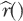
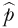
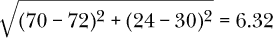
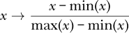
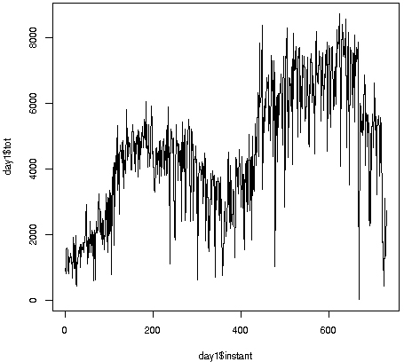

## 第一章：回归模型**


在本章中，我们将介绍*回归函数*。这种函数根据一个或多个其他变量来给出某个变量的均值——例如，根据年龄给出儿童的平均体重。所有机器学习方法在某种形式上都是*回归方法*，意味着它们利用我们提供的数据来估计回归函数。

我们将介绍第一个机器学习方法，k 最近邻（k-NN），并将其应用于真实数据。我们还将融入一些贯穿全书的概念，如虚拟变量、过拟合、p-hacking、“脏数据”等。我们暂时只简要介绍这些概念，以便让你对后面会详细讨论的内容有一个宏观的了解：机器学习是直观且连贯的，但如果分阶段学习，掌握起来会更容易。读者，请做好准备，时常会看到类似“我们现在只讨论一个方面，稍后会详细介绍”的表述。

在开始之前，确保你已经在计算机上安装了 R 和`qeML`以及`regtools`包（后者版本需为 1.7 或更新）。你可以运行`packageVersion('regtools')`来检查版本。书中的所有代码展示假定用户已经加载了这些包：

```
library(regtools)
library(qeML)
```

所以，让我们来看一下第一个示例数据集。

### 1.1 示例：自行车共享数据集

在介绍 k-NN 之前，我们需要一些数据来进行操作。我们从 UC Irvine 机器学习库获取这个数据集，它包含 2011 年至 2012 年期间资本自行车共享系统的每小时和每天的租车数量，以及与天气和其他因素相关的信息。数据的更详细描述可在 UC Irvine 机器学习库中找到。¹

该数据集由数据管理者许可，作为`regtools`中的`day`数据集提供。然而，请注意，我们将使用稍微修改过的版本`day1`（也包含在`regtools`中），其中数值型天气变量以其原始尺度提供，而不是转换到区间[0,1]。

我们的主要兴趣是预测一天的总骑行人数。

一些术语

假设我们希望根据温度和湿度来预测骑行人数。标准的机器学习术语将用于预测的变量——在这种情况下是温度和湿度——称为*特征*。

如果要预测的变量是数值型的，比如骑行人数，那么机器学习中没有标准术语来表示它。我们就称其为*结果*变量。但如果要预测的变量是 R 因子——即分类变量——它就被称为*标签*。

例如，在本书后面，我们将分析关于人类脊椎疾病的数据集。这个数据集有三种可能的结果或类别：正常（NO）、椎间盘突出（DH）或脊椎滑脱（SL）。我们数据集中显示每个病人类别的那一列，NO、DH 或 SL，就是标签列。

我们的数据集，比如这里的`day1`，被称为*训练集*。我们使用它来预测未来的情况，其中特征已知但结果变量未知。我们预测的正是后者。

#### 1.1.1 加载数据

数据以每小时和每天两种形式呈现，后者是`regtools`包中的数据格式。加载数据：

```
> data(day1)
```

对于任何数据集，首先查看数据总是个好主意。这个数据包含了哪些变量？它们是什么类型的，比如数值型还是 R 中的因子类型？它们的典型值是什么？一种做法是使用 R 的`head()`函数查看数据的前几行：

```
> head(day1)
  instant     dteday season yr mnth holiday
1       1 2011-01-01      1  0    1       0
2       2 2011-01-02      1  0    1       0
3       3 2011-01-03      1  0    1       0
4       4 2011-01-04      1  0    1       0
5       5 2011-01-05      1  0    1       0
6       6 2011-01-06      1  0    1       0
  weekday workingday weathersit     temp
1       6          0          2 8.175849
2       0          0          2 9.083466
3       1          1          1 1.229108
4       2          1          1 1.400000
5       3          1          1 2.666979
6       4          1          1 1.604356
      atemp      hum windspeed casual registered
1  7.999250 0.805833 10.749882    331        654
2  7.346774 0.696087 16.652113    131        670
3 -3.499270 0.437273 16.636703    120       1229
4 -1.999948 0.590435 10.739832    108       1454
5 -0.868180 0.436957 12.522300     82       1518
6 -0.608206 0.518261  6.000868     88       1518
   tot
1  985
2  801
3 1349
4 1562
5 1600
6 1606
> nrow(day1)
[1] 731
```

我们看到数据集包含 731 行数据（即 731 个不同的日期），包括日期、日期性质（例如`weekday`）、以及天气状况（如温度`temp`和湿度`hum`）。最后三列分别表示来自临时用户、注册用户和总用户的骑行数据。

你可以通过`?day1`命令获取更多关于数据集的信息。

#### 1.1.2 展望未来

我们很快就会开始对这些数据进行实际分析。现在，先来个预览。假设我们希望基于特定的天气条件等因素预测明天的总骑行量。我们如何通过 k-NN 算法来实现这一点？

我们将通过搜索数据，寻找与这些天气条件及其他变量匹配或几乎匹配的数据点。然后，我们将这些数据点的骑行量取平均值，这将是我们对这一天的预测骑行量。

这么简单，真的能行吗？其实不，确实如此；上述描述是准确的。当然，正如老话说的那样，“魔鬼藏在细节中”，但过程确实简单。不过，首先，让我们处理一些一般性的问题。

### 1.2 机器学习与预测

机器学习本质上是关于预测的。在我们深入了解第一个机器学习方法的细节之前，我们应该确保明白“预测”是什么意思。

假设考虑共享单车数据集。一天的清晨，共享单车服务的经理可能想要预测当天的总骑行人数。经理可以通过分析特征之间的关系——如各种天气条件、当天的工作状态（工作日、节假日）等——来做出预测。当然，预测并不完美，但如果结果接近实际数字，它们就非常有帮助。例如，它们可以帮助经理决定需要提供多少辆自行车，并确保轮胎充气完好等。（更高级的版本是预测每个站点的自行车需求，从而进行相应的重新分配。）

#### 1.2.1 预测过去、现在与未来

著名棒球运动员和误用词语的笑话大师约吉·贝拉曾说过：“预测是困难的，特别是关于未来的预测。”尽管这句话很有趣，但他确实说到了一点；在机器学习中，预测不仅仅是指未来，也可以指现在甚至过去。例如，一位研究者可能希望估算 1700 年代工人的平均工资。或者一位医生可能希望根据血液检查、症状等做出诊断，判断患者是否患有某种疾病，这时是猜测患者当前的病情，而不是未来的病情。所以，当我们在机器学习领域谈论“预测”时，不要过于字面地理解“预-”这一部分。

#### 1.2.2 统计学与机器学习在预测中的区别

一个常见的误解是，机器学习关注的是预测，而统计学家则做*推断*——即置信区间和对感兴趣量的检验——但预测无疑是统计学领域中的一个重要部分。

统计学与机器学习社区之间有时存在一种友好的竞争关系，甚至在术语上也有所不同（参见附录 B）。事实上，统计学家有时使用“*统计学习*”这一术语来指代在机器学习领域中被称为机器学习的相同方法！

作为一名曾在计算机科学系度过大部分职业生涯的前统计学教授，我可以同时站在两个阵营的立场上。我将以计算的术语来介绍机器学习方法，但也会结合统计学原理来提供一些见解。

历史性备注

本书中讨论的许多方法，构成了机器学习的骨干部分，最初都是在统计学界发展起来的。这些方法包括 k-NN、决策树或随机森林、逻辑回归，以及 L1/L2 收缩法。这些方法源自 19 世纪提出的线性模型，但后来的统计学家认为这些模型在某些应用中并不充分。正是这种考虑促使了对假设较少限制的方法的兴趣，最终促成了 k-NN 等技术的发明。

另一方面，另外两种著名的机器学习方法，支持向量机（SVM）和神经网络，几乎完全在统计学领域之外发展，尤其是在大学计算机科学系中。（另一种方法，*boosting*，最初起源于计算机科学，但得到了两个领域的重大贡献。）它们的发展动力完全与统计学无关。正如我们在媒体中常听到的，神经网络最初是作为理解人类大脑运作的一种手段进行研究的。SVM 则单纯以计算机科学算法的角度来看待——给定一组属于两类的数据点，我们如何计算出最佳的分割线或平面？

### 1.3 介绍 k-最近邻方法

本章的重点方法是*k-最近邻*，简称*k-NN*。它可以说是最古老的机器学习方法，最早可追溯到 1950 年代初期，但今天依然被广泛使用，尤其是在特征数量较少的应用场景中（原因将在后文解释）。它也很容易解释并且易于实现——是本章入门部分的完美选择。

#### 1.3.1 使用 k-NN 预测自行车使用量

首先，我们来看一下如何使用 k-NN 根据单一特征：温度预测自行车使用量。假设当天的温度预报为 28 摄氏度。我们应该如何使用 28 这个温度值和我们的历史骑行数据集（训练集）来预测当天的使用量呢？没有机器学习背景的人可能会建议查看数据中的所有日期，筛选出温度最接近 28 的那些日期（可能没有或很少有完全 28 度的日期），然后计算这些日期的平均骑行量。我们将用这个平均值作为当天的预测骑行量。

事实上，这个直觉是正确的！实际上，这正是许多常见机器学习方法的基础，正如我们将在第 1.6 节的回归函数中进一步讨论的那样。目前，只需要知道，k-NN 的形式就是简单地对相似的案例进行平均——也就是对相邻的数据点进行平均。*k*是我们使用的邻居数量。例如，我们可以选择温度最接近 28 的 5 个历史天数，对这些天的骑行量进行平均，然后用这个结果来预测温度为 28 度的当天的使用量。

在本章后面的部分，我们将学习如何使用`qe*`系列实现的 k-NN，`qeKNN()`。不过目前，我们先手动执行 k-NN 操作，以便更好地理解这种方法。

好的，准备好了！在这一节中，我们将做出我们的第一个预测。

##### 1.3.1.1 R 子集操作回顾

在展示代码之前，让我们回顾一下 R 语言的一些方面。回想一下，在 R 中，`#`符号用于注释；也就是说，它不是代码的一部分，而是用于解释的。下面代码中的注释和全书中的注释都用来作为代码执行过程的内联解释。

对于即将到来的示例，您还需要记住在 R 中如何进行子集操作。例如，看看这段代码：

```
> x <- c(5,12,13,8,88)
> x[c(2,4,5)]
[1] 12  8 88
```

表达式`x[c(2,4,5)]`提取向量`x`中的第 2、第 4 和第 5 个元素。同时请记住，这里我们将 2、4 和 5 称为*下标*或*索引*。

##### 1.3.1.2 第一个预测

这里是我们的小型手动 k-NN 示例：

```
> data(day1)
> tmps <- day1$temp
> dists <- abs(tmps - 28)  # distances of the temps to 28
> do5 <- order(dists)[1:5]  # which are the 5 closest?
> dists[do5]  # and how close are they?
[1] 0.005849 0.033349 0.045000 0.045000 0.084151
```

两个数之间的距离是它们差的绝对值：|25 − 32| = 7，因此 25 与 32 的距离是 7。这就是我们调用 R 的`abs()`（绝对值）函数的原因。R 的`order()`函数类似于`sort()`，不同之处在于它展示了排序数字的索引。以下是一个示例：

```
> x <- c(12,5,8,88,13)
> order(x)
[1] 2 3 1 5 4
```

数值 2、3 等表示：“`x` 中的最小值是 `x[2]`，第二小的是 `x[3]`，以此类推。”这一行

```
> do5 <- order(dists)[1:5]  # which are the 5 closest?
```

将会把`do5`中包含的索引设置为`day1`中与 28 度温度最接近的 5 个行。在这种情况下，温度与 28 度非常接近；最远的差距仅为 0.08。

那些天的乘车人数是多少？

```
> day1$tot[do5]
[1] 7175 4780 4326 5687 3974
```

然后我们计算这些值的平均值：

```
> mean(day1$tot[do5])
[1] 5188.4
```

我们现在可以预测，在气温为 28 度的日子里，大约会有 5,200 名乘客使用共享单车服务。

还有一些悬而未决的问题，尤其是：为什么选择与 28 度最接近的 5 天？样本量 5 是否太小，或者是否足以做出准确预测？这是机器学习中的一个核心问题，我们将在第 1.7 节中进一步探讨。

### 1.4 虚拟变量与分类变量

为了处理这个数据集并进行机器学习，你需要理解数据中几个表示*虚拟变量*的列。虚拟变量只有 1 和 0 两种取值，取决于它们是否满足特定条件。例如，在`workingday`列中，0 表示“否”（所示日期不是工作日），1 表示“是”（所示日期是工作日）。2011 年 1 月 5 日的`workingday`列值为 1，表示这是一个工作日。

虚拟变量有时被更正式地称为*指示变量*，因为它们*指示*某个特定条件是否成立（代码 1）或不成立（代码 0）。在机器学习领域，另一种流行的术语是*独热编码*。

我们的共享单车数据还包括分类变量`mnth`和`weekday`。还有一个特征`weathersit`，包含四个类别（1 = 晴天，2 = 薄雾或多云，3 = 小雪或小雨，4 = 大雨、冰雹或雷暴）。这个变量也可以视为分类变量。

虚拟变量的一种常见用法是对分类数据的编码。例如，在市场研究中，一个感兴趣的因素可能是居住地区的类型，比如城市、郊区或乡村。我们原始的数据可能将这些类别编码为 1、2 或 3。然而，这些只是任意的代码，因此，例如，乡村并不意味着比城市好三倍。但机器学习算法可能会将其理解为如此，这是我们不希望的。

本书及整个机器学习领域常用的解决方案是使用虚拟变量。我们可以为城市（1 = 是，0 = 否）和郊区创建虚拟变量。乡村属性则通过将城市和郊区都设置为 0 来编码，这样我们就不需要第三个虚拟变量（拥有第三个变量可能会引发本书范围之外的技术问题）。当然，使用前两个值作为虚拟变量并没有什么特别之处；我们也可以仅为城市和乡村创建虚拟变量，而不使用郊区；在这种情况下，郊区会通过城市和乡村的 0 值来表示。

在当前章节中，我们专注于应用场景，其中我们的结果变量是数值型的，例如共享单车数据中的总骑行量。但在许多应用中，结果变量是类别型的，例如我们之前的预测脊椎疾病的例子。在这种情况下，称为*分类应用*，*Y*变量是类别型的，必须转换为虚拟变量。

幸运的是，大多数机器学习包，包括`qeML`，会自动将数据转换为虚拟变量，正如我们稍后所看到的那样。

### 1.5 使用 qeKNN() 进行分析

既然我们对底层的运作有了更清晰的了解，让我们尝试使用 `qeKNN()` 函数进行一些 k-NN 分析。正如在介绍中所提到的，本书使用了 `qe*` 系列的封装函数。对于 k-NN，这意味着使用 `qeKNN()`。后者*封装*了 `regtools` 的基本 k-NN 函数 `kNN()`，也就是说，`qeKNN()` 调用了 `kNN()`，但以更简单、方便的方式。

在我们开始分析之前，我们将引入一些“X”和“Y”符号，以帮助我们跟踪正在进行的工作。做笔记——这对于之后的章节非常重要。

**特征 X 和结果 Y**

以下是机器学习和统计学领域中常用的非正式简写，表示特征和结果的标准符号：

+   传统上，特征通常统称为 *X*，而要预测的结果称为 *Y*。

+   *X* 是数据框或矩阵中的一组列。如果我们根据温度和湿度预测骑行量，*X* 就是数据中这两个列。这里的 *Y* 是骑行量列。

在二分类应用中，*Y* 通常是一个虚拟变量，即一列 1 和 0。然而，在多分类应用中，*Y* 是一组列，每一列对应一个虚拟变量。或者，*Y* 也可以是一个 R 因子，存储在单列中。

还有一个标准符号：

+   *X* 中的行数——即数据点的数量——通常用 *n* 来表示。

+   *X* 中的列数——即特征的数量——通常用 *p* 来表示。

这只是一个方便的简写。例如，说“X”比说更繁琐的“我们的特征集”要容易。再次强调，*X*、*Y*、*n* 和 *p* 将在本书中（以及其他地方，因为它们是机器学习领域的标准符号）反复出现，因此请确保记住它们。

#### 1.5.1 使用 qeKNN() 预测共享单车骑行量

对于共享单车的例子，我们将预测任意一天的总骑行量。我们先从使用工作日的虚拟变量和数值型天气变量作为特征开始。

我们来提取 `day1` 数据框中的这些列。正如我们在第 1.1.1 节中看到的，它们位于第 8 列和第 10 至 13 列，而第 16 列包含结果变量，即总骑行量（`tot`）。因此，我们可以通过以下表达式获得这些列：

```
day1[,c(8,10:13,16)]
```

这提取了所需的列。

**注意**

*或者，您可能更喜欢使用列名而非数字*

```
day1[c('workingday','temp','atemp','hum','windspeed','tot')]
```

*在基础 R 中，或者使用 tidyverse 或 data.table，每种方法都可以正常工作。数字数据框索引更容易输入，但使用列名可能会更清晰。*

*正如在介绍中所指出的，这是一本关于机器学习的书，它恰好使用 R 作为教学工具，而不是一本关于 R 在机器学习中的书。各个读者如何处理 R 中的数据操作并不是本书的重点，所以请随意使用你自己喜欢的方式来实现相同的结果。*

所以，我们构建子数据框，并像往常一样查看一下。

```
> day1 <- day1[,c(8,10:13,16)]
> head(day1)
  workingday     temp     atemp      hum windspeed  tot
1          0 8.175849  7.999250 0.805833 10.749882  985
2          0 9.083466  7.346774 0.696087 16.652113  801
3          1 1.229108 -3.499270 0.437273 16.636703 1349
4          1 1.400000 -1.999948 0.590435 10.739832 1562
5          1 2.666979 -0.868180 0.436957 12.522300 1600
6          1 1.604356 -0.608206 0.518261  6.000868 1606
```

现在我们来进行一次预测。假设你是今天早上的经理，今天是工作日，温度 12.0，atemp 为 11.8，湿度为 23%，风速为每小时 5 英里。你会如何预测骑行人数？

所有`qe*`系列函数都有一个非常简单的调用形式：

```
qeSomeMLmethod(your_data_frame, Y_name, options_if_any)
```

这个示例中使用的选项是*k*，即最近邻的数量，我们设定为 5 个。（如果在调用时没有指定*k*，默认值是 25。）

```
> knnout <- qeKNN(day1,'tot',k=5)  # fit the k-NN model
holdout set has 73 cases
```

我们正在应用 k-NN 方法，将我们的“Y”（或者“结果”，如你所记得）设为数据框`day1`中的变量`tot`，并使用 5 个邻居。我们稍后会讨论持出集，但现在先不考虑这个。

我们将`qeKNN()`的返回值保存在`knnout`中。（当然，你可以使用任何你喜欢的名字。）它包含了大量信息，但我们暂时不考虑这些信息。`qeKNN()`函数做了预处理，使我们能够使用`knnout`进行未来的预测。

那么，这到底是怎么做到的呢？`qe*`系列函数的一般形式同样非常简单：

```
predict(output_from_qe_function, new_case)
```

假设作为共享单车业务的经理，我们知道今天是工作日，温度、atemp、湿度和风速分别为 12.8、11.8、0.23 和 5。以下是我们的预测：

```
> today <- data.frame(workingday=1, temp=12.8, atemp=11.8, hum=0.23,
   windspeed=5)
> predict(knnout,today)  # predict new case
     [,1]
[1,] 6321
```

我们将`knnout`传入`predict()`函数，并指定预测点`today`，得到预测的骑行人数：约 6,300 人。注意，参数`today`是一个数据框，其列名与原始数据集`day1`中的列名相同。这是必须的，无论在这里还是在许多 R 机器学习包中，都是为了将预测点的名称与训练集的名称匹配。

**注意**

*如果你自己运行上述代码，可能会得到不同的输出，因为测试集的随机性。确实有一种方法可以标准化结果，以确保不同的人得到相同的结果；这一点将在第 1.12.3 节中解释。*

让我们再做一个预测，假设和上述相同，但风速为 18：

```
> anotherday <- today
> anotherday$windspeed <- 18
> predict(knnout,anotherday)
     [,1]
[1,] 5000
```

人们似乎在风中不太愿意骑行。

第二个参数，比如上面的`anotherday`，可以是任何具有相同列名的数据框。例如，我们本可以同时要求两个预测：

```
> predict(knnout,rbind(today,anotherday))
     [,1] [,2]
[1,] 6321 5000
```

在第 1.8 节中，我们将通过分析另一个数据集深入探讨 k-NN。

技术说明：PREDICT()和通用函数

我们看到`qeKNN()`与`predict()`函数配对。所有`qe*`系列的函数也都是如此配对，这在 R 中是一种非常常见的技巧。

尽管所有这些函数看起来都使用相同的`predict()`，每个函数实际上都有自己独立的预测函数，例如在`qeKNN()`的情况下是`predict.qeKNN()`。`predict()`本身在 R 中被称为*通用函数*。它只是*分派*调用，这意味着它将原始调用转发到一个特定于我们正在进行的分析类型的函数。因此，调用`predict()`在由`qeKNN()`创建的对象上，实际上会被转发到`predict.qeKNN()`，依此类推。

R 有多种通用函数，其中一些你可能已经在使用了，也许你并没有意识到。比如`print()`、`plot()`和`summary()`。我们将在第 9.6 节中看到`plot()`的例子。

### 1.6 回归函数：机器学习的基础

要理解机器学习方法，你需要知道*学习的是什么*。答案是一个叫做*回归函数*的东西。直接或间接地（通常是后者），它是机器学习方法的基础。它给出了一个变量的均值，同时保持另一个变量不变。让我们具体说明一下。

**注意**

回归函数*是一个广泛的统计学和机器学习术语，比一些读者在统计学课程中学到的线性回归概念要广泛得多。*

回想我们之前的例子，其中我们将 28 度的日子的预测值定为接近该温度的几天的平均乘客量。如果我们要预测 15 度的日子的乘客量，我们将使用所有 15 度或接近 15 度的日子的平均乘客量作为预测值，依此类推。用*r*()表示回归函数，感兴趣的量是*r*(28)、*r*(15)等。

我们说*r*()是乘客量对温度的回归函数。它确实是一个函数；对于每一个输入（一个温度），我们得到一个输出（相应的平均乘客量）。我们使用这个函数来进行预测；例如，要预测 15 度日子的乘客量，我们使用*r*(15)的估计值。

但是它是一个未知的函数，而不是像`sqrt()`这样熟悉的东西。因此，我们需要使用我们的训练数据来推断该函数的值。在机器学习术语中，我们说我们“学习”这个函数，使用我们的数据，展示机器学习中 L 的来源。（M 仅表示我们使用计算机或算法来进行学习。）例如，在上面的例子中，我们通过平均温度接近 28 的几天的乘客量来*学习 r*(28)。因此，“学习”一词反映在*训练*中，即*训练数据*一词。

通常使用“帽子”符号表示“估计值”。因此，我们用表示我们对*r*()的估计值。

回归函数也被称为 *条件均值*。在根据温度预测乘客量时，*r*(28) 是在温度为 28 的条件下的平均乘客量。这是一个子人群的均值，和整个总人群的均值有很大不同。

让我们总结一下这些重要的观点：

+   回归函数 *r*() 给出了我们的结果变量作为特征的函数的均值。

+   我们从训练数据中估计 *r*()。我们将这个估计值称为 。

+   我们使用  作为我们预测的基础。

任何函数都有参数。回归函数的参数数量与我们有多少特征有关。比如，我们将湿度作为第二个特征。为了预测温度为 28 并且湿度为 0.51 的一天的乘客量，我们会使用在温度和湿度大约为 28 和 0.51 的日子中，我们数据集中的平均乘客量。在回归函数的符号中，就是 *r*(28, 0.51)。在第 12 页的示例中，关注的值是 *r*(1, 12.8, 11.8, 0.23, 5)。

如前所述，回归函数在所有预测性机器学习方法中，直接或间接，都是基础内容。在本书中，它会反复出现。

### 1.7 偏差-方差权衡

在引言部分，特别是在第 0.8 节，我们恳请读者：

一页完全由散文构成——没有数学、没有图表，也没有代码——可能是本书中最重要的一页。

本节中的页面是这一点的典范，因为 *偏差-方差权衡* 是该领域最著名的话题之一。我的谷歌搜索结果显示了 18,400,000 个相关结果！这是机器学习中的一个绝对核心问题，我们将在第三章中深入探讨。然而，你应该从一开始就意识到它，所以我们来做一个概述。

问题在于，例如，选择较大或较小的 *k* 值。较大的 *k* 值具有较小的方差，但较大的偏差；而较小的 *k* 值则有相反的效果。让我们看看这一点是如何运作的。

#### 1.7.1 与选举民调的类比

首先考虑与选举调查的类比。在选举竞选期间，会进行选民民意调查，以估计各候选人的受欢迎程度。分析师会从所有电话号码的集合中随机抽取样本，并向接电话的人征求意见。

假设我们对 *p* 感兴趣，*p* 是支持候选人 C 的整个选民群体的比例。由于我们只有该人群体的一个样本，我们只能通过我们样本中喜欢候选人 C 的比例  来估计 *p* 的值。因此，民意调查结果会伴随一个 *误差范围*，以表明报告的比例  仅是 *p* 的估计值。（有统计学背景的人可能知道，误差范围是 95% 置信区间的半径。）

误差范围给出了我们估计值的准确性。它衡量的是抽样变异性。值越大，说明我们对 *p* 的估计在不同样本之间差异越大；如果调查员再次随机抽取电话号码，估计的 *p* 值可能会有很大不同，尤其是样本量较小的时候。自然，调查员不会再进行第二次抽样，但从一个样本到下一个样本的抽样变异性告诉我们 *p* 的估计有多可靠。误差范围反映了这种抽样变异性，如果误差范围较大，则说明我们的样本量太小。

关键问题是抽样变异性，也就是 *方差*，它可以通过误差范围在投票示例中进行计算。

也可能会出现偏差问题。假设调查员只有固定电话的号码列表，没有手机号码。许多人，尤其是年轻人，没有固定电话，因此仅拨打固定电话的号码可能会导致结果有偏差。

#### 1.7.2 回到机器学习

回到机器学习，考虑第 1.5.1 节中的共享单车示例，我们希望得到 *r*(1, 12.8, 11.8, 0.23, 5) 的值，这将作为我们的预测值。我们将得到一个估计值，(1, 12.8, 11.8, 0.23, 5)，作为实际预测值。

我们将每日骑行者数量的数据视为从所有日子（无论是过去、现在还是未来）的（相当抽象的）总体中抽取的样本。使用 k-NN 方法（或任何其他机器学习方法），我们只是在估计真实总体回归函数 *r*()。仅从最近的 *k* = 5 个邻居中形成预测值，实际上是基于一个非常小的样本。想象一下，调查员只抽取了 5 位选民！在另一个样本中，与我们预测的点最接近的日子会不同，骑行人数的值也会不同。*换句话说，这是一个方差问题。*

另一方面，使用 *k* = 5，我们在第 1.3.1.2 节中发现，5 个邻居都非常接近预测点。假设我们查看最近的 *k* = 50 个邻居。在这种情况下，我们可能会使用距离预测点较远的数据点，这些数据点与预测点的相似度较低。*这将导致偏差问题。*

总之，较大的 *k* 值降低了方差，但以增加偏差为代价。我们想找到一个“黄金值” *k* ——即既不太小也不太大。

然而，请注意，计算时间和方法所需的内存量也是重要因素：如果最佳方法运行时间过长或占用内存过多，我们可能会选择另一种方法。

### 1.8 示例：mlb 数据集

为了加深你对`qeKNN()`的理解，并介绍一个我们可以在本书剩余部分中参考的例子，让我们尝试在`mlb`数据集上进行类似的操作。该数据集由 UCLA 统计学系提供，记录了大联盟棒球运动员的身高和体重，单位分别是英寸和磅。它包含在`regtools`中。

让我们先浏览一下数据，这样我们知道自己在处理什么：

```
> data(mlb)
> head(mlb)
             Name Team       Position Height
1   Adam_Donachie  BAL        Catcher     74
2       Paul_Bako  BAL        Catcher     74
3 Ramon_Hernandez  BAL        Catcher     72
4    Kevin_Millar  BAL  First_Baseman     72
5     Chris_Gomez  BAL  First_Baseman     73
6   Brian_Roberts  BAL Second_Baseman     69
  Weight   Age PosCategory
1    180 22.99     Catcher
2    215 34.69     Catcher
3    210 30.78     Catcher
4    210 35.43   Infielder
5    188 35.71   Infielder
6    176 29.39   Infielder
```

让我们预测一个新球员的体重，我们只知道他的身高和年龄分别为 72 和 24。

```
> w <- mlb[,c(4:6)]  # extract height, weight, and age
> z <- qeKNN(w,'Weight')  # fit k-NN model
holdout set has  101 rows
> predict(z,data.frame(Height=72,Age=24))
       [,1]
[1,] 182.56
```

请再次注意，我们需要在与`mlb`相同的数据框形式中指定预测点（72,24），即我们拟合模型的那个数据集。

### 1.9 k-NN 和类别特征

在之前的棒球球员示例中，身高和年龄这两个特征都是数值型的。但是，如果我们添加一个第三个特征，`Position`，这是一个类别变量呢？由于 k-NN 是基于距离的，特征需要是数值型的，以便计算数据点之间的距离。那么我们如何使用 k-NN 处理非数值型特征呢？

答案当然是，类别变量（也就是 R 因素）应该转换为虚拟变量。我们可以通过`regtools`函数`factorToDummies()`来完成这个转换。不过，由于`qe*`系列函数在需要时会自动进行这种转换，我们不需要自己将`Position`转换为虚拟变量。`qeKNN()`函数也会在其输出中做出标记，以便`predict()`在预测时进行相同的转换。

例如，假设我们想计算一个新球员的体重，除了身高和年龄外，还使用类别变量`Position`：

```
> knnout1 <- qeKNN(mlb[,3:6],'Weight',25)  # extract Position, Height, Age
> predict(knnout1,data.frame(Height=72,Age=24,Position='Catcher'))
     [,1]
[1,]  197
```

在第一次预测中，没有使用`Position`时，我们的预测值大约是 183 磅。但如果我们知道新球员是捕手，我们会看到，在这种情况下，预测值增加到 197 磅。这是有道理的；捕手通常体型较大，以便守住本垒。

`qe*`系列函数通过其作为 R 因素的状态来识别类别特征。在这里的示例中，`Position`确实是一个 R 因素。如前所述，`qeKNN()`和`predict.qeKNN()`的内部机制会自动为我们完成虚拟变量的转换，这是一个非常方便的功能。

通常，类别特征已经在数据框中作为因素表达。在某些情况下，特征是类别型的，但以数值编码的形式表达。如果是这种情况，可以应用`as.factor()`将其转换为因素形式。

### 1.10 数据缩放

许多机器学习方法中都涉及到一个主题，那就是*数据缩放*。在你未来的机器学习项目中，最好记得考虑缩放。许多机器学习方法都使用缩放，即使某些方法不要求缩放，进行缩放也可能产生更好的结果。

让我们回到棒球选手的数据。考虑两个选手，一个身高 70，年龄 24，另一个身高 72，年龄 30。在代数的上下文中，考虑这两个数值对，它们的距离是平面上(70,24)和(72,30)这两点之间的距离：



这样的距离会在 k-NN 中进行计算。但如果身高被转换为米，年龄转换为月数，会怎样呢？身高会除以 39.37，而年龄则会乘以 12：

```
> sqrt((70/39.37-72/39.37)² + (12*24-12*30)²)
[1] 72.00002
```

这样会产生一个问题，即年龄会主导计算，身高只起到较小的作用。由于身高显然是预测体重的重要因素，因此单位的变化可能会降低我们的预测能力。

解决方法是去掉像英寸、米这样的单位，这叫做*缩放*。为了缩放我们的数据，首先减去平均值，使每个数据的均值为 0，这叫做*中心化*。然后，我们将每个特征除以其标准差，*缩放*。这使得所有特征的标准差为 1。现在，所有特征都没有单位且具有可比性。（通常，在进行缩放时，我们也会进行中心化，这个过程通常叫做缩放。）

为了使这个概念更具体化，作为一名曾经或现在的学生，你可能会记得其中一位教授这样转换考试分数：“要获得 A，你需要比平均分高出 1.5 个标准差。”这位教授是在减去考试的平均分，然后除以标准差。R 函数`scale()`为我们执行了这个操作，但为了说明，下面是我们如何自己操作的：

```
> ht <- mlb$Height
> ht <- (ht - mean(ht)) / sd(ht)
> mlb$Height <- ht
```

`qeKNN()`函数有一个参数`scaleX`，用于此目的。其默认值为`TRUE`，所以在我们之前的 k-NN 示例中，默认进行了缩放。在每个*X*列（回想一下这意味着特征列）中，`qeKNN()`会通过调用`scale()`来转换该列。（实际上，我们可以通过一次`scale()`调用来缩放所有*X*变量。）

当然，我们必须记得对新的预测案例中的*X*值进行相同的缩放——即除以相同的标准差——比如在共享单车示例中的新一天。`qe*`系列函数会注意到这一点，然后由配套的`predict()`函数使用。

**注意**

*请记住，scale()不会对所有值相同的向量起作用，因为标准差为 0。我们可以通过调用 regtools 函数 constCols()来检查这一点，该函数会报告数据框中的所有常数列。*

在共享单车数据中，`day1`使用的是未经缩放的数据，主要用于教学目的。数据的“官方”版本`day`是经过缩放的。虽然它以不同的方式进行缩放：它将变量的值缩放到区间[0,1]内。实现这一点的一种方法是通过以下方式进行转换：



这比 `scale()` 有优势，因为它生成了*有界变量*——即被限制在 0 和 1 之间的数值。相比之下，`scale()` 生成的变量位于区间 (*–∞*, *∞*) 内，而标准差较小的变量可能会有非常大的缩放值，这会在分析中给予该变量过大的影响。

`regtools` 函数 `mmscale()` 执行上述的映射，将数据转换到 [0,1] 范围内。这里是一个小例子：

```
> x <- data.frame(u=3:5,v=c(12,5,13))
> x
  u  v
1 3 12
2 4  5
3 5 13
> mmscale(x)
     [,1]  [,2]
[1,]  0.0 0.875
[2,]  0.5 0.000
[3,]  1.0 1.000
```

`u` 列的均值为 4，最小值和最大值分别为 3 和 5。因此，第二行的 4 被替换为 (4 – 3) / (5 – 3) = 1/2，例如。正如你所看到的，所有结果值都在 [0,1] 范围内，并且是无量纲的——也就是说，没有英寸或月份的单位。

### 1.11 选择超参数

在介绍中，我们提到最近邻的数量 *k* 是一个*超参数*或*调优参数*，是由用户选择的一个值，它会影响模型的预测能力。正如在第 1.7 节中所述，*k* 是一个“金发姑娘”的量值，需要仔细设置以获得最佳性能——既不能太小，也不能太大。

找到最佳的 *k* 可能是一个挑战。幸运的是，k-NN 只有一个超参数，但正如你稍后在书中看到的，大多数机器学习方法有多个超参数；在一些超出本书范围的高级方法中，甚至可能有十个或更多。选择多个超参数的“正确”组合尤其困难，但即便是为单个超参数选择一个合适的值也并非易事。

我们在下面首次探讨解决选择超参数这一挑战性问题的方法，然后将在第三章中详细讨论。请在这一节多花点时间，因为这个问题将在本书中反复出现，并贯穿你整个机器学习职业生涯。

#### 1.11.1 预测训练数据

几乎所有选择超参数的方法都涉及通过预测新案例来测试我们的模型。在最基本的形式中，我们会回头预测我们原始的训练数据。这听起来有点奇怪——我们已经知道数据中的乘车量，那么为什么还要预测它们呢？其背后的思路是尝试不同的 *k* 值，看看哪一个能最好地预测我们的已知数据。然后，这个 *k* 值将是我们未来预测新 *X* 数据时所使用的值。

这并不理想，实际上通常会对这种方法进行轻微修改。我们也会使用这种方法，但在介绍它之前，让我们先通过一个例子看看可能会出错的地方。让我们用 *k* 的最小值：1 来预测 `day1` 中的第三个数据点。

```
> kno <- qeKNN(day1,'tot',1)
> datapoint3X <- day1[3,-6]  # remote Y value
> predict(kno,datapoint3X)
     [,1]
[1,] 1349
> day1[3,6]
[1] 1349
```

我们的预测完全正确！但是等一下……这似乎有些可疑，的确是。数据点 3（我们数据中的第三行）最接近的邻居是它自己！该点到它自己的距离是 0。同样地，第 8 行的数据点与第 8 行最接近，第 56 行的数据点与第 56 行最接近，依此类推。当然我们是 100%正确的；我们取的是 1 个最近邻的平均值，因此只是复制了*Y*值。同样的分析表明，即使是*k* = 5 也会给出过于乐观的预测准确度。5 个邻居中的一个仍然是原始数据点，从而偏向了我们的预测。

关键是，当我们评估给定*k*值的预测准确性时，我们应该在一个与拟合 k-NN 方法的数据集不同的数据集上进行预测。但是，你可能会抗议，我们只有一个数据集。那么，我们如何才能得到另一个数据集来正确评估预测准确性呢？这正是下一节关于验证集的内容。

### 1.12 验证集

同样，在前一节中提到的，为了评估模型的预测准确性，我们需要在“新鲜”的数据上进行测试，而不是在模型拟合过的数据上。但是我们没有新的数据，那该怎么办呢？解决这个困境的关键是本节介绍的*验证集*和*交叉验证*的概念。它们是机器学习中的核心内容，并且会在整本书中反复出现。

在`day1`的 731 个数据点中，我们可以随机抽取出，比如说 100 个数据点。这些数据点将作为我们的*验证集*，或者*测试集*。其余的 631 个数据点将暂时作为我们的训练集。我们将模型拟合到这个训练集上，然后查看它在验证集上的预测效果，验证集作为“新鲜”的数据，不受训练数据的偏倚。（在这里的例子中，验证集大小是 73，因为默认大小是数据集的 10%）

从技术上讲，如果我们将模型拟合到整个数据集，未来的预测准确度最好，此时我们将`holdout=NULL`。然而，在初步探索阶段，了解我们的模型在新数据上的表现是很重要的。因此，在探索阶段最好使用验证集，然后在选择超参数等后，重新拟合整个数据集。

在选择验证集之前，如果我们要评估预测的质量，我们需要一个评估预测准确性的标准。

#### 1.12.1 损失函数

对于验证集中的一个数据点，我们可以计算实际值和预测值之间的绝对差值，然后将所有验证集点的绝对差值取平均，得到平均绝对预测误差（MAPE）。这是一个*损失函数*的例子，损失函数只是一个预测优度的标准。我们可以将 MAPE 作为这个标准，值越小越好。

另一种常见的损失函数是均方预测误差（MSPE），它是将预测误差的平方进行平均，而不是其绝对值。MSPE 是两者中更常用的一个，但我更倾向于使用 MAPE，因为 MSPE 过于强调大误差。假设我们在 MLB 数据中预测体重，考虑两种情况，其中误差分别为 12 和 15 磅。这两个数字相当相似，但它们的平方，144 和 225，差别就很大了。

对于分类应用，最常用的损失函数就是简单的误分类总体概率。我们预测保留集中的每个*Y*，统计错误的次数，然后除以保留集的大小。

#### 1.12.2 `qe*`系列中的保留集

`qe*`系列函数将自动执行上述寻找 MAPE 或整体误分类概率的过程，然后将结果报告在输出组件`testAcc`中。这些函数会根据我们是否将*Y*（任何`qe*`系列调用中的第二个参数）指定为 R 因子，自动判断我们的应用是分类问题。如果是这样，计算的将是误分类概率，而不是 MAPE。

我们将再次使用共享单车数据集，作为寻找`qeKNN`自动生成的 MAPE 的例子：

```
> knnout <- qeKNN(day1,'tot',5)
holdout set has  73 rows
> knnout$testAcc
[1] 1203.644
```

使用 5 个最近邻，我们的平均预测误差大约是 1,200 名骑行者。虽然这不是很好，但比起另一种方法要好，如下所示。

假设我们无法获取天气条件等信息，那我们该如何预测骑行量呢？一个自然的想法是直接使用总体平均值：

```
> meanTot <- mean(day1$tot)
> meanTot
[1] 4504.349
```

换句话说，每天，包括今天，我们将预测大约 4,500 名骑行者。使用这个策略我们会有怎样的表现呢？

```
> mean(abs(day1$tot - meanTot))
[1] 1581.793
```

如果我们总是使用每日的总体平均骑行人数来预测骑行量，我们的平均预测误差将接近 1,600。使用天气变量和`workingday`作为预测因子确实有助于将 MAPE 降低到 1,200。

我们能找到比 5 更好的*k*值吗？我们来试试 10 和 25：

```
> qeKNN(day1,'tot',10)$testAcc
holdout set has  73 rows
[1] 1127.333
> qeKNN(day1,'tot',25)$testAcc
holdout set has  73 rows
[1] 1131.108
```

在我们尝试的值中，*k* = 10 似乎是最有效的，尽管我们必须记住保留集的随机性。事实上，对于每个候选的*k*值，最好尝试多个保留集，这是我们下一节的主题。

#### 1.12.3 激励交叉验证

使用`qeKNN`自动生成的 MAPE 时，重要的是要记住，软件是随机选择保留集的。保留集的大小只有 73，这是一个相对较小的样本——想象一下我们上面的选举民调员只抽取了 73 名选民。因此，在不同保留集之间，MAPE 会有相当大的*抽样波动*。我们可以通过执行*交叉验证*来解决这个问题——也就是说，计算多个保留集的 MAPE 值的平均值。

为了展示抽样波动，让我们再运行几次相同的代码：

```
> qeKNN(day1,'tot',10)$testAcc
holdout set has  73 rows
[1] 1094.211
> qeKNN(day1,'tot',10)$testAcc
holdout set has  73 rows
[1] 1157.5
```

我们可以看到，我们不能过分依赖那个 MAPE 值；样本量为 73 太小了。这个问题还有很多值得讨论的地方，正如前面提到的，我们将在第三章中继续讨论这个问题。现在可以简单说一下，我们应该查看多个验证集，然后通过计算得到的 `testAcc` 值的平均值来进行交叉验证。

顺便说一下，我们可以通过使用 `set.seed()` 函数来控制 R 的随机数生成器：

```
> set.seed(9999)
> qeKNN(day1,'tot',10)$testAcc
holdout set has  73 rows
[1] 1210.373
> qeKNN(day1,'tot',10)$testAcc
holdout set has  73 rows
[1] 1090.622
> set.seed(9999)  # try it again
> qeKNN(day1,'tot',10)$testAcc
holdout set has  73 rows
[1] 1210.373
> qeKNN(day1,'tot',10)$testAcc
holdout set has  73 rows
[1] 1090.622
```

在本书中，我们经常这么做。它设置了一定的随机数序列，以防读者希望运行代码并检查结果。通过使用相同的种子，这里是 9999，将生成与我这里的训练集和验证集相同的数据集。（我只是选择了 9999 作为我喜欢的种子，没什么特别的。）

显然，通过生成多个验证集并计算得到的 MAPE 值的平均值，我们可以获得更准确的结果。这就是所谓的 *交叉验证*，将在第三章中详细讨论。

#### 1.12.4 超参数、数据集大小和特征数量

回顾一下 1.7.2 节中关于选择最近邻数 *k* 的权衡问题：

+   如果我们设置 *k* = 5，那么我们将平均 5 个数据点，这似乎太少了。这是一个方差问题；在给定的 *X* 值下，5 个 *Y* 值的平均值在不同样本间差异会很大。

+   另一方面，设置 *k* = 50 时，我们可能会在邻域中有一些距离被预测点很远的点，这些点可能就不具有代表性。

    例如，在共享单车数据中，假设我们预测的是在 20 度的天气下的骑行人数，这种天气相当舒适。训练集中温度为 40 度的样本与当前预测关系不大，往往会导致我们预测的结果过低。这是一个偏差问题。

所以，我们面临一个权衡。我们希望将 *k* 设置得较大以降低方差，但设置较大的 *k* 也可能带来较大的偏差风险。但是……如果我们的共享单车数据集有 *n* = 73000 个数据点，而不是 731 个呢？在这种情况下，第 50 个最近邻可能实际上与预测点非常接近，从而解决了偏差问题。这样，我们就可以使用较大的 *k* 来控制方差。换句话说：

其他条件相同的情况下，*n* 越大，我们可以设置的 *k* 也就越大。

这仍然没有告诉我们应选择哪个特定的 *k* 值。我们将在第三章和第四章中回到这个问题，但至少在这个早期阶段，这是一个需要注意的事项。

关于特征数量 *p* 的相应说明是：

其他条件相同的情况下，*p* 越大，我们必须设置更大的 *k*。

这个问题比涉及 *n* 的前一个陈述更不直观，但大致上问题是这样的。特征更多意味着点间距离的变化性更大，从而增加了预测的方差。为了解决这个问题，我们需要更大的 *k*。

### 1.13 陷阱：p-hacking 与超参数选择

在非机器学习（ML）环境下，*p-hacking*指的是分析大规模研究时的一个常见陷阱。假设有人正在研究基因对某些结果的影响，并且涉及了大量的基因。即便没有任何基因真正产生影响，由于采样的变化，其中一个基因很可能仅仅因为偶然的原因而显得有“显著”的影响。虽然我们现在不深入探讨如何解决这个问题，但你应该从一开始就意识到它的存在。

p-hacking 对机器学习中的超参数设置也有重要影响。假设我们在一个机器学习方法中有四个调优参数，并且每个参数试验 10 个值。那么就有 10⁴ = 10000 种可能的组合。即便它们都同样有效，也有可能其中一个组合偶然地拥有一个远优于其他组合的 MAPE 值。看似“最佳”的超参数设置可能只是一个错觉。

`regtools`函数`fineTuning()`采取了一些措施来应对在搜索最佳调优参数组合时可能出现的 p-hacking 问题。我们将在第七章中进一步讨论。

### 1.14 陷阱：长期时间趋势

在我们开始进入下一章之前，让我们先讨论在使用这里介绍的方法时可能会遇到的三大陷阱，这些陷阱可能会影响你预测的质量：脏数据、缺失数据和数据中的长期趋势。我们将首先处理最后一个陷阱。

在我们对 MLB 数据进行的少数几次实验中，我们发现最佳的 MAPE 值可能约为 1,100。这看起来相当大，但请记住，我们并没有使用所有的数据。再看一下 1.1.1 节中的共享单车数据。数据中有几个与观察时间相关的变量：日期、季节、年份和月份。为了研究这些时间数据是否能改善我们的 MAPE 值，让我们画出骑行人数与时间的关系图。（数据按时间顺序排列。）

```
> plot(day1$tot,type='l')  # plotting type is 'l', lines between points
```

结果见图 1-1。显然，数据中存在季节性趋势（下跌大约每年一次）和总体的上升趋势。共享单车服务似乎随着时间的推移变得越来越受欢迎。分析随时间变化的数据的统计技术称为*时间序列方法*。在机器学习的不同背景下，这种方法经常被使用。我们将在第十三章中详细探讨这个问题，但现在就先尝试不使用新工具来进行分析。



*图 1-1：时间趋势，骑行数据*

共享单车数据中的第 1 列，`instant`，是日期编号，数据集的第一天值为 1，第二天为 2，依此类推，直到最后一天 731。

让我们把`instant`加入到特征集中。回想一下我们之前在 1.5.1 节中选择的列：

```
> day1[,c(8,10:13,16)]
```

我们当时决定探索的特征位于第 8 列、第 10 到 13 列以及第 16 列。现在我们还想使用`instant`，它位于第 1 列：

```
> data(day1)
> day2 <- day1[,c(1,8,10:13,16)]
> kno <- qeKNN(day2,'tot',k=5)  # rerun k-NN on the new data
holdout set has  73 rows
> kno$testAcc
[1] 662.9836
```

啊，好多了！我们的 MAPE 降到了大约 663。

在使用 k-NN 和本书中介绍的其他方法时，需记住，所研究现象的条件可能会随时间变化，且这种变化可能成为一个重要因素。在某些情况下，时间变量甚至可能不是显式的，而是通过记录的顺序来隐含。未能探索这一点可能会导致预测质量的大幅下降，因此请留意可能会遇到这个陷阱的地方。

### 1.15 陷阱：脏数据

除了考虑长期时间趋势外，你还可能会遇到由脏数据引起的问题。以 2011 年 1 月 1 日的共享单车数据为例。

```
> head(day1)
  instant     dteday season yr mnth holiday
1       1 2011-01-01      1  0    1       0
```

如你在`holiday`列中看到的，数据集声称这不是假期。但实际上，1 月 1 日是美国的联邦假日。此外，尽管数据集的文档声明`weathersit`这个类别变量有 4 个值，但实际上只有值 1、2 和 3：

```
> table(day1$weathersit)

  1   2   3
463 247  21
```

数据中的错误非常常见，当然，这也是良好分析的障碍。例如，考虑将在第五章中深入讨论的纽约市出租车数据，它包含了接送位置、行程时间等信息。如果相信数据，有一个下车地点居然在南极！（你可以查看[*https://data.cityofnewyork.us/Transportation/2018-Yellow-Taxi-Trip-Data/t29m-gskq*](https://data.cityofnewyork.us/Transportation/2018-Yellow-Taxi-Trip-Data/t29m-gskq)）。

每次处理新数据集时，分析师应该进行相当多的探索——例如，使用`hist()`和`table()`，正如我们这里所展示的。你还应该警惕*多变量离群点*，即在单一维度上不极端，但从整体上看却不寻常的数据点。例如，假设某人被记录为身高 74 英寸（29.1 厘米）且年龄 6 岁。单独来看，这个身高或年龄都不会引起关注（假设我们的数据中包含各个年龄段的人），但如果将这两者结合起来，就显得相当可疑。在这种情况下，k-NN 是一种有用的工具！像上面提到的 74 英寸身高、6 岁的小孩这样的数据点，将与其他数据点有很大的距离，可能会因此被暴露出来。

可惜的是，没有一种公式化的方法可以检测异常数据点。这与我们强调的机器学习的本质相似：没有“魔法食谱”。这是一个统计学的高级话题，超出了本书的范围。

### 1.16 陷阱：缺失数据

在 R 中，NA 值表示数据不可用——即缺失。数据集通常会包含 NA 值，可能很多。我们该如何处理这些呢？

关于缺失值分析，有整本书专门讨论这个主题。我们无法在这里深入探讨，但会简要讨论一种常见方法——*逐列表删除*，至少能介绍一下其中涉及的问题。

假设我们的数据包含人物，并且我们有年龄、性别、受教育年限等变量。如果某个特定人的年龄缺失，但其他变量完整，那么这种方法会跳过该案例。但是，这里有两个问题：

+   如果我们有大量特征，可能很多案例至少会有一个缺失值（NA）。这意味着需要丢弃许多宝贵的数据。

+   跳过包含缺失值（NA）的案例可能会引入偏差。例如，在调查数据中，拒绝回答某个问题的人可能与回答该问题的人有所不同，这可能会影响我们预测的准确性。

请注意，当我们发现缺失值是以数字形式编码而不是 NA 时，我们应该将这些值更改为 NA。

与处理脏数据一样，处理缺失值的个人方法通常是通过经验积累的。学习一些工具，并逐渐发展你的方法，这将是每个人各不相同的。CRAN 的任务视图系列包括了有关缺失数据的内容。

### 1.17 直接访问 regtools k-NN 代码

如前言所述，本书中的大多数代码使用了特定于每种不同机器学习方法的流行 R 包。我们使用`qe*`系列的包装器作为统一、简单的便利接口，但当然也可以选择直接访问。

这样做的一个原因是，这些标准 R 包中的函数包含许多通过包装器无法使用的高级选项。在`qeKNN()`的特定情况下，但*不是*其他`qe*`系列函数的情况下，如果仅进行单次预测，直接访问可能更快。

在大多数应用中，这种专门的用法通常不必要，但我们的书会展示如何在读者有兴趣时直接使用这些函数。请注意，我们无法演示如何使用那些高级选项，因为它们数量众多且常涉及高级概念。相反，我们会简单地展示如何通过直接调用使用我们现有的一个示例。

这里是我们 k-NN 代码的具体内容。`qeKNN()`函数封装了`regtools::kNN()`，其参数如下：

```
> library(regtools)
> args(kNN)
function (x, y, newx = x, kmax, scaleX = TRUE, PCAcomps = 0,
    expandVars = NULL, expandVals = NULL, smoothingFtn = mean,
    allK = FALSE, leave1out = FALSE, classif = FALSE, startAt1 = TRUE,
    saveNhbrs = FALSE, savedNhbrs = NULL)
```

在这里，`x`和`y`是我们的*X*和*Y*，`newx`是我们希望进行预测的*X*，`kmax`是*k*。

让我们回顾一下第 1.8 节的内容：

```
> x <- mlb[,c(4,6)] # height, age
> y <- mlb[,5]  # weight
> newx <- c(72,24)  # ht, age of new player to be predicted re weight
> kmax <- 25   # k
> knnout <- kNN(x,y,newx,kmax)
> knnout$regests  # predicted value
[1] 183.76
```

请注意，模型拟合和预测已合并为一个步骤，尽管如果需要，后者可以推迟进行。

这里的预测与之前的略有不同，因为后者有一个保留集。如果我们抑制保留集的生成，我们将得到相同的结果：

```
> kno <- qeKNN(mlb[,4:6],'Weight',k=25,holdout=NULL)
> predict(kno,data.frame(Height=72,Age=24))
       [,1]
[1,] 183.76
```

有关`kNN()`的更多信息，可以通过输入?kNN（而不是`?knn`）来查看。

### 1.18 结论

我们已经有了一个好的开始！你现在应该对 k-NN 方法以及几个常见的机器学习概念有了清晰的了解：回归函数、k-NN 如何估计它、偏差-方差权衡的一般概念、超参数如何影响它，以及如何使用保留集来找到该权衡范围上的一个合适点。

你已经掌握了足够的工具，可以尝试自己进行一些数据分析了。请务必尝试！

下一章将介绍分类应用中的问题。
