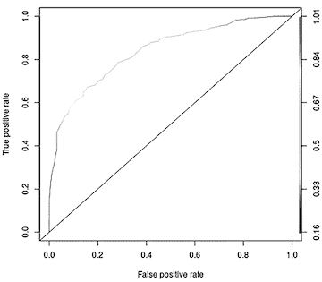

## 第二章：分类模型**


上一章简要介绍了 *分类应用*，即我们预测虚拟或分类变量。这些与我们分析过的 *数值应用* 不同，例如预测骑车人数，它是一个数值实体。例如，在市场营销应用中，我们可能希望预测一个顾客是否会购买某个产品。在这种情况下，我们会用一个虚拟变量表示“Y”结果，购买该产品用 1 表示，不购买用 0 表示。这里有两个 *类别*：购买和不购买。

我们在第 1.1 节的“某些术语”框中讨论了一个分类 *Y* 的例子。在那个例子中，一位医生根据患者的脊柱状况将其分为三类——即三种类别：正常（NO）、椎间盘突出（DH）和脊椎滑脱（SL）。在这里，*Y* 是给定患者的类别。因此，*Y* 是一个具有三类的分类变量。如果 *Y* 被编码为 R 中的 *factor*（通常是这种情况），那么该因子将有三个级别。另一方面，我们也可以将 *Y* 编码为一组虚拟变量，每个类别对应一个虚拟变量。

我们将在第 2.3.1 节中详细分析这些椎骨数据，说明如何获取它们等。但让我们先做一个简短的预览，来说明前面提到的类别或分类的概念。

```
> vert <- read.table('column_3C.dat',header=FALSE,stringsAsFactors=TRUE)
> head(vert)
     V1    V2    V3    V4     V5    V6 V7
1 63.03 22.55 39.61 40.48  98.67 -0.25 DH
2 39.06 10.06 25.02 29.00 114.41  4.56 DH
3 68.83 22.22 50.09 46.61 105.99 -3.53 DH
4 69.30 24.65 44.31 44.64 101.87 11.21 DH
5 49.71  9.65 28.32 40.06 108.17  7.92 DH
6 40.25 13.92 25.12 26.33 130.33  2.23 DH
> table(vert$V7)

 DH  NO  SL
 60 100 150
> class(vert$V7)
[1] "factor"
> levels(vert$V7)
[1] "DH" "NO" "SL"
```

椎骨状况位于最后一列。我们可以看到，在这个数据集中，DH 类的患者有 60 位，依此类推。

本章将更详细地讨论分类应用，从对一个概念问题的简要讨论——回归函数的概念开始，然后直接进入数据分析。我们将引入一些新的数据集，再次使用 `qeKNN()` 进行分析，并展示在分类情境中出现的一些特殊问题。

### 2.1 分类是回归的一个特例

分类应用在机器学习中相当常见。事实上，它们可能构成了大多数机器学习应用。那么，回归函数 *r*(*t*)（见第 1.6 节）在这样的情境中是如何表现的呢？

回忆一下，回归函数将均值 *Y* 与 *X* 关联。如果我们从身高和年龄来预测体重，那么 *r*(71, 25) 表示身高为 71 英寸且年龄为 25 岁的所有人的平均体重。但如果 *Y* 是一个虚拟变量，这又是如何工作的呢？

在分类设置中，回归函数，即条件均值，变成了条件概率。为了理解这一点，考虑一个分类应用，其中结果*Y*由一个虚拟变量表示，编码为 1 或 0，类似于本章开头的营销示例。在收集我们的*k*最近邻之后，我们对其 1 和 0 进行平均。例如，假设*k* = 8，且这 8 个邻居的结果分别是 0、1、1、0、0、0、1、0。然后，平均值为(0 + 1 + 1 + 0 + 0 + 0 + 1 + 0) / 8 = 3/8 = 0.375。由于这意味着 3/8 的结果是 1，因此可以将 0 或 1 的平均值视为 1 的*概率*。

在营销示例中，回归函数是根据客户的特征值（如年龄、性别、收入等）预测客户购买某个产品的概率。然后，我们根据哪个类别的概率更大来猜测购买或不购买。由于这里只有两个类别，这等同于说，如果购买的类别概率大于 0.5，我们就猜测购买。(这个策略最小化了整体的错误分类概率。不过，其他标准也是可能的，这是我们稍后会回到的一个点。)

在多分类环境中也是如此。考虑上面的医学应用。对于一个新患者，其脊椎状况需要预测，机器学习将给医生三个概率值——每个类别一个。如上所述，这些概率是通过对虚拟变量中的 1 和 0 进行平均得到的，每个类别有一个虚拟变量。初步诊断将是具有最高估计概率的脊椎类别。

总结：

用于预测数值的函数*r*()同样适用于分类设置。在这些设置中，均值变成了概率，我们利用这些概率来预测类别。

这个观点作为一个统一的概念是很不错的。

**注意**

*读者可能会想，为什么我们使用三个虚拟变量来分类患者的脊椎状况。如第 1.4 节所述，实际上只需要两个虚拟变量即可；然而，稍后介绍的某些其他方法需要更多的虚拟变量。为了保持一致，我们将始终使用与类别数相等的虚拟变量数量。请注意，这个约定适用于*Y*；*X*中的类别特征通常会比该特征可以取的值少一个虚拟变量。*

因此，分类问题实际上是回归的特殊情况，这是我们在本书中经常会提到的一点。然而，该领域使用了一些令人困惑的术语，需要我们特别注意。

之前，我们区分了两种应用，一种是*数值*应用，例如预测*骑行人数*，另一种是*分类*应用，例如前面提到的营销和医学示例，我们是在预测一个*类别*。

然而，在机器学习领域，通常将数值应用称为*回归问题*。当然，这也是一个混淆源，因为数值和分类应用都涉及回归函数！唉……只要你意识到这一点，它其实不是大问题，但在本书中我们将使用*数值-Y 应用*这个术语，以便更清晰。

### 2.2 示例：电信流失数据集

对于我们第一个分类模型的示例，我们将使用电信客户流失数据集。在营销领域，*流失*一词指的是客户从一个服务提供商转移到另一个服务提供商。服务提供商希望能够识别出可能“流失”的客户，或者那些有较大可能离开的客户。因此，我们有两个类别：流失（Churn）或不流失（No Churn）（即，离开或留下）。

你可以在[*https://www.kaggle.com/blastchar/telco-customer-churn*](https://www.kaggle.com/blastchar/telco-customer-churn) 下载并了解更多关于数据集的信息。让我们加载它并看一看：

```
> telco <- read.csv('WA_Fn-UseC_-Telco-Customer-Churn.csv',header=TRUE)
> head(telco)
  customerID gender SeniorCitizen Partner Dependents tenure
1 7590-VHVEG Female             0     Yes         No      1
2 5575-GNVDE   Male             0      No         No     34
3 3668-QPYBK   Male             0      No         No      2
4 7795-CFOCW   Male             0      No         No     45
5 9237-HQITU Female             0      No         No      2
6 9305-CDSKC Female             0      No         No      8
  PhoneService    MultipleLines InternetService
1           No No phone service             DSL
2          Yes               No             DSL
3          Yes               No             DSL
4           No No phone service             DSL
5          Yes               No     Fiber optic
6          Yes              Yes     Fiber optic
...
> names(telco)
 [1] "customerID"       "gender"
 [3] "SeniorCitizen"    "Partner"
 [5] "Dependents"       "tenure"
 [7] "PhoneService"     "MultipleLines"
 [9] "InternetService"  "OnlineSecurity"
[11] "OnlineBackup"     "DeviceProtection"
[13] "TechSupport"      "StreamingTV"
[15] "StreamingMovies"  "Contract"
[17] "PaperlessBilling" "PaymentMethod"
[19] "MonthlyCharges"   "TotalCharges"
[21] "Churn"
```

最后一列是响应；`Churn`列中的`Yes`表示客户流失了。

接下来我们将进行数据准备，比如检查 NA 值。这是一个相当复杂的数据集，需要额外的准备工作——对于像本书读者这样的数据科学学习者来说，这是一个额外的奖励！

#### ***2.2.1 陷阱：将因素数据读取为非因素数据***

电信数据集中的许多特征是 R 中的因素（即非数值量，如`gender`和`InternetService`）。大多数 R 机器学习包，包括`qe*`系列函数，允许使用因素类型。但等一下... 它们实际上并不是因素。默认情况下，`read.csv()` 将非数值项目视为字符字符串：

```
> class(telco$Churn)
[1] "character"
```

由于我们的软件预期使用 R 因素，我们需要告诉 R 将非数值项目视为因素。（实际上，取决于你使用的 R 版本和默认设置，这可能已经是你的默认值。如果你不确定，建议在调用时进行设置。）

```
> telco <- read.csv('WA_Fn-UseC_-Telco-Customer-Churn.csv',header=TRUE,
   stringsAsFactors=TRUE)
> class(telco$Churn)
[1] "factor"
```

如果不这样做，将会导致字符或数值问题，运行机器学习函数时会出现问题。

#### ***2.2.2 陷阱：保留无用特征***

在一些数据集中，某些列没有预测价值，应该被移除。`customerID` 特征没有预测价值（尽管如果我们为每个客户有多个数据点，它可能会有预测价值），所以我们将删除第一列：

```
> tc <- telco[,-1]
```

保留无用特征可能会导致过拟合。

#### ***2.2.3 处理 NA 值***

正如在第 1.16 节中提到的，许多数据集包含缺失（不可用）数据的 NA 值。我们来看看这里是否也存在这种情况：

```
> sum(is.na(tc))
[1] 11
```

确实存在 11 个 NA 值。

我们将在这里使用逐行删除作为第一步分析（参见第 1.16 节），但如果我们进一步深入研究，我们可能会更仔细地查看 NA 值的模式。R 实际上有一个`complete.cases()`函数，它会返回`TRUE`，表示该行数据完整。让我们删除其他不完整的行：

```
> ccIdxs <- which(complete.cases(tc))
> tc <- tc[ccIdxs,]
```

如果我们不需要知道哪些具体案例被排除，我们可以简单地运行：

```
> tc <- na.exclude(tc)
```

还剩下多少案例？

```
> nrow(tc)
[1] 7032
```

通常，检查这个是一个好主意。

其中，剩余行数影响我们为近邻数*k*选择的值的大小（参见第 1.12.4 节）。

#### ***2.2.4 应用 k-最近邻方法***

让我们看看如何在分类问题中调用`qeKNN()`函数，假设将*k*设置为 75：

```
> set.seed(9999)
> knnout <- qeKNN(tc,'Churn',75,yesYVal='Yes')
```

作为预测的一个例子，假设我们有一个新案例需要预测，像数据中第 8 行的假设客户，但此人是男性且是老年人。为此，我们将复制`tc`的第 8 行，并在`gender`和`SeniorCitizen`列中进行所述的更改：

```
> newCase <- tc[8,]
> newCase$gender <- 'Male'
> newCase$SeniorCitizen <- 1
```

还要注意，由于这行数据将作为我们的“X”，我们需要删除“Y”部分——也就是删除`Churn`列。我们之前看到，`Churn`是第 21 列，但记得我们删除了第 1 列，所以它现在在第 20 列。

```
> newCase <- newCase[,-20]
```

或者，我们也可以使用 R 基本包中的`subset()`函数，

```
> newCase <- subset(newCase,select=-Churn)
```

`data.table`包或 tidyverse。正如在第 11 页所述，读者可以选择任何他们最为熟悉的 R 构造；本书的重点是机器学习，R 只扮演一个辅助角色。

现在我们为新案例做出预测：

```
> predict(knnout,newCase)
[,1]
[1,] 0.3066667
```

我们感兴趣的类别是 Churn，因此我们检查这个案例的 Churn 概率，结果是 0.32。由于小于 0.5，我们猜测是没有 Churn。

对于分类问题的`qeKNN()`调用与数值输出应用几乎相同，输出形式略有不同。

但是……`qeKNN()`是如何知道这是一个分类应用，而不是一个数值型的*Y*问题呢？我们指定的*Y*变量`Churn`是一个 R 因子，这告诉`qeKNN()`我们正在运行的是一个分类应用。

让我们检查一下分类准确率。

```
> knnout$testAcc
[1] 0.2247511
```

我们的误分类率大约是 22%，这还算不错。然而，我必须再次强调，这些数字是受样本变异影响的，我们将在第三章进一步讨论。

#### ***2.2.5 陷阱：由于具有多个类别的特征而导致的过拟合***

假设我们在原始数据`telco`中没有删除`customerID`列。那么有多少个不同的 ID？

```
> length(levels(telco$customerID))
[1] 7043
```

ID 的数量也是行数，因为每个客户对应一条记录。

回想一下，`qeKNN()`就像许多 R 包中的函数一样，会内部将因子转换为虚拟变量。如果我们没有删除这一列，`tc`的内部版本将会有 7,042 列，这些列仅来自这个 ID 列！这样不仅结果会变得笨重，而且所有这些列的存在还会稀释 k-NN 的效果。

这个现象被称为*过拟合*。使用过多的特征实际上会减少预测未来案例的准确性。第三章对此有更详细的讨论，但现在可以粗略地认为，数据被过多特征“共享”，而每个特征能用到的数据很少。请注意，过拟合在分类和数值-*Y*应用中都是一个问题。

如果我们包含客户 ID，可能会遇到计算上的问题。拥有 7000 个客户 ID 意味着 7000 个虚拟变量。这意味着内部数据矩阵有超过 7000 × 7000 个条目——大约 5000 万个条目。每个条目占用 8 字节，那么就需要大约 0.4GB 的内存。我们必须去掉这一列。

即使是直接接受因子数据的机器学习包，也必须关注包在做什么——以及我们输入的数据。良好的实践是关注 R 因子中有大量级别的情况。它们可能看起来很有用，实际上可能确实如此，但它们也可能导致过拟合以及计算或内存问题。

### 2.3 示例：脊椎数据

考虑另一个 UCI 数据集——脊椎柱数据集，^(1)，该数据集与脊椎疾病相关。数据集的管理者描述它为“用于将骨科患者分类为三类（正常、椎间盘疝或脊椎滑脱[*sic*]）的六个生物力学特征的值。”他们将这三类分别缩写为 NO、DH 和 SL。

这个例子与上一个类似，但有三个类别而不是两个。回想一下，在一个二分类问题中，我们是根据感兴趣类别的概率是否大于 0.5 来进行预测的。在电信例子中，那个类别是流失，因此我们预测流失或不流失，取决于流失的概率是否大于 0.5。该概率为 0.32，所以我们预测为不流失。但是在有三个或更多类别的情况下，可能没有任何概率大于 0.5；我们只需选择概率最大的类别。

#### ***2.3.1 分析***

让我们读取数据，并像往常一样，先浏览一下。

```
> vert <- read.table('column_3C.dat',header=FALSE,stringsAsFactors=TRUE)
> head(vert)
     V1    V2    V3    V4     V5    V6 V7
1 63.03 22.55 39.61 40.48  98.67 -0.25 DH
2 39.06 10.06 25.02 29.00 114.41  4.56 DH
3 68.83 22.22 50.09 46.61 105.99 -3.53 DH
4 69.30 24.65 44.31 44.64 101.87 11.21 DH
5 49.71  9.65 28.32 40.06 108.17  7.92 DH
6 40.25 13.92 25.12 26.33 130.33  2.23 DH
> nrow(vert)
[1] 310
```

患者状态位于列`V7`。顺便提一下，我们看到数据集的管理者决定按患者类别对行进行分组。这就是为什么`qe*`系列函数会随机选择留出集的原因。

让我们来拟合模型。如何选择*k*的问题仍然悬而未决，但我们需要考虑数据集的大小。这里只有 310 个案例，而在客户流失的例子中我们有*n* = 7032 个。回想一下第 1.12.4 节，随着数据点数量*n*的增大，我们可以设置更大的最近邻数*k*，所以对于这个小数据集，我们尝试一个较小的值，比如*k* = 5。

```
> set.seed(9999)
> kout <- qeKNN(vert,'V7',5)
```

作为预测的一个例子，考虑一个与我们数据中第一个患者相似的患者，但`V2`的值为 25，而不是 22.55。我们的预测类别会是什么？

```
> z <- vert[1,-7]  # exclude Y
> z$V2 <- 25
> predict(kout,z)
$predClasses
[1] "dfr.DH"

$probs
     dfr.DH dfr.NO dfr.SL
[1,]    0.6    0.2    0.2
```

我们会预测 DH 类别，估算概率为 0.6。现在让我们使用这个模型找到我们预测的整体准确度。

```
> kout$testAcc
[1] 0.1935484
```

我们的错误率大约为 19%。不过需要注意的是，由于样本量较小（310），在这种情况下，我们的预测很容易受到抽样变异的影响。

### 2.4 陷阱：使用特征时错误率仅略有改善

在使用任何机器学习方法时，无论在什么数据集上，重要的是检查你的预测是否比随机猜测（不使用特征）更有可能成功。回顾我们在第 1.12.2 节中的分析。让我们看一个分类领域的例子。

考虑第 2.2 节中的电信数据集。我们发现，在使用 19 个特征预测客户是否会忠诚时，错误率大约为 22%。22%的错误率算好吗？

为了回答这个问题，考虑一下如果我们没有任何特征来预测会发生什么。那么我们就只能根据大多数客户的行为来进行预测。那他们中的多少人会离开呢？

```
> mean(telco$Churn == 'Yes')
[1] 0.2653699
```

这意味着大约 27%的客户会离开。我们经常进行这种形式的计算，所以让我们回顾一下它是如何工作的。这个表达式

```
telco$Churn == 'Yes'
```

这个表达式的结果是许多 TRUE 和 FALSE。但是在 R 语言中，像大多数编程语言一样，TRUE 和 FALSE 分别表示 1 和 0。因此，我们计算的是一堆 1 和 0 的平均值，这给出了 1 的比例。那就是`Yes`的比例。

所以，如果没有客户信息，我们将简单地预测每个人都会留下——而我们会错误地预测 27%的时间。换句话说，使用客户信息将我们的错误率从 27%降低到 22%——有帮助，是的，但并不是特别显著。当然，我们可能会通过其他的*k*值获得更好的结果，建议读者试试看，但这也让我们的分析变得有了可比性。

正如你所看到的，看似“好的”错误率可能与随机猜测几乎没有什么不同。记住，总是要检查无条件的类别概率——也就是说，计算时不使用*X*。

让我们从第 2.3 节的例子来考虑这个问题。我们达到了大约 26%的错误率。如果我们不使用特征，而是猜测最常见的类别，我们的错误率会增加吗？

为此，让我们看看忽略我们六个特征时，每个类别的比例。我们可以轻松地回答这个问题。

```
> table(vert$V7) / nrow(vert)
       DH        NO        SL
0.1935484 0.3225806 0.4838710
```

调用`table()`函数给出了各类别的计数，因此通过将计数总数除以总计数，我们可以得到各类别的比例。

如果我们不使用特征，我们总是会猜测 SL 类别，因为它是最常见的。那样的话，我们会错误地预测 1 − 0.4838710 = 0.516129 的比例，这比我们使用特征时得到的 26%的错误率要糟糕得多。在这种情况下，使用特征大大提高了我们的预测能力。

实际上，`regtools` 中的 `qe*` 系列函数会为我们计算没有特征的错误率。在上述椎骨示例中：

```
> kout$baseAcc
[1] 0.5089606
```

请注意，结果与之前的 0.516129 略有不同。这是因为后者是在完整数据集上计算的，而此结果是在使用留出法的情况下计算的：均值来自训练集，而*Y*值则来自留出集。

如这里所示，在分类问题中，如果不使用特征，`baseAcc` 将显示总体错误分类率。当然，类似的比较——使用特征与不使用特征的误差率——在数值 *Y* 设置中同样是我们关注的重点。因此，如果我们忽略特征，预测新的 *Y* 将是训练集中的 *Y* 的总体均值，这与我们在使用特征时利用条件均值的情况类似。没有特征时，MAPE 的类比是总体均值 *Y* 与测试集中的实际 *Y* 之间的平均绝对差。这一结果被报告在 `baseAcc` 中。

举个例子，再次考虑第一章中的自行车骑行数据。

```
> data(day1)
> day1 <- day1[,c(8,10:13,16)]  # extract the desired features
> set.seed(9999)
> knnout <- qeKNN(day1,'tot',k=5)  # fit the k-NN model
holdout set has  73 rows
> knnout$testAcc
[1] 1203.644
> knnout$baseAcc
[1] 1784.578
```

在这里，使用我们选择的 5 个预测变量时，MAPE 大约是 1,204，而使用没有预测变量时，MAPE 为 1,785。

### 2.5 混淆矩阵

在多分类问题中，总体错误率仅仅是故事的开始。我们还可能计算（不幸命名的）*混淆矩阵*，它计算每个类别的错误率。让我们看看它在椎骨数据中的表现。

`qe*` 系列函数在返回值中包括了混淆矩阵。

```
> kout$confusion
      pred
actual DH NO SL
    DH  6  2  0
    NO  2  6  2
    SL  1  1 11
```

在 6 + 2 + 0 = 8 个实际类别为 DH 的数据点中，6 个被正确分类为 DH，2 个被误分类为 NO，但没有一个被错误预测为 SL。

这种分析方法使我们能够更细致地评估预测能力。机器学习领域的人经常使用它来识别模型潜在的弱点。

### 2.6 消除混淆：不平衡数据

在这里，我们将讨论有关 *不平衡数据* 的问题，这是分类问题中常见的情况，也是机器学习领域中经常讨论的话题。

回想一下本章早些时候的客户流失示例，大约 73% 的客户是“忠诚”的，而 27% 的客户转移到了其他电信公司。在我们数据中的 7,032 个案例中，这些数字转化为 5,141 个忠诚客户和 1,901 个流失客户。忠诚客户的数量是流失客户的 2.5 倍以上。通常，这一比例可以达到 100:1 甚至更多。这种情况被称为 *不平衡*。 (本节的讨论主要集中在二分类问题，但多分类问题也是类似的。)

许多分析师建议，如果数据集存在不平衡的类别大小，应通过修改数据来创建相等的类别计数。他们的理由是，应用机器学习方法于不平衡数据时，几乎所有的预测都会是我们将新数据点的类别猜为占主导地位的类别——例如，在电信数据中，我们总是猜测“未流失”（No Churn）而不是“流失”（Churn）。这并不提供太多有用的信息！

在机器学习文献的许多地方，都有关于该问题的例子和解决办法，从网络教程^(2)到主要的 CRAN 包，如`caret`、`parsnp`和`mlr3`。尽管统计学家已提出警告^(3)，所有这些资源仍然建议通过人工平衡数据中的类别计数，比如通过丢弃占主导地位类别的“多余”数据来实现。

尽管不平衡的数据确实会导致总是或几乎总是预测占主导地位的类别，但通过人工平衡类别大小来解决这个问题是没有必要的，而且在许多情况下是有害的。显然，丢弃数据通常不是一个好主意；它总是会削弱分析的效果。此外，根据给定应用的目标，实际上可能希望总是预测占主导地位的类别。

#### ***2.6.1 示例：Kaggle 预约数据集***

为了说明如何最好地处理不平衡数据，我们来看一个来自 Kaggle 的数据集，^(4) Kaggle 是一个通过举办数据科学竞赛来运作的公司。目标是使用这个数据集来预测一个患者是否会错过医生的预约；如果医疗机构能够标记出有可能未按时到达的患者，工作人员可以采取额外的措施，避免因缺席而带来的经济损失。

读取数据：

```
> ma <- read.csv('KaggleV2-May-2016.csv',header=TRUE,
   stringsAsFactors=TRUE)
> names(ma)
 [1] "PatientId"      "AppointmentID"  "Gender"         "ScheduledDay"
 [5] "AppointmentDay" "Age"            "Neighbourhood"  "Scholarship"
 [9] "Hypertension"   "Diabetes"       "Alcoholism"     "Handicap"
[13] "SMS_received"   "No.show"
> nrow(ma)
[1] 110527
```

我们是否应该像在电信数据中那样去除患者 ID，以避免过拟合？我们发现平均而言，每个患者在数据中出现的次数少于两次，这意味着每个患者的数据量不多：

```
> length(unique(ma$PatientId))
[1] 62299
```

所以，是的，我们可能不应该包括这个特征。以相同的逻辑来看，去除预约 ID、社区、预约日期和预定日期变量也有意义：

```
> ma <- ma[,-c(1,2,4,5,7)]
> names(ma)
[1] "Gender"       "Age"           "Scholarship"  "Hypertension" "Diabetes"
[6] "Alcoholism"   "Handicap"      "SMS_received" "No.show"
```

大约 20%的情况是未到诊（反直觉的是，`Yes`在这里表示“是的，患者没有按时到达”）：

```
> table(ma$No.show)
   No   Yes
88208 22319
```

是的，这确实是一个不平衡的数据集。

回想一下，问题在于我们的预测*Y*也可能是不平衡的——也就是说，大多数或所有的预测都会认为患者会按时到达。我们可以通过检查运行`qeKNN()`的输出结果来验证这一点。以下是调用方式：

```
> kout <- qeKNN(ma,'No.show',25)
```

在大多数`qe*`系列函数的返回值中包含了大量信息。以下是`qeKNN()`函数输出的各个组件：

```
> names(kout)
 [1] "whichClosest"   "regests"        "scaleX"         "classif"
 [5] "xminmax"        "mhdists"        "x"              "y"
 [9] "noPreds"        "leave1out"      "startAt1adjust" "classNames"
[13] "factorsInfo"    "trainRow1"      "holdoutPreds"   "testAcc"
[17] "baseAcc"        "confusion"      "holdIdxs"
```

那个`holdoutPreds`组件实际上是`regtools::kNN()`的返回值，详细讨论见第 1.17 节。 （R 语言中的`p::e`表示包`p`中的实体`e`。）我们来看一下里面的内容：

```
> names(kout$holdoutPreds)
[1] "predClasses" "probs"
```

检查文档后，我们发现`predClasses`是保留集中的预测*Y*值向量，这正是我们需要的。我们来列出这些值：

```
> predY <- kout$holdoutPreds$predClasses
> table(predY)
predY
 No Yes
990  10
```

首先，我们如何处理这个表达式中的*两个*美元符号（`$`）？

```
kout$holdoutPreds$predClasses
```

记住，符号`u$v`表示对象`u`中的组件`v`。所以，`u$v$w`表示对象`u$v`中的组件*w*! 所以，是的，我们这里有一个 R 列表嵌套在另一个 R 列表中，这在 R 语言中是常见的。

无论如何，我们看到在我们当前的模型中，我们在绝大多数情况下预测患者会到场（再次说明，Yes 表示未到场），这验证了许多人对不平衡数据的担忧。

事实上，预测结果比数据本身更加不平衡；我们看到整体数据集中大约 20%的*Y*值是未到场的，而在这里，预测的保留集*Y*中只有 1.3%的未到场。这其实是可以预料的：记住，如果模型认为错过预约的概率大于 0.5，那么预测结果将是未到场，即使实际上他们到场了。

这正是之前提到的来源所指出的问题，他们推荐人工平衡数据。他们建议通过某种方式改变数据，使所有类别在数据中得到平等表示。他们建议以下一种（或变体）方法来平衡类别大小：

**下采样**

用从原始 88,208 个记录中随机选取的 22,319 个元素替换 No 记录。这样，我们将拥有 22,319 个 Yes 记录和 22,139 个 No 记录，从而实现平衡。

**上采样**

用从原始 22,319 个记录中随机选取的 88,208 个元素（带放回）替换 Yes 记录。这样，我们将拥有 88,208 个 Yes 记录和 88,208 个 No 记录，从而实现平衡。

然后，我们将应用所选的机器学习方法，比如 k-NN，来处理修改后的数据，然后根据估计的条件概率是否大于 0.5 来预测新案例是否未到场。

#### ***2.6.2 更好的不平衡数据处理方法***

再次强调，下采样是不可取的；数据非常宝贵，不应丢弃。另一种平衡方法——上采样——也没有意义，为什么增加完全重复的数据会有所帮助呢？

此外，平衡假设了假阴性和假阳性带来的负面影响相同，但在像预约数据这样的应用中，这种假设不太可能成立。我们可以在这里设置正式的效用值，来表示假阴性和假阳性的相对成本。但在许多应用中，我们需要比完全机械化算法更灵活的方法。例如，考虑信用卡欺诈问题。正如全球会计网络普华永道（PricewaterhouseCoopers）在其出版物《欺诈：防范、检测与调查指南》中指出的那样，“每个欺诈事件都是不同的，反应性的应对措施会根据每个案件独特的事实有所不同。”^(5)

更简单和更好的解决方案是让我们的机器学习算法标记出存在较高欺诈概率的案例，比如超过某个指定阈值，然后由人工进一步处理。一旦算法选择出可能的欺诈实例，(人工)审计员将会考虑到该估计概率——现在不仅要担心它是否超过阈值，还要考虑*超过了多少*——以及诸如费用金额、未在可用特征中衡量的特殊特征等因素。

审计员可能不会优先考虑，例如，概率高于阈值但交易金额较小的案例。另一方面，如果概率远高于阈值，审计员即使交易金额较小，可能也会对这个交易进行更仔细的审查。

因此，解决不平衡数据“问题”的实际方案不是人工重采样数据，而是识别在应用背景下的个别关注案例。这意味着要关注那些有足够高概率值得关注的案例，同样是在给定应用的背景下。

回想一下，在分类应用中的`qe*`系列调用的`probs`组件给出了各种类别的估计概率——这正是我们所需要的。例如，在缺席约会的数据集中，我们可以检查`probs`，以找出一个患者未到场的概率。

请注意，`probs`每一行对应一个要预测的案例。由于缺席约会数据有两个类别，因此将有两列。我们之前看到“是”类别（即缺席约会）排在第二位。我们来看看。

```
> preds <- predict(kout,ma[,-9]) # exclude "Y", column 9
> table(preds$probs)
    0  0.04  0.08  0.12  0.16   0.2  0.24  0.28
  604  6283  9959 16465 17713 18427 12641  8943
 0.32  0.36   0.4  0.44  0.48  0.52  0.56   0.6
 7081  5293  3306  2123  1038   298   154   121
 0.64  0.68  0.72
   27    25    26
```

有相当多的患者，尽管保持约会的可能性较大，但仍然有较大的缺席风险。例如，18,427 人预计有 0.2 的概率未能保持约会。另有 28,435 名患者缺席的概率超过 25%：

```
> sum(preds$probs > 0.75)
[1] 80451
```

合理的做法是决定一个缺席概率的阈值，然后确定哪些患者未能达到该阈值。例如，设定一个 0.75 的阈值，任何约会保持概率大于该水平的患者可能会受到特别关注。我们会额外拨打电话给他们，解释缺席约会的惩罚等。

如果这些调用过于繁重，我们可以提高阈值。或者，如果这些调用效果非常显著，我们可以降低阈值。无论哪种方式，关键是现在的控制权掌握在数据的最终用户手中，而这正是它应有的地方。人为地平衡数据剥夺了用户的这一权力。

### 2.7 接收者操作特征与曲线下面积

我们已经看到，MAPE 被用作数值型 *Y* 问题中的预测能力衡量标准，而整体误分类错误（OME）则用于分类应用中。这两者都非常流行，但在分类问题中，还有其他常见的衡量标准，下面我们将讨论其中两个。

#### ***2.7.1 ROC 和 AUC 的详细信息***

许多分析师使用*曲线下面积（AUC）*值作为分类问题中预测能力的总体衡量标准。所讨论的曲线是*接收者操作特征（ROC）*曲线。

要理解 ROC，请回顾 第 2.6.2 节，我们在其中讨论了分类预测的阈值。如果估计的类别概率在阈值的一侧，我们预测为 Class 1，另一侧则预测为 Class 0。阈值可以是从 0 到 1 之间的任何值；我们根据特定应用中的目标选择阈值。

ROC 曲线会探索各种情境。比如，如果我们将阈值设为 0.4，我们的预测效果如何？如果是 0.7 呢？以此类推。“我们能预测得有多好？”这个问题由两个数字来回答：*真正阳性率（TPR）*和*假阳性率（FPR）*。

TPR，也称为*灵敏度*，是指在实际类别为 Class 1 时，我们预测为 Class 1 的概率。FPR，*特异性*，是指在实际类别为 Class 0 时，我们预测为 Class 1 的概率。请注意，阈值决定了 FPR 和 TPR。ROC 曲线将 TPR 和 FPR 随阈值变化绘制出来。

AUC 是 ROC 曲线下的总面积。它的取值范围在 0 到 1 之间。曲线越高越好，因为这意味着对于任何固定的假阳性率（FPR），真正阳性率（TPR）较高。因此，AUC 越接近 1.0，预测能力越好。

#### ***2.7.2 qeROC() 函数***

`qeROC()` 函数是 `pROC` 包中 `roc()` 函数的封装。它对 `qe*-` 函数（例如 `qeKNN()`）的输出进行 ROC 分析，调用形式如下：

```
qeROC(dataIn, qeOut, yName, yLevelName)
```

这里，`dataIn` 是调用了 `qe*-` 函数的数据集，`qeOut` 是该函数的输出，`yName` 是 `dataIn` 中 *Y* 的名称，`yLevelName` 是感兴趣的 *Y* 水平（在 R 因子意义下）。请注意，后者允许处理多类别情况。

如前所述，`qeROC()` 调用了 `pROC::roc()`。前者的返回值包括后者的返回值。将返回值赋给一个变量以供进一步使用可能很有用（见下文），但如果没有这么做，ROC 曲线将被绘制，并打印出 AUC 值。

请注意，`qeROC()` 是在持出集（holdout set）上操作的。这一点很重要，原因与 `qe*` 系列函数中的 `testAcc` 输出使用持出集相同（见 第 1.12 节）。

#### ***2.7.3 示例：电信流失数据***

让我们看看 ROC 曲线对电信流失数据的解释，继续我们之前的 k-NN 分析。

```
> w <- qeROC(tc,knnout,'No')
...
> w$auc
Area under the curve: 0.8165
```

图示见 图 2-1。让我们来看看如何解读它。



*图 2-1：ROC，电信流失数据*

45 度线被画出以表示纯粹的猜测，正类预测的比率是一样的，无论我们是否有真正的正例。再说一次，ROC 曲线越是高于这条线，结果就越好。

#### ***2.7.4 示例：脊椎数据***

`qeROC()` 函数也可以在多类设置中使用：

```
> qeROC(vert,kout,'V7','DH')
Area under the curve: 0.9181
> qeROC(vert,kout,'V7','NO')
Area under the curve: 0.7985
> qeROC(vert,kout,'V7','SL')
Area under the curve: 0.8706
```

由于这是一个小数据集，我们选择了较大的保留集（在 10% 的默认设置下，保留集只有 31 个案例）。但即便如此，我们必须记住，这些 AUC 值会受到相当大的样本变异性的影响。因此，我们在得出结论认为我们在预测 `'NO'` 类别时准确度较低时，必须谨慎。

不管怎样，这些数字在多类情况下意味着什么呢？实际上，它们与运行三次独立的 ROC 分析（在相同的保留集上）得到的结果是一样的；`qeROC()` 在这种情况下只是一个便利函数，免去了用户需要运行 `roc()` 三次的麻烦。而且，由于没有进行新的计算（类概率已缩放至总和为 1.0），如果数据集很大，这也节省了用户的计算时间。

#### ***2.7.5 陷阱：过度依赖 AUC***

AUC 可以是补充 OME 的一个有用指标，许多分析师将其视为他们机器学习工具包的一个重要组成部分。然而，使用时应谨慎。

从数学角度来看，AUC 是所有可能阈值上 ROC 的平均值。但请记住，每个阈值隐含地对应着一个相对的效用。例如，在信用卡欺诈数据集中，我们可能认为，判断一笔交易是合法的，而实际上它是欺诈的，比反过来判断要更严重。问题在于，有一些阈值我们甚至不会考虑在特定应用中使用。然而，它们被平均到 AUC 值中，从而使得后者的意义减少。

### 2.8 结论

现在我们已经建立了机器学习问题的两种基本类型的坚实基础：数值型 *Y* 和分类问题。在此过程中，我们还掌握了一些杂项技能，如去除无用特征和处理 NA 值。

现在是时候认真考虑如何选择 *k* 的值，以及更一般的，在所有机器学习方法中选择超参数的问题，这是我们迄今为止一直忽略的话题。我们将在接下来的两章中详细讨论这一点。
