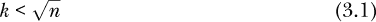
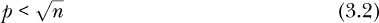

## 第三章：偏差、方差、过拟合与交叉验证**


接下来，我们详细探讨在第 1.7 节、第 1.12.4 节和第 2.2.5 节中提到的一个重要话题——过拟合。在本章中，我们将解释偏差和方差在机器学习中的真正含义，以及它们如何影响过拟合。接着，我们将介绍一种常用的避免过拟合的方法，称为 *交叉验证*。

过拟合的问题恰好阐明了本书标题中提到的观点：机器学习是一门艺术，而非科学。对于各种问题，尤其是过拟合，没有固定的公式解法。加州理工大学的著名机器学习专家 Yaser Abu-Mostafa 教授曾总结道：“避免过拟合的能力是区分专业人士与业余爱好者的关键。”^(1) 而我在谷歌上查询“过拟合”时，得到了 6,560,000 个结果！

不要被吓到。教授是对的，但只要对偏差和方差有充分的理解，避免过拟合并不困难。掌握这一点，并通过实践积累经验，就能做到。

### 3.1 过拟合与欠拟合

那么，过拟合究竟是怎么一回事呢？我们在之前的章节中已经稍微提到了这个话题。现在，让我们深入探讨这个问题。

回想我们在第 1.7 节中关于偏差-方差权衡的讨论，尤其是选择超参数值时的讨论，具体来说，就是在 k-NN 中选择 *k* 的值。我们再次以共享单车数据（第 1.1 节）为例来说明。假设我们想预测骑行量，例如某一天的温度为 28 度。我们将查看数据中温度最接近 28 的几天。这些天的平均骑行量将作为我们的预测值。

假设我们取 *k* = 5\. 即使是那些不在科技领域的人，也可能直观地感觉到 *k* 为 5 的值是“样本量太小”。即便它们的温度接近 28，5 天的骑行量也会有太多变动。如果我们从一个不同的 731 天数据集中获取样本，而不是我们当前拥有的数据集，我们将得到一组不同的 5 天，温度接近 28，且对应的平均骑行量也会不同。使用 *k* = 50 时，高骑行量和低骑行量的数据在平均过程中会大致相互抵消，但如果仅使用 *k* = 5，则不会出现这种情况。这表明我们应选择一个大于 5 的 *k* 值。这是一个 *方差* 问题：选择过小的 *k* 值会导致过多的抽样变异性。

另一方面，如果我们使用例如 *k* = 25 天，并选择温度最接近 28 度的日子，我们就有可能得到一些温度远离 28 度的日子。例如，第 25 个最接近的日子可能温度是 35 度。在如此炎热的天气下，人们不愿骑车。如果我们在预测 28 度那天的骑行人数时包含了过多的高温天气，可能会倾向于低估真正的骑行人数。在这种情况下，*k* = 25 可能太大了。这是一个 *偏差* 问题：选择过大的 *k* 值可能会引入系统性低估或高估的倾向。

**注意**

*我们将在本章及后续章节中反复提到方差和偏差。需要记住的是，讨论的是哪种量的方差和偏差：预测值。假设我们在预测 28 度那天的骑行人数。我们使用的 *k* 值越大，预测值的变异性就越小，但该值的偏差却越大。*

方差和偏差是相互对立的。对于给定的数据集，我们只能通过牺牲其中一个来减少另一个。这种权衡对于选择超参数的值以及选择哪些特征使用至关重要。使用过小的 *k* 值——试图将偏差减少到该数据上无法实现的程度——叫做 *过拟合*。使用过大的 *k* 值——过于保守的值——叫做 *欠拟合*。我们希望在“甜点区”选择超参数值，既不发生过拟合也不发生欠拟合。

#### ***3.1.1 特征数量与过拟合的直觉解释***

对于特征也有类似的情况：使用过大的 *p* 值（即特征的数量）会导致过拟合，而使用过小的值则会导致欠拟合。这里是这一现象的直觉解释。

回想一下 `mlb` 数据集，关于美国职业棒球大联盟球员的数据（见 第 1.8 节）。我们可能根据身高和年龄预测体重。但如果我们从特征集中省略身高呢？那就会引入偏差。大致来说，我们会默许每个人的身高都是中等的，这样会导致我们倾向于高估较矮球员的体重，同时低估较高球员的体重。

另一方面，事实证明，我们使用的预测变量越多（通常来说，不仅仅是针对这个数据集），预测值的方差就越高。为了说明这一点，假设我们正在进行一项营销研究，预测冬季羽绒服的购买情况，并希望考虑客户的地理位置。美国大约有 42,000 个邮政编码。假设我们将邮政编码作为特征之一来预测购买情况。那样的话，我们将有 42,000 个虚拟变量，并且还会有其他特征，如年龄、性别和收入，即*p* > 42000。如果我们的数据包含 100,000 个客户，我们每个邮政编码的平均数据点只有 2 或 3 个。再次强调，甚至非技术人员也会指出，这是一个过小的样本，导致方差增加。换句话说，过大的*p*值会增加方差。我们再次看到了方差和偏差之间的矛盾。

#### ***3.1.2 与整体数据集大小的关系***

但还有更多内容。在选择一个“好的”*k*或*p*值时，我们需要考虑*n*，即我们拥有的数据点数量。回想一下，在共享单车示例中，我们有*n* = 731（也就是只有 731 天的数据）。这个数量是否足够大，能够做出好的预测呢？为什么这个数字很重要？实际上，这与偏差-方差权衡直接相关。原因如下。

在我们上面的共享单车示例中，我们担心当*k* = 25 时，可能会有一些天的温度与 28 度相差较远。但如果我们有，比如说，2,000 天的数据，而不是 731 天，那么第 25 个最接近的温度可能仍然会非常接近 28 度。换句话说：

*n*越大，我们可以选择的*k*值越大，同时仍能避免过大的偏差。

类似地，考虑上面提到的邮政编码问题。如果我们有 100,000 个客户，那么每个邮政编码的平均数据点只有 2 到 3 个。但如果我们的数据集由 5000 万客户组成呢？那时包括邮政编码虚拟变量可能是有用的，因为我们可能从大多数邮政编码中获得足够数量的客户。记住，*p*表示特征的数量，这里每个虚拟变量都会单独计算。因此，将邮政编码包含在我们的特征集中会使*p*增加大约 42,000。

换句话说：

*n*越大，我们可以使用的*p*值越大——也就是说，我们可以使用更多的特征，同时仍然避免过大的方差。

#### ***3.1.3 那么，*k*和*p*的最佳值是什么？***

请注意，这仍然没有告诉我们如何设置一个好的“金发女孩”*k*值——既不太小也不太大。对于选择*p*（也就是选择使用多少个特征），同样的情况也适用；事实上，这是一个更具挑战性的问题，因为它不仅是一个关于*使用多少个*特征的问题，还涉及*选择哪些*特征。

正如我们已经多次提到的：

这是机器学习中的一个现实问题。对于大多数问题，没有简洁的“魔法公式”答案。再说一遍，机器学习是一门艺术，而不是科学。然而，验证方法在实践中是常用的，并且它们通常效果不错，尤其是在分析师积累经验之后。

我们将在本章稍后详细介绍验证方法。

此外，一些数学理论建议的一个大致经验法则是遵循以下限制：



也就是说，最近邻的数量应少于数据点数量的平方根。

那么，如何选择*p*呢？如前所述，一个特征集本身并不是“大”或“小”的，而是其大小*p*必须相对于数据点数量*n*来考虑。对于给定的数据集大小，使用过多特征可能会导致过拟合。在经典统计学中，一个粗略的——尽管在我看来是保守的——经验法则是遵循另一个“平方根*n*”的限制：



也就是说，特征的数量应少于数据点数量的平方根。在此标准下，如果我们的数据框架有 1,000 行数据，那么它可以支持大约 30 个特征。这不是一个坏的粗略指导，并且得到了参数模型理论结果的支持。

然而，在现代统计学和机器学习中，现在常见的是拥有——或至少从——一个比*n*大的*p*值。我们将在本书后面看到某些方法时会遇到这一点。我们将保持作为一个合理的起始点。如果我们的数据满足该规则，我们可以放心。但如果*p*较大，我们不应自动认为它过大。

### 3.2 交叉验证

选择超参数值或选择特征集的最常见方法是最小化 MAPE（数值型*Y*情况）或总体误分类错误（OME，分类情况）。对于 k-NN 和数值型*Y*设置，我们可能会为一系列候选*k*值计算 MAPE，然后选择生成最小 MAPE 的那个。

在决定使用哪个*k*值时，我们需要评估不同超参数值的预测能力。但在此过程中，我们需要确保使用的是一个“新的”数据集来进行预测。这促使我们将数据分为两组：一个训练集和一个验证集或测试集。

然而，验证集是随机选择的。这在我们已有的采样变异基础上引入了额外的随机性。我们在第 1.12.3 节中看到了这个例子。因此，在选择 k-NN 中的*k*时，某一验证集可能指示*k* = 5 为最佳，而另一个则可能倾向于*k* = 12。为了全面起见，我们不应该仅依赖单一的验证集。这导致了*K 折交叉验证*方法，在这种方法中，我们生成多个验证集，并对所有这些集的 MAPE、OME 或其他标准进行平均。请注意，*k*是邻居的数量，而*K*是折叠数，或者说是可能的验证集数量。

#### ***3.2.1 K 折交叉验证***

为了了解 K 折交叉验证如何工作，考虑“留一法”，我们将保留集的大小设置为 1。假设我们希望评估 *k* = 5 的预测能力。对于我们所有的 *n* 个数据点，我们将保留集设为该数据点，其余 *n* − 1 个点作为训练集；然后我们预测保留集中的数据点。这将给我们 *n* 次预测，并计算 MAPE 作为这些 *n* 次预测的平均绝对预测误差。换句话说，我们将按以下伪代码进行操作：

```
set sumMape = 0
for i = 1,2,...,n
   set training set = d[-i,]
   set test set = d[i,]
   apply k-NN to training set, with k = 5
   predict the test set
   sumMape = sumMape + abs(predicted Y - actual Y)
MAPE = sumMape / n
```

我们称之为 *n* 倍交叉验证。或者，我们可以将保留集的大小设为 2，例如通过将集合 1,2, . . . ,*n* 分成不重叠的相邻对。现在有 *n*/2 个可能的保留集（折叠）。对于每个折叠，我们将 k-NN 应用于剩余数据，然后预测该折叠中的数据。MAPE 是 *n*/2 个折叠的平均值。

有人可能认为 *K* = *n* 是最好的，因为这样 MAPE 将基于最多的试验。另一方面，每次试验将只基于预测一个数据点，这可能不够准确。这里可能还存在计算和理论问题，我们不在此讨论。那么我们应该如何选择 *K* 呢？

请注意，*K* 不是超参数，因为它不是 k-NN 的特征。它仅仅是如何可靠地估算 MAPE 的问题。但确实，它是我们需要考虑的一个额外因素。许多分析师建议使用 5 或 10 的值。

另一种方法如下，假设我们有大小为 2 的保留集。我们简单地选择多个随机保留集，选择的数量取决于我们有多少时间，示例如下：

```
set sumMape = 0
for m = 1,2,...,r
   set test set = a random pair of data points (not necessarily adjacent)
   set training set = the remaining n-2 points
   apply k-NN to training set, with a candidate k
   predict the test set
   sumMape = sumMape + mean(abs(predicted Ys - actual Ys))
MAPE = sumMape / r
```

这里，*r* 是保留集的数量。我们选择更大的 *r* 值时，MAPE 的准确性会更高。这只取决于我们愿意花费多少计算时间。（复数形式的 `predicted Ys` 暗示任何保留集都有两个 Y 值需要预测。）

#### ***3.2.2 使用 replicMeans() 函数***

我们可以使用 `regtools` 函数 `replicMeans()` 来实现 K-means 交叉验证。函数名的意思是“重复一个操作，然后取结果的平均值”。

例如，假设我们有一个数据框 `d`，其中我们要预测一列 `y`。考虑以下调用的效果：

```
cmd <- "qeKNN(d,'y')$testAcc"
crossvalOutput <- replicMeans(10,cmd)
```

这表示运行`cmd` 10 次，并返回结果的平均值。由于该命令是运行`qeKNN()`，10 次运行将使用 10 个不同的保留集，得到 10 个不同的`testAcc`值。最终结果将是函数返回这 10 个值的平均值，这正是我们想要的。

#### ***3.2.3 示例：程序员和工程师数据***

在这里，我们将介绍一个新的数据集 `pef`，它将在本书中的多个地方使用，并展示如何在该数据上进行交叉验证。

`pef` 数据集包含在 `regtools` 包中，该包又包含在 `qeML` 中。它来源于 2000 年美国人口普查，展示了程序员和工程师的数据。以下是一个简要的展示：

```
> data(pef)
> head(pef)
       age     educ occ sex wageinc wkswrkd
1 50.30082 zzzOther 102   2   75000      52
2 41.10139 zzzOther 101   1   12300      20
3 24.67374 zzzOther 102   2   15400      52
4 50.19951 zzzOther 100   1       0      52
5 51.18112 zzzOther 100   2     160       1
6 57.70413 zzzOther 100   1       0       0
> dim(pef)
[1] 20090     6
```

所以，关于超过 20,000 名工人的数据存储在这里。

这里的教育变量需要一些解释。普查有不同教育层次的代码，甚至包括没有受过教育的人。但是在这个数据集中，不会有许多（如果有的话）只有六年级教育的人。因此，`educ`列被简化为三个层次：硕士（代码 14）、博士（16）和“其他”（由软件编码为`zzzOther`，使用`regtools::toSubFactor()`）。大多数“其他”类别的工作者有本科学历，但即使是学历较低的，也被归入这个层次。

为什么要这么做？`qe*`系列函数会将任何 R 因子转换为虚拟变量，对于某些此类函数，输出是以虚拟变量的形式显示的。因此，像上面这样的合并会压缩输出。如果包含所有教育层次并显示虚拟变量，甚至运行`head()`也会得到非常宽的输出。

其次，这种简化通常是为了避免过拟合——记住，每个虚拟变量在特征数*p*中是单独计算的——即便在这个数据集中，我们已经很符合“”的经验法则。

有关此数据集的详细信息，比如各种职业代码，可以在 R 提示符下输入?pef。

##### 3.2.3.1 MAPE 的改进估算

假设我们希望预测该`pef`数据集中的`wageinc`，即工资收入。我们先试着进行一次初步预测：

```
> z <- qeKNN(pef,'wageinc',k=10)
holdout set has  1000 rows
> z$testAcc
[1] 25296.21
```

平均而言，我们的预测偏差大约为$25,300。这是一个相当大的数字，但正如在第 2.4 节中强调的，我们必须始终将特征集的预测准确度与*不使用*特征时的预测准确度进行比较：

```
> z$baseAcc
[1] 32081.36
```

因此，仅预测每个人的整体平均收入会导致一个更大的 MAPE。

无论如何，我们在这里要强调的不是这个特定数据集，而是如果 MAPE 是基于单一保留集进行预测的，其一般准确性问题。我们确实需要使用交叉验证，查看多个保留集的情况。我们可以使用`replicMeans()`来实现这一点。

```
> cmd <- "qeKNN(pef,'wageinc')$testAcc"
> replicMeans(10,cmd)
holdout set has  1000 rows
holdout set has  1000 rows
holdout set has  1000 rows
holdout set has  1000 rows
holdout set has  1000 rows
holdout set has  1000 rows
holdout set has  1000 rows
holdout set has  1000 rows
holdout set has  1000 rows
holdout set has  1000 rows
[1] 25633.51
attr(,"stderr")
[1] 412.1483
```

所以，所示的`qeKNN()`函数调用执行了 10 次，产生了 10 个保留集，在测试集上的平均准确度约为$25,633。这比我们之前基于一个保留集获得的$25,296 的结果稍大。因此，我们应该将这个新结果视为更可靠。

那个$412 的数字是*标准误差*。将其乘以 1.96 得到我们误差的范围。如果我们认为这个范围太大，可以调用`replicMeans()`，比如进行 100 次重复（即 100 个保留集）。

然后，我们可以尝试其他的*k*值，像上面那样运行`replicMeans()`，然后最终选择给出最佳 MAPE 或 OME 的值。如果我们有多个这样的值，使用`qeML`函数中的`qeFT()`会更方便，这将在第七章中介绍。

#### ***3.2.4 三重交叉验证***

假设我们将数据分为训练集和测试集，然后拟合许多不同的超参数组合，选择在测试集上表现最好的组合。我们再次遇到潜在的 p-hacking 问题，这意味着测试集报告的准确率可能过于乐观。

一种常见的解决方案是将数据分为三个子集，而不是两个，其中间的子集称为*验证集*。我们将不同的超参数组合拟合到训练集上，并在验证集上评估它们。选择最佳组合后，我们再在测试集上评估（仅）该组合，以获得未受 p-hacking 影响的准确性估计。

### 3.3 结论

总结一下，本章虽然简短，但关键的概念有：

+   在选择超参数，例如 k-NN 的*k*，以及选择特征集时，方差和偏差是相互对立的。对于固定数据集，较小的*k*或较大的*p*会增加方差而减少偏差，反之亦然。

+   在更大的*n*情况下，我们可以选择更大的*k*或*p*。

+   不幸的是，对于*k*和*p*的“金发女孩”值，没有固定不变的公式。但有一些非常粗略的经验法则，合理使用保留集和交叉验证会给我们带来很大帮助。随着经验的积累，技能也会随之提升。

再次强调，使用保留集是主要的解决办法，包括如果担心单一数据集上的 MAPE 或 OME 的准确性，可以使用多个保留集。
