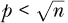

## 第四章：处理大量特征**


在上一章中，我们讨论了*过拟合*——即在给定的设置中使用过多的特征。特征数量过多也可能导致计算时间过长的问题。本章将重点介绍如何减少特征集的大小——换句话说，*降维*。

请注意，这不仅仅是需要使用*更少*的特征；我们还需要决定使用*哪些*特征，甚至是哪些*特征组合*。我们将讨论主成分分析（PCA），这是一种处理较大*p*值的著名技术，其原理是通过组合旧特征来形成新特征，然后仅使用这些新特征中的一部分作为我们的特征集。

### 4.1 陷阱：大型数据集中的计算问题

再次强调，过拟合是机器学习中的一个主要问题。正如上一章所述，在谷歌中搜索这个术语，我得到了 6,560,000 个结果！除了过拟合带来的预测准确性问题，我们还需要担心计算问题。特征数量越多，我们的计算时间就越长。

在某些情况下，计算时间可能会变得非常具有挑战性。例如，关于 AlexNet（一个用于图像分类的神经网络）的报道指出，该网络在两台极为强大的计算机上训练需要*五到六天*的时间。^(1)

此外，计算过程中的能耗可能非常惊人。^(2) 训练一个大型自然语言处理模型可能会消耗大量能源，产生的二氧化碳排放量超过 78,000 磅。相比之下，一辆普通汽车的使用寿命内大约会排放 126,000 磅二氧化碳。

本书的大多数读者不会遇到像上述那样的特别大的应用。但即便是在“较大”的数据集上，计算仍然可能成为一个显著的问题，例如本章中讨论的一些数据集。单个函数调用的运行时间可能不需要以天来计量，但肯定会达到几分钟，甚至在某些情况下，可能需要几小时。

此外，较大的数据集可能占用过多的内存。一个拥有百万行和 1,000 列的数据集包含十亿个元素。每个元素占用 8 字节，那么就需要 8GB 的内存。算法使用的内存量可能是这个数值的几倍。

降维的讨论很少提到由于 NA 值导致的数据丢失，但它可能是一个重要因素。如果数据中的某一行包含一个 NA 值，大多数机器学习软件库将会丢弃这一整行。列数越多，任何给定的行出现至少一个 NA 值的可能性就越大，因此该行被丢弃的可能性也越大。换句话说：

如果我们的数据容易出现 NA 值，那么*p*越大，我们的有效*n*值就越小。

因此，我们有了另一个丢弃一些特征的动力。这将导致我们分析中完整案例的数量增加，从而提高预测能力。

和往常一样，这是一种权衡：如果我们删除太多特征，可能会丧失一些具有重要预测能力的特征。因此，我们希望舍弃一些不太重要的特征。

### 4.2 维度减少简介

在本章以及本书中，我们攻克大数据问题的主要工具将是减少*p*，即数据集中的特征数量。这被称为*维度减少*。虽然我们可以采取简单地删除我们认为不太有用的特征的方法，但也有其他更系统的方式可以应用。

维度减少有两个目标，这两个目标同样重要：

1.  避免过拟合。如果我们没有（参见第 3.1.3 节），我们应该考虑减少*p*。

1.  减少计算。对于更大的数据集，k-NN 和本书中的大多数方法将面临巨大的计算要求，而一个显而易见的解决方案是减少*p*。

#### ***4.2.1 示例：百万歌曲数据集***

假设你遇到了没有标签的旧歌曲录音，无法确定其名称，你想要识别它。《百万歌曲数据集》可以让我们根据 90 个音频特征预测歌曲的发行年份，让我们尝试一下，因为知道年份可能有助于找到歌曲的标题。你可以从 UC Irvine 机器学习库下载数据^3。（实际上，这个版本的数据集只有大约 50 万首歌曲。）

这样规模的数据集可能会涉及相当大的计算负担。让我们调查一下，看看仅仅做一次预测需要多少时间。

从下载的文件中读取数据，并将结果分配给`yr`。

```
> yr <- read.csv('YearPredictionMSD.txt',header=FALSE)
```

请注意，尽管文件名以*.txt*结尾，但它实际上是一个 CSV 文件，因此我们使用了`read.csv()`。

此外，上面的文件读取速度较慢。读者可以考虑在像这样的较大文件上使用`data.table`包中的`fread()`。这里的调用将是：

```
> library(data.table)
> yr <- fread('YearPredictionMSD.txt')
> yr <- as.data.frame(yr)
```

由于`kNN()`需要数据框或 R 矩阵输入（附录 C），我们需要使用最后一行代码将`data.table`转换为数据框。

让我们来看一下：

```
> yr <- read.csv('YearPredictionMSD.txt',header=FALSE)
> yr[1,]
    V1       V2       V3      V4      V5        V6        V7        V8
1 2001 49.94357 21.47114 73.0775 8.74861 -17.40628 -13.09905 -25.01202
         V9     V10      V11     V12      V13      V14      V15      V16
1 -12.23257 7.83089 -2.46783 3.32136 -2.31521 10.20556 611.1091 951.0896
       V17      V18      V19      V20      V21      V22      V23      V24
1 698.1143 408.9848 383.7091 326.5151 238.1133 251.4241 187.1735 100.4265
      V25      V26       V27      V28      V29       V30       V31     V32
1 179.195 -8.41558 -317.8704 95.86266 48.10259 -95.66303 -18.06215 1.96984
       V33     V34    V35     V36      V37       V38       V39       V40
1 34.42438 11.7267 1.3679 7.79444 -0.36994 -133.6785 -83.26165 -37.29765
       V41       V42      V43       V44       V45      V46       V47      V48
1 73.04667 -37.36684 -3.13853 -24.21531 -13.23066 15.93809 -18.60478 82.15479
       V49       V50      V51       V52      V53      V54     V55      V56
1 240.5798 -10.29407 31.58431 -25.38187 -3.90772 13.29258 41.5506 -7.26272
        V57      V58      V59      V60      V61      V62     V63      V64
1 -21.00863 105.5085 64.29856 26.08481 -44.5911 -8.30657 7.93706 -10.7366
        V65       V66       V67     V68      V69      V70     V71       V72
1 -95.44766 -82.03307 -35.59194 4.69525 70.95626 28.09139 6.02015 -37.13767
       V73      V74     V75      V76      V77       V78      V79       V80
1 -41.1245 -8.40816 7.19877 -8.60176 -5.90857 -12.32437 14.68734 -54.32125
       V81     V82       V83      V84      V85     V86       V87      V88
1 40.14786 13.0162 -54.40548 58.99367 15.37344 1.11144 -23.08793 68.40795
       V89       V90     V91
1 -1.82223 -27.46348 2.26327
```

我们看到数据集中有超过 515,000 行（即 515,000 首歌曲）和 91 列。第一列是发行年份，接下来的 90 列是晦涩的音频测量值。这意味着第一列是我们的结果变量，其余 90 列是（潜在的）特征。

#### ***4.2.2 维度减少的必要性***

我们这里有 90 个特征。对于超过 50 万的数据点，根据第 3.1.3 节的粗略经验法则，可能我们可以使用所有 90 个特征而不发生过拟合。但 k-NN 需要大量计算，所以维度仍然是一个重要问题。

作为计算负担的一个例子，我们来看预测一个数据点需要多长时间，比如预测数据的第一行。正如在第 1.17 节中解释的那样，要预测一个数据点，直接调用`kNN()`比调用它的封装函数`qeKNN()`要快。后者是大规模运行的，我们在这个实例中并不需要它，而且它会计算许多这里不需要的量。（它在训练集的每个点上计算估计的回归函数，仅当我们计划未来做大量预测时才有效。）

回顾一下，`kNN()`的参数是*X*数据、*Y*数据、待预测的数据点以及*k*。以下是代码：

```
> system.time(kNN(yr[,-1],yr[,1],yr[1,-1],25))
  user  system elapsed
30.866   8.330  39.201
```

仅仅预测一个数据点就需要 39 秒多。如果我们预测整个原始数据集的一个重要部分，比如`holdout` = 100000，那就意味着我们需要等待 39 秒 100,000 次，这将是不可承受的。

因此，我们可能希望缩减特征集的大小，无论是出于计算考虑（如本文所述），还是在其他情况下为了避免过拟合。

特征选择是机器学习的另一个方面，虽然没有完美的解决方案，但已有一些相当好的方法。在我们进入本章讨论的主要方法 PCA 之前，先看几个其他方法，以便更好地理解在选择特征时我们面临的挑战。

### 4.3 降维方法

现在我们看到了降维的必要性，那么如何实现它呢？我们将在这里介绍几种方法：整合与嵌入、*所有可能的子集*以及 PCA。这些方法具有广泛的适用性，书中的后续章节将针对一些特定的机器学习方法介绍更多技术。

#### ***4.3.1 整合与嵌入***

经济学家谈到*代理*变量。我们可能希望获取某个变量*U*的数据，但由于缺乏它，改为使用我们有数据的变量*V*，而且*V*能很好地捕捉到*U*的本质。*V*被称为*U*的“代理”变量。机器学习中的相关技术包括*整合*和*嵌入*。

在降维的背景下，代理变量可能有不同的用途。假设我们确实有*U*的数据，但这个变量是分类的，且具有大量的类别（即在 R 中表示变量的因子实现有大量级别）。这意味着会有大量的虚拟变量，或者说是高维度。在这种情况下，减少维度的一种方法是合并级别，从而得到一个新的分类变量*V*，并减少虚拟变量的数量。更好的方法是，我们可能能够使用一个数值型的*V*，这样就不需要虚拟变量，只有那个变量。

再次考虑第 3.1.1 节中的邮政编码示例，其中假设的目标是估计派克大衣的销量。如果有 42,000 个邮政编码，那么在虚拟变量的情况下，我们会有 42,000 个虚拟变量。我们可以通过选择仅使用邮政编码的首位数字来减少这个数字。例如，可以将 90000、90001、...、99999 这些邮政编码合并成一个单一的层级 9。（虽然并不是所有这些邮政编码都存在，但原理是相同的。）加州大学戴维斯分校和加州大学洛杉矶分校的邮政编码分别为 95616 和 90024，现在这两个邮政编码都将简化为 9。

显然，这将导致信息的丢失；它将引入一些偏差，影响偏差-方差平衡。但我们仍然可以得到相当不错的地理细节——例如，9 这个数字代表的是西海岸——用于预测派克大衣购买等目的。这样，我们就可以为每个 10 个（缩写）邮政编码 0 到 9 收集大量的数据点，从而减少方差。

这将把 42,000 个虚拟变量减少到 9 个。更好的是，我们可能选择使用*嵌入*。我们可以从政府数据网站获取每个邮政编码的平均每日冬季温度（记住，我们在卖派克大衣），并使用这个温度代替邮政编码作为特征。这样，我们就只需要一个特征，而不是 42,000 个，甚至不是 9 个。

#### ***4.3.2 所有可能子集方法***

可能有人会想，“为了选择一个好的特征集，为什么不查看所有可能的特征子集呢？我们可以为每个子集计算 MAPE 或 OME，然后使用最小化该指标的子集。”这就是所谓的*所有可能子集方法*。

例如，在歌曲数据集中，在预测留出数据时，我们可以按以下步骤进行操作：对于我们的 90 个列的每个子集，我们可以预测我们的留出集，然后使用预测效果最佳的列集合。这里有两个大问题：

1.  我们需要大量的计算时间。仅仅是 2 个特征集就有超过 4,000 个。所有大小的特征集的数量是 2⁹⁰，这是类似“宇宙中原子的数量”这样荒谬的数字，常见于新闻报道中。

1.  我们可能会面临严重的 p-hacking 问题。某些列对预测发行年份的准确度可能会偶然看起来非常高，这种机会可能非常大。

#### ***4.3.3 主成分分析***

但如果我们通过使用一种最流行的降维方法来改变特征，这种方法也并非完全不可行：主成分分析（PCA）。例如，在歌曲数据中，我们不需要调查不可能的 2⁹⁰个子集，而只需关注 90 个特征。其原理如下。

为了将 PCA 应用到百万歌曲数据集，我们将用 90 个新的特征替换原来的 90 个特征，这 90 个新特征将作为原始特征的 90 种组合来构建。在我们的数据框中，我们将用这 90 个新特征来替代原始的 90 个特征列，这些新特征被称为*主成分（PCs）*。

听起来没有什么进展，对吧？我们希望*减少*特征数量，而在上述场景中，我们只是将一组 90 个特征换成了另一组同样大小的特征。但正如下文所示，我们将通过对这些新特征使用“所有可能子集法”，尽管是按照某种顺序进行的，从而实现这一目标。

我们首先检查的子集是 PC1；接着是 PC1 和 PC2 的组合；然后是 PC1、PC2 和 PC3 的三重组合；依此类推。也就是说，总共有 90 个子集，通常我们会在达到 90 个之前就停止。

你会发现，在这些新特征中选择子集比在原始的 90 个特征中选择要容易得多。

##### 4.3.3.1 主成分特性

主成分有两个特殊的属性。首先，它们是非相关的；大致来说，一个主成分的值不会影响其他主成分。从这个意义上讲，我们可以认为它们互不重复。这为什么重要？如果在减少预测变量数量之后，某些变量之间发生了部分重复，那就意味着我们应该进一步减少变量数量。因此，拥有非相关特征意味着没有重复特征，我们觉得自己已经达到了一个最小且不重复的特征集。

其次，主成分（PCs）是按方差递减的顺序排列的。因为一个方差小的特征本质上是常数，它可能不会是一个有用的特征。因此，我们可能只保留那些具有较大方差的主成分。由于方差是有顺序的，这意味着我们可以保留，例如，方差最大的*m*个主成分。请注意，*m*因此成为了另一个超参数。

每个主成分（PC）都是我们原始特征的*线性组合*——也就是说，一个 PC 是常数与特征的乘积之和。例如，如果后者是身高、体重和年龄，一个 PC 可能是 0.12 身高 + 0.59 体重 − 0.02 年龄。回想一下代数知识，这些数字 0.12、0.59 和−0.02 被称为*系数*。

在机器学习中，重点是预测而不是描述。例如，在自行车租赁数据中，可能有人有兴趣研究*特征如何影响骑行人数*，比如假期期间我们可能会有多少额外的骑行者。这将是一个描述性应用，而这通常不是机器学习中的关注点。所以，像 0.12、0.59 和−0.02 这样的系数对我们来说并不是很重要。相反，关键在于我们正在将原始特征组合成新的特征，我们可能并不会直接检查这些系数本身。

使用这些新特征，我们需要从更少的候选集合中进行选择：第一个 PC，第一个两个 PC，前三个 PC，依此类推。我们只需从 90 个候选特征集中的选择，而不是从我们如果查看所有可能的子集将得到的 2⁹⁰个子集中选择。我们可以通过交叉验证或下文介绍的其他方法来从这些子集中选择。请记住，较小的集合可以节省计算时间（对于 k-NN 方法以及其他方法），并帮助避免过拟合和 p-hacking。

##### 4.3.3.2 PCA 在百万歌曲数据集中的应用

Base-R 包含了多个用于进行 PCA 的函数，其中包括我们在这里使用的`prcomp()`。CRAN 还有实现特别快速的 PCA 算法的软件包，例如`RSpectra`，这些算法对于大数据集非常有用。

我们将主要使用`qePCA()`，这是一个封装了`prcomp()`的`regtools`函数，但你应该至少对后者有一些了解，方法如下。以下是调用方式：

```
> pcout <- prcomp(yr[,-1])
```

记住，PCA 是针对*X*数据的，而不是*Y*，所以我们在这里跳过了年字段，它位于第一列。

作为示例，假设我们决定使用前 20 个主成分。我们通过保留输出中`rotation`部分的前 20 列来实现这一点，`rotation`包含了主成分的系数（例如上面的 0.59 等）。让我们先了解这个组件：

```
> rt <- pcout$rotation
> dim(rt)
[1] 90 90
> rt[1:10,1:10]
              PC1           PC2           PC3           PC4           PC5
V2  -1.492918e-03 -0.0001759914  0.0006706243 -0.0005624011 -0.0027970362
V3  -6.293541e-03  0.0064782264  0.0027845347 -0.0051094877 -0.0239474483
V4  -4.794322e-03 -0.0034153809 -0.0066157025 -0.0044176142  0.0071294386
V5   2.143497e-03  0.0041913051  0.0022151336 -0.0016482743 -0.0087460406
V6   3.013464e-03  0.0013071748 -0.0013400543  0.0032640501  0.0028682836
V7   1.892908e-03  0.0052421454  0.0031921120 -0.0003470488  0.0028807861
V8  -1.518245e-04 -0.0001992038 -0.0004968169  0.0010151582 -0.0061954012
V9   3.160014e-04  0.0009142221 -0.0001189277 -0.0008729237  0.0014144888
V10 -7.203671e-04 -0.0001721222  0.0003838908 -0.0012362764 -0.0009607571
V11  3.348651e-05  0.0011663312  0.0003964205 -0.0008766769 -0.0002092245
              PC6           PC7           PC8           PC9          PC10
V2   3.227906e-04 -0.0012293820  0.0009259120 -0.0009496448  0.0007397941
V3  -1.247137e-02 -0.0185123792  0.0122138115 -0.0186672476  0.0099506738
V4  -9.063568e-03  0.0160957668  0.0123209033 -0.0018904928 -0.0039866354
V5   2.708827e-03 -0.0085000743 -0.0070522158  0.0008992783  0.0003743787
V6  -7.412826e-03 -0.0003856357  0.0003811818 -0.0002785585  0.0022809304
V7   9.840927e-05 -0.0009025075 -0.0006593167  0.0032070603  0.0024775608
V8   3.425829e-03 -0.0038602270 -0.0040122340  0.0005974108  0.0009542331
V9  -1.280174e-03  0.0032705198  0.0059051252 -0.0025076692 -0.0049897536
V10 -4.725944e-05 -0.0035063179 -0.0002710257 -0.0016148579  0.0007367726
V11 -1.940717e-03 -0.0015004583  0.0036280402 -0.0025576335 -0.0025080611
```

所以，`rt`有 90 行和 90 列，且所有条目都是数值型的。我们看到行名和列名分别是`V2`、`V3`，...和`PC1`、`PC2`，...。行名来自我们的特征名（第一个是*Y*，不是特征）：

```
> names(yr)
 [1] "V1"  "V2"  "V3"  "V4"  "V5"  "V6"  "V7"  "V8"  "V9"  "V10" "V11" "V12"
[13] "V13" "V14" "V15" "V16" "V17" "V18" "V19" "V20" "V21" "V22" "V23" "V24"
...
[85] "V85" "V86" "V87" "V88" "V89" "V90" "V91"
```

这些列名代表主成分（PCs）。我们有 90 个特征，因此有 90 个主成分，命名为`PC1`、`PC2`，依此类推。

在这个例子中，我们已经说过，我们只想使用前 20 个主成分来进行降维。因此，我们将丢弃`rt`中的 PC21 至 PC90 列：

```
> pcout$rotation <- rt[,1:20]
```

因此，我们现在只使用前 20 个主成分。现在我们根据这些主成分转换原始数据：

```
> pcX <- predict(pcout,yr[,-1])
```

这是我们的新*X*数据。我们稍后会看看如何使用它，但首先，`predict()`调用中发生了什么呢？该函数实际上并没有进行任何预测。它只是将原始特征转换为新的特征。我们来仔细看看这个过程。

首先，回想一下，在 R 中，`predict()`是一个*通用*函数（请参见第 1.5.1 节）。`prcomp()`函数返回一个`'prcomp'`类的对象（通过输入`class(pcout)`来检查上述数据）。因此，`predict()`的调用会转发到`predict.prcomp()`，这是 R 开发人员为此目的编写的函数——将旧特征转换为新特征。

所以，我们的调用`predict(pcout,yr[,-1])`告诉 R，“请根据`pcout`中的内容，将`yr[,-1]`中的特征转换为主成分特征。”由于我们之前已经将`pcout$rotation`更改为只使用前 20 个主成分，因此现在调用`predict()`时，`pcout`将生成一个新的 20 列数据框，替代我们原来的 90 列数据框：

```
> dim(pcX)
[1] 515345     20
```

我们的行数与旧的*X*相同——因为它仍然是歌曲数据（尽管已被转换），共有 515,345 首歌。但现在我们有 20 列，而不是 90 列，表示我们现在只拥有 20 个特征。顺便提一下，这些新列中没有一个是`yr`中的列；每一列都是原始列的某种组合。

现在，我们如何使用 PCA 进行 k-NN 预测呢？假设我们有一个新的案例，它的 90 个音频指标与数据集中第八首歌完全相同，只是第一列的值为 32.6。我们将其存储在`w`中。

```
> w <- yr[8,-1]
> w[1] <- 32.6
```

由于我们将训练集中的*X*数据转换成了 PCA 形式，因此也要对`w`进行相同的处理：

```
> newW <- predict(pcout,w)
> newW
        PC1       PC2       PC3      PC4      PC5       PC6       PC7      PC8
8 -1129.298 -168.8051 -368.4595 567.6397 -424.265 -291.5593 -168.7774 17.12907
       PC9      PC10      PC11     PC12     PC13     PC14     PC15      PC16
8 243.8396 -134.2792 -35.67449 191.6426 37.70002 50.17716 -66.3604 -72.97002
       PC17      PC18     PC19     PC20
8 -131.9982 -223.3206 -50.0114 52.04066
```

然后，我们会在新的数据上调用`qeKNN()`。

但直接这么做会很繁琐，通常我们会使用省时的`qePCA()`函数。但在我们讨论如何选择使用的 PC 数量时，先将预测问题暂时放一边。

#### ***4.3.4 但现在我们有了两个超参数***

以前，为了获得最准确的预测，我们只需要尝试一系列邻居数量*k*的值，但在这种情况下，我们将需要测试*k*和 PC 数量*m*的多个值。这当然不是什么新鲜事，因为我们一直需要决定使用哪些特征；过拟合可能来源于*k*值过小或特征过多。现在，通过转换为 PCA，我们至少将后者形式化为超参数*m*。因此，实际上我们让事情变得稍微容易一些。

假设我们尝试每个 10 个*k*值与每个 10 个*m*值组合，并找出每对组合的保留 MAPE 值。然后，我们会选择 MAPE 最小的那一对。但这意味着我们需要尝试 10 × 10 = 100 对，假设对每对组合应用 K 折交叉验证（即对每对组合运行多个保留集）。

记住，这里有两个主要问题。首先，每对组合都需要大量的计算时间，导致总运行时间非常长；其次，我们应该关注潜在的 p-hacking 问题（见第 1.13 节）：其中一个 100 对中的组合可能仅仅是巧合，恰好预测出了歌曲的发布日期。

作为一种替代方法，我们也许可以直接选择*m*。一种常见的直观方法是查看 PC 的方差（标准差的平方）。一个方差很小的变量本质上是常数，因此可能对预测*Y*几乎没有帮助。因此，思路是丢弃方差很小的 PC。我们来看看：

```
> pcout$sdev²
 [1] 4.471212e+06 1.376757e+06 8.730969e+05 4.709903e+05
 [5] 2.951400e+05 2.163123e+05 1.701326e+05 1.553153e+05
 [9] 1.477271e+05 1.206304e+05 1.099533e+05 9.319449e+04
...
```

`e`表示 10 的幂。例如，第一个表示 4.471212 × 10⁶。

我们看到方差迅速减小。第十二个方差约为 90,000，相比第一个方差超过 400 万，几乎可以忽略不计。因此，我们可能决定选择*m* = 12。一旦这样做，我们就回到了只需要选择一个超参数*k*的情况。

目前仍然没有选择 PC 数量*m*的魔法公式，但关键是，一旦我们决定了*m*的值，就可以单独选择*k*。例如，我们可以用这种直观的方式选择*m*，然后通过交叉验证来得到*k*。这可能比同时寻找最佳的(*k*, *m*)组合要容易。

分析师通常会将这些方差看作总方差的累积比例。这里，R 的`cumsum()`（累积和）函数会派上用场。该函数的工作方式如下：

```
> u <- c(12,5,13)
> cumsum(u)  # 12+5 = 17, 12+5+13 = 30
[1] 12 17 30
> cumsum(u) / length(u)  # convert to proportions
[1]  4.000000  5.666667 10.000000
```

让我们将其应用到 PC 方差上：

```
> pcsds <- pcout$sdev²
> cumsum(pcsds) / sum(pcsds)
 [1] 0.4691291 0.6135814 0.7051886 0.7546059 0.7855726 0.8082685 0.8261192
 [8] 0.8424152 0.8579151 0.8705719 0.8821084 0.8918866 0.9003893 0.9075907
[15] 0.9146712 0.9212546 0.9269892 0.9324882 0.9376652 0.9416823 0.9455962
[22] 0.9493949 0.9530321 0.9564536 0.9597000 0.9627476 0.9653836 0.9678344
[29] 0.9700491 0.9720936 0.9739898 0.9756223 0.9771978 0.9785780 0.9799187
[36] 0.9811843 0.9824226 0.9836061 0.9847728 0.9858420 0.9868994 0.9879009
[43] 0.9888200 0.9896491 0.9904612 0.9912403 0.9919651 0.9926362 0.9932901
[50] 0.9938841 0.9944387 0.9949139 0.9953413 0.9957644 0.9961658 0.9965495
[57] 0.9968947 0.9971970 0.9974792 0.9977482 0.9979897 0.9982232 0.9984284
[64] 0.9985960 0.9987592 0.9989146 0.9990633 0.9992035 0.9993261 0.9994199
[71] 0.9995115 0.9995965 0.9996681 0.9997329 0.9997858 0.9998289 0.9998700
[78] 0.9999061 0.9999277 0.9999483 0.9999608 0.9999708 0.9999792 0.9999856
[85] 0.9999907 0.9999948 0.9999974 0.9999987 0.9999996 1.0000000
```

因此，如果我们选择*m* = 12，我们选择的主成分大约能够解释数据总方差的 89%。或者我们可能认为这降维过多，选择一个 95%的方差截断值，因此使用*m* = 23 个主成分。

**注意**

*请注意此处的措辞“可能”，“例如，如果”和“假设”。正如我们之前所见，机器学习中的许多事情并没有机械式、公式化的“方案”。再次提醒，机器学习是一门艺术，而非科学。只有通过经验，才能在这门艺术上获得精通，而不是通过固定的“方案”。*

#### ***4.3.5 使用 qePCA()包装函数***

我们的目标是首先使用 PCA 进行降维，然后使用前*m*个主成分作为特征进行 k-NN 预测。为了实现这一点，需要执行以下一系列相对复杂的操作。幸运的是，有一个函数可以自动化这些步骤，但像往常一样，我们首先需要理解这些步骤，然后再转向方便的函数。

假设我们的训练数据的*X*部分和*Y*部分分别存储在`trnX`和`trnY`中。

1.  我们调用`prcomp(trnX)`来计算主成分系数。我们将这个结果命名为`pcout`，如上所述。

1.  我们将`pcout$rotation`中的列数限制为反映所需的主成分数。

1.  我们调用`predict(pcout,trnX)`将我们的*X*数据转换为主成分形式，假设为`pcX`。现在我们的新训练集由`pcX`和`trnY`组成。

1.  我们现在在`pcX`和`trnY`上应用`qeKNN()`。假设我们将结果命名为`knnout`。

1.  随后，当新的*X*数据（例如`newX`）到来时，我们首先调用`predict(pcout,newX)`将其转换为主成分形式。假设我们将结果命名为`pcNewx`。

1.  对于我们的*Y*预测，我们接着调用`predict(knnout,pcNewX)`来获得预测的*Y*。

顺便提一下，你注意到我们在这里使用`predict()`有两种不同的方式吗，一种是转换为主成分形式，另一种是进行 k-NN 预测？在这里我们看到了 R 语言中通用函数的概念。在第一个上下文中，R 将`predict()`调用转发给`predict.prcomp()`，而在第二个上下文中，转发给`predict.qeKNN()`。

上述过程包含了很多步骤，但它确实有一定的模式，这意味着我们应该通过代码来自动化它。这正是`qePCA()`包装函数的目的。

使用`qePCA()`时，指定数据和*Y*列名，如同其他`qe*`系列函数，并且还指定以下内容：所需的机器学习方法（例如 k-NN）、该方法的常见超参数（*k*）以及主成分的总方差所需的比例。

例如，调用

```
z <- qePCA(yr,'V1','qeKNN',opts=list(k=25),0.85)
```

该语句表示我们想使用 k-NN 预测歌曲数据中的年份（`V1`），并且*k* = 25。它还表明，我们希望使用足够的主成分来解释特征总方差的 85%。

那么，我们使用*k* = 25 和 85%的总方差来进行预测的效果如何？

```
> z$testAcc
[1] 7.373
```

在猜测一首歌的发行年份时，我们的平均误差大约是 7 年。

为了预测一个新的案例——比如说 `w`，我们在第 4.3.3.2 节中使用的示例歌曲——我们会做出如下调用：

```
> w <- yr[8,-1]
> w[1] <- 32.6
> predict(z,w)
        [,1]
[1,] 1994.96
```

所以，我们会猜测这首歌大约是在 1995 年发布的。

所有这些比上面的多步骤过程要简单得多；`qePCA()`节省了我们很多工作！

#### ***4.3.6 主成分和偏差-方差权衡***

现在我们知道如何使用 PCA 进行降维和随后的预测，让我们回到如何选择最近邻数 *k* 和主成分数 *m* 的问题。请注意，选择 *m* 等同于选择 `qePCA()` 中最后一个参数的方差比例。

像往常一样，我们面临着偏差-方差问题，无论是对于 *k* 还是 *m*。我们之前已经讨论过 *k* 的权衡，那么 *m* 呢？

实际上，*m* 的情况也并不新鲜。回想一下我们在第 3.1.1 节中关于 `mlb` 数据集所说的：

我们可能会根据身高和年龄预测体重。但如果我们从特征集中省略了身高呢？那将导致偏差。粗略地说，我们实际上是在默许每个人的身高是中等的，这会导致我们倾向于高估矮个子运动员的体重，而低估高个子运动员的体重。

换句话说，省略一个特征会导致偏差。或者，等效地，添加特征会减少偏差。由于主成分（PCs）*就是*特征，我们可以看到，使用的主成分越多，偏差越小。但同一部分还指出，特征越多，预测的方差越大，这不是好事。还需要注意的是，使用更多的主成分会导致更长的计算时间。

为了说明这一点，让我们设计一个小实验，研究变化的 *m*（主成分数）对结果的影响。

由于我们的歌曲数据集相当大，让我们考虑一个随机子集，看看在不同的方差比例水平下，我们能做到什么程度。我们将使用一个子集，比如说 25,000 个样本，并检查计算时间和预测准确度：

```
set.seed <- 9999
yr1 <- yr[sample(1:nrow(yr),25000),]  # extract 25,000 random rows
res <- matrix(nrow=9,ncol=4)
for (i in 1:9) {  # loop to do proportions 0.05, 0.15,..., 0.95
   pcaProp <- 0.05 + i*0.10
   st <- system.time(z <- qePCA(yr1,'V1','qeKNN',opts=list(k=25),pcaProp))
   res[i,1] <- pcaProp
   res[i,2] <- st[3]  # the actual elapsed run time
   res[i,3] <- z$qeOut$testAcc
   res[i,4] <- z$numPCs  # m
}
```

结果如表 4-1 所示。第一列显示了总方差的比例，进而得出第四列中显示的主成分数 *m*。在查看后者时，记得完整的主成分数是 90。第二列显示了运行时间，显然它随着 *m* 增加而增加；更大的 *m* 意味着 k-NN 必须进行更多的计算。

在这项研究中，最重要的列是第三列，即 MAPE 值。我们看到，在计算时间大幅增加的情况下，MAPE 的降低仅为适度。而且，最佳的 MAPE 只使用了 90 个主成分中的 11 个。

然而，请始终记住，这些 MAPE 值受到抽样变化的影响。它们来自留出集，而如你所知，留出集是随机选择的。对于每个方差比例水平，我们应该查看多个留出集，而不仅仅是一个，使用交叉验证。我们可以通过将 `replicMeans()` 应用于 `qePCA()` 调用来做到这一点，尽管这会非常耗时。

这意味着我们不能确定 *m* = 11 是最佳选择。至少，我们可以看到数据表明我们应该使用远少于 90 个主成分。此外，除了著名的偏差-方差权衡外，还有一个涉及分析师时间的权衡。我们可能会觉得设置 *m* = 11 已经足够好了。

**表 4-1：** 不同 *m* 值的行为

| **pcaProp** | **时间 (秒)** | **MAPE** | **主成分数量** |
| --- | --- | --- | --- |
| 0.15 | 1.137 | 8.40020 | 2 |
| 0.25 | 1.230 | 7.83712 | 3 |
| 0.35 | 2.051 | 8.12444 | 6 |
| 0.45 | 7.222 | 7.46536 | 11 |
| 0.55 | 17.812 | 7.88648 | 16 |
| 0.65 | 35.269 | 7.66808 | 24 |
| 0.75 | 51.041 | 7.55740 | 33 |
| 0.85 | 72.916 | 7.85736 | 46 |
| 0.95 | 94.761 | 7.72288 | 66 |

此外，记得在 第 3.1.2 节 中讨论过，*n* 越大，我们可以承受的 *p* 就越大。在上述分析中，我们设定 *n* = 25000 且 *p* = *m*，最终选择了 *m* = 11。但对于完整数据集，*n* = 500000，我们应该使用超过 11 个主成分。

因此，我们可能会想要在完整数据集上运行上述代码。然而，即便是 *n* = 25000，运行时间也大约为半小时；对于超过 500,000 条记录的完整数据集，可能需要几个小时。因此，我们可能会选择 *m* = 11，并在时间允许的情况下稍后进行更精细的分析。

### 4.4 维度灾难

*维度灾难（CoD）* 表示随着特征数量的增加，机器学习变得越来越困难。例如，数学理论表明，在高维空间中，每个点与其他点的距离大致相同。让我们简要讨论一下这种奇异现象背后的直觉。显然，这对依赖距离的 k-NN 方法有影响，实际上对于一些，甚至可能是所有其他机器学习方法也有影响。

为了大致理解维度灾难，考虑由学生在数学、文学、历史、地理等科目的成绩组成的数据。学生 A 和 B 的成绩数据向量之间的距离将是以下差异的平方和的平方根：

(数学成绩*[A]* − 数学成绩*[B]*)² + (文学成绩*[A]* − 文学成绩*[B]*)² +

(历史成绩*[A]* − 历史成绩*[B]*)² + (地理成绩*[A]* − 地理成绩*[B]*)²

那个表达式是一个求和，且可以证明，具有大量项的和（这里只有四项，但我们可以有更多项）相对于其均值具有较小的标准差。具有小标准差的量几乎是常数，因此在高维空间中——即在具有大量 *p*（特征数目多）的设置中——距离几乎是常数。

这就是为什么在高维空间中 k-NN 表现不佳的原因。这个问题不仅限于 k-NN；大多数机器学习工具箱中的方法都有类似的问题。线性回归/逻辑回归的计算（参见 第八章）涉及到 *p* 项的求和，类似的计算也出现在支持向量机和神经网络中。

实际上，许多问题出现在高维空间中。一些分析师将它们都归类为 CoD。不管 CoD 的定义是什么，显然，高维度是一个挑战——这也是进行维度降维的更多理由。

### 4.5 其他维度降维方法

维度降维是机器学习和统计学中最活跃的研究和争论问题之一。本章虽然聚焦于 PCA 这种常见的方法，但实际上还有许多其他方法。

#### ***4.5.1 基于条件独立性的特征排序***

我发现一个有用的方法（并且我为其发展略有贡献）是*基于条件独立性的特征排序（FOCI）*。它基于坚实的数学原理（这里过于复杂，无法详细解释），并且效果相当不错。

`qeML`包包含了一个 FOCI 封装函数，`qeFOCI`。以下是它的基本调用方式：

```
qeFOCI(data,yName)
```

由于此方法的计算需求可能较大，因此也有并行化选项，例如以下方法：

```
qeFOCI(data,yName,parPlat='locThreads')
```

这将把计算分成多个部分，计算机的每个核心将处理其中一个部分。

我们来尝试对第 3.2.3 节中的人口普查数据应用 FOCI：

```
> qeFOCI(pef,'wageinc')
$selectedVar
    index   names
 1:    10 wkswrkd
 2:     1     age
 3:     6 occ.102
 4:     2 educ.14
 5:     3 educ.16
 6:     5 occ.101
 7:     4 occ.100
 8:     9   sex.1
 9:     8 occ.140
10:     7 occ.106

$stepT
 [1] 0.1909457 0.2373486 0.2501502 0.2736589 0.2838555 0.2879643 0.2946782
 [8] 0.2978845 0.2985381 0.3004416

attr(,"class")
[1] "foci"
```

请注意，`qeFOCI()`将 R 因子转换为虚拟变量。因此，我们可以看到对每个职业的评估。例如，编码为 102 的职业似乎具有良好的预测能力，而职业 106 的预测能力则可能较差。

输出中的`stepT`部分给出了某种类型的相关性；我们增加预测变量时，变量的预测集体能力会变强。如果我们希望更为保守，可能会在相关性趋于平稳时选择截断，例如在本例中，可能在 6 或 7 个变量时就停止。

那么歌曲数据呢？为了减轻计算负担，我对数据进行了 10%的子抽样，并使用了 2 个核心来进行计算。即便如此，它仍然运行了超过 20 分钟：

```
> yr1 <- yr[sample(1:nrow(yr),50000),]
> system.time(z <- qeFOCI(yr1,'V1',numCores=2,parPlat='locThreads'))
[[1]]
 [1]  1 14  2  3  9 10  5  4 21  6 17 13 22

[[2]]
[1]  1 14  3  2 50 16 40 23 21

    user   system  elapsed
  79.873   10.489 1253.839
> z
$selectedVar
   index names
1:     1    V2
2:    14   V15
3:     3    V4
4:     2    V3
5:    50   V51

$stepT
 [1] 0.0496876 0.1006503 0.1306439 0.1547381 0.1695977 0.1687346 0.0000000
 [8] 0.0000000 0.0000000 0.0000000 0.0000000 0.0000000 0.0000000 0.0000000
...
```

使用了 2 个核心，每个核心都将 FOCI 应用于其数据部分。第一个核心选择了变量 1、14、2，依此类推，而第二个核心选择了一些相同的变量，也有不同的变量；例如，第二个核心选择了变量 50，但第一个核心没有。我们设计的并行算法会取这两个变量集合的并集，因此变量 50 出现在最终的变量列表中。不过，最终只选择了前 7 个变量，因为相关性在此之后并没有增加。

#### ***4.5.2 均匀流形近似与投影***

均匀流形近似与投影（UMAP）方法的使用模式与 PCA 类似，我们通过原始变量找到新的变量，并且只保留在预测能力上排名前几的变量。不过不同的是，使用 UMAP 时，新的变量是原始变量的复杂非线性函数。

`qeML`包为 UMAP 提供了一个封装函数，`qeUMAP()`。如前所述，它的使用方式与`qePCA()`类似。在本书中我们不会进一步探讨这个话题，但建议读者尝试一下。

### 4.6 更深入的计算方法

对于非常大的数据集，我强烈推荐使用`data.table`包。`bigmemory`包可以帮助解决内存限制问题，尽管它是为那些了解操作系统级别计算机的专家设计的。另外，对于熟悉 SQL 数据库的人来说，有几个包可以与这种数据接口，如`RSQLite`和`dplyr`。

### 4.7 结论

在本章中，我们已经了解了在处理大规模数据时，计算问题如何与偏差-方差权衡相互作用。例如，我们可能希望在添加更多变量变得统计上不再有利之前，就限制特征的数量。我们在这里介绍的解决方法是主成分分析（PCA），虽然我们也简要提到过其他方法。
