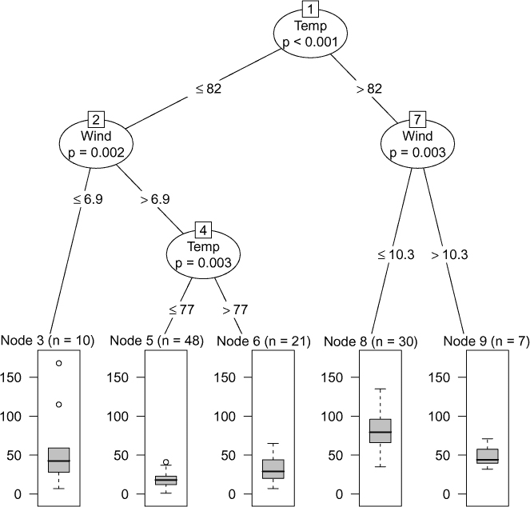

## 第五章：超越 k-NN：决策树**


在 k-NN 中，我们会观察待预测数据点的邻域。在这里，我们同样会观察邻域，但方式更加复杂。这个方法易于实现和解释，能生成直观的图示，并且拥有更多可调的超参数，以便进行微调。

在这里，我们将介绍*决策树（DT）*，它是机器学习领域的主要方法之一。除了直接使用外，决策树还是*随机森林*和*梯度提升*的基础，这些内容将在后续章节中介绍。

### 5.1 决策树基础

虽然早期曾有一些相关思想被提出，但决策树方法由于统计学家 Leo Breiman、Jerry Friedman、Richard Olshen 和 Chuck Stone 的工作而被广泛应用。他们将他们的方法称为*分类与回归树（CART）*，并在他们的书《分类与回归树》（Wadsworth，1984 年）中进行了描述。

决策树方法基本上将预测过程设定为一个流程图，因此得名*决策树*。例如，参见图 5-1 在第 5.2.1 节中。我们根据温度、风速等特征来预测臭氧水平。在预测一个新案例时，我们从树的顶部开始，沿着某条路径向下走，并在此过程中做出是否向左或向右转的决策。在树的底部，我们做出最终预测。

我们使用训练集数据生成一棵树。树的顶部（*根节点*）包含所有数据。然后，我们根据某个特征是否大于或小于给定的值，将数据分成两部分。这会在根节点下方分别创建两个新节点，位于左右两侧。接着，我们将每个部分再分成两部分，如此继续下去。因此，另一种该过程的名称是*递归划分*。

在每一步中，我们可以选择停止——即在树的某个路径或分支上不再进行进一步分裂。此时，未分裂的节点称为*叶子节点*或*终端节点*。树的任何分支最终都会结束于某个叶节点。

最终，为了预测一个新案例，我们从树的根节点开始，一直走到叶子节点。我们预测的*Y*值取决于应用类型。在数值型*Y*的情况下，我们预测的*Y*值是该节点内所有*Y*值的平均值。对于分类应用，我们预测的*Y*值是给定叶节点中最为常见的类别。或者等效地，可以将*Y*表示为虚拟变量，并计算每个虚拟变量的平均值。这样，我们就得到了各个类别的概率，并将预测类别设置为概率最大的那个。

从这个意义上说，决策树（DT）与 k-近邻（k-NN）类似。叶节点类似于 k-NN 中的邻域概念。

为了决定（a）*是否*将树中的某个节点进行分割，以及（b）如果分割，*如何*进行分割，已经设计了各种方案。稍后将详细介绍。

### 5.2 `qeDT()`函数

R 的 CRAN 仓库有几个决策树包，我特别喜欢的是`partykit`及其早期版本`party`。（这些名字是对术语*递归分区*的双关。）我们的`qe*`系列函数`qeDT()`是对`party::ctree()`的包装。为了说明这一点，我们运行一个来自该包的示例。

这里的数据集`airquality`是内置在 R 中的，结构如下所示：

```
> head(airquality)
  Ozone Solar.R Wind Temp Month Day
1    41     190  7.4   67     5   1
2    36     118  8.0   72     5   2
3    12     149 12.6   74     5   3
4    18     313 11.5   62     5   4
5    NA      NA 14.3   56     5   5
6    28      NA 14.9   66     5   6
7    23     299  8.6   65     5   7
```

我们的目标是根据其他特征预测臭氧水平：

```
> airq <- subset(airquality, !is.na(Ozone)) # remove rows with Y NAs
> dim(airq)
[1] 116   6
> dtout <- qeDT(airq,'Ozone',holdout=NULL)
```

由于这是一个非常小的数据集，我们决定不使用保留集。

我们像往常一样预测新的数据点（毕竟，`qe*`系列旨在为它们包装的各种函数提供统一的接口）。假设我们有一天的新数据需要预测，数据与`airq[1,]`相同，但风速为 8.8 英里每小时。我们应该预测臭氧浓度的什么值？

```
> w <- airq[1,-1]
> w[2] <- 8.8
> w
  Solar.R Wind Temp Month Day
1     190  8.8   67     5   1
> predict(dtout,w)
        Ozone
[1,] 18.47917
```

我们预测臭氧浓度大约为 18.5 百万分之一。

如你所知，`qe*`系列函数是包装器，它们的返回对象通常包括一个组件，该组件包含被包装函数的返回对象。这在`qeDT()`中也适用：

```
> names(dtout)
[1] "ctout"     "classif"   "trainRow1"
```

这里的`ctout`是由`ctree()`返回的对象，当后者从`qeDT()`调用时返回。顺便提一句，`ctout`属于`'party'`类。

我们在这里使用的是默认的超参数，可能通过更好的参数设置获得更好的预测效果。有关更多内容，请参见第 5.6 节，但现在让我们专注于通过绘制流程图来理解决策树的工作过程。

#### ***5.2.1 查看图形***

大多数决策树包允许你绘制树图，这有时可以为分析师提供有价值的见解。不过，在我们的设置中，我们将使用该图来更好地理解决策树的工作原理。

调用非常简单：

```
> plot(dtout)
```

如前所述，`plot()`是一个 R 的*通用函数*（即占位符）。上述调用被分派到`plot.qeDT(dtout)`。由于后者已编写为在`ctout`组件上调用`plot()`，因此最终上述的`plot()`调用将最终被分派到`plot.party()`。

图 5-1 展示了图形。由于我们现在只是对整体情况进行概述，所以不要试图一眼看懂全部内容。



*图 5-1：示例图*

决策树确实呈现为流程图。对于给定的`Solar.R`、`Wind`等值，我们应该预测臭氧的什么值？图中显示了我们的预测过程。

现在让我们看看当我们预测一个新的点，例如上面提到的`w`时会发生什么。我们从根节点开始，节点 1，然后查看`Temp`。由于`w`中的温度值为 67，低于 82 度，我们向左走，到节点 2。在那里我们询问`Wind`是否小于或等于 6.9 英里每小时。它的值是 8.8，所以我们向右走，到节点 4，在那里我们被要求将`Temp`与 77 进行比较。再次地，`w`中的值是 67，所以我们向左走，到节点 5。

我们之前看到的预测值是 18.47917。那这个值是如何从节点 5 得出的呢？

我们的预测值将是节点 5 中所有训练集数据点的均值*Y*。`dtout`中有关于哪些数据点属于该节点的信息。具体来说，`qeDT()`输出的`termNodeMembers`组件是一个 R 列表，每个树节点对应一个元素。为了更好地理解该函数的工作原理，让我们“手动”检查一下节点 5：

```
> dtout$termNodeMembers[['5']]
 [1]   1   2   3   4   5   6   7   8  10  11  12
[12]  13  14  15  16  17  18  19  20  21  22  23
[23]  26  31  32  33  34  35  45  74  76  79  80
[34]  96  97  99 101 102 104 105 106 108 109 111
[45] 112 114 115 116
```

我们看到`airq`的 48 个数据点最终落入了节点 5，具体包括`airq[1,]`、`airq[2,]`，依此类推。决策树（DT）随后计算这些点的均值*Y*：

```
> node5indices <- dtout$termNodeMembers[['5']]
> mean(airq$Ozone[node5indices])
[1] 18.47917
```

这与我们通过`predict()`获得的值一致。

### 5.3 示例：纽约市出租车数据

让我们在一个更大的数据集上尝试这一切。幸运的是，对于我们这些数据分析师来说，纽约市出租车与豪华轿车委员会提供了大量的出租车行程数据。^(1) 其中一小部分数据作为`yell10k`存在于`regtools`包中。

该数据集由 2019 年 1 月的数据中的 10,000 个随机记录组成。它仅保留了原始的 18 个特征中的 7 个，并进行了部分日期转换。

如果出租车运营商有一个应用程序来预测行程时间，那将会很好，因为许多乘客可能希望了解这个信息。这也将是我们在这里的目标。

这是数据：

```
> data(yell10k)
> head(yell10k)
        passenger_count trip_distance PULocationID DOLocationID PUweekday
2969561               1          1.37          236           43         1
7301968               2          0.71          238          238         4
3556729               1          2.80          100          263         3
7309631               2          2.62          161          249         4
3893911               1          1.20          236          163         5
4108506               5          2.40          161          164         5
        tripTime
2969561      598
7301968      224
3556729      761
7309631      888
3893911      648
4108506      977
```

在这里，`PU`和`DO`分别代表“接客”和“送客”。行程距离以英里为单位，行程时间以秒为单位。

另一方面，单单行程距离不足够；接客和送客的地点也很重要，因为城市的某些区域可能比其他地方更难行驶。原始数据中还包含了时间信息，这在这里虽然没有使用，但实际上是非常重要的。

#### ***5.3.1 陷阱：因子水平组合过多***

现在，注意一下位置 ID：

```
> length(unique(yell10k$PULocationID))
[1] 143
> length(unique(yell10k$DOLocationID))
[1] 205
> 143*205
[1] 29315
```

潜在的接客和送客组合有 29,315 种！由于我们只有*n* = 10000 个数据点，我们面临着严重过拟合的风险。而且，至少有这么多潜在的树节点会影响训练集的运行时间。

此外，当我使用`partykit`包而不是`party`包时，我遇到了一个错误信息：“水平过多”。文档建议在这种情况下使用`party`，但即使那样，我们也很可能会遇到大数据集的麻烦。

这表明可能需要使用合并或嵌入（参见第 4.3.1 节）。例如，我们可能希望形成连续位置的组，或者我们可以尝试嵌入——即用纬度和经度替代位置 ID。但我们先看看不采取这些措施时会发生什么。

#### ***5.3.2 基于树的分析***

如前所述，这个数据集可能存在一些挑战，特别是在可能出现过拟合问题的情况下。我们试试看：

```
> dtout <- qeDT(yell10k,'tripTime')
holdout set has  1000 rows
> dtout$testAccAA
[1] 211.7106
> dtout$baseAcc
[1] 433.8724
```

不错；通过使用这里的特征，我们将 MAPE 减少了一半。同样，通过使用非默认的超参数组合，以及添加原始数据集中`yell10k`中没有的一些特征，我们可能会做得更好。

即使是我们在这里使用的缩小版数据集，其复杂度也远高于绘制其树形图所能承载的水平。我们仍然可以以打印形式显示它：

```
> dtout

     Conditional inference tree with 40 terminal nodes

Response:  tripTime
Inputs:  passenger_count, trip_distance, PULocationID, DOLocationID, PUweekday
Number of observations:  9000

1) trip_distance <= 3.08; criterion = 1, statistic = 5713.065
  2) trip_distance <= 1.39; criterion = 1, statistic = 3517.53
    3) trip_distance <= 0.79; criterion = 1, statistic = 1216.608
      4) trip_distance <= 0.49; criterion = 1, statistic = 404.09
        5) trip_distance <= 0.16; criterion = 1, statistic = 138.913
          6)*  weights = 107
        5) trip_distance > 0.16
          7) trip_distance <= 0.27; criterion = 0.998, statistic = 83.348
            8)*  weights = 51
          7) trip_distance > 0.27
            9) DOLocationID == {13, 68, 75, 87, 100, 107, 125, 137, 142, 148,
               161, 162, 209, 230, 233, 234, 237, 264}; criterion = 0.982,
               statistic = 83.545
              10)*  weights = 138
...
```

尽管即使是打印形式的显示也相当复杂，这里仅强行列出一部分，且其中包含一些我们尚未描述的数量，但仍然可以获得一些有趣的信息。首先，我们看到共有 40 个终端节点，而在我们之前的例子中只有 5 个，这反映了该数据集的复杂性更高。（整个树中有 79 个节点，输入`dtout$nNodes`可以看到。）

其次，我们看到部分是如何实现该减少的：决策树能够形成自己的接送位置分组，比如在节点 9：

```
            9) DOLocationID == {13, 68, 75, 87, 100, 107, 125, 137, 142, 148,
               161, 162, 209, 230, 233, 234, 237, 264}; criterion = 0.982,
               statistic = 83.545
              10)*  weights = 138
```

如果`DOLocationID`是 13、68 等之一，我们向左走，否则向右走。这解决了我们在第 5.3.1 节中的问题。决策树（DT）为我们分组了位置！难怪决策树这么受欢迎！

**注意**

*如果我们在 R 交互模式下输入一个表达式，R 会打印出该表达式。这里我们输入了*dtout*，所以它等同于输入*print(dtout)*。但是*print()*是另一个 R 的通用函数，因此我们将有一个类似于*plot()*上面的调用链，最后调用*print.party(dtout$ctout)*。*

在决策树分析中，有一件事值得检查，那就是各个叶子节点中的数据点数量。假设某些节点的数据点很少，这类似于在 k-NN 邻域中点数过少。就像在后者的情况下我们可以尝试不同的*k*值一样，在这里我们可能需要调整一些决策树超参数。

我们将在第 5.6 节讨论超参数，但现在先来看一下如何检查数据点较少的叶子节点：

```
> dtout$termNodeCounts
  6   8  10  12  13  16  17  19  20  24  25  27  28  31  32  34  36  37  42  43
107  51 138  71 148 262 245 190 423 492 216  18 361 370 309 266 304  17 496 101
 44  47  48  49  52  54  55  57  58  63  64  66  67  69  71  72  74  76  78  79
317 110 395 286 127 145 287 552 177 266 240  95 245 211 378 105 165 233  10  71
```

有一些较小的节点，特别是节点 78，只有 10 个数据点。这可能是调整超参数的一个原因。

### 5.4 示例：森林覆盖数据

另一个 UCI 数据集，Covertype，旨在“[预测]森林覆盖类型，仅基于制图变量。”^(2) 其目的是通过遥感来确定难以到达的地区存在的草种类。数据集中有 581,012 个数据点，包含 54 个特征，例如海拔、午间山坡阴影和到最近地表水的距离。共有七种不同的覆盖类型，存储在第 55 列。

这个示例有很多值得注意的地方。在这里，我们将看到决策树在多类分类问题中的应用，且其规模大于我们迄今为止所见。而且，章节讲解树结构时，数据来自森林难道不更好？

输入数据，例如，使用`data.table::fread()`来提高速度：

```
> library(data.table)
> cvr <- fread('covtype.data.gz')
> cvr[1,]
     V1 V2 V3  V4 V5  V6  V7  V8  V9  V10 V11 V12
1: 2596 51  3 258  0 510 221 232 148 6279   1   0
   V13 V14 V15 V16 V17 V18 V19 V20 V21 V22 V23
1:   0   0   0   0   0   0   0   0   0   0   0
   V24 V25 V26 V27 V28 V29 V30 V31 V32 V33 V34
1:   0   0   0   0   0   0   0   0   0   0   0
   V35 V36 V37 V38 V39 V40 V41 V42 V43 V44 V45
1:   0   0   0   0   0   0   0   0   1   0   0
   V46 V47 V48 V49 V50 V51 V52 V53 V54 V55
1:   0   0   0   0   0   0   0   0   0   5
```

类别（位于`V55`列）作为整数读取，而`qe*`系列函数需要在分类问题中将*Y*转换为 R 的因子。我们本可以使用`fread()`的`colClasses`参数，但直接修正它会更方便：

```
> cvr$V55 <- as.factor(cvr$V55)
```

有七个类别，但有些类别比其他类别要常见得多：

```
> table(cvr$V55)

     1      2      3      4      5      6      7
211840 283301  35754   2747   9493  17367  20510
```

覆盖类型 1 和 2 是最常见的。

由于*n*和*p*都很大，我们可以选择运行一个 50,000 条记录的随机子集，便于更好地说明这些概念。这样的做法在数据分析中也很常见：先在数据子集上进行初步分析，便于操作，然后再对完整数据进行更为深入的分析。

```
> cvr50k <- cvr[sample(1:nrow(cvr),50000),]
> dto <- qeDT(cvr50k,'V55')
holdout set has  1000 rows
> dto$testAcc
[1] 0.249
> dto$baseAcc
[1] 0.5125714
```

再次强调，使用特征（25%的错误率）比不使用特征（51%的错误率）要好得多。

我们也可以查看混淆矩阵：

```
> dto$confusion
      pred
actual   1   2   3   4   5   6   7
     1 241 103   0   0   0   0   3
     2  65 402   3   0   3   8   1
     3   0   4  54   0   1  12   0
     4   0   0   3   3   0   0   0
     5   1  10   0   0   8   1   0
     6   0   3  18   0   0  20   0
     7  10   0   0   0   0   0  23
```

类别 1 经常被误预测为类别 2，反之亦然。

在这里，随着样本量*n*和特征数量*p*的增大，可能会生成一个非常大的树。实际上，它比我们之前的示例要大得多：

```
> dto$nNodes
[1] 1065
> dto$nTermNodes
[1] 533
```

这棵树有 1,000 个节点，其中大约一半是终端节点！

### 5.5 决策树超参数：如何进行分裂？

不同的决策树包在节点分裂的细节上有所不同。在大多数情况下，这个过程相当复杂，因此超出了本书的讨论范围。`party`包中的分裂过程也不例外，但我们至少需要对这个过程有一个大致的了解。我们将重点介绍`party`包中一个主要的分裂标准，即*p 值*。

再次查看图 5-1。椭圆形区域显示用于分裂的特征是`Wind`，p 值为 0.002，分裂点为 6.9。但最初，当树结构建立时，该椭圆区域是空的，底部没有任何线条延伸。那么，这个节点是如何从图中看到的状态构建出来的呢？

节点 2 从节点 1 的左分支继承了数据点。然后执行了以下算法：

```
pv = null vector
for feature f in Solar.R, Wind, Temp, Month, Day do:
   for split_point in the values of f do:
      compute a p-value pval
      append pval to pv
```

我们在上述伪代码的输出上做以下操作：

+   如果最小的 p 值低于用户指定的标准，则使用产生最小 p 值的特征和分裂点来分裂节点（在本例中是`Wind`和 6.9）。

+   另一方面，如果最小的 p 值没有小于用户指定的标准，就不要拆分节点。

例如，我们看到，对于节点 2 及潜在的（后来实际的）拆分特征`Wind`，有很多候选的潜在拆分点：

```
> sort(airq$Wind)
  [1]  2.3  2.8  3.4  4.0  4.1  4.6  4.6  4.6  5.1  5.1  5.1  5.7  5.7  6.3  6.3
 [16]  6.3  6.3  6.3  6.3  6.9  6.9  6.9  6.9  6.9  6.9  6.9  6.9  7.4  7.4  7.4
 [31]  7.4  7.4  7.4  7.4  7.4  7.4  7.4  8.0  8.0  8.0  8.0  8.0  8.0  8.0  8.6
 [46]  8.6  8.6  9.2  9.2  9.2  9.2  9.2  9.2  9.7  9.7  9.7  9.7  9.7  9.7  9.7
 [61]  9.7  9.7 10.3 10.3 10.3 10.3 10.3 10.3 10.3 10.3 10.3 10.3 10.9 10.9 10.9
 [76] 10.9 10.9 10.9 11.5 11.5 11.5 11.5 11.5 11.5 11.5 11.5 11.5 11.5 12.0 12.0
 [91] 12.0 12.0 12.6 12.6 13.2 13.8 13.8 13.8 13.8 14.3 14.3 14.3 14.3 14.9 14.9
[106] 14.9 14.9 14.9 15.5 15.5 15.5 16.6 16.6 18.4 20.1 20.7
```

值 2.8、3.4、...、20.1 中的任何一个都可以使用。算法会考虑每一个。

直观上，我们希望拆分能产生两个大致平衡的子集，比如在 9.7 处分裂。但更紧迫的要求是，两个子集在*Y*的均值上有很大的差异。如果两个候选子集的*Y*均值相差不大，则认为该节点是同质的，不会拆分——至少对于该特征而言。

那么，什么才算“相差很多”呢？这是由一个正式的统计显著性测试来决定的。本书不假设读者有统计学背景，对于我们的目的，我们只说明一个测试的结果是通过一个叫做 p 值的数字来总结的。

近年来，测试方法受到许多批评，我认为这有其合理之处（请参见文件*NoPVals.md*，位于`regtools`中）。然而，在这里进行节点拆分时，p 值阈值只是另一个超参数，称为`alpha`，在`qeDT()`中默认值为 0.05。

如果某个候选特征和候选拆分点的 p 值小于`alpha`，则认为该节点值得拆分。所选择的特征和拆分点是具有最小 p 值的一对。我们在图 5-1 中看到，最小的 p 值恰好是 0.002，它与`Wind`特征和拆分点 6.9 相关联。由于 0.002 < 0.05，该节点相应地被拆分了。

如果没有任何分裂点满足上述标准，则该节点不进行拆分。在节点 3 中发生了这种情况，因此它成为了终端节点。

### 5.6 `qeDT()`函数中的超参数

如前所述，决策树（DT）可以被看作是 k-NN 思想的延伸。每个叶节点形成一种邻域，其中的数据点在某些特征上具有相似的值。回想一下第三章，较小的邻域会导致预测的*Y*值具有更大的方差——因为样本太小，无法有效工作——而较大的邻域则可能存在偏差问题（即，同一邻域中的点可能彼此差异较大，从而不能代表整体）。

在决策树的背景下，我们应该查看叶节点，考虑偏差-方差权衡。如果有太多小的终端节点，我们就会面临方差问题，而过多大的终端节点则可能意味着偏差问题。

这里是超参数发挥作用的地方。它们以各种方式控制树的配置，我们可以使用交叉验证来选择具有最佳预测能力的树配置。

一般的调用形式是：

```
> args(qeDT)
function (data, yName, alpha = 0.05, minsplit = 20, minbucket = 7,
    maxdepth = 0, mtry = 0, holdout = floor(min(1000, 0.1 * nrow(data))))
```

`data`、`yName`和`holdout`参数在所有`qe*`系列函数中都是通用的。其余的`alpha`、`minsplit`、`minbucket`、`maxdepth`和`mtry`都涉及分裂标准。以下是它们的作用：

alpha   如上所述。

minsplit   在这里我们可以指定任何节点的最小大小。默认值为 20，意味着我们不会允许任何节点分裂后小于 20 个数据点。

minbucket   类似于`minsplit`，但专门针对终端节点。

maxdepth   树的最大层数或行数。在图 5-1 中，我们有 4 个层次，根节点在第 1 层，叶节点在第 4 层。

mtry   如果这个值非零，它表示每个节点尝试的特征数量；见下文。

如果`mtry`非零，我们的分裂算法会稍作调整：

```
pv = null vector
randomly choose mtry features among Solar.R, Wind, Temp, Month, Day
for f in chosen feature set do
   for split_point in the values of f do:
      compute a p-value pval
      append pval to pv
```

这为树的构建过程增加了一些随机性，是朝着机器学习方法*随机森林*的一步。我们将在下一章看到这为什么可能有用，但对于严格的决策树方法，通常不使用它。

从偏差-方差权衡的角度考虑上述每个超参数。假设我们希望使叶节点更小。其他条件相同的情况下，我们可以通过增大`alpha`、减小`minsplit`、减小`minbucket`、增大`maxdepth`和增大`mtry`（或设为 0）来实现这一目标。

例如，增大`alpha`时，更多的 p 值会低于这个高阈值，因此节点更有可能分裂。随着树的深入，剩余的数据点会减少，因此如果我们鼓励分裂，到了一个无法再分裂的节点时，它将不会有很多剩余的数据点。

这些超参数并非独立工作，因此设置过多的超参数可能会变得冗余。

### 5.7 结论

决策树在机器学习中起着基础性作用，我们将在后续的袋装法和提升法材料中再次遇到它们。与任何机器学习算法一样，我们必须处理各种超参数，这是本书稍后将深入讨论的另一个主题。
