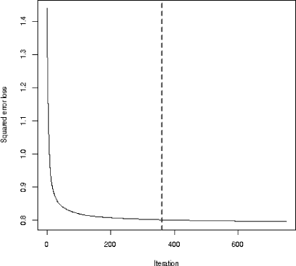
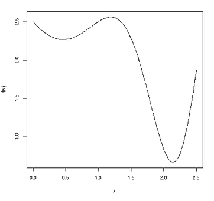
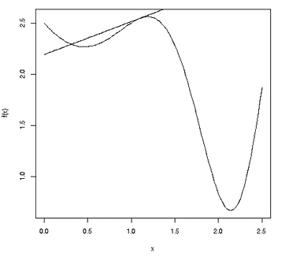

## 第六章：微调决策树**

*AdaBoost 是世界上最好的现成分类器。*

—CART 联合发明人 Leo Breiman，1996 年

*XGBoost 是许多机器学习竞赛获胜团队首选的算法。*

—维基百科条目，2022 年


在这里，我们讨论机器学习中的两种通用技术，*bagging* 和 *boosting*，并将它们应用于扩展决策树分析。这些扩展，*随机森林* 和 *基于树的梯度提升*，被广泛使用——事实上，比起单一的树方法，它们的使用更加普遍。

### 6.1 偏差与方差，Bagging 和 Boosting

*失去一颗钉子，鞋子也丢了；*

*失去一只鞋子，马也丢了；*

*失去一匹马，人也丢了。*

—古老的谚语

我们必须始终记住，我们处理的是样本数据。有时，“被采样的总体”大多是概念性的；例如，在第 5.3 节的出租车数据中，我们将数据视为来自所有天数的乘客数据样本，包括过去、现在和未来。但无论如何，都存在采样变异。

在自行车租赁数据中，假设数据收集周期多延续一天会怎么样？即使是这个微小的变化，也可能会影响树的顶部的精确分裂，即节点 1\. 这个影响可能会继续影响节点 2 和 3 的分裂（或可能的非分裂），以此类推，直到影响到结果树的最底层。需要注意的是，不仅节点中的分裂点可能发生变化，节点的成员资格也可能发生变化。曾经在节点 2 的数据点现在可能会被归到节点 3\. 换句话说：

决策树对输入的微小变化非常敏感。这意味着它们对采样变异非常敏感——也就是说，**决策树具有较高的方差**。

回想一下，分裂一个节点可以减少偏差，通常，减少偏差也会增加方差。但正如上面所说，方差在决策树设置中可能特别成问题。

在这一章中，我们讨论处理这一问题的两种主要方法，*bagging/随机森林*和*boosting*。这两种方法的观点是：“方差太大？好吧，那意味着样本量太小，那么我们就生成更多的树！”但怎么做呢？

### 6.2 Bagging：通过重采样生成新树

*bagging* 这个术语指的是机器学习中一种现代统计学工具——*自助法*（bootstrap）的应用。这包括从我们的数据中随机抽取多个子样本，应用我们给定的估计器到每个子样本，然后对结果进行平均（或以其他方式组合）。在这里，我们将自助法应用于决策树。

从我们原始数据开始，再次考虑它是某一总体的样本，我们将从原始数据集中生成 *s* 个新样本。我们通过从 *n* 个数据点中随机抽取 *m* 个样本（*有* 放回）来生成新样本。（我们可能会得到一些重复的样本。）我们将为每个新样本拟合一棵树，从而实现上述目标，即生成更多的树，并以稍后展示的方式合并结果。这里的 *s* 和 *m* 是——你猜对了——超参数。

#### ***6.2.1 随机森林***

假设我们有一个新的案例需要预测。然后，我们将通过对每棵树形成一个预测值，并将所有这些预测值结合起来，按照如下方式*聚合* *s* 棵树，以形成我们的最终预测：

+   在数值型 *Y* 设置中，合并的方式是对所有预测值进行平均。例如，在出租车数据中（见第 5.3 节），每棵树会给出一个预测的行程时间，而我们的最终预测行程时间将是所有这些单独预测值的平均值。

+   在分类问题中，例如我们在第 2.3 节中讨论的脊椎骨示例，我们可以通过使用*投票*过程来进行合并。对于每棵树，我们将找到预测的类别：NO、DH 或 SL，然后查看哪些类别在不同的树之间获得了最多的“投票”。这将是我们的预测类别。或者，我们可以找到每棵树对于这个新案例的估计类别概率，然后取平均概率。我们的预测类别将是概率最大的那个类别。

因此，我们进行自助抽样然后聚合，简称*bagging*。它也通常被称为*随机森林*，这是 Leo Breiman 的具体实现。（这一思路最早的提出者似乎是 Tin Kam Ho，她称这种方法为*随机决策森林*。）该方法限制了在任何给定节点进行分裂时考虑的特征数量，每一步都有一个不同的候选特征集。

为什么这种策略，即每次使用不同的候选特征集，会奏效呢？普通的 bagging 可能导致树之间有较高的相关性，因为它每次都倾向于选择相同的特征。可以证明，正相关的数值的平均值比独立数值的平均值具有更高的方差。因此，在每一步限制候选特征集的方法有助于降低方差。

#### ***6.2.2 qeRF()函数***

`qe*-` 系列函数实际上包括了多个用于随机森林的函数。对于给定的应用，某些函数可能比其他函数更准确或更快速，但它们都使用前面描述的通用随机森林范式。我们将在这里使用 `qeRF()`。

回想一下，`qe*` 函数都有以下参数：

data   一个包含我们训练数据的数据框。

yName   `data`中包含*Y*（即需要预测的结果变量）的列名。用户通过将该列设置为数字型或 R 因子，分别区分数值型*Y*和分类设置。

holdout   可选的 holdout 集的大小。

**特定应用的参数** 例如，在`qeKNN()`的情况下，*k*是最近邻的数量。

每个`qe*`函数都是标准 R 机器学习包中函数的封装接口。在随机森林的情况下，`qeRF()`是`randomForest`包的一个封装。调用形式如下：

```
qeRF(data, yName, nTree = 500, minNodeSize = 10,
   holdout = floor(min(1000,0.1 * nrow(data))))
```

特定应用的参数包括`nTree`，即生成的自举树的数量，以及`minNodeSize`，它类似于`ctree()`中的`minsplit`。

#### ***6.2.3 示例：脊椎数据***

让我们再次查看第 2.3 节中的脊椎数据集，现在应用随机森林而不是 k-NN。我们将预测与之前示例中相同的假设新案例：

```
# fit RF model
> rfout <- qeRF(vert,'V7',holdout=NULL)
# new case to predict
> z <- vert[1,-7]
> z$V2 <- 18
# predict
> predict(rfout,z)
$predClasses
[1] "DH"

$probs
     DH    NO   SL
2 0.532 0.378 0.09
attr(,"class")
[1] "matrix" "array"  "votes"
```

使用 k-NN 时，我们预测了相同的类别 DH，但具有略微不同的类别概率：

```
> predict(kout,z)
$predClasses
[1] "DH"

$probs
      DH  NO  SL
[1,] 0.6 0.2 0.2
```

两组概率之间的差异既来自于我们使用了两种不同的机器学习算法，也来自于该数据集中的小*n*（310），这导致了较大的样本变异性。

在这里，我们使用了`nTree`和`minNodeSize`的默认值。我们可以探索这些超参数的其他组合，然后比较随机森林和 k-NN 在该数据集上的表现。

#### ***6.2.4 示例：遥感土壤分析***

在这里，我们将分析 Kaggle 上的非洲土壤属性数据集。^(1) 来自数据网站：

利用红外光谱法对土壤样本进行快速、低成本分析，土壤样本的地理参考，以及地球遥感数据的更大可用性，为预测未采样地点的土壤功能特性提供了新机遇……土壤功能特性的数字化绘图，特别是在数据稀缺的地区，如非洲，对于规划可持续农业集约化和自然资源管理非常重要。

我们希望预测不同的土壤属性，而不是直接测试土壤。

这个数据集的一个重要特性是我们以前未曾遇到过的，即它满足*p* > *n*（即列数大于行数）。原始的第一列，一个 ID 变量，已经被移除。

```
> dim(afrsoil)
[1] 1157 3599
```

传统上，统计学领域对这种设置持谨慎态度，因为线性模型（第八章）在此类设置下无法工作。必须首先进行降维。基于树的方法作为其操作的一个整体部分已实现此功能，因此我们可以尝试使用`qeRF()`。

这是各列的名称：

```
> names(afrsoil)
...
[3547] "m659.543" "m657.615" "m655.686" "m653.758" "m651.829" "m649.901"
[3553] "m647.972" "m646.044" "m644.115" "m642.187" "m640.258" "m638.33"
[3559] "m636.401" "m634.473" "m632.544" "m630.616" "m628.687" "m626.759"
[3565] "m624.83"  "m622.902" "m620.973" "m619.045" "m617.116" "m615.188"
[3571] "m613.259" "m611.331" "m609.402" "m607.474" "m605.545" "m603.617"
[3577] "m601.688" "m599.76"  "BSAN"     "BSAS"     "BSAV"     "CTI"
[3583] "ELEV"     "EVI"      "LSTD"     "LSTN"     "REF1"     "REF2"
[3589] "REF3"     "REF7"     "RELI"     "TMAP"     "TMFI"     "Depth"
[3595] "Ca"       "P"        "pH"       "SOC"      "Sand"
```

第 1 列到第 3594 列是*X*变量，具有难以理解的代码名称。其余的列是*Y*，其中一些具有更容易猜测的名称。我们将预测 pH，即土壤酸度。

这种设置被认为很难处理。由于有这么多特征，存在严重的过拟合潜力，因为其中一个或多个特征可能由于 p-hacking（第 1.13 节）而偶然被认为是强预测因子。让我们看看`qeRF()`在这里的表现如何。

```
> set.seed(9999)
> rfo <- qeRF(afrsoil[,c(1:3578,3597)],'pH',holdout=500)
> rfo$testAcc
[1] 0.3894484
> rfo$baseAcc
[1] 0.6858574
```

特征的使用将 MAPE 减少了近一半。请注意这里使用的 pH 尺度的范围：

```
> range(afrsoil$pH)
[1] -1.886946  3.416117
```

我们现在准备进行预测，比如在训练数据中的第 88 行的假设新案例：

```
> predict(rfo,afrsoil[88,1:3594])
       88
0.6068828
```

我们预测的 pH 值大约为 0.61。

### 6.3 Boosting：反复调整一棵树

想象一个分类问题，只有两个类别，即*Y* = 1 或 0，且只有一个特征，*X*，比如年龄。我们拟合一个只有一层的树。假设我们的规则是，如果*X* > 12.5，则猜测*Y* = 1；如果*X* ≤ 12.5，则猜测*Y* = 0。*Boosting*将涉及探索将 12.5 阈值的小变化对我们整体正确分类率的影响。

考虑一个数据点，其中*X* = 5.2。在原始分析中，我们会猜测*Y*为 0。而且，关键在于，如果我们将阈值调整到 11.9，我们*仍然*会猜测*Y* = 0。但这个调整可能会将一些原本分类错误的接近 12.5 的数据点修正过来。如果更多曾经被错误分类的点被正确分类，那么这就是一个成功。

所以，Boosting 的思想是调整原始树，从而形成一棵新树，然后再调整这棵新树，形成第二棵新树，依此类推。生成*s*棵树（*s*是一个超参数）后，我们通过将新案例输入到所有这些树中并以某种方式结合生成的预测值来进行预测。

#### ***6.3.1 实现：AdaBoost***

Boosting 的第一个提议是*AdaBoost*。调整过程涉及为训练集中的每个数据点分配权重，每棵树都会更新这些权重。每次形成一棵新树时，我们都会根据最新的权重集拟合一棵树，并用每棵新树更新这些权重。

在数值型*Y*的情况下，为了预测具有某个*X*值的新案例，我们将该值输入到所有树中，得到*s*个预测值。在数值型*Y*设置中，我们的最终预测值是各个预测值的加权平均。在分类设置中，我们将对*Y* = 1 的估计概率进行加权平均，以获得最终的概率估计，或者使用加权投票法。

为了使这个概念更具体，下面是如何使用`ctree()`实现该过程的概述。它依赖于`ctree()`中的一个参数，名为`weights`，它是一个非负数向量，为每个数据点分配一个权重。假设我们的响应变量名为`y`，特征为*x*。用`dx`表示数据框`d`中关于*x*的部分。

在下面的伪代码中，我们将维护两个权重向量：

1.  `wts`将存储训练数据中各行的当前权重。回想一下，随着提升过程的进行，我们会根据某些行对分类错误的影响程度，对这些行赋予更高的权重。

1.  `alpha`将存储我们各种树的当前权重。回想一下，当我们进行预测时，我们会对某些树赋予比其他树更多的权重。

这里是算法的大纲：

```
ctboost <- function(d,s) {
   # uniform weights to begin
   wts <- rep(1/n,n)
   trees <- list()
   alpha <- vector(length=s)  # alpha[i] = coefficient for tree i
   for(treeNum in 1:s) {
      trees[[i]] <- ctree(y ~ x,data=d,weights=wts)
      preds <- predict(trees[[i]],dx)
      # update wts, placing larger weight on data points on which
      # we had the largest errors (regression case) or which we
      # misclassified (classification case)
      wts <- (computation not shown)
      # find latest tree weight
      alpha[i] <- (computation not shown)
   }
   l <- list(trees=trees,treeWts=alpha)
   class(l) <- 'ctboost'
   return(l)
}
```

为了预测新的案例，`newx`：

```
predict.ctboost <- function(ctbObject,newx)
{
   trees <- ctbObject$trees
   alpha <- ctbObject$alpha
   pred <- 0.0
   for (i in 1:s) {
      pred <- pred + alpha[i] * predict(trees[[i]],newx)
   }
   return(pred)
}
```

由于本书旨在避免过于数学化，我们省略了`wts`和`alpha`的公式。然而需要指出的是，`alpha`是一个递增序列，因此在预测新案例时，后面的树会发挥更大的作用。

`qeML`包有一个用于 AdaBoost 的函数，`qeAdaBoost()`。但它仅适用于分类任务，因此我们直接进入下一个梯度提升的形式。

#### ***6.3.2 梯度提升***

在统计学/机器学习中，有一个概念叫做*残差*——即预测值与实际值之间的差异。*梯度提升*通过将树拟合到残差上来工作。给定我们的数据集，过程的大致描述如下：

1.  从一棵初始树开始。将*CurrentTree*设置为它。

1.  对于我们的每一个数据点，计算*CurrentTree*的残差。

1.  将一棵树拟合到*残差*上——即将我们的残差作为“数据”并拟合一棵树 T。将*CurrentTree* = *T*。

1.  跳到第 2 步。

这些步骤会根据用户指定的树的数量进行迭代。然后，为了预测新的案例，我们将其输入到所有树中。预测值只是各个树预测值的总和。

在任何给定的步骤中，我们都在说：“很好，我们已经有了一定的预测能力，那么让我们处理剩下的部分——也就是我们当前的误差。”因此，我们对任何新案例的预测值是每棵树为该案例预测值的总和。

##### 6.3.2.1 `qeGBoost()`函数

`qe*`函数用于梯度提升是`qeGBoost()`，这是对同名包中`gbm()`的封装。它的调用形式是：

```
qeGBoost(data, yName, nTree = 100, minNodeSize = 10, learnRate = 0.1,
    holdout = floor(min(1000, 0.1 * nrow(data))))
```

这类似于`qeRF()`，但多了一个新的参数，即*学习率*。这个学习率是机器学习中常见的概念，稍后会进行解释。

**注意**

*有很多梯度提升的包可用于 R 语言。我们选择了*gbm* *包，因为它简单易用。就像之前在随机森林中一样，其他包在某些数据集上可能更快或更准确，特别是*qeXGBoost*。在这里，*qeGBoost()* 坚持了*qe**系列的“快速简便”理念，但鼓励读者将其他包作为高级话题进行探索。*

#### ***6.3.3 示例：呼叫网络监测***

我们首先将提升算法应用于一个名为“移动网络监测与优化的呼叫测试测量”的数据集，^(2)，该数据集用于评估移动呼叫的服务质量。目标是预测质量评分。

##### 6.3.3.1 数据

这里是数据的介绍：

```
> ds <- read.csv('dataset.csv',stringsAsFactors=TRUE)
> names(ds)
[1] "Date.Of.Test"             "Signal..dBm."
[3] "Speed..m.s."              "Distance.from.site..m."
[5] "Call.Test.Duration..s."   "Call.Test.Result"
[7] "Call.Test.Technology"     "Call.Test.Setup.Time..s."
[9] "MOS"
> ds <- ds[,-1]
> head(ds)
  Signal..dBm. Speed..m.s. Distance.from.site..m. Call.Test.Duration..s.
1          -61       68.80                1048.60                     90
2          -61       68.77                1855.54                     90
3          -71       69.17                1685.62                     90
4          -65       69.28                1770.92                     90
5         -103        0.82                 256.07                     60
6          -61       68.86                 452.50                     90
  Call.Test.Result Call.Test.Technology Call.Test.Setup.Time..s. MOS
1          SUCCESS                 UMTS                     0.56 2.1
2          SUCCESS                 UMTS                     0.45 3.2
3          SUCCESS                 UMTS                     0.51 2.1
4          SUCCESS                 UMTS                     0.00 1.0
5          SUCCESS                 UMTS                     3.35 3.6
6          SUCCESS                 UMTS                     0.00 1.0
...
```

这里的*Y*是`MOS`，即服务质量。

它有多大？

```
> dim(ds)
[1] 105828      8
```

现在，让我们来拟合模型。

##### 6.3.3.2 拟合模型

在超过 100,000 个数据点和仅 8 个特征的情况下，过拟合应该不是该数据集的问题。它轻松满足我们粗略的经验法则，*p* <  （第 3.1.3 节）。因此，我们不需要使用持出集。不过，算法中仍然存在一些随机性，因此为了保证一致性，我们设置随机种子。

```
> set.seed(9999)
> gbout <- qeGBoost(ds,'MOS',nTree=750,holdout=NULL)
```

`nTree`的默认值仅为 100，但我们尝试了一个更大的数字，750，这一点将在下面说明。

让我们做个预测。假设我们有一个像`ds[3,]`这样的案例，但距离为 1500，持续时间为 62：

```
> ds3 <- ds[3,-8]
> ds3[,3] <- 1500
> ds3[,4] <- 62
> predict(gbout,ds3)
[1] 2.462538
```

##### 6.3.3.3 超参数：树木数量

但是，我们是否应该使用这么多的树呢？毕竟，750 棵可能会导致过拟合。也许后面的树是在进行“噪音拟合”。该包有几种方式来解决这个问题，其中一种是使用辅助函数`gbm.perf()`。将其应用于`gbm()`的输出，它可以估算出最佳的树木数量。

如前所述，`qeGBoost()`调用`gbm()`并将后者的输出放入其输出的`gbmOuts`组件中。因此，我们能够调用`gbm.perf()`：

```
> gbm.perf(gbout$gbmOuts)
```

请参见图 6-1 中的输出图。虚线垂直线表示估算的“甜点”——即最佳树木数量，在本例中为 382。（该值也会打印到 R 控制台。）



*图 6-1：来自* gbm.perf 的输出

但我们无需重新拟合模型。我们可以在预测中改变树木的数量：

```
> predict(gbout,ds3,newNTree=382)
[1] 2.45214
```

由于我们没有形成持出集，我们需要手动计算 MAPE：

```
> mean(abs(preds - ds[,8]))
[1] 0.6142699
```

`gbm`包的其他特性可以参考其文档。

#### ***6.3.4 示例：椎骨数据***

Boosting 可以用于分类问题以及数值-*Y*类型的情况。（而且它在分类方面的使用可能更为普遍。）这里展示了`qeGBoost()`应用于椎骨数据（请参见第 2.3 节）。

```
> set.seed(9999)
> gbout <- qeGBoost(vert,'V7')
```

假设我们要预测一个像训练集第 12 行这样的新案例：

```
> predict(gbout,vert[12,-7])
$predClasses
[1] "DH"

$probs
            DH        NO          SL
[1,] 0.6283904 0.3694108 0.002198735

attr(,"class")
[1] "qeGBoost"
```

我们预测 DH，估算概率大约为 0.63（不幸的是，`gbm.perf()`在多分类情况下不可用）。

#### ***6.3.5 Boosting 中的偏差与方差***

Boosting 是对树进行“调整”，有可能使其更稳定，特别是因为我们在平均多个树，从而平滑掉“缺一根钉子……问题”。因此，它可能会降低方差。通过对树进行小的调整，我们有可能开发出更详细的分析，从而减少偏差。

但这一切只是“潜在的”真实。虽然调整过程有一定的理论基础，但它仍然可能会把我们引入误区，实际上*增加*偏差，并且可能也会增加方差。如果超参数*s*设置得过大，导致树木过多，我们可能会发生过拟合。

#### ***6.3.6 计算速度***

提升算法可能会占用大量的 CPU 周期，因此我们可能需要一些方法来加速。`n.cores`参数在`gbm()`中尝试将计算任务分配到机器的不同核心。如果你有一台四核系统，可以尝试将这个参数设置为 4 甚至 8（然后直接调用`gbm()`，而不是通过`qeGBoost()`）。

#### ***6.3.7 进一步的超参数***

提升算法通常有许多超参数。我们之前提到过`nTree`（在`gbm()`中为`n.trees`），它是生成的树的数量。

另一个超参数是`minNodeSize`（在`gbm()`中为`n.minobsinnode`），它是我们愿意在一个树节点中拥有的最小数据点数量。如我们在第五章中看到的，减少此值会降低偏差但增加方差。

`shrinkage`超参数在一般机器学习环境中非常重要，因此我们将在下一小节中单独讨论它。

#### ***6.3.8 学习率***

学习率的概念在机器学习中经常出现。我们将在此处一般性地描述它，然后解释它在梯度提升中的工作原理。我们将在后续关于支持向量机（第十章）和神经网络（第十一章）的材料中再次提到它。

本节包含了一些数学内容，涉及曲线及其切线，这是本书明确不以数学为主的例外。但仍然没有方程式，甚至对于数学有排斥的读者也应该能跟上讨论。

##### 6.3.8.1 一般概念

回想一下，在机器学习方法中，我们通常试图最小化某个损失函数，比如 MAPE 或整体误分类错误 OME。从计算角度来看，这种最小化可能是一个挑战。

考虑在图 6-2 中绘制的函数。它是一个一维变量* x *的函数，而通常我们的* x *是高维的，但这个例子足以说明我们的观点。



*图 6-2：一个需要最小化的函数*

大约在* x * = 2.2 处有一个全局最小值，这被称为*全局最小值*。但在* x * = 0.4 处也有一个*局部最小值*；该术语意味着这个值仅适用于 0.4 附近的点——即“局部”的最小值。我们将全局最小值处的* x *称为* x *[0]。

对于我们这些看图的人来说，* x *[0]的位置是显而易见的，但我们需要我们的软件能够找到它。这可能会成为一个问题。原因如下。

大多数机器学习算法采用*迭代*方法来寻找所需的最小值点* x *[0]。这涉及到一系列对* x *[0]的猜测。代码从一个初始猜测* g *[0]开始，比如随机选择，然后评估*f*(* g *[0])。根据结果，算法然后以某种方式（见下文）更新猜测到* g *[1]。接着它评估*f*(* g *[1])，生成下一个猜测* g *[2]，依此类推。

算法不断生成猜测，直到它们变化不大，比如说，直到|*g**[i]*[+1] − *g**[i]*| < 0.00000001 为止，步骤*i*。我们说算法已经*收敛*到这个点。我们将*i*的值称为*c*。然后它报告* x* [0]，即全局最小点为最新的猜测，*g**[c]*。

那么，之前提到的“某种方式”又是怎么回事呢？算法如何从当前猜测生成下一个猜测？答案就在于*梯度*。在我们这里的简单示例中，*x*是一维的，梯度是给定点上函数的斜率——也就是曲线的切线的斜率。

假设我们的初始猜测是*g*[0] = 1.1。切线如图 6-3 所示。该线向右上方指，意味着它的斜率是正的，因此它告诉我们，向左走会让我们得到更小的函数值。我们想找到*f*()最小的点，而切线则说：“哦，你想要比*f*(1.1)更小的值吗？往左走！”但实际上我们应该向右走，朝着 2.2 走，那是全局最小值所在。



*图 6-3：需要最小化的函数，以及切线*

所以，读者可以看到，迭代算法充满了危险。更糟糕的是，它还增加了另一个超参数：我们不仅需要决定下一步猜测应该*朝哪个方向*移动，还需要决定*在那个方向上移动多远*。学习率就是为了处理后者的问题。

如前所述，我们应该从 1.1 向右移动，而不是向左。函数*f*(*x*)在这里欺骗了算法。实际上，在这种情况下，我们的算法可能会收敛到错误的点。或者它甚至可能根本不收敛，反而漫无目的地游荡。

这就是为什么典型的机器学习包允许用户设置学习率。较小的值可能更可取，因为较大的值可能导致我们的猜测来回摆动，总是错失目标。另一方面，如果学习率太小，我们将只会缓慢前进，花费很长时间才能到达目标。或者更糟的是，我们会收敛到局部最小值。

再次强调，我们有一个超参数，它需要处于“恰到好处”的水平——既不能太大，也不能太小——可能需要通过尝试不同的值来进行实验。

##### 6.3.8.2 gbm 中的学习率

这是`gbm()`中的`shrinkage`参数，在`qeGBoost()`中叫做`learnRate`。假设我们将其设置为 0.2。回想一下 6.3.2 节中描述的梯度提升伪代码。修订后的版本是：

1.  从一个初始树开始。将*CurrentTree*设为它。

1.  对于我们的每个数据点，计算*CurrentTree*的残差。

1.  将一棵树*拟合到残差*上——也就是说，把我们的残差当作“数据”，并在其上拟合一棵树 T。将*CurrentTree*设为旧的*CurrentTree*，加上`shrinkage * T`。

1.  转到第 2 步。

这里，`shrinkage * T`意味着将树的终端节点中的所有值乘以`shrinkage`因子。最终，我们仍然将所有树加起来，生成用于预测新案例的“超树”。

再次强调，较小的`shrinkage`值更为谨慎且处理速度较慢，可能会导致我们需要更多的树木来获得良好的预测能力。但它可能有助于防止过拟合。

### 6.4 陷阱：没有免费的午餐

*没有免费的午餐。*

—古老的经济学说法

尽管利奥·布雷曼（Leo Breiman）在谈到 AdaBoost 的巨大价值时有其道理（特别是提到“现成的”，即可以直接使用默认的超参数值），但“没有免费的午餐”这句老话同样适用。像往常一样，应用交叉验证等方法对于开发良好的模型是不可或缺的。

类似的建议涉及另一个著名的布雷曼（Breiman）声明：即使用随机森林是不可能过拟合的。读到这本书此处的读者会立即意识到，布雷曼并不是以某些人所理解的方式表达他的意思。任何机器学习方法都有可能发生过拟合。布雷曼的意思是，不可能将*s*（树木的数量）设置得太高。但树木本身仍然可能发生过拟合，例如，节点中数据点的最小数量设置得太小，或者包含了过多的特征。
