## 第八章：**参数化方法**


回顾一下“回归函数”这个术语，它首先出现在第 1.6 节，并用 *r*(*t*) 表示。它是由条件 *X* = *t* 定义的子群体中的 *Y* 的均值。当时我们举的例子是骑行人数数据：

回归函数的参数个数与特征数量相等。举个例子，假设湿度是第二个特征。如果我们要预测一天的骑行人数，已知当天的温度为 28 度，湿度为 0.51，那么我们将使用数据集中温度和湿度接近 28 和 0.51 的日子的平均骑行人数。在回归函数表示法中，就是 *r*(28, 0.51)。

基本上，机器学习方法都是从样本数据中估计回归函数的技术。使用 k-NN 方法，我们会通过计算（28, 0.51）附近日期的平均骑行人数来估算 *r*(28, 0.51)。使用决策树时，我们会将（28, 0.51）输入到树中，沿着适当的分支走，然后计算最终叶节点的平均骑行人数，叶节点就像是一个邻域。

到目前为止，我们并没有对回归函数图形的形状做出任何假设。在本章中，我们将假设回归函数的形状为直线，或者在更高维度下为平面等。

所谓的*线性模型*实际上已有几个世纪的历史。它在“简单”的预测应用中表现良好，甚至在一些“高级”应用中也能发挥作用。实际上，我们将在第 8.13 节中看到，线性模型的一个变体往往能超越更复杂的机器学习模型。

线性模型应该是每个分析师工具箱中的必备工具。但更有说服力的理由是，线性模型是一些最流行和最强大的机器学习算法的基础，包括 LASSO、支持向量机和神经网络，我们将在本书后续章节中介绍这些内容。

### 8.1 动机示例：棒球运动员数据

我们很快将介绍线性模型的 `qe*` 系列函数 `qeLin()`。但是，为了理解它的功能，我们先从一个简单的场景开始，在这个场景中我们只有一个特征，并使用它来激发对线性模型的概念。

回顾一下第 1.8 节中的数据集 `mlb`，它是随 `regtools` 附带的。我们将只关注球员的身高和体重：

```
> data(mlb)
> hw <- mlb[,2:3]
```

在这里，*X* 和 *Y* 分别表示身高和体重。

#### ***8.1.1 一个引导我们直觉的图形***

所以，我们在预测体重与身高的关系。在 *r*() 表示法中，这意味着如果我们希望预测一个新玩家的体重，而他的身高是 71 英寸，我们需要估算 *r*(71)。这就是所有身高为 71 的玩家的平均体重。

我们不知道总体值，因为我们只有来自总体的一个样本。（如前所述，我们将数据视为来自所有球员的总体样本，包括过去、现在和未来的球员。）那么，我们如何估计 *r*(71) 呢？自然的估计是类似的样本量，即我们样本中所有身高为 71 的球员的平均体重：

```
# find indices of data rows having height 71
> ht71 <- which(hw$Height == 71)
# find the average weight in those rows
> mean(hw$Weight[ht71])
[1] 190.3596
```

回想一下，“帽子”符号表示“估计值”，因此我们有 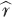(71) = 190.3596。通过熟练使用 R 的 `tapply()` 函数，我们可以得到所有估计的 *r*() 值：

```
> meanWts <- tapply(hw$Weight,hw$Height,mean)
> meanWts
      67       68       69       70       71       72       73       74
172.5000 173.8571 179.9474 183.0980 190.3596 192.5600 196.7716 202.4566
      75       76       77       78       79       80       81       82
208.7161 214.1386 216.7273 220.4444 218.0714 237.4000 245.0000 240.5000
      83
260.0000
```

这表示，“按身高分组体重值，并找到每个组的平均体重。”顺便说一下，注意身高是作为体重项目的名称提供的：

```
> meanWts['70']
     70
183.098
```

让我们绘制估计的平均体重与身高的关系图：

```
> plot(names(meanWts),meanWts)
```

图 8-1 显示了结果。


*图 8-1：估计的回归函数，体重与身高的关系*

值得注意的是，这些点似乎几乎都落在一条直线上。这表明可以为 *r*(*t*) 建立一个模型，

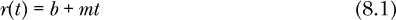

对于我们将从数据中估计的未知的斜率 *m* 和截距 *b*。我们假设 *r*(*t*) 的图形是 *某* 条直线，尽管我们不知道是哪一条——也就是说，我们不知道 *b* 和 *m*。这就是线性模型。

请记住，*r*(*t*) 是子群体 *X* = *t* 的 *平均 Y*，所以我们建模的是 *平均 Y* 而不是 *Y* 本身。我们并不是说 方程 8.1 给出了单个球员的体重，尽管我们确实使用该方程作为预测的基础。

#### ***8.1.2 作为维度约简的视图***

如果 方程 8.1 是有效的模型，那么我们就大大简化了问题。

通常情况下，我们需要估计 *r*(*t*) 的多个不同值，比如 *t* 等于 68、69、70、71、72、73 等等，假设有 15 或 20 个值。但使用上述模型，*我们只需要估计两个数字*，*m* 和 *b*。因此，这是一种维度约简的形式。

### 8.2 lm() 函数

假设线性模型（稍后我们将讨论其有效性），我们可以使用 R 的 `lm()` 函数来估计 *m* 和 *b*：

```
> lmout <- lm(Weight ~ .,data=hw)
> lmout

Call:
lm(formula = Weight ~ ., data = hw)

Coefficients:
(Intercept)       Height
   -151.133        4.783
```

所以， 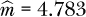 和 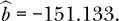

让我们看看这个调用在说什么：

```
lm(Weight ~ .,data=hw)
```

这里我们要求 R 对我们的数据框 `hw` 拟合一个线性模型，预测体重。点号（.）表示“所有其他列”，在此情况下，仅为身高列。

为了预测一个身高为 71 的新球员的体重，我们将计算：

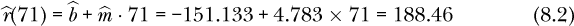

但是，嘿，我们应该让计算机来做这个计算，而不是手工计算：

```
> predict(lmout,data.frame(Height=71))
       1
188.4833
```

轻微的误差是由于手工计算时的四舍五入误差造成的，我们的数据只提供了几位数字。

### 8.3 lm() 在 qe*-Series 中的封装：qeLin()

`lm()`函数在 R 语言中非常基础，每个人至少应该见过一次，因此我们在上一节中使用了它。但为了简化和统一，我们将使用其`qe*`系列封装函数`qeLin()`。

下面是如何在`qeLin()`中执行上述计算：

```
> qelout <- qeLin(hw,'Weight',holdout=NULL)
> qelout$coef
(Intercept)      Height
-151.133291    4.783332
> predict(qelout,data.frame(Height=71))
       2
188.4833
```

大多数应用程序不仅仅有一个特征。接下来我们将讨论一般情况。

### 8.4 使用多个特征

我们可以，并且通常会，拟合多个特征的模型。

#### ***8.4.1 示例：棒球运动员，继续***

假设我们加入了年龄，这样我们的线性模型就是：

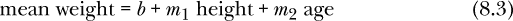

为了术语的统一（这里和后面都使用），我们将其写成：

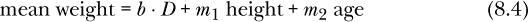

其中*D*是一个人工变量，总是等于 1。然后我们说，平均体重是*D*、*身高*和*年龄*这三个变量的*线性组合*。这只是一个术语，意思是为了得到平均体重，我们将这三个变量*D*、*身高*和*年龄*分别乘以对应的系数*b*、*m*[1]和*m*[2]，然后将结果求和。

现在我们使用`mlb`的第 4、5、6 列，因此我们按如下方式拟合模型，例如，对于 28 岁：

```
> qelout <- qeLin(mlb[,4:6],'Weight',holdout=NULL)
> predict(qelout,data.frame(Height=71,Age=28))
      11
187.4603
```

#### ***8.4.2 β符号***

由于本书的读者可能会在网络上看到其他相关讨论，因此需要提到，通常使用希腊字母*β*表示系数。例如，公式 8.3 可以写成如下形式：

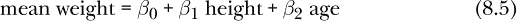

我们将从我们的样本数据中估计*β*[0]、*β*[1]和*β*[2]，如在第 8.4.4 节中所见。而且，回顾一下，我们使用“帽子符号”表示估计值，因此我们的估计系数将表示为 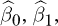 和 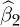。

#### ***8.4.3 示例：Airbnb 数据***

短期租赁公司 Airbnb 提供了大量的租赁数据。这里我们查看了来自旧金山的一些数据。^(1)（这里使用的数据集来自 2019 年 2 月 1 日，似乎现在已经不再可用。）这不仅提供了线性模型的另一个示例，而且还将展示一些数据清理问题。

##### 8.4.3.1 数据准备

在下载数据并将其读入 R 后（细节省略），我们得到了一个数据框`Abb`，但它仍然需要很多注意。

许多特征是文本数据，例如：

```
> Abb[1,]$house_rules
[1] "* No Pets - even visiting guests for a short time period. * No Smokers..."
```

本书稍后会讨论文本数据的主题，但为了这个示例，我们暂时省略了该部分。

另一个问题是价格包含美元符号和逗号，例如：

```
> Abb[1,]$monthly_price
[1] "$4,200.00"
```

处理此类问题往往占据数据科学家工作的大部分时间。这里我们编写了一个函数，将此类数字的列`d`转换为正确的格式，使用了 R 语言的一些字符字符串操作功能：

```
convertFromDollars <- function(d) {
   d <- as.character(d)
   # replace dollar sign by ''
   d <- sub('\\$','',d,fixed=F)
   # replace commas by ''
   d <- gsub(',','',d)
   d <- as.numeric(d)
   # some entries were ''; replace by NAs
   d[d == ''] <- NA
   d
}
```

而且，毫不奇怪，这个数据集似乎也有一些错误的条目：

```
> table(Abb$square_feet)

   0    1    2   14  120  130  140  150  160  172  175  195  250  280  300  360
   2    3    2    1    1    1    3    2    1    1    1    1    2    2    4    2
 400  450  500  538  550  600  650  700  750  780  800  810  815  840  850  853
   1    2    8    1    1    4    1    3    5    1    4    1    1    1    1    1
 890  900  950 1000 1012 1019 1100 1200 1390 1400 1490 1500 1600 1660 1750 1800
   1    2    3    9    1    1    2    9    1    2    1    7    1    1    1    3
1850 1900 1996 2000 2100 2200 2250 2600 3000
   1    1    1    4    3    2    1    1    4
```

例如，列出 1 和 2 平方英尺的区域，显然这是不正确的。我们在这里不再深入探讨，但显然，如果这不仅仅是书中的一个示例，我们将需要做更多的工作。

数据清理后，数据框架如下所示：

```
> head(Abb)
  zipcode bathrooms bedrooms square_feet weekly_price monthly_price
1   94117       1.0        1          NA         1120          4200
2   94110       1.0        2          NA         1600          5500
3   94117       4.0        1          NA          485          1685
4   94117       4.0        1          NA          490          1685
5   94117       1.5        2          NA           NA            NA
6   94115       1.0        2          NA           NA            NA
  security_deposit guests_included minimum_nights maximum_nights
1              100               2              1             30
2               NA               2             30             60
3              200               1             32             60
4              200               1             32             90
5                0               2              7           1125
6                0               1              2            365
  review_scores_rating
1                   97
2                   98
3                   85
4                   93
5                   97
6                   90
```

现在我们准备进行分析了。

#### ***8.4.4 应用线性模型***

这是调用，省略了面积和周价格列：

```
> linout <- qeLin(Abb[,-c(4,5)],'monthly_price',holdout=NULL)
> linout$coef
         (Intercept)         zipcode94103         zipcode94104
       -4.485690e+03        -4.441996e+02         6.364539e+02
        zipcode94105         zipcode94107         zipcode94108
        1.012009e+03        -2.846037e+02        -1.649897e+03
        zipcode94109         zipcode94110         zipcode94111
       -3.945963e+02        -1.113476e+03         1.619558e+03
        zipcode94112         zipcode94114         zipcode94115
       -2.304310e+03        -2.607913e+02        -3.881351e+02
        zipcode94116         zipcode94117         zipcode94118
       -1.959336e+03        -1.543353e+02        -1.362785e+03
        zipcode94121         zipcode94122         zipcode94123
       -1.315474e+03        -1.434050e+03         1.639610e+03
        zipcode94124         zipcode94127         zipcode94131
       -2.309765e+03        -2.127720e+03        -1.525655e+03
        zipcode94132         zipcode94133         zipcode94134
       -1.675761e+03         6.496800e+02        -1.370148e+03
        zipcode94158            bathrooms             bedrooms
       -2.509281e+03         2.025493e+02         1.540830e+03
    security_deposit      guests_included       minimum_nights
        3.462443e-01         3.663498e+02        -6.400597e-01
      maximum_nights review_scores_rating
       -2.371457e-04         6.613115e+01
```

正如在 R 中常见的那样，估计的系数以*科学计数法*显示，例如，1.605326*e* + 03 = 1.605326 × 10³ = 1605.326。比如说，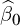 大约是 −4,486，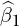 大约是 −444，依此类推。

请注意，`lm()`（通过其封装函数`qeLin()`）已将邮政编码特征，一个 R 因子，转换为虚拟变量。回想一下，通常我们会比类别的数量少一个虚拟变量——在这里是邮政编码的数量。R 在这里省略了第一个，即 94102。

由于本书的重点是预测而非因果解释，因此估计的系数并不是特别重要。此外，在解释系数时必须非常小心。然而，关于这些系数，接下来需要做一些说明。

### 8.5 降维

让我们在前一节的线性模型和 Airbnb 示例的背景下讨论这个基本的机器学习话题。

#### ***8.5.1 哪些特征是重要的？***

如第 3.1.1 节所述，美国有超过 40,000 个邮政编码；这通常远远超过了可以直接使用的数量。在旧金山，这个数量是可管理的，但我们可能还是希望去掉那些对预测似乎不重要的邮政编码。

另一方面，正如房地产经纪人所说：“位置，位置，位置。”邮政编码应该非常重要，且估计的系数至少似乎证实了这一点。例如，根据之前给出的系数估计，位于 94105 邮政编码的房产，平均来说，其价格溢价大约为 1,012 美元，而位于 94107 的房产，平均而言，其价格低于市场价大约 285 美元，假设其他变量保持不变。那么，*溢价*和*低于成本*是相对于什么而言的呢？由于省略了 94102 邮政编码，我们看到 94105 的价格平均比 94102 高出 1,012 美元——在(*t*)中的邮政编码项将是 1·1012，对于该邮政编码的房产，而 94102 则为 0，因为没有该邮政编码的虚拟变量。类似地，94107 的价格比 94102 低大约 444 美元，依此类推。换句话说，94102 成为基准邮政编码。

但是……注意上面的措辞：“估计的系数至少*似乎*证实了这一点。”毕竟，我们所做的是*有限准确度*的估计。这是一个必须考虑的关键点，接下来我们将讨论。

另一方面，`security_deposit` 的数量似乎并没有太大影响，因此我们应该考虑将其从分析中删除。回想一下，更多的特征意味着更少的偏差，但更多的方差。由于保证金在预测值中的影响似乎很小，删除这一特征应当不会增加太多的偏差。对于 `minimum_nights` 和 `maximum_nights` 特征，情况也是如此。

#### ***8.5.2 统计显著性与降维***

在上一节中，我们建议从分析中删除几个特征。但我们仅仅是凭借一种“直觉”来做这个决定。人们自然会希望有一个神奇的公式来决定保留哪些特征，删除哪些特征。然而，正如本书所解释的那样，实际上并没有这样的神奇公式。我们列举了一些常用的方法，比如交叉验证和主成分分析（PCA），但这些方法也不是万能的、万无一失的解决方案。

本节中，我们将讨论*统计显著性*在参数模型中用于降维的应用。*我们不推荐使用它*，而且它的受欢迎程度比过去低了，但仍然在许多分析师中流行。因此，有必要在这里介绍这一技术。

首先，我们需要介绍一个新的 R 通用函数（第 1.5.1 节）。除了 `print()`、`plot()` 和 `predict()`，R 中另一个常见的通用函数是 `summary()`。它的功能正如其名字所示；也就是说，它提供了对象的摘要信息。

回顾一下，通用函数是根据当前对象的类别量身定制的。我们这里的对象 `linout` 的类别是什么？

```
> class(linout)
[1] "qeLin" "lm"
```

因此，如果我们调用 `summary(linout)`，R 解释器会首先查找 `summary.qeLin()` 函数。由于 `qeML` 包中没有此函数，解释器接着会查找 `summary.lm()`，它是存在的。我们来看一下这个函数给我们提供的内容：

```
> summary(linout)
...
Coefficients:
                       Estimate Std. Error t value Pr(>|t|)
(Intercept)          -4.486e+03  1.478e+03  -3.034 0.002479 **
zipcode94103         -4.442e+02  5.177e+02  -0.858 0.391094
zipcode94104          6.365e+02  2.131e+03   0.299 0.765227
zipcode94105          1.012e+03  7.071e+02   1.431 0.152724
zipcode94107         -2.846e+02  4.906e+02  -0.580 0.561978
zipcode94108         -1.650e+03  6.354e+02  -2.597 0.009566 **
zipcode94109         -3.946e+02  4.955e+02  -0.796 0.426025
zipcode94110         -1.113e+03  4.280e+02  -2.601 0.009435 **
zipcode94111          1.620e+03  1.014e+03   1.598 0.110396
zipcode94112         -2.304e+03  4.761e+02  -4.840 1.52e-06 ***
zipcode94114         -2.608e+02  4.425e+02  -0.589 0.555770
zipcode94115         -3.881e+02  4.666e+02  -0.832 0.405719
zipcode94116         -1.959e+03  7.028e+02  -2.788 0.005412 **
zipcode94117         -1.543e+02  4.441e+02  -0.348 0.728269
zipcode94118         -1.363e+03  5.560e+02  -2.451 0.014434 *
zipcode94121         -1.315e+03  6.422e+02  -2.048 0.040819 *
zipcode94122         -1.434e+03  5.437e+02  -2.638 0.008493 **
zipcode94123          1.640e+03  5.507e+02   2.977 0.002985 **
zipcode94124         -2.310e+03  6.552e+02  -3.525 0.000444 ***
zipcode94127         -2.128e+03  6.051e+02  -3.516 0.000459 ***
zipcode94131         -1.526e+03  5.024e+02  -3.037 0.002459 **
zipcode94132         -1.676e+03  7.745e+02  -2.164 0.030746 *
zipcode94133          6.497e+02  5.402e+02   1.203 0.229402
zipcode94134         -1.370e+03  8.837e+02  -1.550 0.121376
zipcode94158         -2.509e+03  1.546e+03  -1.623 0.104905
bathrooms             2.025e+02  1.323e+02   1.531 0.125996
bedrooms              1.541e+03  1.071e+02  14.385  < 2e-16 ***
security_deposit      3.462e-01  9.820e-02   3.526 0.000443 ***
guests_included       3.663e+02  5.897e+01   6.212 7.92e-10 ***
minimum_nights       -6.401e-01  2.670e+00  -0.240 0.810569
maximum_nights       -2.371e-04  2.132e-03  -0.111 0.911465
review_scores_rating  6.613e+01  1.432e+01   4.617 4.44e-06 ***
...
```

这里计算的一个特定类型的信息是标准误差，接下来会讨论。

##### 8.5.2.1 标准误差

你可以看到，上面报告了每个估计系数的*标准误差* 。这是对于所采样的总体，所有可能样本的  的标准偏差估计。这让我们可以通过以下推理来了解  的准确度。

如果标准误差很小，这意味着如果我们使用与给定总体不同的一组样本数据， 可能会得到与我们当前值差不多的结果。换句话说，我们可以将  视为具有代表性。

我们可以通过加减 1.96 倍的标准误差来形成一个大约 95% 的置信区间（CI）来估计 *β*[*i*]。

例如，考虑虚拟变量`zipcode94134`。该变量的估计 beta 系数为−$1,370\。这是相对于基准的邮政编码而言，也就是说，指没有虚拟变量的那个邮政编码。（回想一下第 1.4 节，当我们有一个分类特征时，虚拟变量的数量比类别数少 1。）如前所述，被省略的邮政编码是 94102\。因此，对于某个特定的安全押金、客人政策等，该地区的价格估计比基准低超过$1,000。但看看置信区间（CI）：

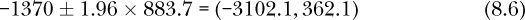

置信区间显示，这个地区实际上可能比基准地区*贵*上几百美元。

##### 8.5.2.2 显著性检验

最后的这个例子表明，`zipcode94134`作为租金预测因子的状态尚无定论。因此，我们应该认真考虑将其从模型中去除。记住，偏差-方差权衡的概念意味着，如果某个特征并不特别有用，那么将其纳入模型可能会降低我们的预测能力。

但是，让我们考虑另一个邮政编码，比如 94132\。这里的置信区间是

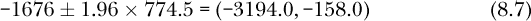

置信区间完全位于负值范围。因此，它被标记了一个星号。

这些星号到底是什么意思？为什么某些系数有双星号？本书的重点不在统计学上，但对读者来说至少了解这个情况是很重要的，因为通常使用星号作为降维的指南。

大致来说，如果置信区间不包含 0，那么系数就会被标记一个星号。如果 0 远离区间，则标记两个星号；如果置信区间远离 0，则标记三个星号。带一个星号的系数称为*显著*（即，与 0 显著不同）；带两个星号的称为*高度显著*，三个星号则获得*非常高度显著*的称号。

那么，什么算是“远远超出区间”和“远远远离 0”呢？这是由 p 值决定的。p 值低于 0.05 是显著的，低于 0.01 或 0.001 则分别表示高度显著或非常高度显著。

p 值是一个特定的概率，其复杂的定义我们暂时跳过。（回想一下第 5.5 节中的这个术语。）可以简单地说，在这种降维方法下，任何没有星号的特征，比如`zipcode94134`，都会被舍弃，其他特征则保留在模型中。如果想稍微谨慎一点，也可以只保留那些至少有两个星号的系数。

今天，包括我自己在内的许多分析师认为这种方法存在缺陷。让我们来看一下为什么。简短的回答是，p 值过于依赖数据点的数量*n*。实际上，标准误差与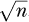成反比。这有一个相当深远的影响，具体如下。

假设，假设`zipcode94132`的估计系数为 1.4，标准误差为 0.9\。那么我们可以得到一个置信区间：

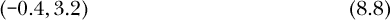

这包含 0，因此没有星号。这可能是件好事，因为这个特征似乎没有实际的预测能力：在这个邮政编码中，租金的估计差异只有一美元左右。

但是，如果我们幸运地拥有 25 倍的数据呢？那么将增加 5 倍，因此标准误差将缩小 5 倍，约为 0.18\。它会有所变化，系数估计值 1.4 也会有所变化，但大体上我们的 CI 现在将是：

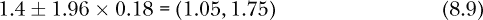

啊，现在它变得显著了！太好了！但是……估计系数仍然大概是 1.40 美元——不到 2 美元！这个变量几乎无法帮助我们预测租金。换句话说，这个特征的所谓显著性可能会误导我们。

许多统计学家（包括本文作者）对使用显著性检验和 p 值持反对态度。^(2)这些检验在预测应用中尤其不可靠。对于大数据集，*每个*特征都会被声明为“非常显著”（三个星号），无论该特征是否具有实质性的预测能力。一个回归系数非常小的特征也可能被声明为“显著”，尽管它在预测中几乎没有用处。

##### 8.5.2.3 陷阱：NA 值及其对 n 的影响

如上所示，数据集还包括一些 NA 值。我们不需要直接处理这些 NA 值，因为`lm()`（`qeLin()`所包装的函数）会自动将计算限制在完整的案例中。然而，正如在第 4.1 节中所指出的，如果数据集包含许多 NA 值，这又是另一个需要进行维度减少的原因，因为这样做可能会增加完整案例的数量。这意味着方差较小，这是非常可取的。通过一些实验，我们发现，去除那些 NA 倾向较大的特征（除了我们已经删除的特征）并不会在这个特定案例中帮助增加数据量，但这是一个重要的普遍原则。

##### 8.5.2.4 陷阱：具有多级分类变量的保留集形成困难

在我们之前的 Airbnb 分析中，如果我们形成一个保留集，就会出现问题：

```
> linout <- qeLin(Abb[,-c(4,5)],'monthly_price')
holdout set has  707 rows
Error in model.frame.default(Terms, newdata,
   na.action = na.action, xlev = object$xlevels) :
  factor zipcode has new levels 94014
> linout <- qeLin(Abb[,-c(4,5)],'monthly_price')
holdout set has  707 rows
Error in model.frame.default(Terms, newdata,
   na.action = na.action, xlev = object$xlevels) :
  factor zipcode has new levels 94014, 94106
```

当然，由于保留集是随机选择的，因此每次可能会有不同的结果。但我们看到，在我们这里的两次尝试中，每次至少有一个错误，“因子邮政编码有新水平。”这里发生了什么？

问题在于，某些邮政编码（如 94014）仅出现在少数数据点中。显然，在这里的每个训练集中都没有 94014 的案例，因此`lm()` *对在保留集中看到一个表示“感到惊讶”。*

唯一的解决办法是在运行`qeLin()`之前从数据中删除所有包含 94014（以及可能的其他）案例。

### 8.6 最小二乘法和残差

尽管`lm()`背后的计算细节超出了本书的范围，但大致了解所涉及的内容是很重要的，因为类似的计算将在本书后续出现。这将引入*最小二乘法*的概念。接着，这将引导出*残差*的概念，它们本身也很重要。

为简便起见，我们这里考虑第 8.2 节的上下文。数量  和  等是使用著名的*普通最小二乘法（OLS）*方法计算得出的，其原理如下。

想象一下，在计算出  和  后，我们回过头来“预测”样本数据中第一个玩家的体重。正如引号所示，这样做是愚蠢的；毕竟，我们已经知道第一个玩家的体重是 180：

```
> data(mlb)
> mlb[1,]
           Name Team Position Height Weight   Age
1 Adam_Donachie  BAL  Catcher     74    180 22.99
  PosCategory
1     Catcher
```

但无论如何，还是要思考这个练习。最终这将成为事物运作的基础，既适用于线性模型，也适用于本书其余部分的所有机器学习方法。

我们预测的值将是 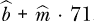。因此，我们的预测误差为：

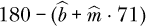

这是数据集中该行的*残差*。（回想一下，这在第 6.3.2 节中有简要提到。）我们将对该误差进行平方，而不是直接使用它的原始形式，因为我们将对误差进行求和，而不希望正误差和负误差互相抵消。现在，我们也“预测”所有其他数据点，并将平方误差相加：

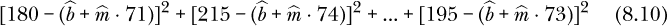

现在要注意的是：`lm()`找到  和  的方式是将它们设置为能够最小化平方和的值（方程式 8.10）。换句话说，把这个表达式看作是两个变量  和  的函数，然后对这两个变量最小化该表达式。（懂微积分的读者可能已经注意到，我们将这两个导数设为 0 并解出  和 。）

由于我们是在最小化平方和，估计的系数被称为*最小二乘估计*。（通常会加上“普通”一词，因为普通最小二乘法与一些我们在这里不讨论的变体不同。）

### 8.7 诊断：线性模型是否有效？

*所有模型都是错误的，但有些是有用的。*

—乔治·博克斯，著名的早期统计学家

线性假设是相当强的。这何时适用？让我们仔细看看。

#### ***8.7.1 精确性？***

读者可能会问：“方程式 8.1 中的线性模型如何有效？”是的，图 8-1 中的点看起来似乎大致位于一条直线上，但并不完全如此。这里有两个重要的回答：

+   正如乔治·博克斯的名言所指出的，没有模型是*完全*正确的。常用的物理模型忽略了空气阻力和摩擦等因素，即使是考虑了这些因素的模型，也无法反映所有可能的因素。即便线性回归函数*r*（*t*）的模型并不完美，它在预测方面也可能表现得很好。

+   即使方程式 8.1 完全正确，图 8-1 中的点也不会精确地落在直线上。记住，*r*(71)只是所有 71 身高球员的*平均*体重。大多数该身高的球员体重大于或小于这个值，因此他们的数据点不会完全落在直线上，事实上，在某些情况下可能远离直线。同样，图 8-1 中我们绘制的平均体重也有类似的问题；每个平均值都是基于少数几个球员的数据。

顺便提一下，经典的线性模型方法论有一些假设，超出了线性假设的范围，比如假设*Y*在每个子群体中服从正态分布。但这些假设对于我们的预测背景并不相关。（实际上，即使是在统计推断中，正态性假设在大样本中也不是很重要。）

#### ***8.7.2 诊断方法***

多年来，分析师们已经开发了多种方法来检验线性模型的有效性。我在我的书《*统计回归与分类：从线性模型到机器学习*》（CRC Press, 2017）中描述了几种方法。

再次强调，由于我们关注的是预测而非因果分析，这部分内容我们将在此不予讨论。只要结果变量是特征的递增或递减函数——例如，人的平均体重是身高的递增函数——线性模型应该能在以预测为导向的应用中表现得相当好。通过线性多项式模型（参见第 8.11 节），这一点可以进一步完善。

### 8.8 R 平方值

回想一下，估计的回归系数是通过最小化实际和预测*Y*值之间的平方差之和来计算的（参见第 8.6 节）。*R*²是实际和预测*Y*之间的平方相关性。

可以证明，这可以被解释为由于*X*引起的*Y*变异的比例。（和往常一样，*X*指的是我们所有的特征。）因此，*R*²的值范围是 0 ≤ *R*² ≤ 1，值为 1 表示*X*能完美预测*Y*。然而，这里存在一个大问题，因为我们正在预测的正是我们用来估计预测模型（回归系数）的数据。如果我们出现过拟合，那么*R*²将显得过于乐观。

这，当然，就是使用保留数据集的动机。因此，`qeLin()`不仅报告标准的*R*²值，还报告在保留集上计算的*R*²值（存储在`qeLin()`返回值的`holdoutR2`组件中）。后者更可靠。此外，如果这两个值之间有较大差异，表明我们发生了过拟合。

大多数线性回归软件库也会报告*调整后的 R*²值。这里的*调整*一词暗示着公式试图修正过拟合的情况。`qeLin()`也报告这个值，且如果这个值与第一个*R*²值之间存在较大差异，则表明我们正在发生过拟合。

### 8.9 分类应用：*logistic*模型

线性模型是为回归应用设计的。那么分类问题呢？线性模型的一个推广，毫不奇怪地被称为*广义线性模型*，用于处理分类问题。这里我们将介绍该模型的一种形式——*logistic*模型。

回想一下第二章开头的讨论，指出在分类问题中，*Y*的值要么是 1，要么是 0，回归函数变成了给定子群体中*Y* = 1 的概率。如果我们使用`lm()`拟合一个纯线性模型，估算的回归值可能会超出[0,1]区间，因此无法代表概率。当然，我们可以将`lm()`预测的任何值截断到[0,1]区间，但*logistic*模型提供了一个更好的方法。

该模型的名称来源于 logistic 函数*l*(*t*) = 1/(1 + *e*^(−*t*))。由于该函数的值域在(0,1)之间，因此非常适合用于建模概率。我们仍然使用线性形式，但将该形式通过 logistic 函数进行转换，将其压缩到(0,1)区间，进行概率建模。

假设我们希望根据身高预测性别。我们的模型可能是：

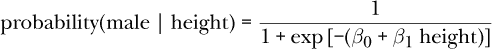

这里的*β*[0]和*β*[1]再次是人口参数，我们从数据中进行估算。

*logistic*和线性模型基本相似：在线性模型中，*β**[i]*是第*i*个特征对平均*Y*的影响，而在 logit 模型中，*β**[i]*是第*i*个特征对*Y* = 1 的概率的影响。（一些分析师将 logit 视为*log-odds 比率*的线性模型，即 log(*P*(*Y* = 1| *X*) / [1 − *P*(*Y* = 1| *X*)]）。）

*logistic*模型通常被称为*logit*模型，简化时常用这个名字。

#### ***8.9.1 glm()和 qeLogit()函数***

在 R 中，用于广义线性模型的标准函数是`glm()`。在 logistic 回归的情况下，该函数被`qeML`包中的`qeLogit()`函数所包装。后者的调用形式为：

```
qeLogit(data,yName,
   holdout = floor(min(1000, 0.1 * nrow(data))),yesYVal = NULL)
```

前三个参数与其他`qe*`系列函数相同。最后一个参数`yesYVal`在二分类情况下是必要的，它指定我们希望被编码为*Y* = 1 的*Y*值。

#### ***8.9.2 示例：电信流失数据***

在 第 2.2 节中，我们使用 k-NN 分析了一些客户流失数据。现在，我们用一个逻辑模型重新分析这部分数据。回忆一下，`Churn` 变量的值为 `'Yes'` 和 `'No'`。

```
# data prep as before, not shown
> set.seed(9999)
> glout <- qeLogit(tc,'Churn',holdout=NULL,yesYVal='Yes')
```

我们的模型是：

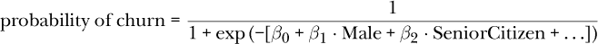

假设我们要预测一个新案例，它类似于我们数据集中第 333 个案例，但性别不同：

```
> names(tc)
 [1] "gender"           "SeniorCitizen"    "Partner"          "Dependents"
 [5] "tenure"           "PhoneService"     "MultipleLines"    "InternetService"
 [9] "OnlineSecurity"   "OnlineBackup"     "DeviceProtection" "TechSupport"
[13] "StreamingTV"      "StreamingMovies"  "Contract"         "PaperlessBilling"
[17] "PaymentMethod"    "MonthlyCharges"   "TotalCharges"     "Churn"
> newx <- tc[333,-20]  # exclude Y
> newx
    gender SeniorCitizen Partner Dependents tenure PhoneService MultipleLines
333 Male             0      No         No     46          Yes           Yes
    InternetService OnlineSecurity OnlineBackup DeviceProtection TechSupport
333     Fiber optic             No          Yes              Yes          No
    StreamingTV StreamingMovies Contract PaperlessBilling
333         Yes              No One year              Yes
              PaymentMethod MonthlyCharges TotalCharges
333 Credit card (automatic)           94.9      4422.95
> newx$gender <- 'Female'
> predict(glout,newx)
$predClasses
[1] "No"

$probs

          [,1]
[1,] 0.2307227
```

我们猜测客户会保持原状——即不会跳槽到其他服务提供商——跳槽概率大约只有 23%。

我们还会收到一个警告消息：

```
Warning messages:
1: In predict.lm(object, newdata, se.fit, scale = 1, type = if (type ==  :
  prediction from a rank-deficient fit may be misleading
2: In predict.lm(object, newdata, se.fit, scale = 1, type = if (type ==  :
  prediction from a rank-deficient fit may be misleading
```

这是一个技术问题，通常发生在特征高度相关时。此时，`glm()` 实际上跳过了一些本质上是冗余的特征。

有时 `glm()` 会给我们一个警告消息，例如：

```
glm.fit: fitted probabilities numerically 0 or 1 occurred
```

再次强调，这是一个技术问题，我们在这里不会深入探讨。读者可以照常继续。

另一方面，有一个警告是不容忽视的：“未能收敛”。这在 `lm()` 中不会发生（`lm()` 是我们封装的 `qeLinear()` 使用的 R 函数），但在使用 logit 时偶尔会发生。这通常可以通过执行一些维度压缩来解决。

#### ***8.9.3 多类情况***

如果类别超过两个，我们有两个选择。为了具体说明，考虑 第 2.3 节中的脊柱数据。那里我们有三个类别：DH、NO 和 SL。现在，暂时考虑直接使用 `glm()`，而不是它的封装函数 `qeLogit()`。

**一对多（OVA）方法** 在这里我们对每个类别运行一次 `glm()`。我们首先使用 DH 作为 *Y* 来运行 logit。然后我们使用 NO 作为 *Y* 运行，再最后对 SL 进行相同的操作。这样，我们就得到了三组系数——实际上是从 `glm()` 返回的三个对象，比如 `DHout`、`NOout` 和 `SLout`。然后，在预测新案例 `newx` 时，我们运行：

```
predict(DHout,newx,type='response')
predict(NOout,newx,type='response')
predict(SLout,newx,type='response')
```

这会给我们三个概率。我们会选择概率最高的类别作为预测结果。

**全对全（AVA）方法** 在这里我们对每一对类别运行一次 `glm()`。首先，我们将数据限制在 DH 和 NO 之间，将 SL 类别暂时放在一旁，并将 *Y* 设为 DH。然后，我们仅关注 DH 和 SL，将 *Y* 设为 DH。最后，我们将 DH 放到一旁，运行 NO 和 SL 并将 *Y* 设为 NO。这样，我们也会得到三个 `glm()` 输出的对象。

然后我们会对 `newx` 调用 `predict()` 三次。假设第一次得到的结果小于 0.5，这意味着在 DH 和 NO 之间，我们会预测这个新案例为 NO——也就是说，NO “获胜”。我们在所有三个对象上都这么做，最后，预测的类别是出现频率最多的那个类别。

`qeLogit()` 函数使用了 OVA 方法。由于 `qeLogit()` 是 `glm()` 的封装函数，我们看不到后者的具体操作，它们仅作为中间内部计算使用。然而，如果需要，可以通过 `qeLogit()` 返回的对象中的 `glOuts` 组件访问 `glm()` 调用的结果。

#### ***8.9.4 示例：跌倒检测数据***

这个数据集包含在`qeML`中，最初来自 Kaggle。^(3) 来自该网站：

跌倒是一个严重的公共卫生问题，对于跌倒风险群体的人来说，甚至可能是致命的。我们开发了一种自动跌倒检测系统，该系统配备了穿戴式运动传感器单元，传感器被安装在受试者身体的六个不同位置。

有六种活动类型，因此有六个类别，分别编码为 0（站立）、1（行走）、2（坐着）、3（跌倒）、4（抽筋）和 5（跑步）。让我们看看我们能有多准确地预测类别：

```
> data(falldetection)
> fd <- falldetection
> head(fd)
  ACTIVITY    TIME       SL      EEG BP  HR CIRCULATION
1        3 4722.92  4019.64 -1600.00 13  79         317
2        2 4059.12  2191.03 -1146.08 20  54         165
3        2 4773.56  2787.99 -1263.38 46  67         224
4        4 8271.27  9545.98 -2848.93 26 138         554
5        4 7102.16 14148.80 -2381.15 85 120         809
6        5 7015.24  7336.79 -1699.80 22  95         427
> fd$ACTIVITY <- as.factor(fd$ACTIVITY)  # was integer, need factor for qe*
> set.seed(9999)
> fd$ACTIVITY <- as.factor(fd$ACTIVITY)
> fdout <- qeLogit(fd,'ACTIVITY')
> fdout$testAcc
[1] 0.593
> fdout$baseAcc
[1] 0.7186972
> table(fd$ACTIVITY)
   0    1    2    3    4    5
4608  502 2502 3588 3494 1688
```

我们的 logit 模型仅正确预测了大约 40%的案例，但这比我们仅仅猜测每个案例为 Class 3（最常见类别）时的 28%正确率要好。

假设我们要预测一个假设的新案例，比如数据中的第一行，但`BP`等于 28：

```
> newx <- fd[1,-1]
> newx
     TIME      SL   EEG BP HR CIRCULATION
1 4722.92 4019.64 -1600 13 79         317
> newx$BP <- 28
> newx
     TIME      SL   EEG BP HR CIRCULATION
1 4722.92 4019.64 -1600 28 79         317
> predict(fdout,newx)
$predClasses
[1] "2"

$probs
             0         1         2         3         4          5
[1,] 0.2294015 0.1111428 0.2324076 0.1605359 0.1830733 0.08343888
```

这种情况下，预测结果为 Class 2，概率约为 23%。

### 8.10 线性/广义线性模型中的偏差与方差

正如第三章中讨论的那样，我们使用的特征越多，偏差越小，但方差越大。对于像本章中的参数模型来说，较大的方差表现为系数估计的不稳定性，而这反过来又使得后续的预测更加不稳定。

再次提醒，高方差的回归系数估计意味着该估计值在不同样本之间会有很大的波动。大的波动反过来意味着估计的系数向量更可能远离真实的总体值。

在这里，我们通过一个具体的例子来说明方差是如何随着模型复杂度增加而增加的。

#### ***8.10.1 示例：共享单车数据***

我们可以使用`regtools`函数`stdErrPred()`来更具体地说明预测不稳定性的问题。这个函数计算从`lm()`得到的预测值的标准误差。回顾第 8.5.2.1 节，估计量的标准误差是该估计量的标准差。因此，较大的标准误差意味着估计量在不同样本之间的波动更大。

我们将拟合两个模型，一个使用较小的特征集，另一个使用稍大的特征集，然后在每个模型上进行相同的预测；作为示例，我们将预测数据集中的第三个数据点。我们将打印出两个预测值，并且最重要的是，打印出这两个预测的标准误差。

```
> data(day1)
> e1 <- day1[,c(4,10,12,13,16)]
> e2 <- day1[,c(4,10,12,13,16,6,7)]  # add holiday, weekday columns
> names(e1)
[1] "yr"        "temp"      "hum"       "windspeed" "tot"
> names(e2)
[1] "yr"        "temp"      "hum"       "windspeed" "tot"       "holiday"
[7] "weekday"
> set.seed(9999)
> e1out <- qeLin(e1,'tot')
> e2out <- qeLin(e2,'tot')
> newx1 <- e1[3,-5]  # exclude tot
> newx2 <- e2[3,-5]  # exclude tot
> predict(e1out,newx1)
      31
1818.779
> predict(e2out,newx2)
       3
1689.054
> stdErrPred(e1out,newx1)
[1] 97.77229
> stdErrPred(e2out,newx2)
[1] 108.3989
```

因此，使用较大特征集的预测具有更大的标准误差。标准误差是估计量的标准差——在这种情况下，是我们对预测准确性的估计。所以在这里我们看到了偏差-方差权衡的实际应用。尽管更大的模型更详细，从而偏差较小，但它确实具有更大的方差。

那是否意味着我们应该使用更小的特征集呢？不。为了判断我们是否达到了切换点，我们需要使用交叉验证。但是，读者应该牢记这个具体的折中示例。

### 8.11 多项式模型

出人意料的是，我们可以使用线性回归方法来建模非线性效应。我们将在本节中展示如何做到这一点。为什么这很重要？

+   多项式模型通常能够与许多更华丽的机器学习模型匹敌，甚至超越它们。

+   多项式将在我们关于支持向量机的章节（第十章）以及我们对神经网络的讨论（第十一章）中发挥重要作用，甚至在这里，多项式与这些内容之间有着出人意料的联系。

#### ***8.11.1 动机***

我们在本书早些时候使用了程序员和工程师工资的例子（见第 3.2.3 节）。考虑图 8-2 中展示的工资收入与年龄的关系图。看起来工人在 20 多岁时工资急剧上升，然后平稳一段时间，在 55 岁左右甚至有下降的迹象。这显然不是线性关系。

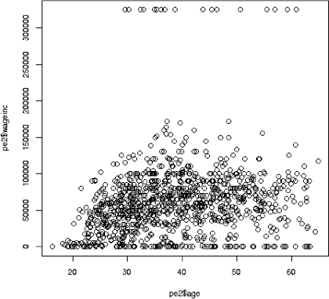

*图 8-2：工资收入与年龄的关系*

或者可以参考图 8-3，对于共享单车数据，绘制总骑行人数与温度的关系。这里非线性关系更加明显。（我们似乎看到了两组数据，可能是注册用户和临时用户。）这并不奇怪——如果天气太冷或太热，人们自然不愿意去骑车——但重点是，线性模型似乎不太合适。

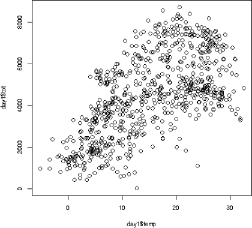

*图 8-3：骑行人数与温度的关系*

幸运的是，这些非线性效应实际上是可以通过线性模型来适应的。

#### ***8.11.2 使用线性模型建模非线性***

从简单开始，假设在共享单车数据中，我们希望预测总骑行人数`tot`，只使用温度`temp`作为唯一特征，但需要一个二次模型：

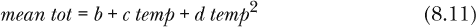

这仍然是一个线性模型！当然，`temp`有一个平方项，所以我们说模型在`temp`上是非线性的。但它在`b`、`c`和`d`上仍然是线性的。我们正在将平均`tot`建模为三者的线性组合：1、`temp`和`temp`²（可以将*b*看作*b* × 1）。

然后我们可以简单地添加一个`temp`²列，并调用`qeLin()`：

```
> data(day1)
> day1tottemp <- day1[,c(10,16)]  # just tot, temp
> head(day1tottemp)
      temp  tot
1 8.175849  985
2 9.083466  801
3 1.229108 1349
4 1.400000 1562
5 2.666979 1600
6 1.604356 1606
> day1tottemp$tempSqr <- day1tottemp$temp² 
> head(day1tottemp)
      temp  tot   tempSqr
1 8.175849  985 66.844507
2 9.083466  801 82.509355
3 1.229108 1349  1.510706
4 1.400000 1562  1.960000
5 2.666979 1600  7.112777
6 1.604356 1606  2.573958
> qeLin(day1tottemp,'tot')
...
Coefficients:
(Intercept)         temp      tempSqr
   1305.597      346.422       -6.815
```

我们看到的是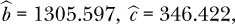和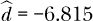。

但这也很不方便。我们不仅需要手动添加那个平方列，而且还需要记得在以后预测新案例时添加它。

更糟糕的是，我们还需要添加*交叉乘积*项。假设我们要根据温度和湿度来预测总骑行人数。在这种情况下，方程 8.11 将包含这两个特征的乘积，变成：

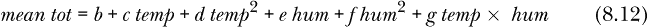

如果我们有很多特征，手动添加这些项将变得非常麻烦。

一个更微妙的问题涉及虚拟变量。因为 0² = 0 且 1² = 1，我们可以看到任何虚拟变量的平方就是其本身。因此，在我们的模型中添加虚拟变量的平方项会是多余的。

为了避免这种问题，`qeML`包提供了`qePolyLin()`函数，它可以自动处理这些问题。其基本调用形式为：

```
qePolyLin(data, yName, deg = 2, maxInteractDeg = deg,
   holdout = floor(min(1000,0.1 * nrow(data))))
```

参数`deg`是多项式的阶数，`maxInteractDeg`是最大交互项的阶数；例如，*temp* × *hum*在方程式 8.12 中被视为二阶项。当然，如果我们只有一个特征，则没有交互项。

它给出的拟合结果与我们之前手动得到的相同（当然）。我们再次用`temp`来预测`tot`：

```
> day1tottemp <- day1[,c(10,16)]
> qepout <- qePolyLin(day1tottemp,'tot',deg=2,holdout=NULL)
```

让我们来看看得到的估计系数：

```
> names(qepout)
 [1] "bh"             "deg"            "maxInteractDeg" "modelFormula"
 [5] "XtestFormula"   "retainedNames"  "standardize"    "x"
 [9] "y"              "classif"        "trainRow1"
> qepout$bh
              [,1]
[1,] 1305.597268
[2,]  346.421623
[3,]   -6.815313
```

预测仍然像往常一样，例如，预测 12 度天的情况：

```
> predict(qepout,data.frame(temp=12))
[1] 4481.252
```

让我们看看二次模型是否能做出更好的预测：

```
> set.seed(9999)
> qePolyLin(day1tottemp,'tot',deg=2,holdout=100)$testAcc
[1] 1214.063
> set.seed(9999)  # to get the same holdout set
> qeLin(day1tottemp,'tot',holdout=100)$testAcc
[1] 1250.177
```

是的，二次模型的 MAPE 值较小，尽管一如既往，必须补充说明我们应该使用`replicMeans()`来确保（参见第 3.2.2 节）。

#### ***8.11.3 多项式逻辑回归***

回忆一下，logit 模型从特征的线性组合开始，然后通过逻辑函数 *l*(*t*) = 1/(1 + *e*^(−*t*))将其挤压到[0,1]之间。这意味着我们可以像线性模型那样添加多项式项。`regtools`包中的`qePolyLog()`函数可以做到这一点。

#### ***8.11.4 示例：程序员与工程师薪资***

让我们先应用非多项式 logit 模型来预测职业：

```
> data(pef)
> set.seed(9999)
> qeLogit(pef,'occ')$testAcc
[1] 0.646
```

约 35%的准确率，考虑到有 6 个类别，这还算不错。但也许二次模型——即添加收入和年龄的平方等项——会有所改善。我们来看看：

```
> set.seed(9999)
> qePolyLog(pef,'occ',2)$testAcc
[1] 0.619
```

这是一个轻微的改进。但这是否是一个采样意外？我们可以使用`qeCompare()`函数来比较不同的多项式阶数，同时使用多个保留集来解决采样问题（参见第 8.13 节）。

### 8.12 将线性模型与其他方法结合

问题往往出现在 k-NN 模型的训练数据集边缘。作为一个简单的具体例子，我们再考虑一下预测从第 1.8 节中获取的美国职业棒球大联盟球员数据中身高与体重的关系。

这是数据的总结：

```
> table(mlb$Height)

 67  68  69  70  71  72  73  74  75  76  77  78  79  80  81  82  83
  2   7  19  51  89 150 162 173 155 101  55  27  14   5   2   2   1
```

假设我们希望预测一个新球员的体重，他的身高为 68.2，并且使用 k-NN 方法。这个身高处于我们训练数据的较低端，所以大多数最近邻的身高会比这个球员高。身高较高的人往往也较重，而我们新点的数据集中的邻居大多会比这个新球员高，因此也很可能更重。结果是我们的预测将会有偏向，通常会预测比这个球员实际体重大。类似地，如果我们新案例的身高是 81.5，那么我们的预测将会有向下的偏差。

一种解决方法是在邻域内拟合一个线性模型。假设我们正在预测一个新的数据点 `x`，并使用 *k* = 25 个邻居。然后，我们不是对这 25 个邻近的玩家的权重取平均值，而是对该邻域数据调用 `lm()`。然后，我们根据 `lm()` 的输出预测 `x`。这个过程的线性性质将使得在数据边缘的预测更加真实。

关键是，代替在邻域内使用均值平滑数据，我们可以使用 `lm()`。或者，如果我们担心异常值的影响，可以尝试使用 `median()`。

`regtools` 函数 `kNN()`（由 `qeKNN()` 封装）中有一个名为 `smoothingFtn` 的参数，允许我们指定除常规均值外的某种平滑方法。默认值是 `smoothingFtn = mean`；若要使用中位数平滑，可以指定 `smoothingFtn = median`。对于线性平滑，我们使用 `smoothingFtn = loclin`。

回想一下，决策树（因此也包括随机森林和基于树的提升方法）也会形成邻域。因此，它们也会面临相同的问题——即，在数据边缘附近的邻域存在偏差。因此，可以在这里应用相同的局部线性思想。CRAN 包 `grf` 就是这么做的；它被 `qeRFgrf()` 封装。

### 8.13 `qeCompare()` 函数

在我们 8.11.4 节的实验中，二次模型确实有所帮助，具有略低于普通对数几率模型的 OME 值。一次全面的调查将涉及 `fineTuning()`，进行交叉验证试验，可能还需要探索其他次数的多项式模型，而不仅限于 1 次或 2 次。

但记住，“qe”代表“快速和简便”。`qeML` 函数 `qeCompare()` 可以用于模型之间的快速比较。（当然，对于大型数据集，它可能不会那么快速。）

让我们用它来比较普通的逻辑回归与二次版本的逻辑回归，使用脊椎数据。顺便比较一下我们到目前为止在书中提到的其他方法。

```
> qeCompare(vert,'V7',c('qeLogit','qePolyLog','qeKNN','qeRF','qeGBoost'),100)
      qeFtn    meanAcc
1   qeLogit 0.13677419
2 qePolyLog 0.09129032
3     qeKNN 0.23741935
4      qeRF 0.15741935
5  qeGBoost 0.16322581
```

这里发生了什么？

+   在这里，我们生成了 100 个随机的保留集（每个大小为 73，这是该数据集的默认值）。所有方法使用相同的保留集。（`qeCompare()` 函数有一个可选的随机数 `seed` 参数，但我们使用了默认值 9999。）

+   我们在每个函数中都使用了默认的超参数。`qeCompare()` 函数有一个可选的 `opts` 参数，用于设置非默认值，比如 `qeRF()` 的 `nTree`。

+   我们找到了每种方法的 OME 值。

二次对数几率模型不仅优于普通的对数几率模型，而且最终证明它是所有方法中表现最好的！是的，它优于复杂的机器学习方法。当然，每个方法都是使用默认的超参数运行的，使用其他参数值时，结果可能会有所不同。

#### ***8.13.1 关于多项式模型的谨慎使用***

多项式的次数是一个超参数。在我们 8.11.4 节的职业预测示例中，我们可能会尝试一个三次（3 次）模型。

```
qePolyLog(pef,'occ',3)
```

或者甚至将次数设置为 4、5 等。

然而，随着度数的增加，我们确实需要关注过拟合问题，因为随着度数的增加，项数会迅速增加。我们可以通过查看不同度数下每个模型中*β*系数的数量来说明这一点，如表 8-1 所示。这需要深入挖掘输出对象。虽然在此解释会引起分心，但对于有兴趣的读者，可以查看组件`$glmOuts[[1]]`。然后需要排除截距项。

**表 8-1：** 多项式模型的复杂度

| **度数** | **系数** |
| --- | --- |
| 1 | 6 |
| 2 | 22 |
| 3 | 50 |
| 4 | 90 |
| 5 | 143 |

请记住，这些是添加了多项式项后的*p*值，也就是我们的特征数量。我们的样本大小*n*仍然是 20,090。随着度数的增加，在某个点上我们会出现过拟合。

如果我们遵循一个大致的经验法则，要求，这就建议度数的限制大约是*p* < 141，对应使用最多度数为 4 的模型。但毕竟，这只是一个经验法则。也有可能，在某些情况下，比如说，OME 在度数为 2 的模型后就开始增加。建议读者在此数据集及其他数据集上尝试不同度数的多项式，并注意结果中的 OME 值。

我们注意到以下几点：

+   多项式模型可能能够与更深奥的机器学习对手竞争，甚至超越它们。

+   多项式模型的使用具有吸引力，因为它只有一个超参数（度数），并且在`qePolyLin()`的情况下，计算是非迭代的，因此不会有收敛问题。

+   和任何机器学习方法一样，我们必须时刻记住过拟合的可能性。

不幸的是，许多机器学习的研究忽视了多项式模型。但它们可以非常强大，绝对应该成为分析师工具包的一部分。

### 8.14 接下来做什么

线性模型是最古老的机器学习形式。正如我们所见，它仍然可以非常强大，在某些情况下甚至优于“现代”机器学习方法。但在某些设置下，通过“收缩”来改进它，奇怪的是！Image。这是下一章的主题。
