## 第九章：切割事物以适应大小：正则化**


许多现代统计方法将其经典对手进行“缩小”。这对于机器学习方法也适用。特别是，这一原则可以应用于：

+   提升方法（在第 6.3.8 节中讲解）

+   线性模型

+   支持向量机

+   神经网络

在本章中，我们将看到为什么这样做可能是有利的，并将其应用于线性模型的情况。这也为后续章节中关于支持向量机和神经网络的内容打下基础。

### 9.1 动机

假设我们有关于人类身高、体重和年龄的样本数据。我们将这些量的人群均值分别表示为*μ*[*ht*]、*μ*[*wt*]和*μ*[*age*]。我们从样本数据中估算它们，得到相应的样本均值，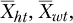和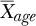。

然后，我们添加一些符号，将这些量组合成向量

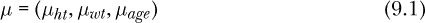

并且

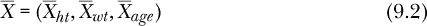

神奇的是，*James−Stein 理论*表示，*μ*的最佳估计值可能并不是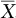。它可能是的一个缩小版，比如，0.9×：

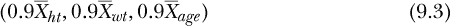

并且，维度越高（这里是 3），需要进行的缩小就越多。

直觉是这样的：对于许多样本，有一些数据点在分布的边缘极端。这些点会使我们的估计值偏向过大。所以，最优的做法是缩小估计值。

注意，通常，向量的不同分量会被不同程度地缩小。与方程 9.3 不同，最佳估计量可能是：

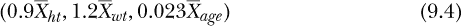

在这个例子中，第二个分量实际上扩展了而不是缩小。缩小是指向量的整体大小（将在下一节定义），而不是单个分量。

应该进行多少缩小？在实际操作中，这通常通过我们常用的交叉验证方法来决定。

抛开数学理论不谈——它相当深奥——对我们本书的意义在于，例如，线性模型中人口系数向量*β*的最小二乘估计量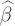通常过大，应当进行缩小。最有趣的是，*这恰好是解决过拟合的一个可能方法*。

### 9.2 向量的大小

向量(15.2,3.0,−6.8)“大”吗？我们到底是什么意思它的大小呢？

有两个主要的度量，称为*ℓ*[1]和*ℓ*[2]，它们通过“范数”符号表示，即|| ||（两对竖线）。所以这两个范数分别表示为|| ||[1]和|| ||[2]。对于上面的例子，*ℓ*[1]范数是

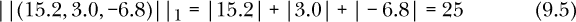

即，向量元素的绝对值之和。这里是*ℓ*[2]的情况：

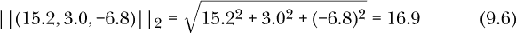

这是向量元素平方和的平方根。（记得几何的读者可能会注意到，在二维情况下，这仅仅是直角三角形斜边的长度——著名的毕达哥拉斯定理。）

### 9.3 岭回归与 LASSO

多年来，詹姆斯-斯坦因理论主要是一个数学上的好奇，适合理论研究，但对主流数据分析没有影响。虽然曾有人使用过*岭回归*，下面将介绍，但即便如此，也仅限于有限的使用。重大变化来自*最小绝对收缩与选择算子（LASSO）*的开发及其在机器学习社区中的采用。

#### ***9.3.1 它们是如何工作的***

回顾一下最小二乘法在线性模型中的基本概念，例如，假设有一个特征：我们选择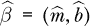来最小化平方预测误差的和，如方程 8.10 所示。为了方便，这里是该表达式的副本：

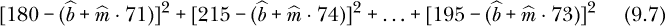

岭回归的思想是通过添加向量大小限制来“加上阻尼”。我们现在最小化方程 9.7，*满足以下约束*：

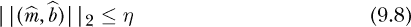

这里的*η* > 0 是一个由用户设置的超参数，例如通过交叉验证设置。最小化的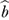和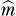的值即为岭回归系数。

这里是这种方法背后的直觉。我们基本上是说，我们希望最小化平方和，就像以前一样，*但是*不允许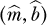变得太大。这是在一方面良好预测*Y**[i]*和另一方面限制大小之间的折中。（我们希望这种收缩会提高我们对未来情况的预测。）超参数*η*控制这种权衡。

可以证明，这个约束最小化问题等价于选择和，使得最小化以下量：

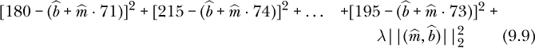

这里的*λ* > 0 是一个超参数，替代了*η*，并且通常通过交叉验证来设置。

这个公式（方程 9.9）实际上是岭回归的标准定义。*η*版本在詹姆斯-斯坦因的背景下更容易解释，但这个*λ*的公式也应该是直观的：“惩罚”项使我们在最小化平方和时受到限制。我们设置*λ*的值越大，惩罚越大，从而迫使我们限制的大小。

LASSO 版本几乎与岭回归相同，只不过使用了*ℓ*[1]“阻尼”项，而不是*ℓ*[2]。它找到的和的值使得

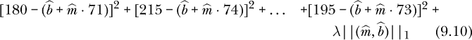

在*η*的情况下，对于 LASSO，我们进行最小化

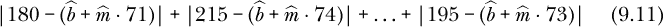

受限于：

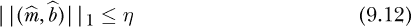

#### ***9.3.2 偏差-方差权衡，避免过拟合***

收缩思想——通常称为*正则化*——对统计学和机器学习产生如此巨大影响的一个主要原因是，它是避免过拟合的工具。这里有几个问题：

+   一方面，我们希望尽可能使预测的平方和最小，这可以证明消除了偏差。

+   另一方面，回想一下第 8.8 节中提到的，平方和可能过于乐观，因此可能小于我们在预测未来新案例时得到的结果。平方和的一个小值可能伴随着较大的方差，部分原因是极端数据点的影响，如前所述。收缩可以减少方差——较小的量变化较少——从而在一定程度上中和极端点的有害影响。

因此，超参数*λ*用于控制我们在偏差-方差权衡中希望处于哪个位置。过拟合发生在我们位于该权衡的错误一侧时。

*结论*：收缩减少了方差，如果可以在不显著增加偏差的情况下做到这一点，那么就是一个胜利。

再次强调，正则化不仅在本章讨论的线性模型中使用，也在支持向量机、神经网络等中使用。它甚至可以应用于主成分分析。

#### ***9.3.3 *λ*, n 和 p 之间的关系***

再次强调，偏差-方差权衡概念在这里扮演着核心角色，且对数据集大小有影响。*n*（即样本量）越大，的方差越小，这意味着收缩的需求越小。

换句话说，对于大型数据集，我们可能不需要正则化。但回想一下第三章中提到的，“大*n*”既是绝对意义上的大，也相对于*p*而言——例如，按照方程 3.2 中的标准。所以，如果有大量特征，即使是非常大的数据集，也可能仍然需要正则化。

无论如何，确定是否在特定情境中需要收缩的最可靠方法是再次通过交叉验证来尝试。

#### ***9.3.4 比较，岭回归与 LASSO***

岭回归的优势在于其计算简单。有一个明确的闭式解——也就是说，它是非迭代的；而 LASSO 则需要迭代计算（尽管它没有收敛问题）。

但 LASSO 成功的原因在于它提供了一个*稀疏*解，这意味着通常许多的元素是 0。我们将*η*设得越小，0 的数量就越多。然后，我们丢弃那些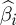 = 0 的特征，从而实现降维。需要注意的是，当然，最终非零的值与相应的 OLS 值是不同的。

### 9.4 软件

我们将再次使用一个`qe*`系列的函数，`qeLASSO()`，并使用以下调用形式：

```
qeLASSO(data,yName,alpha = 1,
   holdout = floor(min(1000, 0.1 * nrow(data))))
```

这个函数在`glmnet`包中包装了`cv.glmnet()`。该包允许用户通过参数`alpha`指定岭回归或 LASSO，分别将该值设置为 0 或 1；默认值是 LASSO。用户还可以将`alpha`设置为中间值，结合这两种方法，这被称为*弹性网*。

`cv.glmnet()`算法将从一个非常大的*λ*值开始，然后逐渐减少*λ*。这相当于从一个非常小的*η*值开始，然后逐步增加它。由于一个非常小的*η*值意味着不允许任何特征，逐步增加它意味着我们开始添加特征。整个过程是按顺序添加每个特征的。算法在每个步骤上计算 MSPE 或 OME，并使用其内置的交叉验证。`qeLASSO()`包装器的返回值实际上是`cv.glmnet()`返回的对象，带有一些附加组件，如`testAcc`。

该对象将包含每个*λ*值运行时的一组结果。因此，每个*λ*值将有一个  向量。然而，当我们进行后续预测时，代码使用的是具有最小平均交叉验证预测误差的特定*λ*值。

### 9.5 示例：纽约市出租车数据

让我们回到第 5.3 节中的纽约市出租车数据。

```
> yellout <- qeLASSO(yell10k,'tripTime')
> yellout$testAcc
[1] 258.4983
> yellout$baseAcc
[1] 442.4428
```

我们看到这些特征在预测中确实很有帮助，相较于仅使用整体均值进行预测，它大大降低了 MAPE。

记住，LASSO 通常会产生一个稀疏的 ，这意味着大多数系数都是 0。通过这种方式，LASSO 不仅可以用于预测模型本身，还可以用于降维。让我们通过检查输出中的`coefs`组件来探索一下出租车数据。

首先要注意，像往常一样，作为 R 因子的特征会转换为虚拟变量。那么有多少个呢？

```
> length(yellout$coefs)
[1] 475
```

考虑到原始数据集只有 5 个特征，475 个特征其实已经很多了！但请记住，我们的两个特征是接送地点，这些地点有数百个，因此有数百个虚拟变量。

好的，哪些系数是非零的呢？

```
> yellout$coefs
475 x 1 sparse Matrix of class "dgCMatrix"
                           1
(Intercept)       401.500380
passenger_count     .
trip_distance     128.666529
PULocationID.1      .
PULocationID.3      .
PULocationID.4      .
PULocationID.7      .
PULocationID.8      .
...
PULocationID.130    .
PULocationID.131    .
PULocationID.132 -263.807074
PULocationID.133    .
...
PULocationID.263    .
PULocationID.264    .
DOLocationID.1     -4.005357
DOLocationID.3      .
...
DOLocationID.262    .
DOLocationID.263    .
DOLocationID.264    .
PUweekday           3.030196
> sum(yellout$coefs != 0)
[1] 11
```

只有 11 个系数是非零的，包括接送地点 132 和 1。那是相当出色的降维效果。

### 9.6 示例：Airbnb 数据

让我们重新审视在第 8.4.3 节中分析的 Airbnb 数据集，我们正在预测月租。

```
> Abb$square_feet <- NULL
> Abb$weekly_price <- NULL
> Abb <- na.exclude(Abb)
> z <- qeLASSO(Abb,'monthly_price',holdout=NULL)
```

`qeLASSO()`函数包装了`cv.glmnet()`。后者有一个通用的`plot()`函数，我们可以在这里访问：

```
> plot(z)
```

如图 9-1 所示的图表展示了经典的偏差-方差权衡，其形状本质上是 U 形的。当*λ*增加时（右侧的横坐标轴；使用了对数），非零系数的数量（上方横坐标轴）减少。起初，这会减少 MSPE。然而，在大约 26 个非零系数时，这个数量开始上升。从偏差-方差的角度来看，增加*λ*显著降低了方差，而偏差几乎没有增加。但在达到 26 个特征后，偏差成为主导因素。

无论如何，使用 26 个特征，相当于*λ* ≈ *e*⁴ = 53.9，似乎是最好的选择，能够显著提高预测精度。（标准误差也显示在曲线上下的垂直条中。）

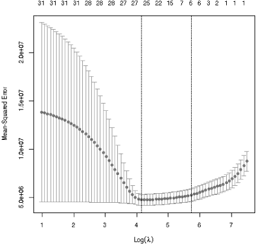

*图 9-1：MSPE，Airbnb 数据*

让我们尝试预测，比如从我们的数据中取第 18 行，并将保证金改为 360 美元，评分改为 92。那么我们预测的租金值是多少？

```
> x18 <- Abb[18,-4]
> x18[4] <- 360
> x18[8] <- 92
> predict(z,x18)
            1
[1,] 3750.618
```

我们的收缩方法与第 8.4.4 节中 OLS 输出相比，改变了多少系数？例如，在 OLS 模型中，居住在 94123 邮政编码的估计平均溢价为 1,639.61 美元。那么，使用 LASSO 后是多少呢？

```
> z$coefs
...
zipcode.94118           .
zipcode.94121           .
zipcode.94122           .
zipcode.94123         698.6044574
zipcode.94124           .
zipcode.94127           .
...
```

啊，结果确实进行了收缩。另一方面，LASSO 收缩的是向量，而不一定是单独的元素，某些元素甚至可能稍微增加。当然，许多元素确实被收缩到了 0。

回顾一下这个过程是如何工作的：它一开始模型中没有任何特征，这对应着一个非常大的*λ*值。在每一步中，*λ*会被减少，这可能导致我们获取一个新的特征。我们还可以查看特征引入模型的顺序：

```
> z$whenEntered
            bedrooms      guests_included     security_deposit
                   2                   10                   13
       zipcode.94112 review_scores_rating        zipcode.94123
                  15                   16                   17
       zipcode.94133        zipcode.94105        zipcode.94117
                  22                   24                   24
       zipcode.94124        zipcode.94127        zipcode.94114
                  24                   25                   26
       zipcode.94111        zipcode.94131            bathrooms
                  27                   27                   27
       zipcode.94110        zipcode.94116        zipcode.94102
                  28                   29                   30
       zipcode.94108        zipcode.94122        zipcode.94118
                  30                   30                   31
       zipcode.94132        zipcode.94107        zipcode.94121
                  31                   33                   34
       zipcode.94158        zipcode.94115        zipcode.94134
                  35                   37                   37
       zipcode.94104        zipcode.94109       minimum_nights
                  44                   56                   57
      maximum_nights
                  57
```

不太令人惊讶的是，过程选择的第一个特征是卧室数量。但也许不太直观的是，过程选择的第二个特征是关于客人的虚拟变量。我们上面举的例子，94123 邮政编码的虚拟变量，在第 17 步时被选择。可以将这个顺序视为对每个选定特征重要性的报告。

**注意**

*由于本书的重点是从数据中进行预测，而不是对数据进行描述，因此我们之前没有讨论特征重要性的问题。我们这里只是将其作为理解 LASSO 如何工作的辅助工具。不过，某些在本书中使用的软件包中提供了这个功能。例如，参见*randomForests*包中的*importance()*函数。*

### 9.7 示例：非洲土壤数据

如第 6.2.4 节所述，非洲土壤数据集的重要性在于它具有*p* > *n*，特征的数量几乎是数据点数量的三倍。这被认为是一个非常困难的情况。

记住，对于许多分析师来说，LASSO 的精髓就在于降维，所以看到 LASSO 如何处理这些数据将是非常有趣的。

#### ***9.7.1 LASSO 分析***

同样，我们将预测土壤酸度，pH 值：

```
> afrsoil1 <- afrsoil[,c(1:3578,3597)]
> z <- qeLASSO(afrsoil1,'pH',holdout=NULL)
```

输出的`nzero`组件告诉我们每一步过程中选择了多少特征：

```
> z$nzero
 s0  s1  s2  s3  s4  s5  s6  s7  s8  s9 s10 s11 s12 s13 s14 s15 s16 s17 s18 s19
  0   2   2   2   4   4   5   5   6   6   6   7   8   8  10  12  17  16  14  13
s20 s21 s22 s23 s24 s25 s26 s27 s28 s29 s30 s31 s32 s33 s34 s35 s36 s37 s38 s39
 13  13  12  15  15  15  15  12  13  13  13  13  13  14  16  15  16  16  17  18
s40 s41 s42 s43 s44 s45 s46 s47 s48 s49 s50 s51 s52 s53 s54 s55 s56 s57 s58 s59
 21  21  22  22  24  24  24  24  40  25  26  28  35  44  35  41  40  42  44  42
s60 s61 s62 s63 s64 s65 s66 s67 s68 s69 s70 s71 s72 s73 s74 s75 s76 s77 s78 s79
 43  56  50  70  61  66  64  62  57  58  64  73  79  84  85  85  97  97 102  82
s80 s81 s82 s83 s84 s85 s86 s87 s88 s89 s90 s91 s92 s93 s94 s95 s96 s97 s98 s99
 85  80  81  70  58  77  83  80  77  80  82  93  99  86 141 131 177 140 142 156
```

`lambda`组件给出了相应的*λ*值：

```
> z$lambda
  [1] 0.342642919 0.327069269 0.312203466 0.298013337 0.284468171 0.271538653
  [7] 0.259196803 0.247415908 0.236170473 0.225436161 0.215189739 0.205409033
 [13] 0.196072876 0.187161061 0.178654302 0.170534188 0.162783146 0.155384401
 [19] 0.148321940 0.141580479 0.135145428 0.129002860 0.123139480 0.117542601
 [25] 0.112200108 0.107100440 0.102232560 0.097585932 0.093150501 0.088916667
 [31] 0.084875267 0.081017555 0.077335183 0.073820179 0.070464938 0.067262198
 [37] 0.064205027 0.061286810 0.058501230 0.055842258 0.053304142 0.050881386
 [43] 0.048568749 0.046361224 0.044254035 0.042242621 0.040322628 0.038489903
 [49] 0.036740477 0.035070566 0.033476554 0.031954993 0.030502590 0.029116200
 [55] 0.027792824 0.026529597 0.025323786 0.024172781 0.023074090 0.022025337
 [61] 0.021024252 0.020068667 0.019156515 0.018285822 0.017454703 0.016661360
 [67] 0.015904076 0.015181211 0.014491201 0.013832554 0.013203843 0.012603708
 [73] 0.012030850 0.011484029 0.010962062 0.010463820 0.009988223 0.009534243
 [79] 0.009100897 0.008687247 0.008292398 0.007915496 0.007555724 0.007212305
 [85] 0.006884495 0.006571584 0.006272895 0.005987782 0.005715628 0.005455844
 [91] 0.005207868 0.004971162 0.004745215 0.004529538 0.004323663 0.004127146
 [97] 0.003939561 0.003760502 0.003589581 0.003426429
```

对应的图形显示在图 9-2 中。

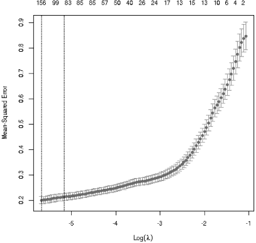

*图 9-2：非洲土壤数据*

这里我们得到的是一个相当不完整的结果。最小的 MSPE 来自软件尝试的最小*λ*值（0.003426429），但曲线似乎暗示即使更小的值也会表现得更好。因此，我们可能会使用一组自定义的*λ*值重新运行，而不是使用默认的值序列。

尽管如此，即使我们选择了*λ* = 0.003426429，这个值也已经相当不错了。LASSO 从原始的 3,578 个特征中保留了 156 个。这是一个相当大的降维。

### 9.8 可选部分：著名的 LASSO 图

本部分包含更多的数学内容，可以安全跳过，因为它在后续部分并不使用。然而，对为什么 LASSO 保留了一些原始特征并排除其他特征感兴趣的读者，可能会发现这一部分内容有帮助。

如前所述，LASSO 的一个关键特性是它通常提供*稀疏*的解决方案，表示许多值为 0。换句话说，许多特征被丢弃，从而提供了一种降维的方法。图 9-3 展示了原因。其工作原理如下：

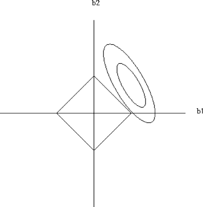

*图 9-3：LASSO 的特征子集性质*

图 9-3 展示的是*p* = 2 个预测变量的情况，它们的系数分别是*b*[1]和*b*[2]。（为简便起见，我们假设没有常数项*b*[0]。）让*U*和*V*分别表示相应的特征。将*b* = (*b*[1], *b*[2])表示为*b*[i]*的向量。

如果没有收缩，我们会选择*b*来最小化平方误差的和：

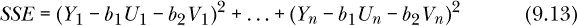

横轴和纵轴分别表示*b*[1]和*b*[2]，如图所示。关键点是，对于我们在方程 9.13 中为 SSE 设定的任何值，解出方程的(*b*[1], *b*[2])点都会形成一个椭圆。LASSO 计算出的(*b*[1], *b*[2])值只是给定椭圆中的一个点；许多其他(*b*[1], *b*[2])值也能得到相同的 SSE。

当我们改变 SSE 值时，我们会得到各种同心椭圆，其中两个在图 9-3 中展示。较大的 SSE 值对应于较大的椭圆。

现在，当我们给 LASSO 算法一个*λ*或*η*的值时，会发生什么呢？如前所述，可以使用任一数量，但我们假设使用后者会更容易。那么，当我们给 LASSO 算法一个*η*的值时，它会做什么呢？

+   该算法将最小化 SSE，同时满足约束条件：

    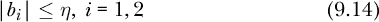

    让我们用 SSE*[alg]*表示 SSE 的最小值，并用对应的(*b*[1], *b*[2])值表示(*b*[1], *b*[2])*[alg]*。

+   一方面，点 (*b*[1], *b*[2])*[alg]* 将位于与 SSE*[alg]* 相关的椭圆上。

+   另一方面，公式 9.14 表明，(*b*[1], *b*[2])*[alg]* 必须位于图中的菱形内部，菱形的角落坐标为(*η*, 0)、(0, *η*)，依此类推。

+   因此，(*b*[1], *b*[2])*[alg]* 必须位于与菱形相交的椭圆上。

+   但请记住，我们希望 SSE 尽可能小，同时满足公式 9.14。还要记住，较小的 SSE 值对应着较小的椭圆。因此，SSE*[alg]* 的椭圆必须*刚好接触到菱形*，如图 9-3 中的外椭圆所示。

+   在图中，“刚好接触”点位于菱形的一个角落。每个角落的 *b*[1] 或 *b*[2] 都等于 0——这就是稀疏性！

+   那种稀疏性是巧合吗？不是！原因如下：根据输入数据的相对值(*U**[i]*, *V**[i]*)，图中的椭圆会有不同的方向。图中的椭圆大约指向“西北和东南”。但通过检查可以明显看出，大多数方向都会导致接触点位于菱形的一个角落，从而产生稀疏解。

因此，LASSO 通常会产生稀疏解，这也是它受欢迎的主要原因。那么岭回归呢？在这种情况下，菱形变成了一个圆形，因此没有稀疏性。

### 9.9 即将到来

接下来，我们采用一种完全不同的方法。使用 k-NN 和决策树时，没有使用线性关系，随后这个属性被显式假设。在第四部分中，我们介绍了在间接使用线性关系的情况下的方法。
