## 第十章：边界方法：支持向量机（SVM）**


支持向量机（SVM），与神经网络（NN）一起，被认为是最“纯粹”的机器学习方法之一，最初受到人工智能的启发——即非统计概念。我们将在本章讨论 SVM，在下一章讨论神经网络。SVM 最为人熟知的是其分类应用。虽然它们也可以用于回归问题，但我们将重点讨论分类。

请记住，本章的数学内容会比其他章节稍微多一些。然而，为了保持书籍非数学化的精神，方程式会保持在最低限度。SVM 是一个非常强大、通用的方法，理解一些数学内容是时间的绝佳投资。即使是阅读 SVM 软件的文档，也需要对该方法的结构基础有所理解。

### 10.1 动机

SVM 的所有内容都涉及将一个类与另一个类分开的边界线。为了引出这个概念，我们将首先使用逻辑回归模型进行边界分析，然后再引入 SVM。在本节中，重要的是要记住，我们只是为了引出 SVM 而进行探索。

#### ***10.1.1 示例：森林覆盖数据集***

让我们回顾一下第 5.4 节中的森林覆盖数据。在这里，我们将构建一个激励图，因此只需要查看数据的一个小子集。首先，为了避免“黑屏问题”（即数据点太多，图形变得杂乱无章），我们将绘制一个随机选择的 500 个数据点的子集。其次，为了保持数据的二维可视化，我们只使用两个特征。

`qeML`包包含一个数据集`forest500`，它由原始数据的 500 行随机抽取而来。那么，列呢？我们可以尝试使用第 4.5.1 节中的条件独立特征排序（FOCI）方法：

```
> data(forest500)
> qeFOCI(forest500,'V55')$sel
    index names
 1:     1    V1
 2:     6    V6
...
```

我们可能会再次运行该函数，因为其中涉及一些随机性，但我们以上述内容为例，像往常一样，先熟悉一下数据：

```
> f500 <- forest500[,c(1,6,55)]
> head(f500)
     V1   V6 V55
1: 3438 1033   1
2: 3165 3961   2
3: 3020 5407   2
4: 3244  911   2
5: 2754 1463   2
6: 3008 1275   2
> table(f500$V55)
  1   2   3   4   5   6   7
194 238  29   3   5  10  21
```

如上所示，数据中有七种封面类型，这意味着这是一个多类问题。这里我们将考虑一个二分类版本，在该版本中，我们希望预测封面类型 1 与其他所有类型的区别。`regtools::toSubFactor()`函数非常适合这种情况。

```
> f500$V55 <- regtools::toSubFactor(f500$V55,list('1'))
> head(f500)
     V1   V6      V55
1: 3438 1033        1
2: 3165 3961 zzzOther
3: 3020 5407 zzzOther
4: 3244  911 zzzOther
5: 2754 1463 zzzOther
6: 3008 1275 zzzOther
```

让我们看看数据的样子：

```
> plot(f500[,1:2],pch=ifelse(f500[,3] == '1',0,3))
```

这段代码生成了图 10-1 中所示的图表。

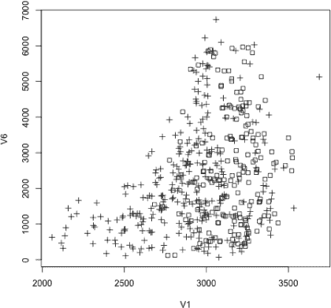

*图 10-1：森林覆盖数据*

我们想要绘制第 1 列和第 2 列的数据，因此使用表达式`f500[,c(1,2)]`。但我们希望在视觉上区分两类，比如使用方形和加号作为符号。在基础 R 图形中，绘图符号通过`pch`（点字符）参数来指定，事实证明数字编码分别是 0 和 3。^(1) 方形代表封面类型 1 的点，而加号代表非类型 1 的点。

在图表中似乎没有明显的趋势（即没有两组分离的趋势）。我们看到图表中到处都是方块和加号。然而，加号似乎更多集中在左侧和上方，而方块则更多集中在右侧。

我们希望在图 10-1 中绘制一条线，使得大多数加号位于线的一侧，大多数方块位于另一侧。读者可以偷看一下图 10-2 来了解我们要走的方向。那么，这条线是从哪里来的呢？实际上，可以在这里使用 logit 模型。这应该不会太令人惊讶，因为你会记得 logit 模型在其核心具有线性形式。

下面是如何绘制这样一条线的步骤。让我们拟合模型：

```
> w <- qeLogit(f500,'V55',holdout=NULL,yesYVal='1')
```

通常，在预测上下文中我们不关心估计的逻辑模型系数 。然而，在这里，我们希望使用这些系数在图 10-1 中绘制分隔线。我们如何从输出对象`w`中获取这些系数呢？

回想一下第 8.9.3 节，logit 模型的多类应用使用的是“一个对所有”（OVA）或“所有对所有”（AVA）方法；`qeLogit()`使用的是 OVA。因此，它对每个类运行一个 logit 模型，并将`glm()`的输出放在`qeLogit()`输出的`glmOuts`组件中。

然而，二分类模型稍微不同。为了避免实际上运行相同的模型两次——对于森林覆盖数据，类型 1 与非类型 1——`qeLogit()`只运行一次。换句话说，我们将查看`w$glmOuts[[1]]`。

为了获取系数，我们使用`coef()`，这是另一个通用函数，就像我们之前看到的`print()`和`plot()`一样。这个函数提取估计的系数：

```
> cf <- coef(w$glmOuts[[1]])
 (Intercept)           v1           v2
-1.684947e+01  5.389779e-03  1.469269e-05
```

现在再回忆一下，逻辑模型将线性模型转换为逻辑函数，*ℓ*(*t*) = 1/(1 + *e*^(−*t*))；占位符*t*被设置为线性形式。上述输出给出了一个位置在具有特征值*v*1 和*v*6 的情况下，类型 1 覆盖的估计概率：

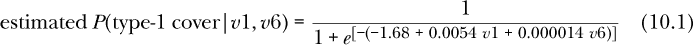

假设我们根据方程 10.1 中的估计概率是否大于 0.5 来猜测该位置是否有类型 1 覆盖。将该方程设置为 0.5，开始时看起来很复杂，但当我们注意到*e*⁰ = 1 时，事情就变得简单了。换句话说，如果指数

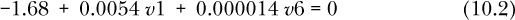

然后，方程 10.1 的右侧等于 0.5，这正是我们想要的，一个形成决策边界的直线。

所以，公式 10.2 中的线形成了区分预测类型 1 或非类型 1 封面的边界。那就是一条直线的方程，绘制在图 10-2 中。我们通过使用 R 的`abline()`函数将这条线叠加到图 10-1 上，`abline()`函数的作用正如其名——即在现有图形中添加一条直线：

```
# arguments are intercept and slope
> abline(a=-cf[1]/cf[3], b=-cf[2]/cf[3])
```

结果如图 10-2 所示。它恰好几乎是垂直的，这并不奇怪，因为`V6`的系数非常小，但这无关紧要。线右侧的数据点被预测为类型 1 封面，左侧的数据点则预测为非类型 1 封面。

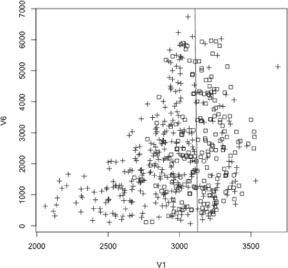

*图 10-2：带有 logistic 边界线的森林覆盖数据*

显然，有相当多的数据点被误分类——也就是说，右边的加号和左边的方块。我们可能通过增加使用的特征数量来减少误分类的点——这里我们只有*p* = 2 个特征——但仍然会有一些误分类的点。

这激发了 SVM 的基本目标：

我们希望找到一条能够很好地区分类别的直线，然后通过判断新样本落在直线的哪一侧来预测未来的案例。我们的直线通常不会完全将类别分开，所以我们会有一些误分类错误，就像任何机器学习方法一样。但希望精心选择的直线能够为我们提供良好的结果。

当*p* = 3 个特征时，线变成了三维空间中的一个平面，难以直观地理解，如果特征超过三个，那就完全无法可视化。但通过始终牢记二特征情况下的几何解释，我们将能够直观地使用 SVM。

进入细节之前，还有一个问题：为什么不直接使用上述的 logit 方案来创建我们的边界线呢？使用 SVM 生成的线有什么优势吗？答案是，logit 方法非常局限。它规定了回归函数的特定形式，涉及指数函数等内容，如公式 10.1 所示，虽然在某些应用中这可能是一个合理的假设，但在其他情况下则不一定适用。

相比之下，除了隐含假设最佳的类间边界是直线而不是其他曲线（即使这个条件可以被放宽，稍后我们会看到），SVM 没有做出任何假设，因此它更具灵活性，可能会产生更好的拟合效果（就像 k-NN、随机森林等方法一样，这些方法做出的假设更少）。

### 10.2 直线、平面与超平面

让我们进一步探讨一下这个几何视角。

上述推导在逻辑回归模型中始终成立；*Y* = 1 与*Y* = 0 的预测总是归结为计算特征的线性函数。如果我们有*p* = 2（即两个特征，如*v*1 和*v* 6），预测*Y* = 1 与*Y* = 0 之间的边界是如下形式的直线

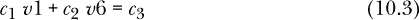

如我们在方程 10.2 中看到的那样。如果*p* = 3，例如，添加*v*的第 8 个特征，边界变成平面形式，具体为

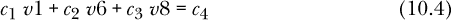

如上所述，这很难可视化。同样如前所述，对于*p* > 3，我们完全无法可视化这个设置。但是我们仍然在处理特征的线性形式，其行为像一条线或一个平面。由于它像平面一样，我们称之为*超平面*。为了技术准确性，我们将使用缩写 LPH（线/平面/超平面），而不是单纯说“线”，但读者应始终将*p* = 2 的情况作为直观的指导。

### 10.3 数学符号

任何关于 SVM 的讨论—包括阅读 SVM 软件的文档—都离不开“点积”符号。尽管这个名字和数学公式可能让人觉得有些吓人，但它只是以更简洁的方式表达事物。我们首先讨论如何将 SVM 符号转换为向量形式，然后引入点积。

#### ***10.3.1 向量表达式***

如从方程 10.3 和 10.4 中可以看出，LPH 可以通过其系数向量表示——例如，在方程 10.4 中是(*c*[1], *c*[2], *c*[3], *c*[4])。在 SVM 中，通常以等式为 0 的形式表示，因此，举个例子，我们将方程 10.4 重写为

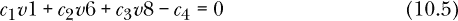

并设定：

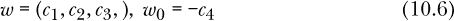

向量*w*和数字*w*[0]构成我们对 LPH 的描述。

因此，我们将通过以下方式总结方程 10.2：

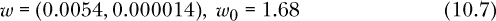

#### ***10.3.2 点积***

SVM 的基础理论广泛使用了微积分和线性代数。如前所述，这些数学内容远超本书的范围。然而，使用其中的一些符号—仅仅是符号，而非概念上的内容，除了少量代数—将是高效且易于理解的。

我们的目标是找到一种简单、紧凑的方法，以确定一个新案例落在边界线或 LPH 的哪一侧，从而可以轻松地预测其类别。

两个向量*u* = (*u*[1], . . . , *u**[m]*)和*v* = (*v*[1], . . . , *v**[m]*)之间的*点积*仅仅是乘积的和：

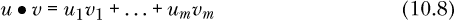

例如，我们可以取方程 10.7 中*w*与向量(1,−4)的点积：

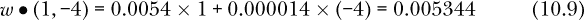

将方程 10.1 转化为我们新的点积符号会很有帮助：

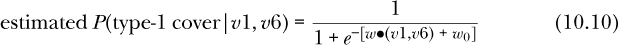

注意一些代数性质：

+   *e*⁰ = 1

+   *e**^t* > 1，当*t* > 0 时

+   *e*^(−*t*) < 1，当*t* > 0 时

+   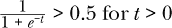

因此，在方程 10.10 中，

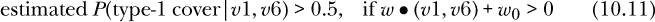

和


所以，当面对一个新的预测案例时，我们只需要查看 *w* • (*v*1, *v*6) + *w*[0] 的符号——正负。如果是正数，那么这个新案例更有可能（概率大于 0.5）属于封面类型 1，而如果是负数，那这个概率小于 0.5。换句话说，如果 *w* • (*v*1, *v*6) + *w*[0] > 0，我们预测该新案例为封面类型 1，否则预测为非类型 1。

这再次表明，如果我们要预测的新案例位于线的右侧，我们猜测它是封面类型 1；如果位于左侧，则猜测它是非类型 1。而我们的 SVM 边界是使以下式子成立的向量 *x*：

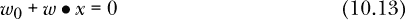

再次强调，这只是符号表示，但在数学中，便捷的符号往往有助于澄清问题。对于 *p* = 2 个特征的应用，画线是可以可视化的，但如果 *p* = 3，则画平面就很难可视化；如果 *p* > 3，则无法可视化。使用点积符号的好处是，我们只需注意 *w* • (*v*1, *v*6) + *w*[0] 是否为正或负，就能知道该如何预测新案例的类别。

顺便说一下，SVM 的理论学者也喜欢将两个类别编码为*Y* = +1 和*Y* = −1，而不是像统计学中标准的那样编码为 1 或 0。我们通常会继续使用后者的编码，但在本章中会转而使用前者。

#### ***10.3.3 SVM 作为一个参数模型***

我们曾提到线性和逻辑模型是*参数化的*，因为回归函数被建模为由有限数量的值 *β*[0], *β*[1], . . . , *β**[p]* 确定。这与例如 k-NN 方法相对立，后者并不对回归函数的形式做出任何假设。

方程 10.13 的一个含义是，SVM 也是一个参数模型。与其假设回归函数的参数形式，这里我们假设两个类别之间边界线的参数形式。

### 10.4 SVM：基本思想——可分离情况

如前所述，我们在图 10-2 中绘制的那条线并没有完全分开两个类别。线的两边都有加号和方框。这是典型的情况，不仅适用于逻辑回归产生的线，也适用于 SVM——我们在此关注的内容。然而，如果我们首先考虑两个类别可以干净地分开的数据集，那么 SVM 方法更容易解释，因此大多数书籍都会从这个情况开始，正如我们将在这里所做的那样。

为了清晰起见，我们将继续专注于两类问题，就像上面提到的类型 1/非类型 1 封面例子一样。再者，我们将继续讨论 *p* = 2 特征的情况，其中 LPH 是一条直线。

请注意，我们在此处提到的“数据”将指训练数据。我们为训练数据找到边界线，然后根据该线预测未来的案例。类似地，当我们谈论“数据”的可分性时，我们指的是训练数据。

#### ***10.4.1 示例：安德森鸢尾花数据集***

埃德加·安德森关于鸢尾花的数据，包含在 R 中，已经成为书籍、网站等中无数示例的主题。数据包含三类：*setosa*、*versicolor*和*virginica*。

该数据集包含在 R 中：

```
> head(iris)
  Sepal.Length Sepal.Width Petal.Length Petal.Width Species
1          5.1         3.5          1.4         0.2  setosa
2          4.9         3.0          1.4         0.2  setosa
3          4.7         3.2          1.3         0.2  setosa
4          4.6         3.1          1.5         0.2  setosa
5          5.0         3.6          1.4         0.2  setosa
6          5.4         3.9          1.7         0.4  setosa
```

请注意，本节中的内容主要是为了激发后续材料的动机。对于日常的 SVM 计算，您将使用 `qeSVM()`。因此，在这里的示例中，我们进行一些非 SVM 分析以激发动机，我们将省略部分代码和代数。

如前所述，对于这个示例，我们希望数据中两个类别能够被一条直线清晰分隔。如果我们将两个鸢尾花类别取为 setosa 和非 setosa，并选择 `Sepal.Length` 和 `Petal.Width` 列作为特征，那么情况就是这样。

让我们首先绘制数据。

```
> j2 <- iris[,c(2,4,5)]  # sepal width, petal width, species
# set up species code, 1 for setosa, 0 for nonsetosa
> head(j2)
  Sepal.Width Petal.Width Species
1         3.5         0.2  setosa
2         3.0         0.2  setosa
3         3.2         0.2  setosa
4         3.1         0.2  setosa
5         3.6         0.2  setosa
6         3.9         0.4  setosa
> j2$Species <- toSubFactor(j2$Species,'setosa')
> j2[c(7,77),]
   Sepal.Width Petal.Width  Species
7          3.4         0.3   setosa
77         2.8         1.4 zzzOther
> plot(j2[,1:2],pch=3*as.numeric(j2[,3]))
```

这将产生图 10-3 中的图形。

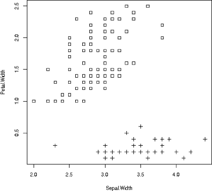

*图 10-3：Setosa 和非 Setosa*

可以很容易地在两个类别之间画一条线——实际上，可以画许多条线。但，哪一条线是最优的呢？

#### ***10.4.2 优化准则***

选择我们的边界线等同于选择系数向量 *w* 和 *w*[0] 项。换句话说，这种情况类似于线性和广义线性模型，在这些模型中，我们选择估计的系数 。（实际上，*w* 和 *w*[0] 也是估计值，但为了避免混乱，我们不使用帽记号。）现在回想一下，在线性模型中，我们选择系数 的方式是通过优化问题：我们最小化某个平方和。

SVM 仍然最小化某个和，但它使用的是与平方误差不同的损失函数。详细说明这一点将使我们深入一些晦涩的数学内容，几乎没有什么实际帮助。幸运的是，数学有一个易于理解的几何版本，我们现在将讨论它。

为此，请查看图 10-4。在这里，我们“圈定”了两个类别（上方是 setosa， 下方是非 setosa），将它们分成了所谓的 *凸包*。再次说明，这仅仅是为了说明问题；`qeSVM()` 函数会为我们进行计算（并使用不同的方法），而我们在此示例之后将不再自己计算凸包。因此，我们省略了代码。（可以使用 `mvtnorm::chull()` 函数。）

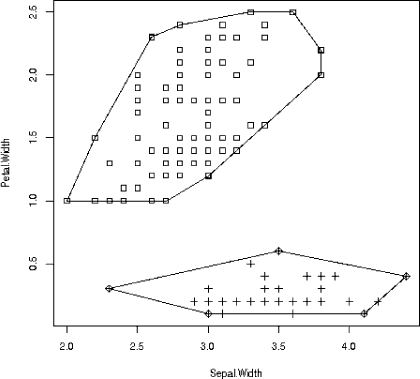

*图 10-4：SVM 凸包*

数学上可以证明，SVM 的边界线恰好位于两个凸包的“中间”。更准确地说，首先找到两个凸包中最接近的两点。我们的边界线就是这两点之间线段的垂直平分线。我们在图 10-5 中绘制了这一点，以及两条相关的虚线，定义了 SVM 拟合的“边际”。

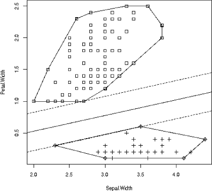

*图 10-5：SVM 边际*

请注意以下几点，无论是此处还是一般情况：

+   两条虚线之间的区域称为*边际*。

+   对于可分数据，边际内不会有数据点。

+   位于边际上的点称为*支持向量*（SVM 中的 SV）。对于这个数据集，我们有三个支持向量，一个位于(2.7,1.0)的 setosa 类，另外两个位于(2.3,0.3)和(3.5,0.6)的非 setosa 类。

+   就* w *和* w *[0]而言，*w*[0] + *w* • *x* 的值将是：

    +   **−**     0 对于边界上的任何点 *x*

    +   **−**     +1 对于*Y* = +1 类中的任何支持向量（在此案例中为 setosa）

    +   **−**     −1 对于*Y* = −1 类中的任何支持向量（在此案例中为非 setosa）

    +   **−**     > +1 对于*Y* = +1 类中的任何非支持向量

    +   **−**     < −1 对于*Y* = −1 类中的任何非支持向量

    顺便提一下，查看公式 10.13 可以看到，*w* 和 *w*[0] 的值并不是唯一的。比如将它们都乘以 8.8，右侧的结果仍然是 0。因此，约定是选择它们，使得在支持点上，*w*[0] + *w* • *x* 的值为+1 或−1。

+   要预测*Y*对于一个新案例，其中*X* = *x*[new]，我们猜测*Y*为+1 或−1，取决于* w *[0] + *w* • *x*[new]是大于还是小于 0。请注意，尽管我们假设训练数据在这里是可分的，但新数据点可能会落在边际内。

请记住，拟合 SVM 模型等同于选择* w *和* w *[0]。上面的方案可以证明是最优的。但是等一下——“最优”究竟是什么意思？SVM 中通常使用的最优标准是：

我们选择* w *和* w *[0]，使得边际具有最大的可能宽度。

换句话说，SVM 不仅仅是试图将两类数据点分开，还要尽可能地将这两类数据点相对于分界面拉得尽可能远。它在两类之间找到一个“缓冲区”，并最大化这个区域的宽度。如前所述，这个缓冲区被称为边际。

关键思想是，训练集中的大边际意味着两类数据点被很好地分开，这也意味着未来的新案例可能会被正确分类。事实证明，像上述那样使用凸包选择* w *和* w *[0]（即使*p* > 2）确实能够最大化边际。

##### 10.4.2.1 支持向量的意义

支持向量通过“支持”拟合，意思是任何一个支持向量的变化都会改变拟合结果；而其他数据点的变化则不会改变拟合结果（只要它们仍然在凸包内）。当然，我们也可以说，*添加*新的数据点也不会改变拟合结果，只要这些新点位于凸包内。

支持向量机（SVM）的一个常见优点是（至少在可分情况中）它们往往会产生稀疏的拟合，在这里，稀疏并不意味着*w*的大多数组件为 0，而是拟合的基本维度较低。从另一个角度看，这个说法是：支持向量越多，过拟合的风险就越大。我认为，这个说法的证据较为薄弱，尽管它可以作为模型拟合过程中的几个指南之一。

但这个好处可能是虚幻的。正如前面所说，稀疏性的来源是*w*依赖于少数数据点（即支持向量）。但如果某些支持向量是异常值（不代表整体数据）或者甚至是明显错误的呢？许多实际数据集确实存在一些错误。那么我们的拟合结果就会高度依赖一些可疑的数据。

此外，*w*对少数数据点的高度敏感性导致了较高的抽样变异性；不同的样本可能会有不同的支持向量。换句话说，*w*具有较高的方差。

### 10.5 主要问题：缺乏线性可分性

边距，实际上被称为*硬边距*，只在存在某条线（或 LPH）能干净地分开两类数据点的情况下才定义。正如我们在早期关于森林覆盖数据的图表中看到的那样，在大多数实际情况下，并不存在这样的分隔线。即使是鸢尾花数据，在第一列和第三列中，也没有任何一条线能分开变色鸢尾和维吉尼卡鸢尾：

```
> plot(iris[,c(1,3)],pch=as.numeric(iris$Species))
```

请参见图 10-6；加号和三角形没有被干净地分开。

解决这个问题有两种方法：(a) 使用*核函数*将数据转换为线性可分，或(b) 创建一个*软边距*，在其中允许一些点位于边距内。通常，这两种方法会结合使用。例如，在进行核转换后，我们仍然可能—实际上，可能会—发现没有能够干净分隔的 LPH，因此我们还需要允许一些异常点位于边距内。然而，异常点越少越好，所以最好结合使用这两种方法，而不是直接采用软边距解决方案。


*图 10-6：鸢尾花数据；三类*

#### ***10.5.1 应用“核函数”***

在这里，我们对数据进行转换，比如通过应用多项式转换，然后在新的数据上找到一个 LPH 分隔符。多项式的阶数就是一个超参数。

##### 10.5.1.1 动机示例

为了理解为什么核函数可能有用，我们考虑一个在机器学习展示中常用的例子：“甜甜圈形状”的数据。让我们生成一些数据。（这里的代码相当复杂，可以安全跳过，不影响后续内容。）

```
# generate 250 pairs of data points centered around (0,0)
> set.seed(9999)
> z <- matrix(rnorm(500),ncol=2)
# form new data by taking only certain points from z
> plus1 <- z[z[,1]² + z[,2]² > 4,]  # outer ring, class +1
> minus1 <- z[z[,1]² + z[,2]² < 2,]  # inner disk, class -1
> plus1 <- cbind(plus1,+1)  # add in Y column
> minus1 <- cbind(minus1,-1)  # add in Y column
> head(plus1)  # take a look
           [,1]       [,2] [,3]
[1,]  2.9038161  0.7172792    1
[2,] -0.4499405  2.0006861    1
[3,]  2.3329026  0.2288606    1
[4,] -0.2989460  2.3790936    1
[5,] -2.0778949  0.1488060    1
[6,] -0.9867098 -2.2020235    1
> head(minus1)
           [,1]       [,2] [,3]
[1,]  1.0840991  0.670507239   -1
[2,]  0.8431089 -0.074557109   -1
[3,] -0.7730161 -0.009357795   -1
[4,]  0.9088839 -1.050183477   -1
[5,] -0.1882887 -1.348365272   -1
[6,]  0.9864382  0.936775923   -1
> pm1 <- rbind(plus1,minus1)  # combine into one dataset
> plot(pm1[,1:2],pch=pm1[,3]+2)  # gives us pluses and circles
```

数据在图 10-7 中显示。两类数据，分别用加号和圆圈表示，是明显可分的——但通过一个圆而不是一条直线。

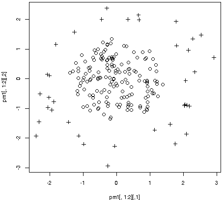

*图 10-7：“甜甜圈”数据*

但我们可以通过添加一个平方项来解决这个问题：

```
> pm2 <- pm1[,1:2]²  # replace each X value by its square
> pm2 <- cbind(pm2,pm1[,3])  # tack on Y to the new datasets
> plot(pm2[,1:2],pch=pm2[,3]+2)
```

我们取了原始数据集并对其进行了转换，将每个数据点替换为其平方。这个平方就是我们的新特征，替代了旧的特征。在新数据的图表中，图 10-8，加号和圆圈很容易被一条直线分开。

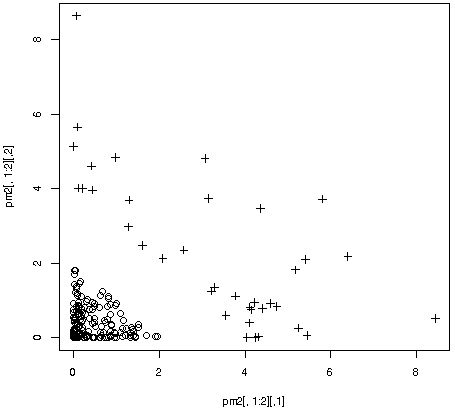

*图 10-8：“甜甜圈”数据，经过转换*

这就是 SVM 用户通常做的事情：尝试找到一种数据转换方式，使得转换后的数据能够线性可分，或者至少接近线性可分。当然，SVM 软件为我们完成了所有的工作；我们并不是像上面的示例那样手动转换数据。这个过程是通过核函数完成的，如下一节所示。

##### 10.5.1.2 核函数的概念

在转向实际数据示例之前，我们还需要讨论一个问题。什么是核函数？*核函数*是将我们的数据进行转换的一种方式，目标是使数据变得可分离。但它比这更具体：它是一个函数*K*(*u*, *v*)，其输入是两个向量。

这样做是有道理的，因为我们在第 10.3.2 节中看到，点积在 SVM 中起着关键作用，实际上，它在内部计算中起着更加重要的作用，这部分内容在本书中并未涉及。因此，许多核函数是点积的函数。

一个例子是*多项式核函数*：

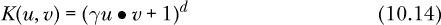

*d*和*γ*是超参数。在二次情况下，*d* = 2，我们实际上达到了与上一节相同的效果，在上一节中我们将*X*值平方了。在这里，我们对点积进行平方。

另一个常用的函数是*径向基函数（RBF）*：

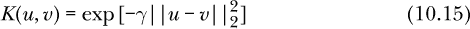

这里的*γ*是一个超参数。

再次强调，像许多机器学习问题一样，问题“哪个核函数最好？”的答案是：“这取决于。”数据集的类型和大小、特征的数量等等，都会导致不同核函数在性能上的差异。

#### ***10.5.2 软间隔***

如前所述，线性可分的数据是比较罕见的。不可分性才是典型情况。我们如何处理这种情况，即容忍一些点位于间隔内？我们可以考虑两种方法。

##### 10.5.2.1 几何视角

我们可以通过处理*简化的凸包*来代替计算凸包。再次强调，数学公式超出了本书的范围，但程序的核心是这样的：

+   我们用缩小版本替换两个原始的凸包。（它们不仅在大小上会变小，而且形状也会趋于“更圆”或更不那么长条形。）

+   边界将基于缩小的凸包来计算。

+   然后，按常规进行操作，即使一些训练集数据点会落在边界内。

当然，收缩量始终是一个由用户设置的超参数，可能通过交叉验证来调整。

##### 10.5.2.2 代数视图

几何视图直观易懂，但更常见的方法是通过“成本”来实现。这里有一个成本超参数，通常表示为 *C*。它的工作原理如下。假设训练集中数据点 *i* 为 *X**[i]*，即该数据点的特征向量，*Y**[i]* 是类标签，要么是 +1，要么是 −1。

在可分情况中，回想一下，对于位于边界上的数据点，*w*[0] + *w* • *X[i]* 等于 +1 或 −1。对于边界外的点，

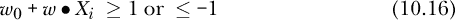

取决于 *Y[i]* 是 +1 还是 −1。但有一个巧妙的技巧，可以更简洁地陈述这个要求：

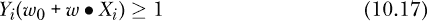

在软边界的情况下，我们稍微放宽一些，允许差异达到 1.0，例如，

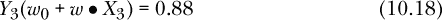

和

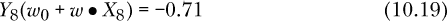

让 *d**[i]* 表示数据点 *i* 的差异，这样在这里 *d*[3] = 0.12 和 *d*[8] = −1.71。若数据点 *i* 没有差异，则设 *d**[i]* = 0——即如果 *Y**[i]* (*w*[0] + *w* • *X**[i]*) ≥ 1。

注意，如果 0 < *d**[i]* < 1，则数据点 *i* 是边界违规点，但它仍位于决策边界的正确侧——即它会被正确分类。但如果 *d**[i]* > 1，点就会位于边界的另一侧，因此会被错误分类。

我们通过规定来控制总的差异量，

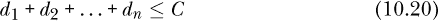

其中超参数 *C* 是我们的“差异预算”。同样，用户设置 *C*。

注意，*d**[i]* 不是超参数；它们是副产品。用户选择 *C*。每个潜在的 *w* 和 *w*[0] 的值会产生 *d**[i]*。我们为 *C* 设置的值越小，位于边界内的数据点数量就越少——但边界会变得更窄。我们希望有一个较宽的边界；SVM 算法会找到使边界宽度最大的 *w* 和 *w*[0] 的值，前提是满足约束条件（方程 10.20）。

### 10.6 示例：森林覆盖数据

让我们试试`qeSVM()`：

```
> z <- qeSVM(f500,'V55',holdout=NULL)
```

然后我们可以预测，比如，对于一个与我们数据中案例 8 相似的新案例，但将第二个特征值改为 2,888：

```
> newx <- f500[8,1:2]
> newx
    V1   V6
8 3085 2977
> newx[2] <- 2888
> predict(z,newx)
$predClasses
[1] "zzzOther"

$probs
          1  zzzOther
8 0.4829782 0.5170218
```

我们预测非类型 1 的覆盖，虽然它比类型 1 更可能。

我们这里使用的是默认值，其中之一将 `kernel` 设置为 `radial`。如果我们只希望使用软间隔（即不进行核转换），我们将 `kernel` 设置为 `linear`。超参数 `gamma` 的默认值是 1.0。一个可选的超参数 `cost` 是我们在早期讨论软间隔时提到的 *C* 值。顺便提一下，`qeML()` 将 `svm` 封装在著名的 `e10171` 包中。

### 10.7 那么，那个核技巧呢？

如果不讨论著名的*核技巧*，SVM 的介绍就不完整，因为它在很大程度上促进了 SVM 的成功。像往常一样，我们不会深入讨论数学细节——假设读者没有强烈的兴趣了解再生核希尔伯特空间——但是该原理本身具有重要的实际意义。

为了说明这一点，让我们了解一下在没有使用核函数的情况下，通过多项式转换时，我们的数据集可能会扩大到多大。我们在转换后的数据中的大小度量将是列的数量。

让我们再次使用森林覆盖数据，结合 `polyreg` 包，后者用于我们的计数数据列。(`polyreg`中的`getPoly()`函数由我们的`qe`系列中的多项式模型使用。)

```
> gpout <- polyreg::getPoly(forest500,2)  # input with n = 500, p = 54
P > N. With polynomial terms and interactions, P is 1564.
```

原始数据集只有 54 个特征，但在新的形式下，我们有超过 1,500 个特征！如果 `getPoly()` 没有避免创建重复项——例如，虚拟变量的平方——我们可能会有更多的特征。

因此，新的 *p* 值是 1,564，对于一个仅有 500 行的数据集来说，几乎无法运行。使用原始的数据框，超过 580,000 行数据，新的数据大小将是 581,012 × 1,564 = 908,702,768 个元素。每个元素 8 字节，这意味着需要超过 7GB 的内存！而且不仅是空间，时间也会成为问题——代码将永远运行下去。

这只是对于 2 次方的情况。试想一下 3 次多项式，依此类推！(3 次方会生成 16,897 列。)因此，某种快捷方式是迫切需要的。核技巧来拯救！

关键点是，通过使用方程 10.14 中的核函数，我们可以避免计算和存储那些额外的列。在森林覆盖数据中，我们可以保持原始的 54 个特征——在这个表达式中，向量 *u* 和 *v* 每个都有 54 个元素——而不是计算和存储 1,564 个特征。数学上，我们得到的计算结果与将 *u* 和 *v* 作为 1,564 元素的向量时相同。

### 10.8 “警告：已达到最大迭代次数”

与许多其他机器学习方法一样，支持向量机（SVM）的计算是迭代的。然而，不像其他方法，SVM 不应该有收敛问题。搜索空间具有*凸性*特性，这基本上意味着它是碗状的，因此很容易找到最小值。

然而，这假设存在可以最小化的东西。正如我们在使用软边界或核函数时所看到的，可能不存在一条清晰分隔类别的直线。对于某些特定的成本值和核函数（以及后者的超参数）组合，可能没有解。在这种情况下，我们当然会遇到收敛问题，我们需要尝试其他组合。

### 10.9 小结

本章比其他章节更具数学性，也许有些抽象。但其实，基本原理是简单的：

+   SVM 主要用于分类问题。通过 OVA 或 AVA 配对，SVM 可以处理任意数量的类别，但为了简化起见，我们在这里假设只有两个类别。

+   如果我们有 *p* = 2 个特征，基本目标是找到一条线将两类分开。

+   对于 *p* = 3，我们希望在三维空间中找到一个分隔平面。

+   对于 *p* > 3 的情况，我们称之为分隔超平面。我们无法直观地看出这些超平面，而是通过与超平面 *w* 向量的点积来进行分析。为了对一个新的案例进行分类，我们计算该案例的特征向量的点积，加入 *w*[0]，然后根据点积是否大于或小于 0 来决定类别。

+   我们将一对与分隔 LPH 平行的 LPH 关联起来，从而创建出边界。选择 *w* 的优化标准是最大化边界的宽度。

+   通常，类别之间是重叠的，因此不存在分隔 LPH，我们需要采用人工方法来分隔类别。通常有两种方法，通常是组合使用的：

    +   **−**     我们可以假设存在一个分隔 LPH，但它是“弯曲的”，而不是直线或平面。我们使用核函数对数据进行变换，尝试至少逼近这种弯曲性。

    +   **−**     我们可以根据用户设置的不同程度，允许数据点位于边界内。

如前所述，SVM 是一种比我们之前看到的工具更复杂的工具。但它被广泛使用，且有很多成功案例，因此本章所做的额外努力是非常值得的。
