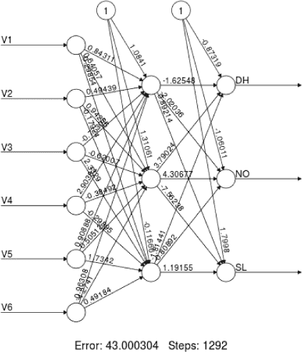
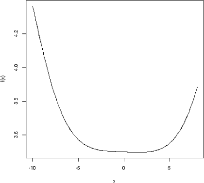

## 第十一章：类似类固醇的线性模型：神经网络**


神经网络（NNs）可能是公众最熟悉的机器学习技术。这个听起来像科幻小说中的名字非常吸引人——尤其是随着*深度学习*这一术语的出现——神经网络已成为图像分类的首选方法，应用于公众也感兴趣的领域，如面部识别。

然而，神经网络可能是最具挑战性的机器学习技术之一，使用时会遇到如下问题：

+   “黑箱”操作，内部发生了什么并不明确

+   需要调优的超参数众多

+   过拟合的倾向

+   可能需要较长的计算时间，在某些大数据案例中，当需要大量内存时，计算可能需要几个小时甚至几天。

+   收敛问题

让我们看看这到底有什么大惊小怪。

### 11.1 概述

*神经网络*这个术语指的是一种受人类思维生物学启发的机器学习方法。例如，在一个二分类问题中，预测变量作为*神经元*的输入，输出 1 或 0，1 表示神经元*激活*——我们便决定为类别 1。神经网络由若干个*隐藏层*组成，其中一个神经层的输出作为输入传递给下一层，以此类推，直到处理过程到达最终的输出层。这个过程也被赋予了生物学解释。术语*节点*和*单元*与*神经元*是同义的。

该方法后来被推广，使用了*激活函数*，其输出不仅限于 1 和 0，并允许后续层对前面层进行反向反馈。这使得该领域的发展在某种程度上偏离了生物学的动机，尽管有些人对生物学解释提出质疑，但神经网络（NNs）在机器学习社区中仍具有强大的吸引力。事实上，使用*深度学习*的广为宣传的大型项目重新激发了人们对神经网络的兴趣。

图 11-1，由`neuralnet`包在我们的脊椎数据上生成，展示了该方法的工作原理。（我们不会使用该包，但它确实能生成漂亮的展示图。）



*图 11-1：具有一个隐藏层的脊椎神经网络*

下面是概述：

+   神经网络由若干个*层*组成（本例中为三个）。

+   在描述特定网络的图像中，最左侧是输入层（这里是脊椎测量数据），最右侧是输出层，本例中输出的是类别预测。

+   中间有一个或多个*隐藏层*，本例中为一个。

+   一层的输出作为输入传递给下一层。

+   输出通常是一个单一的数字，回归问题为一个数字，*c*分类问题则为*c*个数字。

+   层的输入通过相当于线性模型的方式传递。层的输出通过一个*激活函数*传递，这类似于 SVM 中的核函数，用于适应非线性关系。在图 11-1 中，使用的激活函数是我们熟悉的 logit 函数，*a*(*t*) = 1/[1 + exp(−*t*)]（尽管是在完全不同的背景下；我们*不是*在执行逻辑回归）。

那么这一切如何在图 11-1 中展现出来呢？让我们看看图中一些数字。例如，第一圆圈的输入（中间列）是 1.0841 · 1 + 0.84311 V1 + 0.49439 V2 + ……，这是特征的线性组合。不同的线性组合被输入到第二个圆圈。每个圆圈的输出被传递到下一个层。

那么，这些线性组合中的系数（*权重*）是如何计算的呢？我们在这里省略详细的数学解答，但本质上，我们在回归问题中最小化平方预测误差之和。在分类问题中，我们选择权重来最小化总体的错误分类率，或其变体。

### 11.2 在复杂基础设施之上工作

在我们开始之前，关于`qeNeural()`，即我们用于构建神经网络的`qe*`系列函数，先说几句。

正如我们在本书中反复提到的，`qe*`系列函数主要是封装器——即，便捷的封装器，封装其他函数。这么做是为了让这个系列能够提供统一、快速且简便的用户界面，支持多种机器学习算法。

例如，我们的`qeSVM()`函数封装了`e1071`包中的`svm()`函数。那么`qeNeural()`呢？这里有一段有趣的故事！大致发生的事情是：

+   函数`qeNeural()`封装了`regtools()`包中的`krsFit()`函数。

+   `krsFit()`函数封装了 R 的`keras`包中多个用于神经网络的函数。

+   R 的`keras`包封装了 R 的`tensorflow`包。

+   R 的`tensorflow`包封装了同名的 Python 包。

+   而且，`tensorflow`的大部分代码实际上是用 C 语言编写的。

而且这一切大多依赖于同名包中的`reticulate()`函数。它的作用是实现 R 和 Python 之间的转换。

因此，设置这个过程可能有些微妙。有关特定平台的帮助，请参阅 RStudio 网站（例如，[*https://tensorflow.rstudio.com/tutorials/quickstart/beginner.xhtml*](https://tensorflow.rstudio.com/tutorials/quickstart/beginner.xhtml)）。上述列表中的 R 接口以及`reticulate`是由 RStudio 开发的。

牢记这些关于软件“二语”特性的要点是很重要的。例如，一个含义是，即使在运行神经网络前调用了`set.seed()`，你仍然会注意到不同运行之间会有一些变化。如果你不知道 Python 有自己独立的随机数生成器的话，这一点会让你感到困惑！

### 11.3 示例：脊椎数据

假设我们希望拟合一个模型并进行预测。如前所述，我们将不指定保留集，以便尽可能多的数据用于预测：

```
> z <- vert[1,-7]  # exclude "Y", which we are predicting
> nnout <- qeNeural(vert,'V7',holdout=NULL)
Epoch 1/30
2/2 [==============================] - 0s 62ms/step - loss: 1.0794 - accuracy: 0
.4274 - val_loss: 1.2847 - val_accuracy: 0.0000e+00
Epoch 2/30
2/2 [==============================] - 0s 19ms/step - loss: 0.9832 - accuracy: 0
.6048 - val_loss: 1.3886 - val_accuracy: 0.0000e+00
...
```

拟合过程是迭代的，并且每次迭代或*周期*都会给出报告。周期数是一个超参数。这个以及其他超参数将在下一节中讨论。

作为预测的一个例子，考虑一个与数据中第一个病人相似的病人，但其 V2 为 18 而不是 22.55。我们预测的类别会是什么？

```
> z$V2 <- 18
> predict(nnout,z)
$predClasses
[1] "DH"
```

我们预测的是 DH 类。

### 11.4 神经网络超参数

神经网络库以拥有大量超参数而著名。我们的 `qeNeural()` 函数经过设计，避免了这一点，只有少量的超参数。调用形式是：

```
qeNeural(data,yName,
   hidden=c(100,100),
   nEpoch=30,
   acts=rep("relu", length(hidden)),
   learnRate=0.001,
   conv = NULL, xShape = NULL,
   holdout=floor(min(1000,0.1*nrow(data)))
)
```

下面是与神经网络特定参数相关的说明：

hidden   指定隐藏层的数量以及每层的单元数量（每层的数量不必相同）。默认设置意味着两层隐藏层，每层有 100 个单元。如果这个向量中的某个数值是小数，则表示*丢弃*，下面将进行讨论。

nEpoch   指定周期数。

acts   指定激活函数，每个隐藏层有一个激活函数。

learnRate   与我们在梯度提升中看到的非常相似（见第 6.3.8 节）。

conv，xShape   在图像分类设置中使用的参数，将在第十二章中讨论。

分析师可以直接使用 `keras` 包来进行更详细的控制。这些参数旨在实现以下一个或两个目标：

+   控制偏差-方差权衡：`hidden`，`nEpoch`

+   处理收敛问题：`nEpoch`，`acts`，`learnRate`

读者可能会对上面偏差-方差权衡列表中的周期数（即迭代次数）感到惊讶。在大多数迭代算法中，迭代次数越多越好。但从经验上看，分析师发现，神经网络中迭代次数过多可能会导致过拟合。

### 11.5 激活函数

如果我们在每一层中简单地输入和输出线性函数，我们将得到线性函数的线性函数的线性函数……，经过多次组合后仍然是线性函数。为了能够建模非线性关系，我们在每一层的输出处放置*激活函数*，*a*(*t*)。

多年来，关于激活函数的最佳选择一直存在一些争论。从原则上讲，任何非线性函数都应该有效，但问题确实会出现，尤其是与极其重要的收敛问题相关。

再次考虑图 6-2。在 2.2 附近的最小值出现在一个相当陡峭的下凹处（用微积分术语来说，是一个大的二阶导数）。但如果曲线像图 11-2 中的那样呢？在最小值附近有一个相当浅的槽，假设其范围是−4 到 4。即使使用更大的学习率，我们也可能会在几次迭代中几乎没有进展。这就是*梯度消失问题*。如果曲线在最小值附近非常陡峭，我们可能会遇到*梯度爆炸问题*，即使在非常小的学习率下，也会对网络造成严重影响。



*图 11-2：浅最小值区域*

激活函数的选择在这些事情中起着重要作用。各层之间存在乘法效应。（再说一次，对于懂得微积分的人来说，这是链式法则在起作用。）区间（−1,1）中的量在相乘时会变得越来越小，因此乘法效应导致数值变得越来越小，从而产生梯度消失。如果每一层的梯度很大，我们可能会遇到梯度爆炸问题。

经历了多年的反复试验，今天神经网络用户中流行的选择是*修正线性单元（ReLU）*：*f*(*x*) 在 *x* < 0 时为 0，而在 *x* ≥ 0 时等于 *x*。

### 11.6 正则化

如前所述，神经网络有过拟合的趋势，许多网络拥有成千上万的权重，有些甚至有百万级的权重。请记住，权重本质上是线性回归系数，因此权重的总数实际上是*p*的新值（即我们的特征数量）。我们必须找到某种方法来减少这个值。

#### ***11.6.1 L1 和 L2 正则化***

由于神经网络（通常）最小化平方和，我们可以应用惩罚项来减少解的大小，就像岭回归和 LASSO 中的情况一样。还要回想一下，在 LASSO 中，使用*ℓ*[1]惩罚时，这往往会产生一个稀疏解，大多数系数为 0。

好的，这正是我们在这里想要的。我们担心我们有太多的权重，并且希望应用*ℓ*[1]惩罚能使大部分权重归零。

然而，由于使用了非线性激活函数，这种情况在神经网络中可能不会发生。问题在于，图 9-3 中的等高线不再是椭圆形的，因此“第一次接触点”不太可能位于菱形的一个角落。

然而，*ℓ*[1]仍然会缩小权重，*ℓ*[2]也是如此，因此我们应该在某种意义上实现维度减少。

#### ***11.6.2 通过 Dropout 进行正则化***

如果某个权重为 0，那么在网络图中，例如图 11-1，对应的连接将被移除。所以，如果目标是移除一些连接，为什么不直接移除一些连接呢？或者更好的是，移除整个节点。这正是*dropout*的作用。

例如，如果我们的丢弃率是 0.2，我们会随机（且暂时地）选择给定层的 20%的连接并将其移除。这里还有更多的细节，我们不在此列举，但这就是该方法的核心。

### 11.7 示例：跌倒检测数据

让我们重新审视在第 8.9.4 节中分析的数据集。我们将进行网格搜索，寻找一个合适的超参数组合。

请回忆一下，`qeFT()`函数中的参数`pars`定义了网格，因为它指定了我们希望探索的值范围。

```
> pars <- list(hidden=c('5,5','25,25','100,100','100,0.2,100,0.2',
   '100,0.5,100,0.5','250,0.5,250,0.5'),
   learnRate=c(0.0001,0.0005,0.001,0.005))
> ftout <- qeFT(fd,'ACTIVITY','qeNeural',pars=pars,nTst=250,nXval=25)
```

所以，我们在每层神经元的数量（5, 100, 250）和丢弃率（无、0.2、0.5）之间进行变化。我们也可以改变`nEpoch`，甚至是激活函数。还要注意，我们也可以尝试在不同的层中使用不同数量的神经元。

以下是结果：

```
> ftout$outdf
            hidden learnRate meanAcc        CI    bonfCI
1          100,100     5e-03 0.53256 0.5437322 0.5519608
2  100,0.2,100,0.2     5e-03 0.55896 0.5669100 0.5727654
3  250,0.5,250,0.5     1e-03 0.59480 0.6029615 0.6089727
4  250,0.5,250,0.5     5e-03 0.59696 0.6055761 0.6119221
5          100,100     1e-03 0.60040 0.6106513 0.6182015
6  100,0.2,100,0.2     1e-03 0.60048 0.6074992 0.6126690
7  250,0.5,250,0.5     5e-04 0.60928 0.6154121 0.6199285
8  100,0.5,100,0.5     5e-03 0.60952 0.6176062 0.6235618
9            25,25     5e-03 0.61344 0.6228619 0.6298013
10         100,100     5e-04 0.61744 0.6253014 0.6310915
11 100,0.5,100,0.5     1e-03 0.62120 0.6288043 0.6344051
12 100,0.2,100,0.2     5e-04 0.63056 0.6395884 0.6462380
13 100,0.5,100,0.5     5e-04 0.64048 0.6502662 0.6574739
14           25,25     1e-03 0.64664 0.6539690 0.6593669
15 250,0.5,250,0.5     1e-04 0.65368 0.6603284 0.6652252
16         100,100     1e-04 0.66168 0.6700386 0.6761949
17           25,25     5e-04 0.66528 0.6740087 0.6804375
18 100,0.2,100,0.2     1e-04 0.67240 0.6814274 0.6880762
19             5,5     5e-03 0.68504 0.6927206 0.6983776
20 100,0.5,100,0.5     1e-04 0.69240 0.6989253 0.7037314
21             5,5     1e-03 0.69696 0.7049328 0.7108050
22             5,5     5e-04 0.70368 0.7099837 0.7146265
23           25,25     1e-04 0.70608 0.7143002 0.7203546
24             5,5     1e-04 0.72544 0.7366268 0.7448662
```

首先需要注意的是，最小值与最大值之间的差距有多小。事实上，后者实际上与基础精度差不多：

```
> qeNeural(fd,'ACTIVITY')$baseAcc  # any qe* function could be called
[1] 0.7182421
```

如果没有特征，我们的错误率将是 72%。

所以，在这里，探索不同超参数值的使用确实带来了显著的收获。

但即便如此，还是能发现一些有趣的模式，特别是学习率的影响。较小的值往往效果较差。记住，如果我们的学习率太小，不仅可能会减慢收敛速度，还可能会让我们卡在局部最小值。

最后，请注意，在这种情况下，较小的丢弃率似乎能产生更好的结果。

### 11.8 陷阱：收敛问题

如前所述，配置神经网络分析以确保正确地收敛到一个好的解通常是一项挑战。在某些情况下，可能会遇到*坏时钟问题*——即网络无论输入是什么，都预测相同的值。

或者，可能会遇到如下输出：

```
Epoch 27/30
618/618 [==============================] -
1s 2ms/step - loss: nan - accuracy: 0.7571 - val _loss: nan - val_accuracy: 0.7520
```

这里`nan`代表“不是一个数字”。这个听起来不祥的消息可能意味着代码试图除以 0，这可能是由于梯度消失问题导致的。

以下描述了一些可以尝试的技巧，通常是通过一个或多个超参数指定的。

在某些情况下，通过对数据进行缩放可以解决收敛问题，可以使用 R 的`scale()`函数，或者将数据映射到[0,1]之间。建议常规地对数据进行缩放；在`qeNeural()`中，缩放实际上是硬编码到软件中的。

以下是一些可调节的值：

**学习率**  在第 6.3.8 节中讨论。

**激活函数**  尝试更改为具有更陡峭/更平缓斜率的函数。例如，函数*a*(*t*) = 1/(1 + exp(−2*t*))在*t* = 0 附近比普通的逻辑函数更陡峭。

**早停法**  在大多数算法中，迭代次数越多越好，但在神经网络中，许多问题偏离了传统的智慧。运行算法过长可能导致收敛到一个较差的解。这就引出了*早停法*的概念，且有许多变体。

**动量** 这里的大致想法是，“我们在顺利推进”，过去几个周期产生了朝正确方向前进的有效步骤，每次都减少验证误差。所以，为什么不结合过去几个步骤的步长呢？下一步的步长将设置为过去几个步长的加权平均值，并且对最近的步长赋予更大的权重。（这个超参数在`qeNeural()`中不可用，但可以通过`keras`包直接访问。）

请注意，与分类不同，回归应用可能特别容易出现收敛问题，因为*Y*是无界的。

### 11.9 与多项式回归的密切关系

在第 8.11 节中，我们介绍了多项式回归，这是一种线性模型，其中特征是多项式形式的。所以，例如，在一个二次模型中，我们不仅有人的身高和年龄作为特征，还会有身高和年龄的平方，以及一个交叉乘积项，身高 × 年龄。

多项式再次出现在支持向量机（SVM）中，使用了多项式核。例如，我们可能不仅仅考虑身高和年龄，还包括身高和年龄的平方，以及身高 × 年龄项。我们还注意到，即使是使用径向基函数（radial basis function），这是一种非多项式核，由于泰勒级数展开，它大致上也可以视为多项式。

事实证明，神经网络本质上也在进行多项式回归。为了验证这一点，让我们再次看看图 11-1。假设我们将激活函数选择为平方函数*t*²。这个选择并不常见，但我们从这个例子开始，然后进一步扩展这个论点。

因此，在图 11-1 的隐藏层中，一个圆形会形成输入的线性组合，然后输出线性组合的平方。这意味着隐藏层的输出是输入的二次多项式。如果我们有第二个隐藏层，那么它的输出将是四次多项式。

如果我们的激活函数本身是一个多项式呢？那么，每一层将会为我们提供更高次的输入多项式。由于神经网络（NN）最小化的是平方预测误差的和，正如线性模型一样，你可以看出，最小化的解将是多项式回归的解。

那么，流行的激活函数呢？其中之一是*双曲正切*，*tanh*（*t*），其图形看起来与逻辑函数相似。但它也有泰勒级数展开，因此我们所做的实际上是近似的多项式回归。

ReLU 没有泰勒级数展开，但我们也可以形成一个多项式近似。

那么，为什么一开始不直接使用多项式回归呢？为什么使用神经网络（NN）？一个答案是，对于大规模的*p*数据，直接使用`lm()`或`glm()`可能会涉及非常多的多项式项，这样计算上是不可行的，这会导致内存问题。（对于神经网络而言，这不是问题，因为它们通过迭代找到最小二乘解。虽然这可能会导致收敛问题，但至少使用的内存较少。）核技巧在这里非常有用，甚至有一种*核岭回归*方法，将其应用于线性岭回归模型，但事实证明，这对于大规模*n*数据也是不可行的。

正如前面所提到的，神经网络有自己的计算问题，但通过尝试多种超参数组合，我们仍然可能得到良好的结果。此外，如果我们能够在某些类别的问题上找到一个好的神经网络拟合，有时我们可以调整它，以便在一些相关类别的问题上找到一个好的神经网络拟合（*迁移学习*）。

### 11.10 神经网络中的偏差与方差

我们通常将隐藏层的数量称为网络的*深度*，每层的单元数量称为*宽度*。这两者的乘积（实际上是深度乘以宽度的平方）越大，网络的权重或参数就越多。如第 8.10.1 节中讨论的，模型的参数越多，方差就越大，即使偏差有所减少。

这一点也可以从前一节中提到的多项式回归与神经网络的联系来说明。粗略地说，神经网络中隐藏层的数量越大，多项式回归的近似度就越高。而且，多项式回归模型的阶数越高，偏差越小，但方差越大。

所以，神经网络并不是偏差-方差权衡的免疫者。在设计神经网络架构时，必须牢记这一点。

### 11.11 讨论

神经网络在近年来的“机器学习革命”中发挥了重要作用，在某些类型的应用中取得了显著的成功。但它们也可能带来巨大的计算成本，在某些情况下，运行时间可达数小时甚至数天，并且可能存在令人头痛的收敛问题。

此外，机器学习社区的传言表明，神经网络在处理*表格数据*时并不特别有效，这里指的是存储在数据框中的数据——也就是本书中迄今为止所讨论的所有数据集。读者可能希望将神经网络保留用于图像识别和自然语言处理等应用，这些内容将在接下来的两章中讨论。
