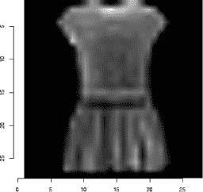
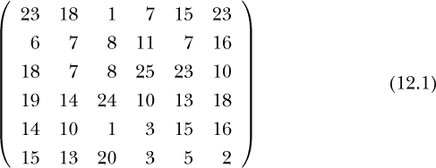
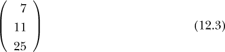
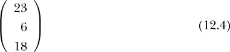
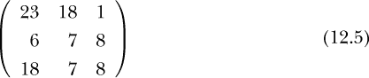
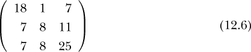
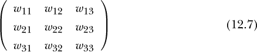
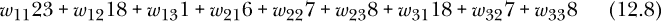
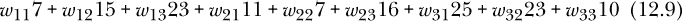

## 第十三章：**图像分类**


神经网络（NNs）最广泛应用的领域可能就是图像分类。事实上，神经网络今天的流行在很大程度上是由于 2000 年代初神经网络在图像分类比赛中的一些惊人成就。早些时候，神经网络领域基本上被视为一种好奇心驱动的技术，而不是主流工具。

神经网络在图像分类中的流行随之产生了反馈效应：神经网络在图像分类中的表现越好，图像分类研究者就越多使用神经网络作为工具，从而使得他们在图像领域中对神经网络的使用更加精细，这又反过来推动了神经网络在比赛中的更多成功。

原则上，本书中的*任何*方法都可以用于图像。特征是像素强度，结果是图像的类别。例如，考虑著名的 MNIST 数据集。这里有 70,000 张手写数字的图像，每张图像有 28 行 28 列的像素。每个像素有一个 0 到 255 之间的强度（亮度）值，我们有 28² = 784 个像素，因此我们有 784 个特征和 10 个类别。

神经网络在图像领域的“秘密武器”是*卷积*操作，这就是*卷积神经网络（CNNs）*这一术语的来源。实际上，这些操作并不完全是新的；它们借鉴了经典的图像处理技术。最重要的是，卷积操作并不是神经网络的固有特性。它们可以与其他机器学习方法结合使用，事实上，一些研究者已经开发了*卷积支持向量机（SVMs）*。但同样，图像领域的动力显然集中在 CNNs 上。

因此，本章关于图像的重点将放在神经网络上。我们将从一个非神经网络的示例开始，目的是说明任何机器学习方法都可以使用，然后再深入讨论 CNNs。

### 12.1 示例：Fashion MNIST 数据

通常使用 MNIST 数据集作为入门示例，但我们这里做点不一样的。Fashion MNIST 数据集与 MNIST 大小相同（28 × 28 像素结构，10 个类别，70,000 张图片），但它包含的是服装的图片（10 种类型），而不是数字。（该数据集可在[*https://github.com/zalandoresearch/fashion-mnist*](https://github.com/zalandoresearch/fashion-mnist)找到。）

一个重要的区别是，虽然 MNIST 可以基本看作是黑白图像，Fashion MNIST 则真正拥有“灰度”。例如，见图 12-1。模糊是由于图像集的低 28 × 28 分辨率造成的。



*图 12-1：Fashion MNIST 图像*

这使得数据集更具挑战性，通常 Fashion MNIST 的准确率要低于 MNIST。

#### ***12.1.1 使用 Logit 模型的首次尝试***

数据集实际上已经分为训练集和测试集（分别为 60,000 和 10,000 行），但为了方便起见，我们只使用训练集，我将其命名为`ftrn`，其中包含列 V1、V2、...、V785。最后一列是衣物类型，值为 0 至 9。

让我们在这些数据上尝试一个逻辑回归模型（顺便说一下，运行这个模型大约花了 2 个小时）：

```
> z <- qeLogit(ftrn,'V785')
> z$testAcc
[1] 0.205
> z$baseAcc
[1] 0.8998305
```

所以，我们的准确率大约是 80%。基线准确率只有大约 10%，这很有道理：10 种衣物类型大致数量相等，所以随机猜测会得到大约 10%的准确率。因此 80%的准确率并不算差。但由于这个数据集在世界纪录中的最佳准确率已经接近 90%以上，我们希望做得更好。

#### ***12.1.2 通过 PCA 进行改进***

我们可以推测，正如上面所说，*p* = 784 太大，需要进行降维。一个可能的解决办法是使用 PCA：

```
> z <- qePCA(ftrn,'V785','qeLogit',pcaProp=0.8)
> z$testAcc
[1] 0.172
```

啊，现在我们的准确率已经达到了大约 83%。（而且运行只花了大约一分钟。）

我们可以尝试不同的主成分数值，但更好的方法可能是利用我们对图像的了解，正如接下来我们将看到的那样。

### 12.2 卷积模型

尽管 CNN 结构一开始看起来可能很复杂，但它实际上基于一些简单的思想。让我们开始吧。

#### ***12.2.1 需要识别局部性***

图 12-1 中的图片模糊不清，这并非巧合。记住，这些是非常低分辨率的图像（28 × 28 像素）。尽管这些图像很小，但它们给我们提供了 784 个特征。假设*n* = 70,000，我们的“”经验法则（公式 3.2）建议最大特征数应为大约 260 个，这明显低于 784 个特征。虽然这个经验法则比较保守——卷积神经网络（CNN）在特征数量*p*远大于*n*的情况下也能表现不错——但显然将 784 个像素当作独立特征来使用，会妨碍我们有效预测新数据。

我们需要利用图像的*局部性*。一个图像像素往往与其相邻的像素存在相关性，这种关系的性质应该有助于我们对图像进行分类。这个像素是短直线的一部分吗？或者是一个小圆圈？*卷积模型*就是考虑到这一点设计的，包含了对图像内小块区域应用的各种操作。这些小块区域通常被称为*瓦片*，我们在这里也将使用这个术语。

#### ***12.2.2 卷积方法概述***

首先，我们来看一下代码，并在 Fashion MNIST 数据集上运行它。之后，我们将解释代码中的操作。我们将使用从 RStudio 示例中改编的代码：

```
# set up 5 image op layers
> conv1 <- list(type='conv2d',filters=32,kern=3)
> conv2 <- list(type='pool',kern=2)
> conv3 <- list(type='conv2d',filters=64,kern=3)
> conv4 <- list(type='pool',kern=2)
> conv5 <- list(type='drop',drop=0.5)

# note that qeNeural() by default sets up two hidden layers; these will
# come after the convolutional ones
> z <- qeNeural(ftrn,'V785',
   conv=list(conv1,conv2,conv3,conv4,conv5),xShape=c(28,28))
> z$testAcc
[1] 0.075
```

啊，现在我们的正确分类率已经超过了 92%。我们几乎肯定可以通过调整超参数（包括更改图像操作层的数量和结构）进一步提高准确率。

我们在这里看到了什么？

+   使用`qeNeural()`的`conv`参数，我们设置了五个图像操作层。

+   图像操作层后面是“普通”层（此处未指定），即`qeNeural()`的默认值为两层，每层 100 个神经元。 “普通”层被称为*密集*层或*全连接*层。

+   第一个图像操作层对输入图像执行卷积操作，涉及提取瓦片并形成每个瓦片内图像强度的线性组合。这些线性组合成为该层的输出。

+   回顾之前的章节，在线性组合中，例如 3*a* − 1.5*b* + 16.2*c*，数字 3、−1.5 和 16.2 被称为*系数*。在卷积神经网络（CNN）中，它们被称为*权重*。

+   通常我们会使用多组不同的权重。`conv2d`参数`filters`指定了我们希望为某一层设置的权重组数。它与密集层中的神经元数量类似。

+   `conv2d`参数`kern`值指定瓦片的大小，第一层中的值 3 意味着 3 × 3 的瓦片。

+   另一个`conv2d`参数`stride`通过指定瓦片与邻域的重叠量来控制图像中瓦片的数量，具体内容将在下文解释。

+   参数`xShape`指定图像的大小，例如当前示例中的 28 × 28。

+   对于此大小的彩色数据，我们会将其表示为 28 × 28 × 3，其中 3 表示基本颜色的数量：红色、黄色和蓝色。我们会有一个 28 × 28 的红色强度数组，然后是黄色和蓝色的数组。然后我们将`xShape`设置为(28,28,3)。

+   第三个坐标 3 被称为*通道*。我们不称其为“颜色”，因为它可能并不是颜色，如下所示。

一层的输出作为下一层的输入，输出的维度可能是 13 × 13 × 64。例如，这将被视为一个 13 × 13 的“图像”，具有 64 种“基本颜色”，这两者都是人为的。关键是，数学上，任何三维数组都可以这样处理，并且这样做使得代码更简洁。（三维或更高维的数组被称为*张量*，因此 Python 包`tensorflow`的名称来源于此。）

#### ***12.2.3 图像切割***

上述代码示例中的第一层和第三层执行了*卷积*操作。（具有概率论、傅里叶分析等背景的读者会发现，该术语在机器学习中的用法与其他领域有所不同。）为了说明这一点，我们首先需要讨论如何将图像分割成瓦片。

考虑一个 6 × 6 的灰度图像示例：



例如，图像中第二行第四列的像素强度为 11。在 R 中，我们会将其存储在一个 6 行 6 列的矩阵中。（R 矩阵类似于数据框，其中元素可以是全数字或全字符等。）

我们可以将其分割为不重叠的 3 × 3 大小的瓦片：


所以，我们的原始矩阵已经被划分为四个子矩阵或块。

我们也可以有重叠的块，使用一个叫做*步幅*的数字。在上述例子中，步幅是 3：右上角块的第一列



它位于方程式 12.2 中的左上角块的第一列右侧 3 列



依此类推。类似的陈述也适用于行。例如，右下角块的第一行距离右上角块的第一行有 3 行。

在步幅为 1 的情况下，假设我们的第一个 3 × 3 的块仍然是



但第二个块将仅位于第一个块的右侧一列



依此类推。

`stride`在`'conv2d'`操作中的默认值是 1。

#### ***12.2.4 卷积操作***

假设我们使用 3 × 3 的块。用矩阵形式表达线性组合的系数也很方便，例如，在权重矩阵中：



对于给定的块：

+   该块在第 1 行第 1 列的元素将与*w*[11]相乘。

+   该块在第 1 行第 2 列的元素将与*w*[12]相乘。

+   . . .

+   该块在第 3 行第 3 列的元素将与*w*[33]相乘。

所有这些乘积将被加总以生成一个单一的数字。

这组权重随后会应用到每个块。将其应用于方程式 12.2 中的左上角块，我们得到单一的数字：



我们对每个块应用相同的权重。例如，将权重应用于右上角的块，我们得到：



我们对左下角和右下角的块做同样的操作，最终得到四个数字，并将它们排列成 2 × 2 矩阵。这个矩阵作为输出传递给下一层。

假设我们有 12 个滤波器。这意味着 12 组不同的权重——也就是说，12 个不同版本的矩阵，如方程式 12.7 所示。这意味着从这一层输出 12 个不同的 2 × 2 矩阵。因此，这一层的输出可以描述为 2 × 2 × 12。确实，这一层的总输出将是 48 个数字，但我们将其视为由 12 组 2 × 2 矩阵组成，因此使用 2 × 2 × 12 的表示法。

注意，我们并不是自己选择这些权重。它们是由神经网络算法选择的，目的是最小化整体的预测平方和。我们选择的是*集合*的数量，这里是 12，但不是具体的集合。算法将尝试许多不同的 12 组权重的组合，期望找到一种最小化预测平方和的组合。

所以……其实并没有什么新奇的地方。我们只是对输入进行线性组合，并将其送入下一层，就像上一章一样。最终，算法最小化的是预测误差的平方和，就像之前一样。

不同之处在于数据被结构化为瓦片，利用了局部性。权重的作用是决定各种像素的相对重要性，尤其是在它们如何协同工作时。

将其想象成一个“建筑物”，它有 12 层。“每层”由四个“房间”组成，房间按两行排列，每行两个房间。我们将在下面采用这种方法。

注意，我们仍然有与稠密层一样的常见偏差-方差权衡：滤波器越多，减少偏差的机会越多，但权重的方差也会增加。

#### ***12.2.5 池化操作***

回忆一下 12.2 节中示例的第二层：

```
conv2 <- list(type='pool',kern=2)
```

这不是一个卷积层；它是一个*池化*层。

池化操作涉及用某些代表性值来替换瓦片中的元素，比如均值、中位数，甚至是瓦片中的最大值。后者实际上是非常常见的，实际上在`regtools`和`qeML`包中就使用了这一方法。

读者可能会想：“池化不就是卷积操作的一种特殊情况吗？例如，在一个 2 × 2 的瓦片中取均值，不就是一个所有权重都为 0.25 的卷积操作吗？”答案是肯定的，但有一个很大的区别：这里的权重固定为 0.25，而不是由算法选择的。

与`conv2d`操作不同，后者的默认步幅是 1，而池化操作的默认步幅是瓦片大小，上文中指定为 2。

#### ***12.2.6 层之间的形状演变***

那么，第二层的输出结构会是什么样的呢？我们来推理一下。这里再次给出前两层的规格：

```
conv1 <- list(type='conv2d',filters=32,kern=3)
conv2 <- list(type='pool',kern=2)
```

第一层的输入是 28 × 28，或者 28 × 28 × 1。第一层将其分成 3 × 3 的瓦片，步幅为 1。就像在方程式 12.2 中有一个 2 × 2 的瓦片阵列一样，这里我们将有一个 26 × 26 的瓦片阵列，同样考虑到步幅为 1。

所以，在第一层中，每个滤波器将输出 26²个数字，形式为 26 × 26。对于 32 个滤波器，第一层的总输出将是 26 × 26 × 32。在“建筑物”隐喻中，这意味着 32 层，每层有 26 行，每行 26 个房间。请注意，这里的每个“房间”都包含一个数字。

那么，第二层会发生什么呢？它将接收 32 个大小为 26 × 26 的瓦片。它会如何处理这些瓦片呢？

如上所述，本层使用的瓦片大小是 2 × 2，步幅为 2。将其应用到一个输入的 26 × 26 的瓦片中，将形成 13 行，每行 13 个 2 × 2 的瓦片。在每个 2 × 2 的瓦片中，将提取 4 个数字中的最大值。

再次使用“建筑”比喻，每一“层”将产生 13² = 169 个数字，排列成 13 × 13 的形式。由于我们有 32 层，“楼层”的总输出将呈现 13 × 13 × 32 的形式。（`regtools`和`qeML`包使用二维池化操作，因此池化操作在每一层内进行，而不是跨层进行。）

#### ***12.2.7 Dropout***

与全连接层一样，过拟合的风险——每个卷积层的神经元太多或卷积层太多——也很高。解决方法是 dropout（丢弃法），例如：

```
> conv5 <- list(type='drop',drop=0.5)
```

这意味着随机删除这一层中 50%的节点。

#### ***12.2.8 形状演化总结***

`keras`包可以根据请求给出我们的 CNN 的总结：

```
> z$model
Model
Model: "sequential"
__
Layer (type)                        Output Shape                    Param #
===============================================================================
conv2d (Conv2D)                     (None, 26, 26, 32)              320
__
max_pooling2d (MaxPooling2D)        (None, 13, 13, 32)              0
__
conv2d_1 (Conv2D)                   (None, 11, 11, 64)              18496
__
max_pooling2d_1 (MaxPooling2D)      (None, 5, 5, 64)                0
__
dropout (Dropout)                   (None, 5, 5, 64)                0
__
flatten (Flatten)                   (None, 1600)                    0
__
dense (Dense)                       (None, 100)                     160100
__
dense_1 (Dense)                     (None, 10)                      1010
===============================================================================
Total params: 179,926
Trainable params: 179,926
Non-trainable params: 0
_
```

回想一下，`qeNeural()`调用了`regtools::krsFit()`，后者又调用了 R 语言中的`keras`包，因此该输出实际上来自后者。

最后一列显示了每一层的权重数量。例如，这里就是 320 个数字的来源：每个滤波器——即每组数字*w**[ij]*——是一个 3 × 3 的矩阵，因此包含 9 个数字。还有一个截距项*w*[0]（类似于线性回归模型中的*β*[0]），所以总共有 10 个权重。由于有 32 个滤波器，因此总共有 320 个权重，正如上面的输出表所示。

`flatten`层仅仅是将我们的*a* × *c*形式转换为普通数据。我们第二个池化层的输出形式是 5 × 5 × 64，总共是 1,600 个数字。为了能被全连接层使用，这些数据会转换成一个长度为 1,600 的单一向量。

总体来说，我们有*p* = 179926，但只有*n* = 65000。所以我们肯定出现了过拟合。事实上，许多类似的模型被发现能有效工作，这在机器学习领域引起了不小的争议！

#### ***12.2.9 平移不变性***

权重结构赋予了*平移不变性*——这是一个看似复杂但实际意义简单的术语——我们分析的工具。假设我们使用 3 × 3 作为我们的瓦片大小，那就是 9 个像素。对于任何瓦片，考虑瓦片左上角的像素。那么无论瓦片位于图像的顶部、底部，还是其他位置，我们都会为该像素使用相同的权重*w*[11]。

以人脸识别为例，这意味着在很大程度上，我们不必担心人脸是在图像的顶部、底部还是中间。（不过，图像边缘的确会出现一些问题，所以这一特性仅近似成立。）对于左右位置也是同样的道理。

### 12.3 行业技巧

那么，究竟该如何构建这些模型呢？多少层？什么样的层？哪些参数值？

可以根据数据集的性质，如图像的各个部分的大小、图像的纹理等，凭直觉设定一些模型。但最终的答案往往是相当平凡的：经过多年的各种架构（配置）实验，这种架构似乎适用于某些类型的图像。一些架构已经成功应用于广泛的场合，以至于它们有了名称并成为标准，比如 AlexNet。

#### ***12.3.1 数据增强***

处理较小图像集的一种方法是*数据增强*。这里的想法很简单：从现有图像中形成新图像。可以将给定图像水平或垂直平移，缩小或放大图像，水平或垂直翻转图像，等等。这样做的动机是，之后我们可能会遇到一个新图像，它与我们训练集中的某个图像非常相似，但它可能在图像框架内的位置较高或较低。我们希望我们的算法能够识别新图像与训练集中的图像相似。

这对于医学组织图像尤其重要，例如来自活检的图像，因为这些图像没有明确的方向感——没有上或下、左或右、前或后。这与 MNIST 图像集不同，例如‘6’是倒置的‘9’，两者是完全不同的。

我们可以使用 `OpenImageR` 包进行数据增强，利用它的 `Augmentation()` 函数。例如，在这个函数中，我们可以执行一个垂直翻转操作：

```
> h18f <- Augmentation(matrix(h18,nrow=28),flip_mode='vertical')
> imageShow(matrix(h18f,nrow=28))
```

`keras` 包也提供数据增强服务，包括*剪切*（扭曲）操作。

#### ***12.3.2 预训练网络***

图像分类领域中的一个大问题是*迁移学习*。问题在于，不是从零开始设计神经网络——密集层、卷积层以及每个层的细节——而是构建在他人已经找到有效的网络上。然后，可以直接使用该网络，或者以该网络为起点进行一些调整。

### 12.4 那么，过拟合问题怎么办？

正如在第 12.2.8 节中指出的，重参数化网络在图像分类中的成功似乎与关于过拟合的传统智慧相矛盾。这已经成为机器学习社区中许多猜测的主题。

一个关键点可能是，图像上下文中的误分类率往往非常低，对于高度调优的网络来说，接近 0。从这个意义上讲，我们实际上处于第十章中提到的*可分离*设置中。通过重新审视该章节中的图 10-4，可以获得对这一问题的某些见解。

如前所述，实际上有无数条线可以用来区分这两类，因此可以用来预测一个新案例。SVM 会选择一条特定的线——即在两类中最接近的两个点之间的中间线——但同样，也可以使用其他许多线。

确实，分隔符不一定非得是直线。它可以是一个“弯曲”的线，例如，通过使用多项式核与支持向量机（SVM）获得的线。由于两类之间有很好的分隔，我们有足够的自由度可以拟合一条非常弯曲的曲线，比如高次多项式。而且次数越高，曲线方程中的系数就越多，也就是说，*p* 的值越大。

结果：我们可以拟合一条曲线，使得 *p* 的值远大于 *n*，但仍然能得到完美的预测准确性。注意到神经网络与多项式回归的关联（参见第 11.9 节），我们对过度参数化在图像分类中成功的原因有了一个合理的解释。

### 12.5 结论

尽管本书的目的是避免写太多方程式，但这里的内容无疑是所有章节中最具数学性的。从一个高层次来看，卷积神经网络（CNN）基于一个非常简单的想法：将图像分割成小块，然后对分块的数据应用神经网络（NN）。但是那句老话“魔鬼藏在细节中”在这里非常贴切。例如，在从一层到另一层的过程中，保持数据块维度的清晰可能是一个挑战。希望进一步深入学习的读者，线性代数和微积分的背景将非常有用。
