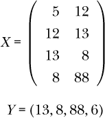

## 第十四章：处理时间序列和文本数据**


*时间序列*是按时间索引的数据集，通常是在规律的时间间隔内。这里有一些熟悉的例子：

+   股票市场数据，包括某个特定股票的每日价格，甚至是每小时的价格，等等

+   天气数据，按天或更细粒度的时间尺度

+   人口统计数据，例如每月或甚至每年出生的人数，用于规划学校的容量

+   测量心脏电活动的心电图数据，通常在规律的时间间隔内采集

一种特殊类型的时间序列是书面或口语的语音数据。在这里，“时间”指的是单词的位置。举个例子，假设我们在句子级别进行工作，一个句子由八个单词组成，那么会有单词 1、单词 2，一直到单词 8，其中索引 1 到 8 起到了“时间”的作用。

时间序列方法学领域已经被统计学家、经济学家等高度发展。像往常一样，机器学习专家们也发展了他们自己的方法，主要是神经网络的应用。被称为*递归神经网络（RNNs）*和*长短期记忆（LSTMs）*的方法尤其值得注意。

统计学和机器学习方法都使用非常精妙和复杂的技术，其数学内容远高于本书的数学水平。然而，即便如此，人们仍然可以在遵循基础原理的同时，构建一些非常强大的机器学习应用，本章将围绕这个主题展开。它将介绍如何将`qe*`-系列函数应用于一般的时间序列问题，以及应用于一种特殊的文本识别设置（这种设置不利用文本的时间序列性质）。

### 13.1 将时间序列数据转换为矩形形式

在讨论机器学习时，人们常听到*矩形数据*和*表格数据*这两个术语，指的是通常的*n* × *p*数据框或矩阵，其中*n*是行数，每行代表一个数据点的*p*个特征。作为一个非时间序列的简单例子，我们在本书中使用过好几次，假设我们尝试通过身高和年龄预测体重，样本量为 1,000 人。那么我们会有*n* = 1000 和 *p* = 2。

显然，“矩形”和“表格”这两个词是指与相关数据框或矩阵的矩形形状或表格结构。但这其实有些误导。图像数据也有类似的形式，例如对于 MNIST 数据，*n* = 70000 和 *p* = 28² = 784，然而图像数据并不被称为矩形数据。

然而，在时间序列的情况下，实际上可以将时间序列转换为矩形形式，然后应用机器学习方法，这也是我们在这里要做的。

#### ***13.1.1 玩具示例***

假设我们的训练集时间序列`x`是（5,12,13,8,88,6）。为了具体说明，假设这是每日数据，那么我们这里有六天的数据，分别称为第 1 天、第 2 天，依此类推。在每一天，我们知道截至当前的序列值，并希望预测第二天的值。

我们将使用一个*滞后*值为 2，这意味着我们通过前两天的数据来预测某一天。在上面的 `x` 中，这意味着我们：

+   根据第 5 天和第 12 天预测第 3 天

+   根据第 12 天和第 13 天预测第 4 天

+   根据第 13 天和第 8 天预测第 5 天

+   根据第 8 天和第 88 天预测第 6 天

想想上面描述的内容（“预测第 13... ”）在我们通常的“X”（特征矩阵）和“Y”（结果向量）符号中意味着什么：



请注意，X 只有 4 行，不是 6 行，而 Y 的长度是 4，不是 6。这是因为我们有 2 的滞后；我们需要 2 个先前的数据点。因此，在第 3 天之前我们甚至无法开始分析。

在这里我们只处理*单变量*时间序列。但我们也可以处理多变量情况——例如，根据先前的值预测每日的温度、湿度和风速。

#### ***13.1.2 regtools 函数 TStoX()***

函数`TStoX()`做的就是它的名字所暗示的——将时间序列转换为“X”矩阵。“Y”也会创建并返回在最后一列。对于之前的示例，我们有：

```
> x <- c(5,12,13,8,88,6)
> w <- TStoX(x,2)
     [,1] [,2] [,3]
[1,]    5   12   13
[2,]   12   13    8
[3,]   13    8   88
[4,]    8   88    6
```

我们的“X”数据位于前两列，而“Y”则是第三列。

该函数返回一个矩阵，如果需要，我们可以将其转换为数据框：

```
> wd <- as.data.frame(w)
> wd
  V1 V2 V3
1  5 12 13
2 12 13  8
3 13  8 88
4  8 88  6
```

然后我们可以使用任何一个`qe*`系列的函数，例如随机森林：

```
qeRF(wd,'V3',holdout=NULL)
```

换句话说，除了一个例外，其他一切与之前一样：我们不能将 holdout 集作为数据的随机子集，因为剩下的数据将不再是连续时间段的数据。我们将很快详细说明这一点。

### 13.2 `qeTS()` 函数

但是，和上面一样，我们不需要手动调用 `qeRF()`，我们有一个方便的包装函数 `qeTS()`，它将时间序列格式转换为“X，Y”形式，然后应用我们最喜欢的机器学习方法。包装函数的调用形式是：

```
qeTS(lag,data,qeName,opts=NULL,
   holdout=floor(min(1000, 0.1 * length(data))))
```

这里 `qeName` 是一个 `qe*` 系列函数的引用名——例如，`'qeRF'`。

参数 `opts` 允许我们使用被引用函数的非默认版本的参数。例如，要使用 k-NN 并将 *k* 设置为 10，可以这样写：

```
> eus <- EuStockMarkets  # built-in R dataset
> tsout <- qeTS(5,eus,'qeKNN',opts=list(k=10))  # use k-NN with k = 10
```

需要对 `holdout` 做一些说明。虽然它在 `qe*` 系列中发挥着常规作用，但需要注意的是，在时间序列上下文中，交叉验证通常是困难的。我们不能随机从数据中选择一些数字作为我们的 holdout 集，因为在时间序列中，我们是通过前一个时间点的数据预测当前数据。但是在这里，我们对 `TStoX()` 的输出进行 holdout 操作，其输出*是*一组连续值的行，因此这是有效的。

### 13.3 示例：天气数据

在这里，我们将使用由 NASA 收集的一些天气时间序列数据，这些数据包含在 `regtools` 中。

```
> data(weatherTS)
> head(weatherTS)
     LON       LAT YEAR MM DD DOY   YYYYMMDD  RH2M   T2M PRECTOT
1 151.81 -27.47999 1985  1  1   1 1985-01-01 48.89 25.11    1.07
2 151.81 -27.47999 1985  1  2   2 1985-01-02 41.78 28.42    0.50
3 151.81 -27.47999 1985  1  3   3 1985-01-03 40.43 27.53    0.03
4 151.81 -27.47999 1985  1  4   4 1985-01-04 46.42 24.65    0.10
5 151.81 -27.47999 1985  1  5   5 1985-01-05 50.77 26.54    2.13
6 151.81 -27.47999 1985  1  6   6 1985-01-06 58.57 26.81    5.32
```

最后一列是降水量。让我们为它拟合一个模型，然后根据第 4016 天和第 4017 天的数据，预测数据结束后的第一天，即第 4018 天：

```
> ptot <- weatherTS$PRECTOT
> z <- qeTS(2,ptot,'qeRF',holdout=NULL)
> length(ptot)
[1] 4017
> predict(z,ptot[4016:4017])
       2
1.087949
```

因此，我们预测降雨量略多于 1 英寸。

我们这里使用了 2 天的时滞。其他时滞值会如何表现呢？我们可以在这里使用`qeFT()`，但事情有点复杂。例如，`qeTS()`没有`yName`参数，所以我们改用`replicMeans()`（参见第 3.2.2 节）。

如何用 1 的时滞而不是 2？我们调用`replicMeans()`，要求它执行

```
> qeTS(1,ptot,"qeKNN")$testAcc
```

进行 1,000 次实验，然后报告得到的 1,000 个`testAcc`值的平均值：

```
> replicMeans(1000,'qeTS(1,ptot,"qeKNN")$testAcc')
[1] 2.116511
```

这给我们带来了 2.12 的均方预测误差。这算好吗？像往常一样，让我们将其与仅用均值进行预测的效果进行比较：

```
> mean(abs(ptot - mean(ptot)))
[1] 2.626195
```

啊，我们开始有了进展。

那么其他时滞怎么样？

```
> replicMeans(1000,'qeTS(1,ptot,"qeKNN")$testAcc')
[1] 2.116511
> replicMeans(1000,'qeTS(2,ptot,"qeKNN")$testAcc')
[1] 2.051895
> replicMeans(1000,'qeTS(3,ptot,"qeKNN")$testAcc')
[1] 2.033376
> replicMeans(1000,'qeTS(4,ptot,"qeKNN")$testAcc')
[1] 2.067625
> replicMeans(1000,'qeTS(5,ptot,"qeKNN")$testAcc')
[1] 2.092022
> replicMeans(1000,'qeTS(6,ptot,"qeKNN")$testAcc')
[1] 2.085409
> replicMeans(1000,'qeTS(7,ptot,"qeKNN")$testAcc')
[1] 2.093377
> replicMeans(1000,'qeTS(8,ptot,"qeKNN")$testAcc')
[1] 2.118068
> replicMeans(1000,'qeTS(9,ptot,"qeKNN")$testAcc')
[1] 2.135797
> replicMeans(1000,'qeTS(10,ptot,"qeKNN")$testAcc')
[1] 2.157187
```

确实，时滞似乎会有一些影响。3 天的时滞似乎是最好的，尽管像往常一样，我们必须记住采样变异的影响。（`replicMeans()`函数还提供了标准误差，这里没有显示。）

如何尝试一些其他的机器学习方法呢？让我们考虑一个线性模型，因为大多数经典的时间序列方法都使用线性模型：

```
> replicMeans(1000,'qeTS(3,ptot,"qeLin")$testAcc')
[1] 2.245138

> replicMeans(1000,'qeTS(3,ptot,"qePolyLin")$testAcc')
[1] 2.167949
```

如前所述，经典的时间序列方法，例如*自回归*模型，是线性的。我们看到，线性模型在这个特定数据集上效果并不理想。拟合多项式可以显著改善结果，但仍然不如 k-NN。

或许是随机森林？

```
> replicMeans(1000,'qeTS(3,ptot,"qeRF")$testAcc')
[1] 2.138265
```

它仍然不如 k-NN。然而，通过调整超参数，在这两种情况下，任一方法都可能最终成为胜者。

### 13.4 偏差与方差

时滞的值会影响偏差和方差，尽管这种影响可能是复杂的。

较大的时滞显然增加了偏差；过去较远时间段的相关性可能较低。这类似于 k-NN 中较大*k*的问题。

另一方面，方差方面是棘手的。较大的时滞平滑了日常（或其他时间段）变化——即减少了方差。但较大的时滞也增加了*p*，即特征的数量，从而增加了方差。整体效果因此是复杂的。

### 13.5 文本应用

文本分析领域非常复杂，类似于图像识别领域。正如后者的情况一样，在本书中，我们只能浅尝辄止，主要从两个方面进行介绍：

+   我们将限制在文档分类领域，而不是比如说，语言翻译。

+   我们将限制在词袋模型（请参见下一节）。该方法仅依赖于各种单词在文档中出现的频率，而不依赖于单词出现的顺序。

因此，我们没有涵盖诸如前述的*循环神经网络（RNNs）*等高级方法，甚至更高级的方法，如*隐马尔可夫模型（HMMs）*。

#### ***13.5.1 词袋模型***

假设我们希望自动分类报纸文章。我们的软件发现某些文档中包含了*bond*和*yield*这两个词，并将其分类为金融类别。

这是*袋装词模型*。我们决定一组词语，即“词袋”，并计算每个词语在每个文档类别中出现的频率。这些频率通常存储在*文档-词项矩阵（DTM）*中，`d`。`d[i,j]`表示在训练集中，词语`j`出现在文档`i`中的次数。或者，`d[i,j]`可能仅为 1 或 0，表示词语`j`是否出现在文档`i`中。

矩阵`d`则成为我们的“X”，而“Y”是类别标签的向量，比如金融、体育等。X 的每一行表示我们对一个文档的数据，Y 中有一个对应的标签。

这仍然是一个简单的模型。如果我们猜测上面的文档属于金融类别，可能会不准确。例如，如果文档中有一句话写着：“家庭成员之间的纽带通常会产生稳定的家庭环境。” 更复杂的分析会考虑到*纽带*和*产生*之间的词语。袋装词模型在某些情况下可能不如基于时间序列的方法准确。然而，它易于实现，并且在许多应用中表现良好。

#### ***13.5.2 qeText()函数***

当然，也有一个`qeML`函数来处理这个，`qeText()`。它的调用形式如下：

```
qeText(data, yName, kTop = 50, stopWords = tm::stopwords("english"),
    qeName, opts = NULL, holdout = floor(min(1000, 0.1 * length(data))))
```

在`data`参数中，假定每个文档占一行，由`yName`指示每个文档的类别，如金融；另一列（必须正好有两列）存储文档文本。参数`qeName`指定要使用的 ML 方法，`opts`则指定该方法的可选参数。术语*停用词*指的是一些不太重要的词语，如*the*和*is*，这些词会被忽略。

`kTop`参数的作用如下：软件对训练数据中文档中的所有词语进行普查，选择最频繁的`kTop`个词语作为特征。

#### ***13.5.3 示例：测验数据***

`qeML`包有一个内置的数据集，名为`quizzes`，包含我在各种课程中给出的测验文本。人们可能会问，是否能根据文本预测课程。

```
> data(quizzes)
> str(quizzes)
'data.frame':   143 obs. of  2 variables:
 $ quiz  : chr  " Directions: Work only on this sheet (on both sides,
...
...
 $ course: Factor w/ 5 levels "ECS132","ECS145",..: 3 3 3 3 3 3 3 3 3 3 ...
```

共有 143 个测验文档。其中第八个文档将有测验文本存储在`quizzes[8,1]`中，作为一个非常长的字符字符串：

```
> quizzes[8,1]
...
...
largest thread number.  The code with print out
...
...
```

课程编号在`quizzes[8,2]`中：

```
> quizzes[8,2]
[1] ECS158
Levels: ECS132 ECS145 ECS158 ECS256 ECS50
```

这是 ECS 158，平行计算导论。

作为示例，假设我们不知道该文档的类别，尝试使用随机森林来预测：

```
> z <- qeText(quizzes,qeName='qeRF')
holdout set has  14 rows

> predict(z,quizzes[8,1])
$predClasses
[1] "ECS158"
$probs
   ECS132 ECS145 ECS158 ECS256 ECS50
11  0.062  0.066  0.812  0.002 0.058
```

预测的课程是 ECS 158。

#### ***13.5.4 示例：AG 新闻数据集***

这个数据集由四个类别的短新闻文章组成：世界、体育、商业和科技。可以从 CRAN 包`textdata`中获得，该包提供了下载各种文本数据测试库的接口：

```
> library(textdata)
> ag <- dataset_ag_news()
Do you want to download:
 Name: AG News
...
> agdf <- as.data.frame(ag)  # qe-series functions require data frames
> agdf[,1] <- as.factor(agdf[,1])  # qe requires a factor Y
```

让我们四处看看：

```
> dim(ag)
[1] 120000      3
> agdf[28,]  # for example
      class                           title
28 Business HP shares tumble on profit news
                                      description
28 Hewlett-Packard shares fall after disappointing third-quarter profits,
while the firm warns the final quarter will also fall short of expectations.
```

这里有大量数据，共有 120,000 个文档。嗯，也许*太*多了，因为运行时间可能会很长。为了快速示范，我们只取 10,000 行：

```
> smallSet <- sample(1:nrow(agdf),10000)
> agdfSmall <- agdf[smallSet,]
```

那么，我们试着拟合一个模型，比如 SVM：

```
> w <- qeText(agdfSmall[,c(1,3)],'class',qeName='qeSVM')
holdout set has  1000 rows
Loading required namespace: e1071
> w$testAcc
[1] 0.461
> w$baseAcc
[1] 0.7403333
```

还不错。我们将基础误差从 74% 降低到了 46%。虽然后者仍然相对较高，因此接下来我们会尝试调整 SVM 超参数。请注意，`kTop` 也是一个超参数！我们应该也尝试不同的值。

### 13.6 总结

我们可以看到，即使没有高级方法，也可能能够为时间序列和文本数据拟合出良好的预测模型。在这两种情况下，`qe*`-series 函数 `qeTS()` 和 `qeText()` 使我们能够方便地使用我们喜爱的机器学习方法。
